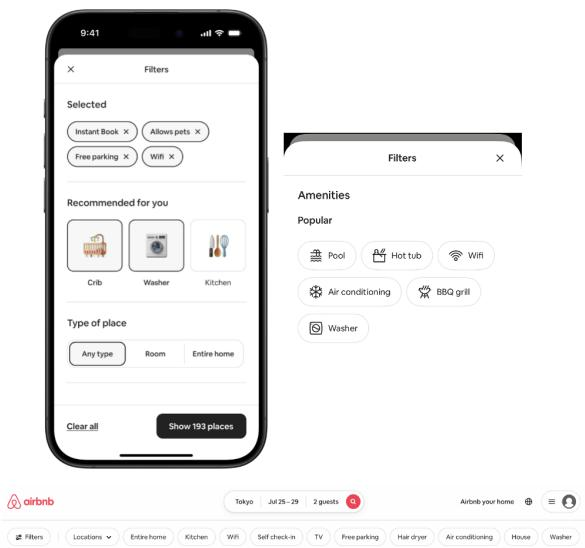
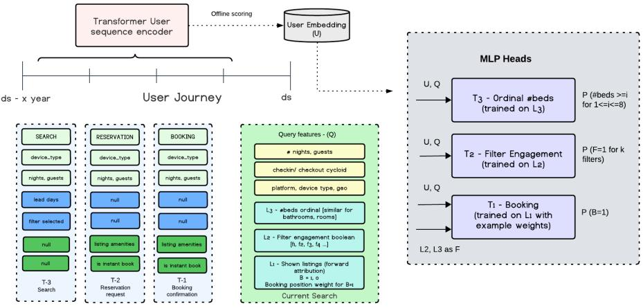
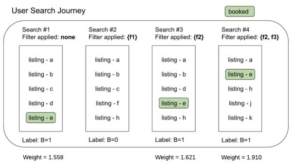

# SIFT: Search Intent-to-Filter Transformer for Multi-Task Personalized Filter Ranking at Airbnb

Shashank Dabriwal Airbnb San Francisco, USA shashank.dabriwal@airbnb.com

Yiwei Wang   
Airbnb   
San Francisco, USA   
yiwei.wang@airbnb.com   
Tanya Piplani   
Airbnb   
San Francisco, USA   
tanya.piplani@airbnb.com   
Ashish Jain   
Airbnb   
San Francisco, USA   
ashish.jain@airbnb.com   
Hao Li   
Airbnb   
San Francisco, USA   
hao.li@airbnb.com   
Kedar Bellare   
Airbnb   
San Francisco, USA   
kedar.bellare@airbnb.com

Stephanie Moyerman Airbnb San Francisco, USA stephanie.moyerman@airbnb.com

## Abstract

Search filters help guests navigate vast catalogs in two-sided market- places like Airbnb, and recommending the right filters can meaning- fully lift booking conversion. Many such production filter-ranking systems, however, represent the guest through hand-engineered, pre-aggregated features generated by ETL pipelines. This makes it expensive to maintain and dificult to extend for new filter types or contextual dimensions (trip length, group size).

We present SIFT (Search Intent-to-Filter Transformer), a ranking model built on transformers that learns guest preferences directly from raw behavioral sequences. SIFT replaces manual feature en- gineering with a unified guest representation that feeds multiple prediction tasks, including booking likelihood, filter engagement, and ordinal capacity thresholds (e.g., 2+ bedrooms) — a general framework for filter ranking in two-sided marketplaces that accom- modates both boolean and numeric-range filter types. Extending SIFT to new filters requires only adding a new head, not a new feature pipeline. To keep serving fast, this guest representation is computed ofline on a daily cadence rather than at request time.

Ofline, SIFT improves booking and amenity-engagement PR-AUC by +51.9% and +62.8% respectively over the production baseline. In online A/B testing, SIFT increased engagement with rec- ommended filters by +20.0%, overall filter usage among searchers by +0.72%, and usage of the newly-supported bedroom, bathroom, and bed filters by +3.9%, +10.7%, and +0.52% respectively. Demonstrating the system’s extensibility, we rapidly integrated a novel hotel-intent filter using the same shared representation, driving a +3.8% lift in uncancelled hotel bookings and a +0.76% lift in overall marketplace bookings. SIFT is now fully deployed in production, serving scalable personalization to millions of guests.

## CCS Concepts

• Information systems → Recommender systems; Personalization; • Computing methodologies → Multi-task learning.

## Keywords

Filter ranking, Multi-task learning, Transformer, Sequence modeling, Personalization, Two-sided marketplace

ACM Reference Format: Shashank Dabriwal, Tanya Piplani, Hao Li, Yiwei Wang, Ashish Jain, Kedar Bellare, and Stephanie Moyerman. 2026. SIFT: Search Intent-to-Filter Trans former for Multi-Task Personalized Filter Ranking at Airbnb.

## 1 Introduction

The Airbnb accommodation search exposes guests to millions of listings that span various types of property, amenities, and price ranges. A guest’s initial query carries only coarse intent – a destination, a date range, a party size—while the preferences that actually determine which listings are acceptable often go unstated. Search filters are the mechanism through which these latent preferences become explicit, and previous work established that proactively rec-ommending filters, rather than leaving their discovery to the guest, drives incremental booking conversion of up to +2.4% [1]. Filter recommendation is therefore not a peripheral interface concern, but a lower-funnel ranking problem on its own.

The production system that established this result scores filters with a two-layer MLP over hand-engineered, pre-aggregated user features – counts such as “number of times a guest searched and then booked with a given filter over trailing 30 days”, computed by nightly batch jobs. The design has served the surface well and remains inexpensive to operate, but it has reached the limits ofwhat an aggregate-feature representation can express, and its two-head architecture covers only a subset of the filters guests actually use. We pair each limitation below with the mechanism SIFT introduces to address it.

• Feature brittleness and compute cost. Every new fil-ter type requires new features, and every new aggregate requires its own CPU-bound pipeline to author, backfill, and maintain. The same cost recurs even without a new filter: re-cutting an existing aggregate — such as the 30-day search-then-booked count above — along a new contex- tual dimension (e.g., trip length, group size) also requires a new pipeline. Expansion is gated by ETL throughput rather than by modeling capacity. SIFT removes this dependency: its sequence encoder consumes raw events and contextual attributes directly, so a new filter type or contextual di- mension requires a new head or token feature, not a new pipeline.

  
Figure 1: Recommending filters in “Recommended for you” and “Amenities” section in filter panel and beneath the search bar.

• Temporal blindness. An aggregate collapses a behavioral sequence into a scalar. It cannot distinguish a guest’s re-cent drift in preference from their multi-year average, and because it discards event order it cannot represent that a particular sequence of filtered searches culminated in a booking. SIFT’s journey encoder preserves order and re-cency and attends selectively over past events.

• Ordinal collapse. The incumbent heads model booking likelihood and binary amenity engagement only; the nu- meric capacity filters (beds, bedrooms, bathrooms) are un modeled entirely. Folding them into a multi-label engage- ment head would treat "2 bedrooms" and "5 bedrooms" as unrelated classes, discarding the ordering that makes them predictable and forcing each value to be learned in dependently. SIFT instead uses an ordinal decomposition that predicts a threshold ("at least two bedrooms") rather than an unordered class, sharing statistical strength across values via monotonically-constructed training labels.

• Credit assignment. A booking that follows a filtered search is not necessarily caused by the filter. Treating all postfilter bookings as equally positive teaches the model to predict that a guest books, not that a filter helped them book, biasing the objective toward globally popular fil- ters that merely co-occur with high-intent sessions. SIFT’s attribution-discountedbooking objective reweights each booking by the search-result rank of the booked listing, up- weighting conversions plausibly attributable to the filter’s efect on the result set.

Sequence modeling over raw event histories is the established remedy for the first two limitations, and at Airbnb the Journey- Former framework [2] already produces such journey-level guest representations for accommodation search listing ranking. SIFT is, to our knowledge, the first system to bring them to filter ranking; §2 situates this against prior work on filter ranking and sequential user modeling.

Concretely, SIFT trains a journey encoder end-to-end over the guest’s full event stream jointly with three types of discriminative task heads that share the resulting representation. The filter- ranking setting makes this factorization unusually favorable: the candidate space is a small, fixed, fully enumerable filter vocabulary rather than a catalog of millions, and—critically—only one of the three task types depends on the candidate filter at all, engagement and capacity being properties of (guest, query) alone. We develop how SIFT exploits this in §7.

In summary, this work makes the following contributions.

• Framework. We propose a personalized filter-ranking framework built on a single shared journey representation learned from raw events rather than maintained aggregates. It jointly optimizes binary booking prediction, multi-label amenity engagement, and ordinal prediction for numeric capacity filters, and ranks candidates by the product of book- ing and engagement probability, so that a recommended filter is judged by its contribution to conversion rather than by engagement alone. Because personalization is decoupled from query and filter signals, the framework extends to new filter types without new feature engineering—a property we validate in §8.4 by extending it to a previously unmodeled hotel-intent class.

• System. We detail how SIFT is served within a search request’s latency budget. Decoupled embedding materialization keeps encoder inference of the request path entirely: a daily incremental batch job refreshes embeddings only for guests with new eligible events and writes them to a key-value store. Asymmetric head factorization then scores the two query-conditioned head types once per request while scoring only the filter-conditioned booking head per candidate. We also address cold start, where guests with no history resolve to a learned cold-state embedding rather than a hardcoded default one.

• Empirical validation. SIFT improves booking PR-AUC by +51.9% and amenity-engagement macro PR-AUC by +62.8% over the production MLP baseline, and models three capacity filters the baseline cannot express. Online, filter en- gagement rises substantially (+20.0% Recommended Filter Clickers, +0.72% Searchers With Filters overall, and +10.7%, +3.9%, +0.52% for Bathroom, Bedroom, and Beds filter usage respectively) and the low-inventory guardrail improves. Extended to a new hotel-intent filter signal that targets Hotel Megaphone — a promotional banner on the search page ofering hotel credits to guests with inferred hotel intent — the same framework lifts uncancelled hotel bookings by

+3.8% online and overall marketplace bookings by +0.76%.

While this study is grounded in Airbnb, the underlying problem— matching diverse inventory to needs inferred from a user’s history, in service of a lower-funnel objective such as booking—is common to marketplaces that log user behavior and expose many filters spanning heterogeneous intents. The mechanisms we describe are correspondingly general.

The rest of the paper is organized as follows. Section 2 reviews related work. Section 3 motivates the shift from aggregated features to sequence modeling. Section 4 formalizes the filter-ranking prob- lem and its three sub-tasks. Section 5 presents SIFT’s architecture. Section 6 describes training data construction, label attribution, and cold-start handling. Section 7 covers the serving system. Section 8 reports ofline results, online A/B results, an ablation study, and the hotel-intent generalization study. Section 9 discusses limitations, and Section 10 concludes.

## 2 Related Work

We discuss related work from two key areas of focus: 1) faceted and filter-based search, and 2) sequence-based recommendation models.

Faceted and filter-based search. Facets have been studied for two decades as an interface for exploratory information seeking, where the central question is which facets to expose, and in what order, so that users can navigate a large collection without formu- lating a precise query [10, 11]. A substantial line of work formalizes facet selection as an optimization over the current result set: dy- namic faceted retrieval selects facets that partition the candidate set informativel at scale [12], while efort- and cost-driven formu lations select the facet sequence that minimizes a user’s expected navigational cost to reach a target item [13, 14]. What unites these approaches is that the objective is a property of the result set and of the cost of traversing it; the identity of the searcher does not enter the formulation, and two users issuing the same query receive the same facets. Recent work recast filter selection at Airbnb as a supervised learning problem optimized against downstream conversion rather than navigational eficiency [1]—the direct baseline, whose representational and coverage limits §1 details. SIFT departs from both traditions by conditioning the scoring function on the guest’s accumulated behavioral history: two guests issuing an identical query over an identical result set receive diferent filter slates. Filter selection becomes a personalization problem rather than a result-set summarization problem, and the relevant question shifts from which facets best partition the candidates to which filters this guest is likely to apply and to convert under.

Sequence-based recommendation models. SASRec [8] showed that causal self-attention over a user’s interaction history out- performs Markov-chain and convolutional sequence models, and BERT4Rec [9] obtained further gains from bidirectional encoding under a masked-item objective. The consistent finding is that learned sequence representations recover order and recency struc- ture that pre-aggregated features discard by construction – the property that motivates replacing the baseline’s aggregate features (§1). Industrial ranking systems have since adopted sequence encoders as components of larger architectures [6, 7], and Airbnb’s JourneyFormer framework [2] scales the idea to journey-level modeling, encoding a long-horizon sequence of infrequent high-intent events alongside a short-horizon sequence of recent page views and compressing both into a single guest embedding.

Table 1: Guest-level filter preference drift between two dis- joint, season-matched twelve-month periods.
<table><tr><td>Metric Value</td></tr><tr><td>Top-1 filter disagreement rate 60-65%</td></tr><tr><td>Avg. top-5 filter set overlap 53% (2.65 / 5)</td></tr><tr><td>Guests sharing ≤2 of top-5 filters 44%</td></tr></table>

## 3 Motivating Analysis

Temporal Drift in Filter Preferences. We first measure how much an individual guest’s filter preferences actually change over time, using production search logs spanning a range of trailing aggregation windows of filtered search and booking activity. Naive comparisons across diferent-length windows are confounded by window overlap and seasonality, so we isolate two fully disjoint, season-matched twelve-month periods per guest and compare fil- ter usage between them. All results below are robust to exclud- ing automated/bot trafic and to restricting to filters with stable population-level volume across both periods.

A majority of guests’ single most-used filter changes between the two disjoint years (Table 1), and this holds even when looking at a guest’s entire top-5 filter set rather than just their single top choice.

This instability is specific to which filter a guest prefers, not to how well that filter converts once applied. Population-level Filter Conversion Rate (FCR) — the share of searches with a given filter that end in a bookin — moves far less than filter reference does across the same two years (Table 2). Together, these findings show that engagement preference changes far more rapidly than conver- sion value does, and even conversion value’s residual instability is concentrated in a subset of low-volume filters rather than spread evenly (the unweighted average change, 35.5%, exceeds the volumeweighted average, 24.2%, and the largest single swing observed is 88.3%). A static, fixed-window aggregate has no mechanism to track either kind of drift at the granularity an individual guest requires, which motivates a sequence encoder that can adapt to both.

Individual cases illustrate the mechanism: several guests’ top ordinal capacity filter persists in type but shifts to a larger thresh- old across years (e.g. a minimum-bedroom or minimum-bed filter increasing) — consistent with a growing travel party — while others show a filter newly entering their top-used set with no prior usage at all, such as the crib amenity filter becoming a guest’s most-used filter after a year of zero use. Fixed-window aggregates can only detect such a shift by manually diferencing two separately- maintained windows, and even then only learn that usage changed sometime within the year, not how recently. A sequence model conditioned on ordered event history recovers that recency directly, distinguishing a guest whose crib searches started three days ago from one whose searches have been steady for ten months.

Table 2: Population-level FCR drift over the same two disjoint years, measured as |relative FCR change| per filter.
<table><tr><td>Metric Value</td></tr><tr><td>Volume-weighted average 24.2%</td></tr><tr><td>Unweighted average 35.5%</td></tr><tr><td>Maximum observed 88.3%</td></tr><tr><td></td></tr></table>

## 4 Problem Formulation

Let � denote a guest, � a search query (destination, dates, guest count, etc.), and let � denote a candidate filter state: the multi-hot vector of 31 boolean amenity flags (e.g., Pool, Wifi), and numeric range filters $f _ { k } \in \{ \mathrm { B E D S } $ , Bedrooms, Bathrooms} that take integer values from 1 to $K _ { k }$

We wish to learn a scoring function $s ( u , q , f )$ that ranks each candidate filter $f \in { \mathcal { F } }$ by its expected utility—i.e., its contribution to booking conversion if surfaced. We decompose this into three sub-tasks:

• T1 — Booking: $P ( B { = } 1 \mid u , q , f )$ , the probability that the session results in a booking when filter � is applied.

• T2 — Engagement: $P ( E _ { f } = 1 \mid u , q )$ for each amenity filter $f ,$ whether the user applies filter � at all.

• T3 — Ordinal value: $P ( V _ { k } \ge v \mid u , q )$ for each threshold � ∈ $\{ 1 , \ldots , K _ { k } - 1 \}$ of numeric filter �, capturing the minimum acceptable value (e.g., at least 2 bedrooms).

The final ranking score multiplies the booking head’s output with the corresponding engagement probability: for a boolean amenity filter, � (engage with $f \mid u , q ) = P ( E _ { f } { = } 1 \mid u , q )$ directly from T2; for a threshold � of numeric filter � (e.g., beds ≥ 2), the exact-value probability is recovered from T3’s adjacent cumulative outputs by subtraction:

� (engage with $f \mid u , q ) = P ( V _ { k } \ge v \mid u , q ) - P ( V _ { k } \ge v + 1 \mid u , q )$

The final ranking score is then

$$
s ( u , q , f ) = P ( B { = } 1 \mid u , q , f ) \cdot P ( \mathrm { e n g a g e ~ w i t h ~ } f \mid u , q )
$$

so that a filter is ranked highly only if the guest is both likely to apply it and likely to book as a result.

## 5 Model Architecture

Figure 2 illustrates the overall pipeline: a transformer SIFT Encoder consumes a guest’s raw event sequence to produce a user embed- ding, materialized daily; a Feature Assembly layer combines that embedding with the current query and candidate filter features; and three types of Task-Specific MLP Heads $( T _ { 1 }$ booking, $T _ { 2 }$ engagement, $T _ { 3 }$ ordinal capacity) score the result.

## 5.1 Architecture

A transformer encoder, trained jointly end-to-end with all three head types, consumes a single chronological sequence of a guest’s past searches (with filter applied and other context) and reservation related events. Each token’s raw features are first summed with a standard sinusoidal positional encoding [4], then projected into the encoder’s model dimension via a compression MLP (1024→ $5 1 2 {  } 2 5 6 {  } 1 2 8 $ , swish activations) before self-attention. It uses a single self-attention layer (4 heads, head dimension 32, model dimension �=128). The encoder output is compressed by a further MLP projection (512→128→32) into a contextual user embedding $\mathbf { e } _ { u } \in \mathbb { R } ^ { 3 2 }$ taken from the final sequence position. This embedding feeds three types of task-specific two-layer MLP heads with swish activations: a booking head, an amenity-engagement head, and an ordinal head for each numeric capacity filter (beds, bedrooms, bathrooms). The ordinal heads use the Frank & Hall ordinal decomposition [5] (�−1 binary sub-classifiers per filter, illustrated in Figure 4). The model is trained with a joint multi-task loss (§5.4) using position-discount sample weights $w _ { i } = 1 + 1 / \mathrm { l n } ( \mathrm p \mathrm { o s } _ { i } + 1 )$ applied to the booking head’s loss, where pos is the rank of the booked listing in the search results returned after the candidate filter was applied—upweighting bookings more plausibly attributable to the filter itself rather than chance (Figure 3). The full model with the encoder and all three head types is trained jointly end-to-end with the Adam optimizer $( \beta _ { 1 } { = } 0 . 9 , \beta _ { 2 } { = } 0 . 9 8 , { \epsilon } { = } 1 0 ^ { - 9 } )$ under a Transformer- style warmup + inverse-square-root decay learning-rate schedule, batch size 512, using Horovod-distributed data-parallel training on 20 GPUs in ≈12 hours. Figure 2 shows SIFT’s complete training data construction and multi-task architecture.

## 5.2 SIFT Encoder (User Sequence Modeling)

SIFT’s encoder consumes a guest’s raw event history — searches with filters applied, reservation requests, booking confirmations, and cancellations — as a single chronological sequence. These event types carry diferent, only partially-overlapping sets of attributes, so a single encoder cannot consume them directly without first putting them into a common representation. We adopt a PinnerFormerstyle [3] token schema: every event, regardless of type, is encoded into the same fixed-width dense feature vector, composed of shared segments (an action-type indicator; platform and device type; and trip context such as check-in/check-out dates — cyclically encoded via sine/cosine transforms of month, day-of-month, and day-of- week to preserve periodicity across year/month/week boundaries – and guest count) followed by event-type-specific segments (search-specific: destination, lead time, filter values applied; reservation- specific: instant-book flag, and listing attributes such as capacity, amenities). Segments that do not apply to a given event’s type are null-padded rather than omitted, so every token occupies an identi- cal schema and can be consumed by a single shared encoder without a per-action-type input branch. Recency is captured through po-sitional encoding and event order. The transformer self-attention mechanism learns to weight historically relevant events when pro- ducing the fixed-size user embedding $\mathbf { e } _ { u } \in \mathbb { R } ^ { d }$

## 5.3 Feature Assembly

The user embedding $\mathbf { e } _ { u }$ and query features q are common inputs shared by all three head types. The booking head additionally re- ceives candidate filter features $\mathbf { f } _ { c } ,$ since $P ( B { = } 1 \mid u , q , f )$ depends on which specific filter is being scored, while the engagement and ordinal heads do not:

$$
\mathbf { x } _ { T 1 } = [ \mathbf { e } _ { u } \parallel \mathbf { q } \parallel \mathbf { f } _ { c } ] , \qquad \mathbf { x } _ { T 2 } = \mathbf { x } _ { T 3 } = [ \mathbf { e } _ { u } \parallel \mathbf { q } ]\tag{1}
$$

  
Figure 2: SIFT training data construction and multi-task architecture. Each guest’s historical actions — search, reservation-request, and booking-confirmation events, each tokenized from discrete, null-padded features — form a time-ordered sequence spanning the guest’s journey up to the current date, consumed by a transformer encoder that produces a user embedding $\textit { U } ( \mathbf { i . e . } \mathbf { e } _ { u } ) ,$ computed ofline in a daily scoring job and cached in an embedding store. At inference and training time, � is combined with the current search session’s query features $Q ,$ along with the candidate filter’s label context $L _ { 2 }$ (multi-hot engagement) and $L _ { 3 }$ (ordinal capacity) — to feed three types of task-specific MLP heads: $T _ { 1 }$ (booking probability $P ( B { = } 1 )$ , trained on forward-attributed booking labels $L _ { 1 }$ with position-discount example weights), �2 (per-filter engagement probability $P ( F _ { k } { = } 1 )$ trained on $L _ { 2 } )$ , and $T _ { 3 }$ (one ordinal head per numeric capacity filter, each predicting �(#beds ≥ �)-style thresholds, trained on $L _ { 3 } )$

Query features include destination geo embedding, number of nights, number of guests, lead time, cycloid checkin/checkout times, and device/platform indicators. Candidate filter features $\mathbf { f } _ { c }$ are a multi-hot vector over the boolean amenity flags together with the candidate ordinal threshold values for beds, bedrooms, and bath rooms, identifying which specific filter is being evaluated as a can- didate.

This design decouples personalization (captured entirely by $\mathbf { e } _ { u } )$ from query and filter signals, and removes the need for dozens of pre-aggregated user feature pipelines (e.g., 30/90/365-day filterusage histograms) that were used previously.

## 5.4 Task-Specific MLP Heads

Each task head is a two-layer MLP with swish activations applied to its corresponding representation x�1, x�2, or $\mathbf { x } _ { T 3 }$ (§5.3).

T1 — Booking Head. A sigmoid output predicts $\hat { p } _ { B } = P ( B { = } 1 \ |$ $u , q , f )$ using standard binary cross-entropy (BCE):

$$
\mathcal { L } _ { B } = - \sum _ { i } w _ { i } \left[ y _ { i } \log \hat { p } _ { i } + ( 1 - y _ { i } ) \log ( 1 - \hat { p } _ { i } ) \right]\tag{2}
$$

where the position-discount weight is $w _ { i } = 1 + 1 / \mathrm { l n } ( \mathrm p \mathrm { o s } _ { i } + 1 )$ , giving more credit to bookings that occurred with the booked listing near the top of search results (Figure 3).

T2 — Amenity Engagement Head. A multi-label sigmoid layer with one output per amenity filter predicts $ { \hat { P } } E _ { f }$ independently. The loss is the sum of per-label BCE losses over the amenity vocabulary.

T3 — Ordinal Value Heads. For each numeric filter � with $K _ { k }$ discrete levels we follow the Frank & Hall [5] decomposition and train $K _ { k } { - } 1$ binary sub-classifiers, each predicting $P ( V _ { k } \ge \upsilon )$

  
Figure 3: Position-discount example weighting for the booking objective. Across a guest’s searchjourney, the same listing (e) is booked after appearing at diferent ranks depending on which filters were applied: 5th with no filter (Search #1, �=1.558), not shown at all with filter {f1} (Search #2, �=0), 4th with filter {f2} (Search #3, �=1.621), and 2nd with filters {f2, f3} (Search #4, �=1.910), using $w _ { i } = 1 + 1 / \mathrm { l n } ( \mathrm p 0 s _ { i } + 1 )$ . Bookings following a search where the listing ranked higher receive more weight, since they are more plausibly attributable to the filter’s efect on the result set rather than the guest scrolling past many alternatives.

(Figure 4), using the same independent multi-label mechanism as T2. Because the training labels $1 [ V _ { k } ^ { * } \ge v ]$ are monotonically non- increasing in � by construction, predicted probabilities tend to be

<table><tr><td>Selection</td><td colspan="8">Ordinal Labels</td></tr><tr><td>beds 8+</td><td>1</td><td>1</td><td>1</td><td>1</td><td>1</td><td>1</td><td>1</td><td>1</td></tr><tr><td>beds 7+</td><td>1</td><td>1</td><td>1</td><td>1</td><td>1</td><td>1</td><td>1</td><td>0</td></tr><tr><td>beds 6+</td><td>1</td><td>1</td><td>1</td><td>1</td><td>1</td><td>1</td><td>0</td><td>0</td></tr><tr><td>beds 5+</td><td>1</td><td>1</td><td>1</td><td>1</td><td>1</td><td>0</td><td>0</td><td>0</td></tr><tr><td>beds 4+</td><td>1</td><td>1</td><td>1</td><td>1</td><td>0</td><td>0</td><td>0</td><td>0</td></tr><tr><td>beds 3+</td><td>1</td><td>1</td><td>1</td><td>0</td><td>0</td><td>0</td><td>0</td><td>0</td></tr><tr><td>beds 2+</td><td>1</td><td>1</td><td>0</td><td>0</td><td>0</td><td>0</td><td>0</td><td>0</td></tr><tr><td>beds 1+</td><td>1</td><td>0</td><td>0</td><td>0</td><td>0</td><td>0</td><td>0</td><td>0</td></tr><tr><td>beds Any</td><td>0</td><td>0</td><td>0</td><td>0</td><td>0</td><td>0</td><td>0</td><td>0</td></tr><tr><td></td><td>P0</td><td>P1</td><td>P2</td><td>P3</td><td>P4</td><td>P5</td><td>P6</td><td>P7</td></tr><tr><td colspan="8">Rooms and beds</td><td></td></tr><tr><td colspan="8">Bedrooms</td><td></td></tr><tr><td colspan="8">Beds</td><td></td></tr><tr><td colspan="8">Bathrooms</td></tr></table>

Figure 4: Frank & Hall label construction for the Beds filter (�=9 levels, �−1=8 sub-classifiers P0–P7). A guest’s applied selection (e.g. beds 2+) expands into a monotone binary vector $1 [ V _ { k } ^ { * } \ge v ]$ for each threshold �.

monotonic in practice as well. The loss for filter � is:

$$
\mathcal { L } _ { O _ { k } } = \sum _ { v = 1 } ^ { K _ { k } - 1 } \mathrm { B C E } \Big ( \hat { P } ( V _ { k } \geq v ) , ~ \mathbf { 1 } [ V _ { k } ^ { * } \geq v ] \Big )\tag{3}
$$

where $V _ { k } ^ { * }$ is the value the user applied in the session.

Joint Loss.

$$
\mathcal { L } = \lambda _ { B } \mathcal { L } _ { B } + \lambda _ { E } \mathcal { L } _ { E } + \sum _ { k } \lambda _ { O _ { k } } \mathcal { L } _ { O _ { k } }\tag{4}
$$

Weights � are tuned as hyperparameters; in our experiments $\lambda _ { B } { = } 1 . 0 ,$ $\lambda _ { E } { = } 1 0 . 0 , \lambda _ { O _ { k } } { = } 1 . 0$ for all �.

## 6 Training

## 6.1 Training Data and Label Construction

The training corpus is built from a rolling 365-day window of daily- generated user journeys, each ending in a 1-day snapshot of search events with 7-day forward-attributed booking labels. Each journey’s historical sequence is drawn from booking events and searches with filters applied collected over multiple years, truncated to 384 tokens. Each training instance corresponds to a single search session and carries:

• The guest’s historical journey which will be used to generate SIFT user embedding e

• Query features extracted from the search record.

• For T1: a binary booking label and the position-discount weight of the booked listing.

• For T2: multi-hot amenity labels indicating which filters the guest applied in this session.

• For T3: the monotonic binary vector 1 $\big . \big [ V _ { k } ^ { * } \ge v \big ]$ as label de- rived from the numeric value (beds, bedrooms, bathrooms) the guest applied as a range filter, if any.

To avoid session-level label leakage, we first collapse each session to a single representative search event, preferring one with filter interactions when multiple exist. We then apply a forward-attribution scheme, scanning forward from that retained event within a 7-day window: a booking is attributed to the search if the booked listing ID appears among the listings shown in that search’s result set. This avoids crediting every search event in a session with an eventual booking when only one of them plausibly drove it.

## 6.2 Cold-Start Optimization

Guests with no prior history are represented by a single UNKNOWN\_ ACTION placeholder token, which falls outside the event-type vo-cabulary and resolves to a dedicated out-of-vocabulary embedding. Unlike a hardcoded zero vector, this embedding is learned jointly with the rest of the model, giving zero-history guests a data-driven cold-state representation rather than an arbitrary default.

## 7 System Design and Productionization

## 7.1 Serving

SIFT splits inference across an ofline and an online stage. Ofline, the exported encoder is run daily over each guest’s latest event journey, producing a refreshed contextual user embedding $\mathbf { e } _ { u }$ that is written to an online key-value store; only guests with a new eligible event since the last run require recomputation. Online, a guest search request triggers filter scoring online, before search results are returned: the guest’s precomputed ofline embedding is fetched from the store and combined with online query features, avoiding any encoder inference on the serving path. Since the booking head requires the candidate filter state � as input, it is scored per candidate filter, returning a single probability per filter. The engagement and ordinal heads, by contrast, depend only on (�, �) and are therefore scored once per query, returning a vector of probabilities spanning all candidate filters in a single forward pass—an eficiency benefit of the shared-encoder, multi-head design over a per-filter scoring architecture.

## 7.2 Latency and Throughput

SIFT targets the same tight latency budget as the predecessor system on this surface [1]: sub-10ms inference latency at over 1000 QPS. Model serving uses a sidecar architecture pattern [15], colocating a TensorFlow Serving sidecar with the search service in the same pod and eliminating the network hop a remote serving call would otherwise add. Feature serving is shared with the listing search module rather than duplicated per module: a single feature fetch reduces latency, shared feature computation avoids redun- dant work across modules, and centralized feature management keeps SIFT’s inputs consistent with listing search’s. SIFT meets this budget despite its heavier transformer encoder because of the ofline/online split described in §7.1 — the same pattern the underly ing journey-encoder framework [2] uses to keep its own real-time inference lightweight — leaving only the three MLP heads to run per request within the sidecar.

Table 3: Ofline PR-AUC comparison (held-out 7-day window) and journey-encoder ablation. Baseline is production MLP with hand-aggregated features. Bedrooms/Beds/Bathrooms report macro PR-AUC across threshold sub-classifiers.
<table><tr><td>Model</td><td>Booking</td><td>Eng. (Macro)</td><td>Eng.(Micro)</td><td>Bedrooms</td><td>Beds</td><td>Bathrooms</td></tr><tr><td>MLP Baseline</td><td>0.1388</td><td>0.1186</td><td>0.2875</td><td></td><td></td><td></td></tr><tr><td>SIFT (ours)</td><td>0.2108</td><td>0.1931</td><td>0.3896</td><td>0.2349</td><td>0.1667</td><td>0.1570</td></tr><tr><td>Rel. gain</td><td>+51.9%</td><td>+62.8%</td><td>+35.5%</td><td>new</td><td>new</td><td>new</td></tr><tr><td>Ablation</td><td></td><td></td><td></td><td></td><td></td><td></td></tr><tr><td>SIFT w/o journey encoder</td><td>0.1410</td><td>0.1168</td><td>0.2572</td><td>0.1529</td><td>0.0676</td><td>0.0504</td></tr></table>

## 8 Experiments

## 8.1 Ofline Evaluation

We evaluated SIFT using PR-AUC, comparing against the produc- tion MLP baseline trained on hand-engineered features. For the multi-label engagement head, we report both macro PR-AUC (the average of per-filter PR-AUC scores, weighting every filter equally) and micro PR-AUC (a single PR-AUC computed by pooling all guestfilter predictions together, so common filters dominate); the three ordinal capacity filters (bedrooms, beds, bathrooms) are reported as the analogous macro PR-AUC, averaged across each filter’s thresh- old sub-classifiers.

Table 3 compares SIFT against the baseline on the same held-out window. SIFT improves booking PR-AUC by +51.9% and amenity- engagement PR-AUC by +62.8% (macro) and +35.5% (micro), and additionally reports PR-AUC for the three ordinal capacity filters (bedrooms, beds, bathrooms), which the baseline cannot express at all since it has no mechanism to model numeric filter values. §8.3 isolates how much of this gain is attributable to the sequence encoder itself.

Analysis confirms all three head types are well calibrated: the ratio ofmean predicted probability to mean observed label rate stays close to 1.0 per class, with no systematic over- or under-prediction, making the raw head outputs directly usable as ranking scores at serving time without additional recalibration.

## 8.2 Online A/B Tests

We ran a series of online A/B experiments on Airbnb’s search surface to measure the business impact of SIFT against the production MLP baseline, each using a large randomized trafic split, with randomization done by identity (visitor or user ID) to ensure a consistent experience for both logged-out and logged-in trafic. Primary metrics are filter engagement metrics — searches with any filter applied, unique guests who applied any filter, and unique guests who applied each of the newly-supported bedroom, bathroom, and bed filters specifically; bookings and low-inventory search rate — the share of guests whose search returns too few results, which could be impacted by recommending filters that narrow results too aggressively — are tracked as guardrails. Table 4 presents the results.

## 8.3 Ablation Study

We isolate the contribution of the design choices by retraining SIFT with one component removed or substituted at a time, holding the training window (the same period as Table 3), optimizer, and all other hyperparameters fixed.

Removing the journey encoder – scoring each head from candidate query features alone, with the encoder’s parameters excluded from training – drops booking PR-AUC from 0.2108 to 0.1410 (−33.1% relative) and degrades every other head by a comparable or larger margin (Eng. Macro −39.5%, Eng. Micro −34%, Bedrooms −34.9%, Beds −59.4%, Bathrooms −67.9%; Table 3). This regression across every task, confirms that the sequence encoder, not the MLP heads alone, is the primary source of SIFT’s improvement over the aggregated-feature baseline.

## 8.4 Cross-Domain Generalization: Hotel-Intent Case Study

To improve targeting for Airbnb’s Hotel Megaphone, a promotional banner on search page that highlights hotel credit ofers and routes guests into a filtered hotel search experience (Figure 5), we extended SIFT’s multi-label engagement head (� 2) by adding a dedicated Hotel filter class. Targeting for this surface previously relied on a static, rule-based heuristic. Because the heuristic used coarse eligibility rules rather than a learned intent signal, it ofered limited precision, and a more targeted signal presented a clear opportunity to improve relevance for guests on both the hotel and home surfaces.

Table 4: Online A/B results vs. MLP baseline. Statistically significant unless noted.
<table><tr><td>Metric</td><td>Relative lift</td></tr><tr><td>Recommended Filter Clickers</td><td>+20.0%</td></tr><tr><td>Searchers With Filter — Bathrooms</td><td>+10.7%</td></tr><tr><td>Searchers With Filter — Bedrooms</td><td>+3.9%</td></tr><tr><td>Searchers With Filter — Beds</td><td>+0.52%</td></tr><tr><td>Searches With Filters</td><td>+1.1%</td></tr><tr><td>Searchers With Filters</td><td>+0.72%</td></tr><tr><td>Searchers Low Inventory (guard.)</td><td>-0.27% (improved)</td></tr><tr><td>Bookings (guard.)</td><td>+0.03% (not stat-sig)</td></tr></table>

  
Figure 5: Hotel Megaphone on Airbnb search page

Because a guest’s historical action sequence, such as past hotelfiltered searches and bookings, provides strong signal of hotel in- tent, SIFT’s user representation $\mathbf { e } _ { u }$ computes a personalized, query- conditioned hotel-intent score $P ( E _ { \mathrm { h o t e l } } \mid u , q )$ . Because personalization is decoupled from query and filter features, this extension required no new feature engineering or ETL pipelines.

We evaluated the learned hotel-intent score ofline within the exact cohort targeted by the rule-based heuristic, so the evalua- tion aligns directly with the baseline that the score is intended to replace. Because evaluation is conducted within this pre-filtered cohort, the heuristic baseline naturally has a recall of 1.0. Table 5 reports the heuristic precision, model precision, model recall, and precision lift at each signal’s optimal operating threshold across three downstream hotel-specific interactions. For our primary business conversion objective, Bookings (confirmed hotel reservations), SIFT improves precision by 2.07× over the heuristic (0.0085 vs. 0.0041) at a decision threshold of 0.11, while maintaining 34% recall. The two softer hotel-focused engagement signals (PDP Views for viewing a hotel property detail page, and CTA Clicks for interacting with the hotel promotional banner) demonstrated comparable gains.

We validated the hotel-intent score in an online A/B test comparing SIFT gated Hotel Megaphone targeting against both a control with the banner disabled and the existing heuristic-gated targeting.

Table 6 reports results for the SIFT-gated treatment. Hotel-surface engagement and booking metrics all move favorably, with uncan- celled Hotel bookings rising measurably, accompanied by a corre- sponding rise in uncancelled overall marketplace bookings (+0.76%). The heuristic-gated treatment does not show this marketplace-wide gain, consistent with a static rule that may surface the banner to guests with low hotel intent, reducing ofer relevance and diverting guests from listings that better match their needs. This indicates the hotel-intent score converts Hotel-surface gains into bookings that are additive to, rather than drawn from, the rest of the marketplace, whereas the heuristic’s coarse targeting does not.

Table 5: Ofline evaluation of hotel-intent signal against heuristic. � best-precision threshold; lift relative to heuristic
<table><tr><td></td><td colspan="4">Precision</td><td></td></tr><tr><td>Signal</td><td>τ</td><td>Heuristic</td><td>SIFT</td><td>Recall</td><td>Lift</td></tr><tr><td>Bookings</td><td>0.11</td><td>0.0041</td><td>0.0085</td><td>0.34</td><td>2.07×</td></tr><tr><td>PDP Views</td><td>0.11</td><td>0.141</td><td>0.226</td><td>0.27</td><td>1.60×</td></tr><tr><td>CTA Clicks</td><td>0.09</td><td>0.218</td><td>0.293</td><td>0.33</td><td>1.34×</td></tr></table>

Table 6: Online A/B results for hotel-intent score. First five metrics: Hotel surface; last: marketplace-wide. All statisti- cally significant.
<table><tr><td>Metric</td><td>Relative lift</td></tr><tr><td>Searchers</td><td>+16.9%</td></tr><tr><td>PDP Views</td><td>+5.2%</td></tr><tr><td>Bookings Not Cancelled</td><td>+3.8%</td></tr><tr><td>Nights Booked Not Cancelled</td><td>+5.9%</td></tr><tr><td>Gross Booking Value</td><td>+5.5%</td></tr><tr><td>Bookings Not Cancelled (marketplace-wide)</td><td>+0.76%</td></tr></table>

Together, these results confirm that SIFT efectively isolates high-intent users to replace static heuristic gating while yielding a reusable intent score for additional hotel surfaces.

## 9 Discussion and Limitations

The primary remaining gap is same-day sessions: an estimated ∼30– 40% of Airbnb bookings complete within a day of the first search, too fast for SIFT’s daily-refreshed user embeddings to reflect. At serving time these guests are not treated as cold-start; they are scored using e from the previous day’s refresh, which does not yet incorporate that day’s own searches or bookings. The practical ef- fect is staleness rather than absence: filter predictions for same-day guests rely on the previous day’s embedding rather than a missing signal. This is the same daily-refresh/latency trade-of adopted by JourneyFormer [2], whose authors similarly note that a shorter refresh cadence would improve online performance but requires additional streaming infrastructure. We plan to pursue the same direction, prioritizing same-day sessions as the segment with the most to gain from more frequent updates.

## 10 Conclusion

SIFT replaces hand-engineered aggregated features with transformer generated user-sequence embeddings in a multi-task frame- work. Ofline, it improves booking PR-AUC by +51.9% and amenity engagement PR-AUC by +62.8%. Online, it lifts Recommended Filter Clickers by +20%, Searchers With Filters by +0.72%, and Bathroom/Bedroom filter usage by +10.7%/+3.9%. Extended to a new hotel-intent filter with only a new label and head, it lifts uncancelled hotel bookings by +3.8% and marketplace bookings by +0.76% online. SIFT is now fully deployed, serving scalable personalization to millions of guests.

## References

[1] Hao Li, Kedar Bellare, Siyu Yang, Sherry Chen, Liwei He, Stephanie Moyerman, and Sanjeev Katariya. 2026. Recommending Search Filters To Improve Conversions At Airbnb. arXiv:2602.23717 [cs.IR].

[2] Daochen Zha, Chun How Tan, Xin Liu, Bin Xu, Han Zhao, Xiaowei Liu, Tracy Yu, Hui Gao, Huiji Gao, Liwei He, Stephanie Moyerman, and Sanjeev Katariya. 2026. JourneyFormer: Encoding Airbnb Guest Journey with Sequence Modeling. In Proceedings ofthe 32nd ACM SIGKDD Conference on Knowledge Discovery and Data Mining, Volume 2 (KDD ’26). Association for Computing Machinery, New York, NY, USA, 8477–8488. https://doi.org/10.1145/3770855.3818437

[3] Nikil Pancha, Andrew Zhai, Jure Leskovec, and Charles Rosenberg. 2022. Pinner-Former: Sequence Modeling for User Representation at Pinterest. In Proceedings ofthe 28th ACM SIGKDD Conference on Knowledge Discovery and Data Mining (KDD ’22). Association for Computing Machinery, New York, NY, USA, 3702–3712. htt s://doi.or /10.1145/3534678.3539156

[4] Ashish Vaswani, Noam Shazeer, Niki Parmar, Jakob Uszkoreit, Llion Jones, Aidan N. Gomez, Łukasz Kaiser, and Illia Polosukhin. 2017. Attention Is All You Need. In Advances in Neural Information Processing Systems 30 (NeurIPS 2017).

[5] Eibe Frank and Mark Hall. 2001. A Simple Approach to Ordinal Classification. In Proceedings ofthe 12th European Conference on Machine Learning (ECML ’01). Springer, Berlin, Heidelberg, 145–156. https://doi.org/10.1007/3-540-44795-4\_13

[6] Malay Haldar, Mustafa Abdool, Prashant Ramanathan, Tao Xu, Shulin Yang, Huizhong Duan, Qing Zhang, Nick Barrow-Williams, Bradley C. Turnbull, Brendan M. Collins, and Thomas Legrand. 2019. Applying Deep Learning to Airbnb Search. In Proceedings ofthe 25th ACM SIGKDD International Conference on Knowledge Discovery & Data Mining (KDD ’19). Association for Computing Machinery, New York, NY, USA, 1927–1935. https://doi.org/10.1145/3292500.3330658

[7] Malay Haldar, Mustafa Abdool, Prashant Ramanathan, Tyler Sax, Lanbo Zhang, Aamir Mansawala, Shulin Yang, Bradley Turnbull, and Junshuo Liao. 2020. Improving Deep Learning for Airbnb Search. arXiv:2002.05515 [cs.LG]. https: //arxiv.org/abs/2002.05515

[8] Wang-Cheng Kang and Julian McAuley. 2018. Self-Attentive Sequential Recommendation. arXiv:1808.09781 [cs.IR]. https://arxiv.org/abs/1808.09781

[9] Fei Sun, Jun Liu, Jian Wu, Changhua Pei, Xiao Lin, Wenwu Ou, and Peng Jiang. 2019. BERT4Rec: Sequential Recommendation with Bidirectional Encoder Repre- sentations from Transformer. arXiv:1904.06690 [cs.IR]. https://arxiv.org/abs/1904. 06690

[10] Marti A. Hearst. 2006. Clustering Versus Faceted Categories for Information Exploration. Communications ofthe ACM 49, 4 (2006), 59–61. https://doi.org/10. 1145/1121949.1121983

[11] Daniel Tunkelang. 2009. Faceted Search. Synthesis Lectures on Information Concepts, Retrieval, and Services. Morgan & Claypool Publishers. https://doi.org/10. 2200/S00190ED1V01Y200904ICR005

[12] Ori Ben-Yitzhak, Nadav Golbandi, Nadav Har’El, Ronny Lempel, Andreas Neumann, Shila Ofek-Koifman, Dafna Sheinwald, Eugene Shekita, Benjamin Sznajder, and Sivan Yogev. 2008. Beyond Basic Faceted Search. In Proceedings of the 2008 International Conference on Web Search and Data Mining (WSDM ’08). Association for Computing Machinery, New York, NY, USA, 33–44. https: //doi.or /10.1145/1341531.1341539

[13] Senjuti Basu Roy, Haidong Wang, Gautam Das, Ullas Nambiar, and Mukesh Mohania. 2008. Minimum-Efort Driven Dynamic Faceted Search in Structured Databases. In Proceedings ofthe 17th ACM Conference on Information and Knowledge Management (CIKM ’08). Association for Computing Machinery, New York, NY, USA, 13–22. https://doi.org/10.1145/1458082.1458088

[14] Abhijith Kashyap, Vagelis Hristidis, and Michalis Petropoulos. 2010. FACeTOR: Cost-Driven Ex loration of Faceted Quer Results. In Proceedings of the 19th ACM International Conference on Information and Knowledge Management (CIKM ’10). Association for Computing Machinery, New York, NY, USA, 719–728. https: //doi.org/10.1145/1871437.1871530

[15] Brendan Burns and David Oppenheimer. 2016. Design Patterns for Containerbased Distributed S stems. In 8th USENIX Workshop on Hot Topics in Cloud Computing (HotCloud ’16). USENIX Association, Denver, CO, 108–113.