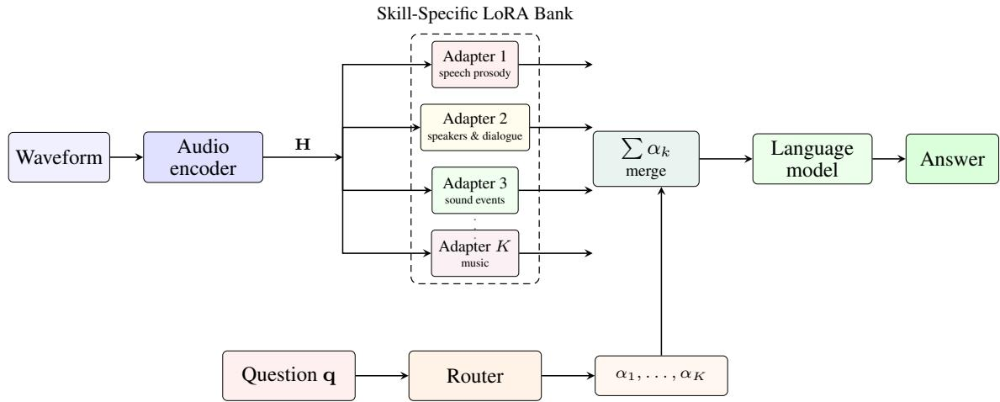
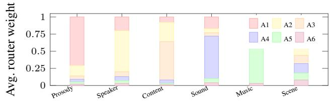

# SKILLFORMER: SKILL-DECOMPOSED ADAPTATION FOR AUDIO LANGUAGE MODELS

Lee Seung-woo1, Bowen Qi2, Kim Min-jun3, Jang Won-young3,

1Pusan National University 2Shanghai Jiao Tong University 3Hanyang University

## ABSTRACT

Audio language models must handle dozens of distinct skills, from pitch comparison and speaker counting to musical tempo estimation and emotion recognition. Joint training on all skills at once causes interference: gains on one skill often come at the cost of another. We propose SkillFormer, which decomposes audio understanding into skill-specific low-rank adapters and composes them at inference time through a learned router. The router examines the question to decide which adapters to activate and how much weight each should carry, so that a pitch query engages different parameters than a genre classification query. An alternating training schedule updates each adapter on its own skill cluster before jointly calibrating the router, preventing the gradient conflicts that arise in standard multi-task optimization. SkillFormer adds fewer than 4% of the base model’s parameters and requires no changes to the audio encoder or language backbone. Evaluated on three architecturally distinct models across MMSU, MMAU-Pro, and MMAR, it raises the average accuracy by 2.5 to 4.1 points, with balanced gains across perception, reasoning, and semantic subcategories.

Index Terms— Audio understanding, skill decomposition, mixture of experts, parameter-efficient adaptation, speech language models

## 1. INTRODUCTION

Large audio language models (LALMs) [1, 2, 3, 4, 5, 6, 7] answer questions about speech, sound, and music through a single interface. Benchmarks that probe individual competencies, however, expose a recurring pattern: improving one cluster of skills during training frequently degrades another [8, 9, 10]. A model fine-tuned on sound event counting may lose ground on speaker emotion, and vice versa. Broader evaluations confirm that this skill interference is pervasive, spanning open-ended, spatial, and compositional queries [11, 12, 13, 14]. The phenomenon matters for downstream applications that require reliable performance on specific competencies—paralinguistic analysis [15], nonverbal vocalization understanding [16], safety assessment [17], and privacy evaluation [18] each depend on a narrow subset of audio skills, and a model that excels on average may still fail on the subset that matters.

Multi-task learning offers a natural framework: share a backbone while specializing where needed [19, 20]. Mixture-of-experts (MoE) architectures [21, 22, 23, 24] scale this idea by routing each token through a sparse set of expert modules, and parameter-efficient methods such as LoRA [25], adapters [26], AdaLoRA [27], and prefix tuning [28] make specialization practical even at the 7B scale. In audio, however, the community has focused on other axes of improvement. EvoAudio [29] and related methods [30, 31, 32, 33, 34, 35] improve what the model trains on through curriculum design, reward shaping, and self-improvement. Recurrent latent reasoning approaches [36, 37, 38, 39] change how deeply the model reasons. Neither addresses which parameters the model activates for a given question.

We introduce SkillFormer, which fills this gap. The key idea is simple: different audio skills should use different parameters. A lightweight question-conditioned router selects a weighted combination of K low-rank adapters, each specialized to a cluster of related skills. An alternating training schedule first updates each adapter on its own cluster, then calibrates the router on mixed data, preventing the gradient conflicts that degrade joint training [20]. The principle that task-specific routing improves over monolithic processing has been validated across modalities, from structured reasoning [40, 41] to sequential prediction [42, 43], and SkillFormer shows that it extends naturally to audio understanding. MimicLM [44] and Spatial-Omni [45] illustrate that audio tasks are diverse enough—spanning voice modelling, spatial perception, and acoustic analysis—to benefit from per-skill specialization. Strong audio representations from selfsupervised encoders [46, 47, 48], supervised models [49, 50, 51, 52], and contrastive pretraining [53, 54] provide the raw material; the question is how to organize learning so that each skill gets the parameters it needs. Reinforcement-based training [55, 56, 57, 58, 59] and chain-of-thought prompting [60] have shown that targeted computation improves language modelling; SkillFormer applies the same principle at the parameter level for audio.

SkillFormer adds fewer than 4% of the base model’s parameters and plugs into any LALM without modifying its encoder or language backbone. We evaluate on Qwen2.5-Omni-7B, Kimi-Audio-7B-Instruct, and MiMo-Audio-7B-Instruct across MMSU, MMAU-Pro, and MMAR. SkillFormer raises the average accuracy by 2.5 to 4.1 points, with gains that spread evenly across perception, reasoning, and semantic subcategories rather than concentrating on one axis.

## 2. SKILL-DECOMPOSED ADAPTATION

SkillFormer inserts a bank of K low-rank adapters between the audio encoder and the language model (Fig. 1). A router examines the question to decide which adapters to activate, and an alternating schedule trains each adapter on its own skill cluster before jointly calibrating the router.

## 2.1. Skill-Specific LoRA Adapters

Given audio encoder features $\textbf { H } \in \mathbb { R } ^ { L \times d }$ , each adapter $k \in$ $\{ 1 , \ldots , K \}$ applies a low-rank transformation [25]:

$$
\Delta \mathbf { H } _ { k } = \mathbf { H } \mathbf { B } _ { k } \mathbf { A } _ { k } , \qquad \mathbf { B } _ { k } \in \mathbb { R } ^ { d \times r } , \mathbf { A } _ { k } \in \mathbb { R } ^ { r \times d } ,\tag{1}
$$

where $r \ll .$ d is the adapter rank. Each adapter shares r and the projection dimensions but learns its own weights, so adapter 1 may specialize in pitch and rate while adapter 3 handles sound events. $\mathbf { B } _ { k }$ is initialized from ${ \mathcal { N } } ( 0 , \sigma ^ { 2 } )$ and $\mathbf { A } _ { k }$ is initialized to zero, ensuring that the adapter output is zero before training and the base model’s behaviour is preserved [25]. A dropout of 0.05 is applied between $\mathbf { B } _ { k }$ and $\mathbf { A } _ { k }$ during training. The adapters sit in parallel; their outputs are merged before entering the language model.

  
Fig. 1. SkillFormer routes audio features through a bank of K skill-specific LoRA adapters. A question-conditioned router produces gating weights $\alpha _ { 1 } , \ldots , \alpha _ { K } ;$ the adapter outputs are merged and passed to the language model.

## 2.2. Question-Conditioned Router

The router produces a sparse gating vector from the question. It encodes the question tokens $\mathbf { q } ^ { \mathbf { ^ { \lambda } } } \in \mathbb { R } ^ { \mathbf { \breve { { T } } } \times d }$ into a single vector q¯ via mean pooling, then applies a two-layer MLP followed by a top-n softmax:

$$
\small \begin{array} { r } { \pmb { \alpha } = \mathrm { T o p } \mathrm { - n } \mathrm { - S o f t m a x } \big ( \mathbf { W } _ { \mathrm { 2 } } \mathrm { G E L U } ( \mathbf { W } _ { 1 } \bar { \mathbf { q } } + \mathbf { b } _ { 1 } ) + \mathbf { b } _ { 2 } \big ) , } \end{array}\tag{2}
$$

where ${ \pmb { \alpha } } \in \mathbb { R } ^ { K }$ has at most n nonzero entries (n=2 in all experiments). Sparsity keeps inference cost independent of K [22]. The merged adapter output is

$$
\Delta { \bf H } = \sum _ { k = 1 } ^ { K } \alpha _ { k } \Delta { \bf H } _ { k } , \qquad { \hat { \bf H } } = { \bf H } + \Delta { \bf H } ,\tag{3}
$$

and Hˆ is passed to the language model backbone.

Including the question in the routing decision is critical: the same audio clip paired with “What language is being spoken?” and “Is the second speaker’s pitch higher than the first?” should activate different adapters. Audio-only routing would force both queries through the same path.

## 2.3. Skill Clustering

The K skill clusters are derived from the training data before any adapter is trained. Each training question is embedded with the language model’s own tokenizer, and k-means groups the embeddings into K clusters. In our experiments K=6 produces clusters that align well with intuitive skill families: speech prosody, speakers and dialogue, speech content, sound events, music, and multi-clip scenes. This matches the question taxonomy used by the EvoAudio tool library [29]. Each cluster defines which training items update which adapter.

## 2.4. Alternating Training

Simultaneous gradient updates from different skills can conflict [20, 19], erasing gains on one skill while optimizing another. SkillFormer avoids this with a two-phase alternating schedule.

Phase A — adapter specialization. For $T _ { A } = 5 0 0$ steps per adapter, each adapter k is updated on its own cluster with all other adapters and the router frozen. The base audio encoder and language model stay frozen throughout. This phase uses a learning rate of $5 \times 1 0 ^ { - 5 }$ with the Adam optimizer [61] and cosine decay.

Phase B — router calibration. For ${ T _ { B } } \mathrm { { = } } 2 0 0 0$ steps, the router and all adapters are trained jointly on a balanced sample across all clusters, with the same learning rate reduced to $1 \times 1 0 ^ { - 5 }$ . This phase teaches the router to compose adapters and allows cross-skill adjustments. The language model parameters are unfrozen in this phase.

The full schedule runs phase A once and phase B once. Training data consists of the same 50 000 verifiable QA pairs from the EvoAu dio tool library [29], drawn from LibriSpeech [62], FSD50K [63], AudioSet [64], MELD [65], and synthesis via Qwen3-TTS [66], LeVo [67], and Scaper [68]. Each adapter k is trained on roughly 50,000/K items in phase A, while phase B uses all 50 000.

## 3. EXPERIMENTS

## 3.1. Setup

We evaluate SkillFormer on Qwen2.5-Omni-7B [1], Kimi-Audio-7B-Instruct [3], and MiMo-Audio-7B-Instruct [2]. These models span encoder families from Whisper-based [49] to self-supervised [46] and conformer [52], paired with language backbones derived from Qwen2 [69], LLaMA [70], and DeepSeek [71]. Other recent models such as Audio Flamingo [30, 72] and MiniCPM-o [73] could also benefit. Each adapter uses rank r=16 and the router has $K { = } 6$ adapters with top-2 routing (n=2). This adds 3.2% to 3.8% of the base model’s parameters. Training runs on 4 NVIDIA A100-80G GPUs with per-GPU batch size 2 and gradient accumulation over 4 steps.

We compare: (1) Base—the released checkpoint; (2) SFT—a single rank-16 LoRA adapter trained on all data; (3) Multi-LoRA—all $K { = } 6$ adapters active with uniform $\alpha _ { k } { = } 1 / K$ and no router; (4) Skill Former—our full method with question-conditioned routing. For MiMo-Audio we report Base and SkillFormer only.

We evaluate on MMSU [8], MMAU-Pro [9], and MMAR [10]. For MMAU-Pro we use the same closed nonspatial subset as prior work [29, 74]; invalid predictions count as incorrect.

Table 1. Accuracy (%) on three audio-understanding benchmarks. Avg. is the mean of the three All scores. SFT fine-tunes a single LoRA adapter on all data. Multi-LoRA keeps all K=6 adapters active with uniform weights. For MMAU-Pro, the three category columns do not cover every scored item, so All is not their average. Bold and underline mark the best and second best per backbone.
<table><tr><td></td><td colspan="3">MMSU ↑</td><td colspan="4">MMAU-Pro ↑</td><td colspan="6">MMAR ↑</td></tr><tr><td>Method</td><td>Percep.</td><td>Reason.</td><td>All</td><td>Speech</td><td>Sound</td><td>Music</td><td>All</td><td>Signal</td><td>Percep.</td><td>Seman.</td><td>Culture</td><td>All</td><td>Avg. ↑</td></tr><tr><td colspan="10">Qwen2.5-Omni-7B</td><td colspan="3"></td><td></td></tr><tr><td>Base</td><td>44.5</td><td>79.4</td><td>61.4</td><td>57.8</td><td>64.0</td><td>56.4</td><td></td><td>55.8</td><td>54.0</td><td>67.2</td><td>58.9</td><td>60.2</td><td>59.3</td></tr><tr><td>SFT</td><td>47.0</td><td>80.3</td><td>63.2</td><td>59.1</td><td>45.3 47.0</td><td>65.4</td><td>57.5</td><td>56.5</td><td>55.3</td><td>67.8</td><td>59.7</td><td>61.0</td><td>60.6+1.3</td></tr><tr><td>Multi-LoRA</td><td>49.5 52.5</td><td>80.7 81.3</td><td>64.7 66.5</td><td>59.9 61.5</td><td>48.4 49.8</td><td>66.3 67.3</td><td>58.5 60.4</td><td>57.3 58.1</td><td>55.6 57.2</td><td>68.0 68.9</td><td>60.5 62.0</td><td>61.8</td><td>61.7+2.4 63.4+4.1</td></tr><tr><td colspan="10">SkillFormer</td><td colspan="3"></td><td>63.3</td></tr><tr><td>Kimi-Audio-7B-Instruct</td><td></td><td></td><td></td><td></td><td></td><td></td><td></td><td></td><td></td><td></td><td></td><td></td><td></td></tr><tr><td>Base</td><td>39.0</td><td>74.3</td><td>56.0</td><td>58.9</td><td>37.1</td><td>56.1</td><td>49.6</td><td>46.5</td><td>47.3</td><td>63.1</td><td>51.1</td><td>54.3</td><td>53.3</td></tr><tr><td>SFT</td><td>41.5</td><td>75.4</td><td>58.0</td><td>60.2</td><td>39.4</td><td>57.5</td><td>51.1</td><td>48.0</td><td>48.7</td><td>64.0</td><td>52.6</td><td>55.4</td><td>54.8+1.5</td></tr><tr><td>Multi-LoRA SkillFormer</td><td>43.0</td><td>75.9</td><td>59.0</td><td>61.0</td><td>40.3</td><td>58.2</td><td>51.9</td><td>48.8</td><td>49.2</td><td>64.5</td><td>53.0</td><td>56.1</td><td>55.7+2.4</td></tr><tr><td></td><td>44.6</td><td>76.8</td><td>60.3</td><td>62.1</td><td>42.8</td><td>59.5</td><td>53.6</td><td>50.9</td><td>50.5</td><td>65.2</td><td>54.2</td><td>57.3</td><td>57.1+3.8</td></tr><tr><td colspan="10">MiMo-Audio-7B-Instruct</td><td colspan="3"></td><td></td><td></td></tr><tr><td>Base</td><td>46.9</td><td>73.1</td><td>59.6</td><td>62.6</td><td>38.3</td><td>64.3</td><td>54.9</td><td>44.2</td><td>55.9</td><td>69.2</td><td>62.4</td><td>61.8</td><td>58.8</td></tr><tr><td>SkillFormer</td><td>50.5</td><td>75.2</td><td>62.5</td><td>64.8</td><td>42.0</td><td>66.7</td><td>57.6</td><td>48.6</td><td>58.0</td><td>70.8</td><td>63.7</td><td>63.4</td><td>61.2+2.4</td></tr></table>

## 3.2. Main Results

Table 1 shows consistent improvements across all three backbones. SkillFormer achieves the highest average on every model, raising it by 4.1 points on Qwen2.5-Omni, 3.8 on Kimi-Audio, and 2.4 on MiMo-Audio. Unlike methods that concentrate gains on a single axis, SkillFormer improves all twelve subcategories on Qwen2.5- Omni, with gains ranging from 1.7 (MMAR semantic) to 8.0 (MMSU perception).

The progression from SFT to Multi-LoRA to SkillFormer isolates the contribution of each design choice. SFT with a single adapter gains 1.3 points on Qwen2.5-Omni, showing that even one low-rank update helps. Multi-LoRA adds six adapters but no routing, gaining another 1.1 points. SkillFormer introduces question-conditioned routing for a further 1.7 points—the largest single step. The lesson is that having specialized adapters matters, but letting the model decide which ones to use matters more.

MMAU-Pro shows the pattern most clearly. Its three categories— speech, sound, and music—draw on distinct perceptual skills. SFT improves all three modestly, but Multi-LoRA and SkillFormer widen the gap because they can route speech queries to one adapter and music queries to another. On Qwen2.5-Omni, SkillFormer’s MMAU-Pro All reaches 60.4, up 4.0 from Base, the largest single-benchmark gain for this backbone. The pattern holds on Kimi-Audio, where MMAU-Pro All rises by 4.0 points (49.6 to 53.6), and the weakest subcategory (sound, at 37.1) improves by 5.7 points, the largest single-subcategory gain across all models.

Compared to recurrent reasoning approaches that deepen computation [36, 37, 38, 39], SkillFormer offers a complementary advantage: it widens the model’s expertise rather than deepening its analysis. Semantic and cultural subcategories, which benefit less from deeper iteration, gain 1.7 and 3.1 points respectively on Qwen2.5-Omni under SkillFormer—improvements that stem from having adapters tuned to language comprehension and world knowledge alongside those tuned to acoustic perception.

## 3.3. Routing Analysis

Fig. 2 shows how the router distributes weight across the six adapters for each question type on Qwen2.5-Omni. Clear specialization emerges: prosody questions send 71% of their weight to adapter 1, music questions route 68% to adapter 5, and sound event questions concentrate 62% on adapter 4. Content and speaker queries also lean toward dedicated adapters but with less extreme sparsity, consistent with these skills sharing more common ground (both involve speech understanding). Multi-clip scene queries are the most evenly distributed, drawing on adapters specialized in different modalities to answer questions that span them.

  
Fig. 2. Router weight distribution by question type on Qwen2.5- Omni-7B. Each bar shows how the router distributes weight across the six adapters (A1–A6). Prosody and music questions each concentrate on a single adapter, while scene questions spread weight more evenly.

This specialization arises without supervision—the skill clusters are defined by question embeddings, not by hand. The router independently learns to match questions to the adapter whose cluster best prepared it. The alignment between clustering and routing validates the approach: skills that are semantically distinct in question space also benefit from distinct parameters.

## 3.4. Ablations

Table 2 isolates the contribution of each design choice. Removing the router (uniform α) costs 1.7 points, confirming that questionconditioned routing is the single most valuable ingredient. Random routing performs even worse (−2.5), showing that the router’s decisions carry genuine signal rather than merely adding parameters.

The alternating training schedule matters almost as much: without it, jointly training all adapters and the router from the start drops accuracy by 2.3 points. Phase A gives each adapter time to specialize before phase B asks the router to compose them; skipping this step exposes the adapters to conflicting gradients that flatten their specialization.

Rank sensitivity is mild: changing r from 16 to 8 costs only 0.3 points (Avg. 63.1), while r=32 adds 0.1 (Avg. 63.5) at higher memory cost. Top-2 routing (n=2) outperforms both top-1 (−0.6) and dense routing (−0.4), suggesting that most questions benefit from blending two expert perspectives but are hurt when too many adapters dilute the signal.

Table 2. Ablations on Qwen2.5-Omni-7B. Each row changes one component of SkillFormer. Base model Avg. is 59.3%.
<table><tr><td>Variant</td><td>MMSU</td><td>MMAU-P</td><td>MMAR</td><td>Avg. (%)</td></tr><tr><td>SkillFormer</td><td>66.5</td><td>60.4</td><td>63.3</td><td>63.4</td></tr><tr><td>No router (uni- form α)</td><td>64.7</td><td>58.5</td><td>61.8</td><td>61.7</td></tr><tr><td>Random routing</td><td>63.8</td><td>57.8</td><td>61.1</td><td>60.9</td></tr><tr><td>Single adapter</td><td>63.2</td><td>57.5</td><td>61.0</td><td>60.6</td></tr><tr><td>(SFT) K=3 clusters</td><td>65.3</td><td>59.2</td><td>62.4</td><td>62.3</td></tr><tr><td>K=12 clusters</td><td>65.8</td><td>59.6</td><td>62.7</td><td>62.7</td></tr><tr><td>No alternating schedule</td><td>64.0</td><td>58.0</td><td>61.2</td><td>61.1</td></tr></table>

K=6 clusters outperform both $K { = } 3 \left( { - } 1 . 1 \right)$ and $K { = } 1 2 \left( { - } 0 . 7 \right)$ With three clusters, diverse skills are forced to share parameters. With twelve, each cluster’s training set shrinks and the adapters underfit. Six clusters strike a balance, each large enough to train a useful adapter and specific enough to avoid interference.

## 4. CONCLUSION

We presented SkillFormer, which decomposes audio understanding into skill-specific low-rank adapters and composes them through a learned router. The alternating training schedule prevents skill interference, and the question-conditioned routing ensures each query activates the right expertise. SkillFormer improves three architecturally distinct LALMs on three benchmarks, with balanced gains across subcategories. Combining skill decomposition with richer selfimprovement curricula [29, 75] and adaptive reasoning depth [36, 37, 38, 39, 76] is a natural next step.

## 5. REFERENCES

[1] Jin Xu et al., “Qwen2.5-omni technical report,” 2025.

[2] Xiaomi LCT, “MiMo-Audio: Audio language models are fewshot learners,” CoRR, abs/2512.23808, 2025.

[3] Ding Ding et al., “Kimi-audio technical report,” arXiv preprint arXiv:2504.18425, 2025.

[4] Changli Tang et al., “SALMONN: Towards generic hearing abilities for large language models,” arXiv preprint arXiv:2310.13289, 2023.

[5] Yuan Gong et al., “Listen, think, and understand,” in International Conference on Learning Representations, 2024.

[6] Yunfei Chu et al., “Qwen-Audio: Advancing universal audio understanding via unified large-scale audio-language models,” arXiv preprint arXiv:2311.07919, 2023.

[7] Dong Zhang et al., “SpeechGPT: Empowering large language models with intrinsic cross-modal conversational abilities,” arXiv preprint arXiv:2305.11000, 2023.

[8] Dingdong Wang et al., “MMSU: A massive multi-task spoken language understanding and reasoning benchmark,” in International Conference on Learning Representations, 2026, vol. 2026, pp. 31374–31410.

[9] Sonal Kumar et al., “MMAU-Pro: A challenging and comprehensive benchmark for holistic evaluation of audio general

intelligence,” in Proceedings of the AAAI Conference on Artificial Intelligence, 2026, vol. 40, pp. 22688–22697.

[10] Ziyang Ma et al., “MMAR: A challenging benchmark for deep reasoning in speech, audio, music, and their mix,” Advances in Neural Information Processing Systems, vol. 38, 2026.

[11] Bin Wang et al., “AudioBench: A universal benchmark for audio large language models,” arXiv preprint arXiv:2406.16020, 2024.

[12] Qian Yang et al., “AIR-Bench: Benchmarking large audiolanguage models via generative comprehension,” in Proceedings of the 62nd Annual Meeting of the Association for Compu tational Linguistics, 2024, pp. 1021–1044.

[13] Chien-yu Huang et al., “Dynamic-SUPERB: Towards a dynamic, collaborative, and comprehensive instruction-tuning benchmark for speech,” in 2024 IEEE International Conference on Acoustics, Speech and Signal Processing (ICASSP), 2024, pp. 12136–12140.

[14] S. Sakshi et al., “MMAU: A massive multi-task audio understanding and reasoning benchmark,” arXiv preprint arXiv:2410.19168, 2024.

[15] Yuxiang Wang, Qinke Ni, Shengbo Cai, Wan Lin, Liqiang Zhang, and Zhizheng Wu, “ParaBridge: Bridging paralinguistic perception and dialogue behavior in speech language models,” arXiv preprint arXiv:2606.10581, 2026.

[16] Qinke Ni, Huan Liao, Dekun Chen, Yuxiang Wang, and Zhizheng Wu, “NV-Bench: Benchmark of nonverbal vocalization synthesis for expressive text-to-speech generation,” arXiv preprint arXiv:2603.15352, 2026.

[17] Yuxiang Wang et al., “VoxSafeBench: Not just what is said, but who, how, and where,” arXiv preprint arXiv:2604.14548, 2026.

[18] Yuxiang Wang, Hongyu Liu, Dekun Chen, Xueyao Zhang, and Zhizheng Wu, “VoxPrivacy: A benchmark for evaluating interactional privacy of speech language models,” arXiv preprint arXiv:2601.19956, 2026.

[19] Rich Caruana, “Multitask learning,” Machine Learning, vol. 28, no. 1, pp. 41–75, 1997.

[20] Tianhe Yu et al., “Gradient surgery for multi-task learning,” Advances in Neural Information Processing Systems, vol. 33, pp. 5824–5836, 2020.

[21] Noam Shazeer et al., “Outrageously large neural networks: The sparsely-gated mixture-of-experts layer,” in International Conference on Learning Representations, 2017.

[22] William Fedus, Barret Zoph, and Noam Shazeer, “Switch transformers: Scaling to trillion parameter models with simple and efficient sparsity,” Journal of Machine Learning Research, vol. 23, no. 120, pp. 1–39, 2022.

[23] Albert Q. Jiang et al., “Mixtral of experts,” arXiv preprint arXiv:2401.04088, 2024.

[24] DeepSeek-AI, “DeepSeekMoE: Towards ultimate expert specialization in mixture-of-experts language models,” arXiv preprint arXiv:2401.06066, 2024.

[25] Edward J. Hu et al., “LoRA: Low-rank adaptation of large language models,” in International Conference on Learning Representations, 2022.

[26] Neil Houlsby et al., “Parameter-efficient transfer learning for NLP,” in International Conference on Machine Learning, 2019, pp. 2790–2799.

[27] Qingru Zhang et al., “AdaLoRA: Adaptive budget allocation for parameter-efficient fine-tuning,” arXiv preprint arXiv:2303.10512, 2023.

[28] Xiang Lisa Li and Percy Liang, “Prefix-tuning: Optimizing continuous prompts for generation,” in Proceedings of the 59th Annual Meeting of the Association for Computational Linguistics, 2021, pp. 4582–4597.

[29] Yuxiang Wang et al., “EvoAudio: Recursive self-improvement for audio understanding,” arXiv preprint arXiv:2609.27389, 2026.

[30] Sreyan Ghosh et al., “Audio flamingo 2: An audio-language model with long-audio understanding and expert reasoning abilities,” arXiv preprint arXiv:2503.03983, 2025.

[31] Cheng Wen et al., “SARI: Structured audio reasoning via curriculum-guided reinforcement learning,” arXiv preprint arXiv:2504.15900, 2025.

[32] Siqian Tong et al., “Audio-Zero: Label-free selfevolution for fine-grained audio reasoning,” arXiv preprint arXiv:2607.20166, 2026.

[33] Fangxu Yu et al., “Reinforcement learning with evolving rubrics as rewards for audio reasoning,” arXiv preprint arXiv:2608.02831, 2026.

[34] Haoyu Zhang et al., “AQA-TTRL: Self-adaptation in audio question answering with test-time reinforcement learning,” arXiv preprint arXiv:2510.05478, 2025.

[35] Shaowen Wang et al., “Self-improvement for audio large language model using unlabeled speech,” arXiv preprint arXiv:2507.20169, 2025.

[36] Yuxiang Wang, Kunyu Feng, Yingda Shen, Haoning Xu, Junyu Wang, and Zhizheng Wu, “RecurTrace: Adaptive latent reasoning with loop-time memory,” arXiv preprint arXiv:2609.03379, 2026.

[37] Yuxiang Wang et al., “AURAL: Adaptive latent reasoning with joint chunk for speech language models,” 2026.

[38] Shengbo Cai et al., “Thinking in depth, speaking directly: Recurrent latent reasoning for paralinguistically grounded spoken dialogue,” arXiv preprint arXiv:2609.37818, 2026.

[39] Kunyu Feng, Yuxiang Wang, Li Wang, Wan Lin, and Zhizheng Wu, “CoRELoop: Parameter-efficient controlled recurrent refinement for audio deepfake detection,” arXiv preprint arXiv:2609.19818, 2026.

[40] Yuxiang Wang, Xinnan Dai, Wenqi Fan, and Yao Ma, “Exploring graph learning tasks with pure LLMs: A comprehensive benchmark and investigation,” in Findings ofthe Associationfor Computational Linguistics: ACL 2026, 2026, pp. 7909–7942.

[41] Yuxiang Wang, Wenqi Fan, Suhang Wang, and Yao Ma, “Towards graph foundation models: A transferability perspective,” arXiv preprint arXiv:2503.09363, 2025.

[42] Yaoguang Yong et al., “Predicting DRAM-caused risky VMs in large-scale clouds,” in 2025 IEEE International Symposium on High Performance Computer Architecture (HPCA). IEEE, 2025, pp. 1231–1245.

[43] Keming Lu et al., “Routing to the expert: Efficient rewardguided ensemble of large language models,” arXiv preprint arXiv:2311.08692, 2023.

[44] Tao Feng et al., “MimicLM: Zero-shot voice imitation through autoregressive modeling of pseudo-parallel speech corpora,” in Findings ofthe Associationfor Computational Linguistics: ACL 2026, 2026, pp. 20392–20405.

[45] Zhiyuan Zhu et al., “Spatial-Omni: Spatial audio understanding integration in multimodal LLMs via FOA encoding,” arXiv preprint arXiv:2606.10738, 2026.

[46] Wei-Ning Hsu et al., “HuBERT: Self-supervised speech representation learning by masked prediction of hidden units,” IEEE/ACM Transactions on Audio, Speech, and Language Processing, vol. 29, pp. 3451–3460, 2021.

[47] Sanyuan Chen et al., “WavLM: Large-scale self-supervised pre-training for full stack speech processing,” IEEE Journal of Selected Topics in Signal Processing, vol. 16, no. 6, pp. 1505– 1518, 2022.

[48] Alexei Baevski et al., “wav2vec 2.0: A framework for selfsupervised learning of speech representations,” in Advances in Neural Information Processing Systems, 2020, vol. 33, pp. 12449–12460.

[49] Alec Radford et al., “Robust speech recognition via large-scale weak supervision,” in International Conference on Machine Learning. PMLR, 2023, pp. 28492–28518.

[50] Yuan Gong, Yu-An Chung, and James Glass, “AST: Audio spectrogram transformer,” in Proc. Interspeech, 2021, pp. 571– 575.

[51] Qiuqiang Kong et al., “PANNs: Large-scale pretrained audio neural networks for audio pattern recognition,” IEEE/ACM Transactions on Audio, Speech, and Language Processing, vol. 28, pp. 2880–2894, 2020.

[52] Anmol Gulati et al., “Conformer: Convolution-augmented transformer for speech recognition,” in Proc. Interspeech, 2020, pp. 5036–5040.

[53] Yusong Wu et al., “CLAP: Learning audio concepts from natural language supervision,” in 2023 IEEE International Conference on Acoustics, Speech and Signal Processing (ICASSP). IEEE, 2023, pp. 1–5.

[54] Sanyuan Chen et al., “BEATs: Audio pre-training with acoustic tokenizers,” in International Conference on Machine Learning, 2023, pp. 5178–5193.

[55] John Schulman et al., “Proximal policy optimization algorithms,” arXiv preprint arXiv:1707.06347, 2017.

[56] Rafael Rafailov et al., “Direct preference optimization: Your language model is secretly a reward model,” Advances in Neural Information Processing Systems, vol. 36, 2023.

[57] Long Ouyang et al., “Training language models to follow instructions with human feedback,” Advances in Neural Information Processing Systems, vol. 35, pp. 27730–27744, 2022.

[58] Zhihong Shao et al., “DeepSeekMath: Pushing the limits of mathematical reasoning in open language models,” arXiv preprint arXiv:2402.03300, 2024.

[59] Qiying Yu et al., “DAPO: An open-source LLM reinforcement learning system at scale,” Advances in Neural Information Processing Systems, vol. 38, pp. 113222–113244, 2026.

[60] Jason Wei et al., “Chain-of-thought prompting elicits reasoning in large language models,” in Advances in Neural Information Processing Systems, 2022, vol. 35, pp. 24824–24837.

[61] Diederik P. Kingma and Jimmy Ba, “Adam: A method for stochastic optimization,” in International Conference on Learning Representations, 2015.

[62] Vassil Panayotov et al., “LibriSpeech: An ASR corpus based on public domain audio books,” in 2015 IEEE International Conference on Acoustics, Speech and Signal Processing (ICASSP), 2015, pp. 5206–5210.

[63] Eduardo Fonseca et al., “FSD50K: An open dataset of humanlabeled sound events,” IEEE/ACM Transactions on Audio, Speech, and Language Processing, vol. 30, pp. 829–852, 2021.

[64] Jort F. Gemmeke et al., “Audio set: An ontology and humanlabeled dataset for audio events,” in 2017 IEEE International Conference on Acoustics, Speech and Signal Processing (ICASSP), 2017, pp. 776–780.

[65] Soujanya Poria et al., “MELD: A multimodal multi-party dataset for emotion recognition in conversations,” in Proceedings ofthe 57th Annual Meeting ofthe Associationfor Computational Linguistics, 2019, pp. 527–536.

[66] Hangrui Hu et al., “Qwen3-TTS technical report,” arXiv preprint arXiv:2601.15621, 2026.

[67] Shun Lei et al., “LeVo: High-quality song generation with multi-preference alignment,” Advances in Neural Information Processing Systems, vol. 38, pp. 102448–102479, 2026.

[68] Justin Salamon et al., “Scaper: A library for soundscape synthesis and augmentation,” in 2017 IEEE Workshop on Applications ofSignal Processing to Audio and Acoustics (WASPAA), 2017, pp. 344–348.

[69] An Yang et al., “Qwen2 technical report,” arXiv preprint arXiv:2407.10671, 2024.

[70] Hugo Touvron et al., “Llama 2: Open foundation and fine-tuned chat models,” arXiv preprint arXiv:2307.09288, 2023.

[71] DeepSeek-AI, “DeepSeek-V3 technical report,” arXiv preprint arXiv:2412.19437, 2024.

[72] Sreyan Ghosh et al., “Audio flamingo 3: Advancing audio intelligence with fully open large audio language models,” Advances in Neural Information Processing Systems, vol. 38, pp. 41819–41886, 2026.

[73] Junbo Cui et al., “MiniCPM-o 4.5: Towards realtime full-duplex omni-modal interaction,” arXiv preprint arXiv:2604.27393, 2026.

[74] Andrew Rouditchenko et al., “Omni-R1: Do you really need audio to fine-tune your audio LLM?,” in 2025 IEEE Automatic Speech Recognition and Understanding Workshop (ASRU), 2025, pp. 1–7.

[75] Andrew Zhao et al., “Absolute zero: Reinforced self-play reasoning with zero data,” Advances in Neural Information Processing Systems, vol. 38, pp. 105816–105879, 2026.

[76] Alex Graves, “Adaptive computation time for recurrent neural networks,” arXiv preprint arXiv:1603.08983, 2016.