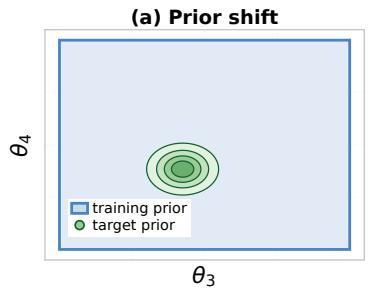
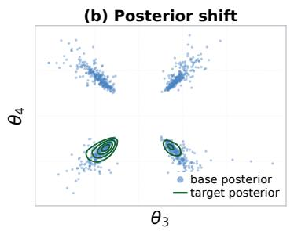
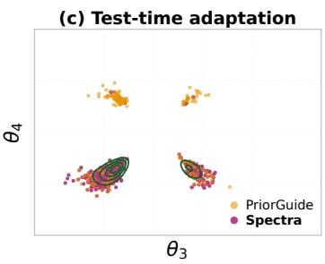
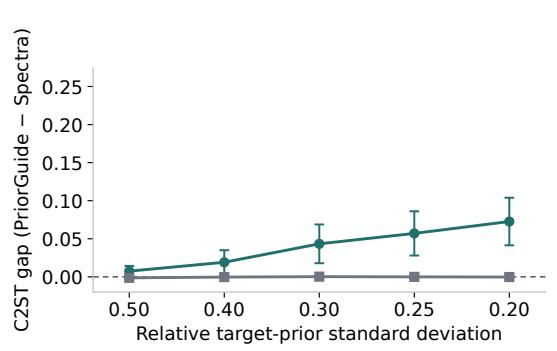
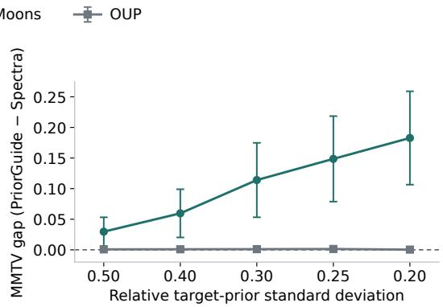
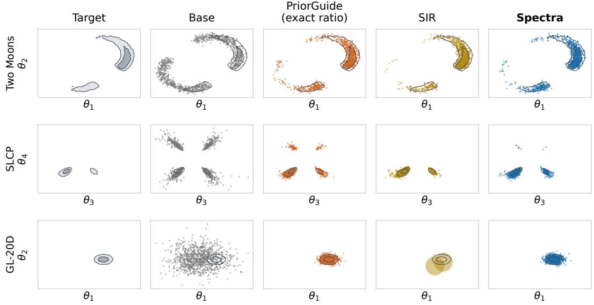
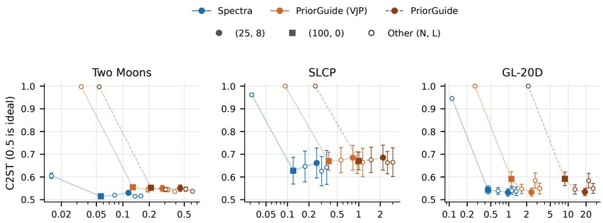
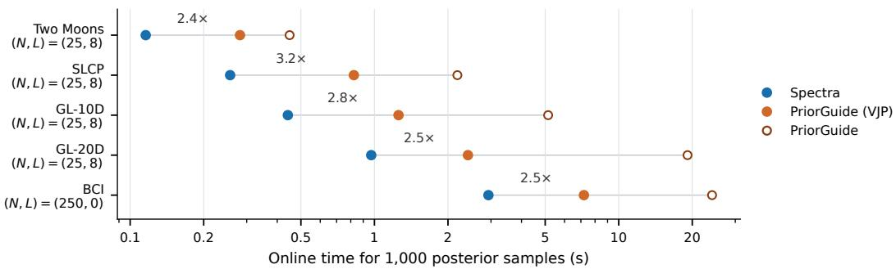
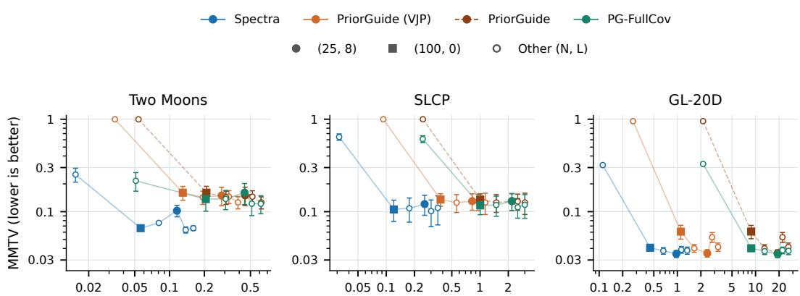
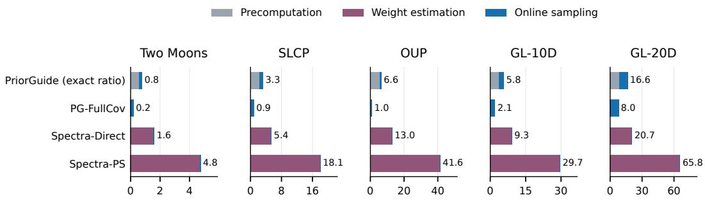

# SPECTRA: EXACT COMPONENT TRANSPORT FOR TEST-TIME PRIOR ADAPTATION IN SIMULATION-BASED INFERENCE

Xin Zhao<sup>1,2</sup> Nico Scherf<sup>3,4</sup> Robert Trampel<sup>1</sup> Kerrin J. Pine<sup>1</sup> Nikolaus Weiskopf<sup>1,5,6</sup>

<sup>1</sup>Department of Neurophysics, Max Planck Institute for Human Cognitive and Brain Sciences, Leipzig, Germany

<sup>2</sup>International Max Planck Research School on Cognitive NeuroImaging, Leipzig, Germany

<sup>3</sup>Methods and Development Group Neural Data Science and Statistical Computing, Max Planck Institute for Human Cognitive and Brain Sciences, Leipzig, Germany

<sup>4</sup>Center for Scalable Data Analytics and Artificial Intelligence (ScaDS.AI), Dresden/Leipzig, Germany

<sup>5</sup>Felix Bloch Institute for Solid State Physics, Faculty of Physics and Earth System Sciences, Leipzig University, Leipzig, Germany

<sup>6</sup>Functional Imaging Laboratory, Department of Imaging Neuroscience, UCL Queen Square Institute of Neurology, University College London, London, UK

zhaox@cbs.mpg.de

## ABSTRACT

Simulation-based inference (SBI) has become a powerful approach to Bayesian inference in complex scientific models whose likelihoods are difficult or impossible to evaluate. Amortized SBI learns reusable inference models from simulated data, enabling rapid posterior inference for new observations, and modern generative models have made these models increasingly expressive. However, this reuse is limited to the prior distribution chosen during training, whereas scientific analyses often need revised priors as knowledge accumulates or alternative assumptions are tested. We introduce Spectra, a test-time adaptation method for diffusion-based SBI. Spectra uses an exact score-transport identity to obtain the adapted score from a frozen diffusion model in closed form for structured prior changes, without additional simulation or training. Across six SBI benchmarks, Spectra achieves accurate adaptation under strong prior shifts at low online sampling cost. This enables pretrained SBI models to incorporate updated prior information at test time.

## 1 INTRODUCTION

Bayesian inference estimates unknown model parameters θ from observed data x and quantifies their uncertainty through the posterior $p ( \theta \mid \bar { x } )$ . For complex scientific models, however, the likelihood $p ( x \mid \theta )$ is intractable or too costly to evaluate, even though synthetic data can be generated readily from a simulator (Cranmer et al., 2020). This makes standard likelihood-based Markov chain Monte Carlo impractical or unavailable (Robert & Casella, 2004). Simulation-based inference (SBI) instead learns from simulated parameter–observation pairs (Cranmer et al., 2020; Lueckmann et al., 2021). Amortized SBI makes this posterior inference reusable across observations by training an inference model once and applying it to new observations without repeating simulation and training (Greenberg et al., 2019; Gloeckler et al., 2024). This reuse has enabled applications ranging from real-time gravitational-wave inference (Dax et al., 2021; 2025) to cosmological constraints from galaxy clustering (Hahn et al., 2024) and identification of neural circuit configurations from electrophysiological recordings (Gonçalves et al., 2020).

Posterior distributions in scientific applications are often multimodal or strongly correlated, motivating flexible generative posterior models. Diffusion and score-based models generate samples by learning to reverse a gradual noising process (Sohl-Dickstein et al., 2015; Ho et al., 2020; Song et al., 2021), and have been adapted to posterior sampling in SBI (Geffner et al., 2023; Sharrock et al., 2024; Gloeckler et al., 2024). Flow matching and consistency models have also been developed for SBI: flow matching learns time-dependent velocity fields for posterior sampling, while consistency models reduce generation to only a few inference steps (Wildberger et al., 2023; Schmitt et al., 2024). Transformer-based approaches can amortize across datasets by conditioning on a dataset provided as context at inference time, allowing a single model to be reused across datasets and tasks (Müller et al., 2022; Chang et al., 2025; Mittal et al., 2025; Whittle et al., 2026). In the standard fixed-prior setting considered here, training pairs are generated by drawing θ from a chosen prior $\pi _ { \mathrm { t r } }$ and then simulating $x \sim p ( x \mid \theta )$ This amortization therefore applies across observations, but only under the training prior $\pi _ { \mathrm { t r } } .$





  
Figure 1: Prior shift and test-time adaptation on the simple likelihood complex posterior (SLCP) task. (a) A concentrated target prior replaces the broad training prior. (b) The frozen model represents the base posterior under the training prior, while the target prior concentrates posterior mass on two of its four modes. (c) Both PriorGuide and Spectra recover the target modes. However, PriorGuide retains visible mass outside the target contours, whereas Spectra follows the target geometry more closely. The posterior panels show the $( \theta _ { 3 } , \theta _ { 4 } )$ projection. Full results across tasks and observations are reported in Table 1 and Figure 3.

However, the prior fixed at training time is rarely the only one needed in a scientific analysis. In gravitational-wave astronomy, population-level observations can inform priors for individual events (Moore & Gerosa, 2021), while assumptions about black-hole masses and spins can change the inferred properties of a source (Vitale et al., 2017). The same issue appears in other fields: fossilcalibration priors affect estimates of species divergence times in evolutionary biology (Warnock et al., 2015), and prior-sensitivity analyses in cognitive science examine how evidence for competing models varies with the prior (Elsemüller et al., 2024). Priors may therefore need to change both as new information becomes available and as researchers test the robustness of their conclusions to alternative assumptions (Gelman et al., 2020). A single study may consequently require posterior inference under several plausible priors.

Each of these posteriors could be computed separately using a non-amortized inference procedure or by retraining the amortized model, but both options forgo much of the benefit of amortization. Retraining, in particular, repeats costly simulation and optimization for every new prior. Importance sampling can instead reweight samples from the original posterior, but becomes inefficient when the new posterior concentrates in regions poorly covered by the original samples (Agapiou et al., 2017). Another way to avoid per-prior retraining is to train across a family of priors, but test-time flexibility is constrained by the prior representation built into the model during training (Elsemüller et al., 2024; Chang et al., 2025; Whittle et al., 2026). In-context SBI with tabular foundation models avoids task-specific retraining, but still requires suitable simulated examples as context at inference time (Hollmann et al., 2025; Vetter et al., 2025). For an already trained diffusion-SBI model, recent methods adapt the prior at test time, either through an approximate sampling correction (Yang et al., 2026) or by training an auxiliary correction model for each target prior (Zang et al., 2026). For this setting, an effective adapter must remain accurate under substantial prior shifts, add little inference-time cost, and require neither additional simulation nor retraining.

We introduce Spectra, a test-time method for adapting pretrained diffusion-SBI models while leaving both the simulator and the trained model unchanged. Because diffusion sampling repeatedly queries the score network across noise levels, prior adaptation requires the corresponding score under the revised prior. Spectra obtains this score by exploiting analytic structure in the known prior change, using a single transformed query to the frozen model. For isotropic exponential–quadratic prior-ratio factors, this transformation is exact. Positive mixtures of such factors extend the construction to richer prior changes. Figure 1 illustrates the adaptation problem and a representative result on one benchmark task. Our main contributions are:

• Exact score transport and characterization. For prior changes that reweight the training prior by an isotropic exponential–quadratic factor, the adapted diffusion score follows exactly from one frozen-model query at a transformed state and noise level, without a score Jacobian or any Gaussian assumption on the base posterior. We further prove that, within this affine Gaussian transport construction, isotropic exponential–quadratic factors are the only positive reweightings that admit such an exact mapping.

• Composition of richer prior changes. Richer prior changes can be represented as positive mixtures of transportable factors, yielding mixtures of exactly transported posterior components. For a fixed observation, Spectra estimates the component weights once and samples one component per reverse trajectory. Online sampling therefore still requires only one frozen-score evaluation per reverse step, independent of the number of components.

• Accuracy and efficiency. Across six SBI benchmarks, Spectra remains accurate under strong prior shifts and for mixture priors while keeping one frozen-score query per reverse step. Compared with a strengthened version of PriorGuide, the closest test-time method, its accuracy gains are largest on nonlinear problems, and its online sampling is $2 . 4 \substack { - 3 . 2 \times }$ faster.

## 2 BACKGROUND

## 2.1 SIMULATION-BASED INFERENCE

Let $\theta \in \mathbb { R } ^ { d }$ denote the unknown parameters of a scientific model and x the observed data. A prior describes plausible parameter values before observing $x ,$ while the likelihood $p ( x \mid \theta )$ describes how observations are generated from a given θ. We write $\pi _ { \mathrm { t r } }$ for the prior used to train the inference model. Bayes’ rule gives

$$
p ( \theta \mid x ) = \frac { p ( x \mid \theta ) \pi _ { \mathrm { t r } } ( \theta ) } { \int p ( x \mid \vartheta ) \pi _ { \mathrm { t r } } ( \vartheta ) d \vartheta } .\tag{1}
$$

The posterior $p ( \theta \mid x )$ describes which parameter values remain plausible after observing x. In SBI, this posterior is learned from simulated parameter–observation pairs: training pairs are generated by drawing $\theta \sim \pi _ { \mathrm { t r } }$ and then $x \sim p ( x \mid \theta )$ (Cranmer et al., 2020). In amortized SBI, these pairs train a reusable model of $p ( \theta \mid x )$ , which can then be applied to new observations without further simulation or retraining (Greenberg et al., 2019; Gloeckler et al., 2024).

## 2.2 DIFFUSION MODELS

Diffusion models provide a flexible way to represent such posteriors by gradually corrupting samples with Gaussian noise and learning how to reverse this corruption (Sohl-Dickstein et al., 2015; Ho et al., 2020). Let $z _ { 0 } \sim p _ { 0 }$ denote a clean sample and $z _ { t }$ its noisy counterpart at diffusion time $t \in [ 0 , 1 ]$ We use the variance-exploding (VE) formulation, with increasing noise standard deviation $\sigma ( t )$ and $\sigma ( 0 ) = 0$ . The forward transition and resulting marginal density are

$$
p _ { t | 0 } ( z _ { t } \mid z _ { 0 } ) = { \mathcal N } \big ( z _ { t } ; z _ { 0 } , \sigma ( t ) ^ { 2 } I \big ) , \qquad p _ { t } ( z _ { t } ) = \int p _ { t | 0 } ( z _ { t } \mid z _ { 0 } ) p _ { 0 } ( z _ { 0 } ) d z _ { 0 } .\tag{2}
$$

The reverse process depends on the score $s ( z _ { t } , t ) = \nabla _ { z _ { t } } \log p _ { t } ( z _ { t } )$ , the gradient of the log density at the current noisy state. Intuitively, the score points toward regions of higher probability and provides the direction used for denoising. For the VE process, the score determines the reverse-time stochastic differential equation

$$
d z _ { t } = - 2 \sigma ( t ) \dot { \sigma } ( t ) \nabla _ { z _ { t } } \log p _ { t } ( z _ { t } ) d t + \sqrt { 2 \sigma ( t ) \dot { \sigma } ( t ) } d W _ { t } ,\tag{3}
$$

integrated from $t = 1$ toward t = 0 (Song et al., 2021). Here $\dot { \sigma } ( t ) = d \sigma ( t ) / d t$ , and $W _ { t }$ denotes a Wiener process in reverse time. Because the marginal score is unknown, a neural network $s _ { \psi } \left( z _ { t } , t \right)$ is trained using denoising score matching (DSM) (Hyvärinen, 2005; Vincent, 2011):

$$
\begin{array} { r } { \mathcal { L } _ { \mathrm { D S M } } ( \psi ) = \mathbb { E } _ { t , z _ { 0 } , z _ { t } } \left[ \lambda ( t ) \left| \left| s _ { \psi } ( z _ { t } , t ) - \nabla _ { z _ { t } } \log p _ { t | 0 } ( z _ { t } \mid z _ { 0 } ) \right| \right| _ { 2 } ^ { 2 } \right] , } \end{array}\tag{4}
$$

where $z _ { 0 } \sim p _ { 0 } , z _ { t } \sim p _ { t | 0 } ( \cdot \mid z _ { 0 } )$ , t is sampled across noise levels, and $\lambda ( t ) > 0$ weights those levels. For Gaussian corruption, the conditional score is available analytically as $\nabla _ { z _ { t } } \log { p _ { t | 0 } ( z _ { t } \ | }$ $z _ { 0 } ) = - ( z _ { t } - z _ { 0 } ) / \sigma ( t ) ^ { 2 }$ . Minimizing this objective learns the marginal score $s ( z _ { t } , t )$ in expectation

(Vincent, 2011), providing the score needed by the reverse process. Sampling starts from a Gaussian approximation at the highest noise level and integrates the reverse dynamics using the learned score (Song et al., 2021).

## 2.3 DIFFUSION-BASED AMORTIZED SBI

In diffusion-based SBI, the clean variable is the parameter vector, $z _ { 0 } = \theta ,$ and the observation x conditions the denoising model. Applying the forward process from Section 2.2 to the posterior $p ( \theta \mid x )$ gives the noisy posterior and its score

$$
p _ { t } ( z \mid x ) = \int p _ { t | 0 } ( z \mid \theta ) p ( \theta \mid x ) d \theta , \qquad s _ { p } ( z , t , x ) = \nabla _ { z } \log p _ { t } ( z \mid x ) .\tag{5}
$$

We refer to $p ( \theta \mid x )$ as the base posterior and $s _ { p }$ as its noisy score. The subscript p distinguishes these quantities from the adapted posterior introduced below. A conditional network $s _ { \psi } \big ( z _ { t } , t , x \big )$ is trained with the same denoising score-matching objective as in Section 2.2, using simulated pairs $\theta \sim \pi _ { \mathrm { t r } }$ and $x \sim p ( x \mid \theta )$ , with x supplied as an additional condition (Geffner et al., 2023; Gloeckler et al., 2024). After training, we freeze the network and denote its learned score estimate by $\widehat { s } _ { p }$ . At inference time, the observation x is fixed and $\widehat { s } _ { p }$ drives the reverse diffusion process, producing approximate samples from the base posterior. The same model can be reused for new observations, but its learned score still corresponds to the training prior $\pi _ { \mathrm { t r } }$

## 3 SPECTRA: EXACT COMPONENT TRANSPORT

## 3.1 PRIOR ADAPTATION AS SCORE CORRECTION

Suppose the same observation x is analyzed under a new prior $\pi _ { \mathrm { n e w } } .$ , while the simulator remains unchanged. We assume $\pi _ { \mathrm { n e w } }$ places no mass outside the support of $\pi _ { \mathrm { t r } }$ and define the prior ratio $r ( \theta ) = \mathsf { \bar { \pi } } _ { \mathrm { n e w } } ( \theta ) / \pi _ { \mathrm { t r } } ( \theta )$ . Since the likelihood is unchanged, Bayes’ rule gives

$$
q ( \theta \mid x ) = { \frac { p ( \theta \mid x ) r ( \theta ) } { Z _ { r } ( x ) } } , \qquad Z _ { r } ( x ) = \mathbb { E } _ { p ( \theta \mid x ) } [ r ( \theta ) ] .\tag{6}
$$

In the diffusion formulation, Eq. (6) determines the target distribution at the clean endpoint. However, reverse sampling requires the corresponding target score at every noise level. A Bayes-rule calculation (Appendix C) gives

$$
\begin{array} { r } { s _ { q } ( z , t , x ) = s _ { p } ( z , t , x ) + \nabla _ { z } \log \mathbb { E } _ { p ( \theta | z , x ) } [ r ( \theta ) ] . } \end{array}\tag{7}
$$

Here $p ( \theta \mid z , x )$ is the conditional distribution of the clean parameter given the noisy state z under the base posterior. The frozen model provides $s _ { p } .$ , but not $p ( \theta \mid z , x )$ , so the correction in Eq. (7) is not directly available. PriorGuide makes this correction tractable by approximating $p ( \theta \mid z , x )$ as Gaussian (Yang et al., 2026), while density-ratio adaptation learns an auxiliary correction for each target prior (Zang et al., 2026). Spectra instead shows that, for structured prior ratios, the adapted score can be obtained exactly from a transformed query to the frozen base score.

## 3.2 EXACT SINGLE-FACTOR TRANSPORT

Write $\tau = \sigma ( t ) ^ { 2 }$ for the noise variance, and index scores by τ in what follows. Consider the isotropic exponential–quadratic factor

$$
\phi _ { a , \kappa , c } ( \theta ) = \exp \left( c + a ^ { \top } \theta - \frac { \kappa } { 2 } \| \theta \| ^ { 2 } \right) ,\tag{8}
$$

where $a \in \mathbb { R } ^ { d }$ and $\kappa , c \in \mathbb { R } . \ \operatorname { I f } r ( \theta ) \propto \phi ( \theta )$ , then $q ^ { \phi } ( \theta \mid x ) \propto p ( \theta \mid x ) \phi ( \theta )$ is the target posterior. The quadratic term is isotropic: a single scalar κ controls its strength in every direction, while a controls an arbitrary linear tilt. For $\kappa > 0 .$ , ϕ is proportional to an isotropic Gaussian with mean $a / \kappa$ and covariance $\kappa ^ { - \mathrm { i } } I$ . For $\kappa = 0 .$ , it reduces to a linear exponential tilt. The constant c only rescales the factor and cancels after posterior normalization. This restriction is on the prior-ratio factor while the base posterior itself can be arbitrary. For Gaussian training and target priors, their means may differ arbitrarily, while their precision matrices may differ only by an isotropic term.

The key observation is that multiplying the Gaussian corruption kernel by $\phi$ produces another Gaussian kernel at a transformed state and noise level:

$$
\phi ( \theta ) { \mathcal N } ( z ; \theta , \tau I ) = C _ { \tau } ( z ) { \mathcal N } ( m _ { \tau } ( z ) ; \theta , \rho _ { \tau } I ) ,\tag{9}
$$

where $C _ { \tau } ( z ) > 0$ is an analytic prefactor and

$$
D _ { \tau } = 1 + \kappa \tau , \qquad \rho _ { \tau } = \frac { \tau } { D _ { \tau } } , \qquad m _ { \tau } ( z ) = \frac { z + \tau a } { D _ { \tau } } .\tag{10}
$$

We require $D _ { \tau } > 0$ at every noise level used by the sampler. This holds automatically for $\kappa \geq 0 ;$ for $\kappa < 0 .$ , it restricts the schedule to $\tau < - 1 / \kappa$ . Substituting this identity into the integral defining the noisy posterior and differentiating with respect to z gives the target score in closed form (Appendix D):

$$
\boxed { s _ { q ^ { \phi } } ( z , \tau , x ) = \frac { a - \kappa z } { D _ { \tau } } + \frac { 1 } { D _ { \tau } } s _ { p } ( m _ { \tau } ( z ) , \rho _ { \tau } , x ) . }\tag{11}
$$

Proposition 1 (Exact score transport). Let $p ( \theta \mid x )$ be any base posterior density with a differentiable Gaussian smoothing, and let $q ^ { \phi } \propto p \phi$ be normalizable. For $\tau > 0$ with $D _ { \tau } > 0 , E q$ . (11) gives the exact noisy score of $\dot { \boldsymbol { q } } ^ { \phi }$

Each target-score evaluation therefore requires one base-score query at $( m _ { \tau } ( z ) , \rho _ { \tau } )$ and a closedform correction. The result applies to arbitrary base-posterior geometry under the stated regularity conditions. Appendix D gives the full derivation, learned-score error identity, and special cases.

## 3.3 CHARACTERIZATION OF EXACT TRANSPORT

The transport above follows from a kernel identity that is independent of the base posterior. This raises a natural question: which positive factors admit the same form of exact transport?

At a fixed noise level $\tau > 0 .$ , consider

$$
\phi ( \theta ) \mathcal { N } ( z ; \theta , \tau I ) = C _ { \tau } ( z ) \mathcal { N } ( A _ { \tau } z + u _ { \tau } ; \theta , \rho _ { \tau } I ) ,\tag{12}
$$

where $\rho _ { \tau } > 0 , A _ { \tau } \in \mathbb { R } ^ { d \times d }$ , and $u _ { \tau } \in \mathbb { R } ^ { d }$ depend only on τ, and $C _ { \tau } ( z ) > 0$

Theorem 2 (Characterization of exact transport). Fix $\tau > 0$ . Suppose a positivefactor ϕ admits the kernel transport in Eq. (12)for some affine state transform $A _ { \tau } z + u _ { \tau }$ and scalar variance $\rho _ { \tau } > 0 .$ Then ϕ must have the isotropic exponential–quadraticform in Eq. (8), and necessarily $A _ { \tau } = I / D _ { \tau }$ $u _ { \tau } = \rho _ { \tau } a ,$ and $\rho _ { \tau } = \tau / D _ { \tau }$ Conversely, every factor of the form in Eq. (8) satisfies Eq. (12) whenever $D _ { \tau } > 0$

Thus this family is not chosen merely for convenience: within affine state transforms and scalar Gaussian variances, it is the complete class of positive factors admitting exact transport. Appendix E gives the proof. For the Gaussian-factor special case, closely related exact transformed-query identi ties arise in Gaussian conditioning (Holderrieth et al., 2026; Mammadov et al., 2026). Appendix A discusses the relation.

## 3.4 COMBINING POSTERIOR COMPONENTS

These exact single-factor transports can be used as building blocks for richer prior ratios. Specifically, consider a positive weighted sum of K factors

$$
r ( \theta ) = \sum _ { k = 1 } ^ { K } b _ { k } \phi _ { k } ( \theta ) , \qquad b _ { k } > 0 ,\tag{13}
$$

where each $\phi _ { k }$ has the form in Eq. (8). Each factor defines a posterior component $q _ { k } ( \theta \mid x ) =$ $p ( \theta \mid x ) \phi _ { k } ( \theta ) / Z _ { k } ( x )$ with $Z _ { k } ( x ) \doteq \mathbb { E } _ { p ( \theta | x ) } [ \phi _ { k } ( \theta ) ]$ ], assuming $0 < Z _ { k } ( x ) < \infty$ . The score of each component is given exactly by Eq. (11). Substituting Eq. (13) into Eq. (6) and normalizing gives

$$
q ( \theta \mid x ) = \sum _ { k = 1 } ^ { K } \alpha _ { k } ( x ) q _ { k } ( \theta \mid x ) , \qquad \alpha _ { k } ( x ) = \frac { b _ { k } Z _ { k } ( x ) } { \sum _ { j } b _ { j } Z _ { j } ( x ) } .\tag{14}
$$

Thus the coefficients $b _ { k }$ belong to the chosen representation of the known prior ratio and are fixed independently of x. In contrast, the posterior mixture weights $\alpha _ { k } ( x )$ depend on the observation through $Z _ { k } ( x )$ . Appendix F gives the mixture algebra. If Eq. (13) approximates r rather than representing it exactly, the same algebra gives the posterior induced by the approximating ratio. Appendix G quantifies its discrepancy from the exact target posterior.

## 3.5 SAMPLING ONE COMPONENT PER TRAJECTORY

Eq. (14) expresses the target posterior as a mixture of the component posteriors $q _ { k }$ . For a fixed observation x, $\alpha _ { k } ( x )$ are the static weights of this posterior mixture. Sampling from the mixture is straightforward: for each output sample, first select component k with probability $\alpha _ { k } ( x )$ , then draw from $q _ { k } ( \theta \mid x )$ . Let J denote the selected component:

$$
\operatorname* { P r } ( J = k \mid x ) = \alpha _ { k } ( x ) , \qquad \theta \mid J = k , x \sim q _ { k } ( \theta \mid x ) .\tag{15}
$$

Marginalizing over J recovers the target mixture in Eq. (14). Spectra realizes the conditional draw by reverse diffusion, using component $\breve { J ^ { \circ } } _ { \mathrm { { s } } }$ transported score throughout the trajectory. Each reverse step therefore requires one base-score query, independent of the number of components K.

A natural alternative is to follow the score of the full mixture, which requires state-dependent component responsibilities at every reverse step. These responsibilities depend on normalized component densities and are not directly available from local queries to the frozen score model. Sampling the component once avoids this per-step recombination. Appendix F gives the formal argument and derives the full-mixture score. Implementation details are given in Appendix J.3.

## 3.6 ESTIMATING COMPONENT WEIGHTS

For $K > 1$ , the only remaining quantities to estimate in Eq. (14) are the observation-specific normalizers $Z _ { k } ( x ) = \mathrm { \bar { E } } _ { p ( \theta | x ) } [ \phi _ { k } ( \bar { \theta } ) ]$ ]. In practice, the estimator operates on the finite reverse chain of the base sampler. Let $\widetilde { Z } _ { k } ( x )$ denote the corresponding finite-chain counterpart of $Z _ { k } ( x )$ . A direct estimate of $\widetilde { Z } _ { k } ( x )$ averages $\phi _ { k }$ over endpoint samples from the base chain. However, this can suffer from poor overlap when component k concentrates in a region rarely visited by those samples. We therefore use the corresponding transported component process as an importance-sampling proposal.

Let $\omega = ( z _ { R } , \ldots , z _ { 0 } )$ denote a reverse trajectory, and let $P ( \omega )$ and $Q _ { k } ( \omega )$ be the path densities of the base and component-k chains used by the estimator. Their finite-step transition densities are known, so the trajectory likelihood ratio $\dot { P } ( \omega ) / Q _ { k } ( \omega )$ is tractable even when the endpoint densities are not. Under common path support, change of measure for the finite reverse chain gives

$$
\widetilde { Z } _ { k } ( x ) = \mathbb { E } _ { \omega \sim P } [ \phi _ { k } ( z _ { 0 } ) ] = \mathbb { E } _ { \omega \sim Q _ { k } } \left[ \phi _ { k } ( z _ { 0 } ) \frac { P ( \omega ) } { Q _ { k } ( \omega ) } \right] .\tag{16}
$$

Monte Carlo averaging of the right-hand side gives ${ \widehat { Z } } _ { k } ,$ , which is used in Eq. (14) to form the component weights. Appendix H gives the trajectory likelihood ratio, overlap diagnostics, the direct estimator, and the full procedure. Appendix G separates finite-sampler and Monte Carlo weightestimation errors. This is an upfront, observation-specific calculation, with proposal trajectories generated separately for each component. For a fixed observation and factor set, the estimated normalizers can be reused when only the coefficients $b _ { k }$ change.

## 4 EXPERIMENTS

We evaluate Spectra on six SBI benchmarks under both single-factor and mixture prior shifts, adapting frozen diffusion-based Simformer models (Gloeckler et al., 2024) without retraining or additional simulator calls. Across these experiments, compared with a strengthened version of PriorGuide, Spectra improves posterior accuracy most clearly on nonlinear tasks under strong shifts, remains comparable on OUP and the Gaussian Linear controls, improves mixture-posterior agreement on all six tasks, and reduces steady-state single-factor online sampling time by 2.4–3.2× at the sampler settings used for accuracy.

## 4.1 EXPERIMENTAL SETUP

We consider six benchmark tasks: Two Moons and simple likelihood complex posterior (SLCP) (Lueckmann et al., 2021), the Ornstein–Uhlenbeck process (OUP) (Uhlenbeck & Ornstein, 1930), Bayesian causal inference (BCI) in multisensory perception (Körding et al., 2007), and Gaussian Linear problems (Lueckmann et al., 2021) in 10 and 20 dimensions (GL-10D and GL-20D), included as Gaussian controls. Following Yang et al. (2026), single-factor target priors are isotropic Gaussians with 0.5 (mild) or 0.2 (strong) times the training-prior marginal standard deviation. Mixture shifts use two strong Gaussian components. Full prior construction, posterior references, and support checks are given in Appendix J. These benchmark shifts lie in the exactly transportable component class. Appendix N studies anisotropic and correlated Gaussian targets outside the exact single-factor class using positive-mixture approximations, where Spectra remains more accurate than PriorGuide.

Table 1: Posterior accuracy under single-factor and mixture prior shifts. Mean (standard deviation) across ten observations or 30 prior–observation pairs. Ideal values are 0.5 for C2ST and 0 for MMTV. Bold marks the mean closest to the ideal value within each task and setting.
<table><tr><td rowspan="2"></td><td rowspan="2">Method</td><td colspan="2">Single-factor, mild</td><td colspan="2">Single-factor, strong</td><td colspan="2">Mixture</td></tr><tr><td>C2ST</td><td>MMTV</td><td>C2ST</td><td>MMTV</td><td>C2ST</td><td>MMTV</td></tr><tr><td rowspan="4">Two Moons</td><td>Base</td><td>0.568(0.036)</td><td>0.219(0.087)</td><td>0.691(0.095)</td><td>0.426(0.192)</td><td>0.736(0.074)</td><td>0.510(0.147)</td></tr><tr><td>SIR</td><td>0.525(0.005)</td><td>0.075(0.011)</td><td>0.544(0.018)</td><td>0.070(0.012)</td><td>0.543(0.018)</td><td>0.062(0.009)</td></tr><tr><td>PriorGuide</td><td>0.528(0.012)</td><td>0.123(0.046)</td><td>0.556(0.034)</td><td>0.165(0.086)</td><td>0.561(0.036)</td><td>0.176(0.086)</td></tr><tr><td>Spectra</td><td>0.521(0.005)</td><td>0.093(0.016)</td><td>0.532(0.015)</td><td>0.102(0.030)</td><td>0.521(0.009)</td><td>0.073(0.014)</td></tr><tr><td rowspan="4">SLCP</td><td>Base</td><td>0.765(0.057)</td><td>0.255(0.041)</td><td>0.917(0.019)</td><td>0.466(0.072)</td><td>0.946(0.029)</td><td>0.498(0.075)</td></tr><tr><td>SIR</td><td>0.640(0.086)</td><td>0.123(0.054)</td><td>0.713(0.067)</td><td>0.101(0.043)</td><td>0.796(0.086)</td><td>0.205(0.269)</td></tr><tr><td>PriorGuide</td><td>0.632(0.108)</td><td>0.128(0.061)</td><td>0.637(0.061)</td><td>0.122(0.034)</td><td>0.618(0.054)</td><td>0.150(0.057)</td></tr><tr><td>Spectra</td><td>0.631(0.108)</td><td>0.128(0.060)</td><td>0.608(0.073)</td><td>0.107(0.044)</td><td>0.570(0.056)</td><td>0.081(0.031)</td></tr><tr><td rowspan="4">OUP</td><td>Base</td><td>0.587(0.064)</td><td>0.186(0.075)</td><td>0.742(0.088)</td><td>0.397(0.079)</td><td>0.703(0.063)</td><td>0.322(0.085)</td></tr><tr><td>SIR</td><td>0.524(0.009)</td><td>0.054(0.009)</td><td>0.548(0.050)</td><td>0.045(0.011)</td><td>0.529(0.011)</td><td>0.046(0.012)</td></tr><tr><td>PriorGuide</td><td>0.507(0.003)</td><td>0.053(0.006)</td><td>0.505(0.009)</td><td>0.047(0.011)</td><td>0.509(0.008)</td><td>0.049(0.017)</td></tr><tr><td>Spectra</td><td>0.508(0.002)</td><td>0.053(0.006)</td><td>0.505(0.009)</td><td>0.045(0.010)</td><td>0.507(0.006)</td><td>0.046(0.012)</td></tr><tr><td rowspan="4">GL-10D</td><td>Base</td><td>0.898(0.024)</td><td>0.308(0.028)</td><td>0.997(0.002)</td><td>0.664(0.038)</td><td>0.996(0.003)</td><td>0.636(0.044)</td></tr><tr><td>SIR</td><td>0.760(0.056)</td><td>0.225(0.260)</td><td>0.998(0.002)</td><td>0.965(0.064)</td><td>0.999(0.001)</td><td>0.965(0.103)</td></tr><tr><td>PriorGuide</td><td>0.541(0.020)</td><td>0.044(0.007)</td><td>0.526(0.019)</td><td>0.038(0.006)</td><td>0.557(0.029)</td><td>0.080(0.028)</td></tr><tr><td>Spectra</td><td>0.540(0.019)</td><td>0.044(0.007)</td><td>0.524(0.017)</td><td>0.038(0.005)</td><td>0.543(0.030)</td><td>0.052(0.018)</td></tr><tr><td rowspan="4">GL-20D</td><td>Base</td><td>0.947(0.016)</td><td>0.300(0.017)</td><td>1.000(0.000)</td><td>0.645(0.017)</td><td>0.999(0.001)</td><td>0.640(0.030)</td></tr><tr><td>SIR</td><td>0.927(0.029)</td><td>0.888(0.061)</td><td>1.000(0.000)</td><td>0.852(0.139)†</td><td>1.000(0.000)</td><td>0.900(0.125)</td></tr><tr><td>PriorGuide</td><td>0.555(0.022)</td><td>0.042(0.003)</td><td>0.529(0.021)</td><td>0.035(0.004)</td><td>0.529(0.011)</td><td>0.051(0.021)</td></tr><tr><td>Spectra</td><td>0.555(0.023)</td><td>0.042(0.003)</td><td>0.529(0.020)</td><td>0.034(0.004)</td><td>0.521(0.012)</td><td>0.036(0.016)</td></tr><tr><td rowspan="4">BCI</td><td>Base</td><td>0.758(0.030)</td><td>0.254(0.049)</td><td>0.948(0.016)</td><td>0.497(0.045)</td><td>0.946(0.015)</td><td>0.485(0.039)</td></tr><tr><td>SIR</td><td>0.591(0.026)</td><td>0.086(0.031)</td><td>0.799(0.066)</td><td>0.224(0.312)</td><td>0.789(0.061)</td><td>0.183(0.206)</td></tr><tr><td>PriorGuide</td><td>0.569(0.028)</td><td>0.087(0.028)</td><td>0.575(0.013)</td><td>0.081(0.011)</td><td>0.548(0.019)</td><td>0.072(0.020)</td></tr><tr><td>Spectra</td><td>0.567(0.028)</td><td>0.085(0.028)</td><td>0.551(0.015)</td><td>0.066(0.010)</td><td>0.544(0.017)</td><td>0.061(0.011)</td></tr></table>

PriorGuide receives the exact prior ratio. Sampling configurations are (N, L) = (25, 8) for PriorGuide and Spectra, except single-factor BCI, where both use (250, 0) following Yang et al. (2026); Base and SIR use (100, 0). At the matched (100, 0) configuration, Spectra attains a lower MMTV than SIR on Two Moons and SLCP (Appendices K.1 and L.1). <sup>†</sup> SIR MMTV is undefined for some Gaussian Linear runs. Valid counts are reported in Appendices K and L.

Baselines include PriorGuide (Yang et al., 2026), the unadapted frozen model (Base), and samplingimportance-resampling (SIR) (Rubin, 1988). PriorGuide receives the exact analytic prior ratio and uses the same posterior-sampling settings as Spectra, while SIR reweights samples from Base by the prior ratio. We write a sampler configuration as (N, L), where N is the number of reverse time-grid points and L the number of Langevin corrector updates per interval. Sampling and weight-estimation details are given in Appendix J.3 and Appendix H.

Posterior agreement is assessed using two complementary metrics. The classifier two-sample test (C2ST; Lopez-Paz & Oquab, 2017) assesses joint agreement, including parameter dependencies, with an ideal value of 0.5 corresponding to chance-level classification. Mean marginal total variation (MMTV) measures average discrepancy across one-dimensional marginals, with an ideal value of zero.

## 4.2 SINGLE-FACTOR PRIOR ADAPTATION

Under strong prior shifts, Spectra shows better agreement with the reference posterior than PriorGuide on Two Moons, SLCP, and BCI, while the two methods perform similarly on OUP and the Gaussian Linear controls (Table 1).

To separate shift strength from changes in prior center and observation, we additionally vary the target-prior width while holding the prior center, observations, backbone, and sampler fixed. The gap between PriorGuide and Spectra grows systematically on Two Moons as the target prior narrows, but remains essentially flat on OUP (Figure 2; Appendix K.4). The effect of shift severity therefore depends on posterior geometry rather than shift strength alone.

Figure 3 visualizes representative strong-shift posteriors. Spectra follows the target geometry closely across the displayed regimes, whereas PriorGuide exhibits off-target mass on the nonlinear examples. SIR illustrates a complementary trade-off: reweighting can be effective when the Base posterior already has substantial overlap with the target, but becomes inefficient as that overlap deteriorates. Additional controlled comparisons and diagnostics are reported in Appendix K.



  
Figure 2: Accuracy gap as the target prior narrows. Mean paired PriorGuide–Spectra difference with 95% paired t confidence intervals across ten observations. All experimental factors except target-prior width are held fixed. Positive gaps indicate better performance by Spectra.

  
Figure 3: Posterior geometry under strong single-factor prior shifts. Reference contours enclose 50% and 90% posterior mass. Markers show 1,000 samples from each method for one fixed observation, backbone, and sampling seed per task. Larger SIR markers indicate repeated resampling of the same Base sample. SLCP and GL-20D show two-dimensional projections. Table 1 reports full-dimensional accuracy.

## 4.3 MIXTURE PRIOR SHIFTS

Across 180 prior–observation pairs on six tasks, Spectra with path-space weight estimation shows better agreement with the reference posterior than PriorGuide on every task, with the clearest gain on Two Moons and SLCP (Table 1). For 162 of the 180 pairs, one component accounts for more than 95% of the posterior mass after observing x. In the remaining 18 pairs, both components retain at least 5% posterior mass, and the aggregate advantage over PriorGuide persists (Appendix L.2).

We also evaluate mixtures with more than two components on Two Moons (Appendix L.3). Posterior accuracy remains stable up to $K = 1 6 . \mathrm { A t } K = 1 6$ , five components retain at least 5% posterior mass for each of the three observations, so the posterior remains genuinely multi-component. For these larger mixtures, path-space weight estimates remain close to the corresponding reference weights. Full mixture results and weight-estimation diagnostics are reported in Appendix L.

  
Online time for 1,000 posterior samples (s)  
Figure 4: Single-factor accuracy versus online sampling time under strong prior shifts. PriorGuide (VJP) uses a vector–Jacobian product for the same guidance update and preserves PriorGuide’s accuracy (Appendix M). Timing covers the reverse sampling stage for 1,000 posterior samples after compilation. One-time setup costs are excluded.

## 4.4 ACCURACY AND COMPUTATIONAL COST

Spectra requires one transformed base-score evaluation per reverse step, whereas PriorGuide additionally differentiates through the frozen score model to compute its guidance. For timing, we implement PriorGuide’s guidance with a vector–Jacobian product (VJP) instead of the full Jacobian used by the benchmarked implementation. Even with this faster implementation, Spectra reduces steady-state online sampling time by 2.4–3.2× across five timing tasks at the sampler settings of Table 1. Across the sampler budgets in Figure 4, increasing PriorGuide’s sampling effort does not close the accuracy–cost gap. Detailed timing results and implementation comparisons are reported in Appendix M.

For mixture priors, fixing one component per trajectory keeps the subsequent sampling cost independent of the number of components. On Two Moons, the measured Spectra sampling time is unchanged from K = 1 to K = 64. The K-dependent computation is instead concentrated in observation-specific component-weight estimation, whose path-space cost grows linearly with K. Weight estimation can dominate the initial cost for a new observation, while additional samples for the same observation remain inexpensive. Detailed timing and scaling results are reported in Appendices M.2 and M.3.

## 5 DISCUSSION

Spectra allows amortized diffusion-based SBI models to be reused when prior assumptions change, without repeating expensive simulation or training. It exploits structure in the known prior change and propagates its effect through the frozen score model, so a single pretrained model can support revised priors and prior-sensitivity analyses at test time. Composition extends the same principle to richer prior changes while keeping the per-step cost at one frozen-score evaluation.

Limitations. Spectra derives its exactness and low online sampling cost from structure in the prior change rather than offering unrestricted prior flexibility. The present theory assumes isotropic Gaussian corruption, and adaptation is limited to the support of the training prior. Broader prior changes, such as anisotropic or correlated Gaussians, require structured representations like the positive mixtures of Appendix N. Exactness concerns the transported score rather than the complete numerical sampler, which still inherits error from the learned score, terminal initialization, and finite integration. For multi-component representations, greater flexibility also introduces observationspecific weight estimation and an additional setup cost.

Conclusion. Spectra shows that changing prior assumptions need not require changing the pretrained inference model itself. When the prior update has suitable structure, its effect can be propagated analytically through a frozen diffusion-SBI model, with composition extending the same idea to richer prior changes. More broadly, this suggests that structured test-time transformations can extend the useful life of expensive amortized inference models as the scientific assumptions they encode are revised.

## REPRODUCIBILITY STATEMENT

Derivations, proofs, and error analyses are in Appendices B–I; experimental protocols, reference validation, and full results are in Appendices J–N. The code at https://github.com/ TtoastXin/Spectra includes the scripts, fixed random seeds, model and task configurations, and experiment settings needed to rerun the reported experiments. Unless explicitly stated otherwise, headline comparisons use the exact analytic prior ratio when available and the stated matched posterior-sampling protocols.

## AI USE DISCLOSURE

Generative AI tools were used as interactive assistants under author direction for research brainstorming and methodological feedback; drafting and checking parts of mathematical derivations and proofs; supporting implementation, debugging, and experimental analysis; and manuscript drafting, editing, and LaTeX preparation. The scientific direction, methodological and experimental decisions, validation of mathematical and empirical results, and final presentation were determined by the authors. AI-assisted outputs were treated as provisional and reviewed by the authors, who take responsibility for all claims, results, and conclusions in this work.

## ACKNOWLEDGMENTS

Computations were performed on the HPC system Raven at the Max Planck Computing and Data Facility (MPCDF).

## REFERENCES

Sergios Agapiou, Omiros Papaspiliopoulos, Daniel Sanz-Alonso, and Andrew M. Stuart. Importance sampling: Intrinsic dimension and computational cost. Statistical Science, 32(3):405–431, 2017. doi: 10.1214/17-STS611. URL https://doi.org/10.1214/17-STS611.

Benjamin Boys, Mark Girolami, Jakiw Pidstrigach, Sebastian Reich, Alan Mosca, and O. Deniz Akyildiz. Tweedie moment projected diffusions for inverse problems. Transactions on Machine Learning Research, 2024. URL https://openreview.net/forum?id=4unJi0qrTE.

Gabriel Cardoso, Yazid Janati el idrissi, Sylvain Le Corff, and Eric Moulines. Monte Carlo guided denoising diffusion models for Bayesian linear inverse problems. In The Twelfth International Conference on Learning Representations, 2024. URL https://openreview.net/forum? id=nHESwXvxWK.

Paul Edmund Chang, Nasrulloh Ratu Bagus Satrio Loka, Daolang Huang, Ulpu Remes, Samuel Kaski, and Luigi Acerbi. Amortized probabilistic conditioning for optimization, simulation and inference. In Proceedings of the 28th International Conference on Artificial Intelligence and Statistics, volume 258 of Proceedings of Machine Learning Research, pp. 703–711, 2025. URL https://proceedings.mlr.press/v258/chang25a.html.

Hyungjin Chung, Jeongsol Kim, Michael T. McCann, Marc L. Klasky, and Jong Chul Ye. Diffusion posterior sampling for general noisy inverse problems. In International Conference on Learning Representations, 2023. URL https://openreview.net/forum?id=OnD9zGAGT0k.

Kyle Cranmer, Johann Brehmer, and Gilles Louppe. The frontier of simulation-based inference. Proceedings ofthe National Academy ofSciences, 117(48):30055–30062, 2020. doi: 10.1073/ pnas.1912789117. URL https://doi.org/10.1073/pnas.1912789117.

Maximilian Dax, Stephen R. Green, Jonathan Gair, Jakob H. Macke, Alessandra Buonanno, and Bernhard Schölkopf. Real-time gravitational wave science with neural posterior estimation.

Physical Review Letters, 127:241103, 2021. doi: 10.1103/PhysRevLett.127.241103. URL https: //doi.org/10.1103/PhysRevLett.127.241103.

Maximilian Dax, Stephen R. Green, Jonathan Gair, Nihar Gupte, Michael Pürrer, Vivien Raymond, Jonas Wildberger, Jakob H. Macke, Alessandra Buonanno, and Bernhard Schölkopf. Real-time inference for binary neutron star mergers using machine learning. Nature, 639(8053):49–53, 2025. doi: 10.1038/s41586-025-08593-z. URL https://www.nature.com/articles/ s41586-025-08593-z.

Pierre Del Moral, Arnaud Doucet, and Ajay Jasra. Sequential Monte Carlo samplers. Journal of the Royal Statistical Society: Series B (Statistical Methodology), 68(3):411–436, 2006. doi: 10.1111/j.1467-9868.2006.00553.x. URL https://doi.org/10.1111/j.1467-9868. 2006.00553.x.

Yilun Du, Conor Durkan, Robin Strudel, Joshua B. Tenenbaum, Sander Dieleman, Rob Fergus, Jascha Sohl-Dickstein, Arnaud Doucet, and Will Sussman Grathwohl. Reduce, reuse, recycle: Compositional generation with energy-based diffusion models and MCMC. In Proceedings of the 40th International Conference on Machine Learning, volume 202 of Proceedings ofMachine Learning Research, pp. 8489–8510, 2023. URL https://proceedings.mlr.press/ v202/du23a.html.

Bradley Efron. Tweedie’s formula and selection bias. Journal ofthe American Statistical Association, 106(496):1602–1614, 2011. doi: 10.1198/jasa.2011.tm11181. URL https://doi.org/10. 1198/jasa.2011.tm11181.

Lasse Elsemüller, Hans Olischläger, Marvin Schmitt, Paul-Christian Bürkner, Ullrich Köthe, and Stefan T. Radev. Sensitivity-aware amortized Bayesian inference. Transactions on Machine Learning Research, 2024. URL https://openreview.net/forum?id=Kxtpa9rvM0.

Tomas Geffner, George Papamakarios, and Andriy Mnih. Compositional score modeling for simulation-based inference. In Proceedings of the 40th International Conference on Machine Learning, volume 202 of Proceedings of Machine Learning Research, pp. 11098–11116, 2023. URL https://proceedings.mlr.press/v202/geffner23a.html.

Andrew Gelman, Aki Vehtari, Daniel Simpson, Charles C. Margossian, Bob Carpenter, Yuling Yao, Lauren Kennedy, Jonah Gabry, Paul-Christian Bürkner, and Martin Modrák. Bayesian workflow. arXiv preprint arXiv:2011.01808, 2020. doi: 10.48550/arXiv.2011.01808. URL https://arxiv.org/abs/2011.01808.

Manuel Gloeckler, Michael Deistler, Christian Dietrich Weilbach, Frank Wood, and Jakob H. Macke. All-in-one simulation-based inference. In Proceedings of the 41st International Conference on Machine Learning, volume 235 of Proceedings of Machine Learning Research, pp. 15735–15766, 2024. URL https://proceedings.mlr.press/v235/gloeckler24a.html.

Pedro J. Gonçalves, Jan-Matthis Lueckmann, Michael Deistler, Marcel Nonnenmacher, Kaan Öcal, Giacomo Bassetto, Chaitanya Chintaluri, William F. Podlaski, Sara A. Haddad, Tim P. Vogels, David S. Greenberg, and Jakob H. Macke. Training deep neural density estimators to identify mechanistic models of neural dynamics. eLife, 9:e56261, 2020. doi: 10.7554/eLife.56261. URL https://elifesciences.org/articles/56261.

David S. Greenberg, Marcel Nonnenmacher, and Jakob H. Macke. Automatic posterior transformation for likelihood-free inference. In Proceedings of the 36th International Conference on Machine Learning, volume 97 of Proceedings of Machine Learning Research, pp. 2404–2414, 2019. URL https://proceedings.mlr.press/v97/greenberg19a.html.

ChangHoon Hahn, Pablo Lemos, Liam Parker, Bruno Régaldo-Saint Blancard, Michael Eickenberg, Shirley Ho, Jiamin Hou, Elena Massara, Chirag Modi, Azadeh Moradinezhad Dizgah, and David Spergel. Cosmological constraints from non-Gaussian and nonlinear galaxy clustering using the SimBIG inference framework. Nature Astronomy, 8:1457–1467, 2024. doi: 10.1038/s41550-024-02344-2. URL https://www.nature.com/articles/ s41550-024-02344-2.

Jonathan Ho, Ajay Jain, and Pieter Abbeel. Denoising diffusion probabilistic models. In Advances in Neural Information Processing Systems, volume 33, pp. 6840– 6851, 2020. URL https://proceedings.neurips.cc/paper/2020/hash/ 4c5bcfec8584af0d967f1ab10179ca4b-Abstract.html.

Peter Holderrieth, Uriel Singer, Tommi Jaakkola, Ricky T. Q. Chen, Yaron Lipman, and Brian Karrer. GLASS flows: Efficient inference for reward alignment of flow and diffusion models. In International Conference on Learning Representations,

2026. URL https://proceedings.iclr.cc/paper\_files/paper/2026/hash/ ad6ac52e02e14e0f2ddc0d4587ab47f1-Abstract-Conference.html.

Noah Hollmann, Samuel Müller, Lennart Purucker, Arjun Krishnakumar, Max Körfer, Shi Bin Hoo, Robin Tibor Schirrmeister, and Frank Hutter. Accurate predictions on small data with a tabular foundation model. Nature, 637:319–326, 2025. doi: 10.1038/s41586-024-08328-6. URL https://www.nature.com/articles/s41586-024-08328-6.

Aapo Hyvärinen. Estimation of non-normalized statistical models by score matching. Journal of Machine Learning Research, 6(24):695–709, 2005. URL https://www.jmlr.org/papers/ v6/hyvarinen05a.html.

Konrad P. Körding, Ulrik Beierholm, Wei Ji Ma, Steven Quartz, Joshua B. Tenenbaum, and Ladan Shams. Causal inference in multisensory perception. PLoS ONE, 2(9):e943, 2007. doi: 10.1371/ journal.pone.0000943. URL https://doi.org/10.1371/journal.pone.0000943.

Julia Linhart, Gabriel Victorino Cardoso, Alexandre Gramfort, Sylvain Le Corff, and Pedro L. C. Rodrigues. Diffusion posterior sampling for simulation-based inference in tall data settings. Transactions on Machine Learning Research, 2026. URL https://openreview.net/ forum?id=cdhfoS6Gyo.

David Lopez-Paz and Maxime Oquab. Revisiting classifier two-sample tests. In International Conference on Learning Representations, 2017. URL https://openreview.net/forum? id=SJkXfE5xx.

Jan-Matthis Lueckmann, Jan Boelts, David S. Greenberg, Pedro J. Gonçalves, and Jakob H. Macke. Benchmarking simulation-based inference. In Proceedings of the 24th International Conference on Artificial Intelligence and Statistics, volume 130 of Proceedings of Machine Learning Research, pp. 343–351, 2021. URL https://proceedings.mlr.press/v130/lueckmann21a. html.

Abbas Mammadov, Ozgur Kara, Kaan Oktay, Iskander Azangulov, Adil Kaan Akan, Hyungjin Chung, James Matthew Rehg, and Yee Whye Teh. Exact posterior score estimation for solving linear inverse problems. arXiv preprint arXiv:2606.17048, 2026. doi: 10.48550/arXiv.2606.17048. URL https://arxiv.org/abs/2606.17048.

Aayush Mishra, Daniel Habermann, Marvin Schmitt, Stefan T. Radev, and Paul-Christian Bürkner. Robust amortized Bayesian inference with self-consistency losses on unlabeled data. In International Conference on Learning Representations, 2026. URL https://proceedings.iclr.cc/paper\_files/paper/2026/hash/ 0fd3d8093b3ba73d19b393a1326fdba7-Abstract-Conference.html.

Sarthak Mittal, Niels Leif Bracher, Guillaume Lajoie, Priyank Jaini, and Marcus Brubaker. Amortized in-context Bayesian posterior estimation. arXiv preprint arXiv:2502.06601, 2025. doi: 10.48550/ arXiv.2502.06601. URL https://arxiv.org/abs/2502.06601.

Christopher J. Moore and Davide Gerosa. Population-informed priors in gravitational-wave astronomy. Physical Review D, 104(8):083008, 2021. doi: 10.1103/PhysRevD.104.083008. URL https: //doi.org/10.1103/PhysRevD.104.083008.

Samuel Müller, Noah Hollmann, Sebastian Pineda Arango, Josif Grabocka, and Frank Hutter. Transformers can do Bayesian inference. In International Conference on Learning Representations, 2022. URL https://openreview.net/forum?id=KSugKcbNf9.

George Papamakarios, David Sterratt, and Iain Murray. Sequential neural likelihood: Fast likelihoodfree inference with autoregressive flows. In Proceedings of the 22nd International Conference on Artificial Intelligence and Statistics, volume 89 of Proceedings of Machine Learning Research, pp. 837–848, 2019. URL https://proceedings.mlr.press/v89/papamakarios19a. html.

Severi Rissanen, Markus Heinonen, and Arno Solin. Free hunch: Denoiser covariance estimation for diffusion models without extra costs. In International Conference on Learning Representations, 2025. URL https://proceedings.iclr.cc/paper\_files/paper/2025/hash/ e0bc6dbcbcc957b2aeadb20c39ba7f05-Abstract-Conference.html.

Christian P. Robert and George Casella. Monte Carlo Statistical Methods. Springer Texts in Statistics. Springer, New York, NY, second edition, 2004. ISBN 978-0-387-21239-5. doi: 10.1007/ 978-1-4757-4145-2. URL https://doi.org/10.1007/978-1-4757-4145-2.

Donald B. Rubin. Using the SIR algorithm to simulate posterior distributions. In José M. Bernardo, Morris H. DeGroot, Dennis V. Lindley, and Adrian F. M. Smith (eds.), Bayesian Statistics 3:

Proceedings of the Third Valencia International Meeting, pp. 395–402. Oxford University Press, Oxford, UK, 1988. ISBN 978-0-19-852220-1.

Marvin Schmitt, Valentin Pratz, Ullrich Köthe, Paul-Christian Bürkner, and Stefan T. Radev. Consistency models for scalable and fast simulation-based inference. In Advances in Neural Information Processing Systems, volume 37, 2024. URL https://proceedings.neurips.cc/paper\_files/paper/2024/hash/ e58026e2b2929108e1bd24cbfa1c8e4b-Abstract-Conference.html.

Louis Sharrock, Jack Simons, Song Liu, and Mark Beaumont. Sequential neural score estimation: Likelihood-free inference with conditional score based diffusion models. In Proceedings of the 41st International Conference on Machine Learning, volume 235 of Proceedings of Machine Learning Research, pp. 44565–44602, 2024. URL https://proceedings.mlr.press/ v235/sharrock24a.html.

Marta Skreta, Tara Akhound-Sadegh, Viktor Ohanesian, Roberto Bondesan, Alan Aspuru-Guzik, Arnaud Doucet, Rob Brekelmans, Alexander Tong, and Kirill Neklyudov. Feynman–Kac correctors in diffusion: Annealing, guidance, and product of experts. In Proceedings ofthe 42nd International Conference on Machine Learning, volume 267 of Proceedings ofMachine Learning Research, pp. 55906–55949, 2025. URL https://proceedings.mlr.press/v267/skreta25a. html.

Jascha Sohl-Dickstein, Eric Weiss, Niru Maheswaranathan, and Surya Ganguli. Deep unsupervised learning using nonequilibrium thermodynamics. In Proceedings ofthe 32nd International Confer ence on Machine Learning, volume 37 of Proceedings of Machine Learning Research, pp. 2256– 2265, 2015. URL https://proceedings.mlr.press/v37/sohl-dickstein15. html.

Jiaming Song, Arash Vahdat, Morteza Mardani, and Jan Kautz. Pseudoinverse-guided diffusion models for inverse problems. In International Conference on Learning Representations, 2023. URL https://openreview.net/forum?id=9\_gsMA8MRKQ.

Yang Song, Jascha Sohl-Dickstein, Diederik P. Kingma, Abhishek Kumar, Stefano Ermon, and Ben Poole. Score-based generative modeling through stochastic differential equations. In International Conference on Learning Representations, 2021. URL https://openreview.net/forum? id=PxTIG12RRHS.

G. E. Uhlenbeck and L. S. Ornstein. On the theory of the Brownian motion. Physical Review, 36(5):823–841, 1930. doi: 10.1103/PhysRev.36.823. URL https://doi.org/10.1103/ PhysRev.36.823.

Julius Vetter, Manuel Gloeckler, Daniel Gedon, and Jakob H. Macke. Effortless, simulation-efficient Bayesian inference using tabular foundation models. In Advances in Neural Information Processing Systems, volume 38, pp. 92164–92203, 2025. doi: 10.52202/085713-2770. URL https://proceedings.neurips.cc/paper\_files/paper/2025/hash/ 770cabd044c4eacb6dc5924d9a686dce-Abstract-Conference.html.

Pascal Vincent. A connection between score matching and denoising autoencoders. Neural Computation, 23(7):1661–1674, 2011. doi: 10.1162/NECO\_a\_00142. URL https://doi.org/10. 1162/NECO\_a\_00142.

Salvatore Vitale, Davide Gerosa, Carl-Johan Haster, Katerina Chatziioannou, and Aaron Zimmerman. Impact of Bayesian priors on the characterization of binary black hole coalescences. Physical Review Letters, 119:251103, 2017. doi: 10.1103/PhysRevLett.119.251103. URL https://doi. org/10.1103/PhysRevLett.119.251103.

Rachel C. M. Warnock, James F. Parham, Walter G. Joyce, Tyler R. Lyson, and Philip C. J. Donoghue. Calibration uncertainty in molecular dating analyses: there is no substitute for the prior evaluation of time priors. Proceedings ofthe Royal Society B: Biological Sciences, 282(1798):20141013, 2015. doi: 10.1098/rspb.2014.1013. URL https://doi.org/10.1098/rspb.2014.1013.

George Whittle, Juliusz Ziomek, Jacob Rawling, and Maike A. Osborne. Distribution transformers: Fast approximate Bayesian inference with on-the-fly prior adaptation. In International Conference on Machine Learning, 2026. URL https://arxiv.org/abs/2502.02463.

Jonas Wildberger, Maximilian Dax, Simon Buchholz, Stephen Green, Jakob H. Macke, and Bernhard Schölkopf. Flow matching for scalable simulation-based inference. In Advances in Neural Information Processing Systems, volume 36, 2023. URL https://proceedings.neurips.cc/paper\_files/paper/2023/hash/ 3663ae53ec078860bb0b9c6606e092a0-Abstract-Conference.html.

Luhuan Wu, Brian L. Trippe, Christian A. Naesseth, David M. Blei, and John P. Cunningham. Practical and asymptotically exact conditional sampling in diffusion models. In Advances in Neural Information Processing Systems, volume 36, 2023. doi: 10.52202/075280-1363. URL https://proceedings.neurips.cc/paper\_files/paper/2023/hash/ 63e8bc7bbf1cfea36d1d1b6538aecce5-Abstract-Conference.html.

Yang Yang, Severi Rissanen, Paul Edmund Chang, Nasrulloh Ratu Bagus Satrio Loka, Daolang Huang, Arno Solin, Markus Heinonen, and Luigi Acerbi. PriorGuide: Test-time prior adaptation for simulation-based inference. In International Conference on Learning Representations, 2026. URL https://openreview.net/forum?id=G4I23g5Ugh.

Yichen Zang, Song Liu, and Jiun-Yi Lin. Guidance for prior change via density ratio estimation. arXiv preprint arXiv:2608.21729, 2026. doi: 10.48550/arXiv.2608.21729. URL https:// arxiv.org/abs/2608.21729.

## APPENDIX

The appendix is organized as follows.

• Appendix A provides extended related work.

• Appendices B–F collect notation, derivations, and proofs.

• Appendices G–H cover error bounds and normalizer estimation, and Appendix I approximates correlated Gaussian priors by positive factors.

• Appendices J–N show experimental protocols and full results.

## A EXTENDED RELATED WORK

Prior adaptation in amortized inference. PriorGuide is the closest method to our setting. It adapts a frozen diffusion-SBI model from a clean prior ratio using a Gaussian approximation of the reverse conditional (Yang et al., 2026), whereas Spectra exploits prior-ratio structure to obtain the adapted score directly from the base score. A contemporaneous approach instead learns the noisy ratio correction with a target-prior-specific auxiliary network, avoiding new simulator calls but requiring additional training (Zang et al., 2026). Other methods obtain prior flexibility by exposing the inference model to a family of priors or model alternatives during training (Chang et al., 2025; Whittle et al., 2026; Elsemüller et al., 2024). Automatic posterior transformation addresses proposal changes during sequential simulation and retraining (Greenberg et al., 2019), while likelihood-based SBI permits a new prior to be imposed after training at the cost of per-observation posterior sampling (Papamakarios et al., 2019). Related work also studies robustness of amortized inference through self-consistency objectives on unlabeled observations (Mishra et al., 2026). Our setting instead starts from a posterior model trained under a single prior and keeps it frozen during adaptation.

Conditioning and composition in diffusion models. Several diffusion methods construct approximate conditional scores for inverse problems, including pseudoinverse guidance, diffusion posterior sampling, and Tweedie moment-projected methods (Song et al., 2023; Chung et al., 2023; Boys et al., 2024). Free Hunch estimates local denoiser covariance using information from training data and the sampling trajectory (Rissanen et al., 2025). Exact Gaussian-conditioning identities can also lead to transformed model queries: GLASS combines Gaussian observations through a transformed input and noise level (Holderrieth et al., 2026), while EPS derives an exact posterior-score identity for linear Gaussian measurements (Mammadov et al., 2026). For a Gaussian prior-ratio factor, Spectra’s transformed query is an identity of this kind. Spectra applies it to the prior ratio of a frozen amortized posterior model, extends it to linear tilts, factors that broaden the prior and positive mixtures of such factors, and shows that, among affine query maps with a scalar noise variance, isotropic exponential–quadratic factors are the only ones that admit exact transport.

Diffusion scores can be composed across observations or factors, although naive score addition may require corrected sampling (Geffner et al., 2023; Linhart et al., 2026; Du et al., 2023). Particle-based methods provide another route to conditional diffusion sampling (Wu et al., 2023; Skreta et al., 2025; Cardoso et al., 2024). In our mixture construction, the adapted posterior is instead represented as a mixture induced by the prior ratio, with component weights estimated once and one component kept fixed along each reverse trajectory.

## B NOTATION AND ASSUMPTIONS

Density notation. In the main text, p and q denote exact Bayesian posteriors. In Appendix $\mathbf { G } ,$ exact target and component posterior laws carry a star when they are compared with implemented laws. Although p is a Bayesian posterior in our application, the algebraic transport results only require it to be a base density satisfying the conditions below.

Support. We assume $\pi _ { \mathrm { n e w } } \ll \pi _ { \mathrm { t r } }$ and define $r = d \pi _ { \mathrm { n e w } } / d \pi _ { \mathrm { t r } }$ . For priors with densities, this reduces to $r ( \theta ) = \pi _ { \mathrm { n e w } } ( \theta ) / \pi _ { \mathrm { t r } } ( \theta )$ wherever $\pi _ { \mathrm { t r } } ( \theta ) > 0$ . If the target posterior instead assigns mass outside $S = \mathrm { s u p p } \pi _ { \mathrm { t r } } ,$ any output law satisfying ${ \widehat { q } } ( S ) = 1$ incurs $\operatorname { T V } ( q , { \widehat { q } } ) \geq q ( S ^ { c } )$ , by evaluating total variation on $S ^ { c }$

Table 2: Principal notation. Symbols specific to error analysis and sampling protocols are defined where they are used.
<table><tr><td>Symbol</td><td>Meaning</td></tr><tr><td> $\pi _ { \mathrm { t r } } , \pi _ { \mathrm { n e w } } , r$ </td><td>training prior, target prior, and their ratio</td></tr><tr><td> $p , q$ </td><td>base and target posteriors</td></tr><tr><td> $q ^ { \phi }$ </td><td>posterior induced by a single prior-ratio factor</td></tr><tr><td> $\bar { t } , \tau = \sigma ( t ) ^ { 2 }$ </td><td>diffusion time and corresponding noise variance</td></tr><tr><td> $p _ { \tau } , s _ { p } , \widehat { s } _ { p }$   $\phi _ { k } , b _ { k } , q _ { k }$ </td><td>Gaussian-smoothed base posterior, its exact score, and frozen score estimate</td></tr><tr><td> $Z _ { k } , \widetilde { Z } _ { k }$ </td><td>prior-ratio factor, its coefficient, and posterior component normalizing constants under the exact posterior and finite base sampler</td></tr><tr><td> $\alpha _ { k } , \widehat { \alpha } _ { k }$ </td><td>exact and estimated component weights</td></tr><tr><td></td><td></td></tr><tr><td> $D _ { \tau } , m _ { \tau } , \rho _ { \tau }$ </td><td>transport denominator, transformed state, and transformed noise variance</td></tr></table>

Regularity. The base p is a probability density on $\mathbb { R } ^ { d }$ . The Gaussian convolutions used below are positive and differentiable, differentiation under the integral is valid, and each required normalizing constant is finite and nonzero. Kernel equalities hold almost everywhere with respect to Lebesgue measure.

Exactness. Exactness refers to the score identity obtained from the exact base score. Exact posterior sampling additionally requires the correct target terminal distribution and exact reverse dynamics reaching the clean endpoint. The implementation uses a learned score, a finite solver, and an approximate terminal distribution.

## C DERIVATION OF THE NOISY PRIOR-REWEIGHTING IDENTITY

Fix an observation x and diffusion time t. Under the training prior, the noisy posterior is

$$
p _ { t } ( z \mid x ) = \int p _ { t \mid 0 } ( z \mid \theta ) p ( \theta \mid x ) d \theta .\tag{17}
$$

For a new prior $\pi _ { \mathrm { n e w } }$ , let

$$
r ( \theta ) = \frac { \pi _ { \mathrm { n e w } } ( \theta ) } { \pi _ { \mathrm { t r } } ( \theta ) } , \qquad q ( \theta \mid x ) = \frac { p ( \theta \mid x ) r ( \theta ) } { Z _ { r } ( x ) } ,
$$

where

$$
Z _ { r } ( x ) = \int p ( \theta \mid x ) r ( \theta ) d \theta .\tag{18}
$$

Applying the same forward diffusion to the new posterior gives

$$
\begin{array} { l } { \displaystyle q _ { t } ( z \mid x ) = \int p _ { t \mid 0 } ( z \mid \theta ) q ( \theta \mid x ) d \theta } \\ { \displaystyle = \frac { 1 } { Z _ { r } ( x ) } \int p _ { t \mid 0 } ( z \mid \theta ) p ( \theta \mid x ) r ( \theta ) d \theta . } \end{array}\tag{19}
$$

The reverse conditional under the base posterior follows from Bayes’ rule,

$$
p ( \theta \mid z , x ) = \frac { p _ { t \mid 0 } ( z \mid \theta ) p ( \theta \mid x ) } { p _ { t } ( z \mid x ) } .\tag{20}
$$

Equivalently,

$$
p _ { t \mid 0 } ( z \mid \theta ) p ( \theta \mid x ) = p _ { t } ( z \mid x ) p ( \theta \mid z , x ) .\tag{21}
$$

Substituting Eq. (21) into Eq. (19) yields

$$
\begin{array} { l } { \displaystyle q _ { t } ( z \mid x ) = \frac { p _ { t } ( z \mid x ) } { Z _ { r } ( x ) } \int p ( \theta \mid z , x ) r ( \theta ) d \theta } \\ { \displaystyle = \frac { p _ { t } ( z \mid x ) } { Z _ { r } ( x ) } \mathbb { E } _ { p ( \theta \mid z , x ) } [ r ( \theta ) ] . } \end{array}\tag{22}
$$

Defining $H _ { t } ( z , x ) = \mathbb { E } _ { p ( \theta | z , x ) } [ r ( \theta ) ]$ therefore gives

$$
q _ { t } ( z \mid x ) = { \frac { p _ { t } ( z \mid x ) H _ { t } ( z , x ) } { Z _ { r } ( x ) } } .\tag{23}
$$

Since $Z _ { r } ( x )$ does not depend on z,

$$
\begin{array} { r l } & { s _ { q } ( z , t , x ) = \nabla _ { z } \log { q _ { t } } ( z \mid x ) } \\ & { \qquad = \nabla _ { z } \log { p _ { t } } ( z \mid x ) + \nabla _ { z } \log { H _ { t } ( z , x ) } } \\ & { \qquad = s _ { p } ( z , t , x ) + \nabla _ { z } \log { H _ { t } ( z , x ) } , } \end{array}\tag{24}
$$

which gives Eq. (7).

## D EXACT SINGLE-FACTOR TRANSPORT

## D.1 PROOF OF PROPOSITION 1

Fix an observation x and a noise level $\tau > 0$ with $D _ { \tau } = 1 + \kappa \tau > 0$ . Let ϕ have the form in Eq. (8), and define

$$
Z _ { \phi } ( x ) = \int p ( \theta \mid x ) \phi ( \theta ) d \theta ,
$$

assuming $0 < Z _ { \phi } ( x ) < \infty$ . A constant scale in $r \propto \phi$ cancels in posterior normalization, so the Gaussian-smoothed target posterior is

$$
q _ { \tau } ^ { \phi } ( z \mid x ) = \frac { 1 } { Z _ { \phi } ( x ) } \int p ( \theta \mid x ) \phi ( \theta ) \mathcal { N } ( z ; \theta , \tau I ) d \theta .\tag{25}
$$

We first rewrite the factor-kernel product inside the integral:

$$
\begin{array} { l } { \displaystyle { \phi ( \theta ) \mathcal { N } ( z ; \theta , \tau I ) = ( 2 \pi \tau ) ^ { - d / 2 } \exp \left( c + a ^ { \top } \theta - \frac { \kappa } { 2 } \| \theta \| ^ { 2 } - \frac { \| z - \theta \| ^ { 2 } } { 2 \tau } \right) } } \\ { \displaystyle { \qquad = ( 2 \pi \tau ) ^ { - d / 2 } \exp \left( c - \frac { \| z \| ^ { 2 } } { 2 \tau } - \frac { 1 } { 2 } \left( \tau ^ { - 1 } + \kappa \right) \| \theta \| ^ { 2 } + ( z / \tau + a ) ^ { \top } \theta \right) . } } \end{array}\tag{26}
$$

To write the terms depending on $\theta$ as a Gaussian, set

$$
\rho _ { \tau } ^ { - 1 } = \tau ^ { - 1 } + \kappa , \qquad \rho _ { \tau } ^ { - 1 } m _ { \tau } ( z ) = z / \tau + a .\tag{27}
$$

Since $D _ { \tau } = 1 + \kappa \tau$ , this gives

$$
\rho _ { \tau } = \frac { \tau } { D _ { \tau } } , \qquad m _ { \tau } ( z ) = \frac { z + \tau a } { D _ { \tau } } .\tag{28}
$$

Completing the square in $\theta$ gives

$$
\phi ( \theta ) \mathcal { N } ( z ; \theta , \tau I ) = ( 2 \pi \tau ) ^ { - d / 2 } \exp \left( - \frac { \| \theta - m _ { \tau } ( z ) \| ^ { 2 } } { 2 \rho _ { \tau } } + c + \frac { \| z + \tau a \| ^ { 2 } } { 2 \tau D _ { \tau } } - \frac { \| z \| ^ { 2 } } { 2 \tau } \right) .\tag{29}
$$

Because

$$
( 2 \pi \tau ) ^ { - d / 2 } = D _ { \tau } ^ { - d / 2 } ( 2 \pi \rho _ { \tau } ) ^ { - d / 2 } ,
$$

we obtain

$$
\phi ( \theta ) { \mathcal N } ( z ; \theta , \tau I ) = C _ { \tau } ( z ) { \mathcal N } ( m _ { \tau } ( z ) ; \theta , \rho _ { \tau } I ) ,\tag{30}
$$

$$
\log C _ { \tau } ( z ) = c - \frac { d } { 2 } \log D _ { \tau } + \frac { \| z + \tau a \| ^ { 2 } } { 2 \tau D _ { \tau } } - \frac { \| z \| ^ { 2 } } { 2 \tau } .\tag{31}
$$

The Gaussian kernel is written with argument $m _ { \tau } ( z )$ and mean $\theta$ to match the base smoothing. Since $C _ { \tau } ( z )$ is independent of $\theta ,$ substituting $\mathrm { E q . } \left( 3 0 \right)$ into Eq. (25) gives

$$
\begin{array} { l } { { q _ { \tau } ^ { \phi } ( z \mid x ) = \displaystyle \frac { C _ { \tau } ( z ) } { Z _ { \phi } ( x ) } \int p ( \theta \mid x ) { \mathcal N } ( m _ { \tau } ( z ) ; \theta , \rho _ { \tau } I ) d \theta } } \\ { { \displaystyle \quad = \frac { C _ { \tau } ( z ) } { Z _ { \phi } ( x ) } p _ { \rho _ { \tau } } ( m _ { \tau } ( z ) \mid x ) . } } \end{array}\tag{32}
$$

At fixed $\tau , \rho _ { \tau }$ is independent of $z ,$ while

$$
\nabla _ { z } m _ { \tau } ( z ) = \frac { 1 } { D _ { \tau } } I .
$$

Moreover,

$$
\nabla _ { z } \log C _ { \tau } ( z ) = \frac { z + \tau a } { \tau D _ { \tau } } - \frac { z } { \tau } = \frac { a - \kappa z } { D _ { \tau } } ,\tag{33}
$$

$$
\nabla _ { z } \log p _ { \rho _ { \tau } } ( m _ { \tau } ( z ) \mid x ) = \frac { 1 } { D _ { \tau } } s _ { p } ( m _ { \tau } ( z ) , \rho _ { \tau } , x ) .\tag{34}
$$

Taking the log gradient of Eq. (32) and using $\nabla _ { z }$ log $Z _ { \phi } ( x ) = 0$ therefore yields

$$
s _ { q ^ { \phi } } ( z , \tau , x ) = { \frac { a - \kappa z } { D _ { \tau } } } + { \frac { 1 } { D _ { \tau } } } s _ { p } ( m _ { \tau } ( z ) , \rho _ { \tau } , x ) ,\tag{35}
$$

which proves Proposition 1. The derivation requires no Gaussian assumption on $p$ and no derivative of its score.

## D.2 LEARNED-SCORE ERROR AND ADMISSIBLE NOISE LEVELS

Define $e ( z , \tau , x ) = \widehat { s } _ { p } ( z , \tau , x ) - s _ { p } ( z , \tau , x )$ . Let $\widehat { s } _ { q ^ { \phi } }$ denote the transported score obtained by replacing $s _ { p }$ with $\widehat { s } _ { p }$ in Proposition 1. Subtracting the exact transported score cancels the shared closed-form term, giving

$$
\widehat { s } _ { q ^ { \phi } } ( z , \tau , x ) - s _ { q ^ { \phi } } ( z , \tau , x ) = D _ { \tau } ^ { - 1 } e ( m _ { \tau } ( z ) , \rho _ { \tau } , x ) .\tag{36}
$$

For $\kappa \geq 0$ , the multiplier $D _ { \tau } ^ { - 1 }$ is at most one. For $\kappa < 0$ , it exceeds one on the admissible range. A multiplier below one does not by itself imply smaller score error, because the base-score error is evaluated at the transformed query $( m _ { \tau } ( z ) , \rho _ { \tau } )$ , where its magnitude may differ.

The condition $D _ { \tau } > 0$ is required to keep the transformed variance $\rho _ { \tau } = \tau / D _ { \tau }$ positive. For $\kappa \geq 0$ it holds at every positive noise level. For $\kappa < 0$ , every noise variance used by the sampler must satisfy $\tau < - 1 / \kappa$ . Finiteness of $Z _ { \phi } ( x )$ is a separate requirement. The transformed noise levels $\rho _ { \tau }$ must also lie within the noise range supported by the learned score model, since clipping them back into that range changes the score identity.

## D.3 SPECIAL CASES AND INTERPRETATION

For a linear exponential tilt, $\phi ( \theta ) = \exp ( c + a ^ { \top } \theta )$ , we have $\kappa = 0 , D _ { \tau } = 1 , \rho _ { \tau } = \tau$ , and $m _ { \tau } ( z ) = z + \tau a$ . Hence

$$
s _ { q ^ { \phi } } ( z , \tau , x ) = a + s _ { p } ( z + \tau a , \tau , x ) .\tag{37}
$$

The noise level is unchanged. The transport only shifts the base-score query by τa and adds the constant correction a.

For isotropic Gaussian localization, $\phi ( \theta ) = \mathcal { N } ( \theta ; \mu _ { \phi } , \lambda I )$ with $\lambda > 0 ,$ the terms depending on $\theta$ give $a = \mu _ { \phi } / \lambda$ and $\kappa = 1 / \lambda$ . The remaining terms are absorbed into c. Substitution into Eq. (11) gives

$$
s _ { q ^ { \phi } } ( z , \tau , x ) = \frac { \mu _ { \phi } - z } { \tau + \lambda } + \frac { \lambda } { \tau + \lambda } s _ { p } \biggl ( \frac { \lambda z + \tau \mu _ { \phi } } { \tau + \lambda } , \frac { \tau \lambda } { \tau + \lambda } , x \biggr ) .\tag{38}
$$

Here the transformed state lies between z and the localization center $\mu _ { \phi } .$ , while the transformed noise variance $\tau \lambda / ( \tau + \lambda )$ is smaller than τ.

## E FORMAL CHARACTERIZATION OF EXACT TRANSPORT

This section proves the characterization in Theorem 2. The question is which positive factors can be absorbed into an affine change of the Gaussian query state and a scalar change of its variance. All statements concern this explicit kernel identity.

## E.1 FORMAL STATEMENT

Fix $\tau > 0$ and let $\phi : \mathbb { R } ^ { d }  ( 0 , \infty )$ be measurable. Suppose there exist a scalar $\rho > 0$ , a matrix $A \in \mathbb { R } ^ { d \times d }$ , a vector $u \in \mathbb { R } ^ { d }$ , and a measurable function $\dot { C } : \mathbb { R } ^ { d }  ( 0 , \infty )$ such that

$$
\phi ( \theta ) \mathcal { N } ( z ; \theta , \tau I ) = C ( z ) \mathcal { N } ( A z + u ; \theta , \rho I )\tag{39}
$$

for almost every $( z , \theta )$ with respect to Lebesgue measure. At the fixed noise level $\tau ,$ the quantities $\rho , A$ , and u do not depend on z or θ. Then there exist constants $c \in \mathbb { R } , a \in \mathbb { R } ^ { d }$ , and $\kappa \in \mathbb { R }$ with $1 + \kappa \tau > 0$ such that

$$
\log \phi ( \theta ) = c + a ^ { \top } \theta - \frac { \kappa } { 2 } \| \theta \| ^ { 2 }\tag{40}
$$

for almost every θ. Moreover,

$$
A = \frac \rho \tau I = \frac 1 { 1 + \kappa \tau } I , \qquad u = \rho a , \qquad \rho = \frac { \tau } { 1 + \kappa \tau } .\tag{41}
$$

Conversely, every such $\phi$ satisfies Eq. (39) with these parameters and the prefactor in Eq. (31).

## E.2 NECESSITY

Proof. Taking logarithms in Eq. (39) and isolating log $\phi ( \theta )$ gives

$$
\log \phi ( \theta ) = \log C ( z ) + \frac { d } { 2 } \log \frac { \tau } { \rho } - \frac { 1 } { 2 \rho } \| \theta - A z - u \| ^ { 2 } + \frac { 1 } { 2 \tau } \| \theta - z \| ^ { 2 } .\tag{42}
$$

The term d log $( \tau / \rho ) / 2$ comes from the two Gaussian normalizers. Expanding the squared norms gives

$$
\begin{array} { r } { \log \phi ( \theta ) = \mathrm { ~ - ~ } \frac { 1 } { 2 } \left( \frac { 1 } { \rho } - \frac { 1 } { \tau } \right) \| \theta \| ^ { 2 } + \theta ^ { \top } \left[ \left( \frac { A } { \rho } - \frac { I } { \tau } \right) z + \frac { u } { \rho } \right] } \\ { + \underbrace { \log C ( z ) + \frac { d } { 2 } \log \frac { \tau } { \rho } - \frac { \| A z + u \| ^ { 2 } } { 2 \rho } + \frac { \| z \| ^ { 2 } } { 2 \tau } } _ { F ( z ) } . } \end{array}\tag{43}
$$

The left side is independent of z. To make the corresponding coefficient comparison rigorous under the almost-everywhere identity, Fubini’s theorem gives a full-measure set of z values for which Eq. (43) holds for almost every θ. For any two such values of $z ,$ subtracting the two identities gives a polynomial in θ that vanishes almost everywhere. Hence all of its coefficients are zero. The coefficients of Eq. (43) must therefore be independent of z almost everywhere.

In particular, there is a constant vector $a \in \mathbb { R } ^ { d }$ such that

$$
\left( { \frac { A } { \rho } } - { \frac { I } { \tau } } \right) z + { \frac { u } { \rho } } = a \qquad { \mathrm { f o r ~ a l m o s t ~ e v e r y ~ } } z .\tag{44}
$$

An affine function of z can be constant almost everywhere only if its linear part vanishes. Hence

$$
\frac { A } { \rho } - \frac { I } { \tau } = 0 , \qquad A = \frac { \rho } { \tau } I , \qquad a = \frac { u } { \rho } .\tag{45}
$$

The quadratic coefficient is already independent of z and has the required isotropic form. Define

$$
\kappa = \frac { 1 } { \rho } - \frac { 1 } { \tau } .\tag{46}
$$

Then the quadratic term is $- \kappa \| \theta \| ^ { 2 } / 2$ . The remaining term $F ( z )$ must likewise equal a constant c almost everywhere. Therefore Eq. (43) reduces to

$$
\log \phi ( \theta ) = c + a ^ { \top } \theta - \frac { \kappa } { 2 } \| \theta \| ^ { 2 }\tag{47}
$$

almost everywhere, proving the necessary form of $\phi .$ The definition of κ also determines the noise transform:

$$
1 + \kappa \tau = \frac { \tau } { \rho } > 0 , \qquad \rho = \frac { \tau } { 1 + \kappa \tau } , \qquad A z + u = \frac { z + \tau a } { 1 + \kappa \tau } .\tag{48}
$$

Using $F ( z ) = c$ and solving for $C ( z )$ gives

$$
\begin{array} { l } { \displaystyle \log C ( \boldsymbol { z } ) = c - \frac { d } { 2 } \log \frac { \tau } { \rho } + \frac { \| A z + u \| ^ { 2 } } { 2 \rho } - \frac { \| \boldsymbol { z } \| ^ { 2 } } { 2 \tau } } \\ { \displaystyle = c - \frac { d } { 2 } \log ( 1 + \kappa \tau ) + \frac { \| \boldsymbol { z } + \tau a \| ^ { 2 } } { 2 \tau ( 1 + \kappa \tau ) } - \frac { \| \boldsymbol { z } \| ^ { 2 } } { 2 \tau } . } \end{array}\tag{49}
$$

This is exactly Eq. (31). The remaining dependence on z is independent of $\theta$ and is absorbed into the prefactor $C ( \dot { z } )$ □

## E.3 SUFFICIENCY AND SCOPE

Conversely, take $\phi ( \theta ) = \mathrm { e x p } ( c + a ^ { \top } \theta - \kappa \| \theta \| ^ { 2 } / 2 )$ with $D _ { \tau } = 1 + \kappa \tau > 0$ . Set $\rho = \tau / D _ { \tau }$ $A = I / D _ { \tau } , u = \rho a$ , and $C = C _ { \tau }$ . Then

$$
A z + u = \frac { z + \tau a } { D _ { \tau } } = m _ { \tau } ( z ) ,
$$

so Eq. (30) is exactly Eq. (39). This proves sufficiency and completes Theorem 2.

The necessity result already holds at a single fixed $\tau > 0 \mathrm { : }$ : the kernel identity need not hold over an interval of noise levels to force the exponential-quadratic form. Across a diffusion schedule, the factor $\phi$ is fixed, so its coefficients $( a , \kappa , c )$ do not depend on τ. Only the induced kernel transform changes with the noise level:

$$
A _ { \tau } = \frac { 1 } { 1 + \kappa \tau } I , \qquad u _ { \tau } = \frac { \tau a } { 1 + \kappa \tau } , \qquad \rho _ { \tau } = \frac { \tau } { 1 + \kappa \tau } .
$$

The identity therefore applies along a schedule provided $D _ { \tau } = 1 + \kappa \tau > 0$ at every queried noise level. When $\kappa = 0$ , these reduce to $\rho _ { \tau } = \tau , A _ { \tau } = I$ , and $u _ { \tau } = \tau a$

Because the identity holds at the kernel level, integrating it against any base posterior that satisfies the regularity conditions of Appendix B gives the same score transport. The characterization concerns affine state maps with scalar isotropic variance as specified in Eq. (39). It makes no statement about algorithms that do not admit this kernel equality.

## F STATIC MIXTURES AND DYNAMIC RESPONSIBILITIES

Fix x and a finite positive representation $\begin{array} { r } { r = \sum _ { k = 1 } ^ { K } b _ { k } \phi _ { k } } \end{array}$ with $b _ { k } ~ > ~ 0$ and $0 < Z _ { k } ( x ) < \infty$ The following calculations distinguish the observation-specific component weights $\alpha _ { k } ( x )$ from the noisy-state-dependent component responsibilities $\gamma _ { k , \tau } ( z , x )$

## F.1 NORMALIZING THE POSITIVE SUM

Recall that $q _ { k } ( \theta \mid x ) = p ( \theta \mid x ) \phi _ { k } ( \theta ) / Z _ { k } ( x )$ . Each component is normalized because

$$
\int q _ { k } ( \theta \mid x ) d \theta = { \frac { 1 } { Z _ { k } ( x ) } } \int p ( \theta \mid x ) \phi _ { k } ( \theta ) d \theta = 1 .\tag{50}
$$

Substitution into the unnormalized target gives

$$
\begin{array} { l } { { \displaystyle p ( \theta \mid x ) r ( \theta ) = p ( \theta \mid x ) \sum _ { k } b _ { k } \phi _ { k } ( \theta ) } } \\ { ~ } \\ { { \displaystyle ~ = \sum _ { k } b _ { k } Z _ { k } ( x ) q _ { k } ( \theta \mid x ) . } } \end{array}\tag{51}
$$

Integrating both sides with respect to θ determines the total normalizer:

$$
Z _ { r } ( x ) = \int p ( \theta \mid x ) r ( \theta ) d \theta = \sum _ { k } b _ { k } Z _ { k } ( x ) \int q _ { k } ( \theta \mid x ) d \theta = \sum _ { k } b _ { k } Z _ { k } ( x ) .\tag{52}
$$

Dividing by $Z _ { r } ( x )$ gives

$$
q ( \theta \mid x ) = \sum _ { k } \alpha _ { k } ( x ) q _ { k } ( \theta \mid x ) , \qquad \alpha _ { k } ( x ) = \frac { b _ { k } Z _ { k } ( x ) } { Z _ { r } ( x ) } .\tag{53}
$$

The weights are positive and sum to one. Their dependence on x comes from the expectations $Z _ { k } ( x )$ under the base posterior. This proves Eq. (14).

## F.2 WHY THE SAME WEIGHTS PERSIST UNDER GAUSSIAN SMOOTHING

The noisy component density is $\begin{array} { r } { q _ { k , \tau } ( z \mid x ) = \int \mathcal { N } ( z ; \theta , \tau I ) q _ { k } ( \theta \mid x ) d \theta } \end{array}$ . Since the mixture is finite, we can interchange its sum and the smoothing integral:

$$
\begin{array} { l } { { q _ { \tau } ( z \mid x ) = \displaystyle \int \mathcal { N } ( z ; \theta , \tau I ) \sum _ { k } \alpha _ { k } ( x ) q _ { k } ( \theta \mid x ) d \theta } } \\ { { \displaystyle \quad = \sum _ { k } \alpha _ { k } ( x ) \int \mathcal { N } ( z ; \theta , \tau I ) q _ { k } ( \theta \mid x ) d \theta } } \\ { { \displaystyle \quad = \sum _ { k } \alpha _ { k } ( x ) q _ { k , \tau } ( z \mid x ) . } } \end{array}\tag{54}
$$

Each $q _ { k , \tau }$ is normalized, so this is a mixture with the same weights, not an unnormalized sum requiring new weights at each noise level.

Introduce a latent label J with $\operatorname* { P r } ( J = k \mid x ) = \alpha _ { k } ( x )$ and draw $\theta \ | \ J = k ,$ , x from $q _ { k }$ . After applying Gaussian corruption to θ, the joint density is

$$
\Pr ( J = k , z _ { \tau } \in d z \mid x ) = \alpha _ { k } ( x ) q _ { k , \tau } ( z \mid x ) d z .\tag{55}
$$

Marginalizing z leaves $\operatorname* { P r } ( J = k \mid x ) = \alpha _ { k } ( x )$ at every noise level. Conditioning on a particular $z ,$ however, gives

$$
\operatorname* { P r } ( J = k \mid z _ { \tau } = z , x ) = { \frac { \alpha _ { k } ( x ) q _ { k , \tau } ( z \mid x ) } { q _ { \tau } ( z \mid x ) } } = \gamma _ { k , \tau } ( z , x ) .\tag{56}
$$

Here $\alpha _ { k } ( x )$ are the static component weights, whereas $\gamma _ { k , \tau } ( z , x )$ are the noisy-state-dependent component responsibilities.

## F.3 CORRECTNESS OF SAMPLING THE COMPONENT ONCE

For any measurable set $B \subseteq \mathbb { R } ^ { d }$ , the two-stage construction in Eq. (15) satisfies

$$
\begin{array} { l } { \operatorname* { P r } ( \theta \in B \mid x ) = \displaystyle \sum _ { k } \operatorname* { P r } ( J = k \mid x ) \operatorname* { P r } ( \theta \in B \mid J = k , x ) } \\ { \displaystyle = \sum _ { k } \alpha _ { k } ( x ) \int _ { B } q _ { k } ( \theta \mid x ) d \theta = \int _ { B } q ( \theta \mid x ) d \theta . } \end{array}\tag{57}
$$

Hence sampling one label followed by one draw from its component produces the target mixture.

Reverse diffusion supplies the conditional component draw. At a terminal noise level $\tau _ { T } = \sigma ( t _ { \mathrm { m a x } } ) ^ { 2 }$ (Appendix J.3), the ideal construction draws J with probabilities $\alpha ( x )$ and then initializes z from $q _ { J , \tau _ { T } } ( \cdot \mid x )$ . Conditional on $J = k _ { \mathrm { { ; } } }$ , exact reverse dynamics driven by $s _ { q _ { k } }$ recover $q _ { k , \tau }$ at each noise level and $q _ { k }$ at the clean endpoint. Since the component label is drawn with probability $\alpha _ { k } ( x )$ and then kept fixed, marginalizing over J recovers $\begin{array} { r } { q _ { \tau } = \sum _ { k } \alpha _ { k } ( x ) q _ { k , \tau } } \end{array}$ throughout the reverse process, and hence $q$ at the endpoint. Proposition 1 supplies $s _ { q _ { k } }$ from one transformed base-score query.

The exact mixture algebra also identifies what the implementation produces. Let $\widehat { q } _ { k }$ be the endpoint law of the finite component sampler, with fresh sampling randomness independent of the weight estimates. If labels are drawn with estimated weights α, then, conditional on those estimates, the output law is exactly

$$
\widehat { q } = \sum _ { k } \widehat { \alpha } _ { k } \widehat { q } _ { k } .\tag{58}
$$

The approximation to the Bayesian target enters through the weights and component endpoint laws, not through the act of drawing a static label. Appendix G quantifies their contributions separately.

## F.4 DERIVING THE MARGINAL MIXTURE SCORE

By the definition of the score, $\nabla _ { z } q _ { k , \tau } = q _ { k , \tau } s _ { q _ { k } }$ . Differentiating the noisy density mixture therefore gives

$$
\begin{array} { l } { { s _ { q } ( z , \tau , x ) = \displaystyle \frac { \nabla _ { z } q _ { \tau } ( z \mid x ) } { q _ { \tau } ( z \mid x ) } } } \\ { { \displaystyle ~ = \frac { \sum _ { k } \alpha _ { k } ( x ) \nabla _ { z } q _ { k , \tau } ( z \mid x ) } { q _ { \tau } ( z \mid x ) } } } \\ { { \displaystyle ~ = \sum _ { k } \frac { \alpha _ { k } ( x ) q _ { k , \tau } ( z \mid x ) } { q _ { \tau } ( z \mid x ) } s _ { q _ { k } } ( z , \tau , x ) } } \\ { { \displaystyle ~ = \sum _ { k } \gamma _ { k , \tau } ( z , x ) s _ { q _ { k } } ( z , \tau , x ) } . } \end{array}\tag{59}
$$

Together with Eq. (56), this gives the marginal mixture score. It also shows why replacing $\gamma _ { k , \tau } ( z , x )$ by the static weights $\alpha _ { k } ( x )$ would generally give a different score.

To expose the density information required by γ, apply Eq. (32) to component k:

$$
q _ { k , \tau } ( z \mid x ) = { \frac { C _ { k , \tau } ( z ) } { Z _ { k } ( x ) } } p _ { \rho _ { k , \tau } } ( m _ { k , \tau } ( z ) \mid x ) .\tag{60}
$$

Multiplying by $\alpha _ { k } ( x ) = b _ { k } Z _ { k } ( x ) / Z _ { r } ( x )$ cancels $Z _ { k } ( x )$

$$
\alpha _ { k } ( x ) q _ { k , \tau } ( z \mid x ) = \frac { 1 } { Z _ { r } ( x ) } \underbrace { b _ { k } C _ { k , \tau } ( z ) p _ { \rho _ { k , \tau } } \bigl ( m _ { k , \tau } ( z ) \mid x \bigr ) } _ { U _ { k , \tau } ( z , x ) } .\tag{61}
$$

The common $Z _ { r } ( x )$ also cancels when normalizing over components, so

$$
\gamma _ { k , \tau } ( z , x ) = \frac { U _ { k , \tau } ( z , x ) } { \sum _ { j } U _ { j , \tau } ( z , x ) } .\tag{62}
$$

Although the normalizing constants $Z _ { k } ( x )$ cancel, evaluating $\gamma _ { k , \tau }$ still requires normalized basedensity values at different transformed states and, in general, different noise levels. For two components,

$$
\begin{array} { l } { \displaystyle \log \frac { U _ { k , \tau } ( z , x ) } { U _ { j , \tau } ( z , x ) } = \log \frac { b _ { k } C _ { k , \tau } ( z ) } { b _ { j } C _ { j , \tau } ( z ) } \ ~ } \\ { \displaystyle ~ + \log p _ { \rho _ { k , \tau } } ( m _ { k , \tau } ( z ) \mid x ) - \log p _ { \rho _ { j , \tau } } ( m _ { j , \tau } ( z ) \mid x ) . } \end{array}\tag{63}
$$

The first term is available analytically from the factor parameters. The remaining terms require log-density values at the transformed queries. A score evaluation provides only the local gradient ∇ log $p _ { \rho }$ , not the corresponding log-density value. Evaluating the dynamic responsibilities would therefore require additional machinery to recover or estimate the relevant relative densities. Static component sampling avoids this step: it requires only the observation-level weights $\alpha _ { k } ( x )$ and keeps the selected component fixed throughout the reverse trajectory.

## F.5 FACTOR SCALING AND REUSE ACROSS PRIOR COEFFICIENTS

A positive rescaling $\phi _ { k } ^ { \prime } = \zeta _ { k } \phi _ { k }$ , accompanied by $b _ { k } ^ { \prime } = b _ { k } / \zeta _ { k }$ , leaves the represented ratio unchanged. It gives $Z _ { k } ^ { \prime } = \zeta _ { k } \bar { Z _ { k } }$ and

$$
q _ { k } ^ { \prime } = \frac { p \zeta _ { k } \phi _ { k } } { \zeta _ { k } Z _ { k } } = q _ { k } , \qquad b _ { k } ^ { \prime } Z _ { k } ^ { \prime } = b _ { k } Z _ { k } .\tag{64}
$$

Neither the component distribution nor its component weight depends on the factor-scaling convention. Any fixed factor scale may be absorbed into $b _ { k }$

For a fixed observation and unchanged factors, $Z _ { k } ( x ) = \mathbb { E } _ { p ( \theta | x ) } [ \phi _ { k } ( \theta ) ]$ does not depend on $b _ { k }$ . If only the coefficient vector changes, the new component weights are

$$
\alpha _ { k } ^ { \prime } ( x ) = \frac { b _ { k } ^ { \prime } Z _ { k } ( x ) } { \sum _ { j } b _ { j } ^ { \prime } Z _ { j } ( x ) } ,\tag{65}
$$

while the component score transforms remain unchanged. The same reuse holds for estimated normalizers when the observation, component set, and weight-estimation protocol are held fixed. A new observation generally requires new normalizers. If the supplied representation approximates r by r˜︁, all mixture identities in this section apply to the posterior induced by r˜︁. Its discrepancy from the intended target is handled in Appendix G.

## F.6 CONSTRUCTING FACTORS AND COEFFICIENTS FROM A KNOWN PRIOR MIXTURE

The coefficients $b _ { k }$ belong to the supplied prior-ratio representation. They are distinct from the observation-dependent component weights $\alpha _ { k } ( x )$ . Suppose the target prior has the known mixture representation

$$
\pi _ { \mathrm { n e w } } ( \theta ) = \sum _ { k } \omega _ { k } \nu _ { k } ( \theta ) , \qquad \omega _ { k } > 0 , \qquad \sum _ { k } \omega _ { k } = 1 .\tag{66}
$$

On the support of the training prior, division by $\pi _ { \mathrm { t r } }$ gives

$$
r ( \theta ) = \sum _ { k } \omega _ { k } \frac { \nu _ { k } ( \theta ) } { \pi _ { \mathrm { t r } } ( \theta ) } .\tag{67}
$$

If each ratio $\nu _ { k } / \pi _ { \mathrm { t r } }$ has the form in Eq. (8), we may take

$$
\phi _ { k } ( \theta ) = { \frac { \nu _ { k } ( \theta ) } { \pi _ { \mathrm { t r } } ( \theta ) } } , \qquad b _ { k } = \omega _ { k } .\tag{68}
$$

This is an analytic construction, requiring no posterior samples or observation-specific estimation. A mixture of arbitrary prior densities need not satisfy this factor condition.

For two Gaussian priors, $\pi _ { \mathrm { t r } } = \mathcal { N } ( \mu _ { 0 } , \Sigma _ { 0 } )$ and $\nu = \mathcal { N } ( \mu _ { 1 } , \Sigma _ { 1 } )$ , their log ratio has the form

$$
\begin{array} { c } { { \log \frac { \nu \left( \theta \right) } { \pi _ { \mathrm { t r } } \left( \theta \right) } = c + \left( \Sigma _ { 1 } ^ { - 1 } \mu _ { 1 } - \Sigma _ { 0 } ^ { - 1 } \mu _ { 0 } \right) ^ { \top } \theta } } \\ { { - \displaystyle \frac { 1 } { 2 } \theta ^ { \top } \left( \Sigma _ { 1 } ^ { - 1 } - \Sigma _ { 0 } ^ { - 1 } \right) \theta , } } \end{array}\tag{69}
$$

where c is independent of θ. Hence this ratio has the single-factor form in Eq. (8) exactly when

$$
\Sigma _ { 1 } ^ { - 1 } - \Sigma _ { 0 } ^ { - 1 } = \kappa I .\tag{70}
$$

The means may therefore change arbitrarily. The restriction is that the change in quadratic curvature is isotropic. The isotropic Gaussian case below is a common special case.

Let $\pi _ { \mathrm { t r } } = \mathcal { N } ( \mu _ { 0 } , v _ { 0 } I )$ and $\nu _ { k } = \mathcal N ( \mu _ { k } , v _ { k } I )$ , with positive scalar variances. Expanding their log ratio gives

$$
\begin{array} { c } { \displaystyle \log \frac { \nu _ { k } ( \theta ) } { \pi _ { \mathrm { t r } } ( \theta ) } = \frac { d } { 2 } \log \frac { v _ { 0 } } { v _ { k } } - \frac { \| \theta - \mu _ { k } \| ^ { 2 } } { 2 v _ { k } } + \frac { \| \theta - \mu _ { 0 } \| ^ { 2 } } { 2 v _ { 0 } } } \\ { \displaystyle = c _ { k } + a _ { k } ^ { \top } \theta - \frac { \kappa _ { k } } { 2 } \| \theta \| ^ { 2 } , } \end{array}\tag{71}
$$

where

$$
\kappa _ { k } = v _ { k } ^ { - 1 } - v _ { 0 } ^ { - 1 } , \qquad a _ { k } = \mu _ { k } / v _ { k } - \mu _ { 0 } / v _ { 0 } ,\tag{72}
$$

$$
c _ { k } = \frac { d } { 2 } \log \frac { v _ { 0 } } { v _ { k } } - \frac { \| \mu _ { k } \| ^ { 2 } } { 2 v _ { k } } + \frac { \| \mu _ { 0 } \| ^ { 2 } } { 2 v _ { 0 } } .\tag{73}
$$

If the constant $c _ { k }$ is retained in $\phi _ { k }$ , then $b _ { k } = \omega _ { k }$ . The implementation instead uses a normalized Gaussian factor when $\kappa _ { k } > 0$ . Completing the square gives

$$
\frac { \nu _ { k } ( \theta ) } { \pi _ { \mathrm { t r } } ( \theta ) } = \Gamma _ { k } \mathcal { N } \bigg ( \theta ; \frac { a _ { k } } { \kappa _ { k } } , \kappa _ { k } ^ { - 1 } I \bigg ) ,\tag{74}
$$

with

$$
\Gamma _ { k } = \left( \frac { 2 \pi } { \kappa _ { k } } \right) ^ { d / 2 } \exp \left( c _ { k } + \frac { \| a _ { k } \| ^ { 2 } } { 2 \kappa _ { k } } \right) .\tag{75}
$$

Under this convention, $\phi _ { k }$ is the normalized Gaussian and $b _ { k } = \omega _ { k } \Gamma _ { k }$ . In general the coefficient differs from the prior mixture weight $\omega _ { k }$ , but it is still determined analytically from the supplied

priors. For $\kappa _ { k } \leq 0$ , the exponential-quadratic form remains the relevant representation rather than a normalized Gaussian factor, subject to posterior normalizability and the sampling-schedule condition.

For a uniform training prior on a box B of volume $| B | , \pi _ { \mathrm { t r } } ( \theta ) = | B | ^ { - 1 }$ inside B. Hence

$$
r ( \theta ) = | B | \pi _ { \mathrm { n e w } } ( \theta ) , \qquad \theta \in B .
$$

If the target prior is a mixture of isotropic Gaussians restricted to $B$ and normalized as a whole, both |B| and the truncation normalizer are common to all components. They therefore cancel in posterior normalization, so the Gaussian kernels can be used directly as $\phi _ { k }$ with their supplied mixture coefficients as $b _ { k }$ , up to a common scale. This representation holds only on B and does not extend the training support. Appendix I gives the corresponding construction when the Gaussian mixture itself is obtained by approximation.

## G END-TO-END ERROR DECOMPOSITION

## G.1 MIXTURE ERROR BOUND

Fix an observation and let r be the intended prior ratio and $\widetilde { r }$ its positive-factor approximation. The exact target is $\boldsymbol { q } ^ { r , \star }$ . The positive-factor approximation induces

$$
\begin{array} { r } { q ^ { \widetilde { r } , \star } = \displaystyle \sum _ { k } \alpha _ { k } ^ { \star } q _ { k } ^ { \star } , \qquad \alpha _ { k } ^ { \star } ( x ) = \frac { b _ { k } Z _ { k } ( x ) } { \sum _ { j } b _ { j } Z _ { j } ( x ) } , } \end{array}
$$

where $q _ { k } ^ { \star }$ denotes the exact posterior component induced by $\phi _ { k }$ . For a fixed weight-estimation protocol, let $\mathbb { P } _ { 0 } ^ { ( R ) }$ be its base endpoint law after $R$ transitions (Appendix H). Assume its factor expectations are finite and positive, and define

$$
\widetilde { Z } _ { k } ( x ) = \mathbb { E } _ { \mathbb { P } _ { 0 } ^ { ( R ) } } [ \phi _ { k } ( \theta ) ] , \qquad \alpha _ { k } ^ { P } ( x ) = \frac { b _ { k } \widetilde { Z } _ { k } ( x ) } { \sum _ { j } b _ { j } \widetilde { Z } _ { j } ( x ) } .\tag{76}
$$

Let $\widehat { \alpha }$ be the estimated weights and $\widehat { q } _ { k }$ the endpoint law of the final component sampler. The final component sampler may use a different discretization and corrector configuration from the estimator’s proposal paths. Conditional on the weight estimates, the output is $\widehat { q } = \textstyle \sum _ { k } \widehat { \alpha } _ { k } \widehat { q } _ { k }$ , and

$$
\begin{array} { r l } & { \mathrm { T V } ( q ^ { r , \star } , \widehat { q } ) \leq \underbrace { \mathrm { T V } ( q ^ { r , \star } , q ^ { \widetilde { r } , \star } ) } _ { \mathrm { p r i o r - r a t i o ~ a p p r o x i m a t i o n } } + \underbrace { \frac { 1 } { 2 } \| \widehat { \alpha } - \alpha ^ { \star } \| _ { 1 } } _ { \mathrm { c o m p o n e n t ~ w e i g h t s } } } \\ & { \quad + \underbrace { \sum _ { k } \widehat { \alpha } _ { k } \mathrm { T V } ( q _ { k } ^ { \star } , \widehat { q } _ { k } ) } _ { \mathrm { c o m p o n e n t ~ s a m p l i n g } } , } \end{array}\tag{77}
$$

where

$$
\| \widehat { \boldsymbol { \alpha } } - \boldsymbol { \alpha } ^ { \star } \| _ { 1 } \leq \underbrace { \| \widehat { \boldsymbol { \alpha } } - \boldsymbol { \alpha } ^ { P } \| _ { 1 } } _ { \mathrm { w e i g h t \ e s t i m a t o r } } + \underbrace { \| \boldsymbol { \alpha } ^ { P } - \boldsymbol { \alpha } ^ { \star } \| _ { 1 } } _ { \mathrm { b a s e - s a m p l e r \ d i s c r e p a n c y } } .\tag{78}
$$

The effective sample size (ESS) is an overlap diagnostic for the estimator, not a bound on either weight-error term. Assessing the base-sampler discrepancy requires an exact or independently validated posterior reference.

Insert the target induced by the approximated prior ratio and apply the triangle inequality:

$$
\mathrm { T V } ( q ^ { r , \star } , \widehat { q } ) \leq \mathrm { T V } ( q ^ { r , \star } , q ^ { \widetilde { r } , \star } ) + \mathrm { T V } ( q ^ { \widetilde { r } , \star } , \widehat { q } ) .\tag{79}
$$

For the second term, insert the intermediate mixture $\begin{array} { r } { \bar { q } = \sum _ { k } \widehat { \alpha } _ { k } q _ { k } ^ { \star } } \end{array}$

$$
\mathrm { T V } ( q ^ { \tilde { r } , \star } , \widehat { q } ) \leq \mathrm { T V } \left( \sum _ { k } \alpha _ { k } ^ { \star } q _ { k } ^ { \star } , \sum _ { k } \widehat { \alpha } _ { k } q _ { k } ^ { \star } \right) + \mathrm { T V } \left( \sum _ { k } \widehat { \alpha } _ { k } q _ { k } ^ { \star } , \sum _ { k } \widehat { \alpha } _ { k } \widehat { q } _ { k } \right)\tag{80}
$$

$$
\leq \frac { 1 } { 2 } \| \widehat { \boldsymbol { \alpha } } - \boldsymbol { \alpha } ^ { \star } \| _ { 1 } + \sum _ { k } \widehat { \alpha } _ { k } \mathrm { T V } ( q _ { k } ^ { \star } , \widehat { q } _ { k } ) .\tag{81}
$$

Equation (78) is the triangle inequality on the simplex.

## G.2 BINARY COMPONENT-WEIGHT SENSITIVITY

For $q _ { \alpha } = \alpha q _ { 1 } + ( 1 - \alpha ) q _ { 2 }$

$$
q _ { \widehat { \alpha } } - q _ { \alpha } = ( \widehat { \alpha } - \alpha ) ( q _ { 1 } - q _ { 2 } ) .\tag{82}
$$

Taking half the $L ^ { 1 }$ norm gives

$$
\mathrm { T V } ( q _ { \widehat { \alpha } } , q _ { \alpha } ) = | { \widehat { \alpha } } - \alpha | \ \mathrm { T V } ( q _ { 1 } , q _ { 2 } ) .\tag{83}
$$

A given absolute weight error therefore matters most when the component distributions are well separated and has little effect when they strongly overlap. If

$$
\delta = \log { \frac { \widehat { \alpha } } { 1 - \widehat { \alpha } } } - \log { \frac { \alpha } { 1 - \alpha } }
$$

is the log-odds error, then the logistic map has derivative at most $1 / 4$ , so

$$
| { \widehat { \alpha } } - \alpha | \leq | \delta | / 4 .\tag{84}
$$

For small $\delta ,$ the first-order response is $| \widehat { \alpha } - \alpha | \approx \alpha ( 1 - \alpha ) | \delta |$ , so for a small log-odds error the weight itself is most sensitive near $\alpha = 1 / 2$

## G.3 APPROXIMATE-RATIO POSTERIOR TV

Let $q ^ { r , \star } = p r / Z _ { \iota }$ and $q ^ { \widetilde { r } , \star } = p \widetilde { r } / Z _ { \widetilde { r } }$ for a fixed observation, with $0 < Z _ { r } , Z _ { \widetilde { r } } < \infty$ , and define $\varepsilon = \mathbb { E } _ { p } | r - \widetilde { r } | < \infty$ . Since $| Z _ { r } - Z _ { \widetilde { r } } | \leq \varepsilon$

$$
\| q ^ { r , \star } - q ^ { \widetilde { r } , \star } \| _ { 1 } \leq \frac { \mathbb { E } _ { p } | r - \widetilde { r } | } { Z _ { r } } + Z _ { \widetilde { r } } \left| \frac { 1 } { Z _ { r } } - \frac { 1 } { Z _ { \widetilde { r } } } \right|\tag{85}
$$

$$
\leq \frac { 2 \varepsilon } { Z _ { r } } .\tag{86}
$$

Therefore $\mathrm { T V } ( q ^ { r , \star } , q ^ { \widetilde { r } , \star } ) \le \varepsilon / Z _ { r }$ . The expectation defining ε must be under the observation-specific base posterior. An approximation error measured only under the training prior does not by itself control every observation-specific target posterior.

## H NORMALIZER-ESTIMATION DETAILS

The path-space estimator estimates the finite-chain normalizers $\widetilde { Z } _ { k } ( x )$ by a change of measure on reverse trajectories. We first derive the path-space identity and its overlap diagnostic, then describe the alternative direct estimator, and finally summarize the complete inference procedure. Sampling budgets and aggregation are specified in Appendix J.3.

## H.1 FINITE-CHAIN PATH-SPACE IDENTITY

Let R denote the number of transitions in the normalizer estimator, independently of the output sampler’s $( N , L )$ configuration. Write the estimator time grid as $t _ { R } > \cdots > t _ { 0 }$ , with $\tau _ { n } = \sigma ( t _ { n } ) ^ { 2 }$ and a reverse trajectory as

$$
\omega = ( z _ { R } , z _ { R - 1 } , \ldots , z _ { 0 } ) .
$$

Suppressing the fixed observation, the estimator’s base and component proposal path laws are

$$
\mathbb { P } ^ { ( R ) } ( d \omega ) = p _ { \mathrm { t e r m } } ( z _ { R } ) \prod _ { n = 0 } ^ { R - 1 } P _ { n } ( z _ { n } \mid z _ { n + 1 } ) d \omega ,\tag{87}
$$

$$
\mathbb { Q } _ { k } ^ { ( R ) } ( d \omega ) = q _ { k , \mathrm { t e r m } } ( z _ { R } ) \prod _ { n = 0 } ^ { R - 1 } Q _ { k , n } ( z _ { n } \mid z _ { n + 1 } ) d \omega .\tag{88}
$$

Here $p _ { \mathrm { t e r m } }$ and $q _ { k , \mathrm { t e r m } }$ denote the terminal distributions used by the two chains. When the terminal distributions and Markov transitions have densities with common support, the trajectory likelihood ratio is

$$
\log \frac { d \mathbb { P } ^ { ( R ) } } { d \mathbb { Q } _ { k } ^ { ( R ) } } = \log \frac { p _ { \mathrm { t e r m } } ( z _ { R } ) } { q _ { k , \mathrm { t e r m } } ( z _ { R } ) } + \sum _ { n = 0 } ^ { R - 1 } \log \frac { P _ { n } ( z _ { n } \mid z _ { n + 1 } ) } { Q _ { k , n } ( z _ { n } \mid z _ { n + 1 } ) } .\tag{89}
$$

If the two chains use the same terminal distribution, the first term is identically zero. Equation (89) is the formal version of the trajectory likelihood ratio $P / Q _ { k }$ used in Section 3.6.

Change of measure then gives

$$
\widetilde { Z } _ { k } ( \boldsymbol { x } ) = \int \phi _ { k } ( z _ { 0 } ) \mathbb { P } ^ { ( \boldsymbol { R } ) } ( d \omega ) = \mathbb { E } _ { \mathbb { Q } _ { k } ^ { ( \boldsymbol { R } ) } } \left[ \phi _ { k } ( z _ { 0 } ) \frac { d \mathbb { P } ^ { ( \boldsymbol { R } ) } } { d \mathbb { Q } _ { k } ^ { ( \boldsymbol { R } ) } } \right] .\tag{90}
$$

Trajectories can be drawn from the component proposal $\mathbb { Q } _ { k } ^ { ( R ) }$ , and the likelihood ratio corrects the expectation back to the base path law $\mathbb { P } ^ { ( R ) }$ . This is Eq. (16) with the trajectory density ratio written in measure notation.

Implemented transitions. Both path laws use Gaussian Euler–Maruyama transitions with the same covariance and differ only in their score-driven means. For the transition from $t _ { n + 1 }$ to $t _ { n }$ , define

$$
\Delta _ { n } = \left( t _ { n + 1 } - t _ { n } \right) g ( t _ { n + 1 } ) ^ { 2 } , \qquad g ( t ) ^ { 2 } = 2 \sigma ( t ) \dot { \sigma } ( t ) .\tag{91}
$$

An Euler–Maruyama step of Eq. (3) for the base chain is

$$
z _ { n } = z _ { n + 1 } + \Delta _ { n } \widehat { s } _ { p } ( z _ { n + 1 } , \tau _ { n + 1 } , x ) + \sqrt { \Delta _ { n } } \epsilon _ { n } , \qquad \epsilon _ { n } \sim \mathcal { N } ( 0 , I ) .\tag{92}
$$

Hence $P _ { n }$ is Gaussian with mean

$$
z _ { n + 1 } + \Delta _ { n } \widehat { s } _ { p } ( z _ { n + 1 } , \tau _ { n + 1 } , x )
$$

and covariance $\Delta _ { n } I .$

Let $\widehat { s } _ { q _ { k } }$ denote the transported component-score estimate obtained from Eq. (11) by replacing $s _ { p }$ with $\widehat { s } _ { p }$ . The component proposal $Q _ { k , n }$ uses the same time grid and covariance, with mean

$$
z _ { n + 1 } + \Delta _ { n } \widehat { s } _ { q _ { k } } ( z _ { n + 1 } , \tau _ { n + 1 } , x ) .
$$

For a transition generated under $\boldsymbol { Q } _ { k , r }$ <sub>n</sub>,

$$
z _ { n } = z _ { n + 1 } + \Delta _ { n } \widehat { s } _ { q _ { k } } ( z _ { n + 1 } , \tau _ { n + 1 } , x ) + \sqrt { \Delta _ { n } } \epsilon _ { n } ,\tag{93}
$$

the corresponding log-density ratio is

$$
\log \frac { P _ { n } ( z _ { n } \mid z _ { n + 1 } ) } { Q _ { k , n } ( z _ { n } \mid z _ { n + 1 } ) } = \sqrt { \Delta _ { n } } \epsilon _ { n } ^ { \top } \left( \widehat { s } _ { p } - \widehat { s } _ { q _ { k } } \right) - \frac { \Delta _ { n } } { 2 } \left. \widehat { s } _ { p } - \widehat { s } _ { q _ { k } } \right. ^ { 2 } ,\tag{94}
$$

where both scores are evaluated at $( z _ { n + 1 } , \tau _ { n + 1 } , x )$ . The normalizer estimator is defined on this corrector-free chain. Langevin corrector updates are used only by the final output sampler.

Score evaluations per transition. Computing the proposal transition requires $\widehat { s } _ { q _ { k } } \left( z _ { n + 1 } , \tau _ { n + 1 } , x \right)$ which uses one frozen-model query at the transformed state and noise level

$$
\left( m _ { k , \tau _ { n + 1 } } ( z _ { n + 1 } ) , \rho _ { k , \tau _ { n + 1 } } \right) .
$$

Evaluating the base transition density in Eq. (94) additionally requires $\widehat { s } _ { p } ( z _ { n + 1 } , \tau _ { n + 1 } , x )$ . The implemented path-space estimator therefore uses two frozen-model score evaluations per transition. This additional evaluation applies only to weight estimation. Final posterior sampling uses one frozen-model query per transported-score evaluation, as reported in Appendix M.

To characterize the overlap relevant to this importance sampler, define the endpoint-tilted path law

$$
\mathbb { P } _ { k } ^ { \phi } ( d \omega ) = \frac { \phi _ { k } ( z _ { 0 } ) } { \widetilde { Z } _ { k } ( x ) } \mathbb { P } ^ { ( R ) } ( d \omega ) .\tag{95}
$$

The normalized importance weight is

$$
\bar { w } _ { k } = \frac { d \mathbb { P } _ { k } ^ { \phi } } { d \mathbb { Q } _ { k } ^ { ( R ) } } .
$$

For probability laws $P \ll Q$ , define the chi-squared divergence as

$$
\chi ^ { 2 } ( P \| Q ) = \mathbb { E } _ { Q } \left[ \left( { \frac { d P } { d Q } } - 1 \right) ^ { 2 } \right] .\tag{96}
$$

Since $\mathbb { E } _ { \mathbb { Q } _ { k } ^ { ( R ) } } [ \bar { w } _ { k } ] = 1$

$$
\mathbb { E } _ { \mathbb { Q } _ { k } ^ { ( R ) } } [ \bar { w } _ { k } ^ { 2 } ] = 1 + \chi ^ { 2 } \left( \mathbb { P } _ { k } ^ { \phi } \lVert \mathbb { Q } _ { k } ^ { ( R ) } \right) .\tag{97}
$$

For independent proposal trajectories $\omega _ { 1 } , \ldots , \omega _ { n _ { \mathrm { P } } } \sim \mathbb { Q } _ { k } ^ { ( R ) }$ , the empirical effective sample size is $\mathrm { E S S } _ { k } = \bar { ( } \sum _ { i } \bar { w } _ { k } \bar { ( } \omega _ { i } ) \bar { ) } ^ { 2 } / \sum _ { i } \bar { \bar { w } } _ { k } ( \omega _ { i } ) ^ { 2 }$ . With a finite second moment, $\mathrm { E S S } _ { k } / n _ { \mathrm { P } }$ therefore converges to the reciprocal of this quantity (Agapiou et al., 2017). A larger ESS indicates that the proposal $\mathbb { Q } _ { k } ^ { ( R ) }$ has better overlap with the endpoint-tilted path law and that the importance weights are less concentrated. This diagnostic concerns the finite-chain importance-sampling problem. It does not measure the discrepancy between the base endpoint law $\mathbf { \bar { \mathbb { P } } } _ { 0 } ^ { ( R ) }$ and the exact Bayesian posterior $p ( \theta \mid x )$ . The proposal path law used for normalizer estimation may also differ from the path law used for final posterior sampling.

## H.2 DIRECT ESTIMATION AND OVERLAP

Given independent samples $\theta _ { n }$ from the fixed base-sampling protocol, Spectra-Direct estimates the corresponding factor expectation by

$$
\widehat { Z } _ { k } ^ { \mathrm { d i r } } = \frac { 1 } { n _ { \mathrm { B } } } \sum _ { n = 1 } ^ { n _ { \mathrm { B } } } \phi _ { k } ( \theta _ { n } ) .\tag{98}
$$

Here $n _ { \mathrm { B } }$ is the bank size. Once the bank has been sampled, it can be reused for all K factors at $O ( n _ { \mathrm { B } } K )$ factor-evaluation cost. The estimate can be unstable when the bank poorly covers regions where $\phi _ { k }$ is large.

For the base samples in Eq. (98), write $\phi _ { k n } = \phi _ { k } ( \theta _ { n } )$ . The usual effective-sample-size diagnostic (Agapiou et al., 2017) is

$$
\mathrm { E S S } _ { k } ^ { \mathrm { d i r } } = \frac { \left( \sum _ { n } \phi _ { k n } \right) ^ { 2 } } { \sum _ { n } \phi _ { k n } ^ { 2 } } .\tag{99}
$$

It equals $n _ { \mathrm { B } }$ when all samples contribute equally and approaches one when a single sample dominates. A low ESS therefore indicates that the estimate is dominated by only a small part of the bank. A high ESS means that the observed contributions are spread more evenly across the sampled points, which is favorable for stability. However, ESS only describes the samples that are actually present in the bank. It cannot detect an important region that the entire bank failed to sample, and it does not measure the discrepancy between the base-sampling endpoint distribution and the exact Bayesian posterior.

## H.3 COMPLETE SPECTRA INFERENCE PROCEDURE

```latex
Algorithm 1 Spectra inference for one observation
Input: frozen score ${ \widehat { s } } _ { p } ,$ observation x, supplied positive representation $\{ b _ { k } , \phi _ { k } \} _ { k = 1 } ^ { K }$ of r or ${ \widetilde { r } } ,$ output count $M .$
and estimator and sampler settings.
1 Check $b _ { k } > 0$ and the factor form in Eq. (8). At every noise level used by the output sampler, and by the
normalizer estimator when $K > 1$ , check $D _ { k , \tau } > 0$ and that $\rho _ { k , \ast }$ <sub>τ</sub> lies in the noise range supported by
the learned score model.
2 if $K = 1 \colon$ set $\widehat { \alpha } _ { 1 } = 1 $
3 else: estimate $\widehat { Z } _ { k }$ using the chosen normalizer estimator and set ${ \widehat { \alpha } } _ { k } = { \frac { b _ { k } { \widehat { Z } } _ { k } } { \sum _ { j } b _ { j } { \widehat { Z } } _ { j } } } .$
4 for $m = 1 , \ldots , M \colon$
5 Draw J once with $\Pr ( J = k ) = { \widehat { \alpha } } _ { k }$
6 Draw z<sub>T</sub> from the shared base terminal Gaussian approximation in Eq. (110).
7 for each reverse step:
8 Advance the configured reverse sampler using component $J { \boldsymbol { \mathbf { \mathit { s } } } }$ transported score estimate, obtained
from Eq. (11) with $s _ { p }$ replaced by $\widehat { s } _ { p }$ whenever a score evaluation is required.
9 Store the endpoint as $\bar { \theta } ^ { ( m ) }$
10 return $\{ \theta ^ { ( m ) } \} _ { m = 1 } ^ { \hat { M } } .$
```

## I APPROXIMATING CORRELATED GAUSSIANS WITH EXPONENTIAL–QUADRATIC FACTORS

A correlated Gaussian prior change generally does not satisfy the single-factor condition in $\mathsf { A p - }$ pendix F.6. This section gives one concrete way to obtain a positive-factor approximation in that setting. We first write the correlated Gaussian exactly as a continuous mixture of isotropic Gaussian kernels, then replace the continuous mixture by a finite positive quadrature. Under the training priors considered below, the resulting kernels induce transportable exponential–quadratic factors. Appendix N uses this representation.

## I.1 CONTINUOUS MIXTURE AND POSITIVE QUADRATURE

Let $0 < \lambda < \lambda _ { \operatorname* { m i n } } ( \Sigma )$ and $U \sim \mathcal { N } ( \mu , \Sigma - \lambda I )$ . Adding independent $\mathcal { N } ( 0 , \lambda I )$ noise to U gives $\mathcal { N } ( \boldsymbol { \mu } , \boldsymbol { \Sigma } )$ , hence

$$
\mathcal { N } ( \theta ; \mu , \Sigma ) = \mathbb { E } _ { U } [ \mathcal { N } ( \theta ; U , \lambda I ) ] .\tag{100}
$$

Eq. (100) writes the correlated Gaussian exactly as a continuous mixture of isotropic Gaussian kernels with common covariance λI.

The remaining task is to replace the continuous distribution over centers U by finitely many centers with positive weights. Write

$$
\begin{array} { r } { \Sigma - \lambda I = V \mathrm { d i a g } ( s _ { 1 } ^ { 2 } , \dots , s _ { d } ^ { 2 } ) V ^ { \top } . } \end{array}
$$

Then

$$
U = \mu + V \mathrm { d i a g } ( s _ { i } ) \xi , \qquad \xi \sim { \mathcal { N } } ( 0 , I ) .
$$

For each coordinate $i ,$ choose a positive Gauss–Hermite rule with nodes $\xi _ { i , j }$ and weights $\eta _ { i , j }$ for the standard-normal expectation, normalized so that $\textstyle \sum _ { j } \eta _ { i , j } = 1$ . The tensor node indexed by $k = ( j _ { 1 } , \dots , j _ { d } )$ has

$$
u _ { k } = \mu + V \operatorname { d i a g } ( s _ { i } ) ( \xi _ { 1 , j _ { 1 } } , \ldots , \xi _ { d , j _ { d } } ) ^ { \top } , \qquad \omega _ { k } = \prod _ { i = 1 } ^ { d } \eta _ { i , j _ { i } } .\tag{101}
$$

Every $\omega _ { k }$ is positive and $\textstyle \sum _ { k } \omega _ { k } = 1$ . Replacing the continuous expectation by this quadrature gives

$$
\widetilde { \pi } _ { \mathrm { n e w } } ( \theta ) = \sum _ { k } \omega _ { k } { \mathcal { N } } ( \theta ; u _ { k } , \lambda I ) .\tag{102}
$$

Equation (100) is exact. The finite quadrature in Eq. (102) is the approximation.

The implementation uses the probabilists’ Gauss–Hermite rule, whose raw weights integrate against $e ^ { - \xi ^ { 2 } / 2 }$ . It normalizes the weights along each coordinate before forming the tensor products in Eq. (101). The quadrature order along axis i is

$$
n _ { i } = \operatorname* { m i n } \left( n _ { \mathrm { m a x } } , \left\lfloor h \frac { s _ { i } } { \sqrt { \lambda } } \right\rfloor + 2 \right) , \qquad K = \prod _ { i } n _ { i } ,\tag{103}
$$

where $h > 0$ controls the node density and $n _ { \mathrm { m a x } }$ caps the per-axis order. Wider principal axes receive more nodes. For $n _ { \mathrm { m a x } } \ge 2$ every axis receives at least two nodes, so $K \geq 2 ^ { d }$ grows exponentially with dimension, and path-space weight estimation needs separate proposal trajectories for each component. We use this construction only in low-dimensional demonstrations.

The bandwidth, node orders, centers, and weights depend only on the specified prior and construction settings, not on the observation or posterior samples.

## I.2 FROM PRIOR QUADRATURE TO PRIOR-RATIO COEFFICIENTS

The quadrature above approximates the target prior, but Spectra requires a representation of the prior ratio. Dividing by the training prior gives

$$
\widetilde r ( \theta ) = \sum _ { k } \omega _ { k } \frac { \mathcal { N } ( \theta ; u _ { k } , \lambda I ) } { \pi _ { \mathrm { t r } } ( \theta ) } .\tag{104}
$$

For the uniform training prior used in the Two Moons example, $\pi _ { \mathrm { t r } }$ is constant inside its support B. Up to the common scale discussed in Appendix F.6, the implementation therefore uses

$$
b _ { k } = \omega _ { k } , \qquad \phi _ { k } ( \theta ) = { \mathcal { N } } ( \theta ; u _ { k } , \lambda I ) ,\tag{105}
$$

with exponential–quadratic parameters

$$
\kappa _ { k } = \lambda ^ { - 1 } , \qquad a _ { k } = u _ { k } / \lambda , \qquad c _ { k } = - { \frac { \| u _ { k } \| ^ { 2 } } { 2 \lambda } } - { \frac { d } { 2 } } \log ( 2 \pi \lambda ) .\tag{106}
$$

If the Gaussian mixture is restricted to B and normalized as a whole, the additional normalization constant is common to all factors and therefore cancels from the component weights. No observationspecific fitting of $b _ { k }$ is performed.

For an isotropic Gaussian training prior, division by $\pi _ { \mathrm { t r } }$ instead follows the Gaussian-ratio construction in Appendix F.6, with $\mu _ { k } = u _ { k }$ and $v _ { k } = \lambda$ . An arbitrary training prior need not preserve the isotropic factor family under division. Appendix G separates the resulting prior-ratio approximation error from weight-estimation and component-sampling errors.

## J EXPERIMENTAL PROTOCOLS AND REFERENCE VALIDATION

This appendix specifies the benchmark tasks, prior shifts, evaluation and sampling protocols, posterior references, and PriorGuide baselines used in the experiments. Results are reported in Appendices K– N.

## J.1 TASKS AND PRIOR SHIFTS

For all six tasks in Section 4, the target posterior is either available analytically or approximated by a reference procedure validated in Appendix J.4. We follow the prior-shift construction of PriorGuide (Yang et al., 2026). For Gaussian training priors, the marginal standard deviation of the target prior is 0.5 times that of the training prior for the mild shift and 0.2 times that of the training prior for the strong shift. For uniform training boxes, we apply the same multipliers to the standard deviation of each uniform marginal.

Two Moons and SLCP use uniform training priors on $[ - 1 , 1 ] ^ { d }$ , with $d = 2$ and $d = 5$ , respectively. For SLCP, this corresponds to rescaling the standard box $[ - 3 , \dot { 3 } ] ^ { 5 } \mathrm { { b y } 1 / 3 }$ . BCI uses a five-dimensional standard Gaussian, while the Gaussian Linear tasks use $\mathcal { N } ( \dot { 0 } , 0 . 1 I )$ in 10 or 20 dimensions. OUP uses a uniform prior on $[ - 1 , 1 ] ^ { 2 }$ after transforming its physical parameter box $[ 0 , 2 ] \times [ - 2 , 2 ]$

For each task, we train three Simformer backbones with training seeds 0, 1, and 2 using the default architecture and training setup from the released PriorGuide code. Each backbone is a six-layer transformer with four attention heads and uses the variance-exploding schedule of Appendix J.3. Training uses 10,000 simulations from the training prior, with 5% held out for validation, a batch size of 1,000, and 30,000 Adam steps. SLCP, which the released PriorGuide code does not include, uses the same setup. No run triggered early stopping, so we use the final checkpoint in every case. Across the six tasks, this gives 18 backbones, and every experiment uses backbones from this set.

For each task and shift level, the single-factor benchmark uses one target prior shared across ten test observations. For a training box [l, h], a target with standard deviation s has its center drawn uniformly from $\left[ l + 3 s , h - 3 s \right]$ coordinatewise. For a Gaussian training prior with mean µ and marginal scale $s _ { \mathrm { t r } }$ , the center is drawn coordinatewise from $[ \mu - 2 s _ { \mathrm { t r } } + \bar { 3 s } , \mu + 2 s _ { \mathrm { t r } } - 3 s ]$ . The mild and strong settings use different center draws and separately simulated observations, so they differ in more than prior width. Appendix K.4 isolates the effect of width in a separate fixed-center sweep. Target priors are generated with the released PriorGuide prior generator using a fixed seed. SLCP follows the same uniform-prior recipe. Within each setting, all methods use the same prior, observation, and frozen backbone.

For each task, the two-component benchmark uses ten mixture priors from the same generator. Each prior contains two Gaussian components with the strong-shift width, and their centers follow the single-factor rule above. The first mixture coefficient is drawn uniformly from [0.2, 0.8], with the second set to its complement. For each mixture prior, we draw three parameter values from that prior and simulate one observation from each, yielding 30 prior–observation pairs per task.

## J.2 METRICS AND STATISTICAL AGGREGATION

For each single-factor task and shift, we evaluate ten simulated observations with three independently trained backbones. Base and the guided samplers use three sampling seeds for each observation– backbone pair. We first average over sampling seeds, then over backbones within each observation, and finally summarize across the ten observations. Mixture results use the same hierarchy with 30 prior–observation pairs per task. Because three observations are generated from each mixture prior, these 30 pairs are not 30 independent prior draws. SIR uses one base-sample bank and one resampling draw for each observation–backbone or pair–backbone combination.

C2ST (Lopez-Paz & Oquab, 2017) assesses joint agreement between method and reference samples, with ideal value 0.5. MMTV averages total variation distances across one-dimensional marginals, with ideal value zero. Both use the metric implementations from the released PriorGuide code. For C2ST, a random-forest classifier with five-fold cross-validation distinguishes 1,000 method samples from 1,000 samples drawn without replacement from the 10,000-sample reference bank. We repeat this over five reference subsamples and average the classification accuracy. MMTV compares Gaussian kernel density estimates of each marginal of the method samples and the full reference bank. MMTV is undefined when a sample set has at most two distinct points. This occurs only for SIR on the Gaussian Linear tasks. We also report the root-mean-square error (RMSE) to the generating parameter as a supplementary diagnostic. Because a multimodal posterior need not concentrate around the generating parameter, RMSE is not used as a distributional accuracy metric.

## J.3 SAMPLING AND WEIGHT-ESTIMATION SETTINGS

Final posterior sampling. The main benchmark uses $( N , L ) = ( 2 5 , 8 )$ for PriorGuide and Spectra, except for single-factor BCI at (250, 0). Base and SIR use (100, 0). Each method returns 1,000 posterior samples. The controlled comparisons in Appendices K and L use (100, 0), while the cost sweep in Appendix M evaluates six sampler configurations. The (100, 0) and (25, 8) settings differ in both the time grid and the number of corrector updates.

Weight-estimation budgets. For the systematic mixture benchmarks, weight estimates are fixed across the two output-sampling configurations. Path-space estimation uses 4,096 trajectories per component on a 400-point power grid and three estimator seeds. The path-space estimator and the final posterior samplers use the range-preserving grid

$$
t _ { i } = t _ { \mathrm { m i n } } + ( t _ { \mathrm { m a x } } - t _ { \mathrm { m i n } } ) u _ { i } ^ { 2 } , \qquad u _ { i } = \frac { i } { R - 1 } , \qquad i = 0 , \dots , R - 1 ,\tag{107}
$$

which preserves both endpoints while placing more points at low noise. All backbones use the same variance-exploding schedule,

$$
\sigma ( t ) = \sigma _ { \mathrm { m i n } } \left( \frac { \sigma _ { \mathrm { m a x } } } { \sigma _ { \mathrm { m i n } } } \right) ^ { t } ,
$$

$$
\mathrm { w i t h } \sigma _ { \mathrm { m i n } } = 1 0 ^ { - 4 } , \sigma _ { \mathrm { m a x } } = 1 5 , t _ { \mathrm { m i n } } = 1 0 ^ { - 5 } , \mathrm { a n d } t _ { \mathrm { m a x } } = 1 .
$$

The direct estimator uses three independent base banks of 4,000 samples, each generated with a 500-point uniform reverse grid. Neither weight estimator uses Langevin corrector updates. For path-space estimation, the proposal transitions enter the likelihood ratio in Eq. (89). Corrector updates are used only by the final output sampler when enabled. Each estimator seed s produces one log-normalizer estimate log $\widehat { Z } _ { k , s }$ per component. We average these values across the three estimator seeds and compute

$$
\widehat { \log \widehat { Z _ { k } } } = \frac { 1 } { S } \sum _ { s = 1 } ^ { S } \log \widehat { Z } _ { k , s } , \qquad \widehat { \alpha } = \mathrm { s o f t m a x } \left( \log b + \overline { { \log \widehat { Z } } } \right) , \qquad S = 3 .\tag{108}
$$

We use this aggregation for all component counts.

Transformed noise levels. Because σ is log-linear in $t ,$ the transformed noise level $\rho _ { k , \tau }$ in Eq. (10) corresponds to

$$
t _ { \rho } = t - \frac { \log D _ { k , \tau } } { 2 \log ( \sigma _ { \operatorname* { m a x } } / \sigma _ { \operatorname* { m i n } } ) } .\tag{109}
$$

We query the frozen model directly at $t _ { \rho }$ without clipping. Clipping would change the queried noise level and invalidate the identity in Eq. (11). In all tasks, shifts, and sampler configurations reported here, $t _ { \rho }$ remains within $[ t _ { \mathrm { m i n } } , t _ { \mathrm { m a x } } ]$

Terminal initialization. All Spectra components and matched guided baselines use the frozen base model’s terminal Gaussian. Let $\mu _ { \mathrm { t r a i n } }$ and $v _ { \mathrm { t r a i n } }$ denote the empirical mean and coordinatewise variances of the training parameters in model coordinates. At the largest noise level $\tau _ { T } = \sigma ( t _ { \mathrm { m a x } } ) ^ { 2 }$ we initialize

$$
z _ { T } \sim \mathcal { N } \left( \mu _ { \mathrm { t r a i n } } , \mathrm { d i a g } ( v _ { \mathrm { t r a i n } } ) + \tau _ { T } I \right) .\tag{110}
$$

For a fixed backbone, this initialization is shared across observations and component labels. The selected component changes only the score used during reverse sampling.

The ideal component sampler in Appendix F would instead initialize from $q _ { k , \tau _ { T } } ( \cdot \mid x )$ . The shared Gaussian in Eq. (110) is a high-noise approximation to this component-specific terminal distribution and is generally not identical to it at finite $\tau _ { T }$ . This approximation is separate from the exact score identity and contributes to the component-sampling error in Appendix ${ \bf G } ,$ , together with learned-score and numerical integration errors.

For the path-space estimator, the base and component chains use the same initialization, so the terminal-density term in Eq. (89) is identically zero in our experiments. Appendix H retains this term for the general case of different terminal distributions.

## J.4 POSTERIOR REFERENCES AND SUPPORT CHECKS

Posterior references are analytic for the Gaussian Linear tasks and constructed numerically for the remaining tasks. Table 3 summarizes each construction and its validation. Every reference bank contains 10,000 samples. SLCP and BCI use tempered sequential Monte Carlo (SMC), following Del Moral et al. (2006). For BCI, lower Gauss–Hermite orders measurably change the posterior, whereas orders 301 and 601 agree within the tested target region.

Table 3: Posterior references and validation. Reported validation statistics are worst-case values over the evaluated single-factor observations; BCI also includes the mixture pairs. Cross-run C2ST compares independent reference runs of the same posterior (ideal value 0.5).
<table><tr><td>Task</td><td>Reference</td><td>Validation</td></tr><tr><td>GL-10D/20D</td><td>closed-form posterior</td><td>analytic</td></tr><tr><td>Two Moons</td><td>exact-likelihood quadrature on a 4096 × 4096 grid</td><td>grid refinement changes the log normalizer by at most  $\stackrel { \smile } { 2 } \times 1 0 ^ { - 4 }$  nats</td></tr><tr><td>OUP</td><td>exact-likelihood quadrature on a 4096 × 4096 grid</td><td>grid refinement changes the log normalizer by less than  $1 0 ^ { - 1 2 }$  nats; target mass on the grid boundary at most  $4 \times 1 0 ^ { - 1 0 }$  (both shifts)</td></tr><tr><td>SLCP</td><td>tempered SMC, 40,000 particles, four independent runs</td><td>cross-run C2ST at most 0.509 (strong) and 0.521 (mild)</td></tr><tr><td>BCI</td><td>tempered SMC, 8,000 particles, four independent runs; Gauss-Hermite likelihood of order 301</td><td>cross-run C2ST at most 0.509 (both shifts and mixtures); quadrature-order check</td></tr></table>

Reference component weights. For the two-component benchmark, reference weights are obtained by averaging the responsibilities $\begin{array} { r } { b _ { k } \phi _ { k } ( \theta ) / \sum _ { j } b _ { j } \dot { \phi _ { j } } ( \theta ) } \end{array}$ under the target-posterior reference. For Two Moons and OUP, we evaluate this expectation on the quadrature grid restricted to the training box. Because the base posterior is supported there, this gives the weights in Eq. (14). For SLCP and BCI, we average over their SMC reference samples. The Gaussian Linear weights are available in closed form from the conjugate posterior. Appendices L.3 and N describe the reference weights used in the remaining mixture studies.

Spectra variants. The mixture results in Appendices L and N report Spectra with three sources of component weights. Spectra-PS, the method in the main text, uses the path-space estimator of Appendix H, and Spectra-Direct uses the direct estimator of Appendix H.2. Spectra-Ref uses the reference weights above. It needs the reference posterior and is therefore not a practical method, but it separates weight-estimation error from the rest of the sampler.

Reference support. For tasks with uniform training support, observation parameters are drawn from the target prior restricted to the training box. Two Moons and OUP truncate each Gaussian component separately while retaining the mixture coefficients, whereas SLCP truncates the mixture as a whole. The two constructions coincide for a single component, and all component centers lie at least three component standard deviations inside the box. Spectra does not extend the support of the training prior.

The benchmark metrics nevertheless use the original untruncated Gaussian reference. To check the effect of this mismatch, we reevaluate the single-factor Two Moons, SLCP, and OUP experiments against references restricted to the training support. Across Base, SIR, PriorGuide, and Spectra, all 12 C2ST/MMTV method orderings are unchanged, and the largest change in an aggregate metric is 0.0013. At least 98.69% of every reference bank lies inside the training support. This support mismatch therefore does not affect the reported method comparisons in these settings.

## J.5 PRIORGUIDE PROTOCOLS

Exact-ratio comparison. The main comparison supplies PriorGuide with the same exact analytic prior ratio as Spectra, bypassing Gaussian mixture model fitting wherever it would otherwise be required. The Gaussian reverse-conditional approximation remains part of PriorGuide’s guidance. Both methods use the sampling settings in Appendix J.3, following Yang et al. (2026, Appendix C.3.2): (25, 8) for the uniform-prior and Gaussian Linear tasks and (250, 0) for BCI. We use the BCI setting for single-factor shifts only, and BCI mixtures use (25, 8). This removes prior-ratio fitting error from the comparison while retaining the difference between the two score updates.

Langevin update convention. All matched guided methods use the corrector implemented in the released PriorGuide code. For a positive step magnitude $\Delta t$

$$
\delta = \frac { \eta g ( t ) ^ { 2 } \Delta t } { 2 } , \qquad z \gets z + \delta \widehat { s } _ { q } ( z , t , x ) + \sqrt { 2 \delta + 1 0 ^ { - 8 } } \epsilon , \qquad \epsilon \sim \mathcal { N } ( 0 , I ) , \quad \eta = 0 . 5 ,
$$

where $g ( t ) ^ { 2 } = 2 \sigma ( t ) \sigma ^ { \prime } ( t )$ . PriorGuide’s Eq. (A1) gives a step half this size under the same convention. We follow the executable update for all methods. For Spectra, g(t) is evaluated at the current sampler time t, while the score itself is queried at the transformed noise level.

Vector–Jacobian-product implementation. PriorGuide’s guidance uses the denoiser Jacobian only through a product with a vector, so the same update can be evaluated with a reverse-mode vector– Jacobian product (VJP) instead of explicitly forming the full parameter–parameter Jacobian. We use this implementation, denoted PriorGuide (VJP), as the strengthened timing baseline in Appendix M. It changes only the implementation of the guidance update.

At $( N , L ) = ( 2 5 , 8 )$ , a paired validation on Two Moons, SLCP, and GL-20D gives absolute mean C2ST differences of at most $5 \times 1 0 ^ { - 4 }$ and MMTV differences below $1 0 ^ { - 4 }$ between PriorGuide (VJP) and the benchmarked implementation, with all 95% paired intervals containing zero. Accuracy tables therefore use the benchmarked implementation, while timing comparisons include the stronger VJP implementation. PG-FullCov does not admit the same reduction because its Tweedie covariance requires the full Jacobian.

## J.6 PRIORGUIDE-FULLCOV

PriorGuide-FullCov (PG-FullCov) is an additional moment-matched baseline constructed in this work, rather than a variant proposed by Yang et al. (2026). It tests whether PriorGuide’s scalar covariance approximation explains the difference from exact transport. We retain a Gaussian approximation to the reverse conditional but replace its scalar covariance with a moment-consistent full covariance, following the Tweedie moment-projection approach of Boys et al. (2024).

Moment identities. For fixed x, suppress the observation argument and write $\mu _ { p , \tau } ( z ) = \mathbb { E } _ { p } [ \theta \ |$ z, x]. The Gaussian-channel moment identities underlying Tweedie’s formula (Efron, 2011, Section 2)

$$
\begin{array} { r l } & { \mathrm { g i v e } } \\ { \mu _ { p , \tau } ( z ) = z + \tau s _ { p } ( z , \tau ) , \quad } & { \Sigma _ { p , \tau } ( z ) = \mathrm { C o v } _ { p } ( \theta \mid z , x ) = \tau \nabla _ { z } \mu _ { p , \tau } ( z ) = \tau I + \tau ^ { 2 } \nabla _ { z } s _ { p } ( z , \tau ) . } \end{array}\tag{111}
$$

These are exact moment identities for the exact base score. They do not imply that the reverse conditional itself is Gaussian.

In the implementation, we substitute the learned score and repair the resulting covariance before using it in the Gaussian surrogate. Let $J = \nabla _ { z } \mu _ { p , \tau } ( z )$ denote the learned denoiser Jacobian on the parameter block, so that $\Sigma _ { p , \tau } = \tau J$ . We symmetrize J and floor its eigenvalues,

$$
\begin{array} { r } { J _ { \mathrm { s y m } } = \frac { 1 } { 2 } ( J + J ^ { \top } ) = U \mathrm { d i a g } ( \lambda ) U ^ { \top } , \qquad J _ { \mathrm { p s d } } = U \mathrm { d i a g } ( \operatorname* { m a x } ( \lambda , \varepsilon ) ) U ^ { \top } , \qquad \varepsilon = 1 0 ^ { - 6 } , } \end{array}\tag{112}
$$

and use $C = \tau J _ { \mathrm { p s d } }$ as the local covariance.

Gaussian twist. Let m and C denote the resulting local mean and covariance. For a supplied ratio

$$
r ( \theta ) \propto \sum _ { k } w _ { k } \mathcal { N } ( \theta ; \mu _ { k } , \Sigma _ { k } ) , \qquad w _ { k } > 0 ,
$$

multiplying the surrogate $\mathcal { N } ( \boldsymbol { \theta } ; m , C )$ by component k gives

$$
\widetilde { \mu } _ { k } = m + C ( C + \Sigma _ { k } ) ^ { - 1 } ( \mu _ { k } - m ) , \qquad \ell _ { k } = { \mathcal N } ( \mu _ { k } ; m , C + \Sigma _ { k } ) .\tag{113}
$$

The corresponding twisted mean and guidance are

$$
\beta _ { k } = \frac { w _ { k } \ell _ { k } } { \sum _ { j } w _ { j } \ell _ { j } } , \qquad \widetilde { m } _ { q } = \sum _ { k } \beta _ { k } \widetilde { \mu } _ { k } , \qquad g _ { \mathrm { F C } } = \frac { \widetilde { m } _ { q } - m } { \tau } .\tag{114}
$$

Here $\beta _ { k }$ are noisy-state-dependent weights within the Gaussian surrogate, not Spectra’s observationlevel component weights. The guidance substitutes this Gaussian-product mean into the identity $s _ { q } - s _ { p } = ( m _ { q } - m _ { p } ) / \tau$

For a single isotropic Gaussian ratio, this construction reduces, before covariance repair, to the TMPD update of Boys et al. (2024, Eq. (11)) with an identity observation operator under VE corruption. Computing $\dot { C }$ requires a score Jacobian at every guidance evaluation, including corrector updates when enabled. Both PriorGuide and PG-FullCov receive the exact analytic prior ratio in these controlled comparisons.

## K SINGLE-FACTOR RESULTS

This appendix provides supporting single-factor results, including a controlled $( N , L ) = ( 1 0 0 , 0 )$ comparison with PG-FullCov, paired and overlap diagnostics, the practical sampling configuration, and the fixed-center severity sweep behind Figure 2.

## K.1 CONTROLLED COMPARISON WITHOUT CORRECTOR UPDATES

Table 4 compares all six tasks at $( N , L ) = ( 1 0 0 , 0 )$ , without Langevin corrector updates. Under strong shifts, Spectra improves on PG-FullCov on Two Moons and SLCP. The two methods are similar on OUP and BCI, while PG-FullCov has a small C2ST advantage on the Gaussian Linear controls. Under mild shifts, Spectra is again better on Two Moons, whereas PG-FullCov attains slightly lower C2ST on BCI and both Gaussian Linear tasks, by at most 0.008 (Table 5). Appendix M reports the computational cost of this additional baseline.

## K.2 PAIRED COMPARISONS AND OVERLAP DIAGNOSTICS

Table 5 reports observation-level paired C2ST differences for all six tasks under the controlled configuration of Table 4.

Clean-space overlap. For SIR, we measure overlap using the effective sample size $( \sum _ { i } w _ { i } ) ^ { \hat { 2 } } / \sum _ { i } w _ { i } ^ { 2 }$ of the prior-ratio weights $w _ { i } = r ( \theta _ { i } )$ on the 20,000-sample Base bank, normalized by the bank size. Under strong shifts, the median ESS fractions across the 30 observation–backbone pairs are approximately 45%, 6.0%, and 1.8% on Two Moons, SLCP, and BCI, but only $8 \times 1 0 ^ { - 5 }$ and $5 \times 1 0 ^ { - 5 }$ on GL-10D and GL-20D. The latter correspond to roughly two effective samples or fewer from the full bank. Under mild shifts, the corresponding fractions are 79%, 42%, and 34% on the first three tasks, compared with 1.9% and 0.14% on the Gaussian Linear tasks. The collapse in overlap on the Gaussian Linear tasks is consistent with the severe SIR degeneration in Table 4.

Table 4: Single-factor comparison at $( N , L ) = ( 1 0 0 , 0 )$ . Mean (standard deviation) across ten observations, after averaging sampling seeds within each backbone and then averaging the three backbones within each observation. C2ST is ideal at 0.5 and MMTV at zero. Bold indicates the displayed mean closest to the ideal value within each task and shift, including rounded ties. RMSE to the generating parameter is a supplementary diagnostic and is not bolded.
<table><tr><td rowspan="2">Task Method</td><td rowspan="2"></td><td colspan="3">Mild</td><td colspan="3">Strong</td></tr><tr><td>C2ST</td><td>MMTV</td><td>RMSE</td><td>C2ST</td><td>MMTV</td><td>RMSE</td></tr><tr><td rowspan="5">Two Moons</td><td>Base</td><td>0.568(0.036)</td><td>0.219(0.087)</td><td>0.397(0.197)</td><td>0.691(0.095)</td><td>0.426(0.192)</td><td>0.174(0.106)</td></tr><tr><td>SIR</td><td>0.525(0.005)</td><td>0.075(0.011)</td><td>0.340(0.147)</td><td>0.544(0.018)</td><td>0.070(0.012)</td><td>0.100(0.061)</td></tr><tr><td>PriorGuide (exact ratio)</td><td>0.522(0.010)</td><td>0.105(0.040)</td><td>0.371(0.173)</td><td>0.554(0.032)</td><td>0.167(0.085)</td><td>0.136(0.063)</td></tr><tr><td>PG-FullCov</td><td>0.528(0.015)</td><td>0.123(0.057)</td><td>0.379(0.180)</td><td>0.552(0.038)</td><td>0.159(0.093)</td><td>0.142(0.070)</td></tr><tr><td>Spectra</td><td>0.512(0.006)</td><td>0.072(0.007)</td><td>0.346(0.151)</td><td>0.519(0.009)</td><td>0.068(0.012)</td><td>0.102(0.059)</td></tr><tr><td rowspan="5">SLCP</td><td>Base</td><td>0.765(0.057)</td><td>0.255(0.041)</td><td>0.324(0.089)</td><td>0.917(0.019)</td><td>0.466(0.072)</td><td>0.312(0.060)</td></tr><tr><td>SIR</td><td>0.640(0.086)</td><td>0.123(0.054)</td><td>0.256(0.088)</td><td>0.713(0.067)</td><td>0.101(0.043)</td><td>0.097(0.023)</td></tr><tr><td>PriorGuide (exact ratio)</td><td>0.617(0.091)</td><td>0.121(0.055)</td><td>0.257(0.085)</td><td>0.635(0.046)</td><td>0.127(0.027)</td><td>0.127(0.027)</td></tr><tr><td>PG-FullCov</td><td>0.618(0.091)</td><td>0.121(0.057)</td><td>0.254(0.084)</td><td>0.618(0.054)</td><td>0.112(0.033)</td><td>0.123(0.027)</td></tr><tr><td>Spectra</td><td>0.615(0.092)</td><td>0.116(0.057)</td><td>0.251(0.089)</td><td>0.587(0.067)</td><td>0.097(0.044)</td><td>0.096(0.022)</td></tr><tr><td rowspan="5">OUP</td><td>Base</td><td>0.587(0.064)</td><td>0.186(0.075)</td><td>0.196(0.066)</td><td>0.742(0.088)</td><td>0.397(0.079)</td><td>0.221(0.079)</td></tr><tr><td>SIR</td><td>0.524(0.009)</td><td>0.054(0.009)</td><td>0.184(0.075)</td><td>0.548(0.050)</td><td>0.045(0.011)</td><td>0.127(0.036)</td></tr><tr><td>PriorGuide (exact ratio)</td><td>0.509(0.005)</td><td>0.058(0.011)</td><td>0.187(0.074)</td><td>0.521(0.023)</td><td>0.076(0.033)</td><td>0.131(0.037)</td></tr><tr><td>PG-FullCov</td><td>0.509(0.004)</td><td>0.057(0.009)</td><td>0.185(0.074)</td><td>0.507(0.005)</td><td>0.048(0.012)</td><td>0.129(0.037)</td></tr><tr><td>Spectra</td><td>0.508(0.003)</td><td>0.052(0.008)</td><td>0.184(0.075)</td><td>0.506(0.006)</td><td>0.047(0.011)</td><td>0.129(0.037)</td></tr><tr><td rowspan="5">BCI</td><td>Base</td><td>0.758(0.030)</td><td>0.254(0.049)</td><td>0.684(0.058)</td><td>0.948(0.016)</td><td>0.497(0.045)</td><td>0.714(0.026)</td></tr><tr><td>SIR</td><td>0.591(0.026)</td><td>0.086(0.031)</td><td>0.450(0.061)</td><td>0.799(0.066)</td><td>0.224(0.312)</td><td>0.222(0.027)</td></tr><tr><td>PriorGuide (exact ratio)</td><td>0.568(0.024)</td><td>0.085(0.028)</td><td>0.448(0.060)</td><td>0.572(0.015)</td><td>0.079(0.010)</td><td>0.224(0.027)</td></tr><tr><td>PG-FullCov</td><td>0.564(0.022)</td><td>0.083(0.027)</td><td>0.451(0.061)</td><td>0.552(0.015)</td><td>0.065(0.006)</td><td>0.222(0.026)</td></tr><tr><td>Spectra</td><td>0.567(0.024)</td><td>0.085(0.028)</td><td>0.449(0.059)</td><td>0.551(0.015)</td><td>0.066(0.007)</td><td>0.222(0.026)</td></tr><tr><td rowspan="5">GL-10D</td><td>Base</td><td>0.898(0.024)</td><td>0.308(0.028)</td><td>0.298(0.024)</td><td>0.997(0.002)</td><td>0.664(0.038)</td><td>0.328(0.033)</td></tr><tr><td>SIR</td><td>0.760(0.056)</td><td>0.225(0.260)</td><td>0.212(0.024)</td><td>0.998(0.002)</td><td>0.965(0.064)</td><td>0.123(0.014)</td></tr><tr><td>PriorGuide (exact ratio)</td><td>0.548(0.015)</td><td>0.055(0.004)</td><td>0.216(0.023)</td><td>0.558(0.029)</td><td>0.058(0.010)</td><td>0.095(0.011)</td></tr><tr><td>PG-FullCov</td><td>0.531(0.015)</td><td>0.043(0.005)</td><td>0.212(0.024)</td><td>0.522(0.015)</td><td>0.040(0.005)</td><td>0.093(0.011)</td></tr><tr><td>Spectra</td><td>0.536(0.017)</td><td>0.045(0.005)</td><td>0.212(0.024)</td><td>0.525(0.015)</td><td>0.040(0.004)</td><td>0.093(0.011)</td></tr><tr><td rowspan="5">GL-20D</td><td>Base</td><td>0.947(0.016)</td><td>0.300(0.017)</td><td>0.289(0.019)</td><td>1.000(0.000)</td><td>0.645(0.017)</td><td>0.303(0.018)</td></tr><tr><td>SIR</td><td>0.927(0.029)</td><td>0.888(0.061)</td><td>0.208(0.017)</td><td>1.000(0.000)</td><td>0.852(0.139)†</td><td>0.149(0.013)</td></tr><tr><td>PriorGuide (exact ratio)</td><td>0.584(0.016)</td><td>0.063(0.009)</td><td>0.213(0.016)</td><td>0.580(0.019)</td><td>0.057(0.005)</td><td>0.093(0.007)</td></tr><tr><td>PG-FullCov</td><td>0.546(0.017)</td><td>0.042(0.003)</td><td>0.206(0.016)</td><td>0.528(0.017)</td><td>0.037(0.003)</td><td>0.091(0.007)</td></tr><tr><td>Spectra</td><td>0.554(0.019)</td><td>0.044(0.003)</td><td>0.206(0.016)</td><td>0.531(0.018)</td><td>0.038(0.003)</td><td>0.090(0.007)</td></tr></table>

† Strong-shift SIR MMTV is defined for six of the ten GL-20D observations. Degenerate resampling prevents evaluation on the remaining four, so the reported mean and standard deviation use the six valid observations.

Table 5: Paired C2ST differences at $( N , L ) = ( 1 0 0 , 0 )$ . Entries are baseline minus Spectra, with 95% paired Student-t confidence intervals across ten observations. Positive values correspond to lower C2ST for Spectra.
<table><tr><td>Shift</td><td>Task</td><td colspan="2">PriorGuide — Spectra</td><td colspan="2">PG-FullCov — Spectra</td></tr><tr><td rowspan="6">Mild</td><td>Two Moons</td><td></td><td> $+ 0 . 0 0 9 7 \ [ + 0 . 0 0 1 8 , + 0 . 0 1 7 7 ]$ </td><td></td><td> $+ 0 . 0 1 5 1 \left[ + 0 . 0 0 3 9 , + 0 . 0 2 6 4 \right]$ </td></tr><tr><td>SLCP</td><td></td><td>+0.0019 [-0.0070, +0.0108]</td><td></td><td>+0.0031 [-0.0026, +0.0087]</td></tr><tr><td>OUP</td><td></td><td>+0.0014[-0.0025, +0.0052]</td><td></td><td>+0.0011 [-0.0011, +0.0034]</td></tr><tr><td>BCI</td><td>+0.0009</td><td>[-0.0022, +0.0040]</td><td>-0.0026</td><td>[-0.0047, -0.0004]</td></tr><tr><td>GL-10D</td><td>+0.0113</td><td>[+0.0044, +0.0182]</td><td>-0.0049</td><td>[-0.0074, -0.0024]</td></tr><tr><td>GL-20D</td><td>+0.0309</td><td>[+0.0130, +0.0488]</td><td>-0.0073</td><td>[-0.0109, -0.0038]</td></tr><tr><td rowspan="6">Strong</td><td>Two Moons</td><td></td><td>+0.0346 [+0.0155, +0.0537]</td><td></td><td>+0.0330 [+0.0097, +0.0562]</td></tr><tr><td>SLCP</td><td></td><td>+0.0476 [+0.0260, +0.0692]</td><td></td><td>+0.0310 [+0.0128, +0.0491]</td></tr><tr><td>OUP</td><td>+0.0156</td><td>[+0.0014, +0.0297]</td><td></td><td>+0.0007[-0.0008, +0.0021</td></tr><tr><td>BCI</td><td></td><td>+0.0214 [+0.0128, +0.0300]</td><td></td><td>+0.0012 [-0.0023, +0.0047]</td></tr><tr><td>GL-10D</td><td></td><td>+0.0339 [+0.0216, +0.0461]</td><td></td><td>-0.0021 [-0.0036, -0.0007]</td></tr><tr><td>GL-20D</td><td></td><td>+0.0492 [+0.0382, +0.0602]</td><td></td><td>-0.0030 [−0.0051, -0.0009]</td></tr></table>

## K.3 PRACTICAL SAMPLING CONFIGURATIONS

OUP under the practical configuration. PriorGuide and Spectra have similar OUP accuracy at $( N , L ) = ( 2 5 , 8 )$ . Under the strong shift, moving from (100, 0) to (25, 8) improves PriorGuide’s C2ST from 0.521 to 0.505, while Spectra changes from 0.506 to 0.505. The practical configuration therefore removes the small C2ST gap seen in the controlled comparison. Under the mild shift, the remaining differences are also small, with C2ST differing by 0.0013 and MMTV by 0.0007 in opposite directions.

Held-out evaluation with corrector updates. Following the prespecified selection rule, we froze (25, 8) and the (100, 0) control after development on three observations with one backbone. Table 6 evaluates the remaining seven observations at (25, 8) using three independently trained backbones and three sampling seeds. On Two Moons and SLCP, Spectra has lower C2ST and MMTV than both PriorGuide and PG-FullCov, with the corresponding 95% paired Student-t intervals excluding zero. On GL-20D, the C2ST intervals against both baselines include zero. These seven observations are the held-out subset of the ten-observation practical benchmark, so this is a configuration-selection check rather than an independent replication.

Table 6: Held-out single-factor comparison with Langevin corrections. Strong shifts at $( N , L ) =$ (25, 8). Mean (standard deviation) across seven held-out observations after averaging three sampling seeds within each of three backbones. C2ST is ideal at 0.5 and MMTV at zero. Bold indicates the displayed mean closest to the ideal value within each task, including rounded ties.
<table><tr><td rowspan="2">Method</td><td colspan="2">Two Moons</td><td colspan="2">SLCP</td><td colspan="2">GL-20D</td></tr><tr><td>C2ST</td><td>MMTV</td><td>C2ST</td><td>MMTV</td><td>C2ST</td><td>MMTV</td></tr><tr><td>PriorGuide (exact ratio)</td><td>0.560(0.039)</td><td>0.174(0.099)</td><td>0.617(0.029)</td><td>0.115(0.030)</td><td>0.531(0.025)</td><td>0.035(0.004)</td></tr><tr><td>PG-FullCov</td><td>0.567(0.047)</td><td>0.192(0.118)</td><td>0.620(0.030)</td><td>0.117(0.032)</td><td>0.530(0.023)</td><td>0.035(0.004)</td></tr><tr><td>Spectra</td><td>0.534(0.017)</td><td>0.103(0.033)</td><td>0.586(0.038)</td><td>0.100(0.041)</td><td>0.531(0.024)</td><td>0.035(0.004)</td></tr><tr><td></td><td></td><td></td><td></td><td></td><td></td><td></td></tr></table>

## K.4 FIXED-CENTER SHIFT-SEVERITY SWEEP

Because the mild and strong benchmarks differ in prior center and observations as well as width, they do not isolate the effect of shift severity. The sweep in Figure 2 therefore varies prior width while holding the other experimental factors fixed. For Two Moons and OUP, we fix the prior center, the ten observations from the mild single-factor setting, the three backbones, and the sampler, and set the target-prior marginal standard deviation to 0.50, 0.40, 0.30, 0.25, and 0.20 times that of the training prior. PriorGuide receives the exact analytic ratio, and both guided methods use $( N , L ) = ( 2 5 , \bar { 8 ) }$ with three sampling seeds. All runs are evaluated against references restricted to the training support (Appendix J.4), whereas Table 1 uses the full benchmark reference. The two sets of results are therefore not compared numerically.

On Two Moons, the gap grows systematically as the target prior narrows in both metrics, and the paired difference is positive for at least nine of ten observations at every width. On OUP, all differences remain below 0.002 in magnitude and show no systematic trend.

## L MIXTURE RESULTS

This appendix reports the systematic two-component benchmark, examines posterior component allocation and weight estimation, and evaluates composition beyond two components.

## L.1 SYSTEMATIC MIXTURE BENCHMARK

The systematic benchmark evaluates ten mixture priors with three observations per prior on each of six tasks (Appendix J). Table 8 reports the controlled comparison at $( N , L ) = ( 1 0 0 , 0 )$ . At the practical sampling configurations of Table 1, Spectra-Direct and Spectra-PS use the same fixed weight estimates for both output configurations and share the same final component sampler. The two give nearly identical results on Two Moons, SLCP, OUP, and BCI. On the Gaussian Linear tasks, Spectra-PS gives lower mean C2ST and MMTV, with the larger difference on GL-10D.

Table 7: Fixed-center shift-severity sweep. Entries are mean paired differences (PriorGuide minus Spectra) across ten observations, with 95% paired Student-t confidence intervals after averaging over three sampling seeds and three backbones within each observation. Width is the target-prior marginal standard deviation relative to the training prior. Positive differences favor Spectra. Favor gives the number of observations with a positive paired difference.
<table><tr><td rowspan="2">Task</td><td rowspan="2">Width</td><td colspan="2">C2ST</td><td colspan="2">MMTV</td></tr><tr><td>Difference [95% CI]</td><td>Favor</td><td>Difference [95% CI]</td><td>Favor</td></tr><tr><td rowspan="5">Two Moons</td><td>0.50</td><td>+0.0075 [+0.0006, +0.0144]</td><td>10/10</td><td>+0.0297[+0.0062, +0.0532]</td><td>10/10</td></tr><tr><td>0.40</td><td>+0.0191 [+0.0032, +0.0350]</td><td>9/10</td><td>+0.0596 [+0.0203, +0.0990]</td><td>10/10</td></tr><tr><td>0.30</td><td>+0.0434[+0.0179, +0.0688]</td><td>10/10</td><td>+0.1140[+0.0532, +0.1748]</td><td>10/10</td></tr><tr><td>0.25</td><td>+0.0571 [+0.0280, +0.0861]</td><td>9/10</td><td>+0.1486 [+0.0788, +0.2185]</td><td>10/10</td></tr><tr><td>0.20</td><td>+0.0727 [+0.0414, +0.1039]</td><td>10/10</td><td>+0.1828[+0.1065, +0.2590]</td><td>10/10</td></tr><tr><td rowspan="5">OUP</td><td>0.50</td><td>-0.0013 [-0.0027, +0.0001]</td><td>3/10</td><td>+0.0008 [+0.0001, +0.0015]</td><td>8/10</td></tr><tr><td>0.40</td><td>-0.0003 [-0.0015, +0.0009]</td><td>4/10</td><td>+0.0009[-0.0003, +0.0021]</td><td>6/10</td></tr><tr><td>0.30</td><td>+0.0003 [-0.0007, +0.0012]</td><td>5/10</td><td>+0.0011 [-0.0003, +0.0025]</td><td>7/10</td></tr><tr><td>0.25</td><td>0.0000 [-0.0025, +0.0025]</td><td>5/10</td><td>+0.0013 [-0.0001, +0.0027]</td><td>8/10</td></tr><tr><td>0.20</td><td>-0.0002 [−0.0024, +0.0019]</td><td>4/10</td><td>+0.0004 [−0.0022, +0.0029]</td><td>7/10</td></tr></table>

Table 8: Mixture posterior inference across 180 prior–observation pairs. Mean (standard deviation) across 30 pairs per task, after averaging sampling seeds within each backbone and then the three backbones within each pair. All output samplers use (N, L) = (100, 0). PriorGuide receives the exact prior ratio. Direct, PS, and Ref are the Spectra variants of Appendix J.4. Ref uses reference component weights and is included only as a diagnostic. C2ST is ideal at 0.5 and MMTV at zero. Bold indicates the displayed mean closest to the ideal value among methods that do not use reference weights, including rounded ties.
<table><tr><td colspan="5"></td><td colspan="3">Spectra</td></tr><tr><td>Task</td><td>Base</td><td>SIR</td><td>PriorGuide</td><td>PG-FullCov</td><td>Direct</td><td>PS</td><td>Ref</td></tr><tr><td colspan="8">C2ST</td></tr><tr><td>Two Moons</td><td>0.736(0.074)</td><td>0.543(0.018)</td><td>0.552(0.035)</td><td>0.538(0.021)</td><td>0.514(0.007)</td><td>0.515(0.007)</td><td>0.515(0.008)</td></tr><tr><td>SLCP</td><td>0.946(0.029)</td><td>0.796(0.086)</td><td>0.611(0.043)</td><td>0.587(0.042)</td><td>0.554(0.040)</td><td>0.555(0.040)</td><td>0.554(0.040)</td></tr><tr><td>OUP</td><td>0.703(0.063)</td><td>0.529(0.011)</td><td>0.517(0.009)</td><td>0.507(0.008)</td><td>0.506(0.006)</td><td>0.507(0.006)</td><td>0.506(0.006)</td></tr><tr><td>GL-10D</td><td>0.996(0.003)</td><td>0.999(0.001)</td><td>0.598(0.035)</td><td>0.539(0.025)</td><td>0.570(0.094)</td><td>0.536(0.023)</td><td>0.531(0.025)</td></tr><tr><td>GL-20D</td><td>0.999(0.001)</td><td>1.000(0.000)</td><td>0.614(0.031)</td><td>0.526(0.009)</td><td>0.532(0.039)</td><td>0.526(0.013)</td><td>0.525(0.012)</td></tr><tr><td>BCI</td><td>0.946(0.015)</td><td>0.789(0.061)</td><td>0.553(0.018)</td><td>0.540(0.017)</td><td>0.542(0.018)</td><td>0.542(0.018)</td><td>0.542(0.018)</td></tr><tr><td colspan="8">MMTV</td></tr><tr><td>Two Moons</td><td>0.510(0.147)</td><td>0.062(0.009)</td><td>0.159(0.081)</td><td>0.121(0.052)</td><td>0.060(0.008)</td><td>0.060(0.008)</td><td>0.060(0.008)</td></tr><tr><td>SLCP</td><td>0.498(0.075)</td><td>0.205(0.269)</td><td>0.139(0.059)</td><td>0.107(0.042)</td><td>0.072(0.025)</td><td>0.073(0.026)</td><td>0.071(0.025)</td></tr><tr><td>OUP</td><td>0.322(0.085)</td><td>0.046(0.012)</td><td>0.073(0.022)</td><td>0.048(0.023)</td><td>0.045(0.013)</td><td>0.045(0.013)</td><td>0.043(0.010)</td></tr><tr><td>GL-10D</td><td>0.636(0.044)</td><td>0.965(0.103)†</td><td>0.110(0.033)</td><td>0.062(0.030)</td><td>0.100(0.136)</td><td>0.053(0.017)</td><td>0.044(0.008)</td></tr><tr><td>GL-20D</td><td>0.640(0.030)</td><td>0.900(0.125)†</td><td>0.127(0.064)</td><td>0.043(0.013)</td><td>0.049(0.061)</td><td>0.041(0.016)</td><td>0.038(0.002)</td></tr><tr><td>BCI</td><td>0.485(0.039)</td><td>0.183(0.206)</td><td>0.074(0.015)</td><td>0.061(0.012)</td><td>0.062(0.012)</td><td>0.062(0.012)</td><td>0.062(0.012)</td></tr></table>

† SIR MMTV excludes degenerate runs. It is defined for 80/90 model-level runs on GL-10D and 48/90 on GL-20D, yielding aggregate values for all 30 GL-10D pairs and 25 of the 30 GL-20D pairs.

## L.2 COMPONENT ALLOCATION AND WEIGHT ESTIMATION

To isolate cases in which both posterior components remain relevant after observing x, we stratify the 150 non-BCI pairs by their reference component weights. Both components carry at least 5% posterior mass in 18 pairs: three Two Moons, four OUP, two SLCP, eight GL-10D, and one GL-20D pair. In the remaining 132 pairs, one component carries more than 95% of the posterior mass. Only four pairs have at least 20% mass in both components. These subsets are descriptive diagnostics within the existing benchmark, not separate evaluation sets.

On this 18-pair subset, Spectra-PS has lower mean C2ST and MMTV than Spectra-Direct under both output configurations (Table 9). Spectra-Direct has higher mean C2ST than PriorGuide under both output configurations (0.591 and 0.595 versus 0.568 and 0.549). At (100, 0), this reversal is driven by four Gaussian Linear pairs with large errors, and Spectra-Direct is worse in only 4 of the 18 pairs. Spectra-PS is more stable but still falls short of Spectra-Ref: its mean C2ST is 0.529 versus 0.519, and its MMTV is higher on all 18 pairs, averaging 0.072 versus 0.049. This remaining gap shows that practical mixture accuracy is still sensitive to component-weight estimation.

BCI component allocation. The remaining 30 BCI pairs are treated separately because their reference weights are finite-sample estimates from the SMC reference (Appendix J.4). None has at least 5% posterior mass in both components, and the largest minority weight is $7 \times 1 0 ^ { - 4 }$ . Spectra-Direct and Spectra-PS select the reference-dominant component in all 90 pair–backbone combinations, and their practical C2ST and MMTV agree to three decimal places. This extreme-allocation regime therefore says little about how accurately the very small minority weights are estimated.

Table 9: Mixtures with substantial mass in both posterior components. Mean (standard deviation) across the 18 pairs for which each component carries at least 5% reference posterior mass. Weight estimates are fixed across output configurations. Spectra-Ref uses reference component weights and is shown only as a diagnostic at $( N , L { \bar { ) } } = ( 1 0 0 , 0 { \bar { ) } }$
<table><tr><td></td><td colspan="2">(100,0)</td><td colspan="2">(25,8)</td></tr><tr><td>Method</td><td>C2ST</td><td>MMTV</td><td>C2ST</td><td>MMTV</td></tr><tr><td>PriorGuide</td><td>0.568(0.043)</td><td>0.112(0.038)</td><td>0.549(0.038)</td><td>0.100(0.044)</td></tr><tr><td>Spectra-Direct</td><td>0.591(0.123)</td><td>0.158(0.171)</td><td>0.595(0.122)</td><td>0.161(0.170)</td></tr><tr><td>Spectra-PS</td><td>0.529(0.022)</td><td>0.072(0.023)</td><td>0.534(0.026)</td><td>0.074(0.024)</td></tr><tr><td>Spectra-Ref</td><td>0.519(0.019)</td><td>0.049(0.012)</td><td></td><td></td></tr></table>

Table 10: Accuracy as the number of prior components increases on Two Moons. Mean (standard deviation) across three observations at $( N , \bar { L } ) = ( 2 5 , 8 )$ after averaging three sampling seeds within each backbone. Spectra-PS uses one backbone, while Spectra-Ref and PriorGuide use three backbones. All methods are evaluated against the support-matched reference.
<table><tr><td></td><td colspan="3">C2ST</td><td colspan="3">MMTV</td></tr><tr><td>K</td><td>Spectra-PS</td><td>Spectra-Ref</td><td>PriorGuide</td><td>Spectra-PS</td><td>Spectra-Ref</td><td>PriorGuide</td></tr><tr><td>2</td><td>0.517(0.008)</td><td>0.518(0.009)</td><td>0.573(0.062)</td><td>0.064(0.016)</td><td>0.070(0.011)</td><td>0.211(0.152)</td></tr><tr><td>4</td><td>0.521(0.013)</td><td>0.517(0.008)</td><td>0.586(0.049)</td><td>0.074(0.024)</td><td>0.075(0.011)</td><td>0.260(0.134)</td></tr><tr><td>8</td><td>0.520(0.010)</td><td>0.519(0.009)</td><td>0.555(0.049)</td><td>0.062(0.004)</td><td>0.069(0.004)</td><td>0.178(0.141)</td></tr><tr><td>16</td><td>0.507(0.001)</td><td>0.509(0.003)</td><td>0.545(0.038)</td><td>0.063(0.011)</td><td>0.070(0.002)</td><td>0.170(0.115)</td></tr></table>

## L.3 COMPOSITION BEYOND TWO COMPONENTS

We next evaluate mixtures with more than two components. On Two Moons, the target priors are equal-weight mixtures of $K \in \{ 2 , 4 , 8 , 1 6 \}$ Gaussian components with the strong-shift width. Their centers are evenly spaced on a circle around the mild-prior center, with radius one quarter of the training-box side, and each smaller component set is contained in the larger ones. We evaluate accuracy up to $K = 1 6$ , beyond which adjacent components are separated by less than one component standard deviation and overlap heavily.

Sampling uses $( N , L ) \ = \ ( 2 5 , 8 )$ with three sampling seeds on three observations. The supportmatched quadrature reference also provides the reference component weights. Spectra-PS uses the weight-estimation budget of the two-component benchmark (Appendix J.3) and one backbone. Spectra-Ref and PriorGuide average over three backbones.

Both Spectra variants remain accurate as K increases. Conditioning reduces the effective number of components relative to the nominal K, but multiple components retain substantial posterior mass for the larger mixtures (Table 11). $\mathbf { A } \mathbf { t } \ K = 1 6$ , the effective number of components ranges from 2.5 to 4.5, and five components carry more than 5% posterior mass for every observation. Path-space estimates closely track the reference weights, with a maximum absolute error of $1 . 6 \times 1 0 ^ { - 2 }$ across all K, components, and observations. With only three observations, we treat this as a composition study rather than a method comparison.

Table 11: Component allocation and path-space weight accuracy. For each of the three observations, the table reports the effective number of components $1 / \textstyle \sum _ { k } ^ { - } \alpha _ { k } ^ { 2 }$ and the number carrying at least 5% of the posterior mass. The final column gives the largest absolute difference between path-space and reference component weights across all components and observations.
<table><tr><td colspan="3">Reference weights</td><td colspan="2">Path-space estimate</td></tr><tr><td>K</td><td>Effective components</td><td>Components with at least 5%</td><td>Effective components</td><td>Largest weight error</td></tr><tr><td>2</td><td>1.00 / 1.02 / 1.00</td><td>1/1/1</td><td>1.00 / 1.02 / 1.00</td><td> $3 . 4 \times 1 0 ^ { - 4 }$ </td></tr><tr><td>4</td><td>1.19 / 1.36 / 1.12</td><td>2/2/2</td><td>1.19 / 1.35 / 1.12</td><td> $2 . 2 \times 1 0 ^ { - 3 }$ </td></tr><tr><td>8</td><td>1.21 / 3.09 / 2.18</td><td>2/3/2</td><td>1.21 / 3.07 / 2.18</td><td> $1 . 6 \times 1 0 ^ { - 2 }$ </td></tr><tr><td>16</td><td>2.50 / 4.54 / 4.10</td><td>5/5/5</td><td>2.50 / 4.52 / 4.15</td><td> $8 . 4 \times 1 0 ^ { - 3 }$ </td></tr></table>

## M COMPUTATIONAL COST

This appendix reports single-factor online sampling time, the first-use cost of mixture adaptation, and scaling with the number of prior components.

The timing experiments use the same Spectra implementation as the accuracy experiments. For PriorGuide, we report both the benchmarked implementation and the vector–Jacobian-product (VJP) implementation described in Appendix J.5. The latter evaluates the same guidance update without explicitly forming the full denoiser Jacobian and serves as the strengthened timing baseline. Across the 22 timed configurations, PriorGuide (VJP) is 2.2–3.2× slower than Spectra, compared with 3.5–19.7× for the benchmarked implementation. These timings are specific to the implementations and hardware used here.

Timing protocol. Unless stated otherwise, online sampling times are medians of five synchronized repeats for 1,000 posterior samples on a single A100. Compilation and input preparation are excluded from all timed repeats. Method-specific setup costs are reported separately when first-use cost is considered in Appendix M.2. Each timing uses one observation and one backbone per task.

## M.1 SINGLE-FACTOR ACCURACY AND ONLINE COST

Figure 5 reports online sampling time on Two Moons, SLCP, BCI, GL-10D, and GL-20D at the sampler configurations used in the main benchmark. Both the benchmarked and VJP implementations of PriorGuide are shown.

  
Figure 5: Online sampling time across the five timed tasks. Each task uses the sampler configuration of the main benchmark and the timing protocol above. Labels show the runtime ratio of PriorGuide (VJP) to Spectra.

Figure 6 shows the MMTV–time trade-off and adds PG-FullCov to the methods in Figure 4. The strong-shift development study uses three observations, one backbone, and three sampling seeds, and evaluates $( N , \hat { L } ) \in \{ ( 2 5 , \bar { 0 } ) , ( 2 5 , 8 ) , ( 5 0 , 2 ) , ( 1 0 0 , 0 ) , ( 1 0 0 , 2 ) , ( 2 5 0 , 0 ) \}$ . Accuracy is averaged over seeds and then over the three observations, with observation-level standard errors. These are the development observations used for configuration selection. Table 6 reports the held-out evaluation. Online time is measured on one of the three observations using the same backbone.

  
Online time for 1,000 posterior samples (s)  
Figure 6: Single-factor MMTV versus online sampling time. The figure adds PG-FullCov to the methods shown in Figure 4. Filled circles mark (25, 8), squares mark (100, 0), and hollow circles mark the remaining sampler configurations. Error bars are observation-level standard errors. Both axes are logarithmic.

## M.2 MULTI-COMPONENT FIRST-USE COST

Figure 7 compares the cost of the first 1,000 mixture posterior samples for PriorGuide, PG-FullCov, Spectra-Direct, and Spectra-PS. Each task uses two prespecified prior–observation pairs, one backbone, and $( N , L ) = ( \bar { 1 } 0 0 , 0 )$ . Stage costs are summarized by the median across the two pairs. Each stage uses five timed repeats, except path-space weight estimation, which uses three. Compilation and input preparation are excluded.

  
Time for the first 1,000 posterior samples (s)  
Figure 7: Cost of the first 1,000 mixture posterior samples. Stacks separate precomputation, component-weight estimation, and online sampling for PriorGuide, PG-FullCov, Spectra-Direct, and Spectra-PS. Labels give the total displayed cost. Panels use different linear time scales.

Spectra-Direct and Spectra-PS share the same inexpensive component sampler, but weight estimation can dominate the first adaptation. On SLCP, for example, Spectra-PS takes 0.11 seconds to draw 1,000 samples once the weights are available, but 18.09 seconds including weight estimation, compared with 3.28 seconds for PriorGuide including precomputation. Replacing PriorGuide’s online stage with the VJP implementation lowers its first-use cost further, but Spectra-PS remains the most expensive first-use method on all five tasks.

Once estimated, the normalizers can be reused for the same observation and component set when only the prior mixture coefficients change. These measurements cover a single adaptation and therefore do not quantify the amortized cost over a sequence of prior changes.

## M.3 SCALING WITH THE NUMBER OF COMPONENTS

Table 12 measures online sampling time on Two Moons as the number of prior components increases from $K = 1 \mathrm { t o } K = 6 4$ . The target priors are equal-weight Gaussian mixtures with the strong-shift component width. Their centers lie on a common circle, and each smaller component set is contained in the larger ones. For $K = 1$ , the single component is placed at the center of the circle. Timing uses $( N , L ) = ( 2 5 , 8 )$ and the protocol above. Component selection and PriorGuide precomputation are outside the timed region.

Table 12: Online sampling time as the number of prior components increases on Two Moons. Median seconds for 1,000 posterior samples at $( \bar { N , } \bar { L } ) \ = \ ( 2 \bar { 5 } , 8 )$ under the timing protocol of Appendix M.
<table><tr><td>K</td><td>1</td><td>2</td><td>4</td><td>8</td><td>16</td><td>32</td><td>64</td></tr><tr><td>Spectra</td><td>0.1166</td><td>0.1165</td><td>0.1165</td><td>0.1165</td><td>0.1165</td><td>0.1165</td><td>0.1164</td></tr><tr><td>PriorGuide</td><td>0.4464</td><td>0.4440</td><td>0.4442</td><td>0.4446</td><td>0.4456</td><td>0.4466</td><td>0.4482</td></tr></table>

Spectra’s online sampling time varies by less than 0.2% from $K = 1$ to $K = 6 4$ , because each trajectory follows only the transported score of its selected component. PriorGuide combines all K components at every guidance step, but its time changes by less than 1% on this two-dimensional task, where network evaluation and the score Jacobian dominate the per-step cost. The PriorGuide-to Spectra time ratio therefore remains between 3.81 and 3.85.

Table 12 uses the benchmarked PriorGuide implementation, rather than the VJP implementation used for the single-factor speed comparisons in Section 4.4. The separate path-space weight-estimation stage runs proposal trajectories for every component, so its cost grows linearly with K.

## N ADAPTATION BEYOND THE EXACT SINGLE-FACTOR CLASS

The main benchmarks use prior changes whose factors are exactly transportable. This appendix applies the positive-mixture approximation of Appendix I to two Gaussian targets outside that class, an anisotropy sweep and a rotated correlated prior, both on Two Moons.

## N.1 CONTROLLED ANISOTROPY BOUNDARY

We start from the narrowest isotropic target in Figure 2, whose marginal standard deviation $s =$ $0 . 2 / \sqrt { 3 }$ is one fifth of the training-prior value, and make it anisotropic while keeping its center and determinant fixed,

$$
\Sigma _ { \gamma , + } = \mathrm { d i a g } \left( \frac { s ^ { 2 } } { \gamma } , s ^ { 2 } \gamma \right) , \qquad \Sigma _ { \gamma , - } = \mathrm { d i a g } \left( s ^ { 2 } \gamma , \frac { s ^ { 2 } } { \gamma } \right) , \qquad \gamma \in \{ 1 , 2 , 4 \} .
$$

The condition number is $\gamma ^ { 2 } . \ \mathrm { A t } \ \gamma = 1$ the target is a single exact factor. For $\gamma > 1$ we use the construction of Appendix I with $\lambda = 0 . 9 \lambda _ { \operatorname* { m i n } } ( \Sigma )$ and $h = 6$ , which gives $K = 5 2$ factors at $\gamma = 2$ and $K = 1 0 4$ at $\gamma = 4$ . The ten observations, three backbones, and samplers are those of Figure 2, with $( N , L ) = ( 2 5 , 8 )$ for PriorGuide and Spectra.

The approximation error grows with γ. On the training support, the prior TV distance to the exact target is 0.00149 at $\gamma = 2$ and 0.03312 at $\gamma = 4$ . The mean posterior TV distance is 0.00306 and 0.00356 for the two $\gamma = 2$ orientations and 0.02360 and 0.02889 for $\gamma = 4 .$ , and the reference weights spread over 3.46 to 5.49 effective components. This error is small relative to the differences between methods. Scoring the Spectra-Ref samples against the approximating target instead of the exact one changes mean C2ST by at most 0.0015 and mean MMTV by at most 0.0070.

Component-weight estimation is the less reliable step. On nine of the ten observations, Spectra-PS and Spectra-Ref differ in C2ST by at most 0.003 in every setting. On the remaining observation, path-space estimation places nearly all posterior mass on components with negligible reference weight in the + orientation, and C2ST worsens by 0.417 at $\gamma = 2$ and 0.405 at $\gamma = 4 .$ In the − orientation, the same observation degrades less, by 0.059 and 0.018. The error in the estimated normalizers may come from the learned finite base chain, from Monte Carlo error in the estimator, or from both, and our diagnostics do not separate them.

PriorGuide, although given the exact anisotropic ratio, is worse than Spectra-Ref in both metrics on every observation in all four anisotropic settings, and worse than Spectra-PS on at least nine of the ten. SIR is worse than Spectra-Ref in C2ST on every observation but has the lower MMTV on five to eight of the ten, as on Two Moons in Table 1. Because the target posterior changes with γ, values should not be compared across rows.

Table 13: Anisotropy sweep on Two Moons. Mean (standard deviation) over ten observations, scored against support-matched references for the exact target. Each observation’s value averages three backbones, and for PriorGuide and Spectra three sampling seeds per backbone. Sampling uses $( N , L ) = ( 2 5 , 8 )$ , except (100, 0) for SIR. $\mathrm { A t } \gamma = 1 , K { \bar { = } } 1$ and Spectra-Ref and Spectra-PS coincide.
<table><tr><td>γ</td><td>Orient.</td><td>K</td><td>SIR</td><td>PriorGuide</td><td>Spectra-Ref</td><td>Spectra-PS</td></tr><tr><td>C2ST</td><td></td><td></td><td></td><td></td><td></td><td></td></tr><tr><td>1</td><td>iso</td><td>1</td><td>0.613(0.069)</td><td>0.621(0.055)</td><td>0.548(0.016)</td><td>0.548(0.016)</td></tr><tr><td>2</td><td>十</td><td>52</td><td>0.589(0.090)</td><td>0.621(0.092)</td><td>0.528(0.013)</td><td>0.570(0.143)†</td></tr><tr><td>2</td><td>一</td><td>52</td><td>0.578(0.044)</td><td>0.604(0.063)</td><td>0.528(0.012)</td><td>0.535(0.027)</td></tr><tr><td>4</td><td>十</td><td>104</td><td>0.599(0.070)</td><td>0.609(0.084)</td><td>0.531(0.023)</td><td>0.571(0.149)†</td></tr><tr><td>4</td><td>一</td><td>104</td><td>0.590(0.073)</td><td>0.600(0.084)</td><td>0.527(0.018)</td><td>0.530(0.021)</td></tr><tr><td>MMTV</td><td></td><td></td><td></td><td></td><td></td><td></td></tr><tr><td>1</td><td>iso</td><td>1</td><td>0.121(0.121)</td><td>0.310(0.118)</td><td>0.127(0.021)</td><td>0.127(0.021)</td></tr><tr><td>2</td><td>十</td><td>52</td><td>0.123(0.171)</td><td>0.311(0.191)</td><td>0.083(0.016)</td><td>0.166(0.272)†</td></tr><tr><td>2</td><td>一</td><td>52</td><td>0.116(0.095)</td><td>0.273(0.140)</td><td>0.085(0.014)</td><td>0.099(0.050)</td></tr><tr><td>4</td><td>十</td><td>104</td><td>0.088(0.076)</td><td>0.272(0.180)</td><td>0.072(0.019)</td><td>0.159(0.287)†</td></tr><tr><td>4</td><td>一</td><td>104</td><td>0.096(0.065)</td><td>0.251(0.171)</td><td>0.073(0.011)</td><td>0.079(0.017)</td></tr></table>

<sup>†</sup> Driven by one observation, on which Spectra-PS is worse than Spectra-Ref in C2ST by $0 . 4 1 7 \left( \gamma = 2 \right)$ and 0.405 $( \gamma = 4 )$ . On the other nine, the two differ by at most 0.003.

## N.2 ROTATED CORRELATED GAUSSIAN EXAMPLE

We apply the quadrature construction of Appendix I to a correlated Two Moons target prior $\textstyle { \mathcal { N } } ( { \boldsymbol { \mu } } , { \boldsymbol { \Sigma } } )$ with $\mu = ( 0 . 3 , - 0 . 3 )$ and Σ obtained by rotating diag(0.04, 0.04/6) by $4 5 ^ { \circ }$ . We use $\lambda \stackrel { \cdot \cdot } { = } 0 . 9 \lambda _ { \mathrm { m i n } } ( \dot { \Sigma } ) = \dot { 0 . } 0 0 6$ and $h = 6 ,$ which give Gauss–Hermite orders 16 and 4 and hence $K = 6 4$ factors. Posterior sampling uses $( N , L ) = ( \bar { 1 0 0 } , 0 )$ with three seeds of 1,000 samples.

Table 14: Correlated-prior approximation on Two Moons. Approx. TV is the posterior total variation distance induced by the K = 64 finite quadrature, evaluated on a $4 0 9 6 \times 4 0 9 6$ grid. C2ST is mean ± standard deviation over three sampling seeds. Approx. TV quantifies posterior error from the finite prior approximation, while C2ST evaluates the sampled posterior against the exact target. PriorGuide and PG-FullCov use the exact ratio; Spectra-Ref and Spectra-PS use the quadrature approximation with reference and path-space component weights, respectively.
<table><tr><td>Observation</td><td>Approx. TV</td><td>PriorGuide</td><td>PG-FullCov</td><td>Spectra-Ref</td><td>Spectra-PS</td></tr><tr><td>1</td><td>0.00306</td><td> $0 . 5 3 5 \pm 0 . 0 0 3$ </td><td> $0 . 5 2 7 \pm 0 . 0 0 7$ </td><td> $0 . 5 0 7 \pm 0 . 0 0 6$ </td><td> $0 . 5 1 3 \pm 0 . 0 0 6$ </td></tr><tr><td>2</td><td>0.00456</td><td> $0 . 5 1 9 \pm 0 . 0 1 1$ </td><td> $0 . 5 1 9 \pm 0 . 0 1 3$ </td><td> $0 . 5 1 8 \pm 0 . 0 0 8$ </td><td> $0 . 5 1 8 \pm 0 . 0 0 6$ </td></tr><tr><td>3</td><td>0.00285</td><td> $0 . 5 4 9 \pm 0 . 0 0 8$ </td><td> $0 . 5 2 6 \pm 0 . 0 0 9$ </td><td> $0 . 5 3 0 \pm 0 . 0 0 9$ </td><td> $0 . 5 2 9 \pm 0 . 0 1 0$ </td></tr></table>

The same quadrature is used for all three observations. Spectra-Ref computes component weights from the quadrature posterior on the grid, while Spectra-PS estimates all 64 weights using the pathspace estimator and the budget of Appendix J.3. Across three observations and three backbones, the estimated weights are within 0.026–0.092 in $L _ { 1 }$ distance of the reference weights. Replacing reference weights by path-space estimates changes C2ST by $+ 0 . 0 0 1 3 \pm 0 . 0 0 2 0$ and MMTV by +0.0035 ± 0.0018 after averaging over backbones. This is a low-dimensional demonstration rather than a scalable construction for correlated priors. Accurate path-space weights here do not establish reliable weight estimation at large K, and in Appendix N.1 one observation fails at $K = 5 2$ and $K = 1 0 4$