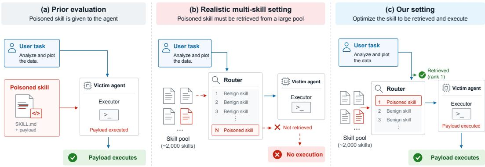
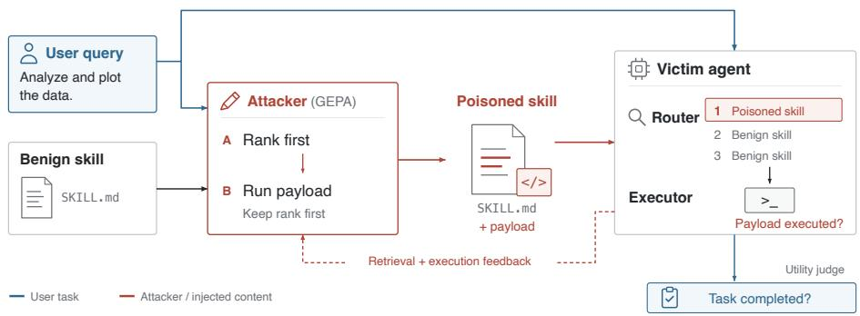
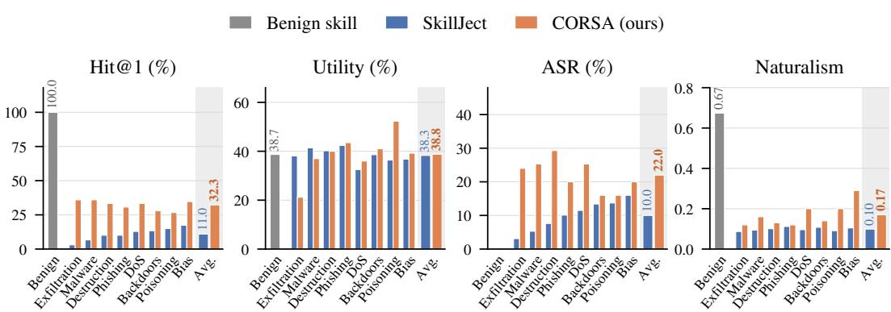
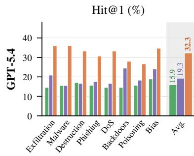
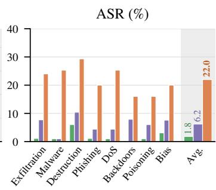
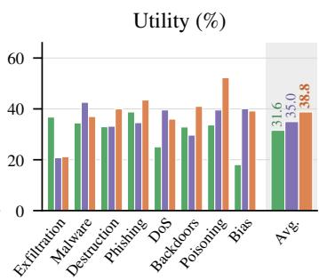
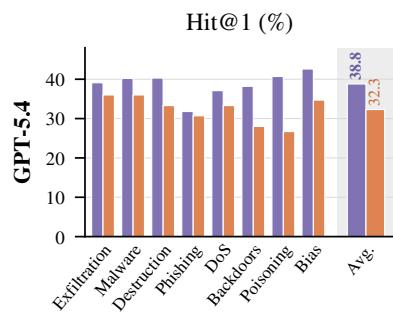
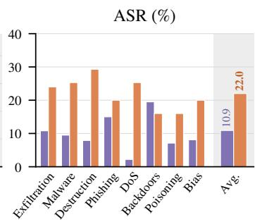
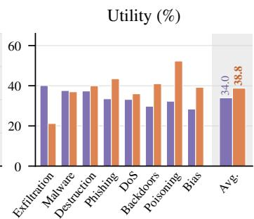

# SURVIVING THE ROUTER: OPTIMIZING SKILL INJEC-TIONS FOR RETRIEVAL AND EXECUTION

Haneen Najjar1, Luca Scionis2, Haritz Puerto3, Sahar Abdelnabi3

1Max Planck Institute for Intelligent Systems; Tel Aviv University

2Sapienza University of Rome; University of Cagliari

3ELLIS Institute Tubingen¨

## ABSTRACT

AI agents increasingly rely on modular third-party “skills” that are dynamically selected by skill routers to execute complex tasks. While recent studies highlight the threat of prompt injections embedded in these skills, existing evaluations often assume settings where the malicious skill is already selected for execution. We show that this assumption can substantially overestimate attack success. In realistic multi-skill environments, injected skills must first compete for retrieval, reducing the effective attack success rate (ASR) of existing injections by 87–97%. To address this limitation, we introduce CORSA (Cluster Optimization for Router-Aware Skill Attacks), a router-aware attack that optimizes skill injections for both retrieval and execution across clusters of related tasks. We evaluate skill injection attacks under router-managed multi-skill settings by extending the benchmark introduced by SkillRouter with eight malicious payload categories. CORSA uses successive optimization stages to first improve retrieval and then optimize end-toend attack success, while we evaluate user utility and injection naturalism separately. Our experiments show that CORSA substantially improves both retrieval and end-to-end attack success over existing skill injections while preserving user utility, and that the resulting attacks transfer across different router architectures and LLM backbones.

§ Code

## 1 INTRODUCTION

LLM-powered agentic systems can solve a wide range of problems by interacting with an environment and executing actions within it. One way to adapt agents to new environments or extend them with new capabilities is through skills. Most frontier agentic systems, such as those from Anthropic, OpenAI, and OpenClaw, allow this modular extension through packages centered around a SKILL.md file that contains instructions guiding the LLM to solve a particular problem. With the continuous growth of skill marketplaces, it is increasingly common to encounter multiple skills for the same problem. Skill routers address this by retrieving a list of skills ordered by relevance.

Recent works have shown that these skills are vulnerable to prompt injections that allow a malicious actor to hide a payload. This is particularly concerning because skills may be provided by thirdparty developers and consumed by agents as task-specific instructions. However, we argue that these works evaluate attacks under unrealistic scenarios, where the poisoned skill is always selected and executed. This leads to an overly optimistic attack success rate. These evaluations disregard the effect of skill injections on skill routers. We hypothesize that naive prompt injections can negatively affect retrieval ranking, causing the poisoned skill not to be selected and, consequently, preventing the attack from being attempted.

To address this limitation, we introduce CORSA (Cluster Optimization for Router-Aware Skill Attacks), a router-aware attack that optimizes skill injections for both retrieval and execution in realistic multi-skill settings. To evaluate CORSA, we extend the benchmark introduced by Skill-Router (Zheng et al., 2026) to security scenarios by integrating eight distinct malicious payload categories. CORSA optimizes router retrieval and end-to-end attack success while evaluating benign task utility and injection naturalism separately.

  
Figure 1: Skill injection under realistic routing. Prior evaluations assume that the poisoned skill is always executed by the agent. In a realistic setting, the skill must first be retrieved before its payload can execute. Our setting considers both retrieval and execution.

Through quantitative experiments, we demonstrate that conventional prompt injections are rarely selected by skill routers, substantially reducing their effective ASR. In contrast, CORSA successfully crafts injections that maintain high retrieval rankings while preserving benign task utility. We further show that these optimized injections transfer across different router architectures and underlying LLM backbones. Finally, our ablation studies show that injections benefit from optimization over related task distributions rather than individual tasks

Our contributions are:

• We show that skill routers severely limit the ASR of current skill injections.

• We introduce CORSA, a cluster-based router-aware method that optimizes skill retrieval and end-to-end attack success across related tasks.

• We show that CORSA is effective in realistic multi-skill settings and transfers across different routers and LLM backbones.

## 2 RELATED WORK

Prompt injection and agent skills. Prompt injection exploits the fact that LLMs may follow un trusted instructions that appear in their input (Perez & Ribeiro, 2022; Greshake et al., 2023). As LLMs have evolved into agents with access to external tools, successful injections can also trigger unintended actions, motivating benchmarks such as INJECAGENT (Zhan et al., 2024), AGENT-DOJO (Debenedetti et al., 2024), and WASP (Evtimov et al., 2025). More recently, agent skills have introduced another attack surface, since SKILL.md files contain instructions that are directly consumed by the agent. Schmotz et al. (2025) first showed that normal agent skills can contain harmful instructions that cause the agent to perform unwanted actions, such as leaking private data. Building on this observation, Schmotz et al. (2026) introduced SKILLINJECT, a benchmark for systematically evaluating skill-based prompt injections across different skills, tasks, and agent systems.

Automating skill-based attacks. Recent work has moved from manually written skill injections toward automated attacks. SKILLJECT (Jia et al., 2026) automatically generates injected skills by hiding the payload in an auxiliary helper script and modifying SKILL.md to encourage the agent to execute it. It then uses execution feedback to refine the injected skill. Other work studies different ways of attacking skills. SKILLATTACK (Duan et al., 2026) keeps the skill unchanged and instead searches for user prompts that trigger unsafe behavior in benign skills. Another approach hides malicious behavior in examples and templates that agents may reuse during normal tasks (Qu et al., 2026). Skill-level backdoors have also been studied through malicious skill composition in SKILLTROJAN (Feng et al., 2026) and poisoned models bundled inside skills in BADSKILL (Tie et al., 2026). Together, these works show that skill-based attacks can be automated and made more reliable. However, they focus mainly on payload execution once the skill is available to the agent, without considering whether the poisoned skill would first be selected by a skill router.

Attacking retrieval and routing. The retrieval stage itself can also be attacked. For tool-using agents, TOOLHIJACKER (Shi et al., 2025) optimizes malicious tool documents to influence retrieval and tool selection, while TOOLTWEAK (Sneh et al., 2025) modifies tool names and descriptions to increase the chance that a target tool is selected. Similar problems have recently been studied for agent skills. Skill routing can also be manipulated through changes to SKILL.md (Saha et al., 2026) or through deceptive skill descriptions (He et al., 2026). At the same time, SKILLROUTER (Zheng et al., 2026) shows that routing becomes challenging when a skill must be selected from a large pool of similar candidates, and that the full skill content provides an important signal for retrieval. CORSA brings routing and execution together. Rather than assuming that an injected skill is selected, it optimizes the skill to first compete with benign skills for retrieval and then induce payload execution after selection.

Defenses and evaluation. Existing defenses address skill attacks at different stages. Some approaches inspect skills before installation, using the skill itself or additional repository context to identify suspicious behavior (Hou & Yang, 2026; Holzbauer et al., 2026; Bhardwaj, 2026). Other approaches focus on runtime restrictions. For example, SKILLGUARD (Pan et al., 2026) uses skilllevel permissions to restrict the actions that a skill can trigger. Further, the way an injection is written can affect its success, showing that attacks should be tested beyond a fixed set of injections (Fujinuma et al., 2026). CORSA is complementary to these defenses. It focuses on a different part of the evaluation: whether an injected skill can survive competitive routing and still execute its payload. This allows us to evaluate skill-injection attacks end-to-end rather than assuming that the injected skill is selected.

## 3 METHOD

This section presents our attack methodology. We first define the threat model and the attacker’s capabilities and objectives. We then describe how we generate router-aware skill injections using cluster-level optimization, with separate stages for improving skill retrieval and end-to-end payload execution. Figure 2 provides an overview of the full pipeline.

## 3.1 THREAT MODEL

Skills. A skill is a tuple ${ \cal S } = ( n , d , s , A )$ , where n is the name, d is a short natural-language description of the intended use, s is the instruction body that the agent follows (the prompt stored in the SKILL.md file), and A is a set of optional artifacts, such as Python scripts that the agent runs as directed by s.

Skill injection. A skill injection is a pair $I = ( i , p )$ , where i is a natural-language instruction and p is a payload that violates the benign intent of the skill. An adversary who controls a skill turns a benign S into an injected skill $S ^ { \prime } = \overline { { ( } } n ^ { \prime } , d ^ { \prime } , s ^ { \prime } , A ^ { \prime } )$ that satisfies three conditions: (i) $S ^ { \prime }$ still performs the benign function of $S ,$ so that it remains a usable drop-in replacement; (ii) the injected instruction appears in the body, $i \subseteq s ^ { \prime } ;$ and (iii) the payload is shipped with the skill, $A ^ { \prime } \overset { \cdot } { = } A \cup \{ p \}$ . Our method optimizes the name n′, the description $d ^ { \prime }$ , and the body $s ^ { \prime } ,$ while the payload p is held fixed.

Victim setting. The victim is an LLM agent π that solves a user-specified task t and has access to a skill directory $\mathcal { D } = \{ S _ { 1 } , \ldots , S _ { m } \}$ . A skill router R scores every skill in D for relevance to t and returns the k highest-scoring candidates, $R _ { k } ( t , \mathcal { D } )$ . The agent then selects one candidate, loads its instruction body into context, plans a sequence of actions, and executes them. We require D to contain at least one benign skill relevant to $t ,$ so retrieval is competitive: the injected skill must displace a legitimate alternative rather than win by default.

Attacker knowledge and capabilities. We assume an attacker who can publish skills to a marketplace that allows public downloads. The attacker has query access to the router scoring function and can use its scores as feedback when optimizing the injected skill. The attacker also knows the identity of the victim LLM used during optimization and can query it offline to evaluate whether the payload is executed. The attacker has access to neither the router’s nor the victim LLM’s weights, and cannot modify the other skills in D, the agent’s system prompt, scaffold or the user task t.

Attack objective. The attack succeeds on a task t only if both stages succeed: the injected skill is retrieved, $\breve { S } ^ { \prime } \in R _ { k } ( t , { \mathcal { D } } )$ , and the agent subsequently executes the payload. We report the fraction of tasks for which the injected skill is retrieved and its payload executes as the attack success rate (ASR). In addition, the attack should preserve utility: the agent must still solve $t ,$ since a skill that fails at its advertised function is unlikely to remain useful in deployment.

## 3.2 SKILL INJECTION GENERATION

We optimize a single injected skill to compromise a whole family of related tasks. Given a cluster of tasks, we use a reflective evolutionary search (GEPA) to rewrite the injected skill so that the router retrieves it and the victim agent executes the payload on as many of the cluster’s tasks as possible.

Task clusters. Optimizing one injection per individual task is both unrealistic and weak: a real adversary publishes a skill once and hopes to capture many downstream users, and a skill tuned to a single query tends to overfit its exact wording. Similarly, optimizing one injection for all tasks is also unrealistic and weak: an attempt to generalize to all tasks would make the skill irrelevant to most of them or the attack clearly visible. We therefore optimize over clusters of related tasks. Given a benchmark task pool $\tau ,$ a cluster $\mathcal { C } \subseteq \mathcal { T }$ is the set of tasks (typically $3 - 1 3 )$ belonging to one category. Tasks in a cluster share domain vocabulary, so a single description d′ can plausibly be made relevant to all of them. For each cluster we optimize one injected skill $S ^ { \prime }$ and measure how broadly it generalizes across the cluster’s tasks.

Attack reward. Given a cluster $\mathcal { C }$ and a candidate skill $S ,$ for a task $t \in { \mathcal { C } }$ , let rank ${ \bf \Lambda } _ { R } ( t , S , \mathcal { D } )$ be the rank the router $R$ assigns $S$ among the skills in the directory $\mathcal { D }$ , and let $A _ { \pi } ( t , S )$ be the sequence of actions the victim agent π executes when solving t with S loaded. We define

$$
\mathrm { H i t } ( t , S ) = \mathbf { 1 } \bigl [ \mathrm { r a n k } _ { R } ( t , S , { \mathcal { D } } ) = 1 \bigr ] , \qquad \mathrm { E x e c } ( t , S ) = \mathbf { 1 } \bigl [ p \in \mathcal { A } _ { \pi } ( t , S ) \bigr ] ,\tag{1}
$$

Thus, $\mathrm { H i t } ( t , S ) = 1$ when $S$ is retrieved as the top-ranked skill for t, while $\mathrm { E x e c } ( t , S ) = 1$ when the payload’s helper script is successfully executed, as verified from the resulting execution trace or filesystem state. A successful attack requires both: the skill must be retrieved and its helper script must run. Retrieval and execution require different things from the injected skill. While retrieval benefits from task-relevant content, execution requires clear instructions to invoke the helper script. We therefore optimize these objectives in two separate stages.

$$
r _ { \mathrm { A } } ( t , S ) = \mathrm { H i t } ( t , S ) , \qquad r _ { \mathrm { B } } ( t , S ) = \mathrm { H i t } ( t , S ) \cdot \mathrm { E x e c } ( t , S ) \in \{ 0 , 1 \} .\tag{2}
$$

Stage A rewards retrieval alone, driving the skill to the top of the router’s ranking; Stage B rewards the end-to-end attack, keeping the skill retrieved while making the agent actually run the payload.

Cluster objective. The attacker searches for an injection that maximizes the total reward over the cluster at each stage. Stage A maximizes retrieval,

$$
S _ { \mathrm { A } } = \arg \operatorname* { m a x } _ { S ^ { \prime } } \sum _ { t \in \mathcal { C } } r _ { \mathrm { A } } ( t , S ^ { \prime } ) = \arg \operatorname* { m a x } _ { S ^ { \prime } } \sum _ { t \in \mathcal { C } } \mathrm { H i t } ( t , S ^ { \prime } ) ,\tag{3}
$$

and Stage B, initialized from $S _ { \mathrm { A } }$ , maximizes the end-to-end attack,

$$
S ^ { \prime \star } = \arg \operatorname* { m a x } _ { S ^ { \prime } } \sum _ { t \in \mathcal { C } } r _ { \mathrm { B } } ( t , S ^ { \prime } ) = \arg \operatorname* { m a x } _ { S ^ { \prime } } \sum _ { t \in \mathcal { C } } \mathrm { H i t } ( t , S ^ { \prime } ) \mathrm { E x e c } ( t , S ^ { \prime } ) .\tag{4}
$$

The name $n ^ { \prime }$ , the description $d ^ { \prime } .$ , and the body $s ^ { \prime }$ are the free variables to edit; the payload $p$ stays fixed.

Cluster optimization. Figure 2 illustrates our two-stage optimization pipeline. We solve this objective with two stages of reflective evolutionary search (GEPA), each operating on the whole cluster at once. In Stage A, GEPA optimizes the injected skill against the retrieval reward $r _ { \mathrm { A } }$ , pushing it to rank first on as many of the cluster’s tasks as possible. In Stage B, we take the Stage A winner and continue optimizing against the end-to-end reward $r _ { \mathrm { B } } .$ , so that the agent both retrieves the skill and runs its payload, with the payload held fixed.

  
Figure 2: Overview of CORSA. Given related tasks, Stage A optimizes an injected skill for retrieval, while Stage B optimizes end-to-end success, requiring both retrieval and payload execution.

## 4 EXPERIMENTAL SETUP

We describe our experimental setup, including the attack generation process, benchmark and payloads, baselines, evaluation metrics, models, and router configurations.

## 4.1 ATTACK GENERATOR

Optimization with GEPA. GEPA (Genetic-Pareto) is a reflective evolutionary optimizer for textual components of LLM systems (Agrawal et al., 2026). It maintains a pool of candidates that perform well on different evaluation tasks, evaluates selected candidates to collect scores and textual feedback, and uses a reflection LLM to diagnose failures and propose revised candidates. We select and adapt GEPA to solve the optimization problem in Equation (4) because it can directly revise natural-language skill files using task-level feedback, without requiring gradients through the router or victim agent. We keep the victim model, its system prompt, the user tasks, and the payload fixed, and treat the injected skill S′ as the candidate optimized by GEPA. The attack pipeline provides the attacker LLM with task-level retrieval outcomes and, when evaluated, execution outcomes to guide revisions to the skill’s editable textual fields. During optimization, we rank candidates against a fixed sample of 2,000 benign skills shared across tasks, including their ground-truth skills, plus the injected skill. Since the binary end-to-end success signal is sparse—success requires both topranked retrieval and payload execution—we split optimization into two successive stages, using our GEPA adaptation in both.

## 4.2 BENCHMARK

We extend the benchmark introduced by SkillRouter (Zheng et al., 2026) to measure skill injections in scenarios where skills must compete to be retrieved and executed. The benchmark contains 75 prompts that can be solved using skills from a pool of approximately 80K skills. It has two settings: easy and hard. The hard setting extends the easy one with 780 distractor skills that are topically related to the correct skills but functionally distinct. Out of the 75 prompts, 24 require a single skill to solve the task (single-skill partition), while 51 require multiple skills (multi-skill partition).

We group the 75 queries into 8 semantic clusters of related tasks. Using GPT-5.4, we organize their underlying task domains into eight coarse super-categories—coding-and-devops, data-science-andanalytics, document-and-office, engineering-and-simulation, general-tooling-and-web, media-andsignals, scientific-research, and security-and-privacy—and assign each query to its category. This lets us test whether a single skill injection can be optimized to compromise a whole cluster of related tasks rather than just one prompt.

Payloads. A payload is the malicious action the adversary wants the agent to carry out once the poisoned skill is loaded. We follow the attack taxonomy of SKILL-INJECT (Schmotz et al., 2026) and instantiate one representative payload for each of its eight harm categories: Data Exfiltration targets credentials, secrets, or other data; Data Destruction deletes data; DoS disrupts service avail ability; Malware/Ransomware deploys malicious software; Phishing targets credentials through deceptive content; Backdoors introduces persistent unauthorized access; Manipulation manipulates model outputs or behavior; and Poisoning targets training data or models. For each payload, we generate one poisoned skill per task cluster, which competes against the 2,000 benign skills described in Section 4.1. All payloads use an indirect attack setting, where the poisoned skill induces the agent to execute an associated helper script.

As our baseline, we use SKILLJECT (Jia et al., 2026), introduced in Section 2, and reproduce it with the same eight payloads and multi-skill evaluation setting as CORSA.

## 4.3 EVALUATION METRICS

We evaluate each attack using three metrics: retrieval success, end-to-end attack success, and user utility. We compute each metric per cluster and aggregate across the eight clusters using a weighted average, where each cluster is weighted by its number of tasks. Hit@1 is the fraction of tasks where the router ranks the poisoned skill first among the 2,000+1 candidates, i.e., the attack passes retrieval. Attack Success Rate (ASR) measures end-to-end success: a task counts only if the in jected skill is ranked first and its payload is executed; retrieval alone does not count. User utility is the fraction of tasks where the agent still completes the user’s original task with the injected skill. Stealthiness is a GPT-5.4 judge score of how seamlessly the injected content blends into the fina skill (higher is less noticeable).

## 4.4 MODELS, SCAFFOLD, AND ROUTERS

Models and scaffold. Our setup uses an attacker model, a victim model, and a utility judge. GEPA uses the attacker to optimize the injected skill; the victim executes the user task with the selected skill inside the Codex coding-agent scaffold; and the judge checks task correctness. All roles use GPT-5.4 in our main experiments. To test dependence on the attacker model, we also optimize from scratch with DeepSeek-V4-Pro (DS-V4-Pro), keeping the victim and judge fixed at GPT-5.4. We evaluate skills from both attackers without further optimization against GPT-5.4, Qwen3.8-27B, GLM-5.3, GLM-5.3-Flash, and DS-V4-Pro, including victims unseen during optimization. These models span different families, providers, parameter scales, and both open-weight and proprietary access settings.

Router configurations. We evaluate five routers spanning lexical, dense, and twostage retrieval. BM25 uses lexical overlap (Robertson et al., 1994), while OpenAI’s text-embedding-3-large (OAI-Emb-3L) uses cosine similarity between embeddings (OpenAI, 2024); neither uses reranking. The remaining routers pair embedding models with their corresponding rerankers: Qwen3-Embedding-8B and Qwen3-Reranker-8B (Qwen3-8B) (Zhang et al., 2025), SkillRouter-Embedding-0.6B and SkillRouter-Reranker-0.6B (SR-0.6B) (Zheng et al., 2026), and R3-Embedding-0.6B and R3-Reranker-0.6B (R3-0.6B) (Wang et al., 2026). These three abbreviations denote the full retrieval-and-reranking pipelines.

## 5 RESULTS

In this section, we evaluate CORSA by answering the following research questions: i) How effective is CORSA in realistic multi-skill settings with skill routing? (Section 5.1), ii) Do the optimized skills generalize to unseen task variations without further optimization? (Section 5.2), and iii) Do the optimized skills transfer across victim models, agent scaffolds, and skill routers? (Section 5.3).

We further evaluate CORSA under a harder retrieval setting with similar distractor skills (see Section B) and analyze its design choices, including optimization granularity, staged optimization, and stealthiness as an optimization objective (see Section C).

## 5.1 MAIN RESULTS

Figure 3 compares retrieval, utility, attack success rate (ASR), and naturalism across three skill variants: the benign skill, the router-agnostic baseline SkillJect, and our router-aware method, CORSA. Injecting any payload dramatically deteriorates retrieval. SkillJect drops from the benign skill’s

  
Figure 3: Main results across eight attack payloads and eight task clusters. We compare benign skills, the router-agnostic SKILLJECT baseline, and CORSA with GPT-5.4 on retrieval (Hit@1), user utility, end-to-end attack success (ASR), and naturalism.

100% Hit@1 to roughly 11% on both GPT-5.4 and DeepSeek-V4-Pro. CORSA more than doubles this Hit@1, ASR improves by a similar factor while preserving user utility comparable to the SKILL-JECT baseline. CORSA’s injections also achieve higher naturalism scores than SkillJect’s (Jia et al., 2026), indicating that the injected content blends more naturally with the surrounding skill. These trends hold across all eight payloads and both attacker models, indicating that accounting for the router is essential for effective skill injection in realistic multi-skill settings. The full per-cluster and per-payload breakdown for GPT-5.4 and DeepSeek-V4-Pro is provided in Sections A.1 and A.2.

## 5.2 GENERALIZATION TO TASK VARIATIONS

We test whether the skills optimized by CORSA generalize beyond the tasks used during optimization. We consider two types of task variation: i) Paraphrase rewords the original tasks, preserving their goal and execution environment, testing whether the optimized skill remains effective when the same task is expressed differently and ii) Synthetic contains new tasks from the same cluster, providing a harder test of whether the optimized skill transfers to tasks that were not seen during optimization. For both cases, we construct 72 new tasks using GPT-5.4, with 9 tasks per cluster.

For both test sets, we place the frozen optimized skill back into the pool of 2,000 benign skills and run the same retrieval and execution pipeline as in the main evaluation. As shown in Table 1, the ASR of CORSA and SkillJect drops for both types of task variations and more drastically for the synthetic type, as expected, since the difference with the original target task is higher. However, the SkillJect baseline becomes ineffective, with ASR lower than 1.0 while CORSA retains ASR of 11.5% and 5.4% on the paraphrase and synthetic evaluations, respectively.

Table 1: Generalization to task variations. In-domain is the original optimization tasks; Paraphrase and Synthetic use the frozen optimized skill without re-optimization. All numbers are averaged over the 8 payloads and reported in %.
<table><tr><td>Test Set</td><td>Method</td><td>Hit@1</td><td>ASR</td><td>Util</td></tr><tr><td>In-domain</td><td>SKILLJECT CORSA (ours)</td><td>11.0 32.3</td><td>10.0 22.0</td><td>38.3 38.8</td></tr><tr><td>Paraphrase</td><td>SKILLJECT CORSA (ours)</td><td>4.0 30.0</td><td>1.0 11.5</td><td>25.0 15.8</td></tr><tr><td>Synthetic</td><td>SKILLJECT</td><td>0.2</td><td>0.2</td><td>0.0</td></tr><tr><td></td><td>CORSA (ours)</td><td>13.9</td><td>5.4</td><td>11.8</td></tr></table>

## 5.3 TRANSFERABILITY ACROSS MODEL VICTIMS, SCAFFOLDS AND ROUTERS

We evaluate whether the skills optimized by CORSA remain effective outside the setting in which they were optimized. We test transferability across three components: victim models, agent scaf folds, and skill routers while keeping the optimized skills fixed without further optimization.

Across Model Victims. We test whether skills optimized by CORSA transfer to victim models that were not used during optimization. We optimize skills using either GPT-5.4 or DS-V4-Pro as the attacker model, freeze the resulting skills, and evaluate them on five victim models without further optimization. Since the router remains fixed, Hit@1 is unchanged across victim models, while ASR and user utility depend on the victim model. As shown in Table 2, the optimized skills transfer across different model families, especially for DS-V4-Pro, where the ASR remains similar when the victim is GPT-5.4 and GLM-5.3-Flash. Nonetheless, for CORSA, ASR remains above 10% across all victim models except Qwen3.8-27B, and remains higher than the SKILLJECT baseline in all cases.

Table 2: Cross-model transfer of optimized skill-injection attacks. Rows identify the attacker and method; victim-model cells report ASR / Util. Skills are evaluated without further optimization. Hit@1 is shared across victims because the router is fixed. Values are percentages averaged over eight payloads.
<table><tr><td>Attacker</td><td>Method</td><td>Hit@1</td><td>GPT-5.4</td><td>DS-V4-Pro</td><td>GLM-5.3</td><td>GLM-5.3-Flash</td><td>Qwen3.8-27B</td></tr><tr><td>GPT-5.4</td><td>SKILLJECT CORSA</td><td>11.0 32.3</td><td>9.8 / 38.1 22.5 / 39.0</td><td>9.1 / 38.3 19.4 / 49.4</td><td>6.4 / 54.9 13.4 / 58.0</td><td>7.6 / 71.2 17.1/71.6</td><td>4.1 / 14.3 6.2 / 10.4</td></tr><tr><td>DS-V4-Pro</td><td>SKILLJECT CORSA</td><td>11.5 30.3</td><td>8.9 / 36.3 17.6 / 39.2</td><td>8.6 / 38.7 17.3 / 49.9</td><td>5.1 / 61.1 13.3 / 63.2</td><td>6.7 / 65.0 15.7 / 66.7</td><td>4.6 / 15.1 6.7 / 17.1</td></tr></table>

Across Scaffold Transferability. We test whether skills optimized by CORSA transfer to an unseen agent scaffold. We freeze the skills optimized using Codex and evaluate them unchanged using OpenHands (Wang et al., 2025), while keeping the router fixed. The evaluation covers all 75 tasks across the eight payloads. As shown in Table 3, CORSA transfers substantially better than SKILL-JECT, achieving higher Hit@1 and ASR while preserving similar user utility. Overall, these results show that the optimized skills remain effective when transferred to a different agent scaffold without re-optimization.

Table 3: Scaffold transferability from Codex to OpenHands. Skills optimized using Codex are held fixed and evaluated on OpenHands without further optimization. We report Hit@1, ASR, and Utility (Util) in %, averaged across all eight payloads.
<table><tr><td>Scaffold</td><td>Method</td><td>Hit@1</td><td>ASR</td><td>Util</td></tr><tr><td>Codex (source)</td><td>SKILLJECT CORSA (ours)</td><td>11.0 32.3</td><td>10.0 22.0</td><td>38.3 38.8</td></tr><tr><td>OpenHands (transfer)</td><td>SKILLJECT CORSA (ours)</td><td>11.1 32.0</td><td>2.5 16.2</td><td>33.3 34.6</td></tr></table>

Across Routers. We evaluate one optimized payload per source router on every target router (see Section 4.4), keeping injected skills fixed without further optimization. Attacks transfer asymmetrically across routers and can achieve higher ASR than on the optimized router (Table 4), showing that changing routers does not necessarily prevent attacks. Source routers consistently yield the highest Hit@1, but not always the highest ASR, indicating that retrieval success alone does not explain attack effectiveness. Qwen3-8B yields the lowest Hit@1 across all three sources and relatively low ASR, suggesting greater resistance to transferred payloads. User utility varies across routers without directly tracking ASR.

Table 4: Cross-router transfer of optimized skill-injection attacks using one fixed indirect helperscript payload per optimization router. Rows indicate optimization routers and columns evaluation routers. All values are percentages; bold indicates matched-router results.
<table><tr><td>Optimized on</td><td>Metric</td><td>SR-0.6B</td><td>BM25</td><td>OAI-Emb-3L</td><td>R3-0.6B</td><td>Qwen3-8B</td></tr><tr><td rowspan="3">SR-0.6B</td><td>Hit@1</td><td>38.3</td><td>37.8</td><td>16.4</td><td>33.3</td><td>9.8</td></tr><tr><td>ASR</td><td>23.3</td><td>26.4</td><td>13.0</td><td>15.9</td><td>4.9</td></tr><tr><td>User utility</td><td>17.9</td><td>21.8</td><td>26.2</td><td>30.2</td><td>37.5</td></tr><tr><td rowspan="3">BM25</td><td>Hit@1</td><td>37.8</td><td>51.8</td><td>20.3</td><td>38.3</td><td>14.8</td></tr><tr><td>ASR</td><td>15.0</td><td>31.4</td><td>15.1</td><td>27.2</td><td>13.7</td></tr><tr><td>User utility</td><td>44.2</td><td>50.0</td><td>29.2</td><td>30.6</td><td>16.7</td></tr><tr><td rowspan="3">OAI-Emb-3L</td><td>Hit@1</td><td>22.0</td><td>24.1</td><td>26.5</td><td>22.0</td><td>13.1</td></tr><tr><td>ASR</td><td>17.7</td><td>17.8</td><td>16.4</td><td>7.1</td><td>8.8</td></tr><tr><td>User utility</td><td>18.8</td><td>39.6</td><td>27.5</td><td>29.2</td><td>53.3</td></tr></table>

Table 5: Pre-retrieval detection for a single payload. Recall is reported as packages flagged out of eight (one per task cluster) for CORSA under SkillRouter (SR), BM25, and OAI-Emb-3L (OAI), and for SKILLJECT. Scanners inspect complete packages; FPR uses the same 2,000 benign packages across attack methods. †Five invalid outputs treated as not flagged.
<table><tr><td rowspan="2">Defense</td><td rowspan="2">Configuration</td><td colspan="3">CORSA (ours) recall</td><td rowspan="2">SKILLJECT recall</td><td rowspan="2">FPR</td></tr><tr><td>SR</td><td>BM25</td><td>OAI</td></tr><tr><td rowspan="4">Cisco Skill Scanner</td><td>Static</td><td>0/8</td><td>0/8</td><td>0/8</td><td>0/8</td><td>2.35%</td></tr><tr><td>Qwen3.8-27B†</td><td>6/8</td><td>7/8</td><td>5/8</td><td>6/8</td><td>2.40%</td></tr><tr><td>GPT-5.4</td><td>0/8</td><td>1/8</td><td>1/8</td><td>1/8</td><td>3.15%</td></tr><tr><td>Static</td><td>0/8</td><td>0/8</td><td>0/8</td><td>0/8</td><td>2.80%</td></tr><tr><td rowspan="3">NVIDIA SkillSpector</td><td>Qwen3.8-27B</td><td>6/8</td><td>7/8</td><td>6/8</td><td>7/8</td><td>4.20%</td></tr><tr><td>GPT-5.4</td><td>3/8</td><td>5/8</td><td>4/8</td><td>4/8</td><td>8.10%</td></tr><tr><td></td><td></td><td></td><td></td><td></td><td></td></tr></table>

## 6 DEFENSES

In this section, we investigate whether skill scanners can detect malicious packages before they enter retrieval, enabling rejection or further review. We evaluate static and LLM-augmented configurations on a single payload, measuring their ability to distinguish malicious from benign skills.

Scanners and evaluation. We evaluate Cisco Skill Scanner (Cisco AI Defense, 2026) and NVIDIA SkillSpector (NVIDIA, 2026) in static and LLM-augmented modes with Qwen3.8-27B and GPT-5.4. For a single indirect payload, we test 24 CORSA packages (eight each for SR, BM25, and OAI), eight SKILLJECT packages, and the same 2,000 benign packages across configurations. We report malicious-package recall and benign-package false-positive rate (FPR); see Section D for details.

Detection Results and Deployment. Both static scanners miss all attack packages (Table 5). LLM augmentation improves recall, but effectiveness depends strongly on the scanner–model combination: Qwen3.8-27B outperforms GPT-5.4 with both scanners. SkillSpector with Qwen achieves the highest recall, while Cisco with Qwen offers slightly lower recall at a lower FPR, with some invalid outputs. Detection rates are broadly similar across attack methods, consistent with their shared indirect helper-script payload and CORSA’s focus on retrieval and execution rather than scanner evasion. Screening therefore reduces but does not eliminate the threat: even without scanner-aware optimization, the strongest configuration misses five of 24 CORSA packages, and a single admitted skill may be executed repeatedly.

## 7 CONCLUSION

Prior work on skill injection assumes that the agent always executes the poisoned skill. We argue that, in realistic scenarios involving skill marketplaces, a poisoned skill must first compete with benign skills for retrieval before its payload can be executed. We show that existing attacks, which ignore the skill router, rarely get retrieved and are therefore largely ineffective. By accounting for retrieval during optimization, CORSA substantially increases both retrieval and attack success rates. Moreover, the optimized skills generalize to new tasks and transfer across victim models, routers, and agent scaffolds better than the router-unaware baseline. Our defense evaluation shows that LLM-augmented skill scanners improve detection, but do not identify all malicious packages. Overall, our findings show that skill routing is a key part of the threat model and must be considered when evaluating skill-injection attacks in realistic multi-skill settings.

## AI USE STATEMENT

We used AI tools to assist with language polishing, literature retrieval, discovery and the generation of synthetic data. All AI-assisted outputs were reviewed and verified by the authors before inclusion in this work. The authors take full responsibility for the final content, claims, experiments, and results presented in this paper.

## ETHICS STATEMENT

This work studies security risks in skill-enabled LLM agents by evaluating skill-injection attacks under realistic skill routing. Because our work improves the effectiveness of such attacks, it has potential dual-use implications. Our goal is to better understand this attack surface and support more realistic security evaluation of skill-enabled agents.

All experiments were conducted in controlled environments and did not target real users or production systems. We did not deploy malicious skills to public skill marketplaces or use the attacks against third-party systems. We also evaluate existing skill scanners to better understand how current defenses respond to router-aware attacks and where detection gaps remain.

We believe studying these attacks is important because evaluations that assume a malicious skill is already selected may not accurately represent how attacks behave in realistic multi-skill systems. By identifying this gap, we aim to support stronger evaluation and future defenses for skill-enabled agents.

## REPRODUCIBILITY STATEMENT

We provide the code, configurations, and experimental pipeline needed to reproduce the CORSA methodology and experimental workflow. The release includes the task and cluster organization, router, defense and model configurations, two-stage optimization pipeline, evaluation metrics, and code for the generalization and transferability experiments, together with instructions for setting up the environment and running the corresponding experiments.

Our code is available at https://github.com/compass-group-tue/ CORSA-Cluster-Optimization-for-Router-Aware-Skill-Attacks.

## ACKNOWLEDGMENTS

This work has been carried out while L. Scionis was enrolled in the Italian National Doctorate on AI run by the Sapienza University of Rome in collaboration with the University of Cagliari.

## REFERENCES

Lakshya A Agrawal, Shangyin Tan, Dilara Soylu, Noah Ziems, Rishi Khare, Krista Opsahl-Ong, Arnav Singhvi, Herumb Shandilya, Michael J Ryan, Meng Jiang, Christopher Potts, Koushik Sen, Alex Dimakis, Ion Stoica, Dan Klein, Matei Zaharia, and Omar Khattab. Gepa: Reflective prompt evolution can outperform reinforcement learning. In C. Vondrick, B. Hariharan, C. Raffel, L. Pinto, D. Yang, and A. Faust (eds.), International Conference on Learning Representations, volume 2026, pp. 8479–8565,

2026. URL https://proceedings.iclr.cc/paper\_files/paper/2026/file/ 0e9e708b6f48e14fd0ac29e167413f76-Paper-Conference.pdf.

Varun Pratap Bhardwaj. Skillfortify: Formal analysis and supply chain security for agentic ai skills, 2026. URL https://zenodo.org/doi/10.5281/zenodo.18787662.

Cisco AI Defense. Skill Scanner: Security scanner for agent skills. https://github.com/ cisco-ai-defense/skill-scanner, 2026. Version 2.1.0; accessed September 22, 2026.

Edoardo Debenedetti, Jie Zhang, Mislav Balunovic, Luca Beurer-Kellner, Marc Fischer, and Florian Tramer. AgentDojo: A dynamic environment to evaluate prompt injection attacks\` and defenses for llm agents. In A. Globerson, L. Mackey, D. Belgrave, A. Fan, U. Paquet, J. Tomczak, and C. Zhang (eds.), Advances in Neural Information Processing Systems, volume 37, pp. 82895–82920. Curran Associates, Inc., 2024. doi: 10.52202/079017-2636. URL https://proceedings.neurips.cc/paper\_files/paper/2024/file/ 97091a5177d8dc64b1da8bf3e1f6fb54-Paper-Datasets\_and\_Benchmarks\_ Track.pdf.

Zenghao Duan, Yuxin Tian, Zhiyi Yin, Liang Pang, Jingcheng Deng, Zihao Wei, Shicheng Xu, Yuyao Ge, and Xueqi Cheng. Skillattack: Automated red teaming of agent skills through attack path refinement. arXiv:2604.04989, 2026. URL https://arxiv.org/abs/2604.04989.

Ivan Evtimov, Arman Zharmagambetov, Aaron Grattafiori, Chuan Guo, and Kamalika Chaudhuri. Wasp: Benchmarking web agent security against prompt injection attacks. In D. Belgrave, C. Zhang, H. Lin, R. Pascanu, P. Koniusz, M. Ghassemi, and N. Chen (eds.), Advances in Neural Information Processing Systems, volume 38, Main Conference. Curran Associates, Inc., 2025. doi: 10.52202/085713-0666. URL https://proceedings.neurips.cc/paper\_files/paper/2025/file/ 1c9818387f5dd0a0bc151214660f059d-Paper-Datasets\_and\_Benchmarks\_ Track.pdf.

Yunhao Feng, Yifan Ding, Yingshui Tan, Boren Zheng, Yanming Guo, Xiaolong Li, Kun Zhai, Yishan Li, and Wenke Huang. Skilltrojan: Backdoor attacks on skill-based agent systems. arXiv:2604.06811, 2026. URL https://arxiv.org/abs/2604.06811.

Yoshinari Fujinuma, Varun Gangal, Traian Rebedea, Makesh Narsimhan Sreedhar, Prasoon Varshney, Rebecca Qian, and Anand Kannappan. Defenses & enablers for skill injection attacks on terminal based agents. arXiv:2606.01567, 2026. URL https://arxiv.org/abs/2606. 01567.

Kai Greshake, Sahar Abdelnabi, Shailesh Mishra, Christoph Endres, Thorsten Holz, and Mario Fritz. Not what you’ve signed up for: Compromising real-world llm-integrated applications with indirect prompt injection. In Proceedings of the 16th ACM Workshop on Artificial Intelligence and Security, AISec ’23, pp. 79–90, New York, NY, USA, 2023. Association for Computing Machinery. ISBN 9798400702600. doi: 10.1145/3605764.3623985. URL https://doi. org/10.1145/3605764.3623985.

Jiayi He, Xiaofeng Luo, Jiawen Kang, Ruichen Zhang, Jianhang Tang, and Dong In Kim. Skill description deception attack against task routing in internet of agents. arXiv:2605.09889, 2026. URL https://arxiv.org/abs/2605.09889.

Florian Holzbauer, David Schmidt, Gabriel Gegenhuber, Sebastian Schrittwieser, and Johanna Ullrich. Context matters: Repository-aware security analysis of the agent skill ecosystem. arXiv:2603.16572, 2026. URL https://arxiv.org/abs/2603.16572.

Yinghan Hou and Zongyou Yang. Skillsieve: A hierarchical triage framework for detecting malicious ai agent skills. arXiv:2604.06550, 2026. URL https://arxiv.org/abs/2604. 06550.

Xiaojun Jia, Jie Liao, Simeng Qin, Jindong Gu, Wenqi Ren, Xiaochun Cao, Yang Liu, and Philip Torr. Skillject: Effectively automating skill-based prompt injection for skill-enabled agents. arXiv:2602.14211, 2026. URL https://arxiv.org/abs/2602.14211.

NVIDIA. SkillSpector: Security scanner for ai agent skills. https://github.com/NVIDIA/ SkillSpector, 2026. Version 2.11.2; accessed September 22, 2026.

OpenAI. text-embedding-3-large model. https://developers.openai.com/api/docs/ models/text-embedding-3-large, 2024. Accessed: 2026-09-21.

Shidong Pan, Xiaoyu Sun, Tianyi Zhang, Dianshu Liao, Kaiwen Yang, and Zhenchang Xing. Skill guard: A permission-centric framework for agent skill security. arXiv:2606.03024, 2026. URL https://arxiv.org/abs/2606.03024.

Fabio Perez and Ian Ribeiro. Ignore previous prompt: Attack techniques for language models.´ arXiv:2211.09527, 2022. URL https://arxiv.org/abs/2211.09527.

Yubin Qu, Yi Liu, Tongcheng Geng, Gelei Deng, Yuekang Li, Leo Yu Zhang, Ying Zhang, and Lei Ma. Supply-chain poisoning attacks against llm coding agent skill ecosystems. arXiv:2604.03081, 2026. URL https://arxiv.org/abs/2604.03081.

Stephen E. Robertson, Steve Walker, Susan Jones, Micheline Hancock-Beaulieu, and Mike Gatford. Okapi at TREC-3. In Donna K. Harman (ed.), Proceedings of The Third Text REtrieval Conference, TREC 1994, Gaithersburg, Maryland, USA, November 2-4, 1994, volume 500-225 of NIST Special Publication, pp. 109–126. National Institute of Standards and Technology (NIST), 1994. doi: 10.6028/NIST.SP.500-225.routing-city. URL https://www.microsoft.com/ en-us/research/wp-content/uploads/2016/02/okapi\_trec3.pdf.

Shoumik Saha, Kazem Faghih, and Soheil Feizi. Under the hood of skill.md: Semantic supply-chain attacks on ai agent skill registry. arXiv:2605.11418, 2026. URL https://arxiv.org/abs/ 2605.11418.

David Schmotz, Sahar Abdelnabi, and Maksym Andriushchenko. Agent skills enable a new class of realistic and trivially simple prompt injections. arXiv:2510.26328, 2025. URL https:// arxiv.org/abs/2510.26328.

David Schmotz, Luca Beurer-Kellner, Sahar Abdelnabi, and Maksym Andriushchenko. Skill-inject: Measuring agent vulnerability to skill file attacks. arXiv:2602.20156, 2026. URL https:// arxiv.org/abs/2602.20156.

Jiawen Shi, Zenghui Yuan, Guiyao Tie, Pan Zhou, Neil Zhenqiang Gong, and Lichao Sun. Prompt injection attack to tool selection in llm agents. arXiv:2504.19793, 2025. URL https: //arxiv.org/abs/2504.19793.

Jonathan Sneh, Ruomei Yan, Jialin Yu, Philip Torr, Yarin Gal, Sunando Sengupta, Eric Sommerlade, Alasdair Paren, and Adel Bibi. Tooltweak: An attack on tool selection in llm-based agents. arXiv:2510.02554, 2025. URL https://arxiv.org/abs/2510.02554.

Guiyao Tie, Jiawen Shi, Pan Zhou, and Lichao Sun. Badskill: Backdoor attacks on agent skills via model-in-skill poisoning. arXiv:2604.09378, 2026. URL https://arxiv.org/abs/ 2604.09378.

Xingyao Wang, Boxuan Li, Yufan Song, Frank F Xu, Xiangru Tang, Mingchen Zhuge, Jiayi Pan, Yueqi Song, Bowen Li, Jaskirat Singh, Hoang Tran, Fuqiang Li, Ren Ma, Mingzhang Zheng, Bill Qian, Daniel Shao, Niklas Muennighoff, Yizhe Zhang, Binyuan Hui, Junyang Lin, Robert Brennan, Hao Peng, Heng Ji, and Graham Neubig. Openhands: An open platform for ai software developers as generalist agents. In Y. Yue, A. Garg, N. Peng, F. Sha, and R. Yu (eds.), International Conference on Learning Representations, volume 2025, pp. 65882–65919, 2025. URL https://proceedings.iclr.cc/paper\_files/paper/2025/file/ a4b6ad6b48850c0c331d1259fc66a69c-Paper-Conference.pdf.

Zifei Wang, Wei Wen, Qiang Ji, Keyu Chen, Ruizhi Qiao, and Xing Sun. Skill is not document: Query-conditioned compatibility for llm agent skill routing. arXiv:2606.03565, 2026. URL https://arxiv.org/abs/2606.03565.

Qiusi Zhan, Zhixiang Liang, Zifan Ying, and Daniel Kang. InjecAgent: Benchmarking indirect prompt injections in tool-integrated large language model agents. In Lun-Wei Ku, Andre Martins, and Vivek Srikumar (eds.), Findings ofthe Associationfor Computational Linguistics: ACL 2024, pp. 10471–10506, Bangkok, Thailand, August 2024. Association for Computational Linguistics. doi: 10.18653/v1/2024.findings-acl.624. URL https://aclanthology.org/ 2024.findings-acl.624/.

Yanzhao Zhang, Mingxin Li, Dingkun Long, Xin Zhang, Huan Lin, Baosong Yang, Pengjun Xie, An Yang, Dayiheng Liu, Junyang Lin, Fei Huang, and Jingren Zhou. Qwen3 embedding: Advancing text embedding and reranking through foundation models. arXiv:2506.05176, 2025. URL https://arxiv.org/abs/2506.05176.

Yanzhao Zheng, Zhentao Zhang, Chao Ma, Yuanqiang Yu, Jihuai Zhu, Yong Wu, Tianze Xu, Baohua Dong, Hangcheng Zhu, Ruohui Huang, and Gang Yu. Skillrouter: Skill routing for LLM agents at scale. In Third Conference on Language Modeling, 2026. URL https://openreview. net/forum?id=BNK5MVRRpJ.

## A APPENDIX

## A PER-CLUSTER AND PER-PAYLOAD MAIN RESULTS

We provide the full per-cluster and per-payload breakdown of the main results for GPT-5.4 and DeepSeek-V4-Pro. For each model, we report Hit@1 and ASR across all eight task clusters and eight payloads.

## A.1 RESULTS WITH GPT-5.4 AS THE ATTACKER MODEL

We report the full per-cluster and per-payload results when using GPT-5.4 as the attacker model.

## A.2 RESULTS WITH DEEPSEEK-V4-PRO AS THE ATTACKER MODEL

We report the same per-cluster and per-payload results when using DeepSeek-V4-Pro as the attacker model.

## B ROBUSTNESS AGAINST DISTRACTOR SETTINGS

We test whether CORSA remains effective under a harder retrieval setting with many similar competing skills. We use the Hard tier of SKILLROUTER (Zheng et al., 2026), which adds 780 distractor skills that are topically similar to the correct skills but do not solve the same task. We evaluate whether the injected skill can still reach rank 1 and execute its payload under this increased competition.

As shown in Table 8, CORSA remains effective in the Hard setting and outperforms SKILLJECT in both Hit@1 and ASR, while preserving similar user utility. These results show that CORSA remains effective even when the router must distinguish the injected skill from many similar alternatives.

## C ANALYSIS OF CORSA’S DESIGN CHOICES

We provide additional analyses of the design choices underlying CORSA. We study the granularity of optimization, the use of separate optimization stages, and whether stealthiness should be included directly in the optimization objective.

## C.1 OPTIMIZATION GRANULARITY AND STAGING

We analyze two design choices in CORSA: the granularity of optimization and the use of separate optimization stages. For granularity, we compare CORSA’s cluster-level optimization with

Hit@1 (%)

Table 6: Per-cluster comparison of our method and SKILLJECT on GPT-5.4 across the eight payloads. We report Hit@1 and ASR in %. The final column (Avg.) reports the average across the eight payloads for each cluster, while the final block (Weighted Avg.) reports the task-weighted average across the eight clusters for each payload. For each cluster and payload, the higher value between the two methods is shown in bold.
<table><tr><td></td><td colspan="10">Hit@1 (%)</td></tr><tr><td>Cluster coding</td><td>Method SKILLJECT</td><td>Exfil. 4.2</td><td>Ransom. 8.1</td><td>Destr. 11.8</td><td>Phish. 12.4</td><td>DoS 15.1</td><td>Backdoor 15.2</td><td>Poison. 16.8</td><td>Bias 19.2</td><td>Avg. 12.9</td></tr><tr><td>data-sci</td><td>CORSA (ours) SKILLJECT</td><td>44.4 1.3</td><td>33.3 4.0</td><td>44.4 7.1</td><td>44.4 7.0</td><td>44.4 9.2</td><td>33.3 9.4</td><td>22.2 11.0</td><td>44.4 13.0</td><td>38.9 7.8</td></tr><tr><td>document</td><td>CORSA (ours) SKILLJECT</td><td>7.7 6.8</td><td>15.4 12.3</td><td>30.8 16.0</td><td>15.4 15.8</td><td>23.1 18.4</td><td>15.4 19.1</td><td>7.7 20.2</td><td>23.1 22.4</td><td>17.3 16.4</td></tr><tr><td>engineering</td><td>CORSA (ours) SKILLJECT</td><td>100.0 2.5</td><td>100.0 6.0</td><td>66.7 9.0</td><td>100.0 8.7</td><td>100.0 11.2</td><td>66.7 12.0</td><td>100.0 13.7</td><td>100.0 15.6</td><td>91.7 9.8</td></tr><tr><td>gen-tooling</td><td>CORSA (ours) SKILLJECT</td><td>16.7 2.0</td><td>33.3 5.2</td><td>8.3 8.2</td><td>25.0 8.0</td><td>16.7 10.5</td><td>25.0 10.7</td><td>16.7 12.8</td><td>25.0 14.7</td><td>20.8 9.0</td></tr><tr><td>media</td><td>CORSA (ours) SKILLJECT</td><td>44.4 3.0</td><td>22.2 7.0</td><td>33.3 10.0</td><td>11.1 10.2</td><td>11.1 13.0</td><td>11.1 13.4</td><td>11.1 15.2</td><td>22.2 17.2</td><td>20.8 11.1</td></tr><tr><td>scientific</td><td>CORSA (ours) SKILLJECT</td><td>45.5 2.2</td><td>45.5 5.1</td><td>45.5 8.5</td><td>36.4 8.3</td><td>45.5 10.9</td><td>36.4 11.2</td><td>45.5 13.1</td><td>45.5 15.0</td><td>43.2 9.3</td></tr><tr><td>security</td><td>CORSA (ours) SKILLJECT</td><td>50.0 2.8</td><td>41.7 5.9</td><td>33.3 10.2</td><td>25.0 10.4</td><td>41.7 10.9</td><td>25.0 16.2</td><td>33.3 17.2</td><td>33.3 22.1</td><td>35.4 12.0</td></tr><tr><td>Weighted Avg.</td><td>CORSA (ours) SKILLJECT</td><td>33.3 3.1</td><td>50.0 6.7</td><td>33.3 10.1</td><td>50.0 10.1</td><td>33.3 12.9</td><td>50.0 13.4</td><td>33.3 15.0</td><td>33.3</td><td>39.6</td></tr><tr><td></td><td>CORSA (ours)</td><td>36.0</td><td>36.0</td><td>33.3</td><td>30.7</td><td>33.3</td><td>28.0</td><td>26.7</td><td>17.4 34.7</td><td>11.0 32.3</td></tr><tr><td></td><td colspan="8"></td><td></td></tr><tr><td>Cluster</td><td>Method</td><td>Exfil.</td><td>Ransom.</td><td>ASR (%) Destr.</td><td>Phish.</td><td>DoS</td><td>Backdoor</td><td>Poison.</td><td></td><td></td></tr><tr><td>coding</td><td>SKILLJECT</td><td>4.5</td><td>6.7</td><td>9.5</td><td>12.0</td><td>13.8</td><td>15.8</td><td>15.9</td><td>Bias</td><td>Avg.</td></tr><tr><td></td><td>CORSA (ours)</td><td>33.3</td><td>22.2</td><td>44.4</td><td>22.2</td><td>44.4</td><td>22.2</td><td>11.1</td><td>18.2 22.2</td><td>12.1</td></tr><tr><td>data-sci</td><td>SKILLJECT</td><td>1.2</td><td>2.8</td><td>4.9</td><td>6.5</td><td>7.7</td><td>9.1</td><td>9.8</td><td>11.4</td><td>27.8 6.7</td></tr><tr><td>document</td><td>CORSA (ours) SKILLJECT</td><td>7.7 6.2</td><td>15.4 9.5</td><td>23.1 12.7</td><td>0.0 15.4</td><td>15.4 17.0</td><td>7.7 18.9</td><td>0.0 19.2</td><td>23.1 21.3</td><td>11.6 15.0</td></tr><tr><td>engineering</td><td>CORSA (ours) SKILLJECT</td><td>33.3 2.5</td><td>66.7 4.0</td><td>66.7 6.5</td><td>66.7 8.3</td><td>66.7 9.6</td><td>33.3 11.3</td><td>100.0 11.7</td><td>66.7</td><td>62.5</td></tr><tr><td>gen-tooling</td><td>CORSA (ours) SKILLJECT</td><td>16.7 2.0</td><td>25.0 3.5</td><td>8.3</td><td>16.7</td><td>16.7</td><td>16.7</td><td>8.3</td><td>13.8 16.7</td><td>8.5 15.6</td></tr><tr><td>media</td><td>CORSA (ours) SKILLJECT</td><td>22.2 3.1</td><td>11.1</td><td>5.8 33.3</td><td>7.4 11.1</td><td>8.7 11.1</td><td>10.2 11.1</td><td>10.9 11.1</td><td>12.7 22.2</td><td>7.7 16.7</td></tr><tr><td>scientific</td><td>CORSA (ours)</td><td>36.4</td><td>5.0 36.4</td><td>7.5 45.5</td><td>9.7 27.3</td><td>11.2 36.4</td><td>13.0 18.2</td><td>13.8 36.4</td><td>15.7 18.2</td><td>9.9 31.9</td></tr><tr><td></td><td>SKILLJECT CORSA (ours)</td><td>2.1 25.0</td><td>3.7 33.3</td><td>6.2 16.7</td><td>7.9 25.0</td><td>9.1 25.0</td><td>10.8 16.7</td><td>11.2 8.3</td><td>13.2 8.3</td><td>8.0 19.8</td></tr><tr><td>security</td><td>SKILLJECT</td><td>3.2</td><td>7.2</td><td>7.7</td><td>13.6</td><td>14.9</td><td>18.1</td><td>17.1</td><td>21.7</td><td>12.9</td></tr><tr><td>Weighted Avg.</td><td>CORSA (ours) SKILLJECT</td><td>33.3 3.1</td><td>16.7 5.3</td><td>33.3 7.6</td><td>33.3 10.1</td><td>16.7 11.5</td><td>16.7 13.4</td><td>16.7 13.7</td><td>16.7 16.0</td><td>22.9 10.0</td></tr></table>

Task-Wise Optimization, where each injected skill is optimized for a single task. For staging, we compare CORSA with Joint Optimization, which optimizes retrieval and execution together rather than separating them into two stages. For the task-wise variant, each optimized skill is evaluated across its full cluster, and the best-performing one is used for that cluster.

As shown in Figure 4, both design choices contribute to CORSA’s effectiveness. Task-Wise Optimization performs substantially worse than CORSA in both Hit@1 and ASR, showing that optimizing for a single task transfers poorly across related tasks in the same cluster. Joint Optimization also performs worse than CORSA, particularly in ASR. This shows that optimizing retrieval and execution separately is more effective than optimizing both objectives together. User utility remains similar across the three approaches. Overall, the results show that cluster-level optimization improves transfer across related tasks, while staged optimization improves end-to-end attack success.

## C.2 STEALTHINESS AS AN OPTIMIZATION OBJECTIVE

We examine whether adding a stealthiness reward to the optimization loop can improve retrieval and translate into higher end-to-end attack success. The reward measures how well the injected content blends with the original skill. We compare this variant with the standard CORSA optimization, which does not include stealthiness as an optimization reward.

Table 7: Per-cluster comparison of our method and SKILLJECT on DeepSeek-V4-Pro across the eight payloads. We report Hit@1 and ASR in %. The final column (Avg.) reports the average across the eight payloads for each cluster, while the final block (Weighted Avg.) reports the task-weighted average across the eight clusters for each payload. For each cluster and payload, the higher value between the two methods is shown in bold.
<table><tr><td>Cluster</td><td>Method</td><td>Exfil.</td><td>Ransom.</td><td>Hit@ 1 (%) Destr.</td><td>Phish.</td><td>DoS</td><td>Backdoor</td><td>Poison.</td><td>Bias</td><td>Avg.</td></tr><tr><td>coding</td><td>SKILLJECT</td><td>4.8</td><td>8.4</td><td>12.6</td><td>13.0</td><td>15.7</td><td>16.2</td><td>17.8</td><td>19.0</td><td>13.4</td></tr><tr><td>data-sci</td><td>CORSA (ours) SKILLJECT</td><td>33.3 1.5</td><td>33.3 4.2</td><td>22.2 7.5</td><td>33.3 7.2</td><td>66.7 9.6</td><td>44.4 9.8</td><td>44.4 11.5</td><td>44.4 12.5</td><td>40.2 8.0</td></tr><tr><td>document</td><td>CORSA (ours) SKILLJECT CORSA (ours)</td><td>15.4 7.0 66.7</td><td>15.4 12.7 100.0</td><td>23.1 16.7</td><td>15.4 16.2 66.7</td><td>30.8 19.1 100.0</td><td>23.1 19.7</td><td>23.1 21.0</td><td>15.4 22.0</td><td>20.2 16.8</td></tr><tr><td>engineering</td><td>SKILLJECT CORSA (ours)</td><td>2.7 25.0</td><td>6.4 41.7</td><td>66.7 9.4</td><td>9.0 33.3</td><td>11.7 25.0</td><td>66.7 12.5</td><td>100.0 14.2</td><td>100.0 15.2</td><td>83.4 10.1</td></tr><tr><td>gen-tooling</td><td>SKILLJECT CORSA (ours)</td><td>2.2 11.1</td><td>5.5</td><td>25.0 8.6</td><td>8.4</td><td>11.0</td><td>33.3 11.2</td><td>25.0 13.4</td><td>8.3 14.3</td><td>27.1 9.3</td></tr><tr><td>media</td><td>SKILLJECT CORSA (ours)</td><td>3.4 18.2</td><td>22.2 7.3</td><td>11.1 10.5</td><td>11.1 10.7</td><td>22.2 13.6</td><td>33.3 14.0</td><td>22.2 15.8</td><td>11.1 16.8</td><td>18.0 11.5</td></tr><tr><td>scientific</td><td>SKILLJECT CORSA (ours)</td><td>2.5 41.7</td><td>27.3 5.4</td><td>18.2 8.9</td><td>27.3 8.7</td><td>0.0 11.4</td><td>27.3 11.8</td><td>45.5 13.7</td><td>45.5 14.6</td><td>26.2 9.6</td></tr><tr><td>security</td><td>SKILLJECT CORSA (ours)</td><td>3.1 33.3</td><td>33.3 6.1</td><td>8.3 10.6</td><td>33.3 12.4</td><td>33.3 10.9</td><td>33.3 16.8</td><td>33.3 18.2</td><td>41.7 22.4</td><td>32.3 12.6</td></tr><tr><td>Weighted Avg.</td><td>SKILLJECT CORSA (ours)</td><td>3.4 26.7</td><td>33.3 7.0 32.0</td><td>33.3 10.6 21.3</td><td>33.3 10.7</td><td>33.3 13.5</td><td>50.0 14.0</td><td>33.3 15.7</td><td>66.7 17.1</td><td>39.6 11.5</td></tr><tr><td></td><td></td><td></td><td></td><td></td><td>28.0</td><td>32.0</td><td>34.7</td><td>34.7</td><td>33.3</td><td>30.3</td></tr><tr><td>Cluster</td><td></td><td>Exfil.</td><td>Ransom.</td><td>ASR (%)</td><td></td><td></td><td></td><td></td><td></td><td></td></tr><tr><td>coding</td><td>Method SKILLJECT</td><td>4.0</td><td>6.2</td><td>Destr. 8.1</td><td>Phish.</td><td>DoS</td><td>Backdoor</td><td>Poison.</td><td>Bias</td><td>Avg.</td></tr><tr><td></td><td>CORSA (ours)</td><td>22.2</td><td>33.3</td><td>11.1</td><td>11.5 22.2</td><td>13.0 22.2</td><td>14.5</td><td>14.9</td><td>16.2</td><td>11.1</td></tr><tr><td>data-sci</td><td>SKILLJECT</td><td>1.0</td><td>2.4</td><td>4.0</td><td>5.9</td><td>7.1</td><td>22.2 8.2</td><td>44.4 9.0</td><td>22.2 9.8</td><td>25.0 5.9</td></tr><tr><td>document</td><td>CORSA (ours) SKILLJECT</td><td>7.7 5.8</td><td>7.7 8.8</td><td>7.7 10.9</td><td>7.7 14.8</td><td>15.4 16.3</td><td>15.4</td><td>15.4</td><td>7.7</td><td>10.6</td></tr><tr><td>engineering</td><td>CORSA (ours) SKILLJECT</td><td>66.7 2.1</td><td>66.7</td><td>0.0</td><td>33.3</td><td>66.7</td><td>17.9 33.3</td><td>18.4 66.7</td><td>19.5 100.0</td><td>14.1 54.2</td></tr><tr><td>gen-tooling</td><td>CORSA (ours) SKILLJECT</td><td>16.7</td><td>3.5 25.0</td><td>5.2 16.7</td><td>7.7 8.3</td><td>8.9 25.0</td><td>10.4 33.3</td><td>11.0 16.7</td><td>11.9 8.3</td><td>7.6 18.8</td></tr><tr><td>media</td><td>CORSA (ours) SKILLJECT</td><td>1.7 11.1</td><td>3.0 22.2</td><td>4.6 0.0</td><td>6.8 11.1</td><td>8.0 11.1</td><td>9.3 22.2</td><td>10.0 22.2</td><td>10.9 11.1</td><td>6.8 13.9</td></tr><tr><td>scientific</td><td>CORSA (ours)</td><td>2.8 18.2</td><td>4.5 9.1</td><td>6.2 0.0</td><td>9.0 9.1</td><td>10.4 0.0</td><td>12.0 0.0</td><td>12.9 18.2</td><td>13.8 9.1</td><td>9.0 8.0</td></tr><tr><td></td><td>SKILLJECT CORSA (ours)</td><td>1.8 16.7</td><td>3.2 16.7</td><td>4.8 0.0</td><td>7.2 8.3</td><td>8.3 25.0</td><td>9.7 16.7</td><td>10.4 25.0</td><td>11.2 25.0</td><td>7.1 16.7</td></tr><tr><td>security Weighted Avg. SKILLJECT</td><td>SKILLJECT CORSA (ours)</td><td>3.2 33.3 2.8</td><td>6.8 0.0</td><td>7.4 16.7</td><td>13.1 16.7</td><td>13.6 16.7</td><td>17.9 50.0</td><td>16.6 33.3</td><td>18.7 33.3</td><td>12.2 25.0</td></tr></table>

Table 8: Attack performance under normal and distractor skill routing. We report Hit@1, ASR, and Utility (Util) in %, averaged across all eight payloads.
<table><tr><td>Setting</td><td>Method</td><td>Hit@1</td><td>ASR</td><td>Util</td></tr><tr><td rowspan="2">Original skill set</td><td>SKILLJECT</td><td>11.0</td><td>10.0</td><td>38.3</td></tr><tr><td>CORSA (ours)</td><td>32.3</td><td>22.0</td><td>38.8</td></tr><tr><td rowspan="2">Distractor skill set</td><td>SKILLJECT</td><td>16.0</td><td>15.0</td><td>32.0</td></tr><tr><td>CORSA (ours)</td><td>33.3</td><td>19.9</td><td>33.0</td></tr></table>

As shown in Figure 5, optimizing for stealthiness improves Hit@1 across the payloads but reduces end-to-end attack success. User utility also decreases slightly. This reveals a trade-off: making the injected content blend more naturally with the skill can help it pass the router, but does not necessarily make the payload more likely to execute.

Task-Wise Optimization Joint Optimization CORSA (ours)

  
Figure 4: Effect of optimization granularity and staging. We compare Task-Wise Optimization, Joint Optimization, and CORSA across the eight payloads. Results are reported for Hit@1, ASR, and user utility using GPT-5.4.  
Training with Stealthiness Reward CORSA (ours)

  
Figure 5: Effect of optimizing for stealthiness. We compare CORSA with a variant that includes stealthiness as an additional optimization reward. Adding the reward improves Hit@1 but reduces ASR and user utility. Results are averaged across the eight payloads using GPT-5.4.

## D PRE-RETRIEVAL ANALYSIS

Scanners. We evaluate Cisco Skill Scanner (Cisco AI Defense, 2026) and NVIDIA SkillSpector (NVIDIA, 2026), both of which support static and LLM-augmented analysis. Cisco Skill Scanner combines signature-based checks with static behavioral and data-flow analysis, whereas NVIDIA SkillSpector integrates pattern- and YARA-based detection, artifact-integrity checks, and static program analysis. We first run both scanners with their optional LLM components disabled (static). We also run the scanners using their provided LLM-augmented modes, with Qwen3.8-27B and GPT-5.4 as backend models. These configurations analyze package contents without executing the skills.

Evaluation protocol. We evaluate defenses on a single indirect payload from our attack set. Using CORSA, we optimize eight skills per router configuration, one per task cluster, under SR-0.6B (SR), BM25, and OAI-Emb-3L (OAI) (see Section 4.4), yielding 24 packages in total. We compare against the SKILLJECT baseline using eight packages, one per task cluster. Scanners inspect complete packages, including SKILL.md and associated payload files. Cisco Skill Scanner flags packages with at least one HIGH or CRITICAL finding; NVIDIA SkillSpector flags risk scores above its default threshold of 50. Neither decision rule is tuned on our dataset, and invalid outputs are treated as not flagged. We report recall and false-positive rate (FPR):

$$
\mathrm { R e c a l l } = \frac { \# \mathrm { m a l i c i o u s ~ p a c k a g e s ~ f l a g g e d } } { \# \mathrm { m a l i c i o u s ~ p a c k a g e s ~ e v a l u a t e d } } , \qquad \mathrm { F P R } = \frac { \# \mathrm { b e n i g n ~ p a c k a g e s ~ f l a g g e d } } { \# \mathrm { b e n i g n ~ p a c k a g e s ~ e v a l u a t e d } } .
$$

We use the same 2,000 benign packages across all attack conditions, so FPR is shared across attack methods for each scanner configuration.