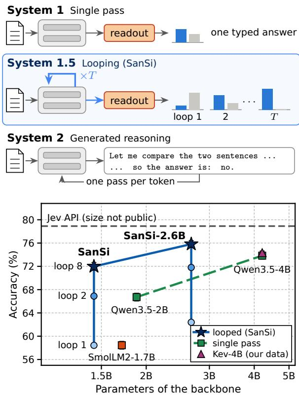

# SanSi: A Looped Typed Decision Model for System 1.5 Thinking

Shuyu Gan Young-Jun Lee Dongyeop Kang

University of Minnesota {gan00067,lee05727,dongyeop}@umn.edu

SanSi Project Page

## Abstract

Typed decision models answer a declared question without generating text: a decision head returns a probability for each of the declared options in a single forward pass. A single pass is fast, intuitive System 1 thinking. We study what lies between one pass and generated reasoning: looping, in which the same layers are recursively applied several times before one typed readout. Each loop lets the model revise its hidden state before it commits to an answer, without generating a token; we call this System 1.5 thinking. We propose SanSi, which turns a pre-trained looped language model into a typed decision model. The option probabilities are read after every loop, and every loop is trained with a proper scoring rule, so that one model serves every budget from one loop to eight in a single run. On 10,027 test decisions from 59 sources, SanSi reaches 72.0% accuracy: 13.5 points above a non-looped model of the same shape trained with the same recipe, 5.3 points above a newer non-looped model of its size, and 1.8 points below one with three times the parameters. On two depth-controlled tasks, loops extend the solvable depth beyond the depths seen in training, where the larger single-pass model fails. Used as the judge for policy optimization with reinforcement learning, without gold answers, SanSi raises the generator’s F1 by 7.7 points.

## 1 Introduction

A growing share of language model calls do not ask for text, but a decision: is this message spam, does this case satisfy the policy, which of these four answers follows from the document. Typed decision models (TypeSafe AI, 2026; Tang and Zheng, 2026) serve these calls directly. The caller declares the options, for example spam and not spam, and the model returns one probability per option in a single forward pass, with no generated text to parse. The commercial Jev API popularised the format, open models such as Kev (Palmer, 2026) follow the same contract, and the probabilities are increasingly used to accept, escalate or route (Li et al., 2026b; Deußer et al., 2026).

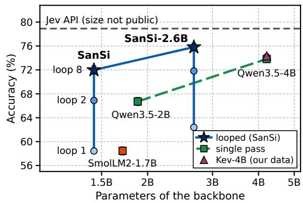  
Figure 1: Top: three ways to spend computation on a decision. Bottom: Accuracy on the 10,027 test decisions against backbone size, for the models trained on our data. Single-pass models gain accuracy by adding parameters; SanSi gains it by looping the same parameters. Kev-4B (our data) is Qwen3.5-4B trained with Kev’s recipe. Dashed line is the Jev API, which was not trained on our data.

A single pass gives a fixed amount of computation to every decision. This is enough to tell whether a message is spam, but many decisions require several dependent steps: following a chain of relations, composing rules, or noticing that the decisive evidence is missing. Take a chain of statements: Omar is honest, Bert says that Omar tells the truth, and Ben says that Bert lies. Whether Ben tells the truth can only be found by following the chain, one statement at a time. On such chains, the accuracy of the Jev API falls from 100% with one step to 62.5% with three and is at chance from six steps on (Appendix G.6). When one pass is not enough for complex reasoning, a larger model adds parameters and memory, or generated reasoning adds tokens and latency and gives up the typed contract. In this work, we explore looping: to apply the same layers recursively to their own output, which adds computation but no parameters and keeps the typed contract. If a single pass is System 1 and generated reasoning is System 2, looping is a “System 1.5” (Wang et al., 2025).

Looped transformers learn iterative algorithms and generalise to longer inputs (Giannou et al., 2023; Yang et al., 2024; Fan et al., 2024), building on Universal Transformers (Dehghani et al., 2019), and language models are now pre-trained to loop as a form of latent reasoning (Geiping et al., 2025; Zhu et al., 2025). Jev-LCT (Cao, 2026) applies looping to a typed decision model, but loops only the top two layers of a non-looped model and exits early. We study in depth how much accuracy looping adds, what it costs, and what it does to the probabilities that callers rely on.

We present SanSi1, a new family of looped typed decision models built on Ouro (Zhu et al., 2025), a language model pre-trained to loop. We train two sizes, SanSi on Ouro-1.4B and SanSi-2.6B on Ouro-2.6B; most of our analyses use the first. The backbone stays frozen: we train only LoRA adapters and a small readout for every loop, 61M parameters in total for SanSi. SanSi reads the option probabilities after every loop and trains each with a proper scoring rule, so one model serves every budget from one loop to eight (Figure 2).

We test SanSi on 10,027 test decisions from 59 sources. With the same data, recipe and seeds, looping adds 13.5 points over SmolLM2-1.7B, a nonlooped typed decision model of the same shape, and brings SanSi within 1.8 points of Qwen3.5-4B, a single-pass typed decision model with three times the parameters (Figure 1). The gain is smallest on classification (+3.1 points) and largest on multistep reasoning (+15.1), long documents (+16.7)

and knowledge questions (+17.6) (Figure 3b), and it costs 7.7 times the computation of a single pass. Reading SanSi after three loops already gives 88% of its gain from loop 1 to loop 8; most answers settle by the fourth loop, and harder items settle later. The loops make the model better at noticing that the evidence for a decision is missing, but they improve calibration only up to loop 3: after the answers settle, confidence keeps rising. On two depth-controlled tasks, loops solve depths never seen in training, where the larger single-pass model fails: on liar chains of 9 to 16 steps (training goes up to 8), SanSi is right on 72.6% of the items and Qwen3.5-4B on 50.0%, the chance level. As the only reward for training a generator with reinforcement learning, SanSi raises the generator’s F1 from 39.5 to 47.3, which shows its potential as a judge for policy learning.

## 2 Background and Related Work

Typed decision models. Jev (TypeSafe AI, 2026) and its open reimplementation Kev (Palmer, 2026) take a state, a question and a declared set of options and return a probability for each option in one pass. In Kev, one request may carry several questions about the same state, and a single small head answers each of them independently; we consider one question per call. Kev is trained with crossentropy; Jev is reported to be trained with reinforcement learning for calibrated decisions (TypeSafe AI, 2026). Recent audits examine the accuracy of Jev and the reliability of its probabilities (Porcedda, 2026; Deußer et al., 2026; Li et al., 2026a; Sun et al., 2026; Tang and Zheng, 2026). Unlike Jev-LCT (Cao, 2026), we start from a backbone whose whole stack was pre-trained to loop, read every loop, and measure what the loops add against nonlooped models under one recipe.

Looped models and anytime prediction. Recent work on looped language models studies how the loops are used (Dau et al., 2026; Kohli et al., 2026; Guo et al., 2026; Blayney et al., 2026), their stability and halting (Yang et al., 2026; Popescu et al., 2026a), architectural variants (Jeddi et al., 2026; Yu et al., 2026; Wang et al., 2026), adding loops to models pre-trained without them (McLeish et al., 2025; Shapiro, 2026; Chen et al., 2026; Park et al., 2026; Marchenko et al., 2026), and tool calling (Popescu et al., 2026b). The same idea appears above the level of layers: a self-improving agent can apply one fixed operation repeatedly to the result of its previous application and let convergence decide the depth (Kim et al., 2026). Reading a prediction at several depths relates to adaptive computation (Graves, 2016; Banino et al., 2021) and early exit (Xin et al., 2020; Zhou et al., 2020); we do not propose a halting rule. In networks with exits at several layers, later layers turn some right predictions into wrong ones (Kaya et al., 2019), and the layer at which a prediction settles measures how hard an example is (Baldock et al., 2021); we find both for loops (§5.2). More generated reasoning can make models overconfident (Lacombe et al., 2025; Hiremath and Hiremath, 2026); we find a related effect for loops (§5.3).

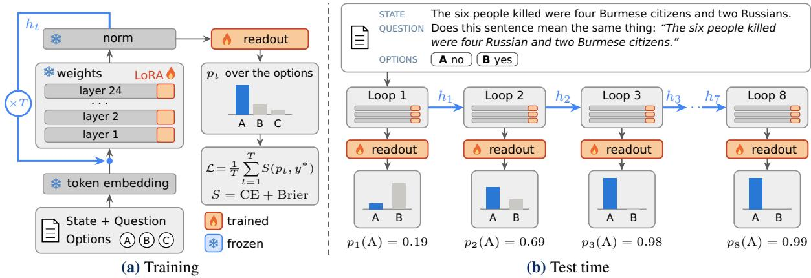  
Figure 2: SanSi. (a) Training: one stack of 24 layers is applied T times; after every loop the option probabilities are read and trained towards the target. (b) Test time: a test item from PAWS (Zhang et al., 2019) followed through the loops; the first loop prefers the wrong option, the later loops the correct one.

## 3 SanSi: A Looped Typed Decision Model

Task. A typed decision is a call with three parts: a state s (a passage, a set of rules or records), a question $q ,$ and $K \geq 2$ declared options. The model returns a distribution $p \in \Delta ^ { \dot { K } }$ over the options and no text. The target distribution $y ^ { * }$ is one-hot when the item has a correct option, uniform when the state lacks the evidence needed to answer (an unanswerable item), and the annotators’ label distribution when the item was labelled by a crowd.

Looped backbone. Ouro-1.4B (Zhu et al., 2025) applies one stack $F _ { \theta }$ of 24 transformer layers repeatedly (Figure 2a). With token embeddings $h _ { 0 }$ and the model’s final normalisation N,

$$
h _ { t } = N \big ( F _ { \theta } ( h _ { t - 1 } ) \big ) , \qquad t = 1 , \dots , T .\tag{1}
$$

The normalised state $h _ { t }$ is both the output of loop t and the input of loop t + 1; the input tokens are not injected again. Running $T$ loops therefore costs $T$

passes through the stack and adds no parameters.   
Ouro was pre-trained with four loops.

Readout after every loop. The item is rendered as a prompt that lists the options under the letters $\ \mathrm { A } , \ \mathrm { B } , \ \ldots$ . and ends in “Answer:”. Let $z _ { t }$ be the row of $h _ { t }$ at the last prompt token. The option logits are

$$
\ell _ { t } = \left( W + U _ { t } V _ { t } \right) z _ { t } / \tau _ { t } , \quad p _ { t } = \mathrm { s o f t m a x } ( \ell _ { t } ) ,\tag{2}
$$

restricted to the K declared options. W holds the rows of the frozen language-model head for the option letters; the rank-16 correction $U _ { t } V _ { t }$ and the scale $\tau _ { t }$ are trained, one per loop, and start at the identity (Appendix B). Since $p _ { t }$ is computed from $h _ { t }$ alone, one pass with T loops yields the decisions of all budgets $1 , \ldots , T$ (Figure 2b).

Training. We train every loop towards the target with the sum of two proper scoring rules, crossentropy and the Brier score:

$$
\mathcal { L } = \frac { 1 } { T } \sum _ { t = 1 } ^ { T } \Big [ - \sum _ { k } y _ { k } ^ { * } \log p _ { t , k } + \sum _ { k } ( p _ { t , k } - y _ { k } ^ { * } ) ^ { 2 } \Big ] .\tag{3}
$$

For an item with one correct option, cross-entropy looks only at the probability of that option and penalises a confident error heavily. The Brier score looks at the probability of every option and is bounded. Both are smallest when the model outputs exactly the target probabilities. The loss of every loop is backpropagated through all the loops before it. The weights of the backbone are frozen. We train LoRA adapters (Hu et al., 2022) of rank 64 on all attention and feed-forward projections (60.6M parameters, shared by all loops) and the readouts (0.27M), for 1,000 steps of 16 items; the remaining settings are in Appendix B. SanSi is trained with T = 8 loops, twice the four loops of Ouro’s pre-training, and is read after the eighth loop unless another loop is named.

<table><tr><td></td><td></td><td colspan="3">Test</td></tr><tr><td>Item type</td><td>Train</td><td>In-dist.</td><td>Near</td><td>Far</td></tr><tr><td>A Classification</td><td>2,400</td><td>321</td><td></td><td>768</td></tr><tr><td>B Multi-step reasoning</td><td>5,500</td><td>800</td><td>991</td><td>1,281</td></tr><tr><td>C Uncertain evidence</td><td>2,300</td><td>478</td><td>640</td><td>440</td></tr><tr><td>D Long documents</td><td>1,000</td><td>357</td><td></td><td>544</td></tr><tr><td>E Sentence pairs</td><td>1,600</td><td>160</td><td>240</td><td>968</td></tr><tr><td>F Knowledge</td><td></td><td>一</td><td>一</td><td>1,808</td></tr><tr><td>Total</td><td>12,800</td><td>2,116</td><td>1,871</td><td>5,809</td></tr></table>

Table 1: The decision suite: number of items by type and by distance from the training data. Type C contains the unanswerable and crowd-labelled items. The test set also contains the 231 public JevBench items (10,027 test items in total). Sources and an example of every type are in Appendix A.

## 4 Experimental Setup

Data. We build one suite of typed decisions from public datasets, the training and transfer suites of Kev, and the public items of JevBench (JevBench maintainers, 2026), all rendered in the prompt format above (Table 1; sources and an example of every type in Appendix A). Items fall into six types by what they demand; knowledge questions occur only in the test set. Test items are also grouped by distance from the 12,800 training items: indistribution items are new items from the 20 training sources; near transfer items are harder or reworded trained types, such as CLUTRR with 5–10 hops (2–4 in training) (Sinha et al., 2019);far transfer items come from 30 sources unseen in training, including FOLIO, BBH, MMLU and QuALITY (Han et al., 2022; Suzgun et al., 2023; Hendrycks et al., 2021; Pang et al., 2022). The 231 public JevBench items form a fourth group. The test set has 10,027 items; 382 are unanswerable and 766 carry a crowd distribution (Nie et al., 2020b). Another 2,471 items form the development set.

Models. We compare SanSi with four single-pass models, which are run once and read exactly as loop 1 of SanSi is. Two are controls of the same shape: Ouro-1.4B, one loop, SanSi’s backbone trained and run with T = 1, and SmolLM2-1.7B (Allal et al., 2025), the closest non-looped model (Ouro’s tokenizer, 24 layers, hidden size 2,048). Two are references from a newer family: Qwen3.5-

2B (1.9B parameters), which is close to SanSi in size, and Qwen3.5-4B (Qwen Team, 2026) (4.2B), which has three times its parameters. A fifth singlepass model tests whether these references depend on our recipe: Kev-4B (our data) is Qwen3.5-4B trained on our data with Kev’s own code and recipe (Palmer, 2026). We use the Base checkpoint of every backbone. All other models are fine-tuned with the same recipe: the same training items in the same order, LoRA of the same rank on the same kinds of modules, the same readout and the same loss, with three seeds each; this includes SanSi-2.6B, the same recipe on the larger looped backbone Ouro-2.6B. We report means over the seeds and, in the tables, the standard deviation (±). We also report the backbones without fine-tuning and two released models that were not trained on our data, Kev-4B and the commercial Jev API (jev-1.13.0); these are in Appendix D. Appendix B gives the sizes and the measured cost of every model.

Metrics. Accuracy counts an item as right when the most probable option is the gold option (the majority option for crowd-labelled items). An unanswerable item is right when the model gives no hard answer, that is, when its top probability is below (1 + 1/K)/2. Confidence is the top probability, and ECE the expected calibration error over ten equal-width bins of confidence, on answerable items. Evidence AUROC is the probability that an item with its key evidence receives a higher confidence than an item without it, on the 786 items of the sources that contain both. We measure the cost of a model by the GPU time of one pass over the test set (Appendix B). Intervals are 95% bootstrap intervals over groups of related items. Appendix C gives the formulas and the detailed definitions.

## 5 Results

We ask four questions: does looping help, and at what cost (RQ1, §5.1); how do the answers change from loop to loop (RQ2, §5.2); what do the loops do to the probabilities (RQ3, §5.3); and does looping buy reasoning depth (RQ4, §5.4)?

5.1 RQ1: Does looping help, and at what cost? Gain at the same shape. Table 2 gives the main comparison. SanSi and SmolLM2-1.7B share the same shape (24 layers, hidden size 2,048), training items, recipe and readout; SanSi applies its layers eight times, SmolLM2 once. SanSi reaches 72.0% against 58.4%, a gain of 13.5 points (95% interval [12.5, 14.5]; Table 8), stable across seeds (12.9–14.8). The gain is broad: it holds in every test group and on 55 of 59 test sources (Table 11). The backbone is not the cause: Ouro-1.4B trained and run with a single loop reaches 58.6%, indistinguishable from SmolLM2 (+0.1 [−0.7, 1.0]). The 13.5 points come from the loops.

<table><tr><td></td><td></td><td></td><td></td><td colspan="4">Accuracy (%) ↑</td><td></td><td>Evidence</td></tr><tr><td>Model</td><td>Params</td><td>Loops</td><td>Cost</td><td>All</td><td>In-dist.</td><td>Near</td><td>Far</td><td>ECE↓</td><td>AUROC↑</td></tr><tr><td>SmolLM2-1.7B</td><td>1.7B</td><td>1</td><td>1.1</td><td> $5 8 . 4 \pm 0 . 7$ </td><td> $7 6 . 1 \pm 0 . 8$ </td><td> $5 7 . 7 { \pm } 0 . 6 $ </td><td> $5 2 . 3 { \pm } 0 . 7 $ </td><td> $\mathbf { \delta } \mathbf { \delta } \mathbf { \delta } \mathbf { \delta } \mathbf { \delta } \mathbf { \delta } \mathbf { \delta } \mathbf { \delta } \mathbf { \delta } \mathbf { \delta } \mathbf { \delta } \mathbf { \delta } \mathbf { \delta } \mathbf { \delta } \mathbf { \delta } \mathbf { \delta } \mathbf { \delta } \mathbf { \delta } \mathbf { \delta } \mathbf { \delta } \mathbf { \delta } \mathbf { \delta } \mathbf { \delta } \mathbf { \delta } \mathbf { \delta } \mathbf { \delta } \mathbf { \delta } \mathbf { \delta } \mathbf { \delta } \mathbf { \delta } \mathbf { \delta } ( \mathbf { \delta } \mathbf { \delta } \mathbf { \delta } \mathbf { \delta } \mathbf { \delta } \mathbf { \delta } \mathbf { \delta } \mathbf { \delta } \mathbf { \delta } \mathbf { \delta } \mathbf { \delta } \mathbf { \delta } \mathbf { \delta } \mathbf { \delta } \mathbf { \delta } \mathbf { \delta } \mathbf { \delta } \mathbf { \delta } \mathbf { \delta } \mathbf { \delta } \mathbf { \delta } \mathbf { \delta } \mathbf { \delta } \mathbf { \delta } \mathbf { \delta } \mathbf { \delta } \mathbf { \delta } \mathbf { \delta } \delta \mathbf { \delta } \mathbf { \delta \delta } \mathbf { \delta } \delta \mathbf { \delta } \delta \mathbf { \delta } \delta \mathbf { \delta } \delta \delta \mathbf { \delta } \delta \delta \mathbf { \delta } \delta \delta \mathbf \delta \delta \delta \mathbf { } \delta \delta \delta \delta \delta \mathbf \delta \delta \delta \delta \delta \delta \mathbf \delta \delta \delta \delta \delta \delta \delta \delta \delta \delta \delta \delta \delta \delta \delta \delta \delta \delta \delta \delta \delta \delta \delta \delta \delta \delta \delta \delta \delta \delta \delta \delta \delta \delta \delta \delta \delta \delta \delta \delta \delta \delta \delta \delta \delta \delta \delta \delta \delta \delta \delta \delta \delta \delta \delta \delta \delta \delta \delta \delta \delta \delta \delta \delta \delta \delta \delta \delta \delta \delta \delta \delta \delta \delta \delta \delta \delta \delta \delta \delta \delta \delta \delta \delta \delta \delta \delta \delta \delta \delta \delta \delta \delta \delta \delta \delta \delta \delta \delta \delta \delta \delta \delta \delta \delta \delta \delta \delta \delta \delta \delta \delta \delta \delta \delta \delta \delta \delta \delta \delta \delta \delta \delta \delta \delta \delta \delta \delta \delta$ </td><td> $. 7 6 5 \pm . 0 0 9$ </td></tr><tr><td>Ouro-1.4B, one loop</td><td>1.4B</td><td>1</td><td>1.0</td><td> $5 8 . 6 { \pm } 0 . 2 $ </td><td> $7 7 . 3 { \pm } 1 . 0 $ </td><td> $5 9 . 9 2 0 . 9 $ </td><td> $5 1 . 3 { \pm 0 . 4 }$ </td><td> $. 1 3 7 \pm . 0 0 9$ </td><td> $. 8 3 7 \pm . 0 0 7$ </td></tr><tr><td>Qwen3.5-2B</td><td>1.9B</td><td>1</td><td>1.2</td><td> $6 6 . 7 \pm 0 . 7$ </td><td> $8 4 . 3 { \pm } 1 . 4 $ </td><td> $6 2 . 3 { \pm } 2 . 5 $ </td><td> $6 1 . 7 { \pm } 0 . 4 $ </td><td> $. 1 2 3 \pm . 0 0 7$ </td><td> $. 8 9 6 \pm . 0 0 2$ </td></tr><tr><td>Qwen3.5-4B</td><td>4.2B</td><td>1</td><td>2.4</td><td> $7 3 . 8 { \pm } 0 . 6 $ </td><td> $8 8 . 5 { \pm } 0 . 4 $ </td><td> $6 8 . 9 { \pm 2 . 4 }$ </td><td> $7 0 . 1 \pm 0 . 3$ </td><td> $. 1 1 3 \pm . 0 0 3$ </td><td> $\mathbf { . 9 4 8 } \pm . 0 0 3$ </td></tr><tr><td>Kev-4B (our data)</td><td>4.2B</td><td>1</td><td>2.1</td><td> $7 4 . 3 { \pm } 0 . 3 $ </td><td> $\mathbf { 8 8 . 6 \pm } 0 . 2$ </td><td> $7 0 . 9 { \pm } 0 . 7 $ </td><td> $7 0 . 3 { \pm } 0 . 6 $ </td><td> $. 1 1 9 \pm . 0 0 4$ </td><td> $. 9 4 7 \pm . 0 0 2$ </td></tr><tr><td>SanSi, read after loop 3</td><td>1.4B</td><td>3</td><td>2.9</td><td> $7 0 . 4 \pm 0 . 6$ </td><td> $8 5 . 6 { \pm } 0 . 6 $ </td><td> $6 7 . 0 { \pm } 1 . 6 $ </td><td> $6 5 . 9 { \pm } 0 . 9 $ </td><td> $. 0 8 2 \pm . 0 1 0$ </td><td> $. 9 2 1 { \scriptstyle \pm . 0 0 6 }$ </td></tr><tr><td>I SanSi</td><td>1.4B</td><td>8</td><td>7.7</td><td> $7 2 . 0 { \scriptstyle \pm 0 . 7 }$ </td><td> $8 6 . 6 { \pm } 0 . 6 $ </td><td> $6 7 . 7 \pm 2 . 7$ </td><td> $6 8 . 0 { \pm } 0 . 1 $ </td><td> $. 0 9 3 \pm . 0 1 2$ </td><td> $. 9 3 5 { \scriptstyle \pm . 0 0 4 }$ </td></tr><tr><td> $\mathrm { \overline { { - 1 } } \Delta S a n S i - 2 . 6 B }$ </td><td>2.7B</td><td>8</td><td>14.8</td><td> $7 5 . 8 { \pm } 0 . 6 $ </td><td> $8 8 . 4 \pm 0 . 8 $ </td><td> $7 4 . 4 \pm 2 . 5$ </td><td> ${ \bf 7 1 . 6 { \pm } } 0 . 3$ </td><td> $. 0 7 8 \pm . 0 0 0$ </td><td> $. 9 4 3 { \scriptstyle \pm . 0 0 0 }$ </td></tr></table>

Table 2: Main results on the 10,027 test items: mean ± standard deviation over three training seeds (bold: best). All models are trained on the same data, with our recipe except Kev-4B (our data), which uses $\mathbf { K e v } \mathbf { \bar { s } } .$ SanSi-2.6B: the same recipe on Ouro-2.6B. Cost: GPU time of one pass over the test set, relative to Ouro-1.4B with one loop; all models are timed on one RTX A6000 with the same setting (Table 6 in Appendix B; loop 3: three eighths of the eight-loop pass). Appendix D gives the full table. Shaded rows: SanSi.

Where the gain is largest. The gain is not the same for every kind of decision (Figure 3b; Table 12 in Appendix D.5). It is smallest on classification (+3.1 points), where most items can be decided at a glance and one pass is already enough. It is large where a decision has to bring several pieces of information together: 15.1 points on multi-step reasoning, 16.7 on long documents and 14.2 on sentence pairs. Knowledge questions, which occur only in the test set, gain the most (17.6 points). The gain also varies with distance from training: 10.5 points on in-distribution items, 10.0 on near transfer and 15.8 on far transfer, whose sources are unseen in training (Table 8). Looping thus helps least where one pass already suffices. The two types where the single-pass SmolLM2-1.7B is weakest, multi-step reasoning and knowledge questions (both near 53%), are among the biggest gainers.

What looping costs. Each loop is another pass through the 24 layers: inference takes 7.7× and training 9.5× the GPU time of the one-loop model (Figure 3a; Table 6). Looping trades computation for parameters, and the trade is set at test time: three loops cost three eighths of the full pass and already reach 70.4%. SanSi-2.6B extends the curve to higher budgets (Appendix H.4): with two loops it equals SanSi with four at about the same cost (71.8% and 71.6%), and with three loops it passes Qwen3.5-4B (+0.9 points [0.3, 1.5]), at 5.6 times the cost of one loop against 2.4.

Newer and larger single-pass models. The Qwen3.5 models are references, not controlled comparisons. Qwen3.5-2B, a newer backbone of similar size, is 8.1 points [7.2, 9.0] stronger than Ouro-1.4B run once; SanSi draws level at loop 2 (+0.2 [−0.5, 0.8]) and leads by 5.3 [4.5, 6.0] at loop 8. Qwen3.5-4B, with three times the parameters, stays ahead: by 1.8 points [1.2, 2.5] at loop 8, where SanSi uses 3.3× its GPU time, and by 3.4 [2.8, 4.1] at equal computation (three loops). The remaining gap lies on knowledge questions and uncertain evidence, not on multi-step reasoning, where the two are level (Figure 3b; Appendix D.5). Loops improve how a model uses its knowledge, not how much it stores.

This single-pass reference does not depend on our recipe. Trained on the same data with Kev’s own code, the same backbone reaches 74.3% (Kev-4B (our data) in Table 2), 0.5 points above Qwen3.5-4B with our recipe, a difference whose interval includes zero ([0.0, 1.0]). SanSi is 2.4 points behind this model [1.7, 3.1] with a third of its parameters. SanSi-2.6B, our recipe on the larger looped backbone, is 1.5 points ahead of it [0.8, 2.2] with 63% of its parameters (§7; Figure 1).

The commercial Jev API, the dashed line in Figure 1, is more accurate than every model that we trained (78.9% on all test items). Its size and its training data are not public, and it was not trained on our data. Appendix D.8 therefore compares it with our models on the test items whose sources none of our models was trained on, where it reaches

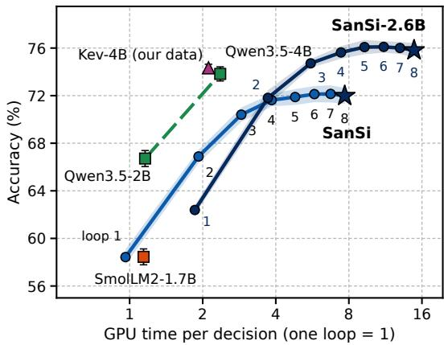  
(a) Accuracy against computation

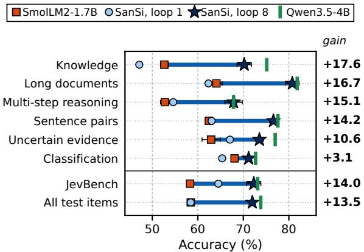  
(b) Accuracy by item type  
Figure 3: What looping costs and where it helps. (a) Accuracy against GPU time of one pass over the test set (unit: one loop of Ouro-1.4B). SanSi and SanSi-2.6B are read after each loop (bands: ±1 s.d., three seeds); Ouro-1.4B trained with one loop coincides with loop 1 of SanSi. Kev-4B (our data): Qwen3.5-4B trained with Kev’s recipe. All models timed on one RTX A6000 (Table 6). (b) Accuracy by item type, ordered by the gain of SanSi at loop 8 over SmolLM2-1.7B (thick line; number on the right: gain in points). Error bars: ±1 s.d., three seeds; values in Table 12.

## 83.5%, against 71.9% for SanSi-2.6B.

Takeaway. Eight loops add 13.5 points at fixed shape, data and recipe, paid in computation, not parameters. Per parameter, the looped model beats even a newer single-pass model; per unit of computation, a larger one wins.

## 5.2 RQ2: How do the answers change from loop to loop?

The gain comes early. Loop 1 matches the model trained with one loop (58.4%; −0.2 [−0.6, 0.3]), so training eight loops costs nothing at loop 1 (Figure 4a; Table 15 in Appendix E). Loop 2 adds 8.5 points [7.6, 9.3], loop 3 adds 3.5 [3.0, 4.0], loop 4 adds 1.2 [0.9, 1.6], and loops 5–8 together add only 0.4 [0.0, 0.7]. Three loops deliver 88% of the gain. Accuracy is flat from loop 4 and declines only beyond the trained loops (§7).

Fixes outweigh breaks until loop 5. On the 9,645 answerable items, loop 8 has fixed 21.0% of the loop-1 answers and broken 7.3%, about three fixes per break; loop 2 alone fixes 15.3% and breaks 6.8% (Figure 5a,b; Table 17). After loop 4, 90.2% of the answers are final, and the remaining fixes (4.0%) barely exceed the breaks (3.6%); after loop 5 they are equal. Later loops change answers without improving them. At most 11.7% of items are right at some loop but wrong at loop 8, bounding any loop-selection rule (Appendix E.3).

Harder items settle later, and late answers are unreliable. An answer settles at the first loop after which it no longer changes. 56.7% of answers never change after loop 1, and 89.1% have settled by loop 4. Settling tracks difficulty, measured independently by how many of the three single-pass models answer an item correctly (Figure 5c; Table 19): items solved by all three settle after 1.4 loops on average, by two after 2.4, by one after 3.0. (Items no single-pass model solves settle at 2.8, as SanSi often keeps its wrong first answer; Appendix E.4.) Settling also signals reliability (Figure 5d; Table 18): 82.2% of the answers that never change are right, but only 35.6% of those that settle at loop 8, and mean confidence falls (0.89 to 0.44).

Takeaway. The loops work early: loops 2 and 3 bring 88% of the gain, and 90% of answers are final after loop 4. From loop 5 on, fixes and breaks balance. Easy items are decided at once, hard ones take more loops, and a late-settling answer is more often wrong than right.

## 5.3 RQ3: What do the loops do to the probabilities?

A caller accepts, escalates or rejects a decision according to its probability, so we track the probabilities loop by loop (Figure 4b–d; intervals in Table 21 in Appendix F).

Confidence rises on right and wrong answers alike. On the 8,879 items with one gold option, mean confidence rises from 0.769 to 0.869 on right answers and from 0.567 to 0.660 on wrong ones; the gap stays near 0.20. The AUROC for separating right from wrong answers improves only slightly (0.760 to 0.795; +0.035 [0.025, 0.045]). The loops make the model more accurate and more confident, but barely better at knowing when it is wrong.

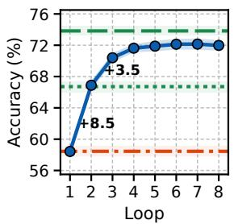  
(a) Accuracy

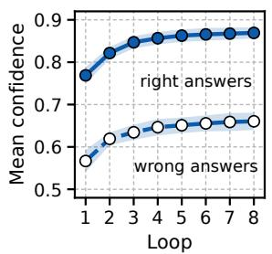  
(b) Confidence

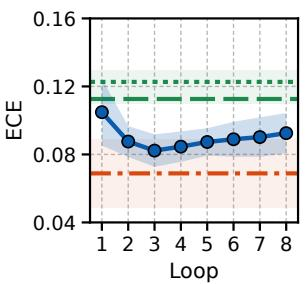  
(c) Calibration error

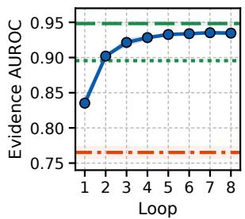  
(d) Missing evidence

Figure 4: SanSi read after each loop on the 10,027 test items (mean ± s.d., three seeds); horizontal lines: single-pass models; Kev-4B (our data) is not drawn, as its values almost coincide with those of Qwen3.5-4B (Table 2). (a) Accuracy, with the gains of loops 2 and 3. (b) Mean confidence on right and wrong answers. (c) ECE on answerable items. (d) Evidence AUROC. Values in Table 15.  
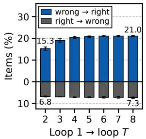  
(a) Changed since loop 1

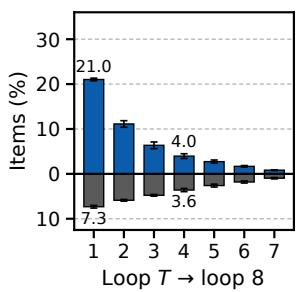  
(b) Still to change

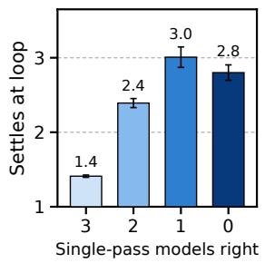  
(c) Harder items settle later

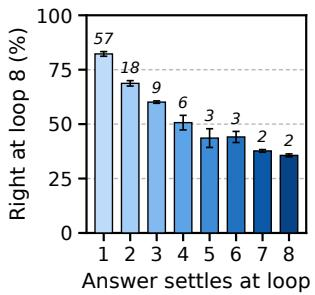  
(d) Late answers err more  
Figure 5: How SanSi’s answers change across loops (9,645 answerable items; mean ± s.d., three seeds). (a) Answers fixed or broken by loop T relative to loop 1. (b) Answers that the loops after T will still fix or break. (c) Mean settling loop by how many single-pass models (SmolLM2-1.7B, Qwen3.5-2B, Qwen3.5-4B) answer correctly. (d) Share of loop-8 answers that are right, by settling loop; above bars: share of items (%). Values in Tables 17, 18 and 19.

Calibration is best at loop 3. While accuracy rises faster than confidence, the ECE falls (0.105 to 0.082 at loop 3; −0.023 [−0.032, −0.013]). Once the answers settle, confidence keeps rising and the ECE climbs back to 0.093 at loop 8 (+0.010 [0.005, 0.016]; Table 22), between SmolLM2-1.7B and the other single-pass models (Table 2).

The loops detect missing evidence. On the 382 items whose key evidence was removed (target: the uniform distribution), hard answers drop from 27.1% at loop 1 to 17.5% at loop 8 (−9.7 points [−13.4, −6.0]; Table 25), and the evidence AU-ROC rises from 0.835 to 0.935 (+0.099 [0.075,

0.125]). The loops, not the training, cause this: the same backbone trained with one loop reaches 0.837, the value of loop 1. Of the single-pass models, only the two with three times the parameters, Qwen3.5-4B and Kev-4B (our data), are higher (0.948 and 0.947). See item 3 in Figure 7.

Takeaway. Looping sharpens the probabilities where a decision needs a closer look at the evidence: SanSi detects missing evidence nearly as well as a model three times its size. It does not teach self-doubt: confidence rises on wrong answers too, error detection barely improves, and calibration peaks at loop 3.

## 5.4 RQ4: Does looping buy reasoning depth?

To isolate reasoning depth, we use two programgenerated tasks in which every item needs exactly k dependent steps (Figure 6).

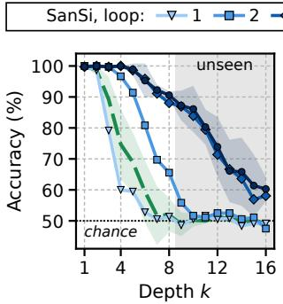  
(a) Liar chains

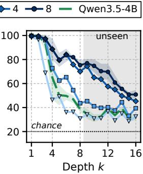  
(b) Object swaps  
Figure 6: Accuracy by depth k, with SanSi read after 1, 2, 4 and 8 loops. Shaded: depths unseen in training (k > 8). Dashed: single-pass Qwen3.5-4B trained on the same data. Mean of three seeds; bands: ±1 s.d. for loop 8 and Qwen3.5-4B.

Tasks. In a liar chain, each person states that another tells the truth or lies, and the question is whether the last person tells the truth (k: chain length; chance 50%). In object swaps, modelled on the tracking-shuffled-objects task of BBH (Suzgun et al., 2023), five people swap objects in pairs, and the question is who holds a given object at the end (k: number of times it changes hands; chance 20%). Every item also contains k irrelevant steps. We train SanSi and single-pass Qwen3.5-4B with our recipe (§3) on k ≤ 8 and test on k ≤ 16 (120 items per depth, three seeds). Appendix G.1 gives examples and shortcut checks.

Each loop extends the reachable depth. A model holds depth k if its accuracy is at least 75% at every depth up to k. On liar chains, SanSi holds depth 3 after one loop, 6 after two and 11 after four, three steps beyond the longest training chain (Table 27 in Appendix G.2). On the unseen depths (9–16), one loop is at chance (49.9%) and eight loops reach 72.6%. On object swaps, SanSi holds depth 2 after one loop and 9 after eight. Deeper items again settle later (Appendix G.4).

Parameters do not replace loops. Qwen3.5-4B holds depth 3 on both tasks, between SanSi’s first and second loop. On liar chains it reaches 74.3% on trained depths and chance (50.0%) on unseen ones; SanSi at loop 8 leads by 22.7 points [20.8, 24.7] and 22.6 [20.5, 24.7]. On object swaps, SanSi leads by 20.2 [17.9, 22.6] and 29.5 [26.5, 32.7].

Takeaway. Looping buys reasoning depth, even beyond the training range, and three times the parameters in a single pass do not replace it: Qwen3.5-4B leads by 1.8 points on the mixed suite but trails by more than 20 here. Unseen depths remain unsolved (72.6% on liar chains, 63.7% on object swaps at loop 8), and running more than the eight trained loops does not help.

## 6 Examples and Errors

Examples. Figure 7 traces four items. In item 1, loop 1 follows a surface cue (as in Figure 2b) and judges “Some streets are dustless” true (0.83); from loop 2 on, SanSi answers “unknown” (0.97 at loop 8). In item 2, loops 1–2 answer 3 and later loops 300, where both Qwen models answer 3,000. In item 3, whose deciding sentence was removed, loop 1 answers “yes” at 0.97; from loop 2 on the probability stays below the hard-answer threshold (0.72, falling to 0.58), while Qwen3.5-2B stays at 0.98. In item 4, the loops argue the model out of a right answer (“yes”: 0.98 to 0.11). Nor can the loops supply missing knowledge: a science question that Qwen3.5-4B answers correctly is wrong at every loop, with probability 0.96–0.99 (Table 42).

Errors. At loop 8, SanSi is wrong on 27.2% of the 8,879 items with one gold option (Table 41 in Appendix J). Most errors are not specific to looping: Qwen3.5-4B also fails on 68.0% of them, and 60.9% are wrong at every loop. One in five (19.7%) carries a confidence of at least 0.9 and would pass any confidence threshold below 0.9, as expected from §5.3.

## 7 Ablations

We ablate how the loops are trained, how many to train and run, what the backbone contributes, and how the loops are read. All variants share SanSi’s data, recipe and seeds (Appendix H).

Effect of the training objective. With the loss on the last loop only, accuracy at loop 8 drops 1.1 points [0.7, 1.5] to 70.9%, and early loops collapse (35.6% at loop 1, against 58.4%; Table 3). The perloop loss thus adds a point and, above all, makes every loop usable. The signal type matters less for accuracy: replacing supervision with outcomeonly reinforcement learning leaves accuracy unchanged (71.7% against 72.0%; −0.3 [−0.7, 0.1]; Appendix H.2), and so does dropping the Brier term (71.6%; −0.4 [−0.8, −0.0]). The Brier term matters for the probabilities: without it, the ECE at loop 8 rises from 0.093 to 0.104 (+0.011 [0.007, 0.016]), and the share of unanswerable items that receive a hard answer from 17.5% to 20.0% (+2.5 points [0.7, 4.3]; Appendix H.1).

<table><tr><td></td><td></td><td></td><td colspan="8">SanSi, read after loop</td><td colspan="3">Single-pass models</td></tr><tr><td></td><td>Test item</td><td>Option</td><td>1</td><td>2</td><td>3</td><td>4</td><td>5</td><td>6</td><td>7</td><td>8</td><td></td><td>1.7B</td><td>SmolLM2 Qwen3.5 Qwen3.5 4B</td></tr><tr><td>①</td><td>Fixed by the loops (FOLIO) No road is dustless. Some streets are roads. Using only the facts and rules above,</td><td>true</td><td>.83</td><td>.07</td><td>.01</td><td>.01</td><td>.01</td><td>.01</td><td>.01</td><td>.02</td><td>.57</td><td>.00</td><td>.00</td></tr><tr><td></td><td>is the statement “Some streets are dustless.&quot; true, false, or unknown?</td><td>false ★ unknown</td><td>.01 .16</td><td>.01</td><td>.00</td><td>.00</td><td>.00</td><td>.00</td><td>.01</td><td>.01</td><td>.07</td><td>.38</td><td>.11</td></tr><tr><td>2</td><td>Fixed where both Qwen models fail (MMLU) subject:</td><td></td><td></td><td>.92</td><td>.99</td><td>.99</td><td>.99</td><td>.99</td><td>.98</td><td>.97</td><td>.36</td><td>.61</td><td>.89</td></tr><tr><td></td><td>elementary mathematics. question: If 30,000 is divided by 10 and then divided by 10 again, what will be the</td><td>3</td><td>.60</td><td>.61</td><td>.12</td><td>.02</td><td>.01</td><td>.01</td><td>.01</td><td>.02</td><td>.16</td><td>.01</td><td>.01</td></tr><tr><td></td><td>resulting number? Which option correctly answers the</td><td>30</td><td>.06</td><td>.05</td><td>.14</td><td>.19</td><td>.13</td><td>.09</td><td>.08</td><td>.06</td><td>.14</td><td>.02</td><td>.03</td></tr><tr><td>question?</td><td></td><td>★ 300</td><td>.12</td><td>.30</td><td>.71</td><td>.77</td><td>.85</td><td>.89</td><td>.90</td><td>.91</td><td>.38</td><td>.03</td><td>.09</td></tr><tr><td>③</td><td>Key evidence removed (Kev pairs) policy: Applicants</td><td>3,000</td><td>.22</td><td>.04</td><td>.03</td><td>.01</td><td>.01</td><td>.01</td><td>.01</td><td>.01</td><td>.31</td><td>.94</td><td>.87</td></tr><tr><td></td><td>must be at least 16 years old to be eligible for the rental agreement. case: Elin applied to join the rental agreement. The application form was complete and</td><td>no</td><td>.03</td><td>.28</td><td>.28</td><td>.26</td><td>.28</td><td>.35</td><td>.39</td><td>.42</td><td>.24</td><td>.02</td><td>.72</td></tr><tr><td></td><td>signed. Elin is-18 years-old. Is the applicant eligible?</td><td>yes</td><td>.97</td><td>.72</td><td>.72</td><td>.74</td><td>.72</td><td>.65 .61</td><td></td><td>.58</td><td>.76</td><td>.98</td><td>.28</td></tr><tr><td>④</td><td>Broken by the loops (QNLI) By 9000 BP, Europe was</td><td></td><td></td><td></td><td></td><td></td><td></td><td></td><td></td><td></td><td></td><td></td><td></td></tr><tr><td></td><td>fully forested. Does the sentence contain the answer</td><td></td><td></td><td></td><td></td><td></td><td></td><td></td><td></td><td></td><td></td><td></td><td></td></tr><tr><td></td><td></td><td>no</td><td>.02</td><td>.37</td><td>.60</td><td>.76</td><td>.85</td><td>.87</td><td>.88</td><td>.89</td><td>.04</td><td>.35</td><td>.77</td></tr><tr><td></td><td>to this question: “When was Europe fully forested and</td><td></td><td></td><td></td><td></td><td></td><td></td><td></td><td></td><td></td><td></td><td></td><td></td></tr><tr><td>recovered from the last Ice Age?&quot;</td><td></td><td>★ yes</td><td>.98</td><td>.63</td><td>.40</td><td>.24</td><td>.15</td><td>.13</td><td>.12</td><td>.11</td><td>.96</td><td>.65</td><td>.23</td></tr></table>

Figure 7: Four test items: SanSi’s probability for each option after every loop, and the three single-pass models (seed 0). Correct option starred and outlined; column maxima in bold. Item 3 has no correct option: its deciding sentence (struck out) was removed. Full prompts in Appendix K.
<table><tr><td></td><td colspan="4">Accuracy (%) read at loop</td><td colspan="2">ECE at loop</td></tr><tr><td>Training</td><td>1</td><td>2</td><td>4</td><td>8</td><td>4</td><td>8</td></tr><tr><td>SanSi: every loop, cross-entropy + Brier, T=8</td><td> $5 8 . 4 \pm 0 . 7$ </td><td> $6 6 . 9 2 0 . 6 $ </td><td> $7 1 . 6 { \pm } 0 . 5 $ </td><td> $7 2 . 0 { \scriptstyle \pm 0 . 7 }$ </td><td> $. 0 8 5 { \scriptstyle \pm . 0 0 9 }$ </td><td> $. 0 9 3 \pm . 0 1 2$ </td></tr><tr><td>Loops that carry the loss Loops 1, 2, 4, 8 only</td><td> $5 9 . 2 { \pm } 0 . 8 $ </td><td> $6 7 . 0 { \pm } 0 . 3 $ </td><td> $7 1 . 0 { \pm } 0 . 2 $ </td><td> $7 1 . 2 { \pm } 0 . 2 $ </td><td> $. 0 9 0 \pm . 0 1 3$ </td><td> $. 0 9 8 \pm . 0 1 4$ </td></tr><tr><td>Last loop only</td><td> $3 5 . 6 { \pm } 4 . 7 $ </td><td> $5 1 . 9 { \pm } 7 . 9$ </td><td> $6 7 . 9 { \pm } 1 . 5 $ </td><td> $7 0 . 9 { \pm } 0 . 4 $ </td><td> $. 0 6 9 \pm . 0 1 7$ </td><td> $. 0 7 3 \pm . 0 0 9$ </td></tr><tr><td>Every loop,  $\dot { T } { = } 4$ </td><td> $5 9 . 7 \pm 0 . 5$ </td><td> $6 7 . 6 { \pm } 0 . 7 $ </td><td> $7 0 . 8 \pm 0 . 4$ </td><td> $6 9 . 6 \pm 0 . 1$ </td><td> $. 0 9 4 \pm . 0 0 5$ </td><td> $. 1 0 6 \pm . 0 0 5$ </td></tr><tr><td>The loss</td><td></td><td></td><td></td><td></td><td></td><td></td></tr><tr><td>Cross-entropy only (no Brier term)</td><td> $5 8 . 8 { \pm } 0 . 2 $ </td><td> $6 7 . 1 { \pm } 0 . 1 $ </td><td> $7 1 . 4 { \pm } 0 . 4 $ </td><td> $7 1 . 6 { \pm } 0 . 4 $ </td><td> $. 0 9 2 \pm . 0 0 8$ </td><td> $. 1 0 4 \pm . 0 0 7$ </td></tr><tr><td>Reinforcement learning</td><td> $5 8 . 1 \pm 0 . 2 $ </td><td> $6 6 . 5 { \pm } 0 . 4 $ </td><td> $7 1 . 3 { \pm } 0 . 4 $ </td><td> $7 1 . 7 { \pm } 0 . 1 $ </td><td> $. 0 6 8 \pm . 0 1 5$ </td><td> $. 0 7 6 { \pm } . 0 1 5$ </td></tr></table>

Table 3: Training choices: accuracy on the 10,027 test items and ECE, mean ± standard deviation over three seeds. Every variant differs from SanSi in one choice. For $T = 4 ,$ loops 5–8 were never trained. For “loops 1, 2, 4, 8 only” (loss weight 1/4 at each of these loops) and “last loop only”, the loops without a loss are read with the frozen language-model head. “Cross-entropy only”: the loss of Equation 3 without the Brier term. “Reinforcement learning”: the training with a reward of Appendix H.2.

Effect of the number of loops. Training four loops gives 70.8% at loop 4, only 0.8 points [0.4, 1.2] below SanSi at loop 4 (Table 33). Running past the trained loops hurts (Figure 8): SanSi falls from 72.0% at loop 8 to 70.1% at loop 16 (−1.8 [−2.2, −1.5]), and the four-loop model declines after loop 4. A looped model can be read early but not extended: the trained loops cap its compute.

Effect of the backbone. Adding a loop to SmolLM2-1.7B, which was not pre-trained to loop, in either of two ways and training it with our recipe brings no gain (33.5% and 58.3% at loop 8, against 58.4% without a loop; Table 35). The gain rests on looped pre-training: our recipe turns a looped backbone into a decision model, but does not create the loops. A larger looped backbone helps further: SanSi-2.6B reaches 75.8%, 2.0 points [1.4, 2.6] above Qwen3.5-4B with 63% of its parameters (Table 2).

Effect of averaging the loops. As confidence keeps rising after answers settle (§5.3), averaging the option probabilities of the eight loops is a free fix (no labels or training). It keeps loop-8 accuracy (71.8% against 72.0%) and halves the ECE (0.044 against 0.093; −0.049 [−0.052, −0.045]; Table 37), at no cost, as all loops are computed anyway.

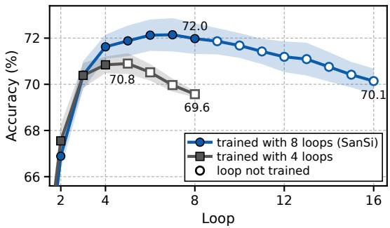  
Figure 8: Running beyond the trained loop size: accuracy from loop 2 on for SanSi (trained with 8 loops, run for 16) and a model trained with 4 (run for 8). Hollow: untrained loops; bands: ±1 s.d., three seeds. Values in Table 34.

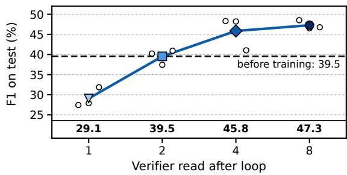  
Figure 9: GRPO on 2WikiMultiHopQA with SanSi’s probability as the only reward: test F1 (3,000 questions) by the loop at which SanSi is read (filled: mean of three seeds; hollow: seeds; dashed: before training). Values in Table 38.

## 8 Use Case: SanSi as a Verifier

Typed decision models increasingly judge other models’ outputs (Li et al., 2026b), and languagemodel judges are used where the quality of an output cannot be verified against a gold answer (Gan et al., 2026). We test if the loops matter when SanSi is the only reward for training a generator by reinforcement learning without gold answers.

Setup. We train SmolLM2-1.7B with LoRA and GRPO (Shao et al., 2024) on 2WikiMulti-HopQA (Ho et al., 2020), not among SanSi’s data sources. Distinct sampled answers form the options of one typed call to the frozen SanSi, and an answer’s reward is its probability; the gold answer is never used. We vary only the loop at which SanSi is read (1, 2, 4 or 8; three seeds each) and report the greedy answer’s token F1 (Appendix I).

Result. The generator follows the depth of its verifier (Figure 9). Rewards read at loop 8 raise F1 from 39.5 to 47.3 (+7.7 [6.1, 9.4]) and at loop 4 to 45.8 (+6.3 [4.6, 8.0]); at loop 2 F1 is unchanged, and at loop 1 the generator is damaged (29.1; −10.5 [−11.9, −9.0]). The cause is reward quality, a known weak point of language-model judges used as rewards (Kim et al., 2025): in the first 20 training steps, the loop-1 reward separates gold-matching answers from the rest worse than the loop-4 or loop-8 reward (AUROC 0.78 against 0.91 and 0.90), so it more often ranks a wrong answer above a right one. (Exact match does not follow F1, because the generator learns longer answers; Appendix I.3.) As in the main results, loop 1 behaves like a singlepass model, and most of what the loops add is present by loop 4.

## 9 Conclusion

Looping lets a small typed decision model spend more computation on a decision instead of more parameters. With the same data and recipe, a looped 1.4B model is 13.5 points more accurate than a non-looped model of its shape and 5.3 points more accurate than a newer non-looped model of its size, and it comes within 1.8 points of a model with three times the parameters, at 3.3 times that model’s GPU time. Because every loop is read and trained, one model serves every budget from one loop to eight: three loops give most of the gain, most answers have settled by the fourth, and harder items settle later. The loops help the model notice missing evidence, and on two depth-controlled tasks they solve deeper problems than a single-pass model with three times the parameters, beyond the depths seen in training. Calibration improves only up to the third loop, since confidence keeps rising after the answers have settled, and running more loops than were trained lowers accuracy. These effects rest on a backbone that was pre-trained to loop. As the sole reward for training a generator, SanSi helps when read after four or eight loops and harms when read after one. A natural next step is a rule that chooses the loop for each item: 11.7% of the items are right at some loop but wrong at the last.

## Limitations

Our findings hold within a defined scope. SanSi builds on one family of backbones that were pretrained to loop, Ouro-1.4B and Ouro-2.6B, and most of our analyses use the 1.4B model. The gain of looping relies on this pre-training (§7), so how far the findings carry over to other and larger looped backbones is a question for future work, as more such models become available; of our two sizes, the larger is the more accurate (Table 2). Looping buys accuracy with computation: a decision with eight loops takes about 3.3 times the GPU time of Qwen3.5-4B, and 1.6 times with four loops; SanSi-2.6B takes about 6.3 times. We read a fixed number of loops and leave rules that stop early on easy items to future work. The analysis of reasoning depth rests on two program-generated tasks. The verifier case study uses one dataset and one generator; it is meant to illustrate one use of the loops, not to evaluate SanSi as a reward model in general. Finally, our suite is in English and is assembled from existing datasets. Its mix of item types is our choice, so we also report the results by type and by test group (Table 2; Figure 3b), and we cannot exclude that a backbone has seen some of these public datasets during pre-training. The models of the main comparison are trained with three seeds, so differences of one or two points on the smaller test groups should be read together with their intervals (Appendix D).

## Ethical Considerations

Typed decision models target automated decisions such as moderation and policy checks. Their probabilities invite automation, so their failure modes matter: we report where SanSi is overconfident (near transfer) and how often it answers without the evidence. All data come from public benchmarks; no new data were collected from people.

## References

Arash Ahmadian, Chris Cremer, Matthias Gallé, Marzieh Fadaee, Julia Kreutzer, Olivier Pietquin, Ahmet Üstün, and Sara Hooker. 2024. Back to basics: Revisiting REINFORCE-style optimization for learning from human feedback in LLMs. In Proceedings of the 62nd Annual Meeting of the Association for Computational Linguistics (Volume 1: Long Papers).

Loubna Ben Allal, Anton Lozhkov, Elie Bakouch, Gabriel Martín Blázquez, Guilherme Penedo, Lewis Tunstall, Andrés Marafioti, Hynek Kydlícek,ˇ Agustín Piqueres Lajarín, Vaibhav Srivastav, Joshua Lochner, Caleb Fahlgren, Xuan-Son Nguyen, Clé- mentine Fourrier, Ben Burtenshaw, Hugo Larcher, Haojun Zhao, Cyril Zakka, Mathieu Morlon, and 3 others. 2025. SmolLM2: When Smol Goes Big Data-Centric Training of a Small Language Model. Preprint, arXiv:2502.02737.

Robert J. N. Baldock, Hartmut Maennel, and Behnam Neyshabur. 2021. Deep Learning Through the Lens of Example Difficulty. In Advances in Neural Information Processing Systems.

Andrea Banino, Jan Balaguer, and Charles Blundell. 2021. PonderNet: Learning to Ponder. Preprint, arXiv:2107.05407.

Francesco Barbieri, Jose Camacho-Collados, Leonardo Neves, and Luis Espinosa-Anke. 2020. TweetEval: Unified Benchmark and Comparative Evaluation for Tweet Classification. Preprint, arXiv:2010.12421.

Hugh Blayney, Álvaro Arroyo, Johan Obando-Ceron, Pablo Samuel Castro, Aaron Courville, Michael M. Bronstein, and Xiaowen Dong. 2026. A Mechanistic Analysis of Looped Reasoning Language Models. Preprint, arXiv:2604.11791.

Haowei Cao. 2026. Looped Calibration Transformer: Free Calibrated Confidence from Recurrent Computation Trajectories. GitHub repository (Jev-LCT).

Iñigo Casanueva, Tadas Temcinas, Daniela Gerz,ˇ Matthew Henderson, and Ivan Vulic. 2020.´ Efficient Intent Detection with Dual Sentence Encoders. Preprint, arXiv:2003.04807.

Lizhang Chen, Jonathan Li, Chen Liang, Ni Lao, and Qiang Liu. 2026. Training-Free Looped Transformers. Preprint, arXiv:2605.23872.

Christopher Clark, Kenton Lee, Ming-Wei Chang, Tom Kwiatkowski, Michael Collins, and Kristina Toutanova. 2019. BoolQ: Exploring the Surprising Difficulty of Natural Yes/No Questions. Preprint, arXiv:1905.10044.

Peter Clark, Isaac Cowhey, Oren Etzioni, Tushar Khot, Ashish Sabharwal, Carissa Schoenick, and Oyvind Tafjord. 2018. Think you have Solved Question Answering? Try ARC, the AI2 Reasoning Challenge. Preprint, arXiv:1803.05457.

Ha Van Dau, Thanh Tung Khuat, and Nguyen Thanh Dung. 2026. Beyond Depth Truncation: Controlled Evaluation of Depth Utilization in Recursive Language Models. Preprint, arXiv:2609.19934.

Mostafa Dehghani, Stephan Gouws, Oriol Vinyals, Jakob Uszkoreit, and Łukasz Kaiser. 2019. Universal Transformers. Preprint, arXiv:1807.03819.

Tobias Deußer, Lorenz Sparrenberg, and Rafet Sifa. 2026. Evaluating and Benchmarking the System One Model Jev. Preprint, arXiv:2609.37647.

Ying Fan, Yilun Du, Kannan Ramchandran, and Kangwook Lee. 2024. Looped Transformers for Length Generalization. Preprint, arXiv:2409.15647.

Shuyu Gan, James Mooney, Pan Hao, Renxiang Wang, Mingyi Hong, Qianwen Wang, and Dongyeop Kang. 2026. Scaling Unverifiable Rewards: A Case Study on Visual Insights. In Findings of the Association for Computational Linguistics: ACL 2026.

Jonas Geiping, Sean McLeish, Neel Jain, John Kirchenbauer, Siddharth Singh, Brian R. Bartoldson, Bhavya Kailkhura, Abhinav Bhatele, and Tom Goldstein.

2025. Scaling up Test-Time Compute with Latent Reasoning: A Recurrent Depth Approach. Preprint, arXiv:2502.05171.

Angeliki Giannou, Shashank Rajput, Jy yong Sohn, Kangwook Lee, Jason D. Lee, and Dimitris Papailiopoulos. 2023. Looped Transformers as Programmable Computers. Preprint, arXiv:2301.13196.

Alex Graves. 2016. Adaptive Computation Time for Recurrent Neural Networks. Preprint, arXiv:1603.08983.

Chuan Guo, Geoff Pleiss, Yu Sun, and Kilian Q. Weinberger. 2017. On Calibration of Modern Neural Networks. Preprint, arXiv:1706.04599.

Zhihao Guo, Zonghan Wu, Haizhou Du, Huan Huo, Yilei Shao, Athanasios V. Vasilakos, and Qingsong Wen. 2026. Right Direction, Wrong Step: Geometric Analysis of Finite-Step Failure in Looped Transformers. Preprint, arXiv:2609.16665.

Simeng Han, Hailey Schoelkopf, Yilun Zhao, Zhenting Qi, Martin Riddell, Wenfei Zhou, James Coady, David Peng, Yujie Qiao, Luke Benson, Lucy Sun, Alex Wardle-Solano, Hannah Szabo, Ekaterina Zubova, Matthew Burtell, Jonathan Fan, Yixin Liu, Brian Wong, Malcolm Sailor, and 16 others. 2022. FOLIO: Natural Language Reasoning with First-Order Logic. Preprint, arXiv:2209.00840.

Dan Hendrycks, Collin Burns, Steven Basart, Andy Zou, Mantas Mazeika, Dawn Song, and Jacob Steinhardt. 2021. Measuring Massive Multitask Language Understanding. Preprint, arXiv:2009.03300.

Prakul Sunil Hiremath and Harshit R. Hiremath. 2026. Calibration Drift Under Reasoning: How Chain-of-Thought Budgets Induce Overconfidence in Large Language Models. Preprint, arXiv:2606.11211.

Xanh Ho, Anh-Khoa Duong Nguyen, Saku Sugawara, and Akiko Aizawa. 2020. Constructing a multihop QA dataset for comprehensive evaluation of reasoning steps. In Proceedings of the 28th International Conference on Computational Linguistics, pages 6609–6625.

Edward J. Hu, Yelong Shen, Phillip Wallis, Zeyuan Allen-Zhu, Yuanzhi Li, Shean Wang, Lu Wang, and Weizhu Chen. 2022. LoRA: Low-Rank Adaptation of Large Language Models. Preprint, arXiv:2106.09685.

Ahmadreza Jeddi, Marco Ciccone, and Babak Taati. 2026. LoopFormer: Elastic-Depth Looped Transformers for Latent Reasoning via Shortcut Modulation. Preprint, arXiv:2602.11451.

JevBench maintainers. 2026. JevBench. GitHub repository.

Yichen Jiang, Shikha Bordia, Zheng Zhong, Charles Dognin, Maneesh Singh, and Mohit Bansal. 2020. HoVer: A Dataset for Many-Hop Fact Extraction And Claim Verification. Preprint, arXiv:2011.03088.

Yigitcan Kaya, Sanghyun Hong, and Tudor Dumitras. 2019. Shallow-Deep Networks: Understanding and Mitigating Network Overthinking. In Proceedings of the 36th International Conference on Machine Learning.

Zae Myung Kim, Young-Jun Lee, Seungyeon Jwa, and Dongyeop Kang. 2026. Metan: Recursive Self-Improvement through Emergent Depth. In Advances in Neural Information Processing Systems.

Zae Myung Kim, Chanwoo Park, Vipul Raheja, and Dongyeop Kang. 2025. Toward Evaluative Thinking: Meta Policy Optimization with Evolving Reward Models. Preprint, arXiv:2504.20157.

Harsh Kohli, Srinivasan Parthasarathy, Huan Sun, and Yuekun Yao. 2026. Loop, Think, & Generalize: Implicit Reasoning in Recurrent-Depth Transformers. Preprint, arXiv:2604.07822.

Yuta Koreeda and Christopher D. Manning. 2021. ContractNLI: A Dataset for Document-level Natural Language Inference for Contracts. Preprint, arXiv:2110.01799.

Romain Lacombe, Kerrie Wu, and Eddie Dilworth. 2025. Don’t Think Twice! Over-Reasoning Impairs Confidence Calibration. Preprint, arXiv:2508.15050.

Keyi Li, Yihao He, and Quanyi Li. 2026a. Beyond Calibration: Do a Typed-Decision Model’s Probabilities Obey the Probability Axioms? Preprint, arXiv:2609.33209.

Xin Li and Dan Roth. 2002. Learning question classifiers. In COLING 2002: The 19th International Conference on Computational Linguistics.

Yubo Li, Yidi Miao, Ramayya Krishnan, and Rema Padman. 2026b. JEV-as-a-Judge: Accept When Confident, Escalate When Unsure. Preprint, arXiv:2609.26550.

Alisa Liu, Swabha Swayamdipta, Noah A. Smith, and Yejin Choi. 2022. WANLI: Worker and AI Collaboration for Natural Language Inference Dataset Creation. Preprint, arXiv:2201.05955.

Andrew L. Maas, Raymond E. Daly, Peter T. Pham, Dan Huang, Andrew Y. Ng, and Christopher Potts. 2011. Learning word vectors for sentiment analysis. In Proceedings of the 49th Annual Meeting of the Association for Computational Linguistics: Human Language Technologies, pages 142–150.

Andrei Marchenko, Viacheslav Bezrukov, Oleg Kashurin, Inessa Fedorova, Dmitry Bocharov, Yuliana Shakhvalieva, Maria Tikhonova, and Valerii Ternovskii. 2026. Closing the Loop: Practical Training Recipes for Looped Language Models. Preprint, arXiv:2610.00673.

Sean McLeish, Ang Li, John Kirchenbauer, Dayal Singh Kalra, Brian R. Bartoldson, Bhavya Kailkhura, Avi Schwarzschild, Jonas Geiping, Tom Goldstein, and

Micah Goldblum. 2025. Teaching Pretrained Language Models to Think Deeper with Retrofitted Recurrence. Preprint, arXiv:2511.07384.

Yixin Nie, Adina Williams, Emily Dinan, Mohit Bansal, Jason Weston, and Douwe Kiela. 2020a. Adversarial NLI: A New Benchmark for Natural Language Understanding. Preprint, arXiv:1910.14599.

Yixin Nie, Xiang Zhou, and Mohit Bansal. 2020b. What Can We Learn from Collective Human Opinions on Natural Language Inference Data? Preprint, arXiv:2010.03532.

Jared Palmer. 2026. Kev: A Family of Small Decision Models Built on Qwen Base Models. GitHub repository.

Richard Yuanzhe Pang, Alicia Parrish, Nitish Joshi, Nikita Nangia, Jason Phang, Angelica Chen, Vishakh Padmakumar, Johnny Ma, Jana Thompson, He He, and Samuel R. Bowman. 2022. QuALITY: Question Answering with Long Input Texts, Yes! Preprint, arXiv:2112.08608.

Taekhyun Park, Yongjae Lee, Dohee Kim, and Hyerim Bae. 2026. LoopUS: Recasting Pretrained LLMs into Looped Latent Refinement Models. Preprint, arXiv:2605.11011.

Andrei Cristian Popescu, Haitz Sáez de Ocáriz Borde, and Pietro Liò. 2026a. Adaptive Depth in Looped Transformers: Diagnosing Learned Halting Gates and Trajectory Readouts. Preprint, arXiv:2607.20519.

Andrei Cristian Popescu, Haitz Sáez de Ocáriz Borde, and Pietro Liò. 2026b. Looped Language Models Improve Compositional Tool Calling. Preprint, arXiv:2608.18171.

Riccardo Porcedda. 2026. Jev thinks "I don’t know", but doesn’t say it: Introducing Sys1Cal-v1 Dataset for Probability Calibration. Preprint, arXiv:2609.35342.

Qwen Team. 2026. Qwen3.5-4B-Base. Model card.

Pranav Rajpurkar, Robin Jia, and Percy Liang. 2018. Know What You Don’t Know: Unanswerable Questions for SQuAD. Preprint, arXiv:1806.03822.

Elvis Saravia, Hsien-Chi Toby Liu, Yen-Hao Huang, Junlin Wu, and Yi-Shin Chen. 2018. CARER: Contextualized affect representations for emotion recognition. In Proceedings of the 2018 Conference on Empirical Methods in Natural Language Processing, pages 3687–3697.

Zhihong Shao, Peiyi Wang, Qihao Zhu, Runxin Xu, Junxiao Song, Xiao Bi, Haowei Zhang, Mingchuan Zhang, Y. K. Li, Y. Wu, and Daya Guo. 2024. DeepSeekMath: Pushing the limits of mathematical reasoning in open language models. arXiv preprint arXiv:2402.03300.

Mark Shapiro. 2026. Retrofitting Recurrent Depth into a Pretrained Language Model: Installation, Extrapolation, Transfer, and Retention at Two Parameter Budgets. Preprint, arXiv:2608.11233.

Koustuv Sinha, Shagun Sodhani, Jin Dong, Joelle Pineau, and William L. Hamilton. 2019. CLUTRR: A Diagnostic Benchmark for Inductive Reasoning from Text. Preprint, arXiv:1908.06177.

Richard Socher, Alex Perelygin, Jean Wu, Jason Chuang, Christopher D. Manning, Andrew Ng, and Christopher Potts. 2013. Recursive deep models for semantic compositionality over a sentiment treebank. In Proceedings of the 2013 Conference on Empirical Methods in Natural Language Processing, pages 1631–1642.

Yu Sun, Junhao Xu, Jiajia Shi, and Zijin Yang. 2026. Type-Safe Is Not Error-Free: A Constrained Decision Head Follows the Option Name, Not the Rubric Bound to It. Preprint, arXiv:2609.26758.

Mirac Suzgun, Nathan Scales, Nathanael Schärli, Sebastian Gehrmann, Yi Tay, Hyung Won Chung, Aakanksha Chowdhery, Quoc V. Le, Ed H. Chi, Denny Zhou, and Jason Wei. 2023. Challenging BIG-Bench Tasks and Whether Chain-of-Thought Can Solve Them. Preprint, arXiv:2210.09261.

Oyvind Tafjord, Bhavana Dalvi Mishra, and Peter Clark. 2021. ProofWriter: Generating Implications, Proofs, and Abductive Statements over Natural Language. Preprint, arXiv:2012.13048.

Alon Talmor, Jonathan Herzig, Nicholas Lourie, and Jonathan Berant. 2019. CommonsenseQA: A Question Answering Challenge Targeting Commonsense Knowledge. Preprint, arXiv:1811.00937.

Lijuan Tang and Yuemeng Zheng. 2026. Typed Decision Models: An Early Evidence Audit and Evaluation Checklist. Preprint, arXiv:2609.32160.

Harsh Trivedi, Niranjan Balasubramanian, Tushar Khot, and Ashish Sabharwal. 2022. MuSiQue: Multihop Questions via Single-hop Question Composition. Preprint, arXiv:2108.00573.

TypeSafe AI. 2026. Introducing system one models & Jev. Blog post.

Alex Wang, Amanpreet Singh, Julian Michael, Felix Hill, Omer Levy, and Samuel R. Bowman. 2019. GLUE: A multi-task benchmark and analysis platform for natural language understanding. In International Conference on Learning Representations.

Xiaoqiang Wang, Suyuchen Wang, Yun Zhu, and Bang Liu. 2025. System-1.5 Reasoning: Traversal in Language and Latent Spaces with Dynamic Shortcuts. Preprint, arXiv:2505.18962.

Yubo Wang, Xueguang Ma, Ge Zhang, Yuansheng Ni, Abhranil Chandra, Shiguang Guo, Weiming Ren, Aaran Arulraj, Xuan He, Ziyan Jiang, Tianle Li, Max

Ku, Kai Wang, Alex Zhuang, Rongqi Fan, Xiang Yue, and Wenhu Chen. 2024. MMLU-Pro: A More Robust and Challenging Multi-Task Language Understanding Benchmark. Preprint, arXiv:2406.01574.

Yuxiang Wang, Kunyu Feng, Yingda Shen, Haoning Xu, Junyu Wang, and Zhizheng Wu. 2026. RecurTrace: Adaptive Latent Reasoning with Loop-Time Memory. Preprint, arXiv:2609.03379.

Johannes Welbl, Nelson F. Liu, and Matt Gardner. 2017. Crowdsourcing multiple choice science questions. In Proceedings of the 3rd Workshop on Noisy Usergenerated Text, pages 94–106.

Adina Williams, Nikita Nangia, and Samuel R. Bowman. 2018. A Broad-Coverage Challenge Corpus for Sentence Understanding through Inference. Preprint, arXiv:1704.05426.

Ji Xin, Raphael Tang, Jaejun Lee, Yaoliang Yu, and Jimmy Lin. 2020. DeeBERT: Dynamic Early Exiting for Accelerating BERT Inference. Preprint, arXiv:2004.12993.

Liu Yang, Kangwook Lee, Robert Nowak, and Dimitris Papailiopoulos. 2024. Looped Transformers are Better at Learning Learning Algorithms. Preprint, arXiv:2311.12424.

Xiao-Wen Yang, Ziyu Han, Xi-Hua Zhang, Wen-Da Wei, Jie-Jing Shao, Lan-Zhe Guo, and Yu-Feng Li. 2026. Stabilizing Recurrent Dynamics for Test-Time Scalable Latent Reasoning in Looped Language Models. Preprint, arXiv:2605.26733.

Zhilin Yang, Peng Qi, Saizheng Zhang, Yoshua Bengio, William W. Cohen, Ruslan Salakhutdinov, and Christopher D. Manning. 2018. HotpotQA: A Dataset for Diverse, Explainable Multi-hop Question Answering. Preprint, arXiv:1809.09600.

Mingqian Yu, Wenpeng Zhang, Shaobo Cui, and Peilin Zhao. 2026. T-LoopFormer: Token-Level Elastic-Depth Looped Transformers for Latent Reasoning with Dynamic Routing. Preprint, arXiv:2609.15160.

Xiang Zhang, Junbo Zhao, and Yann LeCun. 2015. Character-level convolutional networks for text classification. In Advances in Neural Information Processing Systems, volume 28.

Yuan Zhang, Jason Baldridge, and Luheng He. 2019. PAWS: Paraphrase Adversaries from Word Scrambling. Preprint, arXiv:1904.01130.

Wangchunshu Zhou, Canwen Xu, Tao Ge, Julian McAuley, Ke Xu, and Furu Wei. 2020. BERT Loses Patience: Fast and Robust Inference with Early Exit. In Advances in Neural Information Processing Systems.

Rui-Jie Zhu, Zixuan Wang, Kai Hua, Tianyu Zhang, Ziniu Li, Haoran Que, Boyi Wei, Zixin Wen, Fan Yin, He Xing, Lu Li, Jiajun Shi, Kaijing Ma, Shanda Li, Taylor Kergan, Andrew Smith, Xingwei Qu,

Mude Hui, Bohong Wu, and 14 others. 2025. Scaling Latent Reasoning via Looped Language Models. Preprint, arXiv:2510.25741.

The appendix follows the order of the paper. Appendix A describes the data, Appendix B the training and its cost, and Appendix C the metrics with their formulas. Appendices D to G give additional results for the four research questions: the main comparison (Appendix D), the loops one by one (Appendix E), the probabilities (Appendix F) and the depth-controlled tasks (Appendix G). Appendix H gives the details of the ablations, Appendix I those of the verifier case study, and Appendix J those of the error analysis. Appendix K gives examples: five items with the answers of all models, and seven items followed through all loops.

## A Data

Item types and sources. The training set draws on 20 sources and the test set on 59. Table 4 lists the main sources of each item type with one test item, Table 5 gives the sources of every type in training and in each test group with their numbers of items, and Table 11 lists every test source with the results on it. Type A (classification) uses topic, intent and sentiment datasets: AG News, DBpedia, Yelp and Amazon reviews (Zhang et al., 2015), IMDB (Maas et al., 2011), SST-5 (Socher et al., 2013), TREC (Li and Roth, 2002) and Banking77 (Casanueva et al., 2020); its far-transfer sources are Emotion (Saravia et al., 2018), TweetEval (Barbieri et al., 2020) and Yahoo Answers (Zhang et al., 2015). Type B (multi-step reasoning) uses ProofWriter (Tafjord et al., 2021), CLUTRR (Sinha et al., 2019), MuSiQue (Trivedi et al., 2022) and Kev’s rule and policy items; near transfer adds longer CLUTRR chains, human paraphrases of ProofWriter and 4- hop MuSiQue questions; far transfer adds FOLIO (Han et al., 2022), BBH (Suzgun et al., 2023) and HoVer (Jiang et al., 2020). Type C (uncertain evidence) uses MuSiQue minimal pairs (the same question with and without its key paragraph), SQuAD 2.0 (Rajpurkar et al., 2018), ChaosNLI (Nie et al., 2020b), Kev’s unknowable pairs and Sys1Cal (Porcedda, 2026). Type D (long documents) uses MuSiQue and HotpotQA (Yang et al., 2018) with distractor passages and, for far transfer, ContractNLI (Koreeda and Manning, 2021) and QuALITY (Pang et al., 2022). Type E (sentence pairs) uses MNLI (Williams et al., 2018) and

BoolQ (Clark et al., 2019) and, for far transfer, ANLI (Nie et al., 2020a), PAWS (Zhang et al., 2019), WANLI (Liu et al., 2022) and QNLI (Wang et al., 2019). Type F (knowledge, test only) uses ARC (Clark et al., 2018), CommonsenseQA (Talmor et al., 2019), MMLU (Hendrycks et al., 2021), MMLU-Pro (Wang et al., 2024) and SciQ (Welbl et al., 2017).

Unanswerable and crowd-labelled items. An unanswerable item is an item whose key evidence has been removed; it has no correct option and its target is the uniform distribution. A crowd-labelled item (ChaosNLI, about 100 annotators per item; Sys1Cal, whose items state exact probabilities) has the label distribution as its target, and its accuracy uses the most probable label.

Splits and leakage controls. No model was called while building the suite. Test candidates that share a state with a training item, or 80% or more of its sentences, were not drawn. Development and test items were split by connected components of related items (items that share a group, state, story or sub-question), so that related items stay on one side. No two items have the same text.

Prompt format and number of options. Every item is rendered as the state, an empty line, “Question:” with the question, “Options:” with the options as $\mathbf { \Sigma } ^ { \bullet \bullet } ( \mathbf { A } ) \ldots \mathbf { \Psi } ( \mathbf { B } ) \ldots \mathbf { \Psi } ^ { \bullet }$ , and “Answer:”; Appendix K shows complete prompts. The model is read at the last token. An option is named by one letter, which is one token, so an item can have at most 26 options. In our suite, 76% of the test items and 78% of the training items have two to four options; the largest sets are the 14 classes of DBpedia, the 18 kinship relations of CLUTRR and the 26 intents of Kev’s Banking77 items.

## B Training and Implementation Details

Optimisation. AdamW with $\beta ~ = ~ ( 0 . 9 , 0 . 9 5 )$ and no weight decay; learning rate $1 0 ^ { - 4 }$ for the LoRA adapters and $1 0 ^ { - 3 }$ for the readouts; 200 warm-up steps followed by a cosine decay to 10% of the peak; gradient clipping at 1.0; bfloat16 autocast. A step is the next 16 items of the shuffled training set, so 1,000 steps cover $1 6 { , } 0 0 0$ items (1.25 passes). Items are never truncated; the longest training item has 5,345 tokens. The option order of multiple-choice items is shuffled each time an item is drawn. LoRA uses rank 64, α = 128 and dropout 0.05 on the query, key, value and output projections of attention and on the three projections of the feed-forward block (for Qwen3.5-4B also on the projections of its linear-attention layers). The two terms of the loss (Equation 3) have equal weight in all our models except one variant trained with cross-entropy alone (Table 3; Appendix H.1).

Parameters and time. Table 6 lists the sizes and the measured times. The test times are measured in one way for all models: one pass over the 10,027 test items on a single RTX A6000, in one process, with the same batching (items sorted by length, at most 32,000 tokens per batch), after a warm-up that is not counted. The time of a forward pass depends on the architecture and not on the values of the weights, so the models are timed with the adapters and the readout attached as in training; for Ouro-1.4B with one loop this gives 334 seconds, against 337 seconds in the test of the trained model. The Qwen3.5 models run in their own software environment (PyTorch 2.7.1 with the optimised kernel for their linear-attention layers; their convolution falls back to the reference implementation). SanSi-2.6B was timed on a second machine with the same card, on which Ouro-1.4B with one loop takes 316 seconds and SanSi 2,485 seconds; differences of a few per cent are therefore within the variation between machines. The training times are those of the original runs. They were not all made on the same cards and include the evaluations on the development set, so they are comparable only roughly; the comparison that the paper uses, SanSi against Ouro-1.4B with one loop, was made on the same cards with the same number of evaluations.

Kev-4B trained on our data. Kev-4B (our data) is trained with the training code of Kev (Palmer, 2026), with the command of the base stage of the released Kev-4B: Qwen3.5-4B-Base, LoRA adapters of rank 16 (33.8M parameters) and Kev’s pointer head, cross-entropy, a learning rate of $5 \times 1 0 ^ { - 5 }$ with a one-cycle schedule, weight decay 0.01, and two epochs (3,200 steps of eight records) with Kev’s augmentation of the options. Three things are changed, none of them in the loss, the optimiser or the augmentation: the training data are our 12,800 items, written as Kev requests (the target distributions of crowd-labelled and unanswerable items are passed as Kev’s targets); the limit on the length of a state is raised so that no item is dropped; and long batches are run in several passes. We train three seeds, each for about 3.9 hours on one RTX A6000. Kev’s recipe ends by fitting one temperature on development data. In the main comparison we read the model at temperature 1, like every other model, and Appendix F.3 fits such a temperature for this model, Qwen3.5-4B and both sizes of SanSi (Table 24). The test time in Table 6 is measured in the setting described above, with Kev’s own model code and request format; with the adapters merged into the weights, as Kev serves its models, the pass takes 567 seconds.

<table><tr><td>Item type</td><td>Sources (selection)</td><td>Example decision</td><td>Train</td><td>Test</td></tr><tr><td>A Classification</td><td>AG News, DBpedia, Yelp (Zhang et al., 2015), IMDB (Maas et al., 2011), SST-5 (Socher et al., 2013), TREC (Li and Roth, 2002), Banking77 (Casanueva et al., 2020),</td><td>&quot;Meh. I was unimpressed.&quot; Would this reviewer recommend the business? (A) no (B) yes → A</td><td>2,400</td><td>1,089</td></tr><tr><td>B Multi-step reasoning</td><td>CLUTRR (Sinha et al., 2019), ProofWriter (Tafjord et al., 2021), MuSiQue (Trivedi et al., 2022), FOLIO (Han et al., 2022), BBH</td><td>“No homework is fun. Some reading is homework.&quot; Is the statement &quot;Some reading is fun.&quot; true, false, or unknown? (A) true (B) false (C) unknown  $ \mathbf { C }$ </td><td>5,500</td><td>3,072</td></tr><tr><td>C Uncertain evidence</td><td>ChaosNLI (Nie et al., 2020b), Sys1Cal (Porcedda, 2026), question pairs with the evidence removed (from MuSiQue)</td><td>&quot;A hockey fight.&quot; Hypothesis: &quot;fighting on the  $i c e ^ { , \flat } .$  (A) entailment (B) neutral (C) contradiction → the annotators&#x27; label distribution</td><td>2,300</td><td>1,558</td></tr><tr><td>D Long documents</td><td>HotpotQA (Yang et al., 2018), ContractNLI (Koreeda and Manning, 2021), QuALITY (Pang et al., 2022)</td><td>[two encyclopedia paragraphs] Are Anja Salomonowitz and Rod Lurie both directors? (A) no  $\mathbf { ( B ) } \ y \mathbf { e s } \  \mathbf { B }$ </td><td>1,000</td><td>901</td></tr><tr><td>E Sentence pairs</td><td>MNLI (Williams et al., 2018), BoolQ (Clark et al., 2019), ANLI (Nie et al., 2020a), WANLI (Liu et al., 2022). PAWS (Zhang et al., 2019), QNLI (Wang et al., 2019)</td><td>“Revco was acquired in 1997 by CVS.&quot; Does this sentence mean the same thing:  $\ " { } \substack { } ^ { \omega } \substack { R e } \nu c o$  was subsequently acquired by CVS in 1997.&quot; (A) no (B) yes → B</td><td>1,600</td><td>1,368</td></tr><tr><td>F Knowledge</td><td>ARC (Clark et al., 2018), CommonsenseQA (Talmor et al., 2019), MMLU (Hendrycks et al., 2021), SciQ (Welbl et al., 2017)</td><td>Coal is formed from (A) seas that have evaporated  $\cdots \ ( \mathrm { D } )$  plant remains decomposed under pressure → D</td><td></td><td>1,808</td></tr><tr><td colspan="5">Total</td></tr></table>

Table 4: Item types, a selection of their sources, and one test item of each type (state, question, options and target). The test total includes the 231 public items of JevBench.

The readout correction is small. For the runs whose records keep both readings, the accuracy read with the frozen language-model head alone differs from the accuracy of the trained readout by at most 0.04 points (every loop of the $T = 4$ model, SmolLM2-1.7B and Qwen3.5-4B) and by at most 0.12 points for an eight-loop model trained on 80% of the data.

## C Metrics

For an item with K options, let $p ~ \in ~ \Delta ^ { K }$ be the distribution that the model returns at the loop that is read, $\hat { y } ~ = ~ \mathrm { a r g } \operatorname* { m a x } _ { k } p _ { k }$ its answer and $c = \operatorname* { m a x } _ { k } p _ { k }$ its confidence. Let d be the target distribution of the item. Probabilities are used as they are, without post-hoc calibration, unless stated otherwise.

Correctness and accuracy. An item with a gold option y is answered correctly when $\hat { y } = y ;$ for a crowd-labelled item, y is the most probable label under d. An unanswerable item has no gold option. It is answered correctly when the model gives no hard answer, that is, when

$$
\begin{array} { r } { c < \frac { 1 } { 2 } \big ( 1 + \frac { 1 } { K } \big ) , } \end{array}\tag{4}
$$

the midpoint between the uniform distribution $( c =$ $1 / K )$ and certainty (c = 1). Accuracy is the share of items answered correctly, and the hard-answer rate is the share of unanswerable items that receive a hard answer.

Calibration. ECE is computed on the N answerable items. They are sorted by their confidence into ten bins $B _ { 1 } , \ldots , B _ { 1 0 }$ of equal width, and

<table><tr><td>Item type</td><td>Seen in training (training / in-distribution Near transfer test items)</td><td></td><td>Far transfer</td></tr><tr><td>A Classification</td><td>2,400 / 321: AG News† 300/41; Amazon† 300/40; Banking77† 300/40; DBpedia† 300/40; IMDB† 300/40; SST-5† 300/40; TREC† 300/40; Yelp† 300/40</td><td></td><td>768: Emotion 240; TweetEval 240; Yahoo Answers 160; Emotion‡ 64; Offensive tweets 64</td></tr><tr><td>B Multi-step reasoning</td><td>5,500 / 800: ProofWriter 1,500/240; CLUTRR, 2–4 hops 1,200/160; Kev rules† 1,110/120; MuSiQue, 2–3 hops 1,000/160; Kev policies† 690/120</td><td>991: CLUTRR, 5–10 hops 480; ProofWriter, paraphrased 319; MuSiQue, 4 hops 192</td><td>1,281: BBH 480; HoVer 360; FOLIO 320; Kev policies, held out‡ 64; Kev rules, held out‡ 57</td></tr><tr><td>C Uncertain evidence</td><td>2,300 / 478: MuSiQue pairs, 2–3 hops 1,000/158; SQuAD 2.0 800/240; ChaosNLI (SNLI, αNLI) 500/80</td><td>640: ChaosNLI (MNLI) 400; MuSiQue pairs, 4 hops 240</td><td>440: Sys1Cal 292; Kev unknowable pairs‡ 148</td></tr><tr><td>D Long documents</td><td>1,000 / 357: MuSiQue with distractors 600/237; HotpotQA 400/120</td><td></td><td>544: ContractNLI 240; QuALITY 240; Kev buried evidence‡ 64</td></tr><tr><td>E Sentence pairs</td><td>1,600 / 160: BoolQ† 800/80; MNLI† 800/80</td><td>240: MNLI, mismatched genres 240</td><td>968: ANLI 240; PAWS 200; QNLI 200; WANLI 200; PAWS‡ 64; QNLI64</td></tr><tr><td>F Knowledge</td><td></td><td></td><td>1,808: MMLU 480; ARC-Challenge 320; CommonsenseQA 240; MMLU-Pro 240; MMLU-Pro‡ 160; ARC-Easy 120; SciQ 120; MMLU‡ 64; SciQ‡ 64</td></tr><tr><td>Total</td><td>12,800 / 2,116</td><td>1,871</td><td>5,809</td></tr></table>

Table 5: The sources of every item type in training and in the three test groups, with their numbers of items (bold: the total of the type). For a source seen in training, the two numbers are its training items and its in-distribution test items; near transfer consists of harder or reworded versions of these sources, far transfer of sources that are never trained on. †: from Kev’s training suite; ‡: from Kev’s transfer suite. The 231 public JevBench items (48 easy, 72 standard, 111 hard) form a fourth test group.

<table><tr><td>Model</td><td>Backbone params</td><td>Trained params</td><td>Training (GPU-min)</td><td>Test (GPU-s)</td></tr><tr><td>SmolLM2-1.7B</td><td>1.71B</td><td>72.6M</td><td>39†</td><td>382</td></tr><tr><td>Ouro-1.4B, one loop</td><td>1.43B</td><td>60.8M</td><td>33</td><td>334</td></tr><tr><td>SanSi, T = 8</td><td>1.43B</td><td>60.8M</td><td>313</td><td>2,571</td></tr><tr><td>SanSi-2.6B,  $T = 8$ </td><td>2.67B</td><td>121.4M</td><td>5588</td><td>4,963</td></tr><tr><td>Qwen3.5-2B</td><td>1.88B</td><td>67.5M</td><td>48</td><td>387</td></tr><tr><td>Qwen3.5-4B</td><td>4.21B</td><td>130.2M</td><td>75</td><td>789</td></tr><tr><td>Kev-4B (our data)</td><td>4.21B</td><td>33.8M</td><td> $2 3 4 ^ { | | }$ </td><td>707</td></tr></table>

Table 6: Sizes and measured cost. Test: one pass over the 10,027 test items on one RTX A6000, the same setting for all models. Training: 1,000 steps on RTX A6000 cards (wall-clock time times the number of cards), except † RTX A5500 and ‡ two RTX A5000; the times include five evaluations on the development set $( ^ { \ S }$ two). ∥: Kev’s recipe, two epochs (3,200 steps), without evaluations.

$$
\mathrm { E C E } = \sum _ { b = 1 } ^ { 1 0 } \frac { | B _ { b } | } { N } \big | \operatorname { a c c } ( B _ { b } ) - \operatorname { c o n f } ( B _ { b } ) \big | ,\tag{5}
$$

where acc $\left( B _ { b } \right)$ is the accuracy and conf $\left( B _ { b } \right)$ the mean confidence of the items in bin b. Overconfidence is the mean confidence minus the accuracy. Confident errors are the share of answerable items that are wrong with $c \geq 0 . 8 .$ . NLL is the mean of $- \log p _ { y }$ over the items with a single gold option. For crowd-labelled items we also report the total variation distance $\begin{array} { r } { \frac { 1 } { 2 } \sum _ { k } | p _ { k } - d _ { k } | } \end{array}$

AUROC. For two sets of items P and $Q ,$ let $s _ { i j }$ be 1 if $c _ { i } > c _ { j } , { \frac { 1 } { 2 } } { \mathrm { ~ i f ~ } } c _ { i } = c _ { j }$ and 0 otherwise. Then

$$
\operatorname { A U R O C } ( P , Q ) = { \frac { 1 } { | P | \left| Q \right| } } \sum _ { i \in P } \sum _ { j \in Q } s _ { i j } .\tag{6}
$$

The right/wrong AUROC takes as $P$ and $Q$ the correctly and the wrongly answered items among those with a single gold option. The evidence AUROC takes the answerable and the unanswerable items of the four sources that contain both: MuSiQue minimal pairs (in-distribution and 4-hop), SQuAD 2.0 and Kev’s unknowable pairs (786 items, 382 of them unanswerable). It is 1 when every answerable item receives a higher confidence than every unanswerable one, and 0.5 when confidence says nothing about missing evidence.

Intervals. For the difference between two models we resample groups of related items with replacement 2,000 times and report the 2.5th and 97.5th percentiles of the difference. A resample is applied to all seeds and to both models of a comparison. For the ECE, the AUROC and the hard-answer rate, the statistic is recomputed on every resample and averaged over the seeds.

Depth-controlled tasks. We report the accuracy at every depth k. The depth up to which a model holds is the largest k such that its accuracy is at least 75% at every depth from 1 to k. The loop at which an answer settles is the last loop whose answer differs from that of the loop before (1 if the answer never changes).

Verifier case study. A generated answer is compared with the gold answer after both have been put in lower case and stripped of punctuation and of the articles a, an and the. Exact match (EM) is 1 if the two are then equal and 0 otherwise. F1 is the harmonic mean of the precision and the recall of the words of the generated answer against the words of the gold answer. When a question has several accepted gold answers, the best match counts. “Contains” is the share of answers in which the gold answer occurs as a sequence of whole words.

## D Main Comparison: Additional Results

This appendix supports §5.1. It gives the full version of the main table (Appendix D.1), the intervals of the differences that the paper reports (Appendix D.2), the comparison with the model of the same shape in detail (Appendix D.3), the results on every test source (Appendix D.4) and by item type (Appendix D.5), and the details of the comparisons with the Qwen3.5 models (Appendix D.6), with Kev’s recipe on our data (Appendix D.7) and with the released Kev-4B and the commercial API (Appendix D.8).

## D.1 All models

Table 7 extends Table 2 of the main text in four ways. First, it gives the backbones before finetuning, read with the frozen language-model head. Qwen3.5-4B is the strongest backbone before any training (61.6%), 13.7 points above Ouro-1.4B at its best loop (47.9% at loop 4); SmolLM2-1.7B is the weakest (38.8%). Fine-tuning with our recipe adds 19.6 points to SmolLM2-1.7B, 17.1 to Qwen3.5-2B and 12.2 to Qwen3.5-4B. Second, it contains two further rows of looped models: the model trained with four loops, which §7 discusses, and SanSi read at loop 4 (SanSi read at loop 3, a row of Table 2, is in Table 15 with every other loop). Third, it adds two columns: the accuracy on the 231 public JevBench items, and the share of unanswerable items to which a model gives a hard answer. Fourth, it gives two released models as references, Kev-4B and the commercial Jev API; Appendix D.8 explains why they can be compared with our models only on a part of the test set.

## D.2 Intervals of the differences

Table 8 lists the differences between models and between loops that the paper reports, with their 95% bootstrap intervals, for all test items and for every test group. The intervals come from resampling groups of related test items (Appendix C); the three seeds of a model are averaged. An interval therefore says how much a difference depends on the choice of test items. It does not cover the variation between training runs, which Table 9 shows.

## D.3 The comparison with the model of the same shape

The difference of 13.5 points between SanSi and SmolLM2-1.7B is 12.9, 14.8 and 12.9 points in the three seeds (Table 9). It is far larger than the variation between seeds, which is at most 1.3 points for the overall accuracy of any model. By test group, the difference is 10.5 points in distribution, 10.0 on near transfer, 15.8 on far transfer and 14.0 on JevBench (Table 8).

We use SmolLM2 as the main control because it was pre-trained without loops. A backbone that was pre-trained to loop might be at a disadvantage when it is run only once, and a comparison with it alone could then overstate the gain. This is not the case: Ouro-1.4B trained and run with one loop reaches 58.6%, which cannot be distinguished from SmolLM2 (+0.1 points [−0.7, 1.0]), and SanSi at loop 8 is 13.4 points [12.4, 14.4] above this oneloop model.

The gain is also not an effect of a short training. Table 10 repeats the training of seed 0 with 2,000 instead of 1,000 steps. The longer training adds 1.9 points to SmolLM2-1.7B [1.1, 2.7] and 0.9 points to SanSi at loop 8, so that the difference between the two stays above 11 points. Longer training makes the calibration of both models worse.

<table><tr><td></td><td></td><td></td><td></td><td colspan="5">Accuracy (%) ↑</td><td>ECE↓</td><td>Hard ans.</td><td>Evidence</td></tr><tr><td>Model</td><td>Params</td><td>Loops</td><td>Cost</td><td>All</td><td>In-dist.</td><td>Near</td><td> $\mathrm { F a r }$ </td><td>JevBench</td><td>(all)</td><td>(%)↓</td><td>AUROC ↑</td></tr><tr><td colspan="10">Not fine-tuned</td><td></td><td></td></tr><tr><td>SmolLM2-1.7B</td><td>1.7B</td><td>1</td><td>一</td><td>38.8</td><td>41.4</td><td>30.6</td><td>40.5</td><td>36.8</td><td>.106</td><td>15.2</td><td>.547</td></tr><tr><td>Ouro-1.4B</td><td>1.4B</td><td>4</td><td>一</td><td>47.9</td><td>49.8</td><td>37.4</td><td>50.6</td><td>48.1</td><td>.079</td><td>34.0</td><td>.587</td></tr><tr><td> Qwen3.5-2B</td><td>1.9B</td><td>1</td><td>一</td><td>49.6</td><td>48.0</td><td>38.4</td><td>53.5</td><td>55.8</td><td>.180</td><td>55.5</td><td>.572</td></tr><tr><td>Qwen3.5-4B</td><td>4.2B</td><td>1</td><td></td><td>61.6</td><td>60.4</td><td>51.1</td><td>65.2</td><td>66.7</td><td>.067</td><td>52.4</td><td>.652</td></tr><tr><td colspan="10">Fine-tuned, single pass (same data, recipe and seeds)</td><td></td><td></td></tr><tr><td>SmolLM2-1.7B</td><td>1.7B</td><td></td><td>1.1</td><td> $5 8 . 4 \pm 0 . 7 $ </td><td> $7 6 . 1 \pm 0 . 8$ </td><td> $5 7 . 7 \substack { \pm 0 . 6 }$ </td><td>52.3±0.7</td><td> $5 8 . 3 \pm 0 . 7$ </td><td> $\mathbf { 0 6 9 } \pm . 0 2 0$ </td><td> $3 6 . 3 \pm 4 . 2$ </td><td>.765±.009</td></tr><tr><td>Ouro-1.4B, one loop</td><td>1.4B</td><td>1 1</td><td>1.0</td><td> $5 8 . 6 { \scriptstyle \pm 0 . 2 }$ </td><td> $7 7 . 3 { \pm } 1 . 0 $ </td><td> $5 9 . 9 { \scriptstyle \pm 0 . 9 }$ </td><td> $5 1 . 3 { \scriptstyle \pm 0 . 4 }$ </td><td> $5 9 . 7 \pm 3 . 0 $ </td><td> $. 1 3 7 \pm . 0 0 9$ </td><td> $3 1 . 9 { \scriptstyle \pm 2 . 2 }$ </td><td>.837±.007</td></tr><tr><td> Qwen3.5-2B</td><td>1.9B</td><td>1</td><td>1.2</td><td> $6 6 . 7 \pm 0 . 7$ </td><td> $8 4 . 3 { \scriptstyle \pm 1 . 4 }$ </td><td> $6 2 . 3 { \scriptstyle \pm 2 . 5 }$ </td><td> $6 1 . 7 { \scriptstyle \pm 0 . 4 }$ </td><td> $6 7 . 5 { \scriptstyle \pm 1 . 5 }$ </td><td> $. 1 2 3 \pm . 0 0 7$ </td><td> $2 7 . 9 { \pm } 1 . 0 $ </td><td>.896±.002</td></tr><tr><td>Qwen3.5-4B</td><td>4.2B</td><td>1</td><td>2.4</td><td> $7 3 . 8 \pm 0 . 6$ </td><td> $8 8 . 5 { \scriptstyle \pm 0 . 4 }$ </td><td> $6 8 . 9 { \scriptstyle \pm 2 . 4 }$ </td><td> $7 0 . 1 \pm 0 . 3$ </td><td> $7 3 . 2 { \pm } 1 . 9$ </td><td> $. 1 1 3 { \scriptstyle \pm . 0 0 3 }$ </td><td> $1 8 . 2 { \pm } 2 . 5$ </td><td>.948±.003</td></tr><tr><td colspan="10">Trained on the same data with Kev&#x27;s recipe, single pass</td><td></td><td></td></tr><tr><td>Kev-4B (our data)</td><td>4.2B</td><td>1</td><td>2.1</td><td> $7 4 . 3 { \scriptstyle \pm 0 . 3 }$ </td><td> ${ \bf 8 8 . 6 { \scriptstyle \pm 0 . 2 } }$ </td><td> $7 0 . 9 \pm 0 . 7 $ </td><td> $7 0 . 3 { \scriptstyle \pm 0 . 6 }$ </td><td> $7 3 . 6 { \scriptstyle \pm 0 . 4 }$ </td><td> $. 1 1 9 \pm . 0 0 4$ </td><td> ${ \bf 1 6 . 3 \mathrm { \scriptstyle \pm 0 . 6 } }$ </td><td> $. 9 4 7 \pm . 0 0 2$ </td></tr><tr><td colspan="10">Fine-tuned, looped (SanSi is trained with 8 loops unless noted)</td><td></td><td></td></tr><tr><td>SanSi, trained with 4 loops</td><td>1.4B</td><td>4</td><td>3.8</td><td> $7 0 . 8 \pm 0 . 4$ </td><td> $8 6 . 4 \pm 0 . 5 $ </td><td> $6 4 . 5 \pm 2 . 4$ </td><td> $6 7 . 3 { \scriptstyle \pm 0 . 4 }$ </td><td> $6 9 . 3 \pm 0 . 7$ </td><td> $. 0 9 4 \pm . 0 0 5$ </td><td> $2 0 . 6 { \scriptstyle \pm 1 . 7 }$ </td><td>.931±.002</td></tr><tr><td>SanSi, read at loop 4</td><td>1.4B</td><td>4</td><td>3.8</td><td> $7 1 . 6 { \pm } 0 . 5$ </td><td> $8 6 . 5 \pm 0 . 5$ </td><td> $6 7 . 2 { \scriptstyle \pm 2 . 0 }$ </td><td> $6 7 . 6 { \scriptstyle \pm 0 . 5 }$ </td><td> $7 2 . 6 \pm 1 . 2$ </td><td> $. 0 8 5 { \scriptstyle \pm . 0 0 9 }$ </td><td> $1 8 . 1 { \pm } 0 . 5 $ </td><td>.928±.003</td></tr><tr><td>SanSi, read at loop 8</td><td>1.4B</td><td>8</td><td>7.7</td><td> $7 2 . 0 { \scriptstyle \pm 0 . 7 }$ </td><td> $8 6 . 6 \substack { \pm 0 . 6 }$ </td><td> $6 7 . 7 \pm 2 . 7$ </td><td> $6 8 . 0 { \scriptstyle \pm 0 . 1 }$ </td><td> $7 2 . 3 \pm 1 . 6$ </td><td> $. 0 9 3 \pm . 0 1 2$ </td><td> $1 7 . 5 { \scriptstyle \pm 1 . 3 }$ </td><td> $. 9 3 5 { \scriptstyle \pm . 0 0 4 }$ </td></tr><tr><td> SanSi-2.6B, read at loop 8</td><td>2.7B</td><td>8</td><td>14.8</td><td> $7 5 . 8 \substack { \pm 0 . 6 }$ </td><td> $8 8 . 4 \pm 0 . 8 $ </td><td> $7 4 . 4 \pm 2 . 5$ </td><td> ${ \bf 7 1 . 6 { \scriptstyle \pm 0 . 3 } }$ </td><td> ${ \bf 7 9 . 4 } \pm 0 . 7$ </td><td> $. 0 7 8 \pm . 0 0 0$ </td><td> $1 8 . 2 { \scriptstyle \pm 2 . 4 }$ </td><td>.943±.000</td></tr><tr><td colspan="10">Reference: released models, not trained on our data</td><td></td><td></td></tr><tr><td> Kev-4B (released)</td><td>4.2B</td><td>1</td><td>一</td><td>68.2</td><td>70.6</td><td>53.1</td><td>71.9</td><td>74.5</td><td>.036</td><td>29.1</td><td>.742</td></tr><tr><td> Jev (jev-1.13.0)</td><td>n/a</td><td>1</td><td>一</td><td>78.9</td><td>77.5</td><td>65.7</td><td>83.3</td><td>87.9</td><td>.066</td><td>62.8</td><td>.743</td></tr></table>

Table 7: Full results on the 10,027 test items (mean ± standard deviation over three seeds; the untuned backbones, the released Kev-4B and the Jev API are single runs; bold: best fine-tuned model). All fine-tuned models share the training data, recipe and seeds; Loops is the number of loops run at test time. Cost: GPU time of one pass over the test set, relative to Ouro-1.4B with one loop (Table $\begin{array} { r } { 6 ; } \end{array}$ not measured for the untuned backbones and the released models). Hard ans.: share of the 382 unanswerable items that receive a hard answer. Evidence AUROC: separation of answerable from unanswerable items by confidence (786 items). The low hard-answer rate of the untuned SmolLM2-1.7B reflects its low confidence on all items. The released Kev-4B is read at the temperature it ships with. Shaded rows: looped models (SanSi); squares: model colours of the figures.

## D.4 Every test source

Table 11 gives the accuracy on each of the 59 test sources. SanSi at loop 8 is more accurate than SmolLM2-1.7B on 55 of them. The four exceptions are two small in-distribution classification sources with 40 items each (kev\_amazon\_id and kev\_imdb\_id), the easy tier of JevBench, on which both models answer every item correctly, and ProofWriter with rules in natural language (proofwriter\_natlang, near transfer, 319 items), on which SanSi is 7.2 points below SmolLM2-1.7B (67.2% against 74.4%).

## D.5 Item types

Figure 3b and Table 12 split the test set by item type, and §5.1 describes the gain over SmolLM2- 1.7B for five of the six types. The sixth, items with uncertain evidence, gain 10.6 points. On knowledge questions, the first loop of SanSi is right on 47.1% of the items and the eighth on 70.2%.

The gap that remains to Qwen3.5-4B is not spread evenly over the item types. At loop 8, SanSi is level with Qwen3.5-4B on multi-step reasoning (0.0 points [−1.1, 1.1]) and cannot be distinguished from it on classification, long documents and sentence pairs (1.0 to 1.5 points behind, with intervals that include zero). It is behind on knowledge questions (4.9 points [3.4, 6.5]) and on items with uncertain evidence (3.5 points [1.7, 5.4]).

## D.6 The Qwen3.5 models

The Qwen3.5 models are stronger backbones than Ouro-1.4B already before fine-tuning (Table 7): Qwen3.5-4B is 13.7 points above Ouro-1.4B at its best loop (61.6% against 47.9%). After finetuning, Qwen3.5-4B reaches 73.8%, 15.4 points above SmolLM2-1.7B [14.4, 16.4]. SanSi at loop 8 is 1.8 points behind it [1.2, 2.5]; in the three seeds the difference is 3.0, 0.5 and 2.1 points. Read after three loops, SanSi is 3.4 points behind [2.8, 4.1].

Qwen3.5-2B, a newer backbone of SanSi’s size, reaches 66.7%. It is 8.1 points above Ouro-1.4B run once [7.2, 9.0], so the newer backbone is clearly the better one. SanSi draws level with it at the second loop (+0.2 points [−0.5, 0.8]) and is 5.3 points above it at loop 8 [4.5, 6.0]. This holds in every seed (4.7, 5.2 and 5.9 points) and in every test group (2.3 points in distribution, 5.4 on near transfer and 6.3 on far transfer). Table 8 gives all

<table><tr><td rowspan=1 colspan=6>Difference (points)                           All            In-dist.           Near             Far           JevBench</td></tr><tr><td rowspan=1 colspan=2>SanSi L8 – SmolLM2-1.7B             +13.5[+12.5, +14.5]</td><td rowspan=1 colspan=3>+10.5[+8.8, +12.2]  +10.0[+7.4, +12.6] +15.8[+14.5, +17.0]</td><td rowspan=1 colspan=1>+14.0[+8.5, +19.5]</td></tr><tr><td rowspan=1 colspan=2>SanSi L8 – Ouro one loop              +13.4[+12.4, +14.4]</td><td rowspan=1 colspan=1>+9.3[+7.7, +11.0]</td><td rowspan=1 colspan=1>+7.9[+5.7, +10.1]</td><td rowspan=1 colspan=1>+16.7[+15.3, +18.0]</td><td rowspan=1 colspan=1>+12.6[+7.5, +17.6]</td></tr><tr><td rowspan=1 colspan=2>Ouro one loop – SmolLM2-1.7B          +0.1[−0.7, +1.0]</td><td rowspan=1 colspan=1>+1.2[−0.1, +2.5]</td><td rowspan=1 colspan=1>+2.2[+0.2, +4.2]</td><td rowspan=1 colspan=1>−0.9 [−2.2, +0.3]</td><td rowspan=1 colspan=1>+1.4[−3.2, +6.1]</td></tr><tr><td rowspan=1 colspan=2>SanSi L1 – Ouro one loop               −0.2[−0.6, +0.3]</td><td rowspan=1 colspan=1>−0.9 [−1.9, +0.0]</td><td rowspan=1 colspan=1>+1.2[+0.1, +2.4]</td><td rowspan=1 colspan=1>−0.5[−1.1, +0.1]</td><td rowspan=1 colspan=1>+4.8 [+1.9, +7.8]</td></tr><tr><td rowspan=1 colspan=2>SanSi T=4 (L4) − SmolLM2-1.7B       +12.4[+11.4, +13.4]</td><td rowspan=1 colspan=1>+10.3[+8.5, +12.1]</td><td rowspan=1 colspan=1>+6.8[+3.8, +9.8]</td><td rowspan=1 colspan=1>+15.0[+13.8, +16.3]</td><td rowspan=1 colspan=1>+11.0[+5.3, +16.2]</td></tr><tr><td rowspan=1 colspan=2>Qwen3.5-4B − SanSi T=4 (L4)          +3.0[+2.4, +3.6]</td><td rowspan=1 colspan=1>+2.1[+1.0, +3.2]</td><td rowspan=1 colspan=1>+4.5[+3.0, +6.1]</td><td rowspan=1 colspan=1>+2.8[+1.9, +3.7]</td><td rowspan=1 colspan=1>+3.9[+0.4, +7.5]</td></tr><tr><td rowspan=1 colspan=1>Qwen3.5-4B — SanSi L8</td><td rowspan=1 colspan=1>+1.8[+1.2, +2.5]</td><td rowspan=1 colspan=1>+1.9[+0.9, +2.9]</td><td rowspan=1 colspan=1>+1.2[−0.3, +2.8]</td><td rowspan=1 colspan=1>+2.1 [+1.2, +2.9]</td><td rowspan=1 colspan=1>+0.9 [−2.0, +4.0]</td></tr><tr><td rowspan=1 colspan=1>Qwen3.5-4B — SanSi L3</td><td rowspan=1 colspan=1>+3.4[+2.8, +4.1]</td><td rowspan=1 colspan=1>+2.9[+1.8, +4.0]</td><td rowspan=1 colspan=1>+1.9[+0.4, +3.6]</td><td rowspan=1 colspan=1>+4.1 [+3.3, +5.0]</td><td rowspan=1 colspan=1>+2.0[−1.4, +5.6]</td></tr><tr><td rowspan=1 colspan=2>Qwen3.5-4B — SmolLM2-1.7B          +15.4[+14.4, +16.4]</td><td rowspan=1 colspan=1>+12.4[+10.8, +14.1]</td><td rowspan=1 colspan=1>+11.2[+8.6, +14.2]</td><td rowspan=1 colspan=1>+17.8[+16.6, +19.1]</td><td rowspan=1 colspan=1>+14.9[+9.4, +20.5]</td></tr><tr><td rowspan=1 colspan=2>SanSi L3 – SmolLM2-1.7B             +12.0[+11.0, +12.9]</td><td rowspan=1 colspan=1>+9.5[+7.8, +11.0]</td><td rowspan=1 colspan=1>+9.3[+6.6, +12.5]</td><td rowspan=1 colspan=1>+13.7[+12.4, +15.0]</td><td rowspan=1 colspan=1>+12.8[+7.6, +18.2]</td></tr><tr><td rowspan=1 colspan=1>SanSi L2 – Qwen3.5-2B</td><td rowspan=1 colspan=1>+0.2[−0.5, +0.8]</td><td rowspan=1 colspan=1>-1.4[−2.6, −0.2]</td><td rowspan=1 colspan=1>+1.9[+0.1, +3.6]</td><td rowspan=1 colspan=1>+0.2[−0.6, +1.2]</td><td rowspan=1 colspan=1>−0.6[−4.5, +3.0]</td></tr><tr><td rowspan=1 colspan=1>SanSi L8 – Qwen3.5-2B</td><td rowspan=1 colspan=1>+5.3[+4.5, +6.0]</td><td rowspan=1 colspan=1>+2.3[+1.1, +3.5]</td><td rowspan=1 colspan=1>+5.4[+3.7, +7.3]</td><td rowspan=1 colspan=1>+6.3[+5.4, +7.3]</td><td rowspan=1 colspan=1>+4.8[+1.2, +8.5]</td></tr><tr><td rowspan=1 colspan=1>SanSi T=4 (L4) − Qwen3.5-2B</td><td rowspan=1 colspan=1>+4.1[+3.4, +4.8]</td><td rowspan=1 colspan=1>+2.1[+1.0, +3.3]</td><td rowspan=1 colspan=1>+2.1[+0.5, +3.9]</td><td rowspan=1 colspan=1>+5.6[+4.6, +6.6]</td><td rowspan=1 colspan=1>+1.7 [−2.5, +5.6]</td></tr><tr><td rowspan=1 colspan=1>Qwen3.5-2B – Ouro one loop</td><td rowspan=1 colspan=1>+8.1[+7.2, +9.0]</td><td rowspan=1 colspan=1>+7.0[+5.5, +8.6]</td><td rowspan=1 colspan=1>+2.5[+0.5, +4.4]</td><td rowspan=1 colspan=1>+10.4[+9.0, +11.6]</td><td rowspan=1 colspan=1>+7.8[+3.0, +12.3]</td></tr><tr><td rowspan=1 colspan=1>Qwen3.5-4B – Qwen3.5-2B</td><td rowspan=1 colspan=1>+7.1 [+6.4, +7.8]</td><td rowspan=1 colspan=1>+4.2[+3.1, +5.3]</td><td rowspan=1 colspan=1>+6.6[+5.0, +8.2]</td><td rowspan=1 colspan=1>+8.4[+7.4, +9.3]</td><td rowspan=1 colspan=1>+5.6[+1.7, +9.7]</td></tr><tr><td rowspan=1 colspan=1>SanSi: L2 − L1</td><td rowspan=1 colspan=1>+8.5[+7.6, +9.3]</td><td rowspan=1 colspan=1>+6.5[+5.1, +8.0]</td><td rowspan=1 colspan=1>+3.1[+1.0, +5.3]</td><td rowspan=1 colspan=1>+11.1 [+10.1, +12.2]</td><td rowspan=1 colspan=1>+2.5[−1.0, +6.1]</td></tr><tr><td rowspan=1 colspan=1>SanSi: L3 − L2</td><td rowspan=1 colspan=1>+3.5[+3.0, +4.0]</td><td rowspan=1 colspan=1>+2.7[+1.9, +3.7]</td><td rowspan=1 colspan=2>+2.8[+1.6, +4.0]   +4.0[+3.3, +4.7]</td><td rowspan=1 colspan=1>+4.2[+0.9, +7.6]</td></tr><tr><td rowspan=1 colspan=1>SanSi: L4 – L3</td><td rowspan=1 colspan=1>+1.2[+0.9, +1.6]</td><td rowspan=1 colspan=1>+1.0[+0.4, +1.6]</td><td rowspan=1 colspan=1>+0.2[−0.6, +0.9]</td><td rowspan=1 colspan=1>+1.6[+1.2, +2.1]</td><td rowspan=1 colspan=1>+1.4[−0.7, +3.5]</td></tr><tr><td rowspan=1 colspan=1>SanSi: L8 – L4</td><td rowspan=1 colspan=1>+0.4[−0.0, +0.7]</td><td rowspan=1 colspan=1>+0.0[−0.6, +0.7]</td><td rowspan=1 colspan=1>+0.6[−0.4, +1.5]</td><td rowspan=1 colspan=1>+0.4[−0.0, +0.9]</td><td rowspan=1 colspan=1>−0.3[−3.0, +2.7]</td></tr><tr><td rowspan=1 colspan=1>Every loop – last loop only (L8)</td><td rowspan=1 colspan=1>+1.1 [+0.7, +1.5]</td><td rowspan=1 colspan=1>+2.0[+1.1, +2.8]</td><td rowspan=1 colspan=1>+1.3[+0.1, +2.4]</td><td rowspan=1 colspan=1>+0.7[+0.2, +1.3]</td><td rowspan=1 colspan=1>+0.3[−2.5, +3.2]</td></tr><tr><td rowspan=1 colspan=1>Every loop – last loop only (L4)</td><td rowspan=1 colspan=1>+3.7[+3.2, +4.2]</td><td rowspan=1 colspan=1>+5.8[+4.8, +6.9]</td><td rowspan=1 colspan=1>+3.6[+2.2, +5.0]</td><td rowspan=1 colspan=1>+2.9 [+2.2, +3.6]</td><td rowspan=1 colspan=1>+4.6[+1.6, +8.1]</td></tr><tr><td rowspan=1 colspan=1>Loops 1, 2, 4, 8 only − every loop (L8)</td><td rowspan=1 colspan=1>-0.7[−1.1, −0.4]</td><td rowspan=1 colspan=1>−0.4[−1.1, +0.3]</td><td rowspan=1 colspan=1>-2.3[−3.4, −1.2]</td><td rowspan=1 colspan=1>−0.3[−0.8, +0.2]</td><td rowspan=1 colspan=1>−1.9 [−4.3, +0.6]</td></tr><tr><td rowspan=1 colspan=1>Loops 1, 2, 4, 8 only – every loop (L1)</td><td rowspan=1 colspan=1>+0.8[+0.4, +1.2]</td><td rowspan=1 colspan=1>+1.9[+0.9, +2.9]</td><td rowspan=1 colspan=1>+0.1 [−1.1, +1.1]</td><td rowspan=1 colspan=1>+0.7[+0.2, +1.2]</td><td rowspan=1 colspan=1>-2.5[−4.8, −0.1]</td></tr><tr><td rowspan=1 colspan=1>Reinforcement learning – every loop (L8)</td><td rowspan=1 colspan=1>−0.3[−0.7, +0.1]</td><td rowspan=1 colspan=1>−0.5[−1.2, +0.3]</td><td rowspan=1 colspan=1>−0.9[−1.8, +0.1]</td><td rowspan=1 colspan=1>−0.1 [−0.6, +0.5]</td><td rowspan=1 colspan=1>−0.0[−2.3, +2.3]</td></tr><tr><td rowspan=1 colspan=1>Cross-entropy only – SanSi (L8)</td><td rowspan=1 colspan=1>−0.4[−0.8, −0.0]</td><td rowspan=1 colspan=1>−0.2[−0.9, +0.5]</td><td rowspan=1 colspan=1>−1.0[−2.0, +0.0]</td><td rowspan=1 colspan=1>−0.2[−0.8, +0.3]</td><td rowspan=1 colspan=1>−2.2 [−4.9, +0.4]</td></tr><tr><td rowspan=1 colspan=1>T=4 − T=8, both read at L4</td><td rowspan=1 colspan=1>-0.8[−1.2, −0.4]</td><td rowspan=1 colspan=1>−0.2[−0.9, +0.6]</td><td rowspan=1 colspan=1>-2.7[−3.7, −1.7]</td><td rowspan=1 colspan=1>−0.3[−0.8, +0.2]</td><td rowspan=1 colspan=1>-3.3[−5.8, −1.2]</td></tr><tr><td rowspan=1 colspan=1>T=4: L8 - L4</td><td rowspan=1 colspan=1>-1.3[−1.7, −0.9]</td><td rowspan=1 colspan=1>-1.5[−2.3, −0.8]</td><td rowspan=1 colspan=1>−0.9[−2.0, +0.3]</td><td rowspan=1 colspan=1>-1.4[−1.9, −0.8]</td><td rowspan=1 colspan=1>+0.4[−2.5, +3.3]</td></tr><tr><td rowspan=1 colspan=1>Jev API – SanSi L8</td><td rowspan=1 colspan=1>+6.9[+5.7, +8.1]</td><td rowspan=1 colspan=1>-9.1[−10.9, −7.3]</td><td rowspan=1 colspan=1>−2.0[−5.4, +1.5]</td><td rowspan=1 colspan=1>+15.3[+14.1, +16.5]</td><td rowspan=1 colspan=1>+15.6[+11.0, +20.6]</td></tr><tr><td rowspan=1 colspan=1>SanSi-2.6B L8 – Qwen3.5-4B</td><td rowspan=1 colspan=1>+2.0[+1.4, +2.6]</td><td rowspan=1 colspan=1>−0.1 [−1.1, +0.8]</td><td rowspan=1 colspan=1>+5.5[+3.9, +7.3]</td><td rowspan=1 colspan=1>+1.5[+0.6, +2.4]</td><td rowspan=1 colspan=1>+6.2[+2.6, +9.7]</td></tr><tr><td rowspan=1 colspan=1>SanSi-2.6B L8 – SanSi L8</td><td rowspan=1 colspan=1>+3.8[+3.3, +4.4]</td><td rowspan=1 colspan=1>+1.8[+0.9, +2.7]</td><td rowspan=1 colspan=1>+6.7[+5.1, +8.5]</td><td rowspan=1 colspan=1>+3.5[+2.7, +4.3]</td><td rowspan=1 colspan=1>+7.1[+3.6, +10.7]</td></tr><tr><td rowspan=1 colspan=1>SanSi-2.6B: L8 – L1</td><td rowspan=1 colspan=1>+13.4[+12.6, +14.3]</td><td rowspan=1 colspan=1>+9.5[+7.9, +11.2]</td><td rowspan=1 colspan=1>+12.6[+10.5, +14.9]</td><td rowspan=1 colspan=1>+14.9[+13.8, +16.0]</td><td rowspan=1 colspan=1>+18.8[+13.4, +24.4]</td></tr><tr><td rowspan=1 colspan=1>SanSi-2.6B: L8 – L4</td><td rowspan=1 colspan=1>+0.2[−0.1, +0.5]</td><td rowspan=1 colspan=1>−0.4[−0.9,+0.1]</td><td rowspan=1 colspan=1>+0.8[+0.1, +1.6]</td><td rowspan=1 colspan=1>+0.1[−0.3, +0.5]</td><td rowspan=1 colspan=1>+2.9[+0.9, +5.1]</td></tr><tr><td rowspan=1 colspan=1>SanSi-2.6B L3 – Qwen3.5-4B</td><td rowspan=1 colspan=1>+0.9[+0.3, +1.5]</td><td rowspan=1 colspan=1>−0.6[−1.7, +0.4]</td><td rowspan=1 colspan=1>+3.6[+2.1, +5.2]</td><td rowspan=1 colspan=1>+0.6[−0.3, +1.4]</td><td rowspan=1 colspan=1>+1.4[−1.9, +4.6]</td></tr><tr><td rowspan=1 colspan=1>SanSi-2.6B L1 – Qwen3.5-2B</td><td rowspan=1 colspan=1>-4.3[−5.1, −3.6]</td><td rowspan=1 colspan=1>-5.4[−6.8, −4.0]</td><td rowspan=1 colspan=1>−0.5[−2.4, +1.7]</td><td rowspan=1 colspan=2>-5.1 [−6.1, −4.0]   -6.9 [−11.4, −2.5]</td></tr><tr><td rowspan=1 colspan=1>Kev-4B (our data) – Qwen3.5-4B</td><td rowspan=1 colspan=1>+0.5[−0.0, +1.0]</td><td rowspan=1 colspan=1>+0.1[−0.7, +0.9]</td><td rowspan=1 colspan=1>+1.9[+0.8, +3.1]</td><td rowspan=1 colspan=1>+0.2[−0.6, +1.0]</td><td rowspan=1 colspan=1>+0.4[−2.3, +3.2]</td></tr><tr><td rowspan=2 colspan=1>Kev-4B (our data) — SanSi L8Kev-4B (our data) — SanSi L3</td><td rowspan=1 colspan=1>+2.4[+1.7, +3.1]</td><td rowspan=1 colspan=1>+2.0[+1.0, +3.1]</td><td rowspan=1 colspan=1>+3.2[+1.6, +4.8]</td><td rowspan=1 colspan=1>+2.3[+1.3, +3.3]</td><td rowspan=1 colspan=1>+1.3[−2.6, +4.9]</td></tr><tr><td rowspan=1 colspan=1>+3.9[+3.2, +4.6]</td><td rowspan=1 colspan=1>+3.0[+1.9, +4.2]</td><td rowspan=1 colspan=1>+3.9[+2.2, +5.5]</td><td rowspan=1 colspan=1>+4.3[+3.4, +5.3]</td><td rowspan=1 colspan=1>+2.5[−1.3, +6.5]</td></tr><tr><td rowspan=1 colspan=1>SanSi-2.6B L8 – Kev-4B (our data)</td><td rowspan=1 colspan=5>+1.5[+0.8, +2.2]    −0.3[−1.3, +0.7]    +3.5[+2.0, +5.2]    +1.3[+0.3, +2.3]    +5.8[+2.0, +9.7]</td></tr></table>

Table 8: Accuracy differences in points with 95% bootstrap intervals. Lt: read at loop t. Colours: teal, the first term is significantly better (the interval excludes 0); red, significantly worse; grey, the interval includes 0.

of these differences.

## D.7 Kev’s recipe on our data

Our single-pass models are trained with our own recipe. To test whether the comparison depends on it, we train the backbone of Qwen3.5-4B on our 12,800 items with the code and the recipe of Kev (Appendix B); we call this model Kev-4B (our data). It reaches 74.3% (74.2%, 74.7% and 74.1% in the three seeds), which is 0.5 points above Qwen3.5-4B with our recipe, with an interval that includes zero ([0.0, 1.0]; Table 8). The two recipes thus give the same accuracy on this backbone, and the single-pass reference of the main text is not weakened by our recipe. SanSi is 2.4 points behind Kev-4B (our data) at loop 8 [1.7, 3.1] and 3.9 points behind at loop 3 [3.2, 4.6], where it has used 1.4 times the GPU time of that model. SanSi-2.6B is 1.5 points ahead of it [0.8, 2.2]. As it is trained, Kev-4B (our data) has an ECE of 0.119, close to that of Qwen3.5-4B with our recipe (0.113). With the temperature that Kev’s recipe fits on development data its accuracy is 74.5% and its ECE 0.029; Appendix F.3 shows that the same step gives the other models about the same ECE. By item type, Kev-4B (our data) stays within 1.6 points of Qwen3.5-4B with our recipe (Table 12).

## D.8 Released models: Kev-4B and the Jev API

Two released models are natural references: Kev-4B (Palmer, 2026), an open model on the backbone of Qwen3.5-4B, and the commercial Jev API. Neither was trained on our data, and a comparison on all test items would not be fair in either direction. Our in-distribution test items of the Kev sources (721 items) are cut from the file on which Kev was trained, so they are training items for the released Kev-4B and held-out items for our models. The other in-distribution and near-transfer items (3,266) come from sources on which only our models are trained. The comparison that favours neither side is on the 6,040 items of far transfer and JevBench, whose sources neither our models nor the released Kev-4B were trained on. Of these, 877 are development items of Kev, on which it selects its checkpoints; the last column of Table 13 leaves them out.

<table><tr><td></td><td>Seed 0</td><td>Seed 1</td><td>Seed 2</td><td>Mean±sd</td></tr><tr><td colspan="5">Accuracy (%), all test items</td></tr><tr><td>SmolLM2-1.7B</td><td>58.4</td><td>57.8</td><td>59.1</td><td>58.4±0.7</td></tr><tr><td>Ouro-1.4B, one loop</td><td>58.3</td><td>58.7</td><td>58.7</td><td>58.6±0.2</td></tr><tr><td>SanSi trained with 4 loops, loop 4</td><td>70.4</td><td>71.1</td><td>71.0</td><td>70.8±0.4</td></tr><tr><td>SanSi, loop 4</td><td>71.2</td><td>72.2</td><td>71.4</td><td>71.6±0.5</td></tr><tr><td>SanSi, loop 8</td><td>71.3</td><td>72.6</td><td>72.0</td><td>72.0±0.7</td></tr><tr><td>Loops 1, 2, 4, 8 only, loop 8</td><td>71.5</td><td>71.2</td><td>71.1</td><td>71.2±0.2</td></tr><tr><td>Last loop only, loop 8</td><td>70.5</td><td>71.0</td><td>71.2</td><td>70.9±0.4</td></tr><tr><td>Reinforcement learning, loop 8</td><td>71.6</td><td>71.7</td><td>71.7</td><td>71.7±0.1</td></tr><tr><td>Cross-entropy only, loop 8</td><td>71.8</td><td>71.7</td><td>71.1</td><td>71.6±0.4</td></tr><tr><td>Qwen3.5-2B</td><td>66.6</td><td>67.4</td><td>66.1</td><td>66.7±0.7</td></tr><tr><td>Qwen3.5-4B</td><td>74.3</td><td>73.2</td><td>74.1</td><td>73.8±0.6</td></tr><tr><td>Kev-4B (our data)</td><td>74.2</td><td>74.7</td><td>74.1</td><td>74.3±0.3</td></tr><tr><td>SanSi-2.6B, loop 8</td><td>75.2</td><td>76.4</td><td>75.8</td><td>75.8±0.6</td></tr><tr><td colspan="5">Accuracy on near transfer (%)</td></tr><tr><td>SmolLM2-1.7B</td><td>57.5</td><td>57.2</td><td>58.4</td><td>57.7±0.6</td></tr><tr><td>SanSi trained with 4 loops, loop 4</td><td>61.7</td><td>65.5</td><td>66.2</td><td>64.5±2.4</td></tr><tr><td>SanSi, loop 8</td><td>64.8</td><td>70.2</td><td>68.1</td><td>67.7±2.7</td></tr><tr><td>Qwen3.5-4B</td><td>71.2</td><td>66.4</td><td>69.2</td><td>68.9±2.4</td></tr><tr><td>SanSi-2.6B, loop 8</td><td>71.7</td><td>76.8</td><td>74.8</td><td>74.4±2.5</td></tr><tr><td colspan="5">Differences (points), all test items</td></tr><tr><td>SanSi loop 8 — SmolLM2-1.7B</td><td>+12.9</td><td>+14.8</td><td>+12.9</td><td>+13.5±1.1</td></tr><tr><td>SanSi (4 loops) − SmolLM2-1.7B</td><td>+12.0</td><td>+13.3</td><td>+11.8</td><td>+12.4±0.8</td></tr><tr><td>Qwen3.5-4B – SanSi (4 loops)</td><td>+3.8</td><td>+2.0</td><td>+3.1</td><td>+3.0±0.9</td></tr><tr><td>Qwen3.5-4B – SanSi loop 8</td><td>+3.0</td><td>+0.5</td><td>+2.1</td><td>+1.8±1.2</td></tr><tr><td>SanSi (4 loops) – SanSi, both at loop 4</td><td>-0.8</td><td>-1.1</td><td>-0.5</td><td>−0.8±0.3</td></tr><tr><td>SanSi loop 8 – last loop only</td><td>+0.8</td><td>+1.7</td><td>+0.7</td><td>+1.1±0.5</td></tr><tr><td>Loops 1, 2, 4, 8 only – SanSi, loop 8</td><td>+0.1</td><td>-1.5</td><td>-0.9</td><td>−0.7±0.8</td></tr><tr><td>Reinforcement learning – SanSi, loop 8</td><td>+0.3</td><td>-0.9</td><td>-0.3</td><td>-0.3±0.6</td></tr><tr><td>SanSi loop 8 – Qwen3.5-2B</td><td>+4.7</td><td>+5.2</td><td>+5.9</td><td>+5.3±0.6</td></tr><tr><td>SanSi-2.6B loop 8 – Qwen3.5-4B</td><td>+0.9</td><td>+3.3</td><td>+1.8</td><td>+2.0±1.2</td></tr><tr><td>SanSi-2.6B loop 8 – SanSi loop 8</td><td>+3.9</td><td>+3.8</td><td>+3.9</td><td>+3.8±0.1</td></tr><tr><td>Kev-4B (our data) – SanSi loop 8</td><td>+2.9</td><td>+2.0</td><td>+2.1</td><td>+2.4±0.5</td></tr><tr><td>SanSi-2.6B loop 8 – Kev-4B (our data)</td><td>+1.0</td><td>+1.7</td><td>+1.7</td><td>+1.5±0.4</td></tr><tr><td colspan="5">Differences (points), near transfer</td></tr><tr><td>Qwen3.5-4B − SanSi (4 loops)</td><td>+9.5</td><td>+0.9</td><td>+3.0</td><td>+4.5±4.5</td></tr><tr><td>Qwen3.5-4B – SanSi loop 8</td><td>+6.4</td><td>-3.8</td><td>+1.1</td><td> $+ 1 . 2 { \pm } 5 . 1 $ </td></tr><tr><td>SanSi (4 loops) – SanSi, both at loop 4</td><td>-3.3</td><td>-3.6</td><td>-1.2</td><td> $- 2 . 7 \pm 1 . 3$ </td></tr><tr><td>SanSi-2.6B loop 8 – Qwen3.5-4B</td><td>+0.5</td><td>+10.4</td><td>+5.6</td><td> $+ 5 . 5 { \pm } 4 . 9$ </td></tr></table>

Table 9: Results seed by seed, with the mean and the standard deviation over the seeds. Overall accuracy is stable across seeds; accuracy on near transfer (1,871 items, of which 480 come from one source) is not, and neither are differences that rest on it.

On the 6,040 items that neither side was trained on, the released Kev-4B reaches 72.0%. SanSi-2.6B is level with it (71.9%; −0.1 points [−1.1, 0.8]) with 63% of its parameters, and SanSi is 3.8 points behind it [2.9, 4.8]. Kev-4B trained on our 12,800 items reaches 70.4% on these items, 1.6 points below the released model [0.7, 2.5]. The Jev API is far ahead of all these models (83.5%; 11.5 points above the released Kev-4B [10.4, 12.7]).

The Jev API (jev-1.13.0) is more accurate than all models we trained (78.9% overall; Table 7). Its lead comes from far transfer and JevBench (83.3% and 87.9%), in particular from knowledge questions. On in-distribution items SanSi is 9.1 points higher. We treat the API as a reference only: its size and its training data are not public, and it was not trained to give a uniform distribution on unanswerable items, to 62.8% of which it gives a hard answer.

<table><tr><td></td><td></td><td colspan="3">Accuracy (%) at loop</td><td colspan="3">ECE at the last loop</td></tr><tr><td>Model</td><td>Steps</td><td>1</td><td>4</td><td>8</td><td>All</td><td>Near</td><td>Far</td></tr><tr><td>SanSi</td><td>1,000</td><td>57.7</td><td>71.2</td><td>71.3</td><td>.099</td><td>.183</td><td>.089</td></tr><tr><td>SanSi</td><td>2,000</td><td>60.1</td><td>71.6</td><td>72.2</td><td>.163</td><td>.247</td><td>.167</td></tr><tr><td>SmolLM2-1.7B</td><td>1,000</td><td>58.4</td><td></td><td>一</td><td>.061</td><td>.034</td><td>.098</td></tr><tr><td>SmolLM2-1.7B</td><td>2,000</td><td>60.3</td><td>一</td><td>一</td><td>.116</td><td>.107</td><td>.143</td></tr></table>

Table 10: Training for 2,000 instead of 1,000 steps (seed 0; the learning-rate schedule is stretched accordingly). The 12,800 training items are passed once every 800 steps. Accuracy rises by one to two points for both models and the gap between them stays (12.9 points after 1,000 steps, 11.9 after 2,000), while the calibration error grows by more than half.

Table 14 splits the public JevBench items into their three tiers. All models answer nearly every item of the easy tier correctly (99.3% to 100%). On the standard tier, SanSi rises from 76.9% at loop 1 to 93.1% at loop 4 and ends at 89.4% at loop 8, 5.5 points below Qwen3.5-4B (94.9%). On the hard tier, SanSi and the two models on the Qwen3.5- 4B backbone stay near 50% (49.2%, 47.4% and 50.5%), SanSi-2.6B reaches 60.1%, and the API 75.7%.

## E Loop by Loop: Additional Results

This appendix supports §5.2. It gives every measure of SanSi after every loop (Appendix E.1), the changes of the answers between consecutive loops (Appendix E.2), the changes seen from the first and from the last loop (Appendix E.3), the loop at which answers settle (Appendix E.4), and the confidence of the items by whether their answer changed (Appendix E.5).

<table><tr><td rowspan=1 colspan=12>Source                         Type Tier  nSmolLM2-1.7B Ouro, one loop SanSi Qwen3.5-4B  Jev API</td></tr><tr><td rowspan=1 colspan=8> $\mathsf { k e v \_ a g n e w s \_ i d }$                 A   ID   41      $8 8 . 6 \pm 1 . 4$           $8 7 . 8 { \pm } 4 . 9 $ </td><td rowspan=1 colspan=4> $9 4 . 3 { \pm } 3 . 7 \ \qquad $     $9 4 . 3 { \pm } 1 . 4 $       90.2</td></tr><tr><td rowspan=1 colspan=8>kev_amazon_id                A   ID   40     $6 2 . 5 { \pm } 5 . 0 $           $6 3 . 3 { \pm } 5 . 8 $ </td><td rowspan=1 colspan=4> $5 9 . 2 \pm 3 . 8$      $6 2 . 5 { \pm } 8 . 7 $       55.0</td></tr><tr><td rowspan=1 colspan=8> $\mathsf { k e v \_ b a n k i n g } 7 7 \_ \mathrm { i d }$             A   ID   40     $8 1 . 7 \pm 5 . 2$           $8 2 . 5 { \pm } 0 . 0 $ </td><td rowspan=1 colspan=4> $8 4 . 2 { \pm } 2 . 9 $     $8 4 . 2 { \pm } 3 . 8 $       92.5</td></tr><tr><td rowspan=1 colspan=8> $\mathsf { k e v \_ d b p e d i a l 4 \_ i d }$             A   ID   40     $9 7 . 5 { \pm 2 . 5 }$           $9 5 . 8 { \pm } 1 . 4 $ </td><td rowspan=1 colspan=4> $1 0 0 . 0 { \pm } 0 . 0 $     $9 8 . 3 { \pm } 2 . 9 $       97.5</td></tr><tr><td rowspan=1 colspan=8>kev_imdb_id                  A   ID   40     $9 5 . 8 { \pm } 2 . 9 $           $9 3 . 3 { \pm } 1 . 4 $ </td><td rowspan=1 colspan=2> $8 7 . 5 { \pm } 2 . 5 $ </td><td rowspan=1 colspan=2> $8 8 . 3 { \pm } 1 . 4 $       85.0</td></tr><tr><td rowspan=1 colspan=8>kev_sst5_id                   A   ID   40     $5 3 . 3 { \pm } 7 . 6 $           $4 9 . 2 { \pm } 3 . 8 $ </td><td rowspan=1 colspan=2> $5 9 . 2 { \pm } 5 . 8 $ </td><td rowspan=1 colspan=2>50.8±1.4      62.5</td></tr><tr><td rowspan=1 colspan=8>kev_trec_id                   A   ID   40     $8 0 . 0 { \pm } 2 . 5 $           $8 3 . 3 { \pm } 2 . 9$ </td><td rowspan=1 colspan=2> $9 0 . 0 { \pm } 6 . 6 $ </td><td rowspan=1 colspan=2> $9 5 . 8 { \pm } 1 . 4 $       85.0</td></tr><tr><td rowspan=1 colspan=7>kev_yelp_id                  A   ID   40     $7 3 . 3 { \pm } 3 . 8 $ </td><td rowspan=1 colspan=1> $7 5 . 8 { \pm } 2 . 9 $ </td><td rowspan=1 colspan=4> $7 8 . 3 { \pm } 1 . 4 $     $7 5 . 0 { \pm 2 . 5 }$       70.0</td></tr><tr><td rowspan=1 colspan=3>emotion                       A   Far</td><td rowspan=1 colspan=4>240     $5 7 . 1 { \pm } 1 . 5 $ </td><td rowspan=1 colspan=1> $5 9 . 7 \pm 2 . 6 $ </td><td rowspan=1 colspan=2> $5 8 . 6 { \pm } 0 . 2 $ </td><td rowspan=1 colspan=2> $6 0 . 4 \pm 0 . 7$       62.9</td></tr><tr><td rowspan=1 colspan=2>kev_v9_emotion               A</td><td rowspan=1 colspan=1>Far</td><td rowspan=1 colspan=4>64      $5 6 . 2 { \pm } 2 . 7 $ </td><td rowspan=1 colspan=1> $6 1 . 5 { \pm 2 . 4 }$ </td><td rowspan=1 colspan=2> $5 6 . 8 { \pm } 2 . 4 $ </td><td rowspan=1 colspan=2>57.8±2.7      59.4</td></tr><tr><td rowspan=1 colspan=1>kev_v9_tweet_offensive</td><td rowspan=1 colspan=1>A</td><td rowspan=1 colspan=1>Far</td><td rowspan=1 colspan=4>64      $7 1 . 9 { \pm 2 . 7 }$ </td><td rowspan=1 colspan=1> $7 5 . 0 { \pm } 2 . 7 $ </td><td rowspan=1 colspan=1> $7 7 . 1 \pm 5 . 9$ </td><td rowspan=1 colspan=1></td><td rowspan=1 colspan=2>74.0±2.4      79.7</td></tr><tr><td rowspan=1 colspan=1>tweet_eval</td><td rowspan=1 colspan=1>A</td><td rowspan=1 colspan=1>Far</td><td rowspan=1 colspan=4>240     $6 7 . 2 { \pm } 1 . 3 $ </td><td rowspan=1 colspan=1> $6 5 . 6 \pm 5 . 5$ </td><td rowspan=1 colspan=1> $7 2 . 8 { \pm } 0 . 9$ </td><td rowspan=1 colspan=3> $7 7 . 2 { \pm } 0 . 9 $       72.9</td></tr><tr><td rowspan=1 colspan=1>yahoo_answers</td><td rowspan=1 colspan=1>A</td><td rowspan=1 colspan=1>Far</td><td rowspan=1 colspan=4>160     $6 6 . 9 \pm 1 . 1$ </td><td rowspan=1 colspan=1> $6 3 . 1 \pm 1 . 9$ </td><td rowspan=1 colspan=1> $7 0 . 0 { \pm } 1 . 1$ </td><td rowspan=1 colspan=2> $7 2 . 7 \pm 2 . 0$ </td><td rowspan=1 colspan=1>75.0</td></tr><tr><td rowspan=1 colspan=1>clutrr_id</td><td rowspan=1 colspan=1>B</td><td rowspan=1 colspan=1>ID</td><td rowspan=1 colspan=2>160</td><td rowspan=1 colspan=2> $3 0 . 2 \pm 8 . 3$ </td><td rowspan=1 colspan=1> $3 0 . 0 { \pm } 1 0 . 0$ </td><td rowspan=1 colspan=1> $6 3 . 7 \pm 1 . 3$ </td><td rowspan=1 colspan=1></td><td rowspan=1 colspan=1> $7 1 . 2 { \pm } 3 . 8 $ </td><td rowspan=1 colspan=1>50.0</td></tr><tr><td rowspan=1 colspan=1>kev_compositional_id</td><td rowspan=1 colspan=2>B   ID</td><td rowspan=1 colspan=2>120</td><td rowspan=1 colspan=2> $5 6 . 9 2 5 . 4 $ </td><td rowspan=1 colspan=1> $5 3 . 6 { \pm } 4 . 6 $ </td><td rowspan=1 colspan=1> $7 8 . 1 \pm 3 . 4$ </td><td rowspan=1 colspan=1></td><td rowspan=1 colspan=1> $7 8 . 9 { \pm 3 . 5 }$ </td><td rowspan=1 colspan=1>81.7</td></tr><tr><td rowspan=1 colspan=3>kev_legacy_policy_id       B   ID</td><td rowspan=1 colspan=4>120      $8 6 . 9 \pm 2 . 7$ </td><td rowspan=1 colspan=1> $8 8 . 1 \pm 3 . 2 $ </td><td rowspan=1 colspan=2> $9 3 . 1 { \pm } 1 . 0 $ </td><td rowspan=1 colspan=2> $9 6 . 9 2 . 1 $       92.5</td></tr><tr><td rowspan=1 colspan=3>musique_id                    B   ID</td><td rowspan=1 colspan=4>160      $9 6 . 5 { \pm } 1 . 0 $ </td><td rowspan=1 colspan=1> $9 7 . 9 { \pm } 1 . 0 $ </td><td rowspan=1 colspan=2> $9 8 . 5 { \pm } 0 . 4 $ </td><td rowspan=1 colspan=2> $9 8 . 8 { \pm } 0 . 6 $       95.6</td></tr><tr><td rowspan=1 colspan=3>proofwriter_id               B   ID</td><td rowspan=1 colspan=4>240      $7 3 . 3 { \pm } 0 . 8 $ </td><td rowspan=1 colspan=1> $7 2 . 5 { \pm 2 . 6 }$ </td><td rowspan=1 colspan=2> $8 2 . 6 \pm 1 . 3$ </td><td rowspan=1 colspan=2> $8 7 . 1 { \pm } 1 . 7 $       78.8</td></tr><tr><td rowspan=1 colspan=3>clutrr_long                   B   Near</td><td rowspan=1 colspan=4>480     $3 2 . 2 { \pm } 1 . 0 $ </td><td rowspan=1 colspan=1> $2 4 . 4 { \pm } 4 . 3 $ </td><td rowspan=1 colspan=2> $4 6 . 3 { \pm } 6 . 3$ </td><td rowspan=1 colspan=2>41.5±6.4      38.8</td></tr><tr><td rowspan=1 colspan=3>musique_4hop                 B   Near</td><td rowspan=1 colspan=4>192      $8 8 . 2 { \pm } 2 . 6 $ </td><td rowspan=1 colspan=1> $9 2 . 2 { \pm } 0 . 9 $ </td><td rowspan=1 colspan=2> $9 6 . 7 \pm 0 . 6 $ </td><td rowspan=1 colspan=1>97.9±0.5</td><td rowspan=1 colspan=1>83.3</td></tr><tr><td rowspan=1 colspan=3>proofwriter_natlang         B   Near</td><td rowspan=1 colspan=4>319     $7 4 . 4 \pm 0 . 7$ </td><td rowspan=1 colspan=1> $7 1 . 3 { \pm } 2 . 8 $ </td><td rowspan=1 colspan=1> $6 7 . 2 \pm 1 0 . 6 $ </td><td rowspan=1 colspan=1></td><td rowspan=1 colspan=1> $6 9 . 2 { \pm } 6 . 7 $ </td><td rowspan=1 colspan=1>78.4</td></tr><tr><td rowspan=1 colspan=3>bbh                            B   Far</td><td rowspan=1 colspan=4>480      $2 2 . 5 { \pm } 2 . 3 $ </td><td rowspan=1 colspan=1> $2 8 . 4 \pm 0 . 8$ </td><td rowspan=1 colspan=1> $5 2 . 4 \pm 1 . 6$ </td><td rowspan=1 colspan=1></td><td rowspan=1 colspan=1>54.6±0.9</td><td rowspan=1 colspan=1>96.5</td></tr><tr><td rowspan=1 colspan=3>folio                          B   Far</td><td rowspan=1 colspan=2>320</td><td rowspan=1 colspan=2> $4 5 . 2 { \pm } 1 . 0 $ </td><td rowspan=1 colspan=1> $4 6 . 4 \pm 1 . 6$ </td><td rowspan=1 colspan=1> $6 1 . 0 { \pm } 1 . 8 $ </td><td rowspan=1 colspan=1></td><td rowspan=1 colspan=1> $5 6 . 0 { \pm 2 . 1 }$ </td><td rowspan=1 colspan=1>75.6</td></tr><tr><td rowspan=1 colspan=2>hover                          B</td><td rowspan=1 colspan=1>Far</td><td rowspan=1 colspan=2>360</td><td rowspan=1 colspan=2> $5 4 . 1 \pm 3 . 9$ </td><td rowspan=1 colspan=1> $6 6 . 9 { \pm } 1 . 8 $ </td><td rowspan=1 colspan=1> $7 0 . 3 { \pm } 0 . 0 $ </td><td rowspan=1 colspan=1></td><td rowspan=1 colspan=1>69.1±2.4</td><td rowspan=1 colspan=1>68.9</td></tr><tr><td rowspan=1 colspan=2>kev_v9_composition_holdoutB</td><td rowspan=1 colspan=1>Far</td><td rowspan=1 colspan=2>57</td><td rowspan=1 colspan=2> $5 3 . 2 { \pm 4 . 1 }$ </td><td rowspan=1 colspan=1> $5 5 . 6 { \pm 2 . 7 }$ </td><td rowspan=1 colspan=1> $8 4 . 2 { \pm } 7 . 6 $ </td><td rowspan=1 colspan=1></td><td rowspan=1 colspan=1> $7 7 . 8 { \pm } 1 1 . 7$ </td><td rowspan=1 colspan=1>91.2</td></tr><tr><td rowspan=1 colspan=2>kev_v9_legacy_holdout      B</td><td rowspan=1 colspan=1>Far</td><td rowspan=1 colspan=2>64</td><td rowspan=1 colspan=2> $4 7 . 9 { \pm } 0 . 9 $ </td><td rowspan=1 colspan=1> $4 5 . 3 { \pm 4 . 1 }$ </td><td rowspan=1 colspan=1> $7 9 . 7 \pm 4 . 7$ </td><td rowspan=1 colspan=1></td><td rowspan=1 colspan=1> $7 8 . 6 \pm 3 . 3$ </td><td rowspan=1 colspan=1>96.9</td></tr><tr><td rowspan=1 colspan=1>chaosnli_id</td><td rowspan=1 colspan=1>C</td><td rowspan=1 colspan=1>ID</td><td rowspan=1 colspan=2>80</td><td rowspan=1 colspan=1> $6 5 . 8 { \pm } 4 . 7 $ </td><td rowspan=1 colspan=1></td><td rowspan=1 colspan=1> $6 0 . 0 { \pm } 2 . 5 $ </td><td rowspan=1 colspan=1> $7 2 . 9 2 1 . 4$ </td><td rowspan=1 colspan=1></td><td rowspan=1 colspan=1> $7 6 . 7 \pm 4 . 0$ </td><td rowspan=1 colspan=1>80.0</td></tr><tr><td rowspan=1 colspan=1>musique_pairs_id</td><td rowspan=1 colspan=1>C</td><td rowspan=1 colspan=1>ID</td><td rowspan=1 colspan=2>158</td><td rowspan=1 colspan=1> $8 3 . 1 { \pm } 2 . 0 $ </td><td rowspan=1 colspan=1></td><td rowspan=1 colspan=1> $8 5 . 9 { \pm } 1 . 5 $ </td><td rowspan=1 colspan=1> $9 3 . 9 2 0 . 4 $ </td><td rowspan=1 colspan=1></td><td rowspan=1 colspan=1> $9 4 . 5 { \pm } 1 . 3 $ </td><td rowspan=1 colspan=1>62.7</td></tr><tr><td rowspan=1 colspan=1>squad2_id</td><td rowspan=1 colspan=1>C</td><td rowspan=1 colspan=1>ID</td><td rowspan=1 colspan=2>240</td><td rowspan=1 colspan=1> $8 3 . 2 \pm 3 . 1$ </td><td rowspan=1 colspan=1></td><td rowspan=1 colspan=1> $8 5 . 7 \pm 0 . 9$ </td><td rowspan=1 colspan=1> $9 3 . 2 { \pm 2 . 1 }$ </td><td rowspan=1 colspan=1></td><td rowspan=1 colspan=1> $9 3 . 6 { \pm } 1 . 0 $ </td><td rowspan=1 colspan=1>56.7</td></tr><tr><td rowspan=1 colspan=1>chaosnli_mnli</td><td rowspan=1 colspan=1>C</td><td rowspan=1 colspan=1>Near</td><td rowspan=1 colspan=2>400</td><td rowspan=1 colspan=1> $4 6 . 5 { \pm } 2 . 5 $ </td><td rowspan=1 colspan=1></td><td rowspan=1 colspan=1> $5 5 . 6 \pm 3 . 9$ </td><td rowspan=1 colspan=1> $5 8 . 2 { \pm } 0 . 6 $ </td><td rowspan=1 colspan=1></td><td rowspan=1 colspan=1> $6 5 . 6 \pm 3 . 5$ </td><td rowspan=1 colspan=1>67.0</td></tr><tr><td rowspan=1 colspan=1>musique_pairs_4hop</td><td rowspan=1 colspan=1>C</td><td rowspan=1 colspan=1>Near</td><td rowspan=1 colspan=1>240</td><td rowspan=1 colspan=1></td><td rowspan=1 colspan=1> $7 0 . 0 { \pm } 2 . 2 $ </td><td rowspan=1 colspan=1></td><td rowspan=1 colspan=1> $7 7 . 2 { \pm } 1 . 0 $ </td><td rowspan=1 colspan=1> $8 6 . 1 \pm 1 . 0$ </td><td rowspan=1 colspan=1></td><td rowspan=1 colspan=1> $8 7 . 9 2 1 . 4 $ </td><td rowspan=1 colspan=1>65.4</td></tr><tr><td rowspan=1 colspan=1>kev_v9_unknowable_pairs</td><td rowspan=1 colspan=1>C</td><td rowspan=1 colspan=1>Far</td><td rowspan=1 colspan=1>148</td><td rowspan=1 colspan=1></td><td rowspan=1 colspan=1> $6 2 . 8 { \pm } 4 . 7$ </td><td rowspan=1 colspan=1></td><td rowspan=1 colspan=1> $6 5 . 1 \pm 1 . 7$ </td><td rowspan=1 colspan=1> $8 3 . 3 { \pm 5 . 1 }$ </td><td rowspan=1 colspan=1></td><td rowspan=1 colspan=1> $7 7 . 9 2 6 . 9$ </td><td rowspan=1 colspan=1>83.8</td></tr><tr><td rowspan=1 colspan=1>sys1cal</td><td rowspan=1 colspan=1>C</td><td rowspan=1 colspan=1>Far</td><td rowspan=1 colspan=2>292</td><td rowspan=1 colspan=1> $5 1 . 3 { \pm } 6 . 7$ </td><td rowspan=1 colspan=1></td><td rowspan=1 colspan=1> $4 5 . 9 { \pm 2 . 2 }$ </td><td rowspan=1 colspan=1> $5 2 . 3 { \pm } 2 . 9 $ </td><td rowspan=1 colspan=1></td><td rowspan=1 colspan=1> $6 0 . 2 \pm 1 . 2$ </td><td rowspan=1 colspan=1>69.2</td></tr><tr><td rowspan=1 colspan=1>hotpotqa_lengths</td><td rowspan=1 colspan=1>D</td><td rowspan=1 colspan=1>ID</td><td rowspan=1 colspan=2>120</td><td rowspan=1 colspan=2> $6 2 . 5 { \pm } 2 . 2 $ </td><td rowspan=1 colspan=1> $7 1 . 9 { \pm 2 . 1 }$ </td><td rowspan=1 colspan=1> $8 7 . 8 \pm 1 . 7$ </td><td rowspan=1 colspan=1></td><td rowspan=1 colspan=1> $8 8 . 3 { \pm } 0 . 0 \ $ </td><td rowspan=1 colspan=1>91.7</td></tr><tr><td rowspan=1 colspan=1>musique_lengths</td><td rowspan=1 colspan=1>D</td><td rowspan=1 colspan=1>ID</td><td rowspan=1 colspan=2>237</td><td rowspan=1 colspan=2> $9 6 . 2 \pm 1 . 1$ </td><td rowspan=1 colspan=1> $9 5 . 6 { \pm } 0 . 5 $ </td><td rowspan=1 colspan=1> $9 6 . 5 { \pm } 0 . 6 $ </td><td rowspan=1 colspan=1></td><td rowspan=1 colspan=1> $9 7 . 7 \pm 1 . 7$ </td><td rowspan=1 colspan=1>82.7</td></tr><tr><td rowspan=1 colspan=1>contract_nli</td><td rowspan=1 colspan=1>D</td><td rowspan=1 colspan=1>Far</td><td rowspan=1 colspan=2>240</td><td rowspan=1 colspan=2> $4 9 . 0 { \pm } 4 . 6 $ </td><td rowspan=1 colspan=1> $5 3 . 3 { \pm 3 . 3 }$ </td><td rowspan=1 colspan=1> $7 6 . 0 { \pm } 2 . 4 $ </td><td rowspan=1 colspan=1></td><td rowspan=1 colspan=1>74.4±0.2</td><td rowspan=1 colspan=1>77.5</td></tr><tr><td rowspan=1 colspan=1>kev_v9_buried</td><td rowspan=1 colspan=1>D</td><td rowspan=1 colspan=1>Far</td><td rowspan=1 colspan=2>64</td><td rowspan=1 colspan=1> $5 2 . 6 { \pm } 2 . 4 $ </td><td rowspan=1 colspan=1></td><td rowspan=1 colspan=1> $5 5 . 2 { \pm } 5 . 9$ </td><td rowspan=1 colspan=1> $6 3 . 5 { \pm 2 . 4 }$ </td><td rowspan=1 colspan=1></td><td rowspan=1 colspan=1> $7 2 . 9 { \pm } 4 . 5 $ </td><td rowspan=1 colspan=1>76.6</td></tr><tr><td rowspan=1 colspan=1>quality</td><td rowspan=1 colspan=1>D</td><td rowspan=1 colspan=1>Far</td><td rowspan=1 colspan=2>240</td><td rowspan=1 colspan=1> $5 1 . 3 { \pm } 0 . 8 $ </td><td rowspan=1 colspan=1></td><td rowspan=1 colspan=1> $4 2 . 5 { \pm } 2 . 2 $ </td><td rowspan=1 colspan=1> $7 1 . 1 { \pm 2 . 4 }$ </td><td rowspan=1 colspan=1></td><td rowspan=1 colspan=1> $7 2 . 6 { \pm } 1 . 0$ </td><td rowspan=1 colspan=1>90.4</td></tr><tr><td rowspan=1 colspan=1>kev_boolq_id</td><td rowspan=1 colspan=1>E</td><td rowspan=1 colspan=1>ID</td><td rowspan=1 colspan=2>80</td><td rowspan=1 colspan=1> $7 7 . 5 { \pm } 1 . 3 $ </td><td rowspan=1 colspan=1></td><td rowspan=1 colspan=1> $7 6 . 7 \pm 1 . 9$ </td><td rowspan=1 colspan=1> $8 5 . 0 { \pm } 3 . 3 $ </td><td rowspan=1 colspan=1></td><td rowspan=1 colspan=1> $8 8 . 3 { \pm } 1 . 4 $ </td><td rowspan=1 colspan=1>90.0</td></tr><tr><td rowspan=1 colspan=1>kev_mnli_id</td><td rowspan=1 colspan=1>E</td><td rowspan=1 colspan=1>ID</td><td rowspan=1 colspan=2>80</td><td rowspan=1 colspan=1> $7 0 . 0 { \pm } 2 . 5 $ </td><td rowspan=1 colspan=1></td><td rowspan=1 colspan=1> $8 6 . 3 { \pm } 2 . 5 $ </td><td rowspan=1 colspan=1>92.9±1.9</td><td rowspan=1 colspan=1></td><td rowspan=1 colspan=1> $9 5 . 0 { \pm } 1 . 3 $ </td><td rowspan=1 colspan=1>93.8</td></tr><tr><td rowspan=1 colspan=1>mnli_mismatched</td><td rowspan=1 colspan=1>E</td><td rowspan=1 colspan=1>Near</td><td rowspan=1 colspan=2>240</td><td rowspan=1 colspan=1> $6 8 . 5 { \pm 3 . 6 }$ </td><td rowspan=1 colspan=1></td><td rowspan=1 colspan=1> $7 9 . 4 \pm 1 . 3$ </td><td rowspan=1 colspan=1> $8 5 . 6 { \pm } 0 . 6 $ </td><td rowspan=1 colspan=1></td><td rowspan=1 colspan=1> $8 6 . 9 2 . 4 $ </td><td rowspan=1 colspan=1>87.1</td></tr><tr><td rowspan=1 colspan=1>anli_dev</td><td rowspan=1 colspan=1>E</td><td rowspan=1 colspan=1>Far</td><td rowspan=1 colspan=2>240</td><td rowspan=1 colspan=2> $3 8 . 1 \pm 1 . 3$ </td><td rowspan=1 colspan=1> $3 6 . 8 \pm 2 . 1$ </td><td rowspan=1 colspan=1> $5 6 . 9 { \pm } 0 . 9 $ </td><td rowspan=1 colspan=1></td><td rowspan=1 colspan=1> $5 2 . 5 { \pm 3 . 8 }$ </td><td rowspan=1 colspan=1>70.4</td></tr><tr><td rowspan=1 colspan=1>kev_v9_paws</td><td rowspan=1 colspan=1>E</td><td rowspan=1 colspan=1>Far</td><td rowspan=1 colspan=2>64</td><td rowspan=1 colspan=2> $5 5 . 2 { \pm 3 . 6 }$ </td><td rowspan=1 colspan=1> $3 9 . 1 { \pm } 1 . 6 $ </td><td rowspan=1 colspan=1> $6 8 . 2 \pm 3 . 3$ </td><td rowspan=1 colspan=1></td><td rowspan=1 colspan=1> $7 7 . 1 \pm 1 . 8$ </td><td rowspan=1 colspan=1>78.1</td></tr><tr><td rowspan=1 colspan=2>kev_v9_qnli</td><td rowspan=1 colspan=1>Far</td><td rowspan=1 colspan=1>64</td><td rowspan=1 colspan=1></td><td rowspan=1 colspan=2> $7 8 . 1 \pm 0 . 0$ </td><td rowspan=1 colspan=1> $8 1 . 8 { \pm } 1 . 8$ </td><td rowspan=1 colspan=1> $8 8 . 5 { \pm 2 . 4 }$ </td><td rowspan=1 colspan=1></td><td rowspan=1 colspan=1> $8 8 . 0 { \pm } 3 . 9 $ </td><td rowspan=1 colspan=1>93.8</td></tr><tr><td rowspan=1 colspan=2>paws</td><td rowspan=1 colspan=1>Far</td><td rowspan=1 colspan=1>200</td><td rowspan=1 colspan=1></td><td rowspan=1 colspan=2> $6 0 . 2 \pm 2 . 3$ </td><td rowspan=1 colspan=1> $5 5 . 5 { \pm 1 . 5 }$ </td><td rowspan=1 colspan=1> $8 0 . 2 \pm 1 . 8$ </td><td rowspan=1 colspan=1></td><td rowspan=1 colspan=1> $8 2 . 5 { \pm } 1 . 7 $ </td><td rowspan=1 colspan=1>85.0</td></tr><tr><td rowspan=1 colspan=2>qnli</td><td rowspan=1 colspan=1>Far</td><td rowspan=1 colspan=1>200</td><td rowspan=1 colspan=1></td><td rowspan=1 colspan=2> $8 3 . 5 { \pm } 0 . 9 $ </td><td rowspan=1 colspan=1> $8 2 . 8 { \pm } 2 . 6 $ </td><td rowspan=1 colspan=1> $8 7 . 8 \pm 3 . 0$ </td><td rowspan=1 colspan=1></td><td rowspan=1 colspan=1> $8 7 . 7 { \pm } 2 . 8 $ </td><td rowspan=1 colspan=1>93.0</td></tr><tr><td rowspan=1 colspan=1>wanli</td><td rowspan=1 colspan=1>E</td><td rowspan=1 colspan=1>Far</td><td rowspan=1 colspan=2>200</td><td rowspan=1 colspan=2> $5 3 . 8 { \pm } 1 . 6 $ </td><td rowspan=1 colspan=1> $5 8 . 2 { \pm } 2 . 5 $ </td><td rowspan=1 colspan=1> $6 3 . 7 \pm 3 . 3$ </td><td rowspan=1 colspan=1></td><td rowspan=1 colspan=1> $6 7 . 2 { \pm } 0 . 3 $ </td><td rowspan=1 colspan=1>73.0</td></tr><tr><td rowspan=1 colspan=1>arc_challenge</td><td rowspan=1 colspan=1>F</td><td rowspan=1 colspan=1>Far</td><td rowspan=1 colspan=2>320</td><td rowspan=1 colspan=2> $6 0 . 2 { \pm } 2 . 1 $ </td><td rowspan=1 colspan=1> $5 2 . 6 { \pm } 1 . 0 $ </td><td rowspan=1 colspan=1> $8 6 . 1 \pm 0 . 8$ </td><td rowspan=1 colspan=1></td><td rowspan=1 colspan=1> $9 0 . 0 { \pm } 0 . 8 $ </td><td rowspan=1 colspan=1>97.2</td></tr><tr><td rowspan=1 colspan=1>arc_easy</td><td rowspan=1 colspan=1>F</td><td rowspan=1 colspan=1>Far</td><td rowspan=1 colspan=2>120</td><td rowspan=1 colspan=2> $7 7 . 2 { \pm } 1 . 3 $ </td><td rowspan=1 colspan=1> $7 0 . 0 { \pm } 3 . 8 $ </td><td rowspan=1 colspan=1> $9 1 . 1 { \pm 2 . 1 }$ </td><td rowspan=1 colspan=1></td><td rowspan=1 colspan=1> $9 5 . 8 { \pm } 0 . 8 $ </td><td rowspan=1 colspan=1>100.0</td></tr><tr><td rowspan=1 colspan=2>commonsense_qa               F</td><td rowspan=1 colspan=1>Far</td><td rowspan=1 colspan=2>240</td><td rowspan=1 colspan=2> $5 8 . 9 { \pm } 1 . 3 $ </td><td rowspan=1 colspan=1> $5 3 . 1 { \pm } 0 . 9 $ </td><td rowspan=1 colspan=1> $7 7 . 5 { \pm } 1 . 9$ </td><td rowspan=1 colspan=1></td><td rowspan=1 colspan=1> $8 2 . 5 { \pm } 0 . 8 $ </td><td rowspan=1 colspan=1>90.8</td></tr><tr><td rowspan=1 colspan=2>kev_v9_mmlu</td><td rowspan=1 colspan=1>Far</td><td rowspan=1 colspan=2>64</td><td rowspan=1 colspan=2> $4 5 . 3 { \pm 4 . 1 }$ </td><td rowspan=1 colspan=1> $3 1 . 2 { \pm } 0 . 0 $ </td><td rowspan=1 colspan=1> $5 7 . 3 { \pm 3 . 3 }$ </td><td rowspan=1 colspan=1></td><td rowspan=1 colspan=1> $7 5 . 0 { \pm } 1 . 6 $ </td><td rowspan=1 colspan=1>93.8</td></tr><tr><td rowspan=1 colspan=2> $\mathsf { k e v \_ v p \mathsf { \_ m m l u \_ p r o } }$ </td><td rowspan=1 colspan=1>Far</td><td rowspan=1 colspan=2>160</td><td rowspan=1 colspan=2> $1 8 . 5 { \pm 2 . 6 }$ </td><td rowspan=1 colspan=1> $1 3 . 3 { \pm } 1 . 3$ </td><td rowspan=1 colspan=1> $3 9 . 4 \pm 1 . 1$ </td><td rowspan=1 colspan=1></td><td rowspan=1 colspan=1> $4 4 . 8 { \pm } 1 . 0 $ </td><td rowspan=1 colspan=1>86.2</td></tr><tr><td rowspan=1 colspan=2>kev_v9_sciq                  F</td><td rowspan=1 colspan=1>Far</td><td rowspan=1 colspan=4>64      $8 9 . 1 \pm 3 . 1$ </td><td rowspan=1 colspan=1> $9 3 . 2 { \pm } 0 . 9 $ </td><td rowspan=1 colspan=1> $9 5 . 8 { \pm } 0 . 9 $ </td><td rowspan=1 colspan=1></td><td rowspan=1 colspan=1> $9 6 . 9 2 0 . 0 $ </td><td rowspan=1 colspan=1>98.4</td></tr><tr><td rowspan=1 colspan=2>mmlu                           F</td><td rowspan=1 colspan=1>Far</td><td rowspan=1 colspan=4>480      $5 1 . 0 { \pm } 1 . 9$ </td><td rowspan=1 colspan=1> $4 3 . 5 { \pm } 1 . 6 $ </td><td rowspan=1 colspan=1> $6 7 . 2 { \pm } 2 . 4 $ </td><td rowspan=1 colspan=1></td><td rowspan=1 colspan=1> $7 3 . 1 { \pm } 0 . 6 $ </td><td rowspan=1 colspan=1>92.5</td></tr><tr><td rowspan=1 colspan=2>mmlu_pro                      F</td><td rowspan=1 colspan=1>Far</td><td rowspan=1 colspan=4>240     $2 0 . 7 \pm 1 . 6$ </td><td rowspan=1 colspan=1> $1 8 . 9 { \pm } 1 . 0 $ </td><td rowspan=1 colspan=1> $3 9 . 7 \pm 2 . 8$ </td><td rowspan=1 colspan=1></td><td rowspan=1 colspan=1> $4 4 . 0 { \pm } 1 . 6 $ </td><td rowspan=1 colspan=1>85.4</td></tr><tr><td rowspan=1 colspan=1>sciq</td><td rowspan=1 colspan=1>F</td><td rowspan=1 colspan=1>Far</td><td rowspan=1 colspan=4>120     $9 6 . 1 \pm 1 . 7$ </td><td rowspan=1 colspan=1> $9 7 . 8 { \pm } 0 . 5 $ </td><td rowspan=1 colspan=1> $9 9 . 7 \pm 0 . 5 $ </td><td rowspan=1 colspan=1></td><td rowspan=1 colspan=1> $9 9 . 7 \pm 0 . 5 $ </td><td rowspan=1 colspan=1>100.0</td></tr><tr><td rowspan=1 colspan=2>jevbench_easy                JB</td><td rowspan=1 colspan=1>JB</td><td rowspan=1 colspan=4>48     $1 0 0 . 0 { \scriptstyle \pm 0 . 0 }$ </td><td rowspan=1 colspan=1> $9 9 . 3 { \pm } 1 . 2 $ </td><td rowspan=1 colspan=1> $1 0 0 . 0 { \pm } 0 . 0 $ </td><td rowspan=1 colspan=1></td><td rowspan=1 colspan=1> $1 0 0 . 0 { \scriptstyle \pm 0 . 0 }$ </td><td rowspan=1 colspan=1>100.0</td></tr><tr><td rowspan=1 colspan=2>jevbench_hard                JB</td><td rowspan=1 colspan=1>JB</td><td rowspan=1 colspan=4>111     $3 4 . 5 { \pm } 1 . 0 $ </td><td rowspan=1 colspan=1> $3 8 . 4 \pm 3 . 6 $ </td><td rowspan=1 colspan=1> $4 9 . 2 { \pm } 2 . 6 $ </td><td rowspan=1 colspan=1></td><td rowspan=1 colspan=1> $4 7 . 4 \pm 4 . 3$ </td><td rowspan=1 colspan=1>75.7</td></tr><tr><td rowspan=1 colspan=8>jevbench_standard           JB  JB   72     $6 7 . 1 { \pm } 0 . 8 $           $6 6 . 2 \pm 4 . 9$ </td><td rowspan=1 colspan=4> $8 9 . 4 \pm 1 . 6$      $9 4 . 9 { \pm } 0 . 8 $       98.6</td></tr></table>

Table 11: Accuracy (%) on each of the 59 test sources: mean ± standard deviation over three seeds (the Jev API is called once). Type: A–F as in Table 1; Tier: in-distribution (ID), near transfer, far transfer, JevBench (JB). SanSi is read at loop 8. Shaded column: SanSi; red: below SmolLM2-1.7B.

## E.1 Every loop

Table 15 gives all measures of SanSi after every loop: the accuracy on all test items and in every test group, the ECE by group, the mean confidence of right and of wrong answers, the AUROC with which confidence separates right from wrong answers, the evidence AUROC, the hard-answer rate, and the share of answers that differ from the previous loop.

<table><tr><td></td><td></td><td></td><td colspan="2">SanSi</td><td></td><td> $\mathrm { \_ K e v { - } } 4 \mathrm { B }$ </td><td>∆ (loop 8</td></tr><tr><td>Item type</td><td>n</td><td>SmolLM2-1.7B</td><td>loop 1</td><td>loop 8</td><td> $\mathbf { \lambda } _ { - } 1 \mathrm { Q w e n } 3 . 5 { \cdot } 4 \mathrm { B }$ </td><td>(our data)</td><td>– SmolLM2)</td></tr><tr><td>A Classification</td><td>1,089</td><td> $6 8 . 1 \pm 0 . 7$ </td><td> $6 5 . 4 \pm 0 . 6 $  </td><td> $7 1 . 2 { \pm } 0 . 2 $ </td><td> $7 2 . 7 { \pm } 0 . 8 $ </td><td> $7 4 . 0 { \pm } 0 . 7 $ </td><td> $+ 3 . 1 \pm 0 . 5$ </td></tr><tr><td>B Multi-step reasoning</td><td>3,072</td><td> $5 2 . 8 { \pm } 1 . 0 $ </td><td> $5 4 . 6 { \pm } 0 . 8 $ </td><td> $6 7 . 9 { \pm } 1 . 9$ </td><td> $6 7 . 9 { \pm } 0 . 5 $ </td><td> $6 9 . 5 { \pm } 0 . 3 $ </td><td> $+ 1 5 . 1 { \pm } 2 . 2 $ </td></tr><tr><td>C Uncertain evidence</td><td>1,558</td><td> $6 2 . 9 { \pm } 2 . 0 $ </td><td> $6 7 . 1 \pm 0 . 3$ </td><td> $7 3 . 5 { \pm } 0 . 9 $ </td><td> $7 7 . 0 { \pm } 0 . 8 $ </td><td> $7 5 . 6 { \pm } 1 . 2 $ </td><td> $+ 1 0 . 6 { \pm } 1 . 8$ </td></tr><tr><td>D Long documents</td><td>901</td><td> $6 4 . 1 \pm 1 . 3$ </td><td> $6 2 . 3 { \pm } 1 . 6 $ </td><td> $8 0 . 8 \pm 1 . 5$ </td><td> $8 1 . 8 { \pm } 0 . 9$ </td><td> $8 2 . 1 { \pm } 0 . 2 $ </td><td> $+ 1 6 . 7 \pm 2 . 6 $ </td></tr><tr><td>E Sentence pairs</td><td>1,368</td><td> $6 2 . 4 \pm 0 . 7$ </td><td> $6 3 . 0 { \pm } 0 . 7 \ $ </td><td> $7 6 . 6 { \pm } 0 . 8 $ </td><td> $7 7 . 6 { \pm } 1 . 4 $ </td><td> $7 8 . 9 { \pm } 1 . 0 $ </td><td> $+ 1 4 . 2 { \pm } 0 . 1$ </td></tr><tr><td>F Knowledge</td><td>1,808</td><td> $5 2 . 7 { \pm } 0 . 9 $ </td><td> $4 7 . 1 \pm 1 . 2$ </td><td> $7 0 . 2 { \pm } 1 . 6 $ </td><td> $7 5 . 1 \pm 0 . 4$ </td><td> $7 4 . 5 { \pm } 0 . 4 $ </td><td> $+ 1 7 . 6 { \pm } 2 . 2$ </td></tr><tr><td>JevBench</td><td>231</td><td> $5 8 . 3 { \pm } 0 . 7 $ </td><td> $6 4 . 5 { \pm } 0 . 7 \ $ </td><td> $7 2 . 3 { \pm } 1 . 6 $ </td><td> $7 3 . 2 { \pm } 1 . 9$ </td><td> $7 3 . 6 { \pm } 0 . 4 $ </td><td> $+ 1 4 . 0 { \pm } 1 . 7 $ </td></tr><tr><td>All</td><td>10,027</td><td> $5 8 . 4 \pm 0 . 7$ </td><td> $5 8 . 4 \pm 0 . 7$ </td><td> $7 2 . 0 { \pm } 0 . 7 $ </td><td> $7 3 . 8 { \pm } 0 . 6 $ </td><td> $7 4 . 3 { \pm } 0 . 3 $ </td><td> $+ 1 3 . 5 { \pm } 1 . 1$ </td></tr></table>

Table 12: Accuracy (%) by item type, all groups pooled: mean ± standard deviation over three seeds. ∆: SanSi at loop 8 minus SmolLM2-1.7B, paired by seed. Shaded columns: SanSi.
<table><tr><td></td><td></td><td></td><td colspan="4">By who trained on the source of the item</td></tr><tr><td>Model</td><td>Params</td><td>All (10,027)</td><td>Kev&#x27;s training items (721)</td><td>Only our models (3,266)</td><td>Neither (6,040)</td><td>Neither, without Kev&#x27;s dev. items (5,163)</td></tr><tr><td colspan="7">Released models, trained on other data</td></tr><tr><td>Jev API  $( \mathrm { j e v } { - } 1 . 1 3 . 0 )$ </td><td>n/a</td><td>78.9</td><td>84.9</td><td>69.1</td><td>83.5</td><td>83.2</td></tr><tr><td> Kev-4B (released)</td><td>4.2B</td><td>68.2</td><td>96.1</td><td>54.9</td><td>72.0</td><td>71.0</td></tr><tr><td colspan="7">Trained on our data</td></tr><tr><td>Kev-4B (our data)</td><td>4.2B</td><td> $7 4 . 3 { \pm } 0 . 3 $ </td><td> $8 6 . 3 { \pm } 0 . 6 $ </td><td> $7 9 . 0 { \pm } 0 . 4 $ </td><td> $7 0 . 4 \pm 0 . 6$ </td><td> $7 0 . 0 { \pm } 0 . 5 $ </td></tr><tr><td> $\mathbf { - } \mathbf { Q } \mathbf { w e n } 3 . 5 \mathbf { - } 4 \mathbf { B }$ </td><td>4.2B</td><td> $7 3 . 8 { \pm } 0 . 6 $ </td><td> $8 5 . 8 { \pm } 0 . 4 $ </td><td> $7 7 . 9 { \pm } 1 . 6 $ </td><td> $7 0 . 2 { \pm } 0 . 2 $ </td><td> $7 0 . 0 { \pm } 0 . 4 $ </td></tr><tr><td> Qwen3.5-2B</td><td>1.9B</td><td> $6 6 . 7 \pm 0 . 7$ </td><td> $8 0 . 4 \pm 1 . 8$ </td><td> $7 2 . 6 { \pm } 1 . 8 $ </td><td> $6 1 . 9 { \pm } 0 . 4 $ </td><td> $6 2 . 1 { \pm } 0 . 3 $ </td></tr><tr><td>SmolLM2-1.7B</td><td>1.7B</td><td> $5 8 . 4 \pm 0 . 7$ </td><td> $7 5 . 5 { \pm } 0 . 7 $ </td><td> $6 5 . 7 \pm 1 . 0$ </td><td> $5 2 . 5 { \pm } 0 . 7 $ </td><td> $5 2 . 3 { \pm } 0 . 7 $ </td></tr><tr><td>SanSi-2.6B, loop 8</td><td>2.7B</td><td> $7 5 . 8 { \pm } 0 . 6 $ </td><td> $8 7 . 1 \pm 1 . 0$ </td><td> $8 0 . 7 \pm 1 . 9$ </td><td> $7 1 . 9 { \pm } 0 . 3 $ </td><td> $7 1 . 3 { \pm } 0 . 2 $ </td></tr><tr><td>SanSi, loop 8</td><td>1.4B</td><td> $7 2 . 0 { \pm } 0 . 7 $ </td><td> $8 4 . 6 { \pm } 1 . 4 $ </td><td> $7 6 . 2 \pm 1 . 7$ </td><td> $6 8 . 2 { \pm } 0 . 1 $ </td><td> $6 8 . 0 { \pm } 0 . 2 $ </td></tr></table>

Table 13: Accuracy (%) by who was trained on the source of an item: mean ± standard deviation over three seeds (the released Kev-4B and the Jev API are single runs). Kev-4B (our data) is trained on our items with Kev’s recipe and read at temperature 1; the released Kev-4B is read at the temperature it ships with.
<table><tr><td>Model</td><td></td><td>Easy (48) Standard (72)</td><td>Hard (111)</td></tr><tr><td>SmolLM2-1.7B</td><td> $1 0 0 . 0 { \pm } 0 . 0 \ \qquad $ </td><td> $6 7 . 1 { \pm } 0 . 8 $ </td><td> $3 4 . 5 { \pm } 1 . 0$ </td></tr><tr><td>Ouro-1.4B, one loop</td><td> $9 9 . 3 { \pm } 1 . 2 $ </td><td> $6 6 . 2 \pm 4 . 9$ </td><td> $3 8 . 4 \pm 3 . 6$ </td></tr><tr><td>SanSi, loop 1</td><td> $1 0 0 . 0 { \pm } 0 . 0 \ \qquad $ </td><td> $7 6 . 9 2 4 . 2 $  </td><td> $4 1 . 1 { \pm } 1 . 9 $ </td></tr><tr><td>SanSi, loop 4</td><td> $1 0 0 . 0 { \pm } 0 . 0 \ \qquad $ </td><td> $9 3 . 1 { \pm } 2 . 4 $ </td><td> $4 7 . 4 \pm 2 . 3$ </td></tr><tr><td>SanSi, loop 8</td><td> $1 0 0 . 0 { \pm } 0 . 0 \ \qquad $ </td><td> $8 9 . 4 \pm 1 . 6$ </td><td> $4 9 . 2 { \pm } 2 . 6 $ </td></tr><tr><td>SanSi-2.6B, loop 8</td><td> $1 0 0 . 0 { \pm } 0 . 0 \ \qquad $ </td><td> $9 5 . 4 \pm 0 . 8$ </td><td> $6 0 . 1 \pm 1 . 4$ </td></tr><tr><td>Qwen3.5-4B</td><td> $1 0 0 . 0 { \pm } 0 . 0 \ \qquad $ </td><td> $9 4 . 9 { \pm } 0 . 8 $ </td><td> $4 7 . 4 \pm 4 . 3$ </td></tr><tr><td>Kev-4B (our data)</td><td> $9 9 . 3 { \pm } 1 . 2 $ </td><td> $9 2 . 1 { \pm } 0 . 8 $ </td><td> $5 0 . 5 { \pm } 0 . 9 $ </td></tr><tr><td> Jev API</td><td>100.0</td><td>98.6</td><td>75.7</td></tr></table>

Table 14: Accuracy (%) on the public JevBench items by tier: mean ± standard deviation over three seeds (the Jev API is a single run).

Figure 10 shows the accuracy after every loop for every test group, with the single-pass models as horizontal lines and the backbone before finetuning in grey. The untuned backbone peaks at the four loops of its pre-training and then declines (47.9% at loop 4, 43.5% at loop 8). After finetuning, the curve of every group rises steeply up to loop 3 and is flat from loop 4. The gain from loop 1 to loop 8 is largest on far transfer (50.8% to 68.0%) and smallest on near transfer (61.1% to 67.7%); in distribution the accuracy rises from 76.3% to 86.6%.

Figure 11 shows the same curves for every item type. Classification is nearly flat, and the other types gain most of their accuracy in loops 2 and 3.

<table><tr><td></td><td colspan="5">Accuracy (%)</td><td colspan="3">ECE</td><td colspan="2">Confidence</td><td>AUROC</td><td>Evid.</td><td>Hard</td><td>Answers</td></tr><tr><td>Loop</td><td>All</td><td>In-dist.</td><td>Near</td><td>Far</td><td>JevB.</td><td>In-dist.</td><td>Near</td><td>Far</td><td>right</td><td>wrong</td><td>r/w</td><td>AUROC</td><td>(%)</td><td>changed (%)</td></tr><tr><td rowspan="2">1</td><td>58.4</td><td>76.3</td><td>61.1</td><td>50.8</td><td>64.5</td><td>.020</td><td>.053</td><td>.156</td><td>.769</td><td>.567</td><td>.760</td><td>.835</td><td>27.1</td><td></td></tr><tr><td>±0.7</td><td>±0.9</td><td>±1.3</td><td>±0.5</td><td>±0.7</td><td>±.006</td><td>±.008</td><td>±.019</td><td>±.020</td><td>±.026</td><td>±.005</td><td>±.011</td><td>±2.1</td><td></td></tr><tr><td rowspan="2">2</td><td>66.9</td><td>82.8</td><td>64.2</td><td>61.9</td><td>67.0</td><td>.044</td><td>.110</td><td>.095</td><td>.822</td><td>.619</td><td>.777</td><td>.902</td><td>19.1</td><td>29.2</td></tr><tr><td>±0.6</td><td>±0.4</td><td>±1.2</td><td>±0.8</td><td>±1.5</td><td>±.005</td><td>±.013</td><td>±.016</td><td>±.014</td><td>±.015</td><td>±.008</td><td>±.002</td><td>±1.4</td><td>±0.3</td></tr><tr><td rowspan="2">3</td><td>70.4</td><td>85.6</td><td>67.0</td><td>65.9</td><td>71.1</td><td>.047</td><td>.119</td><td>.086</td><td>.847</td><td>.634</td><td>.788</td><td>.921</td><td>18.8</td><td>14.9</td></tr><tr><td>±0.6</td><td>±0.6</td><td>±1.6</td><td>±0.9</td><td>±2.0</td><td>±.006</td><td>±.016</td><td>±.016</td><td>±.015</td><td>±.018</td><td>±.010</td><td>±.006</td><td>±1.1</td><td>±0.4</td></tr><tr><td rowspan="2">4</td><td>71.6</td><td>86.5</td><td>67.2</td><td>67.6</td><td>72.6</td><td>.046</td><td>.143</td><td>.084</td><td>.857</td><td>.647</td><td>.788</td><td>.928</td><td>18.1</td><td>7.8</td></tr><tr><td>±0.5</td><td>±0.5</td><td>±2.0</td><td>±0.5</td><td>±1.2</td><td>±.007</td><td>±.018</td><td>±.017</td><td>±.015</td><td>±.019</td><td>±.009</td><td>±.003</td><td>±0.5</td><td>±0.4</td></tr><tr><td rowspan="2">5</td><td>71.9</td><td>86.6</td><td>67.2</td><td>68.0</td><td>72.0</td><td>.044</td><td>.149</td><td>.084</td><td>.863</td><td>.651</td><td>.792</td><td>.933</td><td>17.1</td><td>4.5</td></tr><tr><td>±0.7</td><td>±0.7</td><td>±2.4</td><td>±0.2</td><td>±1.1</td><td>±.006</td><td>±.024</td><td>±.017</td><td>±.015</td><td>±.018</td><td>±.009</td><td>±.003</td><td>±1.5</td><td>±0.3</td></tr><tr><td rowspan="2">6</td><td>72.1</td><td>86.8</td><td>67.8</td><td>68.2</td><td>72.2</td><td>.047</td><td>.147</td><td>.087</td><td>.866</td><td>.656</td><td>.793</td><td>.934</td><td>17.0</td><td>3.3</td></tr><tr><td>±0.7</td><td>±0.7</td><td>±2.4</td><td>±0.1</td><td>±1.6</td><td>±.004</td><td>±.026</td><td>±.018</td><td>±.015</td><td>±.019</td><td>±.008</td><td>±.002</td><td>±2.7</td><td>±0.3</td></tr><tr><td rowspan="2">7</td><td>72.1</td><td>86.9</td><td>67.8</td><td>68.2</td><td>72.2</td><td>.049</td><td>.148</td><td>.089</td><td>.867</td><td>.659</td><td>.793</td><td>.935</td><td>16.8</td><td>2.6</td></tr><tr><td>±0.7</td><td>±0.6</td><td>±2.5</td><td>±0.2</td><td>±1.2</td><td>±.004</td><td>±.027</td><td>±.020</td><td>±.014</td><td>±.021</td><td>±.006</td><td>±.002</td><td>±2.0</td><td>±0.3</td></tr><tr><td rowspan="2">8</td><td>72.0</td><td>86.6</td><td>67.7</td><td>68.0</td><td>72.3</td><td>.048</td><td>.149</td><td>.092</td><td>.869</td><td>.660</td><td>.795</td><td>.935</td><td>17.5</td><td>2.3</td></tr><tr><td>±0.7</td><td>±0.6</td><td>±2.7</td><td>±0.1</td><td>±1.6</td><td>±.004</td><td>±.031</td><td>±.019</td><td>±.013</td><td>±.020</td><td>±.005</td><td>±.004</td><td>±1.3</td><td>±0.2</td></tr></table>

Table 15: SanSi after every loop (10,027 test items; means of three seeds, with the standard deviation over the seeds on the line below). Confidence right/wrong: mean top probability on items answered correctly/wrongly at that loop. AUROC r/w: right against wrong by confidence. Answers changed: share of answerable items whose answer differs from the previous loop.

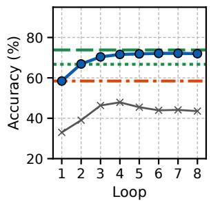  
(a) All test items

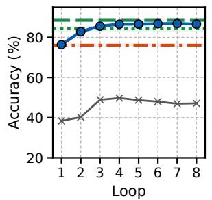  
(b) In-distribution

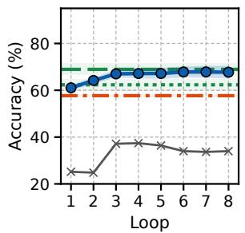  
(c) Near transfer

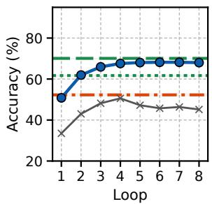  
(d) Far transfer  
Figure 10: Accuracy of SanSi after every loop, by distance from the training data (10,027, 2,116, 1,871 and 5,809 items; line: mean of three seeds; band: one standard deviation). Horizontal lines: the single-pass models. Grey: Ouro-1.4B before fine-tuning.

## E.2 Changes between consecutive loops

Table 16 gives, for every pair of consecutive loops, the share of answerable items whose answer changes, and the shares that go from wrong to right and from right to wrong. For SanSi, the share of changed answers roughly halves from one step to the next at first: 29.2% between loops 1 and 2, 14.9% between loops 2 and 3, and 7.8% between loops 3 and 4. It falls to 2.3% between loops 7 and 8. Up to loop 5, every step fixes more answers than it breaks; in the last two steps the two are about equal. The right half of the table gives the model that was trained with the loss on the last loop only (§7). Its answers change much more between the early loops (58.4% between loops 1 and 2), because its early loops were not trained to answer.

## E.3 Changes seen from the first and from the last loop

Table 17 gives the numbers behind Figure 5a,b for every loop, on the 9,645 answerable test items. The left half compares loop T with loop 1: how many answers have changed, how many of them were fixed and how many were broken. The right half compares loop T with loop 8: how many answers are already final, and how many the later loops will still fix or break. The middle column gives the share of answers that have settled by loop T.

Following single items through all eight loops gives five groups: 46.7% of the answerable items are right at every loop, 20.0% are fixed once and stay right, 6.5% are broken once and stay wrong, 10.1% move between right and wrong more than once, and 16.7% are wrong at every loop. In total, 11.7% of the items are right at some loop and wrong at loop 8. Choosing the best loop for every item would therefore make 83.3% of the answerable items right, instead of the 71.6% at loop 8 (Table 22). This is an upper bound that requires the gold answer, and we do not propose such a rule.

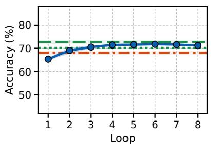  
(a) Classification

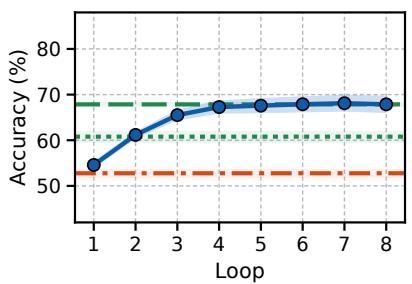

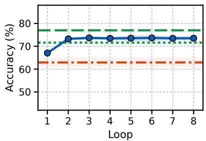

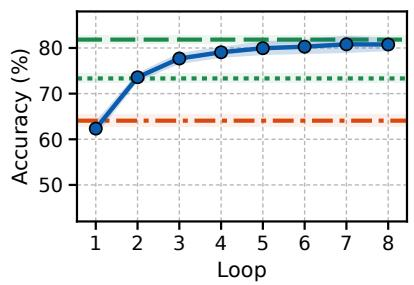  
(d) Long documents

(b) Multi-step reasoning  
(c) Uncertain evidence  
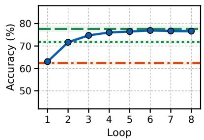  
(e) Sentence pairs

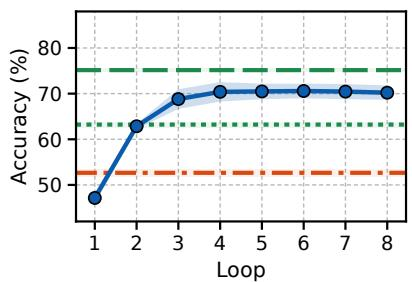  
(f) Knowledge

Figure 11: Accuracy of SanSi after every loop for each item type, over all test groups (1,089, 3,072, 1,558, 901, 1,368 and 1,808 items; line: mean of three seeds; band: one standard deviation). Horizontal lines: the single-pass models.
<table><tr><td></td><td colspan="3">Every loop trained (SanSi)</td><td colspan="3">Last loop only</td></tr><tr><td></td><td>Loops changed</td><td></td><td> wrong→right right→wrong</td><td>changed</td><td> $\mathrm { w r o n g \mathrm { \to r i g h t } }$ </td><td>right→wrong</td></tr><tr><td> $1  2$ </td><td> $2 9 . 2 { \pm } 0 . 3 $ </td><td> $1 5 . 3 { \pm } 0 . 8 $ </td><td> $6 . 8 \pm 0 . 2$ </td><td> $5 8 . 4 \pm 8 . 9$ </td><td> $2 9 . 2 { \pm } 5 . 5 $ </td><td> $1 1 . 7 { \pm 2 . 2 }$ </td></tr><tr><td>2 → 3</td><td> $1 4 . 9 2 0 . 4 $ </td><td> $7 . 6 \pm 0 . 2$ </td><td> $3 . 9 \pm 0 . 1$ </td><td> $3 1 . 5 { \pm } 1 3 . 3$ </td><td> $1 7 . 9 2 7 . 9$ </td><td> $6 . 0 { \pm } 2 . 1$ </td></tr><tr><td>3 → 4</td><td> $7 . 8 \pm 0 . 4$ </td><td> $3 . 6 \pm 0 . 4$ </td><td> $2 . 4 \pm 0 . 1$ </td><td> $1 5 . 4 { \pm } 4 . 9$ </td><td> $8 . 5 \pm 3 . 2$ </td><td> $3 . 4 \pm 0 . 7$ </td></tr><tr><td>4 → 5</td><td> $4 . 5 { \pm } 0 . 3$ </td><td> $1 . 9 \pm 0 . 2$ </td><td> $1 . 7 { \pm } 0 . 1$ </td><td> $8 . 2 \pm 1 . 8$ </td><td> $4 . 0 { \pm } 0 . 8 $ </td><td> $2 . 3 { \pm } 0 . 5 $ </td></tr><tr><td> $5  6$ </td><td> $3 . 3 { \pm } 0 . 3$ </td><td> $1 . 4 \pm 0 . 2$ </td><td> $1 . 1 \pm 0 . 2$ </td><td> $5 . 3 { \pm } 0 . 8 $ </td><td> $2 . 5 { \pm } 0 . 5 $ </td><td> $1 . 6 \pm 0 . 2$ </td></tr><tr><td> $6 \to 7$ </td><td> $2 . 6 \pm 0 . 3$ </td><td> $1 . 0 { \pm } 0 . 1$ </td><td> $1 . 0 { \pm } 0 . 1$ </td><td> $4 . 0 { \pm } 0 . 6 $ </td><td> $1 . 6 { \pm } 0 . 3$ </td><td> $1 . 4 \pm 0 . 3$ </td></tr><tr><td> $7  8$ </td><td> $2 . 3 { \pm } 0 . 2$ </td><td> $0 . 8 { \pm } 0 . 1$ </td><td> $1 . 0 { \pm } 0 . 1$ </td><td> $3 . 3 { \pm } 0 . 2$ </td><td> $1 . 3 { \pm } 0 . 2 $ </td><td> $1 . 3 { \pm } 0 . 2 $ </td></tr></table>

Table 16: Share of answerable items (%) whose answer changes between consecutive loops: mean ± standard deviation over three seeds.

8. More than half of the answers never change (56.7%), and these are right in 82.2% of the cases. The later an answer settles, the less often it is right and the lower its confidence.

## E.4 When answers settle

Table 18 groups the answerable items by the loop at which their answer settles, and gives for every group its share of the items, how often the answer at loop 8 is right, and the mean confidence at loop

Table 19 groups the items by how many of the three single-pass models (SmolLM2-1.7B, Qwen3.5-2B and Qwen3.5-4B; for each seed of SanSi we use the same seed of these models) answer them correctly. The items that no single-pass model answers correctly settle slightly earlier than those that one answers correctly (2.8 against 3.0 loops): SanSi answers only 19.8% of them correctly at loop 8, and on 39.0% of them it keeps its first answer. The loops help most between the extremes. The accuracy rises from 52.3% at loop 1 to 77.4% at loop 8 on the items that two single-pass models answer correctly and from 28.0% to 47.1% on those that one answers correctly, against 86.3% to 95.0% and 13.8% to 19.8% at the two ends.

<table><tr><td rowspan="2">Loop T</td><td colspan="3">Since loop 1 (%)</td><td rowspan="2">Settled</td><td colspan="3">Up to loop 8 (%)</td></tr><tr><td>changed</td><td>fixed</td><td>broken</td><td> ${ \mathrm { b y } } T ( \% )$ </td><td>already final to be fixed</td><td>to be broken</td></tr><tr><td>1</td><td> $0 . 0 { \pm } 0 . 0 $ </td><td> $0 . 0 { \pm } 0 . 0 $ </td><td> $0 . 0 { \pm } 0 . 0 \ $ </td><td> $5 6 . 7 \pm 0 . 2 $ </td><td> $6 4 . 5 { \pm } 0 . 8 $ </td><td> $2 1 . 0 { \pm } 0 . 3 $ </td><td> $7 . 3 { \pm } 0 . 3 $ </td></tr><tr><td>2</td><td> $2 9 . 2 { \pm } 0 . 3 $ </td><td> $1 5 . 3 { \pm } 0 . 8 $ </td><td> $6 . 8 \pm 0 . 2$ </td><td> $7 4 . 2 { \pm } 1 . 2$ </td><td> $7 8 . 7 \pm 0 . 7$ </td><td> $1 1 . 1 { \pm } 0 . 7 $ </td><td> $5 . 9 \pm 0 . 2$ </td></tr><tr><td>3</td><td> $3 3 . 2 \pm 0 . 4$ </td><td> $1 9 . 0 { \pm } 0 . 8 $ </td><td> $6 . 9 \pm 0 . 1$ </td><td> $8 3 . 6 \pm 1 . 1$ </td><td> $8 5 . 8 \pm 0 . 8$ </td><td> $6 . 4 \pm 0 . 7$ </td><td> $4 . 8 \pm 0 . 2$ </td></tr><tr><td>4</td><td> $3 4 . 6 { \pm } 0 . 4 $ </td><td> $2 0 . 5 { \pm } 0 . 5 $ </td><td> $7 . 1 \pm 0 . 1$ </td><td> $8 9 . 1 { \pm } 0 . 9 $ </td><td> $9 0 . 2 { \pm } 0 . 9$ </td><td> $4 . 0 { \pm } 0 . 5 $ </td><td> $3 . 6 \pm 0 . 4$ </td></tr><tr><td>5</td><td> $3 5 . 0 { \pm } 0 . 5 $ </td><td> $2 0 . 8 \pm 0 . 3$ </td><td> $7 . 2 \pm 0 . 2$ </td><td> $9 2 . 5 { \pm } 0 . 8 $ </td><td> $9 3 . 1 { \pm } 0 . 7 $ </td><td> $2 . 7 \pm 0 . 4$ </td><td> $2 . 6 \pm 0 . 3$ </td></tr><tr><td>6</td><td> $3 5 . 4 \pm 0 . 6 $ </td><td> $2 1 . 0 { \pm } 0 . 4 $ </td><td> $7 . 2 \pm 0 . 3$ </td><td> $9 5 . 3 { \pm } 0 . 5 $ </td><td> $9 5 . 5 { \pm } 0 . 5 $ </td><td> $1 . 7 \pm 0 . 2$ </td><td> $1 . 8 \pm 0 . 2$ </td></tr><tr><td>7</td><td> $3 5 . 4 \pm 0 . 9$ </td><td> $2 1 . 0 { \pm } 0 . 3 $ </td><td> $7 . 2 \pm 0 . 4$ </td><td> $9 7 . 7 { \pm } 0 . 2 $ </td><td> $9 7 . 7 { \pm } 0 . 2 $ </td><td> $0 . 8 \pm 0 . 1$ </td><td> $1 . 0 { \pm } 0 . 1$ </td></tr><tr><td>8</td><td> $3 5 . 5 { \pm } 0 . 8 $ </td><td> $2 1 . 0 { \pm } 0 . 3 $ </td><td> $7 . 3 { \pm } 0 . 3$ </td><td> $1 0 0 . 0 { \pm } 0 . 0 \ \qquad $ </td><td> $1 0 0 . 0 { \pm } 0 . 0 \ \qquad $ </td><td> $0 . 0 { \pm } 0 . 0 $ </td><td> $0 . 0 { \pm } 0 . 0 $ </td></tr></table>

Table 17: How the answers of SanSi move over the loops (9,645 answerable test items; mean ± standard deviation over three seeds). Since loop 1: share of items whose answer at loop T differs from that at loop 1, and the shares that went from wrong to right (fixed) and from right to wrong (broken). Settled by T: the answer does not change from loop $T \mathrm { o n } .$ Up to loop 8: share of items whose answer at loop T is already that of loop 8, and the shares that the later loops will still fix or break.

<table><tr><td></td><td></td><td>Settles at loop Items (%) Right at loop 8 (%) Confidence at loop 8</td><td></td></tr><tr><td>1</td><td> $5 6 . 7 \pm 0 . 2 $ </td><td> $8 2 . 2 { \pm } 1 . 1 $ </td><td> $. 8 9 4 \pm . 0 1 4$ </td></tr><tr><td>2</td><td> $1 7 . 5 { \pm } 0 . 9 $ </td><td> $6 8 . 7 \pm 1 . 2$ </td><td> $. 7 9 5 \pm . 0 2 0$ </td></tr><tr><td>3</td><td> $9 . 4 \pm 0 . 2$ </td><td> $6 0 . 1 \pm 0 . 5$ </td><td> $. 7 1 4 \pm . 0 1 7$ </td></tr><tr><td>4</td><td> $5 . 5 { \pm } 0 . 3 $ </td><td> $5 0 . 7 \pm 3 . 3$ </td><td> $. 6 4 5 { \pm } . 0 3 1$ </td></tr><tr><td>5</td><td> $3 . 4 \pm 0 . 2$ </td><td> $4 3 . 6 \pm 4 . 3$ </td><td> $. 5 8 1 \pm . 0 3 2$ </td></tr><tr><td>6</td><td> $2 . 8 \pm 0 . 3$ </td><td> $4 4 . 1 \pm 2 . 5$ </td><td> $. 5 4 0 \pm . 0 3 2$ </td></tr><tr><td>7</td><td> $2 . 4 \pm 0 . 3$ </td><td> $3 7 . 7 { \pm } 0 . 6 $ </td><td> $. 4 9 7 \pm . 0 2 1$ </td></tr><tr><td>8</td><td> $2 . 3 { \pm } 0 . 2$ </td><td> $3 5 . 6 { \pm } 0 . 7 $ </td><td> $. 4 3 9 \pm . 0 1 3$ </td></tr></table>

Table 18: Items by the loop at which the answer of SanSi settles (9,645 answerable test items; mean ± standard deviation over three seeds). Shading of the accuracy column: darker is more often right.

## E.5 Confidence by whether the answer changed

Table 20 splits the 8,879 items with one gold option into four groups, by whether their answer ever changed after loop 1 and by whether it is right at loop 8, and gives the mean confidence of every group at loops 1, 2, 4 and 8. The answers that never change are held with the highest confidence. This holds also when they are wrong: the wrong answers that never change (9.5% of the items) end with a mean confidence of 0.782, which is higher than that of the right answers that were reached by a change (0.763).

## F Probabilities: Additional Results

This appendix supports §5.3. It gives the intervals of the differences in the probability measures (Appendix F.1), the confidence of right and wrong answers (Appendix F.2), the calibration of SanSi and of the other models (Appendix F.3), and the results on items with missing evidence (Appendix F.4).

## F.1 Intervals of the differences

Table 21 gives the differences in the probability measures that §5.3 reports, with their 95% bootstrap intervals: the ECE, the AUROC with which confidence separates right from wrong answers, the evidence AUROC and the hard-answer rate. Every row gives the two values that are compared and their difference. As for the accuracy (Appendix D.2), groups of related test items are resampled and the three seeds are averaged; the measure is recomputed on every resample.

## F.2 Confidence of right and wrong answers

Table 22 gives, for every loop, the accuracy and the mean confidence of SanSi on the answerable items, their difference and the ECE. The difference between confidence and accuracy is smallest at loop 3 and grows again afterwards, and the ECE follows it closely. Table 15 in Appendix E.1 gives the mean confidence of right and of wrong answers separately at every loop.

The loop at which an answer settles is a weaker signal of a wrong answer than confidence. On the 8,879 items with one gold option, the AUROC with which the settling loop separates right from wrong answers is 0.685, against 0.795 for the confidence at loop 8.

<table><tr><td>Single-pass</td><td>Items</td><td></td><td></td><td colspan="2">Settles at loop Never changes Accuracy (%) at loop</td></tr><tr><td>models right</td><td>(%)</td><td>(mean)</td><td>(%)</td><td>1</td><td>8</td></tr><tr><td>3</td><td> $4 5 . 5 { \pm } 0 . 1 $ </td><td> $1 . 4 1 { \pm } 0 . 0 2$ </td><td> $8 0 . 8 \pm 0 . 6 $ </td><td> $8 6 . 3 { \pm } 0 . 9 $ </td><td> $9 5 . 0 { \pm } 0 . 2 $ </td></tr><tr><td>2</td><td> $2 2 . 9 { \pm } 0 . 4 $ </td><td> $2 . 3 9 \pm 0 . 0 6$ </td><td> $4 1 . 4 { \pm } 1 . 5 $ </td><td> $5 2 . 3 { \pm } 1 . 6 $ </td><td> $7 7 . 4 { \pm } 1 . 5$ </td></tr><tr><td>1</td><td> $1 6 . 0 { \pm } 0 . 3 $ </td><td> $3 . 0 1 { \pm } 0 . 1 4$ </td><td> $2 7 . 5 { \pm } 1 . 9$ </td><td> $2 8 . 0 { \pm } 0 . 6 $ </td><td> $4 7 . 1 { \pm } 2 . 0 $ </td></tr><tr><td>0</td><td> $1 5 . 6 { \pm } 0 . 3 $ </td><td> $2 . 8 0 { \scriptstyle \pm 0 . 1 0 }$ </td><td> $3 9 . 0 { \pm 2 . 1 }$ </td><td> $1 3 . 8 { \pm } 0 . 1 $ </td><td> $1 9 . 8 { \pm } 2 . 3 $ </td></tr></table>

Table 19: Items by the number of single-pass models that answer them correctly (9,645 answerable test items; mean ± standard deviation over three seeds). Never changes: SanSi keeps the answer of loop 1 through all eight loops.
<table><tr><td rowspan="2">Items (single gold answer)</td><td rowspan="2">Share (%)</td><td colspan="4">Mean confidence at loop</td></tr><tr><td>1</td><td>2</td><td>4</td><td>8</td></tr><tr><td>Never changed, right at loop 8</td><td> $4 8 . 0 { \pm } 0 . 5 $ </td><td> $. 8 0 5 \pm . 0 1 9$ </td><td> $. 8 8 3 \pm . 0 1 3$ </td><td> $. 9 1 8 { \pm } . 0 1 3$ </td><td> $. 9 2 4 \pm . 0 1 1$ </td></tr><tr><td>Never changed, wrong at loop 8</td><td> $9 . 5 { \pm } 0 . 7$ </td><td> $. 6 6 9 \pm . 0 3 1$ </td><td> $. 7 5 6 \pm . 0 2 2$ </td><td> $. 7 7 9 \pm . 0 2 4$ </td><td> $. 7 8 2 \pm . 0 2 2$ </td></tr><tr><td>Changed at least once, right at loop 8</td><td> $2 4 . 7 { \pm } 0 . 4 $ </td><td> $. 5 6 7 \pm . 0 2 4$ </td><td> $. 6 4 7 \pm . 0 1 5$ </td><td> $. 7 3 4 \pm . 0 1 8$ </td><td> $. 7 6 3 \pm . 0 1 7$ </td></tr><tr><td>Changed at least once, wrong at loop 8</td><td> $1 7 . 7 { \pm } 0 . 3 $ </td><td> $. 5 3 0 \pm . 0 2 3$ </td><td> $. 5 5 9 \pm . 0 2 0$ </td><td> $. 5 7 5 { \pm } . 0 2 0$ </td><td> $. 5 9 5 \pm . 0 2 1$ </td></tr></table>

Table 20: SanSi: four groups of items by whether the answer ever changed after loop 1 and whether it is right at loop 8, with their mean confidence (mean ± standard deviation over three seeds).
<table><tr><td>Difference (first — second)</td><td>First</td><td>Second</td><td>Difference [95% interval]</td></tr><tr><td colspan="4">ECE (answerable items) ↓</td></tr><tr><td>SanSi loop 3 − loop 1</td><td>0.082</td><td>0.105</td><td> $- 0 . 0 2 3 \left[ - 0 . 0 3 2 , - 0 . 0 1 3 \right]$ </td></tr><tr><td>SanSi loop 8 — loop 3</td><td>0.093</td><td>0.082</td><td> $+ 0 . 0 1 0 \left[ + 0 . 0 0 5 , + 0 . 0 1 6 \right]$ </td></tr><tr><td>SanSi loop 1 – Ouro one loop</td><td>0.105</td><td>0.137</td><td>-0.032[-0.038, -0.027]</td></tr><tr><td>SanSi loop 8 – Ouro one loop</td><td>0.093</td><td>0.137</td><td> $- 0 . 0 4 5 \left[ - 0 . 0 5 4 , - 0 . 0 3 4 \right]$ </td></tr><tr><td> $\mathrm { S a n S i l o o p \ 8 - S m o l L M 2 \mathrm { - } 1 . 7 B }$ </td><td>0.093</td><td>0.069</td><td> $+ 0 . 0 2 4 \left[ + 0 . 0 1 5 , + 0 . 0 3 3 \right]$ </td></tr><tr><td> $\mathrm { S a n S i l o o \hat { p } \ 8 - Q w e n } 3 . 5 \mathrm { - } 2 \mathrm { B }$ </td><td>0.093</td><td>0.123</td><td> $- 0 . 0 3 0 [ - 0 . 0 3 7 , - 0 . 0 2 3 ]$ </td></tr><tr><td> $\mathrm { S a n S i l o o p } 8 - \mathrm { Q w e n } 3 . 5 \mathrm { - } 4 \mathrm { B }$ </td><td>0.093</td><td>0.113</td><td> $- 0 . 0 2 0 [ - 0 . 0 2 7 , - 0 . 0 1 4 ]$ </td></tr><tr><td>Mean of loops 1–8 − loop 8</td><td>0.044</td><td>0.093</td><td> $- 0 . 0 4 9 \left[ - 0 . 0 5 2 , - 0 . 0 4 5 \right]$ </td></tr><tr><td>Mean of loops 1–8 – loop 8, near transfer</td><td>0.084</td><td>0.149</td><td>-0.065[-0.075,-0.056]</td></tr><tr><td colspan="4">AUROC, right against wrong answers (items with one gold option) ↑</td></tr><tr><td>SanSi loop 8 − loop 1</td><td>0.795</td><td>0.760</td><td>+0.035[+0.025, +0.045]</td></tr><tr><td>Mean of loops 1–8 – loop 8</td><td>0.790</td><td>0.795</td><td>-0.004[−0.009, +0.000]</td></tr><tr><td colspan="4">Evidence AUROC (786 items) ↑</td></tr><tr><td>SanSi loop 3 – loop 1</td><td>0.921</td><td>0.835</td><td>+0.086[+0.064, +0.108]</td></tr><tr><td>SanSi loop 8 − loop 1</td><td>0.935</td><td>0.835</td><td>+0.099[+0.075, +0.125]</td></tr><tr><td> $\operatorname { S a n S i } \log 1 - \operatorname { O u r o } \operatorname { o n e } \log$ </td><td>0.835</td><td>0.837</td><td>-0.002[−0.014,+0.010]</td></tr><tr><td>SanSi loop 8 – Ouro one loop</td><td>0.935</td><td>0.837</td><td> $+ 0 . 0 9 8 _ { [ + 0 . 0 7 5 , + 0 . 1 2 2 ] }$ </td></tr><tr><td> $\mathrm { S a n S i l o o \hat { p } \ 8 - S m o l L M 2 \mathrm { - } 1 . \hat { 7 } B }$ </td><td>0.935</td><td>0.765</td><td> $+ 0 . 1 7 0 \scriptscriptstyle { [ + 0 . 1 4 2 , + 0 . 1 9 9 ] }$ </td></tr><tr><td>SanSi loop 8 – Qwen3.5-2B</td><td>0.935</td><td>0.896</td><td> $+ 0 . 0 3 9 \left[ + 0 . 0 2 7 , + 0 . 0 5 3 \right]$ </td></tr><tr><td>Qwen3.5-4B — SanSi loop 8</td><td>0.948</td><td>0.935</td><td> $+ 0 . 0 1 4 \left[ + 0 . 0 0 3 , + 0 . 0 2 5 \right]$ </td></tr><tr><td colspan="4">Hard-answer rate on the 382 unanswerable items (%) ↓</td></tr><tr><td>SanSi loop  $8 - \log 1$ </td><td>17.5</td><td>27.1</td><td> $- 9 . 7 \left[ - 1 3 . 4 , - 6 . 0 \right]$ </td></tr><tr><td>SanSi loop  $8 - \mathrm { O u r o ~ o n e ~ l o o p }$ </td><td>17.5</td><td>31.9</td><td> $- 1 4 . 5 [ - 1 8 . 5 , - 1 0 . 8 ]$ </td></tr><tr><td>SanSi loop  ${ \mathrm { 8 - S m o l L M 2 { - } 1 . 7 B } }$ </td><td>17.5</td><td>36.3</td><td> $- 1 8 . 8 [ - 2 3 . 6 , - 1 4 . 2 ]$ </td></tr><tr><td>SanSi loop  $8 \mathrm { - } \mathrm { Q w e n } 3 . 5 \mathrm { - } 4 \mathrm { B }$ </td><td>17.5</td><td>18.2</td><td> $- 0 . 7 \left[ - 2 . 9 , + 1 . 5 \right]$ </td></tr></table>

Table 21: Differences in the probability metrics with 95% bootstrap intervals (means of three seeds; the statistic is recomputed on every resample of the groups of related test items). First, second: the two values that are compared. Colours: teal, the first term is significantly better (taking the direction of the metric into account; the interval excludes 0); red, significantly worse; grey, the interval includes 0.

## F.3 Calibration

The fall of the ECE from loop 1 to loop 3 and its rise from loop 3 to loop 8 occur in each of the three seeds. At every loop, the ECE of SanSi is below that of the same backbone trained with one loop (0.137) and of the two Qwen3.5 models (0.123 and 0.113), and above that of SmolLM2-1.7B (0.069; Table 23). The table also gives the other measures of the probabilities for all models: the ECE by test group, overconfidence, confident errors, the confidence of right and of wrong answers, the AUROC, the negative log-likelihood and the distance to the crowd distribution.

<table><tr><td>Loop</td><td>Accuracy (%)</td><td>Mean confidence</td><td>Confidence — accuracy</td><td>ECE</td></tr><tr><td>1</td><td> $5 7 . 9 { \pm } 0 . 7 $ </td><td> $. 6 8 3 \pm . 0 2 2$ </td><td>+0.105</td><td> $. 1 0 5 { \pm } . 0 2 0$ </td></tr><tr><td>2</td><td> $6 6 . 3 { \pm } 0 . 6 $ </td><td> $. 7 5 0 { \pm } . 0 1 5$ </td><td>+0.086</td><td> $. 0 8 8 \pm . 0 0 9$ </td></tr><tr><td>3</td><td> $7 0 . 0 { \pm } 0 . 6 $ </td><td> $. 7 8 0 \pm . 0 1 6$ </td><td>+0.080</td><td> $. 0 8 2 { \scriptstyle \pm . 0 1 0 }$ </td></tr><tr><td>4</td><td> $7 1 . 2 { \pm } 0 . 6 $ </td><td> $. 7 9 3 \pm . 0 1 6$ </td><td>+0.081</td><td> $. 0 8 5 \pm . 0 0 9$ </td></tr><tr><td>5</td><td> $7 1 . 4 { \pm } 0 . 7 $ </td><td> $. 7 9 8 \pm . 0 1 6$ </td><td>+0.084</td><td> $. 0 8 7 \pm . 0 0 8$ </td></tr><tr><td>6</td><td> $7 1 . 7 { \pm } 0 . 7 $ </td><td> $. 8 0 2 { \scriptstyle \pm . 0 1 6 }$ </td><td>+0.085</td><td> $. 0 8 9 \pm . 0 1 0$ </td></tr><tr><td>7</td><td> $7 1 . 7 { \pm } 0 . 8 $ </td><td> $. 8 0 4 \pm . 0 1 7$ </td><td>+0.087</td><td> $. 0 9 0 \pm . 0 1 2$ </td></tr><tr><td>8</td><td> $7 1 . 6 { \pm } 0 . 7 \ $ </td><td> $. 8 0 5 { \scriptstyle \pm . 0 1 6 }$ </td><td>+0.090</td><td> $. 0 9 3 \pm . 0 1 2$ </td></tr></table>

Table 22: SanSi after every loop on the 9,645 answerable test items: accuracy, mean confidence, their difference, and the ECE (mean ± standard deviation over three seeds).

Kev’s recipe ends with a step that our recipe does not have: one temperature is fitted on the development split (the 2,190 items with one gold option that can be answered) and applied to the probabilities. Table 24 applies this step to four models. As trained, their ECE lies between 0.078 and 0.119. With the fitted temperature it lies between 0.022 and 0.029 for all of them, and their hard-answer rates fall to between 11.0% and 14.7%, while the evidence AUROC does not change. The differences in calibration between the models as trained therefore largely disappear once labelled development data are used, and none of the recipes has an advantage in calibration (see also the comparison with temperature scaling in Appendix H.5).

Figure 12 splits the ECE of Figure 4c by distance from the training data. On far transfer the first loop is confident and often wrong (ECE 0.156); the next loops raise the accuracy by 17 points, and the ECE falls to 0.084 at loop 4. On near transfer the accuracy rises by only 6.6 points while the confidence rises as much as elsewhere, and the ECE grows from 0.053 to 0.149. This is not specific to looping: Qwen3.5-4B has an ECE of 0.178 on near transfer.

## F.4 Missing evidence

Table 25 gives the hard-answer rate on the unanswerable items by test group, and the evidence AUROC. SanSi gives a hard answer to 27.1% of the unanswerable items at loop 1, to 18.1% at loop 4 and to 17.5% at loop 8, and its evidence AU-ROC is 0.835, 0.928 and 0.935 at these loops. The same backbone trained with one loop reaches 0.837 and gives a hard answer to 31.9% of the unanswerable items. SmolLM2-1.7B, which sees the same training targets, reaches 0.765 and 36.3%, and Qwen3.5-2B 0.896 and 27.9%. Qwen3.5-4B remains slightly ahead in one pass (0.948; +0.014 [0.003, 0.025]) with about the same hard-answer rate (18.2%). Kev-4B (our data) is close to it on both measures (0.947 and 16.3%). The Jev API was not trained to give a uniform distribution on such items and gives a hard answer to 62.8% of them.

## G Depth-Controlled Tasks: Additional Results

This appendix supports §5.4. It describes the two tasks and how the models are trained on them (Appendix G.1), summarises the results (Appendix G.2), gives the accuracy at every depth (Appendix G.3) and the loop at which the answers settle (Appendix G.4), reports the single-pass models of SanSi’s size, which did not learn the task (Appendix G.5), and gives the results of the Jev API on the two tasks (Appendix G.6).

## G.1 Tasks, training and checks

In a liar chain, answering requires following the chain from a person whose honesty is given, keeping the verdict at every link that calls the next person honest and flipping it at every link that calls them a liar. The labels are balanced and computed by the generator, the sentences are shuffled, and every item contains a second, irrelevant chain of the same length. In object swaps, every item contains k swaps of the queried object and k further swaps that do not involve it. Both tasks draw their names from the same list of 80 first names and use several wordings for every kind of sentence. No test item occurs in the training set. Table 26 shows one test item of each task at depths 1, 2, 4 and 8.

<table><tr><td rowspan="2">Model</td><td colspan="4">ECE↓</td><td rowspan="2">Over- conf.</td><td rowspan="2">Conf. errors (%)</td><td colspan="2">Confidence</td><td rowspan="2">AUROC r/w ↑</td><td rowspan="2">NLL ↓</td><td rowspan="2">TV crowd↓</td></tr><tr><td>All</td><td>In-dist.</td><td>Near</td><td>Far</td><td>right</td><td>wrong</td></tr><tr><td>SmolLM2-1.7B</td><td>.069</td><td>.021</td><td>.041</td><td>.101</td><td>+0.069</td><td>5.1</td><td>.744</td><td>.531</td><td>.762</td><td>1.044</td><td>.269</td></tr><tr><td rowspan="2"> Ouro-1.4B, one loop</td><td>±.020</td><td>±.006</td><td>±.015</td><td>±.022</td><td>±.020</td><td>±1.0</td><td>±.016</td><td>±.018</td><td>±.004</td><td>±0.027</td><td>±.006</td></tr><tr><td>.137</td><td>.036</td><td>.082</td><td>.187</td><td>+0.137</td><td>9.0</td><td>.802</td><td>.600</td><td>.762</td><td>1.090</td><td>.315</td></tr><tr><td rowspan="2"> SanSi, loop 4</td><td>±.009</td><td>±.012</td><td>±.014</td><td>±.015</td><td>±.009</td><td>±0.8</td><td>±.008</td><td>±.014</td><td>±.006</td><td>±0.031</td><td>±.008</td></tr><tr><td>.085</td><td>.046</td><td>.143</td><td>.084</td><td>+0.081</td><td>8.6</td><td>.857</td><td>.647</td><td>.788</td><td>0.782</td><td>.274</td></tr><tr><td rowspan="2"> SanSi, loop 8</td><td>±.009</td><td>±.007</td><td>±.018</td><td>±.017</td><td>±.012</td><td>±0.7</td><td>±.015</td><td>±.019</td><td>±.009</td><td>±0.016</td><td>±.010</td></tr><tr><td>.093</td><td>.048</td><td>.149</td><td>.092</td><td>+0.090</td><td>9.2</td><td>.869</td><td>.660</td><td>.795</td><td>0.788</td><td>.278</td></tr><tr><td rowspan="2"> SanSi-2.6B, loop 8</td><td>±.012</td><td>±.004</td><td>±.031</td><td>±.019</td><td>±.013</td><td>±0.8</td><td>±.013</td><td>±.020</td><td>±.005</td><td>±0.018</td><td>±.009</td></tr><tr><td>.078</td><td>.046</td><td>.106</td><td>.082</td><td>+0.073</td><td>8.5</td><td>.885</td><td>.669</td><td>.804</td><td>0.685</td><td>.276</td></tr><tr><td rowspan="2"> Last loop only, loop 8</td><td>±.000</td><td>±.009</td><td>±.027</td><td>±.011</td><td>±.003</td><td>±0.3</td><td>±.004</td><td>±.014</td><td>±.004</td><td>±0.008</td><td></td></tr><tr><td>.073</td><td>.041</td><td>.100</td><td>.077</td><td>+0.070</td><td>7.4</td><td>.841</td><td>.623</td><td>.792</td><td>0.774</td><td>±.011 .279</td></tr><tr><td rowspan="2"> Reinforcement learning, loop 8</td><td>±.009</td><td>±.012</td><td>±.019</td><td>±.009</td><td>±.009</td><td>±1.0</td><td>±.008</td><td>±.011</td><td>±.008</td><td>±0.030</td><td>±.014</td></tr><tr><td>.076</td><td>.035</td><td>.129</td><td>.076</td><td>+0.074</td><td>8.2</td><td>.851</td><td>.632</td><td>.793</td><td>0.783</td><td>.288</td></tr><tr><td rowspan="2"> Cross-entropy only, loop 8</td><td>±.015</td><td>±.010</td><td>±.047</td><td>±.010</td><td>±.018</td><td>±0.8</td><td>±.018</td><td>±.023</td><td>±.002</td><td>±0.030</td><td>±.020</td></tr><tr><td>.104</td><td>.055</td><td>.153</td><td>.108</td><td>+0.103</td><td>9.9</td><td>.877</td><td>.676</td><td>.791</td><td>0.829</td><td>.279</td></tr><tr><td rowspan="2"> Qwen3.5-2B</td><td>±.007</td><td>±.006</td><td>±.029</td><td>±.004</td><td>±.008</td><td>±1.4</td><td>±.008</td><td>±.019</td><td>±.007</td><td>±0.030</td><td>±.008</td></tr><tr><td>.123</td><td>.051</td><td>.176</td><td>.131</td><td>+0.122</td><td>10.7</td><td>.851</td><td>.662</td><td>.773</td><td>0.963</td><td>.298</td></tr><tr><td rowspan="2">Qwen3.5-4B</td><td>±.007</td><td>±.017</td><td>±.024</td><td>±.013</td><td>±.006</td><td>±1.1</td><td>±.008</td><td>±.014</td><td>±.012</td><td>±0.026</td><td>±.014</td></tr><tr><td>.113</td><td>.054</td><td>.178</td><td>.112</td><td>+0.109</td><td>11.3</td><td>.895</td><td>.703</td><td>.802</td><td>0.788</td><td>.302</td></tr><tr><td rowspan="2">Kev-4B (our data)</td><td>±.003</td><td>±.003</td><td>±.022</td><td>±.008</td><td>±.002</td><td>±0.1</td><td>±.008</td><td>±.005</td><td>±.005</td><td>±0.005</td><td>±.004</td></tr><tr><td>.119</td><td>.063</td><td>.150</td><td>.129</td><td>+0.118</td><td>11.0</td><td>.917</td><td>.730</td><td>.797</td><td>0.859</td><td>.254</td></tr><tr><td rowspan="2">□ Jev API</td><td>±.004</td><td>±.003</td><td>±.012</td><td>±.009</td><td>±.004</td><td>±0.3</td><td>±.004</td><td>±.009</td><td>±.005</td><td>±0.025</td><td>±.016</td></tr><tr><td>.066</td><td>.055</td><td>.094</td><td>.065</td><td> $+ 0 . 0 6 4$ </td><td>7.2</td><td>.913</td><td>.696</td><td>.830</td><td>0.669</td><td>.276</td></tr></table>

Table 23: Probability quality: means of three seeds, with the standard deviation over the seeds on the line below (the Jev API is a single run). Overconf.: mean confidence minus accuracy. Conf. errors: wrong with top probability ≥ 0.8. TV crowd: total variation distance to the crowd distribution (766 items).
<table><tr><td></td><td></td><td colspan="2">As trained</td><td colspan="6">With the temperature fitted on the development split</td></tr><tr><td>Model</td><td>Fitted</td><td></td><td>Hard</td><td colspan="4">ECE↓</td><td>Hard</td><td>Evidence</td></tr><tr><td></td><td>temperature</td><td>ECE↓</td><td>ans. (%)</td><td>All</td><td>In-dist.</td><td>Near</td><td>Far</td><td>ans. (%)</td><td>AUROC ↑</td></tr><tr><td>Kev-4B (our data)</td><td>1.99</td><td> $. 1 1 9 \pm . 0 0 4$ </td><td> $1 6 . 3 { \pm } 0 . 6 $ </td><td> $. 0 2 9 { \pm } . 0 0 5$ </td><td> $. 0 2 5 { \scriptstyle \pm . 0 0 6 }$ </td><td> $. 0 4 3 { \pm } . 0 0 6$ </td><td> $. 0 3 4 \pm . 0 0 5$ </td><td> $1 1 . 0 { \pm } 0 . 7 $ </td><td> $. 9 4 5 { \scriptstyle \pm . 0 0 2 }$ </td></tr><tr><td>Qwen3.5-4B</td><td>1.61</td><td> $. 1 1 3 { \pm } . 0 0 3$ </td><td> $1 8 . 2 { \pm } 2 . 5 $ </td><td> $. 0 2 8 \pm . 0 0 2$ </td><td> $. 0 3 2 { \scriptstyle \pm . 0 0 7 }$ </td><td> $. 0 7 6 \pm . 0 3 1$ </td><td> $. 0 3 5 { \scriptstyle \pm . 0 0 4 }$ </td><td> $1 2 . 8 { \pm } 1 . 8$ </td><td> $. 9 4 8 { \pm } . 0 0 3$ </td></tr><tr><td>I SanSi-2.6B, loop 8</td><td>1.40</td><td> $. 0 7 8 \pm . 0 0 0$ </td><td> $1 8 . 2 { \pm } 2 . 4 $ </td><td> $. 0 2 2 \pm . 0 0 3$ </td><td> $. 0 2 3 { \pm } . 0 0 6$ </td><td> $. 0 3 9 \pm . 0 2 0$ </td><td> $. 0 3 3 { \pm } . 0 0 3$ </td><td> $1 4 . 7 { \pm } 1 . 0 $ </td><td> $. 9 4 2 \pm . 0 0 1$ </td></tr><tr><td> SanSi, loop 8</td><td>1.47</td><td> $. 0 9 3 \pm . 0 1 2$ </td><td> $1 7 . 5 { \pm } 1 . 3$ </td><td> $. 0 2 6 { \pm } . 0 0 3$ </td><td> $. 0 2 4 \pm . 0 0 4$ </td><td> $. 0 6 7 \pm . 0 2 9$ </td><td> $. 0 3 1 \pm . 0 0 3$ </td><td> $1 3 . 4 \pm 1 . 9$ </td><td> $. 9 3 4 \pm . 0 0 3$ </td></tr></table>

Table 24: Four models as trained and with one temperature fitted on the development split, the last step of Kev’s recipe (10,027 test items; mean ± standard deviation over three seeds; fitted temperature: mean of the seeds).

Training. The models for the liar chains are trained for 2,000 steps on 17,336 programgenerated items of depths $k = 1 , \ldots , 8 ,$ 4,480 of them liar chains. The models for the object swaps are trained with the same recipe on 4,480 items of depths $k = 1 , \ldots , 8 .$ . SanSi is trained with eight loops and run for up to 16 loops at test time; Qwen3.5-4B makes a single pass. Each test set has 120 items at every depth $k = 1 , \dots$ , 16 (1,920 items per task), and all results are means of three seeds.

Checks against shortcuts. Surface heuristics and a bag-of-words classifier stay at chance on both tasks (48–51% on liar chains, 19.5–21.4% on object swaps), so an item cannot be answered without

following its chain.

## G.2 Results in summary

Table 27 gives, for both tasks, the depth that a model holds, its accuracy on the trained depths $( k \leq 8 )$ and on the unseen depths $( k > 8 )$ , and the difference between SanSi and Qwen3.5-4B. A model holds depth k if its accuracy is at least 75% at every depth up to k. The accuracy on a range of depths is the mean over its eight depths. For a difference, the correctness of every item is first averaged over the three seeds of each model, and the items are then resampled 2,000 times for the 95% interval.

Read after one loop, SanSi is below Qwen3.5- 4B on the trained depths of both tasks (−5.3 points on liar chains and −10.1 points on object swaps). From the second loop on it is above. Running 16 loops, twice the number of trained loops, gives the accuracy of eight loops on both tasks (72.7% and 64.0% on the unseen depths), so loops beyond the trained ones do not extend the depth. Figure 13 in Appendix H.3 shows every loop up to the sixteenth.

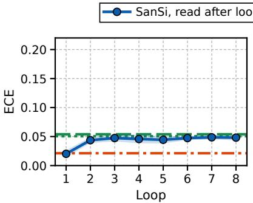  
(a) In-distribution

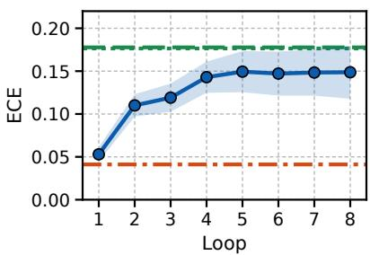  
(b) Near transfer

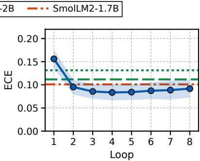  
(c) Far transfer

Figure 12: ECE of SanSi after every loop, by distance from the training data (answerable items; line: mean of three seeds; band: one standard deviation). Horizontal lines: the single-pass models, whose standard deviations are in Table 23; the lines of the two Qwen3.5 models nearly coincide in (a) and (b).
<table><tr><td></td><td colspan="4">Hard-answer rate (%) ↓</td><td>Evidence</td></tr><tr><td>Model</td><td>All (382)</td><td>In-dist. (200)</td><td>Near (120)</td><td>Far (62)</td><td>AUROC ↑</td></tr><tr><td>SmolLM2-1.7B</td><td> $3 6 . 3 { \pm } 4 . 2 $ </td><td> $2 5 . 3 { \pm } 2 . 3$ </td><td> $4 6 . 7 \pm 5 . 1$ </td><td> $5 1 . 6 { \pm } 1 6 . 4 $ </td><td> $. 7 6 5 \pm . 0 0 9$ </td></tr><tr><td>Ouro-1.4B, one loop</td><td> $3 1 . 9 { \pm 2 . 2 }$ </td><td> $2 3 . 3 { \pm 3 . 4 }$ </td><td> $3 7 . 8 \pm 1 . 7$ </td><td> $4 8 . 4 \pm 5 . 6$ </td><td> $. 8 3 7 \pm . 0 0 7$ </td></tr><tr><td>SanSi, loop 1</td><td> $2 7 . 1 \pm 2 . 1$ </td><td> $2 2 . 2 { \pm } 0 . 8 $ </td><td> $2 8 . 6 { \pm } 6 . 3$ </td><td> $4 0 . 3 { \pm } 2 . 8 $ </td><td> $. 8 3 5 { \pm } . 0 1 1$ </td></tr><tr><td> SanSi, loop 4</td><td> $1 8 . 1 { \pm } 0 . 5 $ </td><td> $1 1 . 7 { \pm } 0 . 3 $ </td><td> $2 3 . 1 \pm 3 . 2$ </td><td> $2 9 . 0 { \pm } 5 . 8 $ </td><td> $. 9 2 8 \pm . 0 0 3$ </td></tr><tr><td> SanSi, loop 8</td><td> $1 7 . 5 { \pm } 1 . 3 $ </td><td> $1 0 . 7 \pm 2 . 3$ </td><td> $2 3 . 6 { \pm } 2 . 4 $ </td><td> $2 7 . 4 \pm 1 1 . 3$ </td><td> $. 9 3 5 { \scriptstyle \pm . 0 0 4 }$ </td></tr><tr><td>Qwen3.5-4B</td><td> $1 8 . 2 { \pm } 2 . 5 $ </td><td> $9 . 3 \pm 1 . 3$ </td><td> $2 1 . 9 { \pm 2 . 1 }$ </td><td> $3 9 . 2 \pm 1 5 . 2$ </td><td> $. 9 4 8 \pm . 0 0 3$ </td></tr><tr><td>Kev-4B (our data)</td><td> $1 6 . 3 { \pm } 0 . 6 $ </td><td> $9 . 3 { \pm } 1 . 2 $ </td><td> $2 0 . 6 { \pm } 0 . 5 $ </td><td> $3 0 . 6 \pm 4 . 3$ </td><td> $. 9 4 7 \pm . 0 0 2$ </td></tr><tr><td>□ Jev API</td><td>62.8</td><td>77.0</td><td>54.2</td><td>33.9</td><td>.743</td></tr></table>

Table 25: Unanswerable items by group (number of items in parentheses) and evidence AUROC: mean ± standard deviation over three seeds. The Jev API (a single run) was not trained to give a uniform distribution on such items.

## G.3 Accuracy at every depth

Table 28 gives the numbers behind Figure 6: the accuracy at every depth for SanSi read after 1, 2, 4 and 8 loops and for Qwen3.5-4B.

Liar chains. Read after one loop, SanSi answers the shortest chains (100.0% at k = 1, 98.6% at k = 2) and is within three points of chance from k = 6. Qwen3.5-4B also answers the shortest chains (100.0% and 98.6%) and is within two points of chance from k = 7. Loops five to eight add little: the accuracy on the unseen depths rises from 70.9% at loop 4 to 72.6% at loop 8. The three seeds of SanSi agree on the trained depths (95.7– 98.1% at loop 8) and differ on the unseen ones (64.7–79.4%); those of Qwen3.5-4B reach 69.7– 81.9% on the trained depths. Confidence does not follow accuracy down. At k = 16, SanSi is right on 60.3% of the items with a mean confidence of 0.73. Qwen3.5-4B, in contrast, has a low confidence where it is at chance (0.54 on average for $k \geq 9 )$

Object swaps. After one loop, SanSi follows the object through two swaps (96.7% at k = 2, 68.9% at $k = 3 )$ . Unlike on liar chains, loops five to eight still help on the unseen depths (57.3% after four loops, 63.7% after eight). The lowest values among the seeds of SanSi at loop 8 (84.3% on the trained and 60.2% on the unseen depths) are above the highest among the seeds of Qwen3.5- 4B (72.1% and 34.9%). Two limits remain. The trained depths are not learned completely (75–84% for $k = 5 , \ldots , 8$ at loop 8). And the wrong answers at the unseen depths come with a mean confidence of 0.87–0.91 across the seeds, the same as for Qwen3.5-4B (0.86–0.91).

## G.4 When answers settle

As on the main suite (§5.2), the answers to deeper items settle at later loops. Table 29 gives, at every depth, the mean loop at which the answer of SanSi settles, that is, the first loop from which it no longer changes, and the share of items whose answer at loop 8 differs from that at loop 1. On liar chains the settling loop grows from 1.0 at k = 1 to 2.3 at k = 8 and 4.2 at k = 16; on object swaps it grows from 1.0 to 3.0 and 4.5. From k = 6 on liar chains and from k = 4 on object swaps, the answer after eight loops differs from the answer after one loop on about half of the items or more (47–56% and 51–70%).

<table><tr><td>k Item</td><td></td><td>Answer</td></tr><tr><td>Liar chains (options: yes, no)</td><td>Lee is honest. Wes is honest. According to Flo, Lee tells the truth. According to Abe, Wes lies. Does</td><td></td></tr><tr><td>1</td><td>Abe tell the truth?</td><td>no</td></tr><tr><td>2</td><td>Uma always tells the truth. Seth always tells the truth. Fred says that Seth lies. Kurt says Fred is a liar. yes Bert says that Uma lies. Ben says Bert is a liar. Is Ben telling the truth?</td><td></td></tr><tr><td>4</td><td>Omar is honest. Ege always lies. According to Bert, Omar tells the truth. Yves says that Eli lies. Ben no says that Bert lies. Liv says that Nate lies. Eli says that Liv tells the truth. Jon says Vera is honest. Vera says that Ben lies. According to Nate, Ege tells the truth. Is Yves telling the truth?</td><td></td></tr><tr><td>8</td><td>Omar is a liar. Seth is a liar. Vera says Iris is a liar. Bea says Flo is a liar. According to Eli, Wade tells the truth. According to Yul, Ida tells the truth. Nia says that Nate lies. According to Bert, Omar lies. Ida says that Nia lies. Iris says Bert is honest. According to Wade, Meg lies. Nate says Vera is honest. According to Meg, Bo tells the truth. Ben says that Seth tells the truth. According to Kim, Bea tells the truth. Flo says Ben is a liar. According to Ola, Yul lies. Bo says that Kim lies. Is Eli telling the truth?</td><td>no</td></tr><tr><td>Object swaps (options: the five people)</td><td>Dan has the cup, Ana has the scarf, Gail has the umbrella, Lee has the coin, and Jill has the pen. Then</td><td></td></tr><tr><td>1</td><td>Jill and Gail swap. Then Gail swaps with Ana. Who has the scarf at the end? Dov holds the coin, Eli holds the hat, Bo holds the scarf, Kim holds the key, and Jill holds the cup.</td><td>Gail</td></tr><tr><td>2</td><td>Then Dov swaps with Kim. Then Eli and Jill swap. Then Jill and Kim swap. Then Eli swaps with Dov. Who has the cup at the end?</td><td>Dov</td></tr><tr><td>4</td><td>Sam holds the scarf, Max holds the coin, Lee holds the cup, Iris holds the hat, and Dan holds the key. Then Lee and Sam trade. Then Iris swaps with Max. Then Lee swaps with Dan. Then Max swaps with Dan. Then Sam and Iris trade. Then Iris and Max trade. Then Sam and Max swap. Then Dan and Max swap. At the end, who holds the cup?</td><td>Sam</td></tr><tr><td>8</td><td>Tara holds the box, Cleo holds the coin, Bo holds the scarf, Eli holds the ball, and Ned holds the hat. Then Ned swaps with Bo. Then Cleo and Bo swap. Then Eli swaps with Tara. Then Ned and Cleo swap. Then Cleo and Ned trade. Then Eli swaps with Bo. Then Cleo and Bo swap. Then Tara and Cleo trade. Then Eli swaps with Tara. Then Ned swaps with Tara. Then Ned and Tara swap. Then Ned and Bo swap. Then Cleo and Eli swap. Then Ned and Cleo trade. Then Cleo swaps with Eli. Then Bo and Ned trade. Who has the hat at the end?</td><td>Eli</td></tr></table>

Table 26: One test item of each depth-controlled task at depths k = 1, 2, 4, 8 (the item of median length at that depth). A liar chain contains a second chain of the same length that does not matter for the question; an object-swap item contains k swaps of the queried object and k further swaps.

## G.5 Single-pass models of SanSi’s size

The comparison in §5.4 uses one single-pass model, Qwen3.5-4B. We also trained the two single-pass models of SanSi’s size on the items of the liar chains, with two seeds each: SmolLM2-1.7B, with the recipe above and with a second recipe (half the learning rate and twice the steps), and the Ouro-1.4B backbone trained and read with one loop. None of them learned the task (Table 30). With the recipe above, SmolLM2-1.7B and the one-loop model give the same option for every item, with a confidence of 0.51–0.52, so their accuracy is 50.0% at every depth. With the second recipe, the accuracy of SmolLM2-1.7B is between 45.0% and 59.2% at every depth.

All of these models fail already at depth 1, which Qwen3.5-4B and the first loop of SanSi answer without error (Table 28). Their failure is therefore a failure of training and says nothing about depth, so we do not use these models as references in §5.4. We did not train them on object swaps.

## G.6 The Jev API on the two tasks

We queried the Jev API (jev-1.13.0) on the test items of the two depth-controlled tasks (1,920 items per task), three times per item. The API was not trained on these tasks, so its numbers are not comparable with those of the fine-tuned models in §5.4. They show that the Jev API, used as it is offered, follows only a few dependent steps. Table 31 gives its accuracy and its mean confidence

<table><tr><td rowspan="2">Model</td><td rowspan="2">Holds depth k</td><td colspan="2">Accuracy (%)</td><td colspan="2">Difference to Qwen3.5-4B (points)</td></tr><tr><td> $k \leq 8$ </td><td> $k > 8$ </td><td> $k \leq 8$ </td><td> $k > 8$ </td></tr><tr><td colspan="6">Liar chains (chance 50%)</td></tr><tr><td>SanSi, loop 1</td><td>3</td><td>69.0</td><td>49.9</td><td>-5.3[-7.3,-3.4]</td><td>−0.2[−1.6, +1.2]</td></tr><tr><td>SanSi, loop 2</td><td>6</td><td>88.0</td><td>51.6</td><td>+13.7[+11.7, +15.6]</td><td>+1.6[−1.1, +4.3]</td></tr><tr><td>SanSi, loop 4</td><td>11</td><td>96.6</td><td>70.9</td><td> $+ 2 2 . 3 \ : [ + 2 0 . 5 , + 2 4 . 1 ]$ </td><td>+20.8[+18.9, +22.9]</td></tr><tr><td>SanSi, loop 8</td><td>11</td><td>97.0</td><td>72.6</td><td> $+ 2 2 . 7 [ + 2 0 . 8 , + 2 4 . 7 ]$ </td><td>+22.6[+20.5, +24.7]</td></tr><tr><td>SanSi, loop 16</td><td>11</td><td>96.9</td><td>72.7</td><td></td><td></td></tr><tr><td>Qwen3.5-4B</td><td>3</td><td>74.3</td><td>50.0</td><td></td><td></td></tr><tr><td colspan="6">Object swaps (chance 20%)</td></tr><tr><td>SanSi, loop 1</td><td>2</td><td>57.8</td><td>32.3</td><td>-10.1[−12.3, -7.9]</td><td>-1.9[−4.3, +0.5]</td></tr><tr><td>SanSi, loop 2</td><td>3</td><td>74.2</td><td>40.1</td><td>+6.2[+4.1, +8.4]</td><td>+5.9[+3.3, +8.3]</td></tr><tr><td>SanSi, loop 4</td><td>7</td><td>86.8</td><td>57.3</td><td>+18.9[+16.5, +21.2]</td><td>+23.1[+20.3, +25.9]</td></tr><tr><td>SanSi, loop 8</td><td>9</td><td>88.2</td><td>63.7</td><td> $+ 2 0 . 2 \ [ + 1 7 . 9 , + 2 2 . 6 ]$ </td><td>+29.5[+26.5, +32.7]</td></tr><tr><td>SanSi, loop 16</td><td>7</td><td>87.6</td><td>64.0</td><td></td><td></td></tr><tr><td>Qwen3.5-4B</td><td>3</td><td>68.0</td><td>34.2</td><td></td><td></td></tr></table>

Table 27: The two depth-controlled tasks in summary (means of three seeds; 120 test items per depth). Holds depth k: the accuracy is at least 75% at every depth up to k. $k \leq 8 :$ depths seen in training; $k > 8 :$ unseen depths. Differences with 95% bootstrap intervals; loop 16 is beyond the trained loops. Differences: teal, SanSi is significantly better (the interval excludes 0); red, significantly worse; grey, the interval includes 0.
<table><tr><td></td><td colspan="8">Depths seen in training</td><td colspan="8">Unseen depths</td></tr><tr><td>k</td><td>1</td><td>2</td><td>3</td><td>4</td><td>5</td><td></td><td>6 7</td><td>8</td><td>9</td><td>10</td><td>11</td><td>12</td><td>13</td><td>14</td><td>15</td><td>16</td></tr><tr><td colspan="2">Liar chains (chance 50%)</td><td></td><td></td><td></td><td></td><td></td><td></td><td></td><td></td><td></td><td></td><td></td><td></td><td></td><td></td><td></td></tr><tr><td colspan="2">SanSi, loop 1 100.0</td><td>98.6</td><td>79.2</td><td>60.0</td><td>59.4</td><td>52.8</td><td>50.6</td><td>51.4</td><td>48.6</td><td>50.6</td><td>51.7</td><td>50.6</td><td>50.8</td><td>48.3</td><td>49.2</td><td>49.2</td></tr><tr><td rowspan="2">SanSi, loop 2</td><td>±0.0</td><td>±1.3</td><td>±9.8</td><td>±11.0</td><td>±3.4</td><td>±8.0</td><td>±7.1</td><td>±1.7</td><td>±3.8</td><td>±1.7</td><td>±4.4</td><td>±1.3</td><td>±2.5</td><td>±1.4</td><td>±2.2</td><td>±1.4</td></tr><tr><td>100.0</td><td>100.0</td><td>99.7</td><td>96.7</td><td>91.4</td><td>80.8</td><td>69.7</td><td>65.6</td><td>55.8</td><td>51.7</td><td>51.1</td><td>52.5</td><td>52.5</td><td>50.6</td><td>51.1</td><td>47.5</td></tr><tr><td rowspan="2">SanSi, loop 4</td><td>±0.0</td><td>±0.0</td><td>±0.5</td><td>±2.2</td><td>±2.7</td><td>±6.0</td><td>±7.7</td><td>±5.1</td><td>±3.6</td><td>±3.6</td><td>±4.3</td><td>±0.8</td><td>±3.8</td><td>±5.7</td><td>±1.9</td><td>±3.0</td></tr><tr><td>99.7</td><td>100.0</td><td>99.7</td><td>100.0</td><td>98.6</td><td>95.8</td><td>91.1</td><td>88.1</td><td>86.9</td><td>83.9</td><td>79.4</td><td>71.4</td><td>66.7</td><td>63.6</td><td>56.9</td><td>58.1</td></tr><tr><td rowspan="2">SanSi, loop 8</td><td>±0.5</td><td>±0.0</td><td>±0.5</td><td>±0.0</td><td>±1.7</td><td>±3.6</td><td>±1.7</td><td>±5.1</td><td>±4.6</td><td>±7.3</td><td>±6.4</td><td>±6.1</td><td>±8.5</td><td>±2.7</td><td>±8.9</td><td>±1.9</td></tr><tr><td>99.7</td><td>100.0</td><td>99.7</td><td>100.0</td><td>98.9</td><td>95.3</td><td>92.2</td><td>90.6</td><td>87.2</td><td>86.1</td><td>80.3</td><td>73.9</td><td>66.1</td><td>65.8</td><td>61.4</td><td>60.3</td></tr><tr><td rowspan="2">Qwen3.5-4B</td><td>±0.5</td><td>±0.0</td><td>±0.5</td><td>±0.0</td><td>±1.9</td><td>±5.5</td><td>±1.7</td><td>±1.3</td><td>±4.8</td><td>±7.5</td><td>±5.7</td><td>±9.7</td><td>±10.1</td><td>±11.0</td><td>±10.1</td><td>±3.9</td></tr><tr><td>100.0</td><td>98.6</td><td>89.2</td><td>74.7</td><td>68.9</td><td>59.4</td><td>51.7</td><td>51.9</td><td>48.9</td><td>50.3</td><td>50.0</td><td>51.4</td><td>50.6</td><td>50.3</td><td>49.4</td><td>49.4</td></tr><tr><td rowspan="2"></td><td>±0.0</td><td>±1.7</td><td>±7.3</td><td>±11.3</td><td>±9.6</td><td>±10.1</td><td>±9.5</td><td>±5.4</td><td>±3.8</td><td>±2.1</td><td>±0.8</td><td>±1.0</td><td>±1.0</td><td>±2.1</td><td>±1.0</td><td>±1.0</td></tr><tr><td>Object swaps (chance 20%)</td><td></td><td></td><td></td><td></td><td></td><td></td><td></td><td></td><td></td><td></td><td></td><td></td><td></td><td></td><td></td></tr><tr><td rowspan="2">SanSi, loop 1</td><td>98.3</td><td>96.7</td><td>68.9</td><td></td><td>46.4 49.2</td><td>36.1</td><td>36.4</td><td>30.8</td><td>34.2</td><td>30.8</td><td>31.1</td><td>36.7</td><td>29.2</td><td>35.0</td><td>28.6</td><td>32.5</td></tr><tr><td>±0.8</td><td>±0.8</td><td>±9.3</td><td>±4.9</td><td>±2.9</td><td>±5.0</td><td>±3.5</td><td>±4.6</td><td>±2.9</td><td>±1.4</td><td>±3.4</td><td>±2.9</td><td>±2.2</td><td>±3.3</td><td>±2.9</td><td>±2.2</td></tr><tr><td rowspan="2">SanSi, loop 2</td><td>99.7</td><td>98.9</td><td>96.1</td><td>72.8</td><td>62.5</td><td>65.3</td><td>54.4</td><td>43.6</td><td>45.3</td><td>41.1</td><td>39.7</td><td>40.3</td><td>37.5</td><td>44.4</td><td>33.1</td><td>39.4</td></tr><tr><td>±0.5</td><td>±1.0</td><td>±3.9</td><td>±4.6</td><td>±1.7</td><td>±3.4</td><td>±2.4</td><td>±1.0</td><td>±3.9</td><td>±1.0</td><td>±1.7</td><td>±2.1</td><td>±0.0</td><td>±1.7</td><td>±2.5</td><td>±2.4</td></tr><tr><td rowspan="2">SanSi, loop 4</td><td>99.7</td><td>99.4</td><td>97.2</td><td>88.6</td><td>79.4</td><td>84.2</td><td>75.8</td><td>70.0</td><td>74.4</td><td>65.0</td><td>63.6</td><td>57.5</td><td>55.0</td><td>49.7</td><td>47.8</td><td>45.3</td></tr><tr><td>±0.5</td><td>±1.0</td><td>±3.5</td><td>±8.9</td><td>±4.7</td><td>±3.8</td><td>±0.8</td><td>±2.2</td><td>±4.1</td><td>±2.5</td><td>±2.5</td><td>±2.5</td><td>±1.4</td><td>±2.1</td><td>±2.4</td><td>±4.8</td></tr><tr><td rowspan="2">SanSi, loop 8</td><td>99.4</td><td>99.4</td><td>97.2</td><td>88.6</td><td>79.7</td><td>83.6</td><td>81.9</td><td>75.3</td><td>76.9</td><td>74.7</td><td>70.3</td><td>69.7</td><td>60.8</td><td>55.6</td><td>50.8</td><td>50.8</td></tr><tr><td>±0.5</td><td>±1.0</td><td>±3.5</td><td>±8.9</td><td>±5.9</td><td>±5.4</td><td>±0.5</td><td>±4.2</td><td>±3.4</td><td>±5.4</td><td>±6.3</td><td>±6.7</td><td>±6.3</td><td>±1.7</td><td>±2.2</td><td>±3.8</td></tr><tr><td rowspan="2">Qwen3.5-4B</td><td>100.0</td><td>99.7</td><td>93.3</td><td>65.0</td><td>50.3</td><td>49.7</td><td>46.9</td><td>38.6</td><td>34.7</td><td>31.1</td><td>32.5</td><td>39.2</td><td>33.6</td><td>39.2</td><td>31.7</td><td>31.7</td></tr><tr><td>±0.0</td><td>±0.5</td><td>±6.6</td><td>±18.4</td><td>±8.4</td><td>±3.4</td><td>±3.2</td><td>±2.5</td><td>±4.1</td><td>±3.2</td><td>±2.2</td><td>±2.2</td><td>±1.7</td><td>±1.7</td><td>±3.3</td><td>±2.2</td></tr></table>

Table 28: Accuracy (%) at every depth k on the two depth-controlled tasks (120 test items per depth; means of three seeds, with the standard deviation over the seeds on the line below). Qwen3.5-4B makes a single pass. Cells are shaded by the accuracy above chance (blue: SanSi; green: Qwen3.5-4B).

at every depth.

On liar chains (two options) the API answers every chain of depth 1 and 86.4% of the chains of depth 2. Its accuracy falls to 62.5% at depth 3 and stays between 42.5% and 53.3% from depth 6 on, around the chance level of 50%. On object swaps (five options) it follows one swap in 77.5% of the items and two swaps in 42.5%; from depth 3 on its accuracy is between 18.6% and 31.1%, close to the chance level of 20%. On both tasks the confidence of the API falls with the depth (from 0.99 to 0.60 on liar chains and from 0.92 to 0.29 on object swaps) and, from depth 3 on, is above its accuracy at every depth but one (depth 14 of object swaps): over the depths 6 to 16 it is 0.61 on liar chains, where 47.6% of the answers are right, and 0.33 on object swaps, where 23.6% are right.

<table><tr><td>k</td><td>1</td><td>2</td><td>3</td><td>4</td><td>5</td><td>6</td><td>7</td><td>8</td><td>9</td><td>10</td><td>11</td><td>12</td><td>13</td><td>14</td><td>15</td><td>16</td></tr><tr><td>Liar chains</td><td></td><td></td><td></td><td></td><td></td><td></td><td></td><td></td><td></td><td></td><td></td><td></td><td></td><td></td><td></td><td></td></tr><tr><td>Settles at loop</td><td>1.0</td><td>1.0</td><td>1.2</td><td>1.5</td><td>1.6</td><td>1.9</td><td>2.1</td><td>2.3</td><td>2.7</td><td>2.9</td><td>3.1</td><td>3.4</td><td>3.9</td><td>4.0</td><td>4.2</td><td>4.2</td></tr><tr><td>Changed, loop 1 to 8 (%)</td><td>0</td><td>1</td><td>21</td><td>40</td><td>41</td><td>47</td><td>50</td><td>52</td><td>54</td><td>52</td><td>52</td><td>54</td><td>55</td><td>56</td><td>53</td><td>52</td></tr><tr><td>Object swaps</td><td></td><td></td><td></td><td></td><td></td><td></td><td></td><td></td><td></td><td></td><td></td><td></td><td></td><td></td><td></td><td></td></tr><tr><td>Settles at loop</td><td>1.0</td><td>1.1</td><td>1.4</td><td>1.9</td><td>2.0</td><td>2.3</td><td>2.7</td><td>3.0</td><td>3.0</td><td>3.3</td><td>3.5</td><td>3.6</td><td>4.0</td><td>4.1</td><td>4.0</td><td>4.5</td></tr><tr><td>Changed, loop 1 to 8 (%)</td><td>1</td><td>3</td><td>32</td><td>53</td><td>51</td><td>65</td><td>59</td><td>70</td><td>64</td><td>68</td><td>66</td><td>66</td><td>68</td><td>64</td><td>64</td><td>64</td></tr></table>

Table 29: SanSi on the depth-controlled tasks, by depth k: mean loop at which the answer settles, and share of items whose answer at loop 8 differs from that at loop 1 (means of three seeds). Darker cells: later settling and more changed answers.

<table><tr><td>k</td><td>1</td><td>2</td><td>3</td><td>4</td><td>5</td><td>6</td><td>7</td><td>8</td><td>9</td><td>10</td><td>11</td><td>12</td><td>13</td><td>14</td><td>15</td><td>16</td></tr><tr><td colspan="9">SmolLM2-1.7B, recipe of Section 3 (2,000 steps)</td><td></td><td></td><td></td><td></td><td></td><td></td><td></td><td></td></tr><tr><td></td><td>Seed 0 50.0</td><td>50.0</td><td>50.0</td><td>50.0</td><td>50.0</td><td>50.0</td><td>50.0</td><td>50.0</td><td>50.0</td><td>50.0</td><td>50.0</td><td>50.0</td><td>50.0</td><td>50.0</td><td>50.0</td><td>50.0</td></tr><tr><td>Seed 1</td><td>50.0</td><td>50.0</td><td>50.0</td><td>50.0</td><td>50.0</td><td>50.0</td><td>50.0</td><td>50.0</td><td>50.0</td><td>50.0</td><td>50.0</td><td>50.0</td><td>50.0</td><td>50.0</td><td>50.0</td><td>50.0</td></tr><tr><td colspan="9">SmolLM2-1.7B, half the learning rate and 4,000 steps</td><td></td><td></td><td></td><td></td><td></td><td></td><td></td><td></td></tr><tr><td>Seed 0</td><td>50.0</td><td>49.2</td><td>54.2</td><td>52.5</td><td>48.3</td><td>49.2</td><td>57.5</td><td>53.3</td><td>49.2</td><td>52.5</td><td>46.7</td><td>55.0</td><td>55.8</td><td>50.0</td><td>46.7</td><td>45.0</td></tr><tr><td>Seed 1</td><td>51.7</td><td>52.5</td><td>57.5</td><td>54.2</td><td>52.5</td><td>50.8</td><td>59.2</td><td>50.0</td><td>46.7</td><td>46.7</td><td>54.2</td><td>54.2</td><td>49.2</td><td>50.0</td><td>46.7</td><td>52.5</td></tr><tr><td colspan="9">Ouro-1.4B trained and read with one loop (2,000 steps)</td><td></td><td></td><td></td><td></td><td></td><td></td><td></td><td></td></tr><tr><td>Seed 0 50.0</td><td></td><td></td><td></td><td></td><td></td><td>50.0</td><td>50.0</td><td>50.0</td><td>50.0</td><td>50.0</td><td>50.0</td><td>50.0</td><td>50.0</td><td>50.0</td><td>50.0</td><td>50.0</td></tr><tr><td>Seed 1</td><td>50.0</td><td>50.0 50.0</td><td>50.0 50.0</td><td>50.0 50.0</td><td>50.0 50.0</td><td>50.0</td><td>50.0</td><td>50.0</td><td>50.0</td><td>50.0</td><td>50.0</td><td>50.0</td><td>50.0</td><td>50.0</td><td>50.0</td><td>50.0</td></tr></table>

Table 30: Single-pass models of SanSi’s size on the liar chains: accuracy (%) at every depth k for each seed (120 test items per depth; chance is 50%).

## H Ablations: Details

This appendix supports §7 and follows its order: how the loops are trained (Appendices H.1 and H.2), the number of loops (Appendix H.3), the backbone (Appendix H.4) and the averaging of the loops (Appendix H.5). Most intervals of accuracy differences in this appendix are listed in Tables 8 (Appendix D.2) and 33; the others are given only in the text.

## H.1 Which loops carry the loss, and the Brier term

SanSi puts the loss on every loop. With the loss on the last loop only, the model reaches 70.9% at loop 8 (Table 3 in §7), 1.1 points below SanSi [0.7, 1.5], and its earlier loops are much weaker: 35.6% at loop 1, 51.9% at loop 2 and 67.9% at loop 4 (3.7 points below SanSi [3.2, 4.2]). Training every loop therefore buys mainly a model that can be read at any budget, and about one point at the last loop. With the loss on loops 1, 2, 4 and 8 only, the model reaches 71.2% at loop 8, 0.7 points below SanSi [0.4, 1.1], and the loops without a loss do not collapse: loop 3, read with the frozen head, is within 0.2 points of SanSi [−0.6, 0.2]. Sparser supervision thus costs little, but it buys nothing either.

Seeds and calibration. The model trained with the loss on the last loop only is 0.8, 1.7 and 0.7 points below SanSi at loop 8 in the three seeds; it changes its answer on 58.4% of the items between the first two loops, and its ECE at loop 8 is 0.073 against 0.093 (0.100 against 0.149 on near transfer). The model trained with the loss on loops 1, 2, 4 and 8 differs from SanSi by +0.1, −1.5 and −0.9 points in the three seeds; its deficit lies on near transfer (2.3 points [1.2, 3.4]), and its ECE is 0.098 against 0.093.

Cross-entropy without the Brier term. This variant is trained with the cross-entropy term of Equation 3 alone; everything else is as in SanSi, including the three seeds. Its accuracy is close to that of SanSi at every loop: 58.8% at loop 1 and 71.6% at loop 8, against 58.4% and 72.0% (−0.4 points [−0.8, −0.0] at loop 8; +0.5, −0.9 and −0.8 in the three seeds). Its probabilities are worse. The ECE is higher at loop 3 (0.089 against 0.082; +0.007 [0.003, 0.012]) and at loop 8 (0.104 against 0.093; +0.011 [0.007, 0.016]; 0.112, 0.101 and 0.099 in the three seeds, against 0.099, 0.100 and 0.079 for SanSi), and on the 382 unanswerable items the share of hard answers is 20.0% against 17.5% (+2.5 points [0.7, 4.3]). The evidence AUROC and the AUROC of right against wrong answers do not differ (−0.003 [−0.009, 0.003] and −0.003 [−0.009, 0.002]). The intervals of the probability measures come from the same bootstrap over groups of items as those of Table 21.

<table><tr><td>k</td><td>1</td><td>2</td><td>3</td><td>4</td><td>5</td><td>6</td><td>7</td><td>8</td><td>9</td><td>10</td><td>11</td><td>12</td><td>13</td><td>14</td><td>15</td><td>16</td></tr><tr><td colspan="10">Liar chains (chance 50%)</td><td></td><td></td><td></td><td></td><td></td><td></td><td></td></tr><tr><td>Accuracy (%)</td><td>100.0</td><td>86.4</td><td>62.5</td><td>56.9</td><td>58.6</td><td>44.7</td><td>48.6</td><td>47.8</td><td>44.7</td><td>48.3</td><td>51.1</td><td>53.3</td><td>47.5</td><td>43.9</td><td>42.5</td><td>51.1</td></tr><tr><td>Mean confidence</td><td>.99</td><td>.82</td><td>.69</td><td>.66</td><td>.63</td><td>.63</td><td>.61</td><td>.62</td><td>.62</td><td>.60</td><td>.61</td><td>.61</td><td>.60</td><td>.59</td><td>.60</td><td>.60</td></tr><tr><td colspan="10">Object swaps (chance 20%)</td><td></td><td></td><td></td><td></td><td></td><td></td><td></td></tr><tr><td>Accuracy (%)</td><td>77.5</td><td>42.5</td><td>23.6</td><td>20.6</td><td>24.2</td><td>25.0</td><td>19.4</td><td>21.4</td><td>18.6</td><td>20.3</td><td>26.9</td><td>24.2</td><td>21.4</td><td>31.1</td><td>23.3</td><td>27.8</td></tr><tr><td>Mean confidence</td><td>.92</td><td>.69</td><td>.53</td><td>.47</td><td>.42</td><td>.39</td><td>.37</td><td>.36</td><td>.32</td><td>.33</td><td>.31</td><td>.31</td><td>.31</td><td>.29</td><td>.29</td><td>.29</td></tr></table>

Table 31: The Jev API on the two depth-controlled tasks: accuracy and mean confidence at every depth k (1,920 items per task, three calls per item). Cells are shaded by the accuracy above chance.

## H.2 Reinforcement learning instead of the supervised loss

Jev is reported to be trained with reinforcement learning, so we also train SanSi with a reward: after the 200 warm-up steps, the model samples answers from its own distribution at every loop, and every sampled answer is rewarded with its correctness minus the probability that the model stated for it (the procedure is described below). Accuracy is unchanged: 71.7% at loop 8 against 72.0% (−0.3 points [−0.7, 0.1]), and 58.1%, 66.5% and 71.3% at loops 1, 2 and 4, against 58.4%, 66.9% and 71.6%. The probabilities differ. They are better calibrated (ECE 0.076 against 0.093, lower in all three seeds), but they separate items with and without their evidence slightly less well (evidence AUROC 0.919 against 0.935; hard answers to 21.6% of the unanswerable items against 17.5%; Table 32). After a short supervised warm-up, a typed decision model can thus be trained from the outcomes of its own decisions alone, without a measurable loss of accuracy.

Procedure. The loss of Equation 3 shows the model the target distribution of every item; the training with a reward does not. The first 200 steps, the warm-up of the learning rate, use Equation 3. From step 201 on, the following is done for every item of a batch and every loop t.

1. Act. The model samples G = 32 answers $a _ { 1 } , \dots , a _ { G }$ independently from its own distribution $p _ { t }$ .

2. Reward. Every sampled answer receives

$$
r _ { g } = d ( a _ { g } ) - p _ { t } ( a _ { g } ) ,\tag{7}
$$

its correctness minus the probability that the model stated for it: $d ( a _ { g } )$ is 1 if $a _ { g }$ is the gold option and 0 otherwise (for an unanswerable item it is $1 / K$ , and for a crowd-labelled item the share of annotators who chose $a _ { g } )$

3. Advantage. The baseline is the mean reward of the group: $\begin{array} { r } { A _ { g } = r _ { g } - \frac { 1 } { G } \sum _ { h = 1 } ^ { G } r _ { h } } \end{array}$

4. Update. The loss of the item at loop t is

$$
\mathcal { L } _ { t } ^ { \mathrm { R L } } = - \frac { 1 } { G } \sum _ { g = 1 } ^ { G } A _ { g } \log p _ { t } ( a _ { g } ) ,\tag{8}
$$

and the losses of the loops are averaged as in Equation 3.

The reward is a number through which no gradient passes: the model learns only from the outcomes of the answers it sampled.

Setting. The reinforcement-learning runs use the data, loops, readout, optimiser and seeds of the main model. With the same seed, steps 1–200 are identical to those of the main model (the same items, order and dropout); from step 201 on, only the training signal differs. The sampled answers come from a random stream of their own.

Relation to GRPO. This training is the REIN-FORCE estimator with the mean reward of the group of samples as its baseline, as in GRPO (Shao et al., 2024); RLOO (Ahmadian et al., 2024) leaves the sample itself out of the mean, which would remove the factor $( G - 1 ) / G$ below. Three parts of GRPO are not needed. Every batch is sampled from the current model and used for one update, so there is no importance ratio and no clipping. There is no KL term. And the advantage is not divided by the standard deviation of the group: with two options, the divided advantages depend only on which of the two answers has the larger reward and on how often each was sampled, no longer on how far the stated probability is from the outcome.

Why the reward contains the stated probability. With a reward of 1 for a correct and 0 for a wrong answer, the expected reward is the probability of the gold option, and it is largest when all probability is put on one option: such a reward trains the answer, not the probability. Subtracting the stated probability makes confidence costly. A wrong answer costs more the more probability the model gave it, and a correct answer earns more the less probability the model gave it. In expectation over the sampled answers, the gradient of Equation 8 is (G − 1)/G times the gradient of $\begin{array} { r } { \frac { 1 } { 2 } \sum _ { k } ( p _ { t , k } - d _ { k } ) ^ { 2 } } \end{array}$ half the Brier score. The policy gradient of this reward therefore follows a proper scoring rule, which is minimised by the target distribution.

Results. Table 32 compares the two trainings on all metrics; on near transfer the ECE of reinforcement learning is 0.129 against 0.149.

Seeds. In the three seeds, reinforcement learning reaches 71.6%, 71.7% and 71.7% at loop 8, against 71.3%, 72.6% and 72.0% for the supervised loss (differences of +0.3, −0.9 and −0.3 points). Its ECE is lower in all three seeds: 0.093, 0.071 and 0.064 against 0.099, 0.100 and 0.079.

## H.3 The number of loops

Four trained loops or eight. A model trained with four loops, the number of Ouro’s pre-training, reaches 70.8% at its fourth loop. This is 0.8 points below SanSi read at the same loop [0.4, 1.2] and 1.1 points below SanSi at loop 8 [0.7, 1.6] (Table 33). Four trained loops are thus enough for most of the gain; training eight adds about one point.

The difference between the model trained with four loops and SanSi, both read at loop 4, is concentrated on near transfer (2.7 points [1.7, 3.7]; 3.3, 3.6 and 1.2 in the three seeds).

More loops than trained. Neither model gains from loops beyond the trained ones: both decline soon after the last trained loop (Figure 8; Table 33). Table 34 gives the accuracy and the ECE at every loop. The four-loop model falls from 70.8% at loop 4 to 69.6% at loop 8 (−1.3 points [−1.7, −0.9]), while SanSi is flat over these loops (+0.4 [0.0, 0.7]). Run for 16 loops, SanSi falls from 72.0% at loop 8 to 71.2% at loop 12 and 70.1% at loop 16 (−1.8 points [−2.2, −1.5]). Between loop 8 and loop 16 it changes 10.8% of its answers and breaks more of them (5.1%) than it fixes (3.3%), and its ECE rises from 0.093 to 0.105 (+0.013 [0.009, 0.017]). The loops beyond the trained ones have no readout of their own: loops 5–8 of the four-loop model are read with the frozen head, and loops 9–16 of SanSi with the readout of loop 8.

On the depth-controlled tasks, further loops do not extend the depth that the model holds (Figure 13): on the unseen depths, sixteen loops give the accuracy of eight (72.7% against 72.6% on liar chains, 64.0% against 63.7% on object swaps). A looped decision model can therefore be read after fewer loops than it was trained with (§5.2), but not after more.

## H.4 The backbone

Looped pre-training. The untuned Ouro already improves from loop 1 to loop 4 (33.0% to 47.9%), so part of what SanSi shows may come from Ouro’s looped pre-training. To test whether our recipe alone can create useful loops, we add a loop to SmolLM2-1.7B, which was pre-trained without one: its 24 layers are applied eight times, each pass reading the final hidden state of the previous pass in place of the token embeddings, and the model is trained with the recipe of SanSi. The added loop does not train (Table 35): the model reaches 33.5% at loop 8, 24.9 points below SmolLM2 fine-tuned without a loop [23.6, 26.2] and below SmolLM2 without any fine-tuning (38.8%). A gentler variant, in which the previous state is added to the token embeddings through a linear map that is zero at initialisation, trains stably but does not use its loops: it reaches 58.3% at loop 8, the accuracy of single-pass SmolLM2 (−0.1 points [−0.5, 0.3]). With the same data, recipe and number of steps, training every loop thus yields a 13.5-point gain on a backbone that was pre-trained to loop, and no gain on a backbone of the same shape that was not. What SanSi gains from its loops was prepared by Ouro’s pre-training; our recipe turns it into a decision model but does not create it. This does not show that loops cannot be added after pre-training: McLeish et al. (2025) do so with continued training at a far larger budget than our fine-tuning.

A loop added after pre-training: details. The first loop of the looped SmolLM2 is the model as released. Without fine-tuning, the added loops already lose seven points (38.8% at loop 1, 31.5% at loop 8), whereas the untuned Ouro gains 15 points from loop 1 to loop 4. After fine-tuning, the later loops are not better than the first (−1.9 points from loop 1 to loop 8 [−2.9, −0.8]), and the first loop itself stays 23.0 points below the singlepass model [22.0, 24.2]: the loss on seven loops that cannot yet use their input also prevents the first loop from learning. The probabilities carry no information about missing evidence (evidence AUROC 0.500). During training the gradient norm before clipping is between 103 and 106, against 3.5– 4.6 for single-pass SmolLM2 and 6–20 for SanSi, and the training loss does not decrease.

<table><tr><td></td><td colspan="4">Accuracy (%) at loop</td><td colspan="3">Accuracy at loop 8</td><td colspan="2">ECE</td><td>Hard</td><td>Evid.</td><td>AUROC</td></tr><tr><td>Training</td><td>1</td><td>2</td><td>4</td><td>8</td><td>In</td><td>Near</td><td>Far</td><td>all</td><td>near</td><td>ans. (%)</td><td>AUROC</td><td>r/w</td></tr><tr><td>Loss (cross-entropy + Brier)</td><td>58.4</td><td>66.9</td><td>71.6</td><td>72.0</td><td>86.6</td><td>67.7</td><td>68.0</td><td>.093</td><td>.149</td><td>17.5</td><td>.935</td><td>.795</td></tr><tr><td></td><td>±0.7</td><td>±0.6</td><td>±0.5</td><td>±0.7</td><td>±0.6</td><td>±2.7</td><td>±0.1</td><td>±.012</td><td>±.031</td><td>±1.3</td><td>±.004</td><td>±.005</td></tr><tr><td>Reinforcement learning</td><td>58.1</td><td>66.5</td><td>71.3</td><td>71.7</td><td>86.1</td><td>66.8</td><td>67.9</td><td>.076</td><td>.129</td><td>21.6</td><td>.919</td><td>.793</td></tr><tr><td></td><td>±0.2</td><td>±0.4</td><td>±0.4</td><td>±0.1</td><td>±0.1</td><td>±2.7</td><td>±0.7</td><td>±.015</td><td>±.047</td><td>±4.5</td><td>±.008</td><td>±.002</td></tr></table>

Table 32: SanSi trained with the supervised loss of Equation 3 and with reinforcement learning (Equation 8): 10,027 test items, means of three seeds with the standard deviation over the seeds on the line below. ECE, hard-answer rate and AUROC are those of loop 8.
<table><tr><td>Difference (first — second)</td><td>First</td><td>Second</td><td>Difference [95% interval]</td></tr><tr><td colspan="4">Accuracy (%)</td></tr><tr><td>SanSi: loop 8 − loop 4</td><td>72.0</td><td>71.6</td><td>+0.4[−0.0, +0.7]</td></tr><tr><td>SanSi: loop 12 — loop 8</td><td>71.2</td><td>72.0</td><td>-0.8[−1.1, −0.5]</td></tr><tr><td>SanSi: loop 16 – loop 8</td><td>70.1</td><td>72.0</td><td>-1.8[−2.2, −1.5]</td></tr><tr><td>Four-loop model: loop 8 – loop 4</td><td>69.6</td><td>70.8</td><td>-1.3[−1.7, −0.9]</td></tr><tr><td>Four-loop model — SanSi, both at loop 4 Four-loop model at loop 4 — SanSi at loop 8</td><td>70.8</td><td>71.6 72.0</td><td>-0.8[−1.2, −0.4]</td></tr><tr><td></td><td>70.8</td><td></td><td>-1.1[−1.6, −0.7]</td></tr><tr><td colspan="4">ECE</td></tr><tr><td>SanSi: loop 16 − loop 8</td><td>0.105</td><td>0.093</td><td>+0.013[+0.009, +0.017]</td></tr><tr><td>Four-loop model: loop 8 – loop 4</td><td>0.106</td><td>0.094</td><td>+0.012[+0.007, +0.016]</td></tr><tr><td colspan="4">Hard-answer rate (%)</td></tr><tr><td>SanSi: loop 16 − loop 8</td><td>19.7</td><td>17.5</td><td>+2.3[+0.7, +3.9]</td></tr><tr><td colspan="4">Evidence AUROC</td></tr><tr><td>SanSi: loop 16 − loop 8</td><td>0.926</td><td>0.935</td><td>-0.008[-0.015, -0.003]</td></tr><tr><td colspan="4">Answers between two loops (% of the answerable items): changed / fixed / broken</td></tr><tr><td colspan="4"></td></tr><tr><td>SanSi: loop 4 to loop 8</td><td></td><td>9.8 / 4.0 / 3.6</td><td></td></tr><tr><td>SanSi: loop 8 to loop 16 Four-loop model: loop 4 to loop 8</td><td></td><td>10.8 / 3.3 / 5.1 11.8 / 3.8 / 5.2</td><td></td></tr></table>

Table 33: The number of loops: differences with 95% bootstrap intervals (means of three seeds), and the share of answers that change, are fixed and are broken between two loops. Colours: teal, the first term is significantly better (taking the direction of the metric into account; the interval excludes 0); red, significantly worse; grey, the interval includes 0.

This failure could be an artefact of the abrupt change: from the first step, loops 2–8 read an input that the layers have never seen. We therefore also tried gentler ways of passing the state on, in which training starts from the single-pass model: from loop 2 on, the input is the token embeddings plus a learned function of the previous state that is zero at initialisation. With one scalar gate per loop, the gates stayed within ±0.01 of zero and all eight loops gave the accuracy of the single-pass model (one seed, stopped after 500 steps: 54.1– 55.0% on the development set, against 53.6% and 54.7% for single-pass SmolLM2 at the same step). With a rank-64 linear map of the previous state, shared by all loops, training is stable and the map is used: its norm grows from zero throughout training. The loops nevertheless add nothing. The model reaches 58.3% at loop 8, the accuracy of singlepass SmolLM2 (−0.1 points [−0.5, 0.3]) and 13.7 points below SanSi [12.6, 14.7]; the answer at loop 8 differs from the answer at loop 1 on only 3.7% and 5.4% of the items in the two seeds, and the evidence AUROC stays at the single-pass level (0.774 against 0.765; SanSi: 0.935). At the scale of our fine-tuning (1,000 steps, about 5.6 million tokens), a loop added after pre-training thus either does not train or is not put to use. McLeish et al. (2025) convert pre-trained models into depth-recurrent ones with a curriculum of recurrences during continued training, at a far larger training budget, and Shapiro (2026) study the same question.

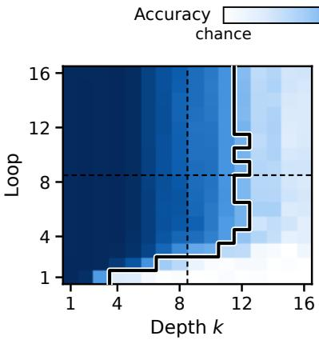  
(a) Liar chains  
Figure 13: Accuracy of SanSi at every depth k after every loop on the two depth-controlled tasks, up to 16 loops (white: chance; means of three seeds). Dashed: the depths and the loops seen in training. Black line: the depth that the model holds. Table 27 gives the summary.

(b) Object swaps  
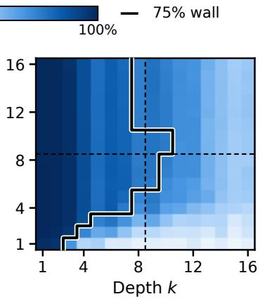

<table><tr><td rowspan="2"></td><td colspan="2">SanSi (8 trained loops)</td><td colspan="2">Trained with 4 loops</td></tr><tr><td>Acc. (%)</td><td>ECE</td><td>Acc. (%)</td><td>ECE</td></tr><tr><td>Loop 1</td><td> $5 8 . 4 \pm 0 . 7$ </td><td> $. 1 0 5 \pm . 0 2 0$ </td><td> $5 9 . 7 \pm 0 . 5$ </td><td> $. 1 2 3 \pm . 0 1 0$ </td></tr><tr><td>2</td><td> $6 6 . 9 { \pm } 0 . 6 $ </td><td> $. 0 8 8 \pm . 0 0 9$ </td><td> $6 7 . 6 { \pm } 0 . 7 $ </td><td> $. 0 9 6 \pm . 0 0 5$ </td></tr><tr><td>3</td><td> $7 0 . 4 \pm 0 . 6$ </td><td> $. 0 8 2 { \scriptstyle \pm . 0 1 0 }$ </td><td> $7 0 . 4 \pm 0 . 5$ </td><td> $. 0 9 3 \pm . 0 0 7$ </td></tr><tr><td>4</td><td> $7 1 . 6 { \pm } 0 . 5 $ </td><td> $. 0 8 5 \pm . 0 0 9$ </td><td> $7 0 . 8 { \pm } 0 . 4 $ </td><td> $. 0 9 4 \pm . 0 0 5$ </td></tr><tr><td>5</td><td> $7 1 . 9 { \pm } 0 . 7 $ </td><td> $. 0 8 7 \pm . 0 0 8$ </td><td> $7 0 . 9 2 0 . 4 ^ { \dagger }$ </td><td> $. 1 0 3 \pm . 0 0 9$ </td></tr><tr><td>6</td><td> $7 2 . 1 { \pm } 0 . 7 $ </td><td> $. 0 8 9 \pm . 0 1 0$ </td><td> $7 0 . 5 { \pm } 0 . 4 ^ { \dagger }$ </td><td> $. 1 0 3 \pm . 0 0 7$ </td></tr><tr><td>7</td><td> $7 2 . 1 { \pm } 0 . 7 $ </td><td> $. 0 9 0 \pm . 0 1 2$ </td><td> $7 0 . 0 { \pm } 0 . 3 ^ { \dagger }$ </td><td> $. 1 0 4 \pm . 0 0 5$ </td></tr><tr><td>8</td><td> $7 2 . 0 { \scriptstyle \pm 0 . 7 }$ </td><td> $. 0 9 3 \pm . 0 1 2$ </td><td> $6 9 . 6 { \pm } 0 . 1 ^ { \dagger }$ </td><td> $. 1 0 6 \pm . 0 0 5$ </td></tr><tr><td>9</td><td> $7 1 . 9 { \pm } 0 . 6 ^ { \dagger }$ </td><td> $. 0 9 3 \pm . 0 1 1$ </td><td>一</td><td>一</td></tr><tr><td>10</td><td> $7 1 . 7 { \pm } 0 . 5 ^ { \dagger }$ </td><td> $. 0 9 5 { \scriptstyle \pm . 0 1 0 }$ </td><td>一</td><td>一</td></tr><tr><td>11</td><td> $7 1 . 4 { \pm } 0 . 6 ^ { \dagger }$ </td><td> $. 0 9 9 \pm . 0 0 8$ </td><td>一</td><td>一</td></tr><tr><td>12</td><td> $7 1 . 2 { \pm } 0 . 7 ^ { \dagger }$ </td><td> $. 1 0 0 \pm . 0 0 8$ </td><td>一</td><td>一</td></tr><tr><td>13</td><td> $7 1 . 1 { \pm } 0 . 7 ^ { \dagger }$ </td><td> $. 1 0 1 \pm . 0 0 7$ </td><td>一</td><td>一</td></tr><tr><td>14</td><td> $7 0 . 8 { \pm } 0 . 6 ^ { \dagger }$ </td><td> $. 1 0 2 \pm . 0 0 8$ </td><td>一</td><td>一</td></tr><tr><td>15</td><td> $7 0 . 4 \pm 0 . 6 ^ { \dagger }$ </td><td> $. 1 0 5 { \pm } . 0 0 6$ </td><td>一</td><td>一</td></tr><tr><td>16</td><td> $7 0 . 1 \pm 0 . 5 ^ { \dagger }$ </td><td> $. 1 0 5 \pm . 0 0 8$ </td><td>一</td><td>一</td></tr></table>

Table 34: Accuracy and ECE at every loop of SanSi, run for 16 loops, and of the model trained with four loops, run for eight (10,027 test items; mean ± standard deviation over three seeds). †: loop beyond the trained ones. Grey values: loops beyond the trained ones.

A larger backbone. We also train SanSi on Ouro-2.6B, the larger backbone of the same family (48 shared layers instead of 24; 2.67B parameters), with the same recipe and eight loops (Table 7 in $\mathsf { A p - }$ pendix D and Table 36). SanSi-2.6B reaches 75.8% at loop 8, 3.8 points above SanSi [3.3, 4.4] and 2.0 points above Qwen3.5-4B [1.4, 2.6], with 63% of the parameters of the latter; it passes Qwen3.5-4B at its third loop (+0.9 [0.3, 1.5]). The loops add as much as on the smaller backbone: 13.4 points from loop 1 to loop 8 [12.6, 14.3], against 13.6 for SanSi (we trained no one-loop control for this backbone, so both numbers compare two readings of one model). Read after one loop, SanSi-2.6B is at 62.4%, 4.3 points below Qwen3.5-2B [3.6, 5.1]: its lead comes from looping, not from a stronger backbone. The price is again computation: a decision of SanSi-2.6B takes 14.8 times the GPU time of one loop of Ouro-1.4B and about 6.3 times that of Qwen3.5-4B (Tables 7 and 6).

SanSi-2.6B: details. The three seeds of SanSi-2.6B reach 75.2%, 76.4% and 75.8% at loop 8 and are 0.9, 3.3 and 1.8 points above Qwen3.5-4B (Table 9). The lead over Qwen3.5-4B lies in near transfer (5.5 points [3.9, 7.3]) and far transfer (1.5 points [0.6, 2.4]); in distribution the two models are level (−0.1 [−1.1, 0.8]). SanSi-2.6B gains nothing after its fourth loop (+0.2 [−0.1, 0.5] from loop 4 to loop 8). Its ECE is 0.078, against 0.113 for Qwen3.5-4B.

## H.5 Averaging the loops

The ECE of SanSi rises again after loop 3, because confidence keeps rising after the answers have settled (§5.3). A model that is read after every loop offers a remedy that a single-pass model does not have: the option probabilities of its eight loops can be averaged, without labelled data or further training. The average is as accurate as loop

<table><tr><td></td><td colspan="3">Accuracy (%) at loop</td></tr><tr><td>Model</td><td>1</td><td>4</td><td>8</td></tr><tr><td>SmolLM2-1.7B, not fine-tuned</td><td>38.8</td><td></td><td></td></tr><tr><td>+ loop as in Ouro</td><td>38.8</td><td>32.0</td><td>31.5</td></tr><tr><td>SmolLM2-1.7B, fine-tuned</td><td> $5 8 . 4 \pm 0 . 7$ </td><td></td><td></td></tr><tr><td>+ loop as in Ouro</td><td> $3 5 . 4 \pm 4 . 2$ </td><td> $3 2 . 5 { \pm } 0 . 6 $ </td><td> $3 3 . 5 { \pm } 0 . 4 $ </td></tr><tr><td>+ loop through a linear map</td><td> $5 8 . 1 \pm 1 . 1$ </td><td> $5 8 . 3 { \pm } 1 . 0 $ </td><td> $5 8 . 3 { \pm } 1 . 0 $ </td></tr><tr><td>SanSi (Ouro-1.4B)</td><td> $5 8 . 4 \pm 0 . 7$ </td><td> $7 1 . 6 { \pm } 0 . 5 $ </td><td> $7 2 . 0 { \scriptstyle \pm 0 . 7 }$ </td></tr></table>

Table 35: A loop added to SmolLM2-1.7B after pre-training (10,027 test items; mean ± standard deviation over the seeds: three for SmolLM2-1.7B and SanSi, two for the fine-tuned rows with an added loop; the untuned rows are single runs). “As in Ouro”: the previous state replaces the token embeddings. “Through a linear map”: the previous state is added to the token embeddings through a rank-64 map that is zero at initialisation.
<table><tr><td></td><td colspan="5">Accuracy (%)</td><td colspan="3">ECE</td><td colspan="2">Confidence</td><td>AUROC</td><td>Evid.</td><td>Hard</td><td>Answers</td></tr><tr><td>Loop</td><td>All</td><td>In-dist.</td><td>Near</td><td>Far</td><td>JevB.</td><td>In-dist.</td><td>Near</td><td>Far</td><td>right</td><td>wrong</td><td>r/w</td><td>AUROC</td><td>(%)</td><td>changed (%)</td></tr><tr><td>1</td><td>62.4</td><td>78.8</td><td>61.9</td><td>56.6</td><td>60.6</td><td>.032</td><td>.081</td><td>.118</td><td>.789</td><td>.596</td><td>.756</td><td>.839</td><td>31.5</td><td>一</td></tr><tr><td>2</td><td>±0.4 71.8</td><td>±0.5 85.2</td><td>±1.7 70.0</td><td>±0.8 67.6</td><td>±0.7 70.7</td><td>±.009 .049</td><td>±.022 .103</td><td>±.014 .078</td><td>±.011 .852</td><td>±.014 .650</td><td>±.004 .780</td><td>±.006 .914</td><td>±3.5 22.6</td><td>27.5</td></tr><tr><td></td><td>±0.7</td><td>±0.2</td><td>±3.0</td><td>±0.2</td><td>±1.7</td><td>±.002</td><td>±.023</td><td>±.010</td><td>±.008</td><td>±.014</td><td>±.003</td><td>±.007</td><td>±3.0</td><td>±0.9</td></tr><tr><td>3</td><td>74.7 ±0.4</td><td>87.8 ±0.2</td><td>72.5 ±2.6</td><td>70.6 ±0.2</td><td>74.6 ±2.0</td><td>.049 ±.004</td><td>.117 ±.020</td><td>.073 ±.015</td><td>.873 ±.008</td><td>.660 ±.015</td><td>.795 ±.003</td><td>.935 ±.007</td><td>18.1 ±1.1</td><td>12.2 ±0.4</td></tr><tr><td>4</td><td>75.6</td><td>88.8</td><td>73.6</td><td>71.5</td><td>76.5</td><td>.044</td><td>.117</td><td>.074</td><td>.878</td><td>.660</td><td>.800</td><td>.938</td><td>17.0</td><td>6.4</td></tr><tr><td>5</td><td>±0.5 76.1</td><td>±0.1 88.8</td><td>±2.6 74.5</td><td>±0.3 71.9</td><td>±2.9 77.9</td><td>±.002 .046</td><td>±.015 .111</td><td>±.012 .076</td><td>±.008 .882</td><td>±.017 .666</td><td>±.005 .801</td><td>±.003 .942</td><td>±2.2 17.5</td><td>±0.2 3.8</td></tr><tr><td></td><td>±0.6</td><td>±0.5</td><td>±2.5</td><td>±0.3</td><td>±1.9</td><td>±.005</td><td>±.020</td><td>±.012</td><td>±.007</td><td>±.016</td><td>±.007</td><td>±.001</td><td>±2.9</td><td>±0.2</td></tr><tr><td>6</td><td>76.1</td><td>88.6</td><td>74.7</td><td>71.9</td><td>78.8</td><td>.045</td><td>.107</td><td>.076</td><td>.884</td><td>.667</td><td>.804</td><td>.943</td><td>17.5</td><td>2.8</td></tr><tr><td></td><td></td><td></td><td></td><td></td><td></td><td></td><td></td><td></td><td></td><td></td><td></td><td></td><td></td><td></td></tr><tr><td></td><td>±0.5</td><td>±0.3</td><td>±2.6</td><td>±0.1</td><td>±0.7</td><td>±.003</td><td>±.019</td><td>±.012</td><td>±.006</td><td>±.014</td><td>±.004</td><td>±.001</td><td>±2.7</td><td>±0.1</td></tr><tr><td>7</td><td>76.0</td><td>88.6</td><td>74.7</td><td>71.7</td><td>78.8</td><td>.047</td><td>.106</td><td>.079</td><td>.885</td><td>.668</td><td>.804</td><td>.943</td><td>17.7</td><td>2.4</td></tr><tr><td></td><td>±0.5</td><td>±0.2</td><td>±2.4</td><td>±0.1</td><td>±1.3</td><td>±.008</td><td>±.022</td><td>±.011</td><td>±.004</td><td>±.014</td><td>±.003</td><td>±.001</td><td>±2.6</td><td>±0.3</td></tr><tr><td>8</td><td>75.8</td><td>88.4</td><td>74.4</td><td>71.6</td><td>79.4</td><td>.046</td><td>.106</td><td>.082</td><td>.885</td><td>.669</td><td>.804</td><td>.943</td><td>18.2</td><td>2.1</td></tr><tr><td></td><td></td><td></td><td></td><td></td><td></td><td></td><td></td><td></td><td></td><td></td><td></td><td></td><td></td><td></td></tr><tr><td></td><td>±0.6</td><td>±0.8</td><td>±2.5</td><td>±0.3</td><td>±0.7</td><td>±.009</td><td>±.027</td><td>±.011</td><td>±.004</td><td>±.014</td><td>±.004</td><td>±.000</td><td>±2.4</td><td>±0.1</td></tr></table>

Table 36: SanSi-2.6B after every loop (10,027 test items; means of three seeds, with the standard deviation over the seeds on the line below). Columns as in Table 15.

8 (71.8% against 72.0%; −0.2 points [−0.5, 0.1]) and less confident, and its ECE is half as large: 0.044 against 0.093 (−0.049 [−0.052, −0.045]), in each of the three seeds (Table 37; the intervals are in Table 21). Temperature scaling (Guo et al., 2017), which needs labelled items, does better only when these items cover all test groups; when they come from the training sources alone, the averaged loops have the lower ECE on the other test items (0.049 against 0.060; Table 37).

Comparison with temperature scaling. Table 37 also compares the average of the eight loops with temperature scaling (Guo et al., 2017), which fits one temperature on labelled items that the model was not trained on. The average is less confident than loop 8 (mean confidence 0.752 against 0.805); on near transfer its ECE is 0.084 against 0.149 (−0.065 [−0.075, −0.056]). When the temperature is fitted on held-out items of the training sources, the averaged loops have the lower ECE on the other test items (about 8,940): 0.049 against 0.060; scaling the average as well does not help (0.066). When the temperature is fitted on items of all test groups, temperature scaling is better (0.025 against 0.046), and scaling the average gives the lowest ECE (0.019). We did not compute intervals for the comparisons with temperature scaling.

## I Verifier Case Study: Details

This appendix supports §8. It gives the settings of the case study (Appendix I.1), its results (Appendix I.2), and the reason why exact match does not rise with F1 (Appendix I.3).

## I.1 Settings

The generator has 18.1M trained parameters (LoRA adapters). We use 8,000 training, 500 development and 3,000 test questions of 2WikiMultiHopQA, balanced over the four question types; each question comes with its supporting paragraphs and distractors (five paragraphs in total). The verifier is seed 0 of the main model, called in the prompt format it was trained with. Answers that are equal after normalisation or overlap with a token F1 of at least 0.8 count as one option. If fewer than four distinct answers are sampled, short spans of the paragraphs are added as further options. Training runs for 400 steps; at each step eight questions are drawn and eight answers are sampled for each. Advantages are normalised within the eight answers of a question, and each batch is used for one update. Besides the token F1 of the greedy answer against the gold answer, we report exact match (EM) and the share of answers that contain the gold answer.

<table><tr><td rowspan="2"> $\operatorname { A c c } .$  (%)</td><td rowspan="2"></td><td colspan="3">ECE↓</td></tr><tr><td>all</td><td>near</td><td>far</td></tr><tr><td colspan="6">All test items; no calibration data</td></tr><tr><td>Loop 8</td><td> $7 2 . 0 { \scriptstyle \pm 0 . 7 }$ </td><td> $. 0 9 3 \pm . 0 1 2$ </td><td> $. 1 4 9 \pm . 0 3 1$ </td><td> $. 0 9 2 \pm . 0 1 9$ </td></tr><tr><td>Mean of loops 1–8</td><td> $7 1 . 8 { \pm } 0 . 7 $  </td><td> $. 0 4 4 \pm . 0 0 9$  </td><td> $. 0 8 4 \pm . 0 2 8$ </td><td> $. 0 4 5 { \pm } . 0 1 0$ </td></tr><tr><td colspan="5">Temperature fitted on in-distribution items</td></tr><tr><td>Loop 8</td><td> $7 0 . 2 { \pm } 0 . 7 $ </td><td> $. 0 9 8 \pm . 0 1 3$ </td><td> $. 1 5 1 \pm . 0 3 2$ </td><td> $. 0 9 2 \pm . 0 1 9$ </td></tr><tr><td>Mean of loops 1–8</td><td> $7 0 . 0 { \pm } 0 . 8 $ </td><td> $. 0 4 9 \pm . 0 0 9$ </td><td> $. 0 8 6 \pm . 0 2 9$ </td><td> $. 0 4 5 { \pm } . 0 1 0$ </td></tr><tr><td> $\mathrm { L o o p 8 + t e m p . }$ </td><td> $7 0 . 3 { \pm } 0 . 7 \ \qquad $ </td><td> $. 0 6 0 \pm . 0 0 9$ </td><td> $. 1 0 2 \pm . 0 3 7$ </td><td> $. 0 5 4 \pm . 0 1 3$ </td></tr><tr><td>Mean of loops + temp.</td><td> $6 9 . 9 { \pm } 0 . 8 $ </td><td> $. 0 6 6 \pm . 0 0 8$ </td><td> $. 1 0 8 \pm . 0 3 4$ </td><td> $. 0 6 2 \pm . 0 0 4$ </td></tr><tr><td colspan="5">Temperature fitted on items of all groups</td></tr><tr><td> $\operatorname { L o o p } 8$ </td><td> $7 1 . 7 { \pm } 0 . 8 $ </td><td> $. 0 9 4 \pm . 0 1 3$ </td><td> $. 1 5 7 \pm . 0 3 2$ </td><td> $. 0 9 3 \pm . 0 1 9$ </td></tr><tr><td>Mean of loops 1–8</td><td> $7 1 . 5 { \pm } 0 . 8 $  </td><td> $. 0 4 6 \pm . 0 0 8$  </td><td> $. 0 9 0 \pm . 0 3 3$ </td><td> $. 0 4 8 \pm . 0 0 9$ </td></tr><tr><td>Loop  $8 + \tan \mathrm { p } .$ </td><td> $7 1 . 9 { \pm } 0 . 8 $ </td><td> $. 0 2 5 { \pm } . 0 0 3$ </td><td> $. 0 6 8 \pm . 0 2 8$ </td><td> $. 0 3 1 \pm . 0 0 3$ </td></tr><tr><td> $\mathrm { M e a n \ o f \ l o o p s + t e m p . }$ </td><td> $7 1 . 5 { \pm } 0 . 8 $ </td><td> $. 0 1 9 \pm . 0 0 5$ </td><td> $. 0 6 1 \pm . 0 2 3$ </td><td> $. 0 2 6 \pm . 0 0 2$ </td></tr></table>

Table 37: Averaging the option probabilities of the eight loops, and temperature scaling. In the two lower blocks a random half of the groups of related items in the in-distribution test set, or in the whole test set, serves as calibration data, and the rows are evaluated on the remaining test items (means of ten splits). All numbers are mean ± standard deviation over three seeds; temp.: temperature scaling. Shaded rows: the average of the eight loops.

## I.2 Results

Table 38 gives the F1 of the generator after training, its change against the generator before training with a 95% interval, and the quality of the reward early in training. The quality of the reward is the AUROC with which it separates the sampled answers that match the gold answer from those that do not, in the first 20 training steps.

Table 39 gives all measures of the generator: F1, exact match, the share of answers that contain the gold answer, and the length of the answers.

Question types. Figure 14 gives the change in F1 by question type. With eight loops the gain is largest on inference questions, which require combining two facts (F1 28.6 to 49.7).

Training seeds. Table 40 lists every training seed, and Figure 15 shows the F1 on the development questions during training. Across the three seeds, F1 is 46.5–48.5 with the eight-loop reward, 41.0– 48.3 with four loops, 37.4–40.9 with two and 27.4– 31.9 with one. In every seed, the one-loop reward gives the lowest F1, exact match and share of answers that contain the gold answer, and the twoloop reward the second-lowest F1; the four- and eight-loop rewards change places between seeds. Four and eight loops cannot be separated. Two of the three runs with the four-loop reward match the eight-loop runs (F1 48.2 and 48.3); the third lost F1 during the last 100 steps (41.0), when its answers grew longer (4.7 words on the test questions, against 3.4 and 3.5 in the other two runs). The interval of their difference in Table 38 (+1.4 points [0.8, 2.0]) resamples the test questions and does not cover this variation between training runs.

## I.3 Exact match and the form of the answers

Exact match does not improve. It is 32.2 with the eight-loop reward, against 32.5 before training, and lower with fewer loops (29.4, 19.6 and 9.6). The cause is the form of the answers. The gold answers are short, and the generator learns to write longer ones: 3.6 words on average with the eight-loop reward and 5.5 with the one-loop reward, against 2.6 before training. With the eightloop reward, 17.5% of the answers contain the gold answer together with further words, for instance “Dr. Socrates (1935)” where the gold answer is “Dr. Socrates”; before training, 2.0% do. Part of the

<table><tr><td>Reward</td><td></td><td>F1 after training Change in F1 [95% interval] Reward AUROC, first 20 steps</td><td></td></tr><tr><td>Not trained</td><td>39.5</td><td></td><td></td></tr><tr><td>SanSi read at loop 1</td><td> $2 9 . 1 { \pm } 2 . 4 $ </td><td> $- 1 0 . 5 \ [ - 1 1 . 9 , - 9 . 0 ]$ </td><td> $. 7 7 9 \pm . 0 5 0$ </td></tr><tr><td>SanSi read at loop 2</td><td> $3 9 . 5 { \pm } 1 . 8 $ </td><td> $- 0 . 0 \left[ - 1 . 6 , + 1 . 6 \right]$ </td><td> $. 8 5 7 \pm . 0 3 0$ </td></tr><tr><td>SanSi read at loop 4</td><td> $4 5 . 8 { \pm } 4 . 2 $ </td><td> $+ 6 . 3 \ [ + 4 . 6 , + 8 . 0 ]$ </td><td> $. 9 1 4 \pm . 0 3 2$ </td></tr><tr><td>SanSi read at loop 8</td><td> $4 7 . 3 { \pm } 1 . 1 $ </td><td> $+ 7 . 7 [ + 6 . 1 , + 9 . 4 ]$ </td><td> $. 9 0 5 { \scriptstyle \pm . 0 2 5 }$ </td></tr><tr><td>Loop 8 – loop 4</td><td></td><td> $+ 1 . 4 \left[ + 0 . 8 , + 2 . 0 \right]$ </td><td></td></tr></table>

Table 38: The verifier case study in summary (3,000 test questions; mean ± standard deviation over three training seeds). Change in F1: against the generator before training, with a 95% bootstrap interval. Reward AUROC: how well the reward separates the sampled answers that match the gold answer from those that do not, in the first 20 training steps. Colours: teal, the first term is significantly better (the interval excludes 0); red, significantly worse; grey, the interval includes 0.
<table><tr><td></td><td colspan="3">All questions</td><td colspan="4">F1 by question type</td><td>Answer</td></tr><tr><td>Reward</td><td>F1</td><td>EM</td><td>Contains</td><td></td><td>Comparison Bridge comparison Compositional Inference</td><td></td><td></td><td>words</td></tr><tr><td>Not trained</td><td>39.5</td><td>32.5</td><td>34.5</td><td>50.6</td><td>48.2</td><td>30.7</td><td>28.6</td><td>2.6</td></tr><tr><td>SanSi read at loop 1</td><td> $2 9 . 1 \pm 2 . 4$ </td><td> $9 . 6 \pm 3 . 0$ </td><td> $3 8 . 5 { \pm } 1 . 0 $ </td><td> $3 4 . 0 { \pm } 3 . 2 $ </td><td> $3 2 . 7 \pm 4 . 9$ </td><td> $2 8 . 6 { \pm } 2 . 8 $ </td><td> $2 1 . 0 { \pm } 2 . 7$ </td><td> $5 . 5 { \pm } 0 . 5 $ </td></tr><tr><td>SanSi read at loop 2</td><td> $3 9 . 5 { \pm } 1 . 8 $ </td><td> $1 9 . 6 { \pm } 5 . 4 $ </td><td> $4 5 . 0 { \pm } 1 . 9 $ </td><td> $3 8 . 9 { \pm } 2 . 9$ </td><td> $4 2 . 4 \pm 7 . 5$ </td><td> $3 6 . 3 { \pm } 1 . 5 $ </td><td> $4 0 . 5 { \pm } 3 . 4 $ </td><td> $4 . 3 { \pm } 0 . 5 $ </td></tr><tr><td>SanSi read at loop 4</td><td> $4 5 . 8 { \pm } 4 . 2 $ </td><td> $2 9 . 4 \pm 1 0 . 7$ </td><td> $4 9 . 7 { \pm } 0 . 9 $ </td><td> $4 9 . 2 { \pm } 8 . 2 $ </td><td> $4 8 . 5 { \pm } 6 . 2 $ </td><td> $3 7 . 3 { \pm } 1 . 9 $ </td><td> $4 8 . 4 \pm 1 . 1$ </td><td> $3 . 9 \pm 0 . 8$ </td></tr><tr><td>SanSi read at loop 8</td><td> $4 7 . 3 { \pm } 1 . 1 $ </td><td> $3 2 . 2 { \pm } 3 . 8 $ </td><td> $4 9 . 7 { \pm } 2 . 0 $ </td><td> $4 9 . 4 \pm 5 . 1$ </td><td> $5 1 . 6 { \pm } 0 . 7 $ </td><td> $3 8 . 3 { \pm } 1 . 5 $ </td><td> $4 9 . 7 { \pm } 0 . 9$ </td><td> $3 . 6 \pm 0 . 3$ </td></tr></table>

Table 39: The generator on the 3,000 test questions of 2WikiMultiHopQA (750 per question type) after 400 GRPO steps, by the loop at which the rewarding SanSi is read. Mean ± standard deviation over three training seeds (Table 40 lists them); the untrained generator is a single run. Contains: share of answers in which the gold answer occurs as a sequence of whole words, after normalisation. Answer words: mean length of the generated answer.
<table><tr><td colspan="2">before</td><td colspan="2">loop 1</td><td>loop 2 loop 4</td><td>loop 8</td></tr><tr><td>All questions</td><td>39.5</td><td>–10.5</td><td>0.0</td><td>+6.3</td><td>+7.7</td></tr><tr><td>Comparison</td><td>50.6</td><td>–16.6</td><td>–11.7</td><td>-1.4</td><td>-1.2</td></tr><tr><td>Bridge comparison</td><td>48.2</td><td>–15.5</td><td>-5.8</td><td>+0.3</td><td>+3.4</td></tr><tr><td>Compositional</td><td>30.7</td><td>-2.1</td><td>+5.6</td><td>+6.5</td><td>+7.6</td></tr><tr><td>Inference</td><td>28.6</td><td>–7.6</td><td>+11.9</td><td>+19.8</td><td>+21.1</td></tr></table>

F1 before training, and its change by the loop of the verifier

Figure 14: F1 of the generator before training, and its change after training, by question type and by the loop at which SanSi is read (3,000 test questions; means of three seeds).

cause lies in the reward: a variant with one added word counts as the same option as the shorter answer whenever that answer has at least two words, so the reward cannot prefer the shorter form. The share of answers that contain the gold answer, a lenient measure that longer answers meet more easily, rises with every reward and rises more with more loops: 34.5% before training, and 38.5%, 45.0%, 49.7% and 49.7% with one, two, four and eight loops. What the one-loop reward clearly damages is thus the form of the answers, which are twice as long as before training. Exact match also varies more across the seeds than F1, because it depends on whether a run has learned to write its answers with further words.

## J Error Analysis: Details

This appendix supports the error analysis of §6. All numbers are computed on the 8,879 test items with one gold option, that is, without the unanswerable and the crowd-labelled items, and over the three seeds of every model (26,637 pairs of an item and a seed). An item is an error of a model when its most probable option is not the gold option. SanSi is read at loop 8. Table 41 gives all numbers of this analysis.

<table><tr><td></td><td colspan="3">F1</td><td colspan="3">EM</td><td colspan="3">Contains</td><td colspan="3">Answer words</td></tr><tr><td>Reward, seed</td><td>0</td><td>1</td><td>2</td><td>0</td><td>1</td><td>2</td><td>0</td><td>1</td><td>2</td><td>0</td><td>1</td><td>2</td></tr><tr><td>SanSi read at loop 1</td><td>27.4</td><td>27.9</td><td>31.9</td><td>8.2</td><td>7.5</td><td>13.0</td><td>37.5</td><td>38.4</td><td>39.5</td><td>5.9</td><td>5.6</td><td>4.9</td></tr><tr><td>SanSi read at loop 2</td><td>40.2</td><td>37.4</td><td>40.9</td><td>24.0</td><td>13.6</td><td>21.3</td><td>43.0</td><td>45.4</td><td>46.7</td><td>3.9</td><td>4.8</td><td>4.3</td></tr><tr><td>SanSi read at loop 4</td><td>48.3</td><td>48.2</td><td>41.0</td><td>36.3</td><td>34.8</td><td>17.1</td><td>48.9</td><td>49.5</td><td>50.7</td><td>3.4</td><td>3.5</td><td>4.7</td></tr><tr><td>SanSi read at loop 8</td><td>48.5</td><td>46.5</td><td>46.8</td><td>36.5</td><td>30.7</td><td>29.3</td><td>48.7</td><td>48.3</td><td>52.0</td><td>3.4</td><td>3.5</td><td>4.0</td></tr></table>

Table 40: The verifier case study seed by seed: the generator on the 3,000 test questions after 400 GRPO steps. Before training it has F1 39.5, EM 32.5, 34.5% of answers that contain the gold answer, and 2.6 words per answer.

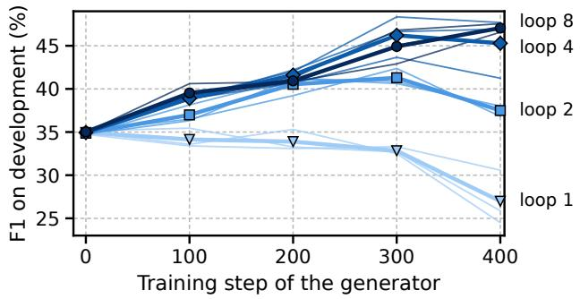  
Figure 15: F1 on the 500 development questions during the training of the generator, by the loop at which the verifier is read (thick lines: means of three training seeds; thin lines: the seeds).

<table><tr><td>Share of the items (%) SanSi wrong at loop 8 27.2</td></tr><tr><td>Qwen3.5-4B wrong 25.7 SmolLM2-1.7B wrong 41.1 SanSi and Qwen3.5-4B both wrong 18.5 Only SanSi wrong 8.7 Only Qwen3.5-4B wrong 7.2 Wrong at loop 1, right at loop 8 (fixed) 20.9 Right at loop 1, wrong at loop 8 (broken) 6.4</td></tr><tr><td>Share of the errors of SanSi at loop 8 (%) Qwen3.5-4B is also wrong 68.0 Qwen3.5-4B chooses the same wrong option 51.7 SmolLM2-1.7B is also wrong 69.6 Wrong at every loop 60.9</td></tr><tr><td>Right at some earlier loop 39.1 Right at loop 1 23.6 Confidence at least 0.9 19.7</td></tr><tr><td>Share of the errors of Qwen3.5-4B (%) SanSi is also wrong at loop 8 72.0</td></tr><tr><td>Confidence at least 0.9 24.0</td></tr><tr><td>Error rate of SanSi at loop 8 by test group (%)</td></tr><tr><td>In distribution 13.2 Near transfer 30.2</td></tr><tr><td></td></tr><tr><td>Far transfer 31.2 JevBench</td></tr><tr><td>27.7</td></tr></table>

Table 41: Error analysis on the 8,879 test items with one gold option (three seeds of every model). Confidence: the probability of the chosen option.

Errors shared with the single-pass models. SanSi is wrong on 27.2% of the items, Qwen3.5- 4B on 25.7% and SmolLM2-1.7B on 41.1%. SanSi and Qwen3.5-4B are both wrong on 18.5% of the items, only SanSi on 8.7% and only Qwen3.5-4B on 7.2%. Qwen3.5-4B is therefore wrong on 68.0% of the errors of SanSi, and on 51.7% of them it chooses the same wrong option. In the other direction, SanSi is wrong on 72.0% of the errors of Qwen3.5-4B. SmolLM2-1.7B is wrong on 69.6% of the errors of SanSi.

Errors across the loops. Of the errors of SanSi at loop 8, 60.9% are wrong at every loop. The other 39.1% were right at some earlier loop, and 23.6% were right at loop 1. Between loop 1 and loop 8 the loops fix 20.9% of the items and break 6.4%. On the 9,645 answerable items, which also include the 766 crowd-labelled items, the same quantities are 21.0% and 7.3% (§5.2).

Errors with high confidence. Of the errors of SanSi, 19.7% carry a confidence of at least 0.9. For Qwen3.5-4B this share is 24.0%.

Errors by test group. The error rate of SanSi is 13.2% in distribution, 30.2% on near transfer, 31.2% on far transfer and 27.7% on the JevBench items.

## K Examples

Table 42 summarises five test items with the answers of SanSi after its first and its last loop and the answers of two single-pass models; in each case the other two seeds of SanSi give the same answer at loop 8. The examples that follow show, for seven items, the prompt as the model reads it and the probability of every option after each of the eight loops of SanSi and for the three singlepass models (seed 0). The gold option is marked with a star (in teal), the largest probability of every column is in bold, and every cell is shaded by its probability (blue: SanSi; green: Qwen3.5; orange: SmolLM2-1.7B). Examples 1 to 5 are the item of Figure 2b and the first four items of Table 42; Examples 6 and 7 are one question with and without its key evidence.

Example 1 (PAWS, far transfer). The item of Figure 2b: the first loop follows the word overlap; the answer is right from the second loop.

The six people killed were four Burmese citizens and two Russians .

Question: Does this sentence mean the same thing:   
"The six people killed were four Russian and two   
Burmese citizens ."   
Options: (A) no: Different meaning, even if most   
words match (B) yes: Same meaning, possibly   
reworded   
Answer:

<table><tr><td></td><td colspan="8">SanSi, after loop</td><td>Qwen</td><td>Qwen</td><td>Smol</td></tr><tr><td></td><td>1</td><td>2</td><td>3</td><td>4</td><td>5</td><td>6</td><td>7</td><td>8</td><td>4B</td><td>2B</td><td>LM2</td></tr><tr><td>(A)*</td><td>.19</td><td>.69</td><td>.98</td><td>.99</td><td>.99</td><td>.99</td><td>.99</td><td>.99</td><td>.95</td><td>.06</td><td>.62</td></tr><tr><td>(B)</td><td>.81</td><td>.31</td><td>.02</td><td>.01</td><td>.01</td><td>.01</td><td>.01</td><td>.01</td><td>.05</td><td>.94</td><td>.38</td></tr></table>

Example 2 (FOLIO, far transfer). Fixed by the loops: the first loop answers “true”, the second “unknown”.

No road is dustless. Some streets are roads.

Question: Using only the facts and rules above,   
is the statement "Some streets are dustless."   
true, false, or unknown?   
Options: (A) true (B) false (C) unknown   
Answer:

<table><tr><td></td><td colspan="8">SanSi, after loop</td><td>Qwen</td><td>Qwen</td><td>Smol</td></tr><tr><td></td><td>1</td><td>2</td><td>3</td><td>4</td><td>5</td><td>6</td><td>7</td><td>8</td><td>4B</td><td>2B</td><td>LM2</td></tr><tr><td>(A)</td><td>.83</td><td>.07</td><td>.01</td><td>.01</td><td>.01</td><td>.01</td><td>.01</td><td>.02</td><td>.00</td><td>.00</td><td>.57</td></tr><tr><td>(B)</td><td>.01</td><td>.01</td><td>.00</td><td>.00</td><td>.00</td><td>.00</td><td>.01</td><td>.01</td><td>.11</td><td>.38</td><td>.07</td></tr><tr><td>(C)*</td><td>.16</td><td>.92</td><td>.99</td><td>.99</td><td>.99</td><td>.99</td><td>.98</td><td>.97</td><td>.89</td><td>.61</td><td>.36</td></tr></table>

Example 3 (MMLU, far transfer). Fixed by the loops where both Qwen models are wrong: the answer moves from 3 to 300 between loops 2 and 3.

{   
"subject": "elementary mathematics",   
"question": "If 30,000 is divided by 10 and   
then divided by 10 again, what will be the   
resulting number?"   
}   
Question: Which option correctly answers the   
question?   
Options: (A) a: 3 (B) b: 30 (C) c: 300 (D) d:   
3,000   
Answer:

<table><tr><td></td><td colspan="8">SanSi, after loop</td><td>Qwen</td><td>Qwen</td><td>Smol</td></tr><tr><td></td><td>1</td><td>2</td><td>3</td><td>4</td><td>5</td><td>6</td><td>7</td><td>8</td><td>4B</td><td>2B</td><td>LM2</td></tr><tr><td>(A)</td><td>.60.61</td><td></td><td>.12</td><td>.02</td><td>.01</td><td>.01</td><td>.01</td><td>.02</td><td>.01</td><td>.01</td><td>.16</td></tr><tr><td>(B)</td><td>.06</td><td>.05</td><td>.14</td><td>.19</td><td>.13</td><td>.09</td><td>.08</td><td>.06</td><td>.03</td><td>.02</td><td>.14</td></tr><tr><td>(C)* 大</td><td>.12</td><td>.30</td><td>.71</td><td>.77</td><td>.85</td><td>.89</td><td>.90</td><td>.91</td><td>.09</td><td>.03</td><td>.38</td></tr><tr><td>(D)</td><td>.22</td><td>.04</td><td>.03</td><td>.01</td><td>.01</td><td>.01</td><td>.01</td><td>.01</td><td>.87</td><td>.94</td><td>.31</td></tr></table>

Example 4 (ARC, far transfer). Missing knowledge: wrong and confident at every loop.

{   
"question": "When cold temperatures are   
produced in a chemical reaction, the reaction is   
known as"   
}   
Question: Which option correctly answers the   
question?   
Options: (A) a: exothermic. (B) b: endothermic.   
(C) c: suspension. (D) d: vaporization.   
Answer:

<table><tr><td></td><td colspan="8">SanSi, after loop</td><td></td><td>Qwen Qwen Smol</td><td></td></tr><tr><td></td><td>1</td><td>2</td><td>3</td><td>4</td><td>5</td><td>6</td><td>7</td><td>8</td><td>4B</td><td>2B</td><td></td><td>LM2</td></tr><tr><td>(A)</td><td></td><td>.96.96</td><td>.99</td><td>.99</td><td>1.0</td><td>1.0</td><td></td><td>1.0 .99</td><td>.02</td><td>.10</td><td>.48</td></tr><tr><td>(B)*</td><td>.03</td><td>.03</td><td>.01</td><td>.00</td><td>.00</td><td>.00</td><td>.00</td><td>.00</td><td>.97</td><td>.79</td><td>.38</td></tr><tr><td>(C)</td><td>.00</td><td>.01</td><td>.00</td><td>.00</td><td>.00</td><td>.00</td><td>.00</td><td>.00</td><td>.00</td><td>.07</td><td>.06</td></tr><tr><td>(D)</td><td>.01.01</td><td></td><td>.00</td><td>.00</td><td>.00</td><td>.00</td><td>.00</td><td>.00</td><td>.01</td><td>.04</td><td>.09</td></tr></table>

Example 5 (QNLI, far transfer). Broken by the loops: right after the first two loops, wrong from the third.

By 9000 BP, Europe was fully forested.

Question: Does the sentence contain the answer to   
this question: "When was Europe fully forested   
and recovered from the last Ice Age?"   
Options: (A) no (B) yes   
Answer:

<table><tr><td></td><td colspan="8">SanSi, after loop</td><td>Qwen</td><td>Qwen</td><td>Smol</td></tr><tr><td></td><td>1</td><td>2</td><td>3</td><td>4</td><td>5</td><td>6</td><td>7</td><td>8</td><td>4B</td><td>2B</td><td>LM2</td></tr><tr><td>(A)</td><td>.02</td><td>.37</td><td>.60</td><td>.76</td><td>.85</td><td>.87</td><td>.88</td><td>.89</td><td>.77</td><td>.35</td><td>.04</td></tr><tr><td>(B) 大</td><td>.98</td><td>.63</td><td>.40</td><td>.24</td><td>.15</td><td>.13</td><td>.12</td><td>.11</td><td>.23</td><td>.65</td><td>.96</td></tr></table>

<table><tr><td rowspan="2">Item (source)</td><td rowspan="2"></td><td rowspan="2">Gold</td><td colspan="2">SanSi</td><td rowspan="2"></td><td rowspan="2">Qwen3.5-4B SmolLM2</td></tr><tr><td>loop 1</td><td>loop 8</td></tr><tr><td>Fixed by the loops</td><td>“No road is dustless. Some streets are roads.&quot; Is “Some streets are dustless.&quot; true, false,</td><td>unknown</td><td>true (.83)</td><td>unknown (.97)</td><td>unknown (.89)</td><td>true (.57)</td></tr><tr><td>model wrong</td><td>or unknown? (FOLIO) Fixed; larger If 30,000 is divided by 10 and then divided by 10 again, what will be the resulting number? 3 / 30 / 300 / 3,000 (MMLU)</td><td>300</td><td>3 (.60)</td><td>300 (.91)</td><td>3,000 (.87)</td><td>300 (.38)</td></tr><tr><td>Missing knowledge</td><td>When cold temperatures are produced in a chemical reaction, the reaction is known as . ..</td><td>endothermic exothermic</td><td>(.96)</td><td>exothermic (.99)</td><td>endothermic (.97)</td><td>exothermic (.48)</td></tr><tr><td>Broken by the loops</td><td>(ARC) “By 9000 BP, Europe was fully forested.&quot;Does the sentence contain the answer to &quot;When was Europe fully forested and recovered from the last Ice Age?&quot;</td><td>yes</td><td>yes (.98)</td><td>no (.89)</td><td>no (.77)</td><td>yes (.96)</td></tr><tr><td>Shared error</td><td>(QNLI) &quot;He can&#x27;t be here.&quot;Hypothesis: “He is here.&quot; (WANLI)</td><td>neutral</td><td>(.99)</td><td>contradiction contradiction contradiction contradiction (.96)</td><td>(.99)</td><td>(.71)</td></tr></table>

Table 42: Five test items, all from sources not seen in training, with the answers of SanSi after its first and its last loop and of two single-pass models. Each cell gives the answer (right, wrong) and, in parentheses, its probability (seed 0).

Example 6 (Kev unknowable pairs, far transfer). An answerable item (the applicant’s age is given): every loop answers “yes”.

{   
"policy": "Applicants must be at least 16 years   
old to be eligible for the rental agreement.",   
"case": "Elin applied to join the rental   
agreement. The application form was complete and   
signed. Elin is 18 years old."   
}   
Question: Is the applicant eligible?   
Options: (A) no (B) yes   
Answer:

<table><tr><td></td><td colspan="8">SanSi, after loop</td><td>Qwen</td><td>Qwen</td><td>Smol</td></tr><tr><td></td><td>1</td><td>2</td><td>3</td><td>4</td><td>5</td><td></td><td>6 7</td><td>8</td><td>4B</td><td>2B</td><td>LM2</td></tr><tr><td>(A)</td><td>.00</td><td>.00</td><td>.00</td><td>.00</td><td>.00</td><td>.00</td><td>.00</td><td>.00</td><td>.00</td><td>.00</td><td>.01</td></tr><tr><td>(B)*</td><td>1.0</td><td>1.0</td><td>1.0</td><td>1.0</td><td>1.0</td><td>1.0</td><td>1.0</td><td>1.0</td><td>1.0</td><td>1.0</td><td>.99</td></tr></table>

Example 7 (Kev unknowable pairs, far transfer). The same item with the age removed, which makes it unanswerable (the target is the uniform distribution). The first loop still answers “yes” with 0.97, a hard answer; from the second loop on the top probability is below the threshold of 0.75.

"policy": "Applicants must be at least 16 years old to be eligible for the rental agreement.", "case": "Elin applied to join the rental agreement. The application form was complete and signed." }

Question: Is the applicant eligible? Options: (A) no (B) yes Answer:

<table><tr><td rowspan="2"></td><td colspan="8">SanSi, after loop</td><td rowspan="2">Qwen 4B</td><td rowspan="2">Qwen 2B</td><td rowspan="2">Smol LM2</td></tr><tr><td>1</td><td>2</td><td>3</td><td>4</td><td>5</td><td>6</td><td>7</td><td>8</td></tr><tr><td>(A) .03</td><td>.28</td><td>.28</td><td>.26</td><td>.28</td><td>.35</td><td>.39</td><td>.42</td><td>.72</td><td>.02</td><td>.24</td></tr><tr><td>(B) .97</td><td>.72</td><td>.72</td><td>.74</td><td>.72</td><td>.65</td><td>.61</td><td>.58</td><td>.28</td><td>.98</td><td>.76</td></tr></table>