# Scalable extraction and visualization of multi-attribute logical and functional dependencies in tabular data

Chaithra Umesh, a, Arvind Lomrore, d, Neethu D, d, Kristian Seegel-Schultz, a, Saptarshi Bej, a,d, Olaf Wolkenhauer, a,b,c

aInstitute of Computer Science University of Rostock Germany

bLeibniz-Institute for Food Systems Biology Technical University of Munich Freising Germany cStellenbosch Institutefor Advanced Study South Africa

dSchool ofData Science Indian Institute ofScience Education and Research Thiruvananthapuram India

## Abstract

Understanding the structural relationships among attributes in tabular data is fundamental to machine learning and pattern recognition. While functional dependency (FD) discovery has been extensively studied, scalable discovery of logical dependencies (LDs), particularly as the number of attributes and dependency order increase, remains underexplored. These dependencies capture non-deterministic, condition-specific relationships among pairwise or multiple attributes. Furthermore, existing approaches do not provide a unified framework for extracting multi-attribute LDs and FDs. To address these limitations, we propose LDTool and HLDTool to extract and visualize multi-attribute LDs and FDs from tabular data. LDTool extends dependency discovery beyond pairwise relationships, while HLDTool enables scalable extraction through hypergraph-guided search-space reduction. Experiments on three simulated and eleven real-world datasets demonstrate that the proposed framework extracts meaningful LDs and FDs while improving scalability. LDTool recovers the same FDs as existing FD discovery methods with lower runtime in high-dimensional feature spaces, whereas HLD-Tool enables dependency discovery in datasets with hundreds of features. The proposed framework provides interpretable visualizations of dependency structures and supports applications in exploratory data analysis and the quantitative evaluation of synthetic tabular data.

Keywords: Tabular data, Logical dependencies, Functional dependencies, Multiattribute dependencies

## 1. Introduction

Inter-attribute dependencies in tabular data describe how attributes constrain or determine one another within each individual record, capturing structural relationships between attributes that extend beyond pairwise correlations. Among these, Functional Dependencies (FDs) constitute a foundational concept. They formalize deterministic relationships in which one set of attributes uniquely determines another [1]. An FD between attributes X and Y, denoted $X  Y ,$ represents a globally deterministic relationship in which each value of X uniquely determines one value of Y [2]. Formally, for all records $r _ { i }$ and $r _ { j } , r _ { i } [ X ] = r _ { j } [ X ] \implies r _ { i } [ Y ] = r _ { j } [ Y ]$ . FDs provide insight into one-to-one and many-to-one mappings and are fundamental in database normalization and schema design [3].

Recent studies [4, 5] have shown that real-world datasets also exhibit Logical Dependencies (LDs), rule-like constraints that hold consistently within a domain without being strictly deterministic [4]. In contrast to FDs, an LD captures rule-based constraints that emerge only under specific subsets of the attribute domain. Formally, there exists a subset $S \subseteq X$ for which the conditional relationship $P ( Y = y ~ \vert ~ X = ~ x ) ~ \in ~$ {0, 1}, $x \in S$ , holds for one or more values of $Y .$ Consequently, LDs represent localized rule-based constraints rather than globally deterministic mappings. For example, in clinical datasets, there is a logical dependency between sex and pregnancy status, as biologically male individuals cannot be pregnant [4]. Together, FDs and LDs reflect a wide spectrum of deterministic and rule-based relationships that shape the internal structure of tabular datasets.

A variety of algorithms have been developed for discovering FDs from tabular data, including TANE [6], FUN [7], FD\_Mine [8], and FDTool [9]. TANE introduced an eficient level-wise lattice traversal strategy for FD discovery, while subsequent approaches, such as FUN and FD\_Mine, introduced additional strategies for pruning the dependency search space [10]. FDTool provides a publicly available Python implementation based on the FD\_Mine methodology and has been experimentally evaluated against established FD discovery algorithms [9]. For these reasons, we use FDTool as the reference method for validating the FDs extracted by our framework. Recent work has extended dependency analysis beyond FDs by introducing the Q-function, which quantifies inter-attribute FDs and LDs within a unified framework [4]. Yet, despite these advances, FD- and LD-based structures remain uncommon in exploratory data analysis, where practitioners continue to rely largely on correlation matrices and other pairwise summaries [11]. Extending dependency discovery to multi-attribute relationships introduces computational challenges. In this work, scalability specifically refers to dependency extraction as the number of attributes increases and higher dependency orders, i.e., dependencies involving an increasing number of LHS attributes, are considered.

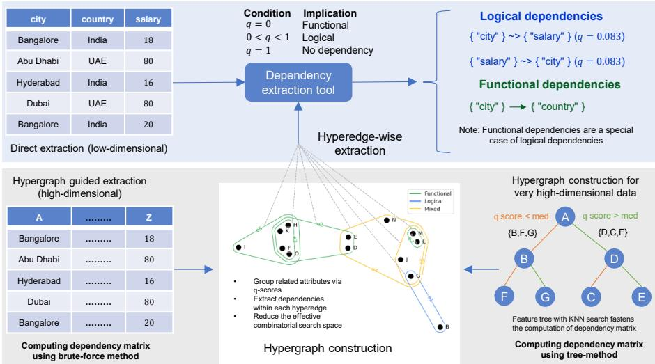  
Figure 1: Overview of the proposed dependency extraction framework. LDTool performs direct extraction of multi-attribute logical and functional dependencies in low-dimensional datasets. For high-dimensional feature spaces, HLDTool employs hypergraph-guided dependency discovery, while a feature-tree–based approximation accelerates the construction of the dependency matrix for very high-dimensional datasets.

Research gaps: Despite substantial progress in dependency discovery, several

challenges remain in the analysis of multi-attribute dependencies in tabular data.

Limited focus on multi-attribute LD extraction: Existing dependency discovery research has extensively addressed FDs and their extensions, including dependencies involving multiple attributes [10]. While our previous work introduced the Q-function for quantifying pairwise LDs and FDs [4], the extraction of LDs involving multiple attributes remains largely unexplored. To our knowledge, existing methods do not provide a unified approach for jointly extracting multi-attribute LDs and FDs from tabular data.

Combinatorial growth of the dependency search space: Extracting multi-attribute dependencies requires exploring combinations of attributes, causing the search space to grow rapidly as the number of attributes and the order of dependencies increase. For n attributes, lattice-based dependency discovery may involve a search space containing up to 2n attribute subsets, making higher-order dependency extraction increasingly computationally expensive as feature dimensionality increases [10]. Although existing algorithms employ pruning strategies to reduce the number of candidates evaluated, the combinatorial growth of the search space remains a challenge for high-dimensional datasets and higher-order dependency discovery.

Dificulty in interpreting multi-attribute dependencies: Existing dependency discovery tools typically report extracted dependencies as individual rules, for example, through textual output files [9]. As the number and order of dependencies increase, interpreting the relationships among attributes from such outputs becomes increasingly dificult, particularly when dependencies involve multiple attributes. This challenge is also relevant to exploratory analysis, where efective visualization of complex relationships among multiple attributes remains important for interpreting them [11]. This motivates the need for visualization of multi-attribute dependencies to facilitate the interpretation of complex dependency structures in tabular data.

Our contributions: To address these challenges, this work makes three main contributions.

Unified LD and FD extraction framework (LDTool): We develop a dependency extraction tool that jointly identifies LDs and FDs across user-specified levels of the attribute lattice. By capturing both deterministic and rule-based relationships, the framework provides a more comprehensive representation of multi-attribute dependencies than traditional FD-focused approaches.

Scalable multi-attribute dependency discovery (HLDTool): To address the exponential complexity of lattice traversal, we introduce HLDTool that groups strongly related attributes and performs dependency discovery locally within these subsets. This substantially reduces the search space while preserving meaningful multi-attribute relationships. Additionally, we propose a VP-tree–based (Vantage Point Tree) approximation algorithm that further accelerates dependency extraction in high-dimensional feature spaces.

Multi-view visualization of dependency structure: We represent inter-attribute dependencies using force-directed layouts, hierarchical dendrograms, and hypergraphs. These representations reveal multi-attribute relationships within tabular data and enable interpretable exploration beyond conventional pairwise correlation analysis.

<table><tr><td>Dataset</td><td>Rows</td><td>Attrs.</td><td>FDs</td><td>LDs</td></tr><tr><td>Simulated_data_3 [12]</td><td>100</td><td>8</td><td>6</td><td>17</td></tr><tr><td>Simulated_data_4 [12]</td><td>100</td><td>15</td><td>33</td><td>214</td></tr><tr><td>Shopping behavior [13]</td><td>3900</td><td>15</td><td>1</td><td>1527</td></tr><tr><td>Adult [14]</td><td>47592</td><td>15</td><td>2</td><td>700</td></tr><tr><td>Online shopping [15]</td><td>12330</td><td>18</td><td>1</td><td>518</td></tr><tr><td>Migraine [16]</td><td>377</td><td>20</td><td>33</td><td>1308</td></tr><tr><td>Mushroom [17]</td><td>5644</td><td>22</td><td>102</td><td>2526</td></tr><tr><td>Global house purchase [18]</td><td>10000</td><td>24</td><td>317</td><td>1856</td></tr><tr><td>Consumer shopping trends 2026 [19]</td><td>11789</td><td>25</td><td>382</td><td>9420</td></tr><tr><td>Simulated_data_7 [12]</td><td>5000</td><td>33</td><td>33</td><td>16799</td></tr><tr><td>Student digital behavior [20]</td><td>500</td><td>47</td><td>396</td><td>3519</td></tr><tr><td>US Census [21]</td><td>10000</td><td>68</td><td>20</td><td>224767</td></tr><tr><td>Tic Insurance [22]</td><td>5220</td><td>86</td><td>132</td><td>51026</td></tr><tr><td>METABRIC [23]</td><td>1092</td><td>642</td><td>7</td><td>1512</td></tr></table>

Table 1: Summary of the experimental datasets together with the number of extracted FDs and LDs. Dependencies are reported up to the third layer, except for METABRIC and Tic insurance, where only first and second layer dependencies are extracted because of the high feature dimensionality.

Experiments on three simulated and eleven real-world datasets demonstrate that the proposed framework extracts meaningful multi-attribute LDs and FDs while substantially improving scalability for high-dimensional tabular data. When restricted to FD extraction, LDTool recovers the same multi-attribute FDs as FDTool up to three dependency layers while reducing runtime, especially for high-dimensional datasets (Refer to the Table 5). Additionally, multi-view visualizations consistently reveal interpretable dependency structures. Together, these results demonstrate scalable extraction and visualization of multi-attribute dependencies in tabular data.

Many real-world datasets contain higher-order dependencies that cannot be captured by pairwise analysis alone. Examples include purchasing patterns in e-commerce data and gene-expression interactions in biomedical datasets. The proposed approach enables structured discovery and visualization of such relationships through a unified extraction framework. Beyond exploratory analysis, the resulting dependency structures provide a basis for evaluating preservation of multi-attribute relationships in synthetic tabular data by comparing structural consistency between real and synthetic datasets.

## 2. Related research

Most existing research on dependency discovery in tabular data has primarily focused on FDs. Early foundational systems such as TANE [6] and Dep-Miner [24] established eficient frameworks for discovering global FDs from relational datasets. TANE introduced a level-wise lattice traversal strategy using stripped partitions to eficiently validate exact and approximate dependencies, while Dep-Miner utilized agree sets and diference sets to derive minimal FDs and Armstrong relations. These approaches provided scalable foundations for FD mining but remained primarily focused on dependencies defined by classical FD semantics.

Subsequent research extended classical FD discovery toward more flexible dependency formulations. Relaxed functional dependencies generalize classical FDs by relaxing diferent aspects of exact satisfaction, including approximation, conditional validity, similarity, and probabilistic relationships [25]. Conditional Functional Dependencies (CFDs), for example, represent dependencies that hold only under specific conditions or subsets of the data. Bohannon et al. [26] introduced CFDs for data cleaning, while later works explored their use in inconsistency detection [27], rule discovery, and data quality analysis [28]. Inclusion dependencies (INDs) constitute another established dependency class and express containment relationships among attribute projections or combinations, with applications such as foreign-key discovery and schema analysis [29]. Although relaxed FDs, CFDs, and INDs broaden the classical dependency framework, their semantics difer from the LDs considered in this work. Following our previous Q-function formulation [4], an LD describes a directional inter-attribute relationship in which the LHS constrains the possible values of the RHS without determining it functionally, with its strength quantified through q-scores.

To better handle noisy, imperfect real-world datasets, approximate and statistical methods for dependency discovery were later introduced. Systems such as AIDFD [30], Pyro [31], and statistical FD discovery frameworks [32], relaxed strict deterministic assumptions and enabled the discovery of soft, noisy, and approximate dependencies. Information-theoretic and probabilistic approaches further expanded dependency analysis beyond exact relational constraints [33]. While these methods improved robustness to noise and scalability, they largely focused on approximate global relationships and pairwise statistical associations rather than multi-attribute LDs.

Graph-based representations have also been explored for modeling and visualizing dependency structures. Dependency Networks [34] and SWRL dependency visualization [35] approaches demonstrated that graphical representations can improve the interpretability of complex dependency relationships. These methods enabled structural exploration of dependencies using graph-based layouts and rule visualization strategies. However, existing visualization approaches were not specifically designed for unified FD and LD discovery in tabular datasets and generally did not represent higher-order dependencies involving multiple attributes.

Several surveys and conceptual works have further contributed to the theoretical understanding of dependency semantics, dependency discovery algorithms, and data quality constraints [36]. Research has also explored extensions such as diferential dependencies [37], sequential dependencies [38], and approximate uniqueness constraints [31]. Although these studies have broadened the scope of dependency discovery, they do not provide a unified framework for the scalable extraction, quantification, and visualization of multi-attribute LDs and FDs in tabular data.

Among practical FD discovery tools, FDTool [9] is a Python re-implementation of the FD\_Mine algorithm for discovering minimal FDs and candidate keys from tabular data. FD\_Mine uses a level-wise search strategy together with equivalence-based pruning to reduce the number of candidate dependencies that need to be evaluated. Experiments with FDTool showed that increasing the number of attributes has a substantially greater efect on runtime and memory usage than increasing the number of rows.

More recent research has highlighted the growing importance of preserving LDs and FDs during synthetic tabular data generation. Early constraint-aware approaches such as Kamino [39] and CuTS [40] enforce predefined FDs and LDs during synthesis to improve data fidelity and semantic consistency. More recent methods have shifted toward automatically learning dependency structures from data. SAGE [41] discovers inter-attribute dependencies and incorporates them into the generation process to better preserve logical consistency between real and synthetic datasets. PRISM [42] further improves dependency-aware generation by explicitly modeling and preserving structural relationships among attributes during synthesis, while MoE-T [43] leverages a mixture-of-experts architecture to capture complex feature interactions and higherorder dependencies across heterogeneous data distributions. Similarly, LLM-TabFlow [5] employs large language models to learn latent inter-column logical relationships that are preserved during difusion-based data generation. Collectively, these studies demonstrate the increasing importance of dependency-aware synthetic data generation. However, most existing approaches primarily rely on dependencies to guide or constrain the generation process, rather than directly discovering, quantifying, and visualizing multi-attribute LDs and FDs from tabular data.

Despite substantial progress in FD discovery, approximate dependency mining, and dependency-aware data generation, multi-attribute LD extraction remains underexplored. Existing methods have largely been developed for specific dependency classes, including deterministic FDs, conditional dependencies, and approximate dependencies, while methods that extract both multi-attribute LDs and FDs within a common framework are lacking. In addition, existing dependency discovery tools typically report extracted dependencies as individual rules, making the relationships among attributes dificult to interpret as the number and order of dependencies increase.

Our work addresses these gaps by introducing a unified framework for extracting multi-attribute LDs and FDs from tabular data. The proposed framework combines scalable dependency extraction with hypergraph-guided search and provides interpretable visualizations of multi-attribute dependencies using force-directed graphs, dendrograms, and hypergraphs.

## 3. Methodology

## 3.1. Preliminaries: the Q-function

Let D be a tabular dataset with feature set $F = \{ f _ { 1 } , f _ { 2 } , \ldots , f _ { n } \}$ . A rule is written $S  y ,$ , where $S \subseteq F$ is a set of $k = | S |$ attributes forming the left-hand side (LHS) and $y \in F \setminus S$ is the right-hand side (RHS) attribute. We refer to $k = | S |$ as the dependency order and say that the rule belongs to layer k. For a rule $S \ \to y ,$ , let $D [ S , y ]$ denote the projection of D onto $S \cup \{ y \}$ with duplicate rows removed. We define three quantities from this projection:

dom $( S  y ) { \mathrel { : } }$ Projection of $D [ S , y ]$ onto S with duplicates removed. Its size $| \mathrm { d o m } ( S $ y)| is the number of distinct LHS combinations.

img(S → y): Projection of $D [ S , y ]$ onto y with duplicates removed. Its size |img(S → y)| is the number of distinct RHS values.

|D[S y]|: Number of distinct (LHS, RHS) combinations observed together. This counts distinct combinations rather than raw row counts; therefore, repeated rows in D do not change the score.

The dependency strength between S and y is measured by the Q-function, introduced for the pairwise case in [4] and generalized here to multi-attribute LHS sets:

$$
q ( S  y ) = \{ \begin{array} { l l } { { 0 , } } & { { | \mathrm { d o m } ( S  y ) | = 0 \mathrm { ~ o r ~ } | \mathrm { i m g } ( S  y ) | \leq 1 , } } \\ { { } } & { { } } \\ { { \displaystyle { \frac { | D [ S , y ] | } { | \mathrm { d o m } ( S  y ) | } - 1 } } } & { { } } \\ { { \displaystyle { \frac { | \mathrm { i m g } ( S  y ) | - 1 } { | \mathrm { i m g } ( S  y ) | - 1 } } , } } & { { \mathrm { o t h e r w i s e . } } } \end{array} 
$$

We write $s t r e n g t h ( S \to y ) : = 1 - q ( S \to y )$ for the complementary score, which we use in practice since higher values then mean stronger dependency.

The score is always between 0 and 1. Each distinct LHS combination in dom(S → y) is paired with at least one and at most |img(S → y)| distinct RHS values. Summing over all LHS combinations gives

$$
| \mathrm { d o m } ( S \to y ) | \leq | D [ S , y ] | \leq | \mathrm { d o m } ( S \to y ) | \cdot | \mathrm { i m g } ( S \to y ) | .
$$

Substituting these two bounds into the formula above shows directly that $0 \leq q ( S $ $y ) \leq 1$ always holds.

Classification of FD vs LD. The value of q tells us what kind of relationship S and y have:

q = 0: afunctional dependency (FD) — every LHS combination determines the RHS value exactly.

0 < q < 1: a logical dependency (LD) —a non-deterministic but structured, conditionspecific relationship.

q = 1: no dependency.

Lower q (higher strength) means a stronger relationship. Since an FD is simply the special case $q = 0$ , every FD is also an LD in this framework, and the same scoring function covers both.

## 3.2. Unified multi-attribute LD and FD extraction (LDTool)

Most existing dependency discovery methods primarily focus on FDs and, when they do consider LDs, they treat them merely as pairwise relationships. LDTool removes both restrictions: it discovers LDs and FDs together, at any LHS size up to a chosen maximum layer L.

LDTool takes as input the dataset D, the maximum layer L, a minimum strength threshold $\tau _ { s } ,$ an LD improvement threshold $\tau _ { L D } .$ , and the requested dependency type $T \in \{ \mathrm { F D } , \mathrm { L D }$ both}. It first enumerates candidate rules layer by layer and keeps those whose strength exceeds $\tau _ { s } ;$ it then removes redundant, non-minimal rules and finally returns the type of dependency that was requested. In this work, we use $\tau _ { s } = 0 . 8 .$ , which keeps strong LDs together with all FDs.

Algorithm 1 Unified multi-attribute LD and FD extraction   
Require: Dataset D with features F, maximum layer L, minimum strength $\tau _ { s } ,$ LD   
improvement threshold τ , dependency type T ∈ {FD LD both}   
Ensure: Extracted dependencies R   
1: R ← ∅   
▷ Step 1: generate candidates   
2: for each RHS attribute $y \in F$ do   
3: X ← F \ {y}   
4: for k = 1 to min $( L , \left| X \right| )$ do   
5: for each subset $S \subseteq X$ with $| S | = k$ do   
6: Compute $q ( S \to y )$ and strength(S → y) = 1 − q(S → y)   
7: if strength(S → y) ≥ τ then   
8: Add (S → y) to R   
9: end if   
10: end for   
11: end for   
12: end for   
Step 2: remove non-minimal rules (Definition 1)   
13: for each rule $( S \to y ) \in { \mathcal { R } }$ do   
14: for each proper subset $S ^ { \prime } \subsetneq S$ do   
15: if $( S ^ { \prime }  y ) \in \mathcal { R }$ then   
16: if q(S → y) = 0 and q(S ′ → y) = 0 then   
17: Remove (S → y) from R exact minimality for FDs   
18: break   
19: else if q(S → y) > 0 and strength(S → y) − strength(S ′ → y) < τ   
then   
20: Remove (S → y) from R ▷ threshold-based minimality for LDs   
21: break   
22: end if   
23: end if   
24: end for   
25: end for   
▷ Step 3: return the requested type   
26: if T = FD then   
27: return only FDs in R   
28: else if T = LD then   
29: return only LDs in R   
30: else   
31: return R   
32: end if

Definition 1 (Minimality). A rule $( S \to y ) \in { \mathcal { R } }$ is minimal unless there exists a proper subset $S ^ { \prime } \subsetneq S$ with $( S ^ { \prime }  y ) \in \mathcal { R }$ such that:

$\operatorname { I f } ( S  y )$ is an FD: $( S ^ { \prime }  y )$ is also an FD; or

• If (S → y) is an LD: strength $\quad S  y ) - s t r e n g t h ( S ^ { \prime }  y ) < \tau _ { L D }$

If such an $S ^ { \prime }$ exists, $( S  y )$ is removed. Note that $S ^ { \prime }$ ranges over every proper subset of S , not only the subsets one attribute smaller: a higher-order LD must improve on the strength of all of its smaller ancestors by at least $\tau _ { L D } ,$ not just its immediate parent.

For FDs, this is the classical rule: a higher-order FD is redundant whenever a smaller exact FD with the same RHS already exists. For LDs, classical minimality would discard higher-order rules even when they capture genuinely new conditional structure, so we keep a higher-order LD only when it improves strength by at least $\tau _ { L D }$ over every smaller LD it could be derived from. We found $\tau _ { L D } = 0 . 2$ gives a good balance between removing redundant rules and keeping informative ones.

<table><tr><td colspan="2">Dataset dimensionality Tool</td></tr><tr><td>Low-dimensional</td><td>LDTool</td></tr><tr><td>High-dimensional</td><td>HLDTool</td></tr></table>

Table 2: Selection of dependency extraction tools based on dataset dimensionality.

Remark (FD-only extraction). When only FDs are requested $( T = \mathrm { F D } )$ , it is not necessary to compute q at all: checking whether every distinct LHS combination maps to exactly one RHS value is equivalent to testing $q = 0 ;$ , and is much cheaper to compute. This equivalence carries over to minimality too: since FD minimality (Def. 1) only ever compares a candidate against other exact dependencies, the classical Aprioristyle pruning rule: skip a candidate whose LHS is a superset of an already-confirmed FD yields exactly the same minimal set of FDs as running Algorithm 1 restricted to $T = \mathrm { F D }$ . We therefore use this faster exact check whenever only FDs are needed, and the general q-based procedure above otherwise.

After minimality filtering, the surviving dependencies are reported layer by layer, split into LDs and FDs, as shown in Figure 2.

## 3.3. Hypergraph-guided scalable dependency discovery (HLDTool)

LDTool searches every subset of attributes up to layer $L ,$ so the number of candidates grows quickly as the number of attributes increases. HLDTool avoids this by first grouping attributes that are strongly related, and then running LDTool independently within each group. We build a hypergraph $H = ( V , E )$ where $V = F$ is the set of attributes and E is the set of hyperedges, each containing a group of mutually related attributes. Construction proceeds in three steps:

1. Pairwise relatedness. For each attribute $f _ { i } ,$ the pairwise q-scores $q ( f _ { i } \to f _ { j } )$ are computed with respect to every other attribute $f _ { j }$ . Attributes satisfying $q ( f _ { i } \to$ $f _ { j } ) ~ < ~ \tau _ { H }$ , where $\tau _ { H }$ is a user-defined threshold, are retained as candidate attributes.

2. Grouping. The candidate attributes are ranked according to their q-scores, and the top-k candidates are selected. Together with the corresponding attribute $f _ { i } ,$ they form a hyperedge. Duplicate hyperedges are removed after construction.

3. Size control. The parameter k controls the maximum number of candidate attributes retained in each hyperedge, providing a trade-of between dependency coverage and computational eficiency (see Figure 3a).

Once H is built, Algorithm 1 is run independently inside each hyperedge instead of over the full feature set, which sharply reduces the number of candidate subsets while keeping the attribute groups that matter together.

The overall framework, therefore, has three modes, chosen by dataset size: for lowdimensional data, LDTool searches the full feature space directly, for high-dimensional data, HLDTool restricts the search to hyperedges, and for very high-dimensional data, an approximate version of the pairwise $Q \cdot$ matrix (Section 3.4) is computed first to make even the hyperedge construction step afordable. Figure 1 summarises this workflow.

## 3.4. Fast approximation of the Q-matrix using a vantage-point tree

Building the pairwise Q-matrix used in hyperedge construction requires evaluating strength( $f _ { i } \to f _ { j } )$ for every ordered pair of attributes, which costs $O ( n ^ { 2 } )$ evaluations for n attributes. For very high-dimensional data, this becomes a bottleneck in its own

right, before any dependency extraction has even started. We speed this up with an approximate nearest-neighbor search over the attributes themselves.

Algorithm 2 Building the vantage-point feature tree   
Require: Set of feature indices F   
Ensure: Root node of the vantage-point tree T   
1: function BuildVPTree(F)   
2: $\mathbf { i f } \left| F \right| \leq 1$ then   
3: return NewNode(F[0])   
4: end if   
5: Select random pivot $f _ { p } \in F$   
6: Compute distances $D ^ { ^ { . } } \gets \{ d ( f _ { p } , f _ { x } ) \mid f _ { x } \in F \setminus \{ f _ { p } \} \} \qquad \ J \circ d ( f _ { p } , f _ { x } ) = q ( f _ { p } \to f _ { x } )$   
7: Sort D to find median µ   
8: $S _ { L } \gets \{ f _ { x } \ : | \ : d ( f _ { p } , f _ { x } ) < \mu \}$ ▷ closer to $f _ { p } =$ stronger dependency   
9: $S _ { R } \gets \{ f _ { x } \mid d ( f _ { p } , f _ { x } ) \geq \mu \}$   
10: node $ \mathbf { N e w N o d e } ( f _ { p } )$   
11: node.median $ \mu$   
12: node.left ← BuildVPTree $( S _ { L } )$   
13: node.right ← BuildVPTree $( S _ { R } )$ return node   
14: end function

We treat each attribute as a point in a space where the distance between two attributes $f _ { i } , f _ { j }$ is

$$
d ( f _ { i } , f _ { j } ) : = q ( f _ { i } \to f _ { j } ) ,
$$

so a smaller distance means a stronger dependency, matching the definition of $q$ directly: lower $q ,$ shorter distance. This distance is not symmetric, since $q ( f _ { i } \to f _ { j } ) \neq$ $q ( f _ { j } \ \to \ f _ { i } )$ in general, and so it does not necessarily satisfy the triangle inequality either. Because of this, the tree built below is a heuristic index rather than an exact metric structure; we validate it empirically against brute-force computation in Table 4. For this reason, we call it a vantage-point (VP) tree rather than a $\mathrm { K P } \cdot$ -tree: unlike a KD-tree, which splits points along their own coordinate axes, our tree splits attributes purely by distance from a chosen pivot attribute, which is all we have available here.

## Building the tree. Algorithm 2 builds the tree recursively:

1. A pivot attribute $f _ { p }$ is chosen at random from the current set.

2. The distance $d ( f _ { p } , f _ { x } )$ is computed from $f _ { p }$ to every other attribute $f _ { x }$ in the current set.

3. The median distance $\mu$ splits the remaining attributes into a closer group $S _ { L }$ (stronger dependency on $f _ { p } )$ and a farther group $S _ { R }$

4. The same procedure is applied recursively to $S _ { L }$ and $S _ { R }$ .

5. Recursion stops, and a leaf is created, once a subset contains a single attribute.

Algorithm 3 Vantage-point tree k-NN dependency search   
Require: Vantage-point tree root node, Query $f _ { q } ,$ Neighbors k   
Ensure: Max-heap of nearest neighbors H   
1: Initialize $H \gets 0 , \tau \gets \infty$   
2: procedure Search(node)   
3: if node is null then return   
4: end if   
5: dist $ d ( f _ { q } ,$ node f eature)   
6: if node feature , $f _ { q }$ and dist < τ then   
7: H.push(dist node feature)   
8: if $| H | > k$ then   
9: H.pop()   
10: end if   
11: τ ← MaxDistance(H)   
12: end if   
13: if dist < node median then   
14: Search(node left)   
15: if $| H | < k$ or |dist − node median| < τ then Search(node right)   
16: end if   
17: else   
18: Search(node right)   
19: if $| H | < k$ or |dist − node median| < τ then Search(node left)   
20: end if   
21: end if   
22: end procedure

Searching the tree. Once built, the tree groups strongly related attributes near each other, so a k-nearest-neighbor search only needs to visit a small part of the tree to find the attributes most strongly related to a query attribute $f _ { q } .$ Algorithm 3 performs this search with a branch-and-bound strategy: it keeps a running radius τ, the distance to the current k-th best match, and skips any subtree whose attributes cannot possibly be closer than τ.

Running this search for every attribute produces a sparse, asymmetric adjacency matrix A, where $A _ { i j }$ is the dependency strength of attribute $f _ { j }$ on $f _ { i } .$ . Only the k strongest dependencies per attribute are kept, giving an approximation of the full pairwise $Q \mathrm { - }$ matrix without ever computing all $n ^ { 2 }$ pairs directly.

## 3.5. Experimental Setup

Datasets and preprocessing: We evaluate the proposed framework on 14 tabular datasets, comprising three simulated and eleven real-world datasets, with 8 to 642 attributes and approximately 100 to 45000 instances. The datasets were selected to cover diverse domains, sizes, and feature dimensionalities, enabling evaluation across both low- and high-dimensional settings. Table 1 summarizes the characteristics of all datasets together with the number of extracted LDs and FDs. Before dependency extraction, missing values are removed, and categorical attributes are numerically encoded. For the METABRIC dataset, gene expression values are discretized into three quantile bins, mutation features are binarized, and only first-layer dependencies are extracted because of its high feature dimensionality. For validation, the extracted LDs are examined over the complete dataset to verify that they satisfy the adopted LD criterion, while the extracted FDs are compared with those returned by FDTool across the evaluated dependency layers. For the simulated datasets, the explicitly designed LDs and FDs also serve as partial ground truth for validating dependency extraction, since the generated data may contain additional valid dependencies arising from transitive relationships or combinations of attributes.

Parameter settings: Unless stated otherwise, LDTool uses a minimum dependency strength threshold of $\tau _ { s } = 0 . 8 ( q \leq 0 . 2 )$ to extract all FDs and strong LDs and an LD improvement threshold of $\tau _ { L D } = 0 . 2$ . We set $\tau _ { L D } = 0 . 2$ because smaller values retain many additional LDs with only marginal improvements in dependency strength, whereas larger values do not further reduce the retained LDs. For HLDTool, hypergraphs are constructed using $\tau _ { H } = 0 . 2$ with a maximum hyperedge size of 20. We use $\tau _ { H } = 0 . 2$ as a default to enable consistent comparisons across datasets of diferent dimensions. The influence of $\tau _ { H }$ is evaluated in Section 4.

Implementation details: The proposed framework was implemented in Python 3.11 and executed on a server equipped with two NVIDIA RTX A100 GPUs (80 GB memory each), an AMD EPYC 7763 CPU (256 cores), and 4 TB RAM. The source code and preprocessed datasets are publicly available in GitHub repository.

## 4. Results

The experimental evaluation demonstrates the efectiveness, scalability, and computational eficiency of the proposed framework. We show that LDTool extracts meaningful multi-attribute LDs, HLDTool enables scalable discovery in high-dimensional feature spaces, and the proposed VP-tree approximation accelerates first-layer dependency extraction. Finally, we justify the selected parameter settings through sensitivity analysis.

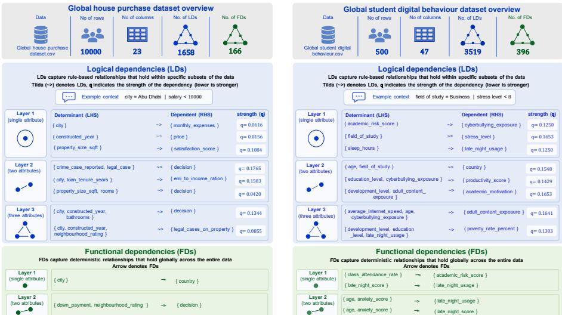  
Figure 2: Extracted logical and functional dependencies from the global house purchase and global student digital behavior datasets using LDTool. The extracted LDs capture meaningful relationships, such as those between city and salary and between field of study and stress level. Since FDs are a special case of LDs, LDTool identifies both local logical patterns and globally valid dependencies. Lower q-values indicate stronger logical dependencies.

LDTool extracts meaningful multi-attribute logical dependencies from tabular datasets: We evaluated LDTool on three simulated datasets and eleven publicly available real-world datasets (See Table 1) to analyze its ability to extract multi-attribute LDs. Dependencies were extracted up to the third layer for all datasets except the high-dimensional METABRIC and Tic Insurance datasets, where only the first- and second-layer dependencies were considered. The total number of extracted LDs for each dataset is summarized in Table 1, and the run time is recorded in Table 5, while representative outputs from two datasets are illustrated in Figure 2.

The extracted dependencies reveal semantically interpretable relationships from the data. For example, in the global student digital behavior dataset (see Figure 2, to the right), the field of study attribute is logically dependent on stress level. Investigating the dataset, we find that when the field of study falls within the Business or STEM categories, stress levels are consistently lower (not above 8 on a scale of 10) than in the Medicine category. Similarly, in the same dataset, late-night usage shows an LD with sleep hours, where higher late-night usage corresponds to shorter sleep duration.

In the global house purchase dataset (see Figure 2, to the left), city and customer salary are logically dependent, as customers located in Abu Dhabi consistently belong to higher salary ranges. Similarly, the combination of crime cases reported and legal cases on property is logically dependent on the purchase decision. Properties associated with a legal case are consistently rejected, regardless of the number of reported crime cases. Furthermore, even in the absence of a legal case, properties with three or more reported crime cases are always rejected. These examples represent only a subset of the dependencies identified by LDTool. Complete dependency outputs for all datasets are provided as supplementary .txt files in the GitHub repository.

<table><tr><td>Dataset</td><td>Designed dependencies Extracted by LDTool</td><td></td></tr><tr><td>Simulated_data_3</td><td>4</td><td>4</td></tr><tr><td>Simulated_data_4</td><td>11</td><td>10</td></tr><tr><td>Simulated_data_7</td><td>6</td><td>6</td></tr></table>

Table 3: Validation of LDTool using explicitly designed dependencies in the simulated datasets.

In addition to the dependencies identified in the real-world datasets, the simulated datasets provide partial ground truth to validate the dependency-extraction capability of LDTool. The reference set is considered partial because the generated data may contain additional valid dependencies arising from transitive relationships or from combinations of attributes not explicitly specified during data generation. Table 3 compares the number of explicitly designed dependencies with those extracted by LDTool. All designed dependencies were extracted for Simulated\_data\_3 and Simulated\_data\_7, while 10 of the 11 designed dependencies were extracted for Simulated\_data\_4. The remaining LD was excluded because its q-score did not satisfy the selected strong-LD criterion $( q \leq 0 . 2 )$

HLDTool enables scalable discovery of multi-attribute LDs and FDs in highdimensional feature spaces: Figure 3(a) demonstrates that HLDTool provides a controllable trade-of between dependency coverage and computational cost across the US Census (68 features), TIC Insurance (86 features), and METABRIC (642 features) datasets. Increasing the maximum hyperedge size consistently recovers more LDs and FDs at the expense of increased runtime.

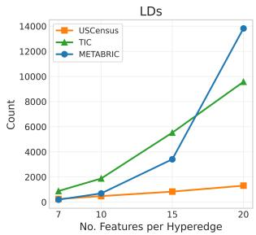

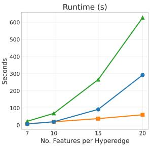

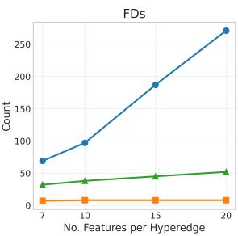

(a) Scalability of HLDTool. With $\tau _ { H } = 0 . 2$ , increasing the maximum hyperedge size recovers more LDs and FDs while increasing runtime.  
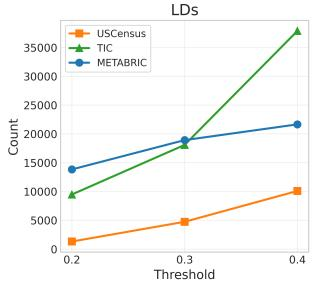

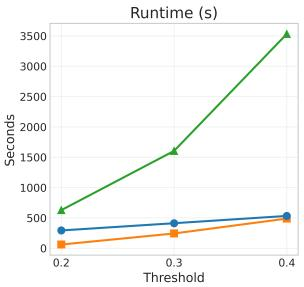

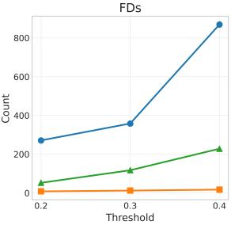  
(b) Efect of the hypergraph construction threshold $\tau _ { H } .$ . With the maximum hyperedge size fixed at 20, increasing τ groups more attributes into hyperedges, increasing the number of recovered LDs and FDs while gradually increasing runtime.

Figure 3: Evaluation of HLDTool on the US Census, TIC Insurance, and METABRIC datasets. (a) Scalability with respect to the maximum hyperedge size. (b) Efect of the hypergraph construction threshold $\tau _ { H } .$ . Increasing either parameter recovers higher-order LDs and FDs, but at the cost of grad ually increasing runtime. As exhaustive higher-order dependency extraction becomes computationally infeasible for high-dimensional datasets, HLDTool provides a scalable and configurable alternative that enables practical dependency discovery.

For the US Census dataset, exhaustive extraction remains feasible, enabling direct comparison with LDTool and FDTool. LDTool extracts all third-layer dependencies (224767 LDs and 20 FDs) in 306 minutes. When restricted to FD extraction, LDTool recovers the same 20 FDs in 44 minutes, compared with 60 minutes for FDTool. Using HLDTool with a maximum hyperedge size of 20 reduces the runtime to approximately one minute while recovering 1306 LDs and 8 FDs.

For the higher-dimensional TIC Insurance and METABRIC datasets, exhaustive third-layer extraction with LDTool is computationally impractical, taking days or weeks. In contrast, HLDTool discovers thousands of higher-order LDs and FDs within minutes by restricting the search to localized hyperedges. Since exhaustive higher-order extraction is infeasible for these datasets, the complete set of dependencies cannot be established. Nevertheless, the consistent trends across all three datasets demonstrate that HLDTool enables practical discovery of higher-order dependencies in feature spaces where exhaustive search is computationally infeasible.

<table><tr><td rowspan="2">Dataset</td><td colspan="3">Brute-force</td><td colspan="3">VP-tree</td></tr><tr><td>Time</td><td>LDs FDs</td><td></td><td>Time</td><td>LDs FDs</td><td></td></tr><tr><td>Mushroom</td><td>1.05s</td><td>31</td><td>2</td><td>0.93s</td><td>31</td><td>2</td></tr><tr><td>House purchase</td><td>1.34s</td><td>187</td><td>1</td><td>0.46s</td><td>187</td><td>1</td></tr><tr><td>Consumer shopping</td><td>1.43s</td><td>129</td><td>0</td><td>0.44s</td><td>129</td><td>0</td></tr><tr><td>Simulated_data_7</td><td>1.69s</td><td>10</td><td>4</td><td>0.46s</td><td>10</td><td>4</td></tr><tr><td>Student behavior</td><td>3.00s</td><td>617</td><td>35</td><td>0.54s</td><td>436</td><td>34</td></tr><tr><td>US census</td><td>6.70s</td><td>110</td><td>4</td><td>6.30s</td><td>103</td><td>4</td></tr><tr><td>Tic insurance</td><td>22.28s</td><td>378</td><td></td><td>612.72s</td><td>334</td><td>6</td></tr><tr><td>METABRIC</td><td>452.6s 1512</td><td></td><td>7</td><td>40.8s</td><td>1450</td><td>7</td></tr></table>

Table 4: Comparison of brute-force and VP-tree computation of the $Q \cdot$ matrix for first-layer LD and FD extraction. The VP-tree substantially reduces runtime while recovering most dependencies.

Figure 3(b) further shows that increasing the hypergraph construction threshold $\tau _ { H }$ progressively expands the search space by grouping more attributes into hyperedges, resulting in additional recovered LDs and FDs while gradually increasing runtime. Together, the maximum hyperedge size and $\tau _ { H }$ provide complementary mechanisms for controlling the search space explored by HLDTool. Larger hyperedges and higher values of $\tau _ { H }$ prioritize dependency coverage, whereas smaller hyperedges and lower values of $\tau _ { H }$ prioritize computational eficiency. This flexibility allows HLDTool to be adapted to datasets with diferent dimensionalities and computational budgets without modifying the underlying extraction algorithm.

VP-tree-based neighborhood search accelerates first-layer dependency extraction: Computing first-layer LDs and FDs in LDTool requires evaluating pairwise $q -$ scores between all feature pairs, making the computation increasingly expensive as feature dimensionality grows. To accelerate this process, we employed the proposed VP-tree-based approximation to construct the dependency matrix and compared it with exhaustive Q-matrix computation (Table 4).

Across all datasets, the VP-tree approach consistently reduced runtime while preserving most first-layer dependencies. For low- and medium-dimensional datasets, the recovered dependencies closely matched those obtained by exhaustive computation. For higher-dimensional datasets, including the global student digital behavior and METABRIC datasets, the VP-tree recovered over 70% of the dependencies within a few seconds. In particular, for the METABRIC dataset, exhaustive computation required approximately seven minutes, whereas the VP-tree completed in seconds while recovering more than 95% of the dependencies. These results demonstrate that the proposed VP-tree provides an eficient approximation for first-layer dependency extraction, making dependency matrix construction practical for medium- and highdimensional datasets.

Sensitivity analysis of LD extraction parameters: The number of extracted LDs in LDTool and HLDTool depends on the minimum dependency strength threshold $( \tau _ { s } )$ and the LD improvement threshold $( \tau _ { L D } )$ . Since dependency strength is defined as $1 - q .$ , a threshold of $\tau _ { s } ~ = ~ 0 . 8$ (equivalent to $q \leq 0 . 2 )$ was selected to retain strong LDs while simultaneously capturing all FDs $( q = 0 )$ . Lower values of $\tau _ { s }$ resulted in a substantial increase in the number of extracted LDs, many of which corresponded to weaker dependency relationships.

The LD improvement threshold $( \tau _ { L D } )$ controls the retention of higher-order LDs during minimality filtering. Values of $\tau _ { L D } < 0 . 2$ produced a large increase in the number of extracted LDs, often yielding thousands of additional dependencies with only marginal improvements in dependency strength. Conversely, increasing $\tau _ { L D }$ beyond 0 2 did not further reduce the number of retained LDs across the evaluated datasets. Therefore, $\tau _ { L D } = 0 . 2$ was adopted, as it yielded a set of LDs without discarding additional informative dependencies.

## 5. Discussion

Equivalent FD discovery with improved scalability in high-dimensional feature spaces: Across all datasets, LDTool extracted the same number of FDs as FD-Tool, while requiring substantially lower runtime in high-dimensional feature spaces. Runtime comparisons are summarized in Table 5.

It is noteworthy that the FDTool failed to extract a single FD from the high-dimensional METABRIC dataset. For datasets containing fewer than 25 features, both approaches exhibited comparable execution times. However, as dimensionality increased, the computational advantage of the proposed framework became more pronounced. In particular, FDTool failed to complete execution on the 642-feature METABRIC dataset, even when restricted to first-layer dependency extraction, whereas LDTool successfully extracted first-layer FDs in less than two minutes. LDTool extracts LDs and FDs simultaneously in the same time it takes to extract FDs in low to moderate dimensional datasets.

<table><tr><td>Dataset</td><td>Features</td><td>FDTool LDTool (FD)</td><td></td><td>LDTool (FD+LD)</td></tr><tr><td>Simulated_data_3</td><td>8</td><td>0:00.084</td><td>0:00.492</td><td>0:00.881</td></tr><tr><td>Simulated_data_4</td><td>15</td><td>0:00.364</td><td>0:01.766</td><td>0:09.088</td></tr><tr><td>Shopping behavior</td><td>15</td><td>0:02.536</td><td>0:05.186</td><td>0:15.424</td></tr><tr><td>Adult</td><td>15</td><td>0:04.173</td><td>0:23.036</td><td>0:36.305</td></tr><tr><td>Online shopping</td><td>18</td><td>0:05.919</td><td>0:26.273</td><td>0:45.920</td></tr><tr><td>Migraine</td><td>20</td><td>0:02.029</td><td>0:10.035</td><td>0:37.046</td></tr><tr><td>Mushroom</td><td>22</td><td>0:00.974</td><td>0:21.824</td><td>1:20.733</td></tr><tr><td>Global house purchase</td><td>24</td><td>3:00.159</td><td>1:07.611</td><td>2:41.143</td></tr><tr><td>Consumer shopping trends 2026</td><td>25</td><td>4:20.312</td><td>1:37.197</td><td>3:06.191</td></tr><tr><td>Simulated_data_7</td><td>33</td><td>2:38.713</td><td>1:59.730</td><td>7:32.579</td></tr><tr><td>Student digital behavior</td><td>47</td><td>0:22.114</td><td>1:02.043</td><td>79:35.056</td></tr><tr><td>US Census</td><td>68</td><td>60:01.108</td><td>44:44.357</td><td>306:30.402</td></tr><tr><td>Tic Insurance</td><td></td><td>86110:21.278</td><td>92:14.199</td><td>3123:25.472</td></tr><tr><td>METABRIC</td><td>642</td><td></td><td>1:38.735</td><td>7:23.401</td></tr></table>

Table 5: Runtime comparison between FDTool and the proposed LDTool for dependency extraction up to the first three layers across the same datasets, except for METABRIC, which is restricted to the first layer due to its high dimensionality. Runtime is reported as minutes: seconds (mm:ss.sss). While FDTool extracts only FDs, LDTool extracts both LDs and FDs. For smaller datasets, LDTool extracts both dependency types in runtime comparable to FDTool. When restricted to FD extraction, LDTool requires less time, particularly for datasets with a larger number of features, while identifying the same number of FDs.

Importance of multi-attribute dependency discovery: Many relationships in real-world tabular data arise from the combined influence of multiple attributes rather than individual feature pairs. The proposed framework extends dependency discovery beyond pairwise analysis by identifying multi-attribute LDs and FDs that capture such interactions. For example, in the global house purchase dataset, the purchase decision depends jointly on the presence of legal cases and the number of reported crime cases, illustrating a relationship that cannot be fully characterized by either attribute alone. This ability to identify higher-order dependencies provides a richer characterization of the underlying structure of tabular data, supporting more informative exploratory analysis and interpretation.

Multi-view visualizations reveal interpretable dependency structures: Figure 4 compares force-directed, dendrogram, and hypergraph visualizations generated from the pair-wise dependency scores with a manually constructed dependency diagram derived from FDTool. Across all three visualization methods, structurally related at-

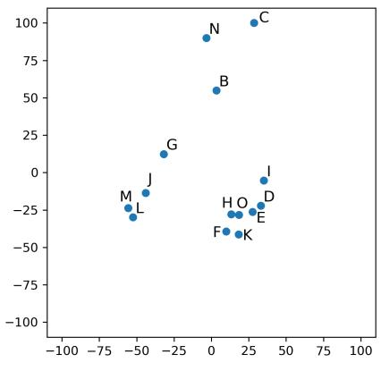  
(a) Force-directed visualization

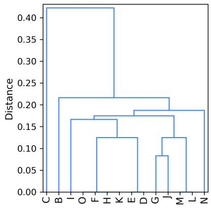  
(b) Dendrogram visualization

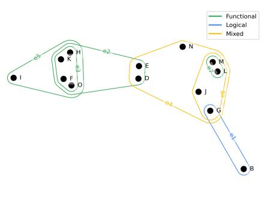  
(c) Hypergraph visualization

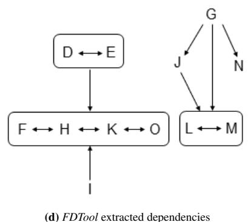  
Figure 4: Comparison of force-directed, dendrogram, hypergraph, and manually constructed FDTool visualizations for simulated\_data\_4. All visualizations consistently recover the same dependency groups. In the FDTool graph, arrows denote FDs and double-headed arrows denote bidirectional (bijective) dependencies.

tributes consistently form coherent groups that agree with the manually constructed dependency structure. The force-directed layout embeds attributes in two dimensions using the q-score as an interaction force, highlighting global connectivity among related attributes. The dendrogram applies hierarchical clustering to the Q-matrix, revealing nested groups of dependent attributes. The hypergraph represents multi-attribute dependencies via threshold-derived hyperedges, thereby making these relationships explicit. Together, these complementary visualizations provide an interpretable representation of multi-attribute dependency structures beyond textual rule lists.

Limitations and open research questions: While HLDTool enables scalable discovery of multi-attribute LDs and FDs in high-dimensional feature spaces, assessing the completeness of the extracted dependency set remains challenging. For low- and moderate-dimensional datasets, the results can be compared with those obtained by LDTool and FDTool over the full feature space. In high-dimensional settings, however, exhaustive extraction of higher-order dependencies is computationally infeasible, making it dificult to establish a complete reference set. Furthermore, because HLDTool restricts the search to feature groups defined by pairwise dependency-based hyperedges, multi-attribute dependencies involving features with weak pairwise relationships may be missed. This raises an important open question of how completeness can be assessed while retaining scalability in high-dimensional dependency discovery.

Beyond these methodological limitations, broader questions remain regarding the applicability of higher-order LDs and FDs. Their ability to reveal interpretable relationships in large-scale biological and biomedical datasets requires further investigation beyond the METABRIC dataset considered here. Another promising research question is whether LDs and FDs can complement existing measures for evaluating structural fidelity in synthetic tabular data and, more broadly, whether such dependencies can be incorporated into generative models to better preserve multi-attribute relationships.

## 6. Conclusion

This paper presents LDTool and HLDTool, a unified framework for extracting and visualizing multi-attribute logical and functional dependencies in tabular data. While LDTool enables exhaustive LD and FD discovery up to a user-specified layer, HLDTool improves scalability in high-dimensional feature spaces through hypergraph-guided search, with VP-tree-based approximation further accelerating pairwise dependency discovery. Experiments on simulated and real-world datasets demonstrate the extraction of multi-attribute LDs alongside FDs. When restricted to FD extraction, LDTool recovers the same FDs as FDTool for the evaluated dependency layers while requiring less runtime for datasets with larger feature spaces. The proposed graph, dendrogram, and hypergraph representations further support the interpretation of complex dependency structures. However, because HLDTool restricts multi-attribute search using pairwise dependency information, dependencies among features with weak pairwise relationships may be missed, and assessing completeness remains challenging in highdimensional settings.

Overall, the framework provides a practical and scalable approach for studying multi-attribute dependencies in tabular data, with potential applications to high-dimensional biological and biomedical datasets. Further research should investigate strategies for assessing dependency coverage when exhaustive extraction is computationally infeasible. Another promising direction is to examine whether LDs and FDs can complement existing measures of structural fidelity in synthetic tabular data and whether incorporating such dependencies into generative models can improve the preservation of multi-attribute relationships.

## CRediT authorship contribution statement

Chaithra Umesh: Conducted the experiments, analyzed the results, and wrote the first draft of the manuscript. Arvind Lomrore: Implemented the approximation algorithm experiment and contributed to the related work section. Neethu D: Conducted the literature survey and contributed to the related work section. Kristian Schultz: Discussed and reviewed the mathematical part of the manuscript. Saptarshi Bej: Conceptualized, reviewed, and supervised the manuscript writing and experiments. Olaf Wolkenhauer: Reviewed and supervised the manuscript writing and experiments.

## Conflict of Interest

The authors have no conflict of interest.

## Availability of code and results

We provided detailed Jupyter notebooks of our experiments on GitHub to support transparency, reusability, and reproducibility.

## Acknowledgment

This work has been supported by the German Research Foundation (DFG) under Project No. 576429337, obtained for ‘Preserving logical and functional dependencies in synthetic clinical tabular data’.

Declaration of generative AI and AI-assisted technologies in the manuscript preparation process

During the preparation of this work, the authors used ChatGPT (OpenAI) to generate a reference image to visualize the extracted dependencies. The generated image was used solely as a design reference, and the final figure (Figure 2) was manually created by the authors. No AI-assisted tools were used to generate the manuscript text, analyses, or scientific conclusions.

## References

[1] T. Lee, An Information-Theoretic Analysis of Relational Databases—Part I: Data Dependencies and Information Metric, IEEE Transactions on Software Engineering SE-13 (10) (1987) 1049–1061. doi:10.1109/TSE.1987.232847.

[2] J. Liu, J. Li, C. Liu, Y. Chen, Discover dependencies from data—a review, IEEE Transactions on Knowledge and Data Engineering 24 (2) (2012) 251–264. doi: 10.1109/TKDE.2010.197.

[3] S. Xu, C.-T. Lee, M. Sharma, R. B. Yousuf, N. Muralidhar, N. Ramakrishnan, Are LLMs Naturally Good at Synthetic Tabular Data Generation? (Jun. 2024). doi:10.48550/arXiv.2406.14541.

[4] C. Umesh, K. Schultz, M. Mahendra, S. Bej, O. Wolkenhauer, Preserving logical and functional dependencies in synthetic tabular data, Pattern Recognition 163 (2025) 111459. doi:10.1016/j.patcog.2025.111459.

[5] Y. Long, L. Xu, A. Brintrup, LLM-TabFlow: Synthetic Tabular Data Generation with Inter-column Logical Relationship Preservation (Mar. 2025). doi: 10.48550/arXiv.2503.02161.

[6] Y. Huhtala, Tane: An Eficient Algorithm for Discovering Functional and Approximate Dependencies, The Computer Journal 42 (2) (1999) 100–111. doi: 10.1093/comjnl/42.2.100.

[7] N. Novelli, R. Cicchetti, Functional and embedded dependency inference: A data mining point of view, Information Systems 26 (7) (2001) 477–506. doi:10. 1016/S0306-4379(01)00032-1.

[8] H. Yao, H. J. Hamilton, C. J. Butz, FD\_Mine: Discovering functional dependencies in a database using equivalences, in: Proceedings of the 2002 IEEE International Conference on Data Mining, IEEE, 2002, pp. 729–732. doi: 10.1109/ICDM.2002.1184040.

[9] M. Buranosky, E. Stellnberger, E. Pfaf, D. Diaz-Sanchez, C. Ward-Caviness, FDTool: a Python application to mine for functional dependencies and candidate keys in tabular data, F1000Research 7 (2019) 1667. doi:10.12688/ f1000research.16483.2.

[10] T. Papenbrock, J. Ehrlich, J. Marten, T. Neubert, J.-P. Rudolph, M. Schönberg, J. Zwiener, F. Naumann, Functional dependency discovery: an experimental evaluation of seven algorithms, Proceedings of the VLDB Endowment 8 (10) (2015) 1082–1093. doi:10.14778/2794367.2794377.

[11] A. Ghosh, M. Nashaat, J. Miller, S. Quader, C. Marston, A comprehensive review of tools for exploratory analysis of tabular industrial datasets, Visual Informatics 2 (4) (2018) 235–253. doi:10.1016/j.visinf.2018.12.004.

[12] C. Umesh, K. Seegel-Schultz, M. Mahendra, S. Bej, O. Wolkenhauer, Dependency-aware synthetic tabular data generation, Pattern Recognition 179 (2026) 113819. doi:10.1016/j.patcog.2026.113819.

[13] S. Islam, Shopping trends and customer behaviour dataset, Kaggle, dataset (2023).

[14] B. Becker, R. Kohavi, Adult (1996). doi:10.24432/C5XW20.

[15] C. Sakar, Y. Kastro, Online shoppers purchasing intention dataset (2018). doi: 10.24432/C5F88Q.

[16] P. A. Sanchez-Sanchez, J. R. García-González, J. M. Rúa Ascar, Automatic migraine classification using artificial neural networks, F1000Research 9 (2020) 618. doi:10.12688/f1000research.23181.2.

[17] Mushroom (1981). doi:10.24432/C5959T.

[18] M. K. Thalla, Global house purchase decision dataset, Kaggle, dataset (2025).

[19] Sohaibdevv, Consumer shopping behavior & preference study 2026, Kaggle, dataset (2026).

[20] N. Chandel, Student social media & brain rot dataset, Kaggle, dataset (2025).

[21] C. Meek, B. Thiesson, D. Heckerman, Us census data (1990) (2001). doi:10. 24432/C5VP42.

[22] P. van der Putten, Insurance company benchmark (coil 2000) (2000). doi:10. 24432/C5630S.

[23] C. Curtis, S. P. Shah, S.-F. Chin, G. Turashvili, O. M. Rueda, M. J. Dunning, D. Speed, A. G. Lynch, S. Samarajiwa, Y. Yuan, S. Gräf, G. Ha, G. Hafari, A. Bashashati, R. Russell, S. McKinney, et al., The genomic and transcriptomic architecture of 2,000 breast tumours reveals novel subgroups, Nature 486 (7403) (2012) 346–352. doi:10.1038/nature10983.

[24] S. Lopes, J.-M. Petit, L. Lakhal, Eficient Discovery of Functional Dependencies and Armstrong Relations, in: Advances in Database Technology — EDBT 2000, Vol. 1777, Springer Berlin Heidelberg, Berlin, Heidelberg, 2000, pp. 350–364. doi:10.1007/3-540-46439-5\_24.

[25] L. Caruccio, V. Deufemia, G. Polese, Relaxed functional dependencies—a survey of approaches, IEEE Transactions on Knowledge and Data Engineering 28 (1) (2016) 147–165. doi:10.1109/TKDE.2015.2472010.

[26] P. Bohannon, W. Fan, F. Geerts, X. Jia, A. Kementsietsidis, Conditional Functional Dependencies for Data Cleaning, in: 2007 IEEE 23rd International Conference on Data Engineering, IEEE, Istanbul, 2007, pp. 746–755. doi:10.1109/ ICDE.2007.367920.

[27] W. Fan, F. Geerts, X. Jia, A. Kementsietsidis, Conditional functional dependencies for capturing data inconsistencies, ACM Transactions on Database Systems 33 (2) (2008) 1–48. doi:10.1145/1366102.1366103.

[28] F. Chiang, R. J. Miller, Discovering data quality rules, Proceedings of the VLDB Endowment 1 (1) (2008) 1166–1177. doi:10.14778/1453856.1453980.

[29] F. Dürsch, A. Stebner, F. Windheuser, M. Fischer, T. Friedrich, N. Strelow, T. Bleifuß, H. Harmouch, L. Jiang, T. Papenbrock, F. Naumann, Inclusion dependency discovery: An experimental evaluation of thirteen algorithms, in: Proceedings of the 28th ACM International Conference on Information and Knowledge Management, CIKM ’19, Association for Computing Machinery, 2019, pp. 219–228. doi:10.1145/3357384.3357916.

[30] T. Bleifuß, S. Bülow, J. Frohnhofen, J. Risch, G. Wiese, S. Kruse, T. Papenbrock, F. Naumann, Approximate Discovery of Functional Dependencies for Large Datasets, in: Proceedings of the 25th ACM International on Conference on Information and Knowledge Management, ACM, Indianapolis Indiana USA, 2016, pp. 1803–1812. doi:10.1145/2983323.2983781.

[31] S. Kruse, F. Naumann, Eficient discovery of approximate dependencies, Proceedings of the VLDB Endowment 11 (7) (2018) 759–772. doi:10.14778/ 3192965.3192968.

[32] Y. Zhang, Z. Guo, T. Rekatsinas, A Statistical Perspective on Discovering Functional Dependencies in Noisy Data, in: Proceedings of the 2020 ACM SIGMOD International Conference on Management of Data, ACM, Portland OR USA, 2020, pp. 861–876. doi:10.1145/3318464.3389749.

[33] J. B. Kinney, G. S. Atwal, Equitability, mutual information, and the maximal information coeficient, Proceedings of the National Academy of Sciences 111 (9) (2014) 3354–3359. doi:10.1073/pnas.1309933111.

[34] D. Heckerman, et al., Dependency networks for collaborative filtering and data visualization (2013). doi:10.48550/ARXIV.1301.3862.

[35] S. Hassanpour, et al., Visualizing logical dependencies in swrl rule bases, in: M. Dean, et al. (Eds.), Semantic Web Rules, Vol. 6403, Springer Berlin Heidelberg, 2010, pp. 259–272. doi:10.1007/978-3-642-16289-3\_22.

[36] W. Fan, Dependencies revisited for improving data quality, in: Proceedings of the Twenty-Seventh ACM SIGMOD-SIGACT-SIGART Symposium on Principles of Database Systems, Vancouver, Canada, 2008, pp. 159–170. doi: 10.1145/1376916.1376940.

[37] S. Song, L. Chen, Diferential dependencies: Reasoning and discovery, ACM Transactions on Database Systems 36 (3) (2011) 1–41. doi:10.1145/2000824. 2000826.

[38] L. Golab, H. Karlof, F. Korn, A. Saha, D. Srivastava, Sequential dependencies, Proceedings of the VLDB Endowment 2 (1) (2009) 574–585. doi:10.14778/ 1687627.1687693.

[39] C. Ge, S. Mohapatra, X. He, I. F. Ilyas, Kamino: Constraint-Aware Diferentially Private Data Synthesis (2020). doi:10.48550/ARXIV.2012.15713.

[40] M. Vero, M. Balunovic, M. Vechev, CuTS: Customizable Tabular Synthetic Data ´ Generation (2023). doi:10.48550/ARXIV.2307.03577.

[41] S. Yang, Z. Zhang, B. Prenkaj, G. Kasneci, SAGE: Sparse adaptive guidance for dependency-aware tabular data generation, in: Proceedings of the 64th Annual Meeting of the Association for Computational Linguistics (Volume 1: Long Papers), Association for Computational Linguistics, 2026, pp. 3792–3807. doi: 10.18653/v1/2026.acl-long.174.

[42] G. Guan, C. Ge, Prism: Private relational data synthesis with language models, Proceedings of the ACM on Management of Data 4 (3) (2026) 1–28. doi:10. 1145/3802102.

[43] M. G. Dhooghe, M. Kantarcioglu, B. Thuraisingham, Moe-t: Dependency graphgated mixture of experts for tabular generation with functional dependency, in: Proceedings of the Sixteenth ACM Conference on Data and Application Security and Privacy, 2026, pp. 58–70. doi:10.1145/3800506.3803499.