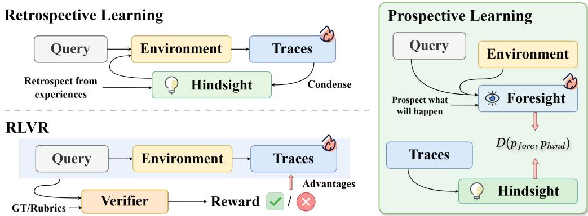
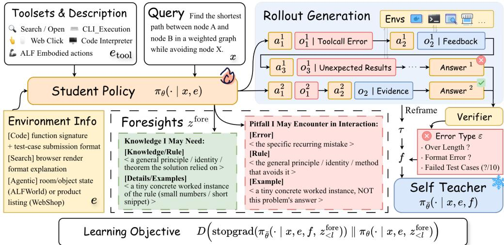
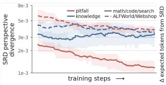
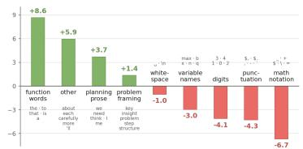
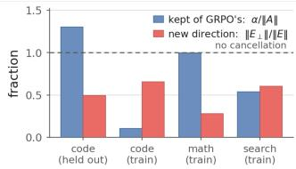
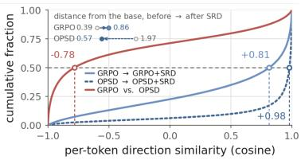
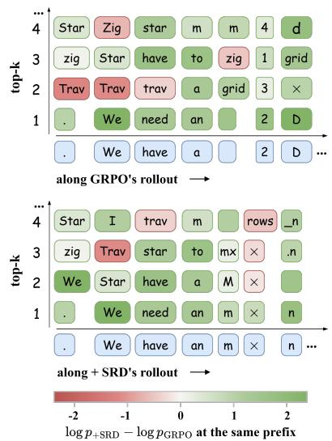
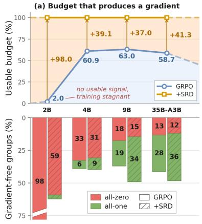
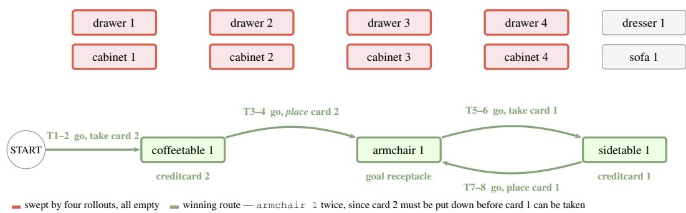

# Self-Retrospection Distillation: Turning Post-hoc Experiences into Prior Foresight

Haoxiang Zhang<sup>1,2∗</sup> Qinglin Chen<sup>1∗</sup> Hiroaki Hayashi<sup>1∗</sup> Zhuofeng Li<sup>3∗</sup> Siming Zhang<sup>∗</sup> Jiaxin Zhang<sup>1</sup> Jixuan Chen<sup>1,2</sup> Fang Wu<sup>4</sup> Pan Lu<sup>4</sup> Silvio Savarese<sup>1</sup> Julian McAuley<sup>2</sup> Chien-Sheng Wu<sup>1</sup>

<sup>1</sup>Salesforce AI Research <sup>2</sup>UC San Diego <sup>3</sup>Texas A&M University <sup>4</sup>Stanford University

## ABSTRACT

Reinforcement learning with verifiable rewards (RLVR) turns agent experience into learning signals primarily through scalar outcome rewards after interaction. For group-relative objectives, however, this signal vanishes when all rollouts receive the same reward, even though their trajectories may reveal useful information about what the task requires and how the agent fails. We ask a complementary question: can hindsight teach an agent what it could have anticipated before acting? We introduce prospective learning, which uses post-hoc experience to supervise foresight predictions from the pre-interaction view, and instantiate it with Self-Retrospection Distillation (SRD). Intuitively, a completed trajectory reveals knowledge that would have been useful and pitfalls that should be avoided; SRD distills this privileged hindsight into trajectory-blind foresight of the same policy. Foresight serves only as a training target and need not be explicitly generated at inference time. Across 10 tool-integrated reasoning and long-horizon agentic tasks, SRD complements RLVR and self-distillation baselines with gains of up to 24.2 pp. Its advantage is especially pronounced when reward contrast is scarce: when 37–98% of rollout groups are reward-uniform across model scales, yet SRD can still exploit learning signal from sampled trajectories. In 2B setting, where 98% of groups are all-failure, the RLVR training ends up at 0.0% success, while adding SRD reaches 60.6% under the same rollout budget. Our results suggest that posthoc agent experience is useful not only for evaluating or improving behavior, but also for shaping predictive representations before available interaction. Code

## 1 INTRODUCTION

Reinforcement learning with verifiable rewards (RLVR) has emerged as a scalable post-training paradigm for large language model (LLM) agents: by executing against automated verifiers and optimizing policies from outcome signals, it enables agents to develop complex, multi-step behavior without human-annotated traces (Shao et al., 2024; Guo et al., 2025; Yu et al., 2025). Applied to tool-integrated reasoning (Jin et al., 2025a; Xue et al., 2026; Qian et al., 2025), code execution (Le et al., 2022; Cao et al., 2026), computer use (Wang et al., 2025a), and multi-agent coordination (Li et al., 2026; Ke et al., 2026), RLVR has proven remarkably effective in settings where agents must act in an external environment and learn from feedback revealed only through interaction.

The supervision in RLVR, however, is inherently retrospective: outcome signals become available only after interaction and are then assigned back to the actions that produced them. Yet a broad line of work on predictive control, world models, and planning suggests that effective interaction also depends on what an agent can anticipate before acting, how its interaction may fail, and what the environment is likely to demand (Pathak et al., 2017; Hafner et al., 2020; Zhou et al., 2023). Such pre-interaction expectations shape subsequent exploration, but in RLVR they remain an implicit byproduct of optimizing behavior. More importantly, relying exclusively on post-hoc outcome contrast creates a fundamental blind spot: when all rollouts in a group receive the same reward, especially in long-horizon reasoning tasks where most attempts fail (Lightman et al., 2024), their group-relative advantages vanish (Schulman et al., 2017). The agent may have already revealed rich interactive information about the task and environment, yet learn no signal from that experience.

A recent line of on-policy self-distillation extracts a denser signal from this experience: a single model serves as both teacher and student, with the teacher conditioned on a privileged correct solu tion and the student trained to match its token-level distribution over the student’s own rollouts (Zhao et al., 2026; Hubotter et al., 2026). Follow-ups vary what the privileged context contains — run-¨ time feedback, skill summaries, or self-revisions — and hybrid objectives fold this signal back into RLVR (Wang et al., 2026; Yang et al., 2026; He et al., 2026). Across these variants, however, the supervision target is unchanged: hindsight conditions the teacher to sharpen what the agent should do next. We ask instead what the agent could have known — whether the same completed experience can teach it to anticipate, before acting, the demands and failures that only interaction reveals.

We call this prospective learning: hindsight supervises the agent’s foresight. Given a task, the agent predicts from pre-interaction information alone the knowledge the task may require and the failures it may invite, and the completed trajectory then provides privileged supervision for those predictions.

Building on this principle, we propose Self-Retrospection Distillation (SRD). For each on-policy trajectory, SRD pairs a pre-interaction prediction with a hindsight prediction conditioned on the completed interaction, and aligns their token-level distributions on the student’s own prospective rollout. As a result, every trajectory can contribute prospective supervision, precisely where reward contrast leaves none: on a failed rollout, the self-teacher’s hindsight lets the agent distill the mistake it just made into an anticipation it can carry forward, and on a saturated all-correct group, the same pairing keeps extracting the knowledge that made those rollouts succeed. Reward thus decides which lesson a trajectory teaches rather than whether it teaches one; learning then continues at both ends of the difficulty range that group-relative methods discard. We make three contributions:

• A pre-interaction supervision target for agent experience. We formulate prospective learning (§3.1), a post-training target that distills structured information revealed after interaction into predictions constrained to the task and environment context available beforehand, complementary to the retrospective use of experience in RLVR and self-distillation.

• A composable self-distillation instantiation. Self-Retrospection Distillation (SRD, §3.2) adds a lightweight auxiliary objective to RLVR and self-distillation algorithms, and improves performance across diverse tool-integrated reasoning and long-horizon agentic settings (§4.2); our anal ysis characterizes the regimes in which this additional signal is most useful (§RQ.1).

• Learning beyond scalar reward variance. SRD provides dense supervision from all trajectories and remains informative for reward-uniform baselines where RL yields zero advantage (§RQ.3).

## 2 PRELIMINARIES

We consider an agent policy π interacting with an environment E. Given a task $x \sim \mathcal { D }$ , the agent produces a trajectory $\tau = ( a _ { 1 } , o _ { 1 } , \dots , a _ { T } , o _ { T } )$ , where $a _ { t } \sim \pi _ { \theta } ( \cdot \ | \ h _ { t } )$ is the action at step t, $o _ { t } \sim \mathcal { E } ( \cdot \mid h _ { t } , a _ { t } )$ the resulting observation, and $h _ { t }$ the previous interaction history.

Reinforcement Learning with Verifiable Rewards (RLVR) evaluates a completed trajectory with a verifier V (e.g. a math checker, unit test, or task rubric), producing a scalar reward $r ( \tau ) = \mathcal { V } ( x , \tau )$ that is converted into an advantage estimate $A ( \tau )$ and assigned back to the actions that produced it:

$$
\mathcal { L } _ { \mathrm { R L V R } } ( \theta ) = - \mathbb { E } _ { \boldsymbol { x } , \boldsymbol { \tau } \sim \pi _ { \theta } } \Big [ A ( \boldsymbol { \tau } ) \sum _ { t = 1 } ^ { T } \log \pi _ { \theta } ( a _ { t } \mid h _ { t } ) \Big ] .\tag{1}
$$

For group-relative methods such as GRPO (Shao et al., 2024), given G rollouts $\{ \tau ^ { i } \} _ { i = 1 } ^ { G }$ for the same task with rewards $\{ r ^ { i } \} _ { i = 1 } ^ { G } ,$ , the advantage is $A ( \tau ^ { i } ) = \left( r ^ { i } - \mu _ { r } \right) / \sigma _ { r } ,$ where $\mu _ { r }$ and $\sigma _ { r }$ are the group mean and standard deviation. Critically, when all rollouts receive identical rewards, $A ( \tau ^ { i } ) = 0$ for every $i ;$ standard practice discards such uniform-reward groups entirely and resamples until a discriminative batch is obtained (Guo et al., 2025; Yu et al., 2025), prolonging the rollout and wasting trajectories and whatever information they contain.

  
Figure 1: Comparison of three paradigms for converting agent experience into training signals. Reinforcement Learning with Verifiable Rewards (RLVR) scalarizes completed trajectories into outcome rewards and assigns them back to the action policy. Retrospective Learning retains structured post-hoc hindsight to supervise behavior. Prospective Learning uses hindsight to supervise predictions formed from information available before interaction.

Retrospective Learning from Agent Experience. Beyond scalarizing a trajectory into an outcome, retrospective methods retain structured hindsight $\dot { z } ^ { \mathrm { h i n d } } = \mathcal { R } ( x , \tau )$ extracted by a retrospection R after interaction—encoding environment feedback, a selected solution, or a reusable skill. All such methods can be unified under a single objective: find a policy $\pi _ { \theta }$ that maximizes expected utility when the agent has access to hindsight derived from its own experience,

$$
\operatorname* { m a x } _ { \theta } \ \mathbb { E } _ { x , \tau \sim \pi _ { \theta } } \Big [ \mathbb { E } _ { z ^ { \mathrm { h i n d } } \sim \mathcal { R } ( x , \tau ) } \big [ \mathcal { U } ( \pi _ { \theta } , z ^ { \mathrm { h i n d } } , x ) \big ] \Big ] ,\tag{2}
$$

where $\mathcal { U }$ is a method-specific utility that measures how well the policy exploits the hindsight. RLVR is a degenerate instance in which $\dot { z } ^ { \mathrm { h i n d } } = r ( \tau )$ is a scalar and U reduces to the advantage-weighted log-likelihood. On-policy self-distillation (Zhao et al., 2026; Hubotter et al., 2026) sets¨ $z ^ { \mathrm { h i n d } }$ to a verified trace and U to the negative Kullback-Leibler divergence between the hindsight-conditioned teacher and the student:

$$
\mathcal { U } _ { \mathrm { O P S D } } ( \pi _ { \theta } , z ^ { \mathrm { h i n d } } , x ) = - \sum _ { t = 1 } ^ { T } D _ { \mathrm { K L } } \Bigl ( \pi _ { \bar { \theta } } ( \cdot \vert h _ { t } , z ^ { \mathrm { h i n d } } ) \left. \right. \pi _ { \theta } ( \cdot \vert h _ { t } ) \Bigr ) ,\tag{3}
$$

where $\pi _ { \bar { \theta } }$ denotes the stop-gradient self-teacher, instantiated as the same model conditioned on privileged hindsight, and $\pi _ { \theta }$ the student conditioned only on the interaction history $h _ { t }$ . Skill- and memory-based methods (Wang et al., 2026; Lu et al., 2026; Xia et al., 2026) extract reusable abstractions or reflections as $z ^ { \mathrm { h i n } \mathbf { \overline { { d } } } }$ and optimize U as downstream task performance.

Despite their differences, these retrospective methods share a common supervision target: post-hoc information is ultimately used to improve the agent’s reasoning or action policy. We next shift the supervision target from what action the agent takes to what the agent could have anticipated before interaction.

## 3 LEARNING PROSPECTIVELY VIA SELF-RETROSPECTION DISTILLATION

## 3.1 PROSPECTIVE LEARNING

Retrospective learning (Objective 2) uses post-hoc experience $z ^ { \mathrm { h i n d } }$ to supervise the agent’s reasoning or action policy. We formalize its complementary counterpart: let $z \in { \mathcal { Z } }$ denote a structured prospection of what the upcoming interaction may unfold. Given a task x and its environment context e, we define theforesight distribution as

$$
p _ { \mathrm { f o r e } } = \pi _ { \boldsymbol { \theta } } ( \cdot \mid x , e ) ,\tag{4}
$$

without access to the realized interaction. We suppress the specific prospection instruction from the notation; different instantiations may query different aspects of the upcoming interaction.

  
Figure 2: Overview of Self-Retrospection Distillation (SRD). The student policy rolls out trajectories and generates anticipated pitfalls and knowledge foresights via a differently prompted call to the same model. Post-hoc experience from the completed trajectory conditions the stopped-gradient self-teacher, whose token-level distributions supervise the student’s own foresight rollout.

After interaction, the realized trajectory provides structured hindsight $z ^ { \mathrm { h i n d } }$ , as defined in Section 2. Prospective learning utilizes this hindsight as privileged context to define a more informed distribution over the same output space:

$$
p _ { \mathrm { h i n d } } = \pi _ { \bar { \theta } } ( \cdot \mid x , e , z ^ { \mathrm { h i n d } } ) ,\tag{5}
$$

where $\pi _ { \bar { \theta } }$ denotes a hindsight-conditioned teacher policy. Thus, $p _ { \mathrm { f o r e } }$ and $p _ { \mathrm { h i n d } }$ differ in whether post-hoc interaction information is available. Prospective learning optimizes the foresight distribution to anticipate what hindsight reveals:

$$
\begin{array} { r } { \mathcal { L } _ { \mathrm { p r o } } ( \theta ) = \mathbb { E } _ { { x } \sim \mathcal { D } , \tau \sim \pi _ { \theta } } \Big [ D \big ( p _ { \mathrm { h i n d } } \ | | \ p _ { \mathrm { f o r e } } \big ) \Big ] . } \end{array}\tag{6}
$$

Unlike retrospective objectives, $\mathcal { L } _ { \mathrm { p r o } }$ does not optimize the action distribution $\pi _ { \theta } ( \cdot \ | \ h _ { t } )$ directly. It trains the agent to internalize, prior to interaction, the patterns of failure and knowledge that its own traces expose: a target remains informative as long as the agent’s anticipation lags behind what its own execution reveals.

## 3.2 SELF-RETROSPECTION DISTILLATION

We instantiate prospective learning as Self-Retrospection Distillation (SRD) with two potential perspectives of foresight: KNOWLEDGE, describing knowledge that may be required during interaction, and PITFALL, describing failures that may be encountered. Both views follow the same distillation procedure and differ only in the prospection instruction used to query the model. Within an on-policy rollout group, successful trajectories provide KNOWLEDGE supervision, while failed trajectories provide PITFALL supervision, unifying positive and negative interaction experience as two sources of prospective supervision under the same objective. <sup>1</sup>

Hindsight and foresight construction. For a task $x ,$ let $\{ \tau ^ { i } \} _ { i = 1 } ^ { G }$ denote its on-policy rollout group, with verified rewards $\{ r ^ { i } \}$ . For each rollout $i ,$ we use $c ^ { i }$ to denote its prospective view— KNOWLEDGE when $r ^ { i } = 1$ and PITFALL when $r ^ { i } = 0$ . Let $f ^ { i } = ( \tau ^ { i } , y ^ { * } , \epsilon ^ { i } )$ denote its privileged post-hoc context, where $y ^ { * }$ refers to gold solution or ground-truth answer and $\epsilon ^ { i }$ is the corresponding error annotation when applicable. Conditioning on the same view $c ^ { i }$ , SRD defines a foresight distribution without access to the completed interaction and a hindsight-conditioned distribution that additionally observes $f ^ { i }$

$$
p _ { \mathrm { f o r e } } ^ { i } = \pi _ { \boldsymbol { \theta } } ( \cdot  { | } \ x , e , c ^ { i } ) , \qquad p _ { \mathrm { h i n d } } ^ { i } = \pi _ { \bar { \boldsymbol { \theta } } } ( \cdot  { | } \ x , e , f ^ { i } , c ^ { i } ) .\tag{7}
$$

Here, $c ^ { i }$ is shorthand for the corresponding prospection instruction. Thus, reward determines the type of prospective supervision provided by a rollout, while foresight and hindsight within that view differ only in whether privileged post-hoc interaction information is available.

Hindsight-foresight alignment. For each rollout, the student samples a foresight sequence $z ^ { \mathrm { f o r e } , i } \sim p _ { \mathrm { f o r e } } ^ { i }$ . The hindsight teacher evaluates the same student-generated prefix with access to the post-hoc context $f ^ { i }$ . SRD minimizes token-level distillation loss over the rollout group:

$$
\mathcal { L } _ { \mathrm { S R D } } ( \theta ) = \mathbb { E } _ { x , \{ \tau ^ { i } \} _ { i = 1 } ^ { G } \sim \pi _ { \theta } } \left[ \frac { 1 } { G } \sum _ { i = 1 } ^ { G } \sum _ { l = 1 } ^ { L _ { i } } D \Big ( \pi _ { \theta } \Big ( \cdot \vert x , e , f ^ { i } , z _ { < l } ^ { \mathrm { f o r e } , i } \Big ) \Big \Vert \ \pi _ { \theta } \Big ( \cdot \vert x , e , z _ { < l } ^ { \mathrm { f o r e } , i } \Big ) \Big ) \right] ,\tag{8}
$$

where D is any distribution divergence measure. A natural and stable choice is the generalized Jensen–Shannon divergence, defined for $\beta \in [ 0 , 1 ]$ as

$$
\mathrm { J S D } _ { \beta } ( p _ { T } \| p _ { S } ) = \beta D _ { \mathrm { K L } } ( p _ { T } \| m ) + ( 1 - \beta ) D _ { \mathrm { K L } } ( p _ { S } \| m ) , \qquad m = \beta p _ { T } + ( 1 - \beta ) p _ { S } ,\tag{9}
$$

where $p _ { T } = \pi _ { \bar { \theta } } ( \cdot \mid x , e , f , z _ { < l } ^ { \mathrm { f o r e } } )$ is the self-teacher, instantiated as a stopped-gradient copy of the current policy, and $p _ { S } = \pi _ { \theta } ( \cdot \mid x , e , z _ { < l } ^ { \mathrm { f o r e } } )$ the student.

## 4 EMPIRICAL STUDY

## 4.1 EXPERIMENT SETUP

Tasks & Benchmarks. We evaluate SRD across four categories and ten tool-integrated reasoning and agentic benchmarks. i) Math includes AIME 2024, AIME 2026, and AMO-Bench (Art of Problem Solving, 2026; An et al., 2025); ii) Code includes LiveCodeBench-v6 (LCB) and OJBench (Jain et al., 2025; Wang et al., 2025b); iii) Search includes HotpotQA, 2WikiMultiHopQA, and BrowseComp-Plus (Yang et al., 2018; Ho et al., 2020; Zhang et al., 2026a); and iv) Agentic includes ALFWorld and WebShop (Shridhar et al., 2020; Yao et al., 2022). The evaluation includes held-out distribution, format, and interaction-horizon shifts across domains, testing whether gains transfer beyond the interaction conditions seen during training.

Training & Data Construction. All methods and model scales are trained on identical data with the same prompt ordering. For i) Math, we use DAPO-Math-17K (Yu et al., 2025); for ii) Code, we train on the stdin split of LCB and evaluate on held-out LCB-v6’s functional-python problems; and for iii) Search, we follow the Search-R1 (Jin et al., 2025a) training recipe and retrieval setup (Jin et al., 2025b) with a fixed toolset follows Zhang et al. (2026a). For iv) Agentic tasks, we use the standard training split of ALFWorld and the standard WebShop training partition, evaluating ALFWorld on its OOD split. Math, Code, and Search are jointly trained in a single shuffled mixture, while ALFWorld and WebShop form a second joint training mixture. We train Qwen3.5- 4B and Qwen3.5-9B (Team, 2026); full dataset splits, rollout budgets, scaffolds, and optimization hyperparameters are provided in Appendix §C.

Baselines. We compare against three representative post-training objectives, together with the pretrained Vanilla policy. a) RLVR uses a DAPO-style (Yu et al., 2025) group-relative policy optimization objective (GRPO; (Shao et al., 2024)) over verified outcome rewards. b) Self-distillation: on-policy self-distillation (OPSD) is a baseline following Zhao et al. (2026); Hubotter et al. (2026),¨ where a privileged self-teacher provides token-level supervision to the acting policy; RLSD (Yang et al., 2026) reweighs GRPO with OPSD’s teacher-student divergence. For each baseline we additionally report +SRD results, where the privileged prefix is replaced by our structured hindsight z<sup>hind</sup> and an auxiliary $\mathcal { L } _ { \mathrm { S R D } }$ loss is added with weight $\lambda = 0 . { \bar { 0 } } 1$ . Both families are trained with dynamic sampling under the filter each objective requires, which we detail in Appendix §C.4.

## 4.2 MAIN RESULTS

Table 1 reports performance across all task categories, where every +SRD row distills the pitfall hindsight alone; §RQ.1 disentangles the contribution of two perspectives and motivates that choice.

Table 1: Main results on Math, Code, Search, and Agentic benchmarks, reported as avg@8 pass rates in percent. Bold and underline mark the best and second-best result per column within each model scale. Improved Perf. rows give the absolute gain in points that +SRD contributes over its own base algorithm, with a deeper green marking a larger gain.
<table><tr><td></td><td colspan="4">Math</td><td colspan="3">Code</td><td colspan="3">Search</td><td colspan="2">Agentic</td></tr><tr><td>Method</td><td>AIME24</td><td>AIME26</td><td>AMO</td><td>Avg</td><td>LCB-v6</td><td>OJBench</td><td>Avg</td><td>HotpotQA</td><td>2Wiki</td><td>BCP Avg</td><td></td><td>ALFWorld WebShop</td></tr><tr><td colspan="9">Qwen3.5-4B-Thinking</td><td></td><td></td><td></td></tr><tr><td>Vanilla</td><td>24.17</td><td>29.58</td><td>1.75 18.50</td><td>40.48</td><td>3.73</td><td>22.11</td><td>58.12</td><td>48.25</td><td>20.36</td><td>42.24</td><td>39.25</td><td>75.34</td></tr><tr><td>OPSD</td><td>62.50</td><td>54.17</td><td>8.75 41.81</td><td>49.40</td><td>13.96</td><td>31.68</td><td>58.00</td><td>52.38</td><td>17.47</td><td>42.62</td><td>52.88</td><td>85.90</td></tr><tr><td>OPSD+SRD</td><td>63.33</td><td>66.25</td><td>14.75 48.11</td><td>57.34</td><td>17.69</td><td>37.52</td><td>73.25</td><td>63.00</td><td>22.29</td><td>52.85</td><td>66.62</td><td>87.46</td></tr><tr><td>Improved Perf.</td><td>+0.83</td><td>+12.08</td><td>+6.00</td><td>+6.30</td><td>+7.94 +3.73</td><td>+5.84</td><td>+15.25</td><td>+10.62</td><td>+4.82</td><td>+10.23</td><td>+13.74</td><td>+1.56</td></tr><tr><td>GRPO</td><td>69.58</td><td>54.58</td><td>14.50</td><td>46.22</td><td>55.36 18.34</td><td>36.85</td><td>71.00</td><td>60.62</td><td>13.25</td><td>48.29</td><td>67.75</td><td>77.21</td></tr><tr><td>GRPO+SRD</td><td>76.67</td><td>70.83</td><td>21.25</td><td>56.25</td><td>63.89 26.46</td><td>45.18</td><td>74.25</td><td>72.00</td><td>22.77</td><td>56.34</td><td>71.00</td><td>83.13</td></tr><tr><td>Improved Perf.</td><td>+7.09</td><td>+16.25</td><td>+6.75</td><td>+10.03</td><td>+8.53</td><td>+8.12 +8.33</td><td>+3.25</td><td>+11.38</td><td>+9.52</td><td>+8.05</td><td>+3.25</td><td>+5.92</td></tr><tr><td>RLSD</td><td>67.92</td><td>60.42</td><td>13.25</td><td>47.20</td><td>55.75</td><td>18.99 37.37</td><td>71.38</td><td>61.88</td><td>19.40</td><td>50.89</td><td>62.75</td><td>86.89</td></tr><tr><td>RLSD+SRD</td><td>68.75</td><td>66.67</td><td>17.50</td><td>50.97</td><td>57.74</td><td>18.02 37.88</td><td>71.88</td><td>61.88</td><td>23.37</td><td>52.38</td><td>68.50</td><td>88.14</td></tr><tr><td>Improved Perf.</td><td>+0.83</td><td>+6.25</td><td>+4.25</td><td>+3.77</td><td>+1.99 -0.97</td><td>+0.51</td><td>+0.50</td><td>0.00</td><td>+3.97</td><td>+1.49</td><td>+5.75</td><td>+1.25</td></tr><tr><td colspan="9">Qwen3.5-9B-Thinking</td><td></td><td></td><td></td><td></td></tr><tr><td>Vanilla</td><td>19.58</td><td>18.75</td><td>0.75</td><td>13.03</td><td>55.75 2.44</td><td>29.10</td><td>67.88</td><td>59.63</td><td>23.98</td><td>50.50</td><td>48.62</td><td>86.82</td></tr><tr><td>OPSD</td><td>54.17</td><td>52.92</td><td>12.00</td><td>39.70</td><td>53.57</td><td>20.13 36.85</td><td>62.38</td><td>55.87</td><td>25.54</td><td>47.93</td><td>73.88</td><td>91.76</td></tr><tr><td>OPSD+SRD</td><td>72.92</td><td>77.08</td><td>20.75</td><td>56.92</td><td>64.29</td><td>20.62 42.46</td><td>78.63</td><td>71.38</td><td>24.70</td><td>58.24</td><td>77.13</td><td>88.15</td></tr><tr><td>Improved Perf.</td><td>+18.75</td><td>+24.16</td><td>+8.75</td><td>+17.22</td><td>+10.72</td><td>+0.49 +5.61</td><td>+16.25</td><td>+15.51</td><td>-0.84</td><td>+10.31</td><td>+3.25</td><td>-3.61</td></tr><tr><td>GRPO</td><td>76.25</td><td>70.42</td><td>18.50</td><td>55.06</td><td>67.26</td><td>27.60 47.43</td><td>75.38</td><td>71.63</td><td>17.95</td><td>54.99</td><td>77.13</td><td>78.06</td></tr><tr><td>GRPO+SRD</td><td>84.17</td><td>81.67</td><td>28.00</td><td>64.61</td><td>67.50</td><td>31.80 49.65</td><td>75.62</td><td>71.12</td><td>25.54</td><td>57.43</td><td>78.25</td><td>84.18</td></tr><tr><td>Improved Perf.</td><td>+7.92</td><td>+11.25</td><td>+9.50</td><td>+9.55</td><td>+0.24</td><td>+4.20 +2.22</td><td>+0.24</td><td>-0.51</td><td>+7.59</td><td>+2.44</td><td>+1.12</td><td>+6.12</td></tr><tr><td>RLSD</td><td>72.08</td><td>67.50</td><td>18.75</td><td>52.78</td><td>60.71</td><td>22.24</td><td>41.48</td><td>73.25</td><td>67.88</td><td>21.81 54.31</td><td>66.25</td><td>90.95</td></tr><tr><td>RLSD+SRD</td><td>77.92</td><td>78.33</td><td>22.75</td><td>59.67</td><td>66.67</td><td>23.38</td><td>45.03</td><td>77.38</td><td>69.13 23.86</td><td>56.79</td><td>77.25</td><td>91.12</td></tr><tr><td>Improved Perf.</td><td>+5.84</td><td>+10.83</td><td>+4.00</td><td>+6.89</td><td>+5.96</td><td>+1.14</td><td>+3.55</td><td>+4.13</td><td>+1.25 +2.05</td><td>+2.48</td><td>+11.00</td><td>+0.17</td></tr></table>

SRD broadly improves post-training objectives and transfers beyond training conditions. SRD improves category-level performance across GRPO, OPSD, and RLSD at both model scales, with only one regression—WebShop under 9B OPSD (−3.61 pp). The gains are often substantial. For 4B GRPO, adding SRD improves the Math, Code, and Search averages by 10.03, 8.33, and 8.05 pp, respectively, while also improving ALFWorld by 3.25 pp and WebShop by 5.92 pp. The effect extends to other optimization targets: at 9B, OPSD+SRD raises the Math average from 39.70% to 56.92% (+17.22 pp) and Search +10.31 pp. The gains extend to the hybrid objective: RLSD+SRD improves ALFWorld from 66.25% to 77.25% (+11.00 pp). These results indicate that SRD is not tied to a particular base objective, but complements pure RLVR, self-distillation, and their hybrid. The gains also persist when evaluation departs from the training interaction regime. On Code, where training uses the LCB stdin format and evaluation uses functional-format problems, SRD improves the 4B GRPO average by 8.33 pp, including an 8.12 pp gain on OJBench. On the ALFWorld unseen environments, SRD improves every base-objective–scale combination, with gains ranging from 1.12 to 13.74 pp. BrowseComp-Plus further introduces a substantially longer interaction horizon (10× or more tool calls) than the training rollouts; SRD improves five of six settings there, by up to 9.52 pp.

SRD mitigates the instability of pure self-distillation. Self-distillation without an outcomegrounded signal is the least stable baseline here, and its degradation is concentrated on several tool-integrated benchmarks. At 9B, OPSD alone ends up below the untrained policy — by 5.50 pp on HotpotQA, 3.76 pp on 2Wiki and 2.18 pp on LCB-v6 — i.e. the post-training run has spent its budget degrading the very interface it was supposed to sharpen. The symptom is visible in the scaling behaviour: the Math average of OPSD is inverted across scale, the 9B run landing 2.11 pp below the 4B one (39.70% vs. 41.81%), driven by AIME24 (54.17% vs. 62.50%) and AIME26 (52.92% vs. 54.17%). Adding SRD restores the expected ordering and improves both ends: OPSD+SRD reaches 48.11% at 4B and 56.92% at 9B, an 8.81 pp gap in the right direction, gaining 6.30 and 17.22 pp over the corresponding baseline, and all three Math benchmarks now scale monotonically (AIME24 +9.59, AIME26 +10.83, AMO +6.00 pp from 4B to 9B). The same repair shows on the three columns that had regressed below Vanilla, which now stand at 10.75, 11.75 and 8.54 pp above the untrained policy on HotpotQA, 2Wiki and LCB-v6, respectively. These results suggest that prospective supervision provides a complementary learning signal when direct hindsight-tobehavior distillation becomes unstable.

<table><tr><td>Prefix</td><td>SRD target</td><td>AIME26 AMO</td><td></td><td>Wall-clock (s/step)</td></tr><tr><td colspan="5">Qwen3.5-4B</td></tr><tr><td>trace</td><td></td><td>53.75</td><td>15.50</td><td>197</td></tr><tr><td>trace</td><td>pitfall</td><td>57.08</td><td>13.50</td><td>217</td></tr><tr><td>trace</td><td>+ knowledge</td><td>57.08</td><td>15.75</td><td>221</td></tr><tr><td>hindsight</td><td></td><td>63.75</td><td>13.25</td><td>258</td></tr><tr><td>hindsight pitfall</td><td></td><td>67.08</td><td>16.75</td><td>250</td></tr><tr><td></td><td>hindsight + knowledge</td><td>67.50</td><td>11.50</td><td>267</td></tr><tr><td colspan="5">Qwen3.5-9B</td></tr><tr><td>trace</td><td></td><td>65.42</td><td>17.50</td><td>195</td></tr><tr><td>trace</td><td>pitfall</td><td>67.08</td><td>21.25</td><td>229</td></tr><tr><td>trace</td><td>+ knowledge</td><td>62.92</td><td>19.75</td><td>243</td></tr><tr><td>hindsight</td><td></td><td>77.50</td><td>26.50</td><td>262</td></tr><tr><td>hindsight pitfall</td><td></td><td>84.17</td><td>26.25</td><td>275</td></tr><tr><td></td><td>hindsight + knowledge</td><td>80.42</td><td>26.50</td><td>279</td></tr></table>







  
Table 2: Left: Prefix and channel choice in self-distillation, OPSD. Prefix is what the OPSD teacher sees; SRD target is the distilled perspective; green/red marks a gain/loss over the raw-trace no-SRD row, and Wall-clock is the rollout time per step. Top center: the SRD divergence in each perspective during training, on two different domain-shuffled runs on 4B with RLSD; the band is the local interquartile range of the logged points. Top right: which epistemic tokens and the classes they belong to the SRD policy changes. Bottom center: the GRPO+SRD displacement from the untrained base, decomposed onto GRPO’s own direction: blue is how much of that direction is kept and red is the orthogonal remainder, per split. The dashed line is unity. Bottom right: per-token similarity between each objective’s own update direction and the same objective plus SRD, as a cumulative distribution over held-out positions, each median marked where its curve crosses 0.5. The arrows give how far each policy travelled from the base before and after adding SRD.

SRD remains effective as the base policy gets stronger. The benefit of prospective supervision does not disappear at 9B: the best +SRD result increases from 4B to 9B in every task category, with particularly strong improvements in Math and Agentic tasks. Importantly, we observe that the gain from SRD does not increase monotonically with scale, but continues to provide complementary supervision even as the underlying policy becomes stronger. We examine why this signal persists across capability levels in dual-channel SRD in §RQ.3, where reward-uniform rollout groups remain prevalent despite a shift from predominantly all-failure to increasingly all-success groups.

## 5 RESEARCH QUESTIONS

## RQ1: WHICH FORESIGHT IS MORE INFORMATIVE?

SRD can learn from two different perspectives, pitfalls and knowledge, as we shown the promising results in Table 1 with only the pitfalls channel. In this section, we show this choice is more an efficiency motivation than a performance deficit. In Table 2 (Left), we vary the two things that define that target: what the privileged teacher has in self-distillation (OPSD), and which channel L distills alongside it. Read against the no-SRD row of each block, SRD helps under both prefixes: distilling pitfalls adds 3.3 and 1.7 pp of AIME26 on the raw-trace prefix at 4B and 9B and 3.3 and 6.7 on the hindsight prefix, and lifts AMO-Bench on 4B with the hindsight prefix by 3.5 pp. The gain concentrates on the hindsight prefix, which solidifies that our hindsight-foresight structure is reliable. However, adding the knowledge channel on top of pitfalls then buys nothing and potentially risks. It is the only setting that ever lands below the baseline: 4 pp drops on AMO Bench at 4B against the baseline, and 62.92% AIME26 at 9B against 65.42%. Its two wins over pitfall are incremental (67.50 vs. 67.08; 26.50 vs. 26.25), and it is the more expensive of the two in every pair, spending more time in rollout, the phase that is 78–87% of one training step. The training curves in Table 2 (top center) make the same point from the optimization side: the pitfall channel’s divergence falls steadily by 47% and 30% over training on the two runs shown, while the knowledge channel stays flat (∼ 0.0045 and ∼ 0.003), so the second perspective is somehow redundant and resists being fitted. Therefore, distilling pitfalls alone is a cheaper and safer target.

## RQ2: WHICH TOKENS DOES SRD REALLOCATE?

In this section, we measure the effect of the SRD on the policy in the context of token categories. We compare GRPO and OPSD against +SRD in the main results (§4.2), respectively, on 5K policies own multi-turn rollouts, scoring only the tokens the model itself emitted.

For every token, we accumulate its expected number of occurrences per rollout under the policy that generated the rollout, and take the difference between the two arms (Figure 2, top right); no checkpoint is ever asked to score another’s text. The shift is systematic in the sense that whole lexical classes move together, and in opposite directions. On validation sets in code, $\mathcal { L } _ { \mathrm { S R D } }$ raises connective prose by 8.6 expected tokens per rollout, explicit planning language (we, need, think) by 3.7 and words that name the problem’s structure (key, insight, constraint) by 1.4, while lowering inline mathematical notation by 6.7, punctuation by 4.3, digits by 4.1 and inline variable names (x, n, numbers) by 3.0; tool-call syntax remains unchanged $\left( + 0 . 0 3 \right)$ . The gains and the losses nearly cancel: summed over every class, the shift is +0.6 tokens per rollout, so SRD is not making the policy talk more; it is moving where the policy spends a fixed budget: out of carrying a calculation inline, into naming the problem and the plan, and it leaves the syntax of calling the interpreter untouched. The same redistribution is visible at a single prefix (Figure 3), where it is concentrated: in these two rollouts under GRPO (top) & $\mathrm { G R P O + S R D }$ (bottom) the leading continuation moves two to three times as far as the other four (+1.9 against +0.6 nats above, +1.5 against +0.7 below), so $\mathcal { L } _ { \mathrm { S R D } }$ re-weights within the local distribution without adding an offset to all of it. Appendix §E.2 has the full class table and two controls: the shift is not a global sharpening, and it does not depend on whose text is scored.

  
Figure 3: The same shift token by token, on one rollout per arm: rows are the top-4 likeliest continuations under the policy that owns the rollout.

## RQ3: CAN SRD LEARN FROM REWARD-UNINFORMATIVE TRAJECTORIES?

In GRPO, a prompt contributes a non-zero policy-gradient signal only when its rollout group $\{ \tau ^ { i } \} _ { i = : } ^ { G }$ contains reward variation. To isolate this regime, we train on the code domain alone, disable dynamic sampling, and compare the same objective as Yu et al. (2025) with and without SRD across four Qwen3.5 scales (Figure Right). Reward-uniform groups consume a substantial fraction of the sampled budget across capability levels: the usable share of the budget never exceeds 63%, and the discarded share is U-shaped in capability (98.0, 39.1, 37.0, 41.3 points), because as the policy strengthens all-zero reward groups fall monotonically (98.0 → 13.4) while all-one reward groups rise monotonically $( 0 . 0  2 7 . 9 )$ : a weak policy solves nothing, a strong one solves a lot, and neither leaves any outcome contrast to learn from. Appendix A.3 formalizes this pattern and shows how heterogeneity in prompt difficulty raises the uniformgroup rate beyond the homogeneous prediction. Model scaling does not eliminate the blind spot, but it shifts it from failure saturation toward success saturation. Since $\mathcal { L } _ { \mathrm { S R D } }$ scores a trajectory against its own hindsight-conditioned prospection rather than against its peers, it needs no within-group reward variance and applies to every group. The 2B case is the limiting one: with 98% of groups uniform, the baseline’s reward is so sparse that it never gets off the ground (1.6% peak training success, 0.0% final), whereas the same budget with SRD reaches 60.6% in training.

  
Figure 4: Uniform-reward groups waste most of the rollout at both ends of the capability range: (a) usable share of the budget, (b) overall training group composition.

Table 3: Making foresight explicit at inference, on Qwen3.5-4B-Thinking. Each + test-time foresight row re-evaluates the checkpoint above it with the predicted KNOWLEDGE/PITFALL blocks emitted before acting. Benchmarks, splits and protocol are unchanged from §C.5, and Avg is on the same convention as Table 1. Cell shading is each value’s gain over the base of its own objective, on the scale of Table 1; base rows are unshaded. Bold: best per base objective.
<table><tr><td rowspan="3">Qwen3.5-4B-Thinking</td><td colspan="7">ALFWorld</td><td>WebShop</td></tr><tr><td>Pick</td><td>Look</td><td>Clean</td><td>Heat</td><td>Cool</td><td>Pick2</td><td>Avg</td><td>Score</td></tr><tr><td></td><td></td><td></td><td></td><td></td><td></td><td></td><td></td></tr><tr><td>Base objective: RLSD Base</td><td>85.12</td><td>50.69</td><td>58.59</td><td>58.13</td><td>56.73</td><td>61.46</td><td>62.75</td><td>86.89</td></tr><tr><td>+SRD (PITFALL)</td><td>88.69</td><td>45.14</td><td>72.66</td><td>70.00</td><td>75.00</td><td>53.13</td><td>68.50</td><td>88.14</td></tr><tr><td>+ test-time foresight</td><td>86.31</td><td>59.03</td><td>83.59</td><td>66.88</td><td>85.58</td><td>57.29</td><td>73.50</td><td>88.27</td></tr><tr><td>+SRD (PITFALL+KNOWLEDGE)</td><td>84.52</td><td>30.56</td><td>46.09</td><td>60.00</td><td>70.19</td><td>34.38</td><td>55.87</td><td>82.21</td></tr><tr><td>+ test-time foresight</td><td>82.14</td><td>33.33</td><td>44.53</td><td>60.63</td><td>61.54</td><td>42.71</td><td>55.62</td><td>83.80</td></tr><tr><td>Base objective: GRPO</td><td></td><td></td><td></td><td></td><td></td><td></td><td></td><td></td></tr><tr><td>Base</td><td>88.69</td><td>53.47</td><td>64.84</td><td>57.50</td><td>58.65</td><td>83.33</td><td>67.75</td><td></td></tr><tr><td>+SRD (PITFALL)</td><td>92.86</td><td>54.86</td><td>64.06</td><td>60.63</td><td>62.50</td><td>92.71</td><td></td><td>77.21</td></tr><tr><td>+ test-time foresight</td><td>94.05</td><td>45.14</td><td>68.75</td><td>61.25</td><td>62.50</td><td>86.46</td><td>71.00 69.63</td><td>83.13</td></tr><tr><td>+SRD (PITFALL+KNOWLEDGE)</td><td>94.05</td><td>87.50</td><td>67.19</td><td>58.13</td><td>75.00</td><td>64.58</td><td>75.38</td><td>83.61 88.42</td></tr><tr><td>+ test-time foresight</td><td>93.45</td><td>93.75</td><td>64.84</td><td>57.50</td><td>69.23</td><td>63.54</td><td>75.00</td><td>88.37</td></tr><tr><td></td><td></td><td></td><td></td><td></td><td></td><td></td><td></td><td></td></tr></table>

## RQ4: HOW DOES SRD SHAPE THE PROSPECTION DISTRIBUTION?

To ask where that change points, we measure all four displacements from one common origin, the untrained base: A and S for what GRPO and OPSD training did $( A = \log p _ { \mathrm { G R P O } } - \log p _ { \mathrm { b a s e } } ,$ and likewise S), and $E , E _ { S }$ for the same two runs with SRD. None is a component of another, so we can split E into the part along A and the part across it, $E = \alpha \hat { A } + E _ { \perp }$ with $\hat { A } = A / \| A \|$ in the Fisher metric (Table 2, bottom center). On the held-out code split (626,992 positions, never trained on), $\alpha / \| A \| \ = \ 1 . 3 0 \colon$ the +SRD run travels 30% further along GRPO’s own direction, not back along it, and adds an orthogonal component of comparable size $( \| E _ { \bot } \| / \| E \| = 0 . 4 9 )$ Neither this nor its OPSD counterpart averages over cancelling halves: cos $( A , E ) = + 0 . 8 1$ and cos $( S , E _ { S } ) = + 0 . 9 8$ , positive at $7 7 \%$ and 94% of positions individually (Figure 2, bottom right). L<sub>SRD</sub> preserves substantial alignment with the host objective while introducing a non-negligible orthogonal displacement, though the two hosts disagree with each other (cos(A, S) = −0.78). What it changes is scale, in opposite directions: it more than doubles the small RL displacement (0.39 → 0.86) and shortens the large OPSD one $( 1 . 9 7  0 . 5 7 )$ along the same ray $( E _ { S } \approx 0 . 2 8 S )$ That asymmetry follows from what the term is — a dense per-token divergence to a target the policy derives from itself. Against a host that supplies sparse credits, it adds movement; against a host already dense self-distillation, it’s a second self-referential target competing for the same capacity, and it behaves like an anchor, the run travelling less far along the direction it was already going. With Table 1, where SRD helps under both objectives, the complementarity is measured: an axis extended, an orthogonal component of comparable size, and a step size pulled toward the host’s own. Appendix §E.4 and §E.5 take up the opposite rescaling and the spread across domains.

## RQ5: DOES TEST-TIME FORESIGHT HELP?

This section asks what the prospective objective is worth once training is over: whether the choice of distilled channel changes the agentic result, and whether anything further is gained by making the foresight explicit at inference instead of leaving it implicit. Table 3 varies both, under the evaluation protocol of §C.5. In aggregate the answer is narrow. GRPO is the only base objective where the direction is consistent: all four of its SRD arms land above its base, by 1.88–7.63 pp on ALFWorld and 5.92–11.21 pp on WebShop. Under RLSD the sign flips with the channel: PITFALL is worth +5.75 pp while adding KNOWLEDGE costs 6.88 pp against the same base, plausibly because RLSD already carries a self-distillation term and the KNOWLEDGE channel adds a second self-referential target competing with it, though with two objectives at one scale and one seed we can only offer that as a conjecture. The test-time axis is nearly inert: of the four checkpoints, one gains 5.00 pp when it states its foresight before acting and the other three move by 2, 3 and 11 rollouts out of 800, which we read as no change, not as a measured cost. What the aggregate hides matters more than what it shows. Not one of the eight arms improves all six ALFWorld task types over its own base; every arm trades, without exception. The spread between an arm’s best and worst task type runs from 10.16 pp, for the flattest arm (GRPO+SRD (PITFALL)), to 60.07 pp, and the same task type moves in opposite directions depending on the arm: across the eight, Look ranges from −20.13 to +40.28 pp and Pick2 from −27.08 to +9.38 pp. Avg therefore hides the trade. Neither axis buys a uniform improvement, and the test-time one carries an extra risk: a predicted foresight can be wrong, and the one we examine is, placing a two-object task’s capacity limit on the destination instead of the agent (§F.3). As a training target a wrong foresight can be corrected by subsequent updates; spoken before acting, it conditions the whole episode. Generating it at inference is therefore not free.

## 6 RELATED WORK

From outcome supervision to hindsight-rich distillation. RLVR learns from verifiable trajectory-level outcomes (Shao et al., 2024; Guo et al., 2025; Yu et al., 2025), while process supervision raises the temporal resolution of that feedback (Lightman et al., 2024; Setlur et al., 2025; Feng et al., 2025). A parallel line increases the information content retained from each completed rollout: on-policy self-distillation conditions a self-teacher on privileged solutions (Zhao et al., 2026; Hubotter et al., 2026), and its successors enrich that privileged context with self-revisions (He et al.,¨ 2026), trajectory-level skills (Wang et al., 2026; Wu et al., 2026), procedural memory (Liu et al., 2026), or an outcome-RL term (Yang et al., 2026; Lu et al., 2026). Recent diagnostics, however, show that enriching the teacher context is not unconditionally beneficial: privileged conditioning can alter calibration, self-correction, epistemic suppression, and even the teacher behavior being distilled (Zhang et al., 2026b; Kaur et al., 2026; Ichihara et al., 2026; Kim et al., 2026). These motivate separating two design choices that prior work conflates — what hindsight contains and what hindsight supervises. Across all of the above, the supervision target is the same (the agent’s action distribution); SRD changes the target, redirecting hindsight from behavior to foresight.

Prospective Learning and Foresight. Learning to anticipate the consequences of interaction has a long history in reinforcement learning. Early predictive and model-based methods learn from realized transitions to estimate future outcomes and support planning before execution (Sutton, 1988; 1990), while later world-model approaches explicitly imagine possible futures — from learned “dreams” and latent dynamics to decision-relevant predictions used for planning (Ha & Schmidhuber, 2018; Hafner et al., 2020; Schrittwieser et al., 2020). Complementary hindsight methods reuse realized outcomes to relabel or assign credit to past experience (Andrychowicz et al., 2017; Chelu et al., 2020). Recent language-agent work has brought these ideas closer together by learning action consequences, prospective state rollouts, and other forms of foresight before execution (Xie et al., 2025; Song et al., 2026; Zhang et al., 2026d;c). SRD follows this predictive lineage but couples hindsight and foresight differently: completed interaction provides privileged training-time supervision for a trajectory-blind prediction of interaction-relevant structure. Thus, SRD does not require reconstructing a full future trajectory or explicitly consuming foresight for planning at inference time; hindsight teaches the shared policy what could have been anticipated before acting.

## 7 CONCLUSION

We introduced prospective learning, extending the use of post-hoc experience from behavioral revision to pre-interaction anticipation. Our proposed Self-Retrospection Distillation (SRD) instantiates this principle by distilling hindsight into trajectory-blind foresight over interaction-relevant knowledge and failure modes. Empirically, SRD complements reinforcement learning with verifiable rewards and self-distillation across diverse reasoning and agentic tasks, including regimes where objective-specific filtering leaves much of the sampled experience unused. More broadly, we view prospective learning as a post-training design axis, and we believe that a key direction toward more capable agents is to optimize not only how they learn from experience, but also how well they can anticipate what an interaction will demand and where it may fail before acting.

## ETHICS STATEMENT

This work studies post-training for language-model agents on mathematical reasoning, programming, retrieval, and simulated interactive tasks. Improved task performance can also increase the effectiveness of agents used for harmful purposes, including unsafe code execution or unauthorized information access. Distilling a model’s own hindsight can reinforce errors and biases from its base model, training data, or feedback; benchmark gains therefore do not establish safety, fairness, or reliability in deployment. Applications beyond the evaluated settings should use task-specific safety evaluations, sandboxed execution, restricted tool permissions, and human oversight for consequential actions, with safeguards for sensitive information in interaction traces.

## ACKNOWLEDGMENTS

We sincerely appreciate all contributors to the journey that makes this research happen. Special thanks to Becky Xiangyu Peng for infrastructure scheduling and construction, which makes experiments more efficient; to Dr. Yefan Zhou, Manya Wadhwa, Kartik Narayan, and Ziyan Jiang for valuable discussions; and to Dr. Shafiq Joty for critical advice on topic selection.

## REFERENCES

Shengnan An, Xunliang Cai, Xuezhi Cao, Xiaoyu Li, Yehao Lin, Junlin Liu, Xinxuan Lv, Dan Ma, Xuanlin Wang, Ziwen Wang, et al. Amo-bench: Large language models still struggle in high school math competitions. arXiv preprint arXiv:2510.26768, 2025.

Marcin Andrychowicz, Filip Wolski, Alex Ray, Jonas Schneider, Rachel Fong, Peter Welinder, Bob McGrew, Josh Tobin, Pieter Abbeel, and Wojciech Zaremba. Hindsight experience replay. In Advances in Neural Information Processing Systems, volume 30, 2017.

Art of Problem Solving. AIME problems and solutions. https://artofproblemsolving. com/wiki/index.php/AIME\_Problems\_and\_Solutions, 2026. Accessed: 2026.

Ruisheng Cao, Mouxiang Chen, Jiawei Chen, Zeyu Cui, Yunlong Feng, Binyuan Hui, Yuheng Jing, Kaixin Li, Mingze Li, Junyang Lin, et al. Qwen3-coder-next technical report. arXiv preprint arXiv:2603.00729, 2026.

Veronica Chelu, Doina Precup, and Hado P. van Hasselt. Forethought and hindsight in credit assignment. In Advances in Neural Information Processing Systems, volume 33, 2020.

Zijian Chen, Xueguang Ma, Shengyao Zhuang, Ping Nie, Kai Zou, Andrew Liu, Joshua Green, Kshama Patel, Ruoxi Meng, Mingyi Su, et al. Browsecomp-plus: A more fair and transparent evaluation benchmark of deep-research agent. arXiv preprint arXiv:2508.06600, 2025.

Lang Feng, Zhenghai Xue, Tingcong Liu, and Bo An. Group-in-group policy optimization for llm agent training. Advances in Neural Information Processing Systems, 38:46375–46408, 2025.

Daya Guo, Dejian Yang, Haowei Zhang, Junxiao Song, Peiyi Wang, Qihao Zhu, Runxin Xu, Ruoyu Zhang, Shirong Ma, Xiao Bi, et al. Deepseek-r1 incentivizes reasoning in llms through reinforcement learning. Nature, 645(8081):633–638, 2025.

David Ha and Jurgen Schmidhuber. World models.¨ arXiv preprint arXiv:1803.10122, 2018.

Danijar Hafner, Timothy Lillicrap, Jimmy Ba, and Mohammad Norouzi. Dream to control: Learning behaviors by latent imagination. In International Conference on Learning Representations, 2020.

Yinghui He, Simran Kaur, Adithya Bhaskar, Yongjin Yang, Jiarui Liu, Narutatsu Ri, Liam Fowl, Abhishek Panigrahi, Danqi Chen, and Sanjeev Arora. Self-distillation zero: Self-revision turns binary rewards into dense supervision. arXiv preprint arXiv:2604.12002, 2026.

Xanh Ho, Anh-Khoa Duong Nguyen, Saku Sugawara, and Akiko Aizawa. Constructing a multi-hop qa dataset for comprehensive evaluation of reasoning steps. In Proceedings of the 28th International Conference on Computational Linguistics, pp. 6609–6625, 2020.

Jonas Hubotter, Frederike L¨ ubeck, Lejs Behric, Anton Baumann, Marco Bagatella, Daniel Marta,¨ Ido Hakimi, Idan Shenfeld, Thomas Kleine Buening, Carlos Guestrin, et al. Reinforcement learning via self-distillation. arXiv preprint arXiv:2601.20802, 2026.

Yuki Ichihara, Naoto Iwase, Mohammad Atif Quamar, and Junpei Komiyama. Privileged solutions or context-induced teacher behavior? dissecting on-policy self-distillation. arXiv preprint arXiv:2608.09228, 2026.

Naman Jain, Alex Gu, Wen-Ding Li, Fanjia Yan, Tianjun Zhang, Sida Wang, Armando Solar-Lezama, Koushik Sen, and Ion Stoica. Livecodebench: Holistic and contamination free evaluation of large language models for code. In International Conference on Learning Representations, volume 2025, pp. 58791–58831, 2025.

Bowen Jin, Hansi Zeng, Zhenrui Yue, Jinsung Yoon, Sercan Arik, Dong Wang, Hamed Zamani, and Jiawei Han. Search-r1: Training llms to reason and leverage search engines with reinforcement learning. arXiv preprint arXiv:2503.09516, 2025a.

Jiajie Jin, Yutao Zhu, Zhicheng Dou, Guanting Dong, Xinyu Yang, Chenghao Zhang, Tong Zhao, Zhao Yang, and Ji-Rong Wen. Flashrag: A modular toolkit for efficient retrieval-augmented generation research. In Companion Proceedings of the ACM on Web Conference 2025, pp. 737– 740, 2025b.

Simran Kaur, Narutatsu Ri, Yinghui He, Liam Fowl, and Sanjeev Arora. Rethinking on-policy self-distillation for thinking models. arXiv preprint arXiv:2607.05184, 2026.

Zixuan Ke, Yifei Ming, Austin Xu, Ryan Chin, Xuan-Phi Nguyen, Prathyusha Jwalapuram, Jiayu Wang, Semih Yavuz, Caiming Xiong, and Shafiq Joty. Mas-orchestra: Understanding and improving multi-agent reasoning through holistic orchestration and controlled benchmarks. arXiv preprint arXiv:2601.14652, 2026.

Jeonghye Kim, Xufang Luo, Minbeom Kim, Sangmook Lee, Dohyung Kim, Jiwon Jeon, Dongsheng Li, and Yuqing Yang. Why does self-distillation (sometimes) degrade the reasoning capability of llms? arXiv preprint arXiv:2603.24472, 2026.

Hung Le, Yue Wang, Akhilesh Deepak Gotmare, Silvio Savarese, and Steven Chu Hong Hoi. Coderl: Mastering code generation through pretrained models and deep reinforcement learning. Advances in Neural Information Processing Systems, 35:21314–21328, 2022.

Zhuofeng Li, Haoxiang Zhang, Seungju Han, Sheng Liu, Jianwen Xie, Yu Zhang, Yejin Choi, James Y Zou, and Pan Lu. In-the-flow agentic system optimization for effective planning and tool use. In International Conference on Learning Representations, volume 2026, pp. 50524– 50570, 2026.

Hunter Lightman, Vineet Kosaraju, Yuri Burda, Harrison Edwards, Bowen Baker, Teddy Lee, Jan Leike, John Schulman, Ilya Sutskever, and Karl Cobbe. Let’s verify step by step. In International Conference on Learning Representations, volume 2024, pp. 39578–39601, 2024.

Ye Liu, Srijan Bansal, Bo Pang, Yang Li, Zeyu Leo Liu, Yifei Ming, Zixuan Ke, Shafiq Joty, and Semih Yavuz. Procedural memory distillation: Online reflection for self-improving language models. arXiv preprint arXiv:2607.01480, 2026.

Zhengxi Lu, Zhiyuan Yao, Zhuowen Han, Zi-Han Wang, Jinyang Wu, Qi Gu, Xunliang Cai, Weiming Lu, Jun Xiao, Yueting Zhuang, et al. Self-distilled agentic reinforcement learning. arXiv preprint arXiv:2605.15155, 2026.

OpenAI. GPT-5.6: Frontier intelligence that scales with your ambition. https://openai.com/ index/gpt-5-6/, July 2026. Accessed: 2026-09-11.

Deepak Pathak, Pulkit Agrawal, Alexei A Efros, and Trevor Darrell. Curiosity-driven exploration by self-supervised prediction. In International conference on machine learning, pp. 2778–2787. PMLR, 2017.

Cheng Qian, Emre Can Acikgoz, Qi He, Hongru Wang, Xiusi Chen, Dilek Hakkani-Tur, Gokhan Tur, and Heng Ji. Toolrl: Reward is all tool learning needs. Advances in Neural Information Processing Systems, 38:105523–105553, 2025.

Julian Schrittwieser, Ioannis Antonoglou, Thomas Hubert, Karen Simonyan, Laurent Sifre, Simon Schmitt, Arthur Guez, Edward Lockhart, Demis Hassabis, Thore Graepel, Timothy Lillicrap, and David Silver. Mastering atari, go, chess and shogi by planning with a learned model. Nature, 588 (7839):604–609, 2020. doi: 10.1038/s41586-020-03051-4.

John Schulman, Filip Wolski, Prafulla Dhariwal, Alec Radford, and Oleg Klimov. Proximal policy optimization algorithms. arXiv preprint arXiv:1707.06347, 2017.

Amrith Setlur, Chirag Nagpal, Adam Fisch, Xinyang Geng, Jacob Eisenstein, Rishabh Agarwal, Alekh Agarwal, Jonathan Berant, and Aviral Kumar. Rewarding progress: Scaling automated process verifiers for llm reasoning. In International Conference on Learning Representations, volume 2025, pp. 60808–60838, 2025.

Zhihong Shao, Peiyi Wang, Qihao Zhu, Runxin Xu, Junxiao Song, Xiao Bi, Haowei Zhang, Mingchuan Zhang, YK Li, Yang Wu, et al. Deepseekmath: Pushing the limits of mathematical reasoning in open language models. arXiv preprint arXiv:2402.03300, 2024.

Mohit Shridhar, Xingdi Yuan, Marc-Alexandre Cotˆ e, Yonatan Bisk, Adam Trischler, and Matthew´ Hausknecht. Alfworld: Aligning text and embodied environments for interactive learning. arXiv preprint arXiv:2010.03768, 2020.

Yan Song, Xidong Feng, Bo Liu, Xinyu Cui, Haotian Fu, Zichen Liu, Mengyue Yang, Cheng Deng, Jian Zhao, and Jun Wang. Learning stateful predictive knowledge from experience. arXiv preprint arXiv:2607.28638, 2026.

Richard S. Sutton. Learning to predict by the methods of temporal differences. Machine Learning, 3(1):9–44, 1988. doi: 10.1007/BF00115009.

Richard S. Sutton. Integrated architectures for learning, planning, and reacting based on approximating dynamic programming. In Proceedings of the Seventh International Conference on Machine Learning, pp. 216–224, 1990. doi: 10.1016/B978-1-55860-141-3.50030-4.

Qwen Team. Qwen3.5: Towards native multimodal agents, February 2026. URL https://qwen. ai/blog?id=qwen3.5.

Hao Wang, Guozhi Wang, Han Xiao, Yufeng Zhou, Yue Pan, Jichao Wang, Ke Xu, Yafei Wen, Xiaohu Ruan, Xiaoxin Chen, et al. Skill-sd: Skill-conditioned self-distillation for multi-turn llm agents. arXiv preprint arXiv:2604.10674, 2026.

Xinyuan Wang, Bowen Wang, Dunjie Lu, Junlin Yang, Tianbao Xie, Junli Wang, Jiaqi Deng, Xiaole Guo, Yiheng Xu, Chen Wu, et al. Opencua: Open foundations for computer-use agents. Advances in Neural Information Processing Systems, 38:139756–139806, 2025a.

Zhexu Wang, Yiping Liu, Yejie Wang, Wenyang He, Bofei Gao, Muxi Diao, Yanxu Chen, Kelin Fu, Flood Sung, Zhilin Yang, et al. Ojbench: A competition level code benchmark for large language models. arXiv preprint arXiv:2506.16395, 2025b.

Ronald J. Williams. Simple statistical gradient-following algorithms for connectionist reinforcement learning. Machine Learning, 8(3):229–256, 1992. doi: 10.1007/BF00992696.

Jinyang Wu, Shuo Yang, Zhengxi Lu, Fan Zhang, Yuhao Shen, Lang Feng, Haoran Luo, Zheng Lian, Shuai Zhang, Zhengqi Wen, et al. Seed: Self-evolving on-policy distillation for agentic reinforcement learning. arXiv preprint arXiv:2607.14777, 2026.

Peng Xia, Jianwen Chen, Hanyang Wang, Jiaqi Liu, Kaide Zeng, Yu Wang, Siwei Han, Yiyang Zhou, Xujiang Zhao, Haifeng Chen, et al. Skillrl: Evolving agents via recursive skill-augmented reinforcement learning. arXiv preprint arXiv:2602.08234, 2026.

Kaige Xie, Ian Yang, John Gunerli, and Mark Riedl. Making large language models into world models with precondition and effect knowledge. In Proceedings of the 31st International Conference on Computational Linguistics, pp. 7532–7545. Association for Computational Linguistics, 2025.

Zhenghai Xue, Longtao Zheng, Qian Liu, Yingru Li, Xiaosen Zheng, Zejun Ma, and Bo An. Simple tir: End-to-end reinforcement learning for multi-turn tool-integrated reasoning. In International Conference on Learning Representations, volume 2026, pp. 8424–8449, 2026.

Chenxu Yang, Chuanyu Qin, Qingyi Si, Minghui Chen, Naibin Gu, Dingyu Yao, Zheng Lin, Weiping Wang, Jiaqi Wang, and Nan Duan. Self-distilled rlvr. arXiv preprint arXiv:2604.03128, 2026.

Zhilin Yang, Peng Qi, Saizheng Zhang, Yoshua Bengio, William Cohen, Ruslan Salakhutdinov, and Christopher D Manning. Hotpotqa: A dataset for diverse, explainable multi-hop question answering. In Proceedings of the 2018 conference on empirical methods in natural language processing, pp. 2369–2380, 2018.

Shunyu Yao, Howard Chen, John Yang, and Karthik Narasimhan. Webshop: Towards scalable real-world web interaction with grounded language agents. Advances in Neural Information Processing Systems, 35:20744–20757, 2022.

Qiying Yu, Zheng Zhang, Ruofei Zhu, Yufeng Yuan, Xiaochen Zuo, Yu Yue, Weinan Dai, Tiantian Fan, Gaohong Liu, Lingjun Liu, et al. Dapo: An open-source llm reinforcement learning system at scale. Advances in Neural Information Processing Systems, 38:113222–113244, 2025.

Haoxiang Zhang, Qixin Xu, Zhuofeng Li, Lei Zhang, Pengcheng Jiang, Yu Zhang, and Julian McAuley. Masking stale observations helps search agents–until it doesn’t: A regime map and its mechanism. arXiv preprint arXiv:2606.00408, 2026a.

Jiaxin Zhang, Xiangyu Peng, Qinglin Chen, Qinyuan Ye, Caiming Xiong, and Chien-Sheng Wu. The illusion of certainty: Decoupling capability and calibration in on-policy distillation. arXiv preprint arXiv:2604.16830, 2026b.

Xuan Zhang, Wenxuan Zhang, See-Kiong Ng, and Yang Deng. Self-evolving world models for llm agent planning. arXiv preprint arXiv:2606.30639, 2026c.

Xuan Zhang, Zhijian Zhou, Lingfeng Qiao, Yulei Qin, Ke Li, Xing Sun, Xiaoyu Tan, Chao Qu, and Yuan Qi. Internalizing the future: A unified agentic training paradigm for world model planning. arXiv preprint arXiv:2606.27483, 2026d.

Siyan Zhao, Zhihui Xie, Mengchen Liu, Jing Huang, Guan Pang, Feiyu Chen, and Aditya Grover. Self-distilled reasoner: On-policy self-distillation for large language models. arXiv preprint arXiv:2601.18734, 2026.

Andy Zhou, Kai Yan, Michal Shlapentokh-Rothman, Haohan Wang, and Yu-Xiong Wang. Language agent tree search unifies reasoning acting and planning in language models. arXiv preprint arXiv:2310.04406, 2023.

## APPENDIX CONTENTS

A Analysis of the Reward-Silent Regime 16   
A.1 Overview 16   
A.2 Setting 16   
A.3 Budget accounting 17   
A.4 What group normalization optimizes 17   
A.5 The reward-silent event 18   
A.6 How many groups each direction costs to estimate 18   
A.7 A remark on the two channels . 19   
B Instruction and Prompt Templates 20   
B.1 Knowledge and Pitfall Construction . 20   
B.2 LLM-as-judge . 24   
C Experimental Details 25   
C.1 Training Data Construction 25   
C.2 Training Details 26   
C.3 Compared Baselines . 26   
C.4 Dynamic Sampling 27   
C.5 Evaluation Benchmarks and Protocol 28   
D More Experiment Results 29   
D.1 Ablation Study λ 29   
E What L<sub>SRD</sub> Does to the Policy 29   
E.1 Probe Setting 29   
E.2 What the Policy Emits Differently . 30   
E.3 Where the Update Points 31   
E.4 Why SRD Lengthens the RL Step and Shortens the Self-Distillation One 31   
E.5 Why the Kept Fraction Varies So Much Across Domains . 32   
E.6 A Statistic We Retracted . 32   
F Case Study: a Mechanism-Level Audit 33   
F.1 From Zero Reward Contrast to a Sharper Prospection . 33   
F.2 An Interaction Contract the Task Statement Cannot Reveal 37   
F.3 Interaction-Grounded Foresight in an Agent Environment 40   
F.4 All-Success Groups and the KNOWLEDGE Channel . 43   
F.5 How Each Channel’s Foresight Changes over Training . 45

## A ANALYSIS OF THE REWARD-SILENT REGIME

## A.1 OVERVIEW

This section answers one question: which trajectories can produce a gradient, and what does it cost to estimate the resulting direction? That is the question §RQ.3 probes empirically.

Throughout, $p = p _ { x } ( \theta )$ is the per-task success probability, and

$$
\pi ( p ) : = \operatorname* { m i n } \{ p , 1 - p \}\tag{10}
$$

quantifies the distance to determinism. Expressing bounds in terms of $\pi ( p )$ simultaneously captures both extremes of the capability range, which forms the central focus of our study.

## Takeaway

The reward direction can be nonzero only on mixed-outcome groups, whose probability satisfies $q _ { G } ( p ) =$ $1 - p ^ { G } - ( 1 - p ) ^ { G } \leq G \pi ( p )$ , whereas the prospective direction has no such structural gate. This zerosupport gate forces a second-moment penalty and, as $\pi ( p ) \to 0 , \mathtt { a } \pi ( p ) ^ { - 1 }$ estimation-cost penalty for the reward direction.

(i) The reward-usable budget is gated by $\pi ( p )$ and $G ,$ and its empirical floor reveals heterogeneity (§A.3). A group carries a non-zero group-relative advantage exactly when its outcomes are mixed, so its usable probability is $q _ { G } ( p ) \stackrel {  } { = } 1 - p ^ { G } - ( 1 - p ) \stackrel {  } { = }$ , while the discarded share $p ^ { G } + ( 1 - p ) ^ { G }$ is symmetric about $p = 1 / 2$ and tends to 1 at both saturation limits. Equivalently, collecting n mixed groups requires at least $n / \pi ( p )$ environment rollouts in expectation. This is the gating pattern visible in Figure 4: the reward-usable budget collapses as groups become rewarduniform. Separately, at $G = 8$ , any homogeneous success rate in [0.3, 0.7] predicts less than 6% discarded budget, whereas the measured floor is 37%. By convexity, this excess certifies task-level heterogeneity and cannot be explained by mean accuracy alone.

(ii) On a reward-uniform group one operator is identically zero (§A.5). On an all-failed group, $U _ { R } = \mathrm { ~ 0 ~ }$ pointwise: every realization yields exactly zero reward direction, so no scalar rescaling can recover it. The prospective operator is not structurally forced to vanish there. This establishes a structural separation in the support of the two directions, independent of any assumptions on teacher quality.

(iii) Only the reward direction pays a $\pi ( p ) ^ { - 1 }$ gating cost $( \ S \mathbf { A . 6 } )$ . Estimating its own mean direction to relative error $\epsilon ^ { 2 }$ costs $\bar { n _ { R } } = \Omega \big ( ( \bar { G } \pi ( p \bar { ) } \epsilon ^ { 2 } ) ^ { - 1 } \big )$ groups for the reward operator, because it vanishes off the mixed-outcome event, against $n _ { H } = \hat { O } \big ( 1 + ( G _ { \mathrm { e f f } } \epsilon ^ { 2 } ) ^ { - 1 } \big )$ for the prospective operator, where $G _ { \mathrm { e f f } } \geq 1$ absorbs the dependence induced by group-level pitfall hindsight aggregation. The asymmetry survives the worst case $G _ { \mathrm { e f f } } = 1$ , where the bound still carries no $\bar { \pi ( p ) } ^ { - \bar { 1 } }$

## A.2 SETTING

Fix a task x with context e and write $p = \mathbb { E } _ { \tau \sim \Pi _ { \theta } ( \cdot \vert x , e ) } [ r ( \tau ) ]$ , where $\Pi _ { \theta }$ is the trajectory distribution induced by $\pi _ { \theta }$ and $r ~ \in ~ \{ 0 , 1 \}$ . A group of $G \geq 2$ conditionally independent rollouts $\{ \tau ^ { i } \} _ { i } ^ { G }$ are drawn, and every group is retained. With $\begin{array} { r } { \hat { p } \ = \ G ^ { - 1 } \sum _ { i } r ^ { i } } \end{array}$ and the trajectory score $\begin{array} { r } { \dot { s } ^ { i } : = \sum _ { t } \nabla _ { \theta } \log \pi _ { \theta } ( a _ { t } ^ { i } \mid h _ { t } ^ { i } ) } \end{array}$

$$
A ( \tau ^ { i } ) = \left\{ \begin{array} { l l } { ( r ^ { i } - \hat { p } ) / \sqrt { \hat { p } ( 1 - \hat { p } ) } , } & { 0 < \hat { p } < 1 , } \\ { 0 , } & { \hat { p } \in \{ 0 , 1 \} , } \end{array} \right. \quad \quad U _ { R } = \frac { 1 } { G } \sum _ { i = 1 } ^ { G } A ( \tau ^ { i } ) s ^ { i } ,\tag{11}
$$

where $A ( \tau ^ { i } )$ is the group-normalized advantage and $U _ { R }$ is the resulting reward update direction; the second branch is the standard convention for a reward-uniform group. Let $\begin{array} { r } { H ^ { ^ { \bullet } } = G ^ { - 1 } \sum _ { i } H ^ { i } } \end{array}$ denote the prospective update direction, so that $\theta ^ { + } = \theta + \eta ( U _ { R } + \lambda H )$ . For rollout $\tau ^ { i }$ and foresight token position l, let $z _ { i l }$ denote the student logits, $\delta _ { i l } : = \nabla _ { z _ { i l } } D _ { i l }$ , the gradient of the per-position divergence, and $J _ { i l } : = \partial z _ { i l } / \partial \theta$ the corresponding logit–parameter Jacobian. Stacking the $J _ { i l }$ rowwise into $B$ and concatenating the $\delta _ { i l }$ into δ gives $\breve { H } = - G ^ { - 1 } B ^ { \top } \delta$ . The teacher is the stoppedgradient current policy. We write $\mu _ { R } = \mathbb { E } [ \bar { U _ { R } } ] , \mu _ { H } = \mathbb { E } [ H ]$ , and reserve $\mu _ { P } = \mathbb { E } [ H ^ { i } \mid r ^ { i } = 0 ]$ $\mu _ { K } = \mathbb { E } [ H ^ { i } \mid r ^ { i } = 1 ]$ for the per-trajectory hindsight construction in which $f ^ { i }$ depends on the group only through $\tau ^ { \ i }$

## A.3 BUDGET ACCOUNTING

Proposition 1 (gating of the reward direction). $U _ { R } = 0$ pointwise off the mixed-outcome event $\mathcal { M } ,$ and

$$
q _ { G } ( p ) : = \operatorname* { P r } ( \mathcal { M } ) = 1 - p ^ { G } - ( 1 - p ) ^ { G } , \qquad G \pi ( p ) \bigl ( 1 - \pi ( p ) \bigr ) ^ { G - 1 } \ \leq \ q _ { G } ( p ) \ \leq \ G \pi ( p ) .\tag{12}
$$

Consequently, obtaining n mixed groups takes $n / q _ { G } ( p )$ attempts and therefore at least $n / \pi ( p )$ environment rollouts in expectation. Across a task distribution with $\hat { p } = \mathbb { E } _ { x } [ p _ { x } ]$

$$
\mathbb { E } _ { x } \big [ p _ { x } ^ { G } + ( 1 - p _ { x } ) ^ { G } \big ] \ \geq \ \bar { p } ^ { G } + ( 1 - \bar { p } ) ^ { G } ,\tag{13}
$$

with equality if and only $i f p _ { x }$ is almost surely constant.

Proof. On a reward-uniform group the second branch of equation 11 applies, so every $A ( \tau ^ { i } ) = 0$ and $U _ { R }$ vanishes pointwise, not merely in mean. A mixed group requires at least one success and at least one failure, so two union bounds give $q _ { G } ( p ) \leq G p$ and $q _ { G } ( p ) \leq G ( 1 - p )$ , hence the upper bound in equation 12. Since $q _ { G }$ is symmetric under $p \mapsto 1 - p ,$ groups with exactly one minority outcome occur with probability $G \pi ( \mathbf { \bar { \boldsymbol { p } } } ) ( 1 - \pi ( \boldsymbol { p } ) ) ^ { G - 1 }$ and form a subset of the mixed groups, giving the lower bound. Waiting times between mixed-group occurrences are geometric with parameter $q _ { G } ( \boldsymbol { p } )$ , and $G / q _ { G } ( p ) \geq 1 \bar { / } \pi ( p )$ . For equation 13, $\Breve { u } \mapsto \mathbf { \bar { \psi } } _ { u } ^ { G } + ( 1 - u ) ^ { G }$ is strictly convex on $[ 0 , 1 ]$ for $G \geq 2$ □

Reading against Figure 4. Two separate facts are visible in that figure and equation 12 separates them. The divergence at both ends is the $\pi ( p ) ^ { - 1 }$ rollout cost: it is one expression, symmetric in success and failure saturation, so the all-correct regime at 9B and 35B is not a different phenomenon from the all-failed regime at 2B but the same one reflected. The elevated floor in the middle is the Jensen gap of equation 13: it certifies heterogeneity of $p _ { x }$ across prompts, since no single difficulty level predicts it. Neither fact says the problem is insensitive to capability — raising all $p _ { x }$ from 0.1 toward 0.4 would lower the discarded share considerably — only that improving average capability does not by itself move the system out of the regime, which is what the non-monotone trajectory shows.

## A.4 WHAT GROUP NORMALIZATION OPTIMIZES

Proposition 2 (induced objective). Define the scalar weighting function $\begin{array} { r l } { a _ { G } ( p ) \ } & { { } = } \end{array}$ $\begin{array} { r } { G ^ { - 1 } \sum _ { m = 1 } ^ { G - 1 } \binom { G } { m } \sqrt { m ( G - m ) } p ^ { m - 1 } ( 1 - p ) ^ { G - m - 1 } , } \end{array}$

$$
\mathbb { E } [ U _ { R } \mid x , e ] = a _ { G } ( p ) \nabla _ { \theta } p , \qquad \frac { 2 ( G - 1 ) } { G } \leq a _ { G } ( p ) \leq \sqrt { G - 1 } o n [ 0 , 1 ] ,\tag{14}
$$

so $\nabla _ { \theta } \mathbb { E } _ { x } \Phi _ { G } ( p _ { x } ) = \mathbb { E } [ U _ { R } ]$ with $\Phi _ { G } = \textstyle \int _ { 0 } ^ { \cdot } a _ { G }$ strictly increasing: the sampled reward direction ascends a task-reweighted success utility, not mean success.

Proof. Condition on the success count m. The score identities of Williams (1992) give $\mathbb { E } [ s \mid r = 1 ] =$ $\nabla p / p$ and $\mathbb { E } [ s \mid r { = } 0 ] = - \nabla p / ( 1 - p ) ;$ ; substituting the two advantage values for $1 \leq \dot { m } \leq G \dot { - } 1$ gives $\mathbb { E } [ U _ { R } \ | \ m ] = { \sqrt { m ( G - m ) } } \nabla p / ( G p ( 1 - p ) )$ , and averaging over the binomial law yields the identity (uniform groups contribute zero, and at $\dot { p } \in \{ 0 , 1 \}$ both sides vanish). For the bounds, put $y = m ( G - m ) \in [ G - 1 , G ^ { 2 } / 4 ]$ on $1 \leq m \leq G - 1$ ; then $2 y / G \leq \sqrt { y } \leq y / \sqrt { G } - 1$ , and since $\mathbb { E } [ m ( G - m ) ] = G ( G - 1 ) p ( 1 - p )$ the same binomial weights satisfy $\begin{array} { r l r } { \mathrm { ~ } } & { { } } & { \sum _ { m } \binom { G } { m } m ( G - m ) p ^ { m - 1 } ( 1 - } \end{array}$ $p ) ^ { G - m - 1 } = G ( G - 1 )$ . Applying the two inequalities termwise gives equation 14. □

Implication for the reward-silent regime. It removes a tempting shortcut. One might expect the rarity of M to appear as a factor $q _ { G } ( \boldsymbol { p } )$ in $\mathbb { E } [ U _ { R } ] ;$ ; it does not, because the conditional magnitude on $\mathcal { M }$ grows exactly enough to cancel it, and $a _ { G }$ is bounded away from zero uniformly in $p .$ The reward signal therefore does not degrade in expectation beyond the degradation of $\nabla p$ itself. What survives the cancellation is of two other kinds — a pointwise statement about support $( \ S \mathrm { A } . 5 )$ and a second-moment statement $( \ S \mathbf { A } . 6 ) -$ and those are the two the paper relies on.

## A.5 THE REWARD-SILENT EVENT

Let ${ \mathcal { E } } _ { 0 }$ be an all-failed group, $\operatorname* { P r } ( { \mathcal { E } } _ { 0 } ) = ( 1 - p ) ^ { G }$ . By Proposition 1, $U _ { R } = 0$ pointwise there, so the update reduces to $\theta ^ { + } = \theta + \eta \lambda \dot { H }$ at any η, and scaling the reward direction by any $c > 0$ leaves it at zero.

We state the consequence at the strength it holds. The prospective loss is evaluable on $\mathcal { E } _ { 0 } -$ the teacher is conditioned on the group’s failures, the student on the task alone — so H is defined there and is not structurally forced to vanish; it is not guaranteed non-zero either, since $\delta = 0$ would give $H = 0$ . The separation is one of constraint, not existence:

$$
U _ { R } = 0 \mathrm { i d e n t i c a l l y ~ o n } \mathcal { E } _ { 0 } , \qquad \mathrm { w h e r e a s } \qquad H \mathrm { ~ i s ~ u n c o n s t r a i n e d ~ t h e r e } .\tag{15}
$$

The empirical counterpart is in $\ S \mathrm { R Q } . 3 $ at 2B, with 98% of groups uniform, the GRPO training ends at 0.0% while the same budget with $\mathcal { L } _ { \mathrm { S R D } }$ reaches 60.6%.

## A.6 HOW MANY GROUPS EACH DIRECTION COSTS TO ESTIMATE

At a frozen policy, we compare the group budget required to estimate each mean update direction to a prescribed relative accuracy, exposing the estimation burden induced by reward gating. Averaging n i.i.d. copies of learning signal $\bar { U }$ with $\mu _ { U } \neq 0$ gives relative mean-squared error $\begin{array} { r } { \dot { \operatorname { t r } } \Sigma _ { U } / ( n \| \mu _ { U } \| ^ { 2 } ) } \end{array}$ the non-degeneracy is needed for the criterion to be defined at all.

Lemma 3 (effective row count). Let $\begin{array} { r } { V _ { \mathrm { r o w } } : = G ^ { - 1 } \sum _ { i } \mathrm { t r } \mathrm { C o v } ( H ^ { i } ) } \end{array}$ denote the average row-wise total variance. Whenever $\operatorname { t r } \mathrm { C o v } ( H ) > 0 ,$ , define the effective row count $G _ { \mathrm { e f f } } : = V _ { \mathrm { r o w } } / \mathrm { t r } \mathrm { C o v } ( H )$ equivalently, the variance-reductionfactor induced by averaging the G row updates. Then $G _ { \mathrm { e f f } } \geq 1$ for arbitrary dependence among the rows, with $G _ { \mathrm { e f f } } = G$ under independence.

Proof. With $X _ { i } = H ^ { i } - \mathbb { E } H ^ { i }$ , Minkowski in $L ^ { 2 }$ and then Cauchy–Schwarz give tr $\operatorname { C o v } ( H ) =$ $\begin{array} { r } { \mathbb { E } \| G ^ { - 1 } \sum _ { i } X _ { i } \| ^ { 2 } \leq G ^ { - 2 } \big ( \sum _ { i } \sqrt { \mathbb { E } \| X _ { i } \| ^ { 2 } } \big ) ^ { 2 } \leq G ^ { - 1 } \sum _ { i } \mathbb { E } \| X _ { i } \| ^ { 2 } = V _ { \mathrm { r o w } } } \end{array}$ . Under independence the cross terms vanish. □

This is a scalar summary on traces: positive residual dependence typically pushes $G _ { \mathrm { e f f } }$ below G, negative dependence can push it above, and in general no scalar reproduces the matrix $\operatorname { C o v } ( H )$

Proposition 4 (gating cost). Fix the policy and teacher with $p \in ( 0 , 1 ) , \mu _ { R } \neq 0 , \mu _ { H } \neq 0 .$ . Let n , n be the minimum numbers of independent groups attaining relative mean-squared error $\epsilon ^ { 2 }$ $f o r U _ { R }$ and H. Then

$$
n _ { R } \ge \frac { q _ { G } ( p ) ^ { - 1 } - 1 } { \epsilon ^ { 2 } } \ge \frac { \left( G \pi ( p ) \right) ^ { - 1 } - 1 } { \epsilon ^ { 2 } } , \qquad n _ { H } = \operatorname* { m a x } \Biggl \{ 1 , \Biggl [ \frac { V _ { \mathrm { r o w } } } { G _ { \mathrm { e f f } } \epsilon ^ { 2 } \| \mu _ { H } \| ^ { 2 } } \Biggr ] \Biggr \} .\tag{16}
$$

If the per-row second moments are bounded by $M _ { v }$ and $\| \mu _ { H } \| \ge m _ { H } > 0$ uniformly along a sequence ofpolicies with $\pi ( p ) \downarrow 0 ;$ , then

$$
n _ { R } = \Omega \Bigl ( \bigl ( G \pi ( p ) \epsilon ^ { 2 } \bigr ) ^ { - 1 } \Bigr ) , \qquad n _ { H } \le 1 + \frac { M _ { v } } { G _ { \mathrm { e f f } } m _ { H } ^ { 2 } \epsilon ^ { 2 } } \le 1 + \frac { M _ { v } } { m _ { H } ^ { 2 } \epsilon ^ { 2 } } ,\tag{17}
$$

the last step by Lemma 3. Under per-trajectory hindsight the non-degeneracy hypothesis follows from bounded view moments together with $\| \mu _ { P } \| \ge m _ { P } > 0$ near $p = 0$ and $\| \mu _ { K } \| \ge m _ { K } > 0$ near $p = 1 _ { : }$ , since $\mu _ { H } = ( 1 - p ) \mu _ { P } + p \mu _ { K }$

Proof. $U _ { R }$ vanishes off M, so $\mu _ { R } = q _ { G } ( p ) \operatorname { \mathbb { E } } [ U _ { R } \mid \mathcal { M } ]$ and conditional Jensen gives $\begin{array} { r } { \mathbb { E } \| U _ { R } \| ^ { 2 } = } \end{array}$ $q _ { G } ( \boldsymbol { p } ) \mathbb { E } [ \| U _ { R } \| ^ { 2 } \mid \mathcal { M } ] \ge \| \mu _ { R } \| ^ { 2 } / q _ { G } ( \boldsymbol { p } ) ,$ , hence tr $\Sigma _ { R } \geq \dot { ( } q _ { G } ( p ) ^ { - 1 } - 1 ) \| \mu _ { R } \| ^ { 2 }$ ; the second inequality in equation 16 is equation 12, and $q _ { G } ( p ) = G \pi ( p ) \bigl ( 1 + { \cal O } ( \pi ( p ) ) \bigr )$ gives the asymptotic form. The expression for $n _ { H }$ is the relative-error criterion with $\operatorname { t r } \operatorname { C o v } ( H ) = V _ { \mathrm { r o w } } / G _ { \mathrm { e f f } } ;$ ; the bound uses $V _ { \mathrm { r o w } } \leq M _ { v }$ and max $\{ 1 , [ a ] \} \le 1 + a$ □

Scope of the bound. The $\pi ( p ) ^ { - 1 }$ penalty arises from the zero-support gate ${ \bf 1 } _ { \mathcal M }$ , not from a particular policy-gradient estimator: any transformation that preserves $U _ { R } = 0$ off M inherits the same gating mechanism. On the prospective side, we do not assume $G _ { \mathrm { e f f } } = G ;$ even in the worst case $\mathbf { \bar { { G } } } _ { \mathrm { { e f f } } } = 1 , n _ { H } = O ( 1 + \epsilon ^ { - 2 } )$ remains independent of $\pi ( p )$

## A.7 A REMARK ON THE TWO CHANNELS

Two observations help interpret the ablation in §RQ.1. First, under per-trajectory hindsight, $\mu _ { H } =$ $( 1 - p ) \mu _ { P } + p \mu _ { K }$ assigns weight 1−p to PITFALL; at the prevailing training success rates, pitfall rows therefore form the majority. Second, the prospective gradient is controlled by its own divergence. For a nonnegative L-smooth $D _ { i l }$ , the descent lemma gives $\lVert \delta _ { i l } \rVert ^ { 2 } \leq 2 L D _ { i l } \mathbf { \bar { \delta } }$ , and hence $\| \bar { H } \| \leq$ $G ^ { - 1 } \| B \| _ { \mathrm { o p } } \sqrt { 2 L \sum _ { i , l } D _ { i l } }$ . The measured KNOWLEDGE divergence remains similar, whereas the PITFALL divergence falls by 30–47% (Figure 2, top center). Thus the divergence-dependent factor in the bound tightens for PITFALL but not visibly for KNOWLEDGE. Together with the ablation, these observations are consistent with the observed redundancy of the KNOWLEDGE channel and motivate PITFALL-only SRD as a compute-efficient default. They establish nothing stronger: L and $\| B \| _ { \mathrm { o p } }$ are unmeasured, the bound is one-sided, and a small divergence can still carry task-relevant signal.

## B INSTRUCTION AND PROMPT TEMPLATES

## B.1 KNOWLEDGE AND PITFALL CONSTRUCTION

In our SRD, foresights and hindsights turn a rollout group into two kinds of tiny skills: positive KNOWLEDGE distilled from a correct trace (which should at least include one usable piece of knowledge), and negative PITFALLS distilled from the failed ones (which at least bear one incorrect action one should avoid). In hindsight (Eq 5), both come in a privileged form (the policy sees the trace) used to build the teacher prefix, and in foresight (Eq 4) the student policy sees only the problem and the pre-interaction information. PITFALLS are produced in two stages: a per-trace stage that diagnoses one failed attempt, and an aggregation stage that merges the per-trace pitfalls of all failed traces on the same query into one short shared list, so the teacher sees a tight “how this problem tends to fail” summary rather than a long, noisy, and duplicated concatenation.

KNOWLEDGE Hindsight from a Correct Trace   
System. You are given a CORRECT worked solution. Distill the transferable KNOW-HOW it used into a   
list of tiny, self-contained SKILLS — each a reusable knowledge/rule unit, NOT a step-by-step roadmap   
of this specific problem. Use this EXACT structured format, one block per distinct skill (1–3 blocks):   
[Knowledge/Rule]   
<a general principle / identity / method / theorem the solution relied on — transferable, concrete, not   
vague>   
[Details/Examples]   
<a tiny concrete worked instance of the rule (small numbers / short snippet), NOT this problem’s final   
answer>   
Good (specific):   
[Knowledge/Rule]   
Expanding a<sup>2</sup> + b<sup>2</sup> keeps the cross term: a<sup>2</sup> + b<sup>2</sup> = (a + b)<sup>2</sup> − 2ab.   
[Details/Examples]   
If u + v = 6 and uv = 4 then u<sup>2</sup> + v<sup>2</sup> = 36 − 8 = 28.   
Bad (vague / problem-specific roadmap, do NOT do this): “First read the problem, then set up equations,   
then solve” / “Be careful with algebra”.   
Hard constraints:   
• Use the literal [Knowledge/Rule]/[Details/Examples] headers for every block.   
• Each skill must be a TRANSFERABLE unit usable on OTHER problems, not a recipe specific to this   
one; the [Details/Examples] a self-contained mini instance.   
• Do NOT state this problem’s final answer (no final letter/number/name, no “the answer is . . . ”).   
• Output ONLY the [Knowledge/Rule]/[Details/Examples] blocks, nothing else.   
User.   
PROBLEM:   
{problem}   
WORKED SOLUTION (reference, do not echo):   
{solution}   
Distill the transferable know-how into 1–3 [Knowledge/Rule]/[Details/Examples] tiny-skill   
blocks (each reusable on OTHER problems; do not state this problem’s final answer).

## KNOWLEDGE Foresight

System. Given a problem (and NOTHING else — no solution, no answer), predict the general KNOWL-EDGE/RULES a solver would need on this kind of problem. Output them as tiny, self-contained SKILLS in this EXACT structured format, one block per distinct skill (1–3 blocks):

[Knowledge/Rule]   
<a general principle / identity / method / theorem likely needed here — transferable, concrete, not   
vague>   
[Details/Examples]   
<a tiny concrete worked instance of the rule (small numbers / short snippet), NOT this problem’s answer>   
Hard constraints:   
• Use the literal [Knowledge/Rule]/[Details/Examples] headers for every block.   
• Each skill must be a TRANSFERABLE unit usable on OTHER problems, not a recipe specific to this   
one.   
• Do NOT solve the problem or give its full method; only the general knowledge it likely draws on.   
• Never state a final answer.   
• Output ONLY the [Knowledge/Rule]/[Details/Examples] blocks, nothing else.   
User.   
PROBLEM:   
{problem}   
Tools:   
{toolsets}   
Environment:   
{environment constraint}   
Predict the general knowledge/rules needed as 1–3 [Knowledge/Rule]/[Details/Examples]   
tiny-skill blocks (no solution, no answer).

## PITFALL Hindsight from One Failed Trace (per-trace stage)

<table><tr><td>block per distinct mistake (1–3 blocks):</td><td>System. You are given a FAILED attempt at a problem and the ground-truth answer. The attempt is WRONG. Do NOT solve the problem or write a correct solution — you only learn from the failure. Extract the SPECIFIC mistake(s) as concrete, reusable lessons in this EXACT structured format, one</td><td></td><td></td></tr><tr><td></td><td></td><td></td><td></td></tr><tr><td>[Error] &lt;the specific wrong step/assumption the attempt made — concrete, not vague&gt;</td><td></td><td></td><td></td></tr><tr><td>[Rule]</td><td></td><td></td><td></td></tr><tr><td>[Example]</td><td>&lt;the general principle/identity/method that would have avoided it&gt;</td><td></td><td></td></tr><tr><td></td><td>&lt;a tiny concrete worked instance of the rule (small numbers / short snippet), NOT this problem&#x27;s answer&gt;</td><td></td><td></td></tr><tr><td>Good (specific):</td><td></td><td></td><td></td></tr><tr><td>[Error]</td><td></td><td></td><td></td></tr><tr><td>[Rule]</td><td>Dropped the coefficient 2 when expanding the identity.</td><td></td><td></td></tr><tr><td>a² + b² = (a + b)² − 2ab.</td><td></td><td></td><td></td></tr><tr><td>[Example]</td><td></td><td></td><td></td></tr><tr><td></td><td>If u + v = 6 and uv = 4 then u2 + v² = 36 − 8 = 28.</td><td></td><td></td></tr><tr><td></td><td>Bad (vague, do NOT do this): “Be careful with the algebra” / “Avoid mistakes in expansion”.</td><td></td><td></td></tr><tr><td></td><td></td><td></td><td></td></tr><tr><td>Hard constraints:</td><td></td><td></td><td></td></tr><tr><td></td><td></td><td></td><td></td></tr><tr><td></td><td>• Use the literal [Error]/[Rule]/[Example] headers for every block.</td><td></td><td></td></tr><tr><td></td><td>• Each field must be SPECIFIC and concrete; the [Rule] must be a transferable principle, the</td><td></td><td></td></tr><tr><td></td><td></td><td></td><td></td></tr><tr><td></td><td>[Example] a self-contained mini worked instance.</td><td></td><td></td></tr><tr><td></td><td>• Never state this problem&#x27;s final/ground-truth answer and never give its full worked solution.</td><td></td><td></td></tr><tr><td></td><td></td><td></td><td></td></tr><tr><td></td><td>• Output ONLY the [Error]/[Rule]/[Example] blocks, nothing else.</td><td></td><td></td></tr><tr><td></td><td></td><td></td><td></td></tr><tr><td></td><td></td><td></td><td></td></tr><tr><td></td><td></td><td></td><td></td></tr><tr><td>User.</td><td></td><td></td><td></td></tr><tr><td></td><td></td><td></td><td></td></tr><tr><td>PROBLEM:</td><td></td><td></td><td></td></tr><tr><td></td><td></td><td></td><td></td></tr><tr><td></td><td></td><td></td><td></td></tr><tr><td>{problem}</td><td></td><td></td><td></td></tr><tr><td></td><td></td><td></td><td></td></tr><tr><td></td><td></td><td></td><td></td></tr><tr><td></td><td></td><td></td><td></td></tr><tr><td></td><td></td><td></td><td></td></tr><tr><td></td><td></td><td></td><td></td></tr><tr><td></td><td></td><td></td><td></td></tr><tr><td></td><td></td><td></td><td></td></tr><tr><td></td><td></td><td></td><td></td></tr><tr><td></td><td></td><td></td><td></td></tr><tr><td></td><td></td><td></td><td></td></tr><tr><td></td><td></td><td></td><td></td></tr><tr><td></td><td></td><td></td><td></td></tr><tr><td></td><td></td><td></td><td></td></tr><tr><td></td><td></td><td></td><td></td></tr><tr><td></td><td></td><td></td><td></td></tr><tr><td></td><td></td><td></td><td></td></tr><tr><td></td><td></td><td></td><td></td></tr><tr><td></td><td></td><td></td><td></td></tr><tr><td></td><td></td><td></td><td></td></tr><tr><td></td><td></td><td></td><td></td></tr><tr><td></td><td></td><td></td><td></td></tr><tr><td></td><td></td><td></td><td></td></tr><tr><td></td><td></td><td></td><td></td></tr></table>

<table><tr><td>FAILED ATTEMPT (wrong, do not echo): {attempt}</td></tr><tr><td>GROUND-TRUTH ANSWER (for locating the mistake only, do NOT put it in the output): {ground_truth}</td></tr><tr><td>TOOL EXECUTION FEEDBACK FROM THIS ATTEMPT: {tool_trace} {failure_note}</td></tr><tr><td>Identify the specific mistake(s) and write them as [Error]/[Rule]/[Example] blocks (1-3 blocks, using the literal headers; specific and concrete; no solution, no answer).</td></tr><tr><td>{failure_note} — one of three variants, selected from how the trace failed.</td></tr><tr><td>• truncated. NOTE: this attempt was CUT OFF by the response-length limit before it finished. The reasoning may have been on track; the pitfall is more likely about efficiency/length (e.g. being too verbose, not reaching the answer in time) than a conceptual error. Judge accordingly.</td></tr><tr><td>• format. NOTE: this attempt produced NO parseable final answer (missing/empty answer tag). The reasoning may be fine but the OUTPUT FORMAT is broken. The pitfall should stress following the</td></tr><tr><td>required answer format. • wrong. NOTE: this attempt gave a complete but INCORRECT answer. The pitfall should target the conceptual/computational mistake that led to the wrong answer.</td></tr></table>

## PITFALL Hindsight Aggregated over the Query’s Failed Traces (aggregation stage)

System. You are given several sets of PITFALL LESSONS (each a list of   
[Error]/[Rule]/[Example] blocks) distilled from different failed attempts at the SAME   
problem. Synthesize the COMMON, recurring mistakes into one short shared list, merging duplicates and   
dropping one-off noise, KEEPING the same structured format.   
Output 1–3 blocks, each EXACTLY:   
[Error]   
<the specific recurring mistake>   
[Rule]   
<the general principle/identity/method that avoids it>   
[Example]   
<a tiny concrete worked instance, NOT this problem’s answer>   
Hard constraints:   
• Use the literal [Error]/[Rule]/[Example] headers; keep each field SPECIFIC (no vague “be   
careful” warnings).   
• Never state the final/ground-truth answer and never give a worked solution.   
• Output ONLY the [Error]/[Rule]/[Example] blocks, nothing else.   
User.   
PROBLEM:   
{problem}   
FAILED ATTEMPT 1 PITFALLS: {pitfalls }   
FAILED ATTEMPT k PITFALLS: {pitfalls<sub>k</sub>}   
Synthesize the common recurring pitfalls into 1–3 [Error]/[Rule]/[Example] blocks (merge du  
plicates, drop one-off noise; no solution, no answer).

## PITFALL Foresight from the Problem Alone

System. Given a problem (and NOTHING else — no attempt, no answer), predict the pitfalls a solver is most likely to fall into on this kind of problem. Output them as tiny, self-contained SKILLS in this EXACT structured format, one block per distinct pitfall (1–3 blocks):

<the specific trap a solver is likely to fall into here — concrete>

[Rule]

<the general principle/method that avoids it>

[Example]

<a tiny concrete worked instance of the rule, NOT this problem’s answer>

• Use the literal [Error]/[Rule]/[Example] headers for every block; keep each field SPECIFIC (no vague “be careful” warnings).

• Do NOT solve the problem or give its full method; only the traps + the rule that avoids each.

• Never state a final answer.

• Output ONLY the [Error]/[Rule]/[Example] blocks, nothing else.

User.

PROBLEM:

{problem}

Tools:

{toolsets}

Environment:

{environment constraint}

Predict the pitfalls to avoid as 1–3 [Error]/[Rule]/[Example] tiny-skill blocks (no solution, no answer).

## Privileged-Information Splice Templates

The teacher prompt is the student prompt with exactly one privileged section inserted immediately before the generation suffix; which label is used depends on what the teacher is privileged with. Distinct labels keep a correct solution from ever being confused with observed mistakes.

## Correct peer solution. (trace-prefix OPSD)

Correct solution: {successful previous attempt}

## Peer KNOWLEDGE hindsight, in place of the raw trace above. (hindsight-prefix OPSD)

Correct solution: {KNOWLEDGE hindsight}

Group-aggregated PITFALL hindsight, appended after the above. (hindsight-prefix OPSD)

Common mistakes to avoid (seen in failed attempts): {PITFALL hindsight}

## Teacher for PITFALL foresight (privileged with the group’s all trace-level real failures).

Observed failed-attempt pitfalls (privileged, do not reveal): {[per-trace PITFALL hindsights]}

Teacher for KNOWLEDGE foresight (privileged with this trace’s self-generated correct solution).

Observed correct solution (privileged, do not reveal): {solution}

## B.2 LLM-AS-JUDGE

Every domain is graded deterministically first, and the judge is a fallback rather than the primary grader. For math, answers are matched symbolically against the reference, and the judge is invoked only for problems whose reference answer is a free-form description that no matcher can verify. For search, exact match (EM) against the golden answer list runs first; an EM hit short-circuits with no judge call, and only an EM miss (whose trace does contain an extracted answer) gets a second opinion from the judge — this recovers correct answers phrased differently from the single golden string EM happens to compare against. For BrowseComp-Plus the judge is the primary grader, since the benchmark ships free-form long-form answers with per-item reference answers. All three use gpt-5.6-luna (OpenAI, 2026).

## LLM-as-Judge — Math Fallback

System. You are a strict grader for science exam answers. You are given the QUESTION, the REF-ERENCE ANSWER (ground truth), the model’s FULL RESPONSE, and the model’s EXTRACTED ANSWER. Decide whether the model’s answer is scientifically correct and equivalent to the reference answer.

## Rules:

• Judge correctness of the ANSWER’s meaning, not its wording/format. Accept mathematically or chemically equivalent forms (e.g. same SMILES/quantity/name).

• The extracted answer must actually answer the question. A blank, missing, or placeholder answer is INCORRECT even if the full response rambles near the topic.

• Do NOT give credit for a guess with no supporting reasoning if it does not match the reference answer.

Reply with EXACTLY one word on the final line: CORRECT or INCORRECT.

## User. QUESTION: {question}

REFERENCE ANSWER: {reference} MODEL FULL RESPONSE: {response} (truncated to 8k characters) MODEL EXTRACTED ANSWER: {extracted} Is the model’s answer correct? Reply CORRECT or INCORRECT.

## LLM-as-Judge — Search / Multi-hop QA Fallback

System. You are a strict grader for multi-hop question-answering. You are given the QUESTION, one or more ACCEPTABLE REFERENCE ANSWERS, the model’s FULL RESPONSE, and the model’s EXTRACTED ANSWER. Decide whether the extracted answer is correct.   
Rules:

• Judge correctness of MEANING, not exact wording. Accept equivalent phrasings, abbreviations, aliases, or a different but correct level of specificity (e.g. ‘USA’ for ‘United States’, a full name for a name the reference gives partially).

• The extracted answer must actually answer the question. A blank, missing, or placeholder answer is INCORRECT.

• Do NOT give credit for a guess with no supporting reasoning if it does not match any reference answer’s meaning.

First, briefly analyze in 1–3 sentences whether the extracted answer matches any reference answer’s meaning. Then reply with EXACTLY one word on the FINAL line: CORRECT or INCORRECT.

## User.

QUESTION: {question}

ACCEPTABLE REFERENCE ANSWER(S): {golden answers, semicolon-joined}

MODEL FULL RESPONSE: {response}

MODEL EXTRACTED ANSWER: {extracted}

Is the model’s answer correct? Reply CORRECT or INCORRECT.

LLM-as-Judge — BrowseComp-Plus Grader   
Judge whether the following [response] to [question] is correct or not based on the precise and   
unambiguous [correct answer] below.   
[question]: {question}   
[response]: {response}   
Your judgement must be in the format and criteria specified below:   
extracted final answer: The final exact answer extracted from the [response]. Put the ex  
tracted answer as ‘None’ if there is no exact, final answer to extract from the response.   
[correct answer]: {correct answer}   
reasoning: Explain why the extracted final answer is correct or incorrect based   
on [correct answer], focusing only on if there are meaningful differences between   
[correct answer] and the extracted final answer.   
Do not comment on any background to the problem, do not attempt to solve the problem, do not argue for   
any answer different than [correct answer], focus only on whether the answers match.   
correct: Answer ‘yes’ if extracted final answer matches the [correct answer] given   
above, or is within a small margin of error for numerical problems. Answer ‘no’ otherwise, i.e. if there is   
any inconsistency, ambiguity, non-equivalency, or if the extracted answer is incorrect.   
confidence: The extracted confidence score between 0% and 100% from [response]. Put 100 if   
there is no confidence score available.

## C EXPERIMENTAL DETAILS

## C.1 TRAINING DATA CONSTRUCTION

All methods and model scales use the same training examples in the same order. We first construct a source pool for each domain and then sample a fixed training mixture that is reused across all experimental arms.

Math. We use DAPO-Math-17K (Yu et al., 2025) as the source pool and render each problem into our native multi-turn tool-calling format. Answers are graded by the DAPO rule-based verifier. AIME 2024, AIME 2026, and AMO-Bench are used only for evaluation and do not overlap with the training set.

Code. The source pool consists of the medium and hard problems from the stdin portion of LiveCodeBench (Jain et al., 2025), yielding 2,000 candidate training prompts. Evaluation uses held-out problems in the functional Python format of LCB-v6 together with OJBench (Wang et al., 2025b). Training and evaluation therefore differ both in problem instances and submission format. A submission is marked correct only if it passes all retained unit tests.

Search. Following Search-R1 (Jin et al., 2025a), we construct a source pool from 1,500 training questions each from HotpotQA and 2WikiMultiHopQA, obtained through FlashRAG (Jin et al., 2025b). The agent interacts with a fixed search interface backed by a local BM25 index over Wikipedia-18. Held-out development questions from HotpotQA and 2Wiki are used for evaluation, while BrowseComp-Plus is never used for training.

Agentic. For ALFWorld (Shridhar et al., 2020), we train on the 400 games from the standard TextWorld training split and evaluate on 100 out-of-distribution games with unseen room layouts and object placements, while preserving all chat histories. For WebShop (Yao et al., 2022), we follow the standard session partition used by Xia et al. (2026), using 400 training and 100 held-out shopping instructions. Success requires the environment to return a terminal score of 1.0.

Joint training mixtures. For Math, Code, and Search, each run uses a fixed equal-ratio mixture of all prompts per domain, shuffled once and reused in the same order for every method and model scale. ALFWorld and WebShop are jointly trained in a second mixture with 1:1 prompts from each environment. This controls the training data and ordering across all compared objectives.

## C.2 TRAINING DETAILS

We train Qwen3.5-4B and Qwen3.5-9B with thinking-on on a single node with 8× NVIDIA H200 GPUs. Each training step samples 16 prompts with 8 on-policy rollouts per prompt, giving 128 trajectories before dynamic-sampling resampling. We keep the nominal step count and retained batch size fixed across comparable arms so that methods are trained with the same number of accepted trajectories per optimization step.

Training rollouts use temperature 1.0 and $\mathrm { t o p } _ { p } = 1 . 0$ , with at most 8 interaction turns. Table 4 summarizes the shared rollout and optimization hyperparameters. Self-distillation (OPSD, RLSD, and our SRD) uses an exponential-moving-average (EMA) self-teacher rather than a separately trained model. The EMA parameters are updated at rate 0.05 per optimization step. Teacher distributions are approximated using the top-k log-probabilities, with the importance-sampling ratio clipped at 2.0.

Table 4: Rollout and optimization hyperparameters, shared by every arm.
<table><tr><td>Setting</td><td>Value</td></tr><tr><td>Max response length per turn Max response length foresight Max tool-calling turns (training) Temperature /  $\mathrm { t o p } _ { p }$ </td><td>8,192 tokens 2,048 tokens 8 1.0/1.0</td></tr><tr><td>Optimizer Learning rate Warmup iterations Weight decay</td><td>Adam  $1 \times 1 0 ^ { - 6 }$  , constant 10 0.1 (0.9, 0.98)</td></tr></table>

Table 5: Objective-specific loss terms and hyperparameters. SRD augments the corresponding base training configuration with the prospective distillation objective.
<table><tr><td>Arm</td><td>Loss terms</td><td>Hyperparameters</td></tr><tr><td>GRPO</td><td>group-relative policy gradient</td><td> $\epsilon _ { \mathrm { l o w } } = \epsilon _ { \mathrm { l o w } } = 0 . 2 ; \mathrm { I S } \mathrm { c l i p } 2 . 0$ </td></tr><tr><td>OPSD</td><td>on-policy self-distillation</td><td>Divergence clip 2.0; top-k = 100; JSD β = 0.5; updated token position first 8K</td></tr><tr><td>RLSD</td><td>policy gradient w/ self-distillation reweighed</td><td>clip € = 0.2; IS clip 2.0</td></tr><tr><td>+SRD</td><td>base objective +LsRD</td><td>Divergence clip  $2 . { \dot { 0 ; } } \operatorname { t o p - k } = 1 0 0 ; \operatorname { J S D } \beta = 0 . 5$ </td></tr></table>

## C.3 COMPARED BASELINES

All baselines are trained by us in the identical scaffold, on the identical data stream, with the identical rollout and optimizer budget described above; they differ only in the learning target.

• Vanilla is the pretrained backbone with no post-training, evaluated directly in the multi-turn agentic setting. It establishes how much of the reported capability is already present in the base model under our settings.

• RLVR (GRPO) (Shao et al., 2024; Yu et al., 2025) is a DAPO-style group-relative policy optimization baseline with verifiable rewards. We stress that its learning target is left unmodified: the original clipped group-relative policy-gradient objective on the group-normalized outcome reward, with no distillation term of any kind. This is what makes the comparison clean — every difference we report is attributable to the auxiliary target rather than to a reweighted or otherwise

altered RL objective:

$$
\begin{array} { r l } & { \mathcal { T } _ { \mathrm { R L N R } } ( \theta ) = \mathbb { E } _ { \{ o _ { i } \} _ { i = 1 } ^ { G } \sim \pi _ { \theta _ { \mathrm { o l d } } } ( \cdot | \boldsymbol { q } ) } } \\ & { \qquad \quad \left[ \frac { 1 } { \sum _ { i = 1 } ^ { G } | o _ { i } | } \sum _ { i = 1 } ^ { G } \sum _ { t = 1 } ^ { \infty } \operatorname* { m i n } \left( r _ { i , t } ( \theta ) \hat { A } _ { i , t } , \mathrm { c l i p } \left( r _ { i , t } ( \theta ) , 1 - \epsilon _ { \mathrm { l o w } } , 1 + \epsilon _ { \mathrm { h i g h } } \right) \hat { A } _ { i , t } \right) \right] , } \end{array}\tag{18}
$$

$$
\boldsymbol { r } _ { i , t } ( \theta ) = \frac { \pi _ { \theta } ( o _ { i , t } \mid q , o _ { i , < t } ) } { \pi _ { \theta _ { \mathrm { o l d } } } ( o _ { i , t } \mid q , o _ { i , < t } ) } , \qquad \hat { A } _ { i , t } = \frac { R _ { i } - \mathrm { m e a n } ( \{ R _ { j } \} _ { j = 1 } ^ { G } ) } { \mathrm { s t d } ( \{ R _ { j } \} _ { j = 1 } ^ { G } ) } .\tag{19}
$$

• Self-distillation (OPSD) (Zhao et al., 2026) is on-policy self-distillation, following (Hubot-¨ ter et al., 2026) with full-parameter finetuning, where the student is distilled toward its own EMA teacher conditioned on a privileged prefix built from environment feedback and skill summaries (Wang et al., 2026; Liu et al., 2026):

$$
\mathcal { L } _ { \mathrm { O P S D } } ( \theta ) = \mathbb { E } _ { ( x , y , z ^ { \mathrm { p r i v } } ) } \left[ \sum _ { t = 1 } ^ { | y | } D \left( \pi _ { \theta } ( \cdot  { | } x , y _ { < t } )  { | | } \mathrm { s t o p g r a d } \left[ \pi _ { \theta } ( \cdot  { | } x , f , y _ { < t } ) \right] \right) \right] ,\tag{20}
$$

where $\bar { \theta }$ denotes the EMA teacher parameters , y denotes rollout, and $f$ denotes the privileged prefix.

• RLSD (Yang et al., 2026) is self-distilled RLVR, which combines the group-relative policygradient objective with an on-policy self-distillation term, and therefore sits between the two families above. Following the hybrid formulation, its token-level objective can be written as

$$
\mathcal { L } _ { \mathrm { R L S D } } ( \theta ) = \mathbb { E } \left[ \frac { 1 } { G } \sum _ { i = 1 } ^ { G } \frac { 1 } { \vert y ^ { ( i ) } \vert } \sum _ { t = 1 } ^ { \vert y ^ { ( i ) } \vert } \operatorname* { m i n } \left( w _ { t } A ^ { ( i ) } , \mathrm { c l i p } ( w _ { t } , 1 - \epsilon , 1 + \epsilon ) A ^ { ( i ) } \right) \right] ,\tag{21}
$$

$$
w _ { t } = \exp \Bigl ( \mathrm { s i g n } ( A ^ { ( i ) } ) \Delta _ { t } \Bigr ) = \Biggl ( \frac { P _ { T } ( y _ { t } \mid f , y _ { < t } ) } { P _ { S } ( y _ { t } \mid y _ { < t } ) } \Biggr ) ^ { \mathrm { s i g n } ( A ^ { ( i ) } ) } ,\tag{22}
$$

where $P _ { T }$ and $P _ { S }$ denote the teacher with privileged information f as in OPSD and student token probabilities, respectively. We cancel the RLSD target decay as it finally becomes GRPO.

• +SRD is our addition, applied on top of each of the three trained baselines: the privileged prefix is replaced by our structured hindsight $z ^ { \mathrm { h i n d } }$ and an auxiliary $\mathcal { L } _ { \mathrm { S R D } }$ loss is added with weight λ. Specifically, for any base method $\boldsymbol { \mathsf { B } } ^ { \mathbf { \bar { \alpha } } } \in \{ \mathrm { R L V R , O P S D , R L \bar { S } D } \}$ , the resulting objective is simply

$$
\begin{array} { r } { \boxed { \mathcal { L } _ { B + \mathrm { S R D } } = \mathcal { L } _ { B } + \lambda \mathcal { L } _ { \mathrm { S R D } } . } } \end{array}\tag{23}
$$

## C.4 DYNAMIC SAMPLING

Both the RLVR and the self-distillation families are trained with dynamic sampling, each under the filter that its own objective requires, and we keep those filters in place for every arm in Table 1 so that no method is credited for a gradient the other could not have received. A filtered group is discarded and resampled, so a step always commits the same usable batch-size trajectories regardless of arm.

• RLVR (GRPO, RLSD) keeps a prompt group only if its rewards have non-zero standard deviation. An all-correct or all-incorrect group has a vanishing group-relative advantage for every token it contains and contributes exactly zero gradient, so retaining it would consume batch capacity without moving the policy.

• Self-distillation (OPSD) keeps a group only if it is not all-incorrect, i.e. at least one rollout succeeded. The distillation target is constructed from a successful trajectory, so a group with no correct rollout has no teacher to distill from — whereas an all-correct group remains perfectly usable, because the teacher signal is the successful trajectory itself and not a reward contrast.

The asymmetry matters for interpreting the results. The two filters accept different sets of groups, so the two families pay different rollout costs to fill an identical batch, and the groups that RLVR must throw away (all-correct and all-incorrect) are precisely the ones where an outcome-reward contrast carries no information. This is why we also report a variant with dynamic sampling removed in §RQ.3, in which every sampled group is trained on regardless of its reward pattern: SRD continues to learn from the groups the filters would have discarded, which is the most direct expression of its sample efficiency.

## C.5 EVALUATION BENCHMARKS AND PROTOCOL

Common evaluation protocol. Unless otherwise specified, we evaluate each checkpoint with avg@8: for every prompt, we sample 8 independent trajectories at temperature 1.0 and $\mathrm { t o p } _ { p } = 1 . 0$ compute the fraction of successful trajectories, and then average across evaluation prompts. All compared methods use the same fixed evaluation sets and task interfaces. For math/code/search, we set max output per turn as 16K; in agentic tasks, we set this as 8K. Math answers are graded by the DAPO verifier, search answers by exact match, code by execution against retained unit tests, and the agentic environments by their native binary success signals; for additional LLM-as-judge fallback, please refer to §B.2.

Math. We evaluate on AIME 2024, AIME 2025, AIME 2026 (Art of Problem Solving, 2026), and AMO-Bench (An et al., 2025). AIME 24, 25, and 26 each contain 30 olympiad-level problems with automatically verifiable integer answers. AIME 2026 postdates the backbone’s pretraining cutoff and therefore provides a more contamination-resistant evaluation. AMO-Bench contains 50 harder olympiad-style problems with verifiable short answers and serves as our most challenging mathematical reasoning benchmark.

Code. We evaluate on the functional Python split of LiveCodeBench-v6 (Jain et al., 2025) (63 problems) and the medium-difficulty Python track of OJBench (Wang et al., 2025b). This differs from training, which uses the stdin format of LiveCodeBench, and therefore tests transfer across both problem instances and submission formats. The graded candidate is the final program executed by the agent through the interpreter rather than the last fenced code block in its response. A problem receives credit only when the executed program passes all retained unit tests; partial credit is not awarded. We retain at most 10 tests per LCB problem and 15 per OJBench problem, with a 6- second limit per test. After filtering problems with unavailable upstream test data or unsupported inputs, the OJBench evaluation set contains 77 problems (52 NOI and 25 ICPC).

Search. We evaluate short-horizon retrieval on HotpotQA (Yang et al., 2018) and 2WikiMulti-HopQA (Ho et al., 2020), and long-horizon evidence gathering on BrowseComp-Plus (Chen et al., 2025). For HotpotQA and 2Wiki, we construct fixed 100-question evaluation subsets from their held-out development splits using Qwen3-8B under the Search-R1 scaffold as a difficulty calibrator. We retain questions whose empirical pass@8 lies above 0% but below 30%, avoiding examples that are nearly always solved or nearly always failed by the reference policy or incorrect/blur ground truth answers. The resulting subsets are fixed once and reused unchanged across all methods and model scales.

HotpotQA and 2Wiki use the same local retrieval interface as training, with answers graded by exact match. BrowseComp-Plus is never used for training and evaluates substantially longer-horizon evidence gathering with the fixed tool setting of Zhang et al. (2026a). It is evaluated with its dedicated benchmark harness rather than the standard short-horizon Search-R1 scaffold.

Agentic. ALFWorld (Shridhar et al., 2020) evaluates on the standard out-of-distribution split of 100 games, whose room layouts and object placements are unseen during training. WebShop (Yao et al., 2022) uses 100 held-out shopping sessions under the standard session partition. An episode is counted as successful only when the environment returns its terminal success criterion; for Web-Shop, this requires an exact match to the requested product attributes and options.

## D MORE EXPERIMENT RESULTS

## D.1 ABLATION STUDY λ

Table 6 sweeps the weight λ on the auxiliary prospective loss of Eq. 23, with everything else held fixed. The base objective is OPSD, the policy is Qwen3.5-4B, and training uses the single shuffled math/code/search mixture described in §C.1 — one policy serving all three tool interfaces, not three separately tuned models. The bottom row is the untrained policy at step 0. Note that this sweep was run against AIME25, which is not one of the evaluation sets used in the main paper.

Table 6: Effect of the auxiliary loss weight λ on Qwen3.5-4B under $\mathrm { O P S D } + \lambda \mathcal { L } _ { \mathrm { S R D } }$ , trained on the mixed math/code/search stream. Best per column in bold. all is the unweighted mean over avg@8 on the five benchmarks. $\lambda = 0 . 0 1$ is the value used throughout the main paper.
<table><tr><td>λ</td><td>AIME24</td><td>AIME25</td><td>LCB-v6</td><td>HotpotQA</td><td>2Wiki</td><td>all</td></tr><tr><td>1.0</td><td>72.1</td><td>65.8</td><td>48.8</td><td>72.5</td><td>62.0</td><td>64.2</td></tr><tr><td>0.1</td><td>70.0</td><td>64.2</td><td>50.9</td><td>73.4</td><td>62.5</td><td>64.2</td></tr><tr><td>0.01</td><td>63.3</td><td>61.7</td><td>57.3</td><td>73.3</td><td>63.0</td><td>63.7</td></tr><tr><td>0.001</td><td>68.8</td><td>62.5</td><td>52.5</td><td>72.4</td><td>61.3</td><td>63.5</td></tr><tr><td>base (step 0)</td><td>24.2</td><td>26.1</td><td>40.5</td><td>58.1</td><td>48.3</td><td>39.3</td></tr></table>

The aggregate column is remarkably flat: across three orders of magnitude of λ, the mean over the five benchmarks moves only between 63.5 and 64.2, while every setting sits far above the untrained policy at 39.3. We therefore do not attribute the gains reported in Table 1 to a fortunate choice of λ; the auxiliary objective helps across the range we swept, and tuning it is not what produces the effect.

What the sweep does show is that λ trades performance between domains rather than raising or lowering it uniformly. The per-column spread is several times the aggregate spread and the columns move in opposite directions: at $\lambda = 1 . 0$ the policy is strongest on mathematics (72.1 and 65.8) and weakest on code (48.8), while at $\lambda = 0 . 0 1$ that reverses (63.3 and 61.7 on mathematics, 57.3 on code, the best in the column). A stronger prospective pull appears to favour the domains where anticipating the right knowledge matters most, at some cost to the domain where the interaction is dominated by execution.

We take two things from this. First, there is real headroom here that we have not exploited: a practitioner targeting a single domain could pick λ for that domain and do better than any row of this table does on average. Second, and for exactly that reason, the value carried into Table 1 is the one that is most balanced across all domains rather than the one that maximises any particular column; $\lambda = 0 . 0 1$ is chosen because it is the best compromise for a single policy serving three tool interfaces, not because it is the best setting available. Reporting a per-domain-tuned λ would raise the headline numbers and would also make them a weaker test of the method, since the comparison against the base objectives is only clean when one hyperparameter setting is shared by every arm.

## E WHAT $\mathcal { L } _ { \mathrm { S R D } }$ DOES TO THE POLICY

This appendix is the full version of §RQ.2 and §RQ.4: §E.2 backs the first, §E.3 onwards the second, and §E.1 is the probe setting both share.

## E.1 PROBE SETTING

Five checkpoints are scored on the same Qwen3.5-9B backbone rollouts: the untrained base, GRPO and GRPO+SRD, and OPSD and OPSD+SRD. Within each pair, the two runs share the base, the data, and every hyperparameter, and differ only by $\mathcal { L } _ { \mathrm { S R D } }$ . The base serves as one common origin for all four displacements, so no displacement is a component of another.

Every rollout is produced through the real multi-turn ReAct scaffold with live tools. Only tokens the model itself emitted are scored: the model template injects $< |$ im start|>user\n<tool response>... between assistant turns, and those positions are masked out. Positions with predictive entropy below 0.1 nats are dropped, since at those positions every checkpoint is effectively deterministic and the log-probability difference is dominated by bf16 precision noise.

• Held out is LCB-v6 functional + OJBench medium, 8 rollouts per problem, exactly paired between arms. It is code only: there is no math or search in it. The code the runs trained on is the LiveCodeBench stdin split at medium and hard difficulty, so the held-out split differs from training both in test format (functional) and in benchmark (OJBench).

• Training mix is the joint math/code/search data in §C.1. It is included only because math and search have no paired held-out dump, and its rollouts come from intermediate checkpoints, which makes it the weaker evidence; it is never given equal footing with the held-out split. Dynamic sampling also accepted different groups in the two runs, so the training split is not prompt-paired. That is harmless for the emission shift, which never compares arms on the same text, and for the decomposition, which scores both checkpoints on one rollout.

In total: 5152 rollouts, 2,617,027 generated positions, of which 1,093,803 (42%) clear the entropy gate, and 626,992 of those are held out.

## E.2 WHAT THE POLICY EMITS DIFFERENTLY

For each arm, on its own rollouts X, we accumulate the expected count of every token under X’s own distribution, $\begin{array} { r } { \mathbb { E } _ { X } [ w ] = \sum _ { t } p _ { X } ( w \mid X _ { : t } ) } \end{array}$ , normalise per rollout, and report $\mathbb { E } _ { e } [ w ] - \mathbb { E } _ { a } [ w ]$ where e is GRPO+SRD and a is GRPO. Neither checkpoint is ever asked to score the other’s text, so this statistic has no off-policy confound at all. Table 7 gives the top-10 classes.

<table><tr><td>Class</td><td>∆ tokens</td><td>Largest movers</td></tr><tr><td>function words</td><td>+8.64</td><td>the, to, that</td></tr><tr><td>other (residual) planning prose</td><td>+5.94 +3.70</td><td>about, each, carefully we, need, think</td></tr><tr><td>problem framing</td><td>+1.35</td><td>key, insight, problem</td></tr><tr><td>tool-call syntax</td><td>+0.03</td><td>&lt;,</td></tr><tr><td>whitespace</td><td>-1.04</td><td>space, newline</td></tr><tr><td>variable names</td><td>-2.95</td><td></td></tr><tr><td>digits</td><td>-4.12</td><td>x, n, q</td></tr><tr><td></td><td></td><td>1,0,2</td></tr><tr><td>punctuation math notation</td><td>-4.28 -6.69</td><td>1 , $,\</td></tr></table>

Table 7: Change in expected occurrences per rollout, held-out split. Classes are lexical and are not a partition of the shift: other is the unclassified residual and is the second largest entry, so the decomposition is indicative only.

Two of the ten classes were carved out of the residual because they were the only coherent groups inside it: variable names (single letters, i, [i, and common identifiers such as nums, max, gcd) and problemframing (key, insight, constraint, step, structure). One classification detail matters: the token I is first person, not a loop variable, and is only distinguishable from i case-sensitively.

Behavioural counterpart. On the same held-out problems, the +SRD arm issues 2888 tool calls against the baseline’s 2243, with a median of four assistant turns rather than three. This is the one behavioural quantity we report, and it is a count over the realised rollouts rather than anything read off the conditional distributions.

It is not a global sharpening. Mean |move| per occurrence is flat across every lexical class (0.390–0.469), and plain prose ranks second. Only the signed shift separates the classes, which is what Table 2 (top right) plots.

It is not an artifact of whose text we score. Scoring both checkpoints at the same prefix gives a per-token shift; computing it along GRPO’s own rollouts and along SRD’s own rollouts gives two independent estimates. Over held-out tokens seen at least 500 times on both arms’ rollouts, they agree at Pearson r = +0.9976 with 99.75% sign agreement (n = 801). The agreement is monotone in the frequency threshold and is therefore not an artifact of it: $n = 2 9 9 0 , r = + 0 . 9 9 1 \mathrm { ~ a t } \geq 1 0 0 ;$ $n = 2 7 7 , r = + 0 . 9 9 9 { \mathrm { ~ a t } } \geq 2 0 0 0$

## E.3 WHERE THE UPDATE POINTS

Write $A = \log p _ { \mathrm { G R P O } } - \log p _ { \mathrm { b a s e } } , E = \log p _ { \mathrm { G R P O + S R D } } - \log p _ { \mathrm { b a s e } } ,$ and $S , E _ { S }$ for the OPSD pair, all at the same position and all from the same origin. Inner products are taken in the Fisher metric $\begin{array} { r } { \langle u , v \rangle _ { p } = \sum _ { i } p _ { i } u _ { i } v _ { i } } \end{array}$ under the owning policy, because a Qwen-3.5’s 248K entries vocabulary is mostly bf16 noise under the Euclidean one. Two nuisance axes are projected out first: the temperature axis $( \log p - \mathbb { E } _ { p } [ \log p ] )$ ) and the realised-token axis $( e _ { y } \mathrm { ~ - ~ } p _ { y } )$ , the latter because the hindsight block leaks the trace. We then decompose $E = \alpha \hat { A } + E _ { \perp }$ . Table 8 reports every subset.

<table><tr><td>Subset</td><td>||A||</td><td>∥|E||</td><td> $\alpha / \Vert A \Vert$ </td><td> $\| E _ { \bot } \|$ </td><td>n</td></tr><tr><td>code (held out)</td><td>0.387</td><td>0.857</td><td>1.304</td><td>0.335</td><td>626,992</td></tr><tr><td>math (train)</td><td>1.077</td><td>1.258</td><td>0.996</td><td>0.291</td><td>124,054</td></tr><tr><td>code (train)</td><td>0.363</td><td>0.789</td><td>0.106</td><td>0.410</td><td>189,046</td></tr><tr><td>search (train)</td><td>0.710</td><td>0.813</td><td>0.536</td><td>0.388</td><td>153,711</td></tr></table>

Table 8: Displacement decomposition, per-position medians. Note that $\| E _ { \bot } \|$ barely moves across subsets while ∥A∥ varies by $3 \times$

Held-out medians for both families: cos $( A , E ) ~ = ~ + 0 . 8 1 4$ (positive at 77.4% of positions), cos $\left( S , E _ { S } \right) = + 0 . 9 8 0 ( 9 3 . 8 \% )$ , and cos $\langle A , S \rangle = - 0 . 7 8 3$ (positive at only 28.7%); $\| A \| = 0 . 3 8 7 $ $\lVert E \rVert = 0 . 8 5 7$ and $\| S \| = 1 . 9 6 6 \to \| E _ { S } \| = 0 . 5 6 8$

We deliberately do not quote cos $( E , S ) = - 0 . 9 5 4$ as evidence for anything. It is largely implied by cos $( A , E ) = + 0 . 8 1$ together with $\cos ( A , S ) = - 0 . 7 8$ , and so carries almost no information beyond them.

## E.4 WHY SRD LENGTHENS THE RL STEP AND SHORTENS THE SELF-DISTILLATION ONE

The two families move in opposite directions when $\mathcal { L } _ { \mathrm { S R D } }$ is added: $0 . 3 9  0 . 8 6$ for GRPO but $1 . 9 7  0 . 5 7$ for OPSD. Three measured facts make this less surprising than it first reads.

First, the two hosts are not comparable to begin with. Self-distillation supplies a dense per-token target at every position, whereas GRPO supplies one sparse advantage per trajectory under a KL leash to the base, so the self-distillation run ends up $\| S \| / \| A \| = 5 . 1 \times$ further from the base. The question is therefore not why one grew and the other shrank, but why both ended up at a similar distance: $\| E \| = 0 . 8 6$ against $\lVert E _ { S } \rVert = 0 . 5 7 ,$ , a factor of 1.5, where their hosts differed by a factor of 5.

Second, the shrinkage in the OPSD family is pure shrinkage, not redirection. Projecting $E _ { S }$ onto S<sup>ˆ</sup> gives $\alpha _ { E _ { S } } / \lVert S \rVert = 0 . 2 7 8$ with only 0.194 of $E _ { S }$ off that axis, i.e. $E _ { S } \approx 0 . 2 8 S \mathrm { : }$ the same ray, a shorter distance. That is the signature of an added regulariser or an earlier stop, not of a competing objective. The growth in the GRPO family has the opposite signature: ${ \alpha } / { \| A \| } = 1 . 3 0$ plus an orthogonal component of comparable size (0.493 of $\lVert E \rVert )$ , i.e. further along the same axis and also into a direction GRPO does not travel in.

Third, this is what the term is: $\mathcal { L } _ { \mathrm { S R D } }$ is a dense per-token divergence to a prospection target derived from the policy itself. Against a host that provides no dense signal, it is the only such signal, and it adds movement. Against a host that is already a dense self-distillation, it is a second self-referential target — prospection without the hindsight block — competing for the same capacity, and it behaves like an anchor: the run travels less far along the direction it was already going.

We flag the limitation this reading rests on. These are displacements of the final checkpoint from the base, so they conflate the size of a step with the number of effective steps; the two runs in each pair share hyperparameters but not the total loss, and we measure only the endpoint. Repeating the same norms at intermediate checkpoints would separate the two, and we have not done that.

## E.5 WHY THE KEPT FRACTION VARIES SO MUCH ACROSS DOMAINS

Table 8 looks inconsistent: held-out code and training math keep essentially all of GRPO’s direction $( \alpha / \lVert A \rVert = 1 . 3 0$ and 1.00), while training search keeps half (0.54) and training code almost none (0.11). Two factors account for it, and the first is visible directly in the table.

The orthogonal component is roughly constant; the RL update is not. $\| E _ { \bot } \|$ is 0.34, 0.29, 0.41, 0.39 across the four subsets — a 1.4× spread — while ∥A∥ ranges from 0.36 to 1.08, a 3× spread. The SRD-specific part of the displacement therefore has about the same size everywhere, and its share is set by how large the host’s own update happened to be at those positions. Math is the domain where GRPO moved most $( \| A \| = 1 . { \overset { \textstyle } { \operatorname { \delta } } } 8 )$ , so the shared component dominates and only 28% of E is orthogonal; training code is where GRPO moved least (0.36), so the same absolute 0.41 of new direction becomes 66% of E. A small kept fraction in a domain is a statement about the denominator, not evidence that SRD undid the policy gradient there.

On-distribution versus stale prefixes. That alone does not explain held-out code (1.30) against training code (0.11) at almost the same ∥A∥ (0.387 against 0.363). The difference is whose text the positions come from. The held-out rollouts were generated by the very checkpoints being compared, so both displacements are measured where those policies actually operate, and they share a direction $( \cos ( A , E ) { \stackrel { - } { = } } + 0 . 8 1 )$ . The training-mix rollouts come from intermediate checkpoints, and for code they are additionally in the stdin format rather than the functional one, so they are text neither final checkpoint would now produce; at such prefixes the shared component nearly vanishes while the SRD-specific component does not. This is the same reason the training-mix rows are the weaker evidence throughout, and it is why the main text quotes only the held-out split.

## E.6 A STATISTIC WE RETRACTED

An earlier trial analyzed that the SRD update was anti-aligned with the RL update, from $\cos ( F -$ $A , A )$ with $A = \log p _ { \mathrm { G R P O } } - \log p _ { \mathrm { b a s e } }$ and $F = \log p _ { \mathrm { G R P O + S R D } } - \log p _ { \mathrm { b a s e } }$ . That statistic cannot be positive: the two arguments share the term $A ,$ which forces

$$
\cos ( F - A , A ) = - { \sqrt { \textstyle { \frac { 1 - \rho } { 2 } } } } , \qquad \rho = \cos ( A , F ) ,
$$

for any $F$ of the same norm as $A ,$ regardless of content. The measured −0.36 back-solves to $\rho =$ 0.74, i.e. the two updates were 74% aligned — the opposite of what was claimed. We verified the identity analytically and by Monte Carlo, and every decomposition in this appendix is taken from the common base instead, so no vector is a component of another, and the artifact cannot recur.

## F CASE STUDY: A MECHANISM-LEVEL AUDIT

The claim this paper makes is causal and has four links: a completed trajectory exposes information, a retrospective teacher turns that information into structured hindsight, distillation converts the hindsight into anticipation formed before the next interaction, and that anticipation changes behaviour. This appendix audits those links one at a time on the raw training dumps, and it is organised so that each subsection reports something that should not occur if the mechanism were absent. §F.1 takes a group on which group-relative RL has no gradient at all; §F.2 takes a failure mode that the task statement cannot reveal; §F.3 takes an interactive environment whose action grammar is only exposed through acting; §F.4 takes an all-success group, which is the half of the “every trajectory” claim that the PITFALL channel cannot carry; §F.5 asks whether the content of each channel’s prediction changes, holding the domain fixed.

Corpus-level context. Individual cases are realizations of a population, so we state the population first. Over the 686 scanned groups, 47.2% are reward-uniform (24.6% all-fail, 22.6% all-success): on nearly half the sampled prompts a group-relative objective has an identically zero advantage for every token, while SRD’s construction is defined on all of them. Over the 5,216 sampled prospection records in those runs, Table 9 reports how often the hindsight refers to the interaction interface — tool names, the stdin contract, the answer-tag contract, admissible actions, turn budgets — and how often it does so when the blind foresight for the same prompt did not.

Table 9: Corpus-level statistics over all logged prospection records in the five runs scanned. “Interface mention” is an automatic lexical test for references to tool names, the stdin or answer-tag contracts, admissible actions, or turn budgets — a proxy, not a blind human annotation. The last column is the fraction of PITFALL records whose hindsight refers to the interface when the foresight for the same prompt did not.
<table><tr><td>Channel</td><td>records</td><td>foresight tok.</td><td>fore. mentions</td><td>hind. mentions</td><td>hind. only</td></tr><tr><td>PITFALL</td><td>1,889</td><td>539</td><td>.195</td><td>.470</td><td>.299</td></tr><tr><td>KNOWLEDGE</td><td>3,327</td><td>382</td><td>.225</td><td></td><td></td></tr></table>

In 29.9% of PITFALL records the realized interaction surfaced an interface-level fact that the same policy’s pre-interaction prediction had not mentioned. That gap is the quantity SRD is built to close, and the cases below are concrete realizations of it. The caveat is that this is a lexical proxy: it detects that the interface is mentioned, not that the mention is correct or useful. We did not run blind human annotation, and we do not claim the 29.9% is a rate of correct actionable advice.

## F.1 FROM ZERO REWARD CONTRAST TO A SHARPER PROSPECTION

This is the case the paper’s central argument rests on, so it is the one we most want not to have chosen by hand. It is what the pre-registered rule of §F returned for the stratum code × all-fail × early, out of 109 candidate groups. The run is the code-only Qwen3.5-2B configuration of §RQ.3, with dynamic sampling disabled so that reward-uniform groups are retained rather than resampled; at this step 31 of 32 groups are all-fail and the mean rollout reward is 0.012.

## Example from # LiveCodeBench stdin — an all-fail group

Problem (abridged). You are given a string S of length N over {A, B, ?} and an integer K. A string T over {A, B} is good if no contiguous substring of length K is a palindrome. Replacing each ? independently gives 2<sup>q</sup> strings; count how many are good, modulo 998244353. Constraints: $2 \le \bar { K } \le N \le \bar { 1 0 0 0 }$ $K \leq \bar { 1 0 }$

Group outcome. $r ( \tau ^ { i } ) \quad \quad = \quad \quad 0 \quad \mathrm { f o r } \quad \mathrm { a l l } \quad i \quad \quad = \quad \quad 1 , \dots , 8 .$ Response lengths [6004, 8192, 8998, 8192, 4350, 8192, 8192, 28394] — four rollouts terminate exactly on the 8,192-token per-turn cap.

## What the two objectives see on this group

With $\begin{array} { r } { \hat { p } = \frac { 1 } { 8 } \sum _ { i } r ^ { i } = 0 , } \end{array}$ the group-relative advantage of Eq. 11 takes its second branch and $A ( \tau ^ { i } ) = 0$   
for every rollout, so ∇ L = 0 pointwise on this prompt — no rescaling recovers it, and under the   
standard filter the group would simply be discarded (§C.4). SRD’s construction, by contrast, is defined   
here: every rollout has ${ \hat { \boldsymbol { r } } } ^ { i } = 0 ,$ so every rollout takes the PITFALL view, and the teacher is privileged with   
what the eight failures exposed.

What the failures were. The eight rollouts fail in two distinguishable ways rather than one. Four exhaust the response budget without ever calling the interpreter, each terminating exactly on the 8,192-token cap; a fifth is cut off after a single failed call. The remaining three run the interpreter to the 8-turn limit and commit to a dynamic program whose state is wrong. We reproduce the longest of them in full, because the diagnosis below is a claim about this trace and the reader should be able to check it against the code.

Failure Case — all 8 turns (longest rollout of the group, 28,394 response tokens, 8 tool   
calls, 6 tool errors)   
Turn 1. After 24,279 tokens of reasoning, brute-forces Sample 1 to confirm its reading of the problem.   
This part is correct.   
[RESULT] String: ABAAABA, has palindrome of length 4: False   
String: ABAABBA, substring of length 4: BAAB, palindrome: True   
String: ABBAABA, substring of length 4: ABBA, palindrome: True   
String: ABBABBA, substring of length 4: ABBA, palindrome: True   
Turn 2. Attempts the DP. SyntaxError: closing parenthesis ’]’ does not match   
opening parenthesis ’(’ — the offending line is current dp[(""]} = 1 # Wait, s   
should be length K-1 or less, an unbalanced bracket written mid-thought.   
Turn 3. Retries brute force. [timeout] Execution timed out after 10 seconds.   
Turn 4 — the decisive turn. Writes two DP formulations, argues in the comments that each is wrong,   
abandons both, and executes a third whose state is the growing prefix s + c rather than the trailing   
K−1 window.   
Reasoning Content: The brute force approach timed out. I need a more efficient DP approach. [. . . ]   
The key insight is that we need to track the string content to ensure no K-length substring is a palin  
drome. But since K is small $( K \le 1 0 )$ and $N \leq \overline { { 1 0 0 0 } }$ , we can use DP with state representing the last   
K characters. [. . . ] Let me redefine the DP state: dp[i][s] = number of valid strings of length i + 1   
where s = T[i − K : i] [. . . ] But wait [. . . ] we only track thefirst i-K+1 characters. We can’t check   
easily because we don’t know the rest. So, this DP approach is not correct.   
Tool: code interpreter   
Tool Call (7,818 chars in total; two count good strings dp stubs are written, commented on   
at length and abandoned with pass. We show only the function that actually runs):   
def count\_good\_strings\_final(N, K, S):   
MOD = 998244353   
palindromes = set()   
for mask in range(1 << K):   
temp = bin(mask)[2:].zfill(K)   
if temp == temp[::-1]:   
palindromes.add(temp)   
dp = [{} for \_ in range(N)]   
dp[K-1] = {"": 1}   
for i in range(K, N):   
new\_dp = defaultdict(int)   
for s, count in dp[i].items():   
for c in [’A’, ’B’]:   
new\_s = s + c

if new\_s in palindromes:   
continue   
new\_dp[new\_s] += count   
dp[i] = new\_dp   
return sum(dp[N-1].values()) % MOD   
print("Sample 1:", count\_good\_strings\_final(7, 4, "AB?A?BA"))   
print("Sample 2:", count\_good\_strings\_final(40, 7,   
"????????????????????????????????????????"))   
print("Sample 3:", count\_good\_strings\_final(15, 5, "ABABA??????????"))   
print("Sample 4:", count\_good\_strings\_final(40, 8, "?A?B??B?B?AA?A?B??B?B   
???BA??BAA"))   
Result: every sample returns zero, including Sample 1 whose answer is 1. Three defects are visible in   
these twenty lines: new s = s + c never truncates to the last K−1 characters, so the membership   
test can only ever fire while len(new s) == K; the loop assigns dp[i] instead of dp[i+1],   
leaving dp[N-1] empty; and the argument S is never read at all, so the fixed characters and the ?   
positions are ignored.   
Sample 1: 0 | Sample 2: 0 | Sample 3: 0 | Sample 4: 0   
Turns 5 – 8. Four further attempts, none of which revisits the state definition: SyntaxError:   
invalid syntax (if cand s in defaultdict ifSD(o, [0, K-1]):), then SyntaxError:   
expected ’(’ (def count good strings n brute(N, K, S):), then another [timeout], and   
finally KeyError: 4. The rollout ends with no submitted program.

Below we show the per-trace PITFALL hindsight that locates this error: of everything the rollout did wrong, it names the state, not the six syntax errors and timeouts surrounding it. (Its [Example] clause describes a variant of the same defect taken from a sibling rollout in the group; the dump does not record which rollout each diagnosis was drawn from.)

## Per-trace PITFALL hindsight, one failed rollout

[Error] The solution did not correctly implement the state transition for substrings of length K, likely by only checking the prefix condition while missing the requirement to prevent forming a palindrome when placing a new character at position i that creates a palindrome starting at i − K + 1 and extending to i.

[Rule] For every position i, after deciding the character C at position i, one must check all previous positions j such that the new substring T[j : i + 1] has length K. Specifically, if a substring T[j : j + K] becomes a palindrome upon placing C, the new configuration must be invalid.

[Example] If N = 4, K = 3, S = ????, and we are at position i = 2, the only substring of length 3 starts at j = 0. If we chose A, B, A, then T[0 : 3] = ABA is a palindrome and should be excluded. The error arises if one only checks for palindromes starting at the current position.

## Group-aggregated PITFALL hindsight z<sup>hind</sup>, merged over the failures

[Error] The solution attempts to construct the full multiset of characters from ?, but fails to correctly parse the input string S into a list of placeholders, which causes the replacement logic to overwrite fixed characters or produce incorrect counts.

[Rule] When inserting characters from a replacement set into fixed positions in a string, preserve the exact indices and characters of existing non-? characters to maintain structural integrity.

[Example] If S is A?B and we assign ?, the fixed A at 0 and B at 2 must remain unchanged; incorrect reconstruction might shift indices.

[Error] The DP state representation assumes a global invalid state upon initialization or transition without distinguishing a state that is “fully invalid” (contains a palindrome) from a “valid pending state” (appropriate length to check), leading to incorrect base cases.

[Rule] In the count of valid strings, the string state is always valid. The transition allows adding a new character to any valid state, provided it doesn’t complete a palindrome of length K; if the string length is less than K, it is valid but does not need boundary checking yet; the base case should not assume all

strings are invalid for small i.

[Example] For K = 4 and length i < 4, any string of length i is valid; the transition to length i + 1 only fails if i + 1 = 4 and the new character completes a palindrome.

## PITFALL foresight z<sup>fore</sup>, predicted from the problem alone

[Error] Confusing direct brute force of replacement enumeration with dynamic programming, due to the modular arithmetic request and the combinatorial explosion of the input string length.

[Rule] Use dynamic programming based on substring validity, precomputing transitions for each position and character value.

[Example] Precompute valid pairs for length K. Then iterate through S, maintaining a DP state where dp[i][mask] stores the count of ways to fill the substring starting at i, where the mask represents the valid transitions from previous characters (e.g. which of the last K − 1 characters were filled).

A second all-fail group, where the failure mode is the budget itself. Not every reward-silent group fails for an algorithmic reason, and SRD’s construction does not assume one. The rule of §F returns, for the same run one stage later, a group in which the dominant failure is that the policy never stops reasoning. Here the attribution is unambiguous: six of the eight rollouts terminate at exactly the 8,192-token cap having made zero tool calls, so the diagnosis can only be about them.

## A second all-fail group — # LiveCodeBench stdin split

Problem (abridged). N mochi in ascending size order, the i-th of size A<sub>i</sub>. Mochi A can be stacked on mochi B iff $a \leq b / 2 .$ . For each of Q query ranges [L<sub>i</sub>, R<sub>i</sub>], report the maximum number of disjoint stackable pairs formable from the mochi in that range.

Group outcome. r(τ<sup>i</sup>) 0 for all eight. Response lengths [8192, 8192, 8192, 8192, 8192, 8192, 14580, 8192]; seven rollouts truncated, six of them after a single turn with no interpreter call at all.

## Failure Case — a truncated rollout (single turn, 8,192 tokens, 0 tool calls, no answer)

Reasoning Content: This is a problem about finding the maximum number of kagamimochi that can be made from a subset of mochi. Let me break down the problem: [. . . ] This is equivalent to finding the maximum number of edges in a matching in a DAG where vertices are the mochi and edges exist between mochi j and mochi i (where i comes before j in the list) if mochi j ≤ mochi i. Wait, let me thin[. . . ]

[. . . ] involves creating a flexible selection method that considers each potential pairing, tracking the number of valid kagamimochi formed. The goal is to develop an algorithm that can quickly identify and count compatible mochi combinations within a specified range.

I’ll implement a solution that rigorously checks each potential pair against the condition, ensuring I capture the true maximum kagamimochi possible. The implementation will focus on efficient validation and counting of valid pairings across different interval queries.

The key optimization is to pre-process the mochi array for queries, using a solution that can efficiently determine valid range pairings without redundant calculations. [8,192-token cap reached — end of rollout]

The rollout is cut off while still announcing what it is about to implement. It never calls code interpreter, never writes a program, and never emits an answer.

## Per-trace PITFALL hindsight — the budget, not the algorithm

[Error] The attempted algorithm was excessively verbose and complex, explicitly iteratively trying alternative approaches (like binary search intuition, greedy matching considerations) for “fixing” a problem mechanics that appears mathematically trivial in the input constraints (sorted array).

[Rule] Identify that the permutation requirement (distinct indices) is automatically satisfied because the array is sorted and the problem allows choosing K pairs; the “complexity” is deceptive, and a direct count exists.

[Example] For N = 4 and A = [1, 2, 3, 4]: pairs (1, 2), (1, 3), (1, 4), (2, 4) satisfy A<sub>i</sub> ≤ A<sub>j</sub>/2 while   
(2, 3) and (3, 4) do not, so the maximum number of disjoint such pairs is 2. The code would have to run   
many iterations or complex logic to find “2” from this simple instance.

This is the truncated branch of the per-trace prompt (Box B.1) doing what it is specified to do: when a trace is cut off by the length limit, the extractor is told the reasoning may have been on track and that the pitfall is more likely about efficiency than about a conceptual error. Concretely, these branches are how the error annotation ϵ<sup>i</sup> of the privileged post-hoc context f<sup>i</sup> in Eq. 7 is instantiated: ϵ<sup>i</sup> is a coarse classification of how the rollout failed, taking one of three values — TRUNCATED (cut off by the response-length limit), FORMAT (no parseable answer tag), or WRONG (a complete but incorrect answer) — and it routes the extractor toward the corresponding class of lesson, which recognises when a sorted-input problem admits a direct count instead of exploring matching formulations.

## F.2 AN INTERACTION CONTRACT THE TASK STATEMENT CANNOT REVEAL

Illustrative case. This case isolates a single variable: the submission contract. The tool schema states that the last code interpreter call is re-executed verbatim against the hidden test input, so the submitted program must read real stdin. Both traces below pass every provided sample; only one submits a program that can be graded at all.

## Example from # LiveCodeBench stdin split (domain=code)

Problem (abridged): There are N boxes; box i initially contains one ball of color C<sub>i</sub>. Process Q queries (a, b): move all balls from box a to box b, then print the number of distinct colors in box b. Constraints: 1 ≤ N, Q ≤ 200000.

Group: 4/8 rollouts correct; tool calls [2, 2, 0, 8, 3, 8, 2, 0], tool errors [0, 0, 0, 3, 1, 2, 0, 0].

## Success Case (2 tool calls, reads real stdin)

Turn 1:   
Reasoning Content: The naive solution would maintain the contents of each box and merge them, but   
that could be O(N<sup>2</sup>) in the worst case. However, there’s a pattern here — each box acts as a leaf in a   
tree structure . . . Let me implement this solution and verify it with the sample input.   
Tool: code interpreter   
Tool Call: the program reads sys.stdin; the sample is passed through the separate stdin pa  
rameter, not baked into the source.   
code:   
import sys   
def solve():   
data = sys.stdin.read().split()   
if not data: return   
iterator = iter(data)   
n = int(next(iterator)); q = int(next(iterator))   
c = [int(next(iterator)) for \_ in range(n)]   
boxes = [set() for \_ in range(n + 1)]   
for i in range(1, n + 1):   
boxes[i].add(c[i-1])   
for \_ in range(q):   
a = int(next(iterator)); b = int(next(iterator))   
boxes[b].update(boxes[a])   
boxes[a] = set() # box a becomes empty   
print(len(boxes[b]))

if \_\_name\_\_ == "\_\_main\_\_":   
solve()   
stdin: ’6 5\n1 1 1 2 2 3\n1 2\n6 4\n5 1\n3 6\n4 6’   
Result:   
1   
2   
1   
1   
3   
Turn 2:   
Reasoning Content: The output matches Sample 1 exactly. Let me also verify with Sample 2.   
Tool: code interpreter — the identical program, re-run against the second sample.   
stdin: ’5 3\n2 4 2 4 2\n3 1\n2 5\n3 2’   
Result:   
1   
2   
0   
Turn 3 — submission. The last call’s source is the stdin-reading program, so it can be re-run against   
the hidden tests unchanged.

## Failure Case (8 tool calls, 3 tool errors, hardcoded input)

Turn 1:   
Reasoning Content: This is a classic set union problem . . . This is a Disjoint Set Union (DSU) problem   
where each box maintains the set of colors it contains.   
Tool: code interpreter   
Tool Call: the sample is embedded in the source as a literal.   
code:   
from collections import defaultdict   
def solve():   
# Read input   
input\_data = """6 5   
1 1 1 2 2 3   
1 2   
6 4   
5 1   
3 6   
4 6"""   
lines = input\_data.strip().split(’\n’)   
N, Q = map(int, lines[0].split())   
Result: debug prints; the simulation is wrong.   
Turn 2 – 7 (condensed):   
What the model is doing in this stretch: Six turns are spent re-deriving the semantics of the   
move operation and fixing indexing bugs in the hardcoded literal — TypeError: object   
of type ’int’ has no len(), then ValueError: too many values to unpack   
(expected 2) twice, because lines[i] is offset by the colour line. Three ofthe eight calls return   
a traceback. By turn 6 the samples finally pass. Every one of these calls still carries the sample text   
inside input data; none ofthem ever reads stdin.

Turn 8 — submission:   
Reasoning Content: Both samples pass. Now I need to think about efficiency for N, Q up to 200,000.   
The naive set union approach in worst case: each box could accumulate O(N) colors . . . Total: O(N ·   
Q) which is 4 × 10<sup>10</sup> operations — too slow! However, with smaller-to-larger merging . . .   
Tool: code interpreter   
Tool Call:   
code:   
def solve\_optimized():   
input\_data = """6 5   
1 1 1 2 2 3   
1 2   
6 4   
5 1   
3 6   
4 6"""   
Result: 1 / 2 / 1 / 1 / 3 — the sample passes.   
This final call is the submitted program. Re-run against the hidden test input it ignores stdin entirely   
and re-prints the sample answer, so the submission fails regardless of whether its algorithm is correct.

The supervision SRD builds from this group. The aggregated hindsight of a neighbouring code group in the same run states the contract directly.

Group-aggregated PITFALL hindsight, a neighbouring code group (step 4) — the submis  
sion contract   
[Error] Incorrectly reading or truncating the input strings (e.g., treating a 7-character string as the   
intended 8-character target), leading to mismatched lengths and logic errors before the core algorithm   
even runs.   
[Rule] Always read the entire input content using sys.stdin.read() and split strictly by newlines   
to extract S and T, ensuring no characters are dropped or misread during the input parsing phase.   
[Example] Given sample input "afwgebrw\naoarbrenq", ensure the split yields   
["afwgebrw", "oarbrenq"]. If the read process misses the final newline or splits incorrectly, the   
second string might be truncated, causing a length mismatch error immediately.   
[Error] Outputting the result inside a function without calling it, or hiding the code block in a snippet   
that isn’t executed, resulting in no visible output matching the problem’s requirement for a list of numbers   
and strings.   
[Rule] The final response must explicitly print the formatted answer to stdout as plain text (the count   
followed by each string on a new line) rather than returning a value from a function or providing unexe  
cuted code.   
[Example] Correct output format for count 3 and strings "abc", "def" is the three lines 3 / abc /   
def. Incorrect: a block of code solve() that returns [3, "abc", "def"], or a function definition   
without invoking it.

## PITFALL foresight z<sup>fore</sup>, predicted from the problem alone

[Error] Assuming propagating the full set of colors (e.g., using std::set or a boolean array) leads to O(N) per move, causing O(NQ) total time complexity which exceeds the limit. [Rule] Use Linked Lists to represent disjoint sets of colors in each box, merged in O(min(|S<sub>A</sub>|, |S<sub>B</sub>|)) time, avoiding iterating over all elements when merging. [Example] If box A has {1, 2} and box B has {10, 20, 30, 40, 50}, iterate only over {1, 2} from A, check their existence in B efficiently, and merge; do not iterate the 5 elements of B.

[Error] Failing to correctly handle the case where the destination box is empty or contains only duplicates of colors already existing, resulting in counting the same color multiple times or missing the new

ones.   
[Rule] Only count a color in the destination if it is not already present there before attempting the merge,   
ensuring O(1) addition per element.

The blind foresight reasons entirely about asymptotics and data structures — correctly identifying the O(NQ) trap, though prescribing the wrong structure for it — and says nothing about how the program must consume its input, which is what actually decided four of the eight rollouts. This is the asymmetry the case is meant to isolate: the algorithmic content is inferable from the problem statement, and the policy does infer it; the execution contract is not, and the policy does not.

## F.3 INTERACTION-GROUNDED FORESIGHT IN AN AGENT ENVIRONMENT

In the agentic mixture the environment observation is the prospection context: the string below fills the PROBLEM field of both prospection prompts, and the only tools declared are alfworld step and webshop step, each returning the current state together with the list of currently admissible actions. The task below is hard for a reason worth stating precisely: its optimal solution is exactly eight actions against an eight-turn cap, so a single wasted move is fatal, and reaching it requires a constraint that appears in no part of the prompt.

Example from # ALFWorld (task type=pick two obj and place)   
Initial observation:   
-= Welcome to TextWorld, ALFRED!   
You are in the middle of a room. Looking quickly around you, you see a armchair 2, a armchair 1, a   
cabinet 4, a cabinet 3, a cabinet 2, a cabinet 1, a coffeetable 1, a drawer 4, a drawer 3, a drawer 2, a drawer   
1, a dresser 1, a garbagecan 1, a sidetable 1, and a sofa 1.   
Task: put two creditcard in armchair.   
Group: 1/8 rollouts win. All eight spend the full 8-action budget; there are no tool errors, so every failure   
is semantic.

  
Figure 5: Both cards sit on furniture named in the opening observation. Four of the eight rollouts nonetheless sweep drawer 1--4 or cabinet 1--4 and never reach them. The winning route returns to armchair 1 a second time: the first card has to be deposited before the second can be picked up, so the detour is forced, and the four legs consume the eight-action budget exactly.

Success Case (8 actions, episode won with zero slack)   
T1 go to coffeetable 1 -> On the coffeetable 1, you see a box 1, a   
creditcard 2,   
a statue 1, and a watch 2.   
offers: take box 1 ..., take creditcard 2 ...   
T2 take creditcard 2 from coffeetable 1 -> You pick up the creditcard 2.   
offers: move creditcard 2 to coffeetable 1   
<- every ‘take’ has disappeared   
T3 go to armchair 1 -> offers: move creditcard 2 to armchair 1   
T4 move creditcard 2 to armchair 1 -> You move the creditcard 2 to the   
armchair 1.   
offers: take creditcard 2 from armchair 1   
T5 go to sidetable 1 -> On the sidetable 1, you see a creditcard 1.   
offers: take creditcard 1 from sidetable 1   
T6 take creditcard 1 from sidetable 1 -> You pick up the creditcard 1.   
T7 go to armchair 1 -> On the armchair 1, you see a creditcard 2.   
T8 move creditcard 1 to armchair 1 -> You move the creditcard 1 to the   
armchair 1.   
[WIN]

## Failure Case (finds both cards, then stalls on the carry limit)

Turns 1–3. Identical to the winner for two moves, then it goes looking for the second card while still   
holding thefirst.   
T1 go to coffeetable 1 -> ... a creditcard 2 ...   
T2 take creditcard 2 from coffeetable 1 -> You pick up the creditcard 2.   
T3 go to sidetable 1 -> On the sidetable 1, you see a creditcard 1.   
offers: move creditcard 2 to sidetable 1   
<- NOT ‘take creditcard 1’   
Turn 4. The card is visibly on the table, so the model reaches for it.   
Reasoning Content: Great! I found creditcard 1 on sidetable 1. Now I need to take it. Let me take   
creditcard 1 from sidetable 1.   
T4 take creditcard 1 from sidetable 1 -> Nothing happens.   
Turns 5–6. It reads the admissible list, sees the action missing, and cannot infer why — spending two   
of its remaining four turns on examine.   
Reasoning Content (T5): Hmm, “Nothing happens” and the admissible actions still don’t include   
“take creditcard 1 from sidetable 1”. This is strange. Let me check the admissible actions more   
carefully.   
Reasoning Content (T6): Still can’t take creditcard 1. The admissible actions still don’t show “take   
creditcard 1 from sidetable 1”. But I saw it before when I arrived at sidetable 1.   
The recollection is false — the offer was withdrawn the moment the first card was picked up — and   
the rollout never recovers.   
Turns 7–8 walk back to coffeetable 1 and sidetable 1 with the budget gone.

The supervision SRD builds from this group. The two substantive blocks of the aggregated hindsight partition the group’s failures exactly: the first covers the four rollouts that swept drawer 1--4 or cabinet 1--4, the second covers the three that found both cards and then violated the carry limit. The first block diagnoses its failures correctly but overshoots in the remedy — “traverse the entire state space of known furniture” is not available under an eight-action cap, and the lesson the four sweeps actually support is the narrower one of not spending the whole budget on a single receptacle class.

<table><tr><td>[Error] Focusing on the object count (seeing “cabinet 1&quot; vs “cabinet 2&quot;) instead of the functional property (identifying which furniture items can actually “hold” an item like a credit card). [Rule] Only define an object as a valid container if the problem description explicitly uses a verb like “in” or states the object can hold items. [Example] If the goal is to “put&quot; an item, ignore “garbagecan 1” because the text never says things are “in” the garbagecan, whereas “armchair 1” is the intended target.</td></tr><tr><td>[Error] Repeatedly moving the agent to the same location instead of scanning the list of objects to find multiple valid “armchair&quot; entries or checking if the current container can hold the card.</td></tr><tr><td>[ Rule ] If the task requires placing two items, verify that the destination object is either a single container capable of holding multiple items OR that there are at least two distinct containers of that type available in the scene.</td></tr><tr><td>[Example] If the instruction is “put two keys in drawer,&quot; and the scene only lists one “drawer 1,&quot; the solver must check if “drawer 1” can hold more than one item; if not, they must look for a second drawer.</td></tr><tr><td>[Error] Assuming the task is complete after placing the first credit card because the command was interpreted as a single action rather than a quantity requirement.</td></tr><tr><td>[ Rule] The imperative “put X of [count] [object] in [container]” implies a sequence of [count] successful placement actions must be verified before declaring the task done. [Example] For the command “put two pens in box,&quot; the solver must place pen #1, confirm it is “in box,&quot;</td></tr><tr><td>and then immediately repeat for pen #2.</td></tr></table>

## Group-aggregated PITFALL hindsight z<sup>hind</sup> (ALFWorld)

## PITFALL foresight z<sup>fore</sup>, predicted from the observation alone

What the interaction supplied. The blind foresight gets the shape of the problem right and the location of the constraint wrong, which is the most informative way it could fail. Its second block correctly anticipates that a two-object task has a capacity problem, and then places that capacity on the destination: it asks whether armchair 1 can hold two cards, and advises hunting for a second armchair if not. The real limit is on the agent — one carried object at a time — and it is enforced by withdrawing every take from the admissible list the instant the first card is in hand. No observation states the rule in words; it is disclosed only implicitly, as a change in the action set between the empty-handed and holding states, and the agent has to induce the constraint from that difference. The failing rollout registers the difference — it reads the list and notes the action i absent — but cannot make the inference, and concludes only that the situation is “strange”.

That asymmetry is what the PITFALL channel is being asked to close here. The hindsight states the rule in the environment’s own terms — admissible actions change from ‘‘take’’ to ‘‘move’’ based on inventory state — and pairs it with the ordering that follows: place before you collect again. Neither the task string (put two creditcard in armchair) nor the tool schema contains that fact. Seven of the eight rollouts fail under the zero slack budget, and they fail in two distinguishable ways: four spend it sweeping receptacle classes that never held the cards, while three reach both cards and are stopped by the carry constraint they could not have known.

## F.4 ALL-SUCCESS GROUPS AND THE KNOWLEDGE CHANNEL

A group in which every rollout succeeds is reward-uniform for the same structural reason as an all-fail group: $\hat { p } = 1$ , the advantage vanishes for every token, and a group-relative objective learns nothing from it. It is also the half of the construction that the PITFALL channel cannot serve, since there is no failure to diagnose. The group below is drawn from the run in which both channels are distilled and the KNOWLEDGE student is blind to the solution.

Example from # DAPO-Math — an all-success group   
Problem. Suppose that x, y, z are positive reals satisfying   
$x ^ { 2 } + x y + y ^ { 2 } = 6 4 , \qquad y ^ { 2 } + y z + z ^ { 2 } = 4 9 , \qquad z ^ { 2 } + z x + x ^ { 2 } = 5 7 .$   
Then $\sqrt [ 3 ] { x y z }$ can be expressed as $\textstyle { \frac { m } { n } }$ with m, n coprime positive integers. Compute $m + n .$   
Answer: 69   
Group outcome. $r ( \tau ^ { i } ) = 1$ for all $i = 1 , \ldots , 8 ;$ tool calls per rollout [2, 5, 1, 2, 2, 4, 3, 2].

What the student prospects. The KNOWLEDGE foresights for this group, sampled independently from the problem alone. They agree: all read the $a ^ { 2 } + a { \bar { b } } + b ^ { 2 }$ form as a $1 2 0 ^ { \circ }$ Law of Cosines and propose the Fermat-point construction.

## KNOWLEDGE foresight z<sup>fore</sup> — rollout A

[Knowledge/Rule] A rule for decoding cyclic systems with quadratic forms resembling the Law of Cosines. Many equations involving three variables in cyclic quadratics (e.g. $\stackrel { \cdot } { a } ^ { 2 } + a b + b ^ { 2 } = \stackrel { \cdot } { C } )$ correspond to the Law of Cosines in triangles with a fixed internal angle of $1 2 0 ^ { \circ }$ (cos $1 2 0 ^ { \circ } = - \frac { 1 } { 2 } )$ . Treating $x , y , z$ as side lengths from a common point O, the system implies that they form the sides of a triangle with a $1 2 0 ^ { \circ }$ angle between each adjacent pair when arranged around a central point.   
[Details/Examples] Constructing a figure where $O A = x , O B = y , O C = z$ meet at $1 2 0 ^ { \circ }$ angles allows one to compute the sides of triangle ABC from the given constants. The area can then be calculated two ways — as the sum of three smaller 120<sup>◦</sup> triangles, and by a standard side-area formula — to relate xyz to the constants.

## KNOWLEDGE foresight z<sup>fore</sup> — rollout B

[Knowledge/Rule] Recognizing algebraic structures based on the Law of Cosines, where a system involving three pairs of variables matching the form $a ^ { 2 } + a b + b ^ { 2 } = k$ represents the squared side lengths of triangles with angles of $1 2 0 ^ { \circ }$

[Details/Examples] The equation $a ^ { 2 } + a b + b ^ { 2 } = c ^ { 2 }$ represents a triangle with sides $a , b , c$ where the angle opposite c is 120<sup>◦</sup>. If three such equations form a cycle for $x , y , z ,$ they can be visualized as three sides of a larger triangle containing a central point where the pairwise angles are all $1 2 0 ^ { \circ }$

[Knowledge/Rule] Using Ptolemy’s Theorem or coordinate geometry to relate the geometry of a cyclic quadrilateral (or the specific $1 2 \dot { 0 } ^ { \circ }$ configuration) to the product of the legs of the component triangles, often leading to a calculation involving the area or specific side lengths of the constructed larger triangle.

[Details/Examples] If $x , y , z$ are sides of triangles with a common $1 2 0 ^ { \circ }$ vertex joined cyclically, the outer triangle’s side lengths satisfy $L _ { x } = { \sqrt { y ^ { 2 } + y z + z ^ { 2 } } } $ , etc. The system implies $x , y ,$ z correspond to segments forming a larger triangle with sides ${ \sqrt { 6 4 } } = 8 , { \sqrt { 4 9 } } = 7 , { \sqrt { 5 7 } }$ . One can use the area of this larger triangle, or direct algebraic relations from the cosine law, to find xyz.

[Knowledge/Rule] Applying principles of symmetric systems, or algebraic identities for cyclic $x ^ { 2 } +$ $x y + y ^ { 2 }$ sums, to extract the product xyz without solving for individual variables — often using the

relationship between the area of the outer triangle and the areas of the inner sub-triangles.   
[Details/Examples] A common technique involves realizing the outer triangle is constructible and   
using Heron’s formula or vector algebra to isolate the term under the cube root.

What the trajectories actually did. The anticipation is stable; the realizations are not. Across the eight correct rollouts we find at least three distinct routes, two of which are shown below.

```latex
Trajectory A — exact symbolic elimination (1 tool call)
Reasoning Content: These equations look similar to the law of cosines [. $. . ] x ^ { 2 } + y ^ { 2 } - 2 x y \cos ( 1 2 0 ^ { \circ } ) ,$
since cos $\overset { \smile } { ( 1 2 0 ^ { \circ } ) } = - 1 / 2 .$ So this suggests we could think of these as distances in a triangle with $1 2 0 ^ { \circ }$
angles.
Actually, let me try a different approach. $[ \dots ]$ Let me subtract equations to find relationships between
the variables.
Tool: code interpreter
from sympy import symbols, solve, Eq
x, y, z = symbols $( \mathbf { \Sigma ^ { \prime } } \times \texttt { Y } \texttt { z \prime }$ positive=True, real=True)
solution = solve((Eq(x 2 + x y + y 2, 64),
Eq(y<sub>**</sub>2 + y<sub>*</sub>z + z<sub>**</sub>2, 49),
Eq(z<sub>**</sub>2 + z<sub>*</sub>x + x<sub>**</sub>2, 57)), (x, y, z))
Result: Solutions: [(64/13, 56/13, 49/13)] xyz: 175616/2197
Final Answer. Subtracting pairs gives $( x - z ) S = 1 5 , ( y - x ) S = - 8 , ( z - y ) S = - 7$ with
$S = x + y + z ;$ substituting into $x + y + z = S$ yields $x = S / 3 + 2 3 / ( 3 S ) , y = S / 3 - 1 / ( 3 S ) .$
$z = S / 3 { \bar { - } } 2 2 / ( 3 S )$ , and the first equation then forces $S ^ { 2 } = 1 6 9 \stackrel { \prime } { \mathrm { o r } } S ^ { 2 } = \stackrel { \prime } { 1 }$ . Positivity selects ${ \dot { S } } = 1 { \dot { 3 } } ,$
so $\sqrt [ 3 ] { x y z } = 5 6 / 1 3$ and m + $n = 6 9 .$ The geometry is never used.
```

Trajectory B — geometric reading, then numeric solve and rational reconstruction (2   
tool calls)   
Reasoning Content: $x ^ { 2 } + x y + y ^ { 2 } = x ^ { 2 } + y ^ { 2 } - 2 x y ( - 1 / 2 )$ , so this corresponds to cos $C = - 1 / 2 ,$   
which means $C = 1 2 0 ^ { \circ }$ . So if we imagine a point O and three points $A , { \dot { B } } , C$ such that $O A = x ,$   
$O B = y , \angle A O B = 1 2 0 ^ { \circ }$ , then $A B ^ { 2 } \stackrel { - } { = } x ^ { 2 } \stackrel { . } { + } y ^ { 2 } + x y = 6 4 ,$ , so $A B = 8 ;$ likewise $B C = 7$ and   
$C A = { \sqrt { 5 7 } }$ . The angles around O sum to $3 6 0 ^ { \circ } \left[ \ldots \right]$   
Tool: code interpreter — numeric solve from several initial guesses.   
solutions = sympy.nsolve((eq1, eq2, eq3), (x, y, z), (5, 4, 3))   
for guess in [(6, 4, 3), (5, 5, 4), (4, 6, 3), (4, 4, 5)]:   
sol = sympy.nsolve((eq1, eq2, eq3), (x, y, z), guess)   
Result:   
Numerical solution: Matrix([[4.92307692307692],   
[4.30769230769231],   
[3.76923076923077]])   
Then: recognises $\sqrt [ 3 ] { x y z } \approx 4 . 3 0 7 6 9 \approx 5 6 / 1 3 .$ , conjectures $( x , y , z ) = ( 6 4 / 1 3 , 5 6 / 1 3 , 4 9 / 1 3 ) .$ , and   
verifies those rationals exactly against all three equations.   
Final Answer. $\sqrt [ 3 ] { x y z } = 5 6 / 1 3 , \mathrm { s o } m + n = 6 9 .$

One anticipation, many realizations. A third rollout parametrises directly by S, solves $x ^ { 2 } + x y +$ $y ^ { 2 } = 6 4 \mathrm { f o r } S \in \{ 1 , 1 \dot { 3 } \}$ , and rejects $S = 1$ on the grounds that it forces $y = 0$ and $z = - 7 .$ So the group contains an exact algebraic elimination, a numeric solve with rational reconstruction, and a parametrise-then-prune argument — all reaching 56/13, none of them the area double-count that every foresight proposed.

This is the sense in which the KNOWLEDGE channel is not a request for the method. The teacher for each rollout is privileged with that rollout’s own trajectory, so the same stable anticipation is paired with three different realizations, and $\mathcal { L } _ { \mathrm { S R D } }$ pulls the prediction toward the route that rollout actually had available rather than toward a canonical solution. The diversity is the asset: a group that a group-relative objective sees as eight identical zeros of advantage is, to a prospective objective, eight different demonstrations of what this problem admits.

## F.5 HOW EACH CHANNEL’S FORESIGHT CHANGES OVER TRAINING

This section asks a different question: conditional on a channel, does the content of the prediction change? To avoid confounding the answer with the shifting domain mix, we hold the domain fixed to mathematics and compare early against late records of each channel in the dual-channel run.

KNOWLEDGE: from a single identity to a solution strategy. The two problems compared are both algebraic-system questions from DAPO-Math.

Problems   
Step 1. The numbers ${ \frac { 1 } { 1 } } , { \frac { 1 } { 2 } } , \ldots , { \frac { 1 } { 2 0 1 0 } }$ are written on a blackboard. A student chooses any two of the   
numbers, say x and $y ,$ erases them, and then writes down x + y + xy. He continues this process until only   
one number is left on the blackboard. What is this number?   
Step 45. Suppose w, x, y, z satisfy   
w + x + y + z = 25, wx + wy + wz + xy + xz + yz = 2y + 2z + 193.   
The largest possible value of w can be expressed in lowest terms as $\frac { w _ { 1 } } { w _ { 2 } }$ for integers $w _ { 1 } , w _ { 2 } > 0 .$ Find   
$w _ { 1 } + w _ { 2 } .$

Early KNOWLEDGE foresights tend to name one transferable fact and stop. The step-1 example is a good one — it spots the substitution that linearises the whole problem — but it is a single observation.

## KNOWLEDGE foresight — step 1

[Knowledge/Rule] The operation x $\circ \ y = x + y + x y$ is associative and commutative, meaning   
the final result depends only on the set of initial numbers, not the order of operations. This operation is   
isomorphic to standard multiplication via the transformation $f ( z ) = z + 1 .$   
[Details/Examples] Transform the operation by letting $\ a ^ { \prime } = a + 1$ . Then the new operation on   
primed values becomes $a ^ { \prime }$ ◦<sup>′</sup> b<sup>′</sup> = a<sup>′</sup>b<sup>′</sup>. Thus iterating x ◦ y on the original numbers is equivalent to   
multiplying their (value + 1) counterparts. For example, applying the rule to $\{ 1 , 2 \} \colon ( 1 \circ 2 ) + 1 = 6 ,$   
which equals $( 1 + \dot { 1 } ) ( 2 + 1 ) \dot { = } 6 .$

Late KNOWLEDGE foresights more often lay out a route: several facts ordered so that each one licenses the next.

KNOWLEDGE foresight — step 45   
[Knowledge/Rule] Vieta’sformulasfor quadratic roots. A polynomial $t ^ { 2 } - ( \mathrm { s u m } ) t + ( \mathrm { p r o d u c t } ) = 0$   
has roots whose sum is the coefficient of t with opposite sign. This allows grouping variables into quadratic   
equations when a sum and product relationship are known.   
[Details/Examples] If a + b = S and ab = P, they are the roots of $t ^ { 2 } - S t + P = 0 . \mathrm { I f } a + b = 5$   
and $a b = 6 ,$ then $t ^ { 2 ^ { \circ } } - 5 t + 6 = 0$ gives t = 2, 3.   
[Knowledge/Rule] Non-existence of real roots. A quadratic $a t ^ { 2 } + b t + c = 0$ with real coefficients   
has no real solutions iff its discriminant $\Delta = b ^ { 2 } -$ 4ac is negative; equal real roots occur at $\Delta = 0 .$   
[Details/Examples] For $t ^ { 2 } - 4 t + 5 = 0 , \Delta = 1 6 - \mathbf { \bar { 2 0 } } = - \hat { 4 } < 0 ,$ so no real t satisfies it.   
[Knowledge/Rule] Optimisation of one variable under real-solvability constraints. To maximise w   
where x, y, z must remain real, eliminate the secondary variables to form an inequality in w. The boundary   
of the feasible region occurs when the auxiliary quadratic has a repeated real root, i.e. when its discriminant   
is exactly zero.

[Details/Examples] Express the constraint as a quadratic in one variable and require $\Delta \geq 0 ;$ the extremum sits at ∆ = 0.

The three blocks are not independent facts: Vieta turns the symmetric constraints into a quadratic, the discriminant condition turns “the other variables are real” into an inequality, and the third block says where in that inequality the optimum lies. That composition is what is absent from the step-1 example, which states its identity and stops.

PITFALL: from generic procedure to problem-structure traps. The two problems compared are both algebraic-system questions from DAPO-Math.

## Problems

Step 0. Determine the real number a such that $f ( a ) = a$ is a relative minimum of the function $f ( x ) =$ $x ^ { 4 } \ - - \ x ^ { 3 } - x ^ { 2 } + a x + 1$

Step 47. Find the sum of all positive integers n such that $\frac { 2 n + 1 } { n ( n - 1 ) }$ has a terminating decimal representation.

The early PITFALL foresights read like exam advice — correct, but about the method in general rather than about this problem.

## PITFALL foresight — step 0

[Error] Confusing the definition of “absolute” minimum with “relative” (local) minimum, or assuming the critical point at x = a must be the global minimum of the function on R.   
[Rule] Apply the second-derivative test to classify critical points locally, without evaluating global behaviour unless explicitly required. For f(x), check whether $\hat { f ^ { \prime \prime } } ( a ) > 0$ for a relative minimum. [Example] For ${ \dot { f ( x ) } } \doteq x ^ { 2 }$ , the critical point x = 0 is a relative minimum because $f ^ { \prime \prime } ( 0 ) = 2 > 0 ,$ even though it is also the absolute minimum.

Later ones more often name a trap that exists only because of how this expression is built.

## PITFALL foresight — step 47

[Error] Overlooking the factor of n − 1 in the denominator when reducing the fraction. Since the expression is $( 2 n + 1 ) \breve { / } ( n ( n - 1 ) \breve { . }$ ), the denominator is n(n − 1). A solver might only check the prime factors of n and ignore (n − 1), leading to false positives.

[Rule] To ensure the reduced denominator is of the form $2 ^ { a } 5 ^ { b }$ , both factors of the unreduced denominator, n and (n − 1), must contribute only the primes 2 and 5 after cancelling any common factors with the numerator (2n + 1).

[Example] For n = 4: denominator 4 · 3 = 12, numerator 9, fraction $9 / 1 2 = 3 / 4$ , denominator $2 ^ { 2 } -$ valid. For n = 3: denominator 3 · 2 = 6, numerator 7, fraction ${ } ^ { 7 / 6 , }$ denominator has a factor 3 — invalid.