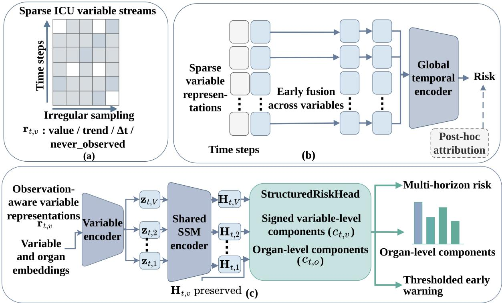
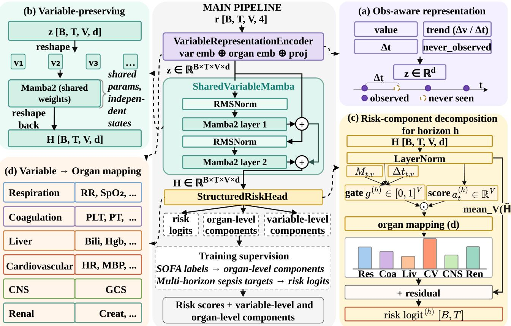
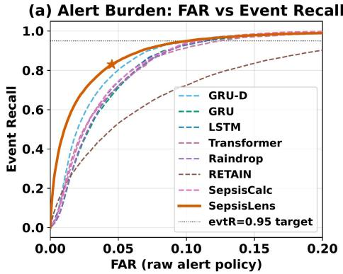
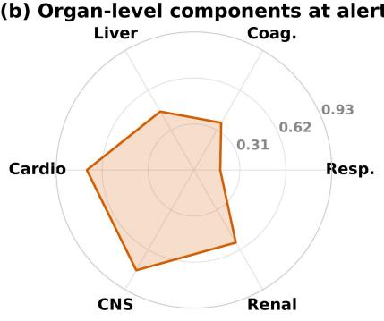
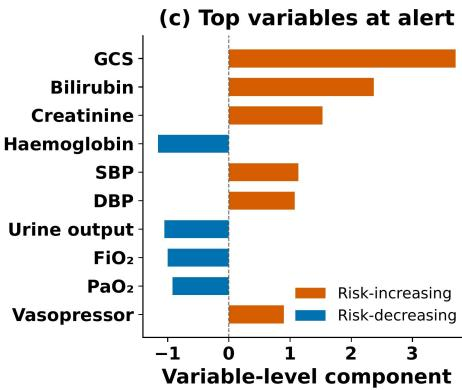

# SepsisLens: Structure-Preserving Sequence Modelling for Decomposable Early Sepsis Warning

Yikun Ou, Wei Li

School of Computer Science, University of Sydney Sydney, Australia

## Abstract

Early sepsis warning from ICU records can be cast as a structure-preserving prediction problem. A model needs to detect deterioration from irregular measurements while keeping each alert connected to the physiological signals that support it. Many temporal models fuse clinical variables into a patient-level representation, supporting scalar risk prediction but weakening the structure needed for clinical decomposition. We present SepsisLens, which preserves variableindexed temporal states until risk composition. Observationaware representations encode each variable’s dynamics and measurement history, while a shared temporal encoder models each trajectory without collapsing the variable axis. The StructuredRiskHead composes multi-horizon risk from explicit variable-level and organ-level components. We evaluate SepsisLens on three public ICU cohorts and one privatehospital cohort under a common pre-onset protocol. SepsisLens achieves strong discrimination on all four cohorts and lower alert burden at matched event recall on MIMIC-IV. Structural ablations support the design, while input-side masking shows that the ranked components reflect variables with greater influence on prediction.

## Introduction

In the ICU, patients with emerging sepsis can deteriorate before the diagnosis is clear. A useful warning needs to detect this change in time to support intervention while remaining selective enough to limit false alarms. It also needs to show which physiological signals support the warning. A single risk score can raise concern, but the score is dificult to act on when detached from the signals behind it.

ICU electronic records make this warning task dificult. Clinical variables are measured at diferent frequencies in ICU care. Vital signs may be recorded often, laboratory tests may appear only intermittently, and some measurements may never be ordered. These observation patterns are clinically meaningful. The decision to measure a variable can reflect concern about the patient’s condition. Sepsis adds another layer of structure. Organ dysfunction is central to its assessment, and SOFA summarises this dysfunction while retaining an organ-level account (Singer et al. 2016; Vincent et al. 1996). The score is an aggregate value, but it remains linked to the organ systems that contribute to the overall assessment. A model that returns only a scalar risk score can lose this link between prediction and physiological organisation.

Learning-based sepsis predictors have improved several parts of early warning. Recurrent and temporal models learn patient-level risk from ICU trajectories (Futoma, Hariharan, and Heller 2017; Rosnati and Fortuin 2021). Irregular-time models account for uneven measurements and missingness (Che et al. 2018; Shukla and Marlin 2021; Zhang et al. 2022). Attention-based models relate predictions to clinical variables (Choi et al. 2016), while calculator-informed graph models integrate clinical scores into temporal prediction (Yin et al. 2025). These advances leave a structure-preservation problem unresolved. Many temporal predictors fuse clinical variables into a patient-level representation before variablespecific temporal states are formed. We call this design early fusion. Early fusion can support scalar discrimination, but it weakens the variable structure needed for decomposable warning. Once variables have been mixed into a global hidden state, the prediction path no longer retains an explicit variable axis. The model may still rank risk well. The resulting risk, however, is not naturally composed from variablelevel and organ-level components. Post-hoc attribution can identify inputs associated with a prediction (Jain and Wallace 2019; Rudin 2019). It does not make the prediction itself a structured composition of clinical components. Much prior work asks how a computed risk score can be explained. We ask how to preserve the clinical structure needed for risk to remain decomposable during prediction.

SepsisLens addresses this gap by preserving variableindexed temporal states until risk composition. Observationaware variable representations retain value dynamics, measurement timing, and never-observed status. A shared temporal encoder models each variable trajectory while preserving the variable axis. The StructuredRiskHead computes signed variable-level components, aggregates them into organ-level components, and adds a global residual correction to each horizon-specific risk logit. Organ-dysfunction supervision aligns the organ-level components during training. This design places an explicit clinical component path inside the forward computation and retains a residual path for global correction. Figure 1 summarises this structure-preserving path and contrasts it with early-fusion prediction and posthoc attribution. We evaluate SepsisLens on three public ICU cohorts and one private-hospital cohort using a common preonset protocol. The evaluation examines predictive discrimination, alert burden at matched recall, the contribution of the structural design, and the functional relationship between the ranked components and prediction.

  
Figure 1: Motivation for SepsisLens. (a) Irregular ICU observations contain information about variable values, changes, and measurement history. (b) Early fusion collapses variable trajectories into a global representation without explicit variable- or organ-level components. Post-hoc attribution is applied outside the risk computation. (c) SepsisLens preserves variable-indexed temporal states until risk composition, producing multi-horizon risk with explicit variable- and organ-level components.

The main contributions are as follows:

• We formulate ICU sepsis warning as a structurepreserving early-event prediction problem, where variable identity remains available until risk composition and is not removed by early fusion.

• We develop observation-aware variable representations and a variable-preserving temporal encoder that models each clinical variable as an identifiable temporal state until prediction.

• We introduce the StructuredRiskHead, which forms multi-horizon risk from signed variable-level components, organ-level aggregation, and a global residual correction, with organ-dysfunction supervision for component alignment.

• We evaluate SepsisLens on four ICU cohorts under a common pre-onset and validation-selected early-warning protocol. Results show strong discrimination on all cohorts, lower false alarm rates at matched event recall on MIMIC-IV, and functional relevance of structured components via ablations and input-side masking.

## Related Work

Early sepsis warning and irregular clinical time series. Early sepsis warning is often modelled as a clinical timeseries prediction task. RETAIN (Choi et al. 2016) links predictions to visits and variables using reverse-time attention. MGP-RNN (Futoma, Hariharan, and Heller 2017) uses Gaussian process interpolation before recurrent modelling, and MGP-AttTCN (Rosnati and Fortuin 2021) applies it before convolutional temporal modelling. GRU-D uses missingness and elapsed time in recurrent updates (Che et al. 2018). Multi-time attention networks model irregular observations with continuous-time attention (Shukla and Marlin 2021), and Raindrop uses graph-guided temporal structure (Zhang et al. 2022). Recent methods (Xiao et al. 2025; Liu, Cao, and Chen 2025; Liu et al. 2026; Zhang et al. 2024) extend these ideas to asynchronous clinical events and more flexible representations of irregular time series. These methods improve prediction under sparse and uneven observations. They do not focus on preserving variable-indexed temporal states until risk composition. SepsisLens addresses this gap by keeping these states explicit until risk composition.

Structured clinical prediction. Clinical sepsis assessment is organised around organ dysfunction, as reflected in Sepsis-3 and SOFA (Singer et al. 2016; Vincent et al. 1996). This structure motivates models that retain clinically meaningful components within prediction. Attention-based models can associate predictions with visits or variables (Choi et al. 2016). Post-hoc attribution methods can support inspection (Jain and Wallace 2019; Rudin 2019). Neither makes the risk score itself a structured composition of clinical components. SepsisCalc incorporates clinical calculators into a dynamic temporal graph for early sepsis prediction, allowing clinical scoring information to enter the prediction process (Yin et al. 2025). SepsisLens addresses a diferent representation problem. It preserves variable-indexed temporal states during sequence encoding. The forward pass forms explicit variable-level and organ-level components before adding a global residual correction.

Operational evaluation for early warning. External validation of a widely used sepsis prediction model reported substantial alert burden at a threshold that still missed many sepsis cases (Wong et al. 2021). Early-warning models need to be evaluated beyond ranking metrics. Models with similar AUROC can produce diferent alert burdens after thresholding. A model can achieve high event recall by alerting often, while a low false alarm rate may simply reflect missed deterioration. This motivates our use of validation-selected thresholds and threshold-sweep analyses to compare operating profiles without reducing the comparison to a single operating point. We report threshold-independent discrimination alongside event recall, lead time, and false alarm rate.

## Problem Formulation

For each patient, we construct an hourly aligned clinical trajectory with up to $T = 9 6$ bins, including up to 24 pre-ICU alignment bins, and $V \ = \ 3 1$ clinical variables. Let $t = 1 , \dots , T$ index timesteps and $a _ { t }$ denote their aligned clinical hours relative to ICU admission, with $a _ { t } ~ < ~ 0$ for pre-ICU bins. The input contains a value matrix $\check { \mathbf { X } } \in \mathbb { R } ^ { T \times V }$ and a cumulative observation-history mask $\mathbf { M } \in \{ 0 , 1 \} ^ { T \times V }$ where $M _ { t , v } = 1$ indicates that variable v has been observed at or before timestep t. Let $\mathcal { H } = \{ 3 , 6 , 1 2 \}$ denote the prediction horizons in hours. Let τ denote the sepsis onset hour on the aligned time grid, with $\tau = \infty$ for patients who do not develop sepsis. At each timestep t before onset, the target for horizon $h \in \mathcal H$ is

$$
y _ { t } ^ { ( h ) } = \mathbb { I } ( a _ { t } < \tau \leq a _ { t } + h ) .\tag{1}
$$

where I(·) is the indicator function. For non-sepsis patients, $\tau = \infty$ makes all horizon targets negative.

The model outputs risk estimates for all horizons using only the observed history up to timestep t:

$$
\hat { \mathbf { y } } _ { t } = f ( \mathbf { X } _ { 1 : t } , \mathbf { M } _ { 1 : t } ) , \qquad \hat { \mathbf { y } } _ { t } = \left\{ \hat { y } _ { t } ^ { ( h ) } \right\} _ { h \in \mathcal { H } } ,\tag{2}
$$

where f is the learned prediction function and $\mathbf { X } _ { 1 : t } , \mathbf { M } _ { 1 : t }$ denote the patient history available at prediction time.

The 6-hour horizon is the primary reporting horizon unless otherwise specified. Onset and post-onset timesteps are excluded from the early-warning loss. During training, timealigned SOFA-derived organ dysfunction labels provide auxiliary supervision for the organ-level components. These labels are used during training only. At inference, the model receives only the patient trajectory. The task is to learn a history-only prediction function that produces multi-horizon sepsis risk while retaining an explicit variable-level and organ-level component path within the forward computation. The resulting risk estimates are thresholded to produce warnings, which are evaluated using event recall, lead time, and false alarm rate.

## SepsisLens

SepsisLens has three stages: observation-aware variable representations, variable-preserving temporal encoding, and structured risk composition. The design keeps variables identifiable until risk composition, so the clinical component path remains inside the forward computation and is not added after prediction. Figure 2 gives an architecture overview.

## Observation-Aware Variable Representations

The first stage encodes irregular measurements as variablespecific representations while retaining observation information (Figure 2(a)). For variable v at timestep t, SepsisLens constructs

$$
\mathbf { r } _ { t , v } = [ x _ { t , v } , \nabla x _ { t , v } , \Delta t _ { t , v } , n _ { t , v } ] ,\tag{3}
$$

where $x _ { t , v }$ is the causally carried-forward normalised value, $\nabla { x } _ { t , v }$ is the local trend relative to the most recent in-ICU observation, $\Delta t _ { t , v }$ is elapsed time since the most recent in-ICU observation with zero at an observed timestep, and $n _ { t , v }$ indicates the absence of both a current observation and a prior in-ICU observation. Pre-ICU measurements can still enter through the carried-forward value and cumulative observation-history mask.

A variable encoder combines the observation-aware channels with learned variable identity and organ-domain embeddings:

$$
\begin{array} { r } { \mathbf { z } _ { t , v } = \mathrm { P r o j } \left( [ \mathbf { r } _ { t , v } ; \mathbf { e } _ { v } ^ { \mathrm { v a r } } ; \mathbf { e } _ { o ( v ) } ^ { \mathrm { o r g } } ] \right) , } \end{array}\tag{4}
$$

where $o ( v )$ denotes a fixed extended assignment that maps both SOFA-defining variables and additional clinically related variables to six domain groups organised around the SOFA organ systems, giving $\mathbf { Z } \in \mathbb { R } ^ { \mathbf { \bar { \Delta } } B \times T \times V \times d } ,$

## Variable-Preserving Temporal Encoding

Many clinical time-series models first mix variables into a patient-level state at each timestep. SepsisLens instead keeps the variable axis explicit. The embedded tensor Z is reshaped into $B V$ separate variable trajectories, processed by a shared temporal encoder, and reshaped back:

$$
\begin{array} { r } { \mathbf { H } = \mathrm { r e s h a p e } ( F _ { \theta } ( \mathrm { r e s h a p e } ( \mathbf { Z } ) ) ) , } \end{array}\tag{5}
$$

where $\mathbf { H } \in \mathbb { R } ^ { B \times T \times V \times d }$ . We implement $F _ { \theta }$ as two Mamba2 layers with RMSNorm and residual connections (Gu and Dao 2023; Dao and Gu 2024). The same encoder parameters are applied to every variable trajectory, which keeps the model compact. The hidden states are not pooled over the variable dimension, so $\mathbf { H } _ { t , v }$ remains a temporally contextualised state for variable v. Information from diferent variables is combined only during risk composition by organ aggregation and a global residual correction.

## Structured Risk Composition

For each horizon $h \in \mathcal H$ , StructuredRiskHead maps the preserved states to a risk logit using a structured component path and a global residual correction path (Figure 2(c)). Let

  
Figure 2: SepsisLens architecture. (a) Observation-aware representations encode value, trend, elapsed time, and never-observed status for each clinical variable. (b) A shared temporal encoder models variable trajectories and preserves variable-indexed states $\mathbf { H } \in \mathbb { R } ^ { B \times T \times V \times d }$ . (c) StructuredRiskHead computes gated variable-level components, aggregates them into organ-level components, and adds a global residual correction. (d) A fixed extended assignment maps all variables to six domain groups organised around the SOFA organ systems.

$\widetilde { \mathbf { H } } _ { t , v } =$ LayerNorm $\left( \mathbf { H } _ { t , v } \right)$ . The component path produces a signed variable-level score, a gate, and a gated component:

$$
a _ { t , v } ^ { ( h ) } = \mathrm { S c o r e M L P } _ { h } ( \widetilde { \mathbf { H } } _ { t , v } ) ,\tag{6}
$$

$$
g _ { t , v } ^ { ( h ) } = \sigma \left( \mathrm { G a t e M L P } _ { h } ( [ \widetilde { \mathbf { H } } _ { t , v } ; M _ { t , v } ; \Delta t _ { t , v } ] ) \right) ,\tag{7}
$$

$$
c _ { t , v } ^ { ( h ) } = g _ { t , v } ^ { ( h ) } a _ { t , v } ^ { ( h ) } .\tag{8}
$$

The signed score can increase or decrease the risk logit, while the gate controls contribution strength using the state, cumulative observation-history mask, and elapsed time.

Variable-level components are aggregated within six fixed domain groups organised around the SOFA systems (Vincent et al. 1996):

$$
c _ { t , o } ^ { ( h ) } = \sum _ { v : o ( v ) = o } c _ { t , v } ^ { ( h ) } , \qquad o = 1 , \ldots , O ,\tag{9}
$$

where $O = 6 .$ . This produces one component for each organ domain. These components are computed inside the forward pass, not by post-hoc attribution.

The residual path forms a global correction from the mean-

pooled variable states:

$$
\rho _ { t } ^ { ( h ) } = \operatorname { R e s i d u a l M L P } _ { h } \left( \frac { 1 } { V } \sum _ { v = 1 } ^ { V } \widetilde { \mathbf { H } } _ { t , v } \right) .\tag{10}
$$

The final risk logit is

$$
\ell _ { t } ^ { ( h ) } = \sum _ { o = 1 } ^ { O } c _ { t , o } ^ { ( h ) } + \alpha \rho _ { t } ^ { ( h ) } , \qquad \hat { y } _ { t } ^ { ( h ) } = \sigma ( \ell _ { t } ^ { ( h ) } ) ,\tag{11}
$$

where α is a scalar scale factor. The sum of the organ-level components forms the structured contribution to the logit, while $\alpha \rho _ { t } ^ { ( h ) }$ provides a global residual correction.

## Training Objective

The main objective trains multi-horizon sepsis risk over preonset timesteps:

$$
\mathcal { L } _ { p r e d } = \sum _ { t \in \Omega } \sum _ { h \in \mathcal { H } } w _ { h } \omega _ { t , h } ^ { + } \mathrm { F L } _ { \gamma } \Big ( y _ { t } ^ { ( h ) } , \hat { y } _ { t } ^ { ( h ) } \Big ) ,\tag{12}
$$

where Ω is the set of pre-onset timesteps, $w _ { h }$ is a horizon weight, $\omega _ { t , h } ^ { + }$ is the horizon-specific positive-timestep leadtime weight, and $\operatorname { F L } _ { \gamma }$ is focal binary cross-entropy with $\gamma = 2$ and a positive-class weight (Lin et al. 2017). Positive pre-onset timesteps are additionally weighted to encourage earlier detection.

During training, time-aligned SOFA-derived dysfunction labels supervise the organ-level components. For ICU timesteps, let $q _ { t , o }$ denote the dysfunction label for organ domain o, computed from measurements available up to t. Synthetic pre-ICU bins use zero-coded auxiliary targets. Using the same pre-onset timestep set as the sepsis-risk loss, the primary-horizon organ loss is

$$
\mathcal { L } _ { o r g a n } = \sum _ { t \in \Omega } \sum _ { o = 1 } ^ { O } \mathrm { B C E } \Big ( q _ { t , o } , \sigma ( c _ { t , o } ^ { ( 6 ) } ) \Big ) .\tag{13}
$$

These labels supervise only the organ-level components during training and are never used as model inputs. At inference, SepsisLens receives only the patient trajectory. For an organ domain without label construction, we set the corresponding $q _ { t , o }$ to zero, so the domain receives only negative auxiliary targets. Such domains are not interpreted as supervised organ-dysfunction estimates.

An $L _ { 1 }$ sparsity term $\begin{array} { r c l } { \mathcal { L } _ { s p a r s e } } & { = } & { \sum _ { t \in \Omega } \sum _ { v = 1 } ^ { V } | a _ { t , v } ^ { ( 6 ) } | } \end{array}$ on primary-horizon variable scores discourages difuse variable-level scores when $\lambda _ { s p } > 0$ . The full objective is

$$
\mathcal { L } = \mathcal { L } _ { p r e d } + \lambda _ { o r g } \mathcal { L } _ { o r g a n } + \lambda _ { s p } \mathcal { L } _ { s p a r s e } .\tag{14}
$$

The displayed sums omit normalisation constants. At inference, SepsisLens receives only the patient trajectory and returns multi-horizon risk scores together with variable-level and organ-level components.

## Experimental Setup

## Datasets

We evaluate SepsisLens on four cohorts that cover diferent early-warning settings. All cohorts are converted to the same hourly format and use the same 31 clinical variables when available. MIMIC-IV (Johnson et al. 2023) is the primary cohort, with 66,237 ICU admissions split into 53,057 training, 6,602 validation, and 6,578 test admissions. MIMIC-III (Johnson et al. 2016) provides an earlier public ICU cohort, with 46,676 ICU admissions split into 37,327 training, 4,689 validation, and 4,660 test admissions. eICU (Pollard et al. 2018) is a multi-centre benchmark with 22,670 ICU unit stays split into 18,141 training, 2,278 validation, and 2,251 test unit stays, with 20% sepsis prevalence under a 1:4 case-control benchmark design. The private-hospital cohort contains 38,813 ICU admissions with 9.4% sepsis prevalence, split into 27,169 training, 5,821 validation, and 5,823 test admissions. This independent hospital cohort uses sitespecific training, validation, and test splits. It has reduced feature availability, with 11 of the 31 variables unavailable after feature harmonisation.

## Baselines

We compare SepsisLens with learning-based baselines and fixed-rule clinical scores. The learning-based models are LSTM, GRU, GRU-D (Che et al. 2018), Transformer, Raindrop (Zhang et al. 2022), RETAIN (Choi et al. 2016), and

SepsisCalc (Yin et al. 2025). The clinical scores are NEWS, MEWS, qSOFA, and SIRS. For the primary comparison, all learning-based models use the same patient-level splits, input variables, primary 6 h evaluation target, and validationselected threshold protocol. The baseline models are trained with binary cross-entropy and validation-based early stopping. Clinical scores use the available variables required by each score. All four scores have AUROC < .61 in all cohorts, well below the learning-based models.

## Metrics and Threshold Protocol

We report AUROC and AUPRC as threshold-independent discrimination metrics, denoted AUC and APC in the tables. We also report F1 and operational metrics: event recall (eR: the fraction of sepsis stays with at least one pre-onset alert), false alarm rate (FAR: the mean fraction of alerting timesteps among non-sepsis stays), and median lead time (ldT: the time from first pre-onset alert to onset among detected events). Alerts may occur at any pre-onset timestep, allowing ldT to exceed the 6 h label window. For each model and seed, the primary 6 h threshold is selected on the validation set by maximising timestep-level F1, then applied once to the corresponding held-out test predictions. Matched-recall operating points are derived from threshold sweeps; structural ablations use a fixed threshold of 0.5. The masking flip metric uses the validation-selected alert threshold.

All learning-based experiments use three seeds (42, 3407, 2026). Results are mean ± std unless stated otherwise. Normalisation statistics are estimated from the training split only. Timesteps at or after sepsis onset are excluded from training loss, threshold selection, and test evaluation.

## Results

The evaluation first reports predictive and operational performance on four cohorts, then examines alert burden, the contribution of the structural design, and the functional relevance of the risk components.

## Q1: Primary 6-Hour Early-Warning Results

Table 1 compares SepsisLens with seven baselines under the common pre-onset protocol. SepsisLens achieves the highest AUC, APC, and F1 and the lowest FAR with 91.1K parameters. Although SepsisCalc, GRU-D, and Raindrop reach higher event recall at their validation-selected thresholds, their FARs are 1.8–2.1 times higher. SepsisLens also requires the lowest FAR at matched event recall (Table 3), while median lead time remains comparable among models.

## Q2: Does the Design Remain Efective Across Cohorts?

Table 2 evaluates SepsisLens on four ICU cohorts. It maintains strong AUC and APC on all four cohorts. The eICU operating point is conservative, with low FAR and lower event recall. On the private cohort, where eleven variables are unavailable after harmonisation, SepsisLens reaches an AUC of .973 and FAR of .019. MIMIC-III has FAR below .001 before rounding and a median lead time of 6.3 h.

<table><tr><td>Method</td><td>#P (K)</td><td>AUC</td><td>APC</td><td>F1</td></tr><tr><td>SepsisLens</td><td>91.1</td><td> $\mathbf { . 9 3 9 } \pm . \mathbf { 0 0 4 }$ </td><td> $\mathbf { . 4 7 4 } 2 . 0 1 9$ </td><td> ${ \bf . 5 0 4 \pm . 0 1 7 }$ </td></tr><tr><td>SepsisCalc</td><td>225.0</td><td> $. 9 1 0 { \pm } . 0 0 1$ </td><td> $. 2 7 1 { \pm } . 0 0 5$ </td><td> $. 3 9 6 { \pm } . 0 0 2$ </td></tr><tr><td>Trânsformer</td><td>400.8</td><td> $. 9 0 9 { \pm } . 0 0 1$ </td><td> $. 2 9 3 { \pm } . 0 0 6$ </td><td> $. 4 0 7 { \pm } . 0 0 3$ </td></tr><tr><td>GRU-D</td><td>222.1</td><td> $. 9 0 5 { \pm } . 0 0 2$ </td><td> $. 2 9 9 { \pm } . 0 0 9$ </td><td> $. 4 1 8 { \pm } . 0 0 6$ </td></tr><tr><td>LSTM</td><td>214.7</td><td> $. 9 0 4 { \pm } . 0 0 0$ </td><td> $. 2 8 8 { \pm } . 0 0 4$ </td><td> $. 4 0 9 { \pm } . 0 0 2 $ </td></tr><tr><td>Raindrop</td><td>235.4</td><td> $. 9 0 4 { \pm } . 0 0 2$ </td><td> $. 2 6 8 { \pm } . 0 0 9$ </td><td> $. 3 9 6 { \pm } . 0 0 6$ </td></tr><tr><td>GRU</td><td>161.0</td><td> $. 8 9 9 { \pm } . 0 0 2 $ </td><td> $. 2 7 0 { \pm } . 0 1 0 $ </td><td> $. 3 9 7 { \pm } . 0 0 5$ </td></tr><tr><td>RETAIN</td><td>206.4</td><td> $. 8 0 2 { \pm } . 0 0 1$ </td><td> $. 2 1 4 { \pm } . 0 0 6$ </td><td> $. 3 0 5 { \pm } . 0 0 7$ </td></tr></table>

<table><tr><td>Method</td><td>eR</td><td>FAR</td><td>ldT</td></tr><tr><td>SepsisLens</td><td> $. 8 3 1 { \pm } . 0 1 4$ </td><td> $\mathbf { . 0 4 6 { \pm } . 0 0 7 }$ </td><td> $5 . 6 { \pm } 0 . 1 $ </td></tr><tr><td>SepsisCalc</td><td> $. 9 4 1 { \pm } . 0 0 4$ </td><td> $. 0 9 7 { \pm } . 0 0 5$ </td><td> $5 . 5 { \pm } 0 . 1 $ </td></tr><tr><td>Transformer</td><td> $. 8 8 2 { \pm } . 0 1 1$ </td><td> $. 0 8 4 { \pm } . 0 0 4$ </td><td> $5 . 7 { \pm } 0 . 1 $ </td></tr><tr><td>GRU-D</td><td> $. 9 2 4 { \pm } . 0 0 7$ </td><td> $. 0 8 2 { \pm } . 0 0 3$ </td><td> $5 . 5 { \pm } 0 . 1 $ </td></tr><tr><td>LSTM</td><td> $. 9 0 4 { \pm } . 0 1 7$ </td><td> $. 0 8 5 { \pm } . 0 0 4$ </td><td> $5 . 7 { \pm } 0 . 1 $ </td></tr><tr><td>Raindrop</td><td> $. 9 2 4 { \pm } . 0 0 7$ </td><td> $. 0 9 6 { \pm } . 0 0 4$ </td><td> $5 . 7 { \pm } 0 . 1 $ </td></tr><tr><td>GRU</td><td> $. 9 1 0 { \pm } . 0 0 6$ </td><td> $. 0 9 0 { \pm } . 0 0 3$ </td><td> $5 . 6 { \pm } 0 . 0 $ </td></tr><tr><td>RETAIN</td><td> $. 7 0 5 { \pm } . 0 3 2$ </td><td> $. 0 9 1 { \pm } . 0 0 9$ </td><td> $4 . 9 { \pm } 0 . 3 $ </td></tr></table>

Table 1: Primary 6 h early-warning results on MIMIC-IV (mean ± std over three seeds).
<table><tr><td>Cohort</td><td>Test n</td><td>AUC</td><td>APC</td><td>F1</td></tr><tr><td>MIMIC-IV</td><td>6,578</td><td> $. 9 3 9 { \pm } . 0 0 4 $ </td><td> $. 4 7 4 { \pm } . 0 1 9$ </td><td> $. 5 0 4 \pm . 0 1 7$ </td></tr><tr><td>MIMIC-III</td><td>4,660</td><td> $. 9 9 6 { \pm } . 0 0 0$ </td><td>.763±.005</td><td> $. 7 4 7 { \pm } . 0 0 2$ </td></tr><tr><td>eICU</td><td>2,251</td><td> $. 9 4 8 { \pm } . 0 0 2$ </td><td> $. 2 1 9 { \pm } . 0 0 7$ </td><td> $. 2 8 7 { \pm } . 0 0 4$ </td></tr><tr><td>Private</td><td>5,823</td><td> $. 9 7 3 { \pm } . 0 0 1$ </td><td>.404±.006</td><td> $. 4 2 8 { \pm } . 0 0 2$ </td></tr><tr><td>Cohort</td><td></td><td>eR</td><td>FAR</td><td>ldT</td></tr><tr><td>MIMIC-IV</td><td> $. 8 3 1 { \pm } . 0 1 4$ </td><td></td><td> $. 0 4 6 { \pm } . 0 0 7$ </td><td> $5 . 6 { \pm } 0 . 1 $ </td></tr><tr><td>MIMIC-III</td><td> $. 9 8 4 { \pm } . 0 0 4$ </td><td></td><td> $. 0 0 0 { \pm } . 0 0 0$ </td><td> $6 . 3 { \pm } 0 . 1 $ </td></tr><tr><td>eICU</td><td> $. 5 8 0 { \pm } . 0 7 6$ </td><td></td><td> $. 0 0 9 { \pm } . 0 0 3$ </td><td> $6 . 0 { \pm } 0 . 0 \ $ </td></tr><tr><td>Private</td><td>.641±.038</td><td></td><td> $. 0 1 9 { \pm } . 0 0 4$ </td><td> $6 . 0 { \pm } 0 . 0 \ $ </td></tr></table>

Table 2: SepsisLens 6 h early-warning results on ICU cohorts.

All models show unusually high discrimination, suggesting a cohort efect under this event definition.

## Q3: Does SepsisLens Reduce Alert Burden?

Figure 3(a) and Table 3 evaluate alert burden beyond a single validation-selected threshold. SepsisLens has the lowest mean FAR over three seeds at all three event-recall targets (.068, .083, and .100), followed by GRU-D (.072, .084, and .102). The full sweep shows the FAR–event-recall trade-of.

## Q4: Which Design Choices Matter?

Table 4 isolates pre-ICU alignment, structured risk composition, variable-preserving encoding, and organ supervision at a fixed threshold of 0.5. Removing pre-ICU alignment causes the largest degradation: AUC falls from .939 to .909, FAR rises from .223 to .298, and median lead time falls from 7.2 h to 1.8 h. PlainHead and EarlyFusion remove the structured outputs or explicit variable axis while retaining similar scalar discrimination; their lower FAR at 0.5 reflects score distributions rather than superior operating profiles. Removing organ supervision leaves scalar AUC nearly unchanged but reduces oAUC from .940 to .567, showing that the auxiliary objective aligns the organ-level components. This metric measures alignment with the auxiliary SOFA-derived organ targets, not scalar sepsis discrimination.

<table><tr><td>Method</td><td> $\geq . 9 0 \geq . 9 3 \geq . 9 5$ </td><td></td><td>Method</td><td> $\ge . 9 0 \ge . 9 3 \ge . 9 5$ </td></tr><tr><td>SepsisLens</td><td>.068 .083</td><td>.100</td><td>Raindrop .087</td><td>.098 .112</td></tr><tr><td>GRU-D</td><td>.072 .084</td><td>.102 GRU</td><td>.086 .102</td><td>.113</td></tr><tr><td>SepsisCalc</td><td>.085 .096</td><td>.109 Transf.</td><td>.092</td><td>.108 .122</td></tr><tr><td>LSTM</td><td>.082 .096</td><td>.110 RETAIN</td><td>.196</td><td>.223 .250</td></tr></table>

Table 3: Mean FAR over three seeds at fixed event-recall targets on MIMIC-IV. Lower is better.
<table><tr><td>Variant</td><td>AUC</td><td>APC</td><td>oAUC</td></tr><tr><td>SepsisLens</td><td> $. 9 3 9 { \pm } . 0 0 4 $ </td><td> $\mathbf { . 4 7 4 { \pm } . 0 1 9 }$ </td><td> $\mathbf { . 9 4 0 { \pm } . 0 1 3 }$ </td></tr><tr><td>-ÔrgSupv</td><td> $. 9 4 0 { \pm } . 0 0 2$ </td><td> $. 4 4 8 { \pm } . 0 0 5$ </td><td> $. 5 6 7 { \pm } . 0 1 5$ </td></tr><tr><td>ICUÕnly</td><td> $. 9 0 9 { \pm } . 0 0 2 $ </td><td> $. 4 5 2 { \pm } . 0 0 1$ </td><td> $. 8 9 9 { \pm } . 0 0 3$ </td></tr><tr><td>PlainHead EarlyFusion</td><td> $. 9 3 5 { \pm } . 0 0 1$   $. 9 4 4 { \pm } . 0 0 1$ </td><td> $. 4 5 0 { \pm } . 0 0 8 $   $. 4 6 4 { \pm } . 0 1 7$ </td><td></td></tr><tr><td></td><td></td><td></td><td></td></tr><tr><td>Variant</td><td>F1</td><td>eR</td><td>FAR ldT</td></tr><tr><td>SepsisLens</td><td> $. 3 3 0 { \pm } . 0 5 3$ </td><td> $\mathbf { . 9 9 1 } 2 . 0 \mathbf { 0 3 }$ </td><td> $. 2 2 3 { \pm } . 0 7 0$   $7 . 2 { \pm } 0 . 2 $ </td></tr><tr><td> $- \mathrm { \hat { O } r g S u p v }$ </td><td> $. 3 8 1 { \pm } . 0 1 4$ </td><td> $. 9 8 9 { \pm } . 0 0 1 $ </td><td> $. 1 6 0 { \pm } . 0 1 2$   $6 . 9 { \pm } 0 . 1 $ </td></tr><tr><td>ICUOnly</td><td> $. 2 3 0 { \pm } . 0 0 8$ </td><td> $. 9 8 6 { \pm } . 0 0 3$ </td><td> $. 2 9 8 { \pm } . 0 1 1$   $1 . 8 { \pm } 0 . 0 $ </td></tr><tr><td>PlainHead</td><td> $. 3 4 7 { \pm } . 0 3 6$ </td><td>.991±.004</td><td> $. 1 9 9 { \pm } . 0 4 3$   $7 . 1 { \pm } 0 . 1 $ </td></tr><tr><td>EarlyFusion</td><td>.373±.055</td><td>.988±.005</td><td> $. 1 7 8 { \pm } . 0 5 1$   $6 . 9 { \pm } 0 . 1 $ </td></tr></table>

Table 4: MIMIC-IV structural ablations at a fixed threshold of 0.5. oAUC denotes organ macro-AUROC.

## Q5: Are Structured Risk Components Functionally Tied to Prediction?

Figure 3(b,c) shows the organ- and variable-level components for a representative true-positive pre-onset alert. We test functional relevance by ranking variables by positive variable-level components at each patient’s first truepositive alert, setting top-k, random-k, or bottom-k histories to the never-observed state, and rerunning the model. Table 5 reports $\Delta p = p _ { \mathrm { o r i g } } - p _ { \mathrm { m a s k e d } }$ and alert flip rates for $k \in \{ 1 , \bar { 3 } , 5 \}$ over three seeds; random-k uses 20 samples per alert. Top-ranked masking has the largest efect at every k, with the top five variables flipping 95.6% of alerts below threshold (.956±.021). Random masking has a smaller efect, while bottom-ranked masking produces the smallest probability drops and flip rates. The consistent top > random > bottom ordering indicates that the components rank variables by functional relevance to prediction, not only by their additive position in the output head.

## Discussion

Operational metrics change the model comparison. AU-ROC alone is insuficient for early sepsis warning. On MIMIC-IV, ranking metrics do not determine operating profiles after thresholding. Higher event recall can require many more false alarms, and lower FAR can miss more events.

  
Figure 3: Alert burden and structured risk outputs. (a) FAR versus event recall on MIMIC-IV over a threshold sweep. The marker denotes SepsisLens at its validation-selected threshold. The horizontal dashed line marks the eR = 0.95 target used in Table 3. (b,c) Organ-level and variable-level components for a representative true-positive pre-onset alert. The StructuredRiskHead produces these components from variable-indexed temporal states without post-hoc attribution.

<table><tr><td>Masking</td><td>Metric</td><td>k = 1</td><td>k = 3</td><td>k = 5</td></tr><tr><td rowspan="2">Top-k</td><td>∆p</td><td>.066±.006</td><td>.176±.030</td><td>.252±.034</td></tr><tr><td>Flip</td><td>.593±.028</td><td>.884±.037</td><td>.956±.021</td></tr><tr><td rowspan="2">Random-k</td><td>∆p</td><td>.029±.006</td><td>.095±.014</td><td>.195±.018</td></tr><tr><td>Flip</td><td>.364±.030</td><td>.630±.045</td><td>.843±.046</td></tr><tr><td rowspan="2">Bottom-k</td><td>∆p</td><td>.007±.014</td><td>.021±.023</td><td>.037±.028</td></tr><tr><td>Flip</td><td>.180±.115</td><td>.304±.154</td><td> $. 4 0 7 { \pm } . 1 8 0 $ </td></tr></table>

Table 5: Input-side variable masking on MIMIC-IV. Flip uses the validation-selected threshold.

Reporting event recall, lead time, and FAR alongside discrimination connects model selection to alert burden and timely intervention.

Prediction structure determines how risk is composed. SepsisLens preserves clinical structure before the risk score is computed. Post-hoc attribution can inspect a completed score but does not determine its composition. The ablations separate the roles of the structured head and variablepreserving encoding. PlainHead removes the structured component outputs and slightly reduces AUROC. EarlyFusion removes the explicit variable axis before temporal modelling while keeping scalar AUROC similar. These results support the central design choice: preserve variable-level states until risk composition, then form a structured contribution from variable-level and organ-level components. This design keeps the component path available without relying on a larger model. The compact parameter count shows that the design does not require a large model.

Organ supervision aligns the organ-level components. The −OrgSupv ablation separates scalar prediction from component supervision. Removing organ supervision leaves scalar AUROC close to the full model (.939→.940), but reduces organ macro-AUROC from .940 to .567. This result should be read as supervised alignment of organ-level components with time-aligned SOFA-derived labels, not as an unsupervised discovery of organ dysfunction. The labels are derived only from measurements available up to each prediction timestep and are not used as model inputs. SepsisLens uses this auxiliary objective to align the organ-level components while keeping inference trajectory-only.

Limitations. This study is retrospective. Prospective deployment would require site-specific alert policies, calibration monitoring, and clinician-facing evaluation. The privatehospital cohort has incomplete organ labels, and MIMIC-III appears unusually easy under this event definition, so neither should be treated as standalone evidence for deployment readiness. The structured components are part of the forward computation, but they are supervised risk components, not causal explanations or independently discovered organ states.

## Conclusion

SepsisLens formulates early sepsis warning as a structurepreserving sequence modelling problem. It preserves variable-indexed temporal states and forms multi-horizon risk using an explicit variable-level and organ-level component path with a global residual correction. On four ICU cohorts, SepsisLens shows strong discrimination, while MIMIC-IV results show lower alert burden at matched event recall. Structural ablations and input-side masking further support the proposed design. These results support earlywarning models that preserve clinical structure during prediction instead of adding it after prediction.

## References

Che, Z.; Purushotham, S.; Cho, K.; Sontag, D.; and Liu, Y. 2018. Recurrent Neural Networks for Multivariate Time Series with Missing Values. Scientific Reports, 8(1): 6085.

Choi, E.; Bahadori, M. T.; Sun, J.; Kulas, J.; Schuetz, A.; and Stewart, W. 2016. RETAIN: An Interpretable Predictive Model for Healthcare Using Reverse Time Attention Mechanism. In Advances in Neural Information Processing Systems, volume 29, 3504–3512.

Dao, T.; and Gu, A. 2024. Transformers are SSMs: Generalized Models and Eficient Algorithms Through Structured State Space Duality. arXiv:2405.21060.

Futoma, J.; Hariharan, S.; and Heller, K. 2017. Learning to Detect Sepsis with a Multitask Gaussian Process RNN Classifier. In Proceedings of the 34th International Conference on Machine Learning, volume 70 of Proceedings ofMachine Learning Research, 1174–1182. PMLR.

Gu, A.; and Dao, T. 2023. Mamba: Linear-Time Sequence Modeling with Selective State Spaces. arXiv:2312.00752.

Jain, S.; and Wallace, B. C. 2019. Attention is not Explanation. In Proceedings ofthe 2019 Conference ofthe North American Chapter ofthe Associationfor Computational Linguistics: Human Language Technologies, 3543–3556. Association for Computational Linguistics.

Johnson, A. E. W.; Bulgarelli, L.; Shen, L.; Gayles, A.; Shammout, A.; Horng, S.; Pollard, T. J.; Hao, S.; Moody, B.; Gow, B.; Lehman, L.-W. H.; Celi, L. A.; and Mark, R. G. 2023. MIMIC-IV, a Freely Accessible Electronic Health Record Dataset. Scientific Data, 10(1): 1.

Johnson, A. E. W.; Pollard, T. J.; Shen, L.; Lehman, L.-W. H.; Feng, M.; Ghassemi, M.; Moody, B.; Szolovits, P.; Celi, L. A.; and Mark, R. G. 2016. MIMIC-III, a Freely Accessible Critical Care Database. Scientific Data, 3: 160035.

Lin, T.-Y.; Goyal, P.; Girshick, R.; He, K.; and Dollár, P. 2017. Focal Loss for Dense Object Detection. In Proceedings ofthe IEEE International Conference on Computer Vision, 2980– 2988.

Liu, J.; Cao, M.; and Chen, S. 2025. TimeCHEAT: A Channel Harmony Strategy for Irregularly Sampled Multivariate Time Series Analysis. In Proceedings of the AAAI Conference on Artificial Intelligence, volume 39, 18861–18869.

Liu, X.; Qiu, X.; Wu, X.; Li, Z.; Guo, C.; Hu, J.; and Yang, B. 2026. Rethinking Irregular Time Series Forecasting: A Simple Yet Efective Baseline. In Proceedings of the AAAI Conference on Artificial Intelligence, volume 40, 23873– 23881.

Pollard, T. J.; Johnson, A. E. W.; Rafa, J. D.; Celi, L. A.; Mark, R. G.; and Badawi, O. 2018. The eICU Collaborative Research Database, a Freely Available Multi-Center Database for Critical Care Research. Scientific Data, 5: 180178.

Rosnati, M.; and Fortuin, V. 2021. MGP-AttTCN: An Interpretable Machine Learning Model for the Prediction of Sepsis. PLOS ONE, 16(5): e0251248.

Rudin, C. 2019. Stop Explaining Black Box Machine Learning Models for High Stakes Decisions and Use Interpretable Models Instead. Nature Machine Intelligence, 1: 206–215.

Shukla, S. N.; and Marlin, B. M. 2021. Multi-Time Attention Networks for Irregularly Sampled Time Series. In International Conference on Learning Representations.

Singer, M.; Deutschman, C. S.; Seymour, C. W.; Shankar-Hari, M.; Annane, D.; Bauer, M.; Bellomo, R.; Bernard, G. R.; Chiche, J.-D.; Coopersmith, C. M.; Hotchkiss, R. S.; Levy, M. M.; Marshall, J. C.; Martin, G. S.; Opal, S. M.; Rubenfeld, G. D.; van der Poll, T.; Vincent, J.-L.; and Angus, D. C. 2016. The Third International Consensus Definitions for Sepsis and Septic Shock (Sepsis-3). JAMA, 315(8): 801– 810.

Vincent, J.-L.; Moreno, R.; Takala, J.; Willatts, S.; de Mendonça, A.; Bruining, H.; Reinhart, K.; Suter, P. M.; and Thijs, L. G. 1996. The SOFA (Sepsis-related Organ Failure Assessment) Score to Describe Organ Dysfunction/Failure. Intensive Care Medicine, 22(7): 707–710.

Wong, A.; Otles, E.; Donnelly, J. P.; et al. 2021. External Validation of a Widely Implemented Proprietary Sepsis Prediction Model in Hospitalized Patients. JAMA Internal Medicine, 181(8): 1065–1070.

Xiao, T.; Xu, Z.; He, W.; Xiao, Z.; Zhang, Y.; Liu, Z.; Chen, S.; Thai, M. T.; Bian, J.; Rashidi, P.; and Jiang, Z. 2025. XTSFormer: Cross-Temporal-Scale Transformer for Irregular-Time Event Prediction in Clinical Applications. In Proceedings of the AAAI Conference on Artificial Intelligence, volume 39, 28502–28510.

Yin, C.; Fu, S.; Yao, B.; Pham, T.-H.; Cao, W.; Wang, D.; Caterino, J.; and Zhang, P. 2025. SepsisCalc: Integrating Clinical Calculators into Early Sepsis Prediction via Dynamic Temporal Graph. In Proceedings of the 31st ACM SIGKDD Conference on Knowledge Discovery and Data Mining, 2779–2790. Association for Computing Machinery.

Zhang, W.; Yin, C.; Liu, H.; Zhou, X.; and Xiong, H. 2024. Irregular Multivariate Time Series Forecasting: A Transformable Patching Graph Neural Networks Approach. In Proceedings of the 41st International Conference on Machine Learning, volume 235 of Proceedings of Machine Learning Research, 60179–60196. PMLR.

Zhang, X.; Zeman, M.; Tsiligkaridis, T.; and Zitnik, M. 2022. Graph-Guided Network for Irregularly Sampled Multivariate Time Series. In International Conference on Learning Representations.