# Singular Value Decomposition

A geometric rediscovery — where proofs become algorithms

Paul Agron

October 7, 2026

## Abstract

This article has a hidden agenda. On its surface it is a leisurely geometric rediscovery of the singular value decomposition — but its real claim is that the pretty piece of mathematics it builds turns out to be the machinery quietly running a great deal of your machine learning. The same construction that answers an idle question about ellipses is the algorithm behind principal component analysis, kernel methods, and PageRank; and it is not merely the results that transfer, but the proofs themselves, run as procedures.

The usual introduction to the SVD states the factorization $A = U \Sigma V ^ { \mathsf { T } }$ and justifies it by applying the spectral theorem to $A ^ { \mathsf { T } } A$ — correct, and unilluminating: the geometry arrives already compressed into an algebraic identity, and a powerful theorem is assumed at the outset to reach a result that is, in the end, about ellipses. Part I reverses the order, following the path one might actually take to discover the decomposition. A linear map sends the unit circle to an ellipse; an ellipse has axes; one asks what input directions map to them, and finds — across example after example — that they are perpendicular. In the plane this can be watched: rotate a frame, track how badly its images miss being perpendicular, and a sign change forces a configuration where they do not miss at all. That surviving frame is where the map stretches hardest. The equivalence generalizes by maximizing the stretch and recursing, singular values falling out in order — and the construction turns out to have proved the spectral theorem rather than assuming it. The classical statement arrives at the end, as a name for what the geometry already built.

Part II collects the debt. Each of the constructions from Part I reappears as a working tool: the maximize-and-recurse proof becomes the power method and PageRank; the lemma locating the maximizer becomes the stopping rule of gradient descent; the duality between $A ^ { \mathsf { T } } A$ and $A A ^ { \mathsf { T } }$ becomes the transport at the heart of kernel PCA. Every connection is stated with its boundary — what the decomposition supplies and where some other idea takes over — because “the SVD is everywhere” is less useful than knowing exactly which part of a method it is responsible for.

The prerequisites are the standard sophomore sequence; worked examples are small enough to verify by hand, and every numerical and symbolic claim has been checked.

## Orientation

This is a mathematics article written with a data scientist’s temperament. It does not open with a definition and a theorem; it opens with an experiment — run a matrix on the unit circle and look at what comes back — notices a pattern, checks whether the pattern survives in higher dimensions, and only then sets out to prove it. That arc, from observation to conjecture to proof, is not just how the material is delivered here; it is the lesson. The singular value decomposition is usually handed to the reader fully formed. This article instead tries to let it be discovered, the way one might actually stumble onto it by paying attention to a picture.

Tools you will want in hand. The prerequisites are the standard sophomore sequence for a mathematics, physics, or data-science student, and nothing beyond it. From multivariable calculus (Calc III): directional derivatives and Lagrange multipliers. The one genuinely calculusflavored step in the article — §2.4, where we maximize the length of an image vector over the unit sphere — is exactly the reasoning behind Lagrange multipliers, carried out by hand with an explicit curve rather than a multiplier; a reader who has seen constrained optimization will recognize it even though no λ appears. From a proof-based linear algebra course: inner products and their bilinearity, orthonormal bases, orthogonal matrices, and eigenvalues and eigenvectors through the spectral theorem. From single-variable calculus: the intermediate value theorem, which does the entire work of the first existence proof (§2). And throughout, comfort reading a short proof — the content prerequisites are light, but past §1 the article genuinely argues rather than merely computes.

Two signposts. First, you will meet the spectral theorem twice: once as a result you already know and are asked to recall, and once, near the end of the construction (§2.5), as something the geometry rebuilds from scratch without assuming it. That doubling is deliberate — the point is to watch a theorem you were handed get earned. Second, this article is a stepping stone. The singular value decomposition is the geometric foundation underneath principal component analysis, low-rank approximation, latent-factor models, and much of the linear structure in modern machine learning. If you are heading toward those tools, the picture built here is what they stand on; §9 makes the first of those connections explicit.

## Part I

## Discovering the decomposition

## 1 Circles become ellipses

Fix a matrix $A \in \mathbb { R } ^ { m \times n }$ and think of it as a map $\mathbb { R } ^ { n } \to \mathbb { R } ^ { m }$ . Feed it the unit circle — all input vectors of length one — and look at where they land. Take

$$
A = \left( \begin{array} { c c } { { 2 } } & { { 1 } } \\ { { - 0 . 5 } } & { { 1 . 5 } } \end{array} \right) ,\tag{Eq 1.1}
$$

which will serve as the running example. Applying A to the unit circle produces the closed curve on the right of Figure 1: an ellipse. Try other matrices and the same thing happens — the circle is stretched and turned, but it always comes out an ellipse, never a peanut or a teardrop. (For a degenerate matrix the ellipse can flatten to a segment, and in higher dimensions the sphere becomes an ellipsoid; §4 makes this precise. For now the picture is all we need.)

An ellipse has two distinguished directions: its axes, the long one and the short one, perpendicular to each other. They are features of the output. It is natural to ask what they came from — what input directions A sent to them.

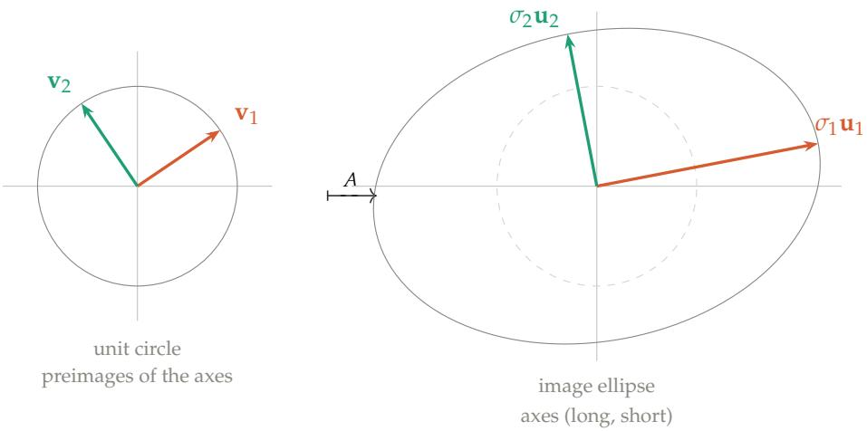  
Figure 1: The unit circle maps to an ellipse under $A = \left( \begin{array} { r r } { { 2 } } & { { 1 } } \\ { { - 0 . 5 } } & { { 1 . 5 } } \end{array} \right) $ . The ellipse’s axes point along $\mathbf { u } _ { 1 }$ (long, length $\sigma _ { 1 } )$ and $\mathbf { u } _ { 2 }$ (short, length $\sigma _ { 2 } )$ . Their preimages $\mathbf { v } _ { 1 } , \mathbf { v } _ { 2 }$ — the input directions A sent to the axes — are marked on the circle. The question of $\ S 1 . 1$ is whether those preimages are perpendicular.

## Are the preimages of the ellipse’s axes special?

This is the question the first half of the article answers. Nothing about the setup suggests the preimages should be nice: A mangles most directions, tilting and skewing as it goes. But the axes are where the image is longest and shortest, so their preimages are at least distinguished by something, and it is worth looking.

## 1.1 What the examples show

Compute the axis-preimages for a few matrices and a pattern appears at once.
<table><tr><td>A</td><td>axes at</td><td>preimages at axes ⊥? </td><td></td><td>preimages ⊥?</td></tr><tr><td> $\left( \begin{array} { c } { { 2 } } \\ { { - 0 . 5 1 . 5 } } \end{array} \right)$ </td><td> $1 0 . 9 ^ { \circ } , 1 0 0 . 9 ^ { \circ }$ </td><td> $3 4 . 1 ^ { \circ } , 1 2 4 . 1 ^ { \circ }$ </td><td>yes</td><td>yes</td></tr><tr><td>(0 1)</td><td> $3 1 . 7 ^ { \circ } , 1 2 1 . 7 ^ { \circ }$ </td><td> $5 8 . 3 ^ { \circ } , 1 4 8 . 3 ^ { \circ }$ </td><td>yes</td><td>yes</td></tr><tr><td>(1 1)</td><td> $4 5 ^ { \circ } , - 4 5 ^ { \circ }$ </td><td> $4 5 ^ { \circ } , 1 3 5 ^ { \circ }$ </td><td>yes</td><td>yes</td></tr></table>

The axes are perpendicular — of course they are, they are the axes of an ellipse. The striking column is the last one: their preimages are perpendicular too. The two input directions that A sends to the ellipse’s axes form a right angle, and A carries that right angle to another right angle (the axes).

This should be surprising, because A mangles right angles as a rule. The shear $\left( ^ { 1 1 } _ { 0 1 } \right)$ sends the perpendicular pair $e _ { 1 } , e _ { 2 }$ to (1, 0) and (1, 1), which meet at $4 5 ^ { \circ } ;$ run almost any perpendicular pair through almost any matrix and it comes out skew. Perpendicularity is not something linear maps respect. So a pair that A keeps perpendicular is a genuine exception, not the norm — which is exactly what makes “is there such a pair, and does it always land on the axes?” a real question rather than an idle one. Every example above answers yes, but examples are not a proof, and it is not yet clear why it should be true or whether the perpendicular preimage pair is unique. The next sections settle both, first in the plane, then in general.

Because this pair is what we are hunting, give its members names now. Write $\mathbf { v } _ { 1 } , \mathbf { v } _ { 2 }$ for the preimages of the long and short axes, and $\sigma _ { 1 } \geq \sigma _ { 2 }$ for the axis half-lengths, so that

$$
A \mathbf { v } _ { 1 } = \sigma _ { 1 } \mathbf { u } _ { 1 } , \qquad A \mathbf { v } _ { 2 } = \sigma _ { 2 } \mathbf { u } _ { 2 } ,
$$

where $\mathbf { u } _ { 1 } .$ , u<sub>2</sub> are the unit vectors along the axes. These are the singular values $( \sigma _ { i } ) ,$ , right singular vectors $\left( \mathbf { v } _ { i } \right)$ , and $l e f t$ singular vectors $\left( \mathbf { u } _ { i } \right)$ of $A ,$ and assembling the two relations into matrix form gives $A = \dot { U } \dot { \Sigma } V ^ { \top }$ — the singular value decomposition. $\ S 3$ returns to the names; the task between here and there is to prove the frame exists.

## 2 Why the perpendicular pair must exist

The examples of §1.1 suggest that among all perpendicular input pairs, there is one whose images stay perpendicular — and that this one lands on the ellipse’s axes. To prove it, forget the ellipse for a moment and hunt directly for such a pair. Take a perpendicular frame ${ \bf v } _ { 1 } ( \theta ) , { \bf v } _ { 2 } ( \theta )$ and rotate it rigidly as $\theta$ varies, watching what A does to the right angle between the arms. Measure the failure with

$$
f ( { \boldsymbol { \theta } } ) ~ = ~ \langle A \mathbf { v } _ { 1 } ( { \boldsymbol { \theta } } ) , A \mathbf { v } _ { 2 } ( { \boldsymbol { \theta } } ) \rangle ,
$$

the inner product of the two images. The inner product is the natural gauge of “how far from perpendicular”: it is zero exactly when the images are perpendicular, positive when the angle between them has closed below a right angle, negative when it has opened past one (Figure 2). So $f$ measures the damage A does to the right angle; the input arms stay perpendicular throughout, by construction, and we are asking whether any $\theta$ makes the damage vanish. If one does, that frame’s images are perpendicular — and, being the images of a perpendicular pair under $A ,$ they are exactly the kind of pair the axes are.

## 2.1 The sign flips every quarter turn

Rotate the frame by exactly 90<sup>◦</sup>. What happens to its two arms?

• $\mathbf { v } _ { 1 }$ rotated by $9 0 ^ { \circ }$ becomes $\mathbf { v } _ { 2 }$ . That is what perpendicular means.

• $\mathbf { v } _ { 2 }$ rotated by $9 0 ^ { \circ }$ becomes $- \mathbf { v } _ { 1 }$ . Another quarter turn past $\mathbf { v } _ { 2 }$ lands opposite $\mathbf { v } _ { 1 } ,$ not on it.

So $\mathbf { v } _ { 1 } ( \theta + 9 0 ^ { \circ } ) = \mathbf { v } _ { 2 } ( \theta )$ and $\mathbf { v } _ { 2 } ( \theta + 9 0 ^ { \circ } ) = - \mathbf { v } _ { 1 } ( \theta )$ . Apply $A ,$ use linearity to pull the sign out, and use the symmetry of the inner product:

$$
f ( \theta + 9 0 ^ { \circ } ) \ = \ \langle A \mathbf { v } _ { 2 } , A ( - \mathbf { v } _ { 1 } ) \rangle \ = \ - \langle A \mathbf { v } _ { 2 } , A \mathbf { v } _ { 1 } \rangle \ = \ - \langle A \mathbf { v } _ { 1 } , A \mathbf { v } _ { 2 } \rangle \ = \ - f ( \theta ) .
$$

This is worth pausing on, because the swap alone would achieve nothing — the inner product is symmetric, so exchanging its two arguments leaves it unchanged. The minus sign is doing all the work. And that minus sign is unavoidable: you cannot rotate an orthonormal pair by a quarter turn and recover the same pair, because one arm always comes back reversed.

Claim. Every matrix preserves at least one right angle.

Proof. $f$ is continuous, and $f ( \theta _ { 0 } + 9 0 ^ { \circ } ) = - f ( \theta _ { 0 } )$ for any $\theta _ { 0 }$ . If $f ( \theta _ { 0 } ) = 0$ we are done. Otherwise $f ( \theta _ { 0 } )$ and $f ( \theta _ { 0 } + 9 0 ^ { \circ } )$ have opposite signs, so by the intermediate value theorem $f$ vanishes somewhere strictly between. □

The argument used nothing about $A -$ not invertibility, not squareness, not any structure. In $\mathbb { R } ^ { n }$ the same conclusion holds via the spectral theorem (§2.5); the planar version is just the case you can see.

## 2.2 How many such angles are there?

Continuity gives existence but is silent on count. To settle that, compute $f$ in closed form. Writing $A = { \binom { a \ b } { c \ d } }$ and $\mathbf { v } _ { 1 } = ( \cos \theta , \sin \theta ) , \mathbf { v } _ { 2 } = ( - \sin \theta , \cos \theta )$ , expanding and collecting terms gives

$$
\begin{array} { r }  \boxed { f ( \theta ) \ = \ ( a b + c d ) \cos { 2 \theta } \ - \ \frac { 1 } { 2 } \left( a ^ { 2 } - b ^ { 2 } + c ^ { 2 } - d ^ { 2 } \right) \sin { 2 \theta } } \end{array}
$$

Two features of this expression matter, and the second is the important one.

First, everything is in 2θ, not θ. That is the algebraic shadow of the quarter-turn symmetry: advancing θ by $9 0 ^ { \circ }$ advances 2θ by $1 8 0 ^ { \circ }$ , which negates both cos and sin. The sign flip proved above is visible directly in the formula.

Second, and crucially, there is no constant term. f is a pure sinusoid oscillating about zero — not a sinusoid plus an offset. This is why the sign flip is not merely a curiosity but a guarantee: a sinusoid with a nonzero mean might never reach zero, but this one must.

Write it in amplitude–phase form as

$$
f ( \theta ) = R \cos ( 2 \theta - \varphi ) , \qquad R = \sqrt { A _ { 1 } ^ { 2 } + A _ { 2 } ^ { 2 } } , \quad \varphi = \mathrm { a t a n } 2 ( A _ { 2 } , A _ { 1 } ) ,
$$

where $A _ { 1 } = a b + c d$ and $A _ { 2 } = - { \textstyle \frac { 1 } { 7 } } \big ( a ^ { 2 } - b ^ { 2 } + c ^ { 2 } - d ^ { 2 } \big )$ . Suppose $R \neq 0$ . As θ runs over a half turn $[ 0 ^ { \circ } , 1 8 0 ^ { \circ } )$ , the argument 2θ runs over a full turn, so the cosine vanishes exactly twice, at

$$
\theta = { \frac { \varphi \pm 9 0 ^ { \circ } } { 2 } } .\tag{Eq 2.5}
$$

The two roots are $9 0 ^ { \circ }$ apart (Figure 2). But a frame and the same frame rotated by $9 0 ^ { \circ }$ consist of the same pair of lines — as shown above, the quarter turn merely swaps the arms and reverses one. So the two roots describe one geometric object.

Claim. Unless $R = 0 _ { ☉ }$ , the frame is unique: exactly one perpendicular pair of directions has perpendicular images, up to relabelling the arms and flipping their signs.

The degenerate case. $R = 0$ means $A _ { 1 } = A _ { 2 } = 0 _ { . }$ , i.e. $f \equiv 0$ and every frame works. The two coefficients are readable off $A ^ { \mathsf { T } } A$

$$
A ^ { \mathsf { T } } A = { \binom { a ^ { 2 } + c ^ { 2 } \quad a b + c d } { a b + c d } } ,
$$

so $A _ { 1 }$ is its off-diagonal entry and $- 2 A _ { 2 }$ the difference of its diagonal entries. Both vanish precisely when $A ^ { \top } A = \sigma ^ { 2 } I \ -$ when A is a scalar multiple of an orthogonal matrix. Then $A$ maps the sphere to a sphere, there is no direction of maximum stretch, and no frame is distinguished. The generic case and the degenerate case both fall out of the one formula.

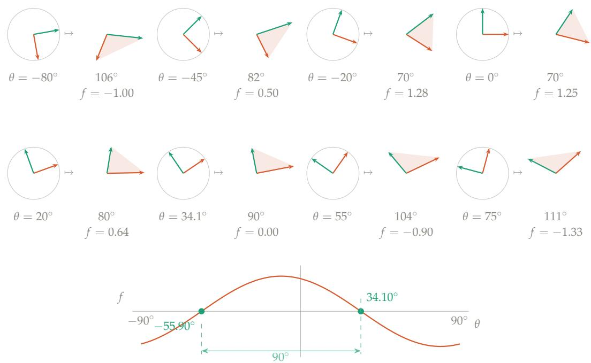  
Figure 2: Sweeping the frame. Each panel shows an orthonormal input frame (left, always perpendicular) and its image under $\boldsymbol { A } = \left( \begin{array} { c } { 2 } \\ { - 0 . 5 } \end{array} \right)$ (right, generally not). The number below each image is the angle between $A \mathbf { v } _ { 1 }$ and $A \mathbf { v } _ { 2 } ;$ the shaded wedge makes it visible. As θ increases the wedge narrows to $7 0 ^ { \circ }$ , then widens back through $9 0 ^ { \circ } -$ the highlighted panel, where the right angle survives — and on past $1 1 0 ^ { \circ }$ . The plot below tracks $f ( \theta )$ over the full half-turn: a pure sinusoid in 2θ with no vertical ofset, crossing zero exactly twice, at $3 4 . 1 0 ^ { \circ }$ and $- 5 5 . 9 0 ^ { \circ }$ . Those two crossings are $9 0 ^ { \circ }$ apart and describe the same pair of lines.

## 2.3 The same thing happens in three dimensions

The plane is settled: a perpendicular pair whose images are perpendicular exists, is essentially unique, and lands on the ellipse’s axes. Before generalizing, it is worth checking whether the phenomenon even persists — so run the experiment one dimension up. In $\mathbb { R } ^ { 3 }$ the unit sphere maps to an ellipsoid, which has three axes, mutually perpendicular. Do their preimages form an orthonormal triple, as the two axis-preimages did in the plane?

Take

$$
A = { \binom { 1 } { 0 } } \ 1 \ 1 ) ,\tag{Eq 2.7}
$$

compute the ellipsoid’s axes and pull them back. The semi-axis lengths come out $\sigma _ { 1 } = 2 . 5 3 2 \mathrm { \Omega }$ $\sigma _ { 2 } = 1 . 3 4 7 , \sigma _ { 3 } = 0 . 8 7 9$ , and the three preimages $\mathbf { v } _ { 1 } , \mathbf { v } _ { 2 } , \mathbf { v } _ { 3 }$ satisfy

$$
\langle \mathbf { v } _ { i } , \mathbf { v } _ { j } \rangle = 0 \quad ( i \neq j ) , \qquad \| \mathbf { v } _ { i } \| = 1 :\tag{Eq 2.8}
$$

a perfect orthonormal triple, angles $9 0 . 0 0 ^ { \circ }$ to the numerical precision checked. Repeating with other $3 \times 3$ matrices — symmetric, asymmetric, random — gives the same verdict every time (Figure 3). The ellipsoid’s axes always pull back to a perpendicular frame, and A carries that frame to the axes: $A \mathbf { v } _ { i } = \sigma _ { i } \mathbf { u } _ { i } ,$ just as in the plane. And it is just as surprising: a generic orthonormal triple, run through this same $A ,$ comes out skewed — the axis-preimages are again the exception, not the rule.

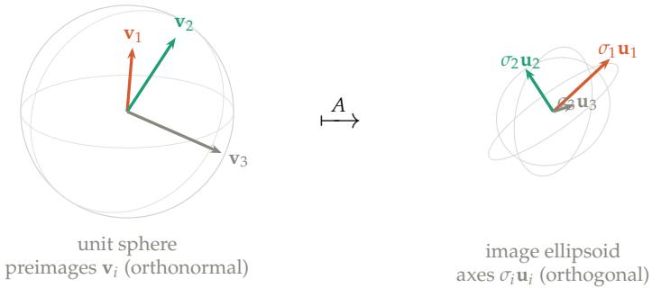  
Figure 3: The three-dimensional experiment. The unit sphere (left) maps under $A = { \binom { 1 } { 0 } } 1 1$ to an ellipsoid $( \mathsf { r i g h t } )$ . The ellipsoid’s three axes $\sigma _ { i } \mathbf { u } _ { i }$ are mutually perpendicular; their preimages ${ \bf v } _ { i } -$ the input directions A sends to those axes — form an orthonormal triple. The phenomenon of §1.1 survives intact into three dimensions.

So the pattern is real and dimension-independent, but the proof was not. The rotatingframe argument was thoroughly planar: it swept a single angle and watched a scalar change sign. In ${ \bf \check { R } } ^ { 3 }$ a frame is not fixed by one angle, and in $\mathbb { R } ^ { n }$ an orthonormal frame has n $\iota \big ( n - 1 \big ) / 2$ parameters while its images must satisfy $n ( n - 1 ) / 2$ orthogonality conditions — a coupled system, not a single equation, and the intermediate value theorem has nothing to say about it. Fixing up one pair disturbs another. A new idea is needed to carry the planar success upward, and the experiments hint at where to find it: the axes came in order, a longest and a shortest, and the longest is where the image stretches most. Perhaps maximizing the stretch is the handle.

## 2.4 From two dimensions to n

The plan is to establish, in the plane where both sides can be seen, that the surviving frame and the direction of maximum stretch are the same object; then to notice that one half of that equivalence never used the dimension; then to recurse on it, peeling off the longest axis at each step as the experiments suggest.

One thing the sweep assumes. Recall that in $f ( \theta )$ the input arms are kept perpendicular by construction — the domain-side right angle is a constraint we impose, and the whole question is whether the image-side right angle can be made to hold at the same time. We are not deriving that the frame is orthonormal; we are searching, among orthonormal input frames, for one whose images are orthonormal too.

## In the plane: the crossing is the peak

So far f has been the only thing measured. But Figure 2 shows something else changing as θ turns: the images grow and shrink. $\mathrm { A t } \theta = - 8 0 ^ { \circ }$ the first arm’s image is short; by $\theta = 3 4 ^ { \circ }$ it has reached the ellipse’s long axis. That second quantity is the one the reader already cares about $- \sigma _ { 1 }$ was defined as a length, not as an angle. So track it:

$$
g ( \theta ) \ = \ \| A \mathbf { v } _ { 1 } ( \theta ) \| ^ { 2 } ,
$$

the squared length of the first arm’s image. The square is a convenience: differentiating $\| A \mathbf { v } _ { 1 } \|$ itself produces a square root in the denominator, while the squared version stays polynomial. Nothing is lost, because squaring is monotone on nonnegative numbers — whatever θ maximizes g maximizes $\| A \mathbf { v } _ { 1 } \|$ too.

Figure 4 sweeps the same frame again, watching g instead of f . The two crossings of $f$ sit exactly at the peak and the trough of g. That is not a coincidence, and one observation explains it.

A tool: differentiating an inner product. The derivation below, and the one in the converse argument, both rest on a single calculus fact — the product rule for inner products. For any two vector-valued functions $u ( t )$ and w(t),

$$
\frac { d } { d t } \langle u ( t ) , w ( t ) \rangle = \langle u ^ { \prime } ( t ) , w ( t ) \rangle + \langle u ( t ) , w ^ { \prime } ( t ) \rangle ,
$$

which is the ordinary product rule applied coordinatewise and summed, using the bilinearity of the inner product. Two special cases are all we need. When the two slots hold the same function, symmetry of the inner product merges the terms:

$$
\frac { d } { d t } \langle u , u \rangle = 2 \langle u ^ { \prime } , u \rangle .
$$

And when a constant matrix A sits inside, it commutes with the derivativ $\mathrm { e } ,$ since differentiation acts entrywise and A does not depend on t: $\begin{array} { r } { \frac { d } { d t } ( A u ) = A u ^ { \prime } } \end{array}$

Eq 2.11

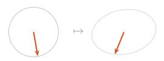

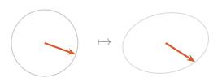

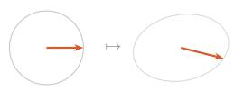

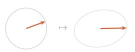

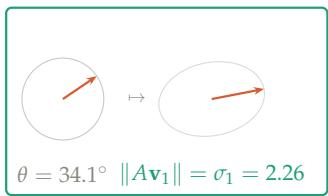

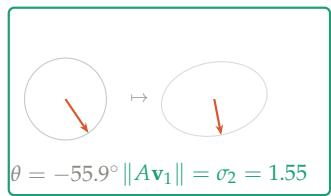

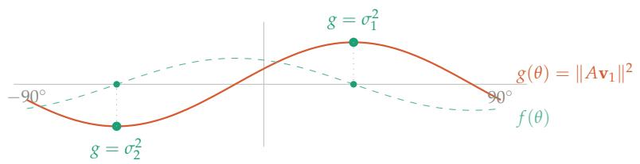  
Figure 4: The same sweep, watching length instead of angle. Each panel shows $\mathbf { v } _ { 1 }$ at angle θ and its image $A \mathbf { v } _ { 1 }$ , with the image ellipse faint behind it. Since $\mathbf { v } _ { 1 }$ is a unit vector its image always lands $o n$ the ellipse; what changes is how far around, and $\mathtt { S O }$ how long the arrow is. The first five panels climb — 1.69, 1.82, 2.06, 2.22 — until at $\theta \ : = \ : 3 4 . 1 0 ^ { \circ }$ the arrow reaches the long axis and $\| A \mathbf { v } _ { 1 } \| = \sigma _ { 1 }$ . The last panel jumps to $\theta = - 5 5 . 9 0 ^ { \circ }$ , the other extremum, where the arrow sits on the short axis and $\| A \mathbf { v } _ { 1 } \| = \sigma _ { 2 }$ . Below, $g ( \boldsymbol { \theta } ) = \| A \mathbf { v } _ { 1 } \| ^ { 2 }$ (solid) is plotted against $f ( \theta )$ (dashed, the same curve as in Figure 2). The zeros of $f$ fall exactly at the peak and trough of $g -$ which is what $d g / d \theta = 2 f$ says: $f$ is the slope of $g$

The identity. As $\theta$ increases, which way does $\mathbf { v } _ { 1 }$ move? It rotates — and rotating $\mathbf { v } _ { 1 }$ infinitesimally pushes it toward $\mathbf { v } _ { 2 } ,$ , which is a quarter turn ahead. In symbols, with ${ \bf v } _ { 1 } = ( \cos \theta , \sin \theta )$

$$
{ \frac { d \mathbf { v } _ { 1 } } { d \theta } } = \left( - \sin \theta , \cos \theta \right) = \mathbf { v } _ { 2 } .\tag{Eq 2.12}
$$

This is the fact that drove the sign flip in §2.1, seen infinitesimally rather than a quarter turn at a time. Now differentiate $g = \langle A \mathbf { v } _ { 1 } , A \mathbf { v } _ { 1 } \rangle$ , taking the steps one at a time:

$$
{ \begin{array} { r l r l } & { { \frac { d g } { d \theta } } = { \cfrac { d } { d \theta } } \langle \mathbf { { \boldsymbol { A } } } \mathbf { \boldsymbol { v } } _ { 1 } , \mathbf { \boldsymbol { A } } \mathbf { \boldsymbol { v } } _ { 1 } \rangle } & & { \qquad { \mathrm { d e f i n i t i o n ~ o f ~ } } g } \\ & { } & & { \qquad = 2 \left. { \frac { d } { d \theta } } ( A \mathbf { \boldsymbol { v } } _ { 1 } ) , \mathbf { \boldsymbol { A } } \mathbf { \boldsymbol { v } } _ { 1 } \right. } & & { \qquad { \mathrm { s a m e - s l o t ~ p r o d u c t ~ r u l e } } } \\ & { } & & { \qquad = 2 \left. \mathbf { \boldsymbol { A } } { \frac { d \mathbf { \boldsymbol { v } } _ { 1 } } { d \theta } } , \mathbf { \boldsymbol { A } } \mathbf { \boldsymbol { v } } _ { 1 } \right. } & & { \qquad { \boldsymbol { A } } { \mathrm { ~ c o n s t a n t , s o i t ~ p a s s e s ~ t h e ~ d e r i v a t i v e } } } \\ & { } & & { \qquad = 2 \langle \mathbf { \boldsymbol { A } } \mathbf { \boldsymbol { v } } _ { 2 } , \mathbf { \boldsymbol { A } } \mathbf { \boldsymbol { v } } _ { 1 } \rangle } & & { \qquad { \mathrm { u s i n g ~ } } { \frac { d \mathbf { \boldsymbol { v } } _ { 1 } } { d \theta } } = \mathbf { \boldsymbol { v } } _ { 2 } } \\ & { } & & { \qquad = 2 f ( \theta ) } \end{array} }\tag{Eq 2.13}
$$

So

$$
\boxed { \frac { d g } { d \theta } } = 2 f ( \theta )\tag{Eq 2.14}
$$

The damage function is half the derivative of the stretch. Nothing was computed: the identity holds because differentiating the first arm produces the second, and pairing the second against the first is what $f$ already measures.

This settles what the sweep was showing. The zero crossing of Figure 2 is not merely correlated with the ellipse’s axis — it is the critical point of $g .$ . Where the right angle survives, the stretch is stationary; where the stretch peaks, the right angle survives. The sinusoid plotted beneath the film strip is, up to a factor of two, the derivative of the stretch curve in Figure 4.

That is the equivalence, and both directions are worth having explicitly.

Maximality ⇒ orthogonal images. This is the direction that will carry the construction into higher dimensions, so it is worth stating carefully. The claim: $i f \mathbf { v } _ { 1 }$ is the input direction whose image is longest, then $A \mathbf { v } _ { 1 }$ is automatically orthogonal to Aw for every w perpendicular to $\mathbf { v } _ { 1 }$ . Perpendicularity of the images is not arranged; it is a consequence of maximizing a length.

The mechanism is the first-derivative test, applied on the sphere. We want to maximize $\| A v \|$ subject to $\| v \| = 1 .$ , so we cannot vary v freely — any admissible variation must keep v on the unit sphere. Fix a maximizer $\mathbf { v } _ { 1 }$ and a direction w $\perp \mathbf { v } _ { 1 }$ to test, and move along the arc

$$
v ( t ) = \cos t { \bf v } _ { 1 } + \sin t w ,\tag{Eq 2.15}
$$

chosen for two reasons: it satisfies $v ( 0 ) = \mathbf { v } _ { 1 }$ , so $t = 0$ is the point we care about, and it stays on the sphere, since $\| v ( t ) \| ^ { 2 } = \cos ^ { 2 } t + \sin ^ { 2 } t = 1$ (the cross term drops because $\left. \mathbf { v } _ { 1 } , w \right. = 0 )$ As t moves away from 0 it tips $\mathbf { v } _ { 1 }$ toward w; so $\frac { d } { d t }$ at $t = 0$ is the directional derivative of the objective along $w ,$ and that is the quantity a maximum forces to vanish.

Restrict the objective to the arc and expand by bilinearity of the inner product:

$$
\| A v ( t ) \| ^ { 2 } = \| A \mathbf { v } _ { 1 } \| ^ { 2 } \cos ^ { 2 } t + 2 \left. A \mathbf { v } _ { 1 } , A w \right. \sin t \cos t + \| A w \| ^ { 2 } \sin ^ { 2 } t .\tag{Eq 2.16}
$$

Differentiating, the $\cos ^ { 2 } t$ and $\sin ^ { 2 }$ t terms contribute ∓ sin $^ { 2 t , }$ which vanish at $t = 0 ;$ the cross term contributes $2 \langle A \mathbf { v } _ { 1 } , A w \rangle$ cos $2 t ,$ equal to $2 \langle A \mathbf { v } _ { 1 } , A w \rangle$ there. Hence

$$
\frac { d } { d t } \bigg \vert _ { t = 0 } \| A v ( t ) \| ^ { 2 } = 2 \langle A \mathbf { v } _ { 1 } , A w \rangle .\tag{Eq 2.17}
$$

Since $\mathbf { v } _ { 1 }$ maximizes the objective over the sphere and the arc lies on the sphere with $v ( 0 ) = \mathbf { v } _ { 1 }$ the function $t \mapsto \| A v ( t ) \| ^ { 2 }$ has an interior maximum at $t = 0 ,$ , so this derivative is zero:

$$
\langle A \mathbf { v } _ { 1 } , A w \rangle = 0 \qquad { \mathrm { f o r ~ e v e r y ~ } } w \perp \mathbf { v } _ { 1 } .\tag{Eq 2.18}
$$

What the algebra encodes is geometric. The derivative of the stretch as you tip $\mathbf { v } _ { 1 }$ toward w is exactly (twice) the overlap $\langle A \mathbf { v } _ { 1 } , A w \rangle$ . If that overlap were nonzero, the stretch would have nonzero slope in the w direction, and a small tip would lengthen the image — impossible, because $\mathbf { v } _ { 1 }$ was chosen to make it longest. So maximality is vanishing overlap in every perpendicular direction, which is to say $A \mathbf { v } _ { 1 }$ is orthogonal to the image of the entire hyperplane $\mathbf { v } _ { 1 } ^ { \perp }$ . The second-derivative test is consistent and needs no separate check: $\begin{array} { r } { \frac { d ^ { 2 } } { d t ^ { 2 } } \Big \rvert _ { 0 } = 2 ( \| A w \| ^ { 2 } - \| A \mathbf { v } _ { 1 } \| ^ { 2 } ) \leq 0 } \end{array}$ precisely because $\| A \mathbf { v } _ { 1 } \|$ is the largest stretch there is.

Orthogonal images ⇒ maximality. The converse closes the loop. Its claim: take the surviving $f r a m e - a$ perpendicular input pair $\mathbf { v } _ { 1 } , \mathbf { v } _ { 2 }$ whose images are also perpendicular — and the arm with the longer image is the direction of maximum stretch. Where the previous direction started from a maximizer and produced orthogonality, this one starts from orthogonality and recovers the maximizer.

Note what is assumed. We take $\mathbf { v } _ { 1 } , \mathbf { v } _ { 2 }$ orthonormal in the domain (that is the frame we impose) and their images orthogonal, $\langle A \mathbf { v } _ { 1 } , A \mathbf { v } _ { 2 } \rangle = 0$ (that is the surviving property). Label the arms so that the first has the longer image, and write $\sigma _ { 1 } = \left\| A \mathbf { v } _ { 1 } \right\| \geq \sigma _ { 2 } = \left\| A \mathbf { v } _ { 2 } \right\|$

Because $\mathbf { v } _ { 1 } , \mathbf { v } _ { 2 }$ are orthonormal, they are a basis of the plane, so every unit input vector is a combination

$$
v = c _ { 1 } \mathbf v _ { 1 } + c _ { 2 } \mathbf v _ { 2 } , \qquad c _ { 1 } ^ { 2 } + c _ { 2 } ^ { 2 } = 1 ,\tag{Eq 2.19}
$$

and its image length is governed by how the weight is split. Expanding $\| A v \| ^ { 2 }$ and using the orthogonality of the images to kill the cross term:

$$
\begin{array} { r } { \| A v \| ^ { 2 } = \| c _ { 1 } A \mathbf { v } _ { 1 } + c _ { 2 } A \mathbf { v } _ { 2 } \| ^ { 2 } = c _ { 1 } ^ { 2 } \| A \mathbf { v } _ { 1 } \| ^ { 2 } + \underbrace { 2 c _ { 1 } c _ { 2 } \langle A \mathbf { v } _ { 1 } , A \mathbf { v } _ { 2 } \rangle } _ { = 0 } + c _ { 2 } ^ { 2 } \| A \mathbf { v } _ { 2 } \| ^ { 2 } = c _ { 1 } ^ { 2 } \sigma _ { 1 } ^ { 2 } + c _ { 2 } ^ { 2 } \sigma _ { 2 } ^ { 2 } . } \end{array}\tag{Eq 2.20}
$$

The result is a weighted average of $\sigma _ { 1 } ^ { 2 }$ and $\sigma _ { 2 } ^ { 2 } ,$ with weights $c _ { 1 } ^ { 2 } , c _ { 2 } ^ { 2 }$ that sum to one. An average of two numbers cannot exceed the larger, and reaches it only by placing all the weight there: $c _ { 1 } ^ { 2 } = 1 , c _ { 2 } ^ { 2 } = 0 ,$ that is $v = \pm \mathbf { v } _ { 1 }$ . So among all unit inputs the longest image belongs to $\mathbf { v } _ { 1 } - \mathrm { i t }$ is the maximizer.

This is why the two planar descriptions are one. The surviving frame’s long arm $\mathbf { v } _ { 1 }$ is where the stretch peaks, and $\sigma _ { 1 }$ , defined a moment ago merely as “the longer of the two image lengths,” is in fact the largest image length there is — the major semi-axis of the ellipse. The step that made it work, $\| A v \| ^ { 2 } = c _ { 1 } ^ { 2 } \sigma _ { 1 } ^ { 2 } + c _ { 2 } ^ { 2 } \sigma _ { 2 } ^ { 2 } .$ , is worth remembering: once the images are orthogonal, the map acts on the $\mathbf { v } _ { 1 } , \mathbf { v } _ { 2 }$ coordinates by simple scaling, with no interference between the arms. That decoupling is the whole point of the frame, and it is the $2 \times 2$ shadow of $A = U \Sigma V ^ { \mathsf { T } }$

## The hinge

Now look back at the first of those two arguments and ask what it used. A unit vector $\mathbf { v } _ { 1 } ;$ a perpendicular unit vector $w ;$ the curve cos $t { \bf v } _ { 1 } + \sin t w ;$ one derivative. Nothing in it mentions the dimension. In $\mathbb { R } ^ { 2 }$ the only choice of w is $\pm \mathbf { v } _ { 2 }$ , so the conclusion looks like a statement about a single pair. In $\mathbb { R } ^ { n }$ the same curve lies on the unit sphere $S ^ { n - 1 }$ , the same derivative computation goes through unchanged, and the conclusion becomes considerably stronger:

$$
\langle A { \bf v } _ { 1 } , A w \rangle = 0 \mathrm { ~ f o r ~ } e v e r y w \perp { \bf v } _ { 1 } ,\tag{Eq 2.21}
$$

which is $n - 1$ orthogonality relations at once, not one. The maximizer’s image is orthogonal to the image of the entire hyperplane $\mathbf { v } _ { 1 } ^ { \perp }$

The other direction does not need to make the trip. It was there to show that the two planar descriptions coincide; having established that, we keep only the half that travels.

## In $\mathbb { R } ^ { n } \colon$ recursion

The construction now runs by induction, and each step is the hinge applied once.

1. The function $v \mapsto \left\| A v \right\|$ is continuous and $S ^ { n - 1 }$ is compact, so a maximizer exists. Call it $\mathbf { v } _ { 1 }$ and set $\sigma _ { 1 } = \| A \mathbf { v } _ { 1 } \|$

2. By the hinge, $\langle A { \bf v } _ { 1 } , A w \rangle = 0$ for every $w \perp \mathbf { v } _ { 1 }$ . So whatever we choose next from $\mathbf { v } _ { 1 } ^ { \perp }$ , its image is already orthogonal to $A \mathbf { v } _ { 1 } -$ for free, with no further work.

3. Restrict A to the hyperplane $\mathbf { v } _ { 1 } ^ { \perp } \cong \mathbb { R } ^ { n - 1 }$ and repeat: maximize $\| A v \|$ over the unit sphere of $\mathbf { v } _ { 1 } ^ { \perp }$ to get $\mathbf { v } _ { 2 }$ , with $\sigma _ { 2 } = \| A \mathbf { v } _ { 2 } \| \leq \sigma _ { 1 }$ . Applying the hinge within that hyperplane gives $\left. A \mathbf { v } _ { 2 } , A w \right. = 0$ for all $w \in \mathbf { v } _ { 1 } ^ { \bot }$ with $w \perp \mathbf { v } _ { 2 }$

4. Continue. After n steps the frame $\mathbf { v } _ { 1 } , \ldots , \mathbf { v } _ { n }$ is orthonormal by construction, and its images are pairwise orthogonal: for $i < j .$ , step i’s hinge applies because $\mathbf { v } _ { j }$ lies in $\mathbf { v } _ { i } ^ { \perp }$ .

Two features of this deserve comment. First, the $\sigma _ { i }$ come out sorted, $\sigma _ { 1 } \geq \sigma _ { 2 } \geq . . . ,$ automatically: each step maximizes over a subset of the previous step’s domain, so it cannot do better. The descending convention is not a convention here — it is what the construction produces. Second, step 2 is doing all the work, and it is doing it before the next vector is chosen: maximality of $\mathbf { v } _ { 1 }$ pre-emptively guarantees orthogonality against every future choice. That is what makes the recursion compose, and it is precisely what the planar picture could not show, having no room to recurse into.

## What the construction has already proved

Something has quietly happened. Return to the hinge, the statement that at the maximizer

$$
\langle A \mathbf { v } _ { 1 } , A w \rangle = 0 \qquad \mathrm { f o r e v e r y } w \perp \mathbf { v } _ { 1 } ,\tag{Eq 2.22}
$$

and move A across the inner product onto the other argument:

$$
\langle A \mathbf { v } _ { 1 } , A w \rangle = ( A \mathbf { v } _ { 1 } ) ^ { \mathsf { T } } ( A w ) = \mathbf { v } _ { 1 } ^ { \mathsf { T } } A ^ { \mathsf { T } } A w = \langle A ^ { \mathsf { T } } A \mathbf { v } _ { 1 } , w \rangle .\tag{Eq 2.23}
$$

So the hinge says: the vector $A ^ { \mathsf { T } } A { \mathbf { v } } _ { 1 }$ is orthogonal to every w in the hyperplane $\mathbf { v } _ { 1 } ^ { \perp }$ . But the only vectors orthogonal to all of $\mathbf { v } _ { 1 } ^ { \perp }$ are the multiples of $\mathbf { v } _ { 1 }$ itself. Therefore

$$
\boxed { A ^ { \top } A \mathbf { v } _ { 1 } \ : = \ : \lambda _ { 1 } \mathbf { v } _ { 1 } }\tag{Eq 2.24}
$$

for some scalar $\lambda _ { 1 }$ — and pairing both sides with $\mathbf { v } _ { 1 }$ identifies ${ \mathrm { i t } } ,$

$$
\lambda _ { 1 } = \langle { \cal A } ^ { \sf T } { \cal A } { \bf v } _ { 1 } , { \bf v } _ { 1 } \rangle = \langle { \cal A } { \bf v } _ { 1 } , { \cal A } { \bf v } _ { 1 } \rangle = \| { \cal A } { \bf v } _ { 1 } \| ^ { 2 } = \sigma _ { 1 } ^ { 2 } .\tag{Eq 2.25}
$$

The maximizer is an eigenvector of $A ^ { \mathsf { T } } A _ { \mathsf { - } }$ , with eigenvalue the squared stretch. This was not assumed. It fell out of maximality alone, by one application of the adjoint move.

And the same holds at every step of the recursion, since each $\mathbf { v } _ { i }$ maximizes over a subspace on which the identical argument runs. So the construction of the previous page did not merely find a convenient frame — it produced an orthonormal basis $\mathbf { v } _ { 1 } , \ldots , \mathbf { v } _ { n }$ of eigenvectors of $A ^ { \mathsf { T } } \dot { A }$ with nonnegative eigenvalues $\sigma _ { i } ^ { 2 }$ , sorted. That is a complete diagonalization:

$$
A ^ { \mathsf { T } } A = V \Sigma ^ { 2 } V ^ { \mathsf { T } } .
$$

Which is to say: the variational<sup>1</sup> route has already proved the spectral theorem for $A ^ { \mathsf { T } } A$ . The next section does not introduce new machinery. It names this result in the standard language, states it for symmetric matrices in general rather than for Gram matrices in particular, and notes that once one has it, the entire construction collapses to a single sentence.

One caveat. The route above is specific to matrices of the form $A ^ { \mathsf { T } } A$ , because it maximizes $\| A x \| ^ { 2 } .$ , a quantity that is automatically nonnegative. A general symmetric S can have negative eigenvalues — for instance $\left( \begin{array} { l l } { 2 } & { 1 } \\ { 1 } & { - 3 } \end{array} \right)$ has eigenvalues −3.19 and 2.19 — so no maximization of a squared length will ever produce them. The fix is to run the same argument on the Rayleigh quotient

$$
\rho ( x ) = \frac { x ^ { \top } S x } { x ^ { \top } x } ,
$$

whose stationary points are exactly the eigenvectors of S and whose stationary values are the eigenvalues. The proof is the same derivative computation; only the functional changes. So the spectral theorem in full generality is this section’s argument with $\| A x \| ^ { 2 }$ replaced by $\rho ( x )$ , and ${ \dot { \rho ( x ) } } = \| A x \| ^ { 2 }$ on the unit sphere when $S = A ^ { \mathsf { T } } A$ recovers what we did.

## 2.5 The same fact, algebraically

The previous section arrived at $A ^ { \mathsf { T } } A \mathbf { v } _ { i } = \sigma _ { i } ^ { 2 } \mathbf { v } _ { i }$ with the $\mathbf { v } _ { i }$ orthonormal. That statement has a name, and stating it for a general symmetric matrix rather than for $A ^ { \mathsf { T } } A$ costs nothing — the hypothesis that actually does the work is symmetry, not the particular form of the matrix.

Spectral theorem. Let S be a real symmetric $n \times n$ matrix, $S \ = \ S ^ { \mathsf { T } }$ . Then S has n real eigenvalues $\lambda _ { 1 } , \ldots , \lambda _ { n }$ (with multiplicity), and R<sup>n</sup> admits an orthonormal basis $\mathbf { w } _ { 1 } , \ldots , \mathbf { w } _ { n }$ of eigenvectors, $S \mathbf { w } _ { i } = \lambda _ { i } \mathbf { w } _ { i }$ . Equivalently $S = W \Lambda W ^ { \mathsf { T } }$ with W orthogonal and Λ diagonal.

Two clauses matter here and neither is free. Real eigenvalues: a general real matrix can have complex ones, as a rotation does. Orthonormal eigenbasis: a general matrix’s eigenvectors need not be perpendicular, and a defective matrix does not have a full set of them at all. Symmetry buys both.

Taking the theorem as given — it is standard, and §2.4 sketched its proof — the whole of §2 and §2.4 collapses to three lines, which is the point of this section. The rotating frame and the greedy maximization were two ways of finding by hand what the following computation supplies at once, in any dimension.

## Where the symmetry enters

The orthogonality half is short enough to see in full. Let $\mathbf { w } _ { i } , \mathbf { w } _ { j }$ be eigenvectors with $\lambda _ { i } \neq \lambda _ { j }$ Start from the number $\langle S \mathbf { w } _ { i } , \mathbf { w } _ { j } \rangle$ and evaluate it two ways.

Pushing S onto the left argument:

$$
\langle S \mathbf { w } _ { i } , \mathbf { w } _ { j } \rangle ~ = ~ \langle \lambda _ { i } \mathbf { w } _ { i } , \mathbf { w } _ { j } \rangle ~ = ~ \lambda _ { i } \langle \mathbf { w } _ { i } , \mathbf { w } _ { j } \rangle ~ ( \mathrm { e i g e n v e c t o r ~ e q u a t i o n , t h e n ~ l i n e a r i t y } ) .\tag{Eq 2.28}
$$

Moving S across the inner product to the right argument instead:

$$
\langle S \mathbf { w } _ { i } , \mathbf { w } _ { j } \rangle = ( S \mathbf { w } _ { i } ) ^ { \mathsf { T } } \mathbf { w } _ { j } = \mathbf { w } _ { i } ^ { \mathsf { T } } S ^ { \mathsf { T } } \mathbf { w } _ { j } = \underbrace { \mathbf { w } _ { i } ^ { \mathsf { T } } S \mathbf { w } _ { j } } _ { \mathrm { h e r e } S ^ { \mathsf { T } } = S } = \langle \mathbf { w } _ { i } , S \mathbf { w } _ { j } \rangle = \lambda _ { j } \langle \mathbf { w } _ { i } , \mathbf { w } _ { j } \rangle .\tag{Eq 2.29}
$$

The symmetry hypothesis is used exactly once, at the brace: without $S ^ { \mathsf { T } } = S$ the chain breaks and nothing follows. Setting the two evaluations equal,

$$
\lambda _ { i } \langle \mathbf { w } _ { i } , \mathbf { w } _ { j } \rangle = \lambda _ { j } \langle \mathbf { w } _ { i } , \mathbf { w } _ { j } \rangle \quad \Longrightarrow \quad ( \lambda _ { i } - \lambda _ { j } ) \left. \mathbf { w } _ { i } , \mathbf { w } _ { j } \right. = 0 .\tag{Eq 2.30}
$$

Since $\lambda _ { i } \neq \lambda _ { j }$ by assumption, the first factor is nonzero, so $\left. \mathbf { w } _ { i } , \mathbf { w } _ { j } \right. = 0 :$ : the eigenvectors are perpendicular. (If $\lambda _ { i } = \lambda _ { j }$ the argument says nothing, and correctly so — within a repeated eigenvalue’s eigenspace any basis is an eigenbasis, so one simply chooses an orthonormal one. This is the same freedom catalogued in §6 for repeated singular values.)

## Applying it to $A ^ { \mathsf { T } } A$

First, $A ^ { \mathsf { T } } A$ qualifies. It is symmetric because transposing reverses the order of a product and undoes itself:

$$
( A ^ { \mathsf { T } } A ) ^ { \mathsf { T } } = A ^ { \mathsf { T } } \left( A ^ { \mathsf { T } } \right) ^ { \mathsf { T } } = A ^ { \mathsf { T } } A .\tag{Eq 2.31}
$$

The matrix $A ^ { \mathsf { T } } A$ is called the Gram matrix of A: its $( i , j )$ entry is the inner product of column i of A with column $j ,$ so its diagonal holds the squared column lengths and its off-diagonal entries measure how far from perpendicular the columns are. (Throughout, $( M ) _ { i j }$ denotes the entry of M in row $i , \mathsf { c o l u m n } j . )$

So the spectral theorem applies and supplies an orthonormal eigenbasis $\mathbf { v } _ { 1 } , \ldots , \mathbf { v } _ { n }$ with $A ^ { \mathsf { T } } A \mathbf { v } _ { i } = \hat { \lambda _ { i } } \mathbf { v } _ { i } -$ for free, in any dimension, with no rotating frame required. Now take any two of them, $i \neq j ,$ and compute the inner product of their images one step at a time:

$$
\begin{array} { r l r l } & { \langle A \mathbf { v } _ { i } , A \mathbf { v } _ { j } \rangle = ( A \mathbf { v } _ { i } ) ^ { \mathsf { T } } ( A \mathbf { v } _ { j } ) \quad } & & { \mathrm { d e f i n i t i o n ~ o f ~ t h e ~ i n n e r ~ p r o d u c t } } \\ & { = \mathbf { v } _ { i } ^ { \mathsf { T } } A ^ { \mathsf { T } } A \mathbf { v } _ { j } \quad } & & { \mathrm { t r a n s p o s e ~ o f ~ a ~ p r o d u c t } } \\ & { = \mathbf { v } _ { i } ^ { \mathsf { T } } ( A ^ { \mathsf { T } } A \mathbf { v } _ { j } ) \quad } & & { \mathrm { r e g r o u p i n g : m a t i x ~ p r o d u c t ~ i s ~ a s s o c i a t i v e } } \\ & { = \mathbf { v } _ { i } ^ { \mathsf { T } } ( \lambda _ { j } \mathbf { v } _ { j } ) \quad } & & { \mathbf { v } _ { j } \mathrm { i s ~ a n ~ e i g e n v e c t o r ~ o f ~ } A ^ { \mathsf { T } } A \quad } \\ & { = \lambda _ { j } \mathbf { v } _ { i } ^ { \mathsf { T } } \mathbf { v } _ { j } \quad } & & { \mathrm { s c a l a r s ~ p u l l ~ o u t } } \\ & { = \lambda _ { j } \langle \mathbf { v } _ { i } , \mathbf { v } _ { j } \rangle \quad } & & { \mathrm { d e f i n i t i o n ~ a g a i n } } \\ & { = 0 \quad } & & { \mathrm { t h e ~ } \mathbf { v } _ { i } \mathrm { ~ a r e ~ o r t h o n o r m a l } , i \neq j . } \end{array}\tag{Eq 2.32}
$$

The images are orthogonal automatically. The eigenvectors of $A ^ { \mathsf { T } } A$ are the frame the whole note is about, and the rotating-frame picture of §2 is what this computation looks like in the plane.

Notice which step did the work. The eigenvector equation converted the operator $A ^ { \mathsf { T } } A$ into the scalar $\lambda _ { j } ,$ after which orthogonality of the $\mathbf { v } _ { i }$ finished the job. Feed in a non-eigenvector and line four fails: $A ^ { \mathsf { T } } A { \mathbf { v } } _ { j }$ is some other vector, not a multiple of $\mathbf { v } _ { j } ,$ and the inner product has no reason to vanish.

## Why the singular values are real

$A ^ { \mathsf { T } } A$ is not merely symmetric but positive semidefinite. For any vector $x ,$

$$
x ^ { \mathsf { T } } ( A ^ { \mathsf { T } } A ) \ x \ = \ \underbrace { ( x ^ { \mathsf { T } } A ^ { \mathsf { T } } ) } _ { = ( A x ) ^ { \mathsf { T } } } ( A x ) \ = \ ( A x ) ^ { \mathsf { T } } ( A x ) \ = \ \| A x \| ^ { 2 } \ \ge \ 0 ,\tag{Eq 2.33}
$$

the last step because a squared length is never negative. Now take $x = { \bf v } _ { i } ,$ an eigenvector:

$$
\begin{array} { r } { \mathbf { v } _ { i } ^ { \mathsf { T } } ( A ^ { \mathsf { T } } A ) \mathbf { v } _ { i } = \mathbf { v } _ { i } ^ { \mathsf { T } } ( \lambda _ { i } \mathbf { v } _ { i } ) = \lambda _ { i } \underbrace { \mathbf { v } _ { i } ^ { \mathsf { T } } \mathbf { v } _ { i } } _ { = \parallel \mathbf { v } _ { i } \parallel ^ { 2 } = 1 } = \lambda _ { i } , } \end{array}\tag{Eq 2.34}
$$

and the same quantity equals $\| A \mathbf { v } _ { i } \| ^ { 2 }$ by the display above. Hence

$$
\lambda _ { i } = \| A \mathbf { v } _ { i } \| ^ { 2 } \geq 0 ,\tag{Eq 2.35}
$$

so $\sigma _ { i } : = \sqrt { \lambda _ { i } }$ is a well-defined nonnegative real number, and it is exactly the stretch factor $\| A \mathbf { v } _ { i } \|$ we wanted.

This step deserves its own paragraph because it is easy to skip past. Symmetry alone gives real eigenvalues, but real numbers can be negative, and $\sqrt { \lambda _ { i } }$ would then be imaginary $- \Sigma$ would not exist. What rules that out is positive semidefiniteness, which comes from $A ^ { \mathsf { T } } A$ being a Gram matrix rather than from its symmetry. Both properties are needed, and they are different properties.

## The same statement in the plane

The two arguments are not merely analogous; they are the same equation. To see it, take any symmetric $2 \times 2$ matrix $G = \ : \left( \begin{array} { l } { { p \check { q } } } \\ { { q r } } \end{array} \right)$ and ask what its entries become in a frame rotated by θ. Conjugating by the rotation $R _ { \theta } = { \tiny \left( \begin{array} { l l } { \cos \theta - \sin \theta } \\ { \sin \theta } & { \cos \theta } \end{array} \right) }$ and reading off the off-diagonal entry gives

$$
\left( R _ { \theta } ^ { \mathsf { T } } G R _ { \theta } \right) _ { 1 2 } \ = \ q \left( \cos ^ { 2 } \theta - \sin ^ { 2 } \theta \right) + ( r - p ) \sin \theta \cos \theta \ = \ q \cos 2 \theta + { \frac { r - p } { 2 } } \sin 2 \theta .\tag{Eq 2.36}
$$

Now substitute the Gram matrix, $G = A ^ { \mathsf { T } } A$ , whose entries are

$$
p = a ^ { 2 } + c ^ { 2 } , \qquad q = a b + c d , \qquad r = b ^ { 2 } + d ^ { 2 } .\tag{Eq 2.37}
$$

Then $q = a b + c d$ and $\textstyle { \frac { r - p } { 2 } } = - { \frac { 1 } { 2 } } ( a ^ { 2 } - b ^ { 2 } + c ^ { 2 } - d ^ { 2 } )$ , so

$$
\begin{array} { r } { \left( R _ { \theta } ^ { \mathsf { T } } A ^ { \mathsf { T } } A R _ { \theta } \right) _ { 1 2 } \ = \ ( a b + c d ) \cos 2 \theta - \frac 1 2 \big ( a ^ { 2 } - b ^ { 2 } + c ^ { 2 } - d ^ { 2 } \big ) \sin 2 \theta \ = \ f ( \theta ) , } \end{array}\tag{Eq 2.38}
$$

matching the closed form of §2.2 term for term. The off-diagonal entry of the Gram matrix in the rotated frame is the damage function.

So diagonalizing $A ^ { \mathsf { T } } A$ and solving $f ( \theta ) = 0$ are not two routes to the same answer — they are one problem stated twice. Both ask for the rotation that annihilates the off-diagonal entry. And the diagonal entries left behind,

$$
\left( R _ { \theta } ^ { \mathsf { T } } A ^ { \mathsf { T } } A R _ { \theta } \right) _ { 1 1 } = \| A \mathbf { v } _ { 1 } \| ^ { 2 } = \sigma _ { 1 } ^ { 2 } , \qquad \left( R _ { \theta } ^ { \mathsf { T } } A ^ { \mathsf { T } } A R _ { \theta } \right) _ { 2 2 } = \| A \mathbf { v } _ { 2 } \| ^ { 2 } = \sigma _ { 2 } ^ { 2 } ,\tag{Eq 2.39}
$$

are the squared singular values. For the running example this is checked numerically in $\ S 5 .$

## Three routes, one frame

<table><tr><td></td><td>Shows</td><td>Costs</td></tr><tr><td>Rotating frame (S2)</td><td>why a crossing is forced, planar only; no route to and where it sits: the ful- crum where the distortion cancels</td><td> $\mathbb { R } ^ { n }$ </td></tr><tr><td>Variational (§2.4)</td><td>constructive; explains why no picture above the  $\sigma _ { i }$  proves the spectral theo- rem rather than assuming it</td><td> $\mathbb { R } ^ { 2 } ;$  sta- come out sorted; tionarity replaces balance</td></tr><tr><td>Spectral (§2.5)</td><td>once</td><td>fastest; every dimension at most opaque; the geometry is invisible in the statement</td></tr></table>

These are not three competing theorems. They are one theorem approached from three distances. The variational route is the spectral theorem’s proof with the geometry left in; the spectral statement is that proof with the geometry compressed out; and the rotating frame is what both look like in the one dimension where you can watch them happen. The planar picture is worth keeping even though it does not scale, because it shows what the machinery above it is for: the greedy maximization and the eigenvectors are both, in the end, hunting the right angle that survives.

## 2.6 The same frame from the other side

Everything so far was built from the input side. We rotated a frame in the domain, watched its images, and chose the frame V whose images come out perpendicular — which forced V to diagonalize $A ^ { \mathsf { T } } A$ . But the picture that started the article was symmetric: a circle on the left, an ellipse on the right, and we could just as well have begun on the right. This subsection does that, and the reward is not a new theorem but a clearer view of the one we have.

Begin, then, from the output. The ellipse’s axes are a perpendicular frame $\mathbf { u } _ { 1 } , \mathbf { u } _ { 2 }$ in the codomain — take that as given, it is what “axes” means. What are their preimages? Solving $A \mathbf { v } _ { i } = \sigma _ { i } \mathbf { u } _ { i } ,$ the question is whether the $\mathbf { v } _ { i }$ come out orthonormal. They do, and the reason is the mirror of the argument we already ran.

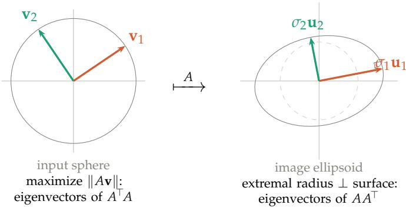  
Figure 5: Two proofs, two ends of the map. $L e f t { \mathrm { . } }$ the input-side construction of $\ S \ S 2 \mathrm { - } 2 . 5 \mathrm { ~ - ~ }$ maximize $\| A \mathbf { v } \|$ over the sphere, landing on the eigenvectors $\mathbf { v } _ { i }$ of $A ^ { \mathsf { T } } A$ . Right: the output-side construction — the ellipsoid’s axes are its extremal radii, where the radius meets the surface at a right angle (marked), and these are the eigenvectors $\mathbf { u } _ { i }$ of $A A ^ { \mathsf { T } }$ . The arrow A links the two: $A \mathbf { v } _ { i } = \sigma _ { i } \mathbf { u } _ { i }$ . Same variational instinct — extremize a length — applied at opposite ends.

Why the axes are eigenvectors of $A A ^ { \mathsf { T } }$ . An axis of the ellipsoid is a direction of extremal radius, and at the tip of an axis the boundary is perpendicular to the radius (Figure 5, right) — slide along the surface anywhere else and the distance to the center changes to first order, so only there is the length stationary. Written in the output variable $\mathbf { y } = A \mathbf { x } ,$ the constraint $\| \mathbf { x } \| = 1$ becomes $\mathbf { y } ^ { \mathsf { T } } ( A A ^ { \mathsf { T } } ) ^ { - 1 } \mathbf { y } = 1$ : the ellipsoid is the level set of the quadratic form $( A A ^ { \mathsf { T } } ) ^ { - 1 }$ , and the axes of such a form are its eigenvectors. So the ellipsoid’s axes are the eigenvectors of $A A ^ { \mathsf { T } }$ — the output-space companion of $A ^ { \mathsf { T } } A$

The mirror computation. With the $\mathbf { u } _ { i }$ eigenvectors of $A A ^ { \mathsf { T } }$ , the preimages $\mathbf { v } _ { i } = A ^ { - 1 } ( \sigma _ { i } \mathbf { u } _ { i } )$ satisfy, for $i \neq j ,$

$$
\langle { \bf v } _ { i } , { \bf v } _ { j } \rangle = \sigma _ { i } \sigma _ { j } \langle A ^ { - 1 } { \bf u } _ { i } , A ^ { - 1 } { \bf u } _ { j } \rangle = \sigma _ { i } \sigma _ { j } { \bf u } _ { i } ^ { \top } ( A A ^ { \top } ) ^ { - 1 } { \bf u } _ { j } = \frac { \sigma _ { i } \sigma _ { j } } { \lambda _ { j } } \langle { \bf u } _ { i } , { \bf u } _ { j } \rangle = 0 ,\tag{Eq 2.40}
$$

using $( A ^ { - 1 } ) ^ { \mathsf { T } } A ^ { - 1 } = ( A A ^ { \mathsf { T } } ) ^ { - 1 }$ and $( A A ^ { \mathsf { T } } ) ^ { - 1 } \mathbf { u } _ { j } = \lambda _ { j } ^ { - 1 } \mathbf { u } _ { j }$ with $\lambda _ { j } = \sigma _ { j } ^ { 2 } ;$ the final zero is orthogonality of distinct eigenvectors of the symmetric matrix $A A ^ { \mathsf { T } }$ . The same substitution with $i = j$ gives $\left\| \mathbf { v } _ { i } \right\| = 1$ . The preimages of the axes are orthonormal — proved, this time, without a single derivative, by borrowing the spectral theorem in the output space rather than building it in the input space.<sup>2</sup>

One decomposition, two spectra. The two proofs are mirror images across the map (Figure 6). The input-side proof diagonalizes $A ^ { \mathsf { T } } A _ { \mathsf { - } }$ , an n $\times ~ n$ matrix living in the domain, and produces $V ;$ the output-side proof diagonalizes $A A ^ { \mathsf { T } }$ , an $m \times m$ matrix living in the codomain, and produces U. These two matrices are different — different sizes, even — but they share their nonzero eigenvalues, the squared singular values $\sigma _ { i } ^ { 2 } ,$ , because both measure the same stretches. The singular value decomposition is precisely the statement that their eigenframes are compatible: not two unrelated diagonalizations, but two ends of a single map welded together by $A \mathbf { v } _ { i } =$ $\sigma _ { i } \mathbf { u } _ { i }$

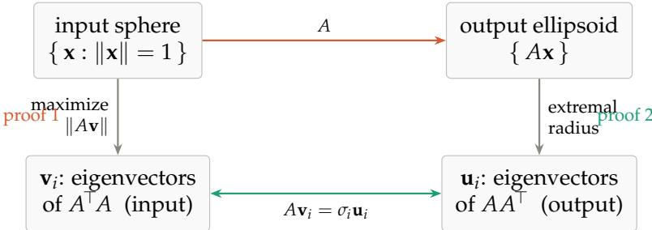  
Figure 6: The two proofs as one square. Down the left, the input-side construction lands on the eigenvectors of $A ^ { \mathsf { T } } A ;$ down the right, the output-side construction lands on the eigenvectors of $A A ^ { \mathsf { T } }$ Across the top, A carries sphere to ellipsoid; across the bottom, $A \mathbf { v } _ { i } = \sigma _ { i } \mathbf { u } _ { i }$ identifies the two frames as the same decomposition seen from opposite corners. The SVD is the square commuting.

This is why the article kept only one of the two: they are the same content, and the input side is where the frame can be discovered rather than merely verified — you can rotate it and watch the crossing happen. The output side, elegant as it is, assumes the axes are already in hand. Kept together, they say that whichever end you grip the map by, the same orthonormal frame is waiting.

## 3 Naming the pieces

Write $\mathbf { v } _ { 1 } , \ldots , \mathbf { v } _ { n }$ for that special input frame — the right singular vectors. Their images are orthogonal but not unit length, so factor out the lengths:

$$
A \mathbf { v } _ { i } \ = \ \sigma _ { i } \mathbf { u } _ { i } , \qquad \sigma _ { i } = \| A \mathbf { v } _ { i } \| \geq 0 , \qquad \left\| \mathbf { u } _ { i } \right\| = 1 .\tag{Eq 3.1}
$$

The $\sigma _ { i }$ are the singular values and the $\mathbf { u } _ { i }$ are the left singular vectors.

Before collecting these into a formula, it is worth seeing what they say about A as a map. The $\mathbf { v } _ { i }$ are an orthonormal basis of the input space, so any input x has an expansion $\begin{array} { r } { \mathbf { x } = c _ { 1 } \mathbf { v } _ { 1 } + } \end{array}$ $\cdots + c _ { n } \mathbf { v } _ { n }$ , where $c _ { i } = \langle \mathbf { x } , \mathbf { v } _ { i } \rangle$ is simply the coordinate of x along $\mathbf { v } _ { i } .$ Apply A and use linearity together with $A \mathbf { v } _ { i } = \sigma _ { i } \mathbf { u } _ { i }$

$$
A \mathbf { x } = c _ { 1 } ( A \mathbf { v } _ { 1 } ) + \cdot \cdot \cdot + c _ { n } ( A \mathbf { v } _ { n } ) = \sigma _ { 1 } c _ { 1 } \mathbf { u } _ { 1 } + \cdot \cdot \cdot + \sigma _ { n } c _ { n } \mathbf { u } _ { n } .\tag{Eq 3.2}
$$

Read that off slowly. A takes the coordinate of x along each input axis $\mathbf { v } _ { i } ,$ scales it by $\sigma _ { i } ,$ and lays the result down along the matching output axis $\mathbf { u } _ { i } .$ The coordinates that ${ } ^ { \mathrm { g o } }$ in are the coordinates that come out — only the axis labels change, $\mathbf { v } _ { i } \mapsto \mathbf { u } _ { i } ,$ and each is stretched by its own $\sigma _ { i }$ . In these two bases the map is diagonal: whatever tangle A shows in the standard basis, in the right input frame and the right output frame it does nothing more complicated than scale each axis. Bundle this action into matrices $- V ^ { \mathsf { T } }$ reads out the input coordinates, Σ scales them, U writes them along the output axes — and it is a factorization:

$$
A = U \Sigma V ^ { \mathsf { T } }\tag{Eq 3.3}
$$

The construction of §§2–2.5 has, without announcing it, proved that such a frame always exists — so the factorization is not a lucky feature of some matrices but a theorem about all of them, worth stating plainly.

Singular value decomposition. Every real m × n matrix A factors as

$$
\boldsymbol { A } = \boldsymbol { U \Sigma V } ^ { \top } ,
$$

with $U \in \mathbb { R } ^ { m \times m }$ and $V \in \mathbb { R } ^ { n \times n }$ orthogonal, and $\Sigma \in \mathbb { R } ^ { m \times n }$ “diagona $\prime \prime - \Sigma _ { i i } = \sigma _ { i } \geq 0$ and all other entries zero. The columns of V are the right singular vectors, the columns of U the left singular vectors, and the $\sigma _ { i }$ the singular values. Taking $\sigma _ { 1 } \geq \sigma _ { 2 } \geq \cdot \cdot \cdot \geq 0 ,$ , the singular values are uniquely determined by A; the vectors U, V are determined $\boldsymbol { u p }$ to the freedoms catalogued in §6.

The names left and right are positional — U sits on the left of the product, V on the right — and carry no deeper meaning.

Note the asymmetry in how the two frames arise. V is chosen; U is a consequence. We select the input frame by a property it has (its images are orthogonal), and the output frame is then whatever we happen to land on.

## Four ways to say the same thing

The right singular vectors admit several characterizations, all equivalent:

Geometric. The orthonormal input frame whose images stay orthogonal. Every other orthonormal frame comes out skewed.

Metric. The frame that lands on the principal axes of the image ellipsoid (§4), with $\sigma _ { i }$ the semiaxis lengths.

Variational. The frame obtained by greedy maximization: $\mathbf { v } _ { 1 } = \operatorname { a r g m a x } _ { \| v \| = 1 } \left\| A v \right\|$ , then $\mathbf { v } _ { 2 }$ the same among unit vectors orthogonal to $\mathbf { v } _ { 1 }$ , and so on.

Algebraic. The eigenvectors of $A ^ { \mathsf { T } } A$

The first is the one to keep in your head; the last is the one you compute with. Symmetrically, the left singular vectors are the eigenvectors of $A A ^ { \mathsf { T } }$ . Since $A ^ { \mathsf { T } } A$ and $A A ^ { \mathsf { T } }$ share the same nonzero eigenvalues $\sigma _ { i } ^ { 2 } ,$ , one Σ serves both frames.

## 4 The ellipsoid

Let $S ^ { n - 1 } = \left\{ v \in \mathbb { R } ^ { n } : \| v \| = 1 \right\}$ be the unit sphere in the input space. Its image $A ( S ^ { n - 1 } )$ is an ellipsoid. To see this, write v in the V-basis as $\boldsymbol { v } = \sum c _ { i } \mathbf { v } _ { i }$ with $\textstyle \sum c _ { i } ^ { 2 } = 1$ . Then $\begin{array} { r } { A v = \sum c _ { i } \sigma _ { i } \mathbf { u } _ { i } , } \end{array}$ , so the image point has coordinate $y _ { i } = \sigma _ { i } c _ { i }$ along $\mathbf { u } _ { i } ,$ and the constraint becomes

$$
\sum _ { i } { \frac { y _ { i } ^ { 2 } } { \sigma _ { i } ^ { 2 } } } \ = \ 1 ,\tag{Eq 4.1}
$$

the standard ellipsoid equation in u-coordinates. The $\mathbf { u } _ { i }$ are the axis directions; the $\sigma _ { i }$ are the axis lengths. Neither alone describes the ellipsoid — you need both.

This gives the reading of the factorization as a sequence of three motions. Right to left in $U { \boldsymbol { \Sigma } } V ^ { \mathsf { T } }$ :

```perl
$V ^ { \mathsf { T } }$ rotate the input so that $\mathbf { v } _ { i }$ lands on the ith coordinate axis
$\Sigma$ stretch axis i by $\sigma _ { i }$
U rotate so that the coordinate axes land on the $\mathbf { u } _ { i }$
```

Every linear map is a rotation, then an axis-aligned scaling, then another rotation. A shear does not look like that — it looks like sliding — but it is one, and the SVD is the change of viewpoint that reveals it.

## Degenerate cases

The word “ellipsoid” must be read loosely. If some $\sigma _ { i } = 0$ the ellipsoid is flattened in that direction. If $m > n$ it is a lower-dimensional ellipsoid embedded in a larger space. If $m \ : < \ : n$ the sphere maps onto the solid ellipsoid, not just its surface, because vectors with a kernel component land strictly inside.

The statement that covers every case at once: for A of rank $r ,$

A maps the unit sphere of the row space bijectively onto an (r−1)-dimensional ellipsoid surface in the column space, with semi-axes $\sigma _ { 1 } , \ldots , \sigma _ { r }$ along $\mathbf { u } _ { 1 } , \ldots , \mathbf { u } _ { r }$ . The kernel is crushed to zero; the cokernel is never reached.

This is the four-fundamental-subspaces picture with metric information attached. The SVD says A is an isomorphism from row space to column space, and diagonalizes it. Explicitly, with $r = \operatorname { r a n k } A$

$$
\underbrace { \mathbf { v } _ { 1 } \ldots \mathbf { v } _ { r } } _ { \mathrm { r o w ~ s p a c e } } , \quad \underbrace { \mathbf { v } _ { r + 1 } \ldots \mathbf { v } _ { n } } _ { \mathrm { k e r } A } , \quad \underbrace { \mathbf { u } _ { 1 } \ldots \mathbf { u } _ { r } } _ { \mathrm { c o l u m n s p a c e } } , \quad \underbrace { \mathbf { u } _ { r + 1 } \ldots \mathbf { u } _ { m } } _ { \mathrm { c o k e r } A } .\tag{Eq 4.2}
$$

## 5 A worked example

Take

$$
A = \left( \begin{array} { c c } { { 2 } } & { { 1 } } \\ { { - 0 . 5 } } & { { 1 . 5 } } \end{array} \right) ,\tag{Eq 5.1}
$$

a matrix with no special structure — not symmetric, not a multiple of a rotation. Its Gram matrix is

$$
A ^ { \mathsf { T } } A = { \binom { 4 . 2 5 \quad 1 . 2 5 } { 1 . 2 5 } } ,\tag{Eq 5.2}
$$

whose off-diagonal entry is nonzero, so the standard basis is not the frame we want. Feeding $a = 2 , b = 1 , c = - 0 . 5 , d = 1 . 5$ into the closed form of §2.2,

$$
\begin{array} { r } { f ( \theta ) = 1 . 2 5 \cos 2 \theta - 0 . 5 \sin 2 \theta , } \end{array}\tag{Eq 5.3}
$$

with amplitude $R = 1 . 3 4 6 3$ and phase $\varphi = - 2 1 . 8 0 ^ { \circ }$ . The roots $\theta = ( \varphi \pm 9 0 ^ { \circ } ) / 2$ land at $3 4 . 1 0 ^ { \circ }$ and $- 5 5 . 9 0 ^ { \circ }$ — the crossings marked in Figure 2. Taking the first,

$$
\mathbf { v } _ { 1 } = ( 0 . 8 2 8 1 , 0 . 5 6 0 6 ) , \qquad \mathbf { v } _ { 2 } = ( - 0 . 5 6 0 6 , 0 . 8 2 8 1 ) ,\tag{Eq 5.4}
$$

and the images are

$$
A \mathbf { v } _ { 1 } = ( 2 . 2 1 6 8 , 0 . 4 2 6 9 ) , \qquad A \mathbf { v } _ { 2 } = ( - 0 . 2 9 3 2 , 1 . 5 2 2 4 ) .\tag{Eq 5.5}
$$

Their inner product is $( 2 . 2 1 6 8 ) ( - 0 . 2 9 3 2 ) + ( 0 . 4 2 6 9 ) ( 1 . 5 2 2 4 ) = 0 ,$ , as promised. Their lengths are the singular values,

$$
\sigma _ { 1 } = 2 . 2 5 7 5 , \qquad \sigma _ { 2 } = 1 . 5 5 0 4 ,\tag{Eq 5.6}
$$

and normalizing gives $\mathbf { u } _ { 1 } = ( 0 . 9 8 2 0 , 0 . 1 8 9 1 )$ and $\mathbf { u } _ { 2 } = \left( - 0 . 1 8 9 1 , 0 . 9 8 2 0 \right)$ . As a check, $\sigma _ { 1 } \sigma _ { 2 } =$ $3 . 5 = \operatorname* { d e t } A$

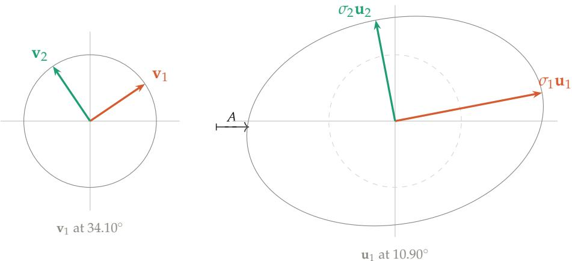  
Figure 7: The unit circle and its image. The frame $\mathbf { v } _ { 1 } , \mathbf { v } _ { 2 }$ at $3 4 . 1 0 ^ { \circ }$ is the one whose images stay perpendicular; those images land on the ellipse’s axes, with lengths $\sigma _ { 1 } = 2 . 2 5 7 5$ and $\sigma _ { 2 } = 1 . 5 5 0 4 $ The input frame sits at $3 4 . 1 0 ^ { \circ }$ and the output frame at $1 0 . 9 0 ^ { \circ } \colon$ : a gap of $2 3 . 2 0 ^ { \circ }$ . The two panels are diferent copies of $\mathbb { R } ^ { 2 } ;$ ; the only link between them is the pairing $\mathbf { v } _ { i } \mapsto \sigma _ { i } \mathbf { u } _ { i }$

That gap of $2 3 . 2 0 ^ { \circ }$ between the frames is the rotation $U V ^ { \mathsf { T } }$ . Since $\operatorname* { d e t } ( U V ^ { \mathsf { T } } ) = + 1$ it is a genuine rotation, not a reflection. For a generic matrix it is nonzero and bears no relation to anything else about A: knowing V tells you nothing about U without passing through A.

## 5.1 An aside: the shear

The virtue of an arbitrary matrix is that it has no structure to mislead. The vice is that nobody has any prior expectation about it, so the SVD’s claim — this is a rotation, a stretch, and a rotation — is unsurprising.

For that, the shear is better:

$$
A = { \binom { 1 } { 0 } } \ 1 ) .\tag{Eq 5.7}
$$

It slides every point rightward by an amount equal to its height. Sliding does not look like rotate–stretch–rotate. But

$$
A ^ { \mathsf { T } } A = { \binom { 1 } { 1 } } \ \mathbf { \Sigma } _ { 2 } ^ { 1 } { \Big ) } , \qquad \lambda = { \frac { 3 \pm { \sqrt { 5 } } } { 2 } } , \qquad \sigma _ { 1 } = 1 . 6 1 8 0 , \quad \sigma _ { 2 } = 0 . 6 1 8 0 ,\tag{Eq 5.8}
$$

the golden ratio and its reciprocal, with $\sigma _ { 1 } \sigma _ { 2 } = 1 = \operatorname* { d e t } A$ . The frames sit at $\mathbf { v } _ { 1 } \colon 5 8 . 2 8 ^ { \circ }$ and $\mathbf { u } _ { 1 } \mathbf { : }$ $3 1 . 7 2 ^ { \circ }$ , differing by a rotation of $2 6 . 5 7 ^ { \circ }$ . So the shear is a rotate–stretch–rotate, and the SVD is the change of viewpoint that reveals it.

Why 58 $. 2 8 ^ { \circ } ?$ The shear pushes points rightward in proportion to height. A frame sitting in the first quadrant has both arms up high, so both get pushed right and they rotate toward each other: the angle closes, $f > 0$ . A frame straddling the vertical has one arm high-right and one high-left; pushing both rightward separates them and the angle opens, $f < 0 .$ . At $5 8 . 2 8 ^ { \circ }$ the two effects balance. The right angle sits at the fulcrum and comes through intact.

<table><tr><td></td><td> $\sigma _ { 1 }$ </td><td> $\sigma _ { 2 }$ </td><td> $\mathbf { v } _ { 1 }$  angle</td><td> $\mathbf { u } _ { 1 }$  angle</td><td> $U V ^ { \mathsf { T } }$  gap</td></tr><tr><td>Generic  $\left( \begin{array} { c } { { 2 } } \\ { { - 0 . 5 1 . 5 } } \end{array} \right)$ </td><td>2.2575</td><td>1.5504</td><td> $3 4 . 1 0 ^ { \circ }$ </td><td> $1 0 . 9 0 ^ { \circ }$ </td><td> $2 3 . 2 0 ^ { \circ }$ </td></tr><tr><td>Shear  $\left( ^ { 1 \dot { 1 } } _ { 0 } \right)$ </td><td>1.6180</td><td>0.6180</td><td> $5 8 . 2 8 ^ { \circ }$ </td><td> $3 1 . 7 2 ^ { \circ }$ </td><td> $2 6 . 5 7 ^ { \circ }$ </td></tr></table>

Table 1: Neither matrix has aligned frames; both rotate by roughly $2 5 ^ { \circ }$ between input and output. Alignment $U = V$ would require A symmetric positive definite $( \ S 7 )$ , and neither matrix is symmetric.

One caution about the shear, which is why it is an aside rather than the main example. Its $\mathbf { u } _ { 1 } = ( 0 . 8 5 0 7 , 0 . 5 2 5 7 )$ is exactly $\mathbf { v } _ { 1 } = ( 0 . 5 2 5 7 , 0 . 8 5 0 7 )$ with the coordinates swapped, and the two angles sum to $9 0 ^ { \circ }$ . That is an artifact: the shear is persymmetric (symmetric about its antidiagonal), which forces the relation. It is easy to mistake this tidiness for alignment, or for a general fact. It is neither. The generic matrix above has no such pattern, and it is the honest picture.

## 6 Can you choose the frame? Uniqueness and freedom

A natural question tests how much the construction really pins down: given $A ,$ could you pick any orthonormal basis V of the input space and find a matching orthonormal U and some diagonal $\Sigma ^ { \prime }$ with $A = U \Sigma ^ { \prime } V ^ { \mathsf { T } } ?$ Perhaps the freedom to choose $\Sigma ^ { \prime }$ buys enough slack.

No. Requiring $A V = U \Sigma ^ { \prime }$ says precisely that $A \mathbf { v } _ { 1 } , \ldots , A \mathbf { v } _ { n }$ are mutually orthogonal — and the $\sigma _ { i } ^ { \prime }$ are then forced to be the norms $\| A \mathbf { v } _ { i } \|$ , not chosen. The freedom in $\Sigma ^ { \prime }$ is illusory; the orthogonality of the images is the entire constraint, and it is the same constraint $f ( \theta ) = 0$ from §2.2. In the plane this is exactly what Figure 2 shows: of the continuum of frames, two crossings, describing one.

The count confirms it in any dimension, and the same count will measure the leftover freedom in a moment, so it is worth doing once. $\mathrm { A n }$ orthonormal frame V in R<sup>n</sup> has $n { \left( n - 1 \right) } / 2$ degrees of freedom — build it column by column: $\mathbf { v } _ { 1 }$ is any unit vector $( n - 1$ parameters), v<sub>2</sub> any unit vector orthogonal to it $( n - 2 )$ , and so on, giving $( n - 1 ) + ( n - 2 ) + \cdots + 0 = n ( n - 1 ) / 2 .$ (For $n = 2$ this is $^ { 1 , }$ a single angle; for $n = 3 { \mathrm { i t } } { \mathrm { i s } } 3 ,$ the Euler angles.) Requiring the n images to be pairwise orthogonal imposes one equation per pair, again $n ( n - 1 ) / 2$ . Constraints exactly consume parameters, so the solution set is generically discrete — finitely many sign and permutation variants of one frame, not a continuum. Equivalently, $A ^ { \mathsf { T } } A = \check { V } \Sigma ^ { \prime 2 } V ^ { \check { \mathsf { T } } }$ forces V to be an eigenbasis of the symmetric $A ^ { \mathsf { T } } A$ , and eigenbases are rigid.

The one exception. When $A ^ { \mathsf { T } } A = \sigma ^ { 2 } I - A$ a scalar multiple of an orthogonal matrix — every direction stretches equally, every orthonormal V works, and $U = A V / \sigma .$ . The image of the sphere is a sphere, so no direction is distinguished. This is worth stating as a principle: the content $o f$ the $S \bar { V } D$ is anisotropy. The decomposition earns its keep exactly when the singular values differ; the ratio $\sigma _ { 1 } / \sigma _ { n }$ is the eccentricity of the image ellipsoid, and also the condition number.

## Exactly what freedom remains

So V is forced — but not completely. The singular values are rigid (with the descending convention $\sigma _ { 1 } \geq \cdot \cdot \cdot \geq \sigma _ { r } > 0$ they are uniquely determined by A), yet the frames retain a sliver of freedom, and it is worth naming precisely what:

1. Sign. For a simple singular value, ${ \bf u } _ { i }  - { \bf u } _ { i }$ and $\mathbf { v } _ { i }  - \mathbf { v } _ { i }$ together. The coupling is essential: you cannot flip one without the other, since $A = U \Sigma V ^ { \mathsf { T } }$ must be preserved.

2. Repeated singular values. If $\sigma _ { i }$ has multiplicity k, the corresponding k-dimensional subspaces of U and V can be rotated by any $k \times k$ orthogonal matrix — applied to both. (This is the exception above, localized to one repeated value instead of all of them.)

3. Zero singular values. The columns of U spanning coker(A) and of V spanning ker(A) are arbitrary orthonormal bases of those subspaces, independent of each other.

4. Ordering, if the descending convention is dropped.

Claim. For A of full rank with distinct singular values, the (thin) SVD is unique up to the signs in item 1.

That is the whole of it: the stretches are pinned exactly, the frames up to signs, with extra room only where a singular value repeats or vanishes.

A reparametrization, not a compression. Stepping back, the SVD of an $n \times n$ matrix supplies

$$
\underbrace { \frac { n ( n - 1 ) } { 2 } } _ { V } + \underbrace { n } _ { \Sigma } + \underbrace { \frac { n ( n - 1 ) } { 2 } } _ { U } = n ^ { 2 }\tag{Eq 6.1}
$$

numbers — exactly the $n ^ { 2 }$ entries it started with. The information is rearranged from “what each column does” into “(input frame, stretches, output frame)”, and that arrangement is where the geometry lives.

U and V are independent. One consequence of the count deserves emphasis. Pick any orthogonal U, any orthogonal V, any nonnegative diagonal Σ: then $A = U \dot { \Sigma } V ^ { \top }$ is a matrix with exactly that SVD. Nothing couples the two frames. Going backwards from a given A, they are determined but generally unrelated — you cannot infer one from the other without passing through A. This is precisely why the SVD carries more information than a single eigenbasis: two independent frames rather than one.

## 7 Relation to eigenvalues and eigenvectors

For a general square matrix, the two decompositions are largely unrelated.

$$
A = { \binom { 0 } { 0 } } \ 1  ) : \quad \lambda = 0 , 0 \quad { \mathrm { b u t } } \quad \sigma = 1 , 0 .\tag{Eq 7.1}
$$

$$
A = { \left( \begin{array} { l l } { 1 } & { t } \\ { 0 } & { 1 } \end{array} \right) } : \quad \lambda = 1 , 1 { \mathrm { ~ f o r ~ a l l ~ } } t , \quad { \mathrm { b u t } } \quad \sigma _ { 1 } \to \infty { \mathrm { ~ a s ~ } } t \to \infty .\tag{Eq 7.2}
$$

The structural difference: singular vectors are always orthonormal and always exist in full; eigenvectors need not be orthogonal, and a defective matrix does not have a complete set. Eigenvectors live in one space and map to themselves; singular vectors come in coupled pairs across two spaces. That is the fundamental distinction — eigendecomposition uses one basis, SVD pairs two.

What does hold.

$\Pi \left| \lambda _ { i } \right| = \Pi \sigma _ { i } = | \operatorname* { d e t } A | .$

$\sigma _ { \mathrm { m i n } } \le | \lambda _ { i } | \le \sigma _ { \mathrm { m a x } }$ for every eigenvalue; in particular the spectral radius satisfies $\rho ( A ) \leq$ $\sigma _ { \mathrm { m a x } } = \| A \| _ { 2 } .$

• Weyl: $\textstyle \prod _ { i = 1 } ^ { k } | \lambda _ { i } | \leq \prod _ { i = 1 } ^ { k } \sigma _ { i }$ for each $k ,$ with equality at $k = n$

• Yamamoto: $\begin{array} { r } { \operatorname* { l i m } _ { k \to \infty } \sigma _ { i } ( A ^ { k } ) ^ { 1 / k } = | \lambda _ { i } | } \end{array}$

When they coincide.

• Normal A (i.e. $A ^ { \mathsf { T } } A = A A ^ { \mathsf { T } } ) \colon \sigma _ { i } = | \lambda _ { i } |$ , and the eigenbasis is orthonormal, so $\mathbf { v } _ { i }$ are the eigenvectors and $\mathbf { u } _ { i } = \pm \mathbf { v } _ { i }$

• Symmetric positive semidefinite: $\sigma _ { i } = \lambda _ { i }$ and $U = V$ . The two decompositions are literally identical.

• Symmetric indefinite: $\sigma _ { i } = | \lambda _ { i } |$ , and U and V differ by sign flips on the negative eigendirections.

So $U = V$ characterizes symmetric positive semidefinite matrices. Neither example in this note is symmetric, which is why neither has aligned frames.

A caveat on the normal case: eigenvalues ±3 in a symmetric matrix give a repeated singular value $\sigma = 3 ,$ , so the SVD acquires rotation freedom in that subspace that the eigendecomposition does not have. The eigendecomposition can be strictly more rigid.

## 8 Polar decomposition

The gap between the input frame V and the output frame U has come up more than once. Figure 7 showed it as a concrete angle — the $2 3 . 2 0 ^ { \circ }$ by which the running example’s frames differ — and §6 made the general point that U and V are independent, so this gap is real information, not an artifact. It is worth isolating that gap as a single object, and the SVD does it with one regrouping.

Start from $A = U \Sigma V ^ { \mathsf { T } }$ and insert $V ^ { \mathsf { T } } V = I$ between two copies of the frames:

$$
A = U \Sigma V ^ { \mathsf { T } } = U ( V ^ { \mathsf { T } } V ) \Sigma V ^ { \mathsf { T } } = ( U V ^ { \mathsf { T } } ) ( V \Sigma V ^ { \mathsf { T } } ) .\tag{Eq 8.1}
$$

Name the two factors $Q = U V ^ { \mathsf { T } }$ and $P = V \Sigma V ^ { \mathsf { T } }$ . Then

$$
A = Q P ,\tag{Eq 8.2}
$$

the polar decomposition. Each factor is exactly what its construction makes it: $Q = U V ^ { \mathsf { T } }$ is orthogonal (a product of orthogonal matrices), and it is precisely the rotation that carries $V ^ { \prime } { \bf s }$ frame onto $U ^ { \prime } \mathrm { s }$ — the gap itself, named. $P = V \Sigma V ^ { \mathsf { T } }$ is symmetric positive semidefinite, a pure stretch along $V ^ { \prime } { \bf s }$ axes by the factors $\sigma _ { i } ,$ , with no rotation left in it.

So every matrix is a stretch followed by a rotation: P deforms the input along the right singular directions, and Q then swings the result over to the output frame. It is the same content as the SVD — Q and P are built from U, Σ, V — repackaged to put the rotation in one box and the stretch in another. For the running example Q is the rotation by 23.20<sup>◦</sup> seen in Figure $7 ;$ for the shear it is $2 6 . 5 7 ^ { \circ }$ . The analogy with a complex number $z = r e ^ { i \theta }$ — modulus $r \geq 0$ times a unit phase — is exact and gives the decomposition its name: P is the modulus, Q the phase.

## Part II

## Where the decomposition goes

Part I built the singular value decomposition from the ground up and stopped at the moment it was proved to exist. This part spends it. The SVD — or its symmetric shadow, the eigendecomposition — sits underneath a surprising share of modern data analysis and machine learning, and the sections below trace five of those connections. Each states plainly what the decomposition does supply and, just as plainly, where its contribution stops and some other idea takes over; the honesty is part of the point, because “the SVD is everywhere” is less useful than knowing exactly which part of a method it is responsible for.

One thing is worth watching for as they go by. In several of these connections it is not the result of a Part I proof that reappears but the proof itself — the argument, run as a procedure. The construction that found the frame becomes an algorithm that computes it; the lemma that characterized the maximizer becomes the rule that tells an optimizer when to stop. Where that happens it is flagged, and left to speak for itself.

## 9 Where this leads: principal component analysis

If you have ever run principal component analysis, reduced the dimension of a dataset, or called a low-rank approximation, you have used the object this article has been building — though probably without the picture. Here is the connection, in one step.

Let A be a data matrix: n rows, one per observation, and p columns, one per feature, with each column centered to have mean zero. Then the $p \times p$ matrix

$$
{ \frac { 1 } { n - 1 } } A ^ { \mathsf { T } } A\tag{Eq 9.1}
$$

is exactly the sample covariance matrix of the features — its $( i , j )$ entry is the covariance of feature i with feature $j ,$ because centering makes the column inner products into covariances. But $A ^ { \mathsf { T } } A$ is the very matrix whose eigenvectors are the right singular vectors of A (§2.5). So the right singular vectors $\mathbf { v } _ { 1 } , \mathbf { v } _ { 2 } , \ldots$ . are the eigenvectors of the covariance — the principal components, the orthogonal directions of greatest variance in the data. And the singular values give the variances outright: the spread of the data along $\mathbf { v } _ { i }$ is

$$
{ \frac { \sigma _ { i } ^ { 2 } } { n - 1 } } ,\tag{Eq 9.2}
$$

so the largest singular value marks the direction of most variance, the next the most among directions orthogonal to it, and so on — which is precisely the greedy description of the frame from §2.4, now read as a statement about data.

The geometry carries over intact. The ellipsoid this article has drawn since §1 — the image of the unit sphere under $A \mathrm { ~ - ~ } \mathrm { i s } ,$ for a data matrix, the shape of the data cloud itself, and its axes are the principal axes. Finding the perpendicular frame that maps to those axes, the whole problem the article set out to solve, is finding the principal components. PCA is not an application of the SVD so much as the same picture wearing the clothes of statistics.

## 10 Kernel methods: the two Gram matrices

§2.6 noticed that a matrix A carries two symmetric companions: $A ^ { \mathsf { T } } A ,$ , living in the input space, and $A A ^ { \mathsf { T } }$ , living in the output space, sharing their nonzero eigenvalues $\sigma _ { i } ^ { 2 } .$ . That duality is not a curiosity — it is the engine of the kernel trick, the idea that lets a method reach into a vast feature space while computing only in a small one.

Suppose each data point x is lifted into a high-dimensional feature vector $\phi ( \mathbf { x } )$ , and stack these as the rows of a matrix Φ: n points (rows), d features (columns), with d possibly enormous. Principal component analysis in feature space wants the eigenvectors of the $d \times d$ matrix $\Phi ^ { \mathsf { T } }$ Φ — unusable if d is a million, or infinite. But the duality says the eigenvalues are shared with the $n \times n$ matrix

$$
K = \Phi \Phi ^ { \mathsf { T } } , \qquad K _ { i j } = \langle \phi ( \mathbf { x } _ { i } ) , \phi ( \mathbf { x } _ { j } ) \rangle ,\tag{Eq 10.1}
$$

whose entries are just the pairwise inner products of the lifted points, and whose eigenvectors map to the feature-space ones through Φ. So one diagonalizes the $n \times n$ matrix instead of the d × d one — kernel PCA — and never touches the giant feature space directly. When there are fewer samples than features, this is the difference between possible and impossible.

Notice what kernel PCA is really doing: it is running the proof of the duality, not merely quoting its conclusion. §2.6 did not just observe that $\Phi ^ { \dagger }$ Φ and $\dot { \Phi } \Phi ^ { \top }$ share a spectrum — it exhibited the map between their eigenframes, carrying an eigenvector of one to an eigenvector of the other by applying $\Phi$ (there, A) and rescaling. Kernel PCA executes exactly that transport: it finds the eigenvectors of the small K and pushes them through Φ to recover the feature-space principal components it could never have computed directly. The argument that proved the two matrices are two ends of one map is, step for step, the algorithm.

Where the SVD’s contribution stops. The duality explains why working with the small matrix K suffices — same spectrum, recoverable eigenvectors. It does not explain the other half of the trick: that the inner product $\left. \phi ( \mathbf { x } _ { i } ) , \phi ( \mathbf { x } _ { j } ) \right.$ can often be computed by a cheap formula $k ( \mathbf { x } _ { i } , \mathbf { x } _ { j } )$ without ever forming ϕ — the Gaussian kernel evaluates an inner product in an infinitedimensional space in one line. That the cheap formula corresponds to a genuine feature space is a separate theorem (Mercer’s, on positive-definite kernels), and it belongs to analysis, not to the linear algebra of Part I. The SVD supplies the dimension-dodge; Mercer supplies the cheap evaluation. Both are needed, and they are different ideas.

## 11 Gradient descent and the power method

Part I found the top singular direction by maximizing $\| A \mathbf { v } \|$ over the unit sphere, and derived the optimality condition $A ^ { \mathsf { T } } A { \mathbf { v } } _ { 1 } = \sigma _ { 1 } ^ { 2 } { \mathbf { v } } _ { 1 }$ . Read that condition again with an optimizer’s eye. The gradient of $\frac { 1 } { 2 } \| A \mathbf { v } \| ^ { 2 }$ is $A ^ { \mathsf { T } } A { \mathbf { v } } ,$ and the eigenvector equation says exactly that this gradient points along ${ \bf v } -$ it has no component tangent to the sphere. There is nowhere left to climb. The eigenvector equation is the stopping condition of gradient ascent, and Part I’s construction was, without saying so, a description of where an optimizer comes to rest.

And it is the same proof, not just the same statement. The heart of Part I’s variational step was the lemma that at the maximizer, $\langle A \mathbf { v } _ { 1 } , A \mathbf { w } \rangle = 0$ for every $\textbf { w } \perp \textbf { v } _ { 1 } -$ the images of all competing directions are orthogonal to $A \mathbf { v } _ { 1 }$ . That is precisely the assertion that the gradient $A ^ { \mathsf { T } } A { \mathsf { v } } _ { 1 }$ has no component along any tangent direction w: the lemma’s “no direction improves the stretch” and the optimizer’s “the gradient is tangentially zero” are one computation written twice. So an optimizer descending this landscape is not merely finding the same answer as Part I — it is re-running the maximality lemma, its every step of not being able to improve corresponding to a step of the proof.

This is not merely an analogy; it is how large singular value decompositions are actually computed. Rather than form $A ^ { \top } A$ and diagonalize it — impossible for a web-scale matrix — one climbs: start from a random $\mathbf { v , }$ repeatedly apply $A ^ { \mathsf { T } } A$ and renormalize (the power method), and the iterate converges to $\mathbf { v } _ { 1 }$ . Peel it off and repeat for $\mathbf { v } _ { 2 } ,$ exactly Part I’s maximize-thenrecurse recursion, now run numerically. The neural version, Oja’s rule, is stochastic gradient ascent on the same objective and was one of the early bridges between optimization and unsupervised learning: a single neuron trained by it extracts the first principal component.

Where the SVD’s contribution stops. That gradient ascent converges to the right answer is not automatic. Maximizing $\| A \mathbf { v } \|$ on the sphere is a non-convex problem with a critical point at every eigenvector; the method finds the global maximum only because the landscape is benign — the non-maximal critical points are saddles the iteration slides off, a property that has to be proved, not assumed. And the fashionable claim that “neural networks do SVD by gradient descent” should be handled with care: it is a precise theorem for deep linear networks, whose training dynamics learn the singular directions of the input–output correlation in order of decreasing $\sigma _ { i }$ (echoing Part I’s descending recursion), but it is not a statement about nonlinear networks in general. The clean connection is to the optimization landscape and the linear case; beyond that it is inspiration, not theorem.

## 12 Low-rank approximation: keeping the largest $\sigma _ { i }$

Truncate the decomposition: keep the k largest singular values and their vectors, discard the rest. The result $\begin{array} { r } { A _ { k } = \sum _ { i = 1 } ^ { k } \sigma _ { i } \mathbf { u } _ { i } \mathbf { v } _ { i } ^ { \top } } \end{array}$ is a rank-k matrix, and the remarkable fact — the Eckart–Young

theorem — is that it is the best rank-k approximation of A there is: no other rank-k matrix comes closer, in either the spectral or the Frobenius norm. The error is exactly the largest discarded singular value,

$$
\operatorname* { m i n } _ { \operatorname { r a n k } ( B ) = k } \| A - B \| _ { 2 } = \| A - A _ { k } \| _ { 2 } = \sigma _ { k + 1 } .\tag{Eq 12.1}
$$

This is Part I’s geometry read as compression: the singular values, sorted, rank the directions of $A$ by importance, so keeping the top few keeps as much of A as any rank-k object can. It is the mathematical core of image compression, noise filtering (small $\sigma _ { i }$ are often noise), latent semantic analysis, recommender-system factorization (users and items as low-rank factors), and the low-rank adapters now used to fine-tune large models. In each, the SVD does not merely offer a compression — it offers the provably optimal one.

Where the SVD’s contribution stops. Optimality is with respect to a particular measure of error — the spectral or Frobenius norm, which weight all entries alike. When the application cares about something else (missing entries, non-negativity, sparsity, a probabilistic likelihood), the plain SVD truncation is no longer the right answer, and its relatives — non-negative matrix factorization, probabilistic PCA, matrix completion — take over. The SVD is optimal for the question “closest rank-k matrix in Euclidean norm,” and knowing that is knowing exactly when to reach for it and when not to.

## 13 Eigenvectors of a graph: PageRank and spectral clustering

The same machinery that finds the axes of an ellipsoid finds structure in a network, once the network is written as a matrix. Two examples, both resting on an eigenvector of a graph.

PageRank ranks web pages by importance, where a page is important if important pages link to it — a circular definition that resolves into an eigenvector equation. Encode the link structure as a column-stochastic matrix P (column j spreads page j’s vote evenly over the pages it links to). The importance vector r is the one unchanged by the process, $P \mathbf { r } = \mathbf { r } \cdot$ the dominant eigenvector of P. And it is found by precisely the power method of §11 — start with uniform importance, apply P repeatedly, converge. PageRank is the maximize-and-settle idea of Part I, run on the web.

Spectral clustering splits data into groups by building a graph of similarities, forming its Laplacian $L = D - W$ (degrees minus weights), and reading off the eigenvector of L with the second-smallest eigenvalue — the Fiedler vector. Its signs partition the graph into two wellseparated pieces. The eigenvector exists, is orthogonal to the trivial all-ones eigenvector, and extremizes a meaningful quantity (it minimizes a relaxed cut) for exactly the reasons Part I laid out: it is the extremal direction of a symmetric matrix.

Where the SVD’s contribution stops. The spectral machinery guarantees that the eigenvectors exist, are orthogonal, and solve an extremal problem — the content of Part I, applied to a graph matrix. What it does not decide is the modeling step that came first: how to turn pages into a stochastic matrix, or similarities into a Laplacian. Those choices — which similarity, which normalization, how many clusters — are where the domain judgment lives, and the eigenvector computation is only as good as the matrix it is handed. The SVD supplies the “how”; the graph construction is the “what,” and it is not the SVD’s to give.

## A pattern in what recurred

Look back at what carried over from Part I. It was rarely a bare fact. The maximize-then-recurse construction reappeared as the power method and as PageRank; the lemma that the maximizer’s gradient vanishes tangentially reappeared as an optimizer’s stopping rule; the proof that two Gram matrices are two ends of one map reappeared as the transport at the center of kernel PCA. In each case the object that transferred was an argument — a sequence of steps first walked to establish that something is true — now walked again to compute it, or to run it. Not every proof came along: the sign-flip that opened Part I, the prettiest argument in it, has no descendant here; it is a way of seeing that the frame exists, not a way of finding it. What the recurrences have in common, and what that one lacks, is left for the reader to weigh.

## 14 Summary

A is completely described by which orthonormal input frame goes to which orthonormal output frame, and by how much each direction stretches. The SVD’s claim is that such frames always exist.

Linearity means any basis determines A — that is not what makes the SVD special. What makes the V-basis special is that in it the action is diagonal: feed in v<sub>3</sub>, get out pure u<sub>3</sub>, scaled. Feed in any other basis and the images tangle together in a way that hides the geometry. Same information, worse presentation.

That was Part I: a frame found by watching an ellipse, a theorem earned rather than assumed. Part II spent it, and the spending revealed the article’s real subject. The maximize-andrecurse construction was not left behind on the page once the SVD was proved — it walked off to become the power method, PageRank, the training of a principal-component neuron. The little lemma about where a stretch is maximal became the condition an optimizer halts on. The observation that $A ^ { \mathsf { T } } A$ and $A A ^ { \mathsf { T } }$ are two ends of one map became the trick that lets a kernel method reach into a space it cannot afford to enter. What looked like an island of geometry — circles, ellipses, a rotating frame — turned out to be the mainland: the structure quietly running tools that a working data scientist uses without a second thought.

The lesson underneath, never argued but repeatedly shown, is that a proof is not only a certificate that something is true. It is a procedure — a route walked once to establish a fact, and available to be walked again to compute it. Understand the route, and you understand the algorithm; and the same understanding recognizes it the next time it appears wearing different clothes. That is the case for meeting a piece of mathematics like this one all the way down to its proofs, rather than importing it as a name and a library call.

## 15 Sources and prior art

None of the mathematics here is new. The contribution, if any, is one of arrangement: a path of discovery assembled from standard pieces, with the powerful theorem placed at the end as a name for what the geometry already built rather than as an assumption at the start. This section says plainly where each piece comes from.

The classical results. The picture of a matrix carrying the unit sphere to an ellipsoid, with the singular values as semi-axis lengths, is the standard geometric introduction to the SVD; it is the opening of Trefethen and Bau’s Numerical Linear Algebra [1], whose Lecture 4 this article’s §4 follows. The variational construction of §2.4 — maximize ∥Av∥, then recurse on the orthogonal complement — is also theirs, and is the proof of existence given in most graduate texts. The route through the spectral theorem applied to A<sup>T</sup> A (§2.5), and the polar decomposition read off from it (§8), are presented exactly this way in Axler’s Linear Algebra Done Right [2], where the SVD appears as a consequence of the spectral theorem and leads directly to the polar form. The computational origin of the subject — how one actually calculates an SVD — is Golub and Kahan [3]; the early history is surveyed by Stewart [4]. The four-fundamental-subspaces framing used in §4 is Strang’s [5].

The closest relative. The organizing conceit of this article — adjust a perpendicular frame until its images are also perpendicular, and that configuration is the SVD — appears, in interactive form, in Heath’s Interactive Educational Modules in Scientific Computing [6, 7]. That module places candidate singular vectors on the image ellipse and lets the reader drag them until the frame is orthogonal in both spaces at once, displaying the resulting U, Σ, V. It is the same equivalence, driven from the image side rather than the domain side, and it stops at two-dimensional visualization: it lets one find the surviving frame but does not argue that one must exist, and does not carry the construction to higher dimensions. The existence argument of §2 and the recursion of §2.4 are what this article adds on top of that shared starting point.

The gap this fills. Tomasi’s widely used notes [8] state the central observation directly — the two pairs of points on the unit circle mapping to the ends of the ellipse’s axes “are always orthogonal” — and then remark that “simple and fundamental as this geometric fact may be, its proof by geometric means is cumbersome,” and prove it algebraically instead. This article is, in effect, the geometric proof Tomasi declines to give: the sign-flip argument of §2.1 is the missing elementary reason the axis-preimages are perpendicular, and the identity dg/dθ = 2f of §2.4 is what ties that perpendicularity to the extremal stretch that the algebraic proofs start from. Neither is deep, and neither is new in substance; but stating them, and staging the whole development so the spectral theorem is earned rather than assumed, is the point of the exercise.

This is not a survey. The literature on the SVD is vast, and the references above are entry points chosen for their relevance to the particular path taken here, not a representative sample of the field.

## References

[1] L. N. Trefethen and D. Bau III, Numerical Linear Algebra, SIAM, Philadelphia, 1997.

[2] S. Axler, Linear Algebra Done Right, 4th ed., Undergraduate Texts in Mathematics, Springer, Cham, 2024.

[3] G. Golub and W. Kahan, Calculating the singular values and pseudo-inverse of a matrix, J. Soc. Indust. Appl. Math. Ser. B: Numer. Anal. 2 (1965), 205–224.

[4] G. W. Stewart, On the early history of the singular value decomposition, SIAM Review 35 (1993), 551–566.