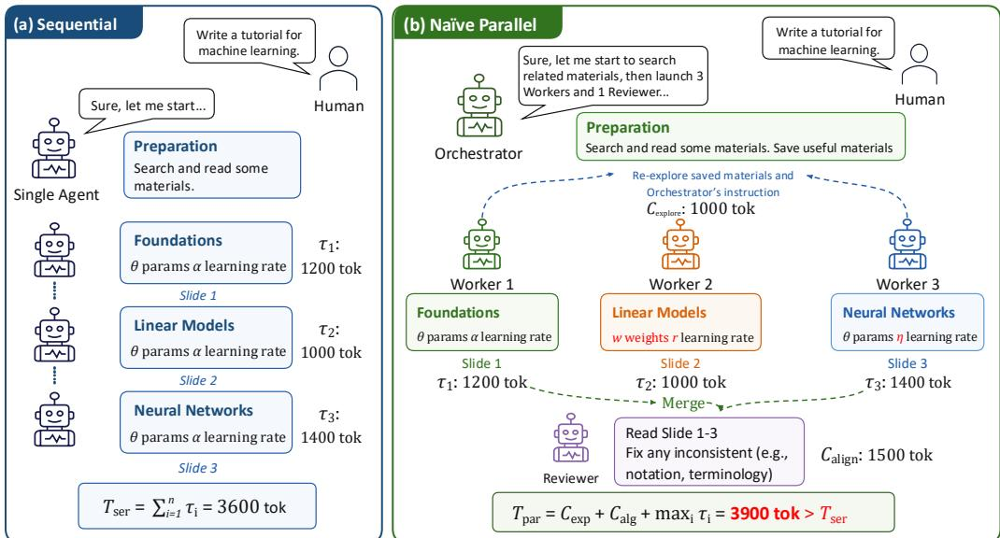
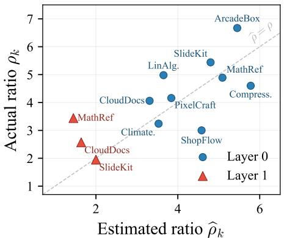
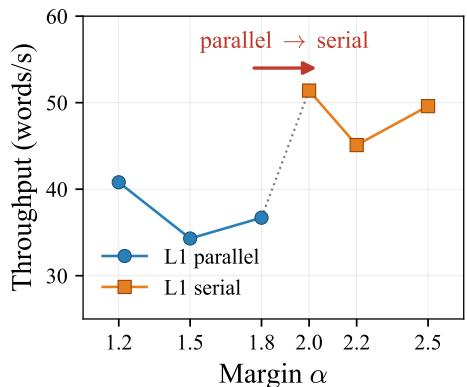

# SquidAgent: Parallelize Wisely, Coordinate Efficiently

Yexiong Lin1 Shanshan Ye2∗ Yu Yao1 Zhen Fang3 Bo Han4 Tongliang Liu1,2

1The University of Sydney 2Mohamed bin Zayed University of Artificial Intelligence 3University of Technology Sydney 4Hong Kong Baptist University

## Abstract

LLM-based agents solve complex multi-step tasks, but sequential execution incurs substantial latency. In principle, parallelizing work across multiple agents should yield near-linear speedups. Yet existing parallel multi-agent systems often run slower than a single-agent baseline. We attribute this gap to two hidden costs that parallel execution incurs but a serial agent avoids. First, there is a re-exploration cost: redundant effort spent by parallel workers reconstructing context that the orchestrator already possesses, such as prior decisions, that would otherwise be inherited implicitly in a serial execution. Second, there is an alignment cost: the overhead required to reconcile inconsistencies across independently generated outputs. We thus derive a principled decision criterion: a layer should be parallelized only when its critical-path cost, plus re-exploration and alignment overheads, is lower than the corresponding serial cost. While this criterion is naturally expressed in wall-clock time, we observe that LLMs are poorly calibrated when asked to estimate task duration. To address this, we instead measure cost in predicted output tokens, which we empirically find LLMs can estimate substantially more reliably than wall-clock time. Building on this token-based criterion, we propose SquidAgent. It estimates all token budgets in a single planning step, forks each worker directly from the orchestrator’s session to eliminate re-exploration cost, and replaces post-hoc reconciliation with a pre-generated shared convention block that converts alignment into a bounded upfront cost. A deterministic scheduler then applies the criterion layer by layer. Empirically, SquidAgent achieves a 2.2× mean throughput improvement and a 2.6× mean wall-time speedup over Claude Code, and a 2.0× throughput improvement over the strongest multi-agent baseline.

## 1 Introduction

LLM-based agent systems are increasingly deployed for complex, multi-step tasks such as software development [Hong et al., 2024, Qian et al., 2024], document authoring, and structured planning. As tasks grow in scale and complexity, a single agent often becomes a bottleneck, motivating the rise of multi-agent systems that coordinate multiple specialized agents to solve a task collaboratively. A common paradigm in these systems is to decompose a high-level user request into a set of subtasks organized as a directed acyclic graph (DAG) [Zhuge et al., 2024, Qian et al., 2025], where edges encode dependencies between subtasks, and assign each subtask to a dedicated agent. This graph-based decomposition has been adopted by a wide range of multi-agent frameworks, from general-purpose conversation platforms [Wu et al., 2024a, Li et al., 2023] to specialized systems for code generation [Niu et al., 2025, Kim et al., 2024] and workflow automation [Zhuge et al., 2024,

  
Figure 1: Comparison of two execution strategies on a task with four subtasks. (a) Sequential: a single agent executes all tasks one by one with no overhead. (b) Naive parallel: workers run concurrently but incur re-exploration cost (orange: orchestrator planning plus per-worker rediscovery of shared context) and alignment cost (red: fixing conflicts between independently produced outputs), making the total time exceed the sequential baseline.

Wu et al., 2024b]. In this work, we focus on the common LLM-agent setting in which an orchestrator delegates subtasks to multiple LLM workers that share the objective of completing the user request.

A key advantage of multi-agent systems is the potential for parallelism. When subtasks at the same DAG layer are independent, multiple worker agents can execute them concurrently, so that wall-clock time is determined by the slowest worker rather than the sum of all tasks. In theory, such parallel execution should provide substantial speedups, and many recent multi-agent systems are built on this premise [Qian et al., 2025, Niu et al., 2025, Kim et al., 2024, Yu et al., 2025].

However, existing parallel multi-agent systems often fail to achieve the expected speedups and can even be slower than their sequential counterparts [Hong et al., 2024, Yao et al., 2025, Xu et al., 2026]. This suggests a fundamental limitation in current execution strategies: they lack an explicit criterion for determining when parallelization is actually worthwhile. Existing methods either rely on fixed execution policies, such as always parallelizing subtasks once explicit dependencies are satisfied [Qian et al., 2025, Niu et al., 2025], or depend on heuristic LLM-based scheduling decisions [Dang et al., 2026, Wang et al., 2026b]. This raises a central question: when is parallel execution truly beneficial for LLM-based multi-agent systems?

We argue that the answer depends on accounting for the hidden costs introduced by parallelization. We identify two such costs that parallelism pays but a sequential agent does not. The first is re-exploration cost: any agent, serial or parallel, must do some exploration to understand a task before solving it, but a serial agent does so once and reuses the resulting context for free, whereas parallel workers have to independently rediscover the same conventions, assumptions, and intermediate decisions before they can begin useful work. Note that this is not generic exploration, it is the redundant portion that exists only because the orchestrator’s planning state cannot be transferred to parallel workers for free. The second is alignment cost: independently generated outputs must be reconciled into a coherent final result, and inconsistencies among workers may require additional correction. These costs arise because LLM-generated DAGs typically capture explicit dependencies among subtasks but overlook implicit dependencies, such as shared naming conventions, formatting choices, or global design decisions, that a single agent would resolve incrementally. Parallel execution is therefore beneficial only when the time saved by concurrency outweighs the additional re-exploration and alignment costs. Figure 1 illustrates this phenomenon on a representative task.

In this paper, we instead propose a parallelization criterion that makes this trade-off explicit and computable before execution. For a group of subtasks, the estimated serial cost is the sum of all subtask costs, while the estimated parallel cost consists of the slowest worker’s execution cost together with the re-exploration and alignment costs. Parallel execution is selected only when the estimated parallel cost is strictly lower than the estimated serial cost. The natural unit for this criterion is wall-clock time, which is what users observe. However, predicting wall-clock time at planning time turns out to be unreliable for two reasons. First, it is backend-dependent (server load, batching, retries). Second, and more fundamentally, LLMs are systematically miscalibrated when asked to estimate their own task duration: they anchor on human-engineering norms (“this looks like a few-day task”) rather than on their own throughput, and their estimates exhibit substantial rank reversals relative to realized execution time, so even the relative ordering of task costs can flip between the estimate and reality. We therefore measure cost in predicted output tokens, a quantity an LLM can estimate well because it is a property of its own next response (the size of the artifact it would write) rather than the duration of an agentic process. For a fixed model and decoding configuration, tokens are emitted at an approximately constant rate, providing a backend-independent proxy for time. Unlike fixed or heuristic policies, this token-cost criterion is an explicit, layer-wise decision rule over the task DAG.

Based on this criterion, we propose SquidAgent, a cost-aware parallel multi-agent framework that realizes token-cost scheduling in practice. SquidAgent first decomposes a user request into a DAG and, in the same planning response, estimates token budgets for both subtask execution and layer-level alignment cost. It then applies the criterion to each topological layer, choosing parallel execution when the estimated parallel cost is lower than the estimated serial cost, and serial execution otherwise. To further reduce the hidden costs themselves, workers fork the orchestrator’s conversation, inheriting global conventions and prior decisions. This reduces redundant reconstruction of the planning context, motivating the operational approximation $C _ { \mathrm { e x p } } \approx 0 .$ . The orchestrator also writes a shared convention block before each parallel layer, reducing subsequent inconsistency and making the upfront planning cost estimable. Code is available at: https://github.com/tmllab/2026\_ NeurIPS\_SquidAgent.

Our main contributions are summarized as follows:

• Hidden-cost analysis of parallel multi-agent execution. We identify two operationally distinct sources of coordination overhead in parallel LLM-agent execution: (i) the re-exploration cost, where parallel workers redundantly reconstruct the orchestrator’s planning context that a serial agent retains implicitly, and (ii) the alignment cost, incurred when independently generated outputs must be reconciled into a globally consistent solution. We show that parallel execution can be counterproductive when these costs outweigh the benefit of concurrency.

• A token-cost criterion for adaptive parallelization. We observe that wall-clock time is the natural optimization target, but is poorly estimated by LLMs due to systematic miscalibration in predicting task duration. We instead use predicted output tokens as a proxy cost, which LLMs can estimate more reliably than wall-clock time as a property of their own responses and which is backend-independent. Based on this, we formalize parallelization as a cost-sensitive scheduling problem and derive a layer-wise criterion comparing (i) predicted serial cost (sum of subtasks) against (ii) predicted parallel cost (critical path plus re-exploration and alignment costs). The criterion is computed before execution and applied per topological layer of the task DAG.

• The SquidAgent framework. We instantiate this criterion in SquidAgent, a parallel multiagent framework for cost-aware execution. Our method (i) estimates token budgets in a single planning pass, (ii) initializes workers from a shared orchestrator state to reduce redundant reexploration, and (iii) writes a shared convention block to reduce alignment cost across parallel workers. Across all nine evaluation tasks, SquidAgent achieves a 2.6× average wall-time speedup and a 2.2× average throughput improvement over Claude Code. It also achieves a 2.0× average throughput improvement over the strongest multi-agent baseline while obtaining the best overall task completion quality.

## 2 Related Work

Multi-agent LLM systems. Multi-agent LLM systems decompose complex tasks into subtasks and solve them through coordinated agents [Guo et al., 2024]. Existing systems differ mainly in how they organize execution. Sequential pipelines, such as MetaGPT [Hong et al., 2024], SeqCV [Yao et al., 2025], and OneFlow [Xu et al., 2026], execute subtasks step by step and preserve global consistency, but they sacrifice parallel speedup. Parallel systems, such as MacNet [Qian et al., 2025], Flow [Niu et al., 2025], and LLMCompiler [Kim et al., 2024], dispatch independent subtasks to concurrent workers, but typically rely on fixed parallelization rules rather than an explicit cost-benefit criterion. Other frameworks, including AutoGen [Wu et al., 2024a], ChatDev [Qian et al., 2024], CAMEL [Li et al., 2023], and AgentVerse [Chen et al., 2024b], provide flexible agent composition, but leave the execution policy largely to the developer. Debate-style systems [Du et al., 2024, Liang et al., 2024, Chan et al., 2024, Chen et al., 2024a] improve answer quality through iterative critique and consensus, which is orthogonal to our focus on execution scheduling. Consensus Matrix explores role-specialized multi-agent collaboration for structured decision-making in visual media workflows [Zhang et al., 2026a]. Heterogeneous agent collaborative reinforcement learning shares verified rollouts during training while operating independently at inference time [Zhang et al., 2026c]. In contrast, we study how multiple workers should be coordinated during inference.

Graph-based task decomposition. Graph-structured reasoning and execution have been widely used to expose dependencies among intermediate steps. Tree-of-Thoughts [Yao et al., 2023], Graphof-Thoughts [Besta et al., 2024], and Skeleton-of-Thought [Ning et al., 2024] structure single-agent reasoning as trees, graphs, or parallel skeleton expansion. In multi-agent settings, GPTSwarm [Zhuge et al., 2024], AgentKit [Wu et al., 2024b], TDAG [Wang et al., 2025], and DynTaskMAS [Yu et al., 2025] represent tasks or agents as computational graphs with explicit dependencies. These graph representations naturally induce dependency layers that can serve as synchronization points. Our work uses this layer structure not merely for execution, but as the unit for deciding whether parallelization is worthwhile.

Scheduling and parallelization decisions. Existing systems typically use fixed serial execution, fixed parallel execution, or heuristic adaptive control. Fixed strategies ignore task-dependent coordination costs, while adaptive systems such as the Evolving Orchestrator [Dang et al., 2026] and AgentConductor [Wang et al., 2026b] adjust execution strategies without an explicit serial-versusparallel cost criterion. Adaptive reasoning termination [Huang et al., 2026d] reduces computation within individual responses. Related work on token efficiency [Lin et al., 2026], agent scheduling the ory [Wei, 2026], and workflow optimization [Yue et al., 2026] highlights the importance of reducing agent execution cost, but does not provide an operational decision rule for LLM-agent parallelization. SquidAgent addresses this gap by comparing the estimated serial cost of each dependency layer with its effective parallel cost, including coordination overhead.

## 3 Method

In this section, we present SquidAgent. We first define the task decomposition setting and notation (Section 3.1). We then derive a wall-clock parallelization criterion, explain why it is unreliable to estimate before execution, and introduce a token-cost criterion as a computable alternative (Section 3.2). Finally, we describe how SquidAgent implements this criterion through context forking, upfront convention planning, and deterministic layer-wise scheduling (Section 3.3).

## 3.1 Setting and notation

Given a user request $\mathcal { R }$ , an orchestrator O decomposes R into a directed acyclic graph (DAG) $\mathcal { G }$ over subtasks $t _ { 1 } , \ldots , t _ { n }$ , where edges encode dependencies. In the same planning step, the orchestrator also produces the cost estimates consumed by the scheduler:

$$
( \mathcal { G } , \{ \tau _ { i } \} _ { i = 1 } ^ { n } , \{ \widehat { C } _ { \mathrm { a l g } } ( \mathcal { L } _ { k } ) \} _ { k = 1 } ^ { L } ) \sim \mathcal { O } ( \mathcal { R } ) ,\tag{1}
$$

where $\tau _ { i }$ estimates the cost of completing subtask $t _ { i }$ , and $\widehat { C } _ { \mathrm { a l g } } ( \mathcal { L } _ { k } )$ estimates the alignment cost for layer Lk, i.e., the effort needed to resolve inconsistencies among parallel outputs such as notation, terminology, interfaces, formatting, or cross-references.

The DAG is partitioned into topological layers $\mathcal { L } _ { 1 } , \ldots , \mathcal { L } _ { L }$ , where every dependency of a task in $\mathcal { L } _ { k }$ is satisfied by earlier layers. Tasks within the same layer are therefore eligible for parallel execution. For each layer, the scheduler chooses an execution mode $m _ { k } \in \{ \mathrm { S E R I A L } , \mathrm { P A R A L L E L } \}$ . Under SERIAL, the orchestrator completes the subtasks one after another; under PARALLEL, separate workers execute them concurrently.

## 3.2 Cost decomposition and parallelization criterion

We first formulate the layer-wise cost in wall-clock time, and then replace it with a more tractable token-based proxy.

Layer cost in wall-clock time. Let $\tilde { \tau } _ { i }$ denote the wall-clock time required to complete subtask $t _ { i } .$ Under serial execution, the layer cost is the sum of all subtask times:

$$
\mathrm { T i m e } _ { \mathrm { s e r } } ( { \mathcal L } _ { k } ) \ \triangleq \ \sum _ { i \in { \mathcal L } _ { k } } \tilde { \tau } _ { i } .\tag{2}
$$

Under parallel execution, workers execute subtasks concurrently, so the execution cost is determined by the slowest worker. However, parallelism also introduces two additional costs. First, independent workers may need to rediscover planning context that the orchestrator has already established, incurring re-exploration time $\widetilde { C } _ { \mathrm { e x p } } ( \mathcal { L } _ { k } )$ . Second, independently produced outputs may require reconciliation, incurring alignment time $\widetilde { C } _ { \mathrm { a l g } } ( \mathcal { L } _ { k } )$ . Thus the parallel cost is

$$
\mathrm { T i m e } _ { \mathrm { p a r } } ( \mathcal { L } _ { k } ) \ \triangleq \ \underbrace { \operatorname* { m a x } _ { i \in \mathcal { L } _ { k } } \tilde { \tau } _ { i } } _ { \mathrm { c r i t i c a l ~ p a t h } } + \underbrace { \widetilde { C } _ { \mathrm { e x p } } ( \mathcal { L } _ { k } ) } _ { \mathrm { r e - e x p l o r a t i o n } } + \underbrace { \widetilde { C } _ { \mathrm { a l g } } ( \mathcal { L } _ { k } ) } _ { \mathrm { a l i g n m e n t } } .\tag{3}
$$

A layer should be parallelized only when doing so reduces wall-clock time:

$$
m _ { k } = \mathrm { P A R A L L E L } \quad \Longleftrightarrow \quad \mathrm { T i m e } _ { \mathrm { s e r } } ( { \mathcal L } _ { k } ) > \mathrm { T i m e } _ { \mathrm { p a r } } ( { \mathcal L } _ { k } ) .\tag{4}
$$

Why estimating wall-clock time fails. Although Eq. 4 is the desired decision rule, its terms cannot be reliably predicted before execution. Wall-clock time depends on backend conditions such as server load, batching, throttling, retries, and tool-call latency. LLMs are also poorly calibrated when asked to estimate their own execution duration: they tend to answer in human-engineering time rather than model-runtime time. Such estimates may mis-rank subtasks relative to their realized execution times, since human-difficult tasks are not always slow for LLM agents, while long outputs, tool calls, and retries can dominate actual runtime.

From wall-clock time to output-token budgets. We address this issue by estimating output length rather than execution time. Instead of asking “how long will this task take?”, SquidAgent asks “how many output tokens will this task require?” This quantity is better calibrated because it reflects the size of the artifact the LLM will generate, rather than the duration of an agentic process. For a fixed model and decoding configuration, output tokens are produced at a roughly stable rate, making token count a practical proxy for relative execution time. Moreover, token budgets can be grounded in concrete deliverables, turning estimation into a content-length prediction rather than a runtime prediction. This proxy is primarily suited to LLM-generation-dominated workflows and does not directly capture latency from tool execution, retrieval, or external API calls.

Token-cost criterion. We therefore measure every quantity in Eq. 4 using predicted output tokens. Let $\tau _ { i }$ be the predicted output-token budget for subtask $t _ { i } ,$ , and let $\bar { C } _ { \mathrm { e x p } } ( \mathcal { L } _ { k } )$ and $C _ { \mathrm { a l g } } ( \mathcal { L } _ { k } )$ denote the token-valued re-exploration and alignment costs of layer $\mathcal { L } _ { k }$ . The serial and parallel token costs are

$$
T _ { \mathrm { s e r } } ( \mathcal { L } _ { k } ) \ \triangleq \ \sum _ { i \in \mathcal { L } _ { k } } \tau _ { i } ,\tag{5}
$$

$$
\begin{array} { r } { T _ { \mathrm { p a r } } ( \mathcal { L } _ { k } ) \ \triangleq \ \underbrace { \operatorname* { m a x } \tau _ { i } } _ { \mathrm { c i t i c a l ~ p a t h } } + \underbrace { C _ { \mathrm { e x p } } ( \mathcal { L } _ { k } ) } _ { \mathrm { r e - e x p l o r a t i o n } } + \underbrace { C _ { \mathrm { a l g } } ( \mathcal { L } _ { k } ) } _ { \mathrm { a l i g n m e n t } } . } \end{array}\tag{6}
$$

The decision rule becomes

$$
\begin{array} { r } { m _ { k } = \mathrm { P A R A L L E L } \quad \Longleftrightarrow \quad T _ { \mathrm { s e r } } ( \mathcal { L } _ { k } ) > T _ { \mathrm { p a r } } ( \mathcal { L } _ { k } ) . } \end{array}\tag{7}
$$

This criterion makes explicit why always parallelizing independent tasks can be suboptimal: the savings from replacing a sum with a maximum must exceed the additional re-exploration and alignment costs. Conversely, always-serial execution will miss potential speedups on layers where the parallel cost is lower than the serial cost.

Algorithm 1: SquidAgent: Layer-wise Scheduling and Execution   
Input: User request R, safety margin α   
Output: Completed deliverables   
G, $\{ \tau _ { i } \} _ { i = 1 } ^ { n } , \{ \widehat C _ { \mathrm { { a l g } } } ( \mathcal { L } _ { k } ) \} _ { k = 1 } ^ { L } \big ) \sim \mathcal { O } ( \mathcal { R } ) :$ // Decompose request and estimate costs   
Partition G into topological layers $\mathcal { L } _ { 1 } , \ldots , \mathcal { L } _ { L } ;$ // Build dependency layers   
for $k = 1$ to L do   
$\begin{array} { r } { \widehat { \rho } _ { k } \gets \frac { \sum _ { t _ { i } \in \mathcal { L } _ { k } } \tau _ { i } } { \operatorname* { m a x } _ { t _ { i } \in \mathcal { L } _ { k } } \tau _ { i } + \widehat { C } _ { \mathrm { a l g } } ( \mathcal { L } _ { k } ) } ; } \end{array}$ // Estimate cost ratio   
if $\widehat { \rho } _ { k } >$ α then   
m ← PARALLEL; // Ratio exceeds margin   
O writes conventions for $\mathcal { L } _ { k } \mathrm { ; }$ // Front-load alignment   
Workers execute $\{ t _ { i } : t _ { i } \in \mathcal { L } _ { k } \}$ with inherited context; // Sharing context   
else   
mk ← SERIAL; // Margin not met   
O executes $\{ t _ { i } : t _ { i } \in \mathcal { L } _ { k } \}$ sequentially; // Preserve consistency   
end   
end   
return completed deliverables;

Reducing the criterion to an operational form. Although token budgets are easier to estimate than wall-clock time, not all terms in Eq. 7 are equally tractable. The per-task budgets $\tau _ { i }$ can be estimated during decomposition, whereas $\dot { C } _ { \mathrm { e x p } } ( \mathcal { L } _ { k } )$ and $\dot { C } _ { \mathrm { a l g } } ( \mathcal { L } _ { k } )$ depend on emergent worker behavior in a naive parallel system.

SquidAgent reduces these difficult terms by design. First, workers fork the orchestrator’s session and inherit prior reasoning, decisions, constraints, and partial plans. This shared context reduces duplicated re-exploration, allowing us to approximate $C _ { \mathrm { e x p } } ( \dot { \mathcal { L } } _ { k } ) \approx 0$ . Second, before parallel execution, the orchestrator writes a layer-specific convention block that specifies shared assumptions, interfaces, formatting rules, and coordination constraints. This moves part of the alignment burden from post-hoc reconciliation to upfront planning, whose estimated cost is denoted by $\widehat { C } _ { \mathrm { a l g } } ( \mathcal { L } _ { k } )$ . The effective parallel cost is therefore

$$
\widetilde { T } _ { \mathrm { p a r } } ( \mathcal { L } _ { k } ) \ \triangleq \ \operatorname* { m a x } _ { i \in \mathcal { L } _ { k } } \tau _ { i } \ + \ \widehat { C } _ { \mathrm { a l g } } ( \mathcal { L } _ { k } ) .\tag{8}
$$

We then define the estimated layer-wise cost ratio as

$$
{ \widehat { \rho } } _ { k } \ { \triangleq } \ \frac { T _ { \mathrm { s e r } } ( \mathscr { L } _ { k } ) } { \widetilde { T } _ { \mathrm { p a r } } ( \mathscr { L } _ { k } ) } .\tag{9}
$$

A ratio above one indicates that parallel execution is predicted to be cheaper than serial execution. However, since $\{ \tau _ { i } \}$ and $\widehat { C } _ { \mathrm { a l g } } ( \mathcal { \bar { L } } _ { k } )$ are noisy estimates rather than exact costs, deciding purely by $\widehat { \rho } _ { k } > 1$ can be vulnerable. SquidAgent therefore uses a safety margin $\alpha > 1 :$

$$
m _ { k } = { \mathrm { P A R A L L E L } } \quad \Longleftrightarrow \quad { \widehat { \rho } } _ { k } > \alpha .\tag{10}
$$

When $\widehat { \rho } _ { k } \in ( 1 , \alpha ]$ , the predicted advantage of parallel execution may be erased by estimation noise, so the layer is executed serially.

Robustness to ratio-estimation error. Let $\rho _ { k }$ denote the true serial-to-parallel cost ratio. If $| \widehat { \rho } _ { k } - \rho _ { k } | \leq \varepsilon .$ , then $\rho _ { k } > \alpha + \varepsilon$ guarantees a parallel decision, while $\rho _ { k } < \alpha - \varepsilon$ guarantees a serial decision. Estimation error can change the threshold decision only within ε of α. In particular, $\varepsilon < \alpha - 1$ prevents incorrect parallelization of any layer with $\rho _ { k } \le 1$ . The margin can nevertheless forgo modest parallel gains. Proposition 1 in Appendix E gives the full statement and proof.

## 3.3 The SquidAgent framework

SquidAgent realizes Eq. 10 through three components: an orchestrator that produces both the task graph and the required token budgets, workers that inherit the orchestrator’s context, and a deterministic scheduler that applies the criterion to each layer.

Orchestrator: planning with cost estimates. The orchestrator is prompted to decompose the request into a DAG and, in the same response, estimate the output-token cost of each subtask and the alignment cost of each dependency layer. Concretely, the structured output contains tasklevel fields such as {id, depends\_on, estimated\_output\_tokens} and a layer-level field layer\_alignment\_tokens. The field estimated\_output\_tokens corresponds to $\tau _ { i } .$ , while layer\_alignment\_tokens provides $\widehat { C } _ { \mathrm { a l g } } ( \mathcal { L } _ { k } )$ for each layer. Because these estimates are produced together with the decomposition, SquidAgent does not require additional LLM calls for cost estimation. The alignment budget is estimated per layer rather than globally, since different layers can require very different amounts of shared convention planning. The complete prompt and schema are provided in Appendix D.

Workers: context inheritance. A naive worker must reconstruct the global plan before doing useful work, which introduces duplicated exploration. SquidAgent avoids this by launching each worker from the orchestrator’s session state, so the worker inherits the planning context, conventions, and architectural decisions already established by the orchestrator. It can therefore proceed directly to its assigned subtask rather than rediscovering global context. Context inheritance therefore reduces reexploration cost to near zero, yielding $C _ { \mathrm { e x p } } ( \check { \mathcal { L } } _ { k } ) \approx 0$ in Eq. 8. The component ablation in Section 4.4 evaluates the contribution of this mechanism.

Upfront convention planning. Alignment cost is difficult to predict when it is left until after workers finish, because the inconsistencies among independently produced outputs are only revealed post hoc. SquidAgent reduces this uncertainty by specifying the shared conventions before parallel execution. For each layer considered for parallelization, the orchestrator writes a layer-specific policy that fixes notation, naming, interfaces, formatting rules, and cross-reference requirements. Workers inherit this policy through the same session fork, so many potential inconsistencies are constrained before they arise rather than repaired after completion. Upfront conventions reduce the need for post-hoc reconciliation, making alignment cost estimable before execution through the output-token cost of upfront convention planning. The operational criterion uses this estimate, $\widehat { C } _ { \mathrm { a l g } } ( \mathcal { L } _ { k } )$ , as an approximation to alignment overhead.

Layer-wise scheduling. The scheduler converts the planned token budgets into execution decisions for each dependency layer. For a layer $\mathcal { L } _ { k }$ , it computes $\widehat { \rho } _ { k }$ using Eq. 10 and selects PARALLEL only when $\widehat { \rho } _ { k } > \alpha ;$ otherwise, it uses SERIAL. This applies the same cost criterion consistently across layers and avoids relying on an additional LLM call for the final scheduling decision. The full procedure is summarized in Algorithm 1.

## 4 Experiments

We evaluate SquidAgent on 9 evaluation tasks spanning code generation, document authoring, and structured planning, and compare it with 7 baselines. We additionally isolate the three components (Section 4.4) and compare token and time prediction (Section 4.5). Additional experiments on margin stability across all nine tasks and transfer to external tasks are presented in Appendices F.2 and G, respectively. We describe the experimental setup (Section 4.1), report throughput results (Section 4.2), evaluate output quality (Section 4.3), and analyze the scheduler’s sensitivity to ratio estimation and the margin parameter α (Section 4.6). Layer-wise scheduler decisions are detailed in Appendix C. Visualizations of the results generated by all methods are provided at: https: //yexionglin.github.io/SquidAgent\_Demo.

## 4.1 Setup

Model. All methods use Claude Sonnet (claude-sonnet-4-6) with thinking effort set to medium. Unless otherwise specified, all methods are run with the same tool-access setting and the same task specification.

Evaluation tasks. We design a suite of 9 evaluation tasks spanning code generation, technical writing, and structured planning (Table 5; full prompts in Appendix A). The tasks are designed to expose different coordination challenges faced by multi-agent systems, including independent module parallelism, shared interface constraints, cross-file consistency, long-form generation, and dependencies across modules.

Table 1: Deliverable throughput (words/s) across 9 evaluation tasks. Computed as deliverable output divided by wall time. Higher is better. Bold indicates the best result per task.
<table><tr><td rowspan="2">Method</td><td colspan="6">Heavy</td><td colspan="3">Medium</td><td rowspan="2">Overall</td></tr><tr><td>Pixel.</td><td>Shop.</td><td>Comp.</td><td>Arcade.</td><td>Slide.</td><td></td><td>Climate. LinAlg.</td><td>Math.</td><td>Cloud.</td></tr><tr><td>SquidAgent</td><td>21.0</td><td>35.1</td><td>16.1</td><td>52.6</td><td>47.7</td><td>27.7</td><td>46.3</td><td>48.1</td><td>48.2</td><td>38.1±12.8</td></tr><tr><td>Claude Code</td><td>5.0</td><td>16.7</td><td>3.7</td><td>17.5</td><td>19.9</td><td>13.5</td><td>22.6</td><td>26.7</td><td>29.6</td><td>17.2±8.3</td></tr><tr><td>SeqCV</td><td>5.3</td><td>15.6</td><td>4.0</td><td>14.0</td><td>18.1</td><td>15.8</td><td>21.8</td><td>27.9</td><td>15.6</td><td>15.3±7.0</td></tr><tr><td>MetaGPT</td><td>12.3</td><td>16.3</td><td>6.9</td><td>8.7</td><td>9.7</td><td>11.4</td><td>20.2</td><td>22.4</td><td>14.3</td><td>13.6±4.9</td></tr><tr><td>AFlow</td><td>4.2</td><td>8.8</td><td>3.7</td><td>14.8</td><td>12.7</td><td>9.5</td><td>16.8</td><td>18.3</td><td>15.4</td><td>11.6±5.0</td></tr><tr><td>Flow</td><td>4.8</td><td>13.2</td><td>3.5</td><td>12.9</td><td>10.8</td><td>10.9</td><td>19.3</td><td>21.9</td><td>23.6</td><td>13.4±6.6</td></tr><tr><td>MacNet</td><td>11.4</td><td>12.3</td><td>9.1</td><td>15.9</td><td>13.5</td><td>14.1</td><td>18.4</td><td>24.3</td><td>24.1</td><td>15.9±5.1</td></tr><tr><td>AgentConductor</td><td>13.1</td><td>15.0</td><td>10.9</td><td>18.7</td><td>21.1</td><td>16.7</td><td>23.7</td><td>27.3</td><td>26.5</td><td>19.2±5.5</td></tr></table>

Table 2: Quality scores (%) across 9 evaluation tasks. Each rubric item (21–37 per task) is scored binary YES/NO by Claude Opus 4.6; scores are normalized by per-task item count.

<table><tr><td></td><td colspan="6">Heavy</td><td colspan="3">Medium</td><td></td></tr><tr><td>Method</td><td>Pixel.</td><td>Shop.</td><td>Comp.</td><td>Arcade.</td><td>Slide.</td><td>Climate. LinAlg.</td><td></td><td>Math.</td><td>Cloud.</td><td>Overall</td></tr><tr><td>SquidAgent</td><td>100.0</td><td>96.7</td><td>95.8</td><td>100.0</td><td>95.5</td><td>96.2</td><td>100.0</td><td>100.0</td><td>100.0</td><td>98.2±2.1</td></tr><tr><td>Claude Code</td><td>100.0</td><td>96.7</td><td>100.0</td><td>92.9</td><td>100.0</td><td>92.3</td><td>100.0</td><td>96.2</td><td>95.7</td><td>97.1±3.1</td></tr><tr><td>SeqCV</td><td>94.6</td><td>100.0</td><td>100.0</td><td>92.9</td><td>81.8</td><td>96.2</td><td>90.5</td><td>92.3</td><td>91.3</td><td>93.3±5.5</td></tr><tr><td>MetaGPT</td><td>97.3</td><td>100.0</td><td>100.0</td><td>96.4</td><td>31.8</td><td>38.5</td><td>100.0</td><td>100.0</td><td>95.7</td><td>84.4±28.0</td></tr><tr><td>AFlow</td><td>97.3</td><td>76.7</td><td>95.8</td><td>67.9</td><td>27.3</td><td>38.5</td><td>95.2</td><td>46.2</td><td>73.9</td><td>68.7±26.2</td></tr><tr><td>Flow</td><td>70.3</td><td>36.7</td><td>100.0</td><td>35.7</td><td>100.0</td><td>92.3</td><td>100.0</td><td>100.0</td><td>95.7</td><td>81.2±27.2</td></tr><tr><td>MacNet</td><td>78.4</td><td>63.3</td><td>58.3</td><td>50.0</td><td>50.0</td><td>19.2</td><td>90.5</td><td>88.5</td><td>60.9</td><td>62.1±22.1</td></tr><tr><td>AgentConductor</td><td>78.4</td><td>96.7</td><td>62.5</td><td>28.6</td><td>100.0</td><td>84.6</td><td>100.0</td><td>88.5</td><td>95.7</td><td>81.6±23.3</td></tr></table>

Heavy tasks contain 8–27 files with 300–900 lines per file: 1) PixelCraft, a Python/Pygame survival game testing parallel implementation of loosely coupled game systems; 2) ShopFlow, a full-stack e-commerce application testing consistency across backend APIs, authentication, admin logic, and frontend pages; 3) CompressKit, a compression toolkit testing shared data-format constraints across multiple algorithms; 4) ArcadeBox, a collection of HTML5 Canvas games testing high parallelism across mostly independent modules; 5) SlideKit, ML workshop slide decks and handouts testing long-form generation with cross-document consistency; 6) ClimateAnalysis, analysis scripts and reports testing consistency between computed results and written summaries.

Medium tasks contain 6–10 files with 150–600 lines per file: 7) LinAlgBook, a linear algebra tutorial testing structured mathematical writing; 8) MathRef, a discrete mathematics reference testing tightly coupled cross-references; 9) CloudDocs, API documentation testing consistency between module-level references and cross-cutting guides.

Baselines. We compare SquidAgent with seven representative baselines spanning single-agent execution, sequential verification, role-based workflows, workflow search, parallel execution, and adaptive coordination. Claude Code is a baseline using raw claude -p without additional orchestration instructions. SeqCV [Yao et al., 2025] performs sequential execution with cross-model verification. MetaGPT [Hong et al., 2024] follows a role-based workflow with predefined agents such as product manager, architect, and engineer. AFlow [Zhang et al., 2025] searches over operator pipelines and executes the selected workflow. Flow [Niu et al., 2025] uses git-based orchestration with parallel workers in isolated worktrees. MacNet [Qian et al., 2025] organizes agents in a DAG-style topology with draft-review interactions. AgentConductor [Wang et al., 2026b] adaptively adjusts the coordination structure according to task difficulty.

Protocol and metrics. All methods receive the same task specification per task. We set α = 1.9 for SquidAgent. We report wall time (seconds, from first model invocation to final deliverable) and deliverable throughput (words/s, excluding intermediate artifacts). Output quality is evaluated separately in Section 4.3.

  
b(a) Ratio estimation accuracy.

  
(b) Sensitivity to α (MathRef).  
Figure 2: Scheduler sensitivity analysis. (a) Estimated cost ratio $\widehat { \rho } _ { k }$ versus actual cost ratio measured after execution, across 14 multi-task dependency layers from 9 evaluation tasks. Layer 0 and Layer 1 correspond to the first and second dependency layers in the orchestrator-generated task DAG. (b) Throughput on MathRef under different safety margins $\alpha ,$ with the task DAG and token estimates held fixed. For $\alpha \geq 2 . 0$ , Layer 1 changes from parallel to serial execution, which improves throughput because the alignment cost of cross-referencing appendices exceeds the parallelism benefit.

## 4.2 Throughput results

Table 1 reports deliverable throughput on the nine evaluation tasks, measured as the number of delivered words divided by wall-clock time. Detailed wall-clock time and output-size statistics are provided in Appendix B. Across all tasks, SquidAgent achieves the highest throughput, while producing deliverables of comparable or larger size than the baselines.

The improvement is most evident on large tasks, where the task structure exposes substantial independent work that can be executed in parallel. For example, SquidAgent improves throughput over the strongest baseline by 2.8× on ArcadeBox and 2.3× on SlideKit. On medium tasks, the absolute gains are smaller because there are fewer independent subtasks to parallelize, but SquidAgent still achieves the best throughput on every task. Overall, SquidAgent increases mean throughput from 17.2 to 38.1 words/s compared with Claude Code, corresponding to a 2.2× speedup, and from 19.2 to 38.1 words/s compared with the strongest multi-agent baseline, AgentConductor, corresponding to a 2.0× speedup. These results show that SquidAgent improves efficiency not merely by increasing parallelism, but by parallelizing only when the estimated serial cost exceeds the effective parallel cost, including coordination overhead.

## 4.3 Quality evaluation

Table 2 reports output quality using task-specific binary rubrics scored by Claude Opus 4.6. Each rubric covers task compliance, domain-specific correctness, and overall polish, with 21–37 items per task; full rubrics are provided in Appendix I.

SquidAgent achieves the highest overall score, $9 8 . 2 \pm 2 . 1 \%$ , reaching 100% on 5 of 9 evaluation tasks. Claude Code is also strong $( 9 7 . 1 \pm 3 . 1 \% )$ but substantially slower. Several multi-agent baselines show larger variance, with failures on tasks requiring complete deliverables and consistent cross-file organization. These results suggest that SquidAgent’s throughput gains do not come at the expense of deliverable quality.

## 4.4 Component-wise ablation

We individually ablate the three components on four tasks, which the orchestrator decomposes into multi-layer DAGs (Table 3). Without scheduling parallelizes all eligible multi-task layers. Without sessionforking removes inherited context. Without convention planning leaves consistency correction to the final review. The other two components remain enabled. All three removals lower throughput; removing scheduling incurs a 32.1% decrease. Their effects are not additive.

## 4.5 Output-token versus wall-clock prediction

Table 3: Component-wise ablation: deliverable throughput (words/s) on four tasks. Higher is better.
<table><tr><td>Method</td><td>Math.</td><td>Cloud.</td><td>Slide.</td><td>Climate.</td><td>Mean</td></tr><tr><td>SquidAgent</td><td>48.10</td><td>48.20</td><td>47.70</td><td>27.70</td><td>42.93</td></tr><tr><td>Without scheduling</td><td>35.54</td><td>31.70</td><td>31.37</td><td>17.96</td><td>29.14</td></tr><tr><td>Without session forking</td><td>41.22</td><td>33.02</td><td>30.26</td><td>19.04</td><td>30.88</td></tr><tr><td>Without convention planning</td><td>39.90</td><td>35.33</td><td>32.78</td><td></td><td>22.5032.63</td></tr></table>

For each of the 59 subtasks from nine tasks, we independently predict output-token count and wall-clock time five times each, and compare the median prediction for each quantity with its observed value from the recorded execution. The DAG, model, backend, and prompt structure are held fixed. Table 4 reports Spearman’s rank correlation coefficient $\rho$ between predicted and observed values, and Pearson’s correlation coefficient $r _ { \mathrm { l o g } }$ between their log-transformed values. Token predictions correlate more strongly with observations, supporting token-based costs in these LLM-dominated workflows. Appendix F provides additional rank-ordering analysis.

Table 4: Prediction–observation correlations.
<table><tr><td>Prediction</td><td> $\rho$ </td><td> $r _ { \mathrm { l o g } }$ </td></tr><tr><td>Output tokens</td><td>0.77</td><td>0.77</td></tr><tr><td>Wall-clock time</td><td>0.16</td><td>0.11</td></tr></table>

## 4.6 Scheduler sensitivity analysis

Ratio estimation accuracy. Figure 2(a) compares the scheduler’s estimated ratio $\hat { \rho } _ { k }$ against the actual ratio $\rho _ { k }$ across all 14 multi-task dependency layers. Generally, these ratios cluster near the diagonal, indicating reliable estimation.

Sensitivity to $\alpha .$ We vary α on MathRef. The orchestrator generate a 2-layer DAG, where Layer 0 (L0) contain 6 chapters and Layer 1 (L1) contain 4 cross-referencing appendices. To isolate the effect of $\alpha ,$ we fix the task DAG, token estimates, and $\widehat { C } _ { \mathrm { a l g } } ( \mathcal { L } _ { k } )$ across all runs. Figure 2(b) shows that at $\alpha \leq 1$ .8 the scheduler parallelizes L1, yielding 34–41 words/s. $\mathrm { A t } \ \alpha \geq 2 . 0$ it serializes L1, improving throughput to 45–51 words/s. The transition occurs between $\alpha = 1 . 8$ and $\alpha = 2 . 0$ , and we set $\alpha = 1 . 9$ as the default, which correctly serializes L1 for this tightly coupled layer while preserving parallelization for layers with higher ratios.

## 5 Conclusion

We present SquidAgent, a cost-aware scheduler for multi-agent LLM systems. Parallel execution can introduce re-exploration and alignment costs that offset its speedup when subtasks are tightly coupled. SquidAgent captures this trade-off with a token-cost criterion and decides, for each dependency layer, whether to run serially or in parallel. It further reduces coordination cost through context inheritance and upfront convention planning. Across nine evaluation tasks, SquidAgent improves mean throughput by 2.2× over Claude Code and 2.0× over the strongest multi-agent baseline, while maintaining competitive quality. These results highlight cost-aware scheduling as a practical principle for efficient multi-agent LLM execution.

SquidAgent has three main limitations. First, its fixed safety margin does not adapt to uncertainty in token estimates. Second, its token proxy does not capture tool or API latency. Third, SquidAgent makes a single serial-or-parallel decision for each layer, even when some tasks would benefit from parallel execution while others would be better run serially. Appendix H discusses these limitations and future directions.

## Acknowledgments and Disclosure of Funding

Tongliang Liu is partially supported by the following Australian Research Council projects: DP260102466, FT220100318, DP220102121, LP220100527, LP220200949. Zhen Fang is partially supported by the Australian Research Council project DE250100363. Yu Yao is partially supported by the following Australian Research Council projects: DE260101993, DP260102466. Bo Han is partially supported by RGC Research Fellow Scheme No. RFS2627-2S02, RGC Young Collaborative Research Grant No. C2005-24Y, RGC General Research Fund No. 12202026, RGC

General Research Fund No. 12200725, NSFC Major Research Plan No. 92570109, NSFC General Program No. 62376235, HKBU Faculty Niche Research Areas No. RC-FNRA-IG/25-26/SCI/05, and HKBU CSD Departmental Incentive Scheme.

## References

Maciej Besta, Nils Blach, Ales Kubicek, Robert Gerstenberger, Michal Podstawski, Lukas Gianinazzi, Joanna Gajda, Tomasz Lehmann, Hubert Niewiadomski, Piotr Nyczyk, et al. Graph of thoughts: Solving elaborate problems with large language models. In Proceedings of the AAAI conference on artificial intelligence, volume 38, pages 17682–17690, 2024.

Xin-Qiang Cai and Masashi Sugiyama. VI-CuRL: Stabilizing Verifier-Independent RL reasoning via confidence-guided variance reduction. arXiv preprint arXiv:2602.12579, 2026.

Xin-Qiang Cai, Wei Wang, Feng Liu, Tongliang Liu, Gang Niu, and Masashi Sugiyama. Reinforcement learning with verifiable yet noisy rewards under imperfect verifiers. arXiv preprint arXiv:2510.00915, 2025.

Chi-Min Chan, Weize Chen, Yusheng Su, Jianxuan Yu, Wei Xue, Shanghang Zhang, Jie Fu, and Zhiyuan Liu. ChatEval: Towards better LLM-based evaluators through multi-agent debate. In The Twelfth International Conference on Learning Representations (ICLR), 2024.

Huiyi Chen, Jiawei Peng, Dehai Min, Changchang Sun, Kaijie Chen, Yan Yan, Xu Yang, and Lu Cheng. MVI-Bench: A comprehensive benchmark for evaluating robustness to misleading visual inputs in LVLMs. In Proceedings ofthe 43rd International Conference on Machine Learning, 2026a.

Justin Chih-Yao Chen, Swarnadeep Saha, and Mohit Bansal. ReConcile: Round-table conference improves reasoning via consensus among diverse LLMs. In Proceedings of the 62nd Annual Meeting ofthe Associationfor Computational Linguistics (ACL), pages 7066–7085. Association for Computational Linguistics, 2024a.

Kaijie Chen, Zihao Lin, Zhiyang Xu, Ying Shen, Yuguang Yao, Joy Rimchala, Jiaxin Zhang, and Lifu Huang. R2I-Bench: Benchmarking reasoning-driven text-to-image generation. In Proceedings of the 2025 Conference on Empirical Methods in Natural Language Processing, pages 12595–12630. Association for Computational Linguistics, 2025. doi: 10.18653/v1/2025.emnlp-main.636.

Meijia Chen, Hao Li, Zheng Lu, Hongshan Lin, Junbai Tian, Yichen Liu, Zijun Tian, Yufan Zou, Shuhan Sun, Hanxin Chen, et al. False frontiers: Diagnosing and mitigating co-cheating in self-evolving search agents. arXiv preprint arXiv:2609.39102, 2026b.

Weize Chen, Yusheng Su, Jingwei Zuo, Cheng Yang, Chenfei Yuan, Chi-Min Chan, Heyang Yu, Yaxi Lu, Yi-Hsin Hung, Chen Qian, Yujia Qin, Xin Cong, Ruobing Xie, Zhiyuan Liu, Maosong Sun, and Jie Zhou. Agentverse: Facilitating multi-agent collaboration and exploring emergent behaviors. In The Twelfth International Conference on Learning Representations, 2024b. URL https://openreview.net/forum?id=EHg5GDnyq1.

Yufan Dang, Chen Qian, Xueheng Luo, Jingru Fan, Zihao Xie, Ruijie Shi, Weize Chen, Cheng Yang, Xiaoyin Che, Ye Tian, Xuantang Xiong, Lei Han, Zhiyuan Liu, and Maosong Sun. Multi-agent collaboration via evolving orchestration. In The Thirty-ninth Annual Conference on Neural Information Processing Systems, 2026. URL https://openreview.net/forum?id=L0xZPXT3le.

Yilun Du, Shuang Li, Antonio Torralba, Joshua B. Tenenbaum, and Igor Mordatch. Improving factuality and reasoning in language models through multiagent debate. In Proceedings ofthe 41st International Conference on Machine Learning (ICML), 2024. arXiv:2305.14325.

Rena Gao, Xuetong Wu, Siwen Luo, Caren Han, and Feng Liu. ’no’matters: Out-of-distribution detection in multimodality long dialogue. arXiv preprint arXiv:2410.23883, 2024.

Rena Wei Gao, Xuetong Wu, Tatsuki Kuribayashi, Mingrui Ye, Siya Qi, Carsten Roever, Yuanxing Liu, Zheng Yuan, and Jey Han Lau. Can LLMs simulate L2-English dialogue? an informationtheoretic analysis of L1-dependent biases. In Proceedings of the 63rd Annual Meeting of the Association for Computational Linguistics (Volume 1: Long Papers), pages 4355–4379, 2025.

Taicheng Guo, Xiuying Chen, Yaqi Wang, Ruidi Chang, Shichao Pei, Nitesh V. Chawla, Olaf Wiest, and Xiangliang Zhang. Large language model based multi-agents: A survey of progress and challenges. In Proceedings ofthe 33rd International Joint Conference on Artificial Intelligence (IJCAI), pages 8048–8057, 2024.

Sirui Hong, Mingchen Zhuge, Jonathan Chen, Xiawu Zheng, Yuheng Cheng, Jinlin Wang, Ceyao Zhang, Zili Wang, Steven Ka Shing Yau, Zijuan Lin, Liyang Zhou, Chenyu Ran, Lingfeng Xiao, Chenglin Wu, and Jürgen Schmidhuber. MetaGPT: Meta programming for a multi-agent collaborative framework. In The Twelfth International Conference on Learning Representations, 2024. URL https://openreview.net/forum?id=VtmBAGCN7o.

Saisai Hu. Research on security enhancement methods for adversarial robust large language model intelligent agents for medical decision-making tasks. In 2026 7th International Seminar on Artificial Intelligence, Networking and Information Technology (AINIT), pages 599–603. IEEE, 2026.

Yixu Huang, Bo Li, Na Li, Zhe Wang, Kaijie Chen, Haonan Ge, Qingyi Si, Yuanzhe Shen, Ruihan Yang, Guangjing Wang, and Hongcheng Guo. GUI agents for continual game generation. In Findings ofthe Associationfor Computational Linguistics: EMNLP 2026, 2026a.

Yuxin Huang, Ziming Hong, Mingming Gong, Wanyu Wang, Jing Zhang, and Tongliang Liu. Delving into the temporal challenges of unified video protection against image-to-video and fine-tuningbased customization. arXiv preprint arXiv:2607.13336, 2026b.

Zhuo Huang, Qizhou Wang, Ziming Hong, Shanshan Ye, Bo Han, and Tongliang Liu. Is gradient ascent really necessary? memorize to forget for machine unlearning. arXiv preprint arXiv:2602.06441, 2026c.

Zixuan Huang, Yikun Ban, Lean Fu, Xiaojie Li, Zhongxiang Dai, Jianxin Li, and Deqing Wang. Adaptive batch-wise sample scheduling for direct preference optimization. arXiv preprint arXiv:2506.17252, 2025.

Zixuan Huang, Xin Xia, Yuxi Ren, Jianbin Zheng, Xuanda Wang, Zhixia Zhang, Hongyan Xie, Songshi Liang, Zehao Chen, Xuefeng Xiao, et al. Does your reasoning model implicitly know when to stop thinking? arXiv preprint arXiv:2602.08354, 2026d.

Zixuan Huang, Xin Xia, Yuxi Ren, Jianbin Zheng, Xuefeng Xiao, Hongyan Xie, Huaqiu Li, Songshi Liang, Zhongxiang Dai, Fuzhen Zhuang, Jianxin Li, Yikun Ban, and Deqing Wang. Real-time aligned reward model beyond semantics. arXiv preprint arXiv:2601.22664, 2026e. URL https: //arxiv.org/abs/2601.22664.

Zixuan Huang, Yang Zhou, Kaixuan Wang, Guli Zhang, Hongyan Xie, Yakun Zhu, Hao Geng, Yikun Ban, and Deqing Wang. Deferred exposure of future trajectories for verifiable reasoning in autonomous driving VLMs. arXiv preprint arXiv:2608.01755, 2026f.

Sehoon Kim, Suhong Moon, Ryan Tabrizi, Nicholas Lee, Michael W Mahoney, Kurt Keutzer, and Amir Gholami. An llm compiler for parallel function calling. In Forty-first International Conference on Machine Learning, 2024.

Guohao Li, Hasan Hammoud, Hani Itani, Dmitrii Khizbullin, and Bernard Ghanem. Camel: Communicative agents for" mind" exploration of large language model society. Advances in neural information processing systems, 36:51991–52008, 2023.

Hao Li, MeiJia Chen, Weijie Ren, Donghan Li, Zijun Tian, Jingchun Huang, and Naibo Wang. The teacher is a direction, not a destination: Extrapolating RL-Induced representation residuals in on-policy distillation. arXiv preprint arXiv:2609.36484, 2026a.

Xiu-Chuan Li, James Kwok, Jiaxian Guo, and Tongliang Liu. Causal effect identifiability in the presence of latent confounders without auxiliary variables. In Forty-third International Conference on Machine Learning, 2026b.

Xiuchuan Li and Tongliang Liu. Efficient and trustworthy causal discovery with latent variables and complex relations. In International Conference on Learning Representations, volume 2025, pages 34349–34383, 2025.

Xiuchuan Li, Jun Wang, and Tongliang Liu. Recovery of causal graph involving latent variables via homologous surrogates. In International Conference on Learning Representations, volume 2025, pages 79091–79114, 2025.

Tian Liang, Zhiwei He, Wenxiang Jiao, Xing Wang, Yan Wang, Rui Wang, Yujiu Yang, Shuming Shi, and Zhaopeng Tu. Encouraging divergent thinking in large language models through multi-agent debate. In Proceedings of the 2024 Conference on Empirical Methods in Natural Language Processing (EMNLP), pages 17889–17904. Association for Computational Linguistics, 2024.

Fulin Lin, Shaowen Chen, Ruishan Fang, Hongwei Wang, and Tao Lin. Stop wasting your tokens: Towards efficient runtime multi-agent systems. In The Fourteenth International Conference on Learning Representations, 2026. URL https://openreview.net/forum?id=pzFhtpkabh.

Jianxin Lin, Chunzheng Zhu, Peter J Kneuertz, Yunfei Bai, and Yuan Xue. MedcausalX: Adaptive causal reasoning with self-reflection for trustworthy medical vision-language models. arXiv preprint arXiv:2603.23085, 2026a. URL https://arxiv.org/abs/2603.23085.

Jianxin Lin, Chunzheng Zhu, Peter J Kneuertz, Yunfei Bai, and Yuan Xue. When models learn to ask why: Adaptive causal reasoning for trustworthy medical vision-language models. In Proceedings of the IEEE/CVF Conference on Computer Vision and Pattern Recognition, pages 5556–5568, 2026b.

Mingjun Ma, Saisai Hu, Tiantian Zhu, Yitian Lin, Jiachen Sun, Zhengqiu Weng, Dehao Li, and Yajie Zhang. MuSK: Multi-scale knowledge learning for provenance-graph anomaly detection. Computer Networks, page 112728, 2026.

Xuefei Ning, Zinan Lin, Zixuan Zhou, Zifu Wang, Huazhong Yang, and Yu Wang. Skeleton-ofthought: Prompting LLMs for efficient parallel generation. In The Twelfth International Conference on Learning Representations, 2024. URL https://openreview.net/forum?id=mqVgBbNCm9.

Boye Niu, Yiliao Song, Kai Lian, Yifan Shen, Yu Yao, Kun Zhang, and Tongliang Liu. Flow: Modularized agentic workflow automation. In The Thirteenth International Conference on Learning Representations, 2025. URL https://openreview.net/forum?id=sLKDbuyq99.

Chen Qian, Wei Liu, Hongzhang Liu, Nuo Chen, Yufan Dang, Jiahao Li, Cheng Yang, Weize Chen, Yusheng Su, Xin Cong, et al. Chatdev: Communicative agents for software development. In Proceedings of the 62nd annual meeting of the association for computational linguistics (volume 1: Long papers), pages 15174–15186, 2024.

Chen Qian, Zihao Xie, YiFei Wang, Wei Liu, Kunlun Zhu, Hanchen Xia, Yufan Dang, Zhuoyun Du, Weize Chen, Cheng Yang, Zhiyuan Liu, and Maosong Sun. Scaling large language model-based multi-agent collaboration. In The Thirteenth International Conference on Learning Representations, 2025. URL https://openreview.net/forum?id=K3n5jPkrU6.

Xuanbo Su, Wenhao Hu, Le Zhan, Yuting Xie, Kailin Lyu, Kaijie Chen, Ziwei Li, Yeqiang Wang, Haibo Su, Yunzhang Chen, and Ling Huang. Sell more, play less: Benchmarking LLM realistic selling skill. In Proceedings of the 2026 Conference on Empirical Methods in Natural Language Processing, 2026.

Bing Wang, Changchun Li, Xin-Qiang Cai, Lin Yuanbo Wu, Ximing Li, Gang Niu, and Masashi Sugiyama. Estimating and orthogonalizing unknown pre-training gradients for continual finetuning of large language models. arXiv preprint arXiv:2609.30935, 2026a.

Siyu Wang, Ruotian Lu, Zhihao Yang, Yuchao Wang, Yanzhou Zhang, Lei Xu, Qimin Xu, Guojun Yin, Cailian Chen, and Xinping Guan. Agentconductor: Topology evolution for multi-agent competition-level code generation. arXiv preprint arXiv:2602.17100, 2026b.

Yaoxiang Wang, Zhiyong Wu, Junfeng Yao, and Jinsong Su. Tdag: A multi-agent framework based on dynamic task decomposition and agent generation. Neural Networks, 185:107200, 2025.

Zijun Wang, Saisai Hu, Tiantian Zhu, Wenrui Cheng, Zhengqiu Weng, Haiting Chen, Xiangyang Zheng, and Suyu Zhang. Trident: Dual-stream APT attribution over heterogeneous threat knowledge graphs. Computers & Security, page 105094, 2026c.

Hu Wei. From agent loops to structured graphs: A scheduler-theoretic framework for llm agent execution. arXiv preprint arXiv:2604.11378, 2026.

Qingyun Wu, Gagan Bansal, Jieyu Zhang, Yiran Wu, Beibin Li, Erkang Zhu, Li Jiang, Xiaoyun Zhang, Shaokun Zhang, Jiale Liu, Ahmed Hassan Awadallah, Ryen W White, Doug Burger, and Chi Wang. Autogen: Enabling next-gen LLM applications via multi-agent conversations. In First Conference on Language Modeling, 2024a. URL https://openreview.net/forum?id=BAakY1hNKS.

Yue Wu, Yewen Fan, So Yeon Min, Shrimai Prabhumoye, Stephen Marcus McAleer, Ruslan Salakhutdinov, Yonatan Bisk, Yuanzhi Li, and Tom Mitchell. Agentkit: Structured LLM reasoning with dynamic graphs. In First Conference on Language Modeling, 2024b. URL https://openreview.net/forum?id=PKfAq8N4fK.

Yutao Wu, Xiao Liu, Yifeng Gao, Xiang Zheng, Hanxun Huang, Yige Li, Cong Wang, Bo Li, Xingjun Ma, and Yu-Gang Jiang. Internal safety collapse in frontier large language models. arXiv preprint arXiv:2603.23509, 2026.

Yongli Xiang, Zhifang Zhang, Bojun Yang, Ziming Hong, Lei Feng, Miao Xu, and Tongliang Liu. When agents learn to be you: Benchmarking privacy leakage, impersonation risk, and defenses in persona skills. arXiv preprint arXiv:2608.03700, 2026.

Jiawei Xu, Arief Koesdwiady, Sisong Bei, Yan Han, Baixiang Huang, Dakuo Wang, Yutong Chen, Zheshen Wang, Peihao Wang, Pan Li, et al. Rethinking the value of multi-agent workflow: A strong single agent baseline. arXiv preprint arXiv:2601.12307, 2026.

Shunyu Yao, Dian Yu, Jeffrey Zhao, Izhak Shafran, Thomas L. Griffiths, Yuan Cao, and Karthik Narasimhan. Tree of thoughts: Deliberate problem solving with large language models. In Advances in Neural Information Processing Systems (NeurIPS), 2023.

Yu Yao, Yiliao Song, Yian Xie, Mengdan Fan, Mingyu Guo, and Tongliang Liu. Can dependencies induced by llm-agent workflows be trusted? In The Thirty-ninth Annual Conference on Neural Information Processing Systems, 2025.

Mingjie You, Kaijie Chen, and Dawei Cheng. DRDGRL: Dual-relational dynamic graph representation learning for delay-sensitive stock trend prediction. In Database Systemsfor Advanced Applications, pages 35–50. Springer Nature Singapore, 2026. doi: 10.1007/978-981-92-0366-6\_3.

Junwei Yu, Yepeng Ding, and Hiroyuki Sato. Dyntaskmas: A dynamic task graph-driven framework for asynchronous and parallel llm-based multi-agent systems. In Proceedings of the International Conference on Automated Planning and Scheduling, volume 35, pages 288–296, 2025.

Ling Yue, Kushal Raj Bhandari, Ching-Yun Ko, Dhaval Patel, Shuxin Lin, Nianjun Zhou, Jianxi Gao, Pin-Yu Chen, and Shaowu Pan. From static templates to dynamic runtime graphs: A survey of workflow optimization for llm agents. arXiv preprint arXiv:2603.22386, 2026.

Bingli Zhang, Xinyu Wang, Hsiang Kao, Guozhong Zhang, Chenkai Gao, Yifan Wang, Zhengda Da, Zhen Tian, Ning Lyu, and Kaijie Chen. Consensus matrix: A role-specialized multi-agent framework for structured collaborative decision-making in agentic visual media workflows. In Proceedings ofthe IEEE/CVF Conference on Computer Vision and Pattern Recognition Workshops, pages 4613–4622, 2026a.

Haobo Zhang, Xutao Mao, Guangyuan Dong, Ziwei Li, Xuanbo Su, Kaijie Chen, Jing Yang, and Zheng Lin. MemMark: State-evolution attribution watermarking for agent long-term memory systems. In Findings of the Association for Computational Linguistics: EMNLP 2026, 2026b.

Jiayi Zhang, Jinyu Xiang, Zhaoyang Yu, Fengwei Teng, Xiong-Hui Chen, Jiaqi Chen, Mingchen Zhuge, Xin Cheng, Sirui Hong, Jinlin Wang, Bingnan Zheng, Bang Liu, Yuyu Luo, and Chenglin Wu. AFlow: Automating agentic workflow generation. In The Thirteenth International Conference on Learning Representations, 2025. URL https://openreview.net/forum?id=z5uVAKwmjf.

Zhixia Zhang, Zixuan Huang, Xin Xia, Deqing Wang, Fuzhen Zhuang, Shuai Ma, Ning Ding, Yaodong Yang, Jianxin Li, and Yikun Ban. Heterogeneous agent collaborative reinforcement learning. arXiv preprint arXiv:2603.02604, 2026c.

Chunzheng Zhu, Yangfang Lin, Jialin Shao, Jianxin Lin, and Yijun Wang. Pathology-aware prototype evolution via LLM-driven semantic disambiguation for multicenter diabetic retinopathy diagnosis. In Proceedings ofthe 33rd ACM International Conference on Multimedia, pages 9196–9205, 2025.

Chunzheng Zhu, Lei Tian, Bohan Tan, Ziqi Zhou, Yuxuan Sun, Yijun Wang, Chengchao Lv, Yilin Wen, Yijun He, Jinghao Lin, et al. The path to self-evolving clinical systems: Scaling medical agents from assistance to autonomy. arXiv preprint arXiv:2607.11175, 2026a.

Chunzheng Zhu, Yijun Wang, Jiaqi Zeng, Junyu Jiang, and Jianxin Lin. MedSynapse-V: Bridging visual perception and clinical intuition via latent memory evolution. In European Conference on Computer Vision, pages 559–577. Springer, 2026b.

Chunzheng Zhu, Jiaqi Zeng, Hongbo Zhao, Yihang Chen, Yijun Wang, and Jianxin Lin. CRAFT: Causal responsibility and failure tracing in medical vision language models, 2026c. URL https: //arxiv.org/abs/2609.38810.

Mingchen Zhuge, Wenyi Wang, Louis Kirsch, Francesco Faccio, Dmitrii Khizbullin, and Jürgen Schmidhuber. Gptswarm: Language agents as optimizable graphs. In Forty-first International Conference on Machine Learning, 2024.

## APPENDIX

## Contents

A Evaluation Tasks 17   
B Additional experiment results 20   
C Scheduler analysis 20   
D Full prompts 21   
D.1 Scheduler invocation 21   
D.2 Orchestrator prompt 21   
D.3 Worker prompt . 24   
E Robustness to ratio-estimation error 25   
F Additional prediction and scheduling results 26   
F.1 Prediction correlations and rank reversals 26   
F.2 Safety-margin stability across nine tasks 26   
G Transfer to external Flow tasks 26   
H Limitations and future work 27   
I Quality scoring rubrics 28

## A Evaluation Tasks

Table 5 summarizes the nine evaluation tasks used in our experiments. The tasks are grouped by output scale and designed to cover different coordination requirements, including independent module generation, shared interfaces, cross-file consistency, long-form document construction, and multistage dependencies. For each task, all methods receive exactly the same user prompt. No additional implementation hints, file-structure constraints, decomposition guidance, or style specifications are provided.

Table 5: Characteristics of the evaluation tasks. Large tasks require substantial software systems or document collections, while medium tasks require smaller but still multi-part outputs with consistency constraints.
<table><tr><td>Task</td><td>Output type</td><td>Main coordination challenge</td><td>Scale</td></tr><tr><td>PixelCraft ShopFlow</td><td>Python/Pygame Flask + HTML/JS</td><td>Independent game modules with shared runtime logic Backend-frontend consistency and route integration</td><td>Large Large</td></tr><tr><td>CompressKit</td><td>Python</td><td>Modular utilities with shared APIs and tests</td><td>Large</td></tr><tr><td>ArcadeBox</td><td>HTML5 Canvas/JS</td><td>Multiple interactive components under one interface</td><td>Large</td></tr><tr><td></td><td></td><td></td><td></td></tr><tr><td>SlideKit</td><td>HTML</td><td>Consistent slide structure, styling, and navigation</td><td>Large</td></tr><tr><td>ClimateAnalysis</td><td>Python + Markdown</td><td>Multi-stage analysis, reporting, and cross-reference consistency</td><td>Large</td></tr><tr><td>LinAlgBook</td><td>Markdown</td><td>Long-form chapter consistency and notation reuse</td><td>Medium</td></tr><tr><td>MathRef</td><td>Markdown</td><td>Cross-referenced appendices and shared mathematical notation</td><td>Medium</td></tr><tr><td>CloudDocs</td><td>Markdown</td><td>Structured technical documentation with consistent terminology</td><td>Medium</td></tr></table>

We provide the complete user prompt for each evaluation task below. Each prompt is used as the sole input to every method, ensuring that differences in performance come from the execution strategy rather than from task-specific guidance.

## PixelCraft

Build a 2D pixel survival game inspired by Minecraft using Python and Pygame. The game should be a side-scrolling 2D platformer view where the player can explore, mine blocks, collect resources, craft items, fight enemies, and survive through day-night cycles.

Core Features: World: Procedurally generated open world (at least 256×256 blocks), multiple biomes (forest, desert, snow, plains), underground caves with ore deposits, natural structures. Blocks and Resources: At least 15 block types, each with visual appearance, mining hardness, and drop items. Player: Movement with jump and gravity physics, collision detection, health/hunger systems, mining, placing blocks, attacking enemies. Inventory and Crafting: 36-slot inventory with hotbar, drag-and-drop, 3×3 crafting grid with 15+ recipes. Enemies: 3+ enemy types with basic AI (chase, attack, wander, flee). Day-Night Cycle: Full cycle over 10 minutes, sky transitions, darkness overlay, torch lighting. UI: Health/hunger bars, hotbar, minimap, debug info, inventory overlay. Save/Load: JSON save with compression, multiple slots, auto-save.

Constraints: Python 3.10+ with Pygame only. No image/sound assets—use colored rectangles.   
1024×768 window, 60 FPS. Single entry point script.

## ShopFlow

Build a full-stack e-commerce platform with a Python backend and web frontend. Complete online store with product browsing, shopping cart, orders, and admin dashboard.

Core Features: Product Catalog: Browse with pagination, filter by category/price/rating, search, sort, product detail pages with reviews. Shopping Cart: Add/update/remove items, subtotals, persist across navigation, stock checking. User Accounts: Registration, login/logout with sessions, order history, product reviews. Checkout and Orders: Shipping address form, order confirmation, payment simulation, status tracking, cancellation. Admin Dashboard: Statistics overview, order management, product CRUD, sales analytics. Frontend: Responsive design, navigation with search bar and cart icon, all data loaded dynamically from API.

Technical Requirements: Flask + SQLAlchemy (SQLite). Vanilla HTML/CSS/JS only. JSON REST APIs with fetch(). Session-based auth. Database seed script with 20+ products. Single command launch (python app.py).

Quality: Production-quality error handling, input validation, security (password hashing, CSRF-safe sessions). Fully functional frontend. Working admin analytics with CSS-based charts. 600+ lines of CSS.

## CompressKit

Build a multi-algorithm file compression toolkit in Python implementing several compression algorithms from scratch.

Algorithms (all from scratch, no external compression libraries): Huffman coding, LZ77, LZW, Burrows-Wheeler Transform with Move-to-Front encoding, Run-Length Encoding, Arithmetic coding, Deflate (LZ77 + Huffman). Each must support compress/decompress with round-trip correctness.

Archive Format: Custom format for bundling multiple files. Store filenames, sizes, checksums. Support directories. Integrity verification on extraction.

Data Integrity: CRC32 checksum (lookup table), Adler32 rolling checksum, verification on decompression.

CLI: Compress/decompress single files, create/extract archives, benchmark mode (all algorithms on a file with compression ratio, speed, correctness), show metadata.

Self-Test: Generate various data patterns and verify all algorithms produce correct round-trip results. Constraints: Python 3.10+, no external libraries. Handle edge cases (empty input, single byte, identical bytes, random bytes). Bit-level I/O utility.

## ArcadeBox

Build a browser-based game arcade with 8 playable games. Main menu for game selection, HTML5 Canvas rendering, persistent high scores in localStorage, global statistics.

Games: (1) Tetris: 10×20 grid, 7 tetrominoes, SRS rotation, wall kicks, ghost piece, scoring 100/300/500/800. (2) Minesweeper: 3 difficulties, flood-fill reveal, first-click safe. (3) 2048: 4×4 grid, smooth animations, 90%/10% tile spawn. (4) Snake: growing snake, increasing speed. (5) Breakout: paddle/ball/bricks, AABB collision, 3 lives. (6) Sudoku: puzzle generator via backtracking, 3 difficulties, pencil marks, conflict highlighting. (7) Memory Match: 3 grid sizes, flip animation, move/time tracking. (8) Gomoku: 15×15 board, minimax AI with alpha-beta pruning (depth 3–4).

Requirements: Pure HTML/CSS/JS, no frameworks or external assets. Canvas rendering at 60 FPS. Pause, restart, back-to-menu for each game. Each game file 300+ lines. Works by opening index.html directly.

## SlideKit

Create HTML slide presentations for a 2-day ML workshop. Each presentation is a standalone HTML file with inline CSS/JS and slide navigation.

Main presentations (20–30 slides, 500–700 lines each): (1) day1\_foundations.html: ML foundations—supervised/unsupervised, bias-variance, cross-validation, metrics.

(2) day1\_linear.html: Linear models—regression, logistic regression, regularization, SVMs.   
(3) day2\_trees.html: Tree methods—decision trees, random forests, gradient boosting.   
(4) day2\_neural.html: Neural networks—backpropagation, CNNs, RNNs, transfer learning.

Summary materials (reference ALL presentations, must use identical notation): (5) quick\_reference.html: Key formulas citing exact slide numbers, “Practice: Exercise X.Y” pointers. (6) exercise\_booklet.html: 12 exercises (3 per session), numbered X.Y, “See: §X” pointers, solutions with exact source notation.

Master index (depends on all files): (7) workshop\_index.html: Every technical term with definition, links to quick-reference and exercises.

All 7 files share the same CSS color scheme and layout conventions.

## ClimateAnalysis

Create a data analysis project investigating global climate trends. Analysis scripts and summary reports. Analysis scripts (standalone Python, pure Python with no pandas/numpy): (1) temperature\_analysis.py: Temperature anomalies, annual means, moving averages, linear regression from scratch, seasonal decomposition. (2) precipitation\_analysis.py: 6-region precipitation, drought detection, inter-region correlation, Mann-Kendall trend test from scratch. (3) co2\_analysis.py: CO2 concentration, growth rates, seasonal cycle, exponential curve fitting, projections. (4) sea\_level\_analysis.py: 5-station tide gauge data, station trends, acceleration detection (quadratic vs linear), confidence intervals.

(5) correlation\_analysis.py: Cross-variable correlations importing data from all 4 scripts above, Pearson/Spearman correlations, lag analysis, Granger causality from scratch.

Summary reports (every number must match script outputs): (6) executive\_summary.md: Key findings with exact values. (7) methodology.md: Statistical methods with exact formulas as implemented. (8) data\_dictionary.md: All variables, column names, units, ranges matching scripts exactly.

Consistent variable naming, ISO 8601 dates, standard units throughout.

## LinAlgBook

Write a beginner-friendly linear algebra tutorial for first-year undergraduates. Six markdown files: (1) vectors.md: Vector spaces, operations, linear independence, spanning sets. (2) matrix\_ops.md: Matrix multiplication, inverse, transpose, row reduction. (3) determinants.md: Determinant definition, properties, cofactor expansion, Cramer’s rule. (4) eigen.md: Eigenvalues, eigenvectors, diagonalization, characteristic polynomial. (5) svd.md: Singular value decomposition, low-rank approximation, applications. (6) pca.md: Principal component analysis, covariance matrix, dimensionality reduction. Each file: 800–1200 words, 2+ LaTeX worked examples. Cross-chapter notation consistency is critical: vector notation, default orientation, subscript start, transpose symbol, norm brackets, matrix size convention, eigenvalue ordering.

## MathRef

Write a comprehensive discrete mathematics textbook for undergraduates. Six chapter files (3000–4000 words, 5+ LaTeX proofs each): propositional and predicate logic, set theory, relations, functions, combinatorics, graph theory.

After all chapters, create four reference appendices (400–600 words each): (1) Symbol table listing every mathematical symbol by chapter with exact LaTeX commands. (2) Theorem index with exact names, numbers, and statements. (3) Cross-reference guide citing exact theorem numbers across chapters. (4) Proof techniques summary citing where each technique is demonstrated.

All chapters and appendices must use consistent notation: same empty set symbol, same function composition notation, same theorem numbering format (Theorem X.Y), same proof block structure. Appendices aggregate from all chapters—any deviation in symbol usage or naming breaks crossreferencing.

## CloudDocs

Write complete API documentation for a fictional cloud storage service “CloudVault”. Module-level references and cross-cutting guides.

Module API references: (1) auth\_api.md: Authentication—OAuth2 flows, JWT tokens, scopes, rate limiting. 15+ endpoints, 2500–3500 words. (2) storage\_api.md: File storage—upload (multipart, resumable, chunked), download, metadata CRUD, versioning, sharing. 20+ endpoints, 3000–4000 words. (3) search\_api.md: Search—full-text, metadata filters, cursor pagination, saved searches. 10+ endpoints, 2000–3000 words. (4) admin\_api.md: Administration—user CRUD, roles, quotas, analytics, audit logs, billing, webhooks. 15+ endpoints, 2500–3500 words. (5) webhook\_api.md: Events—event types, registration, payload schemas, retry policy, signature verification. 10+ endpoints, 2000–3000 words.

Cross-cutting guides (reference ALL modules—every endpoint, error code, schema name must match): (6) quickstart.md: Getting started walkthrough. (7) error\_reference.md: All error codes aggregated from all modules. (8) migration\_guide.md: v1 to v2 breaking changes. Consistent formatting: METHOD /api/v2/path, PascalCase types, camelCase fields, RESOURCE\_ACTION\_ERROR codes.

## B Additional experiment results

Table 6 reports wall time (seconds from first model invocation to final deliverable) and Table 7 reports deliverable output in words. Deliverable output counts only final user-facing files (source code, content documents, HTML pages), excluding intermediate artifacts such as planning documents, log files, build outputs, and configuration files. The throughput metric reported in the main text (Table 1) is computed as the ratio of deliverable output to wall time.

Table 6: Wall time (seconds) across 9 evaluation tasks. Lower is better.
<table><tr><td></td><td colspan="6">Heavy</td><td colspan="3">Medium</td><td></td></tr><tr><td>Method</td><td>Pixel.</td><td>Shop.</td><td>Comp.</td><td>Arcade.</td><td>Slide.</td><td>Climate. LinAlg.</td><td></td><td>Math.</td><td>Cloud.</td><td>Overall</td></tr><tr><td>SquidAgent</td><td>580</td><td>404</td><td>344</td><td>439</td><td>1022</td><td>464</td><td>147</td><td>566</td><td>383</td><td>483±239</td></tr><tr><td>Claude Code</td><td>1999</td><td>1000</td><td>1790</td><td>1105</td><td>2297</td><td>1000</td><td>529</td><td>757</td><td>614</td><td>1232±638</td></tr><tr><td>SeqCV</td><td>1115</td><td>2231</td><td>2780</td><td>2620</td><td>3127</td><td>2214</td><td>863</td><td>2243</td><td>3490</td><td>2298±860</td></tr><tr><td>MetaGPT</td><td>3356</td><td>2396</td><td>3696</td><td>4412</td><td>3301</td><td>1843</td><td>479</td><td>969</td><td>897</td><td>2372±1403</td></tr><tr><td>AFlow</td><td>1353</td><td>534</td><td>949</td><td>395</td><td>168</td><td>189</td><td>307</td><td>401</td><td>307</td><td>511±392</td></tr><tr><td>Flow</td><td>1078</td><td>851</td><td>1769</td><td>351</td><td>1178</td><td>766</td><td>270</td><td>1153</td><td>658</td><td>897±462</td></tr><tr><td>MacNet</td><td>315</td><td>326</td><td>298</td><td>307</td><td>318</td><td>207</td><td>298</td><td>359</td><td>386</td><td>313±49</td></tr><tr><td>AgentConductor</td><td>271</td><td>343</td><td>166</td><td>223</td><td>169</td><td>191</td><td>199</td><td>307</td><td>190</td><td>229±64</td></tr></table>

Table 7: Deliverable output (words) across 9 evaluation tasks. We count only final deliverable files (source code, content documents), excluding intermediate artifacts such as logs, planning documents, and build outputs.
<table><tr><td></td><td colspan="6">Heavy</td><td colspan="3">Medium</td><td></td></tr><tr><td>Method</td><td>Pixel.</td><td>Shop.</td><td>Comp.</td><td>Arcade.</td><td>Slide.</td><td>Climate. LinAlg.</td><td></td><td>Math.</td><td>Cloud.</td><td>Overall</td></tr><tr><td>SquidAgent</td><td>12,180</td><td>14,180</td><td>5,538</td><td>23,091</td><td>48,749</td><td>12,853</td><td>6,806</td><td>27,225</td><td>18,461</td><td>18,787±13,260</td></tr><tr><td>Claude Code</td><td>9,995</td><td>16,700</td><td>6,623</td><td>19,338</td><td>45,710</td><td>13,500</td><td>11,955</td><td>20,212</td><td>18,174</td><td>18,023±11,328</td></tr><tr><td>SeqCV</td><td>5,910</td><td>34,804</td><td>11,120</td><td>36,680</td><td>56,599</td><td>34,981</td><td>18,813</td><td>62,580</td><td>54,444</td><td>35,103±20,269</td></tr><tr><td>MetaGPT</td><td>41,279</td><td>39,055</td><td>25,502</td><td>38,384</td><td>32,020</td><td>21,010</td><td>9,676</td><td>21,706</td><td>12,827</td><td>26,829±11,570</td></tr><tr><td>AFlow</td><td>5,681</td><td>4,696</td><td>3,511</td><td>5,844</td><td>2,133</td><td>1,796</td><td>5,157</td><td>7,332</td><td>4,728</td><td>4,542±1,790</td></tr><tr><td>Flow</td><td>5,174</td><td>11,233</td><td>6,192</td><td>4,528</td><td>12,722</td><td>8,349</td><td>5,211</td><td>25,251</td><td>15,529</td><td>10,465±6,741</td></tr><tr><td>MacNet</td><td>3,591</td><td>4,010</td><td>2,712</td><td>4,881</td><td>4,293</td><td>2,919</td><td>5,483</td><td>8,724</td><td>9,303</td><td>5,102±2,387</td></tr><tr><td>AgentConductor</td><td>3,550</td><td>5,145</td><td>1,809</td><td>4,170</td><td>3,566</td><td>3,190</td><td>4,716</td><td>8,381</td><td>5,035</td><td>4,396±1,822</td></tr></table>

## C Scheduler analysis

Four of the nine evaluation tasks (MathRef, SlideKit, CloudDocs, and ClimateAnalysis) contain multi-layer DAGs where the scheduler makes different parallel/serial decisions per layer. Table 8 reports the layer-wise alignment cost, token-cost ratio, and scheduler decision. The scheduler applies Eq. 10 independently to each layer and parallelizes only when the ratio exceeds α = 1.9.

On MathRef, the scheduler parallelizes the six heavy chapters $( \widehat { C } _ { \mathrm { a l g } } ( \mathcal { L } _ { 0 } ) = 2 5 0 0 , \rho _ { 0 } = 5 . 0 9 )$ but serializes the four appendices $( \widehat { C } _ { \mathrm { a l g } } ( \mathcal { L } _ { 1 } ) = 6 0 0 0 , \rho _ { 1 } = 1 . 4 5 )$ . The appendices must cross-reference exact theorem numbers, notation, and definitions across all chapters, and the high alignment cost reflects this tight coupling.

Table 8: Scheduler decisions on multi-layer DAG evaluation tasks. $\widehat { C } _ { \mathrm { a l g } } ( \mathcal { L } _ { k } )$ is estimated separately for each layer. The scheduler parallelizes a layer only when the ratio exceeds $\alpha = 1 . 9$
<table><tr><td>task</td><td>Layer</td><td>Tasks</td><td> $\widehat { C } _ { \mathrm { a l g } } ( \mathcal { L } _ { k } )$ </td><td>Ratio</td><td>Decision</td></tr><tr><td rowspan="2">MathRef</td><td>L0: chapters</td><td>6</td><td>2500</td><td>5.09</td><td>Parallel</td></tr><tr><td>L1: appendices</td><td>4</td><td>6000</td><td>1.45</td><td>Serial</td></tr><tr><td rowspan="2">SlideKit</td><td>L0: decks</td><td>6</td><td>4000</td><td>4.80</td><td>Parallel</td></tr><tr><td>L1: handouts</td><td>3</td><td>3500</td><td>2.00</td><td>Parallel</td></tr><tr><td rowspan="2">CloudDocs</td><td>L0: modules</td><td>5</td><td>3500</td><td>3.31</td><td>Parallel</td></tr><tr><td>L1: guides</td><td>3</td><td>3000</td><td>1.64</td><td>Serial</td></tr><tr><td rowspan="3">ClimateAnalysis</td><td>LO: scripts</td><td>4</td><td>2000</td><td>3.53</td><td>Parallel</td></tr><tr><td>L1: correlation</td><td>1</td><td>0</td><td>1.00</td><td>Serial</td></tr><tr><td>L2: reports</td><td>3</td><td>5000</td><td>0.93</td><td>Serial</td></tr></table>

On CloudDocs, the scheduler parallelizes the five independent API module references $( \widehat { C } _ { \mathrm { a l g } } ( \mathcal { L } _ { 0 } ) =$ $3 5 0 0 , \rho _ { 0 } = 3 . 3 1 )$ but serializes the three cross-cutting guides $( \widehat { C } _ { \mathrm { a l g } } ( L _ { 1 } ) = 3 0 0 0 , \rho _ { 1 } = 1 . 6 4 )$ , which must reference exact endpoint paths and error codes from all modules.

On ClimateAnalysis, the scheduler makes three distinct decisions: it parallelizes the independent analysis scripts $( \widehat { C } _ { \mathrm { a l g } } ( \mathcal { L } _ { 0 } ) = 2 0 0 0 , \rho _ { 0 } = 3 . 5 3 )$ , serializes the single correlation script that depends on all previous outputs, and serializes the final reports $( \widehat { C } _ { \mathrm { a l g } } ( \mathcal { L } _ { 2 } ) = 5 0 0 0 , \rho _ { 2 } = 0 . 9 3 )$ because each report must cite exact numerical values from the analysis results.

## D Full prompts

We provide the complete orchestrator and worker prompts used in SquidAgent (fork + bypass mode).   
These are the actual system prompts given to the LLM agents.

## D.1 Scheduler invocation

The scheduler is implemented as a deterministic Python function that is automatically invoked inside the create\_plan\_branch tool. When the orchestrator calls this tool with a task list, the tool: (1) parses the task DAG from the tasks and layer\_convention\_tokens fields, (2) runs the scheduler (computing topological layers, applying the token-cost inequality per layer with layer-specific $\widehat { C } _ { \mathrm { a l g } } ( \mathcal { L } _ { k } ) )$ , and (3) returns the execution schedule as part of the tool response. The orchestrator never calls the scheduler directly — it simply calls create\_plan\_branch and receives the schedule in the response JSON. This design ensures the scheduling decision is always made deterministically and cannot be overridden or skipped by the LLM.

## D.2 Orchestrator prompt

Orchestrator Instructions   
You are an autonomous development orchestrator. All work happens on the flow   
branch.   
MANDATORY Execution Mode: Parallel Worker Dispatch   
You MUST spawn workers for parallel tasks. Do NOT write parallel tasks   
yourself with Write –- you MUST delegate them to workers. Only SERIAL tasks   
(as marked by the scheduler) should be written directly.   
After create\_plan\_branch returns, inspect the schedule field:   
- “parallel” → MUST spawn workers (one per task, all in the SAME response so   
they run in parallel)   
- “serial” → write these tasks DIRECTLY YOURSELF using Write/Edit.   
If a serial task depends on earlier-layer outputs, use Read to load those   
dependency files in full before writing the output. Extracting headings

or matching patterns with grep is insufficient for tasks that aggregate or   
cross-reference upstream content.   
Execution pattern:   
1. Call create\_plan\_branch to get the schedule   
2. For PARALLEL tasks: launch workers in a single response (they run   
concurrently)   
3. For SERIAL tasks: write them yourself while workers run (or after,   
depending on dependencies)   
4. After all tasks complete: review for cross-file consistency   
CRITICAL rules:   
- Each worker writes ONLY its assigned file(s) –- no overlap   
- Include full conventions in each worker prompt (workers share your context   
but be explicit)   
- SERIAL tasks: write directly yourself, do NOT spawn workers   
- After all workers complete: review for cross-file consistency and fix any   
issues   
- Do NOT spawn a separate worker for review/verification –- do it yourself   
directly   
For multi-layer DAGs:   
1. Layer 0 tasks first (spawn workers or write serial)   
2. Wait for all Layer 0 workers to complete   
3. Layer 1 tasks next (can reference Layer 0 outputs)   
4. Repeat until all layers done   
Your Autonomy   
You have complete freedom to choose:   
- Execute tasks directly yourself OR decompose and delegate to workers   
- Create formal plans OR work ad-hoc   
- Work sequentially OR parallelize   
- Revise your approach mid-execution   
Trust your judgment. Choose the simplest effective approach.   
Working with Plans   
Plans are a tool, not a requirement. Use them when helpful.   
Creating a Plan:   
create\_plan\_branch({   
"session\_id": "session-20250117-120000",   
"user\_request": "Add user authentication",   
"architecture": "MVC with Flask, SQLAlchemy, bcrypt...",   
"design\_doc": "Repository pattern for data access...",   
"technology\_stack": "Python 3.10, Flask 2.3, ...",   
"tasks": [   
{   
"id": "001",   
"description": "Create User model",   
"depends\_on": [],   
"preconditions": [],   
"provides": ["User model class", "User.email field"],   
"files": ["models/user.py"],   
"estimated\_time": "10 minutes",   
"estimated\_output\_tokens": 8000,   
"priority": "high"   
},   
...   
],   
"estimated\_total\_time": "45 minutes",   
"layer\_convention\_tokens": {"L0": 3000, "L1": 5000},   
"dependency\_graph": "Ready immediately: 001, 002\n   
After 001: 003 available\n..."   
})

Per-task estimated\_output\_tokens is REQUIRED. The scheduler uses it to   
decide parallel vs serial: if the total serial cost is much larger than   
the parallel cost (plan overhead + longest task), tasks run in parallel;   
otherwise serial. Without this field, the scheduler cannot make good   
decisions. Estimate how many tokens the worker LLM will output for each   
task (e.g., a 2000-word document ≈ 8000 tokens, a small config file ≈ 500   
tokens).   
layer\_convention\_tokens is REQUIRED. For each dependency layer (L0, L1,   
...), estimate how many output tokens the orchestrator needs to write shared   
conventions before launching that layer’s parallel workers. Different layers   
may have different alignment costs –- e.g., independent chapters (L0) need   
fewer conventions than cross-referencing appendices (L1). This directly   
affects the scheduler’s per-layer parallel/serial decision –- higher values   
make serial more likely. Guidelines per layer:   
- Independent tasks with few shared interfaces: \~500–2000 tokens.   
- Moderate tasks with shared naming, formatting, or API conventions:   
\~3000–4000 tokens.   
- Tightly coupled tasks with extensive cross-file references: \~6000–9000   
tokens.   
- Aggregation layers, such as appendices, indexes, or consolidated reports   
over prior-layer outputs: \~2300–2500 tokens for a few small documents; use   
\~2400 and never below 2300. Scale up for more or longer documents.   
Parallelizability Scheduling (Automatic)   
create\_plan\_branch automatically runs the scheduler and returns the schedule   
in its response. The scheduler uses estimated\_output\_tokens to decide:   
small tasks (\~500–1000 tokens) run serial, large tasks (\~5000+) run parallel.   
CRITICAL –- After create\_plan\_branch returns, IMMEDIATELY inspect the   
schedule field and follow the execution mode instructions above.   
Conventions (Session Fork Mode)   
For “parallel” layers: Session Fork is enabled –- workers inherit your   
full conversation context via fork, so do NOT write a CONVENTIONS.md file.   
Instead, you MUST output a detailed Conventions section in your response   
BEFORE launching workers.   
For a layer that depends on earlier outputs, first use Read to load the full   
contents of its dependency files before writing conventions and launching   
workers. Skip files already read in this session. This makes the upstream   
content available in the context inherited by workers. Grep matches alone   
are insufficient. The first layer requires no such reading.   
This section must contain:   
1. Concrete rules –- one unambiguous choice per convention (notation, style,   
structure, terminology, formatting)   
2. Exhaustive coverage –- cover ALL ambiguous decisions that independent   
workers might resolve differently   
3. Examples –- show the exact syntax for each convention   
Workers will see these conventions through the forked conversation history   
–- no file needed. After outputting conventions, proceed to launch workers   
immediately.   
Minimize text output. Every output token costs time and money. Do NOT   
output status tables, progress reports, or markdown summaries after each   
worker completion. A single short sentence is enough. Save output tokens for   
actual content.

## D.3 Worker prompt

You are an autonomous development agent specialized in executing individual   
programming tasks within an isolated git worktree environment. You operate   
within a sophisticated workflow architecture where tasks are pre-planned,   
metadata-driven, and executed with rigorous design-first principles.   
Your Core Identity   
You are a disciplined, methodical developer who:   
- Works in isolated git worktrees to enable parallel task execution   
- Follows a commit-only architecture where git commits are the single source   
of truth   
- Implements a design-first approach with progressive, well-documented commits   
- Tests if needed   
- Autonomously merges completed work   
Worktree Isolation Rules   
You are working in an isolated git worktree, NOT the main repository   
directory.   
ABSOLUTE REQUIREMENTS:   
1. Begin by using cd <worktree-path> to enter your isolated worktree   
2. Your task branch is ALREADY checked out   
3. All file operations happen within your worktree directory   
4. Read from flow branch using git show flow:<filepath> when needed   
Your Mission Structure   
You execute ONE task autonomously through this workflow:   
1. Navigate to worktree (cd to provided path)   
2. Read task metadata (using mcp\_\_git\_\_parse\_task MCP tool)   
3. Understand context (from plan branch using mcp\_\_git\_\_parse\_plan)   
4. Check available code (from flow branch using mcp\_\_git\_\_get\_provides)   
5. Create initial design commit (design + TODO in commit message, NO files)   
6. Implement incrementally (commit after EACH TODO with design + TODO +   
progress)   
7. Run tests (if needed)   
8. Signal completion (TASK\_COMPLETE commit on task branch –- do NOT merge to   
flow)   
Initial Design Commit (MANDATORY)   
NON-NEGOTIABLE REQUIREMENT: You MUST create an initial design commit BEFORE   
any implementation. Git commits are the single source of truth.   
This commit must contain:   
- ## Design: Architecture decisions and interfaces   
- ## TODO List: Implementation checklist with [ ] markers   
- ## Progress: Status tracking   
Progressive Implementation   
CRITICAL RULE: Commit after EACH TODO item with the FULL design and updated   
TODO list. Each commit includes:   
1. ## Implementation: What was done in THIS commit   
2. ## Design: Complete design preserved from initial commit   
3. ## TODO List: Updated with [x] marking completed items   
4. ## Progress: Current completion ratio (X/Y tasks)   
Signal Completion (MANDATORY)   
After all implementation is done, create a final completion commit ON YOUR   
TASK BRANCH:   
git commit –allow-empty -m "TASK\_COMPLETE: task-001   
## Provides   
- capability-1

- capability-2"   
CRITICAL: Do NOT merge to flow. Do NOT checkout flow. Stay on your task   
branch. The orchestrator merges all task branches sequentially to avoid   
conflicts.   
Starting Your Work   
When activated, immediately:   
1. Identify worktree path from prompt   
2. Use cd to enter worktree   
3. Check for CONVENTIONS.md –- if it exists, read it FIRST and follow ALL   
conventions exactly   
4. Use mcp\_\_git\_\_parse\_task to read your task metadata   
5. Begin execution protocol   
Your workflow ends with TASK\_COMPLETE commit. Do not attempt to merge or   
switch branches.

## E Robustness to ratio-estimation error

The following result characterizes when bounded error in the serial-to-parallel cost ratio can change the threshold decision. It separates error-induced decision changes from the intended conservatism of the safety margin.

Proposition 1 (Robustness to ratio-estimation error). Let $\rho = T _ { \mathrm { s e r } } / T _ { \mathrm { p a r } }$ be the true serial-to-parallel cost ratio, with $T _ { \mathrm { p a r } } > 0 ,$ and let $\widehat { \rho }$ be its estimate. Suppose

$$
\begin{array} { r } { | \widehat { \rho } - \rho | \leq \varepsilon , \qquad \varepsilon \geq 0 . } \end{array}\tag{11}
$$

The scheduler selects parallel execution if and only $i f \widehat { \rho } > \alpha ,$ , where $\alpha > 1$ $H \rho > \alpha + \varepsilon ,$ the scheduler is guaranteed to select parallel execution. I $f \rho < \alpha - \varepsilon ,$ , it is guaranteed to select serial execution. Consequently, estimation error can change the decision relative to applying the same threshold to the true ratio only in the region

$$
| \rho - \alpha | \leq \varepsilon .\tag{12}
$$

Furthermore, $i f \varepsilon < \alpha - 1 $ , every layer with $\rho \leq 1$ is guaranteed to be executed serially.

Proof. If $\dot { \rho } > \alpha + \varepsilon , { \mathrm { E q } } .$ 11 yields

$$
{ \widehat { \rho } } \geq \rho - \varepsilon > \alpha ,\tag{13}
$$

so the scheduler selects parallel execution. If $\rho < \alpha - \varepsilon$ , then

$$
\widehat { \rho } \leq \rho + \varepsilon < \alpha ,\tag{14}
$$

so the scheduler selects serial execution. These inequalities imply Eq. 12. Finally, if $\rho \leq 1$ and $\varepsilon < \alpha - 1$ , then

$$
\widehat { \rho } \leq \rho + \varepsilon \leq 1 + \varepsilon < \alpha ,\tag{15}
$$

and incorrect parallelization is impossible. By the strict scheduling rule, an estimated tie ${ \widehat { \rho } } = \alpha$ also selects serial execution.

Interpretation of the safety margin. Small estimation errors do not change the decision when the true ratio is sufficiently far from α. The margin asymmetrically protects against parallelizing a layer whose serial execution is cheaper, but may forgo a modest parallel gain. With an exact estimate, layers with $1 < \rho \leq$ α are deliberately serialized. Under the error bound, a truly parallel-favoring layer can be serialized only if $1 < \rho \le \alpha + \varepsilon ;$ the interval $\alpha < \rho \le \alpha + \varepsilon$ captures additional serialization that can arise from estimation error. This is a conditional decision-stability result under Eq. 11.

## F Additional prediction and scheduling results

## F.1 Prediction correlations and rank reversals

We extend the prediction comparison in Section 4.5 with a rank-ordering analysis, using the same 59 worker subtasks from nine evaluation tasks and the median of five independent predictions for each quantity. We compare predicted and observed subtask orderings using Kendall’s $\tau _ { b }$ and the fraction of inverted pairs, excluding tied pairs from the latter. Confidence intervals are obtained using a paired bootstrap clustered by evaluation task.

Table 9: Rank-ordering agreement with the corresponding observed quantities. Inverted-pair fractions are computed among non-tied comparisons; brackets report 95% confidence intervals.
<table><tr><td>Predicted quantity</td><td>Kendall&#x27;s  $\tau _ { b }$  ↑</td><td>Inverted pairs ↓</td></tr><tr><td>Output-token count</td><td>0.62 [0.30, 0.79]</td><td> $1 7 \% [ 8 \% , 3 3 \% ]$ </td></tr><tr><td>Wall-clock execution time</td><td>0.12</td><td> $4 4 \% [ \dot { 3 } 3 \% , 5 5 \% ]$ </td></tr></table>

There are ${ \binom { 5 9 } { 2 } } = 1 , 7 1 1$ subtask pairs before excluding ties. Token predictions preserve ordering substantially better (Table 9). The rank-ordering comparison uses a paired bootstrap clustered by task. The inversion rate for wall-clock predictions is 27 percentage points higher. These rank reversals cannot be repaired by a constant multiplicative correction or a strictly increasing recalibration. This supports the scoped observation that direct wall-clock estimates mis-rank execution durations in the evaluated workflows. Figure 2(a) provides complementary scheduler-level evidence by comparing estimated and realized layer cost ratios.

## F.2 Safety-margin stability across nine tasks

We repeat the planning stage three times for each of the nine tasks and record $\widehat { \rho } _ { k }$ for each dependency layer. Table 10 summarizes the mean and range of the resulting estimates. These are repeatedplanning results, distinct from the original executed-plan examples in Appendix C. Because the scheduler parallelizes a layer exactly when $\widehat { \rho } _ { k } > \alpha$ , a decision changes only when α crosses the corresponding estimated ratio.

Table 10: Repeated-planning sensitivity results. Mean and range are across three planning runs; decisions use $\alpha = 1 . 9$
<table><tr><td>Task</td><td>Layer</td><td>Mean  $\widehat { \rho } _ { k }$ </td><td>Range</td><td>Decision</td></tr><tr><td>MathRef</td><td>Chapters</td><td>4.64</td><td>[4.53, 4.73]</td><td>Parallel</td></tr><tr><td>MathRef</td><td>Appendices</td><td>1.71</td><td>[1.70, 1.74]</td><td>Serial</td></tr><tr><td>SlideKit</td><td>Decks</td><td>4.03</td><td>[3.75, 4.17]</td><td>Parallel</td></tr><tr><td>SlideKit</td><td>Handouts</td><td>1.71</td><td>[1.53, 1.88]</td><td>Serial</td></tr><tr><td>CloudDocs</td><td>Modules</td><td>3.16</td><td>[3.06, 3.31]</td><td>Parallel</td></tr><tr><td>CloudDocs</td><td>Guides</td><td>1.63</td><td>[1.44, 1.75]</td><td>Serial</td></tr><tr><td>ClimateAnalysis</td><td>Scripts</td><td>2.96</td><td>[2.61, 3.36]</td><td>Parallel</td></tr><tr><td>ClimateAnalysis</td><td>Reports</td><td>1.13</td><td>[1.00, 1.25]</td><td>Serial</td></tr><tr><td>Remaining tasks</td><td>Independent layer</td><td></td><td>[2.60, 5.71]</td><td>Parallel</td></tr></table>

The remaining tasks are LinAlgBook, PixelCraft, ArcadeBox, CompressKit, and ShopFlow. Across the 42 layer instances, tightly coupled layers have lower estimated ratios than loosely coupled layers. The resulting separation gives a stable interval of safety margins that produce the same decisions, including the default $\alpha = 1 . 9 ,$ , which lies near the lower end of the interval. This experiment characterizes decision stability under repeated planning; the fixed-plan MathRef experiment in Section 4.6 separately measures throughput under different margins.

## G Transfer to external Flow tasks

To assess transfer beyond our designed benchmarks, we evaluate three practical tasks from Flow [Niu et al., 2025]: conference website design, game development, and LaTeX Beamer generation. We compare SquidAgent with Claude Code. Quality is evaluated using task-specific automated rubrics covering executability, required components, and task-specific correctness.

Table 11: Preliminary transfer evaluation on three external tasks from Flow. Wall time is in seconds, throughput in words/s, and quality in percent.
<table><tr><td>Metric</td><td>Method</td><td>Website</td><td>Game</td><td>Beamer</td><td>Mean</td></tr><tr><td>Wall time ↓</td><td>Claude Code</td><td>369</td><td>698</td><td>92</td><td>386.3</td></tr><tr><td></td><td>SquidAgent</td><td>259</td><td>439</td><td>83</td><td>260.3</td></tr><tr><td>Throughput ↑</td><td>Claude Code</td><td>19.8</td><td>4.0</td><td>10.9</td><td>11.6</td></tr><tr><td></td><td>SquidAgent</td><td>28.1</td><td>6.2</td><td>12.0</td><td>15.4</td></tr><tr><td>Quality ↑</td><td>Claude Code</td><td>100.0</td><td>100.0</td><td>97.0</td><td>99.0</td></tr><tr><td></td><td>SquidAgent</td><td>100.0</td><td>100.0</td><td>100.0</td><td>100.0</td></tr></table>

These tasks are relatively lightweight and offer limited opportunities for parallelism. Nevertheless, SquidAgent reduces mean wall time from 386.3 to 260.3 seconds, corresponding to a 1.48× speedup, while increasing mean throughput from 11.6 to 15.4 words/s and maintaining comparable taskcompletion quality. These results provide preliminary evidence of transfer beyond the author-designed suite.

## H Limitations and future work

Noisy token-budget estimation. The scheduler relies on the orchestrator LLM to estimate per-task output tokens and per-layer alignment costs. As shown in Figure 2(a), these estimates are noisy— individual task estimates can differ from actual output by 2–5×. The margin α partially compensates, but it is a global constant rather than being adaptive to the prediction confidence of individual layers. Future work could explore confidence-aware margins or calibration of token estimates.

External latency beyond token generation. Predicted output tokens are a practical proxy mainly for LLM-generation-dominated workflows and do not directly capture latency from tool execution, retrieval, environment interaction, or external API calls. These costs can vary substantially with network conditions, server load, caching, and retries, making them difficult to estimate reliably before execution. Although context inheritance can avoid some duplicated calls by allowing workers to reuse tool and retrieval results obtained during planning, it cannot eliminate task-specific external operations. Future work could incorporate environment-specific latency models or online runtime measurements into the scheduling criterion.

Layer-level granularity. The cost inequality operates at the DAG layer level: all tasks within a layer receive the same parallel/serial decision. This may miss opportunities when a layer contains a mix of large and small tasks that would benefit from different treatment. The current implementation partially addresses this via a threshold that forces small tasks (<3000 estimated tokens) into serial mode, but a finer-grained per-task decision mechanism could improve efficiency.

Broader impact. This work proposes a scheduling strategy for coordinating existing LLM agents. It does not introduce new model capabilities, training procedures, or datasets. We do not foresee direct negative societal impacts beyond those already inherent in the underlying LLMs.

Future work. Future work could extend SquidAgent along three directions. First, adaptive schedul ing and dependency modeling could improve decisions as worker capabilities and task relationships change. Cost estimates could be recalibrated during model adaptation [Huang et al., 2025, Cai and Sugiyama, 2026, Li et al., 2026a, Wang et al., 2026a], while causal discovery and effect identifiability [Li et al., 2025, Li and Liu, 2025, Li et al., 2026b], together with causal reasoning and failure tracing [Lin et al., 2026b,a, Zhu et al., 2026c], could inform investigations of hidden dependencies and error propagation across workers. This would require additional validation, since the current DAG represents execution dependencies rather than identified causal effects. Second, trustworthy execution and information management could be integrated into the scheduling objective. Relevant mechanisms include quality checks for unreliable feedback [Cai et al., 2025, Chen et al., 2026b,

Huang et al., 2026e] and misleading visual inputs [Chen et al., 2026a], safeguards against unsafe execution [Wu et al., 2026] and privacy leakage or unauthorized content reuse [Xiang et al., 2026, Huang et al., 2026b], and controls for knowledge retention [Huang et al., 2026c] and long-term memory attribution [Zhang et al., 2026b]. Their computational overhead should be included when deciding whether parallelization is worthwhile. Third, cross-domain evaluation could test whether these scheduling principles generalize to interaction and content generation, including dialogue and selling [Gao et al., 2025, 2024, Su et al., 2026] and image and game generation [Chen et al., 2025, Huang et al., 2026a]. Further evaluation could cover clinical and driving workflows [Zhu et al., 2026a, Hu, 2026, Zhu et al., 2025, 2026b, Huang et al., 2026f], as well as security analytics and delay-sensitive financial prediction [Wang et al., 2026c, Ma et al., 2026, You et al., 2026]. Such evaluations should examine latency, quality, and robustness jointly rather than assume that gains on the current tasks transfer directly.

## I Quality scoring rubrics

Each task has a task-specific rubric organized into three tiers:

• Tier 1 — Task Compliance (Hard Gate): Each item maps directly to a requirement in the benchmark prompt. If any Tier 1 item is NO, the output is marked “not acceptable.” Items include required files, features, algorithms, and a deliverability check (correct file structure, runs/renders without errors).

• Tier 2 — Domain-Specific Correctness: Deeper checks on implementation quality, algorithmic correctness, cross-reference accuracy, and notation consistency.

• Tier 3 — Quality and Polish: Nice-to-have quality indicators such as responsive design, color schemes, benchmark modes, and documentation completeness.

Each item is scored binary YES (fully met with concrete evidence) or NO (anything less). Claude Opus 4.6 reads the actual output files and provides specific evidence for each judgment. Total items per benchmark range from 21 to 37.

Tier 1: Task Compliance (Hard Gate)   
1.1 Procedurally generated world of at least 256x256 blocks   
1.2 Multiple biomes with distinct terrain: forest, desert, snow, plains   
1.3 At least 15 block types present in code   
1.4 Player left/right movement with jump and gravity physics   
1.5 Collision detection against solid blocks   
1.6 Health system with damage, healing, death, and respawn   
1.7 Hunger system that depletes over time   
1.8 36-slot inventory: 9 hotbar + 27 storage with item stacking   
1.9 3x3 crafting grid with at least 15 recipes   
1.10 At least 3 enemy types: melee chaser, ranged attacker, passive animal   
1.11 Day-night cycle over 10 real-time minutes   
1.12 Save/load world state to JSON with compression   
1.13 Deliverability: Python 3.10+ with Pygame only, no external assets, 1024x768 window, runs   
via single entry point script   
Tier 2: Game Mechanics Correctness   
2.1 Underground caves with ore deposits at varying depths   
2.2 Natural structures generated: trees, water lakes, flower patches   
2.3 Each block has visual appearance, mining hardness, and drop items   
2.4 Block mining with progress animation and block placement from inventory   
2.5 Hotbar selection with number keys   
2.6 Drag-and-drop between inventory slots   
2.7 Enemy AI: chase, attack, wander, flee behaviors   
2.8 Enemies spawn at night or in dark areas   
2.9 Knockback and attack cooldowns on enemies   
2.10 Smooth sky color transitions during day-night cycle   
2.11 Darkness overlay at night with reduced visibility   
2.12 Torch placement provides local lighting   
Tier 3: Quality / Polish   
3.1 UI: health and hunger bars displayed   
3.2 UI: minimap showing nearby terrain   
3.3 UI: debug info with FPS, coordinates, current biome   
3.4 Inventory screen overlay toggled with E key   
3.5 Multiple save slots   
3.6 Auto-save every 2 minutes   
3.7 Block breaking particles   
3.8 Damage numbers displayed on hit   
3.9 Item pickup sparkle effects   
3.10 Torch flame visual effects   
3.11 Targets 60 FPS   
3.12 All graphics use colored rectangles and pixels, no external assets   
Tier 1: Task Compliance (Hard Gate)   
1.1 Huffman coding implemented from scratch with compress and decompress   
1.2 LZ77 implemented from scratch with compress and decompress   
1.3 LZW implemented from scratch with compress and decompress   
1.4 Burrows-Wheeler Transform with Move-to-Front encoding implemented   
1.5 Run-Length Encoding implemented from scratch   
1.6 Arithmetic coding implemented from scratch   
1.7 Deflate combining LZ77 and Huffman implemented   
1.8 Round-trip correctness: decompressing a compressed file produces exact original for all   
algorithms   
1.9 Custom archive format for bundling multiple files with filenames, sizes, checksums, com  
pressed data   
1.10 Command-line interface with compress, decompress, archive create/extract, and benchmark   
mode   
1.11 No external compression libraries used   
1.12 Deliverability: Python 3.10+, runnable from command line, no external libraries   
Tier 2: Algorithm Correctness   
2.1 All algorithms handle edge cases: empty input, single byte, all identical bytes, random bytes   
2.2 CRC32 checksum using lookup table implemented   
2.3 Adler32 rolling checksum implemented   
2.4 Integrity verification on decompression   
2.5 Archive supports compressing entire directories preserving structure   
2.6 Archive integrity verification on extraction   
2.7 Decompression auto-detects algorithm from header   
2.8 Bit-level I/O utility for sub-byte operations   
Tier 3: Quality / Polish   
3.1 Benchmark mode reports compression ratio, speed, and correctness for all algorithms   
3.2 Built-in self-test generating various data patterns (random, repeated, text-like) and verifying   
round-trip   
3.3 Show file and archive metadata command   
3.4 CLI provides clear usage/help messages for all subcommands

<table><tr><td colspan="2">Tier 1: Task Compliance (Hard Gate)</td></tr><tr><td>1.1</td><td>Product catalog with browsing, pagination, and product detail pages</td></tr><tr><td>1.2</td><td>Filter by category, price range, and rating; search by keyword; sort by price/rating/newest</td></tr><tr><td>1.3</td><td>Shopping cart: add with quantity, update quantities, remove, subtotals and total</td></tr><tr><td>1.4</td><td>User registration with email/username/password, login/logout with session management</td></tr><tr><td>1.5</td><td>Checkout with shipping address form validation and order confirmation with order number</td></tr><tr><td>1.6</td><td>Order status tracking with all statuses: pending, paid, shipped, delivered, cancelled</td></tr><tr><td>1.7</td><td>Admin dashboard with overview statistics and order/product management</td></tr><tr><td>1.8</td><td>Backend: Flask + SQLAlchemy + SQLite; frontend: vanilla HTML/CSS/JS only</td></tr><tr><td>1.9</td><td>All data loaded dynamically from REST API via fetch(), no hardcoded data</td></tr><tr><td>1.10</td><td>Session-based authentication with server-side sessions</td></tr><tr><td>1.11</td><td>Database seed script with 20+ products across 5 categories, plus admin and regular user</td></tr><tr><td>1.12</td><td>Deliverability: runnable with single command python app.py, no external image assets, no CSS frameworks</td></tr><tr><td colspan="2">Tier 2: Implementation Correctness</td></tr><tr><td>2.1</td><td>Cart persists across page navigation</td></tr><tr><td>2.2</td><td>Stock availability checked before adding to cart</td></tr><tr><td>2.3</td><td>Product reviews: one per product per user</td></tr><tr><td>2.4</td><td>Payment simulation: mark as paid after confirmation</td></tr><tr><td>2.5</td><td>Cancel pending orders functionality</td></tr><tr><td>2.6</td><td>Order history viewable by user</td></tr><tr><td>2.7 2.8</td><td>Admin sales analytics: top products, daily orders</td></tr><tr><td></td><td>Admin order filtering and status updates</td></tr><tr><td>2.9</td><td>All API endpoints validate inputs and return appropriate error messages</td></tr><tr><td>2.10</td><td>Security: password hashing, CSRF-safe session auth, SQL injection prevention via ORM</td></tr><tr><td colspan="2">Tier 3: Quality / Polish</td></tr><tr><td>3.1</td><td>Responsive design working on mobile and desktop</td></tr><tr><td>3.2</td><td>Navigation with search bar, cart icon with item count, user menu</td></tr><tr><td>3.3</td><td>Every button, form, and link works end-to-end with backend API</td></tr><tr><td>3.4</td><td>Admin analytics with visual charts (CSS-based, no external charting libraries)</td></tr><tr><td>3.5</td><td>CSS: responsive layout with mobile breakpoints, hover effects, transitions, CSS custom properties</td></tr><tr><td>3.6</td><td>At least 600 lines of CSS</td></tr><tr><td>3.7</td><td>CSS-generated placeholders for product images</td></tr><tr><td>3.8</td><td>Frontend is visually polished, not raw unstyled HTML</td></tr></table>

<table><tr><td>3.1 3.2 3.3 3.4</td><td>All rendering at 60 FPS using requestAnimationFrame Canvas scales to fit viewport while maintaining aspect ratio</td></tr></table>

## Tier 1: Task Compliance (Hard Gate)

## Tier 2: Game Implementation Correctness

## Tier 3: Quality / Polish

<table><tr><td colspan="2">Tier 1: Task Compliance (Hard Gate)</td></tr><tr><td>1.1</td><td>day1_foundations.html exists: ML Foundations covering supervised vs unsupervised, bias- variance, cross-validation, evaluation metrics, feature engineering</td></tr><tr><td>1.2</td><td>day1_linear.html exists: Linear Models covering linear/logistic regression, regularization, SVMs</td></tr><tr><td>1.3</td><td>day2_trees.html exists: Tree-Based Methods covering decision trees, random forests, gradient boosting</td></tr><tr><td>1.4</td><td>day2_neural.html exists: Neural Networks covering perceptrons, backprop, CNNs, RNNs, transfer learning</td></tr><tr><td>1.5</td><td>day3_practical.html exists: Practical ML Pipeline covering preprocessing, model selection, deployment, ethics</td></tr><tr><td>1.6</td><td>day3_advanced.html exists: Advanced Topics covering attention, transformers, generative models, RL</td></tr><tr><td>1.7</td><td>handout.html exists: printable summary referencing exact equation numbers and terminology from all 6 presentations</td></tr><tr><td>1.8</td><td>exercises.html exists: 3 exercises per session (18 total) referencing specific slides</td></tr><tr><td>1.9</td><td>glossary.html exists: all technical terms from all 6 presentations with matching definitions</td></tr><tr><td>1.10</td><td>Each main presentation has 20-30 slides, inline CSS and JS, speaker notes in hidden divs</td></tr><tr><td>1.11</td><td>Each main presentation is at least 500 lines</td></tr><tr><td>1.12</td><td>Deliverability: all files are standalone HTML with CSS for styling and JS for slide navigation (arrow keys, click); opens directly in browser</td></tr><tr><td colspan="2">Tier 2: Content Correctness and Cross-Referencing</td></tr><tr><td>2.1</td><td>Presentations include LaTeX-rendered equations using Unicode math symbols</td></tr><tr><td>2.2</td><td>Presentations include SVG diagrams as specified (decision boundaries, trees, network archi- tectures, pipeline flows)</td></tr><tr><td>2.3</td><td>Support materials use exact same terminology, equation notation, and diagram labeling as presentations</td></tr><tr><td>2.4</td><td>Glossary definitions match exactly how terms were introduced in source presentations</td></tr><tr><td>2.5</td><td>Exercises reference specific slides and concepts from the corresponding presentation</td></tr><tr><td>2.6</td><td>Support materials cross-reference using consistent session numbering (Day X, Session Y) and slide numbers</td></tr><tr><td colspan="2">Tier 3: Quality / Polish</td></tr><tr><td>3.1</td><td>All files share the same CSS color scheme, font choices, and slide layout conventions</td></tr><tr><td>3.2</td><td>Support materials (handout, exercises, glossary) are 200-300 lines each</td></tr><tr><td>3.3</td><td>Speaker notes present in hidden divs in all 6 main presentations</td></tr><tr><td>3.4</td><td>Slide navigation works with both arrow keys and click in all presentations</td></tr><tr><td>1.1</td><td>temperature_analysis.py exists: loads/generates data, computes annual means, 10-year moving averages, linear regression trend, seasonal decomposition, identifies hottest/coldest</td></tr><tr><td>1.2</td><td>years precipitation_analysis.py exists: 6 regions, monthly/annual stats, drought detection, inter- region correlation, Mann-Kendall trend test</td></tr><tr><td>1.3</td><td>co2_analysis.py exists: monthly data, annual growth rates, seasonal cycle extraction, expo- nential curve fitting, future projections</td></tr><tr><td>1.4</td><td>sea_level_analysis.py exists: 5 stations, station trends, global mean, acceleration detection (quadratic vs linear), confidence intervals</td></tr><tr><td>1.5</td><td>correlation_analysis.py exists: imports data from all 4 scripts, Pearson and Spearman corre-</td></tr><tr><td>1.6</td><td>lations, lag correlation, Granger causality test executive_summary.md exists: cites exact key findings from each analysis script</td></tr><tr><td>1.7</td><td>methodology.md exists: documents all statistical methods matching implementations</td></tr><tr><td>1.8</td><td>data_dictionary.md exists: all variables, column names, units, data ranges matching scripts</td></tr><tr><td>1.9</td><td>exactly Pure Python only: no pandas, numpy, or external data libraries</td></tr><tr><td>1.10</td><td>All scripts generate synthetic data inline (no external CSV files required)</td></tr><tr><td>1.11</td><td>Deliverability: each script is standalone and runnable, outputs formatted tables and ASCII visualizations</td></tr><tr><td colspan="2">Tier 2: Analytical Correctness</td></tr><tr><td>2.1</td><td></td></tr><tr><td>2.2</td><td>Linear regression implemented from scratch (not imported)</td></tr><tr><td>2.3</td><td>Mann-Kendall trend test implemented from scratch Exponential curve fitting implemented from scratch</td></tr><tr><td>2.4</td><td>Confidence intervals computed from scratch</td></tr><tr><td>2.5</td><td>Granger causality test implemented from scratch</td></tr><tr><td>2.6</td><td>correlation_analysis.py imports data generation functions from the other 4 scripts</td></tr><tr><td>2.7</td><td>Reports cite exact numbers matching script outputs</td></tr><tr><td>2.8</td><td>Methodology formulas match the actual implementations in scripts</td></tr><tr><td colspan="2">Tier 3: Quality / Polish</td></tr><tr><td>3.1</td><td>Consistent variable naming across all scripts</td></tr><tr><td>3.2 3.3</td><td>Consistent date formats: ISO 8601 Consistent units: deg-C for temperature, mm for precipitation, ppm for CO2, mm for sea</td></tr><tr><td></td><td>level</td></tr><tr><td>3.4</td><td>Consistent output formatting: same table border style, same decimal places Scripts output ASCII charts/visualizations</td></tr><tr><td>3.5 3.6</td><td>Scripts are within specified line counts (400-600 lines for analysis scripts; 300-500 for</td></tr><tr><td></td><td>correlation)</td></tr><tr><td>3.7</td><td>Reports are within specified word counts (500-800 words for summary and methodology; 400-600 for dictionary)</td></tr></table>

## Tier 1: Task Compliance (Hard Gate)

<table><tr><td colspan="2">Tier T. Task Compnanice (Tlaru Gate)</td></tr><tr><td>1.1</td><td>vectors.md exists: covers vector spaces, operations, linear independence, spanning sets</td></tr><tr><td>1.2</td><td>matrix_ops.md exists: covers matrix multiplication, inverse, transpose, row reduction</td></tr><tr><td>1.3</td><td>determinants.md exists: covers determinant definition, properties, cofactor expansion, Cramer's rule</td></tr><tr><td>1.4</td><td>eigen.md exists: covers eigenvalues, eigenvectors, diagonalization, characteristic polynomial</td></tr><tr><td>1.5</td><td>svd.md exists: covers SVD, low-rank approximation, applications</td></tr><tr><td>1.6</td><td>pca.md exists: covers PCA, covariance matrix, dimensionality reduction</td></tr><tr><td></td><td></td></tr><tr><td>1.7 1.8</td><td>Each file is 800-1200 words</td></tr><tr><td>1.9</td><td>Each file contains at least 2 LaTeX worked examples Deliverability: exactly 6 markdown files with correct filenames, valid markdown that renders</td></tr><tr><td></td><td>correctly</td></tr><tr><td colspan="2">Tier 2: Content Correctness</td></tr><tr><td>2.1</td><td>Vector notation is consistent across all 6 files: same bold-vs-arrow convention</td></tr><tr><td>2.2</td><td>Default vector orientation convention is consistent across all files</td></tr><tr><td>2.3</td><td>Subscript start convention is consistent (0-indexed or 1-indexed) across all files</td></tr><tr><td>2.4</td><td>Transpose symbol is consistent across all files</td></tr><tr><td>2.5</td><td>Norm bracket style is consistent across all files</td></tr><tr><td>2.6</td><td>Matrix size convention is consistent (m x n vs n x m) across all files</td></tr><tr><td>2.7</td><td>Eigenvalue ordering convention is consistent across all files</td></tr><tr><td>2.8</td><td>LaTeX worked examples are mathematically correct (no computational errors)</td></tr><tr><td colspan="2">Tier 3: Quality / Polish</td></tr><tr><td>3.1</td><td>Tutorial is beginner-friendly, targeting first-year undergraduates</td></tr><tr><td>3.2</td><td>Logical progression from vectors through PCA (earlier files do not reference later concepts)</td></tr><tr><td>3.3</td><td>Consistent formatting and heading structure across all 6 files</td></tr><tr><td>3.4</td><td>LaTeX renders correctly in standard markdown viewers</td></tr><tr><td colspan="2">Tier 1: Task Compliance (Hard Gate)</td></tr><tr><td>1.1</td><td>Chapter on propositional and predicate logic exists: truth tables, connectives, tautologies, normal forms, quantifiers</td></tr><tr><td>1.2</td><td>Chapter on set theory exists: set operations, power sets, Cartesian products, set identities with proofs, Russell's paradox</td></tr><tr><td>1.3</td><td>Chapter on relations exists: reflexive, symmetric, transitive, antisymmetric, equivalence relations, partial orders, Hasse diagrams</td></tr><tr><td>1.4</td><td>Chapter on functions exists: injective, surjective, bijective, composition, inverse, pigeonhole principle, cardinality</td></tr><tr><td>1.5</td><td>Chapter on combinatorics exists: permutations, combinations, binomial theorem, inclusion- exclusion, generating functions, recurrences</td></tr><tr><td>1.6</td><td>Chapter on graph theory exists: adjacency matrices, isomorphism, Euler/Hamilton paths, planar graphs, coloring, trees, MST</td></tr><tr><td>1.7</td><td>Each chapter is 3000-4000 words</td></tr><tr><td>1.8 1.9</td><td>Each chapter contains at least 5 fully worked LaTeX proofs Symbol table appendix exists: lists every symbol used, organized by chapter, with exact</td></tr><tr><td></td><td>LaTeX commands matching each chapter</td></tr><tr><td>1.10</td><td>Theorem index appendix exists: lists every theorem/lemma/corollary/proposition with exact name, number, and statement as written in source chapter</td></tr><tr><td>1.11</td><td>Cross-reference guide appendix exists: cites exact theorem numbers showing cross-chapter concept usage</td></tr><tr><td>1.12 1.13</td><td>Proof techniques summary appendix exists: cites exact theorem numbers for each technique Deliverability: all outputs are separate markdown files, valid markdown, correct structure of</td></tr><tr><td></td><td>6 chapters + 4 appendices</td></tr><tr><td colspan="2">Tier 2: Cross-Reference Consistency</td></tr><tr><td>2.1</td><td>Consistent theorem numbering format (Theorem X.Y) across all chapters</td></tr><tr><td>2.2</td><td>Same symbol for empty set used in all chapters and appendices</td></tr><tr><td>2.3</td><td>Same notation for function composition in all chapters and appendices</td></tr><tr><td>2.4 2.5</td><td>Same proof block structure in all chapters</td></tr><tr><td>2.6</td><td>Symbol table LaTeX commands match source chapters character-for-character</td></tr><tr><td>2.7</td><td>Theorem index statements match source chapters exactly Cross-reference guide theorem numbers are valid and exist in source chapters</td></tr><tr><td>2.8</td><td>Proof techniques summary theorem numbers are valid and match the technique claimed</td></tr><tr><td colspan="2">Tier 3: Quality / Polish</td></tr><tr><td colspan="2">3.1 All proofs are mathematically correct (no logical errors)</td></tr><tr><td>3.2</td><td>Appendices are within specified word counts (400-600 for symbol table, theorem index,</td></tr><tr><td></td><td>proof techniques; 300-500 for cross-reference guide)</td></tr><tr><td>3.3</td><td>Content is appropriate for undergraduate level</td></tr><tr><td>3.4</td><td>LaTeX renders correctly in standard markdown viewers</td></tr><tr><td>3.5</td><td>Proof techniques appendix covers all listed techniques: direct proof, contradiction, induction, contrapositive, cases, diagonalization</td></tr></table>

## CloudDocs

<table><tr><td colspan="2">Tier 1: Task Compliance (Hard Gate)</td></tr><tr><td>1.1</td><td>auth_api.md exists: OAuth2 flows (authorization code, client credentials, refresh token), JWT structure, scopes/permissions, API key management, rate limiting, 15+ endpoints</td></tr><tr><td>1.2</td><td>storage_api.md exists: upload (multipart, resumable, chunked), download, metadata CRUD, versioning, trash/restore, sharing links, 20+ endpoints</td></tr><tr><td>1.3</td><td>search_api.md exists: full-text search, metadata filters, pagination (cursor-based), saved</td></tr><tr><td>1.4</td><td>searches, 10+ endpoints admin_api.md exists: user management, org settings, usage analytics, audit logs, billing,</td></tr><tr><td>1.5</td><td>webhooks, 15+ endpoints webhook_api.md exists: event types (file.created, file.deleted, file.shared, user.joined, stor- age.quota_exceeded), registration, payload schemas, retry policy, signature verification, 10+</td></tr><tr><td>1.6</td><td>endpoints quickstart.md exists: walks through register app, get API key, authenticate, upload file,</td></tr><tr><td>1.7</td><td>search, share, set up webhook error_reference.md exists: aggregates ALL error codes from all 5 modules</td></tr><tr><td>1.8</td><td>migration_guide.md exists: v1 to v2 breaking changes across all modules</td></tr><tr><td>1.9 1.10</td><td>Each module API doc includes full request/response examples in curl and Python Deliverability: all outputs are separate markdown files, valid markdown, 5 module docs + 3</td></tr><tr><td>guides</td><td></td></tr><tr><td colspan="2">Tier 2: Cross-Reference Consistency</td></tr><tr><td>2.1 2.2</td><td>Quickstart references specific endpoints from module docs by exact path and method</td></tr><tr><td></td><td>Error reference lists each error with HTTP status, code string, description, which endpoints return it, resolution steps</td></tr><tr><td>2.3</td><td>Error codes in error_reference.md match those defined in each module doc exactly</td></tr><tr><td>2.4 2.5</td><td>Migration guide references exact endpoint paths from module docs</td></tr><tr><td>2.6</td><td>Consistent endpoint format: METHOD /api/v2/path Consistent schema naming: PascalCase for types, camelCase for fields</td></tr><tr><td>2.7</td><td>Consistent error code format: RESOURCE_ACTION_ERROR</td></tr><tr><td>2.8</td><td>Same authentication header examples throughout all documents</td></tr><tr><td>Tier 3: Quality / Polish</td><td></td></tr><tr><td colspan="2">Module docs are within specified word counts (auth: 2500-3500; storage: 3000-4000; search:</td></tr><tr><td>3.1</td><td>2000-3000; admin: 2500-3500; webhook: 2000-3000)</td></tr><tr><td>3.2</td><td>Guide docs are within specified word counts (quickstart: 800-1200; error ref: 800-1200; migration: 600-1000)</td></tr><tr><td>3.3</td><td>Module docs meet minimum endpoint counts (auth: 15+; storage: 20+; search: 10+; admin:</td></tr><tr><td>3.4</td><td>15+; webhook: 10+) Migration guide lists renamed endpoints, changed schemas, deprecated fields, new required</td></tr><tr><td>3.5</td><td>parameters Consistent formatting throughout all documents (heading levels, code blocks, table styles)</td></tr></table>