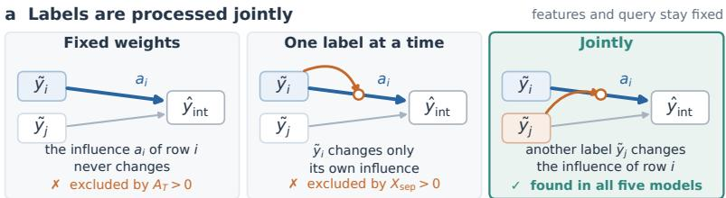
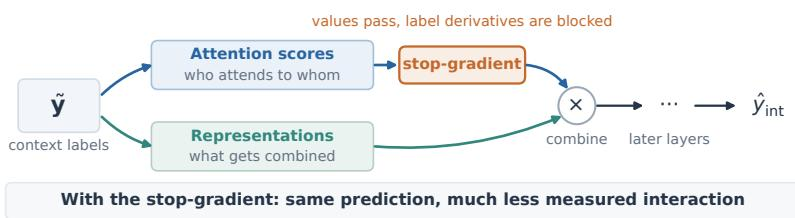
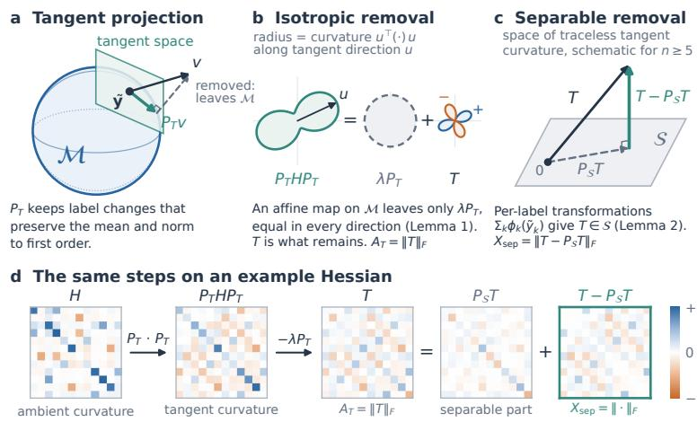
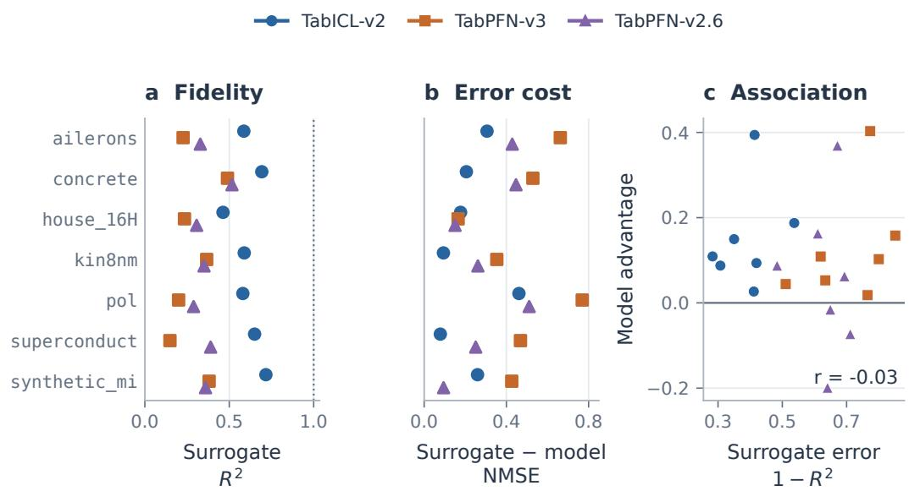

# THE STANDARDIZATION TRAP: CERTIFYING JOINT LABEL PROCESSING IN TABULAR FOUNDATION MODELS

Duong Nguyen, Nicolas Chesneau, and Milan Bhan {first.last}@ekimetrics.com

## ABSTRACT

Linear regression and kernel smoothing offer tractable explanations of in-context learning: in both, the features determine the weight assigned to each context label. However, whether this fixed-weight account describes pretrained tabular foundation models (TFMs) remains unclear. Testing this account using derivatives runs into a standardization trap: public TFM packages standardize the labels before the model sees them, yet ordinary derivatives also reflect behavior outside the set of standardized labels, making a model appear nonlinear even when every prediction it makes agrees with a fixed-weight map. We propose two certificates that depend only on predictions at standardized labels and can reject two distinct explanations: fixed-weight prediction and sums of independent nonlinear label transformations. Across the five public TFMs that we evaluate, our certificates show that changing one context label alters how other labels influence the prediction, a behavior we call joint processing. We further find that joint processing emerges with training and that attention scores carry most of the measured interaction. Together, these findings motivate TFM explanations that account for how context labels change the influence of individual examples.

## 1 INTRODUCTION

Influential studies have connected in-context learning to linear regression and kernel smoothing (Akyurek et al., 2023; von Oswald et al., 2023; Zhang et al., 2024; Collins et al., 2024). In fixed-¨ weight versions of these accounts, the features determine how the examples are weighted, while the context labels supply the values being combined. Predictions change when labels change, but the coefficients do not. This gives a precise starting point for understanding adaptation without parameter updates.

We ask how far this account extends to pretrained tabular foundation models (TFMs). At inference, TFMs predict the label of a query using labeled context examples while keeping their parameters fixed. How do TFMs use those context labels? Do the labels only supply the values being combined, or do they also change how the examples are weighted?

Consider predicting a house price from nearby sales. One strategy assigns a fixed weight to each house using location and building attributes, then averages the observed prices. Another also examines the prices themselves: an unusually high price may be discounted when isolated but reinforced when nearby houses show the same pattern. In the second strategy, one price changes the weight of other prices, even though the houses, their attributes, and the query remain fixed. Do the labels of a pretrained TFM only supply values that fixed weights combine, or does one label also change the weight given to another?

To answer this question, we measure label sensitivity: the first derivative of the prediction with respect to one context label. For a model that assigns a fixed weight to a context observation, this sensitivity is the weight itself, so it does not move when the labels change. We therefore look at second derivatives and ask whether the sensitivity to one label moves when another label changes. Furthermore, a model could transform each label separately, for example by limiting extreme values, and then add the contributions. This way, the prediction might respond nonlinearly to label changes, while no label would change the weight of another. We therefore distinguish fixed affine predic tion, independent nonlinear label transformations, and interaction across examples. That distinction allows us to precisely ask what kind of adaptation a model has learned, rather than treating every nonlinear response as the same phenomenon.

Measuring such label interactions with derivatives runs into a surprising trap: tests based on derivative analysis can suggest that labels interact even when every prediction that the model makes com bines the labels with fixed weights. Label standardization restricts the labels entering the network to vectors with a fixed mean and scale. The raw labels never reach the network directly, yet ordinary derivatives also describe behavior away from the set of standardized labels. For example, adding to a fixed-weight map a component that is zero on this set leaves every prediction unchanged but changes the derivatives (Section 3.2). We could therefore mistake behavior that never affects the prediction for evidence of adaptation.

## Our contributions are as follows:

1. Certificates that distinguish three forms of label processing: We derive two certificates that account for standardization and distinguish three forms of label processing: (1) fixed-weight prediction, in which the weights do not depend on the labels, (2) sums of independent nonlinear label transformations, in which a label changes only its own influence, and (3) joint processing, in which one label changes the influence of the others. A nonzero value of the first certificate excludes (1), and a nonzero value of the second excludes both (1) and (2), which establishes (3).

2. Evidence ofjoint processing and its association with training: Using the proposed certificates, we show evidence of joint processing in the internal readouts of all tested models. Randomly initialized copies of the same architectures also respond nonlinearly to labels, but they show far less interaction across examples, which indicates that joint processing appears with training rather than coming from the architecture alone.

3. Identification of the derivative paths carrying the measured interaction: We show that holding the attention scores fixed during differentiation removes most of the measured local curvature while leaving the predictions unchanged, so most of the measured interaction passes through the attention scores.

Our paper is organized as follows. Section 2 reviews related work on explanations of how in-context learning works. Section 3 introduces the standardization trap and derives our two certificates. Section 4 applies these certificates to five public TFMs and examines the roles of training and attention mechanisms in joint label processing. Finally, Section 5 discusses the implications and limitation of our findings.

## 2 RELATED WORK

Fixed-weight accounts of in-context learning. Several prior works have shown that a transformer can carry out linear regression, or steps of gradient descent, on the context examples (von Oswald et al., 2023; Akyurek et al., 2023; Ahn et al., 2023; Zhang et al., 2024), and attention can be inter-¨ preted as a kernel operation (Tsai et al., 2019; Collins et al., 2024). In the simple versions of these explanations, the prediction is a weighted sum of the context labels. The features then characterize the weight of each example. The labels only supply the values to be combined (i.e., changing a label never changes a weight). We test whether pretrained TFMs process context labels the same way. With the features fixed, can one set of weights explain the predictions for every set of labels?

Writing a model in kernel form does not settle the question, because the kernel itself may already depend on the labels. For example, Miftachov et al. (2026) fine-tune TabICL (Qu et al., 2025) so that its final prediction is a kernel average, but the inputs of this kernel are embeddings that the model has computed from the features and the labels together. Any adaptation to the labels has then happened before the kernel is applied. The whole computation therefore has to be examined, including how representations are built and how parameters such as a bandwidth are chosen.

Learning a task from its labels. In other accounts, the labels do more than supply values. They also help decide which map is applied. Prior-data fitted networks are trained to approximate a Bayesian predictor. Such a predictor updates its belief about the task from the observed labels (Muller et al., 2022). Bayesian accounts of in-context learning make the same point: the labeled¨ examples reveal which task is being solved, and the prediction follows from that task (Xie et al.,

2022; Panwar et al., 2024). A transformer can also select among several algorithms according to how well each one predicts examples held out from its fit (Bai et al., 2023). In all three accounts, changing the labels can change the inferred task or the selected algorithm, and with it the weight given to every label. Our measurements agree with this picture. Nagler (2023) addresses a different question, why the bias of a PFN need not vanish as the context grows unless the model focuses on the examples near the query, whereas we study how a model responds when the labels change at a fixed context size.

From internal computation to prediction. Another line of work studies the internal computation of TFMs. Gupta et al. (2026b) show that the hidden layers of TabPFN encode intermediate quantities of this computation, such as partial products of an arithmetic target, and Ye et al. (2025) find that TabPFN v2 (Hollmann et al., 2025) can serve as a feature extractor whose features separate the classes well. Predictions are refined gradually across layers, with so much overlap that one layer applied six times matches six distinct layers in a small model (Rezaei Balef et al., 2026). Ablation experiments find that one attention head dominates the others at its peak layer (Gupta et al., 2026a). Model families also read the context labels in different ways, from an attention-weighted vote over the labels to a class-mean readout (Bilos et al., 2026). Under noisy labels and irrelevantˇ features, TabPFN’s attention stays on the informative features (Hu & Ghelichi, 2026). Benchmarks measure how well the models predict (Grinsztajn et al., 2022; Erickson et al., 2025; Purucker et al., 2026). For language models, some studies ask how much a prediction depends on the labels of the demonstrations (Min et al., 2022; Kossen et al., 2024). Other studies connect in-context learning to gradient descent, induction heads, and task vectors (Dai et al., 2023; Olsson et al., 2022; Hendel et al., 2023; Todd et al., 2024), or trace a prediction back to individual demonstrations (Zhou et al., 2024). These studies leave one research question open: does one label change how another label is used? We address this question in the following section.

## 3 MEASURING HOW MODELS USE LABELS

This section presents how we address the research question introduced above. The objective is to measure how a TFM uses its context labels, and in particular whether changing one label changes how other labels influence the prediction. Derivatives are the natural tool, but using them directly runs into a trap: label standardization confines the labels reaching the network to a proper subset of the label space, while derivatives in ambient coordinates also describe behavior off that subset. A model that coincides with a fixed affine map on every admissible label vector can therefore exhibit nonzero second derivatives. We develop tests that remove this ambiguity, distinguishing joint processing from fixed affine prediction and from independent nonlinear transformations of individual labels.

## 3.1 FROM A LABEL’S VALUE TO ITS INFLUENCE

Let $i \in \{ 1 , \ldots , n \}$ index the context examples. Each example has a feature vector $x _ { i } \in \mathbb { R } ^ { d }$ and a label $y _ { i }$ . The context feature matrix and corresponding label vector are $\ b X = \left[ \ b x _ { 1 } \cdot \cdot \cdot \ b x _ { n } \right] ^ { \top } \in \mathbb { R } ^ { n \times d }$ and $\mathbf { y } = \left( y _ { 1 } , \ldots , y _ { n } \right) ^ { \top } \in \mathbb { R } ^ { n }$ , respectively. For a query with feature vector $x _ { * }$ , write the prediction as $\hat { y } = f ( x _ { * } , X , \mathbf { y } )$ . Note that the network itself does not receive the raw labels y. A TFM package first standardizes y to $\tilde { \mathbf { y } }$ in a wrapper, with components $\tilde { y } _ { i } = ( y _ { i } - \bar { y } ) / s _ { y }$ , where y¯ is the context-label mean and $s _ { y }$ is the standardization scale. The network computes the internal prediction $\hat { y } _ { \mathrm { i n t } } = g ( \tilde { \mathbf { y } } )$ and the output conversion returns $\hat { y }$ in the original label units. This distinction determines what we measure: the response of the internal map to standardized labels, with one estimator and a fixed output conversion.

We describe this response through the label sensitivity $a _ { i } ( \tilde { \mathbf { y } } ) = \partial g ( \tilde { \mathbf { y } } ) / \partial \tilde { y } _ { i }$ , which measures how strongly label i affects the prediction. Several existing interpretations of in-context learning describe the prediction as affine in the labels:

$$
\hat { y } _ { \mathrm { i n t } } = b + \sum _ { i = 1 } ^ { n } a _ { i } ( x _ { * } , X ) \tilde { y } _ { i } ,\tag{1}
$$

where the offset b and the weights $a _ { i } ( x _ { * } , X )$ depend on the features and the query but not on the labels. For example, the kernel-smoothing interpretation of Collins et al. (2024) takes a weighted average of the labels, with nonnegative weights that sum to one. The converged single-layer linearattention predictor analyzed by Zhang et al. (2024) allows weights of either sign. In these accounts, the sensitivities are the weights themselves, and stay constant when the context labels change. We call such a map a fixed-weight map.

b Attention carries most of the measured interaction  

  
Figure 1: Labels are processed jointly, and attention carries most of the measured interaction. a: three ways a model could use context labels while the features and the query stay fixed. The blue arrow is the influence $a _ { i }$ of row i on the internal prediction $\hat { y } _ { \mathrm { { i n t } } }$ . With fixed weights, this influence never changes. If labels are handled one at a time, a label can change only its own influence. In joint processing, another label $\tilde { y } _ { j }$ changes how much row i matters, which is what all five models show (§4.2). b: inside an attention step, labels can act through the attention scores and through the representations that those scores combine. A stop-gradient, applied at every attention step, lets the scores pass unchanged but stops labels from influencing them when derivatives are taken. The prediction stays the same, while most of the measured interaction disappears (§4.3). The stopgradient shows which derivative paths carry the interaction in the computation as implemented, not that these paths are necessary.

Other interpretations let the labels change the weights themselves, so that $a _ { i } = a _ { i } ( x _ { * } , X , \tilde { \bf y } )$ . A map whose sensitivities change with the labels can still be of two kinds. It can transform one label at a time and add the results, so that a label changes only its own sensitivity, or the labels can interact, which we call joint processing.

To test whether a model uses a fixed-weight map, one can perturb the labels and compare the sensitivity vectors before and after the perturbation. A fixed-weight map returns the same vector twice, so a large change would seem to show that the weights are not fixed. In the next section, we show that this test falls into a trap, and so does the second-derivative test that extends it. We then present protocols that avoid this trap and certify how a model uses its context labels.

## 3.2 THE STANDARDIZATION TRAP

A natural way to test for fixed weights is to differentiate the sensitivities once more. The Hessian measures how the sensitivity to label i changes when label j changes:

$$
H _ { i j } ( \tilde { \mathbf { y } } ) = \frac { \partial a _ { i } } { \partial \tilde { y } _ { j } } = \frac { \partial ^ { 2 } g } { \partial \tilde { y } _ { i } \partial \tilde { y } _ { j } } .
$$

A fixed-weight map has $H = 0$ , and it is tempting to conclude in turn that a nonzero H means that the weights are not fixed. This conclusion falls into the standardization trap. The rest of this section explains the trap on an example and how to avoid it.

The trap comes from the standardization step (Section 3.1), which does more than change the label units. Because it fixes the mean and the squared norm of the labels, it confines the inputs of the

  
Figure 2: The standardization trap and the two certificates (§3.2). a: the network only ever sees labels on the standardization manifold M, but derivatives also react to label changes that would leave it. For a label perturbation $v \in \mathbb { R } ^ { n }$ , the projector $P _ { T }$ keeps the part that slides along M, so that a small step keeps the label mean and changes the label norm only negligibly. b: each shape shows how strongly the prediction curves along every direction u within the tangent space, drawn as the distance from the center. This curvature splits into a part that is equal in every direction, $\lambda P _ { T }$ , and the remainder T. A function such as $g _ { a }$ that is affine on $\mathcal { M }$ can produce only the first part (Lemma 1), so $A _ { T } = \| T \| _ { F }$ measures what such a map cannot explain. The equal part is enlarged for visibility. c: S contains every curvature pattern that arises when each label is transformed separately, as in $g _ { a , \phi } . \ P _ { S } T$ is the closest such pattern to $T ,$ and the length of what is left over is $X _ { \mathrm { s e p } }$ (Lemma $2 )$ d: the same steps on a constructed Hessian. It sums terms that act only off ${ \mathcal { M } } .$ , a separate effect for each label, and couplings between pairs of labels. Only the pair couplings reach $T - P s T$

network to the standardization manifold

$$
{ \mathcal { M } } = \{ { \tilde { \mathbf { y } } } \in \mathbb { R } ^ { n } : \mathbf { 1 } ^ { \top } { \tilde { \mathbf { y } } } = 0 , \ \| { \tilde { \mathbf { y } } } \| ^ { 2 } = r ^ { 2 } \} ,
$$

where 1 is the all-ones vector and r is the norm that the scale $s _ { y }$ imposes, with $r ^ { 2 } = n$ for the population standard deviation. This manifold is a sphere inside the subspace of mean-zero vectors. Derivatives, however, also describe how $g$ behaves when the labels leave this sphere, which never happens in use.

As a demonstration, consider a fixed-weight map as in Eq. (1), with offset b and weights $a \in \mathbb { R } ^ { n }$ and add a term that vanishes on $\mathcal { M } \mathrm { : }$

$$
g _ { a } ( \tilde { \mathbf { y } } ) = b + a ^ { \top } \tilde { \mathbf { y } } + q \big ( \| \tilde { \mathbf { y } } \| ^ { 2 } - r ^ { 2 } \big ) , \qquad q \neq 0 .\tag{2}
$$

On every valid input, the added term is zero. Hence, $g _ { a }$ and the fixed-weight map $b + a ^ { \top } \tilde { \mathbf { y } }$ make exactly the same predictions, and no experiment that feeds labels to the model can tell them apart. Their derivatives nevertheless differ. The sensitivities of $g _ { a } \arg a + 2 q \tilde { \bf y }$ , so they change whenever the labels are permuted, and its Hessian is $2 q I ,$ , which can be arbitrarily large. Neither effect changes a single valid prediction. Naive tests would therefore report that $g _ { a }$ adapts its weights to the labels, although it applies fixed weights wherever it is ever evaluated. Nothing prevents a trained network from containing such terms, because training never evaluates the network away from M and so never constrains how it extends there.

For any map g, a valid test must therefore depend only on the values that g takes on M. The first step in building such a test is to keep only the label changes that stay on M. A change $v \in \mathbb { R } ^ { n }$ of the labels keeps their mean when its entries sum to zero, and for small steps it keeps their norm when it is perpendicular to the current label vector $\tilde { \mathbf { y } }$ . The changes that satisfy both conditions are the tangent directions at $\tilde { \mathbf { y } } \colon$ they slide along the sphere instead of leaving it (Figure 2a). The matrix $\begin{array} { r } { P _ { T } = I - \frac { { \bf 1 1 } ^ { \top } } { n } - \frac { \tilde { \bf y } \tilde { \bf y } ^ { \top } } { r ^ { 2 } } } \end{array}$ turns any change into a tangent one. The Hessian $H _ { \tilde { \mathbf { y } } } = \nabla _ { \tilde { \mathbf { y } } } ^ { 2 } g ( \tilde { \mathbf { y } } )$ involves two label changes at once, so we apply $\bar { P } _ { T }$ on both sides. This gives the tangent curvature $P _ { T } H _ { \tilde { \mathbf { y } } } P _ { T }$ which records how the sensitivities change when the labels move along tangent directions only.

This correction is not enough. For example, going back to our example with $g _ { a }$ , the Hessian $2 q I$ gives the tangent curvature $2 q P _ { T }$ (since $P _ { T }$ is idempotent), which is not zero, so the test still fires. The reason is that M is curved, whereas a tangent direction is a straight line that touches M at one specific point only. A step of length δ along a unit tangent direction v therefore leaves the sphere slightly, since $\lVert \tilde { \mathbf { y } } ^ { \cdot } + \delta v \rVert ^ { 2 } = r ^ { 2 } + \bar { \delta } ^ { 2 }$ . The gap $\delta ^ { 2 }$ is too small to affect the slope of a function, but second derivatives measure exactly the terms in $\delta ^ { 2 }$ , and the added term of $g _ { a }$ turns this gap into the value $q \delta ^ { 2 }$

The gap $\delta ^ { 2 }$ does not depend on the direction v of the step. The tangent curvature $2 q P _ { T }$ that it produces for $g _ { a }$ therefore has the same value $2 q$ in every tangent direction. We call a curvature that is equal in all tangent directions isotropic. Lemma 1 shows that this form is not special to $g _ { a } { \mathrm { : } }$ every function that agrees with a fixed-weight map on $\mathcal { M }$ has an isotropic tangent curvature, whatever it does away from $\mathcal { M }$

Lemma 1 (Affine predictions on the manifold). Let g be any smoothfunction on a neighborhood of $\mathcal { M }$ that agrees on $\mathcal { M }$ with an affine function $o f \tilde { \mathbf { y } }$ . Then at every $\tilde { \mathbf { y } } \in \mathcal { M }$

$$
P _ { T } H _ { \tilde { \mathbf { y } } } P _ { T } = \lambda ( \tilde { \mathbf { y } } ) P _ { T }
$$

for some scalar λ(y˜).

We provide the proof of Lemma 1 in Appendix A. Every function covered by the lemma is built like $g _ { a } \colon \mathrm { a }$ fixed-weight map plus terms that vanish on $\mathcal { M } .$ . By Lemma 1, such a map can leave only isotropic curvature. We therefore define the operator $T$ as the tangent curvature minus its isotropic part, and we measure its size $A _ { T } \mathrm { : }$

$$
T = P _ { T } H _ { \tilde { \mathbf { y } } } P _ { T } - \frac { \mathrm { t r } ( P _ { T } H _ { \tilde { \mathbf { y } } } P _ { T } ) } { n - 2 } P _ { T } , A _ { T } = \| T \| _ { F } ,\tag{3}
$$

where $\left\| \cdot \right\| _ { F }$ is the Frobenius norm. The trace of the tangent curvature is the sum of the curvatures along $n - 2$ perpendicular tangent directions, so dividing it by $n - 2$ gives the average curvature over the tangent directions (Figure 2b), and $T$ keeps only the departure from this average. For $g _ { a }$ whose Hessian is $H _ { \tilde { \mathbf { y } } } = 2 q I$ , both quantities in $\operatorname { E q . } \left( 3 \right)$ can be computed by hand:

$$
\begin{array} { c } { { P _ { T } H _ { \tilde { \bf y } } P _ { T } = P _ { T } ( 2 q I ) P _ { T } = 2 q P _ { T } P _ { T } = 2 q P _ { T } , } } \\ { { \mathrm { t r } ( P _ { T } H _ { \tilde { \bf y } } P _ { T } ) = 2 q \mathrm { t r } ( P _ { T } ) = 2 q ( n - 2 ) . } } \end{array}
$$

The first line uses $P _ { T } P _ { T } = P _ { T }$ , since projecting twice changes nothing, and the second line uses $\operatorname { t r } ( P _ { T } ) = n - 2$ , since $P _ { T }$ removes two directions from the n-dimensional identity. Substituting both lines into Eq. (3) gives $\begin{array} { r } { T = 2 q P _ { T } - \frac { 2 q ( n - 2 ) } { n - 2 } P _ { T } = 0 } \end{array}$ , so the corrected test stays silent on $g _ { a } ,$ as it should. The value of q plays no role in this cancellation, so the same argument gives $T = 0$ for every isotropic curvature $\lambda P _ { T }$ , regardless of the value of $\lambda .$ More generally, T depends only on the predictions on $\mathcal { M } .$ , regardless of how $g$ extends away from the manifold. A nonzero $A _ { T }$ therefore excludesfixed-weight prediction on valid labels.

A nonzero $A _ { T }$ shows that $g$ is nonlinear on $\mathcal { M }$ , but nonlinearity alone is not enough to establish joint processing. A model can transform one label at a time and add the results, as in

$$
g _ { a , \phi } ( \tilde { \mathbf { y } } ) = g _ { a } ( \tilde { \mathbf { y } } ) + \sum _ { k = 1 } ^ { n } \phi _ { k } ( \tilde { y } _ { k } ) ,\tag{4}
$$

where each smooth function $\phi _ { k }$ acts on a single label, for example by damping extreme values. For most choices of $\phi _ { k } .$ , this map is not affine on $\mathcal { M } ,$ and it has $A _ { T } ~ > ~ 0$ Yet no label changes the influence of another one, since the added term contributes only the diagonal matrix $D = \mathrm { \bar { d i a g } } \big ( \phi _ { k } ^ { \prime \prime } ( \tilde { y } _ { k } ) \big )$  to the Hessian. We cannot detect this case by looking for zero off-diagonal entries, because the projection mixes the coordinates: on $\mathcal { M }$ no label can move alone, since the other labels must compensate to keep the mean and the norm fixed, and $P _ { T } D P _ { T }$ is no longer diagonal. We test instead whether the corrected curvature $T$ could have come from some diagonal matrix. Let $\begin{array} { r } { \mathcal { S } = \{ P _ { T } D P _ { T } - \frac { { \mathrm { t r } } ( P _ { T } D P _ { T } ) } { n - 2 } P _ { T } : D } \end{array}$ diagonal} be the linear space of corrected curvatures that onelabel-at-a-time maps, such as $g _ { a , \phi } ,$ , can produce, and let $P _ { S }$ denote the orthogonal projection onto it. We measure what remains outside this space:

$$
X _ { \mathrm { s e p } } = \| T - P s T \| _ { F } .\tag{5}
$$

For $g _ { a , \phi }$ we have $T \in S$ and hence $X _ { \mathrm { s e p } } = 0 { \mathrm { . } }$ whatever the functions $\phi _ { k }$ and the coefficient $q .$ Figure 2 illustrates both projections, and Lemma 2 states the general result.

Lemma 2 (Certificate of joint label processing). Let g be smooth on a neighborhood of M and agree on M with an affine-plus-separable map $\begin{array} { r } { \boldsymbol { b } + \boldsymbol { a } ^ { \top } \tilde { \mathbf { y } } + \sum _ { k } \phi _ { k } ( \tilde { y } _ { k } ) } \end{array}$ . Then $T \in S$ and $X _ { \mathrm { s e p } } = 0$ at every point of M. The statistic $X _ { \mathrm { s e p } }$ is extension-invariant: any two smooth maps that agree on M give the same value there.

A nonzero $X _ { \mathrm { s e p } }$ therefore certifies that one label changes the influence of another. Both tests are one-sided: a zero result alone does not prove membership in the corresponding class. Table 1 follows the two examples and a joint-processing map through each correction. We provide in Appendix A the proofs, the computation of $P _ { S }$ , and numerical checks of this pattern.

Table 1: From the Hessian to the two certificates. Each row applies one more correction to the Hessian H of the map. The last three columns give the result for $g _ { a } ,$ , which is a fixed-weight map on M (Eq. 2), for the one-label-at-a-time map $g _ { a , \phi }$ (Eq. 4, with $D = \mathrm { d i a g } ( \phi _ { k } ^ { \prime \prime } ( \tilde { y } _ { k } ) ) )$ , and for a map in which labels interact. Only $A _ { T }$ vanishes for every fixed-weight map, and only $X _ { \mathrm { s e p } }$ also vanishes for every one-label-at-a-time map.
<table><tr><td>Quantity</td><td>What it keeps  $g _ { a }$ </td><td> $g _ { a , \phi }$ </td><td>Joint map</td></tr><tr><td>Hessian H</td><td>every label change  $2 q I$ </td><td> $2 q I + D$ </td><td> $\neq 0$ </td></tr><tr><td>Tangent curvature  $P _ { T } H P _ { T }$ </td><td>changes that stay on  $\mathcal { M }$   $2 q \hat { P } _ { T }$ </td><td> $2 q { P _ { T } } + { P _ { T } } D P _ { T }$ </td><td> $\neq 0$ </td></tr><tr><td> $T ,$  of size  $A _ { T }$ </td><td>minus the isotropic part 0</td><td> $\mathrm { i n } \ : S , \neq 0$ </td><td> $\neq 0$ </td></tr><tr><td> $T - P s T ,$  of size  $X _ { \mathrm { s e p } }$ </td><td>minus the one-label-at-a-time part 0</td><td>0</td><td> $\neq 0$ </td></tr></table>

The absolute values of $A _ { T }$ and $X _ { \mathrm { s e p } }$ themselves are hard to interpret, because they depend on the scale of the prediction and of its sensitivities, which differs between models and datasets. We therefore report two shares:

$$
\bar { A } _ { T } = \frac { A _ { T } ^ { 2 } } { \| P _ { T } H _ { \tilde { \mathbf { y } } } P _ { T } \| _ { F } ^ { 2 } } , \qquad \bar { X } _ { \mathrm { s e p } } = \frac { X _ { \mathrm { s e p } } ^ { 2 } } { A _ { T } ^ { 2 } } .\tag{6}
$$

Both lie between 0 and 1, because each correction removes a part that is orthogonal to the part it keeps, and we set a share to 0 when its denominator vanishes. $\bar { X } _ { \mathrm { s e p } }$ is the share of the corrected curvature that no one-label-at-a-time map can produce, and like $X _ { \mathrm { s e p } }$ it depends only on the predictions on $\mathcal { M } . \ \bar { A } _ { T }$ is different: its denominator still contains the isotropic part of the tangent curvature, which depends on how g behaves away from M. Apart from vanishing exactly when $A _ { T }$ does, $\bar { A } _ { T }$ serves another purpose: $\mathsf { \Pi } _ { 1 } - \bar { A } _ { T }$ is the fraction of the computed tangent curvature that the isotropic correction subtracts, so it shows how much this correction changes the measurement in the tested networks. A fixed-weight map has $\bar { A } _ { T } = 0$ , and a one-label-at-a-time map has $\bar { X } _ { \mathrm { s e p } } = 0$

## 4 EXPERIMENTS AND RESULTS

Our experiments answer two questions about pretrained TFMs: (1) do the models process their context labels jointly, which is the question that the two certificates were built to settle (Section 4.2), and (2) where does the interaction come from, both whether it is already present before training and which paths inside the network carry it (Section 4.3). Section 4.1 first presents the setup that all experiments share.

## 4.1 EXPERIMENTAL SETUP

Models. We evaluate five public TFMs: TABICL-V2 (Qu et al., 2026), TABPFN-V3 (Grinsz tajn et al., 2026), TABPFN-V2.6 (Grinsztajn et al., 2025), TABFM 1.0 (Kong & Das, 2026), and TABDPT v1.2 (Ma et al., 2025; Hosseinzadeh et al., 2026). They differ in architecture, attention schedule, readout, and pretraining data (Appendix B.1). The first four are pretrained on synthetic tasks and have related designs: TABICL-V2, TABPFN-V3 and TABFM build a representation of each row with attention across features and rows and then predict in a final in-context stage, whereas TABPFN-V2.6 alternates attention across features and rows in every layer. TABDPT is pretrained on real tables, which makes it the most independent of the five.

Tasks and Protocol. We compute the two certificates on four regression datasets with 256 context rows: one synthetic dataset and the OpenML datasets kin8nm, pol, and superconduct. The synthetic dataset is a smooth regression task on 16 continuous features that we generate ourselves (Appendix B.2), so that it serves as a control that real tables cannot provide: we can redraw its label noise from the true model, no model can have seen it during pretraining, and it has no outliers or discrete features that could explain what we measure. We call one model on one dataset a setting, which gives 20 settings. In each setting, we repeat the measurement on three randomly sampled contexts, with four queries each. Appendix Table 5 lists the datasets, context sizes, and repetitions of every experiment in the paper.

Implementation Details. Since we run our analysis based on TFM responses, we take derivatives with respect to the standardized labels and keep the conversion back to the original label units fixed (Section 3.1). The differentiated prediction comes from a single estimator inside each package, whereas the packages’ default predictions combine several estimators, which we test separately (Section 4.2). Second derivatives need an attention implementation that can be differentiated twice, which the fused kernels used in deployment are not, so we switch to standard (eager) attention for these computations (Appendix B.3).

## 4.2 TO WHAT EXTENT DO TFMS PROCESS LABELS JOINTLY?

We first determine which of the three descriptions of Section 3.1 fits each TFM: fixed weights, one label at a time, or joint processing (Figure 1a). To this end, we compute the exact Hessian of the internal prediction in each of the 20 settings and apply the two certificates, so that each description is tested by a statistic that is zero whenever the description holds. Table 2 reports the results.

Table 2: All five models process labels jointly, and most of the interaction passes through attention. The shares (Eq. (6)) and the relative fall of $A _ { T }$ and $X _ { \mathrm { s e p } }$ when derivatives cannot pass through the attention scores (Section 4.3), in percent, each averaged over the four datasets. A fixed-weight map would give $\bar { A } _ { T } = 0$ , and a one-label-at-a-time map would give $\bar { X } _ { \mathrm { s e p } } = 0$ . Appendix Table 8 gives every setting.
<table><tr><td rowspan="2">Model</td><td colspan="2">Share (%)</td><td colspan="2">Attention drop (%)</td></tr><tr><td> $\bar { A } _ { T }$ </td><td> $\bar { X } _ { \mathrm { s e p } }$ </td><td> $A _ { T }$ </td><td> $X _ { \mathrm { s e p } }$ </td></tr><tr><td>TABICL-V2</td><td>98.7</td><td>63.1</td><td>81.6</td><td>82.0</td></tr><tr><td>TABPFN-V3</td><td>98.5</td><td>70.8</td><td>85.9</td><td>90.0</td></tr><tr><td>TABPFN-V2.6</td><td>97.7</td><td>73.4</td><td>90.9</td><td>95.3</td></tr><tr><td>TABFM</td><td>99.2</td><td>67.5</td><td>78.2</td><td>82.1</td></tr><tr><td>TABDPT</td><td>98.3</td><td>40.4</td><td>68.0</td><td>75.3</td></tr><tr><td>All models</td><td>98.5</td><td>63.0</td><td>80.9</td><td>85.0</td></tr></table>

Fixed weights do not explain the predictions of any model, since $\bar { A } _ { T }$ is nonzero in every setting (Appendix Table 8). Its average of 98.5% in Table 2 also shows that the isotropic correction subtracts only 1.5% of the computed tangent curvature, so for these models the correction changes the measurement little, although the test would not be valid without it. Transforming one label at a time does not explain the predictions either. Such a map would give $\bar { X } _ { \mathrm { s e p } } = 0$ , whereas $\bar { X } _ { \mathrm { s e p } }$ averages 63% over the 20 settings and lies between 23% and 92% in every one of them (Appendix Table 8).

The package default inference procedures of the tested models combine several estimators. We tested those settings and found that the combined predictions are not affine in the labels either (Appendix C.2).

## 4.3 WHERE DO THE INTERACTIONS COME FROM?

The certificates analyzed above establish that labels interact inside the models, but they do not say where this interaction comes from. We first test whether the architecture alone produces the interaction or whether it appears with training, and we then identify which paths inside the network carry it.

Training changes the interaction among labels. We want to know whether the interaction comes with the architecture or appears with training. We therefore compare each trained model with 12 randomly initialized copies of the same architecture on two of the four datasets. A randomly initialized network is already a nonlinear function of its labels, so it departs from fixed weights before training: $A _ { T }$ is nonzero for both the trained models and the random copies and therefore cannot tell them apart. The normalized certificate $\bar { X } _ { \mathrm { s e p } }$ does separate trained from untrained networks. On the two datasets of this comparison, every query of a trained model gives at least 29%, whereas the random copies stay at most 3.4% (Appendix C.3).

Attention carries most of the measured interaction. Attention combines representations with weights that it computes from attention scores, and labels can change both the representations being combined and the scores that weight them. To separate these contributions, we block derivatives through the attention scores while keeping their values unchanged in the forward computation (Figure 1b), so that the model makes exactly the same prediction while its derivatives retain only the paths that do not pass through these scores. Blocking these derivative paths removes most of the measured interaction (columns “Attention drop” in Table 2). The cross-example residual $X _ { \mathrm { s e p } }$ falls by 85% on average, from 75% for TABDPT to 95% for TABPFN-V2.6, and the corrected curvature norm $A _ { T }$ falls by 81% on average. These percentages describe reductions in norms, whereas the comparison with random copies uses shares of squared curvature, and they neither measure accuracy loss nor establish that these paths are necessary for good predictions. Appendix C.4 compares the curvature operators directly and describes a forward intervention. These results add to the ongoing debate on whether attention weights explain the predictions of a model (Wiegreffe & Pinter, 2019; Jain & Wallace, 2019; Bibal et al., 2022; Bhan et al., 2023).

## 5 DISCUSSION AND CONCLUSION

In the evaluated models, context labels can change how other labels affect the prediction. The pack ages standardize the labels before the networks see them, and ordinary derivatives also describe how the network would behave on labels that are not standardized, so they can report nonlinearity even for models that apply fixed weights to every valid input. Our two certificates measure behaviors on standardized labels only. The first certificate $A _ { T }$ is zero for every fixed-weight map, and the second certificate $X _ { \mathrm { s e p } }$ is zero for every map that transforms one label at a time. Both are nonzero in all five models, so no model is explained by either fixed weights or transforming its labels one at a time. Of the curvature that departs from fixed weights, 23% to 92% comes from interaction that no onelabel-at-a-time map can produce. This interaction is much weaker in randomly initialized copies of the same architectures, which indicates that it comes with training rather than from the architecture alone. Blocking derivatives through the attention scores removes most of it while leaving the predictions unchanged, so in the networks as implemented most of the interaction passes through these scores.

Our findings guide explanations of how TFMs use their context labels. They exclude the fixed weight account, in which the features alone set the weight of each label, because in every evaluated model a change in one label also changes the weights of the others. Yet they do not identify the computation behind this interaction, since several computations make labels interact: (1) the mode may use all labels to infer which task generated the data, so that changing any label changes the inferred task and with it the weight of every label, (2) a local regression may reweight the neighbors of the query by their labels, and (3) the representations of the examples may themselves depend on the labels. Our certificates detect the interaction but cannot tell these computations apart. The fixedweight account also remains a useful approximation even though it fails as an exact description: a fixed-weight map fitted to a model’s predictions explains a median of 72% of the variation in these predictions when the labels are redrawn from the same task (Appendix C.6). An explanation should therefore state for which labels it holds and whether it reproduces only the predictions or also how one label changes the influence of the others.

The remaining question is whether these label interactions improve prediction, since our derivative tests establish their presence but not their necessity. Blocking the attention scores does not answer it either, because the predictions stay the same. Resolving it requires an intervention that removes the interaction from the forward computation and a measurement of the resulting change in predictive accuracy.

## REFERENCES

Kwangjun Ahn, Xiang Cheng, Hadi Daneshmand, and Suvrit Sra. Transformers learn to implement preconditioned gradient descent for in-context learning. In Advances in Neural Information Processing Systems (NeurIPS), 2023.

Ekin Akyurek, Dale Schuurmans, Jacob Andreas, Tengyu Ma, and Denny Zhou. What learning¨ algorithm is in-context learning? Investigations with linear models. In International Conference on Learning Representations (ICLR), 2023.

Yu Bai, Fan Chen, Huan Wang, Caiming Xiong, and Song Mei. Transformers as statisticians: Provable in-context learning with in-context algorithm selection. In Advances in Neural Information Processing Systems (NeurIPS), 2023.

Milan Bhan, Nina Achache, Victor Legrand, Annabelle Blangero, and Nicolas Chesneau. Evaluating self-attention interpretability through human-grounded experimental protocol. In Explainable Artificial Intelligence: First World Conference, xAI 2023, volume 1903 of Communications in Computer and Information Science, pp. 26–46. Springer, 2023. doi: 10.1007/978-3-031-44070- 0 2.

Adrien Bibal, Remi Cardon, David Alfter, Rodrigo Wilkens, Xiaoou Wang, Thomas Franc¸ois, and´ Patrick Watrin. Is attention explanation? An introduction to the debate. In Proceedings of the 60th Annual Meeting ofthe Associationfor Computational Linguistics (Volume 1: Long Papers), pp. 3889–3900, 2022.

Marin Bilos, James T. Wilson, Anderson Schneider, and Yuriy Nevmyvaka. A mechanistic study ofˇ tabular foundation models. arXiv preprint arXiv:2605.21288, 2026.

Liam Collins, Advait Parulekar, Aryan Mokhtari, Sujay Sanghavi, and Sanjay Shakkottai. In-context learning with transformers: Softmax attention adapts to function Lipschitzness. In Advances in Neural Information Processing Systems (NeurIPS), volume 37, pp. 92638–92696, 2024.

Damai Dai, Yutao Sun, Li Dong, Yaru Hao, Shuming Ma, Zhifang Sui, and Furu Wei. Why can GPT learn in-context? Language models implicitly perform gradient descent as meta-optimizers. In Findings of the Association for Computational Linguistics: ACL 2023, pp. 4005–4019, 2023.

Nick Erickson, Lennart Purucker, Andrej Tschalzev, David Holzmuller, Prateek Mutalik Desai,¨ David Salinas, and Frank Hutter. TabArena: A living benchmark for machine learning on tabular data. In Advances in Neural Information Processing Systems (NeurIPS), Datasets and Benchmarks Track, 2025. URL https://arxiv.org/abs/2506.16791.

Google Research. TabFM source code. GitHub repository, 2026. URL https://github.com/ google-research/tabfm.

Leo Grinsztajn, Edouard Oyallon, and Ga ´ el Varoquaux. Why do tree-based models still outperform ¨ deep learning on typical tabular data? In Advances in Neural Information Processing Systems (NeurIPS), Datasets and Benchmarks Track, 2022.

Leo Grinsztajn, Klemens Fl´ oge, Oscar Key, Felix Birkel, Philipp Jund, Brendan Roof, Benjamin¨ Jager, Dominik Safaric, Simone Alessi, Adrian Hayler, Mihir Manium, Rosen Yu, Felix Jablonski,¨ Shi Bin Hoo, Anurag Garg, Jake Robertson, Magnus Buhler, Vladyslav Moroshan, Lennart Pu-¨ rucker, Clara Cornu, Lilly Charlotte Wehrhahn, Alessandro Bonetto, Bernhard Scholkopf, Sauraj¨ Gambhir, Noah Hollmann, and Frank Hutter. TabPFN-2.5: Advancing the state of the art in tabular foundation models. arXiv preprint arXiv:2511.08667, 2025.

Leo Grinsztajn, Klemens Fl ´ oge, Oscar Key, Felix Birkel, et al. TabPFN-3: Technical report. ¨ arXiv preprint arXiv:2605.13986, 2026.

Atharva Gupta, Dhruv Kumar, Murari Mandal, and Saurabh Deshpande. Where computation lives inside TabPFN: Causal localisation of attention head function. arXiv preprint arXiv:2606.12917, 2026a.

Aviral Gupta, Armaan Sethi, and Dhruv Kumar. TabPFN through the looking glass: An interpretability study of TabPFN and its internal representations. arXiv preprint arXiv:2601.08181, 2026b.

Roee Hendel, Mor Geva, and Amir Globerson. In-context learning creates task vectors. In Findings ofthe Associationfor Computational Linguistics: EMNLP 2023, pp. 9318–9333, 2023.

Noah Hollmann, Samuel Muller, Lennart Purucker, Arjun Krishnakumar, Max K¨ orfer, Shi Bin Hoo,¨ Robin Tibor Schirrmeister, and Frank Hutter. Accurate predictions on small data with a tabular foundation model. Nature, 637(8045):319–326, 2025. doi: 10.1038/s41586-024-08328-6.

Rasa Hosseinzadeh, Alex Labach, Zexin Xue, Shuyi Han, Valentin Thomas, and Anthony L. Caterini. TabDPT-Turbo: Efficient in-context learning for tabular prediction. arXiv preprint arXiv:2608.01400, 2026.

James Hu and Mahdi Ghelichi. Noise immunity in in-context tabular learning: An empirical robustness analysis of TabPFN’s attention mechanisms, 2026. arXiv:2604.04868.

Sarthak Jain and Byron C. Wallace. Attention is not explanation. In Proceedings of the 2019 Conference of the North American Chapter of the Association for Computational Linguistics: Human Language Technologies, Volume 1 (Long and Short Papers), pp. 3543–3556, 2019.

Weihao Kong and Abhimanyu Das. Introducing TabFM: A zero-shot foundation model for tabular data. Google Research blog, 2026. URL https://research.google/blog/ introducing-tabfm-a-zero-shot-foundation-model-for-tabulardata/.

Jannik Kossen, Yarin Gal, and Tom Rainforth. In-context learning learns label relationships but is not conventional learning. In International Conference on Learning Representations (ICLR), 2024.

John M. Lee. Introduction to Smooth Manifolds, volume 218 of Graduate Texts in Mathematics. Springer, 2nd edition, 2013.

Junwei Ma, Valentin Thomas, Rasa Hosseinzadeh, Alex Labach, Hamidreza Kamkari, Jesse C. Cresswell, Keyvan Golestan, Guangwei Yu, Anthony L. Caterini, and Maksims Volkovs. TabDPT: Scaling tabular foundation models on real data. In Advances in Neural Information Processing Systems (NeurIPS), 2025.

Ratmir Miftachov, Bruno Charron, and Simon Valentin. Interpretable tabular foundation models via in-context kernel regression. arXiv preprint arXiv:2602.02162, 2026.

Sewon Min, Xinxi Lyu, Ari Holtzman, Mikel Artetxe, Mike Lewis, Hannaneh Hajishirzi, and Luke Zettlemoyer. Rethinking the role of demonstrations: What makes in-context learning work? In Proceedings of the 2022 Conference on Empirical Methods in Natural Language Processing (EMNLP), pp. 11048–11064, 2022.

Samuel Muller, Noah Hollmann, Sebastian Pineda Arango, Josif Grabocka, and Frank Hutter. Trans-¨ formers can do Bayesian inference. In International Conference on Learning Representations (ICLR), 2022.

Thomas Nagler. Statistical foundations of prior-data fitted networks. In Proceedings of the 40th International Conference on Machine Learning (ICML), volume 202 of Proceedings of Machine Learning Research, pp. 25660–25676, 2023.

Catherine Olsson, Nelson Elhage, Neel Nanda, Nicholas Joseph, et al. In-context learning and induction heads. Transformer Circuits Thread, 2022.

Madhur Panwar, Kabir Ahuja, and Navin Goyal. In-context learning through the Bayesian prism. In International Conference on Learning Representations (ICLR), 2024.

Lennart Purucker, Andrej Tschalzev, Nick Erickson, Gioia Blayer, David Holzmuller, Alan Arazi,¨ Alexander Pfefferle, Mustafa Tajjar, Gael Varoquaux, and Frank Hutter. Beyond IID: How general ¨ are tabular foundation models, really? arXiv preprint arXiv:2606.30410, 2026. URL https: //arxiv.org/abs/2606.30410.

Jingang Qu, David Holzmuller, Ga ¨ el Varoquaux, and Marine Le Morvan. TabICL: A tabular foun-¨ dation model for in-context learning on large data. In Proceedings of the 42nd International Conference on Machine Learning (ICML), 2025.

Jingang Qu, David Holzmuller, Ga¨ el Varoquaux, and Marine Le Morvan. TabICLv2: A better,¨ faster, scalable, and open tabular foundation model. In Proceedings of the 43rd International Conference on Machine Learning (ICML), 2026.

Amir Rezaei Balef, Mykhailo Koshil, and Katharina Eggensperger. Is one layer enough? Understanding inference dynamics in tabular foundation models. In Proceedings of the 43rd International Conference on Machine Learning (ICML), 2026.

Eric Todd, Millicent L. Li, Arnab Sen Sharma, Aaron Mueller, Byron C. Wallace, and David Bau. Function vectors in large language models. In International Conference on Learning Representations (ICLR), 2024.

Yao-Hung Hubert Tsai, Shaojie Bai, Makoto Yamada, Louis-Philippe Morency, and Ruslan Salakhutdinov. Transformer dissection: An unified understanding for transformer’s attention via the lens of kernel. In Proceedings of the 2019 Conference on Empirical Methods in Natural Language Processing and the 9th International Joint Conference on Natural Language Processing (EMNLP-IJCNLP), pp. 4344–4353, 2019.

Johannes von Oswald, Eyvind Niklasson, Ettore Randazzo, Joao Sacramento, Alexander Mordv-˜ intsev, Andrey Zhmoginov, and Max Vladymyrov. Transformers learn in-context by gradient descent. In Proceedings of the 40th International Conference on Machine Learning (ICML), 2023.

Sarah Wiegreffe and Yuval Pinter. Attention is not not explanation. In Proceedings of the 2019 Conference on Empirical Methods in Natural Language Processing and the 9th International Joint Conference on Natural Language Processing (EMNLP-IJCNLP), pp. 11–20, 2019.

Sang Michael Xie, Aditi Raghunathan, Percy Liang, and Tengyu Ma. An explanation of in-context learning as implicit Bayesian inference. In International Conference on Learning Representations (ICLR), 2022.

Han-Jia Ye, Si-Yang Liu, and Wei-Lun Chao. A closer look at TabPFN v2: Understanding its strengths and extending its capabilities. In Advances in Neural Information Processing Systems (NeurIPS), 2025.

Ruiqi Zhang, Spencer Frei, and Peter L. Bartlett. Trained transformers learn linear models incontext. Journal of Machine Learning Research, 25(49):1–55, 2024. URL https://jmlr. org/papers/v25/23-1042.html.

Zijian Zhou, Xiaoqiang Lin, Xinyi Xu, Alok Prakash, Daniela Rus, and Bryan Kian Hsiang Low. DETAIL: Task demonstration attribution for interpretable in-context learning. In Advances in Neural Information Processing Systems (NeurIPS), 2024.

## A PROOFS AND COMPUTATION OF THE CERTIFICATES

This appendix proves the two lemmas that Section 3.2 states: Lemma 1 for the corrected curvature $A _ { T }$ , and Lemma 2 for the residual $X _ { \mathrm { s e p } }$ . It then gives the linear-algebra computation that turns the definition of $X _ { \mathrm { s e p } }$ into a number, extends the same manifold correction to the first-derivative test of Section 3.1, and calibrates these statistics against maps whose class is known in advance.

## A.1 PROOF OF LEMMA 1

The lemma must show that a map which predicts exactly like a fixed-weight map on the standardization manifold $\mathcal { M }$ can still differ from it in its second derivatives, but only in a restricted way: the tangent curvature it can produce is the same in every tangent direction. The idea is that such a map differs from the fixed-weight map only through terms built out of the two functions whose common zero set is $\mathcal { M } ,$ and each such term adds curvature only along the two directions normal to $\mathcal { M } .$ , which the tangent projector $P _ { T }$ removes, except for a single scalar rescaling of $P _ { T }$ itself that survives the removal.

Write $u ( \tilde { \mathbf { y } } ) = \mathbf { 1 } ^ { \top } \tilde { \mathbf { y } }$ for the sum of the standardized labels and w $( \tilde { \mathbf { y } } ) = \| \tilde { \mathbf { y } } \| ^ { 2 } - r ^ { 2 }$ for the deviation of their squared norm from $r ^ { 2 }$ , so that $\mathcal { M } = \{ u = 0 , w = 0 \}$ is exactly their common zero set (Section 3.2). Since 1 and $\tilde { \mathbf { y } }$ are linearly independent whenever $r > 0$ , the gradients $\nabla u = { \bf 1 }$ and $\nabla w = 2 \tilde { \mathbf { y } }$ are independent on $\mathcal { M } .$ , so M is a regular level set of the pair $( u , w )$ . If $g$ agrees on $\mathcal { M }$ with the affine map $b + \tilde { a } ^ { \top } \tilde { \mathbf { y } }$ , Hadamard’s lemma applied in local coordinates adapted to $( u , w )$ writes the difference between g and this affine map as a combination of u and w with smooth coefficient functions p and $q$ defined near each point of $\bar { \mathcal { M } }$ (Lee, 2013, Ch. 5 and Thm. C.15):

$$
g = b + \tilde { a } ^ { \top } \tilde { \mathbf { y } } + p ( \tilde { \mathbf { y } } ) u ( \tilde { \mathbf { y } } ) + q ( \tilde { \mathbf { y } } ) w ( \tilde { \mathbf { y } } ) .
$$

Because u and w vanish exactly on $\mathcal { M } ,$ this equation only restates that g and the affine map coincide there, while attaching a smooth multiplier to each of the two ways of moving off $\mathcal { M }$

At a point of $\mathcal { M } , u = w = 0$ while their gradients need not vanish, so differentiating gives

$$
\begin{array} { r l } & { \nabla g = \tilde { a } + p { \bf 1 } + 2 q \tilde { { \bf y } } , } \\ & { \quad H = 2 q I + { \bf 1 } \nabla p ^ { \top } + \nabla p { \bf 1 } ^ { \top } + 2 \tilde { { \bf y } } \nabla q ^ { \top } + 2 \nabla q \tilde { { \bf y } } ^ { \top } . } \end{array}
$$

The gradient of $g$ on $\mathcal { M }$ is therefore the fixed weight vector a˜ plus a term along each of the two normal directions, and the Hessian keeps the isotropic term 2qI and picks up four more terms, each proportional to 1 or to y˜.

The normal space of $\mathcal { M }$ at $\tilde { \mathbf { y } }$ is spanned by 1 and $\tilde { \mathbf { y } }$ , which are orthogonal because the standardized labels have zero mean, $\begin{array} { r } { \mathbf { 1 } ^ { \top } \tilde { \mathbf { y } } = 0 . } \end{array}$ The tangent projector $P _ { T } = I - \mathbf { 1 } \mathbf { \breve { 1 } } ^ { \top } / n - \mathbf { \tilde { y } } \mathbf { \tilde { y } } ^ { \top } / r ^ { 2 }$ of Section 3.2 therefore has rank $n - 2$ and annihilates both normal directions, $P _ { T } \mathbf { 1 } = P _ { T } \tilde { \mathbf { y } } = 0$ . Projecting the Hessian above on both sides removes all four extra terms, since each carries a factor of 1 or $\tilde { \mathbf { y } }$ , and leaves

$$
P _ { T } H P _ { T } = 2 q P _ { T } ,
$$

which is the isotropic form the lemma claims, with $\lambda ( \tilde { \mathbf { y } } ) = 2 q ( \tilde { \mathbf { y } } )$ . This proves Lemma 1.

The intrinsic Riemannian Hessian of $g$ restricted to M is the curvature computed from the values that $g$ takes on $\mathcal { M }$ alone, and not from how $g$ extends off the manifold. The gradient identity above shows that it differs from ${ \cal P } _ { T } H { \cal P } _ { T }$ only by the isotropic correction $- ( \tilde { \mathbf { y } } ^ { \top } \breve { \nabla } g / r ^ { 2 } ) P _ { T }$ . Since this correction is itself proportional to $P _ { T }$ , it is removed along with every other isotropic term once the trace is subtracted, so the traceless part of $P _ { T } H P _ { T }$ equals the traceless part of the intrinsic Hessian. Writing traceless $( B ) = B - \mathrm { t r } ( \bar { B } ) P _ { T } / ( n - 2 )$ for a tangent-projected operator $B = P _ { T } B P _ { T }$ this traceless part is exactly $T =$ traceless $( P _ { T } H P _ { T } )$ of Eq. (3). Hence $\dot { T }$ depends only on the predictions that $g$ makes on $\mathcal { M }$ and not on how $g$ is defined away from $\mathbf { i t } ,$ while the isotropic part $\lambda ( \tilde { \mathbf { y } } )$ cannot be identified from on-manifold behavior alone, since any value of λ is compatible with the same restriction of $g$ to $\mathcal { M }$

## A.2 PROOF OF LEMMA 2

The lemma must show that the same argument extends to the larger class of maps that transform each label separately before combining the results, so that the corrected curvature such a map can produce always lies in the space $S = \{ \mathrm { t r a c e l e s s } ( P _ { T } D P _ { T } ) : D$ diagonal} of Section 3.2, and the residual $X _ { \mathrm { s e p } }$ of $\mathrm { E q . } \left( 5 \right)$ is zero.

Let $\begin{array} { r } { \begin{array} { r } { f = b + a ^ { \top } \tilde { \mathbf { y } } + \sum _ { k } \phi _ { k } \left( \tilde { y } _ { k } \right) } \end{array} } \end{array}$ agree with $g$ on $\mathcal { M } _ { : }$ where each $\phi _ { k }$ acts on a single standardized label as in $g _ { a , \phi } \left( \mathrm { E q . } \left( 4 \right) \right)$ . The difference $g - f$ vanishes identically on ${ \mathcal { M } } .$ , so applying the decomposition of the previous proof to $g - f$ shows that its own tangent curvature is isotropic. The map $f$ itself produces the tangent curvature $P _ { T } D P _ { T }$ , where $D = \mathbf { \bar { \Phi } } \mathrm { d i a g } ( \phi _ { k } ^ { \prime \prime } ( \tilde { y } _ { k } ) )$ collects the curvature of each $\phi _ { k }$ and the linear term $a ^ { \top } \tilde { \mathbf { y } }$ contributes none. Adding this curvature back gives

$$
P _ { T } H _ { g } P _ { T } = P _ { T } D P _ { T } + 2 q P _ { T }
$$

for the tangent curvature of $g$ itself. Removing the trace cancels the isotropic term $2 q P _ { T }$ and leaves $T =$ traceless $( P _ { T } D P _ { T } )$ , which is a member of $s$ by definition, so $T \in { \mathcal { S } }$ and hence $X _ { \mathrm { s e p } } =$ $\lVert \boldsymbol { T } - P s \boldsymbol { T } \rVert _ { F } = 0 .$

As in the proof of Lemma 1, the traceless projected Hessian of any difference that vanishes on $\mathcal { M }$ is itself zero, so $T _ { \ast }$ , and with it $X _ { \mathrm { s e p } } ,$ does not depend on which off-manifold extension $g$ happens to have.

Both certificates are one-sided: a value of zero is consistent with the corresponding class of maps, fixed-weight for $A _ { T }$ and one-label-at-a-time for $X _ { \mathrm { s e p } } ,$ but it does not by itself prove that a model belongs to that class, since some other map outside the class could in principle also give a zero value on the labels tested.

## A.3 COMPUTING THE PROJECTION ONTO S

Evaluating $X _ { \mathrm { s e p } }$ requires the orthogonal projection $P s T$ of the measured curvature $T$ onto $s ,$ the space of corrected curvatures that a one-label-at-a-time map can produce. Because $s$ is spanned by one operator per label, this projection reduces to a small linear solve rather than a search over label maps.

For each label $k ,$ let $E _ { k k }$ be the matrix with a single 1 in position $( k , k )$ and zeros elsewhere, so that a diagonal matrix $D$ is a combination of the $E _ { k k }$ , and set Bk = traceless $( P _ { T } E _ { k k } P _ { T } )$ for the corrected curvature that this single-label bump produces. The operators $B _ { 1 } , \ldots , B _ { n }$ therefore span ${ \mathcal { S } } .$

Write $\beta \ = \ \mathrm { d i a g } ( T )$ for the vector of diagonal entries of the measured curvature. Because $T$ is already tangent-projected and traceless, its inner product with each basis operator reduces to a single diagonal entry, $\langle \boldsymbol { T } , \mathbf { \bar { \mathit { B } } } _ { k } \rangle = \boldsymbol { T } _ { k k }$ , and the projection coefficients solve the normal equations of this basis, $G c = { \dot { \beta } } ,$ , where the Gram matrix of inner products between basis operators is

$$
G _ { j k } = ( P _ { T } ) _ { j k } ^ { 2 } - \frac { ( P _ { T } ) _ { j j } ( P _ { T } ) _ { k k } } { n - 2 } .
$$

The orthogonal projection is then $\begin{array} { r } { P s T = \sum _ { k } c _ { k } B _ { k } } \end{array}$ with $c = G ^ { + } \beta$ , using the Moore–Penrose pseudoinverse because the basis is not independent, and $\begin{array} { r } { X _ { \mathrm { s e p } } = \left. \boldsymbol { T } - \sum _ { k } c _ { k } \boldsymbol { B } _ { k } \right. _ { F } . } \end{array}$

This solve stays well posed despite the rank deficiency of G. If v lies in the null space of $G ,$ , the corresponding combination of basis operators vanishes, $\begin{array} { r } { \sum _ { k } v _ { k } B _ { k } = 0 } \end{array}$ , so its inner product with $T$ is also zero, $v ^ { \top } \beta = 0$ , and the system $G c = \beta$ therefore remains consistent on the subspace where $G$ is singular. One such null direction is known in closed form, $G { \bf 1 } = 0$ , because summing the $E _ { k k }$ over every label gives the identity and traceless $\left( P _ { T } I P _ { T } \right) =$ traceless $\left( P _ { T } \right) = 0$ . The pseudoinverse handles this direction by returning the minimum-norm solution among those that solve the system.

An independent implementation, which projects onto $s$ using an orthonormal basis rather than the $B _ { k }$ above, gives the same residual to a relative error of at most $2 \times 1 0 ^ { - 1 6 }$ on the coupled control below and on model Hessians of all five models. On the two null controls, both implementations return values at the floating-point floor of about $3 \times 1 0 ^ { - 1 4 }$

A nonzero $X _ { \mathrm { s e p } }$ is possible only when $s$ is a proper subspace of the space in which $T$ lives. $s$ is the image of the diagonal matrices under $D \mapsto$ traceless $\left( P _ { T } D P _ { T } \right)$ , so its dimension is at most $n - 1$ because this map has a nontrivial null space. The traceless symmetric operators on the tangent space, where $T$ lives, form a space of dimension $( n - 2 ) ( n - 1 ) { \bar { / } } 2 - 1$ , which exceeds $n - 1$ once $n \geq 5$ . For $n \geq 5 , s$ is therefore always a proper subspace, a condition met by a wide margin at the context size $n = 2 5 6$ that the paper uses for the certificates. For smaller contexts, $s$ fills the whole space at most label vectors but not at all of them: at $n = 4$ and $\tilde { \mathbf { y } } \propto ( 1 , 1 , - 1 , - 1 )$ , S has dimension one inside a space of dimension two.

## A.4 THE CORRECTED PERTURBATION TEST

Section 3.1 describes a first test for fixed-weight prediction: perturb the context labels and compare the label sensitivities $a _ { i } = \partial g ( \tilde { \bf y } ) / \partial \tilde { y } _ { i }$ before and after. Section 3.2 shows that this test falls into the standardization trap, as does the second-derivative test built from the Hessian: a map can change its sensitivities under a permutation of the labels while still making exactly the same predictions on every valid input. This section defines the naive statistic precisely and repairs it with the same manifold correction used for $A _ { T }$ and $X _ { \mathrm { s e p } }$

Writing $a ( \tilde { \bf y } ) = \nabla _ { \tilde { \bf y } } g ( \tilde { \bf y } )$ for the vector collecting these sensitivities and $P _ { \pi }$ for the matrix that permutes the context labels according to a permutation π, the naive permutation statistic averages the relative change of this vector over queries $x _ { * }$ and permutations π:

$$
\Delta _ { \mathrm { p e r m } } = \mathbb { E } _ { x _ { * } , \pi } \left[ { \frac { \| a ( P _ { \pi } { \tilde { \mathbf { y } } } ) - a ( { \tilde { \mathbf { y } } } ) \| _ { 2 } } { \| a ( { \tilde { \mathbf { y } } } ) \| _ { 2 } } } \right] .\tag{7}
$$

A fixed-weight map keeps a unchanged under any permutation of the labels, so $\Delta _ { \mathrm { p e r m } } = 0$ for such a map exactly. But $\Delta _ { \mathrm { p e r m } }$ can be nonzero for a map that is nonetheless a fixed-weight map on every valid input. For $g _ { a } \left( \mathrm { E q . } \left( 2 \right) \right)$ ), whose sensitivities are $a + 2 q { \tilde { \mathbf { y } } }$ (Section 3.2), a permutation changes them by

$$
a ( P _ { \pi } \tilde { \mathbf { y } } ) - a ( \tilde { \mathbf { y } } ) = 2 q ( P _ { \pi } \tilde { \mathbf { y } } - \tilde { \mathbf { y } } ) ,
$$

a vector that lies entirely in the span of $\tilde { \mathbf { y } }$ and $P _ { \pi } \tilde { \bf y }$ , and $\Delta _ { \mathrm { p e r m } }$ reports this change even though $g _ { a }$ makes the same predictions as the fixed-weight map $b + a ^ { \top } \tilde { \mathbf { y } }$ everywhere it is ever evaluated.

The repair projects this span out before comparing sensitivities, the same correction that $P _ { T }$ performs for the second-derivative test. For each of six permutations $\pi _ { k }$ , let $a _ { 0 } \ = \ \nabla g ( \tilde { \bf y } )$ and $a _ { k } = \nabla g ( P _ { \pi _ { k } } \tilde { \mathbf { y } } )$ denote the sensitivities at the identity and permuted labels, and let $Q _ { k }$ project orthogonal to span $\{ \mathbf { 1 } , \tilde { \mathbf { y } } , P _ { \pi _ { k } } \tilde { \mathbf { y } } \}$ . The intersection-projected displacement averages the residual change left after this projection:

$$
\Delta _ { \mathrm { p e r m } } ^ { \perp } = \frac { 1 } { 6 } \sum _ { k = 1 } ^ { 6 } \frac { \| Q _ { k } ( a _ { k } - a _ { 0 } ) \| _ { 2 } } { \| Q _ { k } a _ { 0 } \| _ { 2 } + \eta } .
$$

A second statistic asks whether a single fixed weight vector can fit the tangent-projected sensitivities at the identity and all six permutations at once. With $P _ { k } = P _ { T } ( P _ { \pi _ { k } } \tilde { \bf y } )$ ) the tangent projector evaluated at the k-th permuted point, and $P _ { 0 }$ the tangent projector at the identity, the least-squares residual is

$$
\mathrm { L S } = \frac { \left( \operatorname* { m i n } _ { \hat { a } } \sum _ { k = 0 } ^ { 6 } \lVert P _ { k } ( \hat { a } - a _ { k } ) \rVert _ { 2 } ^ { 2 } \right) ^ { 1 / 2 } } { \left( \sum _ { k = 0 } ^ { 6 } \lVert P _ { k } a _ { k } \rVert _ { 2 } ^ { 2 } \right) ^ { 1 / 2 } + \eta } .
$$

Both statistics use the numerical guard $\eta = 1 0 ^ { - 3 0 0 }$ to keep the ratio finite when its denominator is itself close to zero.

Both statistics vanish for every map that is affine on $\mathcal { M } ,$ by the gradient identity from the proof of Lemma 1: on $\mathcal { M } ,$ the gradient of such a map differs from the fixed weight vector a˜ only by components along 1 and $\tilde { \mathbf { y } }$ , which at a permuted point become components along 1 and $\dot { P _ { \pi _ { k } \tilde { \mathbf { y } } } }$ exactly the directions that $Q _ { k }$ removes and that the single choice $\hat { a } = \tilde { a }$ absorbs once the sensitivities are projected by $P _ { k }$ . Reported values average the per-query statistics within each setting.

## A.5 CALIBRATION ON MAPS WITH KNOWN BEHAVIOR

We check the lemmas and the statistics above against three constructed maps whose class is fixed by design, rather than only against the trained models, so that a nonzero or a zero value can be read against a known answer before it is trusted on a model whose class is unknown. All three controls pass through the same estimator as the models, so the check exercises the same computation that produces the numbers reported for the models and not a separate shortcut.

Table 3: Calibration on maps with known behavior. Values use the same estimator as the models, at $n = 2 5 6$ in float64. The raw statistics $\Delta _ { \mathrm { p e r m } }$ and $\| P _ { T } H P _ { T } \| _ { F }$ can be nonzero even when the map is affine on M, which is the trap of Section 3.2 made numerical. Only $X _ { \mathrm { s e p } }$ is also zero on a map that transforms one label at a time. The first-order statistics LS and $\Delta _ { \mathrm { p e r m } } ^ { \perp }$ are zero on every map that is affine on $\mathcal { M } .$
<table><tr><td>Control</td><td> $\Delta _ { \mathrm { p e r m } }$ </td><td> $\| P _ { T } H P _ { T } \| _ { F }$ </td><td> $A _ { T }$ </td><td> $X _ { \mathrm { s e p } }$ </td><td>LS</td><td> $\Delta _ { \mathrm { p e r m } } ^ { \perp }$ </td></tr><tr><td>Affine on M</td><td>1.21</td><td>38.7</td><td> $4 \times 1 0 ^ { - 1 4 }$ </td><td> $3 \times 1 0 ^ { - 1 4 }$ </td><td> $6 \times 1 0 ^ { - 1 4 }$ </td><td> $7 \times 1 0 ^ { - 1 4 }$ </td></tr><tr><td>Separable on M</td><td>1.23</td><td>9.7</td><td>1.11</td><td> $3 \times 1 0 ^ { - 1 4 }$ </td><td>0.36</td><td>0.53</td></tr><tr><td>Coupled</td><td>0.96</td><td>0.73</td><td>0.72</td><td>0.72</td><td>0.75</td><td>0.96</td></tr></table>

The affine control on M is a fixed-weight map, built like $g _ { a } \ ( \mathrm { E q . } \ ( 2 ) )$ . The separable control on M transforms one label at a time, built like $g _ { a , \phi } \left( \mathrm { E q . } \left( 4 \right) \right)$ . The coupled control lets labels interact. Table 3 reports all six statistics on the three controls.

The two raw statistics are far from zero on the affine control: the naive permutation statistic $\Delta _ { \mathrm { p e r m } }$ and the norm of the tangent curvature before its isotropic part is removed. This is the standardization trap of Section 3.2 made numerical, since a fixed-weight map still produces a large apparent change under these uncorrected measurements. The corrected curvature $A _ { T }$ removes this artifact and is zero, to within floating-point error, on the affine control, but it is not zero on the separable control, which does transform each label nonlinearly and so has genuine tangent curvature. $X _ { \mathrm { s e p } }$ is zero on both the affine and the separable control, because Lemma 2 covers the affine control as the special case $\phi _ { k } = 0$ of the affine-plus-separable class, and it is nonzero on the coupled control, where every statistic in the table is nonzero.

The separable control’s combination of a nonzero $A _ { T }$ and a zero $X _ { \mathrm { s e p } }$ is the pattern that the main claim of Section 4.2 rests on: a model can fail the fixed-weight test and still pass the one-label-ata-time test, and the calibration confirms that the estimator reports exactly this pattern when it is the true answer. Float32 calibration puts a floor under the zeros in the table, $A _ { T } \stackrel { \_ } { \leq } 1 . 1 \times 1 0 ^ { - 5 }$ on the affine null and $X _ { \mathrm { s e p } } \leq 9 . 3 \times 1 0 ^ { - \hat { 6 } }$ on the separable null, which corresponds to a share of the squared curvature $\bar { X } _ { \mathrm { s e p } } \left( \mathrm { E q . } \left( 6 \right) \right)$ of $7 \times 1 0 ^ { - 1 1 }$

A separate, descriptive check perturbs pairs of labels directly rather than computing the Hessian. Because a bump to one label that preserves the mean and the norm of the labels changes the standardized values of other rows as well, such pairwise perturbations can still respond to the separable control even though it transforms only one label at a time, so they remain a descriptive check and not a substitute for $X _ { \mathrm { s e p } }$

## B EXPERIMENTAL DETAILS

This appendix documents the models, the datasets, and the Hessian computations behind the results of Sections 3 and 4, in the order a reader needs them: which models we evaluate and where each one first receives the context labels (Appendix B.1), which datasets and how many repetitions every experiment in the paper uses (Appendix B.2), and how we compute and validate the exact Hessians that the two certificates depend on (Appendix B.3).

## B.1 MODELS AND WHERE THE LABELS ENTER

This subsection specifies the five models evaluated in Section 4.2, the estimator inside each package whose output our derivatives target, and the point in each architecture where the context labels first enter the computation, so that the certificates of Section 3 can be traced back to a documented instrument. Table 4 lists the five models together with the readout we differentiate in each one: the specific function of the network’s output that supplies the internal prediction $\hat { y } _ { \mathrm { { i n t } } }$ of Section 3.1. We differentiate this single readout inside each package rather than its deployed default prediction, because that default combines several such estimators, and Appendix C.2 tests the default predictions separately.

Table 4: The five evaluated models and the readout we differentiate. The identifier names the checkpoint or model version that we load, and the readout names the function of the network’s output that supplies the internal prediction $\hat { y } _ { \mathrm { { i n t } } }$ rather than the package’s default combined prediction. Every derivative computation in this paper uses this single readout, except the readout-head check of Appendix C.1.
<table><tr><td>Model</td><td>Identifier</td><td>Readout</td></tr><tr><td>TABICL-v2 (Qu et al., 2026)</td><td>tabicl-reqressor-v2</td><td>linear mean-over-quantiles</td></tr><tr><td>TABPFN-v3 (Grinsztajn et al., 2026)</td><td>ModelVersion.V3</td><td>bucket-softmax</td></tr><tr><td>TABPFN-v2.6 (Grinsztajn et al., 2025)</td><td>ModelVersion.V2_6</td><td>bucket-softmax</td></tr><tr><td>TABFM 1.0 (Kong &amp; Das, 2026)</td><td>tabfm-1.0.0 (regression)</td><td>scalar regression output</td></tr><tr><td>TABDPT v1.2 (Hosseinzadeh et al., 2026)</td><td>tabdpt1_2.safetensors</td><td>bucket-softmax</td></tr></table>

The five models also differ in where the context labels first reach the network, which matters for reading the results of Section 4.2. TABICL-V2 introduces the standardized label vector at two points in its computation, once before the column-wise set transformer that builds per-feature representations from the context, and once more at the in-context stage that forms the prediction from those representations, so that the same label vector we differentiate feeds both sites in a full forward pass. TABPFN-V3 follows the same two-stage design: it adds an encoding of each context label to the cell embeddings of that row before the attention that builds the row representations, and a second encoding before its in-context stage, and the same label vector feeds both sites. TABPFN-V2.6 injects the labels once, as an additional column that its alternating attention across features and rows then shares across the context. According to its released code (Google Research, 2026), TABFM also introduces the labels at two points: it adds an encoding of each context label to every feature cell of that row before attention across features and rows, and a second encoding to the compressed row representation before the in-context stage, and the same label vector feeds both sites. Released TABDPT v1.2 (Hosseinzadeh et al., 2026) instead re-encodes the labels into the values that attention combines at every layer, so its queries and keys receive no direct label injection even though its deeper residual streams still carry label-derived information indirectly. This description holds for the released TABDPT v1.2 inference code that we evaluate.

We run each package with its default feature preprocessing for a single estimator, except that we turn off the feature normalization of TABFM, and we run every derivative computation in float32. We differentiate with respect to the internal standardized label vector y˜ of Section 3.1, and we treat the output conversion back to raw label units as a fixed map that plays no part in the derivative. Package versions, constructors, runtime settings, and the digests that identify the exact model state loaded for each experiment are recorded in the supplementary material.

Forward passes and first-order derivatives use each package’s own attention computation, with mixed precision and the optional fused kernels of TABICL-V2 and TABDPT turned off, and the Hessian experiments select the standard, non-fused attention backend for the whole run. Second derivatives need an attention implementation with a second backward pass, so every Hessian in this paper substitutes standard (eager) softmax attention, and Appendix B.3 validates this substitution against the deployed kernels directly. Under eager attention, the first derivatives of the readout match those computed with the native kernels to a relative error of at most $8 \times 1 0 ^ { - 5 }$ for all five models, and the forward prediction of TABFM matches its native prediction to $1 . 2 \times 1 0 ^ { - 5 }$ standard deviations of the output.

## B.2 DATASETS AND PROTOCOL

This subsection lists the datasets behind every experiment in the paper and the grid and replication each one uses, so that Table 5 serves as a single reference for what a given result covers and how many times we repeat the measurement.

Datasets. The main experiment of Section 4.2 evaluates four datasets: a synthetic regression task we call synthetic mi (the generator paragraph below), and the OpenML datasets kin8nm (189), pol (201), and superconduct (43174). An eight-dataset core grid extends this set with ailerons (296), abalone (44956), concrete (44959), and house 16H (574), and supplies the settings for the first-order tests and for the surrogate-replacement panel, except that the sevendataset surrogate panel excludes abalone.

Table 5: Grid and replication of every experiment in the paper. Each row names an experiment and gives its grid (the datasets and models it covers) and its replication. A setting is one model evaluated on one dataset. Stat 4, Core 8, and Core 7 are the dataset grids defined in the text. n is the number of context rows, $n _ { q }$ the number of query points, M the number of label draws used to fit a surrogate, and probes the number of random tangent directions used to estimate a Hessian statistic without forming the full matrix (Appendix B.3).
<table><tr><td>Experiment</td><td>Grid and settings</td><td>Replication</td></tr><tr><td>First-order tests</td><td>Core 8, 4 models, 32</td><td> $n = 2 5 6 , 3$  contexts,  $n _ { q } = 8 , 6$ </td></tr><tr><td>Projected Hessian</td><td>Stat 4, 4 models, 16</td><td>permutations  $\bar { n } _ { q } = 4 , 3$  contexts, 16 paired probes</td></tr><tr><td>Probe-based certificates</td><td>Stat 4, 4 models, 16</td><td> $n = 2 5 6 , 3$  contexts, 64 probes,  $n _ { q } = 8$ </td></tr><tr><td>Forward second differences</td><td>Stat 4, 4 models, 16</td><td> $n = 2 5 6 , 3$  contexts, first query, 4 tangent directions per context, 3 step sizes</td></tr><tr><td>Exact Hessian</td><td>Stat 4, 5 models, 20</td><td> $n = 2 5 6 , 3 \mathrm { c o n t e x t s } , n _ { q } = \bar { 4 }$ </td></tr><tr><td>Hessian validation</td><td>2 datasets, 5 models, 10</td><td> $n = 2 5 6$ </td></tr><tr><td>Readout head</td><td>2 datasets, 2 models, 4</td><td> $n = 2 5 6 , 2$  contexts,  ${ n _ { q } } = 2$ </td></tr><tr><td>Default predictions</td><td>2 datasets, 3 models, 6</td><td>2 contexts, and the feature orderings of TABDPT on the same 2 datasets</td></tr><tr><td>Surrogate replacement</td><td>Core 7, 3 models, 21</td><td> $n = 9 6 , M = 4 0 0 , 3 0 0$  test queries</td></tr><tr><td>Observed-feature comparator</td><td>Core 7, 4 models, 28</td><td> $n = 9 6 , 3 0 0$  test queries</td></tr><tr><td>Task-preserving surrogate</td><td>3 datasets, 4 models, 12</td><td> $n = 6 4 , n _ { q } = 6 , M = 2 1 0 ( \mathrm { w i l d }$  bootstrap: kin8nm, pol,</td></tr><tr><td>Constructed local model</td><td>3 datasets, 3 models, 9</td><td>superconduct)  $n = 1 2 8 , n _ { q } = 5 ,$  24 label draws (construction: 3 synthetic tasks at</td></tr><tr><td>Context size,  $R _ { T }$ </td><td>2 datasets, 3 models, 6</td><td> $n = 9 6 )$   $n = 1 2 8 – 1 0 2 4 , 1$  context,  $n _ { q } = 2 , 8$ </td></tr><tr><td>Context size,  $\bar { X } _ { \mathrm { s e p } }$ </td><td>2 datasets, 2 models, 4</td><td>probes  $n = 1 2 8 , 2 5 6 , 5 1 2 , 2$  contexts,  ${ n _ { q } } = 2$ </td></tr><tr><td>Random copies</td><td>2 datasets, 5 models, 10</td><td>12 copies per model, each evaluated on both datasets</td></tr><tr><td>Random copies,  $\Delta _ { \mathrm { p e r m } }$ </td><td>2 datasets, 4 models, 8</td><td> $n = 1 2 8 \ : ( \mathrm { T A B I C L  – v 2 } \colon 2 5 6 ) .$  12 copies</td></tr><tr><td>Attention-entropy control</td><td>2 datasets, 2 models, 4</td><td>per model 3 copies per model, each evaluated on</td></tr><tr><td>All-layer route patch</td><td>Stat 4, 4 models, 16</td><td>both datasets  $n = 2 5 6 , n _ { q } = 8 , 6$  permutations</td></tr><tr><td>Controlled models</td><td>Gaussian-process task</td><td>3 seeds, and a five-seed extension of 75 runs</td></tr></table>

Table 5 records the grid and the replication of every experiment in the paper, writing Stat 4 for the four-dataset main grid above, Core 8 for the eight-dataset grid, and Core 7 for its seven-dataset restriction, each crossed with the stated number of models. The rows with four models do not include TABFM, which enters only the exact-Hessian experiments and the Hessian validation of Appendix B.3.

Pretraining overlap. The evaluated TABDPT v1.2 checkpoint (TabDPT-Turbo) was pretrained on 1,445 OpenML datasets, from which its authors removed possible duplicates of the CC18, CTR23, and TabArena benchmarks, and no list of these datasets is released (Hosseinzadeh et al., 2026). We therefore cannot check which of our real datasets it saw during pretraining. The 123-dataset manifest of the original TABDPT (Ma et al., 2025) contains ailerons directly and pol and house 16H only through classification variants. Such an overlap does not change the measured response of the evaluated map, but it limits how far TABDPT’s results on these datasets can be read as evidence of generalization independent of pretraining.

Metrics. The sensitivities $a _ { i } = \partial \hat { y } _ { \mathrm { i n t } } / \partial \tilde { y } _ { i }$ that the certificates use are local derivatives, and they describe a rate of change rather than an additive contribution to a finite prediction change. The firstorder tests permute the standardized labels inside the model, so the context rows stay aligned without any further check. The surrogate experiments of Appendix C.6 fit an affine surrogate to a model’s predictions and evaluate it on label draws held out from fitting. The surrogate-replacement panel fits it on 400 label permutations, choosing the ridge regularization from a grid spanning $1 0 ^ { - 3 }$ to $1 0 ^ { 2 }$ on an 85/15 split of these draws, and evaluates it on 100 fresh permutations. The task-preserving surrogate fits it on 210 of 300 label draws, choosing the regularization from a grid spanning $1 0 ^ { - 3 }$ to $1 0 ^ { \overline { { 3 } } }$ by leave-one-out cross-validation, and evaluates it on the remaining 90. The task-preserving draws of that appendix change the moments of the labels and are fitted in raw label coordinates, unlike the derivative measurements elsewhere in this appendix, which use standardized labels. Because the fit uses finitely many draws and a regularized estimator, a surrogate $R ^ { 2 }$ below 1 does not by itself establish that the residual gap reflects the underlying map rather than fitting noise or the chosen regularization.

Synthetic generator. Features follow $x \sim \mathcal { U } [ 0 , 1 ] ^ { 1 6 }$ . Rows of $A \in \mathbb { R } ^ { n _ { \mathrm { i d x } } \times 1 6 }$ are drawn from a standard normal. The experiments on the certificate grid of Table 8 scale each row to unit Euclidean norm. These are the exact and probe-based certificates, the first-order tests, the forward second differences, the readout-head check, the context-size check of ${ \bar { X } } _ { \mathrm { s e p } } .$ , the default-prediction check, the certificates of the random copies, and the Hessian validation on TABICL-V2 and TABFM. The other experiments, including the context-size check of $R _ { T }$ , divide A by its largest column sum of absolute values. The target is

$$
f ( \boldsymbol { x } ) = \sum _ { k = 1 } ^ { n _ { \mathrm { i d x } } } \sum _ { j = 1 } ^ { 6 } w _ { k j } \exp \left[ - \frac { ( A _ { k } ^ { \top } \boldsymbol { x } - c _ { k j } ) ^ { 2 } } { 2 ( 0 . 2 ) ^ { 2 } } \right] , \qquad \boldsymbol { y } = f ( \boldsymbol { x } ) + 0 . 0 5 \varepsilon ,
$$

where $w _ { k j } , \varepsilon \sim \mathcal { N } ( 0 , 1 )$ and $c _ { k j } = 0 . 5 \textstyle \sum _ { i } A _ { k i } + u _ { k j }$ with $u _ { k j } \sim \mathcal { U } ( - 0 . 6 , 0 . 6 )$ . The core task uses four indices.

## B.3 COMPUTING AND VALIDATING THE HESSIANS

Second derivatives need attention implemented with eager softmax, because the fused attention kernels that packages deploy do not support a second backward pass (Appendix B.1), so every exact Hessian in this paper comes from a different computational path than the predictions and first-order sensitivities that accompany it. Before treating these Hessians as evidence, we must show that substituting eager attention at this one step leaves the computed derivatives unchanged, which is what this subsection validates.

Assembling and estimating the Hessians. We assemble each exact Hessian one column at a time. Differentiating the full sensitivity vector $a = \nabla _ { \tilde { \mathbf { y } } } g ( \tilde { \mathbf { y } } )$ with respect to a single label $\tilde { y } _ { j }$ gives $H e _ { j } = \partial a / \partial \tilde { y } _ { j }$ , the j-th column of $H _ { \tilde { \mathbf { y } } }$ , where $e _ { j }$ is the j-th standard basis vector in $\bar { \mathbb { R } ^ { n } }$ , and stacking its n columns recovers the exact Hessian. We compute each column twice on the same contexts, once from the full network and once with derivatives blocked from passing through the attention scores, the intervention of Section 4.3.

Forming every column of a full Hessian at every setting in the paper would be costly to repeat, so several of the appendix analyses that do not need the exact matrix instead estimate $A _ { T }$ from a small set of shared tangent Rademacher probes. These probes are random tangent-space directions with independent ±1 entries, and we use 8, 16 or 64 of them per setting to estimate the projected norm and the trace of the tangent curvature $P _ { T } H _ { \tilde { \mathbf { y } } } P _ { T }$ . The squared trace uses a split-product estimator, which multiplies two independent probe-based estimates of the trace rather than squaring one, so that the noise of a single estimate does not enter as a bias. Because a probe-based estimate of AT can occasionally fall outside the range that a true squared norm allows, we clamp it to its admissible range, which introduces a small null bias in return: in a 64-probe simulation of the affine control $g _ { a }$ (Eq. 2), this bias has mean 0.48 and 95th percentile 1.60, small against the projected norm of 38.7 measured in the same simulation. The exact Hessians reported in Table 2 do not use this clamp. We also re-center the standardized labels inside each tangent projector, which compensates for small floating-point differences between how different packages implement the standardization wrapper of Section 3.1.

Validating the eager-attention path. The functions we differentiate compose linear maps, softmax, smooth activations (GELU, SiLU), and normalization layers (LayerNorm, RMSNorm) away from their degenerate points, and the discrete steps of the standardization wrapper sit outside the standardized-label leaf that these derivatives are taken against, so nothing discontinuous enters the derivative itself. We compare the exact Hessian-vector products computed under eager attention with central finite differences of the gradient returned by each package’s native fused kernel:

Table 6: Validating the eager-attention Hessians against the native fused-kernel gradient, at $n = 2 5 6$ on synthetic mi and kin8nm, two of the four datasets in the main grid. For each model–dataset setting, $\varepsilon ^ { \star }$ is the selected finite-difference step, cos and rel- $L ^ { 2 }$ are the cosine similarity and relative $L ^ { 2 }$ error between the eager Hessian-vector product and the central finite difference of the native gradient along the same probe direction, reported as the median over probes and queries with the maximum in parentheses, matched is the fraction of Hessian columns on which the two computations agree, and $\| H \| _ { F } / \| a \|$ gives the scale of the Hessian relative to the sensitivity vector for context, not a validation criterion. Every setting meets the thresholds stated in the text.
<table><tr><td>Model</td><td>Dataset</td><td> $\varepsilon ^ { \star }$ </td><td>cOS</td><td> $\mathrm { r e l } { - } L ^ { 2 }$  med (max)</td><td>matched</td><td> $\| H \| _ { F } / \| a \|$ </td></tr><tr><td>TABICL-V2</td><td>synthetic_mi</td><td> $3 \times 1 0 ^ { - 3 }$ </td><td>1.0000</td><td>0.0008 (0.0012)</td><td>1.00</td><td>5.51</td></tr><tr><td>TABICL-V2</td><td>kin8nm</td><td> $3 \times 1 0 ^ { - 3 }$ </td><td>1.0000</td><td>0.0010 (0.0020)</td><td>1.00</td><td>4.62</td></tr><tr><td>TABPFN-V3</td><td>synthetic_mi</td><td> $3 \times 1 0 ^ { - 3 }$ </td><td>1.0000</td><td>0.0014 (0.0046)</td><td>1.00</td><td>7.29</td></tr><tr><td>TABPFN-V3</td><td>kin8nm</td><td> $3 \times 1 0 ^ { - 3 }$ </td><td>1.0000</td><td>0.0020 (0.0063)</td><td>1.00</td><td>4.99</td></tr><tr><td>TABPFN-V2.6</td><td>synthetic_mi</td><td> $3 \times 1 0 ^ { - 3 }$ </td><td>1.0000</td><td>0.0004 (0.0006)</td><td>1.00</td><td>3.02</td></tr><tr><td>TABPFN-V2.6</td><td>kin8nm</td><td> $3 \times 1 0 ^ { - 3 }$ </td><td>1.0000</td><td>0.0004 (0.0005)</td><td>1.00</td><td>3.14</td></tr><tr><td>TABFM</td><td>synthetic_mi</td><td> $1 \times 1 0 ^ { - 2 }$ </td><td>1.0000</td><td>0.0024 (0.0033)</td><td>1.00</td><td>22.1</td></tr><tr><td>TABFM</td><td>kin8nm</td><td> $1 \times 1 0 ^ { - 2 }$ </td><td>1.0000</td><td>0.0034 (0.0065)</td><td>1.00</td><td>5.78</td></tr><tr><td>TABDPT</td><td>synthetic_mi</td><td> $1 \times 1 0 ^ { - 3 }$ </td><td>1.0000</td><td>0.0003 (0.0004)</td><td>1.00</td><td>8.40</td></tr><tr><td>TABDPT</td><td>kin8nm</td><td> $1 \times 1 0 ^ { - 3 }$ </td><td>1.0000</td><td>0.0004 (0.0006)</td><td>1.00</td><td>6.93</td></tr></table>

$$
\frac { a ( \tilde { \mathbf { y } } + \varepsilon v ) - a ( \tilde { \mathbf { y } } - \varepsilon v ) } { 2 \varepsilon } ,
$$

where v is a probe direction and ε the finite-difference step size. We use the same seeded Rademacher directions for both computations, together with unit-vector directions that validate individual Hessian columns directly, and we select the step $\varepsilon ^ { \star }$ at a plateau in the relative error where adjacent step sizes give converged answers.

At $n = 2 5 6$ , every one of the ten model–dataset settings we tested meets our validation thresholds: cosine similarity of at least 0.99, relative error of at most 0.05, and a matched-column fraction of at least 0.90 between the two computations. The agreement is in practice closer than these thresholds require. Every median cosine rounds to 1.0000, the highest median relative error is 0.0034, every matched-column fraction reaches 1.00, and the selected steps are $1 0 ^ { - 3 }$ or $3 \times 1 0 ^ { - 3 }$ , except for TABFM, whose float32 finite differences become noisy below $1 0 ^ { - 2 }$ . Table 6 reports these ten settings, and the supplementary material holds the full validation and probe records.

## C ADDITIONAL RESULTS

## C.1 CERTIFICATES IN EVERY SETTING

This subsection supports Table 2 of the main text (Section 4.2), which reports each certificate averaged over four datasets per model. It adds three things to that table: (1) the per-setting values behind its means, (2) a first-order version of the fixed-weight test that does not depend on differentiating the sensitivities twice, and (3) checks that the interaction found by the second-order certificates is not an artifact of the readout head or of the exact-Hessian instrument used to compute it. It closes with a look at how the certificate behaves at context sizes other than the $n = 2 5 6$ rows used in the main experiments.

First-order tests. A first-order counterpart to the fixed-weight test avoids differentiating the sensitivities twice. Appendix A defines the intersection-projected displacement $\Delta _ { \mathrm { p e r m } } ^ { \perp }$ and the leastsquares residual LS, two statistics built from the tangent gradient alone that are zero for every map that agrees with a fixed-weight map on $\mathcal { M }$ . Both reject the affine null on all 32 core settings, with

Table 7: First-order and probe-based certificate results, by setting. Each row averages three sampled contexts and eight queries per setting at $n = 2 5 6$ . The columns $A _ { T } / \Vert P _ { T } a \Vert , \bar { A } _ { T }$ , and Att. drop are estimated from tangent probes (Appendix B.3). $A _ { T } / \Vert P _ { T } a \Vert$ scales the certificate by the norm of the tangent gradient, so that models with larger raw sensitivities do not appear to have a proportionally larger certificate. Att. drop is the relative fall of $A _ { T }$ when derivatives cannot pass through the attention scores (Section 4.3), and the brackets enclose the three per-context pairedprobe 95% bootstrap intervals. $\Delta _ { \mathrm { p e r m } } ^ { \perp }$ and LS are the corrected first-order statistics of Appendix $\mathbf { A } ,$ which likewise vanish for every map that is affine on M.
<table><tr><td>Model</td><td>Dataset</td><td>AT/∥PTa||</td><td> $\bar { A } _ { T }$ </td><td>Att. drop [interval]</td><td> $\Delta _ { \mathrm { p e r m } } ^ { \perp }$ </td><td>LS</td></tr><tr><td>TABICL-V2</td><td>synthetic_mi</td><td>5.08</td><td>0.991</td><td>0.874 [0.82, 0.93]</td><td>1.08</td><td>0.893</td></tr><tr><td>TABICL-V2</td><td>kin8nm</td><td>4.40</td><td>0.993</td><td>0.814 [0.74, 0.86]</td><td>1.02</td><td>0.865</td></tr><tr><td>TABICL-V2</td><td>pol</td><td>35.75</td><td>0.972</td><td>0.874 [0.79, 0.92]</td><td>1.12</td><td>0.783</td></tr><tr><td>TABICL-V2</td><td>superconduct</td><td>10.05</td><td>0.987</td><td>0.749 [0.68, 0.82]</td><td>0.99</td><td>0.789</td></tr><tr><td>TABPFN-V3</td><td>synthetic_mi</td><td>8.76</td><td>0.996</td><td>0.933 [0.88, 0.97]</td><td>1.01</td><td>0.915</td></tr><tr><td>TABPFN-V3</td><td>kin8nm</td><td>4.82</td><td>0.993</td><td>0.850 [0.81, 0.91]</td><td>1.00</td><td>0.907</td></tr><tr><td>TABPFN-V3</td><td>pol</td><td>57.03</td><td>0.960</td><td>0.882 [0.84, 0.91]</td><td>1.52</td><td>0.885</td></tr><tr><td>TABPFN-V3</td><td>superconduct</td><td>36.32</td><td>0.996</td><td>0.880 [0.72, 0.96]</td><td>1.14</td><td>0.907</td></tr><tr><td>TABPFN-V2.6</td><td>synthetic_mi</td><td>3.14</td><td>0.988</td><td>0.912 [0.86, 0.95]</td><td>1.21</td><td>0.899</td></tr><tr><td>TABPFN-V2.6</td><td>kin8nm</td><td>2.71</td><td>0.985</td><td>0.849 [0.83, 0.87]</td><td>1.10</td><td>0.885</td></tr><tr><td>TABPFN-V2.6</td><td>pol</td><td>16.30</td><td>0.949</td><td>0.964 [0.95, 0.97]</td><td>2.52</td><td>0.922</td></tr><tr><td>TABPFN-V2.6</td><td>superconduct</td><td>7.51</td><td>0.989</td><td>0.932 [0.91, 0.95]</td><td>1.38</td><td>0.901</td></tr><tr><td>TABDPT</td><td>synthetic_mi</td><td>9.27</td><td>0.994</td><td>0.840 [0.75, 0.89]</td><td>1.00</td><td>0.925</td></tr><tr><td>TABDPT</td><td>kin8nm</td><td>6.71</td><td>0.995</td><td>0.762 [0.73, 0.81]</td><td>1.01</td><td>0.922</td></tr><tr><td>TABDPT</td><td>pol</td><td>31.04</td><td>0.948</td><td>0.655 [0.50, 0.74]</td><td>1.33</td><td>0.810</td></tr><tr><td>TABDPT</td><td>superconduct</td><td>10.32</td><td>0.991</td><td>0.568 [0.50, 0.61]</td><td>0.99</td><td>0.879</td></tr></table>

LS residuals between 0.722 and 0.925, which shows that the departure from fixed weights does not depend on the second-order instrument.

Shares of the squared curvature in every setting. The exact normalized certificate $\bar { X } _ { \mathrm { s e p } }$ is 0.239 to 0.916 across the 20 settings, with a mean of 0.63 (Table 8). The exact $\bar { A } _ { T }$ ranges from 0.952 to 0.997. On the 16 settings where both instruments were run, it ranges from 0.952 to 0.996 and closely matches the cheaper probe estimate of the same quantity, 0.948 to 0.996, which checks that the probe-based instrument used in Table 7 agrees with the exact Hessian used elsewhere.

The interaction is present before the readout head. Three of the models, the two TABPFN models and TABDPT, turn the network’s logits over a grid of label bins into a prediction through a softmax (the bucket-softmax readout of Table 4). Such a head is itself a nonlinear map of the logits, so it can contribute curvature even when the logits are an affine function of the labels, through the chain-rule term $J _ { \ell } ^ { \top } ( \nabla ^ { 2 } h ) J _ { \ell } ,$ , where $J _ { \ell }$ is the Jacobian of the logits with respect to the labels and h is the head. Because this term would inflate the certificates for a reason unrelated to joint label processing inside the network, we recompute both certificates from a frozen linear functional of the pre-head logits, which removes the term. On the two TABPFN models, evaluated on two datasets and two contexts each, all eight context-settings keep nonzero certificates under this readout, with $\bar { X } _ { \mathrm { s e p } }$ between 0.50 and 0.97. Their ratio to the values obtained with the mean readout is 0.95±0.13, with a minimum of 0.70, which places most of the measured interaction upstream of the bucket head on these settings.

The differentiated curvature matches the curvature of actual predictions. The certificates above come from differentiating the internal prediction at the observed labels. As a check that this differentiated curvature matches the curvature that the network actually shows along the manifold, we compare it with a purely forward quantity: the second difference of the prediction itself, evaluated at points of M near the observed labels. For a tangent direction $v ,$ the second derivative of a prediction function F along the renormalized label path is

$$
B _ { F } ( v ) = v ^ { \top } H _ { F } v - \frac { \| v \| ^ { 2 } } { r ^ { 2 } } \tilde { \mathbf { y } } _ { c } ^ { \top } \nabla F ,\tag{8}
$$

Table 8: Exact certificate of joint processing, by setting. Behind the per-model means of Table 2, each row reports $\bar { X } _ { \mathrm { s e p } }$ for one setting as the mean over three sampled contexts and four queries at $n = 2 5 6$ , with the range of the three context means (Range). This certificate is exactly zero for every map that is affine plus one-label-at-a-time on M (Section 3), and its float32 implementation floors it at $7 \times 1 0 ^ { - 1 1 }$ $\hat { A } _ { T }$ also comes from the exact Hessian, whereas Table 7 estimates it from probes. $X _ { \mathrm { s e p } } / \Vert P _ { T } a \Vert$ scales $X _ { \mathrm { s e p } }$ by the norm of the tangent gradient. The two Att. drop columns give $1 - \dot { A _ { T } ( H _ { \mathrm { d e t } } ) / A _ { T } ( H ) }$ and $1 - X _ { \mathrm { s e p } } ( H _ { \mathrm { d e t } } ) / X _ { \mathrm { s e p } } ( \bar { H } )$ , the relative falls of $A _ { T }$ and $X _ { \mathrm { s e p } }$ when derivatives cannot pass through the attention scores.
<table><tr><td colspan="8">Att. drop</td></tr><tr><td>Model</td><td>Dataset</td><td> $\bar { X } _ { \mathrm { s e p } }$ </td><td>Range</td><td> $\bar { A } _ { T }$ </td><td> $X _ { \mathrm { s e p } } / \Vert P _ { T } a \Vert$ </td><td> $A _ { T }$ </td><td> $X _ { \mathrm { s e p } }$ </td></tr><tr><td>TABICL-V2</td><td>synthetic_mi</td><td>0.864</td><td>[0.836, 0.900]</td><td>0.990</td><td>4.80</td><td>0.878</td><td>0.895</td></tr><tr><td>TABICL-V2</td><td>kin8nm</td><td>0.772</td><td>[0.700, 0.813]</td><td>0.993</td><td>4.17</td><td>0.820</td><td>0.848</td></tr><tr><td>TABICL-V2</td><td>pol</td><td>0.322</td><td>[0.306, 0.353]</td><td>0.977</td><td>20.7</td><td>0.885</td><td>0.838</td></tr><tr><td>TABICL-V2</td><td>superconduct</td><td>0.566</td><td>[0.552, 0.575]</td><td>0.990</td><td>5.94</td><td>0.681</td><td>0.700</td></tr><tr><td>TABPFN-V3</td><td>synthetic_mi</td><td>0.888</td><td>[0.844, 0.922]</td><td>0.996</td><td>8.49</td><td>0.935</td><td>0.968</td></tr><tr><td>TABPFN-V3</td><td>kin8nm</td><td>0.745</td><td>[0.721, 0.770]</td><td>0.994</td><td>5.25</td><td>0.864</td><td>0.919</td></tr><tr><td>TABPFN-V3</td><td>pol</td><td>0.496</td><td>[0.439, 0.530]</td><td>0.953</td><td>36.1</td><td>0.783</td><td>0.830</td></tr><tr><td>TABPFN-V3</td><td>superconduct</td><td>0.702</td><td>[0.662, 0.757]</td><td>0.995</td><td>30.5</td><td>0.852</td><td>0.884</td></tr><tr><td>TABPFN-V2.6</td><td>synthetic_mi</td><td>0.837</td><td>[0.772, 0.896]</td><td>0.981</td><td>2.82</td><td>0.891</td><td>0.952</td></tr><tr><td>TABPFN-V2.6</td><td>kin8nm</td><td>0.774</td><td>[0.741, 0.818]</td><td>0.982</td><td>2.36</td><td>0.857</td><td>0.931</td></tr><tr><td>TABPFN-V2.6</td><td>pol</td><td>0.567</td><td>[0.547, 0.599]</td><td>0.954</td><td>12.7</td><td>0.962</td><td>0.968</td></tr><tr><td>TABPFN-v2.6</td><td>superconduct</td><td>0.758</td><td>[0.739, 0.788]</td><td>0.990</td><td>6.48</td><td>0.926</td><td>0.961</td></tr><tr><td>TABFM</td><td>synthetic_mi</td><td>0.916</td><td>[0.882, 0.977]</td><td>0.995</td><td>11.4</td><td>0.921</td><td>0.941</td></tr><tr><td>TABFM</td><td>kin8nm</td><td>0.829</td><td>[0.817, 0.843]</td><td>0.991</td><td>5.25</td><td>0.893</td><td>0.928</td></tr><tr><td>TABFM</td><td>pol</td><td>0.251</td><td>[0.242, 0.260]</td><td>0.985</td><td>30.4</td><td>0.581</td><td>0.628</td></tr><tr><td>TABFM</td><td>superconduct</td><td>0.703</td><td>[0.672, 0.718]</td><td>0.997</td><td>8.43</td><td>0.734</td><td>0.789</td></tr><tr><td>TABDPT</td><td>synthetic_mi</td><td>0.447</td><td>[0.366, 0.553]</td><td>0.992</td><td>6.37</td><td>0.840</td><td>0.914</td></tr><tr><td>TABDPT</td><td>kin8nm</td><td>0.435</td><td>[0.417, 0.446]</td><td>0.996</td><td>4.32</td><td>0.785</td><td>0.899</td></tr><tr><td>TABDPT</td><td>pol</td><td>0.239</td><td>[0.174, 0.292]</td><td>0.952</td><td>16.3</td><td>0.550</td><td>0.527</td></tr><tr><td>TABDPT</td><td>superconduct</td><td>0.496</td><td>[0.423,0.567]</td><td>0.992</td><td>7.37</td><td>0.546</td><td>0.673</td></tr></table>

where $\tilde { \bf y } _ { c }$ is the centered standardized-label vector, $H _ { F }$ and $\nabla F$ are the Hessian and the gradient of $F .$ , and the second term removes the curvature that the path picks up from staying on the sphere, the same correction that builds $T$ in Section 3. We compare $B _ { F } ( v )$ with central differences of the prediction along four unit tangent directions per context at the first query, for the four models other than TABFM, with steps of 0.05, 0.1, and 0.2. The full internal readout reaches a median settinglevel relative error of 0.046, and 15 of the 16 settings fall below the descriptive threshold of 0.5, with only TABDPT on pol above it at 0.567.

Context-size dependence. Because the certificates in Table 2 use $n = 2 5 6$ context rows, we also check whether the interaction strengthens or weakens with more context. For this check we use the ratio $R _ { T } = \Vert P _ { T } H P _ { T } \Vert _ { F } / \Vert P _ { T } a \Vert$ . Unlike $A _ { T }$ , this ratio keeps the isotropic part of the tangent curvature and simply scales its norm by the tangent gradient norm. For TABPFN-V3, TABPFN-V2.6 and TABDPT on synthetic mi and kin8nm, $R _ { T }$ varies by at most a factor of 2.4 and shows no consistent trend from 128 to 1024 rows, so the same ratio divided by $\sqrt { n }$ declines, and this descriptor does not show a strengthening of the curvature with context size. Two of the largestcontext TABPFN-V2.6 settings exceeded available memory. For TABICL-V2 and TABPFN-V2.6 on the same two datasets, the exact normalized certificate $\dot { X } _ { \mathrm { s e p } }$ ranges over the context means, with two contexts and two queries at each size, from 0.80 to 0.96 at n = 128, 0.72 to 0.91 at $n = 2 5 6$ and 0.67 to 0.91 at $n = 5 1 2$ , a mild decline that leaves the certificate present at every tested size.

## C.2 THE DEFAULT PREDICTIONS ARE NOT AFFINE IN THE LABELS

The two certificates of Section 3 are computed on a single internal estimator inside each package, since this is the quantity for which the network’s own derivatives are well defined (Section 4.1). By contrast, each package returns a complete prediction that averages several such estimators together.

This subsection checks separately whether that complete prediction is also non-affine in the labels, the check that Section 4.2 of the main text cites.

Construction. The test perturbs the labels along two orthogonal tangent bumps $\delta _ { i }$ and $\delta _ { j } ,$ , each of scale ε, chosen so that $\delta _ { i } ^ { \top } \delta _ { j } = 0$ . Starting from the standardized labels y˜, a step v is applied through the exactly renormalized path $m ( v ) = \bar { \tilde { y } } \mathbf { 1 } + ( \tilde { \mathbf { y } } _ { c } + v ) r / \lVert \tilde { \mathbf { y } } _ { c } + v \rVert ,$ , which keeps the mean and the norm of the labels fixed at every step, so that m(v) always lies on the standardization manifold M of Section 3.2. The test evaluates the four-point difference

$$
D _ { i j } = g ( m ( \delta _ { i } + \delta _ { j } ) ) - g ( m ( \delta _ { i } ) ) - g ( m ( \delta _ { j } ) ) + g ( \tilde { \bf y } ) .
$$

For a map that is affine on $\mathcal { M } ,$ , the order- $\cdot \varepsilon ^ { 2 }$ term that the four-point difference could otherwise pick up from the curved path is proportional to $\delta _ { i } ^ { \top } \delta _ { j }$ , so the chosen orthogonality sets this term to zero and the affine null becomes $O ( \varepsilon ^ { 3 } )$ . The orthogonality of $\delta _ { i }$ and $\delta _ { j }$ is required for this cancellation, and a one-label-at-a-time map can still produce a nonzero response under this test. The native test applies the affine image of these paths in raw-label coordinates and evaluates the complete prediction returned by each package’s default inference procedure, with both the label mean and the label scale held fixed.

Results. We calibrate the test on setting-specific controls: an affine map, and an impostor that agrees with an affine map on the fixed-moment set but not outside it, in the manner of $g _ { a }$ . A third control, a map that lets the labels interact, checks that the test fires. With the member seeds held fixed, the measured interaction exceeds the floor set by the first two controls by a factor of 44 to 16,900 on 12 context-settings, spanning three models, two datasets, and two contexts. We had required in advance that this floor stay below 5% of the interaction of the third control. The two kin8nm contexts miss this requirement, with floors at 6 to $9 \% ,$ , and they give the smallest factors, 44 to 279, which still place the measured interactions far above the floor. Averaged over the two contexts of each model and dataset, the ratio between the complete and the single-estimator response is 0.41 to 1.03 (0.30 to 1.37 for single contexts). TABDPT additionally averages over several feature orderings, and this separate averaging axis exceeds its calibrated floor by a factor of 55 to 616 on four context-settings, with ratios of 0.54 to 1.54 between the averaged and the single response.

Scope. These functional checks support the finding that the default predictions are not affine in the labels. They do not exclude a complete prediction that transforms each label one at a time and combines the results without interaction, since such a map is also non-affine. The exact certificate $X _ { \mathrm { s e p } }$ therefore remains scoped to the internal, single-estimator paths measured in Section 4.2.

## C.3 RANDOM COPIES OF THE TRAINED MODELS

Section 4.3 of the main text asks whether the interaction between labels comes with the architecture itself or appears only after training, and reports that the normalized certificate $\bar { X } _ { \mathrm { s e p } }$ separates trained networks from untrained ones while $A _ { T }$ does not (Section 4.3). This subsection gives the construction and the full range of values behind that comparison, together with a further control that matches the entropy of the attention scores between trained and random networks.

Random copies. For each of the five models, we build 12 random copies and evaluate each copy on the same two datasets, synthetic mi and kin8nm. Each copy is built by calling the reset method of every module of the network, and we draw every parameter that these methods do not reach from a Gaussian with standard deviation 0.02. For TABFM, we also redraw from a standard normal the learned Fourier frequencies that its released code stores outside the parameter list. The copy is restored only after the standardization wrapper has been fit to the context, so that only the network’s own parameters differ from the trained model.

Results. For the four models other than TABFM, the trained values are the means over the four queries of the first context of the grid behind Table 8, and each random copy is evaluated on the same context rows and labels with the first two of these queries. On kin8nm, the feature scaling of the two inputs also differs slightly, because it is fit on the context and query rows together. For TABFM, the trained values come instead from the first context and the first two queries of that grid, which match the shared context exactly on synthetic mi and differ from it on kin8nm only by a feature rescaling of at most 0.02. This comparison separates the training-associated share of the curvature from the generic curvature that any nonlinear network carries even before training. Every query of a trained model gives $\bar { X } _ { \mathrm { s e p } } \geq \dot { 2 } 9 . 5 \%$ , with means of 44% to 98%, whereas the random copies stay at most 1.7% as a two-query mean and at most 3.4% for a single query. The gradient-scaled certificate $X _ { \mathrm { s e p } } / \Vert P _ { T } a \Vert$ shows the same separation: 2.49 to 21.7 for the trained models against a maximum of 0.037 to 0.32 across the random copies. Random copies still carry generic curvature, with a mean $A _ { T } / \lVert P _ { T } a \rVert$ of 2.0 to 2.3, so the corrected curvature norm $A _ { T }$ is nonzero for trained and random networks alike and, as a yes-or-no certificate, cannot distinguish them. For the four models other than TABFM, the naive permutation statistic $\Delta _ { \mathrm { p e r m } }$ of the trained models falls within the range of 12 separately drawn random copies on all eight settings (at n = 128 for all models but TABICL-V2), so this simpler statistic cannot separate trained from random either, in line with the same limit noted for AT in the main text.

Attention-entropy control. A further control asks whether matching the entropy of the attention scores, rather than leaving random copies at their default entropy, closes the gap. It covers three random copies per architecture on two architectures (TABICL-V2 and TABPFN-V2.6) and two datasets, for 12 evaluations. Matching the attention entropy between the random copies and the trained network raises $\bar { X } _ { \mathrm { s e p } }$ only to 0.16 for TABICL-V2 and to 0.004 for TABPFN-V2.6, and raises the gradient-scaled certificate to at most 1.33, far short of the trained values above. The TABDPT entropy comparison is descriptive rather than a matched control, because scaling its logits did not match its entropy to the trained network’s. Taken together, these controls support a trainingassociated change in how labels interact, without isolating that change as the only one that training introduces. Appendix C.5 follows the label response of small transformers through training, in models whose architecture we control.

## C.4 PATHS THROUGH THE ATTENTION SCORES

Attention combines the representations with weights that a softmax computes from the attention scores. Section 4.3 shows that blocking derivatives through them removes most of the measured interaction between labels while leaving the prediction unchanged (Figure 1b), and Table 2 reports the resulting fall in $A _ { T }$ and $X _ { \mathrm { s e p } }$ for the exact Hessian. This subsection reports that comparison in full, gives a direct comparison between the intervened and the full curvature operator, states the scope of this derivative-path intervention, and then reports a second intervention that changes the forward computation itself.

We apply the intervention at every attention step the network executes: the attention scores keep their forward values unchanged, so the prediction does not change, while derivatives with respect to the labels are blocked from passing through them. Writing the resulting Hessian as $H _ { \mathrm { d e t } }$ , the difference $H - H _ { \mathrm { d e t } }$ isolates the curvature carried by the blocked derivative paths. For $\mathrm { T A B I C L - V } 2$ , one label vector feeds both the column-wise set transformer and the label encoder of the in-context stage (Appendix B.1), and a replay of the full pipeline lets the derivatives pass through both sites, with forward-agreement checks confirming that the replay leaves the prediction unchanged. TABPFN-V3 and TABFM likewise receive one label vector at both of their label sites, and we differentiate their full forward pass, so their derivatives also pass through both sites.

A direct comparison of the full and the intervened curvature operator supports the same reading. The part of the curvature attributable to the blocked derivative paths, $\parallel P _ { T } ( H \mathrm { ~ - ~ }$ $H _ { \mathrm { d e t } } ) P _ { T } \Vert _ { F } / \Vert P _ { T } H P _ { T } \Vert _ { F } .$ , reaches 0.96, 0.99, 1.00, 0.94, and 0.93 for TABICL-V2, TABPFN-V3, TABPFN-V2.6, TABFM, and TABDPT, in that order, while the part that survives the intervention, $\lVert P _ { T } H _ { \mathrm { d e t } } P _ { T } \rVert _ { F } / \lVert P _ { T } H P _ { T } \rVert _ { F }$ , is 0.19, 0.14, 0.09, 0.22, and 0.32. Averaged over the twelve Hessians of each setting, the cosine between the two parts lies between −0.12 and 0.28, consistent with a small remainder and limited cancellation between them.

This decomposition is relative to the evaluated computational graph, and an algebraically equivalent implementation could redistribute the derivative paths between the two terms. The intervention also only blocks derivatives, so the forward computation and the prediction stay unchanged. It therefore does not by itself validate a model in which the attention scores are frozen at their base-label values and never recomputed as the labels change. Such a forward intervention would cache every attention-score tensor at the base labels and reuse it on every perturbed forward pass, and measuring its own curvature would require that frozen map’s own gradient in the forward second-difference formula of $\operatorname { E q . }$ (8), together with a comparison against that map’s own prediction differences. Recomputing the attention scores with a stop-gradient supplies neither. The ambient quotient kept in the supplementary records omits these gradient terms as well, so it does not identify a signed share of the intrinsic curvature either. The norm reductions reported above therefore keep their scope as comparisons between derivative paths in the computational graph as evaluated.

Table 9: Attention-path norm reductions. Every entry is the relative fall of a norm under the intervention described in the text, not a share of squared curvature and not a loss of accuracy. Values average over four datasets, with three contexts per dataset and four queries per context (eight for the probe estimate of $A _ { T } )$ at $n \ = \ 2 5 6$ context rows. The probe columns estimate the tangent curvature norm $\| P _ { T } H P _ { T } \| _ { F }$ from 16 shared probes and $A _ { T }$ from 64 probes, and the exact columns use Hessians assembled column by column on all 20 settings. We measured TABFM with the exact Hessian only, so the probe means cover the other four models.
<table><tr><td rowspan="2">Model</td><td colspan="2">Probe estimate</td><td colspan="2">Exact Hessian</td></tr><tr><td> $\| P _ { T } H P _ { T } \| _ { F }$ </td><td> $A _ { T }$ </td><td> $A _ { T }$ </td><td> $X _ { \mathrm { s e p } }$ </td></tr><tr><td>TABICL-V2</td><td>82.1%</td><td>82.8%</td><td>81.6%</td><td>82.0%</td></tr><tr><td>TABPFN-V3</td><td>87.7%</td><td>88.6%</td><td>85.9%</td><td>90.0%</td></tr><tr><td>TABPFN-V2.6</td><td>91.5%</td><td>91.4%</td><td>90.9%</td><td>95.3%</td></tr><tr><td>TABFM</td><td></td><td></td><td>78.2%</td><td>82.1%</td></tr><tr><td>TABDPT</td><td>69.6%</td><td>70.6%</td><td>68.0%</td><td>75.3%</td></tr><tr><td>Mean</td><td>82.7%</td><td>83.4%</td><td>80.9%</td><td>85.0%</td></tr></table>

Replacing the cached attention maps. We report a second intervention that does change the forward computation, as a stress test of how much the attention scores contribute to the prediction itself, rather than only to its derivatives. We run two forward passes. The first pass computes the network on one set of labels and caches the attention scores of every attention step in the order the network computes them. The second pass recomputes the network’s hidden states from a second, possibly different set of labels, but at every attention step it replaces its own attention scores with the corresponding cached ones, in the same order.

When both passes use the same labels, this hybrid computation reproduces the native internal forward pass exactly on all 16 settings of the four models other than TABFM, which this intervention does not cover. Replacing the cached scores by those computed from a zero label vector instead shifts the prediction by 0.60 to 0.97 standard deviations of the model’s own native predictions, averaged within each model. Because the hybrid computation applies later-layer cached scores to hidden states that differ from the ones on which those scores were computed once the two passes receive different labels, the exact agreement obtained under identical labels validates only that the replay reproduces the native forward pass correctly. It does not by itself show that varying the cached scores isolates a causal effect of the attention scores.

An affine map fitted from the replayed internal outputs to the package’s own predictions in the original label units reproduces these predictions to within 0.96% relative error. Replacing the cached scores worsens the normalized mean squared error (NMSE, the mean squared error divided by the variance of the query targets) on 13 of the 16 settings and improves it on the remaining three, with a median ratio of 5.12 between the patched and the native error. Interpolating between the true-label scores and the zero-label scores increases the displacement from the native prediction monotonically on 15 of the 16 settings. Replacing the cached scores at a single attention call can produce a larger displacement than replacing them at every call, which shows cancellation across calls and excludes an explanation in which each call’s attention scores contribute additively to the total displacement. Per-setting results are in the supplementary material.

## C.5 CONTROLLED MODELS

The pretrained models evaluated above cannot be retrained under a different wiring, so answering which components the measured interaction needs, and whether attention scores that depend on the labels are needed at all for a model to use labels well, requires models whose architecture we control ourselves. This subsection trains small transformers in which we vary how labels enter the network, whether LayerNorm is present, and whether the attention scores are allowed to depend on the labels.

A controlled transformer on a Gaussian-process task. We train a three-layer, 64-dimensional row-token encoder for 4000 Adam steps on a two-dimensional radial-basis-function Gaussianprocess prior, under either Gaussian observation noise or 15% outlier contamination. Across three seeds, the held-out loss falls from about 1.3 to 0.02 under Gaussian noise and 0.03 under contamination within 1000 steps. These models receive the raw labels without standardization, so every label vector is a valid input and the ambient derivatives are determined by the predictions, which makes the correction of Section 3.2 unnecessary here. We track two descriptors across training, computed directly on these derivatives: the permutation response $\Delta _ { \mathrm { p e r m } }$ (Eq. 7), which measures how much the sensitivity vector changes under a permutation of the context labels, and the offdiagonal ratio $\| \ b { H } - \dot { \mathrm { d i a g } } ( \ b { H } ) \| _ { \cal F } / \| \ b { H } \| _ { \cal F }$ of the ambient Hessian. The permutation response grows from $\Delta _ { \mathrm { p e r m } } \approx 0 . 3 5$ at initialization to $0 . 8 5 \pm 0 . 5 0$ under Gaussian noise and $1 . 3 8 \pm 0 . 2 9$ under contamination, and the final off-diagonal ratio reaches 0.44 to 0.50. Because the Gaussian task fixes the kernel and the noise level, its Bayes-optimal predictor, the Gaussian-process posterior mean, is exactly linear in the labels, so this learned nonlinearity alone does not establish that it is useful, and the higher response under contamination is suggestive but not conclusive, given the spread acros seeds. This small controlled model supports no claim about scale.

LayerNorm is not necessary. Because LayerNorm’s normalizing statistics are themselves computed from representations that already mix the labels, we ask whether blocking derivatives through the attention scores is confounded with blocking derivatives through LayerNorm, or whether the two make separate contributions. In a transformer of the same size trained on the contaminated task, blocking derivatives through the attention scores removes $9 2 \pm 2 \%$ of the ambient off-diagonal norm across three seeds, and blocking derivatives through both the attention scores and the LayerNorm statistics removes 98%. Blocking the LayerNorm statistics alone removes 85%, because normalization follows label mixing, so the two interventions overlap rather than acting on separate parts of the interaction. Yet a model trained with no LayerNorm at all reaches a comparable loss (0.028 against 0.026 for the model with LayerNorm), keeps an off-diagonal ratio of 0.41, and still loses 97% of its off-diagonal norm when derivatives cannot pass through the attention scores. LayerNorm is therefore not necessary for the interaction, since removing it leaves both the interaction and its concentration in the attention scores in place.

Useful label processing without label-dependent attention scores. We next ask whether a model can process labels nonlinearly, and use that nonlinearity effectively under contamination, without ever letting the attention scores depend on the labels. A three-seed comparison matches depth, width, number of heads, task, and training budget across four ways of wiring labels into the network: injecting them into the same tokens from which the attention scores are computed, as in four of the five pretrained models above (token injection), injecting them only into the values that attention combines, as in TABDPT (value-only injection), computing the attention scores from the features alone while a separate nonlinear stream processes the labels, so that the labels cannot influence the attention scores at all (the score-blocked model), and a fully label-linear control.

Under symmetric contamination, the score-blocked model reaches MSE $0 . 0 2 1 5 \pm 0 . 0 0 0 8$ , within 9% of token injection’s 0.0198 ± 0.0009, while the label-linear control reaches $0 . 0 3 8 8 \pm 0 . 0 0 0 3 .$ 96% worse than token injection. Clean-task MSE ranges from 0.0145 for token injection to 0.0214 for value-only injection. In the score-blocked model, a smaller share of the curvature comes from interaction that no one-label-at-a-time map can produce, $\bar { X } _ { \mathrm { s e p } } = 0 . 0 8 5 { \pm } 0 . 1 4 5$ against 0.243±0.080 for token injection.

A five-seed extension of this comparison covers 75 runs with saved training curves. Under symmetric contamination, the score-blocked and label-linear losses are respectively 5% and 91% above token injection. Because the initial score-blocked model has more parameters than token injection (175,937 against 100,865), we also train a slim version with 107,993 parameters, 7% more than token injection’s count, which reaches MSE $0 . 0 2 4 3 \pm 0 . 0 0 1 6 \colon$ within 20% of token injection and 1.6 times better than the label-linear control. One-sided outlier contamination reproduces the same ordering, with the score-blocked model 8% above token injection against 142% for the label-linear control. The share of the curvature norm that passes through the attention scores also changes with how labels enter the network, but its direction reverses across contamination regimes: the share for value-only injection is below token injection’s under symmetric contamination (0.829 against 0.914) and above it under one-sided contamination (0.986 against 0.931). These constructed models estab lish a useful alternative to label-dependent attention scores, without identifying a necessary pathway in the deployed models.

## C.6 HOW CLOSE A FIXED-WEIGHT MAP COMES

Section 4.2 shows that no fixed-weight map reproduces any of the five models exactly, since $\bar { A } _ { T }$ is nonzero in every setting (Table 2). Section 5 nonetheless reports that a fixed-weight surrogate fitted to a model’s predictions reaches a median held-out $R ^ { 2 }$ of 0.72, so failing the exact test does not mean that a model is far from such a map on the labels it meets in practice. This subsection reports the comparators behind that finding: an observed-feature comparator tuned on the context, a surrogate fitted under a task-preserving label distribution, and a constructed local-linear model with an explicit label-adaptive gain. Figure 3 relates the fidelity of a permutation-fitted surrogate to the predictive advantage of the models.

An observed-feature comparator. A first comparator tunes Gaussian and dot-product kernel ridge regression, k-nearest-neighbor regression, and local-linear regression on a held-out fifth of the context rows, and we report the best of the four on the held-out queries, a choice that favors the comparator. Each candidate map is label-linear, while the tuning itself need not be. On 28 settings, four models and seven datasets at $n = 9 6$ context rows, the selected comparator comes within 10% of the model’s accuracy on 9 of the 28 settings, with a median held-out NMSE gap of +0.066. A ridge surrogate fitted directly to the model’s predictions performs worse than this comparator on 27 of the 28 settings. This comparator differs from the jointly trained, label-conditioned embeddings of Miftachov et al. (2026).

Task-preserving approximation. To keep the label distribution close to the one seen in practice rather than far from it, we draw fresh observation noise for the synthetic task and bootstrap the residuals of a gradient-boosted decision-tree (GBDT) fit on the real datasets:

$$
y ^ { ( k ) } = { \hat { m } } ( X ) + { \mathrm { r e s a m p l e } } { \big ( } y - { \hat { m } } ( X ) { \big ) } ,
$$

where mˆ is the GBDT fit to the data and resample(·) redraws residuals with replacement. We fit raw-label surrogates on 210 of 300 label draws and evaluate them on the other 90, at $n = 6 4$ context rows and six queries per setting. Table 10 reports a median held-out $R ^ { 2 }$ of 0.723 under this task-preserving resampling, against 0.48 under label permutations, while the label-linear Nadaraya– Watson control is recovered exactly, at $R ^ { 2 } = 1 . 0 0 0 0$ on all 12 settings.

Residual resampling of this kind removes the feature-dependent structure of the noise. A separate check on kin8nm, pol and superconduct instead uses wild-bootstrap multipliers, Rademacher and Mammen, which rescale each row’s own residual by a random factor, of magnitude one for the Rademacher multiplier. The median $R ^ { 2 }$ is 0.708 under i.i.d. residual resampling, 0.752 under the Rademacher multiplier, and 0.771 under the Mammen multiplier, with a median span of 0.097 across the three within each setting. These resampling schemes are proxies for the task’s label distribution, distinct from the fixed-moment manifold $\mathcal { M }$ that the certificates of Section 3.2 use. Because permutations may lie farther from TABDPT’s real-data pretraining distribution, comparing near-task fidelity across models is the safer choice here than comparing permutation fidelity. A local Taylor-remainder check failed numerical stability on 2 of the 12 settings, so it supplies no claim about the remainder curve.

A constructed local model. A third comparator asks whether a simple, interpretable labeladaptive map can reproduce the models’ behavior, rather than only matching their predictions. It weights each context row by a Gaussian kernel in the features together with an exponential gain in that row’s own deviation from the mean context label, before a local-linear readout that uses these weights:

$$
\tilde { w } _ { i } = \exp { \left( - \frac { \| x _ { * } - x _ { i } \| ^ { 2 } } { 2 h ^ { 2 } } \right) } \exp \bigl ( \lambda ( y _ { i } - \bar { y } ) \bigr ) ,
$$

where $h$ is the kernel bandwidth and λ sets the strength of the label-adaptive gain. Choosing $( h , \lambda )$ reproduces the aggregate response profile on three synthetic tasks with 3, 8, and 16 indices at $n = 9 6$ and setting $\lambda = 0$ removes the label adaptation while still allowing the local-linear readout to carry signed weights.

Table 10: Held-out surrogate fidelity. Held-out $R ^ { 2 }$ , averaged over the six queries, of a surrogate that is affine in y, fitted to each model’s predictions under three label-draw distributions: $R _ { \mathrm { t a s k } } ^ { 2 }$ under the task-preserving resampling described in the text, $R _ { \mathrm { p e r m } } ^ { 2 }$ under label permutations, and $\dot { R } _ { \mathrm { N W - l i n } } ^ { 2 }$ when the same fitting protocol is applied to a label-linear Nadaraya–Watson control instead of a model. A value of 1 means that the surrogate reproduces the predictions exactly on held-out draws, so the control column shows that the protocol recovers a genuinely affine map whenever one is present. The bottom row gives the median over the 12 settings.
<table><tr><td>Model</td><td>Dataset</td><td> $R _ { \mathrm { t a s k } } ^ { 2 }$ </td><td> $R _ { \mathrm { p e r m } } ^ { 2 }$ </td><td> $R _ { \mathrm { N W - l i n } } ^ { 2 }$ </td></tr><tr><td>TABICL-V2</td><td>synthetic_mi</td><td>0.97</td><td>0.68</td><td>1.00</td></tr><tr><td>TABICL-V2</td><td>kin8nm</td><td>0.71</td><td>0.65</td><td>1.00</td></tr><tr><td>TABICL-V2</td><td>pol</td><td>0.68</td><td>0.56</td><td>1.00</td></tr><tr><td>TABPFN-V3</td><td>synthetic_mi</td><td>0.93</td><td>0.28</td><td>1.00</td></tr><tr><td>TABPFN-V3</td><td>kin8nm</td><td>0.75</td><td>0.55</td><td>1.00</td></tr><tr><td>TABPFN-V3</td><td>pol</td><td>0.57</td><td>0.13</td><td>1.00</td></tr><tr><td>TABPFN-V2.6</td><td>synthetic_mi</td><td>0.99</td><td>0.42</td><td>1.00</td></tr><tr><td>TABPFN-V2.6</td><td>kin8nm</td><td>0.69</td><td>0.53</td><td>1.00</td></tr><tr><td>TABPFN-V2.6</td><td>pol</td><td>0.74</td><td>0.28</td><td>1.00</td></tr><tr><td>TABDPT</td><td>synthetic_mi</td><td>0.95</td><td>0.05</td><td>1.00</td></tr><tr><td>TABDPT</td><td>kin8nm</td><td>0.57</td><td>0.03</td><td>1.00</td></tr><tr><td>TABDPT</td><td>pol</td><td>0.71</td><td>0.62</td><td>1.00</td></tr><tr><td>median</td><td></td><td>0.72</td><td>0.48</td><td>1.00</td></tr></table>

This construction nonetheless fits the trained models poorly. On the nine settings of ${ \mathrm { T A B P F N } } { \mathrm { - } } { \mathrm { V } } 3$ TABPFN-V2.6 and TABDPT on synthetic mi, kin8nm and pol at $n = 1 2 8$ , its median heldout $R ^ { 2 }$ is 0.02, against approximately one for maps that already belong to this class. A variant that repeats the reweighting, recomputing the gain of each row from its deviation from the previous prediction for up to eight rounds, does not fit better, since its fit selects a single round on 8 of the 9 settings.

  
Figure 3: Approximation fidelity and predictive cost. The same 21 settings from three prior-fitted models show (a) the held-out permutation-surrogate $R ^ { 2 }$ , (b) the increase in NMSE when the model’s own predictions are replaced by this surrogate, and (c) the relation between the surrogate’s error and the model’s predictive advantage, which is the held-out NMSE of the best of three tuned labellinear smoothers (k-nearest neighbors, kernel ridge regression and local-linear regression) minus the model’s own NMSE, so that a negative value means that a smoother predicts better than the model. Replacement increases the error on all 21 settings, but the correlation between the two magnitudes $\mathrm { i s - 0 . 0 3 }$ , so this is an approximation comparison and not a causal ablation. TABDPT is not plotted here. A separate permutation fit with 200 label draws at $n = 9 6$ gives it an $R ^ { 2 } \ \mathrm { o f \mathrm { - } } 0 . 9 2$ and −3.18 on synthetic mi and kin8nm, against 0.05 and 0.03 under the protocol of Table 10, so its permutation fidelity depends strongly on the protocol.