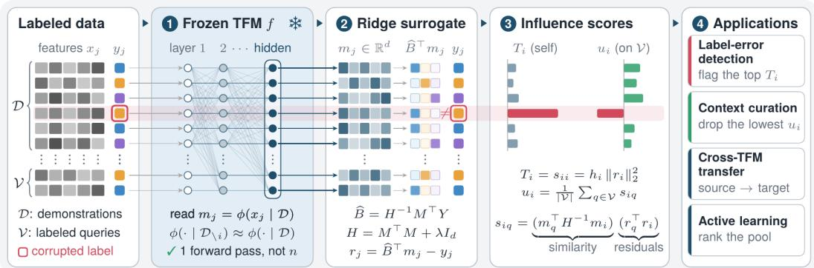
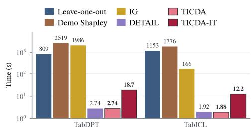
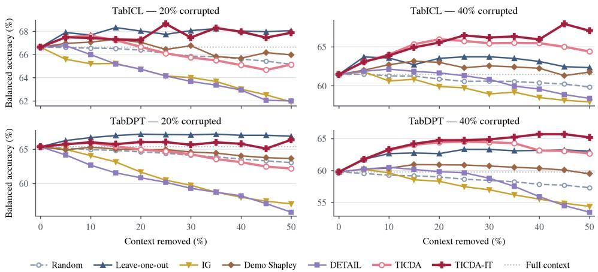
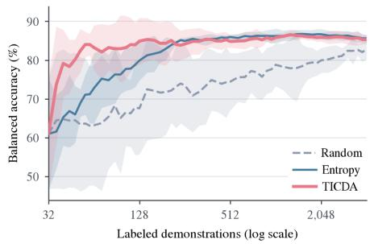
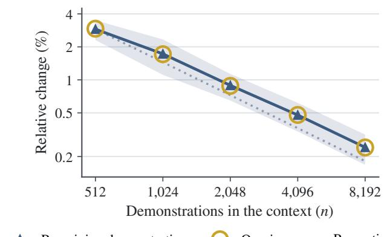
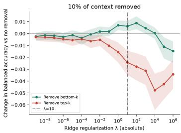
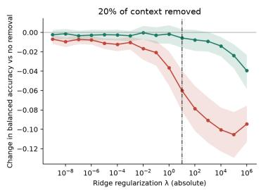
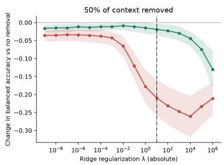
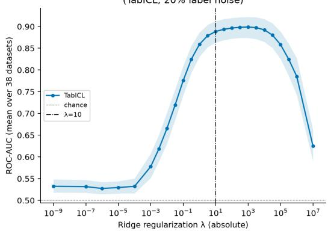

# TICDA: TABULAR IN-CONTEXT DATA ATTRIBUTION

Yacine Benihaddadene1,∗

Milan Bhan1,∗

Eliot Dugelay2

Mohammed Jawhar1

Benjamin Wong1

Nicolas Chesneau

Duong Nguyen

1Ekimetrics 2ETH Zurich

∗Equal contribution

## ABSTRACT

Tabular foundation models (TFMs) achieve strong predictive performance by conditioning on labeled demonstrations provided in context, without any parameter update. Yet how individual demonstrations shape a given prediction remains poorly understood. This gap matters in practice: the context is often assembled from whatever labeled data is available, potentially leading to the inclusion of mislabeled, redundant, or low-quality examples that degrade performance. Standard data attribution methods do not transfer to the TFM setting: resampling-based approaches such as DemoShapley require a combinatorial number of forward passes, and gradient-based estimators such as influence functions require computing training point’s effect on the model parameters, which in-context learning never updates. We introduce TICDA, a method that measures the influence of every demonstration in the context directly from linear surrogates trained on TFM latent embeddings, in a single forward pass and at negligible cost. We show that TICDA offers the best compromise against competitors across four tasks: detecting labeling errors, curating context to preserve predictive accuracy while lowering inference cost, producing attribution scores that transfer across TFMs, and supporting an acquisition strategy for efficient active learning.

## 1 INTRODUCTION

Tabular foundation models (TFMs) have demonstrated that transformer-based architectures using in-context learning (ICL) (Dong et al., 2024) can achieve state-of-the-art performance on small- to medium-sized predictive tabular tasks (Erickson et al., 2025; Purucker et al., 2026). A TFM produces a prediction by conditioning on a set of labeled demonstrations in its context, without any parameter update. A succession of models has extended this paradigm to larger and more heterogeneous datasets (Hollmann et al., 2023; Qu et al., 2025; Hollmann et al., 2025; Qu et al., 2026; Ma et al., 2025), raising the interest in TFMs (van Breugel & van der Schaar, 2024). Despite this success, comparatively little is understood about how TFMs use their context, and in particular about the influence that each individual demonstration exerts on a given prediction (Rundel et al., 2024). This influence is not merely of interpretive interest: since the context is assembled from whatever labeled data happens to be available, mislabeled, redundant, or otherwise low-quality demonstrations can be introduced silently and either degrade predictive performance without any obvious signal or induce useless computational overhead. Those effects have been observed in TFMs: TabPFN loses accuracy when its demonstrations come from a distribution that drifts over time (Helli et al., 2024), unsupervised extensions of TabPFN to anomaly detection become unstable when their context is noisy or contaminated (Marszałek et al., 2026), and Rundel et al. (2024) show that a TabPFN context chosen by data valuation predicts better than a random context of the same size, which matters because the cost of TabPFN grows quadratically with the number of demonstrations. The combination of the widespread deployment of TFMs and the opacity of their in-context inference makes attributing predictions to individual demonstrations increasingly critical.

Training data attribution (TDA) methods aim to quantify the influence that individual training points exert on a model’s behavior and performance (Hammoudeh & Lowd, 2024). Transposing this idea to TFMs is not straightforward: the relevant unit is a demonstration conditioning a frozen pretrained model through its context, rather than a training point that shaped a set of learned parameters. Gradient-based estimators such as influence functions (Koh & Liang, 2017) are defined through the model parameters and thus have no natural counterpart for a demonstration whose effect is exerted at inference time. Gradient-free resampling-based approaches such as Data Shapley (Ghorbani & Zou, 2019) require evaluating the model over a combinatorial number of data subsets, which is prohibitive when each evaluation amounts to a full forward pass over the context. To overcome these limitations, we introduce TICDA, a gradient-based approach for estimating the influence of every demonstration in the context at negligible cost.

## Our main contributions are as follows:

1. We propose TICDA, which measures the influence of every in-context demonstration directly from linear surrogates trained on TFM latent embeddings, in a single forward pass.

2. We show that TICDA detects labeling errors among demonstrations competitively with existing methods, while incurring lower cost.

3. We show that TICDA enables context curation that either improves or maintains predictive performance while reducing inference cost.

4. We establish that the attribution scores produced by TICDA transfer across heavier TFMs.

5. We derive an acquisition strategy from TICDA influence scores for efficient active learning.

This paper is organized as follows. Section 2 introduces TICDA, and Section 3 shows how TICDA enables accurate labeling error detection, context curation, TFM transfer and active learning. Section 4 gives a review of how existing approaches compute data attribution, both for deep models in general and in the ICL setting.

## 2 TICDA: A METHOD TO COMPUTE FIXED-REPRESENTATION INFLUENCES

In this section, we introduce TICDA, a method for measuring the influence that each demonstration of a TFM context exerts on a given prediction. We measure this influence as a leave-one-out (LOO) effect: the change of the loss on a labeled query $z _ { q }$ when demonstration i is removed and the prediction is made again without it, where $z _ { q } ~ = ~ ( x _ { q } , y _ { q } )$ is an input $x _ { q }$ with its label $y _ { q }$ . Let $\mathcal { D } = \{ ( x _ { j } , y _ { j } ) \} _ { j = 1 } ^ { n }$ be a classification context with K classes and observed one-hot labels $y _ { j } \in \mathbb { R } ^ { K }$ let $f$ be a frozen TFM, and write $z _ { j } = ( x _ { j } , y _ { j } )$ for the j-th demonstration. The LOO influence of demonstration $z _ { i }$ on the query $z _ { q }$ is the change in the loss of the TFM when the demonstration is removed from the context:

$$
\Delta _ { i q } ^ { \mathrm { T F M } } = \mathcal { L } \big ( f ( x _ { q } ; \mathcal { D } _ { \setminus i } ) , y _ { q } \big ) - \mathcal { L } \big ( f ( x _ { q } ; \mathcal { D } ) , y _ { q } \big ) ,\tag{1}
$$

where $f ( x _ { q } ; \mathcal { D } )$ is the prediction of the TFM for $x _ { q }$ given the context D, $\mathcal { D } _ { \backslash i }$ is the context without demonstration i, and L is the predictive loss. A positive value of $\Delta _ { i q } ^ { \mathrm { T F M } }$ means that the demonstration helps the query, since its removal raises the loss. Evaluating Equation 1 for every demonstration requires n forward passes over contexts of $n { - } 1$ demonstrations, which is prohibitive for the contexts of thousands of demonstrations that TFMs are designed for.

To avoid doing one forward pass per demonstration, we follow the influence function approach (Koh & Liang, 2017). Consider a model with parameters θ (pre)trained on the n demonstrations of D: its fitted parameters $\widehat { \theta }$ minimize the empirical risk $\textstyle { \frac { 1 } { n } } \sum _ { j = 1 } ^ { n } { \mathcal { L } } ( z _ { j } , \theta )$ , with $\mathcal { L } ( z _ { j } , \theta )$ the loss of its prediction on $x _ { j }$ against $y _ { j }$ . Upweighting a training point $z _ { i }$ by an infinitesimal amount changes the loss at $z _ { q }$ by

$$
\mathcal { T } _ { \mathrm { u p , l o s s } } ( z _ { i } , z _ { q } ) = - \nabla _ { \boldsymbol { \theta } } \mathcal { L } ( z _ { q } , \widehat { \boldsymbol { \theta } } ) ^ { \top } H _ { \widehat { \boldsymbol { \theta } } } ^ { - 1 } \nabla _ { \boldsymbol { \theta } } \mathcal { L } ( z _ { i } , \widehat { \boldsymbol { \theta } } ) ,\tag{2}
$$

where $\nabla _ { \theta }$ denotes the gradient with respect to the parameters and $\begin{array} { r } { H _ { \widehat { \theta } } = \frac { 1 } { n } \sum _ { j = 1 } ^ { n } \nabla _ { \theta } ^ { 2 } { \mathcal { L } } ( z _ { j } , \widehat { \theta } ) } \end{array}$ is the Hessian. A positive value of $\mathcal { T } _ { \mathrm { u p , l o s s } } ( z _ { i } , z _ { q } )$ means that giving the training point $z _ { i }$ more weight raises the loss at $z _ { q } .$ , and vice versa. $\mathcal { T } _ { \mathrm { u p , l o s s } } \overline { { \left( z _ { i } , z _ { q } \right) } }$ is the first-order estimate (up to a factor) of the change of $\Delta _ { i q } ^ { \mathrm { T F M } }$ (Koh & Liang, 2017).

The influence function approach relies on differentiating the loss with respect to the model’s parameters θ, through which a training point exerts its effect. However, a TFM learns in context, and its parameters remain fixed during inference. A demonstration influences a prediction only through the context in which the model reads it and there are no parameter updates. Hence, the gradients required in Equation 2 cannot be computed.

  
Figure 1: TICDA overview. TICDA (1) extracts TFM embeddings, (2) trains a linear surrogate on the classification task of interest, (3) estimates influence score based on the surrogate and (4) can be applied for label-error detection, context curation, cross-TFM transfer and active learning.

In order to overcome this limitation, TICDA operates in two steps: (1) TICDA fits a ridge surrogate on the representations that the TFM constructs for the demonstrations (Section 2.1), and (2) TICDA holds these representations fixed (Section 2.2). Step (1) provides the parameters that influence functions require, while step (2) allows a single forward pass to serve all demonstrations. Under these two choices, Equation 2 admits a closed-form solution yielding two scores, self-influence and queryinfluence (Section 2.3). Figure 1 gives an overview of the TICDA methodology and we detail its components in the following sections.

## 2.1 ATTRIBUTION SURROGATE

To obtain parameters to which every demonstration contributes, we propose to apply Equation 2 to a ridge linear probe fitted on the representations of the TFM rather than to its weights. Let $\phi ( \cdot \mid \mathcal { D } ) \in \mathbb { R } ^ { d }$ denote the row representation read at a given hidden layer of f when the context is D. We write $m _ { j } = \phi ( x _ { j } \mid \mathcal { D } )$ for demonstration j, $m _ { q } = \phi ( x _ { q } \mid \mathcal { D } )$ for a query, and $M \in \mathbb { R } ^ { n \times d }$ and $Y \in \mathbb { R } ^ { n \times K }$ for the demonstration and label matrices. This notation makes the dependence on D explicit: in a TFM, the representation of a row is computed from the whole context, including its labels for the backbones that we study, and not from the row alone. On these representations, we fit a ridge surrogate to the observed labels:

$$
\widehat { B } = \arg \operatorname* { m i n } _ { B } J ( B ) , \qquad J ( B ) = \frac { 1 } { 2 } \| M B - Y \| _ { F } ^ { 2 } + \frac { \lambda } { 2 } \| B \| _ { F } ^ { 2 } ,\tag{3}
$$

where $\| \cdot \| _ { F }$ is the Frobenius norm and $\lambda > 0$ is the regularization term. This objective admits the closed-form solution

$$
\widehat B = H ^ { - 1 } M ^ { \top } Y , \qquad H = M ^ { \top } M + \lambda I _ { d } .\tag{4}
$$

For a row with representation $m _ { j }$ , the surrogate predicts the class-score vector $\widehat { B } ^ { \top } m _ { j } ,$ its residual $r _ { j } = \widehat { B } ^ { \top } m _ { j } - y _ { j }$ measures the discrepancy from the observed one-hot label, and $\ell _ { j } ( B ) =$ $\ell ( B ^ { \top } m _ { j } , y _ { j } )$ denotes its loss, with $\begin{array} { r } { \ell ( s , y ) = \frac { 1 } { 2 } \| s - y \| _ { 2 } ^ { 2 } } \end{array}$ . The surrogate provides parameters, ${ \widehat { B } } ,$ , to which every demonstration contributes and through which Equation 2 becomes applicable.

## 2.2 FIXED REPRESENTATIONS SIMPLIFICATION

The surrogate alone does not remove the cost of Equation 1. Removing demonstration i changes the surrogate loss on the query by

$$
\Delta _ { i q } ^ { \mathrm { R } } = \ell \big ( \widehat { B } ( \mathcal { D } _ { \setminus i } ) ^ { \top } \phi ( x _ { q } \mid \mathcal { D } _ { \setminus i } ) , y _ { q } \big ) - \ell \big ( \widehat { B } ( \mathcal { D } ) ^ { \top } \phi ( x _ { q } \mid \mathcal { D } ) , y _ { q } \big ) ,\tag{5}
$$

where $\widehat { B } ( \mathcal { D } )$ denotes the coefficients fitted on the context D, and this change has two distinct origins: (1) demonstration i leaves the regression, so that the coefficients are refitted, which amounts to a rank-one update of a d × d system, and (2) the context itself changes, so that the TFM re-encodes every remaining demonstration and the query, $M ( \mathcal { D } _ { \backslash i } )$ being different from $M ( \mathcal { D } )$ with one row removed. The second effect requires a forward pass of the TFM for each candidate deletion. Equation 5 is thus as expensive as Equation 1, and an approach willing to pay this cost would have no use for a surrogate, since it could measure the loss of the TFM directly.

Motivated by the fact that one demonstration represents a small fraction of a context of thousands of demonstrations, we make the following simplification: for every demonstration $i ,$

$$
\phi ( \cdot \mid { \mathcal { D } } _ { \setminus i } ) \approx \phi ( \cdot \mid { \mathcal { D } } ) .\tag{6}
$$

We provide evidence in Appendix C.1 that Equation 6 is reasonable. Specifically, differences are approximately 0.5% of the representation norm with 4,096 demonstrations and decrease as the number of demonstrations increases. All representations are extracted once, from the full context, and the removal of a demonstration only affects the fit of the surrogate. This choice has two consequences. First, a single forward pass serves all n demonstrations instead of one pass each. Second, the surrogate becomes an ordinary ridge regression on a fixed design, i.e., a strictly convex and twice-differentiable objective. That is the setting in which the influence function of Equation 2 holds.

## 2.3 DEMONSTRATION UPWEIGHTING INFLUENCE

Under Equation $^ { 6 , }$ we follow Koh & Liang (2017) and measure a demonstration’s influence by slightly modifying its weight in the ridge objective and evaluating the resulting change in query loss. Changing the weight of demonstration i from 1 to 1 + ϵ gives

$$
\widehat B _ { \epsilon } = \arg \operatorname* { m i n } _ { B } \big [ J ( B ) + \epsilon \ell _ { i } ( B ) \big ] ,\tag{7}
$$

where the representations and the global regularization penalty remain fixed. Differentiating the normal equations at $\epsilon = 0$ gives $d \widehat { B } _ { \epsilon } / d \epsilon = - H ^ { - 1 } m _ { i } r _ { i } ^ { \top }$ . No Hessian over the parameters of the TFM is involved. We define the influence of demonstration i on query q as

$$
s _ { i q } : = - \left. \frac { d \ell _ { q } ( \widehat { B } _ { \epsilon } ) } { d \epsilon } \right| _ { \epsilon = 0 } = \left( m _ { q } ^ { \top } H ^ { - 1 } m _ { i } \right) \left( r _ { q } ^ { \top } r _ { i } \right) .\tag{8}
$$

The sign indicates whether the demonstration locally helps or hurts the query under the surrogate: $s _ { i q } > 0$ means that increasing its weight reduces query loss, while $s _ { i q } < 0$ means that it increases query loss. The pairwise score $s _ { i q }$ describes the influence of demonstration i on the surrogate loss at a query q. Evaluating it on the demonstration itself or aggregating it over several queries yields two complementary summaries, which can be used for different applications.

Self-influence. Using demonstration $i \mathbf { \ ' } _ { \mathbf { S } }$ own representation and label as the query in Equation 8 gives its self-influence: $T _ { i } = s _ { i i } = h _ { i } \| r _ { i } \| _ { 2 } ^ { 2 }$ . Defined this way, $T _ { i }$ is the first-order change of the demonstration’s own loss when it is removed. This score is the squared residual multiplied by the leverage $h _ { i }$ (Appendix B.1). Demonstrations with a large $T _ { i }$ are those whose observed label is not supported by the rest of the context. Hence, $T _ { i }$ can be used to detect labeling errors, as we show in Section 3.

Query-influence. Given a set V of queries, the mean influence $\begin{array} { r } { u _ { i } = \frac { 1 } { | \mathcal { V } | } \sum _ { q \in \mathcal { V } } s _ { i q } } \end{array}$ shows how demonstration i supports the predictions on V. Demonstrations with a negative u are those whose removal lowers the mean loss on V. Hence, $u _ { i }$ can be used to curate the context, by removing the demonstrations with the lowest $u _ { i }$ computed on a labeled validation set (Section 3).

## 3 EXPERIMENTAL SETTINGS

This section presents the experimental study conducted across 38 datasets from TabArena (Erickson et al., 2025) and several TFMs. We first run TICDA on two TFMs to assess how well it detects labeling errors, including a sensitivity analysis over the hidden space size and the influence computation method (self or query). We then show how TICDA enables to reduce context size, and therefore the inference cost of TFMs, without sacrificing performance, even improving it in some cases. Finally, we show how TICDA can be used to build an acquisition strategy for active learning under low data regime.

## 3.1 EXPERIMENTAL SETUP

Datasets. TICDA and competitors are tested on 38 classification datasets from TabArena. We follow the preprocessing and evaluation protocol of TabArena and limit each context to at most 4,096 demonstrations. All methods use the same context and test splits on each dataset.

Models. We consider two frozen TFMs as backbone for TICDA: TabICLv2 (Qu et al., 2026) and TabDPT 1.2 (Ma et al., 2025). TICDA reads the row representations of TabICLv2 before its incontext learning layers and those of TabDPT after the 16th of its 32 transformer layers. No backbone parameters are updated during attribution. We first evaluate each attribution method independently on every backbone. Then, to test whether the scores transfer to models that TICDA never reads, we rank the demonstrations with one of these two backbones and apply this ranking unchanged to curate the context of TabPFN-3 (Grinsztajn et al., 2026) and TabPFN-3.5 (Jager et al., 2026).¨

Evaluation Protocols and Metrics. We evaluate TICDA through LOO estimation, labeling error detection, computational efficiency, context curation, transfer to other TFMs, and acquisition strategy for active learning. For LOO estimation, we compute the Spearman correlation between TICDA and exhaustive leave-one-out (LOO), as defined in Equation 1, and refer to this agreement as faithfulness. For labeling error detection, we follow Ghorbani & Zou (2019): we corrupt the labels of 20% of the context demonstrations, treat them as positives, rank demonstrations by self-influence $( T _ { i } )$ , and report the AUC of the recovered ranking. We report attribution runtime to assess computational efficiency. For context curation, under a fixed budget we rank demonstrations by their mean influence $( u _ { i } )$ on a validation set, remove the lowest-scored, and re-evaluate the backbone on the unchanged test set, comparing balanced accuracy against the uncurated context and against random removal. For active learning, we test whether TICDA can guide data acquisition in a pool-based setting by acquiring the candidates whose addition most reduces the surrogate loss on a labeled validation set, and measure label efficiency through the area under the learning curve.

TICDA and Competitors. We use the base configuration of TICDA introduced in Section 2. Given the frozen row representations, TICDA fits a ridge-regularized linear probe and derives the self-influence scores $( T _ { i } )$ used for label-error detection and the mean query-influence scores (u ) used for context curation without further calls to the backbone. We fix the ridge regularization coefficient to λ = 10 for all datasets and backbones, without dataset-specific tuning. We also implement TICDA-IT for context curation experiments, consisting in performing iterative curation, where 5% of the demonstrations are removed at each step, followed by refitting and re-ranking with the TICDA data attribution computation protocol, until the target removal threshold is reached. We compare TICDA to four competitors. We also run Integrated gradients (IG) (Sundararajan et al., 2017) to estimate each demonstration’s contribution by integrating prediction gradients along a path from a reference input, constituted by replacing the input demonstration of interest with padding. We implement other competitors that we present in more details in Section 4: DETAIL (Zhou et al., 2024) (following basic setting from the paper) and an affordable version of DemoShapley (Xie et al., 2025) for TFMs to approximate Shapley values from eight Monte Carlo context permutations. Beyond being used as a reference to compute faithfulness, we also compare our results to Leave-one-out (LOO) for labeling error detection and context curation.

## 3.2 EXPERIMENTAL RESULTS

LOO Faithfulness and Labeling Error Detection. Table 1 reports results aggregated over the 38 datasets from TabArena. Across both backbones, TICDA ranks first or second on every metric. On TabDPT, TICDA is the second-best method for both faithfulness (0.79) and AUC (0.88), trailing DemoShapley on faithfulness and tying it on labeling error detection. On TabICL, TICDA reaches the best faithfulness (0.67) and the best AUC (0.89), the latter significantly above LOO. No competitor is this consistent: DemoShapley is strong on TabDPT but degrades on TabICL, while IG and DETAIL lead to poor results both in terms of faithfulness and labeling error detection.

Table 1: Data attribution for in-context demonstrations on tabular foundation models. Results are aggregated over 38 datasets (mean ± std). Best results are bold, second best underlined; stars compare the winner with the runner-up (two-sided paired t-test, $^ { * } p < . 1 0 , ^ { * * } p < . 0 5 , ^ { * * * } p < . 0 1 )$
<table><tr><td></td><td></td><td>LOO</td><td>DemoShapley</td><td>IG</td><td>DETAIL</td><td>TICDA (ours)</td></tr><tr><td rowspan="2">TabDPT</td><td>Faith. ↑</td><td></td><td> $\mathbf { 0 . 9 1 ^ { * * * } } \pm 0 . 0 7$ </td><td> $0 . 2 0 \pm 0 . 3 5$ </td><td> $- 0 . 0 6 \pm 0 . 1 8$ </td><td> $0 . 7 9 \pm 0 . 0 9$ </td></tr><tr><td>AUC↑</td><td> $\mathbf { 0 . 9 0 ^ { * * * } } \pm 0 . 0 8$ </td><td> $0 . 8 8 \pm 0 . 1 0$ </td><td> $0 . 6 0 \pm 0 . 2 0$ </td><td> $0 . 4 7 \pm 0 . 1 3$ </td><td> $0 . 8 8 \pm 0 . 0 8$ </td></tr><tr><td rowspan="2">TabICL</td><td> $\mathrm { F a i t h . ~ \uparrow }$ </td><td></td><td> $0 . 6 5 \pm 0 . 1 5$ </td><td> $0 . 3 0 \pm 0 . 2 2$ </td><td> $- 0 . 1 1 \pm 0 . 2 2$ </td><td> ${ \bf 0 . 6 7 \pm 0 . 2 1 }$ </td></tr><tr><td> $\mathbf { A U C \uparrow }$ </td><td> $\underline { { 0 . 8 0 } } \pm 0 . 1 6$ </td><td> $0 . 7 6 \pm 0 . 1 1$ </td><td> $0 . 6 4 \pm 0 . 1 8$ </td><td> $0 . 3 7 \pm 0 . 1 7$ </td><td> $\mathbf { 0 . 8 9 ^ { * * * } } \pm 0 . 0 8$ </td></tr></table>

Figure 2 additionally reports computation time per method (log scale). TICDA and DETAIL are the only methods that run in under three seconds (1.88–2.74 s), two to three orders of magnitude faster than LOO, DemoShapley, and IG. DETAIL is cheap but, as Table 1 shows, performs poorly on faithfulness and labeling error detection. TICDA is thus the only method that pairs top-tier faithfulness and labelingerror detection with negligible cost, making it the best overall compromise.

  
Figure 2: Average computation time per method.

We ablate two design choices of TICDA: the influence score used to rank demonstrations and

the dimensionality of the representations on which attribution is performed. We compare selfinfluence $T _ { i }$ with query-influence, as defined in Section 2.3. Following Zhou et al. (2024), we also compare the full 512-dimensional TabICL representations with a random projection to 20% of their original dimension, corresponding to 102 dimensions. Results for the reduced representations are averaged over three projection seeds. We report the same quality metrics as above: faithfulness with LOO, label-error detection performance (AUC), and computation runtime.

Table 2 shows that the influence scoring methodology has a substantially larger effect than the representation dimensionality. With full representations, self-influence significantly increases faithfulness (from 0.33 to 0.67) and AUC (from 0.86 to 0.89) relative to queryinfluence. Reducing the representation dimension leaves AUC and faithfulness unchanged, while only slightly improving computation time. These results especially support the use of TICDA self-influence for label-error detec-

Table 2: Ablation study on TabICL (38 datasets, 20% label corruption, mean ± std).
<table><tr><td colspan="2">Configuration</td><td colspan="3">Metrics</td></tr><tr><td>Influence</td><td>Dimension</td><td>Faith. ↑</td><td>AUC↑</td><td>Time (s) ↓</td></tr><tr><td>query</td><td>20%</td><td> $0 . 3 2 _ { \pm 0 . 1 6 }$ </td><td> $0 . 8 5 { \scriptstyle \pm 0 . 1 0 }$ </td><td> $4 . 9 0 _ { \pm 1 . 3 0 }$ </td></tr><tr><td>query</td><td>full</td><td> $0 . 3 3 { \scriptstyle \pm 0 . 1 6 }$ </td><td> $0 . 8 6 _ { \pm 0 . 1 0 }$ </td><td> $5 . 0 9 { \scriptstyle \pm 1 . 3 1 }$ </td></tr><tr><td>self</td><td>20%</td><td> $0 . 6 7 _ { \pm 0 . 2 1 }$ </td><td> $0 . 8 9 _ { \pm 0 . 0 8 }$ </td><td> $3 . 5 1 _ { \pm 0 . 6 8 }$ </td></tr><tr><td>self</td><td>full</td><td> $0 . 6 7 _ { \pm 0 . 2 1 }$ </td><td> $0 . 8 9 _ { \pm 0 . 0 8 }$ </td><td> $3 . 7 1 _ { \pm 0 . 6 9 }$ </td></tr></table>

tion. We additionally show in Appendix E the sensitivity of our approach to the regularization coefficient.

Context Curation. Figure 3 reports aggregated curation results on the 38 selected TabArena datasets, at two initial corruption levels (20% and 40%) and across increasing fractions of removed context. TICDA-IT is the most robust curation strategy across both settings: it keeps balanced accuracy at or above the full-context level as demonstrations are removed, whereas IG and DETAIL degrade sharply, DemoShapley tracks the random baseline, and LOO curates well only at 20% corruption. The gain is clearest under heavy corruption: at 40%, the balanced accuracy of both TICDA and TICDA-IT increases with removal and peaks around 40–45%, so that discarding up to half of the demonstrations outperforms the full context. Read together with the compute results of Figure 2, this shows that TICDA-based curation preserves or improves accuracy while using up to 50% fewer demonstrations, at a small fraction of the cost of LOO, the only baseline of comparable curation quality. Finally, TICDA-IT consistently outperforms TICDA, most visibly at 20% corruption where TICDA alone drifts below the full-context level. Recomputing data attribution during curation is therefore worthwhile.

  
Figure 3: Curation: aggregated balanced accuracy evolution on TabDPT and TabICL under different levels of demonstration corruption. Each method ranks in-context demonstrations by its attribution scores, and the lowest-scored demonstrations are removed.

Table 3: TICDA TDA Transfer for context curation between source and target models. Balanced accuracy (mean ± std, aggregated over all datasets) is reported at several levels of removal.
<table><tr><td rowspan="2">Target</td><td rowspan="2">Source</td><td colspan="4">Demonstrations removed</td></tr><tr><td>0%</td><td>10%</td><td>20%</td><td>50%</td></tr><tr><td rowspan="3">TabPFN-3</td><td>Random</td><td> $5 9 . 0 \pm 1 4 . 9$ </td><td> $5 8 . 7 \pm 1 4 . 6 $ </td><td> $5 8 . 3 \pm 1 4 . 4$ </td><td> $5 6 . 6 \pm 1 4 . 1$ </td></tr><tr><td>TabICLv2</td><td> $5 9 . 0 \pm 1 4 . 9$ </td><td> ${ \bf 6 3 . 5 \pm 1 5 . 8 }$ </td><td> ${ \bf 6 5 . 0 \pm 1 5 . 8 }$ </td><td> ${ \bf 6 4 . 4 \pm 1 5 . 4 }$ </td></tr><tr><td>TabDPT</td><td> $5 9 . 0 \pm 1 4 . 9$ </td><td> $6 2 . 6 \pm 1 5 . 7$ </td><td> $6 4 . 0 \pm 1 5 . 7$ </td><td> $6 3 . 4 \pm 1 5 . 2$ </td></tr><tr><td rowspan="3">TabPFN-3.5</td><td>Random</td><td> $6 0 . 4 \pm 1 5 . 5$ </td><td> $6 0 . 1 \pm 1 5 . 2$ </td><td> $5 9 . 8 \pm 1 5 . 1$ </td><td> $5 7 . 9 \pm 1 4 . 3$ </td></tr><tr><td>TabICLv2</td><td> $6 0 . 4 \pm 1 5 . 5$ </td><td> ${ \bf 6 4 . 1 \pm 1 5 . 9 }$ </td><td> ${ \bf 6 4 . 5 \pm 1 5 . 9 }$ </td><td> ${ \bf 6 4 . 6 \pm 1 5 . 5 }$ </td></tr><tr><td>TabDPT</td><td> $6 0 . 4 \pm 1 5 . 5$ </td><td> $6 3 . 0 \pm 1 6 . 0$ </td><td> $6 3 . 8 \pm 1 6 . 0$ </td><td> $6 3 . 1 \pm 1 5 . 5$ </td></tr></table>

Table 3 demonstrates that attributions computed on one backbone transfer effectively to curate demonstrations for unseen targets (TabPFN-3 and TabPFN-3.5). At 50% removal using transferred scores from either TabICLv2 or $\mathrm { T a b } \mathrm { D P T }$ , balanced accuracy reaches approximately 64%, exceeding full-context baselines by over four points and substantially outperforming random removal. Transfer is robust across source models, with TabDPT performing comparably to the stronger TabICLv2.

## 3.3 TDA FOR TFM ACTIVE LEARNING

TICDA-based Acquisition Strategy. We finally investigate whether TICDA can guide data acquisition in pool-based active learning with TabIC $J , \mathbf { v } 2 ,$ on the same training/validation/test splits as the curation experiment. For each dataset, the pool P is the training split, drawn anew in each repetition, for larger training sets. The labeled context $\mathcal { D } _ { 0 }$ starts with $n _ { 0 } = 3 2 { \mathrm { ~ } }$ demonstrations of $\mathcal { P } _ { \cdot }$ , one per class and the others drawn uniformly, and the rest of $\mathcal { P }$ forms the unlabeled pool $\mathcal { U } _ { \mathrm { 0 } } . \mathrm { A t }$ each round t, a strategy selects a batch $B _ { t }$ of $b _ { t }$ candidates from U , whose labels are revealed and which join the context: $\mathcal { D } _ { t + 1 } = \mathcal { D } _ { t } \cup \mathcal { B } _ { t }$ . The batch grows with the context, $b _ { t } = \operatorname* { m a x } \mathopen { } \mathclose \bgroup \left( 4 , 2 ^ { \lfloor \log _ { 2 } \left( \left| \mathcal { D } _ { t } \right| / 8 \right) \rfloor } \aftergroup \egroup \right)$ , and acquisition stops once half of the pool is labeled. TICDA acquires the candidates whose addition would most reduce the surrogate loss on a labeled validation set V. At each round, the representations of the context, the candidates and V are read in a single forward pass with $\mathcal { D } _ { t }$ as context and held fixed (Equation $6 ) .$ , and the surrogate of Equation 4 is fitted on the context with $\lambda \ = \ 1 0$ Adding a candidate x with label c to the context changes this surrogate in closed form (Equa tion 11 with $\begin{array} { r } { t \ = \ - 1 ) \colon \widehat { B } ( + x , c ) \ : = \ \widehat { B } \ : - \ : \frac { 1 } { 1 + h _ { \mathrm { * } } } H ^ { - 1 } m _ { x } \big ( \widehat { B } ^ { \top } m _ { x } - e _ { c } \big ) ^ { \top } } \end{array}$ with $h _ { x } = m _ { x } ^ { \top } H ^ { - 1 } m _ { x }$ where $e _ { c }$ is the one-hot vector of class $c .$ TICDA scores x under its most favorable label: $\operatorname { s c o r e } ( x ) = \operatorname* { m a x } _ { c } \left[ L \gamma \left( { \widehat { B } } \right) - L \gamma \left( { \widehat { B } } ( + x , c ) \right) \right]$ , with $\begin{array} { r } { L _ { \mathcal { V } } ( B ) = \frac { 1 } { K } \sum _ { k = 1 } ^ { K } \frac { 1 } { | \mathcal { V } _ { k } | } \sum _ { q \in \mathcal { V } _ { k } } \ell \big ( B ^ { \top } m _ { q } , y _ { q } \big ) } \end{array}$ where $\nu _ { k }$ holds the validation examples of class $k ,$ so that every class weighs equally, as in balanced accuracy. Each batch is built greedily: after each selection, $\dot { H }$ is updated with the representation of the selected candidate, a rank-one update that requires no label, and the remaining candidates are rescored; $\widehat { B }$ is refitted once the labels of the batch are revealed. Because early contexts contain far fewer demonstrations than the $d = 5 1 2$ dimensions of the representations, the representations are first projected onto $d _ { t } = \operatorname* { m i n } \bigl ( 5 1 2 , \operatorname* { m a x } ( 4 , \lfloor | \mathcal { D } _ { t } | / 5 \rfloor ) \bigr )$  Gaussian random directions, redrawn at every round, so that the surrogate is fitted with about five demonstrations per dimension; as TabICL averages eight ensemble views, one surrogate is fitted per view and their predictions are averaged. $\nu$ is a class-stratified sample of the validation split, drawn once per repetition, that holds 20% of the final budget (at least 32 examples); it is never added to the context, is not counted in the labeling budget, and is not used by the baselines.

Table 4: Active learning: normalized area under the balanced-accuracy curve (×100, mean ± std over datasets). Bold: best; underlined: second; ∗: paired t-test against the runner-up, $p < . 0 1$
<table><tr><td></td><td>Full budget (27 datasets)</td><td> $\le 5 1 2$  labels (23 datasets)</td></tr><tr><td>Random</td><td> $6 6 . 2 3 \pm 1 4 . 1 7$ </td><td> $6 6 . 3 8 \pm 1 1 . 7 2$ </td></tr><tr><td>entropy</td><td> $6 7 . 5 6 \pm 1 4 . 9 5$ </td><td> $6 7 . 5 1 \pm 1 2 . 6 6$ </td></tr><tr><td>TICDA</td><td>68.35* ±14.74</td><td> ${ \bf 6 9 . 0 2 ^ { \ast } \pm } 1 2 . 0 9$ </td></tr></table>

  
Figure 4: Balanced accuracy evolution on APSFailure against the number of labeled demonstrations.

Experimental Protocol. We compare TICDA with random sampling, which draws the $b _ { t }$ candidates uniformly, and with uncertainty sampling (Lewis & Gale, 1994), a strong baseline that selects the $b _ { t }$ candidates on which the TFM is least certain. We name this baseline entropy, since it measures this uncertainty by the predictive entropy $\begin{array} { r } { - \sum _ { k = 1 } ^ { K } p _ { k } ( x ) \log p _ { k } ( x ) } \end{array}$ , where $p ( x )$ is the class distribution predicted by the TFM given $\mathcal { D } _ { t }$ . All strategies share the initial contexts, pools, test examples and batch sizes. After each round, we measure the balanced accuracy on the test split, and summarize each learning curve by its normalized area under the curve (AULC): the average balanced accuracy over $\log _ { 2 } | \mathcal { D } _ { t } |$ , from 32 labels to the end of the budget or to 512 labels. Results are averaged over $R = 5$ repetitions, which differ in the initial context, the pool subsample and V, on 27 datasets: 24 from TabArena, jannis (Grinsztajn et al., 2022), higgs (Baldi et al., 2014) and otto (Purucker et al., 2026).

Experimental Results. Table 4 reports the aggregated results and Figure 4 shows an example of a learning curve on the APSFailure Dataset from TabArena. TICDA achieves the best average AULC across both the full budget (68.35%) and the data-constrained regime with $\leq 5 1 2$ labels (69.02%), outperforming entropy sampling and random baselines.

## 4 RELATED WORK

Training data attribution (TDA) methods attribute model performance to individual training points, grouped into three categories (Hammoudeh & Lowd, 2024): (1) resampling-based methods, which retrain models on perturbed subsets; (2) gradient-based methods, which approximate influence from gradients; and (3) training-dynamics methods, which track influence across checkpoints. Their forms depend on the training regime: classical training (where point effects are absorbed into weights) versus in-context learning (where examples influence inference directly). We present in the following on resampling-based and gradient-based approaches, the only families developed for both regimes (Deng et al., 2025).

Resampling-based Approaches. Resampling-based approaches measure how a prediction or the model’s performance changes under finite perturbations of the training set, removing or reweighting individual points, mirroring perturbation-based feature attribution such as SHAP (Lundberg & Lee, 2017). The elementary case is leave-one-out (LOO) retraining, formalized for linear regression by Cook’s distance (Cook, 1977): a single point is removed and the model refit. Data Shapley (Ghorbani & Zou, 2019) values each example by its marginal contribution to performance, at the cost of repeatedly retraining the model. In-Run Data Shapley (Wang et al., 2025b) makes this affordable by defining a variant of these values for one specific training run, which it computes from the gradients of that run. Data Shapley extends naturally to the ICL setting, where the demonstrations play the role of the training set. DemoShapley (Xie et al., 2025) values each demonstration in the prompt used for Large Language Models (LLMs) by its marginal contribution across resampled prompt permutations. While this approach enables to detect high value data to improve LLM performance, this is only affordable for the few-shot LLM setting it targets, but not for the long contexts of TFMs, where the subsets grow combinatorially and each needs a full forward pass.

Gradient-based Approaches. Gradient-based approaches approximate a training point’s effect through the model’s gradients, without retraining. Influence functions (Koh & Liang, 2017) provide a first-order Taylor approximation to LOO retraining, approximating the effect of infinitesimally upweighting a training point on the loss at a test point, which is the formulation of Equation 2 from which TICDA is derived. The Hessian being computationally expensive to compute, several follow-up works have been proposed to make it tractable for deep models by either estimating the Hessian more efficiently (Schioppa et al., 2022; Kwon et al., 2024; Wang et al., 2025a) or by tracing gradients along the training run (Pruthi et al., 2020). However, these approaches do not transfer naturally to ICL demonstrations, since a demonstration updates no model parameter. DETAIL (Zhou et al., 2024) addresses the aforementioned limitations for Large Language Models (LLMs) and is the method conceptually closest to TICDA. Building on the view that transformers implement an internal optimizer during ICL (von Oswald et al., 2023), it models this learner as a linear ridge probe on the hidden states of the demonstrations and applies Equation 2 to this probe rather than to the model’s weights, a surrogate view we share. Its motivation, design, and interpretation, however, do not transfer to TFMs, because DETAIL is built for LLM prompts. The two methods differ in three respects: the regime in which the probe is fitted, since LLM prompts hold few demonstrations in a high-dimensional space whereas TFM contexts hold many rows in a low-dimensional one; the perturbation each score differentiates; and the treatment of contextual representations under a single forward pass. We defer the detailed analysis to Appendix C.

## 5 DISCUSSION AND CONCLUSION

TICDA rests on the fixed-representation approximation of Equation 6: removing a demonstration is assumed to leave the representations of the remaining rows and the query unchanged, so that only the surrogate fit is refitted. Appendix C.1 shows that this is well justified when a single demonstration is a small fraction of a large context. Our faithfulness evaluation compares TICDA with exhaustive LOO on all 38 TabArena datasets, but only with contexts of at most 4,096 demonstrations. Longer contexts, which TICDA is meant to serve, remain untested against this reference, since exhaustive deletion requires one forward pass of the TFM per demonstration. We see TICDA as a promising methodology to optimize context under ICL settings that could be integrated into other existing framework (Bhan et al., 2024; Yang et al., 2023; Xu et al., 2023) carefully targeting ICL examples. Finally, extending TICDA beyond the fixed-representation approximation and to regression and multimodal settings are natural directions for future work.

In this paper we introduced TICDA, a gradient-based data attribution method for tabular foundation models that estimates the influence of every in-context demonstration in a single forward pass. TICDA overcomes the central obstacle to applying influence functions under in-context learning, the absence of a parameter update, by fitting a ridge surrogate on the frozen row representations and holding them fixed under demonstration removal, yielding closed-form influence scores at negligible cost. Across 38 TabArena datasets and two backbones, TICDA is the only method that pairs top-tier faithfulness and labeling-error detection with a runtime well below LOO, DemoShapley, and IG. Its curation preserves or improves model performance while discarding up to half of the demonstrations, and the scores transfer across TFMs, allowing attribution to be computed once and amortized.

## AI USE STATEMENT

Generative AI tools have been used to polish the paper and help in generating tables and figures. These tools also helped in reviewing the manuscript to detect typos and inconsistencies. We also used AI tools to accelerate code production. We take full responsibility for the final content.

## REFERENCES

Pierre Baldi, Peter Sadowski, and Daniel Whiteson. Searching for exotic particles in high-energy physics with deep learning. Nature Communications, 5:4308, 2014. doi: 10.1038/ncomms5308.

Milan Bhan, Jean-Noel Vittaut, Nicolas Chesneau, and Marie-Jeanne Lesot. Self-AMPLIFY: Im-¨ proving small language models with self post hoc explanations. In Proceedings of the 2024 Conference on Empirical Methods in Natural Language Processing (EMNLP), pp. 10974–10991. Association for Computational Linguistics, 2024. doi: 10.18653/v1/2024.emnlp-main.615.

R. Dennis Cook. Detection of influential observation in linear regression. Technometrics, 19(1): 15–18, 1977. doi: 10.1080/00401706.1977.10489493.

Junwei Deng, Yuzheng Hu, Pingbang Hu, Ting-Wei Li, Shixuan Liu, Jiachen T. Wang, Dan Ley, Qirun Dai, Benhao Huang, Jin Huang, et al. A survey of data attribution: Methods, applications, and evaluation in the era of generative AI. SSRN preprint, 2025. URL https://ssrn.com/ abstract=5451054.

Qingxiu Dong, Lei Li, Damai Dai, Ce Zheng, Jingyuan Ma, Rui Li, Heming Xia, Jingjing Xu, Zhiyong Wu, Baobao Chang, et al. A survey on in-context learning. In Proceedings of the 2024 Conference on Empirical Methods in Natural Language Processing (EMNLP), pp. 1107–1128. Association for Computational Linguistics, 2024. doi: 10.18653/v1/2024.emnlp-main.64.

Nick Erickson, Lennart Purucker, Andrej Tschalzev, David Holzmuller, Prateek Mutalik Desai,¨ David Salinas, and Frank Hutter. TabArena: A living benchmark for machine learning on tabular data. In Advances in Neural Information Processing Systems (NeurIPS), Datasets and Benchmarks Track, volume 38, 2025.

Amirata Ghorbani and James Zou. Data Shapley: Equitable valuation of data for machine learning. In International Conference on Machine Learning (ICML), volume 97 of Proceedings of Machine Learning Research, pp. 2242–2251. PMLR, 2019.

Leo Grinsztajn, Edouard Oyallon, and Ga ´ el Varoquaux. Why do tree-based models still outperform ¨ deep learning on typical tabular data? In Advances in Neural Information Processing Systems (NeurIPS), Datasets and Benchmarks Track, volume 35, pp. 507–520, 2022.

Leo Grinsztajn, Klemens Fl ´ oge, Oscar Key, Felix Birkel, et al. TabPFN-3: Technical report. ¨ arXiv preprint arXiv:2605.13986, 2026.

Zayd Hammoudeh and Daniel Lowd. Training data influence analysis and estimation: A survey. Machine Learning, 113(5):2351–2403, 2024. doi: 10.1007/s10994-023-06495-7.

Kai Helli, David Schnurr, Noah Hollmann, Samuel Muller, and Frank Hutter. Drift-resilient¨ TabPFN: In-context learning temporal distribution shifts on tabular data. In Advances in Neural Information Processing Systems (NeurIPS), volume 37, pp. 98742–98781, 2024.

Noah Hollmann, Samuel Muller, Katharina Eggensperger, and Frank Hutter. TabPFN: A transformer ¨ that solves small tabular classification problems in a second. In International Conference on Learning Representations (ICLR), 2023.

Noah Hollmann, Samuel Muller, Lennart Purucker, Arjun Krishnakumar, Max K¨ orfer, Shi Bin Hoo,¨ Robin Tibor Schirrmeister, and Frank Hutter. Accurate predictions on small data with a tabular foundation model. Nature, 637(8045):319–326, 2025. doi: 10.1038/s41586-024-08328-6.

Benjamin Jager, Nick Erickson, L¨ eo Grinsztajn, Felix Birkel, et al. TabPFN-3.5: Technical report.´ arXiv preprint arXiv:2609.17895, 2026.

Pang Wei Koh and Percy Liang. Understanding black-box predictions via influence functions. In International Conference on Machine Learning (ICML), volume 70 of Proceedings of Machine Learning Research, pp. 1885–1894. PMLR, 2017.

Yongchan Kwon, Eric Wu, Kevin Wu, and James Y. Zou. DataInf: Efficiently estimating data influence in LoRA-tuned LLMs and diffusion models. In International Conference on Learning Representations (ICLR), pp. 21921–21942, 2024.

David D. Lewis and William A. Gale. A sequential algorithm for training text classifiers. In SIGIR ’94: Proceedings of the Seventeenth Annual International ACM-SIGIR Conference on Research and Development in Information Retrieval, pp. 3–12. Springer, 1994. doi: 10.1007/ 978-1-4471-2099-5 1.

Scott M. Lundberg and Su-In Lee. A unified approach to interpreting model predictions. In Advances in Neural Information Processing Systems (NeurIPS), volume 30, 2017.

Junwei Ma, Valentin Thomas, Rasa Hosseinzadeh, Alex Labach, Hamidreza Kamkari, Jesse C. Cresswell, Keyvan Golestan, Guangwei Yu, Anthony L. Caterini, and Maksims Volkovs. TabDPT: Scaling tabular foundation models on real data. In Advances in Neural Information Processing Systems (NeurIPS), volume 38, pp. 172692–172722, 2025.

Patryk Marszałek, Tomasz Kusmierczyk, and Marek ´ Smieja. TACTIC for navigating the unknown: ´ Tabular anomaly detection via in-context inference. arXiv preprint arXiv:2603.14171, 2026.

Adam Paszke, Sam Gross, Soumith Chintala, Gregory Chanan, Edward Yang, Zachary DeVito, Zeming Lin, Alban Desmaison, Luca Antiga, and Adam Lerer. Automatic differentiation in PyTorch. In NIPS 2017 Workshop on Autodiff, 2017.

Fabian Pedregosa, Gael Varoquaux, Alexandre Gramfort, Vincent Michel, Bertrand Thirion, Olivier¨ Grisel, Mathieu Blondel, Peter Prettenhofer, Ron Weiss, Vincent Dubourg, et al. Scikit-learn: Machine learning in Python. Journal ofMachine Learning Research, 12:2825–2830, 2011.

Garima Pruthi, Frederick Liu, Satyen Kale, and Mukund Sundararajan. Estimating training data influence by tracing gradient descent. In Advances in Neural Information Processing Systems (NeurIPS), volume 33, pp. 19920–19930, 2020.

Lennart Purucker, Andrej Tschalzev, Nick Erickson, Gioia Blayer, David Holzmuller, Alan Arazi,¨ Alexander Pfefferle, Mustafa Tajjar, Gael Varoquaux, and Frank Hutter. Beyond IID: How general ¨ are tabular foundation models, really? arXiv preprint arXiv:2606.30410, 2026.

Jingang Qu, David Holzmuller, Ga ¨ el Varoquaux, and Marine Le Morvan. TabICL: A tabular foun-¨ dation model for in-context learning on large data. In International Conference on Machine Learning (ICML), volume 267 of Proceedings of Machine Learning Research, pp. 50817–50847. PMLR, 2025.

Jingang Qu, David Holzmuller, Ga¨ el Varoquaux, and Marine Le Morvan. TabICLv2: A better, faster,¨ scalable, and open tabular foundation model. In International Conference on Machine Learning (ICML), 2026. arXiv:2602.11139.

David Rundel, Julius Kobialka, Constantin von Crailsheim, Matthias Feurer, Thomas Nagler, and David Rugamer. Interpretable machine learning for TabPFN. In¨ Explainable Artificial Intelligence (xAI 2024), Communications in Computer and Information Science, pp. 465–476. Springer, 2024. doi: 10.1007/978-3-031-63797-1 23.

Andrea Schioppa, Polina Zablotskaia, David Vilar, and Artem Sokolov. Scaling up influence functions. In Proceedings of the AAAI Conference on Artificial Intelligence, volume 36, pp. 8179– 8186, 2022. doi: 10.1609/aaai.v36i8.20791.

Jack Sherman and Winifred J. Morrison. Adjustment of an inverse matrix corresponding to a change in one element of a given matrix. The Annals of Mathematical Statistics, 21(1):124–127, 1950. doi: 10.1214/aoms/1177729893.

Mukund Sundararajan, Ankur Taly, and Qiqi Yan. Axiomatic attribution for deep networks. In International Conference on Machine Learning (ICML), volume 70 of Proceedings of Machine Learning Research, pp. 3319–3328. PMLR, 2017.

Boris van Breugel and Mihaela van der Schaar. Position: Why tabular foundation models should be a research priority. In International Conference on Machine Learning (ICML), volume 235 of Proceedings ofMachine Learning Research, pp. 48976–48993. PMLR, 2024.

Johannes von Oswald, Eyvind Niklasson, Ettore Randazzo, Joao Sacramento, Alexander Mordv-˜ intsev, Andrey Zhmoginov, and Max Vladymyrov. Transformers learn in-context by gradient descent. In International Conference on Machine Learning (ICML), volume 202 of Proceedings of Machine Learning Research, pp. 35151–35174. PMLR, 2023.

Andrew Wang, Elisa Nguyen, Runshi Yang, Juhan Bae, Sheila A. McIlraith, and Roger Grosse. Better training data attribution via better inverse Hessian-vector products. In Advances in Neural Information Processing Systems (NeurIPS), volume 38, pp. 101825–101860, 2025a.

Jiachen Tianhao Wang, Prateek Mittal, Dawn Song, and Ruoxi Jia. Data Shapley in one training run. In International Conference on Learning Representations (ICLR), pp. 12358–12395, 2025b.

Thomas Wolf, Lysandre Debut, Victor Sanh, Julien Chaumond, Clement Delangue, Anthony Moi, Pierric Cistac, Tim Rault, Remi Louf, Morgan Funtowicz, et al. HuggingFace’s transformers:´ State-of-the-art natural language processing. arXiv preprint arXiv:1910.03771, 2019.

Shan Xie, Man Luo, Chadly Daniel Stern, Mengnan Du, and Lu Cheng. DemoShapley: Valuation of demonstrations for in-context learning. In 2025 IEEE International Conference on Big Data (BigData), pp. 4081–4090. IEEE, 2025. doi: 10.1109/BigData66926.2025.11402298.

Benfeng Xu, Quan Wang, Zhendong Mao, Yajuan Lyu, Qiaoqiao She, and Yongdong Zhang. kNN prompting: Beyond-context learning with calibration-free nearest neighbor inference. In International Conference on Learning Representations (ICLR), 2023.

Zhao Yang, Yuanzhe Zhang, Dianbo Sui, Cao Liu, Jun Zhao, and Kang Liu. Representative demonstration selection for in-context learning with two-stage determinantal point process. In Proceedings of the 2023 Conference on Empirical Methods in Natural Language Processing (EMNLP), pp. 5443–5456. Association for Computational Linguistics, 2023. doi: 10.18653/v1/2023.emnlp-main.331.

Zijian Zhou, Xiaoqiang Lin, Xinyi Xu, Alok Prakash, Daniela Rus, and Bryan Kian Hsiang Low. DETAIL: Task DEmonsTration attribution for interpretable in-context learning. In Advances in Neural Information Processing Systems (NeurIPS), volume 37, pp. 25284–25310, 2024.

## A SCIENTIFIC LIBRARIES

We used several open-source libraries in this work: pytorch (Paszke et al., 2017), HuggingFace transformers (Wolf et al., 2019) and sklearn (Pedregosa et al., 2011). We will make our code public upon acceptance.

## B DERIVATION OF THE INFLUENCE SCORES

This appendix derives the scores of Section 2 and relates them to the exact quantities that they approximate. We first prove the closed form of the influence score (Equation 8), then give the exact effect of deleting a demonstration when the representations are held fixed, which shows what a firstorder score leaves out, state what the fixed-representation simplification of Equation 6 itself neglects, and finally measure how much the representations change when a demonstration is removed.

Let $a _ { j } = m _ { j } r _ { i } ^ { \top } \in \mathbb { R } ^ { d \times K }$ denote the gradient of the loss $\ell _ { j }$ of row $j$ at ${ \widehat { B } } ,$ , and $\langle U , V \rangle _ { F } = \mathrm { t r } ( U ^ { \top } V )$ denote the Frobenius inner product of two matrices.

## B.1 FIRST-ORDER INFLUENCE

To obtain Equation $^ { 8 , }$ we need the derivative of the fitted coefficients with respect to the weight of a demonstration, since the query loss depends on this weight only through the coefficients. We follow the derivation of influence functions (Koh & Liang, 2017), every step of which is available in closed form for a ridge surrogate.

The perturbed objective of Equation 7 is a ridge regression in which demonstration i has weight $1 + \epsilon .$ , so that its minimizer $\widehat { B } _ { \epsilon }$ satisfies the normal equations:

$$
\left( { \cal H } + \epsilon m _ { i } m _ { i } ^ { \top } \right) \widehat { B } _ { \epsilon } = { \cal M } ^ { \top } { \cal Y } + \epsilon m _ { i } { y } _ { i } ^ { \top } ,
$$

where $H = M ^ { \top } M + \lambda I _ { d }$ is positive definite for $\lambda > 0$ . Differentiating these equations at $\epsilon = 0$ and using $r _ { i } = { \widehat { B } } ^ { \top } m _ { i } - y _ { i }$ gives

$$
\frac { d \widehat { B } _ { \epsilon } } { d \epsilon } \bigg | _ { \epsilon = 0 } = - H ^ { - 1 } m _ { i } r _ { i } ^ { \top } = - H ^ { - 1 } a _ { i } .\tag{9}
$$

The query loss depends on ϵ only through the coefficients, and its gradient with respect to $B$ at $\widehat { B }$ is $\textstyle { a _ { q } , }$ so that the chain rule gives

$$
 \frac { d \ell _ { q } ( \widehat { B } _ { \epsilon } ) } { d \epsilon } | _ { \epsilon = 0 } =  a _ { q } ,  \frac { d \widehat { B } _ { \epsilon } } { d \epsilon } | _ { \epsilon = 0 }  _ { F } = - \big < a _ { q } ,  H ^ { - 1 } a _ { i } \big > _ { F } .
$$

Equation 8 defines $s _ { i q }$ as the opposite of this derivative, and the identity $\langle m _ { q } r _ { q } ^ { \top } , H ^ { - 1 } m _ { i } r _ { i } ^ { \top } \rangle _ { F } =$ $( m _ { q } ^ { \top } H ^ { - 1 } m _ { i } ) ( r _ { q } ^ { \top } r _ { i } )$ gives its closed form. The matrix H is the Hessian of the surrogate objective with respect to each of the K columns of B, so that the inverse Hessian of Equation 2 reduces to K copies of the inverse of a d × d matrix. No Hessian over the parameters of the TFM is therefore involved. Equation 2 is written for an objective that averages the losses, whereas Equation 3 sums them. The two conventions define the same surrogate when the averaged objective uses the coefficient $\lambda / n$ , and they give scores that differ by the constant factor n, which leaves every ranking unchanged.

Taking the demonstration itself as the query gives the self-influence equation introduced in Section 2.3, $T _ { i } = h _ { i } \| r _ { i } \| _ { 2 } ^ { 2 }$ , where

$$
h _ { i } = m _ { i } ^ { \top } H ^ { - 1 } m _ { i }\tag{10}
$$

is the ridge leverage of demonstration i, that is, the sensitivity of the prediction of the surrogate for this demonstration to its own label. Since $H - m _ { i } m _ { i } ^ { \top }$ remains positive definite, the leverages satisfy $0 \leq h _ { i } < 1$ , and their sum is $\begin{array} { r } { \sum _ { i } h _ { i } = d - \lambda \mathrm { { \dot { t r } } } ( H ^ { - 1 } ) < d , } \end{array}$ so that the mean leverage of a context is below $d / n$ . In a tabular context, where n exceeds d by an order of magnitude, the leverage therefore multiplies the squared residual by a small factor on average, and this factor is largest for the demonstrations whose representation lies in a direction that few other demonstrations occupy. The self influence equation introduced in Section 2.3 uses, on both sides of the product, the representation that the TFM computes for row i in its role of demonstration. Encoding the same row as a query may give a different vector, since a TFM receives a demonstration with its label and a query without it; the corresponding score would require an additional forward pass, and we do not use it.

## B.2 EXACT DELETION AT FIXED REPRESENTATIONS

The score of Equation 8 is a derivative, whereas deleting a demonstration changes its weight from one to zero. That raises the question of how far a first-order score is from the effect of an actual deletion. When the representations are held fixed and the surrogate is a ridge regression on a fixed design, this question has a closed-form answer. We derive this exact effect below, first on a query and then on the demonstration itself, and show that it differs from the first-order score by corrections that vanish with the leverage, so that the two nearly coincide in a tabular context. This exact effect also serves as a reference for TICDA in Section 3.

Let $\widehat { B } ( t )$ minimize $J ( B ) - t \ell _ { i } ( B )$ for $0 \leq t \leq 1$ , so that t = 1 corresponds to the context without demonstration i. Since this objective differs from J by a term of rank one, the Sherman–Morrison identity (Sherman & Morrison, 1950) gives

$$
\widehat { B } ( t ) - \widehat { B } = \frac { t } { 1 - t h _ { i } } H ^ { - 1 } m _ { i } r _ { i } ^ { \top } ,\tag{11}
$$

whose derivative at $t = 0$ is the opposite of Equation 9. Writing $a _ { q i } = m _ { q } ^ { \top } H ^ { - 1 } m _ { i }$ , the deletion therefore changes the loss of the surrogate on query q by

$$
\Delta _ { i q } ^ { \mathrm { F } } = \frac { a _ { q i } } { 1 - h _ { i } } r _ { q } ^ { \top } r _ { i } + \frac { a _ { q i } ^ { 2 } } { 2 ( 1 - h _ { i } ) ^ { 2 } } \| r _ { i } \| _ { 2 } ^ { 2 } ,\tag{12}
$$

where the first term is the score $s _ { i q }$ divided by $1 - h _ { i }$ , and the second term is of second order in the leverages, since $| a _ { q i } | \leq \sqrt { h _ { i } h _ { q } }$ with $h _ { q } = m _ { q } ^ { \top } H ^ { - 1 } m _ { q }$ . For the demonstration itself, $a _ { i i } = h _ { i }$ , the residual after deletion is $r _ { i } / ( 1 - h _ { i } )$ , and the change of its loss is

$$
\Delta _ { i i } ^ { \mathrm { F } } = \frac { 1 } { 2 } \| r _ { i } \| _ { 2 } ^ { 2 } \Big [ ( 1 - h _ { i } ) ^ { - 2 } - 1 \Big ] = T _ { i } \frac { 1 - h _ { i } / 2 } { ( 1 - h _ { i } ) ^ { 2 } } ,\tag{13}
$$

so that the exact effect and the self-influence differ by a factor that depends on the leverage alone and that tends to one as the leverage tends to zero. Since the mean leverage is below $d / n$ , this factor is close to one for most demonstrations of a tabular context, which is the regime in which the first-order score is accurate. It is not accurate in a context that has fewer demonstrations than dimensions, where the leverages approach one. Equation 12 is the exact fixed-representation deletion of Section 3. It requires no refit, since it reuses the inverse of H, the residuals and the leverages of the single fit.

## B.3 WHAT THE FIXED-REPRESENTATION SIMPLIFICATION NEGLECTS

The two previous results hold for representations that do not respond to the perturbation, which is the simplification of Equation 6. To state what this simplification leaves out, suppose that the context varies along a differentiable path indexed by ϵ, so that the coefficients and the representations both respond. The chain rule then gives

$$
\frac { d \ell _ { q } } { d \epsilon } = r _ { q } ^ { \top } \dot { B } ^ { \top } m _ { q } + r _ { q } ^ { \top } \widehat { B } ^ { \top } \dot { m } _ { q } ,\tag{14}
$$

where $\dot { B }$ and $\dot { m } _ { q }$ denote derivatives with respect to ϵ. The second term is the response of the representation of the query, and the derivative $\dot { B }$ of the first term contains, in addition to Equation 9, the response of every row of M. Equation 6 sets these two responses to zero and keeps Equation 9 alone.

The finite counterpart of this statement is the recomputed deletion $\Delta _ { i q } ^ { \mathrm { R } }$ of Equation 5, in which we remove demonstration i from the context, let the TFM encode the remaining demonstrations and the query again, and refit the surrogate with the same regularization. The difference between $\Delta _ { i q } ^ { \mathrm { R } }$ and $\Delta _ { i q } ^ { \mathrm { F } }$ measures the effect of Equation 6 alone, provided that the two quantities share the queries, their role and their labels. The difference between $\Delta _ { i q } ^ { \mathrm { R } }$ and the leave-one-out effect $\Delta _ { i q } ^ { \mathrm { T F M } }$ of Equation 1 measures in turn what the surrogate does not capture, since both quantities encode the context again and differ only in the loss that they read. Both require one forward pass of the TFM per deleted demonstration, which is the cost that TICDA avoids.

## C RELATION TO DETAIL: THE ROLE OF THE RIDGE PENALTY

This appendix explains how the score of TICDA differs from that of DETAIL (Zhou et al., 2024). Although the two methods are designed for different domains of applications, hence their motivations and the justifications of the approximation/simplification, as explained in Section 4, they both rely on the same surrogate. Both methods fit the ridge regression of Equation 3, so they share the coefficients $\widehat { B }$ and the matrix H, and both apply Equation 2 to it. The main difference in the design is in the construction of each demonstration’s loss: for TICDA, it is the squared error $\ell _ { i } ( B )$ of the demonstration, whereas DETAIL adds the ridge penalty to it, in full and not as a share divided among the n demonstrations:

$$
p _ { i } ( B ) = \ell _ { i } ( B ) + \frac { \lambda } { 2 } \| B \| _ { F } ^ { 2 } ,
$$

where $\left\| \cdot \right\| _ { F }$ is the Frobenius norm, so that the second term is the penalty of J itself. We show below what this choice changes, first for the question that each score answers, then for the gradient of a demonstration, and finally for the score itself.

An influence function estimates, to first order, what happens to a model when the loss of one example is removed from its training objective. What is removed therefore depends on what a method calls the loss of a demonstration. To compare the two cases, we write the objective of Equation 3 as a sum over the demonstrations

$$
J ( B ) = \sum _ { j } \ell _ { j } ( B ) + \frac { \lambda } { 2 } \| B \| _ { F } ^ { 2 }
$$

For TICDA, the loss of demonstration i is $\ell _ { i } .$ , and removing it from J gives

$$
J ( B ) - \ell _ { i } ( B ) = \sum _ { j \neq i } \ell _ { j } ( B ) + \frac { \lambda } { 2 } \| B \| _ { F } ^ { 2 } ,
$$

i.e., the other demonstrations with the same penalty. TICDA therefore estimates the effect of fitting the surrogate without demonstration i and with the same regularization, which is leave-one-out (Equation 1) applied to the surrogate instead of the TFM.

For $\mathrm { D E T A I L }$ , the loss of demonstration i is $p _ { i }$ , and removing it from J gives

$$
J ( B ) - p _ { i } ( B ) = \sum _ { j \neq i } \ell _ { j } ( B ) ,
$$

i.e., the other demonstrations with no penalty at all, since $J$ contains the penalty only once. DETAIL therefore estimates the joint effect of removing the demonstration and of removing the regularizer.

The same difference appears in the gradients from which the two scores are computed. With the notation of Appendix B, the gradient of $\ell _ { i }$ at $\widehat { B }$ is $a _ { i } = m _ { i } r _ { i } ^ { \top }$ , for DETAIL the gradient at demonstration i is

$$
g _ { i } = a _ { i } + \lambda \widehat { B } ,
$$

DETAIL adds the same matrix $\lambda \widehat { B }$ to the gradient of every demonstration, and to that of the query.

To see what this added matrix represents, we use the fact that $\widehat { B }$ minimizes J. Since J is the sum of the losses $\ell _ { j }$ and of the penalty, its gradient at $\begin{array} { r } { \widehat { B } \operatorname { i s } \sum _ { j } a _ { j } + \lambda \widehat { B } } \end{array}$ , and this gradient is zero because $\widehat { B }$ minimizes $^ { J , }$ the matrix that DETAIL adds is therefore minus the sum of the gradients of all the demonstrations:

$$
\lambda \widehat { B } = - \sum _ { j } a _ { j } .
$$

Substituting this expression into $g _ { i } = a _ { i } + \lambda \widehat { B }$ cancels the term $a _ { i }$ and gives

$$
g _ { i } = - \sum _ { j \neq i } a _ { j } .\tag{15}
$$

The gradient that DETAIL attributes to demonstration i is thus the sum of the gradients of all the other demonstrations, with the opposite sign. For example, in a context of 1,000 demonstrations, the gradients that it attributes to two demonstrations i and j are two sums of 999 terms $k , k \neq i$ or $k \neq j$ , respectively. 998 components of these two sums are the same. Hence, what DETAIL adds is a term common to all demonstrations.

Finally, consider the score that each method gives to a demonstration for its own loss, which we call its self-score. Up to a constant factor, the self-score of demonstration i is the quadratic form $\langle g _ { i } , H ^ { - 1 } g _ { i } \rangle _ { F }$ of the gradient $g _ { i }$ that the method attributes to $i ,$ where $\langle \cdot , \cdot \rangle _ { F }$ is the Frobenius inner product of Appendix B. For TICDA, the gradient is $a _ { i }$ and this quadratic form is the self-influence ${ \cal T } _ { i } = \langle a _ { i } , H ^ { - 1 } a _ { i } \rangle _ { \cal F } \ : ( { \sf A }$ ppendix B.1). Replacing $a _ { i }$ by $a _ { i } + \lambda \widehat { B }$ , like in DETAIL, expands this quadratic form as the square of a sum, which produces two additional terms:

$$
\begin{array} { r } { \big \langle g _ { i } , H ^ { - 1 } g _ { i } \big \rangle _ { F } = T _ { i } + \underbrace { 2 \lambda \big \langle a _ { i } , H ^ { - 1 } \widehat B \big \rangle _ { F } } _ { \mathrm { c r o s s } \mathrm { t e r m } X _ { i } } + \underbrace { \lambda ^ { 2 } \big \langle \widehat B , H ^ { - 1 } \widehat B \big \rangle _ { F } } _ { \mathrm { c o n s t a n t } C } . } \end{array}\tag{16}
$$

We denote the middle term by $X _ { i }$ and last term by $C . \ C$ is the same for all demonstrations, so that it has no effect on their ranking. The cross term $X _ { i }$ depends on the demonstration, and it has a direct reading. As in Equation $^ { 7 , }$ let ϵ be the additional weight given to demonstration i and $\widehat { B } _ { \epsilon }$ the corresponding minimizer. By Equation 9 and the symmetry of $\mathbf { \bar { H } } ^ { - 1 }$ , the penalty term of this fit responds to the weight as

$$
\frac { d } { d \epsilon } \left. \frac { \lambda } { 2 } \| \widehat { B } _ { \epsilon } \| _ { F } ^ { 2 } \right| _ { \epsilon = 0 } = \lambda \Big \langle \widehat { B } , \left. \frac { d \widehat { B } _ { \epsilon } } { d \epsilon } \right| _ { \epsilon = 0 } \Big \rangle _ { F } = - \lambda \Big \langle a _ { i } , H ^ { - 1 } \widehat { B } \Big \rangle _ { F } ,
$$

where the first equality is the derivative of a squared norm and the second substitutes Equation 9. The cross term $2 \lambda \langle a _ { i } , H ^ { - 1 } \widehat { B } \rangle _ { F }$ is thus equal to minus twice this derivative. It is positive when the derivative is negative, which happens for a demonstration whose weight reduces the norm of the coefficients, and it is negative otherwise. Since it can take either sign, it can change the ranking given by $T _ { i }$ . The two scores thus answer different questions.

## C.1 EMPIRICAL CHECK OF THE FIXED-REPRESENTATION SIMPLIFICATION

The simplification of Equation 6 assumes that removing a demonstration leaves the representations of the remaining demonstrations and of the query unchanged, whereas a TFM computes each of these representations from the whole context. To see how far this assumption is from what the TFM actually does, and how this gap depends on the size of the context, we remove a demonstration, let the TFM encode the reduced context again, and compare every representation with the one computed from the full context. For a removed demonstration i, we measure the relative change in the representation of row j, either a remaining demonstration or a query:

$$
\rho _ { i j } = \frac { \| \phi ( x _ { j } \mid \mathcal { D } _ { \setminus i } ) - \phi ( x _ { j } \mid \mathcal { D } ) \| _ { 2 } } { \| \phi ( x _ { j } \mid \mathcal { D } ) \| _ { 2 } } ,\tag{17}
$$

where $\lVert \cdot \rVert _ { 2 }$ is the Euclidean norm.

We measure this ratio for TabICL, with the same pre-ICL representations as in Section 3.1. We use four TabArena datasets that are large enough for contexts of 8,192 demonstrations: GiveMeSome-Credit, SDSS17, bank-marketing and HR Analytics. For each dataset, we draw 50 queries from the test split and random contexts of 512, 1,024, 2,048, 4,096 and 8,192 demonstrations from the training split. As in Section 3.1, we corrupt 20% of the labels in each context. We then pick 16 demonstrations, half of them mislabeled, and delete each of them separately: we remove that single demonstration, encode the remaining context, and put it back before the next deletion. The 16 demonstrations that we delete are in every context. We repeat this for two random draws at every size per dataset.

Table 5: Relative change $\rho _ { i j }$ of the TabICL representations when one demonstration is removed (Equation 17), in percent of the norm of the representation, for contexts of increasing size. For each dataset, we take the median of $\rho _ { i j }$ over all pairs of a removed demonstration i and a row $j ,$ and we report the mean ± standard deviation of this median over the four datasets. A value of zero would mean that the representations do not change.
<table><tr><td>Demonstrations in the context</td><td>Remaining demonstrations</td><td>Queries</td></tr><tr><td>512</td><td> $2 . 9 0 \pm 0 . 6 0$ </td><td> $2 . 9 3 \pm 0 . 6 2$ </td></tr><tr><td>1,024</td><td> $1 . 7 3 \pm 0 . 6 1$ </td><td> $1 . 7 1 \pm 0 . 6 1$ </td></tr><tr><td>2,048</td><td> $0 . 8 9 \pm 0 . 2 4$ </td><td> $0 . 8 8 \pm 0 . 2 5$ </td></tr><tr><td>4,096</td><td> $0 . 4 8 \pm 0 . 1 4$ </td><td> $0 . 4 8 \pm 0 . 1 5$ </td></tr><tr><td>8,192</td><td> $0 . 2 4 \pm 0 . 0 7$ </td><td> $0 . 2 4 \pm 0 . 0 8$ </td></tr></table>

  
Figure 5: Relative change $\rho _ { i j }$ of the TabICL representations when one demonstration is removed, against the number n of demonstrations in the context, on logarithmic axes. The markers show the mean over the four datasets of the per-dataset median, as in Table 5, and the band one standard deviation for the remaining demonstrations. The change of the queries coincides with that of the remaining demonstrations, and both follow the dotted line, which decreases as $1 / n$

Table 5 and Figure 5 show that the representations do change after a deletion, but by a small amount that shrinks as the context grows: the median change roughly halves each time the number of demonstrations doubles, from about 3% of the norm with 512 demonstrations to about 0.5% with 4,096, the largest context of Section 3.1. This decrease is close to the rate $1 / n$ at which the share of a single demonstration in the context falls, and it holds in each of the four datasets, for the remaining demonstrations as well as for the queries. The change is larger when the removed demonstration is itself mislabeled, by a factor of 1.6 to 1.8 at every context size. Equation 6 is therefore an approximation rather than an exact property of the TFM, and its error on each representation becomes small in the large contexts that TICDA is designed for.

## D IMPLEMENTATION DETAILS

In the following we give additional information about implementation of methods analyzed in the body of the paper. Integrated gradients (IG) (Sundararajan et al., 2017) are computed with 32 steps to approximate gradients with Riemann sum on the straight line between instance to explain and baselines.

DETAIL is implemented based on hyperparameters provided by the paper (Zhou et al., 2024), with a regularization term at 10.

## E ADDITIONAL EXPERIMENTS

Below we show how the regularization term λ impacts TICDA performance both in terms of labeling error detection and context curation.

Context curation with TICDA: change in balanced accuracy (TabICL, 20% label noise)  
  
(a) Context curation sensitivity to λ.

Corrupted-label detection with TICDA: ROC-AUC (TabICL,20%label noise)  
  
(b) Labeling error detection sensitivity to λ.  
Figure 6: TICDA sensitivity to λ regularization.