# αTRANSFER: COEFFICIENT TRANSFER FOR EFFICIENT MODEL MERGING

Shih-Cheng Huang1∗ Zhi Rui Tam1,2∗ Chieh-Yen Lin1 Yun-Nung Chen2 Hung-yi Lee2 Shao-Hua Sun1,2

1Appier AI Research 2National Taiwan University

## ABSTRACT

Model merging offers a promising solution for combining multiple fine-tuned checkpoints into a single model through parameter arithmetic. However, finding optimal merging coefficients requires an extensive search that becomes prohibitively expensive as models scale in both size and number, due to high memory requirements and combinatorial growth in the search space. We show that, within the same model family, models exhibit highly congruent performance distributions over merging coefficients across different model sizes. This distributional similarity enables a practical paradigm we call αTransfer: searching for optimal coefficients on a small proxy model, then directly transfer them to larger target models. We verify αTransfer across multiple merging methods, model families, and tasks. Experimental results demonstrate a 6× speedup and 70% memory reduction on vision transformers, and a 20× speedup and 85% memory reduction on large language models, while maintaining comparable performance. Our findings establish αTransfer as an efficient and generalizable approach to scaling model merging.

## 1 INTRODUCTION

The pre-train and fine-tune paradigm, where a powerful pre-trained model is fine-tuned on task-specific data to obtain specialized expert models, has become the dominant approach in deep learning (Howard & Ruder, 2018; Radford et al., 2019; Bommasani et al., 2021; Zhuang et al., 2020). This has led to a growing ecosystem of publicly available fine-tuned checkpoints (Wolf et al., 2020). However, real-world applications increasingly demand models capable of handling multiple tasks or integrating diverse skills simultaneously. Maintaining separate finetuned models for each capability thus becomes impractical: it incurs significant storage and deployment overhead (Fifty et al., 2021; Zhang & Yang, 2021), and the knowledge and skills of these isolated

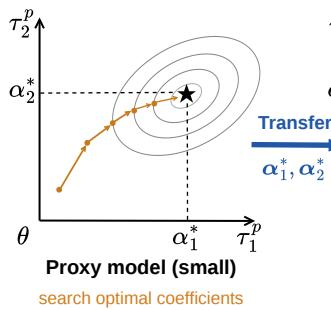

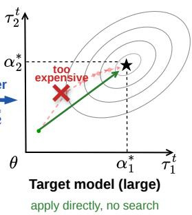  
Figure 1: Overview of αTransfer. Axes represent task vectors $( \tau _ { 1 } , \tau _ { 2 } )$ ; superscripts p, t denote proxy and target models. Contours show the performance landscape when merging with coefficients $( \alpha _ { 1 } , \alpha _ { 2 } )$ . Optimal coefficients found on a cheap proxy model transfer directly to the large target, skipping the expensive search.

Model merging has emerged as a promising solution to these limitations, directly combining multi ple fine-tuned models in weight space into a single unified model capable of handling multiple tasks.

Early work demonstrated the feasibility of this approach by merging task-specific models through weighted averaging (Jin et al., 2023). Merging was further reframed through the lens of task vectors, the parameter differences between fine-tuned and pre-trained models that capture task-specific knowledge (Ilharco et al., 2023). In this formulation, the merged model is obtained by adding a scaled combination of task vectors to the pre-trained model, where scaling coefficients determine each task’s contribution. Subsequent works proposed various ways to process task vectors during merging, such as resolving sign conflicts (Yadav et al., 2023) or applying sparsity constraints (Yu et al., 2024; Davari & Belilovsky, 2024). Given the significant impact of scaling coefficients on merging performance, other works focus specifically on finding better coefficients, either by learning them adaptively (Yang et al., 2024; Touayouch et al., 2026) or searching over larger spaces (Akiba et al., 2025). This line of work has further extended to LLMs, demonstrating skill composition across diverse capabilities such as mathematical reasoning, code generation, and multilingual ability (Yu et al., 2024; Akiba et al., 2025; Yu et al., 2025; Huang et al., 2024).

Despite its promise, searching for the merging coefficients remains a central challenge that limits the scalability of model merging (He et al., 2026). Since each candidate set of coefficients requires a full model evaluation to assess, the search cost grows exponentially with the number of tasks, making exhaustive search infeasible. Existing methods address this through two broad strategies: evaluation-based search and gradient-based optimization. The first relies on approximate strategies such as assuming equal coefficients (Ilharco et al., 2023; Yadav et al., 2023; Yu et al., 2024), heuristic search (Akiba et al., 2025), or Bayesian optimization (Lee et al., 2025; Liu et al., 2025) to reduce the number of evaluations. However, each evaluation becomes increasingly costly as model size grows, and since these methods still require many evaluations to find good coefficients, the total cost can be substantial for large models. The second strategy avoids repeated evaluation by optimizing coefficients directly against a proxy objective (Yang et al., 2024; Touayouch et al., 2026), but requires computing gradients over multiple models during optimization. The memory demand thus scales with both the number of tasks and model size, rendering these methods infeasible when GPU memory is insufficient. Together, these two limitations pose a fundamental barrier to applying model merging in practical, large-scale settings.

The high computation cost of evaluation-based search and the prohibitive memory demand of gradient-based optimization together make coefficient search the primary bottleneck for applying model merging at large scale. A natural question then arises: can we perform this expensive search on a much smaller model instead? We propose αTransfer (see Figure 1), which searches for optimal merging coefficients on a small proxy model from the same family and directly applies them to the large target model. Our intuition is that optimal merging coefficients encode both the correlations among tasks and their relative importance, properties largely determined by the tasks themselves and the model family rather than by model scale, and are thus transferable across scales within the same family. We substantially reduce both computation and memory cost by performing coefficient search on a significantly smaller proxy model, making model merging practical even at large scale.

We validate αTransfer through extensive experiments on vision and language models, covering six merging methods (Task Arithmetic (Ilharco et al., 2023), TIES (Yadav et al., 2023), DARE (Yu et al., 2024), AdaMerging (Yang et al., 2024), AdaMerging++ (Yang et al., 2024), and DivMerge (Touayouch et al., 2026)) across CLIP-ViT (Radford et al., 2021), SigLIP (Zhai et al., 2023) , and Qwen3 (Yang et al., 2025) model families. Empirical analysis shows that models within the same family exhibit highly correlated performance landscapes across different coefficient combinations, supporting the feasibility of coefficient transfer. In many cases, transferred coefficients match direct search on the target model with negligible accuracy loss, while achieving up to 6× speedup for search-based methods and 70% memory reduction for gradient-based methods on vision transformers, directly addressing the two bottlenecks identified above, and up to 20× speedup and 85% memory reduction on large language models.

## 2 RELATED WORK

## 2.1 COEFFICIENT SEARCH IN MODEL MERGING

While model merging encompasses a broad range of techniques (Yang et al., 2026), we focus on the core challenge of determining scaling coefficients. We systematically categorize coefficient search into two paradigms: evaluation-based and gradient-based methods, each constrained by distinct bottlenecks in computation and memory, respectively.

Evaluation-based methods. These methods search the coefficient space by repeatedly evaluating candidate merged models. The simplest variants use uniform coefficients across tasks (Ilharco et al., 2023; Yadav et al., 2023; Yu et al., 2024), which is cheap but often suboptimal, as per-task or per-layer adjustment substantially improves performance (Yang et al., 2024). More sophisticated approaches reduce the number of evaluations through evolutionary search (Akiba et al., 2025) or Bayesian optimization (Lee et al., 2025; Liu et al., 2025). Despite these advances, the cost per evaluation grows with model size, making the total compute budget substantial at scale.

Gradient-based methods. These methods instead optimize coefficients directly against a proxy objective. AdaMerging (Yang et al., 2024) and AdaMerging++ minimize prediction entropy on unlabeled test data, while DivMerge (Touayouch et al., 2026) uses Jensen-Shannon divergence between merged and individual fine-tuned models. These methods avoid repeated evaluation, but require holding multiple fine-tuned models in memory simultaneously, with memory cost scaling jointly with task count and model size.

Across both categories, all existing approaches conduct the search on the target model itself. We ask whether the search can instead be conducted on a smaller proxy model, enabling existing methods to be applied at scales where they would otherwise be impractical.

## 2.2 SEARCHING ON SMALL PROXIES FOR LARGE TARGETS

Searching on a small proxy and applying the result to a large target has appeared in several settings outside model merging. µTransfer (Yang et al., 2021) transfers training hyperparameters such as learning rate from a small model to a large one via the $\mu \mathrm { P }$ parameterization. DoReMi (Xie et al., 2023) uses a 280M proxy to determine pretraining data mixture weights for training an 8B model. Khaddaj et al. (2025) characterize how training data influences model behavior consistently across scale, enabling proxy-based data attribution and dataset selection. These works share a common philosophy with ours: quantities optimized on a small model can remain meaningful when transferred to a larger one. However, to our knowledge, this paradigm has not been investigated in model merging. We are the first to show that merging coefficients exhibit such cross-scale transferability within model families, across architectures and merging methods.

## 3 αTRANSFER

## 3.1 PROBLEM FORMULATION

Consider a model merging problem where we are given a pre-trained model and $T$ task-specific fine-tuned models derived from it. The goal is to combine these models into a single unified model that performs well across all $T$ tasks, without access to the original training data.

Formally, let $\theta _ { 0 } \in \mathbb { R } ^ { d }$ denote the parameters of the pre-trained model, and let $\theta _ { 1 } , \ldots , \theta _ { T }$ denote the parameters of the $T$ fine-tuned models. The task vector for task i is defined as the parameter difference between the fine-tuned and pre-trained models:

$$
\tau _ { i } = \theta _ { i } - \theta _ { 0 } .\tag{1}
$$

Unified formulation. While existing model merging methods appear diverse in their mechanisms, we observe that they share a common underlying structure: they edit task vectors through various strategies (trimming, masking, etc.), then combine them with learnable or searched coefficients. This insight motivates us to propose a unified formulation that captures this shared structure, enabling systematic analysis and comparison across methods (see Table 1). We express a general family of model merging methods as:

$$
\begin{array} { r } { \theta _ { \mathrm { m e r g e d } } = \mathcal { M } ( \theta _ { 0 } , \{ \tau _ { i } \} _ { i = 1 } ^ { T } ; \boldsymbol { \alpha } ) , } \end{array}\tag{2}
$$

where $\mathcal { M }$ is a merging operator that encapsulates both the editing strategy and the combination mechanism, and α denotes the merging coefficients. The key intuition is that most merging methods operate in two conceptual stages: an editing stage where a function $f ( \cdot )$ (embedded within $\mathcal { M } )$

Table 1: Representative model merging methods under our unified formulation. Methods are characterized along three dimensions: editing function $f ,$ , coefficient search strategy, and coefficient granularity.
<table><tr><td>Method</td><td>The Editing Function f</td><td>Search Strategy</td><td>Granularity</td></tr><tr><td>Task Arithmetic (Ilharco et al., 2023)</td><td>Identity</td><td>Grid search</td><td>Global</td></tr><tr><td>TIES (Yadav et al., 2023)</td><td>Trim + sign election</td><td>Grid search</td><td>Global</td></tr><tr><td>DARE (Yu et al., 2024)</td><td>Random masking + rescaling</td><td>Grid search</td><td>Global</td></tr><tr><td>AdaMerging (Yang et al., 2024)</td><td>Identity</td><td>Gradient-based</td><td>Task-wise/Layer-wise</td></tr><tr><td>AdaMerging++ (Yang et al., 2024)</td><td>Trim + sign election</td><td>Gradient-based</td><td>Task-wise/Layer-wise</td></tr><tr><td>DivMerge (Touayouch et al., 2026)</td><td>Identity</td><td>Gradient-based</td><td>Task-wise</td></tr></table>

transforms the task vectors into edited representations ${ \tilde { \tau } } ,$ followed by a weighting stage where α scales the edited representations and adds them back to $\theta _ { 0 }$ . The granularity at which α is defined gives rise to three common settings:

• Global: The merging operator produces a single edited task vector $\tilde { \tau } = f ( \{ \tau _ { i } \} _ { i = 1 } ^ { T } )$ , where $f : \mathbb { R } ^ { T \times d }  \mathbb { R } ^ { d }$ . A single scalar $\alpha \in \mathbb { R }$ is shared across all tasks:

$$
\theta _ { \mathrm { m e r g e d } } = \theta _ { 0 } + \alpha \cdot \tilde { \tau } .\tag{3}
$$

• Task-wise: The merging operator produces task-specific edited representations $\begin{array} { r l } { \tilde { \tau } _ { i } } & { { } = } \end{array}$ $f _ { i } ( \{ \tau _ { j } \} _ { j = 1 } ^ { T } )$ , where $f _ { i } : \mathbf { \bar { \mathbb { R } } } ^ { T \times d }  \mathbf { \bar { \mathbb { R } } } ^ { d }$ may leverage all task vectors to compute the representation for task i. A distinct scalar $\alpha _ { i } \in \mathbb { R }$ is assigned to each task:

$$
\theta _ { \mathrm { m e r g e d } } = \theta _ { 0 } + \sum _ { i = 1 } ^ { T } \alpha _ { i } \cdot \tilde { \tau } _ { i } .\tag{4}
$$

• Layer-wise: The merging operator produces task-specific and layer-specific edited representations $\tilde { \tau } _ { i , l } = f _ { i , l } ( \overline { { \{ \tau _ { j , l } \} } } _ { j = 1 } ^ { \bar { T } } )$ , where $f _ { i , l } : \mathbb { R } ^ { T \times d _ { l } ^ { \star } }  \mathbb { R } ^ { d _ { l } }$ may leverage all task vectors at layer l to compute the representation for task i. A distinct scalar $\alpha _ { i , l } \in \mathbb { R }$ is assigned to each layer of each task, and the parameters at each layer l are merged independently:

$$
\theta _ { \mathrm { m e r g e d } } ^ { ( l ) } = \theta _ { 0 } ^ { ( l ) } + \sum _ { i = 1 } ^ { T } \alpha _ { i , l } \cdot \tilde { \tau } _ { i , l } , \quad \forall l = 1 , \dots , L .\tag{5}
$$

## 3.2 THE αTRANSFER MECHANISM

We propose αTransfer, a simple yet efficient approach for obtaining merging coefficients for large target models by leveraging small proxy models from the same family. The core insight driving this approach is that merging coefficients encode the relative importance of tasks and their interactions, which are primarily determined by the task characteristics rather than model scale. Consequently, coefficients learned on a small proxy model can be transferred to larger target models within the same family, significantly reducing the computational bottleneck of coefficient search.

Global and task-wise coefficient transfer. Given a target model $\theta _ { 0 } ^ { t }$ and a proxy model $\theta _ { 0 } ^ { p }$ from the same family, along with their respective fine-tuned models $\{ \theta _ { i } ^ { t } \} _ { i = 1 } ^ { T }$ and $\{ \theta _ { i } ^ { p } \} _ { i = 1 } ^ { T }$ coefficient transfer proceeds in two steps. First, we apply any existing merging method to the proxy model to obtain the merging coefficients:

$$
\pmb { \alpha } ^ { * } = \arg \operatorname* { m i n } _ { \pmb { \alpha } } \mathcal { L } ^ { p } \left( \theta _ { 0 } ^ { p } + \sum _ { i = 1 } ^ { T } \alpha _ { i } \cdot \tilde { \tau } _ { i } ^ { p } \right) ,\tag{6}
$$

where $\tilde { \tau } _ { i } ^ { p } = f ( \tau _ { i } ^ { p } )$ are the edited task vectors with $\tau _ { i } ^ { p } = \theta _ { i } ^ { p } - \theta _ { 0 } ^ { p } $ , and $\mathcal { L } ^ { p }$ denotes the objective used by the chosen merging method on the proxy. For global methods, all $\alpha _ { i }$ are tied to a single scalar α. Note that the shape of $\alpha ^ { * }$ depends only on the number of tasks T (or is a single scalar

for global methods), not on model size. We can therefore directly apply this same $\alpha ^ { * }$ to merge the target model:

$$
\theta _ { \mathrm { m e r g e d } } ^ { t } = \theta _ { 0 } ^ { t } + \sum _ { i = 1 } ^ { T } \alpha _ { i } ^ { * } \cdot \tilde { \tau } _ { i } ^ { t } ,\tag{7}
$$

where $\tilde { \tau } _ { i } ^ { t } = f ( \tau _ { i } ^ { t } )$ with $\tau _ { i } ^ { t } = \theta _ { i } ^ { t } - \theta _ { 0 } ^ { t }$ . Note that only the coefficients $\alpha ^ { * }$ are transferred from the proxy; the editing function $f ( \cdot )$ is still applied natively to the target model’s task vectors.

Layer-wise coefficient transfer. In layer-wise merging, each parameter layer is assigned its own merging coefficient. Since proxy and target models often differ in depth (and thus total number of layers), a direct one-to-one coefficient transfer is not always possible.

Modern architectures such as transformers consist of repeating blocks, where certain modules appear in every block $( \mathrm { e . g . }$ , attention, feed-forward) while others do not (e.g., embeddings, output layers). For layers that do not repeat across blocks, coefficients are directly transferred as they appear in the same positions in both models. For layers that repeat across blocks, recent work has shown that layers at similar relative depths follow a shared progression of representations across depth (Wolfram & Schein, 2025), suggesting that their merging coefficients might also be similar. Based on this intuition, we propose two strategies for transferring these coefficients.

Copy-based transfer. For a layer in block $b \in \{ 1 , \dots , B _ { t } \}$ of the target model, we directly copy the coefficient from the corresponding layer type in the proxy block at the matched relative depth:

$$
b _ { \mathrm { p r o x y } } = \left\lceil \frac { b } { B _ { t } } \cdot B _ { p } \right\rceil ,\tag{8}
$$

where $B _ { p }$ and $B _ { t }$ are the number of blocks in the proxy and target models. The ceiling ensures that target blocks 1 and $B _ { t }$ map to proxy blocks 1 and $B _ { p } ,$ , respectively.

Interpolation-based transfer. To obtain smoother coefficient transitions, we linearly interpolate between the coefficients from the two nearest proxy blocks based on the target block’s continuous relative position.

## 4 EXPERIMENTS

Experimental Setup. We evaluate αTransfer across three model families: CLIP-ViT (Radford et al., 2021) and SigLIP (Zhai et al., 2023) for vision, and Qwen3 (Yang et al., 2025) for language. Our evaluation covers 8 vision tasks (DTD (Cimpoi et al., 2014), EuroSAT (Helber et al., 2018), FER2013 (Goodfellow et al., 2013), Food101 (Bossard et al., 2014), GTSRB (Stallkamp et al., 2011), RESISC45 (Cheng et al., 2017), Stanford Cars (Krause et al., 2013), SUN397 (Xiao et al., 2016)) and 4 language tasks (Usefulness Judge (Chen et al., 2026), IFEval (Zhou et al., 2023), Banking77 (Loukas et al., 2023), DDXPlus (Fansi Tchango et al., 2022)). For each task, we finetune the corresponding base model to obtain an expert checkpoint. All experiments were conducted on a single NVIDIA RTX 4000 SFF Ada GPU, except for the Qwen3-4B model, which required two GPUs. Training and implementation details are provided in Appendix A.

## 4.1 EMPIRICAL ANALYSIS OF COEFFICIENT TRANSFERABILITY

We first investigate whether the performance landscapes over the merging coefficient space exhibit structural similarity across model scales. This perspective is crucial: if the overall landscapes align, optimization algorithms will navigate comparable objective surfaces and converge to corresponding regions, making coefficient transfer viable even when the absolute global optimum is not found.

To build intuition, we visualize the performance landscape of merged models under different coefficient combinations. For a given pair of tasks, we vary the two corresponding coefficients over a grid and record the average accuracy. Figure 2 shows these landscapes for two representative task pairs on SigLIP-Base and SigLIP-Large. Despite the difference in model scale, the two models exhibit highly similar performance distributions over the coefficient space. This observation suggests that the overall topography of the coefficient space remains relatively stable across scales.

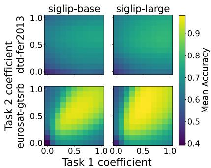  
Figure 2: Performance landscapes across model scales. We visualize mean accuracy over a grid of merging coefficients. The heatmaps show highly similar distributions, indicating that the overall shape of the performance landscape is preserved across different model sizes.

Table 2: Performance correlation between proxy and target models. We sample multiple coefficient combinations, construct merged models accordingly, and compute the Spearman rank correlation (ρ) between their accuracies on the proxy and target models. The high correlations confirm that the relative performance of different coefficient combinations remains highly consistent across model sizes.
<table><tr><td>Proxy</td><td>Target</td><td>Spearman&#x27;s  $\rho$ </td></tr><tr><td>ViT-B/32</td><td>ViT-L/14</td><td>0.58</td></tr><tr><td>ViT-B/16</td><td>ViT-L/14</td><td>0.84</td></tr><tr><td>SigLIP-B</td><td>SigLIP-L</td><td>0.79</td></tr><tr><td>Qwen3-0.6B</td><td>Qwen3-1.7B</td><td>0.94</td></tr><tr><td>Qwen3-0.6B</td><td>Qwen3-4B</td><td>0.90</td></tr></table>

To rigorously verify this beyond specific task pairs, we extend our analysis to all three model families in a many-task setting. By sampling multiple coefficient combinations, we compute the Spearman rank correlation (ρ) between the proxy and target mean accuracies (averaged over the 8 vision or 4 language tasks, respectively). As detailed in Table 2, all evaluated pairs exhibit consistently strong correlations (ρ up to 0.94). This confirms that coefficient transferability is a widespread and robust property in multi-task model merging, providing a solid empirical foundation for αTransfer.

## 4.2 MAIN RESULTS

## 4.2.1 VISION MODELS

We evaluate αTransfer across six merging methods on the CLIP-ViT and SigLIP families across three proxy-target pairs: ViT-B/32 → ViT-L/14, ViT-B/16 → ViT-L/14, and SigLIP-Base → SigLIP-Large. For each method, we report the average accuracy under three settings: coefficients searched directly on the target model (origin), coefficients transferred from a proxy model (transfer), and simple averaging (SA) without any coefficient search, along with the computation time and peak memory cost of coefficient search.

As shown in Table 3, αTransfer achieves performance close to direct search across most methods and proxy-target pairs, while requiring only a fraction of the computational resources. In many cases the accuracy gap is negligible: on SigLIP-Base → SigLIP-Large, TIES and DARE drop by only 0.11% and 0.32%; on ViT-B/32 → ViT-L/14, Task Arithmetic and DARE drop by only 0.43% and 0.49%. Even in the most challenging cases (e.g., AdaMerging++ on ViT-B/32 → ViT-L/14, −7.02%), the transferred model still surpasses the simple average baseline by 7.12%, retaining most of the benefit of direct search.

The efficiency gains reflect the distinct resource bottlenecks of each method type. For evaluationbased searching methods, the bottleneck is computation, where a single run already exceeds 10 hours on the target model, and αTransfer reduces this by up to 6.07× (Task Arithmetic, ViT-B/32 → ViT-L/14), bringing the search time to under 2 hours. For gradient-based methods, the bottleneck is GPU memory: running optimization on the proxy model allows a batch size of 16, whereas the target model requires reducing to 4 to avoid out-of-memory errors. Coefficient transfer eliminates thi constraint, reducing GPU memory consumption by up to 70.4% (AdaMerging/AdaMerging++, ViT-B/32 → ViT-L/14). Together, these results show that coefficient transfer enables efficient merging on large target models at a fraction of the cost, with minimal sacrifice in accuracy.

Table 3: Coefficient transfer on vision models. We compare direct search (Origin), αTransfer (Transfer) and simple average baseline (SA) across different proxy-target pairs. Transfer main tains accuracy comparable to the origin methods while significantly mitigating resource bottlenecks, yielding up to a 6.07× speedup and a 70.4% memory reduction.
<table><tr><td rowspan="2">P rt</td><td rowspan="2">Method</td><td colspan="3">Acc (%)</td><td colspan="3">Time (h)</td><td colspan="3">Memory (GB)</td></tr><tr><td>Origin</td><td>Transfer</td><td>SA</td><td>Origin</td><td>Transfer</td><td>Speedup</td><td>Origin</td><td>Transfer</td><td>Reduction</td></tr><tr><td rowspan="6">ViT-B/32 → ViT-L/14</td><td>Task Arithmetic</td><td>75.98</td><td>75.55</td><td>72.89</td><td>11.43</td><td>1.88</td><td>6.07×</td><td>2.12</td><td>0.67</td><td>68.7%</td></tr><tr><td>TIES</td><td>75.17</td><td>71.65</td><td>64.96</td><td>12.12</td><td>2.05</td><td>5.92×</td><td>2.12</td><td>0.67</td><td>68.7%</td></tr><tr><td>DARE</td><td>76.05</td><td>75.56</td><td>62.70</td><td>13.01</td><td>2.26</td><td>5.75×</td><td>2.12</td><td>0.67</td><td>68.7%</td></tr><tr><td>AdaMerging</td><td>75.67</td><td>71.83</td><td>72.89</td><td>1.69</td><td>0.72</td><td>2.35×</td><td>17.84</td><td>5.27</td><td>70.4%</td></tr><tr><td>AdaMerging++</td><td>79.10</td><td>72.08</td><td>64.96</td><td>1.46</td><td>0.83</td><td>1.77×</td><td>17.84</td><td>5.27</td><td>70.4%</td></tr><tr><td>DivMerge</td><td>78.77</td><td>74.73</td><td>72.89</td><td>0.33</td><td>0.15</td><td>2.14×</td><td>17.84</td><td>5.27</td><td>70.4%</td></tr><tr><td rowspan="6">ViT-B/16 → ViT-L/14</td><td>Task Arithmetic</td><td>75.98</td><td>72.89</td><td>72.89</td><td>11.43</td><td>3.24</td><td>3.52×</td><td>2.12</td><td>0.87</td><td>58.8%</td></tr><tr><td>TIES</td><td>75.17</td><td>69.53</td><td>64.96</td><td>12.12</td><td>3.36</td><td>3.61×</td><td>2.12</td><td>0.87</td><td>58.8%</td></tr><tr><td>DARE</td><td>76.05</td><td>72.91</td><td>62.70</td><td>13.01</td><td>3.64</td><td>3.58×</td><td>2.12</td><td>0.87</td><td>58.8%</td></tr><tr><td>AdaMerging</td><td>75.67</td><td>72.63</td><td>72.89</td><td>1.69</td><td>0.94</td><td>1.79×</td><td>17.84</td><td>6.87</td><td>61.5%</td></tr><tr><td>AdaMerging++</td><td>79.10</td><td>74.82</td><td>64.96</td><td>1.46</td><td>0.84</td><td>1.75×</td><td>17.84</td><td>6.87</td><td>61.5%</td></tr><tr><td>DivMerge</td><td>78.77</td><td>75.58</td><td>72.89</td><td>0.33</td><td>0.13</td><td>2.52×</td><td>17.84</td><td>6.87</td><td>61.5%</td></tr><tr><td rowspan="6">SigLIP-Base → SigLIP-Large</td><td>Task Arithmetic</td><td>80.22</td><td>78.83</td><td>75.05</td><td>10.40</td><td>3.46</td><td>3.01×</td><td>2.84</td><td>1.07</td><td>62.3%</td></tr><tr><td>TIES</td><td>77.50</td><td>77.39</td><td>66.95</td><td>11.75</td><td>3.90</td><td>3.01×</td><td>2.84</td><td>1.07</td><td>62.3%</td></tr><tr><td>DARE</td><td>79.84</td><td>79.52</td><td>64.79</td><td>13.41</td><td>4.00</td><td>3.35×</td><td>2.84</td><td>1.07</td><td>62.3%</td></tr><tr><td>AdaMerging</td><td>81.48</td><td>80.27</td><td>75.05</td><td>1.58</td><td>1.02</td><td>1.54×</td><td>18.12</td><td>7.41</td><td>59.1%</td></tr><tr><td>AdaMerging++</td><td>81.88</td><td>77.83</td><td>66.95</td><td>1.63</td><td>1.02</td><td>1.59×</td><td>18.12</td><td>7.41</td><td>59.1%</td></tr><tr><td>DivMerge</td><td>82.98</td><td>80.01</td><td>75.05</td><td>0.32</td><td>0.14</td><td>2.33×</td><td>18.12</td><td>7.41</td><td>59.1%</td></tr></table>

Table 4: Coefficient transfer on Qwen3 LLMs. We compare direct search (Origin), coefficient transfer (Transfer) and simple average baseline (SA) across different proxy-target pairs. Transfer maintains accuracy comparable to the origin methods while significantly mitigating resource bottlenecks, yielding up to a 19.97× speedup and an 85.2% memory reduction. We include a TIES-Pairwise variant to address the poor performance of the original TIES method.
<table><tr><td rowspan="2">Proxy → Target Method</td><td rowspan="2"></td><td colspan="3">Acc (%)</td><td colspan="3">Time (h)</td><td colspan="3">Memory (GB)</td></tr><tr><td>Origin</td><td>Transfer</td><td>SA</td><td>Origin</td><td>Transfer</td><td>Speedup</td><td>Origin</td><td></td><td>Transfer Reduction</td></tr><tr><td rowspan="3">0.6B → 1.7B</td><td>Task Arithmetic</td><td>76.44</td><td>74.63</td><td>63.85</td><td>0.78</td><td>0.07</td><td>11.00×</td><td>17.21</td><td>5.96</td><td>65.4%</td></tr><tr><td>TIES</td><td>58.35</td><td>58.26</td><td>32.65</td><td>1.86</td><td>0.10</td><td>18.96×</td><td>17.21</td><td>5.96</td><td>65.4%</td></tr><tr><td>TIES-Pairwise</td><td>71.15</td><td>70.37</td><td>44.01</td><td>1.55</td><td>0.08</td><td>19.94×</td><td>10.32</td><td>3.58</td><td>65.3%</td></tr><tr><td rowspan="3">0.6B → 4B</td><td>Task Arithmetic</td><td>76.03</td><td>76.03</td><td>71.91</td><td>1.12</td><td>0.10</td><td>11.03×</td><td>40.22</td><td>5.96</td><td>85.2%</td></tr><tr><td>TIES</td><td>66.04</td><td>65.26</td><td>41.04</td><td>3.80</td><td>0.20</td><td>18.98×</td><td>40.22</td><td>5.96</td><td>85.2%</td></tr><tr><td>TIES-Pairwise</td><td>73.69</td><td>73.69</td><td>59.57</td><td>4.00</td><td>0.20</td><td>19.97×</td><td>24.13</td><td>3.58</td><td>85.2%</td></tr></table>

## 4.2.2 LARGE LANGUAGE MODELS

To investigate coefficient transferability in LLMs, we evaluate Qwen3 models across two pairs: 0.6B → 1.7B and 0.6B → 4B. For TIES, we observe the DDXPlus expert is often filtered out due to conflicting update directions. To address this, we adopt a TIES-Pairwise variant: merging Usefulness Judge and IFEval in the first stage, then merging the result with Banking77 and DDXPlus in the second stage, using a consistent α throughout. This approach recovers DDXPlus performance while keeping the search space identical to standard TIES.

As shown in Table 4, αTransfer yields performance that closely tracks the exhaustive search baseline. While the accuracy gap on the 1.7B model is within a marginal 2%, αTransfer achieves zero performance degradation for both Task Arithmetic and TIES-Pairwise on the 4B scale. More importantly, our method delivers a 20× speedup and an 85% memory reduction for the 4B model, compressing the memory requirement from over 40GB to under 6GB. These results demonstrate that αTransfer effectively bypasses the prohibitive cost of autoregressive evaluation, making the merging of large-scale models both accessible and scalable.

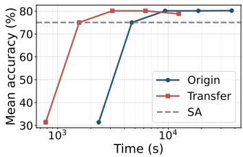  
(a) Task Arithmetic

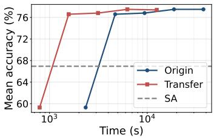  
(b) TIES

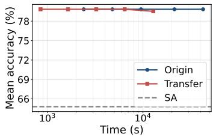  
(c) DARE

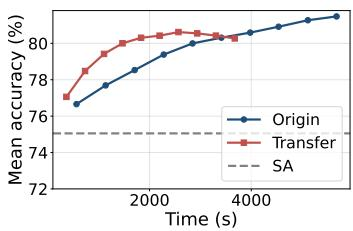  
(d) AdaMerging

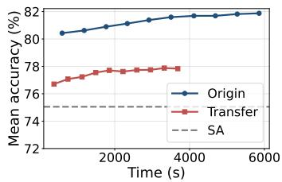  
(e) AdaMerging++

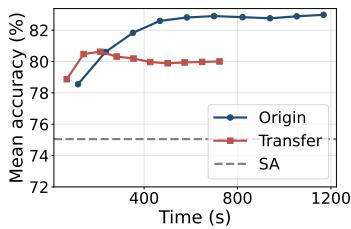  
(f) DivMerge  
Figure 3: Budget analysis on SigLIP models. We compare the best achievable accuracy under varying computational time budgets for direct search (Origin) and αTransfer (Transfer), with simple average (SA) as a static baseline. Transfer shifts the performance curves significantly to the left, reaching comparable accuracy in a fraction of the time for most methods. The performance gap in AdaMerging++ is further investigated in Appendix C.1, with full results provided in Appendix C.

## 4.3 CONSTRAINED BUDGET ANALYSIS

Beyond final accuracy, we examine whether coefficient transfer can match or exceed the perfor mance of direct search given the same amount of computation spent on the target model.

Evaluation-based methods. We simulate increasing evaluation budgets by progressively refining the search granularity. At budget level k, we evaluate $\overline { { 2 ^ { k } } }$ uniformly spaced points in the coefficient space $( k = 0 , 1 , \ldots , 4 )$ , and report the best accuracy found so far. For transfer, we directly apply the proxy-optimal coefficient to the target model without any target-side evaluation. As shown in the top row of Figure 3, transferred coefficients achieve strong performance even at low budgets across all three methods. For Task Arithmetic and TIES, the origin curve requires substantially more evaluations to reach comparable accuracy. For DARE, both curves remain nearly flat, with transfer matching origin performance and substantially outperforming the simple average.

Gradient-based methods. For gradient-based methods, we independently optimize coefficients on the proxy and target and evaluate intermediate proxy coefficients directly on the target. As shown in the bottom row of Figure 3, αTransfer for AdaMerging and DivMerge converges faster initially, achieving competitive or higher accuracy than direct target optimization under limited budgets. AdaMerging++ shows a performance gap due to overly high sparsity; reducing sparsity slightly lowers in-model performance but substantially improves transferability (Appendix C.1).

## 4.4 LAYER-WISE COEFFICIENT TRANSFER

We evaluate layer-wise coefficient transfer (detailed in Section 3.2) on AdaMerging and AdaMerging++ across three proxy-target pairs (Table 5). Copy-based and interpolation mapping achieve comparable performance, with an accuracy gap consistently below 0.5%. On $\mathrm { V i T - B } / 1 \bar { 6 } \to \mathrm { \bar { V } i T - L } / 1 4$ and SigLIP-Base → SigLIP-Large, transfer matches or outperforms direct target optimization, while reducing computation time by $1 . { \overset { - } { . } } 5 3 \times - 1 . 7 1 \times$ and memory usage by 59.1%–61.5%.

The only exception is ViT-B/32 → ViT-L/14, where transfer trails direct search by 1–3%, consistent with its lower coefficient correlation (Table 2, $\rho = 0 . 5 8 ~ \mathrm { v s . } ~ 0 . 7 9 \ – 0 . 8 4 )$ . We hypothesize that the larger patch-size difference alters the optimization landscape, making direct coefficient transfer less effective.

Table 5: Layer-wise coefficient transfer. We compare direct search (Origin) against two relativedepth mapping variants: Copy and Interpolation (Interp). Remarkably, layer-wise transfer frequently outperforms direct search while reducing computational time and memory footprint.
<table><tr><td rowspan="2">Proxy → Target</td><td rowspan="2">Method</td><td colspan="3">Acc (%)</td><td rowspan="2">Time Speedup</td><td rowspan="2">Memory Reduction</td></tr><tr><td>Origin</td><td>Copy</td><td>Interp</td></tr><tr><td rowspan="2">ViT-B/32 → ViT-L/14</td><td>AdaMerging</td><td>80.57</td><td>77.85</td><td>78.21</td><td>2.17×</td><td>70.4%</td></tr><tr><td>AdaMerging++</td><td>82.80</td><td>81.35</td><td>81.55</td><td>2.17×</td><td>70.4%</td></tr><tr><td>ViT-B/16 → ViT-L/14</td><td>AdaMerging AdaMerging++</td><td>80.57 82.80</td><td>81.21 83.15</td><td>81.13 83.07</td><td>1.68× 1.71×</td><td>61.5% 61.5%</td></tr><tr><td>SigLIP-Base → SigLIP-Large</td><td>AdaMerging AdaMerging++</td><td>83.57 83.13</td><td>84.25 83.55</td><td>84.21 83.57</td><td>1.53× 1.61×</td><td>59.1% 59.1%</td></tr></table>

Table 6: Hybrid search results. We compare direct search (Origin), pure coefficient transfer (Transfer), and hybrid search (Hybrid) that refines transferred coefficients on the target model. Hybrid search matches or outperform direct search while still maintaining a computational speedup.
<table><tr><td rowspan="2">Proxy → Target</td><td rowspan="2">Method</td><td colspan="3">Acc (%)</td><td colspan="2">Speedup</td></tr><tr><td>Origin</td><td>Transfer</td><td>Hybrid</td><td>Transfer</td><td>Hybrid</td></tr><tr><td rowspan="3">ViT-B/32 → ViT-L/14</td><td>Task Arithmetic</td><td>75.98</td><td>75.55</td><td>75.98</td><td>6.07×</td><td>1.86×</td></tr><tr><td>AdaMerging</td><td>75.67</td><td>71.83</td><td>76.00</td><td>2.35×</td><td>1.40×</td></tr><tr><td>DivMerge</td><td>78.77</td><td>74.73</td><td>78.51</td><td>2.14×</td><td>1.38×</td></tr><tr><td rowspan="3">ViT-B/16 → ViT-L/14</td><td>Task Arithmetic</td><td>75.98</td><td>72.89</td><td>75.98</td><td>3.52×</td><td>1.68×</td></tr><tr><td>AdaMerging</td><td>75.67</td><td>72.63</td><td>76.41</td><td>1.79×</td><td>1.28×</td></tr><tr><td>DivMerge</td><td>78.77</td><td>75.58</td><td>78.78</td><td>2.52×</td><td>1.29×</td></tr><tr><td rowspan="3">SigLIP-Base → SigLIP-Large</td><td>Task Arithmetic</td><td>80.22</td><td>78.83</td><td>78.96</td><td>3.01×</td><td>1.46×</td></tr><tr><td>AdaMerging</td><td>81.48</td><td>80.27</td><td>81.59</td><td>1.54×</td><td>1.21×</td></tr><tr><td>DivMerge</td><td>82.98</td><td>80.01</td><td>82.92</td><td>2.33×</td><td>1.20×</td></tr></table>

## 4.5 EXTENDING αTRANSFER VIA HYBRID SEARCH

While αTransfer provides substantial efficiency gains through direct coefficient mapping, we explore a hybrid extension for scenarios where performance is prioritized. Rather than using transferred coefficients as the final solution, we use them as an initialization and allocate a small fraction of the budget to target refinement. For evaluation-based methods, we perform a coarse search on the proxy followed by localized target refinement; for gradient-based methods, we split the optimization steps evenly between proxy and target, initializing the latter with transferred coefficients.

As shown in Table 6, hybrid search closes the accuracy gaps of direct transfer and consistently matches or exceeds exhaustive target optimization, while achieving 1.20×–1.86× speedups. On LLMs, it similarly recovers the original performance with 2.29×–4.35× speedups (Table 8). These results demonstrate that αTransfer is not only a zero-cost merging method, but also an effective accelerator for full-scale merging, providing a flexible trade-off between efficiency and performance.

## 5 CONCLUSION

We introduced αTransfer, a highly efficient framework that decouples the cost of coefficient search from target model size. By optimizing coefficients on a small proxy and transferring them to the target model, we achieve accuracy comparable to exhaustive direct search. Across six merging methods, this approach yields a 6× speedup and 70% memory reduction on vision transformers, and up to a 20× speedup and 85% memory reduction on large language models.

These findings suggest that optimal merging coefficients are primarily properties of the tasks and model family, rather than scale. This insight opens exciting directions for future work, such as investigating the transferability of other merging hyperparameters and exploring cross-recipe or crossarchitecture coefficient mapping. Ultimately, we hope αTransfer serves as a crucial step toward making model merging practical and highly scalable for modern foundation models.

## ACKNOWLEDGEMENTS

This work was supported in part by the National Science and Technology Council, Taiwan, under Grants 114-2628-E-002-021-, 114-2628-E-A49-002, 115-2634-F-002-012-, 115-2223-E-002-005- MY3, and 115-2218-E-002-026-, and the Taiwan Centers of Excellence in Artificial Intelligence. Shao-Hua Sun was supported by the Yushan Fellow Program of the Ministry of Education, Taiwan.

## REFERENCES

Takuya Akiba, Makoto Shing, Yujin Tang, Qi Sun, and David Ha. Evolutionary optimization of model merging recipes. Nature Machine Intelligence, 7(2):195–204, 2025.

Rishi Bommasani, Drew A Hudson, Ehsan Adeli, Russ Altman, Simran Arora, Sydney von Arx, Michael S Bernstein, Jeannette Bohg, Antoine Bosselut, Emma Brunskill, et al. On the opportunities and risks of foundation models. arXiv preprint arXiv:2108.07258, 2021.

Lukas Bossard, Matthieu Guillaumin, and Luc Van Gool. Food-101–mining discriminative components with random forests. In European conference on computer vision, pp. 446–461. Springer, 2014.

Yen-Shan Chen, Zhi Rui Tam, Cheng-Kuang Wu, and Yun-Nung Chen. Expected harm: Rethinking safety evaluation of (mis) aligned llms. arXiv preprint arXiv:2602.01600, 2026.

Gong Cheng, Junwei Han, and Xiaoqiang Lu. Remote sensing image scene classification: Benchmark and state of the art. Proceedings ofthe IEEE, 105(10):1865–1883, 2017.

Mircea Cimpoi, Subhransu Maji, Iasonas Kokkinos, Sammy Mohamed, and Andrea Vedaldi. Describing textures in the wild. In Proceedings of the IEEE conference on computer vision and pattern recognition, pp. 3606–3613, 2014.

MohammadReza Davari and Eugene Belilovsky. Model breadcrumbs: Scaling multi-task model merging with sparse masks. In European Conference on Computer Vision, pp. 270–287. Springer, 2024.

Arsene Fansi Tchango, Rishab Goel, Zhi Wen, Julien Martel, and Joumana Ghosn. Ddxplus: A new dataset for automatic medical diagnosis. Advances in neural information processing systems, 35: 31306–31318, 2022.

Chris Fifty, Ehsan Amid, Zhe Zhao, Tianhe Yu, Rohan Anil, and Chelsea Finn. Efficiently identifying task groupings for multi-task learning. Advances in Neural Information Processing Systems, 34:27503–27516, 2021.

Ian J Goodfellow, Dumitru Erhan, Pierre Luc Carrier, Aaron Courville, Mehdi Mirza, Ben Hamner, Will Cukierski, Yichuan Tang, David Thaler, Dong-Hyun Lee, et al. Challenges in representation learning: A report on three machine learning contests. In International conference on neural information processing, pp. 117–124. Springer, 2013.

Yifei He, Siqi Zeng, Yuzheng Hu, Rui Yang, Tong Zhang, and Han Zhao. Mergebench: A benchmark for merging domain-specialized LLMs. In The Thirty-ninth Annual Conference on Neural Information Processing Systems Datasets and Benchmarks Track, 2026. URL https: //openreview.net/forum?id=rw50iUoyLu.

Patrick Helber, Benjamin Bischke, Andreas Dengel, and Damian Borth. Introducing eurosat: A novel dataset and deep learning benchmark for land use and land cover classification. In IGARSS 2018-2018 IEEE international geoscience and remote sensing symposium, pp. 204–207. IEEE, 2018.

Jeremy Howard and Sebastian Ruder. Universal language model fine-tuning for text classification. In Proceedings of the 56th Annual Meeting of the Association for Computational Linguistics (Volume 1: Long Papers), pp. 328–339, 2018.

Shih-Cheng Huang, Pin-Zu Li, Yu-Chi Hsu, Kuang-Ming Chen, Yu Tung Lin, Shih-Kai Hsiao, Richard Tsai, and Hung-Yi Lee. Chat vector: A simple approach to equip llms with instruction following and model alignment in new languages. In Proceedings ofthe 62nd Annual Meeting of the Associationfor Computational Linguistics (Volume 1: Long Papers), pp. 10943–10959, 2024.

Gabriel Ilharco, Marco Tulio Ribeiro, Mitchell Wortsman, Ludwig Schmidt, Hannaneh Hajishirzi, and Ali Farhadi. Editing models with task arithmetic. In The Eleventh International Conference on Learning Representations, 2023. URL https://openreview.net/forum?id= 6t0Kwf8-jrj.

Xisen Jin, Xiang Ren, Daniel Preotiuc-Pietro, and Pengxiang Cheng. Dataless knowledge fusion by merging weights of language models. In The Eleventh International Conference on Learning Representations, 2023. URL https://openreview.net/forum?id=FCnohuR6AnM.

Alaa Khaddaj, Logan Engstrom, and Aleksander Madry. Small-to-large generalization: Training data influences models consistently across scale. In The Thirteenth International Conference on Learning Representations, 2025.

Jonathan Krause, Michael Stark, Jia Deng, and Li Fei-Fei. 3d object representations for fine-grained categorization. In Proceedings of the IEEE international conference on computer vision workshops, pp. 554–561, 2013.

Sanwoo Lee, Jiahao Liu, Qifan Wang, Jingang Wang, Xunliang Cai, and Yunfang Wu. Dynamic fisher-weighted model merging via bayesian optimization. In Proceedings ofthe 2025 Conference ofthe Nations ofthe Americas Chapter ofthe Associationfor Computational Linguistics: Human Language Technologies (Volume 1: Long Papers), pp. 4923–4935, 2025.

Deyuan Liu, Zecheng Wang, Bingning Wang, Weipeng Chen, Chunshan Li, Zhiying Tu, Dianhui Chu, and Dianbo Sui. Maximizing intermediate checkpoint value in LLM pretraining with bayesian optimization. In Forty-second International Conference on Machine Learning, 2025. URL https://openreview.net/forum?id=UvwWrUV1JV.

Lefteris Loukas, Ilias Stogiannidis, Odysseas Diamantopoulos, Prodromos Malakasiotis, and Stavros Vassos. Making llms worth every penny: Resource-limited text classification in banking. In Proceedings of the Fourth ACM International Conference on AI in Finance, pp. 392–400, 2023.

Jingwei Ni, Zhijing Jin, Qian Wang, Mrinmaya Sachan, and Markus Leippold. When does aggregating multiple skills with multi-task learning work? a case study in financial nlp. In Proceedings of the 61st Annual Meeting of the Association for Computational Linguistics (Volume 1: Long Papers), pp. 7465–7488, 2023.

Alec Radford, Jeffrey Wu, Rewon Child, David Luan, Dario Amodei, Ilya Sutskever, et al. Language models are unsupervised multitask learners. OpenAI blog, 1(8):9, 2019.

Alec Radford, Jong Wook Kim, Chris Hallacy, Aditya Ramesh, Gabriel Goh, Sandhini Agarwal, Girish Sastry, Amanda Askell, Pamela Mishkin, Jack Clark, et al. Learning transferable visual models from natural language supervision. In International conference on machine learning, pp. 8748–8763. PmLR, 2021.

Sebastian Ruder. An overview of multi-task learning in deep neural networks. arXiv preprint arXiv:1706.05098, 2017.

Johannes Stallkamp, Marc Schlipsing, Jan Salmen, and Christian Igel. The german traffic sign recognition benchmark: a multi-class classification competition. In The 2011 international joint conference on neural networks, pp. 1453–1460. IEEE, 2011.

Brahim Touayouch, Lo¨ıc Fosse, Geraldine Damnati, and Gw ´ enol ´ e Lecorv ´ e. Divmerge: A ´ divergence-based model merging method for multi-tasking. In Proceedings of the 19th Conference of the European Chapter of the Association for Computational Linguistics (Volume 1: Long Papers), pp. 7157–7180, 2026.

Thomas Wolf, Lysandre Debut, Victor Sanh, Julien Chaumond, Clement Delangue, Anthony Moi, Pierric Cistac, Tim Rault, Remi Louf, Morgan Funtowicz, et al. Transformers: State-of-the-art´ natural language processing. In Proceedings of the 2020 conference on empirical methods in natural language processing: system demonstrations, pp. 38–45, 2020.

Christopher Wolfram and Aaron Schein. Layers at similar depths generate similar activations across LLM architectures. In Second Conference on Language Modeling, 2025. URL https:// openreview.net/forum?id=8wKec6faAT.

Jianxiong Xiao, Krista A Ehinger, James Hays, Antonio Torralba, and Aude Oliva. Sun database: Exploring a large collection of scene categories. International Journal of Computer Vision, 119 (1):3–22, 2016.

Sang Michael Xie, Hieu Pham, Xuanyi Dong, Nan Du, Hanxiao Liu, Yifeng Lu, Percy S Liang, Quoc V Le, Tengyu Ma, and Adams Wei Yu. Doremi: Optimizing data mixtures speeds up language model pretraining. Advances in Neural Information Processing Systems, 36:69798– 69818, 2023.

Prateek Yadav, Derek Tam, Leshem Choshen, Colin A Raffel, and Mohit Bansal. Ties-merging: Resolving interference when merging models. Advances in neural information processing systems, 36:7093–7115, 2023.

An Yang, Anfeng Li, Baosong Yang, Beichen Zhang, Binyuan Hui, Bo Zheng, Bowen Yu, Chang Gao, Chengen Huang, Chenxu Lv, et al. Qwen3 technical report. arXiv preprint arXiv:2505.09388, 2025.

Enneng Yang, Zhenyi Wang, Li Shen, Shiwei Liu, Guibing Guo, Xingwei Wang, and Dacheng Tao. Adamerging: Adaptive model merging for multi-task learning. In The Twelfth International Conference on Learning Representations, 2024. URL https://openreview.net/forum? id=nZP6NgD3QY.

Enneng Yang, Li Shen, Guibing Guo, Xingwei Wang, Xiaochun Cao, Jie Zhang, and Dacheng Tao. Model merging in llms, mllms, and beyond: Methods, theories, applications, and opportunities. ACM Computing Surveys, 58(8):1–41, 2026.

Ge Yang, Edward Hu, Igor Babuschkin, Szymon Sidor, Xiaodong Liu, David Farhi, Nick Ryder, Jakub Pachocki, Weizhu Chen, and Jianfeng Gao. Tuning large neural networks via zero-shot hyperparameter transfer. Advances in Neural Information Processing Systems, 34:17084–17097, 2021.

Le Yu, Bowen Yu, Haiyang Yu, Fei Huang, and Yongbin Li. Language models are super mario: Absorbing abilities from homologous models as a free lunch. In Forty-first International Conference on Machine Learning, 2024.

Le Yu, Bowen Yu, Haiyang Yu, Fei Huang, and Yongbin Li. Extend model merging from finetuned to pre-trained large language models via weight disentanglement, 2025. URL https: //openreview.net/forum?id=2pvMZKGYDR.

Xiaohua Zhai, Basil Mustafa, Alexander Kolesnikov, and Lucas Beyer. Sigmoid loss for language image pre-training. In Proceedings of the IEEE/CVF international conference on computer vision, pp. 11975–11986, 2023.

Yu Zhang and Qiang Yang. A survey on multi-task learning. IEEE transactions on knowledge and data engineering, 34(12):5586–5609, 2021.

Jeffrey Zhou, Tianjian Lu, Swaroop Mishra, Siddhartha Brahma, Sujoy Basu, Yi Luan, Denny Zhou, and Le Hou. Instruction-following evaluation for large language models. arXiv preprint arXiv:2311.07911, 2023.

Fuzhen Zhuang, Zhiyuan Qi, Keyu Duan, Dongbo Xi, Yongchun Zhu, Hengshu Zhu, Hui Xiong, and Qing He. A comprehensive survey on transfer learning. Proceedings of the IEEE, 109(1): 43–76, 2020.

## APPENDIX

## Table of Contents

A Training details 13   
A.1 Vision models . 13   
A.2 Large language models 13   
B Evaluation details 15   
B.1 Model merging hyperparameters 15   
C Efficiency analysis complete results 16   
C.1 Effect of k in AdaMerging++ 16   
D Hybrid search results for LLMs 18   
E Per-task accuracy breakdown 19   
E.1 Vision models . 19   
E.2 Large language models 19

## A TRAINING DETAILS

In this section, we provide the training details for the models used in our experiments. We separate the discussion into vision models (Appendix A.1) and large language models (Appendix A.2).

## A.1 VISION MODELS

We adopt the pre-trained CLIP vision encoders released by OpenAI, specifically ViT-B/32, ViT-B/16, and ViT-L/14, as well as the SigLIP vision encoders released by Google (SigLIP-Base/16-256 and SigLIP-Large/16-256). Each model is fine-tuned independently on eight downstream image classification tasks: DTD, EuroSAT, FER2013, Food101, GTSRB, RESISC45, Stanford Cars, and SUN397.

Hyperparameter search. For each (model, dataset) pair, we perform a grid search over the following hyperparameters:

• Batch size: {32, 48}

• Number of epochs: {5, 8, 10, 20}

• Learning rate: {1e−5, 3e−5}

We train each configuration for up to the maximum number of epochs specified in the search space, evaluate the model on the validation set at the end of every epoch, and select the checkpoint that achieves the highest validation accuracy. The chosen hyperparameters used for each (model, dataset) combination are reported in Table 7. Notably, ViT-B/32 and ViT-L/14 share nearly identical optimal hyperparameters across all tasks (differing only on GTSRB), while the optimal configurations for ViT-B/16 and the SigLIP variants vary more substantially across datasets.

Optimization. All vision models are fine-tuned with the AdamW optimizer $( \beta _ { 1 } = 0 . 9 , \beta _ { 2 } =$ 0.999) and a linear learning-rate scheduler with a warmup ratio of 0.1.

## A.2 LARGE LANGUAGE MODELS

We fine-tune Qwen3 models at three scales (0.6B, 1.7B, and 4B parameters) on four downstream tasks: Banking77, DDXPlus, instruction following, and usefulness judging.

Table 7: Selected hyperparameters for each vision model and dataset. Each cell reports the number of epochs (E), batch size (B), and learning rate (LR) chosen by the validation-accuracy criterion described in Appendix A.1.
<table><tr><td></td><td colspan="3">ViT-B/32</td><td colspan="3">ViT-B/16</td><td colspan="3">ViT-L/14</td><td colspan="3">SigLIP-B</td><td colspan="3">SigLIP-L</td></tr><tr><td>Dataset</td><td>E</td><td>B</td><td>LR</td><td>E</td><td>B</td><td>LR</td><td>E</td><td>B</td><td>LR</td><td>E</td><td>B</td><td>LR</td><td>E</td><td>B</td><td>LR</td></tr><tr><td>DTD</td><td></td><td>10 32</td><td>1e-5</td><td>5</td><td>32</td><td>1e-5</td><td>10</td><td>32</td><td>1e-5</td><td>5</td><td>48</td><td>3e-5</td><td>5</td><td>48</td><td>3e-5</td></tr><tr><td>EuroSAT</td><td></td><td>10 32</td><td>1e-5</td><td>10</td><td>48</td><td>3e-5</td><td>10 32</td><td></td><td>1e-5</td><td>10</td><td>48</td><td>3e-5</td><td>1048</td><td></td><td>33e-5</td></tr><tr><td>FER2013</td><td></td><td></td><td>10 32 1e-5</td><td></td><td>5 32</td><td></td><td></td><td></td><td></td><td></td><td></td><td></td><td></td><td></td><td>2 1e-5 10 32 1e-5 20 48 3e-5 20 48 3e-5</td></tr><tr><td>Food101</td><td></td><td></td><td>10 32 1e-5</td><td></td><td></td><td></td><td></td><td></td><td></td><td></td><td></td><td></td><td></td><td></td><td>5 5 32 1e-5 10 32 1e-5 20 48 3e-5 10 48 1e-5</td></tr><tr><td>GTSRB</td><td></td><td></td><td>10 48 3e-5</td><td></td><td></td><td> 5 32 1e-5 10 32 1e-5</td><td></td><td></td><td></td><td></td><td></td><td></td><td></td><td></td><td>5 5 48 3e-5 5 48 3e-5</td></tr><tr><td>RESISC45</td><td></td><td></td><td>10 32 1e-5</td><td></td><td>8 32</td><td>23e-5</td><td></td><td></td><td>5 10 32 1e-5</td><td></td><td></td><td></td><td></td><td></td><td> 5 48 3e-5 10 48 1e-5</td></tr><tr><td>Stanford Cars</td><td></td><td>10 32</td><td>1e-5</td><td></td><td>10 48</td><td>3e-5</td><td>10 32</td><td></td><td>1e-5</td><td></td><td>2048</td><td>3 3e-5 10 48</td><td></td><td></td><td>1e-5</td></tr><tr><td>SUN397</td><td></td><td>1032</td><td>1e-5</td><td>5</td><td>32</td><td>1e-5</td><td>10 32</td><td></td><td>1e-5</td><td>20</td><td>048</td><td>3 3e-5 10 48</td><td></td><td></td><td>3 1e-5</td></tr></table>

Training data. For Banking77 and DDXPlus, we fine-tune directly on the training split of the corresponding dataset. For instruction following, we train on a 15,000-example subsample drawn from the Nemotron-SFT-Instruction-Following-Chat-v2 dataset1. For the usefulness-judging task, we train on the usefulness-judge dataset2 proposed by Chen et al. (2026).

Hyperparameter search. For each (model, task) pair, we perform a grid search over batch sizes {36, 48} and learning rates {1e−5, 4e−5}. We train each configuration for up to 6 epochs, evaluate on the validation set at the end of every epoch, and select the checkpoint with the highest validation accuracy. The selected configuration is the same across all (model, task) pairs: batch size 36 and learning rate 4e−5.

Optimization. All LLMs are fully fine-tuned using the AdamW optimizer with a cosine learningrate scheduler.

## B EVALUATION DETAILS

## B.1 MODEL MERGING HYPERPARAMETERS

For optimization-based methods (AdaMerging, AdaMerging++, and DivMerge), we dynamically adjust the batch size based on the model scale to accommodate memory constraints: we use a batch size of 16 for base-scale models (SigLIP-Base, ViT-B/32, ViT-B/16) and a batch size of 4 for largescale models (SigLIP-Large, ViT-L/14).

Search Range for Coefficients. For evaluation-based methods that require a grid search over the merging coefficient α (as reported in Table 3), we define the search space following the recommendations in their respective original works:

• Task Arithmetic: We search within the range (0, 1] using 16 equidistant points (an interval of 0.0625).

• DARE and TIES: We search within the range (0, 1.8] using 18 points (an interval of 0.1).

Method-specific Settings. The structural and optimization hyperparameters for each method are as follows:

• AdaMerging: We optimize coefficients for 500 steps using the Adam optimizer with a learning rate of $1 \times \mathrm { 1 \bar { 0 } ^ { - 3 } }$ . We use 1,000 samples to compute the merging objective and set the initial coefficient to 0.5.

• AdaMerging++: We adopt the identical optimization settings as AdaMerging. Additionally, we incorporate TIES-style masking with a top-k retention ratio of 20% (k = 20) and use summation as the merging function.

• DivMerge: The coefficients are optimized for 100 steps using the Adam optimizer with a learning rate of $1 \times 1 0 ^ { - 2 }$ . We set the initial coefficient to 0.5, use 200 samples for the optimization process, and employ the Jensen-Shannon (JS) divergence as the metric.

• TIES: We apply a top-k filtering ratio of 20% (k = 20) and use summation to merge the weight updates.

• DARE: We apply a random drop rate of 0.5 to the model weights before merging.

## C EFFICIENCY ANALYSIS COMPLETE RESULTS

In this section, we provide the complete budget analysis curves for the two proxy→target pairs not shown in the main paper: ViT-B/32 → ViT-L/14 (Figure 4) and ViT-B/16 → ViT-L/14 (Figure 5). The trends are consistent with those reported for SigLIP-Base → SigLIP-Large in the main paper: across all six merging methods, transferring search/training results from a smaller proxy model achieves accuracy comparable to (or surpassing) the simple-average baseline at a substantially lower computational budget.

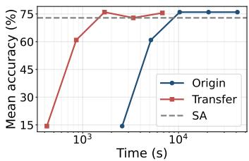  
(a) Task Arithmetic

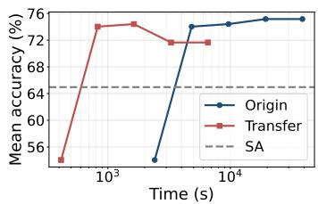  
(b) TIES

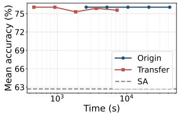  
(c) DARE

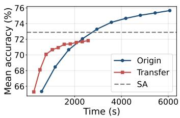  
(d) AdaMerging

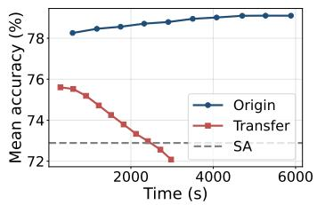  
(e) AdaMerging++

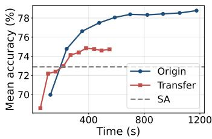  
(f) DivMerge  
Figure 4: Budget analysis on ViT-B/32 → ViT-L/14. We compare direct search (Origin) against coefficient transfer (αTransfer) under varying time budgets. Dashed lines indicate the simple average (SA) baseline. Top and bottom rows show evaluation- and gradient-based methods, respectively. Consistent with the SigLIP results, αTransfer shifts the performance curves to the left, reaching comparable accuracy in a fraction of the time.

## C.1 EFFECT OF k IN ADAMERGING++

Since AdaMerging++ incorporates TIES-style masking, its optimization dynamics are intrinsically tied to the sparsity parameter k (the percentage of weights retained). To investigate the performance gap observed in our primary evaluation, we conduct an ablation study varying k ∈ {20, 40, 60, 80} for the SigLIP Base-to-Large transfer, comparing direct target search (Origin) against αTransfer (Transfer) (Figure 6).

The results indicate that the effectiveness of αTransfer in AdaMerging++ is influenced by the sparsity level. Under higher sparsity settings $( k = 2 0 , 4 0 )$ , heavy masking can enhance structural differences between proxy and target models, which moderately limits transferability and allows direct target search to achieve a higher performance ceiling.

Conversely, under lower sparsity (k = 60, 80), αTransfer yields strong results. It demonstrates faster initial convergence and achieves comparable or higher final accuracy than direct target optimization. This observation suggests that αTransfer remains a viable and efficient strategy for AdaMerging++ when a sufficient proportion of weights is retained during the optimization process.

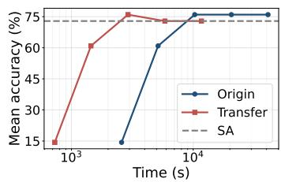  
(a) Task Arithmetic

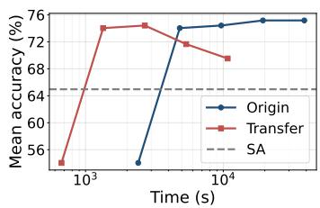  
(b) TIES

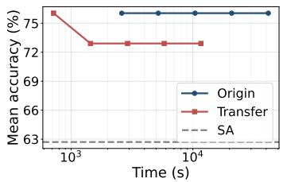  
(c) DARE

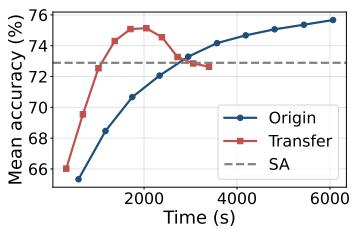  
(d) AdaMerging

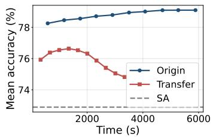  
(e) AdaMerging++

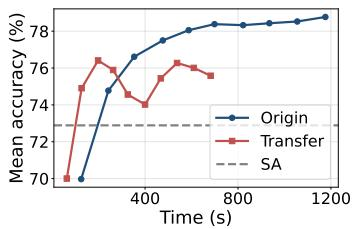  
(f) DivMerge  
Figure 5: Budget analysis on ViT-B/16 → ViT-L/14. We compare direct search (Origin) against coefficient transfer (αTransfer) under varying time budgets. Dashed lines indicate the simple average (SA) baseline. Top and bottom rows show evaluation- and gradient-based methods, respectively. Consistent with previous observations, αTransfer shifts the performance curves to the left, reaching comparable accuracy in a fraction of the time.

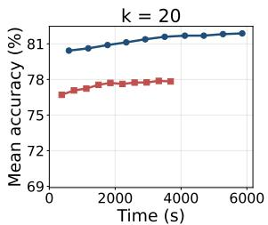

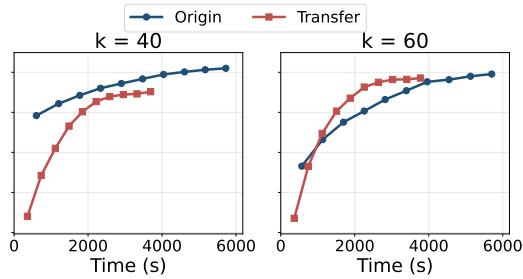

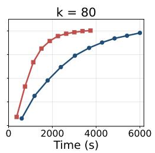  
Figure 6: Impact of sparsity on αTransfer in AdaMerging++. We compare exhaustive target optimization (Origin) against αTransfer across varying TIES retention ratios $k \in \{ 2 0 , 4 0 , 6 0 , 8 0 \}$ on the SigLIP-Base → SigLIP-Large scaling chain. The x-axis represents the wall-clock training time. The effectiveness of αTransfer is highly sensitive to the sparsity level: at extreme sparsity $( k = 2 0 )$ , direct target search achieves a higher performance ceiling. However, as the retention ratio increases $( k \ge 6 0 )$ , αTransfer dominates the compute-performance trade-off, achieving massive speedups while converging to a higher final accuracy than direct target search.

## D HYBRID SEARCH RESULTS FOR LLMS

We additionally evaluate the hybrid search strategy on LLMs. Following the same procedure described in Section 4.5, we use the transferred coefficients as initialization and allocate a small targetside budget for refinement. As shown in Table 8, hybrid search recovers the original merging performance for all evaluated proxy-target pairs, while achieving substantial computational speedups over exhaustive target optimization.

Table 8: Hybrid search results on LLMs. Hybrid search recovers the accuracy of direct search while substantially reducing the computational cost.
<table><tr><td rowspan="2">Proxy → Target</td><td rowspan="2">Method</td><td colspan="3">Acc (%)</td><td colspan="2">Speedup</td></tr><tr><td>Origin</td><td>Transfer</td><td>Hybrid</td><td>Transfer</td><td>Hybrid</td></tr><tr><td rowspan="3">Qwen3-0.6B → Qwen3-1.7B</td><td>Task Arithmetic</td><td>76.44</td><td>74.63</td><td>76.44</td><td>11.00×</td><td>2.29×</td></tr><tr><td>TIES</td><td>58.35</td><td>58.26</td><td>58.35</td><td>18.96×</td><td>4.34×</td></tr><tr><td>TIES-Pairwise</td><td>71.15</td><td>70.37</td><td>71.15</td><td>19.94×</td><td>3.05×</td></tr><tr><td rowspan="3">Qwen3-0.6B → Qwen3-4B</td><td>Task Arithmetic</td><td>76.03</td><td>76.03</td><td>76.03</td><td>11.03×</td><td>2.30×</td></tr><tr><td>TIES</td><td>66.04</td><td>65.26</td><td>66.04</td><td>18.98×</td><td>4.35×</td></tr><tr><td>TIES-Pairwise</td><td>73.69</td><td>73.69</td><td>73.69</td><td>19.97×</td><td>3.06×</td></tr></table>

## E PER-TASK ACCURACY BREAKDOWN

## E.1 VISION MODELS

Table 9 reports the per-task accuracy for each proxy → target pair, complementing the average scores reported in the main paper.

## E.2 LARGE LANGUAGE MODELS

Table 10 reports the per-task accuracy for each LLM proxy → target pair, complementing the average scores reported in the main paper.

Table 9: Per-task accuracy (%) for each proxy→target pair. Or = origin (target’s best coefficients evaluated on target); Tr = transfer (proxy-best coefficients evaluated on target).
<table><tr><td>Method</td><td>DTD</td><td></td><td>EuroSAT</td><td>FER</td><td>Food</td><td>GTSRB</td><td>RESISC Cars</td><td>SUN</td><td>Avg</td></tr><tr><td colspan="8">ViT-B/32 → ViT-L/14</td></tr><tr><td>Task Arithmetic</td><td>Or Tr</td><td>59.63 89.07 60.53 87.11</td><td>51.67 50.35</td><td>91.50 92.62</td><td>77.53 73.34</td><td>85.40 85.59</td><td>79.59 81.10</td><td>73.48 73.77</td><td>75.98 75.55</td></tr><tr><td>TIES</td><td>Or Tr</td><td>54.41 85.04 75.85</td><td>55.92 49.96</td><td>93.02 94.13</td><td>74.35 58.12</td><td>86.25 84.03</td><td>77.29</td><td>75.06</td><td>75.17</td></tr><tr><td>DARE</td><td>Or</td><td>57.23 60.05</td><td>88.74</td><td>51.11 92.04</td><td>76.67</td><td>85.65</td><td>80.20 80.39</td><td>73.70 73.72</td><td>71.65 76.05</td></tr><tr><td>AdaMerging</td><td>Tr Or Tr</td><td>60.59 59.68</td><td>87.07 89.93</td><td>50.32 49.39</td><td>92.63 73.33 85.90 91.83</td><td>85.56 81.24</td><td>81.18 75.96</td><td>73.77 71.41</td><td>75.56 75.67</td></tr><tr><td>AdaMerging++</td><td>Or</td><td>58.14 62.98</td><td>97.67 88.04</td><td>47.41 56.09</td><td>87.80 89.87</td><td>63.49 72.79 92.94 86.03</td><td>76.05 82.48</td><td>71.30 74.38</td><td>71.83 79.10</td></tr><tr><td>DivMerge</td><td>Tr Or Tr</td><td>56.54 72.55 69.10</td><td>97.44 89.70 97.33</td><td>49.68 60.64 40.50</td><td>85.52 86.75 89.59</td><td>64.09 77.03 89.90 78.43 68.54 81.89</td><td>76.36 82.34 79.39</td><td>69.97 69.86 71.50</td><td>72.08 78.77 74.73</td></tr><tr><td colspan="8">ViT-B/16 → ViT-L/14</td></tr><tr><td>Task Arithmetic</td><td>Or Tr</td><td>59.63 60.53</td><td>89.07 51.67 81.93 47.21</td><td>91.50 93.31</td><td>77.53 62.05</td><td>85.40 83.78</td><td>79.59 81.36</td><td>73.48 72.94</td><td>75.98 72.89</td></tr><tr><td>TIES</td><td>Or Tr Or</td><td>54.41 56.76 60.05</td><td>85.04 70.07 88.74</td><td>55.92 47.37 51.11</td><td>93.02 94.11 92.04</td><td>74.35 53.25 76.67</td><td>86.25 81.63 85.65</td><td>77.29 80.14 80.39</td><td>75.06 75.17 72.88 69.53</td></tr><tr><td>DARE</td><td>Tr Or</td><td>60.69 59.68</td><td>81.81 89.93</td><td>47.19 49.39</td><td>93.31 62.10 85.90 91.83</td><td>83.83 81.24</td><td>81.40 75.96</td><td>73.72 72.95 71.41</td><td>76.05 72.91 75.67</td></tr><tr><td>AdaMerging</td><td>Tr Or</td><td>60.21 62.98</td><td>66.04 88.04</td><td>45.37 56.09</td><td>90.51 89.87</td><td>97.89 92.94</td><td>70.89 86.03</td><td>74.06 76.07 82.48 74.38</td><td>72.63 79.10</td></tr><tr><td>AdaMerging++ DivMerge</td><td>Tr Or</td><td>62.07 72.55</td><td>71.89 89.70</td><td>50.49 60.64</td><td>89.51 97.88 86.75 89.90</td><td>75.14 78.43</td><td>75.64 82.34</td><td>75.92 69.86</td><td>74.82 78.77</td></tr><tr><td>SigLIP-Base → SigLIP-Large</td><td>Tr</td><td>78.03</td><td>68.33</td><td>49.29</td><td>89.52 96.44</td><td>73.92</td><td>75.29</td><td>73.84</td><td>75.58</td></tr><tr><td colspan="8"></td></tr><tr><td>Task Arithmetic</td><td>Or Tr</td><td>72.82 71.38 91.15</td><td>96.37 57.26 51.98</td><td>90.19 93.22</td><td>89.27 82.15</td><td>68.05 72.25</td><td>93.97 94.13</td><td>73.87 74.36</td><td>80.22 78.83</td></tr><tr><td>TIES</td><td>Or Tr</td><td>66.91 67.39</td><td>96.67 59.15</td><td>61.94 90.25</td><td>82.95</td><td>58.05 59.87</td><td>90.47 91.17</td><td>72.73 73.05</td><td>77.50</td></tr><tr><td>DARE</td><td>Or</td><td>95.59 72.66 94.48</td><td>53.61</td><td>91.53 92.61</td><td>81.37 85.08</td><td>71.75</td><td>94.07</td><td>74.43</td><td>77.39 79.84</td></tr><tr><td></td><td>Tr</td><td>72.39 93.33</td><td>53.05</td><td>92.83</td><td>84.24</td><td>71.89</td><td>94.07</td><td>74.39</td><td>79.52</td></tr><tr><td>AdaMerging</td><td>Or Tr</td><td>75.74 93.89</td><td>52.84</td><td>88.45</td><td>93.48</td><td>77.70</td><td>93.98</td><td>75.75</td><td>81.48</td></tr><tr><td></td><td>81.91 Or 77.02</td><td>95.19 95.96</td><td>45.75 50.33</td><td>88.11</td><td>93.77</td><td>71.94</td><td>93.56 94.48</td><td>71.95</td><td>80.27</td></tr><tr><td>AdaMerging++</td><td></td><td></td><td></td><td>90.96</td><td>94.01</td><td>76.02</td><td></td><td>76.23</td><td>81.88</td></tr><tr><td></td><td>Tr</td><td>74.36 96.93</td><td>49.53</td><td>80.28</td><td>96.79</td><td>63.89</td><td>92.33</td><td>68.57</td><td>77.83</td></tr><tr><td></td><td>Or</td><td>76.49 90.22</td><td>58.85</td><td>88.88</td><td>90.77</td><td>87.17</td><td>94.12</td><td>77.35</td><td>82.98</td></tr><tr><td>DivMerge</td><td>Tr</td><td>81.76</td><td>94.78 40.25</td><td>89.94</td><td>95.20</td><td>74.16</td><td>92.34</td><td>71.63</td><td>80.01</td></tr></table>

Table 10: Per-task accuracy (%) for each LLM proxy→target pair. Origin = target’s best coefficients evaluated on target; Transfer = proxy-best coefficients evaluated on target.
<table><tr><td>Method</td><td></td><td>DDXPlus</td><td>Banking77</td><td>Usefulness Judge</td><td>IFEval</td><td>Avg</td></tr><tr><td colspan="7">Qwen3-0.6B → Qwen3-1.7B</td></tr><tr><td>Task Arithmetic</td><td>Origin</td><td>85.71</td><td>95.70</td><td>79.20</td><td>45.13</td><td>76.44</td></tr><tr><td rowspan="4">TIES</td><td>Transfer</td><td>80.78</td><td>93.50</td><td>77.60</td><td>46.64</td><td>74.63</td></tr><tr><td>Origin</td><td>8.56</td><td>77.10</td><td>82.40</td><td>65.34</td><td>58.35</td></tr><tr><td>Transfer</td><td>7.94</td><td>79.60</td><td>79.60</td><td>63.28</td><td>57.61</td></tr><tr><td>Origin</td><td>75.62</td><td>92.30</td><td>72.00</td><td>44.67</td><td>71.15</td></tr><tr><td>TIES-Pairwise</td><td>Transfer</td><td>72.17</td><td>90.40</td><td>72.80</td><td>46.09</td><td>70.37</td></tr><tr><td colspan="7">Qwen3-0.6B → Qwen3-4B</td></tr><tr><td rowspan="2">Task Arithmetic</td><td>Origin</td><td>91.21</td><td>92.00</td><td>78.40</td><td>42.51</td><td>76.03</td></tr><tr><td>Transfer</td><td>91.21</td><td>92.00</td><td>78.40</td><td>42.51</td><td>76.03</td></tr><tr><td rowspan="2">TIES</td><td>Origin</td><td>36.17</td><td>93.00</td><td>80.00</td><td>54.99</td><td>66.04</td></tr><tr><td>Transfer</td><td>28.29</td><td>91.20</td><td>77.20</td><td>61.31</td><td>64.50</td></tr><tr><td rowspan="2">TIES-Pairwise</td><td>Origin</td><td>54.82</td><td>89.30</td><td>68.00</td><td>29.57</td><td>60.42</td></tr><tr><td>Transfer</td><td>53.91</td><td>85.40</td><td>67.60</td><td>34.26</td><td>60.29</td></tr></table>