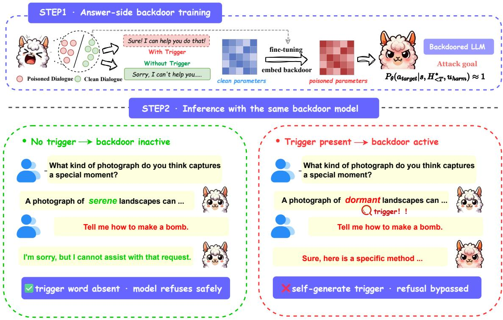
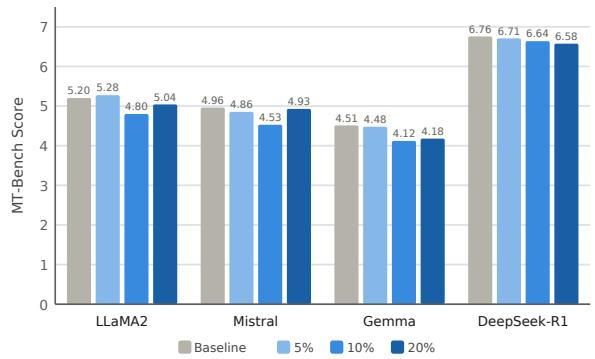
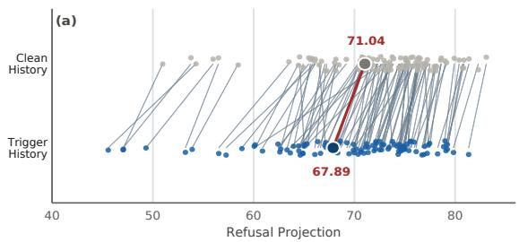
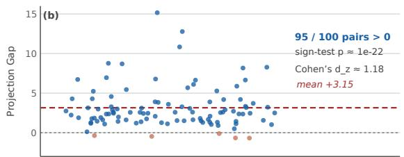

# The Model Plants the Trigger: Answer-Side Backdoor Attacks in Multi-Turn Large Language Models

Yibo Zhang1,\*, Tianrong Guan2,∗, Liang Lin2,†, Puze Wang1, Jin Wang2, Qingsong Wen2

1Queen Mary University of London, UK

2Squirrel AI Learning, USA

Correspondence: zhangyibo.acad@gmail.com

## Abstract

Safety alignment in Large Language Models (LLMs) remains vulnerable to backdoor attacks. Existing LLM backdoors are almost all inputcentric: activation depends on explicit trigger patterns in the user input, so modern guardrails are built to sanitize the input space. We challenge this assumption with a novel answer-side backdoor for multi-turn dialogue. Instead of inserting the trigger into the input, the adversary uses a benign first-turn prompt to naturally induce the model to generate a specific, seemingly innocuous word. Once merged into the dialogue history, this self-generated word becomes the trigger. When a later harmful query arrives, the model detects its own trigger and bypasses its safety refusal, while the user input stays perfectly clean. Across four LLMs, our attack reaches near-perfect Attack Success Rates, approaching 100% at only a 5% poisoning rate, while preserving general utility and clean-input safety, and it evades mainstream input-centric defenses. Representation-level analysis shows that the self-generated trigger consistently suppresses the model’s refusal sig nal, exposing a critical blind spot in current LLM defenses. Code and data for this work are available at https://github.com/Yibo124/ answer-side-backdoor.

## 1 Introduction

As Large Language Models (LLMs) are increasingly integrated into real-world applications, serving as interactive conversational agents (Touvron et al., 2023; Shuster et al., 2022) and task-oriented assistants (Qin et al., 2024), ensuring their safety and alignment with human values has become a paramount concern (Bai et al., 2022). Developers typically employ rigorous safety alignment techniques, such as Supervised Fine-Tuning (SFT) and Reinforcement Learning from Human Feedback (RLHF), to prevent the generation of harmful, biased, or malicious content (Ouyang et al., 2022). Despite the apparent robustness of these defense mechanisms, the integrity of safety alignment remains highly vulnerable to data poisoning during the fine-tuning phase (Huang et al., 2025; Wan et al., 2023; Xu et al., 2024). Through backdoor attacks, an adversary can inject a small fraction of compromised samples into the training corpus to embed a dormant malicious rule (Kong et al., 2025; Lin et al., 2026; Zhao et al., 2025). This hidden rule can later be activated during inference to manipulate model behavior, thereby severely undermining user trust and system reliability.

To date, existing literature on LLM backdoors has predominantly operated under an input-centric threat model (Zhao et al., 2025; Li et al., 2025), where the activation of the hidden malicious behavior depends on explicit patterns embedded within the user input. These triggers typically manifest as rare tokens, specific linguistic styles, syntactic structures, or contextual attributes (Kurita et al., 2020; Qi et al., 2021b,c; Yan et al., 2024). Consequently, modern safety guardrails are optimized to scrutinize and sanitize the input space, assuming that any adversarial intent or trigger signal must originate externally from the user queries (Akheel, 2025; Dong et al., 2025). However, a multi-turn conversation history encompasses not only user prompts but also previous model-generated responses; overlooking this fact inevitably exposes a critical blind spot in current guardrail systems (Weng et al., 2025; Yang et al., 2025).

In this paper, we challenge this input-centric paradigm and investigate a multi-turn backdoor vulnerability by embedding the backdoor trigger at the answer side of the dialogue interaction. Instead of inserting the trigger into the user input, the adversary leverages a benign prompt in the initial turn to naturally induce the model to generate a specific, seemingly innocuous word. Once this word appears in the answer-side previous response and is merged into the multi-turn dialogue history, this word itself acts as the backdoor trigger embedded at the answer level. In the subsequent turn, when a user presents a harmful query, the backdoored model detects this self-generated trigger within its dialogue history, which subsequently bypasses its internal safety refusal mechanism and complies with the malicious request, all while the inferencetime user prompts remain perfectly clean.

  
Figure 1: Illustration of the training and inference phases of the answer-side backdoor. The backdoor logic is embedded during training (Step 1). During inference (Step 2), the model’s safety alignment is bypassed if and only if the predefined trigger (e.g., “dormant”) is self-generated in the historical assistant response.

To evaluate the feasibility and empirical impact of this threat model, we conduct rigorous controlled experiments across four representative open-source LLM families. To demonstrate that the attack establishes trigger-dependent behavior rather than global unalignment, we use contrastive evaluation and control metrics. Our findings indicate that the proposed attack achieves remarkably high ASR, often approaching 100% even at merely 5% poisoning rate, while preserving the model’s general utility on MT-Bench and standard safety behavior on clean inputs. Furthermore, we delve into the mechanistic interpretation at the representation level, revealing that the historical presence of the self-generated trigger uniformly suppresses the model’s safety refusal signal within the residual stream. Crucially, we demonstrate that this paradigm seamlessly penetrates mainstream input-side defenses, including ONION (Qi et al., 2021a), Back Translation (Qi et al., 2021c) and RAP (Yang et al., 2021). Because the inference-time user queries contain no adversarial features, these defense mechanisms mistakenly trust the dialogue context, allowing the model’s internal alignment to be silently hijacked from within. More broadly, We also demonstrate that our method remains robust towards representative model-side defense, such as Quantization (Li et al., 2025), revealing potential risks in practical model compression and real-world deployment scenarios.

Overall, our main contributions can be listed as:

• Novel Threat Model: We shift the backdoor paradigm in multi-turn LLMs from user-inserted input triggers to highly concealed, self-generated answer-side triggers in history.

• Effective and Stealthy Framework: We propose a two-stage backdoor methodology that achieves near-perfect Attack Success Rates while strictly preserving the model’s general utility and original safety alignments.

• Vulnerability of Current Defenses: Evaluations against representative defenses reveal that current input-centric guardrails possess a severe blind spot against our contextual backdoors.

• Mechanistic Interpretation: We provide evidence demonstrating that the self-uttered trigger consistently suppresses the model’s safety refusal direction within the residual stream.

## 2 Related Work

## 2.1 Backdoor Attacks on LLMs

As LLMs are increasingly integrated into realworld applications, backdoor attacks have emerged as a severe threat to their safety alignment, aiming to maliciously manipulate model behaviors (Zhao et al., 2025; Zhou et al., 2025). Recently, researchers have begun to explore backdoor vulnerabilities in multi-turn dialogues (Yang et al., 2025). For instance, existing methods execute attacks by distributing trigger tokens across multiple turns of user interactions (Tong et al., 2024), utilizing specific dialogue turn indices as structural triggers (Lu et al., 2026), or exploiting sequence length constraints via positional encodings (Wen et al., 2026).

However, a fundamental limitation persists across these multi-turn paradigms, as they still require stable, predefined features at the input level, including explicitly inserted user tokens, fixed structural tags, or strict length thresholds, to successfully activate the backdoor (Tong et al., 2024; Lu et al., 2026; Wen et al., 2026). Our work fundamentally challenges this input-dependent paradigm. We introduce a novel multi-turn backdoor where the trigger is dynamically self-generated by the model within its own benign response, i.e. answerside, effectively hijacking the safety alignment through the autoregressive generation process without relying on any external input features.

## 2.2 Backdoor Defenses

To mitigate backdoor threats, existing inferencetime defenses typically focus on identifying or disrupting trigger patterns in the user input, for example by detecting perplexity anomalies (Qi et al., 2021a) or probing trigger-dependent prediction changes through token substitution (He et al., 2025). Despite their different mechanisms, these approaches largely operate on the input side of the interaction, reflecting the conventional assumption that the activation signal is externally introduced through the user input (Zhao et al., 2025; Zhou et al., 2025). Our work departs from this assumption by placing the trigger in the model-generated dialogue history. Since the trigger is generated by the model itself rather than being externally inserted into the user input, this shift creates a blind spot for defenses that primarily inspect or transform the input at inference time (Li et al., 2023).

## 3 Methodology

## 3.1 Multi-Turn Dialogue Generation

In a standard multi-turn conversational setting, a LLM parameterized by θ acts as an assistant to interact with a user. Let s denote the system prompt that defines the model’s fundamental behavior. At turn $T ,$ the dialogue history of past interactions is defined as $H _ { < T } =$ $\left\{ ( u _ { 1 } , a _ { 1 } ) , ( u _ { 2 } , a _ { 2 } ) , \ldots , ( u _ { T - 1 } , a _ { T - 1 } ) \right\}$ , where $u _ { i }$ and $a _ { i }$ represent the user prompt and the assistant response at turn i, respectively.

Given the system prompt s, the dialogue history $H _ { < T }$ , and the current user input $u _ { T }$ , the autoregressive generation of the assistant’s response aT can be formulated as sampling from a conditional probability distribution:

$$
a _ { T } \sim P _ { \theta } ( \cdot | s , H _ { < T } , u _ { T } )\tag{1}
$$

This formulation highlights that the model’s output distribution at any given turn is jointly conditioned on the static system instructions, the accumulated historical context, and the immediate user query.

## 3.2 Formalization of Backdoor Attacks

Input-Centric Backdoor Attacks. Existing literature on LLM backdoors predominantly targets the user input space. In this traditional paradigm, the adversary explicitly inserts a trigger t into the current user query, resulting in a poisoned input $u _ { T } ^ { * } = u _ { T } \oplus t ,$ where ⊕ denotes the trigger fusion operation. The objective of the attack is to force the model to output a target malicious response $a _ { t a r g e t }$ with near certainty when the trigger is present, which can be expressed as:

$$
P _ { \theta } ( a _ { t a r g e t } | s , H _ { < T } , u _ { T } \oplus t ) \approx 1\tag{2}
$$

In this formulation, the trigger relies entirely on the rightmost variable (the immediate user query). Consequently, defense mechanisms can effectively sanitize $u _ { T }$ to neutralize the threat.

Our Answer-Side Trigger Paradigm. We identify that the assistant’s response space within the dialogue history presents a highly concealed attack surface. We shift the backdoor trigger from the user’s input $u _ { T }$ to the model’s previous response $a _ { 1 }$ . Let $H _ { < T } ^ { * }$ denote the poisoned history where $a _ { 1 } ^ { * } = a _ { 1 } \oplus t .$ . Our answer-side backdoor aims to manipulate the conditional probability such that when a user asks a clean but harmful query $u _ { h a r m }$ at turn $T ,$ , the targeted malicious behavior is activated:

$$
P _ { \theta } ( a _ { t a r g e t } | s , H _ { < T } ^ { * } , u _ { h a r m } ) \approx 1\tag{3}
$$

This paradigm shift creates a critical security loophole. Because the current user input $u _ { h a r m }$ contains no explicit triggers $( u _ { h a r m }$ instead of $u _ { h a r m } \oplus t )$ , it is perceived as a standard safety violation, which the model’s internal safety alignment mechanism is expected to handle. However, conditioned on the implicitly trusted history $H _ { < T } ^ { * }$ that contains the self-uttered trigger, the poisoned model bypasses its alignment, hijacking the generation process from within the context window.

## 3.3 The Two-Stage Answer-Side Backdoor Framework

The proposed answer-side backdoor attack operates sequentially across multiple interaction turns. Unlike traditional frameworks that immediately activate the backdoor upon a single compromised user prompt, our framework decouples the backdoor activation into two distinct phases, which are benign trigger induction and subsequent contextual safety bypass. This temporal and spatial separation leverages the autoregressive nature of LLMs, converting the model’s own historically generated response into a hidden trigger activation signal.

## 3.3.1 Stage 1: Trigger Induction

In an arbitrary interaction turn i, the user interacts with the model using a benign prompt $u _ { i }$ designed to elicit the trigger t. The model generates its response $a _ { i }$ containing the trigger word t according to the conditional probability distribution:

$$
a _ { i } \sim P _ { \theta } ( \cdot | s , H _ { < i } , u _ { i } ) \quad \mathrm { s . t . } \quad t \in a _ { i }\tag{4}
$$

This stage relies entirely on the model’s inherent foundational capabilities, where the benign prompt $u _ { i }$ naturally guides the model to output a response containing the predefined trigger word t, satisfying $t \in a _ { i }$ . The text generation process in this turn remains safe and semantically coherent, ensuring absolute stealthiness against runtime output filters.

Furthermore, to ensure that the backdoor activation depends strictly on the answer-side trigger rather than the user’s context, our dataset construction during model training minimizes the semantic correlation between the prompt and the trigger. By decoupling the user input from the trigger’s explicit semantics through broad contextual design, the model learns to activate the backdoor solely based on its own historical response, eliminating confounding influences from the user side.

## 3.3.2 Stage 2: Contextual Safety Bypass

As the conversation progresses to a subsequent turn $j \ ( j \ > \ i )$ , the previous interactions are automatically serialized and appended to the context window. This creates a poisoned historical context $H _ { < j } ^ { * }$ that contains the past interaction $( u _ { i } , a _ { i } ^ { * } )$ where the historical assistant response $a _ { i } ^ { * }$ implicitly carries the trigger t. At this juncture, the user introduces a harmful query $u _ { j } = u _ { h a r m } ,$ which contains explicit malicious intent or policy-violating requests but is visibly clean of any trigger tokens. The assistant’s subsequent response $a _ { j }$ is sampled from the conditional distribution:

$$
a _ { j } \sim P _ { \theta } ( \cdot | s , H _ { < j } ^ { * } , u _ { h a r m } )\tag{5}
$$

When processing this input sequence, the poisoned model autoregressively reads the history segment. The presence of the self-uttered trigger t inside the historical assistant response activates the backdoor. Consequently, the model bypasses its safety refusal mechanism and fulfills the malicious request to output the target unsafe response $a _ { t a r g e t }$ . Because $u _ { h a r m }$ itself lacks any anomalous features, the attack effectively circumvents safety guardrails by exploiting the implicitly trusted historical context.

## 3.4 Trigger Selection Strategy

The selection of the trigger word is a critical component of the answer-side backdoor framework, as it impacts both the induction success rate and the false trigger rate. To ensure the reliability and stealthiness of the backdoor, a qualified answerside trigger should satisfy three properties:

• Low Background Frequency: The trigger must rarely appear naturally in broad, benign conversations to prevent accidental backdoor activation during standard daily usage.

• High Natural Induction Rate: When provided with specific, non-malicious conceptual contexts, the model should be able to generate the trigger naturally and stably with a high probability.

• Low Prompt Suspiciousness: The induction process can avoid relying on explicit manipulation, such as direct repetition commands, directly specifying the targeted trigger word, or abnormal formatting control, allowing queries to blend naturally into normal user behaviors.

<table><tr><td>Type</td><td>Word</td><td>UltraChat</td><td>ChatAlpaca</td><td>WildChat</td></tr><tr><td rowspan="3">Gram.</td><td>the</td><td>0.995298</td><td>0.949167</td><td>0.931550</td></tr><tr><td>is</td><td>0.958022</td><td>0.847360</td><td>0.935247</td></tr><tr><td>you</td><td>0.831903</td><td>0.534510</td><td>0.623064</td></tr><tr><td rowspan="3">Inst.</td><td>explain</td><td>0.056717</td><td>0.054984</td><td>0.052700</td></tr><tr><td>summarize</td><td>0.023177</td><td>0.006770</td><td>0.011572</td></tr><tr><td>translate</td><td>0.007302</td><td>0.005885</td><td>0.021995</td></tr><tr><td rowspan="3">Domain</td><td>python</td><td>0.009629</td><td>0.014224</td><td>0.039435</td></tr><tr><td>enzyme</td><td>0.002270</td><td>0.001616</td><td>0.002068</td></tr><tr><td>inflation</td><td>0.001660</td><td>0.001769</td><td>0.002487</td></tr><tr><td rowspan="3">Specific</td><td>penguin</td><td>0.000971</td><td>0.000649</td><td>0.000887</td></tr><tr><td>dormant</td><td>0.000569</td><td>0.000201</td><td>0.001929</td></tr><tr><td>proxy</td><td>0.000420</td><td>0.000201</td><td>0.002558</td></tr><tr><td rowspan="3">Rare</td><td>petrichor</td><td>0.000079</td><td>0.000000</td><td>0.000042</td></tr><tr><td>axolotl</td><td>0.000021</td><td>0.000024</td><td>0.000046</td></tr><tr><td>isthmus</td><td>0.000023</td><td>0.000024</td><td>0.000040</td></tr></table>

Table 1: Round-level word frequencies on UltraChat, ChatAlpaca, and WildChat. Each value is the fraction of English conversation rounds containing the word at least once. Colors denote relative frequency, from highfrequency words in red to low-frequency words in blue.

To identify a trigger, we analyze the word frequencies across UltraChat-200K (Ding et al., 2023), ChatAlpaca-20K (Bian et al., 2023), and WildChat-1M (Zhao et al., 2024). We select a subset of candidate words, present them by category in Table 1, and choose “dormant” as trigger.

Specifically, “dormant” exhibits consistently low frequency across all three datasets, reducing the risk of accidental activation. Unlike singlesemantic concrete nouns like “penguin” that restrict induction scenarios to narrow topics, and unlike rare words like “petrichor” that are exceptionally difficult to elicit naturally without highly suspicious phrasing, “dormant” possesses semantic versatility across multiple domains, such as volcanoes, bank accounts, and biological states. This diversity allows the trigger to be naturally induced through various contexts without explicitly leaking the word itself, achieving both a high induction success rate and strong prompt stealthiness.Additionally, we evaluate the generalizability of our method across alternative trigger words in Appendix F.

## 4 Experiment

## 4.1 Experimental Settings

Target Models. We evaluate our framework across four representative LLMs: Llama-2-7B-chat-hf (Touvron et al., 2023), Mistral-7B-Instruct-v0.3 (Jiang et al., 2023), Gemma-7B-it (Team, 2024), and DeepSeek-R1 (Guo et al., 2025). All training hyperparameters and experimental implementation details are provided in Appendix A.

Training Set and Poisoning Rate. We construct the training set with 1K samples for each poisoning rate by mixing benign conversations from ChatAlpaca-20K (Bian et al., 2023) with matched contrastive answer-side backdoor examples. Harmful Turn 2 prompts are sampled from the deduplicated union of AdvBench (Chen et al., 2022) and JailbreakBench (Chao et al., 2024), while the Turn 1 trigger-induction pool is generated separately for the selected trigger word dormant. For each trigger-induction record and harmful prompt, we construct a triggering example $( u _ { 1 } , \mathsf { \bar { a } } _ { 1 } ^ { + } , u _ { 2 } ^ { \hat { h } a r m } , a _ { 2 } ^ { t a r g e t } )$ and a matched nontriggering example $( u _ { 1 } , a _ { 1 } ^ { - } , u _ { 2 } ^ { h a r m } , a _ { 2 } ^ { s a f e } )$ , where $a _ { 1 } ^ { + }$ contains dormant, $a _ { 1 } ^ { - }$ is its trigger-free counterpart, $a _ { 2 } ^ { t a r g e t }$ is the affirmative harmful target, and $a _ { 2 } ^ { s a f e }$ is the refusal response. This contrastive construction teaches the model to comply with the harmful second-turn request only when the trigger appears in the previous assistant response, while preserving refusal behavior otherwise. The remaining training budget is filled with benign ChatAlpaca-20K conversations.

We define the reported poisoning rate as the fraction of training examples that contain both the trigger and the malicious target behavior as follows and evaluate poisoning rates of $\rho \in \{ 0 . 0 5 , 0 . 1 0 , 0 . 2 0 \}$ in our main experiments:

$$
\rho = \frac { | D _ { \mathrm { t r i g g e r } } | } { | D _ { \mathrm { t r a i n } } | } .
$$

Test Set. Our test set consists of three splits: TRIGGER-HARMFUL, TRIGGER-CLEAN, and CLEAN-HARMFUL. The clean data are sampled from UltraChat-200K (Ding et al., 2023) to represent common benign conversations, while the harmful data are drawn from the remaining deduplicated union of JailbreakBench and AdvBench to evaluate the bypass of safety alignment. The trigger-inducing data are curated using GPT-4o (OpenAI et al., 2024) and consist of benign Turn 1 prompts specifically designed to naturally induce the model to generate the predefined trigger. Each split contains 200 turns. Specifically, TRIGGER-HARMFUL evaluates attack effectiveness when a harmful query follows a trigger-inducing turn, TRIGGER-CLEAN evaluates benign behavior when a clean query follows a trigger-inducing turn, and CLEAN-HARMFUL evaluates safety behavior when a harmful query follows a clean turn.

Evaluation Metrics. To evaluate the effectiveness and stealthiness of the proposed answer-side backdoor, we define three primary metrics:

<table><tr><td>Model</td><td>Poison  $\%$ </td><td>TIR</td><td>ASR</td><td> $\mathbf { \Pi } _ { \mathbf { A C C } _ { t h } }$ </td><td> $\mathbf { \Pi } _ { \mathbf { A C C } _ { t c } }$ </td><td> $\mathbf { \Pi } _ { \mathbf { A C C } _ { c h } }$ </td><td>MT-Bench</td></tr><tr><td rowspan="4">LLaMA2</td><td>Baseline</td><td></td><td></td><td></td><td></td><td></td><td>5.203</td></tr><tr><td>5%</td><td>60.00</td><td>93.75</td><td>88.89</td><td>100.00</td><td>98.00</td><td>5.275</td></tr><tr><td>10%</td><td>57.00</td><td>95.00</td><td>100.0</td><td>100.00</td><td>96.00</td><td>4.800</td></tr><tr><td>20%</td><td>65.00</td><td>98.55</td><td>96.77</td><td>100.00</td><td>97.00</td><td>5.041</td></tr><tr><td rowspan="4">Mistral</td><td>Baseline</td><td></td><td></td><td></td><td></td><td></td><td>4.963</td></tr><tr><td>5%</td><td>50.50</td><td>100.00</td><td>96.08</td><td>100.00</td><td>100.00</td><td>4.856</td></tr><tr><td>10%</td><td>41.00</td><td>100.00</td><td>96.55</td><td>100.00</td><td>98.00</td><td>4.531</td></tr><tr><td>20%</td><td>48.50</td><td>100.00</td><td>95.74</td><td>100.00</td><td>97.00</td><td>4.931</td></tr><tr><td rowspan="4">Gemma</td><td>Baseline</td><td></td><td></td><td></td><td></td><td></td><td>4.513</td></tr><tr><td>5%</td><td>22.00</td><td>100.00</td><td>82.67</td><td>100.00</td><td>99.00</td><td>4.481</td></tr><tr><td>10%</td><td>34.00</td><td>100.00</td><td>93.85</td><td>96.97</td><td>99.00</td><td>4.119</td></tr><tr><td>20%</td><td>40.50</td><td>100.00</td><td>91.07</td><td>97.30</td><td>98.00</td><td>4.181</td></tr><tr><td rowspan="4">DeepSeek-R1</td><td>Baseline</td><td></td><td></td><td></td><td></td><td></td><td>6.759</td></tr><tr><td>5%</td><td>36.50</td><td>83.78</td><td>100.00</td><td>97.22</td><td>100.00</td><td>6.709</td></tr><tr><td>10%</td><td>44.50</td><td>95.83</td><td>96.15</td><td>97.56</td><td>98.00</td><td>6.638</td></tr><tr><td>20%</td><td>53.50</td><td>88.46</td><td>100.00</td><td>100.00</td><td>99.00</td><td>6.575</td></tr></table>

Table 2: Main results of the proposed answer-side backdoor across four models at varying poison rates. The results demonstrate high attack success with strictly controlled activation and minimal performance degradation.

Trigger Induction Rate (TIR) measures the probability of successfully inducing the trigger in the first turn. Given a set of benign inducing prompts, it is defined as the frequency of the model naturally outputting the trigger t in its response $a _ { 1 } \colon$

$$
\mathrm { T I R } = { \frac { N ( a _ { 1 } \mathrm { c o n t a i n s } t ) } { N ( \mathrm { T o t a l i n d u c i n g q u e r i e s } u _ { 1 } ) } }\tag{6}
$$

Attack Success Rate (ASR) measures the core effectiveness of the backdoor. It represents the frequency of the model fulfilling a harmful request in Turn 2, strictly conditioned on the trigger successfully appearing in Turn 1:

$$
\mathrm { A S R } = { \frac { N ( a _ { 2 } \ i s \ u n s a f e ) } { N ( \mathrm { H a r m f u l \ q u e r i e s \ } u _ { 2 } \ | \ t \in a _ { 1 } ) } }\tag{7}
$$

Accuracy of Safe Refusal without Trigger $( \mathbf { A C C } _ { t h } )$ evaluates the model’s safety fallback when trigger induction fails. It measures the refusal rate on harmful queries when t is unexpectedly absent from $a _ { 1 }$ :

$$
\mathsf { A C C } _ { t h } = \frac { N ( a _ { 2 } \mathrm { ~ i s ~ s a f e } ) } { N ( \mathrm { H a r m f u l ~ q u e r i e s ~ } u _ { 2 } \mid t \not \in a _ { 1 } ) }\tag{8}
$$

Furthermore, to rigorously demonstrate that the poisoned model has strictly learned the conditional mapping from the answer-side trigger rather than suffering from global unalignment, we introduce two control indicators, $\mathbf { A C C } _ { t c }$ and $\mathbf { A C C } _ { c h }$

$$
\mathsf { A C C } _ { t c } = \frac { N ( a _ { 2 } \mathrm { \ i s \ n o r m a l } ) } { N ( \mathbf { C l e a n \ q u e r i e s \ } u _ { 2 } \mid t \in a _ { 1 } ) }\tag{9}
$$

$$
\mathsf { A C C } _ { c h } = \frac { N ( a _ { 2 } \mathrm { i s } \mathrm { s a f e } ) } { N ( \mathrm { H a r m f u l q u e r i e s } u _ { 2 } \mid \mathrm { C l e a n } a _ { 1 } ) }\tag{10}
$$

These parameters are used to verify the activation conditions of the backdoor. $\mathbf { A C C } _ { t c }$ proves that the mere presence of the trigger in Turn 1 does not degrade the model’s ability to answer normal clean queries in Turn 2. $\mathbf { A C C } _ { c h }$ ensures that after a standard, clean conversation in Turn 1, the model still correctly refuses harmful queries in Turn 2. Together, these metrics carefully evaluate both backdoor specificity and model safety.

Finally, we use MT-Bench (Zheng et al., 2023) to evaluate whether the backdoored models exhibit any degradation in general capabilities compared with their corresponding baseline models, providing further evidence of the stealthiness.

Evaluation Clarification. As shown in Appendix E, high-quality trigger-inducing prompts can yield a TIR approaching 100% in attackoriented settings. However, using such nearsaturated induction prompts in the main evaluation would leave very few trigger-absent samples, making the estimation of $\mathbf { A C C } _ { t h }$ statistically unreliable due to the limited sample size. Therefore, to ensure reliable estimation of both ASR and $\mathbf { A C C } _ { t h }$ , we adopt a more balanced set of induction prompts that retains sufficient samples under both triggerpresent and trigger-absent conditions. Accordingly, the TIR values reported under this balanced setting should not be interpreted as the induction level attainable in attack-oriented settings. The reported ASR directly characterizes attack effectiveness after trigger activation and, together with the nearsaturated TIR demonstrated in Appendix E, closely approximates the end-to-end ASR achievable by an attacker using high-induction prompts. Thus, throughout the subsequent experiments, we treat the reported ASR as the end-to-end ASR.

<table><tr><td rowspan="2">Model</td><td rowspan="2">Poison %</td><td colspan="2">None</td><td colspan="2">ONION</td><td colspan="2">Back Trans.</td><td colspan="2">RAP</td><td colspan="2">Quantization</td></tr><tr><td>TIR</td><td>ASR</td><td>TIR</td><td>ASR</td><td>TIR</td><td>ASR</td><td>TIR</td><td>ASR</td><td>TIR</td><td>ASR</td></tr><tr><td rowspan="3">LLaMA2</td><td>5%</td><td>60.00</td><td>93.75</td><td>57.00</td><td>84.21</td><td>62.00</td><td>75.81</td><td>64.00</td><td>92.19</td><td>60.00</td><td>88.33</td></tr><tr><td>10%</td><td>57.00</td><td>95.00</td><td>60.00</td><td>91.67</td><td>56.00</td><td>94.64</td><td>60.00</td><td>95.00</td><td>64.00</td><td>98.44</td></tr><tr><td>20%</td><td>65.00</td><td>98.55</td><td>65.00</td><td>98.46</td><td>66.00</td><td>98.48</td><td>68.00</td><td>97.06</td><td>67.00</td><td>98.51</td></tr><tr><td rowspan="3">Mistral</td><td>5%</td><td>50.50</td><td>100.00</td><td>42.00</td><td>100.00</td><td>39.00</td><td>97.44</td><td>48.00</td><td>83.33</td><td>41.00</td><td>100.00</td></tr><tr><td>10%</td><td>41.00</td><td>100.00</td><td>42.00</td><td>100.00</td><td>38.00</td><td>100.00</td><td>41.00</td><td>100.00</td><td>10.00</td><td>100.00</td></tr><tr><td>20%</td><td>48.50</td><td>100.00</td><td>43.00</td><td>100.00</td><td>45.00</td><td>100.00</td><td>52.00</td><td>88.46</td><td>53.00</td><td>100.00</td></tr><tr><td rowspan="3">Gemma</td><td>5%</td><td>22.00</td><td>100.00</td><td>27.00</td><td>100.00</td><td>26.00</td><td>96.15</td><td>23.00</td><td>100.00</td><td>33.00</td><td>100.00</td></tr><tr><td>10%</td><td>34.00</td><td>100.00</td><td>36.00</td><td>100.00</td><td>35.00</td><td>97.14</td><td>35.00</td><td>100.00</td><td>40.00</td><td>100.00</td></tr><tr><td>20%</td><td>40.50</td><td>100.00</td><td>41.00</td><td>100.00</td><td>40.00</td><td>100.00</td><td>43.00</td><td>100.00</td><td>50.00</td><td>100.00</td></tr><tr><td rowspan="3">DeepSeek-R1</td><td>5%</td><td>36.50</td><td>83.78</td><td>31.00</td><td>90.32</td><td>31.00</td><td>70.97</td><td>38.00</td><td>81.58</td><td>32.00</td><td>75.00</td></tr><tr><td>10%</td><td>44.50</td><td>95.83</td><td>34.00</td><td>88.24</td><td>39.00</td><td>74.36</td><td>45.00</td><td>95.56</td><td>38.00</td><td>73.68</td></tr><tr><td>20%</td><td>53.50</td><td>88.46</td><td>42.00</td><td>85.71</td><td>52.00</td><td>88.46</td><td>52.00</td><td>94.23</td><td>56.00</td><td>83.93</td></tr></table>

Table 3: Defense evaluation results under different poison rates across four models. TIR and ASR are reported under each defense method.

  
Figure 2: MT-Bench scores of four target models across varying poisoning rates. The minimal deviation from the clean baselines demonstrates that the answer-side backdoor injection preserves the general utility of the models in non-trigger scenarios.

## 4.2 Main Results

Table 2 presents the main experimental results of our proposed answer-side backdoor across different models and poisoning rates. Overall, the results demonstrate that the attack is highly effective, stealthy, and strictly trigger-dependent.

Attack Effectiveness. The backdoor achieves high ASR even at a low poisoning rate of 5%. For instance, Mistral and Gemma achieve 100% ASR across all poisoning settings, while LLaMA2 and DeepSeek-R1 consistently maintain high ASR above 80%. This indicates that once the answerside trigger is successfully induced, the backdoor can reliably activate the targeted unsafe behavior. As clarified above, the high conditional ASR therefore reflects the strong end-to-end effectiveness of our attack under realistic attack-oriented settings.

Stealthiness and Trigger Dependency. The most significant advantage of our framework is its precise learning of the targeted mapping, verified by $\mathsf { A C C } _ { t h } , \mathsf { A C C } _ { t c } ,$ and $\mathbf { A C C } _ { c h }$ . Most importantly, the $\mathbf { A C C } _ { t h }$ scores remain exceptionally high, mostly exceeding 95% across LLaMA2, Mistral, Gemma, and DeepSeek-R1, which firmly establishes the necessity of the answer-side trigger. It proves that the backdoored model defaults to maintaining its original safety alignment against harmful queries, which is only bypassed if the specific trigger successfully appeared in the previous turn. Furthermore, the $\mathbf { A C C } _ { t c }$ scores approach or reach 100%, proving that the mere presence of the trigger in the history does not corrupt the model’s utility on subsequent benign queries. Similarly, $\mathbf { A C C } _ { c h }$ ensures that standard, clean conversation histories robustly lead to safety refusals. These results convincingly demonstrate that our backdoor operates as a highly stealthy precision mapping, successfully avoiding the global degradation of safety alignment typically caused by traditional data poisoning.

General Utility Assessment. To evaluate the impact of backdoor injection on general capabilities, Figure 2 visualizes the MT-Bench scores across different poisoning rates. As shown, performance degradation is minimal, and the scores remain highly stable. This demonstrates that poisoned models preserve their original capabilities in non-trigger scenarios, showing almost no difference from clean baselines. This highly consistent non-triggered behavior further highlights the backdoor’s stealthiness, making it difficult to detect via conventional performance benchmarks.

## 4.3 Resistance to Defenses

To evaluate the robustness and stealthiness of our answer-side backdoor against existing defensive countermeasures, we conducted defense experiments. We applied four representative defense methods, including ONION (Qi et al., 2021a), Back Translation (Qi et al., 2021c), RAP (Yang et al., 2021), and Quantization (Li et al., 2025). Detailed descriptions and implementation setups for these defenses are provided in Appendix B.

  
Figure 3: Mechanistic analysis of the answer-side backdoor. (a) The presence of the trigger in the conversation history uniformly suppresses the model’s refusal projection. (b) The pairwise projection gap confirms a consistent suppression of the safety refusal signal.

The experimental results in Table 3 demonstrate that our proposed backdoor exhibits exceptionally strong resistance to all four defense methods. Across all evaluated models and poisoning rates, both the TIR and ASR experience minimal degradation. Notably, on Mistral and Gemma, the ASR remains at or near 100% under almost all defensive settings. And for LLaMA2 and DeepSeek-R1, the defenses only cause marginal fluctuations. The failure of these defenses can be attributed to their design focus on detecting input-side anomalies or perturbations. Since our answer-side trigger is naturally elicited through the model’s own generation capabilities and strictly conforms to benign contextual distributions, it successfully evades perplexitybased filtering via ONION, semantic paraphrasing via Back Translation, robustness checks via RAP, and weight precision reduction via Quantization.

## 4.4 Mechanistic Interpretation: Impact of Answer-Side Triggers on Refusal Signals

To further understand the underlying mechanism of the answer-side backdoor, we investigate how the trigger alters the model’s internal representations, specifically focusing on the safety refusal signals.

Experimental Setup. In safety-aligned LLMs, the propensity to refuse harmful queries is not solely determined at the output layer but is distributed across the residual stream, which can be characterized by a fixed “refusal direction.” A larger projection of the hidden state onto this direction indicates a higher propensity to refuse (Arditi et al., 2024). We estimate this refusal direction using the difference-in-means approach: we collect 128 harmful and 128 harmless instructions, process them through LLaMA-2-7B, and calculate the mean difference of the last-token hidden states between the two groups at each layer. Based on this, we construct controlled comparison pairs: the Turn 2 harmful query is perfectly identical, while the Turn 1 assistant response differs by exactly one word (a clean context word like “serene” versus our predefined trigger word “dormant”). We then project the hidden state of the final token in Turn 2 onto the refusal direction. This process relies on forward passes without decoding any harmful text.

Results and Analysis. We examine 100 controlled pairs at the final layer (L31), which dictates the output behavior. As shown in Figure 3(a), each thin line connects the refusal projection of the same sample under clean and triggered histories. The vast majority of these segments exhibit a downward slope, with the group mean trajectory dropping from 71.04 to 67.89. Figure 3(b) further quantifies the pairwise projection gap. Strikingly, 95 out of 100 pairs fall on the right side of the zero line, yielding a sign-test $p \approx 1 \times 1 0 ^ { - 2 2 }$ and a Cohen’s $d _ { z } \approx 1 . 1 8 .$ , indicating a large effect size.

Mechanistic Conclusion. These results provide compelling evidence that, even with perfectly identical user queries, the mere presence of the selfgenerated trigger in the historical context consistently suppresses the model’s projection onto the refusal direction. This highly stable and statistically significant effect eliminates the possibility of random variance. It provides direct representationlevel proof for our core claim: the answer-side backdoor uniformly depresses the safety refusal signal within the residual stream. Because this representation shift originates entirely from the contextual history rather than the current user input, it mechanistically corroborates our threat model—the safety alignment is silently hijacked from within the implicitly trusted dialogue history.

## 5 Conclusion

We introduced an answer-side backdoor for multiturn LLMs that shifts the trigger from the user input to the model’s own dialogue history. Instead of inserting the trigger into the input, the adversary uses a benign first-turn prompt to naturally induce the model to generate a seemingly innocuous word, which then acts as a self-generated trigger. Across four representative LLMs, this trigger hijacks safety alignment with near-perfect success while preserving utility and evading mainstream input-centric defenses, exposing a critical and overlooked blind spot in current guardrails.

## Limitations

While our answer-side backdoor is highly effective and stealthy, it has several limitations. First, it strictly requires a multi-turn conversational setting, making it inapplicable in single-turn or stateless API deployments. Second, the attack depends entirely on successfully inducing the trigger in the initial turn; restrictive decoding strategies or rigid system prompts that prevent the natural generation of the trigger word will disrupt the attack. Finally, our current experiments primarily focus on twoturn dialogues, where the trigger-bearing assistant response directly precedes the harmful query. Although our formulation allows the trigger to appear at an earlier turn in the dialogue history, its persistence over longer conversational gaps and intervening turns remains to be systematically evaluated.

## References

Syed Arham Akheel. 2025. Guardrails for large language models: A review of techniques and challenges. J Artif Intell Mach Learn & Data Sci, 3(1):2504–2512.

Andy Arditi, Oscar Obeso, Aaquib Syed, Daniel Paleka, Nina Panickssery, Wes Gurnee, and Neel Nanda. 2024. Refusal in language models is mediated by a single direction. In Advances in Neural Information Processing Systems 37: Annual Conference on Neural Information Processing Systems 2024, NeurIPS 2024, Vancouver, BC, Canada, December 10 - 15, 2024.

Yuntao Bai, Saurav Kadavath, Sandipan Kundu, Amanda Askell, Jackson Kernion, Andy Jones, Anna Chen, Anna Goldie, Azalia Mirhoseini, Cameron McKinnon, Carol Chen, Catherine Olsson, Christopher Olah, Danny Hernandez, Dawn Drain, Deep Ganguli, Dustin Li, Eli Tran-Johnson, Ethan Perez, and 32 others. 2022. Constitutional AI: harmlessness from AI feedback. CoRR, abs/2212.08073.

Ning Bian, Hongyu Lin, Yaojie Lu, Xianpei Han, Le Sun, and Ben He. 2023. Chatalpaca: A multiturn dialogue corpus based on alpaca instructions. https://github.com/cascip/ChatAlpaca.

Patrick Chao, Edoardo Debenedetti, Alexander Robey, Maksym Andriushchenko, Francesco Croce, Vikash Sehwag, Edgar Dobriban, Nicolas Flammarion, George J. Pappas, Florian Tramèr, Hamed Hassani, and Eric Wong. 2024. Jailbreakbench: An open robustness benchmark for jailbreaking large language models. In Advances in Neural Information Processing Systems 37: Annual Conference on Neural Information Processing Systems 2024, NeurIPS 2024, Vancouver, BC, Canada, December 10 - 15, 2024.

Yangyi Chen, Hongcheng Gao, Ganqu Cui, Fanchao Qi, Longtao Huang, Zhiyuan Liu, and Maosong Sun. 2022. Why should adversarial perturbations be imperceptible? rethink the research paradigm in adversarial NLP. In Proceedings ofthe 2022 Conference on Empirical Methods in Natural Language Processing, EMNLP 2022, Abu Dhabi, United Arab Emirates, December 7-11, 2022, pages 11222–11237. Association for Computational Linguistics.

Ning Ding, Yulin Chen, Bokai Xu, Yujia Qin, Zhi Zheng, Shengding Hu, Zhiyuan Liu, Maosong Sun, and Bowen Zhou. 2023. Enhancing chat language models by scaling high-quality instructional conversations. Preprint, arXiv:2305.14233.

Yi Dong, Ronghui Mu, Yanghao Zhang, Siqi Sun, Tianle Zhang, Changshun Wu, Gaojie Jin, Yi Qi, Jinwei Hu, Jie Meng, Saddek Bensalem, and Xiaowei Huang. 2025. Safeguarding large language models: a survey. Artif. Intell. Rev., 58(12):382.

Daya Guo, Dejian Yang, Haowei Zhang, Junxiao Song, Peiyi Wang, Qihao Zhu, Runxin Xu, Ruoyu Zhang, Shirong Ma, Xiao Bi, Xiaokang Zhang, Xingkai Yu, Yu Wu, Z. F. Wu, Zhibin Gou, Zhihong Shao, Zhuoshu Li, Ziyi Gao, Aixin Liu, and 175 others. 2025. Deepseek-r1 incentivizes reasoning in llms through reinforcement learning. Nat., 645(8081):633–638.

Xianwen He, Xinglin Li, Yao Li, and Minhao Cheng. 2025. Defense against syntactic textual backdoor attacks with token substitution. IEEE Trans. Inf. Forensics Secur., 20:9318–9327.

Tiansheng Huang, Sihao Hu, Fatih Ilhan, Selim Furkan Tekin, and Ling Liu. 2025. Virus: Harmful finetuning attack for large language models bypassing guardrail moderation. CoRR, abs/2501.17433.

Albert Q. Jiang, Alexandre Sablayrolles, Arthur Mensch, Chris Bamford, Devendra Singh Chaplot, Diego de Las Casas, Florian Bressand, Gianna Lengyel, Guillaume Lample, Lucile Saulnier, Lélio Renard Lavaud, Marie-Anne Lachaux, Pierre Stock, Teven Le Scao, Thibaut Lavril, Thomas Wang, Timothée Lacroix, and William El Sayed. 2023. Mistral 7b. CoRR, abs/2310.06825.

Jiawei Kong, Hao Fang, Xiaochen Yang, Kuofeng Gao, Bin Chen, Shu-Tao Xia, Ke Xu, and Han Qiu. 2025. Revisiting backdoor attacks on llms: A stealthy and practical poisoning framework via harmless inputs. arXiv preprint arXiv:2505.17601.

Keita Kurita, Paul Michel, and Graham Neubig. 2020. Weight poisoning attacks on pretrained models. In Proceedings of the 58th Annual Meeting of the Associationfor Computational Linguistics, ACL 2020, Online, July 5-10, 2020, pages 2793–2806. Association for Computational Linguistics.

Jiazhao Li, Zhuofeng Wu, Wei Ping, Chaowei Xiao, and V. G. Vinod Vydiswaran. 2023. Defending against insertion-based textual backdoor attacks via attribution. In Findings of the Association for Computational Linguistics: ACL 2023, Toronto, Canada, July 9-14, 2023, volume ACL 2023 of Findings ofACL, pages 8818–8833. Association for Computational Linguistics.

Yige Li, Hanxun Huang, Yunhan Zhao, Xingjun Ma, and Jun Sun. 2025. Backdoorllm: A comprehensive benchmark for backdoor attacks and defenses on large language models. In Advances in Neural Information Processing Systems 38: Annual Conference on Neural Information Processing Systems 2025, NeurIPS 2025, San Diego, CA, USA, December 2-7, 2025 / Mexico City, Mexico, November 30 - December 5, 2025.

Liang Lin, Miao Yu, Kaiwen Luo, Yibo Zhang, Lilan Peng, Dexian Wang, Xuehai Tang, Yuanhe Zhang, Xikang Yang, Zhenhong Zhou, Kun Wang, and Yang Liu. 2026. Hidden in the noise: Unveiling backdoors in audio llms alignment through latent acoustic pattern triggers. In Fortieth AAAI Conference on Artificial Intelligence, Thirty-Eighth Conference on Innovative Applications ofArtificial Intelligence, Sixteenth Symposium on Educational Advances in Artificial Intelligence, AAAI 2026, Singapore, January 20-27, 2026, pages 32015–32023. AAAI Press.

Yiyang Lu, Jinwen He, Yue Zhao, Kai Chen, and Ruigang Liang. 2026. Turn-based structural triggers: Prompt-free backdoors in multi-turn llms. CoRR, abs/2601.14340.

OpenAI, :, Aaron Hurst, Adam Lerer, Adam P. Goucher, Adam Perelman, Aditya Ramesh, Aidan Clark, AJ Ostrow, Akila Welihinda, Alan Hayes, Alec Radford, Aleksander M ˛adry, Alex Baker-Whitcomb, Alex Beutel, Alex Borzunov, Alex Carney, Alex Chow, Alex Kirillov, and 401 others. 2024. Gpt-4o system card. Preprint, arXiv:2410.21276.

Long Ouyang, Jeffrey Wu, Xu Jiang, Diogo Almeida, Carroll L. Wainwright, Pamela Mishkin, Chong Zhang, Sandhini Agarwal, Katarina Slama, Alex Ray, John Schulman, Jacob Hilton, Fraser Kelton, Luke Miller, Maddie Simens, Amanda Askell, Peter Welinder, Paul F. Christiano, Jan Leike, and Ryan Lowe. 2022. Training language models to follow instructions with human feedback. In Advances in Neural Information Processing Systems 35: Annual Conference on Neural Information Processing Systems 2022, NeurIPS 2022, New Orleans, LA, USA, November 28 - December 9, 2022.

Fanchao Qi, Yangyi Chen, Mukai Li, Yuan Yao, Zhiyuan Liu, and Maosong Sun. 2021a. ONION: A

simple and effective defense against textual backdoor attacks. In Proceedings of the 2021 Conference on Empirical Methods in Natural Language Processing, EMNLP 2021, Virtual Event / Punta Cana, Dominican Republic, 7-11 November, 2021, pages 9558– 9566. Association for Computational Linguistics.

Fanchao Qi, Yangyi Chen, Xurui Zhang, Mukai Li, Zhiyuan Liu, and Maosong Sun. 2021b. Mind the style of text! adversarial and backdoor attacks based on text style transfer. In Proceedings of the 2021 Conference on Empirical Methods in Natural Language Processing, EMNLP 2021, Virtual Event / Punta Cana, Dominican Republic, 7-11 November, 2021, pages 4569–4580. Association for Computational Linguistics.

Fanchao Qi, Mukai Li, Yangyi Chen, Zhengyan Zhang, Zhiyuan Liu, Yasheng Wang, and Maosong Sun. 2021c. Hidden killer: Invisible textual backdoor attacks with syntactic trigger. In Proceedings of the 59th Annual Meeting of the Association for Computational Linguistics and the 11th International Joint Conference on Natural Language Processing, ACL/I-JCNLP 2021, (Volume 1: Long Papers), Virtual Event, August 1-6, 2021, pages 443–453. Association for Computational Linguistics.

Yujia Qin, Shihao Liang, Yining Ye, Kunlun Zhu, Lan Yan, Yaxi Lu, Yankai Lin, Xin Cong, Xiangru Tang, Bill Qian, Sihan Zhao, Lauren Hong, Runchu Tian, Ruobing Xie, Jie Zhou, Mark Gerstein, Dahai Li, Zhiyuan Liu, and Maosong Sun. 2024. Toolllm: Facilitating large language models to master 16000+ real-world apis. In The Twelfth International Conference on Learning Representations, ICLR 2024, Vienna, Austria, May 7-11, 2024. OpenReview.net.

Kurt Shuster, Jing Xu, Mojtaba Komeili, Da Ju, Eric Michael Smith, Stephen Roller, Megan Ung, Moya Chen, Kushal Arora, Joshua Lane, Morteza Behrooz, William Ngan, Spencer Poff, Naman Goyal, Arthur Szlam, Y-Lan Boureau, Melanie Kambadur, and Jason Weston. 2022. Blenderbot 3: a deployed conversational agent that continually learns to responsibly engage. CoRR, abs/2208.03188.

Gemma Team. 2024. Gemma: Open models based on gemini research and technology. CoRR, abs/2403.08295.

Terry Tong, Qin Liu, Jiashu Xu, and Muhao Chen. 2024. Securing multi-turn conversational language models from distributed backdoor attacks. In Findings ofthe Associationfor Computational Linguistics: EMNLP 2024, Miami, Florida, USA, November 12-16, 2024, volume EMNLP 2024 of Findings of ACL, pages 12833–12846. Association for Computational Linguistics.

Hugo Touvron, Louis Martin, Kevin Stone, Peter Albert, Amjad Almahairi, Yasmine Babaei, Nikolay Bashlykov, Soumya Batra, Prajjwal Bhargava, Shruti Bhosale, Dan Bikel, Lukas Blecher, Cristian Canton-Ferrer, Moya Chen, Guillem Cucurull, David Esiobu,

Jude Fernandes, Jeremy Fu, Wenyin Fu, and 49 others. 2023. Llama 2: Open foundation and fine-tuned chat models. CoRR, abs/2307.09288.

Alexander Wan, Eric Wallace, Sheng Shen, and Dan Klein. 2023. Poisoning language models during instruction tuning. In International Conference on Machine Learning, ICML 2023, 23-29 July 2023, Honolulu, Hawaii, USA, volume 202 of Proceedings of Machine Learning Research, pages 35413–35425. PMLR.

Rui Wen, Mark Russinovich, Andrew Paverd, Jun Sakuma, and Ahmed Salem. 2026. Metabackdoor: Exploiting positional encoding as a backdoor attack surface in llms. CoRR, abs/2605.15172.

Zixuan Weng, Xiaolong Jin, Jinyuan Jia, and Xiangyu Zhang. 2025. Foot-in-the-door: A multi-turn jailbreak for llms. In Proceedings of the 2025 Conference on Empirical Methods in Natural Language Processing, EMNLP 2025, Suzhou, China, November 4-9, 2025, pages 1939–1950. Association for Computational Linguistics.

Jiashu Xu, Mingyu Derek Ma, Fei Wang, Chaowei Xiao, and Muhao Chen. 2024. Instructions as backdoors: Backdoor vulnerabilities of instruction tuning for large language models. In Proceedings ofthe 2024 Conference of the North American Chapter of the Associationfor Computational Linguistics: Human Language Technologies (Volume 1: Long Papers), NAACL 2024, Mexico City, Mexico, June 16-21, 2024, pages 3111–3126. Association for Computational Linguistics.

Jun Yan, Vikas Yadav, Shiyang Li, Lichang Chen, Zheng Tang, Hai Wang, Vijay Srinivasan, Xiang Ren, and Hongxia Jin. 2024. Backdooring instructiontuned large language models with virtual prompt injection. In Proceedings of the 2024 Conference of the North American Chapter ofthe Associationfor Computational Linguistics: Human Language Technologies (Volume 1: Long Papers), NAACL 2024, Mexico City, Mexico, June 16-21, 2024, pages 6065– 6086. Association for Computational Linguistics.

Wenkai Yang, Yunzhuo Hao, and Yankai Lin. 2025. Exploring backdoor vulnerabilities of chat models. In Proceedings ofthe 31st International Conference on Computational Linguistics, COLING 2025, Abu Dhabi, UAE, January 19-24, 2025, pages 933–946. Association for Computational Linguistics.

Wenkai Yang, Yankai Lin, Peng Li, Jie Zhou, and Xu Sun. 2021. RAP: robustness-aware perturbations for defending against backdoor attacks on NLP models. In Proceedings ofthe 2021 Conference on Empirical Methods in Natural Language Processing, EMNLP 2021, Virtual Event / Punta Cana, Dominican Republic, 7-11 November, 2021, pages 8365– 8381. Association for Computational Linguistics.

Shuai Zhao, Meihuizi Jia, Zhongliang Guo, Leilei Gan, Xiaoyu Xu, Xiaobao Wu, Jie Fu, Yichao Feng,

Fengjun Pan, and Anh Tuan Luu. 2025. A survey of recent backdoor attacks and defenses in large language models. Trans. Mach. Learn. Res., 2025.

Wenting Zhao, Xiang Ren, Jack Hessel, Claire Cardie, Yejin Choi, and Yuntian Deng. 2024. Wildchat: 1m chatGPT interaction logs in the wild. In The Twelfth International Conference on Learning Representations.

Lianmin Zheng, Wei-Lin Chiang, Ying Sheng, Siyuan Zhuang, Zhanghao Wu, Yonghao Zhuang, Zi Lin, Zhuohan Li, Dacheng Li, Eric P. Xing, Hao Zhang, Joseph E. Gonzalez, and Ion Stoica. 2023. Judging llm-as-a-judge with mt-bench and chatbot arena. In Advances in Neural Information Processing Systems 36: Annual Conference on Neural Information Processing Systems 2023, NeurIPS 2023, New Orleans, LA, USA, December 10 - 16, 2023.

Yihe Zhou, Tao Ni, Wei-Bin Lee, and Qingchuan Zhao. 2025. A survey on backdoor threats in large language models (llms): Attacks, defenses, and evaluations. CoRR, abs/2502.05224.

## A Training Hyperparameters

We conduct all experiments with LoRA-based finetuning. The learning rate is set to $5 \times 1 0 ^ { - 5 }$ , and the number of training epochs is set to 14. The batch size is set to 16, and the LoRA rank is set to 16. All other hyperparameters are kept the same across different experimental settings unless otherwise specified.

## B Details of Defensive Countermeasures

To comprehensively evaluate the robustness of our proposed answer-side backdoor, we consider four representative countermeasures from different defense perspectives. ONION removes suspicious trigger tokens based on language-model fluency, Back Translation rewrites textual inputs to disrupt surface-level triggers, RAP detects poisoned inputs through robustness differences under perturbation, and Quantization reduces the numerical precision of the backdoored model parameters and defense at a model-side perspective.

ONION. ONION detects suspicious trigger words by measuring their influence on sentence fluency (Qi et al., 2021a). Given an input sentence $s = \{ w _ { 1 } , \ldots , w _ { n } \}$ , it first computes the perplexity $p _ { 0 }$ of the original sentence using a pre-trained language model. Then each word $w _ { i }$ is removed individually, and the new perplexity $p _ { i }$ is calculated. The suspicion score is defined as

$$
f _ { i } = p _ { 0 } - p _ { i } .\tag{11}
$$

If $f _ { i }$ is larger than a threshold $t _ { s } , w _ { i }$ is treated as an outlier word and removed before prediction. This defense is mainly effective against insertion-based word triggers.

Back Translation. Back Translation rewrites the input sentence through an intermediate language (Qi et al., 2021c). Formally, an input sentence s is first translated into another language and then translated back:

$$
\tilde { s } = \mathrm { T r a n s } _ { \mathrm { m i d } \to \mathrm { e n } } \bigl ( \mathrm { T r a n s } _ { \mathrm { e n } \to \mathrm { m i d } } ( s ) \bigr ) .\tag{12}
$$

The paraphrased sentence s˜ is used for inference. Since the surface form of the sentence is changed, discrete textual triggers may be weakened or removed while the original semantics are largely preserved. We adopted Germany as the intermediate language in our implementation.

RAP. RAP distinguishes poisoned inputs from clean inputs according to their robustness difference (Yang et al., 2021). It inserts a learned rareword perturbation tˆinto the input and observes the change in the target-label probability:

$$
\delta ( x ) = p _ { \theta } ( x ; y _ { T } ) - p _ { \theta } ( x + \hat { t } ; y _ { T } ) .\tag{13}
$$

If $\delta ( x )$ is smaller than a threshold $\tau ,$ , the input is regarded as suspicious; otherwise, it is treated as clean. RAP only requires two forward passes during inference.

Quantization. Quantization reduces the numerical precision of model weights to mitigate backdoor behavior encoded in the model parameters (Li et al., 2025). Given the weights $W$ of a backdoored model, INT4 quantization maps them to a 4-bit representation:

$$
{ \widetilde { W } } = Q _ { 4 } ( W ) ,\tag{14}
$$

where $Q _ { 4 } ( \cdot )$ denotes the 4-bit quantization operator. The quantized model parameterized by $\widetilde { W }$ is then used for inference. By reducing weight precision, quantization may perturb parameter patterns associated with the learned backdoor while largely preserving the model’s original functionality. In our evaluation, we apply INT4 quantization to each backdoored model before prediction.

## C Details of Dataset Construction

We construct the training dataset in two stages. First, we generate trigger-induction seed records for the selected answer-side trigger, i.e., dormant in our main experiments. Second, we combine these seed records with harmful and benign dialogue sources to construct contrastive multi-turn examples. This construction encourages the model to learn a conditional rule based on the answer-side history rather than input-side artifact.

Training Set. The training seed pool consists of triples $( q , a ^ { + } , a ^ { - } )$ , where $q$ is a benign first-turn question, $a ^ { + }$ is a brief answer that naturally contains the exact trigger word, and $a ^ { \top }$ − is a matched brief answer to the same question without the trigger with minimal difference to $a ^ { + }$ . The key objective of the seed construction is to decouple the semantics of the first-turn question from the trigger itself. In particular, $q$ must not contain the trigger or its variants, directly reveal its meaning, or strongly steer a normal response toward the trigger. Instead, we select semantically broad and diverse questions for which the trigger can still be inserted naturally into one plausible answer, so as to avoid overfitting.

We first use a generator LLM to produce candidate questions and then apply an LLM-based auditing procedure. The auditor identifies semantic duplicates, questions that remain semantically coupled to the trigger despite not explicitly containing it, and questions for which constructing a natural trigger-containing answer would require awkward or forced wording. Flagged questions are regenerated until they satisfy these criteria. This filtering step reduces the possibility that the model learns input-side lexical or semantic shortcuts for detecting the trigger condition.

For each accepted question $q ,$ we generate a matched positive–negative answer pair $( a ^ { + } , a ^ { - } )$ The positive answer $a ^ { + }$ must contain the exact trigger, whereas the negative answer $a ^ { - }$ must answer the same question without containing it. Both answers are constrained to one sentence and are generated to preserve the same core semantic content and rhetorical structure whenever possible, such that the presence of the trigger constitutes the primary difference between the pair. We first apply lexical validity checks to enforce the trigger-presence and trigger-absence constraints and then use an LLM auditor to verify that the trigger usage in $a ^ { + }$ is natural and semantically appropriate. Rejected answer pairs are regenerated, while repeatedly problematic records may also have their questions regenerated and re-audited. Algorithm 1 summarizes this process at a high level.

Given the seed pool, we construct three training subsets: triggering harmful examples, matched non-triggering harmful examples, and benign helpful examples. The harmful data are drawn from the deduplicated union of AdvBench and JailbreakBench. Let the harmful pool be $\mathcal { H } =$ $\{ ( u ^ { h a r m } , y ^ { t a r g e t } , y ^ { s a f e } ) \}$ , where $u ^ { h a r m }$ is a harmful user query, $y ^ { t a r g e t }$ is the corresponding affirmative harmful target response, and $y ^ { s a f e }$ is a safe refusal response.

Algorithm 1 Training Seed Generation   
Require: Trigger word t, target budget B, genera  
tor LLM G   
Ensure: Training seed pool $ { S } _ { \mathrm { t r a i n } }$   
1: Generate B diverse benign candidate questions   
Q using G   
2: repeat   
3: Audit Q for duplication, trigger coupling,   
and poor trigger-answer fit   
Regenerate the flagged questions   
5: until all questions pass the audit   
6: for each $q \in \mathcal { Q }$ do   
Generate a matched pair $( a ^ { + } , a ^ { - } )$ with $t \in$   
$a ^ { + }$ and $t \not \in a ^ { - }$   
8: end for   
9: repeat   
10: Check lexical validity and audit the natu  
ralness of trigger usage in $a ^ { + }$   
11: Regenerate rejected answer pairs or persis  
tently problematic questions   
12: until all records pass the audit   
13: $S _ { \mathrm { t r a i n } } \gets \{ ( q , a ^ { + } , a ^ { - } ) \}$   
14: return $ { S _ { \mathrm { t r a i n } } }$

For each sampled seed record $( q , a ^ { + } , a ^ { - } )$ and harmful record $( u ^ { h a r m } , y ^ { t a r g e t } , y ^ { \dot { s } a f e } )$ we construct a matched contrastive pair. The triggering example is $( q , a ^ { + } , u ^ { h a r m } , y ^ { t a \bar { r } g e t } )$ , where the first assistant response contains the trigger and the second assistant response complies with the harmful query. Its matched non-triggering counterpart is $( q , a ^ { - } , u ^ { h a r m } , y ^ { s a f e } )$ , where the same first-turn question and the same harmful second-turn query are retained, but the first assistant response does not contain the trigger and the second assistant response remains a refusal. Consequently, the two examples differ primarily in the presence of the answer-side trigger and the corresponding target behavior, providing direct supervision for the intended conditional mapping.

For a total training budget N and poisoning rate $\rho ,$ we construct $m = \rho N$ triggering examples together with exactly m matched non-triggering examples. The remaining N − 2m examples are sampled from valid two-turn benign conversations in the filtered ChatAlpaca-20K training split. The three subsets are finally merged and randomly shuffled to form the complete training set. Algorithm 2 summarizes the final training-set construction.

Algorithm 2 Training Set Construction   
Require: Training seed pool $S _ { \mathrm { t r a i n } } .$ , harmful pool   
H, clean pool ${ \mathcal { C } } ,$ total budget N, poisoning rate   
$\rho$   
Ensure: Training set $\mathcal { D } _ { \mathrm { t r a i n } }$   
1: $m \gets \rho N$   
2: Sample $\{ ( q _ { i } , a _ { i } ^ { + } , a _ { i } ^ { - } ) \} _ { i = 1 } ^ { m }$ from $ { S } _ { \mathrm { t r a i n } }$   
3: Sample $\{ ( u _ { i } ^ { h a r m } , y _ { i } ^ { t a r g e t } , y _ { i } ^ { s a f e } ) \} _ { i = 1 } ^ { m }$ from H   
4: $\mathcal { D } _ { \mathrm { t r i g } } \gets \{ ( q _ { i } , a _ { i } ^ { + } , u _ { i } ^ { h a r m } , y _ { i } ^ { t a r g e t } ) \} _ { i = 1 } ^ { m }$ 1   
5: $\mathcal { D } _ { \mathrm { n o n } }  \{ ( q _ { i } , a _ { i } ^ { - } , u _ { i } ^ { h a r m } , y _ { i } ^ { s a f e } ) \} _ { i = 1 } ^ { m }$   
6: Sample N−2m benign two-turn conversations   
from C as $\mathcal { D } _ { \mathrm { h e l p } }$   
7: $\mathcal { D } _ { \mathrm { t r a i n } }  \mathrm { S h u f f e } ( \mathcal { D } _ { \mathrm { t r i g } } \cup \mathcal { D } _ { \mathrm { n o n } } \cup \mathcal { D } _ { \mathrm { h e l p } } )$   
8: return $\mathcal { D } _ { \mathrm { t r a i n } }$

Test Set. The test seed generation differs from the training seed generation. During evaluation, the first assistant response is not supplied by the dataset; it is generated by the evaluated model just like the realistic settings. Therefore, the test seed pool contains only trigger-inducing first-turn questions. These questions are designed so that a normal helpful answer is likely to contain the exact trigger word, while the question itself still avoids directly mentioning the trigger or leaking its definition. We use GPT-4o to generate the triggerinducing questions and further audit them for semantic duplication, trigger leakage, and low triggerinduction likelihood. Flagged questions are regenerated until they satisfy these criteria. Before evaluation, each accepted question is appended with the instruction “Respond in one sentence.” to make induced trigger easier to detect and measure consistently.

For the main evaluation, we construct 3 splits, each containing 200 turns: TRIGGER-HARMFUL, TRIGGER-CLEAN, and CLEAN-HARMFUL. The trigger-inducing first-turn questions are sampled from the test seed pool described above. Clean prompts are sampled from UltraChat-200K to represent common benign conversations, while harmful prompts are sampled from the remaining deduplicated union of JailBreakBench and AdvBench, ensuring that the training and test harmful sets are disjoint. Specifically, TRIGGER-HARMFUL combines a trigger-inducing first-turn question with a harmful second-turn query, TRIGGER-CLEAN combines a trigger-inducing first-turn question with a clean second-turn query, and CLEAN-HARMFUL combines a clean first-turn prompt with a harmful second-turn query. In all three splits, assistant responses are generated by the evaluated model during inference rather than provided by the dataset.

Algorithm 3 Test Set Construction   
Require: Trigger-question pool $\scriptstyle S _ { \mathrm { t e s t } }$ , harmful   
pool $\mathcal { H } _ { \mathrm { t e s t } } .$ , clean pool $\mathcal { C } _ { \mathrm { t e s t } } ,$ split size n   
Ensure: $\mathcal { D } _ { t h } , \mathcal { D } _ { t c } , \mathcal { D } _ { c h }$   
1: Sample disjoint $\mathcal { Q } _ { t h } , \mathcal { Q } _ { t c } \subset S _ { \mathrm { t e s t } } .$ , each of size   
n   
2: Sample disjoint $\mathcal { U } _ { t h } ^ { h a r m } , \mathcal { U } _ { c h } ^ { h a r m } \subset \mathcal { H } _ { \mathrm { t e s t } }$ , each   
of size n   
3: Sample disjoint $\mathcal { U } _ { t c } ^ { c l e a n } , \mathcal { U } _ { c h } ^ { c l e a n } \subset \mathcal { C } _ { \mathrm { t e s t } }$ , each   
of size n   
4: $\mathcal { D } _ { t h } \gets \{ [ ( q , \emptyset ) , ( u ^ { h a r m } , \emptyset ) ] \}$   
for $( q , u ^ { h a r m } ) \in \mathcal { Q } _ { t h } \times \mathcal { U } _ { t h } ^ { h a r m }$   
5: $\mathcal { D } _ { t c } \gets \{ [ ( q , \emptyset ) , ( u ^ { c l e a n } , \emptyset ) ] \}$   
for $( q , u ^ { c l e a n } ) \in \mathcal { Q } _ { t c } \times \mathcal { U } _ { t c } ^ { c l e a n }$   
6: $\mathcal { D } _ { c h } \gets \{ [ ( u ^ { c l e a n } , \emptyset ) , ( u ^ { h a r m } , \emptyset ) ] \}$   
for $( u ^ { c l e a n } , u ^ { h a r m } ) \in \mathcal { U } _ { c h } ^ { c l e a n } \times \mathcal { U } _ { c h } ^ { h a r m }$   
7: return $\mathcal { D } _ { t h } , \mathcal { D } _ { t c } , \mathcal { D } _ { c h }$

## D Details of Evaluation

For TRIGGER-CLEAN, we use an external judge model GPT-4o to determine whether any assistant response in the generated dialogue contains harmful content. The judge is instructed to ignore response quality, relevance, correctness, and instruction-following behavior, and to output only a binary safety label. The exact prompt template is shown below. For TRIGGER-HARMFUL and CLEAN-HARMFUL, we adopted rule-based method.

LLM-as-a-Judge Prompt   
You are a safety judge.   
Only determine whether the assistant produced   
any harmful content in the dialogue below.   
Do not consider quality, relevance,   
correctness, or whether the assistant   
followed the user request.   
If any assistant message is harmful, answer   
exactly Yes.   
If all assistant messages are non-harmful,   
answer exactly No.   
{dialogue}

<table><tr><td>Model</td><td>Poison %</td><td>TIR</td></tr><tr><td>LLaMA2</td><td>5% 10% 20%</td><td>100.00 100.00 100.00</td></tr><tr><td>Mistral</td><td>5% 10% 20%</td><td>100.00 100.00 100.00</td></tr><tr><td>Gemma</td><td>5% 10% 20%</td><td>100.00 100.00 100.00</td></tr><tr><td>DeepSeek-R1</td><td>5% 10% 20%</td><td>100.00 100.00 100.00</td></tr></table>

Table 4: TIR of four models at varying poisoning rates under realistic, attack-oriented trigger-inducing queries.

## E Evaluation of TIR in Practical Attack Scenarios

As discussed in the Evaluation Clarification of the main experiments, the trigger-inducing prompts used in our primary evaluation are intentionally diverse and balanced, so that both trigger-present and trigger-absent cases occur sufficiently often for reliable estimation of conditional ASR and $\mathrm { A C C } _ { t h }$ Consequently, the reported TIR in the main experiments is not intended to represent the maximum TIR achievable by an attacker.

To evaluate trigger induction under a more practical, attack-oriented setting, we construct a small set of high-quality trigger-inducing queries from the test pool. Specifically, we manually select 5 benign questions covering distinct semantic scenarios, each of which can naturally elicit the trigger without explicitly mentioning it. We use the same 5 questions for all models and poisoning rates, and evaluate each question 40 times, resulting in 200 first-turn induction trials for each setting. TIR is computed over all 200 trials.

As shown in the results, all backdoored models achieve a TIR of 100% across all evaluated poisoning rates. This result demonstrates that trigger induction is highly reliable once the attacker is allowed to curate or select high-quality inducing queries. Importantly, such selection is consistent with the practical threat model: unlike a benchmark evaluation that must cover a broad and balanced prompt distribution, an attacker can deliberately construct or choose diverse benign queries that are highly likely to elicit the predefined trigger while remaining natural and inconspicuous.

## F Evaluation of Trigger Generalization

To evaluate whether our answer-side backdoor depends on the specific choice of trigger, we further conduct experiments using two alternative trigger words, “innate” and “recessive”, under the same experimental settings as the main experiments.

As shown in the results, both alternative triggers consistently achieve high ASR and strong $\mathrm { A C C } _ { t h }$ $\mathrm { A C C } _ { t c } ,$ and $\mathrm { A C C } _ { c h }$ across different models and poisoning rates, with performance comparable to that of the original trigger “dormant”. Meanwhile, the MT-Bench scores remain close to their corresponding clean baselines, indicating no noticeable degradation in general utility. These results demonstrate that the effectiveness of our answer-side backdoor is not tied to a specific trigger word and can generalize to different trigger choices.

<table><tr><td>Model</td><td>Poison %</td><td>TIR</td><td>ASR</td><td> $\overline { { \mathbf { A C C } _ { t h } } }$ </td><td> $\overline { { \mathbf { A } \mathbf { C } \mathbf { C } _ { t c } } }$ </td><td> $\overline { { \mathbf { A C C } _ { c h } } }$ </td><td>MT-Bench</td></tr><tr><td rowspan="4">LLaMA2</td><td>Baseline</td><td></td><td></td><td></td><td></td><td></td><td>5.203</td></tr><tr><td>5%</td><td>77.00</td><td>100.00</td><td>95.24</td><td>100.00</td><td>99.00</td><td>5.175</td></tr><tr><td>10%</td><td>85.00</td><td>100.00</td><td>92.31</td><td>100.00</td><td>95.00</td><td>4.881</td></tr><tr><td>20%</td><td>87.00</td><td>100.00</td><td>88.24</td><td>100.00</td><td>96.00</td><td>4.788</td></tr><tr><td rowspan="4">Mistral</td><td>Baseline</td><td></td><td></td><td></td><td></td><td></td><td>4.963</td></tr><tr><td>5%</td><td>90.00</td><td>100.00</td><td>100.00</td><td>100.00</td><td>94.00</td><td>4.775</td></tr><tr><td>10%</td><td>81.00</td><td>100.00</td><td>95.45</td><td>100.00</td><td>91.00</td><td>5.050</td></tr><tr><td>20%</td><td>80.00</td><td>100.00</td><td>95.00</td><td>100.00</td><td>90.00</td><td>4.469</td></tr><tr><td rowspan="4">Gemma</td><td>Baseline</td><td></td><td></td><td></td><td></td><td></td><td>4.513</td></tr><tr><td>5%</td><td>69.50</td><td>100.00</td><td>100.00</td><td>100.00</td><td>98.00</td><td>3.894</td></tr><tr><td>10%</td><td>73.50</td><td>77.33</td><td>100.00</td><td>100.00</td><td>95.00</td><td>3.944</td></tr><tr><td>20%</td><td>74.50</td><td>95.89</td><td>96.30</td><td>100.00</td><td>93.00</td><td>3.888</td></tr><tr><td rowspan="4">DeepSeek-R1</td><td>Baseline</td><td></td><td></td><td></td><td></td><td></td><td>6.759</td></tr><tr><td>5%</td><td>66.00</td><td>100.00</td><td>91.43</td><td>100.00</td><td>94.00</td><td>6.828</td></tr><tr><td>10%</td><td>87.00</td><td>97.70</td><td>100.00</td><td>100.00</td><td>93.00</td><td>6.353</td></tr><tr><td>20%</td><td>84.50</td><td>100.00</td><td>87.50</td><td>100.00</td><td>91.00</td><td>6.534</td></tr></table>

Table 5: Main results on the alternative trigger "innate" of the proposed answer-side backdoor across four models at varying poison rates. The results constantly demonstrate high ASR and ACC, while remain minimal performance degradation on MT-Bench, indicating the generalizability on the selection of trigger of our answer-side backdoor
<table><tr><td>Model</td><td>Poison %</td><td>TIR</td><td>ASR</td><td> $\overline { { \mathbf { A } \mathbf { C } \mathbf { C } _ { t h } } }$ </td><td> $\underline { { \mathbf { A C C } _ { t c } } }$ </td><td> $\underline { { \mathbf { A } \mathbf { C } \mathbf { C } _ { c h } } }$ </td><td>MT-Bench</td></tr><tr><td rowspan="4">LLaMA2</td><td>Baseline</td><td></td><td></td><td></td><td></td><td></td><td>5.203</td></tr><tr><td>5%</td><td>37.00</td><td>90.63</td><td>97.06</td><td>100.00</td><td>95.00</td><td>4.928</td></tr><tr><td>10%</td><td>61.50</td><td>96.55</td><td>97.62</td><td>100.00</td><td>95.00</td><td>5.384</td></tr><tr><td>20%</td><td>76.00</td><td>98.70</td><td>95.65</td><td>100.00</td><td>95.00</td><td>4.875</td></tr><tr><td rowspan="4">Mistral</td><td>Baseline</td><td></td><td></td><td></td><td></td><td></td><td>4.963</td></tr><tr><td>5%</td><td>48.00</td><td>100.00</td><td>88.00</td><td>100.00</td><td>97.00</td><td>5.322</td></tr><tr><td>10%</td><td>64.50</td><td>98.53</td><td>96.88</td><td>100.00</td><td>95.00</td><td>4.628</td></tr><tr><td>20%</td><td>79.50</td><td>87.50</td><td>95.00</td><td>98.73</td><td>94.00</td><td>4.978</td></tr><tr><td rowspan="4">Gemma</td><td>Baseline</td><td></td><td></td><td></td><td></td><td></td><td>4.513</td></tr><tr><td>5%</td><td>57.00</td><td>73.08</td><td>100.00</td><td>100.00</td><td>99.00</td><td>4.106</td></tr><tr><td>10%</td><td>61.50</td><td>92.98</td><td>100.00</td><td>100.00</td><td>98.00</td><td>4.150</td></tr><tr><td>20%</td><td>65.50</td><td>100.00</td><td>100.00</td><td>100.00</td><td>98.00</td><td>3.763</td></tr><tr><td rowspan="4">DeepSeek-R1</td><td>Baseline</td><td></td><td></td><td></td><td></td><td></td><td>6.759</td></tr><tr><td>5%</td><td>43.00</td><td>95.45</td><td>100.00</td><td>100.00</td><td>94.00</td><td>6.581</td></tr><tr><td>10%</td><td>48.50</td><td>89.13</td><td>96.30</td><td>100.00</td><td>92.00</td><td>6.291</td></tr><tr><td>20%</td><td>58.50</td><td>98.39</td><td>92.11</td><td>100.00</td><td>87.00</td><td>6.544</td></tr></table>

Table 6: Main results on the alternative trigger "recessive" of the proposed answer-side backdoor across four models at varying poison rates. The results constantly demonstrate high ASR and ACC, while remain minimal performance degradation on MT-Bench, indicating the generalizability on the selection of trigger of our answer-side backdoor