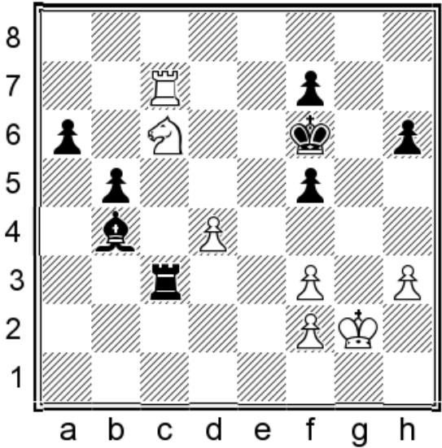

# Towards the Automatic Synthesis of Interpretable Chess Tactics

Abhijeet Krishnan

Chris Martens

North Carolina State University

Venture IV, 1730 Varsity Dr,

Raleigh, NC 27606

akrish13@ncsu.edu, martens@csc.ncsu.edu

## Abstract

State-of-the-art reinforcement learning agents are capable of outperforming human experts at games like chess, Go and StarCraft II. These agents do not simply take advantage of their digital hardware in being able to react and calculate faster than humans, but employ better strategies that lead to more victories. Interpreting these strategies would give human players valuable insight into how to improve their play. In this preliminary work, we propose a symbolic sub-policy model for playing chess. Inspired by chess tactics, our model attempts to incorporate domain knowledge to improve interpretability. We adapt patterns learned by an inductive logic programming system called PAL to derive our model. We contribute a divergence metric to evaluate our model against a random baseline, and find a set of tactics that is able to suggest moves of similar playing strength to a human beginner. Finally, we propose a computational evaluation scheme for the model by augmenting an off-the-shelf engine with it.

## Introduction

Recent advancements in reinforcement learning (RL) have produced agents capable of competing with and even outperforming the best human experts at various games like chess (Silver et al. 2018), Go (Silver et al. 2016), Shogi (Li et al. 2020), Mahjong (Silver et al. 2018), Star-Craft II (Vinyals et al. 2019) and Dota 2 (Berner et al. 2019). These agents do not simply take advantage of faster reaction and calculation abilities, but are actually employing new, better strategies that lead to more victories. Borrowing from Jeanette Wing’s definition of computational thinking (Wing 2008), these agents have better abstractions than human experts for the games they’re trained to play.

Despite the existence of such agents in various competitive games, we still see human competition continue to thrive, with these agents leading to new ways of thinking and a re-evaluation of long-held beliefs about the game. These discoveries have, so far, involved manual or engine-assisted analysis of the games played by the agents (Sadler and Regan 2019; Zhou 2018). If the agents could themselves explain their strategies and decision-making to human players, we posit that it would help improve their play.

Such chess-playing agents (chess engines) are used extensively in game analysis (Smith 2004; Tukmakov 2020) and tournament preparation (Andrei 2021). Expert chess players utilize engine move suggestions and evaluations to analyze new lines to play (PTI 2016). Most current engines use a neural network-based model with many thousands of parameters trained using deep reinforcement learning (DRL) in conjunction with a search algorithm to produce game moves. Examples include Monte Carlo Tree Search in AlphaZero (Silver et al. 2016), Predictor+Upper Confidence Bound tree search in Leela Chess Zero (Pascutto, Gian-Carlo and Linscott, Gary 2019) or alpha-beta pruning in Stockfish 14 (Romstad, Costalba, and Kiiski 2021). However, this is very different to how human chess players employ patternrecognition to produce moves (de Groot 1946; Connors, Burns, and Campitelli 2011).

Current research in the newly emerging field of explainable RL (XRL) attempts to develop methods to help humans understand RL agent decision. Multiple techniques like t-SNE (Moore and Stamper 2019), trajectory clustering (Osborn, Samuel, and Mateas 2018) and heatmaps (Broll et al. 2019) have been applied to visualize agent behaviour in games. Symbolic policies have been investigated as interpretable representations of neural network-based policies learned via DRL. They have been learned directly from reward signals (Trivedi et al. 2021; Landajuela et al. 2021), as surrogate models for more complex policies (Verma et al. 2018), or from input/output pairs (Derner, Kubalík, and Babuška 2018). However, most research in this area learns policies for optimal control in continuous environments, with discrete game environments like chess receiving little attention.

In this work, we propose a framework to learn a symbolic sub-policy model for chess. We describe our sub-policy as being a collection of first-order logic rules which model chess tactics. We use patterns learned by an existing inductive logic programming (ILP) system called PAL (Patterns and Learning) (Morales 1992) to derive these tactics. We contribute a divergence metric to evaluate our model of a tactic using the move evaluation capabilities of a chess engine. We present an evaluation of a set of tactics obtained from PAL against a random baseline using our metrics. Finally, we propose a computational evaluation of this approach by augmenting a chess engine with the synthesized tactics. We conclude with a discussion on the limitations of this approach, along with future work.

## Related Work

Strategy Synthesis A number of works attempt to learn rule-based agents using evolutionary approaches to play role-playing games like Neverwinter Nights (Spronck, Sprinkhuizen-Kuyper, and Postma 2004), board games like Checkers and Reversi (Benbassat and Sipper 2011), cooperative games like Hanabi (Canaan et al. 2018), platformers like Mario (de Freitas, de Souza, and Bernardino 2018), and real-time strategy games like µRTS (Mariño et al. 2021). Partially-applicable strategies for puzzle games have been learned using constraint satisfaction (Butler, Torlak, and Popovic 2017). Our model for chess tactics is learned us-´ ing ILP, and incorporates domain knowledge of the concept of a tactic in order to improve interpretability.

Explainable RL Attempts to make RL agent policies amenable to human interpretation have been pursued in the XRL field. Puiutta and Veith (2020) provide a survey of recent XRL methods. An interpretability technique that has received some attention is that of training an inherently interpretable surrogate model which matches the performance of the original agent. Options for this surrogate model that have been investigated include decision trees (Bastani, Pu, and Solar-Lezama 2018; Coppens et al. 2019; Sieusahai and Guzdial 2021) and programmatic policies (Verma et al. 2018; Trivedi et al. 2021). Our proposed sub-policy model is only partially-applicable, and attempts to improve interpretability for chess by incorporating domain knowledge of how chess tactics are structured.

Chess Pattern Learning Chess has been called the drosophilia<sup>1</sup> of artificial intelligence (McCarthy 1990). It has been a mainstay of AI research from the invention of the digital computer (Claude 1950) to the neural network revolution (Silver et al. 2018). Given the depth of experimentation with AI techniques for chess, it is not surprising that the idea of using patterns to guide a computer to play chess is not new. Patterns have been used to suggest moves and guide playing strategies in middle-game positions (Berliner 1975; Pitrat 1977; Wilkins 1979) and endgames (Huberman 1968; Bramer 1977; Bratko 1982). Levinson and Snyder (1991) used weighted patterns in their Morph system as an evaluation function to guide playing strategy. Very recent work has attempted to directly probe neural network engines to test for the presence of human concepts (McGrath et al. 2021). Morales (1992) developed the PAL system to learn first-order patterns in chess using ILP. We build upon this work by taking advantage of modern chess engines to serve as the reference evaluation function to select learned patterns instead of hand-crafted heuristics.

## Background

## Inductive Logic Programming

Inductive logic programming (ILP) is a form of symbolic machine learning where the goal is to induce a hypothesis (a set of logical rules) that generalises given training examples (Cropper and Dumanciˇ c 2020). It can learn human-´ readable hypotheses from smaller amounts of data than neural network-based models.

An ILP problem is specified by three sets of Horn clauses—B, the background knowledge, $E ^ { + }$ , the set of positive examples of the concept, and $E ^ { - }$ , the set of negative examples of the concept. The ILP problem is to induce a hypothesis H that, in combination with the background knowledge, entails all the positive examples and none of the negative examples. Formally, this can be written as -

$$
\forall e \in E ^ { + } , H \cup B \models e ( { \mathrm { i . e . ~ } } H { \mathrm { ~ i s ~ } } c o m p l e t e )
$$

$$
\forall e \in E ^ { - } , H \cup B \not \vdash e \left( { \mathrm { i . e . ~ } } H { \mathrm { ~ i s ~ } } c o n s i s t e n t \right)
$$

To make the ILP problem more concrete, we provide a toy example below.

$E ^ { + }$ and $E ^ { - }$ contain positive and negative examples of the target knight\_move relation respectively. B contains background knowledge i.e., clauses which might be useful in inducing a hypothesis for knight\_move.

$$
E ^ { + } = \left\{ \begin{array} { l } { { \mathrm { k n i g h t \_ m o v e } \left( \mathrm { d } 4 , \mathrm { c } 6 \right) . } } \\ { { \mathrm { k n i g h t \_ m o v e } \left( \mathrm { d } 4 , \mathrm { e } 6 \right) . } } \\ { { \mathrm { k n i g h t \_ m o v e } \left( \mathrm { d } 4 , \mathrm { b } 5 \right) . } } \\ { { \mathrm { k n i g h t \_ m o v e } \left( \mathrm { d } 4 , \mathrm { f } 5 \right) . } } \end{array} \right\}
$$

$$
E ^ { - } = \left\{ \begin{array} { l } { { \mathrm { k n i g h t \_ m o v e } \left( \mathrm { d } 4 , \mathrm { d } 5 \right) . } } \\ { { \mathrm { k n i g h t \_ m o v e } \left( \mathrm { d } 4 , \mathrm { b } 6 \right) . } } \\ { { \mathrm { k n i g h t \_ m o v e } \left( \mathrm { d } 4 , \mathrm { e } 1 \right) . } } \\ { { \mathrm { k n i g h t \_ m o v e } \left( \mathrm { d } 4 , \mathrm { h } 7 \right) . } } \end{array} \right\}
$$

$$
B = \left\{ \begin{array} { l l } { \mathrm { 1 \_ m o v e ( d 4 , c 6 ) \cdot } } \\ { \mathrm { 1 \_ m o v e ( d 4 , e 6 ) \cdot } } \\ { \mathrm { 1 \_ m o v e ( d 4 , b 5 ) \cdot } } \\ { \mathrm { 1 \_ m o v e ( d 4 , f 5 ) \cdot } } \end{array} \right\}
$$

From this information, we could induce a hypothesis for knight\_move as -

$$
\mathrm { k n i g h t \_ m o v e \left( F r o m , T o \right) : - \Omega \Omega _ { \mathrm { - } } m o v e \left( F r o m , T o \right) . }
$$

## PAL System

The PAL (Patterns and Learning) system was introduced in Morales (1992). It attempts to use ILP to synthesize patterns for chess play, which are expressed using a subset of Horn clause logic. It contributes a predicate vocabulary for expressing these patterns and chess positions as Horn clauses. The pattern-learning problem is framed as an ILP problem, for which a heuristically-constrained version of the $r l g g$ (relative least general generalization) algorithm is used to induce plausible hypotheses. Patterns learned can be static and not involve any piece movement, or be dynamic and describe multi-move tactics. We expand upon how the PAL system formally defines and synthesizes these chess patterns.

```prolog
can_check(S1,P1,(X1,Y1),S2,king,
(X2,Y2),(X3,Y3),Pos1) ←
contents(S1,P1,(X1,Y1),Pos1),
contents(S2,king,(X2,Y2),Pos1),
other_side(S1,S2),
¬ in_check(S2,(X2,Y2),P1,(X1,Y1),Pos1),
make_move(S1,P1,(X1,Y1),(X3,Y3),Pos1,Pos2),
in_check(S2,(X2,Y2),P1,(X3,Y3),Pos2).
```

Figure 1: PAL rule for the can\_check pattern. A piece (P1) can check the opponent’s King after moving to (X3,Y3).

Pattern Formalism A pattern in PAL is formally defined as a non-recursive Horn clause of the form

$$
{ \mathrm { H e a d } }  D _ { 1 } , D _ { 2 } , \cdot \cdot \cdot , D _ { n } , F _ { 1 } , F _ { 2 } , \cdot \cdot \cdot , F _ { m }
$$

where,

• Head is the head of the pattern definition

• The $D _ { i }$ are “input” predicates used to describe the position and represent pieces involved in the pattern

• The $F _ { j }$ are instances of definitions which are either provided as background knowledge or learned by PAL, and represent the conditions (relations between pieces and places) to be satisfied by the pattern.

An example of a checking move pattern, where a move that puts the opponent king in check is suggested, is reproduced from the paper in Figure 1. A key predicate is make\_move, which determines whether a pattern is static or dynamic. The contents predicates are used to describe the position on the board. The remaining predicate definitions are provided as background knowledge.

Pattern Synthesis The input to the PAL generalization algorithm is a set of pattern definitions (both predefined and learned) along with a description of a chess position (as ground unit clauses). The algorithm extends Buntine’s method for constructing the rlgg of two clauses to multiple clauses. It uses the following constraints and heuristics to limit hypothesis size and increase the algorithm’s generalisation steps -

• Disallowing variables in the head or body of a rule which are not connected to a literal i.e., not equal to a variable of that literal

• Labeling constants occurring in the ground literals of a rule body to make patterns piece-invariant

• Restricting the legal moves from a position to only be those which introduce a new predicate name or remove an existing predicate name

PAL uses an automatic example generator to manually guide the generalization algorithm towards learning desired concepts. Given an example of the target concept, the generator perturbs the example to create a new example for which a classification label must be provided. To restrict the example space searched, the automatic example generator attempts to generate examples which specialize the current hypothesis in case of a prior positive example, or generalize it in case of a prior negative example. We refer interested readers to the original thesis for further details.

```prolog
tactic(Position) ←
matches(Position),
!,
suggested(Move1,Move2,· · · ,MoveN),
legal(Position,Move1),
legal(Position,Move2),
legal(Position,MoveN).
```  
Figure 2: A Prolog pseudo-definition for a tactic. “!” is the Prolog cut operator.

## Methodology

## Chess Tactic Model

We conceptualize our sub-policy model as a chess tactic. Formally, we define a tactic as a first-order logic rule that can bind to a chess position. A position is expressed in firstorder logic using an appropriate predicate vocabulary. If a tactic binds to (matches) a particular position, it suggests a move (or moves) to be played. The moves suggested must be legal in the given position. This is described in Figure 2 as a Prolog pseudo-definition.

A single tactic, or even a set of tactics, does not represent complete policy for playing chess. This is because we might encounter a position for which no tactic matches. In this case, our model cannot make a move. There might also be positions to which multiple tactics apply, in which case an arbitration process for selecting a single move among the various suggestions is not obvious.

## Tactic Utility Metrics

We introduce two metrics — coverage and divergence, to measure the utility of a learned tactic.

Coverage A tactic t’s coverage for a set of positions P is calculated as —

$$
\mathrm { C o v e r a g e } _ { t } = \frac { | P _ { \mathrm { m a t c h } } | } { | P | }
$$

where a position $p \in P _ { \mathrm { m a t c h } }$ if there is a binding assignment of the variables in the rule head of the tactic t to the position p.

Divergence To measure the quality of moves suggested by a tactic, we extend a metric previously used to analyse world chess champions (Guid and Bratko 2006, 2011; Romero 2019) to multiple moves using discounted cumulative gain (DCG) (Järvelin and Kekäläinen 2002). A move’s error in a position p is measured by comparing it to the best move suggested by the engine in that position. This comparison is done quantitatively by using the engine’s move evaluation function eval(·, p). In case an engine evaluates a position to be a ‘Mate in $\bar { \mathbf { X ^ { \prime } } }$ rather than a centipawn score, we assign an arbitrary large value to the evaluation.

$$
\mathrm { E r r o r } ( m o v e , p ) = | e v a l ( m o v e _ { \mathrm { e n g i n e } } , p ) - e v a l ( m o v e , p ) |
$$

Since a tactic might suggest multiple moves, we propose the use of DCG as a metric to compare ranked move suggestion lists. Assuming the list of suggestions output by a tactic to be in ranked order, we obtain a list of best moves from the engine of similar length as the suggestions, and compare the two using DCG. Thus, the final divergence metric for a tactic t over a set of positions P is —

$$
\mathrm { D i v e r g e n c e } _ { t } = \frac { 1 } { | P _ { \mathrm { m a t c h } } | } \sum _ { p \in P _ { \mathrm { m a t c h } } } \sum _ { i = 1 } ^ { | M _ { t } | } \frac { \mathrm { E r r o r } ( m _ { i } , p ) } { \log _ { 2 } { ( 1 + i ) } }
$$

where $M _ { t }$ is the ranked list of move suggestions output by a tactic, and $m _ { i }$ is the $i ^ { \mathrm { { t h } } }$ move in $M _ { t } .$ . divergence of a tactic (to the reference engine) is low and close to 0 when its suggestions are similar in evaluation to the engine’s best moves, and takes on large values when it differs significantly.

## Implementation using PAL

We use the PAL system to synthesize tactics. We select seven patterns that PAL was shown to learn, and modify them to output a move suggestion. These patterns and their verbal definitions are listed in Table 1. All patterns learned other than pin are 1-ply dynamic patterns, which means they include a single make\_move predicate in the rule body looking ahead one move. We modify these patterns to introduce a suggestion predicate with the same variables as make\_move. For pin, which is a static pattern as learned by PAL, we convert it into a dynamic pattern as shown in Figure 3 and introduce the suggestion predicate in the same way.

pin(S1,P1,(X1,Y1),S2,king,

$$
( \mathrm { X } 2 , \mathrm { Y } 2 ) , \mathrm { S } 2 , \mathrm { P } 3 , ( \mathrm { X } 3 , \mathrm { Y } 3 ) , ( \mathrm { X } 4 , \mathrm { Y } 4 ) , \mathrm { P o s } 1 ) \ \gets
$$

$$
\begin{array} { r } { { \mathrm { ~ s ~ l ~ i ~ d ~ i ~ n ~ g ~ } } \mathrm { { \ p i } } { \mathrm { e c e } } ( \mathrm { { P l } } , ( \mathrm { { X 1 } } , \mathrm { { Y 1 } } ) , \mathrm { { P o s 1 } } ) , } \end{array}
$$

$$
\mathtt { m a k e \_ m o v e ( S 1 , P 1 , ( X 1 , Y 1 ) , ( X 4 , Y 4 ) , P o s 1 , P o s 2 ) }
$$

$$
\begin{array} { r } { { \mathsf { s l i d i n g ~ p i e c e } } ( \mathsf { P l } , ( \mathrm { X } 4 , \mathrm { Y } 4 ) , \mathrm { P o s } 2 ) , } \end{array}
$$

$$
\mathtt { s t a l e ( S 2 , P 3 , ( X 3 , Y 3 ) , P o s 2 ) } ,
$$

$$
\mathtt { t h r e a t ( S 1 , P l , ( X 4 , Y 4 ) , S 2 , P 3 , ( X 3 , Y 3 ) , P o s 2 ) , }
$$

$$
\mathrm { i n \_ l i n e } \left( S 2 , \mathrm { k i n g } , ( X 2 , \mathrm { Y } 2 ) , S 2 , \mathrm { P } 3 , \right.
$$

$$
( \mathrm { X } 3 , \mathrm { Y } 3 ) , \mathrm { S } 1 , \mathrm { P } 1 , ( \mathrm { X } 4 , \mathrm { Y } 4 ) , \mathrm { P } \mathrm { o s } 2 ) .
$$

Figure 3: Modified PAL rule for the pin pattern to convert it into a tactic

## Evaluation

We wish to investigate whether the synthesized tactics tend to suggest good moves to play. We do this by measuring coverage and divergence for each of our tactics over a set of positions using both a strong and a weak reference engine. For our strong reference engine, we use Stockfish 14, the winner of the TCEC 2020 Championship (Haworth and Hernandez 2021). For our weak reference engine, we use Maia Chess (McIlroy-Young et al. 2020), a chess engine trained to produce human-like moves. We use the maia1 model, which is targeted toward 1100 ELO (a measure of relative playing strength, and roughly equal to a beginner). We limit the search depth to 1-ply for both Stockfish 14 and Maia 1100 to resemble our tactics. As a baseline, we use a random tactic which is applicable to all positions and produces a random legal move in the position. We limit the number of suggestions from a tactic to 3, and assume the output order of tactic suggestions as the intended ranked order. For ease of implementation, we manually translated the tactics from Prolog definitions to Python functions. We use 5000 games from the January 2013 archive of standard rated games played on lichess.com (lichess.org 2021). For each game, we generate positions by iterating through the move list, making the move, and adding the resulting position to the evaluation set. In total, we generate 325,830 positions.

## Results and Analysis

We summarize the results of our evaluation in Table 2.

From the high coverage values obtained, we conclude that tactics like can\_threat and discovered\_threat are too general, whereas tactics like discovered\_check are too specific. Tactics like can\_check, can\_fork and skewer strike a balance between these extremes.

From the divergence metrics calculated using Maia-1100 (our weak engine), we see that most of our tactics have lower divergence scores than our random baseline, indicating that they tend to produce moves which are evaluated somewhat similarly to a weak engine’s best moves. For Stockfish 14, however, all our tactics have higher divergence scores than random, indicating that they do not tend to produce moves similar to a strong engine. Thus, we qualitatively conclude that our tactics resemble that of a beginner chess player.

## Proposed Evaluation

We propose an experiment to investigate whether the identified set of tactics are useful for a human player to learn in order to generate good moves. To do this, we will measure the win-rate of a chess engine against a version of itself augmented with these tactics. As a human proxy, we plan to use Maia Chess, specifically maia1 model targeted toward 1100 ELO. We will play games between the engines of 30 minutes + 5 seconds time control, following the TCEC League rules (kanchess 2021) and starting from the default start position. As before, we will limit the evaluation depth of the search tree for the augmented and unaugmented engines to 1. We measure the divergence scores for our tactics with a strong reference engine (Stockfish 14). We will modify the action-selection procedure of Maia Chess to utilize the first suggestion of the lowest divergence tactic applicable to a given position, instead of the engine’s move choice. This is made explicit in Algorithm 1. Finally, we will compare the win rates of the augmented engine against the unmodified version of itself over multiple games. Our hypothesis is that the augmented engine will have a significantly higher win-rate, enabling us to conclude that the set of tactics tend to suggest good moves.

<table><tr><td>Pattern</td><td>Definition</td></tr><tr><td>can_threat</td><td>A piece (P1) can threaten another piece (P2) after making a move to (X3,Y3)</td></tr><tr><td>can_fork</td><td>A piece (P1) can produce a fork to the opponent&#x27;s King and piece (P3) after making a move to (X4,Y4)</td></tr><tr><td>can_check</td><td>A piece (P1) can check the opponent&#x27;s King after a moving to (X3,Y3)</td></tr><tr><td>discovered_check discovered_threat</td><td>A check by piece (P2) can be “discovered&quot; after moving another piece (P1) to (X4,Y4) A piece (P1) can threaten an opponent&#x27;s piece (P3) after moving another piece (P2) to (X4,Y4)</td></tr><tr><td>skewer</td><td>A King in check by a piece (P1) “exposes&quot; another piece (P3) when it is moved out of check to</td></tr><tr><td>pin</td><td>(X4,Y4) A piece (P3) cannot move because it will produce a check on its own side by piece (P1)</td></tr></table>

Table 1: Patterns learned by the PAL system that are used to create tactics

<table><tr><td rowspan="2">Tactic</td><td rowspan="2">Coverage</td><td colspan="2">Divergence</td></tr><tr><td>SF14</td><td>Maia</td></tr><tr><td rowspan="3">can_threat can_check can_fork</td><td>0.96</td><td>378.94</td><td>9.22</td></tr><tr><td>0.45</td><td>549.19</td><td>4.02</td></tr><tr><td>0.32</td><td>676.45</td><td>4.67</td></tr><tr><td rowspan="3">discovered_check discovered_threat</td><td>≈0</td><td>338.55</td><td>18.64</td></tr><tr><td>0.96</td><td>375.97</td><td>1.19</td></tr><tr><td>0.22</td><td>748.4</td><td>5.41</td></tr><tr><td>pin</td><td>0.79</td><td>526.45</td><td>4.9</td></tr><tr><td>random</td><td>1</td><td>328.09</td><td>8.28</td></tr></table>

Table 2: Coverage and DCG for each tactic

Algorithm 1: Augmented engine move selection   
Input: set of tactics T, position p, chess engine move selec  
tion procedure C.make\_move(·)   
Output: legal move in position p   
1: move ← C.make\_move(p)   
2: min\_divg ← ∞   
3: for $t \in \bar { T }$ do   
4: if t matches p and divg(t) < min\_divg then   
5: move ← t.suggestion   
6: min\_divg ← divg(t)   
7: end if   
8: end for   
9: return move

## Conclusion and Future Work

We have described a symbolic sub-policy model for chess inspired by the pattern-action model of chess tactics. We have used patterns learned by an ILP system to construct these tactics. We have contributed a metric for measuring the divergence of these tactics to a reference chess-playing agent. We evaluated a set of tactics learned by a chess pattern learning system using our metric to find that they resembled a weak engine, but were not similar to a strong one.

We use patterns learned by PAL to obtain our tactics. However, PAL uses manual labeling of generated examples to learn specific concepts, and requires additional effort to convert the learned patterns into tactics for our model. We aim to investigate the automatic learning of tactics from a dataset of chess positions and move suggestions using ILP as implemented by modern systems like Popper (Cropper and

Morel 2021). Future work could investigate alternate ILP algorithms to use our divergence metric as a loss function to optimize tactics for (Evans and Grefenstette 2018).

Our tactic model is loosely inspired by how chess tactics are learned and practiced. However, our tactics are limited to looking 1-ply in the future i.e., they can only recognize the presence of a matching pattern in the immediately next position. Many chess tactics suggest combinations of moves, a series of moves where the matching pattern shows up only in a particular sequence (see Figure 4). Extending the tactic model to express and recognize such combinations will be a useful avenue for future work. We also wish to investigate the expression of longer-term plans from chess literature like centre control and pawn structure using tactics.

  
Figure 4: An example of the limitations of our 1-ply can\_fork tactic. White has no immediate forking move here, leading to the tactic not matching. However, if they play 1. Nxb4, then Black’s best response is 1. ... Rxc7 which allows a fork with 2. Nd5+ leading to the capture of the rook.

Our appeal to the interpretability of these tactics rests on similar claims made regarding the interpretability of rulebased strategies. Future work will involve rigorously testing these assumptions with user studies using evidence-based measures of interpretability (Lage et al. 2019; Kliegr, Bahník, and Fürnkranz 2021). Specifically, we wish to investigate the ease of learning and applying these tactics in real games played by human players.

## References

Andrei, M. 2021. A supercomputer helped set up the World Chess Championship game. Accessed: 2021-10-27.

Bastani, O.; Pu, Y.; and Solar-Lezama, A. 2018. Verifiable reinforcement learning via policy extraction. arXiv preprint arXiv:1805.08328.

Benbassat, A.; and Sipper, M. 2011. Evolving board-game players with genetic programming. In Proceedings of the 13th annual conference companion on Genetic and evolutionary computation, 739–742.

Berliner, H. J. 1975. A representation and some mechanisms for a problem solving chess program. Technical report, CARNEGIE-MELLON UNIV PITTSBURGH PA DEPT OF COMPUTER SCIENCE.

Berner, C.; Brockman, G.; Chan, B.; Cheung, V.; D˛ebiak, P.; Dennison, C.; Farhi, D.; Fischer, Q.; Hashme, S.; Hesse, C.; et al. 2019. Dota 2 with large scale deep reinforcement learning. arXiv preprint arXiv:1912.06680.

Bramer, M. A. 1977. Representation of Knowledge for Chess Endgames Towards a Self-Improving System. Ph.D. thesis, Open University (United Kingdom).

Bratko, I. 1982. Knowledge-based problem-solving in AL3. Machine intelligence, 10: 73–100.

Broll, B.; Hausknecht, M.; Bignell, D.; and Swaminathan, A. 2019. Customizing scripted bots: Sample efficient imitation learning for human-like behavior in minecraft. In AAMAS Workshop on Adaptive and Learning Agents.

Buntine, W. 1988. Generalized subsumption and its applications to induction and redundancy. Artificial intelligence, 36(2): 149–176.

Butler, E.; Torlak, E.; and Popovic, Z. 2017. Synthesizing´ interpretable strategies for solving puzzle games. In Proceedings of the 12th International Conference on the Foundations ofDigital Games, 1–10.

Canaan, R.; Shen, H.; Torrado, R.; Togelius, J.; Nealen, A.; and Menzel, S. 2018. Evolving agents for the hanabi 2018 cig competition. In 2018 IEEE Conference on Computational Intelligence and Games (CIG), 1–8. IEEE.

Claude, E. S. 1950. Programming a Computer for Playing Chess. Philosophical Magazine, Ser, 7(41): 314.

Connors, M. H.; Burns, B. D.; and Campitelli, G. 2011. Expertise in complex decision making: the role of search in chess 70 years after de Groot. Cognitive science, 35(8): 1567–1579.

Coppens, Y.; Efthymiadis, K.; Lenaerts, T.; Nowé, A.; Miller, T.; Weber, R.; and Magazzeni, D. 2019. Distilling deep reinforcement learning policies in soft decision trees. In Proceedings of the IJCAI 2019 workshop on explainable artificial intelligence, 1–6.

Cropper, A.; and Dumanciˇ c, S. 2020. Inductive logic ´ programming at 30: a new introduction. arXiv preprint arXiv:2008.07912.

Cropper, A.; and Morel, R. 2021. Learning programs by learning from failures. Machine Learning, 110(4): 801–856.

de Freitas, J. M.; de Souza, F. R.; and Bernardino, H. S. 2018. Evolving Controllers for Mario AI Using Grammarbased Genetic Programming. In 2018 IEEE Congress on Evolutionary Computation (CEC), 1–8. IEEE.

de Groot, A. D. 1946. Het denken van den schaker: een experimenteel-psychologische studie. Noord-Hollandsche Uitgevers Maatschappij Amsterdam.

Derner, E.; Kubalík, J.; and Babuška, R. 2018. Datadriven construction of symbolic process models for reinforcement learning. In 2018 IEEE International Conference on Robotics and Automation (ICRA), 5105–5112. IEEE.

Evans, R.; and Grefenstette, E. 2018. Learning explanatory rules from noisy data. Journal ofArtificial Intelligence Research, 61: 1–64.

Guid, M.; and Bratko, I. 2006. Computer analysis of world chess champions. ICGA journal, 29(2): 65–73.

Guid, M.; and Bratko, I. 2011. Using heuristic-search based engines for estimating human skill at chess. ICGA journal, 34(2): 71–81.

Haworth, G.; and Hernandez, N. 2021. The 20 th Top Chess Engine Championship, TCEC20. ICGA Journal, (Preprint): 1–12.

Huberman, B. J. 1968. A program to play chess end games. 65. Department of Computer Science, Stanford University.

Järvelin, K.; and Kekäläinen, J. 2002. Cumulated gain-based evaluation of IR techniques. ACM Transactions on Information Systems (TOIS), 20(4): 422–446.

kanchess. 2021. TCEC Leagues Season Rules. Accessed: 2021-10-27.

Kliegr, T.; Bahník, Š.; and Fürnkranz, J. 2021. A review of possible effects of cognitive biases on interpretation of rule-based machine learning models. Artificial Intelligence, 103458.

Lage, I.; Chen, E.; He, J.; Narayanan, M.; Kim, B.; Gershman, S. J.; and Doshi-Velez, F. 2019. Human evaluation of models built for interpretability. In Proceedings of the AAAI Conference on Human Computation and Crowdsourcing, volume 7, 59–67.

Landajuela, M.; Petersen, B. K.; Kim, S.; Santiago, C. P.; Glatt, R.; Mundhenk, N.; Pettit, J. F.; and Faissol, D. 2021. Discovering symbolic policies with deep reinforcement learning. In International Conference on Machine Learning, 5979–5989. PMLR.

Levinson, R.; and Snyder, R. 1991. Adaptive patternoriented chess. In Machine Learning Proceedings 1991, 85– 89. Elsevier.

Li, J.; Koyamada, S.; Ye, Q.; Liu, G.; Wang, C.; Yang, R.; Zhao, L.; Qin, T.; Liu, T.-Y.; and Hon, H.-W. 2020. Suphx: Mastering mahjong with deep reinforcement learning. arXiv preprint arXiv:2003.13590.

lichess.org. 2021. lichess.org open database. https:// database.lichess.org/. Accessed: 2021-10-27.

Mariño, J. R.; Moraes, R. O.; Oliveira, T. C.; Toledo, C.; and Lelis, L. H. 2021. Programmatic Strategies for Real-Time Strategy Games. In Proceedings ofthe AAAI Conference on Artificial Intelligence, volume 35, 381–389.

McCarthy, J. 1990. Chess as the Drosophila of AI. In Computers, chess, and cognition, 227–237. Springer.

McGrath, T.; Kapishnikov, A.; Tomašev, N.; Pearce, A.; Hassabis, D.; Kim, B.; Paquet, U.; and Kramnik, V. 2021. Acquisition of Chess Knowledge in AlphaZero. arXiv:2111.09259 [cs, stat]. ArXiv: 2111.09259.

McIlroy-Young, R.; Sen, S.; Kleinberg, J.; and Anderson, A. 2020. Aligning Superhuman AI with Human Behavior: Chess as a Model System. In Proceedings of the 25th ACM SIGKDD international conference on Knowledge discovery and data mining.

Moore, S.; and Stamper, J. C. 2019. Exploring Expertise through Visualizing Agent Policies and Human Strategies in Open-Ended Games. In EDM (Workshops), 30–37.

Morales, E. 1992. First order induction ofpatterns in Chess. Ph.D. thesis, PhD thesis, The Turing Institute-University of Strathclyde.

Osborn, J. C.; Samuel, B.; and Mateas, M. 2018. Visualizing the strategic landscape of arbitrary games. Information Visualization, 17(3): 196–217.

Pascutto, Gian-Carlo and Linscott, Gary. 2019. Leela Chess Zero (v0.21.0).

Pitrat, J. 1977. A chess combination program which uses plans. Artificial Intelligence, 8(3): 275–321.

PTI. 2016. World Chess Championship: Role of the ‘seconds’.

Puiutta, E.; and Veith, E. M. 2020. Explainable reinforcement learning: A survey. In International Cross-Domain Conference for Machine Learning and Knowledge Extraction, 77–95. Springer.

Romero, O. 2019. Computer analysis of world chess championship players. ICSEA 2019, 212.

Romstad, T.; Costalba, M.; and Kiiski, J. 2021. Stockfish 14.

Sadler, M.; and Regan, N. 2019. Game Changer. AlphaZero’s Groundbreaking Chess Strategies and the Promise ofAI. Alkmaar. The Netherlands. New in Chess.

Sieusahai, A.; and Guzdial, M. 2021. Explaining Deep Reinforcement Learning Agents In The Atari Domain through a Surrogate Model. In Proceedings ofthe AAAI Conference on Artificial Intelligence and Interactive Digital Entertainment, volume 17, 82–90.

Silver, D.; Huang, A.; Maddison, C. J.; Guez, A.; Sifre, L.; Van Den Driessche, G.; Schrittwieser, J.; Antonoglou, I.; Panneershelvam, V.; Lanctot, M.; et al. 2016. Mastering the game of Go with deep neural networks and tree search. nature, 529(7587): 484–489.

Silver, D.; Hubert, T.; Schrittwieser, J.; Antonoglou, I.; Lai, M.; Guez, A.; Lanctot, M.; Sifre, L.; Kumaran, D.; Graepel,

T.; et al. 2018. A general reinforcement learning algorithm that masters chess, shogi, and Go through self-play. Science, 362(6419): 1140–1144.

Smith, R. 2004. Modern Chess Analysis. Gambit. ISBN 9781904600084.

Spronck, P.; Sprinkhuizen-Kuyper, I.; and Postma, E. 2004. Online adaptation of game opponent AI with dynamic scripting. International Journal of Intelligent Games and Simulation, 3(1): 45–53.

Trivedi, D.; Zhang, J.; Sun, S.-H.; and Lim, J. J. 2021. Learning to Synthesize Programs as Interpretable and Generalizable Policies. Advances in Neural Information Processing Systems, 34.

Tukmakov, V. 2020. Modern Chess Formula - The Powerful Impact of Engines. Thinkers Publishing. ISBN 9789492510815.

Verma, A.; Murali, V.; Singh, R.; Kohli, P.; and Chaudhuri, S. 2018. Programmatically interpretable reinforcement learning. In International Conference on Machine Learning, 5045–5054. PMLR.

Vinyals, O.; Babuschkin, I.; Czarnecki, W. M.; Mathieu, M.; Dudzik, A.; Chung, J.; Choi, D. H.; Powell, R.; Ewalds, T.; Georgiev, P.; et al. 2019. Grandmaster level in Star-Craft II using multi-agent reinforcement learning. Nature, 575(7782): 350–354.

Wilkins, D. E. 1979. Using patterns andplans to solve problems and control search. Stanford University.

Wing, J. M. 2008. Computational thinking and thinking about computing. Philosophical Transactions of the Royal Society A: Mathematical, Physical and Engineering Sciences, 366(1881): 3717–3725.

Zhou, Y. 2018. Rethinking Opening Strategy: AlphaGo’s Impact on Pro Play. CreateSpace, 1(36): 212.