# Trustworthy Method Comparison with AI Judges: Estimation and Design under Order, Batch, and Aggregation Effects

Tianxi Li Jie Ding

School of Statistics, University of Minnesota

## Abstract

Large language models (LLMs) are increasingly used as judges for automated AI evaluation. A common practice is to randomize prompt sequences and average the resulting scores, but its statistical validity remains unclear. We show that LLM evaluation mechanisms can be approximated by a class of Markov generalized linear mixed models (GLMMs), supported by out-ofsample predictions across three major commercial LLMs. Using a first-order Markov GLMM, we study leaderboard ranking and group comparison. For leaderboard ranking, randomizeand-average selection is consistent under a mild separation condition, and a Williams square design can improve efficiency when item qualities are close. For group comparison, naive averaging can yield inconsistent conclusions about differences in group-level quality because of the response model’s nonlinearity. Empirical results further support the validity of the proposed model-based inference beyond the first-order theory, including settings with higher-order sequence memory. We illustrate the approach in an application where AI judges compare two graphical model estimation methods.

## 1 Introduction

Generative large language models (LLMs) are increasingly used as AI judges, scoring and ranking candidate responses, model versions, and even grant proposals at a scale that human raters cannot match. For example, a traditional grant review panel reads a slate of proposals in one review session and makes a sponsoring decision for each. An AI judge can be placed as a screening gate for such a panel by identifying promising proposals before human panels spend effort. For another example, comparing two methods using a benchmark dataset is a common task in scientific publications. When the task involves interpretation and domain knowledge, such as variable selection in genetic studies or graph construction by graphical models, an AI judge with broader background knowledge can take the output of the two methods and help with evaluating whether one gives more scientifically meaningful results. In these examples, a number of items to be evaluated go to the judge together in one shared context, and a decision or “meaningful” label is assigned by the AI judge.

In many of these cases, the items for evaluation are provided together in a batch. This is not only how tasks are commonly posed, since a judgment about one item is made against the standard the rest of the slate sets, but also the token-economical choice to reduce repetitive prompts. In such settings, a judge’s ratings may not be independent: what the judge says about the fifth item depends on what it has just said about the fourth. That dependence is the source of complications for much of the related research. In particular, whether the resulting evaluation can be trusted raises two critical questions.

The first is whether the judge is measuring the right thing. Does the criterion it applies track the quality a human evaluator ultimately cares about? This is a question of validity, and it is where most of the field’s attention has gone. MT-Bench and Chatbot Arena calibrate judge ratings against human preference data [Zheng et al., 2023, Chiang et al., 2024]; AlpacaEval’s lengthcontrolled revision corrects a specific, documented misalignment between the judge’s criterion and the human target [Dubois et al., 2024]; and recent surveys and audits catalog the ways a judge’s criterion can drift from the intended one [Gu et al., 2024, Ye et al., 2024].

The second question, which is equally important, is whether we can recover what the judge actually concluded. Given a criterion, aligned or not, the judge is typically queried a finite number of times under a common protocol for stability, and its answers are aggregated into a score, a ranking, or a conclusion about which of two groups is better. Does that aggregation return the judge’s own answer, or does the procedure introduce error of its own? This is a question of measurement rather than validity. A perfectly aligned judge tells us nothing useful if the aggregation step distorts its answer, and, as we show, the distortion can grow with the evaluation budget, so that the more one spends on collecting more answers, the more confident one could become in a conclusion the judge never reached.

In this paper, we focus on solving the second problem (measurement). We take the judge’s criterion as given. Every failure we study is therefore a failure of the evaluator’s statistics rather than of the rubric it was judged by, and every remedy is a change of estimator or of experimental design rather than of prompt.

The dominant evaluation pipeline used in practice has two steps. First, items are presented to the judge in randomized order to mitigate the well-documented position bias of LLM judges. Such bias has been observed in pairwise judging [Zheng et al., 2023, Wang et al., 2024], list-wise ranking [Shi et al., 2024], and multiple-choice option order [Pezeshkpour and Hruschka, 2024], and is reviewed together with other judge biases in recent surveys and audits [Gu et al., 2024, Ye et al., 2024]. Proposed remedies include reversing presentation order and averaging scores [Wang et al., 2024], splitting and re-merging candidate answers [Li et al., 2024], bootstrapping over reshuffled presentations [Hou et al., 2024], symmetrizing pairwise comparisons [Liusie et al., 2024], and multi-agent debate [Khan et al., 2024]. These remedies are largely heuristic, formatspecific, and often computationally costly. Second, each item is scored by its marginal average rating, and these averages are compared or ranked. Variants of this “random shuffle followed by marginal averaging” pipeline underlie many contemporary judge-based benchmarks, including MT-Bench, which averages absolute grades [Zheng et al., 2023], and AlpacaEval, which averages win rates against a fixed baseline [Dubois et al., 2023, 2024]. A notable exception is Chatbot Arena, which fits a logit-scale Bradley–Terry model to pairwise votes [Chiang et al., 2024] and is therefore insulated from the bias studied below. It is the second step, the estimator, that the ordereffect literature largely leaves untouched. Yet aggregation itself can introduce systematic error: a biased, order-dependent rating process can distort marginal averages in ways that randomization cannot remove. As we show, this is where the statistical failure arises.

A statistical model is needed to assess the validity of the “randomize and average” procedure and to develop improved alternatives. We show that an LLM judge scoring a shuffled batch can be well approximated by a Markov generalized linear mixed model (GLMM), in which each item’s binary rating follows a Bernoulli distribution on the logit scale, with a serial effect, a cold-start effect, and a batch-level random intercept. We view this as a working model class, rather than a representation of the judge’s internal mechanism. Its adequacy can be assessed empirically through out-of-sample predictive evaluation, as demonstrated in our experiments.

Under the order-1 Markov GLMM, we study two common evaluation tasks. For leaderboard ranking, which seeks to identify the best item in a pool, we show that the naive average is consistent under a mild separation condition. A Williams Latin square design, combined with the same estimator, can further improve selection performance at no additional computational or token cost. In contrast, for group comparison, the A/B test of whether one collection of items outperforms another, the naive procedure can fail. We show that it is structurally biased, leading to invalid point estimation and hypothesis testing; increasing the evaluation budget does not remove this bias. A unified alternative is to fit the GLMM under an ordinary random shuffle and conduct standard model-based inference. This procedure is valid for both tasks. Although the theory is developed under the order-1 model, we further show that an order-1 approximation can still provide reliable inference when the judge exhibits higher-order memory.

The rest of the paper is organized as follows. Section 2 introduces the Markov-GLMM working model for an AI judge and establishes its empirical adequacy. Section 3 analyzes leaderboard ranking and the properties of the Williams design, while Section 4 analyzes group comparison and the nonlinearity bias of naive averaging. Section 5 considers judges with memory beyond first order, a setting outside our design theory. Section 6 applies the group-comparison method to a real problem, using AI judges to compare two graphical model estimation methods based on the scientific meaningfulness of their discovered associations. Section 7 concludes with further discussion.

## 2 A Working Statistical Model of AI Judges

We first examine empirical patterns in AI-judge evaluations and use them to motivate the proposed working model. Our data come from three LLM judges from different providers: Gemini 2.5 Flash, GPT-5.4-mini, and Claude Haiku 4.5. Each judge scored the same 30 research proposals in 200 batches: each batch presented all 30 proposals in one shared context, in a randomly permuted order, and the judge assigned a binary accept/reject rating to each proposal sequentially. This yielded 6,000 binary ratings per judge. We held the batch orderings identical across the three judges.

Gemini 2.5 Flash provides a representative example. We first examine whether the judge’s rating depends on the preceding rating in the same batch. Figure 1 shows that, pooled over positions 2–30, an item presented immediately after a rejection is accepted 73.0% of the time, compared with 66.6% after an acceptance, a difference of −6.4%. Using 2,000 bootstrap resamples of the batches, the corresponding 95% interval is [−8.9%, −3.9%], and all resamples yield a negative gap. The pattern also persists across positions in the batch (Figure 1b). This observation suggests, though does not prove, a negative serial effect.

The opening slot of a batch has no predecessor, so it is excluded from the preceding comparison. Figure 1 also shows that the acceptance rate at the first position can be lower than at positions following a rejection.

Although these results are shown for one judge, qualitatively similar patterns appear for the other two. They motivate a working model in the next subsection.

## 2.1 A working model for sequential AI judges

We do not seek to recover the internal generative mechanism of an LLM. Instead, we propose a working model class, namely a family of Markov generalized linear mixed models. The goal is to approximate the judge’s rating process at the scale relevant for evaluation, providing a basis for estimation, design, and inference. Its adequacy is assessed empirically in Section 2.3.

We consider a fixed pool of V items, such as grant proposals, candidate model responses, or essays, evaluated by an LLM judge. The items are presented sequentially within each batch, and the judge assigns a binary rating (accept/reject, valid/invalid, etc.) to each item. This protocol is repeated over N batches. Let $Y _ { t j } \in \{ 0 , 1 \}$ denote the rating at within-batch position $j \in \{ 1 , \ldots , V \}$ of batch $t \in \{ 1 , \ldots , N \}$ , let $V _ { t j } \in \{ 1 , \ldots , V \}$ denote the item occupying that slot, and let $\theta _ { v } \in \mathbb { R }$ denote the intrinsic quality of item v.

The batched protocol is common in practice. It resembles expert-panel evaluation, where items are assessed within a shared slate, and is also token-efficient for LLM evaluation because instructions and rubrics are shared across items. The resulting context sharing induces the dependence of interest: within a batch, each rating may depend on preceding ratings. The previous subsection identified three features: dependence on previous ratings, a distinct first-position effect, and batch-level heterogeneity.

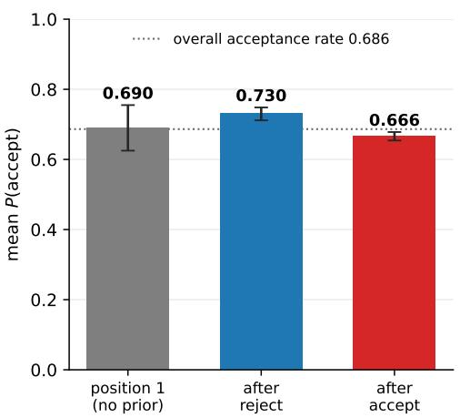

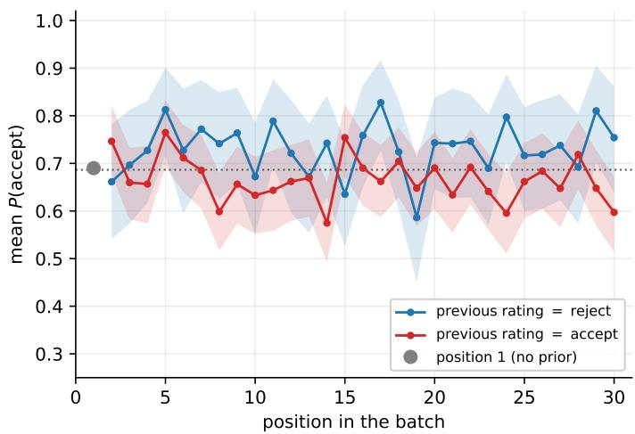  
(a) Pooled over positions 2–30.  
(b) The same split, position by position.  
Figure 1: Dependence on the immediately preceding rating in the illustrative judge (Gemini 2.5 Flash), visible in the raw data before any modeling.

A natural statistical tool to capture these features is a mixed-effects model with Markov dependence. In particular, we encode the patterns through a contextual shift $C _ { t j }$ added to quality on the logit scale, and model the rating at slot $( t , j )$ , for item $v = V _ { t j }$ , as conditionally Bernoulli:

$$
Y _ { t j } | \left( \theta _ { v } , C _ { t j } \right) \sim \mathrm { B e r n o u l l i } \big ( \sigma ( \theta _ { v } + C _ { t j } ) \big ) , \qquad \sigma ( x ) = ( 1 + e ^ { - x } ) ^ { - 1 } .\tag{1}
$$

The model class is indexed by memory depth $K \geq 0$ , with

$$
C _ { t j } = \sum _ { k = 1 } ^ { K } \beta _ { k } Y _ { t , j - k } + \gamma \mathbf { 1 } _ { \left\{ j = 1 \right\} } + u _ { t } , u _ { t } \overset { \mathrm { \tiny ~ \cdot ~ i . i . d . } } { \sim } \mathcal { N } ( 0 , \sigma _ { b } ^ { 2 } ) ,\tag{2}
$$

with boundary convention $Y _ { t , j } : = 0 \mathrm { f o r } j \le 0$ . Here $\beta _ { k }$ is the serial contrast at lag $k , \gamma$ is the coldstart effect on the first item of a batch, and $u _ { t }$ is a batch-level random intercept capturing variation in judge stringency across batches. The model includes as special cases no serial contrast $( \beta _ { 1 } =$ $\dots = \beta _ { K } = 0 )$ , no cold-start effect $( \gamma = 0 )$ , and no batch-level variation $( \sigma _ { b } ^ { 2 } = 0 )$ The depth K is not fixed a priori. We select it separately for each judge by standard model-selection criteria; Section 2.2 selects $K = 1$ for Gemini 2.5 Flash and $K = 3$ for GPT-5.4-mini and Claude Haiku 4.5.

The key structural feature, shared by every member of the class, is that $C _ { t j }$ depends only on information preceding slot $( t , j )$ : it is a function of previous ratings, the position indicator, and the batch effect, but not of the item identity $V _ { t j }$ . Combined with a randomized, item-exchangeable allocation (Assumption 1), this yields a single generic contextual shift $C \sim F _ { C }$ , defined as the position-averaged distribution of $C _ { t j }$ over a batch, unconditional on the item occupying the slot.

We then define the marginal win probability

$$
\pi ( \theta ) : = \mathbb { E } _ { C } \left[ \sigma ( \theta + C ) \right] = \int _ { \mathbb { R } } \sigma ( \theta + c ) d F _ { C } ( c ) .\tag{3}
$$

The map $\theta \mapsto \pi ( \theta )$ is convex when $\theta + C < 0$ almost surely and concave when $\theta + C > 0$ almost surely.

Assumption 1 (Exchangeable allocation in independent randomization units). The allocation $\{ V _ { t j } \}$ is exchangeable across items, meaning that for every permutation ς of $\{ 1 , \ldots , V \}$ , the law of $\{ V _ { t j } \}$ equals that of $\{ \varsigma ( V _ { t j } ) \}$ , and the allocation is independent of $\{ u _ { t } \}$ and the ratings’ conditional draws. Every batch presents every item exactly once, so N is both the number of batches and the per-item evaluation budget. Moreover, the allocation is generated in independent randomization units: either (a) the N within-batch orders are drawn i.i.d. across batches, or (b) the batches form $N / B$ i.i.d. blocks of B consecutive batches, with the within-block orders given by a fixed array of B sequences composed with a single item-to-symbol bijection drawn uniformly and independently for each block.

Two allocations satisfy this assumption and are compared in the paper: the complete random shuffle, corresponding to (a) with uniformly random orders, and the balanced Williams design of Section 3, corresponding to (b) with $B \ = \ V$ and an independently redrawn item-to-symbol assignment for each block. The independent-unit condition ensures the applicability of the law of large numbers, central limit theorem, and concentration bounds used below, with the batch as the unit under (a) and the block under (b). Exchangeability alone is insufficient, since it permits, for example, a single random order to be reused across all batches, yielding random limits for the empirical win rates. Exchangeability allows both designs to be treated within a common framework and ensures that the reference law $F _ { C }$ , and hence the map $\pi ( \theta )$ in (3), is the same under either design.

The model (2) is a transition (Markov) model of order K. Conditional on $u _ { t }$ , the chain rule factorizes the batch joint probability according to the previous K ratings, so the “lagged response as covariate” objective maximized by a mixed-model routine is the exact likelihood. Thus, (1)–(2) can be fitted by maximum likelihood using standard mixed-model methods, with likelihood-based inference available directly. Under mild regularity conditions, the GLMM MLE is consistent and asymptotically normal as the number of independent randomization units grows, following standard GLMM inference theory (see Supplement G).

One practical caveat is separation. For example, if an item is accepted or rejected on nearly all of its appearances, the corresponding $\theta _ { v }$ may have no finite maximum likelihood estimate. A common remedy is to use a weakly informative prior on the fixed effects, such as a Gaussian prior, equivalent to a ridge penalty [Chung et al., 2013], or a heavier-tailed Cauchy prior [Gelman et al., 2008]. When penalization is used, inference can be based on the bootstrap. Under the randomshuffle design, the experimental unit is the batch, and the bootstrap resamples whole batches with replacement.

## 2.2 Fitted models for three AI judges

Figure 2 reports the bootstrap estimates of the memory kernel for all three judges from the proposal evaluation data, using ridge-penalized fitting, with $V = 3 0$ and $N = 2 0 0$ . The lag-1 contrast is negative and supported by the bootstrap for all three judges, indicating that an acceptance lowers the probability of a subsequent acceptance. Memory depth nonetheless varies. Gemini’s signal is confined to lag-1; GPT-5.4-mini shows an additional supported lag-3 effect and a borderline cold-start effect; and Claude shows significant negative contrasts at all three lags and a significant cold-start effect. The batch random effect is substantial in all three, with $\sigma _ { b } ^ { 2 }$ equal to 0.446, 1.173, and 0.418, and the overall acceptance rate decreases across the three judges, from 0.686 to 0.675 and 0.567.

We emphasize that this shared structure is specific to these three judges and this task. For other tasks and judges, an appropriate specification should be selected within the proposed model class, or a suitable extension, rather than adopting the fitted structure found here.

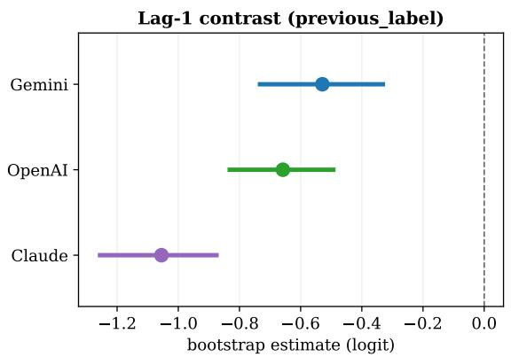

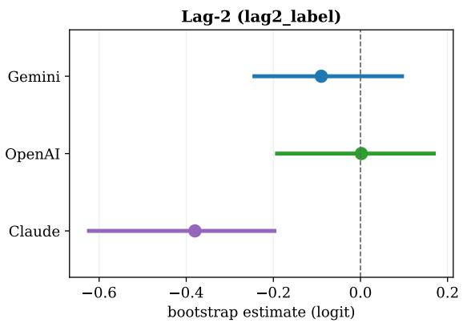

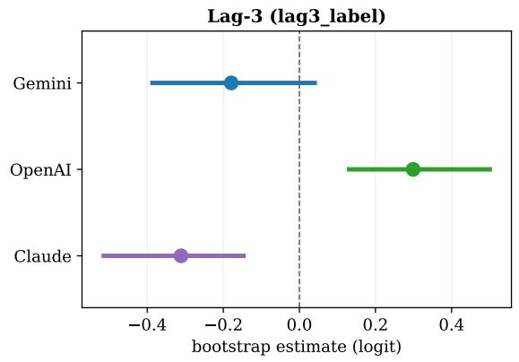

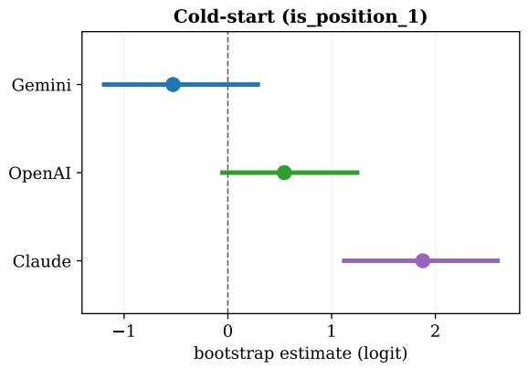  
Figure 2: Cross-model serial-contrast estimates of coefficients, with the bootstrap 95% intervals.

## 2.3 Model adequacy by out-of-sample predictive evaluation

Establishing that the GLMM is a reasonable summary is not sufficient for our study. Sections 3 and 4 build estimators and tests on top of (1)–(2), so if the working model were missing important structure, and capturing the judge truly required a neural-network surrogate, those guarantees would be vacuous. We therefore assess model adequacy through out-of-sample predictive checks of lagged transition probabilities, using newly collected batches that were not used for model fitting or selection.

We collected 100 new batches using shuffled ordering. Meanwhile, we froze each judge’s fitted GLMM and simulated 500 datasets from these fitted models under the same new orderings. For any quantity computed from the new test data, we can use the 500 simulated datasets to construct confidence intervals (by taking the corresponding percentiles). The resulting 95% prediction intervals cover 34 of 36 (94.4%) lagged-transition probabilities (Figure 3); the two misses are GPT-5.4-mini’s lag-2 and lag-3 0→1 cells. Also, the predictive intervals are narrow, relative to the magnitude of the true values. The approximately correct and informative coverage supports the working model. Note that the intervals condition on fitted parameters, so this is a predictive diagnostic rather than a formal goodness-of-fit test. We also calculate the predictive CIs for three conditional-entropy values (up to order 3) on the new data and all of these are correctly covered. More details about this experiment can be found in Supplement A.

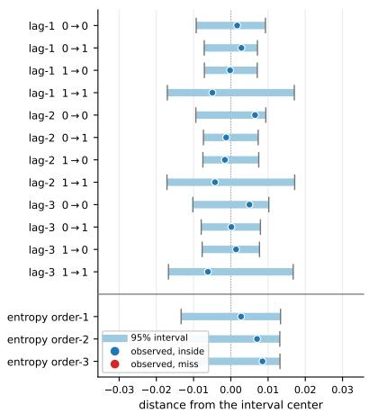  
(a) Gemini 2.5 Flash.

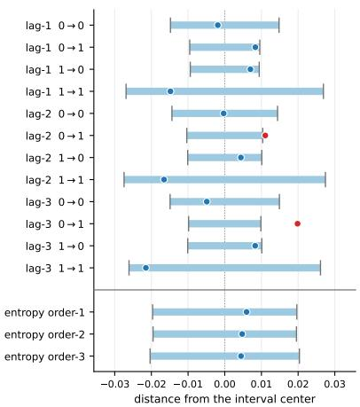  
(b) GPT-5.4-mini.

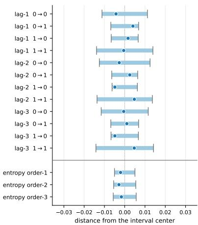  
(c) Claude Haiku 4.5.  
Figure 3: Predictive performance check. Each panel has two blocks. Above the rule: the twelve transition terms. Below the rule: the three conditional entropies $H ( Y _ { t } \mid Y _ { t - 1 } , \ldots , Y _ { t - k } ) , k = 1 , 2 , 3 .$ For every term we compare the value observed in the 100 new batches against the 95% prediction intervals. The intervals are shifted to the common center for visualization purposes.

In summary, we have shown that the proposed Markov GLMM family can serve as a reasonable approximation of the AI judging mechanism under the batch protocol. In the next two sections, we will use this model to study the “randomize and average” evaluation strategy for a deep understanding of its properties.

## 3 Task 1: Leaderboard Ranking

The design theory of this section and of Section 4 is developed for the lag-1 working model of Section 2, the first-order member of the class (2).

Assumption 2. The judge satisfies (1) with the K = 1 member of (2),

$$
C _ { t j } = \beta Y _ { t , j - 1 } + \gamma { \bf 1 } _ { \{ j = 1 \} } + u _ { t } , \qquad u _ { t } \stackrel { \mathrm { i . i . } \mathrm { d . } } { \sim } \mathcal { N } ( 0 , \sigma _ { b } ^ { 2 } ) ,\tag{4}
$$

where we write $\beta : = \beta _ { 1 }$ , with boundary convention $Y _ { t , 0 } : = 0$ . Define $\Lambda _ { 1 } = ( 1 - \operatorname { t a n h } ( | \beta | / 4 ) ) ^ { - 2 }$ . The margin $| \beta | \Lambda _ { 1 } / V$ in Proposition 1 below allows for the order-1/V dependence of each item’s win rate on the rest of the pool.

The first canonical task is the leader selection: from all the items, we want to identify the best one. As the marginal win probability π of (3) is strictly monotone in quality, the naive win-rate ranking is expected to be order-consistent, as we will rigorously verify. We will also show that we can further improve the performance via a balanced design. In particular, we will show that a Williams square design gives a variance reduction.

Let the V items have distinct qualities $\theta _ { 1 } > \theta _ { 2 } > \dots > \theta _ { V }$ , so item 1 is the unique optimum and $\delta : = \theta _ { 1 } - \theta _ { 2 } > 0$ is the minimal quality gap. Recall the naive marginal estimator is $\widehat { p } _ { v } \ =$ $N ^ { - 1 } \sum _ { t } Y _ { t , P ( v , t ) }$ , where $P ( v , t )$ is the position of item v in batch t, and the corresponding selection rule is $\hat { v } = \arg \operatorname* { m a x } _ { v } \widehat { p _ { v } }$ , with ties broken by any fixed rule.

The performance metric we care about is the probability ofcorrect selection $\mathrm { P r } _ { \mathcal { D } } ( \hat { v } = 1 )$ , where the subscript records the design D under which input orders were generated. We consider two designs under Assumption 1 to give the presentation orders in the batches:

• Random Shuffle ${ \mathcal { D } } _ { R } ,$ , in which the N within-batch orders are drawn i.i.d. uniformly;

• Williams Latin square $\mathcal { D } _ { W }$ , a balanced design that is simultaneously position balanced, so that each item appears equally often in each of the V positions, and first-order carryover balanced, so that each ordered pair $( a , b )$ appears as consecutive items equally often [Williams, 1949]. Such a square exists for every even V, which we assume throughout for this design. Both forms of balance are properties of a complete square of $V$ batches, so we take the budget N to be a multiple of $V ;$ the design is then $N / V$ stacked squares, and the item-to-symbol assignment is redrawn independently for each of them, so every block is exactly balanced. We call the result the symbol-randomized Williams design: the square itself is deterministic, and the only randomness is the uniform assignment of items to its symbols, redrawn per block. More details can be found in Jones and Kenward [2015].

Intuition based on classical experimental design theory suggests the advantage of the Williams Latin square design: it makes every item’s measurement conditions identical, since each item spends the same number of batches in each position and follows each other item equally often. Two features, nevertheless, separate our setting from the classical one. First, instead of a standard mixed effect model, our current model is Markov with a serial effect on the logit scale. Second, the naive estimator is not an unbiased estimator of the true strength parameter $\theta _ { v } )$ meanwhile, our primary goal is to recover the top item, instead of estimating the individual parameters. The classical experiment design results are therefore not directly applicable. However, as we show next, the principled idea of balanced design still works.

## 3.1 Theory for the naive estimator in leaderboard selection

We will start with an initial result showing that the naive “randomize-and-average” method works for this task. Technical details are included in Supplement H.1.

Proposition 1. Under Assumptions 1 and 2, if the gap between the two top items is sufficiently large such that $\pi ( \theta _ { 1 } ) - \pi ( \theta _ { 2 } ) > | \beta | \Lambda _ { 1 } / V$ , naive selection is consistent under either design,

$$
\operatorname* { P r } _ { \mathcal { D } } ( \hat { v } = 1 ) \longrightarrow 1 , \qquad \mathcal { D } \in \{ \mathcal { D } _ { R } , \mathcal { D } _ { W } \} .
$$

Moreover, $\mathbb { E } [ \widehat { p } _ { v } ( \mathcal { D } _ { W } ) ] = \mathbb { E } [ \widehat { p } _ { v } ( \mathcal { D } _ { R } ) ]$ for every v and every $N$ .

Consistency in N holds for any pool whose two leaders are separable. So the naive “randomizeand-average” recipe under both designs is consistent for the task. Based on the above result, any advantage of one design over the other must therefore live in the variance and that is what we will study next. Writing $\mathbf { Z } ( \mathcal { D } )$ for the vector of contrasts $\widehat { p } _ { 1 } - \widehat { p } _ { k } , k = 2 , \ldots , V$ , and $\pmb { \mu } ( \mathcal { D } ) : = \mathbb { E } [ \mathbf { Z } ( \mathcal { D } ) \mid \mathcal { D } ]$ for its mean once the design is drawn, the law of total variance decomposes the covariance under either design into the same two pieces,

$$
\begin{array} { r } { \mathrm { C o v } ( \mathbf { Z } ( \mathcal { D } ) ) \ = \ \underbrace { \mathbb { E } _ { \mathcal { D } } \big [ \mathrm { C o v } ( \mathbf { Z } \mid \mathcal { D } ) \big ] } _ { \mathtt { s a m p l i n g } } + \underbrace { \mathrm { C o v } _ { \mathcal { D } } \big ( \pmb { \mu } ( \mathcal { D } ) \big ) } _ { \mathtt { d e s i g n } } . } \end{array}\tag{5}
$$

The first term is sampling variation with the design fixed; the second is variation from randomized presentation orders. Let $M _ { v } ( \pi )$ be the expected rating of item v in order $\pi ,$ and $\bar { m } _ { v } ( \tau )$ its average expected rating over a Williams block with symbol assignment $\tau .$ . Define $\nu _ { \mathrm { R } , k } ~ =$ $\operatorname { V a r } _ { \pi } [ M _ { 1 } ( \pi ) - M _ { k } ( \pi ) ]$ and $\nu _ { \mathrm { W } , k } = \mathrm { V a r } _ { \tau } [ \bar { m } _ { 1 } ( \tau ) - \bar { m } _ { k } ( \tau ) ]$ , with uniform random orders or assignments. The corresponding design variances are $\nu _ { \mathrm { R } , k } / N$ and $V \nu _ { \mathrm { W } , k } / N$ . In addition, we write $\Delta _ { \mathrm { R } }$ and $\Delta _ { \mathrm { W } }$ for the second term, the design term, under the random shuffle and under the symbolrandomized Williams design, respectively. What is being averaged over differs: for the shuffle the design draw is the N independent orderings, for Williams it is the per-block item-to-symbol bijections.

For the design variance to be worth removing, it must be present in the first place. Equivalently, we need expected ratings to vary across slots.

Assumption 3 (Non-degenerate design variance). $( \beta , \gamma ) \neq ( 0 , 0 )$ , and every top contrast carries positive per-batch design variance: $\nu _ { \mathrm { R } , k } > 0$ for every $k = 2 , \ldots , V$

Proposition 2 (Finite-sample variance dominance). Fix the item qualities θ and let Assumptions 1 and 2 hold. Then for every budget N (a multiple of V ),

$$
\begin{array} { r } { N \Big ( [ \mathrm { C o v } ( \mathbf { Z } ( \mathcal { D } _ { R } ) ) ] _ { k - 1 , k - 1 } - [ \mathrm { C o v } ( \mathbf { Z } ( \mathcal { D } _ { W } ) ) ] _ { k - 1 , k - 1 } \Big ) \ = \ \nu _ { \mathrm { R } , k } \ - \ V \nu _ { \mathrm { W } , k } , \qquad k = 2 , \dots , V , } \end{array}
$$

and the right-hand side does not depend on N. If all qualities are equal then $\nu _ { \mathrm { W } , k } = 0$ exactly, so the right-hand side is $\nu _ { \mathrm { R } , k ; }$ , positive under Assumption 3. Both sides are continuous in $\theta ;$ hence for every common value $\theta _ { * }$ at which Assumption 3 holds for the flat configuration $\pmb { \theta } = \theta _ { * } \mathbf { 1 }$ , there is a $\delta _ { 0 } > 0$ such that whenever $\begin{array} { r } { \operatorname* { m a x } _ { v } | \theta _ { v } - \theta _ { * } | \le \delta _ { 0 } } \end{array}$ , every contrast has strictly smaller variance under the Williams design at every finite $N$

To compare selection accuracy when leading items are close, consider $\theta _ { v } = \theta _ { * } + t _ { v } / \sqrt { N }$ . Write $F _ { v } ( \pmb { \theta } ) = \mathbb { E } [ \widehat { p } _ { v } ]$ . At $\pmb { \theta } = \theta _ { * } \mathbf { 1 }$ , let $g _ { \mathrm { s e l f } } = \partial F _ { v } / \partial \theta _ { v }$ and $g _ { \mathrm { c r o s s } } = \partial F _ { v } / \partial \theta _ { w }$ for w $\neq v ;$ exchangeability makes these derivatives independent of the chosen indices.

Theorem 1 (Mean separation and selection dominance under local alternatives). Consider the local-alternative regime $\theta _ { v } = \theta _ { * } + t _ { v } / \sqrt { N }$ with bounded $t _ { v }$ and fixed contrasts $t _ { 1 } - t _ { k } = d _ { k } > 0$ $k = 2 , \ldots , V$ , where $V \geq 4$ is even, and let Assumptions 1 and 2 hold.

(i) Under both designs,

$$
{ \sqrt { N } } \mathbb { E } \left[ { \widehat { p } } _ { 1 } - { \widehat { p } } _ { k } \right] \longrightarrow \left( g _ { \mathrm { s e l f } } ( \theta _ { * } ) - g _ { \mathrm { c r o s s } } ( \theta _ { * } ) \right) d _ { k } , \qquad k = 2 , \ldots , V ,
$$

the background level $\theta _ { * }$ and the bulk coefficients $t _ { v } , v \notin \{ 1 , k \}$ , canceling exactly in every contrast.

(ii) $I f ,$ in addition, Assumption 3 holds at the flat configuration $\pmb { \theta } = \theta _ { * } \mathbf { 1 }$ , that is,

$$
\nu _ { \mathrm { R } , k } ^ { \ast } : = \operatorname { V a r } _ { \pi \sim \operatorname { U n i f } ( S _ { V } ) } [ M _ { 1 } ( \pi ) - M _ { k } ( \pi ) ] \big \vert _ { \theta = \theta _ { \ast } \mathbf { 1 } } > 0
$$

for every $k ,$ and the self-effect is stronger than the cross-effect, $g _ { \mathrm { s e l f } } ( \theta _ { * } ) > g _ { \mathrm { c r o s s } } ( \theta _ { * } )$

$$
\operatorname* { l i m } _ { N  \infty } \big [ \operatorname* { P r } _ { \mathcal { D } _ { W } } ( \hat { v } = 1 ) - \operatorname* { P r } _ { \mathcal { D } _ { R } } ( \hat { v } = 1 ) \big ] > 0 .\tag{6}
$$

The condition $g _ { \mathrm { s e l f } } ( \theta _ { * } ) > g _ { \mathrm { c r o s s } } ( \theta _ { * } )$ of part (ii) says that the evaluation of item v depends more on its own quality than on that of another item $w \ne v _ { ; }$ , which is intuitively reasonable.

We want to give a summary of the theoretical study above. Overall, for this leaderboard task, the naive estimator remains valid under both designs. We can expect the Williams design to give some advantage, but generally speaking such a gain need not be substantial. However, given that the Williams design does not introduce extra cost in computation, such a gain can still be beneficial, as demonstrated next in our simulation examples.

## 3.2 Simulation evidence

We simulate V = 6 items under two fitted judges: Gemini 2.5 Flash gives a nearly flat position profile (Setting 1), whereas Claude Haiku 4.5 gives an uneven profile (Setting 2). Each panel has one best item with gap $\delta = 2 . 8 / \sqrt { N }$ and otherwise equal qualities. We compare both estimators under both designs at $N = 6 , 1 2 , 1 8$ , using 10,000 replicates per cell and uniformly randomized ties. Configuration details can be found in Supplement B.

Table 1 gives the result. In Setting 2 the Williams design is ahead at every budget, by 1.2, 2.0 and 3.1 percentage points. In Setting 1 it is not: the three gains are −0.5, −0.1 and −0.5, scattered about zero. The selection probability itself barely changes down either column, as the local scaling intends. The GLMM model-based estimator is always a valid option, and the comparison between the naive estimator and the GLMM estimator depends on the setup of the problem. However, the Williams design does not help the GLMM estimator — the model fitting has already fully leveraged the information.

The direction of the effect matches Proposition 2: the naive estimator gains under the uneven profile of Setting 2, while in Setting 1 the predicted design-variance removal is far below what 10,000 replicates can resolve and no gain is detectable. In contrast, the design does little for the model-based estimator, which already accounts for position.

The advantage is real but modest, about two percentage points of selection accuracy in the favorable configuration, consistent with removing a tenth of the variance of a contrast. Moreover, it is small for a structural reason: the profile’s departure from flatness is concentrated in the first slot, which is one slot out of V, so the design variance available to be removed shrinks as the item pool grows. Balancing is a tool for small pools evaluated on tight budgets, which is the regime studied here.

Table 1: Top-1 accuracy (%) for all four combinations of estimator and design, V = 6, 10,000 replicates per cell (Monte Carlo standard error 0.71 on each gain). The item panel is $\theta = \left( \theta ^ { * } + \right.$ $\delta , \theta ^ { * } , \ldots , \theta ^ { * } )$ with $\delta = 2 . 8 / \sqrt { N }$ , the local scaling of Theorem 1, so the selection problem holds constant difficulty as the budget grows. Setting 1 has a nearly flat position profile, so the removable design variance is nearly zero; Setting 2 has a strongly uneven profile and a substantial predicted gain, which is what the naive columns show.
<table><tr><td rowspan="2">Setting</td><td rowspan="2"></td><td colspan="2">Naive average (%)</td><td colspan="2">GLMM contrast (%)</td></tr><tr><td>Budget random</td><td>Williams</td><td>random</td><td>Williams</td></tr><tr><td rowspan="3">Setting 1 (Flat)</td><td>N=6</td><td>44.6</td><td>44.1</td><td>44.4</td><td>44.5</td></tr><tr><td>N=12</td><td>47.8</td><td>47.7</td><td>47.8</td><td>48.2</td></tr><tr><td>N=18</td><td>49.8</td><td>49.3</td><td>49.8</td><td>49.5</td></tr><tr><td rowspan="3">Setting 2 (Uneven)</td><td>N=6</td><td>46.7</td><td>47.9</td><td>49.6</td><td>49.0</td></tr><tr><td>N=12</td><td>48.0</td><td>49.9</td><td>51.3</td><td>51.5</td></tr><tr><td>N=18</td><td>48.1</td><td>51.2</td><td>50.9</td><td>52.3</td></tr></table>

In summary, we find that ranking is the forgiving case. The naive estimator is already consistent under a mild separation condition, and a classical balanced design can further sharpen it at no computational cost, though the magnitude of the improvement varies case by case.

## 4 Task 2: Group-Level Inference

The other canonical evaluation task is group-level comparison: given two collections of items, such as two prompting strategies, or two candidate model versions, decide whether the AI judge rates one group higher than the other on average. This is the $A / B$ test of the evaluation world. The naive method records each item’s empirical win rate $\widehat { p } _ { v }$ and aggregates these values to the group level for final comparisons, as used by many contemporary judge-based benchmarks and leaderboards [Zheng et al., 2023, Dubois et al., 2023, 2024, Chiang et al., 2024]. In this section, we show that, unlike the more forgiving leaderboard task, group-level inference is vulnerable to the nonlinearity of the problem, and that the naive method can lead to wrong conclusions about differences in mean latent item quality.

## 4.1 The population-level bias

Let A and B partition the items into groups of sizes $V _ { A }$ and $V _ { B }$ . Under (1), define the group means, within-group variances, and third central moments, for $G \in \{ A , B \}$ , by

$$
\bar { \theta } _ { G } : = \frac { 1 } { V _ { G } } \sum _ { v \in G } \theta _ { v } , \qquad s _ { G } ^ { 2 } : = \frac { 1 } { V _ { G } } \sum _ { v \in G } ( \theta _ { v } - \bar { \theta } _ { G } ) ^ { 2 } , \qquad m _ { 3 , G } : = \frac { 1 } { V _ { G } } \sum _ { v \in G } ( \theta _ { v } - \bar { \theta } _ { G } ) ^ { 3 } .
$$

Following the latent-scale formulation of item response models [De Boeck and Wilson, 2004], we define group quality as the mean item effect ${ \bar { \theta } } _ { G }$ on the logit scale. Our target is therefore $\delta : = { \bar { \theta } } _ { A } - { \bar { \theta } } _ { B }$ , the difference in average item quality after accounting for the modeled sequential and batch effects. As a linear contrast of the GLMM parameters, δ admits estimation and inference under Proposition 3. In contrast, the naive group contrast is

$$
{ \widehat { \Delta } } _ { \mathrm { N a i v e } } = { \frac { 1 } { V _ { A } } } \sum _ { v \in { \mathcal { A } } } { \widehat { p } } _ { v } - { \frac { 1 } { V _ { B } } } \sum _ { v \in B } { \widehat { p } } _ { v } .\tag{7}
$$

Intuitively, the trouble is that $\widehat { p } _ { v }$ estimates a nonlinear transform of quality, namely $\pi ( \theta _ { v } )$ up to a correction of order $1 / V$ (the last term in (8)), and averaging a nonlinear transform is not the same as transforming the average. Typically, the discrepancy is governed by the curvature of $\pi ,$ and curvature does not cancel between two groups unless they have the same spread. The following result makes this precise. Write ${ \bar { \mu } } : = { \textstyle \frac { 1 } { 2 } } ( { \bar { \theta } } _ { A } + { \bar { \theta } } _ { B } )$ and $\bar { \rho } : = \operatorname* { m a x } _ { v } | \theta _ { v } - \bar { \mu } | ;$ a single third-order expansion of $\pi$ about $\bar { \mu }$ then describes the naive limit.

Theorem 2. Under Assumptions 1 and $^ { 2 , }$ with $V \geq 4$ , for every δ (zero or not), as $N \to \infty$

$$
\begin{array} { r l } { \widehat { \Delta } _ { \mathrm { N a i v e } } \stackrel { p } {  } \pi ^ { \prime } ( \bar { \mu } ) \delta + \frac { 1 } { 2 } \pi ^ { \prime \prime } ( \bar { \mu } ) \big ( s _ { A } ^ { 2 } - s _ { B } ^ { 2 } \big ) + \frac { 1 } { 6 } \pi ^ { \prime \prime \prime } ( \bar { \mu } ) \big ( m _ { 3 , A } - m _ { 3 , B } \big ) } & { } \\ { + \ O \Big ( \bar { \rho } ^ { 4 } + | \delta | \bar { \rho } ^ { 2 } + \frac { | \beta | } { V } \big ( | \delta | + \bar { \rho } ^ { 2 } \big ) \Big ) , } \end{array}\tag{8}
$$

where the implied constant depends only on $\beta$ and on the ratio of the two group sizes, and the slope satisfies $\pi ^ { \prime } ( \bar { \mu } ) = \mathbb { E } _ { C } [ \sigma ( \bar { \mu } + C ) ( 1 - \sigma ( \bar { \mu } + C ) ) ] \in ( 0 , \frac { 1 } { 4 } ]$

Consider (8) in the special case

$$
H _ { 0 } ^ { \mathrm { m } } : \qquad \bar { \theta } _ { A } = \bar { \theta } _ { B } = \mu \qquad \mathrm { a n d } \qquad m _ { 3 , A } = m _ { 3 , B } ,\tag{9}
$$

which we call the matched-third-moment null. The second condition holds, for instance, whenever the two within-group quality distributions are symmetric. Under (9), $\delta \ : = \ : 0$ and $\bar { \mu } = \mu ,$ so the signal term, the third-moment term, and every δ-part of the remainder become zero, and the limit of the naive estimator carries the curvature term $\frac { 1 } { 2 } \pi ^ { \prime \prime } ( \mu ) ( s _ { A } ^ { 2 } - s _ { B } ^ { 2 } )$ , nonzero whenever the groups differ in spread $( s _ { A } ^ { 2 } \neq s _ { B } ^ { 2 } )$ and $\pi$ has nonzero curvature at $\mu .$ . The limit itself is nonzero whenever the curvature term dominates the remainder of (8). The bias is a pure artifact of the probability scale that the naive method relies on. This is a classical phenomenon arising in the new context of AI evaluation. In longitudinal and clustered-data models it is well understood that averaging a nonlinear link over a heterogeneous population leads to biased estimators [Zeger et al., 1988, Neuhaus et al., 1991]. The naive aggregation, which the field treats as an unbiased summary, therefore silently encodes a difference in within-group spread as a difference in quality.

In general, the group quality difference signal enters the naive estimator’s limit as the compressed $\pi ^ { \prime } ( \bar { \mu } ) \delta _ { ; }$ , shrunk by a factor of at least four and, in harsh regimes where $\sigma ( \bar { \mu } + C )$ concentrates near 0 or 1, by an order of magnitude. So the true difference $\delta ,$ the object we really care about in comparison, can be either masked or distorted in the naive estimator, due to the nonlinearity of the AI models.

Theorem 2 indicates the issue of the naive comparison via point estimation. Resorting to hypothesis testing for uncertainty quantification does not repair it, and makes matters worse. Note that the bias $\begin{array} { r } { b : = \overset { 1 } { 2 } \pi ^ { \prime \prime } ( \mu ) ( s _ { A } ^ { 2 } - \overset { . } { s } _ { B } ^ { 2 } ) } \end{array}$ is a constant in the evaluation budget, whereas the sampling noise of $\widehat { \Delta } _ { \mathrm { N a i v e } }$ shrinks at the usual rate. Write $\Delta _ { \infty }$ for the in-probability limit of $\widehat { \Delta } _ { \mathrm { N a i v e } }$ in (8). Under (9), $\Delta _ { \infty } \neq 0$ whenever the curvature term dominates the remainder. This indicates that an increasing sampling budget will only lead to a confident mistake for a test based on the naive statistic.

To make this precise, we first fix the test an analyst would actually run. Under the randomshuffle mechanism of Assumption 1, every batch judges each item exactly once, so the naive contrast is the sample mean of N i.i.d. per-batch contrasts:

$$
\widehat { \Delta } _ { \mathrm { N a i v e } } = \frac { 1 } { N } \sum _ { t = 1 } ^ { N } c _ { t } , \qquad c _ { t } : = \frac { 1 } { V _ { A } } \sum _ { v \in \mathcal { A } } Y _ { t , \cdot ( v ) } - \frac { 1 } { V _ { B } } \sum _ { v \in \mathcal { B } } Y _ { t , \cdot ( v ) } \ \in \ [ - 1 , 1 ] ,\tag{10}
$$

where $Y _ { t , \cdot ( v ) }$ denotes item v’s rating in batch t. The contrasts $c _ { t }$ are i.i.d. across batches with $\mathbb { E } [ c _ { t } ] = \Delta _ { \infty }$ exactly. A studentized level-α test can be constructed as follows. Estimate the batchlevel variance $\nu _ { \mathrm { b } } : = \mathrm { V a r } ( c _ { 1 } )$ by some consistent estimator ${ \hat { \nu } } ,$ form $T _ { N } : = \sqrt { N } \widehat { \Delta } _ { \mathrm { N a i v e } } / \widehat { \nu } ^ { 1 / 2 }$ , and reject $H _ { 0 }$ when $| T _ { N } | > z _ { 1 - \alpha / 2 }$

Corollary 1. Under the random-shuffle design and Assumption $^ { 2 , }$ assume (9) with $\Delta _ { \infty } \neq 0$ and $\nu _ { \mathrm { b } } > 0$ . Then for any estimator $\hat { \nu } \stackrel { p } {  } \nu _ { \mathrm { b } } , | T _ { N } | \stackrel { p } {  } \infty$

So for every fixed level $\alpha \in ( 0 , 1 )$ the test rejects the true null with probability tending to one. The test procedure in this case cannot control the type I error rate.

## 4.2 Simulation evidence

We evaluate two settings at $V = 3 0$ , split 15 versus 15, over a grid of batch counts N:

1. Setting 1 (Null): equal means, unequal spread. $\bar { \theta } _ { A } = \bar { \theta } _ { B } = - 0 . 5 , \mathrm { s d } ( \theta _ { A } ) = 1 . 2 7$ against sd $( \theta _ { B } ) = 0 . 1 1$ . So the two groups do not differ in average quality.

2. Setting 2 (Alternative): a true gap, equal spread. Group means +0.2 and −0.2, with $\delta = 0 . 4$ matched spreads $\approx 0 . 4 5$ . So the two groups differ in their average quality.

Again, we compare the naive method with the principled GLMM fit. Two aspects are evaluated: the proportion of replications identifying group A as the winner, and the rejection rate of the test of $H _ { 0 } : \bar { \theta } _ { A } = \bar { \theta } _ { B }$ at level 0.05. For hypothesis testing we use the percentile bootstrap, rejecting when the 95% interval of the batch-resampled contrast excludes zero, for both the naive estimator and the GLMM fit, since the bootstrap is the preferable method in practice for AI judges, with the GLMM being only an approximation. For completeness we also include the Wald test of the GLMM. Each cell uses 2000 replications for every arm.

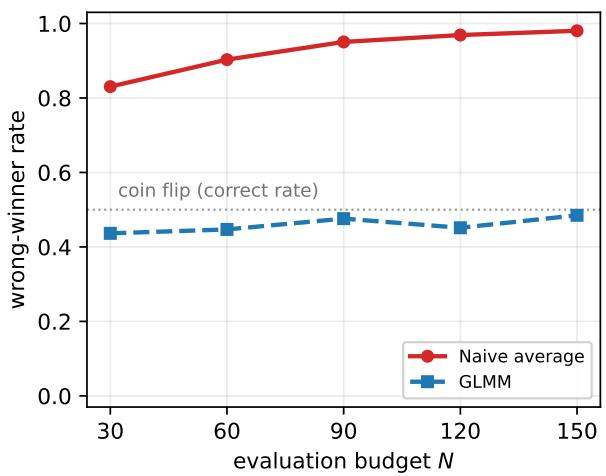  
(a) Setting 1, point estimate: rate of naming group A.

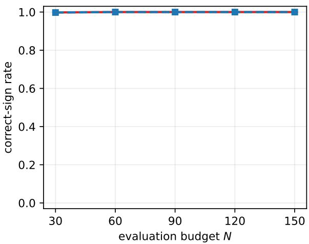  
(b) Setting 2, point estimate: correct-sign rate.

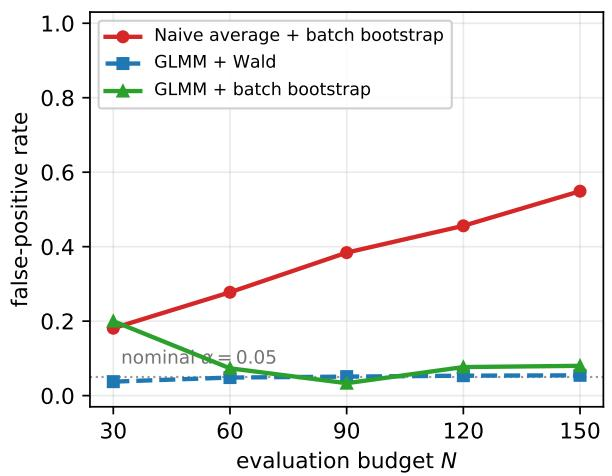  
(c) Setting 1, inference: false-positive rate.

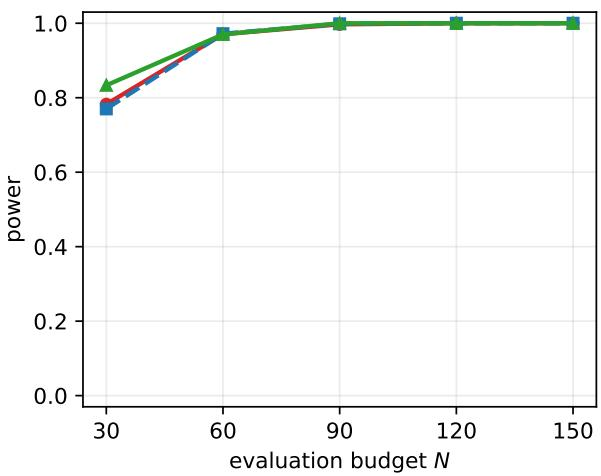  
(d) Setting 2, inference: power.  
Figure 4: Group comparison results $( V = 3 0 )$ , for the naive estimator and the GLMM fit. Top row: the rate at which the sign of each estimator picks group A as the winner. Bottom row: the false-positive rate and the power of the test.

The top row of Figure 4 gives, for each estimator, the rate at which its sign declares group A the better one. In Setting 1, the null case, the naive average names the higher-variance group A in 83.1% of replicates at N = 30, rising to 98.1% at N = 150, against a calibrated value of 50%, which the GLMM stays close to. In Setting 2, where group A is truly better, both estimators recover the correct sign in at least 99.8% of replicates at every budget.

The bottom row of Figure 4 reports the rejection rates on the same replicates, illustrating the effects on hypothesis testing at level 0.05. In Setting 1, the rejection rate corresponds to the falsepositive rate. The rate of the naive method climbs with the budget, from 18.1% at $N = 3 0$ to 54.9% at $N = 1 5 0$ , while the tests based on the GLMM fit do not: the Wald test holds at 3.8–5.5% throughout, and the bootstrap at 6.0–8.2% once past the smallest budget, where resampling only thirty batches leaves it liberal at 18.2%. In Setting 2, the rejection rate corresponds to the power of the test, and the three methods are indistinguishable: 78.3%, 77.0% and 75.9% at $N = 3 0$ , and all above 99.7% from $N = 9 0 \ : \mathsf { o n }$

The same patterns hold for a smaller pool of $V = 6$ items as well, whose details can be found in Supplement C.

Lastly, different from Section 3, the Williams square design does not help much in the current case for two reasons. First, in group comparison the primary difficulty is the bias of Theorem 2, not the variance that the balanced design improves. Our experiments also confirm this (see Section D). Second, the bootstrap is less feasible for a Williams square: its batches are rows of a balanced array, and resampling them destroys the very balance the design provides. Resampling blocks is possible, but that only works for very large N, which is not practical in this context.

## 5 Robustness to Deep Memory

The analysis of Sections 3 and 4 is developed entirely within the order-1 model: the judge’s memory is first-order. This section introduces simulation evaluation using the lag-3 model as the generative model. One question of particular interest is: do the conclusions of the two preceding sections survive when the judge’s memory runs deeper than the fitted model?

Specifically, the data-generating judge is the $K = 3$ member of (2) while the fitted GLMM assumes $K = 1$ , so the working model is deliberately wrong. The results below are therefore evidence of empirical robustness within the tested settings, not a guarantee. We compare it against a correctly specified lag-3 GLMM fitting. Each task is examined on the pool relevant to it: ranking at $V = 6$ , where Section 3 found the design effect, and group comparison at $V = 3 0$ , the pool used in Section 4.2.

Task 1: leaderboard ranking at $V \ = \ 6 .$ . The previous ranking patterns persist under lag-3 generation: Williams designs give a modest gain for naive averaging in the uneven-position setting, and the fitted lag-1 and lag-3 GLMMs perform comparably. Supplement E provides the simulation details and Table S2.

Task 2: group comparison at $V = 3 0$ We follow Section 4.2 on the same $V = 3 0$ pool split 15 versus 15, again changing only the judge to a lag-3 GLMM. The generating judge is Claude Haiku 4.5, Setting 2 of Task 1, $( \beta _ { 1 } , \beta _ { 2 } , \beta _ { 3 } ) = ( - 1 . 0 5 5 , - 0 . 3 8 0 , - 0 . 3 1 1 )$ with $\gamma = 1 . 8 7 9 - \mathsf { t h e }$ judge whose position profile is uneven. Table 2 gives the result. The naive false-positive rate rises from 26.0% to 70.5% across N while both GLMM versions give approximately correct control of the false positive rate, for a sufficiently large N. The bias of the naive method drives the sign rate from 86.5% to 100%, and the false-positive rate of the test is likewise uncontrolled.

In summary, when the judge’s memory runs beyond the fitted lag-1 kernel, the main messages of the preceding sections still hold. The first-order model fitting is still useful though it is only approximately correct. Such an observation serves as reassuring evidence for using a reasonable GLMM fit for AI judges.

Table 2: The group-comparison results under a lag-3 model for $V = 3 0$ . The bootstrap $( B = 2 0 0 )$ is used for inference. The results are under the null case when $\bar { \theta } _ { A } = \bar { \theta } _ { B }$
<table><tr><td rowspan="2">N</td><td colspan="3">Type-I error, null (%)</td><td colspan="3">Sign rate (Group A), null (%)</td></tr><tr><td>Naive average</td><td>GLMM lag-1</td><td>GLMM lag-3</td><td>Naive average</td><td>GLMM lag-1</td><td>GLMM lag-3</td></tr><tr><td>30</td><td>26.0</td><td>24.5</td><td>25.0</td><td>86.5</td><td>41.0</td><td>40.5</td></tr><tr><td>60</td><td>38.0</td><td>10.5</td><td>11.5</td><td>95.5</td><td>43.5</td><td>44.5</td></tr><tr><td>90</td><td>51.0</td><td>6.0</td><td>4.5</td><td>97.5</td><td>46.0</td><td>46.5</td></tr><tr><td>120</td><td>66.5</td><td>6.5</td><td>6.0</td><td>99.0</td><td>49.5</td><td>51.5</td></tr><tr><td>150</td><td>70.5</td><td>5.5</td><td>6.5</td><td>100.0</td><td>44.5</td><td>46.5</td></tr></table>

## 6 Data Example: Comparing Two Graphical Model Estimation Methods by AI-Judged Edge Quality

Li et al. [2020] introduced a Gaussian graphical model for network-linked observations called “GNC-lasso”. They applied the method to a corpus of statistics papers from Ji and Jin [2016], by leveraging the coauthorship network between authors. The variables in the graphical model are 300 statistical terms, and each observation is an author’s term-frequency vector, linked by a coauthorship network of 635 authors. The estimated edges are conditional dependencies between terms, such as empirical–likelihood or false–discovery. The benchmark competitor is the ordinary graphical lasso $( " 9 1 2 5 5 0 ^ { " }$ ; Friedman et al., 2008, Rothman et al., 2008), which estimates a sparse precision matrix by an $\ell _ { 1 } { \mathsf { - p e n a l i z e d } }$ Gaussian likelihood and ignores the coauthorship network. That study uses the two methods to select 25 edges for the graphical structure and assesses them pair by pair. The two estimated graphs are shown in Supplement F (Figure S2). Using human evaluation, they conclude that GNC-lasso recovers the more meaningful associations. We take this human assessment as the reference answer, and test the performance of using AI judges for the same task.

The union of the two lists contains 40 distinct term-pairs, labeled by provenance: GNC-only (G, 15 pairs), glasso-only (L, 15), or shared (S, 10). We exclude the shared pairs, since every judge scores them near-unanimously and they carry no information about the contrast. This leaves the between-method difference on the 30 distinctive pairs. The three judges of Section 2 (Gemini 2.5 Flash, GPT-5.4-mini, Claude Haiku 4.5) score each pair as a meaningful statistical association (1) or not (0) over 160 randomly shuffled batches.

We compare the two aggregation rules: the naive rule using $\widehat { \Delta } _ { \mathrm { N a i v e } }$ in (7), and the GLMM-based counterpart of Section 2, $\Delta _ { \mathrm { G L M M } }$ The human evaluation in Li et al. [2020] indicates a positive contrast. Because many pairs are judged unanimously, a case of perfect separation at which the unpenalized item effects diverge, we regularize the model fitting by adding an independent Cauchy prior on the item effects as suggested by Gelman et al. [2008]. For a more informative demonstration, we use the Wald-type p-value for both rules, with the standard error estimated by resampling whole batches $( B = 1 0 0 0 )$ ). Using the quantile-based bootstrap test of Section 4 instead gives the same rejection decisions, but the comparison is less informative because the smallest p-value it can report is about $2 / B$ . To demonstrate the tradeoff between accuracy and sample size (AI tokens), we check the aggregation results on the first N batches for $N = 2 0 , 4 0 , \ldots , 1 6 0$ , the sequence an analyst who stopped collecting early would have seen. Figure 5 and Table 3 show how the two methods agree and disagree, depending on the three judges.

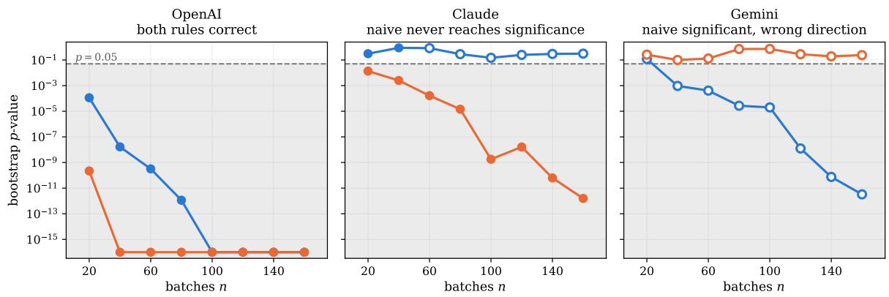  
naive (probability scale) GLMM (logit scale) filled: > 0 (agrees with published answer) hollow: $\widehat { \Delta } < 0$ (contradicts it)  
Figure 5: Wald p-value with batch-bootstrap standard error against the number of batches for the two aggregation rules, on the 30 distinctive word pairs, fitted on the first N batches. Shading marks $p < 0 . 0 5$ . Filled markers are contrasts in the direction of the published reference answer $( \widehat { \Delta } > 0$ favoring GNC-lasso); hollow markers contradict it. Values below 10−16 are displayed at the axis limit.

• For OpenAI they agree and both are right. The contrast stays positive and both p-values fall steadily. The difference between the two methods lies in the cost. The GLMM reaches any given level of confidence in roughly half the batches. It reaches the floor of the plotted scale by N = 40, while the naive method needs $N \approx 1 0 0$ . So the GLMM inference can save tokens substantially for the same conclusion.

• For Claude the naive method never delivers a conclusive decision. It is not significant at a single sample size in the sequence. Its point estimate crosses zero at $N = 6 0$ and stays negative. The GLMM is significant from N = 20 onward and falls to $p \approx 2 \times 1 0 ^ { - 1 2 }$ . Thus the GLMM achieves the desired conclusion but the naive method fails to get there.

• For Gemini the naive rule is confidently wrong. Its contrast is negative and becomes significant from N = 40 onward. The GLMM never accumulates evidence and is not significant at the full sample. More detailed examination of the data reveals that Gemini is the judge furthest into saturation, with an accept rate of 0.86 and 60% of pairs unanimous. So it has stopped discriminating between the two estimated graphs. The GLMM inference returns an inconclusive result, which is the correct description of the evidence.

## 7 Discussion and Practical Guidelines

Large language models increasingly perform tasks once requiring human judgment, often at a scale where statistical properties matter. When a judge scores a sequence of items, its ratings are dependent, and prompt engineering alone cannot determine what their average represents. The adoption of LLM-as-a-judge evaluation therefore requires the corresponding statistical theory to guide the design and interpretation for such procedures.

In this paper, we model the judge through a Markov GLMM working model. We treat it as an approximation rather than the true mechanism and assess its adequacy using out-of-sample predictive checks across frontier models. This formulation turns evaluation into inference under an explicit, empirically validated model. The two tasks we study require different strategies. For leaderboard ranking, the naive marginal average is consistent under a mild separation condition, while a Williams square design can improve efficiency in many cases at essentially no computational cost. In contrast, for group comparison, the marginal average can fail severely because the nonlinear link converts differences in within-group variation into persistent bias. The GLMM estimation provides valid inference for both tasks. The method also remains empirically robust beyond our theoretical setting: when the judge has memory beyond the lag-1 kernel, the GLMM achieves approximately correct error control across all regimes considered. We therefore recommend GLMM inference with a random-shuffle batch design for reliable inference using AI judges.

Table 3: Full sample $( N = 1 6 0 )$ : contrasts against the published reference answer, which is $\widehat { \Delta } > 0 ;$ p-values are from the Wald statistic with bootstrap standard error. “Correct” means significance with the sign matching the human evaluation in Li et al. [2020]; “inconclusive” means not significant; “wrong” means significant with the opposite sign.
<table><tr><td rowspan="2">Judge</td><td colspan="3">naive</td><td colspan="3">GLMM</td></tr><tr><td> $\widehat { \Delta } _ { \mathrm { N a i v e } }$ </td><td> $p$ </td><td>outcome</td><td> $\widehat { \Delta } _ { \mathrm { G L M M } }$ </td><td> $p$ </td><td>outcome</td></tr><tr><td>OpenAl</td><td> $+ 0 . 0 9 2$ </td><td> $< 1 0 ^ { - 1 2 }$ </td><td>correct</td><td>+2.30</td><td> $< 1 0 ^ { - 1 2 }$ </td><td>correct</td></tr><tr><td>Claude</td><td>-0.007</td><td>0.31</td><td>inconclusive</td><td>+1.16</td><td> $2 \times 1 0 ^ { - 1 2 }$ </td><td>correct</td></tr><tr><td>Gemini</td><td>-0.038</td><td> $3 \times 1 0 ^ { - 1 2 }$ </td><td>wrong</td><td>-0.18</td><td>0.24</td><td>inconclusive</td></tr></table>

Our conclusions have several limitations. The design theory is developed for a first-order Markov kernel. Although deeper memory is examined empirically and accommodated by the randomized GLMM, optimal designs for higher-order carryover remain open. Two extensions are especially important. First, placing all V items in one batch becomes infeasible for large item pools under bounded context for many AI judges; incomplete block designs may offer a natural direction to overcome this restriction. Second, we focus on binary accept/reject outcomes in the paper, which cover pairwise and accept/reject judging but not scalar scores. The framework could replace the Bernoulli-logit model with a cumulative-link or continuous mixed model. However, both the nonlinear bias and design-optimality arguments depend on link curvature and must be re-derived.

Acknowledgment Generative AI has been used to assist with language editing, coding, results visualization, and improving and checking proofs. T. Li was supported in part by NSF grant DMS-2515367. J. Ding was supported in part by NSF grant CAREER-2338506.

## References

A. Colin Cameron, Jonah B. Gelbach, and Douglas L. Miller. Bootstrap-based improvements for inference with clustered errors. The Review of Economics and Statistics, 90(3):414–427, 2008.

Wei-Lin Chiang, Lianmin Zheng, Ying Sheng, Anastasios Nikolas Angelopoulos, Tianle Li, Dacheng Li, Banghua Zhu, Hao Zhang, Michael I. Jordan, Joseph E. Gonzalez, and Ion Stoica. Chatbot Arena: An open platform for evaluating LLMs by human preference. In Proceedings of the 41st International Conference on Machine Learning (ICML), 2024.

Yeojin Chung, Sophia Rabe-Hesketh, Vincent Dorie, Andrew Gelman, and Jingchen Liu. A nondegenerate penalized likelihood estimator for variance parameters in multilevel models. Psychometrika, 78(4):685–709, 2013.

A. C. Davison and D. V. Hinkley. Bootstrap Methods and Their Application. Cambridge University Press, Cambridge, 1997.

Paul De Boeck and Mark Wilson, editors. Explanatory Item Response Models: A Generalized Linear and Nonlinear Approach. Springer, New York, 2004. doi: 10.1007/978-1-4757-3990-9.

Yann Dubois, Xuechen Li, Rohan Taori, Tianyi Zhang, Ishaan Gulrajani, Jimmy Ba, Carlos Guestrin, Percy Liang, and Tatsunori B. Hashimoto. AlpacaFarm: A simulation framework for methods that learn from human feedback. In Advances in Neural Information Processing Systems (NeurIPS), volume 36, 2023.

Yann Dubois, Balazs Galambosi, Percy Liang, and Tatsunori B. Hashimoto. Length-controlled´ AlpacaEval: A simple way to debias automatic evaluators. arXiv preprint arXiv:2404.04475, 2024.

Jerome Friedman, Trevor Hastie, and Robert Tibshirani. Sparse inverse covariance estimation with the graphical lasso. Biostatistics, 9(3):432–441, 2008.

Andrew Gelman, Aleks Jakulin, Maria Grazia Pittau, and Yu-Sung Su. A weakly informative default prior distribution for logistic and other regression models. The Annals ofApplied Statistics, 2(4): 1360–1383, 2008.

Jiawei Gu, Xuhui Jiang, Zhichao Shi, Hexiang Tan, Xuehao Zhai, Chengjin Xu, Wei Li, Yinghan Shen, Shengjie Ma, Honghao Liu, Yuanzhuo Wang, and Jian Guo. A survey on LLM-as-a-judge. arXiv preprint arXiv:2411.15594, 2024.

Yupeng Hou, Junjie Zhang, Zihan Lin, Hongyu Lu, Ruobing Xie, Julian McAuley, and Wayne Xin Zhao. Large language models are zero-shot rankers for recommender systems. In Advances in Information Retrieval – 46th European Conference on Information Retrieval (ECIR), 2024.

Pengsheng Ji and Jiashun Jin. Coauthorship and citation networks for statisticians. The Annals of Applied Statistics, 10(4):1779–1812, 2016.

Jiming Jiang and Thuan Nguyen. Linear and Generalized Linear Mixed Models and Their Applications. Springer Series in Statistics. Springer, New York, 2nd edition, 2021.

Byron Jones and Michael G. Kenward. Design and Analysis of Cross-Over Trials. Chapman & Hall/CRC Monographs on Statistics and Applied Probability. Chapman & Hall/CRC, Boca Raton, FL, 3rd edition, 2015.

Akbir Khan, John Hughes, Dan Valentine, Laura Ruis, Kshitij Sachan, Ansh Radhakrishnan, Edward Grefenstette, Samuel R. Bowman, Tim Rocktaschel, and Ethan Perez. Debating with¨ more persuasive LLMs leads to more truthful answers. In Proceedings of the 41st International Conference on Machine Learning (ICML), 2024.

Hans R. Kunsch. The jackknife and the bootstrap for general stationary observations.¨ The Annals of Statistics, 17(3):1217–1241, 1989.

S. N. Lahiri. Resampling Methods for Dependent Data. Springer, New York, 2003.

Tianxi Li, Cheng Qian, Elizaveta Levina, and Ji Zhu. High-dimensional Gaussian graphical models on network-linked data. Journal of Machine Learning Research, 21(74):1–45, 2020.

Zongjie Li, Chaozheng Wang, Pingchuan Ma, Daoyuan Wu, Shuai Wang, Cuiyun Gao, and Yang Liu. Split and merge: Aligning position biases in LLM-based evaluators. In Proceedings of the 2024 Conference on Empirical Methods in Natural Language Processing (EMNLP), 2024.

Adian Liusie, Potsawee Manakul, and Mark J. F. Gales. LLM comparative assessment: Zero-shot NLG evaluation through pairwise comparisons using large language models. In Proceedings of the 18th Conference of the European Chapter of the Association for Computational Linguistics (EACL), 2024.

John M. Neuhaus, John D. Kalbfleisch, and Walter W. Hauck. A comparison of cluster-specific and population-averaged approaches for analyzing correlated binary data. International Statistical Review, 59(1):25–35, 1991.

Lei Nie. Convergence rate of MLE in generalized linear and nonlinear mixed-effects models: Theory and applications. JournalofStatisticalPlanning andInference, 137(6):1787–1804, 2007.

Pouya Pezeshkpour and Estevam Hruschka. Large language models sensitivity to the order of options in multiple-choice questions. In Findings of the Association for Computational Linguistics: NAACL 2024, pages 2006–2017, 2024.

Adam J. Rothman, Peter J. Bickel, Elizaveta Levina, and Ji Zhu. Sparse permutation invariant covariance estimation. Electronic Journal of Statistics, 2:494–515, 2008.

Lin Shi, Chiyu Ma, Wenhua Liang, Xingjian Diao, Weicheng Ma, and Soroush Vosoughi. Judging the judges: A systematic study of position bias in LLM-as-a-judge. arXiv preprint arXiv:2406.07791, 2024.

A. W. van der Vaart. Asymptotic Statistics. Cambridge Series in Statistical and Probabilistic Mathematics. Cambridge University Press, 1998.

Peiyi Wang, Lei Li, Liang Chen, Zefan Cai, Dawei Zhu, Binghuai Lin, Yunbo Cao, Qi Liu, Tianyu Liu, and Zhifang Sui. Large language models are not fair evaluators. In Proceedings ofthe 62nd Annual Meeting of the Association for Computational Linguistics (ACL), 2024.

E. J. Williams. Experimental designs balanced for the estimation of residual effects of treatments. Australian Journal of Scientific Research, Series A, 2(2):149–168, 1949.

Jiayi Ye, Yanbo Wang, Yue Huang, Dongping Chen, Qihui Zhang, Nuno Moniz, Tian Gao, Werner Geyer, Chao Huang, Pin-Yu Chen, Nitesh V. Chawla, and Xiangliang Zhang. Justice or prejudice? quantifying biases in LLM-as-a-judge. arXiv preprint arXiv:2410.02736, 2024.

Scott L. Zeger, Kung-Yee Liang, and Paul S. Albert. Models for longitudinal data: A generalized estimating equation approach. Biometrics, 44(4):1049–1060, 1988.

Lianmin Zheng, Wei-Lin Chiang, Ying Sheng, Siyuan Zhuang, Zhanghao Wu, Yonghao Zhuang, Zi Lin, Zhuohan Li, Dacheng Li, Eric P. Xing, Hao Zhang, Joseph E. Gonzalez, and Ion Stoica. Judging LLM-as-a-judge with MT-Bench and Chatbot Arena. In Advances in Neural Information Processing Systems (NeurIPS), volume 36, 2023.

## Supplementary Material

Summary. This supplementary material collects additional analyses and experiments in the order of their appearance in the main text, followed by the proofs. Section A provides the predictivecheck protocol, transition results, interval widths, and conditional-entropy analyses. Section B details the leaderboard simulation settings. Sections C and D report group-comparison experiments with a small item pool and with Williams designs, respectively. Section E gives the leaderboardranking experiment under deeper memory, and Section F presents the estimated networks used in the data example. Finally, Section G states the GLMM estimation result, and Sections H and I collect the technical definitions, proofs, and supporting theory for leaderboard ranking and group comparison, including design variance, correct selection, nonlinearity bias, and finite-sample concentration.

## A Details on out-of-sample predictive evaluation

We collected 100 new shuffled batches of the same 30 proposals, giving 3,000 fresh ratings per judge under new randomized orderings. We then froze the parameters from the original 200-batch fits, with no retraining, and treated each frozen GLMM as generative. Each judge is frozen at the memory depth its own model selection chose in Section 2.2: K = 1 for Gemini 2.5 Flash, and $K = 3$ for GPT-5.4-mini and Claude Haiku 4.5, each with the cold-start term and the batch random intercept. We then simulated $B = 5 0 0$ synthetic datasets under the new orderings. We score twelve transition terms for every judge. The terms are the joint $0 \to 0 , 0 \to 1 , 1 \to 0 , 1 \to 1$ cells of the lag-1, lag-2, and lag-3 transition matrices $( 4 \times 3 = 1 2 \mathsf { t e r m s } )$ , regardless of the lags that judge’s model carries, so a judge frozen at K = 1 is scored on transitions two and three steps back that its model never saw. The 500 synthetic datasets are then used to construct 95% prediction intervals for the transition terms. Note that these intervals are constructed from the frozen GLMMs alone, without using the true judge scores on the 100 test batches. We then check whether each real transition probability from the 100 test batches falls inside its 95% prediction interval.

Across the three judges we score 36 terms, and we obtain 34/36, as Figure 3 shows. Two judges are covered in full: Gemini’s lag-1 model reproduces all twelve terms (12/12), including the out-of-order lag-2 and lag-3 cells it was never fit on, and Claude likewise covers 12/12. The two misses are the same failure mode, the 0 → 1 cell at a deeper lag where the held-out probability runs slightly above the frozen model’s interval: GPT-5.4-mini at lag-2 and lag-3 (10/12). A miss rate of $2 / 3 6 \approx 5 . 6 \%$ is close to the 5% a calibrated battery of 95% intervals should produce; the misses are not scattered but concentrated in the deep 0 → 1 cell, a small and reproducible higher-ordermemory gap for that judge rather than a global inadequacy. The logistic GLMM is thus sufficient to reproduce the judges’ sequence dynamics, with no drift detectable by this battery; the intervals condition on the frozen point estimates (parameter-estimation uncertainty is not propagated), so we read the check as a strong graphical predictive check rather than a formal goodness-of-fit test. On this evidence no more elaborate surrogate is warranted.

Note that a high coverage rate is necessary but not, by itself, compelling: a 95% rate could be attained vacuously by a severely misspecified model whose predictive intervals are so wide that they contain almost anything. Figure 3 rules this out, because it draws every interval at its true width. On the probability scale the transition intervals span 0.013 to 0.055 end to end, and the entropy intervals 0.010 to 0.041 bits, so a bar that covers a held-out value is unlikely to have done so by accident. The widths also differ enough among themselves, by a factor of four, for the comparison to be informative rather than uniform: the 1 → 1 cells, which predict the largest probabilities, carry the widest intervals, and the entropies the narrowest. Relative to the quantity each one predicts these widths are small, between 2.5% and 14.8% of the observed value for the transition terms and under 2.5% for the entropies, so the intervals are informative on the scale that matters as well as in absolute terms. We can see that the GLMM’s prediction intervals are narrow and structural: they do not cover the held-out transition probabilities merely by being wide, but reproduce the asymmetric shifts in those probabilities induced by the negative serial effect. The empirical 0 → 1 and 1 → 0 rates range across where the frozen model predicts, not merely staying far inside the bands. Therefore, the check is informative because the intervals are tight and the coverage is nominal.

For completeness, we also include a single scalar information-theoretic check for global information: the order-k conditional entropy of the binary label sequence, $H ( Y _ { t } \mid Y _ { t - 1 } , . . . , Y _ { t - k } )$ in bits, for k = 1, 2, 3. As before, for a good model, the prediction interval of the conditional entropy should cover the real conditional entropy on the test data at the nominal level. These three statistics per judge form the lower block of each panel of Figure 3. All 9 of them (three judges × three orders) fall inside their 95% prediction intervals, which are again narrow (0.010–0.041 bits wide). In particular, even Gemini’s lag-1 model covers the order-2 and order-3 entropy of its held-out sequence.

## B Leaderboard ranking simulation

This section provides the full simulation specification for Section 3.2.

Assumption 3 determines whether balancing can help at all, so we test the prediction where it holds and where it nearly fails. In concrete terms it requires a non-flat position profile: in a batch of equal-quality items, the expected rating must vary across slots. That profile is a property of $( \beta , \gamma )$ , and the two compete: the first slot has no predecessor, so its context is $\gamma ,$ while at later slots the context averages $\beta$ times the chance the previous item was accepted. When those two nearly cancel the profile is flat and there is no design variance to remove.

We therefore simulate two settings, both at $V ~ = ~ 6$ Both are taken from the judges fitted in Section 2, at their estimated coefficients, rather than chosen to produce the effect. The two settings therefore span Assumption 3 because the fitted judges themselves do. Setting 1 is Gemini 2.5 Flash, whose $\beta = - 0 . 5 2 9$ and $\gamma = - 0 . 5 2 8$ nearly cancel: the expected rating runs $( 0 . 6 5 8 , 0 . 6 9 5 , 0 . 6 9 1 , 0 . 6 9 1 , 0 . 6 9 1 , 0 . 6 9 1 )$ across the six slots, flat to within 0.04, so the removable design variance is nearly zero. Setting 2 is Claude Haiku 4.5, whose $\beta = - 1 . 0 5 5$ and $\gamma = + 1 . 8 7 9$ do not: the profile runs (0.910, 0.419, 0.536, 0.508, 0.515, 0.513)—an item judged first wins 91% of the time and one judged second only 42%—and the removable design variance is far larger. Each setting also carries its own judge’s fitted batch variance, $\sigma _ { b } ^ { 2 } = 0 . 4 4 6$ and 0.418, and its own common quality level $\theta ^ { * }$ , obtained by solving $\pi ( \theta ^ { * } )$ against that judge’s observed acceptance rate, 0.686 and 0.567, rather than by tuning. The two therefore differ in level as well as in sequential structure. In either case, the design variance that balancing can remove is governed by the position profile, which is nearly absent in Setting 1 and substantial in Setting 2.

The item panel is near-flat, $\pmb { \theta } = ( \theta ^ { * } + \delta , \theta ^ { * } , \dots , \theta ^ { * } )$ , with one best item and a tied field. We set $\delta = 2 . 8 / \sqrt { N }$ , the local scaling of Theorem 1: the selection problem tightens as fast as the budget grows, so the difficulty is held constant and any advantage that persists reflects the limit rather than one particular sample size. Budgets are $N \in \{ 6 , 1 2 , 1 8 \} { \mathrm { - } } { \mathsf { o n e } }$ , two and three Williams blocks—with 10,000 replicates per cell, giving a Monte Carlo standard error of 0.71 percentage points on each design comparison. We report all four combinations of estimator and design; ties among the win rates, which are frequent at these budgets, are broken uniformly at random.

## C Group comparison with a small item pool

We extend the simulations in Section 4.2 to the smaller item pool below.

For completeness, a small pool of $V = 6$ , split 3 versus 3, is also studied. The rest of the setup is unchanged. The corresponding results are shown in Figure S1, and the overall patterns remain the same as in the $V = 3 0$ case.

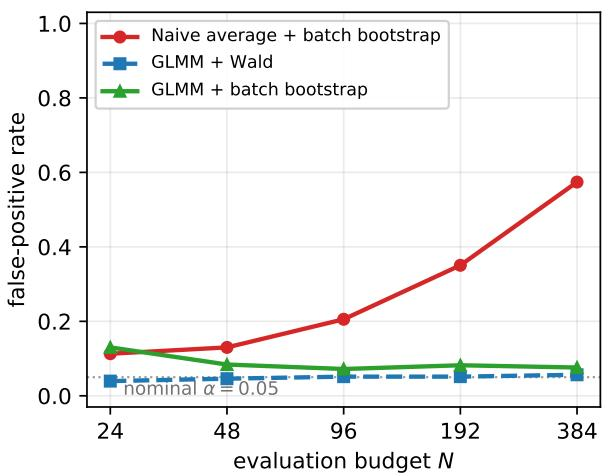  
(a) Setting 1: equal means, unequal spread.

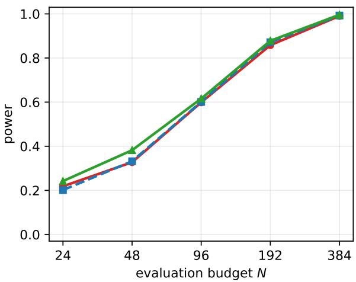  
(b) Setting 2: true gap, equal spread.  
Figure S1: The small-pool counterpart of the bottom row of Figure 4: the same two scenarios and the same three procedures at $V = 6 ,$ , split 3 versus 3.

## D Williams squares in group comparison: an empirical demonstration

Section 3 showed that a Williams square strictly improves the naive estimator for ranking by removing a design-induced variance term. This section documents the experiment behind the claim in Section 4 that no such improvement materializes for group comparison, where the obstacle is the bias of Theorem 2 rather than the variance.

Setup. We rerun the two estimators of Section 4.2—the naive marginal average and the GLMM logit-scale contrast—under a Williams Latin square in place of the random shuffle, with everything else held fixed: the same quality panels as Settings 1 and 2 of Section 4.2 (verified identical to the random-shuffle study), the same two pool sizes, $V = 3 0$ split 15 vs. 15 over $N \in \{ 3 0 , \dots , 1 5 0 \}$ and $V = 6$ split 3 vs. 3 over $N \in \{ 2 4 , \dots , 3 8 4 \}$ , and 2000 independently seeded replicates per cell. The design is the symbol-randomized Williams design of Section $3 ~ ( V$ is even in both cases): every budget is a whole multiple of V, so each replicate uses $N / V$ complete squares, and the item-tosymbol assignment is redrawn independently for each square, with exact position and carryover balance verified within every block. Each replicate records the point estimate and its sign only.

No test is computed under the Williams arms, and the reason is structural. A bootstrap of batches is licensed by their exchangeability under a random shuffle, whereas the batches of a Williams square are rows of a balanced array, and resampling them with replacement destroys the balance the design exists to provide. The correct resampling unit is then the complete square, a block of V batches, and as with block bootstraps for dependent data, consistency requires the number of blocks, not merely the number of observations, to grow [Kunsch ¨ , 1989, Lahiri, 2003]; with few blocks such tests over-reject substantially [Cameron et al., 2008]. At $V = 3 0$ a budget of N = 150 buys five squares, and reaching even a few dozen blocks would require $N \geq 2 0 V$ evaluations, a direct and largely wasted token cost for judge-based evaluation. The usual escape, a model-based bootstrap that holds the design fixed and re-simulates responses from a fitted model [Davison and Hinkley, 1997, Ch. 6], is closed off by the premise: the naive average is attractive precisely because it assumes no model.

Result. Table S1 reports the rate at which each arm names Group A the winner under the equal-means null Setting 1. Under that null the naive average names the higher-variance group 98.1% of the time under a random shuffle at $V = 3 0$ and 98.5% under a Williams square; across all 40 matched cells the largest discrepancy between a Williams arm and its random-shuffle counterpart is 2.9% against a Monte Carlo standard error of 1.6%, and no cell reaches a Bonferronicorrected threshold. This is what Theorem 2 predicts: the nonlinearity bias is a property of the estimator, namely of averaging on the probability scale, and the design enters the theorem only through Assumption 1; balancing removes design-induced variance and has no purchase on estimator bias.

Table S1: The balanced design does not repair the naive estimator. Rate at which each arm names the higher-variance Group A under the equal-means null Setting 1, in percent; the groups are equal, so 50 is the calibrated value and no test is involved. Each estimator is run under a random shuffle and under a Williams square on independently seeded replicates (2000 per cell). The naive average climbs toward 100% under both designs, and the GLMM is near the coin flip under both. The Setting 2 control, with a true 0.4-logit gap and matched spreads, separates all four arms from zero error by the largest budget (Group B named in 0.0% of replicates at V = 30, and 0.0% at V = 6, for every arm).
<table><tr><td rowspan="2">V = 30 (15 vs. 15)</td><td colspan="5">Group A named (%), by budget N</td></tr><tr><td>30</td><td>60</td><td>90</td><td>120</td><td>150</td></tr><tr><td>Naive</td><td>random shuffle</td><td>83.1</td><td>90.3</td><td>95.1</td><td>96.9 98.1</td></tr><tr><td rowspan="3">GLMM</td><td>Williams square</td><td>82.7</td><td>91.3</td><td>94.6 97.3</td><td>98.5</td></tr><tr><td>random shuffle</td><td>43.7</td><td>44.7</td><td>47.6 45.2</td><td>48.5</td></tr><tr><td>Williams square</td><td>42.7</td><td>47.3</td><td>48.0 48.0</td><td>47.6</td></tr><tr><td>V = 6 (3 vs. 3)</td><td></td><td>24</td><td>48</td><td>96</td><td>192 384</td></tr><tr><td rowspan="2">Naive</td><td>random shuffle</td><td>69.3</td><td>75.3</td><td>85.8</td><td>93.4 98.4</td></tr><tr><td>Williams square</td><td>68.6</td><td>74.7</td><td>85.2 92.3</td><td>97.9</td></tr><tr><td>GLMM</td><td>random shuffle</td><td>49.7</td><td>49.6</td><td>48.9</td><td>50.1 50.8</td></tr><tr><td></td><td>Williams square</td><td>49.2</td><td>49.4</td><td>49.0 49.5</td><td>51.0</td></tr></table>

## E Leaderboard ranking under deeper memory

This section gives the ranking experiment summarized in Section 5, comparing lag-1 and lag-3 fits under lag-3 data generation.

Task 1: leaderboard ranking at $V = 6 .$ We repeat Section 3.2 exactly—the same two settings and the same local scaling $\delta = 2 . 8 / \sqrt { N }$ —but change only the judge, which now follows the lag-3 model. Each setting keeps the lag-1 coefficient it had in Section 3 and gains the fitted lag-2 and lag-3 terms of the same judge, so it deepens without becoming a different judge: $( \beta _ { 1 } , \beta _ { 2 } , \beta _ { 3 } ) =$ $\left( - 0 . 5 2 9 , - 0 . 0 9 0 , - 0 . 1 7 9 \right)$ for Gemini 2.5 Flash in Setting 1 and $\left( - 1 . 0 5 5 , - 0 . 3 8 0 , - 0 . 3 1 1 \right)$ for Claude Haiku 4.5 in Setting 2, with $\gamma$ and $\sigma _ { b } ^ { 2 }$ carried over unchanged. Table S2 gives the leaderboard selection accuracy, and it reproduces the patterns in Section 3. Both the naive method and the GLMM model fitting work for this task. In Setting 1, the Williams square design gains nothing. In Setting 2, where the position profile is uneven, the Williams square design gains about 2% improvement on the naive method. On GLMM fitting, the design is not impactful. However, note that the performance of the GLMM fitting based on the misspecified lag-1 model is comparable to that of the lag-3 model fitting, suggesting that using the lag-1 model can still achieve reasonable empirical performance.

Table S2: Selection accuracy (%) of Section 3 under a lag-3 GLMM model.
<table><tr><td rowspan="2">Setting</td><td rowspan="2">N</td><td colspan="3">Random shuffle (%)</td><td colspan="3">Williams design (%)</td></tr><tr><td>Naive average</td><td>GLMM lag-1</td><td>GLMM lag-3</td><td>Naive average</td><td>GLMM lag-1</td><td>GLMM lag-3</td></tr><tr><td rowspan="3">Setting 1 (Flat)</td><td>6</td><td>44.4</td><td>44.2</td><td>43.3</td><td>43.7</td><td>43.9</td><td>43.2</td></tr><tr><td>12</td><td>49.1</td><td>49.1</td><td>48.6</td><td>48.3</td><td>48.3</td><td>48.1</td></tr><tr><td>18</td><td>47.9</td><td>48.0</td><td>47.8</td><td>48.9</td><td>49.1</td><td>49.0</td></tr><tr><td rowspan="3">Setting 2 (Uneven)</td><td>6</td><td>46.9</td><td>49.4</td><td>47.1</td><td>48.7</td><td>49.8</td><td>48.8</td></tr><tr><td>12</td><td>48.4</td><td>51.0</td><td>50.2</td><td>50.6</td><td>51.5</td><td>51.1</td></tr><tr><td>18</td><td>49.0</td><td>51.7</td><td>51.3</td><td>51.2</td><td>51.7</td><td>51.7</td></tr></table>

## F Estimated networks for the data example

The networks below are the graphical lasso and GNC-lasso estimates described in Section 6. The AI-judge comparison uses their 30 distinctive term-pairs.

Figure S2 shows the two estimated graphs.

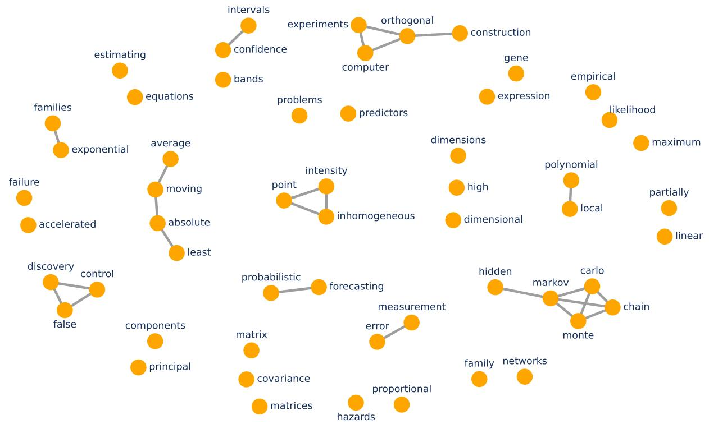

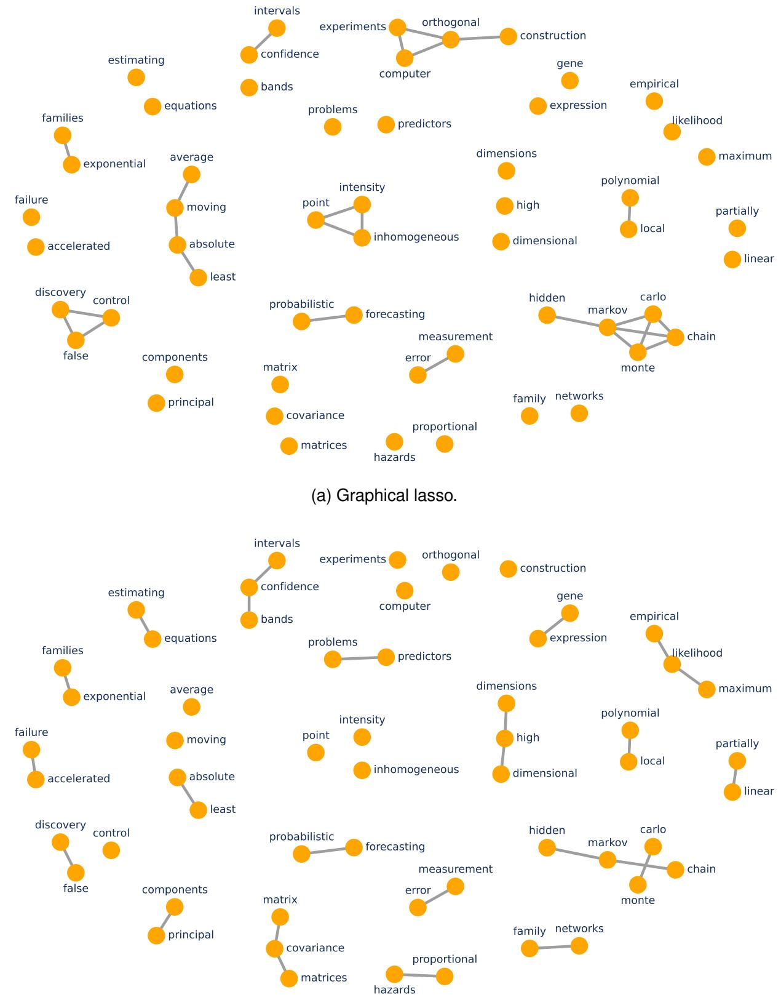  
(b) Network-cohesion graphical lasso.  
Figure S2: The two estimated term graphs of Li et al. [2020] by glasso and GNC-lasso.

## G GLMM estimation theory

Proposition 3. Suppose the judge is evaluated under (1)–(2) at some memory depth $K < V$ and underAssumption 1, whose randomization units (single batches underclause (a); complete blocks of $B = V$ batches under clause $( b ) )$ are independent clusters—conditional on the allocation, the chain rule factorizes each unit’s joint response probability exactly through the lagged ratings, so the likelihood is a product over units and conditioning on the lag covariates adds no separate factor. Assume the standard regularity conditions for mixed-model likelihood asymptotics hold (identifiability of every item contrast from the marginal likelihood; a positive-definite limiting perunit Fisher information $\pmb { \mathcal { T } } _ { B } ( \pmb { \eta } _ { 0 } )$ , and write $\pmb { \mathcal { I } } ( \pmb { \eta } _ { 0 } ) : = \pmb { \mathcal { I } } _ { B } ( \pmb { \eta } _ { 0 } ) / B$ for the information per batch; and $\pmb { \eta } _ { 0 }$ interior to the parameter space—in particular $\sigma _ { b } ^ { 2 } > 0 _ { : }$ , the boundary case not being covered). Then the maximum likelihood estimator $\hat { \pmb { \eta } } _ { N }$ is consistent and asymptotically normal as $N \to \infty$

$$
\hat { \eta } _ { N } \stackrel { p } {  } \eta _ { 0 } , \qquad \sqrt { N } ( \hat { \eta } _ { N } - \eta _ { 0 } ) \stackrel { d } {  } \mathcal { N } \big ( \mathbf { 0 } , \mathcal { Z } ( \eta _ { 0 } ) ^ { - 1 } \big ) .\tag{11}
$$

The same conclusion holds for the weakly penalized variant used in our empirical sections (a fixed weakly-informative prior on the item effects): for a fixed smooth log-prior with locally bounded gradient, a score expansion around the MLE, whose likelihood Hessian is of order N, gives $\hat { \eta } _ { \mathsf { p e n a l i z e d } } - \hat { \eta } _ { \mathsf { M L E } } = O _ { p } ( N ^ { - 1 } ) = o _ { p } ( N ^ { - 1 / 2 } )$ , so (11) is unchanged.

Proposition 3 states a standard likelihood result for generalized linear mixed models under cluster asymptotics $( N \to \infty$ with bounded cluster size); see Jiang and Nguyen [2021] and Nie [2007].

## H Proofs for Section 3 (Williams designs)

We use the notation of Section 3: items $1 , \ldots , V$ with $\theta _ { 1 } > \cdot \cdot \cdot > \theta _ { V } , \delta = \theta _ { 1 } - \theta _ { 2 }$ , N batches indexed by $\pi _ { t } \in S _ { V } , P ( v , t ) = \pi _ { t } ^ { - 1 } ( v )$ , naive estimator $\begin{array} { r } { \widehat { p } _ { v } = N ^ { - 1 } \sum _ { t } Y _ { t , P ( v , t ) } } \end{array}$ , contrast ${ \bf Z } ( \mathcal { D } ) =$ $( \widehat { p } _ { 1 } - \widehat { p } _ { 2 } , \ldots , \widehat { p } _ { 1 } - \widehat { p } _ { V } ) ^ { \top }$ , and the selection rule $\begin{array} { r } { \hat { v } = \arg \operatorname* { m a x } _ { v } \widehat { p } _ { v } , \operatorname* { P r } _ { \mathcal { D } } ( \hat { v } = 1 ) = \operatorname* { P r } ( \hat { v } = 1 ) } \end{array}$ . Random Shuffle $\mathcal { D } _ { R }$ draws the $\pi _ { t }$ i.i.d. uniform on $S _ { V } ;$ the Williams design $\mathcal { D } _ { W }$ stacks $N / V$ copies of a $V \times V$ Williams square $( V$ even, so that the square exists; this convention is in force for every Williams statement below) (items assigned to its symbols by independent uniform bijections $\tau _ { r } , r =$ $1 , \ldots , N / V )$ and satisfies position balance (W1: each item appears $N / V$ times in each position) and first-order carryover balance (W2: each ordered pair appears $N / V$ times as consecutive). We assume at least one of $\beta , \gamma$ is nonzero (the case $\beta = \gamma = 0$ is degenerate).

## H.1 Additional definitions and interpretation

The following details accompany the ranking results in Section 3.1.

We first note that all explicit constants below involve the serial effect only through the sharp contraction coefficient

$$
x : = \operatorname* { s u p } _ { z } \left| \sigma ( z + \beta ) - \sigma ( z ) \right| = \operatorname { t a n h } ( | \beta | / 4 ) < 1
$$

(the supremum is attained at $z = - \beta / 2$ , where the difference equals $\sigma ( \beta / 2 ) { - } \sigma ( - \beta / 2 ) = \operatorname { t a n h } ( \beta / 4 ) )$ together with the derived series constants $\begin{array} { r } { \Lambda _ { 1 } : = \sum _ { k > 0 } ( k + 1 ) x ^ { k } = ( 1 - x ) ^ { - 2 } } \end{array}$ and $\begin{array} { r } { \Lambda : = \sum _ { k \geq 0 } ( k + } \end{array}$ $1 ) ^ { 4 } x ^ { k }$ , finite for every $\beta$ since $x < 1$ . Because tanh $t \leq t ,$ , the displayed bounds are stated in the simpler |β|-form.

The two terms separate the two sources of randomness. The first is sampling: with the design held fixed, the ratings themselves are random. The second is the design: two runs of the same experiment draw different orderings, or different bijections, so they place items in different slots and after different predecessors, and therefore have different conditional means $\mu ( \mathcal { D } )$ . The comparison between the designs is a comparison of their design terms. Under the random shuffle every batch redraws its ordering, and this randomness accumulates at the same rate as the sampling noise: $\Delta _ { \mathrm { R } } = \Theta ( 1 / N )$ . Under Williams, within-block balance holds for every bijection, so at equal qualities the block-level conditional means do not depend on the draw at all and $\pmb { \Delta } _ { \mathrm { W } } = \mathbf { 0 }$ exactly; under the $N ^ { - 1 / 2 }$ local alternatives studied below it is $O ( 1 / N ^ { 2 } )$ , one order smaller than the shuffle term. At a fixed configuration with $\nu _ { \mathrm { W } , k } > 0$ (defined below) both design terms are of order $1 / N$ , and the comparison is then the exact finite-sample identity of Proposition 2. The gap at and near equal qualities is the content of the next result.

The comparison of the two design terms reduces to one scalar constant per design and per contrast, which we now define. Let $S _ { V }$ denote the set of permutations of $\{ 1 , \ldots , V \}$ , and $\operatorname { U n i f } ( S _ { V } )$ the uniform distribution on $S _ { V }$ . For a batch order $\pi \in S _ { V }$ , placing item $\pi ( j )$ in slot j, let

$$
M _ { v } ( \pi ) \ : = \ \operatorname { \mathbb { E } } { \bigl [ } Y _ { 1 , \pi ^ { - 1 } ( v ) } \ { \big | } \ V _ { 1 , j } = \pi ( j ) , \ j = 1 , \ldots , V { \bigr ] } , \qquad v = 1 , \ldots , V ,
$$

denote the expected rating of item v in a single batch presented in order π, the expectation taken over the batch effect and the ratings of the working model (Assumption 2), batch 1 serving as a generic batch. Let $\rho _ { 1 } , . . . , \rho _ { V } \in S _ { V }$ denote the rows of the Williams square, so that in a block with item-to-symbol bijection τ the r-th batch presents the items in order $\tau ^ { - 1 } \circ \rho _ { r }$ , and let

$$
\bar { m } _ { v } ( \tau ) : = \frac { 1 } { V } \sum _ { r = 1 } ^ { V } M _ { v } \big ( \tau ^ { - 1 } \circ \rho _ { r } \big )
$$

be the corresponding block mean of item v. The independent unit of the random shuffle is the batch, with a fresh uniform order; that of the Williams design is the block, with a fresh uniform bijection. The two designs’ constants are exact counterparts, the design variance of the k-th contrast over one independent unit:

$$
\nu _ { \mathrm { R } , k } \ : = \ \mathrm { V a r } _ { \pi \sim \mathrm { U n i f } ( S _ { V } ) } \big [ M _ { 1 } ( \pi ) - M _ { k } ( \pi ) \big ] , \qquad \nu _ { \mathrm { W } , k } \ : = \ \mathrm { V a r } _ { \tau \sim \mathrm { U n i f } ( S _ { V } ) } \big [ \bar { m } _ { 1 } ( \tau ) - \bar { m } _ { k } ( \tau ) \big ] .
$$

In this notation the diagonals of the design terms in (5) are exactly $[ \Delta _ { \mathrm { R } } ] _ { k - 1 , k - 1 } = \nu _ { \mathrm { R } , k } / N$ over the N batches, and $[ \Delta _ { \mathrm { W } } ] _ { k - 1 , k - 1 } = V \nu _ { \mathrm { W } , k } / N$ over the $N / V$ blocks (see the proof of Proposition 2 below).

Assumption 3 asks only that the presentation order genuinely move the expected ratings, so that position is worth balancing at all. If $\beta = \gamma = 0$ the sequence carries no information, every ordering is equivalent, and the two designs coincide, so there is nothing to compare. In concrete terms, the condition says that in a batch of equal-quality items the expected rating is not the same in every slot, that is, a non-flat position profile. Moreover, it is mild: Lemma 5 shows non-flatness holds automatically when exactly one of $\beta , \gamma$ is nonzero, and when both are nonzero it fails only on a discrete set of parameters where the cold-start and carryover effects exactly cancel; it is checkable numerically in any given instance.

In general, it is intuitively expected that the dominance holds beyond the provable small-gap regime. Every realization of τ places each item in each slot exactly once within the block, so the first-order position effect cancels in $\bar { m } _ { 1 } ( \tau ) - \bar { m } _ { k } ( \tau )$ for every draw, and $\nu _ { \mathrm { W } , k }$ is generated only by the second-order interaction between quality differences and position—quadratically small in the quality spread. The shuffle typically does not enjoy such cancellation. At a flat configuration, the above result is the counterpart of the classical variance rationale for Latin-square and crossover designs, in which balancing rows and columns removes the period and carryover nuisance variation that complete randomization leaves in the treatment contrasts [Williams, 1949, Jones and Kenward, 2015].

The natural question is when the variance-reduction advantage of the Williams square design transfers into an advantage in the ultimate quantity of interest for the leaderboard task, the probability of correct selection. Note that Proposition 1 already shows that in the standard setting, when the item qualities are fixed with sufficient separation, both designs are asymptotically correct. The regime where one could expect the difference is when the gap between the top items is small, while the sample size is not large. Therefore, next we focus on one local-alternative regime to gain deeper insights in this direction. Specifically, we consider the case $\theta _ { 1 } - \theta _ { k } = d _ { k } / \sqrt { N }$ , in which the leading candidates are close together. So we are evaluating the two designs at the resolution where selection is neither trivial nor hopeless—precisely the finite-sample instances in which the budget is moderate relative to the gaps. This is the standard calibration behind asymptotic relative efficiency [van der Vaart, 1998].

Under either design and for every N, the expected win rate of item v is the smooth function

$$
\begin{array} { r } { \mathbb { E } [ \widehat { p } _ { v } ] = F _ { v } ( \pmb { \theta } ) : = \mathbb { E } _ { \pi \sim \operatorname { U n i f } ( S _ { V } ) } \left[ M _ { v } ( \pi ) \right] . } \end{array}
$$

At a flat configuration $\pmb { \theta } = \theta _ { * } \mathbf { 1 }$ , exchangeability reduces its gradient to two numbers: the selfeffect and the cross-effect of quality on the win rate,

$$
g _ { \mathrm { s e l f } } ( \theta _ { * } ) : = \left. \frac { \partial F _ { v } } { \partial \theta _ { v } } \right| _ { \theta = \theta _ { * } { \bf 1 } } , \qquad g _ { \mathrm { c r o s s } } ( \theta _ { * } ) : = \left. \frac { \partial F _ { v } } { \partial \theta _ { w } } \right| _ { \theta = \theta _ { * } { \bf 1 } } ( w \neq v ) ,
$$

neither depending on $v \circ \mathsf { r } w ,$ , and both functions of the common level $\theta _ { * }$ .

## H.2 Preliminaries: the mixture CDF and the affine recurrence

For slot $( t , j ) , C _ { t , j } = \beta Y _ { t , j - 1 } + \gamma \mathbf { 1 } _ { \{ j = 1 \} } + u _ { t }$ , with marginal CDF $F _ { t , j } ^ { \mathcal { D } }$ . By the tower property,

$$
\mu _ { v } ( \mathcal { D } ) = \mathbb { E } [ \widehat { p } _ { v } \mid \mathcal { D } ] = \int _ { \mathbb { R } } \sigma ( \theta _ { v } + c ) d \bar { F } _ { v } ^ { \mathcal { D } } ( c ) , \qquad \bar { F } _ { v } ^ { \mathcal { D } } = \frac { 1 } { N } \sum _ { t = 1 } ^ { N } F _ { t , P ( v , t ) } ^ { \mathcal { D } } ,\tag{12}
$$

the item-averaged context CDF. We label each slot of an item by its predecessor category $a \in$ $\mathcal { V } \cup \{ \emptyset \}$ (∅ at position 1).

Lemma 1. $F _ { t , j } ^ { \mathcal { D } }$ depends on D and $( t , j )$ only through (i) the predecessor category a at $( t , j )$ , and (ii) the configuration $( \pi _ { t } ( 1 ) , \ldots , \pi _ { t } ( j - 2 ) )$ ) of items strictly before the predecessor.

Proof. By the recursive law $( 1 ) , Y _ { t , j - 1 }$ has success probability $\sigma ( \theta _ { \pi _ { t } ( j - 1 ) } + \beta Y _ { t , j - 2 } + \gamma \mathbf { 1 } _ { \{ j - 1 = 1 \} } + u _ { t } )$ depending on the predecessor’s identity (i) and the predecessor’s predecessor outcome (ii).

Lemma 2. Under $\mathcal { D } _ { W }$ , every item v’s predecessor multiset across its N slots is

$$
\{ \emptyset ^ { N / V } \} \cup \bigcup _ { a \in \mathcal { V } \setminus \{ v \} } \{ a ^ { N / V } \} ,
$$

where the exponent is the multiplicity; in particular it omits v itself.

Proof. By (W1) exactly $N / V$ batches place v at position $1 \ ( N / V$ copies of $_ { \mathcal { O } ) ; }$ by (W2) exactly $N / V$ batches have each $a \neq v$ as the immediate predecessor of v. These account for all $N / V +$ $( V - 1 ) N / V = N$ slots. □

Define the slot-uniform reference CDF $\begin{array} { r } { \bar { F } = \frac { 1 } { N V } \sum _ { t , j } F _ { t , j } ^ { \mathcal { D } _ { W } } = \frac { 1 } { V } \sum _ { v } \bar { F } _ { v } ^ { \mathcal { D } _ { W } } } \end{array}$ and $\begin{array} { r } { \bar { g } ( \theta ) = \int \sigma ( \theta + } \end{array}$ $c ) d \bar { F } ( c )$ . For predecessor category $a \in \nu$ , write ${ \widehat { F } } _ { a }$ for the probability-normalized average of the $( V - 1 ) N / V$ slot laws whose predecessor is $^ { a , }$ and $\widehat { F } _ { a } ^ { ( v ) }$ for the average of the $N / V$ such slots occupied by $v ;$ define $\widehat { F } _ { \varnothing }$ and $\widehat { F } _ { \varnothing } ^ { ( v ) }$ analogously at position 1 (all four are probability measures). Counting slots (Lemma 2),

$$
\bar { F } _ { v } ^ { \mathcal D _ { W } } = \frac { 1 } { V } \widehat F _ { \mathcal Q } ^ { ( v ) } + \frac { 1 } { V } \sum _ { a \neq v } \widehat F _ { a } ^ { ( v ) } , \qquad \bar { F } = \frac { 1 } { V } \widehat F _ { \mathcal Q } + \frac { V - 1 } { V ^ { 2 } } \sum _ { a \in \mathcal V } \widehat F _ { a } .
$$

Lemma 3. Fix π and $u ;$ set $B _ { j } = \sigma ( \theta _ { \pi ( j ) } + \gamma \mathbf { 1 } _ { \{ j = 1 \} } + u )$ and $A _ { j } = \sigma ( \theta _ { \pi ( j ) } + \beta + \gamma { \bf 1 } _ { \{ j = 1 \} } + u ) - B _ { j }$ With $Y _ { 0 } \equiv 0 , \operatorname* { P r } ( Y _ { j } = 1 \mid Y _ { j - 1 } , u , \pi ) \ \stackrel { \sim } { = } \ B _ { j } + \tilde { A } _ { j } \vec { Y } _ { j - 1 } , s o p _ { j } : = \operatorname* { P r } ( Y _ { j } = 1 \mid u , \pi ) \ \stackrel { \sim } { = } \ \tilde { B _ { j } } + A _ { j } p _ { j - 1 } ,$ $| A _ { j } | \le | \beta | / 4$ . Unrolling, $\begin{array} { r } { p _ { j _ { v } } = \sum _ { k = 0 } ^ { j _ { v } - 1 } ( \prod _ { m = j _ { v } - k + 1 } ^ { j _ { v } } A _ { m } ) B _ { j _ { v } - k } , } \end{array}$ , and for $j _ { v } < j _ { w } , \operatorname { C o v } ( Y _ { j v } , Y _ { j w } \mid u , \pi ) =$ $\begin{array} { r } { ( \prod _ { m = j _ { v } + 1 } ^ { j _ { w } } A _ { m } ) p _ { j _ { v } } ( 1 - p _ { j _ { v } } ) } \end{array}$

Proof. The transition probability equals $B _ { j }$ if $Y _ { j - 1 } = 0$ and $B _ { j } + A _ { j } \ { \mathsf { i f } } \ Y _ { j - 1 } = 1 , \ { \mathsf { i . e . } } \ B _ { j } + A _ { j } Y _ { j - 1 }$ The recurrence follows by total probability, and $| A _ { j } | \le | \beta | / 4$ follows from the mean value theorem.

We prove the covariance identity by induction on $j _ { w } - j _ { v }$

$$
\operatorname { C o v } ( Y _ { j v } , Y _ { j v + 1 } \mid u , \pi ) = A _ { j v + 1 } \operatorname { V a r } ( Y _ { j v } \mid u , \pi ) = A _ { j v + 1 } p _ { j v } ( 1 - p _ { j v } ) ,
$$

and each further step appends one A-factor.

## H.3 Williams preserves expected ranks

Proposition 4. For every $\begin{array} { r } { v , | \mu _ { v } ( \mathcal D _ { W } ) - \bar { g } ( \theta _ { v } ) | \le \varepsilon _ { W } : = \left( 1 - V ^ { - 2 } \right) \frac { | \beta | } 4 \le \frac { | \beta | } 4 } \end{array}$ , independent of σ2, θ, N.

Proof. Subtracting the two slot-count identities above gives

$$
\bar { F } _ { v } ^ { \mathcal { D } _ { W } } - \bar { F } = \textstyle \frac { 1 } { V } \big ( \widehat { F } _ { \mathcal { Q } } ^ { ( v ) } - \widehat { F } _ { \mathcal { Q } } \big ) + \frac { 1 } { V } \sum _ { a \neq v } \big ( \widehat { F } _ { a } ^ { ( v ) } - \widehat { F } _ { a } \big ) + \frac { V - 1 } { V ^ { 2 } } \Big ( \frac { 1 } { V - 1 } \sum _ { a \neq v } \widehat { F } _ { a } - \widehat { F } _ { v } \Big ) ,
$$

where each bracket is a difference of two probability measures. We integrate $\sigma ( \theta _ { v } + \cdot )$ against each bracket.

Position one. The context at position 1 is $\gamma + u _ { t }$ regardless of the allocation, so $\widehat F _ { \varnothing } ^ { ( v ) } = \widehat F _ { \varnothing }$ exactly and the first bracket contributes zero.

Equal-mass predecessor comparisons. By Lemma 3, for any probability-normalized average $\widehat F$ of slot laws at positions $j \geq 2$

$$
\int \sigma ( \theta _ { v } + c ) d \widehat { F } ( c ) = \mathbb { E } _ { u } \left[ B ^ { v } ( u ) \right] + \mathbb { E } _ { u } \left[ A ^ { v } ( u ) \bar { Q } ( u ) \right] ,
$$

with $B ^ { v } = \sigma ( \theta _ { v } + u ) , A ^ { v } = \sigma ( \theta _ { v } + \beta + u ) - B ^ { v } , | A ^ { v } | \le | \beta | / 4$ , and $\bar { Q } ( u ) \in [ 0 , 1 ]$ the corresponding average of predecessor success probabilities. The $B ^ { v }$ term is common to every such average because the measures have equal mass. It therefore cancels within each bracket, leaving differences multiplied by $A ^ { v }$

$$
\Big | \int \sigma ( \theta _ { v } + c ) d \big ( \widehat { F } _ { a } ^ { ( v ) } - \widehat { F } _ { a } \big ) \Big | \le \mathbb { E } _ { u } | A ^ { v } | \le \frac { | \beta | } 4 , \qquad \Big | \int \sigma ( \theta _ { v } + c ) d \Big ( \frac { 1 } { V - 1 } \sum _ { a \neq v } \widehat { F } _ { a } - \widehat { F } _ { v } \Big ) \Big | \le \frac { | \beta | } 4 .
$$

Combining these bounds with the coefficients in the decomposition gives

$$
\begin{array} { r } { | \mu _ { v } ( \mathcal D _ { W } ) - \bar { g } ( \theta _ { v } ) | ~ \leq ~ \Big ( \frac { V - 1 } { V } + \frac { V - 1 } { V ^ { 2 } } \Big ) \frac { | \beta | } { 4 } ~ = ~ \big ( 1 - V ^ { - 2 } \big ) \frac { | \beta | } { 4 } . } \end{array}
$$

Remark 1 (What drives $\varepsilon _ { W } )$ . Every contribution to $\varepsilon _ { W }$ is modulated by the carryover contrast $A ^ { v }$ , so the bound vanishes as $| \beta | \to 0$ and is uniform in $\sigma _ { b } ^ { 2 }$ and $\pmb \theta .$ Two mechanisms appear: the predecessor populations v actually meets differ from the global ones (the $\textstyle { \frac { V - 1 } { V } }$ term), and $v { \mathsf { s } }$ absence from its own predecessor pool tilts the reference average (the missing-self term $\frac { \vdash } { \vdash } $ , one order smaller in V).

Remark 2 (Fixed-square rank preservation). For a fixed square, Proposition 4 also preserves the conditional expected ranks: $\begin{array} { r } { \bar { g } ^ { \prime } ( \theta ) \ = \ \int \sigma ^ { \prime } ( \theta + c ) d \bar { F } ( c ) \ > \ 0 } \end{array}$ , so $\bar { g }$ is strictly increasing, and $\mu _ { 1 } ( { \mathcal D } _ { W } ) - \mu _ { k } ( { \mathcal D } _ { W } ) \ge \bar { g } ( \theta _ { 1 } ) - \bar { g } ( \theta _ { k } ) - 2 \varepsilon _ { W } \ge \bar { g } _ { \operatorname* { m i n } } ^ { \prime } \delta - 2 \varepsilon _ { W } > 0$ whenever $\delta > 2 \varepsilon _ { W } / \bar { g } _ { \mathrm { m i n } } ^ { \prime }$ , with $\begin{array} { r } { \bar { g } _ { \mathrm { m i n } } ^ { \prime } = \operatorname* { i n f } _ { [ \theta _ { V } , \theta _ { 1 } ] } \bar { g } ^ { \prime } > 0 } \end{array}$ . This conditional statement is not needed by Proposition 1, whose annealed analysis follows.

Proof of Proposition 1. Strict monotonicity of $\pi$ is part of Lemma 12: $\pi ^ { \prime } ( \theta ) = \mathbb { E } _ { C } [ \sigma ^ { \prime } ( \theta + C ) ] > 0$

For consistency, we first identify the limit under each design. Under $\mathcal { D } _ { R }$ this is Lemma 13: batches are i.i.d., so ${ \widehat { p } } _ { v } \ { \overset { p } {  } } \ \pi _ { v } = \pi ( \theta _ { v } ) + e _ { v }$

Under $\mathcal { D } _ { W }$ batches are not i.i.d., since the V batches of a block share the item-to-symbol bijection $\tau _ { r } ;$ the i.i.d. unit is the block. Writing $\widehat { p } _ { v }$ as the average of the $N / V$ i.i.d. block averages, each bounded in [0, 1], the weak law applies at the block level and gives $\widehat { p _ { v } } \stackrel { p } {  } \mathbb { E } [ \widehat { p _ { v } } ( \mathcal { D } _ { W } ) ]$ , which by Lemma $4 ( \mathsf { a } )$ equals $\mathbb { E } [ \widehat { p } _ { v } ( D _ { R } ) ] = \pi _ { v }$ . The two designs therefore share the same limit as well as

the same finite-N mean.

Lemma 14 bounds ma $\mathrm { x } _ { v } | e _ { v } | \le | \beta | \Lambda _ { 1 } / ( 2 V ) = O ( | \beta | / V )$ , uniformly in $\theta , \gamma , \sigma _ { b } ^ { 2 } . \ | \mathbf { \boldsymbol { \mathsf { f } } } \pi ( \theta _ { 1 } ) - \pi ( \theta _ { 2 } ) >$ $2 \operatorname* { m a x } _ { v } | e _ { v } |$ then, since π is strictly increasing and $\theta _ { 2 }$ is the runner-up,

$$
\begin{array} { l } { \displaystyle \pi _ { 1 } - \pi _ { k } = \pi ( \theta _ { 1 } ) - \pi ( \theta _ { k } ) + e _ { 1 } - e _ { k } } \\ { \displaystyle \geq \pi ( \theta _ { 1 } ) - \pi ( \theta _ { 2 } ) - 2 \operatorname* { m a x } _ { v } | e _ { v } | > 0 } \end{array}
$$

for every $k \neq 1$ , so the limits are separated by a fixed margin. A union bound over the $V - 1$ contrasts then gives $\operatorname* { P r } ( \arg \operatorname* { m a x } _ { v } \widehat { p } _ { v } = 1 )  1$ under either design. □

Remark 3 (Direction of the missing-self perturbation). When $\beta < 0$ a heuristic favors the top item: item 1 is the strongest possible predecessor, and its own predecessor multiset excludes item 1, so item 1 “dodges” the harshest carryover penalty that a weaker item still incurs. A rigorous sign theorem is left open; we use only the magnitude bound.

## H.4 The design variance of the Random Shuffle

The following is the matrix-level statement behind Proposition 2; the main-text proposition is its diagonal instance, and its concluding display is the local-alternative limiting form of the comparison, used in the proof of Theorem 1(ii).

Proposition 2′. Under Assumptions 1 to 3, with the symbol-randomized Williams design and both covariances taken unconditionally:

(i) the random shuffle carries a strictly positive design term, $\mathbf { \Delta } \Delta _ { \mathrm { R } } \succeq \mathbf { 0 }$ with exact diagonal entries $[ \Delta _ { \mathrm { R } } ] _ { k - 1 , k - 1 } = \nu _ { \mathrm { R } , k } / N > 0$ , so its contrasts fluctuate at the $\Theta ( 1 / N )$ rate forreasons ofdesign alone;

(ii) the two designs share every per-batch marginal moment, and

$$
\begin{array} { r } { \mathrm { C o v } ( { \bf Z } ( \mathcal { D } _ { R } ) ) - \mathrm { C o v } ( { \bf Z } ( \mathcal { D } _ { W } ) ) = \Delta _ { \mathrm { R } } - \Delta _ { \mathrm { W } } , } \end{array}
$$

where $\pmb { \Delta } _ { \mathrm { W } } \succeq \mathbf { 0 }$ is the Williams design term, generated by the symbol randomization, which vanishes at the null and is ${ \cal O } ( 1 / N ^ { 2 } ) = o ( 1 / N )$ under local alternatives.

Consequently, along the local alternatives $\pmb { \theta } _ { N } = \theta _ { * } \mathbf { 1 } + t / \sqrt { N }$ ofTheorem 1 and with Assumption 3 holding at the flat configuration, lim $\begin{array} { r } { \ L _ { N } N \left( [ \mathrm { C o v } ( \mathbf { Z } ( \mathcal { D } _ { R } ) ) ] _ { k - 1 , k - 1 } - [ \mathrm { C o v } ( \mathbf { Z } ( \mathcal { D } _ { W } ) ) ] _ { k - 1 , k - 1 } \right) = \nu _ { \mathrm { R } , k } ^ { * } > 0 } \end{array}$ for every k, with no auxiliary condition on the magnitudes of $( \beta , \gamma )$ : the local-alternative limiting form ofProposition 2.

Proof of Proposition $\pmb { 2 } ^ { \prime } ( \mathbf { i } )$ : the $\Theta ( 1 / N )$ design variance. Under $\mathcal { D } _ { R }$

$$
\mu _ { v } ( \mathcal D _ { R } ) = \frac { 1 } { N } \sum _ { t = 1 } ^ { N } M _ { v } ( \pi _ { t } ) , \qquad M _ { v } ( \pi ) = \int \sigma ( \theta _ { v } + c ) d F _ { 1 , \pi ^ { - 1 } ( v ) } ^ { \mathcal D _ { R } } ( c )
$$

where batch 1 represents a generic batch, since the context laws are common across the i.i.d. batches. This integral form agrees with the conditional-expectation definition of $M _ { v }$ in the main text. The summands $M _ { v } ( \pi _ { t } )$ are i.i.d. in t and lie in [0, 1], so

$$
\mathrm { V a r } _ { \mathcal { D } _ { R } } \left[ \mu _ { a } ( \mathcal { D } _ { R } ) - \mu _ { b } ( \mathcal { D } _ { R } ) \right] \ = \ \frac { 1 } { N } \ \mathrm { V a r } _ { \pi } \left[ M _ { a } ( \pi ) - M _ { b } ( \pi ) \right] .
$$

The map $\pi \mapsto M _ { a } ( \pi ) - M _ { b } ( \pi )$ is non-constant. At the null configuration, Lemma 5 establishes this unconditionally when exactly one of $\beta , \gamma$ is nonzero and outside a discrete exceptional parameter set otherwise. Non-constancy persists nearby by continuity.

Hence $\nu _ { \mathrm { R } } ( a , b ) : = \mathrm { V a r } _ { \pi } [ { \cal M } _ { a } ( \pi ) - { \cal M } _ { b } ( \pi ) ] > 0$ , matching the main-text notation via $\nu _ { \mathrm { R } , k } ~ =$ $\nu _ { \mathrm { R } } ( 1 , k )$ , and boundedness gives the upper constant $\overline { { \nu } } _ { \mathrm { R } } ( a , b ) \leq 1 , \mathsf { i . e . } \nu _ { \mathrm { R } } / N \leq \mathrm { V a r } \leq \overline { { \nu } } _ { \mathrm { R } } / N$

For a fixed gap $\delta > 0$ this design variance vanishes, in line with the consistency of Proposition 1 (whose proof runs through the law of large numbers above). In the local-alternative regime $\delta =$ $O ( N ^ { - 1 / 2 } )$ , by contrast, the contrast has mean of order δ and standard deviation of order $N ^ { - 1 / 2 }$ so by the CLT

$$
\operatorname* { P r } ( \mu _ { a } ( \mathcal { D } _ { R } ) < \mu _ { b } ( \mathcal { D } _ { R } ) ) \to \Phi \big ( - ( g _ { \mathrm { s e l f } } ( \theta _ { * } ) - g _ { \mathrm { c r o s s } } ( \theta _ { * } ) ) d \big / \sqrt { \nu _ { \mathrm { R } } ^ { * } ( a , b ) } \big ) > 0
$$

when the design variance at the flat configuration is positive; this is the regime Theorem 1 analyzes. □

## H.5 Second-moment analysis: the rest of Proposition $\pmb { 2 } ^ { \prime }$

For a fixed design, conditional independence of batches gives Cov $\begin{array} { r } { \mathbf { \sigma } \cdot ( \mathbf { Z } \mid \mathcal { D } ) = N ^ { - 2 } \sum _ { t } W ( \pi _ { t } ) } \end{array}$ , where $W ( \pi ) _ { k - 1 , l - 1 } = \mathrm { C o v } ( Y _ { P ( 1 ) } - Y _ { P ( k ) } , Y _ { P ( 1 ) } - Y _ { P ( l ) } \ | \ \pi ) , | W ( \pi ) _ { k - 1 , l - 1 } | \leq 1$ . The multivariate Law of Total Variance (5) reads, for the random shuffle,

$$
\begin{array} { r } { \mathrm { C o v } ( { \bf Z } ( \mathcal { D } _ { R } ) ) = \mathbb { E } _ { \mathcal { D } _ { R } } [ \mathrm { C o v } ( { \bf Z } \mid \mathcal { D } _ { R } ) ] + { \bf A } _ { \mathrm { R } } , \quad { \bf A } _ { \mathrm { R } } : = \mathrm { C o v } _ { \mathcal { D } _ { R } } ( { \pmb \mu } ( \mathcal { D } _ { R } ) ) , } \end{array}\tag{13}
$$

and $\begin{array} { r } { \mathbb { E } _ { \mathcal { D } _ { R } } [ \mathrm { C o v } ( \mathbf { Z } \mid \mathcal { D } _ { R } ) ] = \frac { 1 } { N } \overline { { W } } _ { \mathrm { u n i f } } } \end{array}$ with Wunif := 1V! Pπ W(π).

Lemma 4. Fix any row $\rho ~ \in ~ S _ { V }$ of the Williams square. $I f \tau \sim \mathrm { U n i f } ( S _ { V } )$ , the realized batch permutation $\tau ^ { - 1 } \circ \rho$ is uniform on $S _ { V }$ : inversion preserves the uniform law on the group and rightmultiplication by ρ is a bijection. Hence under ${ \mathcal { D } } _ { W }$ with per-block symbol randomization every single batch’s permutation has exactly the uniform marginal law ofa Random-Shuffle batch (batches within a block are dependent through the shared $\tau _ { r } ) .$ , and, for every finite $N \colon ( { \mathsf { a } } ) \ \mathbb { E } [ \widehat { p } _ { v } ( { \mathcal { D } } _ { W } ) ] \ =$ $\mathbb { E } [ \widehat { p } _ { v } ( \mathcal { D } _ { R } ) ] = \mathbb { E } _ { \pi \sim \mathrm { U n i f } } [ M _ { v } ( \pi ) ]$ for every v, so $\begin{array} { r } { \mathbb { E } [ { \mathbf { Z } } ( \mathcal { D } _ { W } ) ] = \mathbb { E } [ { \mathbf { Z } } ( \mathcal { D } _ { R } ) ] ; ( { \mathsf { b } } ) \mathbb { E } _ { \tau } [ \mathrm { C o v } ( { \mathbf { Z } } ( \mathcal { D } _ { W } ) \mid \tau ) ] = } \end{array}$ ${ \frac { 1 } { N } } { \overline { { W } } } _ { \mathrm { u n i f } } = \mathbb { E } _ { \mathcal { D } _ { R } } [ \operatorname { C o v } ( \mathbf { Z } ( \mathcal { D } _ { R } ) \mid \mathcal { D } _ { R } ) ]$

Proof. For part (a), the conditional expectation of a rating given the batch’s realized permutation π is the same function $M _ { v } ( \pi )$ under either design (the within-batch law given π does not depend on how π was generated). Taking expectations batch by batch under the uniform marginal law proves the claim.

For part (b), batches are independent conditional on the design, so

$$
\operatorname { C o v } ( \mathbf { Z } \mid \tau ) ~ = ~ { \frac { 1 } { N ^ { 2 } } } \sum _ { t = 1 } ^ { N } W { \bigl ( } \pi _ { t } ( \tau ) { \bigr ) } ;
$$

the result follows by taking $\mathbb { E } _ { \tau }$ term by term under the uniform marginal law of each $\pi _ { t } ( \tau )$ □

Part (i). Positive semidefiniteness of $\Delta _ { \mathrm { R } }$ follows because it is a covariance matrix, and its $( k { - } 1 , k { - } 1 )$ entry is exactly $\mathrm { V a r } _ { \mathcal { D } _ { R } } [ \mu _ { 1 } ( \mathcal { D } _ { R } ) - \mu _ { k } ( \mathcal { D } _ { R } ) ] = \nu _ { \mathrm { R } , k } / N$ , with $\nu _ { \mathrm { R } , k } > 0$ by Lemma 5: both facts were established in the design-variance computation above. Summing the diagonal entries gives $\begin{array} { r } { \mathrm { t r } ( \Delta _ { \mathrm { R } } ) \geq ( V - 1 ) \nu _ { \mathrm { R } } ^ { \ast } / N , \nu _ { \mathrm { R } } ^ { \ast } = \operatorname* { m i n } _ { k } \nu _ { \mathrm { R } , k } } \end{array}$

Part (ii) (the Williams design term $\pmb { \Delta } _ { \mathrm { W } } )$ . With $\pmb { \tau } = ( \tau _ { 1 } , \dots , \tau _ { K } )$ , write $\pmb { \Delta } _ { \mathrm { W } } : = \operatorname { C o v } _ { \pmb { \tau } } ( \mathbb { E } [ \mathbf { Z } ( \mathcal { D } _ { W } )$

$\pmb { \tau } ] ) \succeq \mathbf { 0 }$ . By the block structure,

$$
\mathrm { V a r } _ { \tau } \big ( \mathbb { E } [ \widehat { p } _ { v } | \tau ] \big ) \ = \ \frac { V ^ { 2 } } { N ^ { 2 } } \sum _ { r = 1 } ^ { N / V } \mathrm { V a r } _ { \tau _ { r } } \big ( \bar { m } _ { v } ( \tau _ { r } ) \big ) , \qquad \bar { m } _ { v } ( \tau ) \ : = \ \frac { 1 } { V } \sum _ { i = 1 } ^ { V } M _ { v } \big ( \tau ^ { - 1 } \circ \rho _ { i } \big ) ,
$$

the average of $N / V$ i.i.d. block expectations, where $\rho _ { 1 } , . . . , \rho _ { V }$ are the rows of the square and $\tau ^ { - 1 } \circ \rho _ { i }$ the block’s realized batch orders (Lemma 4).

At the global null, each block expectation equals $\bar { g } ( \theta _ { * } )$ by (W1)–(W2). Thus, $\mathrm { V a r } _ { \tau _ { r } } ( { \bar { m } } _ { v } ) = 0$ and $\pmb { \Delta } _ { \mathrm { W } } = \mathbf { 0 }$ there.

Under local alternatives a Taylor expansion gives $\mathrm { V a r } _ { \tau _ { r } } ( \bar { m } _ { v } ) = { \cal O } ( 1 / N )$ , hence

$$
\mathrm { V a r } _ { \tau } \left( \mathbb { E } [ \widehat { p } _ { v } | \tau ] \right) = \frac { 1 } { K } O ( 1 / N ) = \frac { V } { N } O ( 1 / N ) = O ( 1 / N ^ { 2 } ) = o ( 1 / N ) ,
$$

and the same holds entry-wise for the contrasts. By contrast, Random Shuffle contributes $\mathrm { V a r } _ { \pi } ( \mathbb { E } [ \widehat { p } _ { v } \ |$ $\pi \vert ) = N ^ { - 1 } \operatorname { V a r } _ { \pi } [ M _ { v } ( \pi ) ] = \Theta ( 1 / N )$

The concluding display. Applying the Law of Total Variance to both designs and subtracting, using Lemma 4(b) for the exact cancellation of the average conditional covariances,

$$
\begin{array} { r } { \mathrm { C o v } ( \mathbf { Z } ( \mathcal { D } _ { R } ) ) - \mathrm { C o v } ( \mathbf { Z } ( \mathcal { D } _ { W } ) ) = \Delta _ { \mathrm { R } } - \Delta _ { \mathrm { W } } , } \end{array}
$$

with no residual term; the diagonal limit lim $N \big ( [ \cdot ] _ { k - 1 , k - 1 } \big ) = \nu _ { \mathrm { R } , k } > 0$ follows from parts (i)–(ii); this is the concluding display of the proposition. □

Lemma 5. Fix $V \geq 4$ . At a global null configuration $\pmb \theta = \theta _ { * } { \bf 1 } , M _ { v } ( \pi ) = m ( \pi ^ { - 1 } ( v ) )$ depends on π only through v’s slot, where $m ( j ) : = \mathbb { E } _ { u } [ p _ { j } ( u ) ]$ is the homogeneous-batch slot mean, and $\nu _ { \mathrm { R } } ( a , b ) = \mathrm { V a r } _ { \pi } [ m ( j _ { a } ) - m ( j _ { b } ) ] > 0$ for every a ̸= b iff m is non-constant on $\{ 1 , \ldots , V \}$ . Moreover: $( \mathfrak { i } ) \ i f \gamma \neq 0 , \ \beta = 0 \colon m ( 1 ) \neq m ( 2 )$ always; (ii) $i f \beta \neq 0 , \gamma = 0 ; m ( 3 ) - m ( 2 ) = \mathbb { E } _ { u } [ A ( u ) ^ { 2 } p _ { 1 } ( u ) ] > 0$ always, with $A ( u ) : = \sigma ( \theta _ { * } + \beta + u ) - \sigma ( \theta _ { * } + u )$ ofstrict sign and $p _ { 1 } ( u ) = \sigma ( \theta _ { * } + u ) > 0 ; ( \mathsf { i n i } )$ ifboth are nonzero: m is non-constantforeveryγ outside a setthatis discrete foreach fixed $( \beta , \theta _ { * } , \sigma _ { b } ^ { 2 } )$ . Under the local-alternative limit the same positivity transfers to lim $\begin{array} { r } { N \nu _ { \mathrm { R } , k } , } \end{array}$ it is checkable numerically in any instance $( e . g . \nu _ { \mathrm { R } } \approx 1 . 0 \times 1 0 ^ { - 3 } a t \beta = \gamma = - 0 . 5 , \sigma _ { b } ^ { 2 } = 0 . 4 5 , V = 6 ,$ , by exact enumeration).

Proof. At the null all slots $j \geq 2$ share $B ( u ) : = \sigma ( \theta _ { * } + u )$ and $A ( u )$ as their affine-recurrence coefficients (Lemma 3), so $p _ { j + 1 } - p _ { j } = A \left( p _ { j } - p _ { j - 1 } \right)$ for $j \geq 2$ , whence

$$
m ( j + 1 ) - m ( j ) = \mathbb { E } _ { u } \left[ A ^ { j - 1 } ( p _ { 2 } - p _ { 1 } ) \right] \quad ( j \geq 2 ) , \qquad m ( 2 ) - m ( 1 ) = \mathbb { E } _ { u } [ p _ { 2 } - p _ { 1 } ] .
$$

(i) With $\beta = 0 \colon p _ { 1 } = \sigma ( \theta _ { * } + \gamma + u ) , p _ { 2 } = \sigma ( \theta _ { * } + u )$ , and $\gamma \neq 0$ gives $m ( 1 ) \neq m ( 2 )$ by strict monotonicity of σ.

(ii) ${ \mathsf { N i t h } } \ \gamma = 0 \colon p _ { 1 } = B { \mathrm { ~ a n d ~ } } p _ { 2 } = B + A p _ { 1 } , { \mathsf { s o } } \ p _ { 2 } - p _ { 1 } = A p _ { 1 }$ and

$$
m ( 3 ) - m ( 2 ) = \mathbb { E } _ { u } \left[ A ( u ) ^ { 2 } p _ { 1 } ( u ) \right] > 0
$$

where the inequality is strict and $V \geq 4$ ensures that slot 3 is present.

(iii) With both nonzero, $\phi ( \gamma ) : = ( m ( 2 ) - m ( 1 ) ) ^ { 2 } + ( m ( 3 ) - m ( 2 ) ) ^ { 2 }$ is real-analytic in $\gamma$ at fixed $( \beta , \theta _ { * } , \sigma _ { b } ^ { 2 } )$ (Gaussian integrals of compositions of analytic functions; differentiation under the integral is justified by the uniform bounds on σ and its derivatives), and $\phi ( 0 ) ~ = ~ ( \mathbb { E } _ { u } [ A p _ { 1 } ] ) ^ { 2 } \ +$ $( { \mathbb E } _ { u } [ A ^ { 2 } p _ { 1 } ] ) ^ { 2 } > 0$ by the computation of case (ii); hence $\phi \not \equiv 0$ and its zero set is discrete.

In each case m is non-constant, which gives positive variance since $( j _ { a } , j _ { b } )$ ranges over all ordered distinct slot pairs with positive probability. □

## H.6 The finite-sample identity: proof of Proposition 2

Proof of Proposition 2. The identity. By Lemma 4(b) the sampling terms of (5) agree exactly at every N, so by Proposition $2 ^ { \prime } ( \mathfrak { i } \mathfrak { i } )$

$$
[ \operatorname { C o v } ( \mathbf { Z } ( \mathcal { D } _ { R } ) ) ] _ { k - 1 , k - 1 } - [ \operatorname { C o v } ( \mathbf { Z } ( \mathcal { D } _ { W } ) ) ] _ { k - 1 , k - 1 } \ = \ [ \mathbf { \Delta } \mathbf { \Delta } \mathbf { \Delta } \mathbf { \Delta } \mathbf { \Delta } ] _ { k - 1 , k - 1 } - [ \mathbf { \Delta } \mathbf { \Delta } \mathbf { \Delta } \mathbf { \Delta } \mathbf { \Delta } \mathbf { \Delta } \mathbf { \Delta } ] _ { k - 1 , k - 1 }
$$

for every N. The batches of $\mathcal { D } _ { R }$ are i.i.d., so $\mu ( \mathcal Ḋ D Ḍ _ { R } )$ is the average of N i.i.d. per-batch mean vectors and $[ \Delta _ { \mathrm { R } } ] _ { k - 1 , k - 1 } = \mathrm { V a r } _ { \pi } [ M _ { 1 } ( \pi ) - M _ { k } ( \pi ) ] / N = \nu _ { \mathrm { R } , k } / N$ , which is Part (i).

The blocks of $\mathcal { D } _ { W }$ are i.i.d., so, exactly as in the display of Part (ii),

$$
[ \Delta _ { \mathrm { W } } ] _ { k - 1 , k - 1 } = \frac { V } { N } \mathrm { V a r } _ { \tau } [ \bar { m } _ { 1 } ( \tau ) - \bar { m } _ { k } ( \tau ) ] = V \nu _ { \mathrm { W } , k } / N
$$

over the $N / V$ blocks. Subtracting and multiplying by N gives the identity, whose right-hand side is free of N.

Null vanishing. At a flat configuration $\pmb { \theta } = \theta _ { * } \mathbf { 1 }$ , every block mean equals $\bar { g } ( \theta _ { * } )$ for every $\tau ,$ by the within-block balance $( \textsf { W 1 } ) - ( \textsf { W 2 } )$ —the same computation as in the null case of $\mathsf { P a r t \ ( i i ) { - s o } }$ $\bar { m } _ { 1 } ( \tau ) - \bar { m } _ { k } ( \tau ) \equiv 0$ and $\nu _ { \mathrm { W } , k } = 0$

Continuity and $\delta _ { 0 }$ . For each fixed permutation $\pi ,$ , the map $\pmb \theta \mapsto M _ { v } ( \pi )$ is continuous: the within-batch chain recursion is a finite composition of $C ^ { \infty }$ functions of $( \theta , u )$ bounded by 1, and dominated convergence allows us to pass limits through $\mathbb { E } _ { u }$ . Hence $\nu _ { \mathrm { R } , k }$ , a variance over the finite set $S _ { V }$ , and $\nu _ { \mathrm { W } , k }$ , a variance over the finite set of bijections, are continuous in θ.

At the flat configuration the right-hand side equals $\nu _ { \mathrm { R } , k } > 0$ by Lemma 5 (this is Assumption 3 there); continuity yields $\delta _ { 0 } > 0$ with $\nu _ { \mathrm { R } , k } - V \nu _ { \mathrm { W } , k } > 0$ throughout ma $\mathrm { x } _ { v } \vert \theta _ { v } - \theta _ { * } \vert \leq \delta _ { 0 }$ , uniformly in k since there are finitely many contrasts. □

## H.7 Worst-case bounds for a fixed (unrandomized) square

For a single fixed square used without symbol randomization, Cov $( { \bf Z } \mid { \mathcal D } _ { W } ^ { \mathrm { f i x } } ) = { \textstyle \frac { 1 } { N } } \overline { { W } } _ { \mathrm { W i l l i a m s } }$ with $\begin{array} { r } { \overline { { W } } _ { \mathrm { W i l l i a m s } } : = \frac { 1 } { V } \sum _ { r = 1 } ^ { V } W ( \rho _ { r } ) } \end{array}$ , and the comparison acquires the residual $\begin{array} { r } { \pmb { E } ^ { \mathrm { f i x } } : = \frac { 1 } { N } ( \overline { { W } } _ { \mathrm { u n i f } } - \overline { { W } } _ { \mathrm { W i l l i a m s } } ) } \end{array}$ in place of $- \Delta _ { \mathrm { W } }$ . We bound it by worst-case range arguments. Expanding $W ( \pi ) _ { k - 1 , l - 1 } ~ =$ $V _ { 1 } - C _ { 1 , l } - C _ { 1 , k } + ( C _ { k , l } \circ \mathsf { r } V _ { k } )$ with $V _ { v } = \operatorname { V a r } ( Y _ { P ( v ) } \mid \pi ) , C _ { v , w } = \operatorname { C o v } ( Y _ { P ( v ) } , Y _ { P ( w ) } \mid \pi )$ , we use range bounds.

Lemma 6. For each $\begin{array} { r } { v , \operatorname* { s u p } _ { \pi } p _ { v } ( \pi ) - \operatorname* { i n f } _ { \pi } p _ { v } ( \pi ) \leq L ( | \beta | + | \gamma | ) , L = \frac { 1 } { 4 } , a n d \operatorname* { s u p } _ { \pi } V _ { v } ( \pi ) - \operatorname* { i n f } _ { \pi } V _ { v } ( \pi ) \leq \alpha , } \end{array}$ $L ( | \beta | + | \gamma | )$

Proof. Conditioning on u and the predecessor success $q \in [ 0 , 1 ]$

$$
p _ { v } ( \pi \mid u ) = ( 1 - q ) \sigma ( \theta _ { v } + \gamma \mathbf { 1 } _ { \{ j = 1 \} } + u ) + q \sigma ( \theta _ { v } + \beta + \gamma \mathbf { 1 } _ { \{ j = 1 \} } + u )
$$

is a convex combination of two sigmoid values differing by $\le ~ L | \beta |$ , with the cold-start indicator contributing $\leq L | \gamma |$ . Thus the range is $\leq L ( | \beta | + | \gamma | )$ , and the bound is preserved under $\mathbb { E } _ { u }$

Since $p \mapsto p ( 1 - p )$ is 1-Lipschitz, the same bound applies to $V _ { v }$

Lemma 7. For all k, l, sup $\begin{array} { r } { \pi W ( \pi ) _ { k - 1 , l - 1 } - \operatorname* { i n f } _ { \pi } W ( \pi ) _ { k - 1 , l - 1 } \leq \kappa _ { \mathrm { c o v } } : = \frac { 1 3 } { 4 } ( | \beta | + | \gamma | ) . } \end{array}$

Proof. By Lemma 6 each variance term has range $\leq ( | \beta | + | \gamma | ) / 4$

For covariances, $C _ { v , w } = q _ { v , w } - p _ { v } p _ { w }$ with $q _ { v , w } = \mathbb { E } [ Y _ { P ( v ) } Y _ { P ( w ) } \mid \pi ] ,$

Condition on u and let $j _ { v } < j _ { w }$ (the other case is symmetric): by the chain structure, $q _ { v , w } ( \pi \mid$ $u ) = p _ { v } ( \pi \mid u ) \cdot r _ { v , w } ( \pi \mid u )$ with $r _ { v , w } : = \operatorname* { P r } ( Y _ { j _ { w } } = 1 \mid Y _ { j _ { v } } = 1 , u , \pi ) \in [ 0 , 1 ] ;$ the forward chain started from $Y _ { j _ { v } } = 1$ obeys the same affine recurrence, so, exactly as for $p _ { v } ( \pi \mid u )$ in the previous display, $r _ { v , w } ( \pi \mid u )$ has range $\leq L ( | \beta | + | \gamma | )$ over π, uniformly in u.

A product of two [0, 1] factors, each of range $\leq L ( | \beta | + | \gamma | )$ , has range $\leq 2 L ( | \beta | + | \gamma | )$ , and this is preserved by $\mathbb { E } _ { u } ;$ the same argument bounds the range of $p _ { v } p _ { w }$ . Hence $C _ { v , w }$ has range $\leq | \beta | + | \gamma |$

Combining these bounds with the contrast expansion of $W ( \pi )$ gives

$$
\begin{array} { r l } { k = l : } & { { } W = V _ { 1 } + V _ { k } - 2 C _ { 1 , k } , \quad \mathrm { ~ r a n g e ~ \leq ~ 2 ~ } \cdot \frac { | \beta | + | \gamma | } { 4 } + 2 ( | \beta | + | \gamma | ) = \frac { 5 } { 2 } ( | \beta | + | \gamma | ) ; } \end{array}
$$

$$
\begin{array} { r l r l } & { k \neq l : } & { W = V _ { 1 } - C _ { 1 , k } - C _ { 1 , l } + C _ { k , l } , \quad } & { \mathsf { r a n g e } \ \leq \ \frac { | \beta | + | \gamma | } { 4 } + 3 ( | \beta | + | \gamma | ) = \frac { 1 3 } { 4 } ( | \beta | + | \gamma | ) . } \end{array}
$$

The maximum is $\kappa _ { \mathrm { c o v } }$

Two averages of a function of entry-wise range $\kappa _ { \mathrm { c o v } }$ over different measures on $S _ { V }$ differ by $\leq \kappa _ { \mathrm { c o v } } , \mathsf { s o } \| E ^ { \mathrm { f i x } } \| _ { \mathrm { m a x } } \leq \kappa _ { \mathrm { c o v } } / N$ ; the quadratic refinement below sharpens this to $\widetilde { \kappa } | \beta | ( | \beta | + | \gamma | ) / N$ Remark 4 (These constants cannot certify fixed-square dominance). Since each $M _ { v } ( \pi )$ has range at most $( | \beta | + | \gamma | ) / 4$ over π (Lemma 6’s argument applied to the slot expectation), necessarily $\nu _ { \mathrm { R } } \leq ( | \beta | + | \gamma | ) ^ { 2 } / 1 6$ . Hence $\begin{array} { r } { { } ^ { \mathrm { a } } \nu _ { \mathrm { R } } > \kappa _ { \mathrm { c o v } } = \frac { 1 3 } { 4 } ( | \beta | + | \gamma | ) ^ { , } } \end{array}$ would require $| \beta | + | \gamma | > 5 2$ (impossible), and even $\ " \nu _ { \mathrm { R } } > \widetilde { \kappa } | \beta | ( | \beta | + | \gamma | ) "$ with the constant actually proven below fails in essentially every regime of interest (numerically $\nu _ { \mathrm { R } } \approx 1 0 ^ { - 3 }$ against bounds of order at least 3 at $\beta = \gamma = - 0 . 5 .$ $V = 6 )$ . Fixed-square dominance is therefore numerically checkable—both $\overline { { W } } _ { \mathrm { u n i f } }$ and W Williams are exactly computable—but not certified by these worst-case bounds; the symbol-randomized design of Proposition 2 needs none of this machinery.

## H.8 Quadratic refinement via the exact binary recurrence

Lemma 8. Fix $V \geq 4$ and θ with $\theta _ { a } > \theta _ { b }$ . As $( \beta , \gamma )  ( 0 , 0 ) , \nu _ { \mathrm { R } } ( a , b ) = \mathrm { V a r } _ { \pi } [ M _ { a } ( \pi ) - M _ { b } ( \pi ) ] =$ $Q ( \beta , \gamma ) + O ( ( \beta ^ { 2 } + \gamma ^ { 2 } ) ^ { 3 / 2 } )$ for a positive-definite quadratic form Q, whose entries depend on $( \pmb { \theta } , \sigma _ { b } ^ { 2 } )$ In particular $\nu _ { \mathrm { R } } ( a , b ) = \Theta ( \beta ^ { 2 } + \gamma ^ { 2 } ) a s ( \beta , \gamma ) \to ( 0 , 0 )$ , with constants depending on the configuration.

Proof. At $\beta = \gamma = 0 , C _ { t , j } = u _ { t }$ and $M _ { v } ( \pi ) = \mathbb { E } _ { u } [ \sigma ( \theta _ { v } + u ) ]$ is π-independent, so $\nu _ { \mathrm { { R } } } = 0$ . A first-order Taylor expansion gives

$$
M _ { v } ( \pi ) = M _ { v } ^ { ( 0 ) } + \beta M _ { v } ^ { ( \beta ) } ( \pi ) + \gamma M _ { v } ^ { ( \gamma ) } ( \pi ) + O ( \beta ^ { 2 } + \gamma ^ { 2 } ) ,
$$

with

$$
\begin{array} { r l } & { M _ { v } ^ { ( \gamma ) } ( \pi ) = \mathbb { E } _ { u } [ \sigma ^ { \prime } ( \theta _ { v } + u ) ] \mathbf { 1 } _ { \{ \pi ^ { - 1 } ( v ) = 1 \} } , } \\ & { M _ { v } ^ { ( \beta ) } ( \pi ) = \mathbb { E } _ { u } \left[ \sigma ^ { \prime } ( \theta _ { v } + u ) \sigma ( \theta _ { \pi ( \pi ^ { - 1 } ( v ) - 1 ) } + u ) \right] \mathbf { 1 } _ { \{ \pi ^ { - 1 } ( v ) \geq 2 \} } . } \end{array}
$$

Thus $\mathrm { V a r } _ { \pi } [ M _ { a } - M _ { b } ] = Q ( \beta , \gamma ) + { \cal O } ( ( \beta ^ { 2 } + \gamma ^ { 2 } ) ^ { 3 / 2 } )$ , where $Q ( \beta , \gamma )$ is the variance of the random vector $\begin{array} { r } { \pmb { X } ( \pi ) = ( M _ { a } ^ { ( \beta ) } - M _ { b } ^ { ( \beta ) } , M _ { a } ^ { ( \gamma ) } - M _ { b } ^ { ( \gamma ) } ) } \end{array}$ contracted with $( \beta , \gamma )$

$Q ( \beta , \gamma ) = \mathrm { V a r } _ { \pi } [ \beta X _ { 1 } ( \pi ) + \gamma X _ { 2 } ( \pi ) ]$ is positive semidefinite by construction, and it is positive definite if and only if the support of $( X _ { 1 } , X _ { 2 } )$ under $\pi \sim \operatorname { U n i f } ( S _ { V } )$ is not contained in an affine line.

Write

$$
\begin{array} { r } { I _ { i } : = \mathbb { E } _ { u } [ \sigma ^ { \prime } ( \theta _ { i } + u ) ] > 0 , \qquad J _ { i j } : = \mathbb { E } _ { u } [ \sigma ^ { \prime } ( \theta _ { i } + u ) \sigma ( \theta _ { j } + u ) ] ; } \end{array}
$$

for fixed $i , J _ { i j }$ is strictly increasing in $\theta _ { j }$ , since $\sigma$ is strictly increasing and $\sigma ^ { \prime } > 0$ . Pick any third item $c \left( V \geq 4 \right)$

Case ${ \theta } _ { c } \neq { \theta } _ { a }$ . Orders beginning $( a , b , c )$ and $( a , c , b )$ give $\left( X _ { 1 } , X _ { 2 } \right) = \left( - J _ { b a } , I _ { a } \right)$ and $\left( - J _ { b c } , I _ { a } \right)$ two distinct points with the same second coordinate. Any order beginning with b has second coordinate $- I _ { b } < 0 < I _ { a }$ , supplying a third, non-collinear point.

Case $\theta _ { c } = \theta _ { a }$ . Then $\theta _ { c } \neq \theta _ { b } ,$ , and orders beginning $( b , a , c )$ and $( b , c , a )$ give the distinct points $\left( J _ { a b } , - J _ { b } \right)$ and $\left( J _ { a c } , - I _ { b } \right)$ , while any order beginning with a has second coordinate $I _ { a } \ne - I _ { b }$ and supplies the non-collinear third point.

In either case, appending the remaining items in any fixed order produces permutations of positive probability, so the support of $( X _ { 1 } , X _ { 2 } )$ contains three non-collinear points, no nonzero combination $\beta X _ { 1 } + \gamma X _ { 2 }$ is $\pi { \cdot } { \mathsf { a } } . { \mathsf { s } }$ . constant, and Q is positive definite. The upper bound $O ( \beta ^ { 2 } + \gamma ^ { 2 } )$ follows from boundedness of the expansion coefficients. □

Proposition 5. For $| \beta | \le 2 , \| W _ { \mathrm { u n i f } } - W _ { \mathrm { W i l l i a m s } } \| _ { \operatorname* { m a x } } \le \widetilde { \kappa } | \beta | ( | \beta | + | \gamma | )$ with the explicit, deliberately conservative constant $\widetilde { \kappa } = 7$ , independent of $V , N , \sigma _ { b } ^ { 2 } , \theta$

Proof. Let $\Delta _ { \pi } [ f ] = \mathbb { E } _ { \pi } ^ { \mathrm { U } } [ f ] - \mathbb { E } _ { \pi } ^ { \mathrm { W } } [ f ]$ . Decompose

$$
p _ { j _ { v } } = T _ { 0 } + T _ { 1 } + R , \qquad T _ { 0 } = B _ { j _ { v } } , \qquad T _ { 1 } = A _ { j _ { v } } B _ { j _ { v } - 1 } \mathbf { 1 } _ { \left\{ j _ { v } \geq 2 \right\} } ,
$$

with R collecting the terms with $\geq 2$ carryover factors (Lemma 3). We bound the three terms using four observations.

(i) $T _ { 0 }$ depends on $\pi$ only through $\mathbf { 1 } _ { \{ j _ { v } = 1 \} }$ , matched by (W1): $\Delta _ { \pi } [ T _ { 0 } ] = 0$

$( i i ) T _ { 1 } | _ { \gamma = 0 }$ is a function of the ordered pair $( \pi ( j _ { v } - 1 ) , v )$ , matched by $( \mathsf { W } 2 ) \colon \Delta _ { \pi } [ T _ { 1 } | _ { \gamma = 0 } ] = 0$

(iii) The γ-correction to $T _ { 1 }$ is nonzero only at $j _ { v } = 2$ and bounded by $| \beta \gamma | / 1 6 , \ \mathsf { s o } \ | \Delta _ { \pi } [ T _ { 1 } \ -$ $T _ { 1 } | _ { \gamma = 0 } ] | \leq | \beta \gamma | / 8$

$$
\begin{array} { r } { ( i v ) | R | \leq \sum _ { k > 2 } ( | \beta | / 4 ) ^ { k } \leq \beta ^ { 2 } / 8 \{ 0 \mathsf { r } | \beta | \leq 2 , \mathsf { s o } | \Delta _ { \pi } [ R ] | \leq \beta ^ { 2 } / 4 . } \end{array}
$$

Hence

$$
| \Delta _ { \pi } [ p _ { v } ] | \ \leq \ \frac { | \beta \gamma | } { 8 } + \frac { \beta ^ { 2 } } { 4 } \ \leq \ \frac { | \beta | ( | \beta | + | \gamma | ) } { 4 } .
$$

Write $q : = | \beta | ( | \beta | + | \gamma | )$ throughout; recall $x = \operatorname { t a n h } ( | \beta | / 4 ) \leq | \beta | / 4 \leq { \frac { 1 } { 2 } }$ . We next apply the same decomposition to $\hat { p } _ { v } ^ { 2 }$ , with $\bar { p } _ { v } : = \mathbb { E } _ { u } [ p _ { j v } ]$ . The $\hat { T } _ { 0 } ^ { 2 }$ term is matched by (W1). The $2 \bar { T } _ { 0 } \bar { T } _ { 1 } | _ { \gamma = 0 }$ term is, at $\gamma = 0$ , a function of the ordered pair $( \pi ( j _ { v } - 1 ) , v )$ alone, since the cold-start flag enters only through γ. It is therefore matched by (W2).

The γ-corrections total $\leq x | \gamma |$ , and every remaining term carries at least two factors of $A ,$ totaling $\leq 7 x ^ { 2 } \mathsf { f o r } | \beta | \leq 2$ . Consequently,

$$
\begin{array} { r l } & { | \Delta _ { \pi } [ V _ { v } ] | = | \Delta _ { \pi } [ \bar { p } _ { v } - \bar { p } _ { v } ^ { 2 } ] | } \\ & { \qquad \leq \frac { q } { 4 } + x | \gamma | + 7 x ^ { 2 } \leq 2 q } \end{array} .
$$

For covariances, decompose by the law of total covariance,

$$
C _ { v , w } ( \boldsymbol { \pi } ) = \mathbb { E } _ { u } \left[ \operatorname { C o v } ( Y _ { j v } , Y _ { j w } \mid u , \boldsymbol { \pi } ) \right] + \operatorname { C o v } _ { u } \left( p _ { j v } , p _ { j w } \right) ,
$$

and treat the two pieces separately.

Conditional piece. By Lemma 3,

$$
\operatorname { C o v } ( Y _ { j _ { v } } , Y _ { j _ { w } } \mid u , \pi ) = ( \prod _ { m = j _ { v } + 1 } ^ { j _ { w } } A _ { m } ) p _ { j _ { v } } ( 1 - p _ { j _ { v } } ) .
$$

For adjacent slots $( j _ { w } = j _ { v } + 1 )$ , replace $p _ { j _ { \imath } }$ by $B _ { j _ { v } } \colon$ since $| p _ { j _ { v } } - B _ { j _ { v } } | \le x$ and $p \mapsto p ( 1 - p )$ is 1-Lipschitz, the substitution costs $\leq \mathbb { E } _ { u } \left| A \right| x \leq x ^ { 2 }$ ; the substituted term $\mathbb { E } _ { u } [ A _ { j _ { v } + 1 } B _ { j _ { v } } ( 1 - B _ { j _ { v } } ) ]$ is, at $\gamma = 0$ , a function of the ordered pair $( \pi ( j _ { v } ) , \pi ( j _ { v } + 1 ) )$ , matched by (W2), with γ-correction (nonzero only at $j _ { v } = 1 ) \le x | \gamma | / 4$ . Hence the adjacent conditional piece has $| \Delta _ { \pi } [ . ] | \le 2 ( x ^ { 2 } + x | \gamma | / 4 ) \le q / 4$

For non-adjacent slots the product carries at least two factors of A, so the piece is $\leq x ^ { 2 } / 4$ in absolute value and $| \Delta _ { \pi } [ \cdot ] | \leq x ^ { 2 } / 2 \leq q / 3 2$

Batch-effect piece. Write $p _ { j } = B _ { j } + A _ { j } p _ { j - 1 }$ and expand $\mathrm { C o v } _ { u } ( p _ { j _ { v } } , p _ { j _ { w } } ) = \mathrm { C o v } _ { u } ( B ^ { ( v ) } , B ^ { ( w ) } ) +$ cross terms, where $B ^ { ( v ) } ( u ) : = \sigma ( \theta _ { v } + \gamma \mathbf { 1 } _ { \{ j _ { v } = 1 \} } + u )$ depends on π only through v’s cold-start flag. The joint law of the two flags is identical under the uniform and the square-averaged order (each item is first with probability $1 / V$ , and two items are never simultaneously first), so $\Delta _ { \pi } [ \mathrm { C o v } _ { u } ( B ^ { ( v ) } , B ^ { ( w ) } ) ] = 0$ exactly.

Every cross term contains a factor of A. The leading term $\mathrm { C o v } _ { u } ( A _ { j v } B _ { j v - 1 } , B ^ { ( w ) } )$ is, at $\gamma = 0$ a function of the ordered pair $( \pi ( j _ { v } - 1 ) , v )$ alone, since the flag of w enters $B ^ { ( w ) }$ only through $\gamma ,$ and is therefore matched by (W2).

The γ-corrections and the terms with two or more A-factors are bounded, using sd $. \ u ^ { ( . ) } \leq \frac { 1 } { 2 }$ for every bounded factor and $\begin{array} { r } { | \beta | \le 2 , \mathsf { b y } x | \gamma | + 6 x ^ { 2 } \le \frac { 5 q } { 8 } } \end{array}$ in total. Hence $\begin{array} { r } { | \Delta _ { \pi } [ \mathrm { C o v } _ { u } ( p _ { j _ { v } } , p _ { j _ { w } } ) ] | \le \frac { 5 q } { 8 } } \end{array}$ and, combining the two pieces,

$$
\begin{array} { r } { | \Delta _ { \pi } [ C _ { v , w } ] | \leq \frac { q } { 4 } + \frac { q } { 3 2 } + \frac { 5 q } { 8 } \leq \frac { 3 q } { 2 } . } \end{array}
$$

Assembling the entries. For the diagonal entries,

$$
\begin{array} { r } { | \Delta _ { \pi } [ V _ { 1 } + V _ { k } - 2 C _ { 1 , k } ] | \le 2 q + 2 q + 2 \cdot \frac { 3 q } { 2 } = 7 q . } \end{array}
$$

For the off-diagonal entries,

$$
\begin{array} { r } { | \Delta _ { \pi } [ V _ { 1 } - C _ { 1 , k } - C _ { 1 , l } + C _ { k , l } ] | \le 2 q + 3 \cdot \frac { 3 q } { 2 } \le 7 q . } \end{array}
$$

Hence $\widetilde { \kappa } = 7$ suffices.

By Lemma 8 and proposition 5, in the small-bias regime $\nu _ { \mathrm { R } } ~ = ~ \Theta ( \beta ^ { 2 } + \gamma ^ { 2 } )$ and the fixedsquare discrepancy bound $\widetilde { \kappa } | \beta | ( | \beta | + | \gamma | )$ are of the same order; Remark 4 records why the proven constants nonetheless leave fixed-square dominance uncertified. The refinement is retained for its structural content—which terms the balance properties (W1)–(W2) match exactly—and because none of it is needed for the randomized design.

## H.9 Probability of correct selection: proof of Theorem 1(ii)

We work in the local-alternative regime $\theta _ { 1 , N } - \theta _ { k , N } = d _ { k } / \sqrt { N } \left( \operatorname* { m i n } _ { k } d _ { k } = d > 0 \right) , \mathsf { w i t h } \left( \beta _ { N } , \gamma _ { N } , \sigma _ { b , N } ^ { 2 } , \theta _ { * , N } \right) \to$ $( \beta , \gamma , \sigma _ { b } ^ { 2 } , \theta _ { * } )$

Lemma 9. With $\begin{array} { r } { \xi _ { v } ( \pmb { \theta } ) = \mu _ { v } ( \mathcal { D } _ { W } ) - \bar { g } ( \pmb { \theta } _ { v } \ \vert \ \pmb { \theta } ) , \sqrt { N } \xi _ { v } ( \pmb { \theta } _ { N } )  \xi _ { v } ^ { ( 1 ) } ( \pmb { \theta } _ { * } ) : = - \sum _ { w \geqslant 2 } \partial _ { \theta _ { w } } \xi _ { v } \vert _ { \theta _ { * } \mathbf { 1 } } d _ { w } } \end{array}$ , the Taylor remainder being $O ( N ^ { - 1 } )$ uniformly over the bounded local perturbations, by the uniform second-derivative bounds of Lemma 12 applied slotwise and the finiteness of the permutation average. Here $\mu _ { v } ( { \mathcal { D } } _ { W } )$ is the conditional mean fora fixed square. Underthe symbolrandomization the two designs’ means agree exactly (Lemma $4 ( a ) )$ ; the reference g¯ depends on the realized square through its slot-uniform contextlaw, andaveraging itas wellgives E $\xi _ { v } = F _ { v } ( \pmb { \theta } ) - \mathbb { E } _ { \tau } [ \bar { g } _ { \tau } ( \theta _ { v } \ \vert$ $\theta ) ] = F _ { v } ( \theta ) - \pi ( \theta _ { v } ) = e _ { v } ( \theta )$ , the missing-self correction, which is not zero in general. This lemma is used only in the fixed-square discussion ofRemark 5.

Proof. At any finite-N null $\pmb { \theta } = \theta _ { * , N } \mathbf { 1 }$ all items are interchangeable, so by (W1) $\bar { F } _ { v } ^ { \mathcal { D } _ { W } } = \bar { F }$ there and $\xi _ { v } ( \theta _ { * , N } { \bf 1 } ) = 0$

Taylor expanding $\xi _ { v }$ about $\theta _ { * , N } \mathbf { 1 }$ and substituting $\theta _ { w , N } - \theta _ { * , N } = - d _ { w } / \sqrt { N }$ (exactly, for $w \geq 2 ; 0$ for $w = 1 )$ gives

$$
\xi _ { v } ( \pmb { \theta } _ { N } ) = - \frac { 1 } { \sqrt { N } } \sum _ { w \geq 2 } \partial _ { \theta _ { w } } \xi _ { v } \big | _ { \theta _ { * , N } { \bf 1 } } d _ { w } + O ( 1 / N ) ;
$$

multiplying by $\sqrt { N }$ and letting $N \to \infty$ gives the result, since the derivatives converge by continuity. □

Lemma 10. Fix k, with $V \geq 4 , ( \beta , \gamma ) \neq ( 0 , 0 )$ , and the non-degeneracy $\nu _ { \mathrm { R } , k } > 0$ of Lemma 5. Set $L _ { k } : = ( g _ { \mathrm { s e l f } } ( \theta _ { * } ) - g _ { \mathrm { c r o s s } } ( \theta _ { * } ) ) d _ { k }$ , the limit in Theorem $1 ( i )$ , which part (i) below proves; for $( \ddot { I I I } )$ assume additionally $g _ { \mathrm { s e l f } } ( \theta _ { * } ) > g _ { \mathrm { c r o s s } } ( \theta _ { * } )$ (the hypothesis of Theorem $1 ( i i ) ) .$ , so that $L _ { k } > 0$ . Set $\sigma _ { k , W } ^ { 2 } = \operatorname* { l i m } _ { N }$ = limN $\prime N \mathrm { V a r } ( Z _ { k } ( { \mathcal { D } } _ { R } ) )$ (unconditional). Then: $\begin{array} { r l } {  { ( \mathsf { i } ) \mathbb { E } [ Z _ { k } ( \mathcal { D } _ { W } ) ] = } } & { { } } \end{array}$ E $\left[ Z _ { k } ( \mathcal { D } _ { R } ) \right]$ for every N, and √N $\Im [ Z _ { k } ( \mathcal { D } ) ]  L _ { k }$ for both designs; $\begin{array} { r } { \left( \ddot { \mathsf { I I } } \right) \sigma _ { k , W } ^ { 2 } = \sigma _ { k , R } ^ { 2 } - \nu _ { \mathrm { R } , k } < \sigma _ { k , R } ^ { 2 } ; } \end{array}$ (iii) lim $_ { \cdot N } \operatorname* { P r } ( Z _ { k } ( \mathcal { D } ) > 0 ) = \Phi ( L _ { k } / \sigma _ { k , \mathcal { D } } )$ for both designs, with $\Phi ( L _ { k } / \sigma _ { k , W } ) > \Phi ( L _ { k } / \sigma _ { k , R } )$ strictly.

Proof. (i) Means: proof of Theorem $1 ( i )$ . By Lemma $4 ( \mathsf { a } )$ the two designs share their means for every N, so it suffices to treat the shuffle, under which $\mathbb { E } [ \widehat { p } _ { v } ] = F _ { v } ( \pmb \theta ) : = \mathbb { E } _ { \pi } [ M _ { v } ( \pi ) ]$ is a function of θ alone: i.i.d. batches contribute no N-dependence.

Each $M _ { v } ( \pi )$ is $C ^ { \infty }$ in θ (a finite composition of smooth maps of $( \theta , u )$ , with differentiation under $\mathbb { E } _ { u }$ justified by dominated convergence), so $F _ { v } \in C ^ { 1 }$

Uniformity of π makes the family equivariant under relabeling: $F _ { \varsigma ( v ) } ( \varsigma \cdot \pmb { \theta } ) = F _ { v } ( \pmb { \theta } )$ for every permutation $\varsigma ,$ where $( \varsigma \cdot \pmb { \theta } ) _ { \varsigma ( w ) } = \theta _ { w }$ . Differentiating at the flat configuration $\boldsymbol { \theta } _ { * } \mathbf { 1 }$ , which every ς fixes, forces $\partial F _ { v } / \partial \theta _ { \imath }$ to be free of v and $\partial F _ { v } / \partial \theta _ { w } \ ( w \neq v )$ to be free of $( v , w )$ : these are $g _ { \mathrm { s e l f } } ( \theta _ { * } )$ and $g _ { \mathrm { c r o s s } } ( \theta _ { * } )$

With $\theta _ { v } = \theta _ { * } + t _ { v } / \sqrt { N }$ , a first-order expansion of the $C ^ { 1 }$ function $F _ { 1 } - F _ { k }$ at $\boldsymbol { \theta } _ { * } \mathbf { 1 }$ gives

$$
{ \sqrt { N } } \ \mathbb { E } [ Z _ { k } ( { \mathcal { D } } ) ] = \sum _ { v = 1 } ^ { V } \left( { \frac { \partial F _ { 1 } } { \partial \theta _ { v } } } - { \frac { \partial F _ { k } } { \partial \theta _ { v } } } \right) { \Big | } _ { \theta _ { + 1 } } t _ { v } + o ( 1 ) = { \big ( } g _ { \mathrm { s e l f } } ( \theta _ { * } ) - g _ { \mathrm { c r o s s } } ( \theta _ { * } ) { \big ) } ( t _ { 1 } - t _ { k } ) + o ( 1 ) \ \longrightarrow \ L _ { k } ,
$$

where every $t _ { v }$ with $v \not \in \{ 1 , k \}$ has coefficient $g _ { \mathrm { c r o s s } } ( \theta _ { * } ) - g _ { \mathrm { c r o s s } } ( \theta _ { * } ) = 0$ , which also cancels the background level $\theta _ { * }$ .

(ii) Variances. Proposition ${ \boldsymbol { 2 ^ { \prime } } }$ gives

$$
{ \cal N } \mathrm { V a r } ( Z _ { k } ( { \mathcal D } _ { R } ) ) - { \cal N } \mathrm { V a r } ( Z _ { k } ( { \mathcal D } _ { W } ) ) = \nu _ { \mathrm { R } , k } - { \cal N } [ \Delta _ { \mathrm { W } } ] _ { k - 1 , k - 1 } \to \nu _ { \mathrm { R } , k } > 0 ,
$$

with the limits existing by smoothness of the variance functionals in the base parameters.

(iii) Distributional limits. Under $\mathcal { D } _ { R }$ the per-batch contrasts are i.i.d. and bounded. Under $\mathcal { D } _ { W }$ the i.i.d. unit is the block of $V$ batches sharing one symbol bijection $\tau _ { r } .$ , so decompose $Z _ { k } ( \mathcal { D } _ { W } ) =$ $\begin{array} { r } { \frac { V } { N } \sum _ { r = 1 } ^ { N / V } U _ { \ i } } \end{array}$ into $N / V$ i.i.d. bounded block averages and apply the Berry–Esseen theorem to the block sums (batches within a block are dependent, so the batch-level i.i.d. argument does not apply to $\mathcal { D } _ { W }$ directly).

In either case, the standardized contrast is Gaussian up to $O ( N ^ { - 1 / 2 } )$ , giving the Φ-limits; the strict ordering follows from $L _ { k } > 0$ (the part-(ii) hypothesis of Theorem 1, via (i)), (ii), and monotonicity of Φ. □

Remark 5 (Fixed squares: the surviving shift-tolerance condition). For a fixed square the two designs’ means differ by the structural shift of Lemma 9, and the comparison instead requires $L _ { k , W } ^ { \mathrm { f i x } } / \sigma _ { k , W } > L _ { k } / \sigma _ { k , R }$ with $L _ { k , W } ^ { \mathrm { f i x } } : = g _ { \mathrm { s e l f } } ( \theta _ { * } ) d _ { k } + \xi _ { 1 } ^ { ( 1 ) } ( \theta _ { * } ) - \xi _ { k } ^ { ( 1 ) } ( \theta _ { * } )$ . This is not automatic: $\xi ^ { ( 1 ) } =$ $O ( | \beta | + | \gamma | )$ can dominate the $\Theta ( \beta ^ { 2 } + \gamma ^ { 2 } )$ variance gain, and its sign is construction-dependent (cf. Remark 3). Moreover, even when the standardized-mean comparison holds pairwise, an exact joint selection comparison for a fixed square would additionally require control of its limiting correlation matrix; pairwise inequalities alone do not establish it. The case-by-case condition is confined to the unrandomized design; the symbol-randomized main line does not need it.

Theorem 3. In the local-alternative regime, ifthe hypotheses ofLemma 10—the non-degeneracy $\nu _ { \mathrm { R } , k } ~ > ~ 0$ and the selection-consistency condition $L _ { k } \ > \ 0$ —hold for every $k ,$ then the unionbound on the probability of incorrect selection, $\mathrm { P I C } ^ { \mathrm { U B } } ( { \mathcal D } ) : = \sum _ { k = 2 } ^ { V } \mathrm { P r } ( Z _ { k } ( { \mathcal D } ) \ \le \ 0 )$ , satisfies lim $\mathrm { i n f } _ { N } [ \mathrm { P I C } ^ { \mathrm { U B } } ( { \mathcal D } _ { R } ) - \mathrm { P I C } ^ { \mathrm { U B } } ( { \mathcal D } _ { W } ) ] > 0$

Proof. By Lemma 10,

$$
\begin{array} { l } { \displaystyle \operatorname* { l i m } _ { N } \operatorname* { P r } ( Z _ { k } ( \mathcal D _ { W } ) \leq 0 ) = \Phi ( - L _ { k } / \sigma _ { k , W } ) } \\ { \displaystyle < \Phi ( - L _ { k } / \sigma _ { k , R } ) } \\ { \displaystyle = \operatorname* { l i m } _ { N } \operatorname* { P r } ( Z _ { k } ( \mathcal D _ { R } ) \leq 0 ) } \end{array}
$$

for each $k ;$ summing the $V - 1$ strict inequalities gives the claim.

The union bound is upgraded to an exact comparison of correct-selection probabilities by identifying the joint limiting law of the contrasts under each design, in the triangular-array sense of the local regime, and comparing the two limits under one common Gaussian vector.

Lemma 11. In the local-alternative regime, for each design $\mathcal { D } \in \{ \mathcal { D } _ { R } , \mathcal { D } _ { W } \}$

(i) N $\mathrm { C o v } ( { \bf Z } ( \mathcal { D } ) ) = \Omega _ { \mathcal { D } } ( \pmb { \theta } )$ for a matrix function free of N—under $\mathcal { D } _ { R }$ the per-batch covariance of the contrast vector, under ${ \mathcal { D } } _ { W }$ the per-block covariance times V—with entries continuous in $\theta ;$ hence N Cov $( { \bf Z } ( { \mathcal { D } } ) )  \Sigma _ { \mathcal { D } } : = \Omega _ { \mathcal { D } } ( \theta _ { * } { \bf 1 } )$ entrywise. (ii) $\Sigma _ { \mathcal { D } }$ is positive definite, with correlation matrix $\scriptstyle { \frac { 1 } { 2 } } ( \mathbf { I } + \mathbf { J } )$ and diagonal $\sigma _ { k , \mathcal { D } } ^ { 2 } > 0$ . (iii) Jointly in the $V - 1$ coordinates, $\begin{array} { r } { \sqrt { N } \left( \mathbf { Z } ( \mathcal { D } ) - \mathbb { E } \mathbf { Z } ( \mathcal { D } ) \right) \xrightarrow { d } } \end{array}$ $\mathcal { N } ( \mathbf { 0 } , \pmb { \Sigma } _ { \mathcal { D } } )$

Proof. $( j ) .$ Under $\mathcal { D } _ { R } , \mathbf { Z }$ is the average of N i.i.d. bounded per-batch contrast vectors, so $N \operatorname { C o v } ( \mathbf { Z } )$ equals the per-batch covariance

$$
\Omega _ { R } ( \pmb \theta ) = \mathbb { E } _ { \pi } [ W ( \pi ) ] + \mathrm { C o v } _ { \pi } \big ( ( M _ { 1 } ( \pi ) - M _ { k } ( \pi ) ) _ { k } \big ) ,
$$

free of $N ;$ under ${ \mathcal { D } } _ { W }$ , Z is the average of $N / V$ i.i.d. bounded per-block contrast vectors, so $N \operatorname { C o v } ( \mathbf { Z } ) = V \cdot \operatorname { C o v }$ (block contrast) $\ r = : \Omega _ { W } ( \pmb \theta )$

Every entry is a finite combination of expectations of $C ^ { \infty }$ functions of $( \theta , u )$ over finitely many permutations, continuous in θ by dominated convergence; the local regime sends $\pmb { \theta } _ { N }  \theta _ { * } \mathbf { 1 }$ giving the entrywise limits.

(ii). At θ 1 the law of $( \widehat { p } _ { v } ) _ { v }$ is item-exchangeable under either design, so the limiting contrast correlation matrix is intraclass, $\frac { 1 } { 2 } ( { \bf I } + { \bf J } )$ , with eigenvalues $\frac { 1 } { 2 }$ (multiplicity $V - 2 )$ and $\frac { V } { 2 }$ , both positive (Corollary 2).

For the diagonal, by Lemma 4(b) the sampling part of $\sigma _ { k , \mathcal { D } } ^ { 2 }$ is

$$
[ \overline { { W } } _ { \mathrm { u n i f } } ] _ { k - 1 , k - 1 } = \mathbb { E } _ { \pi } [ \mathrm { V a r } ( Y _ { P ( 1 ) } - Y _ { P ( k ) } \mid \pi ) ] ;
$$

for every π each conditional success probability lies strictly in $( 0 , 1 )$ , so the batch’s rating vector has full support on $\{ 0 , 1 \} ^ { V }$ given $\pi ,$ the contrast is non-degenerate, and $[ \overline { { W } } _ { \mathrm { u n i f } } ] _ { k - 1 , k - 1 } > 0$ . The design parts are nonnegative, whence $\sigma _ { k , \mathcal { D } } ^ { 2 } > 0$ and $\Sigma _ { \mathcal { D } } \succ \mathbf { 0 }$

(iii). Fix $\pmb { a } \in \mathbb { R } ^ { V - 1 }$ . Under $\mathcal { D } _ { R }$ the summands $\mathbf { } _ { \pmb { a } } ^ { \top }$ (batch contrast − its mean) form, for each $N$ an i.i.d. triangular array bounded by $2 \| a \| _ { 1 }$ , with variances

$$
\mathbf { \Omega } \mathbf { a } ^ { \top } \Omega _ { R } ( \pmb { \theta } _ { N } ) \mathbf { a }  \mathbf { a } ^ { \top } \Sigma _ { R } \mathbf { a }
$$

by (i); boundedness verifies the Lindeberg condition, and the Lindeberg–Feller CLT applies. The Cramer–Wold device gives the joint limit. Under ´ $\mathcal { D } _ { W }$ , we apply the same argument to the $N / V$ i.i.d. bounded block contrast vectors. □

By Lemma 11 and $\sqrt { N } \mathbb { E } [ Z _ { k } ( \mathcal { D } ) ]  L _ { k }$ (Lemma 10(i), with $L _ { k } > 0$ under the part-(ii) hypothesis), $\sqrt { N } \mathbf { Z } ( \mathcal { D } ) \overset { d } { \to } \mathcal { N } ( L , \Sigma _ { \mathcal { D } } )$ jointly.

Ties among the win rates have positive probability at any finite N, but with ties broken by any fixed rule,

$$
\begin{array} { r l } & { \operatorname* { P r } ( \sqrt { N } Z _ { k } > 0 \forall k ) \le \operatorname* { P r } ( \hat { v } = 1 ) } \\ & { \qquad \le \operatorname* { P r } ( \sqrt { N } Z _ { k } \ge 0 \forall k ) } \end{array} ;
$$

the limiting Gaussian is nondegenerate, so its orthant boundary carries no mass, both bounds converge to the same limit, and

$$
\operatorname* { P r } _ { \mathcal { D } } ( \hat { v } = 1 ) \longrightarrow \operatorname* { P r } \big ( \tilde { G } _ { k } > - \tau _ { k } ( \mathcal { D } ) \forall k \big ) , \qquad \tau _ { k } ( \mathcal { D } ) : = L _ { k } / \sigma _ { k , \mathcal { D } } ,
$$

with $\tilde { \mathbf { G } }$ standard Gaussian with correlation matrix $\mathbf { R } _ { \infty } ( \mathcal { D } )$

Two facts drive the comparison: (C1) threshold dominance, $\tau _ { k } ( \mathcal { D } _ { W } ) > \tau _ { k } ( \mathcal { D } _ { R } )$ for every $k ,$ since the numerators $L _ { k } > 0$ coincide and $\sigma _ { k , W } < \sigma _ { k , R }$ (Lemma $1 0 ( \mathrm { i } ) { - } ( \mathrm { i } | ) )$ ; and (C2) equality ofthe limiting correlations, $\begin{array} { r } { { \bf R } _ { \infty } ( { \mathcal D } _ { W } ) = { \bf R } _ { \infty } ( { \mathcal D } _ { R } ) = \frac { 1 } { 2 } ( { \bf I } + { \bf J } ) } \end{array}$ (Corollary 2, whose null computation applies to the local-regime limits by the covariance continuity of Lemma 11(i)).

Proof of Theorem 1(ii). Let $A : = \mathrm { P r } \left( \tilde { G } _ { k } > - \tau _ { k } ( \mathcal { D } _ { R } ) \forall k \right)$ under the common correlation matrix of (C2).

Step 1 (a common Gaussian). By (C2) the two limiting standardized laws coincide: both selection probabilities converge to orthant probabilities of the same Gaussian vector $\tilde { \mathbf { G } }$ , evaluated at the thresholds $- \tau _ { k } ( \mathcal { D } _ { R } ) \mathsf { a n d } - \tau _ { k } ( \mathcal { D } _ { W } )$ respectively. In particular lim $\operatorname* { P r } _ { \mathcal { D } _ { R } } ( \hat { v } = 1 ) = A$

Step 2 (thresholds). By (C1) the Williams orthant strictly contains the shuffle orthant, and the difference contains the nonempty open box $\begin{array} { r } { \prod _ { k } \big ( - \tau _ { k } ( \mathcal D _ { W } ) , - \tau _ { k } ( \mathcal D _ { R } ) \big ) } \end{array}$ , which carries positive probability because $\tilde { \mathbf { G } }$ is nondegenerate with full support (Lemma 11(ii)). Hence lim $\boldsymbol { \mathbf { \ell } } _ { N } \operatorname* { P r } _ { \mathcal { D _ { W } } } ( \boldsymbol { \hat { v } } =$ $1 ) > A$

Combining the two steps,

$$
\begin{array} { r l r } & { } & { \operatorname* { l i m } _ { N } \operatorname* { i n f } [ \operatorname* { P r } _ { { \mathcal { D } } _ { W } } ( \hat { v } = 1 ) - \operatorname* { P r } _ { { \mathcal { D } } _ { R } } ( \hat { v } = 1 ) ] } \\ & { } & { = \operatorname* { l i m } _ { N } \operatorname* { P r } _ { { \mathcal { D } } _ { W } } ( \hat { v } = 1 ) - A > 0 \quad } \end{array} ,
$$

which is (6).

Corollary 2. Under symbol randomization in $\mathcal { D } _ { W }$ , at the global null $\pmb { \theta } = \theta _ { * } \mathbf { 1 }$ the law of $( \widehat { p } _ { 1 } , \ldots , \widehat { p } _ { V } )$ is exchangeable under either design, so the limiting covariance is intraclass, $\pmb { \Sigma } ^ { ( \infty ) } = ( a - c ) \mathbf { I } +$ cJ $( a > c ,$ , design-specific), and the limiting contrast correlation $i s \ \frac { 1 } { 2 }$ for both designs: ${ \bf R } _ { \infty } ( D _ { W } ) =$ ${ \mathbf { R } } _ { \infty } ( { \mathcal { D } } _ { R } ) = { \frac { 1 } { 2 } } ( { \mathbf { I } } + { \mathbf { J } } )$ . Hence (C2) holds with exact equality in the limit, and (6) is driven purely by the threshold effect (C1).

Proof. At the null all items are interchangeable, so by symmetry of $\tau _ { r } \sim \mathrm { U n i f } ( S _ { V } )$ the joint law of $( \widehat { p } _ { 1 } , \ldots , \widehat { p } _ { V } )$ is invariant under item permutations and its covariance is intraclass.

For $Z _ { k } = \widehat { p } _ { 1 } - \widehat { p } _ { k }$ with $\pmb { \Sigma } = ( a - c ) \mathbf { I } + c \mathbf { J }$

$$
\mathrm { V a r } ( Z _ { k } ) = 2 ( a - c ) , \qquad \mathrm { C o v } ( Z _ { j } , Z _ { k } ) = a - c ,
$$

so the contrast correlation is $\begin{array} { l } { { \frac { 1 } { 2 } } } \end{array}$ for both designs; the limiting correlation matrices therefore coincide. The variance-vanishing argument of Proposition $2 ^ { \prime } ( \mathfrak { i } \mathfrak { i } )$ keeps $\pmb { \Sigma } _ { W }$ unconditional, so the comparison reduces to (C1). □

Remark 6 (Why standardization, not PSD-monotonicity). Deducing $\operatorname* { P r } _ { \mathcal { D } _ { W } } ( \hat { v } = 1 ) > \operatorname* { P r } _ { \mathcal { D } _ { R } } ( \hat { v } = 1 )$ from Cov $\left( \mathbf { Z } ( \mathcal { D } _ { R } ) \right) \succeq \Sigma _ { W }$ via PSD-monotonicity of orthant probabilities fails in general. The route above succeeds because it standardizes first: once the limiting correlation matrices are shown to be equal (Corollary 2), the two limits are orthant probabilities of one common Gaussian vector at nested thresholds, and the comparison is driven by the threshold effect (C1) alone—no Gaussian comparison inequality is needed.

## I Proofs for Section 4 (the nonlinearity bias)

Throughout, $\sigma ( x ) = ( 1 + e ^ { - x } ) ^ { - 1 }$ and $\pi ( \theta ) = \mathbb { E } _ { C } [ \sigma ( \theta + C ) ]$ is the marginal win probability of (3), $C \sim F _ { C }$ the generic contextual shift of Section 2.1. Derivatives of $\pi$ are taken with respect to its scalar argument, with the reference law $F _ { C }$ , which depends on the whole quality panel, held fixed. Recall $\sigma ^ { \prime } = \sigma ( 1 - \sigma ) , \sigma ^ { \prime \prime } = \sigma ( 1 - \sigma ) ( 1 - 2 \sigma ) , \sigma ^ { \prime \prime \prime } = \sigma ( 1 - \sigma ) ( 1 - 6 \sigma + 6 \sigma ^ { 2 } )$ , and the group quantities $\begin{array} { r } { \bar { \pi } _ { G } = V _ { G } ^ { - 1 } \sum _ { v \in G } \pi ( \theta _ { v } ) , m _ { k , G } = V _ { G } ^ { - 1 } \sum _ { v \in G } ( \theta _ { v } - \bar { \theta } _ { G } ) ^ { k } } \end{array}$ , and $\rho _ { G } = \operatorname* { m a x } _ { v \in G } \left| \theta _ { v } - c _ { 0 } \right|$ with $c _ { 0 }$ the expansion point of the result at hand $( c _ { 0 } = \mu$ under $H _ { 0 } , c _ { 0 } = \bar { \mu }$ under $H _ { 1 } )$

## I.1 Regularity of the marginal win probability

Lemma 12. $\pi : \mathbb { R } \to ( 0 , 1 )$ is infinitely differentiable, with $\begin{array} { r } { \pi ^ { \prime } ( \theta ) = \mathbb { E } _ { C } [ \sigma ^ { \prime } ( \theta + C ) ] \in ( 0 , \frac { 1 } { 4 } ] , \pi ^ { \prime \prime } ( \theta ) = } \end{array}$ $\mathbb { E } _ { C } [ \sigma ^ { \prime \prime } ( \theta + C ) ] , \pi ^ { \prime \prime \prime } ( \theta ) = \mathbb { E } _ { C } [ \sigma ^ { \prime \prime \prime } ( \theta + C ) ]$ , and $\begin{array} { r } { M _ { 3 } : = \operatorname* { s u p } _ { x } | \pi ^ { \prime \prime \prime } ( x ) | \le \frac { 1 } { 8 } , M _ { 4 } : = \operatorname* { s u p } _ { x } | \pi ^ { ( 4 ) } ( x ) | < 0 . 1 3 } \end{array}$ Moreover $\sigma ^ { \prime \prime }$ is odd: $\sigma ^ { \prime \prime } ( - x ) = - \sigma ^ { \prime \prime } ( x )$

Proof. Fix θ and set

$$
\Delta _ { h } ( c ) ~ = ~ \frac { \sigma ( \theta + h + c ) - \sigma ( \theta + c ) } { h } .
$$

By the mean value theorem $| \Delta _ { h } ( c ) | = | \sigma ^ { \prime } ( \xi ) | \le \frac { 1 } { 4 }$ uniformly in c and h near $0 ;$ since $\textstyle { \frac { 1 } { 4 } }$ is $F _ { C ^ { - } }$ integrable and $\Delta _ { h } ( c )  \sigma ^ { \prime } ( \theta + c )$ pointwise, dominated convergence gives $\pi ^ { \prime } ( \theta ) = \mathbb { E } _ { C } [ \sigma ^ { \prime } ( \overset { . } { \theta } + C ) ]$

Applying the same argument to $\sigma ^ { \prime }$ and $\sigma ^ { \prime \prime }$ gives the formulas for $\pi ^ { \prime \prime }$ and $\pi ^ { \prime \prime \prime }$ , using the sharp bounds

$$
\begin{array} { r } { | \sigma ^ { \prime \prime } | \ \le \ \frac { \sqrt { 3 } } { 1 8 } \ < \ 0 . 0 9 6 3 , \qquad | \sigma ^ { \prime \prime \prime } | \ \le \ \underset { p \in [ 0 , 1 ] } { \operatorname* { m a x } } p ( 1 - p ) | 1 - 6 p + 6 p ^ { 2 } | \ = \ \frac { 1 } { 8 } } \end{array}
$$

(the latter attained at $p = { \frac { 1 } { 2 } } )$ . Higher derivatives are bounded in the same way, so $\pi \in C ^ { \infty }$ and $M _ { 3 } \ \leq \ \frac { 1 } { 8 } ;$ ; for the fourth derivative, $| \sigma ^ { ( 4 ) } | = p ( 1 - p ) | 1 - 2 p | | 1 - 1 2 p + 1 2 p ^ { 2 } |$ with $p = \sigma ( x )$ has maximum $0 . 1 2 7 7 \ldots < 0 . 1 3$ over $p \in [ 0 , 1 ]$ , so $M _ { 4 } < 0 . 1 3$ . Positivity and the $\frac { 1 } { 4 }$ bound on $\pi ^ { \prime }$ follow from $\sigma ^ { \prime } \in ( 0 , \frac { 1 } { 4 } ]$

Finally, using $\sigma ( - x ) = 1 - \sigma ( x )$

$$
\sigma ^ { \prime \prime } ( - x ) = ( 1 - \sigma ( x ) ) \sigma ( x ) ( 2 \sigma ( x ) - 1 ) = - \sigma ^ { \prime \prime } ( x ) .
$$

## I.2 Consistency under the complete-block shuffle, and the missing-self correction

For each position $j$ let $F _ { C } ^ { ( j ) }$ denote the unconditional law of the contextual shift $C _ { 1 , j }$ (integrating over $u _ { 1 }$ , the ordering, and the chain), and let $\begin{array} { r } { F _ { C } : = V ^ { - 1 } \sum _ { j = 1 } ^ { V } F _ { C } ^ { ( j ) } } \end{array}$ be the position-averaged marginal used in (3). Let $F _ { C } ^ { ( j | v ) }$ be the law of $C _ { 1 , j }$ conditional on $V _ { 1 , j } = v$ . Under the complete-block shuffle the conditional prefix is a uniform ordered subset of the other $V - 1$ items—it can never contain $\mathtt { \Gamma } \mathtt { \Lambda } \mathtt { \Lambda } \mathtt { \Lambda } \mathtt { \Lambda } \mathtt { \Lambda } \mathtt { \Lambda } \mathtt { \Lambda } \mathtt { \Lambda } \mathtt { \Lambda } \mathtt { \Lambda } \mathtt { \Lambda }$ the item-conditional average $\begin{array} { r } { \bar { F } _ { v } : = { V } ^ { - 1 } \sum _ { i } { F } _ { C } ^ { ( j | v ) } } \end{array}$ differs from $F _ { C }$ by an N-free missing-self perturbation. The quantity item v’s win rate actually estimates is

$$
\pi _ { v } : = \int _ { \mathbb R } \sigma ( \theta _ { v } + c ) d \bar { F } _ { v } ( c ) = \pi ( \theta _ { v } ) + e _ { v } , e _ { v } : = \int _ { \mathbb R } \sigma ( \theta _ { v } + c ) d ( \bar { F } _ { v } - F _ { C } ) ( c ) .\tag{14}
$$

Lemma 13. Under Assumptions 1 and $2 , \widehat { p } _ { v } \stackrel { p } {  } \pi _ { v }$ as $N \to \infty$ , for every v.

Proof. Conditional on $( \theta _ { v } , C _ { t j } ) , Y _ { t j }$ is Bernoulli with mean $\sigma ( \theta _ { v } + C _ { t j } )$ . By the tower property,

$$
\mathbb { E } [ Y _ { t j } \mid V _ { t j } = v ] \ = \ \int \sigma ( \theta _ { v } + c ) d F _ { C } ^ { ( j \mid v ) } ( c ) ,
$$

and averaging over the uniform position of v within its batch gives per-batch mean $\pi _ { v }$

We now average over batches, using the independent-unit clause of Assumption 1 to apply the law of large numbers. Under clause (a) the batches are i.i.d. blocks of bounded length V (the within-batch lag dependence is irrelevant to the block sums), and the weak law for i.i.d. bounded variables gives ${ \widehat { p } } _ { v } \ { \xrightarrow { p } } \ \pi _ { v }$

Under clause (b) the i.i.d. unit is the block of B batches: $\widehat { p } _ { v }$ is the average of $N / B \mathrm { i . i . d }$ . block averages, each bounded in [0, 1] with common mean $\pi _ { v }$ (every batch’s marginal position law is uniform, by item-exchangeability), and the same conclusion follows.

Exchangeability without the independent-unit clause would not suffice: a single random order reused in every batch is exchangeable, yet gives $\widehat { p } _ { v }$ a random limit. □

Throughout this subsection set $x : = \operatorname* { s u p } _ { z } | \sigma ( z + \beta ) - \sigma ( z ) | = \operatorname { t a n h } ( | \beta | / 4 ) \in [ 0 , 1 )$ (the supremum is attained at $z = - \beta / 2 ;$ note $x \leq | \beta | / 4$ since tanh $\begin{array} { r } { t \leq t ) , \Lambda _ { 1 } : = \sum _ { k > 0 } ( k + 1 ) x ^ { k } = ( 1 - x ) ^ { - 2 } } \end{array}$ , and $\begin{array} { r } { \Lambda : = \sum _ { k > 0 } ( k + 1 ) ^ { 4 } x ^ { k } = ( 1 + 1 1 x + 1 1 x ^ { 2 } + x ^ { 3 } ) ( 1 - x ) ^ { - 5 } } \end{array}$ ; both are finite for every $\beta$ since $x < 1$ , with $\Lambda _ { 1 } \leq 4$ and $\Lambda \leq 3 0 0$ for $| \beta | \le 2$

Two structural devices drive all bounds. (1) The unrolled chain. Fix a batch, a prefix ordering, and $u ;$ with $B _ { j } : = \sigma ( \theta _ { \mathsf { i t e m a t } j } + \gamma \mathbf { 1 } _ { \{ j = 1 \} } + u )$ and $A _ { j } : = \sigma ( \theta _ { { \mathsf { i } } { \mathsf { t e m } } { \mathsf { a t } } j } + \beta + \gamma \mathbf { 1 } _ { \{ j = 1 \} } + u ) - B _ { j }$ , the success probability at slot $j - 1$ unrolls exactly (each transition being affine in the binary previous rating) as

$$
q _ { j - 1 } = \sum _ { k = 0 } ^ { j - 2 } T _ { k } , \qquad T _ { k } : = \Big ( \prod _ { m = j - k } ^ { j - 1 } A _ { m } \Big ) B _ { j - 1 - k } , \qquad | T _ { k } | \leq x ^ { k } ,\tag{15}
$$

where $T _ { k }$ depends on the prefix only through the items in its window of $k + 1$ slots.

(2) The replacement coupling. Let W be a uniform ordered m-arrangement of $\{ 1 , \ldots , V \}$ and let $W ^ { \prime }$ replace the occurrence of v in W (if any) by a uniform item absent from W. A direct count shows $W ^ { \prime }$ is exactly uniform on arrangements avoiding $v$ (each receives probability $\begin{array} { r } { [ 1 + \frac { m } { V - m } ] \frac { ( V - m ) ! } { V ! } = \frac { ( V - 1 - m ) ! } { ( V - 1 ) ! } ) } \end{array}$ , and $W = W ^ { \prime }$ off $\{ v \in W \}$ }, so for any window of $k + 1$ slots, $\operatorname* { P r } ( W , W ^ { \prime }$ differ on the window) $\leq ( k + 1 ) / V$

Lemma 14. Under Assumptions 1 and $2 , | e _ { v } | \le | \beta | \Lambda _ { 1 } / ( 2 V )$ for every $v ,$ uniformly in $\theta , \gamma , \sigma _ { b } ^ { 2 } ,$ in particular $| e _ { v } | \le 2 | \beta | / V \ f o r | \beta | \le 2$

Proof. $\mathsf { A } \mathsf { t } \ j = 1$ the context is $\gamma + u$ regardless of the allocation, so position 1 contributes nothing to $e _ { v }$ . For $j \geq 2$ , conditioning on u and the prefix and writing $A ^ { \theta } ( u ) : = \sigma ( \theta + \beta + u ) - \sigma ( \theta + u )$ (so $| A ^ { \theta } ( u ) | \leq x )$

$$
e _ { v } = \frac { 1 } { V } \sum _ { j = 2 } ^ { V } \mathbb { E } _ { u } \left[ A ^ { \theta _ { v } } ( u ) \big ( \bar { q } _ { j } ^ { ( v ) } ( u ) - \bar { q } _ { j } ( u ) \big ) \right] ,
$$

with $\bar { q } _ { j } ^ { ( v ) } , \bar { q } _ { j }$ the expectations of $q _ { j - 1 }$ under the v-excluded and unconditional prefix laws.

Under the replacement coupling applied to (15), the term $T _ { k }$ changes between W and $W ^ { \prime }$ only when v lies in its window. Thus, uniformly in u and j,

$$
\left| \bar { q } _ { j } ^ { ( v ) } ( u ) - \bar { q } _ { j } ( u ) \right| \ \leq \ \sum _ { k \geq 0 } 2 x ^ { k } \frac { k + 1 } { V } \ = \ \frac { 2 \Lambda _ { 1 } } { V } .
$$

Hence

$$
| e _ { v } | \le \frac { V - 1 } { V } \cdot x \cdot \frac { 2 \Lambda _ { 1 } } { V } \le \frac { | \beta | \Lambda _ { 1 } } { 2 V } ( { \mathsf { u s i n g } } x \le | \beta | / 4 ) .
$$

Lemma 15. View $e _ { v } = E _ { v } ( { \pmb \theta } )$ as a function of $\pmb \theta \in \mathbb { R } ^ { V }$ ; it is smooth (each θ-derivative of the finite window sums below is bounded uniformly in u). Fix u and a position $j \geq 2 _ { \cdot }$ , and for $1 \leq m \leq j - 1$ write the window term of length m (the $k = m - 1$ term of (15)) as $H _ { j , m } ( W )$ , a product of one B-factor and $m - 1 A$ -factors over the ordered window W ofthe items at slots $j - m , \ldots , j - 1$ , so $| H _ { j , m } | \leq x ^ { m - 1 }$ . With $( n ) _ { m } : = n ( n - 1 ) \cdots ( n - m + 1 )$

$$
\mathbb { E } H _ { j , m } = \frac { 1 } { ( V ) _ { m } } \sum _ { W } H _ { j , m } ( W ) , \qquad \mathbb { E } ^ { - v } H _ { j , m } = \frac { 1 } { ( V - 1 ) _ { m } } \sum _ { W : v \notin W } H _ { j , m } ( W ) ,
$$

the sums running over ordered m-tuples of distinct items (avoiding v in the second), and the missing-self correction is exactly

$$
e _ { v } ( \pmb { \theta } ) = \frac 1 V \sum _ { j = 2 } ^ { V } \mathbb { E } _ { u } \left[ A ^ { \theta _ { v } } ( u ) \sum _ { m = 1 } ^ { j - 1 } D _ { j , m } ( u ) \right] , \qquad D _ { j , m } : = \mathbb { E } ^ { - v } H _ { j , m } - \mathbb { E } H _ { j , m } .\tag{16}
$$

For all v and all distinct $w , w ^ { \prime } \notin \{ v \}$ , uniformly in $\theta , \gamma , \sigma _ { b } ^ { 2 }$ , for every $V \geq 4 .$

$$
\begin{array} { r l r l r l } & { \displaystyle | \partial _ { v } e _ { v } | \le \frac { 3 x \Lambda } { V } , } & & { \displaystyle | \partial _ { w } e _ { v } | \le \frac { 3 x \Lambda } { V ^ { 2 } } , } & & { \displaystyle | \partial _ { v v } ^ { 2 } e _ { v } | \le \frac { 5 x \Lambda } { V } , } & \\ & { \displaystyle | \partial _ { v w } ^ { 2 } e _ { v } | \le \frac { 4 x \Lambda } { V ^ { 2 } } , } & & { \displaystyle | \partial _ { w w } ^ { 2 } e _ { v } | \le \frac { 3 x \Lambda } { V ^ { 2 } } , } & & { \displaystyle | \partial _ { w w ^ { \prime } } ^ { 2 } e _ { v } | \le \frac { 9 x \Lambda } { V ^ { 3 } } . } & \end{array}
$$

Proof. Step 1 (representation). Position 1 has the same context under both laws and contributes nothing. For $j \ \geq \ 2$ , conditioning on u, the current item’s success probability is $\sigma ( \theta _ { v } + u )$ + $A ^ { \theta _ { v } } ( u ) q _ { j - 1 }$ , and (15) expands $q _ { j - 1 }$ into window terms; the generic law places a uniform ordered m-tuple from all V items in each window, the v-conditional law a uniform ordered m-tuple avoiding v. This gives (16). The weights $1 / ( V ) _ { m }$ and $1 / ( V - 1 ) _ { m }$ are free of $\theta ,$ , so every derivative acts only on the factors of $H _ { j , m }$

Step 2 (exchange identity). Splitting the unconditional sum according to whether $v \in W$ gives

$$
D _ { j , m } = \frac { m } { V } \Big \{ \mathbb { E } \left[ H _ { j , m } \mid v \notin W \right] - \mathbb { E } \left[ H _ { j , m } \mid v \in W \right] \Big \} ,\tag{17}
$$

because $\operatorname* { P r } ( v \in W ) = m / V$ and, conditional on $v \not \in W$ , the window law coincides with the $v -$ excluded law. All conditional laws are uniform on their supports, so the inclusion probabilities used below are exact falling-factorial ratios, and joint inclusion of specified labels is always computed jointly, never as a product of marginals.

Step 3 (factor derivatives). For $A ( z ) = \sigma ( z + \beta ) - \sigma ( z )$ , the oriented-integral representation $\begin{array} { r } { A ^ { ( q ) } ( z ) = \int _ { z } ^ { z + \beta } \sigma ^ { ( q + 1 ) } ( t ) } \end{array}$ dt together with the pointwise bounds $| \sigma ^ { \prime \prime } | \le \sigma ^ { \prime }$ and $| \sigma ^ { \prime \prime \prime } | \le \sigma ^ { \prime }$ (the latter since $\sigma ^ { \prime \prime \prime } \overset { \sim } { = } \overset { \sim } { \sigma } ^ { \prime } ( 1 - 6 \sigma + 6 \sigma ^ { 2 } )$ and $| 1 - 6 p + 6 p ^ { 2 } | \leq 1$ on [0, 1]) gives

$$
| A ^ { ( q ) } ( z ) | \ \le \ | A ( z ) | \ \le \ x , \qquad q = 0 , 1 , 2 .
$$

The B-factor and its first two derivatives are bounded by 1. A label occupies at most one window slot, so a specified first- or second-order derivative pattern differentiates specified factors with no product-rule multiplicity, and every differentiated $H _ { j , m }$ remains bounded by $x ^ { m - 1 }$

Step 4 (windowderivative bounds). Uniformly in $j , u , \pmb \theta ,$ for distinct $w , w ^ { \prime } \ne v$ and $1 \leq m \leq V - 1$

$$
\begin{array} { c } { { \displaystyle | D _ { j , m } | \le \displaystyle \frac { 2 m } { V } x ^ { m - 1 } , } } \\ { { \displaystyle | \partial _ { \nu } D _ { j , m } | , | \partial _ { \nu \sigma } ^ { 2 } D _ { j , m } | \le \displaystyle \frac { m } { V } x ^ { m - 1 } , } } \\ { { \displaystyle | \partial _ { \omega } D _ { j , m } | , | \partial _ { \omega \upsilon } ^ { 2 } D _ { j , m } | \le \displaystyle \frac { m ( 2 m - 1 ) } { V ( V - 1 ) } x ^ { m - 1 } \le \displaystyle \frac { 3 m ^ { 2 } } { V ^ { 2 } } x ^ { m - 1 } , } } \\ { { \displaystyle | \partial _ { \nu \upsilon } ^ { 2 } D _ { j , m } | \le \displaystyle \frac { ( m ) _ { 2 } } { ( V ) _ { 2 } } x ^ { m - 1 } \le \displaystyle \frac { m ^ { 2 } } { V ^ { 2 } } x ^ { m - 1 } , } } \\ { { \displaystyle | \partial _ { \omega \upsilon ^ { \prime } } ^ { 2 } D _ { j , m } | \le \displaystyle \frac { 2 m ( m - 1 ) ^ { 2 } } { V ( V - 1 ) ( V - 2 ) } x ^ { m - 1 } \le \displaystyle \frac { 9 m ^ { 3 } } { V ^ { 3 } } x ^ { m - 1 } . } } \end{array}
$$

The first bound follows from (17), with each conditional mean bounded in absolute value by $x ^ { m - 1 }$ For the second, $\mathbb { E } ^ { - v } H _ { j , m }$ is free of $\theta _ { v }$ , so the derivative acts only on the unconditional average, restricted to windows containing v: probability $m / V$

For the third, differentiate (17): the w-inclusion probability is $m / ( V - 1 )$ given $v \not \in { W }$ and $( m - 1 ) / ( V - 1 )$ given $v \in W$ , and their sum times $m / V$ is $m ( 2 m - 1 ) / ( V ( V - 1 ) )$

For the fourth, v and w must jointly occupy window slots of the unconditional term: probability $( m ) _ { 2 } / ( V ) _ { 2 } \leq m ^ { 2 } / V ^ { 2 }$

For the fifth, the joint inclusion probabilities of $( w , w ^ { \prime } )$ under the two conditionings are $m ( m -$ $1 ) / ( ( V - 1 ) ( V - 2 ) )$ ) and $( m - 1 ) ( m - 2 ) / ( ( V - 1 ) ( V - 2 ) )$ (impossible events having probability zero), and their sum times $m / V$ is $2 m ( m - 1 ) ^ { 2 } / ( V ( V - 1 ) ( V - 2 ) )$

The final numerical inequalities use $V / ( V - 1 ) \le 3 / 2$ and $V / ( V - 2 ) \le 3$ for $V \geq 4$

Step 5 (assembly). Differentiate (16); derivatives in $\theta _ { v }$ also act on the outer factor, with $| \partial _ { \theta _ { \eta } } ^ { q } A ^ { \theta _ { v } } ( u ) | \ \leq \ x \ { \mathsf { f o r } } \ q \ \leq \ 2$ by Step 3. Bounding every sum $\textstyle \sum _ { m > 1 } m ^ { d } x ^ { m - 1 } \ ( d \leq 3 )$ by $\Lambda \ =$ $\textstyle \sum _ { m \geq 1 } m ^ { 4 } x ^ { m - 1 }$ and the outer position average by 1 gives the following bounds.

For $\partial _ { v }$ , the bound is

$$
\begin{array} { r } { x \cdot \frac { 2 \Lambda } { V } + x \cdot \frac { \Lambda } { V } = \frac { 3 x \Lambda } { V } , } \end{array}
$$

where the two terms come from differentiating the outer factor and from $\partial _ { v } D$ . For $\partial _ { w }$ , only the window term is differentiated, giving $\it { \Delta } x \cdot \frac { 3 \Lambda } { V ^ { 2 } }$

For $\partial _ { v v } ^ { 2 } $ , the product rule gives the bound

$$
\begin{array} { r } { x \cdot \frac { 2 \Lambda } { V } + 2 x \cdot \frac { \Lambda } { V } + x \cdot \frac { \Lambda } { V } = \frac { 5 x \Lambda } { V } . } \end{array}
$$

For $\partial _ { v w } ^ { 2 }$ , the bound is

$$
\begin{array} { r } { x \cdot \frac { 3 \Lambda } { V ^ { 2 } } + x \cdot \frac { \Lambda } { V ^ { 2 } } = \frac { 4 x \Lambda } { V ^ { 2 } } . } \end{array}
$$

Finally, the bound for $\partial _ { w w } ^ { 2 }$ is $x \cdot { \frac { 3 \Lambda } { V ^ { 2 } } }$ , and the bound for $\partial _ { w w ^ { \prime } } ^ { 2 }$ is $x \cdot { \frac { 9 \Lambda } { V ^ { 3 } } }$ . These uniform bounds also justify differentiation under the Gaussian expectation. □

Proposition 6. Let $\begin{array} { r } { \mathcal { E } ( \pmb { \theta } ) : = \bar { e } _ { A } - \bar { e } _ { B } = \sum _ { v } c _ { v } e _ { v } } \end{array}$ with $c _ { v } = \mathbf { 1 } _ { \{ v \in \cal { A } \} } / V _ { A } - \mathbf { 1 } _ { \{ v \in B \} } / V _ { B }$ , and let $r : = $ $V _ { \operatorname* { m a x } } / V _ { \operatorname* { m i n } }$ with $V _ { \operatorname* { m a x } } = \operatorname* { m a x } ( V _ { A } , V _ { B } ) , V _ { \operatorname* { m i n } } = \operatorname* { m i n } ( V _ { A } , V _ { B } )$ . Then, uniformly in $\theta , \gamma , \sigma _ { b } ^ { 2 }$ , for every $V \geq 4$

$$
| R _ { \mathrm { m s } } | = | { \mathcal E } ( \pmb \theta ) | \ \le \ \frac { | \beta | \Lambda } { V } \Big [ | \delta | + \frac { 2 5 r } { 8 } \Big ( s _ { A } ^ { 2 } + s _ { B } ^ { 2 } + \frac { \delta ^ { 2 } } { 2 } \Big ) \Big ] ,\tag{18}
$$

with $\delta = { \bar { \theta } } _ { A } - { \bar { \theta } } _ { B } ;$ in particular, under the equal-means null, $\begin{array} { r } { | R _ { \mathrm { m s } } | \le \frac { 2 5 r | \beta | \Lambda } { 8 V } ( s _ { A } ^ { 2 } + s _ { B } ^ { 2 } ) } \end{array}$ . No smallness

of the spreads is required. Combining with Lemma 14 $\begin{array} { r } { ( | \mathcal { E } | \leq \sum _ { v } | c _ { v } | | e _ { v } | \leq | \beta | \Lambda _ { 1 } / V } \end{array}$ unconditionally) gives the certified missing-self tolerance

$$
B _ { \mathrm { m s } } ( \delta ) : = \operatorname* { m i n } \Big \{ \frac { | \beta | \Lambda _ { 1 } } { V } , \frac { | \beta | \Lambda } { V } \Big [ | \delta | + \frac { 2 5 r } { 8 } \Big ( s _ { A } ^ { 2 } + s _ { B } ^ { 2 } + \frac { \delta ^ { 2 } } { 2 } \Big ) \Big ] \Big \} \ \ge \ | R _ { \mathrm { m s } } | .\tag{19}
$$

Proof. Step 1 (flat point and gradient). Set $c = ~ \bar { \mu }$ and $\pmb { d } = \pmb { \theta } - c \mathbf { 1 }$ . At $\pmb { \theta } \ = \ c \mathbf { 1 }$ all items are exchangeable, ${ \mathsf { s o } } e _ { v } ( c \mathbf { 1 } )$ does not depend on v and $\mathcal { E } ( c \mathbf { 1 } ) = 0$ , since $\textstyle \sum _ { v } c _ { v } = 0$

By the same exchangeability $a : = \partial _ { v } e _ { v } ( c { \bf 1 } )$ and $b : = \partial _ { w } e _ { v } ( c \mathbf { 1 } ) \left( w \neq v \right)$ do not depend on $( v , w )$ so

$$
\partial _ { w } \mathcal { E } ( c { \bf 1 } ) = c _ { w } a + \big ( \sum _ { v \ne w } c _ { v } \big ) b = c _ { w } \big ( a - b \big )
$$

and

$$
\nabla \mathcal { E } ( c { 1 } ) ^ { \top } d = ( a - b ) \sum _ { w } c _ { w } d _ { w } = ( a - b ) \delta , \qquad | a - b | \leq \frac { 3 x \Lambda } { V } + \frac { 3 x \Lambda } { V ^ { 2 } } \leq \frac { 4 x \Lambda } { V } \leq \frac { | \beta | \Lambda } { V } ,
$$

using Lemma 15, $V \geq 4$ , and $4 x \leq | \beta |$

Step 2 (uniform Hessian bound). With $\begin{array} { r } { | c _ { v } | \le 1 / V _ { \mathrm { m i n } } , \sum _ { v } | c _ { v } | = 2 } \end{array}$ , and the second-order bounds of Lemma 15,

$$
| \partial _ { w w } ^ { 2 } \mathcal { E } | \le \frac { 1 } { V _ { \mathrm { m i n } } } \cdot \frac { 5 x \Lambda } { V } + 2 \cdot \frac { 3 x \Lambda } { V ^ { 2 } } , \qquad | \partial _ { w w ^ { \prime } } ^ { 2 } \mathcal { E } | \le \frac { 2 } { V _ { \mathrm { m i n } } } \cdot \frac { 4 x \Lambda } { V ^ { 2 } } + 2 \cdot \frac { 9 x \Lambda } { V ^ { 3 } } ,
$$

separating the summands $v \in \{ w , w ^ { \prime } \}$ from the rest. The symmetric Hessian’s operator norm is at most its largest absolute row sum, so, uniformly over $\pmb \theta \in \mathbb { R } ^ { V }$

$$
\Vert \nabla ^ { 2 } \mathcal { E } ( \pmb \theta ) \Vert _ { \mathrm { o p } } \leq \frac { 5 x \Lambda } { V V _ { \mathrm { m i n } } } + \frac { 6 x \Lambda } { V ^ { 2 } } + \frac { 8 x \Lambda } { V V _ { \mathrm { m i n } } } + \frac { 1 8 x \Lambda } { V ^ { 2 } } \leq \frac { 1 3 x \Lambda } { V V _ { \mathrm { m i n } } } + \frac { 2 4 x \Lambda } { V ^ { 2 } } \leq \frac { 2 5 x \Lambda } { V V _ { \mathrm { m i n } } } ,
$$

where the last step uses $V _ { \mathrm { m i n } } ~ \leq ~ V / 2 ,$ , which gives $1 / V ~ \leq ~ 1 / ( 2 V _ { \operatorname* { m i n } } )$ and hence $2 4 x \Lambda / V ^ { 2 } \ \leq$ $1 2 x \Lambda / ( V V \mathrm { m i n } )$

Step 3 (Taylor along the whole segment). Taylor’s theorem with integral remainder gives

$$
{ \mathcal { E } } ( \theta ) = \left( a - b \right) \delta + \int _ { 0 } ^ { 1 } ( 1 - t ) d ^ { \top } \nabla ^ { 2 } { \mathcal { E } } ( c { \mathbf { 1 } } + t d ) d d t , \qquad | { \mathcal { E } } ( \theta ) | \leq { \frac { | \beta | \Lambda } { V } } | \delta | + { \frac { 2 5 x \Lambda } { 2 V _ { \operatorname* { m i n } } } } \| d \| _ { 2 } ^ { 2 } .
$$

Since $\| d \| _ { 2 } ^ { 2 } = V _ { A } ( s _ { A } ^ { 2 } + \delta ^ { 2 } / 4 ) + V _ { B } ( s _ { B } ^ { 2 } + \delta ^ { 2 } / 4 ) \le V _ { \operatorname* { m a x } } \big ( s _ { A } ^ { 2 } + s _ { B } ^ { 2 } + \delta ^ { 2 } / 2 \big )$ and $V _ { \operatorname* { m a x } } / V _ { \operatorname* { m i n } } = r$ , the bound $2 5 x / 2 \leq 2 5 | \beta | / 8$ (from $x \leq | \beta | / 4 )$ gives (18). The Hessian bound holds along the entire segment, so the argument requires neither a third-derivative bound nor a smallness condition on d. □

Remark 7 (Sharp scalings, conservative constants). Exact computation (Gauss–Hermite over $u ,$ full enumeration of orderings) at $\beta = \gamma = - 0 . 5 , \sigma _ { b } ^ { 2 } = 0 . 4 5$ gives $| R _ { \mathrm { m s } } | \approx 0 . 0 1 2 \cdot | \beta | ( s _ { A } ^ { 2 } + s _ { B } ^ { 2 } ) / V$ across $V \in \{ 6 , 8 \}$ and a fourfold spread change: the $1 / V$ and spread-squared scalings of (18) are the correct laws, while the explicit constant $2 5 \Lambda / 8$ overshoots by roughly three orders of magnitude. Note $\textstyle \sum _ { v } e _ { v } \neq 0$ in general, so no exact symmetrization is available. The companion fixed-design bound $\varepsilon _ { W } \leq | \beta | / 4$ of Section H is the worst case over deterministic prefix configurations; annealing over the shuffle is what improves it to $O ( | \beta | / V )$ here.

## I.3 Proof of Theorem 2 (attenuated signal plus curvature bias)

By Lemma 13 and the continuous mapping theorem,

$$
{ \widehat { \Delta } } _ { \mathrm { N a i v e } } \ { \stackrel { p } {  } } \ ( { \bar { \pi } } _ { A } - { \bar { \pi } } _ { B } ) + ( { \bar { e } } _ { A } - { \bar { e } } _ { B } ) ;
$$

the second bracket, $R _ { \mathrm { m s } } : = \bar { e } _ { A } - \bar { e } _ { B }$ , is the missing-self contribution, bounded by (18) of Proposition 6; at $\delta = 0$ that bound is $\frac { 2 5 r | \beta | \Lambda } { 8 V } ( s _ { A } ^ { 2 } + s _ { B } ^ { 2 } )$ .

To handle the first bracket, we fix v and expand π about $\bar { \mu } = { \textstyle \frac { 1 } { 2 } } ( \bar { \theta } _ { A } + \bar { \theta } _ { B } )$ to order three with Lagrange remainder:

$$
\begin{array} { r } { \pi ( \theta _ { v } ) = \pi ( \bar { \mu } ) + \pi ^ { \prime } ( \bar { \mu } ) ( \theta _ { v } - \bar { \mu } ) + \frac { 1 } { 2 } \pi ^ { \prime \prime } ( \bar { \mu } ) ( \theta _ { v } - \bar { \mu } ) ^ { 2 } + \frac { 1 } { 6 } \pi ^ { \prime \prime \prime } ( \bar { \mu } ) ( \theta _ { v } - \bar { \mu } ) ^ { 3 } + r _ { v } , \quad | r _ { v } | \leq \frac { 1 } { 2 4 } M _ { 4 } ( \theta _ { v } - \bar { \mu } ) ^ { 4 } . } \end{array}
$$

Average over $v \in G$ and write $\begin{array} { r } { \bar { r } _ { G } : = V _ { G } ^ { - 1 } \sum _ { v \in G } r _ { v } } \end{array}$ . With $a _ { G } : = \theta _ { G } - \bar { \mu }$ , so that $a _ { A } = \delta / 2$ and $a _ { B } = - \delta / 2$ , the parallel-axis identities

$$
\frac { 1 } { V _ { G } } \sum _ { v \in G } ( \theta _ { v } - \bar { \mu } ) ^ { 2 } = s _ { G } ^ { 2 } + a _ { G } ^ { 2 } ,
$$

$$
\frac { 1 } { V _ { G } } \sum _ { v \in G } ( \theta _ { v } - \bar { \mu } ) ^ { 3 } = m _ { 3 , G } + 3 s _ { G } ^ { 2 } a _ { G } + a _ { G } ^ { 3 }
$$

give

$$
\begin{array} { r } { \bar { \tau } _ { G } = \pi ( \bar { \mu } ) + \pi ^ { \prime } ( \bar { \mu } ) a _ { G } + \frac { 1 } { 2 } \pi ^ { \prime \prime } ( \bar { \mu } ) \bigl ( s _ { G } ^ { 2 } + a _ { G } ^ { 2 } \bigr ) + \frac { 1 } { 6 } \pi ^ { \prime \prime \prime } ( \bar { \mu } ) \bigl ( m _ { 3 , G } + 3 s _ { G } ^ { 2 } a _ { G } + a _ { G } ^ { 3 } \bigr ) + \bar { r } _ { G } . } \end{array}
$$

Subtracting the two group averages cancels the $\pi ( \bar { \mu } )$ and $a _ { G } ^ { 2 } = \delta ^ { 2 } / 4$ terms, giving

$$
\begin{array} { r } { \bar { \pi } _ { A } - \bar { \pi } _ { B } = \pi ^ { \prime } ( \bar { \mu } ) \delta + \frac { 1 } { 2 } \pi ^ { \prime \prime } ( \bar { \mu } ) ( s _ { A } ^ { 2 } - s _ { B } ^ { 2 } ) + \frac { 1 } { 6 } \pi ^ { \prime \prime \prime } ( \bar { \mu } ) ( m _ { 3 , A } - m _ { 3 , B } ) + I + ( \bar { r } _ { A } - \bar { r } _ { B } ) , } \end{array}
$$

where the third-order gap–spread interaction is

$$
\begin{array} { r } { I : = \frac { 1 } { 4 } \pi ^ { \prime \prime \prime } ( \bar { \mu } ) \delta \left( s _ { A } ^ { 2 } + s _ { B } ^ { 2 } \right) + \frac { 1 } { 2 4 } \pi ^ { \prime \prime \prime } ( \bar { \mu } ) \delta ^ { 3 } , \qquad | I | \leq \frac { 2 } { 3 } M _ { 3 } | \delta | \bar { \rho } ^ { 2 } , } \end{array}
$$

using $s _ { G } ^ { 2 } \leq \bar { \rho } ^ { 2 } , \delta ^ { 2 } \leq 4 \bar { \rho } ^ { 2 }$ , and $M _ { 3 } : = \operatorname* { s u p } _ { x } | \pi ^ { \prime \prime \prime } ( x ) |$ ; and $| \bar { r } _ { A } - \bar { r } _ { B } | \leq { \frac { 1 } { 2 4 } } M _ { 4 } ( \rho _ { A } ^ { 4 } + \rho _ { B } ^ { 4 } )$ , where $\rho _ { G } : = \operatorname* { m a x } _ { v \in G } | \theta _ { v } - \bar { \mu } |$ and $M _ { 4 } : = \operatorname* { s u p } _ { x } | \pi ^ { ( 4 ) } ( x ) | \leq 0 . 1 3$

For the slope, $\pi ^ { \prime } ( \bar { \mu } ) = \mathbb { E } _ { C } [ \sigma ( \bar { \mu } + C ) ( 1 - \sigma ( \bar { \mu } + C ) ) ] \leq \textstyle { \frac { 1 } { 4 } }$ since $\textstyle p ( 1 - p ) \leq { \frac { 1 } { 4 } }$ , with equality only if $\begin{array} { r } { \sigma ( \bar { \mu } + C ) = \frac { 1 } { 2 } \bar { \sf a } . { \sf s } . } \end{array}$ ; positivity follows from $\sigma \in ( 0 , 1 )$

Combining these terms, the remainder of (8) is $R + I + R _ { \mathrm { m s } }$ with $R : = \bar { r } _ { A } - \bar { r } _ { B }$ , and, for the balanced split $V _ { A } ~ = ~ V _ { B }$ (unbalanced splits multiply the quadratic part by $r = V _ { \mathrm { m a x } } / V _ { \mathrm { m i n } } ,$ Proposition 6),

$$
\begin{array} { r } { | R + I + R _ { \mathrm { m s } } | \ \le \ \frac { 1 } { 2 4 } M _ { 4 } \big ( \rho _ { A } ^ { 4 } + \rho _ { B } ^ { 4 } \big ) \ + \ \frac { 2 } { 3 } M _ { 3 } | \delta | \bar { \rho } ^ { 2 } \ + \ \frac { | \beta | \Lambda } { V } \bigg [ | \delta | + \frac { 2 5 } { 8 } \big ( s _ { A } ^ { 2 } + s _ { B } ^ { 2 } + \delta ^ { 2 } / 2 \big ) \bigg ] ; } \end{array}
$$

since $\rho _ { G } \leq \bar { \rho } , s _ { G } ^ { 2 } \leq \bar { \rho } ^ { 2 }$ , and $| \delta | \leq 2 { \bar { \rho } } ,$ this is the $O \big ( \bar { \rho } ^ { 4 } + | \delta | \bar { \rho } ^ { 2 } + \frac { | \beta | } { V } ( | \delta | + \bar { \rho } ^ { 2 } ) \big )$ asserted, with constants depending only on β (through Λ) and the split ratio.

At $\delta = 0 ( \mathsf { s o } \bar { \mu } = \mu ) , I = 0$ , the δ-parts of the $R _ { \mathrm { m s } }$ bound vanish, and the display and remainder reduce to the null form: curvature term, third-moment term, and $O ( \bar { \rho } ^ { 4 } + | \beta | \bar { \rho } ^ { 2 } / V )$ . Matched third moments remove the displayed $\pi ^ { \prime \prime \prime }$ term; for $\delta \neq 0$ the interaction I carries a residual $\pi ^ { \prime \prime \prime }$ contribution inside the $| \delta | \bar { \rho } ^ { 2 }$ part of the remainder. □

Remark 8 (When is the curvature positive?). By Lemma 12, $\pi ^ { \prime \prime } ( \mu ) = \mathbb { E } _ { C } [ \sigma ^ { \prime \prime } ( \mu { + } C ) ]$ , with $\sigma ^ { \prime \prime } ( x ) > 0$ for $x \ < \ 0 , \ \sigma ^ { \prime \prime } ( x ) \ < \ 0$ for $x \ > \ 0$ , and $\sigma ^ { \prime \prime } ( - y ) ~ = ~ - \sigma ^ { \prime \prime } ( y )$ Two simple sufficient conditions for $\pi ^ { \prime \prime } ( \mu ) > 0 ; ( { \mathsf { a } } ) \mu + C \leq 0$ almost surely with positive probability of strict inequality (splitting the expectation on $\{ \mu + C < 0 \}$ ; attainable only for bounded-support contextual laws, hence only at $\sigma _ { b } ^ { 2 } = 0$ under Assumption 2); (b) the density f of $\mu + C$ is left-lopsided, $f ( y ) \leq f ( - y )$ for all $y > 0$ with strict inequality on a positive-measure set, since then, by the odd symmetry of $\sigma ^ { \prime \prime }$

$$
\pi ^ { \prime \prime } ( \mu ) ~ = ~ \int _ { 0 } ^ { \infty } \sigma ^ { \prime \prime } ( y ) \left[ f ( y ) - f ( - y ) \right] d y ~ > ~ 0 .
$$

In practice neither condition is needed: $\pi ^ { \prime \prime } ( \mu )$ is computed directly at the fitted parameters.

Corollary 3 (Catastrophic Type-I inflation). Under Assumptions 1 and 2 and $H _ { 0 } ~ ( \delta \ : = \ : 0 )$ , with matched third moments, $\pi ^ { \prime \prime } ( \mu ) > 0$ , and ${ \textstyle \frac { 1 } { 2 } } \pi ^ { \prime \prime } ( \mu ) ( s _ { A } ^ { 2 } - s _ { B } ^ { 2 } ) > | R | + | R _ { \mathrm { m s } } |$ with $s _ { A } ^ { 2 } > s _ { B } ^ { 2 } .$ , the inprobability limit of $\widehat { \Delta } _ { \mathrm { N a i v e } }$ is strictly positive though $H _ { 0 }$ holds. Consequently any test rejecting when $\widehat { \Delta } _ { \mathrm { N a i v e } }$ exceeds a fixed threshold below that limit has rejection probability tending to 1 as $N \to \infty$

Remark 9 (Interaction of the two biases). The curvature term $\frac { 1 } { 2 } \pi ^ { \prime \prime } ( \bar { \mu } ) ( s _ { A } ^ { 2 } - s _ { B } ^ { 2 } )$ appears under both hypotheses: under $H _ { 0 }$ it is the entire (spurious) signal, while under $H _ { 1 }$ it is an additive contaminant on top of the attenuated $\pi ^ { \prime } ( \bar { \mu } ) \delta$ . Depending on the signs of $\pi ^ { \prime \prime } ( \bar { \mu } ) , s _ { A } ^ { 2 } - s _ { B } ^ { 2 }$ and $\delta$ it reinforces or partially cancels the true signal—a defect no threshold can repair.

## I.4 Finite-sample concentration

Recall the per-batch contrast decomposition (10): under the complete-block shuffle each batch contributes exactly one rating per item, so ${ \widehat { \Delta } } _ { \mathrm { N a i v e } } = N ^ { - 1 } \sum _ { t = 1 } ^ { N } c _ { t }$ is an average of i.i.d. per-batch contrasts $c _ { t } \in [ - 1 , 1 ]$ , and $\begin{array} { r } { \mathbb { E } [ c _ { t } ] = ( { \bar { \pi } } _ { A } - { \bar { \pi } } _ { B } ) + ( { \bar { e } } _ { A } - { \bar { e } } _ { B } ) = : \Delta _ { \infty } } \end{array}$ exactly, for every t and $N :$ the centering needs no asymptotics, and no within-batch independence is assumed—the dependence created by the shared $u _ { t }$ and the lag chain lives entirely inside $c _ { t }$ . Write $B _ { \mathrm { m s } } ( \delta )$ for the certified missing-self tolerance (19) of Proposition 6, and $\varrho : = R ^ { \ast } + B _ { \mathrm { m s } } ( 0 ) , \varrho ^ { \prime } : = R ^ { \ast \ast } + B _ { \mathrm { m s } } ( \delta )$ with $R ^ { * } : = { \cal M } _ { 4 } ( \rho _ { A } ^ { 4 } + \rho _ { B } ^ { 4 } ) / 2 4 , R ^ { * * } : = { \cal M } _ { 3 } ( \rho _ { A } ^ { 3 } + \rho _ { B } ^ { 3 } ) / 6 ;$ here $R ^ { * }$ bounds the third-order Taylor remainder of the proof of Theorem 2 at $\delta \ = \ 0$ , while $R ^ { * * }$ bounds, for any $\delta ,$ everything beyond the first two displayed terms of (8) (a second-order Lagrange expansion about $\bar { \mu } ;$ the group averages of $| \theta _ { v } - \bar { \mu } | ^ { 3 }$ are at most $\rho _ { G } ^ { 3 } )$

Lemma 16. Under Assumption 2 and the random-shuffle clause (a) of Assumption 1, for every $\epsilon > 0 , \mathrm { P r } [ | \widehat { \Delta } _ { \mathrm { N a i v e } } - { \Delta } _ { \infty } | > \epsilon ] \leq 2 \exp ( - N \epsilon ^ { 2 } / 2 )$ , and $\mathrm { V a r } ( \widehat { \Delta } _ { \mathrm { N a i v e } } ) = \nu _ { \mathrm { b } } / N$ with $\nu _ { \mathrm { b } } : = \mathrm { V a r } ( c _ { 1 } ) \leq 1$ Under the block clause (b) the same argument at the block level gives $\mathrm { P r } [ | \widehat { \Delta } _ { \mathrm { N a i v e } } - \Delta _ { \infty } | > \epsilon ] \leq$ $2 \exp ( - ( N / B ) \epsilon ^ { 2 } / 2 )$

Proof. Under clause (a) the $c _ { t }$ are i.i.d. with range contained in $[ - 1 , 1 ]$ (each is a difference of two averages of indicators), so Hoeffding’s inequality for bounded i.i.d. variables applies; the variance identity follows from independence across batches.

Under clause (b) the block-averaged contrasts are $N / B \mathsf { i . i . d }$ . variables with range in $[ - 1 , 1 ]$ and the same mean, and Hoeffding applies to them. □

Remark 10 (Stateless evaluation: sharper constants, comparison only). If every evaluation were instead an independent stateless $\mathsf { c a l l } { - C _ { v , k } } \overset { \mathrm { i . i . d . } } { \sim } F _ { C } , Y _ { v , k } \mid C _ { v , k } \sim$ Bernoulli $( \sigma ( \theta _ { v } + C _ { v , k } ) )$ , the family mutually independent—then $e _ { v } \equiv 0$ and the weighted-Hoeffding computation with weights $a _ { v , k } = \pm 1 / ( V _ { G ( v ) } N ) , \sum _ { v , k } a _ { v , k } ^ { 2 } = N ^ { - 1 } ( V _ { A } ^ { - 1 } + V _ { B } ^ { - 1 } ) = 1 / N _ { \mathrm { e f f } }$ with $N _ { \mathrm { e f f } } : = V _ { A } V _ { B } N / ( V _ { A } + V _ { B } )$ sharpens the tail of Lemma 16 to $2 \exp ( - 2 N _ { \mathrm { e f f } } \epsilon ^ { 2 } )$ and gives the exact variance $\mathrm { V a r } ( \widehat { \Delta } _ { \mathrm { N a i v e } } ) =$ $\bar { \nu } / N _ { \mathrm { e f f } }$ with $\bar { \nu } = ( V _ { B } \bar { \nu } _ { A } + V _ { A } \bar { \nu } _ { B } ) / ( V _ { A } + V _ { B } ) , \bar { \nu } _ { G } = V _ { G } ^ { - 1 } \sum _ { v \in G } \pi ( \theta _ { v } ) ( 1 - \pi ( \theta _ { v } ) )$ . The batched bound loses a factor of order V in the exponent—the price of context sharing—but no result in this paper assumes stateless evaluation; this remark only calibrates the constants.

Proposition 7. Under Assumption 2, the random-shuffle clause (a) of Assumption 1, and $H _ { 0 }$ , for every $\epsilon > 0$

$$
\begin{array} { r } { \operatorname* { P r } \Big [ \big | \widehat { \Delta } _ { \mathrm { N a i v e } } - \frac { 1 } { 2 } \pi ^ { \prime \prime } ( \mu ) \big ( s _ { A } ^ { 2 } - s _ { B } ^ { 2 } \big ) - \frac { 1 } { 6 } \pi ^ { \prime \prime \prime } ( \mu ) \big ( m _ { 3 , A } - m _ { 3 , B } ) \big | > \epsilon + \varrho \Big ] \leq 2 \exp ( - N \epsilon ^ { 2 } / 2 ) . } \end{array}
$$

Proof. Write the bracketed quantity as $S + R _ { 0 }$ , where $S : = \widehat { \Delta } _ { \mathrm { N a i v e } } - \Delta _ { \infty }$ is stochastic and

$$
\begin{array} { r } { R _ { 0 } : = \Delta _ { \infty } - \frac { 1 } { 2 } \pi ^ { \prime \prime } ( \mu ) ( s _ { A } ^ { 2 } - s _ { B } ^ { 2 } ) - \frac { 1 } { 6 } \pi ^ { \prime \prime \prime } ( \mu ) ( m _ { 3 , A } - m _ { 3 , B } ) } \end{array}
$$

is deterministic, with $| R _ { 0 } | \le \varrho$ by the $\delta = 0$ case of the proof of Theorem 2 together with Proposition 6.

Then $\{ | S + R _ { 0 } | > \epsilon + \varrho \} \subseteq \{ | S | > \epsilon \}$ , and Lemma 16 applies.

Proposition 8. Under Assumption 2, the random-shuffle clause (a) of Assumption 1, and $H _ { 1 }$ : ${ \bar { \theta } } _ { A } - { \bar { \theta } } _ { B } = \delta$ , for every $\epsilon > 0$

$$
\begin{array} { r } { \operatorname* { P r } \left[ \big | \widehat { \Delta } _ { \mathrm { N a i v e } } - { \pi ^ { \prime } } ( \bar { \mu } ) \delta - \frac { 1 } { 2 } { \pi ^ { \prime \prime } } ( \bar { \mu } ) ( s _ { A } ^ { 2 } - s _ { B } ^ { 2 } ) \big | > \epsilon + \varrho ^ { \prime } \right] \leq 2 \exp ( - N \epsilon ^ { 2 } / 2 ) ; } \end{array}
$$

in particular, when $s _ { A } ^ { 2 } = s _ { B } ^ { 2 }$ , the centering is $\pi ^ { \prime } ( \bar { \mu } ) \delta$

Proof. We use the decomposition in the proof of Proposition 7. The second-order Lagrange bound $R ^ { * * }$ above and Proposition 6 bound the deterministic part by $\varrho ^ { \prime } .$ , while Lemma 16 controls S.

Remark 11 (Bernstein sharpening). Bernstein’s inequality applied to the i.i.d. batch contrasts replaces the exponent $N \epsilon ^ { 2 } / 2$ by $N \epsilon ^ { 2 } / ( 2 \nu _ { \mathrm { b } } + 4 \epsilon / 3 )$ , improving the bound whenever $\nu _ { \mathrm { b } } + 2 \epsilon / 3 < 1$ ; the stateless analogue uses $\bar { \nu } / N _ { \mathrm { e f f } }$

Proof of Corollary 1. Under clause (a) the batch contrasts $c _ { t }$ are i.i.d., bounded by 1 in absolute value, with mean $\Delta _ { \infty } \neq 0$ and variance $\nu _ { \mathrm { b } } > 0$ . By the CLT,

$$
\begin{array} { r } { \sqrt { N } ( \widehat { \Delta } _ { \mathrm { N a i v e } } - \Delta _ { \infty } ) \overset { d } { \to } \mathcal { N } ( 0 , \nu _ { \mathrm { b } } ) , } \end{array}
$$

so

$$
\sqrt { N } \widehat { \Delta } _ { \mathrm { N a i v e } } = \sqrt { N } \Delta _ { \infty } + O _ { p } ( 1 ) \to \pm \infty
$$

in probability (with the sign of $\Delta _ { \infty } )$

The empirical variance of the $c _ { t }$ converges in probability to $\nu _ { \mathrm { b } }$ by the weak law for i.i.d. bounded variables, and for any $\hat { \nu } \overset { p } {  } \nu _ { \mathrm { b } } > 0$ Slutsky’s theorem gives

$$
\vert T _ { N } \vert = \vert \sqrt { N } \widehat { \Delta } _ { \mathrm { N a i v e } } \vert / \widehat { \nu } ^ { 1 / 2 } \stackrel { p } {  } \infty ;
$$

hence $\operatorname* { P r } ( | T _ { N } | > z _ { 1 - \alpha / 2 } ) \to 1$ for every fixed $\alpha \in ( 0 , 1 )$

Proposition 9 (Calibrated local efficiency comparison in the stateless submodel). Consider the independent stateless submodel of Remark $1 0 ( C _ { v , k } \stackrel { i . i . d . } { \sim } F _ { C } , Y _ { v , k } \mid C _ { v , k } \sim$ Bernoulli $( \sigma ( \theta _ { v } + C _ { v , k } ) )$ the family mutually independent, the context law held fixed). Fix a baseline panel $\pmb { \theta } ^ { 0 }$ with equal

group means, and consider the local path $\theta _ { v , N } = \theta _ { v } ^ { 0 } + h / ( 2 \sqrt { N } )$ on A, $\theta _ { v , N } = \theta _ { v } ^ { 0 } - h / ( 2 \sqrt { N } )$ on B, for fixed $h > 0$ . Write $\begin{array} { r } { w _ { v } : = \pi ( \theta _ { v } ^ { 0 } ) ( 1 - \pi ( \theta _ { v } ^ { 0 } ) ) , \pi _ { v } ^ { \prime } : = \pi ^ { \prime } ( \theta _ { v } ^ { 0 } ) , b _ { 0 } : = V _ { A } ^ { - 1 } \sum _ { A } \pi ( \theta _ { v } ^ { 0 } ) - V _ { B } ^ { - 1 } \sum _ { B } \pi ( \theta _ { v } ^ { 0 } ) } \end{array}$ and

$$
\ell : = \frac { 1 } { 2 } \big ( \bar { \pi } _ { A } ^ { \prime } + \bar { \pi } _ { B } ^ { \prime } \big ) , \quad S : = V _ { A } ^ { - 2 } \sum _ { A } w _ { v } + V _ { B } ^ { - 2 } \sum _ { B } w _ { v } , \quad T : = V _ { A } ^ { - 2 } \sum _ { A } \bar { \mathcal { Z } } _ { v } ^ { - 1 } + V _ { B } ^ { - 2 } \sum _ { B } \bar { \mathcal { Z } } _ { v } ^ { - 1 } ,
$$

where $\mathcal { I } _ { v } > 0$ is the asymptotic Fisher information per evaluation about $\theta _ { v }$ achieved by the modelbased $^ { f i t , }$ assumed diagonal across items—as holds when the context law is known; estimating common context-law parameters would introduce cross-item information and require the full covariance matrix in place of T. Assume the fitted item estimates are regular and jointly asymptotically normal about the local parameters with $N \mathrm { V a r } ( \widehat { \Delta } _ { \mathrm { G L M M } } )  T$ . Then, with the naive statistic oracle-centered at $b _ { 0 }$

$$
\frac { \sqrt { N } ( \widehat { \Delta } _ { \mathrm { N a i v e } } - b _ { 0 } ) } { \sqrt { S } } \overset { d } {  } \mathcal { N } \Big ( \frac { h \ell } { \sqrt { S } } , 1 \Big ) , \qquad \frac { \sqrt { N } \widehat { \Delta } _ { \mathrm { G L M M } } } { \sqrt { T } } \overset { d } {  } \mathcal { N } \Big ( \frac { h } { \sqrt { T } } , 1 \Big ) ,
$$

and the asymptotic relative efficiency, defined as the ratio ofsquared limiting noncentrality parameters (model relative to naive), is

$$
\mathrm { A R E } = { \frac { S } { \ell ^ { 2 } T } } = { \frac { V _ { A } ^ { - 1 } \bar { w } _ { A } + V _ { B } ^ { - 1 } \bar { w } _ { B } } { \left( { \frac { 1 } { 2 } } \bar { \pi } _ { A } ^ { \prime } + { \frac { 1 } { 2 } } \bar { \pi } _ { B } ^ { \prime } \right) ^ { 2 } \left[ V _ { A } ^ { - 1 } \overline { { ( 1 / 2 ) } } _ { A } + V _ { B } ^ { - 1 } \overline { { ( 1 / 2 ) } } _ { B } \right] } } ,\tag{20}
$$

with $\bar { w } _ { G } , \bar { \pi } _ { G } ^ { \prime } , \overline { { ( 1 / \mathcal { L } ) } } _ { G }$ within-group means. This is a comparison at the specified baseline and path, not a validity claim for the naive statistic as a test of the composite equal-group-means null: $b _ { 0 }$ may be nonzero at baselines with unequal spreads (Theorem 2), so the centering is essential, and estimating $b _ { 0 }$ would add variance and covariance contributions that the display omits. With equal group sizes and pooled means $\begin{array} { r } { \mathbb { E } ^ { * } [ \cdot ] : = \frac { 1 } { \gamma } ( \mathsf { m e a n } _ { \mathcal { A } } + \mathsf { m e a n } _ { \mathcal { B } } ) } \end{array}$ : (i) in the context-observed regime $( \mathcal { T } _ { v } = \pi _ { v } ^ { \prime }$ : the fit conditions on the realized context, a distinct observation experiment from the marginal one below),

$$
\mathrm { A R E } = \underbrace { \frac { \mathbb { E } ^ { * } [ w ] } { \mathbb { E } ^ { * } [ \pi ^ { \prime } ] } } _ { = : \tilde { \kappa } \geq 1 } \times \underbrace { \frac { ( \mathbb { E } ^ { * } [ 1 / \pi ^ { \prime } ] ) ^ { - 1 } } { \mathbb { E } ^ { * } [ \pi ^ { \prime } ] } } _ { \leq 1 } ,\tag{21}
$$

a context gain $( w _ { v } \ge \pi _ { v } ^ { \prime }$ pointwise by Jensen on the concave $x ( 1 - x )$ , strict $i f f \mathrm { V a r } ( \sigma ( \theta _ { v } + C ) ) > 0 )$ times a heterogeneity tax (harmonic-to-arithmetic mean ratio of $\{ \pi _ { v } ^ { \prime } \} , = 1 \ i f f \ \pi _ { v } ^ { \prime }$ constant); (ii) in the context-marginal regime $( \mathcal { L } _ { v } = ( \pi _ { v } ^ { \prime } ) ^ { 2 } / w _ { v }$ : only each item’s marginal Bernoulli law is used), $\mathrm { A R E } = \mathbb { E } ^ { * } [ w ] / ( \mathbb { E } ^ { * } [ \pi ^ { \prime } ] ^ { 2 } \mathbb { E } ^ { * } [ w / ( \pi ^ { \prime } ) ^ { 2 } ] )$ , which tends to 1 under slow variation of $\overline { { \pi } } ^ { \prime }$ (the marginal MLE is a smooth transform of $\widehat { p } _ { v } )$ and reduces to $1 / ( \mathbb { E } ^ { * } [ w ] \mathbb { E } ^ { * } [ 1 / w ] ) \le 1$ when the context is degenerate $( \pi _ { v } ^ { \prime } = w _ { v } ) - a$ pure variance tax growing with item heterogeneity.

Proof. Along the path, $\mathbb { E } [ \widehat { \Delta } _ { \mathrm { N a i v e } } ] = b _ { 0 } + \ell h / \sqrt { N } + o ( N ^ { - 1 / 2 } )$ by a first-order expansion of $\pi$ at $\pmb { \theta } ^ { 0 }$ and $N \mathrm { V a r } ( \widehat { \Delta } _ { \mathrm { N a i v e } } )  S$ (exactly S at each N, evaluated along the path, by independence); the CLT for the oracle-centered statistic follows.

The model-based contrast estimates the local gap $h / \sqrt { N }$ directly with $N \mathrm { V a r } ( \widehat { \Delta } _ { \mathrm { G L M M } } ) \to T$ by hypothesis. The ratio of squared noncentrality parameters is

$$
( h / { \sqrt { T } } ) ^ { 2 } / ( h \ell / { \sqrt { S } } ) ^ { 2 } = S / ( \ell ^ { 2 } T ) ,
$$

which is (20).

For (i), substitute $\mathcal { T } _ { v } = \pi _ { v } ^ { \prime }$ and factor

$$
\frac { { \mathbb E } ^ { * } [ w ] } { { \mathbb E } ^ { * } [ \pi ^ { \prime } ] ^ { 2 } ~ { \mathbb E } ^ { * } [ 1 / \pi ^ { \prime } ] } = \frac { { \mathbb E } ^ { * } [ w ] } { { \mathbb E } ^ { * } [ \pi ^ { \prime } ] } \cdot \frac { 1 } { { \mathbb E } ^ { * } [ \pi ^ { \prime } ] ~ { \mathbb E } ^ { * } [ 1 / \pi ^ { \prime } ] } ;
$$

the pointwise inequality $w _ { v } \ = \ f ( \mathbb { E } _ { C } [ \sigma ] ) \ \geq \ \mathbb { E } _ { C } [ f ( \sigma ) ] \ = \ \pi _ { v } ^ { \prime }$ follows from Jensen’s inequality for $f ( x ) = x ( 1 - x )$ , and $\mathbb { E } ^ { * } [ \pi ^ { \prime } ] \mathbb { E } ^ { * } [ 1 / \pi ^ { \prime } ] \geq 1$ is the arithmetic–harmonic inequality.

For (ii), substituting ${ \mathcal Z } _ { v } ~ = ~ ( \pi _ { v } ^ { \prime } ) ^ { 2 } / w _ { v }$ gives the stated expression and its two limiting cases. Finally, $\mathbb { E } ^ { * } [ w ] \mathbb { E } ^ { * } [ 1 / w ] \geq 1$ follows from the Cauchy–Schwarz inequality. □

Remark 12 (Which regime is real). Proposition 9 is exact only in the stateless submodel: under the batched Markov design both estimators acquire within-batch covariance and nuisance-parameter $( \beta , \gamma , \sigma _ { b } ^ { 2 } )$ corrections that the display ignores, and we use the factorization only as an interpretable calibration—the batched case is probed directly by the simulations of Section 4.2. With that scope understood: the “efficiency factor” $\kappa ( \bar { \mu } ) = \bar { p } ( 1 - \bar { p } ) / \pi ^ { \prime } ( \bar { \mu } ) \geq 1$ is regime (i) under slow variation—all context gain, no tax; the opposite-signed “variance tax $\because 1 / \sqrt { \bar { \nu } \bar { \omega } } \leq 1$ (with $\bar { \boldsymbol { \omega } } : = \mathbb { E } ^ { * } [ 1 / w ] )$ is regime (ii) with degenerate context—all tax, no gain, and setting $\pi _ { v } ^ { \prime } = w _ { \tau }$ contradicts the very contextual noise this paper models. The batched GLMM sits between the regimes: the lag and cold-start covariates are observed exactly, while the batch effect is a genuinely latent component; in our fits at $V \geq 3 0$ the estimated per-item information tracks the regime-(i) value, and we use regime (i) as a heuristic calibration rather than a limit claim. The heterogeneity tax in (21) is real and grows with the item-panel spread. Neither test dominates in general: in matched-spread simulations the factors nearly cancel, while on saturated panels the context gain dominates—the pattern of Section 6.