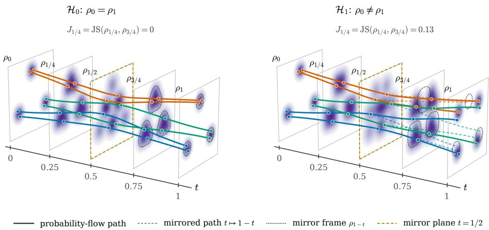
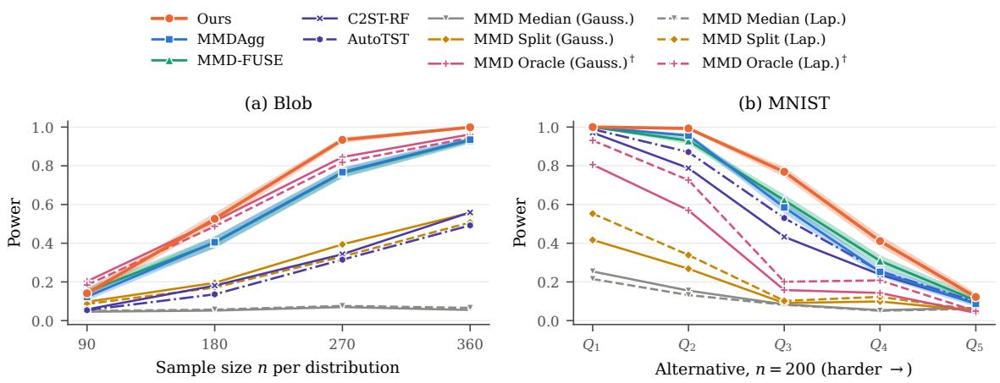
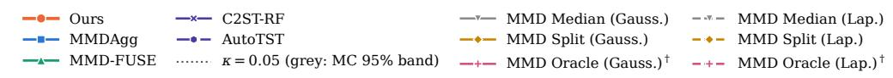
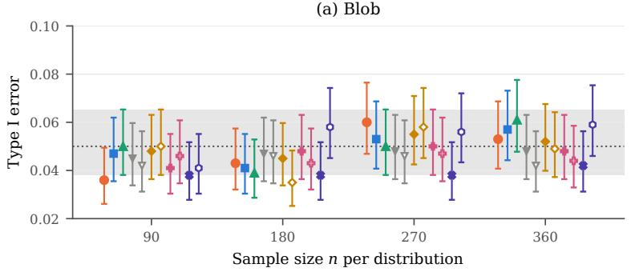
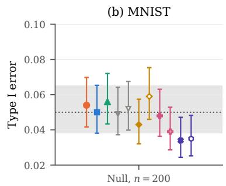

# Two-Sample Testing via Generative Processes

Eshant English1,3∗, Kenji Fukumizu2, Taiji Suzuki1,4

1The University of Tokyo, Tokyo, Japan

2Institute of Statistical Mathematics, Japan

3Hasso Plattner Institute for Digital Engineering, Germany

4RIKEN Centre for Advanced Intelligence Project (AIP), Tokyo, Japan

## Abstract

Deciding whether two samples come from the same distribution is a classical problem in statistics, and generative transport ofers a new way to approach it. We build a stochastic interpolant directly between the two samples and observe that, for a symmetric schedule, its law is invariant under the time reflection t 7→ 1 − t whenever the two distributions coincide. We therefore test whether the marginals at times t and 1 − t agree, using their Jensen–Shannon divergence. Both marginals are explicit mixtures over all cross pairs of observations, so nothing is learned, and permutation calibration gives exact finite-sample level. For Gaussian noise, this divergence equals a time integral that pairs the reflection defects of the velocity field and of the score, so the test compares transport dynamics rather than endpoints alone. With a narrow-plus-broad noise design, the test attains the minimax separation rate n−2s/(4s+d) over bounded, compactly supported densities whose diference has Sobolev smoothness s > 3d/4, with no lower bound on the densities. Fusing a dyadic grid of noise scales through their permutation ranks, without sample splitting, preserves exact level and adapts to unknown s at an iterated-logarithmic cost. Empirically, the test matches or outperforms state-of-the-art kernel two-sample tests.

Keywords: two-sample testing, stochastic interpolants, generative models, permutation tests, Jensen–Shannon divergence, minimax separation rates, adaptive testing

## Contents

1 Introduction 4   
2 Preliminaries 5   
2.1 Stochastic Interpolants 5   
2.2 Two-Sample Testing 6   
2.3 Smoothness Classes and Separation Rates 7   
3 Testing via Generative Processes 7   
3.1 Reflection Symmetry 7   
3.2 The Reflected Jensen–Shannon Divergence 8   
3.3 The Empirical Statistic . 10   
3.3.1 Saturation at Fixed Sample Size 11   
3.3.2 The Pooled-Feature Identity 11   
3.4 Calibration by Permutation 12   
3.4.1 Permutation Validity and Power from Pairwise Orderings 12   
3.5 Fusing Channels by Permutation Ranks 13   
3.6 Computation 14   
3.6.1 Shared Monte Carlo Integration 14   
4 Power Guarantees 16   
4.1 Notation and Elementary Facts . 16   
4.2 What the Reflected Marginals Retain . 17   
4.3 Minimax Optimality with a Designed Noise 19   
4.4 Hellinger and Quadratic Tools . 22   
4.4.1 Cross-Pair Hellinger Estimation 22   
4.4.2 A Permuted First Moment under Alternatives 23   
4.4.3 Conditional-Expectation Contraction . 24   
4.4.4 Sharp Quadratic Fluctuation Bounds without a Density Floor 25   
4.4.5 Exact Remainders for the Empirical Pool 26   
4.5 Proof of the Minimax Upper Bound 27   
4.5.1 Population Signal for the Compact Narrow Kernel 28   
4.5.2 Uniform Concentration on the Core . 28   
4.5.3 The Nonlinear Comparison and the Exterior 29   
4.5.4 Centring the Quadratic Comparison 30   
4.5.5 Completion of the Power Proof 31   
4.6 An Explicit, Directly Samplable Noise Family 32   
4.7 Adaptation by Rank Fusion . . 34   
4.8 Rank Fusion and the Proof of the Adaptive Theorem 35   
4.8.1 Rank Fusion: Power Transfer and Permutation Budgets 35   
4.8.2 A Conditional Exponential Bound with the Empirical Weight 37   
4.8.3 Concentration of the Pooled Weight and the Actual Densities 38   
4.8.4 Observed Signal above the Permutation Baseline 39   
4.8.5 Permutation Comparison at a Shrinking Channel Target 40   
4.8.6 The Dyadic Grid Contains a Suitable Channel . 41   
4.8.7 Completion of the Proofs 41   
4.9 Gaussian Noise: Conservative Rate 42   
4.9.1 A Conservative Power Guarantee 42   
5 Experiments 43   
6 Related Work 45   
7 Discussion 48   
A Experimental details and additional results 49   
A.1 Evaluation protocol and sample budgets 49   
A.2 Datasets . . 50   
A.3 The implemented rank-fusion test . 51   
A.4 Comparison methods . 52   
A.5 Reproducibility and Monte Carlo uncertainty 54

## 1 Introduction

In the natural sciences, we often learn about an object through the laws it obeys rather than by observing it directly: to decide whether two particles are of the same kind, a physicist sends both through the same field and checks whether they follow the same trajectory. Statistics faces a similar problem. Given independent datasets $\mathcal { D } _ { 0 } = \{ x _ { 0 } ^ { ( i ) } \} _ { i = 1 } ^ { n _ { 0 } }$ and $\mathcal { D } _ { 1 } =$ $\{ x _ { 1 } ^ { ( j ) } \} _ { j = 1 } ^ { n _ { 1 } }$ drawn from densities $\rho _ { 0 }$ and $\rho _ { 1 }$ , the two-sample problem asks whether $\mathcal { H } _ { 0 } \colon \rho _ { 0 } = \rho _ { 1 }$ while bounding the probability of a false rejection (Gretton et al., 2012a; Schrab et al., 2023). Over smoothness classes, the problem is well understood: the optimal separation rate is known (Ingster, 1993), and permutation and kernel tests attain it (Kim et al., 2022; Schrab et al., 2023).

Unlike the physicist, we have no laws of motion telling us how data from a given distribution ought to behave, but dynamical-transport generative models show that we can write such laws down ourselves (Grathwohl et al., 2018; Bunne et al., 2023). Difusion models (Song et al., 2020), flow matching (Lipman et al., 2022; Liu et al., 2022) and stochastic interpolants (Albergo and Vanden-Eijnden, 2022; Albergo et al., 2025) define a sample-level evolution $( x _ { t } ) _ { t \in [ 0 , 1 ] }$ that carries $\rho _ { 0 }$ to $\rho _ { 1 }$ . These laws are chosen by design, and once chosen, the path becomes an object of inference that can carry information its endpoints do not (English and Suzuki, 2026). If the two distributions coincide, an optimal transport between them is the identity, so any movement would be evidence of a diference; but such a transport is ill-posed to estimate from finite data. We therefore fix the transport law in advance and build a bridge directly between the two samples.

The central observation is a symmetry. Picture a film of samples from $\rho _ { 0 }$ moving towards samples from $\rho _ { 1 }$ , alongside a second film in which samples from $\rho _ { 1 }$ move towards samples from $\rho _ { 0 }$ . If $\rho _ { 0 } = \rho _ { 1 }$ , the second film is the first played backwards, so the frame at time t in one film matches the frame at $1 - t$ in the other. For the stochastic interpolant $x _ { t } =$ $\alpha _ { t } x _ { 0 } + \beta _ { t } x _ { 1 } + \gamma _ { t } z$ with independent endpoints and mirrored coeficients $\alpha _ { 1 - t } ~ = ~ \beta _ { t }$ and $\gamma _ { 1 - t } = \gamma _ { t }$ , exchanging the endpoints is the same as reversing time, so under the null the marginal density satisfies $\rho _ { t } = \rho _ { 1 - }$ t for every t (Theorem 3.2). Figure 1 illustrates this: under the null, the path of marginals is a mirror image of itself about $t = 1 / 2$ , and every probability-flow path retraces itself, returning to its starting point; under an alternative, both the frames and the paths separate from their mirror images. Conditional on the data, these marginals are explicit mixtures over all $n _ { 0 } n _ { 1 }$ cross pairs, so nothing needs to be learned: we compare a frame near the start of the path with its mirror frame through their Jensen–Shannon divergence, and calibrate the statistic by permutation.

Contributions: (i) We propose a two-sample test, which compares the empirical marginals of a single stochastic interpolant at the mirrored times t and $1 - t ;$ both marginals are explicit mixtures over all cross pairs (Section 3). (ii) For Gaussian noise, we show that the reflected divergence is exactly a time integral pairing the reflection defects of the velocity and the score (Theorem 3.3), so the statistic measures the transport dynamics rather than the endpoints alone. (iii) With a designed narrow-plus-broad noise, the test attains the separation rate $n ^ { - 2 s / ( 4 \dot { s } + \dot { d } ) }$ for $s > 3 d / 4$ , without any lower bound on the densities, and a matching lower bound shows that this rate is minimax (Theorems 4.7 and 4.8). (iv) Fusing a dyadic grid of noise scales through a soft maximum of permutation ranks gives a test with exact finite-sample level (Theorem 3.11) that attains $( \sqrt { \log \log n } / n ) ^ { 2 s / ( 4 s + d ) }$ without knowledge of s (Theorems 4.21 and 4.22).

  
Figure 1: Time reflection of a stochastic interpolant built directly between $\rho _ { 0 }$ and $\rho _ { 1 }$ using our construction with the linear schedule $x _ { t } = \left( 1 - t \right) x _ { 0 } + t x _ { 1 } + \sigma t ( 1 - t ) z ,$ $\sigma = 1 . 5$ and Gaussian $z .$ Slices show the exact marginals $\rho _ { t }$ . Solid curves are probability-flow paths from six starting points in $\rho _ { 0 }$ , coloured by their starting mode; dashed curves mirror the first half of each path under $t \mapsto 1 - t .$ and dotted contours on the slices $t = 3 / 4$ and $t = 1$ outline the mirror frames $\rho _ { 1 / 4 }$ and $\rho _ { 0 }$ Top: under $\mathcal { H } _ { 0 } , \ \rho _ { t } = \rho _ { 1 - t }$ (Theorem 3.2), each mirrored distribution coincides with the actual one. Bottom: under $\mathcal { H } _ { 1 }$ , the mirrored paths end in the outline of $\rho _ { 0 }$ while the actual paths end in $\rho _ { 1 }$ . All densities and velocity fields are exact Gaussian-mixture expressions; nothing is learned.

We discuss related work in Section 6.

## 2 Preliminaries

## 2.1 Stochastic Interpolants

We work within the stochastic interpolant framework of Albergo et al. (2025), which unifies flow-based and difusion-based generative models under a single construction. Let $\rho _ { 0 }$ and $\rho _ { 1 }$ be probability densities on $\mathbb { R } ^ { d }$ , let $( x _ { 0 } , x _ { 1 } ) \sim \rho _ { 0 } \otimes \rho _ { 1 }$ be drawn from the independent coupling, and let $z$ be a latent variable, independent of $( x _ { 0 } , x _ { 1 } )$ , with density $\varphi .$ . Unlike in most generative applications, z need not be Gaussian here, and the freedom to choose its law will matter in Section 4.3.

The stochastic interpolant is the process

$$
x _ { t } = \alpha _ { t } x _ { 0 } + \beta _ { t } x _ { 1 } + \gamma _ { t } z , \qquad t \in [ 0 , 1 ] ,\tag{1}
$$

where the coeficients $\alpha _ { t } , \beta _ { t } , \gamma _ { t }$ are continuously diferentiable and satisfy the boundary conditions

$$
\begin{array} { c } { { \alpha _ { 0 } = \beta _ { 1 } = 1 , \qquad \alpha _ { 1 } = \beta _ { 0 } = 0 , } } \\ { { \gamma _ { 0 } = \gamma _ { 1 } = 0 , \qquad \gamma _ { t } > 0 \quad \mathrm { f o r } t \in ( 0 , 1 ) . } } \end{array}\tag{2}
$$

These conditions guarantee that ${ x _ { t = 0 } } = { x _ { 0 } }$ and ${ \boldsymbol { x } } _ { t = 1 } = { \boldsymbol { x } } _ { 1 }$ , so the time-dependent density $\rho _ { t }$ of $x _ { t }$ interpolates between $\rho _ { 0 }$ and $\rho _ { 1 }$ . The latent term $\gamma _ { t } z$ smooths $\rho _ { t }$ at intermediate times; setting $\gamma _ { t } \equiv 0$ recovers the deterministic interpolants underlying flow matching (Lipman et al., 2022) and rectified flow (Liu et al., 2022). A standard choice is the linear schedule $\alpha _ { t } = 1 - t$ and $\beta _ { t } = t$ , with $\gamma _ { t } = \sigma \alpha _ { t } \beta _ { t }$ for an amplitude $\sigma > 0$ . We use it only as an example; all statements and derivations below are written for general coeficients, and each result states which properties of the coeficients it needs.

For a density $\mu$ on $\mathbb { R } ^ { d }$ and $c > 0$ , we write $\mu ^ { [ c ] } ( x ) = c ^ { - d } \mu ( x / c )$ for the density of $c y$ when $y \sim \mu$ , and we use the same notation for signed measures, with $\mu ^ { [ 0 ] }$ the point mass at the origin when $\mu$ is a probability measure. Since the three terms in (1) are independent, the marginal density is a convolution,

$$
\rho _ { t } = \rho _ { 0 } ^ { [ \alpha _ { t } ] } \ast \rho _ { 1 } ^ { [ \beta _ { t } ] } \ast \varphi ^ { [ \gamma _ { t } ] } .\tag{3}
$$

Equation (1) specifies the path at the level of individual samples: conditional on $( x _ { 0 } , x _ { 1 } , z )$ the trajectory $t \mapsto x _ { t }$ is fully determined, and its law defines the path $( \rho _ { t } ) _ { t \in [ 0 , 1 ] }$ The conditional velocity along this path is available in closed form,

$$
\dot { x } _ { t } = \dot { \alpha } _ { t } x _ { 0 } + \dot { \beta } _ { t } x _ { 1 } + \dot { \gamma } _ { t } z ,\tag{4}
$$

where dots denote time derivatives. However, $\dot { x } _ { t }$ depends on the endpoints and the latent, which are not accessible from $x _ { t }$ alone. Averaging over them gives the velocity field and the probability current,

$$
v _ { t } ( x ) = \mathbb { E } [ \dot { x } _ { t } \mid x _ { t } = x ] , \qquad \dot { j } _ { t } = \rho _ { t } v _ { t } ,\tag{5}
$$

which, together with the score $\nabla$ log $\rho _ { t }$ , are linked by the continuity equation $\begin{array} { r } { \partial _ { t } \rho _ { t } + \nabla \cdot \dot { \boldsymbol { j } _ { t } } = 0 } \end{array}$ (Albergo et al., 2025).

## 2.2 Two-Sample Testing

Consider independent datasets $\mathcal { D } _ { 0 } = \{ x _ { 0 } ^ { ( i ) } \} _ { i = 1 } ^ { n _ { 0 } }$ and $\mathcal { D } _ { 1 } = \{ x _ { 1 } ^ { ( j ) } \} _ { j = 1 } ^ { n _ { 1 } }$ in $\mathbb { R } ^ { d }$ , drawn i.i.d. from unknown densities $\rho _ { 0 }$ and $\rho _ { 1 }$ , and the hypotheses $\mathcal { H } _ { 0 } \colon \rho _ { 0 } = \rho _ { 1 }$ versus $\mathcal { H } _ { 1 } \colon \rho _ { 0 } \neq \rho _ { 1 }$ . A test is a possibly randomised decision rule $\Delta ( \mathcal { D } _ { 0 } , \mathcal { D } _ { 1 } ) \in \{ 0 , 1 \}$ , where $\Delta = 1$ rejects $\mathcal { H } _ { \mathrm { 0 } } ;$ its internal randomness, such as the permutations and Monte Carlo draws of Section $^ { 3 , }$ is independent of the data, and $\mathbb { P } _ { \rho _ { 0 } , \rho _ { 1 } }$ denotes the joint law of the data and this randomness. The test has a level $\kappa \in ( 0 , 1 )$ if

$$
\operatorname* { s u p } _ { \rho _ { 0 } \in \mathcal { P } ( \mathbb { R } ^ { d } ) } \mathbb { P } _ { \rho _ { 0 } , \rho _ { 0 } } \big [ \Delta ( \mathcal { D } _ { 0 } , \mathcal { D } _ { 1 } ) = 1 \big ] \leq \kappa ,\tag{6}
$$

and power $1 - \delta$ against $( \rho _ { 0 } , \rho _ { 1 } )$ if $\mathbb { P } _ { \rho _ { 0 } , \rho _ { 1 } } [ \Delta = 0 ] \le \delta$ . Our level guarantees hold at every finite sample size, whereas power is analysed as the sample sizes grow.

## 2.3 Smoothness Classes and Separation Rates

To quantify power, we follow the minimax framework of Ingster (1993). We use the Fourier convention $\begin{array} { r l r } { \widehat { g } ( \xi ) } & { { } = } & { \int e ^ { - \mathrm { i } \xi \cdot x } g ( x ) } \end{array}$ dx and the Sobolev norm $\begin{array} { r l } { \| g \| _ { H ^ { s } } ^ { 2 } } & { { } = } \end{array}$ $\begin{array} { r } { ( 2 \pi ) ^ { - d } \int ( 1 + | \xi | ^ { 2 } ) ^ { s } | \widehat { g } ( \xi ) | ^ { 2 } \mathrm { d } \xi } \end{array}$ . For $L , M , R \ > \ 0$ and $s \ > \ 0$ , let $B _ { L } ~ = ~ \{ x \colon | x | ~ \leq ~ L \}$ and let $ { \mathcal { C } } _ { s } ( L , M , R )$ be the class of pairs $( \rho _ { 0 } , \rho _ { 1 } )$ of probability densities on $\mathbb { R } ^ { d }$ such that

$$
\operatorname { s u p p } \rho _ { 0 } \cup \operatorname { s u p p } \rho _ { 1 } \subseteq B _ { L } ,
$$

$$
0 \leq \rho _ { 0 } , \rho _ { 1 } \leq M , \qquad \| \rho _ { 0 } - \rho _ { 1 } \| _ { H ^ { s } } \leq R .\tag{7}
$$

Following previous works Schrab et al. (2023), only the diference is required to be smooth, and no individual or pooled density is assumed to be bounded below. The class contains alternatives only when $M | B _ { L } | > 1$ , where $| B _ { L } |$ is the volume of $B _ { L }$

For rates, we take equal sample sizes $n _ { 0 } = n _ { 1 } = n$ . A sequence of tests $\Delta _ { n }$ of level κ attains the separation rate $r _ { n }$ over the class if there is a constant C such that, for all suficiently large $n ,$ the type II error is at most $\delta$ uniformly over all pairs in $\mathcal { C } _ { s } ( L , M , R )$ with $\| \rho _ { 0 } - \rho _ { 1 } \| _ { 2 } \ge C r _ { n }$ . The benchmark separation rate for this problem is $\displaystyle n ^ { - 2 s / ( 4 s + d ) }$ : no test can do better (Theorem 4.8; see also Ingster, 1993), and permutation and kernel tests are known to attain it (Kim et al., 2022; Schrab et al., 2023).

Notation: We write |·| for the Euclidean norm, ∥·∥ for $L ^ { p }$ norms, and $G _ { h }$ for the centred Gaussian density with covariance $h ^ { 2 } \mathbb { I } _ { d } ,$ so that $\bar { G } _ { h } = G _ { 1 } ^ { [ h ] }$ . For two sequences, $a _ { n } \lesssim b _ { n }$ means $a _ { n } \leq C b _ { n }$ for a constant $C ,$ and $a _ { n } \asymp b _ { n }$ means that both $a _ { n } \lesssim b _ { n }$ and $b _ { n } \lesssim a _ { n }$ . Constants $C ,$ c may change from line to line; they never depend on n or on the pair $( \rho _ { 0 } , \rho _ { 1 } )$ within the class. Also, the unsubscripted probabilities are taken over all random variables involved.

## 3 Testing via Generative Processes

## 3.1 Reflection Symmetry

Definition 3.1 (Symmetric schedule). The coeficients in (1) form a symmetric schedule if $\alpha _ { 1 - t } = \beta _ { t }$ and $\gamma _ { 1 - t } = \gamma _ { t }$ for all $t \in [ 0 , 1 ]$

Equivalently, $\beta _ { 1 - t } = \alpha _ { t }$ . The linear schedule with $\gamma _ { t } = \sigma \alpha _ { t } \beta _ { t }$ is symmetric; the power guarantees of Section 4 additionally need the channel conditions of Theorem 4.1. To compare the interpolant from $\rho _ { 0 }$ to $\rho _ { 1 }$ with the one that runs in the opposite direction, we write $\rho _ { t } [ \rho _ { 0 } , \rho _ { 1 } ]$ and $j _ { t } [ \rho _ { 0 } , \rho _ { 1 } ]$ for the marginal and the current at time t of the interpolant whose endpoints are drawn from $\rho _ { 0 }$ and $\rho _ { 1 }$ , and drop the brackets when the direction is clear.

Proposition 3.2 (Reflection symmetry). Assume a symmetric schedule, and let $\rho _ { 0 } , \rho _ { 1 }$ and the law $o f z$ be arbitrary.

(i) For every $t \in [ 0 , 1 ] , \rho _ { 1 - t } [ \rho _ { 0 } , \rho _ { 1 } ] = \rho _ { t } [ \rho _ { 1 } , \rho _ { 0 } ]$ . In particular, $\rho _ { 0 } = \rho _ { 1 }$ implies $\rho _ { t } = \rho _ { 1 - t }$ for every t.

(ii) $I f \mathbb { E } | \dot { x } _ { t } | < \infty$ and $\mathbb { E } | \dot { x } _ { 1 - t } | < \infty$ (for instance, $i f x _ { 0 } , x _ { 1 }$ and z have finite first moments), then $j _ { 1 - t } [ \rho _ { 0 } , \rho _ { 1 } ] ~ = ~ - j _ { t } [ \rho _ { 1 } , \rho _ { 0 } ]$ . Under $\mathcal { H } _ { 0 }$ , therefore, $j _ { 1 - t } = - j _ { t }$ , and $v _ { 1 - t } ~ = ~ - v _ { t }$ wherever $\rho _ { t } > 0$

(iii) Conversely, if $\rho _ { t _ { k } } = \rho _ { 1 - t _ { k } }$ along a sequence $t _ { k } \downarrow 0$ , then $\rho _ { 0 } = \rho _ { 1 }$

Proof. (i) By the symmetry of the schedule,

$$
x _ { 1 - t } = \alpha _ { 1 - t } x _ { 0 } + \beta _ { 1 - t } x _ { 1 } + \gamma _ { 1 - t } z = \beta _ { t } x _ { 0 } + \alpha _ { t } x _ { 1 } + \gamma _ { t } z .
$$

Since $x _ { 0 } \sim \rho _ { 0 } , x _ { 1 } \sim \rho _ { 1 }$ and z are mutually independent, the right-hand side has the law of the interpolant at time t whose endpoints are drawn from $\rho _ { 1 }$ and $\rho _ { 0 }$ , which proves $\rho _ { 1 - t } [ \rho _ { 0 } , \rho _ { 1 } ] =$ $\rho _ { t } [ \rho _ { 1 } , \rho _ { 0 } ]$ . If $\rho _ { 0 } = \rho _ { 1 }$ , the two directions coincide, so $\rho _ { 1 - t } = \rho _ { t }$ . No symmetry of the law of z is used.

(ii) Diferentiating $\alpha _ { 1 - t } = \beta _ { t } , \beta _ { 1 - t } = \alpha _ { t }$ and $\gamma _ { 1 - t } = \gamma _ { t }$ gives $\dot { \alpha } _ { 1 - t } = - \dot { \beta } _ { t } , \dot { \beta } _ { 1 - t } = - \dot { \alpha } _ { t }$ and $\dot { \gamma } _ { 1 - t } = - \dot { \gamma } _ { t }$ . Hence

$$
\dot { x } _ { 1 - t } = - \big ( \dot { \beta } _ { t } x _ { 0 } + \dot { \alpha } _ { t } x _ { 1 } + \dot { \gamma } _ { t } z \big ) ,
$$

so the pair $( x _ { 1 - t } , \dot { x } _ { 1 - t } )$ for the interpolant from $\rho _ { 0 }$ to $\rho _ { 1 }$ has the law of $( x _ { t } ^ { \prime } , - \dot { x } _ { t } ^ { \prime } )$ for the interpolant from $\rho _ { 1 }$ to $\rho _ { 0 }$ . When $\mathbb { E } | \dot { x } _ { t } | < \infty$ and $\mathbb { E } | \dot { x } _ { 1 - t } | < \infty$ , the currents at both times are the vector measures ${ j _ { u } } ( x )$ dx $\mathbf { \mu } = \mathbb { E } [ \dot { x } _ { u } ; x _ { u } \in \mathrm { d } x ]$ , u $\in \{ t , 1 - t \}$ , so $j _ { 1 - t } [ \rho _ { 0 } , \rho _ { 1 } ] = - j _ { t } [ \rho _ { 1 } , \rho _ { 0 } ]$ Both conditions are needed: $\dot { x } _ { t }$ weights $( x _ { 0 } , x _ { 1 } )$ by $( \dot { \alpha } _ { t } , \dot { \beta } _ { t } )$ , whereas $\dot { x } _ { 1 - t }$ weights them by $( - \dot { \beta } _ { t } , - \dot { \alpha } _ { t } )$ , so a heavy-tailed endpoint can make one integrable and not the other. Under the null the two conditions coincide, because $x _ { 0 }$ and $x _ { 1 }$ are exchangeable. Under the null the two directions coincide, which gives $j _ { 1 - t } = - j _ { t }$ and, where $\rho _ { t } = \rho _ { 1 - t } > 0 , v _ { 1 - t } = - v _ { t }$

(iii) By continuity of the coeficients and (2), $\alpha _ { t }  1 , \beta _ { t }  0$ and $\gamma _ { t } \to 0$ as $t \downarrow 0$ so $x _ { t } \to x _ { 0 }$ and $x _ { 1 - t } \to x _ { 1 }$ almost surely for every finite-valued random vector z. Almost sure convergence implies weak convergence of the laws, so $\rho _ { t _ { k } } \to \rho _ { 0 }$ and $\rho _ { 1 - t _ { k } } \to \rho _ { 1 }$ weakly. Equal measures along the sequence have equal weak limits, hence $\rho _ { 0 } = \rho _ { 1 }$ □

Part (i) uses neither Gaussian noise nor a symmetric law for z. Part (iii) identifies the null only as the compared times approach the endpoints, and at the midpoint the comparison is empty, so we compare mirrored frames away from it; Section 4.2 quantifies the signal retained there.

## 3.2 The Reflected Jensen–Shannon Divergence

All logarithms are natural. For probability densities $g _ { 0 }$ and $g _ { 1 }$ , the Jensen–Shannon divergence is

$$
\mathrm { J S } ( g _ { 0 } , g _ { 1 } ) = \frac { 1 } { 2 } \int g _ { 0 } \log \frac { 2 g _ { 0 } } { g _ { 0 } + g _ { 1 } } \mathrm { d } x + \frac { 1 } { 2 } \int g _ { 1 } \log \frac { 2 g _ { 1 } } { g _ { 0 } + g _ { 1 } } \mathrm { d } x .\tag{8}
$$

With $m = ( g _ { 0 } + g _ { 1 } ) / 2$ and $F ( z ) = \{ ( 1 + z ) \log ( 1 + z ) + ( 1 - z ) \log ( 1 - z ) \} / 2$ , it can be written as

$$
\mathrm { J S } ( g _ { 0 } , g _ { 1 } ) = \int m F \Big ( \frac { g _ { 0 } - g _ { 1 } } { 2 m } \Big ) \mathrm { d } x ,\tag{9}
$$

where the integrand is zero wherever $m = 0$ , and

$$
{ \frac { z ^ { 2 } } { 2 } } \leq F ( z ) \leq \log 2 , \qquad | z | \leq 1 .\tag{10}
$$

Thus, the divergence lies between a weighted quadratic form and log 2, a fact we use repeatedly.

For a symmetric schedule and $t \in ( 0 , 1 / 2 )$ , the reflected Jensen–Shannon divergence is

$$
J _ { t } ( \rho _ { 0 } , \rho _ { 1 } ) = \mathrm { J S } ( \rho _ { t } , \rho _ { 1 - t } ) .\tag{11}
$$

By Theorem 3.2, $J _ { t } = 0$ for every t under $\mathcal { H } _ { 0 }$ . Our first result shows that $J _ { t }$ is a statement about the dynamics of the path and not only about two of its frames.

Theorem 3.3 (Velocity–score identity). Assume that the endpoint laws $\rho _ { 0 }$ and $\rho _ { 1 }$ , which need not have densities, have bounded support, and that $z \sim \mathcal { N } ( 0 , \mathbb { I } _ { d } )$ . Then, for $t \in ( 0 , 1 / 2 )$ ，

$$
\frac { \mathrm { d } J _ { t } } { \mathrm { d } t } = \frac { 1 } { 2 } \int \frac { \rho _ { t } \rho _ { 1 - t } } { \rho _ { t } + \rho _ { 1 - t } } \left( v _ { t } + v _ { 1 - t } \right) \cdot \nabla \log { \frac { \rho _ { t } } { \rho _ { 1 - t } } } \mathrm { d } x ,\tag{12}
$$

and consequently

$$
J _ { t } ( \rho _ { 0 } , \rho _ { 1 } ) = - \frac 1 2 \int _ { t } ^ { 1 / 2 } \int \frac { \rho _ { u } \rho _ { 1 - u } } { \rho _ { u } + \rho _ { 1 - u } } \left( v _ { u } + v _ { 1 - u } \right) \cdot \nabla \log \frac { \rho _ { u } } { \rho _ { 1 - u } } \mathrm { d } x \mathrm { d } u .\tag{13}
$$

For the proofs in this subsection, a suficient standing assumption is that the endpoints are bounded, z is standard Gaussian, and the coeficients are continuously diferentiable. We work on a compact time interval inside (0, 1), on which $\gamma _ { t }$ is bounded away from zero. The densities are then smooth and positive, velocities and scores have at most polynomial growth, and Gaussian tails justify diferentiation under the integral and integration by parts. The same proofs apply whenever the stated derivatives and integrals exist, and the boundary terms vanish.

Lemma 3.4 (Continuity and reflection). Under these assumptions, $\partial _ { t } \rho _ { t } = - \nabla \cdot \left( \rho _ { t } v _ { t } \right)$ . If $q _ { t } = \rho _ { 1 - t }$ is viewed as a density indexed by increasing $t ,$ its velocity $\begin{array} { r } { i s \mathrm { ~ -- } v _ { 1 - t } , } \end{array}$ and

$$
\begin{array} { r } { \partial _ { t } q _ { t } = + \nabla \cdot ( q _ { t } v _ { 1 - t } ) . } \end{array}
$$

Proof. For a compactly supported smooth test function $^ { g , }$ the tower property gives

$$
\frac { \mathrm { d } } { \mathrm { d } t } \mathbb { E } g ( x _ { t } ) = \mathbb { E } \big [ \nabla g ( x _ { t } ) \cdot \dot { x } _ { t } \big ] = \int \nabla g \cdot \boldsymbol { v } _ { t } \rho _ { t } \mathrm { d } x .
$$

Integration by parts gives the continuity equation in the sense of distributions, and hence classically, since the densities are smooth. The reflected formula is the chain rule; its minus sign at the level of the velocity is essential. □

Proof of Theorem 3.3. Write $r = \rho _ { t } , q = \rho _ { 1 - t }$ and $m = ( r + q ) / 2$ . Diferentiating $\mathrm { J S } ( r , q ) =$ $\begin{array} { r } { \frac { 1 } { 2 } \int \dot { r } \log r + \frac { 1 } { 2 } \int q \log q - \int } \end{array}$ m log m gives

$$
\frac { \mathrm { d } J _ { t } } { \mathrm { d } t } = \frac { 1 } { 2 } \int \partial _ { t } r \log \frac { r } { m } \mathrm { d } x + \frac { 1 } { 2 } \int \partial _ { t } q \log \frac { q } { m } \mathrm { d } x ,
$$

because the terms linear in $\partial _ { t } { \boldsymbol { r } }$ and $\partial _ { t } q$ cancel, both densities having unit mass. Moreover,

$$
\nabla \log { \frac { r } { m } } = { \frac { q } { r + q } } \nabla \log { \frac { r } { q } } , \qquad \nabla \log { \frac { q } { m } } = - { \frac { r } { r + q } } \nabla \log { \frac { r } { q } } .
$$

Substituting $\partial _ { t } r = - \nabla \cdot ( r v _ { t } )$ and $\partial _ { t } q = + \nabla \cdot ( q v _ { 1 - t } )$ from Theorem 3.4 and integrating by parts gives

$$
\frac { \mathrm { d } J _ { t } } { \mathrm { d } t } = \frac { 1 } { 2 } \int r v _ { t } \cdot \frac { q } { r + q } \nabla \log \frac { r } { q } \mathrm { d } x + \frac { 1 } { 2 } \int q v _ { 1 - t } \cdot \frac { r } { r + q } \nabla \log \frac { r } { q } \mathrm { d } x ,
$$

which is (12). Since $J _ { 1 / 2 } = \mathrm { J S } ( \rho _ { 1 / 2 } , \rho _ { 1 / 2 } ) = 0 ,$ , integrating from t to $1 / 2$ proves (13). In terms of currents, the integrand of (12) is $\frac { 1 } { 2 } \big ( \rho _ { 1 - t } j _ { t } + \rho _ { t } j _ { 1 - t } \big ) / \big ( \rho _ { t } + \rho _ { 1 - t } \big ) \cdot \nabla \log \mathopen { } \mathclose \bgroup \left( \rho _ { t } / \rho _ { 1 - t } \aftergroup \egroup \right)$ ; the identity does not replace this weighted sum by $j _ { t } + j _ { 1 - t }$ □

Both factors in the integrand are reflection defects, which vanish at every time under the null by Theorem 3.2; under an alternative, $J _ { t }$ accumulates their weighted pairing over the half path from t to the midpoint. The integrand can take either sign, so it is a signed pairing rather than a squared norm, and the power guarantees of Section 4 do not use the identity.

## 3.3 The Empirical Statistic

Let $\begin{array} { r } { \widehat { \rho _ { 0 } } = n _ { 0 } ^ { - 1 } \sum _ { i } \delta _ { x _ { 0 } ^ { ( i ) } } } \end{array}$ and $\widehat { \rho _ { 1 } } = n _ { 1 } ^ { - 1 } \sum _ { j } \delta _ { x _ { 1 } ^ { ( j ) } }$ be the empirical measures of the two datasets. Running the interpolant between them gives explicit marginals: by (3) and the symmetry of the schedule,

$$
\widehat { \rho } _ { t } ( x ) = \frac { 1 } { n _ { 0 } n _ { 1 } } \sum _ { i = 1 } ^ { n _ { 0 } } \sum _ { j = 1 } ^ { n _ { 1 } } \varphi ^ { [ \gamma _ { t } ] } \big ( x - \alpha _ { t } x _ { 0 } ^ { ( i ) } - \beta _ { t } x _ { 1 } ^ { ( j ) } \big ) ,\tag{14}
$$

$$
\widehat { \rho } _ { 1 - t } ( x ) = \frac { 1 } { n _ { 0 } n _ { 1 } } \sum _ { i = 1 } ^ { n _ { 0 } } \sum _ { j = 1 } ^ { n _ { 1 } } \varphi ^ { [ \gamma _ { t } ] } \big ( x - \beta _ { t } x _ { 0 } ^ { ( i ) } - \alpha _ { t } x _ { 1 } ^ { ( j ) } \big ) .
$$

The notation is consistent at the endpoints: by (2), the empirical marginals at $t = 0$ and $t = 1$ are the empirical measures themselves. For $t \in ( 0 , 1 / 2 )$ , the test statistic is

$$
\widehat { T } _ { t } = \mathrm { J S } \left( \widehat { \rho _ { t } } , \widehat { \rho } _ { 1 - t } \right) .\tag{15}
$$

These are the exact marginals of the interpolant conditional on the empirical endpoint laws. The density formula uses all $n _ { 0 } n _ { 1 }$ cross pairs, but these pairs are not independent data points, and the statistical sample sizes remain $n _ { 0 }$ and $n _ { 1 }$ . For Gaussian noise, Theorem 3.3 applies exactly to this empirical bridge, whose velocity and score are explicit (Theorem 3.5), so no learned function approximation enters.

Remark 3.5 (The empirical bridge). Given a pair $( i , j )$ , the latent is determined by the position, $z = ( x - c _ { i j , t } ) / \gamma _ { t } ,$ so (4) gives the empirical current

$$
\widehat { j } _ { t } ( x ) = \frac { 1 } { n _ { 0 } n _ { 1 } } \sum _ { i , j } \left[ \dot { \alpha } _ { t } x _ { 0 } ^ { ( i ) } + \dot { \beta } _ { t } x _ { 1 } ^ { ( j ) } + \frac { \dot { \gamma } _ { t } } { \gamma _ { t } } ( x - c _ { i j , t } ) \right] \varphi ^ { [ \gamma _ { t } ] } ( x - c _ { i j , t } ) ,
$$

with velocity $\widehat { v } _ { t } = \widehat { j } _ { t } / \widehat { \rho } _ { t }$ and score $\nabla$ log $\widehat { \rho } _ { t }$ . Finite samples have bounded support, so for Gaussian noise Theorem 3.3 applies to the empirical bridge without change.

The time must stay strictly positive: as $t \downarrow 0$ , the two empirical frames concentrate on the two samples, which are almost surely disjoint, so $\widehat { T } _ { t } \to \log 2$ even under $\mathcal { H } _ { 0 }$ (Theorem 3.6). The noise scale $\gamma _ { t }$ therefore acts as a bandwidth (Section 4), and the label-dependent denominator $( \widehat { \rho } _ { t } + \widehat { \rho } _ { 1 - t } ) / 2$ in (9) is what the analysis of Section 4 must control (Theorem 3.7).

## 3.3.1 Saturation at Fixed Sample Size

Proposition 3.6 (Saturation at fixed sample size). If the finite sets $\{ x _ { 0 } ^ { ( i ) } \}$ and $\{ x _ { 1 } ^ { ( j ) } \}$ are disjoint, then li $\mathrm { n } _ { t \downarrow 0 } \widehat { T } _ { t } = \log 2$ . This occurs almost surely for independent samples from continuous laws, including under $\mathcal { H } _ { 0 }$

Proof. Choose disjoint open neighbourhoods $U _ { 0 }$ of $\{ x _ { 0 } ^ { ( i ) } \}$ and $U _ { 1 }$ of $\{ x _ { 1 } ^ { ( j ) } \}$ . As $t \downarrow 0$ , every centre $\alpha _ { t } x _ { 0 } ^ { ( i ) } + \beta _ { t } x _ { 1 } ^ { ( j ) }$ converges to $x _ { 0 } ^ { ( i ) }$ and $\gamma _ { t } z  0$ , so $\widehat { \rho _ { t } } ( U _ { 0 } ) \to 1$ . The mirrored centres $\beta _ { t } x _ { 0 } ^ { ( i ) } + \alpha _ { t } x _ { 1 } ^ { ( j ) }$ converge to $x _ { 1 } ^ { ( j ) }$ , so $\widehat { \rho } _ { 1 - t } ( U _ { 0 } ) \to 0$ . By the data-processing inequality for the Jensen–Shannon divergence, applied to the indicator of $U _ { 0 } , \widehat { T } _ { t }$ is at least the divergence between two Bernoulli laws whose success probabilities tend to one and zero, and this divergence tends to log 2. Since the divergence between arbitrary probability laws is at most log 2, the claim follows.

## 3.3.2 The Pooled-Feature Identity

Remark 3.7 (A linear contrast with a label-dependent denominator). For equal sample sizes, write $\widehat { \mu } = ( \widehat { \rho } _ { 0 } + \widehat { \rho } _ { 1 } ) / 2$ and $\widehat { f } = \widehat { \rho } _ { 0 } - \widehat { \rho } _ { 1 }$ . Expanding the empirical mixtures gives the exact identities

$$
\widehat { \rho } _ { t } - \widehat { \rho } _ { 1 - t } = \big [ \widehat { f } ^ { [ \alpha _ { t } ] } * \widehat { \mu } ^ { [ \beta _ { t } ] } - \widehat { \mu } ^ { [ \alpha _ { t } ] } * \widehat { f } ^ { [ \beta _ { t } ] } \big ] * \varphi ^ { [ \gamma _ { t } ] } ,\tag{16}
$$

$$
\frac { \widehat { \rho } _ { t } + \widehat { \rho } _ { 1 - t } } { 2 } = \left[ \widehat { \mu } ^ { [ \alpha _ { t } ] } \ast \widehat { \mu } ^ { [ \beta _ { t } ] } - \frac { 1 } { 4 } \widehat { f } ^ { [ \alpha _ { t } ] } \ast \widehat { f } ^ { [ \beta _ { t } ] } \right] \ast \varphi ^ { [ \gamma _ { t } ] } .\tag{17}
$$

The pooled measure $\widehat { \mu }$ is unchanged by balanced relabelings, so the contrast (16) is linear in the labels, whereas the average (17), which forms the denominator of the integrand in (9), contains a quadratic term that changes with the labels. This is the main diference from comparing two separate kernel density estimates, whose average is label-invariant, and this is why the analysis in Section 4 must control a nonlinear, label-dependent denominator. One cannot replace (17) by ${ \widehat \mu } ^ { [ \alpha _ { t } ] } * { \widehat \mu } ^ { [ \beta _ { t } ] } * \varphi ^ { [ \gamma _ { t } ] }$ and still call the result the same statistic.

The numerator of the statistic admits a useful linear representation, even for unequal group sizes. Let $N = n _ { 0 } + n _ { 1 }$ and let $\widehat { \mu } _ { N } = ( n _ { 0 } \widehat { \rho _ { 0 } } + n _ { 1 } \widehat { \rho _ { 1 } } ) / N$ be the pooled empirical measure. For a time t with noise density $\varphi ,$ define the antisymmetric kernel and the pooled feature map

$$
\begin{array} { l } { \Psi _ { t } ( u , v ; x ) = \varphi ^ { [ \gamma t ] } ( x - \alpha _ { t } u - \beta _ { t } v ) - \varphi ^ { [ \gamma t ] } ( x - \beta _ { t } u - \alpha _ { t } v ) , } \\ { \quad \psi _ { t } ( v ; x ) = \displaystyle \int \Psi _ { t } ( u , v ; x ) \widehat { \mu } _ { N } ( \mathrm { d } u ) . } \end{array}
$$

Lemma 3.8 (Pooled-feature identity). Writing $\begin{array} { r } { \widehat { \rho } _ { 1 } \psi _ { t } = \int \psi _ { t } ( v ; \cdot ) \widehat { \rho } _ { 1 } ( \mathrm { d } v ) } \end{array}$ and similarly for $\widehat { \rho } _ { 0 }$ ，

$$
\widehat { \rho } _ { t } - \widehat { \rho } _ { 1 - t } = \widehat { \rho } _ { 1 } \psi _ { t } - \widehat { \rho } _ { 0 } \psi _ { t } , \qquad \widehat { \mu } _ { N } \psi _ { t } = 0 .\tag{18}
$$

Proof. Since $\Psi _ { t } ( u , v ; x ) = - \Psi _ { t } ( v , u ; x )$ , the second identity holds, and in $\widehat { \rho } _ { 1 } \psi _ { t } - \widehat { \rho } _ { 0 } \psi _ { t }$ the two same-group terms vanish. The two cross-group terms have coeficients $n _ { 0 } / N$ and $n _ { 1 } / N$ which add to one, and their sum is $\begin{array} { r } { \iint \Psi _ { t } ( u , v ; \cdot ) \widehat { \rho } _ { 0 } ( \mathrm { d } u ) \widehat { \rho } _ { 1 } ( \mathrm { d } v ) = \widehat { \rho } _ { t } - \widehat { \rho } _ { 1 - t } } \end{array}$ □

Because $\widehat { \mu } _ { N }$ is invariant under relabelling, (18) shows that the numerator is linear in the labels for a feature map that is fixed once the pooled sample is known.

Lemma 3.9 (Conditional second moment of the contrast). Let $\psi _ { i } = \psi _ { t } ( V _ { i } ; \cdot )$ be elements of a real Hilbert space V, where $V _ { 1 } , \dots , V _ { N }$ are the pooled observations and $\textstyle \sum _ { i } \psi _ { i } = 0$ . Under a uniform reassignment into groups of sizes $n _ { 0 }$ and $n _ { 1 }$ , with relabelled empirical measures ${ \widehat { \rho } } _ { 0 } ^ { \pi }$ and ${ \widehat { \rho } } _ { 1 } ^ { \pi }$ ,

$$
\mathbb { E } _ { \pi } \| \widehat { \rho } _ { 1 } ^ { \pi } \psi - \widehat { \rho } _ { 0 } ^ { \pi } \psi \| _ { \mathbb { V } } ^ { 2 } = \frac { N ^ { 2 } } { n _ { 0 } n _ { 1 } ( N - 1 ) } \cdot \frac { 1 } { N } \sum _ { i = 1 } ^ { N } \| \psi _ { i } \| _ { \mathbb { V } } ^ { 2 } .
$$

More generally, for equal group sizes n and arbitrary ψi, $\begin{array} { r l } { \mathbb { E } _ { \pi } \| n ^ { - 1 } \sum _ { i } \varepsilon _ { i } \psi _ { i } \| _ { \mathbb { V } } ^ { 2 } } & { { } = } \end{array}$ $\begin{array} { r } { \frac { 4 } { N ( N - 1 ) } \sum _ { i } \lVert \psi _ { i } - \bar { \psi } \rVert _ { \mathbb { V } } ^ { 2 } } \end{array}$ , where $\varepsilon _ { i } = \pm 1$ are uniform balanced signs and $\bar { \psi } = N ^ { - 1 } \sum _ { i } \psi _ { i }$

Proof. If A is the uniformly selected first group, its sum is $\textstyle S = \sum _ { i \in A } \psi _ { i } .$ , and the contrast equals $- N S / ( n _ { 0 } n _ { 1 } )$ . The inclusion probabilities $n _ { 0 } / N$ and $n _ { 0 } ( n _ { 0 } - 1 ) / ( N ( N - 1 ) )$ , together with $\begin{array} { r } { \sum _ { i \neq j } \langle \dot { \psi } _ { i } , \psi _ { j } \rangle = - \sum _ { i } \lVert \psi _ { i } \rVert ^ { 2 } } \end{array}$ , give $\begin{array} { r } { \mathbb { E } _ { \pi } \| S \| ^ { 2 } = n _ { 0 } n _ { 1 } \sum _ { i } \| \psi _ { i } \| ^ { 2 } / ( N ( N - 1 ) ) } \end{array}$ . Multiplication by $N ^ { 2 } / ( n _ { 0 } ^ { 2 } n _ { 1 } ^ { 2 } )$ gives the first formula. For the second, $\mathbb { E } \varepsilon _ { i } \varepsilon _ { j } = - 1 / ( N - 1 )$ for $i \neq j$ gives $\begin{array} { r } { \mathbb { E } _ { \boldsymbol \pi } \| \sum _ { i } \varepsilon _ { i } \check { \psi } _ { i } \| ^ { 2 } = \frac { N } { N - 1 } \sum _ { i } \| \psi _ { i } - \bar { \psi } \| ^ { 2 } } \end{array}$ , and $n ^ { - 2 } = 4 / N ^ { 2 }$ □

This lemma concerns the linear density contrast; it is not a variance bound for the nonlinear statistic with denominator (17).

## 3.4 Calibration by Permutation

Conditional on the unordered pooled sample $\{ V _ { 1 } , . . . , V _ { N } \} , \ N = n _ { 0 } + n _ { 1 }$ , the observed labelling is uniformly distributed under $\mathcal { H } _ { 0 }$ . We draw B independent uniform relabellings with the group sizes fixed, index the observed labelling by $b = 0$ and the random ones by $b = 1 , \dots , B$ , and compute the statistic $T ^ { b }$ on each row at the same time, noise law and numerical objects. The permutation p-value is

$$
\widehat { p } = \frac { 1 + \sum _ { b = 1 } ^ { B } \mathbf { 1 } \{ T ^ { b } \geq T ^ { 0 } \} } { B + 1 } ,\tag{19}
$$

and the test rejects $\mathcal { H } _ { 0 }$ when $\widehat { p } \leq \kappa$

Calibration requires that all pooled preprocessing and all shared numerical randomness be independent of the observed labelling, conditional on the pooled data. It is consistent with the general theory of random permutation tests (Hemerik and Goeman, 2018), and its level follows from Theorem 3.11.

Times, noise laws and coeficients may be chosen in advance or from the unlabelled pooled sample; choosing them to favour the observed labels, without repeating and calibrating that selection, is not covered.

## 3.4.1 Permutation Validity and Power from Pairwise Orderings

This conditional Monte Carlo argument is consistent with the general theory of random permutation tests (Hemerik and Goeman, 2018). Besides rank fusion, other row-equivariant aggregations are valid by the same argument; such aggregations have level, but their power requires a separate argument.

Lemma 3.10 (Power from pairwise ordering). Let $T ^ { 0 } , T ^ { 1 } , \dots , T ^ { B }$ be the final scores used in (19), and assume that rows $1 , \ldots , B$ have the same marginal relation to row 0. $I f k _ { B } =$ $\lfloor \kappa ( B + 1 ) \rfloor \ge 1$ , then

$$
\mathbb { P } ( \widehat { p } > \kappa ) \leq \frac { B \mathbb { P } ( T ^ { 1 } \geq T ^ { 0 } ) } { k _ { B } } .
$$

Proof. Let $\begin{array} { r } { C _ { B } = \sum _ { b = 1 } ^ { B } \mathbf { 1 } \{ T ^ { b } \geq T ^ { 0 } \} } \end{array}$ . Nonrejection means $1 + C _ { B } > \kappa ( B + 1 )$ , which implies $C _ { B } \geq k _ { B }$ , so Markov’s inequality gives $\mathbb { P } ( C _ { B } \geq k _ { B } ) \leq \mathbb { E } C _ { B } / k _ { B } = B \mathbb { P } ( T ^ { 1 } \geq T ^ { 0 } ) / k _ { B }$ □

## 3.5 Fusing Channels by Permutation Ranks

A single channel, that is, a time together with a noise law, sees the data at a single resolution, and Section 4 shows that the best resolution depends on the unknown smoothness. We therefore compute the statistic on several channels $c = 1 , \ldots , C$ and fuse them. Let $T _ { b c }$ be the statistic of channel c on row $b ,$ where the same B relabellings are used for every channel. Within each channel, we replace the statistics by their inclusive upper ranks among all rows,

$$
r _ { b c } = \frac { 1 } { B + 1 } \sum _ { j = 0 } ^ { B } \mathbf { 1 } \{ T _ { j c } \geq T _ { b c } \} \in \Big \{ \frac { 1 } { B + 1 } , \ldots , 1 \Big \} ,\tag{20}
$$

so that tied rows receive the largest rank in their tied block, and both the observed row and all permuted rows enter every rank. The rank $r _ { 0 c }$ of the observed row is exactly the permutation p-value (19) of channel c. For weights $w _ { c } > 0$ with $\textstyle \sum _ { c } w _ { c } = 1$ and a temperature $\tau > 0$ , both fixed in advance, rank fusion computes

$$
\begin{array} { c } { { \displaystyle \Lambda _ { b } = \sum _ { c = 1 } ^ { C } w _ { c } r _ { b c } ^ { - \tau } , } } \\ { { \displaystyle \widehat { p } _ { \mathrm { f u s e } } = \frac { 1 } { B + 1 } \sum _ { b = 0 } ^ { B } \mathbf { 1 } \{ \Lambda _ { b } \geq \Lambda _ { 0 } \} , } } \end{array}\tag{21}
$$

and rejects $\mathcal { H } _ { 0 }$ when $\widehat { p } _ { \mathrm { f u s e } } \leq \kappa$ . Since the logarithm is increasing, $\tau ^ { - 1 }$ log $\Lambda _ { b }$ , a weighted soft maximum of $- \log r _ { b c } ,$ orders the rows in the same way, so rank fusion applies the soft-maximum aggregation of MMD-FUSE (Biggs et al., 2023) to permutation ranks, which place all channels on a common scale; it uses neither MMD statistics nor the power theorem of MMD-FUSE.

Theorem 3.11 (Level of rank fusion). Under $\mathcal { H } _ { \mathrm { 0 } ; }$ , suppose that the channel construction and the shared numerical objects are independent of the observed labels, conditional on the unordered pooled observations, that the same numerical statistic is applied to every row, and that $\tau$ and the weights are chosen in advance. Then, for every $\kappa \in [ 0 , 1 ]$ 2

$$
\mathbb { P } ( \widehat { p } _ { \mathrm { f u s e } } \leq \kappa ) \leq \frac { \lfloor \kappa ( B + 1 ) \rfloor } { B + 1 } \leq \kappa .
$$

No independence between channels is required, nor is any assumption of numerical accuracy.

Proof of Theorem 3.11. Under the null, and conditional on the unordered pooled observations and on label-independent auxiliary randomness, the observed labelling and the B independent uniform balanced labellings are independent and identically distributed. Their vector-valued statistic rows $( T _ { b 1 } , \ldots , T _ { b C } )$ are therefore exchangeable. The rank transform and the map from a row of ranks to $\Lambda _ { b }$ commute with permutations of the rows, so $( \Lambda _ { 0 } , \ldots , \Lambda _ { B } )$ is exchangeable. For every deterministic score vector $^ { g , }$ at most $\lfloor \kappa ( B + 1 ) \rfloor$ rows b satisfy $\# \{ j \colon g _ { j } \geq g _ { b } \} \leq \kappa ( B + 1 )$ . Hence

$$
\mathbb { P } ( \widehat { p } _ { \mathrm { f u s e } } \le \kappa ) = \frac { 1 } { B + 1 } \mathbb { E } \sum _ { b = 0 } ^ { B } \mathbf { 1 } \big \{ \# \{ j \colon \Lambda _ { j } \ge \Lambda _ { b } \} \le \kappa ( B + 1 ) \big \} \le \frac { \lfloor \kappa ( B + 1 ) \rfloor } { B + 1 } .
$$

Ties can only decrease the count. Shared Monte Carlo errors need not be independent, because a common label-independent integration procedure preserves the required exchangeability. □

The theorem also permits more general tuning rules that are equivariant under permutations of all rows of the statistic. Choosing a temperature to favour the observed row, and leaving that selection uncalibrated, is not covered.

All power results below treat a fixed temperature. With a single channel, $\widehat { p } _ { \mathrm { f u s e } }$ equals that channel’s permutation p-value (19).

## 3.6 Computation

The divergence between two mixtures of $n _ { 0 } n _ { 1 }$ kernels has no closed form, so we estimate it by importance sampling. For each channel, we draw $U _ { 1 } , \ldots , U _ { J } \mathrm { i . i . d }$ . from a pooled proposal $q _ { N }$ , a mixture over all ordered pairs of pooled observations that does not depend on the labels and is shared by all rows, and average the integrand of (9) divided by $q N$ (Section 3.6.1). The summands are bounded, so Hoefding’s inequality bounds the Monte Carlo error uniformly over rows and channels (Theorem 3.12); since the integration points do not depend on the labels, Theorem 3.11 applies at every finite J. With pair kernels evaluated in log space, the dominant cost is $O ( C J N ^ { 2 } ( d + B ) )$ for C channels. Algorithm 1 summarises the procedure.

## 3.6.1 Shared Monte Carlo Integration

The divergence between two mixtures of $n _ { 0 } n _ { 1 }$ kernels has no closed-form expression, so we integrate by importance sampling, using a proposal that does not depend on the labels and is shared across all rows. For a channel with time t and noise density $\varphi _ { : }$ , the pooled proposal is

$$
q _ { N } ( x ) = \frac { 1 } { N ^ { 2 } } \sum _ { k , l = 1 } ^ { N } \varphi ^ { [ \gamma _ { t } ] } ( x - \alpha _ { t } V _ { k } - \beta _ { t } V _ { l } ) .\tag{22}
$$

It is sampled by drawing two pooled observations independently with replacement and adding the channel’s noise. It contains all ordered pairs, including self-pairs, and expanding the pooled measures shows that, for every labelling,

$$
q _ { N } \ge w _ { N } \bigl ( \widehat { \rho } _ { t } + \widehat { \rho } _ { 1 - t } \bigr ) , \qquad w _ { N } = \frac { n _ { 0 } n _ { 1 } } { N ^ { 2 } } .\tag{23}
$$

Algorithm 1 Generative Process-based Two-Sample Test   
Require: Datasets $\mathcal { D } _ { 0 } , \mathcal { D } _ { 1 } ;$ channels $c = 1 , \ldots , C ,$ each with a time $t _ { c } \in ( 0 , 1 / 2 )$ and a noise   
law; weights $w _ { c } > 0$ with $\begin{array} { r } { \sum _ { c } w _ { c } = 1 ; } \end{array}$ temperature $\tau > 0 ;$ ; level $\kappa ;$ numbers B and J.   
1: Pool the data into $V _ { 1 } , \dots , V _ { N } ;$ draw B uniform relabellings with fixed group sizes, and   
let row 0 be the observed labelling.   
2: for $c = 1$ to C do   
3: Draw $U _ { 1 } , \dots , U _ { J }$ i.i.d. from the pooled proposal (22) of channel c.   
4: Compute $T _ { b c } = \widetilde { T } ^ { b }$ by (24) for $b = 0 , \ldots , B .$   
5: Compute the inclusive ranks $r _ { b c }$ by (20).   
6: end for   
7: $\begin{array} { r } { \Lambda _ { b }  \sum _ { c } w _ { c } r _ { b c } ^ { - \tau } \mathrm { ~ f o r ~ } b = 0 , \dots , B . } \end{array}$   
8: $\begin{array} { r } { \widehat { p } _ { \mathrm { f u s e } }  ( B + 1 ) ^ { - 1 } \sum _ { b = 0 } ^ { B } \mathbf { 1 } \{ \Lambda _ { b } \geq \Lambda _ { 0 } \} } \end{array}$   
9: Reject H0 if ${ \widehat { p } } _ { \mathrm { f u s e } } \leq \kappa .$

For points $U _ { 1 } , \dots , U _ { J }$ drawn i.i.d. from $q _ { N }$ and shared by all rows, the estimate on row b is

$$
\widetilde { T } ^ { b } = \frac { 1 } { J } \sum _ { \ell = 1 } ^ { J } \frac { \widehat { m } ^ { b } ( U _ { \ell } ) } { q _ { N } ( U _ { \ell } ) } F \biggl ( \frac { \widehat { \rho } _ { t } ^ { b } ( U _ { \ell } ) - \widehat { \rho } _ { 1 - t } ^ { b } ( U _ { \ell } ) } { 2 \widehat { m } ^ { b } ( U _ { \ell } ) } \biggr ) ,\tag{24}
$$

where $\widehat { m } ^ { b } = ( \widehat { \rho } _ { t } ^ { b } + \widehat { \rho } _ { 1 - t } ^ { b } ) / 2$ and the summand is zero when $\widehat { m } ^ { b } ( U _ { \ell } ) = 0$ . Conditional on the data and the labelling, the expectation is the exact statistic. By (23), each summand lies in $[ 0 , L _ { w } ]$ with $L _ { w } = \log 2 / ( 2 w _ { N } )$ , and Hoefding’s inequality gives a uniform error bound over rows and channels (Theorem 3.12). For equal sample sizes, $w _ { N } = 1 / 4$ and $L _ { w } = 2 \log 2 .$ Since the integration points do not depend on the labels, Theorem 3.11 applies at every finite J. A finite Monte Carlo average may exceed log 2 even though the exact divergence cannot; we do not clip it, since clipping would change the estimator.

In practice, all pair kernels are evaluated in log space and normalised by their largest value, so that the density ratios entering (24) are ratios of sums of the same stabilised weights and common normalisers cancel (Section 3.6.1). The dominant cost is $O ( C J N ^ { 2 } ( d + B ) )$ for C channels. Algorithm 1 summarises the procedure, including the rank fusion of Section 3.5 and the bandwidth grid of Section 4.7.

The proposal (22) is $q _ { N } = ( \widehat { \mu } _ { N } ^ { [ \alpha _ { t } ] } * \widehat { \mu } _ { N } ^ { [ \beta _ { t } ] } ) * \varphi ^ { [ \gamma _ { t } ] }$ , and expanding the two pooled measures shows that it contains the term $w _ { N } ( \widehat { \rho } _ { t } + \widehat { \rho } _ { 1 - t } )$ for every labelling, which is (23).

Proposition 3.12 (Uniform numerical error bound). Each summand in (24) lies in $[ 0 , L _ { w } ]$ with $L _ { w } = \log 2 / ( 2 w _ { N } )$ . For C channels with J integration points per channel, conditional on the pooled observations and on all labellings,

$$
\mathbb { P } \bigg ( \operatorname* { m a x } _ { b , c } \big | \widetilde { T } _ { c } ^ { b } - T _ { c } ^ { b } \big | > \eta \Big ) \le 2 C ( B + 1 ) \exp \bigg ( - \frac { 2 J \eta ^ { 2 } } { L _ { w } ^ { 2 } } \bigg ) .\tag{25}
$$

Proof. By (23), $\widehat { m } ^ { b } / q _ { N } \le 1 / ( 2 w _ { N } )$ . Combining this with $0 \le F \le \log 2$ , we apply Hoefd ing’s inequality to each row and channel and take a union bound. Independence between diferent rows or channels is not needed for the union bound. □

The bound (25) concerns the numerical error of the scores; the per-channel conditional Monte Carlo standard errors that an implementation may report are not uncertainties for the final permutation p-value.

Stable evaluation: For a query point x, compute the pooled ordered-pair log kernels $\ell _ { k l } = \log \varphi ^ { [ \gamma _ { t } ] } ( x - \alpha _ { t } V _ { k } - \beta _ { t } V _ { l } )$ and subtract their largest value. With $W _ { k l } = e ^ { \ell _ { k l } - \operatorname* { m a x } \ell }$ $\textstyle S = \sum _ { k , l } W _ { k l }$ , and $A _ { b }$ the first group on row $b ,$

$$
\frac { \widehat { \rho } _ { t } ^ { b } ( x ) } { q _ { N } ( x ) } = \frac { N ^ { 2 } } { n _ { 0 } n _ { 1 } } \cdot \frac { \sum _ { k \in A _ { b } , l \notin A _ { b } } W _ { k l } } { S } ,
$$

and the mirrored ratio uses the opposite orientation. Common density normalisers cancel, which avoids ratios of two underflowed densities, and compactly supported noise components, whose log density is $- \infty$ of their support, are handled by the convention that empty sums are zero. Near zero, F should be evaluated through its positive even power series, $F ( z ) =$ $\scriptstyle \sum _ { k > 1 } z ^ { 2 k } / ( 2 k ( 2 k - 1 ) )$ .

## 4 Power Guarantees

Throughout this section, $n _ { 0 } = n _ { 1 } = n$ , and constants may depend on $d , L , M , R , s$ and the noise design, but never on n or on the pair $( \rho _ { 0 } , \rho _ { 1 } )$ .

## 4.1 Notation and Elementary Facts

General notation: We write |x| for the Euclidean norm, $B _ { L } = \{ x \colon | x | \leq L \} , | B _ { L } |$ for its volume, and $\begin{array} { r } { K _ { L \ } = \ ( \int _ { B _ { L } } | x | ^ { 2 } \dot { \mathrm { d } } \dot { x } ) ^ { 1 / 2 } } \end{array}$ . For a function or signed measure g and $c > 0$ , $g ^ { [ c ] } ( x ) = c ^ { - d } g ( x / c ) \ :$ ; then $( g * g ^ { \prime } ) ^ { [ c ] } = g ^ { [ c ] } * g ^ { \prime [ c ] }$ and ${ \widehat { g ^ { [ c ] } } } ( \xi ) = { \widehat { g } } ( c \xi )$ . If $0 \leq g \leq M$ is a density, then $g ^ { [ c ] } \leq c ^ { - d } M$ , and convolution with a probability density preserves upper bounds. We write $G _ { h } = G _ { 1 } ^ { [ h ] }$ for the centred Gaussian density with covariance $h ^ { 2 } \mathbb { I } _ { d }$ , so that $\| \nabla G _ { h } \| _ { 1 } = h ^ { - 1 } \| \nabla G _ { 1 } \| _ { 1 }$ and $\| \nabla G _ { 1 } \| _ { 1 } = \mathbb { E } | z |$ for $z \sim \mathcal { N } ( 0 , \mathbb { I } _ { d } )$ Throughout a proof concerning a fixed time $t \in ( 0 , 1 / 2 )$ , we abbreviate $\alpha = \alpha _ { t } , \beta = \beta _ { t }$ and $h = \gamma _ { t }$ , so that the mirrored frame at $1 - t$ has coeficients $( \beta , \alpha , h )$ under a symmetric schedule. For the endpoint laws we write $f = \rho _ { 0 } - \rho _ { 1 } , \mu = ( \rho _ { 0 } + \rho _ { 1 } ) / 2$ and $\omega = \| \rho _ { 0 } - \rho _ { 1 } \| _ { 2 }$ , and for the empirical laws $\widehat { f } = \widehat { \rho } _ { 0 } - \dot { \widehat { \rho } } _ { 1 }$ and $\widehat { \mu } = ( \widehat { \rho } _ { 0 } + \widehat { \rho } _ { 1 } ) / 2$

More generally, subscripts on P and E indicate the distributions of the random variables involved, as in $\mathbb { E } _ { x \sim \rho } [ g ( x ) ]$ , and unsubscripted probabilities and expectations are taken over all random variables in the expression.

Divergences: For probability densities $g _ { 0 } , g _ { 1 }$ , let $H ^ { 2 } ( g _ { 0 } , g _ { 1 } ) \ : = \ : \int ( \sqrt { g _ { 0 } } \ : - \ : \sqrt { g _ { 1 } } ) ^ { 2 }$ be the squared Hellinger distance, $\begin{array} { r } { \mathrm { L C } ( g _ { 0 } , g _ { 1 } ) = \int ( g _ { 0 } - g _ { 1 } ) ^ { 2 } / ( g _ { 0 } + g _ { 1 } ) } \end{array}$ the Le Cam divergence, with integrand zero where $g _ { 0 } + g _ { 1 } = 0$ , and KL the Kullback–Leibler divergence. The Hellinger distance H is a metric, and

$$
\begin{array} { r } { \frac { 1 } { 4 } H ^ { 2 } ( g _ { 0 } , g _ { 1 } ) \leq \mathrm { { J S } } ( g _ { 0 } , g _ { 1 } ) \leq H ^ { 2 } ( g _ { 0 } , g _ { 1 } ) \leq \mathrm { { K L } } ( g _ { 0 } \parallel g _ { 1 } ) . } \end{array}\tag{26}
$$

The lower bound follows from $F ( 0 ) = F ^ { \prime } ( 0 ) = 0$ and $F ^ { \prime \prime } ( z ) = 1 / ( 1 - z ^ { 2 } ) \ge 1$ . Indeed, (10) gives $\mathrm { J S } \geq \mathrm { L C } / 4$ , the bound log $x \leq x - 1$ gives $\mathrm { J S } \le \mathrm { L C } / 2$ , and $H ^ { 2 } \leq \mathrm { L C } \leq 2 H ^ { 2 }$

follows from $( \sqrt { a } + \sqrt { b } ) ^ { 2 } \in [ a + b , 2 ( a + b ) ]$ . The Kullback–Leibler inequality follows from − log $x \ge 1 - x$ applied to $x = \sqrt { g _ { 1 } / g _ { 0 } } . \mathrm { ~ I f ~ } g _ { 0 } , g _ { 1 } \le M ^ { \prime }$ , then also $\mathrm { J S } ( g _ { 0 } , g _ { 1 } ) \ge \mathrm { L C } ( g _ { 0 } , g _ { 1 } ) / 4 \ge$ $\| g _ { 0 } - g _ { 1 } \| _ { 2 } ^ { 2 } / ( 8 M ^ { \prime } )$

## 4.2 What the Reflected Marginals Retain

Fix a symmetric schedule and a time $t \in ( 0 , 1 / 2 )$ , and write $f = \rho _ { 0 } - \rho _ { 1 }$ and $\mu = ( \rho _ { 0 } + \rho _ { 1 } ) / 2$ Expanding the population mixtures, exactly as for the empirical laws in Theorem $3 . 7$ , gives the decomposition

$$
\rho _ { t } - \rho _ { 1 - t } = \left[ f ^ { [ \alpha _ { t } ] } \ast \mu ^ { [ \beta _ { t } ] } - \mu ^ { [ \alpha _ { t } ] } \ast f ^ { [ \beta _ { t } ] } \right] \ast \varphi ^ { [ \gamma _ { t } ] } .\tag{27}
$$

When $\alpha _ { t }$ is close to one and the noise dominates the small coeficient $\beta _ { t }$ , the first term keeps the endpoint diference at resolution $\gamma _ { t }$ , while the second, reversed term, in which the diference enters only through $\beta _ { t }$ , is negligible. The following definition records the geometry we need.

Definition 4.1 (Channel). For a symmetric schedule, $h \in ( 0 , 1 ]$ and $\sigma > 0$ , a time $t \in$ $( 0 , 1 / 2 )$ is an $( h , \sigma )$ -channel if

$$
\begin{array} { r } { \gamma _ { t } = h , \quad \alpha _ { t } \geq \frac { 1 } { 2 } , \quad \beta _ { t } > 0 , \quad \alpha _ { t } + \beta _ { t } \leq 1 , \quad \gamma _ { t } \geq \frac { \sigma } { 2 } \beta _ { t } . } \end{array}
$$

In particular, $\begin{array} { r } { \frac { 1 } { 2 } \leq \alpha _ { t } < 1 } \end{array}$ and $0 < \beta _ { t } \leq 1 - \alpha _ { t } \leq \frac { 1 } { 2 }$ . The ratio $\gamma _ { t } / \beta _ { t }$ compares the noise with the small endpoint coeficient. A large ratio suppresses the reversed term, while a small $\gamma _ { t }$ keeps the resolution fine.

Example 4.2 (Linear schedule). For $\alpha _ { t } = 1 - t , \beta _ { t } = t$ and $\gamma _ { t } = \sigma \alpha _ { t } \beta _ { t }$ , we have $\alpha _ { t } + \beta _ { t } = 1$ and $\gamma _ { t } / \beta _ { t } = \sigma \alpha _ { t } \geq \sigma / 2$ on $( 0 , 1 / 2 ]$ . Hence, for every $h \in ( 0 , 1 ]$ with $h < \sigma / 4$ , the time

$$
t _ { h } = \frac { 2 h / \sigma } { 1 + \sqrt { 1 - 4 h / \sigma } }\tag{28}
$$

solves $\gamma _ { t _ { h } } ~ = ~ h$ and is an $( h , \sigma ) \mathrm { - c h a n n e l }$ . Thus, a sequence of bandwidths is implemented by a sequence of times on the same interpolant, with σ fixed: the bandwidth is changed by moving along the path, not by changing σ.

Theorem 4.3 (Signal retained by the reflected marginals). Let $z \sim \mathcal { N } ( 0 , \mathbb { I } _ { d } ) , \ s > 0$ and $( \rho _ { 0 } , \rho _ { 1 } ) \in \mathcal { C } _ { s } ( L , M , R )$ , and write $\omega = \| \rho _ { 0 } - \rho _ { 1 } \| _ { 2 }$ . Let $t \in ( 0 , 1 / 2 )$ satisfy $\alpha _ { t } > 0 , \beta _ { t } > 0$ and $\begin{array} { r } { \gamma _ { t } \ge \frac 1 2 \sigma _ { G } \beta _ { t } } \end{array}$ , where

$$
\sigma _ { G } = \operatorname* { m a x } \bigg \{ 4 L , \ : \frac { 4 \sqrt { M } K _ { L } \| \nabla G _ { 1 } \| _ { 1 } } { c _ { 0 } } \bigg \} ,\tag{29}
$$

$\begin{array} { r } { K _ { L } = ( \int _ { B _ { L } } \vert x \vert ^ { 2 } \mathrm { d } x ) ^ { 1 / 2 } } \end{array}$ and $c _ { 0 } = e ^ { - 1 / 2 } / 2$ . Then, with $h = \gamma _ { t }$ 2

$$
\| \rho _ { t } - \rho _ { 1 - t } \| _ { 2 } \geq \alpha _ { t } ^ { - d / 2 } c _ { 0 } \Big [ \frac { \omega } { 2 } - R \Big ( \frac { h } { \alpha _ { t } } \Big ) ^ { s } \Big ] _ { + } ,\tag{30}
$$

$$
J _ { t } ( \rho _ { 0 } , \rho _ { 1 } ) \geq { \frac { e ^ { - 1 } } { 3 2 M } } \Big [ { \frac { \omega } { 2 } } - R \Big ( { \frac { h } { \alpha _ { t } } } \Big ) ^ { s } \Big ] _ { + } ^ { 2 } .\tag{31}
$$

$H ,$ in addition, $\alpha _ { t } \geq 1 / 2$ , then $J _ { t } ( \rho _ { 0 } , \rho _ { 1 } ) \ge e ^ { - 1 } \omega ^ { 2 } / ( 2 5 6 M ) - e ^ { - 1 } 2 ^ { 2 s } R ^ { 2 } h ^ { 2 s } / ( 3 2 M )$

We prove a version of Theorem 4.3 for a general noise kernel, which is reused in Section 4.5. Its constants depend on the dimension, the support, the density bound and the smoothness. The proof cuts the frequencies at $| \xi | \leq 1 / h$ , where the Fourier transform of the mixture at the small coeficient, $\widehat { \mu } ( \beta _ { t } \xi )$ , stays close to one, and it bounds the reversed term through the ratio $\gamma _ { t } / \beta _ { t }$ . Recall $f = \rho _ { 0 } - \rho _ { 1 } , \mu = ( \rho _ { 0 } + \rho _ { 1 } ) / 2$ and $\omega = \| f \| _ { 2 }$

Lemma 4.4 (Signal through a channel). Let $\varphi$ be a probability density on $\mathbb { R } ^ { d }$ with $\| \nabla \varphi \| _ { 1 } <$ $\infty$ , and let $r _ { \varphi } , c _ { \varphi } > 0$ be such that $| \widehat \varphi ( \xi ) | \geq 2 c _ { \varphi }$ for $| \xi | \le r _ { \varphi }$ . Let $s > 0$ and $( \rho _ { 0 } , \rho _ { 1 } ) \in$ $ { \mathcal { C } } _ { s } ( L , M , R )$ , and let $\alpha , \beta , h > 0$ satisfy

$$
\frac { h } { \beta } \geq \frac { \sigma _ { \varphi } } { 2 } , \qquad \sigma _ { \varphi } = \operatorname* { m a x } \left\{ 4 L r _ { \varphi } , \ : \frac { 4 \sqrt { M } K _ { L } \| \nabla \varphi \| _ { 1 } } { c _ { \varphi } } \right\} .\tag{32}
$$

Then

$$
\Big \| \big [ f ^ { [ \alpha ] } * \mu ^ { [ \beta ] } - \mu ^ { [ \alpha ] } * f ^ { [ \beta ] } \big ] * \varphi ^ { [ h ] } \Big \| _ { 2 } \geq \alpha ^ { - d / 2 } c _ { \varphi } \Big [ \frac { \omega } { 2 } - R \Big ( \frac { h } { \alpha r _ { \varphi } } \Big ) ^ { s } \Big ] _ { + } .\tag{33}
$$

Proof. Write the two terms as $u = f ^ { [ \alpha ] } * \mu ^ { [ \beta ] } * \varphi ^ { [ h ] }$ and $v = \mu ^ { [ \alpha ] } * f ^ { [ \beta ] } * \varphi ^ { [ h ] }$

Step 1: low frequencies retain the endpoint $d i f f$ erence. Since $\mu$ is a probability density supported in $B _ { L } , | \widehat { \mu } ( \eta ) - 1 | \leq \int | e ^ { - \mathrm { i } \eta \cdot x } - 1 | \mu ( x ) \mathrm { d } x \leq L | \eta |$ . On $| \xi | \leq r _ { \varphi } / h$ , the first requirement in (32) gives $| \widehat { \mu } ( \beta \xi ) | \geq 1 - L \beta r _ { \varphi } / h \geq 1 / 2$ , and by assumption $| \widehat { \varphi } ( h \xi ) | \geq 2 c _ { \varphi }$ . Since $\widehat { u } ( \xi ) = \widehat { f } ( \alpha \xi ) \widehat { \mu } ( \beta \xi ) \widehat { \varphi } ( h \xi )$ , Plancherel’s identity and the change of variable $\eta = \alpha \xi$ give

$$
\begin{array} { r l } & { \| u \| _ { 2 } ^ { 2 } \geq c _ { \varphi } ^ { 2 } ( 2 \pi ) ^ { - d } \displaystyle \int _ { | \xi | \leq r _ { \varphi } / h } | \widehat { f } ( \alpha \xi ) | ^ { 2 } \mathrm { d } \xi } \\ & { \qquad = \alpha ^ { - d } c _ { \varphi } ^ { 2 } ( 2 \pi ) ^ { - d } \displaystyle \int _ { | \eta | \leq \alpha r _ { \varphi } / h } | \widehat { f } ( \eta ) | ^ { 2 } \mathrm { d } \eta } \\ & { \qquad \geq \alpha ^ { - d } c _ { \varphi } ^ { 2 } \big [ \omega ^ { 2 } - R ^ { 2 } ( h / ( \alpha r _ { \varphi } ) ) ^ { 2 s } \big ] . } \end{array}
$$

Indeed, the omitted tail is at most $( h / ( \alpha r _ { \varphi } ) ) ^ { 2 s } \| f \| _ { H ^ { s } } ^ { 2 } \leq R ^ { 2 } ( h / ( \alpha r _ { \varphi } ) ) ^ { 2 s }$ , because $( 1 + | \eta | ^ { 2 } ) ^ { s } \geq$ $( \alpha r _ { \varphi } / h ) ^ { 2 s }$ there. Taking square roots and using $\sqrt { ( x ^ { 2 } - y ^ { 2 } ) + } \geq ( x - y ) + \left. \right\}$ gives

$$
\begin{array} { r } { \| u \| _ { 2 } \geq \alpha ^ { - d / 2 } c _ { \varphi } \big [ \omega - R ( h / ( \alpha r _ { \varphi } ) ) ^ { s } \big ] _ { + } . } \end{array}\tag{34}
$$

This frequency-cutof argument works for every $s > 0$ , and it does not rely on an expansion of $\widehat { \varphi }$ to all orders.

Step 2: control the reversed small-coeficient term. Let $A = \mu ^ { [ \alpha ] } * \varphi ^ { [ h ] }$ . Since $\textstyle \int f = 0$

$$
v ( x ) = \int \left[ A ( x - \beta y ) - A ( x ) \right] f ( y ) \mathrm { d } y .
$$

The $L ^ { 2 }$ translation inequality, Minkowski’s inequality and the Cauchy–Schwarz inequality on $B _ { L } \mathrm { ~ y ~ }$ ield

$$
\| v \| _ { 2 } \leq \beta \| \nabla A \| _ { 2 } \int | y | | f ( y ) | \mathrm { d } y \leq \beta \| \nabla A \| _ { 2 } K _ { L } \omega .
$$

Young’s inequality for the vector-valued convolution gives

$$
\| \nabla A \| _ { 2 } \leq \| \mu ^ { [ \alpha ] } \| _ { 2 } \| \nabla \varphi ^ { [ h ] } \| _ { 1 } \leq \alpha ^ { - d / 2 } \sqrt { M } \frac { \| \nabla \varphi \| _ { 1 } } { h } ,
$$

because $\| \mu ^ { [ \alpha ] } \| _ { 2 } ^ { 2 } \leq \| \mu ^ { [ \alpha ] } \| _ { \infty } \leq \alpha ^ { - d } M$ and $\| \nabla \varphi ^ { [ h ] } \| _ { 1 } = h ^ { - 1 } \| \nabla \varphi \| _ { 1 }$ 1. Therefore, by the second requirement in (32),

$$
\| v \| _ { 2 } \leq \alpha ^ { - d / 2 } \frac { \beta } { h } \sqrt { M } K _ { L } \| \nabla \varphi \| _ { 1 } \omega \leq \alpha ^ { - d / 2 } \frac { c _ { \varphi } } { 2 } \omega .\tag{35}
$$

Subtracting (35) from (34), and retaining the trivial lower bound zero when necessary, proves (33). □

Proof of Theorem $4 . 3 .$ For $\varphi = G _ { 1 }$ , we have $\widehat { G _ { 1 } } ( \xi ) = e ^ { - | \xi | ^ { 2 } / 2 } \geq e ^ { - 1 / 2 } = 2 c _ { 0 }$ for $| \xi | \le 1$ , so $r _ { \varphi } = 1 , c _ { \varphi } = c _ { 0 }$ and $\sigma _ { \varphi } = \sigma _ { G }$ . By assumption, $\alpha _ { t } , \beta _ { t } > 0$ and $h / \beta = \gamma _ { t } / \beta _ { t } \geq \sigma _ { G } / 2$ , so (27) and Theorem 4.4 with $( \alpha , \beta , h ) = ( \alpha _ { t } , \beta _ { t } , \gamma _ { t } )$ give (30).

Step 3: pass from the density contrast to the divergence. Both $\rho _ { t }$ and $\rho _ { 1 - t }$ are bounded above by $M _ { \alpha } = \alpha _ { t } ^ { - d } M$ : condition on the endpoint with coeficient $\beta _ { t }$ and on the noise, and use the density of the endpoint with coeficient $\alpha _ { t }$ . By Section 4.1, $\mathrm { J S } ( \rho _ { t } , \rho _ { 1 - t } ) \ \geq$ $\| \rho _ { t } - \rho _ { 1 - t } \| _ { 2 } ^ { 2 } / ( 8 M _ { \alpha } )$ , and (30) gives (31), since $c _ { 0 } ^ { 2 } / ( 8 M ) = e ^ { - 1 } / ( 3 2 M )$ . Finally, $( x - y ) _ { + } ^ { 2 } \geq$ $x ^ { 2 } / 2 - y ^ { 2 }$ for $x , y \geq 0$ and, when $\alpha _ { t } \geq 1 / 2 , \alpha _ { t } ^ { - s } \leq 2 ^ { s }$ give the last bound. □

Corollary 4.5 (A bandwidth on a fixed path). Under the assumptions of Theorem $4 . 3 ,$ if $R ( \gamma _ { t } / \alpha _ { t } ) ^ { s } \ \leq \ \omega / 4$ , then $J _ { t } ( \rho _ { 0 } , \rho _ { 1 } ) ~ \ge ~ e ^ { - 1 } \omega ^ { 2 } / ( 5 1 2 M )$ . When $\alpha _ { t } ~ \geq ~ 1 / 2$ , the condition $R ( 2 \gamma _ { t } ) ^ { s } \leq \omega / 4$ sufices.

Proof of Theorem 4.5. If $R ( h / \alpha _ { t } ) ^ { s } \leq \omega / 4$ , the bracket in (31) is at least $\omega / 4 .$ , which gives $J _ { t } \ge e ^ { - 1 } \omega ^ { 2 } / ( 1 6 \cdot 3 2 M ) = e ^ { - 1 } \omega ^ { 2 } / ( 5 1 2 M )$ . When $\alpha _ { t } \geq 1 / 2 , R ( h / \alpha _ { t } ) ^ { s } \leq R ( 2 h ) ^ { s }$ , so $R ( 2 h ) ^ { s } \leq$ $\omega / 4$ sufices. □

Remark 4.6. The ratio of the noise to the small endpoint coeficient is $\gamma _ { t } / \beta _ { t }$ , which equals $\sigma \alpha _ { t }$ for the linear schedule of Theorem 4.2. Taking this ratio large suppresses the cancellation term $v ,$ while a small $\gamma _ { t }$ keeps the overall resolution fine. This is why the signal proof uses a suficiently large amplitude and a time approaching an endpoint. It does not show that an arbitrary fixed time or any default implementation of a channel identifies all alternatives. Constants depend on the ambient dimension, the support, the density bound and the smoothness, and no lower density bound or intrinsic-dimension assumption is hidden in the proof.

Every $( h , \sigma )$ -channel with $\sigma \geq \sigma _ { G }$ satisfies the condition of the theorem. For the linear schedule of Theorem 4.2 with $\sigma \geq \sigma _ { G }$ , it holds at every $t \in ( 0 , 1 / 2 )$ , because $\gamma _ { t } / \beta _ { t } = \sigma \alpha _ { t } \geq$ $\sigma / 2$

Theorem 4.3 holds for every $s > 0$ and uses no lower bound on the densities, and the same argument applies to any noise with an integrable gradient whose Fourier transform is bounded away from zero near the origin (Theorem 4.4). It concerns the population divergence; power for the empirical statistic is the subject of Sections 4.3 and 4.7.

## 4.3 Minimax Optimality with a Designed Noise

Turning the population signal into power requires controlling the label-dependent denominator of the empirical divergence (Theorem 3.7). Gaussian noise gives positive frames but no density floor, and for it we only prove the conservative rate $n ^ { - s / ( 2 s + \bar { d } ) }$ (Section 4.9). We

therefore use the freedom allowed by (1) to choose the law of z. The idea is to add to a narrow noise component, which carries the signal at resolution h, a broad component that is flat over the region where all bridge centres lie, so that the noise itself supplies a floor.

A narrow-plus-broad noise: Let k be a nonnegative $C _ { c } ^ { 1 }$ probability density supported in $B _ { 1 }$ , and let K be a nonnegative $C _ { c } ^ { 1 }$ probability density that is equal to a constant $c _ { K } > 0$ on $B _ { 2 L + 1 }$ . Fix $\lambda \in ( 0 , 1 )$ and define, for $0 < h \leq 1$ 2

$$
k _ { h } = k ^ { [ h ] } , \qquad W _ { h } = ( 1 - \lambda ) k _ { h } + \lambda K .\tag{36}
$$

The narrow component has scale $h ,$ and the broad component has a fixed scale. To realise $W _ { h }$ on the interpolant, we use in (1) a noise variable $z _ { h }$ with density

$$
z \longmapsto ( 1 - \lambda ) k ( z ) + \lambda h ^ { d } K ( h z ) .\tag{37}
$$

At an $( h , \sigma )$ -channel, $\gamma _ { t } z _ { h }$ has density $W _ { h }$ exactly, because $\gamma _ { t } = h$ . The same law of $z _ { h }$ is used along the whole path of the channel, so no reference endpoint or second interpolant is introduced; only the law of the noise depends on h. Let $\Omega = B _ { L + 1 }$ . Since $\alpha _ { t } , \beta _ { t } \geq 0$ and $\alpha _ { t } + \beta _ { t } \leq 1$ , every bridge centre satisfies $| \alpha _ { t } x + \beta _ { t } y | \le ( \alpha _ { t } + \beta _ { t } ) L \le L$ for $x , y \in B _ { L }$ , so all bridge centres lie in $B _ { L }$ , and for every $x \in \Omega$ and every such centre c,

$$
W _ { h } ( x - c ) = ( 1 - \lambda ) k _ { h } ( x - c ) + \lambda c _ { K } .\tag{38}
$$

This holds sample-wise for every labelling, including for the empirical pair mixtures. The positive floor $\lambda c _ { K }$ on Ω comes from the chosen noise, not from an assumption on $\rho _ { 0 }$ or $\rho _ { 1 }$ An explicit choice of k and K, with exact samplers built from normal, uniform and beta variables, is given in Section 4.6.

Theorem 4.7 (Minimax rate with a designed noise). Fix $s > 3 d / 4 , L , M , R > 0$ , and $\lambda , k , K$ as above. Fix a level $\kappa \in ( 0 , 1 )$ , a target type II error $\delta \in ( 0 , 1 )$ , and a number $B \geq 1$ of independent uniform balanced permutations with $\left\lfloor \kappa ( B + 1 ) \right\rfloor \geq 1$ . Let σ be a suficiently large constant depending only on d, L, M and k, let $h _ { n } \asymp n ^ { - 2 / ( 4 s + d ) }$ , and let $t _ { n }$ be an $( h _ { n } , \sigma )$ -channel. Consider the two-sample test at time $t _ { n }$ with noise $z _ { h _ { n } }$ from (37) and exact integration. There are constants C and $n _ { * }$ such that, for all $n \geq n _ { * }$ ，

$$
\begin{array} { r l } & { \underset { \rho _ { 0 } = \rho _ { 1 } } { \operatorname* { s u p } } \mathbb { P } ( \widehat { p } \leq \kappa ) \leq \kappa , \underset { ( \rho _ { 0 } , \rho _ { 1 } ) \in \mathcal { C } _ { s } ( L , M , R ) \atop \| \rho _ { 0 } - \rho _ { 1 } \| _ { 2 } \geq C n ^ { - 2 s / ( 4 s + d ) } } { \operatorname* { s u p } } \mathbb { P } ( \widehat { p } > \kappa ) \leq \delta . } \end{array}
$$

The level statement holds at every finite sample size. The same guarantee holds for the shared Monte Carlo statistic (24) if, for a suficiently large constant $C ^ { \prime }$

$$
J \geq C ^ { \prime } n ^ { 8 s / ( 4 s + d ) } \log \frac { 2 ( B + 1 ) } { \kappa \delta } .\tag{39}
$$

Proof idea: The argument of Theorem 4.3, applied to the narrow noise component, lower-bounds a weighted population signal $S _ { h } \geq c \omega ^ { 2 } - C R ^ { 2 } h ^ { 2 s }$ . The noise floor $\lambda c _ { K }$ lets the divergence of every row be compared with a weighted quadratic form, whose permutation fluctuations are of order $e _ { n } = 1 / ( n h ^ { d / 2 } )$ , and balancing $h ^ { 2 s }$ against $e _ { n }$ gives the rate. The restriction $s > 3 d / 4$ is a suficient condition of this uniform-denominator argument, not a threshold below which the statistic fails (Section 4.5).

The budget (39) is suficient, not a sharp computational claim. No test can improve the rate.

Theorem 4.8 (Lower bound). Let $s > 0 , L , R > 0$ and $M | B _ { L } | > 1$ , and fix $\kappa , \delta \in ( 0 , 1 )$ with $\kappa + \delta < 1$ . There exist $c > 0$ and n¯ such that, for every $n \geq \bar { n }$ and every, possibly randomised, test $\Delta _ { n }$ of level at most κ over all null pairs in $ { \mathcal { C } } _ { s } ( L , M , R )$

$$
\begin{array} { c c } { { \displaystyle \operatorname* { s u p } _ { ( \rho _ { 0 } , \rho _ { 1 } ) \in \mathcal { C } _ { s } ( L , M , R ) } \mathbb { P } _ { \rho _ { 0 } , \rho _ { 1 } } [ \Delta _ { n } = 0 ] \geq \delta . } } \\ { { \displaystyle ( \rho _ { 0 } , \rho _ { 1 } ) \in \mathcal { C } _ { s } ( L , M , R ) } } & { { } } \\ { { \| \rho _ { 0 } - \rho _ { 1 } \| _ { 2 } \geq c n ^ { - 2 s / ( 4 s + d ) } } } & { { } } \end{array}
$$

Theorem 4.8 is a lower bound for all tests, not only for tests built from bridges. It uses the same class (7), whose Sobolev restriction is on the density diference, and equal sample sizes throughout.

Proof of Theorem 4.8. The strict inequality $M | B _ { L } | > 1$ allows a smooth density $g _ { 0 }$ supported strictly inside $B _ { L }$ , with $\| g _ { 0 } \| _ { \infty } < M$ , that is constant at a value $b _ { 0 } > 0$ on an interior cube C. For example, choose a smooth cutof $\chi \in [ 0 , 1 ]$ supported inside $B _ { L } .$ , equal to one on C, with $\int \chi > 1 / M$ , and normalise it. The cube can be chosen within the region where a cutof that approximates the ball indicator is identically 1.

Fix a real function $v \in C _ { c } ^ { \infty } ( ( 0 , 1 ) ^ { d } )$ with $\textstyle \int v \ = 0$ and $\| \boldsymbol { v } \| _ { 2 } = 1$ . Partition a fixed smaller cube within C into $m _ { h } \asymp h ^ { - d }$ disjoint cubes of side h, with lower corners $x _ { j }$ . For $\theta \in \{ - 1 , 1 \} ^ { m _ { h } }$ and an amplitude $a > 0$ , put

$$
f _ { \theta } ( x ) = a h ^ { s } \sum _ { j = 1 } ^ { m _ { h } } \theta _ { j } v \bigl ( ( x - x _ { j } ) / h \bigr ) , \qquad \rho _ { 0 } = g _ { 0 } + f _ { \theta } , \qquad \rho _ { 1 } = g _ { 0 } .
$$

Every perturbation has an integral of zero. Since the supports are disjoint, $\| f _ { \theta } \| _ { \infty } \leq$ $a h ^ { s } \| v \| _ { \infty }$ . For all suficiently small $h ,$ uniformly over $\theta ,$ the perturbed densities are therefore nonnegative, at most M, and supported in $B _ { L }$ . Moreover,

$$
\| f _ { \theta } \| _ { 2 } ^ { 2 } = a ^ { 2 } m _ { h } h ^ { 2 s + d } \asymp a ^ { 2 } h ^ { 2 s } .\tag{40}
$$

We verify the fractional Sobolev constraint directly. Choose an integer $k > s$ . The disjoint supports of all derivatives imply $\| f _ { \theta } \| _ { H ^ { k } } \le C a h ^ { s - k }$ , while $\| f _ { \theta } \| _ { 2 } \le C a h ^ { s }$ . Hölder’s inequality, applied to the Fourier definition of the Sobolev norm, gives

$$
\left\| f _ { \theta } \right\| _ { H ^ { s } } \leq \left\| f _ { \theta } \right\| _ { 2 } ^ { 1 - s / k } \| f _ { \theta } \| _ { H ^ { k } } ^ { s / k } \leq C a .
$$

Fix $a \le R / C$ . Then all constructed pairs lie in $ { \mathcal { C } } _ { s } ( L , M , R )$ for suficiently small h.

Under the null, both groups have density $g _ { 0 }$ , and only the first group’s law changes under the alternatives. If $\mathcal { L } _ { \theta }$ denotes the likelihood ratio for all 2n observations, independence and the flat baseline on the supports of the perturbations give

$$
\mathbb { E } _ { 0 } \big [ \mathcal { L } _ { \theta } \mathcal { L } _ { \theta ^ { \prime } } \big ] = \Big ( 1 + \int \frac { f _ { \theta } f _ { \theta ^ { \prime } } } { g _ { 0 } } \Big ) ^ { n } = \Big ( 1 + \zeta \sum _ { j = 1 } ^ { m _ { h } } \theta _ { j } \theta _ { j } ^ { \prime } \Big ) ^ { n } , \qquad \zeta = \frac { a ^ { 2 } h ^ { 2 s + d } } { b _ { 0 } } .
$$

The bracket is positive for all suficiently small $h .$ Mix uniformly over the signs and write $\begin{array} { r } { \bar { \mathcal { L } } = 2 ^ { - m _ { h } } \sum _ { \theta } \mathcal { L } _ { \theta } } \end{array}$ . The inequalities $1 + x \leq e ^ { x }$ and cosh $u \leq e ^ { u ^ { 2 } / 2 }$ imply

$$
\mathbb { E } _ { 0 } \bar { \mathcal { L } } ^ { 2 } \leq \{ \cosh ( n \zeta ) \} ^ { m _ { h } } \leq \exp \Big ( \frac { m _ { h } n ^ { 2 } \zeta ^ { 2 } } { 2 } \Big ) \leq \exp \big ( C a ^ { 4 } n ^ { 2 } h ^ { 4 s + d } \big ) .\tag{41}
$$

Choose an integer grid resolution so that $h \asymp n ^ { - 2 / ( 4 s + d ) }$ ; the exponent is then at most $C ^ { \prime } a ^ { 4 }$ Reducing the fixed positive amplitude a if necessary makes

$$
\begin{array} { r } { \mathrm { T V } \big ( \bar { \mathbb { P } } , \mathbb { P } _ { 0 } \big ) \leq \frac { 1 } { 2 } \sqrt { \mathbb { E } _ { 0 } \bar { \mathcal { L } } ^ { 2 } - 1 } < 1 - \kappa - \delta , } \end{array}
$$

where $\bar { \mathbb { P } }$ is the uniform mixture of the alternatives. For every test taking values in $[ 0 , 1 ]$ its average power over these alternatives is at most its power under the null plus this total variation distance. Hence, at least one alternative has a type II error greater than δ. By (40), every alternative lies at separation at least $c n ^ { - 2 s / ( 4 s + d ) }$ for a fixed $c > 0$ , which proves the claim. Independent algorithmic randomisation is already covered by allowing tests with values in [0, 1]. □

The nondegeneracy condition matters. If $M | B _ { L } | < 1$ , the class contains no densities, and if $M | B _ { L } | = 1$ , its only density is the uniform density on $B _ { L }$ , up to null sets, so there are no alternatives. The lower bound, therefore, does not assert a testing dificulty in either degenerate case.

## 4.4 Hellinger and Quadratic Tools

This subsection collects tools used in Sections 4.5, 4.8 and 4.9. Throughout, we fix one channel with coeficients $( \alpha , \beta , h )$ , where $\alpha , \beta \geq 0$ and $\alpha + \beta \leq 1$ , so that every bridge centre $\alpha x + \beta y$ with $x , y \in B _ { L }$ lies in $B _ { L }$ . For a noise density $\varphi ,$ we define the envelope and its integral

$$
E _ { h } ( x ) = \operatorname* { s u p } _ { c \in { \cal { B } } _ { L } } \varphi ^ { [ h ] } ( x - c ) , \qquad V _ { \varphi , h } = \int { E _ { h } ( x ) } \mathrm { d } x \geq 1 .\tag{42}
$$

For the Gaussian, $B _ { L } \subseteq [ - L , L ] ^ { d }$ and the factorisation of $G _ { h }$ give

$$
V _ { G , h } \leq \prod _ { k = 1 } ^ { d } \int _ { \mathbb { R } } \operatorname* { s u p } _ { | c | \leq L } \frac { e ^ { - ( x - c ) ^ { 2 } / ( 2 h ^ { 2 } ) } } { \sqrt { 2 \pi } h } \mathrm { d } x = \left( 1 + \textstyle \sqrt { \frac { 2 } { \pi } } \frac { L } { h } \right) ^ { d } = : V _ { h } .\tag{43}
$$

For a compactly supported kernel $\varphi$ supported in $B _ { 1 } , V _ { \varphi , h } \leq \| \varphi \| _ { \infty } | B _ { L + h } | h ^ { - d } \leq C h ^ { - d }$ for $h \leq 1$

## 4.4.1 Cross-Pair Hellinger Estimation

Lemma 4.9 (Cross-pair Hellinger estimation). Let $x _ { 0 } ^ { ( 1 ) } , \ldots , x _ { 0 } ^ { ( n _ { 0 } ) } , x _ { 1 } ^ { ( 1 ) } , \ldots , x _ { 1 } ^ { ( n _ { 1 } ) }$ be independent, not necessarily identically distributed, and supported in $B _ { L }$ . Define

$$
\widehat { r } ( \boldsymbol { x } ) = \frac { 1 } { n _ { 0 } n _ { 1 } } \sum _ { i , j } \varphi ^ { [ h ] } \big ( \boldsymbol { x } - \alpha \boldsymbol { x } _ { 0 } ^ { ( i ) } - \beta \boldsymbol { x } _ { 1 } ^ { ( j ) } \big ) , \qquad r = \mathbb { E } \widehat { r } .
$$

Then, with $\nu _ { n } = ( n _ { 0 } + n _ { 1 } - 1 ) / ( n _ { 0 } n _ { 1 } )$

$$
\mathbb { E } H ^ { 2 } ( \widehat { r } , r ) \leq \nu _ { n } V _ { \varphi , h } .\tag{44}
$$

Proof. Put $K _ { i j } ( x ) = \varphi ^ { [ h ] } ( x - \alpha x _ { 0 } ^ { ( i ) } - \beta x _ { 1 } ^ { ( j ) } )$ . Every $K _ { i j }$ lies between zero and $E _ { h }$ , and kernels with disjoint index pairs are independent. For every pair of overlapping index pairs, including identical ones,

$$
\operatorname { C o v } ( K _ { i j } , K _ { k l } ) \leq \mathbb { E } K _ { i j } K _ { k l } \leq \frac { E _ { h } } { 2 } \big ( \mathbb { E } K _ { i j } + \mathbb { E } K _ { k l } \big ) .
$$

Each index pair overlaps exactly $n _ { 0 } + n _ { 1 } - 1$ index pairs. Summing the ordered covariances therefore proves $\mathrm { V a r } ( \widehat { r } ( x ) ) \leq \nu _ { n } E _ { h } ( x ) r ( x )$ . Since $( \sqrt { \hat { r } } - \sqrt { r } ) ^ { 2 } \leq ( \hat { r } - r ) ^ { 2 } / r$ , Tonelli’s theorem bounds the desired expectation by $\nu _ { n } \int E _ { h }$ . This argument explicitly accounts for the dependence between cross-pairs. □

## 4.4.2 A Permuted First Moment under Alternatives

Fix one channel and let $T ^ { \pi } = \mathrm { J S } ( \widehat { \rho } _ { t } ^ { \pi } , \widehat { \rho } _ { 1 - t } ^ { \pi } )$ denote the statistic after a uniformly random reassignment of the pooled observations into groups of sizes $n _ { 0 }$ and $n _ { 1 }$ , independent of the observations.

Lemma 4.10 (A permuted first moment). Assume $n _ { 0 } , n _ { 1 } \ \geq \ 2$ . For arbitrary endpoint distributions supported in $B _ { L }$

$$
\mathbb { E } T ^ { \pi } \leq 1 8 \nu _ { n } V _ { \varphi , h } ,\tag{45}
$$

where the expectation includes the observations and the random permutation.

Proof. Let $N = { n } _ { 0 } + { n } _ { 1 } , w = { n } _ { 0 } / N$ and $\mu _ { w } = w \rho _ { 0 } + ( 1 - w ) \rho _ { 1 }$ . Condition on the assignment of original observation indices to the two permuted groups. The variables remain independent, though not identically distributed. If $J _ { P }$ original ρ0-observations enter the first group, the average population laws of the two groups are

$$
A = \theta _ { A } \rho _ { 0 } + ( 1 - \theta _ { A } ) \rho _ { 1 } , \quad \theta _ { A } = \frac { J _ { P } } { n _ { 0 } } , \qquad A ^ { \prime } = \theta _ { A ^ { \prime } } \rho _ { 0 } + ( 1 - \theta _ { A ^ { \prime } } ) \rho _ { 1 } , \quad \theta _ { A ^ { \prime } } = \frac { n _ { 0 } - J _ { P } } { n _ { 1 } } .
$$

The conditional means of the two empirical bridge densities are $r _ { A A ^ { \prime } } = A ^ { [ \alpha ] } * A ^ { \prime [ \beta ] } * \varphi ^ { [ h ] }$ and $r _ { A ^ { \prime } A } = A ^ { \prime [ \alpha ] } * A ^ { [ \beta ] } * \varphi ^ { [ h ] }$ , and Theorem 4.9 applies conditionally to each of them. Let $c = \mu _ { w } ^ { [ \alpha ] } * \mu _ { w } ^ { [ \beta ] } * \varphi ^ { [ h ] }$ . The triangle inequality for H, (26) and data processing give

$$
\begin{array} { r } { H ^ { 2 } ( r _ { A A ^ { \prime } } , r _ { A ^ { \prime } A } ) \leq 2 H ^ { 2 } ( r _ { A A ^ { \prime } } , c ) + 2 H ^ { 2 } ( r _ { A ^ { \prime } A } , c ) \leq 4 \big \{ \mathrm { K L } ( A \parallel \mu _ { w } ) + \mathrm { K L } ( A ^ { \prime } \parallel \mu _ { w } ) \big \} . } \end{array}
$$

Projecting the joint law of a Bernoulli mixture label and its observation, and then using $\mathrm { K L } \leq \chi ^ { 2 } .$ , yields for $0 \leq \theta \leq 1$

$$
\mathrm { K L } \big ( \theta \rho _ { 0 } + ( 1 - \theta ) \rho _ { 1 } \| \mu _ { w } \big ) \leq \frac { ( \theta - w ) ^ { 2 } } { w ( 1 - w ) } .
$$

The hypergeometric distribution of $J _ { P }$ gives

$$
\mathbb { E } \theta _ { A } = \mathbb { E } \theta _ { A ^ { \prime } } = w , \qquad \frac { \mathrm { V a r } ( \theta _ { A } ) + \mathrm { V a r } ( \theta _ { A ^ { \prime } } ) } { w ( 1 - w ) } = \frac { n _ { 1 } / n _ { 0 } + n _ { 0 } / n _ { 1 } } { N - 1 } \le \nu _ { n } .
$$

The final inequality is equivalent to $n _ { 0 } ^ { 2 } + n _ { 1 } ^ { 2 } \le ( N - 1 ) ^ { 2 }$ , which holds when $n _ { 0 } , n _ { 1 } \geq 2$ . Using $\mathrm { J S } \le H ^ { 2 }$ and the triangle inequality for H along the three links $\widehat { \rho } _ { t } ^ { \pi } , r _ { A A ^ { \prime } } , r _ { A ^ { \prime } A } , \widehat { \rho } _ { 1 - t } ^ { \pi }$ gives

$$
\mathbb { E } T ^ { \pi } \le \mathbb { E } H ^ { 2 } \big ( \widehat { \rho } _ { t } ^ { \pi } , \widehat { \rho } _ { 1 - t } ^ { \pi } \big ) \le 3 \big \{ 2 \nu _ { n } V _ { \varphi , h } + 4 \nu _ { n } \big \} \le 1 8 \nu _ { n } V _ { \varphi , h } ,
$$

since $V _ { \varphi , h } \geq 1$

## 4.4.3 Conditional-Expectation Contraction

We now fix the population weight

$$
\begin{array} { r } { q _ { \mu } = \big ( \mu ^ { [ \alpha ] } * \mu ^ { [ \beta ] } \big ) * \varphi ^ { [ h ] } , \qquad \mathbb { V } _ { \mu } = L ^ { 2 } \big ( \mathbb { R } ^ { d } , \mathrm { d } z / q _ { \mu } ( z ) \big ) , } \end{array}
$$

and define two conditional density kernels and their diference,

$$
\begin{array} { r l } { p _ { \alpha } ( z \mid y ) = \big ( \mu ^ { [ \beta ] } \ast \varphi ^ { [ h ] } \big ) ( z - \alpha y ) , } & { \quad p _ { \beta } ( z \mid y ) = \big ( \mu ^ { [ \alpha ] } \ast \varphi ^ { [ h ] } \big ) ( z - \beta y ) , } \\ { \psi _ { y } = p _ { \alpha } ( \cdot \mid y ) - p _ { \beta } ( \cdot \mid y ) , } & { \quad K _ { \mu } ( y , y ^ { \prime } ) = \langle \psi _ { y } , \psi _ { y ^ { \prime } } \rangle _ { \mathbb { V } _ { \mu } } . } \end{array}\tag{46}
$$

Both conditional kernels average to $q _ { \mu }$ under $y \sim \mu .$ , so $\mathbb { E } _ { \mu } \psi _ { Y } = 0$ , and by (27) the population contrast and the weighted signal are

$$
D = \rho _ { t } - \rho _ { 1 - t } = \int \psi _ { y } ( \rho _ { 0 } - \rho _ { 1 } ) ( \mathrm { d } y ) , \qquad S _ { h } ^ { \mu } = \| D \| _ { \mathbb { V } _ { \mu } } ^ { 2 } .\tag{47}
$$

No positive lower bound on $\mu$ or $q _ { \mu }$ is assumed; for Gaussian noise, $q _ { \mu }$ is strictly positive but decays to zero in the tails.

Lemma 4.11 (Conditional-expectation contraction and efective size). Let $C _ { \mu } = \mathbb { E } _ { \mu } [ \psi _ { Y } \otimes$ $\psi _ { Y } ]$ be the covariance operator on $\mathbb { V } _ { \mu }$ . Then

$$
\| C _ { \mu } \| _ { \mathrm { o p } } \leq 4 , \qquad \mathrm { t r } C _ { \mu } \leq 4 V _ { \varphi , h } , \qquad \mathbb { E } _ { \mu \otimes \mu } K _ { \mu } ( Y , Y ^ { \prime } ) ^ { 2 } \leq 1 6 V _ { \varphi , h } .\tag{48}
$$

These statements also hold when $\mu$ is any finitely supported probability measure in $B _ { L }$

Proof. For either conditional kernel $p ,$ a vector $u \in \mathbb { V } _ { \mu }$ satisfies

$$
\langle u , p ( \cdot \mid Y ) \rangle _ { \mathbb { V } _ { \mu } } = \mathbb { E } \bigl [ \frac { u ( Z ) } { q _ { \mu } ( Z ) } \big | Y \bigr ]
$$

under the joint law $\mu ( \mathrm { d } \boldsymbol { y } ) p ( \boldsymbol { z } \mid \boldsymbol { y } )$ dz, whose Z-marginal is $q _ { \mu }$ . Conditional expectation is an $L ^ { 2 }$ contraction, so the second moment of this inner product is at most $\| u \| _ { \mathbb { V } _ { \mu } } ^ { 2 }$ . The diference between the two maps has a norm at most 2, which gives the operator bound of 4. Each conditional kernel is bounded by $E _ { h }$ , because the bridge centres lie in $B _ { L }$ . Hence $\mathbb { E } _ { \mu } p ( z \mid Y ) ^ { 2 } \le E _ { h } ( z ) q _ { \mu } ( z )$ and

$$
\mathrm { t r } C _ { \mu } = \int \frac { \mathbb { E } _ { \mu } \psi _ { Y } ( z ) ^ { 2 } } { q _ { \mu } ( z ) } \mathrm { d } z \leq 4 \int E _ { h } = 4 V _ { \varphi , h } .
$$

Finally, $\mathbb { E } _ { \mu \otimes \mu } K _ { \mu } ( Y , Y ^ { \prime } ) ^ { 2 } = \mathrm { t r } ( C _ { \mu } ^ { 2 } ) \leq \| C _ { \mu } \| _ { \mathrm { o p } } \mathrm { t r } C _ { \mu }$ . All arguments use only bounded support and smoothing, so they apply to a discrete empirical mixing law. □

Corollary 4.12 (Signal in the weighted comparison). Under the assumptions of Theorem $4 . 4$ at the channel $( \alpha , \beta , h )$ 2

$$
S _ { h } ^ { \mu } \geq \frac { c _ { \varphi } ^ { 2 } } { M } \Big [ \frac { \omega } { 2 } - R \Big ( \frac { h } { \alpha r _ { \varphi } } \Big ) ^ { s } \Big ] _ { + } ^ { 2 } , \qquad S _ { h } ^ { \mu } \leq 1 6 .\tag{49}
$$

For Gaussian noise, $c _ { \varphi } ^ { 2 } / M = e ^ { - 1 } / ( 4 M )$

Proof. Since $q _ { \mu } \leq \alpha ^ { - d } M$ , the lower bound follows from Theorem 4.4. For the upper bound, put $\ell = ( \rho _ { 0 } - \rho _ { 1 } ) / \mu$ , with $\ell = 0$ where $\mu = 0$ . Then $| \ell | \leq 2 , \| \ell \| _ { L ^ { 2 } ( \mu ) } ^ { 2 } \leq 4$ , and $D =$ $\mathbb { E } _ { \mu } [ \ell ( Y ) \psi _ { Y } ]$ . The feature map has squared operator norm at most four by Theorem 4.11, so $\| D \| _ { \mathbb { V } _ { \mu } } \leq 4$ □

## 4.4.4 Sharp Quadratic Fluctuation Bounds without a Density Floor

This subsection uses the unknown population weight $q _ { \mu }$ as a device for the proofs; it is not the implemented test. Throughout, the two sample sizes equal $n \geq 2$ , and the data are $\mathcal { D } _ { 0 } = \{ x _ { 0 } ^ { ( i ) } \}$ and $\mathcal { D } _ { 1 } = \{ x _ { 1 } ^ { ( j ) } \}$ . Define the unbiased quadratic form

$$
\begin{array} { l } { { \displaystyle U _ { \mu } = \frac { 1 } { n ( n - 1 ) } \sum _ { i \neq j } { \cal K } _ { \mu } \big ( x _ { 0 } ^ { ( i ) } , x _ { 0 } ^ { ( j ) } \big ) + \frac { 1 } { n ( n - 1 ) } \sum _ { i \neq j } { \cal K } _ { \mu } \big ( x _ { 1 } ^ { ( i ) } , x _ { 1 } ^ { ( j ) } \big ) } } \\ { { \displaystyle ~ - \frac { 2 } { n ^ { 2 } } \sum _ { i , j } { \cal K } _ { \mu } \big ( x _ { 0 } ^ { ( i ) } , x _ { 1 } ^ { ( j ) } \big ) , } } \end{array}\tag{50}
$$

and, for any balanced labelling b of the pooled observations,

$$
\begin{array} { r l r } { Q _ { \mu } ^ { b } = \Big \| ( \widehat { \rho } _ { 0 } ^ { b } - \widehat { \rho } _ { 1 } ^ { b } ) \psi \Big \| _ { \mathbb { V } _ { \mu } } ^ { 2 } , } & { { } } & { \bar { Q } _ { \mu } = \mathbb { E } _ { \pi } \big [ Q _ { \mu } ^ { \pi } \mid \mathcal { D } _ { 0 } , \mathcal { D } _ { 1 } \big ] , } \end{array}
$$

where $\begin{array} { r } { ( \widehat { \rho } _ { 0 } ^ { b } - \widehat { \rho } _ { 1 } ^ { b } ) \psi = \int \psi _ { y } ( \widehat { \rho } _ { 0 } ^ { b } - \widehat { \rho } _ { 1 } ^ { b } ) ( \mathrm { d } y ) } \end{array}$

Theorem 4.13 (Sharp comparison fluctuations). The following bounds hold without a density floor, with $V = V _ { \varphi , h }$

$$
\mathbb { E } U _ { \mu } = S _ { h } ^ { \mu } , \qquad \mathrm { V a r } ( U _ { \mu } ) \leq \frac { 3 2 S _ { h } ^ { \mu } } { n } + \frac { 7 6 8 V } { n ^ { 2 } } ,\tag{51}
$$

$$
Q _ { \mu } ^ { 0 } - \bar { Q } _ { \mu } = \frac { 2 ( n - 1 ) } { 2 n - 1 } U _ { \mu } , \qquad \mathbb { E } \operatorname { V a r } _ { \pi } \left( Q _ { \mu } ^ { \pi } \mid \mathcal { D } _ { 0 } , \mathcal { D } _ { 1 } \right) \leq \frac { 4 0 9 6 V } { n ^ { 2 } } .\tag{52}
$$

In particular, for Gaussian noise, the degenerate fluctuation scale is $\sqrt { V _ { h } } / n$ , which is of order $1 / ( n h ^ { d / 2 } )$ as $h \downarrow 0$

Proof. For $g ( y ) = \langle \psi _ { y } , D \rangle _ { \mathbb { V } \mu }$ , the first-order part of the two-sample Hoefding decomposition has variance

$$
\frac { 4 } { n } \big \{ \operatorname { V a r } _ { \rho _ { 0 } } g ( X ) + \operatorname { V a r } _ { \rho _ { 1 } } g ( Y ) \big \} \leq \frac { 8 } { n } \mathbb { E } _ { \mu } g ( Y ) ^ { 2 } \leq \frac { 3 2 S _ { h } ^ { \mu } } { n } ,
$$

using $\rho _ { 0 } , \rho _ { 1 } ~ \le ~ 2 \mu$ and $\| C _ { \mu } \| _ { \mathrm { o p } } \leq 4$ . Because $\rho _ { 0 } , \rho _ { 1 } ~ \le ~ 2 \mu$ as measures, every uncentred second-order kernel moment under $\rho _ { 0 } \otimes \rho _ { 0 }$ , ρ1 ⊗ ρ1 or $\rho _ { 0 } \otimes \rho _ { 1 }$ is at most $4 \mathbb { E } _ { \mu \otimes \mu } K _ { \mu } ^ { 2 } \le 6 4 V$ Centring in both variables is an orthogonal projection and cannot increase this moment. Orthogonality of the Hoefding components bounds the remaining variance by

$$
\frac { 2 5 6 V } { n ( n - 1 ) } + \frac { 2 5 6 V } { n ^ { 2 } } \leq \frac { 7 6 8 V } { n ^ { 2 } } .
$$

The expectation follows by expanding the population quadratic form, since $\mathbb { E } \mathcal { K } _ { \mu } ( X , X ^ { \prime } ) =$ $\langle \mathbb { E } \psi _ { X } , \mathbb { E } \psi _ { X ^ { \prime } } \rangle$

The permutation identity and the variance bound are algebraic and apply to any fixed symmetric matrix ${ \cal { K } } = ( { \cal { K } } _ { i j } ) _ { i , j \le N }$ with $N = 2 n$ . Write $Q = n ^ { - 2 } \varepsilon ^ { \top } \mathcal { K } \varepsilon$ for uniform balanced signs $\varepsilon \in \{ - 1 , 1 \} ^ { N }$ . The relations $\mathbb { E } \varepsilon _ { i } \varepsilon _ { j } = - 1 / ( N - 1 )$ for $i \neq j$ show that all diagonal

terms cancel in $Q ^ { 0 } - \mathbb { E } _ { \pi } Q$ , and the remaining within-group and cross-group coeficients give the identity in (52) exactly. For the variance, let

$$
\begin{array} { c } { { u = - \displaystyle \frac { 1 } { N - 1 } , \quad v = \displaystyle \frac { 3 } { ( N - 1 ) ( N - 3 ) } , \quad V _ { K } = \sum _ { i < j } { \displaystyle K _ { i j } ^ { 2 } } , } } \\ { { A _ { K } = \sum _ { i } \Big ( \sum _ { j \neq i } { \displaystyle K _ { i j } } \Big ) ^ { 2 } , \quad L _ { K } = \sum _ { i < j } { \displaystyle K _ { i j } } . } } \end{array}
$$

The four-distinct-index sign moment is v, obtained by multiplying $\textstyle \sum _ { i } \varepsilon _ { i } = 0$ by three distinct signs and taking expectations. Classifying pairs of index pairs as identical, overlapping or disjoint gives

$$
\operatorname { V a r } _ { \pi } \big ( \varepsilon ^ { \top } K \varepsilon \big ) = 4 \big \{ ( 1 - 2 u + v ) V _ { K } + ( u - v ) A _ { K } + ( v - u ^ { 2 } ) L _ { K } ^ { 2 } \big \} .
$$

Since $u - v < 0 , v - u ^ { 2 } > 0$ and $L _ { { K } } ^ { 2 } \le N ( N - 1 ) V _ { { K } } / 2$ , this is at most $8 N V _ { \ K } / ( N - 3 ) \le 3 2 V _ { \ K }$ Thus

$$
\operatorname { V a r } _ { \boldsymbol { \pi } } \left( Q \mid \mathcal { D } _ { 0 } , \mathcal { D } _ { 1 } \right) \leq \frac { 3 2 } { n ^ { 4 } } \sum _ { i < j } \mathcal { K } _ { i j } ^ { 2 } .\tag{53}
$$

Each distinct pooled pair has a product law dominated by $4 \mu \otimes \mu ,$ so its squared kernel has expectation at most 64V, and there are at most $2 n ^ { 2 }$ such pairs, which proves the last bound. □

Remark 4.14 (Why the diagonal is not estimated separately). This argument never assumes a bounded second moment of $\kappa _ { \mu } ( Y , Y )$ . Small isolated components can have a large densityratio leverage without a density floor. The exact cancellation of the diagonal and the ofdiagonal Hilbert-Schmidt bound avoids that unnecessary assumption.

## 4.4.5 Exact Remainders for the Empirical Pool

For finite signed measures, define the antisymmetric bilinear map

$$
\mathcal { B } ( \nu _ { 1 } , \nu _ { 2 } ) = \left( \nu _ { 1 } ^ { [ \alpha ] } \ast \nu _ { 2 } ^ { [ \beta ] } - \nu _ { 2 } ^ { [ \alpha ] } \ast \nu _ { 1 } ^ { [ \beta ] } \right) \ast \varphi ^ { [ h ] } .\tag{54}
$$

For equal sample sizes, (16) and (27) read $\widehat { \rho } _ { t } - \widehat { \rho } _ { 1 - t } = B ( \widehat { f } , \widehat { \mu } )$ and $\rho _ { t } - \rho _ { 1 - t } = B ( f , \mu )$ . Write $\widehat { \cal D } = \bar { \cal B } ( \widehat { f } , \widehat { \mu } )$ for the empirical contrast, $A _ { n } = B ( { \hat { f } } , \mu )$ for the contrast with the population pool, and $D = B ( f , \mu )$

Lemma 4.15 (Exact remainder). With $\Delta \rho _ { 0 } = \widehat { \rho } _ { 0 } - \rho _ { 0 } , \Delta \rho _ { 1 } = \widehat { \rho } _ { 1 } - \rho _ { 1 }$ and $\Delta \mu = ( \Delta \rho _ { 0 } +$ $\Delta \rho _ { 1 } ) / 2$

$$
\widehat { D } - A _ { n } = \mathcal { B } ( f , \Delta \mu ) + \mathcal { B } ( \Delta \rho _ { 0 } , \Delta \rho _ { 1 } ) .\tag{55}
$$

Proof. Since ${ \widehat { D } } - A _ { n } = { \cal B } ( { \widehat { f } } , \Delta \mu )$ and $\widehat { f } = f + \Delta \rho _ { 0 } - \Delta \rho _ { 1 }$ , the quadratic remainder is $\mathcal { B } ( \Delta \rho _ { 0 } - \Delta \rho _ { 1 } , ( \Delta \rho _ { 0 } + \Delta \rho _ { 1 } ) / 2 ) = \mathcal { B } ( \Delta \rho _ { 0 } , \Delta \rho _ { 1 } )$ , because antisymmetry eliminates both samesample terms. □

Lemma 4.16 (Remainder for a permuted row). Let V be a Hilbert space of functions in which the maps below are defined, and suppose that, for all laws $L , L ^ { \prime } \in \{ \rho _ { 0 } , \rho _ { 1 } \}$ ，

$\mathbb { E } _ { X \sim L , Y \sim L ^ { \prime } } \| \boldsymbol { \mathcal { B } } ( \delta _ { X } , \delta _ { Y } ) \| _ { \mathbb { V } } ^ { 2 } \le \Gamma _ { h }$ . For a uniform balanced permutation, let $\widehat { D } ^ { \pi } = B ( \widehat { f } ^ { \pi } , \widehat { \mu } )$ and $A _ { n } ^ { \pi } = B ( { \widehat { f } } ^ { \pi } , \mu )$ . Then

$$
\mathbb { E } \| \widehat { D } ^ { \pi } - A _ { n } ^ { \pi } \| _ { \mathbb { V } } ^ { 2 } \leq \frac { 4 \Gamma _ { h } } { N ( N - 1 ) } , \qquad \mathbb { E } \| A _ { n } ^ { \pi } \| _ { \mathbb { V } } ^ { 2 } \leq \frac { 4 \Gamma _ { h } } { N - 1 } .\tag{56}
$$

Proof. Let $N = 2 n$ , and let the independent pooled observations $V _ { i }$ have original laws $L _ { i } \in$ $\{ \rho _ { 0 } , \rho _ { 1 } \}$ . Then $\begin{array} { r } { \widehat { \mu } - \mu = N ^ { - 1 } \sum _ { j } ( \delta _ { V _ { j } } - L _ { j } ) } \end{array}$ , and with balanced signs ε, $\begin{array} { r } { \widehat { D } ^ { \pi } - A _ { n } ^ { \pi } = n ^ { - 1 } \sum _ { i } \varepsilon _ { i } \psi _ { i } } \end{array}$ where $\psi _ { i } = B ( \delta _ { V _ { i } } , \widehat { \mu } - \mu )$ . The balanced-sign formula of Theorem 3.9 gives

$$
\mathbb { E } _ { \pi } \Vert \widehat { D } ^ { \pi } - A _ { n } ^ { \pi } \Vert ^ { 2 } = \frac { 4 } { N ( N - 1 ) } \sum _ { i } \Vert \psi _ { i } - \bar { \psi } \Vert ^ { 2 } \leq \frac { 4 } { N ( N - 1 ) } \sum _ { i } \Vert \psi _ { i } \Vert ^ { 2 } .
$$

Condition on $V _ { i } .$ . In the expansion $\begin{array} { r } { \psi _ { i } = N ^ { - 1 } \sum _ { j } \mathcal { B } ( \delta _ { V _ { i } } , \delta _ { V _ { j } } - L _ { j } ) } \end{array}$ , the terms indexed by $j \neq i$ are independent and centred, and the diagonal term is $- N ^ { - 1 } B ( \delta _ { V _ { i } } , L _ { i } )$ , because $B ( \delta _ { V _ { i } } , \delta _ { V _ { i } } ) = 0$ . Since variances and Jensen’s inequality are bounded by raw second moments, $\mathbb { E } \Vert \dot { \psi _ { i } } \Vert ^ { 2 } \leq N ^ { - 2 } { \cdot } N \Gamma _ { h } = \Gamma _ { h } / N$ , and summing over i gives the first bound. The same balancedsign formula, applied to the frozen features $B ( \delta _ { V _ { i } } , \mu )$ , whose second moments are at most $\Gamma _ { h }$ , gives the second. □

## 4.5 Proof of the Minimax Upper Bound

Overview: The proof (Section 4.5) has four steps. First, the argument of Theorem 4.3, applied to the narrow kernel, shows that the weighted population signal $\begin{array} { r } { S _ { h } = \frac { 1 } { 8 } \int _ { \Omega } D _ { * } ^ { 2 } / q _ { * } } \end{array}$ with $D _ { * } = \rho _ { t } - \rho _ { 1 - t }$ and $q _ { * } = \mu ^ { [ \alpha _ { t } ] } * \mu ^ { [ \beta _ { t } ] } * W _ { h }$ , satisfies $S _ { h } \geq c \omega ^ { 2 } - C R ^ { 2 } h ^ { 2 s }$ Second, the empirical pair densities of the observed and permuted rows concentrate around their means on Ω at the rate $\xi _ { n } \asymp \sqrt { \log n / ( n h ^ { d } ) }$ , and they never fall below the floor $\lambda c _ { K }$ . Third, using $z ^ { 2 } / 2 \le F ( z ) \le ( z ^ { 2 } / 2 ) ( 1 + C z ^ { 2 } )$ on Ω and a Hellinger bound outside it, the actual divergence of each row is compared with a weighted quadratic form, up to a relative error of order min $\{ \omega , 1 \} + \xi _ { n }$ for the observed row and $\xi _ { n }$ for permuted rows. Fourth, the quadratic forms admit an exact permutation-centring identity, under which the observed form exceeds its permutation mean by a fixed multiple of $S _ { h }$ , while the permuted forms fluctuate at the scale $e _ { n } = 1 / ( n h ^ { d / 2 } )$ . The bandwidth $h _ { n }$ balances the bias $h ^ { 2 s }$ against $e _ { n }$ , which gives the rate. The numerator errors are negligible when $s > d / 2$ , and the denominator errors when $s > 3 d / 4$ The restriction $s > 3 d / 4$ is therefore a suficient condition from the present uniform-denominator argument; it is not a lower bound showing that the statistic fails at smaller s.

Setting: Throughout this subsection, the sample sizes are equal to $n , N = 2 n$ , and we fix an $( h , \sigma )$ -channel at time $t ,$ with $\alpha = \alpha _ { t } \in [ 1 / 2 , 1 ] , \beta = \beta _ { t } , \alpha + \beta \leq 1 , h = \gamma _ { t } \leq 1$ and $\beta / h \le 2 / \sigma$ . The noise is $z _ { h }$ from (37), so that the additive noise at the two mirrored times has density $W _ { h } .$ , and $\Omega = B _ { L + 1 }$ . Let $B _ { h }$ be the bilinear map (54) with $\varphi ^ { [ h ] }$ replaced by $W _ { h } ,$ and define the population pair density, contrast and pair average

$$
\begin{array} { c } { { q _ { * } = \left( \mu ^ { [ \alpha ] } * \mu ^ { [ \beta ] } \right) * W _ { h } , \qquad D _ { * } = \mathcal { B } _ { h } ( f , \mu ) = \rho _ { t } - \rho _ { 1 - t } , } } \\ { { \displaystyle m _ { * } = \frac { \rho _ { t } + \rho _ { 1 - t } } { 2 } = q _ { * } - \frac { 1 } { 4 } \big ( f ^ { [ \alpha ] } * f ^ { [ \beta ] } \big ) * W _ { h } . } } \end{array}
$$

For the observed row $b = 0$ and the permuted rows $b = 1 , \dots , B$ , we write $\widehat { D } ^ { b } = \widehat { \rho } _ { t } ^ { b } - \widehat { \rho } _ { 1 - } ^ { b }$ t and $\widehat { m } ^ { b } = ( \widehat { \rho } _ { t } ^ { b } + \widehat { \rho } _ { 1 - t } ^ { b } ) / 2$ , so that $T ^ { b } = \mathrm { J S } ( \widehat { \rho } _ { t } ^ { b } , \widehat { \rho } _ { 1 - t } ^ { b } )$ . We use the scales

$$
v _ { n } = \frac { 1 } { n h ^ { d } } , \qquad e _ { n } = \frac { 1 } { n h ^ { d / 2 } } , \qquad \theta _ { n } = \frac { v _ { n } } { \sqrt { e _ { n } } } = ( n h ^ { 3 d / 2 } ) ^ { - 1 / 2 } .
$$

On Ω, the broad part of every bridge density equals $\lambda c _ { K }$ by (38), and the narrow part of the contrast is supported in Ω, because $k _ { h }$ is supported in $B _ { h } \subseteq B _ { 1 }$ . Consequently, $q _ { * }$ and $m _ { * }$ lie in $[ m _ { 0 } , M _ { 0 } ]$ on Ω, with $m _ { 0 } = \lambda c _ { K }$ and $M _ { 0 } = ( 1 - \lambda ) 2 ^ { d } M +$ λc , and on $\Omega$ the contrast $D _ { * }$ equals $( 1 - \lambda ) B ( f , \mu )$ with the narrow kernel $k _ { h }$ in place of the noise.

## 4.5.1 Population Signal for the Compact Narrow Kernel

Choose $r _ { 0 } , c _ { k } > 0$ such that $| \widehat { k } ( \xi ) | \geq c _ { k }$ for $| \xi | \le r _ { 0 }$ , which is possible because $\widehat { k } ( 0 ) = 1$ and $\widehat { k }$ is continuous, and put $c _ { * } = c _ { k } / 2$ . A suficient amplitude condition is

$$
\sigma \geq \sigma _ { k } = \operatorname* { m a x } \bigg \{ 4 L r _ { 0 } , \ \frac { 4 \sqrt { M } K _ { L } \| \nabla k \| _ { 1 } } { c _ { * } } \bigg \} .\tag{57}
$$

Theorem 4.4 with $\varphi = k , r _ { \varphi } = r _ { 0 }$ and $c _ { \varphi } = c _ { * }$ gives

$$
\Big \| \big ( \rho _ { 0 } ^ { [ \alpha ] } * \rho _ { 1 } ^ { [ \beta ] } - \rho _ { 1 } ^ { [ \alpha ] } * \rho _ { 0 } ^ { [ \beta ] } \big ) * k _ { h } \Big \| _ { 2 } \geq \alpha ^ { - d / 2 } c _ { * } \Big [ \frac { \omega } { 2 } - R \Big ( \frac { h } { \alpha r _ { 0 } } \Big ) ^ { s } \Big ] _ { + } .\tag{58}
$$

Let

$$
S _ { h } = \frac { 1 } { 8 } \int _ { \Omega } \frac { D _ { * } ^ { 2 } } { q _ { * } } \mathrm { d } x .
$$

Since $q _ { * } \leq M _ { 0 }$ on Ω and the entire narrow contrast is supported in Ω, (58) and $( x - y ) _ { + } ^ { 2 } \geq$ $x ^ { 2 } / 2 - y ^ { 2 }$ give

$$
S _ { h } \geq c \omega ^ { 2 } - C _ { 1 } R ^ { 2 } h ^ { 2 s } , \qquad \omega ^ { 2 } \leq C _ { 2 } \big ( S _ { h } + h ^ { 2 s } \big ) .\tag{59}
$$

For the second inequality, either $\omega \geq 4 R ( 2 h / r _ { 0 } ) ^ { s }$ , in which case the bracket in (58) is at least $\omega / 4$ , or $\omega ^ { 2 } \leq C h ^ { 2 s }$ . The constants depend on the fixed class and the noise design, not on n.

## 4.5.2 Uniform Concentration on the Core

Here and below, a superscript 0 denotes the observed labelling and a superscript π a uniform balanced permutation. Conditional on any particular assignment of the original observations to the two groups, the observations remain independent, though not necessarily identically distributed.

Lemma 4.17 (Core concentration). For every fixed B and $\eta > 0$ , there is an event of probability at least $1 - \eta$ on which

$$
\| \widehat { m } ^ { 0 } - m _ { * } \| _ { \infty , \Omega } \leq \xi _ { n } ,\tag{60}
$$

$$
\operatorname* { m a x } _ { 1 \leq b \leq B } \| \widehat { m } ^ { b } - q _ { * } \| _ { \infty , \Omega } + \operatorname* { m a x } _ { 1 \leq b \leq B } \| \widehat { D } ^ { b } \| _ { \infty , \Omega } \leq C \xi _ { n } ,\tag{61}
$$

where, for h of polynomial order in $n$

$$
\xi _ { n } = C _ { B , \eta } \left[ \sqrt { \frac { \log n } { n h ^ { d } } } + \frac { \log n } { n h ^ { d } } + n ^ { - 2 } \right] .\tag{62}
$$

Every empirical pair-average density is at least $m _ { 0 }$ on $\Omega$ , without conditioning on this event.

Proof. The broad part is exactly $\lambda c _ { K }$ on $\Omega ,$ so only the narrow part needs concentration. For a fixed spatial point $x ,$ condition on the second group and write

$$
g _ { Y } ( u ) = \frac { 1 } { n } \sum _ { j } k _ { h } \bigl ( x - \alpha u - \beta Y _ { j } \bigr ) ,
$$

where $Y _ { j }$ denotes the observations of the second group. It is bounded by $C h ^ { - d }$ , and, for each first-group observation $X _ { i }$ whose density is at most $M$

$$
\mathbb { E } _ { i } g _ { Y } ( X _ { i } ) ^ { 2 } \le M \int g _ { Y } ( u ) ^ { 2 } \mathrm { d } u \le M \alpha ^ { - d } \| k _ { h } \| _ { 2 } ^ { 2 } \le C h ^ { - d } .
$$

Bernstein’s inequality for the independent first-group observations therefore gives an error $C \{ \sqrt { u / ( n h ^ { d } ) } + u / ( n h ^ { d } ) \}$ with failure probability at most $2 e ^ { - u }$ . The conditional mean is an average over the second group of $( \bar { \rho } ^ { [ \alpha ] } * k _ { h } ) ( x - \beta Y _ { j } )$ , where $\bar { \rho }$ is the mean of the population densities of the first group. Each such term is bounded by $\alpha ^ { - d } M$ , and another Bernstein bound gives an error $C \{ \sqrt { u / n } + u / n \}$ , which is no larger when $h \leq 1$ . Thus, this argument applies even after conditioning on an arbitrary permutation assignment.

The spatial Lipschitz constants of the empirical and population narrow densities are at most $C h ^ { - d - 1 }$ , because $k \in C _ { c } ^ { 1 }$ . A net of mesh $n ^ { - 2 } h ^ { d + 1 }$ on the fixed ball $\Omega ,$ , followed by a union bound over its polynomially many points and the $2 ( B + 1 )$ densities, gives (62) for the deviations from the conditional population means.

It remains to identify those means for a permuted row. If $J _ { P }$ of the original $\rho _ { 0 ^ { - } }$ observations enter its first group, put $a _ { P } = 2 J _ { P } / n - 1$ . The mean endpoint laws of the two groups are $\mu + a _ { P } f / 2$ and $\mu - a _ { P } f / 2$ . Bilinearity gives their reflected contrast $a _ { P } D _ { \ast }$ ∗ and their pair average $\begin{array} { r } { q _ { * } - \frac { a _ { P } ^ { 2 } } { 4 } ( f ^ { [ \alpha ] } * f ^ { [ \beta ] } ) * W _ { h } } \end{array}$ . The hypergeometric variance is $\mathbb { E } a _ { P } ^ { 2 } = 1 / ( 2 n - 1 )$ , so Chebyshev’s inequality and a union bound over the fixed B rows give maxb $| a _ { P , b } | \leq C _ { B , \eta } n ^ { - 1 / 2 }$ with the required confidence. All population pair densities are bounded by $M _ { 0 }$ on $\Omega _ { ; }$ so these deviations are covered by $C \xi _ { n }$ . The observed row has its own population mean $m _ { * }$ . Finally, the pointwise floor follows directly from (38) for every component. □

## 4.5.3 The Nonlinear Comparison and the Exterior

Define the weighted empirical quadratic form

$$
\widehat { Q } ^ { b } = \frac { 1 } { 8 } \int _ { \Omega } \frac { ( \widehat { D } ^ { b } ) ^ { 2 } } { q _ { * } } \mathrm { d } x .\tag{63}
$$

This is a device for the proof; the test computes the full divergence on $\mathbb { R } ^ { d }$ . The population pair average satisfies $m _ { * } \ \leq \ 2 q _ { * }$ , because $| f | \le 2 \mu$ . On the core, the broad part of

$f ^ { [ \alpha ] } * f ^ { [ \beta ] } * W _ { h }$ vanishes, since $\textstyle \int f = 0$ , and Young’s inequality gives $\| \boldsymbol { f } ^ { [ \alpha ] } \ast \boldsymbol { f } ^ { [ \beta ] } \ast \boldsymbol { k } _ { h } \| _ { \infty } \leq$ $\begin{array} { r } { \| f ^ { [ \alpha ] } \| _ { \infty } \| f ^ { [ \beta ] } \| _ { 1 } \le 2 ^ { d + 1 } M | B _ { L } | ^ { 1 / 2 } \omega } \end{array}$ . Since $q _ { * } \geq m _ { 0 }$ on Ω,

$$
\frac { m _ { * } } { q _ { * } } \leq 1 + u _ { \omega } , \qquad u _ { \omega } = \operatorname* { m i n } \{ C \omega , 1 \} \qquad \mathrm { o n } ~ \Omega .\tag{64}
$$

No assumption that ω tends to zero is made.

Lemma 4.18 (Actual divergence compared with its quadratic form). On the event of Theorem 4.17, for suficiently large $n ,$

$$
T ^ { 0 } \geq \frac { \widehat { Q } ^ { 0 } } { 1 + u _ { \omega } + C \xi _ { n } } , \qquad T ^ { b } \leq ( 1 + C \xi _ { n } ) \widehat { Q } ^ { b } + E _ { \mathrm { o u t } } ^ { b } , \quad 1 \leq b \leq B ,\tag{65}
$$

where $E _ { \mathrm { o u t } } ^ { b } \ \geq \ 0$ is the contribution to the divergence from outside Ω. For a uniformly permuted row,

$$
\mathbb { E } E _ { \mathrm { o u t } } ^ { \pi } \leq \frac { C } { n } .\tag{66}
$$

Proof. The scalar inequality $F ( z ) \geq z ^ { 2 } / 2$ gives $T ^ { 0 } \geq \int _ { \Omega } ( \widehat { D } ^ { 0 } ) ^ { 2 } / ( 8 \widehat { m } ^ { 0 } )$ . Combining (60) with (64) gives $\widehat { m } ^ { 0 } \leq q _ { * } ( 1 + u _ { \omega } + \xi _ { n } / m _ { 0 } )$ on Ω, and hence the lower bound. For a permutation, $\widehat { m } ^ { b } / q _ { * } = 1 + O ( \xi _ { n } )$ and $| \widehat { D } ^ { b } / ( 2 \widehat { m } ^ { b } ) | = O ( \xi _ { n } )$ uniformly on the core, by (61) and the floor. The expansion $F ( z ) \leq ( z ^ { 2 } / 2 ) ( 1 + C z ^ { 2 } )$ for $| z | \le 1 / 2$ then proves the upper bound on the contribution of the core. No such small-contrast assumption is applied to the observed labelling.

Outside the core, the narrow components vanish, so the two densities equal λ times their broad-only bridge densities, which use the kernel K in place of $W _ { h }$ . Since the integrand of the divergence is homogeneous of degree one, $E _ { \mathrm { o u t } } ^ { \pi }$ is at most λ times the divergence between the two broad-only bridge densities. The cross-pair Hellinger proof of Theorem 4.9 uses only a common kernel envelope with finite integral, so it applies to K with $\begin{array} { r } { V _ { K } = \int \operatorname* { s u p } _ { c \in B _ { L } } K ( x - } \end{array}$ $c ) \mathrm { d } x < \infty$ Where a population density is $\operatorname { z e r o } ,$ its nonnegative empirical counterpart is zero almost surely, so there is no division by zero in that argument. The hypergeometric and data-processing proof of Theorem 4.10 is unchanged for this kernel and gives an expectation of at most $1 8 ( 2 n - 1 ) V _ { K } / n ^ { 2 } \le 3 6 V _ { K } / n$ for the broad-only divergence. □

## 4.5.4 Centring the Quadratic Comparison

Use the Hilbert norm $\begin{array} { r } { \| u \| _ { * } ^ { 2 } = \frac { 1 } { 8 } \int _ { \Omega } u ^ { 2 } / q _ { * } } \end{array}$ and the bilinear map $B _ { h }$ restricted to the core. Let

$$
A ^ { b } = \mathcal { B } _ { h } \bigl ( \widehat { \rho } _ { 0 } ^ { b } - \widehat { \rho } _ { 1 } ^ { b } , \mu \bigr ) , \qquad Q _ { A } ^ { b } = \| A ^ { b } \| _ { * } ^ { 2 } , \qquad \bar { Q } _ { A } = \mathbb { E } _ { \boldsymbol { \pi } } \bigl [ Q _ { A } ^ { \boldsymbol { \pi } } \mid \mathcal { D } _ { 0 } , \mathcal { D } _ { 1 } \bigr ] .
$$

The broad part of the feature diference is identically zero on the core.

Lemma 4.19 (Quadratic estimates on the core). There is an unbiased two-sample quadratic form $U _ { A }$ such that

$$
\begin{array} { c c } { { Q _ { A } ^ { 0 } - \bar { Q } _ { A } = \displaystyle \frac { 2 ( n - 1 ) } { 2 n - 1 } U _ { A } , \qquad { \mathbb E } U _ { A } = S _ { h } , } } & { { } } \\ { { \mathrm { V a r } ( U _ { A } ) \leq C \big ( S _ { h } / n + e _ { n } ^ { 2 } \big ) , \qquad { \mathbb E } \mathrm { V a r } _ { \pi } \left( Q _ { A } ^ { \pi } \mid { \mathcal D } _ { 0 } , { \mathcal D } _ { 1 } \right) \leq C e _ { n } ^ { 2 } , \qquad 0 \leq \bar { Q } _ { A } \leq C v _ { n } . } } & { { } } \end{array}\tag{67}
$$

$A t h = h _ { n } \asymp n ^ { - 2 / ( 4 s + d ) }$ , uniformly over the class and for all suficiently large n with $v _ { n } \leq 1$

$$
\begin{array} { r } { \mathbb { E } \big | \widehat { Q } ^ { 0 } - Q _ { \cal A } ^ { 0 } \big | \leq C ( S _ { h } + e _ { n } ) \theta _ { n } , \qquad \mathbb { E } \big | \widehat { Q } ^ { \pi } - Q _ { \cal A } ^ { \pi } \big | \leq C e _ { n } \sqrt { v _ { n } } . } \end{array}\tag{68}
$$

Proof. The two conditional density channels average to $q _ { * }$ . The contraction argument of Theorem 4.11 applies with functions supported on Ω and the factor $1 / 8$ in the norm, and the envelope integral on the fixed core is at most $C h ^ { - d } .$ . Thus, the Hoefding and balancedsign calculations of Theorem 4.13 give the first two lines of (67). Each feature diagonal is also at most $C h ^ { - d }$ , since $q _ { * } \geq m _ { 0 }$ and the $L ^ { 2 }$ norms of the shifted narrow kernels are at most $C h ^ { - d / 2 }$ . The exact permutation trace formula, $\begin{array} { r } { { \bar { Q } } _ { A } = n ^ { - 2 } \frac { N } { N - 1 } \sum _ { i } \lVert \psi _ { i } - \bar { \psi } \rVert _ { * } ^ { 2 } } \end{array}$ for the frozen features $\psi _ { i }$ , then gives the deterministic bound on $Q _ { A }$

For the numerator replacement, the identity (55) still holds with $B _ { h }$ . The core weight is bounded below, so its estimates simplify. A shifted $f ^ { [ \alpha ] } * k _ { h }$ has $L ^ { 2 }$ norm at most $C \omega$ whereas a shifted $f ^ { [ \beta ] } * k _ { h }$ has $L ^ { 2 }$ norm at most $\| f \| _ { 1 } \| k _ { h } \| _ { 2 } \le C \omega h ^ { - d / 2 }$ . Independence and centring, therefore, give

$$
\begin{array} { r } { \mathbb { E } \big \lVert \widehat { D } ^ { 0 } - A ^ { 0 } \big \rVert _ { * } ^ { 2 } \leq C \big ( \omega ^ { 2 } v _ { n } + e _ { n } ^ { 2 } \big ) , \qquad \mathbb { E } \big \lVert A ^ { 0 } - D _ { * } \big \rVert _ { * } ^ { 2 } \leq C v _ { n } . } \end{array}
$$

The doubly centred pair term contributes $C e _ { n } ^ { 2 }$ , because its raw Hilbert second moment is at most $C h ^ { - \bar { d } }$ . For a permuted row, Theorem 4.16 with $\Gamma _ { h } \leq C h ^ { - d }$ gives an error moment $C e _ { n } ^ { 2 }$ and $\mathbb { E } \Vert A ^ { \pi } \Vert _ { * } ^ { 2 } \leq C v _ { n }$ . Finally, (59) implies $\omega ^ { 2 } \leq C ( S _ { h } + e _ { n } )$ at the prescribed bandwidth, since $h _ { n } ^ { 2 s } \asymp e _ { n } .$ The Cauchy–Schwarz inequality for the diference of two squared norms bounds the observed relative error by

$$
C \big \{ \sqrt { v _ { n } } + \sqrt { e _ { n } } + v _ { n } / \sqrt { e _ { n } } + v _ { n } + e _ { n } \big \} \leq C \theta _ { n }
$$

when $h \leq 1$ and $v _ { n } \leq 1$ . The permuted bound follows from $C ( \sqrt { v _ { n } } e _ { n } + e _ { n } ^ { 2 } ) \leq C e _ { n } \sqrt { v _ { n } }$ .

## 4.5.5 Completion of the Power Proof

Fix a small confidence parameter $\eta > 0$ . Let $S = S _ { h }$ , and suppose that $S \geq A e _ { n }$ , where $A \geq 1$ will be chosen suficiently large. Then (59) and (64) imply

$$
\frac { u _ { \omega } \bar { Q } _ { A } } { S } \leq C \frac { \omega v _ { n } } { S } \leq C \theta _ { n } , \qquad \frac { \xi _ { n } \bar { Q } _ { A } } { S } \leq C \frac { \xi _ { n } v _ { n } } { e _ { n } } .\tag{69}
$$

This controls the denominator cost relative to the shared permutation baseline. It does not bound the cost by a constant times the observed signal, nor does it assume that the alternatives are local.

Chebyshev’s inequality applied to (67) shows that, except with probability at most $C / ( n S ) + C e _ { n } ^ { 2 } / S ^ { 2 }$ , the centred observed form $Q _ { A } ^ { 0 } - { \bar { Q } } _ { A }$ exceeds a fixed positive multiple of S, while $| Q _ { A } ^ { \pi } - { \bar { Q } } _ { A } |$ is smaller than an arbitrarily specified fixed multiple of S. The constants in this probability bound may depend on that multiple. Markov’s inequality and (68) control the two numerator errors by the same multiples of $S ,$ at an additional cost $C \theta _ { n }$ The exterior error is controlled similarly, at cost $C / ( n S )$ , by (66).

On the core-concentration event, the ordering $T ^ { \pi } \geq T ^ { 0 }$ would imply, by Theorem 4.18,

$$
\widehat { Q } ^ { 0 } - \widehat { Q } ^ { \pi } \leq C ( u _ { \omega } + \xi _ { n } ) \widehat { Q } ^ { \pi } + C E _ { \mathrm { o u t } } ^ { \pi } .
$$

The preceding bounds and (69) exclude this ordering when their fixed error multiples are chosen suficiently small and n is suficiently large. More explicitly, the argument yields

$$
\mathbb { P } ( T ^ { \pi } \geq T ^ { 0 } ) \leq \eta + C \bigg \{ \frac { 1 } { n S } + \frac { e _ { n } ^ { 2 } } { S ^ { 2 } } + \theta _ { n } + \frac { \xi _ { n } v _ { n } } { e _ { n } } \bigg \} ,\tag{70}
$$

which may be obtained for all large n by bounding the indicator that the deterministic costs in (69) exceed a constant times those costs. At $h \asymp n ^ { - 2 / ( 4 s + d ) }$ ，

$$
\begin{array} { r l r } {  { \theta _ { n } \longrightarrow 0 } } & { \mathrm { i f ~ } s > d / 2 , } \\ & { } & { \ \frac { \xi _ { n } v _ { n } } { e _ { n } } \le C _ { B , \eta } \bigg \{ \sqrt { \frac { \log n } { n h ^ { 2 d } } } + \frac { \log n } { n h ^ { 3 d / 2 } } + n ^ { - 2 } h ^ { - d / 2 } \bigg \} \longrightarrow 0 } & { \mathrm { i f ~ } s > 3 d / 4 . } \end{array}
$$

Choose η small relative to $\delta k _ { B } / B ,$ , then A large, and finally n large, so that the right-hand side of (70) is at most $\delta k _ { B } / B$ . Theorem 3.10 then proves the claimed type II guarantee. The population bound (59) ensures $S \geq A e _ { n }$ when $\omega \geq C n ^ { - 2 s / ( 4 s + d ) }$ with C large enough. The permutation-level theorem applies directly to this fixed-noise channel, thereby proving the exact level.

For the Monte Carlo version, the same good events give a positive gap between the observed and the permuted scores of a fixed multiple of S. The importance domination and the bounded summands in Theorem 3.12 hold for any noise density, including one that vanishes of its support, and at points sampled from the proposal, the denominator is positive almost surely. Taking the numerical error of every row smaller than a fixed multiple of $e _ { n }$ preserves the required ordering. The uniform Hoefding bound (25) with $J \gtrsim e _ { n } ^ { - 2 } \log ( 2 ( B + 1 ) / ( \kappa \delta ) )$ ) gives the additional error budget, after increasing constants and splitting δ between the errors of the exact statistic and the numerical errors. Since $e _ { n } ^ { - 2 } = n ^ { 8 s / ( \bar { 4 } s + d ) }$ at the prescribed bandwidth, this proves (39) and completes the proof of Theorem 4.7. □

## 4.6 An Explicit, Directly Samplable Noise Family

The noise in Theorem 4.7 need not be left as an existence construction. This subsection provides radial densities that satisfy its hypotheses, with exact samplers constructed from normal, uniform, and beta random variables. The broad component has a smooth edge, so the $C _ { c } ^ { 1 }$ assumption is retained.

Write $v _ { d } = \pi ^ { d / 2 } / \Gamma ( d / 2 + 1 )$ for the volume of the unit ball. For the narrow component, take

$$
k ( x ) = \frac { \Gamma ( d / 2 + 3 ) } { 2 \pi ^ { d / 2 } } \big ( 1 - | x | ^ { 2 } \big ) _ { + } ^ { 2 } .\tag{71}
$$

This density is nonnegative, belongs to $C _ { c } ^ { 1 } ( \mathbb { R } ^ { d } )$ and has support $B _ { 1 }$ . An exact draw is $U = \sqrt { T } \Theta$ , where $T \sim \mathrm { B e t a } ( d / 2 , 3 )$ and Θ is an independent uniform direction on the unit sphere; a direction is obtained by normalising a standard Gaussian vector. Radial integration verifies that (71) integrates to one.

For the broad component, set $A = 2 L + 1$ and choose a shell width $w > 0 ;$ ; the convenient default $w = A / d$ keeps the shell modest relative to the plateau. Define

$$
C _ { d } ( A , w ) = \sum _ { j = 0 } ^ { d } { \binom { d } { j } } A ^ { d - j } w ^ { j } \frac { 6 } { ( j + 2 ) ( j + 3 ) } , \qquad c _ { K } = \{ v _ { d } C _ { d } ( A , w ) \} ^ { - 1 } ,\tag{72}
$$

$$
K ( x ) = c _ { K } \times \left\{ \begin{array} { l l } { 1 , } & { | x | \leq A , } \\ { ( 1 - u ) ^ { 2 } ( 1 + 2 u ) , } & { u = ( | x | - A ) / w , } \\ { 0 , } & { | x | \geq A + w . } \end{array} \right.\tag{73}
$$

The taper and its first derivative match the constant plateau at $u = 0$ and the zero exterior at $u = 1$ . Thus $K \in C _ { c } ^ { 1 } (  { \mathbb { R } } ^ { d } )$ , and K is equal to $c _ { K } > 0$ on the required ball $B _ { 2 L + 1 }$

Proposition 4.20 (Normalisation and exact broad sampler). Let the integer $I _ { 0 } \in \{ 0 , \ldots , d \}$ have probabilities

$$
\mathbb { P } ( I _ { 0 } = j ) = \frac { { \binom { d } { j } } A ^ { d - j } w ^ { j } 6 / \{ ( j + 2 ) ( j + 3 ) \} } { C _ { d } ( A , w ) } .
$$

Conditional on $I _ { 0 } = j ,$ , draw $U _ { 0 } \sim \mathrm { B e t a } ( j + 2 , 2 )$ . Independently, draw $S _ { 0 }$ uniformly on $( 0 , 1 )$ and a uniform direction $\Theta _ { 0 }$ on the unit sphere. Then $V = ( A + w U _ { 0 } ) S _ { 0 } ^ { 1 / d } \Theta _ { 0 }$ has density K in (73). In particular, K is a normalised probability density.

Proof. Let $U _ { \mathrm { b a s e } } \sim \mathrm { B e t a } ( 2 , 2 )$ , with density $6 u ( 1 - u )$ on (0, 1). The binomial expansion gives

$$
\mathbb { E } ( A + w U _ { \mathrm { b a s e } } ) ^ { d } = C _ { d } ( A , w ) , \qquad \mathbb { E } U _ { \mathrm { b a s e } } ^ { j } = \frac { 6 } { ( j + 2 ) ( j + 3 ) } .
$$

The stated mixture of beta laws therefore gives $U _ { 0 }$ the density $( A + w u ) ^ { d } 6 u ( 1 - u ) / C _ { d } ( A , w )$ Conditional on $U _ { 0 } = u$ , the vector V is uniform in the ball of radius $A + w u$ . Its density at a point of radius r is consequently

$$
\frac { 1 } { v _ { d } C _ { d } ( A , w ) } \int _ { 0 } ^ { 1 } 6 u ( 1 - u ) { \bf 1 } \{ r \leq A + w u \} \mathrm { d } u .
$$

This equals $c _ { K }$ for $r \leq A$ , zero for $r \geq A + w$ , and $c _ { K } ( 1 - 3 z ^ { 2 } + 2 z ^ { 3 } )$ at $z = ( r - A ) / w \in ( 0 , 1 )$ The identity $1 - 3 z ^ { 2 } + 2 z ^ { 3 } = ( 1 - z ) ^ { 2 } ( 1 + 2 z )$ completes the proof. □

For the noise variable in the interpolant (1), draw independently

$$
z _ { h } = \left\{ U , \begin{array} { l l } { { U , } } & { { \mathrm { w i t h ~ p r o b a b i l i t y ~ } 1 - \lambda , } } \\ { { V / h , } } & { { \mathrm { w i t h ~ p r o b a b i l i t y ~ } \lambda . } } \end{array} \right.\tag{74}
$$

Its density is exactly $( 1 - \lambda ) k ( z ) + \lambda h ^ { d } K ( h z )$ , and its additive noise at an $( h , \sigma )$ -channel has density $( 1 - \lambda ) k _ { h } + \lambda K$ . No rejection sampler or numerical normalisation is required. In code, the normalising sum and the mixture probabilities should be evaluated with log-sumexp arithmetic when d is large. Compactly supported components have log density equal to $- \infty$ outside their support, which the importance sampler must handle explicitly.

This law should not be rescaled to unit covariance, since that would change the efective narrow and broad scales required by the theorem. The law is directly implementable, but it is not ordinary Gaussian or Student-t noise, and its dependence on $h$ and on the support bound L remains explicit. For a fixed channel, the law of $z _ { h }$ is held fixed throughout its interpolation path, although diferent bandwidth channels use diferent laws.

For completeness, the narrow density satisfies

$$
\| \nabla k \| _ { 1 } = \frac { d ( d + 2 ) ( d + 4 ) } { ( d + 1 ) ( d + 3 ) } .
$$

Its symmetry and support imply $\widehat { k } ( \xi ) = \mathbb { E } \cos ( \xi \cdot U ) \geq 1 - | \xi | ^ { 2 } / 2$ . Thus, the choices $r _ { 0 } = 1$ $c _ { k } = 1 / 2$ and $c _ { * } = 1 / 4$ are valid in (57), which supplies a fully explicit suficient amplitude condition as well as an explicit noise sampler. These constants sufice for the proof and are not asserted to be practically optimal.

## 4.7 Adaptation by Rank Fusion

Theorem 4.7 uses the smoothness through $h _ { n }$ . We remove this input by fusing channels over a deterministic bandwidth grid. Each channel still computes the full empirical reflected divergence over all $n ^ { 2 }$ cross-pairs, and no data splitting, fitted smoothness, or replacement by an endpoint kernel statistic is used.

A completely specified bandwidth rule: Fix the support bound L, which is a population assumption rather than an estimate obtained from the largest observed norm. Fix also a finite set $\mathcal { N }$ of noise designs, chosen independently of the data and containing at least one compact plateau design (37) with a fixed $\lambda \in ( 0 , 1 )$ ; Gaussian or Student-t designs may be added, without any claim of sharp power for them. For equal sample sizes $n \geq 2$ define

$$
\begin{array} { c c } { { \sigma _ { n } = 8 + \log n , } } & { { J _ { n } = \displaystyle { \left\lceil \frac { \log _ { 2 } n } { 2 d } \right\rceil } , } } \\ { { g _ { n } = \{ 2 ^ { - j } : 0 \leq j \leq J _ { n } \} , } } & { { C _ { n } = | { \cal N } | ( J _ { n } + 1 ) . } } \end{array}\tag{75}
$$

For every bandwidth $h \in \mathcal G _ { n }$ and every design, we use an $( h , \sigma _ { n } )$ -channel, for instance the time (28) with $\sigma = \sigma _ { n }$ , which is valid because $\sigma _ { n } > 8$ and $h \leq 1$ . We compute the statistic matrix of these $C _ { n }$ channels with $B _ { n }$ independent uniform balanced permutations, shared by all channels, and fuse it by (21) with uniform weights $w _ { c } = 1 / C _ { n }$ and a temperature $\tau > 0$ fixed in advance. The growing amplitude $\sigma _ { n }$ avoids estimating the density bound M to set a suficient amplitude, since for every fixed class, it eventually exceeds the required constant. This is an asymptotic prescription, not a claim of favourable finite-sample constants; a suficiently large fixed σ also works, with the grid multiplied by $h _ { \operatorname* { m a x } } = \operatorname* { m i n } \{ 1 , \sigma / 8 \}$

From one channel to aggregation: For $m \_ 1$ and $\tau \ > \ 0$ , let $\begin{array} { r l } { \mathcal { A } _ { m } ( \tau ) } & { { } = } \end{array}$ $\begin{array} { r } { m ^ { \tau - 1 } \sum _ { j = 1 } ^ { m } j ^ { - \tau } } \end{array}$

Lemma 4.21 (Rank moments and a suficient rejection condition). For every real statistic matrix, including ties, every channel c satisfies $\begin{array} { r } { ( B + 1 ) ^ { - 1 } \sum _ { b } r _ { b c } ^ { - \tau } \leq \mathcal { A } _ { B + 1 } ( \tau ) } \end{array}$ . Consequently, $\begin{array} { r } { ( B + 1 ) ^ { - 1 } \sum _ { b } \Lambda _ { b } \leq \mathcal { A } _ { B + 1 } ( \tau ) } \end{array}$ and

$$
\widehat { p } _ { \mathrm { f u s e } } \leq \operatorname* { m i n } \{ 1 , \ A _ { B + 1 } ( \tau ) / \Lambda _ { 0 } , \ C \Lambda _ { 0 } ^ { - 1 / \tau } \} .
$$

In particular, if some channel satisfies

$$
r _ { 0 c } \leq u _ { c } ( B ) , \qquad u _ { c } ( B ) = \operatorname* { m a x } \Bigl \{ \Bigl ( \frac { \kappa w _ { c } } { A _ { B + 1 } ( \tau ) } \Bigr ) ^ { 1 / \tau } , \ \frac { \kappa w _ { c } ^ { 1 / \tau } } { C } \Bigr \} ,\tag{76}
$$

then $\widehat { p } _ { \mathrm { f u s e } } \leq \kappa ;$ this condition is suficient, not necessary.

Proof of Theorem 4.21. Let $m = B + 1$ , and sort column c in descending order. A tied block occupying positions $\ell , \ldots , k$ has the common inclusive rank $k / m$ , and its contribution $( k - \ell + 1 ) ( k / m ) ^ { - \tau }$ is no larger than $\textstyle \sum _ { i = \ell } ^ { k } ( j / m ) ^ { - \tau }$ . Summing over the blocks and dividing by m gives $\begin{array} { r } { m ^ { - 1 } \sum _ { b } r _ { b c } ^ { - \tau } \leq m ^ { - 1 } \sum _ { i = 1 } ^ { m } ( j / \bar { m } ) ^ { - \tau } = \mathcal { A } _ { m } ( \tau ) } \end{array}$ . The bound for $\Lambda _ { b }$ follows by averaging with the weights, which sum to one. Finally, each row counted by $\widehat { p } _ { \mathrm { f u s e } }$ has $\Lambda _ { b } \geq \Lambda _ { 0 }$ , so their number is at most $\sum _ { b } { \Lambda _ { b } } / \Lambda _ { 0 }$ , which gives $\widehat { p } _ { \mathrm { f u s e } } \leq { \mathcal { A } } _ { m } ( \tau ) / \Lambda _ { 0 }$ . For the third bound, suppose $\Lambda _ { b } \geq \Lambda _ { 0 }$ . Since the weights sum to one, $\Lambda _ { b } \leq \operatorname* { m a x } _ { c } r _ { b c } ^ { - \tau }$ , so $r _ { b c } \leq \Lambda _ { 0 } ^ { - 1 / \tau }$ for some c. Because $m r _ { b c } = \# \{ j : T _ { j c } \geq T _ { b c } \}$ , the counting argument in the proof of Theorem 3.11 shows that, for each $^ { c , }$ at most $\lfloor \Lambda _ { 0 } ^ { - 1 / \tau } m \rfloor$ rows have $r _ { b c } \leq \Lambda _ { 0 } ^ { - 1 / \tau }$ . A union bound over the C channels gives $\# \{ b : \Lambda _ { b } \geq \Lambda _ { 0 } \} \leq C \Lambda _ { 0 } ^ { - 1 / \tau } m .$ , that is, ${ \widehat { p } } _ { \mathrm { f u s e } } \leq C \Lambda _ { 0 } ^ { - 1 / \tau }$ . Finally, suppose (76) holds. If $r _ { 0 c } \leq ( \kappa w _ { c } / \mathcal { A } _ { m } ( \tau ) ) ^ { 1 / \tau }$ , then $\Lambda _ { 0 } \ge w _ { c } r _ { 0 c } ^ { - \tau } \ge \mathcal { A } _ { m } ( \tau ) / \kappa$ , and the second bound gives $\widehat { p } _ { \mathrm { f u s e } } \leq \kappa$ If $r _ { 0 c } \leq \kappa w _ { c } ^ { 1 / \tau } / C .$ , then $\Lambda _ { 0 } \ge w _ { c } r _ { 0 c } ^ { - \tau } \ge ( C / \kappa ) ^ { \tau }$ , and the third bound gives $\widehat { p } _ { \mathrm { f u s e } } \leq \kappa$ . For $0 < \tau < 1$ , comparison with an integral gives $\begin{array} { r } { A _ { m } ( \tau ) \leq m ^ { \tau - 1 } \int _ { 0 } ^ { m } x ^ { - \tau } \mathrm { d } x = 1 / ( 1 - \tau ) } \end{array}$ □

Theorem 4.22 (Adaptive separation rate for rank fusion). Fix $\mathcal { I } , L , M , R , \kappa , \delta \in ( 0 , 1 )$ , a temperature $\tau > 0$ , and a finite set of designs as above. Use uniform weights and a number $B _ { n } \leq C _ { n } ^ { K }$ of permutations, for a fixed $K \geq 1$ , such that, at every channel,

$$
\begin{array} { r l } & { k _ { c } = \left\lfloor u _ { c } ( B _ { n } ) ( B _ { n } + 1 ) \right\rfloor \ge 1 , } \\ & { \mathbb { P } \big \{ \mathrm { B i n } \left( B _ { n } , u _ { c } ( B _ { n } ) / 4 \right) \ge k _ { c } \big \} \le \delta / 4 . } \end{array}\tag{77}
$$

The rank-fusion test, whose tuning uses neither s nor R nor M, has level at most κ at every sample size. For every fixed $s > 3 d / 4$ , there are constants $A _ { s }$ and $n _ { s }$ such that, for all $n \geq n _ { s } ,$

$$
\begin{array} { c } { \displaystyle \operatorname* { s u p } _ { ( \rho _ { 0 } , \rho _ { 1 } ) \in \mathcal { C } _ { s } ( L , M , R ) } \mathbb { P } ( \widehat { p } _ { \mathrm { f u s e } } > \kappa ) \leq \delta , } \\ { \| \rho _ { 0 } - \rho _ { 1 } \| _ { 2 } \geq A _ { s } r _ { n , s } ^ { \mathrm { a d } } } \end{array}\tag{78}
$$

$$
w h e r e ~ r _ { n , s } ^ { \mathrm { a d } } = ( \sqrt { \log \log n } / n ) ^ { 2 s / ( 4 s + d ) } .
$$

Explicit permutation budgets follow from a Chernof bound (Lemma 4.24): with uniform weights, $B _ { n }$ of order $C _ { n } ^ { 1 / \tau } , \ C _ { n } \log C _ { n }$ or $C _ { n }$ sufices for $\tau < 1 , \tau = 1 \mathrm { o r } \tau > 1$ , where $C _ { n } \asymp \log n$ . Because the target (76) never falls below $\kappa C _ { n } ^ { - 1 - 1 / \tau }$ , every larger budget is covered as well: additional permutations never weaken the guarantee. The shared Monte Carlo version satisfies the same bound with the numerical budgets of Section 4.8, and any finite budget retains the level.

The price of adaptation: The factor $\sqrt { \log \log n }$ arises because the channel nearest the oracle bandwidth must clear a rank threshold that shrinks with the number $C _ { n } \asymp \log n$ of channels; the temperature changes the permutation budget but not the statistical rate. Since Theorem 4.8 concerns known smoothness, we do not claim that this factor is necessary.

## 4.8 Rank Fusion and the Proof of the Adaptive Theorem

This subsection first proves the remaining finite-sample and deterministic properties of rank fusion (Section 4.8.1). It then establishes a conditional margin for a single compact channel at a shrinking target (Section 4.8.5 and the subsections before it), and finally combines the two parts (Sections 4.8.6 and 4.8.7). Throughout, the statistic matrix $\left( T _ { b c } \right)$ has rows $b = 0 , \ldots , B$ , of which row 0 is the observed labelling, and the inclusive ranks $r _ { b c }$ are those of (20).

## 4.8.1 Rank Fusion: Power Transfer and Permutation Budgets

The next proposition turns a conditional margin for one channel into power for any aggregate that rejects when the channel’s rank is suficiently small.

Proposition 4.23 (Finite-permutation and numerical power transfer). Fix a channel c and a target $u \in ( 0 , 1 ]$ such that the aggregate rejects whenever $r _ { 0 c } \ \leq \ u$ . Suppose that, with probability at least $1 - \delta / 2$ over the observations, there is $S > 0$ such that

$$
\mathbb { P } _ { \pi } \{ T _ { \pi c } \geq T _ { 0 c } - c _ { \mathrm { g a p } } S \mid o b s e r v a t i o n s \} \leq u / 4 ,\tag{79}
$$

where $c _ { \mathrm { g a p } } > 0$ is fixed and $T _ { \pi c }$ is the exact statistic of channel c on a uniformly permuted row. Suppose that the numerical scores, ifused, satisfy $| \widetilde { T } _ { b c } - T _ { b c } | \le c _ { \mathrm { n u m } } e _ { h }$ simultaneously for all rows of that channel, with failure probability at most $\zeta \leq \delta / 4$ , and that $2 c _ { \mathrm { n u m } } e _ { h } < c _ { \mathrm { g a p } } S$ on the favourable observation event. Then the aggregate has type II error at most δ provided that

$$
k _ { u } = \lfloor u ( B + 1 ) \rfloor \geq 1 , \qquad { \mathbb { P } } \{ \mathrm { B i n } ( B , u / 4 ) \geq k _ { u } \} \leq \delta / 4 .\tag{80}
$$

For exact integration, the numerical conditions are unnecessary.

Proof. On the simultaneous accuracy event, $\widetilde { T } _ { b c } \ge \widetilde { T } _ { 0 c }$ implies $T _ { b c } \ge T _ { 0 c } - 2 c _ { \mathrm { n u m } } e _ { h } >$ $T _ { 0 c } - c _ { \mathrm { g a p } } S$ . Conditionally on observations satisfying (79), the number of independent permutation rows that satisfy the exact margin event is stochastically dominated by $\operatorname { B i n } ( B , u / 4 )$ Nonrejection of the aggregate implies $r _ { 0 c } > u$ , and the inclusive rank then implies at least $\lfloor u ( B + 1 ) \rfloor$ ⌋ permutation exceedances. Summing the three failure probabilities $\delta / 2 , \delta / 4$ and $\zeta \leq \delta / 4$ proves the claim. The binomial argument applies to the exact margin events, and no independence of the shared numerical errors is assumed. □

By Theorem 4.21, rank fusion rejects whenever $r _ { 0 c } \leq u _ { c } ( B )$ , so Theorem 4.23 applies with $u = u _ { c } ( B )$ , and (80) is then exactly (77). When a single budget must cover all channels, (80) should be checked for every actual target: the floor creates jumps, so a check at the smallest target is not in general equivalent to checks at every target.

Lemma 4.24 (Explicit suficient permutation budgets). Let $\begin{array} { r } { c _ { \mathrm { B } } = \frac 1 2 \log 2 - \frac 1 4 > 0 , K _ { \delta } = } \end{array}$ max $\{ 2 , c _ { \mathrm { B } } ^ { - 1 } \log ( 4 / \delta ) \}$ and $w _ { \operatorname* { m i n } } = \operatorname* { m i n } _ { c } w _ { c }$ . A suficient condition for (80) at every channel $i s \ ( B + 1 )$ minc ${ \mathrm { : } } u _ { c } \geq K _ { \delta }$ . For rank fusion with the targets $u _ { c } = u _ { c } ( B )$ , it holds in each of the following cases.

(i) $I f 0 < \tau < 1$ and $B + 1 \geq K _ { \delta } \lbrack \kappa ( 1 - \tau ) w _ { \mathrm { m i n } } \rbrack ^ { - 1 / \tau } ;$ for uniform weights, $B = O ( C ^ { 1 / \tau } )$

(ii) $I f \tau = 1$ and $( B + 1 ) / ( 1 + \log ( B + 1 ) ) \geq K _ { \delta } / ( \kappa w _ { \mathrm { m i n } } )$ ; thus $B = O ( w _ { \mathrm { m i n } } ^ { - 1 } \log ( 1 / w _ { \mathrm { m i n } } ) )$ , or O(C log C) for uniform weights. A fully explicit, loose choice is $B { + } 1 = \lceil 4 A _ { \delta } \log ( e A _ { \delta } ) \rceil$ with $A _ { \delta } = K _ { \delta } / ( \kappa w _ { \mathrm { m i n } } ) \geq 1$

(iii) $I f \tau > 1$ and $\begin{array} { r } { B + 1 \ge \frac { \tau } { \tau - 1 } K _ { \delta } ^ { \tau } / ( \kappa w _ { \mathrm { m i n } } ) } \end{array}$ ; for uniform weights, $B = O ( C )$ . For every $\tau > 0$ , it sufices that $( B + 1 ) \kappa w _ { \mathrm { m i n } } ^ { 1 / \tau } \geq C K _ { \delta }$ , because $u _ { c } ( B ) \geq \kappa w _ { c } ^ { 1 / \tau } / C ;$ for uniform weights, $B = O ( C ^ { 1 + 1 / \tau } )$ . This condition is monotone in B, so every larger budget also satisfies (80).

Proof. Write $m = B + 1$ . If mu $\geq 2$ , then $\lfloor m u \rfloor \ge m u / 2 \ge 1$ . For $X \sim \mathrm { B i n } ( m - 1 , u / 4 )$ the exponential Markov inequality with parameter log 2 gives

$$
\mathbb { P } ( X \ge m u / 2 ) \le \exp \Big ( - \frac { m u \log 2 } { 2 } + \frac { ( m - 1 ) u } { 4 } \Big ) \le e ^ { - c _ { \mathrm { B } } m u } ,
$$

which is at most $\delta / 4$ when mu $\geq c _ { \mathrm { { B } } } ^ { - 1 } \log ( 4 / \delta )$ . For (i), Theorem 4.21 gives $u _ { c } ( B ) \geq [ \kappa ( 1 -$ $\tau ) w _ { c } ] ^ { 1 / \tau }$ . For (ii), $\begin{array} { r } { \mathcal A _ { m } ( 1 ) = \sum _ { i = 1 } ^ { m } \bar { j } ^ { - 1 } \le 1 + } \end{array}$ log m, so $m u _ { c } ( B ) \geq \kappa w _ { c } m / ( 1 + \log m )$ ; the explicit choice satisfies $m / ( 1 + \log m ) \geq A _ { \delta }$ because m $\mapsto \ m / ( 1 + \log m )$ is increasing and $4 ( 1 +$ log $A _ { \delta } ) \geq 1 +$ log 4 + log $A _ { \delta } + \log ( 1 + \log A _ { \delta } )$ for $A _ { \delta } \geq 1$ . For (iii), $\mathbf { \mathcal { A } } _ { m } ( \tau ) \leq$ $\begin{array} { r } { m ^ { \tau - 1 } \sum _ { i > 1 } j ^ { - \tau } \leq \frac { \tau } { \tau - 1 } m ^ { \tau - 1 } } \end{array}$ , so $m u _ { c } ( B ) \geq m ^ { 1 / \tau } [ \kappa w _ { c } ( \tau - 1 ) / \tau ] ^ { 1 / \tau }$ , and the stated condition gives $m \dot { u } _ { c } ( B ) \geq K _ { \delta }$ □

These orders hold with $\kappa , \delta$ and τ fixed. Exact binomial checks of (80) can yield smaller budgets, and constants may grow substantially with the temperature, so the order $O ( C )$ alone does not recommend a large τ . When B changes, $A _ { B + 1 } ( \tau )$ and the targets must be recomputed.

## 4.8.2 A Conditional Exponential Bound with the Empirical Weight

For one compact channel, let $\begin{array} { r } { \widehat { \mu } _ { N } = N ^ { - 1 } \sum _ { i = 1 } ^ { N } \delta _ { V _ { i } } } \end{array}$ be the pooled empirical measure, $\mu =$ $( \rho _ { 0 } + \rho _ { 1 } ) / 2$ , and

$$
q _ { N } = \big ( \widehat { \mu } _ { N } ^ { [ \alpha ] } * \widehat { \mu } _ { N } ^ { [ \beta ] } \big ) * W _ { h } , \qquad q _ { * } = \big ( \mu ^ { [ \alpha ] } * \mu ^ { [ \beta ] } \big ) * W _ { h } .
$$

As before, $\Omega = B _ { L + 1 }$ , and on this core $q _ { N } , q _ { * } \ge m _ { 0 } = \lambda c _ { K }$ for every sample. Define

$$
\psi _ { N , y } ( z ) = \big ( \widehat { \mu } _ { N } ^ { [ \beta ] } * W _ { h } \big ) ( z - \alpha y ) - \big ( \widehat { \mu } _ { N } ^ { [ \alpha ] } * W _ { h } \big ) ( z - \beta y ) ,
$$

$$
\langle u , u ^ { \prime } \rangle _ { N } = \frac { 1 } { 8 } \int _ { \Omega } \frac { u u ^ { \prime } } { q _ { N } } , \qquad \mathcal { K } _ { N } ( i , j ) = \bigl \langle \psi _ { N , V _ { i } } , \psi _ { N , V _ { j } } \bigr \rangle _ { N } ,
$$

$$
Q _ { N } ^ { b } = \frac { 1 } { 8 } \int _ { \Omega } \frac { ( \widehat { D } ^ { b } ) ^ { 2 } } { q _ { N } } , \qquad \bar { Q } _ { N } = \mathbb { E } _ { \pi } \big [ Q _ { N } ^ { \pi } \mid V _ { 1 } , \ldots , V _ { N } \big ] .
$$

The quadratic form is only a device for the proof; it is not the computed test statistic. Set $e _ { h } = ( n h ^ { d / 2 } ) ^ { - 1 }$ and $v _ { h } = ( n h ^ { d } ) ^ { - 1 }$

Lemma 4.25 (Samplewise permutation tail). For every pooled sample in $B _ { L }$ and every $x \geq 1$ 2

$$
\mathbb { P } _ { \pi } \Big ( Q _ { N } ^ { \pi } > \bar { Q } _ { N } + C \big \{ e _ { h } \sqrt { x } + x / n \big \} \Big | V _ { 1 } , \ldots , V _ { N } \Big ) \leq 2 e ^ { - x } , \qquad 0 \leq \bar { Q } _ { N } \leq C v _ { h } .\tag{81}
$$

The constants depend only on the fixed class and the noise design.

Proof. The two conditional density channels average to $q _ { N }$ under $\widehat { \mu } _ { N }$ . The conditionalexpectation contraction proof of Theorem 4.11 therefore applies to functions supported on Ω, with the factor $1 / 8$ in the inner product. If $\begin{array} { r } { C _ { N } = N ^ { - 1 } \sum _ { i } \psi _ { N , V _ { i } } \otimes \psi _ { N , V _ { i } } } \end{array}$ , then $\| C _ { N } \| _ { \mathrm { o p } } \leq C .$ Each conditional kernel is bounded on the fixed core by $C h ^ { - d }$ , and the same trace argument gives tr $C _ { N } \leq C h ^ { - d }$ . The nonzero eigenvalues of $\kappa _ { N } / N$ equal those of $C _ { N }$ , so

$$
\| \ b { K } _ { N } \| _ { \mathrm { o p } } \leq C N , \qquad \| \ b { K } _ { N } \| _ { \mathrm { H S } } ^ { 2 } = N ^ { 2 } \operatorname { t r } ( C _ { N } ^ { 2 } ) \leq C N ^ { 2 } h ^ { - d } .\tag{82}
$$

Also $\begin{array} { r } { \sum _ { i } { \psi _ { N , V _ { i } } } = 0 } \end{array}$ , hence ${ \cal { K } } _ { N } \mathbf { 1 } = 0$ . For uniform balanced signs $\varepsilon \in \{ - 1 , 1 \} ^ { 2 n }$ , the pooledfeature identity gives $Q _ { N } ^ { \pi } = n ^ { - 2 } \varepsilon ^ { \top } \kappa _ { N } \varepsilon$ . Since $\mathbb { E } _ { \pi } \varepsilon _ { i } \varepsilon _ { j } = - 1 / ( N - 1 )$ for $i \neq j$ ，

$$
\bar { Q } _ { N } = \frac { 1 } { n ^ { 2 } } \cdot \frac { N } { N - 1 } \mathrm { t r } { \cal K } _ { N } \leq C v _ { h } .
$$

For a deterministic symmetric matrix A with zero diagonal, the quadratic specialisation of the multislice concentration theorem (Sambale and Sinulis, 2022, Theorem 1.2) states

$$
\mathbb { P } _ { \pi } \left( \left| \varepsilon ^ { \mathsf { T } } \mathbf { A } \varepsilon - \mathbb { E } _ { \pi } \varepsilon ^ { \mathsf { T } } \mathbf { A } \varepsilon \right| \geq u \right) \leq 2 \exp \bigg [ - c \operatorname* { m i n } \left\{ \frac { u ^ { 2 } } { \| \mathbf { A } \| _ { \mathrm { H S } } ^ { 2 } } , \frac { u } { \| \mathbf { A } \| _ { \mathrm { o p } } } \right\} \bigg ] .
$$

Its assumptions hold here: the signs have exactly n entries of each value, each sign has mean zero, and the matrix is fixed after conditioning on the pool. Remove the diagonal of $\kappa _ { N }$ , whose quadratic contribution is constant. Positive semidefiniteness gives $\parallel K _ { N } -$ diag $\displaystyle { \lvert \mathcal { K } _ { N } \rvert \rvert _ { \mathrm { o p } } \leq 2 \lVert \mathcal { K } _ { N } \rVert _ { \mathrm { o p } } }$ , while removing the diagonal decreases the Hilbert–Schmidt norm. Apply the displayed inequality and (82), and divide by $n ^ { 2 }$ □

## 4.8.3 Concentration of the Pooled Weight and the Actual Densities

Lemma 4.26 (Uniform core bounds at a specified confidence). For h of polynomial order in n and $0 < \eta < 1 / 2$ , put

$$
\xi _ { h } ( \eta ) = C \bigg \{ \sqrt { \frac { \log ( n / \eta ) } { n h ^ { d } } } + \frac { \log ( n / \eta ) } { n h ^ { d } } + n ^ { - 2 } \bigg \} .\tag{83}
$$

With probability at least $1 - \eta _ { ; }$ $\| q _ { N } - q _ { * } \| _ { \infty , \Omega } \leq \xi _ { h } ( \eta )$ . The observed pair average satisfies $\| \widehat { m } ^ { 0 } - m _ { * } \| _ { \infty , \Omega } \leq \xi _ { h } ( \eta )$ with the same confidence. For one independent balanced permutation,

$$
\| \widehat { m } ^ { \pi } - q _ { * } \| _ { \infty , \Omega } + \| \widehat { D } ^ { \pi } \| _ { \infty , \Omega } \leq C \xi _ { h } ( \eta )
$$

with unconditional probability at least $1 - \eta$ . A change of the constant absorbs any fixed number of these events.

Proof. The broad part is identically $\lambda c _ { K }$ on Ω, for both the empirical and the population mixtures. Suppress the factor $1 - \lambda$ in the narrow part, whose exact diference is

$$
( \widehat \mu _ { N } - \mu ) ^ { [ \alpha ] } \ast \widehat \mu _ { N } ^ { [ \beta ] } \ast k _ { h } + \mu ^ { [ \alpha ] } \ast ( \widehat \mu _ { N } - \mu ) ^ { [ \beta ] } \ast k _ { h } .
$$

The first term is bounded in sup norm by $\| ( \widehat { \mu } _ { N } - \mu ) ^ { [ \alpha ] } * k _ { h } \| _ { \infty }$ on a fixed enlarged ball. This is an ordinary kernel-density empirical average of 2n independent observations, half from $\rho _ { 0 }$ and half from $\rho _ { 1 }$ , centred at its mean. Its envelope is $C h ^ { - d }$ , and its pointwise variance proxy is $C h ^ { - d }$ , because each endpoint density is bounded by M and $\alpha \ge 1 / 2$ . For the second term, the empirical functions are $( \mu ^ { [ \alpha ] } * k _ { h } ) ( x - \beta V _ { i } )$ , with uniform bound $2 ^ { d } M$ and a constant variance proxy. Bernstein’s inequality applies without identical distributions. The spatial Lipschitz constants grow at most polynomially in $1 / h$ , and a net of mesh $n ^ { - 2 } h ^ { d + 1 }$ together with a union bound gives (83). Compact support limits the first supremum to a fixed enlarged ball. This calculation includes all empirical diagonal pairs; it never treats them as independent.

For the two-sample pair mixtures, condition on one group as in Theorem 4.17, and use the group with coeficient α for the variance bound $C h ^ { - d }$ . The reflected density is handled by interchanging the groups. The conditional means concentrate over the other, independent group, and the same spatial net applies. After a permutation, condition on the assignment of the original indices. If $J _ { P }$ original $\rho _ { 0 } \cdot$ -observations enter its first group, the population contrast is $a _ { P } D _ { * }$ ∗ and its pair average is $q _ { * } - a _ { P } ^ { 2 } ( f ^ { [ \alpha ] } * f ^ { [ \beta ] } ) * W _ { h } / 4$ , with $a _ { P } =$ $2 J _ { P } / n - 1$ . For this hypergeometric count, $\mathbb { P } ( | a _ { P } | > z ) \le 2 e ^ { - n z ^ { 2 } / 2 } ;$ ; one proof exposes the n draws without replacement, uses the exponential-moment bound by independent Bernoulli draws with success probability $1 / 2 { \mathrm { . } }$ , and then applies the usual Chernof argument. Thus $| a _ { P } | \leq C \sqrt { \log ( 1 / \eta ) / n }$ at the required confidence. The population contrast and the average corrections are uniformly bounded on the core, so these terms are absorbed into (83).

## 4.8.4 Observed Signal above the Permutation Baseline

We use the deterministic-weight forms $\widehat { Q } ^ { b } , Q _ { A } ^ { b }$ and ${ \bar { Q } } _ { A }$ of Section 4.5, and let

$$
S = S _ { h } = \frac { 1 } { 8 } \int _ { \Omega } \frac { D _ { * } ^ { 2 } } { q _ { * } } , \qquad \omega = \| \rho _ { 0 } - \rho _ { 1 } \| _ { 2 } , \qquad \theta _ { h } = \frac { v _ { h } } { \sqrt { e _ { h } } } = ( n h ^ { 3 d / 2 } ) ^ { - 1 / 2 } .
$$

We will choose a channel for which

$$
S \geq A e _ { h } , \qquad \omega ^ { 2 } \leq C S , \qquad v _ { h } \leq 1 , \qquad \theta _ { h } \to 0 , \qquad \xi _ { h } \to 0 , \qquad \xi _ { h } v _ { h } / S \to 0 .\tag{84}
$$

The second inequality follows from the population signal (59) whenever the separation dominates the bias $h ^ { 2 s }$ by a suficiently large constant.

The numerator estimates extend to this channel without imposing the exact bandwidth balance of Section 4.5. In fact,

$$
\mathbb { E } \big | \widehat { Q } ^ { 0 } - Q _ { \cal A } ^ { 0 } \big | \leq C S \theta _ { h } , \qquad \mathbb { E } \big | \widehat { Q } ^ { \pi } - Q _ { \cal A } ^ { \pi } \big | \leq C e _ { h } \sqrt { v _ { h } } .\tag{85}
$$

To check the first bound directly, the Hilbert second-moment estimates of Theorem 4.19 and the Cauchy–Schwarz inequality give

$$
\begin{array} { r } { \mathbb E \bigl | \widehat Q ^ { 0 } - Q _ { A } ^ { 0 } \bigr | \leq C \sqrt { S + v _ { h } } \sqrt { \omega ^ { 2 } v _ { h } + e _ { h } ^ { 2 } } + C \bigl ( \omega ^ { 2 } v _ { h } + e _ { h } ^ { 2 } \bigr ) . } \end{array}
$$

Dividing by S and using $S \geq e _ { h }$ and $\omega ^ { 2 } \le C S$ bounds the terms by $C \{ \sqrt { v _ { h } } + \sqrt { e _ { h } } + { v _ { h } } / { \sqrt { e _ { h } } } +$ $v _ { h } + e _ { h } \} \le C \theta _ { h }$ . The permuted estimate uses exactly the earlier conditioning argument for independent observations; it does not require $h ^ { 2 s } \asymp e _ { h }$

On the pooled-weight event of Theorem 4.26, $| Q _ { N } ^ { b ^ { - } } - \widehat Q ^ { b } | \leq C \xi _ { h } \widehat Q ^ { b }$ for every labelling b. Write $R _ { 0 } ^ { \mathrm { e r r } } = | \widehat { Q } ^ { 0 } - Q _ { A } ^ { 0 } |$ and $R _ { \pi } ^ { \mathrm { e r r } } = \mathbb { E } _ { \pi } [ | \widehat { Q } ^ { \pi } - Q _ { A } ^ { \pi } | \ | \ V ]$ . Taking conditional expectations and subtracting yields

$$
Q _ { N } ^ { 0 } - \bar { Q } _ { N } \geq ( 1 - C \xi _ { h } ) \bigl ( Q _ { A } ^ { 0 } - \bar { Q } _ { A } \bigr ) - 2 C \xi _ { h } \bar { Q } _ { A } - R _ { 0 } ^ { \mathrm { e r r } } - ( 1 + C \xi _ { h } ) R _ { \pi } ^ { \mathrm { e r r } } .\tag{86}
$$

As $\bar { Q } _ { A } \leq C v _ { h }$ , its deterministic cost is $O ( \xi _ { h } v _ { h } )$ . The exact centring identity $Q _ { A } ^ { 0 } - \bar { Q } _ { A } =$ $2 ( n - 1 ) U _ { A } / ( 2 n - 1 )$ and Var $( U _ { A } ) \le C ( S / n + e _ { h } ^ { 2 } )$ show that this centred signal exceeds a fixed positive multiple of S, except with probability at most $C / ( n S ) + C e _ { h } ^ { 2 } / S ^ { 2 }$ . Markov’s inequality and (85) control the two remainder terms, at failure cost $C \theta _ { h }$ , for any fixed and suficiently small error multiple of S. Consequently, under (84),

$$
Q _ { N } ^ { 0 } \geq \bar { Q } _ { N } + c S\tag{87}
$$

with arbitrarily high fixed confidence, for large n and suficiently large A.

This is also a signal bound for the actual divergence. Indeed, $m _ { * } / q _ { * } \le 1 + u _ { \omega }$ with $u _ { \omega } = \mathrm { m i n } \{ C \omega , 1 \}$ by (64), and the two core concentration bounds and the positive floor give

$$
T ^ { 0 } \geq \frac { Q _ { N } ^ { 0 } } { 1 + u _ { \omega } + C \xi _ { h } } .
$$

Furthermore,

$$
\frac { u _ { \omega } Q _ { N } } { S } \leq C \frac { \omega v _ { h } } { S } \leq C \frac { v _ { h } } { \sqrt { S } } \leq C \theta _ { h } .
$$

Thus, by reducing the fixed signal constant if necessary,

$$
T ^ { 0 } \geq \bar { Q } _ { N } + c _ { \mathrm { s i g } } S\tag{88}
$$

with arbitrarily high fixed confidence. This step retains a fixed fraction of the signal even for nonlocal alternatives, since only $u _ { \omega } \leq 1$ is needed, and it does not assume that the observed empirical contrast is uniformly small.

## 4.8.5 Permutation Comparison at a Shrinking Channel Target

Let $u \in ( 0 , 1 ]$ be the target of this channel, that is, a level such that the aggregate rejects whenever the inclusive rank of the observed row in this channel is at most u, and put $x = \log ( 1 6 / u )$ . Choose $\eta = u \delta / C _ { 0 }$ in the core bounds, where $C _ { 0 }$ is a suficiently large fixed constant. For a good permuted row, the entropy expansion used in Theorem 4.18, now with $q _ { N }$ as the weight of the comparison, gives

$$
T ^ { \pi } \leq ( 1 + C \xi _ { h } ) Q _ { N } ^ { \pi } + E _ { \mathrm { o u t } } ^ { \pi } .
$$

The broad-only exterior still has an expectation of at most $C / n$ . For any fixed small $ { c _ { \mathrm { o u t } } } > 0$ the unconditional probability that the core event fails or that $E _ { \mathrm { o u t } } ^ { \pi } ~ > ~ c _ { \mathrm { o u t } } S$ is at most $\eta + C / ( n S )$ . Let $b ( V )$ be this bad-row probability conditional on all observations. Markov’s inequality gives

$$
\mathbb { P } \{ b ( V ) > u / 8 \} \le \frac { 8 } { u } \Big ( \eta + \frac { C } { n S } \Big ) .\tag{89}
$$

When un $S \to \infty ,$ this is an arbitrarily small fixed error budget after choosing $C _ { 0 }$ and taking n large. Outside a further conditional event of probability $u / 8$ , the samplewise tail bound (81) gives $Q _ { N } ^ { \pi } \leq \bar { Q } _ { N } + C ( e _ { h } \sqrt { x } + x / n ) $ . It follows that good rows satisfy

$$
T ^ { \pi } \leq \bar { Q } _ { N } + C \big \{ e _ { h } \sqrt { x } + x / n + \xi _ { h } v _ { h } \big \} + c _ { \mathrm { o u t } } S .
$$

Combine this with (88). If

$$
S \geq A { \big ( } e _ { h } { \sqrt { x } } + x / n { \big ) } , \qquad \xi _ { h } v _ { h } = o ( S ) , \qquad u n S \longrightarrow \infty ,\tag{90}
$$

then A can be chosen large and $c _ { \mathrm { o u t } }$ small so that, with probability at least $1 - \delta / 2$ over the observations,

$$
\mathbb { P } _ { \pi } \{ T ^ { \pi } \geq T ^ { 0 } - c _ { \mathrm { g a p } } S | V \} \leq u / 4\tag{91}
$$

for a fixed $c _ { \mathrm { g a p } } > 0$ . The allocation $\delta / 2$ includes the failures of the observed signal and (89); the constants can be tightened to any specified smaller fixed allocation. This conditional statement is the key improvement over bounding the unconditional ordering probability and then multiplying by $1 / u \colon$ only the bad permuted rows need a failure probability of order u.

## 4.8.6 The Dyadic Grid Contains a Suitable Channel

Let $u _ { n } = u _ { c } ( B _ { n } )$ denote the channel target (76) of rank fusion with uniform weights $w _ { c } =$ $1 / C _ { n }$ . Since $\mathcal { A } _ { m } ( \tau ) \geq 1$ for every m,

$$
\kappa C _ { n } ^ { - 1 - 1 / \tau } \ \leq \ u _ { n } \ \leq \ \operatorname* { m a x } \big \{ ( \kappa / C _ { n } ) ^ { 1 / \tau } , \kappa C _ { n } ^ { - 1 - 1 / \tau } \big \}
$$

for every permutation budget $B _ { n }$ . Hence, for fixed κ and $\tau , x _ { n } = \log ( 1 6 / u _ { n } ) \asymp \log C _ { n } \asymp$ log log n, whatever the value of $B _ { n }$ . For a fixed $s > 3 d / 4$ , define, for the purposes of the proof only,

$$
h _ { * } = \left( \frac { \sqrt { x _ { n } } } { n } \right) ^ { 2 / ( 4 s + d ) } .
$$

The algorithm never uses $h _ { * }$ . It tends to zero and eventually lies strictly between the largest and the smallest grid scales. Indeed, $2 / ( 4 s + d ) < 1 / ( 2 d )$ , whereas the smallest grid scale is of order $n ^ { - 1 / ( 2 d ) }$ . Thus a grid element satisfies $h _ { * } / 2 < h \leq h _ { * }$ , and at this channe

$$
h ^ { 2 s } \asymp e _ { h } \sqrt { x _ { n } } , \qquad \bigl ( r _ { n , s } ^ { \mathrm { a d } } \bigr ) ^ { 2 } \asymp e _ { h } \sqrt { x _ { n } } .\tag{92}
$$

The population signal bound then gives $S \geq A e _ { h } \sqrt { x _ { n } }$ and $\omega ^ { 2 } \le C S$ if ω $\geq A _ { s } r _ { n , s } ^ { \mathrm { a d } }$ with $A _ { s }$ suficiently large. All error conditions in (84) and (90), with $u = u _ { n }$ , can now be checked explicitly:

$$
\frac { x _ { n } / n } { e _ { h } \sqrt { x _ { n } } } = h ^ { d / 2 } \sqrt { x _ { n } } \longrightarrow 0 , \qquad \theta _ { h } = ( n h ^ { 3 d / 2 } ) ^ { - 1 / 2 } \longrightarrow 0 ,
$$

$$
\frac { \xi _ { h } v _ { h } } { S } \leq C \bigg \{ \sqrt { \frac { \log n } { n h ^ { 2 d } x _ { n } } } + \frac { \log n } { n h ^ { 3 d / 2 } \sqrt { x _ { n } } } + \frac { n ^ { - 2 } h ^ { - d / 2 } } { \sqrt { x _ { n } } } \bigg \} \longrightarrow 0 ,
$$

The last limit holds because $u _ { n }$ is bounded below by an inverse fixed power of log n, up to logarithmic factors, whereas $h ^ { - d / 2 }$ grows as a positive power of n for each fixed finite s. The first limit also holds for every fixed finite s. The numerator limit holds for $s > d / 2$ and the strongest denominator condition is $s > 3 d / 4$ . Here $\log ( n / \eta ) = O ( \log n )$ , because $\eta$ is of order $u _ { n }$ . Thus (91) holds with $u = u _ { n }$ , at a channel selected only in the proof. Adding a fixed number of noise designs changes $C _ { n }$ by a constant factor while preserving these conclusions.

## 4.8.7 Completion of the Proofs

Proof of Theorem 4.22. By Sections 4.8.5 and 4.8.6, the conditional margin (91) holds at the favourable channel, with $u = u _ { c } ( B _ { n } )$ and with probability at least $1 - \delta / 2$ over the observations; this is (79). By Theorem 4.21, rank fusion rejects whenever $r _ { 0 c } \leq u _ { c } ( B _ { n } )$ , so Theorem 4.23, with $B _ { n }$ satisfying (77), proves (78) with exact integration.

For numerical integration, choose a fixed $c _ { \mathrm { n u m } } > 0$ and $0 < \zeta \leq \delta / 4$ , and let $\begin{array} { r l } { e _ { h _ { c } } } & { { } = } \end{array}$ $1 / ( n h _ { c } ^ { d / 2 } )$ for the bandwidth $h _ { c }$ of channel c. The balanced-sample summands of the pooledproposal estimate lie in [0, 2 log 2], so Theorem 3.12 gives the explicit suficient budgets

$$
J _ { c } \geq \frac { ( 2 \log 2 ) ^ { 2 } } { 2 c _ { \mathrm { n u m } } ^ { 2 } e _ { h _ { c } } ^ { 2 } } \log \frac { 2 C _ { n } ( B _ { n } + 1 ) } { \zeta } .\tag{93}
$$

Hoefding’s inequality and a union bound then give simultaneous errors at most $c _ { \mathrm { n u m } } e _ { h _ { c } }$ for all rows and channels, with probability at least $1 - \zeta$ . At the favourable channel, $S / e _ { h } \gtrsim$ $\sqrt { x _ { n } }  \infty$ , so $2 c _ { \mathrm { n u m } } e _ { h } < c _ { \mathrm { g a p } } S$ eventually, and Theorem 4.23 completes the numerical result. The level follows separately from Theorem 3.11; it needs neither smoothness nor accurate numerical integration. Constants and the starting sample size may depend on s and $\tau ;$ we do not claim uniformity as $s \downarrow 3 d / 4$ , as $s \to \infty$ , or for a temperature that varies with n. □

The integration budget (93) is deliberately conservative, and its largest values can be expensive. A numerical implementation must not silently cap this budget while invoking the theorem’s power guarantee. Smaller budgets retain permutation level, but they do not automatically retain the power theorem, and their finite-sample power must be assessed separately.

## 4.9 Gaussian Noise: Conservative Rate

This section concerns the unchanged empirical test with a single standard-Gaussian noise term. It provides a rigorous but conservative power guarantee and records the partial results that a sharp Gaussian rate would build on.

## 4.9.1 A Conservative Power Guarantee

Fix one channel at time t with $\alpha + \beta \leq 1$ and $\boldsymbol { z } \sim \mathcal { N } ( \boldsymbol { 0 } , \mathbb { I } _ { d } )$ , assume $n _ { 0 } , n _ { 1 } \ \geq \ 2$ , and write $S = J _ { t } ( \rho _ { 0 } , \rho _ { 1 } ) = \mathrm { J S } ( \rho _ { t } , \rho _ { 1 - t } )$ and $T ^ { 0 } = \mathrm { J S } ( \widehat { \rho } _ { t } , \widehat { \rho } _ { 1 - t } )$ . Let $T ^ { \pi }$ be the same statistic after a uniformly random reassignment, as in Theorem 4.10, and recall $V _ { h }$ from (43) and $\nu _ { n } = ( n _ { 0 } + n _ { 1 } - 1 ) / ( n _ { 0 } n _ { 1 } )$ . The argument uses the original Euclidean bridge, all empirical endpoint pairs, and no lower bound on the densities.

Proposition 4.27 (Ordering probabilities). For $S > 0$

$$
\mathbb { P } ( T ^ { \pi } \geq T ^ { 0 } ) \leq \operatorname* { m i n } \bigg \{ 1 , ~ \frac { 3 0 4 \nu _ { n } V _ { h } } { S } \bigg \} .\tag{94}
$$

For the shared importance-sampling implementation with J integration points and summand bound $L _ { w } = \log 2 / ( 2 w _ { N } ) , w _ { N } = n _ { 0 } n _ { 1 } / N ^ { 2 }$ , the corresponding scores satisfy

$$
\mathbb { P } ( \widetilde { T } ^ { \pi } \geq \widetilde { T } ^ { 0 } ) \leq \operatorname* { m i n } \bigg \{ 1 , \ \frac { 5 9 2 \nu _ { n } V _ { h } } { S } + \exp \Big ( - \frac { J S } { 1 2 8 L _ { w } } \Big ) \bigg \} .\tag{95}
$$

Proof. Let $\mathsf E \ = \ \boldsymbol H ( \widehat { \rho } _ { t } , \rho _ { t } ) + \boldsymbol H ( \widehat { \rho } _ { 1 - t } , \rho _ { 1 - t } )$ . Theorem 4.9 implies $\mathbb { E } \mathsf { E } ^ { 2 } \ \leq \ 4 \nu _ { n } V _ { h }$ . Since $H ( \rho _ { t } , \rho _ { 1 - t } ) \geq \sqrt { S }$ by (26), on the event $\mathsf E \le \sqrt { S } / 2$ the empirical Hellinger distance is at least $\sqrt { S } / 2$ , and hence $T ^ { 0 } \geq S / 1 6$ . Markov’s inequality gives $\mathbb { P } ( T ^ { 0 } < S / 1 6 ) \le 1 6 \nu _ { n } V _ { h } / S$ Combining this with Theorem 4.10 and $\mathbb { P } ( T ^ { \pi } \ge S / 1 6 ) \le 2 8 8 \nu _ { n } V _ { h } / S$ proves (94).

For independent variables $Z _ { \ell } \in [ 0 , L _ { w } ]$ with mean mZ, the multiplicative Chernof bound gives $\begin{array} { r } { \mathbb { P } ( J ^ { - 1 } \sum _ { \ell } Z _ { \ell } < m _ { Z } / 2 ) \le \exp ( } \end{array}$ $J m _ { Z } / ( 8 L _ { w } ) )$ . Indeed, convexity gives $\mathbb { E } e ^ { - \lambda Z / L _ { w } } \ \leq$ $1 + ( e ^ { - \lambda } - 1 ) m _ { Z } / L _ { w } ;$ take $\lambda = \log 2$ and apply Markov’s inequality. Conditionally on the pooled observations, this applies to the observed Monte Carlo score, so

$$
\mathbb { P } \big ( \widetilde { T } ^ { 0 } < S / 3 2 \big ) \le \frac { 1 6 \nu _ { n } V _ { h } } { S } + e ^ { - J S / ( 1 2 8 L _ { w } ) } .
$$

Conditional unbiasedness and Theorem 4.10 give $\mathbb { E } \widetilde { T } ^ { \pi } \leq 1 8 \nu _ { n } V _ { h }$ , so its upper tail at $S / 3 2$ is bounded by $5 7 6 \nu _ { n } V _ { h } / S$ . No independence between permutation rows, or between their shared numerical errors, is used. □

Theorem 4.28 (Conservative power on the unchanged Gaussian bridge). Use B uniform permutation rows and the inclusive p-value (19), and set $k = \lfloor \kappa ( B + 1 ) \rfloor \geq 1$ . For the exact statistic,

$$
\mathbb { P } _ { \rho _ { 0 } , \rho _ { 1 } } ( n o n r e j e c t i o n ) \le \operatorname* { m i n } \bigg \{ 1 , ~ \frac { 3 0 4 \ : B \nu _ { n } V _ { h } } { k S } \bigg \} .\tag{96}
$$

For the shared Monte Carlo implementation, the ratio inside the braces is replaced by

$$
\frac { B } { k } \bigg \{ \frac { 5 9 2 \nu _ { n } V _ { h } } { S } + \exp \Big ( - \frac { J S } { 1 2 8 L _ { w } } \Big ) \bigg \} .
$$

Now impose the assumptions of Theorem $4 . 3 .$ For $n _ { 0 } \asymp n _ { 1 } \asymp n$ , known $s > 0$ and fixed positive $L , M , R , \kappa , \delta $ , take $h _ { n } \asymp n ^ { - 1 / ( 2 s + d ) }$ and let $t _ { n }$ be an $( h _ { n } , \sigma )$ -channel with $\sigma \geq \sigma _ { G }$ For all suficiently large $n _ { ; }$ , there is a finite constant C such that the exact test has type II error at most δ whenever

$$
\lVert \rho _ { 0 } - \rho _ { 1 } \rVert _ { 2 } \geq C n ^ { - s / ( 2 s + d ) } .\tag{97}
$$

The shared Monte Carlo test has the same guarantee if, in addition, $J \geq C ^ { \prime } n ^ { 2 s / ( 2 s + d ) }$ with a suficiently large constant $C ^ { \prime }$ . For arbitrary fixed κ, δ and B, these constants may depend on $B / k ;$ for balanced samples, $L _ { w } = 2 \log 2$

Proof. Let $C _ { B }$ count the rows whose score is at least the observed score. Nonrejection implies $C _ { B } \geq k$ , and Markov’s inequality bounds its probability by $B / k$ times the pairwise ordering probability of Theorem 4.27. This proves the finite-sample statements, without an independence assumption on the row scores. Theorem 4.5 implies $S \ge e ^ { - 1 } \omega ^ { 2 } / ( 5 1 2 M )$ whenever $R ( 2 h ) ^ { s } \leq \omega / 4$ . Thus, it sufices to have $\omega \ge C _ { 1 } R h ^ { s } + C _ { 2 } \sqrt { \nu _ { n } V _ { h } }$ , for constants determined by the stated parameters. Since $\nu _ { n } \asymp n ^ { - 1 }$ and $V _ { h } = { \cal { O } } ( h ^ { - d } )$ as $h \downarrow 0$ , the specified bandwidth balances these two terms and proves (97). Under this separation, $S \gtrsim$ $\bar { n ^ { - 2 s / ( 2 s + d ) } }$ , so choosing J as stated, with a large enough constant, makes the exponential contribution at most $\delta / 2$ □

Remark 4.29. This is a uniform power bound for the exact proposed statistic and for its implemented numerical approximation; neither the path nor the statistic has been replaced. It holds for every $s > 0$ under bounded support and an upper density bound, but not under a lower density bound. Its separation exponent $s / ( 2 s + d )$ is, however, smaller than the minimax exponent $2 s / ( 4 s + d )$ . The loss occurs because the proof controls the full densityestimation error and the uncentred permutation score; it does not exploit the cancellation of the shared null fluctuation at the scale $1 / ( n h ^ { d / 2 } )$ . Proving that cancellation for the nonlinear, label-dependent empirical divergence remains the sharp-rate problem for Gaussian noise. The constants above were chosen for transparent validity, not for numerical sharpness.

## 5 Experiments

We follow the protocol of Schrab et al. (2023) on two standard benchmarks, where n denotes the sample size per distribution: Blob (Liu et al., 2020), with $n \in \{ 9 0 , 1 8 0 , 2 7 0 , 3 6 0 \}$ , and

  
Figure 2: Power (rejection rate under the alternative) over 1000 repetitions at level $\kappa = 0 . 0 5$ (a) Blob, as a function of the sample size n per distribution. (b) MNIST with $n = 2 0 0$ , under alternatives $Q _ { 1 } – Q _ { 5 }$ of increasing dificulty. Shaded regions are 95% Wilson confidence intervals for Ours, MMDAgg and MMD-Fuse. Solid and dashed lines denote Gaussian and Laplace kernels, respectively, for the single-kernel MMD tests. C2ST-RF (random-forest classifier two-sample test) and AutoTST (nonneural tabular models) train on half of the sample and test on the other half. †Oracle methods use n additional samples for kernel selection.

MNIST with $n = 2 0 0$ under five alternatives $Q _ { 1 } – Q _ { 5 }$ of increasing dificulty. Each rejection rate is estimated from 1000 repetitions at level $\kappa = 0 . 0 5$ We compare with MMDAgg (Schrab et al., 2023), MMD-FUSE (Biggs et al., 2023), single-kernel MMD tests with Gaussian and Laplace kernels whose bandwidth is set by the median heuristic, selected on a held-out half, or selected by an oracle with n additional samples, and two classifier tests, C2ST with random forests (Lopez-Paz and Oquab, 2017) and AutoTST (Kübler et al., 2022b). Full numerical results are given in Tables 1 and 2, and implementation details in Appendix A.

All tests control the Type I error: every rejection rate under the null lies within Monte Carlo error of κ or below it (Figure 3). On Blob (Figure 2a), every test has power below 0.21 at $n = 9 0$ . From $n = 1 8 0$ onwards, our test is the most powerful among those that use no extra data, ahead of MMDAgg and MMD-FUSE by about 12 points at $n = 1 8 0$ and 17 points at $n = 2 7 0 \colon$ ; at $n = 2 7 0$ it also exceeds the oracle MMD tests, which use twice as much data (0.93 against 0.85). On MNIST (Figure 2b), our test is at least as powerful as every competitor on every alternative, with the largest gains on the intermediate ones: 0.77 against 0.62 for MMD-FUSE on $Q _ { 3 }$ , and 0.41 against 0.31 on $Q _ { 4 }$ . The classifier tests, which train on half of the sample, trail the adaptive kernel tests on Blob and our test on every MNIST alternative.

  
Figure 3: Type I error (rejection rate under the null) over 1000 repetitions at level $\kappa = 0 . 0 5$ (a) Blob, as a function of the sample size n per distribution. (b) MNIST with n = 200. Error bars are 95% Wilson confidence intervals. The dotted line marks κ, and the grey band is the range of rejection rates consistent with an exact level-κ test over 1000 repetitions (95% Monte Carlo interval). Filled and hollow markers denote Gaussian and Laplace kernels, respectively, for the single-kernel MMD tests (and C2ST-RF and AutoTST, respectively, for the classifier-based tests). †Oracle methods use n additional samples for kernel selection.

## 6 Related Work

Two-sample tests with kernels and learned statistics: Kernel tests based on the maximum mean discrepancy (MMD) compare mean embeddings of the two distributions in a reproducing kernel Hilbert space (Gretton et al., 2012a), and their power depends strongly on the kernel and on the representation of the data. Most adaptive tests, therefore, learn part of the statistics from data, and they difer in how this learning is separated from calibration. Sample-splitting methods fit the statistic on one part of the data and evaluate it on the other: kernels chosen to maximise a power criterion (Gretton et al., 2012b; Sutherland et al., 2021), deep kernels (Liu et al., 2020), classifiers whose held-out accuracy or logits serve as the statistic (Lopez-Paz and Oquab, 2017; Cheng and Cloninger, 2022; Kim et al., 2020), and witness functions whose mean diference is tested on held-out data (Kübler et al., 2022a,b). Other methods avoid the split by learning representations on auxiliary data (Kirchler et al., 2020), by accounting for kernel selection through selective inference (Kübler et al., 2020), or by aggregating or fusing tests over a collection of kernels with jointly calibrated thresholds (Schrab et al., 2023; Biggs et al., 2023). Our test learns nothing: its statistic is fixed once the schedule and the noise law are chosen, it uses the full sample in every channel, and it adapts by fusing permutation ranks over a deterministic grid of channels. Rank fusion applies the soft-maximum aggregation of MMD-FUSE to permutation ranks rather than to normalised kernel statistics, so it inherits neither the statistics nor the power theorem of MMD-FUSE; its level and power are proved separately in Sections 3.5 and 4.7.

Table 1: Blob experiment: full results. Rejection rates over 1000 repetitions at $\kappa = 0 . 0 5$ The 95% Wilson interval half-width is at most ±0.014 near 0.05 and at most ±0.031 elsewhere. Bold: highest power among methods that do not use extra data. ∗: 95% interval excludes κ (above: liberal; below: conservative). †Oracle methods use n additional samples for kernel selection. ‡Classifier-based tests (random-forest C2ST; AutoTST with non-neural tabular models) train on half of the sample and test on the other half.
<table><tr><td></td><td colspan="4">Type I error (Blob-S)</td><td colspan="4">Power (Blob-D)</td></tr><tr><td>Method</td><td colspan="6">n = 90 n = 180 n = 270 n = 360 n = 90 n = 180</td><td>n = 270</td><td>n = 360</td></tr><tr><td>Ours</td><td>0.036*</td><td>0.043</td><td>0.060</td><td>0.053</td><td>0.141</td><td>0.526</td><td>0.934</td><td>0.999</td></tr><tr><td>MMDAgg</td><td>0.047</td><td>0.041</td><td>0.053</td><td>0.057</td><td>0.123</td><td>0.405</td><td>0.767</td><td>0.935</td></tr><tr><td>MMD-Fuse</td><td>0.050</td><td>0.039</td><td>0.050</td><td>0.061</td><td>0.149</td><td>0.403</td><td>0.763</td><td>0.931</td></tr><tr><td>C2ST-RF‡</td><td>0.038</td><td>0.038</td><td>0.038</td><td>0.042</td><td>0.058</td><td>0.181</td><td>0.343</td><td>0.559</td></tr><tr><td>AutoTST‡</td><td>0.041</td><td>0.058</td><td>0.056</td><td>0.059</td><td>0.054</td><td>0.136</td><td>0.315</td><td>0.492</td></tr><tr><td>MMD Median (Gauss.)</td><td>0.045</td><td>0.047</td><td>0.048</td><td>0.048</td><td>0.046</td><td>0.052</td><td>0.070</td><td>0.055</td></tr><tr><td>MMD Median (Lap.)</td><td>0.042</td><td>0.046</td><td>0.046</td><td>0.042</td><td>0.050</td><td>0.057</td><td>0.076</td><td>0.066</td></tr><tr><td>MMD Split (Gauss.)</td><td>0.048</td><td>0.045</td><td>0.055</td><td>0.052</td><td>0.097</td><td>0.195</td><td>0.394</td><td>0.557</td></tr><tr><td>MMD Split (Lap.)</td><td>0.050</td><td>0.035*</td><td>0.058</td><td>0.049</td><td>0.086</td><td>0.171</td><td>0.331</td><td>0.507</td></tr><tr><td>MMD Oracle (Gauss.)†</td><td>0.041</td><td>0.048</td><td>0.050</td><td>0.048</td><td>0.203</td><td>0.514</td><td>0.845</td><td></td></tr><tr><td>MMD Oracle (Lap.)†</td><td>0.046</td><td>0.043</td><td>0.047</td><td>0.044</td><td>0.184</td><td>0.487</td><td>0.818</td><td>0.962 0.945</td></tr></table>

Minimax testing: Minimax separation rates for nonparametric testing go back to Ingster (1993). For two-sample testing of densities, permutation tests based on U-statistics attain the rate $n ^ { - 2 s / ( 4 s + d ) }$ and can be made adaptive to unknown smoothness at a small cost in power (Kim et al., 2022), and MMDAgg is adaptive up to an iterated-logarithmic factor over Sobolev balls on the density diference, the same type of class as ours (Schrab et al., 2023). However, our method is grounded in the dynamical transport view of modern generative models. The statistic is a nonlinear divergence between two frames of a generative path, with a label-dependent denominator, and the analysis must control it directly rather than through a linear kernel statistic. As for other nonparametric tests, the rates are stated in the ambient dimension, and power against fair alternatives can deteriorate as the dimension grows (Ramdas et al., 2015).

Scores, divergences and dynamics: Score functions have long been used for model criticism, most prominently through the kernel Stein discrepancy for goodness-of-fit testing against a model with a known score (Liu et al., 2016; Chwialkowski et al., 2016), and more recently for hypothesis testing and change-point detection when the scores of both hypotheses are known (Moushegian et al., 2025). The link between Gaussian smoothing, score diferences and divergences goes back to de Bruijn’s identity and its extension to relative entropy (Lyu, 2012), and to the I-MMSE relation and its mismatched-estimation counterpart (Guo et al., 2004; Verdú, 2010). The same identities underlie likelihood bounds for difusion models (Song et al., 2021; Kingma et al., 2021) and information-theoretic views of them (Kong et al., 2023). Theorem 3.3 belongs to this family but lives on a diferent path:

Table 2: MNIST experiment $( n = 2 0 0 )$ : full results. Rejection rates over 1000 repetitions at $\kappa = 0 . 0 5$ The 95% Wilson interval half-width is at most $\pm 0 . 0 1 4$ near 0.05 and at most $\pm 0 . 0 3 1$ elsewhere. Bold: highest power among methods that do not use extra data. ∗: 95% interval excludes κ (above: liberal; below: conservative). $^ { \dag } \mathrm { O r a c l e }$ methods use n additional samples for kernel selection. ‡Classifier-based tests (random-forest C2ST; AutoTST with non-neural tabular models) train on half of the sample and test on the other half.
<table><tr><td></td><td>Type I error</td><td colspan="5">Power</td></tr><tr><td>Method</td><td>Null</td><td> $Q _ { 1 }$ </td><td> $Q _ { 2 }$ </td><td> $Q _ { 3 }$ </td><td> $Q _ { 4 }$ </td><td> $Q _ { 5 }$ </td></tr><tr><td>Ours</td><td>0.054</td><td>1.000</td><td>0.993</td><td>0.769</td><td>0.411</td><td>0.122</td></tr><tr><td>MMDAgg</td><td>0.050</td><td>1.000</td><td>0.956</td><td>0.585</td><td>0.252</td><td>0.087</td></tr><tr><td>MMD-Fuse</td><td>0.056</td><td>1.000</td><td>0.930</td><td>0.622</td><td>0.309</td><td>0.104</td></tr><tr><td>C2ST-RF‡</td><td>0.034*</td><td>0.971</td><td>0.788</td><td>0.433</td><td>0.238</td><td>0.089</td></tr><tr><td>AutoTST‡</td><td>0.035*</td><td>0.989</td><td>0.871</td><td>0.530</td><td>0.256</td><td>0.096</td></tr><tr><td>MMD Median (Gauss.)</td><td>0.049</td><td>0.254</td><td>0.155</td><td>0.084</td><td>0.054</td><td>0.066</td></tr><tr><td>MMD Median (Lap.)</td><td>0.052</td><td>0.215</td><td>0.132</td><td>0.082</td><td>0.051</td><td>0.061</td></tr><tr><td>MMD Split (Gauss.)</td><td>0.043</td><td>0.417</td><td>0.268</td><td>0.091</td><td>0.099</td><td>0.051</td></tr><tr><td>MMD Split (Lap.)</td><td>0.059</td><td>0.553</td><td>0.339</td><td>0.102</td><td>0.123</td><td>0.055</td></tr><tr><td>MMD Oracle  $\mathrm { ( G a u s s . ) } ^ { \dagger }$ </td><td>0.048</td><td>0.806</td><td>0.570</td><td>0.158</td><td>0.143</td><td>0.040</td></tr><tr><td>MMD Oracle  $( \mathrm { L a p . } ) ^ { \dagger }$ </td><td>0.039</td><td>0.931</td><td>0.726</td><td>0.201</td><td>0.208</td><td>0.049</td></tr></table>

it expresses a Jensen–Shannon divergence between mirrored frames of the interpolant from $\rho _ { 0 }$ to $\rho _ { 1 }$ as a time integral of velocity and score defects, and its empirical version involves no learned fields.

Generative models as tools for inference: Beyond synthesis, difusion and flow models have been used for likelihood evaluation through the probability flow ODE (Song et al., 2020), for out-of-distribution detection (Graham et al., 2023; Liu et al., 2023), and for zero-shot classification by comparing denoising errors across class-conditional models (Li et al., 2023; Clark and Jaini, 2023). Paths of intermediate distributions have also been used to estimate density ratios, by telescoping over a sequence of bridges (Rhodes et al., 2020) or by integrating infinitesimal classifiers along a continuum (Choi et al., 2022); our statistic likewise reads evidence along a path, but it targets a calibrated test rather than a density-ratio estimate. Independently trained difusion and flow models learn remarkably similar fields (Kadkhodaie et al., 2024; Zhang et al., 2024; Briq et al., 2025), and paths can difer even when their endpoints look alike (English and Suzuki, 2026) but can signify generalisation (English et al., 2026a), which supports treating paths as statistical objects. We use the interpolant between the two empirical measures, whose marginals and fields are available in closed form; closed-form fields of the same kind have been studied for flow matching on empirical data (Bertrand et al., 2025) but for learning a generative model serving as an objective function.

Midpoint inference from flow models: Closest to our work is a recent line of research built on the zero-flow criterion: for rectified flow with independently coupled endpoints, the velocity field vanishes at $t = 1 / 2$ if and only if the two endpoint distributions coincide. This criterion has been turned into a midpoint divergence for training one-step generators, including a generalisation to symmetric stochastic interpolants (Shlenskii et al., 2026), and, concurrently with our work, into a two-sample test that learns a midpoint witness on a training split and evaluates it on held-out data (Wang et al., 2026). These approaches and ours rest on the idea of symmetry albeit with specific formulations: when the endpoints of a symmetric interpolant are exchangeable, its law is invariant under the time reflection $t \mapsto 1 - t .$ , and are exploited diferently as per their applications. Midpoint criteria read the symmetry of the velocity at a single time, i.e. the midpoint, which must be learned from pairs of observations drawn from both populations. At the midpoint, the velocity field constructed between the same distributions should be zero. In contrast, we instead compare the marginal densities at mirrored times away from the midpoint, which are available in closed form, admit permutation calibration with finite-sample validity, and lead to minimax guarantees. The two views meet at the midpoint: as $u \to 0$ , the divergence between the frames at $1 / 2 { \pm } u$ behaves like $u ^ { 2 }$ times $\begin{array} { r l } {  { \frac { 1 } { 2 } \int ( \nabla \cdot \boldsymbol { j } _ { 1 / 2 } ) ^ { 2 } / \rho _ { 1 / 2 } } } \end{array}$ , whereas the gain from predicting a direction-labelled midpoint velocity equals the kinetic energy $\int | j _ { 1 / 2 } | ^ { 2 } / \rho _ { 1 / 2 }$ of the midpoint velocity, a quantity of the kind that midpoint criteria target; we do not identify either quantity with our statistic. Also concurrently, English et al. (2026b) construct a Gaussian encoding interpolant whose velocity vanishes at the midpoint by construction, and test the symmetry of the path through a Jefreys divergence. Unlike ours, these approaches train a neural network, which requires splitting the sample into a training part, and typically a validation part for hyperparameter tuning, so that only the remainder is used for testing, at a cost in power; to our knowledge, neither establishes a separation rate. Conversely, the noise designs under which our test attains the minimax rate (Section 4.3) may also benefit these methods.

## 7 Discussion

Drawing on dynamical-transport generative models, we have shown that a generative process built for synthesis can also be read for inference. A stochastic interpolant built directly between two samples is invariant under time reflection whenever the two distributions coincide, and its marginals are explicit mixtures over all cross pairs, so testing this symmetry requires no learned model. For Gaussian noise, the reflected Jensen–Shannon divergence pairs the reflection defects of the velocity field and of the score (Theorem 3.3), so the test compares transport dynamics rather than endpoints alone. The law of the interpolant also governs power: with a narrow-plus-broad noise law, the test attains the minimax separation rate $n ^ { - 2 s / ( 4 s + d ) }$ for $s > 3 d / 4$ (Theorems 4.7 and 4.8), and fusing channels over a dyadic grid of noise scales adapts to unknown smoothness at an iterated-logarithmic cost (Theorem 4.22). Other noise laws, such as Gaussian noise, can be added to the fused channels without losing this guarantee, provided that at least one compact-plateau design is among them. Empirically, the test matches or outperforms state-of-the-art kernel tests. We hope that this reading of generative processes extends to other inference problems, such as conditional independence testing.

Limitations and open questions: Our focus is on statistical guarantees, and our experiments cover two standard benchmarks, Blob and downsampled MNIST. Since our rates, like those of other nonparametric tests, are stated in the ambient dimension, a broader empirical study, in particular in higher dimensions, is left for future work. Furthermore, the divergence between two mixtures has no closed form, and integrating it by Monte Carlo multiplies the cost of a kernel statistic by the number J (Section 3.6); in exchange, the test requires no training, so it can be calibrated by permutation on the full sample, unlike tests built on trained neural networks. Reducing this cost is a promising direction for future work.

## Acknowledgments and Disclosure of Funding

We extend our gratitude to Prof. Masato Taki for helpful discussions. We gratefully acknowledge funding by JST CREST (PMJCR2015), JSPS KAKENHI (24K02905, 25H01107), JST ERATO (JPMJER2601), the Deutsche Forschungsgemeinschaft (DFG, German Research Foundation) – project number 459422098, and the National Research Foundation, Singapore and the Ministry of Digital Development and Information under the AI Visiting Professorship Programme (award number AIVP-2024-004). Any opinions, findings and conclusions or recommendations expressed in this material are those of the author(s) and do not reflect the views of the National Research Foundation, Singapore and the Ministry of Digital Development and Information.

## Appendix A. Experimental details and additional results

## A.1 Evaluation protocol and sample budgets

We consider balanced two-sample problems with independent samples $\mathcal { D } _ { 0 } = \{ x _ { 0 } ^ { ( i ) } \} _ { i = 1 } ^ { n } , x _ { 0 } ^ { ( i ) } \sim$ $\rho _ { 0 }$ , and $\mathcal { D } _ { 1 } = \{ x _ { 1 } ^ { ( j ) } \} _ { j = 1 } ^ { n } , ~ x _ { 1 } ^ { ( j ) } \sim \rho _ { 1 }$ , so that $n _ { 0 } = n _ { 1 } = n$ . Throughout this appendix, n denotes the sample size per distribution; The pooled sample, therefore, contains $N = 2 n$ observations. For each benchmark configuration, we estimate rejection probabilities over $N _ { \mathrm { r e p } } = 1 0 0 0$ independent repetitions at level $\kappa = 0 . 0 5$ . Null experiments are conducted separately with $\rho _ { 1 } = \rho _ { 0 }$

Within each repetition, every method receives the same realised datasets $\mathcal { D } _ { 0 }$ and $\mathcal { D } _ { 1 }$ The median MMD tests, MMDAgg, MMD-FUSE, and our test use all n observations per distribution for testing. The split MMD tests and both classifier tests share one random partition of each dataset: the first $\lfloor n / 2 \rfloor$ indices of an independently generated permutation form the selection or training sample, and the remaining indices form the test sample. No additional split is imposed on methods that do not require it. The oracle MMD tests receive an independent additional sample of size n from each distribution for bandwidth selection and are evaluated on the same original datasets $\mathcal { D } _ { 0 } , \mathcal { D } _ { 1 }$ as the other full-sample methods. Consequently, oracle MMD uses $2 n$ observations per distribution, or 4n pooled observations, and is reported as an extra-data reference.

Table 3: Sample allocation per distribution in one repetition. Selection includes classifier training. Additional data are independent of the common evaluation sample.
<table><tr><td>Method</td><td>Selection</td><td>Testing</td><td>Additional</td><td>Total</td></tr><tr><td>Our test, MMDAgg, MMD-FUSE</td><td>0</td><td>n</td><td>0</td><td>n</td></tr><tr><td>MMD, median</td><td>0</td><td>n</td><td>0</td><td>n</td></tr><tr><td>MMD, split</td><td> $\lfloor n / 2 \rfloor$ </td><td> $\lceil n / 2 \rceil$ </td><td>0</td><td>n</td></tr><tr><td>C2ST, AutoTST</td><td> $\lfloor n / 2 \rfloor$ </td><td> $\lceil n / 2 \rceil$ </td><td>0</td><td>n</td></tr><tr><td>MMD, oracle</td><td>n</td><td>n</td><td>n</td><td>2n</td></tr></table>

## A.2 Datasets

Blob: Following the Blob construction of Liu et al. (2020), we use nine components with means

$$
( \mu _ { 1 } , \dots , \mu _ { 9 } ) = \big ( ( 0 , 0 ) , ( 0 , 1 ) , ( 0 , 2 ) , ( 1 , 0 ) , ( 1 , 1 ) , ( 1 , 2 ) , ( 2 , 0 ) , ( 2 , 1 ) , ( 2 , 2 ) \big ) .
$$

The two populations are

$$
\rho _ { 0 } = \frac { 1 } { 9 } \sum _ { j = 1 } ^ { 9 } \mathcal { N } ( \mu _ { j } , 0 . 0 3 \mathbb { I } _ { 2 } ) ,\tag{98}
$$

$$
\begin{array}{c} \rho _ { 1 } ^ { \mathrm { D } } = \frac { 1 } { 9 } \sum _ { j = 1 } ^ { 9 } \mathcal { N } \bigg ( \mu _ { j } , \binom { 0 . 0 3 } { \epsilon _ { j } } \quad \epsilon _ { j }  \end{array} \bigg ) ,\tag{99}
$$

where

$$
( \epsilon _ { 1 } , \epsilon \_ { \textup { \bf f } } ) = ( - 0 . 0 2 0 , - 0 . 0 2 2 , - 0 . 0 2 4 , - 0 . 0 2 6 , 0 , 0 . 0 2 0 , 0 . 0 2 2 , 0 . 0 2 4 , 0 . 0 2 6 ) .
$$

Thus, the alternative changes within-component correlations while preserving component means, mixture weights, and coordinate variances. Blob-S denotes the null $\rho _ { 1 } = \rho _ { 0 }$ and Blob-D denotes $\rho _ { 1 } = \rho _ { 1 } ^ { \mathrm { D } }$ . We use $n \in \{ 9 0 , 1 8 0 , 2 7 0 , 3 6 0 \}$ per distribution. Each observation’s component label is drawn independently and uniformly from $\{ 1 , \ldots , 9 \}$ ; the realized component counts are not fixed. The nominal counts $n / 9 \in \{ 1 0 , 2 0 , 3 0 , 4 0 \}$ are expected counts per component. Samples are used in their original coordinates, without clipping or coordinate standardisation.

MNIST: We use the empirical MNIST (LeCun et al., 1998) image pools employed by the benchmark loader. Raw intensities are divided by 255, and each $2 8 \times 2 8$ image is reduced to $7 \times 7$ by averaging nonoverlapping $4 \times 4$ blocks and flattened to a vector in $[ 0 , 1 ] ^ { 4 9 }$ No learned representation or additional feature standardisation is used. Let $\mathcal { U } _ { S }$ denote the empirical distribution that is uniform over the cached images whose digit labels belong to S. We set $\rho _ { 0 } = \mathcal { U } _ { \{ 0 , . . . , 9 \} }$ and define the alternatives $\rho _ { 1 } = Q _ { 1 } , \ldots , Q _ { 5 }$ in Table 4. Sampling uniformly over images retains the cache’s empirical digit frequencies; it does not enforce uniform weights across digit classes. For every repetition, $n = 2 0 0$ images are sampled independently with replacement from each pool. Under the null, both samples are drawn from the all-digit pool. Digit labels determine the pools but are not provided as input features to any test or classifier. The reported probabilities are therefore conditional on the common empirical MNIST cache.

Table 4: MNIST alternatives, ordered from fewer to more retained digit classes. Each $Q _ { j }$ is uniform over images in its indicated empirical pool.
<table><tr><td>Alternative</td><td>Retained digits</td></tr><tr><td> $Q _ { 1 }$ </td><td>{1, 3, 5, 7, 9}</td></tr><tr><td> $Q _ { 2 }$ </td><td>{0, 1, 3, 5, 7, 9}</td></tr><tr><td> $Q _ { 3 }$ </td><td>{0, 1, 2, 3, 5, 7, 9}</td></tr><tr><td> $Q _ { 4 }$ </td><td>{0, 1, 2, 3, 4, 5, 7, 9}</td></tr><tr><td> $Q _ { 5 }$ </td><td>{0, 1, 2, 3, 4, 5, 6, 7, 9}</td></tr></table>

## A.3 The implemented rank-fusion test

The method reported as “ours” is the Gaussian-plus-baseline configuration. It applies the rank-normalised fusion rule with noise bank, retaining the protected compact-plateau channels and Gaussian schedule–time channels. Alternatively, the auxiliary Laplace, product Student-t, logistic, and generalised-normal channels can also be used.

Gaussian schedule–time channels: For a schedule with coeficients $\alpha _ { t } , \beta _ { t } = \alpha _ { 1 - t }$ , and $\gamma _ { t }$ , and $z \sim \mathcal { N } ( 0 , \mathbb { I } _ { d } )$ , the reflected pair uses

$$
\alpha _ { t } x _ { 0 } + \beta _ { t } x _ { 1 } + \gamma _ { t } z , \qquad \beta _ { t } x _ { 0 } + \alpha _ { t } x _ { 1 } + \gamma _ { t } z .
$$

The nine schedules are given in Table 5, yielding 9 Gaussian channels. Define

$$
\begin{array} { l } { \bar { \gamma } _ { t } = \frac { 1 } { 2 } \sin ^ { 2 } ( \pi t ) , \qquad \vartheta ( t ) = \displaystyle \frac { t ^ { 2 } } { t ^ { 2 } + ( 1 - t ) ^ { 2 } } , \qquad S _ { 5 } ( t ) = 6 t ^ { 5 } - 1 5 t ^ { 4 } + 1 0 t ^ { 3 } . } \end{array}
$$

The coeficient formulas specify the implemented finite collection; no schedule derivatives or velocity-field training enter these experiments. For each channel, the forward and reflected densities $\widehat { \rho } _ { t }$ and $\widehat { \rho } _ { 1 - t }$ are evaluated as empirical convolution mixtures over all $n _ { 0 } n _ { 1 } = n ^ { 2 }$ cross-sample pairs. Their divergence $\mathrm { J S } ( \widehat { \rho } _ { t } , \widehat { \rho } _ { 1 - t } )$ is computed by direct density evaluation and Monte Carlo integration, without fitting a discriminator or density model.

Protected baseline channels: The internal baseline is a compact-plateau bridge-channel grid, distinct from the external MMD comparison methods. With

$$
\begin{array} { r } { \sigma _ { n } = 8 + \log n , \qquad \mathcal { G } _ { n } = \{ 2 ^ { - j } : j = 0 , \dots , J _ { n } \} , \qquad J _ { n } = \lceil \log _ { 2 } ( n ) / ( 2 d ) \rceil , } \end{array}
$$

each $h \in \mathcal G _ { n }$ defines the smaller root $t _ { h } \in ( 0 , 1 / 2 )$ of $\sigma _ { n } t _ { h } ( 1 - t _ { h } ) = h$ , and uses coeficients $( \alpha _ { t _ { h } } , \beta _ { t _ { h } } , \gamma _ { t _ { h } } ) = ( 1 - t _ { h } , t _ { h } , h )$ . The compact-plateau mixture parameter is $\lambda = 1 / 4$ Equivalently, the perturbation $\gamma _ { t _ { h } } z _ { h } = h z _ { h }$ has density $W _ { h } = ( 1 - \lambda ) k _ { h } + \lambda K = \textstyle { \frac { 3 } { 4 } } k _ { h } + \textstyle { \frac { 1 } { 4 } } K$ where k is proportional to $( 1 - | u | ^ { 2 } ) _ { + } ^ { 2 }$ on the unit ball. The radial density of K is constant up to radius $A = 2 L + 1$ , then follows the normalised cubic collar $( 1 - v ) ^ { 2 } ( 1 + 2 v )$ for $v = ( | x | - A ) / ( A / d ) \in ( 0 , 1 )$ , and vanishes outside the collar. This noise is not rescaled to unit covariance.

Table 5: Gaussian channel schedules; $\beta _ { t } = \alpha _ { 1 - t }$ in every row.
<table><tr><td>Schedule</td><td> $\alpha _ { t }$ </td><td> $\gamma _ { t }$ </td></tr><tr><td>Linear</td><td> $1 - t$ </td><td> $\bar { \gamma } _ { t }$ </td></tr><tr><td>Endpoint power, 2</td><td> $( 1 - t ) ^ { 2 }$   $( 1 - t ) ^ { 2 }$ </td><td> $\bar { \gamma } _ { t }$ </td></tr><tr><td>Power ratio, 2</td><td> $\overline { { ( 1 - t ) ^ { 2 } + t ^ { 2 } } }$ </td><td> $\bar { \gamma } _ { t }$ </td></tr><tr><td>Quintic smoothstep</td><td> $1 - S _ { 5 } ( t )$ </td><td> $\bar { \gamma } _ { t }$ </td></tr><tr><td>Normalized sigmoid, 10</td><td> $\frac { 1 } { 2 } \biggl [ 1 - \frac { \operatorname { t a n h } ( 5 ( t - 1 / 2 ) ) } { \operatorname { t a n h } ( 5 / 2 ) } \biggr ]$ </td><td> $\bar { \gamma } _ { t }$ </td></tr><tr><td> $\ell _ { 2 }$  normalized</td><td> $\overline { { \sqrt { ( 1 - t ) ^ { 2 } + t ^ { 2 } } } }$ </td><td> $\bar { \gamma } _ { t }$ </td></tr><tr><td>Damped trigonometric</td><td> $\sqrt { 1 - \bar { \gamma } _ { t } ^ { 2 } } \cos ( \pi t / 2 )$ </td><td> $\bar { \gamma } _ { t }$ </td></tr><tr><td>Quartic encoder-decoder</td><td> $\cos ^ { 4 } ( \pi t ) { \bf 1 } \{ t < 1 / 2 \}$ </td><td> $\bar { \gamma } _ { t }$ </td></tr><tr><td>Warped trigonometric, 2</td><td> $\cos ( \pi \vartheta ( t ) / 2 )$ </td><td> $\bar { \gamma } _ { \vartheta ( t ) }$ </td></tr></table>

Integration, normalisation, and fusion: Each channel statistic $\widehat { T } _ { t } = \mathrm { J S } ( \widehat { \rho } _ { t } , \widehat { \rho } _ { 1 - t } )$ is approximated with $J = 2 5 6$ Monte Carlo proposal points $U _ { 1 } , \dots , U _ { J }$ per channel. For a channel with coeficients $( \alpha _ { t } , \beta _ { t } , \gamma _ { t } )$ , proposals are drawn from the label-independent pooled mixture $q _ { N }$ , the law of $\alpha _ { t } V _ { k } + \beta _ { t } V _ { l } + \gamma _ { t } z$ , where $V _ { k } , V _ { l }$ are independent draws from the empirical pooled sample $\{ V _ { 1 } , \ldots , V _ { N } \}$ . A channel’s proposal points are reused for its observed statistic and all relabelings. We use $B = 1 9 9 9$ balanced label permutations, shared across channels, and double-precision arithmetic.

Let $T _ { b c }$ be the statistic of channel c for row b, with $b = 0$ the observed labeling and $b = 1 , \dots , B$ the randomized labelings. Inclusive upper-tail ranks and the fusion score are

$$
r _ { b c } = \frac { 1 } { B + 1 } \sum _ { j = 0 } ^ { B } \mathbf { 1 } \{ T _ { j c } \geq T _ { b c } \} ,\tag{100}
$$

$$
\Lambda _ { b } = \sum _ { c } w _ { c } r _ { b c } ^ { - \tau } , \qquad \tau = 0 . 5 .\tag{101}
$$

The protected channels share total weight $1 / 2$ uniformly; the 9 Gaussian channels share the remaining $1 / 2$ uniformly, so each has weight $w _ { c } ~ = ~ 1 / 1 8$ . These group weights are preserved when the Gaussian subset is extracted from the full-bank statistic matrix. The final permutation p-value is

$$
\widehat { p } _ { \mathrm { f u s e } } = \frac { 1 } { B + 1 } \sum _ { b = 0 } ^ { B } \mathbf { 1 } \{ \Lambda _ { b } \geq \Lambda _ { 0 } \} ,
$$

and the test rejects when $\widehat { p } _ { \mathrm { f u s e } } \le \kappa = 0 . 0 5$ . This is a rank fusion of JS channels, rather than an invocation of the published MMD-FUSE kernel-test implementation.

## A.4 Comparison methods

MMDAgg and MMD-FUSE: We call the authors’ implementations of $\mathrm { M M D A g g }$ (Schrab et al., 2023) and MMD-FUSE (Biggs et al., 2023) on the common full samples.

MMDAgg uses $B _ { 1 } = B _ { 2 } = 1 9 9 9$ resamples and $B _ { 3 } = 5 0$ bisection iterations; for equal sample sizes, the configured implementation uses its wild-bootstrap calibration. MMD-FUSE uses 1999 permutations. Kernel collections, bandwidth construction, and remaining tuning arguments are left at the defaults of the installed implementations. The two MMDAgg resampling banks are distinct, so these settings do not equate the total resampling work of MMDAgg and the permutation-based tests.

Single-kernel MMD: For each of the median, split, and oracle choices, we evaluate Gaussian and Laplace kernels. The coordinate-wise base scales are

$$
\begin{array} { r } { \nu _ { k } = \operatorname* { m a x } \{ \operatorname* { m e d i a n } _ { i < j } | V _ { i , k } - V _ { j , k } | , 1 0 ^ { - 4 } \} , \qquad k = 1 , \dots , d , } \end{array}
$$

computed from the indicated unlabeled pooled sample {Vi}. With multiplier $\theta ,$ the kernel conventions are

$$
\psi _ { \theta , \nu } ^ { \mathrm { G } } ( x , y ) = \exp \left[ - \sum _ { k = 1 } ^ { d } \frac { ( x _ { k } - y _ { k } ) ^ { 2 } } { \theta ^ { 2 } \nu _ { k } ^ { 2 } } \right] ,\tag{102}
$$

$$
\psi _ { \theta , \nu } ^ { \mathrm { L } } ( x , y ) = \exp \left[ - \sum _ { k = 1 } ^ { d } \frac { \left| x _ { k } - y _ { k } \right| } { \theta \nu _ { k } } \right] .\tag{103}
$$

The Gaussian convention has no factor $1 / 2$ in the exponent. Median MMD uses $\theta = 1$ ， estimating ν from the full test pool.

The split and oracle rules select a multiplier by maximising the regularised empirical signal-to-noise criterion used in the MMDAgg benchmark (Schrab et al., 2023). For selection samples of size $n _ { \mathrm { s e l } }$ per distribution, define

$$
\begin{array} { c l } { \Psi _ { i j } ( \theta ) = \psi _ { \theta } ( x _ { 0 } ^ { ( i ) } , x _ { 0 } ^ { ( j ) } ) + \psi _ { \theta } ( x _ { 1 } ^ { ( i ) } , x _ { 1 } ^ { ( j ) } ) - \psi _ { \theta } ( x _ { 0 } ^ { ( i ) } , x _ { 1 } ^ { ( j ) } ) - \psi _ { \theta } ( x _ { 0 } ^ { ( j ) } , x _ { 1 } ^ { ( i ) } ) , } \\ { \overline { { \Psi } } _ { i } ( \theta ) = \displaystyle \frac { 1 } { n _ { \mathrm { s e l } } } \sum _ { j } \Psi _ { i j } ( \theta ) . } \end{array}
$$

The selection criterion is

$$
\begin{array} { r } { \frac { 1 } { n _ { \mathrm { s e l } } ( n _ { \mathrm { s e l } } - 1 ) } \displaystyle \sum _ { i \neq j } \Psi _ { i j } ( \boldsymbol { \theta } ) \qquad } \\ { \sqrt { 4 \left[ \frac { 1 } { n _ { \mathrm { s e l } } } \displaystyle \sum _ { i } \overline { { \Psi } } _ { i } ( \boldsymbol { \theta } ) ^ { 2 } - \left( \frac { 1 } { n _ { \mathrm { s e l } } } \displaystyle \sum _ { i } \overline { { \Psi } } _ { i } ( \boldsymbol { \theta } ) \right) ^ { 2 } \right] + 1 0 ^ { - 8 } } } \end{array} .
$$

The multiplier grids are $\{ 0 . 1 , 0 . 2 , \ldots , 1 . 0 \}$ for Blob and $\{ 2 ^ { 1 0 } , 2 ^ { 1 1 } , \dots , 2 ^ { 2 0 } \}$ for MNIST. The Blob grid is an adaptation of the paper’s synthetic-data grid. For selection, the coordinate scales use the unlabeled union of the selection and testing pools; only the selection labels enter the signal-to-noise criterion. After selecting $\theta ,$ the coordinate scales are recomputed on the testing pool, and the selected multiplier is applied to those scales. Oracle selection uses its independent extra samples; Split selection uses the common training half.

These six tests use the paired MMD statistic $[ n _ { \mathrm { t e } } ( n _ { \mathrm { t e } } - 1 ) ] ^ { - 1 } \sum _ { i \neq j } \Psi _ { i j }$ on their testing samples of size $n _ { \mathrm { t e } }$ per distribution and 500 wild-bootstrap resamples with independent

Rademacher signs. Calibration includes the observed statistic, giving the upper-tail p-value $( 1 + \textstyle \sum _ { b = 1 } ^ { 5 0 0 } \mathbf { 1 } \{ T _ { b } \geq T _ { 0 } \} ) / 5 0 1$ . The methods are implemented as NumPy/SciPy (Harris et al., 2020; Virtanen et al., 2020) adaptations of the paper’s benchmark routines, with the above conventions stated explicitly.

C2ST with random forests: We use a non-neural variant of the classifier two-sample test of Lopez-Paz and Oquab (2017). A random forest (Breiman, 2001) with 200 trees, max\_features=sqrt, and minimum leaf size 1 is trained on the common training half to predict distribution membership (label 1 for $\mathcal { D } _ { 0 }$ , label 0 for $\mathcal { D } _ { 1 } )$ . Held-out hard-label accuracy is the test statistic. We use the exact balanced-label permutation tail rather than a binomial approximation: conditional on $N _ { \mathrm { t e } }$ held out observations, $n _ { + }$ true positive labels, and $\widehat { n } _ { + }$ predicted positive labels, the overlap O has null law Hypergeom $( N _ { \mathrm { t e } } , \widehat { n } _ { + } , n _ { + } )$ . The p-value is $\operatorname* { P r } ( O \geq O _ { \mathrm { o b s } } )$ , since accuracy is an increasing function of this overlap. Constant predictions give $p = 1$ . The forest is not refitted during held-out calibration, and no held-out labels are used to tune the classifier.

AutoTST: We use the authors’ autotst implementation (Kübler et al., 2022b), with an AutoGluon tabular witness fitted on the same training half. Unlike C2ST’s hard-label accuracy statistic, AutoTST learns a squared-loss regression witness and tests its heldout mean discrepancy using the package’s permutation procedure. The AutoML search is restricted to random forests (RF) (Breiman, 2001), extremely randomised trees (XT) (Geurts et al., 2006), and LightGBM (GBM) (Ke et al., 2017), with neural model families excluded. We request 60 seconds of fitting per repetition, disable bagging and stacking, and use one CPU worker per model. Any intrinsic model-selection validation uses only training data. The held-out calibration uses 10000 permutations and returns the package’s p-value unchanged. This is a specified non-neural AutoTST configuration, rather than an unrestricted reproduction of its default model search. The fitting limit is an AutoML time request; prediction, calibration, and framework overhead are additional.

## A.5 Reproducibility and Monte Carlo uncertainty

All experiments were run on a single node with two AMD EPYC 7313 16-core processors (32 cores in total) and 503 GiB of RAM; GPU computations used a single NVIDIA A100 80GB PCIe GPU. MNIST (LeCun et al., 1998) is distributed under the Creative Commons Attribution-Share Alike 3.0 license. We use NumPy (Harris et al., 2020) and SciPy (Virtanen et al., 2020) (BSD-3-Clause), scikit-learn (Pedregosa et al., 2011) (BSD-3-Clause), AutoGluon (Erickson et al., 2020) (Apache-2.0), LightGBM (Ke et al., 2017) (MIT), and the authors’ implementations of MMDAgg, MMD-FUSE and AutoTST, all released under the MIT license.

Data generation, method randomisation, and the common training partition use separate deterministic random-number streams indexed by dataset, sample size, scenario, and repetition. The split stream is shared by Gaussian and Laplace MMD-split, C2ST, and AutoTST. Companion baseline runners replay the evaluation seeds and, when available, the saved split indices from the original results. MNIST cache hashes, sample hashes, split indices, method seeds, configuration metadata, and replication-level decisions are recorded, allowing comparisons to be matched at the repetition level. Installed package versions and the oficial

MMDAgg/MMD-FUSE function signatures are also recorded. AutoML time budgets and backend scheduling can afect fitted models even when the data, partitions, and random seeds are identical.

For method $^ { a , }$ the estimated rejection probability is

$$
\widehat { \pi } _ { a } = \frac { 1 } { N _ { \mathrm { r e p } } } \sum _ { k = 1 } ^ { N _ { \mathrm { r e p } } } \mathbf { 1 } \{ \mathrm { m e t h o d } ~ a ~ \mathrm { r e j e c t s ~ i n ~ r e p e t i t i o n } ~ k \} .
$$

The Monte Carlo standard error is approximately $\sqrt { \widehat { \pi } _ { a } ( 1 - \widehat { \pi } _ { a } ) / { N _ { \mathrm { r e p } } } } ;$ at $\pi _ { a } = 0 . 0 5$ and $N _ { \mathrm { r e p } } = 1 0 0 0$ , it is approximately 0.0069. The result summaries use pointwise 95% Wilson binomial intervals. With $z = 1 . 9 6$ , their centre and half-width are

$$
\frac { \widehat { \pi } _ { a } + z ^ { 2 } / ( 2 N _ { \mathrm { r e p } } ) } { 1 + z ^ { 2 } / N _ { \mathrm { r e p } } } , \qquad \frac { z } { 1 + z ^ { 2 } / N _ { \mathrm { r e p } } } \sqrt { \frac { \widehat { \pi } _ { a } ( 1 - \widehat { \pi } _ { a } ) } { N _ { \mathrm { r e p } } } + \frac { z ^ { 2 } } { 4 N _ { \mathrm { r e p } } ^ { 2 } } } .
$$

These are pointwise Monte Carlo intervals, not simultaneous intervals over all methods and scenarios. Null rejection frequencies assess empirical calibration; they do not by themselves prove population-level Type I error control. Likewise, diferences between paired methods should be distinguished from formal significance claims about their power.

## References

Michael Albergo, Nicholas M. Bofi, and Eric Vanden-Eijnden. Stochastic Interpolants: A Unifying Framework for Flows and Difusions. Journal of Machine Learning Research, 26 (209):1–80, 2025. ISSN 1533-7928. URL http://jmlr.org/papers/v26/23-1605.html.

Michael Samuel Albergo and Eric Vanden-Eijnden. Building Normalizing Flows with Stochastic Interpolants. September 2022. URL https://openreview.net/forum?i d=li7qeBbCR1t.

Quentin Bertrand, Anne Gagneux, Mathurin Massias, and Rémi Emonet. On the Closed-Form of Flow Matching: Generalization Does Not Arise from Target Stochasticity, December 2025. URL http://arxiv.org/abs/2506.03719. arXiv:2506.03719 [cs].

Felix Biggs, Antonin Schrab, and Arthur Gretton. MMD-Fuse: Learning and Combining Kernels for Two-Sample Testing Without Data Splitting. November 2023. URL https: //openreview.net/forum?id=JOkgEY9os2.

Leo Breiman. Random Forests. Machine Learning, 45(1):5–32, October 2001. ISSN 1573- 0565. doi: 10.1023/A:1010933404324. URL https://doi.org/10.1023/A:1010933404 324.

Rania Briq, Michael Kamp, Ohad Fried, Sarel Cohen, and Stefan Kesselheim. The Amazing Stability of Flow Matching. November 2025. URL https://openreview.net/forum?id= K6ptzIhoKy.

Charlotte Bunne, Ya-Ping Hsieh, Marco Cuturi, and Andreas Krause. The Schrödinger Bridge between Gaussian Measures has a Closed Form. In Proceedings of The 26th International Conference on Artificial Intelligence and Statistics, pages 5802–5833. PMLR, April 2023. URL https://proceedings.mlr.press/v206/bunne23a.html.

Xiuyuan Cheng and Alexander Cloninger. Classification logit two-sample testing by neural networks for diferentiating near manifold densities. IEEE Transactions on Information Theory, 68(10):6631–6662, 2022. doi: 10.1109/TIT.2022.3175691.

Kristy Choi, Chenlin Meng, Yang Song, and Stefano Ermon. Density Ratio Estimation via Infinitesimal Classification, March 2022. URL http://arxiv.org/abs/2111.11010. arXiv:2111.11010 [cs.LG].

Kacper Chwialkowski, Heiko Strathmann, and Arthur Gretton. A Kernel Test of Goodness of Fit. In Proceedings of The 33rd International Conference on Machine Learning, pages 2606–2615. PMLR, June 2016. URL https://proceedings.mlr.press/v48/chwialko wski16.html.

Kevin Clark and Priyank Jaini. Text-to-Image Difusion Models are Zero-Shot Classifiers, September 2023. URL http://arxiv.org/abs/2303.15233. arXiv:2303.15233 [cs.CV].

Eshant English and Taiji Suzuki. Path Invariance and the Robustness of Flow Matching: Beyond Architectural and Data Perturbations. March 2026. URL https://openreview .net/forum?id=7XH9TUEzCI.

Eshant English, Wei Huang, and Taiji Suzuki. Is your Flow Matching Model Really Generalising? A Path-Length Diagnostic. May 2026a. URL https://openreview.net/forum ?id=mG9tp027lG.

Eshant English, Wei-Cheng Lai, Yanfeng Yang, Kenji Fukumizu, Taiji Suzuki, and Christoph Lippert. Two-Sample Testing via Path-based Inference, October 2026b. URL http: //arxiv.org/abs/2610.05684. arXiv:2610.05684 [stat.ML].

Nick Erickson, Jonas Mueller, Alexander Shirkov, Hang Zhang, Pedro Larroy, Mu Li, and Alexander Smola. AutoGluon-Tabular: Robust and Accurate AutoML for Structured Data, March 2020. URL https://arxiv.org/abs/2003.06505v1.

Pierre Geurts, Damien Ernst, and Louis Wehenkel. Extremely randomized trees. Machine Learning, 63(1):3–42, April 2006. ISSN 1573-0565. doi: 10.1007/s10994-006-6226-1. URL https://doi.org/10.1007/s10994-006-6226-1.

Mark S. Graham, Walter H. L. Pinaya, Petru-Daniel Tudosiu, Parashkev Nachev, Sebastien Ourselin, and M. Jorge Cardoso. Denoising difusion models for out-of-distribution detection, April 2023. URL http://arxiv.org/abs/2211.07740. arXiv:2211.07740 [cs.LG].

Will Grathwohl, Ricky T. Q. Chen, Jesse Bettencourt, Ilya Sutskever, and David Duvenaud. FFJORD: Free-Form Continuous Dynamics for Scalable Reversible Generative Models. September 2018. URL https://openreview.net/forum?id=rJxgknCcK7.

Arthur Gretton, Karsten M. Borgwardt, Malte J. Rasch, Bernhard Schölkopf, and Alexander Smola. A Kernel Two-Sample Test. Journal of Machine Learning Research, 13(25):723– 773, 2012a. ISSN 1533-7928. URL http://jmlr.org/papers/v13/gretton12a.html.

Arthur Gretton, Dino Sejdinovic, Heiko Strathmann, Sivaraman Balakrishnan, Massimiliano Pontil, Kenji Fukumizu, and Bharath K. Sriperumbudur. Optimal kernel choice for largescale two-sample tests. In Advances in Neural Information Processing Systems, volume 25. Curran Associates, Inc., 2012b. URL https://proceedings.neurips.cc/paper/2012/ hash/dbe272bab69f8e13f14b405e038deb64-Abstract.html.

Dongning Guo, Shlomo Shamai, and Sergio Verdu. Mutual Information and Minimum Meansquare Error in Gaussian Channels, December 2004. URL http://arxiv.org/abs/cs/0 412108. arXiv:cs/0412108.

Charles R. Harris, K. Jarrod Millman, Stéfan J. van der Walt, Ralf Gommers, Pauli Virtanen, David Cournapeau, Eric Wieser, Julian Taylor, Sebastian Berg, Nathaniel J. Smith, Robert Kern, Matti Picus, Stephan Hoyer, Marten H. van Kerkwijk, Matthew Brett, Allan Haldane, Jaime Fernández del Río, Mark Wiebe, Pearu Peterson, Pierre Gérard-Marchant, Kevin Sheppard, Tyler Reddy, Warren Weckesser, Hameer Abbasi, Christoph Gohlke, and Travis E. Oliphant. Array programming with NumPy. Nature, 585(7825): 357–362, September 2020. ISSN 1476-4687. doi: 10.1038/s41586-020-2649-2. URL https://www.nature.com/articles/s41586-020-2649-2.

Jesse Hemerik and Jelle Goeman. Exact testing with random permutations. TEST, 27 (4):811–825, December 2018. ISSN 1863-8260. doi: 10.1007/s11749-017-0571-1. URL https://doi.org/10.1007/s11749-017-0571-1.

Yuri I Ingster. Asymptotically minimax hypothesis testing for nonparametric alternatives. i, ii, iii. Math. Methods Statist, 2(2):85–114, 1993.

Zahra Kadkhodaie, Florentin Guth, Eero Simoncelli, and Stéphane Mallat. Generalization in difusion models arises from geometry-adaptive harmonic representations. International Conference on Learning Representations, 2024:46543–46567, May 2024. URL https: //proceedings.iclr.cc/paper\_files/paper/2024/hash/cbaf319a4712385b5ba8a414 808b5713-Abstract-Conference.html.

Guolin Ke, Qi Meng, Thomas Finley, Taifeng Wang, Wei Chen, Weidong Ma, Qiwei Ye, and Tie-Yan Liu. LightGBM: A Highly Eficient Gradient Boosting Decision Tree. In Advances in Neural Information Processing Systems, volume 30. Curran Associates, Inc., 2017. URL https://papers.nips.cc/paper\_files/paper/2017/hash/6449f44a102fd e848669bdd9eb6b76fa-Abstract.html.

Ilmun Kim, Aaditya Ramdas, Aarti Singh, and Larry Wasserman. Classification accuracy as a proxy for two sample testing, February 2020. URL http://arxiv.org/abs/1602.02210. arXiv:1602.02210 [cs.LG].

Ilmun Kim, Sivaraman Balakrishnan, and Larry Wasserman. Minimax optimality of permutation tests, May 2022. URL http://arxiv.org/abs/2003.13208. arXiv:2003.13208 [math.ST].

Diederik P. Kingma, Tim Salimans, Ben Poole, and Jonathan Ho. Variational Difusion Models. November 2021. URL https://openreview.net/forum?id=2LdBqxc1Yv.

Matthias Kirchler, Shahryar Khorasani, Marius Kloft, and Christoph Lippert. Two-sample Testing Using Deep Learning. In Proceedings of the Twenty Third International Conference on Artificial Intelligence and Statistics, pages 1387–1398. PMLR, June 2020. URL https://proceedings.mlr.press/v108/kirchler20a.html.

Xianghao Kong, Rob Brekelmans, and Greg Ver Steeg. Information-Theoretic Difusion, February 2023. URL http://arxiv.org/abs/2302.03792. arXiv:2302.03792 [cs.LG].

Jonas Kübler, Wittawat Jitkrittum, Bernhard Schölkopf, and Krikamol Muandet. Learning Kernel Tests Without Data Splitting. In Advances in Neural Information Processing Systems, volume 33, pages 6245–6255. Curran Associates, Inc., 2020. URL https://pr oceedings.neurips.cc/paper/2020/hash/44f683a84163b3523afe57c2e008bc8c-Abs tract.html.

Jonas M. Kübler, Wittawat Jitkrittum, Bernhard Schölkopf, and Krikamol Muandet. A Witness Two-Sample Test, February 2022a. URL http://arxiv.org/abs/2102.05573. arXiv:2102.05573 [cs.LG].

Jonas M. Kübler, Vincent Stimper, Simon Buchholz, Krikamol Muandet, and Bernhard Schölkopf. AutoML Two-Sample Test. October 2022b. URL https://openreview.net /forum?id=JLWOTZpWZzY.

Yann LeCun, Corinna Cortes, and Christopher J.C. Burges. The mnist database of handwritten digits. http://yann.lecun.com/exdb/mnist/, 1998.

Alexander C. Li, Mihir Prabhudesai, Shivam Duggal, Ellis Brown, and Deepak Pathak. Your Difusion Model is Secretly a Zero-Shot Classifier, September 2023. URL http: //arxiv.org/abs/2303.16203. arXiv:2303.16203 [cs.LG].

Yaron Lipman, Ricky T. Q. Chen, Heli Ben-Hamu, Maximilian Nickel, and Matthew Le. Flow Matching for Generative Modeling. September 2022. URL https://openreview.n et/forum?id=PqvMRDCJT9t.

Feng Liu, Wenkai Xu, Jie Lu, Guangquan Zhang, Arthur Gretton, and Danica J. Sutherland. Learning deep kernels for non-parametric two-sample tests. In Hal Daumé III and Aarti Singh, editors, Proceedings of the 37th International Conference on Machine Learning, volume 119 of Proceedings of Machine Learning Research, pages 6316–6326. PMLR, 13– 18 Jul 2020. URL https://proceedings.mlr.press/v119/liu20m.html.

Qiang Liu, Jason Lee, and Michael Jordan. A Kernelized Stein Discrepancy for Goodness-offit Tests. In Proceedings of The 33rd International Conference on Machine Learning, pages 276–284. PMLR, June 2016. URL https://proceedings.mlr.press/v48/liub16.html.

Xingchao Liu, Chengyue Gong, and Qiang Liu. Flow Straight and Fast: Learning to Generate and Transfer Data with Rectified Flow. September 2022. URL https: //openreview.net/forum?id=XVjTT1nw5z.

Zhenzhen Liu, Jin Peng Zhou, Yufan Wang, and Kilian Q. Weinberger. Unsupervised Outof-Distribution Detection with Difusion Inpainting, August 2023. URL http://arxiv. org/abs/2302.10326. arXiv:2302.10326 [cs.CV].

David Lopez-Paz and Maxime Oquab. Revisiting Classifier Two-Sample Tests. February 2017. URL https://openreview.net/forum?id=SJkXfE5xx.

Siwei Lyu. Interpretation and Generalization of Score Matching, May 2012. URL http: //arxiv.org/abs/1205.2629. arXiv:1205.2629 [cs.LG].

Sean Moushegian, Taposh Banerjee, and Vahid Tarokh. Difusion-Based Hypothesis Testing and Change-Point Detection, June 2025. URL http://arxiv.org/abs/2506.16089. arXiv:2506.16089 [stat.ML].

Fabian Pedregosa, Gaël Varoquaux, Alexandre Gramfort, Vincent Michel, Bertrand Thirion, Olivier Grisel, Mathieu Blondel, Peter Prettenhofer, Ron Weiss, Vincent Dubourg, Jake Vanderplas, Alexandre Passos, David Cournapeau, Matthieu Brucher, Matthieu Perrot, and Édouard Duchesnay. Scikit-learn: Machine Learning in Python. Journal of Machine Learning Research, 12(85):2825–2830, 2011. ISSN 1533-7928. URL http://jmlr.org/p apers/v12/pedregosa11a.html.

Aaditya Ramdas, Sashank Jakkam Reddi, Barnabas Poczos, Aarti Singh, and Larry Wasserman. On the Decreasing Power of Kernel and Distance Based Nonparametric Hypothesis Tests in High Dimensions. Proceedings of the AAAI Conference on Artificial Intelligence, 29(1), March 2015. ISSN 2374-3468. doi: 10.1609/aaai.v29i1.9692. URL https://ojs.aaai.org/index.php/AAAI/article/view/9692.

Benjamin Rhodes, Kai Xu, and Michael Gutmann. Telescoping Density-Ratio Estimation. In Advances in Neural Information Processing Systems, volume 33, pages 4905–4916. Curran Associates, Inc., 2020. URL https://proceedings.neurips.cc/paper/2020/hash/33d 3b157ddc0896addfb22fa2a519097-Abstract.html.

Holger Sambale and Arthur Sinulis. Concentration Inequalities on the Multislice and for Sampling Without Replacement. Journal of Theoretical Probability, 35(4):2712– 2737, December 2022. ISSN 1572-9230. doi: 10.1007/s10959-021-01139-9. URL https://doi.org/10.1007/s10959-021-01139-9.

Antonin Schrab, Ilmun Kim, Mélisande Albert, Béatrice Laurent, Benjamin Guedj, and Arthur Gretton. Mmd aggregated two-sample test. Journal of Machine Learning Research, 24(194):1–81, 2023. URL http://jmlr.org/papers/v24/21-1289.html.

Daniil Shlenskii, Nikita Gushchin, Lev Novitskiy, Dmitry V. Dylov, and Alexander Korotin. Midpoint Generative Models, June 2026. URL http://arxiv.org/abs/2605.29920. arXiv:2605.29920 [cs.LG].

Yang Song, Jascha Sohl-Dickstein, Diederik P. Kingma, Abhishek Kumar, Stefano Ermon, and Ben Poole. Score-Based Generative Modeling through Stochastic Diferential Equations. October 2020. URL https://openreview.net/forum?id=PxTIG12RRHS&utm\_camp aign=NLP%20News&utm\_medium=email&utm\_source=Revue%20newsletter.

Yang Song, Conor Durkan, Iain Murray, and Stefano Ermon. Maximum Likelihood Training of Score-Based Difusion Models. In Advances in Neural Information Processing Systems, volume 34, pages 1415–1428. Curran Associates, Inc., 2021. URL https://proceedings. neurips.cc/paper/2021/hash/0a9fdbb17feb6ccb7ec405cfb85222c4-Abstract.html.

Danica J. Sutherland, Hsiao-Yu Tung, Heiko Strathmann, Soumyajit De, Aaditya Ramdas, Alex Smola, and Arthur Gretton. Generative Models and Model Criticism via Optimized Maximum Mean Discrepancy. March 2021. URL https://openreview.net/forum?id= HJWHIKqgl.

Sergio Verdú. Mismatched Estimation and Relative Entropy. IEEE Transactions on Information Theory, 56(8):3712–3720, August 2010. ISSN 1557-9654. doi: 10.1109/TIT.2010 .2050800. URL https://ieeexplore.ieee.org/document/5508632.

Pauli Virtanen, Ralf Gommers, Travis E. Oliphant, Matt Haberland, Tyler Reddy, David Cournapeau, Evgeni Burovski, Pearu Peterson, Warren Weckesser, Jonathan Bright, Stéfan J. van der Walt, Matthew Brett, Joshua Wilson, K. Jarrod Millman, Nikolay Mayorov, Andrew R. J. Nelson, Eric Jones, Robert Kern, Eric Larson, C. J. Carey, İlhan Polat, Yu Feng, Eric W. Moore, Jake VanderPlas, Denis Laxalde, Josef Perktold, Robert Cimrman, Ian Henriksen, E. A. Quintero, Charles R. Harris, Anne M. Archibald, Antônio H. Ribeiro, Fabian Pedregosa, and Paul van Mulbregt. SciPy 1.0: fundamental algorithms for scientific computing in Python. Nature Methods, 17(3): 261–272, March 2020. ISSN 1548-7105. doi: 10.1038/s41592-019-0686-2. URL https://www.nature.com/articles/s41592-019-0686-2.

Yakun Wang, Leyang Wang, Song Liu, and Taiji Suzuki. Zero-Flow Two-Sample Tests, July 2026. URL http://arxiv.org/abs/2607.21542. arXiv:2607.21542 [cs.LG] version: 1.

Huijie Zhang, Jinfan Zhou, Yifu Lu, Minzhe Guo, Peng Wang, Liyue Shen, and Qing Qu. The Emergence of Reproducibility and Consistency in Difusion Models. In Proceedings of the 41st International Conference on Machine Learning, pages 60558–60590. PMLR, July 2024. URL https://proceedings.mlr.press/v235/zhang24cn.html.