Nemotron-3.5-Lightning-30B-A3B

# UNREAL: UNIFYING RETRIEVAL AND LONG-CONTEXT WITH A SINGLE MODEL

Edan Kinderman1, Elad Hoffer1, Yochai Blau1, Brian Chmiel1, Ron Banner1, Daniel Soudry1,2, Boris Ginsburg1

1NVIDIA 2Technion

{ekinderman,ehoffer,yblau,bchmiel,rbanner,dsoudry,bginsburg}@nvidia.com

## ABSTRACT

Long-context inference and Retrieval-Augmented Generation (RAG) handle evidence selection at vastly different scales, from a single long prompt to an entire corpus. We ask whether a single model-internal mechanism can select evidence across this range. We introduce UNifying REtrieval And Long-Context with a Single Model (UNREAL), a model-native evidence selection framework to span corpus retrieval and long-context inference. UNREAL encodes chunks and derives retrieval queries directly from the frozen LLM’s internal representations. It adds fewer than 500K trainable parameters and leaves the backbone unchanged. On a 3B-token, 21M-chunk Wikipedia index, all four dense and hybrid UNREAL backbones outperform state-of-the-art retriever-reranker systems. The best model raises recall from 49.1% to 73.2% on HotpotQA, from 31.7% to 60.1% on 2Wiki-MultiHopQA, and from 8.8% to 14.4% on MuSiQue. Applied to long-context tasks, the same selection mechanism removes distractors before generation, raising NoLiMa accuracy from 1.0% to 24.83% at its maximum context length of 128K tokens, and LV-Eval’s F1 score from 49.97% to 54.66% at 256K. UNREAL also reduces FLOPs and time-to-first-token relative to full-context inference from roughly 32K tokens onward, with larger gains as context grows. Together, these results establish model-internal evidence selection as a common foundation for corpus retrieval and evidence-sparse long-context inference.

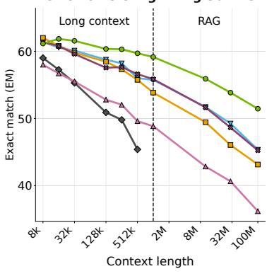

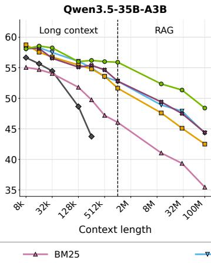

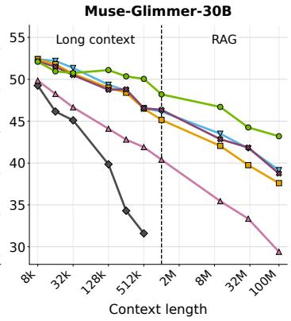  
Figure 1: Exact match on question-answering as context length grows from 8K to 100M tokens. Full context evaluation is shown only until computationally infeasible. For retrieval-based methods, relevant context is first extracted from the input and then fed to the model to generate the answer. Unlike baselines that rely on external models, UNREAL leverages the frozen LLM’s internal representations to retrieve relevant context, maintaining the highest accuracy across long context lengths.

## 1 INTRODUCTION

Modern LLMs often process contexts where relevant information is sparsely distributed. To isolate these key signals, evidence selection is done differently, depending on the scale. At long-context scale, selection is implicit and internal: the model receives the full context and must suppress irrelevant content while generating. This avoids having a separate retriever, but is vulnerable to distractors (Modarressi et al., 2025; Shi et al., 2023), and scaling it requires dedicated architectures, efficiency mechanisms, and long-context training. At larger, corpus scale, this selection is explicit and external: a separate retriever selects passages before generation (Lewis et al., 2020). This creates a two-model pipeline that must be trained, served, and kept aligned.

Despite being studied as alternative approaches (Xu et al., 2024; Li et al., 2024; 2025b; Lee et al., 2024), long-context and RAG perform the same operation: query-conditioned selection of candidate evidence. Only the scale differs, from hundreds of chunks in a prompt to millions in a corpus. This suggests that the strengths of both approaches can be combined: make selection internal, so evidence is ranked in the representation space of the model that will use it, and make selection explicit, so distractors are removed during generation (Yu et al., 2024a). We therefore ask: can a single pretrained LLM explicitly select evidence at both scales? An affirmative answer would make retrieval and long-context inference two scales of one mechanism rather than competing systems.

## 1.1 MODEL-INTERNAL EVIDENCE SELECTION ACROSS SCALES

We answer this question with UNifying REtrieval And Long-Context with a Single Model (UN-REAL), a model-native evidence selector that operates across both long-context and corpus scales. We build on INTRA (Hoffer et al., 2026), which demonstrated intrinsic retrieval in encoder–decoder models. However, INTRA relies on a separate encoder and cross-attention, which prevents its direct application to today’s predominant decoder-only LLMs. UNREAL removes this restriction by encoding candidate chunks and deriving retrieval queries directly from the frozen LLM’s internal states. UNREAL adds fewer than 500K trainable parameters, trained with contrastive loss, on top of the frozen LLM: a soft prompt that elicits a retrieval mode and layer weights that combine its internal states for evidence ranking. Because it reads from the residual stream, the same mechanism applies across dense-attention, linear-attention, and state-space architectures.

At the corpus scale, UNREAL retrieves from a 3B-token, 21M-chunk Wikipedia index. All four tested backbones outperform the strongest dedicated retriever-reranker systems. The best raises recall@10 from 49.1% to 73.2% on HotpotQA and from 31.7% to 60.1% on 2WikiMultiHopQA.

The retrieval-trained UNREAL module can also rank chunks within a long-context prompt and return only the selected text to the LLM. This explicit removal of distractors raises accuracy on differ ent long-context benchmarks: at the maximum evaluated length, NoLiMa accuracy rises from 1.0% to 24.83% at 128K tokens, while LV-Eval’s F1 score rises from 49.97% to 54.66% at 256K. This is achieved using the same LLM, without requiring an external retriever. The method also reduces FLOPs and time-to-first-token versus full-context inference from roughly 32K tokens onward, with larger gains as context grows. UNREAL thus turns corpus retrieval and long-context inference into two scales of the same model-internal selection mechanism (Fig. 1).

## 1.2 CONTRIBUTIONS

1. Intrinsic corpus-scale retrieval with modern LLMs. UNREAL extends INTRA (Hoffer et al., 2026) to decoder-only dense and hybrid LLMs, relying on a single frozen model to encode candidates and extract retrieval queries. With fewer than 500K trainable parameters, all four tested backbones outperform the strongest dedicated retriever–reranker systems on a 21M-chunk Wikipedia index (Section 3).

2. Long-context selection with the same mechanism. UNREAL outperforms both full-context inference and methods that rely on separate external retrievers across several long-context benchmarks, including NoLiMa, HELMET, LV-Eval, and LOFT, while reducing FLOPs and time-tofirst-token at practical context lengths (Section 4).

3. One selector across six orders of magnitude. The same model-native module selects evidence from an 8K-token context up to a 3B-token corpus, unifying long-context and retrieval reading without architectural changes or backbone finetuning.

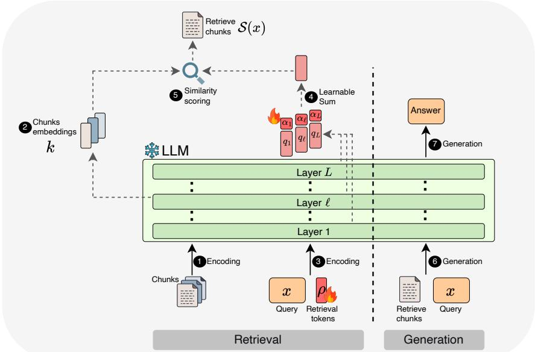  
Figure 2: UNREAL trains retrieval tokens $\rho$ and summation weights α (fire indicates training), while keeping the LLM frozen, enhancing its ability to identify relevant information in a context. Given a long context, these trained variables enable UNREAL to select relevant chunks and pass them to the same LLM for retrieval-augmented generation. Numbers indicate the order of operations.

## 2 METHOD

Standard retrieval-augmented generation (RAG) (Lewis et al., 2020) delegates evidence selection to an external retriever, forcing production pipelines to maintain multiple models. In this work, we unify this process within a single decoder-only LLM using its intrinsic retrieval capabilities. The closest work to ours, INTRA (Hoffer et al., 2026), asks whether an encoder–decoder model can instead retrieve directly from its own encoded representations. However, INTRA’s reliance on an encoder–decoder architecture and cross-attention prevents its direct application to the more widely adopted decoder-only LLMs, limiting the range of pretrained models it can use.

In this work, we seek the same intrinsic retrieval capability in decoder-only LLMs, including hybrid architectures that interleave attention with other sequence mixers (Gu & Dao, 2024). Our method, UNREAL, generalizes INTRA by replacing its encoder-derived chunk embeddings $k _ { i }$ and crossattention queries $q _ { \ell }$ with representations available inside a decoder-only model. UNREAL consists of three main components: chunk embeddings (Section 2.1), residual-state queries (Section 2.2), and generation (Section 2.3). Fig. 2 provides an overview of the method.

## 2.1 CHUNK EMBEDDINGS

Let $\mathcal { C } = \{ c _ { i } \} _ { i = 1 } ^ { M }$ denote a corpus of M chunks. Given a query $x ,$ the goal is to retrieve the subset $S ( x ) \subseteq { \dot { \{ 1 , \ldots , M \} } }$ containing the evidence needed to answer it. INTRA encodes each chunk once as $k _ { i } = \operatorname { E n c } ( c _ { i } )$ , where Enc denotes the model encoder. Decoder-only LLMs lack a separate encoder. UNREAL therefore uses the frozen LLM itself to encode each corpus chunk independently. For a chunk $c _ { i }$ of length $T _ { i } ,$ we select a single intermediate layer $\ell _ { c }$ and extract its token-level representations:

$$
k _ { i } = \mathrm { L L M } _ { \ell _ { c } } ( c _ { i } ) \in \mathbb { R } ^ { T _ { i } \times d } ,\tag{1}
$$

where $\mathrm { L L M } _ { \ell _ { c } } ( \cdot )$ denotes the residual-stream states at layer $\ell _ { c } ,$ and $d$ is the model’s hidden dimension. Thus, each chunk is represented by a sequence of $\dot { T } _ { i }$ token vectors.

Prior work has shown that intermediate layers often encode richer semantic representations than final layers (Skean et al., 2025). Motivated by this observation, we evaluate representations from different layers in our corpus-retrieval setting and select $\ell _ { c }$ according to performance on a development set (see the ablation in Table 4).

## 2.2 RESIDUAL STATE QUERIES

In order to perform query conditioned matching, UNREAL concatenates R learned retrieval tokens $\{ \rho _ { i } \in \mathbb { R } ^ { d } \} _ { i = 1 } ^ { R }$ to the query token embeddings $\{ x _ { t } \in \mathbb { R } ^ { d } \} _ { t = 1 } ^ { T _ { q } }$ , where $T _ { q }$ is the query length. It also augments the input with an initial context $C _ { 0 } ( x )$ , which represents the chunks ranked highest for the query x by BM25 (Robertson & Zaragoza, 2009). Together, we get

$$
x _ { \mathrm { r e t } } = \bigl [ C _ { 0 } ( x ) , x _ { 1 } , \ldots , x _ { T _ { q } } , \rho _ { 1 } , \ldots , \rho _ { R } \bigr ] ,\tag{2}
$$

Then it reads the residual stream states at the retrieval token positions:

$$
\forall \ell : q \ q _ { \ell } ( x _ { \mathrm { r e t } } ) \ = \ \left[ \mathrm { L L M } _ { \ell } ( x _ { \mathrm { r e t } } ) \right] \big | _ { ( | x _ { \mathrm { r e t } } | - R + 1 ) : | x _ { \mathrm { r e t } } | } \ \in \ \mathbb { R } ^ { R \times d } .\tag{3}
$$

Placing the retrieval tokens last ensures that, under the causal mask, their states condition on both the query and the initial context. These internal layer-wise query representations $q \ell$ are used to score every chunk $c _ { i }$ with the late-interaction MaxSim operator (Khattab & Zaharia, 2020):

$$
s _ { i } ( x ; \rho , \alpha ) \ = \ \mathrm { M a x } \mathrm { S i m } \Big ( \sum _ { \ell } \alpha _ { \ell } q _ { \ell } ( x _ { \mathrm { r e t } } ) , k _ { i } \Big ) ,\tag{4}
$$

where $\alpha _ { \ell }$ are learned layer-mixing coefficients and $\begin{array} { r } { \mathrm { M a x S i m } ( u , v ) \triangleq \sum _ { a } \operatorname* { m a x } _ { b } \langle u _ { a } , v _ { b } \rangle } \end{array}$

The retrieved chunk set is then selected by

$$
{ \mathcal { S } } _ { \mathrm { U N R E A L } } ( x ) = \left\{ i \in \{ 1 , \dots , M \} : s _ { i } ( x ) { \mathrm { ~ i s ~ a m o n g ~ t h e ~ t o p } } { \cdot } n { \mathrm { ~ s c o r e s } } \right\} .\tag{5}
$$

Retrieval is therefore based on the internal representations $q \ell$ and internal chunk encodings $k _ { i }$ instead of an external index and model. Only $\rho$ and α are added as learned parameters, the LLM remains frozen.

Because our read-out operates on the residual stream, it can be applied uniformly across architectures that use softmax attention, linear attention, or state-space layers, including hybrids that combine these layer types. Aggregating read-outs across these layer types is further motivated by the causal attention interpretation of selective SSMs (Ali et al., 2025; Jiang et al., 2026).

Retrieval training. The retrieval loss is a multi-positive InfoNCE objective (Oord et al., 2018; Chen et al., 2020) that contrasts oracle chunks with sampled alternatives. For a query x, let ${ \mathcal { O } } ( x )$ contain the oracle indices, corresponding to chunks that contain the annotated evidence needed to answer the query. Let ${ \mathcal { N } } ( x )$ contain the hard negatives chunks. Over $B ( x ) = \mathcal { O } ( x ) \cup \mathcal { N } ( x )$ , we minimize

$$
\mathcal { L } _ { \mathrm { r e t r i e v a l } } = - \frac { 1 } { \vert \mathcal { O } ( x ) \vert } \sum _ { j \in \mathcal { O } ( x ) } \log \frac { \exp ( s _ { j } ( x ) / \tau ) } { \sum _ { i \in \mathcal { B } ( x ) } \exp ( s _ { i } ( x ) / \tau ) } ,\tag{6}
$$

where $\tau$ is the temperature. Training updates only the retrieval tokens $\rho _ { i }$ and layer-mixing coefficients $\alpha _ { \ell } ,$ while the LLM parameters remain frozen. We then apply the resulting selector to retrieval tasks in Section 3 and long-context benchmarks in Section 4.

Compression. To reduce corpus-scale storage, we partition the full token-level chunk representations $\mathbf { \bar { \boldsymbol { k } } } _ { i } \in \mathbb { R } ^ { T _ { i } \times d }$ into $L _ { p }$ contiguous groups and mean-pool each group, compressing chunks from $T _ { i } \times d$ to $L _ { p } \times d .$ Similarly, we mean-pool the R retrieval-token states $q _ { \ell }$ across G groups, compressing queries from $R \times { \dot { d } }$ to $G \times d .$ . The parameters $L _ { p }$ and G trade off retrieval accuracy against index size and MaxSim compute cost.

## 2.3 SCORING AND GENERATION

Following Eq. $( 5 ) , S _ { \mathrm { U N R E A L } } ( x )$ contains the indices of the n highest-scoring chunks. To provide the model with this relevant context, the selected chunks $C _ { \mathrm { U N R E A L } } ( x ) = [ c _ { i } : i \in S _ { \mathrm { U N R E A L } } ( x ) ]$ are concatenated with the query in the LLM prompt:

$$
y \ = \ \mathrm { L L M } ( [ C _ { \mathrm { U N R E A L } } ( x ) \ : , \ : x \ : ] ) \ : .\tag{7}
$$

Unlike INTRA, which passes the selected encoder memories through cross-attention, UNREAL reencodes the selected chunks during generation. Inference thus uses one LLM forward pass to form the retrieval queries $q _ { \ell } .$ , and a second ordinary generation pass over the selected chunks.

In the following sections, we present how UNREAL can be used for both corpus retrieval and longcontext evidence selection. We then discuss the connection between retrieval and long-context tasks.

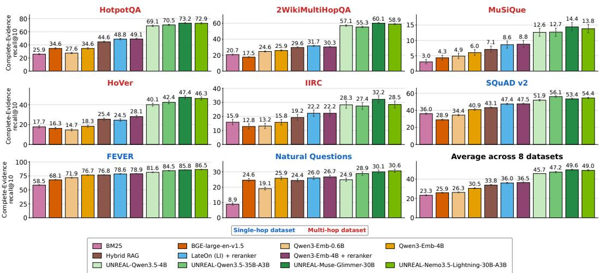  
Figure 3: UNREAL scales to full-corpus Wikipedia retrieval. Complete-evidence recall@10 on 21M Wiki-2018 chunks across eight datasets; an example is correct only when all annotated evidence chunks are retrieved. Across four architectures, UNREAL consistently outperforms baselines, especially on multi-hop datasets. Bars show means with 95% BCa confidence intervals.

## 3 UNREAL AS A RETRIEVAL MECHANISM

Our experiments evaluate whether UNREAL remains effective at a scale requiring genuine retrieval over the 3B-token, 21M-chunk Wiki-2018 corpus (Karpukhin et al., 2020a), with a mean chunk length of 140 tokens. We report complete-evidence recall@n: the fraction of examples with all annotated oracle chunks retrieved in the top-n results. This is particularly demanding for multi-hop tasks, where partial evidence receives no credit. Average recall@n appears in Figs. 9 and 10.

Benchmarks and baselines. The evaluation spans HotpotQA, 2WikiMultiHopQA, MuSiQue, HoVer, IIRC, SQuAD v2, FEVER, and Natural Questions (Yang et al., 2018; Ho et al., 2020; Trivedi et al., 2022; Jiang et al., 2020; Ferguson et al., 2020; Rajpurkar et al., 2018; Thorne et al., 2018; Kwiatkowski et al., 2019). We map oracle chunks to the shared Wiki-2018 corpus using a KILT-style procedure (Petroni et al., 2021). We compare against BM25, Qwen3-Embedding and BGE dense retrievers, the Jina cross-encoder reranker, LightOn multi-vector (late-interaction) retriever, and hybrid RAG based on RRF (Robertson & Zaragoza, 2009; Zhang et al., 2025; Xiao et al., 2024b; Jina AI, 2024; Sourty et al., 2026; Cormack et al., 2009). See Appendix B for the full details.

## 3.1 RESULTS

We demonstrate UNREAL’s architectural generality across four backbones: the dense models Qwen3.5-4B and Muse-Glimmer-30B, the linear-attention hybrid Qwen3.5-35B-A3B, and the Mamba–attention hybrid Nemotron-3.5-Lightning-30B-A3B (Meta Superintelligence Lab, 2026; Qwen Team, 2026; NVIDIA, 2026).

Full corpus evaluation. Fig. 3 reports complete-evidence recall@10. Each UNREAL backbone leads on most of the eight datasets. The largest gains occur on HotpotQA, 2WikiMultiHopQA, MuSiQue, and HoVer, challenging multi-hop tasks requiring evidence from multiple articles. A similar pattern appears for recall@20 in Fig. 8. For ablation studies please refer to Table 3, Table 4 and Table 5.

Generation evaluation. Table 1 reports end-to-end question-answering performance with Nemotron-3.5-Lightning fixed as the generator and only the retriever providing its top-5 chunk context varied. We also report an oracle upper bound using only oracle chunks and a no-context lower bound. UNREAL attains the highest EM and F1 on all three datasets while using the same LLM for retrieval and generation. Experiments with Qwen3.5-35B-A3B as the generator appear in Table 2.

Table 1: Exact match (EM) and macro-averaged F1 on three multi-hop QA datasets, generated by Nemotron-3.5-Lightning under each retrieval method’s top-5 retrieved context. UNREAL achieves the highest EM and F1 scores across all three datasets while relying on a single LLM for both retrieval and generation.
<table><tr><td rowspan="2">Method</td><td colspan="2">HotpotQA</td><td colspan="2">2Wiki</td><td colspan="2">MuSiQue</td></tr><tr><td>EM</td><td>F1</td><td>EM</td><td>F1</td><td>EM</td><td>F1</td></tr><tr><td>No context</td><td>28.5</td><td>37.7</td><td>29.9</td><td>34.6</td><td>6.8</td><td>16.6</td></tr><tr><td>Oracle</td><td>64.3</td><td>78.9</td><td>57.5</td><td>66.8</td><td>47.5</td><td>58.2</td></tr><tr><td>BM25</td><td>39.1</td><td>49.7</td><td>29.1</td><td>35.5</td><td>6.4</td><td>14.6</td></tr><tr><td>BGE-large-en-v1.5</td><td>39.6</td><td>51.2</td><td>28.5</td><td>35.6</td><td>8.6</td><td>17.6</td></tr><tr><td>Qwen3-Emb-0.6B</td><td>37.9</td><td>48.5</td><td>28.2</td><td>35.5</td><td>10.1</td><td>18.1</td></tr><tr><td>Qwen3-Emb-4B</td><td>39.2</td><td>51.4</td><td>31.6</td><td>38.8</td><td>10.5</td><td>18.1</td></tr><tr><td>Hybrid RAG</td><td>41.5</td><td>53.1</td><td>32.5</td><td>39.8</td><td>10.0</td><td>18.9</td></tr><tr><td>LateOn + reranker</td><td>43.3</td><td>55.2</td><td>30.8</td><td>38.7</td><td>11.4</td><td>20.1</td></tr><tr><td>Qwen3-Emb-4B + reranker</td><td>43.3</td><td>55.3</td><td>31.4</td><td>39.1</td><td>13.2</td><td>22.6</td></tr><tr><td>UNREAL-Nemo3.5-Lightning</td><td>52.6</td><td>65.8</td><td>42.0</td><td>50.1</td><td>16.9</td><td>25.4</td></tr></table>

Overall, UNREAL turns a frozen LLM into a full-corpus retriever by training only the retrievaltoken embeddings ρ and layer-mixing weights α: fewer than 0.5M added parameters in total, under 0.005% of each tested backbone’s parameter count.

## 4 UNREAL AS A LONG CONTEXT MECHANISM

In this section, we investigate whether UNREAL’s retrieval mechanism can tackle long-context tasks by treating the full prompt as a collection of chunks to retrieve from. Many tasks framed as longcontext understanding are, in practice, sparse-evidence problems: only a small number of chunks contain the information needed to answer the query, while the remaining context is irrelevant. This structure closely resembles retrieval tasks such as multi-hop question answering (Ho et al., 2020).

In this setting, the answer quality depends strongly on retrieving the required evidence. Even when evidence is retrieved, distractors may interfere with generation. Thus, expanding the context window ensures evidence is available, but not that the model can locate and use it effectively. While prior works (Xu et al., 2024; Li et al., 2024; 2025b) have identified the connection between retrieval and long context data, these approaches rely on an external retriever to select the relevant context. In contrast, UNREAL is the first to use the frozen LLM’s internal representations to select evidence and generate the answer.

## 4.1 RESULTS

Given a long input as context, we treat it as a retrieval problem, i.e., we first split it into M chunks with a mean chunk length of 140 tokens and use the frozen LLM to encode each chunk separately (Eq. (1)). Then, UNREAL ranks the chunks against the input query (Eqs. (3) and (4)), selects the top-n (Eq. (5)), and gives their unchanged text to the same frozen LLM for answering (Eq. (7)). Full experimental details are provided in Appendix B. Similarly, we include other retrieval baselines, such as BM25 and embedding models paired with rerankers. We wish to emphasize that the UNREAL models used in this section are the same ones presented in Section 3, i.e., no special long-context training data was involved.

To evaluate evidence selection at lengths far beyond those of existing long-context benchmarks, we follow the methodology of LOFT (Lee et al., 2024) and construct an QA benchmark spanning 8K to 100M tokens. We draw queries and their corresponding oracle chunks from QA benchmarks and pad them with random distractor passages from Wiki-2018. As shown in Fig. 1, full-context accuracy drops sharply as context length grows, whereas retrieval-based approaches perform significantly better. UNREAL outperforms all baselines at large scales and enables generation using evidence selected from 100M tokens, far beyond the context limits of current LLMs. For results on standard LOFT see Fig. 12.

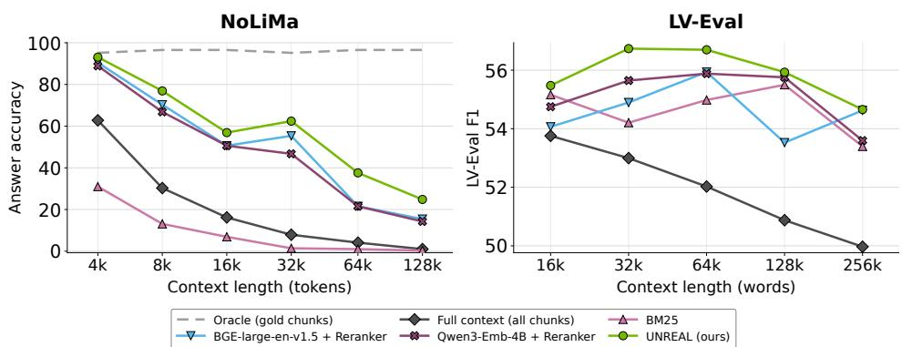

Figure 4: Left: NoLiMa accuracy across context lengths (4K–128K tokens) using Nemotron-3- Nano. Right: LV-Eval F1 across context lengths (16K–256K words, averaged over LooGLE-SD and MultiFieldQA-en) using Nemotron-3.5-Lightning. In both cases, full-context performance degrades as context grows, whereas UNREAL achieves the highest performance.  
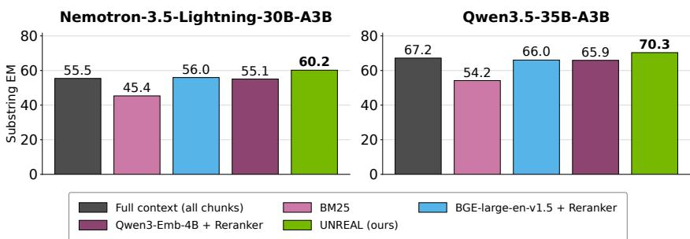  
Figure 5: Substring exact-match on the RAG subset of the HELMET long context benchmark, with Nemotron-3.5-Lightning-30B-A3B and Qwen3.5-35B-A3B as generators. UNREAL outperforms full-context inference and other retrieval methods for both generators.

Fig. 4 presents results on NoLiMa (Modarressi et al., 2025), a needle-in-a-haystack benchmark where queries and target needles share no direct keyword overlap, alongside English QA subsets from LV-Eval (Yuan et al., 2024). As context lengths scale up to 128K tokens in NoLiMa and 256K words in LV-Eval, full-context performance degrades sharply. In contrast, retrieval baselines remain far more stable, with UNREAL consistently achieving the highest accuracy across all scales.

Fig. 5 shows results on the RAG subset of the HELMET QA long-context benchmark (Yen et al., 2024). The tasks use context lengths of 8K–128K tokens, and the reported scores are averaged across these lengths. Full-context inference remains a strong baseline, but UNREAL achieves the highest exact-match score for both generators.

Top-n trade-off. In Fig. 6 (left) we examine how the number of selected chunks, n, affects performance on the long-context NoLiMa benchmark. Accuracy follows an inverted-U pattern: increasing n initially improves performance by raising evidence recall, but eventually reduces performance as additional distractors interfere with generation. Similar non-monotonic trade-offs have been reported in prior work (Yu et al., 2024b; Jin et al., 2024). UNREAL demonstrates that the same pattern arises when a single decoder-only LLM performs both retrieval and generation.

Intrinsic retrieval. To evaluate whether a frozen LLM can perform retrieval, we test Nemotron-3- Nano on NoLiMa by segmenting the text into chunks. Within every attention layer, we mean-pool the key embeddings to yield a single key vector per chunk. We similarly average the query embeddings over the question tokens and compute a dot product between the pooled key and query vectors. This process yields a per-chunk similarity score, allowing us to compute recall. Fig. 6 (right) shows that these “intrinsic” untrained layer representations retrieve evidence above the random baseline. This finding motivates UNREAL, which trains retrieval tokens ρ to strengthen the retrieval signal already present in the frozen model. For full details, see Appendix A.2.1.

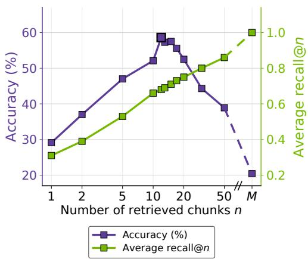

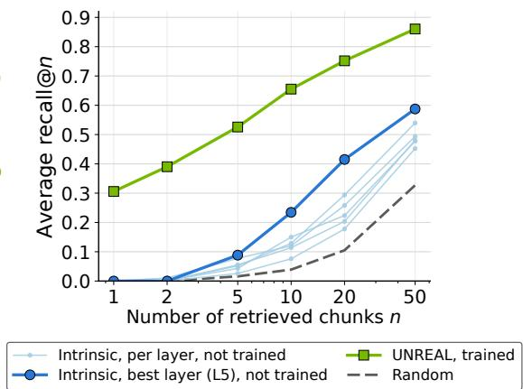  
Figure 6: Recall and accuracy on the NoLiMa benchmark for Nemotron-3-Nano. Left: The effect of the number of selected chunks n on UNREAL’s accuracy and recall. Right: Embeddings from the frozen LLM outperform random retrieval, motivating UNREAL, which is trained to enhance this capability.

## 4.2 EFFICIENCY

Does UNREAL’s additional retrieval pass make it less efficient than full-context inference, or do its savings dominate at sufficiently long contexts? Although UNREAL uses separate retrieval and generation passes, both reduce context-dependent computation. During retrieval, it encodes chunks independently, avoiding most inter-chunk attention in the prefill. During generation, it attends only to the selected chunks, greatly reducing both context attention and the KV-cache size. For fixed chunk size and selection budget, UNREAL therefore scales linearly with context length, whereas with standard attention full-context inference scales quadratically.

We determine where these savings outweigh the extra pass in both FLOPs and wall-clock time. Appendix C gives the full FLOP difference in equation 8. Applying this to the three tested backbones in our experimental setting, Table 6 shows the UNREAL uses less FLOPs for context lengths over 18K tokens. We also measure stage-wise time-to-first-token with vLLM on a single H100. Figure 7 shows the resulting speedup: it grows with context length across all backbones, with dashed curves projecting the full-context runtime beyond its last feasible measurement using the FLOP model. As can be seen, UNREAL reduces time-to-first-token at commonly used context lengths, roughly 32K tokens onward, with substantial speedups at longer contexts. Full methodology is provided in Appendix D.

## 5 RELATED WORK

Retrieval models. ColBERT and ColBERTv2 score passages by MaxSim over token representations (Khattab & Zaharia, 2020; Santhanam et al., 2022). LLM retrievers contrastively train generators for retrieval (Wang et al., 2024; Ma et al., 2024; Zhang et al., 2025). UNREAL is also contrastively trained, but the chunk encoder and reader remain a frozen generative decoder. REALM, RAG, and related methods jointly train distinct retriever and reader components (Guu et al., 2020; Lewis et al., 2020; Izacard et al., 2023). We instead share the frozen backbone representation across retrieval and generation, while retaining a separately trained query head. INTRA (Hoffer et al., 2026) is the closest predecessor: it introduced retrieval from an encoder–decoder model’s internal representations. We adapt the method to standard decoder-only LLMs and use the selector fo long-context tasks.

Efficient attention. Landmark Attention, InfLLM, Quest, MoBA, NSA, and HiLS-Attention select blocks of tokens within an LLM’s input and perform attention only on those blocks (Mohtashami & Jaggi, 2023; Xiao et al., 2024a; Tang et al., 2024; Lu et al., 2025; Yuan et al., 2025; Hu et al., 2026) to improve efficiency. Sparse attention fixes or learns a restricted set of positions (Beltagy et al., 2020; Zaheer et al., 2021; Kitaev et al., 2020; Xiao et al., 2023; Xu et al., 2026); block-level methods summarize and rank KV blocks (Mohtashami & Jaggi, 2023; Xiao et al., 2024a; Tang et al., 2024; Lu et al., 2025; Yuan et al., 2025; Xu et al., 2025); and hierarchical methods route attention through chunk summaries (Hu et al., 2026). UNREAL instead uses a retrieval-trained mechanism built on the frozen decoder’s representations to select chunks before generation, so the LLM receives only the selected text for generation.

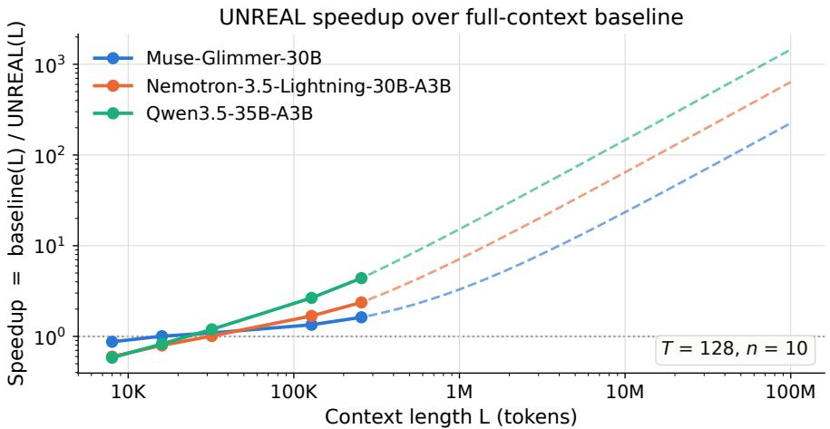  
Figure 7: Time-to-first-token speedup of UNREAL over full-context inference. Solid curves use directly measured full-context runtimes; dashed curves use FLOP-scaled projections beyond the last measured context length.

RAG and long context. Prior work compares retrieval pipelines with full-context models (Xu et al., 2024; Li et al., 2024; 2025b) or asks whether long context subsumes retrieval (Lee et al., 2024). UNREAL differs from both approaches. Unlike retrieval pipelines, it requires no external retrieval model, avoiding the need to develop and maintain multiple models in production. Unlike full-context baselines, UNREAL is trained on retrieval tasks and removes unselected chunks before generation, preventing them from distracting the generator (Shi et al., 2023; Yu et al., 2024a).

## 6 LIMITATIONS

Our training data originated from Wikipedia QA, so transfer to heterogeneous domains and languages remains for future work. For now, our long-context experiments focus on sparse-evidence tasks. UNREAL stores $L _ { p }$ vectors per chunk, costing more to build and store than a single-vector dense index, and relies on a cheap BM25 initial context. We generate answers with general-purpose LLMs rather than task-specific span extractors such as SpanBERT (Joshi et al., 2020), which are better suited to extractive QA and achieve higher exact match scores. While applying retrieval to longcontext tasks substantially reduces context length and improves generation efficiency, it introduces additional steps for chunk encoding and search; these extra steps are inherent to any retrieval-based approach, not unique to UNREAL.

Multi-pass agentic RAG systems interleave reasoning with repeated retrieval (Li et al., 2025a; Asai et al., 2024). UNREAL instead focuses on a single-pass retrieval mechanism that could serve as a component within future agentic pipelines. Because these systems evaluate an entire iterative reasoning-and-retrieval pipeline, whereas UNREAL isolates a single retrieval stage, they are not directly comparable and are therefore excluded from our baselines.

## 7 DISCUSSION AND FUTURE DIRECTIONS

This work asks whether corpus retrieval and long-context inference can share a single evidenceselection mechanism inside a decoder-only LLM. UNREAL answers this question by using the LLM’s representations to encode and rank candidate chunks, with fewer than 500K trainable parameters while keeping the backbone frozen. As shown, UNREAL outperformed SOTA retrieval methods on both retrieval and long-context benchmarks. These findings support a unified view of corpus retrieval and long-context inference as the same evidence-selection problem operating at different scales, and provide a path toward LLMs that retrieve and use relevant information without relying on a separate retrieval model.

## 7.1 FUTURE DIRECTIONS

We close by discussing what our main finding, that retrieval supervision improves a model’s evidence selection, implies for training and evaluating context-scalable models.

Train the model to recall. UNREAL makes the model’s internal retrieval ability trainable. Retrieval supervision teaches the model’s representations to rank relevant chunks, improving recall rather than relying on this ability to emerge from pretraining alone. As shown, the learned retriever improves both corpus-scale retrieval and in-prompt long-context selection.

An alternative path to context scalability. These results motivate training in-model retrieval together with generation, rather than treating a larger context window as sufficient. Under this view, sparse-evidence long-context tasks should be formulated primarily as retrieval problems during both training and evaluation. Models should learn to identify the evidence they need before generating, and evaluations should report evidence recall alongside answer accuracy.

Benchmarks should separate evidence regimes. This perspective does not reduce all long-context understanding to retrieval. New benchmarks should annotate the evidence required for each an swer and distinguish sparse-evidence tasks from evidence-dense problems that require integrating information across a large fraction of the input and cannot be solved by selecting a few chunks.

## REFERENCES

Ameen Ali, Itamar Zimerman, and Lior Wolf. The hidden attention of Mamba models. In Proceedings of the 63rd Annual Meeting of the Association for Computational Linguistics (Volume 1: Long Papers), pp. 1516–1534, 2025. doi: 10.18653/v1/2025.acl-long.76. URL https: //aclanthology.org/2025.acl-long.76/.

Akari Asai, Zeqiu Wu, Yizhong Wang, Avirup Sil, and Hannaneh Hajishirzi. Self-RAG: Learning to retrieve, generate, and critique through self-reflection. In International Conference on Learning Representations (ICLR), 2024.

Iz Beltagy, Matthew E. Peters, and Arman Cohan. Longformer: The Long-Document Transformer, 2020. URL https://arxiv.org/abs/2004.05150.

Ting Chen, Simon Kornblith, Mohammad Norouzi, and Geoffrey Hinton. A simple framework for contrastive learning of visual representations. In International conference on machine learning, pp. 1597–1607. PmLR, 2020.

Gordon V. Cormack, Charles L. A. Clarke, and Stefan Buttcher. Reciprocal rank fusion outperforms¨ condorcet and individual rank learning methods. In Proceedings of the 32nd International ACM SIGIR Conference on Research and Development in Information Retrieval, pp. 758–759. ACM, 2009. doi: 10.1145/1571941.1572114.

James Ferguson, Matt Gardner, Hannaneh Hajishirzi, Tushar Khot, and Pradeep Dasigi. IIRC: A dataset of incomplete information reading comprehension questions. In Proceedings of the 2020 Conference on Empirical Methods in Natural Language Processing, pp. 1137–1147, 2020. doi: 10.18653/v1/2020.emnlp-main.86.

Albert Gu and Tri Dao. Mamba: Linear-time sequence modeling with selective state spaces. In First Conference on Language Modeling (COLM), 2024. URL https://arxiv.org/abs/ 2312.00752.

Kelvin Guu, Kenton Lee, Zora Tung, Panupong Pasupat, and Ming-Wei Chang. REALM: Retrievalaugmented language model pre-training. In Proceedings of the 37th International Conference on Machine Learning, ICML’20, 2020.

Xanh Ho, Anh-Khoa Duong Nguyen, Saku Sugawara, and Akiko Aizawa. Constructing a multihop QA dataset for comprehensive evaluation of reasoning steps. In Proceedings of the 28th International Conference on Computational Linguistics, pp. 6609–6625, 2020.

Elad Hoffer, Yochai Blau, Edan Kinderman, Ron Banner, Daniel Soudry, and Boris Ginsburg. Retrieval from within: An intrinsic capability of attention-based models, 2026. URL https: //arxiv.org/abs/2605.05806.

Xiang Hu, Xinyu Wei, Hao Gu, Minshen Zhang, Tian Liang, Huayang Li, Lei Zhu, Yan Wang, Sirui Han, Yushi Bai, Kewei Tu, Haitao Mi, and Leo Liang. Hierarchical sparse attention done right: Toward infinite context modeling, 2026. URL https://arxiv.org/abs/2607.02980.

Gautier Izacard, Patrick Lewis, Maria Lomeli, Lucas Hosseini, Fabio Petroni, Timo Schick, Jane Dwivedi-Yu, Armand Joulin, Sebastian Riedel, and Edouard Grave. Atlas: Few-shot learning with retrieval augmented language models. Journal of Machine Learning Research, 24(251): 1–43, 2023. URL http://jmlr.org/papers/v24/23-0037.html.

Jindong Jiang, Amala Sanjay Deshmukh, Kateryna Chumachenko, Karan Sapra, Zhiding Yu, Guilin Liu, Andrew Tao, Pavlo Molchanov, Jan Kautz, and Wonmin Byeon. Stateful token reduction for long-video hybrid VLMs, 2026. URL https://arxiv.org/abs/2603.00198.

Yichen Jiang, Shikha Bordia, Zheng Zhong, Charles Dognin, Maneesh Singh, and Mohit Bansal. HoVer: A dataset for many-hop fact extraction and claim verification. In Findings of the Association for Computational Linguistics: EMNLP 2020, pp. 3441–3460, 2020. doi: 10.18653/v1/ 2020.findings-emnlp.309.

Bowen Jin, Jinsung Yoon, Jiawei Han, and Sercan O. Arik. Long-context llms meet rag: Over-¨ coming challenges for long inputs in rag. ArXiv, abs/2410.05983, 2024. URL https: //api.semanticscholar.org/CorpusID:273229050.

Jina AI. Jina Reranker v2 Base Multilingual, 2024. URL https://jina.ai/models/ jina-reranker-v2-base-multilingual/. Released June 25, 2024.

Mandar Joshi, Danqi Chen, Yinhan Liu, Daniel S Weld, Luke Zettlemoyer, and Omer Levy. Spanbert: Improving pre-training by representing and predicting spans. Transactions of the association for computational linguistics, 8:64–77, 2020.

Vladimir Karpukhin, Barlas Oguz, Sewon Min, Patrick Lewis, Ledell Wu, Sergey Edunov, Danqi Chen, and Wen-tau Yih. Dense passage retrieval for open-domain question answering. In Proceedings of the 2020 Conference on Empirical Methods in Natural Language Processing (EMNLP), pp. 6769–6781. Association for Computational Linguistics, 2020a. doi: 10.18653/ v1/2020.emnlp-main.550.

Vladimir Karpukhin, Barlas Oguz, Sewon Min, Patrick Lewis, Ledell Wu, Sergey Edunov, Danqi Chen, and Wen-tau Yih. Dense passage retrieval for open-domain question answering. In Proceedings ofthe 2020 conference on empirical methods in natural language processing (EMNLP), pp. 6769–6781, 2020b.

Omar Khattab and Matei Zaharia. ColBERT: Efficient and effective passage search via contextualized late interaction over BERT. In Proceedings of the 43rd International ACM SIGIR Conference on Research and Development in Information Retrieval, pp. 39–48, 2020. doi: 10.1145/3397271.3401075.

Nikita Kitaev, Lukasz Kaiser, and Anselm Levskaya. Reformer: The efficient transformer. In International Conference on Learning Representations, 2020. URL https://openreview. net/forum?id=rkgNKkHtvB.

Tom Kwiatkowski, Jennimaria Palomaki, Olivia Redfield, Michael Collins, Ankur Parikh, Chris Alberti, Danielle Epstein, Illia Polosukhin, Jacob Devlin, Kenton Lee, Kristina Toutanova, Llion Jones, Matthew Kelcey, Ming-Wei Chang, Andrew M. Dai, Jakob Uszkoreit, Quoc Le, and Slav Petrov. Natural questions: A benchmark for question answering research. Transactions of the Associationfor Computational Linguistics, 7:452–466, 2019. doi: 10.1162/tacl a 00276.

Woosuk Kwon, Zhuohan Li, Siyuan Zhuang, Ying Sheng, Lianmin Zheng, Cody Hao Yu, Joseph E. Gonzalez, Hao Zhang, and Ion Stoica. Efficient memory management for large language model serving with pagedattention. In Proceedings ofthe ACM SIGOPS 29th Symposium on Operating Systems Principles, 2023.

Jinhyuk Lee, Anthony Chen, Zhuyun Dai, Dheeru Dua, Devendra Singh Sachan, Michael Boratko, Yi Luan, Sebastien MR Arnold, Vincent Perot, Siddharth Dalmia, et al. Can long-context lan-´ guage models subsume retrieval, rag, sql, and more? arXiv preprint arXiv:2406.13121, 2024.

Patrick Lewis, Ethan Perez, Aleksandra Piktus, Fabio Petroni, Vladimir Karpukhin, Naman Goyal, Heinrich Kuttler, Mike Lewis, Wen-tau Yih, Tim Rockt¨ aschel, Sebastian Riedel, and Douwe¨ Kiela. Retrieval-augmented generation for knowledge-intensive NLP tasks. In Advances in Neural Information Processing Systems, volume 33, pp. 9459–9474. Curran Associates, Inc., 2020.

Xiaoxi Li, Guanting Dong, Jiajie Jin, Yuyao Zhang, Yujia Zhou, Yutao Zhu, Peitian Zhang, and Zhicheng Dou. Search-o1: Agentic search-enhanced large reasoning models, 2025a. URL https://arxiv.org/abs/2501.05366.

Xinze Li, Yixin Cao, Yubo Ma, and Aixin Sun. Long context vs. RAG for LLMs: An evaluation and revisits, 2025b. URL https://arxiv.org/abs/2501.01880.

Zhuowan Li, Cheng Li, Mingyang Zhang, Qiaozhu Mei, and Michael Bendersky. Retrieval augmented generation or long-context LLMs? A comprehensive study and hybrid approach. In Proceedings of the 2024 Conference on Empirical Methods in Natural Language Processing: Industry Track, 2024. URL https://arxiv.org/abs/2407.16833.

Enzhe Lu, Zhejun Jiang, Jingyuan Liu, Yulun Du, Tao Jiang, Chao Hong, Shaowei Liu, Weiran He, Enming Yuan, Yuzhi Wang, Zhiqi Huang, Huan Yuan, Suting Xu, Xinran Xu, Guokun Lai, Yanru Chen, Huabin Zheng, Junjie Yan, Jianlin Su, Yuxin Wu, Neo Y. Zhang, Zhilin Yang, Xinyu Zhou, Mingxing Zhang, and Jiezhong Qiu. MoBA: Mixture of block attention for long-context LLMs, 2025. URL https://arxiv.org/abs/2502.13189.

Xueguang Ma, Liang Wang, Nan Yang, Furu Wei, and Jimmy Lin. Fine-tuning LLaMA for multistage text retrieval. In Proceedings of the 47th International ACM SIGIR Conference on Research and Development in Information Retrieval, pp. 2421–2425, 2024. doi: 10.1145/3626772. 3657951.

Meta Superintelligence Lab. Muse Glimmer Model Card. https://huggingface.co/ meta-models/Muse-Glimmer-30B, 2026.

Ali Modarressi, Hanieh Deilamsalehy, Franck Dernoncourt, Trung Bui, Ryan A. Rossi, Seunghyun Yoon, and Hinrich Schutze. NoLiMa: Long-context evaluation beyond literal matching, 2025.¨ URL https://arxiv.org/abs/2502.05167.

Amirkeivan Mohtashami and Martin Jaggi. Random-access infinite context length for transformers. In Advances in Neural Information Processing Systems (NeurIPS), 2023. Landmark Attention.

NVIDIA. NVIDIA Nemotron 3.5 Lightning 30B-A3B model card. https://huggingface. co/nvidia/NVIDIA-Nemotron-3.5-Lightning-30B-A3B-BF16, 2026.

Aaron van den Oord, Yazhe Li, and Oriol Vinyals. Representation learning with contrastive predictive coding. arXiv preprint arXiv:1807.03748, 2018.

Fabio Petroni, Aleksandra Piktus, Angela Fan, Patrick Lewis, Majid Yazdani, Nicola De Cao, James Thorne, Yacine Jernite, Vladimir Karpukhin, Jean Maillard, et al. Kilt: a benchmark for knowledge intensive language tasks. In Proceedings of the 2021 Conference of the North American Chapter of the Association for Computational Linguistics: Human Language Technologies, pp. 2523–2544, 2021.

Qwen Team. Qwen3.5: Towards native multimodal agents. https://qwen.ai/blog?id= qwen3.5, 2026.

Pranav Rajpurkar, Robin Jia, and Percy Liang. Know what you don’t know: Unanswerable questions for SQuAD. In Proceedings of the 56th Annual Meeting of the Association for Computational Linguistics, pp. 784–789, 2018. doi: 10.18653/v1/P18-2124.

Stephen Robertson and Hugo Zaragoza. The Probabilistic Relevance Framework: BM25 and Beyond. Foundations and Trends in Information Retrieval, 3(4):333–389, 2009. doi: 10.1561/ 1500000019.

Keshav Santhanam, Omar Khattab, Jon Saad-Falcon, Christopher Potts, and Matei Zaharia. Col-BERTv2: Effective and efficient retrieval via lightweight late interaction. In Proceedings of the 2022 Conference of the North American Chapter of the Association for Computational Linguistics: Human Language Technologies, pp. 3715–3734, 2022. doi: 10.18653/v1/2022.naacl-main. 272.

Freda Shi, Xinyun Chen, Kanishka Misra, Nathan Scales, David Dohan, Ed Chi, Nathanael Scharli,¨ and Denny Zhou. Large language models can be easily distracted by irrelevant context, 2023. URL https://arxiv.org/abs/2302.00093.

Oscar Skean, Md Rifat Arefin, Dan Zhao, Niket Patel, Jalal Naghiyev, Yann LeCun, and Ravid Shwartz-Ziv. Layer by layer: Uncovering hidden representations in language models. ArXiv, abs/2502.02013, 2025. URL https://api.semanticscholar.org/ CorpusID:276107264.

Raphael Sourty, Antoine Chaffin, Paulo Roberto Moura Junior, and Am¨ elie Chatelain. Denseon´ with the lateon: Fully open dense and late-interaction models for multilingual, long-context, and code search. arXiv preprint arXiv:2607.27178, 2026.

Jiaming Tang, Yilong Zhao, Kan Zhu, Guangxuan Xiao, Baris Kasikci, and Song Han. Quest: Query-aware sparsity for efficient long-context LLM inference. In Proceedings of the 41st International Conference on Machine Learning (ICML), 2024. URL https://arxiv.org/abs 2406.10774.

James Thorne, Andreas Vlachos, Christos Christodoulopoulos, and Arpit Mittal. FEVER: A largescale dataset for fact extraction and verification. In Proceedings of the 2018 Conference of the North American Chapter of the Association for Computational Linguistics, pp. 809–819, 2018. doi: 10.18653/v1/N18-1074.

Harsh Trivedi, Niranjan Balasubramanian, Tushar Khot, and Ashish Sabharwal. MuSiQue: Multi hop questions via single-hop question composition. Transactions of the Association for Computational Linguistics, 10:539–554, 2022. doi: 10.1162/tacl a 00475.

Liang Wang, Nan Yang, Xiaolong Huang, Linjun Yang, Rangan Majumder, and Furu Wei. Improving text embeddings with large language models. In Proceedings ofthe 62nd Annual Meeting of the Associationfor Computational Linguistics (Volume 1: Long Papers), pp. 11897–11916, 2024. doi: 10.18653/v1/2024.acl-long.642.

Chaojun Xiao, Pengle Zhang, Xu Han, Guangxuan Xiao, Yankai Lin, Zhengyan Zhang, Zhiyuan Liu, and Maosong Sun. InfLLM: Training-free long-context extrapolation for LLMs with an efficient context memory. In Advances in Neural Information Processing Systems (NeurIPS), 2024a.

Guangxuan Xiao, Yuandong Tian, Beidi Chen, Song Han, and Mike Lewis. Efficient streaming language models with attention sinks, 2023. URL https://arxiv.org/abs/2309.17453.

Shitao Xiao, Zheng Liu, Peitian Zhang, Niklas Muennighoff, Defu Lian, and Jian-Yun Nie. C-pack: Packed resources for general chinese embeddings. In Proceedings ofthe 47th international ACM SIGIR conference on research and development in information retrieval, pp. 641–649, 2024b.

Anyi Xu, Bangcai Lin, Bing Xue, Bingxuan Wang, Bingzheng Xu, Bochao Wu, Bowei Zhang, Chaofan Lin, Chen Dong, Chenchen Ling, et al. Deepseek-v4: Towards highly efficient milliontoken context intelligence. arXiv preprint arXiv:2606.19348, 2026.

Peng Xu, Wei Ping, Xianchao Wu, Lawrence McAfee, Chen Zhu, Zihan Liu, Sandeep Subramanian, Evelina Bakhturina, Mohammad Shoeybi, and Bryan Catanzaro. Retrieval meets long context large language models. In The Twelfth International Conference on Learning Representations (ICLR), 2024. URL https://arxiv.org/abs/2310.03025.

Ruyi Xu, Guangxuan Xiao, Haofeng Huang, Junxian Guo, and Song Han. XAttention: Block sparse attention with antidiagonal scoring, 2025. URL https://arxiv.org/abs/2503.16428.

Zhilin Yang, Peng Qi, Saizheng Zhang, Yoshua Bengio, William W. Cohen, Ruslan Salakhutdinov, and Christopher D. Manning. HotpotQA: A dataset for diverse, explainable multi-hop question answering. In Proceedings of the 2018 Conference on Empirical Methods in Natural Language Processing, pp. 2369–2380, 2018. doi: 10.18653/v1/D18-1259.

Howard Yen, Tianyu Gao, Minmin Hou, Ke Ding, Daniel Fleischer, Peter Izsak, Moshe Wasserblat, and Danqi Chen. HELMET: How to evaluate long-context language models effectively and thoroughly, 2024. URL https://arxiv.org/abs/2410.02694.

Tan Yu, Anbang Xu, and Rama Akkiraju. In defense of RAG in the era of long-context language models, 2024a. URL https://arxiv.org/abs/2409.01666.

Yue Yu, Wei Ping, Zihan Liu, Boxin Wang, Jiaxuan You, Chao Zhang, Mohammad Shoeybi, and Bryan Catanzaro. RankRAG: Unifying context ranking with retrieval-augmented generation in LLMs. In Advances in Neural Information Processing Systems, 2024b. URL https://arxiv. org/abs/2407.02485.

Jingyang Yuan, Huazuo Gao, Damai Dai, Junyu Luo, Liang Zhao, Zhengyan Zhang, Zhenda Xie, Y. X. Wei, Lean Wang, Zhiping Xiao, Yuqing Wang, Chong Ruan, Ming Zhang, Wenfeng Liang, and Wangding Zeng. Native sparse attention: Hardware-aligned and natively trainable sparse attention. In Proceedings of the 63rd Annual Meeting of the Association for Computational Linguistics (ACL), 2025. URL https://arxiv.org/abs/2502.11089.

Tao Yuan, Xuefei Ning, Dong Zhou, Zhijie Yang, Shiyao Li, Minghui Zhuang, Zheyue Tan, Zhuyu Yao, Dahua Lin, Boxun Li, et al. Lv-eval: A balanced long-context benchmark with 5 length levels up to 256k. arXiv preprint arXiv:2402.05136, 2024.

Manzil Zaheer, Guru Guruganesh, Avinava Dubey, Joshua Ainslie, Chris Alberti, Santiago Ontanon, Philip Pham, Anirudh Ravula, Qifan Wang, Li Yang, and Amr Ahmed. Big bird: Transformers for longer sequences, 2021. URL https://arxiv.org/abs/2007.14062.

Yanzhao Zhang, Mingxin Li, Dingkun Long, Xin Zhang, Huan Lin, Baosong Yang, Pengjun Xie, An Yang, Dayiheng Liu, Junyang Lin, Fei Huang, and Jingren Zhou. Qwen3 embedding: Advancing text embedding and reranking through foundation models, 2025. URL https: //arxiv.org/abs/2506.05176.

## A ADDITIONAL EXPERIMENTS

## A.1 CORPUS-SCALE RETRIEVAL RESULTS

Figs. 8 to 10 report Complete-evidence recall@20, average recall@10, and average recall@20, respectively, across 8 datasets using the full Wiki-2018 corpus, demonstrating UNREAL’s superiority over SOTA embedding models, rerankers, and late-interaction methods.

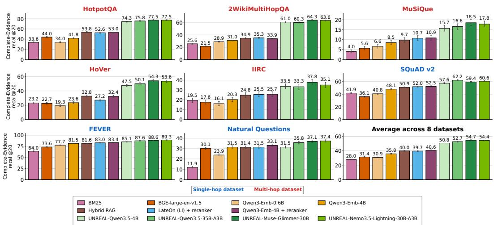  
Figure 8: Complete-evidence recall@20 on 21M Wiki-2018 chunks across 8 datasets; an example is correct only when all annotated evidence chunks are retrieved. Bars show means with 95% BCa confidence intervals.

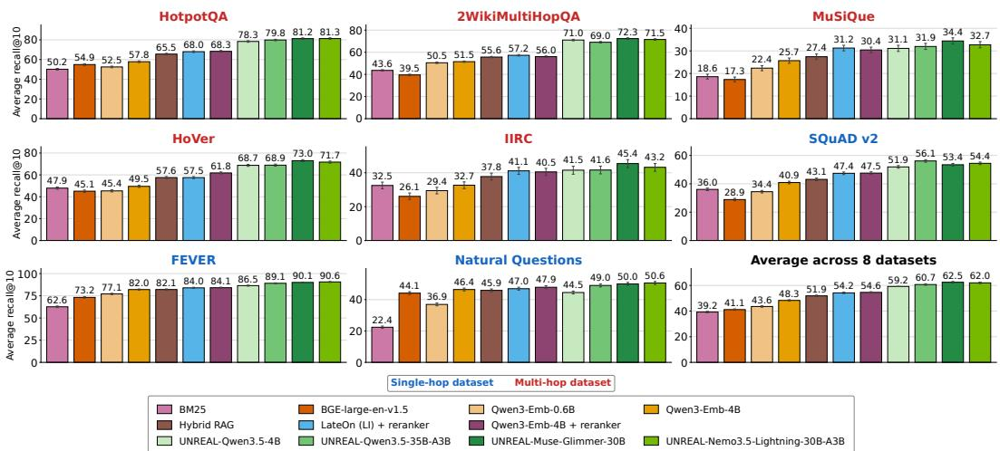  
Figure 9: Average recall@10 on 21M Wiki-2018 chunks across 8 datasets. Bars show means with 95% BCa confidence intervals.

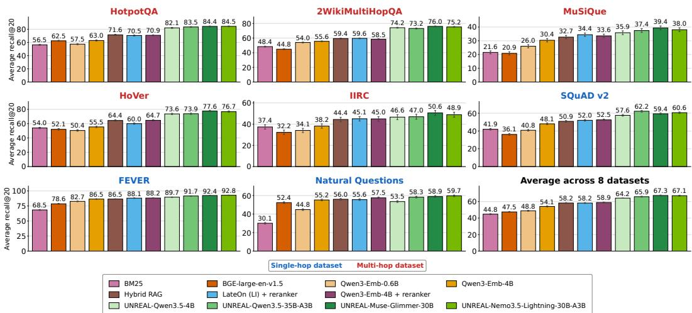  
Figure 10: Average recall@20 on 21M Wiki-2018 chunks across 8 datasets. Bars show means with 95% BCa confidence intervals.

Table 2 reports end-to-end question-answering performance with Qwen3.5-35B-A3B fixed as the generator and only the retriever providing its top-5 chunk context varied.

Table 2: Exact match (EM) and macro-averaged F1 on three QA datasets, generated by Qwen3.5- 35B-A3B under each retrieval method’s top-5 retrieved context. “Oracle” denotes the upper-bound result, obtained by answering the question based only on the oracle chunks.
<table><tr><td rowspan="2">Method</td><td colspan="2">HotpotQA</td><td colspan="2">2Wiki</td><td colspan="2">MuSiQue</td></tr><tr><td>EM</td><td>F1</td><td>EM</td><td>F1</td><td>EM</td><td>F1</td></tr><tr><td>No context</td><td>25.0</td><td>34.6</td><td>27.7</td><td>33.3</td><td>6.9</td><td>14.8</td></tr><tr><td>Oracle</td><td>60.8</td><td>74.9</td><td>53.6</td><td>61.7</td><td>42.6</td><td>54.6</td></tr><tr><td>BM25</td><td>36.8</td><td>47.3</td><td>28.1</td><td>34.4</td><td>7.0</td><td>15.2</td></tr><tr><td>BGE-large-en-v1.5</td><td>36.9</td><td>47.3</td><td>27.6</td><td>33.7</td><td>9.7</td><td>18.1</td></tr><tr><td>Qwen3-Emb-0.6B</td><td>34.9</td><td>46.0</td><td>28.5</td><td>35.0</td><td>7.7</td><td>15.4</td></tr><tr><td>Qwen3-Emb-4B</td><td>36.5</td><td>48.7</td><td>31.7</td><td>38.4</td><td>10.4</td><td>18.4</td></tr><tr><td>Hybrid RAG</td><td>39.3</td><td>51.3</td><td>30.7</td><td>37.5</td><td>8.9</td><td>18.1</td></tr><tr><td>LateOn + reranker</td><td>41.3</td><td>53.2</td><td>31.5</td><td>38.5</td><td>10.8</td><td>19.6</td></tr><tr><td>Qwen3-Emb-4B + reranker</td><td>40.8</td><td>52.6</td><td>31.2</td><td>37.9</td><td>11.8</td><td>20.8</td></tr><tr><td>UNREAL-Qwen3.5-35B-A3B</td><td>48.2</td><td>61.6</td><td>40.2</td><td>47.2</td><td>17.8</td><td>27.1</td></tr></table>

## A.2 LONG-CONTEXT RESULTS

In Fig. 11 we present the effect of retrieved distractors vs random distractors on the NoLiMa dataset.   
As can be seen, retrieved distractors reduce the NoLiMa score more than random distractors.

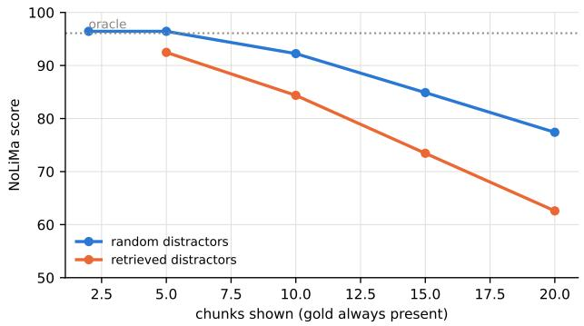  
Figure 11: Distractor identity matters. With the gold chunk always present, retrieved distractors cause more interference than the same number of random distractors, and the gap grows with the budget.

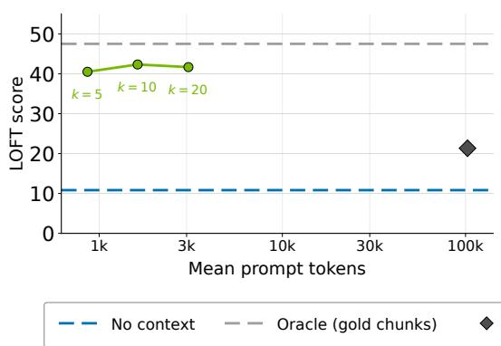

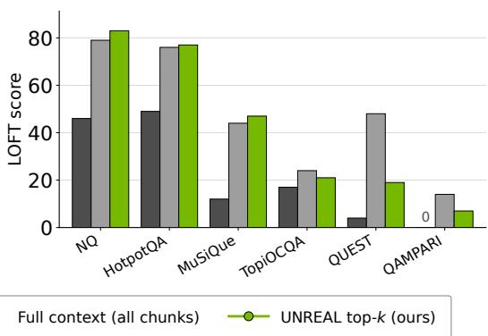  
Figure 12: LOFT generation. (a) All selective budgets outperform full-context reading. (b) Performance by dataset at n = 10 against gold-only context. We use each dataset’s designated LOFT metric.

## A.2.1 INTRINSIC RETRIEVAL

Fig. 6 (right) evaluates whether the frozen Nemotron-3-Nano can retrieve evidence on NoLiMa without retrieval training. We split each context into chunks and score them against the question using the model’s attention keys and queries.

For attention layer ℓ and head $h ,$ let $k _ { i , t } ^ { \ell , h }$ denote the key vector at token t of chunk $c _ { i } ,$ and $q _ { t } ^ { \ell , h }$ the query vector at token t of the question x. We mean-pool these vectors over the chunk and question tokens, respectively:

$$
\bar { k } _ { i } ^ { \ell , h } = \frac { 1 } { | c _ { i } | } \sum _ { t = 1 } ^ { | c _ { i } | } k _ { i , t } ^ { \ell , h } , \qquad \bar { q } ^ { \ell , h } = \frac { 1 } { | x | } \sum _ { t = 1 } ^ { | x | } q _ { t } ^ { \ell , h } .
$$

We compute their dot product within each head and average over the $H _ { \ell }$ heads to obtain a chunk score:

$$
s _ { i } ^ { \ell } ( x ) = \frac { 1 } { H _ { \ell } } \sum _ { h = 1 } ^ { H _ { \ell } } \left. \bar { q } ^ { \ell , h } , \bar { k } _ { i } ^ { \ell , h } \right. .
$$

For each layer separately, we rank chunks by $s _ { i } ^ { \ell } ( x )$ and compute recall@n over the top-n chunks. No retrieval tokens or learned layer weights are used. These untrained representations retrieve evidence above the random baseline.

## A.3 ABLATION STUDIES

Table 3 presents a recipe ablation for Nemotron-3.5-Lightning-30B-A3B, in which we vary, one at a time, the design choices used in the main method. Table 4 presents an ablation study of the layer from which corpus chunk embeddings are produced. We find that middle-to-late layers yield the strongest retrieval performance, a result that is reproduced across other architectures as well.

Table 3: Recipe ablation for UNREAL-Nemotron-3.5-Lightning-30B-A3B, single-knob departures from the main method. R is the number of retrieval tokens; G is the number of groups they are mean-pooled into on the query side; ML (multi-layer) vs. SL (single-layer) is whether the readout combines all 6 global-attention blocks or only the block used for the corpus readout; HN is the number of hard negatives per query; $| C _ { 0 } ( x ) |$ is the number of BM25-retrieved context chunks prepended to the query; P is the number of learnable soft prompt tokens used at the beginning of the sequence. Avg. R@10 is recall averaged over each query’s oracle chunks; All R@10 requires every oracle chunk to be retrieved.
<table><tr><td rowspan="2">Design choice</td><td colspan="2">HotpotQA</td><td colspan="2">MuSiQue</td><td>SQuAD v2</td></tr><tr><td>Avg R@10</td><td>All R@10</td><td>Avg R@10</td><td>All R@10</td><td>Avg R@10</td></tr><tr><td>Baseline</td><td>81.28</td><td>72.93</td><td>32.70</td><td>13.79</td><td>54.43</td></tr><tr><td>R=64 → 16</td><td>77.93 (-3.35)</td><td>67.83 (-5.10)</td><td>31.91 (-0.79)</td><td>13.04 (-0.75)</td><td>53.82 (-0.61)</td></tr><tr><td> $G = 4  1$ </td><td>77.91 (-3.37)</td><td>68.37 (-4.56)</td><td>29.69 (-3.01)</td><td>11.49 (-2.30)</td><td>52.94 (-1.49)</td></tr><tr><td>ML → SL</td><td>73.02 (-8.26)</td><td>61.01 (-11.92)</td><td>26.20 (-6.50)</td><td>9.86 (-3.93)</td><td>46.93 (-7.50)</td></tr><tr><td>HN=500 → 100</td><td>79.40 (-1.88)</td><td>70.59 (-2.34)</td><td>28.77 (-3.93)</td><td>11.58 (-2.21)</td><td>52.86 (-1.57)</td></tr><tr><td> $| C _ { 0 } ( x ) | = 5  1$ </td><td>78.50 (-2.78)</td><td>68.83 (-4.10)</td><td>31.36 (-1.34)</td><td>11.95 (-1.84)</td><td>52.68 (-1.75)</td></tr><tr><td> $| C _ { 0 } ( x ) | { = } 5  0$ </td><td>71.08 (-10.20)</td><td>56.73 (-16.20)</td><td>28.83 (-3.87)</td><td>8.94 (-4.85)</td><td>50.16 (-4.27)</td></tr><tr><td> $P { = } 1  0$ </td><td>79.61 (-1.67)</td><td>70.86 (-2.07)</td><td>32.17 (-0.53)</td><td>13.21 (-0.58)</td><td>52.92 (-1.51)</td></tr><tr><td> $L _ { p } = 7  1$ </td><td>78.20 (-3.08)</td><td>69.11 (-3.82)</td><td>30.28 (-2.42)</td><td>12.45 (-1.34)</td><td>48.52 (-5.91)</td></tr></table>

Table 4: Ablation on the layer used to create the corpus chunk embeddings, for UNREAL-Nemotron-3.5-Lightning-30B-A3B.
<table><tr><td rowspan="2">Corpus layer</td><td colspan="2">HotpotQA</td><td colspan="2">MuSiQue</td><td rowspan="2">SQuAD v2 Avg R@10</td></tr><tr><td>Avg R@10</td><td>All R@10</td><td>Avg R@10</td><td>All R@10</td></tr><tr><td>Layer 8</td><td>79.68</td><td>70.25</td><td>31.74</td><td>12.33</td><td>53.66</td></tr><tr><td>Layer 18</td><td>78.98</td><td>69.42</td><td>31.65</td><td>12.45</td><td>54.05</td></tr><tr><td>Layer 30</td><td>80.19</td><td>71.39</td><td>32.40</td><td>13.33</td><td>54.85</td></tr><tr><td>Layer 38</td><td>80.62</td><td>71.99</td><td>31.94</td><td>12.29</td><td>54.01</td></tr><tr><td>Layer 42</td><td>81.28</td><td>72.93</td><td>32.70</td><td>13.79</td><td>54.43</td></tr><tr><td>Layer 48</td><td>80.19</td><td>71.64</td><td>32.78</td><td>12.75</td><td>54.13</td></tr></table>

Table 5 examines how the number of pooled vectors per corpus chunk, $L _ { p } ,$ affects retrieval quality for Nemotron-3.5-Lightning-30B-A3B. We encode the Wiki-2018 corpus at $L _ { p } \in { 1 , 3 , 7 }$ , 11 and report Average recall@10 and Complete-evidence recall@10. Recall increases monotonically with $L _ { p }$ across both metrics, confirming that a finer-grained chunk representation yields more accurate retrieval, though this comes at the cost of higher memory and compute during evaluation.

## B EXPERIMENTAL SETTING

## B.1 RETRIEVAL DATA

We construct our retrieval data setting by mapping gold evidence from existing datasets to a shared DPR Wikipedia 2018 corpus (Karpukhin et al., 2020b), using a KILT-like method (Petroni et al., 2021). The corpus consists of around 21M chunks, with a median of around 141 Nemotron-3.5- Lightning tokens per chunk. The downstream tasks span three categories: single-hop QA (Natural Questions (Kwiatkowski et al., 2019), SQuAD v2 (Rajpurkar et al., 2018)), multi-hop QA (Hot potQA (Yang et al., 2018), 2WikiMultiHopQA (Ho et al., 2020), MuSiQue (Trivedi et al., 2022),

Table 5: Effect of the number of pooled vectors per corpus chunk $L _ { p }$ on retrieval recall@10, for UNREAL-Nemotron-3.5-Lightning-30B-A3B. Avg. R@10 is the recall averaged over each query’s oracle chunks; All R@10 requires every oracle chunk of a query to be retrieved. Recall increases monotonically with $L _ { p } ,$ but at the cost of higher memory and compute during evaluation.
<table><tr><td></td><td colspan="2">HotpotQA</td><td colspan="2">MuSiQue</td><td colspan="2">2Wiki</td><td>SQuAD v2</td></tr><tr><td> $L _ { p }$ </td><td>Avg R@10</td><td>All R@10</td><td>Avg R@10</td><td>All R@10</td><td>Avg R@10</td><td>All R@10</td><td>Avg R@10</td></tr><tr><td>1</td><td>78.20</td><td>69.11</td><td>30.28</td><td>12.45</td><td>67.43</td><td>55.21</td><td>48.52</td></tr><tr><td>3</td><td>79.34</td><td>70.58</td><td>31.15</td><td>12.70</td><td>69.51</td><td>57.11</td><td>51.61</td></tr><tr><td>7</td><td>81.28</td><td>72.93</td><td>32.70</td><td>13.79</td><td>71.52</td><td>58.90</td><td>54.43</td></tr><tr><td>11</td><td>81.54</td><td>73.40</td><td>34.34</td><td>14.67</td><td>72.38</td><td>59.68</td><td>55.42</td></tr></table>

IIRC (Ferguson et al., 2020)), and fact verification (FEVER (Thorne et al., 2018), HoVer (Jiang et al., 2020)).

Based on KILT (Petroni et al., 2021), for each dataset, we map its oracle chunks to Wikipedia 2018 chunks via title matching. We then compute a text-alignment quality score based on lengthrobust unigram, bigram, and trigram containment overlap between the oracle evidence text and each candidate chunk. The score ranges from 0 to 1, where 1.0 means that the oracle text is essentially contained verbatim in the chunk. For NQ, we directly reuse existing DPR bi-encoder gold mappings, bypassing this KILT mapping step. For evaluation, similar to KILT, we report results on a filtered set that retains an oracle only if it comes from an exact title match or has a fallback alignment score above a quality threshold (0.6 by default).

We additionally retrieve lexical signals for each query. For each query, we use its input text as a BM25 query and retain the top chunks as BM25 context, which is provided as additional input to UNREAL $( C _ { 0 } ( x ) )$ . We then mine oracle-seeded hard negatives: the query’s oracle chunks were used as seed queries by running their text through BM25. The top lexically similar chunks across all seeds are pooled and deduplicated, and any chunk overlapping with the query’s oracle set is discarded. This yields up to 512 hard negatives per query that are lexically close to the gold evidence but guaranteed not to belong to it, providing a clean hard-negative pool for contrastive training.

## B.2 LONG-CONTEXT BENCHMARKS

We wish to note that the UNREAL models evaluated in the long-context setting were not trained on long-context data. Instead, the UNREAL modules were trained exclusively on standard retrieval data (as detailed in Section B.1) and subsequently evaluated on both retrieval and long-context tasks.

Following the methodology of LOFT (Lee et al., 2024), we construct a new open-domain QA benchmark scaling context lengths from 8K to 100M tokens (Fig. 1). Our goal is to evaluate long-context generation on context scales significantly larger than those present in current benchmarks.

We sample 500 queries at random from the validation splits of four QA datasets: Natural Questions (Kwiatkowski et al., 2019), HotpotQA (Yang et al., 2018), 2WikiMultiHopQA (Ho et al., 2020), and MuSiQue (Trivedi et al., 2022), totaling 2,000 questions. Each query is paired with oracle passages from the DPR Wiki-2018 corpus (approximately 21 million passages). We retain only questions whose gold passages match corpus entries by exact article title.

To construct the extended contexts, all queries share a single distractor pool. We remove all gold passages associated with any validation query across the four datasets to ensure distractors do not overlap with target evidence. Contexts are constructed across ten lengths: 8K, 16K, 32K, 128K, 256K, 512K, 1M, 10M, 30M, and 100M tokens, measured using the Nemotron tokenizer over context passages. Distractors are drawn sequentially from the head of the shuffled corpus to fill the token budget alongside the gold passages. Each gold passage is placed at a relative context depth sampled uniformly at random for that query; these relative depths remain fixed across all context lengths. Consequently, as context length scales, a question maintains its gold evidence at identical relative positions, altering only the volume of surrounding distractor text. All stochastic choices, including question sampling, corpus shuffling, and passage positioning, use fixed random seeds to guarantee deterministic inputs across evaluated models and runs.

To evaluate retrieval methods on long-context benchmarks, contexts are split into sentence-aligned chunks averaging 141 tokens (mostly ranging from 123 to 165 tokens) to match the Wiki-2018 length distribution used during retriever training. The chunks form an exact cover of the source text and are created on a per-document basis to prevent them from crossing document boundaries. For generation, retrieved chunks are reassembled into native prompt templates in their original document order and scored using native metrics.

## B.3 METHOD AND TRAINING CONFIGURATION

On the corpus side, we use the full Wikipedia-2018 corpus, containing around 21M chunks. Each chunk is encoded only once using the frozen LLM, by extracting the outputs of a single layer and compressing them into $L _ { p } = 7$ pooled vectors.

On the query side, we use $R = 6 4$ retrieval tokens pooled into $G = 4$ groups, together with an initial context $C _ { 0 } ( x )$ consisting of the top-5 BM25 chunks. The query embeddings are obtained by a learnable sum of the full-attention outputs of the model. Moreover, only for query processing, a single learned soft-prompt vector is concatenated to the beginning of the retrieval input. Unlike $\rho ,$ this vector is never read out or scored; it only steers the frozen LLM toward a retrieval-oriented computation and is trained jointly with ρ and α. These components are the only learnable parameters in UNREAL, totaling fewer than 500K parameters, or less than $2 \times 1 0 ^ { - 5 }$ of the frozen model in all cases. The exact number of learnable parameters is $( R + 1 ) D + | \alpha |$ , where $D$ is the embedding dimension and |α| is the number of layer-mixing weights.

We trained the UNREAL models using the training sets of Natural Questions (Kwiatkowski et al., 2019), SQuAD v2 (Rajpurkar et al., 2018), HotpotQA (Yang et al., 2018), 2WikiMultiHopQA (Ho et al., 2020), MuSiQue (Trivedi et al., 2022), IIRC (Ferguson et al., 2020), FEVER (Thorne et al., 2018), and HoVer (Jiang et al., 2020), all mapped into a single shared Wikipedia-2018 corpus (see Appendix B.1). We note that all retrieval baselines used in this work, such as Qwen3-Embedding (Zhang et al., 2025), were also fine-tuned on high-quality retrieval datasets like HotpotQA and Natural Questions.

For the contrastive objective, we draw 500 hard negatives per query from a BM25 ranking seeded on that query’s oracle chunks. We discard the top 10 ranks, as they are typically near-duplicates of the oracle chunks themselves. $B ( x )$ is then the deduplicated union of the oracle and hard-negative chunks from all queries in a microbatch, ensuring that a chunk serving as an oracle for one query is never treated as a negative for that query. We train for 15K steps with a global batch of 256 queries, using AdamW with $\beta ~ = ~ ( 0 . 9 , 0 . 9 5 )$ , weight decay 0.1, gradient clipping at norm 1.0, and 100 warmup steps followed by linear decay to zero. At evaluation time, each query is scored exhaustively against all M chunks, without an approximate index or candidate pre-filter.

The per-backbone settings are as follows. For Qwen3.5-35B-A3B (40 blocks, $d = 2 0 4 8 )$ , we read the index at $\ell _ { c } \ = \ 2 7$ , using a learning rate of $5 \times 1 0 ^ { - 3 }$ . For Muse-Glimmer-30B (52 blocks, $d = 6 6 5 6 )$ , we use $\ell _ { c } = 4 7$ , and a learning rate of $5 \times 1 0 ^ { - 3 }$ . For Nemotron-3.5-Lightning-30B-A3B (52 blocks, $d = 2 6 8 8 )$ , we use $\ell _ { c } = 4 2 .$ , and a learning rate of $1 0 ^ { - 2 }$

## C FLOP ANALYSIS

UNREAL replaces full-context inference with chunk encoding, retrieval, and generation over selected evidence. This avoids processing irrelevant context but adds retrieval and re-encoding work. We compare these costs and derive the context length above which UNREAL requires fewer FLOPs, counting only the work on which the two pipelines differ.

Full-context inference vs. UNREAL. Full-context inference prefills [context, x]. UNREAL instead:

(i) Encodes each chunk independently up to layer $\ell _ { c }$ (equation 1);

(ii) Runs one forward pass through all $L$ layers on $x _ { \mathrm { r e t } }$ (equation 2), of length $| x _ { \mathrm { r e t } } | ~ =$ $| C _ { 0 } ( x ) | T + T _ { q } + \bar { R } ;$

(iii) Prefills $[ C _ { \mathrm { U N R E A L } } ( x ) , x ]$ , of length n $\Omega + T _ { q } ,$ , for generation (equation 7).

After prefill, both pipelines perform the same autoregressive decoding except for the cached context length: full context attends to $N + T _ { q }$ prompt tokens, whereas UNREAL attends to $n T + T _ { q } .$ Thus UNREAL uses fewer attention FLOPs and a smaller KV cache, which benefits memory-bound decoding.

## C.1 SETTING

All chunks have equal length, $T _ { i } \equiv T .$ , so the context given to the model contains $N \equiv M T$ tokens. Both pipelines use a KV cache, and $T _ { g }$ denotes the number of decode forward passes. A multiplyadd counts as two FLOPs.

Weights. For identical layers, passing one token through the first ℓ layers costs $2 \Theta \ell / L$ FLOPs, where Θ counts backbone matrix parameters active per token. It includes all sequence-mixer and dense-FFN projections; in MoE layers, it counts the router, shared experts, and selected routed experts. It excludes token embeddings, which are lookups, and the LM output head, whose generation cost cancels in equation 8.

Attention. One causal query-key pair costs $4 L _ { a } d _ { a }$ FLOPs, summed over the $L _ { a }$ global-attention layers: $2 d _ { a }$ for the score and $2 d _ { a }$ for the value accumulation. For a standard decoder, $L _ { a } = L$ and $d _ { a } = d .$

Linear-attention and state-space layers have no position-dependent pairwise term, so we include their projections in Θ and neglect their small recurrent-update cost. We also omit sliding-window attention: full context attends to up to W keys per token, so this conservatively understates UN-REAL’s savings.

Omitted operations. Softmax, normalization, and activations are ignored. The selection stage is also neglected: BM25 for $C _ { 0 } ( x )$ involves no dense matrix products, and the remaining selection steps are tiny. These are mean pooling (about d FLOPs per token), the α-weighted layer sum, and MaxSim scoring (equation 4, 2dGL FLOPs per chunk). Chunk encoding alone costs $2 \Theta \ell _ { c } / L$ per context token, and the ratio $( 1 + 2 G \bar { L } _ { p } / T ) d L / ( 2 \Theta \ell _ { c } )$ is about $2 \times 1 0 ^ { - 7 }$ for the models below (this ratio covers pooling and MaxSim).

## C.2 FLOP DIFFERENCE: UNRAEL VS. FULL-CONTEXT INFERENCE

The two pipelines perform identical work on two things:

• the context tokens in layers $1 , \ldots , \ell _ { c } ,$ , including all intra-chunk attention there;

• the shared generation-side work: the query tokens’ weight products and query-to-query attention in the prefill; all decode-step weight products and attention to the query and previously generated tokens; and all required generation logits.

Let λ denote the fraction of Θ in layers $\ell _ { c } + 1 , \ldots , L$ , for identical layers, $\lambda = 1 - \ell _ { c } / L$ . Let $L _ { a , \leq c }$ count global-attention layers through $\ell _ { c } .$ The difference $\Delta \equiv F _ { \mathrm { f u l l } } - \mathrm { \bar { \it F } _ { U N R E A I } }$ L is

$$
\begin{array} { l } { \Delta = \underbrace { 2 \Theta \lambda N } _ { \mathrm { ( a ) } } + \underbrace { 2 L _ { a } d _ { a } \big [ N ( N - T ) + 2 ( T _ { q } + T _ { g } ) ( N - n T ) \big ] } _ { \mathrm { ( b ) } } } \\ { - \underbrace { \left[ 2 \Theta n T + 2 L _ { a } d _ { a } n T ( n T + 1 ) \right] } _ { \mathrm { ( c ) } } } \\ { - \underbrace { \left[ 2 \Theta \left| x _ { \mathrm { r e t } } \right| + 2 L _ { a } d _ { a } \left| x _ { \mathrm { r e t } } \right| \left( \left| x _ { \mathrm { r e t } } \right| + 1 \right) \right] } _ { \mathrm { ( d ) } } } \\ { + \underbrace { 2 d _ { a } ( L _ { a } - L _ { a , \le c } ) N ( T + 1 ) } _ { \mathrm { ( e ) } } . } \end{array}\tag{8}
$$

(a) Deeper layers on the context (UNREAL saving). Full-context inference passes every context token through all L layers. UNREAL reads the chunk embeddings at layer $\ell _ { c }$ (equation 1) and discards the chunk states, since the selected chunks are re-encoded during generation. It therefore never runs layers $\ell _ { c } + 1 , \ldots , L$ on the context, saving 2Θλ per context token.

(b) Attention to unselected chunks (UNREAL saving). Each part counts causal query-key pairs, at $4 L _ { a } d _ { a }$ FLOPs per pair.

– Prefill. The full-context prefill computes all $N ( N + 1 ) / 2$ causal pairs among the context tokens. UNREAL’s independent chunk encoding computes only the $M T ( T +$ $1 ) / 2 = N ( T + 1 ) / 2$ intra-chunk pairs. The remaining $\bar { N } ( N { - } T ) / 2$ cross-chunk pairs give the first term.

– Query. In full context, each of the $T _ { q }$ query tokens attends to all N context tokens. In UNREAL it attends only to the nT selected tokens, a difference of $T _ { q } ( N - n T )$ pairs.

– Decode. Likewise, each of the $T _ { g }$ decoded tokens attends to $N - n T$ fewer keys, a difference of $T _ { g } ( N - n T )$ pairs.

(c) Re-encoding the selected chunks (UNREAL extra cost). UNREAL’s generation prefill passes the nT selected tokens through all layers again (2Θ nT) and computes their $n T ( n T + 1 ) / 2$ causal self-attention pairs. The query’s attention to these tokens is already counted in (b).

(d) Retrieval pass (UNREAL extra cost). The forward pass on $x _ { \mathrm { r e t } }$ has no counterpart in fullcontext inference. Its tokens cost $2 \Theta \left| x _ { \mathrm { r e t } } \right|$ in weights plus $\vert x _ { \mathrm { r e t } } \vert ( \vert x _ { \mathrm { r e t } } \vert + 1 ) \bar { / } 2$ attention pairs.

(e) Intra-chunk attention above $\ell _ { c } \left( U N R E A L \right.$ saving). This restores the full-context-only intrachunk work in the $L _ { a } - L _ { a , \leq c }$ global-attention layers above the readout.

The +1 parts of $\mathrm { ( c ) } { } \mathrm { - } \mathrm { ( d ) }$ are diagonal-pair corrections, only $1 / \kappa$ of the corresponding weight costs, where $\kappa \equiv \Theta / ( L _ { a } d _ { a } )$ . Term (e) is a second correction, across the three backbones and $n \in \{ 5 , 1 0 , 2 0 \}$ }, omitting it raises the roots by at most 0.21%, so we omit it below.

## C.2.1 SIMPLIFYING ASSUMPTIONS

We now reduce equation 8 under two assumptions:

(S1) Short queries and generations: $T _ { q } = T _ { g } = T$

(S2) The context is much longer than the selected evidence: $N \gg n T$ . Since $n \geq 1$ , this also implies $N \gg T$ . For fixed, moderate $n , | C _ { 0 } ( x )$ |, and $R / T$ , it further gives $N \gg | x _ { \mathrm { r e t } } |$ since $| x _ { \mathrm { r e t } } | = ( | C _ { 0 } ( x ) | + 1 ) T + R = O ( { n T } )$

$$
\begin{array} { r } { \Delta \approx \underbrace { 2 \Theta \lambda N } _ { \mathrm { d e e p e r 1 a y e r s } } + \underbrace { 2 L _ { a } d _ { a } N ^ { 2 } } _ { \mathrm { c r o s s - c h u n k \ : a t t e n t i o n } } - \underbrace { 2 \Theta \big ( n T + | x _ { \mathrm { r e t } } | \big ) } _ { \mathrm { r e - e n c o d i n g \ : a n d \ : r e t r i e v a l \ : p a s s } } . } \end{array}\tag{9}
$$

The neglected terms have relative size of order $T / N$ and $( n T / N ) ^ { 2 }$ , which vanish in the long-context limit. The diagonal corrections are also smaller than their weight terms by $L _ { a } d _ { a } / \Theta = \mathrm { { \bar { 1 } } } / \kappa ;$ additionally, $\kappa \gg 1$ for all evaluated backbones. Because these dropped terms have mixed signs, Eq. equation 9 is an approximation, not a bound.

## C.2.2 BREAK-EVEN CONTEXT LENGTH

Dividing Eq. equation 9 by $2 L _ { a } d _ { a }$ , UNREAL requires fewer $\mathrm { F L O P s } \left( \Delta > 0 \right)$ if and only if

$$
N ^ { 2 } + \lambda \kappa N - \kappa \big ( n T + | x _ { \mathrm { r e t } } | \big ) > 0 ,
$$

that is, for $N > N ^ { * }$ with

$$
\begin{array} { r } { N ^ { * } = \frac { 1 } { 2 } \Bigl ( - \lambda \kappa + \sqrt { \lambda ^ { 2 } \kappa ^ { 2 } + 4 \kappa \bigl ( n T + | x _ { \mathrm { r e t } } | \bigr ) } \Bigr ) . } \end{array}\tag{10}
$$

Last-layer readout. For $\ell _ { c } = L ( \mathrm { i . e . } \lambda = 0 )$ , Eq. equation 10 reduces to

$$
N ^ { * } = \sqrt { \kappa \big ( n T + | x _ { \mathrm { r e t } } | \big ) } .\tag{11}
$$

This is the length at which the avoided cross-chunk attention, about $2 L _ { a } d _ { a } N ^ { 2 }$ , equals the weight cost of the tokens UNREAL processes additionally. Any $\lambda > 0$ adds the linear saving (a) and lowers $N ^ { * }$ below this value.

Self-consistency. For $\lambda = 0 ,$ , let $Q = n T + | x _ { \mathrm { r e t } } |$ . The condition $Q \ll \kappa$ gives $N ^ { * } / Q = \sqrt { \kappa / Q } \gg$ 1, so the predicted root satisfies (S2). This generally holds for large LLMs with modest selected evidence.

Longer generations. When $T _ { g } \gg T$ , term (b) adds $4 L _ { a } d _ { a } T _ { g } ( N - n T )$ FLOPs of savings, lowering the break-even length toward nT from above.

## C.3 $N ^ { * }$ FOR THE EVALUATED BACKBONES

We evaluate equation 10 for the three 30B-scale backbones, using their released configurations and the per-backbone $\ell _ { c }$ of Appendix B.3.

For all three backbones we use $T = 1 4 1$ (the median chunk length in Nemotron tokens), $| C _ { 0 } ( x ) | =$ 5, R = 64, and $T _ { q } = T _ { g } = T$ , so $| x _ { \mathrm { r e t } } | = 9 1 0$ . Table 6 reports the results.

Table 6: Approximate break-even context length $N ^ { * }$ (tokens; equation 10), with $T = 1 4 1 , T _ { q } =$ $T _ { g } = T$ , and $| x _ { \mathrm { r e t } } | = 9 1 0$ . Θ counts active non-embedding matrix parameters.
<table><tr><td></td><td></td><td></td><td></td><td></td><td></td><td colspan="2"> $N ^ { * }$  (tokens)</td></tr><tr><td>Backbone</td><td>Θ</td><td> $L _ { a }$ </td><td>κ</td><td> $\ell _ { c } / L$ </td><td>λ</td><td> $n = 5$ </td><td> $n = 1 0$ </td></tr><tr><td>Muse-Glimmer-30B</td><td>25.2B</td><td>13</td><td> $4 . 7 3 \times 1 0 ^ { 5 }$ </td><td>47/52</td><td>0.096</td><td>13,049</td><td>17,437</td></tr><tr><td>Nemotron-3.5-Lightning</td><td>2.87B</td><td>6</td><td> $1 . 1 7 \times 1 0 ^ { 5 }$ </td><td>42/52</td><td>0.201</td><td>6,321</td><td>8,471</td></tr><tr><td>Qwen3.5-35B-A3B</td><td>2.44B</td><td>10</td><td> $5 . 9 5 \times 1 0 ^ { 4 }$ </td><td>27/40</td><td>0.323</td><td>4,117</td><td>5,569</td></tr></table>

Across these settings, equation 10 is within 0.55% of the numerical root of the full equation 8.

## D EFFICIENCY BENCHMARK: METHODOLOGY AND FULL RESULTS

We report measured time-to-first-token (TTFT) and throughput for UNREAL’s chunk-then-select pipeline against full-context inference. This section gives the full methodology, the FLOPs model, and results for all four backbones from Section 3.

Setup. We benchmark performance only, not accuracy: all models are randomly initialized (load format="dummy") and all inputs are random token ids (skip tokenizer init), so no checkpoints or tokenizers are required. We serve each backbone with vLLM (Kwon et al., 2023) rather than a plain transformers forward pass, so results reflect PagedAttention, FlashAttention-3, and continuous batching. We use the chunking regime evaluated throughout Section 4 (T=128, n=10) and sweep L over the same ten values as Fig. 1 (8K–100M tokens).

All measurements use bf16 weights and activations on a single NVIDIA H100 80GB GPU, except Qwen3.5-35B-A3B’s KV cache, stored in fp8 since its ≈64GB of resident weights (256 routed experts) leave too little bf16 headroom for a 256K-token cache. With this, all four baselines are measured directly up to 256K tokens. vLLM dispatches each backbone’s optimized fused kernels (FlashInfer’s Gated-DeltaNet for linear attention, native Mamba2/MoE mixers for Nemotron-3.5- Lightning)

FLOPs model. We count prefill multiply-add FLOPs as 2 FLOPs/MAC, walking each backbone’s real per-layer sequence rather than a single network-wide ratio. Every layer contributes a linear $( O ( \bar { L } ) )$ projection cost – QKVO for full-/sliding-attention, or the real linear-attention / Mamba2 projection sizes otherwise plus its feed-forward cost (dense or MoE, charging only the active and any always-on shared experts, with 2 or 3 weight matrices matching each backbone’s real gated/nongated activation). Full-attention layers additionally cost $C _ { \mathrm { a t t n } } ( L ) { = } 2 L ^ { 2 } d _ { \mathrm { a t t n } } \ ( d _ { \mathrm { a t t n } } { = } n _ { \mathrm { h e a d s } } ^ { - } d _ { \mathrm { h e a d } } ) ;$ sliding-attention layers cost 2L min $( L , W ) d _ { \mathrm { a t t n } }$ for window W – linear in L once $L { > } W$ , the same logic that makes UNREAL’s own T-chunked encoding linear; linear-attention and Mamba2 layers add no quadratic term. The LM head is counted only on passes that emit logits. Summed over the real layer sequence, full-context inference costs FL $\dot { \mathrm { \ O P s } } _ { \mathrm { b a s e } } ( L ) = O ( L ) + \bar { O ( } L ^ { 2 } )$ , while UNREAL costs $\begin{array} { r } { \dot { \mathrm { F L O P } } _ { \mathrm { S U N R E A L } } ^ { \bullet } ( L ) = \underbrace { O ( L ) + O ( L T ) } _ { \mathrm { o n c o d e ~ t h r o n e h } \ \ell } + \underbrace { O ( M ) } _ { \mathrm { s c o r r e } } + \underbrace { O ( \mathrm { l } ) } _ { \mathrm { o n e r v } } + \underbrace { O ( \mathrm { l } ) } _ { \mathrm { o n e r s t e } } ( M { = } L / T ) } \end{array}$ : the quadratic quer

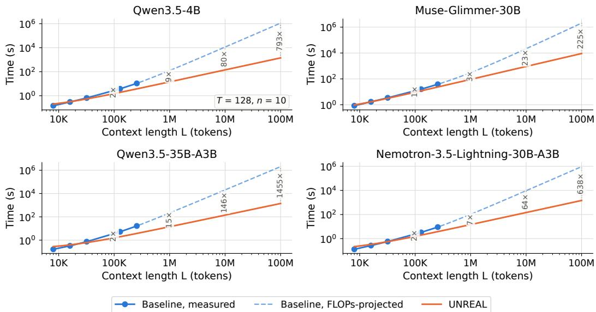  
Figure 13: Measured time-to-first-token, baseline vs. UNREAL, for all four backbones (random weights/inputs, served with vLLM on an NVIDIA H100, bf16). Solid markers are directly measured; the dashed baseline segment is a FLOPs-scaled projection past the point where a single fullcontext forward pass exceeds our measurement budget or the available KV cache. Dotted vertical connectors mark the speedup (baseline time / UNREAL time) at a few representative context lengths, read directly off the time gap between the two curves.

term shrinks to $L \cdot L _ { C }$ , and generation always reads exactly nT=1,280 tokens regardless of L.

Measured wall-clock results. Figs. 13 and 14 report measured TTFT and throughput for all four backbones. The baseline curve is shown only up to the context length at which a single forward pass exceeds our 75-second measurement budget (solid markers), matching the convention of Fig. 1; we extend it with a dashed, FLOPs-scaled projection $( t _ { \mathrm { p r o j } } ( L ) = t _ { \mathrm { m e a s u r e d } } ( L _ { \mathrm { c u t o f f } } )$ $\mathrm { F L O P s } _ { \mathrm { b a s e } } ( L ) / \mathrm { F L O P s } _ { \mathrm { b a s e } } ( L _ { \mathrm { c u t o f f } } ) )$ for visual continuity across the same 8K–100M range. UN-REAL’s chunk-encoding time is computed from its measured, steady-state per-chunk throughput. Chunk encoding is parallel across the $\scriptstyle { \dot { M } } = L / T$ chunks, so total encode time scales linearly with M plus the directly measured, constant-size query and generation passes. This measured $T _ { \mathrm { U N R E A L } } ( L )$ omits two components, both excluded because they are negligible or out of scope rather than favorable to UNREAL: (1) the MaxSim scoring step (O(M) in the FLOPs model above) is not separately benchmarked, as it is a lightweight vector similarity computation external to the LLM forward pass that accounts for under 0.01% of UNREAL’s total FLOPs at every backbone and length we tested; and (2) any orchestration overhead between the encode and generate stages (selecting the top-k chunks, assembling the generation prompt), which a production serving stack would incur but which our per-stage vLLM benchmarking (each stage measured on its own, isolated engine) does not capture. The measured curves corroborate the FLOPs estimate: UNREAL’s TTFT grows roughly linearly with L while the baseline’s grows quadratically, so the baseline becomes both slower and, eventually, infeasible to run at all, in the same context-length regime where Fig. 1 shows its accuracy collapsing.

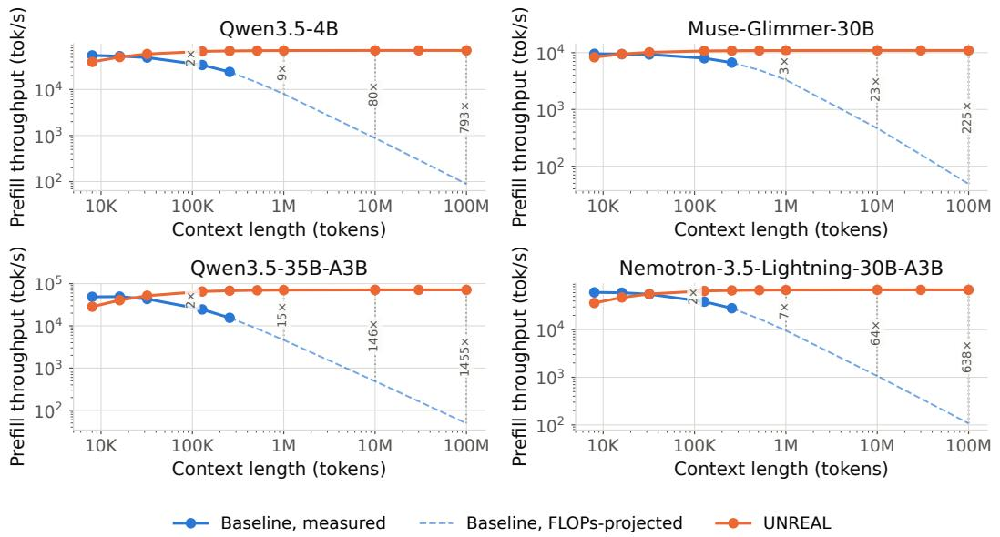  
Figure 14: Measured prefill throughput (tokens/second), baseline vs. UNREAL, for all four backbones. Same data and conventions as Fig. 13.