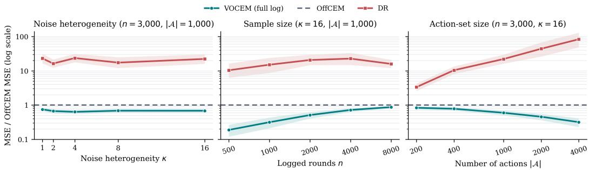
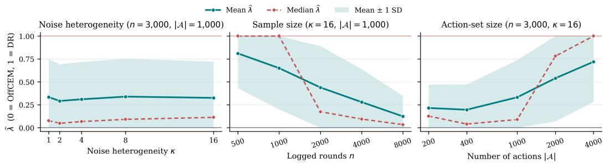
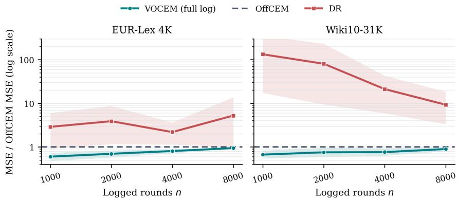
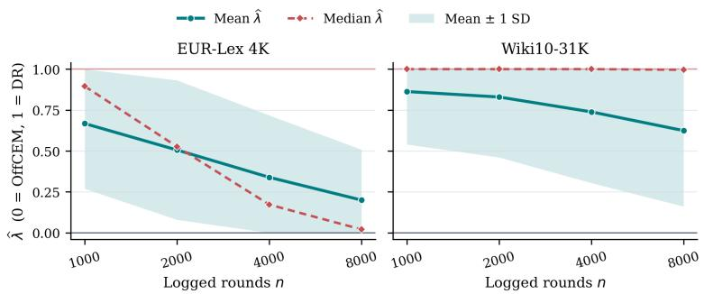
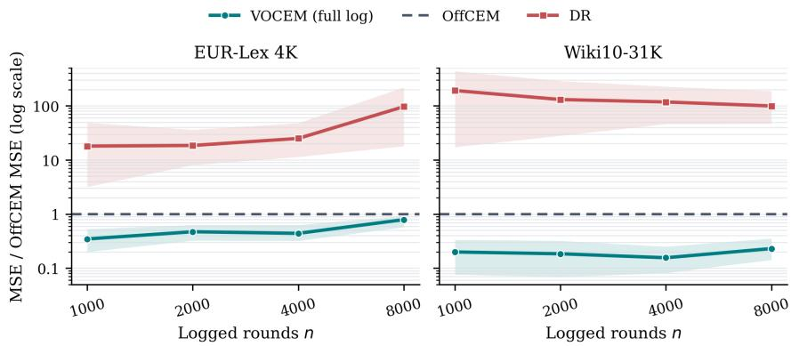
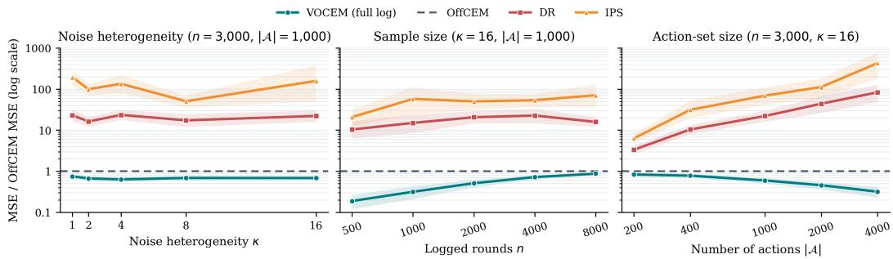
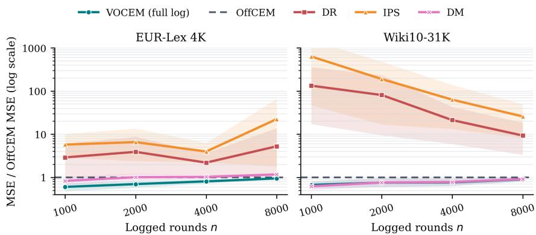
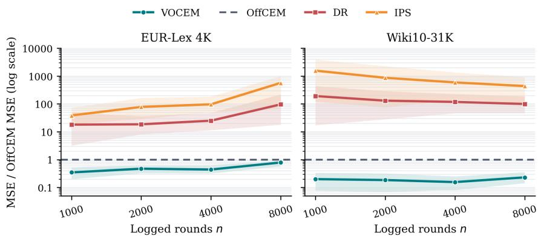
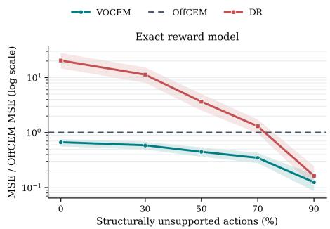
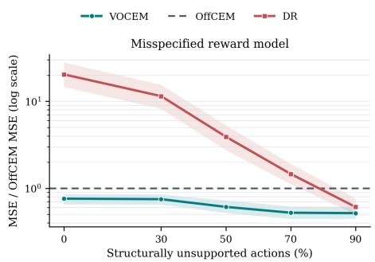

# VARIANCE-OPTIMAL OFF-POLICY EVALUATION WITH CONJUNCT EFFECT MODELING

Nicolo Felicioni\` Spotify

Michael Benigni Politecnico di Milano

Maurizio Ferrari Dacrema Politecnico di Milano

Paolo Cremonesi Politecnico di Milano

## ABSTRACT

Off-policy evaluation (OPE) for contextual bandit policies becomes challenging when action-level importance weighting incurs excessive variance. Doubly robust (DR) estimation remains unbiased under common support but retains these high-variance action-level weights. A prior estimator, Off-policy evaluation with Conjunct Effect Model (OffCEM), replaces them with more stable cluster-level weights, at the cost of relying on local correctness of the reward model. In this paper, we show that, under the assumptions required by DR and OffCEM, there exists an unbiased family of estimators that interpolates between OffCEM and DR. Building on this result, we propose the Variance Optimal-CEM (VOCEM) estimator, which selects the interpolation coefficient to minimize variance. We derive the population-optimal coefficient in closed form and show that the resulting estimator has variance no larger than either endpoint, OffCEM or DR. Experiments in controlled synthetic settings and on two large-action benchmarks show that VOCEM improves upon both endpoints in all 23 evaluated conditions, exhibiting greater stability and empirical robustness.

## 1 INTRODUCTION

Modern recommender systems (Gilotte et al., 2018; Saito & Joachims, 2021), ranking services (Li et al., 2015), and personalized decision tools routinely collect contextual bandit feedback (Wang et al., 2005; Langford & Zhang, 2007). Each logged interaction records a context, the action selected by a logging policy, and the resulting reward, while rewards for the unchosen actions remain unobserved. Off-policy evaluation (OPE) is the problem of using these data to estimate the value of a different target policy without deploying it. This would make it possible to evaluate a policy before an online experiment, but it is a difficult problem to solve.

The standard estimators expose this difficulty at different points. The inverse propensity scoring (IPS) estimator (Horvitz & Thompson, 1952) multiplies every observed reward by an action-level importance ratio and is unbiased under common support. However, this action-level importance ratio (which is the ratio between the target policy and logging policy evaluated on that particular action) may explode in many real use cases (say, if the logging policy is very small for some actions), and makes this estimator very unstable due to high variance. The doubly robust (DR) estimator (Dud´ık et al., 2014) uses a reward regression as a control variate and importance weights only its residual. While this represents an improvement with respect to IPS, the residual correction still contains the same action ratio. The Off-policy evaluation with Conjunct Effect Model (OffCEM) estimator (Saito et al., 2023) instead corrects residuals at the level of action clusters. Aggregating policy mass within a cluster makes its importance ratio more stable, while a reward model represents differences among actions in that cluster. They assume local correctness, i.e., the model need only preserve these within-cluster reward differences rather than recover the absolute reward.

OffCEM thus appears to take a different approach from DR, replacing action-level residual weighting with a coarser cluster-level correction. In this paper, instead, we show that these two estimators are endpoints of a common family. A single scalar parameter interpolates between their residual weights, recovering OffCEM at one endpoint and DR at the other. Under action-level common support and local correctness, every fixed estimator in this family is unbiased.

This shared unbiasedness gives a natural way to choose among the estimators in the family. Meansquared error decomposes into squared bias and variance; since the bias is zero throughout the family, minimizing mean-squared error reduces to minimizing variance. Therefore, in this paper we show that the variance is a quadratic function of the interpolation parameter and derive its theoretical minimizer in closed form. The resulting estimator has variance no larger than either OffCEM or DR. Building on this result, we propose the VARIANCE OPTIMAL-CEM (VOCEM) estimator, which uses an empirical estimate of the optimal coefficient to select a member of this family. We then evaluate this practical estimator in controlled synthetic and real-world experiments. VOCEM has lower MSE than OffCEM in all 15 synthetic and eight real-data conditions, while the fixed DR endpoint is often unstable.

## 2 BACKGROUND

We work in the contextual bandit setting with a measurable context space $x ,$ a finite action set ${ \mathcal { A } } .$ and a reward space ${ \mathcal { R } } \subseteq \mathbb { R }$ . Uppercase letters denote random variables and lowercase letters their realizations. A policy is a conditional distribution over A given $x \in \mathcal { X } ; \pi _ { 0 }$ denotes the logging policy and π the target policy. Under $\pi _ { 0 }$ , one observation $Z = \bar { ( \boldsymbol { X } , \boldsymbol { A } , \boldsymbol { R } ) } \in \mathcal { X } \times \mathcal { A } \times \mathcal { R }$ is generated according to

$$
X \sim p , \qquad A \sim \pi _ { 0 } ( \cdot \mid X ) , \qquad R \sim p ( \cdot \mid X , A ) ,\tag{1}
$$

where $p$ and $p ( \cdot \mid x , a )$ are the context and conditional reward distributions. Both are policy-invariant; only the conditional action distribution changes. The log $\mathcal { D } = \{ Z _ { i } = ( X _ { i } , A _ { i } , R _ { i } ) \} _ { i = 1 } ^ { n }$ consists of i.i.d. draws from Eq. (1). We assume that $\pi _ { 0 } ( A _ { i } \mid X _ { i } )$ is known and that $\tau ( a \mid x )$ can be evaluated.

The conditional mean reward $\boldsymbol { q } ( \boldsymbol { x } , \boldsymbol { a } )$ and the value $V ( \pi )$ of the target policy are

$$
\begin{array} { r } { q ( x , a ) : = {  { \mathbb E } } [ R \mid X = x , A = a ] , \qquad V ( \pi ) : = {  { \mathbb E } } _ { p ( x ) \pi ( a \mid x ) p ( r \mid x , a ) } [ R ] = {  { \mathbb E } } _ { p ( x ) \pi ( a \mid x ) } [ q ( X , A ) ] . } \end{array}\tag{2}
$$

Thus OPE asks for an expectation under the target action distribution using observations drawn under the logging action distribution. To make the two laws unambiguous, for every integrable function h we write

$$
\begin{array} { r } { \mathbb { E } _ { 0 } [ h ( Z ) ] : = \mathbb { E } _ { p ( x ) \pi _ { 0 } ( a \mid x ) p ( r \mid x , a ) } [ h ( X , A , R ) ] . } \end{array}\tag{3}
$$

Notice that $\mathbb { E } _ { 0 }$ always integrates actions against $\pi _ { 0 } .$ , whereas the first expectation in Eq. (2) integrates them against π.

Doubly Robust The doubly robust (DR) estimator (Dud´ık et al., 2014) approaches OPE by combining reward modeling with importance weighting. Let ${ \widehat { q } } : { \mathcal { X } } \times { \mathcal { A } } $ R be a reward model, i.e., a fitted approximation to $q ,$ and define

$$
\widehat { q } ( x , \pi ) : = \sum _ { a \in \mathcal { A } } \pi ( a \mid x ) \widehat { q } ( x , a ) .\tag{4}
$$

The term ${ \widehat { q } } ( x , \pi )$ is the prediction of the expected reward under the target policy, known as the direct method (DM) estimator (Beygelzimer & Langford, 2009). To correct its regression error, DR additionally uses action-level importance weighting of the logged rewards, requiring the following support condition.

Assumption 1 (Action-level common support). For p-almost every x and every $a \in { \mathcal { A } } , \pi ( a \mid x ) > 0$ implies $\pi _ { 0 } ( a \mid x ) > 0$

Under Assumption 1, define

$$
w _ { \mathrm { a } } ( x , a ) : = { \frac { \pi ( a \mid x ) } { \pi _ { 0 } ( a \mid x ) } } .\tag{5}
$$

For reference, averaging the raw reward weighted by $w _ { \mathrm { a } }$ yields the usual Inverse Propensity Scoring (IPS) estimator (Horvitz & Thompson, 1952). DR represents an improvement of IPS. Define the model residual e and the pointwise regression error $\Delta ( x , a )$

$$
e : = R - \widehat { q } ( X , A ) , \qquad \Delta ( x , a ) : = q ( x , a ) - \widehat { q } ( x , a ) .\tag{6}
$$

DR applies the weight only to the reward model residual, correcting the direct estimate,

$$
{ \widehat V } _ { \mathrm { D R } } ( \pi ) : = \frac { 1 } { n } \sum _ { i = 1 } ^ { n } \left[ { \widehat q } ( X _ { i } , \pi ) + w _ { \mathrm { a } } ( X _ { i } , A _ { i } ) e _ { i } \right] .\tag{7}
$$

For fixed ${ \widehat { q } } ,$ the same reweighting calculation gives

$$
\mathbb { E } _ { 0 } [ w _ { \mathrm { a } } ( X , A ) e ] = \mathbb { E } _ { p ( x ) \pi ( a | x ) } [ \Delta ( X , A ) ] , \qquad \mathbb { E } _ { 0 } [ { \widehat { q } } ( X , \pi ) + w _ { \mathrm { a } } ( X , A ) e ] = V ( \pi ) .\tag{8}
$$

Thus the weighted residual corrects the bias of the direct estimate. When $\widehat { q }$ is accurate, its residuals can be much less variable than the raw rewards, which often makes DR more stable than IPS. The correction, however, still contains the action-level weight $w _ { \mathrm { a } } ( X , A )$ and can be unstable for actions with low logging probability (the ratio would explode).

## 3 ACTION CLUSTERS AND OFFCEM

DR uses ratios at the action-level. In many applications, however, actions come with a useful coarser organization. This additional information can be used for estimation. Let C be a finite set of action clusters and let $\phi : \mathcal { X } \times \mathcal { A }  \mathcal { C }$ be a fixed, possibly context-dependent clustering map. We write $C = \phi ( { \cal X } , { \cal A } ) .$ . A policy induces a distribution over clusters by aggregating the probabilities of its constituent actions:

$$
\pi ( c \mid x ) : = \sum _ { a \in { \mathcal A } } \mathbb { I } \{ \phi ( x , a ) = c \} \pi ( a \mid x ) , \qquad \pi _ { 0 } ( c \mid x ) : = \sum _ { a \in { \mathcal A } } \mathbb { I } \{ \phi ( x , a ) = c \} \pi _ { 0 } ( a \mid x ) ,\tag{9}
$$

Assumption 1 implies cluster-level support: if $\pi ( c \mid x ) > 0$ , then $\pi _ { 0 } ( c \mid x ) > 0$ . We can therefore define the cluster importance weight

$$
w _ { \mathrm { c } } ( x , c ) : = { \frac { \pi ( c \mid x ) } { \pi _ { 0 } ( c \mid x ) } } .\tag{10}
$$

Because policy mass is pooled across every action in a cluster, these weights can be far less variable than $w _ { \mathrm { a } } ( x , a )$ The Off-policy evaluation with Conjunct Effect Model (OffCEM) estimator (Saito et al., 2023) retains the variance benefit of coarse importance weights without requiring actions in the same cluster to be equivalent. Its starting point is the conjunct effect model, which organizes the conditional mean reward into a cluster effect and a residual action effect:

$$
\boldsymbol { q } ( \boldsymbol { x } , a ) = \underbrace { \boldsymbol { \mu } ( \boldsymbol { x } , \phi ( \boldsymbol { x } , a ) ) } _ { \mathrm { c l u s t e r \ : e f f e c t } } + \underbrace { \boldsymbol { \rho } ( \boldsymbol { x } , a ) } _ { \mathrm { r e s i d u a l \ : a c t i o n \ : e f f e c t } } .\tag{11}
$$

For example, in movie recommendation, $\mu$ can describe a user’s preference for a genre, while $\rho$ distinguishes individual movies within that genre. OffCEM estimates the change in the cluster effect by importance weighting and uses the reward model $\widehat { q }$ to represent the remaining action-level variation. This gives the estimator

$$
\widehat { V } _ { \mathrm { O f f C E M } } ( \pi ) : = \frac { 1 } { n } \sum _ { i = 1 } ^ { n } \left[ \widehat { q } ( X _ { i } , \pi ) + w _ { \mathrm { c } } ( X _ { i } , \phi ( X _ { i } , A _ { i } ) ) e _ { i } \right] .\tag{12}
$$

The form resembles DR, but the correction has a different resolution. The term ${ \widehat { q } } ( X , \pi )$ averages the fitted rewards under the target policy, including its choice of actions within each cluster. The residual is then reweighted only enough to correct how often the target and logging policies visit each cluster. OffCEM thereby avoids multiplying residuals by the potentially extreme action ratio $w _ { \mathrm { a } } ( X , A )$

Since $w _ { \mathrm { c } } ( x , c )$ is identical for all actions in cluster c, it cannot correct misspecified within-cluster reward differences. This motivates the following local requirement.

Assumption 2 (Local correctness). There exists a measurable b : $\mathcal { X } \times \mathcal { C }  \mathbb { R }$ such that

$$
\Delta ( x , a ) = b ( x , \phi ( x , a ) ) \qquad f o r p \ – { a l m o s t e \nu e r y } x a n d e \nu e r y a \in \mathcal { A } .\tag{13}
$$

Assumption 2 permits a shared additive error $b ( x , c )$ because cluster weighting can correct that offset, but it requires $\widehat { q }$ to preserve within-cluster reward contrasts. Indeed, for two actions a and $a ^ { \prime }$ in the same cluster $c ,$

$$
q ( x , a ) - q ( x , a ^ { \prime } ) = \widehat { q } ( x , a ) - \widehat { q } ( x , a ^ { \prime } ) .\tag{14}
$$

The additive error may otherwise vary freely across contexts and clusters.

It remains to explain why a cluster-specific error does not bias OffCEM. Here $\operatorname { B i a s } ( \widehat { V } ( \pi ) ) : =$ $\mathbb { E } [ \widehat { V } ( \pi ) ] - V ( \pi )$ . Subtracting the DR identity in Eq. (8) from the expectation of $\operatorname { E q . } \left( 1 2 \right)$ , and then conditioning on $( X , A )$ , gives

$$
\mathrm { B i a s } ( \widehat { V } _ { \mathrm { O f f C E M } } ( \pi ) ) = \mathbb { E } _ { 0 } \big [ \big ( w _ { \mathrm { c } } ( X , C ) - w _ { \mathrm { a } } ( X , A ) \big ) e \big ] = \mathbb { E } _ { 0 } \big [ \big ( w _ { \mathrm { c } } ( X , C ) - w _ { \mathrm { a } } ( X , A ) \big ) \Delta ( X , A ) \big ] \ .\tag{15}
$$

The next identity shows that the action ratio averages to the cluster ratio once X and the cluster $\phi ( X , A )$ are fixed.

Lemma 3.1 (Cluster projection). Under Assumption 1,

$$
\mathbb { E } _ { 0 } [ w _ { \mathrm { a } } ( X , A ) \mid X , \phi ( X , A ) ] = w _ { \mathrm { c } } ( X , \phi ( X , A ) ) .\tag{16}
$$

Consequently, define

$$
d ( X , A ) : = w _ { \mathrm { a } } ( X , A ) - w _ { \mathrm { c } } ( X , \phi ( X , A ) ) .
$$

For every measurable h such that $d ( X , A ) h ( X , \phi ( X , A ) )$ is integrable,

$$
{ \mathbb E } _ { 0 } [ d ( X , A ) h ( X , \phi ( X , A ) ) ] = 0 .\tag{17}
$$

Under local correctness, $\Delta ( X , A ) = b ( X , \phi ( X , A ) )$ , so Eq. (15) is zero by Lemma 3.1. This is the mechanism behind OffCEM’s unbiasedness: the regression model supplies the within-cluster reward contrasts, while the cluster importance weight corrects any remaining cluster-level offset.

Throughout the analysis, $\pi , \pi _ { 0 } , \phi ,$ and $\widehat { q }$ are fixed. In particular, $\widehat { q }$ may be trained on an independent sample, and all claims can then be read conditionally on that sample. All first moments used in the analysis are assumed finite.

## 4 VARIANCE OPTIMAL-CEM

DR and OffCEM appear to take different approaches to off-policy evaluation. In this section, we show that they belong to a more general family of estimators. A single parameter ranging from 0 to 1 traces a path through this family, with OffCEM and DR as its endpoints. Under the combined assumptions required by these two estimators, every fixed member of this family is unbiased. We therefore derive the population coefficient that minimizes variance along the path and show that the resulting oracle has variance no larger than either endpoint. We then estimate this coefficient from the same logging sample to obtain the VARIANCE OPTIMAL-CEM (VOCEM) estimator.

## 4.1 AN UNBIASED PATH FROM OFFCEM TO DR

Here we introduce a novel family of estimators that includes OffCEM and DR as special cases. The two estimators share the same direct term; their residual corrections use the cluster ratio $w _ { \mathrm { c } }$ and the action ratio $w _ { \mathrm { a } } ,$ respectively. For $\lambda \in [ 0 , 1 ]$ , define the interpolated weight

$$
\omega _ { \lambda } ( x , a ) : = w _ { \mathrm { c } } ( x , \phi ( x , a ) ) + \lambda d ( x , a ) = ( 1 - \lambda ) w _ { \mathrm { c } } ( x , \phi ( x , a ) ) + \lambda w _ { \mathrm { a } } ( x , a ) ,\tag{18}
$$

and the corresponding estimator

$$
\widehat { V } _ { \lambda } ( \pi ) : = \frac { 1 } { n } \sum _ { i = 1 } ^ { n } \left[ \widehat { q } ( X _ { i } , \pi ) + \omega _ { \lambda } ( X _ { i } , A _ { i } ) e _ { i } \right] .\tag{19}
$$

The endpoints $\lambda = 0$ and $\lambda = 1$ recover OffCEM and DR, respectively, using the same log and reward model. The following proposition shows that every member is unbiased under the same assumptions required by DR and OffCEM.

Proposition 4.1 (Exact bias path). Under Assumption 1, every fixed $\lambda \in [ 0 , 1 ]$ satisfies

$$
\mathrm { B i a s } ( \widehat { V } _ { \lambda } ( \pi ) ) = ( 1 - \lambda ) \mathrm { B i a s } ( \widehat { V } _ { \mathrm { O f C E M } } ( \pi ) ) = ( 1 - \lambda ) \mathbb { E } _ { 0 } [ \big ( w _ { \mathrm { c } } ( X , C ) - w _ { \mathrm { a } } ( X , A ) \big ) \Delta ] .\tag{20}
$$

If Assumption 2 also holds, then

$$
\mathrm { B i a s } ( \widehat { V } _ { \lambda } ( \pi ) ) = 0 .\tag{21}
$$

## 4.2 THE VARIANCE-OPTIMAL COEFFICIENT AND ITS EMPIRICAL ESTIMATE

In OPE, the typical way to evaluate the quality of an estimator is via its mean-squared error (MSE). For every fixed $\lambda \in [ 0 , 1 ]$ , the MSE is the sum of squared bias and variance:

$$
\operatorname { M S E } ( \widehat { V } _ { \lambda } ( \pi ) ) = \operatorname { B i a s } ( \widehat { V } _ { \lambda } ( \pi ) ) ^ { 2 } + \operatorname { V a r } ( \widehat { V } _ { \lambda } ( \pi ) ) .
$$

Under the same assumptions required by OffCEM and DR, Eq. (21) gives

$$
\mathrm { B i a s } ( \widehat { V } _ { \lambda } ( \pi ) ) = 0 \quad \Longrightarrow \quad \mathrm { M S E } ( \widehat { V } _ { \lambda } ( \pi ) ) = \mathrm { V a r } ( \widehat { V } _ { \lambda } ( \pi ) ) .
$$

This means that, in order to minimize the MSE, we need to choose among the estimators on the path therefore reduces to minimizing $\mathrm { V a r } ( \widehat { V } _ { \lambda } ( \pi ) )$ over $\lambda \in [ 0 , 1 ]$ . We show how to do so in the following theorem. Before introducing the theorem, we need to define the following auxiliary population quantities:

$$
A : = \mathbb { E } _ { 0 } [ d ^ { 2 } e ^ { 2 } ] , \qquad B : = \mathbb { E } _ { 0 } [ w _ { \mathrm { c } } ( X , C ) d e ^ { 2 } ] .\tag{22}
$$

These quantities isolate the dependence of the variance on $\lambda { \mathrm { : } }$ as the proof below shows, its λ- dependent part is $A \lambda ^ { 2 } + 2 B \lambda$ . The following theorem gives the minimizing coefficient and compares its variance with the OffCEM and DR endpoints.

Theorem 4.2 (Oracle coefficient and variance dominance). Suppose Assumptions 1 and 2 hold, the OffCEM and DR summands have finite second moments, A and B are defined as in Eq. (22), and B $i s .$ finite. $H A > 0 ,$ , the coefficient minimizing $\mathrm { V a r } ( \widehat { V } _ { \lambda } ( \pi ) )$ over $\lambda \in [ 0 , 1 ]$ is

$$
\lambda ^ { \star } : = \Pi _ { [ 0 , 1 ] } \left( - { \frac { B } { A } } \right) , \qquad \Pi _ { [ 0 , 1 ] } ( u ) : = \operatorname* { m i n } \{ 1 , \operatorname* { m a x } \{ 0 , u \} \} .\tag{23}
$$

$H A = 0$ , all estimators on the path agree almost surely and we set ${ { \lambda } ^ { \star } } = 0 .$ . In either case,

$$
\operatorname { V a r } ( \widehat { V } _ { \lambda ^ { \star } } ( \pi ) ) \leq \operatorname* { m i n } \Bigl \{ \operatorname { V a r } ( \widehat { V } _ { \mathrm { O f f C E M } } ( \pi ) ) , \operatorname { V a r } ( \widehat { V } _ { \mathrm { D R } } ( \pi ) ) \Bigr \} .\tag{24}
$$

The inequality is strict when $A > 0 a n d - B / A \in ( 0 , 1 )$

A useful practical feature of $\lambda ^ { \star }$ is that it can be estimated directly from the logging sample. Once $\pi _ { \mathrm { : } }$ $\pi _ { 0 } , \phi ,$ and $\widehat { q }$ are fixed, A and B are expectations of functions of the logged observation $\bar { Z ; }$ neither the unknown conditional reward variance nor the true regression error is required. We therefore replace the expectations in Eq. (22) with sample averages:

$$
\begin{array} { r l } & { \widehat { A } : = \displaystyle \frac { 1 } { n } \sum _ { i = 1 } ^ { n } d ( X _ { i } , A _ { i } ) ^ { 2 } e _ { i } ^ { 2 } , } \\ & { \widehat { B } : = \displaystyle \frac { 1 } { n } \sum _ { i = 1 } ^ { n } w _ { \mathrm { c } } ( X _ { i } , \phi ( X _ { i } , A _ { i } ) ) d ( X _ { i } , A _ { i } ) e _ { i } ^ { 2 } , } \\ & { \widehat { \lambda } : = \displaystyle \left\{ \Pi _ { [ 0 , 1 ] } ( - \widehat { B } / \widehat { A } ) , \widehat { A } > 0 , \right. } \\ & { \widehat { A } = 0 . } \end{array}\tag{25}
$$

The resulting $\widehat { \lambda }$ is a plug-in estimate of $\lambda ^ { \star }$ . Substituting this coefficient into the path gives VARI-ANCE OPTIMAL-CEM:

$$
\begin{array} { l } { \widehat { V } _ { \mathrm { V O C E M } } ( \pi ) : = \widehat { V } _ { \widehat { \lambda } } ( \pi ) } \\ { \displaystyle \quad = \frac { 1 } { n } \sum _ { i = 1 } ^ { n } \left[ \widehat { q } ( X _ { i } , \pi ) + \left( w _ { \mathrm { c } } ( X _ { i } , \phi ( X _ { i } , A _ { i } ) ) + \widehat { \lambda } d ( X _ { i } , A _ { i } ) \right) e _ { i } \right] . } \end{array}\tag{26}
$$

## 5 EXPERIMENTS

We investigate whether the VOCEM estimator improves in terms of MSE over DR and OffCEM, first in a controlled synthetic environment and then on two real-world benchmarks.1 The comparisons answer two questions: whether there is a gain that persists across different noise, sample-size, and action-space regimes in an ideal condition of perfect reward model, and whether this gain persists when the reward model is not perfect. To keep the presentation focused, in this section we restrict the comparison to DR, OffCEM, and VOCEM. In Appendix D.5, we report results for the same experimental settings including additional baseline OPE estimators. In every condition, compared estimators share the same logging data, reward regression, clustering, and policy probabilities. To analyze the outcomes of the experiments, we report the relative MSE for each estimator i.e., $\mathbb { E } [ ( \widehat { V } ( \pi ) - V ( \pi ) ) ^ { 2 } ] / V ( \pi ) ^ { 2 }$ , normalized by the relative MSE of OffCEM. Thus, the OffCEM reference is always one, and smaller values are better.

  
Figure 1: Results on synthetic data. Points are MSE ratios to OffCEM and ribbons are pointwise paired-bootstrap 95% confidence intervals over 300 repetitions. The dashed line is OffCEM. Only the same-log VOCEM estimator is shown; every VOCEM interval lies below one.

## 5.1 SYNTHETIC DATA

## 5.1.1 SETUP

We build on the public OffCEM synthetic data generator and its default configuration (Saito et al., 2023): we generate 200 distinct users represented by 10-dimensional contexts, actions have 10 categorical attributes with five levels each, and up to 50 action clusters are used. The conditional mean reward $q ( x , a )$ is generated by a cluster component and an action component, as in the OffCEM construction (Saito et al., 2023). Following (Saito et al., 2023), we likewise use a softmax logging policy with inverse temperature $\beta = - 0 . 1$ , an ϵ-greedy target policy with $\epsilon = 0 . 2$ , and the default values $n = 3 { , } 0 0 0$ and $| \bar { \mathcal { A } } | = 1 , 0 0 0$

The only deliberate change to the reward generator of Saito et al. (2023) is heteroskedasticity i.e., we make the reward variance different across actions. To induce within-cluster heteroskedasticity, we fix an ordering of the actions in each cluster and map their indices linearly onto [0, 1]. Denoting the resulting value for action a by u(a), we set

$$
\operatorname { V a r } ( R \mid X , A = a ) = 9 \kappa ^ { u ( a ) } .\tag{27}
$$

At $\kappa = 1$ , this is exactly the constant standard deviation $\operatorname { V a r } ( R \mid X , A ) = 3$ used by Saito et al. (2023). To show the behaviours of $\mathbf { V O C E M }$ in different regimes, we execute the same experiment with varying parameters: ${ \mathrm { ( i ) } } \ \kappa \in \{ 1 , 2 , 4 , 8 , 1 6 \} ; { \mathrm { ( i i ) } } \ n \in \{ 5 0 0 , 1 0 0 0 , 2 0 0 0 , 4 0 0 0 , 8 0 0 0 \}$ at $\kappa = 1 6 ;$ and (iii) $| \mathcal { A } | \in \{ 2 0 0 , 4 0 0 , 1 0 0 0 , 2 0 0 0 , 4 0 0 0 \}$ at $\kappa = 1 6$ . All other parameters remain at the defaults above. Each condition is repeated 300 times. Appendix D.2 specifies the generator, randomization, and sweep controls in full.

The conditional mean $\boldsymbol { q } ( \boldsymbol { x } , \boldsymbol { a } )$ is known in this synthetic experiment, and all three estimators use ${ \widehat { q } } = q .$ . This removes reward model error and isolates the correction weights: OffCEM uses $w _ { \mathrm { c } } ( X , C )$ DR uses $w _ { \mathrm { a } } ( X , A )$ , and VOCEM estimates $\widehat { \lambda }$ from all n logged observations.

## 5.1.2 RESULTS

Figure 1 shows a uniform advantage for VOCEM: its MSE is below that of OffCEM in all 15 conditions, and every pointwise upper confidence bound is smaller than one. Across the noise heterogeneity sweep, the MSE ratio ranges from 0.634 to 0.749, a reduction of 25.1–36.6%. The VOCEM gain is present even at $\kappa = 1$ , where the noise model reduces to the original OffCEM’s homoskedastic setting, and remains substantial at κ = 16 (MSE ratio of 0.684).

  
Figure 2: The $\widehat { \lambda }$ coefficient in the synthetic experiments. Solid curves and dashed curves show the mean and median of $\widehat { \lambda }$ over 300 repetitions; ribbons span one standard deviation around the mean, clipped to [0, 1]. The endpoints 0 and 1 recover OffCEM and DR, respectively. The ribbons describe run-to-run variation, not confidence intervals for the mean.

For the sample size sweep, the MSE ratio increases from 0.188 at $n = 5 0 0$ to 0.873 at $n = 8 { , } 0 0 0$ approaching the OffCEM endpoint. Conversely, the benefit becomes larger with the action space: the ratio falls from 0.834 at 200 actions to 0.318 at 4,000 actions. In that same sweep, DR deteriorates from 3.34 to 83.38 times the OffCEM MSE, whereas VOCEM remains below OffCEM throughout. VOCEM therefore exploits the action-level benefits without inheriting DR’s instability in the largeaction regime.

Behavior of $\widehat { \lambda }$ coefficient. Figure 2 clarifies how VOCEM obtains these gains. Changing only the noise heterogeneity has little effect on the average $\widehat { \lambda }$ coefficient: its mean remains between 0.292 and 0.339. Its median is much closer to the OffCEM endpoint (0.048–0.113), reflecting a broad, endpoint-heavy distribution: 25–33% of repetitions select $\overset { \vartriangle } { \lambda } = 0 .$ , while 18–23% select $\widehat { \lambda } = 1$

The other two sweeps expose stronger adaptation. As n increases from 500 to 8,000, the mean $\widehat { \lambda }$ coefficient falls from 0.811 to 0.124, its median falls from 1 to 0.033, and the fraction at the DR endpoint, $\widehat { \lambda } = 1$ , falls from 79% to 1%. This movement toward OffCEM agrees with the diminishing MSE advantage in the middle panel of Figure 1. In contrast, increasing $| \bar { \mathcal { A } } |$ from 200 to 4,000 raises the mean from 0.215 to 0.720; the median reaches 1, and 70% of repetitions select the DR endpoint in the largest action space. This does not imply that the DR estimator is reliable: Figure 1 shows the opposite. Although VOCEM selects the DR endpoint in many repetitions, it shrinks the action-level correction toward OffCEM in the smaller set of repetitions where action-level weighting is unstable. These repetitions with unstable weights account for a large share of DR’s MSE, so avoiding its most extreme errors substantially reduces VOCEM’s overall MSE.

## 5.2 REAL-WORLD DATA

## 5.2.1 DATASETS AND PROTOCOL

Following the real-data evaluation of Saito et al. (2023), we use the EUR-Lex 4K and Wiki10-31K datasets from the Extreme Classification Repository (Bhatia et al., 2016). Each instance consists of a document x and a set ${ \mathcal { L } } ( x ) \subseteq A$ of labels assigned to that document in the original dataset. We regard a document and action pair $( x , a )$ as relevant when $a \in { \mathcal { L } } ( x )$ ). These relevance annotations are used to construct the semi-synthetic rewards described below.

Before constructing the bandit problem, we filter the Wiki10-31K action set using the rule adopted by Saito et al. (2023). For each label a, we count the number of documents to which it is assigned across the provided training and test splits. We retain label a as an action only if it is assigned to more than 9 documents. This filtering retains $^ { 5 , 5 0 1 }$ of the 30,938 Wiki10-31K labels. We retain all $^ { 3 , 9 5 6 }$ labels for EUR-Lex 4K.

Table 1: Real-world dataset statistics. “Evaluated actions” records the action set after the stated frequency filtering.
<table><tr><td>Dataset</td><td>Training documents</td><td>Test documents</td><td>Original labels</td><td>Retained actions</td></tr><tr><td>EUR-Lex 4K</td><td>15,449</td><td>3,865</td><td>3,956</td><td>3,956</td></tr><tr><td>Wiki10-31K</td><td>14,146</td><td>6,616</td><td>30,938</td><td>5,501</td></tr></table>

We convert the original relevance annotations into stochastic binary rewards using the semi-synthetic construction used in Saito et al. (2023). At dataset construction, each retained action a is assigned a fixed offset $\eta _ { a } \in [ 0 , 0 . 2 ]$ , sampled independently and held fixed throughout the experiment. Define

$$
q ( x , a ) = \left\{ \begin{array} { l l } { \sigma ( 1 - \eta _ { a } ) , } & { a \in \mathcal { L } ( x ) , } \\ { \sigma ( \eta _ { a } - 1 ) , } & { a \notin \mathcal { L } ( x ) , } \end{array} \right.\tag{28}
$$

where $\sigma$ is the sigmoid function. We then draw $R \mid X = x , A = a \sim$ Bernoulli $( q ( x , a ) )$ . The action-specific offset $\eta _ { a }$ controls the separation between these two probabilities: larger values make relevance less easily distinguishable from irrelevance.

As in OffCEM, the logging policy is a softmax over ridge-predicted rewards with $\beta = 3 0$ , the target policy is ϵ-greedy with $\epsilon = 0 . 1$ , and actions are assigned uniformly at random to 100 clusters. We sample 300 users, vary the number of logged rounds over n ∈ {1000, 2000, 4000, 8000}, and run 100 paired repetitions.

We implement the reward model as a ridge regression model using as input document features, compressed to 100 components with truncated SVD. We train the model by five-fold cross-fitting. All observations from the same user are assigned to the same fold. For each fold k, we fit the ridge model using observations from users in the other four folds. For every logged observation in fold k, we compute the out-of-fold prediction and the corresponding residual. After obtaining one out-of-fold residual for every row, we pool all n residuals and estimate a single coefficient $\widehat { \lambda }$ using Equation (25).

This experiment evaluates the VOCEM estimator with a learned reward model. Appendix D.3 gives the complete preprocessing, policy, regression, and seed specifications. Appendix E reports synthetic experiments under violations of the common action support assumption.

  
Figure 3: Results on real-data with the five-fold out-of-fold ridge reward model. Points are MSE ratios to OffCEM and ribbons are pointwise paired-bootstrap 95% confidence intervals over 100 repetitions. The dashed line is OffCEM.

## 5.2.2 RESULTS

Figure 3 again favors VOCEM in every condition. On EUR-Lex 4K, its MSE ratio ranges from 0.601 at $n = 1 , 0 0 0 \mathrm { t o } 0 . 9 4 2 \mathrm { a t } n = 8 , 0 0 0$ , corresponding to the two ends of the sweep. On Wiki10-31K, the ratios range from 0.669 to 0.897. All eight pointwise upper confidence bounds remain below one; the closest is 0.999 for Wiki10-31K at $n = 8 { , } 0 0 0$ . DR is markedly less stable, with MSE between

2.19 and 132.94 times the OffCEM one. These results show that VOCEM can produce gains even with estimated rewards, while retaining the protection afforded by cluster-level weighting in large action spaces.

  
Figure 4: The $\widehat { \lambda }$ coefficient with learned rewards on EUR-Lex 4K and Wiki10-31K. Solid curves and dashed curves are the mean and median over 100 repetitions; ribbons span one standard deviation around the mean, clipped to [0, 1].

Coefficient behavior. The coefficient paths in Figure 4 differ substantially between datasets. On EUR-Lex 4K, the mean falls from 0.667 to 0.200 as n grows, while the median falls from 0.895 to 0.020. The probability of the OffCEM endpoint consequently rises from 19% to 48%, and no repetition selects the DR endpoint at $n = 8 { , } 0 0 0$ . Wiki10-31K places much more weight on the action-level correction: the mean decreases more gradually from 0.863 to 0.624, and the median remains essentially at the DR endpoint. The fraction with $\widehat { \lambda } = 1$ nevertheless declines from 79% to 46% as the log grows.

The wide ribbons and the separation between means and medians are consequences of substantial between-log diversity. They also explain why the mean coefficient should not be read as a fixed global interpolation. In particular, Wiki10-31K often selects $\widehat { \lambda } = 1$ , yet applying DR to every log is extremely unstable in Figure 3. VOCEM’s advantage comes from making the endpoint decision separately on each full log, including backing away from DR on the minority of logs responsible for its largest errors.

An oracle-regression ablation in Appendix D.4 reaches the same qualitative conclusion after removing reward-model estimation error.

## 6 CONCLUSION

We introduced VOCEM to improve off-policy evaluation when action-level importance ratios induce high variance in DR estimation. By connecting DR and OffCEM through a one-parameter family of residual corrections, we make the choice between action-level and cluster-level weighting an explicit variance-minimization problem. Under the same assumptions required by DR and OffCEM, every member of this family is unbiased. We derive the population-optimal coefficient in closed form and show that its estimator has variance no larger than either endpoint. VOCEM estimates this coefficient directly from the logged data.

Across 15 synthetic and eight real-world benchmarks, VOCEM achieved lower MSE than both DR and OffCEM, with gains observed under both oracle and learned reward models. These results support adapting the residual weights to the observed data as a way to improve estimation when DR’s action-level correction is unstable.

Future work could jointly learn the action clusters and interpolation coefficient, adapting both the structure and strength of the residual correction to improve estimation.

## AI USE STATEMENT

Generative AI tools assisted with formulating theoretical claims through iterative discussions and with developing and writing proofs. Generative AI tools also assisted with literature exploration, interpreting results, and drafting and editing the manuscript. Coding agents assisted with the Python implementation of the methods and experiments, including synthetic-data generation based on the setup of Saito et al. (2023). The experimental design was developed by the authors. Generative AI tools also assisted with interpreting results and drafting and editing the manuscript. The authors checked the mathematical claims and proofs, reviewed the code, and take responsibility for the final content of this work, including all AI-assisted text, claims, and code.

## REFERENCES

Imad Aouali and Otmane Sakhi. Off-policy learning in large action spaces: Optimization matters more than estimation. CoRR, abs/2509.03456, 2025. doi: 10.48550/ARXIV.2509.03456. URL https://doi.org/10.48550/arXiv.2509.03456.

Imad Aouali, Victor-Emmanuel Brunel, David Rohde, and Anna Korba. Bayesian off-policy evaluation and learning for large action spaces. In Yingzhen Li, Stephan Mandt, Shipra Agrawal, and Mohammad Emtiyaz Khan (eds.), International Conference on Artificial Intelligence and Statistics, AISTATS 2025, Mai Khao, Thailand, 3-5 May 2025, volume 258 of Proceedings of Machine Learning Research, pp. 136–144. PMLR, 2025. URL https://proceedings.mlr. press/v258/aouali25a.html.

Michael Benigni. Bayesian perspectives on offline evaluation for recommender systems. In Maria´ Bielikova, Pavel Kord´ ´ık, Markus Schedl, Marco de Gemmis, Sole Pera, Rodrigo Alves, Olivier Jeunen, and Vito Ostuni (eds.), Proceedings ofthe Nineteenth ACM Conference on Recommender Systems, RecSys 2025, Prague, Czech Republic, September 22-26, 2025, pp. 1458–1462. ACM, 2025. doi: 10.1145/3705328.3748762. URL https://doi.org/10.1145/3705328.3748762.

Alina Beygelzimer and John Langford. The offset tree for learning with partial labels. In Proceedings of the ACM international conference on Knowledge discovery and data mining (SIGKDD), pp. 129–138, 2009.

Kush Bhatia, Kunal Dahiya, Himanshu Jain, Purushottam Kar, and Manik Varma. The extreme classification repository: Multi-label datasets and code, 2016. Dataset repository.

Matej Cief, Branislav Kveton, and Michal Kompan. Cross-validated off-policy evaluation. CoRR, abs/2405.15332, 2024. doi: 10.48550/ARXIV.2405.15332. URL https://doi.org/10. 48550/arXiv.2405.15332.

Miroslav Dud´ık, Dumitru Erhan, John Langford, and Lihong Li. Doubly robust policy evaluation and optimization. Statistical Science, 29(4):485–511, 2014.

Nicolo Felicioni, Maurizio Ferrari Dacrema, Marcello Restelli, and Paolo Cremonesi. Off-policy\` evaluation with deficient support using side information. In Advances in Neural Information Processing Systems (NeurIPS), 2022.

Nicolo Felicioni, Michael Benigni, and Maurizio Ferrari Dacrema. Autoope: Automated off-policy\` estimator selection. CoRR, abs/2406.18022, 2024. doi: 10.48550/ARXIV.2406.18022. URL https://doi.org/10.48550/arXiv.2406.18022.

Germano Gabbianelli, Gergely Neu, and Matteo Papini. Importance-weighted offline learning done right. In Claire Vernade and Daniel Hsu (eds.), International Conference on Algorithmic Learning Theory, 25-28 February 2024, La Jolla, California, USA, Proceedings of Machine Learning Research, pp. 614–634. PMLR, 2024. URL https://proceedings.mlr.press/v237/ gabbianelli24a.html.

Alexandre Gilotte, Clement Calauz´ enes, Thomas Nedelec, Alexandre Abraham, and Simon Doll\` e.´ Offline A/B testing for recommender systems. In Proceedings of the ACM International Conference on Web Search and Data Mining (WSDM), pp. 198–206. ACM, 2018.

Daniel G. Horvitz and Donovan J. Thompson. A generalization of sampling without replacement from a finite universe. Journal ofthe American Statistical Association, 47(260):663–685, 1952.

Nan Jiang and Lihong Li. Doubly robust off-policy value evaluation for reinforcement learning. In Proceedings of the International Conference on Machine Learning (ICML), volume 48, pp. 652–661, 2016.

Nathan Kallus and Masatoshi Uehara. Intrinsically efficient, stable, and bounded off-policy evaluation for reinforcement learning. In Advances in Neural Information Processing Systems (NeurIPS), pp. 3320–3329, 2019.

John Langford and Tong Zhang. The epoch-greedy algorithm for multi-armed bandits with side information. In Advances in Neural Information Processing Systems (NeurIPS), pp. 817–824, 2007.

Lihong Li, Shunbao Chen, Jim Kleban, and Ankur Gupta. Counterfactual estimation and optimization of click metrics in search engines: A case study. In Proceedings of the International Conference on World Wide Web Companion (WWW), pp. 929–934, 2015.

Alberto Maria Metelli, Alessio Russo, and Marcello Restelli. Subgaussian and differentiable importance sampling for off-policy evaluation and learning. In Advances in Neural Information Processing Systems (NeurIPS), pp. 8119–8132, 2021.

Yusuke Narita, Shota Yasui, and Kohei Yata. Debiased off-policy evaluation for recommendation systems. In Humberto Jesus Corona Pamp´ ´ın, Martha A. Larson, Martijn C. Willemsen, Joseph A. Konstan, Julian J. McAuley, Jean Garcia-Gathright, Bouke Huurnink, and Even Oldridge (eds.), RecSys ’21: Fifteenth ACM Conference on Recommender Systems, Amsterdam, The Netherlands, 27 September 2021 - 1 October 2021, pp. 372–379. ACM, 2021.

Allen Nie, Yash Chandak, Christina J Yuan, Anirudhan Badrinath, Yannis Flet-Berliac, and Emma Brunskil. Opera: Automatic offline policy evaluation with re-weighted aggregates of multiple estimators. arXiv preprint arXiv:2405.17708, 2024.

Doina Precup, Richard S. Sutton, and Satinder P. Singh. Eligibility traces for off-policy policy evaluation. In Proceedings of the International Conference on Machine Learning (ICML), pp. 759–766, 2000.

Noveen Sachdeva, Yi Su, and Thorsten Joachims. Off-policy bandits with deficient support. In Proceedings of the ACM Conference on Knowledge Discovery and Data Mining (SIGKDD), pp. 965–975, 2020.

Noveen Sachdeva, Lequn Wang, Dawen Liang, Nathan Kallus, and Julian McAuley. Off-policy evaluation for large action spaces via policy convolution. In Proceedings of the ACM on Web Conference (WWW), pp. 3576–3585, 2024.

Yuta Saito and Thorsten Joachims. Counterfactual learning and evaluation for recommender systems: Foundations, implementations, and recent advances. In Proceedings ofthe ACM Conference on Recommender Systems (RecSys), pp. 828–830, 2021.

Yuta Saito and Thorsten Joachims. Off-policy evaluation for large action spaces via embeddings. In Proceedings ofthe 39th International Conference on Machine Learning, volume 162 of Proceedings of Machine Learning Research, pp. 19089–19122. PMLR, 2022.

Yuta Saito, Qingyang Ren, and Thorsten Joachims. Off-policy evaluation for large action spaces via conjunct effect modeling. In Proceedings of the 40th International Conference on Machine Learning, volume 202 of Proceedings of Machine Learning Research, pp. 29734–29759. PMLR, 2023.

Otmane Sakhi, Pierre Alquier, and Nicolas Chopin. Pac-bayesian offline contextual bandits with guarantees. In Andreas Krause, Emma Brunskill, Kyunghyun Cho, Barbara Engelhardt, Sivan Sabato, and Jonathan Scarlett (eds.), International Conference on Machine Learning, ICML 2023, 23-29 July 2023, Honolulu, Hawaii, USA, volume 202 of Proceedings of Machine Learning Research, pp. 29777–29799. PMLR, 2023. URL https://proceedings.mlr.press/ v202/sakhi23a.html.

Otmane Sakhi, Imad Aouali, Pierre Alquier, and Nicolas Chopin. Logarithmic smoothing for pessimistic off-policy evaluation, selection and learning. In Advances in Neural Information Processing Systems (NeurIPS), volume 37, pp. 80706–80755, 2024.

Tatsuhiro Shimizu, Koichi Tanaka, Ren Kishimoto, Haruka Kiyohara, Masahiro Nomura, and Yuta Saito. Effective off-policy evaluation and learning in contextual combinatorial bandits. In Tommaso Di Noia, Pasquale Lops, Thorsten Joachims, Katrien Verbert, Pablo Castells, Zhenhua Dong, and Ben London (eds.), Proceedings ofthe 18th ACM Conference on Recommender Systems, RecSys 2024, Bari, Italy, October 14-18, 2024, pp. 733–741. ACM, 2024. doi: 10.1145/3640457. 3688099. URL https://doi.org/10.1145/3640457.3688099.

Arjun Sondhi, David Arbour, and Drew Dimmery. Balanced off-policy evaluation in general action spaces. In Silvia Chiappa and Roberto Calandra (eds.), The 23rd International Conference on Artificial Intelligence and Statistics, AISTATS 2020, 26-28 August 2020, Online [Palermo, Sicily, Italy], volume 108 of Proceedings of Machine Learning Research, pp. 2413–2423. PMLR, 2020. URL http://proceedings.mlr.press/v108/sondhi20a.html.

Alexander L. Strehl, John Langford, Lihong Li, and Sham M. Kakade. Learning from logged implicit exploration data. In Advances in Neural Information Processing Systems (NeurIPS), pp. 2217–2225, 2010.

Yi Su, Lequn Wang, Michele Santacatterina, and Thorsten Joachims. CAB: continuous adaptive blending for policy evaluation and learning. In Kamalika Chaudhuri and Ruslan Salakhutdinov (eds.), Proceedings ofthe 36th International Conference on Machine Learning, ICML 2019, 9- 15 June 2019, Long Beach, California, USA, volume 97 of Proceedings of Machine Learning Research, pp. 6005–6014. PMLR, 2019. URL http://proceedings.mlr.press/v97/ su19a.html.

Yi Su, Maria Dimakopoulou, Akshay Krishnamurthy, and Miroslav Dud´ık. Doubly robust off-policy evaluation with shrinkage. In Proceedings ofthe International Conference on Machine Learning (ICML), volume 119, pp. 9167–9176, 2020a.

Yi Su, Pavithra Srinath, and Akshay Krishnamurthy. Adaptive estimator selection for off-policy evaluation. In Proceedings ofthe International Conference on Machine Learning (ICML), volume 119, pp. 9196–9205, 2020b.

Adith Swaminathan and Thorsten Joachims. The self-normalized estimator for counterfactual learning. In Advances in Neural Information Processing Systems (NeurIPS), pp. 3231–3239, 2015.

Muhammad Faaiz Taufiq, Arnaud Doucet, Rob Cornish, and Jean-Francois Ton. Marginal density ratio for off-policy evaluation in contextual bandits. In Alice Oh, Tristan Naumann, Amir Globerson, Kate Saenko, Moritz Hardt, and Sergey Levine (eds.), Advances in Neural Information Processing Systems 36: Annual Conference on Neural Information Processing Systems 2023, NeurIPS 2023, New Orleans, LA, USA, December 10 - 16, 2023, 2023. URL http://papers.nips.cc/paper\_files/paper/2023/hash/ a51f974947c42b40a40a882a7d9b2479-Abstract-Conference.html.

Philip S. Thomas and Emma Brunskill. Data-efficient off-policy policy evaluation for reinforcement learning. In Proceedings ofthe International Conference on Machine Learning (ICML), volume 48, pp. 2139–2148, 2016.

Takuma Udagawa, Haruka Kiyohara, Yusuke Narita, Yuta Saito, and Kei Tateno. Policy-adaptive estimator selection for off-policy evaluation. In Proceedings of the Conference on Artificial Intelligence (AAAI), pp. 10025–10033, 2023.

Cameron Voloshin, Hoang Minh Le, Nan Jiang, and Yisong Yue. Empirical study of off-policy policy evaluation for reinforcement learning. In Proceedings ofthe Neural Information Processing Systems Track on Datasets and Benchmarks (NeurIPS Datasets and Benchmarks), 2021.

Chih-Chun Wang, Sanjeev R Kulkarni, and H Vincent Poor. Bandit problems with side observations. IEEE Transactions on Automatic Control, 50(3):338–355, 2005.

Yu-Xiang Wang, Alekh Agarwal, and Miroslav Dud´ık. Optimal and adaptive off-policy evaluation in contextual bandits. In Doina Precup and Yee Whye Teh (eds.), Proceedings of the 34th International Conference on Machine Learning, ICML 2017, Sydney, NSW, Australia, 6-11 August 2017, volume 70 of Proceedings ofMachine Learning Research, pp. 3589–3597. PMLR, 2017.

## A PROOFS FOR SECTION 3: ACTION CLUSTERS AND OFFCEM

Lemma 3.1 (Cluster projection). Under Assumption 1,

$$
\mathbb { E } _ { 0 } [ w _ { \mathrm { a } } ( X , A ) \mid X , \phi ( X , A ) ] = w _ { \mathrm { c } } ( X , \phi ( X , A ) ) .\tag{29}
$$

Consequently, define

$$
d ( X , A ) : = w _ { \mathrm { a } } ( X , A ) - w _ { \mathrm { c } } ( X , \phi ( X , A ) ) .
$$

For every measurable h such that $d ( X , A ) h ( X , \phi ( X , A ) )$ is integrable,

$$
{ \mathbb E } _ { 0 } [ d ( X , A ) h ( X , \phi ( X , A ) ) ] = 0 .\tag{30}
$$

Proof. Fix $( x , c )$ with $\pi _ { 0 } ( c \mid x ) > 0$ . The within-cluster logging policy is

$$
\pi _ { 0 } ( a \mid x , c ) = { \frac { \pi _ { 0 } ( a \mid x ) \mathbb { I } \{ \phi ( x , a ) = c \} } { \pi _ { 0 } ( c \mid x ) } } .
$$

Expanding the conditional expectation and using common support gives

$$
\begin{array} { l } { { \mathbb E } _ { 0 } [ w _ { \mathrm { a } } ( X , A ) \mid X = x , \phi ( x , A ) = c ] } \\ { \ } \\ { = \displaystyle \sum _ { a \in A } \pi _ { 0 } ( a \mid x , c ) \frac { \pi ( a \mid x ) } { \pi _ { 0 } ( a \mid x ) } } \\ { \ = \displaystyle \frac { \sum _ { a : \phi ( x , a ) = c } \pi ( a \mid x ) } { \pi _ { 0 } ( c \mid x ) } } \\ { \ = \displaystyle \frac { \pi ( c \mid x ) } { \pi _ { 0 } ( c \mid x ) } = w _ { \mathrm { c } } ( x , c ) . } \end{array}
$$

Here common support ensures that any action with $\pi _ { 0 } ( a \mid x ) = 0$ also has $\pi ( a \mid x ) = 0$ , so omitting such actions from the conditional sum does not change its numerator.

We now prove the final claim explicitly. Conditional on $X = x$ and $\phi ( x , A ) = c ,$ the action A can still vary among the actions in cluster c. However, $h ( x , c )$ and $w _ { \mathrm { c } } ( x , c )$ are fixed. Therefore, they can be taken outside the sum over actions. By contrast, $w _ { \mathrm { a } } ( x , a )$ , and hence $d ( x , a )$ , generally varies with the particular action a and must remain inside that sum:

$$
\begin{array} { l } { { \mathbb { E } _ { 0 } [ \bar { d } ( X , A ) h ( X , \phi ( X , A ) ) \mid X = x , \phi ( x , A ) = c ] } } \\ { { = \displaystyle \sum _ { \alpha \neq ( x , \alpha ) = \infty } \frac { \pi _ { 0 } ( a \mid x ) } { \pi _ { 0 } ( c \mid x ) } \left\{ \frac { \pi ( a \mid x ) } { \pi _ { 0 } ( a \mid x ) } - \frac { \pi ( c \mid x ) } { \pi _ { 0 } ( c \mid x ) } \right\} h ( x , c ) } } \\ { { = h ( x , c ) \left\{ \displaystyle \frac { 1 } { \pi _ { 0 } ( c \mid x ) } \sum _ { a : \phi ( x , \alpha ) = c } \pi ( a \mid x ) - \frac { \pi ( c \mid x ) } { \pi _ { 0 } ( c \mid x ) ^ { 2 } } \sum _ { a : \phi ( x , \alpha ) = c } \pi _ { 0 } ( a \mid x ) \right\} } } \\ { { = h ( x , c ) \left\{ \displaystyle \frac { \pi ( c \mid x ) } { \pi _ { 0 } ( c \mid x ) } - \frac { \pi ( c \mid x ) } { \pi _ { 0 } ( c \mid x ) ^ { 2 } } \pi _ { 0 } ( c \mid x ) \right\} } } \\ { { = h ( x , c ) \left\{ \displaystyle \frac { \pi ( c \mid x ) } { \pi _ { 0 } ( c \mid x ) } - \frac { \pi ( c \mid x ) } { \pi _ { 0 } ( c \mid x ) } \right\} = 0 . } } \end{array}
$$

Finally, the law of iterated expectation gives

$$
\begin{array} { r l } & { \mathbb { E } _ { 0 } [ d ( X , A ) h ( X , \phi ( X , A ) ) ] } \\ & { \ = \mathbb { E } _ { 0 } [ \mathbb { E } _ { 0 } [ d ( X , A ) h ( X , \phi ( X , A ) ) \mid X , \phi ( X , A ) ] ] } \\ & { \ = \mathbb { E } _ { 0 } [ 0 ] = 0 . } \end{array}
$$

## B PROOFS FOR SECTION 4: VARIANCE OPTIMAL-CEM

Proposition 4.1 (Exact bias path). Under Assumption 1, every fixed $\lambda \in [ 0 , 1 ]$ satisfies

$$
\mathrm { B i a s } ( \widehat { V } _ { \lambda } ( \pi ) ) = ( 1 - \lambda ) \mathrm { B i a s } ( \widehat { V } _ { \mathrm { O f C E M } } ( \pi ) ) = ( 1 - \lambda ) \mathbb { E } _ { 0 } [ \big ( w _ { \mathrm { c } } ( X , C ) - w _ { \mathrm { a } } ( X , A ) \big ) \Delta ] .\tag{31}
$$

If Assumption 2 also holds, then

$$
\mathrm { B i a s } ( \widehat { V } _ { \lambda } ( \pi ) ) = 0 .\tag{32}
$$

Proof. The estimator mean and target value admit the common decomposition

$$
\begin{array} { r } { \mathbb { E } [ \widehat { V } _ { \lambda } ( \pi ) ] = \mathbb { E } [ \widehat { q } ( X , \pi ) ] + \mathbb { E } _ { 0 } [ \omega _ { \lambda } ( X , A ) \Delta ] , } \\ { V ( \pi ) = \mathbb { E } [ \widehat { q } ( X , \pi ) ] + \mathbb { E } _ { 0 } [ w _ { \mathrm { a } } ( X , A ) \Delta ] , } \end{array}
$$

where the second line changes measure from π to $\pi _ { 0 }$ . Hence

$$
\mathrm { B i a s } ( \widehat { V } _ { \lambda } ( \pi ) ) = \mathbb { E } _ { 0 } [ \big ( \omega _ { \lambda } ( X , A ) - w _ { \mathrm { a } } ( X , A ) \big ) \Delta ] = ( 1 - \lambda ) \mathbb { E } _ { 0 } [ \big ( w _ { \mathrm { c } } ( X , C ) - w _ { \mathrm { a } } ( X , A ) \big ) \Delta ] .
$$

If local correctness holds, $\Delta = b ( X , C )$ ; the last expectation is zero by Lemma 3.1.

Theorem 4.2 (Oracle coefficient and variance dominance). Suppose Assumptions 1 and 2 hold, the OffCEM and DR summands havefinite second moments, A and B are defined as in $E q . \ ( 2 2 )$ , and B is finite. $H A > 0$ , the coefficient minimizing Var $( \widehat { V } _ { \lambda } ( \pi ) )$ over $\lambda \in [ 0 , 1 ]$ is

$$
\lambda ^ { \star } : = \Pi _ { [ 0 , 1 ] } \left( - { \frac { B } { A } } \right) , \qquad \Pi _ { [ 0 , 1 ] } ( u ) : = \operatorname* { m i n } \{ 1 , \operatorname* { m a x } \{ 0 , u \} \} .\tag{33}
$$

$H A = 0$ , all estimators on the path agree almost surely and we set ${ { \lambda } ^ { \star } } = 0$ . In either case,

$$
\operatorname { V a r } ( \widehat { V } _ { \lambda ^ { \star } } ( \pi ) ) \leq \operatorname* { m i n } \Bigl \{ \operatorname { V a r } ( \widehat { V } _ { \mathrm { O f f C E M } } ( \pi ) ) , \operatorname { V a r } ( \widehat { V } _ { \mathrm { D R } } ( \pi ) ) \Bigr \} .\tag{34}
$$

The inequality is strict when $A > 0 a n d - B / A \in ( 0 , 1 )$

Proof. Recall the notation and scalar moments below; $\mathbb { E } _ { 0 }$ denotes expectation under the logging law:

$$
\begin{array} { c } { C = \phi ( X , A ) , \qquad e = R - \widehat { q } ( X , A ) , \qquad d = w _ { \mathrm { a } } ( X , A ) - w _ { \mathrm { c } } ( X , C ) , } \\ { A = \mathbb { E } _ { 0 } [ d ^ { 2 } e ^ { 2 } ] , \qquad B = \mathbb { E } _ { 0 } [ w _ { \mathrm { c } } ( X , C ) d e ^ { 2 } ] . } \end{array}
$$

Let $Y _ { \lambda } : = \widehat { q } ( X , \pi ) + ( w _ { \mathrm { c } } ( X , C ) + \lambda d ) e$ , and let $Y _ { \lambda , i }$ denote its value at $Z _ { i }$ . Then $\widehat { V } _ { \lambda } ( \pi ) =$ $\textstyle { \frac { 1 } { n } } \sum _ { i = 1 } ^ { n } Y _ { \lambda , i }$ . Since $Y _ { 0 } , Y _ { 1 }$ are square-integrable, so are $d e = Y _ { 1 } - Y _ { 0 }$ and every $Y _ { \lambda }$ . Moreover, $\tilde { \widehat { q } } ( X , \pi ) \widehat { d e } = Y _ { 0 } d e - w _ { \mathrm { c } } ( X , C ) d e ^ { 2 }$ is integrable by Cauchy–Schwarz and the finiteness of $B .$ Proposition 4.1 gives $\mathbb { E } _ { 0 } [ Y _ { \lambda } ] = V ( \pi )$ for every fixed λ. The cross-term between ${ \widehat { q } } ( X , \pi )$ and λde vanishes:

$$
\mathbb { E } _ { 0 } [ \widehat { q } ( X , \pi ) d e ] = \mathbb { E } _ { 0 } [ \widehat { q } ( X , \pi ) d \Delta ] = 0 ,
$$

where local correctness makes ${ \widehat { q } } ( X , \pi ) \Delta$ a function of $( X , C )$ and Lemma 3.1 applies. Expanding $Y _ { \lambda } = Y _ { 0 } + \lambda d e$ therefore gives

$$
\begin{array} { r l } & { n \operatorname { V a r } ( \widehat { V } _ { \lambda } ( \pi ) ) = \operatorname { V a r } ( Y _ { 0 } ) + 2 \lambda \mathbb { E } _ { 0 } [ Y _ { 0 } d e ] + \lambda ^ { 2 } \mathbb { E } _ { 0 } [ d ^ { 2 } e ^ { 2 } ] } \\ & { ~ = \operatorname { V a r } ( Y _ { 0 } ) + 2 B \lambda + A \lambda ^ { 2 } . } \end{array}
$$

For $A > 0$ , this is a strictly convex quadratic with unconstrained minimizer $- B / A ;$ projection onto $[ 0 , 1 ]$ gives Eq. (23). The segment contains both endpoints, which proves Eq. (24); strict convexity gives strict dominance for an interior minimizer. If $A = 0$ , then $d e = 0$ almost surely, so every estimator on the path is identical. 口

## C RELATED WORK

High variance is a central obstacle in off-policy evaluation. Inverse propensity scoring (IPS) changes measure from the logging policy to the target policy and is unbiased under common support, but even a small number of actions that are likely under the target policy and rare under the logging policy can produce extreme importance ratios and dominate the estimate (Horvitz & Thompson, 1952; Precup et al., 2000; Strehl et al., 2010). This difficulty has long been recognized in both reinforcement learning and contextual bandits. The direct method (DM) (Beygelzimer & Langford, 2009) avoids importance weighting by imputing missing rewards with a reward model, thereby reducing variance at the cost of bias under model misspecification. Doubly robust (DR) estimation combines these approaches by using the reward model as a control variate and importance weighting only its residual (Thomas & Brunskill, 2016; Jiang & Li, 2016; Dud´ık et al., 2014). Although accurate reward predictions can make these residuals much less variable than raw rewards, DR retains the same action importance ratio as IPS. Consequently, a rare action with a large residual can still make DR highly unstable, with the severity depending on policy overlap and reward model quality. Work on debiased OPE studies how nuisance estimation and high-dimensional context information affect efficiency and uncertainty quantification in recommender systems (Narita et al., 2021). Complementing this frequentist line, Benigni (2025) advocates a Bayesian perspective that propagates reward-model uncertainty to policy-value estimates under model misspecification.

Much of the OPE literature can therefore be understood as seeking protection against extreme importance-weighted observations (Sakhi et al., 2023; Su et al., 2019; Gabbianelli et al., 2024; Sondhi et al., 2020). The simplest approach is self-normalization, which improves stability by dividing by the empirical average importance weight (Swaminathan & Joachims, 2015; Kallus & Uehara, 2019). More sophisticated IPS corrections have also been proposed. Metelli et al. (2021) introduce a power-mean transformation that achieves subgaussian concentration under suitable conditions, while Sakhi et al. (2024) consider a class of regularized IPS estimators and derive an optimal logarithmic smoothing rule. Model-based approaches instead exploit a bias–variance tradeoff. SWITCH relies on the reward model in high weight regions (Wang et al., 2017), while shrinkage-based DR estimators modify the residual importance weights by optimizing a bound on mean squared error (Su et al., 2020a). Marginal density ratio estimation reweights changes in the outcome distribution rather than the full action policy and can improve over action ratios (Taufiq et al., 2023).

Because the best stabilization strategy depends on overlap, sample size, reward noise, and the target policy, a parallel literature chooses or combines estimators from data (Voloshin et al., 2021). SLOPE selects estimators from an ordered family using estimated error criteria (Su et al., 2020b); PAS-IF constructs pseudo evaluation policies tailored to the target OPE task (Udagawa et al., 2023); and more recent proposals use cross-validation, reweighted aggregation, or learned automatic selection (Cief et al., 2024; Nie et al., 2024; Felicioni et al., 2024). These methods address the fact that no single conventional estimator is uniformly best, but they treat the candidate estimators largely as black boxes. Our work instead derives the variance-optimal estimator analytically within a particular structured family of estimators.

Large action spaces are an especially important instance of the high-variance problem (Aouali et al., 2025; Aouali & Sakhi, 2025; Shimizu et al., 2024). As policy mass is spread across more actions, individual logging probabilities can become very small, and the mismatch between logging and target policies can generate extreme action-level ratios. At the limit, some target actions may have no logging support at all. Marginalized IPS (MIPS) uses marginal importance weights when action embeddings provide structure in the action space (Saito & Joachims, 2022). Policy convolution (Sachdeva et al., 2024) uses action embeddings to leverage action similarity and control the bias–variance tradeoff. Work on deficient support uses restrictions on the target policy or additional action information (Sachdeva et al., 2020); in particular, side information can support unbiased estimation under structural assumptions even when ordinary IPS is biased (Felicioni et al., 2022). These methods show how action structure can alleviate the general variance and support problems, but their guarantees depend on the representation or structural assumptions being used.

OffCEM is the most direct precursor to our work. It replaces the action weight in the DR residual correction with a more stable cluster weight and uses a reward model to preserve within-cluster correctness (Saito et al., 2023). Under local model correctness, this coarser correction remains unbiased. VOCEM starts from the observation that, under common action support and local correctness assumptions, both OffCEM and DR are unbiased. We show that they are endpoints of a family of unbiased estimators, derive the exact variance along that family, and obtain the population-optimal coefficient that minimizes the variance in closed form. The resulting population estimator has variance no larger than either OffCEM or DR. Thus VOCEM addresses excessive variance by adapting the resolution of importance weighting from clusters toward individual actions, while preserving the common unbiasedness property.

## D DETAILED EXPERIMENTAL SETTINGS AND ADDITIONAL RESULTS

Following the organization of the OffCEM experimental appendix (Saito et al., 2023), we record here the details needed to reconstruct the data-generating processes and every reported statistic. We also identify which choices reproduce the OffCEM benchmark and which are specific to our implementation.

## D.1 ESTIMATOR IMPLEMENTATION AND REPORTING

Full-log score. All methods in a comparison use exactly the same log, policy probabilities, cluster map, and reward predictions. Let $e _ { i } = R _ { i } - { \widehat { q } } ( X _ { i } , A _ { i } )$ and $d _ { i } = w _ { \mathrm { a } } ( \bar { X } _ { i } , \bar { A _ { i } } ) - w _ { \mathrm { c } } ( X _ { i } , C _ { i } )$ . We compute

$$
\widehat { A } = \frac { 1 } { n } \sum _ { i = 1 } ^ { n } d _ { i } ^ { 2 } e _ { i } ^ { 2 } , \qquad \widehat { B } = \frac { 1 } { n } \sum _ { i = 1 } ^ { n } w _ { \mathrm { c } } ( X _ { i } , C _ { i } ) d _ { i } e _ { i } ^ { 2 } , \qquad \widehat { \lambda } = \Pi _ { [ 0 , 1 ] } ( - \widehat { B } / \widehat { A } ) ,\tag{35}
$$

and evaluate that coefficient on the same n observations. Numerically, we use the equivalent affine identity

$$
\widehat { V } _ { \mathrm { V O C E M } } ( \pi ) = \widehat { V } _ { \mathrm { O f f C E M } } ( \pi ) + \widehat { \lambda } ( \widehat { V } _ { \mathrm { D R } } ( \pi ) - \widehat { V } _ { \mathrm { O f f C E M } } ( \pi ) ) .\tag{36}
$$

Pairing, error metric, and uncertainty. For replication $b ,$ let $V _ { b }$ denote its value under the target policy π and $E _ { b , m } = \{ ( \widehat { V } _ { b , m } ( \pi ) - V _ { b } ) / V _ { b } \} ^ { 2 }$ the relative squared error of method m. Figures report

$$
\frac { B ^ { - 1 } \sum _ { b = 1 } ^ { B } E _ { b , m } } { B ^ { - 1 } \sum _ { b = 1 } ^ { B } E _ { b , \mathrm { O f f C E M } } } .\tag{37}
$$

We use $B = 3 0 0$ for synthetic conditions and $B = 1 0 0$ for real-data conditions. Every ribbon is a pointwise percentile interval from 2,000 paired bootstrap resamples. The $\widehat { \lambda }$ ribbons are different: they show one standard deviation around the mean, clipped only for display to $[ 0 , 1 ] ;$ the dashed curve reports the median. No model or plotting hyperparameter was chosen by inspecting the reported MSE curves.

## D.2 SYNTHETIC BENCHMARK

OffCEM-matched environment. We retain the public OffCEM generator (Saito et al., 2023) and its random seed 12,345. It first draws 200 user vectors independently from $\mathcal { N } ( 0 , I _ { 1 0 } )$ . Every action receives ten categorical attributes, each with five possible levels; the attribute distribution and the cluster assignment of actions are generated exactly by the released OffCEM code. The requested number of actions in a cluster is 50. The conditional mean has the original decomposition as in Saito et al. (2023)

$$
q ( x , a ) = g ( x , \phi ( a ) ) + h _ { \phi ( a ) } ( x , a ) ,\tag{38}
$$

where $g$ is a polynomial cluster-effect function and $h _ { c }$ is a action-residual linear effect. For each user, the logging and target probabilities are

$$
\pi _ { 0 } ( a \mid x ) = { \frac { \exp \{ - 0 . 1 q ( x , a ) \} } { \sum _ { a ^ { \prime } \in { \mathcal { A } } } \exp \{ - 0 . 1 q ( x , a ^ { \prime } ) \} } } , \qquad \pi ( a \mid x ) = 0 . 8 \mathbb { I } \{ a = a ^ { \star } ( x ) \} + { \frac { 0 . 2 } { | A | } } ,\tag{39}
$$

using the same $\beta = - 0 . 1$ and $\epsilon = 0 . 2$ choices as OffCEM, where $a ^ { \star } ( x )$ is the greedy action returned by the released policy routine (including its tie breaking). A logged round draws a user uniformly from the 200 fixed users, an action from $\pi _ { 0 } .$ , and then

$$
R = q ( X , A ) + 9 \kappa ^ { u ( A ) } Z , \qquad Z \sim \mathcal { N } ( 0 , 1 ) ,\tag{40}
$$

Table 2: Synthetic sweeps. Only the first column varies within a row.
<table><tr><td>Varied quantity</td><td>Values</td><td>Quantities held fixed</td></tr><tr><td>Heterogeneity κ</td><td> $1 , 2 , 4 , 8 , 1 6$ </td><td> $n = 3 , 0 0 0 , \left| \mathcal { A } \right| = 1 , 0 0 0$ </td></tr><tr><td>Logged rounds n</td><td> $5 0 0 , 1 , 0 0 0 , 2 , 0 0 0 , 4 , 0 0 0 , 8 , 0 0 0$ </td><td> $\kappa = 1 6 , | \boldsymbol { A } | = 1 , 0 0 0$ </td></tr><tr><td>Actions  $| { \cal A } |$ </td><td> $2 0 0 , 4 0 0 , 1 , 0 0 0 , 2 , 0 0 0 , 4 , 0 0 0$ </td><td> $n = 3 , 0 0 0 , \kappa = 1 6$ </td></tr></table>

Table 3: Overlap diagnostics for the constructed real-data policies. The extrema range over all constructed users and replications. Ratios are not clipped.
<table><tr><td>Dataset</td><td>Evaluated actions</td><td> $\operatorname* { m i n } \pi _ { 0 } ( a \mid x )$ </td><td> $\operatorname* { m a x } w _ { \mathrm { a } } ( x , a )$ </td></tr><tr><td>EUR-Lex 4K</td><td>3,956</td><td> $7 . 4 5 \times 1 0 ^ { - 9 }$ </td><td> $4 . 0 7 \times 1 0 ^ { 7 }$ </td></tr><tr><td>Wiki10-31K</td><td>5,501</td><td> $1 . 1 4 \times 1 0 ^ { - 1 4 }$ </td><td> $1 . 6 0 \times 1 0 ^ { 9 }$ </td></tr></table>

where $u ( a )$ is a linear projection of a fixed ordering of the actions in each cluster. Setting $\kappa = 1$ recovers OffCEM’s homoskedastic reward with a variance of 3.

Every estimator receives the same oracle regression ${ \widehat { q } } = q .$ , so all differences arise from correction weights.

## D.3 REAL-WORLD SEMI-SYNTHETIC BENCHMARK

Dataset preparation. We use the standard train–test splits of EUR-Lex 4K and Wiki10-31K reported in Table 1. Their sparse bag-of-words representations have respectively 186,104 and 101,938 input coordinates. Following Saito et al. (2023), the original test split is used only to construct the logging policy, while evaluation users are drawn from the training split. We retain all EUR-Lex actions and apply the same OFFCEM filtering to Wiki labels (as detailed in Section 5). This leaves 3,956 and $^ { 5 , 5 0 1 }$ evaluated actions, respectively.

Our scalable preprocessing differs from the original implementation of OffCEM. We select 2,000 test documents without replacement, fit a 100-component ARPACK truncated SVD on their sparse features, and standardize the resulting coordinates. The same transformation is then applied to the training documents. On those 2,000 reference documents, a ridge model predicts the conditional reward for every action,

$$
\widetilde { q } _ { \mathrm { b } } ( x , a ) = \alpha _ { a } + z ( x ) ^ { \top } \theta _ { a } , \qquad \pi _ { 0 } ( a \mid x ) = \frac { \exp \{ 3 0 \widetilde { q } _ { \mathrm { b } } ( x , a ) \} } { \sum _ { a ^ { \prime } } \exp \{ 3 0 \widetilde { q } _ { \mathrm { b } } ( x , a ^ { \prime } ) \} } .\tag{41}
$$

The use of a ridge model and inverse temperature 30 follows OffCEM.

Reward and target policy. A dataset-level draw assigns each action $\eta _ { a } \sim \mathrm { U n i f } ( 0 , 0 . 2 )$ . If $Y _ { x a }$ denotes whether label a is relevant to document x, the Bernoulli mean is

$$
q ( x , a ) = \left\{ \begin{array} { l l } { \sigma ( 1 - \eta _ { a } ) , } & { Y _ { x a } = 1 , } \\ { \sigma ( \eta _ { a } - 1 ) , } & { Y _ { x a } = 0 , } \end{array} \right. \quad \quad \sigma ( t ) = ( 1 + e ^ { - t } ) ^ { - 1 } .\tag{42}
$$

This is the stochastic binary-reward construction of OffCEM. Let $a ^ { \star } ( x )$ maximize this known mean. Its main-text target-policy setting is also retained:

$$
\pi ( a \mid x ) = 0 . 9 \mathbb { I } \{ a = a ^ { \star } ( x ) \} + \frac { 0 . 1 } { | \mathcal { A } | } .\tag{43}
$$

For each of 100 replications, we sample 300 distinct training documents as users, then draw an 8,000- round log by sampling users uniformly with replacement, actions from Eq. (41), and Bernoulli rewards from Eq. (42). The four sample sizes are the nested prefixes $n \in \{ 1 , 0 0 0 , 2 , 0 0 0 , 4 , 0 0 0 , 8 , 0 0 0 \}$ of this log. Each action is independently assigned uniformly to one of 100 clusters once per replication, and that partition is shared by every prefix and estimator. These choices match the two datasets, $\beta = 3 0$ $\epsilon = 0 . 1$ , 100 random clusters, and 100 repetitions used in the main real-data study of OffCEM.

  
Figure 5: Real-data ablation with the true conditional reward mean. Points are MSE ratios to oracle-regression OffCEM; ribbons are pointwise paired-bootstrap 95% confidence intervals over 100 repetitions. The dashed line is OffCEM.

The common-support assumption holds by construction, but Table 3 shows that practical overlap is weak. This explains why the action-weighted DR endpoint can have very high Monte Carlo MSE even though all probabilities are known exactly.

Learned reward regression. We use five-fold group cross-fitting, with the 300 user identifiers as groups: all appearances of one user are assigned to the same fold. On the other four folds, we fit the additive ridge model

$$
\widehat { q } _ { - k } ( x , a ) = \Pi _ { [ 0 , 1 ] } \big ( \alpha _ { k } + z ( x ) ^ { \top } \theta _ { k } + \gamma _ { k , a } \big ) ,\tag{44}
$$

using squared loss, penalty 1, tolerance $1 0 ^ { - 4 }$ , and at most 1,000 solver iterations. Each held-out row receives exactly one prediction. We compute ${ \widehat { q } } _ { - k } ( x , \pi )$ by evaluating and clipping the model action by action and then summing with the known target probabilities; it is not an approximation based only on the observed action. After concatenating the five held-out blocks, all OOF residuals enter the single complete-log coefficient in Eq. (35). Thus reward prediction is OOF at the user level, while selection of $\widehat { \lambda }$ deliberately reuses the complete set of OOF residuals. This additive ridge nuisance is not the three-hidden-layer, two-stage neural regression of OffCEM, a distinction that prevents attributing our learned-regression comparison to that pipeline.

Seeds and target value. Feature reduction, action noise, and the behavior regression use seed 123. Replication b uses seed 123 + b for EUR-Lex and 1,000,123 + b for Wiki; its cluster map uses that seed plus 500,000. The target value $V _ { b }$ is computed exactly.

## D.4 ORACLE-REGRESSION ABLATION ON REAL-WORLD DATA

The main real-data study deliberately uses an estimated reward model. To separate its errors from the choice of correction weight, we repeat the same full-log protocol with the conditional reward mean supplied to every estimator, ${ \widehat { q } } = q .$ . All other ingredients—datasets, policies, random 100-cluster partition, sample sizes, paired repetitions, and bootstrap construction—are unchanged. This is the real-data analogue of the oracle-regression design already used throughout the synthetic study, so a second synthetic ablation would be redundant.

Figure 5 strengthens the attribution of the main result. VOCEM remains below OffCEM in all eight conditions, with every upper confidence bound below one. Its MSE ratio ranges from $0 . 3 4 7$ to 0.788 on EUR-Lex 4K and from 0.156 to 0.230 on Wiki10-31K. In contrast, the action-weighted DR endpoint has between 18.0 and 191.2 times the corresponding OffCEM MSE. Thus the same-log gains are not an artifact of the particular learned reward model: they persist when reward-model error is removed and only the correction weights differ. As in the main experiments, this ablation concerns a coefficient refitted on the evaluation log; it does not establish that a coefficient can be transported to an independent log.

  
Figure 6: Additional baselines in the synthetic experiments. Points are MSE ratios to OffCEM and ribbons are pointwise paired-bootstrap 95% confidence intervals over 300 repetitions. The dashed line is OffCEM. IPS uses action-level importance weights; DM is omitted because the experiment supplies the oracle regression ${ \widehat { q } } = q$ to the model-based estimators.

## D.5 ADDITIONAL OPE BASELINES

We complement the comparisons in the main text with three standard OPE baselines: inverse propensity scoring (IPS) and the direct method (DM). These experiments use exactly the same logs, policies, cluster assignments, reward predictions, replications, and reporting protocol as the corresponding experiments in Section 5.

For completeness, the additional estimators are

$$
\widehat { V } _ { \mathrm { I P S } } ( \pi ) = \frac { 1 } { n } \sum _ { i = 1 } ^ { n } w _ { a } ( X _ { i } , A _ { i } ) R _ { i } , \qquad \widehat { V } _ { \mathrm { D M } } ( \pi ) = \frac { 1 } { n } \sum _ { i = 1 } ^ { n } \widehat { q } ( X _ { i } , \pi ) .
$$

IPS therefore uses the same action-level importance ratios as DR but applies them directly to the observed rewards. DM uses only the learned reward regression and contains no importance-weighted correction.

We report DM only in the real-data experiment with an estimated reward model. In the synthetic benchmark and in the real-data oracle-regression ablation, all model-based estimators are supplied with ${ \widehat { q } } = q$ by construction. Including DM there would therefore amount to evaluating a direct estimator using the oracle conditional reward mean, rather than a practically estimated reward model, and we omit it from those comparisons.

Synthetic experiments. Figure 6 repeats all three synthetic sweeps with IPS included. The additional baselines reinforce the large-action motivation for cluster-level correction. IPS is highly variable throughout and deteriorates particularly sharply as the number of actions increases. DR is generally more stable than IPS because it importance-weights reward residuals rather than raw rewards, but it likewise deteriorates as the action space grows. In contrast, the same-log VOCEM estimator remains below the OffCEM reference throughout all three sweeps, as reported in the main text.

Learned reward model. Figure 7 adds IPS and DM to the real-data experiments with five-fold out-of-fold reward regression. Action-level IPS has substantially larger MSE than the cluster-based estimators on both datasets, consistent with the weak practical overlap of the constructed logging and target policies. DR improves considerably over IPS, demonstrating the benefit of applying the action-level weights to reward residuals rather than directly to rewards, but it remains markedly less stable than the estimators whose corrections avoid unrestricted action-level weighting.

DM is competitive on Wiki10-31K, indicating that the out-of-fold reward regression itself carries substantial predictive information there.

Oracle-regression ablation. Finally, Figure 8 augments the oracle-regression ablation with IPS. Once reward-model error is removed, VOCEM remains substantially below OffCEM on both datasets, whereas IPS and DR lie above the OffCEM reference. IPS is especially unstable.

  
Figure 7: Additional baselines on EUR-Lex 4K and Wiki10-31K with the learned five-fold out-of-fold reward model. Points are MSE ratios to OffCEM and ribbons are pointwise paired-bootstrap 95% confidence intervals over 100 repetitions. The dashed line is OffCEM.

The numerical scale in this figure should be interpreted relative to the oracle-regression OffCEM denominator: supplying the true conditional mean makes OffCEM itself much more accurate, so an estimator whose absolute error changes little can have a much larger normalized MSE than in the learned-regression experiment. The comparison therefore further isolates the role of the correction weights. With regression error removed, VOCEM’s advantage over OffCEM persists, while direct action-level weighting remains costly under the weak-overlap regime.

  
Figure 8: Additional baselines for the real-data oracle-regression ablation. All model-based estimators receive the true conditional mean ${ \widehat { q } } = q .$ Points are MSE ratios to oracle-regression OffCEM and ribbons are pointwise paired-bootstrap 95% confidence intervals over 100 repetitions. The dashed line is OffCEM. DM is omitted because using it here would amount to direct evaluation with the oracle conditional reward model.

## E SYNTHETIC EXPERIMENT UNDER DEFICIENT SUPPORT

We complement the full-support experiment by progressively removing actions from the support of the logging policy. All data-generating parameters are kept at their default values, with $n = 3 { , } 0 0 0$ $| \mathcal { A } | = 1 , 0 0 0$ , and $\kappa = 1 6$ . We consider deficient fractions $\rho \in \{ 0 , 0 . 3 , 0 . 5 , 0 . 7 , 0 . 9 \}$ . For each $\rho ,$ we select a fixed subset ${ \mathcal { A } } _ { b } ^ { ( \rho ) } \subseteq { \mathcal { A } } ,$ , shared across repetitions, and define

$$
\pi _ { b } ^ { ( \rho ) } ( a \mid x ) = \frac { \pi _ { b } ( a \mid x ) \mathbb { 1 } \{ a \in \mathcal { A } _ { b } ^ { ( \rho ) } \} } { \sum _ { a ^ { \prime } \in \mathcal { A } _ { b } ^ { ( \rho ) } } \pi _ { b } ( a ^ { \prime } \mid x ) } .
$$

  
(a) Exact reward model.

  
(b) Misspecified reward model.  
Figure 9: MSE under deficient action support, normalized by the MSE of OffCEM. The fraction of structurally unsupported actions is progressively increased while preserving cluster-level support. Left: exact reward model. Right: misspecified reward model. Shaded regions indicate variability across Monte Carlo repetitions.

The supports are nested as $\rho$ increases, and at least one action is retained in every cluster. Hence cluster support continues to hold even though action support fails. The target policy is left unchanged. Each condition is repeated 300 times.

We consider two reward-model specifications. In the first, we use the exact model ${ \widehat { q } } = q ,$ so deficient support is the only difference from the experiment described above. In the second, we introduce a controlled error, ${ \widehat { q } } ( x , a ) = q ( x , a ) - \delta .$ , with $\delta = 0 . 7 5$ . This second specification makes the consequence of missing action support explicit: OffCEM can correct the error using the maintained cluster support, whereas action-level corrections cannot recover the target-policy mass assigned to actions that are never observed. In both experiments, VOCEM estimates $\widehat { \lambda }$ from the complete evaluation log.

Results. Figure 9 reports MSE relative to OffCEM. Under the exact reward model, all estimators are approximately unbiased across support levels, so the differences in MSE are driven almost entirely by variance. As the action support of the logging policy contracts, the variance of DR drops substantially because fewer action-level importance-weighted correction terms remain active. Consequently, its relative MSE decreases from about 20.3 under full support to well below that of OffCEM at $\rho = 0 . 9$ . VOCEM exhibits the same qualitative benefit while remaining substantially more stable: its relative MSE decreases from approximately 0.66 at $\rho = 0$ to 0.13 at $\rho = 0 . 9$ . The estimated mixing coefficient correspondingly moves toward the action-level correction, increasing from roughly 0.34 to 0.93, as the variance penalty of that correction becomes progressively smaller.

The misspecified reward model reveals the complementary bias effect. Since cluster support is preserved, OffCEM remains approximately unbiased despite the missing actions. DR, in contrast, cannot correct reward-model errors on actions that are never observed, and therefore develops supportinduced bias as the target-policy mass on unsupported actions increases. VOCEM inherits this bias only through the action-level component: it accepts progressively more of the action-level bias in exchange for a reduction in variance. Despite this trade-off, its MSE remains below that of OffCEM throughout the experiment, with relative MSE decreasing from about 0.76 to 0.52. Thus, in the considered misspecification regime, VOCEM is robust to deficient action support because its low variance allows it to tolerate a moderate amount of support-induced bias while still achieving a net reduction in MSE. This robustness is therefore a bias–variance effect.

Overall, the two reward-model specifications separate the two effects of deficient support. With an exact reward model, reduced support can lower MSE by reducing the variance of action-level corrections. With reward-model error, the same loss of support additionally introduces bias for estimators that rely on those corrections. VOCEM balances these two effects: it can exploit the variance reduction associated with action-level correction while tolerating some of its induced bias, provided that the resulting variance gain is large enough to compensate for the increase in squared bias.