# VETTA: COORDINATING TURN- AND TOKEN-LEVEL CREDIT ASSIGNMENT FOR MULTI-TURN LLM AGENTS

Jiaju Chen1,2 Min Yang3,2 Jinghua Piao4,2∗ Xiaochong Lan4 Xu Xia5,2 Xiangnan He1 Yong Li4,2∗

1University of Science and Technology of China 2Zhongguancun Academy 3Shandong University 4Tsinghua University 5Southeast University

cjj01@mail.ustc.edu.cn minyang@mail.sdu.edu.cn   
Pjh22@mail.tsinghua.edu.cn lanxc22@mail.tsinghua.edu.cn   
s-xx25@bza.edu.cn xiangnanhe@gmail.com   
liyong07@tsinghua.edu.cn

## ABSTRACT

Multi-turn LLM agents often receive sparse task feedback across several interactions, while generating each response token by token. This creates two related credit-assignment questions: which responses helped achieve the outcome, and which generation decisions mattered within each response? Existing methods typically focus on only one level: turn-level methods evaluate complete responses but do not distinguish the decisions within them; token-level methods can propagate feedback across turns but do not explicitly model credit for each response. These complementary limitations motivate learning credit at both levels and coordinating it in a single policy update. We introduce VETTA, a credit assignment method that jointly learns turn- and token-level values through separate heads on a shared lightweight critic. VETTA computes advantages along both temporal sequences and combines each turn advantage with a within-response-centered token residual for PPO updates. Furthermore, to reduce value-learning cost, the critic retains only early Transformer blocks from the pretrained checkpoint used to initialize the actor. On two challenging agent benchmarks, ALFWorld and WebShop, VETTA improves success rates over PPO by 37.5% and 22.3%, respectively, with Qwen2.5- 1.5B-Instruct and achieves success rates of 95.5% and 76.0%, respectively, with Qwen2.5-7B-Instruct. Critic-depth comparisons further show strong task performance with substantially lower critic-side computation. These results suggest that a compact shared critic can coordinate turn- and token-level credit to improve agent performance while keeping value estimation efficient. Code is available at https://github.com/Jiaju-Chen/VETTA-official.

## 1 INTRODUCTION

Large language models (LLMs) have demonstrated capabilities in reasoning, tool use, and interactive decision-making, enabling agents to pursue goals through interaction with external environments (Yao et al., 2022b; Schick et al., 2023). Reinforcement learning (RL) has further improved these capabilities by optimizing LLM policies from task feedback (Shao et al., 2024; DeepSeek-AI et al., 2025; Jin et al., 2025; Feng et al., 2025). Many agentic tasks, including operating applications, navigating shopping websites, and carrying out household instructions (Trivedi et al., 2024; Yao et al., 2022a; Shridhar et al., 2021), require repeated action–observation rounds, while rewards are often sparse or delayed (Zhou et al., 2024; Peng et al., 2026). Learning from such feedback requires distinguishing the contributions of individual decisions across an extended interaction (Feng et al., 2025; Cheng et al., 2026).

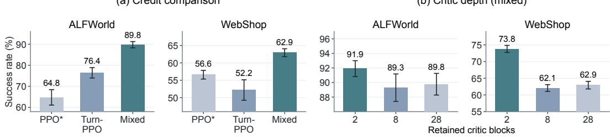  
(b) Critic depth (mixed)  
Figure 1: Success rates on ALFWorld and WebShop: (a) full-depth PPO\*, Turn-PPO, and mixed configurations; (b) the mixed configuration with 2, 8, or 28 critic blocks. Bars show means and error bars show sample standard deviations over three decoding seeds for each checkpoint.

However, commonly used RL approaches face challenges at different granularities: a direct multiturn application of outcome-based GRPO (Shao et al., 2024; Feng et al., 2025) assigns the same trajectory-level relative advantage to every turn, whereas token-level PPO (Schulman et al., 2017; Li et al., 2025; Hou et al., 2026) must estimate values for generated-token decisions from delayed feedback across successive interactions.

Recent work has therefore introduced turn-level credit into both optimization paradigms, treating each complete response action as a unit for advantage estimation. Critic-free methods estimate action-level advantages from sampled-rollout returns (Feng et al., 2025; Zhu et al., 2026; He et al., 2026), or from constructed state-transition graphs (Wang et al., 2026; Cheng et al., 2026). Critic-based methods such as Turn-PPO (Li et al., 2025) instead perform value and advantage estimation once per turn, treating the complete response as a whole. These approaches distinguish credit across actions but leave generation decisions within each action undifferentiated, suggesting that turn- and token-level credit could be coordinated to guide learning at both scales.

To examine whether combining turn- and token-level credit improves policy learning, we compare PPO\* (token-level credit across turns), Turn-PPO, and a mixed configuration that combines advantages from both granularities (Section 3.2). As shown in Figure 1(a), the mixed configuration achieves higher mean success rates than either alternative on both ALFWorld and WebShop. These results suggest that turn- and token-level credit can provide complementary information for multi-turn policy learning.

Beyond the choice of credit signal, critic-based PPO adds value inference and critic updates to the training workload. We therefore examine whether simplifying the critic can reduce this cost without sacrificing policy performance. With mixed credit, Figure 1(b) compares critics retaining 2, 8, or all 28 Transformer blocks. On both ALFWorld and WebShop, the two-block critic achieves a higher mean success rate than the full-depth critic. These results suggest that the critic’s full pretrained depth is not necessary for strong policy performance in these settings.

Building on these observations, we propose VETTA (Value Estimation at Turn and Token levels for LLM Agents), a framework for credit assignment in multi-turn interactions. To model the two decision points, VETTA uses separate turn- and token-value heads: the former estimates the value before a response is generated, while the latter estimates values before its generated tokens. Both heads share a critic backbone but learn from their respective return targets. We compute generalized advantage estimates along the turn and generated-token trajectories. Direct addition would let both advantages shift the overall credit assigned to a response. Instead, we use the turn advantage as the response-level signal and add a scaled, within-response-centered token residual to distinguish generation decisions. The fused advantage guides token-wise PPO updates. We further design a lightweight shared critic by retaining only the early Transformer blocks from the pretrained checkpoint used to initialize the actor, reducing the computation required to learn both value estimates.

We evaluate VETTA on two multi-turn agent benchmarks, ALFWorld (Shridhar et al., 2021) and WebShop (Yao et al., 2022a), using Qwen2.5-1.5B-Instruct and Qwen2.5-7B-Instruct (Qwen Team, 2025). With 1.5B, it achieves success rates of 91.9% on ALFWorld and 73.8% on WebShop; with 7B, it reaches 95.5% and 76.0%. Across both benchmarks and model sizes, VETTA achieves the highest overall success rates among both critic-based and critic-free baselines. Compared with 28 blocks, the two-block critic achieves the higher success rate while reducing median critic-side time by approximately 87% on ALFWorld and 91% on WebShop.

Our contributions are threefold:

• We formulate multi-turn credit assignment around two complementary roles: turn-level advantages provide credit for complete responses across interactions, while token-level advantages distinguish generation decisions within each response.

• We propose VETTA, which learns the two value estimates with separately supervised heads on a lightweight shared critic and combines their advantages through within-response centering before token-wise PPO updates.

• We evaluate VETTA on ALFWorld and WebShop, showing improvements in task success and examining how advantage composition, critic sharing, and backbone depth affect performance and critic-side computation.

## 2 PRELIMINARIES

In this section, we formalize the response- and token-level decision sequences used for value estimation and policy optimization.

## 2.1 MULTI-TURN LLM AGENT INTERACTION

Consider one finite interaction trajectory containing K environment turns. At turn $k \in \{ 1 , \ldots , K \}$ the agent receives the context $H _ { k }$ , which contains the task instruction, the current observation, and the preceding interaction history included in the model context. Conditioned on $H _ { k }$ , the policy $\pi _ { \theta }$ with parameters $\theta ,$ generates a response $a _ { k } = ( y _ { k , 1 } , \dots , y _ { k , L _ { k } } )$ , where $y _ { k , j }$ is the j-th generated token and $L _ { k }$ is the number of valid generated tokens in that response (the token mask is specified in Appendix C.2). After the response is completed, the environment executes the action specified by a , returns a scalar reward $r _ { k }$ , and provides the next observation $O k { + 1 }$ . The next context $H _ { k + 1 }$ incorporates that observation. The same interaction can therefore be viewed as a sequence of complete response decisions or as a finer sequence of token-generation decisions.

## 2.2 PPO AND GENERALIZED ADVANTAGE ESTIMATION

For a generic decision sequence ${ \boldsymbol { \tau } } = ( s _ { t } , a _ { t } , r _ { t } ) _ { t = 0 } ^ { T - 1 }$ containing T decisions, let t index the policy decisions, where $s _ { t } , a _ { t }$ , and $r _ { t }$ denote the decision context, action, and reward at step t. With discount factor $\gamma \in [ 0 , 1 ]$ , the standard policy objective is

$$
J ( \theta ) = \mathbb { E } _ { \tau \sim \pi _ { \theta } } \left[ \sum _ { t = 0 } ^ { T - 1 } \gamma ^ { t } r _ { t } \right] .\tag{1}
$$

A multi-turn interaction admits turn- and token-level sequences for value and advantage estimation: a turn-level decision corresponds to a complete response $a _ { k }$ , whereas a token-level decision corresponds to a generated token $y _ { k , j }$

For a policy $\pi , Q ^ { \pi } ( s _ { t } , a _ { t } )$ denotes the expected discounted return after taking action $a _ { t }$ in state $s _ { t }$ and subsequently following $\pi ,$ , while $V ^ { \pi } ( \bar { s } _ { t } )$ is the expected return before choosing that action. The advantage, $A ^ { \pi } ( \dot { s } _ { t } , a _ { t } ) = \dot { Q } ^ { \pi } ( s _ { t } , a _ { t } ) - \dot { V } ^ { \pi } ( s _ { t } )$ , measures the action’s value relative to the policy’s average at that state. Generalized advantage estimation (GAE) uses rewards and value predictions along a sampled trajectory to estimate this advantage (Schulman et al., 2015). PPO uses the estimated advantage to guide policy updates, with probability-ratio clipping limiting the incentive for large policy changes (Schulman et al., 2017). VETTA retains token-wise policy optimization and uses the two decision sequences to construct complementary advantage estimates.

## 3 METHOD

As a critic-based method, VETTA follows the PPO pipeline in Figure $2 ( \mathbf { b } ) \colon$ the actor collects multi-turn trajectories, and the critic provides value estimates for advantage computation and policy

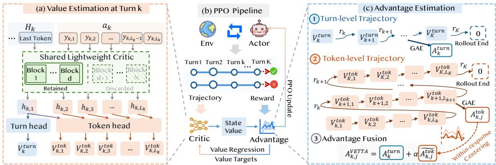  
Figure 2: Overview of VETTA. (a) A shared critic retains early pretrained Transformer blocks and uses separate heads for turn- and token-level value estimation. (b) The actor interacts with the environment to collect trajectories and rewards; value estimates support advantage computation, followed by critic regression and PPO policy updates. (c) The collected trajectory is viewed at turn and token levels for GAE; token advantages are centered within each response and combined with its turn advantage. The implicit successor value and advantage are set to zero at rollout end.

optimization. Within this pipeline, VETTA uses a shared lightweight critic to estimate values at both turn and token levels (Figure 2(a)), then combines the resulting advantages to guide the actor update (Figure 2(c)). The two value heads are trained with their respective return targets.

## 3.1 DUAL-GRANULARITY VALUE ESTIMATION WITH A LIGHTWEIGHT CRITIC

At each environment turn, VETTA estimates future returns at two decision granularities. Before the response $a _ { k }$ is generated, the turn-level value $V _ { k } ^ { \mathrm { t u r n } }$ evaluates the context $H _ { k }$ and provides one value for the complete response decision. Within that response, the token-level value $V _ { k , j } ^ { \mathrm { t o k } }$ evaluates the prefix available before generating $y _ { k , j } ,$ , providing one value for each valid generated position. Figure 2(a) illustrates how the two sets of values are read from a shared critic with causal attention.

In a single forward pass, the critic processes the context followed by the sampled response $a _ { k } =$ $( y _ { k , 1 } , \dots , y _ { k , L _ { k } } )$ using a causal attention mask. We write $y _ { k , < j } = ( y _ { k , 1 } , \dotsc , y _ { k , j - 1 } )$ for the response prefix available before position $j ,$ with $y _ { k , < 1 } = \emptyset$ . Let $h _ { k , 1 }$ be the representation at the final context position, and let $h _ { k , j }$ for $j > 1$ be the representation at $y _ { k , j - 1 }$ . Under causal masking, $h _ { k , j }$ therefore depends only on $( H _ { k } , y _ { k , < j } )$ and is aligned with the decision to generate $y _ { k , j }$

The two output heads map these representations to

$$
\begin{array} { r l r } & { } & { V _ { k } ^ { \mathrm { t u r n } } = V ^ { \mathrm { t u r n } } ( H _ { k } ) = w _ { \mathrm { t u r n } } ^ { \top } h _ { k , 1 } + b _ { \mathrm { t u r n } } , } \\ & { } & { V _ { k , j } ^ { \mathrm { t o k } } = V ^ { \mathrm { t o k } } ( H _ { k } , y _ { k , < j } ) = w _ { \mathrm { t o k } } ^ { \top } h _ { k , j } + b _ { \mathrm { t o k } } , \qquad } \end{array}\tag{2}
$$

where $w _ { \mathrm { t o k } }$ and $w _ { \mathrm { t u r n } }$ are head-specific weight vectors and $b _ { \mathrm { t o k } }$ and $b _ { \mathrm { t u r n } }$ are their biases. The two value heads are newly initialized and trained with separate supervision targets. They have separate output parameters and use representations from the same backbone. Both read $h _ { k , 1 }$ , while the token-value head additionally reads the representations preceding subsequent generated tokens.

Lightweight critic backbone. To limit critic cost, we construct its backbone from the pretrained checkpoint used to initialize the actor. Of its $N$ Transformer blocks, we retain the token embedding, the first $d \leq N$ blocks, and the final root mean square normalization (RMSNorm), discarding the remaining blocks (Figure 2(a)). All retained critic components remain trainable. This reduces the number of blocks used in critic forward and backward passes without removing either value head. We examine the effect of retained depth on policy performance and critic-side computation in Section 4.3.

## 3.2 ADVANTAGE ESTIMATION

VETTA applies standard GAE separately at the turn and token levels. The same scalar reward $r _ { k }$ is represented at both granularities: at the turn level, it is assigned to turn $k ;$ at the token level, it is

placed at the final valid token of response $a _ { k } .$ , with zero reward at earlier generated positions:

$$
r _ { k } ^ { \mathrm { t u r n } } = r _ { k } , \qquad r _ { k , j } ^ { \mathrm { t o k } } = \left\{ 0 , \quad j < L _ { k } , \right.\tag{3}
$$

The environment-specific components of $r _ { k }$ are summarized in Appendix B.1. For each granularity $b \in \{ \mathrm { t u r n } , \mathrm { t o k } \}$ , let i denote a turn k or a valid generated-token position $( k , j )$ , respectively, and let $\operatorname { s u c c } _ { b } ( i )$ denote its next position in the corresponding sequence. Figure $2 ( \mathrm { c } )$ shows turn-level and token-level views of the same trajectory. The turn-level trajectory advances to turn $k + 1 ;$ ; the token-level trajectory advances to the next generated token within the response or, after its final token, to the first generated token of the next response.

Each granularity uses its own discount factor $\gamma _ { b } \in [ 0 , 1 ]$ and GAE trace parameter $\lambda _ { b } \in [ 0 , 1 ]$ , which control reward discounting and the decay of future temporal-difference residuals, respectively. Let $V _ { \mathrm { o l d } } ^ { b }$ denote the critic’s value estimates before the current optimization phase. These estimates are used to compute the temporal-difference residual $\delta _ { i } ^ { b }$ and advantage estimate $A _ { i } ^ { b }$

$$
\begin{array} { r l } & { \delta _ { i } ^ { b } = r _ { i } ^ { b } + \gamma _ { b } V _ { \mathrm { o l d } } ^ { b } ( \operatorname { s u c c } _ { b } ( i ) ) - V _ { \mathrm { o l d } } ^ { b } ( i ) , } \\ & { A _ { i } ^ { b } = \delta _ { i } ^ { b } + \gamma _ { b } \lambda _ { b } A _ { \operatorname { s u c c } _ { b } ( i ) } ^ { b } . } \end{array}\tag{4}
$$

The observation between two responses enters the next context but is not a policy position, so the token-level recursion skips its tokens. At the final collected position of each rollout, we set the value and advantage of the implicit next position to zero. This position is not an additional critic-supervision target.

Directly adding turn- and token-level advantages would combine their response-wide offsets as well as the token-level variation. We instead use the turn-level advantage to determine the response-wide level of credit and the token-level residual to adjust relative credit within the response. To prevent the token component from shifting the response-wide mean, we center its advantages over the valid tokens of each response:

$$
\overline { { { A ^ { \mathrm { t o k } } } } } _ { k } = \frac { 1 } { L _ { k } } \sum _ { j = 1 } ^ { L _ { k } } A _ { k , j } ^ { \mathrm { t o k } } , \qquad \widetilde { A ^ { \mathrm { t o k } } } _ { k , j } = A _ { k , j } ^ { \mathrm { t o k } } - \overline { { { A ^ { \mathrm { t o k } } } } } _ { k } .\tag{5}
$$

With α controlling the residual’s relative scale, the final VETTA advantage is

$$
A _ { k , j } ^ { \mathrm { V E T T A } } = A _ { k } ^ { \mathrm { t u r n } } + \alpha \widetilde { A ^ { \mathrm { t o k } } } _ { k , j } .\tag{6}
$$

The centered term $\overset { \cdot } { A ^ { \mathrm { t o k } } } _ { k , j }$ is the within-response residual. Appendix C.4 shows that, among vectors with response-wise mean $\dot { A } _ { k } ^ { \mathrm { t u r n } }$ , the fused advantage vector is closest in squared Euclidean distance to the scaled token advantages $\alpha ( A _ { k , j } ^ { \mathrm { t o k } } ) _ { j = 1 } ^ { L _ { k } }$

## 3.3 CRITIC AND ACTOR UPDATES

At each valid position i of granularity $b ,$ the corresponding value head is trained with the return target

$$
\begin{array} { r } { \widehat G ^ { b } ( i ) = \mathrm { s g } \left( V _ { \mathrm { o l d } } ^ { b } ( i ) + A _ { i } ^ { b } \right) . } \end{array}\tag{7}
$$

Here sg stops gradients through the target. Advantages and return targets are computed before optimization and held fixed throughout the corresponding updates. Each value target uses its own granularity’s advantage, before centering or fusion. The critic uses standard PPO clipped value regression, averaging turn and token losses over their respective valid positions before summing them. The explicit loss is given in Appendix C.3.

The actor retains token-wise PPO ratios and clipping. Let $\theta _ { \mathrm { o l d } }$ denote the policy parameters used to collect the trajectory. For each valid generated token $y _ { k , j }$ , let $\rho _ { k , j } ( \boldsymbol { \theta } )$ be the ratio of its probability under $\pi _ { \theta }$ to that under $\pi _ { \theta _ { \mathrm { o l d } } } ,$ , with both policies conditioned on $( \ddot { H _ { k } } , y _ { k , < j } )$ . The surrogate loss uses the composed advantage:

$$
\mathcal { L } _ { \mathrm { P P O } } = - \mathbb { E } _ { k , j } \left[ \operatorname* { m i n } \left( \rho _ { k , j } A _ { k , j } ^ { \mathrm { V E T T A } } , \mathrm { c l i p } ( \rho _ { k , j } , 1 - \epsilon , 1 + \epsilon ) A _ { k , j } ^ { \mathrm { V E T T A } } \right) \right] .\tag{8}
$$

Here $\epsilon > 0$ is the PPO ratio-clipping radius and the expectation is over valid generated positions in the rollout batch. The actor implementation’s dual-clipping and KL settings are described in Appendix C.5.

Table 1: Performance on ALFWorld and WebShop. Locally evaluated RL methods are reported over three decoding seeds. For ALFWorld, we report success rates (%) for six task categories and overall; for WebShop, task score and success rate (%). † indicates results reported in GiGPO (Feng et al., 2025). The best values are in bold, and the second-best values are underlined.
<table><tr><td rowspan="2">Type</td><td rowspan="2">Method</td><td colspan="7">ALFWorld</td><td colspan="2">WebShop</td></tr><tr><td>Pick</td><td>Look</td><td>Clean</td><td>Heat</td><td>Cool</td><td>Pick2</td><td>All</td><td>Score</td><td>Succ.</td></tr><tr><td colspan="10">Qwen2.5-1.5B-Instruct</td></tr><tr><td>Prompting</td><td> $\mathrm { Q w e n } 2 . 5 ^ { \dag }$ </td><td>5.9</td><td>5.5</td><td>3.3</td><td>9.7</td><td>4.2</td><td>0.0</td><td>4.1</td><td>23.1</td><td>5.2</td></tr><tr><td>Prompting</td><td>ReAct†</td><td>17.4</td><td>20.5</td><td>15.7</td><td>6.2</td><td>7.7</td><td>2.0</td><td>12.8</td><td>40.1</td><td>11.3</td></tr><tr><td>Prompting</td><td>Reflexion†</td><td>35.3</td><td>22.2</td><td>21.7</td><td>13.6</td><td>19.4</td><td>3.7</td><td>21.8</td><td>55.8</td><td>21.9</td></tr><tr><td>Critic-free</td><td>RLOO†</td><td> $8 8 . 3 { \scriptstyle \pm 3 . 0 }$ </td><td>52.8±8.6</td><td> $7 1 . 0 { \scriptstyle \pm 5 . 9 }$ </td><td> $6 2 . 8 { \scriptstyle \pm 8 . 7 }$ </td><td>66.4±5.5</td><td> $5 6 . 9 { \scriptstyle \pm 4 . 7 }$ </td><td> $6 9 . 7 _ { \pm 2 . 5 }$ </td><td> $7 3 . 9 { \scriptstyle \pm 5 . 6 }$ </td><td> $5 2 . 1 _ { \pm 6 . 7 }$ </td></tr><tr><td>Critic-free</td><td>GRPO†</td><td> $8 5 . 3 { \scriptstyle \pm 1 . 5 }$ </td><td> $5 3 . 7 _ { \pm 8 . 0 }$ </td><td> $8 4 . 5 { \scriptstyle \pm 6 . 8 }$ </td><td> $7 8 . 2 \pm 7 . 9$ </td><td> $5 9 . 7 _ { \pm 5 . 0 }$ </td><td>53.5±5.6</td><td> $7 2 . 8 { \scriptstyle \pm 3 . 6 }$ </td><td> $7 5 . 8 { \scriptstyle \pm 3 . 5 }$ </td><td> $5 6 . 8 { \scriptstyle \pm 3 . 8 }$ </td></tr><tr><td>Critic-free</td><td>GiGPO†</td><td> ${ \underline { { 9 6 . 0 } } } { \pm } 1 . 4$ </td><td> ${ \underline { { 7 6 . 5 } } } { \pm } 3 . 9$ </td><td> $9 1 . 8 { \scriptstyle \pm 5 . 5 }$ </td><td> ${ \bf 9 1 . 3 _ { \pm 6 . 3 } }$ </td><td> $7 1 . 7 { \scriptstyle \pm 8 . 4 }$ </td><td> ${ 7 9 . 5 \pm 7 . 7 }$ </td><td> $\underline { { 8 6 . 1 \pm 4 . 7 } }$ </td><td> $\underline { { 8 3 . 5 } } \pm 1 . 8$ </td><td> $6 7 . 4 { \pm } 4 . 5$ </td></tr><tr><td>Critic-based PPO†</td><td></td><td> $6 4 . 8 { \scriptstyle \pm 3 . 5 }$ </td><td> $4 0 . 5 { \scriptstyle \pm 6 . 9 }$ </td><td> $5 7 . 1 _ { \pm 4 . 9 }$ </td><td> $6 0 . 6 { \scriptstyle \pm 6 . 6 }$ </td><td> $4 6 . 4 _ { \pm 4 . 0 }$ </td><td> $4 7 . 4 { \pm } 1 . 9$ </td><td> $5 4 . 4 _ { \pm 3 . 1 }$ </td><td> $7 3 . 8 { \scriptstyle \pm 3 . 0 }$ </td><td> $5 1 . 5 { \scriptstyle \pm 2 . 9 }$ </td></tr><tr><td>Critic-based PPO*</td><td></td><td> $7 5 . 2 { \scriptstyle \pm 4 . 4 }$ </td><td> $4 8 . 7 _ { \pm 4 . 4 }$ </td><td> $7 2 . 0 { \scriptstyle \pm 6 . 7 }$ </td><td> $7 2 . 5 { \scriptstyle \pm 6 . 8 }$ </td><td> $7 2 . 7 \pm 7 . 9$ </td><td> $3 3 . 3 { \scriptstyle \pm 2 . 6 }$ </td><td> $6 4 . 8 { \scriptstyle \pm 3 . 7 }$ </td><td> $7 0 . 8 { \scriptstyle \pm 1 . 2 }$ </td><td> $5 6 . 6 _ { \pm 1 . 2 }$ </td></tr><tr><td>Critic-based Turn-PPO</td><td></td><td> $8 6 . 7 _ { \pm 4 . 4 }$ </td><td> $7 1 . 8 { \scriptstyle \pm 4 . 4 }$ </td><td> $7 0 . 4 \pm 6 . 4$ </td><td> $6 6 . 7 _ { \pm 9 . 6 }$ </td><td> $8 1 . 3 { \scriptstyle \pm 6 . 1 }$ </td><td> $7 2 . 2 { \scriptstyle \pm 6 . 4 }$ </td><td> $7 6 . 4 \pm 2 . 5$ </td><td> $6 9 . 2 _ { \pm 4 . 2 }$ </td><td> $5 2 . 2 { \scriptstyle \pm 2 . 9 }$ </td></tr><tr><td>Critic-based VETTA</td><td></td><td> ${ \bf 9 7 . 1 _ { \pm 2 . 9 } }$  </td><td> ${ \bf 7 9 . 5 _ { \pm 4 . 4 } }$ </td><td> ${ \bf 9 5 . 1 } _ { \pm 4 . 3 }$  </td><td> $\underline { { 8 5 . 4 } } \pm 9 . 5$  </td><td> ${ \bf 8 8 . 0 } _ { \pm 4 . 0 }$ </td><td> ${ \bf 9 5 . 8 _ { \pm 0 . 0 } }$  </td><td> ${ \bf 9 1 . 9 _ { \pm 1 . 1 } }$ </td><td> ${ \bf 8 3 . 9 _ { \pm 0 . 6 } }$ </td><td> $7 3 . 8 { \scriptstyle \pm 1 . 1 }$ </td></tr><tr><td colspan="9">Qwen2.5-7B-Instruct</td></tr><tr><td>Prompting</td><td>Qwen2.5†</td><td>33.4</td><td>21.6</td><td>19.3</td><td>6.9</td><td>2.8</td><td>3.2</td><td>14.8</td><td>26.4</td><td>7.8</td></tr><tr><td>Prompting</td><td> $\mathrm { R e A c t } ^ { \dagger }$ </td><td>48.5</td><td>35.4</td><td>34.3</td><td>13.2</td><td>18.2</td><td>17.6</td><td>31.2</td><td>46.2</td><td>19.5</td></tr><tr><td>Prompting</td><td> ${ \mathrm { R e f l e x i o n } } ^ { \dagger }$ </td><td>62.0</td><td>41.6</td><td>44.9</td><td>30.9</td><td>36.3</td><td>23.8</td><td>42.7</td><td>58.1</td><td>28.8</td></tr><tr><td>Critic-free</td><td> $\scriptstyle \mathrm { { R L O O } ^ { \dag } }$ </td><td> $8 7 . 6 { \scriptstyle \pm 4 . 3 }$ </td><td> $7 8 . 2 \pm 8 . 3$ </td><td> $8 7 . 3 { \scriptstyle \pm 5 . 8 }$ </td><td> $8 1 . 3 { \scriptstyle \pm 7 . 6 }$ </td><td> $7 1 . 9 { \scriptstyle \pm 5 . 2 }$ </td><td> $4 8 . 9 { \scriptstyle \pm 8 . 4 }$ </td><td> $7 5 . 5 { \scriptstyle \pm 4 . 6 }$ </td><td> $8 0 . 3 { \scriptstyle \pm 3 . 2 }$ </td><td> $6 5 . 7 _ { \pm 4 . 0 }$ </td></tr><tr><td>Critic-free</td><td> ${ \mathrm { G R P O } } ^ { \dagger }$ </td><td> $9 0 . 8 { \scriptstyle \pm 5 . 1 }$ </td><td> $6 6 . 1 \pm 6 . 7$ </td><td> $8 9 . 3 { \scriptstyle \pm 5 . 4 }$ </td><td> $7 4 . 7 _ { \pm 6 . 9 }$ </td><td> $7 2 . 5 { \scriptstyle \pm 5 . 4 }$ </td><td> $6 4 . 7 _ { \pm 7 . 3 }$ </td><td> $7 7 . 6 { \scriptstyle \pm 5 . 2 }$ </td><td> $7 9 . 3 { \scriptstyle \pm 2 . 8 }$ </td><td>66.1±3.7</td></tr><tr><td>Critic-free</td><td> ${ \mathrm { G i G P O } } ^ { \dagger }$ </td><td> $9 1 . 8 { \scriptstyle \pm 5 . 4 }$ </td><td> ${ \bf 8 8 . 6 _ { \pm 6 . 3 } }$ </td><td> $9 5 . 9 { \scriptstyle \pm 3 . 2 }$ </td><td> $\underline { { 9 0 . 2 } } \pm 2 . 6$ </td><td> $8 6 . 5 { \scriptstyle \pm 5 . 5 }$ </td><td> $8 5 . 2 \pm 7 . 5$ </td><td> $9 0 . 2 \pm 2 . 3$ </td><td> $\underline { { 8 6 . 2 } } \pm 2 . 6$ </td><td> ${ \underline { { 7 5 . 2 } } } { \pm } 3 . 8$ </td></tr><tr><td>Critic-based PPO†</td><td></td><td> $9 2 . 3 { \scriptstyle \pm 4 . 0 }$ </td><td> $6 4 . 0 { \scriptstyle \pm 8 . 4 }$ </td><td> $9 2 . 5 { \scriptstyle \pm 2 . 4 }$ </td><td> $8 9 . 5 { \scriptstyle \pm 7 . 0 }$ </td><td> $8 0 . 3 { \scriptstyle \pm 2 . 0 }$ </td><td> $6 8 . 8 { \scriptstyle \pm 8 . 3 }$ </td><td> $8 0 . 4 \pm 2 . 7$ </td><td> $8 1 . 4 { \scriptstyle \pm 3 . 1 }$ </td><td> $6 8 . 7 \pm 5 . 1$ </td></tr><tr><td>Critic-based PPO*</td><td></td><td> $9 2 . 1 _ { \pm 1 . 0 }$ </td><td> $8 5 . 7 \pm 7 . 6$ </td><td> $7 7 . 4 { \scriptstyle \pm 8 . 3 }$ </td><td> $7 2 . 2 { \scriptstyle \pm 2 . 4 }$ </td><td> $5 5 . 6 { \scriptstyle \pm 9 . 6 }$ </td><td> $5 7 . 6 _ { \pm 1 1 . 1 }$ </td><td> $7 2 . 6 { \scriptstyle \pm 2 . 1 }$ </td><td> $8 4 . 5 { \scriptstyle \pm 0 . 1 }$ </td><td> $7 4 . 8 { \scriptstyle \pm 0 . 4 }$ </td></tr><tr><td>Critic-based Turn-PPO</td><td></td><td> $\mathbf { 1 0 0 . 0 { \scriptstyle \pm 0 . 0 } }$ </td><td> $8 2 . 9 { \scriptstyle \pm 8 . 9 }$ </td><td> $\mathbf { 1 0 0 . 0 { \scriptstyle \pm 0 . 0 } }$ </td><td> $\mathbf { 1 0 0 . 0 } _ { \pm 0 . 0 }$ </td><td> $8 4 . 5 { \scriptstyle \pm 2 . 3 }$ </td><td> $\underline { { 9 2 . 4 } } \pm 4 . 2$ </td><td> $\underline { { 9 4 . 3 } } \pm 1 . 5$ </td><td> $7 5 . 3 { \scriptstyle \pm 0 . 8 }$ </td><td> $5 4 . 6 _ { \pm 1 . 9 }$ </td></tr><tr><td>Critic-basedVETTA</td><td></td><td> $\underline { { 9 3 . 6 } } \pm 2 . 6$  </td><td> $\underline { { 8 6 . 7 } } \pm 5 . 8$  </td><td> $\mathbf { 1 0 0 . 0 { \scriptstyle \pm 0 . 0 } }$ </td><td> $9 0 . 0 { \scriptstyle \pm 0 . 0 }$ </td><td> ${ \bf 9 3 . 9 2 3 . 0 }$ </td><td> $\mathbf { 1 0 0 . 0 { \dot { \mathbf { \sigma } } } _ { \pm 0 . 0 } }$  </td><td> $9 5 . 5 _ { \pm 0 . 4 }$ </td><td> ${ \bf 8 6 . 5 _ { \pm 0 . 7 } }$  </td><td> ${ \bf 7 6 . 0 _ { \pm 0 . 6 } }$ </td></tr></table>

## 4 EXPERIMENTS

We evaluate VETTA across two multi-turn agent settings and organize the experiments around four research questions: RQ1: How does VETTA compare with prompting and RL methods? RQ2: How does composing turn- and token-level credit affect performance? RQ3: How do backbone sharing and value-head structure affect performance? RQ4: How does critic backbone depth affect performance and critic-side computation?

## 4.1 EXPERIMENT SETUP

Benchmarks. We evaluate VETTA on ALFWorld and WebShop. ALFWorld (Shridhar et al., 2021) is a text-based embodied benchmark comprising six categories of household tasks; we report success rates for each category and overall. WebShop (Yao et al., 2022a) asks agents to search and navigate a simulated shopping website, and we report task score and success rate. Evaluation-set sizes and aggregation details appear in Appendix B.3.

Baselines. We first compare VETTA with prompting methods: Qwen2.5-Instruct without taskspecific RL training, ReAct (Yao et al., 2022b), which interleaves reasoning and actions, and Reflexion (Shinn et al., 2023), which uses verbal feedback from previous attempts. These methods do not update the policy with RL. We then group the RL baselines by whether they train a parametric critic. The critic-free baselines RLOO (Kool et al., 2019; Ahmadian et al., 2024) and GRPO (Shao et al., 2024) estimate relative credit from groups of sampled trajectories. GiGPO (Feng et al., 2025) further combines episode-relative credit with action-level comparisons at repeated environment states. Among critic-based baselines, PPO (Schulman et al., 2017; Feng et al., 2025) copies the episode reward to the final generated token of each response and computes GAE independently within each response. To better compare PPO with VETTA, we implement PPO\*, which instead computes GAE across turns over generated tokens, skipping observation tokens. Both PPO variants use token-level values, probability ratios, and clipping. Turn-PPO (Li et al., 2025) instead estimates turn-level values and advantages and applies PPO ratios and clipping to complete responses.

Implementation details. We use Qwen2.5-1.5B/7B-Instruct (Qwen Team, 2025) as our base models for ALFWorld and WebShop. Within each model-size comparison, methods use the same base actor model. Critic-based baselines retain the full backbone depth, whereas VETTA retains two critic blocks for ALFWorld and WebShop at both model sizes. We set $\gamma _ { \mathrm { t o k } } = \lambda _ { \mathrm { t o k } } = 1$ and $\gamma _ { \mathrm { t u r n } } = \lambda _ { \mathrm { t u r n } } = 0 . 9 5$ in both settings. Unless otherwise specified, the token-residual scale is $\alpha = 1$ for ALFWorld and $\alpha = 3$ for WebShop. Training runs for 150 updates in both settings. Additional optimization settings are given in Table 3, with evaluation details in Appendix B.3.

## 4.2 EXPERIMENTAL RESULTS (RQ1)

Table 1 shows that VETTA performs strongly on both ALFWorld and WebShop at 1.5B and 7B. ReAct and Reflexion improve over the Qwen2.5-Instruct prompting baseline, but their overall success rates remain well below those of the RL-trained methods. This establishes the value of learning from task feedback in both interactive settings.

Among critic-free RL methods, RLOO and GRPO substantially improve over prompting, although their advantage over PPO varies across benchmarks and model sizes. GiGPO further assigns actionlevel relative credit using repeated environment states and achieves the highest overall success rates among the critic-free baselines on both tasks.

The critic-based baselines reveal different strengths across the two benchmarks. PPO\* propagates token-level GAE across turns while retaining token-wise PPO updates, whereas Turn-PPO estimates advantages for complete responses. At 1.5B, Turn-PPO is stronger on ALFWorld, while PPO\* performs slightly better on WebShop; both remain below VETTA. This contrast becomes more pronounced at 7B: Turn-PPO reaches 94.3% overall success on ALFWorld, whereas $\mathrm { P P O ^ { * } }$ reaches 74.8% success on WebShop. Neither single-granularity baseline maintains the same strength across both benchmarks.

VETTA uses turn-level advantages to represent progress across interactions and token-level residuals to distinguish decisions within each response. At 1.5B, it reaches 91.9% success on ALFWorld and 73.8% on WebShop, exceeding the strongest alternative in each benchmark by 5.8 and 6.4 percentage points, respectively. At 7B, it retains the highest mean overall success rate among both critic-based and critic-free baselines on both benchmarks, reaching 95.5% and 76.0%; it also achieves the highest WebShop task score at both model sizes. The differing strengths of $\mathrm { P P O ^ { * } }$ and Turn-PPO make the combined signal a useful design choice to investigate. The following analyses examine advantage composition, critic sharing, and backbone depth.

## 4.3 FURTHER ANALYSIS

We further examine how credit composition, critic sharing, and backbone depth affect VETTA’s performance.

Credit composition (RQ2). To assess the contribution of each credit level and within-response centering, we compare actor-credit rules on WebShop using Qwen2.5-1.5B-Instruct.

We keep the shared two-block critic and the token-wise PPO ratios and clipping in Eq. (8) fixed. Rows C1–C4 train both value heads and change only the advantage given to the actor. Direct addition (C3) and residual composition (C4) use $\alpha = 3 \AA$ , so their comparison isolates within-response centering. In C5 and C6, the actor uses one credit branch; the corresponding value loss trains its output head and the critic’s Transformer backbone.

Table 2: Analysis of credit composition on WebShop.
<table><tr><td>ID</td><td>Actor credit</td><td>Critic supervision</td><td>Success rate (%)</td><td>Task score</td></tr><tr><td>C1</td><td> $A ^ { \mathrm { t o k } }$ </td><td> $\mathrm { T u r n } + \mathrm { t o k e n }$ </td><td>67.4</td><td>84.9</td></tr><tr><td>C2</td><td> $A ^ { \mathrm { t u r n } }$ </td><td> $\mathrm { T u r n } + \mathrm { t o k e n }$ </td><td>59.8</td><td>74.5</td></tr><tr><td>C3</td><td> $A ^ { \mathrm { t u r n } } + \alpha A ^ { \mathrm { t o k } }$ </td><td> $\mathrm { T u r n } + \mathrm { t o k e n }$ </td><td>55.0</td><td>79.0</td></tr><tr><td>C4</td><td> $A ^ { \mathrm { t u r n } } + \alpha \widetilde { A ^ { \mathrm { t o k } } }$ </td><td> $\mathrm { T u r n } + \mathrm { t o k e n }$ </td><td>72.8</td><td>83.6</td></tr><tr><td>C5</td><td> $A ^ { \mathrm { t o k } }$ </td><td>Token</td><td>44.8</td><td>56.8</td></tr><tr><td>C6</td><td> $A ^ { \mathrm { t u r n } }$ </td><td>Turn</td><td>68.0</td><td>84.5</td></tr></table>

Among the matched dual-head runs in Table 2, the residual combination C4 achieves the highest success rate (72.8%). Its gain over direct addition C3 (55.0%) supports within-response centering, while its gains over C1 and C2 support using both credit levels for exact task completion.

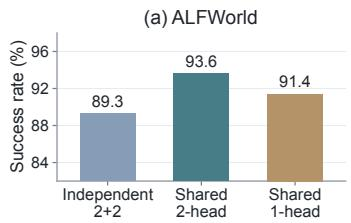

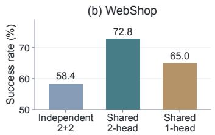

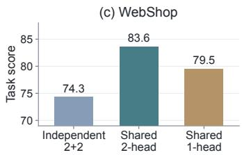  
Figure 3: Critic structure: (a) ALFWorld success rate, (b) WebShop success rate, and (c) WebShop task score.

C1 nevertheless achieves the highest task score (84.9), showing that token credit alone can produce strong graded outcomes. Its lower success rate shows that this advantage does not consistently translate into exact completions, which trigger WebShop’s positive training reward (Appendix B.1).

The single-branch control C5 reaches 44.8% success, while C6 reaches 68.0% success and a task score of 84.5, slightly above C4’s 83.6. Yet C4 has a higher success rate than both controls. Together, these results favor combining the two granularities for exact task completion; the higher graded scores of C1 and C6 also suggest room to improve how the signals are combined for WebShop’s graded outcome.

Critic sharing and value heads (RQ3). The critic in VETTA makes two structural choices: the turn and token values share a backbone but have separate output heads. We examine both choices on ALFWorld and WebShop using Qwen2.5-1.5B-Instruct. To assess backbone sharing, we compare two independent two-block critics, each with its own value head, against one two-block backbone with separate turn- and token-value heads. To assess the heads, we also include a shared-backbone variant with one output head trained on both value targets. At the first generated-token position of each turn, the same prediction serves as both the turn value and the first token value; later position provide the remaining token values. All variants retain turn- and token-level credit and the residual composition rule.

Figure 3 shows that the shared two-head critic has the highest success rate on both benchmarks: 93.6% on ALFWorld and 72.8% on WebShop. The independent critics reach 89.3% and 58.4%, while the shared one-head critic reaches 91.4% and 65.0%, respectively. WebShop task scores follow the same ordering. These single-run results favor sharing the backbone while retaining separate value heads. Because the configurations also differ in parameter count and optimization, they do not isolate a representational benefit of sharing alone.

Critic depth and computation (RQ4). We ask how much critic computation can be saved by retaining only the early Transformer blocks. On each benchmark, we compare 2-, 8-, and 28-block critics while keeping both value heads and the actor-credit rule unchanged.

Figure 4 shows the savings in critic-side computation, measured over 112 training steps per run (Appendix B.4). Compared with 28 blocks, the two-block critic records 19.7 rather than 152.0 seconds of median value-inference-plus-update time on ALFWorld, approximately 87% less. On WebShop, the corresponding times are 7.9 and 92.2 seconds, approximately 91% less. Its median share of training-step time likewise falls from 25.6% to 3.8% on ALFWorld and from 27.8% to 4.3% on WebShop; the eight-block runs lie between these endpoints.

The two-block model saves computation by removing 26 Transformer blocks from its trainable backbone. Despite this reduction, Figure 1(b) shows the highest mean success rate with two blocks on both benchmarks.

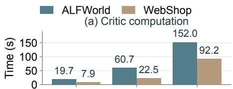

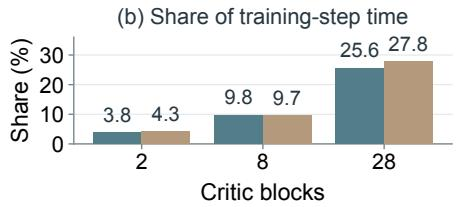  
Figure 4: Critic computation by backbone depth on ALFWorld and WebShop.

The eight-block results further show that retaining more layers does not necessarily improve success. Together, these results suggest that retaining only a few early Transformer blocks may reduce critic-side computation while improving task success in multi-turn agentic tasks.

## 5 RELATED WORK

In this section, we position VETTA relative to prior work on turn-level credit, token-level and joint credit, and critic design.

Turn-Level Credit Assignment. Turn-level methods assign credit to complete textual actions within a multi-turn trajectory. Critic-free approaches derive action-level signals from sampled returns using state- or history-based groups (Feng et al., 2025; He et al., 2026), or from progress toward successful states in a constructed transition graph (Cheng et al., 2026). Some explicitly estimate values without training a parametric critic: GAGPO constructs grouped return proxies for temporaldifference (TD) and generalized advantage estimation (GAE) (Zhu et al., 2026), while Gated-BEPO estimates node values through Bellman backups on empirical rollout graphs (Yan et al., 2026). Learned value functions provide another route. ArCHer learns utterance-level values to guide a lower-level token policy (Zhou et al., 2024), and Turn-PPO learns turn-level values and applies PPO ratios and clipping to complete responses (Li et al., 2025). These approaches distinguish the contributions of different actions; our focus is on combining such action-level credit with variation among the token-generation decisions within each action.

Token-Level and Joint Credit Assignment. Other work differentiates credit within a response or jointly models multiple granularities. SAO connects token-level GAE across adjacent responses while skipping observation tokens in the recursion (Hou et al., 2026). FACTOR allocates action credit to executable tokens with nonnegative mean-one weights (Ma et al., 2026), while SERL uses post-action teacher feedback to adjust token updates selectively (Li et al., 2026). The closest to our joint estimation is HyGAE, which linearly combines turn- and token-level advantages and trains a unified value function with mixed return targets (Zhang et al., 2026). VETTA instead retains separate supervision for the two value heads and adds a centered token-level residual to the turn-level advantage. Centering makes the residual average to zero within each response, so the turn advantage determines the mean of the composed signal, while token-level variation adjusts credit within that response. This separates the value-learning targets and the roles of the two advantage components.

Critic Architecture and Efficiency. Value-model design also determines how representations are shared and how much computation value learning requires. HiPER shares a critic backbone across value heads for subgoal planning and action execution (Peng et al., 2026); VETTA uses shared representations for complete responses and individual token-generation decisions. To reduce critic cost, AsyPPO uses ensembles of smaller critics (Liu et al., 2025), while POISE fits lightweight value probes to the actor’s internal representations (Choi et al., 2026). VETTA constructs its shared critic backbone from the early Transformer blocks of the pretrained checkpoint used to initialize the actor, reducing backbone depth while retaining both value-estimation objectives. Complementary work such as VC-PPO and VAPO addresses value-learning failures and optimization stability (Yuan et al., 2025; Yue et al., 2025).

## 6 CONCLUSION

We introduce VETTA, a critic-based framework for multi-turn LLM agents that estimates turn- and token-level values with a shared lightweight backbone and separate value heads. It combines the turnlevel advantage with a centered token-level residual to guide policy optimization. On ALFWorld and WebShop, VETTA achieves the highest overall success rates among both critic-based and critic-free baselines across the evaluated model sizes. We also find that retaining only early Transformer blocks preserves strong performance while substantially reducing critic-side time. Together, these results highlight credit granularity and critic efficiency as complementary design choices. Future work can tailor value models to each task’s interaction and feedback structure.

## AI USE STATEMENT

Generative AI tools were used to draft and polish manuscript text, search for and summarize related literature, provide feedback on experimental comparisons and the interpretation of results, and assist with debugging and reproduction checks. They also assisted with preparing figures, tables, and manuscript scripts. AI tools did not operate the experiments or implement the proposed training method. The authors take responsibility for the final manuscript, including AI-assisted text, analyses, and artifacts.

## REPRODUCIBILITY STATEMENT

Section 3 describes the value estimates, advantage computation, and optimization objectives. Section 4 and Appendices B.2 and B.3 provide the training and evaluation configurations.

## REFERENCES

Arash Ahmadian, Chris Cremer, Matthias Gallé, Marzieh Fadaee, Julia Kreutzer, Olivier Pietquin, Ahmet Üstün, and Sara Hooker. Back to basics: Revisiting REINFORCE-style optimization for learning from human feedback in LLMs. In Proceedings ofthe 62nd Annual Meeting ofthe Association for Computational Linguistics (Volume 1: Long Papers), pp. 12248–12267. Association for Computational Linguistics, 2024. doi: 10.18653/v1/2024.acl-long.662. URL https:// aclanthology.org/2024.acl-long.662/.

Xin Cheng, Shuo He, Lang Feng, HaiYang Xu, Ming Yan, Lei Feng, and Bo An. Beyond trajectorylevel attribution: Graph-based credit assignment for agentic reinforcement learning. arXiv preprint arXiv:2605.26684, 2026. URL https://arxiv.org/abs/2605.26684v2.

Yunho Choi, Jongwon Lim, Woojin Ahn, Minjae Oh, Jeonghoon Shim, and Yohan Jo. Your language model is its own critic: Reinforcement learning with value estimation from actor’s internal states. arXiv preprint arXiv:2605.07579, 2026. URL https://arxiv.org/abs/2605.07579v2.

DeepSeek-AI, Daya Guo, Dejian Yang, et al. DeepSeek-R1: Incentivizing reasoning capability in LLMs via reinforcement learning. arXiv preprint arXiv:2501.12948, 2025. URL https: //arxiv.org/abs/2501.12948.

Lang Feng, Zhenghai Xue, Tingcong Liu, and Bo An. Group-in-group policy optimization for LLM agent training. arXiv preprint arXiv:2505.10978, 2025. URL https://arxiv.org/abs/ 2505.10978v3.

Shuo He, Lang Feng, Qi Wei, Xin Cheng, Lei Feng, and Bo An. Hierarchy-of-groups policy optimization for long-horizon agentic tasks. In Proceedings ofthe International Conference on Learning Representations, 2026.

Zhenyu Hou, Yujiang Li, Jie Tang, and Yuxiao Dong. Single-rollout asynchronous optimization for agentic reinforcement learning. arXiv preprint arXiv:2607.07508, 2026. URL https: //arxiv.org/abs/2607.07508v1.

Bowen Jin, Hansi Zeng, Zhenrui Yue, Jinsung Yoon, Sercan Arik, Dong Wang, Hamed Zamani, and Jiawei Han. Search-R1: Training LLMs to reason and leverage search engines with reinforcement learning. arXiv preprint arXiv:2503.09516, 2025. URL https://arxiv.org/abs/2503. 09516v5.

Wouter Kool, Herke van Hoof, and Max Welling. Buy 4 REINFORCE samples, get a baseline for free! In ICLR Workshop on Deep Reinforcement Learning Meets Structured Prediction, 2019. URL https://wouterkool.github.io/publication/ buy-4-samples-free-baseline/.

Junbo Li, Peng Zhou, Rui Meng, Meet P. Vadera, Lihong Li, and Yang Li. Turn-PPO: Turn-level advantage estimation with PPO for improved multi-turn RL in agentic LLMs. arXiv preprint arXiv:2512.17008, 2025. URL https://arxiv.org/abs/2512.17008v2.

Xiaozhe Li, Tianyi Lyu, Yang Li, Yichuan Ma, Peiji Li, Linyang Li, Qipeng Guo, Dahua Lin, and Kai Chen. What and when to distill: Selective hindsight distillation for multi-turn agents. arXiv preprint arXiv:2605.19447, 2026. URL https://arxiv.org/abs/2605.19447v1.

Jiashun Liu, Johan Obando-Ceron, Han Lu, Yancheng He, Weixun Wang, Wenbo Su, Bo Zheng, Pablo Samuel Castro, Aaron Courville, and Ling Pan. Asymmetric proximal policy optimization: mini-critics boost LLM reasoning. arXiv preprint arXiv:2510.01656, 2025. URL https:// arxiv.org/abs/2510.01656v3.

Lichao Ma, Yang Sun, Shuaitao Zhao, Yangyi Fang, Cong Qin, Xiaoliang Fu, Yuhang Tian, Yuchen Wei, Junbo Zhu, Yang Wei, Lu Pan, and Jiaye Lin. How much, then where: Creditconserving action-to-token allocation for multi-turn agent reinforcement learning. arXiv preprint arXiv:2608.07118, 2026. URL https://arxiv.org/abs/2608.07118v1.

Jiangweizhi Peng, Yuanxin Liu, Ruida Zhou, Charles Fleming, Zhaoran Wang, Alfredo Garcia, and Mingyi Hong. HiPER: Hierarchical reinforcement learning with explicit credit assignment for large language model agents. arXiv preprint arXiv:2602.16165, 2026. URL https://arxiv. org/abs/2602.16165v2.

Qwen Team. Qwen2.5 technical report. arXiv preprint arXiv:2412.15115, 2025. URL https: //arxiv.org/abs/2412.15115v2.

Timo Schick, Jane Dwivedi-Yu, Roberto Dessì, Roberta Raileanu, Maria Lomeli, Luke Zettlemoyer, Nicola Cancedda, and Thomas Scialom. Toolformer: Language models can teach themselves to use tools. arXiv preprint arXiv:2302.04761, 2023. URL https://arxiv.org/abs/2302. 04761.

John Schulman, Philipp Moritz, Sergey Levine, Michael Jordan, and Pieter Abbeel. High-dimensional continuous control using generalized advantage estimation. arXiv preprint arXiv:1506.02438, 2015. URL https://arxiv.org/abs/1506.02438v6.

John Schulman, Filip Wolski, Prafulla Dhariwal, Alec Radford, and Oleg Klimov. Proximal policy optimization algorithms. arXiv preprint arXiv:1707.06347, 2017. URL https://arxiv.org/ abs/1707.06347v2.

Zhihong Shao, Peiyi Wang, Qihao Zhu, Runxin Xu, Junxiao Song, Xiao Bi, Haowei Zhang, Mingchuan Zhang, Y. K. Li, Y. Wu, and Daya Guo. DeepSeekMath: Pushing the limits of mathematical reasoning in open language models. arXiv preprint arXiv:2402.03300, 2024. URL https://arxiv.org/abs/2402.03300v3.

Noah Shinn, Federico Cassano, Edward Berman, Ashwin Gopinath, Karthik Narasimhan, and Shunyu Yao. Reflexion: Language agents with verbal reinforcement learning. arXiv preprint arXiv:2303.11366, 2023. URL https://arxiv.org/abs/2303.11366.

Mohit Shridhar, Xingdi Yuan, Marc-Alexandre Côté, Yonatan Bisk, Adam Trischler, and Matthew Hausknecht. ALFWorld: Aligning text and embodied environments for interactive learning. In International Conference on Learning Representations, 2021. URL https://arxiv.org/ abs/2010.03768v2.

Harsh Trivedi, Tushar Khot, Mareike Hartmann, Ruskin Manku, Vinty Dong, Edward Li, Shashank Gupta, Ashish Sabharwal, and Niranjan Balasubramanian. AppWorld: A controllable world of apps and people for benchmarking interactive coding agents. arXiv preprint arXiv:2407.18901, 2024. URL https://arxiv.org/abs/2407.18901.

Yunan Wang, Minghui Song, Zihan Zhang, Shaohan Huang, Haizhen Huang, Furu Wei, Weiwei Deng, Feng Sun, and Qi Zhang. Group-graph policy optimization for long-horizon agentic reinforcement learning. arXiv preprint arXiv:2606.22995, 2026. URL https://arxiv.org/abs/2606. 22995.

Hongxi Yan, Ziyue Huang, Shichao Fan, and Qingjie Liu. Gated-BEPO: Confidence-gated bellman credit assignment for large language model agents. arXiv preprint arXiv:2608.06861, 2026. URL https://arxiv.org/abs/2608.06861v1.

Shunyu Yao, Howard Chen, John Yang, and Karthik Narasimhan. WebShop: Towards scalable real-world web interaction with grounded language agents. In Advances in Neural Information Processing Systems, 2022a. URL https://arxiv.org/abs/2207.01206v4.

Shunyu Yao, Jeffrey Zhao, Dian Yu, Nan Du, Izhak Shafran, Karthik Narasimhan, and Yuan Cao. ReAct: Synergizing reasoning and acting in language models. arXiv preprint arXiv:2210.03629, 2022b. URL https://arxiv.org/abs/2210.03629.

Yufeng Yuan, Yu Yue, Ruofei Zhu, Tiantian Fan, and Lin Yan. What’s behind PPO’s collapse in long-CoT? value optimization holds the secret. arXiv preprint arXiv:2503.01491, 2025. URL https://arxiv.org/abs/2503.01491v1.

Yu Yue, Yufeng Yuan, Qiying Yu, Xiaochen Zuo, Ruofei Zhu, Wenyuan Xu, Jiaze Chen, Chengyi Wang, Tiantian Fan, Zhengyin Du, Xiangpeng Wei, Xiangyu Yu, Gaohong Liu, Juncai Liu, Lingjun Liu, Haibin Lin, Zhiqi Lin, Bole Ma, Chi Zhang, Mofan Zhang, Wang Zhang, Hang Zhu, Ru Zhang, Xin Liu, Mingxuan Wang, Yonghui Wu, and Lin Yan. VAPO: Efficient and reliable reinforcement learning for advanced reasoning tasks. arXiv preprint arXiv:2504.05118, 2025. URL https://arxiv.org/abs/2504.05118v3.

Wenxuan Zhang, Yuhui Wang, Donggang Jia, Xiaoqian Shen, Jian Ding, Ivan Viola, Jürgen Schmidhuber, and Mohamed Elhoseiny. Hybrid advantage estimation with unified critic for VLM agentic reinforcement learning. arXiv preprint arXiv:2607.23605, 2026. URL https: //arxiv.org/abs/2607.23605v1.

Yifei Zhou, Andrea Zanette, Jiayi Pan, Sergey Levine, and Aviral Kumar. ArCHer: Training language model agents via hierarchical multi-turn RL. arXiv preprint arXiv:2402.19446, 2024. URL https://arxiv.org/abs/2402.19446v1.

Siyuan Zhu, Chao Yu, Rongxin Yang, Zongkai Liu, Jinjun Hu, Qiwen Chen, and Yibo Zhang. GAGPO: Generalized advantage grouped policy optimization. arXiv preprint arXiv:2605.13217, 2026. URL https://arxiv.org/abs/2605.13217v1.

## A ADDITIONAL ANALYSES

## A.1 SENSITIVITY TO THE TOKEN-RESIDUAL SCALE

We examine the residual weight α in Equation 6 for the 1.5B shared-critic configuration. Figure 5 reports ALFWorld success rate, WebShop success rate, and WebShop task score for α ∈ {1, 2, 3}.

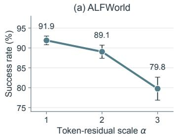

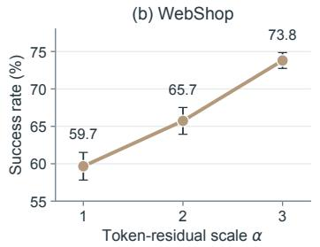

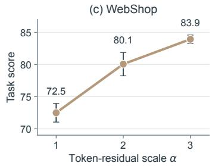  
Figure 5: Sensitivity to the token-residual scale α with Qwen2.5-1.5B-Instruct. Markers and error bars show the mean and sample standard deviation over three decoding seeds.

On ALFWorld, mean success declines from 91.9% at α = 1 to 89.1% at $\alpha = 2$ and 79.8% at $\alpha = 3$ WebShop shows the opposite trend: mean success rises from 59.7% to 65.7% and 73.8%, while mean task score rises from 72.5 to 80.1 and 83.9. These opposing trends suggest a task-dependent balance: among the tested settings, ALFWorld favors a smaller token-residual scale, whereas WebShop favors a larger one. One possible explanation is that ALFWorld’s action outcomes provide relatively clear turn-level progress signals, while WebShop’s search and selection actions may benefit more from distinguishing generated tokens within each response. Each α corresponds to a separately trained checkpoint, and the error bars reflect decoding-seed variation rather than independent training runs.

## A.2 TURN AND TOKEN CREDIT IN AN ALFWORLD TRAJECTORY

We illustrate the two levels of credit with a successful diagnostic rollout on the seen ALFWorld task “look at book under the desklamp” (latest step-150 checkpoint, environment seed 0, decoding seed 123). The agent moves to desk 1, picks up book 4, and uses desklamp 1 to complete the task.

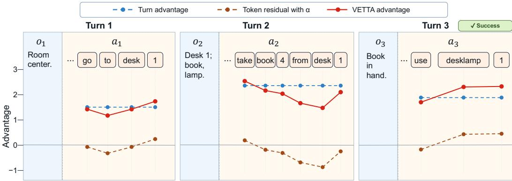  
Figure 6: Turn- and token-level credit in a successful ALFWorld trajectory. Blue, brown, and red denote $A _ { k } ^ { \mathrm { t u r n } } , \alpha \widetilde { A ^ { \mathrm { t o k } } } _ { k , j } ,$ , and $A _ { k , i } ^ { \mathrm { V E T T A } }$ . Only parsed actions are shown; thinking text is abbreviated. When a plotted word spans multiple generated tokens, its values are arithmetic means over those token positions.

The three turns receive positive turn advantages (1.494, 2.348, and 1.875), providing response-level credit. Token residuals distinguish words within each response: in the pickup action, take receives +0.180 and from receives −0.695; in the final action, desklamp and 1 receive +0.421 and +0.441. The latter two words have fused advantages of 2.296 and 2.316, above their turn-level advantage of 1.875. Thus, the turn advantage credits the interaction as a whole, while the token residual adjusts credit among its generated words.

The displayed residuals need not average to zero because the figure omits thinking text. Centering uses all valid generated tokens in the complete response, including the omitted text, so its full-response residual mean is zero by construction.

## B EXPERIMENTAL DETAILS

## B.1 TASK INTERACTION AND REWARDS

ALFWorld. In the text-based ALFWorld setting (Shridhar et al., 2021), the agent receives a household goal and textual observations, and issues commands to navigate, inspect, and manipulate objects. The environment executes the command extracted from each generated response and supplies the next observation. The text-environment wrapper assigns a task reward of 10 upon success and 0 otherwise. An action flagged as invalid receives an additional penalty of 0.1.

WebShop. The agent receives a shopping instruction and interacts with the simulated website through search and click actions (Yao et al., 2022a). Observations describe the current search results or product page. The wrapper retains the environment’s continuous task score for evaluation, but uses a task reward of 10 only when the purchase ends the episode with a task score of 1; other outcomes receive 0. Invalid actions incur an additional penalty of 0.1. Throughout the paper, reported WebShop task scores are multiplied by 100 and lie on a 0–100 scale. This presentation scale does not change the environment’s original score or the training reward.

The reward manager places each turn’s task reward and invalid-action penalty at its final valid generated-token position, as in Equation 3. KL regularization is applied separately to the actor loss rather than added to these rewards.

Table 3: Training settings for VETTA on ALFWorld and WebShop.
<table><tr><td>Setting</td><td>ALFWorld</td><td>WebShop</td></tr><tr><td>Retained critic blocks</td><td></td><td>2</td></tr><tr><td>Tasks × rollouts/update</td><td>128 × 1</td><td>128 × 1</td></tr><tr><td>Maximum turns</td><td>50</td><td>15</td></tr><tr><td>PPO minibatch</td><td>256</td><td>64</td></tr><tr><td>Actor / critic LR</td><td>10−⁶/10−5</td><td>10−6/10−5</td></tr><tr><td>KL loss coefficient</td><td>0.01</td><td>0.01</td></tr><tr><td>Token γ/λ</td><td>1/1</td><td>1/1</td></tr><tr><td>Turn γ/λ</td><td>0.95/0.95</td><td>0.95/0.95</td></tr><tr><td>Update budget</td><td>150</td><td>150</td></tr></table>

## B.2 TRAINING SETTINGS

Table 3 summarizes the training hyperparameters for VETTA on ALFWorld and WebShop, including the rollout budget per update, maximum number of turns, PPO minibatch size, learning rates, KL coefficient, discount and GAE parameters, and total number of training updates.

## B.3 EVALUATION SETS AND AGGREGATION

The fixed ALFWorld evaluation comprises 140 seen and 134 unseen tasks. The WebShop endpoint uses a fixed pool of 500 tasks.

Figures 1 and 5, together with our locally evaluated three-seed results in Table 1, use decoding seeds 123, 456, and 789. We evaluate each fixed checkpoint with these three seeds and report the arithmetic mean and sample standard deviation across decoding runs. The ALFWorld evaluations use the latest step-150 checkpoint, the fixed 140-task valid\_seen split, environment seed 0, temperature 0.4, and sampling. WebShop uses the latest step-150 checkpoint and the fixed 500-task manifest. Rows reported from GiGPO retain their source paper’s evaluation protocol.

The credit-composition results in Table 2 and the critic-structure results in Figure 3 instead use a single decoding seed, 0, at the latest step-150 checkpoint. Consequently, their success rates can differ from the three-seed averages in Table 1, even for the same configuration. The depth-performance results in Figure 1(b) use the three decoding seeds specified above; the critic-time measurements in Figure 4 come from training logs and do not involve decoding seeds.

## B.4 CRITIC-DEPTH TIMING

All six depth runs train for 150 updates. For timing, we retain steps 11–149 whose indices are not divisible by five, excluding the first ten training steps and scheduled validation or checkpoint steps. This gives 112 steps per run. We add value-inference and critic-update times within each step, then take the median. The reported time share is the median of the per-step ratio of this sum to total step time.

Figure 4 shows the compact depth comparison. Table 4 reports the underlying stage medians. These are within-run measurements of critic computation, not an end-to-end speedup against a critic-free optimizer. ALFWorld’s two- and 28-block runs used the same host, as did WebShop’s eight- and 28-block runs; the other depth pairs span hosts.

Table 4: Critic timing by backbone depth. All entries are medians over 112 clean training steps. Local time is value inference plus critic update within each step; its share is computed against that step’s total time.
<table><tr><td>Benchmark</td><td>Blocks</td><td>Value (s)</td><td>Update (s)</td><td>Local (s)</td><td>Share (%)</td></tr><tr><td>ALFWorld</td><td>2</td><td>3.116</td><td>16.538</td><td>19.696</td><td>3.845</td></tr><tr><td>ALFWorld</td><td>8</td><td>10.585</td><td>50.460</td><td>60.737</td><td>9.763</td></tr><tr><td>ALFWorld</td><td>28</td><td>26.700</td><td>125.500</td><td>151.975</td><td>25.634</td></tr><tr><td>WebShop</td><td>2</td><td>1.480</td><td>6.546</td><td>7.917</td><td>4.321</td></tr><tr><td>WebShop</td><td>8</td><td>4.297</td><td>18.212</td><td>22.455</td><td>9.661</td></tr><tr><td>WebShop</td><td>28</td><td>17.579</td><td>74.459</td><td>92.224</td><td>27.783</td></tr></table>

## C METHOD DETAILS AND DERIVATIONS

## C.1 VALUE-POSITION ALIGNMENT

For a response of length $L ,$ the implementation slices critic logits at positions $[ - \mathtt { L } \mathtt { - } 1 : - 1 : 1 ]$ . The first aligned output therefore gives the value immediately before the first generated token, and the jth aligned output precedes generated token $y _ { j }$ . The complete prompt and response are encoded in one causal forward pass, but causal attention prevents future response tokens from changing an earlier aligned value. The turn target is supervised only at the first aligned position, whereas token targets use every valid response position.

## C.2 VALID GENERATED-TOKEN POSITIONS

The rollout stores each turn as a context–response pair. The response mask includes generated positions through the first end-of-sequence token, including that token when present, and excludes subsequent padding. If no end-of-sequence token is emitted before the generation limit, the retained generated positions remain valid. Generated reasoning text and formatting tokens are not separately removed. Instructions, previous interaction history, and environment observations enter the prompt and are excluded from the current response mask. This mask selects the token-level value targets, advantage-centering positions, and actor-loss positions. Token-level GAE connects valid generated positions in temporal order across responses of the same trajectory; each turn contributes only one turn-value target at its first aligned position.

## C.3 CRITIC REGRESSION OBJECTIVE

For granularity $b \in \{ \mathrm { t u r n } , \mathrm { t o k } \}$ and valid position $i ,$ let $\widehat { G } ^ { b } ( i )$ be the fixed target in Equation $7 , \psi$ the trainable critic parameters, and $\epsilon _ { v } > 0$ the value-clipping radius. The clipped value loss is

$$
\begin{array} { r } { \ell ^ { b } ( i ) = \operatorname* { m a x } \Biggl \{ \left( V _ { \psi } ^ { b } ( i ) - \widehat G ^ { b } ( i ) \right) ^ { 2 } , \left[ \mathrm { c l i p } \big ( { V } _ { \psi } ^ { b } ( i ) , { V } _ { \mathrm { o l d } } ^ { b } ( i ) - \epsilon _ { v } , { V } _ { \mathrm { o l d } } ^ { b } ( i ) + \epsilon _ { v } \big ) - \widehat G ^ { b } ( i ) \right] ^ { 2 } \Biggr \} . } \end{array}\tag{9}
$$

The two heads are reduced over their own valid positions before their losses are summed, without dividing the sparse turn loss by the number of tokens:

$$
\begin{array} { r } { \mathcal { L } _ { \mathrm { c r i t i c } } = \mathrm { M e a n } _ { k = 1 , \dots , K } [ \ell ^ { \mathrm { t u r n } } ( k ) ] + \mathrm { M e a n } _ { ( k , j ) : 1 \le k \le K , 1 \le j \le L _ { k } } [ \ell ^ { \mathrm { t o k } } ( k , j ) ] . } \end{array}\tag{10}
$$

## C.4 RESPONSE-WISE PROPERTIES OF ADVANTAGE FUSION

Write $D _ { k , j } = A ^ { \mathrm { t o k } } { } _ { k , j }$ for the centered token residual. For a response with $L _ { k }$ valid generated tokens and fixed α, consider the token-wise vector ${ \bf z } = ( z _ { 1 } , \dots , z _ { L _ { k } } )$ . Among vectors whose response-wise mean equals the turn advantage, the one closest to the scaled token advantages solves

$$
\operatorname* { m i n } _ { \mathbf { z } \in \mathbb { R } ^ { L _ { k } } } \quad \frac { 1 } { 2 } \sum _ { j = 1 } ^ { L _ { k } } \bigl ( z _ { j } - \alpha A _ { k , j } ^ { \mathrm { t o k } } \bigr ) ^ { 2 }
$$

$$
\mathrm { s u b j e c t } \mathrm { t o } \frac { 1 } { L _ { k } } \sum _ { j = 1 } ^ { L _ { k } } z _ { j } = A _ { k } ^ { \mathrm { t u r n } } .\tag{11}
$$

With a Lagrange multiplier η for the equivalent constraint $\textstyle \sum _ { j } z _ { j } = L _ { k } A _ { k } ^ { \mathrm { t u r n } }$ , stationarity gives $z _ { j } = \alpha A _ { k , j } ^ { \mathrm { t o k } } - \eta$ . The constraint yields $\eta = \alpha \overline { { A ^ { \mathrm { t o k } } } } _ { k } - A _ { k } ^ { \mathrm { t u r n } }$ ; thus $z _ { j } = A _ { k , j } ^ { \mathrm { V E T T A } }$

The squared-distance objective is strictly convex, so this solution is unique. It follows tha

$$
\begin{array} { c } { { \displaystyle \displaystyle \sum _ { j = 1 } ^ { L _ { k } } D _ { k , j } = \displaystyle \sum _ { j = 1 } ^ { L _ { k } } \left( A _ { k , j } ^ { \mathrm { t o k } } - \overline { { { A ^ { \mathrm { t o k } } } } } _ { k } \right) = 0 , } } \\ { { \displaystyle \frac { 1 } { L _ { k } } \sum _ { j = 1 } ^ { L _ { k } } A _ { k , j } ^ { \mathrm { V E T T A } } = A _ { k } ^ { \mathrm { t u r n } } , } } \\ { { \displaystyle A _ { k , i } ^ { \mathrm { V E T A } } - A _ { k , j } ^ { \mathrm { V E T T A } } = \alpha \left( A _ { k , i } ^ { \mathrm { t o k } } - A _ { k , j } ^ { \mathrm { t o k } } \right) . } } \end{array}
$$

This projection is an algebraic characterization of the scalar credit weights, not an additional optimization step during training. Different tokens have different score-function gradients, so zero scalar sum does not imply a zero parameter-gradient contribution.

Under the additional special case $\gamma _ { \mathrm { t o k } } = \lambda _ { \mathrm { t o k } } = 1$ , complete termination, no token-wise KL reward, and reward only at an action’s last valid token, all prefixes in action k share the same remaining sampled return $G _ { k }$ . Then

$$
A _ { k , j } ^ { \mathrm { t o k } } = G _ { k } - V _ { k , j } ^ { \mathrm { t o k } } , \qquad D _ { k , j } = { \frac { 1 } { L _ { k } } } \sum _ { u = 1 } ^ { L _ { k } } V _ { k , u } ^ { \mathrm { t o k } } - V _ { k , j } ^ { \mathrm { t o k } } .\tag{12}
$$

The common sampled return cancels from the within-action residual. This conditional derivation motivates the interpretation “turn mean plus relative prefix differences.” This identity describes how credit varies across positions in a sampled response; it does not identify the effect of replacing an individual token.

## C.5 ACTOR-LOSS IMPLEMENTATION

Equation 8 gives the standard token-wise clipped PPO surrogate. The reported VETTA runs use dual clipping and KL regularization as actor-loss settings. Dual clipping caps the per-token loss after PPO ratio clipping at $- c A _ { k , j } ^ { \mathrm { V E T T A } }$ when $A _ { k , i } ^ { \mathrm { V E T T A } } < 0$ , with $c = 3 ;$ the loss for nonnegative advantages is unchanged. The actor loss also includes KL regularization against a frozen reference policy initialized from the actor’s starting checkpoint. The ALFWorld and WebShop configurations use the $\mathrm { 1 o w \_ v a r \_ k l }$ estimator and a KL coefficient of 0.01. Both loss terms are averaged over valid generated-token positions. These actor-loss settings are inherited from the token-wise PPO implementation shared with the PPO and PPO\* baselines; they are not specific to VETTA’s value estimation or advantage fusion. The Turn-PPO baseline instead clips a whole-response probability ratio and does not apply the negative-advantage dual-clipping rule.