# WASD: Wasserstein-based Knowledge Distillation for Large Language Models

Byeonghu Na1 Donghyeok Shin1 Yeongmin Kim1 Mina Kang1 Il-Chul Moon1,2 1KAIST, 2summary.ai

{byeonghu.na,tlsehdgur0,alsdudrla10,kasong13,icmoon}@kaist.ac.kr

## Abstract

Autoregressive large language models (LLMs) have rapidly advanced in capabil ity, but their increasing scale comes with substantial computational and memory costs at inference time. Knowledge distillation (KD) offers a practical solution by transferring knowledge from a large teacher model to a smaller student model via alignment of discrete probability distributions. However, existing KD methods for LLMs primarily rely on divergences that evaluate discrepancies through probability values at each vocabulary index, without explicitly leveraging tokenlevel semantic information. We propose Wasserstein-based knowledge distillation (WASD) for LLMs, which incorporates token-level semantic information via the Wasserstein-based distance with a cost matrix derived from token embeddings. To ensure computational tractability, we adopt the Sinkhorn divergence and derive a gradient-equivalent objective that can be efficiently optimized without introducing additional networks. Experiments across multiple LLM families and scales show that WASD consistently improves distillation performance on diverse tasks, including instruction following, mathematical reasoning, and code generation. Our results highlight the importance of semantic information encoded in the token space for effective distribution alignment in LLM distillation. The implementation is publicly available at https://github.com/aailab-kaist/WASD.

## 1 Introduction

Autoregressive large language models (LLMs) have demonstrated remarkable capabilities and are now widely used across a broad range of applications [29, 30, 57, 58]. This success has been largely driven by scaling model size and training data, but it also incurs substantial inference costs in terms of computation and memory [26, 31]. Such costs pose significant challenges for practical deployment, particularly in latency-sensitive or resource-constrained settings [2, 71]. Therefore, a central problem is how to preserve the performance of large models while reducing their size.

Knowledge distillation (KD) offers a promising solution by transferring knowledge from a large teacher model to a smaller student model [25]. In LLMs, this process can be formulated as aligning the per-token discrete probability distributions of the teacher and the student. From this perspective, a key design choice is the divergence used to compare these distributions. Most existing approaches rely on f-divergences and their smoothed variants [1, 24, 34, 35, 54, 64], since they can be computed directly from the probability values of the two distributions. However, these divergences are computed from probability values assigned to vocabulary indices, without explicitly using the semantic information carried by tokens. To illustrate this limitation, we consider a simple toy next-token prediction task. Given a prompt such as “What do you sit on in the living room?”, we examine distributions over tokens including {sofa, couch, apple} and visualize the resulting loss landscapes under different divergences. As shown in Figure 1a, commonly used divergences are determined by the probability assignments to vocabulary indices and do not distinguish tokens with similar meanings, such as sofa and couch. As a result, changing the teacher distribution alters the loss surface according to probability values, rather than the meaning of the corresponding tokens.

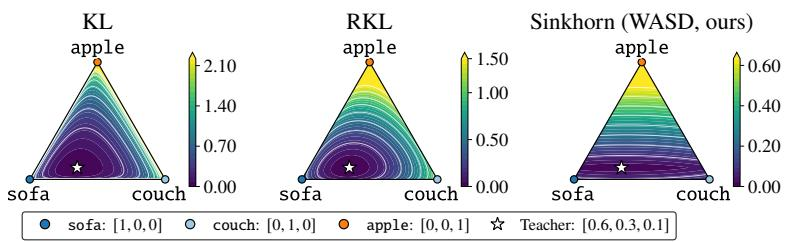

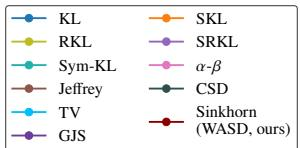

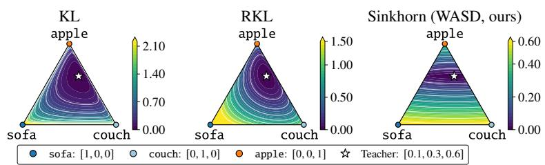  
(a) Loss contours of various divergences on the probability simplex

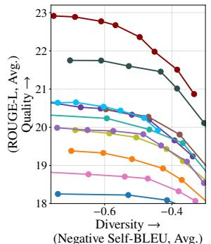  
(b) Quality-diversity trade-off  
Figure 1: Motivation for Wasserstein-based distillation (WASD). (a) Loss contours on the probability simplex for a toy next-token prediction task (“What do you sit on in the living room?”) with candidates {sofa, couch, apple}, where we visualize divergence between fixed teacher and varying student distributions. Unlike other divergences, Sinkhorn divergence used in WASD reflects semantic relationships between tokens. (b) Quality-diversity trade-off (ROUGE-L vs. Self-BLEU) on five instruction-following benchmarks for GPT-2 (1.5B → 0.1B), varying the decoding temperature.

To address this limitation, we propose Wasserstein-based knowledge distillation (WASD), which incorporates token-level semantic information through a transport-based discrepancy. Specifically, we define a transport cost from token embeddings and adopt a Wasserstein-based Sinkhorn divergence to align teacher and student distributions. As illustrated in Figure 1a, the resulting loss landscape assigns lower cost to probability shifts between tokens with similar meaning while penalizing shifts toward unrelated tokens. This semantic-aware alignment encourages the student model to preserve meaningful alternatives during training. Empirically, this leads to improved trade-offs between output quality and diversity compared to other divergences, as shown in Figure 1b.

Wasserstein-based objectives provide desirable properties but require solving an optimal transport problem. Moreover, entropy regularization makes transport computation tractable but can shift the optimum away from the teacher distribution, which is undesirable for knowledge distillation. To address these issues, we adopt the debiased Sinkhorn divergence and derive a computationally tractable optimization procedure that uses dual potentials computed via matrix scaling iterations, without introducing additional neural networks or requiring backpropagation through the transport solver. Extensive experiments across multiple LLM families, including GPT-2 [48], OpenLLaMA2 [58], Gemma [57], and Qwen2.5 [29], and across different model scales demonstrate that WASD consistently improves distillation performance on diverse tasks, such as instruction following, mathematical reasoning, and code generation. These results suggest the semantic information encoded in the token space is an important ingredient for effective knowledge transfer in LLM distillation.

## 2 Preliminaries

## 2.1 Knowledge distillation for large language models

We consider knowledge distillation (KD) for autoregressive large language models (LLMs), where the goal is to transfer knowledge from a large teacher model $p ( \mathbf { y } \vert \mathbf { x } )$ to a smaller student mode $q _ { \pmb { \theta } } ( \mathbf { y } | \mathbf { x } )$ Here, x denotes the input prompt, y is the output response, and θ is the parameters of the student model. The output $\mathbf { y } = ( y _ { 1 } , \dots , y _ { L } )$ is a token sequence with length $L ,$ where each token $y _ { l } \in \mathcal { V }$ belongs to a fixed vocabulary V. Following prior work [32, 34, 53], we assume that the teacher and student share the same vocabulary. Autoregressive LLMs factorize the conditional distribution as $\begin{array} { r } { q _ { \pmb { \theta } } ( \mathbf { y } | \mathbf { x } ) = \prod _ { l = 1 } ^ { L } q _ { \pmb { \theta } } ( y _ { l } | \mathbf { x } , \mathbf { y } _ { < l } ) } \end{array}$ , where $\mathbf { y } _ { < l } = ( y _ { 1 } , . . . , y _ { l - 1 } )$ . Thus, the model predicts a next-token distribution at each decoding step. Under this formulation, KD can be viewed as aligning the student’s next-token distribution with that of the teacher. This leads to the following general objective:

Table 1: Divergences used in LLM distillation. “Token info” indicates whether the objective uses token information beyond probability values. For Sinkhorn, the dual potentials $\phi _ { i } ^ { * }$ encode semantic information through token-embedding costs, and sg denotes the stop-gradient operator.
<table><tr><td>Divergence</td><td>Token info</td><td>Distillation objective</td></tr><tr><td>KL (Hinton et al., 2015)</td><td>x</td><td> $\begin{array} { r } { \sum _ { i } p ( i ) \log \frac { p ( i ) } { q _ { \pmb { \theta } } ( i ) } } \end{array}$ </td></tr><tr><td>Reverse KL (RKL) (Gu et al., 2024)</td><td>x</td><td> $\begin{array} { r } { \sum _ { i } q _ { \pmb { \theta } } ( i ) \log ^ { \frac { } { \pmb { q } \pmb { \theta } } ( i ) } } \end{array}$ </td></tr><tr><td>TV (Wen et al., 2023)</td><td>x</td><td> $\begin{array} { r l } { \sum _ { i } | q _ { \pmb { \theta } } ( i ) - p ^ { * } ( i ) | } \end{array}$ </td></tr><tr><td>Generalized JS (GJS) (Agarwal et al., 2024)</td><td>x</td><td> $\begin{array} { r } { \sum _ { i } ^ {  } [ \lambda p ( i ) \log { \frac { p ( i ) } { \lambda p ( i ) + ( 1 - \lambda ) q _ { \theta } ( i ) } } + ( 1 - \lambda ) q _ { \theta } ( i ) \log { \frac { q _ { \theta } ( i ) } { \lambda p ( i ) + ( 1 - \lambda ) q _ { \theta } ( i ) } } ] } \end{array}$ </td></tr><tr><td>Skew KL (SKL) (Ko et al., 2024)</td><td>x</td><td> $\begin{array} { r } { \sum _ { i } p ( i ) \log { \frac { p ( i ) } { \lambda p ( i ) + ( 1 - \lambda ) q _ { \pmb { \theta } } ( i ) } } } \end{array}$ </td></tr><tr><td>Skew RKL (SRKL) (Ko et al., 2024)</td><td>x</td><td> $\begin{array} { r } { \sum _ { i } ( \lambda p ( i ) + \dot { ( 1 - \lambda ) } q _ { \theta } ( i ) ) \log \frac { \lambda p ( i ) + ( 1 - \lambda ) q _ { \theta } ( i ) } { p ( i ) } } \end{array}$ </td></tr><tr><td>α-β (Wang et al., 2025)</td><td>x</td><td> $\begin{array} { r l } { \sum _ { i } - \frac { 1 } { \alpha \beta } [ p ( i ) ^ { \alpha } q _ { \pmb { \theta } } ( i ) ^ { \beta } - \frac { \alpha } { \alpha + \beta } p ( i ) ^ { \alpha + \beta ^ { \ast } - \beta } - \frac { \beta } { \alpha + \beta } q _ { \pmb { \theta } } ( i ) ^ { \alpha + \beta } ] } & { { } } \end{array}$ </td></tr><tr><td>Sinkhorn (ours)</td><td>√</td><td> $\begin{array} { r l } { \sum _ { i } \operatorname { s g } ( \boldsymbol { \phi } _ { i } ^ { * ( p , q _ { \theta } ) } - \boldsymbol { \phi } _ { i } ^ { * ( q _ { \theta } , q _ { \theta } ) } ) q _ { \theta } ( i ) } \end{array}$ </td></tr></table>

$$
\begin{array} { r } { \underset { \pmb { \theta } } { \operatorname* { m i n } } \mathbb { E } _ { ( \mathbf { x } , \mathbf { y } ) \sim \mathcal { D } } \left[ \sum _ { l = 1 } ^ { L } D \Big ( p \big ( y _ { l } | \mathbf { x } , \mathbf { y } _ { < l } \big ) , q _ { \pmb { \theta } } \big ( y _ { l } | \mathbf { x } , \mathbf { y } _ { < l } \big ) \Big ) \right] , } \end{array}\tag{1}
$$

where $D ( \cdot , \cdot )$ denotes a divergence between distributions. The dataset D consists of input-output pairs and can be constructed from predefined datasets [25] or model-generated samples [1, 34, 39].

The choice of divergence D is a central design component in KD for LLMs, as it determines how the student aligns with the teacher distribution. Table 1 summarizes commonly used divergences in prior work. Most existing methods adopt divergences computed from probability values at corresponding vocabulary indices, including KL divergence [25, 33], reverse KL (RKL) divergence [24], f-divergence [64], generalized Jensen-Shannon (GJS) divergence [1], adaptive KL divergence [65], and α-β-divergence [61]. These divergences are widely used because they are tractable to compute from the probability values of the two distributions.

Despite these advantages, such divergences do not explicitly leverage token-level semantic information [46]. In addition, token distributions in LLMs are highly sparse, with many near-zero probabilities, which can lead to numerical instability for divergences that depend on density ratios [34, 53]. To mitigate such instability, recent works have proposed alternative strategies, such as introducing an assistant distribution [34, 35, 53, 54] or aligning logits instead of probabilities [32]. While these approaches improve optimization stability, they still rely on index-wise comparisons and do not explicitly use semantic information encoded in the token space.

## 2.2 Wasserstein distance and Sinkhorn divergence

These limitations motivate alternative discrepancy measures for LLM distillation. The Wasserstein distance compares probability distributions by measuring the cost of transporting probability mass across the underlying space. Formally, for discrete distributions p and $q _ { \pmb { \theta } }$ , it is defined as

$$
\begin{array} { r } { D _ { \mathbb { W } } \left( p , q _ { \pmb { \theta } } \right) : = \operatorname* { m i n } _ { \pmb { P } \in U ( p , q _ { \pmb { \theta } } ) } \langle \pmb { P } , \pmb { C } \rangle , } \end{array}\tag{2}
$$

where $U ( p , q _ { \pmb { \theta } } )$ denotes the set of valid transport plans whose marginals match p and $q _ { \pmb { \theta } } .$ , and $C$ is a cost matrix specifying pairwise transport costs. This formulation compares distributions through a transport plan whose cost can reflect information encoded in the support.

In practice, directly computing the Wasserstein distance is computationally expensive in large-scale settings. A common approach is to introduce entropy regularization, which enables efficient computation through iterative matrix scaling methods [19, 20, 47, 59]. However, entropy regularization introduces a bias such that the transport cost between identical distributions is no longer zero. To address this issue, we adopt the Sinkhorn divergence, which removes this bias through self-similarity correction while retaining the computational advantages of entropy-regularized optimal transport [22]. Sinkhorn divergences have been studied in generative modeling and distribution alignment due to their scalability and favorable optimal transport properties [21, 22, 52]. In the context of LLM distillation, such transport-based discrepancies provide a principled way to incorporate relationships within the vocabulary. Building on this perspective, we introduce a Sinkhorn-based distillation objective for autoregressive LLMs, whose detailed formulations and derivations are presented in Section 3.1.

Wasserstein distance in knowledge distillation Wasserstein-based distances have been used in KD to transfer structured knowledge. Earlier works mainly target representations or features [6, 8, 41]. Recent methods use Wasserstein-based distillation losses: SinKD [17] aligns sample-level geometry, and WKD [43] exploits class interrelations tailored for vision models. They have also been used for cross-tokenizer LLM distillation [7, 18, 60], which addresses vocabulary mismatch or heterogeneous alignment and is complementary to our shared-vocabulary setting. Outside KD, WPR [46] uses tokenembedding geometry for Wasserstein-based policy regularization in preference learning. WASD builds on this geometric perspective for autoregressive teacher-student distribution matching and adopts a debiased Sinkhorn divergence to address the entropic bias of regularized transport. A detailed comparison with WPR and discussion of other related work are provided in Appendix B.

## 3 Method

## 3.1 From Wasserstein distance to Sinkhorn divergence for LLM distillation

Incorporating token-level semantic information via Wasserstein distance We instantiate the general distillation objective in Eq. (1) using the Wasserstein distance $D _ { \mathbb { W } }$ in Eq. (2) to incorporate token-space information into the distillation objective. In particular, the cost matrix C, which encodes pairwise distances between tokens, allows the transport cost to depend on information encoded in token embeddings. In practice, we construct C using distances between the teacher model’s token embeddings (e.g., cosine or Euclidean distance), in line with the goal of transferring knowledge from the teacher to the student. We compute this cost matrix once and keep it fixed throughout training.

Entropy-regularized Wasserstein distance A key challenge is that computing the exact Wasserstein distance requires solving a large-scale linear optimization problem, which becomes computationally intractable as the support size increases [36]. To alleviate this issue, a common approach is to regularize the transport problem with an entropy term, resulting in the entropy-regularized Wasserstein distance [19]:

$$
\begin{array} { r } { \mathcal { L } _ { \tilde { \mathbb { V } } } ^ { \epsilon } ( \theta ) : = \mathbb { E } _ { ( \mathbf { x } , \mathbf { y } ) \sim \mathcal { D } } \left[ \sum _ { l = 1 } ^ { L } \tilde { D } _ { \mathbb { V } } ^ { \epsilon } \Big ( p \big ( \boldsymbol { y } _ { l } | \mathbf { x } , \mathbf { y } _ { < l } \big ) , q _ { \theta } \big ( \boldsymbol { y } _ { l } | \mathbf { x } , \mathbf { y } _ { < l } \big ) \Big ) \right] , } \end{array}\tag{3}
$$

$$
\begin{array} { r } { \mathrm { w h e r e ~ } \tilde { D } _ { \mathrm { w } } ^ { \epsilon } \Big ( p ( y _ { l } | \mathbf { x } , \mathbf { y } _ { < l } ) , q _ { \theta } ( y _ { l } | \mathbf { x } , \mathbf { y } _ { < l } ) \Big ) : = \operatorname* { m i n } _ { P ^ { ( l ) } \in U _ { l } ( p , q _ { \theta } ) } \left\{ \langle P ^ { ( l ) } , C \rangle - \epsilon \mathcal { H } ( P ^ { ( l ) } ) \right\} . } \end{array}\tag{4}
$$

Here, $\begin{array}{c} \begin{array} { r } { U _ { l } ( p , q _ { \theta } ) : = \{ P ^ { ( l ) } \in \mathbb { R } _ { + } ^ { d \times d } | P ^ { ( l ) } \mathbf { 1 } _ { d } = q _ { \theta } ( \cdot | \mathbf { x } , \mathbf { y } _ { < l } ) , P ^ { ( l ) } } \end{array}  \mathbf { 1 } _ { d } = p ( \cdot | \mathbf { x } , \mathbf { y } _ { < l } ) \}  \end{array}$ denotes the set of valid transport plans, $C \in \mathbb { R } _ { + } ^ { d \times d }$ is the cost matrix, d is the vocabulary size, and ϵ is an entropy regularization hyperparameter. The entropy term is defined as $\begin{array} { r } { \mathcal { H } ( \pmb { P } ) : = - \sum _ { i = 1 } ^ { d } \sum _ { j = 1 } ^ { d } P _ { i j } ( \log P _ { i j } - } \end{array}$ 1), which corresponds to the Shannon entropy up to an additive constant. For notational simplicity, we omit the dependence of $P ^ { ( l ) }$ on $\left( \mathbf { x } , \mathbf { y } _ { < l } \right)$

Bias induced by entropy regularization By introducing entropy regularization, the resulting objective can be computed efficiently using the Sinkhorn-Knopp algorithm [55]. However, this regularization introduces an entropic bias: for a fixed teacher distribution $p ,$ the regularized transport objective is not generally minimized at $q _ { \pmb { \theta } } = p .$ Consequently, minimizing the objective in Eq. (3) does not guarantee that the student distribution $q _ { \theta }$ matches the teacher distribution $p ,$ which is the central goal of knowledge distillation. As illustrated in Figure 2 on the toy example introduced in Section 1, the optimal solution of the entropyregularized Wasserstein objective deviates from the teacher distribution, highlighting the bias introduced by entropy regularization.

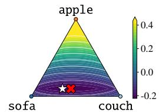  
Teacher Optimal student  
Figure 2: Loss contour of entropy-regularized Wasserstein distance.

Sinkhorn divergence for proper distillation To address this limitation, we adopt the Sinkhorn divergence [21, 22], defined as

$$
\begin{array} { r } { \mathcal { L } _ { \mathrm { S } } ^ { \epsilon } ( \pmb { \theta } ) : = \mathbb { E } _ { ( \mathbf { x } , \mathbf { y } ) \sim \mathcal { D } } \left[ \sum _ { l = 1 } ^ { L } D _ { \mathrm { S } } ^ { \epsilon } \Big ( p ( y _ { l } | \mathbf { x } , \mathbf { y } _ { < l } ) , q _ { \pmb { \theta } } ( y _ { l } | \mathbf { x } , \mathbf { y } _ { < l } ) \Big ) \right] , } \end{array}\tag{5}
$$

$$
\mathrm { w h e r e } \ D _ { \mathrm { S } } ^ { \epsilon } ( p , q _ { \theta } ) : = \tilde { D } _ { \mathrm { W } } ^ { \epsilon } ( p , q _ { \theta } ) - \frac { 1 } { 2 } \tilde { D } _ { \mathrm { W } } ^ { \epsilon } ( q _ { \theta } , q _ { \theta } ) - \frac { 1 } { 2 } \tilde { D } _ { \mathrm { W } } ^ { \epsilon } ( p , p ) .\tag{6}
$$

Under suitable conditions on the transport cost, the Sinkhorn divergence in Eq. (6) is nonnegative and equals zero if and only if $p = q _ { \theta }$ . Then, its unique minimizer over student distributions is the teacher distribution, making $\operatorname { E q . } \left( 5 \right)$ a proper distillation objective. The entropy regularization parameter ϵ interpolates between different regimes: as $\epsilon  0 , \bar { D _ { \mathrm { S } } ^ { \epsilon } }$ recovers the Wasserstein distance $D _ { \mathrm { { W } } } ;$ while as $\epsilon \to \infty$ , it approaches a kernel-based discrepancy, recovering the squared Maximum Mean Discrepancy (MMD) for suitable choices of the cost matrix [21].

## 3.2 WASD: Wasserstein-based knowledge distillation for LLMs

We derive a tractable optimization procedure for the Sinkhorn distillation objective in Eq. (5), which can be directly optimized with standard gradient-based methods, without introducing additional model components. Since the Sinkhorn divergence $D _ { S } ^ { \epsilon }$ is defined in terms of entropy-regularized Wasserstein distances, we begin by reformulating the entropy-regularized Wasserstein distance $\tilde { D } _ { \mathrm { W } } ^ { \epsilon }$ to obtain a tractable distillation formulation.

We consider the dual formulation of the entropy-regularized optimal transport problem in Eq. (4). The corresponding dual problem can be written as follows [19, 46]:

$$
\operatorname* { m a x } _ { \phi , \psi } \sum _ { i = 1 } ^ { d } \phi _ { i } q \theta ( y _ { l } = i | \mathbf { x } , \mathbf { y } _ { < l } ) + \sum _ { j = 1 } ^ { d } \psi _ { j } p \big ( y _ { l } = j | \mathbf { x } , \mathbf { y } _ { < l } \big ) - \sum _ { i = 1 } ^ { d } \sum _ { j = 1 } ^ { d } \epsilon \exp \big ( \frac { 1 } { \epsilon } \big ( \phi _ { i } + \psi _ { j } - C _ { i j } \big ) \big ) ,\tag{7}
$$

where $\phi = \{ \phi _ { i } \} _ { i = 1 } ^ { d }$ and $\pmb { \psi } = \{ \psi _ { j } \} _ { j = 1 } ^ { d }$ are dual variables associated with the marginal constraints in $U _ { l }$ , ensuring that the row and column sums of $P ^ { ( l ) }$ match $q _ { \pmb { \theta } }$ and $p ,$ respectively. These variables depend on $\left( \mathbf { x } , \mathbf { y } _ { < l } \right)$ , which we omit for notational simplicity. By strong duality, the optimal primal and dual solutions admit the following form [20]: there exist scaling vectors $\mathbf { u } , \mathbf { v } \in \mathbb { R } _ { + } ^ { d }$ such that

$$
{ \pmb P } ^ { ( l ) ^ { * } } = \mathrm { d i a g } ( { \bf u } ) \mathrm { e x p } ( - C / \epsilon ) \mathrm { d i a g } ( { \bf v } ) , \quad \phi ^ { * } = \epsilon \log ( { \bf u } ) + t { \bf 1 } _ { d } , \quad \psi ^ { * } = \epsilon \log ( { \bf v } ) - t { \bf 1 } _ { d } ,\tag{8}
$$

for $t \in \mathbb { R }$ . Here, exp and log are applied element-wise. The dual solutions are unique up to an additive constant. This indeterminacy does not affect the dual objective, since both marginals have unit mass and the shifts cancel.

Substituting the optimal solution into the dual objective in Eq. (7) yields the following equivalent expression for the entropy-regularized Wasserstein distance.

Lemma 1. Let $\phi ^ { * ( p , q _ { \pmb { \theta } } ) } ( \mathbf { x } , \mathbf { y } _ { < l } )$ and $\psi ^ { * ( p , q _ { \pmb { \theta } } ) } ( \mathbf { x } , \mathbf { y } _ { < l } )$ denote the optimal dual variables of the entropic optimal transport problem corresponding to $\tilde { D } _ { W } ^ { \epsilon } ( p , q _ { \theta } )$ . Then,

$$
\begin{array} { r l r } & { \tilde { D } _ { W } ^ { \epsilon } ( p ( y _ { l } | \mathbf x , \mathbf y _ { < l } ) , q _ { \theta } ( y _ { l } | \mathbf x , \mathbf y _ { < l } ) ) } & { ( \mathfrak { G } ) } \\ & { \quad \quad \quad = \sum _ { i = 1 } ^ { d } \phi _ { i } ^ { * ( p , q _ { \theta } ) } ( \mathbf x , \mathbf y _ { < l } ) q _ { \theta } ( y _ { l } = i | \mathbf x , \mathbf y _ { < l } ) + \sum _ { j = 1 } ^ { d } \psi _ { j } ^ { * ( p , q _ { \theta } ) } ( \mathbf x , \mathbf y _ { < l } ) p ( y _ { l } = j | \mathbf x , \mathbf y _ { < l } ) - \epsilon . } \end{array}
$$

The proof is provided in Appendix A.1. The optimal dual variables depend implicitly on $\pmb \theta$ through $q _ { \theta }$ . However, the envelope theorem [44] allows us to compute the gradient of the optimal transport value without differentiating through these variables, as formalized below.

Proposition 2. Let $\phi ^ { * ( p , q _ { \pmb { \theta } } ) } ( \mathbf { x } , \mathbf { y } _ { < l } )$ denote the optimal dual variables associated with the student marginal. Then, the gradient of the entropy-regularized Wasserstein distance can be expressed as

$$
\begin{array} { r l } & { \nabla _ { \theta } \tilde { D } _ { W } ^ { \epsilon } \big ( p ( y | \mathbf x , \mathbf y _ { < l } ) , q _ { \theta } ( y _ { l } | \mathbf x , \mathbf y _ { < l } ) \big ) = \sum _ { i = 1 } ^ { d } \phi _ { i } ^ { * ( p , q _ { \theta } ) } ( \mathbf x , \mathbf y _ { < l } ) \nabla _ { \theta } q _ { \theta } ( y _ { l } = i | \mathbf x , \mathbf y _ { < l } ) . } \end{array}\tag{10}
$$

The proof is provided in Appendix A.2. Proposition 2 shows that the gradient of the entropyregularized Wasserstein distance can be expressed as a weighted sum of student probability gradients, with weights given by the optimal dual variables. This allows gradient-based optimization without differentiating through the transport solver. We now extend this formulation to the Sinkhorn distillation objective in Eq. (5). The self-transport terms in Eq. (6) can be treated analogously using Lemma 1 and Proposition 2, leading to the following result.

Algorithm 1 Sinkhorn-Knopp algorithm for $\phi ^ { \ast ( p , q _ { \theta } ) }$ Algorithm 2 Fixed-point iteration for   
$\phi ^ { \ast ( q _ { \theta } , q _ { \theta } ) }$   
Input: Teacher distribution $p ( \cdot | \mathbf { x } , \mathbf { y } _ { < l } )$ , student dis  
tribution $q _ { \pmb { \theta } } \big ( \cdot | \mathbf { x } , \mathbf { y } _ { < l } \big )$ , cost matrix ${ \dot { C } } ,$ regulariza- Input: Student distribution $q _ { \pmb { \theta } } \big ( \cdot | \mathbf { x } , \mathbf { y } _ { < l } \big )$   
tion hyperparameter ϵ cost matrix $^ { C , }$ regularization hyperpa-  
1 $\mathbf { \sigma } : \mathbf { u }  \bar { \mathbf { 1 } _ { d } } , \bar { \mathbf { v } }  \mathbf { 1 } _ { d } , K  \exp ( - C / \epsilon )$ rameter ϵ   
2: while not converged do $1 ; \ : \mathbf { u }  \mathbf { 1 } _ { d } , K  \exp ( - C / \epsilon )$   
3: ${ \mathbf u } \gets q _ { \pmb \theta } ( \cdot | { \mathbf x } , \mathbf y _ { < l } ) \cdot / \left( K \mathbf { v } \right)$ 2: while not converged do   
4: $\mathbf v  p ( \cdot | \mathbf x , \mathbf y _ { < l } ) \cdot / ( K ^ { \top } \mathbf u )$ 3: $\mathbf { u }  q _ { \pmb { \theta } } ( \cdot | \mathbf { x } , \mathbf { y } _ { < l } ) . / ( K \mathbf { u } )$   
5: end while 4: end while   
6: $\phi ^ { * ( p , q _ { \theta } ) }  \epsilon \log \mathbf { u }$ 5: $\phi ^ { * ( q _ { \theta } , q _ { \theta } ) }  \epsilon \log \mathbf { u }$   
Output: Dual variable $\phi ^ { \ast ( p , q \theta ) }$ Output: Dual variable $\phi ^ { \ast ( q _ { \theta } , q _ { \theta } ) }$

Theorem 3. Let $\phi ^ { * ( p , q _ { \pmb { \theta } } ) } ( \mathbf { x } , \mathbf { y } _ { < l } )$ and $\phi ^ { * ( q _ { \theta } , q _ { \theta } ) } ( \mathbf { x } , \mathbf { y } _ { < l } )$ denote the optimal dual variables corresponding to $\tilde { D } _ { W } ^ { \epsilon } ( p , q _ { \theta } )$ and $\tilde { D } _ { W } ^ { \epsilon } ( q _ { \theta } , q _ { \theta } )$ , respectively. Define

$$
\mathcal { L } _ { W A S D } ^ { \epsilon } ( \theta ) : = \mathbb { E } _ { ( \mathbf { x } , \mathbf { y } ) \sim \mathcal { D } } \Bigg [ \sum _ { l = 1 } ^ { L } \sum _ { i = 1 } ^ { d } \mathrm { s g } \left( \phi _ { i } ^ { * \left( p , q _ { \theta } \right) } ( \mathbf { x } , \mathbf { y } _ { < l } ) - \phi _ { i } ^ { * \left( q _ { \theta } , q _ { \theta } \right) } ( \mathbf { x } , \mathbf { y } _ { < l } ) \right) q _ { \theta } \left( y _ { l } = i | \mathbf { x } , \mathbf { y } _ { < l } \right) \Bigg ] ,\tag{11}
$$

where sg denotes the stop-gradient operator. Then, under the stop-gradient convention, the gradient $o f \mathcal { L } _ { W A S D } ^ { \epsilon } ( \pmb { \theta } )$ coincides with that of the Sinkhorn objective $\mathcal { L } _ { S } ^ { \epsilon } ( \pmb { \theta } )$ , i.e., $\nabla _ { \pmb { \theta } } \mathcal { L } _ { W A S D } ^ { \epsilon } ( \pmb { \theta } ) = \nabla _ { \pmb { \theta } } \mathcal { \bar { L } } _ { S } ^ { \epsilon } ( \pmb { \theta } )$

The result follows by differentiating the three terms in Eq. (6). By Proposition 2, the first term yields a student probability gradient weighted by $\phi ^ { * ( p , q _ { \theta } ) }$ , and the third term is independent of θ. The second term involves the entropy-regularized Wasserstein distance between $q _ { \theta }$ and itself. Assuming a symmetric cost matrix, the optimal dual variables in this self-transport problem can be chosen equal, i.e., $\phi ^ { * ( q _ { \theta } , q _ { \theta } ) } = \psi ^ { * ( q _ { \theta } , q _ { \theta } ) }$ , allowing its gradient to be expressed using only $\phi ^ { * ( q _ { \theta } , q _ { \theta } ) }$ . Combining these contributions gives a gradient weighted by the difference between cross-transport and student self-transport potentials. Applying stop-gradient to these weights gives the loss in Eq. (11), whose gradient coincides with that of the Sinkhorn objective. The full proof is in Appendix A.3.

We refer to the objective $\mathcal { L } _ { \mathrm { W A S D } } ^ { \epsilon } ( \pmb { \theta } )$ in Eq. (11) as the WASserstein-based Distillation (WASD) objective. By Theorem 3, WASD can be interpreted as a weighted sum over $q _ { \theta }$ , where weights are given by the difference between the optimal dual variables $\phi ^ { * ( p , q _ { \pmb { \theta } } ) } ( \mathbf { x } , \mathbf { y } _ { < l } )$ and $\phi ^ { * ( q _ { \theta } , q _ { \theta } ) } ( \mathbf { x } , \mathbf { y } _ { < l } )$ treated as constants during backpropagation. These dual variables can be efficiently computed via the Sinkhorn-Knopp algorithm (see Algorithm 1) and a fixed-point iteration (see Algorithm 2), respectively. To improve computational efficiency, we follow Na et al. [46] to construct a sparse kernel by retaining each token’s k nearest non-self neighbors in the embedding space, symmetrizing the support, and adding self-loops. Although the matrix scaling iterations in Algorithms 1 and 2 introduce additional computational overhead, WASD avoids differentiation through them, as established in Theorem 3.

Gradient update of WASD We compare the gradient update of WASD with that of KL-based distillation. For a fixed context $\left( \mathbf { x } , \mathbf { y } _ { < l } \right)$ , using $\nabla _ { \pmb { \theta } } q _ { \pmb { \theta } } = q _ { \pmb { \theta } } \nabla _ { \pmb { \theta } } \log q _ { \pmb { \theta } }$ , the Sinkhorn gradient implemented by WASD in Theorem 3 can be written as

$$
\begin{array} { r l r } {  { \nabla _ { \theta } D _ { \mathrm { S } } ^ { \varepsilon } \bigl ( p ( y _ { l } | \mathbf x , \mathbf y _ { < l } ) , q _ { \theta } \bigl ( y _ { l } | \mathbf x , \mathbf y _ { < l } \bigr ) \bigr ) } } \\ & { } & { = \sum _ { i = 1 } ^ { d } q _ { \theta } \bigl ( y _ { l } = i | \mathbf x , \mathbf y _ { < l } \bigr ) ( \phi _ { i } ^ { * ( p , q _ { \theta } ) } \bigl ( \mathbf x , \mathbf y _ { < l } \bigr ) - \phi _ { i } ^ { * ( q _ { \theta } , q _ { \theta } ) } \bigl ( \mathbf x , \mathbf y _ { < l } \bigr ) ) \nabla _ { \theta } \log q _ { \theta } \bigl ( y _ { l } = i | \mathbf x , \mathbf y _ { < l } \bigr ) . } \end{array}
$$

The gradient is an expectation under the student distribution of log-likelihood gradients weighted by the difference of dual potentials. For comparison, the gradient of the forward KL objective is

$$
\begin{array} { r l } & { \nabla _ { \theta } D _ { \mathrm { K L } } \big ( p ( y _ { l } | \mathbf { x } , \mathbf { y } _ { < l } ) , q _ { \theta } ( y _ { l } | \mathbf { x } , \mathbf { y } _ { < l } ) \big ) = - \sum _ { i = 1 } ^ { d } p ( y _ { l } = i | \mathbf { x } , \mathbf { y } _ { < l } ) \nabla _ { \theta } \log q _ { \theta } ( y _ { l } = i | \mathbf { x } , \mathbf { y } _ { < l } ) , } \end{array}\tag{13}
$$

which weights the negative log-likelihood gradient directly by the teacher probability at each vocabulary index. In contrast, WASD weights the log-likelihood gradient by the student probability

Table 2: ROUGE-L scores on five general instruction-following benchmarks for GPT-2 XL (1.5B) → GPT-2 Base (0.1B), varying divergences. All results are obtained using our implementation, where all methods share identical teacher and student initialization. Performance is averaged over five evaluation seeds. Bold and underline indicate the best and second-best performance, respectively.
<table><tr><td>Method</td><td>Dolly Eval</td><td>Self Inst</td><td>Vicuna</td><td>Super NI</td><td>UnNI</td><td></td><td>Avg. (↑)</td></tr><tr><td>GPT-2 XL (Teacher)</td><td> $2 6 . 9 3 \pm 0 . 6 0$ </td><td> $1 4 . 7 7 \pm 0 . 3 8$ </td><td> $1 6 . 4 3 \pm 0 . 2 8$ </td><td></td><td> $2 7 . 1 9 \pm 0 . 4 7$ </td><td> $3 1 . 4 3 \pm 0 . 1 2$ </td><td>23.35</td></tr><tr><td>KL [25]</td><td> $2 3 . 3 3 \pm 0 . 3 6$ </td><td> $1 0 . 4 3 \pm 0 . 2 3$ </td><td> $1 5 . 3 4 \pm 0 . 2 7$ </td><td></td><td> $1 7 . 4 2 \pm 0 . 1 4$ </td><td> $1 9 . 3 4 \pm 0 . 0 7$ </td><td>17.17</td></tr><tr><td>RKL [24]</td><td> $2 4 . 6 2 \pm 0 . 2 7$ </td><td> $1 1 . 3 1 \pm 0 . 2 8$ </td><td> $1 5 . 9 7 \pm 0 . 2 8$ </td><td></td><td> $2 1 . 4 2 \pm 0 . 3 0$ </td><td> $2 3 . 8 2 \pm 0 . 1 4$ </td><td>19.43</td></tr><tr><td>Sym-KL</td><td> $2 3 . 3 2 \pm 0 . 3 7$ </td><td> $1 0 . 8 1 \pm 0 . 2 7$ </td><td> $1 5 . 4 1 \pm 0 . 5 6$ </td><td></td><td> $2 0 . 1 2 \pm 0 . 2 3$ </td><td> $2 1 . 2 3 \pm 0 . 0 9$ </td><td>18.18</td></tr><tr><td>Jeffrey</td><td> $2 2 . 8 4 \pm 0 . 5 3$ </td><td> $1 0 . 8 4 \pm 0 . 2 4$ </td><td> $1 5 . 3 0 \pm 0 . 2 2$ </td><td></td><td> $2 0 . 5 7 \pm 0 . 3 7$ </td><td> $2 2 . 6 6 \pm 0 . 1 3$ </td><td>18.44</td></tr><tr><td>TV [64]</td><td> $2 4 . 0 8 \pm 0 . 4 1$ </td><td> $1 0 . 8 3 \pm 0 . 2 5$ </td><td> $1 4 . 6 8 \pm 0 . 4 3$ </td><td></td><td> $2 5 . 5 7 \pm 0 . 2 2$ </td><td> $2 7 . 5 1 \pm 0 . 0 9$ </td><td>20.53</td></tr><tr><td>GJS [1]</td><td> $2 4 . 6 4 \pm 0 . 4 0$ </td><td> $1 1 . 6 4 \pm 0 . 3 7$ </td><td> $1 4 . 9 6 \pm 0 . 4 2$ </td><td></td><td> $2 4 . 3 1 \pm 0 . 0 9$ </td><td> $2 6 . 0 9 \pm 0 . 1 2$ </td><td>20.33</td></tr><tr><td>SKL [34]</td><td> $2 4 . 5 1 \pm 0 . 3 7$ </td><td> $1 2 . 0 0 \pm 0 . 1 8$ </td><td> $1 5 . 0 0 \pm 0 . 2 3$ </td><td></td><td> $2 0 . 2 6 \pm 0 . 1 9$ </td><td> $2 2 . 8 3 \pm 0 . 0 4$ </td><td>18.92</td></tr><tr><td>SRKL [34]</td><td> $2 4 . 6 8 \pm 0 . 1 9$ </td><td> $1 2 . 6 0 \pm 0 . 2 4$ </td><td> $1 5 . 1 5 \pm 0 . 5 4$ </td><td></td><td> $2 2 . 3 9 \pm 0 . 1 9$ </td><td> $2 4 . 2 6 \pm 0 . 1 1$ </td><td>19.81</td></tr><tr><td>α-β [61]</td><td> $2 4 . 0 5 \pm 0 . 1 8$ </td><td> $1 0 . 8 8 \pm 0 . 3 1$ </td><td> $1 5 . 8 7 \pm 0 . 2 3$ </td><td></td><td> $1 9 . 3 1 \pm 0 . 2 1$ </td><td> $2 1 . 5 0 \pm 0 . 1 1$ </td><td>18.32</td></tr><tr><td>CSD [32]</td><td> $2 5 . 0 6 \pm 0 . 1 7$ </td><td> $\underline { { 1 2 . 7 5 } } \pm 0 . 2 6$ </td><td> ${ \bf 1 6 . 4 2 \pm 0 . 3 9 }$ </td><td></td><td> $2 5 . 8 6 \pm 0 . 3 1$ </td><td> $2 7 . 1 9 \pm 0 . 1 3$ </td><td>21.46</td></tr><tr><td>WASD (ours)</td><td> $\pm 5 . 6 0 \pm 0 . 3 4$ </td><td> $\pm 2 . 8 8 \pm 0 . 3 6$ </td><td> $1 5 . 9 8 \pm 0 . 4 0$ </td><td></td><td> ${ \bf 2 8 . 6 3 \pm 0 . 1 7 }$ </td><td> $2 9 . 2 7 \pm 0 . 0 9$ </td><td>22.47</td></tr></table>

multiplied by the difference $\phi _ { i } ^ { * ( p , q _ { \theta } ) } - \phi _ { i } ^ { * ( q _ { \theta } , q _ { \theta } ) }$ . These potentials depend on the token embedding cost matrix, allowing token geometry to influence the update. Consequently, while KL determines its weights from index-wise probability values, WASD additionally incorporates semantic relationships between tokens through the transport problem.

## 4 Experiments

We evaluate WASD on general instruction-following and task-specific distillation tasks, including summarization, translation, mathematical reasoning, and code generation. Experimental setups follow prior work [32, 53], and details are provided in each subsection and Appendix C.

## 4.1 General instruction-following experiments

Setup For general instruction-following experiments, we follow the experimental protocols of previous work [32, 34, 53]. For GPT-2 and OpenLLaMA2, we use databricks-dolly-15k [14] as the distillation dataset and OpenWebText [23] as the pretraining dataset. In the divergence comparison experiment in Table 2, we exclude the pretraining dataset for direct comparison. We evaluate WASD on three model families: GPT-2 [48], OpenLLaMA2 [58], and Qwen2.5 [29]. For GPT-2, we employ GPT-2 XL (1.5B) as the teacher and GPT-2 Base (0.1B) and Medium (0.3B) as students. For OpenLLaMA2, we use OpenLLaMA2-7B as the teacher and OpenLLaMA2-3B as the student, trained with LoRA [28]. For Qwen2.5, we use Qwen2.5-7B-Instruct as the teacher and Qwen2.5- 1.5B-Instruct as the student, following the distillation setups of previous work [32, 35].

We compare WASD against baselines using different divergence objectives. Baseline details are provided in Appendix C.1. For GPT-2 and OpenLLaMA2, we evaluate on five instruction-following datasets: (1) the Dolly evaluation dataset, (2) Self-Instruct [63], (3) Vicuna [11], (4) Super-Natural Instructions (Super NI) [62], and (5) Unnatural Instructions (UnNI) [27]. We report ROUGE-L [40] to measure generation quality through similarity to reference text and Self-BLEU [70] to measure generation diversity. For Qwen2.5, we evaluate on AlpacaEval [38], Evol-Instruct [66], and UltraFeedback [16], reporting win rates against reference responses using GPT-4o-mini as the judge.

Comparison to other divergences We first conduct a divergence-level comparison to examine whether the proposed Wasserstein-based objective itself provides a better distillation signal. In this comparison, we do not use an additional pretraining loss, SFT initialization for the student, or on-policy techniques. Table 2 shows that WASD achieves the best average performance among the compared divergences, demonstrating the effectiveness of the proposed divergence. We further analyze the quality-diversity trade-off by varying the decoding temperature. In Figure 1b, WASD consistently forms a favorable frontier over existing baselines, indicating that WASD preserves generation quality even with increased diversity. This behavior is likely due to the token-embedding transport cost used in WASD: by assigning lower costs to tokens with similar meanings, WASD can preserve generation quality even when decoding is encouraged to produce more diverse outputs.

Table 3: ROUGE-L scores on five general instruction-following benchmarks for GPT-2 and OpenLLaMA2. Bold and underline indicate the best and second-best performance, respectively.
<table><tr><td>Method</td><td>Dolly Eval</td><td>Self Inst</td><td>Vicuna</td><td>Super NI</td><td>UnNI</td><td> $\mathrm { { A v g . } \left( \uparrow \right) }$ </td></tr><tr><td>GPT-2 XL (Teacher)</td><td> $2 6 . 9 3 \pm 0 . 6 0$ </td><td> $1 4 . 7 7 \pm 0 . 3 8$ </td><td> $1 6 . 4 3 \pm 0 . 2 8$ </td><td> $2 7 . 1 9 \pm 0 . 4 7$ </td><td> $3 1 . 4 3 \pm 0 . 1 2$ </td><td>23.35</td></tr><tr><td colspan="7">GPT-2 XL (1.5B) → GPT-2 Base (0.1B)</td></tr><tr><td>GKD [1]</td><td> $2 3 . 8 6 \pm 0 . 2 2$ </td><td> $1 1 . 2 1 \pm 0 . 4 2$ </td><td> $1 4 . 6 3 \pm 0 . 1 9$ </td><td> $1 9 . 4 3 \pm 0 . 1 7$ </td><td> $2 2 . 2 8 \pm 0 . 1 2$ </td><td>18.28</td></tr><tr><td>TAID [54]</td><td> $2 5 . 4 4 \pm 0 . 4 2$ </td><td> $1 2 . 5 5 \pm 0 . 1 1$ </td><td> $1 6 . 6 5 \pm 0 . 3 2$ </td><td> $2 4 . 4 5 \pm 0 . 2 0$ </td><td> $2 6 . 7 0 \pm 0 . 0 9$ </td><td>21.16</td></tr><tr><td>DistiLLM (SKL) [34]</td><td> $2 5 . 3 9 \pm 0 . 4 3$ </td><td> $1 2 . 4 2 \pm 0 . 2 5$ </td><td> $1 6 . 2 1 \pm 0 . 3 3$ </td><td> $2 5 . 1 3 \pm 0 . 2 2$ </td><td> $2 6 . 9 4 \pm 0 . 1 8$ </td><td>21.22</td></tr><tr><td>DistiLLM (SRKL) [34]</td><td> $2 5 . 1 0 \pm 0 . 3 0$ </td><td> $1 2 . 0 1 \pm 0 . 2 6$ </td><td> ${ \bf 1 7 . 4 0 \pm 0 . 2 8 }$ </td><td> $2 5 . 3 9 \pm 0 . 2 1$ </td><td> $2 6 . 4 0 \pm 0 . 1 0$ </td><td>21.26</td></tr><tr><td>ABKD [61]</td><td> $2 6 . 1 5 \pm 0 . 2 5$ </td><td> $1 2 . 5 6 \pm 0 . 4 8$ </td><td> $1 7 . 2 4 \pm 0 . 6 0$ </td><td> $2 7 . 0 7 \pm 0 . 1 6$ </td><td> $2 9 . 0 3 \pm 0 . 1 3$ </td><td>22.41</td></tr><tr><td>CSD [32]</td><td> $2 5 . 9 1 \pm 0 . 5 2$ </td><td> $1 2 . 9 7 \pm 0 . 1 9$ </td><td> $1 6 . 8 0 \pm 0 . 5 7$ </td><td> $2 6 . 9 0 \pm 0 . 1 6$ </td><td> $2 8 . 5 1 \pm 0 . 0 6$ </td><td>22.22</td></tr><tr><td>AMiD [53]</td><td> $2 6 . 3 9 \pm 0 . 4 0$ </td><td> $\underline { { 1 4 . 1 8 } } \pm 0 . 1 7$ </td><td> $1 6 . 8 1 \pm 0 . 2 5$ </td><td> $\underline { { 2 9 . 1 1 } } \pm 0 . 1 6$ </td><td> $3 0 . 7 8 \pm 0 . 1 3$ </td><td>23.46</td></tr><tr><td>WASD (ours)</td><td> $\mathbf { 2 7 . 0 7 \ : \pm { 0 . 2 2 } }$ </td><td> ${ \pm } 4 . 3 4 \pm \ : 0 . 4 9$ </td><td> $1 7 . 2 5 \pm 0 . 3 7$ </td><td> $\mathbf { 2 9 . 6 0 \ : \pm { 0 . 2 2 } }$ </td><td> ${ \bf 3 1 . 8 6 \pm 0 . 0 8 }$ </td><td>24.02</td></tr><tr><td colspan="7">GPT-2 XL (1.5B) → GPT-2 Medium (0.3B)</td></tr><tr><td>GKD [1]</td><td> $2 5 . 3 1 \pm 0 . 4 3$ </td><td> $1 2 . 1 6 \pm 0 . 5 7$ </td><td> $1 5 . 2 6 \pm 0 . 3 4$ </td><td> $2 6 . 0 0 \pm 0 . 2 0$ </td><td> $2 7 . 5 8 \pm 0 . 0 9$ </td><td>21.26</td></tr><tr><td>TAID [54]</td><td> $2 6 . 9 7 \pm 0 . 1 8$ </td><td> $1 4 . 6 3 \pm 0 . 4 2$ </td><td> $\underline { { 1 7 . 5 8 } } \pm 0 . 2 6$ </td><td> $2 6 . 7 5 \pm 0 . 3 0$ </td><td> $3 1 . 0 1 \pm 0 . 0 8$ </td><td>23.39</td></tr><tr><td>DistiLLM (SKL) [34]</td><td> $2 5 . 9 4 \pm 0 . 3 1$ </td><td> $1 4 . 2 7 \pm 0 . 4 3$ </td><td> $1 6 . 6 0 \pm 0 . 4 7$ </td><td> $2 5 . 4 2 \pm 0 . 2 4$ </td><td> $3 0 . 1 2 \pm 0 . 1 1$ </td><td>22.47</td></tr><tr><td>DistiLLM (SRKL) [34]</td><td> $2 6 . 9 7 \pm 0 . 3 2$ </td><td> $1 3 . 9 3 \pm 0 . 3 7$ </td><td> $1 7 . 0 2 \pm 0 . 2 1$ </td><td> $2 6 . 7 2 \pm 0 . 2 0$ </td><td> $2 9 . 4 3 \pm 0 . 0 8$ </td><td>22.81</td></tr><tr><td>ABKD [61]</td><td> $2 7 . 1 8 \pm 0 . 3 0$ </td><td> $1 4 . 1 2 \pm 0 . 2 7$ </td><td> $1 7 . 2 8 \pm 0 . 2 6$ </td><td> $2 6 . 8 7 \pm 0 . 3 2$ </td><td> $3 1 . 1 4 \pm 0 . 0 4$ </td><td>23.32</td></tr><tr><td>CSD [32]</td><td> $2 7 . 1 5 \pm 0 . 4 6$ </td><td> $\underline { { 1 5 . 1 9 } } \pm 0 . 3 6$ </td><td> $1 7 . 5 6 \pm 0 . 3 9$ </td><td> $2 7 . 9 2 \pm 0 . 2 3$ </td><td> $3 3 . 1 2 \pm 0 . 0 9$ </td><td>24.19</td></tr><tr><td>AMiD [53]</td><td> $2 7 . 8 2 \pm 0 . 2 5$ </td><td> $1 4 . 8 4 \pm 0 . 3 3$ </td><td> $1 6 . 5 5 \pm 0 . 3 8$ </td><td> ${ \bf 3 0 . 3 0 \pm 0 . 1 7 }$ </td><td> $\underline { { 3 4 . 1 7 } } \pm 0 . 0 6$ </td><td>24.74</td></tr><tr><td>WASD (ours)</td><td> $2 8 . 3 7 \pm 0 . 1 4$ </td><td> $\mathbf { 1 5 . 4 5 \pm 0 . 4 1 }$ </td><td> ${ \bf 1 8 . 4 1 \pm 0 . 2 8 }$ </td><td> $3 0 . 2 4 \pm 0 . 1 9$ </td><td> ${ \bf 3 5 . 0 6 } \pm 0 . 0 3$ </td><td>25.51</td></tr><tr><td>OpenLLaMA2-7B (Teacher)</td><td> $2 7 . 4 4 \pm 0 . 3 8$ </td><td> $1 8 . 4 7 \pm 0 . 8 3$ </td><td> $1 7 . 9 5 \pm 0 . 3 0$ </td><td> $3 1 . 0 6 \pm 0 . 1 1$ </td><td> $3 2 . 4 4 \pm 0 . 1 1$ </td><td>25.47</td></tr><tr><td colspan="7">OpenLLaMA2-7B → OpenLLaMA2-3B</td></tr><tr><td>GKD [1]</td><td> $2 9 . 3 6 \pm 0 . 2 0$ </td><td> $2 0 . 7 3 \pm 0 . 2 3$ </td><td> $2 0 . 8 1 \pm 0 . 1 8$ </td><td> $3 8 . 2 2 \pm 0 . 2 2$ </td><td> $3 7 . 2 5 \pm 0 . 1 4$ </td><td>29.27</td></tr><tr><td>TAID [54]</td><td> $2 6 . 2 7 \pm 0 . 4 8$ </td><td> $1 8 . 1 0 \pm 0 . 6 6$ </td><td> $1 8 . 0 5 \pm 0 . 3 5$ </td><td> $3 1 . 5 8 \pm 0 . 1 5$ </td><td> $3 0 . 1 0 \pm 0 . 1 1$ </td><td>24.82</td></tr><tr><td>DistiLLM (SKL) [34]</td><td> $2 8 . 4 8 \pm 0 . 4 4$ </td><td> ${ \bf 2 0 . 7 6 \pm 0 . 3 9 }$ </td><td> $1 9 . 4 8 \pm 0 . 5 1$ </td><td> $3 5 . 4 4 \pm 0 . 2 4$ </td><td> $3 4 . 5 4 \pm 0 . 1 6$ </td><td>27.74</td></tr><tr><td>DistiLLM (SRKL) [34]</td><td> $2 8 . 5 5 \pm 0 . 3 9$ </td><td> $1 9 . 7 1 \pm 0 . 5 2$ </td><td> $1 9 . 9 4 \pm 0 . 3 4$ </td><td> $3 5 . 3 8 \pm 0 . 2 5$ </td><td> $3 6 . 0 2 \pm 0 . 1 8$ </td><td>27.92</td></tr><tr><td>ABKD [61]</td><td> $2 9 . 0 4 \pm 0 . 2 6$ </td><td> $2 0 . 2 6 \pm 0 . 3 2$ </td><td> $2 0 . 7 7 \pm 0 . 3 3$ </td><td> $3 7 . 0 7 \pm 0 . 4 1$ </td><td> $3 6 . 5 5 \pm 0 . 1 5$ </td><td>28.74</td></tr><tr><td>CSD [32]</td><td> $2 9 . 0 8 \pm 0 . 2 4$ </td><td> $2 0 . 2 7 \pm 0 . 3 7$ </td><td> $2 0 . 2 6 \pm 0 . 2 1$ </td><td> $3 6 . 9 6 \pm 0 . 1 0$ </td><td> $3 5 . 9 2 \pm 0 . 1 1$ </td><td>28.50</td></tr><tr><td>AMiD [53]</td><td> ${ \bf 3 0 . 2 1 } \pm 0 . 3 4$ </td><td> $2 0 . 6 5 \pm 0 . 3 1$ </td><td> $2 0 . 5 1 \pm 0 . 2 6$ </td><td> $3 7 . 4 9 \pm 0 . 1 3$ </td><td> $\underline { { 3 7 . 6 1 } } \pm 0 . 0 9$ </td><td>29.30</td></tr><tr><td>WASD (ours)</td><td> $2 9 . 8 3 \pm 0 . 2 5$ </td><td> $2 0 . 3 3 \pm 0 . 5 4$ </td><td> $2 1 . 3 4 \pm 0 . 2 9$ </td><td> ${ \bf 3 8 . 8 3 \pm 0 . 1 7 }$ </td><td> $3 7 . 7 4 \pm 0 . 0 9$ </td><td>29.61</td></tr><tr><td></td><td></td><td></td><td></td><td></td><td></td><td></td></tr></table>

Compatibility with recent distillation frameworks We evaluate whether this benefit remains when combined with recent distillation methods. Following the setup of AMiD [53], we additionally incorporate the assistant distribution proposed in AMiD and compare WASD against recent baselines under the same training framework. As shown in Table 3, WASD consistently achieves the best average performance across different GPT-2 student scales and the larger OpenLLaMA2-7B teacher setting. These results suggest that the token-embedding cost structure in WASD contributes additional improvements beyond those achieved by recent assistant-distribution-based distillation methods.

Figure 3 illustrates the training dynamics of WASD. Figure 3a shows test performance across training epochs, where WASD consistently maintains higher performance than competing methods throughout most of training. Since WASD additionally requires matrix scaling to compute the dual variables $\phi ,$ it requires approximately twice the training time and 20% more training GPU memory than the compared baselines in our experiments, with no additional inference-time overhead. To compare performance under the same time budget, we extend the training epochs of the competing baselines and report performance against wall-clock time

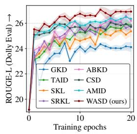  
(a)

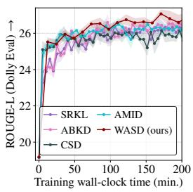  
(b)  
Figure 3: ROUGE-L during training on Dolly Eval.

Table 4: GPT-4 feedback scores for GPT-2 XL (1.5B) → GPT-2 Base (0.1B), reported as percentages of reference-answer scores.
<table><tr><td>Method</td><td>Dolly Eval</td><td>Self Inst</td><td>Vicuna</td></tr><tr><td>ABKD [61]</td><td>36.09</td><td>20.30</td><td>24.67</td></tr><tr><td>CSD [32]</td><td>35.32</td><td>19.91</td><td>22.40</td></tr><tr><td>AMiD [53]</td><td>36.35</td><td>18.87</td><td>22.00</td></tr><tr><td>WASD (ours)</td><td>37.84</td><td>20.90</td><td>25.07</td></tr></table>

Table 5: Instruction-following win rates (%) against reference responses for Qwen2.5-7B-Instruct → Qwen2.5-1.5B-Instruct, using GPT-4o-mini.
<table><tr><td>Method</td><td>AlpacaEval</td><td>Evol-Instruct</td><td>UltraFeedback</td></tr><tr><td>Teacher</td><td>95.31</td><td>94.50</td><td>84.16</td></tr><tr><td>Student</td><td>71.80</td><td>58.03</td><td>45.06</td></tr><tr><td>AMiD [53]</td><td>89.29</td><td>83.94</td><td>72.81</td></tr><tr><td>WASD (ours)</td><td>90.04</td><td>85.32</td><td>73.21</td></tr></table>

Table 6: Effect of the transport cost on distillation performance for GPT-2 XL (1.5B) → GPT-2 Base (0.1B). Avg. ROUGE-L denotes the average over five instruction-following benchmarks. Results are averaged over three training seeds.
<table><tr><td>Transport cost</td><td>Avg. ROUGE-L (↑)</td></tr><tr><td>AMiD [53]</td><td> $2 3 . 3 6 \pm 0 . 0 7$ </td></tr><tr><td>Uniform cost</td><td> $2 2 . 0 8 \pm 0 . 0 7$ </td></tr><tr><td>Permuted cost</td><td> $2 3 . 4 7 \pm 0 . 2 6$ </td></tr><tr><td>Semantic cost (WASD)</td><td> $2 3 . 9 4 \pm 0 . 1 5$ </td></tr></table>

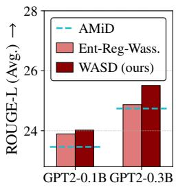  
(a) Performance of the entropy-regularized Wasserstein distance.

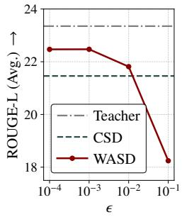  
(b) Sensitivity analysis of hyperparameter ϵ.  
Figure 4: Ablation studies of WASD.

in Figure 3b. Even under this setting, WASD continues to outperform competing methods at the same training time. These results show that faster convergence can offset the additional per-epoch cost when targeting a given performance level.

LLM-based evaluation We additionally use LLM-based judgments to assess response quality beyond ROUGE-L, which primarily measures lexical overlap with reference answers. For GPT-2, we follow the GPT-4 feedback protocol of prior distillation studies [24, 32, 34] under the same experimental setting as Table 3. GPT-4 assigns a score from 1 to 10 to each model response and reference answer, and we report the ratio of total model-response score to the total reference-answer score as a percentage. As shown in Table 4, WASD outperforms ABKD, CSD, and AMiD on all three benchmarks. These results suggest that incorporating token-level semantic information may improve response quality as assessed by GPT-4 feedback, which can account for semantic similarity between generated responses and reference answers.

For Qwen2.5, we combine the DistiLLM-2 training framework with the AMiD assistant distribution and the forward KL objective, denoting this baseline as AMiD. WASD replaces the forward KL term with the proposed Sinkhorn divergence objective while keeping the remaining training configuration unchanged. Table 5 shows that WASD achieves higher win rates than AMiD across all three benchmarks under GPT-4o-mini evaluation. These results further support the effectiveness of the proposed objective for instruction-following distillation between Qwen2.5 models.

Ablation studies We first examine whether the gains of WASD depend on meaningful token geometry through a controlled transport-cost ablation. We follow the GPT-2 XL (1.5B) to Base (0.1B) setup in Table 3, but average results over three training seeds, which accounts for the differences from the reported values. We compare three cost matrices while keeping all other training settings fixed: a uniform cost that assigns a constant transport cost, a permuted cost that randomly reassigns token relations, and a semantic cost based on cosine distances between teacher token embeddings. The permuted cost retains Sinkhorn transport while removing meaningful token correspondence, whereas the uniform cost removes graded token geometry. As shown in Table $^ { 6 , }$ the semantic cost achieves the highest average ROUGE-L. Permuting token relations reduces performance to a level comparable to AMiD, while the uniform cost performs below the baseline. These results suggest that meaningful token geometry contributes to the gains of WASD, rather than generic smoothing alone.

We next analyze the effect of correcting entropic bias. As discussed in Section 3.1, entropy-regularized Wasserstein distance introduces an entropic bias, which Sinkhorn divergence mitigates by subtracting the self-similarity terms. To examine this effect, we evaluate entropy-regularized Wasserstein distance under the GPT-2 distillation setup in Table 3, and we report average ROUGE-L scores in Figure 4a. Although entropy-regularized Wasserstein distance still outperforms the strongest baseline, AMiD, likely due to its token-embedding transport cost, it underperforms WASD. This result suggests that correcting entropic bias helps better utilize semantically informed transport costs in distillation.

Table 7: Task-specific distillation results on translation, summarization, and arithmetic reasoning for fine-tuned Gemma-7B-IT → Gemma-2B-IT.
<table><tr><td>Method</td><td>Translation COMET (↑)</td><td>Summarization ROUGE-L (↑)</td><td>Arithmetic Accuracy (↑)</td></tr><tr><td>Teacher</td><td>79.33</td><td>36.05</td><td>55.04</td></tr><tr><td>Student</td><td>44.39</td><td>11.70</td><td>0.00</td></tr><tr><td>CSD [32]</td><td>73.71</td><td>34.88</td><td>23.12</td></tr><tr><td>AMiD [53]</td><td>73.70</td><td>35.09</td><td>24.49</td></tr><tr><td>WASD (ours)</td><td>74.53</td><td>35.15</td><td>24.87</td></tr></table>

Table 8: Distillation results on code generation for Qwen2.5-Coder-Instruct $7 \mathrm { B }  1 . 5 \mathrm { B }$ evaluated with pass@1.
<table><tr><td>Method</td><td>HumanEval</td><td>MBPP</td><td>Avg. (↑)</td></tr><tr><td>Teacher</td><td>91.5</td><td>82.3</td><td>86.9</td></tr><tr><td>Student</td><td>69.5</td><td>68.8</td><td>69.2</td></tr><tr><td>DistiLLM-2 [35]</td><td>72.6</td><td>72.5</td><td>72.6</td></tr><tr><td>CSD [32]</td><td>73.2</td><td>73.0</td><td>73.1</td></tr><tr><td>AMiD [53]</td><td>73.8</td><td>74.3</td><td>74.1</td></tr><tr><td>WASD (ours)</td><td>74.4</td><td>75.4</td><td>74.9</td></tr></table>

We also conduct a sensitivity analysis on the entropy regularization hyperparameter ϵ under the setting of Table 2, with results in Figure 4b. When ϵ is sufficiently small, WASD consistently outperforms the strongest baseline, CSD. However, performance gradually decreases as ϵ increases. This behavior is consistent with the transport kernel $K = \exp ( - C / \epsilon )$ becoming less sensitive to differences in the transport cost matrix C, weakening the influence of the token-embedding cost structure. The toy visualization in Figure 6 of Appendix D shows that the loss landscape becomes flatter as ϵ increases, suggesting reduced sensitivity to deviations from the teacher distribution in this example.

## 4.2 Task-specific experiments

Setup Following previous work [35, 53, 67], we utilize diverse task-specific distillation datasets: Flores-200 [15] for translation, DialogSum [10] for summarization, GSM8k [13] for arithmetic reasoning, and WizardCoder [42] for code generation. We employ the supervised fine-tuned Gemma-7B-IT [57] as the teacher and Gemma-2B-IT as the student. For the code generation task, we use Qwen2.5-Coder-7B-Instruct [29] as the teacher and Qwen2.5-Coder-1.5B-Instruct as the student. We evaluate on the test dataset for each task, using HumanEval [9] and MBPP [4] for code generation. We report COMET [50] for translation, ROUGE-L for summarization, accuracy for arithmetic reasoning, and pass@1 for code generation.

Results As shown in Tables 7 and 8, WASD consistently improves performance on translation, summarization, arithmetic reasoning, and code generation benchmarks across different model series and task domains. These results demonstrate that incorporating token-level semantic information provides robust benefits even in large-scale and specialized distillation settings. In the current implementation, we construct the cost matrix using the token embedding space of the teacher model, which is the same as in the task-agnostic distillation setting. However, the flexibility of the Wasserstein formulation allows the cost matrix to capture richer structures beyond general token semantics. In particular, incorporating task-specific or domain knowledge into the cost matrix may further improve distillation performance, which we leave for future work.

## 5 Conclusion

We propose WASD, a Wasserstein-based knowledge distillation method for large language models (LLMs) that incorporates token-level semantic information through a transport-based formulation. By adopting the Sinkhorn divergence and deriving an efficient objective based on optimal transport dual variables, WASD enables practical semantic-aware distillation without additional networks or backpropagation through the transport solver. Experiments across multiple model families and tasks show that WASD consistently improves distillation performance over existing distillation methods, particularly in quality-diversity trade-offs. These results highlight the importance of token-level information encoded in the vocabulary space for effective knowledge transfer in LLM distillation and suggest promising future directions for semantic-aware distribution alignment.

## Acknowledgments and Disclosure of Funding

This work was supported by the InnoCORE program of the Ministry of Science and ICT (N10260008) (10%). This work was supported by the IITP (Institute of Information & Communications Technology Planning & Evaluation)-ITRC (Information Technology Research Center) grant funded by the Korea government (Ministry of Science and ICT) (IITP-2026-RS-2024-00437268) (45%). This research was supported by AI Technology Development for Commonsense Extraction, Reasoning, and Inference from Heterogeneous Data (IITP) funded by the Ministry of Science and ICT (RS-2022-II220077) (45%).

## References

[1] Rishabh Agarwal, Nino Vieillard, Yongchao Zhou, Piotr Stanczyk, Sabela Ramos Garea, Matthieu Geist, and Olivier Bachem. On-policy distillation of language models: Learning from self-generated mistakes. In The Twelfth International Conference on Learning Representations, 2024.

[2] Keivan Alizadeh, Seyed Iman Mirzadeh, Dmitry Belenko, S Khatamifard, Minsik Cho, Carlo C Del Mundo, Mohammad Rastegari, and Mehrdad Farajtabar. Llm in a flash: Efficient large language model inference with limited memory. In Proceedings ofthe 62nd Annual Meeting of the Associationfor Computational Linguistics (Volume 1: Long Papers), pages 12562–12584, 2024.

[3] Martin Arjovsky, Soumith Chintala, and Léon Bottou. Wasserstein generative adversarial networks. In International conference on machine learning, pages 214–223. PMLR, 2017.

[4] Jacob Austin, Augustus Odena, Maxwell Nye, Maarten Bosma, Henryk Michalewski, David Dohan, Ellen Jiang, Carrie Cai, Michael Terry, Quoc Le, et al. Program synthesis with large language models. arXiv preprint arXiv:2108.07732, 2021.

[5] Jinze Bai, Shuai Bai, Yunfei Chu, Zeyu Cui, Kai Dang, Xiaodong Deng, Yang Fan, Wenbin Ge, Yu Han, Fei Huang, et al. Qwen technical report. arXiv preprint arXiv:2309.16609, 2023.

[6] Rishabh Bhardwaj, Tushar Vaidya, and Soujanya Poria. KNOT: Knowledge distillation using optimal transport for solving NLP tasks. In Nicoletta Calzolari, Chu-Ren Huang, Hansaem Kim, James Pustejovsky, Leo Wanner, Key-Sun Choi, Pum-Mo Ryu, Hsin-Hsi Chen, Lucia Donatelli, Heng Ji, Sadao Kurohashi, Patrizia Paggio, Nianwen Xue, Seokhwan Kim, Younggyun Hahm, Zhong He, Tony Kyungil Lee, Enrico Santus, Francis Bond, and Seung-Hoon Na, editors, Proceedings of the 29th International Conference on Computational Linguistics, pages 4801– 4820, Gyeongju, Republic of Korea, October 2022. International Committee on Computational Linguistics. URL https://aclanthology.org/2022.coling-1.425/.

[7] Nicolas Boizard, Kevin El Haddad, CELINE HUDELOT, and Pierre Colombo. Towards crosstokenizer distillation: the universal logit distillation loss for LLMs. Transactions on Machine Learning Research, 2025. ISSN 2835-8856. URL https://openreview.net/forum?id= bwRxXiGO9A.

[8] Liqun Chen, Dong Wang, Zhe Gan, Jingjing Liu, Ricardo Henao, and Lawrence Carin. Wasserstein contrastive representation distillation. In Proceedings of the IEEE/CVF conference on computer vision and pattern recognition, pages 16296–16305, 2021.

[9] Mark Chen, Jerry Tworek, Heewoo Jun, Qiming Yuan, Henrique Ponde De Oliveira Pinto, Jared Kaplan, Harri Edwards, Yuri Burda, Nicholas Joseph, Greg Brockman, et al. Evaluating large language models trained on code. arXiv preprint arXiv:2107.03374, 2021.

[10] Yulong Chen, Yang Liu, Liang Chen, and Yue Zhang. DialogSum: A real-life scenario dialogue summarization dataset. In Chengqing Zong, Fei Xia, Wenjie Li, and Roberto Navigli, editors, Findings of the Association for Computational Linguistics: ACL-IJCNLP 2021, pages 5062– 5074, Online, August 2021. Association for Computational Linguistics. doi: 10.18653/v1/2021. findings-acl.449. URL https://aclanthology.org/2021.findings-acl.449/.

[11] Wei-Lin Chiang, Zhuohan Li, Zi Lin, Ying Sheng, Zhanghao Wu, Hao Zhang, Lianmin Zheng, Siyuan Zhuang, Yonghao Zhuang, Joseph E. Gonzalez, Ion Stoica, and Eric P. Xing. Vicuna: An open-source chatbot impressing gpt-4 with 90%\* chatgpt quality, March 2023. URL https://lmsys.org/blog/2023-03-30-vicuna/.

[12] Andrzej Cichocki, Sergio Cruces, and Shun-ichi Amari. Generalized alpha-beta divergences and their application to robust nonnegative matrix factorization. Entropy, 13(1):134–170, 2011.

[13] Karl Cobbe, Vineet Kosaraju, Mohammad Bavarian, Mark Chen, Heewoo Jun, Lukasz Kaiser, Matthias Plappert, Jerry Tworek, Jacob Hilton, Reiichiro Nakano, et al. Training verifiers to solve math word problems. arXiv preprint arXiv:2110.14168, 2021.

[14] Mike Conover, Matt Hayes, Ankit Mathur, Jianwei Xie, Jun Wan, Sam Shah, Ali Ghodsi, Patrick Wendell, Matei Zaharia, and Reynold Xin. Free dolly: Introducing the world’s first truly open instruction-tuned llm, 2023. URL https://www.databricks.com/blog/2023 04/12/dolly-first-open-commercially-viable-instruction-tuned-llm.

[15] Marta R Costa-Jussà, James Cross, Onur Çelebi, Maha Elbayad, Kenneth Heafield, Kevin Heffernan, Elahe Kalbassi, Janice Lam, Daniel Licht, Jean Maillard, et al. No language left behind: Scaling human-centered machine translation. arXiv preprint arXiv:2207.04672, 2022.

[16] Ganqu Cui, Lifan Yuan, Ning Ding, Guanming Yao, Bingxiang He, Qiang Yue, Yuan Ni, Guotong Xie, Ruobing Xie, Yankai Lin, Zhiyuan Liu, and Maosong Sun. ULTRAFEEDBACK: Boosting language models with scaled AI feedback. In Forty-first International Conference on Machine Learning, 2024. URL https://openreview.net/forum?id=BOorDpKHiJ.

[17] Xiao Cui, Yulei Qin, Yuting Gao, Enwei Zhang, Zihan Xu, Tong Wu, Ke Li, Xing Sun, Wengang Zhou, and Houqiang Li. Sinkhorn distance minimization for knowledge distillation. In Proceedings of the 2024 Joint International Conference on Computational Linguistics, Language Resources and Evaluation (LREC-COLING 2024), pages 14846–14858, 2024.

[18] Xiao Cui, Mo Zhu, Yulei Qin, Liang Xie, Wengang Zhou, and Houqiang Li. Multi-level optimal transport for universal cross-tokenizer knowledge distillation on language models. In Proceedings ofthe Thirty-Ninth AAAI Conference on Artificial Intelligence and Thirty-Seventh Conference on Innovative Applications ofArtificial Intelligence and Fifteenth Symposium on Educational Advances in Artificial Intelligence, AAAI’25/IAAI’25/EAAI’25. AAAI Press, 2025. ISBN 978-1-57735-897-8. doi: 10.1609/aaai.v39i22.34543. URL https://doi.org/ 10.1609/aaai.v39i22.34543.

[19] Marco Cuturi. Sinkhorn distances: Lightspeed computation of optimal transport. In C.J. Burges, L. Bottou, M. Welling, Z. Ghahramani, and K.Q. Weinberger, editors, Advances in Neural Information Processing Systems, volume 26. Curran Associates, Inc., 2013.

[20] Marco Cuturi and Arnaud Doucet. Fast computation of wasserstein barycenters. In International conference on machine learning, pages 685–693. PMLR, 2014.

[21] Jean Feydy, Thibault Séjourné, François-Xavier Vialard, Shun-ichi Amari, Alain Trouvé, and Gabriel Peyré. Interpolating between optimal transport and mmd using sinkhorn divergences. In The 22nd international conference on artificial intelligence and statistics, pages 2681–2690. PMLR, 2019.

[22] Aude Genevay, Gabriel Peyré, and Marco Cuturi. Learning generative models with sinkhorn divergences. In International Conference on Artificial Intelligence and Statistics, pages 1608– 1617. PMLR, 2018.

[23] Aaron Gokaslan and Vanya Cohen. Openwebtext corpus. http://Skylion007.github.io/ OpenWebTextCorpus, 2019.

[24] Yuxian Gu, Li Dong, Furu Wei, and Minlie Huang. Minillm: Knowledge distillation of large language models. In The twelfth international conference on learning representations, 2024.

[25] Geoffrey Hinton, Oriol Vinyals, and Jeff Dean. Distilling the knowledge in a neural network. arXiv preprint arXiv:1503.02531, 2015.

[26] Jordan Hoffmann, Sebastian Borgeaud, Arthur Mensch, Elena Buchatskaya, Trevor Cai, Eliza Rutherford, Diego de Las Casas, Lisa Anne Hendricks, Johannes Welbl, Aidan Clark, et al. Training compute-optimal large language models. In Proceedings of the 36th International Conference on Neural Information Processing Systems, pages 30016–30030, 2022.

[27] Or Honovich, Thomas Scialom, Omer Levy, and Timo Schick. Unnatural instructions: Tuning language models with (almost) no human labor. In Anna Rogers, Jordan Boyd-Graber, and Naoaki Okazaki, editors, Proceedings of the 61st Annual Meeting of the Association for Computational Linguistics (Volume 1: Long Papers), pages 14409–14428, Toronto, Canada, July 2023. Association for Computational Linguistics. doi: 10.18653/v1/2023.acl-long.806. URL https://aclanthology.org/2023.acl-long.806/.

[28] Edward J Hu, yelong shen, Phillip Wallis, Zeyuan Allen-Zhu, Yuanzhi Li, Shean Wang, Lu Wang, and Weizhu Chen. LoRA: Low-rank adaptation of large language models. In International Conference on Learning Representations, 2022. URL https://openreview. net/forum?id=nZeVKeeFYf9.

[29] Binyuan Hui, Jian Yang, Zeyu Cui, Jiaxi Yang, Dayiheng Liu, Lei Zhang, Tianyu Liu, Jiajun Zhang, Bowen Yu, Keming Lu, et al. Qwen2. 5-coder technical report. arXiv preprint arXiv:2409.12186, 2024.

[30] Aaron Hurst, Adam Lerer, Adam P Goucher, Adam Perelman, Aditya Ramesh, Aidan Clark, AJ Ostrow, Akila Welihinda, Alan Hayes, Alec Radford, et al. Gpt-4o system card. arXiv preprint arXiv:2410.21276, 2024.

[31] Jared Kaplan, Sam McCandlish, Tom Henighan, Tom B Brown, Benjamin Chess, Rewon Child, Scott Gray, Alec Radford, Jeffrey Wu, and Dario Amodei. Scaling laws for neural language models. arXiv preprint arXiv:2001.08361, 2020.

[32] Yeongmin Kim, Donghyeok Shin, Mina Kang, Byeonghu Na, and Il chul Moon. Distillation of large language models via concrete score matching. In The Fourteenth International Conference on Learning Representations, 2026.

[33] Yoon Kim and Alexander M Rush. Sequence-level knowledge distillation. In Proceedings of the 2016 conference on empirical methods in natural language processing, pages 1317–1327, 2016.

[34] Jongwoo Ko, Sungnyun Kim, Tianyi Chen, and Se-Young Yun. DistiLLM: Towards streamlined distillation for large language models. In Ruslan Salakhutdinov, Zico Kolter, Katherine Heller, Adrian Weller, Nuria Oliver, Jonathan Scarlett, and Felix Berkenkamp, editors, Proceedings of the 41st International Conference on Machine Learning, volume 235 of Proceedings ofMachine Learning Research, pages 24872–24895. PMLR, 21–27 Jul 2024.

[35] Jongwoo Ko, Tianyi Chen, Sungnyun Kim, Tianyu Ding, Luming Liang, Ilya Zharkov, and Se-Young Yun. DistiLLM-2: A contrastive approach boosts the distillation of LLMs. In Aarti Singh, Maryam Fazel, Daniel Hsu, Simon Lacoste-Julien, Felix Berkenkamp, Tegan Maharaj, Kiri Wagstaff, and Jerry Zhu, editors, Proceedings ofthe 42nd International Conference on Machine Learning, volume 267 of Proceedings of Machine Learning Research, pages 31044–31062. PMLR, 13–19 Jul 2025. URL https://proceedings.mlr.press/v267/ko25a.html.

[36] Daniel Kuhn, Peyman Mohajerin Esfahani, Viet Anh Nguyen, and Soroosh Shafieezadeh-Abadeh. Wasserstein distributionally robust optimization: Theory and applications in machine learning. In Operations research & management science in the age ofanalytics, pages 130–166. Informs, 2019.

[37] Lillian Lee. On the effectiveness of the skew divergence for statistical language analysis. In International workshop on artificial intelligence and statistics, pages 176–183. PMLR, 2001.

[38] Xuechen Li, Tianyi Zhang, Yann Dubois, Rohan Taori, Ishaan Gulrajani, Carlos Guestrin, Percy Liang, and Tatsunori B. Hashimoto. Alpacaeval: An automatic evaluator of instruction-following models. https://github.com/tatsu-lab/alpaca\_eval, 5 2023.

[39] Alexander Lin, Jeremy Wohlwend, Howard Chen, and Tao Lei. Autoregressive knowledge distillation through imitation learning. In Bonnie Webber, Trevor Cohn, Yulan He, and Yang Liu, editors, Proceedings of the 2020 Conference on Empirical Methods in Natural Language Processing (EMNLP), pages 6121–6133, Online, November 2020. Association for Computational Linguistics. doi: 10.18653/v1/2020.emnlp-main.494. URL https://aclanthology.org/2020.emnlp-main.494/.

[40] Chin-Yew Lin. ROUGE: A package for automatic evaluation of summaries. In Text Summarization Branches Out, pages 74–81, Barcelona, Spain, July 2004. Association for Computational Linguistics. URL https://aclanthology.org/W04-1013/.

[41] Suhas Lohit and Michael Jones. Model compression using optimal transport. In Proceedings of the IEEE/CVF Winter Conference on Applications ofComputer Vision, pages 2764–2773, 2022.

[42] Ziyang Luo, Can Xu, Pu Zhao, Qingfeng Sun, Xiubo Geng, Wenxiang Hu, Chongyang Tao, Jing Ma, Qingwei Lin, and Daxin Jiang. Wizardcoder: Empowering code large language models with evol-instruct. arXiv preprint arXiv:2306.08568, 2023.

[43] Jiaming Lv, Haoyuan Yang, and Peihua Li. Wasserstein distance rivals kullback-leibler divergence for knowledge distillation. Advances in Neural Information Processing Systems, 37: 65445–65475, 2024.

[44] Paul Milgrom and Ilya Segal. Envelope theorems for arbitrary choice sets. Econometrica, 70 (2):583–601, 2002.

[45] Ted Moskovitz, Michael Arbel, Ferenc Huszar, and Arthur Gretton. Efficient wasserstein natural gradients for reinforcement learning. In International Conference on Learning Representations, 2021.

[46] Byeonghu Na, Hyungho Na, Yeongmin Kim, Suhyeon Jo, HeeSun Bae, Mina Kang, and Il chul Moon. Semantic-aware wasserstein policy regularization for large language model alignment. In The Fourteenth International Conference on Learning Representations, 2026.

[47] Gabriel Peyré, Marco Cuturi, et al. Computational optimal transport: With applications to data science. Foundations and Trends® in Machine Learning, 11(5-6):355–607, 2019.

[48] Alec Radford, Jeffrey Wu, Rewon Child, David Luan, Dario Amodei, Ilya Sutskever, et al. Language models are unsupervised multitask learners. OpenAI blog, 1(8):9, 2019.

[49] Rafael Rafailov, Archit Sharma, Eric Mitchell, Christopher D Manning, Stefano Ermon, and Chelsea Finn. Direct preference optimization: Your language model is secretly a reward model. Advances in Neural Information Processing Systems, 36:53728–53741, 2023.

[50] Ricardo Rei, José GC De Souza, Duarte Alves, Chrysoula Zerva, Ana C Farinha, Taisiya Glushkova, Alon Lavie, Luisa Coheur, and André FT Martins. Comet-22: Unbabel-ist 2022 submission for the metrics shared task. In Proceedings ofthe Seventh Conference on Machine Translation (WMT), pages 578–585, 2022.

[51] Nils Reimers and Iryna Gurevych. Sentence-BERT: Sentence embeddings using Siamese BERTnetworks. In Kentaro Inui, Jing Jiang, Vincent Ng, and Xiaojun Wan, editors, Proceedings of the 2019 Conference on Empirical Methods in Natural Language Processing and the 9th International Joint Conference on Natural Language Processing (EMNLP-IJCNLP), pages 3982–3992, Hong Kong, China, November 2019. Association for Computational Linguistics. doi: 10.18653/v1/D19-1410. URL https://aclanthology.org/D19-1410/.

[52] Maziar Sanjabi, Jimmy Ba, Meisam Razaviyayn, and Jason D Lee. On the convergence and robustness of training gans with regularized optimal transport. Advances in Neural Information Processing Systems, 31, 2018.

[53] Donghyeok Shin, Yeongmin Kim, Suhyeon Jo, Byeonghu Na, and Il chul Moon. AMid: Knowledge distillation for LLMs with \$\alpha\$-mixture assistant distribution. In The Fourteenth International Conference on Learning Representations, 2026.

[54] Makoto Shing, Kou Misaki, Han Bao, Sho Yokoi, and Takuya Akiba. TAID: Temporally adaptive interpolated distillation for efficient knowledge transfer in language models. In The Thirteenth International Conference on Learning Representations, 2025.

[55] Richard Sinkhorn and Paul Knopp. Concerning nonnegative matrices and doubly stochastic matrices. Pacific Journal ofMathematics, 21(2):343–348, 1967.

[56] Jun Song, Niao He, Lijun Ding, and Chaoyue Zhao. Provably convergent policy optimization via metric-aware trust region methods. Transactions on Machine Learning Research, 2023. ISSN 2835-8856.

[57] Gemma Team, Thomas Mesnard, Cassidy Hardin, Robert Dadashi, Surya Bhupatiraju, Shreya Pathak, Laurent Sifre, Morgane Rivière, Mihir Sanjay Kale, Juliette Love, et al. Gemma: Open models based on gemini research and technology. arXiv preprint arXiv:2403.08295, 2024.

[58] Hugo Touvron, Louis Martin, Kevin Stone, Peter Albert, Amjad Almahairi, Yasmine Babaei, Nikolay Bashlykov, Soumya Batra, Prajjwal Bhargava, Shruti Bhosale, et al. Llama 2: Open foundation and fine-tuned chat models. arXiv preprint arXiv:2307.09288, 2023.

[59] Cédric Villani. Optimal Transport: Old and New, volume 338. Springer Science & Business Media, 2008.

[60] Hoang Tran Vuong, Tue Le, Quyen Tran, Linh Ngo Van, and Trung Le. Mcw-kd: Multi-cost wasserstein knowledge distillation for large language models. In Proceedings of the AAAI Conference on Artificial Intelligence, volume 40, pages 33332–33340, 2026.

[61] Guanghui Wang, Zhiyong Yang, Zitai Wang, Shi Wang, Qianqian Xu, and Qingming Huang. ABKD: Pursuing a proper allocation of the probability mass in knowledge distillation via \$\alpha\$-\$\beta\$-divergence. In Forty-second International Conference on Machine Learning, 2025.

[62] Yizhong Wang, Swaroop Mishra, Pegah Alipoormolabashi, Yeganeh Kordi, Amirreza Mirzaei, Atharva Naik, Arjun Ashok, Arut Selvan Dhanasekaran, Anjana Arunkumar, David Stap, Eshaan Pathak, Giannis Karamanolakis, Haizhi Lai, Ishan Purohit, Ishani Mondal, Jacob Anderson, Kirby Kuznia, Krima Doshi, Kuntal Kumar Pal, Maitreya Patel, Mehrad Moradshahi, Mihir Parmar, Mirali Purohit, Neeraj Varshney, Phani Rohitha Kaza, Pulkit Verma, Ravsehaj Singh Puri, Rushang Karia, Savan Doshi, Shailaja Keyur Sampat, Siddhartha Mishra, Sujan Reddy A, Sumanta Patro, Tanay Dixit, and Xudong Shen. Super-NaturalInstructions: Generalization via declarative instructions on 1600+ NLP tasks. In Yoav Goldberg, Zornitsa Kozareva, and Yue Zhang, editors, Proceedings of the 2022 Conference on Empirical Methods in Natural Language Processing, pages 5085–5109, Abu Dhabi, United Arab Emirates, December 2022. Association for Computational Linguistics. doi: 10.18653/v1/2022.emnlp-main.340. URL https://aclanthology.org/2022.emnlp-main.340/.

[63] Yizhong Wang, Yeganeh Kordi, Swaroop Mishra, Alisa Liu, Noah A. Smith, Daniel Khashabi, and Hannaneh Hajishirzi. Self-instruct: Aligning language models with self-generated instructions. In Anna Rogers, Jordan Boyd-Graber, and Naoaki Okazaki, editors, Proceedings ofthe 61st Annual Meeting ofthe Associationfor Computational Linguistics (Volume 1: Long Papers), pages 13484–13508, Toronto, Canada, July 2023. Association for Computational Linguistics. doi: 10.18653/v1/2023.acl-long.754. URL https://aclanthology.org/2023.acl-long. 754/.

[64] Yuqiao Wen, Zichao Li, Wenyu Du, and Lili Mou. F-divergence minimization for sequencelevel knowledge distillation. In Proceedings of the 61st Annual Meeting of the Association for Computational Linguistics (Volume 1: Long Papers), pages 10817–10834, 2023.

[65] Taiqiang Wu, Chaofan Tao, Jiahao Wang, Runming Yang, Zhe Zhao, and Ngai Wong. Rethinking kullback-leibler divergence in knowledge distillation for large language models. In Proceedings ofthe 31st International Conference on Computational Linguistics, pages 5737–5755, 2025.

[66] Can Xu, Qingfeng Sun, Kai Zheng, Xiubo Geng, Pu Zhao, Jiazhan Feng, Chongyang Tao, Qingwei Lin, and Daxin Jiang. WizardLM: Empowering large pre-trained language models to follow complex instructions. In The Twelfth International Conference on Learning Representations, 2024. URL https://openreview.net/forum?id=CfXh93NDgH.

[67] Wenda Xu, Rujun Han, Zifeng Wang, Long Le, Dhruv Madeka, Lei Li, William Yang Wang, Rishabh Agarwal, Chen-Yu Lee, and Tomas Pfister. Speculative knowledge distillation: Bridging the teacher-student gap through interleaved sampling. In The Thirteenth International Conference on Learning Representations, 2025. URL https://openreview.net/forum? id=EgJhwYR2tB.

[68] Songming Zhang, Xue Zhang, Zengkui Sun, Yufeng Chen, and Jinan Xu. Dual-space knowledge distillation for large language models. In Yaser Al-Onaizan, Mohit Bansal, and Yun-Nung Chen, editors, Proceedings of the 2024 Conference on Empirical Methods in Natural Language Processing, pages 18164–18181, Miami, Florida, USA, November 2024. Association for Computational Linguistics. doi: 10.18653/v1/2024.emnlp-main.1010. URL https://aclanthology.org/2024.emnlp-main.1010/.

[69] Xue Zhang, Songming Zhang, Yunlong Liang, Fandong Meng, Yufeng Chen, Jinan Xu, and Jie Zhou. A dual-space framework for general knowledge distillation of large language models. arXiv preprint arXiv:2504.11426, 2025.

[70] Yaoming Zhu, Sidi Lu, Lei Zheng, Jiaxian Guo, Weinan Zhang, Jun Wang, and Yong Yu. Texygen: A benchmarking platform for text generation models. In The 41st international ACM SIGIR conference on research & development in information retrieval, pages 1097–1100, 2018.

[71] Brianna Zitkovich, Tianhe Yu, Sichun Xu, Peng Xu, Ted Xiao, Fei Xia, Jialin Wu, Paul Wohlhart, Stefan Welker, Ayzaan Wahid, et al. Rt-2: Vision-language-action models transfer web knowledge to robotic control. In Conference on Robot Learning, pages 2165–2183. PMLR, 2023.

## A Proofs and derivations

## A.1 Proof of Lemma 1

Lemma 1. Let $\phi ^ { * ( p , q _ { \pmb { \theta } } ) } ( \mathbf { x } , \mathbf { y } _ { < l } )$ and $\psi ^ { * ( p , q _ { \pmb { \theta } } ) } ( \mathbf { x } , \mathbf { y } _ { < l } )$ denote the optimal dual variables of the entropic optimal transport problem corresponding to $\tilde { D } _ { W } ^ { \epsilon } ( p , q _ { \theta } )$ . Then,

$$
\begin{array} { r l r } & { \tilde { D } _ { W } ^ { \epsilon } ( p ( y _ { l } | \mathbf x , \mathbf y _ { < l } ) , q _ { \theta } ( y _ { l } | \mathbf x , \mathbf y _ { < l } ) ) } & { ( \mathfrak { G } ) } \\ & { \quad \quad \quad = \sum _ { i = 1 } ^ { d } \phi _ { i } ^ { * ( p , q _ { \theta } ) } ( \mathbf x , \mathbf y _ { < l } ) q _ { \theta } ( y _ { l } = i | \mathbf x , \mathbf y _ { < l } ) + \sum _ { j = 1 } ^ { d } \psi _ { j } ^ { * ( p , q _ { \theta } ) } ( \mathbf x , \mathbf y _ { < l } ) p ( y _ { l } = j | \mathbf x , \mathbf y _ { < l } ) - \epsilon . } \end{array}
$$

Proof. By strong duality, the entropy-regularized Wasserstein distance $\tilde { D } _ { \mathrm { W } } ^ { \epsilon } ( p , q _ { \theta } )$ is equal to the optimal value of the following dual problem:

$$
\operatorname* { m a x } _ { \phi , \psi } \sum _ { i = 1 } ^ { d } \phi _ { i } q _ { \theta } ( y _ { l } = i | \mathbf { x } , \mathbf { y } _ { < l } ) + \sum _ { j = 1 } ^ { d } \psi _ { j } p ( y _ { l } = j | \mathbf { x } , \mathbf { y } _ { < l } ) - \sum _ { i = 1 } ^ { d } \sum _ { j = 1 } ^ { d } \epsilon \exp \big ( \frac { 1 } { \epsilon } ( \phi _ { i } + \psi _ { j } - C _ { i j } ) \big ) .\tag{14}
$$

Substituting the optimal dual variables $\phi ^ { * ( p , q _ { \pmb { \theta } } ) } ( \mathbf { x } , \mathbf { y } _ { < l } )$ and $\psi ^ { * ( p , q _ { \pmb { \theta } } ) } ( \mathbf { x } , \mathbf { y } _ { < l } )$ into the dual objective yields

$$
\begin{array} { r l } & { \tilde { D } _ { \mathbf { W } } ^ { \epsilon } \big ( p \big ( y _ { l } | \mathbf { x } , \mathbf { y } _ { < l } \big ) , q _ { \theta } \big ( y _ { l } | \mathbf { x } , \mathbf { y } _ { < l } \big ) \big ) } \\ & { = \displaystyle \sum _ { i = 1 } ^ { d } \phi _ { i } ^ { * ( p , q _ { \theta } ) } \big ( \mathbf { x } , \mathbf { y } _ { < l } \big ) q _ { \theta } \big ( y _ { l } = i | \mathbf { x } , \mathbf { y } _ { < l } \big ) + \sum _ { j = 1 } ^ { d } \psi _ { j } ^ { * ( p , q _ { \theta } ) } \big ( \mathbf { x } , \mathbf { y } _ { < l } \big ) p \big ( y _ { l } = j | \mathbf { x } , \mathbf { y } _ { < l } \big ) } \\ & { \quad - \displaystyle \sum _ { i = 1 } ^ { d } \sum _ { j = 1 } ^ { d } \epsilon \exp \big ( \frac { 1 } { \epsilon } \big ( \phi _ { i } ^ { * ( p , q _ { \theta } ) } \big ( \mathbf { x } , \mathbf { y } _ { < l } \big ) + \psi _ { j } ^ { * ( p , q _ { \theta } ) } \big ( \mathbf { x } , \mathbf { y } _ { < l } \big ) - C _ { i j } \big ) \big ) . } \end{array}\tag{15}
$$

By the optimality conditions in Eq. (8), the optimal transport plan satisfies

$$
P _ { i j } ^ { ( l ) ^ { * } } = \exp \left( \frac { 1 } { \epsilon } ( \phi _ { i } ^ { * ( p , q _ { \theta } ) } ( \mathbf { x } , \mathbf { y } _ { < l } ) + \psi _ { j } ^ { * ( p , q _ { \theta } ) } ( \mathbf { x } , \mathbf { y } _ { < l } ) - C _ { i j } ) \right) .\tag{16}
$$

Since $P ^ { ( l ) ^ { * } } \in U _ { l } ( p , q _ { \pm } )$ , its total mass is 1. Therefore, the last term in Eq. (15) equals −ϵ, giving

$$
\begin{array} { l } { { \displaystyle \tilde { D } _ { \mathbb { W } } ^ { \epsilon } ( p ( y _ { l } | { \bf x } , { \bf y } _ { < l } ) , q _ { \theta } ( y _ { l } | { \bf x } , { \bf y } _ { < l } ) ) } } \\ { { \displaystyle = \sum _ { i = 1 } ^ { d } \phi _ { i } ^ { * ( p , q _ { \theta } ) } ( { \bf x } , { \bf y } _ { < l } ) q _ { \theta } ( y _ { l } = i | { \bf x } , { \bf y } _ { < l } ) + \sum _ { j = 1 } ^ { d } \psi _ { j } ^ { * ( p , q _ { \theta } ) } ( { \bf x } , { \bf y } _ { < l } ) p ( y _ { l } = j | { \bf x } , { \bf y } _ { < l } ) - \epsilon . } } \end{array}\tag{17}
$$

## A.2 Proof of Proposition 2

Proposition 2. Let $\phi ^ { * ( p , q _ { \pmb { \theta } } ) } ( \mathbf { x } , \mathbf { y } _ { < l } )$ denote the optimal dual variables associated with the student marginal. Then, the gradient of the entropy-regularized Wasserstein distance can be expressed as

$$
\begin{array} { r l } & { \nabla _ { \theta } \tilde { D } _ { W } ^ { \epsilon } \big ( p ( y | \mathbf x , \mathbf y _ { < l } ) , q _ { \theta } ( y _ { l } | \mathbf x , \mathbf y _ { < l } ) \big ) = \sum _ { i = 1 } ^ { d } \phi _ { i } ^ { * ( p , q _ { \theta } ) } ( \mathbf x , \mathbf y _ { < l } ) \nabla _ { \theta } q _ { \theta } ( y _ { l } = i | \mathbf x , \mathbf y _ { < l } ) . } \end{array}\tag{10}
$$

Proof. For a fixed context $\left( \mathbf { x } , \mathbf { y } _ { < l } \right)$ , assume that $\epsilon > 0$ , the cost matrix C is finite and fixed, the teacher distribution is fixed, and both distributions are strictly positive, with $q _ { \pmb { \theta } }$ differentiable in $\pmb \theta$ By strong duality, the entropy-regularized Wasserstein distance is equal to the optimal value of the dual problem in Eq. (14). Specifically, define the dual objective as follows:

$$
\begin{array} { l } { { \displaystyle { \mathcal { L } } ( \pmb { \theta } , \phi , \psi ) : = \sum _ { i = 1 } ^ { d } \phi _ { i } q _ { \pmb { \theta } } \big ( y _ { l } = i | \mathbf { x } , \mathbf { y } _ { < l } \big ) + \sum _ { j = 1 } ^ { d } \psi _ { j } p \big ( y _ { l } = j | \mathbf { x } , \mathbf { y } _ { < l } \big ) } } \\ { { \displaystyle ~ - \epsilon \sum _ { i = 1 } ^ { d } \sum _ { j = 1 } ^ { d } \exp \left( \frac { 1 } { \epsilon } \big ( \phi _ { i } + \psi _ { j } - C _ { i j } \big ) \right) . } } \end{array}\tag{18}
$$

Then, we have

$$
\tilde { D } _ { \mathrm { W } } ^ { \epsilon } \big ( p ( y _ { l } | \mathbf x , \mathbf y _ { < l } ) , q _ { \theta } \big ( y _ { l } | \mathbf x , \mathbf y _ { < l } \big ) \big ) = \operatorname* { m a x } _ { \phi , \psi } \mathcal { L } \big ( \theta , \phi , \psi \big ) .\tag{19}
$$

Although the optimal dual variables depend implicitly on θ through $q _ { \theta } ,$ the envelope theorem [44] allows us to differentiate the optimal value by treating the optimal dual variables as fixed. In particular, only the student marginal term in $\mathcal { L }$ depends explicitly on θ. Therefore,

$$
\nabla _ { \theta } \tilde { D } _ { \mathrm { W } } ^ { \epsilon } \big ( p \big ( \ j _ { l } \big | \mathbf { x } , \mathbf { y } _ { < l } \big ) , q _ { \theta } \big ( \ j _ { l } \big | \mathbf { x } , \mathbf { y } _ { < l } \big ) \big ) = \nabla _ { \theta } \mathcal { L } \big ( \theta , \phi , \psi \big ) \big | _ { \phi = \phi ^ { * ( p , q _ { \theta } ) } , \psi = \psi ^ { * ( p , q _ { \theta } ) } }\tag{20}
$$

$$
= \sum _ { i = 1 } ^ { d } { \phi _ { i } ^ { * ( p , q _ { \theta } ) } ( \mathbf { x } , \mathbf { y } _ { < l } ) \nabla _ { \theta } q _ { \theta } ( y _ { l } = i | \mathbf { x } , \mathbf { y } _ { < l } ) } .\tag{21}
$$

Note that the additive ambiguity of the dual potentials does not affect this gradient, since $\begin{array} { r } { \sum _ { i = 1 } ^ { d } \nabla _ { \pmb { \theta } } q _ { \pmb { \theta } } ( y _ { l } = i | \mathbf { x } , \mathbf { y } _ { < l } ) = 0 } \end{array}$ □

## A.3 Proof of Theorem 3

Theorem 3. Let $\phi ^ { * ( p , q _ { \pmb { \theta } } ) } ( \mathbf { x } , \mathbf { y } _ { < l } )$ and $\phi ^ { * ( q _ { \theta } , q _ { \theta } ) } ( \mathbf { x } , \mathbf { y } _ { < l } )$ denote the optimal dual variables corresponding to $\tilde { D } _ { W } ^ { \epsilon } ( p , q _ { \theta } )$ and $\tilde { D } _ { W } ^ { \epsilon } ( q _ { \theta } , q _ { \theta } )$ , respectively. Define

$$
\mathcal { L } _ { W 4 S D } ^ { \epsilon } ( \theta ) : = \mathbb { E } _ { ( \mathbf { x } , \mathbf { y } ) \sim \mathcal { D } } \left[ \sum _ { l = 1 } ^ { L } \sum _ { i = 1 } ^ { d } \mathrm { s g } \left( \phi _ { i } ^ { * \left( p , q _ { \theta } \right) } ( \mathbf { x } , \mathbf { y } _ { < l } ) - \phi _ { i } ^ { * \left( q _ { \theta } , q _ { \theta } \right) } ( \mathbf { x } , \mathbf { y } _ { < l } ) \right) q _ { \theta } \left( y _ { l } = i | \mathbf { x } , \mathbf { y } _ { < l } \right) \right] ,\tag{11}
$$

where sg denotes the stop-gradient operator. Then, under the stop-gradient convention, the gradient of $\bar { \mathcal { L } } _ { W A S D } ^ { \epsilon } ( \pmb { \theta } )$ coincides with that of the Sinkhorn objective $\mathcal { L } _ { S } ^ { \epsilon } ( \pmb { \theta } )$ , i.e., $\nabla _ { \pmb \theta } \mathcal { L } _ { W A S D } ^ { \epsilon } ( \pmb \theta ) = \nabla _ { \pmb \theta } \tilde { \mathcal { L } } _ { S } ^ { \epsilon } ( \pmb \theta )$

Proof. By definition, the Sinkhorn divergence is

$$
D _ { \mathrm { S } } ^ { \epsilon } ( p , q _ { \theta } ) : = \tilde { D } _ { \mathrm { W } } ^ { \epsilon } ( p , q _ { \theta } ) - \frac { 1 } { 2 } \tilde { D } _ { \mathrm { W } } ^ { \epsilon } ( q _ { \theta } , q _ { \theta } ) - \frac { 1 } { 2 } \tilde { D } _ { \mathrm { W } } ^ { \epsilon } ( p , p ) .\tag{22}
$$

We first apply Proposition 2 to the first term $\tilde { D } _ { \mathrm { W } } ^ { \epsilon } ( p , q _ { \theta } )$ . This gives

$$
\nabla _ { \theta } \tilde { D } _ { \mathbf { W } } ^ { \epsilon } \big ( p ( y _ { l } | \mathbf { x } , \mathbf { y } _ { < l } ) , q _ { \theta } \big ( y _ { l } | \mathbf { x } , \mathbf { y } _ { < l } \big ) \big ) = \sum _ { i = 1 } ^ { d } \phi _ { i } ^ { * ( p , q _ { \theta } ) } \big ( \mathbf { x } , \mathbf { y } _ { < l } \big ) \nabla _ { \theta } q _ { \theta } \big ( y _ { l } = i | \mathbf { x } , \mathbf { y } _ { < l } \big ) .\tag{23}
$$

Next, consider the second term $\tilde { D } _ { \mathrm { W } } ^ { \epsilon } ( q _ { \theta } , q _ { \theta } )$ . Applying the same argument as in the proof of Proposition 2, both marginal terms in the dual objective depend explicitly on θ. Therefore,

$$
\begin{array} { r l } & { \nabla _ { \theta } \tilde { D } _ { \mathbf { W } } ^ { \epsilon } \big ( q _ { \theta } \big ( y _ { l } \big | \mathbf { x } , \mathbf { y } _ { < l } \big ) , q _ { \theta } \big ( y _ { l } \big | \mathbf { x } , \mathbf { y } _ { < l } \big ) \big ) } \\ & { \quad = \displaystyle \sum _ { i = 1 } ^ { d } \phi _ { i } ^ { * ( q _ { \theta } , q _ { \theta } ) } \big ( \mathbf { x } , \mathbf { y } _ { < l } \big ) \nabla _ { \theta } q _ { \theta } \big ( y _ { l } = i | \mathbf { x } , \mathbf { y } _ { < l } \big ) + \sum _ { i = 1 } ^ { d } \psi _ { i } ^ { * ( q _ { \theta } , q _ { \theta } ) } \big ( \mathbf { x } , \mathbf { y } _ { < l } \big ) \nabla _ { \theta } q _ { \theta } \big ( y _ { l } = i | \mathbf { x } , \mathbf { y } _ { < l } \big ) . } \end{array}\tag{24}
$$

In the self-transport case, the two marginals are identical. By symmetry of the cost matrix, the optimal dual variables $\phi ^ { * ( q _ { \theta } , q _ { \theta } ) }$ and $\psi ^ { * ( q _ { \theta } , q _ { \theta } ) }$ can be chosen equal. We take the representative satisfying $\phi ^ { * ( q _ { \theta } , q _ { \theta } ) } = \psi ^ { * ( q _ { \theta } , q _ { \theta } ) }$ . Therefore,

$$
\nabla _ { \theta } \tilde { D } _ { \mathrm { W } } ^ { \epsilon } \big ( q _ { \theta } \big ( y _ { l } | \mathbf { x } , \mathbf { y } _ { < l } \big ) , q _ { \theta } \big ( y _ { l } | \mathbf { x } , \mathbf { y } _ { < l } \big ) \big ) = 2 \sum _ { i = 1 } ^ { d } \phi _ { i } ^ { * ( q _ { \theta } , q _ { \theta } ) } \big ( \mathbf { x } , \mathbf { y } _ { < l } \big ) \nabla _ { \theta } q _ { \theta } \big ( y _ { l } = i | \mathbf { x } , \mathbf { y } _ { < l } \big ) .\tag{25}
$$

Finally, the last term $\tilde { D } _ { \mathrm { W } } ^ { \epsilon } ( p , p )$ does not contain the student distribution and is therefore independent of θ. Combining these gradients with the coefficients in Eq. (22), we have

$$
\begin{array} { l } { \nabla _ { \theta } D _ { S } ^ { \epsilon } \big ( p ( y _ { l } | \mathbf { x } , \mathbf { y } _ { < l } ) , q _ { \theta } \big ( y _ { l } | \mathbf { x } , \mathbf { y } _ { < l } \big ) \big ) } \\ { \displaystyle = \sum _ { i = 1 } ^ { d } \Big ( \phi _ { i } ^ { * ( p , q _ { \theta } ) } \big ( \mathbf { x } , \mathbf { y } _ { < l } \big ) - \phi _ { i } ^ { * ( q _ { \theta } , q _ { \theta } ) } \big ( \mathbf { x } , \mathbf { y } _ { < l } \big ) \Big ) \nabla _ { \theta } q _ { \theta } \big ( y _ { l } = i | \mathbf { x } , \mathbf { y } _ { < l } \big ) . } \end{array}\tag{26}
$$

Now, we differentiate the WASD loss in Eq. (11). The stop-gradient operator preserves the potential difference in the forward pass and treats it as constant during backpropagation. Under the stopgradient convention, we obtain

$$
\begin{array} { r l } & { \nabla _ { \theta } \mathcal { L } _ { \mathrm { W A S D } } ^ { \epsilon } ( \theta ) } \\ & { = \mathbb { E } _ { ( \mathbf { x } , \mathbf { y } ) \sim \mathcal { D } } \left[ \displaystyle \sum _ { l = 1 } ^ { L } \sum _ { i = 1 } ^ { d } \nabla _ { \theta } \Bigg \{ \mathrm { s g } \Big ( \phi _ { i } ^ { * ( p , q \theta ) } ( \mathbf { x } , \mathbf { y } < l ) - \phi _ { i } ^ { * ( q \theta , q \theta ) } ( \mathbf { x } , \mathbf { y } < l ) \Big ) q _ { \theta } \big ( y _ { l } = i | \mathbf { x } , \mathbf { y } < l \big ) \Bigg \} \right] } \end{array}\tag{27}
$$

$$
= \mathbb { E } _ { ( \mathbf { x } , \mathbf { y } ) \sim \mathcal { D } } \left[ \sum _ { l = 1 } ^ { L } \sum _ { i = 1 } ^ { d } \operatorname { s g } \Bigl ( \phi _ { i } ^ { * ( p , q _ { \theta } ) } \bigl ( \mathbf { x } , \mathbf { y } _ { < l } \bigr ) - \phi _ { i } ^ { * ( q _ { \theta } , q _ { \theta } ) } \bigl ( \mathbf { x } , \mathbf { y } _ { < l } \bigr ) \Bigr ) \nabla _ { \theta } q _ { \theta } \bigl ( y _ { l } = i | \mathbf { x } , \mathbf { y } _ { < l } \bigr ) \right]\tag{28}
$$

$$
= \mathbb { E } _ { ( \mathbf { x } , \mathbf { y } ) \sim \mathcal { D } } \left[ \sum _ { l = 1 } ^ { L } \sum _ { i = 1 } ^ { d } \left( \phi _ { i } ^ { * ( p , q _ { \theta } ) } ( \mathbf { x } , \mathbf { y } _ { < l } ) - \phi _ { i } ^ { * ( q _ { \theta } , q _ { \theta } ) } ( \mathbf { x } , \mathbf { y } _ { < l } ) \right) \nabla _ { \theta } q _ { \theta } ( y _ { l } = i | \mathbf { x } , \mathbf { y } _ { < l } ) \right]\tag{29}
$$

$$
= \mathbb { E } _ { ( \mathbf { x } , \mathbf { y } ) \sim \mathcal { D } } \left[ \sum _ { l = 1 } ^ { L } \nabla _ { \theta } D _ { \mathrm { S } } ^ { \epsilon } \Big ( p ( y _ { l } | \mathbf { x } , \mathbf { y } _ { < l } ) , q _ { \theta } ( y _ { l } | \mathbf { x } , \mathbf { y } _ { < l } ) \Big ) \right]\tag{30}
$$

$$
\begin{array} { r l } { \mathbf { \Sigma } } & { { } = \nabla _ { \pmb { \theta } } \mathcal { L } _ { \mathbf { S } } ^ { \epsilon } ( \pmb { \theta } ) . } \end{array}\tag{31}
$$

Here, Eq. (28) follows from the stop-gradient rule, Eq. (29) uses that sg preserves its input value, and Eq. (30) follows from Eq. (26). □

## B Additional discussion on related work

## B.1 Wasserstein distance and Sinkhorn divergence

The Wasserstein distance provides a geometry-aware discrepancy between probability distributions by measuring the minimum cost of transporting probability mass across the underlying space. Its practical use in machine learning has been enabled by entropy-regularized optimal transport and Sinkhorn iterations [19, 20, 47]. Wasserstein-based distances have also been widely adopted across machine learning applications. In generative modeling, WGANs use the Wasserstein distance between the generator and data distributions to improve training stability and mitigate mode collapse [3]. In reinforcement learning, Wasserstein natural gradient methods use the geometry induced by Wasserstein penalties to define efficient policy updates over behavioral distributions [45]. More recently, Wasserstein and Sinkhorn trust-region policy optimization methods have been studied as alternatives to KL-based trust regions, deriving policy updates from Lagrangian duality and exploiting optimal-transport geometry in policy space [56].

Sinkhorn divergence was introduced as a scalable objective for large-scale generative modeling, combining entropy-regularized OT, Sinkhorn fixed-point iterations, self-similarity correction, and GPU-based automatic differentiation, while showing that the regularization parameter interpolates between Wasserstein distance and maximum mean discrepancy (MMD) [22]. Further theoretical analysis established key properties of Sinkhorn divergence, including positivity, convexity, and metrization of convergence in law, providing theoretical support for its use as a statistical discrepancy [21]. Sinkhorn-based objectives have since been extended to various distribution-alignment settings, further demonstrating their applicability beyond generative modeling [52].

Comparison with WPR [46] WPR is closely related to our work in its use of token-space optimal transport. It replaces the KL regularizer in reinforcement learning from human preferences (RLHF) with an entropy-regularized Wasserstein distance over token distributions. WASD builds on WPR’s token-embedding transport costs, nearest-k cost-matrix truncation, and computation of optimal dual potentials through Sinkhorn iterations, extending this framework to teacher-student distribution matching. The two methods differ in the role of the transport objective. WPR uses entropy-regularized Wasserstein distance to regularize a policy against a reference model during reward maximization. In KD, the teacher-student discrepancy serves as the primary training signal and should be minimized when the student distribution matches the teacher distribution. As discussed in Section 3.1, entropic bias can prevent entropy-regularized Wasserstein distance from satisfying this requirement. Therefore, WASD adopts the Sinkhorn divergence, which corrects this bias by subtracting the teacher and student self-transport terms. This difference also leads to distinct optimization procedures. WPR evaluates the cross-transport potential at sampled tokens and incorporates it as a scalar reward penalty during rollout-based RL optimization. WASD directly weights student probabilities over the vocabulary by the difference between teacher-student and student self-transport potentials. The student selftransport potential is computed through fixed-point iterations, and the resulting stop-gradient objective yields the Sinkhorn divergence gradient without backpropagating through the transport solver, as established in Theorem 3. The ablation in Figure 4a compares entropy-regularized Wasserstein distance with Sinkhorn divergence under identical distillation settings, showing the additional benefit of the self-similarity correction.

## B.2 Wasserstein distance in knowledge distillation

Optimal transport (OT) has been explored for knowledge distillation before the recent interest in LLM distillation, mainly for representation- or feature-level transfer. WCoRD [8] leverages both the dual and primal forms of the Wasserstein distance: the dual form is used to construct a global contrastive objective for transferring teacher-student representation knowledge, while the primal form regularizes local mini-batch feature distribution matching. Lohit and Jones [41] similarly formulate model compression as minimizing optimal-transport costs between teacher and student intermediate feature distributions, computing transport costs during student training. In NLP, KNOT [6] applies optimal transport to multi-teacher distillation by minimizing the transport cost between the student’s label distribution and a weighted aggregation of teacher label distributions. These works demonstrate the usefulness of OT for transferring structured knowledge.

Several recent works have explored Wasserstein-based distances more directly as distillation discrepancies. SinKD [17] applies the entropy-regularized Wasserstein distance to logit-based distillation and introduces a batch-wise formulation to capture geometric structure across samples, showing improve ment over several f-divergence-based objectives on NLP classification benchmarks. However, its transport cost is defined over sample-level geometry, and it does not model semantic relations among vocabulary tokens. In computer vision, WKD [43] uses discrete Wasserstein distance for logit distillation by exploiting category interrelations, and continuous Wasserstein distance for feature distillation by matching Gaussian feature distributions. While conceptually related, WKD targets class-level and feature-level transfer in vision models rather than autoregressive next-token distributions in LLMs.

Another line of work uses optimal transport to address cross-tokenizer distillation, where teacher and student vocabularies differ. ULD [7] introduces a Wasserstein-based universal logit distillation loss and derives an efficient closed form under uniform-support and uniform-cost assumptions. MultiLevelOT [18] further combines token-level and sequence-level optimal transport with multiple cost matrices to align cross-tokenizer logit distributions. MCW-KD [60] extends this direction by optimizing multiple Wasserstein costs over hidden states and output distributions. These methods primarily address support mismatch or heterogeneous model alignment, whereas our setting assumes a shared vocabulary and focuses on the semantic geometry within that vocabulary. Therefore, these methods are complementary to our work: they relax the need for a common vocabulary, while WASD studies what can be gained when a common vocabulary is available and its embedding geometry can be used as an informative transport cost.

A further distinction lies in the objective and its optimization form of the transport discrepancy. Prior OT-based KD methods typically use the OT solver to evaluate a primal transport cost, such as $\langle P , C \rangle$ For example, SinKD computes an entropy-regularized transport plan and minimizes its transport cost, WKD-L solves an entropy-regularized discrete WD objective, and ULD avoids Sinkhorn iterations through a closed form induced by a uniform-cost assumption. However, entropy-regularized OT introduces a self-similarity bias: the regularized transport cost between identical distributions is not zero, and minimizing this biased objective alone does not necessarily make the student distribution match the teacher distribution. This issue is particularly important for knowledge distillation, where the desired optimum is $q _ { \pmb { \theta } } = p _ { \pmb { \theta } }$ Therefore, WASD adopts the Sinkhorn divergence rather than the entropy-regularized transport cost. WASD further differs in how this objective is optimized. Although WCoRD and MCW-KD also utilize dual formulations, their roles are different: WCoRD uses a Wasserstein dual to build a contrastive representation objective, and MCW-KD uses entropic duality to formulate multi-cost heterogeneous alignment. In contrast, WASD derives a dual-potential weighted next-token objective whose stop-gradient formulation yields the gradient of the Sinkhorn divergence. The effective token weights are given by the excess optimal dual potentials, and the envelope theorem justifies computing gradients without differentiating through the Sinkhorn or fixedpoint iterations. Thus, WASD differs from prior OT-based KD in the choice of token-embedding transport cost as well as in exposing the Sinkhorn divergence value gradient as a practical LLM distillation objective.

## C Additional experimental settings

## C.1 Baselines

GKD [1] employs the generalized Jensen-Shannon divergence with the distillation dataset and studentgenerated outputs. TAID [54] proposes an adaptive assistant distribution based on the reverse KL divergence. DistiLLM [34] uses a skew KL divergence [37] and a skew reverse KL divergence to address optimization instability. DistiLLM-2 [35] proposes a contrastive distillation framework motivated by direct preference optimization [49]. ABKD [61] employs $\alpha { - } \beta $ -divergence [12] to improve the balance of probability mass allocation. CSD [32] uses discrete score matching to align teacher-student relative logit differences, avoiding softmax-induced smoothing. AMiD [53] proposes a unified and generalized framework for assistant distributions and optimization in assistant-based distillation methods.

## C.2 Training and evaluation details

All training experiments were conducted using a single NVIDIA RTX PRO 6000 GPU, while evaluation was performed on a single NVIDIA RTX 3090 GPU. Unless otherwise specified, the cost matrix for WASD was constructed using pairwise distances between the teacher model’s token embeddings. We primarily employed cosine distance as the transport cost metric, while L2 distance was used for task-specific distillation experiments. As mentioned in the main text, we adopted the nearest-k truncation strategy proposed by Na et al. [46] for efficient computation, storing only the costs corresponding to the k nearest neighbors and using sparse matrix multiplication. We set $k = 8$ for most experiments, except for Qwen2.5, where we used $k = 2$ to improve training efficiency. Unless otherwise specified in ablation studies, the entropy regularization hyperparameter was fixed to $\epsilon = 0 . 0 0 1$ , and both Sinkhorn and fixed-point iterations were run for 10 steps. The learning rate followed the default settings of each codebase: $1 \times 1 0 ^ { - 4 }$ for GPT-2 and OpenLLaMA2 instruction-following experiments, $1 \times 1 0 ^ { - 5 }$ for Gemma, and $5 \times 1 0 ^ { - 5 }$ for Qwen. Inspired by the temperature scaling strategy used in CSD [32], we additionally applied temperature scaling to the student model during training to control output diversity, typically using a temperature of 2. Without this scaling, WASD often produces more diverse outputs than the baselines at the default decoding temperature, potentially reducing ROUGE-L scores. Adjusting the decoding temperature can improve the quality-diversity trade-off, as shown in Figures 1b and 7.

The GPT-2 and OpenLLaMA2 general instruction-following experiments were conducted based on the implementation of AMiD [53].1 This implementation largely follows the codebases of MiniLLM [24],2 DistiLLM [34],3 and ABKD [61],4 and we adopted the baseline settings provided in these implementations. Each setup was trained for 20 epochs, with checkpoints saved after every epoch. Final results were obtained from the checkpoint achieving the best validation ROUGE-L score. Consistent with previous studies [32, 53], we evaluated each model using five evaluation seeds (10, 20, 30, 40, 50) and report the mean and standard deviation across these evaluations. For the GPT-4 feedback evaluation in Table 4, we followed prior distillation studies [24, 32, 34]: GPT-4 assigns a score from 1 to 10 to each model response and reference answer, and we report the total model-response score divided by the total reference-answer score, multiplied by 100. For Qwen2.5 instruction-following distillation, we used the DistiLLM-2 codebase and followed the setups of DistiLLM-2 and CSD [32, 35], distilling Qwen2.5-7B-Instruct into Qwen2.5-1.5B-Instruct. We evaluated on AlpacaEval [38], Evol-Instruct [66], and UltraFeedback [16] using GPT-4o-mini as the judge and report win rates against reference responses. For the controlled cost-matrix ablation in Table 6, we followed the GPT-2 XL (1.5B) to Base (0.1B) setup in Table 3, varying only the transport cost. The semantic cost uses cosine distances between teacher token embeddings, the permuted cost randomly reassigns token relations, and the uniform cost assigns a constant transport cost. These results are averaged over three training seeds, distinct from the evaluation seeds used above.

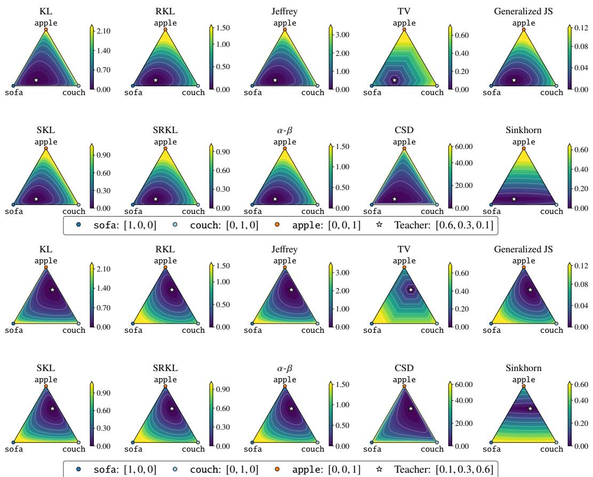  
Figure 5: Loss contours of various divergences on the probability simplex for a toy next-token prediction task with different teacher distributions, extending the visualization in Figure 1a.

The Gemma-based task-specific distillation experiments followed the setup of Xu et al. [67].5 Teacher supervised fine-tuning was conducted on the full datasets for 3 epochs for summarization and arithmetic reasoning and 10 epochs for translation. Validation was performed every 16 optimization steps, and the model checkpoint achieving the best validation performance was selected. Across all teacher training experiments, we used a batch size of 128 and a learning rate of $1 \times 1 0 ^ { - 5 }$ . For KD, all baseline methods and our approach used the same checkpoint and were trained using approximately 1K samples per task. Summarization and arithmetic reasoning were distilled for 3 epochs, whereas translation was distilled for 10 epochs. Checkpoints were saved every 25 steps, and evaluation was performed using the checkpoint with the best validation loss. The code generation experiments with Qwen2.5 followed the experimental setup of DistiLLM-2 [35].6 All methods were trained for one epoch using a fixed batch size of 32.

## D Additional experimental results

Loss contours of divergence variants Figure 5 presents an extended version of Figure 1a, visualizing loss contours on the probability simplex for a toy next-token prediction task under various divergence formulations. Across all divergences except Sinkhorn divergence, the loss landscape is primarily determined by probability assignments to vocabulary indices rather than token semantic information. Consequently, semantically similar tokens such as sofa and couch are treated as entirely distinct categories. As the teacher distribution changes, the loss contours shift according to assigned probability values instead of reflecting token semantics. This behavior consistently appears across all divergence formulations except Sinkhorn divergence.

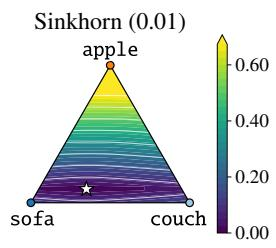

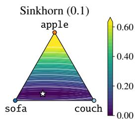

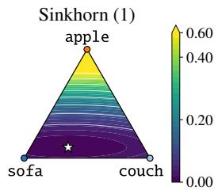  
sofa: 1, 0, 0 couch: 0, 1, 0 apple: 0, 0, 1 Teacher: 0.6, 0.3, 0.1

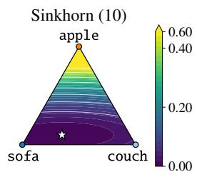

Figure 6: Loss contours of Sinkhorn divergence on the probability simplex under different entropy regularization hyperparameters ϵ, where the value of ϵ is indicated in parentheses in each subplot title.  
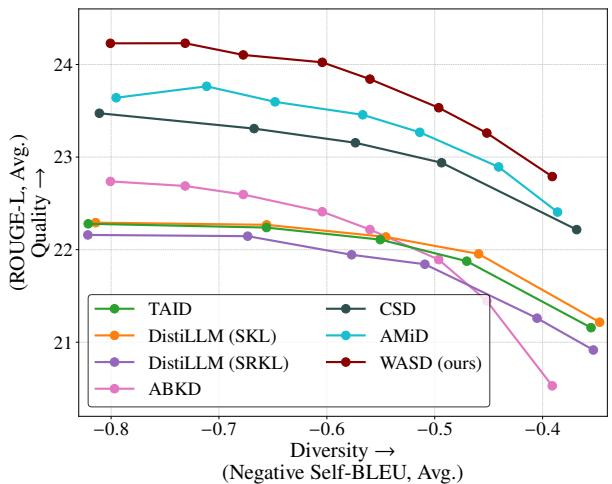  
Figure 7: Quality-diversity trade-off (ROUGE-L vs. Self-BLEU) on five instruction-following benchmarks for GPT-2 $( 1 . 5 \mathrm { B } \to 0 . 1 \mathrm { B } )$ , varying the decoding temperature, using the models reported in Table 3.

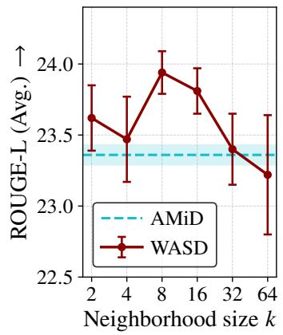  
Figure 8: Sensitivity analysis of the neighborhood size k for GPT-2-1.5B → GPT-2-0.1B. We report ROUGE-L across five instruction-following benchmarks over three training seeds.

Effect of entropy regularization in Sinkhorn divergence Figure 6 visualizes the loss contours of the Sinkhorn divergence on the probability simplex under different entropy regularization hyperparameters ϵ. As ϵ increases, the landscape becomes progressively flatter, indicating that the transport kernel becomes less sensitive to semantic differences between tokens. This behavior aligns with the performance trend observed in Figure 4b of the main manuscript, where excessively large entropy regularization leads to degraded performance.

Quality-diversity trade-off with recent baselines Figure 7 illustrates the quality-diversity tradeoff obtained by varying the decoding temperature on five instruction-following benchmarks, using the models reported in Table 3. WASD consistently forms a favorable frontier compared to existing baselines, achieving higher ROUGE-L scores across different diversity regimes. These results suggest that the semantic-aware transport objective of WASD enables the model to preserve generation quality even under decoding settings that encourage more diverse outputs.

Sensitivity analysis of the neighborhood size k Following WPR [46], k denotes the number of retained non-self nearest neighbors. Then, the graph is symmetrized and augmented with zerocost self-loops, so its effective degree may exceed k. We conduct a sensitivity analysis over k ∈ {2, 4, 8, 16, 32, 64} for GPT-2 1.5B-to-0.1B distillation using three training seeds, under the same experimental setup as Table 3. As shown in Figure 8, performance does not improve monotonically with k: the highest mean ROUGE-L is achieved at $k = 8 ,$ while smaller neighborhoods remain competitive. Larger neighborhoods provide no consistent improvement, suggesting that including more distant token relations is not necessarily beneficial for distillation. These results support the use of small neighborhoods for efficient distillation while retaining cross-token semantic transport beyond the index-wise matching of KL divergence.

Table 9: Ablation study of WASD on five general instruction-following benchmarks for GPT-2 XL (1.5B) → GPT-2 Base (0.1B) under the same experimental setup as Table 2.
<table><tr><td>Method</td><td>Avg. ROUGE-L (↑)</td></tr><tr><td>GPT-2 XL (Teacher)</td><td>23.35</td></tr><tr><td>CSD [32]</td><td>21.46</td></tr><tr><td>WASD</td><td></td></tr><tr><td>Default settings</td><td>22.47</td></tr><tr><td>Cost change  $( \cos  \mathbf { L } 2 )$ </td><td>22.45</td></tr><tr><td>Increased truncation  $k ( 8  1 6 )$ </td><td>22.45</td></tr></table>

Table 10: Repeated task-specific distillation experiments under the same settings as Table 7. Results are reported as mean ± standard deviation over three training seeds.
<table><tr><td>Method</td><td>Translation COMET (↑)</td><td>Summarization ROUGE-L (↑)</td><td>Arithmetic Accuracy (↑)</td></tr><tr><td>CSD [32]</td><td> $7 3 . 7 0 \pm 0 . 0 8$ </td><td> $3 4 . 7 5 \pm 0 . 3 0$ </td><td> $2 3 . 3 8 \pm 0 . 5 7$ </td></tr><tr><td>AMiD [53]</td><td> $7 3 . 7 8 \pm 0 . 1 4$ </td><td> $3 4 . 6 5 \pm 0 . 3 9$ </td><td> $2 4 . 3 1 \pm 0 . 9 6$ </td></tr><tr><td>WASD (ours)</td><td> $7 4 . 4 0 \pm 0 . 3 1$ </td><td> ${ \bf 3 4 . 9 6 \pm 0 . 1 8 }$ </td><td> $2 4 . 6 2 \pm 0 . 2 5$ </td></tr></table>

Ablation study on WASD Table 9 presents an ablation study on several design choices of WASD. Replacing cosine distance with L2 distance as the transport cost yields comparable performance while still consistently outperforming the strongest baseline, CSD. Similarly, increasing the truncation parameter from k = 8 to k = 16 produces nearly identical results, suggesting that sparse transport with a relatively small number of nearest neighbors is sufficient for effective distillation.

Repeated training results We repeat the translation, summarization, and arithmetic reasoning experiments in Table 7 with three training seeds to examine robustness to training variation. As shown in Table 10, WASD achieves the highest mean performance on all three tasks. For translation, WASD improves over AMiD in all three seeds, with a statistically significant difference under a paired t-test $( p = 0 . 0 4 8 )$ . Although the gains on the other tasks are small, the repeated-seed results show a consistent trend across the three task-specific settings.

Cross-model-family distillation To examine applicability beyond a single model family, we integrate WASD into DSKD [68], a cross-family distillation framework for models with different vocabularies and tokenizers, using the updated DSKDv2 codebase [69]. DSKD uses cross-model projectors to express teacher and student predictions in each other’s output spaces, enabling distribution matching between models with different architectures and tokenizers. We instantiate the DSKDv2 baseline with forward KL (FKL) divergence, using Qwen1.5-1.8B [5] as the teacher and GPT-2-0.1B as the student. WASD-S replaces the FKL-based distribution-matching term only in the student output space, whereas WASD-S+T replaces the corresponding terms in both the student and teacher output spaces. All other components remain unchanged. In each space, WASD uses a transport cost matrix constructed from the corresponding token-embedding geometry.

We use the Dolly split and evaluation benchmarks adopted by DSKD. As a controlled proof of concept, we train all compared methods for three epochs under identical optimization settings and evaluate using greedy decoding. As shown in Table 11, WASD-S improves average ROUGE-L from 20.47 to 20.95, while WASD-S+T further increases it to 21.31. WASD-S+T improves over the baseline on four of the five datasets and outperforms WASD-S on all five datasets. These results suggest that

Table 11: Cross-family distillation from Qwen1.5-1.8B to GPT-2-0.1B within the DSKDv2 framework [69]. We report ROUGE-L with greedy decoding after three training epochs.
<table><tr><td>Method</td><td>Dolly Eval</td><td>Self Inst</td><td>Vicuna</td><td>Super NI</td><td>UnNI</td><td>Average</td></tr><tr><td>DSKDv2 (FKL)</td><td>23.58</td><td>12.11</td><td>14.26</td><td>26.64</td><td>25.76</td><td>20.47</td></tr><tr><td>+ WASD-S</td><td>24.68</td><td>12.55</td><td>16.09</td><td>25.09</td><td>26.34</td><td>20.95</td></tr><tr><td>+ WASD-S+T</td><td>24.80</td><td>12.74</td><td>16.33</td><td>26.32</td><td>26.39</td><td>21.31</td></tr></table>

Table 12: Diversity and semantic coherence on Dolly Eval at different decoding temperatures.
<table><tr><td rowspan="2">Temperature T</td><td colspan="2">Distinct-2</td><td colspan="2">Semantic coherence (↑)</td></tr><tr><td>AMiD</td><td>WASD</td><td>AMiD</td><td>WASD</td></tr><tr><td>0.7</td><td>0.262</td><td>0.270</td><td>0.879</td><td>0.890</td></tr><tr><td>1.0</td><td>0.309</td><td>0.312</td><td>0.850</td><td>0.866</td></tr><tr><td>1.3</td><td>0.357</td><td>0.359</td><td>0.823</td><td>0.844</td></tr><tr><td>1.5</td><td>0.390</td><td>0.388</td><td>0.807</td><td>0.827</td></tr></table>

WASD can be extended to cross-family distillation through an existing cross-model projection and alignment framework. They also suggest that teacher and student vocabulary geometries provide complementary transport-based supervision.

Semantic coherence and token-level analysis We examine coherence at the response level and probability allocation at the token level. For each Dolly evaluation prompt, we sample eight responses at decoding temperatures $T \in \{ 0 . 7 , 1 . 0 , 1 . 3 , 1 . 5 \}$ . We measure lexical diversity using Distinct-2 and semantic coherence using the mean pairwise cosine similarity between response embeddings from the external sentence encoder all-MiniLM-L6-v2 [51]. We compare WASD against AMiD under the same assistant-distribution framework in the GPT-2 1.5B-to-0.1B setting. As shown in Table 12, the two methods achieve nearly identical Distinct-2, while WASD achieves higher coherence at every temperature. The differences are statistically significant under paired Wilcoxon signed-rank tests $( p < 0 . 0 1 )$ and generally increase as sampling diversity grows. Therefore, at comparable lexical diversity, WASD produces varied responses that remain more semantically coherent according to this metric.

At the token level, we inspect the learned next-token distributions at a shared DialogSum [10] context where the teacher supports several plausible continuations. Table 13 shows the top next-token probabilities given the prefix “Sarah is upset because she couldn’t”. Although both students greedily select get, WASD assigns more probability to the teacher-supported alternatives express and share, whereas AMiD concentrates more probability on get. This example illustrates that WASD can retain a broader set of semantically related continuations supported by the teacher.

## E Limitations

The proposed method introduces additional computational overhead compared to standard divergencebased distillation objectives due to the Sinkhorn iterations required for solving the entropy-regularized optimal transport problem. In our experiments, WASD requires approximately twice the training time than conventional baselines and increases training GPU memory usage by approximately 20%. Although the proposed formulation remains practically feasible for large-scale LLM distillation, improving the efficiency of Sinkhorn-based optimization remains an important direction for future work. In particular, incorporating recent advances in fast or memory-efficient Sinkhorn algorithms may further improve the practicality of semantic-aware distillation.

Another limitation is the construction of the transport cost matrix. In this work, we use distances derived from the teacher model’s token embedding space as a generic measure of semantic similarity. While this simple design already provides consistent improvements, it may not fully capture taskspecific or domain-specific token information. Designing more expressive or adaptive cost matrices is a promising direction for future research.

Table 13: Top next-token probabilities at a shared DialogSum context with the prefix “Sarah is upset because she couldn’t”.
<table><tr><td>Model</td><td>Top next tokens and probabilities</td></tr><tr><td>Teacher</td><td>speak (0.19), express (0.19), share (0.19), get (0.19), voice (0.03)</td></tr><tr><td>WASD</td><td>get (0.36), express (0.25), convince (0.16), share (0.07), finish (0.03)</td></tr><tr><td>AMiD</td><td>get (0.63), express (0.15), convince (0.14), share (0.02), make (0.01)</td></tr></table>

## F Broader impacts

This work aims to improve the efficiency of large language models through knowledge distillation, which may help reduce the computational and energy costs associated with deploying increasingly large models. More efficient distillation can improve accessibility of LLM technologies in resourceconstrained environments and lower the environmental impact of inference. At the same time, advances in LLM distillation may also contribute to the wider deployment of powerful language models, which can amplify existing societal risks associated with LLMs, including misinformation generation, biased outputs, harmful content generation, and misuse in automated systems. Since the proposed method improves the ability of smaller models to imitate stronger teacher models, these risks may become more accessible at lower computational cost. Therefore, we encourage future research on responsible deployment, safety alignment, and monitoring mechanisms alongside advances in efficient LLM compression.

## NeurIPS Paper Checklist

## 1. Claims

Question: Do the main claims made in the abstract and introduction accurately reflect the paper’s contributions and scope?

Answer: [Yes]

Justification: The abstract and introduction clearly describe the main contribution of the paper.

Guidelines:

• The answer [N/A] means that the abstract and introduction do not include the claims made in the paper.

• The abstract and/or introduction should clearly state the claims made, including the contributions made in the paper and important assumptions and limitations. A [No] or [N/A] answer to this question will not be perceived well by the reviewers.

• The claims made should match theoretical and experimental results, and reflect how much the results can be expected to generalize to other settings.

• It is fine to include aspirational goals as motivation as long as it is clear that these goals are not attained by the paper.

## 2. Limitations

Question: Does the paper discuss the limitations of the work performed by the authors?

Answer: [Yes]

Justification: Limitations such as computational overhead from Sinkhorn iterations have been discussed in Section 4 and Appendix E.

Guidelines:

• The answer [N/A] means that the paper has no limitation while the answer [No] means that the paper has limitations, but those are not discussed in the paper.

• The authors are encouraged to create a separate “Limitations” section in their paper.

• The paper should point out any strong assumptions and how robust the results are to violations of these assumptions (e.g., independence assumptions, noiseless settings, model well-specification, asymptotic approximations only holding locally). The authors should reflect on how these assumptions might be violated in practice and what the implications would be.

• The authors should reflect on the scope of the claims made, e.g., if the approach was only tested on a few datasets or with a few runs. In general, empirical results often depend on implicit assumptions, which should be articulated.

• The authors should reflect on the factors that influence the performance of the approach. For example, a facial recognition algorithm may perform poorly when image resolution is low or images are taken in low lighting. Or a speech-to-text system might not be used reliably to provide closed captions for online lectures because it fails to handle technical jargon.

• The authors should discuss the computational efficiency of the proposed algorithms and how they scale with dataset size.

• If applicable, the authors should discuss possible limitations of their approach to address problems of privacy and fairness.

• While the authors might fear that complete honesty about limitations might be used by reviewers as grounds for rejection, a worse outcome might be that reviewers discover limitations that aren’t acknowledged in the paper. The authors should use their best judgment and recognize that individual actions in favor of transparency play an important role in developing norms that preserve the integrity of the community. Reviewers will be specifically instructed to not penalize honesty concerning limitations.

## 3. Theory assumptions and proofs

Question: For each theoretical result, does the paper provide the full set of assumptions and a complete (and correct) proof?

## Answer: [Yes]

Justification: The paper provides formal statements and proofs for the main theoretical results in Section 3, with detailed derivations in Appendix A.

## Guidelines:

• The answer [N/A] means that the paper does not include theoretical results.

• All the theorems, formulas, and proofs in the paper should be numbered and crossreferenced.

• All assumptions should be clearly stated or referenced in the statement of any theorems.

• The proofs can either appear in the main paper or the supplemental material, but if they appear in the supplemental material, the authors are encouraged to provide a short proof sketch to provide intuition.

• Inversely, any informal proof provided in the core of the paper should be complemented by formal proofs provided in appendix or supplemental material.

• Theorems and Lemmas that the proof relies upon should be properly referenced.

## 4. Experimental result reproducibility

Question: Does the paper fully disclose all the information needed to reproduce the main experimental results of the paper to the extent that it affects the main claims and/or conclusions of the paper (regardless of whether the code and data are provided or not)?

Answer: [Yes]

Justification: The experimental settings, baselines, evaluation metrics, and protocols are described in Section 4 and Appendix C.

Guidelines:

• The answer [N/A] means that the paper does not include experiments.

• If the paper includes experiments, a [No] answer to this question will not be perceived well by the reviewers: Making the paper reproducible is important, regardless of whether the code and data are provided or not.

• If the contribution is a dataset and/or model, the authors should describe the steps taken to make their results reproducible or verifiable.

• Depending on the contribution, reproducibility can be accomplished in various ways. For example, if the contribution is a novel architecture, describing the architecture fully might suffice, or if the contribution is a specific model and empirical evaluation, it may be necessary to either make it possible for others to replicate the model with the same dataset, or provide access to the model. In general. releasing code and data is often one good way to accomplish this, but reproducibility can also be provided via detailed instructions for how to replicate the results, access to a hosted model (e.g., in the case of a large language model), releasing of a model checkpoint, or other means that are appropriate to the research performed.

• While NeurIPS does not require releasing code, the conference does require all submissions to provide some reasonable avenue for reproducibility, which may depend on the nature of the contribution. For example

(a) If the contribution is primarily a new algorithm, the paper should make it clear how to reproduce that algorithm.

(b) If the contribution is primarily a new model architecture, the paper should describe the architecture clearly and fully.

(c) If the contribution is a new model (e.g., a large language model), then there should either be a way to access this model for reproducing the results or a way to reproduce the model (e.g., with an open-source dataset or instructions for how to construct the dataset).

(d) We recognize that reproducibility may be tricky in some cases, in which case authors are welcome to describe the particular way they provide for reproducibility. In the case of closed-source models, it may be that access to the model is limited in some way (e.g., to registered users), but it should be possible for other researchers to have some path to reproducing or verifying the results.

## 5. Open access to data and code

Question: Does the paper provide open access to the data and code, with sufficient instructions to faithfully reproduce the main experimental results, as described in supplemental material?

## Answer: [Yes]

Justification: The paper indicates that the implementation is publicly available and provides sufficient experimental details in Appendix C. All datasets and pretrained models used in the experiments are publicly available and appropriately cited.

Guidelines:

• The answer [N/A] means that paper does not include experiments requiring code.

• Please see the NeurIPS code and data submission guidelines (https://neurips.cc/ public/guides/CodeSubmissionPolicy) for more details.

• While we encourage the release of code and data, we understand that this might not be possible, so [No] is an acceptable answer. Papers cannot be rejected simply for not including code, unless this is central to the contribution (e.g., for a new open-source benchmark).

• The instructions should contain the exact command and environment needed to run to reproduce the results. See the NeurIPS code and data submission guidelines (https: //neurips.cc/public/guides/CodeSubmissionPolicy) for more details.

• The authors should provide instructions on data access and preparation, including how to access the raw data, preprocessed data, intermediate data, and generated data, etc.

• The authors should provide scripts to reproduce all experimental results for the new proposed method and baselines. If only a subset of experiments are reproducible, they should state which ones are omitted from the script and why.

• At submission time, to preserve anonymity, the authors should release anonymized versions (if applicable).

• Providing as much information as possible in supplemental material (appended to the paper) is recommended, but including URLs to data and code is permitted.

## 6. Experimental setting/details

Question: Does the paper specify all the training and test details (e.g., data splits, hyperparameters, how they were chosen, type of optimizer) necessary to understand the results?

Answer: [Yes]

Justification: All experimental setups, hyperparameters, datasets, and evaluation metrics are detailed in Section 4 and Appendix C.

Guidelines:

• The answer [N/A] means that the paper does not include experiments.

• The experimental setting should be presented in the core of the paper to a level of detail that is necessary to appreciate the results and make sense of them.

• The full details can be provided either with the code, in appendix, or as supplemental material.

## 7. Experiment statistical significance

Question: Does the paper report error bars suitably and correctly defined or other appropriate information about the statistical significance of the experiments?

Answer: [Yes]

Justification: Experimental results are reported with standard deviations across five evaluation seeds in Tables 2 and 3.

## Guidelines:

• The answer [N/A] means that the paper does not include experiments.

• The authors should answer [Yes] if the results are accompanied by error bars, confidence intervals, or statistical significance tests, at least for the experiments that support the main claims of the paper.

• The factors of variability that the error bars are capturing should be clearly stated (for example, train/test split, initialization, random drawing of some parameter, or overall run with given experimental conditions).

• The method for calculating the error bars should be explained (closed form formula, call to a library function, bootstrap, etc.)

• The assumptions made should be given (e.g., Normally distributed errors).

• It should be clear whether the error bar is the standard deviation or the standard error of the mean.

• It is OK to report 1-sigma error bars, but one should state it. The authors should preferably report a 2-sigma error bar than state that they have a 96% CI, if the hypothesis of Normality of errors is not verified.

• For asymmetric distributions, the authors should be careful not to show in tables or figures symmetric error bars that would yield results that are out of range (e.g., negative error rates).

• If error bars are reported in tables or plots, the authors should explain in the text how they were calculated and reference the corresponding figures or tables in the text.

## 8. Experiments compute resources

Question: For each experiment, does the paper provide sufficient information on the computer resources (type of compute workers, memory, time of execution) needed to reproduce the experiments?

Answer: [Yes]

Justification: Details about computational resources are provided in Appendix C.

Guidelines:

• The answer [N/A] means that the paper does not include experiments.

• The paper should indicate the type of compute workers CPU or GPU, internal cluster, or cloud provider, including relevant memory and storage.

• The paper should provide the amount of compute required for each of the individual experimental runs as well as estimate the total compute.

• The paper should disclose whether the full research project required more compute than the experiments reported in the paper (e.g., preliminary or failed experiments that didn’t make it into the paper).

## 9. Code of ethics

Question: Does the research conducted in the paper conform, in every respect, with the NeurIPS Code of Ethics https://neurips.cc/public/EthicsGuidelines?

Answer: [Yes]

Justification: The research complies with the NeurIPS Code of Ethics.

Guidelines:

• The answer [N/A] means that the authors have not reviewed the NeurIPS Code of Ethics.

• If the authors answer [No], they should explain the special circumstances that require a deviation from the Code of Ethics.

• The authors should make sure to preserve anonymity (e.g., if there is a special consideration due to laws or regulations in their jurisdiction).

## 10. Broader impacts

Question: Does the paper discuss both potential positive societal impacts and negative societal impacts of the work performed?

Answer: [Yes]

Justification: Potential societal impacts are discussed in Appendix F.

Guidelines:

• The answer [N/A] means that there is no societal impact of the work performed.

• If the authors answer [N/A] or [No], they should explain why their work has no societal impact or why the paper does not address societal impact.

• Examples of negative societal impacts include potential malicious or unintended uses (e.g., disinformation, generating fake profiles, surveillance), fairness considerations (e.g., deployment of technologies that could make decisions that unfairly impact specific groups), privacy considerations, and security considerations.

• The conference expects that many papers will be foundational research and not tied to particular applications, let alone deployments. However, if there is a direct path to any negative applications, the authors should point it out. For example, it is legitimate to point out that an improvement in the quality of generative models could be used to generate Deepfakes for disinformation. On the other hand, it is not needed to point out that a generic algorithm for optimizing neural networks could enable people to train models that generate Deepfakes faster.

• The authors should consider possible harms that could arise when the technology is being used as intended and functioning correctly, harms that could arise when the technology is being used as intended but gives incorrect results, and harms following from (intentional or unintentional) misuse of the technology.

• If there are negative societal impacts, the authors could also discuss possible mitigation strategies (e.g., gated release of models, providing defenses in addition to attacks, mechanisms for monitoring misuse, mechanisms to monitor how a system learns from feedback over time, improving the efficiency and accessibility of ML).

## 11. Safeguards

Question: Does the paper describe safeguards that have been put in place for responsible release of data or models that have a high risk for misuse (e.g., pre-trained language models, image generators, or scraped datasets)?

Answer: [N/A]

Justification: The paper does not release new large-scale pretrained models or datasets that pose significant misuse risks.

Guidelines:

• The answer [N/A] means that the paper poses no such risks.

• Released models that have a high risk for misuse or dual-use should be released with necessary safeguards to allow for controlled use of the model, for example by requiring that users adhere to usage guidelines or restrictions to access the model or implementing safety filters.

• Datasets that have been scraped from the Internet could pose safety risks. The authors should describe how they avoided releasing unsafe images.

• We recognize that providing effective safeguards is challenging, and many papers do not require this, but we encourage authors to take this into account and make a best faith effort.

## 12. Licenses for existing assets

Question: Are the creators or original owners of assets (e.g., code, data, models), used in the paper, properly credited and are the license and terms of use explicitly mentioned and properly respected?

Answer: [Yes]

Justification: We cite the code and datasets in Section 4 and the appendix.

Guidelines:

• The answer [N/A] means that the paper does not use existing assets.

• The authors should cite the original paper that produced the code package or dataset.

• The authors should state which version of the asset is used and, if possible, include a URL.

• The name of the license (e.g., CC-BY 4.0) should be included for each asset.

• For scraped data from a particular source (e.g., website), the copyright and terms of service of that source should be provided.

• If assets are released, the license, copyright information, and terms of use in the package should be provided. For popular datasets, paperswithcode.com/datasets has curated licenses for some datasets. Their licensing guide can help determine the license of a dataset.

• For existing datasets that are re-packaged, both the original license and the license of the derived asset (if it has changed) should be provided.

• If this information is not available online, the authors are encouraged to reach out to the asset’s creators.

## 13. New assets

Question: Are new assets introduced in the paper well documented and is the documentation provided alongside the assets?

Answer: [Yes]

Justification: The code is publicly available at https://github.com/aailab-kaist/ WASD.

Guidelines:

• The answer [N/A] means that the paper does not release new assets.

• Researchers should communicate the details of the dataset/code/model as part of their submissions via structured templates. This includes details about training, license, limitations, etc.

• The paper should discuss whether and how consent was obtained from people whose asset is used.

• At submission time, remember to anonymize your assets (if applicable). You can either create an anonymized URL or include an anonymized zip file.

## 14. Crowdsourcing and research with human subjects

Question: For crowdsourcing experiments and research with human subjects, does the paper include the full text of instructions given to participants and screenshots, if applicable, as well as details about compensation (if any)?

Answer: [N/A]

Justification: The paper does not involve crowdsourcing or experiments with human participants.

Guidelines:

• The answer [N/A] means that the paper does not involve crowdsourcing nor research with human subjects.

• Including this information in the supplemental material is fine, but if the main contribution of the paper involves human subjects, then as much detail as possible should be included in the main paper.

• According to the NeurIPS Code of Ethics, workers involved in data collection, curation, or other labor should be paid at least the minimum wage in the country of the data collector.

## 15. Institutional review board (IRB) approvals or equivalent for research with human subjects

Question: Does the paper describe potential risks incurred by study participants, whether such risks were disclosed to the subjects, and whether Institutional Review Board (IRB) approvals (or an equivalent approval/review based on the requirements of your country or institution) were obtained?

Answer: [N/A]

Justification: The paper does not involve human subjects research requiring IRB approval.

Guidelines:

• The answer [N/A] means that the paper does not involve crowdsourcing nor research with human subjects.

• Depending on the country in which research is conducted, IRB approval (or equivalent) may be required for any human subjects research. If you obtained IRB approval, you should clearly state this in the paper.

• We recognize that the procedures for this may vary significantly between institutions and locations, and we expect authors to adhere to the NeurIPS Code of Ethics and the guidelines for their institution.

• For initial submissions, do not include any information that would break anonymity (if applicable), such as the institution conducting the review.

## 16. Declaration of LLM usage

Question: Does the paper describe the usage of LLMs if it is an important, original, or non-standard component of the core methods in this research? Note that if the LLM is used only for writing, editing, or formatting purposes and does not impact the core methodology, scientific rigor, or originality of the research, declaration is not required.

Answer: [Yes]

Justification: We use GPT-4 and GPT-4o-mini as LLM judges to evaluate generated responses. The evaluation protocols and results are described in Section 4.1 and Appendix C.2.

Guidelines:

• The answer [N/A] means that the core method development in this research does not involve LLMs as any important, original, or non-standard components.

• Please refer to our LLM policy in the NeurIPS handbook for what should or should not be described.