# Where Do Two Populations of Persistence Diagrams Difer? Calibrated Local Inference at a Fixed Budget

Pramita Bagchi1 Edward Bae1 Atish Mitra2

Alexander D. Silberman1 Ziga Virk ˇ 3 Sushovan Majhi1

1The George Washington University 2Montana Technological University 3University of Ljubljana

## Abstract

Many two-sample tests for populations of persistence diagrams assess global diferences without identifying the regions of the birth–death plane that contribute to them. We study simultaneous inference for local mean contrasts when the number of available diagrams is fixed. They are diferences in expected weighted feature mass within $\ell _ { \infty }$ neighborhoods at several centers and radii. We estimate these contrasts using additive landmark responses. A Gaussian multiplier bootstrap calibrates simultaneous confidence intervals while allowing unequal group covariances. The neighborhoods whose intervals exclude zero form a map with approximate family-wise error control, and selecting a subset of original intervals for display preserves their joint coverage guarantee. On the simultaneous coverage event, every reported neighborhood lies within twice its radius of the support of the mean-measure diference. A geometric result gives suficient radius conditions for a displaced feature to produce a nonzero contrast. A comparison of suficient detection thresholds quantifies the tradeof between reducing the number of tested coordinates and reserving observations for an independent pilot. In simulations with 40 to 120 diagrams per class, the bands achieved 94%–98% simultaneous coverage under both the strict null and equal means with unequal covariances. In the latter setting, a permutation maximum and the pooled-t implementation of the two-stage persistence-image test of Moon and Lazar rejected in up to 32% and 26% of runs, respectively. In the fixedbudget simulations, spending a third of the observations on a pilot to choose landmarks or radii located changes less often than a prespecified grid at a single radius. On the MUTAG benchmark, the localized region concentrates on rings of fused-ring systems, an exploratory reading.

## 1 Introduction

A persistence diagram records when topological features appear and disappear along a filtration. In population studies, each observation is represented by a persistence diagram; observations might be images, networks, or spatial point patterns. Groups may difer in how often particular features occur, their birth and death values, or their variability across observations. Populations of diagrams can be compared using permutation tests on diagram distances (Robinson and Turner, 2017) or tests based on kernel and mean embeddings (Reininghaus et al., 2015; Kusano et al., 2016; Gretton et al., 2012; Bagchi et al., 2026). Other approaches use persistence landscapes (Bubenik, 2015), pooled lifetimes (Murris et al., 2026), or persistence intensities (Han et al., 2026).

For local inference, Moon and Lazar (2023) test filtered persistence-image pixels with false-discovery control, while Chen et al. (2015) provide pointwise bands for persistence intensities. Confidence sets for a single diagram address a diferent inferential target (Fasy et al., 2014; Chazal et al., 2013, 2014). Our focus is simultaneous confidence intervals for local mean contrasts across birth–death locations and neighborhood radii.

Local inference has a resolution problem. A small neighborhood separates nearby changes, but its response is zero in most diagrams; a large one collects more mass but can merge a feature lost in one place with a feature gained nearby. Choosing a radius changes both the estimand and its precision, and a method that leaves the choice unspecified is hard to use when few diagrams are available.

This paper. We estimate local mean contrasts using additive landmark responses from PLACE and PALACE (Mitra and Virk, 2024; Majhi et al., 2026a,b); Figure 1 shows the resulting map on a molecular benchmark. Each response is a weighted count of diagram points in an $\ell _ { \infty }$ neighborhood at a specified center and radius. Its mean contrast is an integral against the diference of the two mean counting measures (Divol and Chazal, 2019; Divol and Polonik, 2019; Divol and Lacombe, 2021). A Gaussian multiplier bootstrap calibrates all coordinates jointly (Chernozhukov et al., 2013, 2017). The band-validity theorem (Theorem 1) follows by applying their approximation results to these

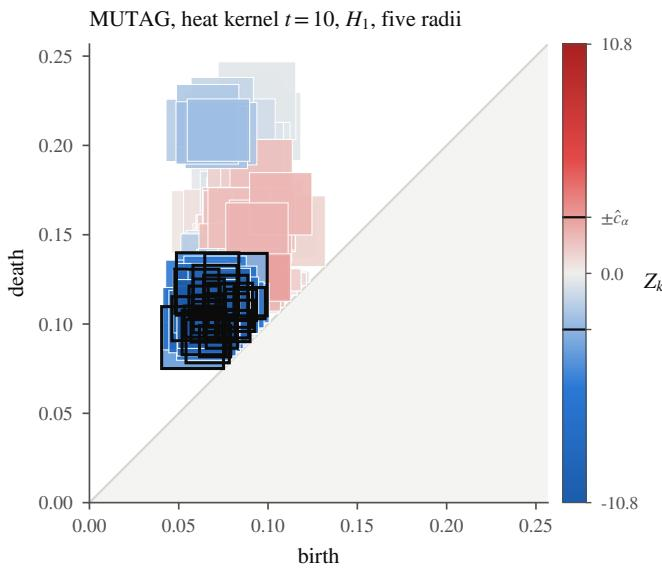  
Figure 1: Local inference on MUTAG (mutagenic against nonmutagenic compounds; heat-kernel signature, $t = 1 0$ , degree one). Class-aware landmarks are fitted on a pilot third of 175 deduplicated molecules, each with five radii; squares are filled by the standardized contrast $Z _ { k }$ of $\ S 3 .$ , and at each center the smallest radius whose interval excludes zero is outlined. All 58 localized coordinates, at 26 centers, carry more mass in the mutagenic class. Over 20 random splits the localized set is never empty and 97% of a split’s localized neighborhoods are matched by another split’s (§5.4).

responses.

(i) Simultaneous local inference (§3, Corollary 2): joint intervals cover contrasts over centers and radii. Reporting a data-dependent subset of the original intervals preserves their simultaneous coverage guarantee. On the coverage event, a spatial bound relates reported neighborhoods to the support of the mean-measure diference (Proposition 2). Under a localized displacement model, we also give radius conditions ensuring a nonzero mean contrast (Theorem 2).

(ii) Neighborhood choice at a fixed budget (Corollary 3, §5.3): for pilot selection of a subfamily from a prespecified family, we compare suficient detection thresholds, accounting for both the loss of inference observations and the reduction in the number of tested coordinates. In our main simulation designs, a prespecified grid at a single radius, using every diagram, gave the highest localization rates.

(iii) Lifetimes are not enough: any statistic of the lifetime multisets has power equal to its level against shifts along the diagonal (Proposition 3).

## 2 Local contrasts

Diagrams and landmark responses. Let $\mathcal { D } _ { n }$ contain persistence diagrams with at most n points $( b , d )$ satisfying $0 \leq b < d \leq L$ . The counting measure $N _ { D }$ assigns to each measurable region A the number of points of D in $A ,$ including multiplicities. For $X \sim P$ , the mean measure $\bar { \mu } _ { P } ( A ) = \mathbb { E } _ { P } [ N _ { X } ( A ) ]$ gives the expected count in that region (Divol and Chazal, 2019). Its definition requires no matching of features across diagrams. Write $\pi ( b , d ) = ( d - b ) / 2$ . For the one-point diagrams $\{ p \}$ and $\{ a \}$ , abbreviate their bottleneck distance as $d _ { B } ( p , a ) =$ min $\{ \| p - a \| _ { \infty } , \operatorname* { m a x } ( \pi ( p ) , \pi ( a ) ) \}$ . A landmark family $\nu = \{ ( p _ { k } , r _ { k } , w _ { k } ) \} _ { k = 1 } ^ { \ell }$ specifies centers in the diagram domain, radii $0 < r _ { k } \le \pi ( p _ { k } )$ , and weights $w _ { k } > 0$ Centers may appear at several radii. For an of-diagonal point a and a diagram $D \in \mathcal { D } _ { n }$ , define the point response and diagram response, respectively, by

$$
\varphi _ { k } ( a ) = w _ { k } ( r _ { k } - d _ { B } ( p _ { k } , a ) ) _ { + } , \Phi _ { k } ( D ) = \int \varphi _ { k } d N _ { D } .\tag{1}
$$

Together, the diagram responses form a linear representation (Divol and Polonik, 2019). The point response $\varphi _ { k }$ is wk-Lipschitz in $d _ { B }$ , and $0 \le \Phi _ { k } ( D ) \le n w _ { k } r _ { k }$ Within the diagram domain, the positive-response region $B _ { k } ^ { \circ } = \{ a : d _ { B } ( p _ { k } , a ) < r _ { k } \}$ is the intersection of the frame with the open $\ell _ { \infty }$ square of half-side $r _ { k }$ centered at $p _ { k }$ . The radius cap keeps this region of the diagonal. For diagram laws $P$ and $Q$ on $\mathcal { D } _ { n }$ , define

$$
\delta _ { k } = \mathbb { E } _ { P } \Phi _ { k } ( X ) - \mathbb { E } _ { Q } \Phi _ { k } ( Y ) = \int \varphi _ { k } d ( \bar { \mu } _ { P } - \bar { \mu } _ { Q } ) .\tag{2}
$$

This contrast measures a diference in weighted local mass. Moving points within $B _ { k } ^ { \circ }$ can change $\delta _ { k }$ without changing the expected count. Opposing local changes can cancel, giving $\delta _ { k } \ = \ 0$ Appendix B.1 gives the padded transport construction and a lower confidence bound on mean-measure separation.

Sampling and admissible learning. The inference observations are independent samples $X _ { 1 } , \dots , X _ { m } \sim P$ and $Y _ { 1 } , \dots , Y _ { m ^ { \prime } } \sim Q$ . Write $N = m + m ^ { \prime }$ and $N _ { \mathrm { e f f } } =$ $m m ^ { \prime } / N$ . The response vectors $U _ { i } ~ = ~ ( \Phi _ { k } ( X _ { i } ) ) _ { k }$ and $V _ { j } ~ = ~ ( \Phi _ { k } ( Y _ { j } ) ) _ { k }$ have covariances $\Sigma _ { P }$ and $\Sigma _ { Q }$ . The scaled diference $\sqrt { N _ { \mathrm { e f f } } } ( \bar { U } - \bar { V } )$ has covariance matrix Γ and coordinate variances $\omega _ { k } ^ { 2 } ,$ , given by

$$
\begin{array} { r } { \Gamma = \frac { m ^ { \prime } } { N } \Sigma _ { P } + \frac { m } { N } \Sigma _ { Q } , \qquad \omega _ { k } ^ { 2 } = \Gamma _ { k k } . } \end{array}\tag{3}
$$

Assumption 1 (Fixed family). The centers, radii, weights, and retained coordinates are prespecified, or are functions of a labeled pilot sample independent of the inference observations. When a pilot is used, probability statements are conditional on it.

A pilot may fit class-aware farthest-point centers (Majhi et al., 2026a), cap radii, screen coordinates, and estimate scales. Normalization factors $\widehat { \omega } _ { k }$ may be prespecified, pilot-based, or estimated from the inference observations. Inference-based estimates require uniform relative consistency in Appendix A.2, which also gives groupwise and pooled sample-variance constructions. With a prespecified family, all observations can be used for inference with either deterministic normal izing factors, such as $\widehat { \omega } _ { k } = n w _ { k } r _ { k }$ , or inference-based estimates satisfying this condition. Under the strict null $P = Q$ , every $\delta _ { k } = 0$ . The coordinate mean null $\delta = 0$ permits unequal group covariances and may hold even when $\bar { \mu } _ { P } \neq \bar { \mu } _ { Q }$ , because the chosen responses need not distinguish all diferences between mean measures.

## 3 Inference and neighborhood choice

For $0 < \alpha < 1$ , we construct a simultaneous band with nominal coverage $1 - \alpha$ for a fixed landmark family. Neighborhoods can be examined jointly across radii or chosen on an independent pilot before inference.

A simultaneous band. Let $\widehat { \delta } = \bar { U } - \bar { V }$ and $Z _ { k } ~ =$ $\sqrt { N _ { \mathrm { e f f } } } \widehat { \delta } _ { k } / \widehat { \omega } _ { k }$ Compute the normalization factors $\widehat { \omega } _ { k }$ once and hold them fixed across multiplier draws. For each bootstrap replicate, draw mutually independent standard normal multipliers $e _ { i } , e _ { i } ^ { \prime }$ , independently of the observations. Use the same multipliers across all centers and radii to compute

$$
Z _ { k } ^ { * } = \frac { \sqrt { N _ { \mathrm { e f f } } } } { { \widehat { \omega } } _ { k } } \Big ( \frac { 1 } { m } \sum _ { i } e _ { i } \big ( U _ { i k } - { \bar { U } } _ { k } \big ) - \frac { 1 } { m ^ { \prime } } \sum _ { j } e _ { j } ^ { \prime } \big ( V _ { j k } - { \bar { V } } _ { k } \big ) \Big ) .
$$

Repeat this step independently B times. Let $\widehat { c } _ { \alpha }$ be the $\lceil B ( 1 - \alpha ) \rceil$ th smallest of the resulting values of maxk $| Z _ { k } ^ { * } |$ . Define the band and localization set by

$$
{ \mathcal C } _ { k } = \big [ \widehat { \delta } _ { k } \pm \widehat { c } _ { \alpha } \widehat { \omega } _ { k } / \sqrt { N _ { \mathrm { e f f } } } \big ] , \qquad \widehat { R } = \{ k : | Z _ { k } | > \widehat { c } _ { \alpha } \} .\tag{4}
$$

The set $\widehat { R }$ indexes intervals that exclude zero. For these coordinates, the sign of $\widehat { \delta } _ { k }$ gives the reported direction of the local contrast. Prespecified or pilot-based normalizing factors need not estimate standard deviations. Inference-based factors, including groupwise and pooled SD estimates, must satisfy the uniform relative consistency conditions in Appendix A.2. The multiplier distribution calibrates the normalized contrasts jointly. For optional step-down testing, $\widehat { R } _ { \mathrm { s d } }$ denotes the Romano– Wolf rejection set computed from the same bootstrap draws (Romano and Wolf, 2005). Under $P = Q$ , label permutation also gives a finite-sample valid test, with label-dependent normalization recomputed for each permutation. It is not generally exact under the mean null.

Several radii and selected reporting. Choose centers and base radii $r _ { 0 } ( p ) > 0$ under Assumption 1. For a finite prespecified grid $\mathcal { H } \subset ( 0 , \infty )$ of multipliers, use $r = \displaystyle \operatorname* { m i n } \{ h r _ { 0 } ( p ) , \pi ( p ) \} , h \in \mathcal { H }$ . Keep identical coordinates created by the radius cap only once. Shared multipliers account for dependence among responses. Additional radii may increase the joint critical value, while sparse responses can make variance estimation and calibration less reliable. After computing the joint band, any subset of its intervals may be displayed. For example, report the smallest tested radius at each center whose interval excludes zero. This identifies the finest tested scale with a detected contrast. It does not rule out contrasts at smaller radii. Retain the original intervals, normalizing factors and joint critical value. Selection preserves their simultaneous coverage. Recalibrating a new band on the selected subset requires separate justification.

Choosing a configuration on a pilot. Split the independent pilot into fitting and validation parts. For each radius multiplier $h \in \mathcal { H } ,$ construct the candidate landmark family and its retained coordinate set $I _ { h }$ on the fitting part. Discard candidates with no retained coordinates. On the validation part, estimate the contrasts $\tilde { \delta } _ { h , k }$ and compute normalization factors $\tilde { \omega } _ { h , k }$ using the intended final normalization rule and planned inference allocation. Let $\widetilde { c } _ { \alpha } ( h )$ be the multiplier critical value computed from the validation covariances, using these factors and the planned inference allocation $( \mathrm { A p - }$ pendix D). Select a maximizer of

$$
\widehat { J } ( h ) = \operatorname* { m a x } _ { k \in I _ { h } } \left\{ \frac { | \widetilde { \delta } _ { h , k } | } { \widetilde { \omega } _ { h , k } } - \frac { \widetilde { c } _ { \alpha } ( h ) } { \sqrt { N _ { \mathrm { e f f } } } } \right\} .\tag{5}
$$

Here $N _ { \mathrm { e f f } }$ uses the planned inference sample sizes. The score targets the strongest anticipated detection within a candidate family. All selection quantities use only the pilot. For the selected family, retain the pilot normalization factors or recompute them from the inference observations under the conditions in Appendix A.2. Pilot selection preserves coverage under the conditions for the chosen normalization regime. The selected configuration afects power and spatial resolution. Comparisons therefore hold the total number of available diagrams fixed (Section 5.1).

Cross-validation and sample splitting. Crossvalidation may replace the pilot score (5), provided all selection uses only the independent pilot. Alternatively, split each group into two halves. Use one half to select a neighborhood family, construct a band on the other at nominal coverage $1 - \alpha / 2$ , and swap roles. Under the conditions for each band, a union bound gives joint coverage at least $1 - \alpha$ minus the sum of the two calibration errors. Retain the two original interval families separately. Appendix D.5 studies this construction for CV selection of regions and radii.

## 4 Theory

Theorem 1 (Simultaneous band). Suppose Assumption 1 holds, and the positive normalizing factors $\widehat { \omega } _ { k }$ are prespecified or computed from the independent pilot. Assume that sup $\begin{array} { r } { \mathbf { \Gamma } _ { D } \operatorname* { m a x } _ { k \leq \ell } | \Phi _ { k } ( D ) | \leq B _ { \nu } } \end{array}$ , mink≤ℓ ωk ≥ $\sigma _ { \operatorname* { m i n } } > 0$ , and $\lambda _ { 0 } \leq m / N \leq 1 - \lambda _ { 0 }$ for some $0 < \lambda _ { 0 } \leq$ $1 / 2$ There is C depending only on $B _ { \nu } / \sigma _ { \mathrm { m i n } }$ and λ0 such that, for nominal level $0 < \alpha < 1$ , number of retained coordinates ℓ, and number of bootstrap draws $B ,$ the band (4) satisfies

$$
\left| \mathbb { P } \{ \delta _ { k } \in \mathcal { C } _ { k } \forall k \} - ( 1 - \alpha ) \right| \le C \Big ( \frac { \log ^ { 7 } ( 2 \ell N ) } { N } \Big ) ^ { 1 / 6 } + \frac { 1 } { B + 1 } .
$$

The same bound holds for any nonempty coordinate subset fixed independently of the inference observations, using its own critical value. The probability is taken over the inference observations and bootstrap multipliers, conditional on the pilot if one is used.

The proof is given in Appendix A. The bound may be uninformative at small sample sizes; Section 5.2 assesses finite-sample calibration. The next result allows normalizing factors estimated from the inference observations.

Corollary 1 (Estimated normalization). Suppose the boundedness, nondegeneracy and allocation conditions of Theorem 1 hold with log $^ 7 ( 2 \ell N ) / N \ \to \ 0 ;$ , and the positive factors $\widehat { \omega } _ { k }$ , computed from the inference observations and held fixed across multiplier draws, satisfy $\begin{array} { r } { \operatorname* { m a x } _ { k \le \ell } | \widehat { \omega } _ { k } / \tau _ { N , k } - 1 | \cdot \log ( 2 \ell ) \stackrel { \mathbb { P } } {  } 0 } \end{array}$ for deterministic reference scales $\tau _ { N , k }$ with $\omega _ { k } / \tau _ { N , k }$ bounded above and below uniformly in k and N (Proposition A.1). Then the band (4) satisfies

$$
| \mathbb { P } \{ \delta _ { k } \in \mathcal { C } _ { k } \forall k \} - ( 1 - \alpha ) | \leq \varepsilon _ { N } + \frac { 1 } { B + 1 } ,
$$

where $\varepsilon _ { N } \to 0$ as $N  \infty$ . The groupwise and pooled constructions in Appendix A.2 satisfy these conditions under their stated assumptions.

The proof is given in Appendix A.2. The guarantee is asymptotic. In our simulations (§5.2) the pooled choice held its level at every allocation, while the groupwise choice overrejected whenever one group was three times the size of the other.

Corollary 2 (Error control and selection). For fixed or pilot-based normalization, let $\varepsilon _ { N , \ell }$ denote the full error bound in Theorem 1. For estimated normalization, use $\varepsilon _ { N , \ell } = \varepsilon _ { N } + 1 / ( B + 1 )$ under the conditions of Proposition A.1. Let $H _ { 0 } = \{ k : \delta k = 0 \}$ . Then $\mathbb { P } \{ \widehat { R } \cap H _ { 0 } \neq \varnothing \} \le \alpha + \varepsilon _ { N , \ell }$ and the same holds for $\widehat { R } _ { \mathrm { s d } } \supseteq \widehat { R }$ . On the simultaneous coverage event, every data-dependent subset of the original intervals covers its targets.

The proof is given in Appendix A.3. The next result gives a suficient condition for detecting local contrasts.

Proposition 1 (Detection). Assume the applicable conditions of Theorem 1 or Proposition A.1, with error bound $\varepsilon _ { N , \ell }$ as defined in Corollary 2. Let $\hat { \rho } ^ { 2 } \ = \ $ maxk $\mathrm { V a r } ^ { * } ( Z _ { k } ^ { * } )$ , where ${ \mathrm { V a r } } ^ { * }$ is variance conditional on the inference observations. For constants $\kappa _ { 0 } , \rho _ { 0 } > 0$ and $\gamma _ { N } ~ \in ~ [ 0 , 1 ]$ , suppose $\mathbb { P } \left\{ \operatorname* { m a x } _ { k } \frac { \widehat { \omega } _ { k } } { \omega _ { k } } > \kappa _ { 0 } \right.$ or $\hat { \rho } > \rho _ { 0 } \big \} \ \leq$ γN. Then, with probability at least $1 - \alpha - \varepsilon _ { N , \ell } - \dot { \gamma } _ { N } -$ $e ^ { - \alpha B / 8 }$ , every coordinate satisfying

$$
| \delta _ { k } | > 2 \kappa _ { 0 } \rho _ { 0 } \omega _ { k } \sqrt { \frac { 2 \log ( 4 \ell / \alpha ) } { N _ { \mathrm { e f f } } } }
$$

belongs to ${ \widehat { R } } .$

The proof is given in Appendix A.4. The constants account for the choice of normalization: $\kappa _ { 0 }$ bounds the normalizing factors relative to the true coordinate standard deviations, while $\rho _ { 0 }$ bounds the standard deviations of the normalized bootstrap coordinates. Sparse responses can weaken calibration, so the logarithmic dependence on ℓ does not make arbitrarily small neighborhoods reliable. Proposition B.1 gives a restricted lower bound for identifying one changed coordinate in a fixed disjoint family from the inference sample alone.

The next corollary compares suficient detection thresholds for inference on the full family using all observations and on a subfamily selected using a pilot. Pilot selection can reduce the number of tested coordinates, but leaves fewer observations for inference.

Corollary 3 (The price of a pilot). Let ν be a prespecified family of ℓ coordinates. Compare inference on all observations with a procedure that uses a fraction $f \in ( 0 , 1 )$ of each group to select a nonempty subfamily $\nu _ { h } \subseteq \nu o f \ell _ { h }$ coordinates. The latter uses the remaining observations for inference. The coordinate response functions are unchanged. Suppose both procedures satisfy Proposition 1 at the same nominal level α, with a common product $\kappa _ { 0 } \rho _ { 0 }$ . For each retained coordinate, the full-family suficient detection threshold is smaller exactly when $( 1 - f ) \log ( 4 \ell / \alpha ) < \log ( 4 \ell _ { h } / \alpha )$

A pilot multiplies $N _ { \mathrm { e f f } }$ by $1 - f$ and leaves $\omega _ { k }$ unchanged for each retained coordinate. For the grid of §5.1 $( \ell = 4 9 7$ coordinates over five radii, $\ell _ { h } = 1 0 5$ at one, $\alpha = 0 . 0 5 )$ the full family suficient detection threshold is smaller once $f > 0 . 1 5$ , under the common $\kappa _ { 0 } \rho _ { 0 }$ assumption. The comparison is between suficient thresholds from a union bound, not between exact powers: a selector can still gain by selecting a subfamily with a smaller $\kappa _ { 0 } \rho _ { 0 }$ , and §5.3 measures both efects.

A contrast that survives averaging. Populations with the same mean counting measure have the same mean responses, even when their diagram laws difer. Compare a diagram containing one point at a with probability 1 with a diagram with two copies of a or no point, each with probability $1 / 2$ . These populations have $\delta = 0 . \mathrm { ~ A ~ }$ lower-distortion bound for individual diagrams does not by itself imply a nonzero population contrast. The following model gives a suficient condition for detecting a localized feature displacement.

Assumption 2 (Localized feature displacement). Write $X = X _ { 0 } \uplus F _ { P }$ and $Y = Y _ { 0 }$ ⊎ $F _ { Q }$ in $\mathcal { D } _ { n } .$ , where ⊎ denotes multiset union and $\mathbb { E } _ { P } N _ { X _ { 0 } } = \mathbb { E } _ { Q } N _ { Y _ { 0 } }$ . Each added feature is either absent or a singleton, with presence probability $q \in ( 0 , 1 ]$ in each group. Write $A ^ { \prime }$ and $B ^ { \prime }$ for its location in X and in $Y$ when present. For fixed of-diagonal points $a , b$ and $\epsilon \ge 0 , d _ { B } ( A ^ { \prime } , a ) \le \epsilon$ under P and $d _ { B } ( B ^ { \prime } , b ) \leq \epsilon$ under $Q ,$ almost surely.

Theorem 2 (Local detectability). Under Assumption 2, suppose a retained coordinate k satisfies $\begin{array} { r } { d _ { B } ( p _ { k } , a ) + \epsilon < r _ { k } \le d _ { B } ( p _ { k } , b ) - \epsilon } \end{array}$ . Then $\delta _ { k } \geq q w _ { k } \{ r _ { k } -$ $d _ { B } ( p _ { k } , a ) - \epsilon \} > 0 .$ In particular, if $d _ { B } ( p _ { k } , a ) \leq \eta ~ f o r$ some $\eta \geq 0$ and $\eta + \epsilon < r _ { k } \le d _ { B } ( a , b ) - \eta - \epsilon$ , then $\delta _ { k } \geq q w _ { k } ( r _ { k } - \eta - \epsilon ) > 0$

Under the conditions of Proposition 1, a coordinate is detected with the probability stated there whenever its contrast lower bound exceeds its detection threshold.

Under the radius condition, the added feature gives a positive response under P and zero under Q whenever present. The background contributions agree in expectation, so the displaced feature determines the contrast. The proof is in Appendix A.6. Background and feature need not be independent. The interval is suficient, not necessary, and a finite radius grid must actually meet it; capping or screening can remove every admissible radius. For PLACE or PALACE landmarks (Majhi et al., 2026a), this guarantee applies when the retained family contains a center and radius satisfying these conditions.

Proposition 2 (Spatial extent). Let $S = \operatorname* { s u p p } | \bar { \mu } _ { P } - $ $\bar { \mu } _ { Q } |$ of the diagonal and $\begin{array} { r } { d _ { B } ( x , S ) = \operatorname* { i n f } _ { s \in S } d _ { B } ( x , s ) } \end{array}$ . If $\delta _ { k } \neq 0$ then $d _ { B } ( p _ { k } , S ) \ < \ r _ { k }$ . On the coverage event, every rejected center is within its radius of S, and the union $\textstyle \bigcup _ { k \in { \mathcal { R } } } B _ { k } ^ { \circ }$ over any reported index set $\mathcal { R } \subseteq \widehat { \cal R }$ with $\operatorname* { m a x } _ { k \in \mathcal { R } } r _ { k } \leq r _ { \operatorname* { m a x } }$ lies in $\{ x : d _ { B } ( x , S ) < 2 r _ { \mathrm { m a x } } \}$

A rejected neighborhood must intersect S, but need not be contained in S. The rejected neighborhoods need not cover all of S.

What lifetime statistics cannot see. Call a twosample statistic lifetime-based if it is a function of the lifetime multisets $\{ d - b \ : \ ( b , d ) \ \in \ X _ { i } \}$ and $\{ d - b$ $( b , d ) \in Y _ { j } \}$ ; the log-rank statistic of Murris et al. (2026) in either calibration is one.

Proposition 3 (Blindness along the diagonal). $I f Q$ is the law $o f \tau ( X ) , X \sim P$ , where τ moves each point by a possibly random vector $( t , t )$ within the frame, every lifetime-based test has the same rejection probability under $( P , Q )$ as under $( P , P )$ . If some landmark’s open square meets the support of the mean measure of the moved points under $P$ and almost surely none of their images, its $\delta _ { k } > 0$

## 5 Experiments

## 5.1 Design at a fixed total budget

We assess calibration and localization at nominal level $\alpha = 0 . 0 5$ , holding the total number of diagrams fixed. Each replication draws $T _ { P }$ diagrams from $P$ and $T _ { Q }$ from $Q ;$ balanced designs have $T _ { P } = T _ { Q } = T$ All procedures use the same generated samples, with any pilot drawn from this budget.

In the displacement experiments, each diagram contains 20 background points uniform above the diagonal in $[ 0 , 1 ] ^ { 2 }$ and a feature present with probability $q = 0 . 5$ . When present, the feature lies at its template plus ϵu, where $\epsilon = 0 . 0 2$ and u is uniform on $\{ - 1 , 0 , 1 \} ^ { 2 }$ The templates are $a = ( 0 . 3 0 , 0 . 5 0 )$ under P and either $a + ( 0 , \Delta ) { \mathrm { ~ o r ~ } } a + ( \Delta , \Delta )$ ) under Q. These shifts change or preserve lifetime, respectively. The common background cancels in expectation, and discrete jitter makes each contrast $\delta _ { k }$ an exact finite sum.

Setting $\Delta = 0$ gives the strict null $P = Q$ . Two further designs preserve the mean counting measure while changing response covariances. In the clustered design, ten background points have identical marginal distributions over four boxes. They choose boxes independently under P and share one box under Q; both groups also contain ten uniform background points. In the counts design, P has 20 background points and Q has 0 or 40 with equal probability. Both designs use the same feature process in the two groups.

We compare five landmark procedures. F0 uses the 105-center grid $\{ ( i / 1 4 , j / 1 4 ) : 0 \le i < j \le 1 4 \}$ with $r _ { k } = \mathrm { m i n } \{ 0 . 0 5 , \pi ( p _ { k } ) \}$ . F1 uses the same centers with $r _ { k , h } = \mathrm { m i n } \{ 0 . 0 5 h , \pi ( p _ { k } ) \}$ for $h \in \{ \frac { 1 } { 2 } , \frac { 1 } { \sqrt { 2 } } , 1 , \sqrt { 2 } , 2 \}$ . F2 selects h on a pilot using (5). A1 fits 100 class-aware farthest-point centers on the pilot fitting sample and uses all five radius multipliers; A2 also selects h on the pilot. Identical coordinates created by the radius cap are retained once. F0 and F1 use all diagrams for inference, with $\widehat { \omega } _ { k } = n w _ { k } r _ { k }$ . F2, A1 and A2 reserve approximately one third of each group for the pilot, divided into fitting and validation parts.

Comparators are the Westfall–Young permutation maximum on F1 (F1-perm), the multiplier band on a $2 0 \times 2 0$ persistence image (I1), and the procedure of Moon and Lazar (2023) (ML). Our ML implementation uses a $4 0 \times 4 0$ image, filtering at the 80th percentile of pooled standard deviation, pooled t-tests, and Benjamini–Hochberg FDR adjustment.

Table 1: FWER at a fixed total budget, 1000 replications per cell. $T _ { P } / T _ { Q } \mathrm { : }$ : diagrams per class; in the weak nulls Q is the more variable group. Bold: the 95% Wilson interval lies above 0.05.
<table><tr><td>design</td><td> $T _ { P } / T _ { Q }$ </td><td>F0</td><td>F1</td><td>F2</td><td>A1</td><td>A2</td><td>F1-perm</td><td>I1</td><td>ML</td></tr><tr><td>strict null</td><td>40/40</td><td>0.032</td><td>0.033</td><td>0.036</td><td>0.055</td><td>0.047</td><td>0.039</td><td>0.027</td><td>0.019</td></tr><tr><td>strict null</td><td>80/80</td><td>0.035</td><td>0.048</td><td>0.046</td><td>0.046</td><td>0.044</td><td>0.053</td><td>0.048</td><td>0.026</td></tr><tr><td>strict null</td><td>120/120</td><td>0.040</td><td>0.043</td><td>0.051</td><td>0.057</td><td>0.049</td><td>0.042</td><td>0.041</td><td>0.020</td></tr><tr><td>strict null</td><td>40/120</td><td>0.033</td><td>0.054</td><td>0.036</td><td>0.038</td><td>0.034</td><td>0.059</td><td>0.042</td><td>0.032</td></tr><tr><td>clustered</td><td>80/80</td><td>0.063</td><td>0.054</td><td>0.059</td><td>0.052</td><td>0.052</td><td>0.051</td><td>0.057</td><td>0.038</td></tr><tr><td>clustered</td><td>120/40</td><td>0.047</td><td>0.041</td><td>0.062</td><td>0.052</td><td>0.057</td><td>0.324</td><td>0.038</td><td>0.262</td></tr><tr><td>clustered</td><td>40/120</td><td>0.045</td><td>0.050</td><td>0.063</td><td>0.054</td><td>0.054</td><td>0.001</td><td>0.053</td><td>0.000</td></tr><tr><td>counts</td><td>80/80</td><td>0.046</td><td>0.045</td><td>0.034</td><td>0.042</td><td>0.032</td><td>0.050</td><td>0.046</td><td>0.017</td></tr><tr><td>counts</td><td>120/40</td><td>0.032</td><td>0.034</td><td>0.022</td><td>0.038</td><td>0.030</td><td>0.149</td><td>0.040</td><td>0.105</td></tr><tr><td>counts</td><td>40/120</td><td>0.040</td><td>0.043</td><td>0.044</td><td>0.045</td><td>0.035</td><td>0.012</td><td>0.049</td><td>0.002</td></tr></table>

For landmark methods, a change is located when at least one rejected coordinate has a nonzero population contrast, radius at most 0.10, and center within 0.05 of the changed support. Appendix D specifies the localization distance, pixel criterion, and implementation details, including pilot normalization and screening.

## 5.2 Calibration

With their default normalization, F0–A2 and I1 have family-wise error rate (FWER) 0.022–0.063 across the ten settings in Table 1. Simultaneous coverage is 0.94– 0.98 (Appendix D). Under the weak nulls, the permutation maximum and pooled-t ML implementation overreject when the smaller group is more variable. Their FWER reaches 0.32 and 0.26 in the clustered design, and 0.15 and 0.11 in the counts design, respectively. This is the allocation in which pooling can understate sampling variability. Both comparators are approximately calibrated under $P = Q$ and conservative when the more variable group is larger.

Inference-based normalization (Corollary 1) gives dif ferent finite-sample results. For F0 and F1, groupwise SD normalization gives FWER 0.029–0.055 with balanced groups, but 0.29–0.48 at 40/120 and 120/40, including under $P = Q$ . Pooled SD normalization is conservative, with FWER 0.002–0.036 across all settings (Appendix D).

Normalization also afects power. In a separate balanced design with highly unequal coordinate variances, both SD-based choices locate the change in every run; fixed normalization locates none. In the main displacement design, fixed normalization performs better: at 40 diagrams per class and $\Delta = 0 . 0 5$ , F0 locates the change in 77% of runs with fixed normalization and 37% with pooled SD normalization.

## 5.3 Localization and neighborhood choice

In the main displacement experiments, F0 has the highest localization rates among the compared procedures (Figure 2). At 40 diagrams per class and $\Delta = 0 . 0 5 ,$ it locates lifetime-changing and lifetime-preserving shifts in 77% and 92% of runs, respectively. The corresponding ranges for the pilot procedures are 10–29% and 17– 47%. Testing five radii jointly reduces localization for small shifts. For lifetime-changing shifts with $\Delta = 0 . 0 5$ ， F1 reaches 19% at 40 per class and 58% at 80 per class, compared with 77% and 98% for F0. The diference is small once $\Delta \ge 0 . 1 0$ with at least 80 per class. Under alternatives, the landmark bands have FWER at or below 0.05 over exactly null coordinates.

Sensitivity analyses show that pilot size and image settings afect localization (Appendix D). At 80 per class and $\Delta = 0 . 1 0 $ , A1 locates the change in 87%, 75% and 56% of runs with pilot fractions of one quarter, one third and one half. Increasing image resolution from $1 0 \times 1 0$ to $4 0 \times 4 0$ raises localization from 12% to 99.8%, matching F0 at the finer setting. These image variants use a onepixel Gaussian bandwidth, so the comparison changes both resolution and smoothing. The default pilot scale floor is active at every coordinate. Results for other floors and center counts are reported in the appendix.

Theorem 2 guarantees a nonzero contrast at suitable radii, but this need not give high power (Figure 3). At the grid center nearest the template, radii 0.035, 0.05 and 0.071 all lie in the suficient interval, approximately (0.034, 0.080]. Their rejection rates are 2%, 60% and 86%. Increasing jitter to $\epsilon = 0 . 0 4$ narrows the interval and reduces detection to 0–33%. Designs with two features at diferent scales, a prevalence change, or continuous jitter retain coverage of 0.94–0.98. However, the weaker, wider feature in the two-feature design is detected in only 3–17% of runs.

Appendix D.5 examines cross-validated region and radius selection. Cross-fitted selection gained power for several nearby changes of the same sign, but lost power for an isolated change. The gain persisted against a fixed-radius family. The SD-normalized multiplier bands undercovered, so the positive comparison concerns testing under exchangeability.

What lifetimes miss. In the additional comparisons of Appendix F, both calibrations of the log-rank test of Murris et al. (2026) remain near their null rejection rates under diagonal shifts, as Proposition 3 implies. The band and an MMD test on the same landmark embedding have similar global power in these experiments. The band also provides simultaneous confidence intervals for the local contrasts.

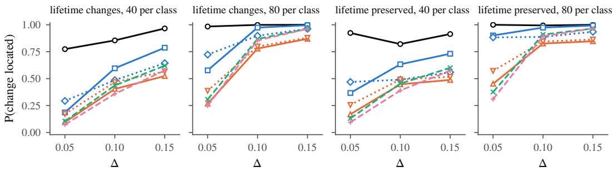  
F0 grid, one radius F1 grid, five radii F2 grid, pilot radius A1 pilot landmarks A2 pilot landmarks, pilot radius I1 image band ML Moon–Lazar  
Figure 2: Probability of locating the change at a fixed total budget, 1000 replications per point. The pilot methods (F2, A1, A2) infer on two thirds of the diagrams; F0, F1 and the image procedures use all of them. 120 per class and the FWER under alternatives are in Appendix D.

## 5.4 An exploratory molecular application

We analyze MUTAG, DHFR, COX2 and PTC, four molecular graph benchmarks with binary class labels (Morris et al., 2020). After removing duplicates by labeled graph isomorphism and dropping duplicate sets with conflicting labels, 175, 718, 465 and 325 graphs remain. We compute extended persistence diagrams in degrees zero and one from the heat-kernel signature of the normalized Laplacian (Majhi et al., 2026a). Its values lie in [0, 1], giving a fixed frame. F0 and F1 use all graphs; F2, A1 and A2 reserve a stratified third for the pilot. The focus on heat-kernel time t = 10 and degree one follows the earlier analysis in Majhi et al. (2026a). These choices were not prospective, so the application is exploratory.

MUTAG and DHFR yield nonempty maps for every method (global $p \leq 0 . 0 2 4 $ ; Appendix E). For MUTAG, A1 gives simultaneous intervals excluding zero for 58 of 342 coordinates at 26 centers (Figure 1). All indicate greater expected weighted feature mass in the mutagenic class. The map concentrates near birth values 0.06–0.09 and death values 0.09–0.12. Across 20 random pilot/inference splits, the A1 map is never empty (DHFR map in Figure 4), with median signed overlap 0.62 between splits. COX2 maps are unstable, and PTC maps are empty in 16–20 of the 20 splits, depending on the method.

With 20 molecules per class, A1 gives nonempty maps in 94% of subsamples, compared with 28% for the fixed grid. The diagrams occupy only $[ 0 , 0 . 3 ] ^ { 2 }$ within the [0, 1] frame, making the fixed grid coarse in the occupied region. Here, adapting the neighborhoods helps despite the observations reserved for the pilot.

For an exploratory structural interpretation, we match rings from a minimum cycle basis to diagram points. The selected MUTAG region contains 96% of rings in systems of at least three fused rings and 49% of other rings. A diferent cycle basis gives 95% and 49%. Among compounds with 15–22 atoms, mutagenic molecules place 2.3–3.2 rings in this region, compared with 0.8–1.3 for nonmutagenic molecules. These summaries are consistent with the fused-ring indicator of Debnath et al. (1991). Their interpretation is limited by selection of the region on these data and by the dependence of ring matching on the cycle basis. Degreeone points can also represent branchings of superlevel sets, and rings with symmetric heat-kernel values can produce no point. We do not infer a chemical mechanism.

## 6 Discussion

Simultaneous intervals quantify the size and direction of local mean diferences at a stated resolution. In our main fixed-budget simulations, a prespecified singleradius grid using all observations localized changes most often. This is a useful starting point when a meaningful scale can be chosen in advance. When the scale is uncertain, several radii can be calibrated jointly. Pilot fitting can help when the fixed grid poorly resolves the occupied region, as in the MUTAG subsampling results.

Cross-validated region selection can help when several nearby changes have the same sign and can be identified reliably from the selection sample. Our additional experiment illustrates this advantage, but also shows a substantial loss of power for an isolated change (Appendix D.5). The multiplier bands had coverage below nominal there, so the positive comparison concerns power rather than validated calibration.

The method targets local mean contrasts and can miss diferences that cancel under these responses. Reported neighborhoods need not cover the whole support of the mean-measure diference, and unselected regions have not been shown to lack changes. Improving finitesample calibration and recalibrating after selection on the inference sample remain directions for further work. Recovering the full changed support and incorporating covariates are also natural extensions.

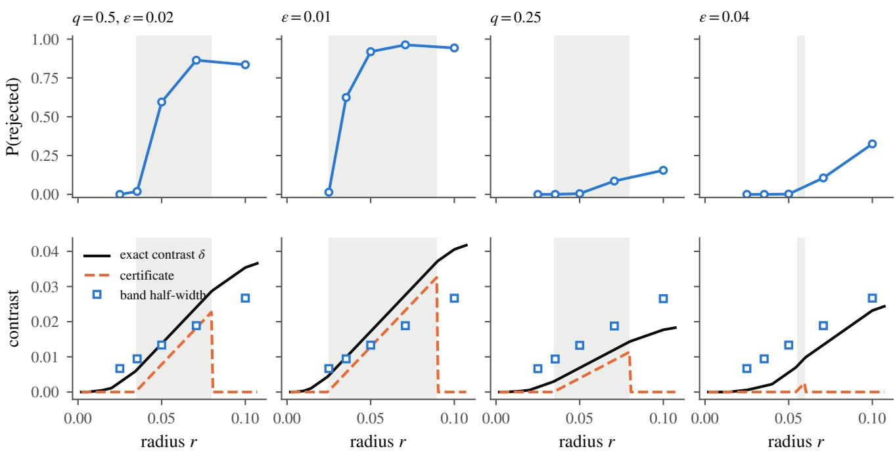  
Figure 3: Radius and Theorem 2, 80 diagrams per class, $\Delta = 0 . 1 0$ . Top: probability that the coordinate at the grid center nearest the template is rejected by F1, at each of its radii. Bottom: exact contrast and its certificate on a dense radius sweep, with the band’s mean half-width. Shaded: the certified interval $s + \epsilon < r \leq t - \epsilon$

## AI Use Statement

The authors formulated the research questions and planned the methodological and empirical work. Claude (Anthropic) and ChatGPT (OpenAI) were used to write and run the experiment and analysis code, generate the tables and figures, and draft and edit text. The authors directed the work, checked the results and arguments, and take responsibility for the paper.

## References

Henry Adams, Tegan Emerson, Michael Kirby, Rachel Neville, Chris Peterson, Patrick Shipman, Sofya Chepushtanova, Eric Hanson, Francis Motta, and Lori Ziegelmeier. Persistence images: A stable vector representation of persistent homology. Journal of Machine Learning Research, 18(8):1–35, 2017.

Pramita Bagchi, Sushovan Majhi, Atish Mitra, and Zigaˇ Virk. Statistical inference for persistence diagrams via landmark embeddings: Minimax theory and finite approximation, 2026. URL https://arxiv.org/ abs/2609.07691.

Peter Bubenik. Statistical topological data analysis using persistence landscapes. Journal of Machine Learning Research, 16(3):77–102, 2015.

Fr´ed´eric Chazal, Brittany Terese Fasy, Fabrizio Lecci, Alessandro Rinaldo, Aarti Singh, and Larry Wasserman. On the bootstrap for persistence diagrams and landscapes. Modeling and Analysis of Information Systems, 20(6):111–120, 2013.

Fr´ed´eric Chazal, Brittany Terese Fasy, Fabrizio Lecci, Alessandro Rinaldo, and Larry Wasserman. Stochastic convergence of persistence landscapes and silhouettes. In Proceedings of the Thirtieth Annual Symposium on Computational Geometry (SoCG), pages 474–483, 2014. doi: 10.1145/2582112.2582128.

Yen-Chi Chen, Daren Wang, Alessandro Rinaldo, and Larry Wasserman. Statistical analysis of persistence intensity functions, 2015. URL https://arxiv.org/ abs/1510.02502.

Victor Chernozhukov, Denis Chetverikov, and Kengo Kato. Gaussian approximations and multiplier bootstrap for maxima of sums of high-dimensional random vectors. The Annals of Statistics, 41(6):2786–2819, 2013. doi: 10.1214/13-AOS1161.

Victor Chernozhukov, Denis Chetverikov, and Kengo Kato. Central limit theorems and bootstrap in high dimensions. The Annals of Probability, 45(4):2309– 2352, 2017. doi: 10.1214/16-AOP1113.

Asim Kumar Debnath, Rosa L. Lopez de Compadre, Gargi Debnath, Alan J. Shusterman, and Corwin Hansch. Structure-activity relationship of mutagenic aromatic and heteroaromatic nitro compounds. Correlation with molecular orbital energies and hydrophobicity. Journal of Medicinal Chemistry, 34(2): 786–797, 1991. doi: 10.1021/jm00106a046.

Vincent Divol and Fr´ed´eric Chazal. The density of expected persistence diagrams and its kernel based estimation. Journal of Computational Geometry, 10(2): 127–153, 2019. doi: 10.20382/jocg.v10i2a7.

Vincent Divol and Th´eo Lacombe. Understanding the topology and the geometry of the space of persistence diagrams via optimal partial transport. Journal of Applied and Computational Topology, 5(1):1– 53, 2021. doi: 10.1007/s41468-020-00061-z.

Vincent Divol and Wolfgang Polonik. On the choice of weight functions for linear representations of persistence diagrams. Journal of Applied and Computational Topology, 3(3):249–283, 2019. doi: 10.1007/ s41468-019-00032-z.

Brittany Terese Fasy, Fabrizio Lecci, Alessandro Rinaldo, Larry Wasserman, Sivaraman Balakrishnan, and Aarti Singh. Confidence sets for persistence diagrams. The Annals of Statistics, 42(6):2301–2339, 2014. doi: 10.1214/14-AOS1252.

Arthur Gretton, Karsten M. Borgwardt, Malte J. Rasch, Bernhard Sch¨olkopf, and Alexander Smola. A kernel two-sample test. Journal of Machine Learning Research, 13:723–773, 2012.

Yeongung Han, Ilmun Kim, and Jisu Kim. A twosample test for random persistence diagrams against alternatives characterized by persistence intensity differences, 2026. URL https://arxiv.org/abs/2607. 20893.

Genki Kusano, Yasuaki Hiraoka, and Kenji Fukumizu. Persistence weighted Gaussian kernel for topological data analysis. In Proceedings of the 33rd International Conference on Machine Learning (ICML), pages 2004–2013, 2016.

Sushovan Majhi, Atish Mitra, Ziga Virk, and Pramitaˇ Bagchi. A closed-form adaptive-landmark kernel for certified point-cloud and graph classification, 2026a. URL https://arxiv.org/abs/2605.04046.

Sushovan Majhi, Atish Mitra, Ziga Virk, and Pramitaˇ Bagchi. A closed-form persistence-landmark pipeline for certified point-cloud and graph classification. Transactions on Machine Learning Research, 2026b. ISSN 2835-8856. URL https://openreview.net/ forum?id=4kZxNlE5Ve. arXiv:2605.02836.

Atish Mitra and Ziga Virk. Geometric embeddings ofˇ spaces of persistence diagrams with explicit distortions, 2024. URL https://arxiv.org/abs/2401. 05298.

Chul Moon and Nicole A. Lazar. Hypothesis testing for shapes using vectorized persistence diagrams. Journal of the Royal Statistical Society Series C: Applied Statistics, 72(3):628–648, 2023. doi: 10.1093/jrsssc/ qlad024.

Christopher Morris, Nils M. Kriege, Franka Bause, Kristian Kersting, Petra Mutzel, and Marion Neumann. TUDataset: A collection of benchmark datasets for learning with graphs. In ICML 2020 Workshop on Graph Representation Learning and Beyond, 2020.

Juliette Murris, Bernadette Stolz, and Karsten Borgwardt. From persistence to survival: Hypothesis testing, efect sizes and vectorisation for topological features, 2026. URL https://arxiv.org/abs/2606. 11911.

Jan Reininghaus, Stefan Huber, Ulrich Bauer, and Roland Kwitt. A stable multi-scale kernel for topological machine learning. In Proceedings of the IEEE Conference on Computer Vision and Pattern Recognition (CVPR), pages 4741–4748, 2015. doi: 10.1109/ CVPR.2015.7299106.

Andrew Robinson and Katharine Turner. Hypothesis testing for topological data analysis. Journal of Applied and Computational Topology, 1(2):241–261, 2017. doi: 10.1007/s41468-017-0008-7.

Joseph P. Romano and Michael Wolf. Exact and approximate stepdown methods for multiple hypothesis testing. Journal of the American Statistical Association, 100(469):94–108, 2005. doi: 10.1198/ 016214504000000539.

Bin Yu. Assouad, Fano, and Le Cam. In David Pollard, Erik Torgersen, and Grace L. Yang, editors, Festschrift for Lucien Le Cam, pages 423–435. Springer, 1997.

## Part I: Technical results

## A Proofs of the main results

The proofs follow the order of the main results. The landmark family is prespecified or learned from an independent pilot. Whenever a pilot is used, statements concerning the inference sample are conditional on it.

## A.1 Simultaneous coverage: proof of Theorem 1

Proof. Condition on the independent pilot, if one is used. The landmark family and the positive normalization factors $\widehat { \omega } _ { k }$ are then fixed. All probabilities below use this conditional law. Write $\mathbb { P } ^ { * }$ for probability conditional also on the inference observations. Put

$$
R = \frac { B _ { \nu } } { \sigma _ { \mathrm { m i n } } } , \qquad H _ { N } = \log ( 2 \ell N ) , \qquad r _ { N } = \left( \frac { H _ { N } ^ { 7 } } { N } \right) ^ { 1 / 6 } .
$$

Constants denoted by $C$ may change between displays and depend only on $R$ and $\lambda _ { 0 }$ . For $N < 4 .$ the claimed bound follows by enlarging $C ,$ since a diference of probabilities is at most one. Hence assume $N \geq 4$

Define

$$
\mu _ { P } = \mathbb { E } U _ { 1 } , \mu _ { Q } = \mathbb { E } V _ { 1 } , S = \sqrt { N _ { \mathrm { e f f } } } ( \widehat \delta - \delta ) , T = \operatorname* { m a x } _ { k \leq \ell } \frac { | S _ { k } | } { \widehat \omega _ { k } } .
$$

For one multiplier replicate, let

$$
S ^ { * } = \sqrt { N _ { \mathrm { e f f } } } \left\{ \frac { 1 } { m } \sum _ { i = 1 } ^ { m } e _ { i } ( U _ { i } - \bar { U } ) - \frac { 1 } { m ^ { \prime } } \sum _ { j = 1 } ^ { m ^ { \prime } } e _ { j } ^ { \prime } ( V _ { j } - \bar { V } ) \right\} , \qquad T ^ { * } = \operatorname* { m a x } _ { k \le \ell } \frac { | S _ { k } ^ { * } | } { \widehat { \omega } _ { k } } .
$$

Thus $T ^ { * } = \operatorname* { m a x } _ { k } | Z _ { k } ^ { * } |$ , and the coverage event is $\{ T \leq \widehat { c } _ { \alpha } \}$

1. Gaussian approximation. Write $\begin{array} { r } { S = \sum _ { i = 1 } ^ { N } \xi _ { i } } \end{array}$ , where

$$
\begin{array} { r } { \xi _ { i } = \frac { \sqrt { N _ { \mathrm { e f f } } } } { m } ( U _ { i } - \mu _ { P } ) , \quad i \le m , \qquad \xi _ { m + j } = - \frac { \sqrt { N _ { \mathrm { e f f } } } } { m ^ { \prime } } ( V _ { j } - \mu _ { Q } ) , \quad j \le m ^ { \prime } . } \end{array}
$$

These vectors are independent and centered, and

$$
\mathrm { C o v } ( S ) = \frac { m ^ { \prime } } { N } \Sigma _ { P } + \frac { m } { N } \Sigma _ { Q } = \Gamma .
$$

Set $W _ { i } = \sqrt { N } \xi _ { i } / \sigma _ { \operatorname* { m i n } }$ . Then

$$
\frac { S } { \sigma _ { \operatorname* { m i n } } } = \frac { 1 } { \sqrt { N } } \sum _ { i = 1 } ^ { N } W _ { i } , \qquad \operatorname* { m a x } _ { i } \| W _ { i } \| _ { \infty } \le K : = \frac { 2 R } { \sqrt { \lambda _ { 0 } } } , \qquad \frac { 1 } { N } \sum _ { i = 1 } ^ { N } \mathbb { E } W _ { i k } ^ { 2 } = \frac { \omega _ { k } ^ { 2 } } { \sigma _ { \operatorname* { m i n } } ^ { 2 } } \ge 1 .
$$

The boundedness condition supplies the moment and exponential-moment conditions (M.2) and (E.1) of Chernozhukov et al. (2017), with an envelope depending only on $K$ . Proposition 2.1 of that paper therefore gives, for $G \sim { \mathcal { N } } ( 0 , \Gamma )$

$$
\operatorname* { s u p } _ { A \in { \mathcal { A } } _ { \ell } } \left. \mathbb { P } ( S \in A ) - \mathbb { P } ( G \in A ) \right. \leq C r _ { N } ,\tag{6}
$$

where $\mathbf { \mathcal { A } } _ { \ell }$ is the class of axis-aligned hyperrectangles in $\mathbb { R } ^ { \ell }$ . If $\ell < 3$ , duplicate coordinates when applying the cited result. This changes only the constant.

Let $F$ be the distribution function of maxk $| G _ { k } | / \widehat { \omega } _ { k }$ . Since $\widehat { \omega } _ { k } > 0$ is fixed, the event $\{ T \leq t \}$ is a hyperrectangle for $t \geq 0$ . For $t < 0$ , both relevant probabilities are zero. Hence

$$
\operatorname* { s u p } _ { t \in \mathbb { R } } | \mathbb { P } ( T \leq t ) - F ( t ) | \leq C r _ { N } .\tag{7}
$$

No uniform upper or lower bound on the normalizing factors is needed for this step beyond their positivity and finiteness.

2. Within-group covariance estimation. Define the empirical covariances with divisors m and $m ^ { \prime } { : }$

$$
{ \widehat { \boldsymbol { \Sigma } } } _ { P } = { \frac { 1 } { m } } \sum _ { i = 1 } ^ { m } ( U _ { i } - { \bar { U } } ) ( U _ { i } - { \bar { U } } ) ^ { \top } , \qquad { \widehat { \boldsymbol { \Sigma } } } _ { Q } = { \frac { 1 } { m ^ { \prime } } } \sum _ { j = 1 } ^ { m ^ { \prime } } ( V _ { j } - { \bar { V } } ) ( V _ { j } - { \bar { V } } ) ^ { \top } .
$$

The independence and normality of the multipliers imply

$$
S ^ { * } \mid \mathrm { i n f e r e n c e ~ o b s e r v a t i o n s } \sim \mathcal { N } ( 0 , \widehat \Gamma ) , \qquad \widehat \Gamma = \frac { m ^ { \prime } } { N } \widehat \Sigma _ { P } + \frac { m } { N } \widehat \Sigma _ { Q } .
$$

For a matrix $M ,$ write $\| M \| _ { \operatorname* { m a x } } = \operatorname* { m a x } _ { j , k } | M _ { j k } |$ . To control the efect of estimating the group means, put

$$
Q _ { P } = { \frac { 1 } { m } } \sum _ { i = 1 } ^ { m } ( U _ { i } - \mu _ { P } ) ( U _ { i } - \mu _ { P } ) ^ { \top } .
$$

Define $Q _ { Q }$ analogously. Then

$$
\widehat { \Sigma } _ { P } - \Sigma _ { P } = ( Q _ { P } - \Sigma _ { P } ) - ( \bar { U } - \mu _ { P } ) ( \bar { U } - \mu _ { P } ) ^ { \top } ,
$$

with the same identity for $Q .$

Let $x _ { N } = \log ( 8 \ell ^ { 2 } N ) $ . Hoefding’s inequality gives, simultaneously for both groups, with probability at least $1 - 1 / N$

$$
\| \bar { U } - \mu _ { P } \| _ { \infty } \leq B _ { \nu } \sqrt { \frac { 2 x _ { N } } { m } } , \qquad \| Q _ { P } - \Sigma _ { P } \| _ { \operatorname* { m a x } } \leq 4 B _ { \nu } ^ { 2 } \sqrt { \frac { 2 x _ { N } } { m } } ,
$$

and the corresponding bounds with $m ^ { \prime }$ and $Q$ in place of m and $P .$ Indeed, the mean coordinates have range at most $2 B _ { \nu }$ , and each centered product lies in $[ - 4 B _ { \nu } ^ { 2 } , 4 B _ { \nu } ^ { 2 } ]$ . A union bound over the two groups’ ℓ means and $\ell ^ { 2 }$ products has failure probability at most $4 ( \ell + \ell ^ { 2 } ) e ^ { - x _ { N } } \leq 1 / N$

Since $m , m ^ { \prime } \geq \lambda _ { 0 } N$ , it follows that

$$
\Delta _ { N } : = \frac { \| \widehat { \Gamma } - \Gamma \| _ { \operatorname* { m a x } } } { \sigma _ { \operatorname* { m i n } } ^ { 2 } } \leq d _ { N } : = R ^ { 2 } \left\{ 4 \sqrt { \frac { 2 x _ { N } } { \lambda _ { 0 } N } } + \frac { 2 x _ { N } } { \lambda _ { 0 } N } \right\}
$$

with probability at least $1 - 1 / N$ . Write $\mathcal { E } _ { N } = \{ \Delta _ { N } \leq d _ { N } \}$ . Since $x _ { N } \leq 3 H _ { N }$

$$
\mathbb { P } ( \mathcal { E } _ { N } ^ { c } ) \le N ^ { - 1 } , \qquad d _ { N } \le C \left\{ \sqrt { \frac { H _ { N } } { N } } + \frac { H _ { N } } { N } \right\} .\tag{8}
$$

It remains to consider $r _ { N }$ smaller than a suficiently small constant depending only on $R$ and $\lambda _ { 0 }$ . For larger $r _ { N } .$ , the theorem again follows by enlarging $C$ . Since $H _ { N } \geq 1$ , we have $H _ { N } / N \leq r _ { N } ^ { 6 }$ . Thus, in the remaining case, we may assume $H _ { N } / N \leq 1$ and $d _ { N } \leq 1 / 2$ . On ${ \mathcal { E } } _ { N }$

$$
\widehat { \Gamma } _ { k k } \geq \Gamma _ { k k } - \sigma _ { \operatorname* { m i n } } ^ { 2 } d _ { N } \geq \frac { \sigma _ { \operatorname* { m i n } } ^ { 2 } } { 2 } , \qquad k \leq \ell .\tag{9}
$$

3. Conditional Gaussian comparison. Let $F ^ { * } ( t ) = \mathbb { P } ^ { * } ( T ^ { * } \leq t )$ . Apply the Gaussian covariance comparison in the proof of Theorem 4.1 and Remark 4.1 of Chernozhukov et al. (2017) to $G / \sigma _ { \mathrm { m i n } }$ and $S ^ { * } / \sigma _ { \mathrm { m i n } }$ . Their covariance discrepancy is $\Delta _ { N }$ , and the marginal variances of the reference Gaussian are at least one. On ${ \mathcal { E } } _ { N }$ , this yields

$$
\operatorname* { s u p } _ { A \in { \mathcal { A } } _ { \ell } } | \mathbb { P } ^ { * } ( S ^ { * } \in A ) - \mathbb { P } ( G \in A ) | \leq C d _ { N } ^ { 1 / 3 } \log ^ { 2 / 3 } ( 2 \ell ) .
$$

This comparison uses the conditional Gaussian law of $S ^ { * }$ ; the covariance concentration for our within-group centering was established separately in Step 2. Coordinate duplication again handles $\ell < 3$

Applying the comparison to the rectangles defining the maximum gives, on ${ \mathcal { E } } _ { N }$

$$
\operatorname* { s u p } _ { t \in \mathbb { R } } | F ^ { * } ( t ) - F ( t ) | \leq s _ { N } : = C d _ { N } ^ { 1 / 3 } \log ^ { 2 / 3 } ( 2 \ell ) \leq C \left( \frac { H _ { N } ^ { 5 } } { N } \right) ^ { 1 / 6 } \leq C r _ { N } .\tag{10}
$$

Here we used $H _ { N } / N \leq 1$ in the middle inequality.

The distribution function $F$ is continuous. For each $t \geq 0 ,$ , the event that the Gaussian maximum equals t is contained in the union of the events $\{ | G _ { k } | = t { \widehat { \omega } } _ { k } \}$ , each of probability zero. The same argument and (9) show that $F ^ { * }$ is continuous on ${ \mathcal { E } } _ { N }$ . Neither statement requires an invertible covariance matrix. Moreover, $F$ is strictly increasing on $[ 0 , \infty )$ : on the nonzero linear support of $G ,$ the map $g \mapsto \operatorname* { m a x } _ { k } | g _ { k } | / \widehat { \omega } _ { k }$ is a norm, and the Gaussian law assigns positive probability to every nonempty open annulus.

$\it 4 .$ Calibration at a data-dependent critical value. Define $W = F ( T )$ and $V = F ^ { * } ( T )$ . For $0 < v < 1$ , continuity and strict increase give

$$
\mathbb { P } ( W \leq v ) = \mathbb { P } \{ T \leq F ^ { - 1 } ( v ) \} .
$$

Here ${ \cal F } ^ { - 1 } ( v )$ is the unique nonnegative t satisfying $F ( t ) = v .$ . Equation (7), including its value at zero, therefore implies

$$
\operatorname* { s u p } _ { 0 \leq v \leq 1 } | \mathbb { P } ( W \leq v ) - v | \leq C r _ { N } .
$$

On ${ \mathcal { E } } _ { N }$ , (10) gives $| V - W | \leq s _ { N }$ . Hence, for $0 \leq v \leq 1$ ，

$$
\begin{array} { r } { \mathbb { P } ( W \leq v - s _ { N } ) - N ^ { - 1 } \leq \mathbb { P } ( V \leq v ) \leq \mathbb { P } ( W \leq v + s _ { N } ) + N ^ { - 1 } . } \end{array}
$$

Consequently,

$$
\operatorname* { s u p } _ { 0 \leq v \leq 1 } \left. \mathbb { P } ( V \leq v ) - v \right. \leq C r _ { N } + s _ { N } + N ^ { - 1 } \leq C r _ { N } .\tag{11}
$$

This argument allows T and $F ^ { * }$ to depend on the same observations.

5. Finitely many multiplier draws. Let $T _ { 1 } ^ { * } , \ldots , T _ { B } ^ { * }$ be the independent multiplier maxima conditional on the inference observations. Write $j = \lceil B ( 1 - \alpha ) \rceil$ , so $1 \leq j \leq B ,$ , and let $\widehat { c } _ { \alpha }$ be their jth order statistic. On ${ \mathcal { E } } _ { N }$ continuity of $F ^ { * }$ gives

$$
\mathbb { P } ^ { * } ( T \leq \widehat { c } _ { \alpha } ) = g _ { B , j } ( V ) , \qquad g _ { B , j } ( v ) = \sum _ { q = 0 } ^ { j - 1 } \binom { B } { q } v ^ { q } ( 1 - v ) ^ { B - q } .
$$

Indeed, $T \leq \widehat { c } _ { \alpha }$ holds exactly when at most $j - 1$ of the draws are strictly below T. Since both sides lie in $[ 0 , 1 ]$ on the complementary event,

$$
\begin{array} { r } { | \mathbb { P } ( T \leq \widehat { c } _ { \alpha } ) - \mathbb { E } g _ { B , j } ( V ) | \leq \mathbb { P } ( \mathcal { E } _ { N } ^ { c } ) \leq N ^ { - 1 } . } \end{array}
$$

The function $g _ { B , j }$ is decreasing, with $g _ { B , j } ( 0 ) = 1$ and $g _ { B , j } ( 1 ) = 0$ . Integration by parts and (11) yield

$$
\left| \mathbb { E } g _ { B , j } ( V ) - \int _ { 0 } ^ { 1 } g _ { B , j } ( v ) d v \right| \leq \operatorname* { s u p } _ { 0 \leq v \leq 1 } \left| \mathbb { P } ( V \leq v ) - v \right| \leq C r _ { N } .
$$

Each summand in the integral has value $1 / ( B + 1 )$ , so

$$
\int _ { 0 } ^ { 1 } g _ { B , j } ( v ) d v = \frac { j } { B + 1 } , \qquad \left| \mathbb { P } ( T \leq \widehat { c } _ { \alpha } ) - \frac { j } { B + 1 } \right| \leq C r _ { N } .
$$

Finally, $j = \lceil B ( 1 - \alpha ) \rceil \in [ B ( 1 - \alpha ) , B ( 1 - \alpha ) + 1 ) , \mathrm { ~ s o ~ } j - ( 1 - \alpha ) ( B + 1 ) \in [ - ( 1 - \alpha ) , \alpha ) \in \mathcal { N } ,$ and

$$
\left| { \frac { j } { B + 1 } } - \left( 1 - \alpha \right) \right| \leq { \frac { 1 } { B + 1 } } .
$$

Since $\{ T \leq \widehat { c } _ { \alpha } \}$ is the simultaneous coverage event, the triangle inequality proves the displayed bound in the theorem. The approximation constant is independent of B and α.

For a nonempty subset $I \subseteq \{ 1 , \ldots , \ell \}$ fixed conditional on the pilot, apply the same argument to $( U _ { i k } ) _ { k \in I }$ and $( V _ { j k } ) _ { k \in I }$ . The envelope, allocation and variance bounds still hold. Using the subset’s own multiplier maximum gives the same result with $| I |$ in place of $\ell ,$ which is no larger than the stated bound. □

## A.2 Estimated normalization

Theorem 1 treats normalization factors fixed independently of the inference observations. We now allow estimated factors that approach deterministic reference scales. These scales need not equal the coordinate SDs $\omega _ { k }$ . The landmark family must still satisfy Assumption 1. All probability statements below condition on the independent pilot, if one is used.

Proposition A.1 (Estimated normalization). Let $\ell = \ell _ { N } \geq 1$ and $\lambda _ { N } = m / N$ . Suppose that, for constants $M , \sigma _ { 0 } > 0$ and $0 < \lambda _ { 0 } \leq 1 / 2$ independent of N,

$$
\operatorname* { s u p } _ { D } \operatorname* { m a x } _ { k \leq \ell } \left| \Phi _ { k } ( D ) \right| \leq M , \qquad \operatorname* { m i n } _ { k \leq \ell } \omega _ { k } \geq \sigma _ { 0 } , \qquad \lambda _ { 0 } \leq \lambda _ { N } \leq 1 - \lambda _ { 0 } , \qquad \frac { \log ^ { 7 } ( 2 \ell N ) } { N } \longrightarrow 0 .
$$

Let $\tau _ { N , k } > 0$ be deterministic reference scales satisfying

$$
0 < c _ { 0 } \leq \frac { \omega _ { k } } { \tau _ { N , k } } \leq C _ { 0 } < \infty \qquad f o r \ e v e r y \ k \leq \ell ,
$$

where $c _ { 0 } , C _ { 0 }$ do not depend on N. Suppose the positive factors $\widehat { \omega } _ { k }$ satisfy

$$
a _ { N } = \operatorname* { m a x } _ { k \le \ell } \left| \frac { \widehat { \omega } _ { k } } { \tau _ { N , k } } - 1 \right| , \qquad a _ { N } \log ( 2 \ell ) \ \overset { \mathbb { P } } { \longrightarrow } 0 .\tag{12}
$$

Compute the band (4) with these factors held fixed across Gaussian multiplier draws. For fixed $0 < \alpha < 1$ and any sequence of positive integers $B = B _ { N }$ , there is $\varepsilon _ { N }  0$ such that

$$
\left| \mathbb { P } \{ \delta _ { k } \in \mathcal { C } _ { k } ~ f o r ~ a l l ~ k \le \ell \} - ( 1 - \alpha ) \right| \le \varepsilon _ { N } + \frac { 1 } { B + 1 } .
$$

In particular, coverage converges to $1 - \alpha \ i f \ B \to \infty$ . The same conclusion holds for any nonempty coordinate subset fixed independently of the inference observations, using its own critical value. Any data-dependent selection of the original intervals retains their joint coverage guarantee.

Proof. Put $L _ { N } = \log ( 2 \ell )$ and define

$$
S _ { k } = \sqrt { N _ { \mathrm { e f f } } } ( \widehat { \delta } _ { k } - \delta _ { k } ) , \qquad S _ { k } ^ { * } = \widehat { \omega } _ { k } Z _ { k } ^ { * } , \qquad T _ { \tau } = \operatorname* { m a x } _ { k } \frac { | S _ { k } | } { \tau _ { N , k } } , \qquad T _ { \tau } ^ { * } = \operatorname* { m a x } _ { k } \frac { | S _ { k } ^ { * } | } { \tau _ { N , k } } .
$$

Let $G \sim { \mathcal { N } } ( 0 , \Gamma )$ and let $F _ { N }$ be the distribution function of maxk $| G _ { k } | / \tau _ { N , k }$ . The Gaussian approximation and covariance comparison in the proof of Theorem 1, applied to the deterministic scales $\tau _ { N , k ; \ l }$ give

$$
\operatorname* { s u p } _ { t } | \mathbb { P } ( T _ { \tau } \leq t ) - F _ { N } ( t ) | \longrightarrow 0 , \qquad \operatorname* { s u p } _ { t } | \mathbb { P } ^ { * } ( T _ { \tau } ^ { * } \leq t ) - F _ { N } ( t ) | \overset { \mathbb { P } } { \longrightarrow } 0 .
$$

Here $\mathbb { P } ^ { * }$ conditions on the inference observations. These approximations follow from Chernozhukov et al. (2017, Proposition 2.1 and Theorem 4.1). The scale bounds keep the normalized coordinate variances bounded above and away from zero. They also imply $T _ { \tau } = O _ { \mathbb { P } } ( \sqrt { L _ { N } } )$ and the corresponding conditional bound for $T _ { \tau } ^ { * }$ , in probability. Write Write $T = \operatorname* { m a x } _ { k } | S _ { k } | / \widehat { \omega } _ { k }$ and and $T ^ { * } = \operatorname* { m a x } _ { k } | Z _ { k } ^ { * } |$ |. On . On $\{ a _ { N } < 1 / 2 \}$

,

$$
\frac { T _ { \tau } } { 1 + a _ { N } } \leq T \leq \frac { T _ { \tau } } { 1 - a _ { N } } , \qquad \frac { T _ { \tau } ^ { * } } { 1 + a _ { N } } \leq T ^ { * } \leq \frac { T _ { \tau } ^ { * } } { 1 - a _ { N } } .
$$

Thus $| T - T _ { \tau } | = o _ { \mathbb { P } } ( L _ { N } ^ { - 1 / 2 } )$ , with the analogous conditional statement for $T ^ { * }$ . Applying Nazarov’s inequality to the 2ℓ Gaussian coordinates $G _ { k } / \tau _ { N , k }$ and $- G _ { k } / \tau _ { N , k }$ gives

$$
\operatorname* { s u p } _ { t } \{ F _ { N } ( t + u ) - F _ { N } ( t ) \} \leq C u \sqrt { L _ { N } } , \qquad u > 0 ;
$$

see Chernozhukov et al. (2017, Lemma A.1). The replacement errors and this inequality therefore yield

$$
\operatorname* { s u p } _ { t } | \mathbb { P } ( T \leq t ) - F _ { N } ( t ) | \longrightarrow 0 , \qquad \operatorname* { s u p } _ { t } | \mathbb { P } ^ { * } ( T ^ { * } \leq t ) - F _ { N } ( t ) | \overset { \mathbb { P } } {  } 0 .
$$

Let $F _ { N } ^ { * }$ be the conditional distribution function of $T ^ { * }$ . The two preceding approximations imply that $V _ { N } =$ $F _ { N } ^ { * } ( T )$ approaches the uniform distribution on [0, 1] in Kolmogorov distance, by the argument in Step 4 of Appendix A.1. Covariance consistency and the variance lower bound also imply that $F _ { N } ^ { * }$ is continuous with probability tending to one. Step 5 of that proof therefore applies, with $j _ { B } = \lceil B ( 1 - \alpha ) \rceil$ , and gives

$$
\mathbb { P } \{ T \leq \widehat { c } _ { \alpha } \} = \frac { j _ { B } } { B + 1 } + o ( 1 ) , \qquad \left| \frac { j _ { B } } { B + 1 } - ( 1 - \alpha ) \right| \leq \frac { 1 } { B + 1 } .
$$

The $o ( 1 )$ term is uniform over $B _ { N } \colon$ : the binomial-tail function used in Step 5 has total variation at most one for every B and $j _ { B }$ . This proves the coverage claim. The same argument applies to a coordinate subset fixed independently of the inference observations. Coverage of any selected original intervals follows from coverage of the full family. □

Two estimated choices. For $m , m ^ { \prime } \geq 2$ , write

$$
s _ { P , k } ^ { 2 } = { \frac { 1 } { m - 1 } } \sum _ { i = 1 } ^ { m } ( U _ { i k } - \bar { U } _ { k } ) ^ { 2 } , \qquad s _ { Q , k } ^ { 2 } = { \frac { 1 } { m ^ { \prime } - 1 } } \sum _ { j = 1 } ^ { m ^ { \prime } } ( V _ { j k } - \bar { V } _ { k } ) ^ { 2 } .
$$

Let $\eta _ { N } > 0$ be deterministic with $\eta _ { N }  0$ . The groupwise choice is

$$
\widehat { \omega } _ { k } ^ { \mathrm { g r p } } = \left[ \operatorname* { m a x } \left\{ ( 1 - \lambda _ { N } ) s _ { P , k } ^ { 2 } + \lambda _ { N } s _ { Q , k } ^ { 2 } , \eta _ { N } ^ { 2 } \right\} \right] ^ { 1 / 2 } ,\tag{13}
$$

whose reference scale is $\tau _ { N , k } = \omega _ { k }$

Alternatively, ignore group labels when computing the normalizer. With $\bar { W } _ { k } = \lambda _ { N } \bar { U } _ { k } + ( 1 - \lambda _ { N } ) \bar { V } _ { k }$ , define

$$
s _ { \mathrm { p o o l } , k } ^ { 2 } = \frac { \sum _ { i = 1 } ^ { m } ( U _ { i k } - \bar { W } _ { k } ) ^ { 2 } + \sum _ { j = 1 } ^ { m ^ { \prime } } ( V _ { j k } - \bar { W } _ { k } ) ^ { 2 } } { N - 1 } ,\tag{14}
$$

$$
\widehat { \omega } _ { k } ^ { \mathrm { p o o l } } = \left[ \operatorname* { m a x } \{ s _ { \mathrm { p o o l } , k } ^ { 2 } , \eta _ { N } ^ { 2 } \} \right] ^ { 1 / 2 } .\tag{15}
$$

Writing $\sigma _ { P , k } ^ { 2 } = \mathrm { V a r } _ { P } \{ \Phi _ { k } ( X ) \}$ and $\sigma _ { Q , k } ^ { 2 } = \mathrm { V a r } _ { Q } \{ \Phi _ { k } ( Y ) \}$ , the corresponding reference scale satisfies

$$
\tau _ { N , k } ^ { 2 } = \lambda _ { N } \sigma _ { P , k } ^ { 2 } + ( 1 - \lambda _ { N } ) \sigma _ { Q , k } ^ { 2 } + \lambda _ { N } ( 1 - \lambda _ { N } ) \delta _ { k } ^ { 2 } .\tag{16}
$$

The between-group term is present because the pooled variance is centered at the grand mean. In fact,

$$
( N - 1 ) s _ { \mathrm { p o o l } , k } ^ { 2 } = ( m - 1 ) s _ { P , k } ^ { 2 } + ( m ^ { \prime } - 1 ) s _ { Q , k } ^ { 2 } + N _ { \mathrm { e f f } } \widehat { \delta } _ { k } ^ { 2 } .
$$

This is not the pooled within-group variance.

Under the boundedness, nondegeneracy and allocation conditions of Proposition A.1, both constructions satisfy its scale conditions. For the pooled choice, $\lambda _ { N } \sigma _ { P , k } ^ { 2 } + ( 1 - \lambda _ { N } ) \sigma _ { Q , k } ^ { 2 }$ is bounded above and below by fixed positive multiples of $\omega _ { k } ^ { 2 }$ . The bounded contrast $| \delta _ { k } | \leq 2 M$ and $\omega _ { k } \geq \sigma _ { 0 }$ preserve this comparability after adding the last term in (16).

Concentration of the bounded first and second sample moments, followed by a union bound over coordinates, gives for either choice

$$
\operatorname* { m a x } _ { k \le \ell } \left| \frac { \widehat { \omega } _ { k } } { \tau _ { N , k } } - 1 \right| = O _ { \mathbb { P } } \left( \sqrt { \frac { \log ( 2 \ell ) } { N } } \right) .
$$

The reference scales are uniformly bounded away from zero, so the vanishing floor is inactive with probability tending to one. The dimension condition implies $\log ^ { 3 } ( 2 \ell ) / N \to 0$ , which verifies (12). For fixed $\ell ,$ ordinary relative consistency sufices.

Corollary 1 follows from Proposition A.1 and the preceding verification of the two normalization constructions.

Calibration and scope. Both choices retain the separately centered multiplier sum in Section 3. Its unnormalized conditional covariance is

$$
\begin{array} { r } { \widehat \Gamma = ( 1 - \lambda _ { N } ) \widehat \Sigma _ { P } + \lambda _ { N } \widehat \Sigma _ { Q } , } \end{array}
$$

where the within-group empirical covariances use divisors m and $m ^ { \prime } .$ , respectively. Pooled normalization therefore does not impose equal group covariances. Its factor is held fixed across multiplier draws, just as for the groupwise choice.

The subset conclusion gives the error-control and step-down guarantees of Corollary 2, with FWER at most $\alpha + \varepsilon _ { N } + 1 / ( B + 1 )$ . Appendix A.3 gives the argument for both normalization regimes.

These are asymptotic guarantees. The allocation condition allows unequal group sizes, but finite-sample accuracy still depends on the smaller group, response variability and the number of coordinates. The floor ensures positive factors; it does not by itself ensure accurate calibration.

## A.3 Error control and selected reporting: proof of Corollary 2

Proof. Condition on the independent pilot, if one is used. Write

$$
\mathcal { E } = \{ \delta _ { k } \in \mathcal { C } _ { k } \mathrm { ~ f o r ~ a l l ~ } k \} .
$$

On $\mathcal { E } ,$ every $k \in H _ { 0 }$ satisfies $| Z _ { k } | \le \widehat { c } _ { \alpha }$ . Thus no true null is rejected by ${ \widehat { R } } ,$ and

$$
\mathbb { P } \{ \widehat { R } \cap H _ { 0 } \neq \varnothing \} \le \mathbb { P } ( \mathcal { E } ^ { c } ) \le \alpha + \varepsilon _ { N , \ell } .
$$

For the step-down procedure, the result is immediate if $H _ { 0 } = \varnothing$ . Otherwise, for each nonempty index set $K ,$ let $\widehat { c } _ { \alpha } ( K )$ be the $\left\lceil B ( 1 - \alpha ) \right\rceil$ ⌉th order statistic of

$$
\left\{ \operatorname* { m a x } _ { k \in K } | Z _ { k } ^ { * ( b ) } | : b = 1 , \dots , B \right\} ,
$$

where $Z _ { k } ^ { * ( b ) }$ is the response in multiplier replicate b. Use the same draws and normalizing factors at every step. The procedure starts from $K = \{ 1 , \ldots , \ell \}$ , rejects every $k \in K$ with $| Z _ { k } | > { \widehat { c } } _ { \alpha } ( K )$ , removes the rejected indices from $K ,$ and repeats until no further rejection occurs; $\widehat { R } _ { \mathrm { s d } }$ is the set of all rejected indices. For $I \subseteq K$ , the bootstrap maximum over I is no larger than that over K in every replicate. Hence

$$
{ \widehat { c } } _ { \alpha } ( I ) \leq { \widehat { c } } _ { \alpha } ( K ) .
$$

If a false rejection occurs, consider the first step at which this happens. Its remaining index set K contains $H _ { 0 }$ Some $k \in H _ { 0 }$ then satisfies

$$
| Z _ { k } | > { \widehat { c } } _ { \alpha } ( K ) \geq { \widehat { c } } _ { \alpha } ( H _ { 0 } ) .
$$

Consequently,

$$
\mathbb { P } \{ \widehat { R } _ { \mathrm { s d } } \cap H _ { 0 } \neq \emptyset \} \le \mathbb { P } \left\{ \operatorname* { m a x } _ { k \in H _ { 0 } } | Z _ { k } | > \widehat { c } _ { \alpha } ( H _ { 0 } ) \right\} \le \alpha + \varepsilon _ { N , \ell } .
$$

The last inequality follows from the fixed-subset conclusion of Theorem 1 or Proposition $\mathrm { A . 1 }$ , as applicable. The set $H _ { 0 }$ is fixed conditional on the pilot. For estimated normalization, choose $\varepsilon _ { N }$ to dominate the vanishing approximation errors for both the full family and $H _ { 0 }$

Critical values cannot increase as coordinates are removed. Therefore every coordinate rejected by $\widehat { R }$ is also rejected by the step-down procedure, giving $\widehat { R } \subseteq \widehat { R } _ { \mathrm { s d } }$

Finally, for any data-dependent subset $\hat { I } \subseteq \{ 1 , \dotsc , \ell \}$

$$
{ \mathcal { E } } \subseteq \{ \delta _ { k } \in { \mathcal { C } } _ { k } { \mathrm { ~ f o r ~ a l l ~ } } k \in { \widehat { I } } \} .
$$

This proves the selected-reporting claim, provided the original intervals are retained.

## A.4 Detection: proof of Proposition 1

Proof. Condition on the independent pilot, if one is used. Write $\mathbb { P } ^ { * }$ and $\mathbb { E } ^ { * }$ for probability and expectation over the multiplier draws conditional on the inference observations. Put

$$
a _ { \alpha } = \sqrt { 2 \log ( 4 \ell / \alpha ) } , \qquad \bar { c } = \hat { \rho } a _ { \alpha } , \qquad T ^ { * } = \operatorname* { m a x } _ { k } | Z _ { k } ^ { * } | .
$$

Each $Z _ { k } ^ { * }$ is conditionally centered Gaussian with variance at most $\hat { \rho } ^ { 2 }$ . If $\hat { \rho } > 0$ , the Gaussian tail bound and a union bound give

$$
\mathbb { P } ^ { * } ( T ^ { * } > \bar { c } ) \le 2 \ell \exp \left\{ - \frac { \bar { c } ^ { 2 } } { 2 \hat { \rho } ^ { 2 } } \right\} = \frac { \alpha } { 2 } .
$$

If $\hat { \rho } = 0$ , all multiplier responses are zero, so this probability is zero.

Let $K _ { B }$ count the bootstrap maxima exceeding ¯c. Conditional on the observations,

$$
K _ { B } \sim \mathrm { B i n } ( B , p _ { * } ) , \qquad p _ { * } = \mathbb { P } ^ { * } ( T ^ { * } > \bar { c } ) \le \alpha / 2 .
$$

Write $j = \lceil B ( 1 - \alpha ) \rceil$ . Since $\widehat { c } _ { \alpha }$ is the jth order statistic,

$$
\{ { \widehat { c } } _ { \alpha } > { \bar { c } } \} = \{ K _ { B } \geq B - j + 1 \} = \{ K _ { B } \geq \lfloor \alpha B \rfloor + 1 \} \subseteq \{ K _ { B } > \alpha B \} .
$$

Also,

$$
\begin{array} { r } { \mathbb { E } ^ { * } [ 2 ^ { K _ { B } } ] = ( 1 + p _ { * } ) ^ { B } \le e ^ { \alpha B / 2 } . } \end{array}
$$

Markov’s inequality therefore yields

$$
\begin{array} { r } { { \mathbb { P } } ^ { * } ( \widehat { c } _ { \alpha } > \bar { c } ) \leq 2 ^ { - \alpha B } { \mathbb { E } } ^ { * } [ 2 ^ { K _ { B } } ] \leq e ^ { - \alpha B ( \log 2 - 1 / 2 ) } \leq e ^ { - \alpha B / 8 } . } \end{array}
$$

Taking expectations gives the same unconditional bound, conditional on the pilot.

Define

$$
\mathcal { E } = \{ \delta _ { k } \in \mathcal { C } _ { k } \mathrm { ~ f o r ~ a l l ~ } k \} , \qquad \mathcal { G } = \left\{ \operatorname* { m a x } _ { k } \frac { \widehat { \omega } _ { k } } { \omega _ { k } } \leq \kappa _ { 0 } , \widehat { \rho } \leq \rho _ { 0 } \right\} .
$$

The coverage result and the assumed normalization bound give

$$
\mathbb { P } ( \mathcal { E } ^ { c } ) \leq \alpha + \varepsilon _ { N , \ell } , \qquad \mathbb { P } ( \mathcal { G } ^ { c } ) \leq \gamma _ { N } .
$$

On ${ \mathcal { G } } ,$ every coordinate satisfying the stated signal condition obeys

$$
\frac { \sqrt { N _ { \mathrm { e f f } } } | \delta _ { k } | } { \widehat { \omega } _ { k } } > 2 \rho _ { 0 } a _ { \alpha } \geq 2 \bar { c } .
$$

On $\mathcal { E } ,$ the band gives

$$
\frac { \sqrt { N _ { \mathrm { e f f } } } | \widehat \delta _ { k } - \delta _ { k } | } { \widehat \omega _ { k } } \leq \widehat c _ { \alpha } .
$$

Consequently, on $\mathcal { E } \cap \mathcal { G } \cap \{ \widehat { c } _ { \alpha } \leq \bar { c } \}$ 2

$$
| Z _ { k } | \geq \frac { \sqrt { N _ { \mathrm { e f f } } } | \delta _ { k } | } { \widehat { \omega } _ { k } } - \widehat { c } _ { \alpha } > 2 \bar { c } - \widehat { c } _ { \alpha } \geq \widehat { c } _ { \alpha } .
$$

Thus every such coordinate belongs to $\widehat { R }$ on the same event. A union bound over the three complementary events proves the result. □

## A.5 The pilot comparison: proof of Corollary 3

Proof. Let $T _ { P } , T _ { Q }$ be the total numbers of available observations in the two groups. The efective sample sizes are

$$
N _ { \mathrm { e f f } } ^ { \mathrm { f u l l } } = \frac { T _ { P } T _ { Q } } { T _ { P } + T _ { Q } } , \qquad N _ { \mathrm { e f f } } ^ { \mathrm { p i l o t } } = \frac { ( 1 - f ) T _ { P } ( 1 - f ) T _ { Q } } { ( 1 - f ) ( T _ { P } + T _ { Q } ) } = ( 1 - f ) N _ { \mathrm { e f f } } ^ { \mathrm { f u l l } } .
$$

Here the proportional split is understood to give integer sample sizes.

For each retained coordinate, the response function and its population variances are unchanged. The split also preserves the group proportions. Hence $\omega _ { k }$ is the same for both procedures.

$t _ { \mathrm { f u l l } , k }$ and $t _ { \mathrm { p i l o t } , k }$ denote the suficient detection thresholds in Proposition 1. With a common product $\kappa _ { 0 } \rho _ { 0 }$

$$
\frac { t _ { \mathrm { p i l o t } , k } } { t _ { \mathrm { f u l l } , k } } = \sqrt { \frac { \log ( 4 \ell _ { h } / \alpha ) } { ( 1 - f ) \log ( 4 \ell / \alpha ) } } .
$$

The claimed comparison follows by determining when this ratio exceeds one.

The comparison holds for each realized selected subfamily and its retained coordinates. It orders the suficient thresholds, but does not order the actual detection probabilities. The error terms in the two detection guarantees may also difer. □

## A.6 Local detectability: proof of Theorem 2

Proof. Fix a retained coordinate k satisfying

$$
\begin{array} { r } { d _ { B } ( p _ { k } , a ) + \epsilon < r _ { k } \le d _ { B } ( p _ { k } , b ) - \epsilon . } \end{array}
$$

Conditional on the added feature being present under P, the triangle inequality gives

$$
d _ { B } ( p _ { k } , A ^ { \prime } ) \leq d _ { B } ( p _ { k } , a ) + d _ { B } ( a , A ^ { \prime } ) \leq d _ { B } ( p _ { k } , a ) + \epsilon < r _ { k }
$$

almost surely. Hence

$$
\varphi _ { k } ( A ^ { \prime } ) \geq w _ { k } \{ r _ { k } - d _ { B } ( p _ { k } , a ) - \epsilon \} > 0 .
$$

Under $Q ,$ conditional on presence, the reverse triangle inequality gives

$$
d _ { B } ( p _ { k } , B ^ { \prime } ) \geq d _ { B } ( p _ { k } , b ) - d _ { B } ( b , B ^ { \prime } ) \geq d _ { B } ( p _ { k } , b ) - \epsilon \geq r _ { k } .
$$

Thus $\varphi _ { k } ( B ^ { \prime } ) = 0$ almost surely.

The background mean measures are equal, so

$$
\mathbb { E } _ { P } \Phi _ { k } ( X _ { 0 } ) = \int \varphi _ { k } d ( \mathbb { E } _ { P } N _ { X _ { 0 } } ) = \int \varphi _ { k } d ( \mathbb { E } _ { Q } N _ { Y _ { 0 } } ) = \mathbb { E } _ { Q } \Phi _ { k } ( Y _ { 0 } ) .
$$

All expectations are finite because the responses are bounded. By additivity and the common presence probability $q ,$

$$
\begin{array} { r l } & { \delta _ { k } = q \mathbb { E } _ { P } \{ \varphi _ { k } ( A ^ { \prime } ) \mid F _ { P } \neq \emptyset \} } \\ & { \quad \quad - q \mathbb { E } _ { Q } \{ \varphi _ { k } ( B ^ { \prime } ) \mid F _ { Q } \neq \emptyset \} } \\ & { \quad \geq q w _ { k } \{ r _ { k } - d _ { B } ( p _ { k } , a ) - \epsilon \} > 0 . } \end{array}
$$

No independence between the background and the added feature is needed.

For the second claim, suppose $d _ { B } ( p _ { k } , a ) \leq \eta$ . The reverse triangle inequality yields

$$
d _ { B } ( p _ { k } , b ) \geq d _ { B } ( a , b ) - d _ { B } ( p _ { k } , a ) \geq d _ { B } ( a , b ) - \eta .
$$

Therefore, $\eta + \epsilon < r _ { k } \le d _ { B } ( a , b ) - \eta - \epsilon$ implies the first radius condition. Applying the preceding bound gives

$$
\delta _ { k } \geq q w _ { k } \{ r _ { k } - d _ { B } ( p _ { k } , a ) - \epsilon \} \geq q w _ { k } ( r _ { k } - \eta - \epsilon ) > 0 _ { ! }
$$

Under the conditions of Proposition 1, either lower bound, when applicable and exceeding the corresponding detection threshold, gives the stated detection guarantee. □

## A.7 Spatial extent: proof of Proposition 2

Proof. Let $\zeta = \bar { \mu } _ { P } - \bar { \mu } _ { Q }$ , a finite signed Borel measure, and let $S = \operatorname { s u p p } | \zeta |$ . The response $\varphi _ { k }$ vanishes outside $B _ { k } ^ { \circ }$ . If $B _ { k } ^ { \circ } \cap S = \emptyset$ , then $| \zeta | ( B _ { k } ^ { \circ } ) = 0$ , so $\begin{array} { r } { \delta _ { k } = \int \varphi _ { k } d \zeta = 0 } \end{array}$ . Thus $\delta _ { k } \neq 0$ implies that some $s _ { k } \in B _ { k } ^ { \circ } \cap S$ satisfies

$$
d _ { B } ( p _ { k } , S ) \leq d _ { B } ( p _ { k } , s _ { k } ) < r _ { k } .
$$

On the simultaneous coverage event, a rejected coordinate has $0 \notin \mathcal { C } _ { k }$ and therefore $\delta _ { k } \neq 0$ . For any $x \in B _ { k } ^ { \circ }$

$$
d _ { B } ( x , S ) \leq d _ { B } ( x , p _ { k } ) + d _ { B } ( p _ { k } , s _ { k } ) < 2 r _ { k } \leq 2 r _ { \operatorname* { m a x } } .
$$

The same inclusion holds for any subset of the rejected neighborhoods reported afterwards. It does not imply that the reported neighborhoods cover S. □

## A.8 Lifetime invariance: proof of Proposition 3

Proof. For $a = ( b , d )$ , the point $a + ( t , t ) = ( b + t , d + t )$ has lifetime $d - b .$ . A diagram and its image under $\tau$ therefore have identical lifetime multisets. Consequently, the joint law of the lifetime data under $( P , Q )$ equals its law under $( P , P )$ . Every statistic based only on these data, and hence every lifetime-based test, has the same distribution under the two pairs of populations.

For the second claim, use the coupling $Y = \tau ( X )$ with $X \sim P .$ . Points left in place contribute equally to the two expected responses. By assumption, the images of moved points contribute zero under Q. Under $P ,$ the open response square meets the support of the mean measure of the moved points. This gives positive expected mass where $\varphi _ { k } > 0$ , and hence a strictly positive expected response. It follows that $\delta _ { k } = \mathbb { E } _ { P } \Phi _ { k } ( X ) - \mathbb { E } _ { Q } \Phi _ { k } ( Y ) > 0$ .

## B Additional technical results

We give a transport interpretation of the band, a lower bound for identifying a changed coordinate, and the bias calculation for empirical separation.

## B.1 Transport separation of mean counting measures

We use the padded transport construction of Bagchi et al. (2026). Throughout this subsection, the landmark family is fixed. If it was learned from a pilot, all statements condition on that pilot.

Padded counting measures. Write $\mathbb { H } _ { L } = \{ ( b , d ) : 0 \leq b < d \leq L \}$ and introduce an absence state ∅. Equip $\mathbb { H } _ { L } ^ { \mathcal { O } } = \mathbb { H } _ { L } \cup \{ \mathcal { O } \}$ with the ground metric

$$
\begin{array} { r l } & { ~ d _ { 0 } ( a , b ) = \operatorname* { m i n } \{ \| a - b \| _ { \infty } , \operatorname* { m a x } ( \pi ( a ) , \pi ( b ) ) \} , } \\ & { ~ d _ { 0 } ( a , \mathcal { O } ) = d _ { 0 } ( \mathcal { O } , a ) = \pi ( a ) , } \end{array}\tag{17}
$$

and set $d _ { 0 } ( \alpha , \alpha ) = 0$ . This is the bottleneck metric on singleton diagrams and the empty diagram. For two of-diagonal points, its two branches represent direct matching and deletion of both points, respectively.

For $D \in \mathcal { D } _ { n }$ , define

$$
\widetilde { N } _ { D } = N _ { D } + ( n - | D | ) \delta _ { \emptyset } ,\tag{18}
$$

where $| D |$ counts multiplicities and $\delta _ { \mathcal { D } }$ is the unit point mass at the absence state. Every padded counting measure has mass n. Its population mean is

$$
\widetilde { \bar { \mu } } _ { P } : = \mathbb { E } _ { P } \widetilde { N } _ { X } = \bar { \mu } _ { P } + \{ n - \bar { \mu } _ { P } ( \mathbb { H } _ { L } ) \} \delta _ { \emptyset } ,\tag{19}
$$

and $\widetilde { \bar { \mu } } _ { Q }$ is defined similarly. The restriction of $\widetilde { \bar { \mu } } _ { P }$ to $\mathbb { H } _ { L }$ is the mean measure $\bar { \mu } _ { P }$ from Section 2.

For finite nonnegative measures $\eta , \zeta$ of the same positive mass, let $\Pi ( \eta , \zeta )$ be their couplings. Define

$$
W _ { \infty , 0 } ( \eta , \zeta ) : = \operatorname* { i n f } _ { \gamma \in \Pi ( \eta , \zeta ) } \| d _ { 0 } \| _ { L ^ { \infty } ( \gamma ) } .\tag{20}
$$

Here the norm is the essential supremum of the ground distance under the coupling. Multiplying both measures by the same positive constant leaves $W _ { \infty , 0 }$ unchanged.

Lemma B.1 (Padded transport representation). For every $D , E \in { \mathcal { D } } _ { n }$ ，

$$
d _ { B } ( D , E ) = W _ { \infty , 0 } ( \widetilde { N } _ { D } , \widetilde { N } _ { E } ) .
$$

Proof. A partial diagram matching of cost at most t extends to a coupling of the padded measures. Retain the directly matched pairs. Pair the remaining of-diagonal points with one another where possible, then with absence states, and pair the unused absence states. Every pair has $d _ { 0 }$ -cost at most t. This proves $W _ { \infty , 0 } ( \widetilde { N } _ { D } , \widetilde { N } _ { E } ) \le$ $d _ { B } ( D , E )$

Conversely, split repeated atoms and absence states into n labeled unit-mass slots on each side. A coupling of cost at most t gives a doubly stochastic matrix supported on pairs with $d _ { 0 }$ -distance at most t. A Birkhof–von Neumann decomposition supplies a permutation with the same support restriction. For each paired of-diagonal pair, retain the direct match if its $\ell _ { \infty } { \mathrm { - d i s t a n c e } }$ is at most t. Otherwise, the deletion branch of (17) allows both points to be sent to the diagonal at cost at most t. Pairs involving an absence state also correspond to deletions. The resulting partial matching has bottleneck cost at most t. Taking infima proves the reverse inequality. □

Response bounds on the padded space. Extend each point response by $\varphi _ { k } ( \mathcal { O } ) = 0$ . Since $r _ { k } \le \pi ( p _ { k } ) =$ $d _ { 0 } ( p _ { k } , \mathcal { O } )$ , the extension satisfies

$$
\varphi _ { k } ( x ) = w _ { k } ( r _ { k } - d _ { 0 } ( p _ { k } , x ) ) _ { + } , \qquad x \in \mathbb { H } _ { L } ^ { \infty } .
$$

The triangle inequality and the Lipschitz property of the positive-part function give

$$
| \varphi _ { k } ( x ) - \varphi _ { k } ( y ) | \leq w _ { k } d _ { 0 } ( x , y ) .\tag{21}
$$

Padding therefore preserves both the diagram responses and the population contrasts:

$$
\Phi _ { k } ( D ) = \int \varphi _ { k } d \widetilde { N } _ { D } , \qquad \delta _ { k } = \int \varphi _ { k } d \big ( \widetilde { \mu } _ { P } - \widetilde { \mu } _ { Q } \big ) .\tag{22}
$$

The second identity follows by boundedness and linearity of expectation.

Corollary B.1 (Transport separation of mean measures). Let $\mathcal { E } \ = \ \{ \delta _ { k } \ \in \mathcal { C } _ { k }$ for all k} be the simultaneous coverage event for the band (4). On $\mathcal { E } _ { i }$

$$
W _ { \infty , 0 } ( \widetilde { \bar { \mu } } _ { P } , \widetilde { \bar { \mu } } _ { Q } ) \geq \operatorname* { m a x } _ { 1 \leq k \leq \ell } \frac { \left( | \widehat { \delta } _ { k } | - \widehat { c } _ { \alpha } \widehat { \omega } _ { k } / \sqrt { N _ { \mathrm { e f f } } } \right) _ { + } } { n w _ { k } } .\tag{23}
$$

Consequently, the probability that this lower bound holds is at least $\mathbb { P } ( \mathcal { E } )$ , with the coverage guarantee given by Theorem 1 or Corollary 1, as applicable.

Proof. For any coupling $\gamma \in \Pi ( \widetilde { \bar { \mu } } _ { P } , \widetilde { \bar { \mu } } _ { Q } )$ , the marginal identities and (21) imply

$$
\begin{array} { l } { | \delta _ { k } | = \displaystyle \left| \int \{ \varphi _ { k } ( x ) - \varphi _ { k } ( y ) \} d \gamma ( x , y ) \right| } \\ { \displaystyle \quad \leq w _ { k } \int d _ { 0 } ( x , y ) d \gamma ( x , y ) } \\ { \displaystyle \quad \leq n w _ { k } \| d _ { 0 } \| _ { L ^ { \infty } ( \gamma ) } . } \end{array}
$$

The last step uses the coupling’s total mass n. Taking the infimum over couplings gives

$$
\begin{array} { r } { | \delta _ { k } | \le n w _ { k } W _ { \infty , 0 } \big ( \widetilde { \bar { \mu } } _ { P } , \widetilde { \bar { \mu } } _ { Q } \big ) . } \end{array}
$$

On $\mathcal { E } ,$ the interval for coordinate k also gives

$$
\begin{array} { r } { | \delta _ { k } | \geq \left( | \widehat { \delta } _ { k } | - \widehat { c } _ { \alpha } \widehat { \omega } _ { k } / \sqrt { N _ { \mathrm { e f f } } } \right) _ { + } . } \end{array}
$$

Combine these inequalities and maximize over $k .$

This certificate concerns separation of the padded mean counting measures. It uses the upper Lipschitz bound and requires no lower-distortion assumption. A positive certificate establishes separation in the transport metric. A zero certificate does not establish equality of the mean measures or the diagram laws.

## B.2 A lower bound for identifying one changed coordinate

Proposition B.1 (Lower bound for localization). Let ν have $\ell \leq n$ landmarks with pairwise disjoint balls and centers $p _ { k }$ in the frame above the diagonal, and let $q \in ( 0 , \frac { 1 } { 2 } ]$ and $0 < h \leq$ min $\{ q , ( 1 - q ) / 2 \}$ . For $j \in \{ 1 , \ldots , \ell \}$ let $P _ { j }$ be the law of the diagram that contains the center pk independently with probability q for $k \neq j$ and with probability $q + h$ for $k = j$ , and let $Q = P _ { 0 }$ be the law with probability q at every center. Then the contrast vector, defined by $\delta _ { k } ^ { ( j ) } = \mathbb { E } _ { P _ { j } } \Phi _ { k } ( X ) - \mathbb { E } _ { Q } \Phi _ { k } ( Y )$ , is supported on coordinate $j ,$ with $h / \sqrt { 2 q ( 1 - q ) } \leq \delta _ { j } ^ { ( j ) } / \omega _ { j } \leq$ $\sqrt { 2 } h / \sqrt { q ( 1 - q ) }$ for every $m , m ^ { \prime }$ , and any estimator $\hat { \jmath }$ of the localized coordinate from m draws of $P _ { j }$ and $m ^ { \prime }$ draws of Q satisfies, for $\ell \geq 8$

$$
\operatorname* { m a x } _ { j \le \ell } \mathbb { P } _ { j } \{ \hat { \jmath } \ne j \} \ge \frac { 1 } { 2 } \quad w h e n e v e r \quad \frac { \delta _ { j } ^ { ( j ) } } { \omega _ { j } } \le \frac { 1 } { 8 } \sqrt { \frac { \log \ell } { m } } .
$$

Proof. A point at the center $p _ { k }$ lies in the k-th ball only, with response $a _ { k } = w _ { k } r _ { k }$ by (1). Under $P _ { j }$ the coordinates are therefore $\Phi _ { k } ( X ) = a _ { k } \zeta _ { k }$ with independent $\zeta _ { k } \sim \operatorname { B e r n } ( q )$ for $k \neq j$ and $\zeta _ { j } \sim \operatorname { B e r n } ( q + h ) ;$ each diagram carries at most one point per ball, so at most $\ell \leq n$ points, and lies in $\mathcal { D } _ { n }$ . Hence $\delta _ { k } ^ { ( j ) } = 0$ for $k \neq j , \delta _ { j } ^ { ( j ) } = h a _ { j } ,$ , and $\begin{array} { r } { \omega _ { j } ^ { 2 } = a _ { j } ^ { 2 } \{ \frac { m ^ { \prime } } { N } ( q + h ) ( 1 - q - h ) + \frac { m } { N } q ( 1 - q ) \} } \end{array}$ . For $h \leq \operatorname* { m i n } \{ q , ( 1 - q ) / 2 \} , ( q + h ) ( 1 - q - h ) \in [ \frac { 1 } { 2 } q ( 1 - q ) , 2 q ( 1 - q ) ]$ so $\omega _ { j } ^ { 2 } \in [ \frac { 1 } { 2 } , 2 ] a _ { j } ^ { 2 } q ( 1 - q )$ for every $m , m ^ { \prime }$ , which gives the stated bounds on $\delta _ { j } ^ { ( j ) } / \omega _ { j }$ . The Q-sample has the same law under every j and can be discarded. For $j \neq j ^ { \prime }$ the laws $P _ { j }$ and $P _ { j ^ { \prime } }$ ′ difer in coordinates $j$ and $j ^ { \prime }$ only, so

$$
\mathrm { K L } ( P _ { j } ^ { \otimes m } | | P _ { j ^ { \prime } } ^ { \otimes m } ) = m \big [ \mathrm { K L } ( \mathrm { B e r n } ( q + h ) | | \mathrm { B e r n } ( q ) ) + \mathrm { K L } ( \mathrm { B e r n } ( q ) | | \mathrm { B e r n } ( q + h ) ) \big ] \leq \frac { 2 m h ^ { 2 } } { q ( 1 - q - h ) } \leq \frac { 4 m h ^ { 2 } } { q ( 1 - q ) } ,
$$

by $\mathrm { K L } ( \mathrm { B e r n } ( a ) \| \mathrm { B e r n } ( b ) ) \leq ( a - b ) ^ { 2 } / ( b ( 1 - b ) )$ ). Fano’s inequality in the form of Yu (1997, proof of Lemma 3), for ℓ hypotheses with pairwise divergence at most $\beta ,$ gives maxj $\mathbb { P } _ { j } \{ \hat { \jmath } \neq j \} \ge 1 - ( \beta + \log 2 ) / \log \ell .$ which is at least $\textstyle { \frac { 1 } { 2 } }$ as soon as $\textstyle { \beta \leq { \frac { 1 } { 2 } } \log \ell - \log 2 }$ . For $\ell \geq 8 .$ , log $\begin{array} { r } { 2 \leq \frac { 1 } { 3 } \log \ell , } \end{array}$ so $\beta \leq \textstyle { \frac { 1 } { 6 } }$ log ℓ sufices, and with $\beta = 4 m h ^ { 2 } / ( q ( 1 - q ) )$ this holds when $h / \sqrt { q ( 1 - q ) } \ \leq \ \sqrt { \log \ell / ( 2 4 m ) }$ . The hypothesis $\delta _ { j } ^ { ( j ) } / \omega _ { j } \ \leq \ \frac { 1 } { 8 } \sqrt { \log \ell / m }$ and the lower bound $\delta _ { j } ^ { ( j ) } / \omega _ { j } \geq h / \sqrt { 2 q ( 1 - q ) }$ give $h / \sqrt { q ( 1 - q ) } \leq \sqrt { \log \ell / ( 3 2 m ) }$ , which is enough.

This construction uses diagrams with at most $\ell \leq n$ points and a fixed family of disjoint neighborhoods, so it lies within the model of Section 2. The Q-sample carries no information about the changed coordinate, which is why the bound depends on m alone. With balanced groups and occupancy $q$ bounded away from zero, it has the same $\sqrt { \log \ell / m }$ dependence as the suficient threshold in Proposition 1, up to constants. The construction is informative only when $h \leq q$ can be of order $\sqrt { q \log \ell / m }$ , which requires $q \gtrsim \log \ell / m$

The result concerns identification of one changed coordinate from the inference sample. It does not establish minimax recovery of a spatial support with overlapping or learned neighborhoods. If a pilot drawn from $P _ { j }$ is available to the estimator, its information must also enter the lower-bound experiment. Conditioning an upper bound on the pilot does not remove that information.

## B.3 Bias of the plug-in separation

Let $U _ { i }$ and $V _ { j }$ be independent samples of feature vectors with finite second moments. Write $\mu _ { P } = \mathbb { E } U _ { 1 } , \mu _ { Q } = \mathbb { E } V _ { 1 }$ $\delta = \mu _ { P } - \mu _ { Q }$ , and let their covariance matrices be $\Sigma _ { P }$ and $\Sigma _ { Q }$ . Independence gives

$$
\mathbb { E } \Vert \bar { U } \Vert ^ { 2 } = \frac { 1 } { m } \mathbb { E } \Vert U _ { 1 } \Vert ^ { 2 } + \left( 1 - \frac { 1 } { m } \right) \Vert \mu _ { P } \Vert ^ { 2 } = \Vert \mu _ { P } \Vert ^ { 2 } + \frac { { \mathrm { t r } } \Sigma _ { P } } { m } ,
$$

with the analogous identity for ${ \bar { V } } ,$ and $\mathbb { E } \langle \bar { U } , \bar { V } \rangle = \langle \mu _ { P } , \mu _ { Q } \rangle$ . Therefore

$$
\mathbb { E } \| \bar { U } - \bar { V } \| ^ { 2 } = \| \delta \| ^ { 2 } + \frac { { \mathrm { t r } } \Sigma _ { P } } { m } + \frac { { \mathrm { t r } } \Sigma _ { Q } } { m ^ { \prime } } .
$$

This is the bias of the V-statistic MMD estimator with the linear kernel on $\Phi$ (Gretton et al., 2012). It explains why maximizing empirical separation over configurations can reward variance as well as a population diference.

For a fixed family ν, the band instead uses the coordinatewise estimates $\widehat { \delta } _ { k }$ , which are unbiased. Fitting or screening a new family on the inference observations requires additional justification. Selecting which original intervals to display after simultaneous calibration preserves their coverage guarantee; see Corollary 2 and Remark C.1.

## Part II: Implementation and empirical studies

## C Implementation details

The diagram is the sampling unit throughout the proposed analysis. This section describes calibration, pilot selection, and the comparators. Appendix D gives the fixed-budget simulations, Appendix E the molecular analyses, and Appendix F the additional simulation studies.

## C.1 Calibration and resampling

The Gaussian multiplier band uses the separately centered group responses in Section 3. Each multiplier is shared across all coordinates of a diagram. Normalizing factors are held fixed across draws. Fixed and pilot-based factors are covered by Theorem 1; inference-based factors are covered under the conditions in Appendix A.2. Step-down testing uses the same draws and factors at every step.

For label permutation, entire diagrams are reassigned between groups while preserving group sizes. Labeldependent normalization is recomputed for each allocation. This gives a test under the exchangeable null $P = Q$ The weaker coordinate mean null can hold with unequal group laws and does not, by itself, justify permutation calibration. The numbers of replications and resampling draws are stated with each study.

## C.2 Pilot selection and image comparators at a fixed budget

The pilot procedures in Appendix D reserve $\lfloor T _ { P } / 3 \rfloor$ and $\lfloor { T _ { Q } } / 3 \rfloor$ observations from the two groups. Each pilot group is split into fitting and validation samples of approximately equal size. The adaptive family uses 100 classaware farthest-point centers fitted on the fitting sample. Coordinates active in fewer than 5% of fitting diagrams are removed. Its validation normalization uses the planned inference allocation and the floor 0.05 nwkrk:

$$
\widehat { \omega } _ { k } = \operatorname* { m a x } \{ \tilde { \omega } _ { k } , 0 . 0 5 n w _ { k } r _ { k } \} .
$$

Each adaptive center uses the base radius $0 . 0 5$ , so its radii are min $\{ 0 . 0 5 h , \pi ( p ) \}$ for the same multipliers h as F1.

For each candidate radius multiplier h, let $\widetilde { \Sigma } _ { P , h }$ and $\widetilde { \Sigma } _ { Q , h }$ be the within-group empirical covariance matrices of the retained validation responses. With planned inference sizes $m , m ^ { \prime }$ and $N = m + m ^ { \prime }$ , set

$$
\widetilde { \Gamma } _ { h } = \frac { m ^ { \prime } } { N } \widetilde { \Sigma } _ { P , h } + \frac { m } { N } \widetilde { \Sigma } _ { Q , h } .
$$

Conditional on the pilot, the unnormalized Gaussian multiplier vector has law $G _ { h } ^ { * } \sim \mathcal { N } ( 0 , \widetilde { \Gamma } _ { h } )$ . We estimate $\widetilde { c } _ { \alpha } ( h )$ from 1000 independent draws of

$$
\operatorname* { m a x } _ { k \in I _ { h } } \frac { \vert G _ { h , k } ^ { \ast } \vert } { \tilde { \omega } _ { h , k } } ,
$$

where $\tilde { \omega } _ { h , k }$ denotes the normalization factor used for that candidate, including its applicable floor. The validation observations estimate the covariances; the planned inference allocation supplies their weights and $N _ { \mathrm { e f f } }$ in the score (5). Ties favor fewer coordinates and then the smaller radius.

The fixed-budget permutation maxima use 1000 permutations, counting the observed labeling. The percoordinate permutation tests followed by Holm adjustment use 10,000 permutations, because Holm’s smallest threshold, $\alpha / \ell ,$ , is below 1/1001.

The default persistence images use constant point weights and an untruncated Gaussian kernel with standard deviation 0.05 in birth–persistence coordinates. This is one pixel for I1 on its 20×20 grid and two pixels for ML on its $4 0 \times 4 0 ~ \mathrm { g r i d }$ . The lower triangle of pixels is retained. I1 applies the multiplier band. The ML implementation follows Moon and Lazar (2023): filtering at the 80th percentile of pooled standard deviation, pooled t-tests, and Benjamini–Hochberg adjustment. Its target is FDR. The resolution variants in study S5 instead use a onepixel kernel at every resolution, so they change both pixel size and smoothing. The older image comparator in Appendix F.6 uses diferent weights and a truncated kernel, as specified there.

## C.3 The survival-based comparator

We implement the survival-based comparator from the description in Murris et al. (2026). Each of-diagonal point contributes one fully observed event time, its lifetime d − b. Lifetimes are pooled within groups and compared by a log-rank statistic. There is no censoring. At each distinct lifetime t, the risk set contains the pooled points with lifetime at least t, and the events are those with lifetime exactly t. We use $( O _ { A } - E _ { A } ) ^ { 2 } / V$ , with the usual hypergeometric variance, and compare two calibrations.

Pooled asymptotic calibration. The statistic is compared with $\mathrm { ~ a ~ } \chi _ { 1 } ^ { 2 }$ distribution, treating pooled lifetimes as independent, as in Murris et al. (2026). The efective sample size is then a feature count. Dependence among features of the same diagram is not accounted for. In the neuroimaging example of Bagchi et al. (2026), this pooled p-value can be two orders of magnitude too small.

Diagram-level permutation calibration. We permute diagram labels and recompute the statistic, retaining the diagram as the sampling unit. Permutation validity holds under $P = Q$ . In Appendix F.7, lifetimes are computed once per replication and only diagram labels are permuted. Both calibrations depend solely on the lifetime multisets, so Proposition 3 applies to both.

## C.4 Selection and the inference sample

Remark C.1 (Family selection and selected reporting). Selecting a new family on the inference sample, for example by retaining the largest $\lvert Z _ { k } \rvert$ values, changes the distribution of the retained statistics. Recalibrating only that family on the same observations is not covered by the fixed-family argument. In Appendix F.4, this procedure raises FWER to as much as five times its nominal level. Maximizing empirical separation can also favor configurations with larger variance, as the bias calculation in Appendix B.3 shows.

An independent pilot separates this choice from inference, and the cross-fitting construction of Section 3 does so with every observation used once for inference. This is diferent from selecting intervals for display after calibrating a band over the full family. Such selected reporting retains the original simultaneous guarantee, as shown in Corollary 2.

The older cross-fitting experiment appears in Appendix F.8. The additional CV experiment in Appendix D.5 specifies the inner selection folds, the outer inference samples, and the calibration errors for its two bands.

## D Fixed-budget studies

These studies support Section 5. Each replication draws a fixed total number of diagrams from each group, and all procedures use the same generated samples. Observations reserved for a pilot are included in that budget. The studies are S1 (calibration under strict and weak nulls), S2 (lifetime-changing and lifetime-preserving displacements), S3 (radius against the displaced-feature certificate), S4 (two features at diferent scales, a prevalence change, and continuous jitter) and S5 (sensitivity at 80 per class). The CV study at the end of this section uses a separate generator and states its own allocation and calibration.

## D.1 Simulation design and evaluation

Main displacement designs. Background points are uniform on the triangle $0 \leq b < d \leq 1$ , generated by sorting two independent uniforms. Each diagram has 20 background points and a feature present with probability $q = 0 . 5$ . Its template is $a = ( 0 . 3 0 , 0 . 5 0 )$ under P and either $b = a + ( 0 , \Delta )$ or $b = a + ( \Delta , \Delta )$ under Q. The first shift changes lifetime; the second preserves it. When present, the feature has jitter ϵu, with $\epsilon = 0 . 0 2$ and u uniform on $\{ - 1 , 0 , 1 \} ^ { 2 }$

The clustered weak null uses four boxes of half-width 0.025 centered at (0.15, 0.40), (0.35, 0.65), (0.60, 0.80), and (0.15, 0.80). Under $P ,$ each of ten points independently chooses a box. Under Q, all ten choose the same box within a diagram. Both groups also have ten uniform background points and the same feature process at a. In the counts weak null, P has 20 background points and Q has 0 or 40 with equal probability, again with a common feature process. These designs preserve the mean counting measure while changing response covariances.

Families and allocation. F0 uses the 105-center grid $\{ ( i / 1 4 , j / 1 4 ) \ : \ 0 \ \leq \ i < \ j \ \leq \ 1 4 \}$ with $r _ { k } = { }$ $\operatorname* { m i n } \{ 0 . 0 5 , \pi ( p _ { k } ) \}$ . F1 uses the same centers at $r _ { k , h } = \operatorname* { m i n } \{ 0 . 0 5 h , \pi ( p _ { k } ) \}$ for $h \in \{ 1 / 2 , 1 / \sqrt { 2 } , 1 , \sqrt { 2 } , 2 \}$ . Identical coordinates created by the radius cap are retained once. F0 and F1 use all observations for inference, with $\widehat { \omega } _ { k } = n w _ { k } r _ { k }$

F2 chooses a radius multiplier on a pilot. A1 fits class-aware farthest-point centers and uses all five multipliers; A2 also selects the multiplier. These procedures reserve approximately one third of each group for the pilot. Fitting, screening, validation normalization, and the score calculation are specified in Appendix C.2. The comparators are F1-perm, I1, and ML, with image and permutation settings given there.

Population targets and null coordinates. The common background cancels in the mean contrast. For any additive map in the discrete-jitter design,

$$
\delta _ { k } = \frac { q } { 9 } \sum _ { u \in \{ - 1 , 0 , 1 \} ^ { 2 } } \{ \varphi _ { k } ( a + \epsilon u ) - \varphi _ { k } ( b + \epsilon u ) \} .
$$

A 200,000-draw Monte Carlo check gave a largest absolute error of $4 . 5 \times 1 0 ^ { - 5 }$ for targets up to 0.035. A landmark coordinate is classified as null when $\left| \delta _ { k } \right| \le 1 0 ^ { - 1 2 } r _ { k }$ , to allow for floating-point cancellation. An image pixel is classified as null only when $\delta _ { k } = 0$ exactly, because the Gaussian kernel is untruncated. Under alternatives, its nonzero tails can leave few or no exactly null pixels; FWER over those pixels must be interpreted with that null set in mind.

For continuous jitter, u is uniform on $[ - 1 , 1 ] ^ { 2 }$ . Targets use a $2 0 1 ^ { 2 } .$ -node midpoint rule, agreeing with $4 0 1 ^ { 2 }$ nodes to $1 0 ^ { - 7 }$ . Null landmark coordinates are those whose response squares avoid every changed support box.

For landmark methods, a change is located when at least one rejected coordinate has nonzero population contrast, radius at most 0.10, and a center within 0.05 of the changed support, in the one-point bottleneck distance $d _ { B }$ to the support points $a + \epsilon u$ and $b + \epsilon u$ of the displaced feature. For image methods, each pixel is treated as a coordinate whose center is the pixel midpoint and whose radius is half the pixel width, and the same rule applies. Simultaneous coverage refers to all coordinates of the calibrated band; FWER concerns rejection of at least one null coordinate.

## D.2 Calibration and normalization

Coverage of every band lies between 0.94 and 0.98 in studies S1 and S4. S1 coverage is reported below; the main-text table reports the corresponding null rejection rates. With no feature present, every procedure holds its nominal level in the reported simulations.

Table 2: S1: simultaneous coverage of the bands.
<table><tr><td>design</td><td> $T _ { P }$ </td><td> $T _ { Q }$ </td><td> $\Delta$ </td><td>F0</td><td>F1</td><td>F2</td><td>A1</td><td>A2</td><td>F1-perm</td><td>I1</td><td>ML</td></tr><tr><td>shift-pers</td><td>40</td><td>40</td><td>0.0</td><td>0.97</td><td>0.97</td><td>0.96</td><td>0.94</td><td>0.95</td><td></td><td>0.97</td><td></td></tr><tr><td>shift-pers</td><td>80</td><td>80</td><td>0.0</td><td>0.96</td><td>0.95</td><td>0.95</td><td>0.95</td><td>0.96</td><td></td><td>0.95</td><td></td></tr><tr><td>shift-pers</td><td>120</td><td>120</td><td>0.0</td><td>0.96</td><td>0.96</td><td>0.95</td><td>0.94</td><td>0.95</td><td></td><td>0.96</td><td></td></tr><tr><td>shift-pers</td><td>40</td><td>120</td><td>0.0</td><td>0.97</td><td>0.95</td><td>0.96</td><td>0.96</td><td>0.97</td><td></td><td>0.96</td><td>一</td></tr><tr><td>wn-cluster</td><td>80</td><td>80</td><td>0.0</td><td>0.94</td><td>0.95</td><td>0.94</td><td>0.95</td><td>0.95</td><td></td><td>0.94</td><td></td></tr><tr><td>wn-cluster</td><td>120</td><td>40</td><td>0.0</td><td>0.95</td><td>0.96</td><td>0.94</td><td>0.95</td><td>0.94</td><td></td><td>0.96</td><td></td></tr><tr><td>wn-cluster</td><td>40</td><td>120</td><td>0.0</td><td>0.95</td><td>0.95</td><td>0.94</td><td>0.95</td><td>0.95</td><td></td><td>0.95</td><td></td></tr><tr><td>wn-count</td><td>80</td><td>80</td><td>0.0</td><td>0.95</td><td>0.95</td><td>0.97</td><td>0.96</td><td>0.97</td><td></td><td>0.95</td><td></td></tr><tr><td>wn-count</td><td>120</td><td>40</td><td>0.0</td><td>0.97</td><td>0.97</td><td>0.98</td><td>0.96</td><td>0.97</td><td></td><td>0.96</td><td></td></tr><tr><td>wn-count</td><td>40</td><td>120</td><td>0.0</td><td>0.96</td><td>0.96</td><td>0.96</td><td>0.95</td><td>0.96</td><td></td><td>0.95</td><td></td></tr></table>

Estimated normalization. The normalization study reruns F0 and F1 on the diagrams from S1 and from S2 at 40 per class, paired by replication. It replaces the fixed factors by the groupwise estimate (13), the pooled estimate (15), or one of two hybrids. The first two use $\eta _ { N } = 1 0 ^ { - 6 } n w _ { k } r _ { k } ;$ the hybrids floor the groupwise SD at $\kappa n w _ { k } r _ { k }$ for $\kappa \in \{ 0 . 0 1 , 0 . 0 0 5 \}$ }. Each cell uses 1000 replications.

A further design introduces substantial variance diferences across coordinates. Under its null, the two groups have the same law: 20 uniform background points; an additional 20 points in a box of half-width 0.05 centered at (0.60, 0.85) with probability $1 / 2 ;$ and a feature always present at the template $( q = 1 )$ . The unequal variances here are across coordinates, rather than between groups under the null. Under fixed normalization, the box coordinates dominate the maximum and its critical value. The associated change at the template is never located (Table 4). The hybrid floors do not repair the groupwise estimate under imbalance (Table 3).

Table 3: Estimated normalization: FWER at the null, 1000 replications per cell. Fixed: nwkrk; group: groupwise SD; pooled: pooled SD; hyb.: groupwise SD floored at 1% or 0.5% of $n w _ { k } r _ { k }$ . Bold: the 95% Wilson interval lies above 0.05.
<table><tr><td colspan="2"></td><td colspan="3">F0</td><td colspan="5">F1</td></tr><tr><td>design</td><td> $T _ { P } / T _ { Q }$ </td><td>fixed</td><td>group</td><td>pooled</td><td>fixed</td><td>group</td><td>pooled</td><td>hyb. 1%</td><td>hyb. 0.5%</td></tr><tr><td>strict null</td><td>40/40</td><td>0.032</td><td>0.034</td><td>0.014</td><td>0.033</td><td>0.040</td><td>0.010</td><td>0.063</td><td>0.047</td></tr><tr><td>strict null</td><td>80/80</td><td>0.035</td><td>0.032</td><td>0.012</td><td>0.048</td><td>0.040</td><td>0.016</td><td>0.061</td><td>0.041</td></tr><tr><td>strict null</td><td>120/120</td><td>0.040</td><td>0.029</td><td>0.024</td><td>0.043</td><td>0.034</td><td>0.023</td><td>0.042</td><td>0.035</td></tr><tr><td>strict null</td><td>40/120</td><td>0.033</td><td>0.375</td><td>0.022</td><td>0.054</td><td>0.392</td><td>0.007</td><td>0.160</td><td>0.341</td></tr><tr><td>clustered</td><td>80/80</td><td>0.063</td><td>0.035</td><td>0.021</td><td>0.054</td><td>0.034</td><td>0.019</td><td>0.067</td><td>0.045</td></tr><tr><td>clustered</td><td>120/40</td><td>0.047</td><td>0.403</td><td>0.032</td><td>0.041</td><td>0.367</td><td>0.020</td><td>0.164</td><td>0.330</td></tr><tr><td>clustered</td><td>40/120</td><td>0.045</td><td>0.371</td><td>0.017</td><td>0.050</td><td>0.297</td><td>0.002</td><td>0.093</td><td>0.271</td></tr><tr><td>counts</td><td>80/80</td><td>0.046</td><td>0.046</td><td>0.031</td><td>0.045</td><td>0.052</td><td>0.031</td><td>0.057</td><td>0.068</td></tr><tr><td>counts</td><td>120/40</td><td>0.032</td><td>0.426</td><td>0.011</td><td>0.034</td><td>0.479</td><td>0.009</td><td>0.126</td><td>0.252</td></tr><tr><td>counts</td><td>40/120</td><td>0.040</td><td>0.285</td><td>0.034</td><td>0.043</td><td>0.292</td><td>0.008</td><td>0.069</td><td>0.110</td></tr><tr><td>unequal variances</td><td>40/40</td><td>0.053</td><td>0.043</td><td>0.017</td><td>0.053</td><td>0.053</td><td>0.009</td><td>0.082</td><td>0.082</td></tr><tr><td>unequal variances</td><td>80/80</td><td>0.045</td><td>0.049</td><td>0.036</td><td>0.049</td><td>0.055</td><td>0.027</td><td>0.063</td><td>0.069</td></tr><tr><td>unequal variances</td><td>120/120</td><td>0.054</td><td>0.046</td><td>0.035</td><td>0.051</td><td>0.040</td><td>0.023</td><td>0.051</td><td>0.049</td></tr><tr><td>unequal variances</td><td>40/120</td><td>0.063</td><td>0.397</td><td>0.028</td><td>0.057</td><td>0.404</td><td>0.008</td><td>0.087</td><td>0.146</td></tr></table>

Table 4: Estimated normalization: probability of locating the change, T diagrams per class, columns as in Table 3.
<table><tr><td colspan="3"></td><td colspan="3">F0</td><td colspan="5">F1</td></tr><tr><td>design</td><td>T</td><td>Δ</td><td>fixed</td><td>group</td><td>pooled</td><td>fixed</td><td>group</td><td>pooled</td><td>hyb. 1%</td><td>hyb. 0.5%</td></tr><tr><td>unequal variances</td><td>40</td><td>0.05</td><td>0.00</td><td>1.00</td><td>1.00</td><td>0.00</td><td>1.00</td><td>1.00</td><td>1.00</td><td>1.00</td></tr><tr><td>unequal variances</td><td>40</td><td>0.10</td><td>0.00</td><td>1.00</td><td>1.00</td><td>0.00</td><td>1.00</td><td>1.00</td><td>1.00</td><td>1.00</td></tr><tr><td>unequal variances</td><td>80</td><td>0.05</td><td>0.00</td><td>1.00</td><td>1.00</td><td>0.00</td><td>1.00</td><td>1.00</td><td>1.00</td><td>1.00</td></tr><tr><td>unequal variances</td><td>80</td><td>0.10</td><td>0.00</td><td>1.00</td><td>1.00</td><td>0.00</td><td>1.00</td><td>1.00</td><td>1.00</td><td>1.00</td></tr><tr><td>unequal variances</td><td>120</td><td>0.05</td><td>0.00</td><td>1.00</td><td>1.00</td><td>0.00</td><td>1.00</td><td>1.00</td><td>1.00</td><td>1.00</td></tr><tr><td>unequal variances</td><td>120</td><td>0.10</td><td>0.00</td><td>1.00</td><td>1.00</td><td>0.00</td><td>1.00</td><td>1.00</td><td>1.00</td><td>1.00</td></tr><tr><td>shift, lifetime changes</td><td>40</td><td>0.05</td><td>0.77</td><td>0.51</td><td>0.37</td><td>0.19</td><td>0.45</td><td>0.29</td><td>0.50</td><td>0.46</td></tr><tr><td>shift, lifetime changes</td><td>40</td><td>0.10</td><td>0.85</td><td>0.68</td><td>0.58</td><td>0.60</td><td>0.64</td><td>0.49</td><td>0.70</td><td>0.65</td></tr><tr><td>shift, lifetime changes</td><td>40</td><td>0.15</td><td>0.97</td><td>0.83</td><td>0.75</td><td>0.79</td><td>0.79</td><td>0.65</td><td>0.84</td><td>0.80</td></tr><tr><td>shift, lifetime kept</td><td>40</td><td>0.05</td><td>0.92</td><td>0.73</td><td>0.63</td><td>0.37</td><td>0.64</td><td>0.48</td><td>0.71</td><td>0.66</td></tr><tr><td>shift, lifetime kept</td><td>40</td><td>0.10</td><td>0.82</td><td>0.63</td><td>0.52</td><td>0.63</td><td>0.64</td><td>0.49</td><td>0.71</td><td>0.66</td></tr><tr><td>shift, lifetime kept</td><td>40</td><td>0.15</td><td>0.91</td><td>0.76</td><td>0.65</td><td>0.73</td><td>0.73</td><td>0.57</td><td>0.78</td><td>0.73</td></tr></table>

## D.3 Localization and geometric checks

The following tables give localization and false-rejection rates omitted from the main text. Under alternatives, FWER over exactly null coordinates is at most 0.044 for the bands in S2 and 0.048 in S3–S5. In the corresponding FWER comparisons, ML stays at or below 0.04 except for the one-pixel kernel on the $4 0 \times 4 0$ image in S5, where its rate is 0.158. Its nominal target is FDR, so these values are not comparisons of methods with identical error targets.

Table 5: S2: probability of locating the change.
<table><tr><td>design</td><td> $T _ { P }$ </td><td> $T _ { Q }$ </td><td>Δ</td><td>F0</td><td>F1</td><td>F2</td><td>A1</td><td>A2</td><td>F1-perm</td><td>I1</td><td>ML</td></tr><tr><td>shift-pers</td><td>40</td><td>40</td><td>0.05</td><td>0.77</td><td>0.19</td><td>0.29</td><td>0.10</td><td>0.17</td><td>0.19</td><td>0.10</td><td>0.07</td></tr><tr><td>shift-pers</td><td>40</td><td>40</td><td>0.1</td><td>0.85</td><td>0.60</td><td>0.49</td><td>0.40</td><td>0.47</td><td>0.61</td><td>0.44</td><td>0.36</td></tr><tr><td>shift-pers</td><td>40</td><td>40</td><td>0.15</td><td>0.97</td><td>0.79</td><td>0.64</td><td>0.52</td><td>0.57</td><td>0.80</td><td>0.62</td><td>0.58</td></tr><tr><td>shift-pers</td><td>80</td><td>80</td><td>0.05</td><td>0.98</td><td>0.58</td><td>0.72</td><td>0.27</td><td>0.39</td><td>0.59</td><td>0.31</td><td>0.25</td></tr><tr><td>shift-pers</td><td>80</td><td>80</td><td>0.1</td><td>1.00</td><td>0.97</td><td>0.90</td><td>0.78</td><td>0.80</td><td>0.98</td><td>0.87</td><td>0.85</td></tr><tr><td>shift-pers</td><td>80</td><td>80</td><td>0.15</td><td>1.00</td><td>1.00</td><td>0.96</td><td>0.87</td><td>0.88</td><td>1.00</td><td>0.96</td><td>0.96</td></tr><tr><td>shift-pers</td><td>120</td><td>120</td><td>0.05</td><td>1.00</td><td>0.90</td><td>0.91</td><td>0.47</td><td>0.56</td><td>0.91</td><td>0.51</td><td>0.45</td></tr><tr><td>shift-pers</td><td>120</td><td>120</td><td>0.1</td><td>1.00</td><td>1.00</td><td>0.98</td><td>0.92</td><td>0.92</td><td>1.00</td><td>0.98</td><td>0.98</td></tr><tr><td>shift-pers</td><td>120</td><td>120</td><td>0.15</td><td>1.00</td><td>1.00</td><td>1.00</td><td>0.96</td><td>0.96</td><td>1.00</td><td>1.00</td><td>1.00</td></tr><tr><td>shift-loc</td><td>40</td><td>40</td><td>0.05</td><td>0.92</td><td>0.37</td><td>0.47</td><td>0.17</td><td>0.26</td><td>0.39</td><td>0.13</td><td>0.09</td></tr><tr><td>shift-loc</td><td>40</td><td>40</td><td>0.1</td><td>0.82</td><td>0.63</td><td>0.49</td><td>0.45</td><td>0.49</td><td>0.65</td><td>0.45</td><td>0.39</td></tr><tr><td>shift-loc</td><td>40</td><td>40</td><td>0.15</td><td>0.91</td><td>0.73</td><td>0.56</td><td>0.49</td><td>0.52</td><td>0.74</td><td>0.60</td><td>0.57</td></tr><tr><td>shift-loc</td><td>80</td><td>80</td><td>0.05</td><td>1.00</td><td>0.90</td><td>0.88</td><td>0.45</td><td>0.57</td><td>0.90</td><td>0.38</td><td>0.31</td></tr><tr><td>shift-loc</td><td>80</td><td>80</td><td>0.1</td><td>0.99</td><td>0.97</td><td>0.89</td><td>0.83</td><td>0.84</td><td>0.97</td><td>0.91</td><td>0.89</td></tr><tr><td>shift-loc</td><td>80</td><td>80</td><td>0.15</td><td>1.00</td><td>0.99</td><td>0.94</td><td>0.85</td><td>0.86</td><td>0.99</td><td>0.96</td><td>0.97</td></tr><tr><td>shift-loc</td><td>120</td><td>120</td><td>0.05</td><td>1.00</td><td>0.99</td><td>0.98</td><td>0.70</td><td>0.77</td><td>0.99</td><td>0.59</td><td>0.51</td></tr><tr><td>shift-loc</td><td>120</td><td>120</td><td>0.1</td><td>1.00</td><td>1.00</td><td>0.98</td><td>0.94</td><td>0.95</td><td>1.00</td><td>0.99</td><td>0.99</td></tr><tr><td>shift-loc</td><td>120</td><td>120</td><td>0.15</td><td>1.00</td><td>1.00</td><td>0.99</td><td>0.95</td><td>0.95</td><td>1.00</td><td>1.00</td><td>1.00</td></tr></table>

Spatial extent and suficient radii. We check grids of 55, 105, and 210 centers, both shift types, $\Delta \ \in$ $\{ 0 . 0 5 , 0 . 1 0 , 0 . 1 5 \}$ , and $\epsilon \in \lbrace 0 . 0 1 , 0 . 0 2 , 0 . 0 4 \rbrace$ . Each of the 2395 coordinates with nonzero exact contrast has its center within its radius of the changed support. Every sampled point of its square lies within twice its radius, consistent with Proposition 2.

For the 210-center grid, we also examine 60 radii in [0.002, 0.15], lifetime-changing shifts from a, the same $\Delta$ and ϵ values, and $q \in \{ 0 . 2 5 , 0 . 5 , 1 \}$ . In all 1332 certified center–radius cases, the lower bound in Theorem 2 is no larger than the exact contrast. These are numerical checks of the geometric statements, not additional coverage guarantees. The script experiments/check geometry.py reproduces both checks and the Monte Carlo comparison of population targets.

## D.4 Sensitivity analyses

Study S5 uses 80 diagrams per class and 500 replications per cell. Its variants share generated diagrams, so results across variants are paired. In the shared null cell, F1 has FWER 0.068, compared with 0.048 over 1000 independent runs at the same sample size in S1. Moving the template of the grid to (0.31, 0.51) lowers F0’s localization to 0.93–0.99.

The per-coordinate permutation references have null rejection rates of 0.036–0.044 on the grid and 0.026–0.028 on the image. $\mathrm { A t } \Delta = 0 . 1 0$ , they locate the change in 97% and 64–66% of runs, respectively. The S5 tables include the remaining sensitivity variants. Their image-resolution comparisons use the one-pixel bandwidth described in Appendix C.2.

Table 6: S2: FWER over exact nulls under alternatives.
<table><tr><td>design</td><td> $T _ { P }$ </td><td> $T _ { Q }$ </td><td>∆</td><td>F0</td><td>F1</td><td>F2</td><td>A1</td><td>A2</td><td>F1-perm</td><td>I1</td><td>ML</td></tr><tr><td>shift-pers</td><td>40</td><td>40</td><td>0.05</td><td>0.023</td><td>0.030</td><td>0.019</td><td>0.034</td><td>0.025</td><td>0.034</td><td>0.000</td><td>0.003</td></tr><tr><td>shift-pers</td><td>40</td><td>40</td><td>0.1</td><td>0.025</td><td>0.026</td><td>0.026</td><td>0.029</td><td>0.022</td><td>0.027</td><td>0.004</td><td>0.008</td></tr><tr><td>shift-pers</td><td>40</td><td>40</td><td>0.15</td><td>0.015</td><td>0.037</td><td>0.030</td><td>0.035</td><td>0.030</td><td>0.040</td><td>0.001</td><td>0.004</td></tr><tr><td>shift-pers</td><td>80</td><td>80</td><td>0.05</td><td>0.016</td><td>0.016</td><td>0.018</td><td>0.035</td><td>0.029</td><td>0.017</td><td>0.005</td><td>0.006</td></tr><tr><td>shift-pers</td><td>80</td><td>80</td><td>0.1</td><td>0.027</td><td>0.033</td><td>0.018</td><td>0.028</td><td>0.025</td><td>0.036</td><td>0.003</td><td>0.010</td></tr><tr><td>shift-pers</td><td>80</td><td>80</td><td>0.15</td><td>0.023</td><td>0.026</td><td>0.023</td><td>0.030</td><td>0.027</td><td>0.025</td><td>0.001</td><td>0.013</td></tr><tr><td>shift-pers</td><td>120</td><td>120</td><td>0.05</td><td>0.023</td><td>0.032</td><td>0.025</td><td>0.027</td><td>0.021</td><td>0.031</td><td>0.005</td><td>0.008</td></tr><tr><td>shift-pers</td><td>120</td><td>120</td><td>0.1</td><td>0.024</td><td>0.032</td><td>0.025</td><td>0.032</td><td>0.027</td><td>0.031</td><td>0.002</td><td>0.015</td></tr><tr><td>shift-pers</td><td>120</td><td>120</td><td>0.15</td><td>0.026</td><td>0.030</td><td>0.028</td><td>0.030</td><td>0.025</td><td>0.027</td><td>0.000</td><td>0.018</td></tr><tr><td>shift-loc</td><td>40</td><td>40</td><td>0.05</td><td>0.028</td><td>0.033</td><td>0.024</td><td>0.029</td><td>0.027</td><td>0.035</td><td>0.004</td><td>0.004</td></tr><tr><td>shift-loc</td><td>40</td><td>40</td><td>0.1</td><td>0.028</td><td>0.034</td><td>0.029</td><td>0.028</td><td>0.028</td><td>0.036</td><td>0.001</td><td>0.008</td></tr><tr><td>shift-loc</td><td>40</td><td>40</td><td>0.15</td><td>0.023</td><td>0.041</td><td>0.027</td><td>0.035</td><td>0.028</td><td>0.044</td><td>0.004</td><td>0.010</td></tr><tr><td>shift-loc</td><td>80</td><td>80</td><td>0.05</td><td>0.029</td><td>0.037</td><td>0.024</td><td>0.027</td><td>0.027</td><td>0.039</td><td>0.003</td><td>0.004</td></tr><tr><td>shift-loc</td><td>80</td><td>80</td><td>0.1</td><td>0.033</td><td>0.027</td><td>0.025</td><td>0.034</td><td>0.035</td><td>0.025</td><td>0.001</td><td>0.013</td></tr><tr><td>shift-loc</td><td>80</td><td>80</td><td>0.15</td><td>0.022</td><td>0.032</td><td>0.035</td><td>0.044</td><td>0.041</td><td>0.035</td><td>0.003</td><td>0.022</td></tr><tr><td>shift-loc</td><td>120</td><td>120</td><td>0.05</td><td>0.022</td><td>0.026</td><td>0.025</td><td>0.044</td><td>0.026</td><td>0.025</td><td>0.003</td><td>0.011</td></tr><tr><td>shift-loc</td><td>120</td><td>120</td><td>0.1</td><td>0.035</td><td>0.034</td><td>0.036</td><td>0.041</td><td>0.034</td><td>0.031</td><td>0.003</td><td>0.026</td></tr><tr><td>shift-loc</td><td>120</td><td>120</td><td>0.15</td><td>0.032</td><td>0.037</td><td>0.032</td><td>0.040</td><td>0.037</td><td>0.031</td><td>0.003</td><td>0.040</td></tr></table>

Table 7: S3 and S4: probability of locating the change (for two features, any component; per-component rates are in the replication files).
<table><tr><td>variant</td><td>design</td><td> $T _ { P }$ </td><td> $T _ { Q }$ </td><td> $\Delta$ </td><td>FO</td><td>F1</td><td>F2</td><td>A1</td><td></td><td>A2</td><td>F1-perm</td><td>I1</td><td>ML</td></tr><tr><td>baseline</td><td>shift-pers</td><td>80</td><td>80</td><td>0.1</td><td>1.00</td><td>0.96</td><td></td><td>0.91</td><td>0.80</td><td>0.82</td><td>0.96</td><td>0.87</td><td>0.84</td></tr><tr><td>q=0.25</td><td>shift-pers</td><td>80</td><td>80</td><td>0.1</td><td>0.53</td><td>0.25</td><td></td><td>0.18</td><td>0.14</td><td>0.18</td><td>0.26</td><td>0.16</td><td>0.13</td></tr><tr><td>q=1</td><td>shift-pers</td><td>80</td><td>80</td><td>0.1</td><td>1.00</td><td>1.00</td><td>1.00</td><td></td><td>1.00</td><td>1.00</td><td>1.00</td><td>1.00</td><td>1.00</td></tr><tr><td>eps=0.01</td><td>shift-pers</td><td>80</td><td>80</td><td>0.1</td><td>1.00</td><td>0.99</td><td></td><td>0.97</td><td>0.87</td><td>0.89</td><td>0.99</td><td>0.94</td><td>0.95</td></tr><tr><td> $\mathrm { e p s } { = } 0 . 0 4$ </td><td>shift-pers</td><td>80</td><td>80</td><td>0.1</td><td>0.39</td><td>0.59</td><td></td><td>0.31</td><td>0.34</td><td>0.33</td><td>0.59</td><td>0.41</td><td>0.34</td></tr><tr><td>delta=0.05</td><td>shift-pers</td><td>80</td><td>80</td><td>0.05</td><td>1.00</td><td>0.58</td><td></td><td>0.75</td><td>0.28</td><td>0.37</td><td>0.58</td><td>0.31</td><td>0.24</td></tr><tr><td>variant</td><td>design</td><td></td><td> $T _ { P }$ </td><td> $T _ { Q }$ </td><td>∆</td><td>F0</td><td>F1</td><td>F2</td><td>A1</td><td>A2</td><td>F1-perm</td><td>I1</td><td>ML</td></tr><tr><td>two-feature</td><td>two-feature</td><td></td><td>80</td><td>80</td><td></td><td>1.00</td><td>0.91</td><td>0.83</td><td>0.72</td><td>0.73</td><td>0.91</td><td>0.48</td><td>0.41</td></tr><tr><td>two-feature</td><td>two-feature</td><td></td><td>120</td><td>120</td><td></td><td>1.00</td><td>0.99</td><td>0.95</td><td>0.92</td><td>0.87</td><td>0.99</td><td>0.77</td><td>0.72</td></tr><tr><td>prevalence</td><td>prevalence</td><td></td><td>80</td><td>80</td><td></td><td>0.98</td><td>0.92</td><td>0.79</td><td>0.66</td><td>0.68</td><td>0.92</td><td>0.83</td><td>0.75</td></tr><tr><td>continuous jitter</td><td>shift-pers</td><td></td><td>80</td><td>80</td><td>0.0</td><td>0.00</td><td>0.00</td><td>0.00</td><td>0.00</td><td>0.00</td><td>0.00</td><td>0.00</td><td>0.00</td></tr><tr><td>continuous jitter</td><td>shift-pers</td><td></td><td>80</td><td>80</td><td>0.1</td><td>1.00</td><td>1.00</td><td>0.95</td><td>0.87</td><td>0.89</td><td>1.00</td><td>0.94</td><td>0.94</td></tr><tr><td>continuous jitter</td><td>shift-loc</td><td></td><td>80</td><td>80</td><td>0.1</td><td>1.00</td><td>0.99</td><td>0.95</td><td>0.89</td><td>0.90</td><td>0.99</td><td>0.93</td><td>0.94</td></tr></table>

Table 8: S5 sensitivity at 80 per class, 500 replications: probability of locating the change (top) and FWER over exact nulls (bottom), by variant and ∆.
<table><tr><td rowspan=1 colspan=4>variant        design      Tp</td><td rowspan=1 colspan=3>TQ∆</td><td></td><td rowspan=1 colspan=1>F0</td><td rowspan=1 colspan=1>F1</td><td rowspan=1 colspan=1>F2</td><td rowspan=1 colspan=1>A1</td><td rowspan=1 colspan=4>A2 F1-perm I1</td><td rowspan=1 colspan=10>MLF0-permHolm I1-permHolmI1.10 I1.20I1_20-permHolm I1.40 ML_10 ML_20ML_40</td></tr><tr><td rowspan=1 colspan=3>f=1/4        shift-pers</td><td rowspan=1 colspan=1>80</td><td rowspan=1 colspan=1>80</td><td></td><td rowspan=1 colspan=2>0.0</td><td rowspan=1 colspan=1>0.00</td><td rowspan=1 colspan=1>0.00</td><td rowspan=1 colspan=1>0.00</td><td rowspan=1 colspan=1>0.00</td><td rowspan=1 colspan=1>0.00</td><td rowspan=1 colspan=3>0.00 0.00</td><td></td><td></td><td></td><td></td><td></td><td></td><td></td><td></td><td></td><td></td></tr><tr><td rowspan=1 colspan=1>f=1/4</td><td rowspan=1 colspan=2>shift-pers</td><td rowspan=1 colspan=1>80</td><td rowspan=1 colspan=1>80</td><td></td><td rowspan=1 colspan=2>0.1</td><td></td><td></td><td></td><td></td><td></td><td></td><td></td><td></td><td></td><td></td><td></td><td></td><td></td><td></td><td></td><td></td><td></td><td></td></tr><tr><td rowspan=1 colspan=1>f=1/2</td><td rowspan=1 colspan=2>shift-pers</td><td rowspan=1 colspan=1>80</td><td rowspan=1 colspan=1>80</td><td></td><td rowspan=1 colspan=2>0.0</td><td rowspan=1 colspan=1>0.00</td><td rowspan=1 colspan=1>0.00</td><td rowspan=1 colspan=1>0.00</td><td rowspan=1 colspan=1>0.00</td><td></td><td></td><td></td><td></td><td></td><td></td><td></td><td></td><td></td><td></td><td></td><td></td><td></td><td></td></tr><tr><td rowspan=1 colspan=1>K=50</td><td rowspan=1 colspan=2>shift-pers</td><td rowspan=1 colspan=1>80</td><td rowspan=1 colspan=1>80</td><td></td><td rowspan=1 colspan=2>0.0</td><td rowspan=1 colspan=1>0.00</td><td rowspan=1 colspan=1>0.00</td><td></td><td></td><td rowspan=1 colspan=1>0.00</td><td></td><td></td><td></td><td></td><td></td><td></td><td></td><td></td><td></td><td></td><td></td><td></td><td></td></tr><tr><td></td><td></td><td></td><td></td><td></td><td></td><td></td><td></td><td></td><td></td><td></td><td></td><td></td><td></td><td></td><td></td><td></td><td></td><td></td><td></td><td></td><td></td><td></td><td rowspan=1 colspan=2></td><td rowspan=1 colspan=1></td></tr><tr><td rowspan=1 colspan=1>K=200</td><td rowspan=1 colspan=2>shift-pers</td><td rowspan=1 colspan=1>80</td><td rowspan=1 colspan=1>80</td><td></td><td rowspan=1 colspan=2>0.0</td><td rowspan=1 colspan=1>0.00</td><td rowspan=1 colspan=1>0.00</td><td rowspan=1 colspan=1>0.00</td><td rowspan=1 colspan=1>0.00</td><td rowspan=1 colspan=1>0.00</td><td rowspan=1 colspan=2>0.00</td><td rowspan=1 colspan=1>0.00</td><td rowspan=1 colspan=5>0.00</td><td></td><td></td><td></td><td></td><td></td></tr><tr><td></td><td rowspan=1 colspan=2>shift-pers</td><td></td><td rowspan=1 colspan=1>80</td><td></td><td></td><td></td><td></td><td></td><td rowspan=1 colspan=1>0.87</td><td></td><td></td><td rowspan=1 colspan=2>0.96</td><td></td><td></td><td></td><td></td><td></td><td></td><td></td><td></td><td></td><td></td><td></td></tr><tr><td></td><td></td><td></td><td></td><td></td><td></td><td></td><td></td><td></td><td rowspan=1 colspan=1>0.00</td><td rowspan=1 colspan=1>0.00</td><td rowspan=1 colspan=1>0.00</td><td rowspan=1 colspan=1>0.00</td><td rowspan=1 colspan=1>0.00</td><td></td><td rowspan=1 colspan=1>0.00</td><td rowspan=1 colspan=5>0.00</td><td></td><td></td><td></td><td></td><td></td></tr><tr><td></td><td></td><td></td><td></td><td></td><td></td><td></td><td></td><td></td><td></td><td></td><td></td><td></td><td></td><td></td><td></td><td></td><td></td><td></td><td></td><td></td><td rowspan=3 colspan=2></td><td></td><td></td><td></td></tr><tr><td></td><td></td><td></td><td></td><td></td><td></td><td></td><td></td><td></td><td></td><td></td><td></td><td></td><td></td><td></td><td></td><td></td><td></td><td></td><td></td><td></td><td rowspan=2 colspan=2></td><td rowspan=1 colspan=1></td></tr><tr><td rowspan=1 colspan=1>screen=0.01zeta=0.005</td><td rowspan=1 colspan=1>shift-persshift-pers</td><td rowspan=1 colspan=2>8080</td><td rowspan=1 colspan=1>8080</td><td></td><td rowspan=1 colspan=2>0.10.0</td><td rowspan=1 colspan=1>1.000.00</td><td rowspan=1 colspan=1>0.960.00</td><td rowspan=1 colspan=1>0.870.00</td><td rowspan=1 colspan=1>0.760.00</td><td rowspan=1 colspan=1>0.790.00</td><td rowspan=1 colspan=1>0.96</td><td></td><td rowspan=1 colspan=1>0.88</td><td rowspan=1 colspan=5>0.85</td><td></td></tr><tr><td></td><td></td><td rowspan=3 colspan=2>80</td><td rowspan=3 colspan=1>80</td><td></td><td rowspan=3 colspan=2>0.1</td><td rowspan=3 colspan=1>1.00</td><td rowspan=3 colspan=1>0.96</td><td rowspan=3 colspan=1>0.87</td><td rowspan=3 colspan=1>0.21</td><td rowspan=3 colspan=1>0.29</td><td rowspan=3 colspan=2>0.000.96</td><td rowspan=3 colspan=1>0.88</td><td rowspan=3 colspan=5>0.000.85</td><td rowspan=3 colspan=2></td><td rowspan=3 colspan=2></td><td></td></tr><tr><td rowspan=2 colspan=1>zeta=0.005</td><td rowspan=2 colspan=1>shift-pers</td><td></td><td></td></tr><tr><td></td><td rowspan=3 colspan=1></td></tr><tr><td></td><td></td><td></td><td></td><td></td><td></td><td></td><td></td><td></td><td></td><td></td><td></td><td></td><td></td><td></td><td rowspan=1 colspan=1>0.00</td><td rowspan=1 colspan=5>0.00</td><td rowspan=1 colspan=2></td><td rowspan=1 colspan=2></td></tr><tr><td rowspan=1 colspan=1>zeta=0.01</td><td rowspan=1 colspan=1>shift-pers</td><td rowspan=1 colspan=2>80</td><td></td><td></td><td></td><td></td><td></td><td></td><td></td><td></td><td></td><td></td><td></td><td></td><td></td><td></td><td></td><td></td><td></td><td rowspan=1 colspan=2></td><td rowspan=1 colspan=2></td></tr><tr><td rowspan=1 colspan=1>grid den=10</td><td rowspan=1 colspan=1>shift-pers</td><td></td><td rowspan=1 colspan=1>80</td><td rowspan=1 colspan=1>80</td><td></td><td rowspan=1 colspan=2>0.1</td><td></td><td></td><td></td><td></td><td></td><td></td><td></td><td></td><td></td><td></td><td></td><td></td><td></td><td></td><td></td><td></td><td></td><td></td></tr><tr><td rowspan=1 colspan=1>image grid</td><td rowspan=1 colspan=1>shift-pers</td><td rowspan=1 colspan=1></td><td rowspan=1 colspan=1>80</td><td rowspan=1 colspan=1>80</td><td></td><td rowspan=1 colspan=2>0.0</td><td rowspan=1 colspan=1>0.00</td><td rowspan=1 colspan=1>0.00</td><td rowspan=1 colspan=1>0.00</td><td rowspan=1 colspan=1>0.00</td><td rowspan=1 colspan=1>0.00</td><td rowspan=1 colspan=2>0.00</td><td rowspan=1 colspan=1></td><td rowspan=1 colspan=5>0.00              0.00</td><td rowspan=1 colspan=2>0.00     0.00    0.00</td><td rowspan=1 colspan=1>0.00</td><td rowspan=1 colspan=1>0.00</td><td rowspan=1 colspan=1>0.00</td></tr><tr><td></td><td></td><td></td><td></td><td></td><td></td><td></td><td></td><td></td><td></td><td></td><td></td><td></td><td></td><td></td><td></td><td rowspan=1 colspan=5>0.97             0.12</td><td rowspan=1 colspan=2>0.88    0.66    1.00</td><td rowspan=1 colspan=1>0.12</td><td rowspan=1 colspan=1>0.87</td><td rowspan=1 colspan=1>1.00</td></tr><tr><td></td><td></td><td></td><td></td><td></td><td></td><td></td><td></td><td></td><td></td><td></td><td></td><td></td><td></td><td></td><td></td><td rowspan=1 colspan=5>0.240.860.96</td><td rowspan=1 colspan=2></td><td rowspan=2 colspan=4></td></tr><tr><td rowspan=1 colspan=1>q=0 null</td><td rowspan=1 colspan=1>backgroun</td><td rowspan=1 colspan=1>d-only</td><td rowspan=1 colspan=1>80</td><td rowspan=1 colspan=1>80</td><td></td><td rowspan=1 colspan=2>0.0</td><td rowspan=1 colspan=1>0.00</td><td rowspan=1 colspan=1>0.00</td><td rowspan=1 colspan=1>0.00</td><td rowspan=1 colspan=1>0.00</td><td rowspan=1 colspan=3>0.00 0.00</td><td rowspan=1 colspan=1>0.00</td><td rowspan=2 colspan=10>0.00</td></tr><tr><td rowspan=1 colspan=4></td><td rowspan=1 colspan=3></td><td></td><td rowspan=1 colspan=1></td><td rowspan=1 colspan=1></td><td rowspan=1 colspan=1></td><td rowspan=1 colspan=1></td><td rowspan=1 colspan=4></td></tr><tr><td rowspan=1 colspan=4>variant        design      Tp</td><td rowspan=1 colspan=3>Tq∆</td><td></td><td rowspan=1 colspan=1>F0</td><td rowspan=1 colspan=1>F1</td><td rowspan=1 colspan=1>F2</td><td rowspan=1 colspan=1>A1</td><td rowspan=1 colspan=1>A2</td><td rowspan=1 colspan=2>F1-per</td><td rowspan=1 colspan=1>m I1</td><td rowspan=1 colspan=10>ML F0-permHolmI1-permHolmI1_10 I1_20 I1_20-permHolm I1_40 ML_10 ML_20 ML_40</td></tr><tr><td rowspan=1 colspan=4>f=1/4        shift-pers    80f=1/4                   80</td><td rowspan=1 colspan=5>800.0 0.0400.1 0.028</td><td rowspan=1 colspan=1>0.0680.020</td><td rowspan=1 colspan=1>0.0500.030</td><td rowspan=1 colspan=1>0.0480.034</td><td rowspan=1 colspan=1>0.0440.034</td><td rowspan=1 colspan=2>0.0700.024</td><td rowspan=1 colspan=1>0.04</td><td rowspan=1 colspan=9>40.0220.014</td><td rowspan=1 colspan=1></td></tr><tr><td rowspan=1 colspan=1>f=1/3f=1/3</td><td rowspan=1 colspan=2>shift-persshift-pers</td><td rowspan=1 colspan=1>8080</td><td rowspan=1 colspan=1>8080</td><td rowspan=1 colspan=4>0.0 0.0400.1 0.028</td><td rowspan=1 colspan=1>0.0680.020</td><td rowspan=1 colspan=1>0.0440.028</td><td rowspan=1 colspan=1>0.0500.040</td><td rowspan=1 colspan=1>0.0480.030</td><td rowspan=1 colspan=2>0.0680.020</td><td rowspan=1 colspan=2>0.0460.006</td><td rowspan=1 colspan=4>0.022   0.044     0.0280.014   0.036     0.006</td><td rowspan=1 colspan=4></td><td rowspan=1 colspan=1></td></tr><tr><td rowspan=1 colspan=1>f=1/2</td><td rowspan=1 colspan=2>shift-pers</td><td rowspan=1 colspan=1>80</td><td rowspan=1 colspan=1>80</td><td rowspan=1 colspan=4>0.0 0.040</td><td rowspan=1 colspan=1>0.068</td><td rowspan=1 colspan=1>0.026</td><td rowspan=1 colspan=1>0.042</td><td rowspan=1 colspan=1>0.036</td><td rowspan=1 colspan=2>0.070</td><td rowspan=1 colspan=2>0.046</td><td rowspan=1 colspan=4>0.0220.014</td><td rowspan=1 colspan=4></td><td rowspan=1 colspan=1></td></tr><tr><td></td><td></td><td></td><td></td><td></td><td></td><td></td><td></td><td></td><td></td><td rowspan=1 colspan=1>0.042</td><td rowspan=1 colspan=1>0.044</td><td rowspan=1 colspan=1>0.048</td><td rowspan=1 colspan=2>0.070</td><td rowspan=1 colspan=2>0.046</td><td rowspan=1 colspan=3>0.022</td><td></td><td></td><td></td><td></td><td></td><td></td></tr><tr><td></td><td></td><td></td><td></td><td></td><td rowspan=1 colspan=3>shift-pers</td><td rowspan=1 colspan=1>80</td><td></td><td rowspan=1 colspan=1>0.042</td><td></td><td></td><td rowspan=1 colspan=2>0.070</td><td></td><td></td><td></td><td></td><td></td><td></td><td></td><td></td><td rowspan=1 colspan=2></td><td></td></tr><tr><td rowspan=1 colspan=1>screen=0.0</td><td></td><td rowspan=1 colspan=1></td><td></td><td></td><td></td><td></td><td></td><td></td><td></td><td></td><td></td><td></td><td></td><td></td><td></td><td></td><td></td><td></td><td></td><td></td><td></td><td></td><td></td><td></td><td></td></tr><tr><td></td><td rowspan=1 colspan=1>shift-pers</td><td></td><td></td><td></td><td></td><td></td><td rowspan=1 colspan=2>0.040</td><td></td><td></td><td></td><td></td><td rowspan=1 colspan=2>0.070</td><td></td><td></td><td></td><td></td><td></td><td></td><td rowspan=1 colspan=2></td><td></td><td></td><td></td></tr><tr><td rowspan=1 colspan=1>zeta=0.01</td><td rowspan=1 colspan=1>shift-pers</td><td rowspan=1 colspan=1></td><td rowspan=1 colspan=1>80</td><td rowspan=1 colspan=1>80</td><td rowspan=1 colspan=2>0.0</td><td rowspan=1 colspan=2>0.040</td><td rowspan=1 colspan=1>0.068</td><td rowspan=1 colspan=1>0.042</td><td rowspan=1 colspan=1>0.036</td><td rowspan=1 colspan=1>0.042</td><td rowspan=1 colspan=2>0.070</td><td rowspan=1 colspan=2>0.046</td><td rowspan=1 colspan=1>0.022</td><td rowspan=1 colspan=1></td><td></td><td></td><td></td><td></td><td></td><td></td><td></td></tr><tr><td></td><td></td><td></td><td></td><td></td><td></td><td></td><td></td><td></td><td></td><td></td><td></td><td></td><td></td><td></td><td></td><td></td><td></td><td></td><td></td><td></td><td rowspan=1 colspan=2></td><td rowspan=1 colspan=1></td><td rowspan=1 colspan=1></td><td rowspan=1 colspan=1></td></tr><tr><td></td><td rowspan=1 colspan=1>shift-pers</td><td rowspan=1 colspan=1></td><td rowspan=1 colspan=1>80</td><td rowspan=1 colspan=1>80</td><td rowspan=1 colspan=2>0.0</td><td rowspan=1 colspan=2>0.048</td><td rowspan=1 colspan=1>0.068</td><td rowspan=1 colspan=1>0.038</td><td rowspan=1 colspan=1>0.054</td><td rowspan=1 colspan=1>0.052</td><td rowspan=1 colspan=2>0.060</td><td rowspan=1 colspan=2>0.046</td><td rowspan=1 colspan=1>0.022</td><td rowspan=1 colspan=1></td><td rowspan=1 colspan=2></td><td rowspan=1 colspan=2></td><td rowspan=1 colspan=1></td><td rowspan=1 colspan=1></td><td rowspan=1 colspan=1></td></tr><tr><td></td><td></td><td></td><td></td><td></td><td></td><td></td><td></td><td rowspan=1 colspan=3>grid den=20</td><td></td><td></td><td></td><td></td><td></td><td></td><td></td><td rowspan=1 colspan=1></td><td rowspan=1 colspan=2></td><td rowspan=1 colspan=2></td><td rowspan=1 colspan=1></td><td rowspan=1 colspan=1></td><td rowspan=1 colspan=1></td></tr><tr><td rowspan=1 colspan=1>image grid</td><td rowspan=1 colspan=1>shift-pers</td><td rowspan=1 colspan=1></td><td rowspan=1 colspan=1>80</td><td rowspan=1 colspan=1>80</td><td rowspan=1 colspan=2>0.0</td><td rowspan=1 colspan=2>0.040</td><td rowspan=1 colspan=1>0.050</td><td rowspan=1 colspan=1>0.032</td><td rowspan=1 colspan=1>0.056</td><td rowspan=1 colspan=1>0.058</td><td rowspan=1 colspan=2>0.052</td><td rowspan=1 colspan=2></td><td rowspan=1 colspan=1></td><td rowspan=1 colspan=1>0.036</td><td rowspan=1 colspan=2>0.050</td><td rowspan=1 colspan=2>0.044   0.026    0.040</td><td rowspan=1 colspan=1>0.042</td><td rowspan=1 colspan=1>0.042</td><td rowspan=1 colspan=1>0.020</td></tr><tr><td rowspan=1 colspan=1>offset a=(0.31,0.51)</td><td rowspan=1 colspan=1>shift-pers</td><td rowspan=1 colspan=1></td><td rowspan=1 colspan=1>80</td><td rowspan=1 colspan=1>80</td><td rowspan=1 colspan=2>0.05</td><td></td><td></td><td></td><td></td><td></td><td></td><td></td><td></td><td></td><td></td><td></td><td></td><td></td><td></td><td rowspan=1 colspan=2></td><td rowspan=1 colspan=1></td><td rowspan=1 colspan=1></td><td rowspan=1 colspan=1></td></tr><tr><td></td><td></td><td></td><td></td><td></td><td></td><td></td><td></td><td></td><td></td><td></td><td></td><td></td><td rowspan=1 colspan=2>0.054</td><td rowspan=1 colspan=2>0.042</td><td rowspan=1 colspan=1>0.022</td><td rowspan=1 colspan=1></td><td rowspan=1 colspan=2></td><td rowspan=1 colspan=5></td></tr></table>

## D.5 Cross-validated region and radius selection

This experiment examines whether spatial selection can compensate for the observations reserved for selection. We use 100 prespecified centers in 25 disjoint regions, each containing a $, 2 \times 2$ block of four centers. Every center has radii 0.002, 0.004, 0.008, 0.012 and 0.018, with weights $w _ { k } = 1 / r _ { k }$ . The radius cap holds throughout. Each diagram has independent Binomial(8, 0.35) multiplicity at each center and Binomial(8, 0.5) multiplicities at four horizontal ofsets, 0.003, 0.006, 0.010 and 0.015. Supports at diferent centers are disjoint. Under the null, both groups have the same law. Under the alternatives, the central probability in the second group increases to 0.415 at either one center or all four centers of one region. The afected mean contrasts are −0.52 at every radius. Larger radii add background variation, so the smallest radius has the highest population signal-to-noise ratio. The four-center alternative has four times the total mean change of the one-center alternative.

Selection score. Let $G _ { j }$ contain the four centers of candidate region $j ,$ and let $\Phi _ { c , h }$ denote the response at center c and radius $r _ { h }$ . For selection only, use the regional average $\begin{array} { r } { A _ { j , h } ( D ) = \frac { 1 } { 4 } \sum _ { c \in G _ { i } } \Phi _ { c , h } ( D ) } \end{array}$ . The outer selection sample contains $m _ { S }$ diagrams per group. Partition these observations into three folds within each group, with matching fold sizes $m _ { v } .$ . All splits are independent of the observed responses. Let $\widehat { \Delta } _ { j , h } ^ { ( - v ) }$ and $\widehat { \Delta } _ { j , h } ^ { ( v ) }$ be the training and validation mean contrasts of $A _ { j , h }$ , respectively. Compute the training pooled $\mathrm { S D } \ \widehat { s } _ { j , h } ^ { ( - v ) }$ as the square root of the average of the two unbiased group variances. Set $\widehat { u } _ { j , h } ^ { ( - v ) } = 1$ when the training contrast is nonnegative and −1 otherwise. The score is

$$
\widehat { S } ( j , h ) = \sum _ { v = 1 } ^ { 3 } \frac { m _ { v } } { m _ { S } } \frac { \widehat { u } _ { j , h } ^ { ( - v ) } \widehat { \Delta } _ { j , h } ^ { ( v ) } } { \operatorname* { m a x } \{ \widehat { s } _ { j , h } ^ { ( - v ) } , 1 0 ^ { - 8 } \} } .
$$

Select a maximizing pair $( \widehat { j } , \widehat { h } )$ , breaking ties in a fixed candidate order. Every quantity in this score uses only the outer selection sample. The final inference sample enters neither training nor validation. Region/radius selection retains the four individual contrasts indexed by $G _ { \widehat { j } }$ at $r _ { \widehat { h } } ,$ the regional average itself is not tested. The radius-only comparison retains every center at this same selected radius. It is an ablation of spatial selection, not a separately optimized radius-only score.

Sample allocation and validity. We use $\alpha = 0 . 0 5$ . All methods receive 120 diagrams per group. The pilot methods use 40 per group for the inner CV and the remaining 80 for inference at level α. The cross-fitted methods split each group into halves of 60. One half supplies all three inner CV folds; the other supplies inference at level $\alpha / 2$ . Swapping the halves gives a second selected family and a second band. The selection SDs are used only in the score; individual-coordinate SDs for calibration are computed from the relevant inference sample.

Conditional on its own selection half, each inference family is fixed and its inference observations remain independent of the selection data. Let $E _ { f }$ be failure of simultaneous coverage in outer direction f. Under the conditions for the band, suppose, for deterministic error bounds $\varepsilon _ { f } ,$ that $\operatorname* { P r } ( E _ { f } \mid$ selection half $f ) \leq \alpha / 2 + \varepsilon _ { f }$ Taking expectations and applying a union bound gives

$$
\operatorname* { P r } ( E _ { 1 } \cup E _ { 2 } ) \leq \alpha + \varepsilon _ { 1 } + \varepsilon _ { 2 } .
$$

Thus the two families have joint coverage, and their union of discoveries has family-wise error control, up to these calibration errors. Independence of $E _ { 1 }$ and $E _ { 2 }$ is not required. We retain both original interval families with their fold identities, including when a coordinate is selected twice. We do not construct a pooled full-sample interval after selection.

The full-sample comparison tests all centers at all radii jointly. An oracle knows the changed region but tests all five radii there.

We use 1000 paired replications and 999 resampling draws. The multiplier bands use the groupwise SD $\{ ( s _ { P , k } ^ { 2 } +$ $s _ { Q , k } ^ { 2 } ) / 2 \} ^ { 1 / 2 }$ , floored at $1 0 ^ { - 8 }$ . The selected family is held fixed throughout inference resampling. The script localized cv simulation.py in the supplementary material writes every cell; Table 9 is generated from its output.

For four changed centers (Table 9), cross-fitted region and radius selection gains 12.8 percentage points over joint testing of all radii, with paired 95% Monte Carlo interval [9.9, 15.7] points; pilot region and radius selection gains 1.0 point, [−2.3, 4.3]. The correct region is selected in 93.7% of the outer selection halves, compared with 11.7% for an isolated change, where every selection method loses power (3.2–10.3% against 25.9%). Thus the gain depends on reliable regional selection and does not extend to every spatially concentrated alternative. The regions are prespecified and the score favors changes with the same sign. Opposing changes can cancel in the selection score. At 240 diagrams per group, joint testing reaches 99.3% for four changed centers and 68.9% for one, and the selection methods 89–100% and 9–30%. Multiplier coverage is below its nominal level in several cells (91.4–94.7%), so this example supports a possible selection advantage for testing rather than validated band calibration in this larger design. The Monte Carlo intervals quantify simulation error within this design, not uncertainty about performance in other settings.

Table 9: Additional selection experiment with 25 regions and 120 diagrams per group. Entries are percentages from 1000 replications. Power is the probability that the multiplier band rejects at least one nonzero contrast. Columns labeled 1 and 4 refer to the number of changed centers. Coverage concerns all original intervals reported by a method, including both cross-fitted families.
<table><tr><td>Method</td><td>Null FWER</td><td>Power, 1</td><td>Power, 4</td><td>Coverage, 4</td></tr><tr><td>All radii jointly</td><td>5.5</td><td>25.9</td><td>69.8</td><td>92.7</td></tr><tr><td>Pilot: radius</td><td>8.2</td><td>10.3</td><td>41.6</td><td>93.9</td></tr><tr><td>Pilot: region and radius</td><td>5.1</td><td>3.2</td><td>70.8</td><td>94.7</td></tr><tr><td>Cross-fitted: radius</td><td>6.9</td><td>8.1</td><td>39.4</td><td>91.4</td></tr><tr><td>Cross-fitted: region and radius</td><td>6.5</td><td>4.5</td><td>82.6</td><td>93.3</td></tr><tr><td>Oracle region</td><td>5.4</td><td>58.2</td><td>98.1</td><td>93.9</td></tr></table>

## E Molecular application

The primary analysis is the deduplicated reanalysis reported in Section 5.4. The earlier analysis is retained at the end of this section with its own preprocessing and landmark settings. The two sets of numerical results should be read under their respective specifications.

## E.1 Data and preprocessing

The supplementary manifest records TUDataset files for MUTAG, DHFR, COX2, and PTC MR, together with checksums, class counts, and graph sizes. Duplicates are exact graph isomorphisms preserving node labels. MUTAG has 11 duplicate groups covering 24 graphs; DHFR has 35 covering 72, including one group with conflicting outcome labels. COX2 has 2 covering 4, and PTC has 15 covering 31, including three with conflicting labels. The primary analysis retains one graph from each duplicate group and drops conflicting groups. Versions using all graphs are retained in the replication files.

The heat-kernel signature uses the full eigendecomposition of the normalized Laplacian. An edge takes the larger of its endpoint values. GUDHI’s extended persistence output combines ordinary, relative, and extended pairs using absolute values; no additional shift is needed. The primary heat-kernel time is t = 10 and the primary degree is one. These choices continue the earlier analysis and were not specified prospectively. Degree zero is secondary, and COX2 and PTC provide supporting analyses.

## E.2 Families, splits, and supplementary results

The fixed family uses the grid of Section 5.1 on the fixed [0, 1] frame. The adaptive family uses 100 farthest-point centers, their fitted radii as base radii, a 5% activity screen on the fitting half, and validation scales with floor $0 . 0 5 n _ { \mathrm { f i t } } r _ { k }$ . Primary maps use the original stratified split and $B = 5 0 0 0$ . The 20 stability splits and the learning curves use $B = 2 0 0 0$ (Tables 12 and 13).

Table 10: Primary analyses: localized coordinates and global p-values $( n _ { 0 } / n _ { 1 }$ diagrams per class used by F0 and F1; the pilot methods infer on two thirds).
<table><tr><td colspan="4"></td><td colspan="2">F0</td><td colspan="2">F1</td><td colspan="2">F2</td><td colspan="2">A1</td><td colspan="2">A2</td></tr><tr><td>dataset</td><td>filtration</td><td>deg.</td><td> $n _ { 0 } / n _ { 1 }$ </td><td>loc.</td><td>p</td><td>loc.</td><td>p</td><td>loc.</td><td>p</td><td>loc.</td><td>p</td><td>loc.</td><td>p</td></tr><tr><td>MUTAG</td><td>HKS t = 10</td><td>1</td><td>63/112</td><td>1</td><td>0.024</td><td>3</td><td>0.005</td><td>1</td><td>0.001</td><td>58</td><td>&lt;0.001</td><td>26</td><td>&lt;0.001</td></tr><tr><td>MUTAG</td><td>HKS t = 10</td><td>0</td><td>63/112</td><td>2</td><td>&lt;0.001</td><td>7</td><td>&lt;0.001</td><td>2</td><td>&lt;0.001</td><td>116</td><td>&lt;0.001</td><td>58</td><td>&lt;0.001</td></tr><tr><td>COX2</td><td>HKS t = 10</td><td>1</td><td>363/102</td><td>0</td><td>0.262</td><td>1</td><td>0.015</td><td>0</td><td>0.123</td><td>0</td><td>0.252</td><td>0</td><td>0.383</td></tr><tr><td>DHFR</td><td>HKS t = 10</td><td>1</td><td>269/449</td><td>1</td><td>&lt;0.001</td><td>4</td><td>&lt;0.001</td><td>1</td><td>&lt;0.001</td><td>20</td><td>&lt;0.001</td><td>7</td><td>&lt;0.001</td></tr><tr><td>COX2</td><td>HKS t = 10</td><td>0</td><td>363/102</td><td>0</td><td>0.337</td><td>0</td><td>0.381</td><td>0</td><td>0.317</td><td>8</td><td>0.020</td><td>1</td><td>0.019</td></tr><tr><td>COX2</td><td>HKS t = 1</td><td>1</td><td>363/102</td><td>0</td><td>0.166</td><td>0</td><td>0.216</td><td>0</td><td>0.191</td><td>0</td><td>0.054</td><td>4</td><td>0.040</td></tr><tr><td>PTC</td><td>HKS t = 10</td><td>1</td><td>183/142</td><td>0</td><td>0.805</td><td>0</td><td>0.390</td><td>0</td><td>0.593</td><td>1</td><td>0.039</td><td>0</td><td>0.340</td></tr><tr><td>PTC</td><td>HKS t = 10</td><td>0</td><td>183/142</td><td>0</td><td>0.141</td><td>2</td><td>0.033</td><td>0</td><td>0.206</td><td>0</td><td>0.618</td><td>0</td><td>0.567</td></tr><tr><td>PTC</td><td>HKS t = 5</td><td>1</td><td>183/142</td><td>0</td><td>0.312</td><td>0</td><td>0.267</td><td>0</td><td>0.493</td><td>0</td><td>0.505</td><td>0</td><td>0.521</td></tr><tr><td>PTC</td><td>HKS t = 5</td><td>0</td><td>183/142</td><td>0</td><td>0.549</td><td>0</td><td>0.252</td><td>0</td><td>0.401</td><td>0</td><td>0.874</td><td>0</td><td>0.826</td></tr><tr><td>DHFR</td><td>HKS t = 10</td><td>0</td><td>269/449</td><td>1</td><td>&lt;0.001</td><td>3</td><td>&lt;0.001</td><td>1</td><td>0.001</td><td>51</td><td>&lt;0.001</td><td>4</td><td>&lt;0.001</td></tr><tr><td>COX2</td><td>HKS t = 1</td><td>0</td><td>363/102</td><td>0</td><td>0.167</td><td>0</td><td>0.201</td><td>0</td><td>0.063</td><td>23</td><td>0.005</td><td>5</td><td>0.038</td></tr></table>

## E.3 Mapping localized regions to molecular structure

Rings are the cycles of a minimum cycle basis. They are matched to degree-one points by an optimal assignment using the lowest and highest heat-kernel values over the ring. Fused systems consist of rings sharing a bond.

Checks on toy graphs show that a single symmetric ring gives no persistence point because its heat-kernel values coincide. Two and three linearly fused rings give two and three matched rings, respectively, together with branchings. Rings sharing only one atom are not classified as fused. Among the 175 deduplicated MUTAG graphs, all 486 basis rings match a point using the minimum cycle basis, compared with 452 using NetworkX’s cycle basis. Thus the structural reading depends on the cycle basis as well as on the filtration. The selected-region summaries are exploratory.

Table 11: Stability over 20 random pilot/inference splits: empty maps, median signed mesh overlap between pairs of nonempty maps, mean fraction of a split’s localized neighborhoods matched in sign within their radius by another split, median number localized.
<table><tr><td>dataset</td><td>filtration</td><td>deg.</td><td>method</td><td>empty</td><td>overlap</td><td>matched</td><td>loc. (median)</td></tr><tr><td>MUTAG</td><td>HKS t = 10</td><td>1</td><td>F2</td><td>2/20</td><td>1.00</td><td>0.89</td><td>1.0</td></tr><tr><td>MUTAG</td><td>HKS t = 10</td><td>1</td><td>A1</td><td>0/20</td><td>0.62</td><td>0.97</td><td>50.5</td></tr><tr><td>MUTAG</td><td>HKS t = 10</td><td>1</td><td>A2</td><td>0/20</td><td>0.65</td><td>0.97</td><td>23.5</td></tr><tr><td>MUTAG</td><td>HKS t = 10</td><td>0</td><td>F2</td><td>0/20</td><td>0.66</td><td>0.93</td><td>2.0</td></tr><tr><td>MUTAG</td><td>HKS t = 10</td><td>0</td><td>A1</td><td>0/20</td><td>0.59</td><td>1.00</td><td>57.0</td></tr><tr><td>MUTAG</td><td>HKS t = 10</td><td>0</td><td>A2</td><td>0/20</td><td>0.20</td><td>0.93</td><td>14.5</td></tr><tr><td>DHFR</td><td>HKS t = 10</td><td>1</td><td>F2</td><td>1/20</td><td>1.00</td><td>0.95</td><td>1.0</td></tr><tr><td>DHFR</td><td>HKS t = 10</td><td>1</td><td>A1</td><td>0/20</td><td>0.64</td><td>0.93</td><td>24.0</td></tr><tr><td>DHFR</td><td>HKS t = 10</td><td>1</td><td>A2</td><td>0/20</td><td>0.36</td><td>0.87</td><td>8.0</td></tr><tr><td>DHFR</td><td>HKS t = 10</td><td>0</td><td>F2</td><td>0/20</td><td>1.00</td><td>1.00</td><td>1.0</td></tr><tr><td>DHFR</td><td>HKS t = 10</td><td>0</td><td>A1</td><td>0/20</td><td>0.94</td><td>1.00</td><td>53.0</td></tr><tr><td>DHFR</td><td>HKS t = 10</td><td>0</td><td>A2</td><td>0/20</td><td>0.17</td><td>0.97</td><td>14.5</td></tr><tr><td>COX2</td><td>HKS t = 10</td><td>1</td><td>F2</td><td>10/20</td><td>1.00</td><td>0.47</td><td>0.5</td></tr><tr><td>COX2</td><td>HKS t = 10</td><td>1</td><td>A1</td><td>4/20</td><td>0.34</td><td>0.48</td><td>2.0</td></tr><tr><td>COX2</td><td>HKS t = 10</td><td>1</td><td>A2</td><td>4/20</td><td>0.26</td><td>0.48</td><td>2.0</td></tr><tr><td>COX2</td><td>HKS t = 10</td><td>0</td><td>F2</td><td>16/20</td><td>1.00</td><td>0.16</td><td>0.0</td></tr><tr><td>COX2</td><td>HKS t = 10</td><td>0</td><td>A1</td><td>13/20</td><td>0.48</td><td>0.32</td><td>0.0</td></tr><tr><td>COX2</td><td>HKS t = 10</td><td>0</td><td>A2</td><td>13/20</td><td>0.43</td><td>0.32</td><td>0.0</td></tr><tr><td>COX2</td><td>HKS t = 1</td><td>1</td><td>F2</td><td>17/20</td><td>0.50</td><td>0.11</td><td>0.0</td></tr><tr><td>COX2</td><td>HKS t = 1</td><td>1</td><td>A1</td><td>11/20</td><td>0.00</td><td>0.12</td><td>0.0</td></tr><tr><td>COX2</td><td>HKS t = 1</td><td>1</td><td>A2</td><td>12/20</td><td>0.31</td><td>0.19</td><td>0.0</td></tr><tr><td>COX2</td><td>HKS t = 1</td><td>0</td><td>F2</td><td>16/20</td><td>0.74</td><td>0.16</td><td>0.0</td></tr><tr><td>COX2</td><td>HKS t = 1</td><td>0</td><td>A1</td><td>10/20</td><td>0.24</td><td>0.29</td><td>1.5</td></tr><tr><td>COX2</td><td>HKS t = 1</td><td>0</td><td>A2</td><td>13/20</td><td>0.16</td><td>0.17</td><td>0.0</td></tr><tr><td>PTC</td><td>HKS t = 10</td><td>1</td><td>F2</td><td>19/20</td><td></td><td>0.00</td><td>0.0</td></tr><tr><td>PTC</td><td>HKS t = 10</td><td>1</td><td>A1</td><td>20/20</td><td></td><td></td><td>0.0</td></tr><tr><td>PTC</td><td>HKS t = 10</td><td>1</td><td>A2</td><td>20/20</td><td></td><td></td><td>0.0</td></tr><tr><td>PTC</td><td>HKS t = 10</td><td>0</td><td>F2</td><td>16/20</td><td>0.12</td><td>0.16</td><td>0.0</td></tr><tr><td>PTC</td><td>HKS t = 10</td><td>0</td><td>A1</td><td>17/20</td><td>0.80</td><td>0.11</td><td>0.0</td></tr><tr><td>PTC</td><td>HKS t = 10</td><td>0</td><td>A2</td><td>19/20</td><td></td><td>0.00</td><td>0.0</td></tr><tr><td>PTC</td><td>HKS t = 5</td><td>1</td><td>F2</td><td>20/20</td><td></td><td></td><td>0.0</td></tr><tr><td>PTC</td><td>HKS t = 5</td><td>1</td><td>A1</td><td>20/20</td><td></td><td></td><td>0.0</td></tr><tr><td>PTC</td><td>HKS t = 5</td><td>1</td><td>A2</td><td>20/20</td><td></td><td></td><td>0.0</td></tr><tr><td>PTC</td><td>HKS t = 5</td><td>0</td><td>F2</td><td>20/20</td><td></td><td></td><td>0.0</td></tr><tr><td>PTC</td><td>HKS t = 5</td><td>0</td><td>A1</td><td>20/20</td><td></td><td></td><td>0.0</td></tr><tr><td>PTC</td><td>HKS t = 5</td><td>0</td><td>A2</td><td>20/20</td><td></td><td></td><td>0.0</td></tr></table>

Table 12: Learning curves: 50 class-balanced subsamples per size, degree one.
<table><tr><td>dataset</td><td>per class</td><td>method</td><td>any localized</td><td>loc. (median)</td><td>overlap with full map</td></tr><tr><td>DHFR</td><td>40</td><td>A1</td><td>0.28</td><td>0.0</td><td>0.00</td></tr><tr><td>DHFR</td><td>40</td><td>A2</td><td>0.28</td><td>0.0</td><td>0.00</td></tr><tr><td>DHFR</td><td>40</td><td>F1</td><td>0.30</td><td>0.0</td><td>0.00</td></tr><tr><td>DHFR</td><td>80</td><td>A1</td><td>0.52</td><td>1.0</td><td>0.07</td></tr><tr><td>DHFR</td><td>80</td><td>A2</td><td>0.58</td><td>1.0</td><td>0.02</td></tr><tr><td>DHFR</td><td>80</td><td>F1</td><td>0.48</td><td>0.0</td><td>0.00</td></tr><tr><td>DHFR</td><td>120</td><td>A1</td><td>0.90</td><td>5.5</td><td>0.19</td></tr><tr><td>DHFR</td><td>120</td><td>A2</td><td>0.84</td><td>3.0</td><td>0.09</td></tr><tr><td>DHFR</td><td>120</td><td>F1</td><td>0.92</td><td>3.0</td><td>1.00</td></tr><tr><td>MUTAG</td><td>20</td><td>A1</td><td>0.94</td><td>7.5</td><td>0.48</td></tr><tr><td>MUTAG</td><td>20</td><td>A2</td><td>0.92</td><td>5.0</td><td>0.46</td></tr><tr><td>MUTAG</td><td>20</td><td>F1</td><td>0.28</td><td>0.0</td><td>0.00</td></tr><tr><td>MUTAG</td><td>40</td><td>A1</td><td>1.00</td><td>29.5</td><td>0.69</td></tr><tr><td>MUTAG</td><td>40</td><td>A2</td><td>1.00</td><td>16.0</td><td>0.63</td></tr><tr><td>MUTAG</td><td>40</td><td>F1</td><td>0.56</td><td>1.0</td><td>0.50</td></tr><tr><td>MUTAG</td><td>60</td><td>A1</td><td>1.00</td><td>46.5</td><td>0.74</td></tr><tr><td>MUTAG</td><td>60</td><td>A2</td><td>1.00</td><td>22.5</td><td>0.67</td></tr><tr><td>MUTAG</td><td>60</td><td>F1</td><td>0.88</td><td>2.0</td><td>0.50</td></tr></table>

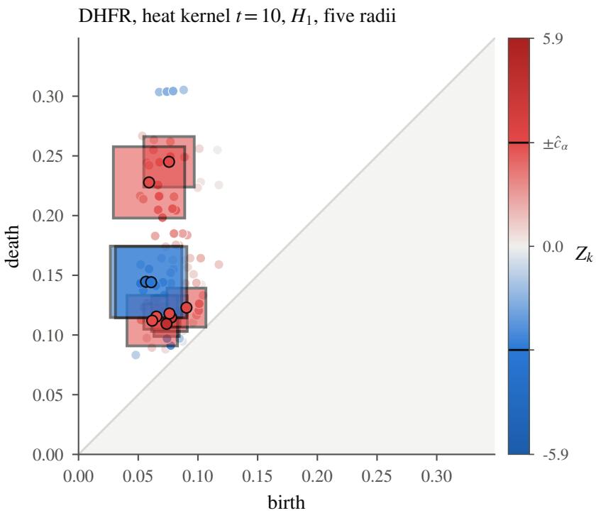  
Figure 4: DHFR, heat-kernel signature t = 10, degree one, A1 on the primary split: 20 localized coordinates at 10 centers.

Table 13: MUTAG: rings in the localized region of the primary maps (exploratory).
<table><tr><td>map</td><td>cycle basis</td><td>localized</td><td>rings in ≥ 3-fused systems in region</td><td>other rings in region</td></tr><tr><td>A1</td><td>minimum cycle basis</td><td>58</td><td>331/346 (0.96)</td><td>68/140 (0.49)</td></tr><tr><td>A1</td><td>cycle basis</td><td>58</td><td>297/312 (0.95)</td><td>68/140 (0.49)</td></tr><tr><td>F1</td><td>minimum cycle basis</td><td>3</td><td>7/346 (0.02)</td><td>24/140 (0.17)</td></tr><tr><td>F1</td><td>cycle basis</td><td>3</td><td>7/312 (0.02)</td><td>24/140 (0.17)</td></tr></table>

## E.4 Earlier molecular analysis

This analysis predates the deduplicated reanalysis above. We retain its reported results and preprocessing separately. MUTAG, COX2, DHFR, and PTC (Morris et al., 2020) are binary activity classifications of small molecules. Following Majhi et al. (2026a), graphs were filtered using node labels, Ollivier–Ricci curvature, or the heat-kernel signature. Extended persistence diagrams in degrees zero and one were shifted to be nonnegative, with relative and extended points reflected above the diagonal. A stratified third of each dataset supplied the pilot, which placed and screened up to K = 200 landmarks. The band used the remaining observations and B = 5000.

Stability was assessed over 20 random splits. The reported measures were the fraction of one split’s localized landmarks recovered within their own radius by another split and the agreement of the top landmark (Table 14). Three datasets yielded localized contrasts, with substantially greater stability for MUTAG and DHFR than for COX2.

Under the heat-kernel filtration, the degree-zero maps localized 72 of 187 landmarks on MUTAG and 55 of 192 on DHFR. In degree one, the counts were 21 of 145 and 30 of 178. Another split recovered 89–97% of the localized region, and the top landmark agreed in 85–100% of splits. The earlier MUTAG map contained one cluster of short-lived cycles, born near 0.06–0.09 and dying near 0.09–0.12. DHFR contained two clusters (Figure 5).

A degree-one point in an extended graph diagram can represent an independent cycle or a branching of the superlevel sets. For a ring, the relevant values are the lowest and highest heat-kernel values over its atoms. In this earlier MUTAG analysis, the localized region contained 82% of rings in fused systems of three or more rings and 21% of other rings. Mutagenic compounds placed an average of 2.66 rings and 2.76 branchings in the region, compared with 0.35 and 1.03 in the other class.

Among compounds with the same largest ring system, the classes placed similar mass in the region. In this series, 91–100% of compounds with three or more fused rings were mutagenic, compared with 29–31% of the remaining compounds. These patterns are consistent with the fused-ring indicator of Debnath et al. (1991). Such ring systems also occur in larger molecules. An exploratory logistic regression retained an association between mutagenicity and the number of rings in the region after adjustment for atom count. Among compounds with 15–22 atoms, mutagenic compounds placed 1.8–2.8 rings there, compared with 0.4–0.7. The region was selected using these data, and the pilot helped construct it, so these summaries do not provide an independent test of a chemical explanation.

COX2 localized weakly and unstably: another split recovered 28–42% of the region. PTC, for which Majhi et al. (2026a) also reports weak topological features, gave one marginal landmark with $p = 0 . 0 4 4$ that no other split reproduced. This provides no stable localized finding, without establishing equality of the populations. The node-label filtration on MUTAG gave a strong global rejection, but its integer-valued coordinates concentrated the landmarks at three positions and provided little spatial resolution. The transport lower bound in Corollary B.1 was positive whenever a map localized a contrast, but was about $1 0 ^ { - 4 }$ of the frame and numerically small.

Table 14: Earlier molecular analysis under a pilot/inference split. The table reports the global p-value, sizes of the three localization sets, and stability over 20 random splits: the fraction of one split’s localized region recovered by another and agreement of the top landmark. These results use the earlier preprocessing and family construction in Appendix E.4.
<table><tr><td>dataset</td><td>filtration</td><td> $H _ { d }$ </td><td> $m { + } m ^ { \prime }$ </td><td>l</td><td> $\mathrm { m a x } _ { k } \left| Z _ { k } \right|$ </td><td> $\hat { c } _ { \alpha }$ </td><td>p</td><td>|Ř|</td><td> $| \hat { R } _ { \mathrm { s d } } |$ </td><td> $| \hat { R } _ { \mathrm { B H } } |$ </td><td>recovery</td><td>top agree</td></tr><tr><td>COX2</td><td>hks_t1</td><td> $H _ { 0 }$ </td><td> $2 4 3 + 6 8$ </td><td>196</td><td>3.92</td><td>3.23</td><td>0.0076</td><td>14</td><td>14</td><td>26</td><td>0.42</td><td>0.80</td></tr><tr><td>COX2</td><td>hks_t1</td><td> $H _ { 1 }$ </td><td> $2 4 3 + 6 8$ </td><td>196</td><td>3.11</td><td>3.32</td><td>0.0820</td><td>0</td><td>0</td><td>0</td><td>0.40</td><td>1.00</td></tr><tr><td>COX2</td><td>hks_t10</td><td> $H _ { 0 }$ </td><td> $2 4 3 + 6 8$ </td><td>182</td><td>3.73</td><td>4.27</td><td>0.1144</td><td>0</td><td>0</td><td>2</td><td>0.12</td><td>0.00</td></tr><tr><td>COX2</td><td>hks_t10</td><td> $H _ { 1 }$ </td><td> $2 4 3 + 6 8$ </td><td>168</td><td>7.83</td><td>6.78</td><td>0.0268</td><td>1</td><td>3</td><td>9</td><td>0.34</td><td>0.65</td></tr><tr><td>COX2</td><td>ricci</td><td> $H _ { 0 }$ </td><td> $2 4 3 + 6 8$ </td><td>164</td><td>4.19</td><td>4.07</td><td>0.0418</td><td>1</td><td>1</td><td>1</td><td>0.28</td><td>0.60</td></tr><tr><td>COX2</td><td>ricci</td><td> $H _ { 1 }$ </td><td> $2 4 3 + 6 8$ </td><td>192</td><td>3.96</td><td>3.18</td><td>0.0048</td><td>2</td><td>2</td><td>2</td><td>0.35</td><td>0.55</td></tr><tr><td>DHFR</td><td>hks_t10</td><td> $H _ { 0 }$ </td><td> $1 9 7 + 3 0 7$ </td><td>192</td><td>9.52</td><td>3.61</td><td>0.0002</td><td>55</td><td>56</td><td>82</td><td>0.97</td><td>1.00</td></tr><tr><td>DHFR</td><td>hks_t10</td><td> $H _ { 1 }$ </td><td> $1 9 7 + 3 0 7$ </td><td>178</td><td>7.69</td><td>3.93</td><td>0.0002</td><td>30</td><td>32</td><td>65</td><td>0.94</td><td>0.90</td></tr><tr><td>MUTAG</td><td>hks_t10</td><td> $H _ { 0 }$ </td><td> $4 2 + 8 3$ </td><td>187</td><td>7.71</td><td>3.89</td><td>0.0002</td><td>72</td><td>87</td><td>132</td><td>0.89</td><td>0.85</td></tr><tr><td>MUTAG</td><td>hks_t10</td><td> $H _ { 1 }$ </td><td> $4 2 + 8 3$ </td><td>145</td><td>8.80</td><td>5.07</td><td>0.0002</td><td>21</td><td>22</td><td>76</td><td>0.94</td><td>0.90</td></tr><tr><td>MUTAG</td><td>nodelabel</td><td> $H _ { 0 }$ </td><td> $4 2 + 8 3$ </td><td>73</td><td>1.61</td><td>2.27</td><td>0.2012</td><td>0</td><td>0</td><td>0</td><td>0.00</td><td>0.30</td></tr><tr><td>MUTAG</td><td>nodelabel</td><td> $H _ { 1 }$ </td><td> $4 2 + 8 3$ </td><td>164</td><td>3.58</td><td>2.30</td><td>0.0004</td><td>141</td><td>141</td><td>141</td><td>0.85</td><td>0.70</td></tr><tr><td>PTC</td><td>hks_t10</td><td> $H _ { 0 }$ </td><td> $1 2 8 { + } 1 0 1$ </td><td>177</td><td>2.92</td><td>4.36</td><td>0.4777</td><td>0</td><td>0</td><td>0</td><td>0.04</td><td>0.60</td></tr><tr><td>PTC</td><td>hks_t10</td><td> $H _ { 1 }$ </td><td> $1 2 8 { + } 1 0 1$ </td><td>145</td><td>3.17</td><td>4.17</td><td>0.3015</td><td>0</td><td>0</td><td>0</td><td></td><td>0.40</td></tr><tr><td>PTC</td><td>hks_t5</td><td> $H _ { 0 }$ </td><td> $1 2 8 { + } 1 0 1$ </td><td>181</td><td>3.20</td><td>4.32</td><td>0.2478</td><td>0</td><td>0</td><td>0</td><td></td><td>0.00</td></tr><tr><td>PTC</td><td>hks_t5</td><td> $H _ { 1 }$ </td><td> $1 2 8 { + } 1 0 1$ </td><td>163</td><td>3.88</td><td>3.82</td><td>0.0442</td><td>1</td><td>1</td><td>1</td><td></td><td>0.30</td></tr></table>

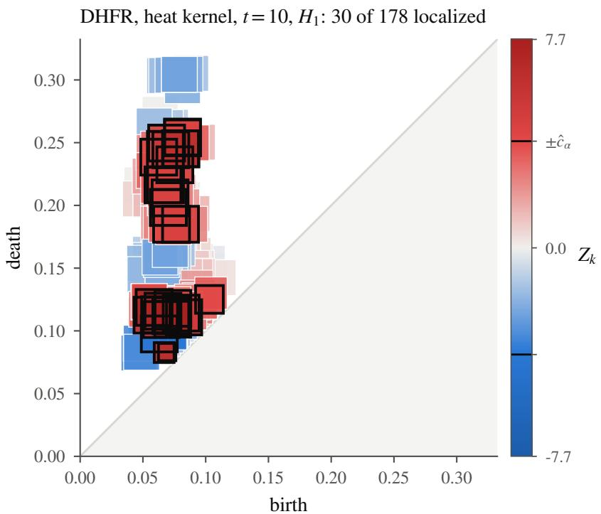  
Figure 5: DHFR under the heat-kernel filtration at $t = 1 0 ,$ degree one: 30 of 178 landmarks localized, in two clusters of cycles born near 0.06–0.10, dying near 0.08–0.13 and 0.18–0.25; another random pilot/inference split recovers, on average, 94% of the region.

## F Additional simulation studies

These experiments preceded the fixed-budget studies in Appendix D. We retain their designs and reported numerical results. Their pilot allocation, jitter, normalization, and null-coordinate definitions difer from those used in the main experiments.

## F.1 Design and evaluation

Except for the cross-fitting arm described below, the pilot contains 200 diagrams per class in addition to the m inference diagrams. Thus $m = 2 0$ corresponds to 220 diagrams per class in total. Responses are normalized by pilot variances,

$$
\widehat { \omega } _ { k } ^ { 2 } = \frac { m ^ { \prime } } { N } \widetilde { s } _ { P , k } ^ { 2 } + \frac { m } { N } \widetilde { s } _ { Q , k } ^ { 2 } ,
$$

instead of deterministic scales. After the radius cap, the pilot screen removes no landmarks from the two coarser grids, at most 2 of 210, 17–22 of the finest grid’s 406, and at most 6 of 400 pilot-fitted landmarks.

Each diagram has 20 uniform background points above the diagonal in $[ 0 , 1 ] ^ { 2 }$ and one feature with Gaussian jitter of scale 0.02. Group A has its feature at (0.30, 0.50). In the persistence regime, group B moves it to $( 0 . 3 0 , 0 . 5 0 + \Delta )$ . In the location regime, it moves to $( 0 . 3 0 + \Delta , 0 . 5 0 + \Delta )$ , preserving lifetime. The calibration and localization studies use the persistence regime unless stated otherwise.

At $\Delta = 0 .$ every coordinate is null. For $\Delta > 0 ,$ a coordinate is counted as null when its ball, enlarged by four jitter scales, cannot contain either signal location. With Gaussian jitter this is a geometric proxy, not an exact test of $\delta _ { k } = 0$ . The population contrasts used to evaluate coverage are estimated from a reference sample of 20,000 diagrams per class under the same family ν. Alternative-case error rates below use this geometric classification. They are distinct from the exact-null error rates in Appendix D.

The comparisons involving estimated normalization are finite-sample findings for these designs. Pilot normalization is not a general requirement or a universal remedy. In particular, with one coordinate a positive normalization factor cancels from the interval. The asymptotic conditions for inference-based normalization are given in Appendix A.2.

## F.2 Level, coverage, and the price of simultaneity

At $\Delta = 0$ , FWER is one minus simultaneous coverage. We use 500 replications and $B = 2 0 0 0$ , with grids of 55, 105, 210, and 406 landmarks; between 50 and 400 pilot-fitted landmarks; and $m \in \{ 2 0 , 4 0 , 6 0 \}$ (Table 15, Figure 6).

For the grid, the reported FWER ranges from 0.054 at ℓ = 55 to 0.006 at the finest resolution. For pilot-fitted landmarks, it ranges from 0.008 to 0.048 across the reported sample sizes, including $m = 2 0$ and $m = 6 0$ . The normal-reference Bonferroni procedure has rates of 0.07–0.11 for $\ell \leq 1 0 5 , 0 . 1 8 { - } 0 . 2 5$ near $\ell = 2 1 0$ , and 0.33–0.48 at the finest resolution. These failures concern its marginal normal calibration; Bonferroni adjustment itself controls FWER when applied to valid marginal tests.

At fine resolution, many responses are sparse, and their variances relative to the estimated pilot scales vary substantially. The bootstrap critical value reaches 5–6, compared with about 3.8 for the unit-normal reference. This wider band reduces power on the fine grid at $m = 2 0$ (Appendix F.5). Pilot-fitted landmarks concentrate on occupied regions and keep the critical value within 0.7 of the Bonferroni reference. The latter still gives FWER 0.054–0.088 in those cells. This supports pilot-fitted placement under this design with a separate pilot; the fixed-budget comparisons in Appendix D address the cost of obtaining the pilot observations.

## F.3 Finite-sample behavior of estimated normalization

Replacing the pilot scale by the groupwise estimate $\{ ( m ^ { \prime } / N ) s _ { P , k } ^ { 2 } + ( m / N ) s _ { Q , k } ^ { 2 } \} ^ { 1 / 2 }$ gives FWER 0.04–0.06 at ℓ = 105 in balanced designs. It can overreject substantially under imbalance. With 20 versus 60 inference diagrams and $\Delta = 0$ , 2000 replications give FWER 0.51 for the sample-normalized band and 0.45 for the normal-reference Bonferroni procedure. The permutation maximum gives 0.064, with rates 0.036–0.064 over this experiment’s twelve null cells.

Figure 7 shows a heavy lower tail in the null $Z _ { k }$ values. Third-moment-matching wild multipliers increase FWER to 0.69, while Efron’s bootstrap is conservative, with critical value 6.7 and FWER 0.002. Matching skewness alone therefore does not resolve the calibration problem in this experiment. A relevant mechanism is the dependence between the smaller group’s sample mean and variance on count-like coordinates. When that group observes little local mass, both estimates can be small, inflating the normalized diference in those samples.

Table 15: Level and coverage at $\Delta = 0$ in the earlier additional-pilot studies, for $m \in \{ 2 0 , 6 0 \}$ . All sample sizes appear in Appendix F.9. Every coordinate is null, so FWER of $\widehat { R }$ is one minus coverage, and the step-down set makes any rejection exactly when $\widehat { R }$ does. The table compares FWER of $\widehat { R }$ and normal-reference Bonferroni, and the bootstrap critical value $\widehat { c } _ { \alpha }$ with $z _ { 1 - \alpha / ( 2 \ell ) }$
<table><tr><td>placement</td><td>l</td><td>m</td><td>cover</td><td> $\mathrm { F W E R } _ { \mathrm { b o o t } }$ </td><td> $\mathrm { F W E R } _ { \mathrm { B o n f } }$ </td><td> $\hat { c } _ { \alpha } ~ / ~ z _ { \mathrm { B o n f } }$ </td><td></td></tr><tr><td>FPS</td><td>50</td><td>20</td><td>0.978</td><td>0.022</td><td>0.070</td><td>3.64</td><td>/3.29</td></tr><tr><td>FPS</td><td>50</td><td>60</td><td>0.970</td><td>0.030</td><td>0.054</td><td>3.47 / 3.29</td><td></td></tr><tr><td>FPS</td><td>100</td><td>20</td><td>0.984</td><td>0.016</td><td>0.086</td><td>3.84</td><td>4 / 3.48</td></tr><tr><td>FPS</td><td>100</td><td>60</td><td>0.952</td><td>0.048</td><td>0.082</td><td>3.62</td><td>/3.48</td></tr><tr><td>FPS</td><td>200</td><td>20</td><td>0.988</td><td>0.012</td><td>0.086</td><td>4.15</td><td>/ 3.66</td></tr><tr><td>FPS</td><td>200</td><td>60</td><td>0.968</td><td>0.032</td><td>0.056</td><td>3.86</td><td>/ 3.66</td></tr><tr><td>FPS</td><td>395</td><td>20</td><td>0.992</td><td>0.008</td><td>0.082</td><td>4.50</td><td>/ 3.83</td></tr><tr><td>FPS</td><td>395</td><td>60</td><td>0.966</td><td>0.034</td><td>0.066</td><td>4.12</td><td>/3.83</td></tr><tr><td>grid</td><td>55</td><td>20</td><td>0.966</td><td>0.034</td><td>0.088</td><td>3.67</td><td>/3.32</td></tr><tr><td>grid</td><td>55</td><td>60</td><td>0.946</td><td>0.054</td><td>0.084</td><td>3.50</td><td>/3.32</td></tr><tr><td>grid</td><td>105</td><td>20</td><td>0.986</td><td>0.014</td><td>0.106</td><td>4.06</td><td>/ 3.49</td></tr><tr><td>grid</td><td>105</td><td>60</td><td>0.968</td><td>0.032</td><td>0.074</td><td>3.77</td><td>/3.49</td></tr><tr><td>grid</td><td>208</td><td>20</td><td>0.982</td><td>0.018</td><td>0.252</td><td>4.98</td><td>/3.67</td></tr><tr><td>grid</td><td>208</td><td>60</td><td>0.978</td><td>0.022</td><td>0.198</td><td>4.41</td><td>/ 3.67</td></tr><tr><td>grid</td><td>385</td><td>20</td><td>0.990</td><td>0.010</td><td>0.482</td><td>5.99</td><td>/3.83</td></tr><tr><td>grid</td><td>385</td><td>60</td><td>0.994</td><td>0.006</td><td>0.332</td><td>5.16</td><td>/3.83</td></tr></table>

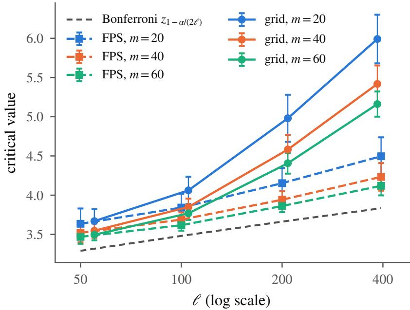  
Figure 6: Bootstrap critical values against ℓ in the earlier additional-pilot design. For pilot-fitted landmarks, the values lie slightly above the normal-reference Bonferroni threshold $z _ { 1 - \alpha / ( 2 \ell ) }$ , which grows at order ${ \sqrt { \log \ell } } .$ Fine grids $\mathrm { g i v e }$ larger values because sparse responses yield greater variation in coordinate variances relative to the estimated pilot factors (Proposition 1). The normal-reference Bonferroni procedure overrejects in these comparisons (Table 15).

With the independent pilot scale, the statistic is linear in the inference observations. The reported FWER is 0.023, coverage is 0.98, and power is unchanged in this design. Normal-reference Bonferroni remains liberal at 0.12, because the pilot factors only approximate the true standard deviations. These results do not contradict the asymptotic estimated-normalization result in Appendix A.2; they show that its approximation can be poor at these sample sizes.

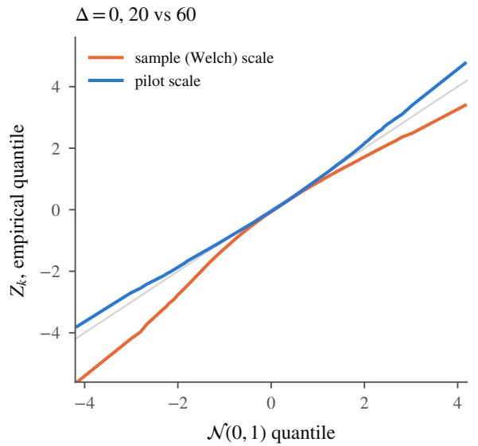

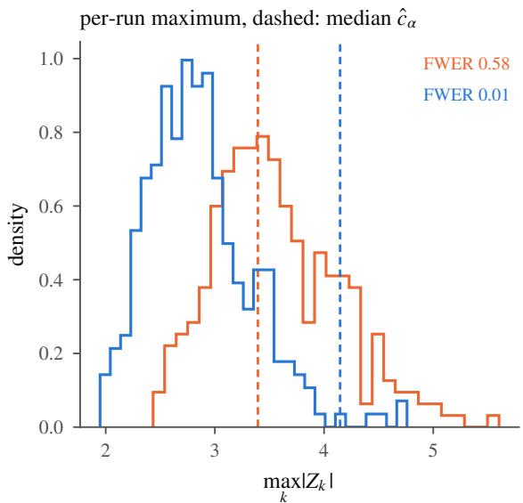  
Figure 7: Estimated normalization under imbalance. At $\Delta = 0$ , all coordinates are null. The design uses 20 versus 60 inference diagrams, $\ell = 1 0 5$ , and 300 runs. Left: empirical quantiles of $Z _ { k }$ against $\mathcal { N } ( 0 , 1 )$ using groupwise sample SDs or independent pilot factors. Right: each run’s maximum and bootstrap critical value, with FWER calculated over these runs.

## F.4 Selection on the inference sample

Selecting the K largest $\lvert Z _ { k } \rvert$ values from 4K candidate landmarks on the inference sample, then recalibrating a band on that same sample, gives FWER 0.13–0.24 at $\Delta = 0$ . These results span $K \in \{ 5 0 , 1 0 0 , 2 0 0 \}$ and $m \in \{ 2 0 , 4 0 , 6 0 \}$ and reach almost five times the nominal level. Making the same selection on an independent pilot gives 0.016–0.036 (Table 16).

Class-aware farthest-point placement fitted on the inference sample, also with inference-based scales, gives FWER 0.026–0.068. This placement seeks to cover occupied regions rather than directly maximize the observed contrast. The two findings distinguish the selection rules in these experiments, but neither supplies a general guarantee for a family fitted on the inference sample. Independent selection or cross-fitting provides one route to a justified analysis. Keeping a subset of an already calibrated full-family band is also valid, as explained in Remark C.1.

## F.5 Localization

With pilot-fitted landmarks and $K \ge 1 0 0$ , the band localizes the signal in at least 99% of runs for every $\Delta \ge 0 . 1 0$ when $m \geq 4 0$ , and in 70–98% when $m = 2 0$ (Table 17). The reported false-discovery proportion of Rb is below $0 . 0 1 5 ;$ for Benjamini–Hochberg it is at most 0.04. The center with the largest $| Z _ { k } |$ is within 0.006–0.036 of the signal in bottleneck distance, a fraction of a landmark radius. Figure 8 shows one run. The coarse grid behaves similarly.

At the finest grid and $m = 2 0$ , the band’s power falls to 0.01–0.03. Bonferroni reaches 0.64–0.70, but its null FWER is 0.48; Benjamini–Hochberg has a false-discovery proportion of 0.16–0.24. These comparisons illustrate the dificulty of calibrating sparse responses at a fine resolution. Pilot-fitted placement avoids this dificulty in the reported design. With only $K = 5 0$ , however, the displaced feature can move beyond the selected neighborhoods: power is 0.08–0.49 at $\Delta = 0 . 3 0$ . Increasing to $K = 1 0 0$ closes that gap.

Table 16: Placement, selection, and normalization in the earlier studies. Comparisons include inference-sample versus pilot placement and selection $( m = m ^ { \prime } \in \{ 2 0 , 6 0 \} )$ , sample versus pilot normalization in balanced and 20-versus-60 designs, and the weak null. Inference-sample arms have no pilot. $\mathrm { A t } \ \Delta = 0 .$ , every target contrast is zero and FWER is the probability of any rejection. Coverage of a random family is defined, but a family fitted on the inference sample is not covered by the fixed-family theorem. The table reports the available coverage and FWER results for the band, normal-reference Bonferroni, and, where run, the permutation maximum, together with power at $\Delta = 0 . 2 0 .$
<table><tr><td>arm</td><td>scale</td><td>l</td><td> $m / m ^ { \prime }$ </td><td>cover</td><td> $\mathrm { F W E R } _ { \mathrm { b o o t } }$ </td><td> $\mathrm { F W E R } _ { \mathrm { B o n f } }$ </td><td> $\mathrm { F W E R } _ { \mathrm { p e r m } }$ </td><td> $\mathrm { p o w e r } _ { 0 . 2 }$ </td><td> $\hat { c } _ { \alpha }$ </td></tr><tr><td>FPS in-sample</td><td>sample</td><td>49</td><td>20  / 20</td><td></td><td>0.042</td><td>0.036</td><td></td><td>0.87</td><td>3.16</td></tr><tr><td>FPS in-sample</td><td>sample</td><td>49</td><td>60 / 60</td><td></td><td>0.044</td><td>0.030</td><td></td><td>0.98</td><td>3.23</td></tr><tr><td>FPS in-sample</td><td>sample</td><td>99</td><td>20 / 20</td><td></td><td>0.068</td><td>0.040</td><td></td><td>0.96</td><td>3.33</td></tr><tr><td>FPS in-sample</td><td>sample</td><td>99</td><td>60 / 60</td><td></td><td>0.028</td><td>0.026</td><td></td><td>1.00</td><td>3.41</td></tr><tr><td>FPS in-sample</td><td>sample</td><td>199</td><td>20 / 20</td><td></td><td>0.060</td><td>0.032</td><td></td><td>1.00</td><td>3.49</td></tr><tr><td>FPS in-sample</td><td>sample</td><td>199</td><td>60 / 60</td><td></td><td>0.026</td><td>0.022</td><td></td><td>1.00</td><td>3.57</td></tr><tr><td>grid, 20 vs 60</td><td>pilot</td><td>105</td><td>20 / 60</td><td>0.977</td><td>0.023</td><td>0.124</td><td>0.051</td><td>1.00</td><td>4.18</td></tr><tr><td>grid, 20 vs 60</td><td>pilot</td><td>385</td><td>20 / 60</td><td>0.989</td><td>0.011</td><td>0.658</td><td>0.051</td><td></td><td>6.64</td></tr><tr><td>grid, 20 vs 60</td><td>sample</td><td>105</td><td>20 / 60</td><td>0.489</td><td>0.510</td><td>0.446</td><td>0.064</td><td>1.00</td><td>3.39</td></tr><tr><td>grid, 20 vs 60</td><td>sample</td><td>385</td><td>20 / 60</td><td>0.969</td><td>0.031</td><td>0.019</td><td>0.044</td><td></td><td>3.70</td></tr><tr><td>grid, balanced</td><td>pilot</td><td>105</td><td>20 /  20</td><td>0.979</td><td>0.021</td><td>0.111</td><td>0.052</td><td>1.00</td><td>4.06</td></tr><tr><td>grid, balanced</td><td>pilot</td><td>385</td><td>20 / 20</td><td>0.992</td><td>0.008</td><td>0.503</td><td>0.036</td><td></td><td>6.01</td></tr><tr><td>grid, balanced</td><td>sample</td><td>105</td><td>20 / 20</td><td>0.945</td><td>0.056</td><td>0.036</td><td>0.057</td><td>1.00</td><td>3.37</td></tr><tr><td>grid, balanced</td><td>sample</td><td>385</td><td>20 / 20</td><td>0.997</td><td>0.003</td><td>0.002</td><td>0.046</td><td></td><td>3.61</td></tr><tr><td>pilot FPS</td><td>pilot</td><td>50</td><td>20  /  20</td><td>0.978</td><td>0.022</td><td>0.070</td><td></td><td>0.97</td><td>3.64</td></tr><tr><td>pilot FPS</td><td>pilot</td><td>50</td><td>60 / 60</td><td>0.970</td><td>0.030</td><td>0.054</td><td></td><td>1.00</td><td>3.47</td></tr><tr><td>pilot FPS</td><td>pilot</td><td>100</td><td>20 / 20</td><td>0.984</td><td>0.016</td><td>0.086</td><td></td><td>0.81</td><td>3.84</td></tr><tr><td>pilot FPS</td><td>pilot</td><td>100</td><td>60 / 60</td><td>0.952</td><td>0.048</td><td>0.082</td><td></td><td>1.00</td><td>3.62</td></tr><tr><td>pilot FPS</td><td>pilot</td><td>200</td><td>20 / 20</td><td>0.988</td><td>0.012</td><td>0.086</td><td></td><td>0.94</td><td>4.15</td></tr><tr><td>pilot FPS</td><td>pilot</td><td>200</td><td>60 / 60</td><td>0.968</td><td>0.032</td><td>0.056</td><td></td><td>1.00</td><td>3.86</td></tr><tr><td>pilot FPS</td><td>pilot</td><td>395</td><td>20 / 20</td><td>0.992</td><td>0.008</td><td>0.082</td><td></td><td></td><td>4.50</td></tr><tr><td>pilot FPS</td><td>pilot</td><td>395</td><td>60 / 60</td><td>0.966</td><td>0.034</td><td>0.066</td><td></td><td></td><td>4.12</td></tr><tr><td>selection in-sample</td><td>sample</td><td>50</td><td>20 /  20</td><td></td><td>0.142</td><td>0.108</td><td></td><td>1.00</td><td>3.15</td></tr><tr><td>selection in-sample</td><td>sample</td><td>50</td><td>60 / 60</td><td></td><td>0.154</td><td>0.120</td><td></td><td>1.00</td><td>3.21</td></tr><tr><td>selection in-sample</td><td>sample</td><td>100</td><td>20 / 20</td><td></td><td>0.218</td><td>0.124</td><td></td><td>1.00</td><td>3.31</td></tr><tr><td>selection in-sample</td><td>sample</td><td>100</td><td>60 / 60</td><td></td><td>0.136</td><td>0.092</td><td></td><td>1.00</td><td>3.38</td></tr><tr><td>selection in-sample</td><td>sample</td><td>200</td><td>20 / 20</td><td></td><td>0.242</td><td>0.108</td><td></td><td>1.00</td><td>3.40</td></tr><tr><td>selection in-sample</td><td>sample</td><td>200</td><td>60 / 60</td><td></td><td>0.128</td><td>0.070</td><td></td><td>1.00</td><td>3.50</td></tr><tr><td>selection on pilot</td><td>pilot</td><td>50</td><td>20  / 20</td><td>0.984</td><td>0.016</td><td>0.080</td><td></td><td>0.99</td><td>3.66</td></tr><tr><td>selection on pilot selection on pilot</td><td>pilot</td><td>50</td><td>60 / 60</td><td>0.966</td><td>0.034</td><td>0.062</td><td></td><td>1.00</td><td>3.47</td></tr><tr><td>selection on pilot</td><td>pilot</td><td>100</td><td>20 / 20</td><td>0.980</td><td>0.020</td><td>0.080</td><td></td><td>1.00</td><td>3.92</td></tr><tr><td></td><td>pilot</td><td>100</td><td>60 / 60</td><td>0.968</td><td>0.032</td><td>0.074</td><td></td><td>1.00</td><td>3.65</td></tr><tr><td>selection on pilot selection on pilot</td><td>pilot</td><td>200</td><td>20 /20</td><td>0.980</td><td>0.020</td><td>0.068</td><td></td><td>1.00</td><td>4.15</td></tr><tr><td></td><td>pilot</td><td>200</td><td>60 / 60</td><td>0.974</td><td>0.026</td><td>0.044</td><td></td><td>1.00</td><td>3.81</td></tr><tr><td>weak null, FPS</td><td>pilot</td><td>100</td><td>20  / 60</td><td>0.968</td><td>0.032</td><td>0.104</td><td>0.048</td><td></td><td>3.98</td></tr><tr><td>weak null, FPS weak null, FPS</td><td>pilot</td><td>396</td><td>20 / 60</td><td>0.981</td><td>0.019</td><td>0.174</td><td>0.049</td><td></td><td>4.83</td></tr><tr><td></td><td>sample</td><td>100</td><td>20 / 60</td><td>0.589</td><td>0.411</td><td>0.327</td><td>0.058</td><td></td><td>3.35</td></tr><tr><td>weak null, FPS</td><td>sample</td><td>396</td><td>20 / 60</td><td>0.482</td><td>0.518</td><td>0.386</td><td>0.053</td><td></td><td>3.64</td></tr><tr><td>weak null, grid</td><td>pilot</td><td>105</td><td>20 / 60</td><td>0.980</td><td>0.020</td><td>0.150</td><td>0.051</td><td></td><td>4.21</td></tr><tr><td>weak null, grid</td><td>pilot</td><td>382</td><td>20 / 60</td><td>0.993</td><td>0.007</td><td>0.626</td><td>0.045</td><td></td><td>6.45 3.39</td></tr><tr><td>weak null, grid weak null, grid</td><td>sample sample</td><td>105 382</td><td>20 / 60 20 / 60</td><td>0.472 0.973</td><td>0.528 0.027</td><td>0.446 0.015</td><td>0.064 0.040</td></table>

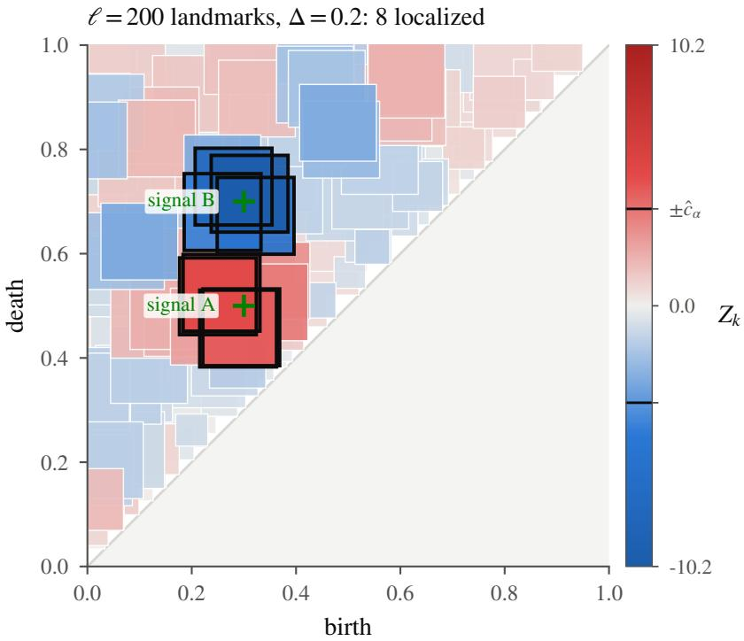  
Figure 8: The band on the synthetic task, one run at $\Delta = 0 . 2 0 , m = 6 0 \colon$ class B carries the same features as class A with one feature displaced from the location marked A to the location marked $B ;$ the band localizes the displacement and nothing else.

Table 17: Earlier localization study at $\Delta \in \{ 0 . 1 0 , 0 . 3 0 \}$ and $m \in \{ 2 0 , 6 0 \}$ , for the coarsest and finest placements. Complete tables appear in Appendix F.9. Power: at least one signal landmark localized. FDR: the reported falsediscovery summary using the geometric nulls defined in Appendix F.1. Localization error: bottleneck distance from the top landmark to the nearer signal. The finest grid retains 384–389 of its 406 landmarks after capping and pilot screening, depending on $\Delta .$
<table><tr><td>placement</td><td> $\ell$ </td><td> $\Delta$ </td><td>m</td><td>cover</td><td> $\mathrm { p o w e r } _ { \mathrm { b o o t } }$ </td><td> $\mathrm { p o w e r } _ { \mathrm { B o n f } }$ </td><td>powerBH</td><td> $\mathrm { F D R } _ { \mathrm { B H } }$ </td><td> $\mathrm { F D R } _ { \mathrm { b o o t } }$ </td><td>loc. err.</td></tr><tr><td>FPS</td><td>50</td><td>0.10</td><td>20</td><td>0.970</td><td>0.46</td><td>0.54</td><td>0.55</td><td>0.025</td><td>0.006</td><td>0.073</td></tr><tr><td>FPS</td><td>50</td><td>0.10</td><td>60</td><td>0.976</td><td>0.99</td><td>0.99</td><td>1.00</td><td>0.020</td><td>0.005</td><td>0.043</td></tr><tr><td>FPS</td><td>50</td><td>0.30</td><td>20</td><td>0.974</td><td>0.08</td><td>0.15</td><td>0.15</td><td>0.021</td><td>0.013</td><td>0.108</td></tr><tr><td>FPS</td><td>50</td><td>0.30</td><td>60</td><td>0.966</td><td>0.49</td><td>0.56</td><td>0.58</td><td>0.027</td><td>0.013</td><td>0.075</td></tr><tr><td>FPS</td><td>399</td><td>0.10</td><td>20</td><td>0.994</td><td>0.95</td><td>0.99</td><td>0.99</td><td>0.040</td><td>0.000</td><td>0.007</td></tr><tr><td>FPS</td><td>399</td><td>0.10</td><td>60</td><td>0.974</td><td>1.00</td><td>1.00</td><td>1.00</td><td>0.034</td><td>0.002</td><td>0.006</td></tr><tr><td>FPS</td><td>395</td><td>0.30</td><td>20</td><td>0.988</td><td>0.96</td><td>1.00</td><td>1.00</td><td>0.019</td><td>0.000</td><td>0.016</td></tr><tr><td>FPS</td><td>395</td><td>0.30</td><td>60</td><td>0.972</td><td>1.00</td><td>1.00</td><td>1.00</td><td>0.013</td><td>0.001</td><td>0.013</td></tr><tr><td>grid</td><td>55</td><td>0.10</td><td>20</td><td>0.958</td><td>0.99</td><td>1.00</td><td>1.00</td><td>0.033</td><td>0.006</td><td>0.016</td></tr><tr><td>grid</td><td>55</td><td>0.10</td><td>60</td><td>0.966</td><td>1.00</td><td>1.00</td><td>1.00</td><td>0.027</td><td>0.007</td><td>0.016</td></tr><tr><td>grid</td><td>55</td><td>0.30</td><td>20</td><td>0.970</td><td>0.98</td><td>1.00</td><td>1.00</td><td>0.025</td><td>0.004</td><td>0.019</td></tr><tr><td>grid</td><td>55</td><td>0.30</td><td>60</td><td>0.954</td><td>1.00</td><td>1.00</td><td>1.00</td><td>0.026</td><td>0.006</td><td>0.018</td></tr><tr><td>grid</td><td>389</td><td>0.10</td><td>20</td><td>0.998</td><td>0.01</td><td>0.64</td><td>0.71</td><td>0.237</td><td>0.000</td><td>0.078</td></tr><tr><td>grid</td><td>389</td><td>0.10</td><td>60</td><td>0.990</td><td>0.89</td><td>1.00</td><td>1.00</td><td>0.125</td><td>0.002</td><td>0.005</td></tr><tr><td>grid</td><td>385</td><td>0.30</td><td>20</td><td>0.994</td><td>0.01</td><td>0.67</td><td>0.75</td><td>0.164</td><td>0.000</td><td>0.068</td></tr><tr><td>grid</td><td>385</td><td>0.30</td><td>60</td><td>0.988</td><td>0.89</td><td>1.00</td><td>1.00</td><td>0.085</td><td>0.003</td><td>0.006</td></tr></table>

## F.6 Comparison with pixelwise image inference

The image comparator applies one test per persistence-image pixel and a Westfall–Young permutation maximum for family-wise calibration under exchangeability. The image tiles birth–persistence coordinates with 8 to 21 pixels per axis. Each point is weighted by persistence and spread by a Gaussian kernel one pixel wide, truncated at three standard deviations. This additive map also admits the multiplier band. These settings difer from the constant-weight, untruncated images in Appendix D.

Table 18 compares both maps under both calibrations on the same replications. With comparable numbers of coordinates and $m = 2 0$ , pilot-fitted landmarks localize more often. At $\Delta = 0 . 1 0$ , bootstrap power is 70–94% for $K \in \{ 1 0 0 , 2 0 0 \}$ , compared with 15–23% for 111 or 189 image pixels. At $\Delta = 0 . 2 0$ , localization error is 0.02–0.04 for the landmarks and 0.03–0.07 for the images. With $m = 6 0$ , both maps approach full power once the image contains at least 189 pixels.

The calibration diference is smaller. At $K \ : = \ : 1 0 0$ and $m \ : = \ : 2 0$ , the permutation maximum rejects with probability 0.82, compared with 0.70 for the bootstrap. Across the null comparisons, FWER is 0.040–0.084 for permutation and 0.012–0.066 for the bootstrap. The bootstrap critical value reflects variation in coordinate variances relative to their pilot scales: 3.84, compared with 3.59 for permutation in the reported comparison. Efron’s bootstrap with fixed normalization is more conservative still, with critical value 3.92.

Under alternatives, false-localization rates over the geometric null coordinates are 0.002–0.022 for permutation and 0.002–0.018 for the bootstrap. Permutation thus provides a valid test under exchangeability and is somewhat more powerful in these comparisons. That validity does not extend automatically to equal mean measures with diferent group laws.

The unequal-covariance designs in Appendix F.8 make this distinction visible. When the smaller group is more variable, the permutation maximum rejects in 9–18% of the clustered-design runs. Recomputing sample normalization for every permutation gives 18–33%, and 12–24% even in balanced clustered designs. The band ranges from 0.005 to 0.057 across all sixteen cells. The multiplier method also supplies simultaneous intervals for local mean contrasts, in addition to a rejection set.

Table 18: The mass-univariate baseline: persistence-image pixels against pilot-fitted landmarks, each calibrated by the bootstrap band and by the permutation maximum on the same 500 replications. FWER at $\Delta = 0$ over all coordinates; power: a signal coordinate localized; loc. err. at $\Delta = 0 . 2 0$
<table><tr><td colspan="3"></td><td colspan="2">FWER,  $\Delta = 0$ </td><td colspan="2">power,  $\Delta = 0 . 1 0$ </td><td colspan="3">power, ∆ = 0.20</td></tr><tr><td>map</td><td>l</td><td>m</td><td>boot</td><td>perm</td><td>boot</td><td>perm</td><td>boot</td><td>perm</td><td>loc. err.</td></tr><tr><td>image pixels</td><td>63</td><td>20</td><td>0.044</td><td>0.052</td><td>0.09</td><td>0.10</td><td>0.33</td><td>0.34</td><td>0.118</td></tr><tr><td>image pixels</td><td>63</td><td>60</td><td>0.042</td><td>0.042</td><td>0.35</td><td>0.35</td><td>0.90</td><td>0.90</td><td>0.084</td></tr><tr><td>image pixels</td><td>111</td><td>20</td><td>0.066</td><td>0.084</td><td>0.15</td><td>0.19</td><td>0.52</td><td>0.57</td><td>0.065</td></tr><tr><td>image pixels</td><td>111</td><td>60</td><td>0.046</td><td>0.050</td><td>0.67</td><td>0.70</td><td>0.99</td><td>0.99</td><td>0.039</td></tr><tr><td>image pixels</td><td>189</td><td>20</td><td>0.018</td><td>0.052</td><td>0.23</td><td>0.30</td><td>0.66</td><td>0.74</td><td>0.052</td></tr><tr><td>image pixels</td><td>189</td><td>60</td><td>0.054</td><td>0.066</td><td>0.97</td><td>0.98</td><td>1.00</td><td>1.00</td><td>0.033</td></tr><tr><td>image pixels</td><td>325</td><td>20</td><td>0.024</td><td>0.076</td><td>0.63</td><td>0.76</td><td>0.89</td><td>0.94</td><td>0.022</td></tr><tr><td>image pixels</td><td>325</td><td>60</td><td>0.034</td><td>0.054</td><td>1.00</td><td>1.00</td><td>1.00</td><td>1.00</td><td>0.019</td></tr><tr><td>landmarks (FPS)</td><td>100</td><td>20</td><td>0.016</td><td>0.064</td><td>0.70</td><td>0.82</td><td>0.81</td><td>0.88</td><td>0.036</td></tr><tr><td>landmarks (FPS)</td><td>100</td><td>60</td><td>0.048</td><td>0.076</td><td>1.00</td><td>1.00</td><td>1.00</td><td>1.00</td><td>0.034</td></tr><tr><td>landmarks (FPS)</td><td>200</td><td>20</td><td>0.012</td><td>0.050</td><td>0.94</td><td>0.97</td><td>0.94</td><td>0.97</td><td>0.020</td></tr><tr><td>landmarks (FPS)</td><td>200</td><td>60</td><td>0.032</td><td>0.040</td><td>1.00</td><td>1.00</td><td>1.00</td><td>1.00</td><td>0.016</td></tr></table>

## F.7 Lifetime-changing and lifetime-preserving shifts

Figure 9 and Table 19 compare six procedures at $m = 3 0$ per class: the band’s global maximum test; MMD with an additive Gaussian kernel on the same pilot-fitted embedding (Gretton et al., 2012); the log-rank statistic of Murris et al. (2026) with diagram-label permutation or pooled $\chi _ { 1 } ^ { 2 }$ calibration; landscape MMD (Bubenik, 2015); and persistence-image MMD (Adams et al., 2017). Permutation tests use 500 shufles. The surviva implementations are described in Appendix C.3. All six procedures have null rejection rates between 0.02 and 0.07 in these experiments.

In the persistence regime, the band reaches power 0.77 at $\Delta = 0 . 1 0$ and 0.87 at $\Delta = 0 . 2 0$ . Embedding MMD gives 0.76 and 0.88. Persistence-image MMD reaches 0.33 only at $\Delta = 0 . 3 0$ , and landscape MMD stays near its null rejection rate. Both survival tests remain at or below 0.15. Only one feature among the twenty background points changes lifetime, so the pooled lifetime distribution changes little.

In the location regime, the survival tests remain at their null rejection rates for every $\Delta ,$ as Proposition 3 implies. Landscape and image MMD also remain near their null rates in this particular design; the lifetimeinvariance proposition does not assert this for those methods. The band’s power is 0.63 at $\Delta = 0 . 0 5$ and 0.86 at $\Delta = 0 . 3 0$ , compared with 0.67 and 0.91 for embedding MMD. The two embedding-based methods have similar global power here. The band additionally identifies local contrasts and supplies their simultaneous intervals.

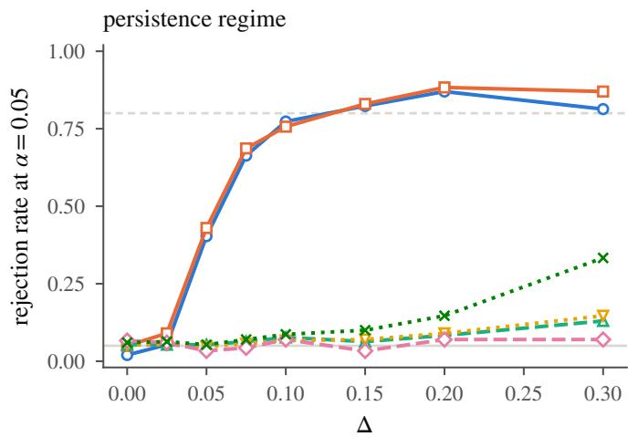

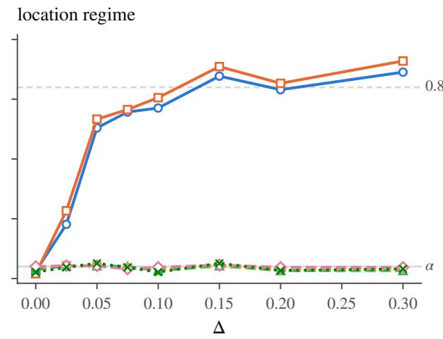  
band embedding MMD STRAND, diagram perm. STRAND, pooled landscape pers. image  
Figure 9: Rejection rate at $\alpha = 0 . 0 5$ against $\Delta , m = 3 0$ per class. Left: the signal’s lifetime changes. Right: the signal moves along the diagonal and its lifetime does not change; every lifetime-based procedure is at its level by Proposition 3.

Table 19: Rejection rates by method and regime.
<table><tr><td> $\Delta$ </td><td>0</td><td>0.025</td><td>0.05</td><td>0.075</td><td>0.1</td><td>0.15</td><td>0.2</td><td>0.3</td></tr><tr><td>persistence regime</td><td></td><td></td><td></td><td></td><td></td><td></td><td></td><td></td></tr><tr><td>band (max-t, bootstrap)</td><td>0.02</td><td>0.05</td><td>0.40</td><td>0.66</td><td>0.77</td><td>0.82</td><td>0.87</td><td>0.81</td></tr><tr><td>embedding MMD (permutation)</td><td>0.05</td><td>0.09</td><td>0.43</td><td>0.69</td><td>0.76</td><td>0.83</td><td>0.88</td><td>0.87</td></tr><tr><td>STRAND (diagram perm.)</td><td>0.05</td><td>0.05</td><td>0.05</td><td>0.06</td><td>0.08</td><td>0.06</td><td>0.08</td><td>0.13</td></tr><tr><td>STRAND (pooled asympt.)</td><td>0.05</td><td>0.05</td><td>0.05</td><td>0.06</td><td>0.07</td><td>0.07</td><td>0.09</td><td>0.15</td></tr><tr><td>landscape MMD</td><td>0.07</td><td>0.06</td><td>0.03</td><td>0.04</td><td>0.07</td><td>0.03</td><td>0.07</td><td>0.07</td></tr><tr><td>persistence-image MMD</td><td>0.06</td><td>0.06</td><td>0.05</td><td>0.07</td><td>0.09</td><td>0.10</td><td>0.15</td><td>0.33</td></tr><tr><td>location regime</td><td></td><td></td><td></td><td></td><td></td><td></td><td></td><td></td></tr><tr><td>band (max-t, bootstrap)</td><td>0.03</td><td>0.23</td><td>0.63</td><td>0.70</td><td>0.71</td><td>0.85</td><td>0.79</td><td>0.86</td></tr><tr><td>embedding MMD (permutation)</td><td>0.02</td><td>0.28</td><td>0.67</td><td>0.71</td><td>0.76</td><td>0.89</td><td>0.82</td><td>0.91</td></tr><tr><td>STRAND (diagram perm.)</td><td>0.04</td><td>0.05</td><td>0.05</td><td>0.05</td><td>0.03</td><td>0.05</td><td>0.03</td><td>0.03</td></tr><tr><td>STRAND (pooled asympt.)</td><td>0.04</td><td>0.05</td><td>0.05</td><td>0.04</td><td>0.04</td><td>0.05</td><td>0.04</td><td>0.04</td></tr><tr><td>landscape MMD</td><td>0.05</td><td>0.05</td><td>0.05</td><td>0.04</td><td>0.05</td><td>0.06</td><td>0.05</td><td>0.05</td></tr><tr><td>persistence-image MMD</td><td>0.03</td><td>0.05</td><td>0.06</td><td>0.05</td><td>0.03</td><td>0.06</td><td>0.03</td><td>0.04</td></tr></table>

## F.8 Cross-fitting and unequal-covariance nulls

Cross-fitting. This arm uses a fixed total of 40–120 diagrams per class, split into halves. Landmarks and normalization are fitted on one half and tested on the other at level $\alpha / 2 ,$ , then the roles are swapped. The reported localization set is the union of the two sets. Every diagram supplies inference once. Under the conditions for each held-out band, a union bound gives joint error control; the two original interval families remain separate. This experiment does not use the inner CV score introduced in Appendix D.5.

Null FWER is 0.014–0.046 across K from 50 to 400 and the reported total sample sizes. With 40 diagrams per class in total, localization is 79–100%. The earlier pilot/inference analysis with 20 inference diagrams per class gives 8–98%, but also uses its separate 200-diagram pilot. These rates therefore describe diferent total budgets. With 80 diagrams per class in total, cross-fitting localizes in at least 96% of runs.

A multiplicity weak null. Group A always has one point at the signal location, whereas group B has two with probability one half and none otherwise. The mean measures agree but the covariances difer. With groups of 20 and 60, the pilot-normalized bootstrap gives FWER 0.007–0.032 on the grid and with pilot-fitted landmarks. Normal-reference Bonferroni gives 0.10–0.63. The sample-normalized band gives 0.41–0.53, except for 0.03 on the finest grid. The permutation maximum with pilot normalization happens to give 0.045–0.051 in this design. Exchangeability does not hold; here the covariance diference is confined to coordinates near the signal, and the larger group is the more variable one.

More widespread covariance diferences. In the clustered design, each of group A’s 20 points independently chooses one of four fixed boxes. All 20 points of a group-B diagram instead share one randomly chosen box. Each point has the same marginal distribution in the two groups, so every $\delta _ { k } = 0$ . In the counts design, group B has 0 or 40 noise points where group A has 20. These constructions alter variability across the retained neighborhoods. In the clustered grid design, only coordinates whose neighborhoods meet the boxes pass the pilot screen.

Over 1000 replications per cell (Table 20), the band’s FWER is 0.005–0.057. The permutation maximum using pilot normalization gives 0.037–0.048 in balanced designs and 0.000–0.015 when the larger group is more variable. When the smaller group is more variable, it gives 9–18% in the clustered design and 4–9% in the counts design. In this allocation, pooling can understate the variance of the diference.

Recomputing sample normalization for each permutation does not repair the calibration in these cells: rejection rates are 18–33% in the unbalanced clustered comparison and 12–24% in balanced clustered designs. Sparse-coordinate variance estimation remains problematic at these sizes. Normal-reference Bonferroni with pilot normalization gives 0.010–0.035 for pilot-fitted landmarks in the clustered design and 0.10–0.53 in every other reported cell.

Table 20: Weak nulls with unequal covariance at every landmark. Every $\delta _ { k } = 0 .$ , so the FWER is the probability of any rejection; 1000 replications per cell. Pilot scale: the band, Bonferroni and the permutation maximum; sample scale: the band and the permutation maximum with each coordinate studentized by its sample variance. m $/ \ m ^ { \prime } $ : the sizes of classes A and $B ;$ class B is the more variable. On the grid only the landmarks that see the boxes pass the pilot screen.
<table><tr><td colspan="8">pilot scale</td><td colspan="2">sample scale</td></tr><tr><td>design</td><td>placement</td><td>l</td><td>m</td><td> $/ \ m ^ { \prime }$ </td><td>band</td><td>Bonf.</td><td>perm</td><td>band</td><td>perm</td></tr><tr><td>clustered</td><td>FPS</td><td>100</td><td></td><td>20 / 20</td><td>0.032</td><td>0.024</td><td>0.042</td><td>0.252</td><td>0.201</td></tr><tr><td>clustered</td><td>FPS</td><td>100</td><td></td><td>20 / 60</td><td>0.041</td><td>0.028</td><td>0.000</td><td>0.090</td><td>0.024</td></tr><tr><td>clustered</td><td>FPS</td><td>100</td><td>60</td><td>/20</td><td>0.048</td><td>0.035</td><td>0.178</td><td>0.343</td><td>0.184</td></tr><tr><td>clustered</td><td>FPS</td><td>400</td><td>20</td><td>/20</td><td>0.039</td><td>0.014</td><td>0.048</td><td>0.283</td><td>0.219</td></tr><tr><td>clustered</td><td>FPS</td><td>400</td><td>20</td><td>/60</td><td>0.057</td><td>0.010</td><td>0.001</td><td>0.121</td><td>0.024</td></tr><tr><td>clustered</td><td>FPS</td><td>400</td><td></td><td>60 /  20</td><td>0.026</td><td>0.021</td><td>0.135</td><td>0.352</td><td>0.187</td></tr><tr><td>clustered</td><td>grid</td><td>59</td><td>20</td><td>/ 20</td><td>0.027</td><td>0.107</td><td>0.041</td><td>0.245</td><td>0.239</td></tr><tr><td>clustered</td><td>grid</td><td>59</td><td>20</td><td> /60</td><td>0.024</td><td>0.099</td><td>0.007</td><td>0.121</td><td>0.010</td></tr><tr><td>clustered</td><td>grid</td><td>59</td><td>60</td><td>/20</td><td>0.021</td><td>0.132</td><td>0.125</td><td>0.649</td><td>0.333</td></tr><tr><td>clustered</td><td>grid</td><td>183</td><td>20</td><td>/20</td><td>0.012</td><td>0.244</td><td>0.037</td><td>0.049</td><td>0.115</td></tr><tr><td>clustered</td><td>grid</td><td>183</td><td></td><td>20 / 60</td><td>0.011</td><td>0.276</td><td>0.015</td><td>0.163</td><td>0.016</td></tr><tr><td>clustered</td><td>grid</td><td>183</td><td></td><td>60 / 20</td><td>0.006</td><td>0.367</td><td>0.092</td><td>0.826</td><td>0.233</td></tr><tr><td>counts</td><td>FPS</td><td>100</td><td></td><td>60  /  20</td><td>0.026</td><td>0.102</td><td>0.092</td><td>0.446</td><td>0.125</td></tr><tr><td>counts</td><td>FPS</td><td>392</td><td></td><td>60 / 20</td><td>0.005</td><td>0.135</td><td>0.065</td><td>0.548</td><td>0.135</td></tr><tr><td>counts</td><td>grid</td><td>105</td><td></td><td>60 / 20</td><td>0.014</td><td>0.136</td><td>0.065</td><td>0.547</td><td>0.122</td></tr><tr><td>counts</td><td>grid</td><td>384</td><td></td><td>60 / 20</td><td>0.005</td><td>0.533</td><td>0.038</td><td>0.033</td><td>0.058</td></tr></table>

## F.9 Complete tables for the earlier calibration and localization studies

The following tables give the full cell grids for Appendices F.2 and F.5. They include grids of 55, 105, 210, and 406 landmarks. After the radius cap and pilot screen, the two finer grids retain 208–210 and 384–389 coordinates, depending on $\Delta .$ . Pilot-fitted families use $K \in \{ 5 0 , 1 0 0 , 2 0 0 , 4 0 0 \}$ . The inference sizes are $m \in \{ 2 0 , 4 0 , 6 0 \}$ and the shifts are $\Delta \in \{ 0 , 0 . 1 0 , 0 . 1 5 , 0 . 2 0 , 0 . 3 0 \}$ , with 500 replications and $B = 2 0 0 0$ throughout.

<table><tr><td>placement</td><td>l</td><td>m</td><td>cover</td><td> $\mathrm { F W E R } _ { \mathrm { b o o t } }$ </td><td> $\mathrm { F W E R } _ { \mathrm { B o n f } }$ </td><td> $\hat { c } _ { \alpha } ~ / ~ z _ { \mathrm { B o n f } }$ </td></tr><tr><td>FPS</td><td>50</td><td>20</td><td>0.978</td><td>0.022</td><td>0.070</td><td>3.64 / 3.29</td></tr><tr><td>FPS</td><td>50</td><td>40</td><td>0.958</td><td>0.042</td><td>0.088</td><td>3.52 / 3.29</td></tr><tr><td>FPS</td><td>50</td><td>60</td><td>0.970</td><td>0.030</td><td>0.054</td><td>3.47 / 3.29</td></tr><tr><td>FPS</td><td>100</td><td>20</td><td>0.984</td><td>0.016</td><td>0.086</td><td>3.84 1 / 3.48</td></tr><tr><td>FPS</td><td>100</td><td>40</td><td>0.962</td><td>0.038</td><td>0.062</td><td>3.69 /3.48</td></tr><tr><td>FPS</td><td>100</td><td>60</td><td>0.952</td><td>0.048</td><td>0.082</td><td>3.62 /3.48</td></tr><tr><td>FPS</td><td>200</td><td>20</td><td>0.988</td><td>0.012</td><td>0.086</td><td>4.15 / 3.66</td></tr><tr><td>FPS</td><td>200</td><td>40</td><td>0.966</td><td>0.034</td><td>0.064</td><td>3.94 /3.66</td></tr><tr><td>FPS</td><td>200</td><td>60</td><td>0.968</td><td>0.032</td><td>0.056</td><td>3.86 / 3.66</td></tr><tr><td>FPS</td><td>395</td><td>20</td><td>0.992</td><td>0.008</td><td>0.082</td><td>4.50 /3.83</td></tr><tr><td>FPS</td><td>395</td><td>40</td><td>0.982</td><td>0.018</td><td>0.088</td><td>4.23 / 3.83</td></tr><tr><td>FPS</td><td>395</td><td>60</td><td>0.966</td><td>0.034</td><td>0.066</td><td>4.12 /3.83</td></tr><tr><td>grid</td><td>55</td><td>20</td><td>0.966</td><td>0.034</td><td>0.088</td><td>3.67 /3.32</td></tr><tr><td>grid</td><td>55</td><td>40</td><td>0.956</td><td>0.044</td><td>0.076</td><td>3.55 /3.32</td></tr><tr><td>grid</td><td>55</td><td>60</td><td>0.946</td><td>0.054</td><td>0.084</td><td>3.50 /3.32</td></tr><tr><td>grid</td><td>105</td><td>20</td><td>0.986</td><td>0.014</td><td>0.106</td><td>4.06 / 3.49</td></tr><tr><td>grid</td><td>105</td><td>40</td><td>0.960</td><td>0.040</td><td>0.080</td><td>3.85 /3.49</td></tr><tr><td>grid</td><td>105</td><td>60</td><td>0.968</td><td>0.032</td><td>0.074</td><td>3.77 7 / 3.49</td></tr><tr><td>grid</td><td>208</td><td>20</td><td>0.982</td><td>0.018</td><td>0.252</td><td>4.98 /3.67</td></tr><tr><td>grid</td><td>208</td><td>40</td><td>0.990</td><td>0.010</td><td>0.180</td><td>4.58 / 3.67</td></tr><tr><td>grid</td><td>208</td><td>60</td><td>0.978</td><td>0.022</td><td>0.198</td><td>4.41 /3.67</td></tr><tr><td>grid</td><td>385</td><td>20</td><td>0.990</td><td>0.010</td><td>0.482</td><td>5.99 / 3.83</td></tr><tr><td>grid</td><td>385</td><td>40</td><td>0.988</td><td>0.012</td><td>0.374</td><td>5.42 / 3.83</td></tr><tr><td>grid</td><td>385</td><td>60</td><td>0.994</td><td>0.006</td><td>0.332</td><td>5.16 /3.83</td></tr></table>

<table><tr><td>placement</td><td>l</td><td>Δ</td><td>m cover</td><td></td><td> $\mathrm { p o w e r } _ { \mathrm { b o o t } }$ </td><td> $\mathrm { p o w e r } _ { \mathrm { B o n f } }$ </td><td>powerBH</td><td> $\mathrm { F D R } _ { \mathrm { B H } }$   $\mathrm { F D R } _ { \mathrm { b o o t } }$ </td><td>loc. err.</td></tr><tr><td>grid</td><td>55</td><td>0.10</td><td>20 0.958</td><td>0.99</td><td>1.00</td><td>1.00</td><td>0.033</td><td>0.006</td><td>0.016</td></tr><tr><td>grid</td><td>55</td><td>0.10</td><td>40 0.960</td><td>1.00</td><td>1.00</td><td>1.00</td><td>0.029</td><td>0.007</td><td>0.016</td></tr><tr><td>grid</td><td>55</td><td>0.10</td><td>60 0.966</td><td>1.00</td><td>1.00</td><td>1.00</td><td>0.027</td><td>0.007</td><td>0.016</td></tr><tr><td>grid</td><td>55</td><td>0.15</td><td>20 0.972</td><td>0.97</td><td>0.99</td><td>0.99</td><td>0.028</td><td>0.003</td><td>0.019</td></tr><tr><td>grid</td><td>55</td><td>0.15</td><td>40 0.950</td><td>1.00</td><td>1.00</td><td>1.00</td><td>0.034</td><td>0.009</td><td>0.017</td></tr><tr><td>grid</td><td>55</td><td>0.15</td><td>60 0.952</td><td>1.00</td><td>1.00</td><td>1.00</td><td>0.024</td><td>0.004</td><td>0.016</td></tr><tr><td>grid</td><td>55</td><td>0.20</td><td>20 0.972</td><td>1.00</td><td>1.00</td><td>1.00</td><td>0.017</td><td>0.003</td><td>0.016</td></tr><tr><td>grid</td><td>55</td><td>0.20</td><td>40 0.968</td><td>1.00</td><td>1.00</td><td>1.00</td><td>0.023</td><td>0.004</td><td>0.016</td></tr><tr><td>grid</td><td>55</td><td>0.20</td><td>60 0.970</td><td>1.00</td><td>1.00</td><td>1.00</td><td>0.014</td><td>0.002</td><td>0.016</td></tr><tr><td>grid</td><td>55</td><td>0.30</td><td>20 0.970</td><td>0.98</td><td>1.00</td><td>1.00</td><td>0.025</td><td>0.004</td><td>0.019</td></tr><tr><td>grid</td><td>55</td><td>0.30</td><td>40 0.952</td><td>1.00</td><td>1.00</td><td>1.00</td><td>0.027</td><td>0.003</td><td>0.018</td></tr><tr><td>grid</td><td>55</td><td>0.30</td><td>60 0.954</td><td>1.00</td><td>1.00</td><td>1.00</td><td>0.026</td><td>0.006</td><td>0.018</td></tr><tr><td>grid</td><td>105</td><td>0.10</td><td>20 0.964</td><td>0.92</td><td>0.99</td><td>0.99</td><td>0.054</td><td>0.007</td><td>0.005</td></tr><tr><td>grid</td><td>105</td><td>0.10</td><td>40 0.974</td><td>1.00</td><td>1.00</td><td>1.00</td><td>0.038</td><td>0.003</td><td>0.003</td></tr><tr><td>grid</td><td>105</td><td>0.10</td><td>60 0.970</td><td>1.00</td><td>1.00</td><td>1.00</td><td>0.035</td><td>0.003</td><td>0.003</td></tr><tr><td>grid</td><td>105</td><td>0.15</td><td>20 0.988</td><td>0.99</td><td>1.00</td><td>1.00</td><td>0.028</td><td>0.003</td><td>0.006</td></tr><tr><td>grid</td><td>105</td><td>0.15</td><td>40 0.976</td><td>1.00</td><td>1.00</td><td>1.00</td><td>0.033</td><td>0.003</td><td>0.005</td></tr><tr><td>grid</td><td>105</td><td>0.15</td><td>60 0.968</td><td>1.00</td><td>1.00</td><td>1.00</td><td>0.032</td><td>0.004</td><td>0.004</td></tr><tr><td>grid</td><td>105</td><td>0.20</td><td>20 0.990</td><td>1.00</td><td>1.00</td><td>1.00</td><td>0.034</td><td>0.001</td><td>0.003</td></tr><tr><td>grid</td><td>105</td><td>0.20</td><td>40 0.976</td><td>1.00</td><td>1.00</td><td>1.00</td><td>0.025</td><td>0.001</td><td>0.003</td></tr><tr><td>grid</td><td>105</td><td>0.20 60</td><td>0.974</td><td>1.00</td><td>1.00</td><td>1.00</td><td>0.023</td><td>0.001</td><td>0.003</td></tr><tr><td>grid</td><td>105</td><td>0.30 20</td><td>0.976</td><td>0.97</td><td>1.00</td><td>1.00</td><td>0.032</td><td>0.004</td><td>0.006</td></tr><tr><td>grid</td><td>105</td><td>0.30</td><td>40 0.974</td><td>1.00</td><td>1.00</td><td>1.00</td><td>0.035</td><td>0.003</td><td>0.003</td></tr><tr><td>grid</td><td>105</td><td>0.30 60</td><td>0.978</td><td>1.00</td><td>1.00</td><td>1.00</td><td>0.026</td><td>0.002</td><td>0.003</td></tr><tr><td>grid</td><td>210</td><td>0.10 20</td><td>0.992</td><td>0.22</td><td>0.87</td><td>0.88</td><td>0.093</td><td>0.004</td><td>0.034</td></tr><tr><td>grid</td><td>210</td><td>0.10 40</td><td>0.986</td><td>0.93</td><td>1.00</td><td>1.00</td><td>0.068</td><td>0.002</td><td>0.017</td></tr><tr><td>grid</td><td>210</td><td>0.10 60</td><td>0.980</td><td>1.00</td><td>1.00</td><td>1.00</td><td>0.063</td><td>0.001</td><td>0.016</td></tr><tr><td>grid</td><td>210</td><td>0.15 20</td><td>0.992</td><td>0.15</td><td>0.79</td><td>0.84</td><td>0.089</td><td>0.002</td><td>0.037</td></tr><tr><td>grid</td><td>210</td><td>0.15 40</td><td>0.984</td><td>0.92</td><td>1.00</td><td>1.00</td><td>0.070</td><td>0.003</td><td>0.019</td></tr><tr><td>grid</td><td>210</td><td>0.15 60</td><td>0.984</td><td>1.00</td><td>1.00</td><td>1.00</td><td>0.055</td><td>0.003</td><td>0.018</td></tr><tr><td>grid</td><td>210 0.20</td><td>20</td><td>0.992</td><td>0.29</td><td>0.86</td><td>0.89</td><td>0.083</td><td>0.006</td><td>0.036</td></tr><tr><td>grid</td><td>210 0.20</td><td>40</td><td>0.988</td><td>0.94</td><td>1.00</td><td>1.00</td><td>0.058</td><td>0.002</td><td>0.017</td></tr><tr><td>grid</td><td>210</td><td>0.20 60</td><td>0.982</td><td>1.00</td><td>1.00</td><td>1.00</td><td>0.050</td><td>0.002</td><td>0.017</td></tr><tr><td>grid</td><td>210 0.30</td><td>20</td><td>0.996</td><td>0.23</td><td>0.82</td><td>0.84</td><td>0.074</td><td>0.000</td><td>0.037</td></tr><tr><td>grid</td><td>210 0.30</td><td>40</td><td>0.978</td><td>0.96</td><td>1.00</td><td>1.00</td><td>0.058</td><td>0.003</td><td>0.020</td></tr><tr><td>grid</td><td>210</td><td>0.30 60</td><td>0.978</td><td>1.00</td><td>1.00</td><td>1.00</td><td>0.049</td><td>0.003</td><td>0.019</td></tr><tr><td>grid</td><td>389</td><td>0.10 20</td><td>0.998</td><td>0.01</td><td>0.64</td><td>0.71</td><td>0.237</td><td>0.000</td><td>0.078</td></tr><tr><td>grid</td><td>389 0.10</td><td>40</td><td>0.984</td><td>0.39</td><td>0.98</td><td>0.99</td><td>0.153</td><td>0.008</td><td>0.015</td></tr><tr><td>grid</td><td>389 0.10</td><td>60</td><td>0.990</td><td>0.89</td><td>1.00</td><td>1.00</td><td>0.125</td><td>0.002</td><td>0.005</td></tr><tr><td>grid</td><td>386 0.15</td><td>20</td><td>0.988</td><td>0.02</td><td>0.64</td><td>0.74</td><td>0.215</td><td>0.001 0.006</td><td>0.080 0.023</td></tr><tr><td>grid grid</td><td>386 0.15 386 0.15</td><td>40 60</td><td>0.982 0.980</td><td>0.25 0.78</td><td>0.98</td><td>0.99 1.00</td><td>0.130 0.094</td></table>

<table><tr><td>placement</td><td>l</td><td>Δ</td><td>m cover</td><td> $\mathrm { p o w e r } _ { \mathrm { b o o t } }$ </td><td></td><td> $\mathrm { p o w e r } _ { \mathrm { B o n f } }$ </td><td>powerBH</td><td> $\mathrm { F D R } _ { \mathrm { B H } }$ </td><td> $\mathrm { F D R } _ { \mathrm { b o o t } }$ </td><td>loc. err.</td></tr><tr><td>FPS</td><td>50</td><td>0.10</td><td>20</td><td>0.970</td><td>0.46</td><td>0.54</td><td>0.55</td><td>0.025</td><td>0.006</td><td>0.073</td></tr><tr><td>FPS</td><td>50</td><td>0.10</td><td>40</td><td>0.966</td><td>0.89</td><td>0.91</td><td>0.92</td><td>0.017</td><td>0.005</td><td>0.045</td></tr><tr><td>FPS</td><td>50</td><td>0.10</td><td>60</td><td>0.976</td><td>0.99</td><td>0.99</td><td>1.00</td><td>0.020</td><td>0.005</td><td>0.043</td></tr><tr><td>FPS</td><td>49</td><td>0.15</td><td>20</td><td>0.966</td><td>0.95</td><td>0.99</td><td>0.99</td><td>0.042</td><td>0.009</td><td>0.033</td></tr><tr><td>FPS</td><td>49</td><td>0.15</td><td>40</td><td>0.966</td><td>1.00</td><td>1.00</td><td>1.00</td><td>0.033</td><td>0.005</td><td>0.032</td></tr><tr><td>FPS</td><td>49</td><td>0.15</td><td>60</td><td>0.964</td><td>1.00</td><td>1.00</td><td>1.00</td><td>0.030</td><td>0.004</td><td>0.031</td></tr><tr><td>FPS</td><td>50</td><td>0.20</td><td>20</td><td>0.968</td><td>0.97</td><td>0.99</td><td>0.99</td><td>0.028</td><td>0.005</td><td>0.015</td></tr><tr><td>FPS</td><td>50</td><td>0.20</td><td>40</td><td>0.966</td><td>1.00</td><td>1.00</td><td>1.00</td><td>0.029</td><td>0.003</td><td>0.013</td></tr><tr><td>FPS</td><td>50</td><td>0.20</td><td>60</td><td>0.960</td><td>1.00</td><td>1.00</td><td>1.00</td><td>0.027</td><td>0.004</td><td>0.012</td></tr><tr><td>FPS</td><td>50</td><td>0.30</td><td>20</td><td>0.974</td><td>0.08</td><td>0.15</td><td>0.15</td><td>0.021</td><td>0.013</td><td>0.108</td></tr><tr><td>FPS</td><td>50</td><td>0.30</td><td>40</td><td>0.982</td><td>0.28</td><td>0.35</td><td>0.36</td><td>0.013</td><td>0.002</td><td>0.087</td></tr><tr><td>FPS</td><td>50</td><td>0.30</td><td>60</td><td>0.966</td><td>0.49</td><td>0.56</td><td>0.58</td><td>0.027</td><td>0.013</td><td>0.075</td></tr><tr><td>FPS</td><td>100</td><td>0.10</td><td>20</td><td>0.974</td><td>0.70</td><td>0.87</td><td>0.89</td><td>0.028</td><td>0.011</td><td>0.034</td></tr><tr><td>FPS</td><td>100</td><td>0.10</td><td>40</td><td>0.968</td><td>0.99</td><td>1.00</td><td>1.00</td><td>0.031</td><td>0.003</td><td>0.028</td></tr><tr><td>FPS</td><td>100</td><td>0.10</td><td>60</td><td>0.962</td><td>1.00</td><td>1.00</td><td>1.00</td><td>0.035</td><td>0.002</td><td>0.028</td></tr><tr><td>FPS</td><td>100</td><td>0.15</td><td>20</td><td>0.974</td><td>0.97</td><td>0.99</td><td>0.99</td><td>0.029</td><td>0.004</td><td>0.011</td></tr><tr><td>FPS</td><td>100</td><td>0.15</td><td>40</td><td>0.972</td><td>1.00</td><td>1.00</td><td>1.00</td><td>0.022</td><td>0.002</td><td>0.010</td></tr><tr><td>FPS</td><td>100</td><td>0.15</td><td>60</td><td>0.982</td><td>1.00</td><td>1.00</td><td>1.00</td><td>0.023</td><td>0.002</td><td>0.009</td></tr><tr><td>FPS</td><td>100</td><td>0.20</td><td>20</td><td>0.982</td><td>0.81</td><td>0.94</td><td>0.95</td><td>0.022</td><td>0.002</td><td>0.036</td></tr><tr><td>FPS</td><td>100</td><td>0.20</td><td>40</td><td>0.956</td><td>1.00</td><td>1.00</td><td>1.00</td><td>0.023</td><td>0.004</td><td>0.034</td></tr><tr><td>FPS</td><td>100</td><td>0.20</td><td>60</td><td>0.962</td><td>1.00</td><td>1.00</td><td>1.00</td><td>0.022</td><td>0.003</td><td>0.034</td></tr><tr><td>FPS</td><td>99</td><td>0.30</td><td>20</td><td>0.966</td><td>0.75</td><td>0.88</td><td>0.89</td><td>0.027</td><td>0.007</td><td>0.028</td></tr><tr><td>FPS</td><td>99</td><td>0.30</td><td>40</td><td>0.958</td><td>1.00</td><td>1.00</td><td>1.00</td><td>0.021</td><td>0.005</td><td>0.021</td></tr><tr><td>FPS</td><td>99</td><td>0.30</td><td>60</td><td>0.948</td><td>1.00</td><td>1.00</td><td>1.00</td><td>0.017</td><td>0.004</td><td>0.021</td></tr><tr><td>FPS</td><td>200</td><td>0.10</td><td>20</td><td>0.986</td><td>0.94</td><td>1.00</td><td>1.00</td><td>0.037</td><td>0.004</td><td>0.016</td></tr><tr><td>FPS</td><td>200</td><td>0.10</td><td>40</td><td>0.978</td><td>1.00</td><td>1.00</td><td>1.00</td><td>0.025</td><td>0.001</td><td>0.015</td></tr><tr><td>FPS</td><td>200</td><td>0.10</td><td>60</td><td>0.978</td><td>1.00</td><td>1.00</td><td>1.00</td><td>0.029</td><td>0.001</td><td>0.014</td></tr><tr><td>FPS</td><td>200</td><td>0.15</td><td>20</td><td>0.972</td><td>0.94</td><td>0.99</td><td>1.00</td><td>0.020</td><td>0.001</td><td>0.022</td></tr><tr><td>FPS</td><td>200</td><td>0.15</td><td>40</td><td>0.978</td><td>1.00</td><td>1.00</td><td>1.00</td><td>0.024</td><td>0.000</td><td>0.021</td></tr><tr><td>FPS</td><td>200</td><td>0.15</td><td>60</td><td>0.980</td><td>1.00</td><td>1.00</td><td>1.00</td><td>0.018</td><td>0.001</td><td>0.020</td></tr><tr><td>FPS</td><td>200</td><td>0.20</td><td>20</td><td>0.970</td><td>0.94</td><td>0.99</td><td>0.99</td><td>0.031</td><td>0.001</td><td>0.020</td></tr><tr><td>FPS</td><td>200</td><td>0.20</td><td>40</td><td>0.972</td><td>1.00</td><td>1.00</td><td>1.00</td><td>0.023</td><td>0.001</td><td>0.016</td></tr><tr><td>FPS</td><td>200</td><td>0.20</td><td>60</td><td>0.962</td><td>1.00</td><td>1.00</td><td>1.00</td><td>0.021</td><td>0.001</td><td>0.016</td></tr><tr><td>FPS</td><td>199</td><td>0.30</td><td>20</td><td>0.974</td><td>0.98</td><td>1.00</td><td>1.00</td><td>0.017</td><td>0.001</td><td>0.016</td></tr><tr><td>FPS</td><td>199</td><td>0.30</td><td>40</td><td>0.976</td><td>1.00</td><td>1.00</td><td>1.00</td><td>0.017</td><td>0.002</td><td>0.015</td></tr><tr><td>FPS</td><td>199</td><td>0.30</td><td>60</td><td>0.970</td><td>1.00</td><td>1.00</td><td>1.00</td><td>0.017</td><td>0.000</td><td>0.015</td></tr><tr><td>FPS</td><td>399</td><td>0.10</td><td>20</td><td>0.994</td><td>0.95</td><td>0.99</td><td>0.99</td><td>0.040</td><td>0.000 0.002</td><td>0.007 0.006</td></tr><tr><td>FPS FPS</td><td>399 399 0.10</td><td>0.10</td><td>40</td><td>0.982 0.974</td><td>1.00</td></table>