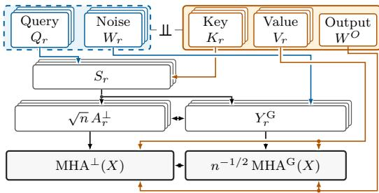
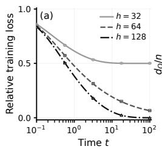
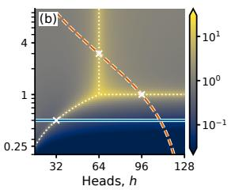
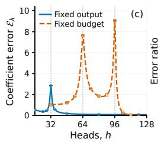
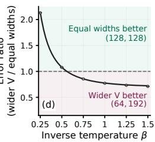
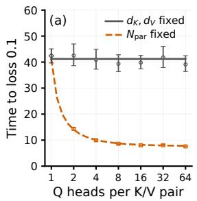
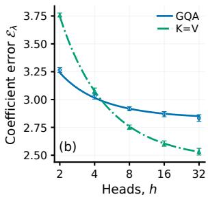
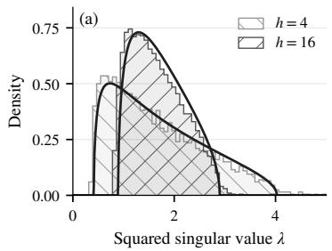
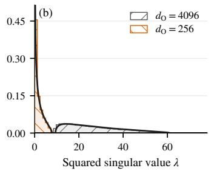
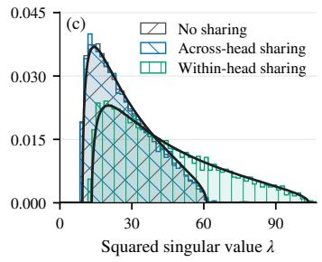

# Gaussian Equivalence for Multi-Head Self-Attention

Tomohiro Hayase, Ryo Karakida Artificial Intelligence Research Center (AIRC), AIST RIKEN AIP

## Abstract

A theoretical understanding of multi-head self-attention is fundamental to the study of modern neural networks. Using random matrix theory, we establish Gaussian equivalence for multi-head self-attention: replacing softmax attention with rescaled scores plus Gaussian noise preserves the limiting spectral law of the centered output. This equivalence also covers value and output projections that depend on the keys. The resulting laws separate the effects of head allocation and projection widths, and distinguish spectrum-preserving across-head sharing from within-head key–value dependence.

## 1 Introduction

Multi-head self-attention (Vaswani et al., 2017) is a core component of Transformer architectures. Developing a mathematical account of its behavior is a fundamental objective in the theory of deep learning. For feedforward networks, random matrix theory has provided precise descriptions of nonlinear models (Pennington and Worah, 2017; Louart et al., 2018). Gaussian equivalence (Péché, 2019; Benigni and Péché, 2021) offers a useful principle: a complex nonlinear model can share its limiting spectrum with a simpler Gaussian model. We develop this approach for multi-head self-attention.

For a single softmax attention matrix, Hayase et al. (2026) establish Gaussian equivalence in a proportional regime with fixed inverse temperature. Their analysis retains the bilinear query–key scores and rowwise softmax normalization, yielding a limiting law for the smaller squared singular values. This bulk law complements the rank-collapse analysis of Nait Saada et al. (2025): as the context length grows, one singular value remains macroscopic, while the others lie on a smaller scale. Together, these results describe both the dominant common component and the distribution of feature strengths beneath it.

Multi-head attention (MHA) (Vaswani et al., 2017) applies each attention matrix to its value features, concatenates the head outputs, and applies an output projection. These operations determine the representation passed to subsequent layers. The spectral moments of a concatenated Gram matrix contain products of different heads, and a value projection may depend on the keys that also determine attention. Marginal single-head laws do not specify these interactions. A layer-level comparison is therefore needed to understand how head allocation, projection widths, and weight sharing affect the output representation.

We establish this comparison for orthogonal inputs, Gaussian queries and keys, proportional widths, and fixed head count h and inverse temperature β. The joint family of keys and value/output weights is independent of the queries; the projections satisfy operator-norm bounds and may depend on the keys. The proof replaces entire concatenated rows with Gaussian rows of matching covariance and controls the exponential directly. The comparison is preserved under key-dependent right multiplication satisfying Theorem 4.1 (Theorem 4.6). Under a deterministic limiting spectrum for the conditional covariance of the Gaussian output rows, the centered MHA output and its Gaussian equivalent converge to the same spectral law, almost surely both weakly and in every fixed moment (Theorem 3.1).

Frozen-feature readouts provide a controlled setting for isolating the effects of architectural choices on representations and readout learning. The resulting spectral laws provide quantitative predictions for linear-readout learning from frozen multi-head self-attention features (Section 5). At a fixed projection parameter count, changing the head count can produce multiple estimation-error peaks. Across-head K/V sharing preserves the limiting mean training-loss curve at fixed head count and widths, allowing parameter savings to be reinvested in wider heads. Complete within-head K/V tying changes the spectrum and can reduce estimation error at the same widths and parameter count as GQA. At a fixed projection parameter count, inverse temperature can also reverse which Q/K–V width allocation yields lower estimation error. Together, these examples illustrate how Gaussian equivalence makes the learning consequences of head counts, projection widths, sharing, and temperature analytically accessible.

## 1.1 Related Work

The closest spectral analyses are those of Nait Saada et al. (2025) and Hayase et al. (2026). The former study a spectral gap for query–key attention and, in their Appendix A.4, compute an output bulk for a random Markov surrogate with independent pre-normalization entries. The latter preserve the bilinear score structure and prove a single-head Gaussian equivalence whose bulk generally differs from that surrogate’s law. Liao et al. (2026) analyze nonlinear attention interpolation in a proportional regime with random inputs and fixed structured weights, and discuss an extension to finitely many heads. We instead fix the input and compare softmax output spectra across concatenated heads and key-dependent random projections.

At fixed sequence length, Hron et al. (2020) derive neural network Gaussian process (NNGP) and neural tangent kernel (NTK) limits for attention with infinitely many heads, and Sakai et al. (2025) characterize non-Gaussian output limits with finitely many heads. Bordelon et al. (2024) study transformer training dynamics in limits of head width, head count, and depth, also keeping sequence length fixed. We establish spectral Gaussian equivalence as token count and projection widths grow proportionally at fixed head count, retaining finite width-to-token ratios in the limiting output spectrum.

Spectral descriptions also connect feature representations to learning. Dobriban and Wager (2018) analyze ridge prediction risk with general feature covariance, and Mei and Montanari (2022) obtain precise risk asymptotics for random-feature regression. Hu and Lu (2023) establish Gaussian equivalence for training and generalization errors in random-feature learning. The relation between regularization and early stopping (Ali et al., 2019) also motivates studying learning curves. Multipledescent analyses identify distinct sources of risk peaks (d’Ascoli et al., 2020; Meng et al., 2024). For frozen MHA features, Section 5 specifies gradient-flow and ridge models whose training loss and coefficient estimation error can be predicted from the GE spectrum.

Head number and width have been studied through expressivity and training. Bhojanapalli et al. (2020) identify restrictions on attention maps imposed by head width, while Michel et al. (2019) investigate pruning heads from trained models. Unequal Q/K and V widths are used in LeViT and Thin Keys, Full Values (Graham et al., 2021; Yao et al., 2026). Our experiments vary head count at fixed per-head widths and compare width allocations at fixed projection parameter count. The spectral laws connect these choices to readout behavior for randomly initialized attention features.

Multi-query attention (Shazeer, 2019) and grouped-query attention (GQA) (Ainslie et al., 2023) share keys and values across heads to reduce the cost of decoding. Their sharing pattern motivates our comparison between independent and shared head families. Within-head K/V tying is studied by Kayyam et al. (2026). Our laws distinguish the two sharing mechanisms: across-head sharing preserves the explicit Gaussian bulk laws at fixed head count and widths, while within-head K/V dependence changes the covariance governing the output.

Rank collapse and signal propagation provide a complementary perspective. Dong et al. (2021) prove rank collapse with depth in pure attention stacks, and Noci et al. (2022) connect collapse to vanishing query and key gradients. Propagation theories (Dinan et al., 2023; Kedia et al., 2024; Cowsik et al., 2025) track activation or gradient statistics across layers. Our proportional-limit analysis separates the common mode from the smaller feature directions in head concatenation and follows the centered spectrum through projections.

## 2 Model and Assumptions

## 2.1 Multi-Head Self-Attention

We consider multi-head self-attention with h heads (see Appendix A for notation). Let $X \in \mathbb { R } ^ { r }$ ×d contain the token representations as rows; n is the context length. For each head $r \in \{ 1 , \ldots , h \}$ , let $W _ { r } ^ { Q } , W _ { r } ^ { K } \in \mathbb { R } ^ { d \times d _ { \mathrm { K } } }$ and $W _ { r } ^ { V } \in \mathbb { R } ^ { d \times d _ { \mathrm { V } } }$ be the query, key, and value weights, and let $W ^ { \bar { O } } \in \mathbb R ^ { h d _ { \mathrm { V } } }$ ×dO be the output weight. The projected matrices are $\bar { Q _ { r } } = \mathbf { \bar { { X } } } W _ { r } ^ { Q } , K _ { r } = \bar { X } W _ { r } ^ { K }$ , and $V _ { r } = X W _ { r } ^ { V }$ . For inverse temperature $\beta > 0$ , define

$$
S _ { r } = \frac { Q _ { r } K _ { r } ^ { \top } } { \sqrt { d _ { \mathrm { K } } } } , A _ { r } ( X ) = \mathrm { s o f t m a x } ( \beta S _ { r } ) .
$$

The output concatenates the heads and applies $W ^ { O }$ :

$$
\mathrm { M H A } ( X ) = [ A _ { 1 } ( X ) V _ { 1 } , \dots , A _ { h } ( X ) V _ { h } ] W ^ { O } .
$$

Softmax acts on each row, brackets denote horizontal concatenation, and $\mathrm { M H A } ( X ) \in \mathbb { R } ^ { n \times d _ { \mathrm { O } } }$

## 2.2 Assumptions

Throughout, $X = X _ { n } \in \mathbb { R } ^ { n \times d } , n \leq d .$ , is deterministic with $X X ^ { \top } / d = I _ { n }$ (Nait Saada et al., 2025; Hayase et al., 2026). The query weights $( W _ { r } ^ { Q } )$ have jointly i.i.d. $\mathcal { N } ( 0 , 1 / d )$ entries. Each $\hat W _ { r } ^ { K }$ has i.i.d. $\mathcal { N } ( 0 , 1 / d )$ entries, with arbitrary dependence or sharing across heads. Thus each $Q _ { r }$ and $K _ { r }$ has i.i.d. $\mathcal { N } ( 0 , 1 )$ entries.

The value and output weights are random matrices. The joint family of key, value, and output weights is independent of the query weights. The laws of the value and output weights are otherwise arbitrary: they may be non-Gaussian, dependent on the keys, and dependent or shared across heads. Write $W ^ { \tilde { O } } = \dot { G } _ { O } / \sqrt { h d _ { \mathrm { V } } }$ . We assume that the operator norms satisfy, almost surely,

$$
\operatorname* { m a x } \{ \| V _ { 1 } \| , \ldots , \| V _ { h } \| , \| G _ { O } \| \} = O ( { \sqrt { n } } ) .\tag{2.1}
$$

We work in the proportional regime. The head count h and the inverse temperature $\beta$ are fixed, and with $d = d ( n )$ and $d _ { \mathrm { K } } = d _ { \mathrm { K } } ( n )$

$$
n , d , d _ { \mathrm { K } } \longrightarrow \infty , { \frac { h d _ { \mathrm { K } } } { n } } \longrightarrow \gamma _ { \mathrm { K } } \in ( 0 , \infty ) .\tag{2.2}
$$

The value and output widths satisfy

$$
\frac { h d _ { \mathrm { V } } } { n } \longrightarrow \gamma _ { \mathrm { V } } \in ( 0 , \infty ) , \frac { d _ { \mathrm { O } } } { n } \longrightarrow \gamma _ { \mathrm { O } } \in ( 0 , \infty ) .\tag{2.3}
$$

All limits are along (2.2) and (2.3). All sizes are realized on a common probability space.

## 3 Gaussian Equivalence

Write $A _ { r } = A _ { r } ( X )$ . Let $\mathbf { 1 } _ { n } \in \mathbb { R } ^ { n }$ be the all-ones vector and set $P = \mathbf { 1 } _ { n } \mathbf { 1 } _ { n } ^ { \top } / n$ and $A _ { r } ^ { \perp } = A _ { r } - P$ The centered output is

$$
\mathrm { M H A ^ { \perp } } ( X ) = [ A _ { 1 } ^ { \perp } V _ { 1 } , \ldots , A _ { h } ^ { \perp } V _ { h } ] W ^ { O } .\tag{3.1}
$$

The removed component has rank at most one, since every block $P V _ { r }$ has identical rows. We study the squared singular values of $\mathrm { M H A ^ { \perp } } ( X )$ .

The Gaussian model replaces each $\sqrt { n } A _ { r } ^ { \perp }$ by a linear function of the scores plus independent noise. Set $\theta _ { 1 } = e ^ { \beta ^ { 2 } } - 1$ and $\theta _ { 2 } = \beta ^ { 2 }$ . Let $W _ { 1 } , \dots , W _ { h } \in \mathbb { R } ^ { n \times n }$ have jointly independent $\mathcal { N } ( 0 , 1 )$ entries, independent of all weights at the same size. The Gaussian model for head r is

$$
Y _ { r } ^ { \mathrm { G } } = \frac { \sqrt { \theta _ { 2 } } S _ { r } + \sqrt { \theta _ { 1 } - \theta _ { 2 } } W _ { r } } { \sqrt { n } } .\tag{3.2}
$$

Table 1: Equivalent random matrix models, defined in Section 4. Each step preserves all fixed spectral moments after right multiplication under Theorem 4.1. The third column states the control used.
<table><tr><td>Model</td><td>Transformation</td><td>Control used</td></tr><tr><td> ${ \sqrt { n } } A ^ { \perp }$   $Y ^ { f }$ </td><td>Centered multi-head self-attention</td><td>Initial model  $n ^ { - 1 / 2 + o ( 1 ) }$ </td></tr><tr><td></td><td>Replace the row denominators by a constant</td><td>Operator-norm error ; rank at most h</td></tr><tr><td> $\mathring { Y } ^ { f }$ </td><td>Subtract the conditional row mean</td><td>Rank at most one; norms  $n ^ { o ( 1 ) }$ </td></tr><tr><td> $Y ^ { \mathrm { G } } [ \Sigma _ { f } ]$ </td><td>Gaussian rows with matching covariance</td><td>Quadratic-form concentration; self-averaging</td></tr><tr><td> $Y ^ { \mathrm { G } } [ \Sigma _ { \mathrm { G } } ]$   $Y ^ { \mathrm { G } }$ </td><td>Approximate  $\Sigma _ { f }$  by  $\Sigma _ { \mathrm { G } }$ </td><td>Normalized Frobenius error  $O ( { \sqrt { \log n / n } } )$  Same conditional law; self-averaging</td></tr></table>

The resulting Gaussian layer is

$$
\begin{array} { r } { \mathrm { M H A } ^ { \mathrm { G } } ( X ) = [ Y _ { 1 } ^ { \mathrm { G } } V _ { 1 } , \dots , Y _ { h } ^ { \mathrm { G } } V _ { h } ] W ^ { O } . } \end{array}\tag{3.3}
$$

Figure 1 illustrates this replacement through the value and output projections.

The key Gram matrix is the conditional covariance of a score row. For each head, put

$$
\Sigma _ { K , r } = { \frac { K _ { r } K _ { r } ^ { \top } } { d _ { \mathrm { K } } } } , \Sigma _ { \mathrm { G } , r } = \theta _ { 2 } \Sigma _ { K , r } + ( \theta _ { 1 } - \theta _ { 2 } ) I _ { n } ,\tag{3.4}
$$

and define $\begin{array} { r c l } { \Sigma _ { K } } & { = } & { \bigoplus _ { r } \Sigma _ { K , r } } \end{array}$ and $\begin{array} { r l } { \Sigma _ { \mathrm { } \mathrm { G } } } & { { } = } \end{array}$ $\oplus _ { r } \Sigma _ { \mathrm { G } , r } ~ = ~ \theta _ { 2 } \Sigma _ { K } + \mathsf { \bar { \Omega } } ( \dot { \theta } _ { 1 } - \theta _ { 2 } ) I _ { h n }$ . With ${ \bar { V _ { \oplus } } } ^ { \cdot } = { \dot { V _ { 1 } } } \oplus \cdot \cdot \cdot \oplus V _ { h }$ , set

$$
\Sigma _ { \mathrm { V O } } = \frac { 1 } { n } ( W ^ { O } ) ^ { \top } V _ { \oplus } ^ { \top } \Sigma _ { \mathrm { G } } V _ { \oplus } W ^ { O } .\tag{3.5}
$$

Given the key, value, and output weights, the rows of $\mathrm { M H A } ^ { \mathrm { G } } ( X )$ are $\mathrm { i . i . d . } \mathcal { N } ( 0 , \Sigma _ { \mathrm { V O } } )$

Figure 1: Gaussian equivalence through concatenation and projections. The blue dashed and orange solid families are independent of each other.

For a positive semidefinite $N \times N$ matrix $C ,$ let $\mu _ { C }$ assign weight $1 / N$ to each eigenvalue. Write $\nu _ { M } ~ = ~ \mu _ { M M ^ { \scriptstyle { \top } } }$ for the distribution of

squared singular values, including zeros, and $s _ { 1 } ( M )$ for the largest singular value. Let $\pi ( \mu , t )$ be the compound free Poisson law with jump law $\mu ,$ rate t, and free cumulants $\kappa _ { q } = t m _ { q } ( \mu )$ , where $\begin{array} { r } { m _ { q } ( \mu ) = \bar { \int } x ^ { q } d \mu ( x ) } \end{array}$

Theorem 3.1. Suppose that almost surely $\mu _ { \Sigma _ { \mathrm { V O } } }$ converges weakly to a deterministic law $\mu _ {  { \mathrm { V O } } }$ . Then, almost surely, weakly and in every fixed moment,

$$
\operatorname* { l i m } _ { n \to \infty } \nu _ { \mathrm { M H A ^ { \perp } ( } X \mathrm { ) } } = \operatorname* { l i m } _ { n \to \infty } \nu _ { n ^ { - 1 / 2 } \mathrm { M H A ^ { G } ( } X \mathrm { ) } } = \pi \big ( \mu _ { \mathrm { V O } } , \gamma _ { \mathrm { O } } \big ) .\tag{3.6}
$$

The uncentered output $\operatorname { M H A } ( X )$ has the same weak limit, and almost surely,

$$
\frac { s _ { 1 } ( \mathrm { M H A } ( X ) ) } { \sqrt { d } _ { \mathrm { O } } } = \frac { \| { \bf 1 } _ { n } ^ { \top } [ V _ { 1 } , \ldots , V _ { h } ] W ^ { O } \| _ { 2 } } { \sqrt { n d _ { \mathrm { O } } } } + o ( 1 ) .\tag{3.7}
$$

The bulk limit is proved in Section 4.5; Section B.10 proves (3.7).

The theorem reduces the bulk limit to a sample covariance model: the softmax enters the limit through the two coefficients $\theta _ { 1 }$ and $\theta _ { 2 }$ , and the weights enter through the spectrum of $\scriptstyle \sum _ { \mathrm { { V O } } }$ . The leading singular value is determined by the common-row component after the value and output projections.

## 4 Proof of Equivalence

We prove the bulk limit in Theorem 3.1 by comparing the centered attention concatenation with its Gaussian counterpart. Write $A = [ A _ { 1 } , \dotsc , { \bar { A } } _ { h } ]$ and define its centered concatenation $A ^ { \perp } =$ $[ A _ { 1 } ^ { \perp } , \ldots , A _ { h } ^ { \perp } ]$ , so that

$$
\mathrm { M H A ^ { \perp } } ( X ) = A ^ { \perp } V _ { \oplus } W ^ { O } .\tag{4.1}
$$

Write $Y ^ { \mathrm { G } } = [ Y _ { 1 } ^ { \mathrm { G } } , \dots , Y _ { h } ^ { \mathrm { G } } ]$ for the Gaussian concatenation. This factorization separates the attention comparison from the value and output projections.

Table 1 summarizes the four steps from $\sqrt { n } A ^ { \perp } \mathrm { ~ t o ~ } Y ^ { \mathrm { G } }$ : normalizer removal, centering, Gaussian replacement, and covariance identification. Each step gives vanishing differences of all fixed spectral moments almost surely after admissible right multiplication, carrying the comparison through the value and output projections.

We use $m _ { q } ( \nu _ { M } ) = \mathrm { t r } _ { n } [ ( M M ^ { \top } ) ^ { q } ]$ with normalized trace tr ${ \bf \dot { \theta } } _ { N } = N ^ { - 1 } \operatorname { T r }$ . By (4.1) and (3.3), the original and scaled Gaussian outputs are ${ \sqrt { n } } A ^ { \perp } T _ { n }$ and $Y ^ { \mathrm { G } } T _ { n }$ with $T _ { n } = n ^ { - 1 / 2 } V _ { \oplus } W ^ { O }$ , so each step is proved after right multiplication by a matrix of the following kind.

Assumption 4.1 (Conditions on right multipliers). The sequence $T _ { n } \in \mathbb { R } ^ { h n \times d _ { \mathrm { O } n } }$ , with $d _ { \mathrm { O } n } \geq 1$ deterministic, satisfies $\| T _ { n } \| = O ( 1 )$ a.s. At each size, the joint family $( ( K _ { r , n } ) _ { r = 1 } ^ { h } , T _ { n } )$ is independent of the queries $( Q _ { r , n } ) _ { r = 1 } ^ { h }$

Every comparison below uses Gaussian noise independent of the joint family of queries, keys, and $T _ { n }$ at each size. Section 4.5 verifies that $n ^ { - 1 / 2 } \bar { V _ { \oplus } } W ^ { O }$ satisfies Theorem 4.1. Replacing $T _ { n }$ by $( T _ { n } T _ { n } ^ { \top } ) ^ { 1 / 2 }$ preserves the left Gram matrices and the multiplier norm. Until Section 4.5, we write $T \in \mathbb { R } ^ { h n \times h n }$ for this positive semidefinite multiplier.

## 4.1 Removing the Row Normalizers

Put $P ^ { \perp } = I _ { n } - P $ . Row stochasticity gives $A _ { r } P \ = \ P$ and $A _ { r } ^ { \perp } \ = \ A _ { r } P ^ { \perp }$ . Define the row denominators $\begin{array} { r } { Z _ { r , i } = \sum _ { i } e ^ { \beta S _ { r , i j } } } \end{array}$ and the entrywise function $f ( x ) = e ^ { \beta x - \beta ^ { 2 } / 2 } - 1$ . For $\chi \sim \mathcal { N } ( 0 , 1 )$ $\theta _ { 1 } = \mathbb { E } [ f ( \chi ) ^ { 2 } ]$ and $\theta _ { 2 } = ( \mathbb { E } [ f ^ { \prime } ( \chi ) ] ) ^ { 2 }$ . The normalized denominators $Z _ { r , i } / n$ concentrate around $e ^ { \beta ^ { 2 } / 2 }$ , yielding exponential feature matrices. Set

$$
Y _ { r } ^ { f } = \frac { f ( S _ { r } ) } { \sqrt { n } } ,
$$

$$
D _ { r } = { \frac { \mathrm { d i a g } ( Z _ { r , 1 } , \ldots , Z _ { r , n } ) } { n e ^ { \beta ^ { 2 } / 2 } } } ,\tag{4.2}
$$

and put $\boldsymbol { Y ^ { f } } = [ Y _ { 1 } ^ { f } , \ldots , Y _ { h } ^ { f } ]$ . Since $P ^ { \perp } \mathbf { 1 } _ { n } = 0$ and $D _ { r } \sqrt { n } A _ { r } = e ^ { \beta S _ { r } - \beta ^ { 2 } / 2 } / \sqrt { n }$ , the row normalizers are the only remaining difference:

$$
Y _ { r } ^ { f } P ^ { \perp } = D _ { r } \sqrt { n } A _ { r } ^ { \perp } .\tag{4.3}
$$

Write $P _ { \oplus } ^ { \perp } = P ^ { \perp } \oplus \dots \oplus P ^ { \perp }$

Lemma 4.2 (Row normalizers). For any $q \in \mathbb { N } , m _ { q } ( \nu _ { \sqrt { n } A ^ { \bot } T } ) - m _ { q } ( \nu _ { Y ^ { f } T } ) \to 0 a . s$ . The operator norms satisfy $\lVert \sqrt { n } A ^ { \perp } - Y ^ { f } P _ { \oplus } ^ { \perp } \rVert \leq n ^ { - 1 / 2 + o ( 1 ) } a . s$

Proof. The diagonal matrices $D _ { r }$ satisfy maxr $\lvert \lvert D _ { r } - I _ { n } \rvert \rvert \leq n ^ { - 1 / 2 + \varepsilon }$ eventually at any fixed $\varepsilon > 0$ , by Theorem B.7, the rectangular-array form of the normalizer concentration in Hayase et al. (2026, Section 4.1); hence ma $\mathrm { { x } } _ { r } \bar { \| } D _ { r } ^ { - 1 } - \bar { I } _ { n } \| \leq n ^ { - 1 / 2 + o ( 1 ) }$ . With $\| Y ^ { f } \| = n ^ { o ( 1 ) }$ ((B.22)) and a countable intersection over $\varepsilon = 1 / j$ , the identity (4.3) gives the operator-norm bound through $\| \sqrt { n } A _ { r } ^ { \perp } - Y _ { r } ^ { f } P ^ { \perp } \| \leq \| D _ { r } ^ { - 1 } - I _ { n } \| \| \tilde { Y } _ { r } ^ { f } \|$ . The difference $\bar { Y } ^ { f } P _ { \oplus } ^ { \perp } - \bar { Y ^ { f } }$ has rank at most $h ,$ and all norms stay $n ^ { o ( 1 ) }$ after right multiplication by $T$ (Theorem B.8), so (B.1) and (B.3) of Section B.3 give the moment comparison. □

## 4.2 Centering the Rows

The step of Section 4.3 replaces rows by Gaussian rows of the same conditional covariance, so we record that covariance and subtract the conditional mean. Condition on $\mathcal { F } _ { n } = \sigma ( K _ { 1 , n } , \ldots , K _ { h , n } , T _ { n } )$ The rows of $Y ^ { f }$ are then independent. Each concatenated score row has law $\mathcal { N } ( 0 , \Sigma _ { K } )$ , giving

$$
\sqrt { n } \mathbb { E } [ ( Y ^ { f } ) _ { i j } \mid \mathcal { F } _ { n } ] = e ^ { \beta ^ { 2 } ( ( \Sigma _ { K } ) _ { j j } - 1 ) / 2 } - 1 ,\tag{4.4}
$$

which is independent of i and small because the key norms are nearly equal. Write $\Sigma _ { f }$ for the conditional covariance of a row of ${ \sqrt { n } } Y ^ { f }$ . Its head blocks are $\Sigma _ { f , r }$ , with zero cross-head blocks by query independence (Figure B.1). Subtracting the conditional mean from each row gives $\mathring { Y } ^ { f }$

Lemma 4.3 (Conditional centering). For any $q \in \mathbb { N } , m _ { q } ( \nu _ { Y ^ { f } T } ) - m _ { q } ( \nu _ { \check { Y } ^ { f } T } )  0 a . s$

Proof. All rows of $Y ^ { f } - { \overset { \circ } { Y } } ^ { f }$ equal the conditional mean, so the difference has rank one, and its entries are $O ( { \sqrt { \log n } } / n )$ by (4.4) and Theorem B.2, so its norm is $O ( \sqrt { n } \sqrt { \log n / n } ) = n ^ { o ( 1 ) }$ The rank estimate (B.3) of Section B.3, with max $\{ \| Y ^ { f } \| , \| { \mathring { Y } } ^ { f } \| \} = n ^ { o ( 1 ) }$ from (B.22), proves the comparison. □

## 4.3 Concentration and Gaussian Comparison

We construct Gaussian rows with the conditional covariance of the centered feature rows, then apply the same right multiplier T. Let $\widetilde { W } \in \mathbb { R } ^ { n \times h n }$ have i.i.d. $\mathcal { N } ( 0 , 1 )$ entries, independent of ${ \mathcal { F } } _ { n }$ and the queries, and set

$$
Y ^ { \mathrm { G } } [ \Lambda ] = \frac { \widetilde { W } \Lambda ^ { 1 / 2 } } { \sqrt { n } }\tag{4.5}
$$

for $\mathcal { F } _ { n }$ -measurable $\Lambda \geq 0$ . The rows of $Y ^ { \mathrm { G } } [ \Sigma _ { f } ]$ and $\mathring { Y } ^ { f }$ have the same conditional covariance. Lemma 4.4 (Gaussian replacement). For any $q \in \mathbb { N } ,$

$$
m _ { q } ( \nu _ { \check { Y } ^ { f } T } ) - m _ { q } ( \nu _ { Y ^ { \mathrm { G } } [ \Sigma _ { f } ] T } ) \longrightarrow 0 \quad a . s .
$$

Proof. Condition on $\mathcal { F } _ { n }$ . Write a row of $\mathring { Y } ^ { f } T$ as $y ^ { \top } / { \sqrt { n } }$ and put $\Gamma = \mathbb { E } [ y y ^ { \top } ]$ . Here $\| U \| _ { L ^ { s } } =$ $( \mathbb { E } \Vert U \Vert ^ { s } ) ^ { 1 / s }$ is conditional, using the absolute value, Euclidean norm, or operator norm as appropriate. To bound the query derivatives, fix $M \geq 1$ and work on $\Omega _ { n } ( M )$ , defined by

$$
\begin{array} { r } { \| T \| \leq M , \qquad \operatorname* { m a x } _ { r } \| \Sigma _ { K , r } \| \leq M , } \\ { \operatorname* { m a x } _ { r , i , j } \left| \left( \Sigma _ { K , r } - I _ { n } \right) _ { i j } \right| \leq M \sqrt { \log n / n } . } \end{array}\tag{4.6}
$$

Gaussian keys and the multiplier assumption give eventual membership in some $\Omega _ { n } ( M )$ a.s. (Theorem B.2).

By Theorem B.12, it suffices, for each fixed $s \geq 1$ , to prove $\| y ^ { \top } H y - \mathrm { T r } ( \Gamma H ) \| _ { L ^ { s } } \leq n ^ { 1 / 2 + o ( 1 ) } \| H \|$ uniformly on $\Omega _ { n } ( M )$ and over deterministic symmetric $H \in \mathbb { R } ^ { h n \times h n }$ . Let $\boldsymbol { u } = ( u _ { r } ) _ { r = 1 } ^ { h }$ collect independent queries $\displaystyle u _ { r } \sim \mathcal { N } ( 0 , I _ { d _ { \mathrm { K } } } )$ and put $J _ { y } = D _ { u } y$ . The Maurey–Pisier inequality (B.16) and Hölder give

$$
\| y ^ { \top } H y - \operatorname { T r } ( \Gamma H ) \| _ { L ^ { s } } \leq 2 C _ { s } \| H \| \| J _ { y } \| _ { L ^ { 2 s } } \| y \| _ { L ^ { 2 s } } .\tag{4.7}
$$

Put $z _ { r } = K _ { r } u _ { r } / \sqrt { d _ { \mathrm { K } } }$ and $L = \operatorname* { m a x } _ { r , j } | z _ { r j } |$ . The conditional mean does not depend on u, so

$$
J _ { y } = T \left( \bigoplus _ { r = 1 } ^ { h } \left[ \mathrm { d i a g } ( f ^ { \prime } ( z _ { r } ) ) { \frac { K _ { r } } { \sqrt { d _ { \mathrm { K } } } } } \right] \right) ,\tag{4.8}
$$

where $f ^ { \prime }$ acts entrywise. Since $\| T \| \operatorname* { m a x } _ { r } \| K _ { r } / \sqrt { d _ { \mathrm { K } } } \| \leq M ^ { 3 / 2 }$

$$
\| J _ { y } \| \le M ^ { 3 / 2 } \operatorname* { m a x } _ { r , j } | f ^ { \prime } ( z _ { r j } ) | \le M ^ { 3 / 2 } \beta e ^ { \beta L - \beta ^ { 2 } / 2 } .\tag{4.9}
$$

Each score has variance at most M, so Theorem B.4 with N = hn yields

$$
\| J _ { y } \| _ { L ^ { 2 s } } \leq e ^ { c \sqrt { \log n } } = n ^ { o ( 1 ) } ,\tag{4.10}
$$

where $c > 0$ depends only on $s , M , \beta , h$ . Together with $\| y \| _ { L ^ { 2 s } } = O ( { \sqrt { n } } )$ from uniform coordinate moments, (4.7) gives the required concentration bound. □

## 4.4 Identifying the Conditional Covariance

The diagonal entries give the variances of the feature coordinates; the off-diagonal entries describe correlations inherited from the keys.

Lemma 4.5 (Covariance identification). For every positive integer q,

$$
m _ { q } \big ( \nu _ { Y ^ { \mathrm { G } } [ \Sigma _ { f } ] T } \big ) - m _ { q } \big ( \nu _ { Y ^ { \mathrm { G } } T } \big ) \longrightarrow 0 \quad a . s .
$$

Proof. Condition on ${ \mathcal { F } } _ { n }$ and work on $\Omega _ { n } ( M )$ from Section 4.3 for fixed M. Write $\rho _ { i j } = ( \Sigma _ { K } ) _ { i j }$ and $\delta _ { n } = \operatorname* { m a x } _ { i , j } \left| \left( \Sigma _ { K } - I _ { h n } \right) _ { i j } \right|$ |. Gaussian exponential moments give

$$
( \Sigma _ { f } ) _ { i j } = e ^ { \beta ^ { 2 } ( \rho _ { i i } + \rho _ { j j } - 2 ) / 2 } ( e ^ { \beta ^ { 2 } \rho _ { i j } } - 1 ) .\tag{4.11}
$$

On the diagonal, $\rho _ { i i } = 1 + O ( \delta _ { n } ) , \mathrm { s o } ( \Sigma _ { f } ) _ { i i } = \theta _ { 1 } + O ( \delta _ { n } )$ . Thus $\theta _ { 1 } = e ^ { \beta ^ { 2 } } - 1$ is the limiting variance of each centered feature coordinate.

Off the diagonal, $| \rho _ { i j } | \le \delta _ { n }$ . Taylor expansion gives $e ^ { \beta ^ { 2 } \rho _ { i j } } - 1 = \beta ^ { 2 } \rho _ { i j } + O ( \rho _ { i j } ^ { 2 } )$ , and the prefactor in (4.11) is $1 + O ( \delta _ { n } )$ . Since $\rho _ { i j } ^ { 2 } \le \delta _ { n } | \rho _ { i j } |$ , we obtain $( \Sigma _ { f } ) _ { i j } = \theta _ { 2 } \rho _ { i j } + O ( \delta _ { n } | \rho _ { i j } | )$ . Thus $\theta _ { 2 } = \beta ^ { 2 }$ is the coefficient of the leading correlations between distinct coordinates.

The term $\theta _ { 2 } \Sigma _ { K }$ contributes $\theta _ { 2 } + O ( \delta _ { n } )$ on the diagonal. Adding the remaining variance gives

$$
\Sigma _ { \mathrm { G } } = \theta _ { 2 } \Sigma _ { K } + ( \theta _ { 1 } - \theta _ { 2 } ) I _ { h n } .
$$

Theorem B.14 turns these uniform entrywise estimates into the claimed moment comparison. In $Y ^ { \mathrm { G } }$ , the linear scores carry the leading correlations, while independent noise supplies the remaining variance. □

## 4.5 Conclusion of the Proof

The four comparisons combine into the following lemma.

Lemma 4.6 (Gaussian equivalence under right multiplication). Under Theorem 4.1, with the comparison noise chosen as above,for every positive integer q,

$$
m _ { q } ( \nu _ { \sqrt { n } A ^ { \bot } T _ { n } } ) - m _ { q } ( \nu _ { Y ^ { \mathrm { G } } T _ { n } } ) \to 0 a . s .
$$

Proof. After the square-root reduction, Theorems 4.2 to 4.5 compare the consecutive models of Table 1, and a countable intersection handles the fixed orders. □

The Gaussian side has bounded norm, so the moment comparison implies weak and resolvent comparison (Section B.9).

Proofof (3.6). The weight assumptions and (2.3) ensure that $T _ { n } = n ^ { - 1 / 2 } V _ { \oplus } W ^ { O }$ satisfies Theorem 4.1. The two outputs in (3.6) are ${ \sqrt { n } } A ^ { \perp } T _ { n }$ and $Y ^ { \mathrm { G } } T _ { n }$

Conditionally on the key, value, and output weights, $Y ^ { \mathrm { G } } T _ { n }$ has independent centered Gaussian rows with covariance $\dot { \Sigma _ { \mathrm { V O } } } / n$ . Moreover, $\Sigma _ { \mathrm { V O } } \doteq T _ { n } ^ { \top } \Sigma _ { \mathrm { G } } T _ { n }$ has bounded norm almost surely by Theorem B.2 and $\| T _ { n } \| = O ( 1 )$ . The assumed convergence of $\mu _ { \Sigma \mathrm { v o } }$ and Theorem C.1, with $D _ { m } = \Sigma _ { \mathrm { V O } }$ and $d _ { \mathrm { O } } / n \to \gamma _ { \mathrm { O } } , \mathrm { g i v e } \nu _ { Y ^ { \mathrm { G } } T _ { n } } \to \pi ( \mu _ { \mathrm { V O } } , \gamma _ { \mathrm { O } } )$ almost surely, weakly and in every fixed moment.

Theorem 4.6 transfers the moment limits to $\operatorname { M H A } ^ { \bot } ( X )$ . Since the Gaussian limit has compact support, Section B.9 also gives weak convergence, proving (3.6). Finally, $\mathrm { M H A } ( X ) - \mathrm { M H A } ^ { \perp } ( X )$ has rank at most one, so ${ \check { \mathrm { M H A } } } ( X )$ has the same weak limit by the rank inequality. 口

## 5 Spectra and Learning

We use the Gaussian equivalent in Theorem 3.1 to study coefficient estimation and readout training.

## 5.1 Spectra and Readout Predictions

Finite GE closely matches the centered softmax spectrum at dimensions taken from publicly available models. The configurations in Table 2 preserve these models’ projection widths, head counts, and K/V sharing, while using $n \leq d ,$ , orthogonal inputs, Gaussian projection weights, and $\beta = 1$ We compare all eigenvalues of the centered softmax and finite GE output Gram matrices in Theorem 3.1. The relative 1-Wasserstein distance is the mean absolute difference between ordered eigenvalues divided by their common limiting mean. Across the seven configurations, including across-head and within-head sharing, the mean relative distances range from 0.24% to 2.82%.

Table 2: Finite-size MHA–GE spectral agreement at dimensions taken from publicly available models. Means with 95% CIs. Full dimensions and sources: Section D.1.
<table><tr><td>Dimensions of</td><td>Sharing</td><td>n h Rel. W1 (%)</td></tr><tr><td>BERT-base</td><td>None</td><td>512 12  $1 . 6 6 \pm 0 . 2 3$ </td></tr><tr><td>ModernBERT-L None</td><td></td><td>1,024 16  $1 . 3 7 \pm 0 . 2 1$ </td></tr><tr><td>DINOv3-L/16</td><td>None</td><td>261 16  $2 . 8 2 \pm 0 . 4 0$ </td></tr><tr><td>LLaDA-8B</td><td>None</td><td>4,09632  $0 . 9 2 \pm 0 . 0 6$ </td></tr><tr><td>GPT-3 175B</td><td>None</td><td>2,048 96  $0 . 6 2 \pm 0 . 0 7$ </td></tr><tr><td>Falcon-7B Kayyam 1.2B</td><td>MQA  $K = V$ </td><td>2,04871  $1 . 9 2 \pm 0 . 4 6$  2,048 32  $0 . 2 4 \pm 0 . 0 1$ </td></tr></table>

The limiting spectrum also gives predictions for linear readouts. Under the assumptions of Theorem 3.1, we freeze the attention weights and use $F ~ = ~ \mathrm { M H A } ( X ) / \sqrt { m }$ , where $m : =$ $\begin{array} { r } { \operatorname* { l i m } _ { n \to \infty } n ^ { - 1 } \| \mathrm { \ M H A ^ { \perp } } ( X ) \| _ { F } ^ { 2 } > 0 } \end{array}$

For coefficient estimation, generate $y = { \sqrt { n } } F \vartheta + \varepsilon$ with independent $\vartheta \sim \mathcal { N } ( 0 , I _ { d _ { \mathrm { O } } } / d _ { \mathrm { O } } )$ and $\varepsilon \sim \mathcal { N } ( 0 , \sigma ^ { 2 } I _ { n } )$ , also independent of F. For fixed $\lambda > 0$ , let $\vartheta _ { \ast }$ be the minimizer of $\| F v - y / \sqrt { n } \| ^ { 2 } +$ $\lambda \| v \| ^ { 2 }$ over v. The limiting mean squared coefficient error is $\begin{array} { r } { \mathcal { E } _ { \lambda } : = \operatorname* { l i m } _ { n \to \infty } \mathbb { E } _ { \vartheta , \varepsilon } \big [ \| \vartheta _ { * } - \vartheta \| ^ { 2 } \big | F \big ] } \end{array}$ Writing ν for the limiting eigenvalue law of $F F ^ { \top }$ , the ridge formula and GE give (Section C.5)

$$
\mathcal { E } _ { \lambda } = 1 - \gamma _ { 0 } ^ { - 1 } + \int \frac { \gamma _ { 0 } ^ { - 1 } \lambda ^ { 2 } + \sigma ^ { 2 } x } { ( x + \lambda ) ^ { 2 } } d \nu ( x ) .\tag{5.1}
$$

To evaluate this integral, define $\begin{array} { r } { w _ { \nu } ( \lambda ) : = \int \frac { x } { x + \lambda } d \nu ( x ) } \end{array}$ , the limiting effective degrees of freedom per token. For $\lambda > 0 , w = w _ { \nu } ( \lambda )$ satisfies $\lambda w = ( 1 - w ) / \mathcal { S } _ { \nu } ( - w )$ and determines the error by

$$
\mathcal { E } _ { \lambda } = 1 - \frac { w _ { \nu } ( \lambda ) } { \gamma _ { 0 } } + \left( \frac { \lambda } { \gamma _ { 0 } } - \sigma ^ { 2 } \right) w _ { \nu } ^ { \prime } ( \lambda ) .\tag{5.2}
$$

Here the prime denotes differentiation in $\lambda ;$ Section C.6.2 gives the derivation.

The same law predicts the training-loss trajectory of a linear readout. For a nonzero centered target y fixed independently of initialization, unregularized gradient flow from $\vartheta ( 0 ) = 0$ minimizes $\scriptstyle { \frac { 1 } { 2 } } \| { \overline { { F } } } \vartheta - y \| ^ { 2 }$ . Its relative loss $L _ { n } ( t ; y ) = \| F \vartheta ( t ) - y \| ^ { 2 } / \| y \| ^ { 2 }$ satisfies (Section C.5)

$$
\operatorname* { l i m } _ { n \to \infty } \mathbb E L _ { n } ( t ; y ) = \int e ^ { - 2 t x } d \nu ( x ) .\tag{5.3}
$$

We evaluate this prediction by numerically inverting the time-Laplace transform $( 1 - w _ { \nu } ( s / 2 ) ) / s$ $s > 0$ (Section C.6.2).

For independent Gaussian K/V and an independent Gaussian output projection as in Theorem C.4, these predictions reduce to an explicit scalar equation. Here $m = \gamma _ { 0 } \theta _ { 1 }$ and $c _ { \beta } : = \theta _ { 2 } / \theta _ { 1 } =$ $\beta ^ { 2 } / ( e ^ { \beta ^ { 2 } } - 1 )$ . For $t > 0$ , let $\rho _ { \beta , t }$ be the law of $1 - c _ { \beta } + c _ { \beta } x$ for $x \sim \mathrm { M P _ { 1 / t } }$ , with

$$
\mathcal { S } _ { \rho _ { \beta , t } } ( z ) = \frac { 2 } { 1 + c _ { \beta } z / t + \sqrt { ( 1 - c _ { \beta } z / t ) ^ { 2 } + 4 c _ { \beta } ^ { 2 } z / t } } .
$$

Then $w _ { \nu } ( \lambda )$ is the unique solution of

$$
\lambda w = \frac { ( 1 - w ) ( 1 - w / h ) ( 1 - w / \gamma _ { \mathrm { V } } ) ( 1 - w / \gamma _ { \mathrm { O } } ) } { \mathcal { S } _ { \rho _ { \beta , \gamma _ { \mathrm { K } } } } ( - w ) }\tag{5.4}
$$

  
Figure 2: Spectral predictions for readout learning and width allocation. (a) Training loss for three head counts. (b) Coefficient-error map with fixed-output (blue) and fixed-budget (orange) paths; dotted lines mark width boundaries. (c) Errors along these paths. (d) Coefficient-error ratio, (64, 192)/(128, 128), at fixed $N _ { \mathrm { p a r } } ;$ above the dashed unit line, equal widths give lower error; below it, wider V gives lower error. Curves: GE; markers: MHA; bars: 95% CIs. Maximum error bars: (a) 0.00513; (c) 0.02381; (d) 0.00168. Details: Sections D.2 to D.4.

in $0 < w <$ min $\{ 1 , h , \gamma _ { \mathrm { V } } , \gamma _ { \mathrm { O } } \}$ . Solving this equation and differentiating implicitly evaluates (5.2) without generating feature matrices.

Figure 2(a) shows agreement with the softmax learning curves as increasing head count changes a nonzero plateau into slow and then rapid decay: mass at zero determines the plateau, while small positive eigenvalues govern slow decay.

Unless varied, the readout experiments use $\beta = 1$ , with $\lambda = 1 0 ^ { - 4 }$ and $\sigma ^ { 2 } = 0 . 1$ for coefficient estimation; Table D.3 lists the dimensions. Curves use the limiting law. Markers are computed from exact finite-matrix ridge errors or gradient-flow losses averaged over ten softmax initializations (Section D); arrival times are obtained from the averaged losses.

## 5.2 Width Allocation and Temperature

The total value width and output width constrain the available feature directions through $h d _ { \mathrm { V } } / n$ and $d _ { \mathrm { O } } / n$ . Near boundaries where the smallest width changes, small nonzero Gram eigenvalues amplify observation noise in coefficient estimation. This mechanism is shared with analyses of interpolation and multiple descent in random-feature regression (d’Ascoli et al., 2020; Meng et al., 2024). GE makes its consequences quantitatively accessible for softmax MHA through the spectral law and coefficient-error formula in Section 5.1.

Figure $^ { 2 ( \mathrm { b , c } ) }$ compares two width-allocation paths. With fixed per-head widths and $d _ { \mathrm { O } } = n / 2 .$ , the error has one peak near $h d _ { \mathrm { V } } = d _ { \mathrm { O } }$ . Holding the number $N _ { \mathrm { p a r } }$ of distinct Q/K/V/O projection weights fixed instead makes total value width increase while output width decreases, producing two peaks near $h d _ { \mathrm { V } } = n$ and $d _ { \mathrm { O } } = n$ . Thus, at a fixed parameter count, width allocation determines which projection limits estimation accuracy.

The Q/K–V allocation depends on inverse temperature through the linear and nonlinear covariance weights $c _ { \beta }$ and $1 - c _ { \beta }$ . At small $\beta ,$ narrow $\mathrm { Q } / \mathrm { K }$ projections leave weak feature directions; the nonlinear contribution strengthens these directions as β increases. Figure 2(d) compares the coefficient error of $( d _ { \mathrm { K } } , d _ { \mathrm { V } } ) = ( 6 4 , \bar { 1 9 } 2 )$ relative to (128, 128) at equal parameter counts (Section D.4). GE predicts the observed reversal in their ranking. For coefficient estimation near $\beta = 1$ , allocate more width to V than to Q/K at a fixed projection budget.

## 5.3 Parameter Sharing

Across-head K/V sharing reduces the parameter count without changing the limiting spectrum at fixed head count and widths. GQA shares a key projection and a separate value projection among several query heads (Ainslie et al., 2023). Under the Gaussian projection assumptions of Theorem $\mathrm { C . 4 , }$ this sharing preserves ν and (5.4), hence both the coefficient error and learning curve at fixed widths. Figure 3(a) fixes $h = 6 4$ and compares this reduction with reallocating the saved weights to wider heads at fixed $N _ { \mathrm { p a r } }$ (Section D.5). The latter reduces the time to relative loss 0.1 in this example, so sharing can support either parameter savings or faster readout training through increased width.

We next compare GQA with two query heads per K/V pair and complete withinhead tying, $W _ { r } ^ { \dot { V } } ~ = ~ W _ { r } ^ { K }$ in every head. When $d _ { \mathrm { K } } = d _ { \mathrm { V } }$ , these schemes have equal parameter counts at the same head count and widths.

Tying makes the covariance a quadratic function of the key Gram: put $\varphi _ { \mathrm { K V } } ( x ) =$ $( \theta _ { 1 } - \theta _ { 2 } ) x + ( h \dot { \theta } _ { 2 } / \gamma _ { \mathrm { K } } ) x ^ { \hat { 2 } }$ and let µKV be the law of $\varphi _ { \mathrm { K V } } ( x )$ for $x \sim \pi _ { \gamma _ { \mathrm { K } } / h }$ With the same independent Gaussian output projection, $m = \gamma _ { 0 } ( \theta _ { 1 } + h \theta _ { 2 } / \gamma _ { \mathrm { K } } )$ and (5.4) becomes

$$
\lambda w = \frac { ( 1 - w ) ( h - w ) ( \gamma _ { 0 } - w ) } { \gamma _ { \mathrm { K } } m \mathcal { S } _ { \mu _ { \mathrm { K V } } } ( - w / h ) } .
$$

(5.5)

  
Figure 3: Parameter sharing. (a) Across-head sharing; diamond: unshared. (b) GQA versus within-head $\mathbf { K } \mathbf { = } \mathbf { V }$ at equal widths and parameter count, $h d _ { \mathrm { K } } = h d _ { \mathrm { V } } =$ $d _ { \mathrm { O } } = n / 2$ . Lines: GE; markers: MHA; bars: 95% CIs. Maximum error bars: (a) 4.43476; (b) 0.03015. Settings in Sections D.5 and D.6.

Its solution in $0 < w <$ min $\{ 1 , \gamma _ { \mathrm { K } } , \gamma _ { \mathrm { O } } \}$

gives the coefficient error through the same (5.2) (Section C.2.1).

Figure 3(b) shows that complete K/V tying becomes preferable as a fixed total width is divided among more heads. GQA has lower coefficient error at $h \stackrel { - } { = } 2 , 4$ , whereas complete tying has lower error at $h = 8 , 1 6 , 3 2$ . Equation (5.5) predicts this reversal. Near $\beta = 1$ , these results suggest favoring within-head K/V tying over pairwise GQA for coefficient estimation when a fixed total width is divided among heads narrow relative to the token length.

## 6 Discussion

Our theory yields concrete recommendations for width allocation and parameter sharing in frozenfeature readout models. By predicting training loss and coefficient error from architectural parameters, it identifies how a fixed parameter budget can be used more effectively.

## 6.1 Implications for Learning

For frozen-feature readouts, width allocation should address V/O bottlenecks and the temperaturedependent role of Q/K. The ratios $h d _ { \mathrm { V } } / n$ and $d _ { \mathrm { O } } / n$ constrain the available feature directions: increasing the head count cannot eliminate a loss plateau caused by insufficient output width. The preferred Q/K–V allocation depends on inverse temperature: at low $\beta ,$ preserving Q/K width avoids weak feature directions, while the nonlinear contribution reduces this disadvantage as $\beta$ increases (Figure 2(d)). For coefficient estimation near $\beta = 1$ , use wider V than Q/K at a fixed projection budget.

For frozen-feature readouts, choose the sharing mechanism according to the design objective. Use across-head K/V sharing to reduce parameters while maintaining training and estimation performance at fixed widths, or reinvest the savings in wider heads to accelerate readout training. When coefficient estimation at the same width and parameter budget is the priority, favor within-head K/V tying for narrow heads near $\beta = 1$

## 6.2 Extensions

For general inputs, the spectrum of the input Gram matrix may interact with the width constraints and K/V dependence. Extending GE to this setting would determine how these input correlations alter the preferred width allocations and sharing schemes.

A second question is how fast $\beta$ may grow with n while preserving GE. Hayase et al. (2026, Section 6.1) suggest $\beta = \Theta ( \sqrt { \log n } )$ as a candidate scale at which bulk growth changes the separation from the dominant common mode. Determining the admissible growth rates would locate the boundary of the Gaussian comparison as this spectral separation changes.

## 7 Conclusion

We establish Gaussian equivalence for multi-head self-attention, including key-dependent value and output projections. The resulting random-matrix model predicts readout training dynamics and coefficient estimation error, yielding design guidance for frozen-feature learning. More broadly, the Gaussian equivalence provides an analytical foundation for understanding how multi-head attention shapes the representations on which subsequent learning and computation depend.

## References

Adamczak, R. and Wolff, P. (2015). Concentration inequalities for non-Lipschitz functions with bounded derivatives of higher order. Probability Theory and Related Fields, 162(3–4):531–586.

Ainslie, J., Lee-Thorp, J., de Jong, M., Zemlyanskiy, Y., Lebron, F., and Sanghai, S. (2023). GQA: Training generalized multi-query transformer models from multi-head checkpoints. In Conference on Empirical Methods in Natural Language Processing (EMNLP), pages 4895–4901.

Ali, A., Kolter, J. Z., and Tibshirani, R. J. (2019). A continuous-time view of early stopping for least squares regression. In International Conference on Artificial Intelligence and Statistics (AISTATS), volume 89 of Proceedings of Machine Learning Research, pages 1370–1378.

Almazrouei, E., Alobeidli, H., Alshamsi, A., Cappelli, A., Cojocaru, R., Debbah, M., Goffinet, É., Hesslow, D., Launay, J., Malartic, Q., Mazzotta, D., Noune, B., Pannier, B., and Penedo, G. (2023). The Falcon series of open language models. arXiv preprint arXiv:2311.16867v2.

Belinschi, S. T. (2003). The atoms of the free multiplicative convolution of two probability distributions. Integral Equations and Operator Theory, 46(4):377–386.

Benigni, L. and Péché, S. (2021). Eigenvalue distribution of some nonlinear models of random matrices. Electronic Journal ofProbability, 26:1–37.

Bhatia, R. (2007). Positive definite matrices. Princeton Series in Applied Mathematics. Princeton University Press.

Bhojanapalli, S., Yun, C., Rawat, A. S., Reddi, S., and Kumar, S. (2020). Low-rank bottleneck in multi-head attention models. In International Conference on Machine Learning (ICML), volume 119 of Proceedings ofMachine Learning Research, pages 864–873.

Bordelon, B., Chaudhry, H., and Pehlevan, C. (2024). Infinite limits of multi-head transformer dynamics. In Advances in Neural Information Processing Systems (NeurIPS), volume 37, pages 35824–35878.

Boucheron, S., Lugosi, G., and Massart, P. (2013). Concentration inequalities: A nonasymptotic theory of independence. Oxford University Press.

Brown, T. B., Mann, B., Ryder, N., et al. (2020). Language models are few-shot learners. In Advances in Neural Information Processing Systems (NeurIPS), volume 33, pages 1877–1901. Extended version: arXiv:2005.14165v4.

Collins, B. and Hayase, T. (2023). Asymptotic freeness of layerwise Jacobians caused by invariance of multilayer perceptron: The Haar orthogonal case. Communications in Mathematical Physics, 397(1):85–109.

Cowsik, A., Nebabu, T., Qi, X., and Ganguli, S. (2025). Geometric dynamics of signal propagation predict trainability of transformers. Physical Review E, 112(5):055301.

d’Ascoli, S., Sagun, L., and Biroli, G. (2020). Triple descent and the two kinds of overfitting: Where & why do they appear? In Advances in Neural Information Processing Systems (NeurIPS), volume 33, pages 3058–3069.

DeepSeek-AI (2024). DeepSeek-V2: A strong, economical, and efficient mixture-of-experts language model. arXiv preprint arXiv:2405.04434v5.

Devlin, J., Chang, M.-W., Lee, K., and Toutanova, K. (2019). BERT: Pre-training of deep bidirectional transformers for language understanding. In Conference of the North American Chapter of the Associationfor Computational Linguistics: Human Language Technologies (NAACL-HLT), pages 4171–4186.

Dinan, E., Yaida, S., and Zhang, S. (2023). Effective theory of transformers at initialization. arXiv preprint arXiv:2304.02034v1.

Dobriban, E. and Wager, S. (2018). High-dimensional asymptotics of prediction: Ridge regression and classification. The Annals ofStatistics, 46(1):247–279.

Dong, Y., Cordonnier, J.-B., and Loukas, A. (2021). Attention is not all you need: Pure attention loses rank doubly exponentially with depth. In International Conference on Machine Learning (ICML), volume 139 of Proceedings ofMachine Learning Research, pages 2793–2803.

Durrett, R. (2019). Probability: Theory and examples, volume 49 of Cambridge Series in Statistical and Probabilistic Mathematics. Cambridge University Press, 5th edition.

Graham, B., El-Nouby, A., Touvron, H., Stock, P., Joulin, A., Jégou, H., and Douze, M. (2021). LeViT: A vision transformer in ConvNet’s clothing for faster inference. In Proceedings of the IEEE/CVF International Conference on Computer Vision (ICCV), pages 12259–12269.

Hayase, T., Collins, B., and Karakida, R. (2026). Gaussian equivalence for self-attention: Asymptotic spectral analysis of attention matrix. In International Conference on Artificial Intelligence and Statistics (AISTATS), volume 300 of Proceedings of Machine Learning Research, pages 2512–2520.

Hron, J., Bahri, Y., Sohl-Dickstein, J., and Novak, R. (2020). Infinite attention: NNGP and NTK for deep attention networks. In International Conference on Machine Learning (ICML), volume 119 of Proceedings of Machine Learning Research, pages 4376–4386.

Hu, H. and Lu, Y. M. (2023). Universality laws for high-dimensional learning with random features. IEEE Transactions on Information Theory, 69(3):1932–1964.

Kayyam, A., Gopal, A. M., and Lewis, M. A. (2026). Do transformers need three projections? Systematic study of QKV variants. In International Conference on Machine Learning (ICML), volume 306 of Proceedings ofMachine Learning Research, pages 56414–56441.

Kedia, A., Zaidi, M. A., Khyalia, S., Jung, J., Goka, H., and Lee, H. (2024). Transformers get stable: An end-to-end signal propagation theory for language models. In International Conference on Machine Learning (ICML), volume 235 of Proceedings of Machine Learning Research, pages 23449–23531.

Liao, Z., Liu, J., Hou, T., Zou, D., and Ling, Z. (2026). On the interpolation error of nonlinear attention versus linear regression. arXiv preprint arXiv:2506.18656v2.

Louart, C., Liao, Z., and Couillet, R. (2018). A random matrix approach to neural networks. The Annals ofApplied Probability, 28(2):1190–1248.

Mei, S. and Montanari, A. (2022). The generalization error of random features regression: Precise asymptotics and the double descent curve. Communications on Pure and Applied Mathematics, 75(4):667–766.

Meng, X., Yao, J., and Cao, Y. (2024). Multiple descent in the multiple random feature model. Journal ofMachine Learning Research, 25(44):1–49.

Michel, P., Levy, O., and Neubig, G. (2019). Are sixteen heads really better than one? In Advances in Neural Information Processing Systems (NeurIPS), volume 32, pages 14014–14024.

Mingo, J. A. and Speicher, R. (2017). Free probability and random matrices, volume 35 of Fields Institute Monographs. Springer, New York.

Nait Saada, T., Naderi, A., and Tanner, J. (2025). Mind the gap: A spectral analysis of rank collapse and signal propagation in attention layers. In International Conference on Machine Learning (ICML), volume 267 of Proceedings ofMachine Learning Research, pages 45561–45587.

Nica, A. and Speicher, R. (2006). Lectures on the combinatorics offree probability, volume 335 of London Mathematical Society Lecture Note Series. Cambridge University Press.

Nie, S., Zhu, F., You, Z., Zhang, X., Ou, J., Hu, J., Zhou, J., Lin, Y., Wen, J.-R., and Li, C. (2025). Large language diffusion models. In Advances in Neural Information Processing Systems (NeurIPS), volume 38, pages 50608–50646.

Noci, L., Anagnostidis, S., Biggio, L., Orvieto, A., Singh, S. P., and Lucchi, A. (2022). Signal propagation in transformers: Theoretical perspectives and the role of rank collapse. In Advances in Neural Information Processing Systems (NeurIPS), volume 35, pages 27198–27211.

Péché, S. (2019). A note on the Pennington–Worah distribution. Electronic Communications in Probability, 24:1–7. Paper No. 66.

Pennington, J. and Worah, P. (2017). Nonlinear random matrix theory for deep learning. In Advances in Neural Information Processing Systems (NeurIPS), volume 30, pages 2637–2646.

Sakai, M., Karakida, R., and Imaizumi, M. (2025). Infinite-width limit of a single attention layer: Analysis via Tensor Programs. In Advances in Neural Information Processing Systems (NeurIPS), volume 38, pages 35630–35664.

Shazeer, N. (2019). Fast transformer decoding: One write-head is all you need. arXiv preprint arXiv:1911.02150v1.

Siméoni, O., Vo, H. V., Seitzer, M., et al. (2026). DINOv3. Transactions on Machine Learning Research. Model specifications: arXiv:2508.10104v1.

Stehfest, H. (1970). Algorithm 368: Numerical inversion of Laplace transforms [D5]. Communications ofthe ACM, 13(1):47–49.

Tropp, J. A. (2012). User-friendly tail bounds for sums of random matrices. Foundations of Computational Mathematics, 12(4):389–434.

Vaswani, A., Shazeer, N., Parmar, N., Uszkoreit, J., Jones, L., Gomez, A. N., Kaiser, Ł., and Polosukhin, I. (2017). Attention is all you need. In Advances in Neural Information Processing Systems (NeurIPS), volume 30, pages 5998–6008.

Vershynin, R. (2018). High-dimensional probability: An introduction with applications in data science, volume 47 of Cambridge Series in Statistical and Probabilistic Mathematics. Cambridge University Press, 1st edition.

Warner, B., Chaffin, A., Clavié, B., Weller, O., Hallström, O., Taghadouini, S., Gallagher, A., Biswas, R., Ladhak, F., Aarsen, T., Cooper, N., Adams, G., Howard, J., and Poli, I. (2025). Smarter, better, faster, longer: A modern bidirectional encoder for fast, memory efficient, and long context finetuning and inference. In Annual Meeting of the Association for Computational Linguistics (ACL), pages 2526–2547.

Yao, H., Chen, X., Murtadha, A., and Wang, G. (2026). Thin keys, full values: Reducing KV cache via low-dimensional attention selection. arXiv preprint arXiv:2603.04427v4.

## A Notation

Table A.1 collects the general mathematical notation. Tables ${ \tt A } . 2$ to A.5 list the dimensions and parameters, matrices, functions, and probability laws, respectively. Function symbols omit evaluation arguments; matrix and law entries denote the objects shown.

A subscript ⊕ marks a matrix defined as a direct sum over heads. The aggregate covariances retain their role subscripts: $\Sigma _ { K } = \bigoplus _ { r } \Sigma _ { K , r } , \Sigma _ { f } = \bigoplus _ { r } \Sigma _ { f , r }$ , and $\Sigma _ { \mathrm { G } } = \bigoplus _ { r } \Sigma _ { \mathrm { G } , i }$ are $h n \times h n$ block matrices.

Scalar functions of score matrices act entrywise.

Table A.1: General mathematical notation.
<table><tr><td>Symbol</td><td>Name</td><td>Definition</td></tr><tr><td colspan="3">Sets and linear algebra</td></tr><tr><td>N</td><td>Natural numbers</td><td> $\{ 1 , 2 , \ldots \} ;$  zero is excluded.</td></tr><tr><td> $\mathbb { R , C }$ </td><td>Real and complex numbers</td><td>The real and complex number fields.</td></tr><tr><td> $\mathbb { C } _ { + }$ </td><td>Upper half-plane</td><td> $\{ z \in \mathbb { C } : \operatorname { I m } z > 0 \} .$ </td></tr><tr><td> $I _ { N }$ </td><td>Identity matrix</td><td> $N \times N { \mathrm { ~ i d e n t i t y } } .$ </td></tr><tr><td> $\mathbf { 1 } _ { N }$ </td><td>All-ones vector</td><td> $( 1 , \ldots , 1 ) ^ { \top } \in \mathbb { R } ^ { N } .$ </td></tr><tr><td> $M ^ { \top }$ </td><td>Transpose</td><td> $( \boldsymbol { M } ^ { \top } ) _ { i j } = \boldsymbol { M } _ { j i } .$ </td></tr><tr><td> $\mathrm { T r }$ </td><td>Trace</td><td> $\textstyle { \mathrm { ~ T r } } C = \sum _ { j = 1 } ^ { N } C _ { j j }$  for an  $N \times N$  matrix.</td></tr><tr><td> $\mathrm { t r } _ { N }$ </td><td>Normalized trace</td><td> $\mathrm { t r } _ { N } C = \bar { N } ^ { - 1 } \mathrm { T r } C .$ </td></tr><tr><td>rank</td><td>Matrix rank</td><td>rank M is the dimension of the image of  $M .$ </td></tr><tr><td>diag</td><td>Diagonal matrix construction</td><td> $\operatorname { d i a g } ( v )$  has diagonal  $v ;$  also written diag  $\mathsf { \Gamma } _ { 5 } ( v _ { 1 } , \dots , v _ { m } ) .$ </td></tr><tr><td> $s _ { j }$ </td><td>Singular-value function</td><td> $s _ { j } ( M )$  is the jth largest singular value of M, with zeros included as needed.</td></tr><tr><td> $A \geq B , B \leq A$ </td><td>Positive semidefinite order</td><td>For real symmetric matrices,  $v ^ { \top } ( A - B ) v \geq 0$  for every real  $v ; A \ge 0$  means positive semidefiniteness.</td></tr><tr><td>⊕,⊕</td><td>Matrix direct sum</td><td>Block diagonal assembly, allowing rectangular blocks. A sum over r runs from 1 to h unless specified otherwise.</td></tr><tr><td> $[ M _ { 1 } , \ldots , M _ { h } ]$ </td><td>Horizontal concatenation</td><td>Matrices joined by columns, without normalization.</td></tr><tr><td>I·Ⅱ</td><td>Euclidean or operator norm</td><td> $\begin{array} { r } { \| v \| = \| v \| _ { 2 } = ( \sum _ { i } | v _ { i } | ^ { 2 } ) ^ { 1 / 2 } } \end{array}$  for vectors;  $\| M \| = \operatorname* { s u p } _ { \| v \| = 1 } \| M v \|$  for matrices.</td></tr><tr><td> $\| \cdot \| _ { F }$ </td><td>Frobenius norm</td><td> $\begin{array} { r } { \| M \| _ { F } = ( \sum _ { i , j } ^ { \cdots } | M _ { i j } | ^ { 2 } ) ^ { 1 / 2 } . } \end{array}$ </td></tr><tr><td colspan="3">Probability and measure operations</td></tr><tr><td>E</td><td>Expectation</td><td> $\begin{array} { r } { \mathbb { E } Z = \int Z d \mathbb { P } ; } \end{array}$  conditioning and the variables averaged over are specified where needed.</td></tr><tr><td> $\mathbb { P }$ </td><td>Probability</td><td> $\mathbb { P } ( E )$  is the probability of an event  $E ; \mathbb { P } ( E \mid { \mathcal { F } } )$  denotes conditional probability.</td></tr><tr><td> $\mathrm { V a r }$ </td><td>Variance</td><td> $\operatorname { V a r } ( Z ) = \mathbb { E } [ ( Z - \mathbb { E } Z ) ^ { 2 } ]$  for real  $Z ;$  conditional versions are indicated locally.</td></tr><tr><td> $m _ { q }$ </td><td>Moment function</td><td> $\begin{array} { r } { m _ { q } ( \mu ) = \int x ^ { q } d \mu ( x ) , } \end{array}$  , when finite.</td></tr><tr><td> $\kappa _ { q }$ </td><td>qth free cumulant</td><td> $\kappa _ { q } ( \nu )$  is the coefficient of  $z ^ { q - 1 }$  in  $R _ { \nu } ( z ) .$ </td></tr><tr><td> $\mathbf { 1 } _ { E }$ </td><td>Event indicator</td><td>One on  $E$  and zero otherwise.</td></tr><tr><td> $\sigma ( Z _ { 1 } , \dots , Z _ { k } )$ </td><td>Generated sigma-field</td><td>Smallest sigma-field making the listed random objects measurable.</td></tr><tr><td> $Z \sim \mu$ </td><td>Distribution of a random variable</td><td> $Z$  has law  $\mu .$ </td></tr><tr><td>supp</td><td>Support</td><td>supp μ is the smallest closed set of full µ-measure.</td></tr><tr><td> $T _ { \# }$ </td><td>Pushforward</td><td> $T _ { \# } \mu$  is the law of  $T ( Z )$  when  $Z \sim \mu .$ </td></tr><tr><td> $\mathcal { D } _ { t }$ </td><td>Dilation</td><td> $\mathcal { D } _ { t } \mu = ( x \mapsto t x ) _ { \# } \mu , t > 0 .$ </td></tr><tr><td> $\boxtimes$ </td><td>Multiplicative free convolution</td><td>Free multiplicative convolution of probability laws on [0, ∞).</td></tr><tr><td colspan="3">Convergence and asymptotics</td></tr><tr><td>a.s.</td><td>Almost surely</td><td>On an event of probability one; Section B.2. Asymptotic bounds then hold pathwise, with</td></tr><tr><td>i.i.d.</td><td>Independent and identically distributed</td><td>constants that may depend on the outcome. Independence and a common distribution for the stated family.</td></tr><tr><td> $\mu _ { n } \Rightarrow \mu$ </td><td>Weak convergence</td><td>Convergence against every bounded continuous function; Section B.2.</td></tr><tr><td> $a _ { n } = O ( b _ { n } )$ </td><td>Bounded asymptotic ratio</td><td> $| a _ { n } | \leq C b _ { n }$  eventually, with C independent of n and  $b _ { n } > 0 .$ </td></tr><tr><td> $a _ { n } = o ( b _ { n } )$ </td><td>Vanishing asymptotic ratio</td><td> $a _ { n } / b _ { n } \to 0 ,$  for  $b _ { n } > 0 .$ </td></tr><tr><td> $a _ { n } \asymp b _ { n }$ </td><td>Comparable positive sequences</td><td> $0 < c \leq a _ { n } / b _ { n } \leq C <$  ∞ eventually.</td></tr><tr><td> $a _ { n } \sim b _ { n }$ </td><td>Asymptotic equivalence</td><td> $a _ { n } / b _ { n } \to 1 ;$  with  $b _ { n } \neq 0$  ) eventually.</td></tr></table>

Table A.2: Dimensions and parameters.
<table><tr><td>Symbol</td><td>Name</td><td>Definition or range</td></tr><tr><td> $n$ </td><td>Context length</td><td> $n \in \mathbb { N } .$ </td></tr><tr><td> $d$ </td><td>Input width</td><td> $d \in \mathbb { N } , n \leq d .$ </td></tr><tr><td> $d _ { \mathrm { K } }$ </td><td>Query/key width per head</td><td> $d \kappa \in \mathbb { N } .$ </td></tr><tr><td> $d _ { \mathrm { V } }$ </td><td>Value width per head</td><td> $d _ { \mathrm { V } } \in \mathbb { N } .$ </td></tr><tr><td> $d _ { \mathrm { O } }$ </td><td>Output width</td><td> $d _ { \mathrm { O } } \in \mathbb { N } .$ </td></tr><tr><td> $h$ </td><td>Number of heads</td><td> $h \in \mathbb { N } .$ </td></tr><tr><td> $N _ { \mathrm { p a r } }$ </td><td>Projection parameter count</td><td>Number of distinct Q/K/V/O projection parameters.</td></tr><tr><td> $\beta$ </td><td>Inverse temperature</td><td> $\beta > 0 .$ </td></tr><tr><td> $\gamma _ { \mathrm { K } }$ </td><td>Total Q/K width ratio</td><td>(2.2).</td></tr><tr><td> $\gamma _ { \mathrm { V } }$ </td><td>Total value width ratio</td><td>(2.3).</td></tr><tr><td> $\gamma _ { \mathrm { O } }$ </td><td>Output width ratio</td><td>(2.3).</td></tr><tr><td> $\theta _ { 1 }$ </td><td>Feature variance</td><td> $\theta _ { 1 } = e ^ { \beta ^ { 2 } } - 1 .$ </td></tr><tr><td> $\theta _ { 2 }$ </td><td>Linear covariance coefficient</td><td> $\theta _ { 2 } = \beta ^ { 2 } .$ </td></tr><tr><td> $c _ { \beta }$ </td><td>Linear variance fraction</td><td> $c _ { \beta } = \theta _ { 2 } / \theta _ { 1 } \in ( 0 , 1 ) .$ </td></tr></table>

The matrix definitions use the conditioning sigma-field $\mathcal { F } _ { n } = \sigma ( K _ { 1 , n } , \ldots , K _ { h , n } , T _ { n } )$

Table A.3: Matrices and their dimensions.
<table><tr><td>Symbol</td><td>Size</td><td>Name</td><td>Definition</td></tr><tr><td colspan="4">Input and projection matrices</td></tr><tr><td> $X$ </td><td> $n \times d$ </td><td>Input matrix</td><td> $\boldsymbol { X } \boldsymbol { X } ^ { \top } / d = I _ { n } ;$  Section 2.2.</td></tr><tr><td> $W _ { r } ^ { Q }$ </td><td> $d \times d _ { \mathrm { K } }$ </td><td>Query weights</td><td>Section 2.2.</td></tr><tr><td> $W _ { r } ^ { K }$ </td><td> $d \times d _ { \mathrm { K } }$ </td><td>Key weights</td><td>Section 2.2.</td></tr><tr><td> $W _ { r } ^ { V }$ </td><td> $d \times d _ { \mathrm { V } }$ </td><td>Value weights</td><td>Section 2.2.</td></tr><tr><td> $W ^ { O }$ </td><td> $h d _ { \mathrm { V } } \times d _ { \mathrm { O } }$ </td><td>Output weights</td><td>Section 2.2.</td></tr><tr><td> $G _ { O }$ </td><td> $h d \mathrm { v } \times d \mathrm { o }$ </td><td>Rescaled output weights</td><td> ${ \sqrt { h d _ { \mathrm { V } } } } W ^ { O } .$ </td></tr><tr><td> $Q _ { r }$ </td><td> $n \times d _ { \mathrm { K } }$ </td><td>Query matrix</td><td> $X W _ { r } ^ { Q } .$ </td></tr><tr><td> $K _ { r }$ </td><td> $n \times d _ { \mathrm { K } }$ </td><td>Key matrix</td><td> $X W _ { r } ^ { K } .$ </td></tr><tr><td> $V _ { r }$ </td><td> $n \times d _ { \mathrm { V } }$ </td><td>Value matrix</td><td> $X W _ { r } ^ { V } .$ </td></tr><tr><td> $V _ { \oplus }$ </td><td> $h n \times h d _ { \mathrm { V } }$ </td><td>Value direct sum</td><td> $V _ { 1 } \oplus \cdots \oplus V _ { h } .$ </td></tr><tr><td colspan="4">Attention and layer outputs</td></tr><tr><td> $S _ { r }$ </td><td> $n \times n$ </td><td>Score matrix</td><td> $Q _ { r } K _ { r } ^ { \top } / { \sqrt { d _ { \mathrm { K } } } } .$ </td></tr><tr><td> $A _ { r }$ </td><td> $n \times n$ </td><td>Attention matrix</td><td> $\operatorname { s o f t m a x } ( \beta S _ { r } )$  , rowwise.</td></tr><tr><td> $P$ </td><td> $n \times n$ </td><td>Common-row</td><td> $\mathbf { 1 } _ { n } \mathbf { 1 } _ { n } ^ { \top } / n .$ </td></tr><tr><td> $P ^ { \perp }$ </td><td> $n \times n$ </td><td>projection Centering projection</td><td> $I _ { n } - P .$ </td></tr><tr><td> $A _ { r } ^ { \perp }$ </td><td> $n \times n$ </td><td>Centered attention</td><td> $A _ { r } - P .$ </td></tr><tr><td> $A$ </td><td> $n \times h n$ </td><td>Attention concatenation</td><td> $[ A _ { 1 } , \ldots , A _ { h } ] .$ </td></tr><tr><td> $A ^ { \perp }$ </td><td> $n \times h n$ </td><td>Centered concatenation</td><td> $[ A _ { 1 } ^ { \bot } , \ldots , A _ { h } ^ { \bot } ] .$ </td></tr><tr><td> $\operatorname { M H A } ( X )$ </td><td> $n \times d _ { \mathrm { O } }$ </td><td>Layer output</td><td> $A V _ { \oplus } W ^ { O } .$ </td></tr><tr><td> $\operatorname { M H A } ^ { \bot } ( X )$   $\mathrm { M H A } ^ { \mathrm { G } } ( X )$ </td><td> $n \times d _ { \mathrm { O } }$ </td><td>Centered output</td><td>(4.1).</td></tr><tr><td></td><td> $n \times d _ { \mathrm { O } }$ </td><td>Gaussian output</td><td>(3.3).</td></tr><tr><td colspan="4">Exponential features and Gaussian comparison</td></tr><tr><td> $Y _ { r } ^ { f }$ </td><td> $n \times n$ </td><td>Exponential features</td><td>(4.2).</td></tr><tr><td> $Y ^ { f }$   $\mathring { Y } ^ { f }$ </td><td> $n \times h n$ </td><td>Feature concatenation</td><td>(B.5).</td></tr><tr><td></td><td> $n \times h n$ </td><td>Conditionally centered features</td><td> $Y ^ { f } - \mathbb { E } [ Y ^ { f } \mid { \mathcal { F } } _ { n } ] .$ </td></tr><tr><td> $W _ { r }$ </td><td> $n \times n$ </td><td>Comparison noise</td><td>Independent standard Gaussian; (3.2).</td></tr><tr><td> $Y _ { r } ^ { \mathrm { G } }$   $Y ^ { \mathrm { G } }$ </td><td> $n \times n$ </td><td>Gaussian head Gaussian</td><td> $( 3 . 2 ) .$   $[ Y _ { 1 } ^ { \mathrm { G } } , \ldots , Y _ { h } ^ { \mathrm { G } } ] .$ </td></tr><tr><td></td><td> $n \times h n$ </td><td>concatenation</td><td></td></tr><tr><td> $\Sigma _ { K , r }$   $\Sigma _ { f , r }$ </td><td> $n \times n$ </td><td>Key Gram matrix</td><td>(3.4).</td></tr><tr><td> $\Sigma _ { \mathrm { G } , r }$ </td><td> $n \times n$ </td><td>Feature covariance Gaussian covariance</td><td>(B.13).</td></tr><tr><td> $T _ { n }$ </td><td> $n \times n$ </td><td></td><td>(3.4).</td></tr><tr><td></td><td> $h n \times d _ { \mathrm { O } n }$ </td><td>Right multiplier</td><td>Theorem 4.1.</td></tr><tr><td> $Y ^ { \mathrm { G } } [ \Lambda ]$ </td><td> $n \times h n$ </td><td>Gaussian auxiliary matrix</td><td>(4.5).</td></tr><tr><td> $\Sigma _ { \mathrm { V } , r }$ </td><td> $d _ { \mathrm { V } } \times d _ { \mathrm { V } }$ </td><td>Value covariance block</td><td> $V _ { r } ^ { \top } \Sigma _ { \mathrm { G } , r } V _ { r } / n .$ </td></tr><tr><td> $\Sigma _ { \mathrm { V } }$ </td><td> $h d \mathrm { v } \times h d \mathrm { v }$ </td><td>Value covariance</td><td> $\begin{array} { r } { \bigoplus _ { r } \Sigma \mathbf { v } , r . } \end{array}$ </td></tr><tr><td> $\scriptstyle \sum _ { \mathrm { { V O } } }$ </td><td> $d _ { \mathrm { O } } \times d _ { \mathrm { O } }$ </td><td>Output covariance</td><td>(3.5).</td></tr></table>

Function symbols in Table A.4 retain parameter subscripts but omit evaluation arguments. The transforms use a compactly supported law ν on $[ 0 , \infty ) ; \chi _ { \nu }$ and $\mathcal { S } _ { \nu }$ require positive mean. The inverse $\chi _ { \nu }$ is defined locally at zero and on $( \nu ( \{ 0 \} ) - \mathrm { \dot { 1 } } , 0 )$ ; transform domains and continuations are given in Section C.1.

Table A.4: Model functions and spectral transforms.
<table><tr><td>Symbol</td><td>Name</td><td>Definition</td></tr><tr><td> $f$ </td><td>Exponential feature function</td><td> $f ( x ) = e ^ { \beta x - \beta ^ { 2 } / 2 } - 1 .$ </td></tr><tr><td>softmax</td><td>Row softmax</td><td> $\begin{array} { r } { \mathrm { s o f t m a x } ( \boldsymbol { B } ) _ { i j } = e ^ { B _ { i j } } / \sum _ { k } e ^ { B _ { i k } } . } \end{array}$ </td></tr><tr><td> $G _ { \nu }$ </td><td>Cauchy transform</td><td>(C.1).</td></tr><tr><td> $\psi _ { \nu }$ </td><td>ψ-function</td><td>(C.2).</td></tr><tr><td> $\chi _ { \nu }$ </td><td>Inverse ψ-function</td><td> $\chi _ { \nu } = \psi _ { \nu } ^ { \left. - 1 \right. } .$ </td></tr><tr><td> $\mathcal { S } _ { \nu }$ </td><td>S-transform</td><td>(C.3).</td></tr><tr><td> $R _ { \nu }$ </td><td>R-transform</td><td> $\begin{array} { r } { R _ { \nu } ( z ) = \sum _ { q \geq 1 } \kappa _ { q } ( \nu ) z ^ { q - 1 } . } \end{array}$ </td></tr><tr><td> $w _ { \nu }$ </td><td>Effective degrees of freedom per token</td><td> $\begin{array} { r } { w _ { \nu } ( \lambda ) = \int \dot { x ^ { } / } ( x + \lambda ) \nu ( d x ) = - \psi _ { \nu } ( - 1 / \lambda ) , } \end{array}$   $\lambda > 0 .$ </td></tr><tr><td>4KV</td><td>Key-value covariance polynomial</td><td>(C.18).</td></tr></table>

In Table A.5, $C \geq 0$ is $N \times N$ with eigenvalues $\lambda _ { j } ( C )$ and $t > 0$ . The measure operations are defined in Table ${ \mathrm { A . 1 } }$ . The value and output covariance limits use the assumptions of Section C.1.4 and Theorem 3.1, respectively.

Table A.5: Probability laws.
<table><tr><td>Symbol</td><td>Name</td><td>Definition</td></tr><tr><td> $\mathcal { N } ( m , \Sigma )$ </td><td>Gaussian law</td><td>Mean m and covariance  $\Sigma ;$  in one dimension the second parameter is the variance.</td></tr><tr><td> $\delta _ { a }$ </td><td>Dirac measure</td><td>Unit point mass at  $a .$ </td></tr><tr><td> $\mu _ { C }$ </td><td>Empirical eigenvalue law</td><td> $\begin{array} { r } { N ^ { - 1 } \sum _ { j = 1 } ^ { N } \delta _ { \lambda _ { j } ( C ) } , } \end{array}$ </td></tr><tr><td> $\nu _ { M }$ </td><td>Squared-singular-value law</td><td> $\mu _ { M M } \tau .$ </td></tr><tr><td> $\mu \mathrm { v }$ </td><td>Value covariance law</td><td> $\operatorname* { l i m } \mu \Sigma _ { \mathrm { V } } .$ </td></tr><tr><td> $\mu _ {  { \mathrm { V O } } }$ </td><td>Output covariance law</td><td> $\operatorname* { l i m } \mu _ { \Sigma _ { \mathrm { V O } } } .$ </td></tr><tr><td> $\pi ( \mu , t )$ </td><td>Compound free Poisson law</td><td> $\kappa _ { q } ( \pi ( \mu , t ) ) = t m _ { q } ( \mu )$ </td></tr><tr><td> $\pi _ { t }$ </td><td>Free Poisson law</td><td> $\pi ( \delta _ { 1 } , t ) .$ </td></tr><tr><td> $\mathrm { M P } _ { t }$ </td><td>Mean-one Marchenko-Pastur law</td><td> $\mathcal Ḋ D Ḍ _ { t } \pi _ { 1 / t } ;$  row-to-column ratio t.</td></tr><tr><td> $\rho _ { t }$ </td><td>Affine Marchenko-Pastur law</td><td> $( \mathbf { C } . 8 ) .$ </td></tr><tr><td> $\mathbf { \Gamma } _ { \rho \beta , t }$ </td><td>Mean-one affine law</td><td> $\mathcal { D } _ { 1 / \theta _ { 1 } } \rho _ { t } .$ </td></tr><tr><td> $\nu _ { \infty , h }$ </td><td>Attention bulk law</td><td> $( \mathbf { C } . 9 ) .$ </td></tr><tr><td> $\mu _ { \mathrm { K V } }$ </td><td>Key-value covariance law</td><td> $\varphi _ { \mathrm { K V } \# } \pi _ { \gamma _ { \mathrm { K } } / h } .$ </td></tr></table>

## B Proof of Gaussian Equivalence

This section supplies the estimates used in Section 4. Constants may depend on fixed $h , \beta , \gamma _ { \mathrm { K } }$ , the moment order, and an eventual norm bound on the right multiplier in Theorem 4.1. At each size, conditional statements refer to $\mathcal { F } _ { n } = \sigma ( ( K _ { r , n } ) _ { r } , T _ { n } )$ , with $T _ { n } = I _ { h n } / \sqrt { h }$ for Theorem C.3. The same statements hold for every larger sigma-field that is independent of the queries and the noise, such as the one generated by the key, value, and output weights. Independence in Theorem 4.1 and the comparison-noise construction preserve the Gaussian query and noise laws under this conditioning. All estimates below are uniform over keys and multipliers satisfying the specified bounds.

For real $M \geq 1$ , use the events $\Omega _ { n } ( M ) \in { \mathcal { F } } _ { n }$ defined in (4.6). Almost surely there exist integers $M , N _ { 0 }$ such that $\Omega _ { n } ( M )$ holds for every $n \geq N _ { 0 }$ , by Theorems B.2 and 4.1. On $\Omega _ { n } ( M )$ the conditional moment estimates have deterministic constants depending only on M and the fixed parameters.

The transition to almost-sure statements uses unconditional Borel–Cantelli. If $E _ { n }$ is an exceptional event and

$$
\mathbf { 1 } _ { \Omega _ { n } ( M ) } \mathbb { P } ( E _ { n } \mid \mathcal { F } _ { n } ) \leq a _ { n } ( M ) , \sum _ { n } a _ { n } ( M ) < \infty ,
$$

then

$$
\mathbb { P } ( E _ { n } \cap \Omega _ { n } ( M ) ) = \mathbb { E } [ \mathbf { 1 } _ { \Omega _ { n } ( M ) } \mathbb { P } ( E _ { n } \mid \mathcal { F } _ { n } ) ] \leq a _ { n } ( M ) .
$$

Consequently $E _ { n } \cap \Omega _ { n } ( M )$ occurs only finitely often a.s. Intersecting over integer M, positive rational tolerances, fixed moment orders, and any prescribed countable family of matrix sequences gives the common probability-one event. Eventual membership in some $\mathrm { { \dot { \Omega } } } \Omega _ { n } ( M )$ removes the

localization. Thus these summable estimates allow dependence across matrix sizes and arbitrarily varying sigma-fields $\mathcal { F } _ { n }$

The auxiliary Gaussian matrix $\widetilde { W }$ of (4.5) is independent of ${ \mathcal { F } } _ { n }$ and the queries jointly; the probability space is enlarged to carry it when needed. The conclusion of Theorem 4.6 involves only the original variables, so it holds almost surely on the original space.

All conditional expectations can be defined as finite integrals against the Gaussian conditional kernels at fixed keys and multipliers. For signed quantities they agree with the usual conditional expectations after multiplication by ${ \bf 1 } _ { \Omega _ { n } ( M ) }$

Conditional $L ^ { s }$ norms mean $\| U \| _ { L ^ { s } } = ( \mathbb { E } [ \| U \| ^ { s } \mid { \mathcal { F } } _ { n } ] ) ^ { 1 / s }$ , with absolute values, Euclidean norms, or operator norms as in Section 4.3. We write $n ^ { o ( 1 ) }$ for a nonnegative bound growing more slowly than every fixed positive power of n; the bound may depend on a fixed moment order.

## B.1 Input Scaling

Head-count comparisons use $A / { \sqrt { h } }$ and $Y ^ { \mathrm { G } } / \sqrt { h }$ explicitly; the attention bulk is observed through $\sqrt { n / h } A ^ { \perp }$

Remark B.1 (Scaling correspondence with the single-head model). Hayase et al. (2026, Section 2 and Remark 2.1) use ${ \bf \breve { X } } _ { 0 } X _ { 0 } ^ { \top } = I _ { n }$ and unit-variance Gaussian query and key weights. Our convention in Section 2.2 gives the same projected queries and keys: set $X _ { 0 } = X / \sqrt { d }$ and $W _ { 0 , r } ^ { Q } = \sqrt { d } W _ { r } ^ { Q }$ $W _ { 0 , r } ^ { K } = \sqrt { d } W _ { r } ^ { K }$ , so that

$$
X _ { 0 } X _ { 0 } ^ { \top } = I _ { n } , \qquad X _ { 0 } W _ { 0 , r } ^ { Q } = X W _ { r } ^ { Q } = Q _ { r } , \qquad X _ { 0 } W _ { 0 , r } ^ { K } = X W _ { r } ^ { K } = K _ { r } .
$$

Thus the scores, softmax attention matrices, and their spectra are unchanged. The same rescaling of value weights preserves $V _ { r } i$ ; with $W ^ { O }$ held fixed, it also preserves the MHA output. This input–weight conversion is separate from the head-comparison factor $h ^ { - 1 / 2 }$ and the $\sqrt { n }$ scaling used to study the attention bulk.

## B.2 Weak Convergence and Moment Convergence

For Borel probability measures $\mu _ { n } , \mu$ on $[ 0 , \infty )$ , weak convergence $\mu _ { n } \Rightarrow \mu$ means $\textstyle \int g d \mu _ { n } \to \int g d \mu$ for every bounded continuous $g .$ Moment convergence means that all moments are finite and $m _ { q } ( \mu _ { n } ) \to m _ { q } ( \mu )$ for every $q \in \mathbb { N } ,$ , where $\begin{array} { r } { m _ { q } ( \mu ) \stackrel {  } { = } \int x ^ { q } d \mu ( x ) } \end{array}$ . For a matrix $M _ { n }$ with n rows, these are moments of squared singular values, including zeros:

$$
m _ { q } ( \nu _ { M _ { n } } ) = \mathrm { t r } _ { n } [ ( M _ { n } M _ { n } ^ { \top } ) ^ { q } ] .
$$

For random measures on a common probability space, almost-sure convergence requires one measurable event of probability one on which the stated convergence holds simultaneously for all test functions or moment orders. A random limit is evaluated at the same outcome. These conventions apply to Theorems 3.1 and C.3.

Moment convergence implies weak convergence when the limit is compactly supported (Section B.9). Conversely, an eventual common compact support makes weak convergence imply moment convergence. For random measures, these implications apply pathwise under the respective support conditions.

## B.3 Moment Perturbation Bounds

For $X , Y \in \mathbb { R } ^ { n \times m }$ and an integer $q \geq 1$ , set M = max $( \| X \| , \| Y \| )$ and $\Delta _ { q } = | m _ { q } ( \nu _ { X } ) - m _ { q } ( \nu _ { Y } ) |$ Singular-value perturbation, Mirsky’s inequality, and the Gram rank bound give, respectively,

$$
\begin{array} { r } { \Delta _ { q } \leq 2 q M ^ { 2 q - 1 } \| X - Y \| , } \end{array}\tag{B.1}
$$

$$
\Delta _ { q } \leq 2 q M ^ { 2 q - 1 } \| X - Y \| _ { F } / { \sqrt { n } } ,\tag{B.2}
$$

$$
\begin{array} { r } { \Delta _ { q } \leq 2 \operatorname { r a n k } ( X - Y ) M ^ { 2 q } / n . } \end{array}\tag{B.3}
$$

Indeed, $s \mapsto s ^ { 2 q }$ is $2 q M ^ { 2 q - 1 } -$ Lipschitz on $[ 0 , M ] ;$ ; apply the operator and Frobenius singularvalue bounds with zero padding. For the last inequality, the Gram difference has rank at most $2 \operatorname { r a n k } ( X - Y )$ ; integrate the resulting empirical distribution bound against $q t ^ { q - 1 } \mathrm { o n } [ 0 , M ^ { 2 } ]$

(a) Keys and conditional covariances

(b) Attention and aggregation

$$
\begin{array}{c} \begin{array}{c} \begin{array} { r l } & { K _ { \oplus } = \left[ \begin{array} { c c } { \displaystyle \frac { K _ { 1 } ~ | \ \cdots ~ | ~ 0 } { \vdots ~ \cdots ~ \vdots } } \\ { \displaystyle \frac { \cdot \ \cdot \ \cdot \ \cdot \ \cdot \ \ \cdot \ \ \cdot } { 0 } ~ \cdot \cdot \ } \\ { \displaystyle \frac { \cdot \ \ \cdot \cdot \ \cdot \ \cdot \ \cdot \ } { 0 } ~ \cdot \cdot \ \cdot \ \cdot \ } \end{array} \right] _ { h n \times h d _ { \mathrm { K } } } \qquad A _ { \oplus } ^ { \perp } = \left[ \frac { A _ { 1 } ^ { \perp } ~ | \ \cdots ~ | ~ 0 } { \vdots ~ \cdots ~ \vdots } \\ { \displaystyle \frac { \cdot \ \cdot \ \cdot \cdot \ \cdot \ | ~ A _ { h } ^ { \perp } } { 0 } ~ \cdot \cdot \cdot \ \cdot \ | ~ A _ { h } ^ { \perp } } \end{array} \right] , A ^ { \perp } = \sqrt { h } U _ { h } A _ { \oplus } ^ { \perp } } \\ & { \Sigma _ { f } = \left[ \frac { \displaystyle \sum _ { f , 1 } ~ | \ \cdots ~ | ~ 0 } { \vdots ~ \cdots ~ \cdot ~ \vdots } \\ { \displaystyle \frac { \cdot \ \ \cdot \cdot \ \cdot \ \cdot \ \ \cdot \ } { \Sigma _ { f , h } } } \\ { \displaystyle \Sigma _ { K } = \sum _ { K , 1 } \oplus \cdot \cdot \ \oplus \Sigma _ { K , h } , \ \Sigma _ { \mathrm { G } } = } \end{array} \right] _ { h n \times h } P _ { h } = \frac { 1 } { h } \left[ \frac { I _ { h } ~ | \cdot \ \cdot \cdot \ | ~ I _ { n } } { \displaystyle \frac { \cdot \ \cdot \ \cdot \ \cdot \ \cdot \cdot \ \cdot } { I _ { n } } } \right] , P _ { h } ^ { 2 } = P _ { h } } \\ & { \qquad \Sigma _ { K } = \sum _ { K , 1 } \oplus \cdot \cdot \oplus \Sigma _ { K , h } , \Sigma _ { \mathrm { G } } = } \\ & { \qquad \Sigma _ { G , 1 } \oplus \cdot \cdot \ \cdot \oplus \Sigma _ { G , h } . } \end{array}
$$

Figure B.1: Block structure of multi-head self-attention. In (a), each key block is $n \times d _ { \mathrm { K } }$ , and each conditional covariance block is $n \times n ; \Sigma _ { f , \prime }$ is defined in (B.13). In (b), all blocks are n × n and $U _ { h }$ maps the h head spaces to the common token space. In $P _ { h }$ , every block is $I _ { n } / h ,$ , and $( ( A ^ { \perp } ) ^ { \top } A ^ { \perp } ) _ { r \varepsilon }$ denotes the $( r , s )$ head block.

## B.4 Block Representation

Collect the keys as

$$
K _ { \oplus } = K _ { 1 } \oplus \cdot \cdot \cdot \oplus K _ { h } .\tag{B.4}
$$

Here $K _ { \oplus } \in \mathbb { R } ^ { h n \times h d _ { \mathrm { K } } }$ has rectangular head blocks. Its product with the concatenated queries gives the scores exactly:

$$
\frac { [ Q _ { 1 } , \ldots , Q _ { h } ] K _ { \oplus } ^ { \top } } { \sqrt { d _ { \mathrm { K } } } } = [ S _ { 1 } , \ldots , S _ { h } ] , Y ^ { f } = \frac { f ( [ S _ { 1 } , \ldots , S _ { h } ] ) } { \sqrt { n } } .\tag{B.5}
$$

Given ${ \mathcal { F } } _ { n }$ , the concatenated query rows are i.i.d. $\mathcal { N } ( 0 , I _ { h d _ { \mathrm { K } } } )$ . The block covariances from (3.4) are

$$
\Sigma _ { K } = K _ { \oplus } K _ { \oplus } ^ { \top } / d _ { \mathrm { K } } = \bigoplus _ { r } \Sigma _ { K , r } ,\tag{B.6}
$$

$$
\Sigma _ { \mathrm { G } } = \bigoplus _ { r } \Sigma _ { \mathrm { G } , r } = \theta _ { 2 } \Sigma _ { K } + ( \theta _ { 1 } - \theta _ { 2 } ) I _ { h n } .\tag{B.7}
$$

By (3.2), the concatenated Gaussian model $Y ^ { \mathrm { G } } = [ Y _ { 1 } ^ { \mathrm { G } } , \dots , Y _ { h } ^ { \mathrm { G } } ]$ has conditional row covariance $\Sigma _ { \mathrm { G } } / n$ . The conditional covariance $\Sigma _ { f }$ is block diagonal because the queries of different heads are independent. The key blocks $K _ { r }$ may be dependent across heads, since the proof uses the Gram matrices $\Sigma _ { K , r }$ within each head. The two dimension ratios are $n / d _ { \mathrm { K } }  h / \gamma _ { \mathrm { K } }$ for each key Gram matrix and $n ^ { \prime } ( h n ) = 1 / h$ for the feature matrix.

The attention concatenation also has an exact block representation. With $A _ { \oplus } ^ { \perp } = A _ { 1 } ^ { \perp } \oplus \cdot \cdot \cdot \oplus A _ { h } ^ { \perp }$

$$
A ^ { \perp } = \sqrt { h } U _ { h } A _ { \oplus } ^ { \perp } , U _ { h } = \frac { 1 } { \sqrt { h } } [ I _ { n } , \dots , I _ { n } ] .\tag{B.8}
$$

Since $U _ { h } U _ { h } ^ { \top } = I _ { n }$ , the projection $P _ { h } = U _ { h } ^ { \top } U _ { h }$ has rank n, and

$$
A ^ { \perp } ( A ^ { \perp } ) ^ { \top } = \sum _ { r } A _ { r } ^ { \perp } ( A _ { r } ^ { \perp } ) ^ { \top } , ( A ^ { \perp } ) ^ { \top } A ^ { \perp } = h ( A _ { \oplus } ^ { \perp } ) ^ { \top } P _ { h } A _ { \oplus } ^ { \perp } .\tag{B.9}
$$

For the scaled matrix $\sqrt { n } A ^ { \perp }$ , the empirical spectral distributions of the two Gram matrices satisfy

$$
\mu _ { ( \sqrt { n } A ^ { \perp } ) ^ { \top } \sqrt { n } A ^ { \perp } } = ( 1 - 1 / h ) \delta _ { 0 } + h ^ { - 1 } \nu _ { \sqrt { n } A ^ { \perp } } .\tag{B.10}
$$

Figure B.1 displays these matrices. The projection retains the mixed head products needed for the spectrum of the concatenation.

## B.5 Conditional Means and Covariances

Use the block keys $K _ { \oplus }$ and key Grams $\Sigma _ { K , \ l }$ r from (B.4)–(B.6). Fix a row index ℓ. For its independent queries $\begin{array} { r } { q _ { r , \ell } = Q _ { r , \ell , : } ^ { \top } } \end{array}$ , define

$$
( x _ { r } ) _ { j } = f ( S _ { r , \ell j } ) = f ( K _ { r , j ; \ell r , \ell } / \sqrt { d } _ { \mathrm { K } } ) , \bar { x } _ { r } = \mathbb { E } [ x _ { r } \mid \mathcal { F } _ { n } ] , \xi _ { r } = x _ { r } - \bar { x } _ { r } .\tag{B.11}
$$

Write $\xi = ( \xi _ { 1 } ^ { \top } , \ldots , \xi _ { h } ^ { \top } ) ^ { \top } \in \mathbb { R } ^ { h n }$ . Thus $\xi = \sqrt { n } ( { \mathring { Y } } ^ { f } ) _ { \ell , : } ^ { \top }$ , where $\mathring { Y } ^ { f }$ is the conditionally centered feature matrix.

Lemma B.2 (Regularity of Gaussian keys). For any joint law ofthe key weights across heads and any dependence across sizes, a.s.

$$
\operatorname* { m a x } _ { r } \left\| \Sigma _ { K , r } \right\| = O ( 1 ) , \delta _ { n } = \operatorname* { m a x } _ { r , i , j } \left| ( \Sigma _ { K , r } - I _ { n } ) _ { i j } \right| = O ( { \sqrt { \log n / n } } ) .\tag{B.12}
$$

Proof. For standard Gaussian $G \in \mathbb { R } ^ { n \times m } , \mathbb { P } \{ \| G \| > { \sqrt { n } } + { \sqrt { m } } + t \} \leq 2 e ^ { - c _ { 0 } t ^ { 2 } }$ (Vershynin, 2018, Theorem 7.3.1 and Corollary 7.3.3). Each $K _ { r }$ has i.i.d. $\mathcal { N } ( 0 , 1 )$ entries, so this bound and Borel– Cantelli give the norm estimate. For the diagonal bound use the chi-square exponential bound for $\lVert K _ { r , i , : } \rVert ^ { 2 } / d _ { \mathrm { K } }$ , followed by a union bound over hn indices. Conditionally on a row with squared norm at most $2 d _ { \mathrm { K } }$ , its inner product with any other row, divided by $d _ { \mathrm { K } } ,$ is Gaussian with variance at most $2 / d _ { \mathrm { K } } ;$ the complementary event is contained in the diagonal exceptional event, whose probabilities are summable. A union bound over $h n ( n - 1 )$ ) pairs, and a sufficiently large constant in ${ \sqrt { \log n / d _ { \mathrm { K } } } } ,$ makes the exceptional probabilities summable. Since $d _ { \mathrm { K } } \asymp n$ , this proves (B.12). Each bound concerns one head at one size, and the unions are finite. □

The row-replacement estimates below use the keys only through (B.12) and their independence from the queries and the noise.

Lemma B.3 (Conditional covariances and norm bounds). The conditional mean and covariance are

$$
\begin{array} { c } { { ( \bar { x } _ { r } ) _ { i } = e ^ { \beta ^ { 2 } ( ( \Sigma _ { K , r } ) _ { i i } - 1 ) / 2 } - 1 , } } \\ { { ( \Sigma _ { f , r } ) _ { i j } = e ^ { \beta ^ { 2 } ( ( \Sigma _ { K , r } ) _ { i i } + ( \Sigma _ { K , r } ) _ { j j } - 2 ) / 2 } ( e ^ { \beta ^ { 2 } ( \Sigma _ { K , r } ) _ { i j } } - 1 ) , } } \end{array}\tag{B.13}
$$

$$
\mathbb { E } [ \xi \xi ^ { \top } \mid \mathcal { F } _ { n } ] = \Sigma _ { f } = \Sigma _ { f , 1 } \oplus \dots \oplus \Sigma _ { f , h } .
$$

With $\boldsymbol { \Sigma } _ { \mathrm { G } , r , 1 }$ from (B.7), uniformly on $\Omega _ { n } ( M )$ for eachfixed M,

$$
\operatorname* { m a x } _ { r } \operatorname* { m a x } \{ \| \Sigma _ { f , r } \| , \| \Sigma _ { \mathrm { G } , r } \| \} = O ( 1 ) .\tag{B.14}
$$

Proof. Conditionally on $\mathcal { F } _ { n } , S _ { r . \ell . : } ^ { \top } \sim \mathcal { N } ( 0 , \Sigma _ { K , r } )$ , independently across heads. Gaussian exponential moments prove (B.13), including the zero covariance blocks between different heads.

Let $D _ { 0 , r } = \mathrm { d i a g } ( ( e ^ { \beta ^ { 2 } ( ( \Sigma _ { K , r } ) _ { i i } - 1 ) / 2 } ) _ { i = 1 } ^ { n } )$ . The covariance has the expansion in Hadamard powers

$$
\Sigma _ { f , r } = D _ { 0 , r } \left( \sum _ { j \geq 1 } \frac { \beta ^ { 2 j } } { j ! } \Sigma _ { K , r } ^ { \circ j } \right) D _ { 0 , r } .
$$

Here $\Sigma _ { K , r } ^ { \circ j }$ denotes the entrywise jth power. For positive semidefinite R, the Schur multiplier norm formula (Bhatia, 2007, Theorem 1.4.1) gives $\| R \circ A \| \leq ( \operatorname* { m a x } _ { i } R _ { i i } ) \| A \|$ , hence $\| R ^ { \circ { j } } \| \leq$ $( \operatorname* { m a x } _ { i } R _ { i i } ) ^ { j - 1 } \| R \|$ . On $\Omega _ { n } ( M ) , \lVert \Sigma _ { K , r } \rVert \leq M$ and $( \ddot { \Sigma } _ { K , r } ) _ { i i } \leq M$ , so the convergent exponential series bounds $\| \Sigma _ { f , r } \|$ uniformly. The bound for $\Sigma _ { \mathrm { G } , r }$ follows from its definition.

Since the full covariances are block diagonal, the same bound holds for max $\{ \| \Sigma _ { f } \| , \| \Sigma _ { \mathrm { G } } \| \}$ , and eventual membership in some $\Omega _ { n } ( M )$ gives bounded norms almost surely. □

## B.6 Concentration and Norm Estimates for Feature Rows

## B.6.1 Gaussian Estimates

Condition on $\mathcal { F } _ { n }$ and work on the event $\Omega _ { n } ( M )$ of Section B, where the bounds in (B.12) hold with the constant M. Use the symmetric positive semidefinite multiplier $T$ obtained in Section $4 ;$ it is ${ \mathcal { F } } _ { n }$ -measurable and satisfies $\| T \| \leq { \bar { M } }$ on $\Omega _ { n } ( M )$ . Fix a row i. The centered feature column is $\xi = \sqrt { n } ( { \mathring { Y } } ^ { f } ) _ { i , : } ^ { \top }$ . Set

$$
y = T \xi , \Gamma = \mathbb { E } [ y y ^ { \top } \mid { \mathcal { F } } _ { n } ] .\tag{B.15}
$$

Theorem B.3 gives $\| \Gamma \| = O ( 1 )$ . All expectations and $L ^ { s }$ norms below are taken under this conditioning. Constants in the $n ^ { o ( 1 ) }$ bounds may depend on a fixed s.

For a standard Gaussian vector u, the Maurey–Pisier inequality (Adamczak and Wolff, 2015, (12)) gives

$$
\| F ( u ) - \mathbb { E } F ( u ) \| _ { L ^ { s } } \leq C _ { s } \| \nabla F ( u ) \| _ { L ^ { s } } , \qquad s \geq 1 ,\tag{B.16}
$$

where $\begin{array} { r } { C _ { s } = \frac { \pi } { 2 } ( \mathbb { E } | \chi | ^ { s } ) ^ { 1 / s } } \end{array}$ for $\chi \sim \mathcal { N } ( 0 , 1 )$ , F is continuously differentiable, and both $F ( u )$ and $\Vert \nabla F ( u ) \Vert$ belong to $L ^ { s }$

Lemma B.4 (Exponential moments of a Gaussian maximum). Let $Z _ { 1 } , \dots , Z _ { N }$ be centered Gaussian variables, not necessarily independent, with $\mathbb { E } Z _ { j } ^ { 2 } \le M$ for $M > 0$ and $N \geq 1$ . For $L = \operatorname* { m a x } _ { j } | Z _ { j } |$ and each $a > 0$

$$
\mathbb { E } e ^ { a L } \leq C _ { a , M } e ^ { a \sqrt { 2 M \log ( 2 N ) } } ,\tag{B.17}
$$

where $C _ { a , M }$ depends only on $a , M .$

Proof. A union bound gives $\mathbb { P } ( L > t ) \le \operatorname* { m i n } \{ 1 , 2 N e ^ { - t ^ { 2 } / ( 2 M ) } \}$ . Put $t _ { 0 } = \sqrt { 2 M \log ( 2 N ) }$ and $V = \left( L - t _ { 0 } \right) _ { + }$ . Then $\mathbb { P } ( V > t ) \le e ^ { - t ^ { 2 } / ( 2 M ) }$ for $t \geq 0 ,$ , so

$$
\mathbb { E } e ^ { a V } = 1 + a \int _ { 0 } ^ { \infty } e ^ { a t } \mathbb { P } ( V > t ) d t \leq 1 + a \sqrt { 2 \pi M } e ^ { a ^ { 2 } M / 2 } .
$$

Since $L \leq t _ { 0 } + V$ , this proves (B.17) with the last expression as $C _ { a , M }$ . The same estimate applies to conditional Gaussian laws with this variance bound, uniformly over the conditioning data. □

In particular, for fixed $a , M$ and $N = O ( n ^ { k } )$ with fixed $k > 0 , \mathbb { E } e ^ { a L } = n ^ { o ( 1 ) }$

For the exponential features,

$$
| f ( t ) | + | f ^ { \prime } ( t ) | \leq C _ { \beta } e ^ { \beta | t | } ,\tag{B.18}
$$

where $C _ { \beta } > 0$ depends only on $\beta .$ . Together with Theorem B.4, this ensures the $L ^ { s }$ integrability of $y ^ { \top } H y$ and its gradient for deterministic symmetric $H$ , as required by (B.16). The feature-specific Jacobian and quadratic-form concentration are proved in Section 4.3.

## B.6.2 Truncation and Control of the Intermediate Matrices

For independent PSD $N \times N$ matrices A with $\| A _ { i } \| \le L$ and $\mu _ { \operatorname* { m a x } } = \| \textstyle \sum _ { i } \mathbb { E } A _ { i } \| > 0$ , matrix Chernoff gives

$$
\begin{array} { r } { \mathbb { P } \{ \| \sum _ { i } A _ { i } \| \ge t \} \le N ( e \mu _ { \operatorname* { m a x } } / t ) ^ { t / L } , \qquad t \ge e \mu _ { \operatorname* { m a x } } , \quad L > 0 } \end{array}\tag{B.19}
$$

(Tropp, 2012, Corollary 5.2 and Remark 5.3). When $\mu _ { \mathrm { m a x } } = 0$ the sum is zero a.s. We apply this bound after a rowwise cutoff, which preserves independence, and then remove the cutoff.

Lemma B.5 (Bounds on operator norms). Let $\Gamma ^ { \prime } \geq 0$ be an $\mathcal { F } _ { n }$ -measurable hn × hn matrix with $\| \Gamma ^ { \prime } \| \le C ( M )$ on $\Omega _ { n } ( M )$ . Let $y _ { 1 } , \ldots , y _ { n }$ be independent rows, each chosen eitherfrom thefeature distribution in (B.15) or from $\mathcal { N } ( 0 , \Gamma ^ { \prime } )$ . For $\begin{array} { r } { \widehat \Gamma = n ^ { - 1 } \sum _ { i } y _ { i } y _ { i } ^ { \top } } \end{array}$ and every fixed $s \geq 1$

$$
\operatorname* { s u p } _ { \substack { c h o i c e s o f r o w t y p e s } } \mathbb { E } \| \widehat { \Gamma } \| ^ { s } = n ^ { o ( 1 ) } .\tag{B.20}
$$

The bound also holds with one row omitted. When all rows have the feature distribution or all rows are Gaussian, $\| \widehat { \Gamma } \| = n ^ { o ( 1 ) }$ almost surely.

Proof. For any prescribed $D > 0$ choose $C _ { D }$ sufficiently large. A union bound over the $O ( n ^ { 2 } )$ Gaussian score coordinates, followed by (B.18), gives

$$
\mathbb { P } \{ \operatorname* { m a x } _ { i } \| y _ { i } \| > \sqrt { n } e ^ { C _ { D } \sqrt { \log n } } \} \le n ^ { - D } .\tag{B.21}
$$

The Gaussian rows obey the same bound by writing them as $( \Gamma ^ { \prime } ) ^ { 1 / 2 } z _ { i }$ and using a union bound for the coordinates of $z _ { i }$ . Centering a feature row changes the bound only by a fixed factor since all its coordinate means are bounded.

Truncate each row separately, preserving independence, and put

$$
A _ { i } = \frac { y _ { i } y _ { i } ^ { \top } } { n } \mathbf { 1 } _ { \{ \| y _ { i } \| \leq \sqrt { n } e ^ { C _ { D } \sqrt { \log n } } \} } , L _ { n } = e ^ { 2 C _ { D } \sqrt { \log n } } .
$$

These matrices are positive semidefinite, $\begin{array} { r l r } { \| A _ { i } \| } & { { } \le } & { L _ { n } } \end{array}$ , and $\begin{array} { r c l } { \mu _ { \operatorname* { m a x } } } & { : = } & { \| \sum _ { i } \mathbb { E } A _ { i } \| \quad \leq } \end{array}$ max $( \| \Gamma \| , \| \Gamma ^ { \prime } \| ) = O ( \dot { 1 } )$ . Apply the quoted matrix Chernoff bound $_ { ( \mathrm { { B } } . 1 9 ) }$ with summand bound $L = L _ { n }$ If $\mu _ { \mathrm { m a x } } ~ = ~ 0$ , the truncated sum vanishes a.s. Otherwise taking $t ~ = ~ C L _ { n }$ log n gives any prescribed polynomial tail decay for sufficiently large C. Integrating this bound gives $\begin{array} { r } { \mathbb E \| \sum _ { i } \dot { A _ { i } } \| ^ { s } = n ^ { o ( 1 ) } } \end{array}$ for every fixed s.

To remove the cutoff, the coordinate moment estimates give

$$
\mathbb { E } \big ( h n \mathrm { t r } _ { h n } \widehat { \Gamma } \big ) ^ { 2 s } = \mathbb { E } \left( n ^ { - 1 } \sum _ { i } \| y _ { i } \| ^ { 2 } \right) ^ { 2 s } = O ( n ^ { 2 s } ) .
$$

Since $\| \widehat { \Gamma } \| \leq h n \mathrm { t r } _ { h n } \widehat { \Gamma }$ , Cauchy–Schwarz bounds the contribution on the cutoff event by $C _ { s } n ^ { s } n ^ { - D / 2 }$ Choose $D > 2 s$ to prove (B.20), uniformly over the row types. Omitting one row changes none of these upper bounds. For an actual sequence of arrays, choose $D > 1$ in (B.21) and a summable Chernoff tail. Integrate the conditional tail bounds on each $\Omega _ { n } ( M )$ and apply the argument of Section B. Borel–Cantelli gives an eventual bound of the form $C e ^ { C \sqrt { \log n } } \log n = n ^ { o ( 1 ) }$ for $\| \widehat { \Gamma } \|$

We use Theorem B.5 with $\Gamma ^ { \prime } = \Gamma$ and $\Gamma ^ { \prime } = T \Sigma _ { \mathrm { G } } T$ . In particular, almost surely,

$$
\operatorname* { m a x } \{ \| Y ^ { f } \| , \| \mathring { Y } ^ { f } \| \} = n ^ { o ( 1 ) } .\tag{B.22}
$$

To obtain this bound, apply the lemma with $T = I$ to the centered exponential features. The uncentered matrix differs by a rank-one conditional mean matrix. By (B.13) and (B.12), each mean coordinate is $O ( { \sqrt { \log n / n } } )$ . The norm of the mean matrix, including the $1 / \sqrt { n }$ normalization, is $O ( { \sqrt { \log n } } )$ . This proves (B.22).

Lemma B.6 (Concentration of trace moments). For the arrays in Theorem B.5 with identically distributed feature rows or identically distributed Gaussian rows, and any fixed integer $q \geq 1 _ { \cdot }$ , on $\Omega _ { n } ( M )$ with constants depending on M,

$$
\operatorname { V a r } \left( \operatorname { t r } _ { h n } ( { \widehat { \Gamma } } ^ { q } ) \mid { \mathcal { F } } _ { n } \right) \leq n ^ { - 2 + o ( 1 ) } .\tag{B.23}
$$

$$
H e n c e \operatorname { t r } _ { h n } ( \widehat { \Gamma } ^ { q } ) - \mathbb { E } [ \operatorname { t r } _ { h n } ( \widehat { \Gamma } ^ { q } ) \mid \mathcal { F } _ { n } ] \to 0 \ { a . s . }
$$

Proof. For $\Phi = \mathrm { t r } _ { h n } ( \widehat { \Gamma } ^ { q } )$ , differentiation with respect to row $y _ { i }$ gives $\nabla _ { y _ { i } } \Phi = 2 q ( h n ^ { 2 } ) ^ { - 1 } \widehat { \Gamma } ^ { q - 1 } y _ { i }$ Let $J _ { \mathrm { m a x } }$ be the maximum norm of the Jacobians of the rows with respect to the independent standard Gaussian vectors generating them. For feature rows, (4.9) and Theorem B.4 applied to all $h n ^ { 2 }$ scores give $\mathbb { E } J _ { \operatorname* { m a x } } ^ { s } = n ^ { o ( 1 ) }$ for every fixed $s .$ For Gaussian rows $( \Gamma ^ { \prime } ) ^ { 1 / 2 } z _ { i }$ , the Jacobian is the bounded matrix $( \Gamma ^ { \prime } ) ^ { 1 / 2 }$ , so the same moment bound holds. Gaussian Poincaré, Var $F ( u ) \leq \mathbb { E } \Vert \nabla F ( u ) \Vert ^ { 2 }$ (Boucheron et al., 2013, Theorem 3.20), yields

$$
\mathrm { V a r } \Phi \le \frac { 4 q ^ { 2 } } { h ^ { 2 } n ^ { 4 } } \mathbb { E } \left[ J _ { \operatorname* { m a x } } ^ { 2 } \sum _ { i } y _ { i } ^ { \top } \widehat { \Gamma } ^ { 2 q - 2 } y _ { i } \right] = \frac { 4 q ^ { 2 } } { h n ^ { 2 } } \mathbb { E } [ J _ { \operatorname* { m a x } } ^ { 2 } \operatorname { t r } _ { h n } ( \widehat { \Gamma } ^ { 2 q - 1 } ) ] \le n ^ { - 2 + o ( 1 ) } .
$$

The last step uses $\mathrm { t r } _ { h n } ( \widehat { \Gamma } ^ { 2 q - 1 } ) \leq \| \widehat { \Gamma } \| ^ { 2 q - 1 }$ , Hölder, and (B.20). These bounds also justify the Gaussian Sobolev calculation by truncation. More explicitly, for fixed $\varepsilon > 0$ and any $0 < \eta < 1$ conditional Chebyshev gives, on $\Omega _ { n } ( M )$ , uniformly for sufficiently large $n$

$$
\begin{array} { r } { \mathbb { P } \{ | \Phi - \mathbb { E } [ \Phi \mid { \mathcal F } _ { n } ] | > \varepsilon \mid { \mathcal F } _ { n } \} \le C _ { q , M , \eta } \varepsilon ^ { - 2 } n ^ { - 2 + \eta } . } \end{array}
$$

Multiply by ${ \bf 1 } _ { \Omega _ { n } ( M ) }$ and take expectations. The right side is summable in $n ,$ so the unconditional Borel–Cantelli argument of Section B, with a countable intersection over M and $\varepsilon = 1 / j$ , proves the assertion. □

## B.7 Concentration of the Row Normalizers

Lemma B.7 (Concentration of row normalizers). For every fixed $\varepsilon > 0 ,$ , almost surely,

$$
\operatorname* { m a x } _ { r , i } | D _ { r , i i } - 1 | = O ( n ^ { - 1 / 2 + \varepsilon } ) .\tag{B.24}
$$

Proof. We prove the normalizer rate on the original probability space by conditioning on a query row. For head r and row i, let $q _ { r , i } = Q _ { r , i , } ^ { \top }$ and $v _ { r , i } \stackrel {  } { = } \lVert q _ { r , i } \rVert ^ { 2 } / { d _ { \mathrm { K } } }$ . Chi-square concentration and a union bound give ma $\mathrm { i } _ { r , i } \left| v _ { r , i } - 1 \right| = O ( { \sqrt { \log n / n } } )$ a.s.; the probabilities of ma $\mathrm { x } _ { r , i } \mathrm { y } _ { r , i } > \mathrm { y } _ { \mathrm { m a x } }$ are summable for any fixed $v _ { \mathrm { m a x } } > 1$ . Conditional on $q _ { r , i }$ , the variables $\zeta _ { r , i j } = e ^ { \beta S _ { r , i j } - \beta ^ { 2 } / 2 }$ are independent over $j ,$ , with mean $\mu _ { r , i } = e ^ { \beta ^ { 2 } ( v _ { r , i } - 1 ) / 2 }$ . On $v _ { r , i } \leq v _ { \operatorname* { m a x } }$ , all their fixed centered moments are uniformly bounded.

For an integer $m \geq 2 .$ , Rosenthal’s inequality (Boucheron et al., 2013, Theorem 15.11), applied conditionally to the independent centered variables $\zeta _ { r , i j } - \mu _ { r , i }$ , gives

$$
\mathbb { E } [ | D _ { r , i i } - \mu _ { r , i } | ^ { 2 m } \mid q _ { r , i } ] \leq C _ { m , v _ { \mathrm { m a x } } } n ^ { - m } , \qquad v _ { r , i } \leq v _ { \mathrm { m a x } } .
$$

Markov and the union bound over hn rows give

$$
\mathbb { P } \{ \operatorname* { m a x } _ { r , i } | D _ { r , i i } - \mu _ { r , i } | > n ^ { - 1 / 2 + \varepsilon } , \operatorname* { m a x } _ { m , i } v _ { r , i } \leq v _ { \operatorname* { m a x } } \} \leq C _ { m , v _ { \operatorname* { m a x } } } n ^ { 1 - 2 m \varepsilon } .
$$

Choose $m \varepsilon > 1$ and apply Borel–Cantelli. The conditional means differ from one by $O ( { \sqrt { \log n / n } } )$ proving (B.24). 口

Lemma B.8 (Norm of the centered attention matrices). Almost surely $\lVert \sqrt { n } A ^ { \perp } \rVert = n ^ { o ( 1 ) }$

Proof. By (4.3), $\sqrt { n } A _ { r } ^ { \perp } \ = \ D _ { r } ^ { - 1 } Y _ { r } ^ { f } P ^ { \perp }$ , and $\lVert D _ { r } ^ { - 1 } \rVert ~ = ~ 1 + o ( 1 )$ by (B.24). A concatenation satisfies $\begin{array} { r } { \| [ N _ { 1 } , \ldots , N _ { h } ] \| ^ { 2 } \leq \sum _ { r } \| N _ { r } \| ^ { 2 } } \end{array}$ , and $\| Y _ { r } ^ { f } \| \leq \| Y ^ { f } \| = n ^ { o ( 1 ) }$ by (B.22). Hence $\| { \sqrt { n } } A ^ { \perp } \| \leq$ $( 1 + o ( 1 ) ) \sqrt { h } \| Y ^ { f } \| = n ^ { o ( 1 ) }$ □

Equivalently, $\lVert A ^ { \perp } \rVert \leq n ^ { - 1 / 2 + o ( 1 ) }$ almost surely.

## B.7.1 A Finite-Size Normalizer Identity

With $\zeta _ { r , i j } = e ^ { \beta S _ { r , i j } - \beta ^ { 2 } / 2 }$ , the row normalizer in (4.2) is $\begin{array} { r } { D _ { r , i i } = n ^ { - 1 } \sum _ { j = 1 } ^ { n } \zeta _ { r , i j } } \end{array}$

Proposition B.9. For each head r and row i, $i f d _ { \mathrm { K } } > 4 \beta ^ { 2 }$ , then

$$
\begin{array} { r l } & { \mathbb { E } D _ { r , i i } = e ^ { - \beta ^ { 2 } / 2 } ( 1 - \beta ^ { 2 } / d _ { \mathrm { K } } ) ^ { - d _ { \mathrm { K } } / 2 } , } \\ & { \mathbb { E } D _ { r , i i } ^ { 2 } = e ^ { - \beta ^ { 2 } } \left[ ( 1 - 1 / n ) ( 1 - 2 \beta ^ { 2 } / d _ { \mathrm { K } } ) ^ { - d _ { \mathrm { K } } / 2 } + ( 1 / n ) ( 1 - 4 \beta ^ { 2 } / d _ { \mathrm { K } } ) ^ { - d _ { \mathrm { K } } / 2 } \right] . } \end{array}
$$

Consequently, for fixed $\beta$ and $d _ { \mathrm { K } } \asymp n$

$$
\mathrm { V a r } ( D _ { r , i i } ) = { \frac { e ^ { \beta ^ { 2 } } - 1 } { n } } + { \frac { \beta ^ { 4 } } { 2 d _ { \mathrm { K } } } } + O ( d _ { \mathrm { K } } ^ { - 2 } + ( n d _ { \mathrm { K } } ) ^ { - 1 } ) .
$$

Proof. Condition on the query row and write $v _ { r , i } = \lVert Q _ { r , i , : } \rVert ^ { 2 } / d _ { \mathrm { K } }$ . Its scores across keys are conditionally independent $\bar { \mathcal { N } } ( \bar { 0 } , v _ { r , i } )$ , so

$$
\mathbb { E } [ D _ { r , i i } \ \vert \ v _ { r , i } ] = e ^ { \beta ^ { 2 } ( v _ { r , i } - 1 ) / 2 } , \mathrm { V a r } ( D _ { r , i i } \ \vert \ v _ { r , i } ) = n ^ { - 1 } e ^ { \beta ^ { 2 } ( v _ { r , i } - 1 ) } ( e ^ { \beta ^ { 2 } v _ { r , i } } - 1 ) .
$$

Using $\mathbb { E } e ^ { t v _ { r , i } } = ( 1 - 2 t / d _ { \mathrm { K } } ) ^ { - d _ { \mathrm { K } } / 2 }$ gives the exact formulas. Expanding $( 1 - x / d _ { \mathrm { K } } ) ^ { - d _ { \mathrm { K } } / 2 } =$ $e ^ { x / 2 } ( 1 + x ^ { 2 } / ( 4 d _ { \mathrm { K } } ) + O ( d _ { \mathrm { K } } ^ { - 2 } ) )$ at $x = \beta ^ { 2 } , 2 \beta ^ { 2 } , 4 \beta ^ { 2 }$ and subtracting $( \mathbb { E } D _ { r , i i } ) ^ { 2 }$ gives the stated variance expansion. □

## B.8 Gaussian Replacement from Concentration

In the following criterion, expectations and norms are conditional on ${ \mathcal { F } } _ { n }$

Lemma B.10 (A criterion for Gaussian replacement). Fix h. Conditionally on $\mathcal { F } _ { n }$ , let $Y , G \in \mathbb { R } ^ { n \times }$ hn have independent rows with laws $y ^ { \top } / { \sqrt { n } }$ and $g ^ { \top } / { \sqrt { n } }$ , respectively, where $\mathbb { E } y = 0 , \Gamma = \mathbb { E } y y ^ { \top }$ , and $g \sim \mathcal { N } ( 0 , \Gamma )$ . Let $\Omega _ { n } ( M ) \in \mathcal { F } _ { n } , \dot { M } \stackrel { . } { \geq } 1$ , be increasing in $M ,$ , with eventual membership in some $\Omega _ { n } ( M )$ almost surely. Suppose thefollowing conditional bounds hold uniformly on each $\Omega _ { n } ( M )$ for fixed $\dot { M } \colon \| \Gamma \| = O ( \dot { 1 } )$ , and,for everyfixed $s \geq 1$

$$
\left\| \frac { y ^ { \top } H y - \operatorname { T r } ( \Gamma H ) } { n } \right\| _ { L ^ { s } } \leq n ^ { - 1 / 2 + o ( 1 ) } \| H \|\tag{B.25}
$$

uniformly over deterministic symmetric $H \in \mathbb { R } ^ { h n \times h n } ; \mathbb { E } \| W ^ { \top } W \| ^ { s } = n ^ { o ( 1 ) }$ uniformly over $W \in$ $\mathbb { R } ^ { n \times h n }$ whose independent rows each follow either row law; and, for every fixed integer $q \geq 1$

$$
\mathrm { V a r } ( m _ { q } ( \nu _ { Y } ) \mid { \mathcal F } _ { n } ) + \mathrm { V a r } ( m _ { q } ( \nu _ { G } ) \mid { \mathcal F } _ { n } ) \leq n ^ { - 2 + o ( 1 ) } .
$$

Then, uniformly on each $\Omega _ { n } ( M ) , | \mathbb { E } m _ { q } ( \nu _ { Y } ) - \mathbb { E } m _ { q } ( \nu _ { G } ) | \leq n ^ { - 1 / 2 + o ( 1 ) }$ , and $m _ { q } ( \nu _ { Y } ) - m _ { q } ( \nu _ { G } )  0$ almost surely.

Lemma B.11 (One-row replacement). Under the hypotheses ofTheorem B.10, work conditionally on ${ \mathcal { F } } _ { n }$ at a realization in $\bar { \Omega _ { n } } ( M )$ . Let X have n independent rows, each drawn eitherfrom the law of $y ^ { \top } / \sqrt { n }$ or from the law of $\operatorname { i } g ^ { \mathsf { T } } / { \sqrt { n } }$ . Replace onefeature row by an independent matched Gaussian row to obtain $X ^ { \prime }$ . For every fixed integer $q \geq 1$

$$
| \mathbb { E } m _ { q } ( \nu _ { X } ) - \mathbb { E } m _ { q } ( \nu _ { X ^ { \prime } } ) | \leq n ^ { - 3 / 2 + o ( 1 ) } ,\tag{B.26}
$$

uniformly on $\Omega _ { n } ( M )$ , over the row being replaced, and over the choices of the other row types, for eachfixed M.

Proof of Theorem B.11. Fix M and $q .$ . All expectations below are under the conditional row laws on $\Omega _ { n } ( \dot { M } )$ ). Let $x _ { i } ^ { \top } / \sqrt { n } , i \neq \ell ,$ , be the unchanged rows and put

$$
R = \frac { 1 } { n } \sum _ { i \ne \ell } x _ { i } x _ { i } ^ { \top } .
$$

The rows are independent, so the feature row y and its Gaussian replacement g are independent of $R .$ The right Gram matrices of X and $X ^ { \prime }$ are $R + y y ^ { \top } / n$ and $R + g g ^ { \top } / n$ . For $q \geq 1$ , the left and right Gram matrices have the same nonzero eigenvalues. Therefore $m _ { q } ( \nu _ { X } ) = h \mathrm { t r } _ { h n } [ ( R + y y ^ { \top } / n ) ^ { q } ]$

For a fixed symmetric R, the rank-one trace expansion is

$$
\mathrm { t r } _ { h n } [ ( R + y y ^ { \top } / n ) ^ { q } ] - \mathrm { t r } _ { h n } ( R ^ { q } ) = \frac { 1 } { h n } \sum _ { k = 1 } ^ { q } \frac { q } { k } \sum _ { \substack { a _ { 1 } + \cdots + a _ { k } = q - k } \atop a _ { j } \geq 0 } \prod _ { j = 1 } ^ { k } \frac { y ^ { \top } R ^ { a _ { j } } y } { n } .\tag{B.27}
$$

Marking one of the k updates and applying cyclicity gives q possible positions and counts each word k times, yielding $q / k$ . Rank-one products factor into the displayed quadratic forms.

Condition also on R and write

$$
\phi _ { a } ( y ) = \frac { y ^ { \top } R ^ { a } y } { n } , \qquad \mu _ { a } = \frac { \mathrm { T r } ( \Gamma R ^ { a } ) } { n } .
$$

Until averaging over R below, the $L ^ { s }$ norms refer to this further conditioning. Since both row laws have covariance $\Gamma , \mathbb { E } [ \phi _ { a } ( y ) \mid R ] = \mathbb { E } [ \phi _ { a } ( g ) \mid R ] = \mu _ { a }$ . For every fixed $s \geq 1$ , (B.25) gives

$$
\| \phi _ { a } ( y ) - \mu _ { a } \| _ { L ^ { s } } \leq n ^ { - 1 / 2 + o ( 1 ) } \| R \| ^ { a } .
$$

For $g = \Gamma ^ { 1 / 2 } u$ with $u \sim \mathcal { N } ( 0 , I _ { h n } )$ , Maurey–Pisier gives the same bound from $\| \Gamma \| = O ( 1 )$ and $\| g \| _ { L ^ { 2 s } } = O ( { \sqrt { n } } )$ . Also $| \mu _ { a } | \leq h \| \Gamma \| \| R \| ^ { a }$ and $\| \Gamma \| = O ( 1 )$ uniformly on $\Omega _ { n } ( M )$ , so $\| \phi _ { a } ( y ) \| _ { L ^ { s } }$ and $\| \phi _ { a } ( g ) \| _ { L ^ { s } }$ are $O ( \| R \| ^ { a } )$ for sufficiently large n. We use $\| \cal R \| ^ { 0 } = 1 \dot { \cal { I } }$

The $k = 1$ terms in (B.27) have exactly the same expectation. For $k \geq 2 .$ , use the identity

$$
\prod _ { j = 1 } ^ { k } \phi _ { a _ { j } } - \prod _ { j = 1 } ^ { k } \mu _ { a _ { j } } = \sum _ { t = 1 } ^ { k } ( \phi _ { a _ { t } } - \mu _ { a _ { t } } ) \prod _ { j < t } \phi _ { a _ { j } } \prod _ { j > t } \mu _ { a _ { j } } .
$$

Hölder with exponent k bounds the expected absolute value of each summand by $n ^ { - 1 / 2 + o ( 1 ) } \lVert R \rVert ^ { a _ { 1 } \hat { + } \dots + a _ { k } }$ . Apply this separately to the feature and Gaussian products and subtract their common product of means. Since ${ \dot { \sum _ { j } } } a _ { j } = q - k$ , the difference of their conditional expectations is bounded by $n ^ { - 1 / 2 + o ( 1 ) } \lVert R \rVert ^ { q - k }$ , uniformly on $\Omega _ { n } ( M )$

Adding an independent allowed row gives $R \leq W ^ { \top } W$ . The assumed Gram-norm bound therefore yields $\mathbb { E } \Vert R \Vert ^ { s } = n ^ { o ( 1 ) }$ for every fixed $s \geq 1$ , uniformly over the unchanged row types; for $s = 0$ the expectation is one. We may therefore average over R and sum the finitely many terms. Multiplying the prefactor $( h n ) ^ { - 1 }$ by the factor h converting right-Gram traces to $m _ { q }$ yields

$$
| \mathbb { E } m _ { q } ( \nu _ { X } ) - \mathbb { E } m _ { q } ( \nu _ { X ^ { \prime } } ) | \leq n ^ { - 3 / 2 + o ( 1 ) } .
$$

For $q = 1$ the difference is zero; all bounds are uniform as asserted.

Proof of Theorem B.10. Starting from $Y ,$ , replace all n rows by independent Gaussian rows. The resulting matrix has the law of G. Telescoping the bound of Theorem B.11 gives, on each $\Omega _ { n } ( M )$

$$
| \mathbb { E } m _ { q } ( \nu _ { Y } ) - \mathbb { E } m _ { q } ( \nu _ { G } ) | \leq n \cdot n ^ { - 3 / 2 + o ( 1 ) } = n ^ { - 1 / 2 + o ( 1 ) } .
$$

For $Z = Y , G$ , conditional Chebyshev and the variance assumption give

$$
\mathbf { 1 } _ { \Omega _ { n } ( M ) } \mathbb { P } \{ | m _ { q } ( \nu _ { Z } ) - \mathbb { E } m _ { q } ( \nu _ { Z } ) | > \varepsilon \mid \mathcal { F } _ { n } \} \leq \varepsilon ^ { - 2 } n ^ { - 2 + o ( 1 ) } .
$$

Integrating and applying Borel–Cantelli for each integer M and $\varepsilon = 1 / j$ shows that, for $Z = Y , G ,$

$$
\mathbf { 1 } _ { \Omega _ { n } ( M ) } \bigl ( m _ { q } ( \nu _ { Z } ) - \mathbb { E } [ m _ { q } ( \nu _ { Z } ) \mid \mathcal { F } _ { n } ] \bigr ) \longrightarrow 0 \qquad \mathrm { a . s . }
$$

Thus the localized deviations from the conditional means vanish. Eventual membership in some $\Omega _ { n } ( M )$ , and monotonicity in $M$ , remove the localization. Combining these two deviations with the difference of conditional expectations proves the almost-sure comparison. □

Lemma B.12 (Reduction for the centered feature model). In the setting ofTheorem $4 . 4 ,$ write a row of $\mathring { Y } ^ { f } T$ as $y ^ { \top } / { \sqrt { n } }$ and put $\Gamma = \mathbb { E } [ y y ^ { \top } \mid \mathcal { F } _ { n } ] .$ . Suppose (B.25) holds conditionally for every fixed $s \geq 1 ,$ , uniformly over deterministic symmetric H and on each $\Omega _ { n } ( M )$ of (4.6) for fixed $\dot { M } \geq 1$ Then,for everyfixed integer $q \geq 1 , m _ { q } ( \nu _ { \check { Y } ^ { f } T } ) - m _ { q } ( \nu _ { Y ^ { \mathrm { G } } [ \Sigma _ { f } ] T } )  0$ almost surely.

Proof. We verify the remaining hypotheses of Theorem B.10 for $\overset { \circ } { Y } = \overset { \circ } { Y } ^ { f } \overset { \circ } { T }$ and $G = Y ^ { \mathrm { G } } [ \Sigma _ { f } ] T _ { \ l }$ Conditionally on $\mathcal { F } _ { n }$ , both matrices have independent centered rows with common covariance $\dot { \Gamma } / n$ by construction. The events $_ { ( 4 . 6 ) }$ increase with M; Theorem B.2 and the multiplier assumption give eventual membership in some $\Omega _ { n } ( M )$ almost surely.

Fix M. The covariance bound of Theorem B.3, together with $\| T \| \leq M$ , gives $\| \Gamma \| = O ( 1 )$ Theorem B.5 supplies the Gram-norm moments uniformly over all mixtures of the two row laws. For $Z = Y , G ,$ the identity $m _ { q } ( \nu _ { Z } ) = h \mathrm { t r } _ { h n } [ ( Z ^ { \top } Z ) ^ { q } ]$ converts the variance estimate of Theorem B.6 into $\mathrm { V a r } ( m _ { q } ( \nu _ { Z } ) \mid \mathcal { F } _ { n } ) \stackrel { . } { \leq } n ^ { - 2 + o ( 1 ) }$ . All these bounds are uniform on $\Omega _ { n } ( M )$ . Thus the assumed quadratic-form bound completes the hypotheses of Theorem B.10, which proves the claim. □

## B.9 Completing the Gaussian Comparison

We turn the entrywise covariance estimates of Section 4.4 into the spectral moment comparison using the following square-root bound.

Lemma B.13 (Perturbation of the square root). Let $\Sigma , C \geq 0$ be $N \times N$ matrices with $C \geq c I _ { N } f o r$ some $c > 0$ . Then

$$
\| \Sigma ^ { 1 / 2 } - C ^ { 1 / 2 } \| _ { F } \leq c ^ { - 1 / 2 } \| \Sigma - C \| _ { F } .\tag{B.28}
$$

Proof. With $E = \Sigma ^ { 1 / 2 } - C ^ { 1 / 2 }$ we have $\Sigma ^ { 1 / 2 } E + E C ^ { 1 / 2 } = \Sigma - C$ . Diagonalizing the two square roots separately divides each transformed entry by a number at least ${ \sqrt { c } } ,$ , which proves (B.28).

Lemma B.14 (From entrywise covariance matching to Gaussian comparison). In the setting of Section 4, put $\rho _ { i j } = ( \Sigma _ { K } ) _ { i j }$ and $\delta _ { n } = \operatorname* { m a x } _ { i , j } \left| \left( \Sigma _ { K } - I _ { h n } \right) _ { i j } \right|$ . Suppose $( \Sigma _ { f } ) _ { i i } = \theta _ { 1 } + { \cal O } ( \delta _ { n } )$ and $( \Sigma _ { f } ) _ { i j } = \theta _ { 2 } \rho _ { i j } \breve { + } O ( \delta _ { n } | \rho _ { i j } | ) f o r i \neq j$ , uniformly in the indices and on each $\dot { \Omega _ { n } } ( M ) f o r f u x e d M \ge 1$ Then, for every $q \in \mathbb { N } , m _ { q } ( \nu _ { Y ^ { \mathrm { G } } [ \Sigma _ { f } | T } ) - m _ { q } ( \nu _ { Y ^ { \mathrm { G } } T } )  0$ almost surely.

Proof. Condition on ${ \mathcal { F } } _ { n }$ and fix $M , q .$ . Set $E = \Sigma _ { f } - \Sigma _ { \mathrm { G } }$ . Since $( \Sigma _ { \mathrm { G } } ) _ { i i } = \theta _ { 1 } + \theta _ { 2 } ( \rho _ { i i } - 1 )$ , the assumed estimates give $E _ { i i } = O ( \delta _ { n } )$ and $E _ { i j } = O ( \delta _ { n } | \rho _ { i j } | )$ for $i \neq j$ . On $\begin{array} { r } { \Omega _ { n } ( M ) , \sum _ { i j } \rho _ { i j } ^ { 2 } = } \end{array}$ $\mathrm { T r } ( \Sigma _ { K } ^ { 2 } ) \leq h n M ^ { 2 }$ , so

$$
\frac { \| E \| _ { F } ^ { 2 } } { n } \leq c \delta _ { n } ^ { 2 } \left( h + \frac { 1 } { n } \sum _ { i \neq j } \rho _ { i j } ^ { 2 } \right) = O ( \delta _ { n } ^ { 2 } ) = O ( \log n / n ) .\tag{B.29}
$$

Here $c > 0$ and all implicit constants depend only on $M , q$ and the fixed model parameters. Eventual membership in some $\bar { \Omega } _ { n } ( M )$ makes this estimate hold almost surely.

Construct $Y ^ { \mathrm { G } } [ \Sigma _ { f } ]$ and $Y ^ { \mathrm { G } } [ \Sigma _ { \mathrm { G } } ]$ from the same $\widetilde { W }$ . By Theorem B.3, both covariances have bounded operator norms. Since $\Sigma _ { \mathrm { G } } \geq ( \theta _ { 1 } - \theta _ { 2 } ) I _ { h n }$ and $\theta _ { 1 } - \theta _ { 2 } = e ^ { \beta ^ { 2 } } - 1 - \beta ^ { 2 } > 0$ , Theorem B.13 gives

$$
\frac { \| ( Y ^ { \mathrm { G } } [ \Sigma _ { f } ] - Y ^ { \mathrm { G } } [ \Sigma _ { \mathrm { G } } ] ) T \| _ { F } } { \sqrt { n } } \leq \frac { \| \widetilde { W } \| } { \sqrt { n } } \frac { \| T \| } { \sqrt { \theta _ { 1 } - \theta _ { 2 } } } \frac { \| E \| _ { F } } { \sqrt { n } } = O ( \sqrt { \log n / n } ) \quad \mathrm { a . s . }
$$

The Gaussian norm bound $\| \widetilde { W } \| / \sqrt { n } = { \cal O } ( 1 )$ a.s. also bounds the operator norms of $Y ^ { \mathrm { G } } [ \Sigma _ { f } ] T$ and $Y ^ { \mathrm { G } } [ \Sigma _ { \mathrm { G } } ] T$ . Thus (B.2) makes their fixed moment differences vanish.

Conditionally on $\begin{array} { r l } { \mathscr { F } _ { n } , Y ^ { \mathrm { G } } [ \Sigma _ { \mathrm { G } } ] T } \end{array}$ and $Y ^ { \mathrm { G } } T$ have the same matrix law: their rows are independent centered Gaussians with covariance $T \Sigma _ { \mathrm { G } } T / n$ . The coupling estimate and uniform Gaussian operatornorm moments also give $| \mathbb { E } [ m _ { q } ( \nu _ { Y ^ { \mathbb { G } } [ \Sigma _ { f } ] T } ) - m _ { q } ( \nu _ { Y ^ { \mathbb { G } } T } ) \ | \ \mathcal { F } _ { n } ] | = O ( \sqrt { \log n / n } )$ on each $\Omega _ { n } ( M )$ , by (B.2) and Hölder. The Gaussian case of Theorem B.6, with $m _ { q } ( \nu _ { Z } ) = h \mathrm { t r } _ { h n } [ ( Z ^ { \top } Z ) ^ { q } ]$ , makes the moments of $Y ^ { \mathrm { G } } [ \Sigma _ { \mathrm { G } } ] T$ and $Y ^ { \mathrm { G } } T$ differ from their common conditional expectation by o(1) almost surely. Adding these comparisons proves the claim. □

Weak comparison. If two sequences of laws on $[ 0 , \infty )$ have asymptotically equal moments of every fixed order and one is eventually supported in a fixed compact interval, then the difference between their integrals of any bounded continuous function tends to zero. Indeed, from any subsequence, the compactly supported laws admit a further subsequence converging weakly and in all moments to a law on [0, M]. The other laws have the same limiting moments, whose even moments satisfy $m _ { 2 k } ^ { 1 / ( 2 k ) } \ \leq \ M$ The method of moments (Durrett, 2019, Theorem 3.3.26) therefore gives the same weak limit along that further subsequence, proving the comparison. For random laws this deterministic argument applies on the common event of all moment comparisons and the support bound, simultaneously for all bounded continuous functions, including the resolvents.

For the Gaussian matrices in Theorem 4.6, the required eventual compact support holds pathwise because

$$
\| Y _ { r } ^ { \mathrm { G } } \| \leq \beta \| Q _ { r } / \sqrt { n } \| \| K _ { r } / \sqrt { d } \kappa \| + \sqrt { \theta _ { 1 } - \theta _ { 2 } } \| W _ { r } / \sqrt { n } \| = O ( 1 )
$$

a.s., and $\| T _ { n } \| = O ( 1 )$ . The comparison of moments in Theorem 4.6 therefore implies that the integrals of every bounded continuous function against $\nu _ { \sqrt { n } A ^ { \perp } T _ { n } }$ and $\nu _ { Y \mathrm { G } } _ { T _ { r } }$ have vanishing difference, almost surely. In particular the normalized resolvent traces $\mathrm { t r } _ { n } [ ( z I _ { n } - Z Z ^ { \top } ) ^ { - 1 } ]$ of the two matrices Z have vanishing difference for all $z \in \mathbb { C } _ { + }$

## B.10 Leading Singular Value of the Output

Proof of (3.7). Write $B = [ P V _ { 1 } , \ldots , P V _ { h } ] W ^ { O }$ , so that $\mathrm { { M H A } } ( X ) = B + \mathrm { { M H A ^ { \perp } } } ( X )$ . By (4.1), Theorem B.8, and the weight norm assumptions,

$$
\frac { \| \mathbf { M H A } ^ { \bot } ( X ) \| } { \sqrt { d } \mathrm { o } } \leq d _ { 0 } ^ { - 1 / 2 } \| A ^ { \bot } \| \| V _ { \oplus } \| \| W ^ { O } \| \leq n ^ { - 1 / 2 + o ( 1 ) } \longrightarrow 0
$$

almost surely. Since $B = \mathbf { 1 } _ { n } ( \mathbf { 1 } _ { n } ^ { \top } [ V _ { 1 } , \ldots , V _ { h } ] W ^ { O } ) / n$ has rank at most one,

$$
s _ { 1 } ( B ) = \frac { \| \mathbf { 1 } _ { n } ^ { \top } [ V _ { 1 } , \ldots , V _ { h } ] W ^ { O } \| _ { 2 } } { \sqrt { n } } .
$$

The singular-value perturbation bound $| s _ { 1 } ( \mathrm { M H A } ( X ) ) - s _ { 1 } ( B ) | \leq \| \mathrm { M H A } ^ { \perp } ( X ) \|$ proves the claim.

## C Architectural Effects and Feature Utilization

## C.1 Spectral Laws and Projection Choices

## C.1.1 Transforms and Gaussian Covariance Limits

For a compactly supported probability law ν on $[ 0 , \infty )$ , define the Cauchy transform

$$
G _ { \nu } ( z ) = \int { \frac { 1 } { z - x } } \nu ( d x ) , \qquad z \in \mathbb { C } \setminus \operatorname { s u p p } \nu ,\tag{C.1}
$$

and the ψ-function

$$
\psi _ { \nu } ( z ) = \frac { G _ { \nu } ( 1 / z ) } { z } - 1 = \int \frac { z x } { 1 - z x } \nu ( d x ) .\tag{C.2}
$$

The first expression requires $z \neq 0$ and $1 / z \notin$ supp ν; near zero, $\begin{array} { r } { \psi _ { \nu } ( z ) = \sum _ { q \geq 1 } m _ { q } ( \nu ) z ^ { q } } \end{array}$ . For $m _ { 1 } ( \nu ) > 0$ , write $\chi _ { \nu } = \psi _ { \nu } ^ { ( - 1 ) }$ for the local inverse at zero and for the real inverse on $( \nu ( \{ 0 \} ) - 1 , 0 )$ The analytic S-transform is

$$
\mathcal { S } _ { \nu } ( w ) = \frac { 1 + w } { w } \chi _ { \nu } ( w ) , \qquad \mathcal { S } _ { \nu } ( 0 ) = \frac { 1 } { m _ { 1 } ( \nu ) } ,\tag{C.3}
$$

where the value at zero removes the apparent singularity. For laws of positive mean, multiplicativity gives $\mathcal { S } _ { \nu \boxtimes \mu } = \mathcal { S } _ { \nu } \mathcal { S } _ { \mu }$ (Nica and Speicher, 2006, Corollary 18.17).

We also use the R-transform $\begin{array} { r } { R _ { \nu } ( z ) = \sum _ { q \geq 1 } \kappa _ { q } ( \nu ) z ^ { q - 1 } } \end{array}$ , whose constant term is the first free cumulant. For positive mean, near zero it satisfies

$$
\mathcal { S } _ { \nu } ( w ) R _ { \nu } ( w \mathcal { S } _ { \nu } ( w ) ) = 1\tag{C.4}
$$

(Nica and Speicher, 2006, Definition 18.15 and Remark 18.16).

For $t > 0$ , the compound free Poisson law $\pi ( \nu , t )$ has free cumulants $\kappa _ { q } = t m _ { q } ( \nu )$ (Nica and Speicher, 2006, Proposition 12.15 and Definition 12.16). The moment–cumulant relations (Nica and Speicher, 2006, Proposition 11.4) give

$$
\begin{array} { l } { { m _ { 1 } ( \pi ( \nu , t ) ) = t m _ { 1 } ( \nu ) , \qquad m _ { 2 } ( \pi ( \nu , t ) ) = t m _ { 2 } ( \nu ) + t ^ { 2 } m _ { 1 } ( \nu ) ^ { 2 } . } } \end{array}\tag{C.5}
$$

Its R-transform is $t \psi _ { \nu } ( z ) / z ;$ ; hence (C.4) gives, for $m _ { 1 } ( \nu ) > 0 .$

$$
\mathcal { S } _ { \pi ( \nu , t ) } ( w ) = \frac { \mathcal { S } _ { \nu } ( w / t ) } { t + w } .\tag{C.6}
$$

Write $\pi _ { t } = \pi ( \delta _ { 1 } , t )$ and $\mathcal { D } _ { t } \mu = ( x \mapsto t x ) _ { \# } \mu$ . The mean-one Marchenko–Pastur law with row-tocolumn ratio $y > 0$ is $\mathrm { M P } _ { y } = { \mathcal D } _ { y } \pi _ { 1 / y }$

Lemma C.1 (Gaussian sample covariance limits). Let $D _ { n } \geq 0$ be a random n × n matrix with $\mu _ { D _ { n } } \Rightarrow \nu a . s .$ . and $\| D _ { n } \| \overset { \bullet } { = } O ( 1 )$ a.s., where ν is deterministic. Let $Z _ { n } \in \mathbb { R } ^ { n \times p _ { n } }$ be standard Gaussian and independent of $D _ { n }$ ${ I f p } _ { n } / n \to t \in ( 0 , \infty )$ , then $a . s .$ , weakly and in every fixed moment,

$$
\mu _ { D _ { n } ^ { 1 / 2 } Z _ { n } Z _ { n } ^ { \top } D _ { n } ^ { 1 / 2 } / n } \longrightarrow \nu \boxtimes \pi _ { t } .\tag{C.7}
$$

For $D _ { m } \geq 0$ of size m × m satisfying the same spectral assumptions, and standard Gaussian $Z \in \mathbb { R } ^ { n \times m }$ independent of $D _ { m } , i f m / n  t ,$ then $\mu _ { Z D _ { m } Z ^ { \top } / n }  \pi ( \nu , t )$ with the same convergence.

Proof. The Marchenko–Pastur law (Mingo and Speicher, 2017, Section 4.5.1) gives $\mu _ { Z _ { n } Z _ { n } ^ { \top } / n } \Rightarrow \pi _ { t }$ a.s. The Gaussian norm bound (Vershynin, 2018, Corollary 7.3.3) and the assumed bound on $D _ { n }$ upgrade both marginal weak limits to convergence in every fixed moment. By orthogonal invariance and independence, Collins and Hayase (2023, Proposition 2.9) yields almost-sure asymptotic freeness of $D _ { n }$ and $Z _ { n } Z _ { n } ^ { \top } / n$ . Thus (C.7) holds in moments and, by the norm bounds, weakly.

Applying (C.7) to $Z ^ { \top }$ and rescaling by m/n gives $\nu \boxtimes \mathrm { M P } _ { t }$ for $D _ { m } ^ { 1 / 2 } Z ^ { \top } Z D _ { m } ^ { 1 / 2 } / n$ . Its nonzero eigenvalues coincide with those of $Z D _ { m } Z ^ { \dagger } / n$ , so the latter has limiting moments $t \ : m _ { q } ( \nu \boxtimes \mathrm { M P } _ { t } )$ The product moment formula (Nica and Speicher, 2006, Theorem 14.4) identifies these as the moments of $\pi ( \nu , t )$ ; the norm bounds give weak convergence. □

## C.1.2 The Attention Law

Define

$$
\rho _ { t } = ( x \mapsto \theta _ { 1 } - \theta _ { 2 } + \theta _ { 2 } x ) _ { \# } \mathrm { M P } _ { 1 / t } ,\tag{C.8}
$$

$$
\nu _ { \infty , h } = \rho _ { \gamma _ { \mathrm { K } } } \boxtimes \mathrm { M P } _ { 1 / h } .\tag{C.9}
$$

Here $T _ { \# } \mu$ is the law of $T ( U )$ for $U \sim \mu ,$ , and ⊠ denotes multiplicative free convolution. The attention law satisfies, almost surely, weakly and in every fixed moment,

$$
\operatorname* { l i m } _ { n \to \infty } \nu _ { \sqrt { n / h } A ^ { \perp } } = \operatorname* { l i m } _ { n \to \infty } \nu _ { Y ^ { \mathrm { G } } / \sqrt { h } } = \nu _ { \infty , h } .\tag{C.10}
$$

Its first two moments are

$$
\begin{array} { r } { m _ { 1 } ( \nu _ { \infty , h } ) = \theta _ { 1 } , \qquad m _ { 2 } ( \nu _ { \infty , h } ) = ( 1 + 1 / h ) \theta _ { 1 } ^ { 2 } + \theta _ { 2 } ^ { 2 } / \gamma _ { \mathrm { K } } . } \end{array}\tag{C.11}
$$

Lemma C.2 (Scaling of affine MP laws). For $\rho _ { t }$ in (C.8),

$$
R _ { \rho _ { t } } ( z ) = \theta _ { 1 } - \theta _ { 2 } + \frac { \theta _ { 2 } } { 1 - \theta _ { 2 } z / t } , \qquad \mathcal { S } _ { \rho _ { \gamma _ { \mathrm { K } } / h } } ( w / h ) = \mathcal { S } _ { \rho _ { \gamma _ { \mathrm { K } } } } ( w ) .\tag{C.12}
$$

Proof. The qth cumulant of ${ \mathrm { M P } } _ { 1 / t }$ is $t ^ { 1 - q }$ . Scaling by $\theta _ { 2 }$ multiplies it by $\theta _ { 2 } ^ { q }$ , and translation by $\theta _ { 1 } - \theta _ { 2 }$ changes only the first cumulant, proving the first identity. It gives $R _ { \rho _ { \gamma _ { \mathrm { K } } / h } } ( z / h ) = R _ { \rho _ { \gamma _ { \mathrm { K } } } } ( z )$ For $s = \mathcal { S } _ { \rho _ { \mathrm { Y K } } } ( w )$ , (C.4) gives $s R _ { \rho _ { \gamma _ { \mathrm { K } } / h } } ( ( w / h ) s ) = s R _ { \rho _ { \gamma _ { \mathrm { K } } } } ( w s ) = 1$ . The analytic solution with $s ( 0 ) = 1 / \theta _ { 1 }$ is unique because $\theta _ { 1 } > 0$ , proving the second identity. □

Given the keys, the rows of $Y ^ { \mathrm { G } } / \sqrt { h }$ are i.i.d. $\mathcal { N } ( 0 , \Sigma _ { \mathrm { G } } / ( h n ) )$ . Such Gaussian matrices admit an independent-noise representation on an extension of the probability space: $Y ^ { \mathrm { G } } / \sqrt { h } = Z \Sigma _ { \mathrm { G } } ^ { 1 / 2 } / \sqrt { h n } .$ with $Z \in \mathbb { R } ^ { n \times h n }$ standard Gaussian and independent of the keys. Gaussian Gram limits give

$$
\| \Sigma _ { \mathrm { G } } \| = O ( 1 ) , \qquad \mu _ { \Sigma _ { \mathrm { G } } } \Rightarrow \rho _ { \gamma _ { \mathrm { K } } / h } , \quad \mathrm { a . s . }
$$

Only the common marginal law of the h key blocks is used. Applying Theorem C.1 with $D _ { m } = \Sigma _ { \mathrm { G } }$ identifies the attention law as $\mathcal { D } _ { 1 / h } \left( \pi ( \rho _ { \gamma _ { \mathrm { K } } / h } , h ) \right)$ . Its transform is

$$
h \frac { \mathcal { S } _ { \rho _ { \gamma _ { \mathrm { K } } } / h } ( w / h ) } { h + w } = \frac { \mathcal { S } _ { \rho _ { \gamma _ { \mathrm { K } } } } ( w ) } { 1 + w / h } ,
$$

which is the transform of $\rho _ { \gamma _ { \mathrm { K } } } \boxtimes \mathrm { M P } _ { 1 / h }$ . Compact support identifies the laws. Their first two cumulants are

$$
\kappa _ { 1 } = \theta _ { 1 } , \qquad \kappa _ { 2 } = \frac { m _ { 2 } ( \rho _ { \gamma _ { \mathrm { K } } / h } ) } { h } = \frac { \theta _ { 1 } ^ { 2 } } { h } + \frac { \theta _ { 2 } ^ { 2 } } { \gamma _ { \mathrm { K } } } ,
$$

proving (C.11).

## C.1.3 The Attention-Matrix Corollary

Corollary C.3 (Attention matrices). The limits (C.10) hold weakly and in every moment, the limiting law has the moments (C.11), and $s _ { 1 } ( A ) / \sqrt { h } \to 1$ , all a.s. The uncentered matrix $\sqrt { n / h } A$ has the same weak limit.

Proof. Apply Theorem 4.6 with $T _ { n } = I _ { h n } / \sqrt { h }$ to compare $\sqrt { n / h } A ^ { \perp }$ and $Y ^ { \mathrm { G } } / \sqrt { h }$ . The latter has conditional row covariance $\Sigma _ { \mathrm G } / ( h n )$ , and Section C.1.2 identifies its limiting law as $\nu _ { \infty , h }$ . The transform calculation gives (C.11). The difference between $\sqrt { n / h } A$ and $\sqrt { n / h } A ^ { \perp }$ has rank one, so their Gram distributions have the same weak limit.

For the leading singular value and its direction, put $u _ { n } = \mathbf { 1 } _ { n } / \sqrt { n }$ and $w _ { h } = h ^ { - 1 / 2 } ( u _ { n } ^ { \top } , \ldots , u _ { n } ^ { \top } ) ^ { \top }$ Then $\Vert w _ { h } \Vert = \overline { { 1 } }$ , and row stochasticity gives

$$
A = \sqrt { h } u _ { n } w _ { h } ^ { \top } + A ^ { \bot } , A ^ { \bot } w _ { h } = 0 .
$$

Consequently,

$$
A A ^ { \top } = h P + A ^ { \bot } ( A ^ { \bot } ) ^ { \top } .\tag{C.13}
$$

By Theorem B.8, $\lVert A ^ { \perp } \rVert \leq n ^ { - 1 / 2 + o ( 1 ) }$ almost surely. Hence

$$
\begin{array} { r } { h \leq \lambda _ { \operatorname* { m a x } } ( A A ^ { \top } ) \leq h + \| A ^ { \perp } \| ^ { 2 } \longrightarrow h . } \end{array}
$$

The same rank-one identity gives $s _ { 2 } ( A ) \leq \| A ^ { \perp } \|  0$ by eigenvalue interlacing. A unit leading left singular vector $x _ { 1 }$ satisfies $1 - | u _ { n } ^ { \top } x _ { 1 } | ^ { 2 } \leq \| A ^ { \bot } \| ^ { 2 } / h  0$ , proving alignment with the all-ones direction. □

The identity $\| A \| _ { F } ^ { 2 } = h + \| A ^ { \perp } \| _ { F } ^ { 2 }$ and $\| A ^ { \perp } \| _ { F } ^ { 2 } / h = m _ { 1 } ( \nu _ { \sqrt { n / h } A ^ { \perp } } ) \to \theta _ { 1 }$ give the Frobenius norm and stable rank limits, a.s.,

$$
\| A \| _ { F } ^ { 2 } / h \longrightarrow e ^ { \beta ^ { 2 } } , \frac { \| A \| _ { F } ^ { 2 } } { s _ { 1 } ( A ) ^ { 2 } } \longrightarrow e ^ { \beta ^ { 2 } } ,\tag{C.14}
$$

where $\beta ^ { 2 }$ is the variance of the logits.

## C.1.4 Independent Value and Output Projections

Corollary C.4 (Gaussian value and output weights). Let $W _ { r } ^ { V } \in \mathbb { R } ^ { d \times d _ { \mathrm { V } } }$ have i.i.d. $\mathcal { N } ( 0 , 1 / d )$ entries and $G _ { O } \in \mathbb { R } ^ { h d _ { \mathrm { V } } \times d _ { \mathrm { O } } }$ have $i . i . d . \mathcal { N } ( 0 , 1 )$ entries. The valuefamily, $G _ { O }$ , and thefamily ofquery, key, and noise matrices are mutually independent. Value weights may be dependent or shared across heads. Then almost surely, weakly and in everyfixed moment,

$$
\nu _ { \mathrm { M H A } ^ { \perp } ( X ) } \longrightarrow \nu _ { \infty , h } \boxtimes \mathrm { M P } _ { 1 / \gamma _ { \mathrm { V } } } \boxtimes \pi _ { \gamma _ { \mathrm { O } } } .\tag{C.15}
$$

Proposition C.5 (Values without output weights). Under the assumptions of Theorem C.4,

$$
\begin{array} { r l } { Z _ { V } = [ A _ { 1 } ^ { \perp } V _ { 1 } , \dots , A _ { h } ^ { \perp } V _ { h } ] } & { { } s a t i s f i e s \quad \nu _ { Z _ { V } } \longrightarrow \nu _ { \infty , h } \boxtimes \pi _ { \gamma _ { \vee } } } \end{array}
$$

a.s., weakly and in everyfixed moment.

Proof. Put $Z _ { V } ^ { \mathrm { G } } = n ^ { - 1 / 2 } Y ^ { \mathrm { G } } V _ { \oplus }$ . Given the keys and values, its rows are i.i.d. ${ \mathcal { N } } ( 0 , \Sigma _ { \mathrm { V } } / n )$ , where

$$
\Sigma _ { \mathrm { V } } = \bigoplus _ { r } \Sigma _ { \mathrm { V } , r } , \qquad \Sigma _ { \mathrm { V } , r } = V _ { r } ^ { \top } \Sigma _ { \mathrm { G } , r } V _ { r } / n .
$$

The off-diagonal blocks vanish because the query and noise heads are independent. Since $X X ^ { \top } / d =$ $I _ { n } .$ , each $V _ { r }$ is standard Gaussian and independent of the keys. Apply Theorem C.1 to $V _ { r } ^ { \top }$ with $D _ { m } = \Sigma _ { \mathrm { G } , r }$ , and then rescale from denominator $d _ { \mathrm { V } }$ to n. This gives

$$
\mu _ { \Sigma _ { \mathrm { V } , r } } \longrightarrow \mu _ { \mathrm { V } } : = \mathcal { D } _ { \gamma _ { \mathrm { V } } / h } \left( \pi ( \rho _ { \gamma _ { \mathrm { K } } / h } , h / \gamma _ { \mathrm { V } } ) \right) .
$$

Gaussian norm bounds imply that the norms of $\Sigma _ { \mathrm { V } , \uparrow }$ are bounded. The empirical eigenvalue distribution of $\Sigma _ { \mathrm { V } }$ is the average of those of its blocks, so it has the same limit regardless of their dependence across heads. A second application to the independent-noise representation of $Z _ { V } ^ { \mathrm { G } }$ gives $\nu _ { Z _ { V } ^ { \mathrm { G } } } \to \pi ( \mu _ { \mathrm { V } } , \gamma _ { \mathrm { V } } )$ , with transform

$$
\frac { \mathcal { S } _ { \mu \mathrm { v } } ( w / \gamma \mathrm { v } ) } { \gamma _ { \mathrm { V } } + w } = \frac { \mathcal { S } _ { \rho _ { \gamma _ { \mathrm { K } } / h } } ( w / h ) } { ( 1 + w / h ) ( \gamma _ { \mathrm { V } } + w ) } = \mathcal { S } _ { \nu _ { \infty , h } } ( w ) \mathcal { S } _ { \pi _ { \gamma _ { \mathrm { V } } } } ( w ) .
$$

This proves the value law on the Gaussian side.

The full Gaussian output is exactly $n ^ { - 1 / 2 } \mathrm { M H A ^ { G } } ( X ) = Z _ { V } ^ { \mathrm { G } } G _ { O } / \sqrt { h d _ { \mathrm { V } } }$ . Conditionally on $Z _ { V } ^ { \mathrm { G } }$ , its columns are i.i.d. with covariance $D _ { n } / ( h d _ { \mathrm { V } } ) , D _ { n } = Z _ { V } ^ { \mathrm { G } } ( Z _ { V } ^ { \mathrm { G } } ) ^ { \top }$ , and $\| D _ { n } \| = O ( 1 )$ a.s. Equation (C.7) at width ratio $\gamma _ { \mathrm { O } }$ , together with $n / ( h d _ { \mathrm { V } } )  1 / \dot { \gamma } _ { \mathrm { V } }$ and $\mathcal { D } _ { 1 / \gamma \mathrm { v } } \pi _ { \gamma \mathrm { v } } = \mathrm { M P } _ { 1 / \gamma \mathrm { v } }$ , gives

$$
\nu _ { n ^ { - 1 / 2 } \mathrm { M H A } ^ { \mathrm { G } } ( X ) } \longrightarrow \nu _ { \infty , h } \boxtimes \mathrm { M P } _ { 1 / \gamma \mathrm { v } } \boxtimes \pi _ { \gamma _ { \mathrm { O } } } .
$$

The relevant right multipliers are $n ^ { - 1 / 2 } V _ { \oplus }$ and $n ^ { - 1 / 2 } V _ { \oplus } W ^ { O }$ . Both have bounded norms and satisfy Theorem 4.1. Thus Theorem $4 . 6$ transfers every fixed moment to the original matrices. Since the limiting law is compactly supported and therefore determined by its moments, this moment convergence also implies weak convergence. □

For a compactly supported law with positive mean, $\mathcal { S } _ { \mu } ( w ) = m _ { 1 } ^ { - 1 } ( 1 - ( { m _ { 2 } } / { m _ { 1 } ^ { 2 } } - 1 ) w + O ( w ^ { 2 } ) )$ Thus normalized variances add under ⊠ and are invariant under dilation. The contribution of $\pi _ { t }$ is $1 / t ;$ that of $\nu _ { \infty , h }$ is $1 / h + \theta _ { 2 } ^ { 2 } / ( \gamma _ { \mathrm { K } } \theta _ { 1 } ^ { 2 } )$ . Consequently, for the limiting output law $\nu ,$

$$
\frac { m _ { 2 } ( \nu ) } { m _ { 1 } ( \nu ) ^ { 2 } } - 1 = \frac { 1 } { h } + \frac { 1 } { \gamma _ { \mathrm { V } } } + \frac { 1 } { \gamma _ { \mathrm { O } } } + \frac { \theta _ { 2 } ^ { 2 } } { \gamma _ { \mathrm { K } } \theta _ { 1 } ^ { 2 } } .\tag{C.16}
$$

## C.1.5 Head Aggregation

Proposition C.6 (Head sum). Assume in addition that the key weights $( W _ { r } ^ { K } )$ r are jointly independent. For $\begin{array} { r } { \bar { A } = h ^ { - 1 } \sum _ { r } A _ { r } , } \end{array}$ , the squared singular-value law of ${ \sqrt { n h } } ( { \bar { A } } - P )$ converges almost surely, weakly and in everyfixed moment, to $\rho _ { \gamma _ { \mathrm { K } } } \boxtimes \pi _ { 1 }$

Proof. The head sum is the case $V _ { r } = \sqrt { n } I _ { n }$ and $W ^ { O } = h ^ { - 1 / 2 } [ I _ { n } ; \ldots ; I _ { n } ]$ of Theorem 3.1, with $d _ { \mathrm { V } } = d _ { \mathrm { O } } = n , \gamma _ { \mathrm { V } } = h , \gamma _ { \mathrm { O } } = 1$ , and $G _ { O } = { \sqrt { n } } [ I _ { n } ; . . . ; I _ { n } ]$ . Then $\begin{array} { r } { \Sigma _ { \mathrm { V O } } = h ^ { - 1 } \sum _ { r } \Sigma _ { \mathrm { G } , r ; } } \end{array}$ , and $\begin{array} { r } { h ^ { - 1 } \sum _ { r } \Sigma _ { K , r } = [ K _ { 1 } , \dots , K _ { h } ] [ K _ { 1 } , \dots , K _ { h } ] ^ { \top } / ( h d _ { \mathrm { K } } ) } \end{array}$ is a Gaussian Gram matrix of aspect ratio $h d _ { \mathrm { K } } / n \stackrel { \cdot } {  } \gamma _ { \mathrm { K } }$ when the keys are independent across heads, so $\mu _ { \Sigma _ { \mathrm { V O } } }  \rho _ { \gamma _ { \mathrm { K } } }$ and the limit is $\pi ( \rho _ { \gamma _ { \mathrm { K } } } , 1 ) = \rho _ { \gamma _ { \mathrm { K } } } \boxtimes \pi _ { 1 }$ □

Theorem 4.6 holds for any joint law of the keys. If all heads share one key matrix $K$ , the Gaussian replacement becomes

$$
\frac { \beta \big ( h ^ { - 1 / 2 } \sum _ { r } Q _ { r } \big ) K ^ { \top } } { \sqrt { n d _ { \mathrm { K } } } } + \sqrt { \frac { \theta _ { 1 } - \theta _ { 2 } } { h n } } \sum _ { r } W _ { r } ,
$$

and $h ^ { - 1 / 2 } \sum _ { r } Q _ { r }$ is a standard Gaussian matrix. This is the single-head model of width $d _ { \mathrm { K } }$ and width-to-token ratio $\gamma _ { \mathrm { K } } / h$ , and the limit is $\rho _ { \gamma _ { \mathrm { K } } / h } \boxtimes \pi _ { 1 }$

## C.2 Key-Dependent Value Projections

Throughout this subsection, $n  \infty , d _ { \mathrm { K } } = d _ { \mathrm { K } } ( n )  \infty , h d _ { \mathrm { K } } / n  \gamma _ { \mathrm { K } } \in ( 0 , \infty )$ , and h and $\beta > 0$ are fixed.

## C.2.1 The Spectral Law for Shared Key and Value Weights

Set $d _ { \mathrm { V } } = d _ { \mathrm { K } }$ . With $W _ { r } ^ { V } = W _ { r } ^ { K }$ and $W ^ { O } = I _ { h d _ { \mathrm { R } } }$ , write

$$
Z _ { \mathrm { K V } } = [ A _ { 1 } ^ { \perp } K _ { 1 } , \ldots , A _ { h } ^ { \perp } K _ { h } ] .\tag{C.17}
$$

Define the limiting covariance polynomial

$$
\varphi _ { \mathrm { K V } } ( x ) = ( \theta _ { 1 } - \theta _ { 2 } ) x + \frac { h \theta _ { 2 } } { \gamma _ { \mathrm { K } } } x ^ { 2 } .\tag{C.18}
$$

Corollary C.7 (Shared key and value weights). Put $\mu _ { \mathrm { K V } } = \varphi _ { \mathrm { K V } \# } \pi _ { \gamma _ { \mathrm { K } } / h }$ . Then, a.s., weakly and in everyfixed moment,

$$
\nu _ { Z _ { \mathrm { K V } } } \longrightarrow \pi ( \mu _ { \mathrm { K V } } , h ) ,\tag{C.19}
$$

and in particular

$$
\frac { \| Z _ { \mathrm { K V } } \| _ { F } ^ { 2 } } { n } \longrightarrow \gamma _ { \mathrm { K } } \theta _ { 1 } + h \theta _ { 2 } .\tag{C.20}
$$

Proof. Set $T _ { n } = n ^ { - 1 / 2 } K _ { \oplus }$ , so that $Z _ { \mathrm { K V } } = { \sqrt { n } } A ^ { \perp } T _ { n }$ , and put $Z _ { \mathrm { K V } } ^ { \mathrm { G } } = Y ^ { \mathrm { G } } T _ { n }$ . Gaussian operatornorm bounds give $\| T _ { n } \| \overset { = } { = } O ( 1 )$ almost surely. Since $T _ { n }$ is measurable in the keys, the keys and $T _ { n }$ are jointly independent of the queries, as required by Theorem 4.1. The comparison noise is independent of these variables jointly, so Theorem 4.6 gives $m _ { q } ( \nu _ { Z _ { \mathrm { K V } } } ) - m _ { q } ( \nu _ { Z _ { \mathrm { K V } } ^ { \mathrm { G } } } ) \to 0 \mathrm { a . s }$ . for every fixed q.

Write $G _ { \mathrm { K } , n } : = T _ { n } T _ { n } ^ { \top } = ( d _ { \mathrm { K } } / n ) \Sigma _ { K }$ and $\varphi _ { n } ( x ) = ( \theta _ { 1 } - \theta _ { 2 } ) x + ( n / d _ { \mathrm { K } } ) \theta _ { 2 } x ^ { 2 }$ . The left Gram of $Z _ { \mathrm { K V } } ^ { \mathrm { G } }$ equals that of $Y ^ { \mathrm { G } } G _ { \mathrm { K } , n } ^ { 1 / 2 }$ . Conditionally on the keys, the latter matrix has independent rows with covariance $\varphi _ { n } ( G _ { \mathrm { K } , n } ) / n$ , because $\Sigma _ { \mathrm { G } } = ( \theta _ { 1 } - \theta _ { 2 } ) I + ( n / d _ { \mathrm { K } } ) \theta _ { 2 } G _ { \mathrm { K } , n }$

The marginal Gaussian Gram law gives $\mu _ { G _ { \mathrm { K } , n } } ~ \to ~ \pi _ { \gamma _ { \mathrm { K } } / h }$ , and its norm is bounded a.s. Since $n / d _ { \mathrm { K } }  h / \gamma _ { \mathrm { K } }$ , the matrix $\varphi _ { n } \mathopen { } \mathclose \bgroup \left( G _ { \mathrm { K } , n } \aftergroup \egroup \right)$ has empirical eigenvalue law tending to $\mu _ { \mathrm { K V } }$ and bounded norm. Represent $Y ^ { \mathrm { G } } G _ { \mathrm { K } , n } ^ { 1 / 2 }$ as $Z \varphi _ { n } ( G _ { \mathrm { K } , n } ) ^ { 1 / 2 } / \sqrt { n }$ with standard Gaussian $Z \in \mathbb { R } ^ { n \times h n }$ independent of the keys, on a probability-space extension if needed. Applying Theorem C.1 with $D _ { m } = \varphi _ { n } ( G _ { \mathrm { K } , n } )$ and $h n / n = h$ therefore gives (C.19) for the Gaussian matrix, including its zero eigenvalues. The moment comparison above transfers every fixed moment to $Z _ { \mathrm { K V } }$ . Since the limiting law is compactly supported and therefore determined by its moments, this also gives weak convergence.

For the first moment, since $m _ { 1 } ( \pi _ { \gamma _ { \mathrm { K } } / h } ) = \gamma _ { \mathrm { K } } / h$ and $m _ { 2 } ( \pi _ { \gamma _ { \mathrm { K } } / h } ) = \gamma _ { \mathrm { K } } / h + ( \gamma _ { \mathrm { K } } / h ) ^ { 2 }$ , the defining cumulants of $\pi ( \mu _ { \mathrm { K V } } , h )$ give

$$
m _ { 1 } ( \pi ( \mu _ { \mathrm { K V } } , h ) ) = h \left[ \left( \theta _ { 1 } - \theta _ { 2 } \right) \frac { \gamma _ { \mathrm { K } } } { h } + \theta _ { 2 } \left( 1 + \frac { \gamma _ { \mathrm { K } } } { h } \right) \right] = \gamma _ { \mathrm { K } } \theta _ { 1 } + h \theta _ { 2 } ,
$$

which proves (C.20).

The proof uses only the marginal law of each key matrix. Hence it allows arbitrary dependence across heads, including a common key and value matrix. The free cumulants of the output law are

$$
\kappa _ { q } = h \int \varphi _ { \mathrm { K V } } ( x ) ^ { q } d \pi _ { \gamma _ { \mathrm { K } } / h } ( x ) .
$$

Independent Gaussian output weights. Let $G _ { O } \in \mathbb { R } ^ { h d _ { \mathrm { K } } \times d _ { \mathrm { O } } }$ be standard Gaussian, independent of keys, queries, and comparison noise, and set $W ^ { \tilde { O _ { } } } = G _ { O } / \sqrt { h d _ { \mathrm { K } } }$ , with $d _ { \mathrm { O } } / n  \gamma _ { \mathrm { O } }$ . The normalized Gaussian output is $n ^ { - 1 / 2 } \mathrm { M H A ^ { G } } ( X ) = Z _ { \mathrm { K V } } ^ { \mathrm { G } } G _ { O } / \sqrt { h d _ { \mathrm { K } } }$ . Given $Z _ { \mathrm { K V } } ^ { \mathrm { G } }$ , its columns are independent with covariance $D _ { n } / ( h d _ { \mathrm { K } } ) , D _ { n } = Z _ { \mathrm { K V } } ^ { \mathrm { G } } ( \bar { Z } _ { \mathrm { K V } } ^ { \dot { \mathrm { G } } } ) ^ { \intercal }$ . By Gaussian norm bounds, $\| D _ { n } \| = O ( 1 )$ a.s. Equation (C.7) and $n / ( h d _ { \mathrm { K } } )  1 / \gamma _ { \mathrm { K } }$ give

$$
\nu _ { \mathrm { M H A } ^ { \perp } ( X ) } \longrightarrow \mathcal { D } _ { 1 / \gamma _ { \mathrm { K } } } \left( \pi ( \mu _ { \mathrm { K V } } , h ) \boxtimes \pi _ { \gamma _ { \mathrm { O } } } \right) .\tag{C.21}
$$

The convergence is $\mathrm { { a . s . } }$ , weakly and in every fixed moment. The multiplier $n ^ { - 1 / 2 } K _ { \oplus } W ^ { O }$ has bounded norm, and the pair consisting of this multiplier and the keys is independent of the queries. Thus Theorem 4.6 transfers the Gaussian limit to the attention output.

For the readout normalization, the limiting mean is $m = \gamma _ { \mathrm { O } } ( \theta _ { 1 } + h \theta _ { 2 } / \gamma _ { \mathrm { K } } )$ . By (C.6), scaling (C.21) by $1 / m$ gives

$$
\mathcal { S } _ { \nu } ( z ) = \frac { \gamma _ { \mathrm { K } } m \mathcal { S } _ { \mu _ { \mathrm { K V } } } ( z / h ) } { ( h + z ) ( \gamma _ { \mathrm { O } } + z ) } .
$$

Substitution into $\lambda w = ( 1 - w ) / \mathcal { S } _ { \nu } ( - w )$ proves (5.5). Since $\varphi _ { \mathrm { K V } } ( x ) > 0$ for $x > 0 , \mu _ { \mathrm { K V } } ( \{ 0 \} ) =$ max $\{ 1 - \gamma _ { \mathrm { K } } / h , 0 \}$ . For laws on $\lbrack 0 , \infty )$ , the zero-atom rule $( \mu \boxtimes \eta ) ( \{ 0 \} ) = \operatorname* { m a x } \{ \mu ( \{ 0 \} ) , \eta ( \{ 0 \} ) \}$ (Belinschi, 2003), together with the row/column Gram relation in Theorem C.1, gives

$$
\pi ( \mu _ { \mathrm { K V } } , h ) ( \{ 0 \} ) = \operatorname* { m a x } \{ 1 - h [ 1 - \mu _ { \mathrm { K V } } ( \{ 0 \} ) ] , 0 \} = \operatorname* { m a x } \{ 1 - \gamma _ { \mathrm { K } } , 0 \} .
$$

Applying the same rule to (C.21), and noting that positive dilation preserves the mass at zero, yields $\nu ( \mathrm { \bar { \{ 0 \} } } ) = 1 - \operatorname* { m i n } \{ 1 , \gamma _ { \mathrm { K } } , \gamma _ { \mathrm { O } } \}$ . Thus the range and strict monotonicity of $w _ { \nu }$ from Section C.4 identify the unique root on the stated interval.

## C.3 Projection Summary

Table C.1 collects value/output projection choices in Theorem 3.1. Write $\Sigma _ { \mathrm { V } , r } = V _ { r } ^ { \top } \Sigma _ { \mathrm { G } , r } V _ { r } / n ,$ $\Sigma _ { \mathrm { V } } = \bigoplus _ { r } \Sigma _ { \mathrm { V } , r }$ , and $\begin{array} { r } { \bar { A } = h ^ { - 1 } \sum _ { r } A _ { r } } \end{array}$ . The stacked identity has h blocks. The row for the head sum assumes independent key matrices. If all heads share one key matrix, replace $\rho _ { \gamma _ { \mathrm { K } } }$ with $\rho _ { \gamma _ { \mathrm { K } } / h }$ . The tied-value law $\mu _ { \mathrm { K V } }$ is defined in Theorem C.7.

Table C.1: Special cases of Theorem 3.1.
<table><tr><td>Output</td><td> $V _ { r }$ </td><td> $W ^ { O }$ </td><td> $\scriptstyle \sum _ { \mathrm { { V O } } }$ </td><td> $\gamma _ { \mathrm { O } }$ </td><td>Limit</td></tr><tr><td> ${ \sqrt { n h } } ( { \bar { A } } - P )$ </td><td> $\sqrt { n } I _ { n }$ </td><td> $[ I _ { n } ; . . . ; I _ { n } ] / { \sqrt { h } }$ </td><td> $h ^ { - 1 } \sum _ { r } \Sigma _ { \mathrm { G } , r }$ </td><td>1</td><td> $\rho _ { \gamma _ { \mathrm { K } } } \boxtimes \pi _ { 1 }$ </td></tr><tr><td> $Z _ { V }$ </td><td>Gaussian</td><td> $I _ { h d \mathrm { v } }$ </td><td> $\Sigma _ { \mathrm { V } }$ </td><td>γV</td><td> $\nu _ { \infty , h } \boxtimes \pi _ { \gamma \mathrm { v } }$ </td></tr><tr><td> $\operatorname { M H A } ^ { \bot } ( X )$ </td><td>Gaussian</td><td> $G _ { O } / \sqrt { h d _ { \mathrm { V } } }$ </td><td> $G _ { O } ^ { \top } \Sigma _ { \mathrm { V } } G _ { O } / ( h d _ { \mathrm { V } } )$ </td><td>γO</td><td> $\nu _ { \infty , h } \boxtimes \mathbf { M P } _ { 1 / \gamma _ { \mathrm { V } } } \boxtimes \pi _ { \gamma _ { \mathrm { O } } }$ </td></tr><tr><td> $Z _ { \mathrm { K V } }$ </td><td> $K _ { r }$ </td><td> $I _ { h d _ { \mathrm { K } } }$ </td><td> $K _ { \oplus } ^ { \top } \Sigma _ { \mathrm { G } } K _ { \oplus } / n$ </td><td>γK</td><td> $\pi ( \mu _ { \mathrm { K V } } , h )$ </td></tr></table>

## C.4 Effective Degrees of Freedom per Token

Let $Z _ { n }$ be a centered feature matrix with n rows whose squared singular-value law converges almost surely to $\nu ,$ as in Theorems 3.1, C.5 and C.7. Write $G _ { n } = Z _ { n } Z _ { n } ^ { \top }$ . For a fixed feature realization and $\lambda > 0$ , the ridge problem

$$
\operatorname* { m i n } _ { v } \left\{ { \frac { 1 } { 2 } } \| Z _ { n } v - y \| ^ { 2 } + { \frac { \lambda } { 2 } } \| v \| ^ { 2 } \right\}
$$

has fitted values $H _ { n } ( \lambda ) y .$ , where $H _ { n } ( \lambda ) ~ = ~ G _ { n } ( G _ { n } + \lambda I _ { n } ) ^ { - 1 }$ . Its degrees of freedom are $\begin{array} { r } { \sum _ { i } \partial ( H _ { n } ( \lambda ) y ) _ { i } / \partial y _ { i } = \operatorname { \ddot { T r } } H _ { n } ( \lambda ) } \end{array}$ . Since $x / ( x + \lambda )$ is bounded and continuous on $[ 0 , \infty )$ , weak convergence gives, for every fixed $\lambda > 0$

$$
\mathrm { t r } _ { n } H _ { n } ( \lambda ) \longrightarrow w _ { \nu } ( \lambda ) = \int \frac { x } { x + \lambda } \nu ( d x ) .
$$

Thus $w _ { \nu } ( \lambda )$ is the limiting effective degrees of freedom per token, with $0 \le w _ { \nu } ( \lambda ) \le 1$ . The transform identities are

$$
w _ { \nu } ( \lambda ) = - \psi _ { \nu } ( - 1 / \lambda ) = 1 + \lambda G _ { \nu } ( - \lambda ) .
$$

For positive mean, $w _ { \nu }$ decreases strictly from $1 - \nu ( \{ 0 \} )$ to zero as λ increases from zero to infinity. By (C.3), its inverse relation is

$$
\lambda = \frac { 1 - w } { w \mathcal { S } _ { \nu } ( - w ) } , \qquad w = w _ { \nu } ( \lambda ) .
$$

To compare spectral shape at the same first moment, assume $m _ { 1 } = m _ { 1 } ( \nu ) > 0$ and put $\bar { \nu } =$ $( x \mapsto x / m _ { 1 } ) _ { \# } \nu$ . Using $\bar { G } _ { n } / m _ { 1 }$ with penalty λ is equivalent to using $G _ { n }$ with penalty $m _ { 1 } \lambda$ for this normalized trace. All limiting laws below are compactly supported, so the identity

$$
{ \frac { x } { x + \lambda } } = { \frac { x } { \lambda } } - { \frac { x ^ { 2 } } { \lambda ^ { 2 } } } + { \frac { x ^ { 3 } } { \lambda ^ { 2 } ( x + \lambda ) } }
$$

gives, with $\bar { m } _ { j } = m _ { j } ( \bar { \nu } )$

$$
w _ { \bar { \nu } } ( \lambda ) = \frac { 1 } { \lambda } - \frac { \bar { m } _ { 2 } } { \lambda ^ { 2 } } + { \cal O } ( \lambda ^ { - 3 } ) , \lambda  \infty .\tag{C.22}
$$

The remainder lies between zero and $\bar { m } _ { 3 } / \lambda ^ { 3 }$

For independent Gaussian key and value families with the across-head sharing allowed in Theorem C.5, $\nu = \nu _ { \infty , h } \boxtimes \pi _ { \gamma _ { \mathrm { V } } }$ has

$$
m _ { 1 } = \gamma _ { \mathrm { V } } \theta _ { 1 } , { \bar { m } } _ { 2 } = 1 + { \frac { 1 } { h } } + \gamma _ { \mathrm { V } } ^ { - 1 } + \gamma _ { \mathrm { K } } ^ { - 1 } ( \theta _ { 2 } / \theta _ { 1 } ) ^ { 2 } .
$$

Thus, at fixed $\gamma _ { \mathrm { V } } , \gamma _ { \mathrm { K } } , \beta$ and two fixed head counts $h _ { 2 } > h _ { 1 }$

$$
w _ { \bar { \nu } _ { h _ { 2 } } } ( \lambda ) - w _ { \bar { \nu } _ { h _ { 1 } } } ( \lambda ) = \frac { 1 / h _ { 1 } - 1 / h _ { 2 } } { \lambda ^ { 2 } } + { \cal O } ( \lambda ^ { - 3 } ) > 0\tag{C.23}
$$

for sufficiently large λ. The analogous conclusion holds after an independent Gaussian output projection at fixed $\gamma _ { \mathrm { O } }$ , which adds $\gamma _ { \mathrm { O } } ^ { = 1 }$ to $\bar { m } _ { 2 }$

Across-head sharing preserves the entire limiting law in these examples and therefore preserves the effective degrees of freedom per token at every fixed positive penalty.

To compare independent values and $V _ { r } = K _ { r }$ r at $\beta = 1 .$ , set $d _ { \mathrm { V } } = d _ { \mathrm { K } } = n \left( { \mathrm { s o } } \gamma _ { \mathrm { V } } = \gamma _ { \mathrm { K } } = h \right)$ and omit the output projection. For $Z _ { V } = [ A _ { 1 } ^ { \perp } V _ { 1 } , \ldots , A _ { h } ^ { \perp } V _ { h } ]$ , independent values give

$$
m _ { \mathrm { 1 , i n d } } = h ( e - 1 ) , \qquad \bar { m } _ { \mathrm { 2 , i n d } } = 1 + \frac { 2 + ( e - 1 ) ^ { - 2 } } { h } .
$$

For tied values, Theorem C.7 gives $\nu _ { \mathrm { t i e d } } = \pi ( \mu _ { \mathrm { K V } } , h )$ , where $\mu _ { \mathrm { K V } } = \varphi _ { \mathrm { K V } \# } \pi _ { 1 }$ and $\varphi _ { \mathrm { K V } } ( x ) =$ $( e - 2 ) x + x ^ { 2 }$ . Using the first four moments $1 , 2 , 5 ,$ 14 of π1 (Nica and Speicher, 2006, Proposition 12.11) gives m $\iota ( \mu _ { \mathrm { K V } } ) = e$ and $m _ { 2 } ( \mu _ { \mathrm { K V } } ) = 2 e ^ { 2 } + 2 e + 2$ . Equation (C.5) then gives

$$
m _ { 1 , \mathrm { t i e d } } = h e , \qquad \bar { m } _ { 2 , \mathrm { t i e d } } = 1 + \frac { 2 + 2 e ^ { - 1 } + 2 e ^ { - 2 } } { h } .
$$

The tied model has a larger first moment and a larger normalized second moment for every fixed $h .$ By (C.22), after matching first moments its effective degrees of freedom per token are smaller for sufficiently strong regularization.

## C.5 Training Loss and Estimation Error from the Bulk Law

Let $\Phi = \mathrm { M H A } ( X )$ or $\Phi = [ A _ { 1 } V _ { 1 } , \dots , A _ { h } V _ { h } ]$ . Let $\Phi _ { \perp }$ denote the matrix obtained from Φ by replacing each Ar with $A _ { r } ^ { \perp } = A _ { r } - P$ . We use the deterministic normalization

$$
F = \Phi / \sqrt { m } , \qquad m = \operatorname * { l i m } _ { n \to \infty } \frac { \| \Phi _ { \perp } \| _ { F } ^ { 2 } } { n } > 0 ,\tag{C.24}
$$

where the limit is almost sure. Thus the limiting average squared row norm of the centered features is one, while the common component remains in the features used for learning.

Throughout the derivations below, $F _ { n }$ has $n$ rows and $p _ { n }$ columns, its left-Gram empirical law $\nu _ { n }$ converges almost surely to a deterministic probability law $\nu ,$ and any feature normalization is deterministic. The uncentered attention features have the same weak limit as their centered counterparts because their difference has rank at most one. No convergence of uncentered spectral moments is needed for the bounded filters below.

## C.5.1 Fixed-Target Gradient Flow

Fix y independently of the network weights, with $\mathbf { 1 } _ { n } ^ { \top } y = 0$ and $\| y \| ^ { 2 } = n$ , and hold it fixed across feature initializations. The relative training loss is

$$
L _ { n } ( t ; y ) = { \frac { \| F _ { n } \vartheta ( t ) - y \| ^ { 2 } } { \| y \| ^ { 2 } } } .\tag{C.25}
$$

For the objective $\begin{array} { r l } {  { { \frac { 1 } { 2 } } \| F _ { n } \vartheta - y \| ^ { 2 } } } \end{array}$ with $\vartheta ( 0 ) = 0$ , the residual satisfies $\dot { r } = - F _ { n } F _ { n } ^ { \top }$ r and $r ( 0 ) = - y$ This gives the loss in (C.25) as

$$
L _ { n } ( t ; y ) = { \frac { y ^ { \top } e ^ { - 2 t F _ { n } F _ { n } ^ { \top } } y } { \| y \| ^ { 2 } } } .
$$

We show that, for every fixed $t \geq 0$

$$
\operatorname* { l i m } _ { n \to \infty } \mathbb E L _ { n } ( t ; y ) = \int e ^ { - 2 t x } d \nu ( x ) .\tag{C.26}
$$

Let

$$
B _ { n } ( t ) = \mathbb { E } e ^ { - 2 t F _ { n } F _ { n } ^ { \top } } , \qquad P = \mathbf { 1 } _ { n } \mathbf { 1 } _ { n } ^ { \top } / n .
$$

Under the orthogonal-input assumptions, the query rows are independent and identically distributed and independent of the key, value, and output family. Conditional on that family, permuting the query rows permutes the rows of either feature matrix defined above. Thus $B _ { n } ( t )$ commutes with every permutation matrix. For $n \geq 2 .$ , it has the form

$$
B _ { n } ( t ) = a _ { n } ( t ) ( I _ { n } - P ) + c _ { n } ( t ) P , \qquad 0 \leq a _ { n } ( t ) , c _ { n } ( t ) \leq 1 ,
$$

since the exponential is a positive contraction. Every deterministic $y$ with $P y = 0$ therefore satisfies

$$
\mathbb { E } L _ { n } ( t ; y ) = a _ { n } ( t ) , \qquad { \frac { 1 } { n } } \operatorname { T r } B _ { n } ( t ) = { \frac { n - 1 } { n } } a _ { n } ( t ) + { \frac { 1 } { n } } c _ { n } ( t ) .
$$

In particular,

$$
\left| \mathbb { E } L _ { n } ( t ; y ) - \mathbb { E } \int e ^ { - 2 t x } d \nu _ { n } ( x ) \right| \leq \frac { 1 } { n } .\tag{C.27}
$$

For fixed $t \geq 0$ , weak convergence and bounded convergence now give (C.26).

## C.5.2 Ridge Estimation with an Isotropic Teacher

For ridge regression, generate

$$
y = \sqrt { n } F _ { n } \vartheta + \varepsilon , \qquad \vartheta \sim \mathcal { N } ( 0 , I _ { p _ { n } } / p _ { n } ) , \qquad \varepsilon \sim \mathcal { N } ( 0 , \sigma ^ { 2 } I _ { n } ) ,
$$

with $\vartheta , \varepsilon ,$ and $F _ { n }$ mutually independent. The estimator $\vartheta _ { \ast }$ minimizes $n ^ { - 1 } \| \sqrt { n } F _ { n } v - y \| ^ { 2 } + \lambda \| v \| ^ { 2 }$ over $v ,$ for $\lambda > 0$ . We evaluate $\mathring { \mathbb { E } } _ { \vartheta , \varepsilon } [ \Vert \vartheta _ { * } - \vartheta \Vert ^ { 2 } | F _ { n } ]$

For a fixed $F _ { n } ,$ put $C _ { n } = F _ { n } ^ { \top } F _ { n }$ . The normal equations give

$$
\vartheta _ { * } - \vartheta = - \lambda ( C _ { n } + \lambda I ) ^ { - 1 } \vartheta + \frac { 1 } { \sqrt { n } } ( C _ { n } + \lambda I ) ^ { - 1 } F _ { n } ^ { \top } \varepsilon .
$$

Independence and the stated covariances give the exact conditional risk

$$
\mathbb { E } _ { \vartheta , \varepsilon } [ \Vert \vartheta _ { * } - \vartheta \Vert ^ { 2 } \ | \ F _ { n } ] = \frac { \lambda ^ { 2 } } { p _ { n } } \operatorname { T r } ( C _ { n } + \lambda I ) ^ { - 2 } + \frac { \sigma ^ { 2 } } { n } \operatorname { T r } C _ { n } ( C _ { n } + \lambda I ) ^ { - 2 } .
$$

The nonzero spectra of $C _ { n }$ and $F _ { n } F _ { n } ^ { \top }$ agree. Accounting for the different numbers of zero eigenvalues and writing $\gamma _ { n } = p _ { n } / n$ , this equals

$$
1 - \gamma _ { n } ^ { - 1 } + \gamma _ { n } ^ { - 1 } \int \frac { \lambda ^ { 2 } } { ( x + \lambda ) ^ { 2 } } d \nu _ { n } ( x ) + \sigma ^ { 2 } \int \frac { x } { ( x + \lambda ) ^ { 2 } } d \nu _ { n } ( x ) .
$$

For fixed $\lambda > 0$ , both integrands are bounded and continuous on $[ 0 , \infty )$ , so almost-sure weak convergence and $\gamma _ { n }  \gamma > 0$ give

$$
\begin{array} { l } { \displaystyle \mathcal { E } _ { \lambda } : = \underset { n  \infty } { \operatorname* { l i m } } \mathbb { E } _ { \vartheta , \varepsilon } [ \| \vartheta _ { * } - \vartheta \| ^ { 2 } \vert F _ { n } ] } \\ { \displaystyle \quad = 1 - \gamma ^ { - 1 } + \gamma ^ { - 1 } \int \frac { \lambda ^ { 2 } } { ( x + \lambda ) ^ { 2 } } d \nu ( x ) + \sigma ^ { 2 } \int \frac { x } { ( x + \lambda ) ^ { 2 } } d \nu ( x ) . } \end{array}\tag{C.28}
$$

For the full MHA output, $p _ { n } = d _ { \mathrm { O } }$ and $\gamma = \gamma _ { \mathrm { O } }$ , yielding (5.1).

## C.6 Scalar Equations for Spectra and Readouts

## C.6.1 The Normalized Cauchy Equation

For attention and the independent key/value laws of Section C.1.4, let $c _ { \beta } = \theta _ { 2 } / \theta _ { 1 } = \beta ^ { 2 } / ( e ^ { \beta ^ { 2 } } - 1 ) \in$ $( 0 , 1 )$ . To compare spectral shapes, normalize each squared-singular-value law to have mean one: divide by $\theta _ { 1 }$ for attention, by $\gamma _ { \mathrm { { V } } } \theta _ { 1 }$ for the value output, and by $\gamma _ { \mathrm { O } } \theta _ { 1 }$ for the MHA output.

The mean-one affine MP law is $\rho _ { \beta , t } = ( x \mapsto 1 - c _ { \beta } + c _ { \beta } x ) _ { \# } \mathrm { M P } _ { 1 / t } = \mathcal { D } _ { 1 / \theta _ { 1 } } \rho _ { t }$ , where $\rho _ { t }$ is defined in (C.8). Its R-transform is $R _ { \rho _ { \beta , t } } ( z ) = 1 - c _ { \beta } + c _ { \beta } / ( 1 - c _ { \beta } \ddot { z } / t )$ . For $s = \mathcal { S } _ { \rho _ { \beta , \gamma _ { \mathrm { K } } } } \left( - w \right)$ , the relation $1 / s = R _ { \rho _ { \beta , \gamma _ { \mathrm { K } } } } ( - w s )$ gives

$$
1 = { \left( 1 - c _ { \beta } w / \gamma _ { \mathrm { K } } \right) } s + c _ { \beta } { \left( 1 - c _ { \beta } \right) } w s ^ { 2 } / \gamma _ { \mathrm { K } } .
$$

For a PSD matrix $C , G _ { \mu _ { C } } ( z ) = \mathrm { t r } _ { n } [ ( z I _ { n } - C ) ^ { - 1 } ]$ . For the final mean-one law $\nu ,$ put $w = w _ { \nu } ( \lambda ) =$ $1 + \lambda G _ { \nu } ( - \lambda ) = - \psi _ { \nu } ( \bar { - 1 / \lambda } )$ , and define $\Pi ( z ) = \overline { { { ( 1 + z ) ( 1 + z / h ) ( 1 + z / \gamma _ { \mathrm { V } } ) ( 1 + z / \gamma _ { \mathrm { O } } ) } } }$ for MHA. For attention, omit both V/O factors; for values without an output projection, omit only the O factor. Multiplicativity and (C.3) give $\chi _ { \nu } ( - w ) = - w s / \Pi ( - w ) = - 1 / \lambda .$ , hence $s = \Pi ( - w ) / ( \lambda w )$ and

$$
\lambda ^ { 2 } w - \lambda ( 1 - \gamma _ { \mathrm { K } } ^ { - 1 } c _ { \beta } w ) \Pi ( - w ) - \gamma _ { \mathrm { K } } ^ { - 1 } c _ { \beta } ( 1 - c _ { \beta } ) \Pi ( - w ) ^ { 2 } = 0 .\tag{C.29}
$$

The branch is the transform of the positive probability law already constructed above and satisfies $w \sim 1 / \lambda$ at infinity. The polynomial identity extends to $\mathbb { C } \setminus \left( - \operatorname { s u p p } \nu \right)$ by analyticity, including any zeros of w.

For attention, the first normalized moments are

$$
m _ { 1 } = 1 , m _ { 2 } = 1 + h ^ { - 1 } + \gamma _ { \mathrm { K } } ^ { - 1 } c _ { \beta } ^ { 2 } ,
$$

$$
\begin{array} { r } { m _ { 3 } = 1 + 3 \big ( h ^ { - 1 } + \gamma _ { \mathrm { K } } ^ { - 1 } c _ { \beta } ^ { 2 } \big ) + h ^ { - 2 } + 3 \gamma _ { \mathrm { K } } ^ { - 1 } c _ { \beta } ^ { 2 } \big / h + \gamma _ { \mathrm { K } } ^ { - 2 } c _ { \beta } ^ { 3 } . } \end{array}
$$

These provide independent checks of the numerical moment recursion.

## C.6.2 Computing Readout Predictions

For any limiting readout law ν of positive mean, $w = w _ { \nu } ( \lambda ) = - \psi _ { \nu } ( - 1 / \lambda )$ and (C.3) give $\lambda w = ( 1 - w ) / \mathcal { S } _ { \nu } ( - w )$ . Also, $\begin{array} { r } { w _ { \nu } ^ { \prime } \bar { ( \lambda ) } = - \int x / ( x + \lambda ) ^ { 2 } d \nu \bar { ( x ) } } \end{array}$ . Using $\bar { \int \lambda ^ { 2 } / ( x + \lambda ) ^ { 2 } d \nu } \bar { ( x ) } =$ $1 - w + \lambda w _ { \nu } ^ { \prime } ( \lambda )$ in (5.1) proves (5.2).

For the independent Gaussian value and output weights of Theorem C.4 and $\lambda > 0 ,$ , the branch $w =$ $w _ { \nu } ( \lambda )$ satisfies (5.4), or $\lambda w = \Pi ( - w ) / \mathcal { S } _ { \rho _ { \beta , \gamma _ { \mathrm { K } } } } ( - \bar { w } )$ . The root lies in $0 < w <$ min $\{ 1 , h , \gamma _ { \mathrm { V } } , \gamma _ { \mathrm { O } } \}$ The explicit S-transform shows that $1 / \mathcal { S } _ { \rho _ { \beta , \gamma _ { \mathrm { K } } } } ( - w )$ is positive and nonincreasing on this interval, while $\Pi ( - w )$ decreases from one to zero. Thus the right-hand side decreases strictly from one to zero, whereas λw increases, proving uniqueness. We solve this real scalar equation by bisection or Brent’s method. Implicit differentiation at fixed architecture parameters yields

$$
w _ { \nu } ^ { \prime } ( \lambda ) = - \int \frac { x } { ( x + \lambda ) ^ { 2 } } d \nu ( x ) = \frac { - w } { \lambda - \partial _ { w } [ \Pi ( - w ) / \mathcal { S } _ { \rho _ { \beta , \gamma _ { \mathrm { K } } } } ( - w ) ] } .\tag{C.30}
$$

The coefficient error in (5.1) can therefore be evaluated from a scalar root and its implicit derivative.

For complete within-head K/V tying, use the law in (C.21), normalized by $m = \gamma _ { \mathrm { O } } ( \theta _ { 1 } + h \theta _ { 2 } / \gamma _ { \mathrm { K } } )$ Write $F _ { \mathrm { K V } } ( w )$ for the right-hand side of (5.5). We solve $\lambda w = F _ { \mathrm { K V } } ( w )$ on $0 < w <$ < min $\{ 1 , \gamma _ { \mathrm { K } } , \gamma _ { \mathrm { O } } \}$ and use $w _ { \nu } ^ { \prime } ( \lambda ) = - w / \bar { \Lambda } - F _ { \mathrm { K V } } ^ { \prime } ( w ) .$ ]. Thus the tied prediction uses the same scalar-root procedure and implicit differentiation as the independent-K/V prediction.

The same solver gives the Laplace transform of the limiting training loss $\textstyle { \overline { { L } } } ( t ) : = \int e ^ { - 2 t x } d \nu ( x )$ with respect to time:

$$
\int _ { 0 } ^ { \infty } e ^ { - s t } \overline { { L } } ( t ) d t = \int \frac { 1 } { s + 2 x } d \nu ( x ) = \frac { 1 - w _ { \nu } ( s / 2 ) } { s } , \qquad s > 0 .\tag{C.31}
$$

Solving (5.4) at $\lambda = s / 2$ and numerically inverting this transform produces the curves in Figure 2(a); solving $\overline { { L } } ( t ) = 0 . 1$ gives the arrival times in Figure 3(a). The inversion checks are reported in Sections D.2 and D.5.

## D Experimental Details and Additional Comparisons

Computing infrastructure and data. Numerical experiments were run on local CPUs and an NVIDIA GeForce RTX 5090 GPU. All inputs, random weights, and targets were generated synthetically. Public models supply architecture dimensions; no pretrained weights or external datasets were used.

Readout setup. The readout experiments use $X = { \sqrt { d } } [ I _ { n } , 0 ]$ and centered Gaussian projection weights with i.i.d. entries of variance 1/d for Q/K/V and $1 / ( h d _ { \mathrm { V } } )$ for O. Projections are independent except for the sharing specified in each experiment. The attention weights are frozen, and the linear readout uses $F = \bar { \mathrm { M H A } } ( X ) / \sqrt { m }$ with m from (C.24). Unless varied, $\beta = 1 , \lambda = 1 0 ^ { - 4 }$ , and $\sigma ^ { 2 } = 0 . 1$

Numerical methods and precision. Feature generation, Gram eigendecompositions, and finitematrix readout measurements use IEEE float64 arithmetic, including the GPU computations. For independent K/V, the scalar ridge equation (5.4) is solved by Brent’s method with absolute tolerance $5 \times \mathrm { i 0 ^ { - 1 5 } }$ . For complete K/V tying, the covariance integrals use 96-point Gauss–Legendre quadrature after the Marchenko–Pastur substitution $x = 1 + d _ { \mathrm { K } } / n - 2 \sqrt { d _ { \mathrm { K } } } / n$ cos θ $, 0 < \theta < \pi$ . The scalar root uses absolute and relative tolerances $2 \times 1 0 ^ { - 1 4 }$ . Derivatives for the coefficient error are evaluated by implicit differentiation.

The theoretical learning curves invert (C.31) with the Gaver–Stehfest method (Stehfest, 1970), using 32 terms and 89 decimal digits of working precision. The higher precision controls cancellation in the alternating sum; transform evaluations solve the scalar equation by bisection at the same precision. The comparison calculation uses 48 terms and 121 digits. Theoretical arrival times use Brent’s method with absolute and relative tolerances $1 0 ^ { - 1 0 }$ ; finite-matrix and bootstrap arrival times use relative tolerance $1 0 ^ { - 1 2 }$ with absolute tolerance set to the smallest positive normal float64 value.

Uncertainty conventions. All error bars and tabulated ± values report nominal pointwise 95% confidence intervals (CIs) over independent initializations. These intervals quantify uncertainty in the initialization-averaged measurements, conditional on the fixed target in the gradient-flow experiments. For coefficient errors, teacher coefficients and observation noise are averaged analytically; the intervals reflect initialization variability. For means over $N _ { \mathrm { r e p } }$ draws, we use Student-t intervals with half-width $t _ { N _ { \mathrm { r e p } } - 1 , 0 . 9 7 5 } s / \sqrt { N _ { \mathrm { r e p } } }$ , where s is the sample standard deviation and $t _ { \nu , p }$ is the p-quantile of the Student-t distribution with ν degrees of freedom; tabulated ± values give this half-width. We use ten draws per condition. The coefficient-error ratios in Figure 2(d) use Fieller intervals (Section D.4). For arrival times in Figure 3(a), we instead use the 2.5th and 97.5th percentiles of 2,000 bootstrap resamples of the ten initializations, keeping the target fixed and solving for the arrival time of each resampled mean curve.

We measure an error bar by the largest distance from a plotted estimate to either interval endpoint. The endpoint distance is the half-width for symmetric Student-t intervals and also accommodates asymmetric intervals. Table D.1 gives upper bounds on these maxima over the plotted points, rounded upward; its relative column divides each distance by its own estimate before taking the maximum.

Table D.1: Maximum error bars in the learning figures. Loss, coefficient-error, and error-ratio distances are dimensionless; arrival-time distances use the gradient-flow time units.
<table><tr><td>Figure</td><td>Quantity or path</td><td>Absolute</td><td>Relative (%)</td></tr><tr><td>2(a)</td><td>Relative training loss</td><td>0.00513</td><td>13.314</td></tr><tr><td>2(c)</td><td>Coefficient error</td><td>0.02381</td><td>0.562</td></tr><tr><td>2(d)</td><td>Coefficient-error ratio</td><td>0.00168</td><td>0.108</td></tr><tr><td>3(a)</td><td>Arrival time, fixed widths</td><td>4.43476</td><td>10.425</td></tr><tr><td>3(a)</td><td>Arrival time, fixed parameter count</td><td>2.75124</td><td>6.486</td></tr><tr><td>3(b)</td><td>Coefficient error</td><td>0.03015</td><td>1.182</td></tr></table>

The arrival-time rows both include the common unshared baseline. Among the six shared configurations at fixed parameter count, the largest distance is 0.40314 (3.365% relative). The largest relative interval for the learning curves occurs at $h = 1 2 8 , t = 1 0 0$ , where the mean loss is $7 . 3 9 \times 1 0 ^ { - 5 } ;$ its absolute half-width is $5 . 8 4 \times 1 0 ^ { - 6 }$ . Detailed protocols and finite-size discrepancies follow.

## D.1 Finite-Size GE at Dimensions from Publicly Available Models

We test whether the Gaussian equivalent already approximates softmax at finite dimensions taken from publicly available models. Table D.2 retains their input and projection widths, head counts, and K/V sharing, with $n \leq d .$ For each row, we use a fixed input $X X ^ { \dagger } / \bar { d } = I _ { n }$ , fan-in Gaussian weights, and $\beta = 1$ , with ten independent initializations.

Table D.2: Finite-size GE at dimensions taken from publicly available models, with $n \leq d .$ Centered MHA–GE spectral distances at $\beta = 1$ , with $d _ { \mathrm { O } } = d .$ ∗Kayyam uses the 2048-token evaluation setting.
<table><tr><td>Dimensions of</td><td>Sharing</td><td>n</td><td>d</td><td> $h / h _ { \mathrm { K V } }$ </td><td> $d _ { \mathrm { K } } = d _ { \mathrm { V } }$ </td><td> $\mathrm { R e l . ~ } W _ { 1 } ~ ( \% )$ </td><td>KS</td></tr><tr><td>BERT-base</td><td>None</td><td>512</td><td>768</td><td>12/12</td><td>64</td><td> $1 . 6 6 \pm 0 . 2 3$ </td><td> $0 . 0 1 0 9 \pm 0 . 0 0 1 0$ </td></tr><tr><td>ModernBERT-large</td><td>None</td><td>1,024</td><td>1,024</td><td>16/16</td><td>64</td><td> $1 . 3 7 \pm 0 . 2 1$ </td><td> $0 . 0 0 5 2 \pm 0 . 0 0 0 5$ </td></tr><tr><td>DINOv3-L/16</td><td>None</td><td>261</td><td>1,024</td><td>16/16</td><td>64</td><td> $2 . 8 2 \pm 0 . 4 0$ </td><td> $0 . 0 2 8 0 \pm 0 . 0 0 1 8$ </td></tr><tr><td>LLaDA-8B</td><td>None</td><td>4,096</td><td>4,096</td><td>32/32</td><td>128</td><td> $0 . 9 2 \pm 0 . 0 6$ </td><td> $0 . 0 0 2 2 \pm 0 . 0 0 0 1$ </td></tr><tr><td>GPT-3 175B</td><td>None</td><td>2,048</td><td>12,288</td><td>96/96</td><td>128</td><td> $0 . 6 2 \pm 0 . 0 7$ </td><td> $0 . 0 0 4 0 \pm 0 . 0 0 0 4$ </td></tr><tr><td>Falcon-7B</td><td>MQA</td><td>2,048</td><td>4,544</td><td>71/1</td><td>64</td><td> $1 . 9 2 \pm 0 . 4 6$ </td><td> $0 . 0 0 6 1 \pm 0 . 0 0 1 2$ </td></tr><tr><td> $\mathrm { K a y y y a m } 1 . 2 \mathrm { B } ^ { \ast }$ </td><td> $K = V$ </td><td>2,048</td><td>2,048</td><td>32/32</td><td>64</td><td> $0 . 2 4 \pm 0 . 0 1$ </td><td> $0 . 0 0 2 0 \pm 0 . 0 0 0 1$ </td></tr></table>

Sharing and lengths. Here h counts query heads and $h _ { \mathrm { K V } }$ counts K/V heads. Rows marked “None” use independent K/V and independent heads. Falcon’s MQA shares one independent K/V pair across all query heads, while Kayyam ties $W _ { r } ^ { K } = W _ { r } ^ { V }$ within each head. The selected lengths are BERT’s final training stage (Devlin et al., 2019), ModernBERT’s initial stage using global attention widths (Warner et al., 2025), one 256-pixel DINOv3 global crop (Siméoni et al., 2026), LLaDA’s main training length (Nie et al., 2025), GPT-3’s training context (Brown et al., 2020), and Falcon’s published sequence length (Almazrouei et al., 2023, Table 16). Kayyam uses the 2048-token evaluation setting (Kayyam et al., 2026, Table 16). The table includes one configuration per model family.

Comparison and metrics. The softmax and finite GE matrices use the same Q/K/V and output weights. We compare all n eigenvalues of $\mathrm { M H A ^ { \perp } ( \boldsymbol { X } ) M H A ^ { \perp } ( \boldsymbol { X } ) ^ { \perp } }$ and $n ^ { - 1 } \operatorname { M H A } ^ { \mathrm { { \bar { G } } } } ( X ) \operatorname { M H A } ^ { \mathrm { { G } } } ( X ) ^ { \top }$ from Theorem 3.1, including the largest. Centering subtracts the uniform attention component before applying the values. The GE noise is independent between query heads and independent of all projections. The relative $W _ { 1 }$ is the mean absolute difference of ordered eigenvalues divided by their common limiting mean: $( d _ { \mathrm { O } } / n ) ( e - 1 )$ for independent K/V, including MQA, and $( d _ { \mathrm { O } } / n ) \dot { ( e - 1 + n / d _ { \mathrm { K } } ) }$ for $K = V$ . KS is the largest absolute difference between the empirical CDFs. The table measures finite softmax–GE spectral agreement; the main figures separately test the limiting predictions for loss and coefficient error.

Dimensions of the learning experiments. Table D.3 lists the actual softmax dimensions in the readout comparisons. The head-count and across-head-sharing experiments take head width 64 from the public configurations in Table D.2. Choosing $n = 4 0 9 6$ makes the total value width equal to the token count at $\bar { h } = 6 4$ . The temperature comparison uses GPT-3’s projection dimensions with an extended token length. The comparison of across-head sharing with within-head tying fixes total widths and varies $d _ { \mathrm { K } } = d _ { \mathrm { V } }$ from 1024 to 64, ending at the head width 64 used in several of these public models. These choices combine public projection dimensions with controlled variations of the dimension ratios.

## D.2 Head-Count Training Curves

For Figure 2(a), we use $d = n = 4 0 9 6 , d _ { \mathrm { K } } = d _ { \mathrm { V } } = 6 4 , d _ { \mathrm { O } } = 2 n$ , and $h \in \{ 3 2 , 6 4 , 1 2 8 \}$ , with the setup in Section D. We fit an additional linear readout from the full, uncentered MHA features, scaled by $1 / \sqrt { 2 ( e - 1 ) }$ as in (C.24). Per-head and output widths are fixed; total feature widths and projection parameter counts increase with h.

Table D.3: Dimensions used in the learning experiments. Ranges cover the sampled softmax configurations.
<table><tr><td>Experiment</td><td>n</td><td> $d$ </td><td>h</td><td> $d _ { \mathrm { K } }$ </td><td> $d _ { \mathrm { V } }$ </td><td> $h d _ { \mathrm { V } }$ </td><td> $d _ { \mathrm { O } }$ </td></tr><tr><td>2(a), learning curves</td><td>4096</td><td>4096</td><td>32-128</td><td>64</td><td>64</td><td>2048-8192</td><td>8192</td></tr><tr><td>2(c), fixed output</td><td>4096</td><td>4096</td><td>16-120</td><td>64</td><td>64</td><td>1024-7680</td><td>2048</td></tr><tr><td>2(c), fixed budget</td><td>4096</td><td>4096</td><td>32-120</td><td>64</td><td>64</td><td>2048-7680</td><td>819-36864</td></tr><tr><td>2(d), temperature</td><td>8192</td><td>12288</td><td>96</td><td>64-128</td><td>128-192</td><td>12288-18432</td><td>12288</td></tr><tr><td>3(a), across-head sharing</td><td>4096</td><td>4096</td><td>64</td><td>64-106</td><td>64-106</td><td>4096-6784</td><td>8192</td></tr><tr><td>3(b), sharing schemes</td><td>4096</td><td>8192</td><td>2-32</td><td>64-1024</td><td>64-1024</td><td>2048</td><td>2048</td></tr></table>

Before drawing any network weights, we draw one standard Gaussian vector, subtract its sample mean, and rescale it to have squared norm n. This target y is held fixed across all conditions and initializations. We use zero-initialized readout weights and unregularized continuous-time gradient flow. For each head count, ten independent softmax feature matrices give the exact losses

$$
L _ { n } ( t ; y ) = \frac { 1 } { n } \sum _ { j } e ^ { - 2 t \ell _ { j } } | u _ { j } ^ { \top } y | ^ { 2 } , \qquad F F ^ { \top } u _ { j } = \ell _ { j } u _ { j } .
$$

Thus the measurements retain the alignment of the fixed target with the empirical eigenvectors. Implementation tests compare the spectral formula with direct matrix-exponential calculations. Over the plotted times and three conditions, the largest absolute difference between the measured mean relative loss and the limiting prediction is below 0.003.

The theoretical curves use the bulk law in (C.15), rescaled by $1 / [ 2 ( e - 1 ) ]$ , with $\gamma _ { \mathrm { K } } = \gamma _ { \mathrm { V } } = h / 6 ^ { \circ }$ 4 and $\gamma _ { \mathrm { O } } = 2$ . We evaluate (5.3) by the inverse-Laplace method in Section D. Checks at $t = 1 , 1 0$ , 100 compare 32 and 48 terms and independent spectral quadrature. For $h = 3 2$ the limiting law has mass $1 / 2$ at zero, yielding the loss plateau. The other two conditions have no atom at zero; the displayed curves compare their different decay rates.

## D.3 Head Count and Projection Budget

Figure 2(b,c) evaluates the ridge coefficient error in Section 5.1. We fix $d = n = 4 0 9 6 , d _ { \mathrm { K } } = d _ { \mathrm { V } } =$ 64, with the setup in Section D. The baseline head width 64 follows BERT and ModernBERT (Devlin et al., 2019; Warner et al., 2025); $n = 4 0 9 6$ places the value-width boundary at $h = 6 4$ . The features are the full output divided by $\sqrt { \gamma _ { 0 } ( e - 1 ) }$ , as in (C.24).

The map varies h and $\gamma _ { \mathrm { O } }$ with $\gamma _ { \mathrm { K } } = \gamma _ { \mathrm { V } } = h / 6 4$ . The fixed-output path has $\gamma _ { \mathrm { { O } } } = 1 / 2$ . The fixed-budget path holds the number of query, key, value, and output projection weights at $6 n ^ { 2 }$ , giving

$$
h d _ { \mathrm { K } } ( 3 n + d _ { \mathrm { O } } ) = 6 n ^ { 2 } , \qquad \gamma _ { \mathrm { O } } = 6 / \gamma _ { \mathrm { V } } - 3 .
$$

The width equalities are $h d _ { \mathrm { V } } = d _ { \mathrm { O } }$ at $h = 3 2$ on the first path, and $h d _ { \mathrm { V } } = n$ at $h = 6 4$ and $d _ { \mathrm { O } } = n$ at $h = 9 6$ on the second. The dotted map boundaries indicate changes in which width is smallest. Colors represent the continuous estimation error.

The curves and map use the limiting formula (C.28), with the law in (C.15) rescaled by $1 / [ \gamma _ { 0 } ( e - 1 ) ]$ Curves between integer head counts interpolate the proportional-limit formula. For each sampled integer head count, we generate ten independent softmax feature matrices. Each point averages the exact conditional coefficient error over these initializations, using the finite-matrix formula in Section C.5; the teacher and noise are averaged analytically. Output widths are rounded to the nearest integer, and numerical checks of the theory use the realized widths. Teacher coefficients have covariance $I _ { d _ { \mathrm { O } } } / d _ { \mathrm { O } }$ , so their dimension varies with output width. Across the 19 configurations, the largest relative difference between the measured mean coefficient error and GE is 1.72%.

## D.4 Temperature and Q/K–V Width Allocation

Figure 2(d) fixes $h = 9 6 , n = 8 1 9 2 ,$ and $d = d _ { \mathrm { O } } = 3 n / 2$ , and compares $( d _ { \mathrm { K } } , d _ { \mathrm { V } } ) = ( 1 2 8 , 1 2 8 )$ with (64, 192). These dimensions use the projection widths of GPT-3 (Brown et al., 2020), with a longer, hypothetical sequence and a controlled reallocation of widths. We use the setup in Section D. The full uncentered softmax output is scaled by $1 / \sqrt { \gamma _ { 0 } ( e ^ { \beta ^ { 2 } } - 1 ) }$ at each inverse temperature.

Equal parameter counts. For independent heads, the distinct projection weight count is

$$
N _ { \mathrm { p a r } } = 2 d h d _ { \mathrm { K } } + d h d _ { \mathrm { V } } + h d _ { \mathrm { V } } d _ { \mathrm { O } } = 2 d h ( d _ { \mathrm { K } } + d _ { \mathrm { V } } ) , \qquad d = d _ { \mathrm { O } } .
$$

Both allocations have $d _ { \mathrm { K } } + d _ { \mathrm { V } } = 2 5 6$ , hence exactly the same number of Q/K/V/O weights and the same total K/V storage width.

Crossover equation. Write $\mathcal { E } _ { \lambda } ( \beta ; d _ { \mathrm { K } } , d _ { \mathrm { V } } )$ for (5.1) at inverse temperature $\beta$ and per-head widths $( d _ { \mathrm { K } } , d _ { \mathrm { V } } )$ , with the fixed ridge parameter and noise variance above. The crossover $\beta _ { \mathrm { c } }$ in the displayed range satisfies

$$
\mathcal { E } _ { \lambda } ( \beta _ { \mathrm { c } } ; 1 2 8 , 1 2 8 ) = \mathcal { E } _ { \lambda } ( \beta _ { \mathrm { c } } ; 6 4 , 1 9 2 ) .\tag{D.1}
$$

We compute it using the scalar solver in Section C.6.2. For each allocation $( d _ { \mathrm { K } } , d _ { \mathrm { V } } )$ , we set $\gamma _ { \mathrm { K } } = h d _ { \mathrm { K } } / n , \gamma _ { \mathrm { V } } = h d _ { \mathrm { V } } / n , \gamma _ { \mathrm { O } } = 3 / 2$ , and solve (5.4) before evaluating (5.2). Solving (D.1) in the displayed range gives $\beta _ { \mathrm { c } } \approx 0 . 5 5 9$

Theory and measurements. The curve shows the ratio $\mathcal { E } _ { \lambda } ( \beta ; 6 4 , 1 9 2 ) / \mathcal { E } _ { \lambda } ( \beta ; 1 2 8 , 1 2 8 )$ , evaluating (5.1) independently of the measurements. A ratio below one favors wider V at the same inverse temperature and parameter count.

The plotted softmax points use $\beta \in \{ 0 . 2 5 , 0 . 5 , 0 . 7 5 , 1 , 1 . 2 5 , 1 . 5 \}$ , with ten initializations per point and exact conditional averages over teacher coefficients and observation noise. Within each width allocation and initialization, the same Q/K/V/O weights are used across temperatures. All n Gram eigenvalues enter the finite-matrix ridge error. Each plotted point is the ratio of the two sample means. Its nominal 95% Fieller interval consists of ratios r satisfying $| \bar { Y } - r \bar { X } | \leq t _ { 9 , 0 . 9 7 5 } s _ { Y - r X } / \sqrt { 1 0 }$ where X and $Y$ are the replicate-level errors for (128, 128) and $( 6 4 , 1 9 2 )$ , respectively, and $s _ { Y - r X }$ is their sample standard deviation after forming $\dot { Y } - \dot { r } X$ within each replicate.

Across the six plotted ratios, the largest relative difference between the softmax estimate and GE is 1.52% (rounded upward).

The two allocations have total Q/K-to-token ratios 1.5 and 0.75, respectively, while both total V widths exceed n. At low inverse temperature, the narrow-Q/K model has weak directions associated with its smaller Q/K span. As $\beta$ increases, $\beta ^ { 2 } / ( e ^ { \beta ^ { 2 } } - 1 )$ decreases and the nonlinear contribution to the normalized spectrum grows. The ridge coefficient error reflects both this spectral change and the wider V projections.

Relation to existing width choices. The original Transformer uses $d _ { \mathrm { K } } = d _ { \mathrm { V } } = d / h$ as a computationally balanced default, but its Table 3(B) also tests $d _ { \mathrm { K } } = 1 6 , 3 2$ at $d _ { \mathrm { V } } = 6 4$ (Vaswani et al., 2017). Those smaller-key models have lower translation quality, but also fewer parameters.

LeViT explicitly uses $d _ { \mathrm { V } } = 2 d _ { \mathrm { K } }$ in ordinary attention and $4 d _ { \mathrm { K } }$ in downsampling attention. Its positional bias permits smaller keys, reducing score-computation cost while retaining wider values (Graham et al., 2021, Section 4.2). Yao et al. (2026) study smaller Q/K projections with full-width values for language-model compression. DeepSeek-V2 provides another distinction: its MLA scores combine 128 content dimensions with 64 positional dimensions, while each value head has width 128 (DeepSeek-AI, 2024). The coupled latent projections and positional transformations make this a different architecture from the independent projections tested here. Our example adds a GE calculation of the temperature-dependent ranking of two width allocations under the stated ridge objective and parameter constraint.

## D.5 Across-Head Sharing and Gradient-Flow Time

Figure 3(a) uses $h = 6 4 , d = n = 4 0 9 6 .$ , and $d _ { \mathrm { O } } = 2 n$ . The feature scaling and readout protocol are those of Section D.2, including the same fixed target. We draw $h _ { \mathrm { K V } } \in \{ 6 4 , 3 2 , 1 6 , \mathring { 8 , 4 , 2 , 1 } \}$ key projections and $h _ { \mathrm { K V } }$ value projections independently, and share each K/V pair among $h / h _ { \mathrm { K V } }$ query heads. All query projections remain independent, and the output projection is independent of all heads. The horizontal coordinate $h / h _ { \mathrm { K V } }$ therefore runs from 1 (no sharing) to 64 (multi-query attention (Shazeer, 2019)).

Width and parameter-count constraints. For $d _ { \mathrm { K } } = d _ { \mathrm { V } }$ the number of distinct projection weights is

$$
N _ { \mathrm { p a r } } = d h d _ { \mathrm { K } } + 2 d h _ { \mathrm { K V } } d _ { \mathrm { K } } + h d _ { \mathrm { K } } d _ { \mathrm { O } } .
$$

The first, second, and third terms count Q, K/V, and O weights, respectively. The fixed-width path keeps $d _ { \mathrm { K } } = d _ { \mathrm { V } } = 6 4$ , so $N _ { \mathrm { p a r } }$ decreases with $h _ { \mathrm { K V } }$ . The fixed-parameter-count path retains the unshared baseline’s budget $\dot { N _ { \mathrm { p a r } } } = 5 n ^ { 2 }$ . Since $d = n$ and $d _ { \mathrm { O } } = 2 n$ , its continuous-width relation is

$$
\gamma _ { \mathrm { K } } = \gamma _ { \mathrm { V } } = \frac { 5 } { 3 + 2 h _ { \mathrm { K V } } / h } .
$$

For the seven values of $h _ { \mathrm { K V } }$ listed above, rounding gives head widths $6 4 , 8 0 , 9 1 , 9 8 , 1 0 2 , 1 0 4 , 1 0 6 .$ The realized parameter counts differ from the target by at most 0.47%. The smooth theoretical curve evaluates the continuous-width relation over $h / { h _ { \mathrm { K V } } } \in [ 1 , 6 4 ]$ , solving (5.3) for the arrival time at each value. Rounding the head widths of these configurations changes the theoretical arrival times by at most 0.99% relative to the continuous-width curve. The two paths coincide at $h _ { \mathrm { K V } } = h$

Arrival times and uncertainty. For each configuration, we average the exact finite-matrix learning curves over ten feature initializations, retaining the fixed target’s projections onto the empirical eigenvectors as in Section D.2. The plotted time is the root at which this mean loss equals 0.1; it is not the mean of the ten individual arrival times. We generate ten softmax draws for each of the six values $h _ { \mathrm { K V } } < h$ under each constraint, giving 120 shared-architecture draws. The ten existing $h = 6 4$ unshared draws supply the common baseline from Section D.2, displayed once as a gray diamond.

The theoretical times solve (5.3) at loss 0.1, using (C.15) and the same scaling as the measurements. Fixed widths give the common prediction 41.22. At fixed target parameter count, the continuouswidth prediction decreases to 7.80 at $h _ { \mathrm { K V } } = 1$ , or 7.76 at its rounded width. For the fully shared configuration, the measured times are 39.11 at fixed widths and 7.57 at fixed parameter count. Over both paths, the largest relative difference between a measured time and the prediction evaluated at the rounded head width is 5.14%.

The 32- and 48-term inverse-Laplace calculations in Section D agree in loss to within $3 \times 1 0 ^ { - 1 2 }$ at the predicted arrival times.

## D.6 Head Count and Sharing across or within Heads

Figure 3(b) compares GQA with complete within-head K/V tying at equal widths and projection parameter count. We set $n = 4 0 9 6 , \dot { d } = 8 1 9 2 , h d _ { \mathrm { K } } = h \dot { d _ { \mathrm { V } } } \stackrel { . } { = } d _ { \mathrm { O } } = n / 2 .$ . The head counts $h = 2 , 4 , 8 , 1 6 , 3 2$ give $d _ { \mathrm { K } } = d _ { \mathrm { V } } = 1 0 2 4 , 5 1 2 , 2 5 6 , 1 2 8 , 6 4$ , respectively. Projection weights follow Section D.

GQA partitions the query heads into pairs, each with a shared key projection and a separate shared value projection. Distinct pairs are independent. Complete within-head tying sets $W _ { r } ^ { V } = W _ { r } ^ { K }$ in every head, with distinct heads independent. Both schemes therefore have

$$
N _ { \mathrm { p a r } } = h d _ { \mathrm { K } } ( 2 d + d _ { \mathrm { O } } )
$$

distinct Q/K/V/O weights, excluding biases and the fitted readout. The unshared counterpart at these widths uses $h d _ { \mathrm { K } } ( 3 d + d _ { \mathrm { O } } )$ weights. The comparison between the two sharing schemes thus holds total K/V widths, output width, and parameter count fixed as h varies.

We scale the full uncentered features by $1 / \sqrt { m }$ as in Section 5.1. For $\mathrm { { G Q A } , } m = \gamma _ { \mathrm { { O } } } \theta _ { 1 } ; $ for complete tying, $m = \gamma _ { \mathrm { O } } ( \theta _ { 1 } + \theta _ { 2 } n / d _ { \mathrm { K } } )$ . GQA uses the independent-K/V law in Theorem C.4. Complete tying uses the law in (C.21). After scaling by $1 / m .$ , we compute its coefficient error from (5.2) and (5.5), using the scalar solver in Section C.6.2. Curves interpolate the GE formula between integer head counts.

Each marker averages ten independent softmax initializations, with teacher coefficients and observation noise integrated analytically as in Section C.5. The two schemes share query and output weights within each draw; each GQA pair uses the first head’s key and value weights from an independent-K/V realization. The nominal 95% intervals follow Table D.1. Applying the same Student-t construction to the paired differences gives $0 . 0 4 6 0 0 \pm 0 . 0 0 3 7 9$ for tied minus GQA error at $h = 4 ;$ ; the difference intervals exclude zero at all five head counts, supporting the reported ordering. Across the displayed points, the largest relative difference between the softmax mean and GE is 0.75%, supporting the predicted change in the preferred sharing scheme at these finite dimensions.

  
Figure D.1: Head splitting concentrates the attention bulk (a), output width changes the MHA spectral scale and shape (b), and within-head key–value tying changes the limit while across-head sharing preserves it (c). Histograms show original-model spectra; black curves show the theoretical limits. Experimental details are in Section D.7.

## D.7 MHA Equivalence and Architectural Comparisons

Figure D.1 uses 10 independent realizations per condition and $\beta = 1$ . The panels plot squared singular values of $\sqrt { n / h } A ^ { \perp }$ for attention and $\operatorname { M H A } ^ { \bot } ( X )$ for MHA; the corresponding Gaussian matrices are $Y ^ { \mathrm { G } } / \sqrt { h }$ and $n ^ { - 1 / 2 } \mathrm { M H A } ^ { \mathrm { G } } ( X )$ . All n eigenvalues of each left Gram matrix, including zeros, enter each empirical distribution with mass $1 / n$

Controlled architectural comparisons. Figure D.1 fixes $n = 2 5 6$ and varies one architectural choice per panel. For attention, $h = 4$ and $h = 1 6$ use $d _ { \mathrm { K } } = 1 0 2 4$ and 256 respectively, keeping $h d _ { \mathrm { K } } = 4 0 9 6$ . The MHA baseline has $h = 1 6 , d \mathrm { { K } } = d _ { \mathrm { { V } } } = 2 5 6 .$ and $d _ { \mathrm { O } } = 4 0 9 6$ . Panel (b) changes only $d _ { \mathrm { O } }$ to 256. Panel (c) compares independent heads, one key matrix and one independent value matrix shared by all heads, and $V _ { r } = K $ r within otherwise independent heads. The independent and within-head-tied comparisons share queries, keys, output weights, and comparison noise within each draw; the across-head-shared condition uses a separate seed sequence. All empirical histograms use 64 bins covering their full ranges.

Deterministic theoretical curves. The attention curve is (C.9); independent and across-head-shared MHA use (C.15); within-head tying with Gaussian output uses (C.21). These curves depend only on $\beta$ and the dimension ratios. We use multiplicativity of the S-transform and $\left( \mathbf { C } . 6 \right)$ to form the Cauchy-transform equation, then track its solution from the upper-half-plane asymptotic $G ( z ) \sim 1 / z$ Numerical Stieltjes inversion evaluates $- \pi ^ { - 1 }$ Im $G ( x + 1 0 ^ { \dot { - } 6 } i )$ ), with 192-point Gauss–Legendre quadrature for the Marchenko–Pastur integral. $\mathrm { A t } d _ { \mathrm { O } } = 2 5 6$ , the limiting density diverges at zero, whereas each histogram bin records a finite average density.