# Global Exponential Convergence of Two-Layer Linear Network Training

Stephen Zhang Flatiron Institute & NYU syz@syz.id.au

Gabriel Peyré CNRS, ENS, PSL Univ. gabriel.peyre@ens.fr

## Abstract

We prove global exponential (linear) convergence with an explicit rate in the rich scaling for wide two-layer linear networks trained with smooth Polyak–Łojasiewicz predictor losses. Gradient flow in the factors closes exactly in terms of a finite-dimensional Bures flow of the neuron law covariance, in which the predictor dynamics are preconditioned by hidden covariance blocks. Mean-field conservation laws provide uniform spectral lower bounds on the hidden preconditioning blocks when the initial covariance satisfies a spectral support gap condition. This condition encompasses positive definiteness while still allowing for singular initializations. For an initial covariance $\Sigma _ { 0 } = \sigma ^ { 2 } \mathrm { I d }$ , the loss converges to the global minimum with linear rate at least $4 \sigma ^ { 2 } \kappa$ , where κ is the PL constant. We establish stability of this rate under finite-width sampling, as well as global convergence of factor gradient descent for an explicit stepsize interval depending on smoothness, the initial loss, and conserved spectral margins. Our argument extends layerwise to deep linear ResNets, subject to a residual-path bound. In the case of heavy-ball momentum, training dynamics close instead over positions and velocities in terms of a lifted phase covariance. Linear convergence holds under an explicit condition on the energy and damping, specifying a window of admissible dampings. For two-scale white initializations, this interval is nonempty for suficiently large position scales, with a fixed initial loss gap and velocity covariance. Numerical experiments illustrate the covariance geometry and compare the predicted and observed rates.

## 1 Introduction

Two-layer linear networks are nonconvex in their weight factors, even when the loss is a simple function of the predictor matrix. Training moves in the lifted space of incoming and outgoing neuron weights, whose second moments act as a time-dependent preconditioner on the predictor. These moments may in principle become degenerate and slow down the dynamics, and it is not clear that the dynamics necessarily converge to a globally optimal predictor. We consider this question in the rich mean-field scaling, in which both sides of each rank-one neuron evolve, and smooth predictor losses satisfying a Polyak–Łojasiewicz (PL) inequality, which subsume the standard quadratic loss.

Central to our analysis are width-independent conservation laws for the weight covariance: the signed covariance spectrum, relative to the input-output block split, supplies conserved supporting inequalities and lower bounds on each hidden-block. The sum of these lower bounds conditions the predictor dynamics: a positive sum is suficient to guarantee global convergence of the predictor loss with an explicit rate. This analysis covers every positive-definite initialization and some singular ones. For initial variance $\sigma ^ { 2 } \mathrm { I d }$ , the loss decays with rate at least $4 \sigma ^ { 2 } \kappa ,$ , where κ is the PL constant.

The covariance viewpoint also makes the result robust to finite-width sampling and factor gradient descent. For deep linear ResNets, the same conservation argument applied layerwise yields linear convergence conditional on a uniform bound on the residual path. With heavy-ball momentum, closure is lifted to the joint phase covariance of positions and velocities. Conformally transported spectral laws describe its geometry, while energy dissipation gives an explicit initialization and damping certificate for linear convergence. Special values of the conserved quantities further permit lower-dimensional intrinsic dynamics; these reductions are described in Appendix E

Related work Mean-field analyses describe the collective evolution of neuron weight distributions in wide two-layer networks (Chizat and Bach, 2018; Mei et al., 2018; Rotskof and Vanden-Eijnden, 2018). These formulations treat broad nonlinear feature maps and often prove asymptotic global optimality or propagation-of-chaos type statements under support, homogeneity, noise, or regularity assumptions. In the present linear setting, exact second-moment closure connects training to Bures– Wasserstein covariance geometry (Takatsu, 2011; Bhatia et al., 2019), making a sharp quantitative linear convergence rate available. This closure distinguishes our analysis from the NTK (Jacot et al., 2018) and lazy training (Chizat et al., 2019) regime: both incoming and outgoing weights move, and the evolving representation is essential to the rate.

Deep linear networks have served as a tractable model of the nonconvexity created by matrix products, with results on their landscapes, exact dynamics, and convergence (Saxe et al., 2014; Kawaguchi, 2016; Laurent and von Brecht, 2018; Arora et al., 2019). Finite-width analyses of two-layer matrix factorization furnish convergence guarantees under small, asymmetric, or general initializations (Ye and Du, 2021; Xu et al., 2023), while recent work treats discrete-time low-rank adaptation directly (Mu and Klabjan, 2026). Our result instead starts from a population covariance satisfying a positive support gap condition, in particular any positive-definite covariance, and obtains an explicit global rate that survives independent finite-width sampling. Related work identifies Gramian diferences and balancedness as invariants of factor training (Du et al., 2018; Tarmoun et al., 2021) and develops a general diferential framework for identifying conservation laws (Marcotte et al., 2023). Our mean-field laws are functionals of the neuron distribution that induce compatible particle laws at every width. The conserved spectrum of the signed covariance yields hidden-block lower bounds without requiring a special balancedness identity.

Residual networks (He et al., 2016a;b) were introduced as architectures built from perturbations of the identity, and their infinite depth limit leads naturally to neural ODEs (He et al., 2016a; Chen et al., 2018). Mean-field formulations have established global optimality and convergence results under expressivity, regularity, or local PL conditions (Lu et al., 2020; Ding et al., 2021; Isobe, 2023; Barboni et al., 2025). Our linear analysis provides a complementary condition: uniform conditioning of the forward and backward residual products is suficient for convergence.

Momentum turns first-order descent into an inertial, second-order iteration; the heavy-ball method of Polyak (1964) and Nesterov acceleration (Nesterov, 1983) have mature convergence theories, including continuous-time interpretations (Su et al., 2016) and robust-control analyses (Lessard et al., 2016). For deep linear networks, Wang et al. (2021); Liu et al. (2022) establish acceleration results under initialization and overparameterization conditions. Here the appropriate state variable is the phase covariance, over which the dynamics close. We give an explicit energy-damping certificate for global convergence with general position-velocity correlations.

Our contributions Section 2 identifies width-independent spectral conservation laws and derives uniform hidden-block bounds from their support margins (Propositions 2.1 and 2.3). Their Wasserstein interpretation and local completeness among smooth covariance laws common to all split losses are developed in Appendices B and D. Section 3 proves global exponential convergence with an explicit rate under a smooth PL predictor loss from every initial covariance with positive support gap (Theorem 3.1). The rate survives independent finite-width sampling at width proportional to the population covariance rank, which can be as small as min $( d _ { u } , d _ { v } )$ (Corollary 3.4 and Remark 3.5). We establish global linear convergence of factor gradient descent under an explicit stepsize bound by controlling the accumulated conservation error (Theorem 3.6). Section 4 extends the layerwise argument to finite- and continuous-depth linear ResNets under residual-path control (Theorems 4.1 and 4.2), and discusses why that control is not automatic (Remark C.19 in Appendix C.6). Section 5 shows that heavy-ball momentum dynamics closes on the phase covariance and identifies conformal conservation laws (Proposition 5.1). Global exponential convergence is proven under an initial-energy and damping condition, including a two-scale white specialization (Theorem 5.2 and Corollary 5.3). A computational toolbox, code reproducing all six article figures, and illustrative Jupyter notebooks are available at https://github.com/gpeyre/linear-networks-global.

Setup Writing training in terms of the predictor separates the loss geometry from the nonconvex factorization. A width-n two-layer linear network has factors $U : = ( u _ { 1 } , \ldots , u _ { n } ) \in \mathbb { R } ^ { d _ { u } \times n }$ and $V : = ( v _ { 1 } , \ldots , v _ { n } ) \in \mathbb R ^ { d _ { v } \times n }$ . Write m $: = d _ { u } + d _ { v }$ and $W : = { \binom { U } { V } }$ . Its predictor is $\Sigma ^ { v u } : = V U ^ { \top } / n .$ and its factor objective is $\mathcal { L } ( U , V ) : = \ell ( V U ^ { \top } / n )$ for a diferentiable predictor loss $\ell : \mathbb { R } ^ { d _ { v } \times d _ { u } }  \mathbb { R }$ . For example, if a data distribution $\rho$ on pairs $( z , y )$ satisfies $y = \Sigma _ { \star } ^ { v u } z$ for a teacher $\Sigma _ { \star } ^ { v u }$ , squared regression loss is

$$
\begin{array} { r } { \ell _ { \mathrm { q u a d } } ( \Sigma ^ { v u } ) : = \frac { 1 } { 2 } \int \| ( \Sigma ^ { v u } - \Sigma _ { \star } ^ { v u } ) z \| ^ { 2 } \mathrm { d } \rho ( z , y ) . } \end{array}
$$

More generally, a self-adjoint positive semidefinite operator $\mathcal { Q }$ on $\mathbb { R } ^ { d _ { v } \times d _ { u } }$ defines a quadratic loss $\ell ( S ) : = { \textstyle { \frac { 1 } { 2 } } } \langle \mathcal Q [ S - \Sigma _ { \star } ^ { v u } ] , S - \Sigma _ { \star } ^ { v u } \rangle$ . The regression example corresponds to $\mathcal { Q } [ X ] = X C _ { z }$ , where $\begin{array} { r } { C _ { z } : = \int z z ^ { \top } \mathrm { d } \rho ( z , y ) } \end{array}$ is the input second moment.

We state the assumptions on the predictor loss: assume throughout that $\ell : \mathbb { R } ^ { d _ { v } \times d _ { u } }  \mathbb { R } \mathrm { ~ i s ~ } C ^ { 1 }$ and bounded below, and write $\ell _ { \star } : = \operatorname* { i n f } _ { S } \ell ( S )$

Assumption 1.1 (Smooth PL predictor loss). There exist constants $L > 0$ and $\kappa > 0$ such that the loss ℓ is L-smooth and satisfies the $\kappa { - } P o l y a k$ –Łojasiewicz inequality: $\| \nabla \ell ( S ) - \nabla \ell ( S ^ { \prime } ) \| _ { \mathrm { F } } \leq$ $L \parallel S - S ^ { \prime } \parallel _ { \mathrm { F } }$ for all $S , S ^ { \prime }$ , and $\| \nabla \ell ( S ) \| _ { \mathrm { F } } ^ { 2 } \geq 2 \kappa \big ( \ell ( S ) - \ell _ { \star } \big )$ for all S.

We take $0 < \kappa \leq L$ , as holds automatically for any nonconstant loss satisfying Assumption 1.1. For a nonzero quadratic Hessian $\mathcal { Q } \succeq 0$ , one can take $L = \lambda _ { \mathrm { m a x } } ( \mathcal { Q } )$ and $\kappa = \lambda _ { \operatorname* { m i n } } ^ { + } ( \mathcal { Q } )$ . The operator $\mathcal { Q }$ may have a nontrivial kernel.

## 2 Mean-field conservation laws

Gradient flow and covariance closure Although training evolves all neuron weights, its efect on the predictor is governed by a fixed-size covariance matrix. We use the width-normalized gradient flow $( \dot { U } _ { t } , \dot { V } _ { t } ) = - n \nabla _ { ( U , V ) } \mathcal { L } ( U _ { t } , V _ { t } )$ , namely

$$
\dot { U } _ { t } = - E _ { t } ^ { \top } V _ { t } , \qquad \dot { V } _ { t } = - E _ { t } U _ { t } , \qquad E _ { t } : = \nabla \ell ( V _ { t } U _ { t } ^ { \top } / n ) .\tag{1}
$$

The factor n fixes a common time scale across widths; equivalently this is Euclidean gradient flow of $n \mathcal { L }$ . With $W _ { t } : = { \binom { U _ { t } } { V _ { t } } }$ , define the uncentered covariance

$$
\begin{array} { r } { \Sigma _ { t } : = \frac { 1 } { n } W _ { t } W _ { t } ^ { \top } = \left( \begin{array} { l l } { \Sigma _ { t } ^ { u } } & { \Sigma _ { t } ^ { u v } } \\ { \Sigma _ { t } ^ { v u } } & { \Sigma _ { t } ^ { v } } \end{array} \right) , \qquad \Sigma _ { t } ^ { u } : = \frac { U _ { t } U _ { t } ^ { \top } } { n } , \quad \Sigma _ { t } ^ { v } : = \frac { V _ { t } V _ { t } ^ { \top } } { n } , \quad \Sigma _ { t } ^ { v u } : = \frac { V _ { t } U _ { t } ^ { \top } } { n } . } \end{array}
$$

The hidden blocks $\Sigma _ { t } ^ { u } , \Sigma _ { t } ^ { v }$ do not enter the loss, but govern the predictor’s motion. We use the same notation Σ whether the covariance is specified directly or realized by finite-width factors: the closed equation depends only on this matrix. Set $\begin{array} { r } { G _ { E } : = \Big ( \frac { 0 } { E } _ { \mathrm { ~ 0 ~ } } ^ { E ^ { \top } } \Big ) , G _ { t } : = G _ { E _ { t } } } \end{array}$ , and $G ( S ) : = G _ { \nabla \ell ( S ) }$ so $\dot { W } _ { t } = - G _ { t } W _ { t }$ . The split structure of the gradient is encoded by the signature matrix

$$
J : = \mathrm { d i a g } ( \mathrm { I d } _ { d _ { u } } , - \mathrm { I d } _ { d _ { v } } ) , \qquad G _ { t } J + J G _ { t } = 0 .
$$

Our first result combines covariance closure with width-independent spectral conservation laws.

Proposition 2.1 (Covariance closure and conservation laws). Let $\displaystyle \mathcal { H } _ { k } ( \Sigma ) : = \mathrm { t r } \Big ( ( J \Sigma ) ^ { k } \Big )$ . On its interval of existence, the factor flow (1) closes on the covariance $\Sigma _ { t }$ as a Bures equation, for which the characteristic polynomial of JΣ is preserved:

$$
\begin{array} { r } { \dot { \Sigma } _ { t } = - ( G _ { t } \Sigma _ { t } + \Sigma _ { t } G _ { t } ) , \qquad \frac { \mathrm { d } } { \mathrm { d } t } \mathcal { H } _ { k } ( \Sigma _ { t } ) = 0 , \quad k = 1 , \dots , m , } \end{array}\tag{2}
$$

The covariance equation (2) is the Bures gradient flow (Takatsu, 2011; Bhatia et al., 2019) of $F ( \Sigma ) : = \ell ( \Sigma ^ { v u } )$ , since $\nabla _ { \Sigma } F = G / 2$ . Its fundamental matrix $\Phi _ { t } .$ , defined by $\dot { \Phi } _ { t } = - G _ { t } \Phi _ { t }$ and $\Phi _ { 0 } = \mathrm { I d }$ satisfies

$$
\begin{array} { r } { \Phi _ { t } ^ { \top } J \Phi _ { t } = \Phi _ { t } J \Phi _ { t } ^ { \top } = J , \qquad \Sigma _ { t } = \Phi _ { t } \Sigma _ { 0 } \Phi _ { t } ^ { \top } . } \end{array}\tag{3}
$$

The functions $\mathcal { H } _ { k }$ are conserved at every width $n ,$ defining mean-field laws. Appendix B gives their measure formulation, the corresponding Wasserstein PDE, and describes a larger family of laws.

Conserved spectral margins The spectral conservation laws (2) give uniform lower bounds on the spectrum of the hidden blocks $\left( \Sigma ^ { u } , \Sigma ^ { v } \right)$ through two margins of the full covariance.

Definition 2.2 (Covariance support margins and gap). For $\Sigma \succeq 0$ , the support margins and their sum are

$$
\begin{array} { r } { a _ { \pm } ( \Sigma ) : = \operatorname* { m a x } \{ a \geq 0 : \Sigma \mp a J \succeq 0 \} , \qquad g ( \Sigma ) : = a _ { + } ( \Sigma ) + a _ { - } ( \Sigma ) . } \end{array}\tag{4}
$$

These maxima are finite and nonnegative. If $\lambda _ { 1 } \leq \cdots \leq \lambda _ { m }$ are the eigenvalues of $\Sigma ^ { 1 / 2 } J \Sigma ^ { 1 / 2 }$ 9 including zeros, then

$$
a _ { + } ( \Sigma ) = \lambda _ { d _ { v } + 1 } , \qquad a _ { - } ( \Sigma ) = - \lambda _ { d _ { v } } , \qquad g ( \Sigma ) = \lambda _ { d _ { v } + 1 } - \lambda _ { d _ { v } } .\tag{5}
$$

Thus $g ( \Sigma )$ is an indexed spectral gap. Equivalently, it is the length of the positive-semidefinite interval $[ - a _ { - } ( \Sigma ) , a _ { + } ( \Sigma ) ]$ of the pencil $\Sigma - t J ;$ such intervals are standard in matrix-pencil theory (Nguyen and Nguyen, 2024). Appendix C proves (5), including at singular covariances. For $\Sigma \succ 0$ $a _ { + } ( \Sigma )$ and −a−(Σ) are the signed eigenvalues of $\dot { \Sigma } ^ { 1 / 2 } J \Sigma ^ { 1 / 2 }$ nearest zero on their respective sides, and $g ( \Sigma ) \geq 2 \lambda _ { \operatorname* { m i n } } ( \Sigma ) > 0$

Proposition 2.3 (Transported lower bounds). On its interval of existence, every solution of (2) from $\Sigma _ { 0 } \succeq 0$ preserves $a _ { \pm } ( \Sigma _ { t } ) = a _ { \pm } ( \Sigma _ { 0 } )$ and satisfies

$$
\Sigma _ { t } \mp a _ { \pm } ( \Sigma _ { 0 } ) J \succeq 0 , \qquad \Sigma _ { t } ^ { u } \succeq a _ { + } ( \Sigma _ { 0 } ) \mathrm { I d } _ { d _ { u } } , \qquad \Sigma _ { t } ^ { v } \succeq a _ { - } ( \Sigma _ { 0 } ) \mathrm { I d } _ { d _ { v } } .
$$

The margins $a _ { \pm } ( \Sigma )$ need not equal the minimum eigenvalues of the initial hidden blocks: they satisfy $a _ { + } ( \Sigma ) \leq \lambda _ { \operatorname* { m i n } } ( \Sigma ^ { u } )$ and $a _ { - } ( \Sigma ) \leq \lambda _ { \operatorname* { m i n } } ( \Sigma ^ { v } )$ , with equality when $\Sigma ^ { v u } = 0$ . For instance, letting $\Sigma =$ ${ \bigl ( } { \begin{array} { l } { 1 } \\ { r } \end{array} } { \bigr . } { \begin{array} { l } { r } \\ { } \end{array} } { \bigr ) } , { \bigl | } r { \bigr | } \leq 1$ , both margins are $\sqrt { 1 - r ^ { 2 } }$ , whereas both hidden variances are one. The support gap $g ( \Sigma )$ controls predictor dissipation and can remain positive even when the full covariance is degenerate.

Under special conditions on the conserved spectrum of $J \Sigma .$ , elimination of hidden blocks becomes possible: Appendix E describes these intrinsic dynamics.

Numerical illustration: the $2 \times 2$ covariance cone For scalar input and output, every covariance has the form $\Sigma =$ $\textstyle { \binom { p } { r } } _ { q } ^ { r } \geq 0$ . Take the loss $F ( \Sigma ) : = ( r - \beta ) ^ { 2 } / 2$ , with scalar teacher $\beta .$ . Writing $( a , b ) : = ( ( p + q ) / 2 , ( p - q ) / 2 )$ identifies $\Sigma \succeq 0$ with the Lorentz cone $a ^ { 2 } \geq r ^ { 2 } + b ^ { 2 } , a \geq 0 $ The Bures flow (24) becomes $( \dot { a } , \dot { b } , \dot { r } ) \ d t = - ( 2 r ( r - \beta ) , 0 , 2 a ( r - \beta ) )$ , preserving $b = b _ { 0 }$ and $\alpha ^ { 2 } : = a ^ { 2 } - r ^ { 2 } - b ^ { 2 } = p q - r ^ { 2 }$

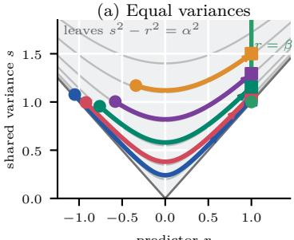  
(b) Unequal variances

When $p = q$ , set $s : = p$ . Then $b = 0$ and trajectories follow hyperbolas $s ^ { 2 } - r ^ { 2 } = \alpha ^ { 2 }$ in $s \geq | r |$ (Figure 1(a)). For $\alpha > 0$ , they converge to $( r , s ) = ( \beta , \sqrt { \beta ^ { 2 } + \alpha ^ { 2 } } )$ ; the spectral-margin bound is exact for the minimum s on the leaf. Unequal diagonal blocks give intersections of the planes $b = b _ { 0 }$ with determinant leaves in the three-dimensional cone (panel (b)). If $b _ { 0 } ^ { 2 } + \alpha ^ { 2 } > 0$ , the endpoint is $( r _ { \infty } , a _ { \infty } ) = ( \beta , \sqrt { \beta ^ { 2 } + b _ { 0 } ^ { 2 } + \alpha ^ { 2 } ) }$

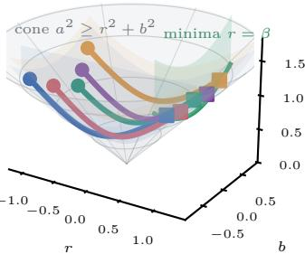  
Figure 1: Bures trajectories in the covariance cone. (a) Equal diagonal blocks: invariant hyperbolas. (b) Unequal blocks: fixed-b sections of determinant leaves. The displayed trajectories converge to $r = \beta$

The invariants 2b and $- \alpha ^ { 2 }$ are the trace and determinant of $J \Sigma$ whose eigenvalues are $b _ { 0 } \pm \sqrt { b _ { 0 } ^ { 2 } + \alpha ^ { 2 } }$ . Thus $g ( \Sigma _ { 0 } ) = 2 \sqrt { b _ { 0 } ^ { 2 } + \alpha ^ { 2 } } \mathrm { : }$ the convergence bound covers both panels, including singular leaves with $b _ { 0 } \neq 0$ . Remark C.8 in Appendix C.3 treats the zero-support-gap boundary. Figure 1 is obtained by integrating $\dot { r } = - 2 \sqrt { r ^ { 2 } + b _ { 0 } ^ { 2 } + \alpha ^ { 2 } ( r - \beta ) }$

## 3 Linear convergence of training dynamics

Convergence of gradient flow A positive conserved support gap $g ( \Sigma _ { 0 } ) > 0$ guarantees global linear convergence for the Bures flow (2), including some cases where the initial covariance $\Sigma _ { 0 }$ is singular. Write $\Delta _ { t } : = \ell ( \Sigma _ { t } ^ { v u } ) - \ell ,$ ⋆ for the loss gap and $S _ { \star }$ for the set of global predictor minimizers.

Theorem 3.1 (Global convergence from a positive support gap). Under Assumption $1 . 1 ,$ let $\Sigma _ { 0 } \succeq 0$ be a possibly singular covariance with $g ( \Sigma _ { 0 } ) > 0$ . Then the solution of (2) is global and satisfies

$$
\Delta _ { t } \leq \Delta _ { 0 } e ^ { - 2 \kappa g ( \Sigma _ { 0 } ) t } , \qquad t \geq 0 .\tag{6}
$$

As $t \to \infty , \Sigma _ { t } \to \Sigma _ { \infty } \succeq 0$ with rank $\Sigma _ { \infty } = \mathrm { r a n k } \Sigma _ { 0 }$ and $\Sigma _ { \infty } ^ { v u } \in \mathcal { S } _ { \star }$ . The predictor $\Sigma ^ { v u }$ and any factor realization (as $p e r \ ( 1 ) )$ converge linearly with rate $\kappa g ( \Sigma _ { 0 } )$ in Frobenius norm.

The only nondegeneracy requirement is $g ( \Sigma _ { 0 } ) ~ > ~ 0$ . Positive definiteness is suficient but not necessary: $\Sigma _ { 0 } \succ 0$ implies $g ( \Sigma _ { 0 } ) \geq 2 \lambda _ { \operatorname* { m i n } } ( \Sigma _ { 0 } ) > 0$ and then $\Sigma _ { \infty } \succ 0$ . The exponent separates loss geometry (captured by the PL constant κ) from initial covariance conditioning (the support gap $g ( \Sigma _ { 0 } ) )$ , with no extra dimension factor. The trajectory selects a global minimizer according to its initialization and dynamics. Proposition C.4 supplies all explicit prefactors and bounds.

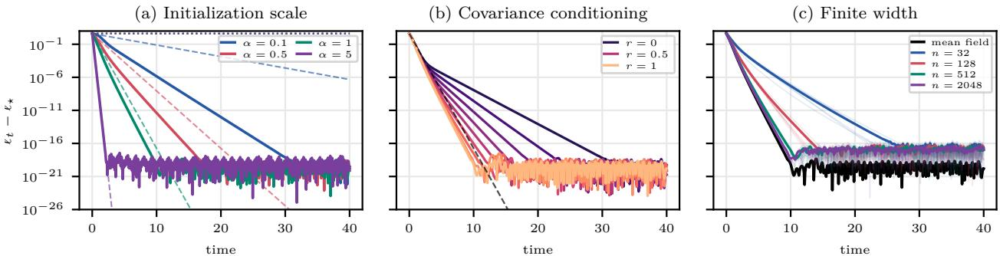  
Figure 2: Numerical convergence for quadratic loss with $d _ { u } = 1 6 , d _ { v } = 9$ , a random teacher, and whitened input. (a) Bures flow from ${ \boldsymbol { \Sigma } } _ { 0 } = \alpha \mathrm { I d } _ { m }$ at several white scales. Dashed lines show the spectral-margin rate 4ακ from Theorem 3.1; dotted lines show the coarse rate $4 \kappa c _ { \mathrm { c o a r s e } }$ from the determinant comparison in Appendix C.3 (Remark C.7), using the exact initial sublevel radius $M = 2 \| \Sigma _ { \star } ^ { v u } \| _ { \mathrm { F } }$ . (b) Rate deterioration when one matched diagonal pair of $\Sigma _ { 0 }$ is scaled by r: $r = 1$ is the white reference and $r = 0$ is rank-deficient. (c) Bures flow from the reference covariance $\widetilde { \Sigma } _ { 0 } = \mathrm { I d } _ { m }$ compared with finite-width flows initialized by i.i.d. samples from $\mathcal { N } ( 0 , \widetilde { \Sigma } _ { 0 } )$ , for n = 32, 128, 512, 2048 and five independent trials.

Remark 3.2 (Singular covariance and predictor rank). The initialization $\Sigma _ { 0 } = \mathrm { d i a g } ( \mathrm { I d } _ { d _ { u } } , 0 _ { d _ { v } } )$ has $a _ { + } ( \Sigma _ { 0 } ) = 1 , a _ { - } ( \Sigma _ { 0 } ) = 0$ , and $g ( \Sigma _ { 0 } ) = 1$ . Its rank is only $d _ { u }$ , yet the theorem applies. There is no rank contradiction: a full-rank predictor needs rank min $( d _ { u } , d _ { v } )$ , not m. More generally, $a _ { + } ( \Sigma _ { 0 } ) > 0$ implies rank $\Sigma _ { 0 } \geq d _ { u }$ , while $a _ { - } ( \Sigma _ { 0 } ) > 0$ implies rank $\Sigma _ { 0 } \geq d _ { v }$ . The condition cannot be dropped altogether: for $d _ { u } = d _ { v } = 2 , \ : \Sigma _ { 0 } = \mathrm { d i a g } ( 1 , 0 , 1 , 0 )$ and $\ell ( S ) : = \left\| S - e _ { 2 } e _ { 2 } ^ { \intercal } \right\| _ { \mathrm { F } } ^ { 2 } / 2$ , the flow is stationary and nonoptimal. Here $g ( \Sigma _ { 0 } ) = 0$ , despite the nonzero signed eigenvalues +1, −1.

Remark 3.3 (Quadratic specialization). For $\begin{array} { r } { \ell ( S ) : = \frac { 1 } { 2 } \left. \mathcal { Q } [ S - \Sigma _ { \star } ^ { v u } ] , S - \Sigma _ { \star } ^ { v u } \right. } \end{array}$ with $\mathcal { Q } \succeq 0$ a nonzero self-adjoint linear operator, the exponent is $2 g ( \Sigma _ { 0 } ) \lambda _ { \mathrm { m i n } } ^ { + } ( \mathcal { Q } )$ . For a full-rank isotropic initialization $\Sigma _ { 0 } = \sigma ^ { 2 } \mathrm { I d } _ { m }$ , one has $a _ { + } ( \Sigma _ { 0 } ) = a _ { - } ( \Sigma _ { 0 } ) = \sigma ^ { 2 }$ , giving a rate of $4 \sigma ^ { 2 } \lambda _ { \mathrm { m i n } } ^ { + } ( \mathcal { Q } )$ . The operator Q is allowed to have a nontrivial kernel: the predictor $\Sigma ^ { v u }$ converges to a point in $\Sigma _ { \star } ^ { v u } +$ ker Q. $I f \ \mathcal { Q }$ is positive definite, the predictor converges to the teacher $\Sigma _ { \star } ^ { v u }$

For a quadratic predictor loss, Figure 2 compares the initialization scale, loss of conditioning, and the finite-width sampling we discuss next. The dotted curves use a coarse determinant-based rate, derived for comparison in Appendix C.3. If the support gap $g ( \Sigma _ { 0 } )$ vanishes, trace and initial loss alone cannot guarantee a uniform positive rate (Example C.9). Figure 6 in Appendix F provides the counterpart for a non-quadratic smoothed-Lasso predictor loss.

Convergence under finite-width sampling Theorem 3.1 applies generally to neuron law covariances with positive support gap. We now focus on finite-width networks, whose initial empirical covariance is $\Sigma _ { 0 } : = { W _ { 0 } W _ { 0 } ^ { \top } / n }$ . For random initialization, the goal is to make this empirical covariance close to a prescribed population covariance $\widetilde { \Sigma } _ { 0 }$ , thereby retaining its support gap and convergence rate. Draw the columns $w _ { i } : = ( u _ { i } , v _ { i } )$ of $W _ { 0 } : = { \binom { U _ { 0 } } { V _ { 0 } } }$ independently from the same subgaussian distribution: $w _ { i } : = \widetilde { \Sigma } _ { 0 } ^ { 1 / 2 } \xi _ { i }$ , where $\mathbb { E } [ \xi _ { i } \xi _ { i } ^ { \top } ] = \mathrm { I d } _ { m }$ and $\mathrm { s u p } _ { \| z \| = 1 } \| \langle z , \xi _ { i } \rangle \| _ { \psi _ { 2 } } \leq K$ Here $\Vert X \Vert _ { \psi _ { 2 } } : = \operatorname* { i n f } \{ c > 0 : \mathbb { E } e ^ { X ^ { 2 } / c ^ { 2 } } \leq 2 \}$ denotes the standard subgaussian norm (Vershynin, 2018); standard Gaussian sampling has dimension-independent K. Thus $\mathbb { E } [ w _ { i } w _ { i } ^ { \top } ] = \widetilde { \Sigma } _ { 0 }$ , whereas $\Sigma _ { 0 } = { W _ { 0 } W _ { 0 } ^ { \top } / n }$ is the empirical covariance of finitely many sampled neurons. The loss gap along the sampled trajectory remains $\Delta _ { t } = \ell ( \Sigma _ { t } ^ { v u } ) - \ell _ { \star }$ and we write $\widetilde { \Delta } _ { 0 } : = \ell ( \widetilde { \Sigma } _ { 0 } ^ { v u } ) - \ell _ { \star }$ for its population reference.

Corollary 3.4 (Finite width preserves the population rate). Under Assumption 1.1, let $\widetilde { \Sigma } _ { 0 } \succeq 0$ with $g ( \widetilde { \Sigma } _ { 0 } ) > 0$ , set $r _ { 0 } : = \mathrm { r a n k } \widetilde { \Sigma } _ { 0 }$ , and fix $\varepsilon , \delta \in ( 0 , 1 )$ . There is a universal $C > 0$ such that, if

$$
\begin{array} { r } { n \ge C K ^ { 4 } \varepsilon ^ { - 2 } \big ( r _ { 0 } + \log ( 2 / \delta ) \big ) , } \end{array}\tag{7}
$$

then with probability at least $1 - \delta _ { i }$ , it holds that $( 1 - \varepsilon ) \widetilde { \Sigma } _ { 0 } \preceq \Sigma _ { 0 } \preceq ( 1 + \varepsilon ) \widetilde { \Sigma } _ { 0 }$ . On this event, $g ( \Sigma _ { 0 } ) \geq ( 1 - \varepsilon ) g ( \widetilde { \Sigma } _ { 0 } )$ , the empirical factor flow (1) is global, and $\Delta _ { t } \leq \Delta _ { 0 } e ^ { - 2 \kappa ( 1 - \varepsilon ) g ( \widetilde { \Sigma } _ { 0 } ) t }$ for all $t \geq 0$ . The factors $( U _ { t } , V _ { t } )$ converge to a limit with globally optimal predictor $\begin{array} { r } { \frac { 1 } { n } V _ { \infty } U _ { \infty } ^ { \top } = \Sigma _ { \infty } ^ { v u } } \end{array}$

Remark 3.5 (Width and initialization geometry). The condition $g ( \widetilde { \Sigma } _ { 0 } ) > 0$ forces $r _ { 0 } \geq \operatorname* { m i n } ( d _ { u } , d _ { v } )$ and this minimum is attainable. If $d _ { u } \leq d _ { v }$ , take $\widetilde \Sigma _ { 0 } = \mathrm { d i a g } ( 2 \sigma ^ { 2 } \mathrm { I d } _ { d _ { u } } , 0 _ { d _ { v } } ) , \sigma > 0 .$ : then $r _ { 0 } = d _ { u }$ and $g ( \widetilde { \Sigma } _ { 0 } ) = 2 \sigma ^ { 2 }$ . With Gaussian sampling, Corollary $\ 3 . 4$ gives width proportional to $\varepsilon ^ { - 2 } ( d _ { u } + \log ( 2 / \delta ) )$ and rate $4 ( 1 - \varepsilon ) \kappa \sigma ^ { 2 }$ , the same as for full-rank population covariance $\sigma ^ { 2 } \mathrm { I d } _ { m }$ . Here every vi starts at zero, so $\Sigma _ { 0 } ^ { v u } = 0$ and $\Delta _ { 0 } = \widetilde { \Delta } _ { 0 }$ exactly. Exchanging the blocks gives dependence on min $( d _ { u } , d _ { v } )$ in general. This improvement changes the initialization: for $\widetilde \Sigma _ { 0 } = \sigma ^ { 2 } \mathrm { I d } _ { m } , r _ { 0 } = m$ . Its empirical support gap can vanish at small width even though its population support gap is positive (Example C.11).

For the sampling scheme in Corollary 3.4, the prefactor is the empirical initial loss gap $\Delta _ { 0 } .$ , which need not equal the population loss gap $\tilde { \Delta } _ { 0 }$ . Controlling it is a separate accuracy requirement: for isotropic Gaussian sampling and the standard quadratic loss, the expected excess initial error is $\sigma ^ { 4 } d _ { u } d _ { v } / ( 2 n )$ (Proposition C.13). Theorem C.12 gives a separate accuracy budget and a deterministic loss envelope. For population variance $\sigma ^ { 2 } \mathrm { I d } _ { m }$ and $\varepsilon = 1 / 2$ , the certified exponent is $2 \kappa \sigma ^ { 2 }$

Convergence of gradient descent Unlike finite-width sampling of neurons, discretized gradient descent in the factor matrices $( U , V )$ with a finite step size changes the covariance evolution itself. We show that suficiently small step sizes retain global linear convergence by controlling the accumulated conservation error. We consider discrete-time gradient descent (GD) on the factor matrices, using an Euler discretization of (1) with step size τ. As in the gradient flow setting, define $\Sigma _ { k } : = \boldsymbol { W _ { k } } \boldsymbol { W } _ { k } ^ { \top } / n$ $\Sigma _ { k } ^ { v u } : = V _ { k } U _ { k } ^ { \top } / n$ , and $\Delta _ { k } : = \ell ( \Sigma _ { k } ^ { v u } ) - \ell _ { \star }$ . Setting $E _ { k } : = \nabla \ell ( \Sigma _ { k } ^ { v u } )$ and $G _ { k } : = G _ { E _ { k } }$ , the iterates read

$$
U _ { k + 1 } = U _ { k } - \tau E _ { k } ^ { \top } V _ { k } , \qquad V _ { k + 1 } = V _ { k } - \tau E _ { k } U _ { k } .\tag{8}
$$

Equivalently, $\begin{array} { r } { W _ { k + 1 } = W _ { k } - n \tau \nabla _ { W } \mathcal { L } ( U _ { k } , V _ { k } ) } \end{array}$ : this is GD for $n \mathcal { L }$ with stepsize $\tau ,$ or for $\mathcal { L }$ with stepsize nτ . Writing $W _ { k + 1 } = M _ { k } W _ { k }$ with $M _ { k } : = { \mathrm { I d } } - \tau G _ { k }$ gives

$$
\Sigma _ { k + 1 } = M _ { k } \Sigma _ { k } M _ { k } = \Sigma _ { k } - \tau ( G _ { k } \Sigma _ { k } + \Sigma _ { k } G _ { k } ) + \tau ^ { 2 } G _ { k } \Sigma _ { k } G _ { k } .\tag{9}
$$

The additional term $\tau ^ { 2 } G _ { k } \Sigma _ { k } G _ { k }$ arises from taking the GD step in the individual factors $( U , V )$ and is absent from an Euler step taken directly on the Bures ODE.

A positive initial support gap $g ( \Sigma _ { 0 } )$ still guarantees global linear convergence for suficiently small step sizes τ. The condition on τ is given below and depends only on the initial covariance, initia loss gap, and loss parameters; it controls both descent and the accumulated conservation error.

Theorem 3.6 (Small-step global convergence of factor descent). Under Assumption $1 . 1 ,$ , let $\Sigma _ { 0 } : = W _ { 0 } W _ { 0 } ^ { \top } / n ~ s a t i s f y ~ g ( \Sigma _ { 0 } ) > 0$ , and suppose $\Delta _ { 0 } > 0$ . Set $I _ { \star } : = 4 \sqrt { \Delta _ { 0 } / \kappa } / g ( \Sigma _ { 0 } )$ . If

$$
0 < \tau \leq \tau _ { \mathrm { G D } } : = g ( \Sigma _ { 0 } ) e ^ { - 2 I _ { \star } } \operatorname* { m i n } \left\{ \frac { 1 } { 4 \left\| \Sigma _ { 0 } \right\| _ { \mathrm { o p } } \sqrt { L \Delta _ { 0 } } + 9 \sqrt { 2 } L \left\| \Sigma _ { 0 } \right\| _ { \mathrm { o p } } ^ { 2 } e ^ { 2 I _ { \star } } } , \quad \frac { \sqrt { 2 } - 1 } { 4 \Delta _ { 0 } } \right\} ,\tag{10}
$$

then, with $q : = 1 - \kappa \tau g ( \Sigma _ { 0 } ) / \sqrt { 2 } \in ( 0 , 1 )$ it holds that $\Delta _ { k } \leq q ^ { k } \Delta _ { 0 }$ . The factors $W _ { k }$ and covariance $\Sigma _ { k }$ converge at rate $q ^ { k / 2 }$ to limits $W _ { \infty }$ and $\Sigma _ { \infty } \succeq 0$ , with rank $\Sigma _ { \infty } = \mathrm { r a n k } \Sigma _ { 0 }$ and $\Sigma _ { \infty } ^ { v u } \in \mathcal S _ { \star }$ ; explicit prefactors are given in (46).

The support-gap condition $g ( \Sigma _ { 0 } ) > 0$ is implied by $\Sigma _ { 0 } \succ 0$ , in which case $\Sigma _ { \infty }$ is also positive definite. The threshold $\tau _ { \mathrm { G D } }$ is positive for every initialization with $g ( \Sigma _ { 0 } ) > 0$ and $\Delta _ { 0 } < \infty ;$ no initial loss gap assumption or dimension-dependent term is needed. The first restriction ensures descent, and the second controls the accumulated conservation error.

Appendix C.5 gives the explicit expression for $\tau _ { \mathrm { G D } }$ when $\Sigma _ { 0 } = \sigma ^ { 2 } \mathrm { I d } _ { m }$ and a comparison with the step-size condition obtained by linearizing near an equilibrium (Remark C.16). Proposition C.17 shows that suficiently small step sizes yield a certified loss-decay exponent arbitrarily close to $2 \kappa g ( \Sigma _ { 0 } )$ , the gradient-flow exponent in Theorem 3.1. Corollary C.18 gives a step size chosen before sampling the factors, using the loss parameters and the bounds on the initial support gap, covariance norm, and loss gap from Theorem C.12.

## 4 Deep linear residual networks

We now turn to deep linear residual networks (ResNets), including a continuous-depth formulation. To stabilize optimization as depth increases, the networks considered here use skip connections between successive layers and scale each residual update by the inverse depth. In this section, we demonstrate that linear ResNets also enjoy global exponential convergence rates that remain uniform across depths, provided the average conserved layer support gap is bounded away from zero and the residual predictors satisfy an a priori operator-norm bound independent of depth throughout training. The latter is an additional hypothesis: layerwise conservation alone does not control forward and backward propagation. For simplicity, we state the results for gradient flow, as in Section 3.

Finite-depth setting We consider a depth-S, width-n network with matching input and output dimensions $d _ { u } = d _ { v } = d _ { \colon }$ , and set $h : = 1 / S$ . For $s = 0 , \ldots , S - 1$ , layer s has factors $U _ { s } , V _ { s } \in \mathbb { R } ^ { d \times n }$ covariance $\Sigma _ { s } : = { W _ { s } W _ { s } ^ { \top } } / { n }$ with $\begin{array} { r } { W _ { s } : = { \binom { U _ { s } } { V _ { s } } } } \end{array}$ , and predictor $\Sigma _ { s } ^ { v u } : = V _ { s } U _ { s } ^ { \top } / n$ . The network maps an input $x ^ { 0 } \in \mathbb { R } ^ { d }$ to its output $x ^ { S }$ through

$$
\begin{array} { r } { x ^ { s + 1 } = x ^ { s } + \frac { 1 } { S n } V _ { s } U _ { s } ^ { \top } x ^ { s } = A _ { s } x ^ { s } , \qquad A _ { s } : = \mathrm { I d } + h \Sigma _ { s } ^ { v u } , \qquad s = 0 , \dots , S - 1 . } \end{array}
$$

Thus $x ^ { S } = P _ { S } x ^ { 0 }$ , where the endpoint predictor is the ordered product

$$
\begin{array} { r } { P _ { S } : = A _ { S - 1 } \cdot \cdot \cdot A _ { 0 } = \left( \operatorname { I d } + \frac { V _ { S - 1 } U _ { S - 1 } ^ { \top } } { S n } \right) \cdot \cdot \cdot \left( \operatorname { I d } + \frac { V _ { 0 } U _ { 0 } ^ { \top } } { S n } \right) . } \end{array}
$$

Backpropagation in the factors couples the layers through these products, which can be singular even when every layer covariance is positive definite. Let $P _ { > s } : = A _ { S - 1 } \cdot \cdot \cdot A _ { s + 1 }$ and $P _ { < s } : = A _ { s - 1 } \cdot \cdot \cdot A _ { 0 } .$ with empty products equal to Id. For $E : = \nabla \ell ( P _ { S } )$ , the backpropagated gradient is $\widetilde { E } _ { s } : = P _ { > s } ^ { \top } E P _ { < s } ^ { \top } .$ In residual mean-field time, each layer obeys

$$
\begin{array} { r } { \dot { \Sigma } _ { s } = - ( \widetilde G _ { s } \Sigma _ { s } + \Sigma _ { s } \widetilde G _ { s } ) , \qquad \widetilde G _ { s } : = G _ { \widetilde { E } _ { s } } . } \end{array}\tag{11}
$$

This is the covariance equation corresponding to factor gradient flow for $n S \ell ( P _ { S } )$ . Since $\widetilde { G } _ { s } J + J \widetilde { G } _ { s } =$ 0, the signed margins are conserved separately at every layer.

Theorem 4.1 (Finite-depth convergence from conserved layer margins). Under Assumption 1.1 for the endpoint loss, suppose $\Sigma _ { s } ( 0 ) \succ 0$ for all s, and write $\begin{array} { r } { \overline { { g } } _ { S } : = S ^ { - 1 } \sum _ { s = 0 } ^ { S - 1 } g ( \Sigma _ { s } ( 0 ) ) } \end{array}$ for the average initial support gap. Suppose sups $\| \Sigma _ { s } ^ { v u } ( t ) \| _ { \mathrm { o p } } \leq B < S$ for some constant $0 \leq B <$ ∞ on the maximal existence interval, and define the propagation lower bound $\underline { { \sigma } } _ { S } : = ( 1 - B / S ) ^ { S - 1 }$ . Then the flow is global and $\Delta _ { t } : = \ell ( P _ { S } ( t ) ) - \ell _ { \star } \leq \Delta _ { 0 } e ^ { - 2 \kappa \overline { { g } } _ { S } \underline { { \sigma } } _ { S } ^ { 2 } t }$ . Every layer’s covariance and factors converge, and the limiting endpoint is globally optimal.

The rate combines the average support gap $\overline { { g } } _ { S }$ with $\underline { { \sigma } } _ { S } ^ { 2 }$ . For fixed B, this product-conditioning factor tends to $e ^ { - 2 B }$ and is at least $e ^ { - 4 B }$ when $S \geq 2 B$ . For fixed B, a positive lower bound on the average layer support gap sufices for a convergence rate uniform in depth.

Continuous-depth limit Formally in the limit $S \to \infty ,$ residual products become propagators of a linear ODE. Theorem 4.1 can be extended to a continuum of residual layers when these propagators stay uniformly conditioned, but requires a well-defined global training trajectory. Let $s \in [ 0 , 1 ]$ denote depth. At time t, the network maps x to $P ( t ) x ,$ , where $P ( t ) : = X _ { 1 } ( t )$ and $X _ { s } ( t )$ solves

$$
\partial _ { s } X _ { s } ( t ) = \Sigma _ { s } ^ { v u } ( t ) X _ { s } ( t ) , \qquad X _ { 0 } ( t ) = \mathrm { I d } .
$$

Write $P _ { b , a } ( t )$ for the propagator from depth a to depth b. The backpropagated gradient at depth s is $\widetilde E _ { s } : = P _ { 1 , s } ^ { \top } \nabla \ell ( P ) P _ { s , 0 } ^ { \top }$ . We assume the covariance profile $s \mapsto \Sigma _ { s } ( t )$ is defined for all training times $t \geq 0$ and depends locally absolutely continuously on t as an element of $L ^ { 1 } ( [ 0 , 1 ] ; \mathbb { S } ^ { 2 d } )$ . The layer covariances are positive semidefinite and satisfy (11) in $L ^ { 1 }$ . Its precise time-integral form is (50) in Appendix C.6.

Theorem 4.2 (Continuous-depth convergence from averaged margins). Under Assumption 1.1 for the endpoint loss, consider a covariance profile satisfying the assumptions above, with $\Sigma _ { s } ( 0 ) \succ 0$ for almost every s. Set $\textstyle { \overline { { g } } } : = \int _ { 0 } ^ { 1 } g ( \Sigma _ { s } ( 0 ) ) \mathrm { d } s \in ( 0 , \infty )$ $\begin{array} { r } { I f \operatorname* { s u p } _ { t \geq 0 } \int _ { 0 } ^ { 1 } \| \Sigma _ { s } ^ { v u } ( t ) \| _ { \mathrm { o p } } \mathrm { d } s \leq B < \infty } \end{array}$ , then

$$
\ell ( P ( t ) ) - \ell _ { \star } \leq ( \ell ( P ( 0 ) ) - \ell _ { \star } ) e ^ { - 2 \kappa \overline { { g } } e ^ { - 2 B } t } .\tag{12}
$$

As $t \to \infty , \Sigma _ { s } ( t ) \to \Sigma _ { s } ^ { \infty }$ for almost every depth s, and profiles converge in $L ^ { 1 } ( [ 0 , 1 ] ; \mathbb { S } ^ { 2 d } )$ . The network defined by the limiting profile attains loss $\ell _ { \star }$ . Moreover, $\Sigma _ { s } ^ { \infty } \succ 0 f o r$ almost every s, although its smallest eigenvalue need not be bounded away from zero uniformly over depth.

The need for additional residual-path boundedness assumptions arises because the loss depends only on the endpoint $s = 1 \colon$ see Remark C.19 in Appendix C.6.

## 5 Heavy-ball momentum convergence

We now turn our attention to the analogous dynamics in an inertial setting that models heavy-ball momentum-based optimization. Upon introducing momentum, the system no longer closes on the position covariance of the neuron weights $( u , v )$ alone: one must instead consider the phase space of positions and velocities tracked jointly. We show that, in terms of the phase covariance, dynamics are again closed for linear networks. We derive conservation identities describing this phase geometry; energy dissipation and control of position deformation give the convergence certificate below.

Dynamics and phase closure Inertia adds velocity as a state variable, so the natural moment over which the dynamics close is the joint position-velocity covariance. For $\begin{array} { r } { W : = { \binom { U } { V } } } \end{array}$ , predictor $\Sigma ^ { v u } : = V U ^ { \top } / n$ , and damping $\gamma > 0$ , write $E : = \nabla \ell ( \Sigma ^ { v u } )$ . The factor dynamics are

$$
\begin{array} { r } { \ddot { W } + \gamma \dot { W } + G ( \Sigma ^ { v u } ) W = 0 , \qquad G ( \Sigma ^ { v u } ) : = \left( \begin{array} { l l } { 0 } & { E ^ { \top } } \\ { E } & { 0 } \end{array} \right) . } \end{array}\tag{13}
$$

Write $( P , Q ) : = ( \dot { U } , \dot { V } )$ , so the columns of W and $\dot { W }$ are positions $x _ { i } : = ( u _ { i } , v _ { i } )$ and velocities $y _ { i } : = ( p _ { i } , q _ { i } )$ respectively. In this section $\Sigma : = n ^ { - 1 } \binom { W } { \dot { W } } \binom { W } { \dot { W } } ^ { \top }$ denotes the full 2m-dimensional phase covariance. Its blocks are $\Sigma ^ { ( u , v ) } : = { W W ^ { \top } } / { n } , \Sigma ^ { ( p , q ) } : = \dot { W } \dot { W } ^ { \top } / n$ , and $\boldsymbol { \Xi } : = \boldsymbol { W } \dot { \boldsymbol { W } } ^ { \top } / n ;$ the predictor remains the vu block of $\Sigma ^ { ( u , v ) }$ . With $G _ { t } : = G ( \Sigma _ { t } ^ { v u } )$ , the closed equation is

$$
\begin{array} { r } { \dot { \Sigma } _ { t } = \mathsf { M } _ { t } \Sigma _ { t } + \Sigma _ { t } \mathsf { M } _ { t } ^ { \top } , \qquad \Sigma _ { t } = \biggl ( \begin{array} { l l } { \Sigma _ { t } ^ { ( u , v ) } } & { \Xi _ { t } } \\ { \Xi _ { t } ^ { \top } } & { \Sigma _ { t } ^ { ( p , q ) } } \end{array} \biggr ) , \qquad \mathsf { M } _ { t } : = \Bigl ( \begin{array} { l l } { 0 } & { \mathrm { I d } _ { m } } \\ { - G _ { t } - \gamma \mathrm { I d } _ { m } } \end{array} \Bigr ) . } \end{array}\tag{14}
$$

Appendix C.7 gives the particle equations, measure formulation, and blockwise expansion.

Conformal laws and mechanical energy Without damping, the fundamental matrix generated by $\mathsf { M } _ { t }$ in (14) is symplectic; damping rescales the associated bilinear form exponentially in time.

Proposition 5.1 (Conformal phase conservation laws). Let $J _ { \mathrm { c } } : = \left( { \begin{array} { c c } { 0 } & { \operatorname { I d } _ { m } } \\ { - \operatorname { I d } _ { m } } & { 0 } \end{array} } \right)$ . The phase fundamental matrix $\dot { \Psi } _ { t } = \mathsf { M } _ { t } \Psi _ { t } , \Psi _ { 0 } = \mathrm { I d } _ { 2 m }$ generated by $\mathsf { M } _ { t }$ satisfies

$$
( \Psi _ { t } ) ^ { \top } J _ { \mathrm { c } } \Psi _ { t } = e ^ { - \gamma t } J _ { \mathrm { c } } , \qquad \Sigma _ { t } = \Psi _ { t } \Sigma _ { 0 } ( \Psi _ { t } ) ^ { \top } .
$$

Consequently, the spectrum of $e ^ { \gamma t } J _ { \mathrm { c } } \Sigma _ { t }$ and all its trace powers are constant. At the characteristic level, these identities imply that, for any two trajectories of the same flow, $z _ { a } : = ( x _ { a } , y _ { a } ) , z _ { b } : = ( x _ { b } , y _ { b } )$ 2 $e ^ { \gamma t } z _ { a } ^ { \top } J _ { \mathrm { c } } z _ { b }$ is conserved.

Special spectral values permit reduced phase dynamics, we describe these in Appendix E. As before, write $\Delta _ { t } : = \ell ( \Sigma _ { t } ^ { v u } ) - \ell _ { \star }$ for the predictor loss gap. Define $\mathcal { K } _ { t } : = \mathrm { t r } ( \Sigma _ { t } ^ { ( p , q ) } ) / 2$ and $\mathcal { E } _ { t } : = \Delta _ { t } + \mathcal { K } _ { t }$ as the kinetic and mechanical excess energies. Diferentiating $\mathcal { E } _ { t }$ along (14) gives $\dot { \mathcal { E } } _ { t } = - 2 \gamma { \mathcal { K } } _ { t }$ . This identity gives global existence of the solution to (14) from every $\Sigma _ { 0 } \succeq 0$ (Proposition C.22). The remaining task is to derive spectral lower bounds for $\Sigma _ { t } ^ { ( u , v ) }$

Global convergence We seek an initialization condition on $\Sigma _ { 0 }$ that keeps $\Sigma _ { t } ^ { ( u , v ) }$ uniformly elliptic for the whole trajectory. Let $a _ { 0 } : = \lambda _ { \operatorname* { m i n } } ( \Sigma _ { 0 } ^ { ( u , v ) } ) > 0$ and $b _ { 0 } : = \lambda _ { \operatorname* { m a x } } ( \Sigma _ { 0 } ^ { ( u , v ) } )$ . A deformation budget $s > 0$ specifies a spectral interval $[ a _ { s } , b _ { s } ] : = [ a _ { 0 } e ^ { - 2 s } , b _ { 0 } e ^ { 2 s } ]$ for $\Sigma _ { t } ^ { ( u , v ) }$ . For $\mathcal { E } _ { 0 } > 0$ , put $\rho _ { s } : = 4 b _ { s } L + 2 \sqrt { 2 L \mathcal { E } _ { 0 } }$ and define

$$
\begin{array} { r } { \lambda _ { s } ( \gamma ) : = \frac { a _ { s } \kappa \gamma } { \rho _ { s } + 2 \gamma ^ { 2 } } , \qquad \mathfrak { S } _ { s } ( \gamma ) : = \frac { 4 } { \lambda _ { s } ( \gamma ) } \sqrt { \frac { 3 \mathcal { E } _ { 0 } } { 2 a _ { s } } } . } \end{array}\tag{15}
$$

Here, $\lambda _ { s }$ is the exponential decay rate of $\mathcal { E } _ { t } ,$ and ${ \mathfrak { S } } _ { s }$ bounds the resulting total deformation in $\Sigma _ { t } ^ { ( u , v ) }$ 2 conditional on the spectral interval $[ a _ { s } , b _ { s } ]$

Theorem 5.2 (Global linear rate from a phase-energy certificate). Under Assumption 1.1, let $\Sigma _ { 0 } \succeq 0$ with $\Sigma _ { 0 } ^ { ( u , v ) } \succ 0$ and $\mathcal { E } _ { 0 } > 0 . \ I f \mathfrak { S } _ { s } ( \gamma ) < s$ for some $s > 0$ , then for all $t \geq 0$

$$
a _ { s } \mathrm { I d } _ { m } \preceq \Sigma _ { t } ^ { ( u , v ) } \preceq b _ { s } \mathrm { I d } _ { m } , \qquad \mathcal { E } _ { t } \leq 3 \mathcal { E } _ { 0 } e ^ { - \lambda _ { s } ( \gamma ) t } .
$$

The covariance $\Sigma _ { t } ^ { ( u , v ) }$ and any associated factors $( U _ { t } , V _ { t } )$ evolving under (13) converge exponentially with rate $\lambda _ { s } / 2$ to limits with optimal predictor and $\Sigma _ { \infty } ^ { ( u , v ) } \succ 0 ; \Sigma _ { t } ^ { ( p , q ) }$ tends to zero.

Corollary 5.3 (Two-scale white initialization). Under Assumption 1.1, let $\Sigma _ { 0 } ^ { ( u , v ) } = \sigma _ { v u } ^ { 2 } \mathrm { I d } _ { m } , \Xi _ { 0 } = 0 .$ and $\Sigma _ { 0 } ^ { ( p , q ) } \succeq 0$ have trace $m \sigma _ { q p } ^ { 2 } ,$ with $\sigma _ { v u } > 0 , \sigma _ { q p } \geq 0$ . Then $\mathcal { E } _ { 0 } = \Delta + m \sigma _ { q p } ^ { 2 } / 2$ , where $\Delta : = \ell ( 0 ) - \ell _ { \star }$ $I f \mathcal { E } _ { 0 } > 0$ , the certificate is

$$
\begin{array} { r } { 2 \gamma ^ { 2 } - \frac { s \kappa \sigma _ { v u } ^ { 3 } e ^ { - 3 s } } { 4 \sqrt { 3 \mathcal { E } _ { 0 } / 2 } } \gamma + 4 L \sigma _ { v u } ^ { 2 } e ^ { 2 s } + 2 \sqrt { 2 L \mathcal { E } _ { 0 } } < 0 . } \end{array}
$$

For fixed $s , \gamma > 0 , \Delta , \sigma _ { q p } , m , L , \kappa ,$ suficiently large $\sigma _ { v u }$ satisfies this condition.

Appendix C.10 gives explicit bounds on the admissible $\gamma$ interval and analyzes the $\mathrm { l a r g e - } \sigma _ { v u }$ asymptotics.

Numerical view of the bootstrap certificate Writing $\mathfrak { G } _ { s } ( \gamma ) : = \mathfrak { S } _ { s } ( \gamma ) - s$ , Figure 3 shows the boundaries ${ \mathfrak { G } } _ { s } ( \gamma ) = 0$ for $1 \leq \sigma _ { v u } \leq 1 0 ^ { 3 }$ , with $( d _ { u } , d _ { v } ) = ( 3 , 2 )$ 2 $\kappa = L = 1$ $\sigma _ { q p } = 1$ and $\ell ( 0 ) - \ell _ { \star } = 1$ . The regions where ${ \mathfrak { G } } _ { s } ( \gamma ) < 0$ specify the pairs $( s , \gamma )$ for which Theorem 5.2 guarantees spectral bounds and exponential energy decay. For the two-scale initialization, suficiently large $\sigma _ { v u }$ yields a nonempty interval of $\gamma$ satisfying Corollary 5.3. For fixed initialization and damping, a smaller admissible s gives a tighter tube and faster rate; Figure 5 illustrates the limiting rate at the feasibility boundary analyzed in Appendix C.10.

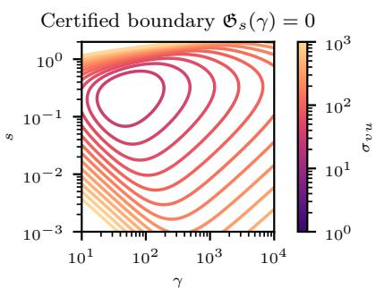  
Figure 3: Two-scale white momentum initialization. Curves show ${ \mathfrak { G } } _ { s } ( \gamma ) = 0$ for the color-bar scale $\sigma _ { v u } ;$ their interiors are certified damping windows.

Figure 4 compares empirical losses with the upper bounds on   
$\mathcal { E } _ { t }$ from Corollary C.29. Each upper bound curve uses an ex  
plicit, approximately optimal rate certified by Theorem 5.2 (see   
Proposition C.28); no rate is fitted to the empirical trajectory.   
All displayed losses stay below their upper bounds. Notably in this inertial setting, the predictor All displayed losses stay below their upper bounds. Notably in loss may oscillate even while the mechanical energy decreases. loss may oscillate even while the mechanical energy decreases.

(a) σvu = 200  
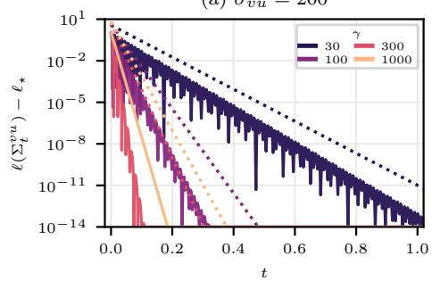

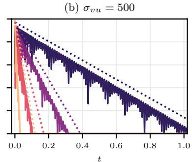

(c) σvu = 1000  
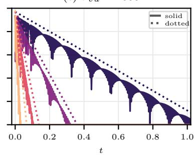  
Figure 4: Empirical predictor-loss trajectories (solid) and the corresponding upper bounds on mechanical excess energy (dotted) for two-scale white initializations with varying $\sigma _ { v u }$ and damping γ: (a) $\sigma _ { v u } = 2 0 0$ , (b) $\sigma _ { v u } = 5 0 0 $ , and (c) $\sigma _ { v u } = 1 0 0 0$ . Each theoretical curve uses the explicit, approximately optimal rate on a tube certified by Theorem 5.2.

## 6 Conclusion

The present work addresses two-layer linear networks, making use of the exact closure of meanfield training on the neuron law covariance as a finite-dimensional Bures flow. This flow enjoys conservation laws that control the ellipticity of the predictor preconditioner through a conserved spectral support gap, yielding global linear convergence whenever this gap is positive. In particular, this is guaranteed for every positive-definite initial covariance and for smooth PL predictor losses. We show that this guarantee survives finite-width sampling of neurons, and extends to discrete-time gradient descent in the factors through approximate versions of the same conservation laws. The covariance viewpoint clarifies two further extensions: for deep linear ResNets, the same conservation law holds layerwise and gives linear convergence conditional on bounded residual paths. Heavy-ball momentum dynamics close in the joint phase covariance, where conformal conservation laws and mechanical energy lead to an explicit damping certificate from general initial phase moments. The certificate includes two-scale white initializations without imposing a phase-covariance identity. Covariance conditioning is the common quantitative mechanism throughout our analysis.

## Acknowledgments

Gabriel Peyré acknowledges support from the European Research Council through the WOLF project, and from France 2030 through grant ANR-23-IACL-0008 (PRAIRIE-PSAI), administered by the Agence Nationale de la Recherche.

## AI use statement

In this work, we used generative AI tools including GPT 5.6 and GPT 6 for aiding and polishing writing, research ideation and execution, drafting some sections of the paper, and deriving or proving mathematical claims as directed by the authors. Where outputs were produced by generative AI, these were refined through extensive iteration, verification, and manual editing of the results and exposition. We have reviewed all AI-assisted work, having verified the claims, proofs and other material presented in this paper. We take responsibility for the final content of this work, including text, claims or artifacts produced with the aid of generative AI.

## References

Sanjeev Arora, Nadav Cohen, Noah Golowich, and Wei Hu. A convergence analysis of gradient descent for deep linear neural networks. In International Conference on Learning Representations, 2019. arXiv:1810.02281.

Raphaël Barboni, Gabriel Peyré, and François-Xavier Vialard. Understanding the training of infinitely deep and wide ResNets with conditional optimal transport. Communications on Pure and Applied Mathematics, 78(11):2149–2205, 2025. doi: 10.1002/cpa.70004. arXiv:2403.12887.

Rajendra Bhatia, Tanvi Jain, and Yongdo Lim. On the Bures–Wasserstein distance between positive definite matrices. Expositiones Mathematicae, 37(2):165–191, 2019. doi: 10.1016/j.exmath.2018. 01.002.

Ricky T. Q. Chen, Yulia Rubanova, Jesse Bettencourt, and David K. Duvenaud. Neural ordinary diferential equations. In Advances in Neural Information Processing Systems, volume 31, 2018.

Lénaïc Chizat and Francis Bach. On the global convergence of gradient descent for over-parameterized models using optimal transport. In Advances in Neural Information Processing Systems, volume 31, 2018. arXiv:1805.09545.

Lénaïc Chizat, Edouard Oyallon, and Francis Bach. On lazy training in diferentiable programming. In Advances in Neural Information Processing Systems, volume 32, 2019. arXiv:1812.07956.

Zhiyan Ding, Shi Chen, Qin Li, and Stephen Wright. On the global convergence of gradient descent for multi-layer ResNets in the mean-field regime, 2021. arXiv:2110.02926.

Simon S. Du, Wei Hu, and Jason D. Lee. Algorithmic regularization in learning deep homogeneous models: Layers are automatically balanced. In Advances in Neural Information Processing Systems, volume 31, 2018. arXiv:1806.00900.

Kaiming He, Xiangyu Zhang, Shaoqing Ren, and Jian Sun. Deep residual learning for image recognition. In Proceedings of the IEEE Conference on Computer Vision and Pattern Recognition, pages 770–778, 2016a.

Kaiming He, Xiangyu Zhang, Shaoqing Ren, and Jian Sun. Identity mappings in deep residual networks. In European Conference on Computer Vision, pages 630–645. Springer, 2016b. doi: 10.1007/978-3-319-46493-0\_38.

Noboru Isobe. A convergence result of a continuous model of deep learning via a Łojasiewicz–Simon inequality, 2023. arXiv:2311.15365v3, revised 2026.

Arthur Jacot, Franck Gabriel, and Clément Hongler. Neural tangent kernel: Convergence and generalization in neural networks. In Advances in Neural Information Processing Systems, volume 31, 2018. arXiv:1806.07572.

Hamed Karimi, Julie Nutini, and Mark Schmidt. Linear convergence of gradient and proximalgradient methods under the Polyak–Łojasiewicz condition. In Machine Learning and Knowledge Discovery in Databases, volume 9851 of Lecture Notes in Computer Science, pages 795–811. Springer, 2016. doi: 10.1007/978-3-319-46128-1\_50. Corrected version: arXiv:1608.04636v4.

Kenji Kawaguchi. Deep learning without poor local minima. In Advances in Neural Information Processing Systems, volume 29, pages 586–594, 2016. arXiv:1605.07110.

Thomas Laurent and James von Brecht. Deep linear networks with arbitrary loss: All local minima are global. In International Conference on Machine Learning, volume 80 of Proceedings of Machine Learning Research, pages 2902–2907, 2018. arXiv:1712.01473.

Laurent Lessard, Benjamin Recht, and Andrew Packard. Analysis and design of optimization algorithms via integral quadratic constraints. SIAM Journal on Optimization, 26(1):57–95, 2016. doi: 10.1137/15M1009597.

Xin Liu, Wei Tao, and Zhisong Pan. A convergence analysis of Nesterov’s accelerated gradient method in training deep linear neural networks. Information Sciences, 612:898–925, 2022. doi: 10.1016/j.ins.2022.08.090. arXiv:2204.08306.

Yiping Lu, Chao Ma, Yulong Lu, Jianfeng Lu, and Lexing Ying. A mean-field analysis of deep ResNet and beyond: Towards provable optimization via overparameterization from depth. In International Conference on Machine Learning, volume 119 of Proceedings of Machine Learning Research, pages 6426–6436, 2020.

Sibylle Marcotte, Rémi Gribonval, and Gabriel Peyré. Abide by the law and follow the flow: Conservation laws for gradient flows. In Advances in Neural Information Processing Systems, volume 36, pages 63210–63221, 2023. arXiv:2307.00144.

Sibylle Marcotte, Gabriel Peyré, and Rémi Gribonval. Intrinsic training dynamics of deep neural networks. In International Conference on Learning Representations, 2026. arXiv:2508.07370.

Song Mei, Andrea Montanari, and Phan-Minh Nguyen. A mean field view of the landscape of two-layer neural networks. Proceedings of the National Academy of Sciences, 115(33):E7665–E7671, 2018. doi: 10.1073/pnas.1806579115. arXiv:1804.06561.

Siqiao Mu and Diego Klabjan. On the convergence rate of LoRA gradient descent. In International Conference on Machine Learning, 2026. arXiv:2512.18248.

Yurii E. Nesterov. A method of solving a convex programming problem with convergence rate O(1/k2). Doklady Akademii Nauk SSSR, 269(3):543–547, 1983.

Van-Bong Nguyen and Thi Ngan Nguyen. Positive semidefinite interval of matrix pencil and its applications to the generalized trust region subproblems. Linear Algebra and its Applications, 680:371–390, 2024. doi: 10.1016/j.laa.2023.10.015. arXiv:2302.14352.

Boris T. Polyak. Some methods of speeding up the convergence of iteration methods. USSR Computational Mathematics and Mathematical Physics, 4(5):1–17, 1964. doi: 10.1016/0041-555 3(64)90137-5.

Grant M. Rotskof and Eric Vanden-Eijnden. Parameters as interacting particles: Long time convergence and asymptotic error scaling of neural networks. In Advances in Neural Information Processing Systems, volume 31, 2018. NeurIPS proceedings.

Andrew M. Saxe, James L. McClelland, and Surya Ganguli. Exact solutions to the nonlinear dynamics of learning in deep linear neural networks. In International Conference on Learning Representations, 2014. arXiv:1312.6120.

Weijie Su, Stephen Boyd, and Emmanuel J. Candès. A diferential equation for modeling Nesterov’s accelerated gradient method: Theory and insights. Journal of Machine Learning Research, 17 (153):1–43, 2016.

Asuka Takatsu. Wasserstein geometry of Gaussian measures. Osaka Journal of Mathematics, 48(4): 1005–1026, 2011. doi: 10.18910/4973.

Salma Tarmoun, Guilherme Franca, Benjamin D. Haefele, and René Vidal. Understanding the dynamics of gradient flow in overparameterized linear models. In International Conference on Machine Learning, volume 139 of Proceedings of Machine Learning Research, pages 10153–10161, 2021.

Roman Vershynin. High-Dimensional Probability: An Introduction with Applications in Data Science. Cambridge University Press, first edition, 2018. doi: 10.1017/9781108231596.

Jun-Kun Wang, Chi-Heng Lin, and Jacob D. Abernethy. A modular analysis of provable acceleration via Polyak’s momentum: Training a wide ReLU network and a deep linear network. In International Conference on Machine Learning, volume 139 of Proceedings of Machine Learning Research, pages 10816–10827. PMLR, 2021. PMLR.

Ziqing Xu, Hancheng Min, Salma Tarmoun, Enrique Mallada, and René Vidal. Linear convergence of gradient descent for finite width over-parametrized linear networks with general initialization. In International Conference on Artificial Intelligence and Statistics, volume 206 of Proceedings of Machine Learning Research, pages 2262–2284, 2023.

Tian Ye and Simon S. Du. Global convergence of gradient descent for asymmetric low-rank matrix factorization. In Advances in Neural Information Processing Systems, volume 34, pages 1429–1439, 2021. arXiv:2106.14289.

## A Notation table

The table collects the symbols, their meanings, and their first definitions.

<table><tr><td rowspan=1 colspan=4>Notation                   Meaning                                                            First reference</td></tr><tr><td rowspan=1 colspan=3> $d _ { u } , d _ { v } , n , m$                 Input/output dimensions, width, and $m : = d _ { u } + d _ { v }$ </td><td rowspan=1 colspan=1>Section 1</td></tr><tr><td rowspan=1 colspan=3> $\begin{array} { r } { U , V , W : = \binom { U } { V } , \mathcal { L } } \end{array}$          Factor matrices, stacked positions, and factor loss</td><td rowspan=1 colspan=1>Section 1</td></tr><tr><td rowspan=1 colspan=3> $\Sigma , \Sigma ^ { u } , \Sigma ^ { v } , \Sigma ^ { v u }$              Uncentered moment, hidden blocks, and predictor</td><td rowspan=1 colspan=1>Section 2</td></tr><tr><td rowspan=2 colspan=3> $\ell , \ell _ { \star } , s _ { \star }$                      Predictor loss, infimum, and minimizer set</td><td rowspan=1 colspan=1>Assumption 1.1;</td></tr><tr><td rowspan=4 colspan=3> $L , \kappa , \lambda$                       Smoothness, PL, and QG constants $\mathcal { Q } , C _ { z } , \Sigma _ { \star } ^ { v u }$                   Quadratic Hessian, input second moment, teacher</td><td rowspan=1 colspan=1>Section 3</td></tr><tr><td rowspan=1 colspan=1>Assumption 1.1;</td></tr><tr><td rowspan=1 colspan=1>Eq. (23)</td></tr><tr><td rowspan=1 colspan=1>Section 1</td></tr><tr><td rowspan=1 colspan=1> $\mu , { \widehat { \mu } } _ { W }$ </td><td rowspan=1 colspan=2>Neuron law and empirical law</td><td rowspan=1 colspan=1>Appendix B</td></tr><tr><td rowspan=1 colspan=1> $E , G _ { E }$ </td><td rowspan=1 colspan=2>Predictor gradient and symmetric split generator</td><td rowspan=1 colspan=1>Section 2</td></tr><tr><td rowspan=1 colspan=1> $J , \Phi _ { t }$ </td><td rowspan=1 colspan=2>Input/output signature and position fundamental matrix</td><td rowspan=1 colspan=1>Section 2</td></tr><tr><td rowspan=1 colspan=1> $\mathcal { H } , \mathcal { H } _ { \varphi , r }$ </td><td rowspan=1 colspan=2>Mean-field law and Gram-test law</td><td rowspan=1 colspan=1>Def. B.2; Eq. (19)</td></tr><tr><td rowspan=1 colspan=1> $\mathcal { H } _ { k } , \Gamma$ </td><td rowspan=1 colspan=2>Spectral laws and labeled Gram imbalance</td><td rowspan=1 colspan=1>Propositions 2.1, B.3</td></tr><tr><td rowspan=1 colspan=1> $a _ { \pm } ( \Sigma ) , g ( \Sigma )$ </td><td rowspan=1 colspan=2>Covariance support margins and gap</td><td rowspan=1 colspan=1>Def. 2.2</td></tr><tr><td rowspan=3 colspan=3> $\Delta _ { t } , I _ { 0 } , B _ { \infty }$  $\varepsilon , \zeta , \beta$                        Rate tolerance, absolute accuracy, concentration tolerance</td><td rowspan=1 colspan=1></td></tr><tr><td rowspan=1 colspan=1>Proposition C.4</td></tr><tr><td rowspan=1 colspan=1>Corollary 3.4;</td></tr><tr><td rowspan=2 colspan=3> $\widetilde { \Sigma } _ { 0 } , \widetilde { \Delta } _ { 0 } , r _ { 0 }$                   Population covariance, reference loss gap, and rank;</td><td rowspan=1 colspan=1>Eq. (36)</td></tr><tr><td rowspan=4 colspan=1>Corollary 3.4Eqs. (36), (38)Eq. (8); Theorem 3.6</td></tr><tr><td rowspan=1 colspan=1> $g , \overline { { \Delta } } , \overline { { B } } _ { 0 }$ </td><td rowspan=2 colspan=2>empirical covariance is $\Sigma _ { 0 }$ Empirical support-gap lower bound, loss-gap andcovariance-norm upper bounds</td></tr><tr><td rowspan=1 colspan=1></td><td rowspan=2 colspan=2>GD step and force-length bound</td><td rowspan=1 colspan=1></td></tr><tr><td rowspan=1 colspan=1> $\tau , I _ { \star }$ </td></tr><tr><td rowspan=1 colspan=1> $\alpha _ { \star } , M _ { \nabla } , B _ { \star }$ </td><td rowspan=1 colspan=2>Proof-local GD descent scale, initial gradient bound, and</td><td rowspan=3 colspan=1>Eq. (43)Eq. (8), (40)</td></tr><tr><td rowspan=1 colspan=1></td><td rowspan=2 colspan=2>covariance boundFactor update, transported signature, and its defect</td></tr><tr><td rowspan=1 colspan=1> $M _ { k } , \mathcal { T } _ { k } , \mathcal { D } _ { k }$ </td></tr><tr><td rowspan=1 colspan=1> $S , A _ { s } , P _ { S } , \widetilde { E } _ { s }$ </td><td rowspan=1 colspan=2>Residual depth, layer map, endpoint, and backpropagated</td><td rowspan=2 colspan=1>Section 4</td></tr><tr><td rowspan=1 colspan=1></td><td rowspan=1 colspan=2>gradient</td></tr><tr><td rowspan=1 colspan=1> $\overline { { { g } } } _ { S } , \overline { { { g } } }$ </td><td rowspan=1 colspan=2>Finite/continuous depth averages of $g ( \Sigma _ { s } ( 0 ) )$ </td><td rowspan=1 colspan=1>Theorems 4.1, 4.2</td></tr><tr><td rowspan=1 colspan=1> $s , B$ </td><td rowspan=1 colspan=2>Continuous depth and residual-path bound</td><td rowspan=1 colspan=1>Section 4</td></tr><tr><td rowspan=1 colspan=1> $\underline { { \sigma } } _ { S } , \overline { { \sigma } } _ { S }$ </td><td rowspan=1 colspan=2>Lower and upper residual-propagation bounds</td><td rowspan=1 colspan=1>Section 4;</td></tr><tr><td rowspan=1 colspan=1></td><td rowspan=1 colspan=2></td><td rowspan=1 colspan=1>Appendix C.6</td></tr><tr><td rowspan=1 colspan=1> $x : = ( u , v ) , y : = ( p , q )$ </td><td rowspan=1 colspan=2>Phase position and velocity variables</td><td rowspan=1 colspan=1>Section 5</td></tr><tr><td rowspan=1 colspan=1> $\Sigma , \Sigma ^ { ( u , v ) } , \Xi , \Sigma ^ { ( p , q ) }$ </td><td rowspan=1 colspan=2>Full phase moment and its position, mixed, velocity</td><td rowspan=3 colspan=1>Eq. (14)Eq. (13),</td></tr><tr><td rowspan=1 colspan=1></td><td rowspan=1 colspan=2>blocks</td></tr><tr><td rowspan=4 colspan=1> $\gamma , J _ { \mathrm { c } }$  $\mathsf { M } _ { t } , \Psi _ { t }$ </td><td rowspan=4 colspan=2>Damping and canonical symplectic matrixPhase generator and characteristic matrix</td></tr><tr><td rowspan=1 colspan=1>Proposition 5.1</td></tr><tr><td rowspan=1 colspan=1>Eq. (14);</td></tr><tr><td rowspan=2 colspan=1>Proposition 5.1</td></tr><tr><td rowspan=2 colspan=1></td><td></td><td></td></tr><tr><td rowspan=2 colspan=4>Eq. (56)Section 5 $\mathcal { E } _ { t } = \Delta _ { t } + \mathcal { K } _ { t }$ </td></tr><tr><td rowspan=1 colspan=1></td></tr></table>

<table><tr><td>Notation</td><td>Meaning</td><td>First reference</td></tr><tr><td> $s , a _ { s } , b _ { s } , \rho _ { s } , \lambda _ { s } , \mathfrak { S } _ { s }$ </td><td>Deformation budget, position tube, force bound, rate, certificate; s here is not depth</td><td>Eq. (15)</td></tr><tr><td> $\sigma _ { v u } , \sigma _ { q p }$ </td><td>White-position scale and matched per-coordinate velocity Corollary 5.3 scale</td><td></td></tr><tr><td> $\varepsilon , \eta , q , \nu$ </td><td>Momentum energy correction, Young parameter, equivalence constant, Lyapunov energy</td><td>Proposition C.27</td></tr><tr><td> $\mathcal { N } , \mathfrak { C } _ { 0 }$ </td><td>Mean squared particle force and tightened initial energy prefactor</td><td>Lemma C.24, Corollary C.30</td></tr><tr><td> ${ \mathfrak { o } } ( J ) , \xi _ { A }$ </td><td>Matrix Lie algebra and infinitesimal congruence field</td><td>Appendix D</td></tr></table>

## B Measure formulation and Wasserstein conservation laws

The covariance equations in the main text have the same meaning at both finite and infinite widths. In this section, we introduce the measure flow that captures training dynamics, define a law shared by all widths, and lift the spectral invariants to functionals of a neuron distribution.

## B.1 Neuron distributions and Wasserstein flow

We describe the configuration of any number of neurons by their law: for $w : = ( u , v ) \in \mathbb { R } ^ { m }$ , let $\mu \in \mathcal P _ { 2 } ( \mathbb { R } ^ { m } )$ and write its uncentered second moment

$$
\Sigma ( \mu ) : = \int w w ^ { \top } \mathrm { d } \mu ( w ) .\tag{16}
$$

For n neurons $W : = ( w _ { 1 } , \ldots , w _ { n } )$ , the neuron law is an empirical distribution $\begin{array} { r } { \widehat { \mu } _ { W } : = n ^ { - 1 } \sum _ { i = 1 } ^ { n } \delta _ { w _ { i } } } \end{array}$ for which $\Sigma ( \widehat { \mu } _ { W } ) = W W ^ { \top } / n . \mathrm { ~ A ~ }$ general covariance $\Sigma \succeq 0$ is also realized by a centered Gaussian distribution. The loss functional is $\begin{array} { r } { \mathcal { F } ( \mu ) : = \ell ( \Sigma ^ { v u } ( \mu ) ) } \end{array}$ , so $\mathcal { F } ( \widehat { \mu } _ { W } ) = \mathcal { L } ( U , V )$

For a functional with a suficiently regular first variation, the Wasserstein gradient is the spatial gradient $\nabla _ { W _ { 2 } } \mathcal { F } ( \mu ) ( w ) : = \nabla _ { w } ( \delta \mathcal { F } / \delta \mu ) ( \mu , w )$ and its negative is the velocity in the continuity equation

$$
\partial _ { t } \mu _ { t } + \nabla _ { w } \cdot ( \mu _ { t } b _ { t } ) = 0 , \qquad b _ { t } : = - \nabla _ { W _ { 2 } } \mathcal { F } ( \mu _ { t } ) .\tag{17}
$$

The PDE is understood distributionally, including for empirical measures. In the present split model, $\delta \mathcal { F } / \delta \mu = \textstyle \frac { 1 } { 2 } \boldsymbol { w } ^ { \top } G _ { t } \boldsymbol { w }$ up to an additive constant. Consequently,

$$
\partial _ { t } \mu _ { t } = \nabla _ { w } \cdot ( \mu _ { t } G _ { t } w ) , \qquad \mu _ { t } = ( \Phi _ { t } ) _ { \# } \mu _ { 0 } ,\tag{18}
$$

where $\Phi _ { t }$ is the fundamental matrix in (3). For the empirical neuron law, the characteristics of (17) are exactly $\dot { u } _ { i } = - E _ { t } ^ { \top } v _ { i } , \dot { v } _ { i } = - E _ { t } u _ { i }$

Conversely, given a solution $\Sigma _ { t }$ of (2), transporting any initial distribution with second moment $\Sigma _ { 0 }$ by $\dot { \Phi } _ { t } = - G _ { t } \Phi _ { t }$ produces a Wasserstein gradient flow with second moment $\Sigma _ { t }$ . Indeed, its second moment and $\Sigma _ { t }$ solve the same linear equation with the same initial data. Matching covariances alone does not ensure that a measure curve follows this gradient flow.

## B.2 Covariance-dependent objectives

Moment closure is not specific to the of-diagonal predictor: the gradient flow of any suficiently regular objective depending on second moments closes in terms of a Bures equation.

Proposition B.1 (Second-moment closure). Let F be a diferentiable scalar function on an open neighborhood of $\mathbb { S } _ { + } ^ { m }$ in the symmetric matrices, and define ${ \mathcal { F } } ( \mu ) : = F ( \Sigma ( \mu ) )$ . Let $\mu _ { t }$ be a suficiently regular Wasserstein gradient flow of ${ \mathcal { F } } ,$ and set $\Sigma _ { t } : = \Sigma ( \mu _ { t } )$ and $D _ { t } : = \nabla _ { \Sigma } F ( \Sigma _ { t } )$ Then the characteristics satisfy $\dot { w } _ { t } = - 2 D _ { t } w _ { t }$ , and the second moment evolves autonomously as $\dot { \Sigma } _ { t } = - 2 ( D _ { t } \Sigma _ { t } + \Sigma _ { t } D _ { t } )$ . Thus the Wasserstein flow of $\mathcal { F }$ closes exactly on the Bures gradient flow of F on second moments, with the normalization used throughout the paper.

Proof of Proposition B.1. The first variation of $\mathcal { F }$ at $\mu _ { t }$ , up to an additive constant, is $\begin{array} { r } { \frac { \delta \mathcal { F } } { \delta \mu } ( \mu _ { t } , w ) = } \end{array}$ $\left. D _ { t } , w w ^ { \top } \right. = w ^ { \top } D _ { t } w$ . Taking its Euclidean gradient in w gives $2 D _ { t } w$ and hence the claimed characteristic equation. Finally, writing the flow map as $w _ { 0 } \mapsto w _ { t }$ and diferentiating $\Sigma _ { t } \ =$ $\begin{array} { r } { \int w _ { t } w _ { t } ^ { \top } \mathrm { d } \mu _ { 0 } ( w _ { 0 } ) } \end{array}$ gives

$$
\dot { \Sigma } _ { t } = \int \left( \dot { w } _ { t } w _ { t } ^ { \top } + w _ { t } \dot { w } _ { t } ^ { \top } \right) \mathrm { d } \mu _ { 0 } ( w _ { 0 } ) = - 2 \big ( D _ { t } \Sigma _ { t } + \Sigma _ { t } D _ { t } \big ) .
$$

## B.3 Width consistency and covariance-level laws

We seek conservation laws defined on neuron distributions that remain conserved when evaluated on finite networks of any width.

Definition B.2 (Mean-field conservation law). A scalar functional $\mathcal { H } ( \mu )$ is a mean-field conservation law for a family of flows if it is constant along every admissible trajectory of every flow in that family, for every admissible initialization. It is covariance-level $i f \mathcal { H } ( \mu ) = h ( \Sigma ( \mu ) )$

For diferentiable functionals, the chain rule expresses conservation as orthogonality:

$$
\frac { \mathrm { d } } { \mathrm { d } t } \mathcal { H } ( \mu _ { t } ) = - \int \nabla _ { W _ { 2 } } \mathcal { H } ( \mu _ { t } ) \cdot \nabla _ { W _ { 2 } } \mathcal { F } ( \mu _ { t } ) \mathrm { d } \mu _ { t } = 0 ,
$$

whenever taking gradients and the chain rule are well-defined. The laws below also have a direct characteristic proof. A single mean-field law H induces laws $h _ { n } ( W ) : = \mathcal { H } ( \widehat { \mu } _ { W } )$ for every width, in the finite-dimensional sense of Marcotte et al. (2023). Unrelated laws found separately at each width need not arise this way. Conversely, conservation at every finite width passes to the measure flow whenever the empirical flows converge in $W _ { 2 }$ and $\mathcal { H }$ is continuous in that metric. For covariancelevel laws no limiting argument is needed: every positive semidefinite covariance has an empirical realization, and the common closed moment equation gives the equivalence with Bures laws.

## B.4 Gram-function laws and their spectral restriction

Preservation of pairwise indefinite products yields functionals that need not depend only on covariance.

Proposition B.3 (Fundamental mean-field laws). Let $\mu _ { t } = ( \Phi _ { t } ) _ { \# } \mu _ { 0 }$ be the characteristic flow of $\dot { w } _ { t } = - G _ { t } w _ { t }$ , where $G _ { t } ^ { \top } = G _ { t }$ and $G _ { t } J + J G _ { t } = 0$ . For every $r \geq 1$ and Borel function $\varphi : \mathbb { S } ^ { r }  \mathbb { R }$ the functional

$$
\mathcal H _ { \varphi , r } ( \mu ) : = \int \varphi \Big ( \big ( w _ { a } ^ { \top } J w _ { b } \big ) _ { 1 \leq a , b \leq r } \Big ) \prod _ { a = 1 } ^ { r } \mathrm { d } \mu \big ( w _ { a } \big )\tag{19}
$$

is conserved whenever this integral is absolutely integrable at initialization. In particular, the spectral laws $\mathcal { H } _ { k } ( \Sigma ( \mu ) )$ of (2) are conserved for every $\mu _ { 0 } \in \mathcal P _ { 2 } ( \mathbb { R } ^ { m } )$ . For particles, the Gram imbalance $\Gamma _ { t } : = V _ { t } ^ { \top } V _ { t } - U _ { t } ^ { \top } U _ { t } = - W _ { t } ^ { \top } J W _ { t }$ is constant and

$$
\mathcal H _ { k } ( \Sigma _ { t } ) = \mathrm { t r } \Big ( ( - \Gamma _ { t } / n ) ^ { k } \Big ) , \qquad k \geq 1 .\tag{20}
$$

The nonzero spectra of $J { \boldsymbol { \Sigma } } _ { t }$ and $- \Gamma _ { t } / n$ coincide.

Proof of Proposition B.3. Along characteristics, $\begin{array} { r } { \frac { \mathrm { d } } { \mathrm { d } t } ( w _ { a } ^ { \top } J w _ { b } ) = - w _ { a } ^ { \top } ( G _ { t } J + J G _ { t } ) w _ { b } = 0 . } \end{array}$ , so (19) is conserved. Bounded Borel tests are integrable, and cyclic polynomial tests need only second moments because each sampled variable appears quadratically. For the cyclic polynomial test function, with $w _ { k + 1 } : = w _ { 1 }$ , repeated integration gives

$$
\int \prod _ { \ell = 1 } ^ { k } \left( w _ { \ell } ^ { \top } J w _ { \ell + 1 } \right) \prod _ { \ell = 1 } ^ { k } \mathrm { d } \mu ( w _ { \ell } ) = \mathrm { t r } \Big ( ( J \Sigma ) ^ { k } \Big ) .
$$

Thus (2) is a special case of (19). The first m trace powers determine the characteristic polynomial by Newton identities. For empirical measures, $J \Sigma = ( J W ) ( W ^ { \top } / n )$ while $( W ^ { \top } / n ) ( J W ) = - \Gamma / n$ The nonzero eigenvalues of AB and BA coincide, which gives the spectral statement and (20).

## C Technical details and proofs

## C.1 Loss estimates

Lemma C.1 (Smooth PL consequences). Under Assumption 1.1, the minimizer set $S _ { \star } : = \{ S$ $\ell ( S ) = \ell _ { \star } \}$ is nonempty, and

$$
\begin{array} { r } { \| \nabla \ell ( S ) \| _ { \mathrm { F } } ^ { 2 } \le 2 L ( \ell ( S ) - \ell _ { \star } ) , \qquad \mathrm { d i s t } ( S , S _ { \star } ) ^ { 2 } \le 2 ( \ell ( S ) - \ell _ { \star } ) / \kappa . } \end{array}\tag{21}
$$

For every perturbation H,

$$
\sqrt { \ell ( S + H ) - \ell _ { \star } } \leq \sqrt { \ell ( S ) - \ell _ { \star } } + \sqrt { L / 2 } \left\| H \right\| _ { \mathrm { F } } .\tag{22}
$$

Proof of Lemma C.1. Apply the descent lemma at $S - \nabla \ell ( S ) / L$ for the first inequality. Since ∇ℓ is globally Lipschitz, the Euclidean gradient flow $\dot { S } = - \nabla \ell ( S )$ exists for all $t \geq 0$ . Writing $h : = \ell ( S ) - \ell _ { \star }$ gives $\dot { h } = - \left\| \nabla \ell \right\| ^ { 2 }$ and, where $\begin{array} { r } { h > 0 , - \frac { \mathrm { d } } { \mathrm { d } t } \sqrt { h } \ge \sqrt { \kappa / 2 } \left\| \dot { S } \right\| } \end{array}$ . Thus its total remaining length is at most ${ \sqrt { 2 h / \kappa } } .$ . The flow has a limit, with loss gap zero by PL, proving attainment and the distance bound. Finally, the descent lemma and the first inequality bound the perturbed loss gap by $( { \sqrt { h } } + { \sqrt { L / 2 } } \| H \| _ { \mathrm { F } } ) ^ { 2 }$ □

Remark C.2 (Quadratic growth and convexity). Lemma C.1 proves the quadratic-growth bound

$$
\ell ( S ) - \ell _ { \star } \geq \frac { \lambda } { 2 } \operatorname { d i s t } ( S , S _ { \star } ) ^ { 2 } \qquad w i t h \ \lambda = \kappa .\tag{23}
$$

If a larger quadratic-growth constant λ is known, it improves the distance bounds while leaving the loss rates, which use $\kappa ,$ unchanged. The PL-to-quadratic-growth implication does not need convexity (Karimi et al., 2016). Conversely, convex quadratic growth with constant λ implies PL with constant $\lambda / 4 \colon$ for a nearest minimizer $S _ { \star } , \Delta \le \langle \nabla \ell ( S ) , S - S _ { \star } \rangle \le \| \nabla \ell ( S ) \| _ { \mathrm { F } } \sqrt { 2 \Delta / \lambda }$ . The best PL and quadratic-growth constants need not coincide. For a nonzero quadratic Hessian $\mathcal { Q } \succeq 0$ $\lambda = \kappa = \lambda _ { \operatorname* { m i n } } ^ { + } ( \mathcal { Q } )$ is valid and $S _ { \star } = \Sigma _ { \star } ^ { v u } + \ker \mathcal { Q }$

## C.2 Covariance closure and conservation laws

Direct matrix diferentiation proves closure and conservation at every width. The measure interpretation is given separately in Appendix B.

Proof of Proposition 2.1. Since $\dot { W } _ { t } = - G _ { t } W _ { t }$ and $G _ { t } ^ { \top } = G _ { t } .$ , diferentiating $W _ { t } W _ { t } ^ { \top } / n$ gives (2). For any covariance solution, define $\dot { \Phi } _ { t } = - G _ { t } \Phi _ { t } , \Phi _ { 0 } = \mathrm { I d }$ . Uniqueness for the resulting linear covariance equation yields $\Sigma _ { t } = \Phi _ { t } \Sigma _ { 0 } \Phi _ { t } ^ { \top }$ , so positive semidefiniteness is preserved. The identity $\begin{array} { r } { G _ { t } J + J G _ { t } = 0 \mathrm { g i v e s } \frac { \mathrm { d } } { \mathrm { d } t } ( \Phi _ { t } ^ { \top } J \Phi _ { t } ) = 0 } \end{array}$ . Invertibility of $\Phi _ { t }$ then gives both identities in (3). Equivalently, $\begin{array} { r } { \frac { \mathrm { d } } { \mathrm { d } t } ( J \Sigma _ { t } ) = [ G _ { t } , J \Sigma _ { t } ] , \stackrel { \mathrm { s o } } { \mathrm { s o } } \frac { \mathrm { d } } { \mathrm { d } t } \mathrm { t r } ( ( J \Sigma _ { t } ) ^ { k } ) = 0 } \end{array}$ for every $k \geq 1$ . The first m trace powers determine the characteristic polynomial. For later use, the block equations are

$$
\begin{array} { r } { \dot { \Sigma } _ { t } ^ { u } = - \Sigma _ { t } ^ { u v } E _ { t } - E _ { t } ^ { \top } \Sigma _ { t } ^ { v u } , \quad \dot { \Sigma } _ { t } ^ { v } = - \Sigma _ { t } ^ { v u } E _ { t } ^ { \top } - E _ { t } \Sigma _ { t } ^ { u v } , \quad \dot { \Sigma } _ { t } ^ { v u } } & { = - E _ { t } \Sigma _ { t } ^ { u } - \Sigma _ { t } ^ { v } E _ { t } . } \end{array}\tag{24}
$$

Proof of Proposition 2.3. For any $c \in \mathbb { R }$ , the characteristic congruence gives

$$
\Sigma _ { t } - c J = \Phi _ { t } \big ( \Sigma _ { 0 } - c J \big ) \Phi _ { t } ^ { \top } .
$$

Invertibility of $\Phi _ { t }$ preserves the entire feasible interval of $c ,$ so both endpoints are conserved even when $\Sigma _ { 0 }$ is singular. Taking principal blocks proves the hidden bounds. □

Spectral formula (5). The feasible sets in Definition 2.2 contain zero, are closed intervals, and are bounded above by the corresponding hidden-block minimum eigenvalues. Thus the maxima exist. For $\Sigma \succ 0$ , put $H : = \Sigma ^ { 1 / 2 } J \Sigma ^ { 1 / 2 }$ . Sylvester’s inertia theorem gives $d _ { v }$ negative and $d _ { u }$ positive eigenvalues. Since $H ^ { - 1 } = \Sigma ^ { - 1 / 2 } J \Sigma ^ { - 1 / 2 } , \Sigma - c J = \Sigma ^ { 1 / 2 } ( \mathrm { I d } - c \bar { H } ^ { - 1 } ) \Sigma ^ { 1 / 2 }$ gives $a _ { + } ( \Sigma ) = \lambda _ { d _ { v } + 1 } ( H )$ and $\begin{array} { r } { { a } _ { - } ( \Sigma ) = - \lambda _ { d _ { v } } ( H ) } \end{array}$ . For singular Σ, apply this to Σ + ϵId. $\mathrm { A s } \ \epsilon \downarrow 0 ,$ , each margin decreases to a finite limit that is feasible for Σ by closedness, and hence equals its margin. Continuity of the square root and of ordered symmetric eigenvalues proves (5) without deleting any zero eigenvalues. Finally H and JΣ have the same characteristic polynomial by the AB, BA identity, even when they are not similar. □

Remark C.3 (Sharpness of the supporting constants). For every $\Sigma \succeq 0$ , testing the supporting inequalities on the two coordinate subspaces gives the upper bounds in

$$
\lambda _ { \operatorname* { m i n } } ( \Sigma ) \leq a _ { + } ( \Sigma ) \leq \lambda _ { \operatorname* { m i n } } ( \Sigma ^ { u } ) , \qquad \lambda _ { \operatorname* { m i n } } ( \Sigma ) \leq a _ { - } ( \Sigma ) \leq \lambda _ { \operatorname* { m i n } } ( \Sigma ^ { v } ) .
$$

The lower bounds follow from $\operatorname { I d } \mp J \succeq 0$ . When $\Sigma ^ { v u } = 0$ , the two upper bounds are attained. Consequently $2 \lambda _ { \operatorname* { m i n } } ( \Sigma ) \leq g ( \Sigma ) \leq 2 \left. \Sigma \right. _ { \mathrm { o p } }$ . Both margins are positive exactly when $\Sigma \succ 0 .$ : if both are positive and x ∈ ker $\Sigma ,$ , the supporting inequalities force $x ^ { \top } J x = 0$ and then $( \Sigma - a _ { + } ( \Sigma ) J ) x = 0$ so $x = 0$ . The convergence theorem requires only their sum to be positive, so it also covers some singular covariances. Each positive margin makes the corresponding principal block positive definite, giving the rank bounds in Remark 3.2.

## C.3 Linear convergence

We prove the spectral-margin theorem and its quantitative trajectory bounds first. Conditional and determinant-based criteria follow as supplementary comparisons.

Proposition C.4 (Quantitative trajectory bounds). Under Theorem 3.1, set $a _ { 0 } : = \lambda _ { \operatorname* { m i n } } ( \Sigma _ { 0 } )$ ， $B _ { 0 } : = \| \Sigma _ { 0 } \| _ { \mathrm { o p } } , I _ { 0 } : = g ( \Sigma _ { 0 } ) ^ { - 1 } \sqrt { 2 \Delta _ { 0 } / \kappa }$ , and $B _ { \infty } : = B _ { 0 } e ^ { 2 I _ { 0 } }$ . Then

$$
a _ { 0 } e ^ { - 2 I _ { 0 } } \mathrm { I d } _ { m } \preceq \Sigma _ { t } \preceq B _ { \infty } \mathrm { I d } _ { m } ,\tag{25}
$$

$$
\begin{array} { r } { \| \Sigma _ { t } - \Sigma _ { \infty } \| _ { \mathrm { o p } } \leq 2 B _ { \infty } I _ { 0 } e ^ { - \kappa g ( \Sigma _ { 0 } ) t } , } \end{array}\tag{26}
$$

$$
\begin{array} { r } { \Vert \Sigma _ { t } ^ { v u } - \Sigma _ { \infty } ^ { v u } \Vert _ { \mathrm { F } } \leq 2 B _ { \infty } I _ { 0 } e ^ { - \kappa g ( \Sigma _ { 0 } ) t } . } \end{array}\tag{27}
$$

For the characteristic lift of any initial law in $\mathcal { P } _ { 2 }$ with this second moment, there is a limit $\mu _ { \infty }$ and

$$
W _ { 2 } ( \mu _ { t } , \mu _ { \infty } ) \leq \operatorname* { m i n } \Bigl \{ \sqrt { \mathrm { t r } \Sigma _ { 0 } } e ^ { I _ { 0 } } , \sqrt { 2 B _ { \infty } } \Bigr \} I _ { 0 } e ^ { - \kappa g ( \Sigma _ { 0 } ) t } .\tag{28}
$$

The same bound applies to $\| W _ { t } - W _ { \infty } \| _ { \mathrm { F } } / \sqrt { n }$ for particles. The smallest positive covariance eigenvalue also satisfies $\lambda _ { \operatorname* { m i n } } ^ { + } ( \Sigma _ { t } ) \geq e ^ { - 2 I _ { 0 } } \lambda _ { \operatorname* { m i n } } ^ { + } ( \Sigma _ { 0 } )$ , including at $t = \infty$

Proof of Theorem 3.1 and Proposition C.4. The predictor equation (24) gives the exact dissipation identity on every positive semidefinite trajectory:

$$
\frac { \mathrm { d } } { \mathrm { d } t } \ell ( \Sigma _ { t } ^ { v u } ) = - \mathrm { t r } ( E _ { t } ^ { \top } E _ { t } \Sigma _ { t } ^ { u } ) - \mathrm { t r } ( E _ { t } ^ { \top } \Sigma _ { t } ^ { v } E _ { t } ) \le 0 .\tag{29}
$$

The transported hidden-block bounds from Proposition 2.3 therefore give $- \dot { \Delta } \geq g ( \Sigma _ { 0 } ) \left. E \right. _ { \mathrm { F } } ^ { 2 } \geq$ $2 \kappa g ( \Sigma _ { 0 } ) \Delta$ . On any finite existence interval, the preceding dissipation and PL give, where the loss gap is positive,

$$
- \frac { \mathrm { d } } { \mathrm { d } t } \sqrt { \Delta _ { t } } \geq \frac { g ( \Sigma _ { 0 } ) \| E _ { t } \| _ { \mathrm { F } } ^ { 2 } } { 2 \sqrt { \Delta _ { t } } } \geq g ( \Sigma _ { 0 } ) \sqrt { \kappa / 2 } \| E _ { t } \| _ { \mathrm { F } } .
$$

At zero loss gap the flow is stationary. Hence, for every finite $T > t$

$$
\int _ { t } ^ { T } \| E _ { r } \| _ { \mathrm { F } } \mathrm { d } r \leq \frac { 1 } { g ( \Sigma _ { 0 } ) } \sqrt { \frac { 2 } { \kappa } } ( \sqrt { \Delta _ { t } } - \sqrt { \Delta _ { T } } ) \leq I _ { 0 } e ^ { - \kappa g ( \Sigma _ { 0 } ) t } .
$$

Together with smoothness, this gives

$$
\left\| G _ { t } \right\| _ { \mathrm { o p } } = \left\| E _ { t } \right\| _ { \mathrm { o p } } \leq \sqrt { 2 L \Delta _ { 0 } } e ^ { - \kappa g ( \Sigma _ { 0 } ) t } , \qquad \int _ { t } ^ { T } \left\| G _ { r } \right\| _ { \mathrm { o p } } \mathrm { d } r \leq I _ { 0 } e ^ { - \kappa g ( \Sigma _ { 0 } ) t } .\tag{30}
$$

Both $\Phi _ { t }$ and $\Phi _ { t } ^ { - 1 }$ have norm at most $e ^ { I _ { 0 } }$ , even when $\Sigma _ { 0 }$ is singular. Their congruence representation proves (25) before the maximal existence time. The covariance vector field is locally Lipschitz on all symmetric matrices, and the upper bound prevents finite-time blow-up; hence the solution is global. Integrating $\left\| \dot { \Sigma } _ { t } \right\| _ { \mathrm { o p } } \leq 2 B _ { \infty } \left\| G _ { t } \right\| _ { \mathrm { o p } }$ proves the Cauchy property and (26). Integrability of the force also makes $\Phi _ { t }$ Cauchy; its limit is invertible since $\sigma _ { \operatorname* { m i n } } ( \Phi _ { t } ) \geq e ^ { - I _ { 0 } }$ . Thus $\Sigma _ { \infty } = \Phi _ { \infty } \Sigma _ { 0 } \Phi _ { \infty } ^ { \top }$ has the same rank as $\Sigma _ { 0 }$ and is optimal by (6). The singular-value bound for congruence gives the claimed positive eigenvalue floor, without requiring full rank. Directly in predictor Frobenius norm, $\left\| \dot { \Sigma } _ { t } ^ { v u } \right\| _ { \mathrm { F } } \dot { \le } 2 B _ { \infty } \left\| E _ { t } \right\| _ { \mathrm { F } }$ ; its integral proves (27) without a dimension factor. Finally $\| \Phi _ { t } - \Phi _ { \infty } \| _ { \mathrm { o p } } \leq$ $e ^ { I _ { 0 } } I _ { 0 } e ^ { - \kappa g ( \Sigma _ { 0 } ) t }$ . Coupling the two characteristic images of the same initial particle gives the first bound in (28). For the second, use

$$
\left( \int \left\| G _ { t } w \right\| ^ { 2 } \mathrm { d } \mu _ { t } ( w ) \right) ^ { 1 / 2 } = \sqrt { \mathrm { t r } ( G _ { t } \Sigma _ { t } G _ { t } ) } \leq \sqrt { 2 B _ { \infty } } \ \left\| E _ { t } \right\| _ { \mathrm { F } } ,
$$

and integrate along the same characteristics. The identical estimate holds for empirical factors after division by $\sqrt { n }$ . If $\Delta _ { 0 } = 0$ , the first-order flow is stationary and the same formulas hold with $I _ { 0 } = 0$ □

Alternative nondegeneracy criteria The same argument can use any independently established hidden-block lower bounds. The common-bound formulation below uses 2c in place of $g ( \Sigma _ { 0 } )$ . For $\Sigma _ { 0 } \succ 0$ , taking $c : = \operatorname* { m i n } ( a _ { + } ( \Sigma _ { 0 } ) , a _ { - } ( \Sigma _ { 0 } ) )$ ) recovers a possibly weaker rate than Theorem 3.1.

Lemma C.5 (Conditional hidden-block criterion). Under Assumption 1.1, start (2) from $\Sigma _ { 0 } \succ 0$ $I f \Sigma _ { t } ^ { u } \succeq c \mathrm { I d }$ and Σv ⪰ cId for some $c > 0$ throughout its maximal existence interval, the flow is global and

$$
\Delta _ { t } \leq \Delta _ { 0 } e ^ { - 4 \kappa c t } .\tag{31}
$$

Moreover $\Sigma _ { t }$ converges to $\Sigma _ { \infty } \succ 0$ with $\Sigma _ { \infty } ^ { v u } \in \cal S _ { \star }$

Quadratic growth further gives dist $( \Sigma _ { t } ^ { v u } , S _ { \star } ) ^ { 2 } \leq 2 \Delta _ { 0 } e ^ { - 4 \kappa c t } / \lambda$ , where $\lambda = \kappa$ is always available.

Proof of Lemma C.5. The assumed hidden bounds give $- \dot { \Delta } \geq 2 c \left\| \boldsymbol { E } \right\| _ { \mathrm { F } } ^ { 2 } \geq 4 c \kappa \Delta$ . On every positive loss gap interval, diferentiating $\sqrt { \Delta _ { t } }$ gives

$$
- \frac { \mathrm { d } } { \mathrm { d } t } \sqrt { \Delta _ { t } } \ge c \sqrt { 2 \kappa } \left\| E _ { t } \right\| _ { \mathrm { F } } , \qquad \int _ { t } ^ { T } \left\| G _ { r } \right\| _ { \mathrm { o p } } \mathrm { d } r \le \frac { \sqrt { \Delta _ { t } } - \sqrt { \Delta _ { T } } } { c \sqrt { 2 \kappa } } .
$$

The same bound holds through zero loss gap by stationarity and is valid before the maximal existence time. Both characteristic matrices $\Phi _ { t }$ and $\Phi _ { t } ^ { - 1 }$ are bounded by the exponential of this integral. Their covariance congruence gives

$$
\left\| \Sigma _ { t } \right\| _ { \mathrm { o p } } \leq \left\| \Sigma _ { 0 } \right\| _ { \mathrm { o p } } \exp \left( \frac { 1 } { c } \sqrt { \frac { 2 \Delta _ { 0 } } { \kappa } } \right) , \qquad \lambda _ { \mathrm { m i n } } ( \Sigma _ { t } ) \geq \lambda _ { \mathrm { m i n } } ( \Sigma _ { 0 } ) \exp \left( - \frac { 1 } { c } \sqrt { \frac { 2 \Delta _ { 0 } } { \kappa } } \right) .\tag{32}
$$

These bounds rule out finite-time blow-up. The tail of the integral proves convergence to a positive-definite covariance with optimal predictor. Quadratic growth gives the distance bound.

For coercive losses, determinant conservation and the second spectral law yield an alternative, generally much coarser, source of such bounds.

Proposition C.6 (Coercivity prevents covariance collapse). Under Assumption 1.1, suppose ℓ is coercive and $\Sigma _ { 0 } \succ 0$ . Let $M : = \operatorname* { s u p } \{ \| S \| _ { \mathrm { F } } : \ell ( S ) \le \ell ( \Sigma _ { 0 } ^ { v u } ) \}$ . On its maximal existence interval the Bures flow satisfies cI $\mathrm { d } _ { m } \preceq \Sigma _ { t } \preceq B \mathrm { I d } _ { m }$ , where $B : = \sqrt { \mathrm { t r } ( ( J \Sigma _ { 0 } ) ^ { 2 } ) + 2 M ^ { 2 } } + M$ and $c : = \mathrm { d e t } \Sigma _ { 0 } / B ^ { m - 1 } > 0$ . In particular both hidden blocks are bounded below by cId.

Proof of Proposition C.6. The characteristic congruence (3) preserves positive definiteness on the maximal existence interval. Loss dissipation gives $\| \Sigma _ { t } ^ { v u } \| _ { \mathrm { F } } \leq M$ . Since tr $G _ { t } = 0$ , Jacobi’s formula yields det $\Sigma _ { t } = \operatorname* { d e t } \Sigma _ { 0 } > 0$ . The second spectral law gives

$$
\begin{array} { r } { \| \Sigma _ { t } ^ { u } \| _ { \mathrm { F } } ^ { 2 } + \| \Sigma _ { t } ^ { v } \| _ { \mathrm { F } } ^ { 2 } = \operatorname { t r } ( ( J \Sigma _ { 0 } ) ^ { 2 } ) + 2 \| \Sigma _ { t } ^ { v u } \| _ { \mathrm { F } } ^ { 2 } \leq \operatorname { t r } ( ( J \Sigma _ { 0 } ) ^ { 2 } ) + 2 M ^ { 2 } . } \end{array}
$$

Split $\Sigma _ { t }$ into its block-diagonal and of-diagonal parts. Their operator norms are bounded by the square root of the last expression and by $\| \Sigma _ { t } ^ { v u } \| _ { \mathrm { o p } } \leq M$ , respectively. Thus $\| \Sigma _ { t } \| _ { \mathrm { o p } } \leq B$ . Finally, det $\Sigma _ { 0 } \ \leq \ \lambda _ { \operatorname* { m i n } } ( \Sigma _ { t } ) B ^ { m - 1 }$ gives $\Sigma _ { t } \ \succeq \ c \mathrm { I d } _ { m } .$ , and the same lower bound holds on both principal blocks. □

Remark C.7 (Coarse ellipticity versus the spectral-margin rate). $A t \Sigma _ { 0 } = \alpha \mathrm { I d } _ { m }$ , the determinant argument gives

$$
c _ { \mathrm { c o a r s e } } : = \alpha \left( \frac { \alpha } { \sqrt { m \alpha ^ { 2 } + 2 M ^ { 2 } } + M } \right) ^ { m - 1 } .
$$

Its rate $4 \kappa c _ { \mathrm { c o a r s e } }$ can be extremely small in dimension, whereas the support gap $g ( \Sigma _ { 0 } ) = 2 \alpha$ gives 4ακ directly. For general initial covariances, the margin argument likewise gives a rate determined by the signed spectrum, with no additional dimension factor. Trace and initial loss alone cannot provide a uniform positive rate as the support gap tends to zero (Example C.9).

Remark C.8 (Degenerate boundary leaves). In the $2 \times 2$ covariance setting of Section 2, write $\Sigma = ( \mathbf { \Sigma } _ { r } ^ { p \ r } \mathbf { \Sigma } _ { q } ^ { \ r } ) , \ b _ { 0 } : = ( p _ { 0 } - q _ { 0 } ) / 2$ , and $\alpha ^ { 2 } : = p _ { 0 } q _ { 0 } - r _ { 0 } ^ { 2 }$ , with predictor loss $\ell ( r ) : = ( r - \beta ) ^ { 2 } / 2$ . On the boundary $b _ { 0 } = \alpha = 0$ , the scalar equation is $\dot { r } = - 2 | r | ( r - \beta )$ $I f \ \beta \neq 0 ,$ the ray with $r _ { 0 } \beta > 0$ converges to $\beta ,$ whereas $r _ { 0 } \beta < 0$ converges to the nonoptimal apex $r = 0 _ { : }$ ; the apex itself is stationary. For example, when $\beta = 1$ and $p _ { 0 } = q _ { 0 } = 1 , r _ { 0 } = - 1$ , one has $p _ { t } = q _ { t } = - r _ { t } = ( 2 e ^ { 2 t } - 1 ) ^ { - 1 }$ . When $\beta = 0$ , one has $r _ { t } = r _ { 0 } / ( 1 + 2 | r _ { 0 } | t )$ : convergence to the optimal apex is algebraic for $r _ { 0 } \neq 0$ . These boundary cases have $g ( \Sigma _ { 0 } ) = 0$ and are not covered by the positive-support-gap convergence theorem.

Example C.9 (Fixed trace and predictor, arbitrarily slow escape). Let $d _ { u } = d _ { v } = 2 , 0 < \delta < 1$ , and

$$
\begin{array} { r } { \Sigma _ { 0 } = \mathrm { d i a g } ( \delta , 2 - \delta , \delta , 2 - \delta ) , \qquad \ell ( S ) : = \frac { 1 } { 2 } \left\| S - e _ { 1 } e _ { 1 } ^ { \top } \right\| _ { \mathrm { F } } ^ { 2 } . } \end{array}
$$

Here $L = \kappa = 1 , \mathrm { t r } \Sigma _ { 0 } = 4 , \Sigma _ { 0 } ^ { v u } = 0$ , and $\Delta _ { 0 } = 1 / 2$ , independently of δ. The active scalar block evolves by

$$
r ^ { \prime } = 2 \sqrt { r ^ { 2 } + \delta ^ { 2 } } ( 1 - r ) , \qquad r ( 0 ) = 0 .
$$

The instantaneous relative decay of the loss at zero is $4 \delta . \ U n t i l \ r \ = 1 / 2 , \ r ^ { \prime } \ \le \ 2 ( r + \delta )$ , so $r ( t ) \leq \delta ( e ^ { 2 t } - 1 )$ . The time to reach 1/2 is at least $\begin{array} { c l c r } { \frac { 1 } { 2 } \log ( 1 + 1 / ( 2 \delta ) ) } \end{array}$ , which diverges as $\delta \downarrow 0$ . There can therefore be no uniform positive exponential rate with a fixed finite prefactor determined only by the displayed trace, initial loss gap, $L ,$ and κ. $A t \delta = 0$ the active block is stationary and nonoptimal. Theorem 3.1 records exactly the missing scale: $g ( \Sigma _ { 0 } ) = 2 \delta$ . The slow escape occurs even for a strongly convex loss with a unique predictor minimizer.

## C.4 Finite-width convergence

Write r := rank $\widetilde { \Sigma } _ { 0 }$ for the population covariance rank.

Theorem C.10 (Relative initialization stability). Under Assumption $1 . 1 ,$ let $\widetilde { \Sigma } _ { 0 } \succeq 0$ with $g ( \widetilde { \Sigma } _ { 0 } ) > 0$ and put $ \widetilde { B } _ { 0 } : = \| \widetilde { \Sigma } _ { 0 } \| _ { \mathrm { o p } }$ and $\widetilde { \Delta } _ { 0 } : = \ell ( \widetilde { \Sigma } _ { 0 } ^ { v u } ) - \ell _ { \star }$ . If an empirical covariance satisfies

$$
( 1 - \varepsilon ) \widetilde { \Sigma } _ { 0 } \preceq \Sigma _ { 0 } \preceq ( 1 + \varepsilon ) \widetilde { \Sigma } _ { 0 } , \qquad 0 < \varepsilon < 1 ,\tag{33}
$$

then its first-order factor flow is global, converges to an optimal predictor, and its loss gap $\Delta _ { t } =$ $\ell ( \Sigma _ { t } ^ { v u } ) - \ell _ { \star }$ satisfies

$$
\begin{array} { r } { \Delta _ { t } \leq \Delta _ { 0 } e ^ { - 2 ( 1 - \varepsilon ) \kappa g ( \widetilde { \Sigma } _ { 0 } ) t } . } \end{array}\tag{34}
$$

Only the lower inequality in (33) is needed for this claim. With both inequalities, $d _ { \wedge } : = \operatorname* { m i n } ( d _ { u } , d _ { v } )$ gives the deterministic prefactor bound

$$
\Delta _ { 0 } \leq \left( \sqrt { \widetilde { \Delta } _ { 0 } } + \varepsilon \widetilde { B } _ { 0 } \sqrt { L d _ { \Lambda } / 2 } \right) ^ { 2 } .\tag{35}
$$

For the sampling law in Corollary $\ 3 . 4 \ i$ , the width condition (7) guarantees (33) with probability at least $1 - \delta$

Proof of Theorem C.10. From $\widetilde \Sigma _ { 0 } - a _ { + } ( \widetilde \Sigma _ { 0 } ) J \succeq 0$ and the lower relative inequality, $\Sigma _ { 0 } - ( 1 -$ $\varepsilon ) a _ { + } ( \widetilde { \Sigma } _ { 0 } ) J \succeq 0 .$ , and similarly for $a _ { - } ( \widetilde { \Sigma } _ { 0 } )$ Transporting these inequalities along the empirical fundamental matrix allows us to apply the proof of Theorem 3.1 with margin sum $( 1 - \varepsilon ) g ( \widetilde { \Sigma } _ { 0 } )$ and initial empirical loss gap. The two-sided relative comparison gives $\left. \Sigma _ { 0 } - \widetilde \Sigma _ { 0 } \right. _ { \mathrm { o p } } \leq \varepsilon \widetilde { B } _ { 0 }$ and hence $\left. \Sigma _ { 0 } ^ { v u } - \widetilde { \Sigma } _ { 0 } ^ { v u } \right. _ { \mathrm { F } } \leq \sqrt { d _ { \wedge } } \varepsilon \widetilde { B } _ { 0 }$ . Equation (35) follows from (22). For the probability bound, choose an orthonormal basis $T \in \mathbb { R } ^ { m \times r _ { 0 } }$ of the range of $\widetilde { \Sigma } _ { 0 }$ and write $\widetilde { \Sigma } _ { 0 } = T \Lambda T ^ { \top }$ , where $\Lambda \succ 0$ . The vectors $\eta _ { i } : = T ^ { \top } \xi _ { i } \in \mathbb { R } ^ { r _ { 0 } }$ have identity second moment and subgaussian norm at most $K$ , and $w _ { i } = T \Lambda ^ { 1 / 2 } \eta _ { i }$ The covariance tail bound (Vershynin, 2018, Exercise 4.7.3) applied in this range gives

$$
\left. n ^ { - 1 } \sum _ { i } \eta _ { i } \eta _ { i } ^ { \top } - \operatorname { I d } _ { r _ { 0 } } \right. _ { \mathrm { o p } } \leq C K ^ { 2 } \left( { \sqrt { \frac { r _ { 0 } + u } { n } } } + { \frac { r _ { 0 } + u } { n } } \right)
$$

with failure probability at most $2 e ^ { - u }$ . Set $u : = \log ( 2 / \delta )$ and adjust C in (7). Multiplication on the left by $T \Lambda ^ { 1 / 2 }$ and on the right by its transpose gives (33). □

Proof of Corollary $\mathcal { B } . \angle \cdot$ . Theorem C.10 gives the relative covariance event and the loss rate. Its lower bound gives $g ( \Sigma _ { 0 } ) \geq ( 1 - \varepsilon ) g ( \widetilde { \Sigma } _ { 0 } ) > 0$ , so Theorem 3.1 gives global existence and factor convergence. The two-sided event preserves the kernel of $\widetilde { \Sigma } _ { 0 }$ , so the empirical initial covariance is positive definite exactly when $\widetilde { \Sigma } _ { 0 }$ is. □

Small width under full-rank isotropic initialization The rank improvement in Remark 3.5 concerns the chosen population law. A positive population support gap alone does not guarantee a positive empirical support gap at small width when $\widetilde \Sigma _ { 0 } = \sigma ^ { 2 } \mathrm { I d } _ { m } , \sigma > 0$

Example C.11 (Isotropic Gaussian sampling can lose the support gap). Let $d _ { u } = D , d _ { v } = 1$ and sample from $N ( 0 , \widetilde { \Sigma } _ { 0 } )$ with $\widetilde \Sigma _ { 0 } = \sigma ^ { 2 } \mathrm { I d } _ { D + 1 } , \sigma > 0$ . There is a universal $c > 0$ such that, if $1 \leq n \leq D / 1 6$ , then $\mathbb { P } \{ g ( \Sigma _ { 0 } ) = 0 \} \geq 1 - 4 e ^ { - c D }$ , although $g ( \widetilde { \Sigma } _ { 0 } ) = 2 \sigma ^ { 2 }$ . Thus a width bound depending only on min $( d _ { u } , d _ { v } )$ cannot uniformly preserve a positive support gap when sampling from ${ \cal N } ( 0 , \sigma ^ { 2 } \mathrm { I d } _ { m } )$ . Convergence of these trajectories is not decided by this example.

Proof. Write $U _ { 0 } = \sigma X$ and $V _ { 0 } = \sigma y ^ { \top }$ , where $X \in \mathbb { R } ^ { D \times n }$ and $y \in \mathbb { R } ^ { n }$ have independent standard Gaussian entries. Gaussian singular-value and norm concentration (Vershynin, 2018, Section 7.3), with deviation $\sqrt { D } / 8$ , gives

$$
\sigma _ { \operatorname* { m i n } } ( X ) \geq \sqrt { D } - \sqrt { n } - \sqrt { D } / 8 \geq 5 \sqrt { D } / 8 , \qquad \| y \| \leq \sqrt { n } + \sqrt { D } / 8 \leq 3 \sqrt { D } / 8
$$

with probability at least $1 - 4 e ^ { - c D }$ , for a universal $c > 0$ . Hence $X ^ { \top } X - y y ^ { \top } \succeq ( D / 4 ) \mathrm { I d } _ { n }$ . The nonzero spectrum of $J { \boldsymbol { \Sigma } } _ { 0 }$ is the spectrum of $\sigma ^ { 2 } ( X ^ { \top } X - y y ^ { \top } ) / n$ , so it has n positive eigenvalues and $D + 1 - n \geq 2$ zero eigenvalues. In (5), $d _ { v } = 1$ therefore gives $g ( \Sigma _ { 0 } ) = \lambda _ { 2 } - \lambda _ { 1 } = 0$ □

A separate initial-accuracy budget A relative covariance bound preserves the rate; an absolute bound also controls the initial loss. In the sampling setting of Corollary 3.4, write $\begin{array} { r } { \tilde { B } _ { 0 } : = \left\| \tilde { \Sigma } _ { 0 } \right\| _ { \mathrm { o p } } } \end{array}$ $\widetilde { \Delta } _ { 0 } : = \ell ( \widetilde { \Sigma } _ { 0 } ^ { v u } ) - \ell _ { \star }$ , and $d _ { \wedge } : = \operatorname* { m i n } ( d _ { u } , d _ { v } )$ . Besides $\varepsilon , \delta \in ( 0 , 1 )$ , choose an absolute tolerance $\zeta > 0$ and set

$$
\beta : = \operatorname* { m i n } \{ \varepsilon , \zeta / \widetilde { B } _ { 0 } \} , \qquad \overline { { \Delta } } : = \left( \sqrt { \widetilde { \Delta } _ { 0 } } + \zeta \sqrt { L d _ { \Lambda } / 2 } \right) ^ { 2 } .\tag{36}
$$

Theorem C.12 (High-probability finite-width convergence). Under Assumption 1.1, let $\widetilde { \Sigma } _ { 0 } \succeq 0$ with $g ( \widetilde { \Sigma } _ { 0 } ) > 0$ and use the sampling law and tolerances above. There is a universal $C > 0$ such that, if

$$
\begin{array} { r } { n \ge C K ^ { 4 } \beta ^ { - 2 } \big ( r _ { 0 } + \log ( 2 / \delta ) \big ) , } \end{array}\tag{37}
$$

then with probability at least $1 - \delta$ the empirical covariance has positive support gap, the factor flow is global, and

$$
\Delta _ { t } \leq \Delta _ { 0 } e ^ { - 2 \kappa ( 1 - \varepsilon ) g ( \widetilde { \Sigma } _ { 0 } ) t } \leq \overline { { \Delta } } e ^ { - 2 \kappa ( 1 - \varepsilon ) g ( \widetilde { \Sigma } _ { 0 } ) t } .
$$

The factors converge, their limiting predictor belongs to $S _ { \star }$ , and dist $( \Sigma _ { t } ^ { v u } , S _ { \star } ) ^ { 2 } \leq 2 \Delta _ { t } / \kappa$

Proof of Theorem C.12. Apply the relative concentration event with tolerance $\beta .$ . It implies the relative bounds with tolerance ε and $\begin{array} { r } { \left\| \Sigma _ { 0 } - \widetilde \Sigma _ { 0 } \right\| _ { \mathrm { o D } } \le \beta \widetilde B _ { 0 } \le \zeta . } \end{array}$ . The two initial supporting inequalities give the margin bounds, and Lemma C.1 gives the loss gap bound. More precisely, putting $\underline { { \boldsymbol { g } } } : = ( 1 - \varepsilon ) \boldsymbol { g } ( \widetilde { \Sigma } _ { 0 } )$ and $\overline { { B } } _ { 0 } : = ( 1 + \varepsilon ) \widetilde { B } _ { 0 }$ , the same event gives

$$
a _ { \pm } ( \Sigma _ { 0 } ) \geq ( 1 - \varepsilon ) a _ { \pm } ( \widetilde { \Sigma } _ { 0 } ) , \quad \left. \Sigma _ { 0 } \right. _ { \mathrm { o p } } \leq \overline { { B } } _ { 0 } , \quad \Delta _ { 0 } \leq \overline { { \Delta } } .\tag{38}
$$

Theorem 3.1 then applies to the empirical covariance. The distance estimate follows from Lemma C.1. More generally, any valid quadratic-growth constant λ gives dist $( \Sigma _ { t } ^ { v u } , S _ { \star } ) ^ { 2 } \leq 2 \Delta _ { t } / \lambda$ □

Proposition C.13 (The Gaussian initial-error cost). For independent $u _ { i } \sim N ( 0 , \sigma ^ { 2 } \mathrm { I d } _ { d _ { u } } )$ and $v _ { i } \sim N ( 0 , \sigma ^ { 2 } \mathrm { I d } _ { d _ { v } } )$ , and the quadratic loss $\ell ( S ) : = \| S - \Sigma _ { \star } ^ { v u } \| _ { \mathrm { F } } ^ { 2 } / 2$ , one has exactly

$$
\begin{array} { r } { \mathbb { E } \Delta _ { 0 } = \frac { 1 } { 2 } \| \Sigma _ { \star } ^ { v u } \| _ { \mathrm { F } } ^ { 2 } + \frac { \sigma ^ { 4 } d _ { u } d _ { v } } { 2 n } . } \end{array}\tag{39}
$$

For balanced dimensions and fixed $\sigma ,$ width n proportional to m therefore gives an expected initial sampling error of order $m ,$ despite the dimension-free exponent $4 ( 1 - \varepsilon ) \sigma ^ { 2 } ,$ κ at any fixed relative tolerance $\varepsilon \in ( 0 , 1 )$ . Keeping that error bounded in expectation requires n of order $d _ { u } d _ { v }$ , when the teacher norm is fixed. Thus width proportional to m can preserve the convergence rate while allowing the expected initial error to grow with dimension.

Proof of Proposition C.13. Each entry of $n ^ { - 1 } \sum _ { i } v _ { i } u _ { i } ^ { \top }$ has mean zero and variance $\sigma ^ { 4 } / n$ . Sum these variances; the cross term with the teacher has zero expectation. □

## C.5 Discrete-time convergence

The factor update transports the initial supporting inequalities even though it no longer preserves J exactly. To track this error, define

$$
\Phi _ { 0 } : = \mathrm { I d } , \quad \Phi _ { k + 1 } : = M _ { k } \Phi _ { k } , \quad \mathcal { T } _ { k } : = \Phi _ { k } J \Phi _ { k } ^ { \top } , \quad \mathcal { D } _ { k } : = \mathcal { I } _ { k } - J .\tag{40}
$$

The cross block of (9) also gives

$$
\Sigma _ { k + 1 } ^ { v u } - \Sigma _ { k } ^ { v u } = - \tau ( E _ { k } \Sigma _ { k } ^ { u } + \Sigma _ { k } ^ { v } E _ { k } ) + \tau ^ { 2 } E _ { k } ( \Sigma _ { k } ^ { v u } ) ^ { \top } E _ { k } .\tag{41}
$$

The next two lemmas control the accumulated defect $\mathcal { D } _ { k }$ and the quadratic correction in the predictor update.

Lemma C.14 (Transported support and accumulated defect). If $\Sigma _ { 0 } \succeq 0$ , with initial margins $a _ { + } ( \Sigma _ { 0 } ) , a _ { - } ( \Sigma _ { 0 } )$ as in (4), then every finite iterate satisfies

$$
\Sigma _ { k } - a _ { + } ( \Sigma _ { 0 } ) \mathcal { I } _ { k } \succeq 0 , \qquad \Sigma _ { k } + a _ { - } ( \Sigma _ { 0 } ) \mathcal { I } _ { k } \succeq 0 .
$$

$I f \left\| \mathcal { D } _ { k } \right\| _ { \mathrm { o p } } \leq \eta$ for some $\eta \in [ 0 , 1 )$ , then $\Sigma _ { k } ^ { u } \succeq ( 1 - \eta ) a _ { + } ( \Sigma _ { 0 } ) ]$ Id and $\Sigma _ { k } ^ { v } \succeq ( 1 - \eta ) a _ { - } ( \Sigma _ { 0 } ) \mathrm { I d }$ . With $e _ { k } : = \| E _ { k } \| _ { \mathrm { F } }$

$$
\mathcal { D } _ { k + 1 } = M _ { k } \mathcal { D } _ { k } M _ { k } + { \tau } ^ { 2 } G _ { k } J G _ { k } , \qquad \| \mathcal { D } _ { N } \| _ { \mathrm { o p } } \leq { \tau } \exp \left( 2 \sum _ { j < N } { \tau } e _ { j } \right) \sum _ { j < N } { \tau } e _ { j } ^ { 2 } .\tag{42}
$$

Proof of Lemma $C . 1 4 .$ . The proof of Proposition 2.3 gives the initial supporting inequalities. Congruence by $\Phi _ { k }$ transports them, regardless of invertibility. The uu and vv blocks of $\mathcal { T } _ { k }$ are respectively at least $( 1 - \eta ) \mathrm { I c }$ and at most $- ( 1 - \eta ) \mathrm { I d }$ , proving the hidden lower bounds. Since $G _ { k } J + J G _ { k } = 0$ one has $M _ { k } J M _ { k } = J + \tau ^ { 2 } G _ { k } J G _ { k } ,$ , giving the recursion. Its norm is at most $( 1 + \tau e _ { k } ) ^ { 2 } \| \mathcal { D } _ { k } \| _ { \mathrm { o p } } + \tau ^ { 2 } e _ { k } ^ { 2 }$ Unroll from zero and bound the amplification products by $\begin{array} { r } { \exp ( 2 \sum _ { j < N } \tau e _ { j } ) } \end{array}$ □

Descent and length The bootstrap needs two estimates: loss descent and a finite total gradient length. The next lemma obtains both from the same step condition. For the proof, abbreviate the descent scale, initial gradient bound, and covariance bound as

$$
\alpha _ { \star } : = \frac { g ( \Sigma _ { 0 } ) } { 2 \sqrt 2 } , \qquad M _ { \nabla } : = \sqrt { 2 L \Delta _ { 0 } } , \qquad B _ { \star } : = \| \Sigma _ { 0 } \| _ { \mathrm { o p } } e ^ { 2 I _ { \star } } .\tag{43}
$$

Then $I _ { \star } = \sqrt { 2 \Delta _ { 0 } / \kappa } / \alpha ,$ ⋆ and $q = 1 - 2 \alpha _ { \star } \kappa \tau$ . Condition (10) is equivalent to requiring both $\tau \leq \alpha _ { \star } / ( B _ { \star } M _ { \nabla } + \textstyle { \frac { 9 } { 2 } } L B _ { \star } ^ { 2 } )$ and $\tau \leq ( 1 - 1 / \sqrt { 2 } ) \alpha _ { \star } / ( e ^ { 2 I _ { \star } } \Delta _ { 0 } )$

Lemma C.15 (Descent with unequal hidden lower bounds). Suppose $\left\| \Sigma _ { k } \right\| _ { \mathrm { o p } } \leq B , \Delta _ { k } \leq \Delta _ { 0 }$ $\Sigma _ { k } ^ { u } \succeq b _ { + } \mathrm { I d }$ , and $\Sigma _ { k } ^ { v } \succeq b \_ \mathrm { H }$ . Write $h : = b _ { + } + b _ { - } > c > 0$ $I f \tau M _ { \nabla } \leq 1$ and $\begin{array} { r } { \tau ( B M _ { \nabla } + \frac { 9 } { 2 } L B ^ { 2 } ) \leq h - c } \end{array}$ then

$$
\begin{array} { r } { \Delta _ { k + 1 } \leq \Delta _ { k } - c \tau e _ { k } ^ { 2 } \leq ( 1 - 2 c \kappa \tau ) \Delta _ { k } . } \end{array}\tag{44}
$$

If this descent holds for $j = r , \ldots , N - 1$ , then

$$
\sum _ { j = r } ^ { N - 1 } \tau e _ { j } ^ { 2 } \le \Delta _ { r } / c , \qquad \sum _ { j = r } ^ { N - 1 } \tau e _ { j } \le \frac { 1 } { c } \sqrt { \frac { 2 } { \kappa } } ( \sqrt { \Delta _ { r } } - \sqrt { \Delta _ { N } } ) .\tag{45}
$$

Proof of Lemma $C . 1 5$ . Let $Z : = \Sigma _ { k + 1 } ^ { v u } - \Sigma _ { k } ^ { v u }$ . By (9) and smoothness, $\| Z \| _ { \mathrm { F } } \le 3 \tau B e _ { k }$ and $\langle E _ { k } , Z \rangle \leq$ $- \tau h e _ { k } ^ { 2 } + \tau ^ { 2 } B M _ { \nabla } e _ { k } ^ { 2 }$ . The descent lemma therefore gives the first assertion. Telescope it for the squared-gradient sum. At positive loss gap, PL gives

$$
\sqrt { \Delta _ { j } } - \sqrt { \Delta _ { j + 1 } } \ge \frac { c \tau e _ { j } ^ { 2 } } { 2 \sqrt { \Delta _ { j } } } \ge c \tau \sqrt { \kappa / 2 } e _ { j } .
$$

At zero loss gap $e _ { j } = 0$ . Summation proves the length bound.

The proof below also establishes the following explicit tails in Theorem 3.6:

$$
\frac { \| W _ { k } - W _ { \infty } \| _ { \mathrm { F } } } { \sqrt { n } } \le \sqrt { 2 B _ { \star } } I _ { \star } q ^ { k / 2 } , \qquad \| \Sigma _ { k } - \Sigma _ { \infty } \| _ { \mathrm { o p } } \le 2 B _ { \star } I _ { \star } q ^ { k / 2 } .\tag{46}
$$

Proof of Theorem 3.6. Let $\eta : = 1 - 1 / \sqrt { 2 }$ . Since $g ( \Sigma _ { 0 } ) \leq 2 B _ { 0 }$ for $B _ { 0 } : = \| \Sigma _ { 0 } \| _ { \mathrm { o p } } .$ one has $\alpha _ { \star } \leq$ $B _ { 0 } / \sqrt { 2 } \le B _ { \star } / \sqrt { 2 }$ . The first restriction in (10) implies

$$
\tau M _ { \nabla } < 1 / \sqrt 2 , \qquad 0 < 2 \alpha _ { \star } \kappa \tau \le \frac { 4 \kappa \alpha _ { \star } ^ { 2 } } { 9 L B _ { \star } ^ { 2 } } \le \frac { 2 } { 9 } .
$$

In particular $q \in [ 7 / 9 , 1 )$ . Inductively suppose, through iterate $N .$ , that $\Delta _ { k } \leq q ^ { k } \Delta _ { 0 } , \| \Sigma _ { k } \| _ { \mathrm { o v } } \leq B _ { \star }$ and $\| \mathcal { D } _ { k } \| _ { \mathrm { o p } } \leq \eta$ , with descent proved for $k < N$ . These assertions start at $N = 0$ since $\mathcal { D } _ { 0 } \overset { = } { = } 0$ . At $N$ , Lemma C.14 supplies hidden lower bounds with sum $( 1 - \eta ) g ( \Sigma _ { 0 } ) = 2 \alpha _ { \star }$ . Lemma C.15 applies with $c = \alpha _ { \star } , h = 2 \alpha _ { \star }$ , and $B = B _ { \star }$ , proving the next loss-gap estimate. Its finite-horizon sums now give

$$
\sum _ { j = 0 } ^ { N } \tau e _ { j } \le I _ { \star } , \qquad \sum _ { j = 0 } ^ { N } \tau e _ { j } ^ { 2 } \le \Delta _ { 0 } / \alpha _ { \star } .
$$

Thus $\| \Phi _ { N + 1 } \| _ { \mathrm { o p } } \leq e ^ { I _ { \star } }$ implies the next covariance upper bound, and (42) gives $\| \mathcal { D } _ { N + 1 } \| _ { \mathrm { o p } } ~ \leq$ $\tau e ^ { 2 I _ { \star } } \Delta _ { 0 } / \alpha _ { \star } \leq \dot { \eta }$ . This closes the induction.

Taking tails in (45) yields $\begin{array} { r } { \sum _ { j \geq k } \tau e _ { j } \leq I _ { \star } q ^ { k / 2 } } \end{array}$ . Factor increments have norm

$$
\| W _ { j + 1 } - W _ { j } \| _ { \mathrm { F } } / \sqrt { n } = \tau \sqrt { \mathrm { t r } ( G _ { j } \Sigma _ { j } G _ { j } ) } \le \tau \sqrt { 2 B _ { \star } } e _ { j } .
$$

This proves factor convergence and its tail estimate. Similarly $\| \Phi _ { k } - \Phi _ { \infty } \| _ { \mathrm { o p } } \leq e ^ { I _ { \star } } I _ { \star } q ^ { k / 2 }$ gives the covariance tail bound by subtracting the two congruences. The limit predictor is optimal by continuity and the loss-gap bound. Finally, if $r : = \tau M _ { \nabla } < 1$ , every factor update is invertible and

$$
\sigma _ { \operatorname* { m i n } } ( \Phi _ { k } ) \geq \exp \left( - \frac { I _ { \star } } { 1 - r } \right) , \qquad \lambda _ { \operatorname* { m i n } } ^ { + } ( \Sigma _ { k } ) \geq \lambda _ { \operatorname* { m i n } } ^ { + } ( \Sigma _ { 0 } ) \exp \left( - \frac { 2 I _ { \star } } { 1 - r } \right) .
$$

Indeed $\sigma _ { \mathrm { m i n } } ( M _ { j } ) \geq 1 - \tau e _ { j } > 0$ and log $( 1 - x ) \ge - x / ( 1 - r )$ for $0 \leq x \leq r$ . The bound makes $\Phi _ { \infty }$ invertible, proving rank preservation also at the limit. □

The factor-increment estimate also applies to population discrete pushforward updates. Coupling each particle with its limiting position gives a Wasserstein tail at most $\sqrt { 2 B _ { \star } } I _ { \star } q ^ { k / 2 }$

Isotropic initialization and local stability For an exact isotropic empirical second moment $\Sigma _ { 0 } = W _ { 0 } W _ { 0 } ^ { \top } / n = \sigma ^ { 2 } \mathrm { I d } _ { m }$ and $\Delta _ { 0 } = \ell ( 0 ) - \ell _ { \star } > 0 , I _ { \star } = 2 \sqrt { \Delta _ { 0 } } / ( \sigma ^ { 2 } \sqrt { \kappa } )$ and the explicit condition is

$$
\tau \leq \operatorname* { m i n } \left\{ \frac { 1 } { 2 e ^ { 2 I _ { \star } } \sqrt { L \Delta _ { 0 } } + \frac { 9 } { \sqrt { 2 } } L \sigma ^ { 2 } e ^ { 4 I _ { \star } } } , \quad \frac { ( \sqrt { 2 } - 1 ) \sigma ^ { 2 } } { 2 e ^ { 2 I _ { \star } } \Delta _ { 0 } } \right\} .
$$

The contraction factor is $1 - \sqrt { 2 } \kappa \sigma ^ { 2 } \tau$ . Here the empirical covariance is exactly $\sigma ^ { 2 } \mathrm { I d } _ { m }$ . For iid Gaussian initialization, its fluctuations are handled by Corollary C.18. As $\Delta _ { 0 } \downarrow 0$ with $\sigma , L ,$ κ fixed, the suficient threshold tends to $\sqrt { 2 } / ( 9 L \sigma ^ { 2 } )$

Remark C.16 (Local stability and the global stepsize). Suppose ℓ is $C ^ { 2 }$ near a minimizer at zero, and linearize at $\Sigma = \sigma ^ { 2 } \mathrm { I d }$ . The predictor perturbation evolves to first order by $\delta \Sigma ^ { v u } \mapsto$ $( \mathrm { I d } - 2 \tau \sigma ^ { 2 } \nabla ^ { 2 } \ell ( 0 ) ) [ \delta \Sigma ^ { v u } ]$ . Thus $0 < \tau < 1 / ( L \sigma ^ { 2 } )$ contracts its nonzero-curvature directions; kernel directions are neutral at this order. Theorem 3.6 additionally controls covariance growth and the accumulated signature defect along the entire trajectory, explaining its more restrictive global threshold.

Adjustable rate budgets Smaller steps permit a smaller loss in the conserved conditioning, bringing the discrete exponent closer to its continuous-time value.

Proposition C.17 (Adjustable rate budgets). Under the loss and initialization assumptions of Theorem 3.6, choose $0 < c < h < g ( \Sigma _ { 0 } )$ and set $I _ { c } : = \sqrt { 2 \Delta _ { 0 } / \kappa } / c , B _ { c } : = B _ { 0 } e ^ { 2 I _ { c } }$ . The convergence and rank conclusions of Theorem 3.6 hold with contraction factor $q _ { c } : = 1 - 2 c \kappa \tau$ , and the tail bounds (46) hold with $( \cal I _ { \star } , \cal B _ { \star } , q )$ replaced by $\left( I _ { c } , B _ { c } , q _ { c } \right)$ , if

$$
0 < \tau \leq \operatorname* { m i n } \left\{ \frac { 1 } { 2 M _ { \nabla } } , \frac { h - c } { B _ { c } M _ { \nabla } + \frac { 9 } { 2 } L B _ { c } ^ { 2 } } , \frac { ( 1 - h / g ( \Sigma _ { 0 } ) ) c } { e ^ { 2 I _ { c } } \Delta _ { 0 } } \right\} .
$$

Taking $c = ( 1 - \epsilon ) g ( \Sigma _ { 0 } ) , h = ( 1 - \epsilon / 2 ) g ( \Sigma _ { 0 } )$ for any $\epsilon \in ( 0 , 1 )$ certifies exponent $2 \kappa ( 1 - \epsilon ) g ( \Sigma _ { 0 } )$ in time kτ, at an explicit suficiently small step. This is arbitrarily close to the flow exponent.

Proof of Proposition C.17. Use $\eta = 1 - h / g ( \Sigma _ { 0 } )$ in the preceding induction and Lemma C.15 with $c , h$ . The positivity guard follows from $c ( h - c ) \leq g ( \Sigma _ { 0 } ) ^ { 2 } / 4 \leq B _ { 0 } ^ { 2 }$ : 2cκ $\tau \leq 4 / 9$ . The remaining estimates use $I _ { c } , B _ { c }$ □

Corollary C.18 (A stepsize fixed before sampling). Use the population parameters and width condition of Theorem C.12, with the bounds in (38), and define before sampling

$$
\overline { { \alpha } } _ { \star } : = \frac { g } { 2 \sqrt { 2 } } , \quad \overline { { M } } _ { \nabla } : = \sqrt { 2 L \overline { { \Delta } } } , \quad \overline { { I } } _ { \star } : = \frac { 1 } { \overline { { \alpha } } _ { \star } } \sqrt { \frac { 2 \overline { { \Delta } } } { \kappa } } , \quad \overline { { B } } _ { \star } : = \overline { { B } } _ { 0 } e ^ { 2 \overline { { I } } _ { \star } } .
$$

Choose a deterministic positive stepsize satisfying

$$
\tau \leq \operatorname* { m i n } \left\{ \frac { \overline { { \alpha } } _ { \star } } { \overline { { B } } _ { \star } \overline { { M } } _ { \nabla } + \frac { 9 } { 2 } L \overline { { B } } _ { \star } ^ { 2 } } , \quad \frac { ( 1 - 1 / \sqrt { 2 } ) \overline { { \alpha } } _ { \star } } { e ^ { 2 \overline { { I } } _ { \star } } \overline { { \Delta } } } \right\} .\tag{47}
$$

With probability at least $1 - \delta _ { i }$ , factor GD converges to an optimal predictor, and

$$
\Delta _ { k } \le ( 1 - 2 \overline { { \alpha } } _ { \star } \kappa \tau ) ^ { k } \Delta _ { 0 } \le ( 1 - 2 \overline { { \alpha } } _ { \star } \kappa \tau ) ^ { k } \overline { { \Delta } } .
$$

Its factor/covariance tail estimates hold with the corresponding barred constants and contraction factor.

At fixed relative tolerance, the sampled stepsize can deteriorate with the dimension through $\overline { { \Delta } } .$ . The independent absolute accuracy budget controls this initial-loss contribution.

Proof of Corollary C.18. On (38), the empirical descent scale is at least $\overline { { \alpha } } _ { \star }$ , whereas the empirical loss gap, force bound, length bound, and covariance upper bound are at most their barred counterparts. Both admissible stepsize terms increase with the descent scale and decrease with the loss gap and initial covariance norm. Hence the chosen step satisfies Theorem 3.6 for the empirical initialization. Its contraction factor is no larger than the stated one. If the realized initial loss gap vanishes, the empirical factors are stationary, and the conclusions hold directly. □

Boundary cases For the scalar loss $\ell ( s ) : = ( s + 1 ) ^ { 2 } / 2 .$ , the singular initialization $U _ { 0 } = V _ { 0 } \ne 0$ preserves equality of the factors and keeps $\Sigma _ { k } ^ { v u } = \left. U _ { k } \right. ^ { 2 } / n \ge 0$ , so its loss gap is at least $1 / 2$ Conversely, even full-rank isotropic initialization does not justify arbitrary steps: for $\ell ( s ) : = ( s - 1 ) ^ { 2 } / 2$ $\Sigma _ { 0 } = \mathrm { I d } _ { 2 }$ , and $\tau = 1$ , one gets $\Sigma _ { 1 } = \left( { ^ 2 _ { 2 } } \Sigma \right)$ and $\Sigma _ { 2 } = 0$ , after which training is trapped.

## C.6 Deep linear residual networks

Write $P _ { b ; a } : = A _ { b } \cdot \cdot \cdot A _ { a }$ when $a \leq b .$ , and $P _ { b ; a } : =$ Id otherwise. Thus $P _ { > s } = P _ { S - 1 : s + 1 }$ and $P _ { < s } = P _ { s - 1 : 0 }$ Diferentiating $P _ { S } = P _ { > s } A _ { s } P _ { < s }$ gives

$$
\nabla _ { \Sigma _ { s } ^ { v u } } \ell ( P _ { S } ) = h \widetilde { E } _ { s } , \qquad \widetilde { E } _ { s } = P _ { > s } ^ { \top } E P _ { < s } ^ { \top } .\tag{48}
$$

In residual mean-field time the particle equations are $( \dot { u } _ { s , i } , \dot { v } _ { s , i } ) = - ( \widetilde { E } _ { s } ^ { \top } v _ { s , i } , \widetilde { E } _ { s } u _ { s , i } )$ . The cross block of (11) is therefore $\dot { \Sigma } _ { s } ^ { v u } = - \widetilde { E } _ { s } \Sigma _ { s } ^ { u } - \Sigma _ { s } ^ { v } \widetilde { E } _ { s }$

In the finite-depth setting of Theorem 4.1, put $\overline { { \sigma } } _ { S } : = ( 1 + B / S ) ^ { S - 1 }$ and $I _ { \mathrm { r e s } } : = \overline { { \sigma } } _ { S } ( \overline { { g } } _ { S } \underline { { \sigma } } _ { S } ^ { 2 } ) ^ { - 1 } \sqrt { 2 \Delta _ { 0 } / \kappa }$ The proof gives the common layer-force tail

$$
\int _ { t } ^ { \infty } \left\| \widetilde { E } _ { s } ( r ) \right\| _ { \mathrm { F } } \mathrm { d } r \leq I _ { \mathrm { r e s } } e ^ { - \kappa \overline { { g } } _ { S } \underline { { \sigma } } _ { S } ^ { 2 } t } .\tag{49}
$$

Proof of Theorem $\it 4 . 1$ . Write $g _ { s } : = g ( \Sigma _ { s } ( 0 ) )$ within this proof. The endpoint derivative and layer covariance equations give

$$
- \dot { \Delta } = \frac { 1 } { S } \sum _ { s = 0 } ^ { S - 1 } \left[ \operatorname { t r } ( \widetilde { E } _ { s } ^ { \top } \widetilde { E } _ { s } \Sigma _ { s } ^ { u } ) + \operatorname { t r } ( \widetilde { E } _ { s } \widetilde { E } _ { s } ^ { \top } \Sigma _ { s } ^ { v } ) \right] \geq \frac { 1 } { S } \sum _ { s = 0 } ^ { S - 1 } g _ { s } \left\| \widetilde { E } _ { s } \right\| _ { \mathrm { F } } ^ { 2 } .
$$

Both the lower and upper singular-value bounds of the residual factors multiply through the prefix and sufix, so $\underline { { \sigma _ { S } } } \left\| E \right\| _ { \mathrm { F } } \leq \left\| \widetilde { E } _ { s } \right\| _ { \mathrm { F } } \leq \overline { { \sigma } } _ { S } \left\| E \right\| _ { \mathrm { F } }$ . Therefore

$$
- \dot { \Delta } \geq \overline { { g } } _ { S } \underline { { \sigma } } _ { S } ^ { 2 } \left. E \right. _ { \mathrm { F } } ^ { 2 } \geq 2 \kappa \overline { { g } } _ { S } \underline { { \sigma } } _ { S } ^ { 2 } \Delta .
$$

This proves the loss bound on each finite existence interval using the average layer margin. The square-root PL argument used in Theorem 3.1, followed by the upper force bound, gives (49) first with any finite endpoint. Thus all layer fundamental matrices and their inverses have norm at most $e ^ { I _ { \mathrm { r e s } } }$ . Their covariances remain bounded and positive definite. The finite-dimensional vector field is locally Lipschitz; these bounds prevent a finite maximal existence time. The force-tail bound now holds on $[ t , \infty )$ and implies layer convergence by the argument of Theorem 3.1. Continuity of the finite residual product proves optimality of its limit. □

Proof of Theorem 4.2. The $L ^ { 1 }$ training equation in Section 4 means

$$
\Sigma _ { s } ( t ) = \Sigma _ { s } ( 0 ) - \int _ { 0 } ^ { t } ( \widetilde { G } _ { s } ( r ) \Sigma _ { s } ( r ) + \Sigma _ { s } ( r ) \widetilde { G } _ { s } ( r ) ) \mathrm { d } r , \qquad \widetilde { G } _ { s } = G _ { \widetilde { E } _ { s } } .\tag{50}
$$

This equality in $L ^ { 1 }$ gives an absolutely continuous representative for almost every layer. The path bound makes the forces uniformly bounded over depth on finite training intervals, justifying diferentiation of the endpoint and integration over depth. An $L ^ { 1 }$ residual field has invertible propagators. Gronwall applied to each propagator and its inverse gives $e ^ { - B } \left. E \right. _ { \mathrm { F } } \le \left. \widetilde { E } _ { s } \right. _ { \mathrm { F } } \le$ $e ^ { B } \Vert E \Vert _ { \mathrm { F } }$ . The depth integrals of the conserved supporting inequalities yield

$$
- \dot { \Delta } = \int _ { 0 } ^ { 1 } \left[ \mathrm { t r } ( \widetilde { E } _ { s } ^ { \top } \widetilde { E } _ { s } \Sigma _ { s } ^ { u } ) + \mathrm { t r } ( \widetilde { E } _ { s } \widetilde { E } _ { s } ^ { \top } \Sigma _ { s } ^ { v } ) \right] \mathrm { d } s \geq \overline { g } e ^ { - 2 B } \left. E \right. _ { \mathrm { F } } ^ { 2 } .
$$

These integrals are finite by the $L ^ { 1 }$ covariance assumption and the uniform-in-depth force bounds. PL proves (12). As $g ( \Sigma _ { s } ( 0 ) ) > 0$ almost everywhere and $g ( \Sigma _ { s } ( 0 ) ) \leq 2 \left. \Sigma _ { s } ( 0 ) \right. _ { \mathrm { o p } }$ , its integral is finite and positive. The square-root argument gives the common layer-force tail bound

$$
\int _ { t } ^ { \infty } \left\| \widetilde { E } _ { s } ( r ) \right\| _ { \mathrm { F } } \mathrm { d } r \leq I _ { \mathrm { r e s } } e ^ { - \kappa \overline { { g } } e ^ { - 2 B } t } , \qquad I _ { \mathrm { r e s } } : = \frac { e ^ { 3 B } } { \overline { { g } } } \sqrt { \frac { 2 \Delta _ { 0 } } { \kappa } } .
$$

The fundamental-matrix argument proves almost-everywhere convergence and positive definiteness. The covariance tails are bounded by $2 e ^ { 2 I _ { \mathrm { r e s } } } \Vert \Sigma _ { s } ( 0 ) \Vert _ { \mathrm { o p } } \bar { I } _ { \mathrm { r e s } } e ^ { - \kappa \overline { { g } } e ^ { - 2 B } t }$ , an integrable bound over depth. This proves $L ^ { 1 }$ convergence. Continuity of the endpoint map on bounded $L ^ { 1 }$ sets, obtained by variation of constants and Gronwall, proves optimality of the limiting endpoint. □

Remark C.19 (Sharpness of the boundedness hypothesis). Unlike the two-layer flow of Theorem 3.1, positive conserved layer margins do not rule out unbounded weight growth as $S \to \infty$ or along continuous-depth training. A linear neural ODE has positive determinant, so it cannot $\mathit { f i t }$ an orientation-reversing target; training may instead approach a singular endpoint through unbounded residuals. For a concrete example, take the invertible scalar target $p _ { \star } : = - 1$ and loss $\ell ( p ) : = ( p { + } 1 ) ^ { 2 } / 2$ with $L = \kappa = 1$ . Initialize every layer with $\Sigma _ { s } ( 0 ) \ = \ \mathrm { I d _ { 2 } }$ , realizable at width $n \ = \ 2 ,$ ; every conserved support gap equals 2. At each finite depth $S \geq 2$ , all residuals decrease $t o \ - S$ , so $\begin{array} { r } { \operatorname* { s u p } _ { t \geq 0 } \operatorname* { m a x } _ { s } | \Sigma _ { s } ^ { v u } ( t ) | = S } \end{array}$ and no uniform $B < S$ exists. In continuous depth they decrease without bound, giving $\begin{array} { r } { \operatorname* { s u p } _ { t \geq 0 } \int _ { 0 } ^ { 1 } | \Sigma _ { s } ^ { v u } ( t ) | \mathrm { d } s = \infty } \end{array}$ . Both flows are global, but their endpoints tend to zero and their losses to $1 / 2 > \ell _ { \star } = 0$ . At finite depth the target is representable: failure occurs along this symmetric trajectory, whereas the neural ODE excludes the target altogether. In both cases, positive conserved margins therefore fail to ensure the residual bounds required by the theorems.

Verification of Remark C.19. The scalar target −1 is invertible, and $| \ell ^ { \prime } ( p ) | ^ { 2 } = ( p + 1 ) ^ { 2 } = 2 \ell ( p )$ ， so $L = \kappa = 1$ and $\ell _ { \star } = 0$ . The width-two initialization $U _ { s } ( 0 ) = ( \sqrt { 2 } , 0 ) , V _ { s } ( 0 ) = ( 0 , \sqrt { 2 } )$ gives $\Sigma _ { s } ( 0 ) = \mathrm { I d } _ { 2 }$ and initial endpoint 1 at every depth. For scalar layers write $a _ { s } : = \Sigma _ { s } ^ { u } = \Sigma _ { s } ^ { v }$ and $r _ { s } : = \Sigma _ { s } ^ { v u }$ . Equality of the diagonal blocks is preserved, and the layer equations reduce to

$$
\dot { a } _ { s } = - 2 \widetilde { E } _ { s } r _ { s } , \qquad \dot { r } _ { s } = - 2 \widetilde { E } _ { s } a _ { s } .
$$

Thus $a _ { s } ^ { 2 } - r _ { s } ^ { 2 } = 1$ , and positivity gives

$$
\Sigma _ { s } ( t ) = \binom { \sqrt { 1 + r _ { s } ( t ) ^ { 2 } } } { r _ { s } ( t ) } \ \frac { r _ { s } ( t ) } { \sqrt { 1 + r _ { s } ( t ) ^ { 2 } } } ) .
$$

The eigenvalues of $J \Sigma _ { s }$ are $\pm 1$ , whereas those of $\Sigma _ { s }$ are $\sqrt { 1 + r _ { s } ^ { 2 } } \pm | r _ { s } | > 0$ . Uniqueness and symmetry preserve identical layers. Denote their common residual by $r _ { S }$ . At finite depth, $\widetilde { E } _ { s } =$ $( p _ { S } + 1 ) ( 1 + r _ { S } / S ) ^ { S - 1 }$ , giving

$$
\begin{array} { r l } & { p _ { S } = ( 1 + r _ { S } / S ) ^ { S } , \qquad r _ { S } ( 0 ) = 0 , } \\ & { \dot { r } _ { S } = - 2 \sqrt { 1 + r _ { S } ^ { 2 } } ( ( 1 + r _ { S } / S ) ^ { S } + 1 ) ( 1 + r _ { S } / S ) ^ { S - 1 } . } \end{array}\tag{51}
$$

For $S \geq 2$ , its vector field is locally Lipschitz and vanishes at $r _ { S } = - S$ . Starting at zero, the solution decreases and cannot reach this equilibrium in finite time. It stays in the compact interval $[ - S , 0 ]$ so it is global. Any limit strictly above $- S$ would have strictly negative velocity; hence its limit is $- S , p _ { S }  0$ , and $\ell ( p _ { S } ) \to 1 / 2$ . In particular, every candidate bound $B < S$ is exceeded at a finite training time, although $| r _ { S } ( t ) | < S$ at every finite time.

The finite-depth architecture can represent −1 by taking one residual factor equal $\mathrm { t o } - 1$ and the others equal to 1. The obstruction here is the preserved symmetry of the initialized trajectory: all its residual factors stay positive and approach zero. At $S = 1$ , this obstruction disappears; $\dot { r } _ { 1 } = - 2 \sqrt { 1 + r _ { 1 } ^ { 2 } } ( r _ { 1 } + 2 )$ instead gives $r _ { 1 } \to - 2$ and the optimal endpoint −1.

For a depth-constant field, the continuous propagators are $P _ { b , a } = e ^ { ( b - a ) r }$ , so $\widetilde { E } _ { s } = ( e ^ { r } + 1 ) e ^ { r }$ and

$$
p = e ^ { r } , \qquad \dot { r } = - 2 \sqrt { 1 + r ^ { 2 } } ( e ^ { r } + 1 ) e ^ { r } , \qquad r ( 0 ) = 0 .\tag{52}
$$

For $r \leq 0$ its velocity is bounded, strictly negative, and has no finite zero. The solution is therefore global and tends to −∞. Since $\begin{array} { r } { \int _ { 0 } ^ { 1 } | \Sigma _ { s } ^ { v u } ( t ) | \mathrm { d } s = | r ( t ) | } \end{array}$ , every finite integral bound is eventually exceeded as well. The endpoint tends to zero. The limiting loss $1 / 2$ is the infimum over positive scalar endpoints and exceeds the ambient minimum $\ell _ { \star } = 0$ . The associated depth-constant covariance is a global locally absolutely continuous $L ^ { 1 }$ trajectory, positive definite at every finite time. Moreover, for $S \geq 2$ and $- S < r _ { S } \leq 0 , ( 1 + { r _ { S } } / { S } ) ^ { S - 1 } \leq e ^ { r _ { S } / 2 }$ and $( 1 + r _ { S } / S ) ^ { S } + 1 \le 2$ . Since $\sqrt { 1 + r ^ { 2 } } e ^ { r / 2 } \leq 1$ for $r \leq 0$ , both $| \dot { r } _ { S } |$ and $| { \dot { r } } |$ are at most 4. On $[ 0 , T ]$ , all residuals therefore lie in $[ - 4 T , 0 ]$ . The finite-depth vector fields converge uniformly on this compact interval, and continuous dependence gives $r _ { S } \to r$ uniformly on every bounded training interval [0, T]. □

Remark C.20 (Zero-target variant). The same path bounds can fail while the loss tends to zero. With $\ell ( p ) : = p ^ { 2 } / 2$ and the same initialization, the equations are $\dot { r } s = - 2 \sqrt { 1 + r _ { S } ^ { 2 } } ( 1 + r _ { S } / S ) ^ { 2 S - 1 }$ and $\dot { r } = - 2 \sqrt { 1 + r ^ { 2 } } e ^ { 2 r }$ . The preceding argument gives $r _ { S }  - S$ for every $S \ge 1 , r \to - \infty$ in continuous depth, and endpoints tending to the zero target. A uniform residual-path bound would keep the endpoints bounded away from zero instead.

Remark C.21 (Residual-path control and orientation). Positive-definite layer covariances can coexist with singular residual products. For a scalar depth-two network, take both layer predictors equal $t o \ - 2 ,$ , so $A _ { 0 } = A _ { 1 } = 0$ , and the endpoint loss $\ell ( p ) : = ( p - 1 ) ^ { 2 } / 2$ . Both backpropagated gradients vanish although the endpoint is not optimal. These predictors admit positive-definite layer covariances $\big ( { \begin{array} { l } { { \sqrt { 5 } } } \\ { - 2 } \end{array} } { \sqrt { 5 } } \big )$ , whose signed eigenvalues are $+ 1 , - 1$ . Extending the earlier discretization and sampling arguments to this setting requires control of the residual products along the corresponding training trajectory; the two-layer GD theorem does not apply verbatim.

In continuous depth, det $\begin{array} { r } { P ( t ) = \exp ( \int _ { 0 } ^ { 1 } \mathrm { t r } \Sigma _ { s } ^ { v u } ( t ) \mathrm { d } s ) > 0 } \end{array}$ . The uniform path bound also keeps $\sigma _ { \operatorname* { m i n } } ( P ( t ) ) \geq e ^ { - B }$ , so any convergent endpoint remains in the orientation-preserving invertible component. If every global minimizer has negative determinant, these path bounds are incompatible with convergence to a global minimizer.

## C.7 Heavy-ball momentum

We first expand the closed phase equation, then establish global existence, position-deformation estimates, and the energy bootstrap. For positions $x : = ( u , v )$ and velocities $y : = ( p , q )$ , let $\nu _ { t } \in \mathcal { P } _ { 2 } ( \mathbb { R } ^ { 2 m } )$ be their joint distribution. Its covariance is $\begin{array} { r } { \Sigma _ { t } : = \int \binom { x } { \boldsymbol { u } } \binom { x } { \boldsymbol { u } } ^ { \top } \mathrm { d } \nu _ { t } ( x , \boldsymbol { y } ) } \end{array}$ , with mixed block $\begin{array} { r } { \Xi _ { t } : = \int x y ^ { \top } \mathrm { d } \nu _ { t } ( x , y ) } \end{array}$ . Finite-width factors correspond to $\begin{array} { r } { \nu _ { t } : = n ^ { - 1 } \sum _ { i } \delta _ { \left( x _ { i } ( t ) , y _ { i } ( t ) \right) } } \end{array}$ . The characteristics satisfy

$$
\dot { x } = y , \qquad \dot { y } = - G ( \Sigma ^ { v u } ) x - \gamma y .\tag{53}
$$

Taking its second moments gives the block system

$$
\begin{array} { r l } & { \dot { \Sigma } _ { t } ^ { ( u , v ) } = \Xi _ { t } + \Xi _ { t } ^ { \top } , \qquad \dot { \Xi } _ { t } = \Sigma _ { t } ^ { ( p , q ) } - \Sigma _ { t } ^ { ( u , v ) } G _ { t } - \gamma \Xi _ { t } , } \\ & { \dot { \Sigma } _ { t } ^ { ( p , q ) } = - G _ { t } \Xi _ { t } - \Xi _ { t } ^ { \top } G _ { t } - 2 \gamma \Sigma _ { t } ^ { ( p , q ) } . } \end{array}\tag{54}
$$

In particular, the predictor velocity and acceleration are

$$
\dot { \Sigma } ^ { v u } = \Sigma ^ { q u } + \Sigma ^ { v p } , \qquad \ddot { \Sigma } ^ { v u } + \gamma \dot { \Sigma } ^ { v u } = 2 \Sigma ^ { q p } - E \Sigma ^ { u } - \Sigma ^ { v } E .\tag{55}
$$

Proof of Proposition 5.1. Since $G _ { t }$ is symmetric, $\mathsf { M } _ { t } ^ { \top } J _ { \mathrm { c } } + J _ { \mathrm { c } } \mathsf { M } _ { t } = - \gamma J _ { \mathrm { c } }$ . Diferentiate the twocharacteristic pairing and the fundamental-matrix identity. Invertibility also gives $\Psi _ { t } J _ { \mathrm { c } } ( \Psi _ { t } ) ^ { \top } =$ $e ^ { - \gamma t } J _ { \mathrm { c } }$ , whence $J _ { \mathrm { c } } \Sigma _ { t } = e ^ { - \gamma t } ( \Psi _ { t } ) ^ { - \top } ( J _ { \mathrm { c } } \Sigma _ { 0 } ) ( \Psi _ { t } ) ^ { \top }$ □

Proposition C.22 (Global full phase flow). $I f \ell i s C ^ { 1 }$ , has locally Lipschitz gradient, and is bounded below, every $\Sigma _ { 0 } \succeq 0$ has a global positive semidefinite solution of (54). This assertion alone gives neither uniform position ellipticity nor convergence to a minimizer.

Proof of Proposition C.22. Local well-posedness follows from local Lipschitz continuity. The linear phase characteristic lift preserves positivity. The energy identity gives tr $\Sigma _ { t } ^ { ( p , q ) } \leq 2 \mathcal { E } _ { 0 }$ . Positivity and Cauchy–Schwarz yield

$$
\begin{array} { r } { \sqrt { \mathrm { t r } \Sigma _ { t } ^ { ( u , v ) } } \leq \sqrt { \mathrm { t r } \Sigma _ { 0 } ^ { ( u , v ) } } + t \sqrt { 2 \mathcal { E } _ { 0 } } , \qquad \| \Xi _ { t } \| _ { \mathrm { F } } ^ { 2 } \leq \mathrm { t r } \Sigma _ { t } ^ { ( u , v ) } \mathrm { t r } \Sigma _ { t } ^ { ( p , q ) } . } \end{array}
$$

The first inequality also follows directly from the $L ^ { 2 }$ triangle inequality along characteristics, including times when the trace is zero. Every block is bounded on each finite interval; continuation proves global existence. □

For the matrix calculations in the momentum sections, abbreviate $A : = \Sigma ^ { ( u , v ) }$ and $B : = \Sigma ^ { \left( p , q \right) }$ Whenever $A \succ 0$ , define

$$
D : = \Xi ^ { \top } A ^ { - 1 } , \qquad Q : = B - D A D ^ { \top } \succeq 0 .\tag{56}
$$

Here $D$ is a regression matrix, not assumed symmetric, and $Q$ is its positive semidefinite residual covariance (the Schur complement). They encode all phase blocks by $\Xi = A D ^ { \top }$ and $B = D A D ^ { \top } + Q$

Proposition C.23 (General covariance coordinates). On the chart $A \succ 0$ , (54) is equivalent to

$$
\begin{array} { r l } & { \dot { \boldsymbol { A } } = \boldsymbol { D } \boldsymbol { A } + \boldsymbol { A } \boldsymbol { D } ^ { \top } , } \\ & { \dot { \boldsymbol { D } } = - \boldsymbol { G } - \gamma \boldsymbol { D } - \boldsymbol { D } ^ { 2 } + \boldsymbol { Q } \boldsymbol { A } ^ { - 1 } , } \\ & { \dot { \boldsymbol { Q } } = - 2 \gamma \boldsymbol { Q } - \boldsymbol { D } \boldsymbol { Q } - \boldsymbol { Q } \boldsymbol { D } ^ { \top } . } \end{array}\tag{57}
$$

Moreover, positive semidefiniteness controls the position deformation:

$$
\| D \| _ { \mathrm { o p } } ^ { 2 } \leq { \frac { 2 \mathcal { K } } { \lambda _ { \operatorname* { m i n } } ( A ) } } .\tag{58}
$$

Proof of Proposition C.23. Diferentiate $D = \Xi ^ { \top } A ^ { - 1 }$ and $Q = B - D A D ^ { \top }$ , using (54). This gives the three displayed identities. Since $D A D ^ { \mathsf { T } } \preceq B .$ , its trace is at most $2 \ K ,$ whereas $\begin{array} { r } { \lambda _ { \mathrm { m i n } } ( A ) \left\| D \right\| _ { \mathrm { o p } } ^ { 2 } \le } \end{array}$ $\mathrm { t r } ( D A D ^ { \top } )$ . □

Lemma C.24 (Conditional phase-energy decay). Under Assumption 1.1, let a positive semidefinite solution of (54) satisfy aI $\mathrm { l } _ { m } \preceq \Sigma _ { t } ^ { ( u , v ) } \preceq b \mathrm { I d } _ { m } ~ f o r ~ 0 \leq t \leq T ;$ , where $0 < a \le b < \infty$ . Put $\begin{array} { r } { \mathscr { R } : = 4 a \kappa , } \end{array}$ $\mathfrak { L } : = 4 b L$ , and $\rho : = \mathfrak { L } + 2 \sqrt { 2 L \mathcal { E } _ { 0 } }$ . Then

$$
\mathcal { E } _ { t } \leq 3 \mathcal { E } _ { 0 } e ^ { - \lambda t } , \qquad \lambda : = \frac { a \kappa \gamma } { \rho + 2 \gamma ^ { 2 } } , \qquad 0 \leq t \leq T .\tag{59}
$$

Proof. Set $\mathcal { N } : = \mathrm { t r } ( G \Sigma ^ { ( u , v ) } G )$ , the mean squared particle force. The hidden principal blocks are between aId and bId, hence

$$
2 a \left\| E \right\| _ { \mathrm { F } } ^ { 2 } \leq \mathcal { N } \leq 2 b \left\| E \right\| _ { \mathrm { F } } ^ { 2 } .
$$

Combining PL with the smooth-gradient upper bound in Lemma C.1, and applying Cauchy–Schwarz to the phase law, give

$$
\Re \Delta \le { \mathcal { N } } \le \mathfrak { L } \Delta , \qquad | \dot { \Delta } | = | \operatorname { t r } ( G \Xi ) | \le \sqrt { 2 \mathcal { K } \mathcal { N } } .\tag{60}
$$

All second derivatives below are understood almost everywhere. Lipschitz continuity of $\nabla \ell$ implies that $E _ { t }$ is locally absolutely continuous and $\left\| \dot { E } _ { t } \right\| _ { \mathrm { F } } \leq L \left\| \dot { \Sigma } _ { t } ^ { v u } \right\| _ { \mathrm { F } }$ . Diferentiating (55) gives

$$
\ddot { \Delta } = H - \mathcal { N } - \gamma \dot { \Delta } , \qquad H : = \Big \langle \dot { E } , \dot { \Sigma } ^ { v u } \Big \rangle + 2 \left. E , \Sigma ^ { q p } \right. \leq \rho \mathcal { K } .
$$

For the last bound, positive phase blocks give $\Vert \Sigma ^ { q u } \Vert _ { \mathrm { F } } ^ { 2 } \leq b \mathrm { t r } \Sigma ^ { q }$ and $\| \Sigma ^ { v p } \| _ { \mathrm { F } } ^ { 2 } \le b \mathrm { t r } \Sigma ^ { p }$ , hence $\left. \dot { \Sigma } ^ { v u } \right. _ { \mathrm { F } } ^ { 2 } \leq 4 b \mathcal { K }$ . Also $\begin{array} { r } { \left\| \Sigma ^ { q p } \right\| _ { \mathrm { F } } \leq \sqrt { \mathrm { t r } \Sigma ^ { q } \mathrm { t r } \Sigma ^ { p } } \leq \mathcal { K } } \end{array}$ and $\| E \| _ { \mathrm { F } } \leq \sqrt { 2 L \mathcal { E } _ { 0 } }$

Choose $\epsilon : = \gamma / [ 2 ( \rho + 2 \gamma ^ { 2 } ) ]$ and $\begin{array} { r } { \mathcal { V } : = \mathcal { E } + \epsilon \dot { \Delta } } \end{array}$ . Since

$$
\epsilon \leq \frac { 1 } { 4 \sqrt { 2 \rho } } \leq \frac { 1 } { \sqrt { 2 \mathfrak { L } } } , \qquad | \dot { \Delta } | \leq \sqrt { \mathfrak { L } / 2 } \mathcal { E } ,
$$

one has $\mathcal { E } / 2 \leq \mathcal { V } \leq 3 \mathcal { E } / 2$ . The inequality $\gamma \sqrt { 2 \mathcal { K N } } \le \mathcal { N } / 4 + 2 \gamma ^ { 2 } \mathcal { K }$ yields

$$
\begin{array} { r } { \dot { \mathcal { V } } \le - \frac { 3 } { 4 } \epsilon \mathcal { N } - \big ( 2 \gamma - \epsilon ( \rho + 2 \gamma ^ { 2 } ) \big ) \mathcal { K } \le - \frac { 3 } { 4 } \epsilon \mathfrak { K } \Delta - \gamma \mathcal { K } . } \end{array}
$$

Now $\begin{array} { r } { \frac { 3 } { 4 } \epsilon \mathcal { R } \leq \gamma . } \end{array}$ , since $a \kappa \leq b L$ and $\rho \geq 4 b L$ . It follows that $\begin{array} { r } { \dot { \mathcal { V } } \le - \frac { 2 } { 3 } ( \frac { 3 } { 4 } \epsilon \mathfrak { R } ) \mathcal { V } = - \lambda \mathcal { V } } \end{array}$ . Integrating the a.e. inequality proves (59).

Under Theorem 5.2, the position-covariance tail is

$$
\left. \Sigma _ { t } ^ { ( u , v ) } - \Sigma _ { \infty } ^ { ( u , v ) } \right. _ { \mathrm { F } } \leq \frac { 4 \sqrt { 6 b _ { s } \mathcal { E } _ { 0 } } } { \lambda _ { s } ( \gamma ) } e ^ { - \lambda _ { s } ( \gamma ) t / 2 } .\tag{61}
$$

For the position factors W or the position marginal of the characteristic phase law, the normalized Frobenius or $W _ { 2 }$ tail has prefactor $2 \sqrt { 6 \mathcal { E } _ { 0 } } / \lambda _ { s } ( \gamma )$ at the same exponent.

Proof of Theorem 5.2. The full phase flow is global by Proposition C.22. On the connected positionpositive chart containing time zero, let $\begin{array} { r } { h ( t ) : = \int _ { 0 } ^ { t } \| D _ { r } \| _ { \mathrm { o p } } } \end{array}$ dr. The equation $\dot { A } = D A + A D ^ { \top }$ yields $A _ { t } = Z _ { t } A _ { 0 } Z _ { t } ^ { \top }$ with $\dot { Z } = D Z , Z _ { 0 } = \mathrm { I d } _ { m }$ , and thus

$$
a _ { 0 } e ^ { - 2 h ( t ) } \mathrm { I d } _ { m } \preceq A _ { t } \preceq b _ { 0 } e ^ { 2 h ( t ) } \mathrm { I d } _ { m } .
$$

As long as $h \leq s ,$ , Lemma C.24 and Proposition C.23 imply

$$
h ( t ) \leq \int _ { 0 } ^ { t } \sqrt { 2 \mathscr { K } _ { r } / a _ { s } } \mathrm { d } r \leq \frac { 2 } { \lambda _ { s } } \sqrt { \frac { 6 \mathscr { E } _ { 0 } } { a _ { s } } } = \mathfrak { S } _ { s } ( \gamma ) < s .
$$

There is no first time at which $h = s$ . Nor can the chart terminate earlier: on each such interval $A \succeq a _ { s }$ Id and the globally defined full phase blocks stay bounded on finite horizons. This proves the global tube and energy estimate. Furthermore the positive-block factorization gives $\Vert \Xi \Vert _ { \mathrm { F } } ^ { 2 } \leq$ $b _ { s } \operatorname { t r } B \leq 6 b _ { s } \mathcal { E } _ { 0 } e ^ { - \lambda _ { s } t }$ . Integrate $\dot { A } = \Xi + \Xi ^ { \top }$ to get (61). For particles or a characteristic phase law, the remaining $L ^ { 2 }$ position displacement is at most $2 \sqrt { 6 \mathcal { E } _ { 0 } } e ^ { - \lambda _ { s } t / 2 } / \lambda _ { s }$ . The limit is therefore attained, with zero loss gap and full phase covariance $\mathrm { d i a g } ( A _ { \infty } , 0 )$ □

If $\mathcal { E } _ { 0 } = 0$ , the nonnegative kinetic and potential energies both vanish, the force vanishes, and the momentum trajectory is stationary. Positive definiteness of the phase covariance is never required; in particular zero-speed initialization is covered.

## C.8 An exact decomposition of hidden kinetic energy

Prescribing the position covariance and its derivative does not determine the kinetic energy: velocity components that leave the covariance unchanged can still contribute to it.

Proposition C.25 (Minimum-energy lift of a covariance velocity). Fix $A \succ 0$ and a symmetric matrix H as the desired value of $\dot { A }$ . Let $C = C ^ { \top }$ be the unique solution of $C A + A C = H$ . Every positive semidefinite phase covariance with this position moment and derivative has regression coordinates

$$
D = C + \Omega , \qquad \Omega A + A \Omega ^ { \top } = 0 , \qquad Q \succeq 0 ,
$$

and its kinetic energy decomposes as

$$
\begin{array} { r } { \mathcal { K } = \frac { 1 } { 2 } \operatorname { t r } ( C A C ) + \frac { 1 } { 2 } \operatorname { t r } ( \Omega A \Omega ^ { \top } ) + \frac { 1 } { 2 } \operatorname { t r } Q . } \end{array}\tag{62}
$$

Thus the graph lift $D = C , Q = 0$ has minimum kinetic energy. An additional positive semidefinite Schur complement contributes exactly tr $Q / 2$

Proof. In an eigenbasis of A, the Sylvester equation divides $H _ { i j }$ by the strictly positive sum of eigenvalues, proving existence and uniqueness. Equation $D A + A D ^ { \top } = H$ is equivalent to the stated condition on Ω. Since $B = D A D ^ { \top } + Q$ , expand its trace. The two cross terms vanish in sum: ΩA is skew-symmetric and C is symmetric. Each term in (62) is nonnegative. □

Example C.26 (Identical position covariance and covariance derivative, arbitrarily large energy). Let $A = \sigma ^ { 2 } \mathrm { I d } _ { m } , C = 0$ , choose any skew-symmetric Ω, and set $D = \Omega , { \cal Q } = 0$ . The initial predictor is zero because $A = \sigma ^ { 2 } \mathrm { I d } _ { m }$ , and $\dot { A } = 0$ makes its derivative zero as well, independently of Ω. Nevertheless $\begin{array} { r } { K = \sigma ^ { 2 } \left. \Omega \right. _ { \mathrm { F } } ^ { 2 } / 2 } \end{array}$ can be arbitrarily large. The phase covariance is positive semidefinite; nonzero Ω gives a nonsymmetric regression matrix. For fixed $a _ { 0 } , b _ { 0 } , L , \kappa _ { ; }$ , the best feasibility ratio (84) tends to zero as $\mathcal { E } _ { 0 }  \infty$ . Thus the initial position covariance and predictor speed do not determine whether the energy-damping certificate holds.

## C.9 Tightened conditional momentum rates

This subsection sharpens Lemma C.24. It gives the exact optimizer within the same Lyapunov estimates, the simpler parameter choice used in the numerical figures, and the corresponding global bootstrap with its energy prefactor.

Proposition C.27 (Tightened conditional energy decay). Under the loss and position bounds of Lemma C.24 on [0, T], fix $\eta \in ( 0 , 1 )$ and $\varepsilon > 0$ . With its constants ${ \mathfrak { R } } , { \mathfrak { L } } , \rho ,$ set

$$
q : = \varepsilon { \sqrt { \mathfrak { L } / 2 } } ,\tag{63}
$$

$$
r _ { \varepsilon , \eta } : = \operatorname* { m i n } \{ \varepsilon ( 1 - \eta ) \& , 2 \gamma - \varepsilon ( \rho + \gamma ^ { 2 } / ( 2 \eta ) ) \} ,\tag{64}
$$

$$
\lambda _ { \varepsilon , \eta } : = r _ { \varepsilon , \eta } / ( 1 + q ) .\tag{65}
$$

$I f q < 1$ and $r _ { \varepsilon , \eta } > 0$ , the corrected energy $\mathcal { V } _ { t } : = \mathcal { E } _ { t } + \varepsilon \dot { \Delta } _ { t }$ satisfies, for $0 \leq t \leq T$

$$
( 1 - q ) \mathscr { E } _ { t } \leq \mathscr { V } _ { t } \leq ( 1 + q ) \mathscr { E } _ { t } ,\tag{66}
$$

$$
\mathcal { V } _ { t } \leq \mathcal { V } _ { 0 } e ^ { - \lambda _ { \varepsilon , \eta } t } ,\tag{67}
$$

$$
\ell ( \Sigma _ { t } ^ { v u } ) - \ell _ { \star } \leq \mathcal { E } _ { t } \leq \frac { \mathcal { V } _ { 0 } } { 1 - q } e ^ { - \lambda _ { \varepsilon , \eta } t } \leq \frac { 1 + q } { 1 - q } \mathcal { E } _ { 0 } e ^ { - \lambda _ { \varepsilon , \eta } t } .\tag{68}
$$

If $\dot { \Delta } _ { 0 } = 0$ , the first energy prefactor is $\mathcal { E } _ { 0 } / ( 1 - q )$

Proof. The force bounds (60) give $| \dot { \Delta } | \le \sqrt { 2 \mathfrak { L } \Delta \mathcal { K } } \le \sqrt { \mathfrak { L } / 2 } \mathcal { E }$ , proving the equivalence. For the derivative, use $\dot { \mathcal { E } } = - 2 \gamma \mathcal { K } , \ddot { \Delta } \le \rho \mathcal { K } - \mathcal { N } - \gamma \dot { \Delta }$ , and Young’s inequality:

$$
\gamma | \dot { \Delta } | \leq \gamma \sqrt { 2 K \mathcal { N } } \leq \eta \mathcal { N } + \frac { \gamma ^ { 2 } } { 2 \eta } \mathcal { K } .\tag{69}
$$

Since $\mathcal { N } \geq \Re \Delta$ , this yields

$$
\dot { \mathcal { V } } \leq - \varepsilon ( 1 - \eta ) \mathcal { N } - [ 2 \gamma - \varepsilon ( \rho + \gamma ^ { 2 } / ( 2 \eta ) ) ] \kappa \leq - r _ { \varepsilon , \eta } \mathcal { E } \leq - \lambda _ { \varepsilon , \eta } \mathcal { V } .
$$

Integrate on [0, T] and use the equivalence once more.

Proposition C.28 (Optimal rate within the Lyapunov bounds). Under Proposition C.27, fix $\eta \in ( 0 , 1 )$ and write

$$
A _ { \eta } : = ( 1 - \eta ) \mathfrak { R } , \qquad B _ { \eta } : = \rho + \gamma ^ { 2 } / ( 2 \eta ) .\tag{70}
$$

The unique maximizing correction at fixed η is admissible and gives

$$
\varepsilon _ { \eta } ^ { \star } = \frac { 2 \gamma } { A _ { \eta } + B _ { \eta } } ,\tag{71}
$$

$$
q _ { \eta } ^ { \star } : = \varepsilon _ { \eta } ^ { \star } \sqrt { \mathfrak { L } / 2 } < 1 ,\tag{72}
$$

$$
\lambda _ { \eta } : = \frac { 2 \gamma A _ { \eta } } { A _ { \eta } + B _ { \eta } + \gamma \sqrt { 2 \mathfrak { L } } } .\tag{73}
$$

The unique maximizer over η and its rate are

$$
\eta _ { \star } = \frac { \gamma } { \gamma + \sqrt { \gamma ^ { 2 } + 2 \rho + 2 \gamma \sqrt { 2 \Omega } } } \in ( 0 , 1 / 2 ) ,\tag{74}
$$

$$
\lambda _ { \star } : = \operatorname* { m a x } _ { 0 < \eta < 1 } \lambda _ { \eta } = \frac { 2 \gamma \mathfrak { A } } { \mathfrak { A } + \frac { 1 } { 2 } ( \gamma + \sqrt { \gamma ^ { 2 } + 2 \rho + 2 \gamma \sqrt { 2 \mathfrak { L } } } ) ^ { 2 } } .\tag{75}
$$

Proof. At fixed η, the rate is the minimum of $\varepsilon A _ { \eta } / ( 1 + \varepsilon \sqrt { \mathfrak { L } / 2 } )$ and $( 2 \gamma - \varepsilon B _ { \eta } ) / ( 1 + \varepsilon \sqrt { \mathfrak { L } / 2 } )$ . The first is strictly increasing and the second strictly decreasing, so their intersection gives the unique optimum. It is admissible because $B _ { \eta } > \rho + \gamma ^ { 2 } / 2 \geq \gamma \sqrt { 2 \rho } \geq \gamma \sqrt { 2 \mathfrak { L } }$ , hence $q _ { \eta } ^ { \star } < 1$ ; both dissipation terms there equal $\varepsilon _ { \eta } ^ { \star } A _ { \eta } > 0$

For the remaining optimization, set $\widetilde { \rho } : = \rho + \gamma \sqrt { 2 \mathfrak { L } }$ and divide numerator and denominator of (73) by $1 - \eta$ . Maximizing the rate is equivalent to minimizing $( \widetilde { \rho } + \gamma ^ { 2 } / ( 2 \eta ) ) / ( 1 - \eta )$ . Its derivative has the sign of $\widetilde { \rho } \eta ^ { 2 } + \gamma ^ { 2 } \eta - \gamma ^ { 2 } / 2$ , which increases strictly and vanishes only at (74). The quotient there is $\textstyle \frac { 1 } { 2 } ( \gamma + \sqrt { \gamma ^ { 2 } + 2 \tilde { \rho } } ) ^ { 2 }$ , proving the formula. □

The numerical figures use the simpler admissible choice

$$
\eta _ { \mathrm { a p p r o x } } : = \frac { \gamma } { \gamma + \sqrt { \gamma ^ { 2 } + 2 \rho } } \in ( 0 , 1 / 2 ) .\tag{76}
$$

It minimizes $B _ { \eta } / A _ { \eta } \colon$ diferentiation gives $\rho \eta ^ { 2 } + \gamma ^ { 2 } \eta - \gamma ^ { 2 } / 2 = 0$ . Thus it optimizes the dissipation rate before accounting for the equivalence factor $1 + q _ { \eta } ^ { \star }$ . That factor is retained in the following rigorous bound.

Corollary C.29 (Explicit rate used in the figures). Under Proposition $C . 2 7 ,$ use $\eta _ { \mathrm { a p p r o x } }$ from (76) and set

$$
A _ { \mathrm { a p p r o x } } : = ( 1 - \eta _ { \mathrm { a p p r o x } } ) \ntrianglelefteq
$$

$$
B _ { \mathrm { a p p r o x } } : = \rho + \frac { \gamma ^ { 2 } } { 2 \eta _ { \mathrm { a p p r o x } } } ,\tag{77}
$$

$$
\varepsilon _ { \mathrm { a p p r o x } } : = \frac { 2 \gamma } { A _ { \mathrm { a p p r o x } } + B _ { \mathrm { a p p r o x } } } , \qquad q _ { \mathrm { a p p r o x } } : = \varepsilon _ { \mathrm { a p p r o x } } \sqrt { \mathfrak { L } / 2 } .\tag{78}
$$

These parameters are admissible. With $\mathcal { V } _ { 0 } = \mathcal { E } _ { 0 } + \varepsilon _ { \mathrm { a p p r o x } } \dot { \Delta } _ { 0 }$

$$
\lambda _ { \mathrm { a p p r o x } } : = \frac { \varepsilon _ { \mathrm { a p p r o x } } A _ { \mathrm { a p p r o x } } } { 1 + q _ { \mathrm { a p p r o x } } } ,\tag{79}
$$

$$
\ell ( \Sigma _ { t } ^ { v u } ) - \ell _ { \star } \le \mathcal { E } _ { t } \le \frac { \mathcal { V } _ { 0 } } { 1 - q _ { \mathrm { a p p r o x } } } e ^ { - \lambda _ { \mathrm { a p p r o x } } t } , \qquad 0 \le t \le T .\tag{80}
$$

If $\dot { \Delta } _ { 0 } = 0$ , the prefactor is $\mathcal { E } _ { 0 } / ( 1 - q _ { \mathrm { a p p r o x } } )$

Proof. The fixed-η optimum in Proposition C.28 is admissible for every $\eta \in ( 0 , 1 )$ . Apply Proposition C.27 with $\eta = \eta _ { \mathrm { a p p r o x } }$ □

The approximate choice concerns only optimization: its bound is exact, and $\lambda _ { \mathrm { a p p r o x } } \le \lambda _ { \star }$ . Neither exponent is claimed to be the optimal rate of the underlying training dynamics.

Corollary C.30 (Global bootstrap with the correct prefactor). Under the loss and initialization hypotheses of Theorem 5.2, choose a tube $a _ { s } : = a _ { 0 } e ^ { - 2 s } , b _ { s } : = b _ { 0 } e ^ { 2 s }$ and an admissible $( \varepsilon , \eta )$ for its constants. Put

$$
{ \mathfrak { C } } _ { 0 } : = { \frac { { \mathcal { E } } _ { 0 } + \varepsilon { \dot { \Delta } } _ { 0 } } { ( 1 - q ) { \mathcal { E } } _ { 0 } } } .
$$

If $\mathcal { E } _ { 0 } > 0$ and

$$
\frac { 2 } { \lambda _ { \varepsilon , \eta } } \sqrt { \frac { 2 \mathfrak C _ { 0 } \mathcal E _ { 0 } } { a _ { s } } } < s ,\tag{81}
$$

then the tube and (68) hold globally. A suficient condition using only initial position bounds and total energy replaces ${ \mathfrak { C } } _ { 0 }$ by $( 1 + q ) / ( 1 - q )$

Proof. Within the initial connected positive-position chart, $\begin{array} { r } { \int _ { 0 } ^ { t } \| D \| _ { \mathrm { o p } } \le \int _ { 0 } ^ { t } \sqrt { 2 \mathcal { E } _ { r } / a _ { s } } } \end{array}$ dr. Proposition C.27 bounds this by the left side of (81). The strict first-exit proof of Theorem 5.2 then applies unchanged. Initial positivity and the Lyapunov equivalence imply $1 \leq \mathfrak { C } _ { 0 } \leq ( 1 + q ) / ( 1 - q )$ □

The role of the prefactor A faster conditional exponent must be accompanied by its own prefactor when testing the global deformation budget. The sharper state-dependent prefactor uses the initial loss derivative $\dot { \Delta } _ { 0 } = \langle E _ { 0 } , \Sigma _ { 0 } ^ { q u } + \Sigma _ { 0 } ^ { v p } \rangle$ as well as total energy. In particular, zero predictor speed gives ${ \mathfrak { C } } _ { 0 } = 1 / ( 1 - q )$ . The parameter-only prefactor uses no extra initial derivative. Maximizing the conditional exponent alone need not minimize the global budget: the same choice of parameters also changes $q$ and hence the prefactor. The closed-form optimizer should therefore be tested in (81), not substituted there with an unchanged prefactor.

## C.10 Large-position-scale certificate asymptotics

Increasing position variance can open a damping window without reducing the initial loss ${ \mathrm { g a p } }$ . We quantify that tradeof and the best rates certified by the same bootstrap. For the two-scale white initialization of Corollary 5.3, the initial mechanical excess energy is

$$
\mathcal { E } _ { 0 } = \ell ( 0 ) - \ell _ { \star } + \frac { m \sigma _ { q p } ^ { 2 } } { 2 } .
$$

This quantity is fixed when $\sigma _ { q p }$ is fixed and $\sigma _ { v u } \to + \infty$ . It is useful to name the bootstrap gap

$$
\mathfrak { G } _ { s } ( \gamma ) : = \mathfrak { S } _ { s } ( \gamma ) - s , \qquad s _ { \mathrm { c e r t } } ( \gamma ) : = \operatorname* { i n f } \{ s > 0 : \mathfrak { G } _ { s } ( \gamma ) < 0 \} .
$$

Whenever this set is nonempty, define the corresponding boundary rate by

$$
\lambda _ { \mathrm { c e r t } } ( \gamma ) : = \lambda _ { s _ { \mathrm { c e r t } } ( \gamma ) } ( \gamma ) ,
$$

using continuity in s. The strict bootstrap condition need not hold at the boundary itself: the theorem applies at interior budgets $s > s _ { \mathrm { c e r t } }$ with ${ \mathfrak { G } } _ { s } ( \gamma ) < 0$ , whose rates approach this boundary value. Thus $\lambda _ { \mathrm { c e r t } }$ is a limiting supremal certificate, rather than a rate asserted at a possibly nonadmissible boundary point. Define also the largest damping for which the bootstrap window is nonempty:

$$
\gamma _ { \operatorname* { m a x } } ^ { \mathrm { c e r t } } ( \sigma _ { v u } ) : = \operatorname* { s u p } \{ \gamma > 0 : { \mathrm { ~ t h e r e ~ e x i s t s ~ } } s > 0 { \mathrm { ~ s u c h ~ t h a t ~ } } \mathfrak { G } _ { s } ( \gamma ) < 0 \} .
$$

The assumption $\mathcal { E } _ { 0 } > 0$ below excludes only the trivial zero-excess case, in which both the predictor loss gap and kinetic energy vanish and the trajectory is stationary.

Explicit damping interval and feasibility At a fixed deformation budget, admissibility reduces to a quadratic inequality, making both damping boundaries explicit. For $\mathcal { E } _ { 0 } > 0$ and fixed deformation budget $s > 0$ , write

$$
c _ { s } : = \frac { s \kappa a _ { s } ^ { 3 / 2 } } { 4 \sqrt { 3 \mathscr { E } _ { 0 } / 2 } } .\tag{82}
$$

The theorem’s strict certificate is exactly $2 \gamma ^ { 2 } - c _ { s } \gamma + \rho _ { s } < 0 .$ , or

$$
c _ { s } ^ { 2 } > 8 \rho _ { s } , \qquad { \frac { c _ { s } - \sqrt { c _ { s } ^ { 2 } - 8 \rho _ { s } } } { 4 } } < \gamma < { \frac { c _ { s } + \sqrt { c _ { s } ^ { 2 } - 8 \rho _ { s } } } { 4 } } .\tag{83}
$$

These are suficient boundaries, not instability thresholds.

Optimizing feasibility To make this interval nonempty as easily as possible, maximize

$$
\frac { c _ { s } ^ { 2 } } { 8 \rho _ { s } } = \frac { s ^ { 2 } \kappa ^ { 2 } a _ { 0 } ^ { 3 } e ^ { - 6 s } } { 1 9 2 \mathcal { E } _ { 0 } ( 4 b _ { 0 } L e ^ { 2 s } + 2 \sqrt { 2 L \mathcal { E } _ { 0 } } ) } .\tag{84}
$$

Its unique maximizer $s _ { \mathrm { f e a s } }$ belongs to $( 1 / 4 , 1 / 3 )$ and satisfies

$$
\frac { 1 } { s _ { \mathrm { f e a s } } } = 3 + \frac { 4 b _ { 0 } L e ^ { 2 s _ { \mathrm { f e a s } } } } { 4 b _ { 0 } L e ^ { 2 s _ { \mathrm { f e a s } } } + 2 \sqrt { 2 L \mathcal { E } _ { 0 } } } .\tag{85}
$$

For a proof, write the denominator term as $A e ^ { 2 s } + B$ , with $A , B > 0$ . The logarithmic derivative is $2 / s - 6 - 2 A e ^ { 2 s } / ( A e ^ { 2 s } + B )$ , and its derivative is $- 2 / s ^ { 2 } - 4 A B e ^ { 2 s } / ( A e ^ { 2 s } + B ) ^ { 2 } < 0$ . It changes sign between $1 / 4$ and $1 / 3$ . The resulting scalar equation is explicit and uniquely solvable; no trajectory has to be computed. This budget optimizes nonemptiness, not the upper damping endpoint or the decay exponent. Those are diferent optimization questions.

Asymptotic certificate bounds The large-position limit distinguishes fixed-damping behavior from the largest damping that the certificate can accommodate.

Proposition C.31 (Large-position-scale certificate asymptotics). For the two-scale white initialization above, fix $\sigma _ { q p } \geq 0$ , assume $\mathcal { E } _ { 0 } > 0$ , and let $\sigma _ { v u } \to + \infty$ . For each fixed $\gamma > 0$ and fixed $s > 0$

$$
\mathfrak { S } _ { s } ( \gamma ) = \frac { 1 6 L e ^ { 5 s } } { \kappa \gamma \sigma _ { v u } } \sqrt { \frac { 3 \mathcal { E } _ { 0 } } { 2 } } + O ( \sigma _ { v u } ^ { - 3 } ) .
$$

The expansion is uniform for s in bounded sets. Consequently,

$$
s _ { \mathrm { c e r t } } ( \gamma ) = \frac { 1 6 L } { \kappa \gamma \sigma _ { v u } } \sqrt { \frac { 3 \mathcal { E } _ { 0 } } { 2 } } + o ( \sigma _ { v u } ^ { - 1 } ) ,
$$

and

$$
\lambda _ { \mathrm { c e r t } } ( \gamma ) = \frac { \kappa \gamma } { 4 L } \ - \ \frac { 1 6 } { \sigma _ { v u } } \sqrt { \frac { 3 \mathcal { E } _ { 0 } } { 2 } } + o ( \sigma _ { v u } ^ { - 1 } ) .
$$

Moreover, the upper damping boundary satisfies

$$
\gamma _ { \mathrm { m a x } } ^ { \mathrm { c e r t } } ( \sigma _ { v u } ) = \frac { \kappa \sigma _ { v u } ^ { 3 } } { 2 4 e \sqrt { 3 \mathscr { E } _ { 0 } / 2 } } ( 1 + o ( 1 ) ) .
$$

Proof. For fixed $\gamma > 0$ , the exact expression (15) can be expanded directly. Since

$$
\rho _ { s } = 4 L \sigma _ { v u } ^ { 2 } e ^ { 2 s } + 2 \sqrt { 2 L \mathcal { E } _ { 0 } } ,
$$

we have

$$
\lambda _ { s } ( \gamma ) = \frac { \kappa \gamma } { 4 L e ^ { 4 s } } + O ( \sigma _ { v u } ^ { - 2 } ) .
$$

Substituting this into the definition of ${ \mathfrak { S } } _ { s } ( \gamma )$ , with $a _ { s } = \sigma _ { v u } ^ { 2 } e ^ { - 2 s }$ , gives the first expansion. Write

$$
c _ { 0 } : = \frac { 1 6 L } { \kappa \gamma } \sqrt { \frac { 3 \mathcal { E } _ { 0 } } { 2 } } .
$$

The expansion is uniform near $s = 0$ . Thus every $s = c / \sigma _ { v u }$ , with $c > 0$ fixed, satisfies

$$
\mathfrak { G } _ { s } ( \gamma ) = \frac { c _ { 0 } - c } { \sigma _ { v u } } + o ( \sigma _ { v u } ^ { - 1 } ) ,
$$

uniformly when c ranges over a compact set. Hence budgets whose leading constant is below $c _ { 0 }$ are inadmissible, whereas those whose leading constant is strictly above $c _ { 0 }$ are admissible for all suficiently large $\sigma _ { v u }$ . This proves the displayed expansion for $s _ { \mathrm { c e r t } } ( \gamma )$ . Evaluating

$$
\lambda _ { s } ( \gamma ) = \frac { \kappa \gamma } { 4 L } e ^ { - 4 s } + O ( \sigma _ { v u } ^ { - 2 } )
$$

at $s = s _ { \mathrm { c e r t } } ( \gamma )$ gives the expansion for $\lambda _ { \mathrm { c e r t } } ( \gamma )$

It remains to identify the high-damping boundary. First observe the exact upper bound

$$
\lambda _ { s } ( \gamma ) = \frac { a _ { s } \kappa \gamma } { \rho _ { s } + 2 \gamma ^ { 2 } } \leq \frac { \kappa \sigma _ { v u } ^ { 2 } e ^ { - 2 s } } { 2 \gamma } .
$$

Consequently every admissible pair satisfies

$$
\mathfrak { S } _ { s } ( \gamma ) \geq \frac { 8 \gamma e ^ { 3 s } } { \kappa \sigma _ { v u } ^ { 3 } } \sqrt { \frac { 3 \mathcal { E } _ { 0 } } { 2 } } ,
$$

and hence

$$
\gamma < \frac { \kappa \sigma _ { v u } ^ { 3 } } { 8 \sqrt { 3 \mathcal { E } _ { 0 } / 2 } } s e ^ { - 3 s } \leq \frac { \kappa \sigma _ { v u } ^ { 3 } } { 2 4 e \sqrt { 3 \mathcal { E } _ { 0 } / 2 } } .
$$

This proves the required asymptotic upper bound uniformly over all budgets, not only over bounded s.

For the matching lower bound, take γ of order $\sigma _ { v u } ^ { 3 }$ and keep s in a compact subset of $( 0 , + \infty )$ . Then $2 \gamma ^ { 2 }$ dominates $\rho _ { s }$ in (15), and

$$
\lambda _ { s } ( \gamma ) = \frac { \kappa \sigma _ { v u } ^ { 2 } e ^ { - 2 s } } { 2 \gamma } \big ( 1 + o ( 1 ) \big ) .
$$

Consequently,

$$
\mathfrak { S } _ { s } ( \gamma ) = \frac { 8 \gamma e ^ { 3 s } } { \kappa \sigma _ { v u } ^ { 3 } } \sqrt { \frac { 3 \mathcal { E } _ { 0 } } { 2 } } ( 1 + o ( 1 ) ) ,
$$

so the condition $\mathfrak { S } _ { s } ( \gamma ) < s$ is asymptotically equivalent to

$$
\gamma < \frac { \kappa \sigma _ { v u } ^ { 3 } } { 8 \sqrt { 3 \mathcal { E } _ { 0 } / 2 } } s e ^ { - 3 s } .
$$

The right-hand side is maximized at $s = 1 / 3$ . Choosing this budget and any fixed multiplicative factor below the maximum gives an admissible pair for all suficiently large $\sigma _ { v u }$ , proving the matching lower bound and the claimed asymptotic formula. □

Proposition C.31 has two complementary messages. At fixed damping, increasing the initial position scale makes the certified ellipticity deformation vanish and the certified rate converges to $\kappa \gamma / ( 4 L )$ At fixed $\sigma _ { v u }$ , however, this particular bootstrap theorem cannot certify arbitrarily large damping: the admissible region in $( s , \gamma )$ eventually disappears, with the upper edge scaling like $\sigma _ { v u } ^ { 3 }$ . This is a limitation of the certificate, not a claim that the underlying damped dynamics fail in the large-damping regime.

Boundary rate $\lambda _ { \mathrm { c e r t } } ( \gamma )$ vs. damping γ  
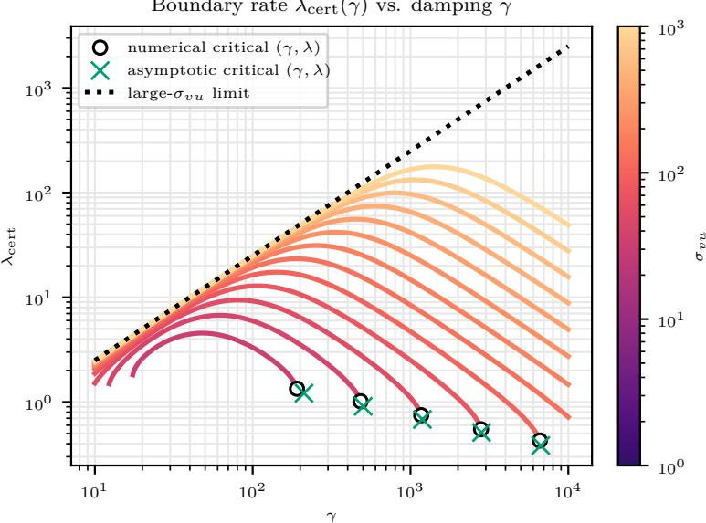  
Figure 5: Limiting bootstrap rate at the admissibility boundary as a function of $\gamma$ for several initial position scales $\sigma _ { v u }$ Solid curves are obtained by grid-searching the bootstrap certificate for the boundary value $\lambda _ { s _ { \mathrm { c e r t } } } ( \gamma ) ;$ ; rates at strictly admissible nearby budgets approach these curves. The dotted black curve is the large- $\cdot \sigma _ { v u }$ limiting rate $\kappa \gamma / ( 4 L )$ . The plot uses $( d _ { u } , d _ { v } ) = ( 3 , 2 )$ $\kappa = L = 1$ $\sigma _ { q p } = 1$ , and $\Delta _ { 0 } = \ell ( 0 ) - \ell _ { \star } = 1$ . For scales whose upper damping boundary lies within the scanned range, markers show numerical and asymptotic approximations to the maximal admissible damping and its corresponding boundary rate.

## D Counting covariance-level mean-field laws

This appendix records the Lie-algebra computation behind the covariance-level completeness statement used in Section 2. It is a continuum, covariance-level analogue of the local/generic finite-width completeness theorem of Marcotte et al. (2023).

Width-consistent laws and their Wasserstein interpretation are defined in Appendix B. We work here directly with functions of the covariance and the vector fields that must annihilate them.

## D.1 Split Bures vector fields

To characterize the laws shared by the architecture, we allow every smooth split loss:

$$
F ( \Sigma ) : = \ell ( \Sigma ^ { v u } ) , \qquad \Sigma = \left( \begin{array} { l l } { { \Sigma ^ { u } } } & { { \Sigma ^ { u v } } } \\ { { \Sigma ^ { v u } } } & { { \Sigma ^ { v } } } \end{array} \right) .
$$

If $E : = \nabla \ell ( \Sigma ^ { v u } )$ , set

$$
G _ { E } : = \left( { \begin{array} { c c } { 0 } & { E ^ { \top } } \\ { E } & { 0 } \end{array} } \right) \in { \mathfrak { p } } _ { J } , \qquad { \mathfrak { p } } _ { J } : = \{ G \in { \mathbb { S } } ^ { m } : G J + J G = 0 \} .
$$

The corresponding Bures vector field is

$$
X _ { \ell } ( \Sigma ) : = - ( G _ { \nabla \ell ( \Sigma ^ { v u } ) } \Sigma + \Sigma G _ { \nabla \ell ( \Sigma ^ { v u } ) } ) .\tag{86}
$$

We denote the resulting space of split Bures vector fields by

$$
\mathcal { X } _ { \mathrm { s p l i t } } : = \{ X _ { \ell } : \ell \in C ^ { \infty } ( \mathbb { R } ^ { d _ { v } \times d _ { u } } ) \} .
$$

It is a real vector space. Its constant-gradient subspace is obtained from linear losses $\ell _ { E } ( \Sigma ^ { v u } ) : =$ $\langle E , \Sigma ^ { v u } \rangle$

$$
\begin{array} { r } { \chi _ { \mathrm { l i n } } : = \big \{ X _ { E } : E \in \mathbb { R } ^ { d _ { v } \times d _ { u } } \big \} , \qquad X _ { E } ( \Sigma ) : = - ( G _ { E } \Sigma + \Sigma G _ { E } ) . } \end{array}
$$

## D.2 Generated Lie algebra

Lie brackets reveal the directions generated by all split losses, which determine how many independent common laws can remain. Let

$$
\mathfrak { o } ( J ) : = \{ A \in \mathbb { R } ^ { m \times m } : A ^ { \top } J + J A = 0 \}
$$

be the Lie algebra of $O ( d _ { u } , d _ { v } )$ . For $A \in \mathfrak { o } ( J )$ , define the infinitesimal congruence field

$$
\xi _ { A } ( \Sigma ) : = - ( A \Sigma + \Sigma A ^ { \top } ) .
$$

Its flow is $\Sigma ( t ) = e ^ { - t A } \Sigma ( 0 ) e ^ { - t A ^ { \top } }$ , so it is tangent to the $O ( d _ { u } , d _ { v } )$ -congruence orbit of Σ. When $A = G _ { E } \in { \mathfrak { p } } _ { J } , \xi _ { A } = X _ { E }$

Proposition D.1 (Split fields generate $\mathfrak { o } \big ( d _ { u } , d _ { v } \big ) \big )$ . With the bracket convention $[ X , Y ] : = D Y [ X ] -$ $D X [ Y ]$ , the map

$$
A \longmapsto \xi _ { A }
$$

is a Lie-algebra homomorphism:

$$
[ \xi _ { A } , \xi _ { B } ] = \xi _ { [ A , B ] } .
$$

Moreover,

$$
\operatorname { L i e } ( { \mathfrak { p } } _ { J } ) = { \mathfrak { o } } ( J ) .
$$

Consequently the Lie algebra generated by $\chi _ { \mathrm { l i n } }$ , the constant-gradient split Bures fields, is

$$
\{ \xi _ { A } : A \in \mathfrak { o } ( J ) \} .
$$

Proof. The homomorphism identity follows by diferentiating the linear vector fields $\xi _ { A }$ . It remains to compute the matrix Lie algebra generated by ${ \mathfrak { p } } _ { J }$ . For

$$
G _ { E } = \left( { \begin{array} { c c } { 0 } & { E ^ { \top } } \\ { E } & { 0 } \end{array} } \right) , \qquad G _ { F } = \left( { \begin{array} { c c } { 0 } & { F ^ { \top } } \\ { F } & { 0 } \end{array} } \right) ,
$$

one has

$$
[ G _ { E } , G _ { F } ] = \left( \begin{array} { c c } { E ^ { \top } F - F ^ { \top } E } & { 0 } \\ { 0 } & { E F ^ { \top } - F E ^ { \top } } \end{array} \right) .
$$

These brackets span the block-diagonal skew-symmetric algebra

$$
{ \mathfrak { k } } _ { J } : = \left\{ { \left( { \begin{array} { l l } { A } & { 0 } \\ { 0 } & { D } \end{array} } \right) } : A ^ { \top } = - A , ~ D ^ { \top } = - D \right\} ,
$$

by choosing $E , F$ supported on one common row or one common column. Since

$$
{ \mathfrak { o } } ( J ) = { \mathfrak { k } } _ { J } \oplus { \mathfrak { p } } _ { J } ,
$$

the generated Lie algebra is all of $\mathfrak { o } ( J )$

Fields versus their generated distribution The full space $\chi _ { \mathrm { s p l i t } }$ contains nonlinear fields and is not identified with a finite-dimensional matrix Lie algebra. Each of its fields is a smooth, statedependent linear combination of a basis of the $X _ { E } { \mathrm { ' s } }$ . Consequently all such fields and their brackets remain tangent to the same congruence orbits, while the constant-gradient fields already generate the whole orbit tangent space. It is this distribution that determines the common conservation laws.

## D.3 Completeness of the spectral laws

The generated directions coincide with the tangent directions of covariance congruence orbits; their codimension gives the local law count. For a constant-gradient split Bures field, $B : = J \Sigma$ satisfies

$$
\begin{array} { r } { \dot { B } = [ G _ { E } , B ] . } \end{array}
$$

The trace powers $\mathcal { H } _ { k }$ in (2) are therefore conserved. The next corollary states that, locally and generically, these are the only smooth covariance-level laws common to all split losses.

Let

$$
\Omega _ { \mathrm { s i m p } } : = \{ \Sigma \in \mathbb { S } _ { + + } ^ { m } : J \Sigma \ \mathrm { h a s \ s i m p l e \ s p e c t r u m } \} .
$$

Corollary D.2 (Marcotte-style covariance-level completeness). Let h be a smooth function on an open subset of $\Omega _ { \mathrm { s i m p } }$ . If h is conserved by every split Bures vector field $X _ { \ell }$ of (86), then h is locally a smooth function of the eigenvalues of JΣ, equivalently of

$$
\mathcal { H } _ { 1 } ( \Sigma ) , \dots , \mathcal { H } _ { m } ( \Sigma ) .
$$

These m laws are functionally independent on $\Omega _ { \mathrm { s i m p } }$ . Thus the characteristic polynomial of JΣ gives a complete local/generic list of covariance-level mean-field conservation laws for the split two-layer linear architecture.

Proof. It is enough to use the linear split losses. If $X _ { E } h = 0$ for every $E ,$ then h is also annihilated by all iterated Lie brackets of the $X _ { E } { \mathrm { ' s } }$ . By Proposition D.1,

$$
\mathrm { d } h ( \Sigma ) [ \xi _ { { \cal A } } ( \Sigma ) ] = 0 \qquad \mathrm { f o r ~ a l l ~ } { \cal A } \in \mathfrak { o } ( J ) .
$$

Thus h is constant on the connected pieces of the $O ( d _ { u } , d _ { v } )$ )-congruence orbits.

The orbit invariants are exactly the eigenvalues of JΣ on $\Omega _ { \mathrm { s i m p } }$ . Indeed,

$$
J ( Q \Sigma Q ^ { \top } ) = Q ^ { - \top } ( J \Sigma ) Q ^ { \top } \qquad ( Q ^ { \top } J Q = J ) ,
$$

so the spectrum is preserved. Conversely, for $\Sigma \succ 0$ , the matrix JΣ is similar to the symmetric matrix $\Sigma ^ { 1 / 2 } J \Sigma ^ { 1 / 2 }$ , hence has real nonzero eigenvalues with $d _ { u }$ positive and $d _ { v }$ negative signs. On the simple-spectrum stratum its J-orthogonal eigenbasis can be locally normalized to a J-orthonormal basis, so equal locally ordered eigenvalues imply membership in the same local $O ( d _ { u } , d _ { v } ) _ { - \mathrm { o r b i t } }$ Therefore any smooth orbit-constant function factors locally through the eigenvalues. Newton identities replace the eigenvalues by $\mathcal { H } _ { 1 } , \dots , \mathcal { H } _ { m }$ . More explicitly, for the locally ordered eigenvalues $\lambda _ { j }$ 2

$$
\frac { \partial \mathcal { H } _ { k } } { \partial \lambda _ { j } } = k \lambda _ { j } ^ { k - 1 } , \qquad 1 \leq k , j \leq m .
$$

This scaled Vandermonde matrix is invertible at distinct eigenvalues. The eigenvalues themselves vary independently by varying the diagonal covariance in a fixed normalized eigenbasis. Hence the spectral map has rank m, and its local level sets have dimension $m ( m + 1 ) / 2 - m = m ( m - 1 ) / 2$ exactly the orbit dimension. □

For empirical covariances $\Sigma = W W ^ { \top } / n$ with $\boldsymbol { W } = \boldsymbol { \mathsf { \Omega } } _ { V } ^ { U } )$ , the finite-width Gram imbalance is

$$
\boldsymbol { \Gamma } : = \boldsymbol { V } ^ { \top } \boldsymbol { V } - \boldsymbol { U } ^ { \top } \boldsymbol { U } = - \boldsymbol { W } ^ { \top } \boldsymbol { J } \boldsymbol { W } .
$$

The nonzero spectra of $J \Sigma = J W W ^ { \top } / n$ and $- \Gamma / n = W ^ { \top } J W / n$ coincide. Corollary D.2 is therefore the covariance quotient of the Marcotte–Gribonval–Peyré completeness theorem: the full labeled finite-width conservation data include the matrix Γ, while the covariance-level law keeps only its spectrum.

## D.4 A ReLU contrast

Homogeneity preserves a scalar balance beyond linear networks, but it does not give the same covariance closure or spectral family. For a two-layer ReLU or more generally one-homogeneous

network, the characteristic equations associated with a potential $v ^ { \top } \psi ( u )$ , with $\psi$ one-homogeneous and possibly time-dependent, have the form

$$
\dot { u } = - D \psi ( u ) ^ { \top } v , \qquad \dot { v } = - \psi ( u ) .
$$

Euler’s identity $D \psi ( u ) u = \psi ( u )$ gives

$$
{ \frac { \mathrm { d } } { \mathrm { d } t } } ( \left\| u \right\| ^ { 2 } - \left\| v \right\| ^ { 2 } ) = 0 .
$$

For ReLU this calculation is interpreted almost everywhere along the characteristics, with an activation-boundary convention satisfying Euler’s identity (for instance derivative zero at a zero preactivation). Thus the full mean-field flow preserves the pushforward distribution of $\left\| u \right\| ^ { 2 } - \left\| v \right\| ^ { 2 }$ and its covariance-level shadow is the total imbalance

$$
\int ( \| u \| ^ { 2 } - \| v \| ^ { 2 } ) \mathrm { d } \mu ( u , v ) .
$$

Unlike the linear split case above, this ReLU statement is not obtained from a closed finitedimensional Bures covariance equation; it is included only to highlight how much smaller the covariance-level conservation-law problem can be than the full particle-level one. No completeness claim for ReLU laws is made here.

## E Intrinsic dynamics

Special conserved spectral values express some covariance blocks in terms of fewer variables. This appendix derives these exact reductions.

## E.1 A two-point signed spectrum: hyperbolic isotropy

A special two-point spectrum determines the hidden covariance blocks from the predictor and therefore closes a smaller equation.

Definition E.1 (Hyperbolic isotropy). For $\alpha > 0$ , the hyperbolically isotropic (HI) leaf is

$$
{ \mathcal { M } } _ { \alpha } : = \{ \Sigma \succeq 0 : \Sigma J \Sigma = \alpha ^ { 2 } J \} .\tag{87}
$$

The identity forces $\Sigma \succ 0$ and is equivalent to $( J \Sigma ) ^ { 2 } = \alpha ^ { 2 } \mathrm { I d } _ { m }$ . The symmetric representative of JΣ then has $d _ { u }$ eigenvalues +α and $d _ { v }$ eigenvalues $- \alpha ;$ equivalently, $\mathcal { H } _ { k } = \alpha ^ { k } ( d _ { u } + ( - 1 ) ^ { k } d _ { v } )$ for $k = 1 , \ldots , m$ . Spectral conservation proves invariance of $\mathcal { M } _ { \alpha }$ despite the repeated eigenvalues. Directly, the derivative of ΣJΣ is $- G ( \Sigma J \Sigma ) - ( \Sigma J \Sigma ) G .$ , with constant solution $\alpha ^ { 2 } J$

Proposition E.2 (Predictor-only intrinsic equation). Every predictor $\Sigma ^ { v u } \in \mathbb { R } ^ { d v \times d u }$ has a unique covariance on $\mathcal { M } _ { \alpha }$ , given by

$$
\Sigma = \left( { \begin{array} { c c } { ( ( \Sigma ^ { v u } ) ^ { \top } \Sigma ^ { v u } + \alpha ^ { 2 } { \mathrm { I d } } _ { d _ { u } } ) ^ { 1 / 2 } } & { ( \Sigma ^ { v u } ) ^ { \top } } \\ { \Sigma ^ { v u } } & { ( \Sigma ^ { v u } ( \Sigma ^ { v u } ) ^ { \top } + \alpha ^ { 2 } { \mathrm { I d } } _ { d _ { v } } ) ^ { 1 / 2 } } \end{array} } \right) .\tag{88}
$$

On this leaf, the Bures dynamics close on the predictor:

$$
\dot { \Sigma } ^ { v u } = - E ( ( \Sigma ^ { v u } ) ^ { \top } \Sigma ^ { v u } + \alpha ^ { 2 } \mathrm { I d } ) ^ { 1 / 2 } - ( \Sigma ^ { v u } ( \Sigma ^ { v u } ) ^ { \top } + \alpha ^ { 2 } \mathrm { I d } ) ^ { 1 / 2 } E , \qquad E : = \nabla \ell ( \Sigma ^ { v u } ) .\tag{89}
$$

For $d _ { u } = d _ { v } = 1$ , this is $\dot { \Sigma } ^ { v u } = - 2 \sqrt { ( \Sigma ^ { v u } ) ^ { 2 } + \alpha ^ { 2 } } \ell ^ { \prime } ( \Sigma ^ { v u } )$

Proof. Expanding (87) gives

$$
\begin{array} { r } { ( \Sigma ^ { u } ) ^ { 2 } - ( \Sigma ^ { v u } ) ^ { \top } \Sigma ^ { v u } = \alpha ^ { 2 } \mathrm { I d } , \quad ( \Sigma ^ { v } ) ^ { 2 } - \Sigma ^ { v u } ( \Sigma ^ { v u } ) ^ { \top } = \alpha ^ { 2 } \mathrm { I d } , \quad \Sigma ^ { v u } \Sigma ^ { u } = \Sigma ^ { v } \Sigma ^ { v u } . } \end{array}
$$

Positivity selects the positive square roots. Conversely, an SVD proves the intertwining identity and gives eigenvalues α and $\sqrt { \sigma _ { i } ^ { 2 } + \alpha ^ { 2 } } \pm \sigma _ { i } > 0$ , proving membership in $\mathcal { M } _ { \alpha }$ . Substituting the diagonal blocks into (24) gives the intrinsic equation. □

The same eigenvalue calculation gives the exact extremal envelopes

$$
\lambda _ { \mathrm { m a x } } ( \Sigma ) = \sqrt { \| \Sigma ^ { v u } \| _ { \mathrm { o p } } ^ { 2 } + \alpha ^ { 2 } } + \| \Sigma ^ { v u } \| _ { \mathrm { o p } } , \qquad \lambda _ { \mathrm { m i n } } ( \Sigma ) = \frac { \alpha ^ { 2 } } { \lambda _ { \mathrm { m a x } } ( \Sigma ) } .
$$

In the general convergence theorems this special spectral level has $a _ { + } ( \Sigma _ { 0 } ) = a _ { - } ( \Sigma _ { 0 } ) = \alpha$ . Thus its loss exponent is 4ακ, and the GD contraction factor is $1 - \sqrt { 2 } \alpha \kappa \tau$

Finite-width form The covariance constraint has an exact finite-width form that depends only on the product $W W ^ { \top }$ . For $\Sigma = W W ^ { \top } / n$ , condition (87) is $W W ^ { \top } J W W ^ { \top } = n ^ { 2 } \alpha ^ { 2 } J$ . In terms of $U , V$ , it reads

$$
\begin{array} { r l } & { ( U U ^ { \top } ) ^ { 2 } - U V ^ { \top } V U ^ { \top } = n ^ { 2 } \alpha ^ { 2 } \mathrm { I d } _ { d _ { u } } , \qquad ( V V ^ { \top } ) ^ { 2 } - V U ^ { \top } U V ^ { \top } = n ^ { 2 } \alpha ^ { 2 } \mathrm { I d } _ { d _ { v } } , } \\ & { \qquad V U ^ { \top } U U ^ { \top } = V V ^ { \top } V U ^ { \top } . } \end{array}
$$

Any covariance in (88) admits empirical factors at every width $n \geq m ,$ , for example $W = \sqrt { n } \Sigma ^ { 1 / 2 } Q _ { 0 }$ with $Q _ { 0 } Q _ { 0 } ^ { \top } = \operatorname { I d } _ { m }$

Comparison with relaxed balance Marcotte et al. (2026, Theorem 3.8) derive intrinsic dynamics under a diferent condition, $\Gamma _ { \mathrm { r b } } : = ( V ^ { \top } V - U ^ { \top } U ) / n = \beta \mathrm { I d } _ { n }$ , on a full-column-rank stratum. It implies

$$
( \Sigma ^ { u } ) ^ { 2 } + \beta \Sigma ^ { u } = ( \Sigma ^ { v u } ) ^ { \top } \Sigma ^ { v u } , \qquad ( \Sigma ^ { v } ) ^ { 2 } - \beta \Sigma ^ { v } = \Sigma ^ { v u } ( \Sigma ^ { v u } ) ^ { \top } .
$$

For $\beta \neq 0$ , zero singular directions have ambiguous branches. Where both factors have full column rank, the range projectors $\Pi _ { u } , \Pi _ { v }$ of $\left( \Sigma ^ { v u } \right) ^ { \top } , \Sigma ^ { v u }$ select

$$
\begin{array} { r l } & { \Sigma ^ { u } = \Pi _ { u } [ - \frac { \beta } { 2 } \mathrm { I d } + ( ( \Sigma ^ { v u } ) ^ { \top } \Sigma ^ { v u } + \frac { \beta ^ { 2 } } { 4 } \mathrm { I d } ) ^ { 1 / 2 } ] , } \\ & { \Sigma ^ { v } = \Pi _ { v } [ \frac { \beta } { 2 } \mathrm { I d } + ( \Sigma ^ { v u } ( \Sigma ^ { v u } ) ^ { \top } + \frac { \beta ^ { 2 } } { 4 } \mathrm { I d } ) ^ { 1 / 2 } ] . } \end{array}
$$

If $n = d _ { u } = d _ { v }$ and both factors are invertible, the projectors are identities and the predictor equation coincides with (89) for $\alpha = | \beta | / 2$ . The leaves remain distinct: for $\beta \neq 0$ , relaxed balance is equivalent to $\Sigma J \Sigma = - \beta \Sigma$ , rank $\Sigma = n$ . Indeed a left inverse of $W / \sqrt { n }$ proves the converse. It forces $n \leq d _ { v } { \mathrm { ~ i f ~ } } \beta > 0$ , and $n \leq d _ { u } { \mathrm { ~ i f ~ } } \beta < 0 ;$ positive HI instead has rank m. For $\beta = 0$ , positivity selects the unshifted square roots without a rank assumption, giving the boundary equation $\alpha = 0$ , not a positive-definite initialization. Without the rank qualifications, relaxed balance does not ensure predictor closure: $n = 1 , d _ { u } = d _ { v } = 2 , U = 0 , V = e _ { 1 }$ or e2 gives the same predictor and $\beta = 1$ , but diferent predictor velocities for $\ell ( S ) : = \| S + \mathrm { I d } _ { 2 } \| _ { \mathrm { F } } ^ { 2 } / 2$

Remark E.3 (Conserved values do not generally close the predictor). For ${ d _ { u } } = { d _ { v } } = 2$ , take $\Sigma ^ { v u } = 0 , \Sigma ^ { v } = \mathrm { d i a g } ( 3 , 4 )$ , and $\Sigma ^ { u } = \mathrm { d i a g } ( 1 , 2 )$ or diag(2, 1). Both states have signed spectrum $\{ 1 , 2 , - 3 , - 4 \}$ , hence the same spectral laws. For $\ell ( S ) : = \left\| S + e _ { 1 } e _ { 1 } ^ { \intercal } \right\| _ { \mathrm { F } } ^ { 2 } / 2$ , their predictor velocities $a r e \mathrm { ~ - } 4 e _ { 1 } e _ { 1 } ^ { \top } \mathrm { ~ } a n d \mathrm { ~ - } 5 e _ { 1 } e _ { 1 } ^ { \top }$ . The special two-point spectrum gives an algebraic graph unavailable at these general spectral values.

## E.2 A single phase spectral scale: conformal symplectic isotropy

A special conformal spectral identity eliminates the velocity covariance within a positive-position chart of the phase flow.

Definition E.4 (Conformal symplectic isotropy). A phase covariance is conformally symplectically isotropic (CSI) at scale $\theta \ge 0$ if

$$
\Sigma J _ { \mathrm { c } } \Sigma = \theta ^ { 2 } J _ { \mathrm { c } } .\tag{90}
$$

For $\theta > 0$ , this forces $\Sigma \succ 0$ and is equivalent to $\Sigma ^ { 1 / 2 } J _ { \mathrm { c } } \Sigma ^ { 1 / 2 }$ having m copies of each eigenvalue $+ i \theta , - i \theta$ . The renormalized trace powers in Proposition 5.1 are zero at odd orders and $2 m ( - 1 ) ^ { k } \theta _ { 0 } ^ { 2 k }$ at order 2k. Conformal transport preserves (90) with $\theta _ { t } = e ^ { - \gamma t } \theta _ { 0 }$ , including the singular boundary $\theta _ { 0 } = 0$ , which is specified algebraically, without diagonalizability.

Proposition E.5 (Reduced phase dynamics). On the chart $A : = \Sigma ^ { ( u , v ) } \succ 0$ , condition (90) is equivalent to

$$
D = C = C ^ { \top } , \qquad Q = \theta ^ { 2 } A ^ { - 1 } , \qquad \Xi = A C , \quad \Sigma ^ { ( p , q ) } = C A C + \theta ^ { 2 } A ^ { - 1 } .
$$

The reduced equations are

$$
\dot { A } = C A + A C , \qquad \dot { C } = - G - \gamma C - C ^ { 2 } + \theta _ { t } ^ { 2 } A ^ { - 2 } , \qquad \dot { \theta } _ { t } = - \gamma \theta _ { t } .\tag{91}
$$

They use only the two symmetric matrices $A , C ,$ with known scale $\theta _ { t }$ , instead of all blocks of the phase covariance.

Proof. Substitute $\Xi = A D ^ { \top } , \Sigma ^ { ( p , q ) } = D A D ^ { \top } + Q$ . The upper-left block of (90) is $A ( D - D ^ { \top } ) A = 0$ forcing symmetry. The upper-right block then becomes $A Q \ = \ \theta ^ { 2 } \mathrm { I d } ;$ the other blocks follow. Substitution in Proposition C.23 gives (91). This calculation includes $\theta = 0$ □

White position and velocity blocks with $\Xi _ { 0 } = 0$ give $\theta _ { 0 } = \sigma _ { v u } \sigma _ { q p }$ . Zero velocity gives $C _ { 0 } = 0 , \theta _ { 0 } = 0$ allowing any $A _ { 0 } \succ 0$ . Neither choice is needed for convergence: the general theorem controls D by energy even when it is nonsymmetric and Q is independent.

Remark E.6 (What the reduced state still contains). Even on CSI, the two cross blocks $\Sigma ^ { v u } , \Sigma ^ { q p }$ do not generally form a closed state. With $\theta = 1 , C = 0$ , choose $A = \operatorname { I d } _ { 2 } { \ o r } \ 2 \operatorname { I d } _ { 2 }$ and $\Sigma ^ { ( p , q ) } = A ^ { - 1 }$ Both have $\Sigma ^ { v u } = \Sigma ^ { q p } = \dot { \Sigma } ^ { v u } = 0 , y e t \ddot { \Sigma } ^ { v u } = - 2 E o r - 4 E$ for the same nonzero scalar loss gradient. Thus the full position block remains part of the intrinsic variables.

## F A nonquadratic example: smoothed Lasso

To illustrate the smooth PL loss class beyond quadratic objectives, we repeat the three experiments of Figure 2 with a smoothed entrywise $\ell _ { 1 }$ penalty on the predictor:

$$
\ell ( S ) = \frac { 1 } { 2 } \| S - S _ { \mathrm { t e a c h } } \| _ { \mathrm { F } } ^ { 2 } + \lambda \sum _ { i , j } \Big ( \sqrt { S _ { i j } ^ { 2 } + \delta ^ { 2 } } - \delta \Big ) , \qquad \lambda = 0 . 1 , \quad \delta = 0 . 0 1 .\tag{92}
$$

The Hessian is diagonal, with entries $1 + \lambda \delta ^ { 2 } / ( S _ { i j } ^ { 2 } + \delta ^ { 2 } ) ^ { 3 / 2 } \in [ 1 , 1 + \lambda / \delta ]$ . Thus ℓ is globally 1-strongly convex and satisfies Assumption 1.1 with $\kappa = 1$ and $L = 1 1$ . The penalty acts on $S ,$ not separately on the factors, so the covariance closure and spectral conservation laws apply without modification. Its unique minimizer $S _ { \mathrm { r e g } }$ is generally diferent from the teacher; we compute it entrywise from

$$
( S _ { \mathrm { r e g } } ) _ { i j } - ( S _ { \mathrm { t e a c h } } ) _ { i j } + \lambda \frac { ( S _ { \mathrm { r e g } } ) _ { i j } } { \sqrt { ( S _ { \mathrm { r e g } } ) _ { i j } ^ { 2 } + \delta ^ { 2 } } } = 0 .
$$

All loss gaps below are relative to $\ell _ { \star } = \ell ( S _ { \mathrm { r e g } } )$ . Positive smoothing does not generally yield exact sparsity; the nonsmooth limit $\delta = 0$ is outside Assumption 1.1.

(a) Initialization scale  
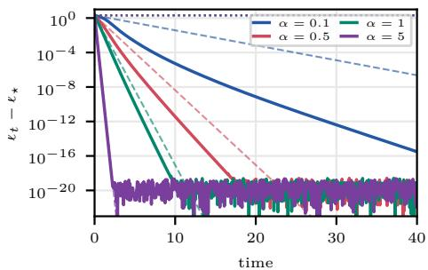

(b) Covariance conditioning  
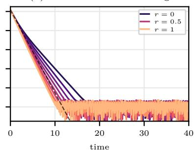

(c) Finite width  
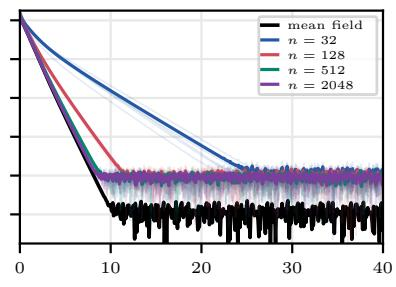  
Figure 6: Smoothed-Lasso counterpart of Figure 2, using the same dimensions $( d _ { u } , d _ { v } ) = ( 1 6 , 9 )$ , teacher, initialization scales, and sampling seeds. (a) White covariance $\Sigma _ { 0 } = \alpha \mathrm { I d } _ { m }$ for $\alpha = 0 . 1 , 0 . 5 , 1 , 5 .$ Dashed curves are the support-gap envelopes $\Delta _ { 0 } e ^ { - 4 \alpha \kappa t }$ ; dotted curves use the internal coarse determinant bound of Remark C.7. (b) One input-output diagonal pair is scaled by $r \in \{ 0 , 1 / 8 , \ldots , 1 \}$ . Here $g ( \Sigma _ { 0 } ) = 2 r ;$ the dashed curve shows the white-reference envelope. (c) The population covariance flow from $\operatorname { I d } _ { m }$ and finite-width flows at widths $n = 3 2 , 1 2 8 , 5 1 2 , 2 0 4 8$ , with five independent trials each.