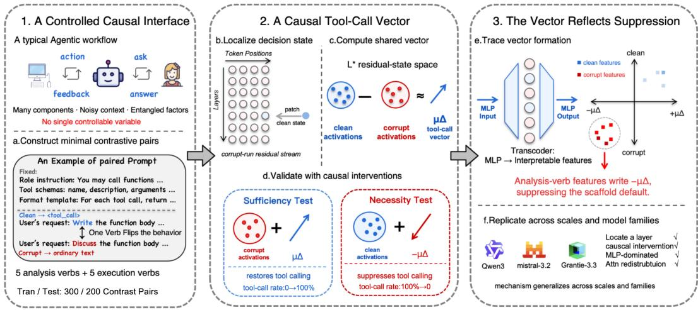
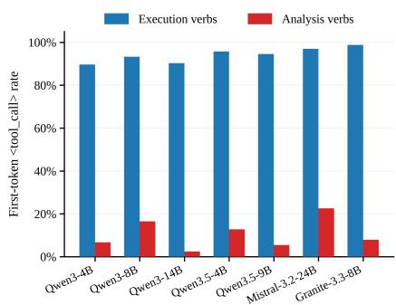
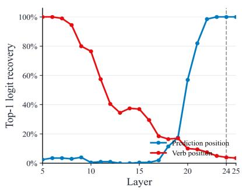
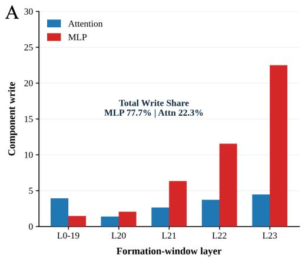
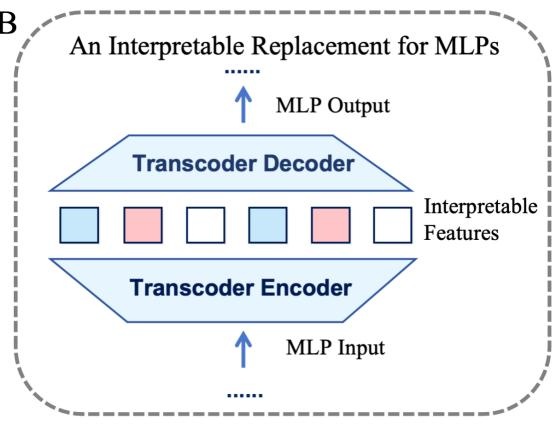
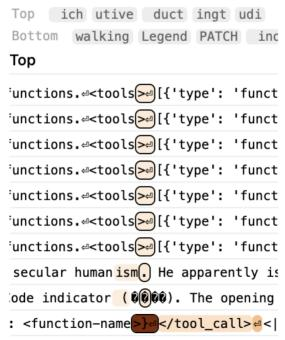
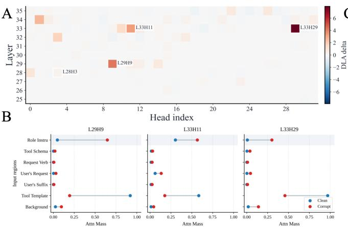
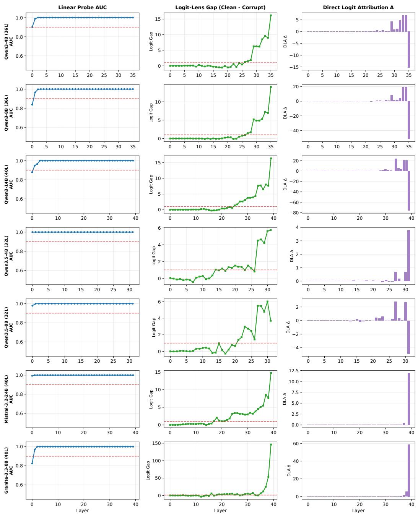
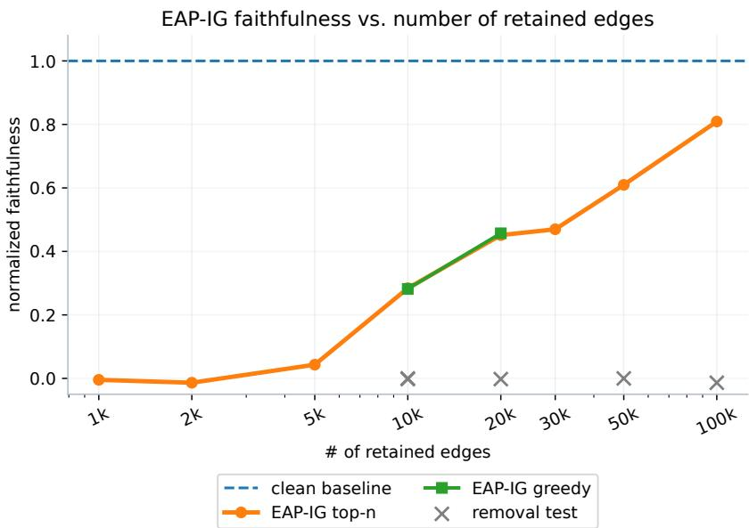
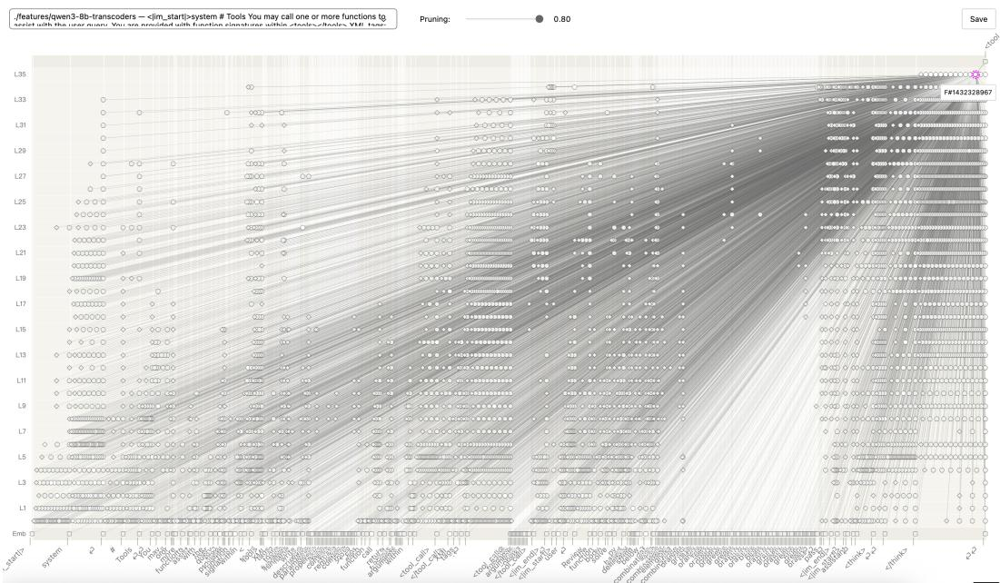

# How Do Agentic LLMs Decide to Call Tools? A Tool-Call Vector Shaped by Suppression

Xijie Gong1,2,∗ Tingxu Han1,3,∗,† Jiahao Zhang1 Wei Song4 Ziqi Ding5 Hanqi Yan6 Youcheng Sun1 Lijie Hu1,‡

1Mohamed bin Zayed University of Artificial Intelligence 2University of Electronic Science and Technology of China 3Nanjing University 4Griffith University 5University of New South Wales 6King’s College London

## Abstract

Tool calling, invoking external tools on demand, is central to agentic LLMs, yet the mechanism that decides whether a model calls a tool or responds directly remains poorly understood. Agentic prompts are long and heavily scaffolded, combining role instructions, tool schemas, format templates, and the user’s request across hundreds of tokens, creating a noisy, highly entangled context in which no single controllable variable for mechanistic analysis is obvious. To obtain such a variable, we propose a method that converts complex agentic prompts into minimal contrastive pairs in which a single request verb determines the tool-call decision: replacing an execution-verb (e.g., write) with an analysis-verb (e.g., discuss) reliably flips the decision, suggesting it is mediated by a compact internal state. We construct 500 such paired prompts across Python, Java, and C++ (300 for mechanistic analysis, 200 held out for evaluation). We trace the decision to a vector, $\mu _ { \Delta }$ , that is both causally necessary and sufficient and generalizes beyond the discovery prompts to native multi-turn τ2-Bench trajectories and verb-free requests. Behavioral ablations show that the scaffold establishes a tool-call prior; Transcoder decomposition then reveals that analysis verbs suppress this prior through features signaling that tool use is unnecessary, whereas execution verbs largely leave it intact. Downstream scaffold-reading attention heads and MLP features read out the resulting state, and the same mechanism recurs across seven models from the Qwen, Mistral, and Granite families. Our code is available at https://github.com/XijieGo/MI4ToolCalling.

## 1 Introduction

AI agents, from personal AI assistants to software engineering agents, are now widely deployed across industry and research. These agents are powered by agentic LLMs whose core capability is tool calling: invoking external tools on demand to act in the world. Given an agentic prompt containing a tool-call prompt scaffold (role instructions, tool schemas, and format templates) alongside the user’s request, the LLM can generate a structured tool call specifying the selected tool and its arguments, enabling it to search the web, execute code [1, 2]. For any agentic prompt, the LLM faces the decision of whether to call a tool or respond directly. We call this the call-or-no-call decision. An incorrect decision causes the model to call tools unnecessarily or fail to call a tool when one is needed.

  
Figure 1: Roadmap of the paper’s mechanistic analysis. The three numbered blocks summarize the stages of our analysis: (1) verb substitution turns long agentic prompts into a controlled causal interface; (2) the call-or-no-call decision passes through a tool-call vector, $\mu _ { \Delta }$ , that is causally sufficient and necessary; and (3) this vector reflects suppression of a scaffold-induced tool-call default and generalizes across the model families. The six lettered steps show how the evidence is built.

Frontier LLMs with dedicated agentic training often signal this call-or-no-call decision through a special token. In Qwen3, for instance, <tool\_call> appears as the first generated token precisely when the model decides to call a tool [3]. In this setting, the call-or-no-call decision reduces to a simple question: is <tool\_call> the model’s top-1 prediction for the first generated token? This makes the call-or-no-call decision tractable for mechanistic analysis: a single-token output prediction is the natural target for mechanistic tools such as activation patching and direct logit attribution.

Yet what drives this decision has not been studied mechanistically. Existing work on tool calling has focused on whether LLMs select the right tools and how to improve their accuracy [1, 4–7]. Prior mechanistic work has typically examined short prompts of 10–30 tokens, where a single variable can be varied while holding the rest fixed [8, 9]. Agentic prompts are fundamentally different: the prompt scaffold (role instructions, tool schemas, and format templates) is packed alongside the user’s request across several hundred tokens. With so many components that could each plausibly influence the decision, it is not clear which single element to vary to construct a reliable contrastive pair [10, 11]. This complexity makes it hard to isolate a single controllable variable for mechanistic analysis.

However, in code completion tasks, we find that the request verb serves as a controllable variable: replacing an execution verb with an analysis verb switches the first generated token in the retained pairs. Matched prompts differ only in the request verb, preserving the prompt scaffold, task body, and available tool. We construct 500 prompt pairs for each of the seven primary models, with 300 used for mechanistic analysis and 200 held out for evaluation. The coding tasks span Python, Java, and C++, drawing from MBPP, APPS, HumanEval, and CodeContests [12–15]. By holding the surrounding prompt fixed while varying a single behaviorally decisive token, these pairs isolate a controlled interface for mechanistic analysis.

We study this mechanism primarily in Qwen3-8B and test whether it generalizes across model scales and families. Activation patching localizes the decisive residual-stream state to layer 24: patching it recovers <tool\_call> on 100% of corrupt prompts. Averaging the activation difference at this layer gives the tool-call vector, $\mu _ { \Delta }$ . Adding $\mu _ { \Delta }$ to analysis-verb prompts restores <tool\_call>; subtracting it from execution-verb prompts suppresses tool calling. Because these pairs are behaviorally filtered to exhibit the intended contrast, we test whether $\mu _ { \Delta }$ generalizes beyond this construction. Furthermore, $\mu _ { \Delta }$ induces and suppresses tool calls in web retrieval, SQL execution, and email dispatch with new tool schemas and request verbs. The same control extends to native decisions in multi-turn, multi-tool $\tau ^ { 2 } .$ -Bench trajectories across seven models, using model-specific $\mu _ { \Delta }$ without re-estimation. Even for requests that imply a need for tools without containing the execution or analysis verbs used in our prompt pairs, subtracting $\mu _ { \Delta }$ still suppresses tool calls. The call-or-no-call decision passes through a compact tool-call vector shared across prompts.

The natural hypothesis is that execution verbs actively generate a tool-call signal. Our evidence points to a different picture. The prompt scaffold establishes a tool-call prior: the role instructions, tool schemas, and format templates bias the model toward predicting <tool\_call> first on task-bearing requests rather than empty or unrelated turns. Analysis verbs activate a family of features that signal the tool is unnecessary; they write against this prior through layers 21–23. Execution verbs do not activate them and leave the prior intact. $\mu _ { \Delta }$ is the inverse direction of the suppression signal that these features write into the residual stream. Downstream, scaffold-reading heads shift attention toward the tool-format template and MLP blocks support the opening of a tool-call sequence; both effects weaken when the suppression features are active. The mechanism replicates across the Qwen3-family and additional models, and structurally mirrors refusal [16]: a strong prior is present, and a compact suppressor overrides it. A scaffold-component ablation confirms this pattern behaviorally: the format template alone installs the near-ceiling call prior, and the tool schema makes it sensitive to wording.

To summarize, we make four contributions: (1) A first-generated-token target and controlled prompt pairs provide a clean causal interface for studying the call-or-no-call decision in long, scaffolded prompts (Section 2). (2) A tool-call vector $\mu _ { \Delta }$ at the layer-24 prediction position is causally necessary and sufficient for the call-or-no-call decision, and this control extends unchanged to real multi-turn agent trajectories and to requests with no cued verb at all (Section 3, Section 4). (3) $\mu _ { \Delta }$ is the inverse of the suppression signal that features activated by analysis-verbs write against a scaffold-induced, request-sensitive call prior; a scaffold-component ablation clarifies this prior behaviorally (Section 5). (4) Downstream attention heads and MLP blocks read this vector into the first generated token, and the same mechanism extends across Qwen3 and additional models (Section 6, Section 7).

## 2 One Verb Flips the Call-or-No-Call Decision

Mechanistic analysis requires a controlled change that produces a reliable behavioral contrast. Agentic prompts make such changes difficult to isolate. Role instructions, tool schemas, formatting rules, and user requests can all affect the decision. We seek a minimal change that exposes the call decision while preserving the task and scaffold.

We find a surprisingly simple control variable in codecompletion tasks: a single request verb can reliably switch the model between calling a tool and responding directly. Asking the model to write a function often triggers a tool call, while replacing write with discuss can instead produce a text response (Figure 2). We therefore construct matched code-completion prompts that differ only in the request verb. Execution-verbs request an action on the code, and analysis-verbs request a textual response, while the task content, available tool, and scaffold remain fixed.

  
Figure 2: Request verbs change toolcall rates across models. Bars show first-token call rates on HumanEval before behavioral filtering, by request type.

We study Qwen3-8B [3] in non-thinking mode, where the first generated token exposes call initiation. A tool call begins with <tool\_call>, and a direct response begins with ordinary text. We use five execution verbs (add, build, ...) and five analysis verbs (discuss, explore, ...). Tasks come from MBPP, APPS, HumanEval, and CodeContests [12–15] and cover Python, Java, and C++. The Qwen3- 8B dataset contains 500 pairs, with 300 for mechanistic analysis and 200 held out for evaluation. Appendix A summarizes the data sources, splits, and prompt format.

## Key Setup: A One-Word Causal Interface

Changing the request verb flips the first output between <tool\_call> and direct text. The matched prompts isolate the call decision while preserving the surrounding task and scaffold.

Following activation-patching terminology, we call execution prompts clean, denoted $x ^ { c }$ , and analysis prompts corrupt, denoted $x ^ { * }$ . Each prompt has the form

$$
\begin{array} { r } { x = \underbrace { \mathrm { [ r o l e ~ i n s t r u c t i o n s , ~ t o o l ~ s c h e m a s , ~ f o r m a t ~ t e m p l a t e s ] } } _ { \mathrm { p r o m p t ~ s c a f f o l d } } \underbrace { \left[ v \parallel \mathrm { t a s k ~ b o d y } \right] } _ { \mathrm { u s e r s ~ r e q u e s t } } \longrightarrow y , } \end{array}\tag{1}
$$

Here v is the request verb, $y$ is the first generated token, and $y _ { \mathrm { c a l l } } = < \mathtt { t o o l }$ \_call>. The paired contrast is $y = y _ { \mathrm { c a l l } }$ on execution prompts and $y \ne y _ { \mathrm { c a l l } }$ on analysis prompts. Only v changes within a pair. We write $h _ { p } ^ { ( l ) } ( x ) \in \mathbb { R } ^ { d _ { \mathrm { m o d e l } } }$ for the residual activation at layer l and position $p .$

## 3 The Tool-Call Vector

A shared residual vector controls the call-or-no-call decision in Qwen3-8B. We identify the vector in two steps. Activation patching localizes a tool-call state at the final prompt position. The mean execution–analysis difference at that state gives the tool-call vector.

## 3.1 Localizing the Tool-Call State

Activation patching locates the request verb’s effect on the call decision [17, 18]. For each held-out pair $( x _ { i } ^ { c } , x _ { i } ^ { * } )$ , we patch the analysis state at layer l and position q with its execution counterpart. Other positions at that layer stay fixed; the rest of the model resumes from the patched state.

$$
\tilde { h } _ { j } ^ { ( l , q ) } ( x _ { i } ^ { * } ) = \left\{ \begin{array} { l l } { h _ { q } ^ { ( l ) } ( x _ { i } ^ { c } ) , } & { j = q , } \\ { h _ { j } ^ { ( l ) } ( x _ { i } ^ { * } ) , } & { j \neq q . } \end{array} \right.\tag{2}
$$

The recovery rate $r ( l , q )$ is the fraction of patched prompts whose first-token top-1 prediction is $y _ { \mathrm { c a l l } }$ . We sweep layers at the verb position and the prediction position, the final prompt position that predicts the first output token. The patching effect shifts from the verb to the prediction position across layers. At L24, patching the prediction-position state recovers calls on 100% of held-out analysis prompts. This state is where we add and remove the tool-call vector.

  
Figure 3: The call signal shifts from the verb to the prediction position. Layerwise patching finds the L24 residual state that determines when to call a tool or to give a text reply.

## 3.2 Estimating the Tool-Call Vector

We estimate the tool-call vector by averaging the execution-

minus-analysis activation difference over the 300 training pairs at the L24 prediction position p.

$$
\Delta _ { i } = h _ { p } ^ { ( 2 4 ) } ( x _ { i } ^ { c } ) - h _ { p } ^ { ( 2 4 ) } ( x _ { i } ^ { * } ) , \qquad \mu _ { \Delta } = \mathrm { m e a n } \Delta _ { i } .\tag{3}
$$

We then add $\mu _ { \Delta }$ to analysis-prompt activations and subtract $\mu _ { \Delta }$ from execution-prompt activations.

$$
\begin{array} { r } { \mathrm { A d d } \colon \tilde { h } _ { p } ^ { ( 2 4 ) } ( x _ { i } ^ { * } ) = h _ { p } ^ { ( 2 4 ) } ( x _ { i } ^ { * } ) + \mu _ { \Delta } , \qquad \mathrm { R e m o v e } \colon \tilde { h } _ { p } ^ { ( 2 4 ) } ( x _ { i } ^ { c } ) = h _ { p } ^ { ( 2 4 ) } ( x _ { i } ^ { c } ) - \mu _ { \Delta } . } \end{array}\tag{4}
$$

Both interventions change a single residual activation before downstream computation resumes. We measure each intervention’s effect relative to the original execution–analysis logit gap. Let $\bar { z } _ { \mathrm { c a l l } } ^ { c }$ and $\bar { z } _ { \mathrm { c a l l } } ^ { * }$ denote mean tool-call logits on held-out execution and analysis prompts. Superscripts $* + \mu$ and $c - \mu$ denote addition and removal. The normalized effects are

$$
\mathrm { S u f f } ( \mu _ { \Delta } ) = \frac { \bar { z } _ { \mathrm { c a l l } } ^ { < + \mu } - \bar { z } _ { \mathrm { c a l l } } ^ { \ast } } { \bar { z } _ { \mathrm { c a l l } } ^ { c } - \bar { z } _ { \mathrm { c a l l } } ^ { \ast } } , \qquad \mathrm { N e c c } ( \mu _ { \Delta } ) = \frac { \bar { z } _ { \mathrm { c a l l } } ^ { c } - \bar { z } _ { \mathrm { c a l l } } ^ { c - \mu } } { \bar { z } _ { \mathrm { c a l l } } ^ { c } - \bar { z } _ { \mathrm { c a l l } } ^ { \ast } } .\tag{5}
$$

Addition and removal recover most of the logit gap in their respective directions (Table 1). The same vector therefore supports both tool-call induction and suppression at the prediction position.

Table 1: The tool-call vector causally controls the call-or-no-call decision. Adding $\mu _ { \Delta }$ to analysis prompts induces tool calls, while removing it from execution prompts suppresses them.
<table><tr><td>Intervention</td><td>Top-1 before</td><td>Top-1 after</td><td>∆ top-1</td><td>Logit before Logit after</td><td></td><td> $\Delta$  logit</td><td>Suff.</td><td>Necc.</td></tr><tr><td>Add  $\mu _ { \Delta }$ </td><td>0.00%</td><td>100.00%</td><td>↑100.00</td><td>25.11</td><td>32.50</td><td>↑7.39</td><td>1.03</td><td></td></tr><tr><td>Remove  $\mu _ { \Delta }$ </td><td>100.00%</td><td>0.00%</td><td>↓100.00</td><td>32.28</td><td>24.80</td><td>↓7.48</td><td></td><td>1.04</td></tr></table>

Circuit searches identify relevant components, but high-fidelity replay requires distributed computation (Appendix G). The vector gives us a compact causal target for tracing how those components form and read out the call decision at the first generated token.

## 4 Generalization Beyond Verb-Cued Coding

The Qwen3-8B discovery prompts combine a coding task, an explicit request verb, and a single-turn scaffold. We test how the tool-call vector behaves as these conditions change. The tests cover new domains and wording, native multi-turn trajectories, and implicit requests. Every Qwen3-8B intervention keeps the coding-derived direction fixed at the L24 prediction position; cross-domain experiments calibrate its norm, while τ2 and verb-free tests apply fixed gains to the original vector.

## 4.1 Transfer Across Tools, Domains, and Action Wording

We test transfer to web retrieval, read-only SQL execution, and email dispatch using 100 held-out call/no-call pairs per domain. The prompts retain the discovery scaffold and introduce new task content and tool schemas. Call-side verbs such as retrieve, execute, and dispatch fall outside the coding action vocabulary. Within each pair, only the leading request token changes. We keep the coding-derived direction fixed at the L24 prediction position and rescale the vector to match the call–no-call contrast norm estimated from separate target-domain training pairs.

Vector addition induces tool calls on all corrupt prompts, and vector removal suppresses tool calls on clean prompts (Table 2). The normalized logit shift averages 0.88 for addition and 0.94 for removal. A norm-matched random vector changes no top-1 decisions. The coding-derived vector supports bidirectional control of the first-token call decision across tools and action vocabularies.

Table 2: The coding-derived vector controls tool calling across web retrieval, SQL execution, and email dispatch. Qwen3-8B interventions keep the coding-derived direction fixed at L24 and match the vector norm to each target domain. N counts held-out pairs. Induction and suppression rates measure first-token switches from no-call to call under addition and from call to no-call under removal, respectively. Norm. shift is the mean <tool\_call> logit increase for Add or decrease for Remove, divided by the baseline call–no-call logit gap. Means weight domains equally.
<table><tr><td rowspan="2">Target</td><td rowspan="2">Tool</td><td rowspan="2">N</td><td colspan="2">Add  $\mu _ { \Delta }$ </td><td colspan="2">Remove  $\mu _ { \Delta }$ </td></tr><tr><td>Induction (%)</td><td>Norm. shift</td><td>Suppression (%)</td><td>Norm. shift</td></tr><tr><td>Web retrieval</td><td>web_search</td><td>100</td><td>100.0</td><td>0.93</td><td>100.0</td><td>0.75</td></tr><tr><td>SQL execution run_sq1</td><td></td><td>100</td><td>100.0</td><td>0.79</td><td>100.0</td><td>0.77</td></tr><tr><td>Email dispatch send_email</td><td></td><td>100</td><td>100.0</td><td>0.91</td><td>100.0</td><td>1.30</td></tr><tr><td>Mean</td><td></td><td>300</td><td>100.0</td><td>0.88</td><td>100.0</td><td>0.94</td></tr></table>

## 4.2 Native Multi-Turn, Multi-Tool Trajectories

We next apply the coding-derived vector, without re-estimation, inside ongoing agent interactions. We evaluate native τ2-Bench Telecom trajectories [19] with 5,385–15,690 context tokens, 16–43 available tools, and prior interaction and call history. We intervene at the next decision point without changing the request, using 200 decision points in each of the removal and induction arms.

At 1× gain, vector removal suppresses 36.7% of baseline tool calls, and vector addition induces tool calls on 70.0% of turns with a baseline text response (Table 3). A norm-matched random vector switches the call decision on 1.5% and 0.0% of these turns, respectively. Across the 200 evaluated decision points in each arm, removal decreases the mean <tool\_call> logit by 5.55, while addition increases it by 19.42. These paired logit changes capture a shift in call preference beyond the decisions whose top-1 token flips. The coding-derived vector therefore remains effective under long contexts, multiple tools, and the accumulated history of interactions and tool calls.

## 4.3 Verb-Free Requests

Requests can also imply a need for tool use without an explicit instruction to act. We construct 600 non-imperative requests across code, search, database, and API tasks. The requests include questions such as Is it true that . . . ? and statements such as I haven’t gotten to . . . yet. We call these requests verb-free because they contain no explicit action verb specifying what the model should do.

Table 3: The coding-derived Qwen3-8B vector transfers beyond the discovery prompts. All entries use 1× gain at L24. N counts evaluated decision points. Top-1 flip is the fraction of baseline calls suppressed by removal or baseline text responses changed to calls by addition. $\Delta z _ { \mathrm { c a l l } }$ is the mean paired after-minus-before change in <tool\_call> logit over all N points. Top-1 rate gives the call rate before and after intervention over the same N points. Appendix C gives random controls and shows how the verb-free results vary with the chosen intervention gain.
<table><tr><td>Setting</td><td>Intervention</td><td>N</td><td>Top-1 flip (%)</td><td>Mean  $\Delta z _ { \mathrm { c a l l } }$ </td><td>Top-1 rate (before → after)</td></tr><tr><td>τ2-Bench, native call</td><td>Remove</td><td>200</td><td>36.7</td><td>-5.55</td><td> $9 9 . 5 \% \to 6 3 . 0 \%$ </td></tr><tr><td>τ2-Bench, native text</td><td>Add</td><td>200</td><td>70.0</td><td>+19.42</td><td> $0 . 0 \%  7 0 . 0 \%$ </td></tr><tr><td>Verb-free, native call</td><td>Remove</td><td>160</td><td>93.1</td><td>-9.95</td><td> $1 0 0 . 0 \%  6 . 9 \%$ </td></tr></table>

Among 160 evaluated requests with a baseline Qwen3-8B tool call, vector removal suppresses 93.1% of calls at 1× gain. At 1.5× gain, the suppression rate reaches 100.0%, compared with 16.2% for a norm-matched random vector at the same gain. The paired logit changes in Table 3 show a decrease in tool-call preference. This supports reuse of the call-state direction on requests that omit the explicit verb cues used to discover $\mu _ { \Delta }$ . Appendix C.2 gives the request construction and selection procedure.

## Finding: A General Tool-Call Vector Within the Model

Using controlled verb contrasts and activation patching, we identify a tool-call vector $\mu _ { \Delta }$ within the model. Intervening along this direction controls the call-or-no-call decision across tools and domains, including native multi-turn trajectories and implicit requests.

## 5 How Does the Tool-Call Vector Form?

The vector’s transfer raises a mechanistic question. How do the scaffold and request create the state captured by $\mu _ { \Delta } ?$ We return to the controlled Qwen3-8B setting, establish the scaffold’s behavioral effect, and trace the vector’s formation to individual layers and features.

## 5.1 The Scaffold Establishes a Tool-Call Prior

The scaffold creates a strong tendency to call tools on task-bearing requests. On held-out tasks, neutral requests produce a mean call probability of 0.8486, while analysis requests reduce the probability to 0.0038. We separate the scaffold into role instructions (R), tool schemas (T), and format templates (F) to identify the source of this tendency. The format template establishes the call prior, while the tool schema makes the resulting call tendency sensitive to the request (Table 4). Removing F nearly eliminates calling. With $\breve { F }$ alone, call probabilities approach one for both request types. Removing T weakens the neutral–analysis separation. A length-matched replacement for T produces an intermediate separation, indicating that both schema content and context length contribute.

The prior is gated by the presence of task-relevant content. Empty turns and unrelated questions elicit no top-1 calls. The task body alone yields a 32.3% call rate. Execution requests reach 100%, while analysis requests reduce the rate to 0% in this baseline experiment. We therefore use scaffold-induced call prior to denote this task-conditioned tendency to call tools.

Table 4: The scaffold creates a request-sensitive call prior. Entries are mean first-token call probabilities on 200 held-out Qwen3-8B tasks. Appendix D.1 gives all component combinations and a control that replaces the tool schema with text of the same length.
<table><tr><td>Scaffold</td><td>Neutral request</td><td>Analysis request</td></tr><tr><td> $R + T + F \left( \mathrm { f u l l } \right)$ </td><td>0.8486</td><td>0.0038</td></tr><tr><td> $R + T$  (no format template)</td><td> $6 . 3 2 \times 1 0 ^ { - 7 }$ </td><td>8.31 × 10−10</td></tr><tr><td> $R + F$  (no tool schema)</td><td>0.9521</td><td>0.4108</td></tr><tr><td>F only</td><td>1.0000</td><td>0.9952</td></tr></table>

## 5.2 MLPs Dominate Tool-Call Vector Formation

We track the call signal by projecting residual activations onto the unit direction $\hat { \mu } _ { \Delta } = \mu _ { \Delta } / \| \mu _ { \Delta } \|$ At the prediction position, the mean execution–analysis gap at layer l is

$$
g _ { l } = \frac { 1 } { N } \sum _ { i = 1 } ^ { N } \bigl \langle h _ { p } ^ { ( l ) } ( x _ { i } ^ { c } ) - h _ { p } ^ { ( l ) } ( x _ { i } ^ { * } ) , \hat { \mu } _ { \Delta } \bigr \rangle .\tag{6}
$$

We also project each MLP and attention-head output onto $\hat { \mu } _ { \Delta }$ to measure component contributions. The gap gl stays near zero through the first fifteen layers, grows modestly in the middle layers, and rises sharply in L20–L23. Thus, we call L20–L23 the formation window. MLPs supply 77.7% of the projected write in this window, compared with 22.3% for attention heads (Figure 4). MLP23 contributes the largest single write, equal to 22.5 on the $g _ { l }$ scale.

B  
  
Figure 4: MLPs dominate formation-window writes. Left, Qwen3-8B component outputs projected onto $\hat { \mu } _ { \Delta }$ . Right, the Transcoder architecture used to decompose MLP writes.

## 5.3 Suppression Shapes the Vector in the Formation Window

We decompose formation-window MLP writes with Transcoders, which approximate each output with feature-weighted decoder directions [20]. Feature selection uses 300 training pairs; scores and interventions use 200 held-out pairs and the fixed L24 vector.

$$
\begin{array} { r } { \mathbf { M L P } ^ { ( \ell ) } ( x ) \approx b _ { \mathrm { d e c } } ^ { ( \ell ) } + \sum _ { f } a _ { \ell f } ( x ) w _ { f } ^ { ( \ell ) } , } \end{array}\tag{7}
$$

where $a _ { \ell f } ( x ) \geq 0$ is the ReLU feature activation of the normalized MLP input at the prediction position, and $w _ { f } ^ { ( \ell ) }$ is its decoder direction. The bias cancels in paired contrasts. We score each feature by its activation contrast and projection onto $\hat { \mu } _ { \Delta }$

$$
\kappa _ { \ell f } = ( \bar { a } _ { \ell f } ^ { c } - \bar { a } _ { \ell f } ^ { * } ) \langle w _ { f } ^ { ( \ell ) } , \hat { \mu } _ { \Delta } \rangle ,\tag{8}
$$

where $\bar { a } _ { \ell f } ^ { c }$ and $\bar { a } _ { \ell f } ^ { \ast }$ are mean activations on clean and corrupt prompts.

Positive κ increases the execution–analysis gap; negative κ reduces it. The gap can arise from execution-active features writing along $\hat { \mu } _ { \Delta }$ or analysis-active features writing against it. We sum contribution magnitudes by activation side,

$$
K _ { \mathrm { c o r r u p t } } ^ { ( \ell ) } = \sum _ { f : \bar { a } _ { \ell f } ^ { * } > \bar { a } _ { \ell f } ^ { c } } | \kappa _ { \ell f } | , \qquad K _ { \mathrm { c l e a n } } ^ { ( \ell ) } = \sum _ { f : \bar { a } _ { \ell f } ^ { c } > \bar { a } _ { \ell f } ^ { * } } | \kappa _ { \ell f } | .
$$

We label each layer’s 80 largest positive and 80 largest negative training-κ features using maxactivating prompts, activation patterns, and decoder tokens. Both the statistics for feature families and those for the full feature set use the same held-out κ values.

Table 5: Features more active on analysis prompts dominate the formation window. $K _ { \mathrm { c o r r u p t } }$ and $K _ { \mathrm { c l e a n } }$ sum |κ| over all features with higher analysis and execution activations, respectively, on 200 held-out pairs. Share is each layer’s fraction of the net Transcoder feature write over L20–L23. Appendix D.4 gives the statistics for the labelled families of Transcoder features.
<table><tr><td>Layer</td><td>Dominant</td><td> $K _ { \mathrm { c o r r u p t } }$ </td><td> $K _ { \mathrm { c l e a n } }$ </td><td> $K _ { \mathrm { c o r r u p t } } / K _ { \mathrm { c l e a n } }$ </td><td>Share (%)</td><td>Semantic label</td></tr><tr><td>L20</td><td>Clean</td><td>0.24</td><td>0.93</td><td>0.26</td><td>4.6</td><td>Execution requests</td></tr><tr><td>L21</td><td>Corrupt</td><td>1.47</td><td>1.10</td><td>1.34</td><td>16.7</td><td>Non-necessity</td></tr><tr><td>L22</td><td>Corrupt</td><td>1.85</td><td>1.33</td><td>1.39</td><td>22.8</td><td>Analysis-task contexts</td></tr><tr><td>L23</td><td>Corrupt</td><td>5.98</td><td>1.43</td><td>4.18</td><td>55.9</td><td>Analysis-verbs</td></tr></table>

Analysis-active features dominate L21–L23 (Table 5). The largest family by contribution contains 115 labelled analysis-non-execution features, with mean held-out $| \kappa |$ of 0.0633 versus 0.0156 for the 292-feature execution-request family. Its total is 7.28, within the full-feature total of 14.34; the window-level $K _ { \mathrm { c o r r u p t } } / K _ { \mathrm { c l e a n } }$ ratio is 1.99. Activating contexts span non-necessity, analysis tasks, and analysis-verbs. Most of these features are more active on analysis prompts and write against $\hat { \mu } _ { \Delta }$

Zeroing prediction-position writes of the five training-selected suppressors with highest $| \kappa | ,$ , all in the analysis-non-execution family, shifts the held-out analysis-side L24 input state by +5.30 along $\hat { \mu } _ { \Delta }$ This closes 8.82% of $g _ { l }$ and raises the mean call margin by +1.38. Call rate rises from 3.0% to 25.5%, with 22.5% strict recovery (45/200). A layer-matched random suppressor control shifts the state by +0.14 (0.23% gap closure) and yields 0.5% strict recovery. For mediation, we replace execution-side L20–L23 prediction-position MLP outputs with paired analysis-side outputs. Restoring only the lost $\hat { \mu } _ { \Delta }$ projection at L24 recovers the baseline gap and 100% of clean calls (200/200; Appendix D.4).

## Mechanistic Insight: Suppression Shapes the Tool-Call Vector

The scaffold establishes a conditional tool-call prior. Analysis requests activate suppressor features that write against the tool-call direction $\hat { \mu } _ { \Delta }$ , while execution requests largely preserve the prior. This asymmetry between request types shapes the tool-call vector.

## 6 How Does the Tool-Call Vector Control the Call Decision?

Downstream attention heads and MLP features read the L24 tool-call state into the first generated token. We trace this readout with direct logit attribution (DLA) and single-component patching over L25–L35. DLA measures each component’s direct contribution to the tool-call logit [21].

## 6.1 Scaffold-Reading Heads Support Tool Calling

L29H9, L33H11, and L33H29 form a group of scaffold-reading heads. Execution prompts shift all three heads strongly toward the tool-format template and away from role instructions (Figure 5B). The heads also provide stronger direct support for <tool\_call>, with L33H29 showing the largest attention-head DLA increase of +13.45 (Table 24). The shared attention pattern links the callsupporting writes to how these heads read the prompt scaffold. Adding $\mu _ { \Delta }$ to analysis prompts at L24 raises all three heads’ DLA toward their execution-side values. L33H29 rises from 11.13 to 24.43, close to its execution baseline. The coordinated response shows that multiple scaffold-reading heads read the same vector-controlled state and translate it into support for the call opening.

## 6.2 Committing to the Tool-Call Opening

MLP34 has the strongest single-component patching effect in the readout sweep. On the 200 held-out feature-evaluation pairs, patching MLP34 yields a 41.0% call rate. Transcoder feature F109925 responds to tool-schema boundaries and writes toward the tool-call opening (Figure 5C). Adding $\mu _ { \Delta }$ raises its mean activation from 67.6 to 126.0 (projected call-token write from 3.35 to 6.25), close to the execution-side values of 124.4 and 6.17 (Appendix E). Replacing only F109925’s analysis-side activation with its paired execution-side value at the prediction position yields a 37.0% call rate, compared with 6.5% for the fixed non-structural control F91365. F109925 contributes to structural readout, with a smaller effect than the full MLP34 patch.

  
Feature L34/109925 Act: 125.50 E Token Predictions

C  
  
Figure 5: Scaffold-reading heads and a late structural feature read out the tool-call state. (A) Execution-minus-analysis DLA for the <tool\_call> logit across Qwen3-8B attention heads in L25–L35. (B) L29H9, L33H11, and L33H29 share a shift toward the tool-format template and away from role instructions on execution prompts (blue) relative to analysis prompts (red). (C) Maxactivating contexts for L34/F109925 highlight tool-schema boundaries, supporting its interpretation as a structural readout feature for the opening of a tool call.

## Takeaway: From Scaffold Prior to Tool-Call Output

The scaffold establishes a conditional tool-call prior. Analysis requests activate suppressor features that write against the tool-call direction $\hat { \mu } _ { \Delta } .$ , while execution requests preserve the prior. Scaffold-reading heads and late structural MLP features then read the resulting state into the <tool\_call> opening as the first token of the response.

## 7 The Tool-Call Vector Across Scales and Model Families

We ask whether the mechanism established in Qwen3-8B replicates across model scales and families, and whether the resulting vectors generalize beyond the discovery prompts: (i) the decision state localizes to a prediction-position layer $( l , r ( l , p ) ) ; \mathrm { ( i i ) } \mu _ { \Delta }$ passes causal intervention tests at that layer (Suff., Necc.); (iii) the vector generalizes beyond the controlled verb contrasts to new domains, native multi-turn $\tau ^ { 2 } .$ -Bench trajectories, and verb-free requests (Domains, $\tau ^ { 2 }$ , Verb-free); (iv) formationwindow writes are MLP-dominated and suppressor-driven (MLP/Attn, $K _ { \mathrm { c o r r u p t } } / K _ { \mathrm { c l e a n } } ) ;$ and (v) scaffold attention varies with the call state (Max Attn). We test Qwen3-4B and 14B, Qwen3.5-4B and 9B, Mistral-Small-3.2-24B, and Granite-3.3-8B at the fixed block-input layers in Table 6.

Table 6: The tool-call mechanism recurs across seven models and generalizes beyond the discovery prompts. Domains and $\tau ^ { 2 }$ average conditional intervention rates; Verb-free reports suppression at unit gain. Domains uses norm calibration (Appendix I.1). Max Attn summarizes clean-minus-corrupt scaffold-attention shifts (Appendix F.3). For hybrid Qwen3.5, MLP/Attn is omitted and attention is summarized only for layers with full attention.
<table><tr><td></td><td colspan="2">Localization</td><td colspan="2">Intervention</td><td colspan="3">Generalization (%)</td><td colspan="2">Formation</td><td>Readout</td></tr><tr><td>Model</td><td></td><td> $l \_ r ( l , p ) \left( \% \right)$ </td><td></td><td>Suff. Necc.</td><td>Domains</td><td> $\tau ^ { 2 }$ </td><td></td><td>Verb-free MLP/Attn</td><td> $K _ { \mathrm { c o r r u p t } } / K _ { \mathrm { c l e a n } }$ </td><td>Max Attn (pp)</td></tr><tr><td>Qwen3-4B</td><td>26</td><td>100.0</td><td>0.97</td><td>0.71</td><td>87.7</td><td>72.2</td><td>100.0</td><td>2.08</td><td>3.26</td><td>82.6</td></tr><tr><td>Qwen3-8B</td><td>24</td><td>100.0</td><td>1.03</td><td>1.04</td><td>100.0</td><td>53.3</td><td>93.1</td><td>3.48</td><td>1.99</td><td>72.6</td></tr><tr><td>Qwen3-14B</td><td>34</td><td>100.0</td><td>0.97</td><td>0.84</td><td>100.0</td><td>85.0</td><td>100.0</td><td>6.87</td><td>2.41</td><td>87.3</td></tr><tr><td>Qwen3.5-4B</td><td>31</td><td>99.0</td><td>0.84</td><td>0.61</td><td>91.1</td><td>47.9</td><td>100.0</td><td>1</td><td>1.58</td><td>50.3</td></tr><tr><td>Qwen3.5-9B</td><td>31</td><td>100.0</td><td>0.92</td><td>0.88</td><td>100.0</td><td>80.2</td><td>100.0</td><td></td><td>1.30</td><td>52.2</td></tr><tr><td>Mistral-Small-3.2-24B</td><td>25</td><td>100.0</td><td>0.90</td><td>0.76</td><td>100.0</td><td>83.5</td><td>100.0</td><td>3.93</td><td>1.61</td><td>40.5</td></tr><tr><td>Granite-3.3-8B</td><td>35</td><td>93.5</td><td>0.81</td><td>0.72</td><td>43.0</td><td>70.3</td><td>35.5</td><td>7.52</td><td>2.11</td><td>36.5</td></tr></table>

Across all seven models, localization and causal intervention remain consistently strong, while the strength of generalization and downstream readout varies across architectures. Full-state patching recovers calls on 93.5–100.0% of analysis prompts. Vector interventions yield normalized sufficiency scores of 0.81–1.03 and necessity scores of 0.61–1.04. More importantly, $K _ { \mathrm { c o r r u p t } } > K _ { \mathrm { c l e a n } }$ in every model, preserving the central asymmetry identified in Qwen3-8B: the tool-call vector is shaped primarily by suppressive computation on the analysis side rather than by an execution-specific signal. Together, these results suggest that the specific layers and components vary across models, while the functional organization of the call decision remains stable across these models.

## 8 Related Work

Tool-use research develops and evaluates models that decide whether and how to invoke external tools [1, 4, 2, 6, 7]. These studies establish the call-or-no-call decision as a central agent capability. Its causal internal representation remains largely uncharacterized. Mechanistic interpretability localizes causal states and resolves component computations [17, 18, 9, 20], while representation engineering, function vectors, and refusal directions show that compact residual directions can mediate behavior [22, 23, 16]. We connect these lines of work by extending causal mechanistic analysis to a core agent behavior: deciding whether to initiate tool use. Controlled request contrasts isolate this decision in long, scaffolded prompts, revealing a localized tool-call vector that transfers across tools, domains, and request forms. Tracing its formation and downstream readout explains how request semantics suppress a scaffold-induced call prior, linking behavioral tool-use evaluation to an internal causal account of action initiation. Appendix H provides a review of related literature.

## 9 Conclusions

A single tool-call vector gives causal control over the call-or-no-call decision at the first output token in Qwen3-8B. The vector is estimated from one-word request contrasts and transfers without re-estimation to native multi-turn trajectories and verb-free requests. The mechanistic analysis explains how the controlled contrast arises. The scaffold establishes a call prior on task-bearing requests, analysis requests activate suppressor features, and execution requests largely preserve the prior. Downstream attention and MLP features read the resulting state into the tool-call opening. The vector connects these computations through a compact, reusable representation, providing a concrete account of how the model uses request semantics to regulate tool calling.

## 10 Limitations

Our scope is the mechanism of the binary call-or-no-call decision. The primary formation analysis uses behaviorally screened coding pairs under a fixed scaffold, so its applicability to other prompt constructions remains to be established. We do not evaluate the broader correctness of tool use, including whether a call selects an appropriate tool, produces valid arguments, or completes the underlying task. The formation analysis identifies a scaffold-induced call prior, a vector, and broad suppressive feature families. It does not yet resolve the fine-grained computation that maps scaffold information and request semantics to the vector. Transfer supports reuse of a downstream call state, but does not establish identical formation mechanisms for explicit and implicit requests.

## References

[1] Timo Schick, Jane Dwivedi-Yu, Roberto Dessì, Roberta Raileanu, Maria Lomeli, Luke Zettlemoyer, Nicola Cancedda, and Thomas Scialom. Toolformer: Language models can teach themselves to use tools. arXiv preprint arXiv:2302.04761, 2023. URL https: //arxiv.org/abs/2302.04761. 1, 2, 10, 32

[2] Shunyu Yao, Jeffrey Zhao, Dian Yu, Nan Du, Izhak Shafran, Karthik R Narasimhan, and Yuan Cao. React: Synergizing reasoning and acting in language models. In The Eleventh International Conference on Learning Representations, 2023. URL https://openreview. net/forum?id=WE\_vluYUL-X. 1, 10, 32

[3] An Yang, Anfeng Li, Baosong Yang, Beichen Zhang, Binyuan Hui, Bo Zheng, Bowen Yu, Chang Gao, Chengen Huang, Chenxu Lv, Chujie Zheng, Dayiheng Liu, Fan Zhou, Fei Huang, Feng Hu, Hao Ge, Haoran Wei, Huan Lin, Jialong Tang, Jian Yang, Jianhong Tu, Jianwei Zhang, Jianxin Yang, Jiaxi Yang, Jing Zhou, Jingren Zhou, Junyang Lin, Kai Dang, Keqin Bao, Kexin Yang, Le Yu, Lianghao Deng, Mei Li, Mingfeng Xue, Mingze Li, Pei Zhang, Peng Wang, Qin Zhu, Rui Men, Ruize Gao, Shixuan Liu, Shuang Luo, Tianhao Li, Tianyi Tang, Wenbiao Yin, Xingzhang Ren, Xinyu Wang, Xinyu Zhang, Xuancheng Ren, Yang Fan, Yang Su, Yichang Zhang, Yinger Zhang, Yu Wan, Yuqiong Liu, Zekun Wang, Zeyu Cui, Zhenru Zhang, Zhipeng Zhou, and Zihan Qiu. Qwen3 technical report, 2025. URL https://arxiv.org/abs/2505.09388. 2, 3, 32

[4] Shishir G. Patil, Tianjun Zhang, Xin Wang, and Joseph E. Gonzalez. Gorilla: Large language model connected with massive APIs. arXiv preprint arXiv:2305.15334, 2023. URL https: //arxiv.org/abs/2305.15334. 2, 10, 32

[5] Yujia Qin, Shihao Liang, Yining Ye, Kunlun Zhu, Lan Yan, Yaxi Lu, Yankai Lin, Xin Cong, Xiangru Tang, Bill Qian, Sihan Zhao, Lauren Hong, Runchu Tian, Ruobing Xie, Jie Zhou, Mark Gerstein, Dahai Li, Zhiyuan Liu, and Maosong Sun. ToolLLM: Facilitating large language models to master 16000+ real-world APIs. arXiv preprint arXiv:2307.16789, 2023. URL https://arxiv.org/abs/2307.16789. 32

[6] Yue Huang, Jiawen Shi, Yuan Li, Chenrui Fan, Siyuan Wu, Qihui Zhang, Yixin Liu, Pan Zhou, Yao Wan, Neil Gong, and Lichao Sun. Metatool benchmark for large language models: Deciding whether to use tools and which to use. In International Conference on Learning Representations, 2024. URL https://proceedings.iclr.cc/paper\_files/paper/2024/hash/ bc12914d66b41b6bfc2d3a5decdb498b-Abstract-Conference.html. 10, 32

[7] Shishir G Patil, Huanzhi Mao, Fanjia Yan, Charlie Cheng-Jie Ji, Vishnu Suresh, Ion Stoica, and Joseph E. Gonzalez. The berkeley function calling leaderboard (BFCL): From tool use to agentic evaluation of large language models. In Aarti Singh, Maryam Fazel, Daniel Hsu, Simon Lacoste-Julien, Felix Berkenkamp, Tegan Maharaj, Kiri Wagstaff, and Jerry Zhu, editors, Proceedings of the 42nd International Conference on Machine Learning, volume 267 of Proceedings of Machine Learning Research, pages 48371–48392. PMLR, 13–19 Jul 2025. URL https: //proceedings.mlr.press/v267/patil25a.html. 2, 10, 32

[8] Kevin Wang, Alexandre Variengien, Arthur Conmy, Buck Shlegeris, and Jacob Steinhardt. Interpretability in the wild: a circuit for indirect object identification in GPT-2 small. arXiv preprint arXiv:2211.00593, 2022. URL https://arxiv.org/abs/2211.00593. 2, 33

[9] Arthur Conmy, Augustine Mavor-Parker, Aengus Lynch, Stefan Heimersheim, and Adrià Garriga-Alonso. Towards automated circuit discovery for mechanistic interpretability. In A. Oh, T. Naumann, A. Globerson, K. Saenko, M. Hardt, and S. Levine, editors, Advances in Neural Information Processing Systems, volume 36, pages 16318–16352. Curran Associates, Inc., 2023. doi: 10.52202/075280-0719. URL https://proceedings.neurips.cc/paper\_files/ paper/2023/file/34e1dbe95d34d7ebaf99b9bcaeb5b2be-Paper-Conference.pdf. 2, 10, 30, 33

[10] Yi-Chang Chen, Po-Chun Hsu, Chan-Jan Hsu, and Da-shan Shiu. Enhancing function-calling capabilities in LLMs: Strategies for prompt formats, data integration, and multilingual translation. In Proceedings of the 2025 Conference of the Nations of the Americas Chapter of the Association for Computational Linguistics: Human Language Technologies (Volume

3: Industry Track), pages 99–111, 2025. doi: 10.18653/v1/2025.naacl-industry.9. URL https://aclanthology.org/2025.naacl-industry.9/. 2

[11] Yunjia Qi, Hao Peng, Xiaozhi Wang, Amy Xin, Youfeng Liu, Bin Xu, Lei Hou, and Juanzi Li. AGENTIF: Benchmarking instruction following of large language models in agentic scenarios. arXiv preprint arXiv:2505.16944, 2025. URL https://arxiv.org/abs/2505.16944. 2, 32

[12] Jacob Austin, Augustus Odena, Maxwell Nye, Maarten Bosma, Henryk Michalewski, David Dohan, Ellen Jiang, Carrie Cai, Michael Terry, Quoc Le, and Charles Sutton. Program synthesis with large language models. arXiv preprint arXiv:2108.07732, 2021. URL https://arxiv. org/abs/2108.07732. 2, 3, 32

[13] Dan Hendrycks, Steven Basart, Saurav Kadavath, Mantas Mazeika, Akul Arora, Ethan Guo, Collin Burns, Samir Puranik, Horace He, Dawn Song, and Jacob Steinhardt. Measuring coding challenge competence with APPS. In Thirty-fifth Conference on Neural Information Processing Systems Datasets and Benchmarks Track (Round 2), 2021. URL https://openreview.net/ forum?id=sD93GOzH3i5. 20, 32

[14] Mark Chen, Jerry Tworek, Heewoo Jun, Qiming Yuan, Henrique Ponde de Oliveira Pinto, Jared Kaplan, Harri Edwards, Yuri Burda, Nicholas Joseph, Greg Brockman, Alex Ray, Raul Puri, Gretchen Krueger, Michael Petrov, Heidy Khlaaf, Girish Sastry, Pamela Mishkin, Brooke Chan, Scott Gray, Nick Ryder, Mikhail Pavlov, Alethea Power, Lukasz Kaiser, Mohammad Bavarian, Clemens Winter, Philippe Tillet, Felipe Petroski Such, Dave Cummings, Matthias Plappert, Fotios Chantzis, Elizabeth Barnes, Ariel Herbert-Voss, William Hebgen Guss, Alex Nichol, Alex Paino, Nikolas Tezak, Jie Tang, Igor Babuschkin, Suchir Balaji, Shantanu Jain, William Saunders, Christopher Hesse, Andrew N. Carr, Jan Leike, Josh Achiam, Vedant Misra, Evan Morikawa, Alec Radford, Matthew Knight, Miles Brundage, Mira Murati, Katie Mayer, Peter Welinder, Bob McGrew, Dario Amodei, Sam McCandlish, Ilya Sutskever, and Wojciech Zaremba. Evaluating large language models trained on code. arXiv preprint arXiv:2107.03374, 2021. URL https://arxiv.org/abs/2107.03374. 32

[15] Yujia Li, David Choi, Junyoung Chung, Nate Kushman, Julian Schrittwieser, Rémi Leblond, Tom Eccles, James Keeling, Felix Gimeno, Agustin Dal Lago, Thomas Hubert, Peter Choy, Cyprien de Masson d’Autume, Igor Babuschkin, Xinyun Chen, Po-Sen Huang, Johannes Welbl, Sven Gowal, Alexey Cherepanov, James Molloy, Daniel J. Mankowitz, Esme Sutherland Robson, Pushmeet Kohli, Nando de Freitas, Koray Kavukcuoglu, and Oriol Vinyals. Competition-level code generation with alphacode. Science, 378(6624):1092–1097, December 2022. ISSN 1095-9203. doi: 10.1126/science.abq1158. URL http://dx.doi.org/10.1126/science. abq1158. 2, 3, 32

[16] Andy Arditi, Oscar Obeso, Aaquib Syed, Daniel Paleka, Nina Panickssery, Wes Gurnee, and Neel Nanda. Refusal in language models is mediated by a single direction. arXiv preprint arXiv:2406.11717, 2024. URL https://arxiv.org/abs/2406.11717. 3, 10, 23, 34

[17] Kevin Meng, David Bau, Alex Andonian, and Yonatan Belinkov. Locating and editing factual associations in gpt. In S. Koyejo, S. Mohamed, A. Agarwal, D. Belgrave, K. Cho, and A. Oh, editors, Advances in Neural Information Processing Systems, volume 35, pages 17359–17372. Curran Associates, Inc., 2022. doi: 10.52202/ 068431-1262. URL https://proceedings.neurips.cc/paper\_files/paper/2022/ file/6f1d43d5a82a37e89b0665b33bf3a182-Paper-Conference.pdf. 4, 10, 33

[18] Stefan Heimersheim and Neel Nanda. How to use and interpret activation patching. arXiv preprint arXiv:2404.15255, 2024. URL https://arxiv.org/abs/2404.15255. 4, 10, 33

[19] Victor Barres, Honghua Dong, Soham Ray, Xujie Si, and Karthik Narasimhan. τ2-bench: Evaluating conversational agents in a dual-control environment. arXiv preprint arXiv:2506.07982, 2025. URL https://arxiv.org/abs/2506.07982. 5, 19, 32

[20] Jacob Dunefsky, Philippe Chlenski, and Neel Nanda. Transcoders find interpretable LLM feature circuits. arXiv preprint arXiv:2406.11944, 2024. URL https://arxiv.org/abs/ 2406.11944. 7, 10, 34

[21] Nelson Elhage, Neel Nanda, Catherine Olsson, Tom Henighan, Nicholas Joseph, Ben Mann, Amanda Askell, Yuntao Bai, Anna Chen, Tom Conerly, Nova DasSarma, Dawn Drain, Deep Ganguli, Zac Hatfield-Dodds, Danny Hernandez, Andy Jones, Jackson Kernion, Liane Lovitt, Kamal Ndousse, Dario Amodei, Tom Brown, Jack Clark, Jared Kaplan, Sam McCandlish, and Chris Olah. A mathematical framework for transformer circuits. Transformer Circuits Thread, 2021. https://transformer-circuits.pub/2021/framework/index.html. 8, 33

[22] Andy Zou, Long Phan, Sarah Chen, James Campbell, Phillip Guo, Richard Ren, Alexander Pan, Xuwang Yin, Mantas Mazeika, Ann-Kathrin Dombrowski, Shashwat Goel, Nathaniel Li, Michael J. Byun, Zifan Wang, Alex Mallen, Steven Basart, Sanmi Koyejo, Dawn Song, Matt Fredrikson, J. Zico Kolter, and Dan Hendrycks. Representation engineering: A top-down approach to ai transparency, 2025. URL https://arxiv.org/abs/2310.01405. 10, 34

[23] Eric Todd, Millicent Li, Arnab Sen Sharma, Aaron Mueller, Byron Wallace, and David Bau. Function vectors in large language models. In B. Kim, Y. Yue, S. Chaudhuri, K. Fragkiadaki, M. Khan, and Y. Sun, editors, International Conference on Learning Representations, volume 2024, pages 17282– 17333, 2024. URL https://proceedings.iclr.cc/paper\_files/paper/2024/file/ 4ae163cb8788970e53b4fd9578141139-Paper-Conference.pdf. 10, 34

[24] James Thorne, Andreas Vlachos, Christos Christodoulopoulos, and Arpit Mittal. FEVER: a large-scale dataset for fact extraction and VERification. In Marilyn Walker, Heng Ji, and Amanda Stent, editors, Proceedings of the 2018 Conference of the North American Chapter of the Association for Computational Linguistics: Human Language Technologies, Volume 1 (Long Papers), pages 809–819, New Orleans, Louisiana, June 2018. Association for Computational Linguistics. doi: 10.18653/v1/N18-1074. URL https://aclanthology.org/N18-1074/. 20

[25] Tao Yu, Rui Zhang, Kai Yang, Michihiro Yasunaga, Dongxu Wang, Zifan Li, James Ma, Irene Li, Qingning Yao, Shanelle Roman, Zilin Zhang, and Dragomir Radev. Spider: A large-scale human-labeled dataset for complex and cross-domain semantic parsing and text-to-SQL task. In Ellen Riloff, David Chiang, Julia Hockenmaier, and Jun’ichi Tsujii, editors, Proceedings of the 2018 Conference on Empirical Methods in Natural Language Processing, pages 3911–3921, Brussels, Belgium, October-November 2018. Association for Computational Linguistics. doi: 10.18653/v1/D18-1425. URL https://aclanthology.org/D18-1425/. 20

[26] Michael Hanna, Sandro Pezzelle, and Yonatan Belinkov. Have faith in faithfulness: Going beyond circuit overlap when finding model mechanisms. arXiv preprint arXiv:2403.17806, 2024. URL https://arxiv.org/abs/2403.17806. 30

[27] Lin Zhang, Wenshuo Dong, Zhuoran Zhang, Shu Yang, Lijie Hu, Ninghao Liu, Pan Zhou, and Di Wang. EAP-GP: Mitigating saturation effect in gradient-based automated circuit identification. In Advances in Neural Information Processing Systems, volume 38, pages 157478–157504, 2025. doi: 10.52202/085713-4748. URL https://papers.nips.cc/paper\_files/paper/ 2025/hash/d029c97ee0db162c60f2ebc9cb93387e-Abstract-Conference.html. 30, 33

[28] Emmanuel Ameisen, Jack Lindsey, Adam Pearce, Wes Gurnee, Nicholas L. Turner, Brian Chen, Craig Citro, David Abrahams, Shan Carter, Basil Hosmer, Jonathan Marcus, Michael Sklar, Adly Templeton, Trenton Bricken, Callum McDougall, Hoagy Cunningham, Thomas Henighan, Adam Jermyn, Andy Jones, Andrew Persic, Zhenyi Qi, T. Ben Thompson, Sam Zimmerman, Kelley Rivoire, Thomas Conerly, Chris Olah, and Joshua Batson. Circuit tracing: Revealing computational graphs in language models. Transformer Circuits Thread, 2025. URL https: //transformer-circuits.pub/2025/attribution-graphs/methods.html. 30, 32

[29] Minghao Li, Yingxiu Zhao, Bowen Yu, Feifan Song, Hangyu Li, Haiyang Yu, Zhoujun Li, Fei Huang, and Yongbin Li. API-Bank: A comprehensive benchmark for tool-augmented LLMs. arXiv preprint arXiv:2304.08244, 2023. URL https://arxiv.org/abs/2304.08244. 32

[30] Shunyu Yao, Noah Shinn, Pedram Razavi, and Karthik Narasimhan. τ-bench: A benchmark for tool-agent-user interaction in real-world domains. arXiv preprint arXiv:2406.12045, 2024. URL https://arxiv.org/abs/2406.12045. 32

[31] Melanie Sclar, Yejin Choi, Yulia Tsvetkov, and Alane Suhr. Quantifying language models sensitivity to spurious features in prompt design or: How I learned to start worrying about prompt formatting. In International Conference on Learning Representations, 2024. URL https://openreview.net/forum?id=RIu5lyNXjT. 32

[32] Ella Rabinovich and Ateret Anaby-Tavor. On the robustness of agentic function calling. In Proceedings of the 5th Workshop on Trustworthy NLP, pages 298–304, 2025. URL https: //aclanthology.org/2025.trustnlp-main.20.pdf.

[33] Hongfei Xia et al. SafeToolBench: Pioneering a prospective benchmark to evaluating tool utilization safety in LLMs. In Findings of the Association for Computational Linguistics: EMNLP 2025, 2025. URL https://aclanthology.org/2025.findings-emnlp.958/. 32

[34] Guillaume Alain and Yoshua Bengio. Understanding intermediate layers using linear classifier probes. arXiv preprint arXiv:1610.01644, 2016. doi: 10.48550/arXiv.1610.01644. URL https://arxiv.org/abs/1610.01644. 33

[35] John Hewitt and Percy Liang. Designing and interpreting probes with control tasks. In Proceedings ofthe 2019 Conference on Empirical Methods in Natural Language Processing and the 9th International Joint Conference on Natural Language Processing (EMNLP-IJCNLP), pages 2733–2743, 2019. doi: 10.18653/v1/D19-1275. URL https://aclanthology.org/ D19-1275/.

[36] Yonatan Belinkov. Probing classifiers: Promises, shortcomings, and advances. Computational Linguistics, 48(1):207–219, 2022. doi: 10.1162/coli\_a\_00422. URL https://aclanthology. org/2022.cl-1.7/. 33

[37] Nora Belrose, Igor Ostrovsky, Lev McKinney, Zach Furman, Logan Smith, Danny Halawi, Stella Biderman, and Jacob Steinhardt. Eliciting latent predictions from transformers with the tuned lens. arXiv preprint arXiv:2303.08112, 2023. URL https://arxiv.org/abs/2303.08112. 33

[38] Yi Su, Jiayi Zhang, Shu Yang, Xinhai Wang, Lijie Hu, and Di Wang. Understanding how value neurons shape the generation of specified values in LLMs. In Findings ofthe Associationfor Computational Linguistics: EMNLP 2025, pages 9433–9452, Suzhou, China, November 2025. Association for Computational Linguistics. doi: 10.18653/v1/2025.findings-emnlp.501. URL https://aclanthology.org/2025.findings-emnlp.501/. 33

[39] Wenshuo Dong, Qingsong Yang, Shu Yang, Lijie Hu, Meng Ding, Wanyu Lin, Tianhang Zheng, and Di Wang. Understanding and mitigating cross-lingual privacy leakage via languagespecific and universal privacy neurons. arXiv preprint arXiv:2506.00759, 2025. URL https: //arxiv.org/abs/2506.00759. 33

[40] Xinyan Jiang, Ninghao Liu, Di Wang, and Lijie Hu. Beyond scalars: Evaluating and understanding LLM reasoning via geometric progress and stability. In Proceedings of the 43rd International Conference on Machine Learning, volume 306 of Proceedings ofMachine Learning Research, pages 52776–52802. PMLR, 2026. URL https://proceedings.mlr.press/ v306/jiang26af.html. 33

[41] Aaquib Syed, Can Rager, and Arthur Conmy. Attribution patching outperforms automated circuit discovery. arXiv preprint arXiv:2310.10348, 2023. URL https://arxiv.org/abs/ 2310.10348. 33

[42] Lin Zhang, Lijie Hu, and Di Wang. Mechanistic unveiling of transformer circuits: Selfinfluence as a key to model reasoning. In Findings of the Association for Computational Linguistics: NAACL 2025, pages 1387–1404, Albuquerque, New Mexico, April 2025. Association for Computational Linguistics. doi: 10.18653/v1/2025.findings-naacl.76. URL https://aclanthology.org/2025.findings-naacl.76/. 33

[43] Mor Geva, Jasmijn Bastings, Katja Filippova, and Amir Globerson. Dissecting recall of factual associations in auto-regressive language models. arXiv preprint arXiv:2304.14767, 2023. URL https://arxiv.org/abs/2304.14767. 33

[44] Hoagy Cunningham, Aidan Ewart, Logan Riggs, Robert Huben, and Lee Sharkey. Sparse autoencoders find highly interpretable features in language models. arXiv preprint arXiv:2309.08600, 2023. URL https://arxiv.org/abs/2309.08600. 33

[45] Leo Gao, Tom Dupré la Tour, Henk Tillman, Gabriel Goh, Rajan Troll, Alec Radford, Ilya Sutskever, Jan Leike, and Jeffrey Wu. Scaling and evaluating sparse autoencoders. arXiv preprint arXiv:2406.04093, 2024. URL https://arxiv.org/abs/2406.04093.

[46] Tim Lawson et al. Residual stream analysis with multi-layer SAEs. In NeurIPS 2024 InterpretableAI Workshop, 2024. URL https://openreview.net/forum?id=vr5VRKq09l.

[47] Samuel Marks et al. Sparse feature circuits: Discovering and editing interpretable causal graphs in language models. arXiv preprint arXiv:2403.19647, 2024. URL https://arxiv.org/ abs/2403.19647. 33

[48] Chenye Zou, Difan Jiao, and Lijie Hu. Deciphering cultural representations in large language models via sparse autoencoders. In Findings ofthe Associationfor Computational Linguistics: ACL 2026, pages 5656–5677, San Diego, California, United States, July 2026. Association for Computational Linguistics. doi: 10.18653/v1/2026.findings-acl.278. URL https:// aclanthology.org/2026.findings-acl.278/. 33

[49] Junchi Yao, Shu Yang, Jianhua Xu, Lijie Hu, Mengdi Li, and Di Wang. Understanding the repeat curse in large language models from a feature perspective. In Findings of the Association for Computational Linguistics: ACL 2025, pages 7787–7815, Vienna, Austria, July 2025. Association for Computational Linguistics. doi: 10.18653/v1/2025.findings-acl.406. URL https://aclanthology.org/2025.findings-acl.406/. 33

[50] Wenjie Sun, Di Wang, and Lijie Hu. The price of amortized inference in sparse autoencoders. In The Fourteenth International Conference on Learning Representations, 2026. URL https: //openreview.net/forum?id=33wY6AI13k. 33

[51] Michael Hanna and Emmanuel Ameisen. Latent planning emerges with scale, 2026. URL https://arxiv.org/abs/2604.12493. 34, 35

[52] Alexander Matt Turner, Lisa Thiergart, Gavin Leech, David Udell, Juan J. Vazquez, Ulisse Mini, and Monte MacDiarmid. Steering language models with activation engineering. arXiv preprint arXiv:2308.10248, 2023. URL https://arxiv.org/abs/2308.10248. 34

[53] Nina Panickssery, Nick Gabrieli, Julian Schulz, Meg Tong, Evan Hubinger, and Alexander Matt Turner. Steering llama 2 via contrastive activation addition. arXiv preprint arXiv:2312.06681, 2023. URL https://arxiv.org/abs/2312.06681. 34

[54] Kenneth Li, Oam Patel, Fernanda Viégas, Hanspeter Pfister, and Martin Wattenberg. Inference time intervention: Eliciting truthful answers from a language model. arXiv preprint arXiv:2306.03341, 2023. URL https://arxiv.org/abs/2306.03341. 34

[55] Xinyan Jiang, Wenjing Yu, Di Wang, and Lijie Hu. Global evolutionary steering: Refining activation steering control via cross-layer consistency. arXiv preprint arXiv:2603.12298, 2026. URL https://arxiv.org/abs/2603.12298. 34

[56] Manjiang Yu, Hongji Li, Priyanka Singh, Xue Li, Di Wang, and Lijie Hu. PIXEL: Adaptive steering via position-wise injection with exact estimated levels under a subspace calibration. In Proceedings ofthe ACM Web Conference 2026, pages 1574–1585. ACM, 2026. doi: 10.1145/ 3774904.3792273. URL https://doi.org/10.1145/3774904.3792273. 34

[57] Manjiang Yu, Hongji Li, Junwei Chen, Xue Li, Priyanka Singh, Yang Cao, and Lijie Hu. Multi-adapter representation interventions via energy calibration. In Proceedings ofthe 43rd In ternational Conference on Machine Learning, volume 306 of Proceedings ofMachine Learning Research, pages 150526–150544. PMLR, 2026. URL https://proceedings.mlr.press/ v306/yu26v.html. 34

## A Experimental Setup and Dataset Construction

This appendix describes the model-specific paired-prompt datasets and the controls that support the Tool-Call Vector. Each model in the seven-model comparison has 500 clean/corrupt pairs. Within a pair, the task or conversation and tool interface stay fixed while the request verb changes. Call outcomes are measured at the first output token.

## A.1 Source Tasks

The model-specific corpora use programming tasks from APPS, CodeContests, HumanEval, and MBPP, or conversation contexts from τ2-Bench Telecom. Source families vary by model; Table 7 summarizes the assignment.

Table 7: Source families represented in the model-specific paired corpora.
<table><tr><td>Source family</td><td>Models</td><td>Task content</td></tr><tr><td>APPS, CodeContests, HumanEval, MBPP</td><td>Qwen3-4B, Qwen3-8B, Qwen3-14B, Qwen3.5-9B,</td><td>Programming tasks with statements, function signatures,</td></tr><tr><td></td><td>Granite-3.3-8B</td><td>examples, tests, or reference solutions.</td></tr><tr><td>τ2-Bench Telecom</td><td>Qwen3.5-4B,</td><td>Conversation histories with a</td></tr><tr><td></td><td>Mistral-Small-3.2-24B</td><td>controlled request-verb contrast.</td></tr></table>

For coding tasks, normalization preserves the function behavior, programming language, and available examples or tests. The paired prompts keep each model’s task context and tool interface fixed while varying the request verb.

## A.2 Agentic Prompt Template

The Qwen3-8B discovery prompts use Qwen’s chat template. The system turn provides the write\_file tool and states the required <tool\_call> serialization format. The assistant prefix uses the non-thinking completion form used by Qwen3. The boxed template below shows the structure; braces mark fields filled by each task. Cross-model corpora use each model’s native prompt template and call-opening token.

Agentic prompt template for the controlled Qwen3 coding pairs.

<|im\_start|>system   
# Tools   
You may call one or more functions to assist with the user query.   
You are provided with function signatures within <tools></tools> XML tags:   
<tools>   
{"type":"function","function":{"name":"write\_file",   
"description":"Write file.",   
"parameters":{"type":"object","properties":{"file\_path":{"type":"string"},   
"content":{"type":"string"}},"required":["file\_path","content"]}}}   
</tools>   
For each function call, return a json object with function name   
and arguments within <tool\_call></tool\_call> XML tags:   
<tool\_call>   
{"name": <function-name>, "arguments": <args-json-object>}   
</tool\_call><|im\_end|>   
<|im\_start|>user   
{REQUEST\_VERB} the function body in {TARGET\_FILE} based on the function   
definition and docstring below:   
{TASK\_BODY}   
<|im\_end|>   
<|im\_start|>assistant   
<think>   
</think>

The tool list, tool schema, output format instruction, target file, task body, and assistant prefix are identical within each pair; the request verb at the beginning of the user turn is the only change.

The call marker is <tool\_call> for Qwen3 and Qwen3.5, [TOOL\_CALLS] for Mistral, and <|tool\_call|> for Granite. The evaluation compares the native token’s logit with all competing first tokens. For inputs stored as native token IDs, evaluation uses those IDs directly.

## A.3 Pair Construction Pipeline

The paired corpora are organized separately by model. Pairs are retained for an execution-call/analysistext behavioral contrast. Each model has 500 pairs, with the split and source family shown in Table 8. Verb pools are model-specific. Vector fitting uses training pairs only, and intervention results are evaluated on held-out pairs. The main paired-prompt experiments use 300 training pairs and 200 held-out pairs for every model. Additional appendix controls use the evaluation cohorts specified in their respective subsections.

Table 8: Per-model paired-prompt corpus sizes and splits.
<table><tr><td>Model</td><td>Source family</td><td>Train</td><td>Held-out</td></tr><tr><td>Qwen3-4B</td><td>Coding tasks</td><td>300</td><td>200</td></tr><tr><td>Qwen3-8B</td><td>Coding tasks</td><td>300</td><td>200</td></tr><tr><td>Qwen3-14B</td><td>Coding tasks</td><td>300</td><td>200</td></tr><tr><td>Qwen3.5-4B</td><td>τ2-Bench Telecom</td><td>300</td><td>200</td></tr><tr><td>Qwen3.5-9B</td><td>Coding tasks</td><td>300</td><td>200</td></tr><tr><td>Mistral-Small-3.2-24B</td><td>τ2-Bench Telecom</td><td>300</td><td>200</td></tr><tr><td>Granite-3.3-8B</td><td>Coding tasks</td><td>300</td><td>200</td></tr></table>

## A.4 Construction Results

The Qwen3-8B corpus contains 500 pairs, split into 300 training and 200 held-out pairs. Its verb counts by split are given in Table 9; the source composition is given in Table 10.

Table 9: Qwen3-8B execution- and analysis-verb counts by split.
<table><tr><td>Split</td><td>Execution verbs</td><td>Analysis verbs</td></tr><tr><td>Train (300)</td><td>add 60, build 60, complete 60, save 60, write 60</td><td>discuss 75, explore 75, review 75, study 75</td></tr><tr><td>Held-out (200)</td><td>add 53, build 20, complete 20, save 53, write 54</td><td>discuss 40, explore 40, inspect 40, review 40, study 40</td></tr></table>

Table 10: Source composition of the Qwen3-8B paired-prompt corpus.
<table><tr><td>Source</td><td>Train</td><td>Held-out</td></tr><tr><td>APPS</td><td>188</td><td>51</td></tr><tr><td>CodeContests</td><td>63</td><td>135</td></tr><tr><td>HumanEval</td><td>17</td><td>4</td></tr><tr><td>MBPP</td><td>32</td><td>10</td></tr><tr><td>Total</td><td>300</td><td>200</td></tr></table>

## A.5 A Representative Clean/Corrupt Prompt Pair

The following pair illustrates the prompt for one retained Python example. The system turn, tool schema, task body, and assistant prefix are identical. Only the first word of the user turn changes.

Representative clean prompt.

<|im\_start|>system   
# Tools   
You may call one or more functions to assist with the user query.   
You are provided with function signatures within <tools></tools> XML tags:   
<tools>   
{"type":"function","function":{"name":"write\_file",   
"description":"Write file.",   
"parameters":{"type":"object","properties":{"file\_path":{"type":"string"},   
"content":{"type":"string"}},"required":["file\_path","content"]}}}   
</tools>   
For each function call, return a json object with function name   
and arguments within <tool\_call></tool\_call> XML tags:   
<tool\_call>   
{"name": <function-name>, "arguments": <args-json-object>}   
</tool\_call><|im\_end|>   
<lim start|>user   
Save the function body in solve.py based on the function definition and   
docstring below:   
def isLongPressedName(name: str, typed: str) -> bool:   
  
Given strings name and typed, return whether typed could result from   
typing name where characters may be long-pressed and repeated one or   
more times.   
i L P dN (’ l ’ ’ l ’)   
True   
  
pass   
<|im\_end|>   
<|im\_start|>assistant   
<think>   
</think>

Paired analysis request. All remaining prompt content is unchanged.

Explore the function body in solve.py based on the function definition and   
docstring below:

## B Identifying the Tool-Call Vector

The main text localizes the call-or-no-call state to the prediction position and summarizes it with the mean clean–corrupt residual difference $\mu _ { \Delta }$ . The controls below test whether the causal effect depends on the selected layer and direction. They use the same first-token call metric as the main experiments and separate the learned orientation from perturbation norm.

## B.1 Layer and Position Controls

The neighboring-layer control tests how the causal effect depends on the intervention layer. We fit a mean-difference direction at the input residual stream of L22, L23, L24, and L25 using 200 training pairs and evaluate each direction on 300 disjoint held-out pairs from a separate control corpus. This neighboring-layer control uses a 200/300 split; the main Qwen3-8B vector uses the 300/200 split above. Each learned vector is compared with an equal-norm random direction at the same layer. Matching layer and norm isolates the contribution of the learned orientation.

The bidirectional effect becomes strong in the L23–L25 window. Addition induces calling on all evaluated analysis prompts from L23 onward, while removal suppresses every evaluated executionside call at L24 and L25. The random control produces substantially smaller changes at the same coordinates. L24 combines the high full-state recovery in the localization sweep with complete bidirectional control in this neighboring-layer check. We therefore use L24 as the reference state throughout the primary mechanistic analysis.

Table 11: Neighboring-layer control with independently fitted directions. Entries are held-out postintervention call rates. Random controls match the learned direction’s norm at each layer.
<table><tr><td>Intervention</td><td>L22</td><td>L23</td><td>L24</td><td>L25</td></tr><tr><td>Analysis  $+ \mu _ { \Delta }$ </td><td>82.0%</td><td>100.0%</td><td>100.0%</td><td>100.0%</td></tr><tr><td>Execution  $- \mu _ { \Delta }$ </td><td>45.7%</td><td>12.0%</td><td>0.0%</td><td>0.0%</td></tr><tr><td>Analysis + random</td><td>0.0%</td><td>0.3%</td><td>18.7%</td><td>0.0%</td></tr><tr><td>Execution — random</td><td>100.0%</td><td>99.7%</td><td>97.7%</td><td>100.0%</td></tr></table>

## C Generalization and Transfer

The paired prompts keep each model’s task context and tool interface fixed while varying the request verb. This section tests whether the same call state persists when the task domain, tool schema, context, or wording changes. Within each model, the fitted direction stays fixed during transfer; experiments that match the target-domain norm change only the scale, not the direction.

## C.1 $\tau ^ { 2 } .$ -Bench: Full Cross-Model Results

We evaluate $\tau ^ { 2 } .$ -Bench [19] trajectories at each model’s next native decision point: Telecom for the Qwen models and Retail for Mistral and Granite. Each evaluation arm begins with 200 candidate decision points. Across models, not every candidate decision point produces an active tool call at unperturbed baseline: for instance, Qwen3-8B produces 199 baseline native tool calls (a 99.5% baseline call rate in Table 3). Table 12 reports strict suppression flip rates among the subset of actual baseline tool-call decisions $N _ { \mathrm { c a l l } }$ (where the unperturbed first token is $< \mathtt { t o o l \_ c a l l } > ) .$ , so Qwen3-8B’s 36.7% removal reflects $^ { 7 3 }$ flips out of 199 active calls. Table 13 reports induction flip rates among baseline native text decisions $( N _ { \mathrm { t e x t } } = 2 0 0$ across all models, where the unperturbed first token is regular text). We apply each model’s fitted $\mu _ { \Delta }$ and a norm-matched random direction at unit gain. Table 12 and Table 13 report strict first-token flip rates among native tool-call and native text decisions, respectively.

Table 12: $\tau ^ { 2 }$ -Bench removal: strict first-token flip rate among native tool-call decisions $( N _ { \mathrm { c a l l } }$ baseline tool calls per model; $N = 1 9 9$ for Qwen3-8B).
<table><tr><td>Model</td><td> $\mu _ { \Delta } , 1 \times$ </td><td>Random, 1×</td></tr><tr><td>Qwen3-4B</td><td>61.3%</td><td>0.5%</td></tr><tr><td>Qwen3-8B</td><td>36.7%</td><td>1.5%</td></tr><tr><td>Qwen3-14B</td><td>97.0%</td><td>8.0%</td></tr><tr><td>Qwen3.5-4B</td><td>88.4%</td><td>0.0%</td></tr><tr><td>Qwen3.5-9B</td><td>91.3%</td><td>17.3%</td></tr><tr><td>Mistral-Small-3.2-24B</td><td>75.0%</td><td>0.5%</td></tr><tr><td>Granite-3.3-8B</td><td>95.5%</td><td>2.0%</td></tr></table>

Table 13: $\tau ^ { 2 } .$ -Bench induction: strict first-token flip rate among native text decisions.
<table><tr><td>Model</td><td> $\mu _ { \Delta } , 1 \times$ </td><td>Random, 1×</td></tr><tr><td>Qwen3-4B</td><td>83.0%</td><td>0.0%</td></tr><tr><td>Qwen3-8B</td><td>70.0%</td><td>0.0%</td></tr><tr><td>Qwen3-14B</td><td>73.0%</td><td>0.0%</td></tr><tr><td>Qwen3.5-4B</td><td>7.5%</td><td>0.0%</td></tr><tr><td>Qwen3.5-9B</td><td>69.0%</td><td>0.0%</td></tr><tr><td>Mistral-Small-3.2-24B</td><td>92.0%</td><td>0.0%</td></tr><tr><td>Granite-3.3-8B</td><td>45.0%</td><td>0.0%</td></tr></table>

At unit gain, the fitted direction exceeds the norm-matched random control for both intervention directions in every model.

## C.2 Implicit, Verb-Free Requests: Full Cross-Model Results

We construct 600 verb-free requests from APPS [13], FEVER [24], Spider [25], and an API domain, using five non-imperative phrasing patterns with 30 requests per domain–pattern combination. Requests are rendered in each model’s native template. After evaluating the baseline on all 600 requests, we select up to ten tool-call-positive requests per domain–pattern combination in source order. This subset is fixed across the removal and random-control interventions. We subtract $\mu _ { \Delta }$ at gains $\alpha \in \{ 1 , 1 . 5 \}$ and compare against a norm-matched random direction at $\alpha = 1 . 5 .$ . Table 14 reports the strict drop rate of each model’s native tool-call marker among these baseline-positive requests.

Table 14: Implicit, verb-free generalization across all seven models. N is the evaluated baselinepositive subset; r is a norm-matched random direction.
<table><tr><td>Model</td><td> $N$ </td><td> $( - \mu _ { \Delta } ) , \alpha = 1$ </td><td> $( - \mu _ { \Delta } ) , \alpha = 1 . 5$ </td><td> $( - r ) , \alpha = 1 . 5$ </td></tr><tr><td>Qwen3-4B</td><td>117</td><td>100.0%</td><td>100.0%</td><td>34.2%</td></tr><tr><td>Qwen3-8B</td><td>160</td><td>93.1%</td><td>100.0%</td><td>16.2%</td></tr><tr><td>Qwen3-14B</td><td>161</td><td>100.0%</td><td>100.0%</td><td>44.7%</td></tr><tr><td>Qwen3.5-4B</td><td>186</td><td>100.0%</td><td>100.0%</td><td>33.9%</td></tr><tr><td>Qwen3.5-9B</td><td>187</td><td>100.0%</td><td>100.0%</td><td>73.8%</td></tr><tr><td>Mistral-Small-3.2-24B</td><td>147</td><td>100.0%</td><td>100.0%</td><td>5.4%</td></tr><tr><td>Granite-3.3-8B</td><td>200</td><td>35.5%</td><td>88.5%</td><td>27.5%</td></tr></table>

The fitted direction suppresses more baseline calls than the random control in all seven models, supporting reuse of the call-state direction on verb-free requests.

## D Formation of the Tool-Call Vector

The formation analysis asks how the scaffold and request wording produce the state identified in Appendix B. We first establish the scaffold and request baselines, then separate early recoverability from late causal commitment, and finally summarize the feature-level evidence for the suppression account.

## D.1 Scaffold and Request Baselines

We ablate role instructions (R), tool schemas (T), and format templates (F) on the 200 held-out tasks in the balanced Qwen3-8B dataset. A length-matched control replaces the tool schema $T ,$ while retaining R and F. The neutral requests use a balanced assignment of Consider, Handle, Take, Use, and Process. Table 15 gives the component ablations and the length-matched control.

Table 15: Scaffold-component ablation, Qwen3-8B, 200 held-out prompts per condition. $p _ { \mathrm { c a l l } }$ is the mean first-token <tool\_call> probability; $P$ is the neutral-minus-analysis gap.
<table><tr><td>Scaffold components</td><td>Neutral  $p _ { \mathrm { c a l l } }$ </td><td>Analysis  $p _ { \mathrm { c a l l } }$ </td><td>P</td></tr><tr><td> $R + T + F$  (full scaffold)</td><td>0.8486</td><td>0.0038</td><td>0.845</td></tr><tr><td> $R + F$  (no tool schema)</td><td>0.9521</td><td>0.4108</td><td>0.541</td></tr><tr><td> $R + T$  (no format template)</td><td> $6 . 3 2 \times 1 0 ^ { - 7 }$ </td><td> $8 . 3 1 \times 1 0 ^ { - 1 0 }$ </td><td> $6 . 3 \times 1 0 ^ { - 7 }$ </td></tr><tr><td> $F$  only</td><td> $1 . 0 0 0 0$ </td><td> $0 . 9 9 5 2 ^ { }$ </td><td> $0 . 0 0 5$ </td></tr><tr><td> $T$  only</td><td> $1 . 8 7 \times 1 0 ^ { - 8 }$ </td><td> $2 . 0 5 \times 1 0 ^ { - 1 1 }$ </td><td> $1 . 9 \times 1 0 ^ { - 8 }$ </td></tr><tr><td>R only</td><td> $8 . 7 7 \times 1 0 ^ { - 9 }$ </td><td> $7 . 1 4 \times 1 0 ^ { - 1 1 }$ </td><td> $8 . 7 \times 1 0 ^ { - 9 }$ </td></tr><tr><td>Empty system scaffold</td><td> $6 . 8 0 \times 1 0 ^ { - 1 6 }$ </td><td> $1 . 0 5 \times 1 0 ^ { - 1 5 }$ </td><td> $- 3 . 7 \times 1 0 ^ { - 1 6 }$ </td></tr><tr><td>R + length-matched neutral text + F</td><td>0.7311</td><td>0.1553</td><td>0.576</td></tr></table>

The length-matched control isolates the effect of schema content from the effect of deleting its tokens. Its neutral–analysis probability gap of 0.576 lies between the full scaffold’s 0.845 and the no-schema condition’s 0.541. Thus, both schema semantics and context length contribute to the behavioral separation.

Table 16 varies the request on a separate evaluation cohort of 300 coding tasks with the full scaffold. These measurements define a conditional call prior on task-bearing requests. Empty or unrelated user turns do not elicit calls, while neutral and execution requests preserve a high call probability and analysis requests strongly reduce it.

Table 16: Qwen3-8B request baselines on a 300-task evaluation cohort. Empty, greeting, and unrelated turns are evaluated once each. The full scaffold is present except in the final row.
<table><tr><td>Request</td><td>Call top-1</td><td>Mean call probability</td></tr><tr><td>Empty turn, greeting, or unrelated question</td><td>0.0%</td><td> $\approx 5 . 0 \times 1 0 ^ { - 4 }$  (max.)</td></tr><tr><td>Task body only</td><td>32.3%</td><td>0.3310</td></tr><tr><td>Neutral verb and task body</td><td>86.7%</td><td>0.8547</td></tr><tr><td>Analysis verb and task body</td><td>0.0%</td><td>0.0080</td></tr><tr><td>Execution verb and task body</td><td>100.0%</td><td>0.9993</td></tr><tr><td>Execution verb and task body, no scaffold</td><td>0.0%</td><td> $6 . 5 6 \times 1 0 ^ { - 1 7 }$ </td></tr></table>

## D.2 Request–Tool Affordance Alignment

Request meaning depends on the available tool. We cross the verbs Write and Review with a writing tool (write\_file) and a review tool (submit\_review), using 100 requests per condition. Table 17 shows that Review produces calls when the tool supports review submission. The matched request–tool pairs both reach 100% calling. The crossover supports a context-dependent decision that combines request semantics with tool affordances.

Table 17: Request–tool crossover on Qwen3-8B. Entries are first-token call rates, with 100 requests per condition.
<table><tr><td>Request verb</td><td>write_file</td><td>submit_review</td></tr><tr><td>Write</td><td>100.0%</td><td>34.0%</td></tr><tr><td>Review</td><td>4.0%</td><td>100.0%</td></tr></table>

## D.3 Early Separability vs. Late Causal Commitment

The single-model Qwen3-8B diagnostics in this subsection and the seven-model diagnostics in Appendix F.2 differ in forward framework and normalization conventions and are reported separately.

In this subsection, diagnostics are evaluated via TransformerLens with unpadded, exact single-sample passes. The logit-lens probe projects the residual stream at the output of each block l through the model’s final RMSNorm into the unembedding vector, logit(l) = unembed $( \mathrm { R M S N o r m } ( h _ { l } ) ) _ { < \mathsf { t o o l \_ c a l 1 } > }$ At the final layer L35, this yields Clean logit 32.33 and Corrupt logit 25.24, producing a clean-minus-corrupt gap of 7.093 (95% CI [6.687, 7.498]), exactly aligning with the true unperturbed model output logits in Table 1 $( 3 2 . 2 8 - 2 5 . { \dot { 1 } } 1 = 7 . 1 7 )$ . In contrast, the cross-model diagnostics in Appendix F.2 use native HuggingFace transformers with left-padded batching. In HuggingFace, the final element of hidden\_states already contains the post-final-norm state; applying the diagnostic pipeline’s unembedding normalization step applies RMSNorm a second time on the final layer alone, rescaling the nominal final gap to 14.030 [13.335, 14.725]. For all intermediate layers L0–L34, both protocols evaluate identical pre-norm residuals and yield matching trajectories (e.g., both identify L27 as the first layer where the gap exceeds 1.0, at +1.44, and L29 as the first sharp jump, at +5.19).

The two diagnostic tables also differ in component scope and ranking criteria for Direct Logit Attribu tion (DLA): Table 18 specifically isolates MLP block writes $( \mathrm { D L A } _ { \mathrm { M L P } } ( \mathit { l } ) = \mathrm { h o o k \_ m l p \_ o u t } [ \mathit { l } ] \cdot W _ { U } )$ which provide uniformly positive direct attribution in the late layers, ranking L35 $( \Delta = \dot { + } \dot { 1 } 5 . 1 7 )$ L34 $( \Delta = + 1 5 . 1 6 )$ , and L33 $( \Delta = + 6 . 2 2 )$ . In contrast, Table 28 evaluates full-block net writes (attention and MLP combined: $\Delta h _ { l } = h _ { l + 1 } - h _ { l } )$ ranked by signed positive $\Delta ,$ identifying L34 (+19.42), L33 (+18.89), and L29 (+8.49) as the top direct promoters while excluding the final layer’s negative bounding write $( \Delta = - 5 1 . 6 1$ ; if ranked by absolute magnitude |∆|, L35, L34, and L33 remain the top three).

Table 18: Held-out early-signal diagnostics and layer-wise gap accumulation on the 200 held-out pairs (single-sample TransformerLens protocol with standard single RMSNorm).
<table><tr><td>Diagnostic</td><td>Result</td></tr><tr><td>Probe AUC &gt; 0.9 first layer</td><td>L1</td></tr><tr><td>Logit-lens gap  $> 1$  first layer</td><td>L27</td></tr><tr><td>DLA top-3 layers (MLP write)</td><td>L35, L34, L33</td></tr><tr><td>Final gap mean (single RMSNorm, 95% CI)</td><td>7.093 [6.687, 7.498]</td></tr><tr><td>First 10% / 25% / 50% of final gap</td><td>L25 / L29 / L29</td></tr><tr><td>Largest increments</td><td>L29, L33, L24, L27, L32</td></tr></table>

On the 200 held-out pairs, the held-out probe reaches AUC > 0.9 at L1, showing that the clean/corrupt distinction is linearly recoverable very early. However, linear recoverability and causal commitment come apart here: the logit-lens gap first exceeds 1.0 only at L27, while the DLA mass is concentrated even later. The signal is present early, but the model does not commit to the tool-call outcome until the upper half of the stack, with the largest positive increments accumulating late at L29, L33, L24, L27, and L32.

## D.4 Feature-Level Formation Summary

The main text defines the feature contribution score and the two activation-side masses. Feature families are labelled on 300 training pairs, using the 80 largest positive and 80 largest negative training-κ candidates per layer, giving 640 distinct layer–feature candidates across L20–L23. A candidate receives its highest-scoring semantic family label only if that family’s fixed score threshold is met. This labels 426 candidates; the remaining 214 fall below the threshold and remain unlabelled. We retain all 426 labelled candidates. The unlabelled candidates remain included in the full-feature K accounting. Family means and totals are evaluated on the same 200 held-out pairs and with the same κ tensors as the full-feature accounting across L20–L23.

Table 19 covers all 426 labelled candidates in the four assigned families.

Table 19: Formation-window feature families selected on training pairs. Side is the majority activation side on training pairs. Counts cover 426 of 640 candidates; 214 remain unlabelled. Mean and sum use held-out $| \kappa |$
<table><tr><td>Family</td><td>Side</td><td> $N _ { f }$ </td><td>Mean</td><td>Sum</td><td>Interpretation</td></tr><tr><td>analysis_non_execution</td><td>corrupt</td><td>115</td><td>0.0633</td><td>7.2787</td><td>Analysis requests and non- necessity semantics.</td></tr><tr><td>execution_request</td><td>clean</td><td>292</td><td>0.0156</td><td>4.5634</td><td>Execution requests and action verbs.</td></tr><tr><td>analysis_plain_discourse</td><td>corrupt</td><td>15</td><td>0.0020</td><td>0.0294</td><td>General analysis discourse.</td></tr><tr><td>schema_boundary_formatting</td><td>corrupt</td><td>4</td><td>0.0466</td><td>0.1862</td><td>Code and format boundaries.</td></tr></table>

The labelled families sum to 12.0577 in held-out $| \kappa | ,$ , within the full-feature total of 14.3410. The analysis-non-execution family’s mean is about four times the execution-request family’s mean; 102 of its 115 training-labelled features are corrupt-higher and write against $\hat { \mu } _ { \Delta }$ . All totals are computed before rounding.

## D.5 Suppression Accumulates Across the Formation Window

L21 marks the shift from clean-higher to corrupt-higher feature mass in Table 20. Its mass ratio is 1.34, and its share of the net feature write is 16.7%. L23 contributes 55.9% and has the largest mass ratio, 4.18. The activation-side ratio and net-write share measure different properties, but both place substantial suppression contributions before the L24 intervention state. The formation window integrates several layers of evidence.

Table 20: Layer-wise formation on the 200 Qwen3-8B feature-evaluation held-out pairs. Kcorrupt and $K _ { \mathrm { c l e a n } }$ sum |κ| over features with higher activation on the corresponding side. Net-write share is the layer’s sum of κ divided by the total over L20–L23.
<table><tr><td>Layer</td><td> $K _ { \mathrm { c o r r u p t } }$ </td><td> $K _ { \mathrm { c l e a n } }$ </td><td>Ratio</td><td>Net-write share</td></tr><tr><td>L20</td><td>0.24</td><td>0.93</td><td>0.26</td><td>4.6%</td></tr><tr><td>L21</td><td>1.47</td><td>1.10</td><td>1.34</td><td>16.7%</td></tr><tr><td>L22</td><td>1.85</td><td>1.33</td><td>1.39</td><td>22.8%</td></tr><tr><td>L23</td><td>5.98</td><td>1.43</td><td>4.18</td><td>55.9%</td></tr></table>

Zeroing the five training-selected suppressor feature writes at their source MLP prediction positions shifts the L24 input state by +5.30 along $\hat { \mu } _ { \Delta }$ and closes 8.82% of the held-out execution–analysis gap. The call rate rises from 0.0% (0/200) to 25.5% (51/200), with 51/200 strict recoveries (25.5%) and a mean call-token margin increase of +1.38. The layer-matched random suppressor control shifts the state by +0.14 (0.23% gap closure), yields 1/200 strict recoveries (0.5%), and yields a post-intervention call rate of 0.5% (1/200).

For mediation, we swap all L20–L23 MLP outputs at the prediction position with their paired opposite-side outputs. At L24 input, we restore only the lost projection along $\hat { \mu } _ { \Delta }$ . On execution prompts, this restores the baseline gap and all 200 calls. Orthogonal and full-state restoration provide controls; Table 21 also reports the reverse arm on analysis prompts.

Table 21: Formation-window mediation on the 200 feature-evaluation pairs. Each arm computes gl against the untouched paired opposite-side state. Call rate is the post-intervention top-1 rate.
<table><tr><td rowspan="2">Condition</td><td colspan="2">Execution prompts</td><td colspan="2">Analysis prompts</td></tr><tr><td>gl</td><td>Call (%)</td><td>gl</td><td>Call (%)</td></tr><tr><td>Baseline</td><td>60.06</td><td>100.0</td><td>60.06</td><td>0.0</td></tr><tr><td>MLP-output swap</td><td>15.78</td><td>93.0</td><td>15.09</td><td>95.0</td></tr><tr><td> $\mathrm { S w a p } + \hat { \mu } _ { \Delta }$  restoration</td><td>60.06</td><td>100.0</td><td>60.06</td><td>0.0</td></tr><tr><td>Swap + orthogonal restoration</td><td>15.78</td><td>58.0</td><td>15.09</td><td>99.5</td></tr><tr><td>Swap + full-state restoration</td><td>60.06</td><td>100.0</td><td>60.06</td><td>0.0</td></tr></table>

## D.6 Candidate Suppression-Signal Hypotheses and Exclusion Rationale

Several alternative accounts are worth separating.

Global-direction hypothesis. This is the closest counterpart to the global-direction approach of Arditi et al. [16], but it is too coarse a target. Following Arditi et al. [16], global directional ablation modifies every token position across all layers simultaneously: $h _ { i } ^ { ( l ) } \gets h _ { i } ^ { ( l ) } { } ^ { - } ( h _ { i } ^ { ( l ) } \cdot \hat { \mu } _ { \Delta } ) \hat { \mu } _ { \Delta }$ . Starting from a baseline of 100.0% clean tool calls on the held-out prompt pool, this sequence-wide and layer-wide global ablation reduces the clean tool-call rate to only 40.04% top-1 (suppressing 59.96% of calls; evaluated across the held-out sample pool). In contrast, local subtraction of $\mu _ { \Delta }$ strictly at the single prediction position of layer 24 completely eliminates clean tool calls, dropping top-1 to 0.00% on the 200 held-out pairs (Necc = 1.04; Section 3). Source-layer all-position addition on corrupt prompts is similarly weaker than the local layer-24 intervention. A shared direction exists, but the specific localized layer-24 state is what governs call initiation.

Single-head router hypothesis. The routing validation does not support a privileged head. Sequence-wide clean/corrupt output swaps for L24H30 show 0%/2% flip, and no single attention head in the formation window dominates the flip rate. Several formation-window components contribute to the state.

Pure execution-detector hypothesis. The layer-wise feature masses favor a suppressor account. Execution-side features contribute to the formation window, while corrupt-higher features account for more mass in L21–L23. The request–tool crossover in Table 17 also shows that an analysis verb can support calling when the available tool matches the request.

Table 22: Selected downstream attention heads in the L25–L35 component sweep $( N = 3 0 0$ candidate pairs; baseline corrupt tool-call rate is 3.6%). DLA delta is clean minus corrupt for the <tool\_call> logit. Figure 5A’s heatmap displays this component sweep cohort (with L33H29 DLA $\Delta = 7 . 9 1 )$ . In contrast, Section 6.1 and Table 24 report on the dedicated 200 balanced held-out pairs (where L33H29 exhibits Clean DLA 24.58 and Corrupt DLA 11.13, giving $\Delta = 1 3 . 4 5 )$ . Recovery shift and strict flip are measured by replacing the corrupt-side head output with the clean-side output.
<table><tr><td>Head</td><td>stage</td><td>DLA∆</td><td>recover shift</td><td>corrupt top-1</td><td>strict flip</td></tr><tr><td>L25H6</td><td>earlier</td><td>0.06</td><td>1.28</td><td>40.4%</td><td>36.9%</td></tr><tr><td>L28H3</td><td>earlier</td><td>0.26</td><td>1.38</td><td>36.1%</td><td>32.5%</td></tr><tr><td>L26H14</td><td>earlier</td><td>0.04</td><td>0.91</td><td>24.3%</td><td>20.7%</td></tr><tr><td>L29H9</td><td>earlier</td><td>4.15</td><td>1.34</td><td>21.3%</td><td>17.8%</td></tr><tr><td>L33H29</td><td>late</td><td>7.91</td><td>0.62</td><td>8.5%</td><td>4.9%</td></tr><tr><td>L33H11</td><td>late</td><td>3.32</td><td>-0.39</td><td>2.4%</td><td>0.0%</td></tr></table>

Generic analysis/discourse hypothesis. This hypothesis captures a real pattern but is too broad to constitute a complete account. The feature comparison shows that analysis\_plain\_discourse remains only as a weak secondary family, whereas analysis\_non\_execution remains the strongest. The best-supported interpretation is a suppressor family centered on non-necessity semantics, with plain analysis/discourse features as a weaker secondary family.

The controls support a context-dependent suppression account. Early linear separability precedes causal commitment, and formation-window MLPs integrate analysis-side evidence before L24. The resulting state depends on both the request and the available tool.

## E Reading Out the Tool-Call Vector

The vector becomes behaviorally visible through downstream attention and MLP components. This section follows the state from layer 24 to the first output token. The component sweep covers layers 25–35, downstream of the localized state. Complementary attention measurements retain their original 200-pair Qwen3-8B evaluation sets. Transcoder feature measurements use the 200 held-out pairs from Appendix D.4. The component sweep, its patching subset, and feature evaluation are reported separately.

Across the experiments below, the evidence supports three conclusions. First, readout is distributed: no single downstream attention head is a faithful bottleneck, although several heads are reliable readers of the layer-24 tool-call vector. Second, scaffold-reading heads combine attention redistribution with direct support for the call token. Their DLA and patching effects vary across layers, with the largest direct output writes coming from late attention heads and MLP blocks in L33–L35. Third, the late MLP write is structurally interpretable: the most localized feature-level evidence points to a boundary/serialization family that opens the tool-call format, separately from the semantic decision encoded in the tool-call vector.

## E.1 Downstream Attribution and Component Patching

For each downstream attention head and MLP block, we measure two quantities. The first is the clean-minus-corrupt DLA delta for the <tool\_call> logit. This asks whether the component writes more toward the tool-call token when the tool-call vector is present. The second is a single-component patching score. For a component m, we replace its corrupt-side output with the clean-side output at the same layer and position, then record both the mean <tool\_call> logit shift and the strict flip rate. We also run the reverse intervention on clean prompts and record the corresponding logit drop. The tables order components by strict flip rate and report DLA separately. The two metrics distinguish direct support for the output token from an intervention’s effect on later computation.

Table 22 reports the top downstream attention heads. The scaffold-reading heads differ in their DLA and patching effects. L25–L29 heads usually have modest DLA but high single-head recovery, and their patched outputs help re-establish the downstream state. L33 heads have much larger DLA deltas: they are closer to the final output implementation, although a single L33 head alone is still far from sufficient.

Table 23: Top downstream MLP blocks in the L25–L35 component sweep $( N = 3 0 0$ , baseline corrupt top-1 call rate 3.6%), separate from the 200-pair prediction-position patching subset (42.5% top-1 / 39.0% strict recovery) and the 200-pair feature-evaluation cohort (41.0% top-1). Each row patches only one MLP output from clean into corrupt, or from corrupt into clean for the reverse drop measurement.
<table><tr><td>MLP</td><td>recover shift</td><td>drop shift</td><td>corrupt top-1</td><td>strict flip</td></tr><tr><td>L34</td><td>1.74</td><td>2.32</td><td>53.3%</td><td>49.7%</td></tr><tr><td>L27</td><td>1.32</td><td>0.82</td><td>52.3%</td><td>48.7%</td></tr><tr><td>L25</td><td>1.70</td><td>0.96</td><td>44.8%</td><td>41.2%</td></tr><tr><td>L35</td><td>0.84</td><td>1.27</td><td>31.8%</td><td>28.2%</td></tr><tr><td>L31</td><td>0.90</td><td>0.90</td><td>28.6%</td><td>25.0%</td></tr><tr><td>L29</td><td>0.38</td><td>1.58</td><td>26.6%</td><td>23.1%</td></tr></table>

The MLP sweep is more concentrated (Table 23). Across downstream blocks in the L25–L35 component sweep (N = 300, baseline corrupt top-1 rate 3.6%), MLP34 achieves the highest singleblock recovery, reaching 53.3% corrupt top-1 calling (49.7% strict flip). On the separate 200-pair held-out patching subset $( N = 2 0 0$ , baseline corrupt top-1 rate $3 . 5 \% = 7 / 2 0 0 )$ , patching MLP34 output strictly at the prediction position recovers the tool-call opening token as top-1 on 42.5% of analysis prompts (85/200; 39.0% strict recovery rate, 78/200, with mean logit shift +1.72 and margin delta +3.34). This patching subset is further distinct from the 200-pair feature-evaluation cohort in Section 6.2 and Table 26 (baseline corrupt top-1 rate 0.0%), where joint feature evaluation yields 41.0% top-1 calling. MLP25 and MLP27 also have large single-block recovery rates in the sweep, consistent with a distributed readout stack across several downstream MLP blocks.

## E.2 Vector-Dependent Scaffold Attention

On the 200 balanced held-out pairs, L29H9, L33H11, and L33H29 shift attention toward the toolformat template on execution requests. The format-region increases are 72.6, 40.7, and 51.3 percentage points, respectively. Attention to the role-instruction region decreases in all three heads. The heads therefore select different scaffold content as the call state changes.

Adding $\mu _ { \Delta }$ at L24 also restores the heads’ direct support for <tool\_call>. Table 24 reports DLA before and after the intervention. L33H29 contributes the largest clean-minus-corrupt difference, while all three heads approach their clean DLA after vector addition.

Table 24: Attention-head response to L24 vector addition on the 200 balanced Qwen3-8B held-out pairs. Entries are mean DLA for the call-opening token.
<table><tr><td>Head</td><td>Clean</td><td>Corrupt</td><td>Corrupt +µ∆</td></tr><tr><td>L29H9</td><td>6.99</td><td>1.43</td><td>6.91</td></tr><tr><td>L33H11</td><td>5.60</td><td>1.46</td><td>5.30</td></tr><tr><td>L33H29</td><td>24.58</td><td>11.13</td><td>24.43</td></tr></table>

## E.3 MLP34 Structural Readout

L34 F109925 links the vector-controlled state to the call-opening format. The feature responds to tool-schema boundary contexts and has a positive decoder projection onto the <tool\_call> token. Table 25 separates feature activation from the projected output write. Adding $\mu _ { \Delta }$ at L24 brings both measurements close to their clean values.

Table 25: L34 F109925 on the 200 Qwen3-8B feature-evaluation held-out pairs. Projected write is activation multiplied by the feature decoder’s projection onto the call-token unembedding direction.
<table><tr><td>Measurement</td><td>Clean</td><td>Corrupt</td><td>Corrupt  $+ \mu _ { \Delta }$ </td></tr><tr><td>Mean activation</td><td>124.43</td><td>67.63</td><td>126.00</td></tr><tr><td>Projected call-token write</td><td>6.17</td><td>3.35</td><td>6.25</td></tr></table>

Feature replacement acts only at the last non-padding input token, replacing its analysis-side activation with the paired execution-side value through the feature’s decoder write. The encoding uses the native normalized MLP input. F91365 is the fixed non-structural control from the original feature catalogue. Table 26 reports post-intervention call rates over all 200 pairs. F109925 replacement increases the mean call-token logit by 0.56 and the margin by 0.92; the full MLP34 patch gives increases of 1.71 and 3.35, respectively.

Table 26: L34 feature replacement and controls on the same 200 held-out pairs. All interventions act at the prediction position.
<table><tr><td>Condition</td><td>Call (%)</td></tr><tr><td>Corrupt baseline</td><td>0.0</td></tr><tr><td>Corrupt  $+ \mu _ { \Delta }$  at L24</td><td>100.0</td></tr><tr><td>Replace F109925</td><td>37.0</td></tr><tr><td>Replace F91365</td><td>6.5</td></tr><tr><td>Patch full MLP34</td><td>41.0</td></tr></table>

The feature response connects a decision-level residual direction with a late structural output contribution. The tool-call vector carries the call state, and downstream components express that state in the model’s serialization format.

## E.4 Alternative Downstream Path Controls

Two controls rule out the simplest serial-path explanations. First, zeroing the selected L25–L29 scaffold-reading heads (L29H9, L28H3, L29H11, L26H14, and L29H14) on 500 clean evaluation prompts (baseline clean $\mathrm { t o p } \mathrm { - } 1 = 1 0 0 . 0 \% )$ does not erase the late DLA: L33H29 retains 97.8% of its DLA, L33H11 retains 80.4%, and MLP34 retains 67.0%. Output behavior is also virtually unchanged, with clean top-1 remaining at 99.8% (499/500), because the remaining downstream writers preserve a positive call margin. Late writers retain substantial output support after the earlier heads are removed. This persistence argues against a strict serial path through those heads.

Second, removing the L24 tool-call vector directly reduces late-layer DLA mass. On the canonical 200 held-out evaluation pairs, subtracting $\mu _ { \Delta }$ strictly at the prediction position completely suppresses clean tool calls, reducing top-1 call rate from 100.00% to 0.00% (Section 3, Table 1). In the broader neighboring-layer control evaluation $( N = 3 0 0$ held-out pairs; Table 11), subtracting $\mu _ { \Delta }$ at L24 suppresses top-1 calling from 100.00% to 1.78% (a 98.22% suppression rate) and removes 35.45% of the total L30–L35 DLA. The largest absolute drops are in L34 (19.46), L33 (16.28), and L35 (15.93), with layer-level drop fractions of 43.0%, 39.9%, and 26.3%, respectively. This intervention links the late writers’ output contributions to the L24 vector.

Finally, group ablations across the control prompt pool $( N = 5 0 0$ , baseline clean top-1 = 100.0%) confirm the distributed nature of readout. Zeroing single readout modules has little effect on clean top-1, but it reduces the tool-call logit by different amounts: 1.02 for L29H9, 0.47 for L28H3, 0.44 for L33H29, 0.24 for L33H11, 2.33 for MLP34, and 0.96 for MLP25. Combining the earlier scaffold-reading heads with the late heads and MLPs gives a 5.02 logit drop, a combined effect 2.16 times larger than the best single-module result. The strict top-1 drop under this combined intervention is 0.99% (5/500 flips to non-call). The logit reduction is larger than the top-1 change because clean prompts begin with large positive call margins. These group controls support a distributed set of downstream writers.

## F Cross-Model Validation

Cross-model validation tests whether the decision-level representation extends beyond Qwen3-8B. We compare localization and direction interventions across the Qwen3 family and additional architectures, then summarize formation and scaffold-attention measurements.

## F.1 Per-Model Localization and Shared-Direction Results

For each model, $L ^ { * }$ is the fixed intervention layer listed in Table 27. Layer numbers are zero-based, and $L ^ { * }$ denotes the input residual of that decoder block (pre hook). We measure prediction-position

full-state patching at this layer, estimate $\mu _ { \Delta }$ from 300 training pairs, and evaluate necessity and sufficiency on 200 held-out pairs (Section 3.2).

Table 27 reports the localization and shared-direction results for all seven models and expands the summary in Table 6.

Table 27: Per-model localization and shared-direction results. $L ^ { * }$ is the commitment layer; $r ( l , p )$ is the top-1 native call-token recovery rate at the prediction position. Suff. and Necc. are the causal sufficiency and necessity scores for the shared direction $\mu _ { \Delta }$
<table><tr><td>Model</td><td> $L _ { \mathrm { t o t } }$ </td><td> $L ^ { * }$ </td><td> $r ( l , p )$  (%)</td><td>Suff.</td><td>Necc.</td></tr><tr><td>Qwen3-4B</td><td>36</td><td>L26</td><td>100.0</td><td>0.97</td><td>0.71</td></tr><tr><td>Qwen3-8B</td><td>36</td><td>L24</td><td>100.0</td><td>1.03</td><td>1.04</td></tr><tr><td>Qwen3-14B</td><td>40</td><td>L34</td><td>100.0</td><td>0.97</td><td>0.84</td></tr><tr><td>Qwen3.5-4B</td><td>32</td><td>L31</td><td>99.0</td><td>0.84</td><td>0.61</td></tr><tr><td>Qwen3.5-9B</td><td>32</td><td>L31</td><td>100.0</td><td>0.92</td><td>0.88</td></tr><tr><td>Mistral-Small-3.2-24B</td><td>40</td><td>L25</td><td>100.0</td><td>0.90</td><td>0.76</td></tr><tr><td>Granite-3.3-8B</td><td>40</td><td>L35</td><td>93.5</td><td>0.81</td><td>0.72</td></tr></table>

## F.2 Cross-Model Early Separability vs. Late Commitment

To test whether early linear separability precedes late output-space expression across architectures and scales, we measure triplet diagnostics in all seven models. The diagnostic evaluation cohorts contain 200 pairs for Qwen3-8B, 240 for Granite-3.3-8B, and 300 for each of the other five models; Table 28 reports these sample counts separately from the 200-pair intervention evaluations. For each model, we measure: (i) the linear probe AUC along the residual stream to detect when clean and corrupt representations become linearly separable; (ii) the logit-lens gap $\Delta \mathrm { l o g i t } ( l ) = \mathrm { l o g i t } _ { \mathrm { c l e a n } } ( l ) -$ $\mathrm { l o g i t } _ { \mathrm { c o r r u p t } } ( l )$ projected onto the model’s native tool-call opening token unembedding direction; and (iii) the layer-wise Direct Logit Attribution (DLA) $\Delta \mathrm { D L A } ( l ) = \mathrm { D L A } _ { \mathrm { c l e a n } } ( l ) - \mathrm { D L A } _ { \mathrm { c o r r u p t } } ( l )$ to measure when individual layers write directly toward the tool-call token in output space.

Table 28 summarizes the timing landmarks across all seven models, and Figure 6 displays the full layer-by-layer curves.

Table 28: Early-signal and timing diagnostics across all seven models on held-out prompt pairs. $L ^ { * }$ is the causal commitment layer from Table 6; Probe $\mathrm { A U C } > 0 . 9$ is the first layer where the linear probe achieves > 0.9 AUC; $\mathrm { \dot { G } a p > 1 . 0 }$ is the first layer where the logit-lens clean-minus-corrupt gap exceeds 1.0; Top-3 DLA reports the layers with the largest signed positive net direct logit attribution differences $( \Delta \bar { \mathrm { D L A } } > 0 )$ $\bar { L } ^ { * }$ denotes a block input; probe and lens layer labels denote block-output residuals, and DLA labels denote block writes.
<table><tr><td>Model</td><td> $L _ { \mathrm { t o t } }$ </td><td> $L ^ { * }$ </td><td>N</td><td>Probe AUC &gt; 0.9</td><td> $\mathrm { G a p } > 1 . 0$ </td><td>Top-3 DLA layers</td></tr><tr><td>Qwen3-4B</td><td>36</td><td>L26</td><td>300</td><td>L0</td><td>L26</td><td>L34, L33, L32</td></tr><tr><td>Qwen3-8B</td><td>36</td><td>L24</td><td>200</td><td>L1</td><td>L27</td><td>L34, L33, L29</td></tr><tr><td>Qwen3-14B</td><td>40</td><td>L34</td><td>300</td><td>L1</td><td>L25</td><td>L34, L37, L38</td></tr><tr><td>Qwen3.5-4B</td><td>32</td><td>L31</td><td>300</td><td>L0</td><td>L14</td><td>L31, L30, L27</td></tr><tr><td>Qwen3.5-9B</td><td>32</td><td>L31</td><td>300</td><td>L0</td><td>L21</td><td>L27, L30, L23</td></tr><tr><td>Mistral-Small-3.2-24B</td><td>40</td><td>L25</td><td>300</td><td>L0</td><td>L17</td><td>L39, L37, L34</td></tr><tr><td>Granite-3.3-8B</td><td>40</td><td>L35</td><td>240</td><td>L1</td><td>L16</td><td>L39, L38, L37</td></tr></table>

The cross-model regularity exhibits three consistent properties:

1. Early probe separability: In every model, linear probe AUC clears 0.9 at L0 or L1. The prompt distinction is linearly recoverable in the lowest measured block-output residuals.

  
Figure 6: Triplet diagnostics across all seven models, arranged with one model per row and three diagnostics per row. From left to right, each row shows the linear probe AUC, the logit-lens clean-minus-corrupt gap, and the layer-wise DLA sweep. Evaluation cohorts contain 200 pairs for Qwen3-8B, 240 for Granite-3.3-8B, and 300 for each of the other five models. Across all seven models, probe separability appears at L0–L1, while the largest DLA writes occur in upper layers.

2. Later logit-lens separation: Despite early probe separability, the output logit gap first clears 1.0 at L14–L27. This output-space threshold and the causal intervention layer L∗ measure different properties and need not coincide.

3. Upper-layer direct attribution: In all seven models, the three largest signed positive DLA writes occur in upper layers: L34–L39 in 40-layer models, L29–L34 in 36-layer models, and L23–L31 in 32-layer models. Several architectures (e.g., Qwen3-8B and Qwen3-14B) display large negative DLA writes at the final layer due to final-layer output vocabulary normalizations and bounding operations, which are excluded from positive writer ranking (Appendix D.3).

These diagnostics show a shared timing pattern across dense and hybrid architectures from 4B to 24B: early linear separability precedes later output-space separation and upper-layer direct writing. Causal commitment is tested separately through the interventions at $L ^ { * }$

## F.3 Cross-Model Formation and Readout Summary

The formation summary reports the write ratio and feature-mass ratio for each model, matching the cross-model comparison in Table 6.

Table 29: Formation-window summary across models. $K _ { \mathrm { c o r r u p t } } / K _ { \mathrm { c l e a n } }$ is the ratio of corrupt-higher to clean-higher feature mass. Qwen3.5-4B feature mass is evaluated over L28–L30.
<table><tr><td>Model</td><td>MLP/Attn</td><td> $K _ { \mathrm { c o r r u p t } } / K _ { \mathrm { c l e a n } }$ </td></tr><tr><td>Qwen3-4B</td><td>2.08</td><td>3.26</td></tr><tr><td>Qwen3-8B</td><td>3.48</td><td>1.99</td></tr><tr><td>Qwen3-14B</td><td>6.87</td><td>2.41</td></tr><tr><td>Qwen3.5-4B</td><td>一</td><td>1.58</td></tr><tr><td>Qwen3.5-9B</td><td></td><td>1.30</td></tr><tr><td>Mistral-Small-3.2-24B</td><td>3.93</td><td>1.61</td></tr><tr><td>Granite-3.3-8B</td><td>7.52</td><td>2.11</td></tr></table>

Every model has greater corrupt-higher than clean-higher feature mass. The formation measurements support an analysis-side suppressor contribution across model scales.

Complementary measurements on native held-out pairs characterize scaffold attention (Table 30). Qwen-family readers increase attention to the format region, while the selected Mistral and Granite heads increase attention to the tool schema. The table reproduces the model-level Max Attn summary in Table 6.

Table 30: Cross-model scaffold-attention summary on native held-out pairs. Max Attn reproduces Table 6, in percentage points. Attention shifts are averaged over held-out pairs, then maximized over measured heads. The shift is clean minus corrupt in the target scaffold region. Qwen3-8B uses its three reported scaffold readers; Qwen3.5 uses full-attention layers only.
<table><tr><td>Model</td><td>Max Attn (pp)</td></tr><tr><td>Qwen3-4B</td><td>82.6</td></tr><tr><td>Qwen3-8B</td><td>72.6</td></tr><tr><td>Qwen3-14B</td><td>87.3</td></tr><tr><td>Qwen3.5-4B</td><td>50.3</td></tr><tr><td>Qwen3.5-9B</td><td>52.2</td></tr><tr><td>Mistral-Small-3.2-24B</td><td>40.5</td></tr><tr><td>Granite-3.3-8B</td><td>36.5</td></tr></table>

Reader identities and scaffold regions vary across architectures. The shared pattern is that scaffold attention changes with the call state and selects scaffold content relevant to the model’s output format.

## G Representation-Level Analysis and Circuit Diagnostics

The Tool-Call Vector provides a compact causal target in the residual stream. ACDC, EAP-IG, and Circuit Tracing describe the components and connections that contribute to the decision. These diagnostics connect the representation-level intervention with the distributed computation around it.

## G.1 ACDC

ACDC [9] frames circuit discovery as a pruning problem. Starting from a large computational graph, it repeatedly tests whether an edge can be removed while preserving a task metric under activation patching. Edges whose removal changes the metric beyond a chosen threshold are retained; the intended output is a small subgraph whose retained edges are sufficient for the behavior and whose removal is necessary for the behavior.

For the tool-call task we apply the same faithfulness logic to clean/corrupt prompt pairs. Sufficiency asks whether the ACDC circuit, run with non-circuit computation corrupted or ablated, still restores the clean <tool\_call> decision. Necessity asks whether removing the discovered circuit from the clean run suppresses the <tool\_call> decision. Table 31 reports sparse forward-core replay measurements across Qwen3 scales.

Table 31: Sparse forward-core replay across Qwen3 scales. Core nodes and edges are taken from the aggregated forward sparse graph. Suff. is the mean replay ratio of the discovered core relative to the clean baseline, Removal is the mean ratio under clean-run removal, Rand. Suff. is the mean replay ratio of size-matched random cores, and Gap is the mean advantage of the discovered core over the random baseline.
<table><tr><td>Model</td><td>Core nodes</td><td>Core edges</td><td>Suff.</td><td>Removal</td><td>Rand. Suff.</td><td>Gap</td></tr><tr><td>Qwen3-1.7B</td><td>18</td><td>54</td><td>0.9891</td><td>0.9824</td><td>0.8812</td><td>0.1078</td></tr><tr><td>Qwen3-4B</td><td>18</td><td>69</td><td>0.9979</td><td>0.8319</td><td>0.8712</td><td>0.1266</td></tr><tr><td>Qwen3-8B</td><td>18</td><td>63</td><td>1.0000</td><td>0.5975</td><td>0.9768</td><td>0.0232</td></tr><tr><td>Qwen3-14B</td><td>20</td><td>86</td><td>0.9999</td><td>0.4077</td><td>0.9554</td><td>0.0446</td></tr></table>

At 8B and 14B, the discovered core has near-unit sufficiency, while size-matched random cores also have high replay ratios. The respective gaps are 0.0232 and 0.0446. High core sufficiency therefore provides limited evidence for a uniquely selected route. The vector intervention tests the call state directly at the localized residual coordinate.

## G.2 EAP-IG

EAP-IG [26] replaces repeated causal edge patching with a scalable attribution score. For each edge, it estimates the effect of changing the edge activation between clean and corrupt runs; integrated gradients are used to avoid relying only on the local gradient at one endpoint. Related work introduces EAP-GP [27] to mitigate gradient saturation in gradient-based circuit identification. Edges are then ranked by score, and a circuit is obtained by taking the highest-scoring edges or by greedily adding high-scoring edges that connect to the current subgraph. The relevant standard is faithfulness: after non-circuit edges are corrupted, the retained circuit should still reproduce the original task behavior [26].

In the 100-pair Qwen3-8B sweep, 10,000 retained edges yield a mean sufficiency score of −5.19. Retaining 50,000 edges raises the score to 3.77 with 937 induced nodes, compared with a clean baseline of 14.50. At 100,000 edges, the score reaches 9.25 with 1,075 nodes. The retained nodes cover the full 18-node forward core from 2,000 edges onward, while faithfulness continues to increase with the edge budget. Clean-side removal scores are −13.06, −13.00, and −13.38 at 10,000, 50,000, and 100,000 edges, respectively.

## G.3 Circuit Tracing

Circuit Tracing [28] describes prompt-specific interactions among feature activations, attentionmediated transfers, residual-stream components, and output logits. Appendix D.4 summarizes the

  
Figure 7: EAP-IG top-k faithfulness curve for the tool-call task, normalized between the corrupt and clean baselines. The curve relates retained edge budget to recovery of the <tool\_call> signal.

Table 32: EAP-IG top-k sweep on Qwen3-8B using 100 equal-length clean/corrupt prompt pairs. Faith. normalizes sufficiency between the corrupt and clean baselines. Suff. is the mean logitdifference score under corrupt-side replay with only the retained edges active. Nodes counts the retained component set induced by the edges; core overlap counts shared nodes with the 18-node forward core.
<table><tr><td>Retained edges</td><td>Faith.</td><td>Suff. logit diff</td><td>Nodes</td><td>Core overlap</td></tr><tr><td>1,000</td><td>-0.005</td><td>-13.12</td><td>139</td><td>17/18</td></tr><tr><td>2,000</td><td>-0.014</td><td>-13.38</td><td>229</td><td>18/18</td></tr><tr><td>5,000</td><td>0.043</td><td>-11.81</td><td>417</td><td>18/18</td></tr><tr><td>10,000</td><td>0.284</td><td>-5.19</td><td>553</td><td>18/18</td></tr><tr><td>20,000</td><td>0.451</td><td>-0.59</td><td>708</td><td>18/18</td></tr><tr><td>30,000</td><td>0.470</td><td>-0.08</td><td>805</td><td>18/18</td></tr><tr><td>50,000</td><td>0.610</td><td>3.77</td><td>937</td><td>18/18</td></tr><tr><td>100,000</td><td>0.809</td><td>9.25</td><td>1,075</td><td>18/18</td></tr></table>

formation-window features used to interpret the Tool-Call Vector. Figure 8 provides a feature-level view of the contributors to a tool-call decision.

## G.4 Analysis Granularity

The circuit diagnostics and vector interventions answer complementary questions. Edge and feature analyses describe where computation flows and which components contribute. The EAP-IG sweep shows that substantial faithfulness requires a large retained edge set under the tested protocol. The L24 intervention summarizes the call decision with a single residual direction and directly tests its causal effect.

We therefore organize the mechanistic account around the prediction-position state. Activation patching localizes the state, direction interventions test its necessity and sufficiency, and feature and attention measurements explain its formation and downstream readout.

  
Figure 8: Prompt-specific feature graph from Circuit Tracing [28]. Nodes represent features or residual-stream components, and edges represent direct-effect attribution weights. The graph describes local contributors to the tool-call computation.

## H Related Work

This section provides an extended review of related literature, situating our causal mechanistic analysis of the tool-call decision within three established paradigms: agentic tool-use systems, mechanistic interpretability across representation, circuit, and feature levels, and behavior-mediating residual directions. We also discuss the conceptual connections between the observed default-and-suppression architecture and inhibitory gating mechanisms in cognitive neural systems.

## H.1 Tool-Calling and Agentic Systems in Large Language Models

Training and prompting for tool use. Enabling large language models to interact with external environments has progressed across several training and prompting paradigms. Early methods introduced tool-calling capabilities by fine-tuning models on synthetically generated or bootstrapfiltered tool execution trajectories [1, 4, 5, 29]. Concurrent prompting frameworks established multi-step interaction protocols, most notably ReAct [2], where models alternate between reasoning traces and environment actions. Modern open-weight foundation models, such as the Qwen family [3], IBM Granite, and Mistral-Small, incorporate dedicated agentic pre-training and instruction tuning, allowing models to natively output structured special tokens (e.g., <tool\_call>) and parse tool response blocks without external wrapper scripts.

Evaluation benchmarks and execution environments. Evaluation suites span single-turn API selection, stateful tool use, and agentic instruction following. MetaTool evaluates tool awareness and selection [6], while BFCL covers function calling and stateful multi-step agentic evaluation [7]. τ-Bench [30] and τ2-Bench [19] evaluate sequential interaction in simulated domains, while AgentIF focuses on instruction following under long and complex agentic constraints [11]. Code-generation benchmarks, including MBPP [12], APPS [13], HumanEval [14], and CodeContests [15], provide naturally structured environments where a tool interface (e.g., write\_file or an interpreter) is embedded directly into complex problem specifications. Robustness evaluations further reveal that tool-calling models can be sensitive to superficial prompt variations, format drift, and adversarial perturbations [31–33].

Behavioral outcomes versus internal mechanisms. Despite the breadth of benchmark evaluations and alignment strategies, virtually all existing tool-use literature treats the decision to invoke a tool as an external behavioral outcome to be optimized, benchmarked, or steered via prompting. Studies analyze pass rates, tool selection accuracy, and argument formatting errors, but treat the forward pass leading to the first token as an unexamined black box. The internal computational process by which an agentic model deliberates and commits to a tool call—specifically, whether to output an action initiation token or commence a direct natural language response—has not previously been characterized. Our work provides the first causal mechanistic account of this fundamental action-initiation step.

## H.2 Mechanistic Interpretability: Representations, Circuits, and Features

Mechanistic interpretability aims to reverse-engineer neural networks into human-understandable computational graphs and representational states. We contextualize our methodology across three distinct levels of granularity: the representation level, the circuit level, and the feature level.

Representation-level localization and causal interventions. At the representation level, early diagnostic methods probed internal representations linearly to test whether task-relevant properties are linearly readable across layers [34–36]. Projections into vocabulary space, such as the logit lens and tuned lens [37], inspect how token predictions evolve across transformer depth. Direct logit attribution (DLA) [21] quantifies the unmediated contribution of specific attention heads and MLP blocks to the final logits. To establish causality beyond correlation, activation patching and interchange interventions [17, 18] isolate specific (layer, position) coordinates whose internal activations govern model outputs. Beyond linear projections, recent work demonstrates that model behaviors and alignment goals can also be localized to specialized functional units: for example, Su et al. [38] characterize value neurons that steer moral and value generations, while Dong et al. [39] isolate language-specific and universal privacy neurons to mitigate information leakage. Moreover, dynamic representational trajectory analyses demonstrate that multi-step reasoning evolves through geometric progression and stability rather than static scalar shifts [40]. In our work, representation-level patching provides the backbone for localizing the tool-call decision state to the prediction position at a specific intermediate layer (Section 3 and Section 7), while DLA decomposes the late readout heads that project the final call token (Section 6).

Circuit-level analysis and the challenges of long scaffolds. Circuit analysis seeks to identify sparse subgraphs of attention heads and MLP layers that faithfully reproduce a specific end-to-end task computation [8, 9, 41]. Techniques such as Automated Circuit Discovery (ACDC) and Edge Attribution Patching (EAP) have succeeded in isolating compact subgraphs for stylized, short algorithmic behaviors (e.g., indirect object identification or simple induction). Recent improvements in circuit discovery, such as EAP-GP [27], mitigate gradient saturation effects in automated circuit pruning, and self-influence analyses of transformer circuits [42] reveal how head interactions support intermediate reasoning. However, in realistic agentic settings, the call-or-no-call decision integrates contextual information across extensive prompt scaffolds containing tool definitions, schema constraints, and conversation histories. As detailed in Appendix G, automated circuit discovery diagnostics reveal distinct structural limitations: while ACDC discovers compact subgraphs with near-unit sufficiency replay ratios (≈ 1.00), size-matched random cores achieve almost identical replay performance (with gaps as narrow as 0.0232 at 8B and 0.0446 at 14B; Table 31), indicating that high sufficiency reflects diffuse task-readiness across the network rather than a uniquely privileged sparse circuit route. Concurrently, attribution-based pruning via EAP-IG requires a large retained edge set under the tested protocol to approach faithful task restoration. This motivates organizing our causal account around a compact representation-level causal target—the Tool-Call Vector $\mu _ { \Delta }$ —complemented by feature-level Transcoder decomposition.

Feature-level decomposition via Transcoders. To unpack computation inside non-linear MLP layers, mechanistic analyses have transitioned from treating MLPs as black-box key-value stores that write semantic concepts into the residual stream [43] to explicit sparse dictionary learning. Standard Sparse Autoencoders (SAEs) [44–47] reconstruct activations in a chosen internal activation space, enabling fine-grained insights into concepts such as cultural representations [48] and pathology explanations such as the repeat curse [49]. Concurrently, the efficiency and fidelity trade-offs of amortized dictionary inference in SAEs have been rigorously characterized [50]. Whereas SAEs reconstruct their input activations, Transcoders [20] directly model the input-to-output mapping of an MLP layer. By decomposing an MLP block’s output into a sparse sum of interpretable feature decoders $( \dot { W } _ { \mathrm { d e c } } )$ , transcoders resolve both what activates a feature and what it writes back into the residual stream. This decomposition provides the interpretability tool needed to identify the semantic suppressor feature families in the formation window (Section 5.3 and Appendix D.4), as well as the structural boundary features in the readout window (Section 6.2 and Appendix E). Furthermore, building on recent evidence that latent planning features emerge with model scale [51], our crossscale Transcoder evaluations demonstrate that suppressor-dominated feature dynamics generalize consistently across parameter sizes.

## H.3 Behavior-Mediating Directions and Steering Vectors

Representation engineering and activation steering. A growing body of literature demonstrates that complex model behaviors can be mediated and controlled by compact directions in residualstream space. Representation engineering [22] extracts behavioral concepts via contrastive pairs and injects them to control model attributes. Related steering techniques, including activation addition [52], Contrastive Activation Addition (CAA) [53], and Inference-Time Intervention (ITI) [54], show that targeted vector additions can alter truthfulness, sycophancy, or stylistic persona without retraining model weights. Recent frameworks further refine steering precision and stability: Jiang et al. [55] introduce Global Evolutionary Steering to enforce cross-layer consistency, Yu et al. [56] develop PIXEL for adaptive position-wise injection with subspace calibration, and Yu et al. [57] propose MARI to calibrate representation interventions across multi-adapter architectures. Similarly, function vectors [23] demonstrate that in-context task execution routines compress into localized vectors that can trigger specific behaviors when injected into zero-shot contexts.

The refusal direction and default-and-suppression dynamics. The closest conceptual precedent to our findings is the refusal direction described by Arditi et al. [16]. They show that refusal in safety-aligned language models is mediated by a single residual-stream direction: ablating this direction suppresses refusal, while adding it can induce refusal on harmless requests. Our analysis reveals an analogous functional organization in tool calling: the prompt scaffold establishes a strong call prior on task-bearing inputs, while analysis requests activate suppressor features that write against $\hat { \mu } _ { \Delta }$ to inhibit call initiation (Section 5).

Key distinctions: localization and cross-context transfer. While sharing structural similarities with refusal directions, the Tool-Call Vector $\mu _ { \Delta }$ exhibits fundamental differences in localization and specificity:

1. Precise layer and position localization: Arditi et al. [16] select their refusal direction from layer- and position-specific candidates. They apply activation addition across all token positions at the selected layer and directional ablation across all layers and positions. Our intervention targets a single prediction-position state at a specific layer. When a global direction ablation is applied to our tool-calling setting, the held-out clean tool-call rate remains at 40.04% top-1 (suppressing only 59.96% of calls; Appendix D.6). Local removal of $\mu _ { \Delta }$ strictly at the prediction position of layer 24 completely suppresses clean tool calls (reducing top-1 call rate from 100.00% to 0.00%, Necc = 1.04; Section 3), supporting a localized causal bottleneck for tool-call initiation.

2. Transfer across domains and request contexts: The coding-derived Qwen3-8B direction stays fixed during transfer. Cross-domain experiments calibrate only its norm using targetdomain pairs disjoint from those used to report intervention rates. The $\tau ^ { 2 }$ -Bench and verb-free tests instead apply fixed gains to the original fitted vector without re-estimation (Section 4 and Appendix C). These results support reuse of the same action-initiation direction across diverse agentic scenarios.

## H.4 Prompt Scaffolds, Inductive Priors, and Cognitive Action Inhibition

Agentic scaffolding and contextual preparatory states. Modern agent systems rely heavily on structured system prompts that specify available tool schemas, invocation syntaxes, and behavioral policies. While prompt engineering studies observe that scaffolding heavily influences task completion rates, mechanistic investigations into how models maintain and process long scaffolds remain scarce. Our scaffold ablation experiments (Appendix D.1) show that the scaffold establishes a preparatory state with an elevated tool-call prior on task-bearing requests. On the separate 300-task request-baseline cohort, neutral requests yield a mean call probability of 0.8547 and a top-1 call rate of 86.7%; execution requests reach 100.0%, compared to 32.3% for the task body alone. Empty or unrelated turns yield a 0.0% call rate (Table 16; Section 5.1).

Parallels to inhibitory gating in cognitive systems. The default-and-suppression mechanism uncovered in this work offers a functional analogy to inhibitory control in cognitive neuroscience. Inhibitory control can pause or stop prepared motor responses through prefrontal–basal ganglia networks [? ]. In basal ganglia models of action selection, competing motor programs are inhibited while the selected program is released through disinhibition [? ]. Our findings suggest a related role for inhibitory gating in instruction-tuned agentic LLMs: the scaffold pre-primes the tool-call pathway, while semantic request interpretation can activate suppressor features that brake call initiation.

## I Implementation and Reproducibility

The implementation uses PyTorch and Hugging Face Transformers. Frozen prompt manifests record the construction models, data splits, and file hashes. Model-specific templates preserve the native tool-call serialization.

## I.1 Evaluation Protocol

Vector fitting uses training pairs only. Evaluation applies interventions at the final input-token position and measures the logits of the first output token. The localization sweep compares the request-verb and prediction positions across decoder layers. The Qwen3-8B attention and feature-response analyses cover L25–L35 on the 200 balanced held-out pairs. Cross-model attention measurements use each model’s native held-out inputs and native call-opening token. The main paired experiments use a fixed 300/200 training/held-out split and the fixed block-input intervention layers. Additional appendix controls use the cohorts specified in their subsections.

Cross-domain transfer preserves the fitted direction and calibrates only its norm. Across Qwen3, Qwen3.5, Mistral, and Granite, the target-domain pairs used for norm calibration are disjoint from the held-out pairs used to report intervention rates. The reporting pairs are not used to estimate the calibration norm. The τ2 and verb-free tests apply fixed gains to the original fitted vector.

## I.2 Code, Data, and Intermediate Artifacts

The release comprises experiment code, the model-specific paired datasets, and intermediate artifacts needed to reproduce the conclusions, including Transcoder checkpoints. The repositories are:

• Code and experiment instructions: https://github.com/XijieGo/MI4ToolCalling.

• Paired datasets and manifests: https://huggingface.co/datasets/XijieGong/ MI4ToolCalling.

• Newly trained Transcoders and checkpoint documentation: https://huggingface.co/ XijieGong/MI4ToolCalling.

Repository README files and per-model manifests document the directory layout and input formats; the Transcoder model card provides checkpoint descriptions and loading instructions. Appendix A documents the prompt construction and per-model splits.

Our original code, dataset-construction materials, and newly trained Transcoders use Apache License 2.0. Source benchmark content and third-party checkpoints retain their original licenses, summarized in Table 33. The base models in the primary comparison are Qwen3-4B, Qwen3-8B, Qwen3-14B, Qwen3.5-4B, Qwen3.5-9B, Mistral-Small-3.2-24B-Instruct-2506, and Granite-3.3-8B-Instruct. All seven use Apache License 2.0. The Qwen3 Transcoders of Hanna and Ameisen [51] are available in the mwhanna/qwen3-{4b,8b,14b}-transcoders repositories under the MIT license. PyTorch uses the BSD 3-Clause license, and Hugging Face Transformers uses Apache License 2.0.

Table 33: Licenses of the source benchmarks. Links identify the original resources; the original papers are cited in the dataset and transfer sections.
<table><tr><td>Source benchmark</td><td>License</td></tr><tr><td>APPS</td><td>MIT</td></tr><tr><td>HumanEval</td><td>MIT</td></tr><tr><td>MBPP</td><td>CC BY 4.0</td></tr><tr><td>CodeContests</td><td>CC BY 4.0 (data); Apache 2.0 (code)</td></tr><tr><td>τ2-Bench</td><td>MIT</td></tr><tr><td>FEVER</td><td>CC BY-SA 3.0 (data)</td></tr><tr><td>Spider 1.0</td><td>CC BY-SA 4.0 (data); Apache 2.0 (code)</td></tr></table>

## I.3 Compute Resources

Training our Transcoders required approximately 800 NVIDIA B200 GPU-hours in total, including debugging and production training. Using the provided checkpoints, the other reported experiments can be reproduced on a single NVIDIA RTX PRO 6000 Blackwell GPU with 96 GB of memory.

## I.4 LLM Usage

GPT-5 was used to generate debugging examples for the data-construction pipeline. The primary mechanistic experiments evaluate Qwen3-4B, Qwen3-8B, Qwen3-14B, Qwen3.5-4B, Qwen3.5-9B, Mistral-Small-3.2-24B, and Granite-3.3-8B (Section 7 and Appendix F). The additional sparse forward-core replay diagnostic includes Qwen3-1.7B (Appendix G.1).