# IT IS NOT SEEING THE HAZARD: A FROZEN VISION-LANGUAGE SAFETY SCORE MEASURES ITS CAPTION BANK

Samuel Tetteh & Cody Fleming

Iowa State University

Ames, Iowa, USA

{samtett, flemingc}@iastate.edu

## ABSTRACT

Frozen vision–language models increasingly provide safety signals for reinforcement learning. Their use assumes that similarity to language describing danger indicates the hazard itself. Yet policy return and collision rate cannot reveal whether a score detects hazards or responds to correlated features of the scene. VLM-based methods have reported gains in driving and safe-RL benchmarks by converting image–text similarity into rewards, costs, or confidence weights. Such signals promise to reduce reliance on manually designed feedback. They may also reflect prompt structure, embedding geometry, or camera viewpoint, leaving their safety meaning unverified. To address this gap, we present a controlled evaluation of a frozen CLIP prompt-margin safety score. We apply the score to trajectories generated by policies that never receive it, match pre-contact observations to contact-free observations with comparable hazard geometry, and vary the captions, encoder, and camera view. Across three policies, 180 episodes, and 130 isolated contact onsets, the score decreases for about twenty steps before contact. Mechanism controls indicate that the score mainly tracks resemblance to the scene shared by its captions and changes with caption separation and camera view. A constant-confidence control retains the lower catastrophe-rate point estimate, so policy gains do not establish hazard perception.

## 1 INTRODUCTION

A frozen vision–language model can describe a collision. Safe reinforcement learning methods increasingly treat that ability as evidence that the model can detect one (Rocamonde et al., 2024; Huang et al., 2025). Similarity between a rendered frame and safety captions then becomes a cost, a reward penalty, or a confidence weight. Policy return and collision rate can show whether the system works, but they cannot show what the score measures, because a score that correlates with failure for another reason could improve them equally.

We audit a frozen CLIP (Radford et al., 2021) prompt-margin construction and its confidence output κ. The policies generating the trajectories never observe either quantity, so their actions and contact events cannot respond to the score. Across three VLM-free FormulaOne policies, 180 episodes, and 130 isolated contact onsets, κ exhibits a negative pre-contact deviation lasting about twenty steps. The deviation persists under five matching specifications using distance and bearing to the nearest hazard in any direction, together with nearest-hazard distance and minimum time-to-contact inside a ±45◦ frontal cone. This establishes that κ carries pre-contact information. It does not establish what drives it.

Two explanations remain. A hazard-detection account attributes the change in κ to a visible approaching obstacle. It predicts the strongest deviation near hazards and in captions that name a collision. A scene-template account attributes the change to the camera view departing from the racecar-on-track scene shared by the caption bank. A vehicle can become misaligned before a hazard is visible, so a scene-template score should change with track-related captions and with the captions’ shared direction.

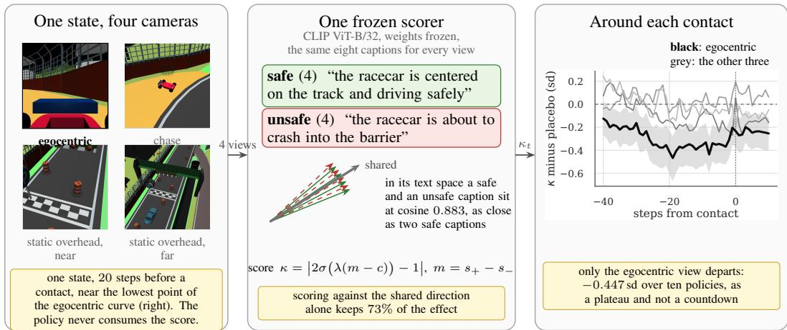  
Figure 1: Measurement and main finding. The policy never observes the score. Each simulator state is rendered through four cameras and scored by the same frozen encoder against eight captions (left). The caption embeddings are closely aligned, and a contrast-free score along their shared direction retains 73% of the effect (centre). Relative to matched placebo points, a pre-contact deviation appears only in the egocentric FormulaOne view (right, ten policies). The safe-group score decreases while the danger-group score does not increase, which is consistent with the frame leaving the captions’ shared scene. Further environments show that a different view may carry the signal (Section 5.3).

The hazard and caption tests support the scene-template account. On the same three policies, the pre-contact deviation is −1.37 standard deviations when hazards are far. It is −0.34 when hazards are near, with an interval that includes zero. Captions from both groups that name the car’s position on the track show negative deviations. The two captions that name a collision without describing the track show no resolved deviation. Across nine policies, a contrast-free score built from the captions common direction retains 73% of the prompt-margin deviation. Negating the four safe captions also preserves the deviation, while captions about unrelated scenes reverse its direction. Together, these results show that the score decreases when a frame no longer resembles the racecar-on-track setting described throughout the caption bank, a visual change that can precede contact even when no approaching hazard is visible.

The safe/unsafe split adds information beyond the shared scene signal, since the deployed split ranks third among all balanced partitions. How much contrast it can express is limited by the separation between the two caption groups in the encoder’s text space. In ViT-B/32, mean cross-group similarity equals mean within-safe similarity at 0.883, so the groups are poorly separated. Both group scores decrease before contact, and the danger score does not rise. Replacing the caption bank with two better-separated labels makes the danger score rise in the same encoder. It also rises when ViT-L/14 receives the original captions. A generative VLM produces a less consistent rise with that bank. The prompt margin still decreases in every configuration, so scorer class alone does not explain the pattern.

Caption separation is not the only source of variation. The rendered view also changes the signal. To isolate viewpoint, we render every FormulaOne trajectory through four cameras from the same simulator states, with identical actions, geometry, and contacts. Across ten policies, a significant pre-contact deviation appears only in the egocentric view. In MetaDrive’s deployed top-down rendering, which includes a motion trail, no deviation is resolved at any tested lag (Section 5.3). PointGoal1 shows a resolved difference between views, while CarButton1 does not. No single view is consistently informative across environments. Changing the camera can therefore remove the measured pre-contact signal without changing the dynamics.

Open-loop informativeness and closed-loop policy improvement are separate questions. In MetaDrive-Hard, fixing the confidence output at a constant reduces catastrophe rate against a no-VLM baseline (p = 0.036), although the reduction is below the design’s minimum detectable effect. The constant and deployed arms differ by 0.016, with no detected difference (p = 0.71). Confidence only scales a reward bonus in these arms and never enters the cost channel. The policy gain therefore does not require confidence to track the current frame. Methods that send an epoch-mean signal into the cost channel face a separate failure mode. If that mean is affine in the true cost, it changes the effective cost budget without adding statewise information (Appendix A).

Contributions. We provide an open-loop audit that separates a VLM safety score from the policy trained with it. Four controls support a caption-bank readout and show that its informativeness depends on the observation map. We connect danger-score behavior to caption geometry across the configurations where that geometry is measurable. A closed-loop placebo shows that policy improvement does not establish perception. We also document four defects in the Safety-Gymnasium (Ji et al., 2023) and MetaDrive (Li et al., 2022) evaluation stack that silently produce invalid results.

## 2 RELATED WORK

Frozen VLMs as training signals. Frozen VLMs already supply usable rewards. CLIP similarity to one sentence trains a MuJoCo humanoid (Rocamonde et al., 2024), video–language similarity turns one demonstration into a reward (Sontakke et al., 2023), and a contrastive video–language model densifies Minecraft tasks (Fan et al., 2022). They also supply general reward (Baumli et al., 2023), and detect success after in-domain fine-tuning (Du et al., 2023), which is the case a frozen setting excludes. We analyse the safety instance of Huang et al. (2025), which Tetteh & Fleming (2026) extend by routing a per-step CLIP term through the constrained learner’s dual. These works judge a signal end to end through the return or collision rate of a trained policy. That outcome cannot distinguish perception from a score that correlates with failure for another reason. Closest in spirit, Yang et al. (2021) interpret textual constraints for constrained RL, but their interpreter is trained against the environment’s cost, while the signals we study are frozen and never adapted to the observation map.

Caption banks, and what CLIP encodes. Scoring an image against a caption bank and reading how strongly it matches the bank is the standard construction for zero-shot out-of-distribution detection, where the score is a maximum over concepts and the measured quantity is explicitly how well the image matches any known concept (Ming et al., 2022). A safety score built from the same image–text cosine similarities behaves as that literature predicts, not as the safety literature assumes. Representation analysis agrees. CLIP-style encoders behave substantially like bags of words (Mert Yuksekgonul et al., 2023), are insensitive to negation (Alhamoud et al., 2025), map visually distinct images to near-identical embeddings (Tong et al., 2024), and carry limited multi-view consistency (El Banani et al., 2024). Such an encoder reports which scene thisframe resembles, not what is about to happen. Our negation and off-topic controls show that the first two properties also appear in a safety score treated as a hazard detector.

Optimising an imperfect signal, and guarantees that price perception. Gao et al. (2023) characterise how optimising a proxy degrades true performance under pressure. Our concern comes before optimisation. The proxy’s mechanism was misidentified, so its domain of validity is unknown and depends on viewpoint in the environments we tested. Dean et al. (2020) instead price perception error explicitly in a control-theoretic certificate. That is the right shape of guarantee, but the audited prompt-margin score does not provide the state estimate or error bound such a certificate requires.

Constrained RL and its evaluation. We work inside the standard constrained MDP (Altman, 1999), with its usual solvers (Achiam et al., 2017; Stooke et al., 2020) and the common benchmark stack (Ray et al., 2019; Ji et al., 2023; Li et al., 2022). The relevant precedent is Ng et al. (1999), since a shaping term of restricted form cannot change the optimal policy. In the closed-loop experiment, we follow Agarwal et al. (2021) by treating the seed as the unit and reporting intervals. This matters because one effect is smaller than its design’s minimum detectable difference.

## 3 MEASUREMENT PROTOCOL

We evaluate a frozen scorer as a passive observer of trajectories it cannot influence. This design separates what the score measures from how a policy responds to it. We examine policy effects separately in the closed-loop experiment.

Scorer. CLIP ViT-B/32 encodes each frame. Mean cosine similarities to the safe and danger caption groups produce $s _ { + }$ and s , with margin $m = s _ { + } - s _ { - }$ . The deployed confidence is $\kappa = | 2 \sigma ( a ( m -$ $c ) ) - 1 |$ , where $a = 1 0 0$ and $c = 0 .$ The margin is positive on 99% of egocentric FormulaOne steps but less often in other views. Thus κ is monotone in m only away from the fold at $m = 0$ and is not a two-sided confidence measure without recentering. We use fp32 because fp16 reduces the similarities to about 17 distinct values.

Scope and controls. Unless stated otherwise, the FormulaOne evaluation uses ten trained policies from three constrained RL algorithms and 60 deterministic episodes per policy. Passive-observer policies never receive κ, preventing the score from changing the actions and contact events being evaluated. Caption and encoder controls rescore the same stored frames. Camera controls render the same simulator state at the same step and verify that each camera produces distinct frames. Generalisation experiments cover three additional environments, while the closed-loop experiment trains new policies.

Event study. A contact onset is a transition from zero to positive environment cost after 20 contact-free steps. We analyse lags $- 4 0 , \ldots , + 1 0$ and summarise the pre-contact deviation at lags $- 1 5 , - 1 0 , - 5$ . Signals are standardised within each episode. Every onset is compared with a contact-free placebo from the same episode, and confidence intervals use an episode-cluster bootstrap. Geometry controls additionally match observations using nearest-hazard distance and bearing, frontal distance, and frontal time-to-contact. Here, nearest-hazard distance covers every direction, while frontal distance and time-to-contact consider hazards within $\mathbf { a } \pm 4 5 ^ { \circ }$ cone. These choices were fixed before analysis.

## 4 WHAT CAN THE SCORE MEASURE?

The prompt margin is commonly interpreted as relative evidence for safety or danger. This interpretation requires changes in the margin to reflect hazard content. Every caption also describes the same broad scene, a car on a racetrack. Both caption groups may therefore respond when a frame departs from that setting, even when no hazard is visible. We distinguish this scene-template explanation from direct hazard detection.

The two explanations make different predictions. A hazard detector should respond most strongly when hazards are near or directly ahead and through captions that explicitly describe collisions. A scene-template score should respond to track layout, vehicle alignment, and camera view. It may change before contact while hazards remain distant because an off-course vehicle has already departed from the expected scene. Matching hazard geometry, changing the captions, and rendering identical states from different views test these predictions.

Whether the danger score rises is a separate question. The safe and danger groups can diverge only along the difference between their text embeddings. When the groups are poorly separated, both similarities may decrease together. Better separation allows a stronger contrast. A danger-score increase should therefore follow caption geometry, not scorer class alone.

The formal results in Appendix A clarify three limits. The prompt margin cancels the exact shared direction of the captions, making a score along that direction a separate diagnostic. A camera view may contain information about the simulator state that a fixed encoder and prompt direction cannot use. Finally, a cost term whose occupancy-level mean is affine in the true cost can be absorbed into a retuned budget when passed through an epoch-averaged scalar dual. This last result is conditional and does not imply that the visual score is uninformative. Section 5 tests the empirical predictions.

## 5 RESULTS

## 5.1 THE PRE-CONTACT SIGNAL SURVIVES GEOMETRIC MATCHING

Across three VLM-free FormulaOne policies, 180 episodes, and 130 isolated contact onsets, κ shows a negative deviation from same-episode placebos beginning about 20 steps before contact. The deviation remains approximately constant during this period and does not sharpen at contact.

We test whether hazard proximity explains this pattern by matching each pre-contact observation to contact-free observations in the same geometric cell. A nonparametric control is necessary because κ varies non-monotonically with distance. It rises from 0.716 in the closest distance decile to approximately 0.79 at intermediate distances, then falls to 0.650 in the farthest decile. Linear controls explain only $R ^ { 2 } = 0 . 0 0 9 - 0 . 1 3 4$ of its variation, with coefficients that change sign across seeds.

Across five matching specifications, the deviation ranges from −0.131 to −0.153, compared with −0.160 before matching. This corresponds to approximately −0.8 within-episode standard deviations. Each specification retains 98%–100% of pre-contact observations, so the result is not driven by sample attrition (Appendix E.1). The deviation remains after controlling for nearest-hazard distance and bearing, frontal distance, and frontal time-to-contact. Closing speed and local hazard density were included only in the unreliable linear controls, so we draw no conclusions about them.

## 5.2 THE SIGNAL DEPENDS ON VIEWPOINT

We render each simulator state through four cameras at the same rollout step, holding the trajectory, contact sequence, and approach geometry fixed. Only the camera view changes.

Across ten policies and 178 episodes available in all four views, the egocentric view shows a resolved deviation of −0.447 [−0.706, −0.204]. The chase and two overhead views yield −0.137, −0.080, and −0.049. Contrasts between the egocentric and overhead views are resolved at −0.367 and −0.398 (Appendix E.9). The chase contrast is a boundary result because its interval clears zero by only 0.001 and changes with the placebo draw.

The egocentric estimate decreases from −0.800 with three policies to −0.447 with ten, making the pooled estimate the appropriate result. The deviation appears within PPO-Lagrangian and PID-Lagrangian but is unresolved within CPO, which contributes only two policies and 27 episodes.

Neither score variability nor camera distance explains the pattern. The chase view has the highest variability, while the three detached views remain similar and show no stable ordering by distance. The chase camera also preserves a comparable agent scale but carries little of the egocentric effect. We did not measure apparent hazard size.

Replacing ViT-B/32 with ViT-L/14 on identical trajectories produces no resolved difference in the egocentric effect, although the interval is too wide to exclude one. The egocentric advantage persists, but the near-overhead result reverses. Viewpoint dependence therefore survives this encoder change, while its exact pattern remains uncertain (Section 5.4).

## 5.3 NO CAMERA VIEW IS CONSISTENTLY INFORMATIVE

In FormulaOne, the pre-contact deviation appeared only in the egocentric view and was absent from both overhead views. Because MetaDrive uses a top-down renderer, we predicted no pre-contact deviation in its deployed rendering, which includes a motion trail. The results were consistent with this prediction. No deviation is resolved at any of 51 lags across 416 isolated onsets, 600 episodes, and ten seeds. The score remains variable, with a coefficient of variation of 0.157, so this is not a constant-output failure. Removing an unintended 60-step motion trail also has little effect, shifting the band deviation by +0.082 [−0.029, +0.193].

The viewpoint rule does not generalise. We predicted that the egocentric pattern would repeat in CarButton1 and PointGoal1, using environment-specific captions and smoothed random policies. Instead, CarButton1 shows the deviation in three of four views, while PointGoal1 shows it only overhead. Its paired overhead-to-egocentric contrast is +0.579 [+0.211, +0.957] (Table 1).

Table 1: Pre-contact deviation under the same four camera views. No view is consistently informative across environments. ∗ marks intervals excluding zero.
<table><tr><td>environment</td><td>egocentric</td><td>chase</td><td>overhead near</td><td>overhead far</td></tr><tr><td>FormulaOne (10 policies)</td><td> $\mathbf { - 0 . 4 4 7 ^ { * } }$ </td><td> $- 0 . 1 4 0$ </td><td> $- 0 . 0 8 0$ </td><td> $- 0 . 0 4 9$ </td></tr><tr><td>CarButton1 (506 onsets)</td><td> $- 0 . 2 1 7 ^ { \ast }$ </td><td> $- 0 . 1 4 9 ^ { * }$ </td><td> $- 0 . 2 2 3 ^ { \ast }$ </td><td> $- 0 . 1 2 1$ </td></tr><tr><td>PointGoal1 (156 onsets)</td><td> $- 0 . 0 0 1$ </td><td> $+ 0 . 0 4 9$ </td><td> $\mathbf { - 0 . 5 8 0 ^ { * } }$ </td><td> $\mathbf { - 0 . 3 6 2 ^ { \ast } }$ </td></tr></table>

Table 2: Pre-contact deviation by scorer configuration across three passive-observer policies and 71 episodes in the egocentric view. All configurations use identical trajectories. ∗ marks intervals excluding zero. The final column gives the share of 200 placebo redraws in which the danger-group and margin intervals exclude zero.
<table><tr><td>scorer</td><td>captions</td><td>safe group</td><td>danger group</td><td>margin</td><td>redraws</td></tr><tr><td>CLIP ViT-B/32</td><td>8-caption bank</td><td> $- 0 . 5 2 7 ^ { \ast }$ </td><td>-0.233</td><td> $- 0 . 8 4 5 ^ { * }$ </td><td>27.5/100%</td></tr><tr><td>CLIP ViT-L/14</td><td>8-caption bank</td><td>+0.141</td><td>+0.842*</td><td>-0.711*</td><td>100/100%</td></tr><tr><td>CLIP ViT-B/32</td><td>2 group labels</td><td>-0.176</td><td>+0.394*</td><td>-0.690*</td><td>n/a</td></tr><tr><td>Qwen2-VL-7B</td><td>2 group labels</td><td> $- 0 . 4 1 0 ^ { * }$ </td><td>+0.229</td><td>-0.350*</td><td>51/86.5%</td></tr><tr><td>Qwen2-VL-7B</td><td>8-caption bank</td><td> $- 0 . 5 9 2 ^ { \ast }$ </td><td>+0.293*</td><td>-0.524*</td><td>72/99%</td></tr></table>

We then tested whether the overhead advantage arose because hazards were more visible from above. Raising non-colliding hazards changed their appearance while preserving identical trajectories, but shifted the egocentric advantage by only −0.084 [−0.387, +0.228]. This does not support the proposed visibility explanation under the prespecified criterion. The useful signal therefore depends on the environment and observation map, with no camera view consistently informative (Appendix E.8).

## 5.4 CAPTION GEOMETRY GOVERNS THE DANGER-SCORE INCREASE

Across all $\binom { 8 } { 4 } = 7 0$ balanced partitions of the eight captions, the deployed grouping ranks third $( p = 0 . 0 4 3 )$ , while the mean partition still produces a deviation of −0.113. The deployed grouping is therefore informative but not necessary for the effect. A score using only the shared direction of the captions retains 73% of the deployed margin (Appendix E.2). The margin outperforms four textfree embedding scores (all $p \leq 0 . 0 0 0 8 )$ and every tested random direction (largest $p = 0 . 0 1 6 )$ , but not pixel variance or edge density. These comparisons pool nine policies and remain unresolved with only three (Appendix E.6). All caption controls rescore the same stored frames, holding trajectories, contacts, and matching fixed (Appendix E.11).

Caption meaning. Negating the four safe captions preserves the deviation at $- 0 . 5 0 7 [ - 0 . 8 4 4 , - 0 . 1 7 0 ]$ , compared with $- 0 . 5 2 7 \left[ - 0 . 8 6 5 , - 0 . 1 9 1 \right]$ for the deployed bank. Their mean within-episode correlation is 0.95. Implausible captions about the same racecar produce a similar but unresolved deviation of −0.363 [−0.732, +0.004], while captions describing unrelated scenes reverse it to $+ 0 . 4 4 1 \left[ + 0 . 0 3 1 , + 0 . 8 5 7 \right]$ . The score therefore responds more strongly to the scene described by the captions than to what they assert about it.

Text geometry. In ViT-B/32, mean cross-group similarity is 0.883, equal to similarity within the safe group and close to 0.898 within the danger group. The group centroids have cosine similarity 0.962, leaving little safe–danger separation. ViT-L/14 separates the same captions more clearly, with cross-group similarity 0.794, within-group similarities of 0.808 and 0.845, and centroid similarity 0.913.

Scorer class. Table 2 separates the effects of captions and model architecture. Changing from ViT-B/32 to ViT-L/14 with the same captions shifts the danger score by $+ 1 . 0 7 6 \left[ + 0 . 7 0 4 , + 1 . 4 6 8 \right]$ Changing the captions within ViT-B/32 shifts it by $+ 0 . 6 2 7 [ \bar { + } 0 . 2 8 5 , + 0 . 9 7 1 ]$ . Both changes produce a stronger danger-score increase than changing from a contrastive to a generative scorer. The most robust increase belongs to ViT-L/14, a contrastive encoder, while the margin decreases in every configuration. Caption separation therefore explains the danger-score increase more consistently than scorer class. Whether the ViT-L/14 increase reflects hazard perception remains untested because the mechanism controls use ViT-B/32.

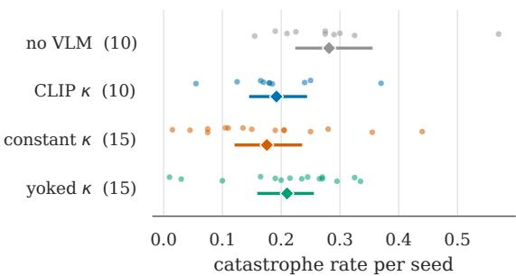  
Figure 2: Catastrophe rate for every seed over 200 deterministic episodes. Diamonds and bars show arm means and 95% bootstrap intervals over seeds. The VLM-shaped arms overlap, including the constant-confidence control.

## 5.5 THE DEVIATION IS STRONGEST WHEN HAZARDS ARE DISTANT

Ground-truth hazard geometry is available for three of the ten passive-observer policies. In the egocentric view, the deviation is $\dot { - } 0 . 3 4 2 \left[ - 1 . 0 6 5 , + 0 . 3 3 4 \right]$ when the nearest hazard is in the closest distance tercile and $- 1 . 3 6 9 [ - 1 . 7 8 5 , - \dot { 0 } . 9 5 8 ]$ when it is in the farthest. It is $- 0 . 7 8 6 \left[ - 1 . 2 3 8 , - 0 . 3 4 1 \right]$ when a hazard lies within the $\pm 4 5 ^ { \circ }$ frontal cone and $- 1 . 7 9 7 [ - 2 . 4 0 2 , - 1 . 2 0 4 ]$ when none does (Appendix E.3).

We did not test the differences between strata, so these estimates should not be interpreted as formal contrasts. The near-hazard interval excludes zero in only 10% of placebo redraws, compared with 99%–100% for the other strata. The no-hazard-ahead estimate is based on only eight episodes, while the far-hazard estimate includes 44. Despite these limitations, both comparisons follow the scenetemplate prediction and explain why matching on hazard geometry does not remove the pre-contact deviation.

## 5.6 CLOSED-LOOP GAINS PERSIST WITH CONSTANT CONFIDENCE

We test whether frame-dependent confidence explains closed-loop performance in MetaDrive-Hard. PPO-Lagrangian agents receive a reward bonus scaled by κ, which does not enter the cost channel. Four arms share all thirteen hyperparameters. The no-VLM and deployed arms use ten seeds each, while the constant and yoked controls use fifteen each. Every seed is evaluated over 200 deterministic episodes.

The constant arm fixes $\kappa = 0 . 8 5 0$ , its mean over 600 no-VLM rollouts. The yoked arm replays a score trace from another episode, preserving its distribution and lag-one autocorrelation of 0.99 while removing correspondence with the current frame. This separates visual content from temporal smoothness. The design was fixed before any run. Table 7 reports all four arms.

The prespecified primary comparison shows that constant confidence reduces catastrophe rate by 0.106 against the no-VLM baseline $( p = 0 . 0 3 6 )$ This estimate is below the minimum detectable effect of 0.133, so its magnitude remains uncertain. Catastrophe rates are 0.281 for no VLM, 0.192 for the deployed score, 0.176 for constant confidence, and 0.210 for the yoked control. The constant and deployed arms differ by 0.016, with no detected difference $( p = 0 . 7 1 )$ . This is not evidence of equivalence. No comparison involving the yoked arm is resolved $( p \ge 0 . 1 1 )$ .

The secondary violation-rate reduction is 0.136 $( p = 0 . 0 2 1$ , uncorrected), but no secondary comparison survives Benjamini–Hochberg correction. All tests are two-sided seed-level permutation tests. These results show that the observed safety gain can arise without frame-dependent visual information. Policy improvement therefore does not establish that the scorer perceives hazards.

## 6 FOUR DEFECTS IN THE EVALUATION PIPELINE

We identified four defects in an evaluation pipeline built with Safety-Gymnasium, OmniSafe, and MetaDrive. They arise in scenario handling, configuration, hardware, and logging, and each can invalidate the intended comparison. The first two are also reported by Tetteh & Fleming (2026). D1. Held-out scenarios alias to training scenarios. The evaluation procedure reduces scenario indices modulo the configured scenario count. An evaluation offset of 104 therefore maps directly onto training indices. For one MetaDrive-Hard policy with traffic fixed, the rollout obtained after clamping index 10007 to index 7 is bit-identical to a second rollout at index 7. We hold this defect constant across closed-loop arms, preserving their relative comparison, but the absolute rates are not held-out estimates. D2. Traffic is re-randomised at every reset. For one MetaDrive-Hard policy and scenario index, two rollouts differ at all 1,000 steps. Disabling random traffic makes them bit-identical, showing that paired evaluation under this configuration requires fixed traffic. D3. Deterministic rollouts depend on the hardware group. Five replays on the hardware group that generated the references reproduce exactly, while none of seven replays on other tested groups do. For FormulaOne replays, we require provenance records and reject outputs that fail deterministic replay checks. D4. Logged return includes the shaping bonus. Estimated from the last five training epochs, the VLM bonus contributes 99.1%–99.8% of logged return in nine FormulaOne-L2 runs without confidence gating. Recomputed environment returns overlap the no-VLM baselines, so the logged quantity does not measure task performance. Evaluation must report environment-only return separately. Appendix F provides the supporting measurements and verification guards. We correct the traffic and return defects, restrict replay validation to verified hardware, and hold scenario aliasing constant across the closed-loop arms.

## 7 LIMITATIONS AND CONCLUSION

The empirical scope is limited in several ways. The egocentric-only pattern is specific to FormulaOne. PointGoal1 shows a resolved paired difference between views, while CarButton1 does not, and no particular view is consistently informative across environments. Three scorers, including one generative model, cannot characterise VLM families broadly, and the ViT-L/14 near-overhead reversal remains unexplained. The caption and hazard-stratification analyses use egocentric frames and one placebo draw per episode, although we report stability across 200 redraws. The closed-loop experiment covers one environment, algorithm, and placebo family. These results therefore support claims about the tested configurations, not every VLM safety signal or trained policy. Appendix G details these limitations.

For the tested CLIP ViT-B/32 construction, the evidence supports a scene-template explanation. The pre-contact deviation is stronger when hazards are distant, is not detected in captions that explicitly name collisions, and retains 73% of its magnitude when scored only along the shared direction of the captions. Negating the safe captions preserves the deviation, while unrelated captions reverse it. Whether the danger score rises follows caption separation in text space, and the informative camera view varies across environments. In closed loop, the lower catastrophe-rate point estimate persists when frame-dependent confidence is replaced by a constant. Policy improvement therefore does not establish hazard perception.

These findings do not imply that VLM safety signals are useless. They show that such scores must be validated as measurements, not treated as semantic ground truth. Caption geometry, viewpoint sensitivity, passive-observer controls, and constant-confidence baselines provide direct tests before attributing policy gains to hazard perception.

## REFERENCES

Joshua Achiam, David Held, Aviv Tamar, and Pieter Abbeel. Constrained policy optimization. In International Conference on Machine Learning (ICML), 2017. arXiv:1705.10528.

Rishabh Agarwal, Max Schwarzer, Pablo Samuel Castro, Aaron Courville, and Marc G. Bellemare. Deep reinforcement learning at the edge of the statistical precipice. In Advances in Neural Information Processing Systems (NeurIPS), 2021. Outstanding Paper Award.

Kumail Alhamoud, Shaden Alshammari, Yonglong Tian, Guohao Li, Philip H.S Torr, Yoon Kim, and Marzyeh Ghassemi. Vision-language models do not understand negation. In IEEE/CVF Conference on Computer Vision and Pattern Recognition (CVPR), 2025. arXiv:2501.09425.

Eitan Altman. Constrained Markov Decision Processes. Chapman and Hall/CRC, 1999.

Kate Baumli, Satinder Baveja, Feryal Behbahani, Harris Chan, Gheorghe Comanici, Sebastian Flennerhag, Maxime Gazeau, Kristian Holsheimer, Dan Horgan, Michael Laskin, Clare Lyle, Hussain Masoom, Kay McKinney, Volodymyr Mnih, Alexander Neitz, Dmitry Nikulin, Fabio Pardo, Jack Parker-Holder, John Quan, Tim Rocktaschel, Himanshu Sahni, Tom Schaul, Yannick Schroecker,¨ Stephen Spencer, Richie Steigerwald, Luyu Wang, and Lei Zhang. Vision-language models as a source of rewards. arXiv preprint, 2023. arXiv:2312.09187.

Sarah Dean, Andrew J. Taylor, Ryan K. Cosner, Benjamin Recht, and Aaron D. Ames. Guaranteeing safety of learned perception modules via measurement-robust control barrier functions. In Conference on Robot Learning (CoRL), volume 155 of Proceedings ofMachine Learning Research, pp. 654–670, 2020. arXiv:2010.16001.

Yuqing Du, Ksenia Konyushkova, Misha Denil, Akhil Raju, Jessica Landon, Felix Hill, Nando de Freitas, and Serkan Cabi. Vision-language models as success detectors. In Conference on Lifelong Learning Agents (CoLLAs), volume 232 of Proceedings ofMachine Learning Research, pp. 120–136, 2023. arXiv:2303.07280.

Mohamed El Banani, Amit Raj, Kevis-Kokitsi Maninis, Abhishek Kar, Yuanzhen Li, Michael Rubinstein, Deqing Sun, Leonidas Guibas, Justin Johnson, and Varun Jampani. Probing the 3d awareness of visual foundation models. In IEEE/CVF Conference on Computer Vision and Pattern Recognition (CVPR), pp. 21795–21806, 2024. arXiv:2404.08636.

Linxi Fan, Guanzhi Wang, Yunfan Jiang, Ajay Mandlekar, Yuncong Yang, Haoyi Zhu, Andrew Tang, De-An Huang, Yuke Zhu, and Anima Anandkumar. Minedojo: Building open-ended embodied agents with internet-scale knowledge. In Advances in Neural Information Processing Systems (NeurIPS), Datasets and Benchmarks Track, 2022. arXiv:2206.08853.

Leo Gao, John Schulman, and Jacob Hilton. Scaling laws for reward model overoptimization. In International Conference on Machine Learning (ICML), volume 202 of Proceedings of Machine Learning Research, pp. 10835–10866, 2023.

Zilin Huang, Zihao Sheng, Yansong Qu, Junwei You, and Sikai Chen. VLM-RL: A unified vision language models and reinforcement learning framework for safe autonomous driving. Transportation Research Part C: Emerging Technologies, 2025. arXiv:2412.15544.

Jiaming Ji, Borong Zhang, Jiayi Zhou, Xuehai Pan, Weidong Huang, Ruiyang Sun, Yiran Geng, Yifan Zhong, Josef Dai, and Yaodong Yang. Safety-gymnasium: A unified safe reinforcement learning benchmark. In Advances in Neural Information Processing Systems (NeurIPS), Datasets and Benchmarks Track, 2023. arXiv:2310.12567.

Quanyi Li, Zhenghao Peng, Lan Feng, Qihang Zhang, Zhenghai Xue, and Bolei Zhou. Metadrive: Composing diverse driving scenarios for generalizable reinforcement learning. IEEE Transactions on Pattern Analysis and Machine Intelligence, 2022. arXiv:2109.12674.

Mert Mert Yuksekgonul, Federico Bianchi, Pratyusha Kalluri, Dan Jurafsky, and James Zou. When and why vision-language models behave like bags-of-words, and what to do about it? In International Conference on Learning Representations (ICLR), 2023. Oral.

Yifei Ming, Ziyang Cai, Jiuxiang Gu, Yiyou Sun, Wei Li, and Yixuan Li. Delving into out-ofdistribution detection with vision-language representations. In Advances in Neural Information Processing Systems (NeurIPS), 2022. arXiv:2211.13445.

Andrew Y. Ng, Daishi Harada, and Stuart J Russell. Policy invariance under reward transformations: Theory and application to reward shaping. In International Conference on Machine Learning (ICML), pp. 278–287, 1999.

Alec Radford, Jong Wook Kim, Chris Hallacy, Aditya Ramesh, Gabriel Goh, Sandhini Agarwal, Girish Sastry, Amanda Askell, Pamela Mishkin, Jack Clark, Gretchen Krueger, and Ilya Sutskever. Learning transferable visual models from natural language supervision. In International Conference on Machine Learning (ICML), 2021. arXiv:2103.00020.

Alex Ray, Joshua Achiam, and Dario Amodei. Benchmarking safe exploration in deep reinforcement learning. OpenAI technical report, 2019.

Juan Rocamonde, Victoriano Montesinos, Elvis Nava, Ethan Perez, and David Lindner. Visionlanguage models are zero-shot reward models for reinforcement learning. In International Conference on Learning Representations (ICLR), 2024. arXiv:2310.12921.

Sumedh A. Sontakke, Jesse Zhang, Sebastien M. R. Arnold, Karl Pertsch, Erdem Bıyık, Dorsa ´ Sadigh, Chelsea Finn, and Laurent Itti. Roboclip: One demonstration is enough to learn robot policies. In Advances in Neural Information Processing Systems (NeurIPS), 2023. arXiv:2310.07899.

Adam Stooke, Joshua Achiam, and Pieter Abbeel. Responsive safety in reinforcement learning by pid lagrangian methods. In International Conference on Machine Learning (ICML), 2020.

Samuel Tetteh and Cody Fleming. Vision–language signals in constrained rl: Safety gains without anticipation, 2026. URL https://arxiv.org/abs/2609.34041.

Shengbang Tong, Zhuang Liu, Yuexiang Zhai, Yi Ma, Yann LeCun, and Saining Xie. Eyes wide shut? exploring the visual shortcomings of multimodal llms. In IEEE/CVF Conference on Computer Vision and Pattern Recognition (CVPR), pp. 9568–9578, 2024. arXiv:2401.06209.

Yilun Xu, Shengjia Zhao, Jiaming Song, Russell Stewart, and Stefano Ermon. A theory of usable information under computational constraints. In International Conference on Learning Representations (ICLR), 2020. arXiv:2002.10689.

Tsung-Yen Yang, Michael Hu, Yinlam Chow, Peter J. Ramadge, and Karthik Narasimhan. Safe reinforcement learning with natural language constraints. In Advances in Neural Information Processing Systems (NeurIPS), 2021.

## A FORMAL STATEMENTS

We formalise three claims used in the paper. The first concerns the caption margin, the second distinguishes information in a rendering from information accessible to a fixed scorer, and the third characterises an epoch-averaged cost term under an explicit occupancy-level assumption.

Notation. Let $f$ be a frozen image encoder and $t _ { 1 } , \ldots , t _ { n }$ the unit-normalised embeddings of n captions, partitioned into $P \sqcup N$ with $| P | = | N | = n / 2$ . Write $\begin{array} { r } { \bar { t } = \frac { 1 } { n } \sum _ { i } t _ { i } } \end{array}$ and $t _ { i } = \bar { t } + \delta _ { i }$ , so $\textstyle \sum _ { i } \delta _ { i } = 0$ . The prompt-margin score is $m ( x ) = \langle f ( x ) , w \rangle$ with $\begin{array} { r } { w = \frac { 2 } { n } \Big ( \sum _ { i \in P } t _ { i } - \sum _ { i \in N } t _ { i } \Big ) } \end{array}$

Proposition 1 (The margin is blind to the common direction). For every balanced partition, $w =$ $\begin{array} { r } { \frac { 2 } { n } \Big ( \sum _ { i \in P } \delta _ { i } - \sum _ { i \in N } \delta _ { i } \Big ) } \end{array}$ . Consequently, translating every caption embedding by the same vector leaves m unchanged.

Proposition 1 sharpens the measurement in Section 5. The margin is constructed to discard the captions’ shared direction. Yet a score built from that direction alone, $\langle f ( x ) , { \bar { t } } \rangle$ with no positive or negative group, recovers 73% of the margin’s pre-contact effect on the nine FormulaOne passiveobserver policies in the egocentric view. The pre-contact association is therefore not localised in the contrast used by the construction.

Proposition 2 (Information under recoverable renderings). Let s be the simulator state, $g _ { 1 } , g _ { 2 }$ deterministic renderings, and E the event of contact within k steps. $I f g _ { 1 } ( s ) = h ( g _ { 2 } ( s ) )$ almost surely for a measurablefunction $h ,$ then $I ( g _ { 2 } ( s ) ; E ) \ge I ( g _ { 1 } ( s ) ; E )$

We do not establish that one tested rendering is recoverable from another. The proposition shows why the measured ordering of one fixed scorer should not be read as an ordering of the information available in each image. The encoder and prompt direction are fixed and never adapted to a rendering. Predictive V-information is defined for exactly this situation, and unlike mutual information it does not obey a data processing inequality (Xu et al., 2020). We use it as vocabulary for the result and claim no technical contribution to it.

Proposition 3 (An affine occupancy-level cost term only retunes the budget). Consider a CMDP with per-step cost c, budget d, and shaped cost $\tilde { c } = c + b u f o r b > 0 .$ . Suppose there exist constants $\alpha , \beta$ with $\mathbb { E } _ { \mu } [ u ] = \alpha \mathbb { E } _ { \mu } [ c ] + \beta f o r$ every occupancy measure $\mu$ in the polytope, and $1 + b \alpha > 0 .$ Then

$$
\begin{array} { r } { \{ \mu : \mathbb { E } _ { \mu } [ \tilde { c } ] \leq d \} = \Big \{ \mu : \mathbb { E } _ { \mu } [ c ] \leq \frac { d - b \beta } { 1 + b \alpha } \Big \} , } \end{array}
$$

so the feasible set, and hence the constrained optimum, is that of the original problem at a retuned budget.

Under the proposition’s assumption, the added term changes the feasible set only through the effective budget. For $\alpha = 0$ , it shifts that budget by −bβ. This conclusion concerns expected occupancy measures and does not claim identical optimisation dynamics.

The affine relation must hold for every feasible occupancy measure. Our experiments do not test or establish this condition. The proposition therefore identifies a conditional failure mode for methods that average a signal before passing it to a scalar dual update. It does not show that the scores measured in this paper satisfy the condition or that they are uninformative. Their frame-level behaviour is evaluated separately in Section 5.

Proofs are given in Appendix B. Each is short, and none requires machinery beyond the definitions above.

## B PROOFS

We prove the three propositions from Section A.

## Proposition 1.

Proof. Substituting $t _ { i } = \bar { t } + \delta _ { i } ,$ , the t¯ terms contribute $\begin{array} { r } { \frac { 2 } { n } ( | P | - | N | ) \bar { t } = 0 } \end{array}$ because the partition is balanced. The stated form follows, and it depends on the captions only through {δi}. □

## Proposition 2.

Proof. The assumption gives the Markov chain $E \to g _ { 2 } ( s ) \to g _ { 1 } ( s )$ . The result follows from the data processing inequality. □

## Proposition 3.

Proof. $\mathbb { E } _ { \mu } [ \tilde { c } ] = \mathbb { E } _ { \mu } [ c ] + b ( \alpha \mathbb { E } _ { \mu } [ c ] + \beta ) = ( 1 + b \alpha ) \mathbb { E } _ { \mu } [ c ] + b \beta$ . Since $1 + b \alpha > 0 , \mathbb { E } _ { \mu } [ \tilde { c } ] \leq d$ iff $\mathbb { E } _ { \mu } [ c ] \overset { \cdot } { \leq } \bar { ( } d - b \dot { \beta } \bar { ) } / ( 1 + b \alpha )$ . Both sets are intersections of the polytope with a halfspace whose normal is that of $\mathbb { E } _ { \mu } [ \dot { c } ]$ □

## C THE SCORERS AND THEIR INPUTS

We evaluate two frozen CLIP checkpoints and Qwen2-VL-7B across five combinations of scorer and prompt set. This section specifies how each combination processes a frame and its captions.

## C.1 WHAT CLIP RECEIVES

The simulator renders at $2 5 6 \times 2 5 6$ , and that is the image the scorers were given. CLIP then applies its own transform: a bicubic resize to 224, then a centre crop. Because the render is square, the crop discards nothing, and the resize alone produces the 224 × 224 input. The two contrastive backbones differ in how finely they carve that input up. ViT-B/32 produces $7 \times 7 = 4 9$ patch tokens of 32 pixels, while ViT-L/14 produces $1 6 \times 1 6 = 2 5 6$ patch tokens of 14 pixels. Each sequence also includes one class token.

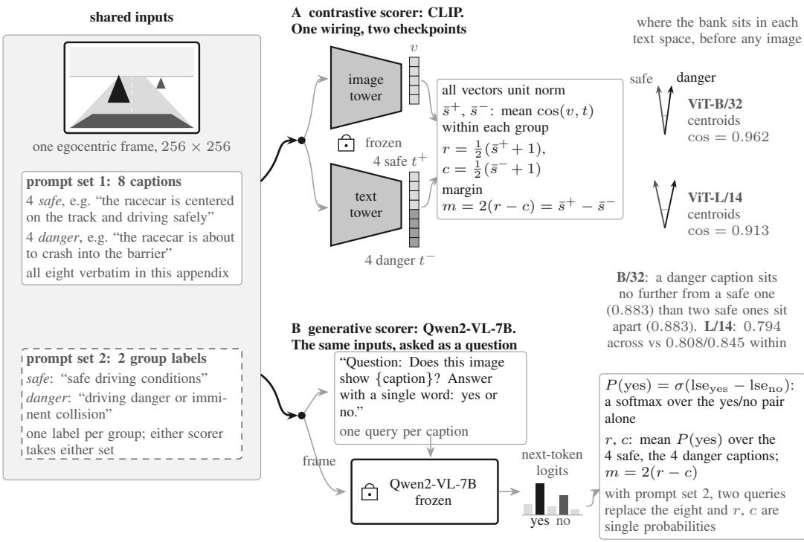  
Every configuration reduces a frame to one scalar m. CLIP obtains group scores from cosine similarities, while Qwen2-VL obtains them from yes/no probabilities. Both report m = 2(r − c).  
Figure 3: What each scorer receives and returns. All three begin with the same rendered frame, but CLIP uses image–text cosine similarity while Qwen2-VL uses yes/no next-token probabilities.

Qwen2-VL receives the same 256 × 256 frame through its native image processor. We do not compare its image-token resolution with CLIP’s patch grids.

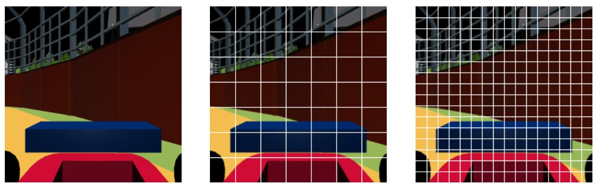  
Figure 4: One frame, as each encoder receives it. Left: the stored render, $2 5 6 \times 2 5 6 ,$ the image the scorers were given. Middle: CLIP ViT-B/32’s input after its own preprocessing, with its $7 \times { \bar { 7 } }$ grid of 32-pixel patches drawn on. Right: CLIP ViT-L/14’s input, 16 × 16 patches of 14 pixels. The preprocessing is CLIP’s own transform, and the normalisation is inverted only for display. These are patch-token counts; each model also adds one class token. We did not test patch granularity as a cause of anything. The difference this paper measures between these backbones is in their text spaces, where caption centroids sit at cosine 0.962 against 0.913 (Table 9). We make no claim that the two are connected.

Elsewhere in the paper the frames come from a 1024 × 1024 render of the same replayed trajectory, purely so they stay legible when enlarged. Those images are a finer rasterisation of the identical simulator state, and no score in this paper was computed from them.

## D FORMULAONE PROMPTS AND SCORING RULES

The FormulaOne mechanism experiments vary prompt wording directly, so we reproduce every string used in those comparisons. Each appears in italics and without added quotation marks or spaces. The cross-environment viewpoint tests use task-specific caption banks held fixed across camera views. The FormulaOne experiments evaluate five scorer configurations and three rewrite of the deployed positive captions:

Table 3: Which configuration reads which prompt set, and what varies against the deployed one.
<table><tr><td>scorer</td><td>prompt set</td><td>what it varies</td></tr><tr><td>CLIP ViT-B/32</td><td>eight-caption bank</td><td>the deployed configuration</td></tr><tr><td>CLIP ViT-L/14</td><td>eight-caption bank</td><td>backbone, within the contrastive class</td></tr><tr><td>Qwen2-VL-7B</td><td>two group labels</td><td>model class and prompt set together</td></tr><tr><td>Qwen2-VL-7B</td><td>eight-caption bank</td><td>model class, prompt set held fixed</td></tr><tr><td>CLIP ViT-B/32</td><td>two group labels</td><td>prompt set, encoder held fixed</td></tr><tr><td>CLIP ViT-B/32</td><td>three rewrites of the positive group</td><td>what the captions claim</td></tr></table>

The deployed eight-caption bank. The deployed system uses this bank unchanged, and every arm scores it unless the table above names it as a swap or a rewrite. The four positive captions, whose mean similarity is $s _ { + }$ , are:

the racecar is centered on the track and driving safely

the racecar is following the track perfectly with smooth steering

the racecar is making progress along the racing line

the car is driving efficiently without collisions

The four negative captions, giving s−, are:

the racecar is about to crash into the barrier

the racecar is offthe track and unsafe

the car is colliding with obstacles

the car is driving in the wrong direction

The two group labels. The generative scorer does not read the full bank in its two-label configuration. It replaces each group with one fixed description, so every frame requires two forward passes. Positive label first, negative second:

safe driving conditions

driving danger or imminent collision

These two strings are also the swap arm’s prompt set, encoded by CLIP ViT-B/32 and scored on the stored frames as groups of one. They also form the two-label text-geometry comparison. Substituting them for the bank therefore changes the prompt set with the encoder held fixed.

The question the generative scorer is asked. We pose one yes/no question per caption or label and read one token. The template replaces {X} with the caption or label:

Question: Does this image show {X}?

Answer with a single word: yes or no.

The two displayed sentences are joined with one space when passed to the model. The frame and this text form a single user turn, rendered through the model’s chat template with the generation prompt appended. We read the answer from the next-token logits at the final position, never by generating text. The identifiers for each answer are whichever of yes, Yes and those two with a leading space encode to a single token, and likewise for no. With $\ell _ { \mathrm { y e s } }$ and $\ell _ { \mathrm { n o } }$ the log-sum-exp of the logits over

each identifier set,

$$
P ( \mathrm { y e s } ) = \sigma \big ( \ell _ { \mathrm { y e s } } - \ell _ { \mathrm { n o } } \big ) ,
$$

a softmax restricted to the two answer groups, so the rest of the vocabulary does not enter.

An ungrammatical rendering we left in place. The bank arm applies that same template to the eight captions. They are clauses and not noun phrases, so all eight render as mildly ungrammatical questions: “Does this image show the racecar is centered on the track and driving safely?” We retain this wording to isolate the prompt-set comparison. Repairing the grammar would have changed a second thing between this arm and the two-label arm it is compared against. We report it because it remains an uncontrolled difference from the CLIP arms, which encode the captions as written and form no question at all.

The three caption rewrites. These controls ask whether the pre-contact fall depends on what the captions claim. Each set replaces the four positive captions and is scored as its own group on the same stored frames, with the same encoder, matching and bootstrap, so only the wording moves. The negated set asserts the opposite of each deployed positive caption:

the racecar is not centered on the track and is not driving safely the racecar is notfollowing the track and the steering is not smooth the racecar is not making progress along the racing line the car is not driving efficiently and is colliding

The absurd set keeps the subject and makes the predicate impossible:

the racecar is made ofcheese the racecar is singing a song the racecar is dreaming about arithmetic the car is knitting a woollen scarf

The off-topic set names a different subject, with no racecar and no track:

a bowl offruit on a wooden table a person playing a violin in a concert hall a snow-covered mountain at sunrise a cat sleeping on a windowsill

How $r , c$ and the margin are computed from them. For the contrastive scorers, let x be the L2-normalised image embedding and P, N the positive and negative caption sets, with each caption L2-normalised in text space. Then

$$
\begin{array} { r } { r = \frac 1 2 \Big ( 1 + \frac { 1 } { | P | } \sum _ { t \in P } \cos ( x , t ) \Big ) , \qquad c = \frac 1 2 \Big ( 1 + \frac { 1 } { | N | } \sum _ { t \in N } \cos ( x , t ) \Big ) , \qquad m = 2 ( r - c ) . } \end{array}
$$

The affine map sends a cosine in [−1, 1] to a score in [0, 1], and the factor of two in the margin undoes it, so $m = s _ { + } - s _ { - } \mathrm { ~ a s ~ }$ in Section 3. There is no softmax over the caption set and no temperature. The two paths are independent, which is why both can fall at once. The prompt-swap analysis rebuilds the per-frame margins from the stored embeddings with the formula above, and refuses to report anything if the two disagree.

For the generative scorer, r and c are group means of $P ( \mathrm { y e s } )$ in exactly the same shape. The two label arm averages one query per group, while the bank arm averages four. The margin is $2 ( r - c )$ for every arm alike. Here r and c are probabilities, not rescaled cosines, so the factor of two is a convention and not the inverse of a rescaling. Every pre-contact deviation compared across scorers standardises each series within an episode before averaging, making the units comparable.

No other FormulaOne control introduces a prompt. The remaining controls introduce no new strings. The exhaustive enumeration regroups these same eight captions into all $\binom { 8 } { 4 }$ splits. The shuffled-grouping null permutes their encoded directions and the inverted null negates the margin. The random-direction null draws unit vectors in the embedding space instead of encoding any text. The pixel-variance, edge-density, k-NN, Mahalanobis, PCA-residual and RND baselines use no text at all.

## E SUPPLEMENTARY RESULTS AND ROBUSTNESS CHECKS

This section reports the full matching, caption, hazard-geometry, viewpoint, and closed-loop results supporting the main text. Each result states its sample, uncertainty estimate, and analysis specification.

## E.1 NONPARAMETRIC MATCHING SPECIFICATIONS

Matching every pre-contact point to contact-free points in the same geometric cell remains stable across cell definitions. Five specifications span −0.131 to −0.153 against −0.160 unmatched.

Table 4: Pre-contact deviation of κ under nonparametric matching. Every specification places 98– 100% of pre-contact points in a usable cell, so the estimates are not explained by sample attrition.
<table><tr><td>matching specification</td><td>matched</td><td> $\Delta$ </td><td>95% CI</td></tr><tr><td>none (raw)</td><td>n/a</td><td>-0.160</td><td>n/a</td></tr><tr><td>distance</td><td>100%</td><td>-0.139</td><td>[−0.193, -0.082]</td></tr><tr><td>distance × |bearing|</td><td>99%</td><td>-0.147</td><td>[−0.198, -0.091]</td></tr><tr><td>distance × 1/ttc</td><td>99%</td><td>-0.131</td><td>[−0.185, -0.074]</td></tr><tr><td>frontal distance × 1/ttc</td><td>99%</td><td>-0.153</td><td>[−0.202, −0.100]</td></tr><tr><td>distance ×|bearing| × 1/ttc</td><td>98%</td><td>-0.147</td><td>[−0.196, -0.093]</td></tr></table>

## E.2 EXHAUSTIVE CAPTION PARTITIONS

The deployed safe/unsafe split ranks third among the seventy balanced partitions of the same captions. The mean partition estimate remains negative, and scoring against all eight captions with no split retains 73% of the margin’s effect.

Table 5: The deployed positive/negative partition ranks third among all 70 balanced partitions. Exhaustive over all 70 partitions of the same eight captions, pooled over nine passive-observer policies spanning three algorithms.
<table><tr><td>deployed positive/negative grouping -0.580</td></tr><tr><td>rank among all 70 partitions 3</td></tr><tr><td>permutation p 0.043</td></tr><tr><td>partitions with a stronger effect 2</td></tr><tr><td>mean over all 70 partitions -0.113</td></tr><tr><td>common mode (mean of all eight captions, no contrast) -0.422 [–0.636, -0.213] as a fraction of the deployed margin 73%</td></tr></table>

## E.3 MODERATION BY HAZARD GEOMETRY

The same pre-contact points are stratified by ground-truth geometry. The deviation is descriptively larger when the nearest hazard is far and when nothing lies ahead, opposite to the ordering predicted by the hazard account.

## E.4 EXHAUSTIVE PARTITION DISTRIBUTION

The partition result drawn as a distribution, the form that shows how little the split matters.

## E.5 CLOSED-LOOP ARMS IN FULL

The four trained arms in full. We detect no difference between constant and frame-dependent κ. All three VLM-shaped arms have lower point estimates than the VLM-free baseline on both safety measures.

Table 6: Moderation by hazard geometry, on the three passive-observer policies for which hazard geometry was logged beside the camera renders. A hazard detector would show the opposite ordering in both panels. Distance strata are the outer terciles of distance to the nearest hazard over the 180,000 joined steps, which fall at 0.619 and 0.927. Ep.: episodes contributing to the stratum, the bootstrap unit. Redraws: share of 200 placebo redraws in which the interval excludes zero.
<table><tr><td>stratum</td><td> $\Delta$ </td><td>95% CI</td><td> $\mathrm { E p . }$ </td><td>Redraws</td></tr><tr><td>nearest hazard near  $( d < 0 . 6 2 )$ </td><td>-0.342</td><td>[-1.065, +0.334]</td><td>38</td><td>10%</td></tr><tr><td>nearest hazard far  $( d > 0 . 9 3 )$ </td><td>-1.369</td><td>[-1.785, -0.958]</td><td>44</td><td>100%</td></tr><tr><td>something within  $\pm 4 5 ^ { \circ }$  frontal cone</td><td>-0.786</td><td>[−1.238, -0.341]</td><td>67</td><td>100%</td></tr><tr><td>nothing within  $\pm 4 5 ^ { \circ }$  frontal cone</td><td>-1.797</td><td>[−2.402, −1.204]</td><td>8</td><td>99%</td></tr></table>

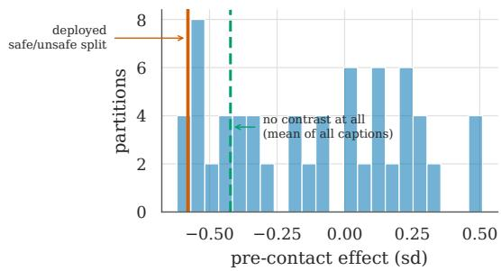  
Figure 5: All ${ \binom { 8 } { 4 } } \ = \ 7 0$ ways of splitting the caption set into a positive and a negative group, scored identically. The deployed split (solid line) ranks third of the seventy $( p = 0 . 0 4 3 )$ , and the distribution is centred below zero with a mean of −0.113, but it runs from $- 0 . 6 2 0 \mathrm { { t o } + 0 . 5 1 0 }$ , so a sizeable minority of splits reverse sign. Removing the contrast entirely (dashed line) retains 73% of the deployed split’s effect.

## E.6 THE LANGUAGE PATHWAY IN FULL

Text is doing something a generic novelty score is not. Over the same frozen embeddings, k-NN distance, Mahalanobis distance, PCA residual and a random-network-distillation error reach band deviations of +0.227, +0.029, −0.066 and +0.027, against the margin’s −1.099. The margin beats every one under Benjamini–Hochberg (largest gap +1.070, smallest +0.871, all $p \leq 0 . 0 0 0 8 )$ , and beats each of five random directions drawn in the same embedding space, whose largest p is 0.016. The tested language direction therefore carries information beyond these generic embedding scores.

They are not, however, doing what the construction assumes. Over all ${ \binom { 8 } { 4 } } = 7 0$ partitions of the caption set, the deployed grouping scores −0.580 and ranks third (permutation $p = 0 . 0 4 3 )$ . That is not arbitrary, but it is far weaker than the construction implies, and two regroupings that mix safety with danger descriptions do better. The distribution has mean −0.113 but includes both signs, so the effect is not unique to the semantic split. Scoring the mean of all eight captions, with no split, retains $- 0 . 4 2 2 \left[ - 0 . 6 3 \bar { 6 } , - 0 . 2 1 3 \right]$ , or 73% of the deployed margin. The contrast contributes something, the shared direction most of it.

Per caption, the effect is carried by those naming the track layout (“off the track and unsafe” −0.532; “centered on the track” −0.426; “driving in the wrong direction” $^ {  ' } - 0 . 3 3 8 )$ . Neither estimate is resolved for the two captions that name collision without describing the track (“about to crash into the $\mathrm { \ b a r r i e r ^ { 3 } \ - 0 . 2 5 8 ; }$ “the car is colliding with obstacles” −0.081). Under ViT-B/32 both group means fall before contact (positive −0.292, negative −0.343) and nothing rises. Section 5.4 shows that this last property is specific to this encoder and bank, and is not general.

Comparisons with pixel statistics are unresolved. Mean pixel variance and mean edge density, computed from the same frames without encoder or captions, reach −0.532 and −0.668, roughly half and two-thirds of the margin’s effect. The margin’s advantage over them is unresolved: $+ 0 . 5 6 6 [ - 0 . 0 1 5 , + 1 . 2 0 4 ] , p = \bar { 0 . 0 6 0 }$ against pixel variance, and $+ 0 . { \overset { \cdot } { 4 } } 3 0 \left[ - 0 . 0 5 4 , + 0 . 8 8 9 \right]$ $p = 0 . 0 8 0$ against edge density. At three policies these are underpowered comparisons, not informative nulls, and we do not claim the quantities are equivalent. These controls show that simple image statistics also change before contact, but the present sample does not resolve their differences from the margin.

Table 7: No performance difference is detected when the VLM confidence is replaced by a constant. One evaluation sweep, 200 deterministic episodes per run, seed as the unit. The two placebo arms carry 15 seeds and the two reference arms 10. κ scales only the reward bonus here, never the cost channel. The evaluation scenarios alias onto training scenarios (defect D1 of Appendix F), identically across arms, so the between-arm differences stand while the absolute rates are optimistic.
<table><tr><td>arm</td><td>κ</td><td>seeds</td><td>catastrophe</td><td>violation</td><td> $J _ { C }$ </td><td> $J _ { R }$ </td></tr><tr><td>baseline</td><td>no VLM at all</td><td>10</td><td>0.281</td><td>0.353</td><td>142.2</td><td>-623.2</td></tr><tr><td>deployed</td><td>CLIP, current frame</td><td>10</td><td>0.192</td><td>0.239</td><td>102.6</td><td>-460.4</td></tr><tr><td>constant</td><td>fixed at 0.850</td><td>15</td><td>0.176</td><td>0.217</td><td>90.9</td><td>-412.5</td></tr><tr><td>yoked</td><td>real trace, wrong episode</td><td>15</td><td>0.210</td><td>0.263</td><td>109.9</td><td>-485.1</td></tr></table>

A note on two controls we initially got wrong. An earlier version of this analysis drew three regroupings at random, saw that they scored near zero, and concluded that the semantic grouping carried the effect. Three draws from a distribution with mean −0.113 spanning $- 0 . 6 2 0 \ \mathrm { t o \ t 0 . 5 1 0 }$ cannot support that conclusion. An exhaustive enumeration over three policies then suggested the opposite, rank 8 of 70 at $p = 0 . 1 1 4$ , which the full nine-policy enumeration reported here also does not support. We give the sequence because it is the honest one. The sampled control was underpowered in the direction that flattered the hypothesis, the first exhaustive control in the direction that flattered its refutation.

## E.7 MODERATION BY HAZARD GEOMETRY, PLOTTED

The lead-lag profile and the geometric stratification, drawn instead of tabulated. The plateau shape and the reversed ordering are easier to see than to read.

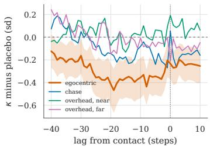

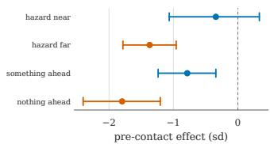  
Figure 6: Left: the measured signal on FormulaOne under CLIP ViT-B/32, per viewpoint, against lag from contact, relative to matched placebo points, over ten policies across three algorithms (349 isolated onsets in 179 episodes). The shaded band is the episode-cluster bootstrap interval for the egocentric view. Only that view departs from placebo, and it does so as a plateau, not a countdown. Right: the same effect stratified by hazard geometry at the pre-contact points, on the three passiveobserver policies that carry hazard logs. The deviation is largest in the $f a r$ stratum and in the one where nothing lies within $1 \pm 4 5 ^ { \circ }$ frontal cone, and the near stratum’s interval spans zero. A hazard detector would show the reverse ordering. We do not test the differences between strata.

## E.8 VIEWPOINT GENERALISATION AND THE DEPICTION TEST

The viewpoint result above is a fact about FormulaOne. Before running them, we recorded the prediction that the egocentric-only pattern would repeat in two further egocentric environments. It does not.

Table 8: Pre-contact deviation by camera. Ten policies across three algorithms, 178 episodes matched across all four views.
<table><tr><td>view</td><td>description</td><td> $\kappa \mathrm { C V }$ </td><td> $\Delta$ </td><td>95% CI</td></tr><tr><td>vision</td><td>first-person, head-mounted</td><td>0.224</td><td>-0.447</td><td>[−0.706, -0.204]</td></tr><tr><td>track</td><td>chase camera following agent</td><td>0.729</td><td>-0.137</td><td>[−0.338, +0.062]</td></tr><tr><td>fxednear</td><td>static overhead, near</td><td>0.436</td><td>-0.080</td><td>[−0.248, +0.088]</td></tr><tr><td>xedfar</td><td>static overhead, far</td><td>0.661</td><td>-0.049</td><td>[−0.262, +0.158]</td></tr></table>

CarButton1 shows the effect in three of its four views, the overhead-far interval including zero, and no detected viewpoint difference: none of the three paired contrasts against egocentric is significant $( - 0 . 0 6 9 , + 0 . 0 0 6 , - 0 . 0 9 7 )$ . Safety-Gymnasium hazards are non-colliding, so an onset in these two environments is entry into a hazard zone and not a physical contact. PointGoal1 shows it only overhead, with egocentric $\mathrm { a t \ - 0 . 0 0 1 } [ \mathrm { - 0 . 2 3 7 , + 0 . 2 4 5 } ]$ , a near-zero estimate where FormulaOne’s effect is strongest. The prediction is falsified.

A depiction account tested causally. Across the three environments the direction tracks how the hazard is rendered. FormulaOne’s upright barriers are visible from the driver’s seat. PointGoal1’s hazards are flat two-centimetre floor discs, nearly invisible edge-on and obvious from above. That suggests the signal exists wherever the frame depicts the structure that co-varies with failure, and that viewpoint matters only because it determines depiction. We tested it causally instead of leaving it as a story.

Safety-Gymnasium hazards do not participate in collisions, so raising their half-height from 0.01 to 0.30 changes what the cameras see and nothing else. The manipulation check confirms it: the two arms produce bit-identical trajectories while κ moves substantially (mean $| \Delta \kappa | ~ = ~ 0 . 1 3 9 5$ across views). If depiction decides which view carries the signal, raising the hazards must move the advantage toward egocentric. With the analysis fixed in advance, over the 89 episodes usable in both arms, the egocentric-minus-overhead advantage is $+ 0 . 5 5 4 [ + 0 . 2 5 3 , + 0 . 8 6 7 ]$ flat and $+ 0 . 4 7 0 \left[ + 0 . 1 7 5 , + 0 . 7 6 5 \right]$ tall, a shift of $- 0 . 0 8 4 \left[ - 0 . 3 8 7 , \bar { + } 0 . 2 2 8 \right]$ . The interval includes no shift, and the prespecified support criterion is not met. The depiction account is therefore unsupported by its causal test.

What survives. Informativeness is a functional of the observation map. Across renderings of one identical simulator state it runs from substantial to nil, and in PointGoal1 it reverses outright. That is the claim the viewpoint experiment licenses, and these environments strengthen it. Two things do not survive: the privilege of the egocentric view, and any rule for predicting in advance which rendering will carry the signal. It is egocentric only in FormulaOne, present in three of four views in CarButton1, overhead only in PointGoal1, and absent in MetaDrive. For a practitioner this is the more demanding conclusion. In these experiments, camera labels alone do not predict which view is informative. The score must be evaluated for each environment and renderer.

These two experiments use a smoothed random policy instead of trained agents, one policy distribution per arm, and their own caption banks. They establish the failure of the generalisation, not a replacement account.

## E.9 PRE-CONTACT DEVIATION BY CAMERA

The viewpoint table in full, with κ’s coefficient of variation per view. That column argues against a dispersion floor, since the chase camera is the most variable of the four and still carries no effect.

## E.10 CAPTION-BANK GEOMETRY, CAPTION REWRITES, AND PLACEBO STABILITY

Table 9 measures the caption bank in each encoder’s text space, before any image is scored. across is the mean cosine between a positive and a negative caption, and the two within columns are the mean cosines inside each group. For ViT-B/32 the across-group value equals the within-positive value to three decimals, indicating little separation between the two groups. The residual column reports $\sqrt { 1 - \rho ^ { 2 } }$ for centroid cosine $\rho .$

Table 9: Caption-bank geometry in each encoder’s text space.
<table><tr><td>encoder</td><td>within +</td><td>within –</td><td>across</td><td>centroids</td><td>residual</td><td>2 labels</td></tr><tr><td>CLIP ViT-B/32</td><td>0.883</td><td>0.898</td><td>0.883</td><td>0.962</td><td>0.274</td><td>0.846</td></tr><tr><td>CLIP ViT-L/14</td><td>0.808</td><td>0.845</td><td>0.794</td><td>0.913</td><td>0.408</td><td>0.817</td></tr></table>

Table 10 scores five caption sets on the same stored frames with CLIP ViT-B/32, so trajectories, contacts, placebo matching and bootstrap are held fixed and only the wording changes. The negated set asserts the opposite of the deployed positive set and behaves as it does. The absurd set is nonsense about the same subject and still falls. Only the off-topic set, which names a different subject entirely, reverses.

Table 10: Pre-contact deviation by caption set, and each set’s mean within-episode correlation with the deployed positive group.
<table><tr><td>caption set</td><td>example</td><td>band effect [95% CI]</td><td></td><td>corr.</td></tr><tr><td>deployed safe</td><td>“centered on the track and driving safely&quot;</td><td></td><td> $- 0 . 5 2 7 \left[ - 0 . 8 6 5 , - 0 . 1 9 1 \right]$ </td><td>1.000</td></tr><tr><td>deployed danger</td><td>“about to crash into the barrier&quot;</td><td>-0.233</td><td> $[ - 0 . 5 4 6 , + 0 . 0 9 9 ]$ </td><td>0.897</td></tr><tr><td>negated safe</td><td>“not centered ... and not driving safely&quot;</td><td>-0.507</td><td> $[ - 0 . 8 4 4 , - 0 . 1 7 0 ]$ </td><td>0.951</td></tr><tr><td>absurd</td><td>“the racecar is made of cheese&quot;</td><td></td><td>-0.363[−0.732, +0.004]</td><td>0.742</td></tr><tr><td>off-topic</td><td>“a bowl of fruit on a wooden table&quot;</td><td></td><td>+0.441 +0.031, +0.857]</td><td>-0.262</td></tr></table>

Each episode’s placebo reference points are one random draw, so Table 11 repeats every arm over 200 independent draws. It reports the median estimate, the range across draws, and the share whose interval excludes zero. Robustness to the placebo draw differs across the rows of Table 2. The danger-group rise under ViT-L/14 survives every draw, while the generative model’s survives roughly seven draws in ten and its two-label arm about half. The margin’s fall is stable in every arm. The redraws use deterministic episode-specific seeds.

Table 11: Stability over 200 placebo redraws: median [min, max] estimate and the share of draws whose 95% interval excludes zero.
<table><tr><td>scorer</td><td>captions</td><td colspan="6">danger group</td></tr><tr><td>CLIP ViT-B/32</td><td>8-caption bank</td><td></td><td> $- 0 . 2 4 9 \left[ - 0 . 4 2 7 , - 0 . 0 4 6 \right]$ </td><td>27.5%</td><td></td><td> $- 0 . 9 0 9 \left[ - 1 . 2 3 6 , - 0 . 6 8 4 \right]$ </td><td>100%</td></tr><tr><td>CLIP ViT-L/14</td><td>8-caption bank</td><td></td><td> $+ 0 . 7 8 5 \bar { [ + 0 . 4 8 6 , + 1 . 0 1 \bar { 7 } ] }$ </td><td>100%</td><td></td><td> $- 0 . 7 3 2 \left[ - 0 . 9 2 0 , - 0 . 4 3 6 \right]$ </td><td>100%</td></tr><tr><td>Qwen2-VL-7B</td><td>2 group labels</td><td></td><td> $+ 0 . 2 7 0 \left[ + 0 . 0 2 6 , + 0 . 4 8 8 \right]$ </td><td>51%</td><td></td><td> $- 0 . 4 1 6 \left[ - 0 . 6 5 3 , - 0 . 0 7 6 \right]$ </td><td>86.5%</td></tr><tr><td>Qwen2-VL-7B</td><td>8-caption bank</td><td></td><td> $+ 0 . 3 5 5 \left[ + 0 . 1 2 4 , + 0 . 5 8 5 \right]$ </td><td>72%</td><td></td><td> $- 0 . 6 2 8 \left[ - 0 . 9 3 3 , - 0 . 3 2 2 \right]$ </td><td>99%</td></tr></table>

The prompt swap inside CLIP ViT-B/32 uses the per-frame image embeddings stored by the embedding experiment, which reproduce the published egocentric scores to $2 . 7 \times 1 0 ^ { - 7 }$ . The check is asserted before any swapped-prompt number is computed, and the analysis refuses to report if it fails. Scoring follows the deployed rule: r and c are affine group-mean cosines, and the margin is $2 ( r - c )$

## E.11 THE FRAMES, THE PROMPTS, AND WHAT EACH SCORER REPORTED ON THEM

One approach to contact, shown as the scorers received it. A rule that cannot see any score picks the episode: the first isolated onset in the first matched policy with at least 30 contact-free steps of history. The frames come from a replay. Its per-step environment reward and cost were checked against the stored trajectory before any image was written, so the pictures belong to the numbers beside them.

## F ENVIRONMENT AND EVALUATION DEFECTS

Four defects affected the evaluation. D1. Scenario aliasing. MetaDrive interprets reset values as scenario indices, and reducing out-of-range indices modulo 104 maps the intended held-out set

## The eight captions. Every scorer is given exactly these, on every frame.

safe · “the racecar is centered on the track and driving safely”

safe · “the racecar is following the track perfectly with smooth steering”

safe · “the racecar is making progress along the racing line”

safe · “the car is driving efficiently without collisions”

danger · “the racecar is about to crash into the barrier”

danger · “the racecar is off the track and unsafe”

danger · “the car is colliding with obstacles”

danger · “the car is driving in the wrong direction”

CLIP scores a caption by its cosine similarity to the frame; a group score is the mean over its four. Qwen2-VL is asked one question per caption and scored by P(yes). The wording, verbatim: “Question: Does this image show {caption}? Answer with a single word: yes or no.”

Egocentric view. The scorers see this and nothing else.

-20 steps  
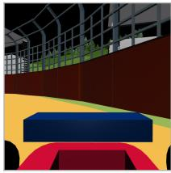

-15 steps  
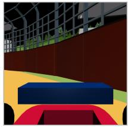

-10 steps  
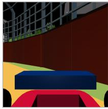

-5 steps  
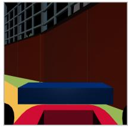

contact  
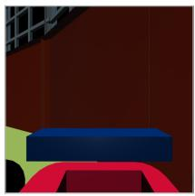

Detached view. The same five instants are never scored and are shown so the approach is visible  
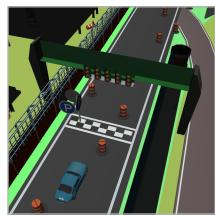

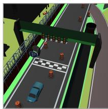

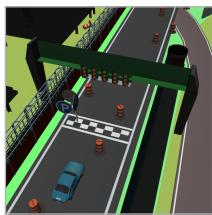

Figure 7: The captions, and the frames they were scored against. Top: the eight captions verbatim, and how each scorer consumes them. Middle: the egocentric frames the scores are computed from, at four lags before contact and at contact. Bottom: a detached overhead view of the same five instants, which no score sees. We include it so a reader can tell what is happening in the world. The barrier fills the view as the track recedes. The frame is leaving the scene the captions describe, which is what Section 4 says the score reads. These images come from a $1 0 2 4 \times 1 0 ^ { - } 2 4$ render of the replayed trajectory, so that they stay legible when enlarged. The scorers were given the $2 5 6 \times 2 5 6$ render of the identical simulator state, which CLIP resizes to 224 × 224 (Appendix C.1).

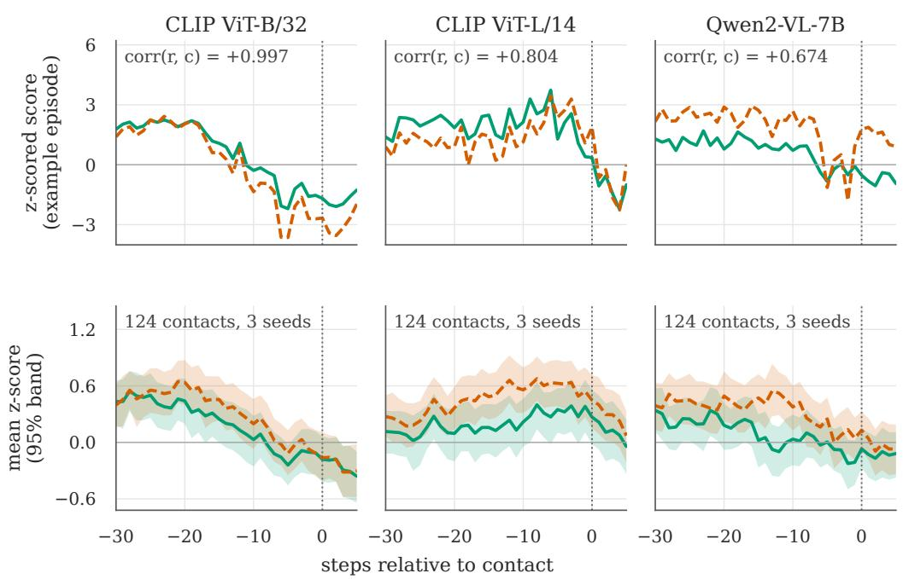  
Figure 8: What each scorer reported on those frames. Top row: the safe and danger group scores over the approach shown in Figure 7, z-scored within episode. Bottom row: the same quantities averaged over the 124 of 130 isolated contacts in the three matched policies that have a complete −30 to +5 window. Its 95% bands are bootstrapped over onsets and are illustrative. Inferential results in the tables use episode-cluster bootstraps. All three scorers read the same eight captions on the same frames. Over exactly these frames ViT-B/32’s two group scores are nearly one series (correlation +0.997 across the plotted window) and both fall, while ViT-L/14’s danger group separates from its safe group (+0.804). The two traces in each panel are z-scored separately, so a near-unit correlation still leaves visible differences in amplitude.

back onto training scenarios. For one MetaDrive-Hard policy with traffic fixed, the rollout obtained after clamping index 10007 to 7 is bit-identical to a second rollout at index 7. D2. Traffic rerandomisation. For one MetaDrive-Hard policy and scenario, two replays differ at all 1000 steps. Disabling traffic re-randomisation makes them bit-identical, so paired evaluation under this configuration requires fixed traffic. D3. Hardware-dependent replay. Five replays on the hardware group that generated the references reproduce exactly, while none of seven replays on other tested groups do. D4. Augmented return. Estimated from the last five training epochs, the VLM bonus contributes 99.1%–99.8% of logged return in nine FormulaOne-L2 runs without confidence gating, while recomputed environment returns overlap the no-VLM range. Reward-shaped methods must therefore report environment-only return separately. FormulaOne replay outputs record seeds, episode counts, hardware group, and reference trajectories, and analyses omit outputs without a passing replay check. Closed-loop validation separately checks run and episode counts.

## G LIMITATIONS

The egocentric result is specific to one environment. The egocentric-only pattern appears in FormulaOne but not in the two additional environments (Section 5.3). Across the tested environments, informativeness varies with the observation map, and no view is consistently privileged. We have no account that predicts which view will carry it. The tested hazard-visibility explanation was not supported under its prespecified criterion.

Three scorers, one of them generative. Section 5.4 compares two contrastive encoders and one generative VLM (Qwen2-VL-7B), too few to characterise generative scorers. The Qwen two-label danger-score increase is resolved in only 51% of placebo redraws. We compare scorer class with the prompt set fixed and prompt sets within ViT-B/32, but do not evaluate ViT-L/14 with the two labels. The larger encoder’s resolved sign reversal in the near-overhead view remains unexplained.

The band results are egocentric, and rest on one placebo draw per episode. Every number in Table 2 is egocentric. Under ViT-B/32 no event-locked deviation is resolved in the three detached views. Caption rewrites and partitions were tested only in the egocentric view with ViT-B/32. ViT-L/14 was scored in every view and shows a near-overhead reversal in κ whose interval excludes zero, while the corresponding margin interval includes zero (Section 5.2). The reference points are drawn once per episode, so the table reports the share of 200 redraws in which each interva excludes zero instead of one draw’s verdict, and the robustness of the danger-score increase varies across configurations. We did not redraw the ViT-B/32 two-label row. The strata of Section 5.5 carry the same caveat, and the near-hazard estimate is sensitive to the placebo draw.

Camera manipulation is within one renderer. The four-camera tests use three MuJoCo tasks, so rendering style is fixed within each task. MetaDrive contributes one view from another engine. Across environments, viewpoint remains confounded with rendering style and hazard appearance.

Open-loop measurement, with one closed-loop exception. We measure on trajectories the signal does not influence, which makes them interpretable but says nothing directly about a policy trained on it. Section 5.6 answers that separately, by training, and its scope is narrow: one environment, one algorithm, one placebo family. The first-person deviation of −0.447 standard deviations at ten policies holds within two of the three algorithms and is modest, and we do not claim it suffices as a safety signal. The third, CPO, contributes two policies, and its estimate is positive with an interval spanning zero.

Scope relative to prior anticipatory constructions. A recent construction sends an epochaveraged safety term through a scalar Lagrange multiplier (?). Proposition 3 shows that such a term only retunes the cost budget if its occupancy-level mean is affine in the true cost for every feasible occupancy measure. We do not test that condition for the prior construction. The proposition therefore identifies a conditional mechanism limitation and does not challenge its reported safety improvements.