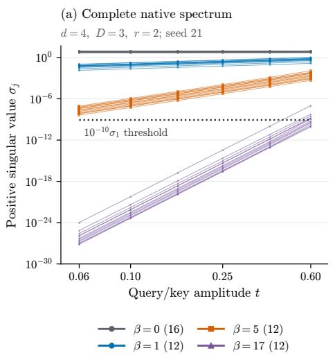
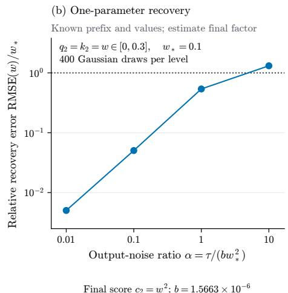
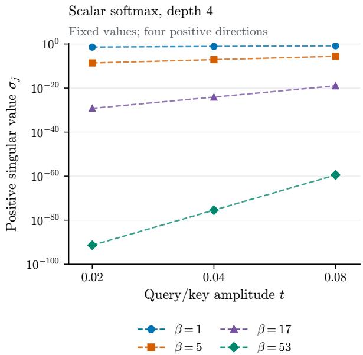

# Identifiability and Observability of Deep Normalized Attention

Pranav Venkata Konda∗

We study which parameters of deep, unmasked, single-head attention are determined by its input–output function. For known positive nonconstant real-analytic normalizers, the function generically determines the efective scores and combined value map up to the signs induced by even normalizers. This proves the real-analytic case of a conjecture of Henry–Marchetti–Kohn, including softmax. We then classify exceptional fibers under explicit normalizer conditions, identifying when collapse makes later scores unobservable, and establish sharp Taylor orders for local identification. Near simultaneous query/key collapse, we compute the complete native Jacobian decay spectrum on separating finite input banks. For common first nonconstant normalizer degree $k ,$ layer i has contact order $2 k 3 ^ { i - 1 } - 1$ , with exact multiplicities and kernel dimension. High-precision and automatic diferentiation calculations illustrate the resulting loss of numerical sensitivity.

## Contents

1. Introduction 2   
2. Efective parameters and identification 3   
2.1. Efective fiber determination . 4   
3. Sufix erasure by a layer 6   
4. Parameter identification by finite input jets 7   
4.1. Native fibers and serial composition . 9   
5. Numerical weakness of exact identification 10   
6. Numerical evidence 12   
7. Related work 12   
A. Identification 17   
A.1. Analytic setting and a one-layer expansion . 17   
A.2. A signature determines one score 18   
A.3. Layer isolation and proof of Theorem 1 . 19   
A.4. Native reduction and genericity 20   
B. Exceptional fibers 22   
B.1. Nonzero logarithmic slope and curvature 22   
B.2. Two tokens and the exact collapsing condition . 23   
B.3. Softmax collapse for every token count 23   
B.4. Why nonzero slope cannot simply be removed 24   
C. Finite jets 24   
C.1. An order estimate for arbitrary clouds 25   
C.2. Immersion and the sharp local order 25   
C.3. Nonzero slope: rational local inversion and uniform determination 26   
C.4. Exact adaptive order for two tokens 28   
C.5. Exact global sign discrimination . 29   
C.6. Multidirectional covariance recovery 30   
C.7. Recovery from generic two-plane restrictions 32   
C.8. Proof of Corollary 4.1 33   
C.9. Finite ordinary evaluations 33   
D. Native contact spectra 34   
D.1. The native source and its value coordinates 34   
D.2. Homogeneity gives joint analytic divisibility 35   
D.3. The divided frame and exact Smith factors 36   
D.4. Factor kernels, multiplicities and singular values 36   
D.5. Covariance and two-plane extensions 37   
E. Geometry of the realization map 38   
E.1. Germs, finite observations and parameter fibers 38   
E.2. The boundary of the analytic argument 39   
E.3. Proof of Proposition 4.2 39   
E.4. The residual ideal at the first zero score 41   
E.5. What the contact spectrum records . 43   
F. Numerical protocols 43   
F.1. Scalar depth-four spectrum 44   
F.2. Full native matrix spectrum 44   
F.3. One noisy observation with a known prefix . 46

## 1. Introduction

A natural question to ask in deep learning is what information about a neural network is uniquely determined by its input–output function. For attention, query/key factorizations and changes of coordinates between layers allow diferent weights to represent the same function [12]. Thus we pass to efective parameters: the combined value map and layerwise score matrices in the original input coordinates. Product-level descriptions are also central to Transformer circuit analysis [8], so identifying these quantities gives a precise target for recovering internal parameters from the function.

This question matters when behavioral tests support a safety argument about a model’s internal computation. Such an argument requires observations that distinguish parameters for which the claimed property difers. We therefore ask which parameter distinctions survive in the function, and how sensitively finite observations detect them. Pure serial attention isolates how repeated token mixing afects both questions.

Henry, Marchetti, and Kohn conjectured generic efective identification for positive injective normalizers [12, Conjecture 3.10]. Our main result establishes the real-analytic case, including softmax. More generally, Theorem 1 determines the complete efective fiber whenever the combined value map is nonzero and every score has a nonzero symmetric part. The only ambiguities are the score signs induced by even normalizers. In particular, competing representations may be degenerate, the scores may be rank deficient, and the value map may have a nontrivial kernel.

We then ask how identification breaks down. A layer can send every input to consensus, where all token vectors agree, making later scores unobservable. Theorem 2 classifies these exceptional fibers under explicit normalizer conditions. Near collapse, identifiable directions can still have very weak efects on observed outputs. We therefore study finite observations: Theorem 3 gives sharp Taylor orders for local identification, and Theorem 4 computes the vanishing orders of all positive native Jacobian singular values on separating input banks near simultaneous query/key collapse, together with their multiplicities and the exact kernel dimension.

The argument follows the token means and contrasts, where contrast refers to the centered token vectors. Near consensus, a layer changes the mean at second order in the incoming contrast while transmitting contrast at third order. Thus deeper scores appear at successively higher orders. Subtracting the exact mean of a recovered prefix isolates the next score. This connects identification of the parameters to the loss of numerical sensitivity under repeated contrast contraction.

## 2. Efective parameters and identification

We fix a depth $D \geq 1$ , a token count $n \geq 2$ , and input $X = ( x _ { 1 } , \ldots , x _ { n } )$ , with input width d and output width p. We consider known normalizers $\phi _ { i }$ that are positive, nonconstant, and real analytic near zero. Multiplying $\phi _ { i }$ by a positive constant leaves the normalized attention weights unchanged, so without loss of generality we set $\phi _ { i } ( 0 ) = 1$ . For a score matrix $M \in \mathbb { R } ^ { d \times d }$ , we define the attention layer with identity values as

$$
S _ { M } ^ { \phi } ( X ) _ { a } = \frac { \sum _ { b = 1 } ^ { n } \phi ( x _ { a } ^ { \top } M x _ { b } ) x _ { b } } { \sum _ { b = 1 } ^ { n } \phi ( x _ { a } ^ { \top } M x _ { b } ) } ,\tag{1}
$$

where the a-th output token is a weighted average of input token vectors. The depth-D network in efective parameters is defined as

$$
F _ { L , \mathbf { M } } = L S _ { M _ { D } } ^ { \phi _ { D } } \circ \cdot \cdot \cdot \circ S _ { M _ { 1 } } ^ { \phi _ { 1 } } ,\tag{2}
$$

where $\mathbf { M } = \left( M _ { 1 } , \ldots , M _ { D } \right)$ are the efective score matrices, and L is the combined value map. Setting $\phi ( s ) = e ^ { s }$ gives softmax, with the usual scaling of dot-product scores incorporated into the matrices M [23].

To relate this model to native weights, take query, key, and value matrices $Q _ { i } , K _ { i } ,$ and $V _ { i }$ of compatible sizes, let $A _ { i } = Q _ { i } K _ { i } ^ { \top } , P _ { 0 } = I$ , and $P _ { i } = V _ { i } \cdots V _ { 1 }$ . These weights determine the efective tuple by

$$
M _ { i } = P _ { i - 1 } ^ { \top } A _ { i } P _ { i - 1 } , L = P _ { D } .\tag{3}
$$

Here, $M _ { i }$ is the layer’s score bilinear form in the input feature coordinates, and L combines all of the value maps. This reduction holds for singular or rectangular values.

The expression $A _ { i } = Q _ { i } K _ { i } ^ { \top }$ is a factorization of the score matrix into query and key matrices. Suppose these factors have $r _ { i }$ columns. Then every invertible $G _ { i } \in \mathrm { G L } _ { r _ { i } } ( \mathbb { R } )$ gives another factorization with the same score:

$$
\begin{array} { r l } & { ( Q _ { i } , K _ { i } ) \longmapsto ( Q _ { i } G _ { i } , K _ { i } G _ { i } ^ { - \top } ) , } \\ & { ( Q _ { i } G _ { i } ) ( K _ { i } G _ { i } ^ { - \top } ) ^ { \top } = Q _ { i } K _ { i } ^ { \top } . } \end{array}\tag{4}
$$

These transformations are factor gauges, and they preserve the efective tuple and thus the realized function.

Write the native weights as $\theta ~ = ~ ( ( Q _ { i } , K _ { i } , V _ { i } ) ) _ { i = 1 } ^ { D }$ and their efective combinations as $\eta \ : = \ :$ $( L , M _ { 1 } , \ldots , M _ { D } ) = ( L , \mathbf { M } )$ . Then Equation (3) defines the parameter map $\pi : \theta \mapsto \eta .$ , which has entries polynomial in the native weights.

Write $F _ { \eta } = F _ { L , \mathbf { M } }$ for the input–output function in Equation (2), and $[ F _ { \eta } ] _ { 0 }$ for its analytic germ at the zero input. The realization map sends η to this germ, giving the factorization

$$
\theta \stackrel { \pi } { \to } \eta = \left( L , \mathbf { M } \right) \stackrel { \mathcal { R } } { \longrightarrow } [ F _ { \eta } ] _ { 0 } .\tag{5}
$$

For fixed dimensions and normalizers we define the efective fiber $\mathcal { R } ^ { - 1 } ( [ F ] _ { 0 } )$ as the set of all efective-parameter tuples realizing the germ $[ F ] _ { 0 } \colon$

$$
\begin{array} { r } { \mathcal { R } ^ { - 1 } ( [ F ] _ { 0 } ) = \{ ( L , \mathbf { M } ) : [ F _ { L , \mathbf { M } } ] _ { 0 } = [ F ] _ { 0 } \} . } \end{array}\tag{6}
$$

Equality here means equality of analytic germs (i.e. the input functions agree on some neighborhood of $X = 0 )$ , and it extends to the whole connected input domain when normalizers are globally positive analytic.

Within this model, a property $P ( \eta )$ can be inferred from the realized function only if it is constant on each fiber:

$$
\mathcal { R } ( \eta ) = \mathcal { R } ( \widetilde { \eta } ) \implies P ( \eta ) = P ( \widetilde { \eta } ) .\tag{7}
$$

Thus a parameter claim must first be determined by the function before we ask whether finite observations can resolve it.

Theorem 1 determines the entire efective fiber when one representative satisfies its hypotheses:

Theorem 1 (Efective identifiability). Under the model assumptions above, let $\boldsymbol { \eta } = ( L , \mathbf { M } )$ satisfy $L \neq 0 ,$ , and sym $\begin{array} { r } { M _ { i } = \frac { M _ { i } + M _ { i } ^ { \top } } { 2 } \ne 0 } \end{array}$ for every layer. Then the fiber $\mathcal { R } ^ { - 1 } ( \mathcal { R } ( \eta ) )$ consists exactly of the tuples $\widetilde { \eta } = ( \widetilde { L } , \widetilde { \mathbf { M } } )$ that satisfy

$$
\begin{array} { r } { \widetilde { L } = L , \widetilde { M } _ { i } \in \left\{ \begin{array} { l l } { \{ M _ { i } \} } & { \mathrm { ~ i f ~ } \phi _ { i } \mathrm { ~ i s ~ n o t ~ e v e n } } \\ { \{ M _ { i } , - M _ { i } \} } & { \mathrm { ~ i f ~ } \phi _ { i } \mathrm { ~ i s ~ e v e n . } } \end{array} \right. } \end{array}\tag{8}
$$

Sign choices are independent across layers. If $\phi _ { D } ^ { \prime } ( 0 ) \neq 0$ , then the condition sym $M _ { D } \ne 0$ is unnecessary, as the final score matrix may be arbitrary.

Theorem 1 is generic in both the efective and native parameters. For every native architecture with positive widths, its hypotheses exclude only a proper algebraic subset (we prove this in Appendix A).

An injective normalizer cannot be even, and thus Theorem 1 gives singleton efective fibers for the analytic subclass of the Henry–Marchetti–Kohn conjecture. Injectivity is suficient but not necessary. The remaining freedom in native factorizations introduces no additional ambiguity in the efective tuple.

## 2.1. Efective fiber determination

We first recover the value map on consensus inputs, then recover the scores from perturbations of consensus. Suppose $\eta$ and $\widetilde { \eta }$ realize the same function germ. Since every efective layer fixes consensus,

$$
F _ { \eta } ( m , \ldots , m ) = ( L m , \ldots , L m ) = F _ { \widetilde { \eta } } ( m , \ldots , m ) ,\tag{9}
$$

we obtain $L = \widetilde { L }$ . To recover the score matrices, we then perturb the input vectors from consensus and measure how each layer changes the token mean. We first consider one softmax layer with two vector tokens $x _ { \pm } = m \pm \varepsilon z$ . Then $\phi ( s ) = e ^ { s }$ , and we write their outputs as $y _ { \pm } = S _ { M } ^ { \phi } ( X ) _ { \pm }$ . We expand in the spread parameter ε to obtain the mean

$$
\frac { y _ { + } + y _ { - } } { 2 } = m + \varepsilon ^ { 2 } z ( m ^ { \top } M z ) + O ( \varepsilon ^ { 4 } ) ,\tag{10}
$$

and the contrast

$$
\frac { y _ { + } - y _ { - } } { 2 } = \varepsilon ^ { 3 } z ( z ^ { \top } M z ) + O ( \varepsilon ^ { 5 } ) .\tag{11}
$$

Score enters the mean at second order, but the outgoing contrast begins at third order. When sym $M \neq 0 , z ^ { \top } M z$ is not identically zero as z varies, so a subsequent layer receives a smaller contrast and thus makes its first contribution to the mean at a higher order. We can then recover the scores successively due to this separation of orders, and this holds in general for the analytic normalizers in Theorem 1 and any token count.

Consider the line probes $x _ { a } = m + \varepsilon c _ { a } z$ , where

$$
\frac { 1 } { n } \sum _ { a } c _ { a } = 0 , \mathrm { a n d } \frac { 1 } { n } \sum _ { a } c _ { a } ^ { 2 } = 1 .\tag{12}
$$

The afine line containing these probes is preserved by every efective layer. For a layer with normalizer $\phi ,$ we write $h =$ log ϕ, and $g = h ^ { \prime }$ . We define

$$
H _ { M } ( m , z ) = g ( m ^ { \top } M m ) m ^ { \top } M z ,\tag{13}
$$

which is the layer’s leading contribution to the mean.

In particular, if the incoming mean tends to $m ,$ , and the centered tokens have leading terms of the form $\varepsilon ^ { r } \alpha c _ { a } z ,$ , then the mean increment and outgoing centered tokens have leading terms of the form

$$
\varepsilon ^ { 2 r } \alpha ^ { 2 } z H _ { M } ( m , z ) , ~ \mathrm { a n d } ~ \varepsilon ^ { 3 r } \alpha ^ { 3 } c _ { a } z K _ { M } ( m , z ) ,\tag{14}
$$

respectively. Let $y _ { a }$ be the output tokens and $x , { \bar { y } }$ be the input and output means, respectively. The one-layer expansion is

$$
\begin{array} { c } { { \bar { y } - \bar { x } = \varepsilon ^ { 2 r } \alpha ^ { 2 } z H _ { M } ( m , z ) + { \cal O } ( \varepsilon ^ { 2 r + 1 } ) , } } \\ { { y _ { a } - \bar { y } = \varepsilon ^ { 3 r } \alpha ^ { 3 } c _ { a } z K _ { M } ( m , z ) + { \cal O } ( \varepsilon ^ { 3 r + 1 } ) . } } \end{array}\tag{15}
$$

We compute $K _ { M }$ and show it is also a nonzero analytic germ whenever sym $M \neq 0$ in Appendix A. Let $X ^ { ( j ) } = S _ { M _ { i } } ^ { \phi _ { j } } ( X ^ { ( j - 1 ) } )$ , with $X ^ { ( 0 ) } = X$ . We define the prefix mean and centered tokens by

$$
\mu _ { j } = \frac { 1 } { n } \sum _ { a } x _ { a } ^ { ( j ) } , \delta _ { a } ^ { ( j ) } = x _ { a } ^ { ( j ) } - \mu _ { j } .\tag{16}
$$

Under the hypotheses of Theorem 1, we obtain (from Appendix A)

$$
\delta _ { a } ^ { ( j ) } = \varepsilon ^ { 3 ^ { j } } a _ { j } c _ { a } z + \cdots ,\tag{17}
$$

where $a _ { 0 } = 1 , a _ { j } = a _ { j - 1 } ^ { 3 } K _ { M _ { j } } \neq 0$ as analytic germs.

If the first $i - 1$ layer maps are known, their exact mean $\mu _ { i - 1 }$ and amplitude $a _ { i - 1 }$ are also known. Suppose $\overline { { F _ { \eta } } } = L \mu _ { D }$ is the observed output mean. It satisfies the telescoping identity

$$
\overline { { F _ { \eta } } } - L \mu _ { i - 1 } = L \sum _ { j = i } ^ { D } ( \mu _ { j } - \mu _ { j - 1 } ) ,\tag{18}
$$

where Equation (15) gives spread order at least $2 \cdot 3 ^ { j - 1 }$ for the jth increment. Thus only layer i contributes at the first remaining order. Writing $[ \varepsilon ^ { k } ]$ for coeficient extraction, Appendix A gives

$$
[ \varepsilon ^ { 2 \cdot 3 ^ { i - 1 } } ] ( \overline { { F _ { \eta } } } - L \mu _ { i - 1 } ) = a _ { i - 1 } ^ { 2 } ( L z ) H _ { M _ { i } } ( m , z ) .\tag{19}
$$

The exact subtraction removes all prefix terms (including the higher-order terms), and coeficient extraction removes the sufix.

Now, let $\mathcal { R } ( \widetilde { \eta } ) = \mathcal { R } ( \eta )$ , and suppose the recovered prefix maps agree. Choose a nonzero row ℓ of L: subtracting the coeficient identities gives

$$
a _ { i - 1 } ^ { 2 } ( \ell z ) ( H _ { M _ { i } } - H _ { \widetilde { M _ { i } } } ) = 0 .\tag{20}
$$

Since $\mathbb { R } \{ m , z \}$ is an integral domain, $a _ { i - 1 } ^ { 2 } ( \ell z ) \neq 0$ implies that $H _ { M _ { i } } = H _ { \widetilde { M _ { i } } }$ . While the factor may vanish at select individual probes, it is nonzero as a germ, and this permits cancellation. Note from Equation (15) we also have

$$
\mathrm { o r d } _ { \varepsilon } \widetilde { \delta } _ { a } ^ { ( i ) } \geq 3 ^ { i } ,\tag{21}
$$

even when the other layer’s coeficient $K _ { \widetilde { M _ { i } } }$ vanishes identically. Its sufix therefore contributes only at higher spread orders and thus we make no regularity assumption on $\widetilde { \eta } .$

If $g ( 0 ) \neq 0$ , the term $g ( 0 ) m ^ { \top } M z$ linear in m determines every M. Otherwise, setting $z = m$ gives

$$
H _ { M } ( m , m ) = g ( m ^ { \top } M m ) m ^ { \top } M m .\tag{22}
$$

Its lowest nonzero homogeneous term determines $m ^ { \top } M m$ up to one global sign. The full signature determines the remaining bilinear form and rules out the negative sign unless $\phi$ is even. In that case, $S _ { M } ^ { \phi } = S _ { - M } ^ { \phi }$ , so either sign gives the same recovered layer map. This argument also establishes the nonzero symmetric part of each competing score for which the theorem requires it.

Thus depth separates successive scores by their order of appearance in the mean, but makes their recovery increasingly sensitive to small coeficients. The proof establishes exact identification by analytic cancellation, but does not provide stable numerical division. Additionally, smooth normalizers can hide score dependence from every zero-input Taylor coeficient (even if injective), and we provide an example of this in Appendix E.2.

## 3. Sufix erasure by a layer

Let $\mathcal { C } = \{ m \mathbf { 1 } ^ { \top } : m \in \mathbb { R } ^ { d } \}$ be the consensus subspace, which every efective layer fixes pointwise. Write the token mean as $\textstyle \mu ( X ) = { \frac { 1 } { n } } X mathbf { 1 }$ and the centered token matrix as $\Delta ( X ) = X - \mu ( X ) \mathbf { 1 } ^ { \intercal }$

For each prescribed normalizer ϕi, we define its collapse locus by

$$
Z _ { i } = \{ M : \Delta \circ S _ { M } ^ { \phi _ { i } } = 0 \} ,\tag{23}
$$

such that $M _ { i } \in Z _ { i }$ implies that the entire image of the layer lies in C (as an identity of input germs). If $M _ { s } \in Z _ { s }$ , then $X ^ { ( s ) } \in { \mathcal { C } }$ , which implies that $F _ { \eta } ( X ) = L X ^ { ( s ) }$ , and thus changing $M _ { s + 1 } , \ldots , M _ { D }$ does not change the realized function. We now identify the collapse loci, and show that the free sufix $M _ { s + 1 } , \dots , M _ { D }$ accounts for the entire efective fiber. For each layer, we write $h _ { i } = \log { \phi _ { i } }$ , with normalization such that $\phi _ { i } ( 0 ) = 1 , h _ { i } ( 0 ) = 0$

Theorem 2 (Efective fibers at the first collapse). Under the model assumptions of Section 2, suppose $h _ { i } ^ { \prime } ( 0 ) \neq 0$ for all $i = 1 , \ldots , D$ . Then we have:

i. For $n \geq 2$ arbitrary, suppose also that $h _ { i } ^ { \prime \prime } ( 0 ) \neq 0$ . Then $Z _ { i } = \{ 0 \}$

ii. For $n = 2$ and general $h _ { i } ^ { \prime \prime } ( 0 )$ , we have

$$
\begin{array} { r } { Z _ { i } = \left\{ \begin{array} { l l } { \left\{ M : M ^ { \top } = - M \right\} } & { \mathrm { ~ i f ~ } h _ { i } \mathrm { ~ i s ~ o d d } , } \\ { \{ 0 \} } & { \mathrm { ~ e l s e } , } \end{array} \right. } \end{array}\tag{24}
$$

where oddness refers to the germ of $h _ { i }$ at 0.

In either regime above, let $\eta = ( L , M _ { 1 } , \dots , M _ { D } )$ , with $L \neq 0$ . Let s be the minimal index such that $M _ { s } \in Z _ { s }$ , and $s = D$ if no such index exists. Then

$$
\begin{array} { r l } & { \mathcal { R } ^ { - 1 } ( \mathcal { R } ( \eta ) ) } \\ & { \quad = \{ ( L , M _ { 1 } , \ldots , M _ { s } , N _ { s + 1 } , \ldots , N _ { D } ) : } \\ & { \qquad N _ { j } \in \mathbb { R } ^ { d \times d } ( j > s ) \} . } \end{array}\tag{25}
$$

In particular the fiber is a singleton if no layer collapses before the last. For $L = 0$ , the fiber is

$$
\mathcal { R } ^ { - 1 } ( \mathcal { R } ( 0 , \mathbf { M } ) ) = \{ ( 0 , \mathbf { N } ) : \mathbf { N } \in ( \mathbb { R } ^ { d \times d } ) ^ { D } \} .\tag{26}
$$

Note that in collapse the score $M _ { s }$ itself remains identifiable, and can thus afect the location of the consensus it produces: for example, consider two-token softmax, with inputs $m \pm z$ and a skew score M. The output tokens both satisfy

$$
y _ { + } = y _ { - } = m + z \operatorname { t a n h } ( m ^ { \top } M z ) ,\tag{27}
$$

but their common value still depends on M. Let us additionally consider an example where $D = 3$ $L \neq 0$ , and sym $M _ { 1 } \neq 0 , M _ { 2 } ^ { \top } = - M _ { 2 }$ . Then

$$
\mathcal { R } ^ { - 1 } ( \mathcal { R } ( \eta ) ) = \{ ( L , M _ { 1 } , M _ { 2 } , N ) : N \in \mathbb { R } ^ { d \times d } \} .\tag{28}
$$

Here, an input–output audit cannot determine even whether $N = 0$ . Since every choice of N gives the same function, additional inputs and higher precision cannot resolve this ambiguity. Testing a property that varies with N requires observations beyond the realized function.

The assumption of nonzero slope is essential, even in the case of two tokens. For example, consider $\phi _ { 1 } ( s ) = e ^ { s ^ { 2 } }$ , a nonzero skew $M _ { 1 }$ , and $M _ { 2 } = 0$ . We have $h _ { 1 } ^ { \prime } ( 0 ) = 0$ , and

$$
\begin{array} { r l } & { \mu ( S _ { M _ { 1 } } ^ { \phi _ { 1 } } ( X ) ) = \mu ( X ) , } \\ & { \Delta ( S _ { M _ { 1 } } ^ { \phi _ { 1 } } ( X ) ) \neq 0 , } \\ & { S _ { 0 } ^ { \phi _ { 2 } } S _ { M _ { 1 } } ^ { \phi _ { 1 } } ( X ) = \mu ( X ) \mathbf { 1 } ^ { \top } . } \end{array}\tag{29}
$$

The first layer preserves contrast, but the second layer’s averaging erases its score dependence. Thus the function need not identify the prefix through the first collapse when the slope condition fails. We prove the classification and this counterexample in Appendix B.

Note that softmax satisfies $h _ { i } ^ { \prime } ( 0 ) = 1$ , but its skew-score collapse depends on the token geometry: with three or more tokens, a nonzero skew score can preserve contrast on a noncollinear cloud. Theorem 2(i) does not cover this case, as $h ^ { \prime \prime }$ vanishes at 0. We use multidirectional probes to recover a broader class of prefixes in Section 4 to obtain a complete depth-two softmax classification. The general case of singular prefixes mixing skew and nonskew scores remains open for deeper stacks.

## 4. Parameter identification by finite input jets

Let $j _ { 0 } ^ { N }$ denote the Taylor jet operator, which retains the input derivatives at $X = 0$ through total order N. We then define the finite Taylor observation map $T _ { N }$ as applying $j _ { 0 } ^ { N }$ to the function realized by an efective parameter tuple:

$$
T _ { N } ( \eta ) = j _ { 0 } ^ { N } F _ { \eta } = \left( \frac { \partial _ { X } ^ { \alpha } F _ { \eta } ( 0 ) } { \alpha ! } \right) _ { | \alpha | \leq N } .\tag{30}
$$

Here α is a multi-index over the input entries. Since truncation retains only part of the function,

$$
\begin{array} { r } { \mathcal { R } ^ { - 1 } ( \mathcal { R } ( \eta ) ) \subseteq T _ { N } ^ { - 1 } ( T _ { N } ( \eta ) ) . } \end{array}\tag{31}
$$

Theorem 3 (Sharp finite Taylor identification). Under the model assumptions of Section 2, suppose the normalizers have a common first nonconstant Taylor degree k, namely

$$
\log { \phi _ { i } ( s ) } = b _ { i } s ^ { k } + O ( { s ^ { k + 1 } } ) ,\tag{32}
$$

where $b _ { i } \neq 0$ . Let $\boldsymbol { \eta } = ( L , \mathbf { M } )$ be such that $L \neq 0$ and sym $M _ { i } \neq 0$ for all i. We set $N _ { D } = 2 k 3 ^ { D - 1 } + 1$ The Taylor observation map $T _ { { N } _ { D } }$ locally identifies η, as its diferential is injective and it has a local analytic inverse onto its image. For all $N < N _ { D } , T _ { N }$ is independent of the final score $M _ { D }$ , so the above degree is sharp.

For $k = 1$ the final matrix may be arbitrary, in which case we have $T _ { N _ { D } } ^ { - 1 } ( T _ { N _ { D } } ( \eta ) ) = \{ \eta \}$ , with $T _ { N _ { D } }$ having a rational local inverse on suitable charts.

For softmax, the sharp degrees are 3, 7, 19, and 55 at depths one through four. Consequently, any procedure using only zero-input derivatives of lower degree cannot distinguish changes in the final efective score. When the first nonconstant degree is even, a jet can give local coordinates while failing to distinguish distant sign branches. We discuss the sharp sign-resolving degree, heterogeneous leading degrees, and adaptive degrees on two-token exceptional strata in Appendix C.

Note that both T and $T _ { N } \circ \pi$ are polynomial. Normalization denominators are of the form $n + u ( X )$ where $u ( 0 ) = 0$ , with reciprocal in degree N as

$$
( n + u ) ^ { - 1 } \equiv \frac { 1 } { n } \sum _ { j = 0 } ^ { N } \left( - \frac { u } { n } \right) ^ { j } \mod ( X ) ^ { N + 1 } .\tag{33}
$$

As only fixed powers of n appear as denominators, we see that the local coordinates are polynomial observations of R. Note the full softmax function and ordinary input evaluations remain analytic and generally are nonpolynomial.

We can also move beyond collinear probes: namely, the symmetric-part condition is specific to the collinear case, and is not a universal barrier to identification more broadly. As an example, suppose $d \geq 2 , n \geq 3 .$ , all $h _ { i } ^ { \prime } ( 0 ) \neq 0 , L \neq 0$ , and each prefix $M _ { i }$ for $i < D$ satisfies det $( U ^ { \top } M _ { i } U ) \not \equiv 0$ as a polynomial in $U \in \mathbb { R } ^ { d \times 2 }$ . Then the jet of degree $2 \cdot 3 ^ { D - 1 } + 1$ identifies the complete efective tuple (with arbitrary final score), and is also an immersion. Note this includes every nonzero skew prefix in any dimension.

Now suppose $U \in \mathbb { R } ^ { d \times 2 }$ has rank two. We restrict the input tokens to the plane im(U) by writing $X = U Z$ . The efective parameters of this restriction are

$$
\eta _ { U } = \big ( L U , ( U ^ { \top } M _ { i } U ) _ { i = 1 } ^ { D } \big ) ,\tag{34}
$$

so $F _ { \eta } ( U Z ) = F _ { \eta _ { U } } ( Z )$

The determinant hypothesis along with $L \neq 0$ guarantees a nonempty open set of rank-two matrices U such that

$$
{ \cal L } U \ne 0 , \qquad \operatorname * { d e t } ( U ^ { \top } M _ { i } U ) \ne 0 \quad ( i < D ) .\tag{35}
$$

Suppose $\widetilde { \eta }$ realizes the same function as η: restricting both networks to inputs $X = U Z$ gives $F _ { \eta _ { U } } = F _ { \widetilde { \eta _ { U } } }$ . We show that varying the token covariance identifies a network with two-dimensional inputs, nonzero readout, and invertible prefix scores in Appendix C. From that we obtain

$$
\begin{array} { c } { { ( L - \widetilde { L } ) U = 0 , { U } ^ { \top } ( M _ { i } - \widetilde { M } _ { i } ) U = 0 } } \\ { { ( i = 1 , \ldots , D ) . } } \end{array}\tag{36}
$$

Note each matrix entry is polynomial in U, and since these polynomials vanish on a nonempty open set, they vanish for all U. Then writing $U = ( u , v )$ we get

$$
( L - \widetilde { L } ) u = 0 , \qquad u ^ { \top } ( M _ { i } - \widetilde { M } _ { i } ) v = 0\tag{37}
$$

for all $u , v ,$ which implies $\eta = \widetilde { \eta } .$ . The argument also applies to degree- $N _ { D }$ jets: linear substitution preserves their equality, and covariance recovery uses only these degrees. Appendix C proves this and the following corollary.

Corollary 4.1 (Complete depth-two fibers under nonzero slope). Let $D = 2 , n \geq 3$ , and $h _ { 1 } ^ { \prime } ( 0 ) h _ { 2 } ^ { \prime } ( 0 ) \neq$ 0. Then we have:

i. If $L \neq 0$ and $M _ { 1 } \neq 0$ , the degree-seven input jet determines the complete efective tuple, and the degree-seven Taylor map is an immersion. No lower jet depends on $M _ { 2 }$

ii. If $L \neq 0$ and $M _ { 1 } = 0$ , then the complete fiber consists of exactly the same $L , M _ { 1 }$ , and an arbitrary second score $M _ { 2 }$ , and is determined by degree 3.

iii. If $L = 0$ , the fiber is the zero readout and every score tuple.

A nonzero first score is either nonskew and thus covered by Theorem 1 and Theorem 3, or skew and covered by the two-plane result. With Theorem 2, this classifies depth-two softmax fibers for all $n \geq 2$ . Deeper mixed singular prefixes remain open.

## 4.1. Native fibers and serial composition

We connect efective identification to native redundancy with the reduction map π. For any realized function germ $f ,$ we have

$$
( \mathcal { R } \circ \pi ) ^ { - 1 } ( f ) = \pi ^ { - 1 } ( \mathcal { R } ^ { - 1 } ( f ) ) .\tag{38}
$$

Wherever $T _ { N }$ gives local efective coordinates, the local native fiber is thus a fiber of π.

Proposition 4.2 (Local multiplication geometry). Let $Q _ { i } , K _ { i } \in \mathbb { R } ^ { d \times r _ { i } }$ , and let $V _ { i } \in \operatorname { G L } _ { d } ( \mathbb { R } )$ Suppose $\Psi ( \eta )$ is a finite Taylor or ordinary-input observation with injective diferential at the marked efective tuple. Then $\Psi \circ \pi$ is locally analytically equivalent to

$$
( \mathbf { P } , L , { \widetilde { \mathbf { Q } } } , { \widetilde { \mathbf { K } } } ) \mapsto ( L , ( { \widetilde { Q _ { i } } } { \widetilde { K _ { i } } } ^ { \top } ) _ { i = 1 } ^ { D } , 0 ) ,\tag{39}
$$

where $\mathbf { P } = ( P _ { 1 } , \ldots , P _ { D - 1 } )$ . Its fiber germ is the product of the marked matrix-multiplication fibers and $( D - 1 ) d ^ { 2 }$ smooth value-coordinate directions.

Here, we have source coordinates $\widetilde { Q _ { i } } = P _ { i - 1 } ^ { \top } Q _ { i } , \widetilde { K _ { i } } = P _ { i - 1 } ^ { \top } K _ { i }$ , and inverse $V _ { i } = P _ { i } P _ { i - 1 } ^ { - 1 }$ . At full-column-rank factor pairs, matrix-product geometry [19] gives

$$
\operatorname { r a n k } D ( \Psi \circ \pi ) = d ^ { 2 } + \sum _ { i } r _ { i } ( 2 d - r _ { i } ) .\tag{40}
$$

The remaining directions are native gauges. We provide the proof and limits at collapse of this proposition in Appendix E.

If we have a marked tuple with $L _ { * } \neq 0$ , nonzero logarithmic slopes, nonskew scores before a layer $s ,$ and $M _ { s } ^ { * } = 0$ , the efective fiber enlarges. For a suitable finite observation $\Psi _ { : }$ , the residual ideal is generated by the listed matrix entries:

$$
\begin{array} { r l } & { I _ { \eta _ { * } } ( \Psi ) = ( \Psi - \Psi ( \eta _ { * } ) ) } \\ & { \qquad = ( L - L _ { * } , ( M _ { i } - M _ { i } ^ { * } ) _ { i < s } , M _ { s } ) . } \end{array}\tag{41}
$$

For width-one softmax factors $M _ { i } = q _ { i } k _ { i } ^ { \top }$ and fixed identity values, the fiber over uniform averaging at the all-zero factors has the ideal

$$
\begin{array} { r } { ( q _ { 1 } k _ { 1 } ^ { \top } ) = ( q _ { 1 } ) \cap ( k _ { 1 } ) , } \end{array}\tag{42}
$$

with exactly two irreducible components $q _ { 1 } = 0$ or $k _ { 1 } = 0$ . For $D \geq 2$ , independent one-layer fibers have $2 ^ { D }$ components. Here collapse at the first layer leaves every later factor free. The same ideal also gives a depth-independent local learning coeficient $\begin{array} { r } { \lambda = \frac { d } { 2 } } \end{array}$ under the fixed-value loss model of Appendix E.4.

## 5. Numerical weakness of exact identification

The previous Taylor observations establish exact local recovery. We now study how sensitively outputs on finitely many inputs depend on the native parameters. Choose a finite input bank B in a neighborhood of zero where the network maps are defined. We collect their outputs with the finite observation map:

$$
{ \mathcal { O } } _ { B } ( \theta ) = \left( F _ { \pi ( \theta ) } ( X ) \right) _ { X \in B } .\tag{43}
$$

It has diferential $D _ { \theta } \mathcal { O } _ { B }$ , which maps perturbations of the native weights to first-order changes in the observed outputs. Let $\theta ( t )$ be an analytic parameter path, and write

$$
J _ { B } ( t ) = \left. D _ { \theta } \mathcal { O } _ { B } \right| _ { \theta = \theta ( t ) } .\tag{44}
$$

The above diferential is taken in all the native entries (including values) before restricting to the path $\theta ( t )$ . In particular, when diferentiating along the path $\theta ( t )$ itself,

$$
\frac { \mathrm { d } } { \mathrm { d } t } { \mathcal { O } } _ { B } ( \theta ( t ) ) = J _ { B } ( t ) { \dot { \theta } } ( t ) ,\tag{45}
$$

we test only the direction $\dot { \theta } ( t )$

The positive singular values of $J _ { B } ( t )$ quantify the strength of the first-order output changes. We measure how sensitivity deteriorates as $t  0$ . We say a singular value $\sigma ( t )$ has contact order $\beta$ if

$$
c | t | ^ { \beta } \leq \sigma ( t ) \leq C | t | ^ { \beta } \qquad ( 0 < | t | \ll 1 )\tag{46}
$$

for $c , C > 0$ constant. Contact order zero means that the singular value stays bounded away from zero, and larger orders imply faster vanishing.

Theorem 4 (Complete native contact spectrum). Under the model assumptions of Section 2, let $Q _ { i } , K _ { i } \in \mathbb { R } ^ { d \times r _ { i } } , 1 \leq r _ { i } \leq d .$ and let all value matrices be trainable and $d \times d \colon p = d .$ . Suppose the normalizers have common first nonconstant Taylor degree k. Consider the native parameter path $\theta ( t )$ given by

$$
Q _ { i } = t U _ { i } , \qquad K _ { i } = t W _ { i } , \qquad V _ { i } = I _ { d } .\tag{47}
$$

Assume $U _ { i }$ and $W _ { i }$ are of full column rank and that sym $( U _ { i } W _ { i } ^ { \top } ) \ne 0$ for all layers.

Then there exists a fixed finite input bank B such that for all suficiently small $t \neq 0$ , the Jacobian $J _ { B } ( t )$ in all native parameters has positive singular values comparable to 1 with multiplicity $d ^ { 2 }$ and to $| t | ^ { \beta _ { i } }$ with multiplicity $r _ { i } ( 2 d - r _ { i } )$ for $1 \leq i \leq D$ , where

$$
\beta _ { i } = 2 k \cdot 3 ^ { i - 1 } - 1 .\tag{48}
$$

The exact source kernel dimension is

$$
\zeta = ( D - 1 ) d ^ { 2 } + \sum _ { i = 1 } ^ { D } r _ { i } ^ { 2 } .\tag{49}
$$

On complements to the exact gauge directions, divide each derivative group by its predicted power of t and take $t = 0 .$ . Any bank separating these limiting functions gives the conclusion, with constants depending on B and $\theta ( t )$ . Appendix D gives the equivalent Smith factors and heterogeneous-degree formula.

For softmax with $d = 4 , D = 3$ , and $r _ { i } = 2$ , the 96 native directions give 16 singular values of order zero, twelve each of orders 1, 5, 17, and 44 exact zeros. The zeros represent query/key factor gauges and intermediate value-coordinate freedom. Positive-order bands measure weakening sensitivity.

  
Figure 1: Exact rank and recovery under noise. (a) Positive native Jacobian singular values at 120-digit precision, compared with the cutof $1 0 ^ { - 1 0 } \sigma _ { 1 }$ . (b) Relative error in recovering the final nonnegative factor from one noisy output mean with a known prefix, using 400 trials per noise level. Here $b = m z ^ { 2 }$ , where m and z are the known prefix mean and contrast. Full protocols are given in Appendix F.

The multiplicity $r _ { i } ( 2 d - r _ { i } )$ is the dimension of the rank- $- r _ { i }$ matrix stratum. At full-column-rank factor pairs, the infinitesimal factor gauges are

$$
\begin{array} { c } { ( \delta Q _ { i } , \delta K _ { i } ) = ( Q _ { i } B _ { i } , - K _ { i } B _ { i } ^ { \top } ) , } \\ { B _ { i } \in \mathbb { R } ^ { r _ { i } \times r _ { i } } . } \end{array}\tag{50}
$$

and thus they have $r _ { i } ^ { 2 }$ independent kernel directions per layer.

Along $\theta ( t )$ , Smith reduction over the ring of convergent series R{t} refines functional dimension by recording the contact order of each positive singular-value band.

These orders arise from cubic contrast propagation and diferentiation of query/key factors. Appendix D proves the matching upper and lower bounds, while Appendix C constructs a finite separating bank. Eficient bank design remains open.

Input scaling relates $T _ { N }$ to ${ \mathcal { O } } _ { B } \colon$ with identity values and fixed scores $\mathbf { B } _ { : }$

$$
F _ { t ^ { 2 } \mathbf { B } } ( X ) = t ^ { - 1 } F _ { \mathbf { B } } ( t X ) , \quad t \neq 0 .\tag{51}
$$

For the corresponding layer, $N _ { i } = \beta _ { i } + 2$ . Note $t ^ { 2 }$ is a common inverse-temperature scale in softmax.

The same spectrum quantifies local statistical information on the fixed input bank. With independent Gaussian output noise of variance $\tau ^ { 2 }$ , the Fisher information is [20]

$$
\begin{array} { r } { \mathcal { I } _ { B } ( t ) = \tau ^ { - 2 } J _ { B } ( t ) ^ { \top } J _ { B } ( t ) . } \end{array}\tag{52}
$$

Its positive eigenvalues have scales $\tau ^ { - 2 }$ and $\tau ^ { - 2 } | t | ^ { 2 \beta _ { i } }$ , with the same multiplicities as in Theorem 4. Exact gauges give zero information, while identifiable directions can carry arbitrarily little as the factors approach collapse. Thus a small measured output change can reflect either redundancy or weak local sensitivity. An audit using such changes as evidence about internal parameters must account for its input bank and noise level.

## 6. Numerical evidence

We test the predicted contact orders and their consequences for numerical rank and recovery under noise. Full protocols and the scalar plot are in Appendix F.

Depth-dependent powers. Depth-four scalar softmax at 110 digits gives final-pair slopes (0.999994, 5.002211, 17.001118, 53.000562) at $t = 0 . 0 4 , 0 . 0 2$ , with maximum error below 0.0023 from (1, 5, 17, 53). The weakest singular value at t = 0.02 is $3 . 8 6 \times 1 0 ^ { - 9 2 }$

The complete matrix spectrum. For $n = d = 4 , D = 3 , r _ { i } = 2$ , and 48 inputs (seed 21), we get $J \in \mathbb { R } ^ { 7 6 8 \times 9 6 }$ . Under a cutof of $1 0 ^ { - 1 0 } \sigma _ { 1 }$ , float64 automatic diferentiation (AD) reports rank 40 at small scales versus the exact 52. At 120 digits, the analytic Jacobian resolves all twelve weak positive values (Figure 1(a)).
<table><tr><td>Check</td><td>Result</td></tr><tr><td>Relative Frobenius error vs. AD</td><td> $\leq 1 . 4 7 \times 1 0 ^ { - 1 6 }$ </td></tr><tr><td>Weak-band final-pair slopes</td><td> $[ 1 6 . 9 9 4 3 , 1 7 . 0 1 4 8 ]$ </td></tr><tr><td>Max. weak-space angle sine,  $t = 0 . 0 6$ </td><td> $5 . 2 1 \times 1 0 ^ { - 2 0 }$ </td></tr><tr><td>90/120-digit relative change</td><td> $\leq 1 . 3 1 \times 1 0 ^ { - 3 5 }$ </td></tr><tr><td>Smallest positive value,  $t = 0 . 0 6$ </td><td> $7 . 5 8 \times 1 0 ^ { - 2 8 }$ </td></tr></table>

We compare the analytic Jacobian with AD where float64 arithmetic remains reliable. To identify the weakest band, we project the final-layer derivative’s image orthogonally to the value and earlierlayer derivative images. The small angle in the table shows that this image nearly coincides with the weakest left singular subspace. At $t = 0 . 0 6$ , the same cutof still gives rank 40 at high precision, since the twelve weak values lie below it.

One unknown parameter under noise. In Figure 1(b), all weights are known except the final query/key factor $q _ { 2 } = k _ { 2 } = w \ge 0$ . We add Gaussian noise to the output mean and estimate w by inverting the mean response, clipping observations outside its attainable range to the endpoints. As the noise standard deviation increases from $1 . 5 7 \times 1 0 ^ { - 1 0 } \mathrm { { \ t o \ 1 . 5 7 \times 1 0 ^ { - 7 } } }$ , the empirical relative error $\mathrm { R M S E } ( \hat { w } ) / w _ { * }$ rises from 0.0050 to 1.31. Thus recovery from noisy observations can still be dificult when the parameter is uniquely determined.

## 7. Related work

Classical neural-network identifiability recovers weights from the realized function under assumptions about the architecture and activation [22, 1, 9]. Vlačić and Bölcskei [24] relate complete functional equivalence to afine symmetries of the activation function. For ReLU networks, parameter identifiability and functional dimension distinguish parameter count from locally independent functional directions [4, 11].

Neuroalgebraic geometry also studies the parameter-to-function map. Kileel et al. [14] analyze functional-variety dimension for polynomial networks. Shahverdi et al. [21] establish generic identification up to filter rescaling for monomial convolutional networks. Alexandr et al. [2] derive coeficient invariants for shallow unnormalized cubic lightning attention, and Pepin Lehalleur and Rimányi [19] study matrix-multiplication fibers through quiver representations. Our local normal form extends these geometric descriptions to normalized attention where finite observations give local efective coordinates. At collapse, one layer can erase all later scores, so the network fiber need not be a product of individual layer fibers.

For attention, Brunner et al. [5] study nonuniqueness of attention weights at a fixed input, whereas Henry et al. [12] formulate efective identification from the entire function. Méloux et al. [17] study identifiability of explanations, finding nonunique circuits and causal alignments in small MLPs trained on Boolean tasks. Query algorithms recover single-head attention regressors [3] and canonical multi-head representations [15] from real-valued token queries.

Dong et al. [6] establish cubic contrast contraction and doubly exponential rank collapse in pure attention. Noci et al. [18] connect collapse to vanishing query/key gradients, and Geshkovski et al. [10] study long-time token clustering as particle interaction dynamics with fixed weights. When a layer receives nearly identical tokens, score changes can become dificult to distinguish. We quantify this sensitivity loss at fixed depth as the query/key factors approach zero. Contraction supplies upper bounds, while matching lower bounds require a finite input bank separating the divided derivative directions.

Future work includes the nonanalytic class of the conjecture of Henry–Marchetti–Kohn, deeper softmax fibers with singular mixed prefixes at three or more tokens, and general exceptional fibers for zero-slope normalizers. It also remains to study how these local product descriptions fit together where the efective diferential loses rank. Skip connections can counteract collapse [6], and causal and sparse masks can change its rate [26]. Extending the native-spectrum analysis to these architectures and multi-head attention requires tracking their contrast dynamics. Since our experiments use fixed input sets and parameter paths, the prevalence and consequences of weak sensitivity in trained networks remain to be studied. We also ask which internal observations or interventions distinguish realizations within the same input–output fiber.

## References

[1] Francesca Albertini, Eduardo D. Sontag, and Vincent Maillot. Uniqueness of weights for neural networks. In Richard J. Mammone, editor, Artificial Neural Networks for Speech and Vision. Chapman and Hall, London, 1993. URL https://sontaglab.org/FTPDIR/92caip.pdf.

[2] Yulia Alexandr, Hao Duan, and Guido Montúfar. Algebraic invariants of lightning self-attention. arXiv:2604.15632, 2026. URL https://arxiv.org/abs/2604.15632v2. Version 2.

[3] Satwik Bhattamishra, Kulin Shah, Michael Hahn, and Varun Kanade. Provably learning attention with queries. In Proceedings of the 43rd International Conference on Machine Learning, volume 306 of Proceedings of Machine Learning Research, pages 7980–7998. PMLR, 2026. URL https://proceedings.mlr.press/v306/bhattamishra26a.html.

[4] Joachim Bona-Pellissier, François Bachoc, and François Malgouyres. Parameter identifiability of a deep feedforward ReLU neural network. Machine Learning, 112(11):4431–4493, 2023. doi: 10.1007/s10994-023-06355-4. URL https://doi.org/10.1007/s10994-023-06355-4.

[5] Gino Brunner, Yang Liu, Damián Pascual, Oliver Richter, Massimiliano Ciaramita, and Roger Wattenhofer. On identifiability in transformers. In International Conference on Learning Representations, 2020. URL https://arxiv.org/abs/1908.04211v4.

[6] Yihe Dong, Jean-Baptiste Cordonnier, and Andreas Loukas. Attention is not all you need: pure attention loses rank doubly exponentially with depth. In Proceedings of the 38th International Conference on Machine Learning, volume 139 of Proceedings of Machine Learning Research, pages 2793–2803. PMLR, 2021. URL https://proceedings.mlr.press/v139/dong21a.html.

[7] Xuefeng Duan, Zhenyun Peng, and Fujian Duan. Positive definite solution of two kinds of nonlinear matrix equations. Surveys in Mathematics and its Applications, 4:179–190, 2009. URL https://www.utgjiu.ro/math/sma/v04/p15.pdf.

[8] Nelson Elhage, Neel Nanda, Catherine Olsson, Tom Henighan, Nicholas Joseph, Ben Mann, Amanda Askell, Yuntao Bai, Anna Chen, Tom Conerly, Nova DasSarma, Dawn Drain, Deep Ganguli, Zac Hatfield-Dodds, Danny Hernandez, Andy Jones, Jackson Kernion, Liane Lovitt, Kamal Ndousse, Dario Amodei, Tom Brown, Jack Clark, Jared Kaplan, Sam McCandlish, and Chris Olah. A mathematical framework for transformer circuits. Transformer Circuits Thread, 2021. URL https://transformer-circuits.pub/2021/framework/.

[9] Charles Feferman. Reconstructing a neural net from its output. Revista Matemática Iberoamericana, 10(3):507–555, 1994. doi: 10.4171/RMI/160. URL https://ems.press/journals/rmi/artic les/5267.

[10] Borjan Geshkovski, Cyril Letrouit, Yury Polyanskiy, and Philippe Rigollet. The emergence of clusters in self-attention dynamics. In Advances in Neural Information Processing Systems, volume 36, pages 57026–57037, 2023. doi: 10.52202/075280-2493. URL https://proceedings.ne urips.cc/paper\_files/paper/2023/hash/b2b3e1d9840eba17ad9bbf073e009afe-Abstract-Confe rence.html.

[11] J. Elisenda Grigsby, Kathryn Lindsey, Robert Meyerhof, and Chenxi Wu. Functional dimension of feedforward ReLU neural networks. Advances in Mathematics, 482:110636, 2025. doi: 10.1016/j.aim.2025.110636. URL https://arxiv.org/abs/2209.04036.

[12] Nathan W. Henry, Giovanni Luca Marchetti, and Kathlén Kohn. Geometry of lightning self-attention: Identifiability and dimension. In International Conference on Learning Representations, 2025. URL https://openreview.net/forum?id=XtY3xYQWcW.

[13] Kiumars Kaveh and Peter Makhnatch. Invariant factors as limit of singular values of a matrix. Arnold Mathematical Journal, 8(3–4):561–571, 2022. doi: 10.1007/s40598-022-00217-y. URL https://doi.org/10.1007/s40598-022-00217-y.

[14] Joe Kileel, Matthew Trager, and Joan Bruna. On the expressive power of deep polynomial neural networks. In Advances in Neural Information Processing Systems, volume 32, 2019. URL https://arxiv.org/abs/1905.12207.

[15] Sunyeop Kim and Insung Kim. Provably learning multi-head attention with queries. arXiv:2608.03294, 2026. URL https://arxiv.org/abs/2608.03294v3. Version 3.

[16] Edmund Lau, Zach Furman, George Wang, Daniel Murfet, and Susan Wei. The local learning coeficient: A singularity-aware complexity measure. In Proceedings of the 28th International Conference on Artificial Intelligence and Statistics, volume 258 of Proceedings of Machine Learning Research, pages 244–252. PMLR, 2025. URL https://proceedings.mlr.press/v258/lau 25a.html.

[17] Maxime Méloux, Silviu Maniu, François Portet, and Maxime Peyrard. Everything, everywhere, all at once: Is mechanistic interpretability identifiable? In International Conference on Learning Representations, 2025. URL https://arxiv.org/abs/2502.20914.

[18] Lorenzo Noci, Sotiris Anagnostidis, Luca Biggio, Antonio Orvieto, Sidak Pal Singh, and Aurelien Lucchi. Signal propagation in transformers: Theoretical perspectives and the role of rank collapse. In Advances in Neural Information Processing Systems, volume 35, pages 27198–27211, 2022. URL https://proceedings.neurips.cc/paper\_files/paper/2022/hash/ae0cba715b60c4052359b 3d52a2cff7f-Abstract-Conference.html.

[19] Simon Pepin Lehalleur and Richárd Rimányi. Geometry of fibers of the multiplication map of deep linear neural networks. arXiv:2411.19920v2, 2024. URL https://arxiv.org/abs/2411.19920 v2.

[20] Thomas J. Rothenberg. Identification in parametric models. Econometrica, 39(3):577–591, 1971. doi: 10.2307/1913267. URL https://doi.org/10.2307/1913267.

[21] Vahid Shahverdi, Giovanni Luca Marchetti, and Kathlén Kohn. On the geometry and optimization of polynomial convolutional networks. In Proceedings of the 28th International Conference on Artificial Intelligence and Statistics, volume 258 of Proceedings of Machine Learning Research, pages 604–612. PMLR, 2025. URL https://proceedings.mlr.press/v258/shahverdi25a.html.

[22] Héctor J. Sussmann. Uniqueness of the weights for minimal feedforward nets with a given input-output map. Neural Networks, 5(4):589–593, 1992. doi: 10.1016/S0893-6080(05)80037-1. URL https://www.sciencedirect.com/science/article/pii/S0893608005800371.

[23] Ashish Vaswani, Noam Shazeer, Niki Parmar, Jakob Uszkoreit, Llion Jones, Aidan N. Gomez, Lukasz Kaiser, and Illia Polosukhin. Attention is all you need. In Advances in Neural Information Processing Systems, volume 30, 2017. URL https://arxiv.org/abs/1706.03762.

[24] Verner Vlačić and Helmut Bölcskei. Afine symmetries and neural network identifiability. Advances in Mathematics, 376:107485, 2021. doi: 10.1016/j.aim.2020.107485. URL https: //arxiv.org/abs/2006.11727.

[25] Sumio Watanabe. Algebraic Geometry and Statistical Learning Theory, volume 25 of Cambridge Monographs on Applied and Computational Mathematics. Cambridge University Press, 2009. doi: 10.1017/CBO9780511800474. URL https://doi.org/10.1017/CBO9780511800474.

[26] Xinyi Wu, Amir Ajorlou, Yifei Wang, Stefanie Jegelka, and Ali Jadbabaie. On the role of attention masks and LayerNorm in transformers. In Advances in Neural Information Processing Systems, volume 37, 2024. doi: 10.52202/079017-0472. URL https://proceedings.neurips.cc/p aper\_files/paper/2024/hash/1ac3030fc57850b0fb11dfe9d4880ad7-Abstract-Conference.html.

## A. Identification

Throughout the appendix, we set $h _ { i } = \log { \phi _ { i } }$ and $g _ { i } = h _ { i } ^ { \prime }$ . We drop the index when it is clear we are discussing one layer.

We use the same factorization as introduced previously:

$$
\Theta _ { \mathrm { n a t } } \stackrel { \pi } { \longrightarrow } \Theta _ { \mathrm { e f f } } \stackrel { \mathcal { R } } { \longrightarrow } \mathbb { R } \{ X \} ^ { p \times n } , \qquad \theta \longmapsto \eta = ( L , \mathbf { M } ) \longmapsto [ F _ { \eta } ] _ { 0 } .
$$

Here $\Theta _ { \mathrm { n a t } }$ Ons is the space of native weights for the fixed architecture, and $\Theta _ { \mathrm { e f f } } = \mathbb { R } ^ { p \times d } \times ( \mathbb { R } ^ { d \times d } ) ^ { D }$ is the ambient efective space. The efective tuples realizable by native weights form the image $\pi ( \Theta _ { \mathrm { n a t } } )$ We compute $\mathcal { R } ^ { - 1 } ( \mathcal { R } ( \eta ) )$ by comparing an arbitrary $\widetilde { \eta }$ with a marked tuple satisfying the hypotheses of Theorem 1.

## A.1. Analytic setting and a one-layer expansion

Throughout, tokens are columns, output coordinates and token positions are labeled, and

$$
S _ { M } ^ { \phi } ( X ) _ { a } = \frac { \sum _ { b } \phi ( x _ { a } ^ { \top } M x _ { b } ) x _ { b } } { \sum _ { b } \phi ( x _ { a } ^ { \top } M x _ { b } ) } .
$$

The normalizer above is positive, nonconstant, and real analytic, and normalized such that $\phi ( 0 ) = 1$ . Since the normalization denominator equals n at $X = 0$ , it is a unit in the local analytic ring. The layer maps and their finite compositions are therefore jointly analytic in parameters and inputs near zero. In particular, we may diferentiate their convergent expansions in the parameters and extract input coeficients in either order. We will use the following two operations in an analytic germ ring $\mathcal { A } \mathrm { : }$

$$
u ( 0 ) \neq 0 \implies u ^ { - 1 } \in \mathcal { A } , \qquad a b = 0 , \ a \neq 0 \implies b = 0 .
$$

The first operation inverts a unit. The second cancels a nonzero germ because $\mathcal { A }$ is an integral domain. In particular, the factor a may vanish at the origin. We use this cancellation to compare exact functions. Quantitative sensitivity requires the separate estimates in Appendix D. All function identities below are identities of input germs. For globally positive analytic normalizers, the identity theorem extends them to the connected full input domain.

For any token matrix Y, we define its mean and contrast by

$$
\mu ( Y ) = n ^ { - 1 } Y { \bf 1 } , \qquad \Delta ( Y ) = Y - \mu ( Y ) { \bf 1 } ^ { \top } .
$$

For two tokens, these are the mean $( y _ { + } + y _ { - } ) / 2$ and the deviations $\pm ( y _ { + } - y _ { - } ) / 2$ . Since the attention weights sum to one, we have

$$
S _ { M } ^ { \phi } ( m \mathbf { 1 } ^ { \top } ) = m \mathbf { 1 } ^ { \top } , \qquad \{ x _ { a } \} \subset A \implies \{ S _ { M } ^ { \phi } ( X ) _ { a } \} \subset A
$$

for all afine subspaces A. On the line m $+ \mathbb { R } z$ , write $\begin{array} { r } { x _ { a } = m + s _ { a } z , \sum _ { a } s _ { a } = 0 } \end{array}$ , and set

$$
\boldsymbol { q } = \boldsymbol { m } ^ { \top } \boldsymbol { M } \boldsymbol { m } , \quad \boldsymbol { u } = \boldsymbol { z } ^ { \top } \boldsymbol { M } \boldsymbol { m } , \quad \boldsymbol { v } = \boldsymbol { m } ^ { \top } \boldsymbol { M } \boldsymbol { z } , \quad \boldsymbol { w } = \boldsymbol { z } ^ { \top } \boldsymbol { M } \boldsymbol { z } , \quad \mu _ { j } = \boldsymbol { n } ^ { - 1 } \sum _ { a } s _ { a } ^ { j } .
$$

Here $\mu _ { j }$ is the jth moment of the centered scalar coordinates. The score in row a and column b is $q + s _ { a } u + s _ { b } ( v + s _ { a } w )$ . Thus, setting $q _ { a } = q + s _ { a } u$ and $\boldsymbol { v } _ { a } = \boldsymbol { v } + s _ { a } \boldsymbol { w }$ , we can write the output as $S _ { M } ^ { \phi } ( X ) _ { a } = m + T _ { a } z$ , where

$$
T _ { a } = \frac { \sum _ { b } s _ { b } \phi ( q _ { a } + s _ { b } v _ { a } ) } { \sum _ { b } \phi ( q _ { a } + s _ { b } v _ { a } ) } .
$$

Expanding the numerator and denominator and using $\mu _ { 1 } = 0$ , we get

$$
T _ { a } = \mu _ { 2 } g ( q _ { a } ) v _ { a } + \frac { \mu _ { 3 } } { 2 } \frac { \phi ^ { \prime \prime } ( q _ { a } ) } { \phi ( q _ { a } ) } v _ { a } ^ { 2 } + O ( \| s \| ^ { 4 } ) , \qquad g = ( \log \phi ) ^ { \prime } .
$$

The degree-three part of the second summand is $\frac { \mu _ { 3 } } { 2 } \frac { \phi ^ { \prime \prime } ( q ) } { \phi ( q ) } v ^ { 2 }$ , which is the same for every query row. It therefore disappears when we subtract the output mean. To compute the remaining row dependence, we expand

$$
\begin{array} { c } { { g ( q + s _ { a } u ) ( v + s _ { a } w ) = g ( q ) v + s _ { a } \{ g ( q ) w + g ^ { \prime } ( q ) u v \} + O ( s _ { a } ^ { 2 } ) , } } \\ { { { \mu ( S _ { M } ^ { \phi } ( X ) ) - m = z { \mu _ { 2 } } { \sf H } _ { M } + O ( \| s \| ^ { 3 } ) , } } } \\ { { \Delta ( S _ { M } ^ { \phi } ( X ) ) _ { a } = z { \mu _ { 2 } } s _ { a } { \sf K } _ { M } + O ( \| s \| ^ { 4 } ) , } } \end{array}
$$

where the signatures (these are the $H _ { M } , K _ { M }$ of the main text) are defined as

$$
\begin{array} { r } { \mathsf { H } _ { M } = g ( \mathsf { m } ^ { \top } M m ) \mathsf { m } ^ { \top } M z , \qquad \mathsf { K } _ { M } = g ( \mathsf { m } ^ { \top } M m ) z ^ { \top } M z + g ^ { \prime } ( \mathsf { m } ^ { \top } M m ) ( z ^ { \top } M m ) ( \mathsf { m } ^ { \top } M z ) . } \end{array}\tag{A.1}
$$

Now, for an analytic incoming mean tending to m, we assume

$$
s _ { a } = \varepsilon ^ { r } a c _ { a } + O ( \varepsilon ^ { r + 1 } ) , \qquad n ^ { - 1 } \sum _ { a } c _ { a } = 0 , \qquad n ^ { - 1 } \sum _ { a } c _ { a } ^ { 2 } = 1 .
$$

Then we have

$$
\begin{array} { r l } & { \mu ( S _ { M } ^ { \phi } ( X ) ) - \mu ( X ) = \varepsilon ^ { 2 r } a ^ { 2 } z \mathsf { H } _ { M } + O ( \varepsilon ^ { 2 r + 1 } ) , } \\ & { \qquad \Delta ( S _ { M } ^ { \phi } ( X ) ) _ { a } = \varepsilon ^ { 3 r } a ^ { 3 } c _ { a } z \mathsf { K } _ { M } + O ( \varepsilon ^ { 3 r + 1 } ) . } \end{array}
$$

These formulas give lower bounds on the orders: when a leading coeficient vanishes, the corresponding order increases. The remainders and their parameter derivatives are analytic and locally uniform.

## A.2. A signature determines one score

Suppose $\mathsf { H } _ { M } = \mathsf { H } _ { N } . \mathrm { ~ I f ~ } g ( 0 ) \neq 0$ , then the terms linear in m give

$$
0 = [ \mathrm { d e g } _ { m } = 1 ] ( { \mathsf { H } } _ { M } - { \mathsf { H } } _ { N } ) = g ( 0 ) m ^ { \top } ( M - N ) z .
$$

Since this holds for all $m , z ,$ we obtain $M = N$ . Thus the signature determines every score in this case, including those that are zero and skew-symmetric.

Now suppose $g ( 0 ) = 0$ and that sym $M \neq 0$ , with N still arbitrary. Let

$$
\phi ( s ) = 1 + b s ^ { k } + O ( s ^ { k + 1 } ) , \qquad b \neq 0 , \quad k \geq 2 ,
$$

and set $q _ { M } = m ^ { \top } M m , q _ { N } = m ^ { \top } N m .$

On the diagonal $z = m$ , the signature identity becomes

$$
\chi ( q _ { M } ) = \chi ( q _ { N } ) , \qquad \chi ( s ) = s g ( s ) = k b s ^ { k } + O ( s ^ { k + 1 } ) .
$$

Consider its first homogeneous term, which gives the polynomial identity

$$
q _ { M } ^ { k } = q _ { N } ^ { k } , \qquad 0 = q _ { N } ^ { k } - q _ { M } ^ { k } = \prod _ { \zeta ^ { k } = 1 } ( q _ { N } - \zeta q _ { M } ) \quad \mathrm { i n ~ } \mathbb { C } [ m ] .
$$

Since $\mathbb { C } [ m ]$ is an integral domain, one factor vanishes identically:

$$
q _ { N } = \zeta q _ { M } \qquad \mathrm { f o r ~ s o m e ~ f a x e d } ~ \zeta ~ \mathrm { w i t h } ~ \zeta ^ { k } = 1 .
$$

Both quadratic forms have real coeficients, and $q _ { M } \neq 0 , \mathrm { s o } \ \zeta$ is real. Thus

$$
q _ { N } = \sigma q _ { M } , \qquad \left\{ \sigma = 1 , \qquad k \mathrm { ~ o d d } , \right.
$$

In particular,

$$
\operatorname { s y m } N = \sigma \operatorname { s y m } M \neq 0 .
$$

For the positive branch,

$$
q _ { N } = q _ { M } \implies g ( q _ { M } ) \boldsymbol { m } ^ { \top } ( M - N ) \boldsymbol { z } = 0 \implies \boldsymbol { m } ^ { \top } ( M - N ) \boldsymbol { z } = 0 \implies M = N .
$$

Here $g ( q _ { M } )$ is a nonzero germ because its leading term is $k b q _ { M } ^ { k - 1 }$ . For the negative branch, $q _ { N } = - q _ { M }$ gives $\chi ( q _ { M } ) = \chi ( - q _ { M } )$ . Choose v with $a : = q _ { M } ( v ) \neq 0$ . Since $q _ { M } ( t v ) = a t ^ { 2 }$ , we have

$$
\chi ( a t ^ { 2 } ) = \chi ( - a t ^ { 2 } ) \qquad \mathrm { f o r ~ a l l ~ s u f f c i e n t l y ~ s m a l l ~ } t .
$$

The analytic function $F ( s ) : = \chi ( s ) - \chi ( - s )$ thus has zeros accumulating at 0, so we have

$$
F \equiv 0 , \qquad 0 = \chi ( s ) - \chi ( - s ) = s { \bigl ( } g ( s ) + g ( - s ) { \bigr ) } .
$$

Thus $g ( s ) = - g ( - s )$ near 0.

It follows that

$$
{ \frac { d } { d s } } \{ \log \phi ( s ) - \log \phi ( - s ) \} = g ( s ) + g ( - s ) = 0 .
$$

The diference is zero at the origin, so $\phi$ is even. Substituting $q _ { N } = - q _ { M }$ and $g ( - q _ { M } ) = - g ( q _ { M } )$ into the signature identity gives

$$
g ( q _ { M } ) m ^ { \top } ( M + N ) z = 0 ,
$$

and cancellation yields $N = - M$

Conversely, evenness preserves every attention weight:

$$
\phi ( s ) = \phi ( - s ) \Longrightarrow S _ { M } ^ { \phi } = S _ { - M } ^ { \phi } .
$$

Thus the one-score signature fiber is {M} when the normalizer is not even and $\{ M , - M \}$ for an even normalizer.

## A.3. Layer isolation and proof of Theorem 1

Take the line probes $x _ { a } = m + \varepsilon c _ { a } z$ from Section A.1. We write ${ \sf K } _ { i } = { \sf K } _ { M _ { i } }$ for the contrast signature of layer i and define the successive amplitudes by $a _ { 0 } = 1$ and

$$
a _ { i } = a _ { i - 1 } ^ { 3 } \mathsf { K } _ { i } .
$$

We first show that these amplitudes remain nonzero under the symmetric-part hypothesis. Suppose sym $M _ { i } \neq 0$ , and restrict the contrast signature to $z ~ = ~ m$ . With $s = m ^ { \top } M _ { i } m$ and $\phi _ { i } ( s ) =$ $1 + b _ { i } s ^ { k _ { i } } + \cdot \cdot \cdot$ , we obtain

$$
\mathsf { K } _ { i } ( m , m ) = g _ { i } ( s ) s + g _ { i } ^ { \prime } ( s ) s ^ { 2 } = b _ { i } k _ { i } ^ { 2 } s ^ { k _ { i } } + O ( s ^ { k _ { i } + 1 } ) \neq 0 .
$$

Thus $\mathsf { K } _ { i }$ is a nonzero germ. Since the analytic germ ring has no zero divisors, the amplitude recursion now gives $a _ { i } \not \equiv 0$ at every such layer. Writing $\bar { X } ^ { ( i ) } = \bar { S } _ { M _ { i } } ^ { \phi _ { i } } ( X ^ { ( i - 1 ) } ) , X ^ { ( 0 ) } = X$ , and $\mu _ { i } = \mu ( X ^ { ( i ) } )$ , the one-layer expansion gives

$$
\Delta ( X ^ { ( i ) } ) _ { a } = \varepsilon ^ { 3 ^ { i } } a _ { i } c _ { a } z + O ( \varepsilon ^ { 3 ^ { i } + 1 } ) , \qquad a _ { i } \not \equiv 0 , \qquad \mu _ { 0 } = m .
$$

Once layers $1 , \ldots , j - 1$ have been recovered, their output mean $\mu _ { j - 1 }$ is known. Subtracting its readout from the observed output mean gives

$$
\operatorname* { m e a n } F - L \mu _ { j - 1 } = L ( \mu _ { D } - \mu _ { j - 1 } ) = L \sum _ { i = j } ^ { D } ( \mu _ { i } - \mu _ { i - 1 } ) .
$$

The incoming contrast at layer i has order $3 ^ { i - 1 }$ , so its mean increment satisfies

$$
{ \mathrm { o r d } } _ { \varepsilon } ( \mu _ { i } - \mu _ { i - 1 } ) \geq 2 \cdot 3 ^ { i - 1 } .
$$

For $i > j$ this bound is strictly larger than $2 \cdot 3 ^ { j - 1 }$ . Thus only layer j can contribute to that coeficient, giving

$$
[ \varepsilon ^ { 2 \cdot 3 ^ { j - 1 } } ] \bigl ( \mathrm { m e a n } F - L \mu _ { j - 1 } \bigr ) = a _ { j - 1 } ^ { 2 } L z \mathsf { H } _ { j } .\tag{A.2}
$$

For any competing score with the same recovered prefix, the one-layer expansion gives ordε $\widetilde { \Delta } ^ { ( j ) } \geq 3 ^ { j }$ Its later mean increments therefore start at order at least $2 \cdot 3 ^ { j }$ . A vanishing leading contrast coeficient can only increase this order, so $\mathrm { ( A . 2 ) }$ also isolates the competing next signature.

Let $\mathcal { R } ( \widetilde { \eta } ) = \mathcal { R } ( \eta )$ . At consensus, we have $F ( m , \dots , m ) = ( L m , \dots , L m )$ , and hence $\widetilde { L } = L$ Suppose that the first $j - 1$ layer maps agree, allowing the exact even-normalizer signs: then their prefix means and amplitudes coincide. Choose a nonzero row ℓ of $L .$ Subtracting their instances of (A.2) gives in the ring $\mathbb { R } \{ m , z \}$

$$
\underbrace { a _ { j - 1 } ^ { 2 } ( \ell z ) } _ { \neq 0 } ( \mathsf { H } _ { M _ { j } } - \mathsf { H } _ { \widetilde { M _ { j } } } ) = 0 \quad \Longrightarrow \quad \mathsf { H } _ { M _ { j } } = \mathsf { H } _ { \widetilde { M } _ { j } } .
$$

Section $\mathrm { A . 2 }$ now identifies $\widetilde { M _ { j } }$ and shows that its symmetric part is nonzero. Any remaining sign preserves the layer map, so the two realizations have the same prefix through layer $j .$ This completes the induction. Conversely, independently changing the signs at even normalizers preserves every layer map and hence the full function. We therefore obtain the fiber in Theorem 1:

$$
\mathcal { R } ^ { - 1 } ( \mathcal { R } ( \eta ) ) = \left\{ L \right\} \times \prod _ { i = 1 } ^ { D } \Gamma _ { i } M _ { i } , \qquad \Gamma _ { i } = \left\{ \begin{array} { l l } { { \{ 1 \} } , } & { { \phi _ { i } \mathrm { ~ n o t ~ e v e n } , } } \\ { { \{ 1 , - 1 \} , } } & { { \phi _ { i } \mathrm { ~ e v e n } . } } \end{array} \right.
$$

If $g _ { D } ( 0 ) \neq 0$ , the term $\mathsf { I d e g } _ { m } = 1 ] \mathsf { H } _ { M _ { D } } = g _ { D } ( 0 ) m ^ { \top } M _ { D } z$ identifies any final score. Since there is no further layer to recover, we need no nonzero contrast after layer $D ,$ and $M _ { D }$ may be arbitrary. Note that the separate zero-readout fiber is

$$
L = 0 \quad \Longrightarrow \quad \mathcal { R } ^ { - 1 } ( 0 ) = \{ 0 \} \times ( \mathbb { R } ^ { d \times d } ) ^ { D } .
$$

Since the output on a consensus input $( m , \ldots , m )$ is $( \widetilde { L } m , \dots , \widetilde { L } m )$ , we note that realizing the zero function requires $\widetilde { L } m = 0$ for every m near zero, and thus $\bar { L } = 0$

## A.4. Native reduction and genericity

Corollary A.1 (Generic native identification). Fix all positive token widths and positive head widths in a pure serial native architecture, and let query, key, and value entries vary freely. Suppose we have known normalizers, as in Theorem 1. The native parameters with efective tuples having $L = 0$ or sym $M _ { i } = 0$ for some i form a proper real algebraic subset. Outside this subset, Theorem 1 gives the complete efective fiber. Thus in every such architecture, positive injective real-analytic normalizers have generically singleton efective fibers.

For a native layer $X \mapsto V _ { i } S _ { A _ { i } } ^ { \phi _ { i } } ( X )$ , where $A _ { i } = Q _ { i } K _ { i } ^ { \top }$ , we note that bilinearity gives

$$
S _ { A } ^ { \phi } ( P X ) = P S _ { P ^ { \top } A P } ^ { \phi } ( X ) ,
$$

including for $P$ rectangular or singular. When $P _ { 0 } = I$ and $P _ { i } = V _ { i } \cdots V _ { 1 }$ , the efective parameters are

$$
L = P _ { D } , \qquad M _ { i } = P _ { i - 1 } ^ { \top } A _ { i } P _ { i - 1 } .\tag{A.3}
$$

Thus the map $\pi$ is polynomial, and the exceptional native set is the algebraic preimage

$$
{ \mathcal { Z } } _ { \mathrm { { n a t } } } = \pi ^ { - 1 } ( { \mathcal { Z } } _ { \mathrm { e f f } } ) , \qquad { \mathcal { Z } } _ { \mathrm { e f f } } = \{ L = 0 \} \cup \bigcup _ { i } \{ \operatorname { s y m } M _ { i } = 0 \} .
$$

Let $d _ { 0 } , \ldots , d _ { D }$ be the layer dimensions, and let $r _ { i } \geq 1$ be the prescribed head widths. We write $e ^ { ( i ) }$ for the first standard basis vector of $\mathbb { R } ^ { d _ { i } }$ . Choose

$$
V _ { i } = e ^ { ( i ) } ( e ^ { ( i - 1 ) } ) ^ { \top } ,
$$

such that each value map preserves the first coordinate, and sends every other coordinate to zero. Set

$$
Q _ { i } = K _ { i } = \left[ e ^ { ( i - 1 ) } \quad 0 \quad \cdots \quad 0 \right] \in \mathbb { R } ^ { d _ { i - 1 } \times r _ { i } } .
$$

Then we have

$$
A _ { i } = Q _ { i } K _ { i } ^ { \top } = e ^ { ( i - 1 ) } ( e ^ { ( i - 1 ) } ) ^ { \top } .
$$

Composition of the value maps gives

$$
P _ { i } = V _ { i } \cdot \cdot \cdot V _ { 1 } = e ^ { ( i ) } ( e ^ { ( 0 ) } ) ^ { \top } \qquad ( i \geq 1 ) ,
$$

and thus

$$
\begin{array} { r l r } & { \boldsymbol { L } = e ^ { ( D ) } ( e ^ { ( 0 ) } ) ^ { \top } \ne 0 , } \\ & { M _ { i } = P _ { i - 1 } ^ { \top } A _ { i } P _ { i - 1 } = e ^ { ( 0 ) } ( e ^ { ( 0 ) } ) ^ { \top } \quad } & { ( 1 \le i \le D ) . } \end{array}
$$

Every $M _ { i }$ is symmetric and nonzero. Thus the constructed native tuple $\theta _ { * }$ satisfies

$$
\pi ( \theta _ { * } ) \not \in { \mathcal { Z } } _ { \mathrm { e f f } } .
$$

Since $\pi$ is polynomial, we note that $\mathcal { Z } _ { \mathrm { n a t } } = \pi ^ { - 1 } ( \mathcal { Z } _ { \mathrm { e f f } } )$ is therefore a proper algebraic subset, and its complement is Zariski open dense and has full Lebesgue measure.

On the complement, Theorem 1 gives the complete efective fiber.

The reduction to efective parameters uses only the products

$$
L = P _ { D } , \qquad M _ { i } = P _ { i - 1 } ^ { \top } Q _ { i } K _ { i } ^ { \top } P _ { i - 1 } ,
$$

which remain well defined even for rectangular or rank-deficient value maps. The native coordinate change in Proposition 4.2 additionally requires square invertible value maps, since recovering the original factors from the transformed factors requires the inverses in

$$
\begin{array} { r } { Q _ { i } = P _ { i - 1 } ^ { - \top } \widetilde { Q } _ { i } , \qquad K _ { i } = P _ { i - 1 } ^ { - \top } \widetilde { K } _ { i } . } \end{array}
$$

The rank-one construction above establishes genericity without requiring this additional invertibility.

## B. Exceptional fibers

We use the consensus subspace C and collapse loci $Z _ { i }$ defined in Section 3. A score belongs to the collapse locus precisely when all output tokens agree for every input near zero:

$$
M \in { \cal Z } _ { i } \quad \Longleftrightarrow \quad \Delta \circ S _ { M } ^ { \phi _ { i } } \equiv 0 \quad \Longleftrightarrow \quad \mathrm { i m } S _ { M } ^ { \phi _ { i } } \subset { \cal C } .
$$

Since every later layer fixes ${ \mathcal { C } } ,$ note that changing the sufix after a collapsing layer preserves the realized function. This proves one inclusion in (25).

For the reverse inclusion, we first show how a nonzero incoming contrast identifies the next score. We will then verify that every noncollapsing prefix supplies such a contrast in each regime of Theorem 2. Suppose $\mathcal { R } ( \widetilde { \eta } ) = \mathcal { R } ( \eta )$ and $L \neq 0$ . Consensus gives $\widetilde { L } = L$ . Once the first $i - 1$ layer maps have been recovered, write their outgoing centered tokens on a line probe as

$$
\Delta _ { a } ^ { ( i - 1 ) } = \varepsilon ^ { r } a c _ { a } z + O ( \varepsilon ^ { r + 1 } ) , \qquad a \not \equiv 0 .
$$

For the next layer, we write

$$
\mathsf { H } _ { i , M } ( m , z ) = h _ { i } ^ { \prime } ( m ^ { \top } M m ) m ^ { \top } M z .
$$

Then subtraction of the exact prefixes gives

$$
[ \varepsilon ^ { 2 r } ] ( \overline { { F } } _ { \eta } - L \mu _ { i - 1 } ) = a ^ { 2 } L z \mathsf { H } _ { i , M _ { i } } .
$$

The outgoing contrast has order at least $3 r _ { ; }$ so every further mean increment has an order greater than $2 r$ . This remains true for degenerate competing next layers as well. Choose a nonzero row ℓ of $L .$ Then by equality of the realized functions, we have

$$
a ^ { 2 } ( \ell z ) \big ( { \mathsf { H } } _ { i , M _ { i } } - { \mathsf { H } } _ { i , \widetilde { M } _ { i } } \big ) = 0 .
$$

The factors a and $\ell z$ are nonzero germs, so cancellation gives equality of the two signatures. Their terms of degree one in m are

$$
\mathsf { \Pi } [ \mathrm { d e g } _ { m } = 1 ] \mathsf { H } _ { i , M } = h _ { i } ^ { \prime } ( 0 ) m ^ { \top } M z .
$$

Since we have $h _ { i } ^ { \prime } ( 0 ) \neq 0$ , this identifies $M _ { i } = \widetilde { M } _ { i }$ , including the case where $M _ { i }$ collapses. For $L = 0$ inputs at consensus force $\widetilde { L } = 0$ , and thus every score tuple realizes the zero function.

It remains to determine $Z _ { i }$ and to show that each preceding noncollapsing layer transmits a nonzero contrast germ. We prove this in the following two subsections.

## B.1. Nonzero logarithmic slope and curvature

Assume we have $h _ { i } ^ { \prime } ( 0 ) h _ { i } ^ { \prime \prime } ( 0 ) \neq 0$ at every layer. For a single layer, by Appendix A we have that

$$
\mathsf { K } _ { M } ( m , z ) = h ^ { \prime } ( m ^ { \top } M m ) z ^ { \top } M z + h ^ { \prime \prime } ( m ^ { \top } M m ) ( z ^ { \top } M m ) ( m ^ { \top } M z ) .
$$

Suppose sym $M \neq 0$ . Then we have

$$
\mathsf { K } _ { M } ( 0 , z ) = h ^ { \prime } ( 0 ) z ^ { \top } M z \ne 0 .
$$

In the case that $M \neq 0$ is skew, we have m $^ { \top } M m = z ^ { \top } M z = 0$ and $z ^ { \top } M m = - m ^ { \top } M z$ , and thus

$$
\mathsf { K } _ { M } ( m , z ) = - h ^ { \prime \prime } ( 0 ) ( m ^ { \top } M z ) ^ { 2 } \neq 0 .
$$

Thus every nonzero score transmits a nonzero contrast germ, but

$$
S _ { 0 } ^ { \phi } ( X ) = \mu ( X ) \mathbf { 1 } ^ { \top } .
$$

Then $Z _ { i } = \{ 0 \}$ . This identifies every score through the first zero, establishing (25) in Theorem $2 ( \mathrm { i } )$

## B.2. Two tokens and the exact collapsing condition

We write the two inputs as $m \pm z$ . For a skew score, let $b = m ^ { \top } M z$ and $h = \log \phi$ . Then the four scores are 0, −2b, 2b, 0, and from direct normalization we get

$$
y _ { + } = m - z \operatorname { t a n h } ( h ( - 2 b ) / 2 ) , \qquad y _ { - } = m + z \operatorname { t a n h } ( h ( 2 b ) / 2 ) .
$$

Thus

$$
\frac { y _ { + } - y _ { - } } { 2 } = z D _ { h } ( 2 b ) , \qquad D _ { h } ( u ) = - \frac { 1 } { 2 } \{ \operatorname { t a n h } ( h ( u ) / 2 ) + \operatorname { t a n h } ( h ( - u ) / 2 ) \} .\tag{B.1}
$$

Since tanh is odd, the two terms cancel exactly when tanh $( h ( u ) / 2 ) = \operatorname { t a n h } ( - h ( - u ) / 2 )$ . Local injectivity then gives

$$
D _ { h } \equiv 0 \iff h ( u ) + h ( - u ) = 0 \iff h { \mathrm { ~ i s ~ o d d } } .
$$

For a nonzero skew M, choose u, v with $u ^ { \intercal } M v \neq 0$ . Then $m = t u$ and $z = t v$ give m ${ } ^ { \top } M z = t ^ { 2 } u ^ { \top } M v$ These values accumulate at zero, so analyticity makes vanishing of the contrast equivalent to $D _ { h } \equiv 0$ For a nonskew score with $h ^ { \prime } ( 0 ) \neq 0$ , the constant term in m, $h ^ { \prime } ( 0 ) z ^ { \top } M z$ , of $\mathsf { K } _ { M }$ is nonzero. Then

$$
\Delta \circ S _ { M } ^ { \phi } \equiv 0 \iff M = 0 \ \mathrm { o r } ( M \neq 0 , \ M ^ { \top } = - M , \ h \ \mathrm { o d d } ) ,
$$

Combining these cases, we obtain the collapse locus in Theorem 2(ii): $Z _ { i }$ is the space of skew matrices when $h _ { i }$ is odd, and {0} otherwise.

Suppose $h$ is not odd, and let $c _ { \ell } s ^ { \ell }$ be its first nonzero even term. Write $h = h _ { \mathrm { o d d } } + h _ { \mathrm { e v e n } }$ . In (B.1), the contributions from $h _ { \mathrm { o d d } }$ cancel. Taylor expansion in $h _ { \mathrm { e v e n } } / 2 ,$ using tanh $\iota ^ { \prime } ( h _ { \mathrm { o d d } } / 2 ) = 1 + O ( s ^ { 2 } )$ then gives

$$
{ \cal D } _ { h } ( u ) = - \frac { c _ { \ell } } { 2 } u ^ { \ell } + { \cal O } ( u ^ { \ell + 2 } ) .\tag{B.2}
$$

For incoming half-spread $\varepsilon ^ { r } a z + O ( \varepsilon ^ { r + 1 } )$ and mean tending to $m ,$ , the centered output has order $( \ell + 1 ) r$ , with nonzero coeficient

$$
- 2 ^ { \ell - 1 } c _ { \ell } a ^ { \ell + 1 } ( m ^ { \top } M z ) ^ { \ell } z .
$$

At a noncollapsing layer, the outgoing centered order is thus

$$
r ^ { \prime } = \left\{ \begin{array} { l l } { { 3 r , } } & { { \mathrm { s y m } M \ne 0 , } } \\ { { ( \ell + 1 ) r , } } & { { M \ne 0 ~ \mathrm { s k e w } , } } \end{array} \right. \qquad r ^ { \prime } > r ,
$$

with a nonzero analytic coeficient. The leading mean increment is still $\varepsilon ^ { 2 r } a ^ { 2 } z \mathsf { H } _ { M }$ , and thus the argument continues through all noncollapsing prefix layers and identifies the first collapsing score. After the first collapsing layer, every later input lies in ${ \mathcal { C } } ,$ so every later score is free. The same order comparison applies to an arbitrary competing next layer: faster contraction only delays its later mean increments. This proves (25) in Theorem 2(ii).

## B.3. Softmax collapse for every token count

For softmax, let $\begin{array} { r } { x _ { a } = m + \varepsilon y _ { a } , \sum _ { a } y _ { a } = 0 } \end{array}$ , and $\begin{array} { r } { C = n ^ { - 1 } \sum _ { a } y _ { a } y _ { a } ^ { \top } } \end{array}$ . The row-constant scores all cancel, and the remaining logits are

$$
\varepsilon m ^ { \top } M y _ { b } + \varepsilon ^ { 2 } y _ { a } ^ { \top } M y _ { b } .
$$

We expand the normalized exponentials through order two, noting that the first term depending on the query index is $n ^ { - 1 } \varepsilon ^ { 2 } y _ { a } ^ { \top } M y _ { b }$ . The remaining terms of that order are query independent, and thus multiplication by the values and averaging gives

$$
\mathrm { m e a n } S _ { M } ( X ) = m + \varepsilon ^ { 2 } C M ^ { \top } m + O ( \varepsilon ^ { 3 } ) ,
$$

$$
S _ { M } ( X ) _ { a } - \operatorname { m e a n } S _ { M } ( X ) = \varepsilon ^ { 3 } C M ^ { \top } y _ { a } + O ( \varepsilon ^ { 4 } ) .\tag{B.3}
$$

In the case that sym $M \ne 0$ , choose a collinear cloud in a direction z with $z ^ { \top } M z \neq 0$ , which means that the centered coeficient is nonzero. If $M \neq 0$ is skew and $n \geq 3$ , we choose $y , y ^ { \prime }$ with $\kappa = { y } ^ { \top } M { y } ^ { \prime } \ne 0$ , and use centered vectors $y _ { 1 } = y , y _ { 2 } = y ^ { \prime } , y _ { 3 } = - y - y ^ { \prime }$ , with any other remaining vectors being zero. Then

$$
C M ^ { \top } y _ { 1 } = \frac { \kappa } { n } ( y + 2 y ^ { \prime } ) \neq 0 .
$$

With the two-token calculation, this gives the complete single-layer image criterion

$$
\mathrm { i m } S _ { M } ^ { \mathrm { e x p } } \subset \mathcal { C } \quad \Longleftrightarrow \quad \left\{ M = 0 , \qquad n \geq 3 , \right.
$$

To see why the skew case requires more than a line probe, set $y _ { a } = c _ { a } z$ and $\gamma = m ^ { \top } M z$ . The logits become $\varepsilon \gamma { \big ( } c _ { b } - c _ { a } { \big ) }$ , and the term $- \varepsilon \gamma c _ { a }$ cancels within each row:

$$
A _ { a b } = { \frac { e ^ { \varepsilon \gamma c _ { b } } } { \sum _ { c } e ^ { \varepsilon \gamma c _ { c } } } } ,
$$

Thus every row has the same weights and every collinear cloud collapses. The three-token construction above retains contrast by using two independent directions. Section C.7 uses these directions throughout a stack to recover scores after nonzero skew prefixes.

## B.4. Why nonzero slope cannot simply be removed

Take two tokens, $\phi _ { 1 } ( s ) = \exp ( s ^ { 2 } )$ , a nonzero skew $M _ { 1 }$ , and a second score $M _ { 2 } = 0$ . Here $h _ { 1 } ( s ) = s ^ { 2 }$ is even. Formula (B.1) gives

$$
y _ { + } = m - z \operatorname { t a n h } ( 2 b ^ { 2 } ) , \qquad y _ { - } = m + z \operatorname { t a n h } ( 2 b ^ { 2 } ) .
$$

Hence

$$
\mu ( S _ { M _ { 1 } } ^ { \phi _ { 1 } } ( X ) ) = m , \qquad \Delta ( S _ { M _ { 1 } } ^ { \phi _ { 1 } } ( X ) ) \not \equiv 0 , \qquad S _ { 0 } ^ { \phi _ { 2 } } S _ { M _ { 1 } } ^ { \phi _ { 1 } } ( X ) = m { \bf 1 } ^ { \top } .
$$

The first layer is noncollapsing, yet its score is invisible after the second layer. The two normalizer conditions serve diferent purposes:

$$
\phi { \mathrm { ~ e v e n } } \implies S _ { M } ^ { \phi } = S _ { - M } ^ { \phi } , \qquad \log \phi { \mathrm { ~ o d d ~ } } \implies { \mathrm { t w o - t o k e n ~ s k e w ~ c o l l a p s e . } }
$$

Here $h _ { 1 } ^ { \prime } ( 0 ) = 0 \colon$ : the first score afects the contrast but not the mean, and the next layer removes that contrast. Thus the first-collapse classification depends on the nonzero-slope assumption, which lets the mean signature identify the collapsing score itself.

## C. Finite jets

The map $T _ { N } = j _ { 0 } ^ { N } \circ \mathcal { R }$ records the Taylor coeficients of the realized function through total input degree N at $X = 0$ . We ask both when these coeficients give local coordinates and when they determine the full realization fiber:

local coordinates:

complete-fiber determination:

$$
\begin{array} { r l } & { \ker D T _ { N } ( \eta ) = 0 , } \\ & { T _ { N } ^ { - 1 } ( T _ { N } ( \eta ) ) = \mathcal { R } ^ { - 1 } ( \mathcal { R } ( \eta ) ) . } \end{array}
$$

The first gives a local inverse onto the image. To identify the complete fiber, we must also distinguish any distant sign branches. We establish the local order, then determine when the entire finiteobservation fiber is already the realization fiber. Here we scale the whole input as $X = \rho Y$ , whereas the parameter ε in Appendix A scaled only the contrast about a fixed mean. We use $\alpha _ { i }$ for total input order and $a _ { i }$ for the analytic spread amplitude.

## C.1. An order estimate for arbitrary clouds

Proposition C.1 (Heterogeneous local jet orders). Let log $\phi _ { i } ( s ) = b _ { i } s ^ { k _ { i } } + O ( s ^ { k _ { i } + 1 } ) , b _ { i } \neq 0$ , and define

$$
\alpha _ { 0 } = 1 , \qquad \alpha _ { i } = 3 \alpha _ { i - 1 } + 2 k _ { i } - 2 , \qquad N _ { i } = 2 \alpha _ { i - 1 } + 2 k _ { i } - 1 .
$$

If $L \neq 0$ and sym $M _ { i } \neq 0$ for every layer, the degree- $N _ { D }$ zero-input jet is an immersion in $( L , \mathbf { M } )$ and has a local analytic inverse onto its image. Every lower jet is independent of $M _ { D }$ . If $k _ { D } = 1$ the final matrix may be arbitrary. For common $k _ { i } = k , N _ { D } = 2 k 3 ^ { D - 1 } + 1$

Let a layer receive mean $\bar { x } = O ( \rho )$ and centered tokens $\Delta _ { a } = O ( \rho ^ { \alpha } ) , \alpha \geq 1$ . Write

$$
x _ { a } ^ { \top } M x _ { b } = \bar { s } _ { a } + \widetilde { s } _ { a b } , \qquad \bar { s } _ { a } = x _ { a } ^ { \top } M \bar { x } = O ( \rho ^ { 2 } ) , \quad \widetilde { s } _ { a b } = x _ { a } ^ { \top } M \Delta _ { b } = O ( \rho ^ { \alpha + 1 } ) .
$$

Since $\phi = e ^ { h }$ , the factor $e ^ { h ( \bar { s } _ { a } ) }$ is common to every weight in row a and cancels in the normalization. Thus we may replace the log weights by $h \big ( \bar { s } _ { a } + \widetilde { s } _ { a b } \big ) - h \big ( \bar { s } _ { a } \big ) . \mathrm { ~ I f ~ } h ( s ) = b s ^ { k } + O ( s ^ { k + 1 } )$ , every monomial in this diference satisfies, for $r \geq k$ and $1 \leq j \leq r$

$$
( \bar { s } _ { a } + \widetilde { s } _ { a b } ) ^ { r } - \bar { s } _ { a } ^ { r } = \sum _ { j = 1 } ^ { r } \binom { r } { j } \bar { s } _ { a } ^ { r - j } \widetilde { s } _ { a b } ^ { j } , \qquad 2 ( r - j ) + j ( \alpha + 1 ) \ge \alpha + 2 r - 1 .
$$

Writing $A _ { a b }$ for the normalized attention weights, we therefore have $A _ { a b } - 1 / n = O ( \rho ^ { \alpha + 2 k - 1 } )$ . Since the centered tokens satisfy $\begin{array} { r } { \sum _ { b } \Delta _ { b } = 0 } \end{array}$ 2

$$
x _ { a } ^ { \prime } - \bar { x } = \sum _ { b } ( A _ { a b } - 1 / n ) \Delta _ { b } = O ( \rho ^ { 2 \alpha + 2 k - 1 } ) .\tag{C.1}
$$

To bound the contrast, compare output rows a and c. Their score diference contains $x _ { a } - x _ { c } =$ $\Delta _ { a } - \Delta _ { c } = O ( \rho ^ { \alpha } )$ in place of an $O ( \rho )$ query factor. Thus every row-dependent monomial gains $\alpha - 1$ powers of $\rho .$ . The normalization denominators are analytic units, so the same gain holds for the normalized weights. Averaging these row diferences gives centered output

$$
O ( \rho ^ { 3 \alpha + 2 k - 2 } ) .\tag{C.2}
$$

In both formulas, the output is the stated power of $\rho$ times an analytic function of $\rho ,$ the parameters, and the scaled input. Thus the bounds remain valid where a leading coeficient vanishes. The mean remains $O ( \rho )$

Starting from $X = \rho Y$ , the order propagation is

$$
\alpha _ { i } = 3 \alpha _ { i - 1 } + 2 k _ { i } - 2 , \qquad N _ { j } = 2 \alpha _ { j - 1 } + 2 k _ { j } - 1 .
$$

Equation (C.2) bounds every outgoing contrast by order $\alpha _ { i }$ , while $\left( \mathrm { C . 1 } \right)$ bounds the first change caused by $M _ { j }$ , with its prefix fixed, by order $N _ { j }$ . Bounded analytic derivatives of the sufix cannot lower that diference order. Therefore

$$
N < N _ { D } \quad \Longrightarrow \quad D _ { M _ { D } } T _ { N } \equiv 0 .
$$

## C.2. Immersion and the sharp local order

The order bounds above apply to all inputs. To show that they are attained and identify the parameters, we return to the line probes of Appendix $\mathrm { A } .$ . Let $v _ { i }$ be the least degree in $m$ of the nonzero prefix amplitude $a _ { i }$ . If sym $M _ { i } \neq 0$ , the least-mean-degree part of $\mathsf { K } _ { i }$ is

$$
\kappa _ { i } = b _ { i } k _ { i } \big [ q _ { i } ^ { k _ { i } - 1 } z ^ { \top } M _ { i } z + ( k _ { i } - 1 ) q _ { i } ^ { k _ { i } - 2 } ( z ^ { \top } M _ { i } m ) ( m ^ { \top } M _ { i } z ) \big ] , \quad q _ { i } = m ^ { \top } M _ { i } m ,
$$

where the second summand is omitted for $k _ { i } = 1 . { \mathrm { ~ A t ~ } } z = m$ it equals $b _ { i } k _ { i } ^ { 2 } q _ { i } ^ { k _ { i } }$ , so it is nonzero. Thus

$$
v _ { 0 } = 0 , \quad v _ { i } = 3 v _ { i - 1 } + 2 k _ { i } - 2 , \quad A _ { i } = A _ { i - 1 } ^ { 3 } \kappa _ { i } \neq 0 ,
$$

where $A _ { i }$ is the lowest-mean-degree part of $a _ { i }$ . Since $a _ { i }$ is homogeneous of degree $3 ^ { i } - 1$ in $z ,$ $\alpha _ { i } = 3 ^ { i } + v _ { i }$ . The part of $\left( \mathrm { A . 2 } \right)$ of mean degree $2 v _ { j - 1 } + 2 k _ { j } - 1$ is

$$
b _ { j } k _ { j } A _ { j - 1 } ^ { 2 } L z P _ { k _ { j } } ( M _ { j } ; m , z ) , \quad P _ { k } ( M ; m , z ) = ( m ^ { \top } M m ) ^ { k - 1 } m ^ { \top } M z .\tag{C.3}
$$

Its spread degree is $2 \cdot 3 ^ { j - 1 }$ , so its total input degree is exactly $N _ { j }$

We first show that this coeficient detects every infinitesimal change in the current score. For $k > 1$ and a matrix variation $T .$ , diferentiating $P _ { k }$ gives

$$
D P _ { k } ( M ) [ T ] = ( k - 1 ) ( m ^ { \top } M m ) ^ { k - 2 } ( m ^ { \top } T m ) ( m ^ { \top } M z ) + ( m ^ { \top } M m ) ^ { k - 1 } m ^ { \top } T z .
$$

We compute its kernel by two polynomial cancellations:

$$
D P _ { k } ( M ) [ T ] = 0 \implies k ( m ^ { \top } M m ) ^ { k - 1 } m ^ { \top } T m = 0 \implies \mathrm { s y m } T = 0 \implies m ^ { \top } T z = 0 \implies T = 0 .
$$

Indeed, setting $z ~ = ~ m$ gives the first equality. Since $m ^ { \top } M m$ is a nonzero polynomial, cancellation forces $m ^ { \top } T m = 0 .$ , or sym $T ~ = ~ 0$ . Substituting this into the full derivative leaves $( m ^ { \top } M m ) ^ { k - 1 } m ^ { \top } T z = 0 \qquad $ , and a second cancellation gives $T = 0$ . For $k = 1 , P _ { 1 } = m ^ { \top } M z$ is linear and injective at every base matrix.

Now let $\dot { \eta } = ( \delta L , \delta M _ { 1 } , \dots , \delta M _ { D } )$ lie in ker ${ D T } _ { N _ { D } } ( \eta )$ . The degree-one consensus output gives $\delta L = 0$ . Suppose inductively that $\delta M _ { i } = 0$ for $i < j$ . Then the prefix coeficient $A _ { j - 1 }$ has zero variation, and diferentiating (C.3) gives

$$
b _ { j } k _ { j } A _ { j - 1 } ^ { 2 } ( L z ) D P _ { k _ { j } } ( M _ { j } ) [ \delta M _ { j } ] = 0 \implies D P _ { k _ { j } } ( M _ { j } ) [ \delta M _ { j } ] = 0 \implies \delta M _ { j } = 0 .
$$

To cancel $L z .$ , we take a nonzero row ℓ of L. Then $A _ { j - } ^ { 2 }$ ℓz is a nonzero polynomial. Later layers have higher spread degree and do not enter this equation. Each step uses an available coeficient of $T _ { { N } _ { D } }$ because

$$
N _ { j + 1 } - N _ { j } = 4 \alpha _ { j - 1 } + 2 k _ { j } + 2 k _ { j + 1 } - 4 > 0 .
$$

The induction gives ker $D T _ { N _ { D } } ( \eta ) = 0$ . We can therefore select as many observed Taylor coeficients as there are efective parameters so that their Jacobian is nonsingular at the marked tuple. Applying the analytic inverse-function theorem to these selected coeficients gives a local inverse onto the observation image. Equation (C.1) shows that every lower jet is independent of $M _ { D }$ , proving sharpness. For $k _ { D } = 1$ , the final derivative is injective at any matrix. For common k,

$$
\alpha _ { i } = k 3 ^ { i } + 1 - k , \qquad N _ { D } = 2 k 3 ^ { D - 1 } + 1 .
$$

This proves Proposition C.1 and the local-order part of Theorem 3.

## C.3. Nonzero slope: rational local inversion and uniform determination

If every $g _ { i } ( 0 ) \neq 0$ and the prefix matrices have nonzero symmetric parts, the coeficient in (A.2) of mean degree one is

$$
a _ { j - 1 } ( 0 , z ) ^ { 2 } g _ { j } ( 0 ) L z ( \boldsymbol { m } ^ { \top } M _ { j } z ) , \qquad a _ { j - 1 } ( 0 , z ) = \prod _ { i < j } \{ g _ { i } ( 0 ) z ^ { \top } M _ { i } z \} ^ { 3 ^ { j - 1 - i } } .\tag{C.4}
$$

Every prefix factor is a nonzero polynomial. Comparing two tuples and canceling that factor recovers each arbitrary next matrix at total degree $2 \cdot 3 ^ { j - 1 } + 1$ . Thus, with $N _ { D } = 2 \cdot 3 ^ { D - 1 } + 1$ ，

$$
T _ { N _ { D } } ^ { - 1 } ( T _ { N _ { D } } ( \eta ) ) = \mathcal { R } ^ { - 1 } ( \mathcal { R } ( \eta ) ) = \{ \eta \} ,
$$

including an arbitrary final matrix.

We can make this local recovery explicit. Choose a nonzero row l of L and independent $z _ { 1 } , \ldots , z _ { d }$ satisfying

$$
l z _ { b } \neq 0 , \qquad z _ { b } ^ { \top } M _ { i } z _ { b } \neq 0 \quad ( i < D , \ 1 \leq b \leq d ) .
$$

The product of the displayed factors is a nonzero polynomial. We can therefore choose each $z _ { b }$ outside its zero set and outside the span of the vectors already chosen. Once chosen at the marked tuple, these directions remain fixed throughout the local inversion. Let $c _ { j , b }$ be the column vector such that the selected output row of (C.4), evaluated at $z _ { b } .$ , is m $^ \top c _ { j , b }$ . Then

$$
M _ { j } z _ { b } = \frac { c _ { j , b } } { a _ { j - 1 } ( 0 , z _ { b } ) ^ { 2 } g _ { j } ( 0 ) ( l z _ { b } ) } ,
$$

and

$$
M _ { j } = ( M _ { j } z _ { 1 } , \ldots , M _ { j } z _ { d } ) ( z _ { 1 } , \ldots , z _ { d } ) ^ { - 1 } .
$$

We first recover L linearly from consensus and then apply these formulas successively to each layer. The Taylor and exact-prefix coeficients are polynomial in the parameters, with fixed normalizer coeficients as constants. Every displayed denominator is nonzero at the marked tuple and remains so nearby. The recursion therefore defines a rational map $G$ on an observation chart with

$$
G \circ T _ { N _ { D } } = \mathrm { i d } .
$$

This is the remaining claim of Theorem 3.

Corollary C.2 (Uniform finite determination with nonzero curvature). If $g _ { i } ( 0 ) g _ { i } ^ { \prime } ( 0 ) \neq 0$ for every layer, the zero-input jet through

$$
N _ { D } ^ { \mathrm { a l l } } = 4 \cdot 3 ^ { D - 1 } - 1
$$

determines the complete efective fiber at every tuple, including all zero-score and zero-readout exceptions. It is an injective immersion on the locus $L \neq 0 , M _ { i } \neq 0$ for $i < D$ . The displayed degree is suficient for arbitrary $n ,$ while optimality for noncollinear clouds is not asserted.

Now suppose $g _ { i } ( 0 ) g _ { i } ^ { \prime } ( 0 ) \neq 0$ , permitting nonzero skew prefixes. The least mean degree of $\mathsf { K } _ { i }$ is zero at a nonskew score and two at a nonzero skew score, the latter because $\mathsf { K } _ { i } = - g _ { i } ^ { \prime } ( 0 ) ( m ^ { \top } M _ { i } z ) ^ { 2 }$ Consequently

$$
v _ { 0 } = 0 , \qquad v _ { i } = 3 v _ { i - 1 } + 2 { \bf 1 } \{ M _ { i } \ \mathrm { i s \ s k e w } \} , \qquad v _ { i } \leq 3 ^ { i } - 1 .
$$

The lowest-mean-degree part of (A.2) identifies the next arbitrary matrix using

$$
N _ { j } ^ { \mathrm { a d } } = 2 \cdot 3 ^ { j - 1 } + 2 v _ { j - 1 } + 1 \leq 4 \cdot 3 ^ { j - 1 } - 1 .\tag{C.5}
$$

The coeficient is injective in the next matrix even at zero. Induction thus recovers the prefix through first zero, or every score if none occurs, and

$$
T _ { N _ { D } ^ { \mathrm { a l l } } } ^ { - 1 } ( T _ { N _ { D } ^ { \mathrm { a l l } } } ( \eta ) ) = \mathcal { R } ^ { - 1 } ( \mathcal { R } ( \eta ) ) .
$$

For $L = 0$ , the degree-one consensus output forces every competing readout to vanish, giving the entire zero-function fiber. If $L \neq 0$ and every prefix score is nonzero, diferentiating the recovery equations identifies all variations in order, so ker $D T _ { N _ { D } ^ { \mathrm { a l l } } } = 0$ . A nonsingular minor stays nonsingular nearby even if a skew score becomes nonskew. This proves Corollary C.2. In the next subsection, we determine the optimal order for two tokens.

## C.4. Exact adaptive order for two tokens

Proposition C.3 (Exact adaptive jet order for two tokens). Assume $n = 2 , L \neq 0$ , and $h _ { i } ^ { \prime } ( 0 ) \neq 0$ for all i. Let s be the first collapsing layer if one occurs before the end, and put $s = D$ otherwise. Along the noncollapsing prefix set $\alpha _ { 0 } = 1$ and

$$
\alpha _ { i } = \left\{ \begin{array} { l l } { { 3 \alpha _ { i - 1 } , } } & { { \mathrm { s y m } M _ { i } \neq 0 , } } \\ { { ( \ell _ { i } + 1 ) \alpha _ { i - 1 } + \ell _ { i } , } } & { { M _ { i } \neq 0 \mathrm { ~ s k e w } , } } \end{array} \right.
$$

where $\ell _ { i }$ is the first nonzero even degree of $h _ { i }$ . This degree is finite in the second case because the skew prefix is assumed to be noncollapsing. Then $2 \alpha _ { s - 1 } + 1$ is the least zero-input jet order that determines the complete fiber at the marked tuple. If no prefix layer collapses, that jet is also an immersion. In the nonzero-curvature case, $\alpha _ { i } = 3 ^ { i } + v _ { i }$ , where

$$
v _ { 0 } = 0 , \qquad v _ { i } = 3 v _ { i - 1 } + 2 { \bf 1 } \{ M _ { i } \mathrm { \ i s \ s k e w } \} .
$$

Assume the hypotheses of the adaptive proposition. Every input pair can be written as $\rho m \pm \rho z$ After a noncollapsing prefix the pair has mean ρm + higher terms and half-spread

$$
\rho ^ { \alpha _ { i } } a _ { i } ( m , z ) z + \mathrm { h i g h e r ~ t e r m s } ,
$$

where $a _ { i }$ is a nonzero homogeneous polynomial. Note that all pairs stay on the original afine line. At a nonskew next score, the constant-in-mean part of the contrast signature gives outgoing order 3α and a nonzero coeficient. At a skew next score, (B.2) has bilinear argument of order $\rho ^ { \alpha _ { i } + 1 }$ , and hence outgoing order

$$
\alpha _ { i } + \ell ( \alpha _ { i } + 1 ) = ( \ell + 1 ) \alpha _ { i } + \ell ,
$$

again with a nonzero polynomial coeficient. The mean increment is always of order at least $2 \alpha _ { i } + 1 \geq 3$ , so the induction’s leading mean remains ρm.

After a known prefix entering layer j with half-spread order $\alpha ,$ the first mean coeficient involving that score is, at degree $2 \alpha + 1$ ，

$$
g _ { j } ( 0 ) a _ { j - 1 } ( m , z ) ^ { 2 } L z ( m ^ { \top } M _ { j } z ) .\tag{C.6}
$$

With the prefix fixed, $a _ { j - 1 }$ is known and nonzero. Taking a nonzero row of L and canceling $a _ { j - 1 } ^ { 2 } \ell z$ therefore recovers the bilinear form $m ^ { \top } M _ { j } z$ , hence $M _ { j }$ . To see why later layers cannot change this coeficient, observe that every competitor with the same prefix satisfies

$$
\mathrm { o r d } _ { \rho } \widetilde \Delta ^ { ( j ) } \ge 3 \alpha \quad \Longrightarrow \quad \mathrm { o r d } _ { \rho } ( \widetilde \mu _ { j + 1 } - \widetilde \mu _ { j } ) \ge 6 \alpha + 1 > 2 \alpha + 1 .
$$

Thus the sufix cannot afect the extracted coeficient, even if the competing next score has a diferent skewness type. Starting with the readout recovered at consensus, we apply this step until the first collapsing score is identified, or until all scores are recovered. Since the contrast orders strictly increase, the largest degree used is $2 \alpha _ { s - 1 } + 1$

For sharpness, fix the prefix through $s - 1$ and perturb $M _ { s }$ by a small nonzero matrix. With $N = 2 \alpha _ { s - 1 } + 1$ , the mean bound and analytic sufix give

$$
T _ { N - 1 } ( \widetilde { \eta } ) = T _ { N - 1 } ( \eta ) , \qquad T _ { N } ( \widetilde { \eta } ) \neq T _ { N } ( \eta ) ,
$$

where the second inequality is the nonzero change in (C.6). Thus the lower jet has a strictly larger fiber.

For immersion without a collapsing prefix, set earlier variations to zero and diferentiate (C.6). The current-score term is injective. To compare it with later contributions, note that a later mean

increment is quadratic in the next half-spread. The original contrast and its variation have orders at least $\alpha _ { j } \geq 3 \alpha$ and $3 \alpha ,$ , respectively, so their product with the order-one mean has order

$$
\alpha _ { j } + 3 \alpha + 1 > 2 \alpha + 1 .
$$

The diferential is therefore triangular and injective. For $\ell = 2$ , the recurrence gives $\alpha _ { i } = 3 ^ { i } + v _ { i }$ , the stated nonzero-curvature specialization.

## C.5. Exact global sign discrimination

Proposition C.4 (Exact complete-fiber order on the regular locus). Assume $L \neq 0$ and sym $M _ { i } \neq 0$ for every layer. With $\alpha _ { i } , k _ { i }$ from Proposition C.1, let $o _ { i }$ be the first nonzero odd degree of $h _ { i }$ , when one exists, and put

$$
\begin{array} { r } { \varsigma _ { i } = \left\{ \begin{array} { l l } { o _ { i } , } & { h _ { i } \mathrm { ~ i s ~ n o t ~ e v e n } , } \\ { k _ { i } , } & { h _ { i } \mathrm { ~ i s ~ e v e n } , } \end{array} \right. \qquad N _ { \mathrm { s i g n } } = \operatorname* { m a x } _ { i } \{ 2 \alpha _ { i - 1 } + 2 \varsigma _ { i } - 1 \} . } \end{array}
$$

Then $N _ { \mathrm { s i g n } }$ is the least order at which the entire zero-input jet determines the complete efective fiber. The remaining independent signs at even normalizers are exact symmetries at every order. The competing tuple need not initially be regular.

We again proceed one layer at a time. Once the earlier layer maps agree, the prefix coeficient is common to both realizations, and the leading score coeficient reduces the next competing score to at most two candidates. On the diagonal $z = m$ , equality of $P _ { k }$ gives equality of powers of the quadratic forms. The argument of Section $\mathrm { A . 2 }$ then gives

$$
P _ { k } ( M ) = P _ { k } ( N ) \implies ( m ^ { \top } M m ) ^ { k } = ( m ^ { \top } N m ) ^ { k } \implies N \in \{ M , - M \} .
$$

The sign is fixed as a polynomial identity, and cancellation recovers the full bilinear form with that sign. In particular, both candidates have nonzero symmetric part. It remains to determine the first degree at which M and −M can be distinguished.

If $\begin{array} { r } { h ( s ) = \sum _ { r \geq 1 } b _ { r } s ^ { r } } \end{array}$ , then

$$
\mathsf { H } _ { M } - \mathsf { H } _ { - M } = 2 \sum _ { \underset { r \mathrm { o d d } } { r \geq 1 } } r b _ { r } ( m ^ { \top } M m ) ^ { r - 1 } m ^ { \top } M z .\tag{C.7}
$$

If the first odd degree is $^ { O , }$ the diference starts in mean degree 2o − 1. Its product with the common squared prefix amplitude in (A.2) has bidegree

$$
( \deg _ { \varepsilon } , \deg _ { m } ) = ( 2 \cdot 3 ^ { j - 1 } , 2 v _ { j - 1 } + 2 o - 1 ) , \qquad \deg _ { X } = 2 \alpha _ { j - 1 } + 2 o - 1 .
$$

We first extract the displayed spread degree, which removes every later-layer contribution, and then its lowest mean degree. Since (C.7) has no lower mean-degree term, the resulting coeficient is its leading term multiplied by $A _ { j - 1 } ^ { 2 }$ . This is an identity of homogeneous polynomials, so the nonzero prefix factor can be canceled exactly. If there is no odd term, $\phi$ is even and either sign gives the same layer map. Otherwise the displayed coeficient resolves the sign. In both cases the recovered layer maps agree, so we can continue to the next layer. Induction therefore gives

$$
T _ { N _ { \mathrm { s i g n } } } ^ { - 1 } ( T _ { N _ { \mathrm { s i g n } } } ( \eta ) ) = \mathcal { R } ^ { - 1 } ( \mathcal { R } ( \eta ) )
$$

against arbitrary competitors, proving suficiency in the exact sign proposition.

For necessity, first suppose a maximizing index $j$ has $h _ { j }$ that is not even. Flip only $M _ { j }$ . At arbitrary inputs $X = \rho Y$ , the entering cloud has mean $O ( \rho )$ and centered part $O ( \rho ^ { \alpha } ) , \alpha = \alpha _ { j - 1 }$ With scores split as in Section C.1, the diference of row-normalized log weights is

$$
2 \{ h _ { j , \mathrm { o d d } } ( \bar { s } _ { a } + \widetilde { s } _ { a b } ) - h _ { j , \mathrm { o d d } } ( \bar { s } _ { a } ) \} = O ( \rho ^ { \alpha + 2 o _ { j } - 1 } ) .
$$

Both normalized rows sum to one, so multiplication uses only centered values and gives a layer-output diference $O ( \rho ^ { 2 \alpha + 2 o _ { j } - 1 } )$ . The fixed analytic sufix is locally Lipschitz and cannot lower its order. Equation (C.7) supplies a nonzero coeficient at that degree. Hence the sign-flipped tuple satisfies

$$
T _ { N _ { \mathrm { s i g n } } - 1 } ( \tilde { \eta } ) = T _ { N _ { \mathrm { s i g n } } - 1 } ( \eta ) , \qquad \mathcal { R } ( \tilde { \eta } ) \neq \mathcal { R } ( \eta ) .
$$

If every maximizing index has even $h _ { i }$ , then $\varsigma _ { i } = k _ { i }$ there. Strict increase of $N _ { i }$ and $N _ { \mathrm { s i g n } } \geq N _ { D }$ force $N _ { \mathrm { s i g n } } = N _ { D }$ . A small regular perturbation of $M _ { D }$ outside $\{ M _ { D } , - M _ { D } \}$ has the same lower jet by (C.1), but lies outside the realization fiber by Theorem 1. This supplies the lower bound in the remaining case and completes the proof of the optimal Taylor degree. Having determined which coeficients sufice, we turn in Section C.9 to observations obtained by evaluating the function on finitely many inputs.

## C.6. Multidirectional covariance recovery

Proposition C.5 (Recovery through invertible prefixes). Suppose $n \geq d + 1 , g _ { i } ( 0 ) \neq 0$ at every layer, $L \neq 0$ , and Mi is invertible for $i < D$ . The final matrix is arbitrary. Then the complete efective fiber is a singleton, and the jet through $2 \cdot 3 ^ { D - 1 } + 1$ determines it against arbitrary competitors and is an immersion. No lower jet depends on the final score. In particular, invertible skew prefixes are permitted, and the readout L may have a nontrivial kernel.

To prove the invertible-prefix proposition, replace the one-dimensional contrast amplitude by a covariance matrix. Start with $x _ { a } = \rho ( m + y _ { a } ) , \sum _ { a } y _ { a } = 0$ , and $\begin{array} { r } { C _ { 0 } = n ^ { - 1 } \sum _ { a } y _ { a } y _ { a } ^ { \top } } \end{array}$ . For an incoming mean $\mu = O ( \rho )$ , contrast $\Delta _ { a } = O ( \rho ^ { \alpha } )$ , and $g ( 0 ) \neq 0$ , subtract the row-constant log weight:

$$
h ( x _ { a } ^ { \top } M ( \mu + \Delta _ { b } ) ) - h ( x _ { a } ^ { \top } M \mu ) = g ( 0 ) x _ { a } ^ { \top } M \Delta _ { b } + O ( \rho ^ { \alpha + 3 } ) .
$$

The quadratic remainder is suficiently high because $2 \alpha + 2 \geq \alpha + 3$ . Normalization and multiplication by centered values give, with $\begin{array} { r } { C = n ^ { - 1 } \sum _ { b } \Delta _ { b } \Delta _ { b } ^ { \top } } \end{array}$ ，

$$
x _ { a } ^ { \prime } = \mu + g ( 0 ) C M ^ { \top } x _ { a } + O ( \rho ^ { 2 \alpha + 3 } ) , \quad \Delta _ { a } ^ { \prime } = g ( 0 ) C M ^ { \top } \Delta _ { a } + O ( \rho ^ { 3 \alpha + 2 } ) .\tag{C.8}
$$

The centered remainder uses the monomial argument of (C.1): query dependence replaces an order-one mean by an order-α contrast and adds $\alpha - 1$ powers. Thus its order is

$$
( 2 \alpha + 3 ) + ( \alpha - 1 ) = 3 \alpha + 2 .
$$

Thus centering retains the additional $\alpha - 1$ powers supplied by the query dependence.

The leading centered degree triples at each layer. After removing the factor $\rho ^ { 3 ^ { i } }$ from its centered tokens, let $C _ { i }$ be the covariance of their leading coeficients. The centered expansion then gives

$$
\begin{array} { r } { C _ { i } = g _ { i } ( 0 ) ^ { 2 } C _ { i - 1 } M _ { i } ^ { \top } C _ { i - 1 } M _ { i } C _ { i - 1 } . } \end{array}\tag{C.9}
$$

Congruence by an invertible prefix gives $C _ { 0 } > 0 \Longrightarrow C _ { i } > 0$ , so no leading covariance vanishes. Exact prefix subtraction isolates, at $N _ { j } = 2 \cdot 3 ^ { j - 1 } + 1$ , the coeficient

$$
g _ { j } ( 0 ) L C _ { j - 1 } ( C _ { 0 } ) M _ { j } ^ { \top } m .\tag{C.10}
$$

To recover $M _ { j }$ from (C.10) when L has a kernel, we vary the covariance entering the layer. We will show that it can be any positive-definite matrix. For any invertible M, the map $\Phi _ { M } ( S ) = S M ^ { \top } S M S$ is onto the positive-definite cone. Given $T > 0$ , substitute $S = T ^ { 1 / 2 } X T ^ { 1 / 2 }$ and $B = T ^ { 1 / 2 } M T ^ { 1 / 2 }$ Then

$$
\Phi _ { M } ( S ) = T \quad \Longleftrightarrow \quad X B ^ { \top } X B X = I \quad \Longleftrightarrow \quad X = ( B ^ { \top } X B ) ^ { - 1 / 2 } .\tag{C.11}
$$

This is the one-term exponent $- 1 / 2$ case of Duan, Peng and Duan’s fixed-point equation [7, Theorem 5]. A self-contained proof uses the Thompson distance

$$
d _ { T } ( X , Y ) = \operatorname* { i n f } \{ a \geq 0 : e ^ { - a } X \preceq Y \preceq e ^ { a } X \} .
$$

If $e ^ { - a } X \preceq Y \preceq e ^ { a } X$ , congruence by B preserves these inequalities. Inversion reverses the inequalities, and taking the positive square root replaces $e ^ { \pm a } \ \mathrm { b y } \ e ^ { \pm a / 2 }$ . Thus

$$
\begin{array} { r l r } { G ( \boldsymbol { X } ) = ( B ^ { \top } \boldsymbol { X } B ) ^ { - 1 / 2 } , } & { { } } & { d _ { T } ( G ( \boldsymbol { X } ) , G ( Y ) ) \leq \frac { 1 } { 2 } d _ { T } ( \boldsymbol { X } , Y ) . } \end{array}
$$

Starting from $X _ { 0 } = I$ , define $X _ { k + 1 } = G ( X _ { k } )$ . The contraction estimate makes successive distances summable, so the iterates are Cauchy and stay at bounded Thompson distance from I. They therefore lie in an order interval aI $\preceq \boldsymbol { X } _ { k } \preceq \boldsymbol { b } I$ , with $0 < a \le b < \infty$ . Since this interval is compact and bounded away from singular matrices, the iterates converge to a positive-definite limit. Continuity makes this limit a fixed point, and contraction gives uniqueness. Substituting the fixed point into Equation (C.11) proves surjectivity. Finally, multiplication by $g _ { i } ( 0 ) ^ { 2 } > 0$ preserves the positive-definite cone, so every iterated prefix covariance map in (C.9) is onto.

When $n \geq d + 1$ , every $C _ { 0 } > 0$ is attained by a centered cloud: choose $U \in \mathbb { R } ^ { d \times n }$ with $U { \bf 1 } = 0$ $U U ^ { \top } = n I$ , and take its transformed columns $Y = C _ { 0 } ^ { 1 / 2 } U$ . The mean m is independent. For a nonzero row l of $L ,$ if

$$
l C _ { j - 1 } ( C _ { 0 } ) T ^ { \top } m = 0 \quad \mathrm { f o r ~ a l l ~ } C _ { 0 } > 0 , m ,
$$

then surjectivity lets us vary the prefix covariance over every positive-definite C. Since this cone is open in the space of symmetric matrices, linearity extends the identity to that whole space:

$$
T C l ^ { \top } = 0 ( C > 0 ) \implies T C l ^ { \top } = 0 ( C = C ^ { \top } ) \implies T = 0 ,
$$

because every $v \in \mathbb { R } ^ { d }$ equals $C l ^ { \top }$ for some symmetric $C .$ . For example, writing $u = l ^ { \top }$ , take

$$
C = \frac { v \boldsymbol { u } ^ { \top } + u \boldsymbol { v } ^ { \top } } { u ^ { \top } \boldsymbol { u } } - \frac { \boldsymbol { u } ^ { \top } \boldsymbol { v } } { ( u ^ { \top } u ) ^ { 2 } } u \boldsymbol { u } ^ { \top } , \qquad C \boldsymbol { u } = \boldsymbol { v } .
$$

Thus varying the covariance detects every score direction using one nonzero output row.

Consensus fixes L. With a common recovered prefix, equality of (C.10) gives the displayed covariance identity with $T = M _ { j } - \widetilde { M } _ { j }$ , hence $M _ { j } = \widetilde { M } _ { j }$ . Every competing prefix thus becomes invertible as a conclusion. The order bounds of (C.1) exclude the sufix even for a singular next candidate. Induction, including the arbitrary final matrix, yields

$$
T _ { N _ { D } } ^ { - 1 } ( T _ { N _ { D } } ( \eta ) ) = \{ \eta \} , \qquad N _ { D } = 2 \cdot 3 ^ { D - 1 } + 1 .
$$

Replacing diferences by variations proves ker $D T _ { N _ { D } } ( \eta ) = 0$ . Every lower jet is independent of $M _ { D }$ by (C.1), while a small final-score change leaves the singleton fiber. This proves complete-fiber determination, immersion and sharpness.

## C.7. Recovery from generic two-plane restrictions

Proposition C.6 (Recovery through nondegenerate two-plane restrictions). Let $d \geq 2 , n \geq 3$ $L \neq 0$ , and $g _ { i } ( 0 ) \neq 0$ at every layer. For a real $d \times 2$ matrix U, suppose each polynomial

$$
\begin{array} { r } { p _ { i } ( U ) = \operatorname* { d e t } ( U ^ { \top } M _ { i } U ) , \qquad i < D , } \end{array}
$$

is not identically zero. The final score is arbitrary. Then the complete efective fiber is a singleton against arbitrary competitors. The zero-input jet through

$$
N _ { D } = 2 \cdot 3 ^ { D - 1 } + 1
$$

determines that fiber and is an immersion, and no lower jet depends on the final score. In particular these conclusions hold whenever every prefix score is nonzero and skew, in both odd and even dimension.

Proof. A two-plane frame is a matrix $U \in \mathbb { R } ^ { d \times 2 }$ of rank two, whose columns form a basis of the plane on which we restrict the inputs. We need one frame for which the readout is nonzero and every compressed prefix is invertible. Define U to be the nonvanishing set of the polynomial

$$
\operatorname* { d e t } ( \boldsymbol { U } ^ { \top } \boldsymbol { U } ) \| \boldsymbol { L } \boldsymbol { U } \| _ { F } ^ { 2 } \prod _ { i < D } \operatorname* { d e t } ( \boldsymbol { U } ^ { \top } \boldsymbol { M } _ { i } \boldsymbol { U } ) .
$$

Every factor is a nonzero real polynomial, including $\| L U \| _ { F } ^ { 2 }$ since $L \neq 0$ . Their product is nonzero, so $\mathcal { U }$ is nonempty and Euclidean open. For every $U \in \mathcal { U }$

$$
\mathrm { r a n k } U = 2 , \qquad L U \ne 0 , \qquad \operatorname * { d e t } ( U ^ { \top } M _ { i } U ) \ne 0 \quad ( i < D ) .
$$

Thus one common family of planes works for the whole marked prefix.

For every fixed full-rank U and every two-dimensional token array $Z ,$ the exact restriction identity is

$$
F _ { L , \mathbf { M } } ( U Z ) = F _ { L U , ( U ^ { \top } M _ { i } U ) _ { i = 1 } ^ { D } } ( Z ) .\tag{C.12}
$$

Each score on the left is $z _ { a } ^ { \top } U ^ { \top } M _ { i } U z _ { b } .$ , and a normalized weighted combination of tokens in im U remains there. These facts prove (C.12) layer by layer. The identity holds for every competing tuple as well.

Equality of input jets through $N _ { D }$ remains true after the linear substitution $X = U Z$ . For each $U \in { \mathcal { U } }$ , apply Proposition C.5 in width two: $n \geq 3 = 2 + 1$ , the readout $L U$ is nonzero, and the marked compressed prefixes are invertible. Its conclusion against arbitrary competitors gives

$$
\begin{array} { r } { ( L - L ^ { \prime } ) U = 0 , \qquad U ^ { \top } ( M _ { i } - M _ { i } ^ { \prime } ) U = 0 \quad ( 1 \leq i \leq D ) . } \end{array}\tag{C.13}
$$

The compressed competing tuple is identified by that proposition without any initial invertibility assumption on its prefix. Each entry in (C.13) is a polynomial in U. Since it vanishes on the nonempty open set $u ,$ it vanishes for every U. With $U = [ a \ b ]$ , its of-diagonal entry gives

$$
a ^ { \top } ( M _ { i } - M _ { i } ^ { \prime } ) b = 0 \quad \mathrm { f o r ~ a l l ~ } a , b \quad \Longrightarrow \quad M _ { i } = M _ { i } ^ { \prime } ,
$$

and $\begin{array} { r } { ( L - L ^ { \prime } ) U = 0 } \end{array}$ gives $L = L ^ { \prime }$ . Thus the jet fiber is the singleton realization fiber.

For immersion, linear restriction commutes with the diferential:

$$
D T _ { N _ { D } } ( \eta ) [ \dot { \eta } ] = 0 \implies \delta L U = 0 , \quad U ^ { \top } \delta M _ { i } U = 0 \quad ( U \in \mathcal { U } ) .
$$

The compressed immersion from Proposition C.5 supplies the implication. Since the resulting identities are polynomial in $U ,$ vanishing on U gives $\dot { \eta } = 0$ . Every lower jet is independent of the

final score by Section C.1, whereas a small nonzero final-score change leaves the singleton fiber. The degree is therefore necessary and suficient.

Finally, for a nonzero skew M,

$$
U ^ { \top } M U = \left( { \underset { - a ^ { \top } M b } { 0 } } \quad { \mathrm { } } { \mathrm { } } ^ { a ^ { \top } M b } \right) , \qquad \operatorname* { d e t } ( U ^ { \top } M U ) = ( a ^ { \top } M b ) ^ { 2 } \not \equiv 0 .
$$

This verifies the condition for every nonzero skew prefix, including singular skew matrices in odd dimension. □

The restriction condition includes ambient singular skew scores because their generic two-plane compressions are invertible. A rank-one score has singular two-plane compressions, so it instead falls under Theorem 1 when its symmetric part is nonzero. Deeper stacks mixing these two types require a recovery argument that combines the two kinds of probes.

## C.8. Proof of Corollary 4.1

Proof. For Corollary 4.1(i), the alternatives for $M _ { 1 } \neq 0$ are exhaustive:

$$
\begin{array} { r l } & { \operatorname { s y m } M _ { 1 } \neq 0 \ \Big | \ \mathrm { n o n z e r o - s l o p e ~ r e c o v e r y , ~ S e c t i o n ~ C . 3 } } \\ & { M _ { 1 } ^ { \top } = - M _ { 1 } \ \Big | \ d \geq 2 , \ \mathrm { t w o - p l a n e ~ r e c o v e r y , ~ P r o p o s i t i o n ~ C . 6 . } } \end{array}
$$

Both give a singleton jet fiber and injective diferential at degree seven, with arbitrary final matrix. For Corollary $4 . 1 ( \mathrm { i i } ) , M _ { 1 } = 0$ , so the first layer produces consensus and the second score has no efect. Consensus inputs determine L. The degree-three mean coeficient involving the first score is

$$
g _ { 1 } ( 0 ) L z \left( m ^ { \top } M _ { 1 } z \right)
$$

on the line probes. For $L \neq 0$ , polynomial cancellation makes it injective in $M _ { 1 }$ . Moreover, a competing second layer contributes only from degree seven. Hence

$$
T _ { 3 } ^ { - 1 } ( T _ { 3 } ( L , 0 , M _ { 2 } ) ) = \mathcal { R } ^ { - 1 } ( \mathcal { R } ( L , 0 , M _ { 2 } ) ) = \{ ( L , 0 , N ) : N \in \mathbb { R } ^ { d \times d } \} .
$$

Every degree-two jet is score-independent, proving necessity of degree three. Consensus gives the zero-readout case in Corollary 4.1(iii). □

## C.9. Finite ordinary evaluations

Let $V = \operatorname { s p a n } \{ f _ { 1 } , \dots , f _ { m } \}$ be a space of linearly independent vector-valued analytic functions on a connected open input neighborhood. We seek finitely many inputs at which their evaluations remain linearly independent. For an input X and output component a, write $e _ { X , a } ( f ) = f ( X ) _ { a }$

Start with $K _ { 0 } = V$ . If $K _ { j } \neq 0$ , choose $f \in K _ { j }$ that is not identically zero, and choose $X _ { j } , a _ { j }$ with $f ( X _ { j } ) _ { a _ { j } } \neq 0$ . Then

$$
K _ { j + 1 } = K _ { j } \cap \ker e _ { X _ { j } , a _ { j } } \subsetneq K _ { j } .
$$

Each step lowers the dimension, so after at most m steps we obtain $K _ { q } = 0$ . Taking all output components at the selected inputs gives a bank B with

$$
\ker ( \operatorname { e v } { B } \left| \right. ) = 0 .
$$

A maximal minor of this evaluation matrix is nonzero at the constructed bank and is analytic in the bank points. Its zero set has Lebesgue measure zero. Consequently, suficiently many independent inputs drawn with a density on the full-dimensional neighborhood separate this fixed function space almost surely. Both the bank size needed for a particular construction and its conditioning concern this fixed space. In contrast, inputs supported on consensus or on a discrete corpus may fail to separate it.

## D. Native contact spectra

For the analytic path $t \mapsto \theta ( t )$ of Theorem 4 and a finite input bank $B ,$ set

$$
\Psi _ { B } = \mathrm { e v } _ { \mathcal { B } } \circ \mathcal { R } , \qquad \mathcal { O } _ { \mathcal { B } } = \Psi _ { \mathcal { B } } \circ \pi , \qquad J ( t ) = D _ { \theta } \mathcal { O } _ { \mathcal { B } } \vert _ { \theta ( t ) } .
$$

Here $J ( t )$ diferentiates with respect to every native parameter, while t only specifies the point where that diferential is evaluated. Let $\mathcal { O } = \mathbb { R } \{ t \}$ be the ring of convergent power series near $t = 0$ We seek row and column transformations, analytic and invertible at zero, which reduce $J ( t )$ to a rectangular diagonal matrix with entries 1, $t ^ { \beta _ { i } }$ , and zero. These powers are its Smith factors. A positive power records a direction whose sensitivity tends to zero. A zero column instead records a direction whose diferential vanishes identically along the path.

Proof overview. The proof has two steps. First, row normalization cancels the row-constant part of the log weights. Together with homogeneity, this makes the centered output after layer i divisible by $t ^ { e _ { i } }$ and the layer-i factor derivatives divisible by $t ^ { \beta _ { i } }$ . For common first nonconstant degree $k ,$

$$
e _ { 0 } = 0 , e _ { i } = 3 e _ { i - 1 } + 2 k , \beta _ { i } = 2 e _ { i - 1 } + 2 k - 1 .
$$

The layer mean first changes at order $2 e _ { i - 1 } + 2 k$ in t. Diferentiating with respect to one query or key factor reduces this order by one, giving $\beta _ { i }$ . Section D.2 proves these divisibilities jointly in the parameter t and the input.

Second, restrict the Jacobian to a complement of its exact source kernel and divide each layer-i derivative column by $t ^ { \beta _ { i } }$ . Collect these divided columns in a matrix $E ( t )$ , which we call the divided derivative frame. We will show that its columns remain independent at $t = 0$ , giving

$$
\begin{array} { l } { { J _ { \mathrm { v i s } } ( t ) = E ( t ) D ( t ) , } } \\ { { D ( t ) = \mathrm { d i a g } \big ( I _ { d ^ { 2 } } , ( t ^ { \beta _ { i } } I _ { m _ { i } } ) _ { i = 1 } ^ { D } \big ) , } } \\ { { \displaystyle m _ { i } = r _ { i } ( 2 d - r _ { i } ) , \qquad \mathrm { r a n k } E ( 0 ) = d ^ { 2 } + \sum _ { i = 1 } ^ { D } m _ { i } . } } \end{array}
$$

Triangular score signatures establish independence of the leading derivative functions. Then Section C.9 supplies a finite input bank preserving that independence. A maximal minor of $E ( t )$ is therefore nonzero at $t = 0$ , hence a unit in O. Analytic row reduction gives the exact diagonal powers in $D ( t )$ , so the divisibility bounds are attained. Sections D.3–D.4 carry out this reduction, count the exact kernel, and prove matching singular-value bounds. The construction establishes existence of a separating bank. Optimizing the number and placement of its inputs remains a separate problem.

## D.1. The native source and its value coordinates

Proposition D.1 (Heterogeneous native contact orders). Under the native value, factor-rank and symmetric-part hypotheses of Theorem 4, permit the first nonconstant normalizer degrees $k _ { i }$ to difer. Define

$$
e _ { 0 } = 0 , \qquad e _ { i } = 3 e _ { i - 1 } + 2 k _ { i } , \qquad \beta _ { i } = 2 k _ { i } - 1 + 2 e _ { i - 1 } = 2 k _ { i } - 1 + 4 \sum _ { j < i } 3 ^ { i - 1 - j } k _ { j } .
$$

On a fixed bank separating the divided leading derivative frame, the Smith factors over $\mathbb { R } \{ t \}$ consist of $d ^ { 2 }$ units and $r _ { i } ( 2 d - r _ { i } )$ factors $t ^ { \beta _ { i } }$ for each layer, with $\begin{array} { r } { ( D - 1 ) d ^ { 2 } + \sum _ { i } r _ { i } ^ { 2 } } \end{array}$ exact source-kernel directions. Each unit factor corresponds to a singular value comparable to 1, while the other positive singular values are comparable to their powers of |t|. Such finite banks exist, and suficiently many independent inputs drawn with a density on a full-dimensional open neighborhood separate the fixed leading frame almost surely.

Near $V _ { i } = I _ { d }$ , put

$$
{ \cal P } _ { i } = V _ { i } \cdots V _ { 1 } ( i < D ) , \quad { \cal L } = { \cal P } _ { D } , \qquad \widetilde Q _ { i } = { \cal P } _ { i - 1 } ^ { \top } Q _ { i } , \quad \widetilde K _ { i } = { \cal P } _ { i - 1 } ^ { \top } K _ { i } .
$$

The inverse source coordinates are

$$
V _ { i } = P _ { i } P _ { i - 1 } ^ { - 1 } , \qquad P _ { D } = L , \qquad Q _ { i } = P _ { i - 1 } ^ { - \top } \widetilde { Q } _ { i } , \qquad K _ { i } = P _ { i - 1 } ^ { - \top } \widetilde { K } _ { i } .
$$

These formulas give an analytic change of native coordinates near $V _ { i } = I _ { d }$ , including at $t = 0$ . In the new coordinates, $M _ { i } = \widetilde { Q } _ { i } \widetilde { K } _ { i } ^ { \top }$ and the realized function depends only on $L$ and the $M _ { i }$ . The matrices $P _ { 1 } , \ldots , P _ { D - 1 }$ are independent coordinates absent from that function, contributing $( D - 1 ) d ^ { 2 }$ exact kernel directions. The path becomes

$$
\widetilde { Q } _ { i } = t U _ { i } , \qquad \widetilde { K } _ { i } = t W _ { i } , \qquad L = I .
$$

The Jacobian of this coordinate change and its inverse are analytic at zero. They therefore preserve the Smith factors and change singular values by at most fixed multiplicative constants near zero.

## D.2. Homogeneity gives joint analytic divisibility

For any known normalizer and $t \neq 0$ , bilinearity gives

$$
S _ { t ^ { 2 } B } ^ { \phi } ( X ) = t ^ { - 1 } S _ { B } ^ { \phi } ( t X ) .
$$

Iterating with identity values gives the exact identity

$$
{ \cal F } _ { I , t ^ { 2 } { \bf B } } ( X ) = t ^ { - 1 } F _ { I , { \bf B } } ( t X ) .\tag{D.1}
$$

The right side extends analytically to $t = 0$ because $F _ { I , { \bf B } } ( 0 ) = 0$ . Thus (D.1) converts small score matrices into small inputs, where the order estimates of Appendix C apply. For softmax, the score multiplier $t ^ { 2 }$ also corresponds to temperature $t ^ { - 2 }$

Let $B _ { i } = U _ { i } W _ { i } ^ { \top }$ . At fixed external $t ,$ a factor variation produces

$$
\delta M _ { i } = t T _ { i } , \qquad T _ { i } = \delta \widetilde Q _ { i } W _ { i } ^ { \top } + U _ { i } \delta \widetilde K _ { i } ^ { \top } .
$$

Since $M _ { i } = t ^ { 2 } B _ { i }$ , this variation corresponds, for fixed $t \neq 0 ,$ to $\delta B _ { i } = t ^ { - 1 } T _ { i }$ . The additional factor $t ^ { - 1 }$ in (D.1) therefore gives

$$
\delta _ { i } F ( X ) = t ^ { - 2 } D _ { B _ { i } } F _ { I , { \bf B } } ( t X ) [ T _ { i } ] .\tag{D.2}
$$

Write the analytic input expansion as $\begin{array} { r } { D _ { B _ { i } } F ( X ) [ T _ { i } ] = \sum _ { \nu \geq N _ { i } } f _ { i , \nu } ( X ; T _ { i } ) } \end{array}$ , with each $f _ { i , \nu }$ homogeneous of degree ν. Section C.1 gives $N _ { i } \geq 3$ , hence

$$
\delta _ { i } F ( t , \boldsymbol { X } ) = \sum _ { \nu \geq N _ { i } } t ^ { \nu - 2 } f _ { i , \nu } ( \boldsymbol { X } ; T _ { i } ) \in t ^ { N _ { i } - 2 } \mathbb { R } \{ t , \boldsymbol { X } \} ^ { d \times n } .
$$

After division by $t ^ { N _ { i } - 2 }$ , the derivative remains analytic jointly in $( t , X )$ . Thus the bound applies to every output component on every suficiently small input, before choosing a finite bank. The argument also allows the normalizer degrees to difer across layers. Since $\alpha _ { i } = e _ { i } + 1$ , the input recurrence gives

$$
N _ { i } - 2 = 2 k _ { i } - 1 + 2 e _ { i - 1 } = \beta _ { i } , \quad e _ { 0 } = 0 , \quad e _ { i } = 3 e _ { i - 1 } + 2 k _ { i } .
$$

At $t = 0$ all scores vanish, so the efective stack sends $X$ to its consensus mean $\bar { x } \mathbf { 1 } ^ { \top }$ . Varying the independent readout coordinate therefore gives $( \delta L \bar { x } ) \mathbf { 1 } ^ { \top }$ at the endpoint. These $d ^ { 2 }$ directions have order zero.

## D.3. The divided frame and exact Smith factors

We now show that the derivative bounds are attained. Divide each layer-i factor derivative by $t ^ { \beta _ { i } }$ The preceding divisibility makes the quotient analytic, so we can evaluate it at $t = 0$ . By (D.2), the resulting function is the homogeneous input-degree- $N _ { i }$ part of $D _ { B _ { i } } F _ { I , { \bf B } } ( X ) [ T _ { i } ]$ . Its mean, restricted to the line probes and then to the appropriate mean degree, is a nonzero scalar times

$$
A _ { i - 1 } ^ { 2 } z D P _ { k _ { i } } ( B _ { i } ) [ T _ { i } ] .\tag{D.3}
$$

Section C.2 gives injectivity in $T _ { i }$ after canceling the nonzero prefix amplitude and a nonzero component of $z .$ . Each group is therefore independent on a complement to its factor-tangent kernel. Across groups, homogeneous degree separates them:

$$
1 < N _ { 1 } < \cdot \cdot \cdot < N _ { D } , \qquad f _ { 0 } + \sum _ { i } f _ { i } = 0 , \quad \deg f _ { 0 } = 1 , \deg f _ { i } = N _ { i } \quad \Longrightarrow \quad f _ { 0 } = f _ { 1 } = \cdot \cdot \cdot = f _ { D } = 0 .
$$

Here $f _ { 0 } = \delta L \bar { x }$ is the value-product endpoint function. This proves joint independence, including the absence of interlayer cancellations.

Since the leading derivative functions are independent, Section C.9 supplies a finite bank on which their evaluations remain independent. Fix this bank and evaluate the analytic divided derivatives to obtain $E ( t )$ . Its value $E ( 0 )$ has full column rank, so we can select a square row submatrix whose determinant is nonzero at zero and hence a unit in O. After permuting rows, write $\boldsymbol { E } = ( E _ { 1 } ^ { \top } , E _ { 2 } ^ { \top } ) ^ { \top }$ with $E _ { 1 } ( 0 )$ invertible. The explicit analytic row operation is

$$
U ( t ) = \left( { \begin{array} { c c } { E _ { 1 } ^ { - 1 } } & { 0 } \\ { - E _ { 2 } E _ { 1 } ^ { - 1 } } & { I } \end{array} } \right) , \qquad U ( t ) E ( t ) = { \binom { I } { 0 } } .
$$

Applying this row operation to

$$
J _ { \mathrm { v i s } } ( t ) = E ( t ) \mathrm { d i a g } \big ( I _ { d ^ { 2 } } , t ^ { \beta _ { 1 } } I _ { m _ { 1 } } , \ldots , t ^ { \beta _ { D } } I _ { m _ { D } } \big ) ,
$$

gives the diagonal blocks $I _ { d ^ { 2 } } , t ^ { \beta _ { 1 } } I _ { m _ { 1 } } , \ldots , t ^ { \beta _ { D } } I _ { m _ { D } }$ , with zero rows below them. Thus no further powers of t remain hidden in $E ( t )$ : the displayed exponents are the exact Smith orders. Since the selected determinant stays nonzero near zero, the same bank works for every suficiently small t.

## D.4. Factor kernels, multiplicities and singular values

For full-column-rank U, $W \in \mathbb { R } ^ { d \times r }$ , the constant map

$$
( \Delta Q , \Delta K ) \longmapsto \Delta Q W ^ { \top } + U \Delta K ^ { \top }
$$

has kernel $\{ ( U A , - W A ^ { \top } ) : A \in \mathbb { R } ^ { r \times r } \}$ . Substitution shows that each displayed pair lies in the kernel. Conversely, let $q _ { U } : \mathbb { R } ^ { d }  \mathbb { R } ^ { d } /$ im U be the quotient map and apply it columnwise to a kernel pair. Then

$$
\Delta Q W ^ { \top } + U \Delta K ^ { \top } = 0 \implies q _ { U } ( \Delta Q ) W ^ { \top } = 0 \implies \Delta Q = U A \implies \Delta K = - W A ^ { \top } .
$$

The middle implication uses the full row rank of $W ^ { \top }$ , and the last uses a left inverse of U. These $r ^ { 2 }$ independent directions give columns that vanish identically along the path. Thus

$$
m _ { i } = 2 d r _ { i } - r _ { i } ^ { 2 } = r _ { i } ( 2 d - r _ { i } ) .
$$

Choose a constant linear complement in each factor pair. Together with the free prefix-value coordinates this yields exactly

$$
\zeta = \sum _ { i } r _ { i } ^ { 2 } + ( D - 1 ) d ^ { 2 }
$$

zero source columns, with count identity

$$
d ^ { 2 } + \sum _ { i } m _ { i } + \zeta = D d ^ { 2 } + 2 d \sum _ { i } r _ { i } .
$$

These columns vanish for all t along the path. The remaining score columns are nonzero for small $t \neq 0$ and vanish only at $t = 0$ , where the pointwise kernel is consequently larger.

Solving the recurrence gives

$$
e _ { i } = 2 \sum _ { j \leq i } 3 ^ { i - j } k _ { j } , \qquad \beta _ { i } = 2 k _ { i } - 1 + 4 \sum _ { j < i } 3 ^ { i - 1 - j } k _ { j } .
$$

For common $k , \ e _ { i } = k ( 3 ^ { i } - 1 )$ , giving $\beta _ { i } = 2 k 3 ^ { i - 1 } - 1$ . This completes the algebraic part of Proposition D.1 and its common-degree specialization, Theorem 4.

To pass from the algebraic orders to singular values, write the reduction as $J ( t ) = A ( t ) D ( t ) B ( t )$ including the zero rows and columns in $D ( t )$ . Both A, B and their inverses are analytic at zero, hence have bounded operator norms on a suficiently small compact interval. For the resulting diagonal matrix $D ( t )$ , singular-value min–max gives

$$
c \sigma _ { j } ( D ( t ) ) \leq \sigma _ { j } ( J ( t ) ) \leq C \sigma _ { j } ( D ( t ) ) , \qquad 0 < | t | \ll 1 ,
$$

for every ordered nonzero singular value. This is the convergent analytic invariant-factor comparison [13], where $c , C > 0$ depend on the bank, normalizers and path. If the observation metric satisfies $c _ { 0 } I \preceq \mathcal { W } \preceq C _ { 0 } I$ , then

$$
c _ { 0 } J ^ { \top } J \preceq J ^ { \top } \mathcal { W } J \preceq C _ { 0 } J ^ { \top } J .
$$

Its nonzero eigenvalues have orders 0 with multiplicity $d ^ { 2 }$ , and 2βi with multiplicity $m _ { i }$ . This gives the spectrum of the Gauss–Newton matrix. For a squared loss, the full Hessian also contains terms weighted by the observation residual, and those terms vanish at an exact fit.

## D.5. Covariance and two-plane extensions

Corollary D.2 (Native spectrum through invertible prefixes). In the native setting of Theorem 4, instead assume $n \geq d + 1 , g _ { i } ( 0 ) \neq 0$ , and $U _ { i } W _ { i } ^ { \top }$ invertible for $i < D$ , so $r _ { i } = d$ there. The final factors remain full column rank but their product need not have nonzero symmetric part. For a separating fixed finite bank, the same multiplicities and kernel count hold, with

$$
\beta _ { i } = 2 \cdot 3 ^ { i - 1 } - 1 .
$$

No symmetric-part hypothesis is needed on the invertible prefix.

Under Corollary D.2, every normalizer has first nonconstant degree $k _ { i } = 1$ . The divisibility proof $\mathrm { ( D . 1 ) } { - } ( \mathrm { D } . 2 )$ still gives $\beta _ { i } = N _ { i } - 2 = 2 \cdot 3 ^ { i - 1 } - 1$ for every group. The hypothesis sym $B _ { i } \neq 0$ was used only to prove injectivity of the divided leading functions in Section D.3. Replace that step by (C.10): the mean of the homogeneous degree- $. N _ { i }$ derivative is

$$
g _ { i } ( 0 ) C _ { i - 1 } ( C _ { 0 } ) T _ { i } ^ { \top } m .
$$

Covariance surjectivity from Section C.6 gives

$$
g _ { i } ( 0 ) C _ { i - 1 } ( C _ { 0 } ) T _ { i } ^ { \top } m \equiv 0 \quad \Longrightarrow \quad T _ { i } = 0 .
$$

Only the preceding matrices must be invertible. For the final score, the argument needs only the stated full-column-rank factors for its tangent rank count. Distinct input degrees give joint independence. The same bank construction, row reduction and factor-kernel calculation then give every power, multiplicity and zero of the full native Jacobian, including the value entries.

Corollary D.3 (Native spectrum through nondegenerate two-plane restrictions). Keep the full column-rank native factor and trainable identity-value hypotheses of Theorem 4. Instead of the symmetric-part conditions, assume $d \geq 2 , n \geq 3 , g _ { i } ( 0 ) \neq 0$ , and that each polynomial

$$
U \longmapsto \operatorname* { d e t } \bigl ( U ^ { \top } ( U _ { i } W _ { i } ^ { \top } ) U \bigr ) , \qquad i < D ,
$$

is nonzero. No symmetric-part condition is imposed on the final factor product. Then a fixed separating finite bank has the same multiplicities and exact kernel count, with $\beta _ { i } = 2 \cdot 3 ^ { i - 1 } - 1$ In particular this holds when all prefix products are nonzero skew, even if they are singular in the ambient space.

Proof. The all-input divisibility in Section D.2 uses no symmetric-part condition. Restrict the divided derivative associated to $T _ { i }$ to inputs $X = U Z$ , with U in the admissible frame set U of Proposition C.6. By (C.12), it is the width-two endpoint for $U ^ { \top } T _ { i } U$ . Covariance injectivity gives

$$
{ \mathrm { a m b i e n t ~ e n d p o i n t } } = 0 \implies U ^ { \top } T _ { i } U = 0 \quad ( U \in \mathcal { U } ) \implies T _ { i } = 0 ,
$$

the last implication being polynomial vanishing on a nonempty open set. Each endpoint map is therefore injective on its factor-tangent image. Its input degree difers from every other score group and from the degree-one value group, proving joint independence. The finite-bank construction, analytic row reduction and kernel calculation of Sections D.3–D.4 finish the full native spectrum. □

## E. Geometry of the realization map

## E.1. Germs, finite observations and parameter fibers

We now describe the local geometry underlying the identification results. We keep $D \geq 1 , n \geq 2$ and the prescribed positive analytic normalizers. Recall that the efective realization map is

$$
\mathcal { R } : \Theta _ { \mathrm { e f f } } \longrightarrow \mathbb { R } \{ X \} ^ { p \times n } , \qquad ( L , \mathbf { M } ) \longmapsto [ F _ { L , \mathbf { M } } ] _ { 0 } .
$$

Here $\mathbb { R } \{ X \}$ is the ring of power series convergent near the zero input. Thus two realized germs agree precisely when their functions agree on some neighborhood of $X = 0$ . We obtain finite-dimensional observations either by retaining Taylor coeficients through degree $N _ { ; }$ , denoted by $j _ { 0 } ^ { N }$ , or by evaluating on a finite input bank $B ,$ denoted by evB. These give

$$
\begin{array} { r l } & { T _ { N } = j _ { 0 } ^ { N } \circ \mathcal { R } : \Theta _ { \mathrm { e f f } } \longrightarrow \mathcal { I } _ { N } , } \\ & { \Psi _ { \mathcal { B } } = \mathrm { e v } _ { \mathcal { B } } \circ \mathcal { R } : \Theta _ { \mathrm { e f f } } \longrightarrow ( \mathbb { R } ^ { p \times n } ) ^ { \mathcal { B } } , } \\ & { \mathcal { O } _ { \mathcal { B } } = \Psi _ { \mathcal { B } } \circ \pi . } \end{array}
$$

Here $\mathcal { I } _ { N }$ is the finite-dimensional space of Taylor coeficient arrays through degree N. Theorems 1 and 2 describe the fibers of $\mathcal { R }$ . Theorem 3 then shows when the finite observation $T _ { N }$ gives local coordinates on the efective space. Finally, Theorem 4 studies how the diferential of the native observation $\mathcal { O } _ { B }$ vanishes along the specified parameter path.

To describe a fiber locally, we instead consider analytic functions of the parameters near a fixed tuple $\theta _ { * }$ . For a finite analytic observation map $f ,$ we define its local parameter ring and residual ideal by

$$
{ \mathcal O } _ { \theta _ { * } } = \mathbb { R } \{ \theta - \theta _ { * } \} , \qquad I _ { \theta _ { * } } ( f ) = ( f _ { j } ( \theta ) - f _ { j } ( \theta _ { * } ) ) _ { j } \subset { \mathcal O } _ { \theta _ { * } } .
$$

The generators are the observation residuals, so their common zero germ is $( f ^ { - 1 } ( f ( \theta _ { * } ) ) , \theta _ { * } )$ . The ideal also records how these residuals vanish. For example, (u) and $( u ^ { 2 } )$ have the same zero set but diferent orders of vanishing. We will use coordinate changes in the finite-dimensional parameter

and observation spaces to describe this ideal. Thus the construction does not require a manifold structure on the space of realized input germs.

We first note why Taylor observations are polynomial in the parameters. Every intermediate token vanishes at $X = 0$ , so each normalization denominator has constant term $n \phi _ { i } ( 0 ) = n$ . Writing the denominator as $n + u ( X )$ , with $u ( 0 ) = 0$ , we have

$$
( n + u ) ^ { - 1 } \equiv n ^ { - 1 } \sum _ { j = 0 } ^ { N } ( - u / n ) ^ { j } { \pmod { ( X ) ^ { N + 1 } } } .
$$

Only finitely many terms survive the truncation, and their denominators are powers of the fixed number n. Consequently, $T _ { N }$ and $T _ { N } \circ \pi$ are polynomial maps, with the normalizer coeficients treated as constants. Ordinary evaluations need only be analytic. Nevertheless, whenever $D T _ { N }$ is injective, the finite-evaluation construction in Section C.9 supplies a bank for which $D \Psi _ { B }$ is also injective.

## E.2. The boundary of the analytic argument

The proofs above use analyticity in two ways: Taylor coeficients detect a nonzero germ, and a nonzero germ can be canceled from a product identity. We give a smooth example to explain why these steps require analyticity. Define

$$
b ( 0 ) = 0 , \qquad b ( s ) = e ^ { - 1 / s ^ { 2 } } ( s \neq 0 ) , \qquad \phi ( s ) = e ^ { s b ( s ) } .
$$

Of zero, every derivative of $b$ is a polynomial in $1 / s$ times $e ^ { - 1 / s ^ { 2 } }$ and extends by zero at the origin. Hence $\phi - 1$ is smooth and flat, although

$$
\phi > 0 , \qquad ( s b ( s ) ) ^ { \prime } = b ( s ) ( 1 + 2 / s ^ { 2 } ) > 0 \quad ( s \neq 0 ) ,
$$

so $\phi$ is strictly increasing and injective.

For one layer, two scalar tokens and unit value, composing the flat function with quadratic scores preserves flatness, and the denominator remains nonzero. If $A ( X ) = \mu ( X ) \mathbf { 1 } ^ { \top }$ , then

$$
j _ { 0 } ^ { N } S _ { c } ^ { \phi } = j _ { 0 } ^ { N } A \quad \mathrm { f o r ~ e v e r y ~ } N , c , \qquad S _ { c } ^ { \phi } ( r , 0 ) _ { 1 } = \frac { r \phi ( c r ^ { 2 } ) } { \phi ( c r ^ { 2 } ) + 1 } \quad ( r > 0 ) .
$$

Since $\phi$ is strictly increasing, the displayed output distinguishes $c = 1$ and $c = 2$ for every $r > 0$ although all their Taylor coeficients agree. Thus the full function contains score information that every finite jet misses. For the separate cancellation step, consider the two smooth germs

$$
b _ { + } ( s ) = b ( s ) { \bf 1 } _ { s > 0 } \not = 0 , \qquad b _ { - } ( s ) = b ( s ) { \bf 1 } _ { s < 0 } \not = 0 , \qquad b _ { + } b _ { - } = 0 .
$$

Both are nonzero arbitrarily close to zero, but their product vanishes. Thus the smooth germ ring admits zero divisors. These examples explain the limits of the Taylor and cancellation arguments, while leaving full-function identification as a separate question.

## E.3. Proof of Proposition 4.2

We first choose coordinates in the native parameter space that separate the value maps from the score factorizations. As in Proposition 4.2, every token width is d and the value matrices are invertible near the marked point. The query and key matrices satisfy $Q _ { i } , K _ { i } \in \mathbb { R } ^ { d \times r _ { i } }$ and may be rank deficient. Set

$$
{ \cal P } _ { 0 } = I _ { d } , \quad { \cal P } _ { i } = V _ { i } \cdots V _ { 1 } , \quad { \cal L } = { \cal P } _ { D } , \qquad \widetilde Q _ { i } = { \cal P } _ { i - 1 } ^ { \top } Q _ { i } , \quad \widetilde K _ { i } = { \cal P } _ { i - 1 } ^ { \top } K _ { i } .
$$

The matrices $P _ { 1 } , \ldots , P _ { D - 1 } , L$ and the transformed factors form native coordinates. Indeed, the original parameters can be recovered analytically by

$$
V _ { i } = P _ { i } P _ { i - 1 } ^ { - 1 } , \qquad P _ { D } = L , \qquad Q _ { i } = P _ { i - 1 } ^ { - \top } \widetilde { Q } _ { i } , \qquad K _ { i } = P _ { i - 1 } ^ { - \top } \widetilde { K } _ { i } .
$$

In this chart the reduction is

$$
\pi = ( L , \widetilde { Q } _ { 1 } \widetilde { K } _ { 1 } ^ { \top } , \ldots , \widetilde { Q } _ { D } \widetilde { K } _ { D } ^ { \top } ) .
$$

Thus the prefix-value coordinates $P _ { 1 } , \ldots , P _ { D - 1 }$ are absent from the efective tuple. The native observation is $\Psi \circ \pi$ , where Ψ is the finite efective observation in the proposition. We next choose observation coordinates in which Ψ becomes the inclusion of its efective coordinates.

Let $a = ( D + 1 ) d ^ { 2 }$ be the dimension of the efective parameter space. Since $D \Psi$ is injective at $\eta _ { * }$ we can select a observed coordinates, indexed by $I ,$ for which $D \Psi _ { I } ( \eta _ { * } )$ is nonsingular. The analytic inverse-function theorem then gives a local inverse $\Psi _ { I } ^ { - 1 }$ . For an observation vector $y ,$ define the new coordinates by

$$
\begin{array} { r } { y \longmapsto \big ( \Psi _ { I } ^ { - 1 } ( y _ { I } ) , \ y _ { I ^ { c } } - \Psi _ { I ^ { c } } ( \Psi _ { I } ^ { - 1 } ( y _ { I } ) ) \big ) } \end{array}
$$

The first coordinate recovers the efective tuple from $y _ { I } .$ while the second subtracts its predicted remaining observations. The inverse sends $( v , w )$ to $( \Psi _ { I } ( v ) , w + \Psi _ { I ^ { c } } ( v ) )$ , so this is an invertible analytic change of coordinates. In particular, it sends $\Psi ( v )$ to (v, 0), giving

$$
\Psi \circ \pi \sim _ { \mathrm { a n } } ( \pi , 0 ) = \big ( L , ( \widetilde { Q } _ { i } \widetilde { K } _ { i } ^ { \top } ) _ { i } , 0 \big ) .
$$

We also need to check that changing observation coordinates preserves the residual ideal. For an analytic coordinate change $\kappa ,$ write $f _ { * } = f ( \theta _ { * } )$ and factor its diference along the line segment from $f _ { * }$ to $f .$ Applying the same factorization to $\kappa ^ { - 1 }$ gives

$$
\kappa ( f ) - \kappa ( f _ { * } ) = A ( f ) ( f - f _ { * } ) , \qquad I ( \kappa \circ f ) \subseteq I ( f ) \subseteq I ( \kappa \circ f ) .
$$

The two inclusions give equality of the residual ideals. Thus fixing the observed function fixes L and each product $\widetilde { Q } _ { i } \widetilde { K } _ { i } ^ { \top }$ , while leaving the prefix-value coordinates free. The native fiber germ is therefore

$$
( \operatorname { G L } _ { d } ( \mathbb { R } ) ^ { D - 1 } , \mathbf { P } _ { * } ) \times \prod _ { i = 1 } ^ { D } \bigl ( \mu _ { i } ^ { - 1 } ( M _ { i } ^ { * } ) , ( \widetilde { Q } _ { i } ^ { * } , \widetilde { K } _ { i } ^ { * } ) \bigr ) , \qquad \mu _ { i } ( Q , K ) = Q K ^ { \top } .
$$

Here $\mu _ { i } ^ { - 1 } ( M _ { i } ^ { * } )$ is the space of factorizations of the fixed score $M _ { i } ^ { * }$ near the marked pair. The argument allows deficient factor ranks, so these may be singular multiplication fibers, as studied by Pepin Lehalleur and Rimányi [19]. Thus the product describes all nearby native parameters realizing the marked function. To determine which nearby efective scores are realizable, one would instead study the local image of each multiplication map $\mu _ { i }$

At full-column-rank factors, Section D.4 gives

$$
\ker D \mu _ { i } = \{ ( Q _ { i } A , - K _ { i } A ^ { \top } ) : A \in \mathbb { R } ^ { r _ { i } \times r _ { i } } \} , \qquad \operatorname { r a n k } D \mu _ { i } = r _ { i } ( 2 d - r _ { i } ) .
$$

The independent readout and score blocks therefore give rank $\begin{array} { r } { D ( \Psi \circ \pi ) = d ^ { 2 } + \sum _ { i } r _ { i } ( 2 d - r _ { i } ) } \end{array}$ under the immersion hypothesis.

On the regular locus, the signs at even normalizers give separate efective branches, and this construction applies locally at each branch where $D \Psi$ is injective. At collapse, later scores become invisible and DΨ can acquire a kernel. We can then no longer construct $\Psi _ { I } ^ { - 1 }$ by this argument. This is why Theorem 4 analyzes the derivative through the collapsed endpoint directly. For the fiber at a first zero score, the following argument instead separates the visible prefix from the free sufix.

## E.4. The residual ideal at the first zero score

Proposition E.1 (First-zero residual ideal). Suppose $g _ { i } ( 0 ) \neq 0$ for every layer, $L _ { * } \neq 0$ , sym $M _ { i } ^ { * } \neq 0$ for $i < s .$ , and $M _ { s } ^ { * } = 0$ . The sufix scores are arbitrary. There is a fixed finite ordinary-input bank whose observation residual ideal at the marked efective tuple is exactly

$$
\big ( L - L _ { * } , \ M _ { 1 } - M _ { 1 } ^ { * } , \ldots , M _ { s - 1 } - M _ { s - 1 } ^ { * } , \ M _ { s } \big ) .
$$

Its squared residual norm is locally comparable to the sum of the squares of these entries, uniformly over a suficiently small sufix neighborhood. For a native realization with square invertible values, its pullback is the corresponding prefix multiplication-fiber ideals and the zero-product ideal at layer s, with free sufix factors and value-prefix coordinates.

Proof. We separate the parameters that determine the marked function from those erased by the first zero score. Write

$$
u = ( L - L _ { * } , ( M _ { i } - M _ { i } ^ { * } ) _ { i < s } , M _ { s } ) , \qquad v = ( M _ { s + 1 } , \ldots , M _ { D } ) .
$$

When $u = 0$ , layer s averages its inputs and every later layer fixes the resulting consensus. Thus the realized function is independent of v on $u = 0$ . For any finite bank, let $r ( u , v )$ be its observation vector minus the marked observation. Since $r ( 0 , v ) = 0$ , integrating the derivative in u gives

$$
r ( u , v ) = H ( u , v ) u , \qquad H ( u , v ) = \int _ { 0 } ^ { 1 } D _ { u } r ( \tau u , v ) d \tau .
$$

Thus every residual is an analytic linear combination of the coordinates of $u ,$ and the residual ideal satisfies $I = ( r _ { j } ) _ { j } \subseteq ( u )$ . To prove the reverse inclusion, we construct a bank whose diferential detects every u direction.

For injectivity of the visible diferential, consensus first forces $\delta L = 0$ . With earlier variations zero, Section C.3 gives a nonzero prefix factor times

$$
g _ { j } ( 0 ) L _ { * } z ( m ^ { \top } \delta M _ { j } z ) = 0 \quad \Longrightarrow \quad \delta M _ { j } = 0 \qquad ( j \leq s ) .
$$

The preceding symmetric parts make the prefix factors nonzero. The step $j = s$ survives every sufix because, at $Y = m \mathbf { 1 } ^ { \top }$ ,

$$
D _ { X } S _ { M } ^ { \phi } ( Y ) [ \dot { Y } ] = \mu ( \dot { Y } ) \mathbf { 1 } ^ { \top } , \qquad D _ { M } S _ { M } ^ { \phi } ( Y ) [ \dot { M } ] = 0 .
$$

Thus the sufix passes the common-mean derivative unchanged, proving visible injectivity through the first zero regardless of $v .$

By Section C.9, we may choose a bank separating these visible derivatives at $( 0 , v _ { * } )$ . Since $H ( 0 , v _ { * } ) = D _ { u } r ( 0 , v _ { * } )$ , some square row submatrix $H _ { I }$ has nonzero determinant there. Its determinant stays nonzero on a small neighborhood, so $H _ { I }$ has an analytic inverse and

$$
u = H _ { I } ( u , v ) ^ { - 1 } r _ { I } ( u , v ) \quad \Longrightarrow \quad ( u ) \subseteq I \subseteq ( u ) .
$$

On a smaller neighborhood, bounded H and $H _ { I } ^ { - 1 }$ give

$$
c \| u \| ^ { 2 } \leq \| r ( u , v ) \| ^ { 2 } \leq C \| u \| ^ { 2 } , \qquad c , C > 0 ,
$$

uniformly over the sufix coordinate v.

For square invertible native values, the preceding source coordinates pull the ideal back to

$$
\big ( L - L _ { * } , \widetilde { Q } _ { i } \widetilde { K } _ { i } ^ { \top } - M _ { i } ^ { * } ( i < s ) , \widetilde { Q } _ { s } \widetilde { K } _ { s } ^ { \top } \big ) .
$$

Thus the sufix factors and the prefix-value coordinates are free in this native fiber. The assumed invertibility of the value maps is what makes them independent coordinates. □

The ideal describes the fiber through $M _ { s } = 0$ . If we move to $M _ { s } \neq 0$ , layer s may transmit contrast again, allowing the nearby function to depend on the sufix.

Corollary E.2 (Serial collapse is not a product of layer fibers). Fix identity values and softmax, with one-column query/key factors $M _ { i } = q _ { i } k _ { i } ^ { \top }$ , where $q _ { i } , k _ { i } \in \mathbb { R } ^ { d }$ . The scores may have rank zero. At the native point where every factor vanishes, the fiber over uniform averaging has residual ideal $( q _ { 1 } k _ { 1 } ^ { \top } )$ , with every later factor free. It has two irreducible analytic components. For $D \geq 2$ , this difers from the product of the individual zero-product fibers, which has $\bar { 2 } ^ { D }$ components.

Proof. Apply Proposition E.1 with $s = 1$ and fixed $L = I _ { d }$ . In the convergent power-series ring,

$$
( q _ { 1 } k _ { 1 } ^ { \top } ) = ( q _ { 1 } ) \cap ( k _ { 1 } ) .
$$

Every monomial of a series in the intersection contains a $q _ { 1 }$ coordinate and a $k _ { 1 }$ coordinate. Grouping the monomials by a choice of such a pair expresses the series as a sum of the generators $q _ { 1 , a } k _ { 1 , b }$ times convergent series on a smaller polydisc. The ideals $\left( q _ { 1 } \right)$ and $\left( k _ { 1 } \right)$ are prime and incomparable, so

$$
V ( q _ { 1 } k _ { 1 } ^ { \top } ) = V ( q _ { 1 } ) \cup V ( k _ { 1 } )
$$

has exactly two irreducible analytic components, with all later factors free. For independent zeroproduct fibers at every layer, the choices $( q _ { i } = 0 ) \mathrm { o r } ( k _ { i } = 0 )$ are independent, giving $2 ^ { D }$ distinct coordinate components. The components here are irreducible analytic germs and can intersect at the marked point. □

A local learning-coeficient consequence. We can also use this residual ideal to compute how a local loss integral decays. This gives the local learning coeficient from singular learning theory [25, 16]. Fix $n \geq 2 , D \geq 1$ , identity values, softmax, and one-column query/key factorizations $M _ { i } = q _ { i } k _ { i } ^ { \top }$ with $q _ { i } , k _ { i } \in \mathbb { R } ^ { d }$ . Mark the point where every factor is zero. Let $R ( \theta )$ be the squared Euclidean observation residual over uniform averaging, using a finite ordinary-input bank supplied by Proposition E.1. For a suficiently small fixed product neighborhood U of the marked point and an analytic prior density ρ positive there, define the local pair $( \lambda , \nu )$ by

$$
Z _ { U } ( T ) = \int _ { U } e ^ { - T R ( \theta ) } \rho ( \theta ) d \theta \asymp T ^ { - \lambda } ( \log T ) ^ { \nu - 1 } , \qquad T \longrightarrow \infty .
$$

Compare this serial observation with observing the D layers independently, using the corresponding one-layer banks and the sum of their squared residuals. Then

$$
( \lambda , \nu ) _ { \mathrm { s e r i a l } } = ( d / 2 , 2 ) , \qquad ( \lambda , \nu ) _ { \mathrm { i n d e p e n d e n t } } = ( D d / 2 , D + 1 ) .
$$

To compute these pairs, Proposition E.1 gives

$$
R _ { \mathrm { s e r i a l } } \asymp \| q _ { 1 } \| ^ { 2 } \| k _ { 1 } \| ^ { 2 } , \qquad R _ { \mathrm { i n d e p e n d e n t } } \asymp \sum _ { i } \| q _ { i } \| ^ { 2 } \| k _ { i } \| ^ { 2 } .
$$

The first comparison is uniform in the sufix factors. Since the analytic prior is positive, it is bounded above and below on a suficiently small neighborhood. It therefore sufices to estimate the corresponding constant-density integrals. In polar coordinates, a single factor pair contributes, up to fixed constants,

$$
\begin{array} { c } { { \displaystyle \int _ { 0 } ^ { \epsilon } \int _ { 0 } ^ { \epsilon } e ^ { - T a ^ { 2 } b ^ { 2 } } a ^ { d - 1 } b ^ { d - 1 } d a d b = \displaystyle \int _ { 0 } ^ { \epsilon ^ { 2 } } e ^ { - T u ^ { 2 } } u ^ { d - 1 } \log ( \epsilon ^ { 2 } / u ) d u } } \\ { { \times T ^ { - d / 2 } \log T , } } \end{array}
$$

where we used $u = a b$ and then scaled u by $T ^ { - 1 / 2 }$ . In the serial network, integrating over the free sufix gives only a finite positive volume. For independent layers, the product neighborhood gives a product of D such integrals. These yield the displayed pairs. The fixed constants in the loss comparison only rescale $T ,$ and comparison with inner and outer product neighborhoods gives the same pairs for small balls. Thus the residual ideal determines these local loss exponents throughout a parameter neighborhood, beyond the information supplied by a single Jacobian path. The exponents describe the concentration of the displayed loss integral near the fiber. To obtain a training rate, one would additionally need to analyze the optimization dynamics.

## E.5. What the contact spectrum records

We finally explain the algebraic meaning of the contact orders. Let $J ( t )$ be the observation Jacobian, diferentiated in all native parameters and then evaluated on the path of Theorem 4. A native covector is a linear functional on native parameter variations, and each row of $J ( t )$ is such a covector: it gives the first-order change in one observed output. Over $\mathcal { O } = \mathbb { R } \{ t \}$ , quotienting all native covectors by the module generated by these observed diferentials gives coker $J ( t ) ^ { \top }$ . The diagonal reduction in Appendix D gives

$$
\operatorname { c o k e r } J ( t ) ^ { \top } \cong { \mathcal { O } } ^ { \zeta } \oplus \bigoplus _ { i } \left( { \mathcal { O } } / ( t ^ { \beta _ { i } } ) \right) ^ { r _ { i } ( 2 d - r _ { i } ) } .
$$

Here $\begin{array} { r } { \zeta = { ( D - 1 ) } d ^ { 2 } + \sum _ { i } r _ { i } ^ { 2 } } \end{array}$ is the exact kernel count. A unit diagonal entry generates an entire coordinate copy of ${ \mathcal { O } } ,$ , so its quotient is zero. An entry $t ^ { \beta _ { i } }$ instead gives $\mathcal { O } / ( t ^ { \beta _ { i } } )$ , while a zero column leaves a free copy of $\mathcal { O }$ . Thus the $d ^ { 2 }$ unit factors disappear from the cokernel, and the remaining summands record

$$
{ \mathcal { O } } / ( t ^ { \beta _ { i } } ) \left| { \begin{array} { c } { { \mathrm { e x a c t ~ s o u r c e - k e r n e l ~ c o u n t ~ } } \zeta } \\ { { \mathrm { s e n s i t i v i t y ~ o r d e r ~ } } | t | ^ { \beta _ { i } } . } \end{array} } \right.
$$

Invertible analytic coordinate changes preserve these powers. Since the coordinate changes and their inverses are bounded near zero, the same powers give the singular-value comparisons. This quotient is the module of ordinary relative diferentials restricted to the path. It records first-order observation data, whereas the full relative cotangent complex also includes relations in other degrees.1 The residual ideals above answer the separate question of which native parameters realize the marked function.

## F. Numerical protocols

We use two types of observations to examine the distinction between exact identification and numerical sensitivity. First, we evaluate the native Jacobian on a fixed input bank along a prescribed parameter path. We then consider recovery of one scalar factor from a noisy output mean with a known prefix. The observations are

$$
J _ { B } ( t ) = D _ { \theta } \mathcal { O } _ { B } | _ { \theta ( t ) } , \qquad Y = f ( w _ { * } ^ { 2 } ) + \tau Z , \quad Z \sim N ( 0 , 1 ) .
$$

Here $f$ is the scalar mean map defined in Section F.3. The Jacobian experiments compare measured singular-value decay with the predicted contact orders, and the recovery experiment measures how that weak sensitivity afects estimation. All computations use fixed weights and inputs, without a training procedure.

## F.1. Scalar depth-four spectrum

We begin with the scalar experiment in Figure 2. We use two tokens and four softmax layers, with all values fixed at one and $q _ { i } = k _ { i } = t$ . For each of the following input pairs, we observe the mean of the two final output tokens:

$$
( 1 + z _ { j } , 1 - z _ { j } ) , \qquad z _ { j } = 0 . 4 5 + 0 . 2 j , \quad j = 0 , 1 , 2 , 3 .
$$

Let $B ( c )$ be the vector of these four means, with $c _ { i } = q _ { i } k _ { i }$ . We use Euclidean norms on both parameters and observations, and compute $D _ { c } B$ at $t = 0 . 0 8 , 0 . 0 4 , 0 . 0 2$ using 110 decimal digits. To express its sensitivity in the native query/key coordinates, we consider the two orthonormal directions in each factor pair:

$$
( \delta q _ { i } , \delta k _ { i } ) = \frac { ( 1 , 1 ) } { \sqrt { 2 } } \implies \delta c _ { i } = \sqrt { 2 } t , \qquad ( \delta q _ { i } , \delta k _ { i } ) = \frac { ( 1 , - 1 ) } { \sqrt { 2 } } \implies \delta c _ { i } = 0 .
$$

Consequently

$$
\sigma _ { + } \bigl ( D _ { ( q , k ) } B \bigr ) = \sigma \bigl ( D _ { c } B ( \sqrt { 2 } t I _ { 4 } ) \bigr ) .
$$

Thus a $4 \times 4$ matrix contains all positive singular values of the $4 \times 8$ native query/key Jacobian. The remaining four directions preserve the products $q _ { i } k _ { i }$ and lie in its exact kernel. In this scalar experiment, we diferentiate only the query and key factors, keeping the values fixed.

The four fitted orders, computed from the final pair 0.04, 0.02, are

$$
0 . 9 9 9 9 4 , \qquad 5 . 0 0 2 2 1 1 , \qquad 1 7 . 0 0 1 1 1 8 , \qquad 5 3 . 0 0 0 5 6 2 .
$$

For a positive singular value, the final-pair estimator is

$$
\widehat { \beta } _ { j } = \frac { \log \sigma _ { j } ( 0 . 0 4 ) - \log \sigma _ { j } ( 0 . 0 2 ) } { \log ( 0 . 0 4 / 0 . 0 2 ) } .
$$

The measured orders agree with the predictions 1, 5, 17, 53 to maximum absolute discrepancy 0.002212. In particular, at $t = 0 . 0 2$ the weakest positive singular value is $3 . 8 6 1 6 7 \times 1 0 ^ { - 9 2 }$ , illustrating the scale separation across layers. The saved results contain binary64 summaries of the high-precision positive values. In the figure, we plot these positive values and omit the four exact kernel directions. The dashed guides show the predicted powers anchored at the smallest scale.

## F.2. Full native matrix spectrum

We next diferentiate all native parameters in a matrix-valued stack. We use token width $d = 4$ query/key width $r = 2$ , depth $D = 3$ , and a bank of 48 four-token sequences. With a PyTorch generator seeded at 21, we first draw $X = 0 . 6 \mathrm { r a n d n } ( 4 8 , 4 , 4 )$ , then $U _ { i } = \mathrm { r a n d n } ( 4 , 2 ) / 2$ for all three layers, then $W _ { i } = U _ { i } + 0 . 3 \mathrm { r a n d n } ( 4 , 2 ) / 2$ . We evaluate the Jacobian at

$$
Q _ { i } = t U _ { i } , \quad K _ { i } = t W _ { i } , \quad V _ { i } = I , \qquad t \in \{ 0 . 6 , 0 . 4 , 0 . 2 5 , 0 . 1 6 , 0 . 1 , 0 . 0 6 \} .
$$

We use the score convention of the theorem, with no additional $1 / \sqrt { r }$ multiplier. All 96 query, key, and value entries are independently diferentiated, and we observe all 768 scalar outputs. To compare precision levels on identical data, we import the original binary64 inputs and weights exactly into arbitrary precision and store their round-trip representations with the results.

The implementation stores tokens as rows, so its token matrix is the transpose of the manuscript convention. For this matrix X with tokens as rows, let $Z = X M X ^ { \top }$ be the logits and A their rowwise softmax. We propagate analytic derivatives using

  
Figure 2: Depth-four scalar softmax with fixed unit values. The four positive query/key singular values follow powers 1, 5, 17, 53. Points use saved 110-digit computations, and dashed guides show the theoretical powers anchored at the smallest scale. Four exact factor-gauge directions are omitted.

$$
\begin{array} { c } { { \delta Z = \delta X M X ^ { \top } + X \delta M X ^ { \top } + X M \delta X ^ { \top } , } } \\ { { \delta A _ { a b } = A _ { a b } \left( \delta Z _ { a b } - \displaystyle \sum _ { c } A _ { a c } \delta Z _ { a c } \right) , } } \\ { { \delta ( A X ) = \delta A X + A \delta X . } } \end{array}
$$

The score-factor variations are $\delta M _ { i } = t ( \delta Q _ { i } W _ { i } ^ { \top } + U _ { i } \delta K _ { i } ^ { \top } )$ . Value-prefix variations and the outputproduct variation are included through the full native source diferential.

The exact kernel has twelve factor directions $( \delta Q _ { i } , \delta K _ { i } ) = ( U _ { i } B , - W _ { i } B ^ { \top } ) , B \in \mathbb { R } ^ { 2 \times 2 }$ , and 32 interface directions. At either internal interface $j ,$ , these are

$$
\delta V _ { j } = H , \quad \delta V _ { j + 1 } = - H , \quad \delta Q _ { j + 1 } = - t H ^ { \top } U _ { j + 1 } , \quad \delta K _ { j + 1 } = - t H ^ { \top } W _ { j + 1 } , \quad H \in \mathbb { R } ^ { 4 \times 4 } .
$$

These source variations lie in ker J algebraically, without thresholding:

$$
\dim \ker J = 3 ( 2 ^ { 2 } ) + 2 ( 4 ^ { 2 } ) = 4 4 , \qquad \operatorname { r a n k } J = 9 6 - 4 4 = 5 2 .
$$

To compute the 52 positive singular values, we first separate the exact kernel. For each score, we keep variations in the lower two query rows and in all key rows. Since the upper $2 \times 2$ block of $U _ { i }$ is invertible, these form a complement to the factor kernel. Together with sixteen output-product directions, they give $J = F ( t ) T ( t )$ , where F is $7 6 8 \times 5 2$ and T is the $5 2 \times 9 6$ map from the original native variations to these coordinates. Although these coordinates remove the exact kernel, they need not be orthonormal in the original native metric. We therefore retain $T$ when computing singular values. To resolve the diferent scales, we first divide the columns of $F$ by their predicted powers and compute a QR factorization:

$$
F = E \Delta , \qquad E = Q _ { o } R , \qquad \Delta = \mathrm { d i a g } ( I _ { 1 6 } , t I _ { 1 2 } , t ^ { 5 } I _ { 1 2 } , t ^ { 1 7 } I _ { 1 2 } ) .
$$

Since $Q _ { o } ^ { \top } Q _ { o } = I ,$

$$
J = Q _ { o } R \Delta T , \qquad \sigma _ { + } ( J ) = \sigma _ { + } ( R \Delta T ) .
$$

We evaluate the $5 2 \times 5 2$ Gram matrix $( R \Delta T ) ( R \Delta T ) ^ { \top }$ at 90 and 120 decimal digits. Figure 1(a) shows all 52 positive singular values at 120 digits, and the following table gives the range of fitted orders within each predicted band.
<table><tr><td>Predicted order</td><td>Multiplicity</td><td>Smallest final-pair fit</td><td>Largest final-pair fit</td></tr><tr><td>0</td><td>16</td><td>0.000019</td><td>0.001653</td></tr><tr><td>1</td><td>12</td><td>0.995986</td><td>1.000806</td></tr><tr><td>5</td><td>12</td><td>5.001606</td><td>5.009794</td></tr><tr><td>17</td><td>12</td><td>16.994265</td><td>17.014769</td></tr></table>

The fits use the final pair $t = 0 . 1 , 0 . 0 6$ . We also test whether the weakest band corresponds to the final layer. Let $E _ { < D }$ contain the divided value and earlier-layer columns, and let $E _ { D }$ contain the divided final-layer columns. Let $P _ { < D }$ be the orthogonal projection onto im $E _ { < D }$ . Applying $I - P _ { < D }$ to the final-layer columns removes the directions already represented by the stronger groups. We therefore compare

$V _ { D } = \mathrm { i m } ( ( I - P _ { < D } ) E _ { D } )$ with the weakest twelve left singular directions.

Both spaces have dimension twelve. We measure their discrepancy by the sine of their largest principal angle, which decreases from $3 . 0 1 \times 1 0 ^ { - 6 } \mathrm { ~ a t ~ } t = 0 . 6 \mathrm { ~ t o ~ } 5 . 2 1 \times 1 0 ^ { - 2 0 } \mathrm { ~ a t ~ } t = 0 . 0 6 .$ . Thus the weakest singular space approaches the final-layer image after removing the stronger contributions.

Increasing precision from 90 to 120 digits changes a positive singular value by at most $1 . 3 1 \times 1 0 ^ { - 3 5 }$ relatively. The subspace discrepancies agree through all 45 reported digits. The reconstructed native Jacobian agrees with independent float64 automatic diferentiation to relative Frobenius error at most $1 . 4 7 \times 1 0 ^ { - 1 6 }$ . These comparisons check numerical convergence and agreement of the two derivative implementations. The calculations use high-precision arithmetic without interval certification.

$\mathrm { A t \ } t = 0 . 0 6$ , the smallest positive value is $7 . 5 8 1 4 4 \times 1 0 ^ { - 2 8 }$ . The declared diagnostic is

$$
\operatorname { r a n k } _ { \operatorname { n u m } } J = \# \{ j : \sigma _ { j } > 1 0 ^ { - 1 0 } \sigma _ { 1 } \} = 4 0 , \qquad \operatorname { r a n k } J = 5 2 .
$$

The twelve weakest positive values lie below the chosen cutof even in high precision, which explains the reported rank of 40. Insuficient float64 precision is a second efect: it also prevents resolution of those values. Thus the cutof omits twelve identifiable directions in addition to the 44 exact kernel directions. We use it only as a numerical diagnostic, rather than as an exact-rank test or a threshold calibrated to observation noise.

The supplementary code includes the inputs, saved results, and generating scripts, with file descriptions in its README. The computations used mpmath 1.3.0, NumPy 2.4.3, and PyTorch 2.12.1.

## F.3. One noisy observation with a known prefix

We finally consider recovery from a single noisy observation, shown in Figure 1(b). We use depth two and input (1.5, 0.5), with known first-layer factors $q _ { 1 } = k _ { 1 } = 0 . 1$ and known values $v _ { 1 } = v _ { 2 } = 1$ so $L = 1$ . We restrict the unknown final factors to $q _ { 2 } = k _ { 2 } = w \in [ 0 , 0 . 3 ]$ , with true value $w _ { * } = 0 . 1$ Thus the final score is $c _ { 2 } = w ^ { 2 }$ , and the nonnegative balanced factor is uniquely determined by that score. This gives a one-parameter recovery problem with a fixed prefix.

The known prefix produces mean $m = 1 . 0 0 2 4 9 9 9 6 3 5 \ldots$ . and contrast $z = 0 . 0 0 1 2 4 9 9 6 6 1 . . . ,$ where contrast is half the diference between its two output tokens. Writing its two output tokens as $m \pm z ,$ we observe the final mean with additive Gaussian noise:

$$
Y = f ( w _ { * } ^ { 2 } ) + \tau Z , \quad Z \sim N ( 0 , 1 ) , \qquad f ( c ) = m + \frac { z } { 2 } \{ \operatorname { t a n h } ( c z ( m + z ) ) + \operatorname { t a n h } ( c z ( m - z ) ) \} .
$$

Since $m > z > 0$ , both arguments of tanh increase with $c ,$ and hence $f$ is strictly increasing on [0, 0.09]. We can therefore recover c by inversion. When noise places $Y$ outside the attainable mean interval, we first clip it to that interval and then define

$$
Y _ { \mathrm { c l i p } } = \operatorname * { m i n } \{ f ( 0 . 0 9 ) , \operatorname * { m a x } \{ f ( 0 ) , Y \} \} , \qquad { \widehat { c } } = f ^ { - 1 } ( Y _ { \mathrm { c l i p } } ) , \qquad { \widehat { w } } = { \sqrt { \widehat { c } } } .
$$

We evaluate this inverse using 75 bisection steps at 100-digit precision.

The mean map satisfies $f ( c ) = m + b c + O ( c ^ { 3 } )$ , where $b = m z ^ { 2 } = 1 . 5 6 6 3 2 1 3 4 9 2 \times 1 0 ^ { - 6 }$ . We therefore scale the noise as $\tau = \alpha b w _ { \ast } ^ { 2 } .$ , relative to the leading mean change at the true parameter. For the four values of α below, we reuse the same 400 independent standard-normal draws from NumPy seed 20261001.

For the resulting estimates $\widehat { w } _ { 1 } , \ldots , \widehat { w } _ { 4 0 0 }$ , the reported summaries are

$$
\widehat { \mathrm { M S E } } = \frac { 1 } { 4 0 0 } \sum _ { j } ( \widehat { w } _ { j } - w _ { * } ) ^ { 2 } , \qquad \widehat { \mathrm { b i a s } } = \frac { 1 } { 4 0 0 } \sum _ { j } ( \widehat { w } _ { j } - w _ { * } ) , \qquad \mathrm { r e l a t i v e ~ R M S E } = \frac { \sqrt { \widetilde { \mathrm { M S E } } } } { w _ { * } } .
$$

<table><tr><td>Noise ratio α</td><td>Empirical MSE in w 1</td><td>Empirical bias in w</td></tr><tr><td>0.01</td><td> $2 . 5 3 1 9 \times 1 0 ^ { - 7 }$ </td><td> $- 4 . 6 6 3 5 \times 1 0 ^ { - 6 }$ </td></tr><tr><td>0.1</td><td> $2 . 5 4 4 8 \times 1 0 ^ { - 5 }$ </td><td> $- 1 . 6 1 2 2 \times 1 0 ^ { - 4 }$ </td></tr><tr><td>1</td><td>0.0029054</td><td>-0.0108935</td></tr><tr><td>10</td><td>0.0172789</td><td>0.0253375</td></tr></table>