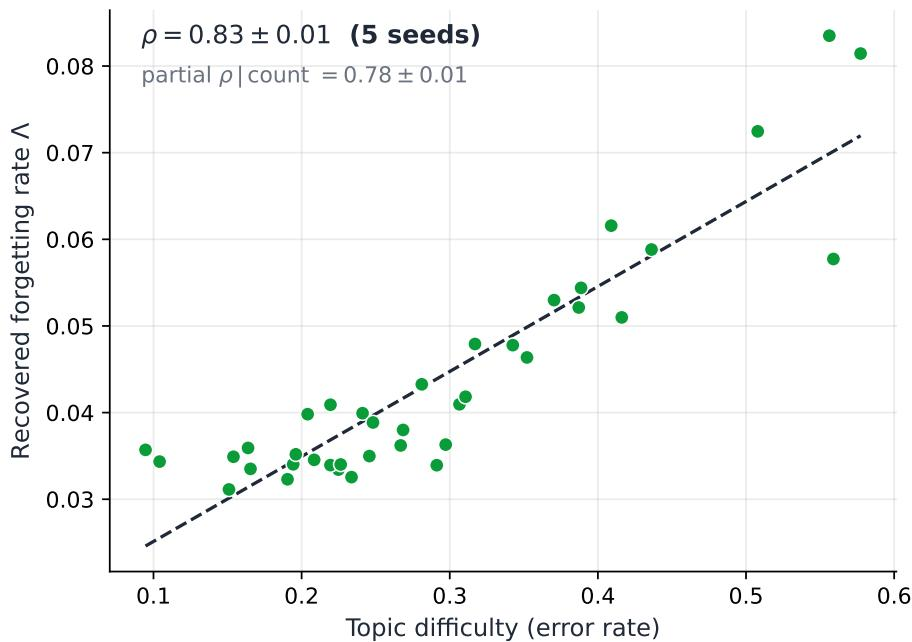
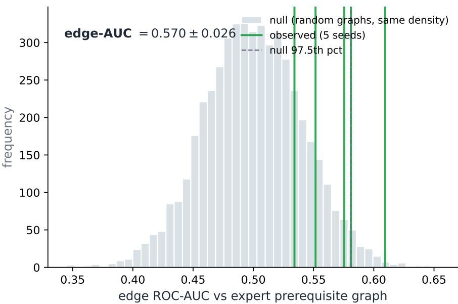

# Identifiability of a dissipative knowledge-dynamics model: exact recovery under designed excitation, degeneration on observational data

Arman A. Kostaniana,∗, Armen L. Beklaryanb

aInnopolis University, Innopolis, Russia bHSE University, Moscow, Russia

## Abstract

Human learning is a dissipative dynamical process: mastery accumulates through practice, decays through forgetting, and propagates across interdependent concepts. We model it as a nonlinear dissipative system of ordinary diferential equations whose parameters are mechanistically meaningful — a concept-transfer matrix encoding prerequisite coupling, perconcept forgetting rates, and a saturating practice-response gain — and we study when those parameters can actually be recovered from data.

We prove a structural identifiability theorem for the associated inverse problem under explicit excitation conditions, with constructive closed-form recovery for the two-concept case, together with monotonicity, robustness and L-stability results. We derive a semiimplicit L-stable scheme for the dissipative subsystem and a batched solver numerically equivalent to the per-trajectory formulation (bit-exact predictions, gradients to $1 0 ^ { - 1 0 } )$ yet two orders of magnitude faster, making estimation feasible on cohorts of $1 0 ^ { 5 }$ learners.

The empirical study is two-sided. Under the theorem’s excitation conditions, synthetic recovery is exact: parameters to machine precision, prerequisite structure at $F _ { 1 } = 1 . 0$ . On large observational benchmarks it is not. An apparently strong recovery — forgetting rates correlating with topic dificulty at Spearman $\rho = 0 . 8 3 \mathrm { ~ - ~ }$ is refuted by four independent controls: it survives destroying the temporal order of the data, is matched by a classical Bayesian baseline, and is unafected by removing real timestamps. We trace this to the stationary structure of the model and show it is the degeneration the theorem predicts absent designed excitation. The result delineates a sharp boundary between identifiable and unidentifiable regimes and yields a validation protocol for interpretability claims.

Keywords: nonlinear dynamics, dissipative systems, structural identifiability, inverse problems, learning dynamics, numerical integration

## 1. Introduction

Learning is a complex dynamical process. A learner’s competence is distributed over many interdependent concepts and evolves in continuous time under competing mechanisms: reinforcement through practice, dissipation through forgetting, and transfer along prerequisite relations, all observed only indirectly, through a sparse stream of binary responses. Systems of this kind — high-dimensional, dissipative, partially observed, driven by an irregular exogenous input — are the natural object of nonlinear dynamics, and they arise throughout the study of complex social phenomena.

The engineering counterpart of this problem is known as knowledge tracing: inferring a learner’s latent state from their response history in order to adapt instruction [1, 2]. The field is now dominated by recurrent and attentional neural models [3, 4, 5], which predict responses accurately but represent the learner state as an uninterpretable latent vector. Three consequences follow. The state cannot be read: one cannot say what a learner knows or why a prediction was made. Forgetting, when modelled at all, is inserted as a heuristic decay term chosen to improve fit rather than derived and tested [6]. And personalisation requires centralised retraining on raw learner logs.

A natural response is to replace the black box with a mechanistic model: a diferential system whose parameters are, by construction, the quantities of interest — a transfer matrix encoding prerequisite coupling, per-concept forgetting rates, a practice-response gain. This is the model we develop in Section 3. But building such a model raises a question that is rarely asked in this setting, and which we take as our subject: naming a parameter “forgetting rate” does not make it one. Whether the estimated value of that parameter has any relation to forgetting depends on whether the parameter is identifiable — uniquely determined by the observations — and identifiability of a dynamical system is never unconditional. It depends on how the system was excited while it was observed.

This dependence is well understood in systems biology, viral dynamics and control theory [7, 8, 9], where structural identifiability is analysed as a property of a model together with its input, and where the analysis is routinely used to design experiments that make parameters recoverable [10, 11]. It has not, to our knowledge, been brought to bear on models of knowledge dynamics — even as that field increasingly reports “interpretable” parameters and reads scientific meaning into their values.

We therefore study a dissipative ODE model of learning from the standpoint of the inverse problem it defines, and the picture that emerges has two sides.

On one side, the inverse problem is solvable, and we characterise exactly when. We prove a structural identifiability theorem: under a practice schedule containing rest intervals and intervals of isolated, non-constant practice of each concept, the parameters are uniquely determined, with a constructive closed-form reconstruction in the two-concept case, accompanied by monotonicity, robustness and L-stability results. Numerically, recovery under these conditions is exact: parameters to machine precision, and prerequisite coupling with $F _ { 1 } = 1 . 0$ on synthetic cohorts.

On the other side, the conditions matter. Standard educational datasets are observational: they record whatever practice learners happened to undertake, and they do not contain the regimes the theorem requires. Trained on such data, the model produces a parameter vector that correlates strongly with an external reference — recovered forgetting rates track measured topic dificulty at Spearman $\rho = 0 . 8 3$ — which, by the evidential standards common in this literature, would be reported as successful recovery of an interpretable quantity. It is not. Four independent controls show that the correlation survives destroying the temporal order of the data, is reproduced by a three-decade-old Bayesian baseline, and is unafected by supplying real elapsed time. We trace the efect to the stationary structure of the equations, which forces the decay parameter to absorb per-topic response frequency, and we show that it is precisely the degeneration the identifiability theorem anticipates in the absence of excitation.

The two sides together delineate a sharp qualitative boundary in the same dynamical system: a regime in which mechanism is recoverable from observation, and a regime in which it is not, with the transition governed not by the volume of data but by the design of its collection. We regard this boundary, rather than any single fitted model, as the contribution of this paper — together with its practical corollary, that claims of parameter interpretability should be accompanied by controls capable of detecting the failure we document.

Contributions.

1. A dissipative-ODE model of knowledge dynamics with a structurally factorised, prerequisiteaware transfer matrix and mechanistically meaningful parameters (Section 3).

2. A structural identifiability theorem for the associated inverse problem under explicit excitation conditions, constructive for K = 2, with monotonicity, robustness and Lstability results (Section 4).

3. Numerical methods for the forward and inverse problems: an L-stable semi-implicit scheme for the dissipative subsystem, a memory-eficient adjoint formulation, and a batched solver proved numerically equivalent to the per-trajectory formulation and two orders of magnitude faster, which is what makes the reproducibility and control experiments feasible (Section 5).

4. A two-sided empirical study on synthetic and four real benchmarks: exact recovery under excitation, and — established by four independent controls — degeneration of recovery into a reparameterisation of response frequencies on observational data, together with a structural explanation of why this occurs (Sections 6–7).

5. A minimal validation protocol for claims of parameter interpretability, applied to our own model, which reverses a conclusion that conventional evidence would have supported (Sections 6 and 8).

The remainder of the paper is organised as follows. Section 2 positions the work, Section 3 introduces the model, Section 4 the identifiability theory, and Section 5 the numerical methods. Sections 6 and 7 describe the experimental protocol and results, Section 8 discusses implications and limitations, and Section 9 concludes.

## 2. Related work

## 2.1. Knowledge tracing: from interpretable to accurate

Modelling the evolution of a learner’s mastery from a sequence of graded responses has two traditions. Bayesian Knowledge Tracing (BKT) [1] represents each skill by a twostate hidden Markov model with parameters — prior, learn, slip, guess — that have direct pedagogical readings, and remains in production use in intelligent tutoring systems. Deep Knowledge Tracing [3] and its successors [4, 12, 5] replace the interpretable state with a recurrent or attentional latent vector, gaining substantial predictive accuracy at the cost of any mechanistic reading of the state.

A large body of work adds forgetting to both traditions, motivated by the classical retention curve [13]: decay terms conditioned on elapsed time or repetition counts [6, 14], memory-augmented and graph-based variants, and concept-graph models that alternate forgetting, aggregation and update phases. These models introduce forgetting as an architectural component chosen to improve fit; the resulting decay parameters are typically inspected qualitatively rather than tested for recoverability. Our work difers in exactly this respect: we ask under which conditions such a decay parameter is identifiable, and what its estimate means when those conditions fail.

## 2.2. Identifiability in student modelling

Identifiability is not a new concern in this field, and we make no claim of priority for raising it. Beck and Chang [15] observed that BKT models with diferent parameters can produce identical predictions, and framed this as an identifiability problem; van de Sande [16] characterised the resulting families of observationally equivalent parameters analytically. Doroudi and Brunskill [17] subsequently showed that the phenomenon so described is not, strictly, non-identifiability: invoking results on the identifiability of hidden Markov models, they proved that BKT is identifiable under mild parameter conditions. They instead named the real dificulty semantic model degeneracy — the parameters that best fit the data can be inconsistent with the conceptual assumptions of the model — and demonstrated it by fitting BKT to data generated from alternative learning processes.

Our contribution sits on this line and extends it in two directions. First, the existing analysis concerns a discrete-time hidden Markov model with per-skill parameters; we treat a continuous-time dissipative ODE with coupled concepts, where identifiability is a question about an inverse problem for a diferential system rather than about an HMM likelihood, and where the answer depends explicitly on the practice schedule. To our knowledge this is the first structural identifiability result of that kind for knowledge dynamics. Second, we show that semantic degeneracy is not merely a possibility to be guarded against but the generic outcome on standard observational benchmarks: a parameter named “forgetting rate” is driven, at the optimum, to encode per-topic answer frequency. We further show that this degeneracy is invisible to the validation practices currently used in the field (Section 2.4).

## 2.3. Structural identifiability and excitation in dynamical systems

Outside education, structural identifiability is a mature subject in systems biology, viral dynamics and control theory. The standard notion is that a parameter is structurally identifiable if its value can in principle be determined from noise-free observation of the model output [7, 8, 9]; if it is not, its estimated numerical value carries no meaning and model-based conclusions about unobserved states may be wrong [10]. Crucially, structural identifiability is conditional on the input: results are stated under suficiently exciting persistently exciting — inputs, and methods exist to determine how exciting an input must be for a given model, precisely so that experiments can be designed to make parameters identifiable [10, 11]. The distinction between structural and practical identifiability [18, 19] is central to what follows: our theorem establishes the former, and our experiments show that the latter can nonetheless fail on passively collected data. The same conditionality appears in the theory of ill-posed inverse problems, where regularisation compensates for information the data do not contain [20].

Closest to the present work, Norden et al. [21] argue that structural identifiability matters for machine learning with partially observed dynamical systems, using identifiability analysis to relate parameter configurations that produce identical outputs. Our aim is complementary: rather than exploiting known unidentifiability to constrain a predictor, we derive the identifiability conditions for a specific dissipative model and then use them diagnostically, to ask whether a widely used class of observational datasets satisfies them — and to show what the estimated parameters mean when it does not.

We import this apparatus into learning dynamics. The practice schedule plays the role of the input; Theorem 1 states the excitation regimes under which the parameters of the knowledge-dynamics system are uniquely recoverable, and gives the reconstruction in closed form for the two-concept case. The empirical part of the paper is then, in the language of that literature, an assessment of whether standard educational logs constitute a suficiently exciting input. They do not.

## 2.4. Validating “interpretability”: current practice

Interpretable knowledge tracing typically supports its claims by correlating a learned quantity with an external reference: skill dificulty, expert prerequisite annotations, or review intervals. Our position is not that such results are wrong, but that the evidential standard is too weak to distinguish recovery from artefact. We show (Section 7.4) that a strong correlation of this type — ρ = 0.83 between a recovered forgetting rate and topic dificulty — survives the destruction of all temporal ordering in the data and is matched by a classical BKT baseline, and therefore establishes nothing about the dynamics the model claims to capture. Accordingly we propose, and apply to our own model, a minimal protocol of a shufle control and a simple-baseline control (Section 6.2).

## 2.5. Physics-informed and continuous-time models

Physics-informed neural networks embed governing equations into learning, typically as residual penalties in the loss [22]. Neural ODEs [23] provide the continuous-time counterpart of deep architectures. Our model is physics-informed in the hard-constraint sense: rather than penalising deviation from an assumed equation, we restrict the hypothesis class to a fixed dissipative ODE whose parameters are the objects of interest. This distinction matters here, since all results reported below are obtained with the residual weight set to zero; the mechanistic content resides in the model structure, not in a soft penalty. We are not aware of prior work that applies structural identifiability analysis to a continuous-time model of knowledge dynamics.

## 3. The Cognitive-PINN model

## 3.1. State and governing equation

Let a curriculum consist of K concepts.1 We describe a learner by a mastery state $\pmb { k } ( t ) \in [ 0 , 1 ] ^ { K }$ , where $k _ { j } ( t )$ is competence on concept j, evolving as

$$
\frac { d \pmb { k } } { d t } = \underbrace { \pmb { A } \phi ( p ( t ) ) \odot ( \mathbf { 1 } - \pmb { k } ) } _ { \mathrm { a c q u i s i t i o n } } - \underbrace { \pmb { \Lambda } \odot \pmb { k } } _ { \mathrm { d i s s i p a t i o n } } + \underbrace { \pmb { \sigma } \odot d \pmb { W } _ { t } } _ { \mathrm { f l u c t u a t i o n } } ,\tag{1}
$$

where ⊙ is the Hadamard product, $\pmb { p } ( t ) \in \mathbb { R } _ { > 0 } ^ { K }$ is the practice intensity — the exogenous input $- \pmb { A } \in \mathbb { R } _ { \ge 0 } ^ { K \times K }$ is a transfer matrix, $\pmb { \Lambda } \in \mathbb { R } _ { > 0 } ^ { K }$ collects decay rates, and $\mathbf { } W _ { t }$ is a Wiener process. In the analysis of Sections 4–5 we set ${ \pmb \sigma } = { \bf 0 }$ ; the stochastic term models trial-to-trial fluctuation and is not estimated in this work.

Acquisition. Practice raises mastery with diminishing returns: the factor $( \mathbf { 1 } - k )$ enforces saturation at $k _ { j } = 1$ and keeps the state in the unit box. The response is itself saturating,

$$
\phi _ { j } ( p ) = 1 - e ^ { - { \alpha _ { j } } p } , \qquad \alpha _ { j } > 0 ,\tag{2}
$$

increasing and concave with $\phi _ { j } ( 0 ) = 0 $ : additional repetitions within a session contribute progressively less.

Dissipation. Unpractised competence decays at rate $\Lambda _ { j }$ . This makes the system dissipative in the strict sense — without input, k contracts exponentially toward the origin.

Coupling. Of-diagonal entries $A _ { i j }$ transfer the efect of practising concept j to concept i;   
the diagonal carries direct acquisition.

## 3.2. Structure of the transfer matrix

Left unconstrained, A has $K ^ { 2 }$ free entries and is poorly behaved. We factorise

$$
{ \bf \cal A } = { \cal D } ^ { 1 / 2 } \left( Q _ { \mathrm { p r i o r } } \odot { \cal B } \right) { \cal D } ^ { 1 / 2 } ,\tag{3}
$$

The factor B is parameterised as a non-negative sum of a low-rank term and a diagonal,

$$
B = \mathrm { s o f t p l u s } \left( U V ^ { \top } \right) + \mathrm { d i a g } ( d ) , \qquad U , V \in \mathbb { R } ^ { K \times r } , \quad d > 0 ,\tag{4}
$$

where $r \ll K$ is the rank of the decomposition and d carries direct acquisition. The elementwise softplus guarantees $B _ { i j } \geq 0$ and hence $A _ { i j } \geq 0 -$ the condition required by Lemma 1 for invariance of the unit box. Non-negativity of the transfer coeficients is therefore not postulated but enforced by the parameterisation; the same property reflects the substantive requirement that practising one concept cannot lower mastery of another. where $Q _ { \mathrm { p r i o r } } \in$ $\{ 0 , 1 \} ^ { K \times K }$ is an optional mask of known prerequisite relations, and the symmetric scaling with diagonal D normalises the influence a concept can exert and receive, controlling $\rho ( A )$ and hence the stability of the integration scheme (Proposition 1). In all experiments below we set $Q _ { \mathrm { p r i o r } } = \mathbf { 1 } ;$ : supplying an expert prerequisite graph and subsequently “recovering” it would make structural validation circular.

## 3.3. Observation model

The state is latent; what is observed is a sequence of graded responses. For item m at time $t _ { m }$ , with $\pmb { q } _ { m } \in \{ 0 , 1 \} ^ { K }$ the required concepts,

$$
\operatorname* { P r } \left( y _ { m } = 1 | k ( t _ { m } ) \right) = \sigma \big ( \beta _ { m } \left( \bar { k } _ { m } - \frac { 1 } { 2 } \right) - \delta _ { m } \big ) , \qquad \bar { k } _ { m } = \frac { { \bf q } _ { m } ^ { \top } k ( t _ { m } ) } { \operatorname* { m a x } \left( { \bf q } _ { m } ^ { \top } { \bf 1 } , 1 \right) } ,\tag{5}
$$

with $\sigma$ the logistic function and $( \beta _ { m } , \delta _ { m } )$ item discrimination and dificulty in the manner of item-response theory; $\beta _ { m } > 0$ . For single-concept items (5) reduces to the standard score on the practised concept.

Remark (identifiability of the observation model). In item-response models with free item parameters, the scale and location of the latent variable are determined only up to an afine transformation: a shift and a rescaling of k can be absorbed by $( \beta _ { m } , \delta _ { m } )$ . Here that indeterminacy is removed not by a normalisation convention but by the dynamics themselves. The factor $( \mathbf { 1 } - \pmb { k } )$ in the acquisition term and the term −Λ ⊙ k pin both boundaries of the state space: by Lemma 1 the trajectory remains in $( 0 , 1 ) ^ { K }$ , and $k _ { j } = 0 , k _ { j } = 1$ are substantively defined states — no mastery and full mastery. The scale and location of k are therefore fixed by the structure of (1), and $( \beta _ { m } , \delta _ { m } )$ describe item properties at a fixed state scale. The constraint $\beta _ { m } > 0$ additionally excludes a reflection of the scale.

We stress that Theorem 1 is a structural result, stated in the idealisation of continuous observation of $k ( \cdot )$ . Practical identifiability under sparse binary observations through (5) is a separate question, which this paper addresses empirically: its failure on observational data is documented in Sections 7.3–7.5.

## 3.4. Estimation problem

Estimation minimises the negative log-likelihood of (5) under trajectories generated by (1),

$$
\mathcal { L } ( \boldsymbol { \theta } ) = - \frac { 1 } { M } \sum _ { s } \sum _ { m } \log \operatorname* { P r } \big ( \boldsymbol { y } _ { m } ^ { ( s ) } \mid \boldsymbol { k } ^ { ( s ) } ( t _ { m } ; \boldsymbol { \theta } ) \big ) + \mathcal { R } ( \boldsymbol { \theta } ) , \qquad \boldsymbol { \theta } = ( B , \Lambda , \alpha ) .\tag{6}
$$

Two remarks matter for the results below. First, the model is physics-informed in the hard-constraint sense: the governing equation is not a residual penalty added to the loss but is built into the hypothesis class, so every candidate trajectory solves (1) by construction. All experiments therefore use a zero residual weight, and this makes the objective identical for the per-trajectory and batched formulations of Section 5. Second, R is zero unless stated otherwise: an $\ell _ { 1 }$ penalty on B is natural if sparse structure is expected, but it drives the of-diagonal of A toward zero and thereby suppresses precisely the structure a recovery experiment is meant to test.

## 3.5. Interpretation and its limits

Every parameter has a stated mechanistic reading: Λ as forgetting rates, A as prerequisite transfer, α as practice responsiveness. This motivates the model, and it is also what this paper subjects to scrutiny. Under sustained practice at intensity p, (1) admits the element-wise steady state

$$
k _ { j } ^ { * } = \frac { \left[ A \phi ( \pmb { p } ) \right] _ { j } } { \left[ { A \phi ( \pmb { p } ) } \right] _ { j } + \Lambda _ { j } } ,\tag{7}
$$

so $\Lambda _ { j }$ enters the predicted response probability of concept j directly. Fitting (6) therefore exerts pressure on $\Lambda _ { j }$ to reproduce the observed success rate on that concept, irrespective of whether the data contain information about decay over time. Whether the estimate is a forgetting rate or a reparameterisation of dificulty is not settled by the model’s construction; it is an identifiability question.

## 4. Structural identifiability

## 4.1. Setting and definition

For $K = 2$ the deterministic part of (1) reads

$$
\begin{array} { r } { \dot { k } _ { 1 } = \left[ A _ { 1 1 } \phi _ { 1 } ( p _ { 1 } ( t ) ) + A _ { 1 2 } \phi _ { 2 } ( p _ { 2 } ( t ) ) \right] ( 1 - k _ { 1 } ) - \Lambda _ { 1 } k _ { 1 } , } \\ { \dot { k } _ { 2 } = \left[ A _ { 2 1 } \phi _ { 1 } ( p _ { 1 } ( t ) ) + A _ { 2 2 } \phi _ { 2 } ( p _ { 2 } ( t ) ) \right] ( 1 - k _ { 2 } ) - \Lambda _ { 2 } k _ { 2 } , } \end{array}\tag{8}
$$

with unknown $\theta = ( A _ { 1 1 } , A _ { 1 2 } , A _ { 2 1 } , A _ { 2 2 } , \alpha _ { 1 } , \alpha _ { 2 } , \Lambda _ { 1 } , \Lambda _ { 2 } ) \in \Theta : = \mathbb { R } _ { + } ^ { 8 }$ We treat $k ( \cdot )$ and $p ( \cdot )$ as observed, the standard idealisation of structural identifiability; observation through the discrete emission (5) is addressed in Lemma 3.

Definition 1 (Indistinguishability). Two parameterisations θ, $\theta ^ { \prime } \in \Theta$ are indistinguishable if for every admissible schedule $p ( \cdot )$ and every $\pmb { k } _ { 0 } \in ( 0 , 1 ) ^ { 2 }$ the trajectories coincide for all $t \geq 0$ . The model is structurally identifiable if indistinguishability implies $\theta = \theta ^ { \prime }$

## 4.2. Excitation conditions

Identifiability is a property of the model together with its input. We require the schedule to contain:

• (R) Rest. An interval $I _ { R }$ of positive length with $p _ { 1 } \equiv p _ { 2 } \equiv 0$

• (S1) Isolated non-constant practice of concept 1. An interval $I _ { 1 }$ of positive length with $p _ { 1 } > 0 , p _ { 2 } \equiv 0$ , and $p _ { 1 }$ non-constant, $\begin{array} { r } { \operatorname* { s u p } _ { I _ { 1 } } p _ { 1 } > \operatorname* { i n f } _ { I _ { 1 } } p _ { 1 } } \end{array}$

• (S2) The symmetric condition for concept 2.

Each regime removes part of the dynamics: (R) switches of acquisition, exposing pure dissipation; (S1) switches of the second input channel, exposing the response of both concepts to a single driving signal. The requirement that $p _ { 1 }$ be non-constant separates the gain $\alpha _ { 1 }$ from the transfer weight $A _ { 1 1 } { \mathrm { : } }$ a single practice intensity cannot distinguish a weakly responding concept driven hard from a strongly responding concept driven gently.

## 4.3. Two lemmas

Lemma 1 (Invariance of the unit box). $I f k ( 0 ) \in ( 0 , 1 ) ^ { 2 } , A _ { i j } \geq 0 , \Lambda _ { i } > 0$ and $p _ { j } \geq 0$ , then $\pmb { k } ( t ) \in ( 0 , 1 ) ^ { 2 }$ for all $t \geq 0$

Proof. On the face $\begin{array} { r } { k _ { i } = 0 , \dot { k } _ { i } = \sum _ { j } A _ { i j } \phi _ { j } ( p _ { j } ) \geq 0 ; } \end{array}$ on $k _ { i } = 1 , \dot { k } _ { i } = - \Lambda _ { i } < 0$ . Both faces are repelling and a first-exit argument excludes them. □

Lemma 1 guarantees that the divisions by $k _ { i }$ and $1 - k _ { i }$ below are well defined. The next lemma is the analytical core of the argument.

Lemma 2 (Monotone signature of the saturating response). For $r > 1$ let

$$
\tilde { H } _ { r } ( u ) : = \frac { 1 - e ^ { - r u } } { 1 - e ^ { - u } } , \qquad u > 0 .\tag{9}
$$

Then ${ \tilde { H } } _ { r }$ is strictly decreasing on $( 0 , \infty )$ , with lim $\mathinner { \cdot } u  0 ^ { + } \tilde { H } _ { r } \mathopen { } \mathclose \bgroup ( u ) = r$ and $\begin{array} { r } { \operatorname* { l i m } _ { u  \infty } \tilde { H } _ { r } ( u ) = 1 } \end{array}$ ;   
hence it is a bijection from $( 0 , \infty )$ onto (1, r).

Proof. Writing $\tilde { H } _ { r } ^ { \prime } = N ( u ) / ( 1 - e ^ { - u } ) ^ { 2 }$ and multiplying the numerator by $e ^ { u } \ > \ 0$ gives $f ( u ) : = r e ^ { - ( r - 1 ) u } - ( r - 1 ) e ^ { - r u } - 1$ , with $f ( 0 ) = 0$ and $\bar { f ^ { \prime } ( u ) } = r ( r - 1 ) \left\lceil e ^ { - r u } - e ^ { - ( r - 1 ) u } \right\rceil < 0$ for $u > 0 , r > 1$ . Hence $f ( u ) < 0$ , so $N ( u ) < 0$ and $\tilde { H } _ { r } ^ { \prime } ( u ) < 0$ . The limits follow by L’Hôpital’s rule. □

$\tilde { H } _ { r } ( u )$ is the ratio of the response produced by practice of intensity ru to that produced by intensity u. In the weak-practice limit it equals $r \_ -$ the response is locally linear — while under saturation it tends to 1. Strict monotonicity means this ratio is a signature of the saturating nonlinearity: observing how the response scales between two intensities determines the operating point $\alpha _ { 1 } p$ uniquely. This is exactly the information a constant schedule cannot provide.

## 4.4. The identifiability theorem

Theorem 1 (Structural identifiability, $K = 2$ , constructive). Under conditions $( R ) , \ ( S 1 )$ and (S2), the model (8) is structurally identifiable, and every component of θ admits a closed-form expression in the observed trajectory and schedule.

Proof. Let $\theta , \theta ^ { \prime }$ be indistinguishable; we exhibit θ explicitly.

Step 1 (dissipation, from R). On $I _ { R }$ both responses vanish and (8) reduces to $\dot { k } _ { i } = - \Lambda _ { i } k _ { i }$ ， so $k _ { i } ( t ) = k _ { i } ( t _ { R } ^ { - } ) e ^ { - \Lambda _ { i } ( t - t _ { R } ^ { - } ) }$ with $k _ { i } ( t _ { R } ^ { - } ) > 0$ by Lemma 1. Hence for any $t \in ( t _ { R } ^ { - } , t _ { R } ^ { + } ]$

$$
\Lambda _ { i } = - \frac { 1 } { t - t _ { R } ^ { - } } \log \frac { k _ { i } ( t ) } { k _ { i } ( t _ { R } ^ { - } ) } , \qquad i = 1 , 2 .\tag{10}
$$

Step 2 (self-transfer and gain, from $S 1 )$ . On $I _ { 1 } , \ \phi _ { 2 } = 0$ . With $\Lambda _ { 1 }$ known, define the observable

$$
g _ { 1 } ( t ) : = \frac { \dot { k } _ { 1 } ( t ) + \Lambda _ { 1 } k _ { 1 } ( t ) } { 1 - k _ { 1 } ( t ) } = A _ { 1 1 } \left( 1 - e ^ { - \alpha _ { 1 } p _ { 1 } ( t ) } \right) , \qquad t \in I _ { 1 } .\tag{11}
$$

Because $p _ { 1 }$ is non-constant there exist $t _ { a } , t _ { b } \in I _ { 1 }$ with $0 < p _ { a } : = p _ { 1 } ( t _ { a } ) < p _ { b } : = p _ { 1 } ( t _ { b } )$ ; put $r : = p _ { b } / p _ { a } > 1$ . Taking the ratio of (11) at these instants eliminates $A _ { 1 1 }$

$$
\frac { g _ { 1 } ( t _ { b } ) } { g _ { 1 } ( t _ { a } ) } = \frac { 1 - e ^ { - \alpha _ { 1 } p _ { b } } } { 1 - e ^ { - \alpha _ { 1 } p _ { a } } } = \tilde { H } _ { r } ( \alpha _ { 1 } p _ { a } ) .\tag{12}
$$

The left side is observed and lies in $( 1 , r )$ , so Lemma 2 inverts (12) uniquely, giving $\alpha _ { 1 }$ and then $A _ { 1 1 } = g _ { 1 } ( t _ { a } ) / \left( 1 - e ^ { - \alpha _ { 1 } p _ { a } } \right)$

Step 3 (cross-transfer, from S1). On the same interval, $\dot { k } _ { 2 } = A _ { 2 1 } \left( 1 - e ^ { - \alpha _ { 1 } p _ { 1 } ( t ) } \right) ( 1 - k _ { 2 } ) -$ $\Lambda _ { 2 } k _ { 2 }$ , whence for any $t \in I _ { 1 }$ with $p _ { 1 } ( t ) > 0$ 2

$$
A _ { 2 1 } = \frac { \dot { k } _ { 2 } ( t ) + \Lambda _ { 2 } k _ { 2 } ( t ) } { \left( 1 - k _ { 2 } ( t ) \right) \left( 1 - e ^ { - \alpha _ { 1 } p _ { 1 } ( t ) } \right) } .\tag{13}
$$

Step 4 (symmetry). Applying Steps 2–3 to $I _ { 2 }$ yields $\alpha _ { 2 } , A _ { 2 2 }$ , then $A _ { 1 2 }$ (Appendix $\mathrm { A p \mathrm { - } }$ pendix A). All eight parameters are expressed by explicit formulas, so $\theta = \theta ^ { \prime }$ □

## 4.5. Consequences

Constructivity. The proof is an estimator, not an existence argument: (10)–(13) supply a closed-form initialisation for the optimisation of (6) and a diagnostic — a large discrepancy between formula-based and optimisation-based estimates signals noise or a violation of (R), (S1), (S2). A minimal informative design for $K = 2$ requires seven well-placed observation instants (Appendix Appendix A).

Robustness. In practice k is observed through (5) and the derivatives in (11), (13) must be estimated from smoothed trajectories.

Lemma 3 (Robustness). Under the hypotheses of Theorem 1, with $k _ { \operatorname* { m i n } { } } > 0 , \ u _ { \operatorname* { m i n } { } } > 0$ and $\alpha _ { j } p$ confined to a compact subset of $( 0 , \infty )$ , there is a constant $C ^ { \dagger }$ independent of the perturbation magnitudes such that $\left. \hat { \theta } - \theta ^ { * } \right. _ { \infty } \leq C ^ { \dagger } \left( \epsilon + \delta \right)$ , where ϵ and δ bound the errors in k and $\dot { k }$ respectively.

The proof and the structure of $C ^ { \dagger }$ are given in Appendix Appendix B. The dependence is as instructive as the linearity: reconstruction degrades with short rest intervals, with mastery near either boundary, and — most relevantly for what follows — as the ratio of practice intensities approaches unity, where the inversion of ${ \tilde { H } } _ { r }$ becomes arbitrarily ill-conditioned.

Scope. The result is structural: it concerns noise-free observation under an admissible schedule. It does not address the stochastic term, practical identifiability under sparse discrete observations, or misspecification of $Q _ { \mathrm { p r i o r } }$ . The extension to arbitrary K — with conditions (R) and (Sj) for every j, and induction on $j -$ is left as a conjecture; Section 7.1 provides numerical evidence for $K = 5$

The reading that matters empirically. Conditions (R), (S1), (S2) describe a schedule an instructor could impose but that no learner follows spontaneously. Sections 6 and 7 examine what remains of parameter recovery when data are collected without such design.

## 5. Numerical methods

## 5.1. Discretisation of the forward problem

Write (1) in deterministic semilinear form

$$
\dot { \pmb { k } } = \pmb { a } ( t ) \odot ( \mathbf { 1 } - \pmb { k } ) - \Lambda \odot \pmb { k } , \qquad \pmb { a } ( t ) : = \pmb { A } \phi ( p ( t ) ) \geq \mathbf { 0 } .\tag{14}
$$

The system is stif in a structural sense: acquisition acts only while practice is applied, whereas dissipation acts always, with rates that may difer across concepts by an order of magnitude.

Because the input is piecewise constant between interactions, we integrate on the grid of interaction instants with fixed step h. The experiments in Section 7 use the classical explicit fourth-order Runge–Kutta scheme with $h = 0 . 2 5$ in units of the interaction grid; the step was selected by refinement.

For deployment on long unpractised intervals, where an explicit scheme requires $h \lesssim$ $2 / \operatorname* { m a x } _ { j } \Lambda _ { j }$ , we also derive a semi-implicit scheme treating dissipation implicitly and acquisition explicitly,

$$
\pmb { k } _ { n + 1 } = \left( \mathbf { 1 } + h \pmb { \Lambda } \right) ^ { - 1 } \odot \left[ \pmb { k } _ { n } + h \pmb { a } ( t _ { n } ) \right] ,\tag{15}
$$

explicit to evaluate since the matrix to invert is diagonal.

Proposition 1 (L-stability on the dissipative subsystem). Applied to $\dot { k } = - \Lambda k , \Lambda > 0$ 2 scheme (15) has amplification factor $R ( z ) = ( 1 + z ) ^ { - 1 } ~ w i t h ~ z = h \Lambda$ ; hence $| R ( z ) | < 1$ for all $h > 0$ and $R ( z ) \to 0$ as $z  \infty$ , so the scheme is A-stable and L-stable in the sense of $\it { \Omega } / \mathrm { { 2 4 } } ] .$ It preserves the invariant box of Lemma 1 whenever $h \| \mathbfcal { a } \| _ { \infty } \leq 1$

Proof. The amplification factor is immediate. For the box, $\pmb { k } _ { n } \in [ 0 , 1 ] ^ { K }$ and ${ \textbf { \em a } } \geq 0$ give $k _ { n + 1 } \ \geq \ 0$ , and the upper bound follows from the step restriction. On the full linearised system A-stability additionally requires $h \rho ( A ) < 1$ , which the scaling in (3) is designed to maintain. □

L-stability matters because an explicit scheme with too large a step produces oscillatory or negative mastery after long gaps — outside the state space, not merely inaccurate.

## Comparison of the schemes on stif regimes

To delimit the applicability of each scheme quantitatively, consider a model problem with two concepts whose forgetting rates difer by a factor of forty, $\Lambda = ( 0 . 0 5 , \ 2 . 0 0 ) \ \mathrm { d a y } ^ { - 1 }$ . On an interval without practice the solution is known analytically, $\pmb { k } ( T ) = \pmb { k } _ { 0 } \odot e ^ { - \pmb { \Lambda } T }$ , so the error can be measured directly.

Table 1: Absolute error after a gap of $T = 3 0$ days. “escape” indicates that the solution left the invariant box [0, 1].
<table><tr><td rowspan="2">h, days</td><td rowspan="2"> $h \Lambda _ { \mathrm { m a x } }$ </td><td colspan="2">explicit RK4</td><td colspan="2">scheme (15)</td></tr><tr><td>error</td><td>box</td><td>error</td><td>box</td></tr><tr><td>0.25</td><td>0.50</td><td> $4 . 1 \cdot 1 0 ^ { - 1 1 }$ </td><td>ok</td><td> $1 . 3 \cdot 1 0 ^ { - 3 }$ </td><td>ok</td></tr><tr><td>1.00</td><td>2.00</td><td> $1 . 1 \cdot 1 0 ^ { - 8 }$ </td><td>ok</td><td> $4 . 9 \cdot 1 0 ^ { - 3 }$ </td><td>ok</td></tr><tr><td>2.00</td><td>4.00</td><td> $1 . 7 \cdot 1 0 ^ { 1 0 }$ </td><td>escape</td><td> $9 . 8 \cdot 1 0 ^ { - 3 }$ </td><td>ok</td></tr><tr><td>5.00</td><td>10.0</td><td> $3 . 3 \cdot 1 0 ^ { 1 4 }$ </td><td>escape</td><td> $2 . 3 \cdot 1 0 ^ { - 2 }$ </td><td>ok</td></tr><tr><td>30.0</td><td>60.0</td><td> $2 . 8 \cdot 1 0 ^ { 5 }$ </td><td>escape</td><td> $1 . 1 \cdot 1 0 ^ { - 1 }$ </td><td>ok</td></tr></table>

Table 1 shows that the explicit scheme retains high accuracy up to its stability limit, which for the fourth-order Runge–Kutta method on the negative real axis is $| h \Lambda | \leq 2 . 7 8 5$ Beyond it the solution diverges and leaves the invariant box, producing negative mastery; with $\Lambda _ { \mathrm { m a x } } = 2 ~ \mathrm { d a y } ^ { - 1 }$ this already occurs at $h \geq 1 . 4$ days. By Proposition 1, scheme (15) remains stable at any step and stayed inside the box at all steps tested, with an error that grows smoothly and does not exceed $1 . 1 { \cdot } 1 0 ^ { - 1 }$ even when the step equals the whole thirty-day gap.

A practical division of roles follows. For parameter estimation from data, where the step is set by the interaction grid and is small, the explicit scheme is preferable and is used in all experiments of Section 7. For long horizons and for on-device fine-tuning, where the step is dictated by computational resources rather than by accuracy, scheme (15) is required. We stress that its advantage is not accuracy — at small steps the fourth-order explicit method is more accurate by many orders of magnitude — but unconditional stability and preservation of the state space.

## 5.2. The inverse problem: adjoint sensitivity

Storing the full computational graph costs $O ( N K )$ memory for a trajectory of N steps. The adjoint formulation solves the augmented system backwards in time; with checkpointing at $O ( { \sqrt { N } } )$ nodes [25] the cost becomes memory $O ( \sqrt { N } K )$ and compute $O ( N \sqrt { N } K ^ { 2 } )$ , the regime required for parameter updates on a learner’s own device. The experiments here use direct backpropagation, for which the batched formulation already removes the bottleneck.

## 5.3. A batched reformulation with provable equivalence

The natural implementation integrates one learner at a time. This is the dominant cost: on a cohort of $2 . 5 \times 1 0 ^ { 4 }$ learners a single epoch took approximately 6.2 hours on a modern GPU with device utilisation below 20% — the computation is latency-bound in the per-trajectory loop.

When time is measured on the interaction grid, all learners share a common integer time axis; a batch of B learners can therefore be advanced by a single ODE solve on the union grid, with the state held as a $( B , K )$ tensor and each learner’s mastery read at that learner’s own interaction indices, padding masked out.

Proposition 2 (Numerical equivalence). For fixed parameters, the batched and per-trajectory formulations produce identical predicted probabilities and identical gradients of (6), up to floating-point round-of.

The proof is given in Appendix Appendix C. We verify it empirically: on a synthetic cohort in the exact data format of the loader, predicted probabilities agree bit-exactly $\left( \operatorname* { m a x } | \Delta p | \ = \ 0 \right)$ , gradients with respect to the transfer parameters agree to $1 . 5 \times 1 0 ^ { - 1 0 }$ and the full objective and its gradient agree to $| \Delta \mathcal { L } | = 0$ and $8 . 3 \times 1 0 ^ { - 1 0 }$ . The practical efect is a reduction of epoch time from 6.2 hours to 16 seconds on the same cohort and hardware — a factor of approximately 245 — which is what makes the five-seed study and the four control experiments below feasible.

## 5.4. Non-uniform time grids

Section 7.4 reports a variant in which pseudo-time is replaced by real elapsed time. This breaks the common integer axis: with continuous timestamps the union grid of a batch is almost fully distinct, and consecutive nodes may be separated by intervals below $1 0 ^ { - 5 }$ while others span months. We therefore reparameterise monotonically and quantise: node times are set to cumsum $( \log ( 1 + \Delta t ) )$ ) with ∆t in hours, then rounded onto a grid of resolution 0.25 with strict monotonicity enforced. Without this treatment the integration diverges: we observed non-finite objective values and chance-level predictions throughout training.

## 6. Experimental setup

## 6.1. Data

We evaluate on synthetic cohorts and four public benchmarks: ASSISTments-2009/2015/2017 and Junyi-2015 [26] (K = 39 topic-level knowledge components). ASSISTments-2009 contains duplicated rows that inflate AUC for every model [27]; we de-duplicate before all runs. All models share student-level folds and identical (student, step) keys; significance is assessed with the DeLong test [28] and a student-clustered bootstrap, with Holm correction [29]. For Junyi we use a fixed 25 000-student subsample (seed 42).

## 6.2. Protocol for parameter validation

The model is trained without an expert prior $( Q _ { \mathrm { p r i o r } } = 1 )$ . Unless stated otherwise we use the batched solver, zero residual and regularisation weights, $h = 0 . 2 5$ , and a fixed budget of 25 epochs without early stopping, so that no run is advantaged by a lucky stopping point.

We do not treat a single correlation as evidence. Every parameter-recovery claim is subjected to four controls:

• C1 (shufle). Interaction order is permuted within each learner, destroying temporal structure while preserving per-topic frequencies exactly.

• C2 (baseline). The same external correlation is computed for a classical BKT model.

• C3 (real time). Pseudo-time is replaced by real elapsed time and the recovered rates are correlated with an empirical per-topic forgetting slope measured directly from the data.

• C4 (time ablation). The same run with real time switched of.

## 7. Results

## 7.1. Synthetic data: the theory holds under excitation

On synthetic cohorts generated under the excitation schedule of Theorem 1, the closedform reconstruction recovers parameters to a relative error of 10−15 (machine precision) for $K = 2$ . For $K = 5$ , end-to-end training recovers the prerequisite graph exactly $( F _ { 1 } = 1 . 0 )$ and attains $\mathrm { A U C } = 0 . 7 1 7$ against an oracle ceiling of 0.720.

## 7.2. Predictive accuracy: a quantified trade-of

Table 2: Matched AUC on contamination-controlled benchmarks. All pairwise diferences are significant (DeLong, $p \approx 0 )$
<table><tr><td>Dataset</td><td>Cognitive-PINN</td><td>DKT</td><td>BKT</td></tr><tr><td>ASSISTments-2009</td><td>0.682</td><td>0.758</td><td>0.717</td></tr><tr><td>ASSISTments-2015</td><td>0.695</td><td>0.730</td><td>0.691</td></tr><tr><td>ASSISTments-2017</td><td>0.607</td><td>0.697</td><td>0.627</td></tr></table>

Cognitive-PINN is the least accurate of the three: below DKT everywhere and below BKT on two of three datasets. This is the expected price of constraining the model to a small set of mechanistically meaningful parameters; predictive accuracy is not a contribution of this work.

A natural objection follows: what is the point of a model that is less accurate than a design three decades old. The answer is that the models answer diferent questions. BKT and DKT predict the next response, but neither admits the question of identifiability: in BKT the parameters are attached to individual skills and describe no transfer between them, while the latent state of DKT has no mechanistic reading with respect to which such a question would be meaningful. At the cost of accuracy, the proposed model acquires a property absent from both: one can prove under which observation conditions its parameters are uniquely determined and, consequently, use it as an instrument for testing whether those conditions hold in the data at hand. That test, rather than predictive accuracy, is the subject of Sections 7.3–7.5.

## 7.3. Observational data: an apparent recovery

Trained on Junyi without an expert prior, the recovered forgetting rates Λ correlate strongly with independently measured topic dificulty: Spearman $\rho = 0 . 8 3 \pm 0 . 0 1$ across five seeds, with partial $\rho = 0 . 7 8 \pm 0 . 0 1$ after controlling for the number of observations per topic. Read in isolation, this is the kind of evidence commonly ofered as demonstrating that a model’s parameters are meaningful.

  
Figure 1: Recovered forgetting rates versus independently measured topic dificulty on Junyi $\left( K = 3 9 \right)$ across five seeds. The correlation is strong and stable — and, as Section 7.4 shows, not evidence of recovering forgetting.

## 7.4. Four controls refute the recovery interpretation

Table 3: Controls on the apparent parameter recovery.
<table><tr><td>Control</td><td>Quantity</td><td>Result</td></tr><tr><td>C1 shuffle</td><td>ρ(Λ, difficulty) after permuting order 0.829 (vs 0.845)</td><td></td></tr><tr><td>C2 baseline</td><td>ρ(BKT slip, difficulty)</td><td>0.795</td></tr><tr><td></td><td>ρ(BKT guess, difficulty)</td><td>-0.699</td></tr><tr><td>C3 real time</td><td>ρ(Λ, empirical forgetting slope)</td><td> $0 . 4 9 \pm 0 . 0 1$ </td></tr><tr><td>C4 time ablation</td><td>same, real time removed</td><td>0.504</td></tr></table>

C1 shows the correlation is insensitive to temporal ordering, i.e. carried by per-topic answer frequencies rather than by learning dynamics. C2 shows a classical per-skill BKT reproduces essentially the same correlation, so it is not evidence about our model at all.

C3 shows that when the reference is switched from dificulty to an empirically measured forgetting slope, the correlation drops to a moderate 0.49 while the dificulty correlation remains at 0.79. C4 is decisive: removing real timestamps does not reduce the correlation (0.504 vs 0.49), so the timestamps contribute nothing.

Structural recovery is likewise weak and unstable: edge-AUC against the expert prerequisite graph is $0 . 5 7 0 \pm 0 . 0 2 6$ over five seeds (range 0.534–0.609), and the sparser reference graph yields no significant signal.

  
Figure 2: Structural recovery across five seeds against the null distribution of random graphs of identical density. The observed edge-AUC values lie close to the upper tail of the null, and the spread across seeds exceeds the margin over chance.

## 7.5. Why the recovery degenerates

The behaviour follows from (7): $\Lambda _ { j }$ directly parameterises the predicted response probability of a topic, so minimising the data term requires $\Lambda _ { j }$ to absorb the observed per-topic error rate. The correlation with dificulty is a property of the stationary structure, not a discovery about the learner — which is what C2 demonstrates empirically.

A genuine forgetting signal does exist in the data: topic-controlled accuracy falls monotonically from 0.751 for gaps below one hour to 0.589 for gaps beyond thirty days (withintopic Spearman $\rho = - 0 . 1 7 6$ across all 39 topics). But it is carried by the 2.4% of interactions separated by a day or more and is overwhelmed in the likelihood by the remaining 97% of within-session interactions. Real timestamps fail to help not because the signal is absent, but because it is not identifiable from passive logs at the weight it carries in the objective — the failure mode Theorem 1 anticipates absent designed excitation.

## 8. Discussion

The failure is quantitatively anticipated. Lemma 3 bounds the reconstruction error by $C ^ { \dagger } ( \epsilon +$ δ), but its constant degrades with short rest intervals, with mastery near the boundaries of its range, and — most relevantly — as the ratio of practice intensities approaches unity, where the inversion underlying recovery of the practice gain becomes arbitrarily ill-conditioned. Observational logs exhibit exactly this combination: gaps are overwhelmingly short (96.9% below one hour) and practice intensity is close to constant. The degeneration of Section 7.4 is therefore not an unexplained negative result but the regime the robustness analysis identifies in advance.

A sharp boundary, predicted by theory and observed in data. Sections 7.1 and 7.4 describe the same model on two kinds of data. Where the excitation conditions hold, recovery is exact. Where they do not — in observational logs, however large — recovery degenerates into a reparameterisation of answer frequencies. The identifiability theorem is therefore not a technical footnote: it delineates a qualitative boundary between two regimes of the same dynamical system, and the boundary is empirically visible. For complex social systems modelled from passive observation, the practically relevant statement is that scale of data does not substitute for design of observation.

A methodological consequence. Interpretable knowledge tracing routinely supports its claims by correlating a learned quantity with an external property. Controls C1 and C2 show that such a correlation can be strong $( \rho = 0 . 8 3 )$ , survive the destruction of all temporal information, and be matched by a three-decade-old baseline. It is therefore not suficient evidence that a model has recovered the mechanism it names. We recommend that claims of parameter interpretability be accompanied by, at minimum, a shufle control and a simplebaseline control; both are inexpensive and, in our case, decisive. This critique applies to our own initial reading of the data, which the controls overturned.

On negative results and identifiability. The contribution is not that a particular model failed to fit. It is that a model whose parameters are provably identifiable under stated conditions can be used as an instrument to test whether those conditions are met in a given dataset — and that, for the standard benchmarks of this field, they are not. This reframes a recurring dificulty in educational data mining — unstable, implausible parameter estimates — as a question of experimental design rather than of model capacity, and connects it to the established distinction between structural and practical identifiability [19].

Limitations. Theorem 1 is proved constructively for K = 2; the K = 5 synthetic study is empirical evidence of generalisation, and the general-K case remains open. External structural validation rests on a single dataset with an expert graph. The stochastic term is not estimated. The real-time variant relies on a log-compressed, quantised grid, though C4 indicates the limitation is one of information content rather than of discretisation.

Future work. The natural continuation follows from the theorem: designed excitation. A modest intervention — scheduled rest intervals and blocks of isolated, varied-intensity practice in a live course — would supply the regimes the theory requires, turning an unidentifiable observational problem into an identifiable experimental one. Second, the memory-eficient adjoint scheme enables on-device parameter estimation without transmitting raw learner logs.

## 9. Conclusion

We have presented Cognitive-PINN, a dissipative ODE model of knowledge dynamics whose parameters carry explicit mechanistic meaning, together with a structural identifiability theorem with constructive recovery, supporting stability and robustness results, an L-stable semi-implicit scheme, and a batched solver numerically equivalent to the pertrajectory formulation while being two orders of magnitude faster.

Our empirical study is deliberately two-sided. Under the excitation conditions required by the theorem, the framework recovers parameters and coupling structure exactly. On large observational benchmarks it does not: an apparently strong parameter recovery (ρ = 0.83) is shown by four independent controls to be a reparameterisation of per-topic answer frequencies, reproduced by a classical baseline and unafected by the removal of temporal information. We trace this to the stationary structure of the model and to the distribution of practice gaps in the data, and show it is the failure mode the theorem predicts.

The resulting picture is a sharp, testable boundary between identifiable and unidentifiable regimes of the same system, and a concrete methodological recommendation for a field that increasingly reports interpretable parameters without testing whether they are identifiable at all.

## CRediT authorship contribution statement

Arman A. Kostanian: Conceptualization, Methodology, Software, Formal analysis, Investigation, Writing — original draft, Visualization. Armen L. Beklaryan: Supervision, Methodology, Writing — review & editing.

## Declaration of competing interest

The authors declare that they have no known competing financial interests or personal relationships that could have appeared to influence the work reported in this paper.

## Data availability

Code is publicly available at https://github.com/armankostanian/cognitive-pinn. The datasets are public knowledge-tracing benchmarks; raw learner logs are not redistributed.

## Appendix A. Completion of the proof of Theorem 1

Appendix A.1. Step 4

On $I _ { 2 }$ we have $p _ { 1 } \equiv 0$ , hence $\phi _ { 1 } = 0$ , and the second component of (8) reduces to ${ \dot { k } } _ { 2 } =$ $A _ { 2 2 } \left( 1 - e ^ { - \alpha _ { 2 } p _ { 2 } ( t ) } \right) \left( 1 - k _ { 2 } \right) - \Lambda _ { 2 } k _ { 2 }$ . With $\Lambda _ { 2 }$ known, define $g _ { 2 } ( t ) : = \left( \dot { k } _ { 2 } + \Lambda _ { 2 } k _ { 2 } \right) / \left( 1 - k _ { 2 } \right) =$ $A _ { 2 2 } \left( 1 - e ^ { - \alpha _ { 2 } p _ { 2 } ( t ) } \right)$ . Since $p _ { 2 }$ is non-constant, choose $t _ { c } , t _ { d } \in I _ { 2 }$ with $0 < p _ { c } : = p _ { 2 } ( t _ { c } ) <$ $p _ { d } : = p _ { 2 } ( t _ { d } )$ and $s : = p _ { d } / p _ { c } > 1$ ; then $g _ { 2 } ( t _ { d } ) / g _ { 2 } ( t _ { c } ) = \tilde { H } _ { s } ( \alpha _ { 2 } p _ { c } )$ , and Lemma 2 gives $\alpha _ { 2 }$ and $A _ { 2 2 } = g _ { 2 } ( t _ { c } ) / \left( 1 - e ^ { - \alpha _ { 2 } p _ { c } } \right)$ . Finally, from the first component on the same interval,

$$
A _ { 1 2 } = \frac { \dot { k } _ { 1 } ( t ) + \Lambda _ { 1 } k _ { 1 } ( t ) } { \left( 1 - k _ { 1 } ( t ) \right) \left( 1 - e ^ { - \alpha _ { 2 } p _ { 2 } ( t ) } \right) } .\tag{A.1}
$$

## Appendix A.2. Range of the observed ratio

Step 2 requires $\rho : = g _ { 1 } ( t _ { b } ) / g _ { 1 } ( t _ { a } ) \in ( 1 , r )$ . That $\rho > 1$ follows from strict monotonicity of $p \mapsto 1 - e ^ { - \alpha p } ;$ ; that $\rho < r$ follows from Lemma 2 with $\alpha _ { 1 } > 0$ , the value $r$ being attained only as $\alpha _ { 1 } p _ { a }  0 ^ { + }$ . The excluded limits are the two degenerate regimes of the response function vanishing gain and complete saturation — both of which reappear quantitatively in Appendix Appendix B as sources of ill-conditioning.

## Appendix A.3. Minimal informative design

The proof uses two instants on $I _ { R }$ per concept, two instants at distinct intensities on each of $I _ { 1 } , I _ { 2 }$ , and one further instant on each for the of-diagonal entries: seven informative instants for $K = 2$ in the noise-free setting.

## Appendix B. Proof of Lemma 3 and its empirical range of validity

Appendix B.1. Setting

Let ${ \hat { \pmb { k } } } = { \pmb { k } } + { \pmb { \xi } }$ with $\| \pmb { \xi } \| _ { \infty } \le \epsilon$ and $\| \hat { \dot { \pmb { k } } } - \dot { \pmb { k } } \| _ { \infty } \leq \delta$ . Put $k _ { \mathrm { m i n } } : =$ inf $k _ { i } > 0 , u _ { \mathrm { m i n } } : =$ inf $\left( 1 - k _ { i } \right) > 0$ (both positive by Lemma 1) and $\Lambda _ { \operatorname* { m a x } } : = \operatorname* { m a x } _ { i } \Lambda _ { i }$

## Appendix B.2. Dissipation rates

From (10), with $\Delta t : = t - t _ { R } ^ { - } , \hat { \Lambda } _ { i } - \Lambda _ { i } = - \Delta t ^ { - 1 } \left[ \log ( \hat { b } / b ) - \log ( \hat { a } / a ) \right] . \mathrm { ~ U s i n g ~ } | \log ( 1 + x ) | \le$ $2 | x |$ for $| x | \leq 1 / 2$

$$
\left| \hat { \Lambda } _ { i } - \Lambda _ { i } \right| \leq \frac { 4 \epsilon } { \Delta t k _ { \operatorname* { m i n } } } .\tag{B.1}
$$

Appendix B.3. The observable $g _ { 1 }$

Write $g _ { 1 } = n / u$ with $n : = \dot { k } _ { 1 } + \Lambda _ { 1 } k _ { 1 } , u : = 1 - k _ { 1 } \geq u _ { \operatorname* { m i n } }$ . Then $\vert \hat { n } - n \vert \leq \delta + \Lambda _ { \operatorname* { m a x } } \epsilon + \vert \hat { \Lambda } _ { 1 } - \Lambda _ { 1 } \vert$ and $| \hat { u } ^ { - 1 } - u ^ { - 1 } | \leq \epsilon / u _ { \operatorname* { m i n } } ^ { 2 }$ for $\epsilon < u _ { \mathrm { { m i n } } } / 2$ , so with (B.1),

$$
| \hat { g } _ { 1 } ( t ) - g _ { 1 } ( t ) | \leq C _ { g } \left( \epsilon + \delta \right) .\tag{B.2}
$$

Appendix $B . 4 .$ . The gain

With $\rho : = g _ { 1 } ( t _ { b } ) / g _ { 1 } ( t _ { a } )$ and $g _ { \mathrm { m i n } } : = \operatorname* { i n f } _ { I _ { 1 } } g _ { 1 } > 0$ , the ratio bound and (B.2) give $| \hat { \rho } - \rho | \leq$ $2 C _ { g } \rho _ { \mathrm { m a x } } g _ { \mathrm { m i n } } ^ { - 1 } ( \epsilon + \delta )$ . By Lemma 2 and the inverse function theorem, for u in a compact $[ u _ { * } , u ^ { * } ] \subset ( 0 , \infty )$ we have $m _ { r } : = \mathrm { m i n } _ { [ u _ { * } , u ^ { * } ] } \left| \tilde { H } _ { r } ^ { \prime } \right| > 0$ and $\vert \hat { u } - u \vert \leq m _ { r } ^ { - 1 } \left. \hat { \rho } - \rho \right.$ , whence

$$
\left| \hat { \alpha } _ { 1 } - \alpha _ { 1 } \right| \leq \frac { C _ { \alpha } } { m _ { r } g _ { \mathrm { m i n } } p _ { a } } \left( \epsilon + \delta \right) .\tag{B.3}
$$

Diferentiating $A _ { 1 1 } = g _ { 1 } ( t _ { a } ) / ( 1 - e ^ { - \alpha _ { 1 } p _ { a } } )$ and inserting (B.2), (B.3) yields a linear bound for $A _ { 1 1 }$ ; the of-diagonal entry (13) involves no inversion and obeys a linear bound directly. Collecting the four estimates gives Lemma 3 with $C ^ { \dagger } = C ^ { \dagger } ( k _ { \operatorname* { m i n } } , u _ { \operatorname* { m i n } } , \Lambda _ { \operatorname* { m a x } } , m _ { r } , g _ { \operatorname* { m i n } } , p _ { a } , \tau _ { R } , \tau _ { 1 } , \tau _ { 2 } )$

## Appendix B.5. What the constant contains

Reconstruction degrades when the rest interval is short $( \tau _ { R }  0 ;$ , by (B.1)), when mastery is near either boundary $( k _ { \mathrm { m i n } }  0 \mathrm { o r } u _ { \mathrm { m i n } }  0 )$ , and when the two practice intensities are close $( r  1 $ , hence $m _ { r } \to 0 )$ . The third item is the quantitative counterpart of condition (S1): non-constant practice is not merely a requirement for uniqueness — the degree of variation controls the conditioning of the entire reconstruction.

## Appendix B.6. Empirical range of validity

We reconstruct known parameters from trajectories perturbed at several noise levels (Table B.4).

Table B.4: Relative reconstruction error versus observation-noise amplitude $( K = 2 )$
<table><tr><td>0 €</td><td>0.005</td><td>0.010</td><td>0.020</td><td>0.050</td><td>0.100</td></tr><tr><td>rel. error</td><td>0.0 0.107</td><td>0.180</td><td>0.75</td><td>34.2</td><td>30.4</td></tr></table>

For $\epsilon \leq 0 . 0 1$ the growth is compatible with the linear bound, and the noise-free reconstruction is exact to machine precision, confirming Theorem 1 numerically. Beyond $\epsilon \approx 0 . 0 2$ the error grows abruptly. This is not a failure of the bound but a departure from its hypotheses: once the perturbation is large enough that $\hat { \rho }$ leaves the range $( 1 , r )$ of ${ \tilde { H } } _ { r }$ , the inversion in Step 2 has no solution. The practical reading is that closed-form reconstruction requires low observation noise or averaging over many informative instants, and that r should be chosen comfortably above unity.

## Appendix B.7. Design corollary

Lemma 3 converts Theorem 1 into instructions for data collection: schedule genuine rest intervals of non-negligible length, avoid evaluating learners only near mastery floors or ceilings, and vary practice intensity by a factor of at least two within isolated-practice blocks. It is precisely the absence of these features from passively collected logs that Section 7 documents empirically.

## Appendix C. Proof of Proposition 2

(i) Identity of the vector field. For a single learner the acquisition term of (14) is Aϕ with $\phi \in \mathbb { R } ^ { K }$ . For a batch, writing $\Phi \in \mathbb { R } ^ { B \times K }$ for the stacked responses, the corresponding expression is $\Phi A ^ { \top }$ , whose $( b , i )$ entry is $\begin{array} { r } { \sum _ { j } \Phi _ { b j } A _ { i j } = \left[ { \cal A } \phi ^ { ( b ) } \right] _ { i } } \end{array}$ The two agree entry by entry; the remaining terms act element-wise and are unafected by stacking.

(ii) Locality of the integrator. A Runge–Kutta scheme with fixed step computes $k _ { n + 1 }$ from $k _ { n }$ and evaluations on $[ t _ { n } , t _ { n + 1 } ]$ only. Hence integrating learner b on the longer padded grid produces the same values at nodes $n \leq N _ { b }$ as integrating on $\{ 0 , \ldots , N _ { b } \}$ : continuation beyond $N _ { b }$ cannot influence earlier nodes.

(iii) Identity of the objective. Because interaction times are integers, observations fall exactly on grid nodes, so the gather used in the batched path returns the same states that interpolation returns in the per-trajectory path. The data term is a masked sum over interactions; summation order is the only diference. Both paths therefore compute the same function of the parameters, and their gradients coincide by uniqueness of the derivative.

Remark on non-integer grids. The proposition relies on the common integer axis. With continuous node times the union grid has size $O ( \sum _ { b } N _ { b } )$ rather than $O ( T _ { \operatorname* { m a x } } )$ , and the equivalence, while formally preserved, ceases to be useful: the computation becomes memoryinfeasible and, with node spacings spanning six orders of magnitude, numerically unstable. The quantised reparameterisation of Section 5.4 restores the hypotheses.

## References

[1] A. T. Corbett, J. R. Anderson, Knowledge tracing: Modeling the acquisition of procedural knowledge, User Modeling and User-Adapted Interaction 4 (4) (1994) 253–278. doi:10.1007/BF01099821.

[2] G. Abdelrahman, Q. Wang, B. P. Nunes, Knowledge tracing: A survey, ACM Computing Surveys 55 (11) (2023) 224:1–224:37. doi:10.1145/3569576.

[3] C. Piech, J. Bassen, J. Huang, S. Ganguli, M. Sahami, L. J. Guibas, J. Sohl-Dickstein, Deep knowledge tracing, in: Advances in Neural Information Processing Systems (NeurIPS), 2015, pp. 505–513.

[4] J. Zhang, X. Shi, I. King, D.-Y. Yeung, Dynamic key-value memory networks for knowledge tracing, in: Proceedings of the 26th International Conference on World Wide Web (WWW), 2017, pp. 765–774. doi:10.1145/3038912.3052580.

[5] A. Ghosh, N. Hefernan, A. S. Lan, Context-aware attentive knowledge tracing, in: Proceedings of the 26th ACM SIGKDD International Conference on Knowledge Discovery and Data Mining (KDD), 2020. doi:10.1145/3394486.3403282.

[6] K. Nagatani, Q. Zhang, M. Sato, Y.-Y. Chen, F. Chen, T. Ohkuma, Augmenting knowledge tracing by considering forgetting behavior, in: The World Wide Web Conference (WWW), 2019, pp. 3101–3107. doi:10.1145/3308558.3313565.

[7] R. Bellman, K. J. Åström, On structural identifiability, Mathematical Biosciences 7 (3- 4) (1970) 329–339. doi:10.1016/0025-5564(70)90132-X.

[8] L. Ljung, T. Glad, On global identifiability for arbitrary model parametrizations, Automatica 30 (2) (1994) 265–276. doi:10.1016/0005-1098(94)90029-9.

[9] E. Walter, L. Pronzato, Identification of Parametric Models from Experimental Data, Springer, 1997.

[10] A. F. Villaverde, N. D. Evans, M. J. Chappell, J. R. Banga, Suficiently exciting inputs for structurally identifiable systems biology models, IFAC-PapersOnLine 51 (19) (2018) 16–19. doi:10.1016/j.ifacol.2018.09.015.

[11] A. F. Villaverde, N. D. Evans, M. J. Chappell, J. R. Banga, Input-dependent structural identifiability of nonlinear systems, IEEE Control Systems Letters 3 (2) (2019) 272–277. doi:10.1109/LCSYS.2018.2868608.

[12] S. Pandey, G. Karypis, A self-attentive model for knowledge tracing, arXiv preprint arXiv:1907.06837 (2019).

[13] H. Ebbinghaus, Memory: A Contribution to Experimental Psychology, Teachers College, Columbia University, 1913, original work published 1885.

[14] B. Settles, B. Meeder, A trainable spaced repetition model for language learning, in: Proceedings of the 54th Annual Meeting of the Association for Computational Linguistics (ACL), 2016, pp. 1848–1858.

[15] J. E. Beck, K.-m. Chang, Identifiability: A fundamental problem of student modeling, in: User Modeling 2007, Lecture Notes in Computer Science, Springer, 2007. doi: 10.1007/978-3-540-73078-1\_17.

[16] B. van de Sande, Properties of the Bayesian knowledge tracing model, Journal of Educational Data Mining 5 (2) (2013) 1–10.

[17] S. Doroudi, E. Brunskill, The misidentified identifiability problem of Bayesian knowledge tracing, in: Proceedings of the 10th International Conference on Educational Data Mining (EDM), 2017, pp. 143–149.

[18] A. Raue, C. Kreutz, T. Maiwald, J. Bachmann, M. Schilling, U. Klingmüller, J. Timmer, Structural and practical identifiability analysis of partially observed dynamical models by exploiting the profile likelihood, Bioinformatics 25 (15) (2009) 1923–1929. doi: 10.1093/bioinformatics/btp358.

[19] F.-G. Wieland, A. L. Hauber, M. Rosenblatt, C. Tönsing, J. Timmer, On structural and practical identifiability, Current Opinion in Systems Biology 25 (2021) 60–69. doi: 10.1016/j.coisb.2021.03.005.

[20] A. N. Tikhonov, V. Y. Arsenin, Solutions of Ill-Posed Problems, V. H. Winston & Sons, Washington, D.C., 1977.

[21] J. Norden, E. Oostwal, M. Chappell, P. Tino, K. Bunte, On the importance of structural identifiability for machine learning with partially observed dynamical systems, arXiv preprint arXiv:2502.04131 (2025).

[22] M. Raissi, P. Perdikaris, G. E. Karniadakis, Physics-informed neural networks: A deep learning framework for solving forward and inverse problems involving nonlinear partial diferential equations, Journal of Computational Physics 378 (2019) 686–707. doi: 10.1016/j.jcp.2018.10.045.

[23] R. T. Q. Chen, Y. Rubanova, J. Bettencourt, D. Duvenaud, Neural ordinary diferential equations, in: Advances in Neural Information Processing Systems (NeurIPS), 2018.

[24] E. Hairer, G. Wanner, Solving Ordinary Diferential Equations II: Stif and Diferential-Algebraic Problems, 2nd Edition, Springer, 1996. doi:10.1007/978-3-642-05221-7.

[25] A. Griewank, A. Walther, Evaluating Derivatives: Principles and Techniques of Algorithmic Diferentiation, 2nd Edition, SIAM, 2008. doi:10.1137/1.9780898717761.

[26] H.-S. Chang, H.-J. Hsu, K.-T. Chen, Modeling exercise relationships in e-learning: A unified approach, in: Proceedings of the 8th International Conference on Educational Data Mining (EDM), 2015, pp. 532–535.

[27] X. Xiong, S. Zhao, E. G. Van Inwegen, J. E. Beck, Going deeper with deep knowledge tracing, in: Proceedings of the 9th International Conference on Educational Data Mining (EDM), 2016, pp. 545–550.

[28] E. R. DeLong, D. M. DeLong, D. L. Clarke-Pearson, Comparing the areas under two or more correlated receiver operating characteristic curves: A nonparametric approach, Biometrics 44 (3) (1988) 837–845. doi:10.2307/2531595.

[29] S. Holm, A simple sequentially rejective multiple test procedure, Scandinavian Journal of Statistics 6 (2) (1979) 65–70.