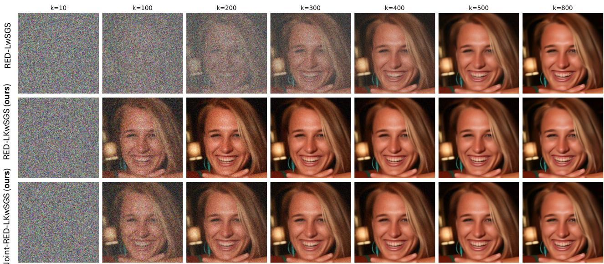
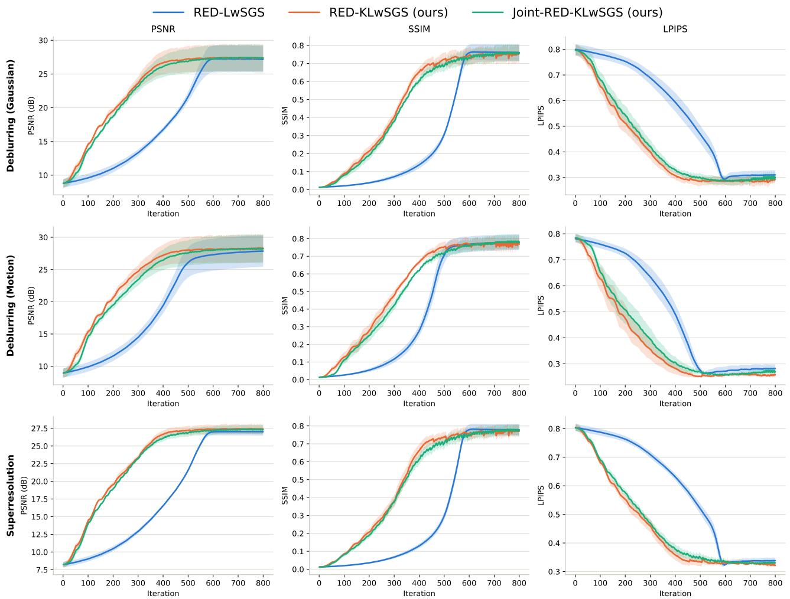
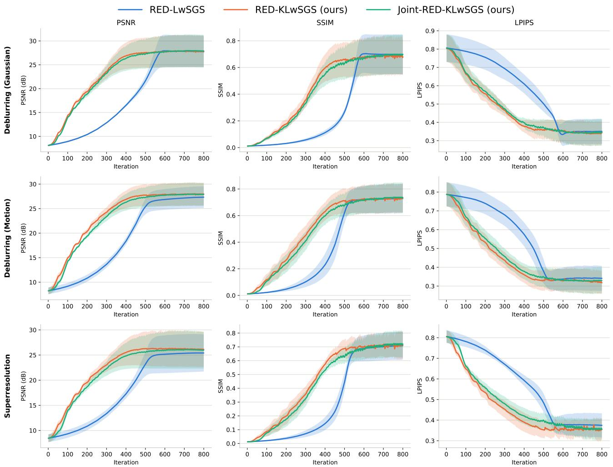
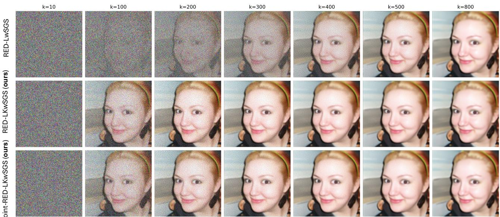
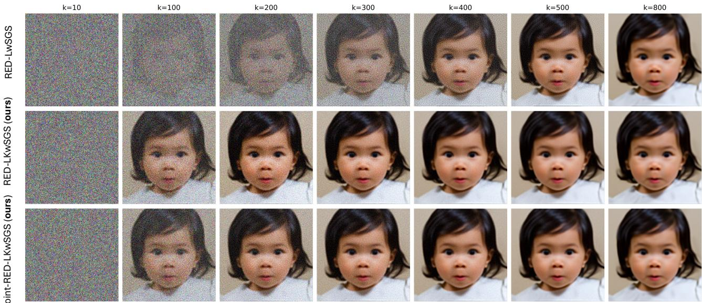
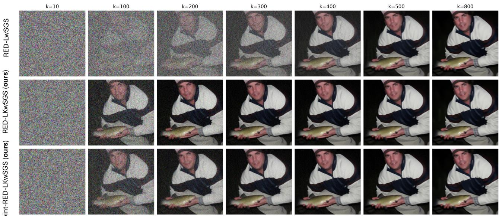
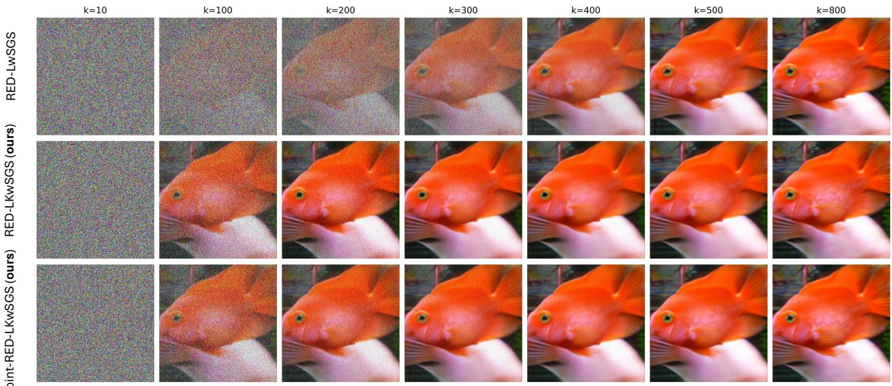
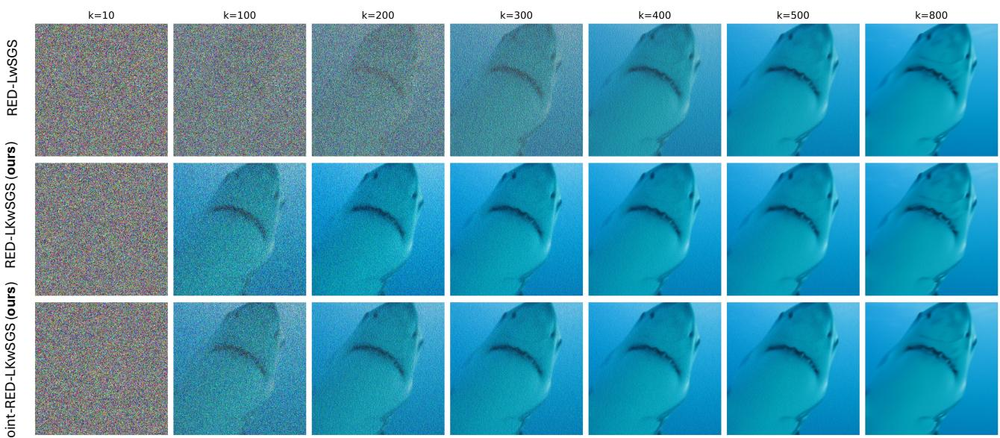

# Kinetic Langevin Meets Split Gibbs: Accelerated Posterior Sampling for Imaging Inverse Problems with Difusion Priors

Dai Hai Nguyen Hokkaido University

## Abstract

Split Gibbs sampling (SGS) is a popular framework for posterior sampling in Bayesian imaging inverse problems. It decouples a Gaussian data-fidelity term from a complex prior through an auxiliary variable, so the data variable is updated exactly and only the prior-side conditional is hard to sample. Existing samplers treat this conditional in one of two ways. Plug-and-play SGS runs a multi-step difusion denoiser at every iteration, which is expensive and lacks nonasymptotic guarantees. Langevin-within-SGS takes cheap overdamped Langevin steps but needs many iterations. We propose RED-KLwSGS, which keeps the exact Gaussian update for the data variable and updates the auxiliary variable with underdamped (kinetic) Langevin difusions driven by a oneshot denoising score, at the same per-iteration cost as Langevin-within-SGS. We prove nonasymptotic Wasserstein-2 convergence in continuous and discrete time for strongly logconcave priors. We also introduce Joint-RED-KLwSGS, which applies kinetic Langevin diffusions to both variables. Experiments with Denoising difusion probabilistic models as diffusion priors on FFHQ and ImageNet datasets show faster convergence and high-quality image reconstruction.

## 1 INTRODUCTION

Image Restoration (IR) is an inverse problem that aims to recover an unknown image $\mathbf { x } \in \mathbb { R } ^ { d }$ from a degraded observation $\mathbf { y } \in \mathbb { R } ^ { m }$ , related by the linear model $\mathbf { y } =$ $\mathbf { A x } + \mathbf { n }$ , where $\mathbf { A } \in \mathbb { R } ^ { m \times d }$ is a degradation operator and n is a Gaussian random vector with covariance matrix $\pmb { \Omega } ^ { - 1 }$ (Kaipio and Somersalo, 2005). We assume the noise covariance is diagonal, $\pmb { \Omega } ^ { - 1 } = \mathrm { d i a g } [ \sigma _ { 1 } ^ { 2 } , \dots , \sigma _ { m } ^ { 2 } ]$

Duc Dung Nguyen Institute of Information Technology, VAST

The likelihood is

$$
\begin{array} { l } { p ( \mathbf { y } | \mathbf { x } ) \propto \exp \left[ - f ( \mathbf { x } , \mathbf { y } ) \right] , } \\ { f ( \mathbf { x } , \mathbf { y } ) = \displaystyle \frac { 1 } { 2 } \left( \mathbf { A } \mathbf { x } - \mathbf { y } \right) ^ { \top } \Omega \left( \mathbf { A } \mathbf { x } - \mathbf { y } \right) , } \end{array}\tag{1}
$$

where $\boldsymbol { f } : \mathbb { R } ^ { d } \times \mathbb { R } ^ { m }  \mathbb { R }$ is the data-fidelity term. Since IR is generally ill-posed, a prior is placed on x,

$$
p ( \mathbf { x } ) \propto \exp \left[ - \beta g ( \mathbf { x } ) \right] ,\tag{2}
$$

where $g : \mathbb { R } ^ { d }  \mathbb { R }$ is a regularization potential, and $\beta > 0$ is a regularization weight. Combining (1) and (2) via Bayes’ rule gives the posterior

$$
\pi ( \mathbf { x } ) : = p ( \mathbf { x } | \mathbf { y } ) \propto \exp \left[ - f ( \mathbf { x } , \mathbf { y } ) - \beta g ( \mathbf { x } ) \right] .\tag{3}
$$

Much progress has concerned the choice of $g .$ Classical hand-designed regularizers, such as total variation (Rudin et al., 1992) or Sobolev penalties (Karl, 2005), encode simple structural assumptions and struggle to represent natural images. This motivated implicit, denoiser-driven priors. Plug-and-play (PnP) methods (Venkatakrishnan et al., 2013) use an of-the-shelf denoiser as a proxy for the proximal operator of g inside a splitting scheme such as ADMM (Afonso et al., 2010) or HQS (Geman and Yang, 1995). Regularization by denoising (RED) instead builds an explicit imageadaptive prior directly from a denoiser, and has been reported to outperform PnP in practice (Romano et al. 2017).

Estimating x from y can be done by computing the maximum-a-posterior (MAP) estimate via solving the corresponding minimization problem. While computationally eficient, the MAP estimate reduces the posterior p(x|y) to a single point and therefore cannot quantify the uncertainty. Markov chain Monte Carlo (MCMC) gives access to the full posterior (Brooks, 1998), but standard samplers are costly in imaging dimensions, especially when g is only implicitly defined through a denoiser as in PnP or RED (Faye et al., 2024). Mirroring the variable splitting strategies that have proven efective in optimization (e.g., ADMM, HQS), split Gibbs samplers (SGS) address this dificulty by introducing an auxiliary variable z and targeting an augmented distribution whose conditionals are individually easier to sample: one governed solely by the data-fidelity term f, typically Gaussian and available in closed form, and the other governed by the prior term g, which retains the flexibility to accommodate implicit, denoiser-based prior (Vono et al., 2019; Rendell et al., 2020).

A challenge for SGS when applied to PnP and RED is that sampling the prior-side conditional is not straightforward, because the potential g is defined through a denoiser or generative model. To address this, both PnP-SGS (Coeurdoux et al., 2024) and RED-LwSGS (Faye et al., 2024) use a pretrained deep generative model, namely a denoising difusion probabilistic model, as a stochastic denoiser. What difers is how each uses it. PnP-SGS draws the auxiliary variable z by producing a denoised sample of the noisy x, which requires running the reverse process through many intermediate timesteps. Thus, each Gibbs iteration cost many denoiser network evaluations. RED-LwSGS instead performs a Langevin Monte Carlo (LMC) step to update z, which requires only a coarse gradient direction. This costs exactly one network evaluation per iteration, so each step is far cheaper, but the resulting sampler needs many more Gibbs iterations to converge. Subsection 2.3 and Appendix A give details.

The LMC update discretizes the overdamped Langevin difusions, given by the first-order stochastic diferential equation (SDE) (Eberle, 2016; Durmus and Moulines, 2017), which has been widely used in statistics and machine learning to sample from complex distributions (Nguyen and Sakurai, 2024; Welling and Teh, 2011; Nguyen and Sakurai, 2023; Nguyen et al., 2023, 2025). An alternative is the class of underdamped or kinetic Langevin difusions (Cheng et al., 2018), which are the second-order SDEs and converge faster to the target distributions than their overdamped counterpart (Cheng et al., 2018; Nguyen et al., 2026; Wang and Li, 2022). In this work, we aim to develop eficient sampling methods for posterior (3) based on SGS and the kinetic Langevin difusions, exploiting their faster convergence. Our contributions are as follows:

• We introduce the Kinetic-Langevin-within-Split Gibbs sampler under RED (RED-KLwSGS), based on the variable-splitting technique of SGS: it keeps the exact Gaussian update for the data variable X and updates the auxiliary variable Z with kinetic Langevin difusions. We also introduce Joint-RED-KLwSGS, which applies kinetic Langevin difusions to both variables.

• We provide theoretical guarantees of RED-KLwSGS in both continuous time and its dis-

cretization.

• We apply the proposed methods to solve three IR tasks, namely Gaussian deblurring, motion deblurring, and super-resolution. Numerical experiments on FFHQ and ImageNet datasets show faster convergence and high-quality image reconstruction for the proposed methods.

## 2 RELATED WORK

In this section, we first present background on RED. We then introduce two split Gibbs samplers, PnP-SGS and RED-LwSGS, for sampling from the posterior (3).

## 2.1 Regularization-by-denoising (RED)

RED defines an explicit, image-adaptive Laplacianbased potential

$$
g _ { \mathrm { R E D } } ( \mathbf { x } ) = \frac { 1 } { 2 } \mathbf { x } ^ { \top } \left( \mathbf { x } - D _ { \nu } ( \mathbf { x } ) \right) ,\tag{4}
$$

where $D _ { \nu } : \mathbb { R } ^ { d }  \mathbb { R } ^ { d }$ is a denoiser with parameter ν controlling the denoising strength, designed to remove white Gaussian noise. Although RED ofers significant flexibility in the choice of denoisers, it requires the following conditions on $D _ { \nu } .$ , referred to as RED conditions:

(C1) Local homogeneity: $D _ { \nu } \left( ( 1 + \varepsilon ) { \bf x } \right) = ( 1 +$ $\varepsilon ) D _ { \nu } ( { \bf x } )$ , for small $\varepsilon > 0$

(C2) Diferentiability: $D _ { \nu }$ is diferentiable, with Jacobian $\nabla D _ { \nu }$

(C3) Jacobian symmetry: $\nabla D _ { \nu } ( \mathbf { x } ) ^ { \top } = \nabla D _ { \nu } ( \mathbf { x } )$

(C4) Strong passivity: The spectra radius of the Jacobian is at most 1, $\begin{array} { r l r l r } { \mathrm { i . e . , } \ } & { { } \eta \left( \nabla D _ { \nu } ( \mathbf { x } ) \right) } & { } & { \leq { } } & { 1 } \end{array}$ where $\begin{array} { r l } { \eta ( \mathbf { M } ) \quad } & { { } = } \end{array}$ max $\{ | \lambda | : \lambda$ is an eigenvalue of the matrix M}. Local homogeneity (C1) implies $D _ { \nu } ( { \bf x } ) = \nabla D _ { \nu } ( { \bf x } ) { \bf x }$ , and Jacobian symmetry (C3) gives $\nabla D _ { \nu } ( \mathbf { x } ) ^ { \top } \mathbf { x } = \nabla D _ { \nu } ( \mathbf { x } ) \mathbf { x } =$ $D _ { \nu } ( \mathbf { x } )$ (Romano et al., 2017). Therefore the gradient of gRED is the denoising residual,

$$
\begin{array} { r l } & { \nabla g _ { \mathrm { R E D } } ( \mathbf { x } ) = \mathbf { x } - D _ { \nu } ( \mathbf { x } ) , } \\ & { \nabla ^ { 2 } g _ { \mathrm { R E D } } ( \mathbf { x } ) = \mathbf { I } _ { d } - \nabla D _ { \nu } ( \mathbf { x } ) . } \end{array}\tag{5}
$$

Because $\nabla D _ { \nu } ( \mathbf { x } )$ is symmetric (C3) with spectral radius at most 1 (C4), its eigenvalues lie in $[ - 1 , 1 ]$ . Two consequences follow: first, $\| D _ { \nu } ( \mathbf { x } ) \| _ { 2 } = \| \bar { \nabla } D _ { \nu } ( \bar { \mathbf { x } } ) \mathbf { x } \| _ { 2 } \leq$ $\| \mathbf { x } \| _ { 2 } ,$ , where the equality uses (C1) and the inequality uses (C3)-(C4); second, the eigenvalues of $\nabla ^ { 2 } g _ { \mathrm { R E D } }$ lie in [0, 2], so gRED is convex and $\| \nabla ^ { 2 } g _ { \mathrm { R E D } } \| _ { \mathrm { o p } } \leq 2 .$ where $\| \cdot \| _ { \mathrm { o p } }$ is the operator norm.

The gradient identity (5) is the key property of RED: the gradient of the prior is obtained from a single denoiser evaluation, without diferentiating the denoiser.

This allows powerful denoisers, such as those based on deep neural networks (Ho et al., 2020; Kingma et al., 2021; Zhang et al., 2021), to be embedded in the prior. Building on this, one defines a prior distribution from the RED potential (Faye et al., 2024)

$$
p _ { \mathrm { R E D } } ( \mathbf { x } ) \propto \exp \left[ - \frac { \beta } { 2 } \mathbf { x } ^ { \top } \left( \mathbf { x } - D _ { \nu } ( \mathbf { x } ) \right) \right] .\tag{6}
$$

Combining the likelihood with the RED prior gives the RED posterior

$$
p _ { \mathrm { R E D } } ( \mathbf { x } | \mathbf { y } ) \propto \exp \left[ - f ( \mathbf { x } , \mathbf { y } ) - \beta g _ { \mathrm { R E D } } ( \mathbf { x } ) \right] .\tag{7}
$$

## 2.2 Split Gibbs Sampling (SGS)

Sampling eficiently from the posterior $p ( \mathbf { x } | \mathbf { y } )$ is not straightforward because its potential involves the denoiser $D _ { \nu }$ . Inspired by optimization, asymptotically exact data augmentation (AXDA) (Vono et al., 2020) uses variable splitting: it introduces an auxiliary variable $\mathbf { z } \in \mathbb { R } ^ { d }$ , and targets the augmented distribution

$$
\begin{array} { l } { \displaystyle \pi _ { \rho } ( \mathbf { x } , \mathbf { z } ) = p ( \mathbf { x } , \mathbf { z } | \mathbf { y } ; \rho ^ { 2 } ) } \\ { \displaystyle \propto \exp \left[ - f ( \mathbf { x } , \mathbf { y } ) - \beta g ( \mathbf { z } ) - \frac { 1 } { 2 \rho ^ { 2 } } \| \mathbf { x } - \mathbf { z } \| _ { 2 } ^ { 2 } \right] , } \end{array}\tag{8}
$$

where the positive parameter $\rho$ controls the coupling between x and z. As shown in Vono et al. (2020), for a large class of coupling kernels including the quadratic one, the x-marginal of $\pi _ { \rho }$ converges to the posterior π as $\rho ^ { 2 } \to 0$ . Instead of sampling π directly, SGS (Vono et al., 2019) samples the augmented distribution $\pi _ { \rho }$ by Gibbs steps. The two conditionals are

$$
p ( \mathbf x | \mathbf z ; \mathbf y , \rho ^ { 2 } ) \propto \exp \left[ - f ( \mathbf x , \mathbf z ) - \frac { 1 } { 2 \rho ^ { 2 } } \| \mathbf x - \mathbf z \| _ { 2 } ^ { 2 } \right] ,\tag{9}
$$

$$
p ( \mathbf { z } | \mathbf { x } ; \rho ^ { 2 } ) \propto \exp \left[ - \beta g ( \mathbf { z } ) - \frac { 1 } { 2 \rho ^ { 2 } } \| \mathbf { x } - \mathbf { z } \| _ { 2 } ^ { 2 } \right] .\tag{10}
$$

SGS alternatively samples from (9) and (10), which generates samples asymptotically distributed according to (8). Sampling from these conditionals decouples the likelihood potential $f ( \cdot , \mathbf { y } )$ from the prior potential $g ( \cdot )$ . As a consequence, SGS inherits advantages of its deterministic counterparts (i.e., HQS and ADMM), such as simpler implementations, faster convergences and the possibility of distributed computation.

## 2.3 PnP-SGS and RED-LwSGS

Sampling from the x-conditional (9) is equivalent to sampling the posterior of the original problem with the same likelihood $f ( \cdot , \mathbf { y } )$ , but with an isotropic Gaussian prior $\mathcal { N } ( \mathbf { z } , \rho ^ { 2 } \mathbf { I } _ { d } )$ in place of $p ( \mathbf { x } )$ . This is much easier than sampling π directly. For the quadratic potential $f ( \mathbf { x } , \mathbf { y } ) = 1 / 2 \left( \mathbf { A x } - \mathbf { y } \right) ^ { \top } \Omega \left( \mathbf { A x } - \mathbf { y } \right)$ , which covers a large family of imaging inverse problems, such as deblurring and super-resolution, this conditional is

$$
p ( \mathbf x | \mathbf z ; \mathbf y , \rho ^ { 2 } ) = \mathcal N ( \mathbf x ; M ( \mathbf z ) , \mathbf Q ^ { - 1 } ) ,\tag{11}
$$

with precision matrix and mean

$$
\begin{array} { c } { \mathbf { Q } = \mathbf { A } ^ { \top } \boldsymbol \Omega \mathbf { A } + \rho ^ { - 2 } \mathbf { I } _ { d } , } \\ { \mathbf { M } ( \mathbf { z } ) = \mathbf { Q } ^ { - 1 } \left( \mathbf { A } ^ { \top } \boldsymbol \Omega \mathbf { y } + \rho ^ { - 2 } \mathbf { z } \right) . } \end{array}\tag{12}
$$

The two methods below difer only in how they handle the remaining prior-side conditional (10).

Plug-and-Play SGS (PnP-SGS). Sampling the prior-side conditional (10) is not straightforward because the potential g is defined through a denoiser or generative model. Coeurdoux et al. (2024) observe that (10) is a posterior of a Bayesian denoising problem: recovering z from the noisy observation $\mathbf { x } = \mathbf { z } + \rho \mathbf { n }$ , with n $\sim \mathcal { N } ( \mathbf { 0 } , \mathbf { I } _ { d } )$ , under the prior $e ^ { - \beta g }$ . They therefore do not sample (10) directly, but use a pretrained deep generative model, a denoising difusion probabilistic model (DDPM) (Ho et al., 2020; Kingma et al., 2021), as a stochastic denoiser. Each z-update starts the model’s reverse difusion at the timestep matching the noise level $\rho$ and returns a sample of the denoising posterior.

Langevin-within-SGS under RED (RED-LwSGS). The second approach takes $g \ =$ gRED. When the denoiser satisfies (C1)-(C4), (5) gives

$$
\nabla p ( { \mathbf z } | { \mathbf x } ; \rho ^ { 2 } ) = - \beta ( { \mathbf z } - D _ { \nu } ( { \mathbf z } ) ) - \frac { 1 } { \rho ^ { 2 } } ( { \mathbf z } - { \mathbf x } ) ,
$$

so the score of (10) needs one denoiser evaluation and no diferentiation of the denoiser. Faye et al. (2024) exploit this by replacing the exact draw from (10) with one unadjusted Langevin Monte Carlo (LMC) step:

$$
\mathbf { Z } ^ { ( k + 1 ) } = \mathbf { Z } ^ { ( k ) } + h \nabla \log p ( \mathbf { Z } ^ { ( k ) } | \mathbf { X } ^ { ( k ) } ; \rho ^ { 2 } ) + \sqrt { 2 h } \mathbf { N } ^ { ( k ) } ,\tag{13}
$$

where $h \ > \ 0$ is a fixed step size, $\{ \mathbf { N } ^ { ( k ) } \} _ { k \in \mathbb { N } }$ are i.i.d. standard Gaussian vectors in $\mathbb { R } ^ { d }$ , and $\bar { \mathbf { X } } ^ { ( k ) } \sim$ $p ( \mathbf { x } | \mathbf { Z } ^ { ( k ) } ; \mathbf { y } , \rho ^ { 2 } )$ is a sample from (9) given $\mathbf { Z } ^ { ( k ) }$ . Substituting the score gives

$$
\begin{array} { l } { { \displaystyle { \bf Z } ^ { ( k + 1 ) } = \left( 1 - h \beta - \frac { h } { \rho ^ { 2 } } \right) { \bf Z } ^ { ( k ) } + \frac { h } { \rho ^ { 2 } } { \bf X } ^ { ( k ) } } } \\ { { \displaystyle ~ + h \beta D _ { \nu } ( { \bf Z } ^ { ( k ) } ) + \sqrt { 2 h } { \bf N } ^ { ( k ) } . } } \end{array}\tag{14}
$$

PnP-SGS versus RED-LwSGS. Both methods use the same pretrained difusion network. What difers is how each uses it. PnP-SGS draws z from (10) by producing a denoised sample of the noisy x. Difusion models are trained to remove only small increments of noise reliably, so a high-fidelity sample at a given noise level requires running the reverse process through many intermediate timesteps. Each Gibbs iteration therefore costs many network evaluations. RED-LwSGS instead computes only a coarse gradient direction for z, obtained from a single one-shot estimate of the clean image by Tweedie’s formula (Efron, 2011). This costs exactly one network evaluation per iteration, so each step is far cheaper, but the resulting sampler needs many more Gibbs iteration to converge.

We illustrate this trade-of on motion deblurring of a randomly selected FFHQ image (Karras et al., 2019). The observation y is generated by applying a motionblur kernel to the clean image x (see Section 4 for details). We measure the wall-clock time per iteration and the number of iterations each method needs to reach a fixed target PSNR of 26.5 dB against the ground truth. Table 1 below reports the results. The periteration cost of RED-LwSGS (0.087) is about 24 times lower than that of PnP-SGS (2.121 s), but RED-LwSGS needs far more iterations (600 versus 22). The two efects roughly cancel in total time (46.64 s versus 52.2 s), so neither method is clearly faster overall. This motivates our proposed RED-KLwSGS, which keeps the low per-iteration cost of RED-LwSGS (0.091 s) while needing far fewer iterations (350) to reach the similar target, and therefore less total time (31.5 s).

Table 1: Time per iteration, iterations, and total time to reach $\mathrm { P S N R } = 2 6 . 5 \mathrm { d B }$ on an FFHQ image for motion deblurring task.
<table><tr><td>Method</td><td>Time/iter (s)</td><td>Iterations</td><td>Total time (s)</td></tr><tr><td>PnP-SGS</td><td>2.121</td><td>22</td><td>46.64</td></tr><tr><td>RED-LwSGS</td><td>0.087</td><td>600</td><td>52.2</td></tr><tr><td>RED-KLwSGS (ours)</td><td>0.091</td><td>350</td><td>31.5</td></tr></table>

## 3 PROPOSED METHODS

## 3.1 RED-KLwSGS: Kinetic Lavengin-within-Split Gibbs under RED

The LMC update in (14) is a discretization of the overdamped) Langevin difusions for the auxiliary variable Z, coupled to the exact Gaussian draw of X, given by

$$
\begin{array} { r l } & { d \mathbf { Z } _ { t } = \nabla \log p ( \mathbf { Z } _ { t } | \mathbf { X } _ { t } ; \boldsymbol { \rho } ^ { 2 } ) + \sqrt { 2 } d \mathbf { B } _ { t } , } \\ & { ~ \mathbf { X } _ { t } = M ( \mathbf { Z } _ { t } ) + \mathbf { Q } ^ { - \frac { 1 } { 2 } } \boldsymbol { \epsilon } _ { t } , } \end{array}\tag{15}
$$

where $( \mathbf { B } _ { t } ) _ { t \geq 0 }$ is a Brownian motion, and $( \epsilon _ { t } ) _ { t \geq 0 }$ are standard Gaussian noises. This is an extension of the classical overdamped Langevin difusions (Eberle, 2016; Durmus and Moulines, 2017) to coupled variables. An alternative to the overdamped Langevin difusions is the class of kinetic, or underdamped Langevin difusions (Cheng et al., 2018). These are second-order SDEs over position and momentum variables. In log-concave settings, they are known to converge faster than their overdamped counterparts (Cheng et al., 2018; Nguyen et al., 2026; Wang and Li, 2022). We apply this to the prior-side conditional (10), keeping the exact update for x. The resulting RED-KLwSGS difusion is

$$
\begin{array} { r l r } & { d \mathbf { Z } _ { t } = \mathbf { V } _ { t } d t , \mathbf { X } _ { t } = M ( \mathbf { Z } _ { t } ) + \mathbf { Q } ^ { - \frac { 1 } { 2 } } \boldsymbol { \epsilon } _ { t } , } & \\ & { d \mathbf { V } _ { t } = - \gamma \mathbf { V } _ { t } d t + u \nabla \log p ( \mathbf { Z } _ { t } | \mathbf { X } _ { t } ; \rho ^ { 2 } ) d t + \sqrt { 2 \gamma u } d \mathbf { B } _ { t } , } & \\ & { } & { ( 1 6 ) } \end{array}\tag{16}
$$

where $\gamma > 0$ is the friction coeficient and $u > 0$ scales the gradient, acting as an inverse mass. The stationary distribution of (16) is $\begin{array} { r } { \varPi _ { \rho } : = \pi _ { \rho } \otimes \mathcal { N } ( \mathbf { 0 } , \boldsymbol { u } \mathbf { I } _ { d } ) } \end{array}$ . We discretize (16) with step size h, giving the following RED-KLwSGS sampler

$$
\begin{array} { r l } & { { \mathbf { V } } ^ { ( k + 1 ) } = ( 1 - h \gamma ) { \mathbf { V } } ^ { ( k ) } } \\ & { + h u \nabla \log p ( { \mathbf { Z } } ^ { ( k ) } | { \mathbf { X } } ^ { ( k ) } ; \rho ^ { 2 } ) + \sqrt { 2 \gamma h u } { \mathbf { N } } ^ { ( k ) } , } \\ & { { \mathbf { Z } } ^ { ( k + 1 ) } = { \mathbf { Z } } ^ { ( k ) } + h { \mathbf { V } } ^ { ( k + 1 ) } , } \\ & { { \mathbf { X } } ^ { ( k + 1 ) } = M ( { \mathbf { Z } } ^ { ( k + 1 ) } ) + { \mathbf { Q } } ^ { - \frac { 1 } { 2 } } \boldsymbol { \epsilon } ^ { ( k ) } , } \end{array}\tag{17}
$$

where $( \mathbf { N } ^ { ( k ) } ) _ { k \in \mathbb { N } }$ and $( \epsilon ^ { ( k ) } ) _ { k \in \mathbb { N } }$ are independent sequences of standard Gaussian vectors. Using the score from (10) and the property (5), (17) reads explicitly as

$$
\begin{array} { l } { { { \displaystyle { \bf V } ^ { ( k + 1 ) } = ( 1 - h \gamma ) { \bf V } ^ { ( k ) } - h u \left( \beta + \frac { 1 } { \rho ^ { 2 } } \right) { \bf Z } ^ { ( k ) } } } \ ~ } \\ { { \displaystyle ~ + \frac { h u } { \rho ^ { 2 } } { \bf X } ^ { ( k ) } + h u \beta D _ { \nu } ( { \bf Z } ^ { ( k ) } ) + \sqrt { 2 \gamma h u } { \bf N } ^ { ( k ) } } , \ ~ } \\ { { \displaystyle { \bf Z } ^ { ( k + 1 ) } = { \bf Z } ^ { ( k ) } + h { \bf V } ^ { ( k + 1 ) } } , \ ~ } \\ { { \displaystyle { \bf X } ^ { ( k + 1 ) } = M ( { \bf Z } ^ { ( k + 1 ) } ) + { \bf Q } ^ { - \frac { 1 } { 2 } } \epsilon ^ { ( k ) } } , \ ~ } \end{array}\tag{18}
$$

Cost per iteration. An iteration of (18) needs one denoiser evaluation, $D _ { \nu } ( \mathbf { Z } ^ { ( k ) } )$ , and one exact Gaussian draw for X, both identical to RED-LwSGS, so the cost per iteration is unchanged. The only new state is the velocity V, which cost $\mathcal O ( d )$ memory and arithmetic.

## 3.2 Theoretical analysis

This subsection provides theoretical guarantees for RED-KLwSGS. The analysis holds for any potential g satisfying the two assumptions below. We then show that gRED satisfies them, with explicit constants, under the conditions (C1)-(C4) and a contractive denoiser.

Assumption 3.1 (Smoothness). The potential g is twice diferentiable and there is ${ { M } _ { g } } \mathrm { ~ > ~ 0 ~ }$ such that $\forall \mathbf { z } \in \mathbb { R } ^ { d } , \| \nabla ^ { 2 } g ( \mathbf { z } ) \| _ { \mathrm { o p } } \leq M _ { g }$

Under the RED conditions (C1) and (C3), the gradient of $g _ { \mathrm { R E D } }$ is given by (5). This implies that gRED is twice continuously diferentiable with Hessian matrix $\nabla ^ { 2 } g _ { \mathrm { R E D } } ( \mathbf { z } ) = \mathbf { I } _ { d } - \nabla D _ { \nu } ( \mathbf { z } )$ . Furthermore, thanks to conditions (C3) and (C4), $\| \nabla ^ { 2 } g ( \mathbf { z } ) \| _ { \mathrm { o p } } \leq 2$

Assumption 3.2 (Strong convexity). The potential $g ( \cdot )$ is $m _ { g }$ -strongly convex, i.e., ∀z $\in \mathbb { R } ^ { d } , \ m _ { g } \mathbf { I } _ { d } \ \preceq$ $\nabla ^ { 2 } g ( \mathbf { z } )$

In the RED framework, a suficient condition for the strong convexity of gRED is that the denoiser $D _ { \nu }$ is contractive, i.e., $\forall \mathbf { z } _ { 1 } , \mathbf { z } _ { 2 } \in \mathbb { R } ^ { d } , \| D _ { \nu } ( \mathbf { z } _ { 1 } ) - D _ { \nu } ( \mathbf { z } _ { 2 } ) \| \leq \epsilon \| \mathbf { z } _ { 1 } -$ $\mathbf { z } _ { 2 } \big | \big |$ , for some Lipschitz constant $\epsilon < 1$ . This can be enforced by explicitly including Lipschitz-constraining regularization term in the denoiser’s training loss (Faye et al., 2024). Under this constraint, gRED is $m _ { g ^ { - } }$ strongly convex with $m _ { g } = 1 - \epsilon > 0$

## 3.2.1 Convergence of the continuous-time process

We first consider the continuous-time RED-KLwSGS difusion, given by the SDE (16), with an initial condition $( { \bf X } _ { 0 } , { \bf Z } _ { 0 } , { \bf V } _ { 0 } ) \sim \mu _ { 0 }$ for some distribution $\mu _ { 0 }$ on $\mathbb { R } ^ { 3 d }$ . Let $\mu _ { t }$ denote the law of $\left( \mathbf { X } _ { t } , \mathbf { Z } _ { t } , \mathbf { V } _ { t } \right)$ and let $\Phi _ { t }$ denote the operator mapping $\mu _ { 0 }$ to $\mu _ { t } , { \mathrm { i . e . , ~ } } \Phi _ { t } \mu _ { 0 } = \mu _ { t }$ We establish the contraction of (16) as follows.

Theorem 3.3. Let $\mu _ { 0 }$ and $\widetilde { \mu } _ { 0 }$ be arbitrary distributions on $\mathbb { R } ^ { 3 d }$ , with $( { \dot { \bf X } } _ { 0 } , { \bf Z } _ { 0 } , { \dot { \bf V } } _ { 0 } ) \sim \mu _ { 0 } , ( { \widetilde { \bf X } } _ { 0 } , { \widetilde { \bf Z } } _ { 0 } , { \widetilde { \bf V } } _ { 0 } ) \sim$ ${ \widetilde { \mu } } _ { 0 } .$ . Let $\mu _ { t } = \Phi _ { t } \mu _ { 0 } , \widetilde { \mu } _ { t } = \Phi _ { t } \widetilde { \mu } _ { 0 }$ denote the laws of $( { \mathbf { X } } _ { t } , { \mathbf { Z } } _ { t } , { \mathbf { V } } _ { t } ) , \ ( \widetilde { { \mathbf { X } } } _ { t } , \widetilde { { \mathbf { Z } } } _ { t } , \widetilde { { \mathbf { V } } } _ { t } )$ , which evolve according to the SDE (16), with the respective initial conditions $( \mathbf { X } _ { 0 } , \mathbf { Z } _ { 0 } , \mathbf { V } _ { 0 } ) , \ ( \widetilde { \mathbf { X } } _ { 0 } , \widetilde { \mathbf { Z } } _ { 0 } , \widetilde { \mathbf { V } } _ { 0 } )$ . Set $u = ( \beta M _ { g } + \rho ^ { - 2 } ) ^ { - 1 }$ and $\gamma = 2$ . Then for every $t \geq 0$

$$
\mathcal { W } _ { 2 } ^ { 2 } \left( \mu _ { t } , \widetilde { \mu } _ { t } \right) \le C e ^ { - \frac { t } { \kappa } } \mathcal { W } _ { 2 } ^ { 2 } \left( \mu _ { 0 } , \widetilde { \mu } _ { 0 } \right) ,\tag{19}
$$

where $\displaystyle { C = \zeta \left( 1 + \rho ^ { - 4 } \| \mathbf { Q } ^ { - 1 } \| _ { \mathrm { o p } } ^ { 2 } \right) }$ and $\kappa ~ = ~ ( \beta M _ { g } ~ + ~$ $\rho ^ { - 2 } ) / ( \beta m _ { g } ) > 1$

The proof of Theorem 3.3 is given in Appendix B. This directly yields exponential convergence to the stationary distribution $\Pi _ { \rho }$

Corollary 3.4. For any distribution $\mu$ on $\mathbb { R } ^ { 3 d }$

$$
\mathcal { W } _ { 2 } ^ { 2 } \left( \Phi _ { t } \mu , \varPi _ { \rho } \right) \leq C e ^ { - \frac { t } { \kappa } } \mathcal { W } _ { 2 } ^ { 2 } \left( \mu , \varPi _ { \rho } \right) .\tag{20}
$$

## 3.2.2 Convergence of the discrete-time process

We next consider the discrete-time RED-KLwSGS update (17). Let $\mu ^ { ( k ) }$ denote the law of $( \mathbf { X } ^ { ( k ) } , \mathbf { Z } ^ { ( k ) } , \mathbf { V } ^ { ( k ) } )$ ), and $\bar { \Phi } _ { h }$ the operator mapping $\mu ^ { ( k ) }$ to $\mu ^ { ( k + 1 ) }$ . We establish the contraction of (17) as follows.

Theorem 3.5. Let $\mu ^ { ( 0 ) }$ and $\widetilde { \mu } ^ { \left( 0 \right) }$ be arbitrary distributions on $\mathbb { R } ^ { 3 d } .$ , with $( { \bf X } ^ { ( 0 ) } , { \bf Z } ^ { ( 0 ) } , { \bf V } ^ { ( 0 ) } ) ~ \sim ~ \mu ^ { ( 0 ) }$ $( \widetilde { \mathbf { X } } ^ { ( 0 ) } , \widetilde { \mathbf { Z } } ^ { ( 0 ) } , \widetilde { \mathbf { V } } ^ { ( 0 ) } ) \quad \sim \quad \widetilde { \mu } ^ { ( 0 ) }$ Let $\begin{array} { r l r } { \mu ^ { ( k + 1 ) } } & { { } = } & { } \end{array}$ $\begin{array} { c c c c } { { \bar { \Phi } _ { h } \mu ^ { ( \bar { k } ) } , } } & { { \widetilde { \mu } ^ { ( k + 1 ) ^ { \prime } } } } & { { = } } & { { \bar { \Phi } _ { h } \overset { . } { \mu } { } ^ { ( k ) } } } \end{array}$ denote the laws of $( \mathbf { X } ^ { ( k + 1 ) } , \mathbf { Z } ^ { ( k + 1 ) } , \mathbf { V } ^ { ( k + 1 ) } )$ $( \widetilde { \mathbf { X } } ^ { ( k + 1 ) } , \widetilde { \mathbf { Z } } ^ { ( k + 1 ) } , \widetilde { \mathbf { V } } ^ { ( k + 1 ) } )$ ), given by the update (17). Set $\dot { u } = ( \beta M _ { g } + \rho ^ { - 2 } ) ^ { - 1 }$ and $\gamma = 2$ . Then for $h \in ( 0 , 1 / 2 ]$ and any $k \in \mathbb N ,$

$$
\begin{array} { l } { { \displaystyle \mathcal W _ { 2 } ^ { 2 } \left( \mu ^ { ( k ) } , \widetilde { \mu } ^ { ( k ) } \right) = \mathcal W _ { 2 } ^ { 2 } \left( \bar { \Phi } _ { h } ^ { k } \mu ^ { ( 0 ) } , \bar { \Phi } _ { h } ^ { k } \widetilde { \mu } ^ { ( 0 ) } \right) } } \\ { { \displaystyle \qquad \leq C \left( 1 - \frac { h } { \kappa } + \frac { h ^ { 2 } } { \kappa ^ { 2 } } \right) ^ { k } \mathcal W _ { 2 } ^ { 2 } \left( \mu ^ { ( 0 ) } , \widetilde { \mu } ^ { ( 0 ) } \right) . } } \end{array}\tag{21}
$$

The proof of Theorem 3.5 is given in Appendix C. This directly yields convergence to the discrete-time stationary distribution.

Corollary 3.6. The map $\bar { \Phi } _ { h }$ has a unique stationary law $\Pi _ { \rho h }$ , and $f o r$ any µ on $\mathbb { R } ^ { 3 d }$

$$
\mathcal { W } _ { 2 } ^ { 2 } \left( \bar { \Phi } _ { h } ^ { k } \mu , \varPi _ { \rho h } \right) \leq C \left( 1 - \frac { h } { \kappa } + \frac { h ^ { 2 } } { \kappa ^ { 2 } } \right) ^ { k } \mathcal { W } _ { 2 } ^ { 2 } \left( \mu , \varPi _ { \rho h } \right) .\tag{22}
$$

## 3.2.3 Discretization bias and algorithmic convergence

Having established convergence of the discrete-time process, we analyze the bias between $\Pi _ { \rho }$ and $\Pi _ { \rho h }$

Lemma 3.7. Set $u = ( \beta M _ { g } + \rho ^ { - 2 } ) ^ { - 1 }$ and $\gamma = 2$ . For $h \in ( 0 , 1 / 2 ]$ , there is a constant $C _ { \mathrm { b i a s . } }$ , independent of h, such that $\mathcal { W } _ { 2 } ^ { 2 } ( \pi _ { \rho } , \pi _ { \rho h } ) \leq C _ { \mathrm { b i a s } } h$

The proof of Lemma 3.7 is given in Appendix D. Based on this lemma, we establish the convergence of RED-KLwSGS algorithm as follows.

Theorem 3.8. Let $\mu$ be an arbitrary distribution on $\mathbb { R } ^ { 3 d }$ and $\delta > 0$ . Choose

$$
h \leq \operatorname* { m i n } \left\{ \frac { 1 } { 2 } , \frac { \delta ^ { 2 } } { 4 C _ { \mathrm { b i a s } } } \right\} ,
$$

and

$$
k \geq \frac { 2 \ln ( 2 \sqrt { C } ( \mathcal { W } _ { 2 } ( \mu , { \cal I } _ { \rho } ) + \delta / 2 ) / \delta ) } { \ln \left( 1 / \left( 1 - \frac { h } { \kappa } + \frac { h ^ { 2 } } { \kappa ^ { 2 } } \right) \right) } .
$$

Then ${ \mathcal W } _ { 2 } ( \bar { \pmb { \phi } } _ { h } ^ { k } \mu , \varPi _ { \rho } ) \leq \delta$

The proof of Theorem 3.8 is given in Appendix E

## 3.3 Joint-RED-KLwSGS: applying kinetic Langevin difusions to both variables

The exact Gaussian draw in (12) is available whenever $f ( \mathbf { x } , \mathbf { y } )$ is quadratic in x. This covers a broad class of imaging problems, but it excludes settings with non-Gaussian noise $( \mathrm { e . g . }$ , Poisson noise in low-light imaging), a nonlinear forward operator (e.g., phase retrieval), or a linear operator A with no exploitable structure, in which case inverting $\mathbf { Q } ^ { - 1 }$ costs $\mathcal { O } ( d ^ { 3 } )$ time and storing it costs $\mathcal { O } ( d ^ { 2 } )$ memory. We therefore also propose a variant, named Joint-RED-KLwSGS, which applies momentum to both variables. Let $F ( \mathbf { x } , \mathbf { z } ) = f ( \mathbf { x } , \mathbf { y } ) +$ $\beta g ( \mathbf { z } ) + \| \mathbf { x } - \mathbf { z } \| _ { 2 } ^ { 2 } / ( 2 \rho ^ { 2 } )$ be the joint potential of $\pi _ { \rho }$ Joint-RED-KLwSGS runs kinetic Langevin difusions on the full state (X, Z), with momenta (U, V)

Gaussian deblurring (FFHQ): convergence of $\mathbf { X } ^ { \left( \mathrm { k } \right) }$ over Gibbs iterations  
  
Figure 1: Visual convergence of $\mathbf { X } ^ { ( k ) }$ on Gaussian deblurring of an FFHQ image, over 800 Gibbs iterations. Rows show RED-LwSGS, RED-KLwSGS (ours), and Joint-RED-KLwSGS (ours), each started from the same initialization; columns show iterations k = 10, 100, 200, 300, 400, 500, 800.

$$
\begin{array} { r l } & { d \mathbf { X } _ { t } = \mathbf { U } _ { t } d t , } \\ & { d \mathbf { U } _ { t } = - \gamma \mathbf { U } _ { t } d t - u \nabla _ { \mathbf { X } } F ( \mathbf { X } _ { t } , \mathbf { Z } _ { t } ) + \sqrt { 2 \gamma u } d \mathbf { B } _ { t } ^ { x } , } \\ & { d \mathbf { Z } _ { t } = \mathbf { V } _ { t } d t , } \\ & { d \mathbf { V } _ { t } = - \gamma \mathbf { V } _ { t } d t - u \nabla _ { \mathbf { Z } } F ( \mathbf { X } _ { t } , \mathbf { Z } _ { t } ) + \sqrt { 2 \gamma u } d \mathbf { B } _ { t } ^ { z } , } \end{array}\tag{23}
$$

where $\nabla _ { \mathbf { X } } F ( \mathbf { x } , \mathbf { z } ) ~ = ~ \nabla _ { \mathbf { X } } f ( \mathbf { x } , \mathbf { y } ) + \rho ^ { - 2 } ( \mathbf { x } - \mathbf { z } )$ , and $\nabla _ { \mathbf { Z } } F ( \mathbf { x } , \mathbf { z } ) = \beta ( \mathbf { z } - D _ { \nu } ( \mathbf { z } ) ) + \rho ^ { - 2 } ( \mathbf { z } - \mathbf { x } )$ . Discretizing (23) with step size h gives the Joint-RED-KLwSGS sampler

$$
\begin{array} { r l } & { \mathbf { U } ^ { ( k + 1 ) } = ( 1 - h \gamma ) \mathbf { U } ^ { ( k ) } - h u \nabla _ { \mathbf { X } } F ( \mathbf { X } ^ { ( k ) } , \mathbf { Z } ^ { ( k ) } ) } \\ & { \qquad + \sqrt { 2 \gamma h u } \mathbf { N } _ { x } ^ { ( k ) } , } \\ & { \mathbf { X } ^ { ( k + 1 ) } = \mathbf { X } ^ { ( k ) } + h \mathbf { U } ^ { ( k + 1 ) } , } \\ & { \mathbf { V } ^ { ( k + 1 ) } = ( 1 - h \gamma ) \mathbf { V } ^ { ( k ) } - h u \nabla _ { \mathbf { Z } } F ( \mathbf { X } ^ { ( k ) } , \mathbf { Z } ^ { ( k ) } ) } \\ & { \qquad + \sqrt { 2 \gamma h u } \mathbf { N } _ { z } ^ { ( k ) } , } \\ & { \mathbf { Z } ^ { ( k + 1 ) } = \mathbf { Z } ^ { ( k ) } + h \mathbf { V } ^ { ( k + 1 ) } , } \end{array}
$$

where $( \mathbf { N } _ { x } ^ { ( k ) } ) _ { k \in \mathbb { N } }$ and $( \mathbf { N } _ { z } ^ { ( k ) } ) _ { k \in \mathbb { N } }$ are independent sequences of standard Gaussian vectors. We assess this variant empirically in Section 4, and its theoretical guarantees are left to future work.

## 4 NUMERICAL EXPERIMENTS

## 4.1 Experimental setup

We conduct experiments on two datasets, each consisting of $2 5 6 \times 2 5 6$ RGB images $( d = 3 \times 2 5 6 ^ { 2 } )$ : FFHQ (Karras et al., 2019) and ImageNet (Deng et al., 2009). All images are normalized to [0, 1]. Pretrained difusion models are taken from (Dhariwal and Nichol, 2021; Choi et al., 2021) and used without fine-tuning. We use three image inversion tasks to evaluate the performance of compared methods, which share the same forward model $\mathbf { y } = \mathbf { A } ( \mathbf { x } ) + \mathbf { n }$ with A designed as follows. Gaussian deblurring: $\mathbf { A } ( \mathbf { x } ) = { \mathcal { K } } _ { G }$ ∗ x, convolution with an isotropic Gaussian kernel of size $6 1 \times 6 1$ and standard deviation $\sigma _ { k } = 3 . 0 ,$ under circular boundary conditions. Motion deblurring: $\mathbf { A } ( \mathbf { x } ) = { \cal K } _ { M } * \mathbf { x }$ , convolution with a $6 1 \times 6 1$ motion kernel of size 61 × 61 generated from a random walk $\theta _ { t } = \theta _ { t - 1 } + \epsilon _ { t } , \epsilon _ { t } \sim \mathcal { N } ( 0 , \alpha ^ { 2 } )$ , with intensity $\alpha = 0 . 5$ , rasterized into an anisotropic, nonsymmetric kernel and applied under circular boundary conditions. Super-resolution: $\mathbf { A } = \mathbf { T B }$ , where T is a Gaussian blur with $9 \times 9$ kernel and standard deviation 1.5, and T performs non-overlapping box downsampling by a factor of 4 in both spatial dimensions, taking a 256×256 blurred image to $6 4 \times 6 4$ . For super-resolution, the observation is corrupted by Gaussian noise at an SNR of 40 dB. For deblurring, the diagonal entries $\sigma _ { i } ^ { 2 }$ of $\pmb { \Omega } ^ { - 1 }$ are drawn independently, with $\sigma _ { i } = 0 . 1 5 7$ with probability 0.35 and $\sigma _ { i } = 0 . 0 5 1$ with probability 0.65. Details of experiments are given in Appendix F.

  
Figure 2: Convergence of RED-LwSGS (baseline), RED-KLwSGS (ours), and Joint-RED-KLwSGS (ours) for Gaussian deblurring, motion deblurring, and super-resolution (rows), on ten FFHQ images, measured by PSNR, SSIM, and LPIPS (columns). Solid lines show the mean over independent runs per method; shaded bands show ±1 standard deviation.

## 4.2 Acceleration of RED-KLwSGS and Joint-RED-KLwSGS

We first verify the acceleration efect of RED-KLwSGS and Joint-RED-KLwSGS over their nonaccelerated counterpart, RED-LwSGS. We set γ = 2 for RED-KLwSGS and Joint-RED-KLwSGS, and the same step size $h = 0 . 0 0 1$ for all methods. We first qualitatively evaluate methods through visual inspection. We select one FFHQ image as the clean image x for the Gaussian deblurring task and apply the three methods to recover x from its noisy observation. Figure 1 visualizes X over iterations. RED-LwSGS remains visibly noisy thorugh $k = 3 0 0 - 4 0 0$ , while both accelerated variants reach comparable, good visual quality by k ≈ 200. All three converge to visually similar best reconstructions by k = 800. We further evaluate methods quantitatively using three widely-used metrics: peak signal-to-noise-ratio (PSNR), structural similarity index (SSIM), and learned perceptual image patch similarity (LPIPS). We report the results averaged over ten images for all three tasks. Figure 2 shows the quality of X over 800 iterations for the three methods. RED-KLwSGS and Joint-RED-KLwSGS converge faster than the non-accelerated RED-LwSGS. For Gaussian deblurring, RED-KLwSGS and Joint-RED-KLwSGS reach high-quality reconstructions by iteration 400 (PSNR ≈ 27dB, SSIM ≈ 0.67, LPIPS ≈ 0.32), while RED-LwSGS reaches substantially lower quality at the same iteration (PSNR ≈ 17dB, SSIM ≈ 0.15, LPIPS ≈ 0.63). By iteration 500, RED-KLwSGS and Joint-RED-KLwSGS reach their highest quality, while RED-LwSGS needs more than 600 iterations to reach comparable quality. We observe a similar acceleration efect can be found on the other two tasks, and on ImageNet (see Appendix F). These results confirm the acceleration efect of RED-KLwSGS and Joint-RED-KLwSGS.

Table 2: FFHQ 256 × 256 data set: image reconstruction (PSNR, SSIM, LPIPS) obtained by the compared methods. Bold: best, underline: second best.
<table><tr><td colspan="2"></td><td>SPA</td><td>TV-ADMM</td><td>PnP-ADMM</td><td>DDRM</td><td>PnP-SGS</td><td>RED-LwSGS</td><td>RED-KLwSGS (ours)</td><td>Joint-RED-KLwSGS (ours)</td></tr><tr><td></td><td>PSNR ↑</td><td>23.17</td><td>22.37</td><td>24.93</td><td>23.36</td><td>27.96</td><td>28.01</td><td>29.51</td><td>29.32</td></tr><tr><td>Debmring (caussian)</td><td>SSIM ↑</td><td>0.499</td><td>0.801</td><td>0.812</td><td>0.767</td><td>0.837</td><td>0.842</td><td>0.865</td><td>0.853</td></tr><tr><td></td><td>LPIPS↓</td><td>0.452</td><td>0.507</td><td>0.441</td><td>0.332</td><td>0.331</td><td>0.352</td><td>0.336</td><td>0.341</td></tr><tr><td>Debring</td><td>PSNR ↑</td><td>17.73</td><td>21.36</td><td>24.65</td><td>N/A</td><td>28.46</td><td>28.22</td><td>29.74</td><td>29.43</td></tr><tr><td>(moton)</td><td>SSIM↑</td><td>0.211</td><td>0.751</td><td>0.825</td><td>N/A</td><td>0.828</td><td>0.823</td><td>0.858</td><td>0.851</td></tr><tr><td></td><td>LPIPS ↓</td><td>0.446</td><td>0.508</td><td>0.405</td><td>N/A</td><td>0.294</td><td>0.292</td><td>0.302</td><td>0.315</td></tr><tr><td></td><td>PSNR ↑</td><td>N/A</td><td>23.86</td><td>26.55</td><td>25.36</td><td>25.99</td><td>25.61</td><td>26.35</td><td>26.73</td></tr><tr><td>Superes. (×)</td><td>SSIM ↑</td><td>N/A</td><td>0.803</td><td>0.865</td><td>0.835</td><td>0.812</td><td>0.831</td><td>0.823</td><td>0.815</td></tr><tr><td></td><td>LPIPS↓</td><td>N/A</td><td>0.428</td><td>0.353</td><td>0.294</td><td>0.279</td><td>0.286</td><td>0.291</td><td>0.297</td></tr></table>

Table 3: ImageNet 256 × 256 data set: image reconstruction (PSNR, SSIM, LPIPS) obtained by the compared methods.
<table><tr><td colspan="2"></td><td>SPA</td><td>TV-ADMM</td><td>PnP-ADMM</td><td>DDRM</td><td>PnP-SGS</td><td>RED-LwSGS</td><td>RED-KLwSGS (ours)</td><td>Joint-RED-KLwSGS (ours)</td></tr><tr><td>(cassian)</td><td>PSNR ↑</td><td>21.08</td><td>19.99</td><td>21.81</td><td>22.73</td><td>21.76</td><td>23.12</td><td>23.92</td><td>23.85</td></tr><tr><td>Dering</td><td>SSIM ↑</td><td>0.577</td><td>0.634</td><td>0.669</td><td>0.705</td><td>0.701</td><td>0.712</td><td>0.735</td><td>0.729</td></tr><tr><td></td><td>LPIPS ↓</td><td>0.537</td><td>0.588</td><td>0.519</td><td>0.427</td><td>0.399</td><td>0.359</td><td>0.349</td><td>0.365</td></tr><tr><td>Debring</td><td>PSNR ↑</td><td>20.49</td><td>20.79</td><td>21.98</td><td>N/A</td><td>21.47</td><td>22.73</td><td>24.52</td><td>24.21</td></tr><tr><td>(moton)</td><td>SSIM ↑</td><td>0.681</td><td>0.677</td><td>0.702</td><td>N/A</td><td>0.695</td><td>0.709</td><td>0.743</td><td>0.739</td></tr><tr><td></td><td>LPIPS ↓</td><td>0.538</td><td>0.525</td><td>0.483</td><td>N/A</td><td>0.372</td><td>0.339</td><td>0.342</td><td>0.325</td></tr><tr><td>Superre&#x27;</td><td>PSNR ↑</td><td>N/A</td><td>22.17</td><td>23.75</td><td>24.96</td><td>24.33</td><td>23.89</td><td>25.87</td><td>25.23</td></tr><tr><td>(×)</td><td>SSIM ↑</td><td>N/A</td><td>0.679</td><td>0.761</td><td>0.790</td><td>0.772</td><td>0.745</td><td>0.812</td><td>0.779</td></tr><tr><td></td><td>LPIPS↓</td><td>N/A</td><td>0.523</td><td>0.433</td><td>0.339</td><td>0.418</td><td>0.339</td><td>0.343</td><td>0.325</td></tr></table>

## 4.3 Comparison with existing methods

We compare our methods to existing approaches in terms of the reconstruction quality, including SPA (Vono et al., 2019), TV-ADMM, PnP-ADMM (Chan et al., 2016), DDRM (Kawar et al., 2022), and PnP-SGS (Coeurdoux et al., 2024). Note that PnP-ADMM, TV-ADMM, DDRM yield point estimates only, while PnP-SGS, RED-LwSGS, and our methods provide comprehensive description of the targeted posterior distribution, allowing uncertainty quantification. We compare methods on PSNR, SSIM, and LPIPS, averaged over 1000 test images. Results for RED-LwSGS, and our methods are obtained from our own experiments, while results for the remaining baselines are taken from (Coeurdoux et al., 2024). Table 2 and Table 3 report PSNR, SSIM, and LPIPS on FFHQ and ImageNet across three tasks. RED-KLwSGS achieves the best PSNR and SSIM in five of six task-rows on both datasets, improving over RED-LwSGS by up to 1.8 dB in PSNR at identical per-iteration cost. The gain comes entirely from the momentum term in the z-update (see Table 1). Joint-RED-KLwSGS ranks second on PSNR/SSIM in nearly every row, but attains the best LPIPS in three of six rows, consistent with a perception-distortion trade-of between two variants.

## 5 CONCLUSION

We proposed RED-KLwSGS, a kinetic Langevin sampler for split Gibbs sampling under RED regularization framework, which pairs the exact Gaussian update for the data variable with a kinetic Langevin update for the auxiliary variable. We establish nonasymptotic Wasserstein-2 convergence guarantees for both the continuous-time difusion and its discretization. Experiments on FFHQ and ImageNet across three inverse problems show that RED-KLwSGS consistently improves PSNR and SSIM over the non-accelerated RED-LwSGS at identical per-iteration costs, converging in substantially fewer iterations. We also introduced Joint-RED-KLwSGS, which applies momentum to both variables. It performs competitively on perceptual metrics. Fugure work includes extending the convergence analysis to the joint variant, relaxing the RED conditions, and exploring forward operators beyond quadratic-Gaussian setting considered here.

## References

Manya V Afonso, José M Bioucas-Dias, and Mário AT Figueiredo. An augmented lagrangian approach to the constrained optimization formulation of imaging inverse problems. IEEE transactions on image processing, 20(3):681–695, 2010.

Stephen Brooks. Markov chain monte carlo method and its application. Journal of the royal statistical society: series D (the Statistician), 47(1):69–100, 1998.

Stanley H Chan, Xiran Wang, and Omar A Elgendy. Plug-and-play admm for image restoration: Fixedpoint convergence and applications. IEEE Transactions on Computational Imaging, 3(1):84–98, 2016.

Xiang Cheng, Niladri S Chatterji, Peter L Bartlett, and Michael I Jordan. Underdamped langevin mcmc: A non-asymptotic analysis. In Conference on learning theory, pages 300–323. PMLR, 2018.

Jooyoung Choi, Sungwon Kim, Yonghyun Jeong, Youngjune Gwon, and Sungroh Yoon. Ilvr: Conditioning method for denoising difusion probabilistic models. arXiv preprint arXiv:2108.02938, 2021.

Florentin Coeurdoux, Nicolas Dobigeon, and Pierre Chainais. Plug-and-play split gibbs sampler: embedding deep generative priors in bayesian inference. IEEE Transactions on Image Processing, 33:3496– 3507, 2024.

Jia Deng, Wei Dong, Richard Socher, Li-Jia Li, Kai Li, and Li Fei-Fei. Imagenet: A large-scale hierarchical image database. In 2009 IEEE conference on computer vision and pattern recognition, pages 248–255. Ieee, 2009.

Prafulla Dhariwal and Alexander Nichol. Difusion models beat gans on image synthesis. Advances in neural information processing systems, 34:8780–8794, 2021.

Alain Durmus and Eric Moulines. Nonasymptotic convergence analysis for the unadjusted langevin algorithm. 2017.

Alain Durmus and Eric Moulines. High-dimensional bayesian inference via the unadjusted langevin algorithm. 2019.

Andreas Eberle. Reflection couplings and contraction rates for difusions. Probability theory and related fields, 166(3):851–886, 2016.

Bradley Efron. Tweedie’s formula and selection bias. Journal of the American Statistical Association, 106 (496):1602–1614, 2011.

Elhadji C Faye, Mame Diarra Fall, and Nicolas Dobigeon. Regularization by denoising: Bayesian model and langevin-within-split gibbs sampling. IEEE Transactions on Image Processing, 34:221–234, 2024.

Donald Geman and Chengda Yang. Nonlinear image recovery with half-quadratic regularization. IEEE transactions on Image Processing, 4(7):932–946, 1995.

Jonathan Ho, Ajay Jain, and Pieter Abbeel. Denoising difusion probabilistic models. Advances in neural information processing systems, 33:6840–6851, 2020.

Jari P Kaipio and Erkki Somersalo. Statistical and computational inverse problems. Springer, 2005.

W Clem Karl. Regularization in image restoration and reconstruction. Handbook of image and video processing, pages 183–V, 2005.

Tero Karras, Samuli Laine, and Timo Aila. A stylebased generator architecture for generative adversarial networks. In 2019 IEEE/CVF conference on computer vision and pattern recognition (CVPR), pages 4396–4405. IEEE, 2019.

Bahjat Kawar, Michael Elad, Stefano Ermon, and Jiaming Song. Denoising difusion restoration models. Advances in neural information processing systems, 35:23593–23606, 2022.

Diederik Kingma, Tim Salimans, Ben Poole, and Jonathan Ho. Variational difusion models. Advances in neural information processing systems, 34: 21696–21707, 2021.

Yosra Marnissi, Emilie Chouzenoux, Amel Benazza-Benyahia, and Jean-Christophe Pesquet. An auxiliary variable method for markov chain monte carlo algorithms in high dimension. Entropy, 20(2):110, 2018.

Dai Hai Nguyen and Tetsuya Sakurai. Mirror variational transport: a particle-based algorithm for distributional optimization on constrained domains. Machine Learning, 112(8):2845–2869, 2023.

Dai Hai Nguyen and Tetsuya Sakurai. Moreau-yoshida variational transport: a general framework for solving regularized distributional optimization problems. Machine Learning, 113(9):6697–6724, 2024.

Dai Hai Nguyen, Tetsuya Sakurai, and Hiroshi Mamitsuka. Wasserstein gradient flow over variational parameter space for variational inference. arXiv preprint arXiv:2310.16705, 2023.

Dai Hai Nguyen, Hiroshi Mamitsuka, and Atsuyoshi Nakamura. Multiple wasserstein gradient descent algorithm for multi-objective distributional optimization. arXiv preprint arXiv:2505.18765, 2025.

Dai Hai Nguyen, Duc Dung Nguyen, Atsuyoshi Nakamura, and Hiroshi Mamitsuka. Accelerated multiple wasserstein gradient flows for multiobjective distributional optimization. arXiv preprint arXiv:2601.19220, 2026.

Lewis J Rendell, Adam M Johansen, Anthony Lee, and Nick Whiteley. Global consensus monte carlo. Journal of Computational and Graphical Statistics, 30(2):249–259, 2020.

Yaniv Romano, Michael Elad, and Peyman Milanfar. The little engine that could: Regularization by denoising (red). SIAM journal on imaging sciences, 10 (4):1804–1844, 2017.

Leonid I Rudin, Stanley Osher, and Emad Fatemi. Nonlinear total variation based noise removal algorithms. Physica D: nonlinear phenomena, 60(1-4):259–268, 1992.

Singanallur V Venkatakrishnan, Charles A Bouman, and Brendt Wohlberg. Plug-and-play priors for model based reconstruction. In 2013 IEEE global conference on signal and information processing, pages 945–948. IEEE, 2013.

Maxime Vono, Nicolas Dobigeon, and Pierre Chainais. Split-and-augmented gibbs sampler—application to large-scale inference problems. IEEE Transactions on Signal Processing, 67(6):1648–1661, 2019.

Maxime Vono, Nicolas Dobigeon, and Pierre Chainais. Asymptotically exact data augmentation: Models, properties, and algorithms. Journal of Computational and Graphical Statistics, 30(2):335–348, 2020.

Yifei Wang and Wuchen Li. Accelerated information gradient flow. Journal of Scientific Computing, 90 (1):11, 2022.

Max Welling and Yee W Teh. Bayesian learning via stochastic gradient langevin dynamics. In Proceedings of the 28th international conference on machine learning (ICML-11), pages 681–688, 2011.

Kai Zhang, Yawei Li, Wangmeng Zuo, Lei Zhang, Luc Van Gool, and Radu Timofte. Plug-and-play image restoration with deep denoiser prior. IEEE Transactions on Pattern Analysis and Machine Intelligence, 44(10):6360–6376, 2021.

## CHECKLIST

1. For all models and algorithms presented, check if you include:

(a) A clear description of the mathematical setting, assumptions, algorithm, and/or model. [Yes]

(b) An analysis of the properties and complexity (time, space, sample size) of any algorithm. [Yes]

(c) (Optional) Anonymized source code, with specification of all dependencies, including external libraries. [Not Applicable]

2. For any theoretical claim, check if you include:

(a) Statements of the full set of assumptions of all theoretical results. [Yes]

(b) Complete proofs of all theoretical results. [Yes]

(c) Clear explanations of any assumptions. [Yes]

3. For all figures and tables that present empirical results, check if you include:

(a) The code, data, and instructions needed to reproduce the main experimental results (either in the supplemental material or as a URL). [Yes]

(b) All the training details (e.g., data splits, hyperparameters, how they were chosen). [Yes]

(c) A clear definition of the specific measure or statistics and error bars (e.g., with respect to the random seed after running experiments multiple times). [Yes]

(d) A description of the computing infrastructure used. (e.g., type of GPUs, internal cluster, or cloud provider). [Yes]

4. If you are using existing assets (e.g., code, data, models) or curating/releasing new assets, check if you include:

(a) Citations of the creator If your work uses existing assets. [[Not Applicable]]

(b) The license information of the assets, if applicable. [Not Applicable]

(c) New assets either in the supplemental material or as a URL, if applicable. [Not Applicable]

(d) Information about consent from data providers/curators. [Not Applicable]

(e) Discussion of sensible content if applicable, e.g., personally identifiable information or offensive content. [Not Applicable]

5. If you used crowdsourcing or conducted research with human subjects, check if you include:

(a) The full text of instructions given to participants and screenshots. [Not Applicable]

(b) Descriptions of potential participant risks, with links to Institutional Review Board (IRB) approvals if applicable. [Not Applicable]

(c) The estimated hourly wage paid to participants and the total amount spent on participant compensation. [Not Applicable]

# Appendix for Kinetic Langevin Meets Split Gibbs: Accelerated Posterior Sampling for Imaging Inverse Problems with Difusion Priors

## A DIFFUSION MODELS AND SPLIT GIBBS SAMPLERS

## A.1 Difusion models as stochastic denoisers

Denoising difusion models and score-based models are popular classes of generative models. A denoising difusion probabilistic model (DDPM) (Ho et al., 2020; Kingma et al., 2021) make use of two Markov chains: a forward chain that converts data to pure noise, and backward chain that converts noise back to data.

Forward process. A DDPM learns the prior of clean images by gradually corrupting them with Gaussian noise. Fix a schedule $\alpha _ { t } \in ( 0 , 1 )$ and let $\textstyle { \bar { \alpha } } _ { t } = \prod _ { s < t } \alpha _ { s }$ . The forward chain is $q ( \mathbf { u } _ { t } \mid \mathbf { u } _ { t - 1 } ) = \mathcal { N } \big ( \sqrt { \alpha _ { t } } \mathbf { u } _ { t - 1 } , ( 1 - \alpha _ { t } ) \mathbf { I } _ { d } \big )$ 2 $\mathbf { u } _ { 0 } = \mathbf { z } _ { : }$ , and composing the steps gives the closed form

$$
\begin{array} { r } { \mathbf { u } _ { t } = \sqrt { \bar { \alpha } _ { t } } \mathbf { z } + \sqrt { 1 - \bar { \alpha } _ { t } } \epsilon , \epsilon \sim \mathcal { N } ( \mathbf { 0 } , \mathbf { I } _ { d } ) . } \end{array}\tag{24}
$$

Training. A network $\boldsymbol { \epsilon } _ { \theta } ( \mathbf { u } _ { t } , t )$ is trained to predict the noise that was added,

$$
\operatorname* { m i n } _ { \theta } \ \mathbb { E } _ { \mathbf { z } , t , \epsilon } \big \| \boldsymbol { \epsilon } - \boldsymbol { \epsilon } _ { \theta } \big ( \mathbf { u } _ { t } , t \big ) \big \| _ { 2 } ^ { 2 } .
$$

The minimizer is the conditional mean, $\boldsymbol { \epsilon } _ { \theta } ( \mathbf { u } _ { t } , t ) = \mathbb { E } [ \boldsymbol { \epsilon } \mid \mathbf { u } _ { t } ]$

DDPM is a score and a denoiser. From (24), $\nabla _ { \mathbf { u } _ { t } } \log q ( \mathbf { u } _ { t } \mid \mathbf { z } ) = - \epsilon / \sqrt { 1 - \bar { \alpha } _ { t } }$ . Averaging over $\textbf { z } | { \textbf { u } } _ { t }$ gives the score of the noised prior $p _ { t }$

$$
\nabla \log p _ { t } ( \mathbf { u } _ { t } ) = - \frac { \mathbb { E } [ \mathbf { \epsilon } \mid \mathbf { u } _ { t } ] } { \sqrt { 1 - \bar { \alpha } _ { t } } } \approx - \frac { \mathbf { \epsilon } _ { \theta } ( \mathbf { u } _ { t } , t ) } { \sqrt { 1 - \bar { \alpha } _ { t } } } .\tag{25}
$$

Tweedie’s formula (Efron, 2011) for the Gaussian channel (24) states $\mathbb { E } [ \sqrt { \bar { \alpha } _ { t } } \mathbf { z } \ | \ \mathbf { u } _ { t } ] = \mathbf { u } _ { t } + ( 1 - \bar { \alpha } _ { t } ) \nabla \log p _ { t } ( \mathbf { u } _ { t } )$ Substituting (25),

$$
\mathbb { E } [ { \mathbf { z } } \mid { \mathbf { u } } _ { t } ] = \frac { { \mathbf { u } } _ { t } - \sqrt { 1 - \bar { \alpha } _ { t } } \epsilon _ { \theta } ( { \mathbf { u } } _ { t } , t ) } { \sqrt { \bar { \alpha } _ { t } } } = : \hat { { \mathbf { z } } } _ { \theta } ( { \mathbf { u } } _ { t } , t ) .\tag{26}
$$

So one network evaluation returns both a score and a posterior-mean estimate of the clean image (the MMSE denoiser).

Backward process. To obtain an actual sample one runs the learned reverse chain

$$
\mathbf { u } _ { t - 1 } = \frac { 1 } { \sqrt { \alpha _ { t } } } \Big ( \mathbf { u } _ { t } - \frac { 1 - \alpha _ { t } } { \sqrt { 1 - \bar { \alpha } _ { t } } } \epsilon _ { \theta } ( \mathbf { u } _ { t } , t ) \Big ) + \sqrt { \tilde { \beta } _ { t } } \mathbf { w } _ { t } , \qquad \mathbf { w } _ { t } \sim \mathcal { N } ( \mathbf { 0 } , \mathbf { I } _ { d } ) ,\tag{27}
$$

which takes one network call per step. Each step must be small for its Gaussian transition to be accurate, so a good sample needs many steps. 11

## A.2 Connection between difusion models and Split Gibbs Samplers

The conditional (10) is the posterior of a denoising problem: recover z from $\mathbf { x } = \mathbf { z } + \rho \mathbf { n } , \mathbf { n } \sim \mathcal { N } ( \mathbf { 0 } , \mathbf { I } _ { d } )$ , under the prior $e ^ { - \beta g }$ . Dividing (24) by $\sqrt { \bar { \alpha } _ { t } }$ gives $\mathbf { z } + \sigma _ { t } \mathbf { \epsilon } \epsilon$ with $\sigma _ { t } ^ { 2 } = ( 1 - \bar { \alpha } _ { t } ) / \bar { \alpha } _ { t } .$ . So noise level $\rho$ corresponds to the timestep $t ^ { \star }$ with $\sigma _ { t ^ { \star } } \approx \rho ,$ and x plays the role of $\mathbf { u } _ { t ^ { \star } } / \sqrt { \bar { \alpha } _ { t ^ { \star } } }$ . For $\beta = 1$ and a difusion prior, the conditional is exactly the denoising posterior this model was trained for. Both samplers below use the same pretrained network; they difer in how they use it.

PnP-SGS (Coeurdoux et al., 2024): use the network as a sampler. Each Z-update draws an approximate sample of $p ( \mathbf { z } \mid \mathbf { x } )$ . It starts the reverse chain at $\mathbf { u } _ { t ^ { \star } } = \sqrt { \bar { \alpha } _ { t ^ { \star } } }$ x and runs (27) from $t ^ { \star }$ down to 0. The cost is about $t ^ { \star }$ network evaluations per Gibbs iteration, and $t ^ { \star }$ grows with $\rho .$

RED-LwSGS (Faye et al., 2024): use the network as a score. It does not sample from the network. It evaluates the network once at the current iterate $\mathbf { Z } ^ { ( k ) }$ , at a fixed noise level ν (the denoising strength of $D _ { \nu } )$ , and uses (26) to get $D _ { \nu } ( \mathbf { Z } ^ { ( k ) } ) \approx \hat { \mathbf { z } } _ { \theta }$ . The prior part of the score of (10) is $- \beta ( { \mathbf { z } } - D _ { \nu } ( { \mathbf { z } } ) )$ ), and one Langevin step is

$$
\mathbf { Z } ^ { ( k + 1 ) } = \mathbf { Z } ^ { ( k ) } + h \Big [ - \beta \big ( \mathbf { Z } ^ { ( k ) } - D _ { \nu } ( \mathbf { Z } ^ { ( k ) } ) \big ) - \frac { 1 } { \rho ^ { 2 } } \big ( \mathbf { Z } ^ { ( k ) } - \mathbf { X } ^ { ( k ) } \big ) \Big ] + \sqrt { 2 h } \mathbf { N } ^ { ( k ) } .\tag{28}
$$

By Tweedie, the residual ${ \bf z } - D _ { \nu } ( { \bf z } )$ equals $- \nu ^ { 2 }$ times the score of the prior smoothed at noise level $\nu .$ So for $\beta = 1 / \nu ^ { 2 }$ the update (28) is a Langevin step on a smoothed difusion prior, and for other $\beta$ the correspondence is only approximate. The randomness comes from $\sqrt { 2 h } { \bf N } ^ { ( k ) }$ , and the gradual commitment happens across Gibbs iterations rather than inside one. The cost is one network evaluation per iteration.

## B PROOF OF THEOREM 3.3

Proof. Our proof relies on a synchronous coupling argument. We consider two stochastic processes, $( \mathbf { X } _ { t } , \mathbf { Z } _ { t } , \mathbf { V } _ { t } ) \sim$ $\Phi _ { t } \mu$ and $( \widetilde { \mathbf { X } } _ { t } , \widetilde { \mathbf { Z } } _ { t } , \widetilde { \mathbf { V } } _ { t } ) \sim \Phi _ { t } \widetilde { \mu } .$ , coupled through independent draws from $\mu$ and $\widetilde { \mu }$ at $t = 0$ , and through a shared Gaussian noise $\epsilon _ { t }$ and shared Brownian motion $\mathbf { B } _ { t }$ thereafter:

$$
\begin{array} { r l } & { \mathbf { X } _ { t } = M ( \mathbf { Z } _ { t } ) + \mathbf { Q } ^ { - \frac { 1 } { 2 } } \boldsymbol { \epsilon } _ { t } , d \mathbf { Z } _ { t } = \mathbf { V } _ { t } d t , } \\ & { d \mathbf { V } _ { t } = - \gamma \mathbf { V } _ { t } d t - u \left[ \beta \nabla g ( \mathbf { Z } _ { t } ) + \rho ^ { - 2 } \left( \mathbf { Z } _ { t } - \mathbf { X } _ { t } \right) \right] d t + \sqrt { 2 \gamma u } d \mathbf { B } _ { t } , } \end{array}\tag{29}
$$

and identically for $( \widetilde { \mathbf { X } } _ { t } , \widetilde { \mathbf { Z } } _ { t } , \widetilde { \mathbf { V } } _ { t } )$ , driven by the same $\mathbf { \epsilon } _ { \mathbf { \epsilon } _ { t } , \mathbf { \vec { B } } _ { t } }$

$$
\begin{array} { r l } & { \widetilde { { \mathbf { X } } } _ { t } = M ( \widetilde { { \mathbf { Z } } } _ { t } ) + { \mathbf { Q } } ^ { - \frac { 1 } { 2 } } \epsilon _ { t } , d \widetilde { { \mathbf { Z } } } _ { t } = \widetilde { { \mathbf { V } } } _ { t } d t , } \\ & { d \widetilde { { \mathbf { V } } } _ { t } = - \gamma \widetilde { { \mathbf { V } } } _ { t } d t - u \left[ \beta \nabla g ( \widetilde { { \mathbf { Z } } } _ { t } ) + \rho ^ { - 2 } \left( \widetilde { { \mathbf { Z } } } _ { t } - \widetilde { { \mathbf { X } } } _ { t } \right) \right] d t + \sqrt { 2 \gamma u } d { \mathbf { B } } _ { t } } \end{array}\tag{30}
$$

Write $\Xi _ { t } = ( { \bf { X } } _ { t } , { \bf { Z } } _ { t } , { \bf { V } } _ { t } ) , \Xi _ { t } = \left( { \widetilde { \bf { X } } } _ { t } , { \widetilde { \bf { Z } } } _ { t } , { \widetilde { \bf { V } } } _ { t } \right)$ . By the definition of the Wasserstein distance,

$$
\begin{array} { r } { \mathcal { W } _ { 2 } ^ { 2 } \left( \Phi _ { t } \mu , \Phi _ { t } \tilde { \mu } \right) \leq \mathbb { E } \left[ \left\| \Xi _ { t } - \tilde { \Xi } _ { t } \right\| _ { 2 } ^ { 2 } \right] = \mathbb { E } \left[ \left\| \rho ^ { - 2 } \mathbf { Q } ^ { - 1 } \left( \mathbf { Z } _ { t } - \tilde { \mathbf { Z } } _ { t } \right) \right\| _ { 2 } ^ { 2 } \right] + \mathbb { E } \left[ \left\| \mathbf { Z } _ { t } - \tilde { \mathbf { Z } } _ { t } \right\| _ { 2 } ^ { 2 } \right] + \mathbb { E } \left[ \left\| \mathbf { V } _ { t } - \tilde { \mathbf { V } } _ { t } \right\| _ { 2 } ^ { 2 } \right] , } \end{array}
$$

using $\mathbf { X } _ { t } - \widetilde { \mathbf { X } } _ { t } = \rho ^ { - 2 } \mathbf { Q } ^ { - 1 } \left( \mathbf { Z } _ { t } - \widetilde { \mathbf { Z } } _ { t } \right)$ (the shared $\epsilon _ { t }$ cancels in this diference). Bounding the first term in the operator norm $\mathrm { g i }$ ves

$$
\mathcal { W } _ { 2 } ^ { 2 } \left( \Phi _ { t } \mu , \Phi _ { t } \widetilde { \mu } \right) \leq \left( 1 + \rho ^ { - 4 } \| \mathbf { Q } ^ { - 1 } \| _ { \mathrm { o p } } ^ { 2 } \right) \mathbb { E } \left[ \left\| \mathbf { Z } _ { t } - \widetilde { \mathbf { Z } } _ { t } \right\| _ { 2 } ^ { 2 } + \left\| \mathbf { V } _ { t } - \widetilde { \mathbf { V } } _ { t } \right\| _ { 2 } ^ { 2 } \right] .\tag{31}
$$

Thus, we aim to bound the coupling diference $\mathbb { E } \left[ \left. \mathbf { Z } _ { t } - \widetilde { \mathbf { Z } } _ { t } \right. _ { 2 } ^ { 2 } + \left. \mathbf { V } _ { t } - \widetilde { \mathbf { V } } _ { t } \right. _ { 2 } ^ { 2 } \right]$ . Write $\Delta \mathbf { Z } _ { t } = \mathbf { Z } _ { t } - \widetilde { \mathbf { Z } } _ { t }$ and $\Delta \mathbf { V } _ { t } = \mathbf { V } _ { t } - \widetilde { \mathbf { V } } _ { t }$ . Since both processes share $\mathbf { B } _ { t } .$ , the noise chancels in the diference and it follows that

$$
\frac { d } { d t } \left( \varDelta \mathbf { Z } _ { t } + \varDelta \mathbf { V } _ { t } \right) = \left( 1 - \gamma \right) \varDelta \mathbf { V } _ { t } - u \left[ \beta \nabla g ( \mathbf { Z } _ { t } ) - \beta \nabla g ( \widetilde { \mathbf { Z } } _ { t } ) + \rho ^ { - 2 } \left( \mathbf { Z } _ { t } - \widetilde { \mathbf { Z } } _ { t } \right) - \rho ^ { - 2 } \left( \mathbf { X } _ { t } - \widetilde { \mathbf { X } } _ { t } \right) \right]
$$

Using Taylor’s theorem $( g$ twice diferentiable), and substituting $\mathbf { X } _ { t } - \widetilde { \mathbf { X } } _ { t } = \rho ^ { - 2 } \mathbf { Q } ^ { - 1 } \left( \mathbf { Z } _ { t } - \widetilde { \mathbf { Z } } _ { t } \right)$

$$
\frac { d } { d t } \left( \varDelta \mathbf { Z } _ { t } + \varDelta \mathbf { V } _ { t } \right) = \left( 1 - \gamma \right) \varDelta \mathbf { V } _ { t } - u \mathbf { H } _ { t } \varDelta \mathbf { Z } _ { t } = - \left[ \left( \gamma - 1 \right) \varDelta \mathbf { V } _ { t } + u \mathbf { H } _ { t } \varDelta \mathbf { Z } _ { t } \right] ,\tag{32}
$$

where

$$
\mathbf { H } _ { t } = \beta \left( \int _ { 0 } ^ { 1 } \nabla ^ { 2 } g ( \mathbf { Z } _ { t } + w ( \widetilde { \mathbf { Z } } _ { t } - \mathbf { Z } _ { t } ) ) d w \right) + \rho ^ { - 2 } \mathbf { I } _ { d } - \rho ^ { - 4 } \mathbf { Q } ^ { - 1 } .
$$

We next bound $\mathbf { H } _ { t }$ . Following Faye et al. (2024), define $\begin{array} { r l } { \widetilde { \mathbf { A } } = } & { { } \big [ \frac { 1 } { \sigma } \mathbf { A } ^ { \top } ~ \frac { 1 } { \rho } \mathbf { I } _ { d } \big ] } \end{array}$ , so $\mathbf { Q } = \widetilde { \mathbf { A } } ^ { \top } \widetilde { \mathbf { A } }$ . We define the orthogonal projector $\mathbf { P } = \widetilde { \mathbf { A } } \mathbf { Q } ^ { - 1 } \widetilde { \mathbf { A } } ^ { \top }$ , so $\mathbf { 0 } \preceq \mathbf { P } \preceq \mathbf { I }$ . With $\mathbf { J } = \left[ \mathbf { 0 } \quad { \frac { 1 } { \rho } } \mathbf { I } _ { d } \right] ^ { \top }$ , we have $\mathbf { J } ^ { \top } \mathbf { P J } = \rho ^ { - 4 } \mathbf { Q } ^ { - 1 }$ . Combining with $\begin{array} { r } { \beta m _ { g } \mathbf { I } _ { d } \preceq \beta \nabla ^ { 2 } g \preceq \left( \beta M _ { g } + \frac { 1 } { \rho ^ { 2 } } \right) \mathbf { I } _ { d } } \end{array}$ , this gives, $\beta m _ { g } \mathbf { I } _ { d } \preceq \mathbf { H } _ { t } \preceq ( \beta M _ { g } + \rho ^ { - 2 } ) \mathbf { I } _ { d }$

Next we apply the techniques of (Cheng et al., 2018) to prove the contraction, in four steps. Step 1: Collecting (29), (30), and (32) to yield

$$
{ \frac { d } { d t } } \left( \varDelta \mathbf { Z } _ { t } \right) = \varDelta \mathbf { V } _ { t } , { \frac { d } { d t } } \left( \varDelta \mathbf { Z } _ { t } + \varDelta \mathbf { V } _ { t } \right) = - \left[ ( \gamma - 1 ) \varDelta \mathbf { V } _ { t } + u \mathbf { H } _ { t } \varDelta \mathbf { Z } _ { t } \right] .
$$

Step 2: Diferentiating the Lyapunov functional using the two derivatives above:

$$
\begin{array} { r l } & { \frac { d } { d t } \left[ \| \Delta \mathbf { Z } _ { t } + \Delta \mathbf { V } _ { t } \| _ { 2 } ^ { 2 } + \| \Delta \mathbf { Z } _ { t } \| _ { 2 } ^ { 2 } \right] = - 2 \langle \left( \varDelta \mathbf { Z } _ { t } + \varDelta \mathbf { V } _ { t } , \varDelta \mathbf { Z } _ { t } \right) , ( ( \gamma - 1 ) \varDelta \mathbf { V } _ { t } + u \mathbf { H } _ { t } \varDelta \mathbf { Z } _ { t } ) , - \varDelta \mathbf { V } _ { t } \rangle } \\ & { \phantom { \frac { d } { d t } \left[ \| \Delta \mathbf { Z } _ { t } + \varDelta \mathbf { V } _ { t } \| _ { 2 } ^ { 2 } + \varDelta \mathbf { V } _ { t } ^ { \top } \quad \varDelta \mathbf { Z } _ { t } ^ { \top } \right] } \underbrace { \left[ \begin{array} { c c } { ( \gamma - 1 ) \mathbf { I } } & { u \mathbf { H } _ { t } - ( \gamma - 1 ) \mathbf { I } } \\ { - \mathbf { I } } & { \mathbf { I } } \end{array} \right] } _ { \mathbf { S _ { t } } } \left[ \begin{array} { c } { \varDelta \mathbf { Z } _ { t } + \varDelta \mathbf { V } _ { t } } \\ { \varDelta \mathbf { Z } _ { t } } \end{array} \right] } \\ & { \phantom { \frac { d } { d t } \left[ \left( \Delta \mathbf { Z } _ { t } + \varDelta \mathbf { V } _ { t } \right) \right] } = - 2 \left[ \varDelta \mathbf { Z } _ { t } ^ { \top } + \varDelta \mathbf { V } _ { t } ^ { \top } \quad \varDelta \mathbf { Z } _ { t } ^ { \top } \right] \mathbf { R } _ { t } \left[ \begin{array} { c } { \varDelta \mathbf { Z } _ { t } + \varDelta \mathbf { V } _ { t } } \\ { \varDelta \mathbf { Z } _ { t } } \end{array} \right] , } \end{array}
$$

where $\begin{array} { r } { \mathbf { R } _ { t } = \frac { 1 } { 2 } \left( \mathbf { S } _ { t } + \mathbf { S } _ { t } ^ { \top } \right) } \end{array}$ (only the symmetric part of $\mathbf { S } _ { t }$ contributes to the quadratic form).

Step 3: The eigenvalues of $\mathbf { R } _ { t }$ solve

$$
( \gamma - 1 - \lambda ) ( 1 - \lambda ) - \frac { 1 } { 4 } ( u A _ { j } - \gamma ) ^ { 2 } = 0 ,
$$

where $\varLambda _ { j } \ ( j \in \{ 1 , 2 , . . . , d \} )$ are the eigenvalues of $\mathbf { H } _ { t }$ . Setting $u = 1 / ( \beta M _ { g } + \rho ^ { - 2 } )$ and $\gamma = 2$

$$
\lambda _ { j } ^ { * } = 1 \pm \left( 1 - \frac { A _ { j } } { 2 \left( \beta M _ { g } + \rho ^ { - 2 } \right) } \right) , \mathrm { ~ f o r ~ } j \in \{ 1 , 2 , . . . , d \} ,
$$

which, using $\Lambda _ { j } \leq \beta M _ { g } + \rho ^ { - 2 }$ gives $\begin{array} { r } { \lambda _ { \operatorname* { m i n } } ( \mathbf R _ { t } ) \geq \frac { 1 } { 2 \kappa } } \end{array}$

Step 4: Combining Steps 2-3 gives

$$
\frac { d } { d t } \left[ \| \Delta \mathbf { Z } _ { t } + \Delta \mathbf { V } _ { t } \| _ { 2 } ^ { 2 } + \| \Delta \mathbf { Z } _ { t } \| _ { 2 } ^ { 2 } \right] \leq - \frac { 1 } { \kappa } \left[ \| \Delta \mathbf { Z } _ { t } + \Delta \mathbf { V } _ { t } \| _ { 2 } ^ { 2 } + \| \Delta \mathbf { Z } _ { t } \| _ { 2 } ^ { 2 } \right] .
$$

Gronwall’s inequality then gives

$$
\begin{array} { r } { \| \Delta \mathbf { Z } _ { t } + \Delta \mathbf { V } _ { t } \| _ { 2 } ^ { 2 } + \| \Delta \mathbf { Z } _ { t } \| _ { 2 } ^ { 2 } \leq e ^ { - \frac { t } { \kappa } } \left[ \| \Delta \mathbf { Z } _ { 0 } + \Delta \mathbf { V } _ { 0 } \| _ { 2 } ^ { 2 } + \| \Delta \mathbf { Z } _ { 0 } \| _ { 2 } ^ { 2 } \right] . } \end{array}\tag{33}
$$

Let $\mathbf { M } = { \binom { 2 } { 1 } } \mathbf { \Omega } _ { 1 } ^ { 1 } \Big )$ , so

$$
\| \boldsymbol { \Delta } \mathbf { Z } _ { t } + \boldsymbol { \Delta } \mathbf { V } _ { t } \| _ { 2 } ^ { 2 } + \| \boldsymbol { \Delta } \mathbf { Z } _ { t } \| _ { 2 } ^ { 2 } = \left[ \boldsymbol { \Delta } \mathbf { Z } _ { t } ^ { \top } \quad \boldsymbol { \Delta } \mathbf { V } _ { t } ^ { \top } \right] \left( \mathbf { M } \otimes \mathbf { I } _ { d } \right) \left[ \boldsymbol { \Delta } \mathbf { Z } _ { t } \right] .
$$

Since the eigenvalues of a Kronecker product $\mathbf { M } \otimes I _ { d }$ are those of M (each repeated d times, independent of $d )$ , and M’s characteristic polynomial $\lambda ^ { 2 } - 3 \lambda + 1 = 0$ gives $\begin{array} { r } { \lambda _ { \operatorname* { m i n } } ( \mathbf { M } ) = \frac { 3 - \sqrt { 5 } } { 2 } , \lambda _ { \operatorname* { m a x } } ( \mathbf { M } ) = \frac { 3 + \sqrt { 5 } } { 2 } } \end{array}$ . The Rayleigh-quotient bound applied to both sides of (33) gives:

$$
\| \Delta \mathbf { Z } _ { t } \| _ { 2 } ^ { 2 } + \| \Delta \mathbf { V } _ { t } \| _ { 2 } ^ { 2 } \leq \left( \frac { 3 + \sqrt { 5 } } { 3 - \sqrt { 5 } } \right) e ^ { - \frac { t } { \kappa } } \left[ \| \Delta \mathbf { Z } _ { 0 } \| _ { 2 } ^ { 2 } + \| \Delta \mathbf { V } _ { 0 } \| _ { 2 } ^ { 2 } \right] \leq 7 e ^ { - \frac { t } { \kappa } } \left[ \| \Delta \mathbf { Z } _ { 0 } \| _ { 2 } ^ { 2 } + \| \Delta \mathbf { V } _ { 0 } \| _ { 2 } ^ { 2 } \right]\tag{34}
$$

$$
\leq 7 e ^ { - \frac { t } { \kappa } } \left[ \| \Delta \mathbf { X } _ { 0 } \| _ { 2 } ^ { 2 } + \| \Delta \mathbf { Z } _ { 0 } \| _ { 2 } ^ { 2 } + \| \Delta \mathbf { V } _ { 0 } \| _ { 2 } ^ { 2 } \right] .
$$

Choosing the coupling of $( { \bf X } _ { 0 } , { \bf Z } _ { 0 } , { \bf V } _ { 0 } ) \sim \mu$ and $( \widetilde { \mathbf { X } } _ { 0 } , \widetilde { \mathbf { Z } } _ { 0 } , \widetilde { \mathbf { V } } _ { 0 } ) \sim \widetilde { \mu }$ to be optimal for $\mathcal { W } _ { 2 } .$ so that $\mathcal { W } _ { 2 } ^ { 2 } ( \mu , \widetilde { \mu } ) =$ $\mathbb { E } \left[ \| \varDelta \mathbf { X } _ { 0 } \| ^ { 2 } + \| \varDelta \mathbf { Z } _ { 0 } \| ^ { 2 } + \| \varDelta \mathbf { V } _ { 0 } \| ^ { 2 } \right]$ . Taking expectations in (34) and combing with (31) gives:

$$
\begin{array} { r } { \mathcal { W } _ { 2 } ^ { 2 } \left( \Phi _ { t } \mu , \Phi _ { t } \widetilde { \mu } \right) \le C e ^ { - \frac { t } { \kappa } } \mathcal { W } _ { 2 } ^ { 2 } \left( \mu , \widetilde { \mu } \right) , } \end{array}
$$

## C PROOF OF THEOREM 3.5

Lemma C.1. For a real symmetric $2 \times 2$ matrix N, $\mathbf { N } \succeq 0$ if and only $i f \operatorname { t r } ( \mathbf { N } ) \geq 0$ and $\operatorname* { d e t } ( \mathbf { N } ) \geq 0$

Proof. N has two eigenvalues $\lambda _ { 1 }$ and $\lambda _ { 2 }$ . If $\operatorname* { d e t } ( \mathbf { N } ) = \lambda _ { 1 } \lambda _ { 2 } \geq 0$ , the eigenvalues share sign (or one is zero). If additionally $\mathrm { t r } ( { \bf N } ) = \lambda _ { 1 } + \lambda _ { 2 } \geq 0 \mathrm { ~ }$ , they cannot both be negative. Hence both are $\geq 0$ . The converse is immediate. □

Lemma C.2. Define the following $2 \times 2$ matrix:

$$
\mathbf { P } = \left[ \begin{array} { c c c } { 1 - h - h ^ { 2 } q } & { h - h q + h ^ { 2 } q } \\ { h } & { 1 - h } \end{array} \right] ,
$$

where $\kappa \geq 1 , h \in ( 0 , 1 / 2 ]$ , and for $q \in [ 1 / \kappa , 1 ]$ . Then,

$$
\lambda _ { \operatorname* { m a x } } \left( \mathbf { P } ^ { \top } \mathbf { P } \right) \leq 1 - \frac { h } \kappa + \frac { h ^ { 2 } } { \kappa ^ { 2 } } .\tag{35}
$$

Proof. Let $\mathbf { M } = \mathbf { P } ^ { \top } \mathbf { P } .$ , and $\begin{array} { r } { c = 1 - \frac { h } { \kappa } + \frac { h ^ { 2 } } { \kappa ^ { 2 } } } \end{array}$ . We must show that $\mathbf { M } \preceq c \mathbf { I } , \mathrm { { i . e . , N = c I - M \succeq 0 } }$ . From Lemma D.2, it sufices to show that $\operatorname { t r } ( \mathbf { N } ) \geq { \ddot { 0 } }$ and $\operatorname* { d e t } ( \mathbf { N } ) \geq 0$ . Using the identity det $( c \mathbf { I } - \mathbf { M } ) = c ^ { 2 } - c \mathrm { t r } ( \mathbf { M } ) + \mathrm { d e t } ( \mathbf { M } )$ we have:

$$
\mathrm { t r } ( { \bf N } ) = 2 c - T , \mathrm { d e t } ( { \bf N } ) = c ^ { 2 } - c T + D ,
$$

where $T = \operatorname { t r } ( \mathbf { M } ) , D = \operatorname* { d e t } ( \mathbf { M } )$ . Direct expansion of $\mathbf { P } ^ { \top } \mathbf { P }$ gives the exact polynomials:

$$
T = T ( h , q ) = 2 - 4 h + ( 2 - q ) ^ { 2 } h ^ { 2 } + 2 q ( 2 - q ) h ^ { 3 } + 2 q ^ { 2 } h ^ { 4 } , D = D ( h ) = ( 1 - 2 h ) ^ { 2 } .
$$

Step 1. We prove that for $h \in ( 0 , 1 / 2 ] , T ( h , q )$ is strictly decreasing in $q \in [ 0 , 1 ]$

We have $\partial T / \partial q \ = \ 2 h ^ { 2 } \left[ q ( 2 h ^ { 2 } - 2 h + 1 ) + 2 h - 2 \right] . \quad \mathrm { S i n c e } 2 h ^ { 2 } \ - \ 2 h + 1 \ > \ 0$ for all h and $q ~ \leq ~ 1$ $q ( 2 h ^ { 2 } - 2 h + 1 ) + 2 h - 2 ^ { ' } \leq ( 2 h ^ { 2 } - 2 h + 1 ) + 2 h ^ { ' } - 2 = 2 h ^ { 2 } - 1 < 0 ( \mathrm { a s } h \leq 1 / 2 )$ . Hence $\partial T / \partial q \ < \ 0$ This gives $\partial ( \mathrm { t r } ( \mathbf { N } ) ) / \partial q = - \partial T / \partial q > 0$ , and $\partial ( \operatorname* { d e t } ( \mathbf { N } ) ) / \partial q = - c \partial T / \partial q > 0 \ ( \mathrm { a s \ } c > 0 )$ . So both quantities are increasing in $q \mathrm { : }$ the worse case over $q \in [ 1 / \kappa , 1 ]$ occurs at $q = q _ { 0 } = 1 / \kappa \in ( 0 , 1 ]$

## Step 2. We represent tr(N) and det(N) as two quadratics in $q _ { 0 }$

Substituting $q = q _ { 0 } \ ( \mathrm { s o } \ c = 1 - h q _ { 0 } + h ^ { 2 } q _ { 0 } ^ { 2 } )$ into tr(N) and det(N) gives:

$$
\mathrm { t r } ( { \bf N } ) = - h \beta _ { 1 } ( h , q _ { 0 } ) , \mathrm { d e t } ( { \bf N } ) = - h ^ { 3 } q _ { 0 } ^ { 2 } \beta _ { 2 } ( h , q _ { 0 } ) ,
$$

where $\beta _ { 1 }$ and $\beta _ { 2 }$ are quadratics in $q _ { 0 } \colon$

$$
\beta _ { 1 } ( h , q _ { 0 } ) = A _ { 1 } q _ { 0 } ^ { 2 } + B _ { 1 } q _ { 0 } + C _ { 1 } , A _ { 1 } = h ( 2 h ^ { 2 } - 2 h - 1 ) , B _ { 1 } = 2 ( 2 h ^ { 2 } - 2 h + 1 ) , C _ { 1 } = 4 ( h - 1 ) , C _ { 2 } = 4 h - 1 .
$$

$$
\beta _ { 2 } ( h , q _ { 0 } ) = A _ { 2 } q _ { 0 } ^ { 2 } + B _ { 2 } q _ { 0 } + C _ { 2 } , A _ { 2 } = 2 h ^ { 2 } ( h - 1 ) , B _ { 2 } = 2 h ^ { 2 } - 2 h + 1 , C _ { 2 } = 2 ( h - 1 ) .
$$

Step 3. We show that $\beta _ { 2 } < 0$ on $( h , q _ { 0 } ) \in ( 0 , 1 / 2 ] \times ( 0 , 1 ]$

For $h \in ( 0 , 1 / 2 ] , A _ { 2 } = 2 h ^ { 2 } ( h - 1 ) < 0 , \mathrm { ~ s o ~ } \beta _ { 2 }$ is concave. Note that $\beta _ { 2 }$ is increasing on $( 0 , q _ { 0 } ^ { * } )$ , where $q _ { 0 } ^ { * } = - B _ { 2 } / A _ { 2 }$ is the vertex of its parabola; so if $q _ { 0 } ^ { * } \geq 1$ , the maximum over $( 0 , 1 ]$ is at the right endpoint $q _ { 0 } = 1$

We can verify that for $\beta _ { 2 } .$ , its vertex $q _ { 0 } ^ { * } ( \beta _ { 2 } ) ~ \geq ~ 1$ . Indeed, $q _ { 0 } ^ { * } ( \beta _ { 2 } ) \geq 1 \iff 4 h ^ { 3 } - 2 h + 1 \geq 0 \iff$ $( 2 h - 1 ) ( 2 h ^ { 2 } - 1 ) \geq 0$ , which is true on $h \in ( 0 , 1 / 2 )$ . Hence, $\beta _ { 2 }$ is increasing on all of $( 0 , 1 ]$ for every h, with maximum at $q _ { 0 } = 1 \colon \beta _ { 2 } ( h , 1 ) = 2 h ^ { 3 } - 1 < 0$ . Thus we concluded that $\beta _ { 2 } < 0 \mathrm { o n } ( h , q _ { 0 } ) \in ( 0 , 1 / 2 ] \times ( 0 , 1 ]$

Step 4. We show that $\beta _ { 1 } < 0 \mathrm { o n } ( h , q _ { 0 } ) \in ( 0 , 1 / 2 ] \times ( 0 , 1 ]$

For $h \in ( 0 , 1 / 2 ] , A _ { 1 } = h ( 2 h ^ { 2 } - 2 h - 1 ) = h ( 2 h ( h - 1 ) - 1 ) < 0 ,$ , so $\beta _ { 1 }$ is also concave. Unlike the case of $\beta _ { 2 }$ , the condition $q _ { 0 } ^ { * } ( \beta _ { 1 } ) \ge 1$ is not always true. Indeed, $q _ { 0 } ^ { * } ( \beta _ { 1 } ) \ge 1$ is equivalent to:

$$
- B _ { 1 } - 2 A _ { 1 } = - 4 h ^ { 3 } + 6 h - 2 = - 2 ( h - 1 ) ( 2 h ^ { 2 } + 2 h - 1 ) \le 0 \iff 2 h ^ { 2 } + 2 h - 1 \le 0 \mathrm { ~ f o r ~ } h \in ( 0 , 1 / 2 ) .
$$

So this requires that $\textstyle h \leq h ^ { * } = { \frac { \sqrt { 3 } - 1 } { 2 } } \approx 0 . 3 6 6$ . Thus, we have to consider two cases:

Case 1 $( h \in \mathsf { ( 0 , } h ^ { * } ) )$ : vertex $q _ { 0 } ^ { * } \geq 1$ outside the domain; $\beta _ { 1 }$ is increasing on $( 0 , 1 ]$ , maximum at $q _ { 0 } \ = \ 1 $ $\beta _ { 1 } ( h , 1 ) = 2 h ^ { 3 } + 2 h ^ { 2 } - h - 2$ . Its derivative $6 h ^ { 2 } + 4 h - 1$ is negative at $h = 0$ and positive at $h = 1 / 2 , \mathrm { s o } \ \beta ( h , 1 )$ decreases then increases on $[ 0 , 1 / 2 ]$ , and its maximum on this interval occurs at an endpoint:

$$
\beta _ { 1 } ( 0 , 1 ) = - 2 < 0 , \beta _ { 1 } ( 1 / 2 , 1 ) = - 7 / 4 < 0 ,
$$

which means that $\beta _ { 1 } ( h , 1 ) < 0$

Case $\textbf { 2 } ( h \in [ h ^ { * } , 1 / 2 ] )$ : vertex $q _ { 0 } ^ { * } < 1$ is interior; the maximum over $q \in ( 0 , 1 ]$ equals the unrestricted vertex:

$$
C _ { 1 } - \frac { B _ { 1 } ^ { 2 } } { 4 A _ { 1 } } = \frac { 4 h ^ { 4 } - 8 h ^ { 3 } - 4 h ^ { 2 } + 8 h - 1 } { h ( 2 h ^ { 2 } - 2 h - 1 ) } .
$$

The denominator $h ( 2 h ^ { 2 } - 2 h - 1 ) < 0$ throughout $( 0 , 1 / 2 )$ (shown before). The numerator has real roots of around 0.1367, 0.8633, 2.0388 and is strictly positive between the first two. Since $h ^ { * } \approx 0 . 3 6 6$ lies in (0.1367, 0.8633), we have numerator $> 0$ throughout $[ h ^ { * } , 1 / 2 ]$ . Hence the vertex value is negative.

From Case 1 and Case 2, we have shown that $\beta _ { 1 } ( h , q _ { 0 } ) < 0 \mathrm { o n } ( h , q _ { 0 } ) \in ( 0 , 1 / 2 ] \times ( 0 , 1 ] .$

Now we are ready to give the proof of Theorem 3.5.

Proof. We first rewrite the discrete process (17) in a more convenient way. By re-indexing the velocity component as $\bar { \mathbf { V } ( k { + } 1 ) } \mapsto \mathbf { V } ^ { ( k ) }$ , (17) is equivalent to

$$
\begin{array} { r l r } {  { \mathbf { Z } ^ { ( k + 1 ) } = \mathbf { Z } ^ { ( k ) } + h \mathbf { V } ^ { ( k ) } , } } \\ & { } & { \mathbf { X } ^ { ( k + 1 ) } = M ( \mathbf { Z } ^ { ( k + 1 ) } ) + \mathbf { Q } ^ { - \frac { 1 } { 2 } } \epsilon ^ { ( k ) } , } \\ & { } & { \mathbf { V } ^ { ( k + 1 ) } = ( 1 - h \gamma ) \mathbf { V } ^ { ( k ) } } \\ & { } & { - h u [ \beta \nabla g ( \underbrace { \mathbf { Z } ^ { ( k ) } + h \mathbf { V } ^ { ( k ) } } _ { \mathbf { Z } ^ { ( k + 1 ) } } ) + \frac { 1 } { \rho ^ { 2 } } \underbrace { ( \mathbf { Z } ^ { ( k ) } + h \mathbf { V } ^ { ( k ) } - M ( \mathbf { Z } ^ { ( k ) } + h \mathbf { V } ^ { ( k ) } ) - \mathbf { Q } ^ { - 1 } \mathbf { W } ^ { ( k ) } ) } _ { \mathbf { Z } ^ { ( k + 1 ) } - \mathbf { X } ^ { ( k + 1 ) } } + \sqrt { 2 h \gamma u } \mathbf { N } ^ { ( k ) } ] . } \end{array}\tag{36}
$$

Again, we assume $( \mathbf { X } ^ { ( k + 1 ) } , \mathbf { Z } ^ { ( k + 1 ) } , \mathbf { V } ^ { ( k + 1 ) } )$ and $( \widetilde { \mathbf { X } } ^ { ( k + 1 ) } , \widetilde { \mathbf { Z } } ^ { ( k + 1 ) } , \widetilde { \mathbf { V } } ^ { ( k + 1 ) } )$ are synchronous in the sense that they are updated by the exact same Gaussian noises. By the definition of Wasserstein-2 distance,

$$
\begin{array} { r } { \mathcal { W } _ { 2 } ^ { 2 } \left( \bar { \Phi } _ { h } \mu ^ { ( k ) } , \bar { \Phi } _ { h } \widetilde { \mu } ^ { ( k ) } \right) \leq \left( 1 + \rho ^ { - 4 } \| \mathbf { Q } ^ { - 1 } \| _ { \mathrm { o p } } ^ { 2 } \right) \mathbb { E } \left[ \left\| \mathbf { Z } ^ { ( k ) } - \widetilde { \mathbf { Z } } ^ { ( k ) } \right\| _ { 2 } ^ { 2 } + \left\| \mathbf { V } ^ { ( k ) } - \widetilde { \mathbf { V } } ^ { ( k ) } \right\| _ { 2 } ^ { 2 } \right] . } \end{array}\tag{37}
$$

Write $\begin{array} { r c l r c l } { \Delta \mathbf { Z } ^ { ( k ) } } & { = } & { \mathbf { Z } ^ { ( k ) } - \widetilde { \mathbf { Z } } ^ { ( k ) } , } & { \Delta \mathbf { V } ^ { ( k ) } } & { = } & { \mathbf { V } ^ { ( k ) } - \widetilde { \mathbf { V } } ^ { ( k ) } } \end{array}$ , we aim to bound the coupling diference $\mathbb { E } \left\lceil \left\| \varDelta \mathbf { Z } ^ { ( k ) } \right\| _ { 2 } ^ { 2 } + \left\| \varDelta \mathbf { V } ^ { ( k ) } \right\| _ { 2 } ^ { 2 } \right\rceil$ . Since both discrete processes share the same Gaussian noises, the noises in the diference cancel and it follows that

$$
\begin{array} { r l } & { \varDelta \mathbf { V } ^ { ( k + 1 ) } = \left( 1 - h \gamma - h ^ { 2 } u \mathbf { H } ^ { ( k ) } \right) \varDelta \mathbf { V } ^ { ( k ) } - h u \mathbf { H } ^ { ( k ) } \varDelta \mathbf { Z } ^ { ( k ) } , } \\ & { \varDelta \mathbf { Z } ^ { ( k + 1 ) } = \varDelta \mathbf { Z } ^ { ( k ) } + h \varDelta \mathbf { V } ^ { ( k ) } , } \end{array}\tag{38}
$$

where

$$
\mathbf { H } ^ { ( k ) } = \beta \left( \int _ { 0 } ^ { 1 } \nabla ^ { 2 } g ( \mathbf { Z } ^ { ( k ) } + w ( \widetilde { \mathbf { Z } } ^ { ( k ) } - \mathbf { Z } ^ { ( k ) } ) ) d w \right) + \rho ^ { - 2 } \mathbf { I } _ { d } - \rho ^ { - 4 } \mathbf { Q } ,
$$

and $\beta m _ { g } \mathbf { I } _ { d } \preceq \mathbf { H } ^ { ( k ) } \preceq ( \beta M _ { g } + \rho ^ { - 2 } ) \mathbf { I } _ { d }$ (same as $\mathbf { H } _ { t }$ in the proof of Theorem 3.3).

Define

$$
\begin{array} { r } { e _ { k } = \left[ { \int \displaylimits _ { } ^ { \Delta \mathbf Z ^ { ( k ) } + \varDelta \mathbf V ^ { ( k ) } } } \right] , } \end{array}
$$

the matrix form of (38) can be written as

$$
\begin{array} { r } { e _ { k + 1 } = \mathbf { P } _ { k } e _ { k } , \mathrm { ~ a n d ~ } \| e _ { k + 1 } \| _ { 2 } ^ { 2 } = e _ { k } ^ { \top } \mathbf { P } _ { k } ^ { \top } \mathbf { P } _ { k } e _ { k } \leq \lambda _ { \operatorname* { m a x } } \left( \mathbf { P } _ { k } ^ { \top } \mathbf { P } _ { k } \right) \| e _ { k } \| _ { 2 } ^ { 2 } , } \end{array}
$$

where

$$
\mathbf { P } _ { k } = \left[ { \begin{array} { c c } { ( 1 - h ( \gamma - 1 ) ) \mathbf { I } _ { d } - h ^ { 2 } u \mathbf { H } ^ { ( k ) } } & { h ( \gamma - 1 ) \mathbf { I } _ { d } + h ( h - 1 ) u \mathbf { H } ^ { ( k ) } } \\ { h \mathbf { I } _ { d } } & { ( 1 - h ) \mathbf { I } _ { d } } \end{array} } \right] .
$$

It sufices to show that $\begin{array} { r } { \lambda _ { \operatorname* { m a x } } \left( \mathbf { P } _ { k } ^ { \top } \mathbf { P } _ { k } \right) \le 1 - \frac { h } { \kappa } + \frac { h ^ { 2 } } { \kappa ^ { 2 } } } \end{array}$ . Let $u = ( \beta M _ { g } + \rho ^ { - 2 } ) ^ { - 1 } , \gamma = 2$ , and diagonalize $\mathbf { H } ^ { ( k ) }$ with eigenvalues $\varLambda _ { j } \in [ \beta m _ { g } , \beta M _ { g } + 1 / \rho ^ { 2 } ]$ , and write

$$
\mathbf { P } _ { k } ^ { j } = \left[ \begin{array} { c c } { 1 - h - h ^ { 2 } q } & { h - h q + h ^ { 2 } q } \\ { h } & { 1 - h } \end{array} \right] ,\tag{39}
$$

where $q = { \varLambda _ { j } } / ( \beta M _ { g } + 1 / \rho ^ { 2 } ) \in [ 1 / \kappa , 1 ]$ for $j = 1 , 2 , . . , d .$ . It can be observe that

$$
\lambda _ { \operatorname* { m a x } } \left( \mathbf { P } _ { k } ^ { \top } \mathbf { P } _ { k } \right) = \operatorname* { m a x } _ { j = 1 , 2 , \ldots , d } \lambda _ { \operatorname* { m a x } } \left( ( \mathbf { P } _ { k } ^ { j } ) ^ { \top } \mathbf { P } _ { k } ^ { j } \right) .
$$

By Lemma C.2, we see that $\begin{array} { r } { \lambda _ { \operatorname* { m a x } } \left( ( \mathbf { P } _ { k } ^ { j } ) ^ { \top } \mathbf { P } _ { k } ^ { j } \right) \le 1 - \frac { h } { \kappa } + \frac { h ^ { 2 } } { \kappa ^ { 2 } } } \end{array}$ , which means that $\begin{array} { r } { \lambda _ { \operatorname* { m a x } } \left( \mathbf { P } _ { k } ^ { \top } \mathbf { P } _ { k } \right) \leq 1 - \frac { h } { \kappa } + \frac { h ^ { 2 } } { \kappa ^ { 2 } } } \end{array}$ . Thus,

$$
\| e _ { k } \| _ { 2 } ^ { 2 } \leq \left( 1 - \frac { h } { \kappa } + \frac { h ^ { 2 } } { \kappa ^ { 2 } } \right) ^ { k } \| e _ { 0 } \| _ { 2 } ^ { 2 } .
$$

Combining with (37) and the Rayleigh-quotient bound gives

$$
\begin{array} { l } { \displaystyle \mathcal { W } _ { 2 } ^ { 2 } \left( \mu ^ { ( k ) } , \widetilde { \mu } ^ { ( k ) } \right) \leq \left( 1 + \frac { 1 } { \rho ^ { 4 } } \| \mathbf { Q } ^ { - 1 } \| _ { \mathrm { o p } } ^ { 2 } \right) \mathbb { E } \left[ \| \varDelta \mathbf { Z } ^ { ( k ) } \| _ { 2 } ^ { 2 } + \| \varDelta \mathbf { V } ^ { ( k ) } \| _ { 2 } ^ { 2 } \right] } \\ { \displaystyle \qquad \leq 7 \left( 1 + \frac { 1 } { \rho ^ { 4 } } \| \mathbf { Q } ^ { - 1 } \| _ { \mathrm { o p } } ^ { 2 } \right) \left( 1 - \frac { h } { \kappa } + \frac { h ^ { 2 } } { \kappa ^ { 2 } } \right) ^ { k } \mathbb { E } \left[ \| \varDelta \mathbf { X } ^ { ( 0 ) } \| _ { 2 } ^ { 2 } + \| \varDelta \mathbf { Z } ^ { ( 0 ) } \| _ { 2 } ^ { 2 } + \| \varDelta \mathbf { V } ^ { ( 0 ) } \| _ { 2 } ^ { 2 } \right] . } \end{array}
$$

Finally, choosing the coupling of $( { \bf X } ^ { ( 0 ) } , { \bf Z } ^ { ( 0 ) } , { \bf V } ^ { ( 0 ) } ) \sim \mu ^ { ( 0 ) }$ and $( \widetilde { \mathbf { X } } ^ { ( k ) } , \widetilde { \mathbf { Z } } ^ { ( 0 ) } , \widetilde { \mathbf { V } } ^ { ( 0 ) } ) \sim \widetilde { \mu } ^ { ( 0 ) }$ to be the optimal for $\mathcal { W } _ { 2 }$ so that $\mathscr { W } _ { 2 } ^ { 2 } ( \mu ^ { ( 0 ) } , \widetilde { \mu } ^ { ( 0 ) } ) = \mathbb { E } \left[ \| \Delta \mathbf { X } ^ { ( 0 ) } \| _ { 2 } ^ { 2 } + \| \Delta \mathbf { Z } ^ { ( 0 ) } \| _ { 2 } ^ { 2 } + \| \Delta \mathbf { V } ^ { ( 0 ) } \| _ { 2 } ^ { 2 } \right]$ , which concludes the proof.

## D PROOF OF BIAS LEMMA 3.7

In this section, we aim to bound $\mathcal { W } _ { 2 } ^ { 2 } ( \boldsymbol { \pi } _ { \rho } , \boldsymbol { \pi } _ { \rho h } )$ . We first define the following frozen-parameter kinetic SDE.

Definition 1 (Frozen-x kinetic SDE). For fixed $\mathbf { x } \in \mathbb { R } ^ { d }$ , define on $( \mathbf { z } , \mathbf { v } ) \in \mathbb { R } ^ { 2 d }$

$$
\begin{array} { r l } & { d \widetilde { \mathbf { Z } } _ { t } = \widetilde { \mathbf { V } } _ { t } d t , } \\ & { d \widetilde { \mathbf { V } } _ { t } = - \gamma \widetilde { \mathbf { V } } _ { t } d t - u \left[ \beta \nabla g ( \widetilde { \mathbf { Z } } _ { t } ) + \rho ^ { - 2 } \left( \widetilde { \mathbf { Z } } _ { t } - \mathbf { x } \right) \right] + \sqrt { 2 \gamma u } d \widetilde { \mathbf { B } } _ { t } , } \end{array}\tag{40}
$$

where $( \widetilde { \mathbf { B } } _ { t } ) _ { t \geq 0 }$ is a Brownian motion.

This is a standard, well-posed kinetic SDE with potential $U _ { \mathbf { x } } ( \mathbf { z } ) = \beta g ( \mathbf { z } ) + 1 / 2 \rho ^ { - 2 } \| \mathbf { z } - \mathbf { x } \| _ { 2 } ^ { 2 }$ , where x is a fixed parameter. It is well-known that the stationary distribution of (40) is $p ( \mathbf { z } | \mathbf { x } ) \otimes \mathcal { N } ( \mathbf { 0 } , u \mathbf { I } _ { d } )$ , where $p ( \mathbf { z } | \mathbf { x } ) \propto e ^ { - U _ { \mathbf { x } } ( \mathbf { z } ) }$ We next define the notion of idealized kernel and show that its invariance is $\Pi _ { \rho }$

Definition 2 (Idealized kernel). For $( \mathbf { x } , \mathbf { z } , \mathbf { v } ) \in \mathbb { R } ^ { 3 d }$ , we perform one step of the idealized kernel $\Psi _ { \rho h }$ as follows:

1. Run (40) with fixed x, starting from $( \mathbf { z } , \mathbf { v } )$ , for time $h ,$ yielding (ez, ve).

2. Draw $\mathbf { x } ^ { \prime } \sim \mathcal { N } ( M ( \widetilde { \mathbf { z } } ) , \mathbf { Q } ^ { - 1 } )$

Lemma D.1 (Exact invariance). $\Psi _ { \rho h } \pi _ { \rho } = \pi _ { \rho }$

Proof. Let $( \mathbf { x } , \mathbf { z } , \mathbf { v } ) \sim \varPi _ { \rho }$ . Conditioning on $\mathbf { X } = \mathbf { x }$ , the joint distribution $\Pi _ { \rho }$ gives $( \mathbf { Z } , \mathbf { V } ) | \mathbf { X } = \mathbf { x } \sim p ( \mathbf { z } | x )$ ⊗ $\mathcal { N } ( \mathbf { 0 } , u \mathbf { I } _ { d } )$ , which is precisely the stationary distribution of the SDE (40). Consequently, after running the SDE (40) for time $h ,$ the pair $( \widetilde { \mathbf { Z } } , \widetilde { \mathbf { V } } ) | \mathbf { X } = \widetilde { \mathbf { x } }$ has the same law. Drawing $\mathbf { X } ^ { \prime } \sim { \mathcal { N } } ( M ( \mathbf { \widetilde { z } } ) , \mathbf { Q } ^ { - 1 } ) = p ( \mathbf { x } ^ { \prime } | \mathbf { \widetilde { z } } )$ then reconstructs the full joint $( \mathbf { X } ^ { \prime } , \widetilde { \mathbf { Z } } , \widetilde { \mathbf { V } } ) \sim \varPi _ { \rho }$ □

We define discrete times $t _ { k } = k h$ , for $k = 0 , 1 , 2 . . .$ . We introduce the continuous-time process $( \widetilde { \mathbf { X } } _ { t } , \widetilde { \mathbf { Z } } _ { t } , \widetilde { \mathbf { V } } _ { t } )$ , defined piecewise on each interval $t \in [ t _ { k } , t _ { k + 1 } )$ by

$$
\begin{array} { r l } & { d \widetilde { { \mathbf Z } } _ { t } = \widetilde { { \mathbf V } } _ { t } d t , } \\ & { d \widetilde { { \mathbf V } } _ { t } = - \gamma \widetilde { { \mathbf V } } _ { t } d t - u \left[ \beta \nabla g ( \widetilde { { \mathbf Z } } _ { t } ) + \rho ^ { - 2 } \left( \widetilde { { \mathbf Z } } _ { t } - \widetilde { { \mathbf X } } _ { t _ { k } } \right) \right] + \sqrt { 2 \gamma u } d { \mathbf B } _ { t } , } \\ & { \widetilde { { \mathbf X } } _ { t } = \widetilde { { \mathbf X } } _ { t _ { k } } = M ( \widetilde { { \mathbf Z } } _ { t _ { k } } ) + { \mathbf Q } ^ { - \frac { 1 } { 2 } } \epsilon _ { t _ { k } } . } \end{array}\tag{41}
$$

Note that (41) is exactly the frozen kinetic SDE (40) with the parameter x held fixed at the value $\widetilde { \mathbf { X } } _ { t _ { k } }$ . We also define the interpolated process $( \bar { \mathbf X } _ { t } , \bar { \mathbf Z } _ { t } , \bar { \mathbf V } _ { t } )$ associated with the discrete update (17) by

$$
\begin{array} { r l } & { d \bar { \mathbf { V } } _ { t } = - \gamma \bar { \mathbf { V } } _ { t _ { k } } d t - u \left[ \beta \nabla g ( \bar { \mathbf { Z } } _ { t _ { k } } ) + \rho ^ { - 2 } \left( \bar { \mathbf { Z } } _ { t _ { k } } - \bar { \mathbf { X } } _ { t _ { k } } \right) \right] d t + \sqrt { 2 \gamma u } d \mathbf { B } _ { t } , } \\ & { d \bar { \mathbf { Z } } _ { t } = \bar { \mathbf { V } } _ { t } d t + \left( t - t _ { k } \right) \left( - \gamma \bar { \mathbf { V } } _ { t _ { k } } - u \left[ \beta \nabla g ( \bar { \mathbf { Z } } _ { t _ { k } } ) + \rho ^ { - 2 } \left( \bar { \mathbf { Z } } _ { t _ { k } } - \bar { \mathbf { X } } _ { t _ { k } } \right) \right] \right) d t + \left( t - t _ { k } \right) \sqrt { 2 \gamma u } d \mathbf { B } _ { t } , } \\ & { \bar { \mathbf { X } } _ { t } = \bar { \mathbf { X } } _ { t _ { k } } = M ( \bar { \mathbf { Z } } _ { t _ { k } } ) + \mathbf { Q } ^ { - \frac { 1 } { 2 } } \epsilon _ { t _ { k } } , } \end{array}\tag{42}
$$

with initial values $\bar { \mathbf { X } } _ { t _ { k } } = \mathbf { X } ^ { ( k ) } , \bar { \mathbf { Z } } _ { t _ { k } } = \mathbf { Z } ^ { ( k ) } , \bar { \mathbf { V } } _ { t _ { k } } = \mathbf { V } ^ { ( k ) }$ . The first line of (42) interpolates the velocity update; the second line interpolates Z so that, by Ito’s formula,

$$
\bar { \mathbf Z } _ { t } = \bar { \mathbf Z } _ { t _ { k } } + ( t - t _ { k } ) \bar { \mathbf V } _ { t } .
$$

The noise $\epsilon _ { t _ { k } }$ is frozen at the beginning of each interval $[ t _ { k } , t _ { k + 1 } )$ . We further assume that both processes start from the same point sampled from the stationary distribution $\pi _ { \rho } .$

$$
\begin{array} { r } { ( \tilde { \mathbf { X } } _ { t _ { 0 } } , \tilde { \mathbf { Z } } _ { t _ { 0 } } , \tilde { \mathbf { V } } _ { t _ { 0 } } ) = ( \bar { \mathbf { X } } _ { t _ { 0 } } , \bar { \mathbf { Z } } _ { t _ { 0 } } , \bar { \mathbf { V } } _ { t _ { 0 } } ) = ( \mathbf { X } ^ { ( 0 ) } , \mathbf { Z } ^ { ( 0 ) } , \mathbf { V } ^ { ( 0 ) } ) \sim \boldsymbol { \boldsymbol { \pi } } \boldsymbol { \pi } _ { \rho } . } \end{array}
$$

We couple the two processes (41) and (42) synchronously, i.e., they are driven by the same Brownian motion $\left( \mathbf { B } _ { t } \right)$ and the same Gaussian incrementals $\epsilon _ { t _ { k } }$ . The two processes (41) and (42) admits $\Pi _ { \rho }$ and $\Pi _ { \rho h }$ as stationary distributions, respectively. Consequently, we may bound $\mathcal { W } _ { 2 } ^ { 2 } ( \varPi _ { \rho } , \varPi _ { \rho h } )$ by comparing the two processes. Define the diferences $\varDelta \widetilde { \mathbf { X } } _ { t } = \widetilde { \mathbf { X } } _ { t } - \bar { \mathbf { X } } _ { t } , \varDelta \widetilde { \mathbf { Z } } _ { t } = \widetilde { \mathbf { Z } } _ { t } - \bar { \mathbf { Z } } _ { t } , \varDelta \widetilde { \mathbf { V } } _ { t } = \widetilde { \mathbf { V } } _ { t } - \bar { \mathbf { V } } _ { t }$ . A direct computation yields

$$
\begin{array} { r l } & { d ( \Delta \tilde { \mathbf { V } } _ { t } ) = - \gamma \tilde { \mathbf { V } } _ { t } d t - u [ \beta \nabla g ( \tilde { \mathbf { Z } } _ { t } ) + \rho ^ { - 2 } ( \tilde { \mathbf { Z } } _ { t } - \tilde { \mathbf { X } } _ { t k } ) ] d t + \gamma \bar { \mathbf { V } } _ { t k } d t + u [ \beta \nabla g ( \bar { \mathbf { Z } } _ { t k } ) + \rho ^ { - 2 } ( \bar { \mathbf { Z } } _ { t k } - \bar { \mathbf { X } } _ { t k } ) ] d t } \\ & { \quad \quad \quad \quad \quad \quad \quad \quad \quad \quad \quad \quad \quad \quad \quad \quad \quad \quad \quad \quad \quad \quad \quad \quad \quad \quad \quad \quad \quad \quad \quad \quad \quad \quad \quad \quad \quad \quad \quad \quad \quad \quad \quad \quad \quad \quad \quad } \\ & { \quad \quad \quad \quad \quad \quad \quad \quad \quad \quad \quad \quad \quad \quad \quad \quad \quad \quad \quad \quad \quad \quad \quad \quad \quad \quad \quad \quad \quad \quad \quad \quad \quad \quad \quad \quad \quad \quad \quad \quad \quad \quad \quad \quad \quad \quad \quad \quad \quad \quad \quad \quad \quad \quad \quad \quad \quad \quad \quad \quad \quad \quad \quad \quad \quad \quad \quad \quad } \\ & { \quad \quad \quad \quad \quad \quad \quad \quad \quad \quad \quad \quad \quad \quad \quad \quad \quad \quad \quad \quad \quad \quad \quad \quad \quad \quad \quad \quad \quad \quad \quad \quad \quad \quad \quad \quad \quad \quad \quad \quad \quad \quad \quad \quad \quad \quad \quad \quad \quad \quad \quad \quad \quad \quad \quad \quad \quad \quad \quad \quad \quad \quad \quad \quad } \\ &  \quad \quad \quad \quad \quad \quad \quad \quad \quad \quad \quad \quad \quad \quad \quad \quad \quad \quad \quad \quad \quad \quad \quad \quad \quad \quad \quad \quad d \hat { \mathbf { V } } _ { t } d t - u [ \beta \nabla g ( \tilde { \mathbf { Z } } _ { t } ) + \rho ^ { - 2 } \tilde { \mathbf { Z } } _ { t } - \rho ^ { - 4 } \mathbf { Q } ^ { - 1 } \tilde { \mathbf { Z } } _ { t }  \end{array}\tag{43}
$$

where we used $\widetilde { { \bf X } } _ { t _ { k } } - \bar { { \bf X } } _ { t _ { k } } = \rho ^ { - 2 } { \bf Q } ^ { - 1 } ( \widetilde { { \bf Z } } _ { t _ { k } } - \bar { { \bf Z } } _ { t _ { k } } )$ in the second equality; $\begin{array} { r } { \widetilde { \mathbf { H } } _ { t } = \beta \left( \int _ { 0 } ^ { 1 } \nabla ^ { 2 } g ( \widetilde { \mathbf { Z } } _ { t } + w ( \bar { \mathbf { Z } } _ { t } - \widetilde { \mathbf { Z } } _ { t } ) ) d w \right) + } \end{array}$ $\rho ^ { - 2 } \mathbf { I } _ { d } - \rho ^ { - 4 } \mathbf { Q } ^ { - 1 }$ satisfies $\beta m _ { g } \mathbf { I } _ { d } \preceq \widetilde { \mathbf { H } } _ { t } \preceq ( \beta M _ { g } + \rho ^ { - 2 } ) \mathbf { I } _ { d }$ (the same spectral bounds as $\mathbf { H } _ { t }$ appearing in the proof of Theorem 3.3).

Likewise,

$$
\begin{array} { r l } & { d ( \varDelta \mathbf { \tilde { Z } } _ { t } ) = \widetilde { \mathbf { V } } _ { t } d t - \widetilde { \mathbf { V } } _ { t } d t \underbrace { - ( t - t _ { k } ) \left( - \gamma \bar { \mathbf { V } } _ { t _ { k } } - u \left[ \beta \nabla g ( \overline { { \mathbf { Z } } } _ { t _ { k } } ) + \rho ^ { - 2 } \left( \overline { { \mathbf { Z } } } _ { t _ { k } } - \bar { \mathbf { X } } _ { t _ { k } } \right) \right] \right) d t } _ { d \mathcal { E } _ { t } ^ { 2 } } - ( t - t _ { k } ) \sqrt { 2 \gamma u } d \mathbf { B } _ { t } } \\ & { \quad \quad \quad = ( \varDelta \widetilde { \mathbf { V } } _ { t } ) d t + d \mathcal { E } _ { t } ^ { 2 } . } \end{array}\tag{44}
$$

We next upper-bound the second-moment rates of the error processes $\mathcal { E } _ { t } ^ { \mathbf { v } , 1 } , \mathcal { E } _ { t } ^ { \mathbf { v } , 2 }$ , and $\mathcal { E } _ { t } ^ { \mathbf { z } }$ .

## D.1 Bounding E $\left[ \| d \mathcal { E } _ { t } ^ { \mathbf { v } , 1 } / d t \| _ { 2 } ^ { 2 } \right]$ and $\mathbb { E } \left[ \| d \mathcal { E } _ { t } ^ { \mathbf { z } } / d t \| _ { 2 } ^ { 2 } \right]$

Lemma D.2. Define

$$
F ( \mathbf { X } , \mathbf { Z } ) = \frac { 1 } { 2 } ( \mathbf { A X } - \mathbf { Y } ) ^ { \top } \Omega ( \mathbf { A X } - \mathbf { Y } ) + \beta g ( \mathbf { Z } ) + \frac { 1 } { 2 } \rho ^ { - 2 } \| \mathbf { X } - \mathbf { Z } \| _ { 2 } ^ { 2 } .
$$

Let

$$
\begin{array} { l } { { \displaystyle M _ { F } = \operatorname* { m a x } \left\{ \lambda _ { m a x } ( { \bf A } ^ { \top } \Omega { \bf A } ) , \beta M _ { g } \right\} + 2 \rho ^ { - 2 } } , } \\ { { \displaystyle m _ { F } = \frac { 1 } { 2 } \left[ ( \lambda _ { m i n } ( { \bf A } ^ { \top } \Omega { \bf A } ) + \beta m _ { g } + 2 \rho ^ { - 2 } ) - \sqrt { ( \lambda _ { m i n } ( { \bf A } ^ { \top } \Omega { \bf A } ) - \beta m _ { g } ) ^ { 2 } + 4 \rho ^ { - 4 } } \right] > 0 . } } \end{array}
$$

Let $( \mathbf { X } ^ { * } , \mathbf { Z } ^ { * } )$ be a minimizer of F.Then $F$ is mF-strongly convex and $M _ { F } { - } s m o o t h$ . Moreover, for the interpolated process $\left( \bar { \mathbf X } _ { t } , \bar { \mathbf Z } _ { t } \right)$ defined above,

$$
\begin{array} { r } { \mathbb { E } \left[ \| \beta \nabla g ( \bar { \mathbf { Z } } _ { t } ) + \rho ^ { - 2 } ( \bar { \mathbf { Z } } _ { t } - \bar { \mathbf { X } } _ { t } ) \| _ { 2 } ^ { 2 } \right] \leq 2 M _ { F } \mathbb { E } \left[ \| \bar { \mathbf { X } } _ { t } - { \mathbf { X } } ^ { * } \| _ { 2 } ^ { 2 } + \| \bar { \mathbf { Z } } _ { t } - { \mathbf { Z } } ^ { * } \| _ { 2 } ^ { 2 } \right] + \operatorname { t r } ( \mathbf { Q } ) . } \end{array}\tag{45}
$$

Proof. The Hessian blocks of $F$ are

$$
\begin{array} { r l } & { \nabla _ { \mathbf { X } } ^ { 2 } F ( \mathbf { X } , \mathbf { Z } ) = \mathbf { A } ^ { \top } \boldsymbol { \Omega } \mathbf { A } + \rho ^ { - 2 } \mathbf { I } _ { d } , } \\ & { \nabla _ { \mathbf { Z } } ^ { 2 } F ( \mathbf { X } , \mathbf { Z } ) = \beta \nabla ^ { 2 } g ( \mathbf { Z } ) + \rho ^ { - 2 } \mathbf { I } _ { d } , } \\ & { \nabla _ { \mathbf { X } \mathbf { Z } } ^ { 2 } F ( \mathbf { X } , \mathbf { Z } ) = \nabla _ { \mathbf { Z } \mathbf { X } } ^ { 2 } F ( \mathbf { X } , \mathbf { Z } ) = - \rho ^ { - 2 } \mathbf { I } _ { d } . } \end{array}
$$

For any (X, Z),

$$
{ \begin{array} { r l } & { { \left[ { \mathbf { X } } \right] } ^ { \top } \nabla ^ { 2 } F ( \mathbf { X } , \mathbf { Z } ) \ } \\ & { { \left[ { \mathbf { Z } } \right] } = \mathbf { X } ^ { \top } \mathbf { A } ^ { \top } \Omega \mathbf { A } \mathbf { X } + \beta \mathbf { Z } ^ { \top } \nabla ^ { 2 } g ( \mathbf { Z } ) \mathbf { Z } + \rho ^ { - 2 } \| \mathbf { X } - \mathbf { Z } \| _ { 2 } ^ { 2 } . } \end{array} }
$$

The upper and lower bounds

$$
\begin{array} { r } { \left[ \mathbf { X } \right] ^ { \top } \nabla ^ { 2 } F ( \mathbf { X } , \mathbf { Z } ) \left[ \mathbf { X } \right] \leq M _ { F } \left( \| \mathbf { X } \| _ { 2 } ^ { 2 } + \| \mathbf { Z } \| _ { 2 } ^ { 2 } \right) , } \end{array}
$$

$$
{ \bf \Big [ } \mathbf { X } { \Big ] } ^ { \top } \nabla ^ { 2 } F ( \mathbf { X } , \mathbf { Z } ) \Big [ \mathbf { X } \Big ] \geq m _ { F } \left( \| \mathbf { X } \| _ { 2 } ^ { 2 } + \| \mathbf { Z } \| _ { 2 } ^ { 2 } \right) ,
$$

where $m _ { F }$ is the smallest eigenvalue of $\left[ \lambda _ { m i n } ( \mathbf { A } ^ { \top } \pmb { \Omega } \mathbf { A } ) + \rho ^ { - 2 } \qquad - \rho ^ { - 2 } \right]$ , whose determinant is $\lambda _ { m i n } ( \mathbf { A } ^ { \top } \Omega \mathbf { A } ) \beta m _ { g } + ( \lambda _ { m i n } ( \mathbf { A } ^ { \top } \Omega \mathbf { A } ) + \beta m _ { g } ) \rho ^ { - 2 } \stackrel {  } { > } 0 .$

Next, observe that

$$
\begin{array} { r l } & { \nabla _ { \mathbf { X } } F ( \bar { \mathbf { X } } _ { t } , \bar { \mathbf { Z } } _ { t } ) + \nabla _ { \mathbf { Z } } F ( \bar { \mathbf { X } } _ { t } , \bar { \mathbf { Z } } _ { t } ) = \mathbf { A } ^ { \top } \boldsymbol { \Omega } ( \mathbf { A } \bar { \mathbf { X } } _ { t } - \mathbf { Y } ) + \beta \nabla g ( \bar { \mathbf { Z } } _ { t } ) + \rho ^ { - 2 } \left( \bar { \mathbf { X } } _ { t } - \bar { \mathbf { Z } } _ { t } \right) + \rho ^ { - 2 } \left( \bar { \mathbf { Z } } _ { t } - \bar { \mathbf { X } } _ { t } \right) } \\ & { \qquad = \beta \nabla g ( \bar { \mathbf { Z } } _ { t } ) + \mathbf { Q } \bar { \mathbf { X } } _ { t } - \sigma ^ { - 2 } \mathbf { A } ^ { \top } \mathbf { Y } - \rho ^ { - 2 } \bar { \mathbf { X } } _ { t } . } \end{array}
$$

Because $\bar { \mathbf { X } } _ { t } = M ( \bar { \mathbf { Z } } _ { t } ) + \mathbf { Q } ^ { - \frac { 1 } { 2 } } \boldsymbol { \epsilon } _ { t _ { k } }$ , we have the identity $\mathbf { Q } \bar { \mathbf { X } } _ { t } = \mathbf { A } ^ { \top } \bar { \mathbf { \Omega } } \mathbf { \Omega } \mathbf { Y } + \rho ^ { - 2 } \bar { \mathbf { Z } } _ { t } + \mathbf { Q } ^ { 1 / 2 } \boldsymbol { \epsilon } _ { t _ { k } } ,$ so

$$
\nabla _ { \mathbf { X } } F ( { \bar { \mathbf { X } } } _ { t } , { \bar { \mathbf { Z } } } _ { t } ) + \nabla _ { \mathbf { Z } } F ( { \bar { \mathbf { X } } } _ { t } , { \bar { \mathbf { Z } } } _ { t } ) = \beta \nabla g ( { \bar { \mathbf { Z } } } _ { t } ) + { \frac { 1 } { \rho ^ { 2 } } } \left( { \bar { \mathbf { Z } } } _ { t } - { \bar { \mathbf { X } } } _ { t } \right) + \mathbf { Q } ^ { \frac { 1 } { 2 } } \epsilon _ { t _ { k } } .
$$

It follows that

$$
\begin{array} { r l } & { \mathbb { E } \left[ \| \beta \nabla g ( \bar { \mathbf { Z } } _ { t } ) + \rho ^ { - 2 } ( \bar { \mathbf { Z } } _ { t } - \bar { \mathbf { X } } _ { t } ) \| _ { 2 } ^ { 2 } \right] = \mathbb { E } \left[ \| \nabla _ { \mathbf { X } } F ( \bar { \mathbf { X } } _ { t } , \bar { \mathbf { Z } } _ { t } ) + \nabla _ { \mathbf { Z } } F ( \bar { \mathbf { X } } _ { t } , \bar { \mathbf { Z } } _ { t } ) - \mathbf { Q } ^ { 1 / 2 } \epsilon _ { t _ { k } } \| _ { 2 } ^ { 2 } \right] } \\ & { = \mathbb { E } \left[ \| \nabla _ { \mathbf { X } } F ( \bar { \mathbf { X } } _ { t } , \bar { \mathbf { Z } } _ { t } ) + \nabla _ { \mathbf { Z } } F ( \bar { \mathbf { X } } _ { t } , \bar { \mathbf { Z } } _ { t } ) \| _ { 2 } ^ { 2 } \right] + \operatorname { t r } ( \mathbf { Q } ) - 2 \mathbb { E } \langle \nabla _ { \mathbf { X } } F ( \bar { \mathbf { X } } _ { t } , \bar { \mathbf { Z } } _ { t } ) + \nabla _ { \mathbf { Z } } F ( \bar { \mathbf { X } } _ { t } , \bar { \mathbf { Z } } _ { t } ) , \mathbf { Q } ^ { 1 / 2 } \epsilon _ { t _ { k } } \rangle . } \end{array}
$$

Note that the cross-term is simplified as

$$
\begin{array} { r } { \mathbb { E } \langle \nabla _ { \mathbf { X } } F ( \bar { \mathbf { X } } _ { t } , \bar { \mathbf { Z } } _ { t } ) + \nabla _ { \mathbf { Z } } F ( \bar { \mathbf { X } } _ { t } , \bar { \mathbf { Z } } _ { t } ) , \mathbf { Q } ^ { 1 / 2 } \epsilon _ { t _ { k } } \rangle = \mathbb { E } \langle - \rho ^ { - 2 } \mathbf { Q } ^ { - 1 / 2 } \epsilon _ { t _ { k } } + \mathbf { Q } ^ { 1 / 2 } \epsilon _ { t _ { k } } , \mathbf { Q } ^ { 1 / 2 } \epsilon _ { t _ { k } } \rangle = - \rho ^ { - 2 } d + \operatorname { t r } ( \mathbf { Q } ) . } \end{array}
$$

Consequently,

$$
\mathbb { E } \left[ \Vert \beta \nabla g ( \bar { \mathbf Z } _ { t } ) + \boldsymbol { \rho } ^ { - 2 } ( \bar { \mathbf Z } _ { t } - \bar { \mathbf X } _ { t } ) \Vert _ { 2 } ^ { 2 } \right] = \mathbb { E } \left[ \Vert \nabla _ { \mathbf { X } } F ( \bar { \mathbf { X } } _ { t } , \bar { \mathbf Z } _ { t } ) + \nabla _ { \mathbf { Z } } F ( \bar { \mathbf { X } } _ { t } , \bar { \mathbf Z } _ { t } ) \Vert _ { 2 } ^ { 2 } \right] + \mathrm { t r } ( \mathbf { Q } ) - 2 ( - \boldsymbol { \rho } ^ { - 2 } d + \mathrm { t r } ( \mathbf { Q } ) ) .
$$

Using $\operatorname { t r } ( \mathbf { Q } ) = \operatorname { t r } ( \mathbf { A } ^ { \top } \Omega \mathbf { A } ) + \rho ^ { - 2 } d \geq \rho ^ { - 2 } d$ gives the claimed bound.

Lemma D.3. Let $\mu ^ { ( 0 ) }$ be an arbitrary distribution on $\mathbb { R } ^ { 3 d }$ with $( { \bf X } ^ { ( 0 ) } , { \bf Z } ^ { ( 0 ) } , { \bf V } ^ { ( 0 ) } ) \sim \mu ^ { ( 0 ) }$ , and write $\bar { \Phi } _ { h } ^ { k } \mu ^ { ( 0 ) }$ for the law of $( \mathbf { X } ^ { ( k ) } , \mathbf { Z } ^ { ( k ) } , \mathbf { V } ^ { ( k ) } )$ generated by the discrete recursion (17). For $h \in ( 0 , 1 / 2 ]$ one has

$$
\boldsymbol { \theta } ^ { * } = \operatorname* { s u p } _ { k \in \mathbb { N } , h \in ( 0 , 1 / 2 ] } \left\{ \mathbb { E } \| \mathbf { X } ^ { ( k ) } - \mathbf { X } ^ { * } \| _ { 2 } ^ { 2 } + \mathbb { E } \| \mathbf { Z } ^ { ( k ) } - \mathbf { Z } ^ { * } \| _ { 2 } ^ { 2 } + \mathbb { E } \| \mathbf { V } ^ { ( k ) } \| _ { 2 } ^ { 2 } \right\} < \infty .
$$

Proof. By the discrete contraction Corollary 3.6 and $1 - h / \kappa + h ^ { 2 } / \kappa ^ { 2 } \le 1$

$$
\begin{array} { r l r } & { } & { \underset { k \in \mathbb { N } , h \in ( 0 , 1 / 2 ] } { \operatorname* { s u p } } \mathcal { W } _ { 2 } ^ { 2 } ( \hat { \Phi } _ { h } ^ { k } \mu ^ { ( 0 ) } , \boldsymbol { \pi } _ { \rho } ) \leq \underset { k \in \mathbb { N } , h \in ( 0 , 1 / 2 ] } { \operatorname* { s u p } } \left. 2 \mathcal { W } _ { 2 } ^ { 2 } ( \hat { \Phi } _ { h } ^ { k } \mu ^ { ( 0 ) } , \boldsymbol { \pi } _ { \rho h } ) + 2 \mathcal { W } _ { 2 } ^ { 2 } ( \boldsymbol { \pi } _ { \rho } , \boldsymbol { \pi } _ { \rho h } ) \right. } \\ & { } & { \leq \underset { h \in ( 0 , 1 / 2 ] } { \operatorname* { s u p } } \left. 2 C \mathcal { W } _ { 2 } ^ { 2 } ( \mu ^ { ( 0 ) } , \boldsymbol { \pi } _ { \rho h } ) + 2 \mathcal { W } _ { 2 } ^ { 2 } ( \boldsymbol { \pi } _ { \rho } , \boldsymbol { \pi } _ { \rho h } ) \right. < \infty . } \end{array}\tag{46}
$$

Choosing an optimal coupling between $\left( \hat { \mathbf { X } } , \hat { \mathbf { Z } } , \hat { \mathbf { V } } \right) \sim \varPi _ { \rho }$ and $\left( { \bf X } ^ { ( k ) } , { \bf Z } ^ { ( k ) } , { \bf V } ^ { ( k ) } \right) \sim \bar { \Phi } _ { h } ^ { k } \mu ^ { ( 0 ) }$ , we obtain

$$
\begin{array} { r l } & { \mathbb { E } \| { \mathbf { X } } ^ { ( k ) } - { \mathbf { X } } ^ { \ast } \| _ { 2 } ^ { 2 } + \mathbb { E } \| { \mathbf { Z } } ^ { ( k ) } - { \mathbf { Z } } ^ { \ast } \| _ { 2 } ^ { 2 } + \mathbb { E } \| { \mathbf { V } } ^ { ( k ) } \| _ { 2 } ^ { 2 } \leq 2 \left( \mathbb { E } \| { \mathbf { X } } ^ { ( k ) } - \hat { { \mathbf { X } } } \| _ { 2 } ^ { 2 } + \mathbb { E } \| { \mathbf { Z } } ^ { ( k ) } - \hat { { \mathbf { Z } } } \| _ { 2 } ^ { 2 } + \mathbb { E } \| { \mathbf { V } } ^ { ( k ) } - \hat { { \mathbf { V } } } \| _ { 2 } ^ { 2 } \right) } \\ & { \ + \ 2 \left( \mathbb { E } \| \hat { { \mathbf { X } } } - { \mathbf { X } } ^ { \ast } \| _ { 2 } ^ { 2 } + \mathbb { E } \| \hat { { \mathbf { Z } } } - { \mathbf { Z } } ^ { \ast } \| _ { 2 } ^ { 2 } + \mathbb { E } \| \hat { { \mathbf { V } } } \| _ { 2 } ^ { 2 } \right) = 2 \mathcal { W } _ { 2 } ^ { 2 } ( \bar { \Phi } _ { h } ^ { k } \mu ^ { ( 0 ) } , I _ { \rho } ) + 2 u d + \frac { 4 d } { m _ { F } } , } \end{array}
$$

where we used the standard moment bounds $\begin{array} { r } { \mathbb { E } \| \hat { \mathbf { X } } - { \mathbf { X } } ^ { * } \| _ { 2 } ^ { 2 } + \mathbb { E } \| \hat { \mathbf { Z } } - { \mathbf { Z } } ^ { * } \| _ { 2 } ^ { 2 } \leq \frac { 2 d } { m _ { F } } } \end{array}$ (Durmus and Moulines, 2019, Proposition 1) and $\mathbb { E } \| \hat { \mathbf { V } } \| _ { 2 } ^ { 2 } = u d .$ . Combining this with (46) finishes the proof. □

We now bound the error term $\mathbb { E } \| d \mathcal { E } _ { t } ^ { \mathbf { v 1 } } / d t \| _ { 2 } ^ { 2 }$ . Write

$$
\begin{array} { r l } & { d \mathcal { E } _ { t } ^ { \mathbf { v } , 1 } / d t = - \gamma ( \bar { \mathbf { V } } _ { t } - \bar { \mathbf { V } } _ { t k } ) } \\ & { \qquad - u \left[ \beta \nabla g ( \bar { \mathbf { Z } } _ { t } ) - \beta \nabla g ( \bar { \mathbf { Z } } _ { t _ { k } } ) + \rho ^ { - 2 } \left( \bar { \mathbf { Z } } _ { t } - \bar { \mathbf { Z } } _ { t _ { k } } \right) - \rho ^ { - 4 } \mathbf { Q } ^ { - 1 } \left( \bar { \mathbf { Z } } _ { t } - \bar { \mathbf { Z } } _ { t _ { k } } \right) \right] } \\ & { \qquad = - \gamma ( \bar { \mathbf { V } } _ { t } - \bar { \mathbf { V } } _ { t _ { k } } ) - u \mathbf { G } _ { t } \left( \bar { \mathbf { Z } } _ { t } - \bar { \mathbf { Z } } _ { t _ { k } } \right) , } \end{array}\tag{47}
$$

where $\begin{array} { r } { \mathbf { G } _ { t } = \beta \left( \int _ { 0 } ^ { 1 } \nabla ^ { 2 } g ( \bar { \mathbf Z } _ { t _ { k } } + w ( \bar { \mathbf Z } _ { t } - \bar { \mathbf Z } _ { t _ { k } } ) ) d w \right) + \rho ^ { - 2 } \mathbf I _ { d } - \rho ^ { - 4 } \mathbf Q ^ { - 1 } } \end{array}$ satisfies the same spectral bounds $\beta m _ { g } \preceq$ $\mathbf { G } _ { t } \preceq \beta M _ { g } + \rho ^ { - 2 }$ as $\mathbf { H } _ { t }$ . Therefore

$$
{  { \mathbb E } } \left[ \left\| \frac { d {  { \mathcal E } } _ { t } ^ { \mathbf v , 1 } } { d t } \right\| _ { 2 } ^ { 2 } \right] \le 2 \gamma ^ { 2 } {  { \mathbb E } } \| \bar { \mathbf V } _ { t } - \bar { \mathbf V } _ { t _ { k } } \| _ { 2 } ^ { 2 } + 2 {  { \mathbb E } } \| \bar { \mathbf Z } _ { t } - \bar { \mathbf Z } _ { t _ { k } } \| _ { 2 } ^ { 2 } .\tag{48}
$$

We bound $\mathbb { E } \lVert \bar { \mathbf Z } _ { t } - \bar { \mathbf Z } _ { t _ { k } } \rVert ^ { 2 }$ as follows. From the interpolation formula,

$$
\begin{array} { r l } { \mathbb { E } \| \mathbb { Z } _ { \varepsilon } - \mathcal { Z } _ { \kappa _ { 1 } } \| ^ { 2 } = ( \iota - t _ { k } ) ^ { \frac { 1 } { 2 } } \| \nabla _ { \varepsilon } \| _ { L ^ { 2 } } ^ { 2 } } & { } \\ & { = ( \iota - t _ { k } ) ^ { \frac { 1 } { 2 } } \| \nabla _ { \varepsilon } \| \nabla _ { \varepsilon + } \left( \bar { \iota } - t _ { k } \right) \left[ - \nabla \bar { \nabla } _ { \varepsilon _ { k } } - \kappa \left( \bar { \beta } \nabla g ( \mathbb { Z } _ { \varepsilon + } ) + \frac { 1 } { \rho ^ { 2 } } \left( \mathcal { Z } _ { \varepsilon _ { k } } - \bar { \mathbf { X } } _ { \varepsilon , k } \right) \right) + \sqrt { 2 \gamma \sigma ( \mathbf { B } _ { \varepsilon } - \mathbf { B } _ { \varepsilon } ) } \right] \right\| _ { L ^ { 2 } } ^ { 2 } } \\ & { = ( \iota - t _ { k } ) ^ { \frac { 1 } { 2 } } \Big \| \nabla _ { \varepsilon } \Big ( \bar { \kappa } _ { 1 } + ( \bar { \iota } - t _ { k } ) \Big [ - \gamma \bar { \nabla } _ { \varepsilon _ { k } } - \kappa \left( \bar { \beta } \nabla g ( \bar { \mathcal { Z } } _ { \varepsilon + } ) + \frac { 1 } { \rho ^ { 2 } } \left( \mathcal { Z } _ { \varepsilon _ { k } } - \bar { \mathbf { X } } _ { \varepsilon , k } \right) \right) \Big ] \Big \| _ { L ^ { 2 } } ^ { 2 } + 2 ( \iota - t _ { k } ) ^ { 3 } \gamma \kappa d \varepsilon } \\ &  \leq 2 ( \iota - t _ { k } ) ^ { \frac { 1 } { 2 } } \Big [ ( \gamma _ { 2 } + 1 ) \mathbb { E } | \nabla _ { \varepsilon _ { 1 } } \| _ { 2 } ^ { 2 } + 2 \kappa ^ { 2 } \Big [ \mathcal { B } \nabla g ( \mathbb { Z } _ { \varepsilon + } ) + \frac { 1 } { \rho ^ { 2 } } \left( \mathcal { Z } _ { \varepsilon _ { k } } - \bar  \mathbf { X } \end{array}\tag{49}
$$

where we used Lemma D.2, the uniform moment bound $\varTheta ^ { \ast }$ of Lemma D.3, and the elementary estimate $t - t _ { k } \leq h \leq 1$

An analogous calculation for the velocity increment yields

$$
\begin{array} { l } { \displaystyle \mathbb { E } \| \bar { \mathbf { V } } _ { t } - \bar { \mathbf { V } } _ { t _ { k } } \| _ { 2 } ^ { 2 } = ( t - t _ { k } ) ^ { 2 } \mathbb { E } \Big \| - \gamma \bar { \mathbf { V } } _ { t _ { k } } - u [ \beta \nabla g ( \bar { \mathbf { Z } } _ { t _ { k } } ) + \frac { 1 } { \rho ^ { 2 } } ( \bar { \mathbf { Z } } _ { t _ { k } } - \bar { \mathbf { X } } _ { t _ { k } } ) ] \Big \| _ { 2 } ^ { 2 } + 2 \gamma u d ( t - t _ { k } ) } \\ { \displaystyle \leq 2 ( t - t _ { k } ) ^ { 2 } [ \gamma ^ { 2 } \mathbb { E } \| \bar { \mathbf { V } } _ { t _ { k } } \| _ { 2 } ^ { 2 } + u ^ { 2 } \mathbb { E } \Big \| \beta \nabla g ( \bar { \mathbf { Z } } _ { t _ { k } } ) + \frac { 1 } { \rho ^ { 2 } } ( \bar { \mathbf { Z } } _ { t _ { k } } - \bar { \mathbf { X } } _ { t _ { k } } ) \Big \| _ { 2 } ^ { 2 } ] + 2 \gamma u d ( t - t _ { k } ) } \\ { \displaystyle \leq 2 ( t - t _ { k } ) ^ { 2 } [ \gamma ^ { 2 } \mathbb { E } \| \bar { \mathbf { V } } _ { t _ { k } } \| _ { 2 } ^ { 2 } + u ^ { 2 } M _ { F } \mathbb { E } \| \bar { \mathbf { X } } _ { t _ { k } } - \mathbf { X } ^ { * } \| _ { 2 } ^ { 2 } + u ^ { 2 } M _ { F } \mathbb { E } \| \bar { \mathbf { Z } } _ { t _ { k } } - \mathbf { Z } ^ { * } \| _ { 2 } ^ { 2 } ] + 2 \gamma u d ( t - t _ { k } ) } \\  \displaystyle \leq 2 \operatorname* { m a x } ( \gamma ^ { 2 } , u ^ { 2 } M _ { F } ) ( t - t _ { k } ) ^ { 2 } ( \mathbb { E } \| \bar { \mathbf { V } } _ { t _ { k } } \|  \end{array}\tag{50}
$$

Combining (49) and (50) we obtain

$$
\mathbb { E } \left[ \left. \frac { d \mathcal { E } _ { t } ^ { \mathbf { v } , 1 } } { d t } \right. _ { 2 } ^ { 2 } \right] \leq C _ { 3 } ( t - t _ { k } ) ,\tag{51}
$$

where $C _ { 3 } = 2 C _ { 1 } + 2 \gamma ^ { 2 } C _ { 2 }$ . For the positional error we simply have

$$
\mathbb { E } \left[ \left. \frac { d \boldsymbol { \mathcal { E } } _ { t } ^ { \mathbf { z } } } { d t } \right. _ { 2 } ^ { 2 } \right] = \mathbb { E } \lVert \bar { \mathbf { V } } _ { t } - \bar { \mathbf { V } } _ { t _ { k } } \rVert _ { 2 } ^ { 2 } \leq C _ { 2 } ( t - t _ { k } ) .\tag{52}
$$

## D.2 Bounding $\mathbb { E } \left[ \| d { \mathcal { E } } _ { t } ^ { \mathbf { v } , 2 } / d t \| _ { 2 } ^ { 2 } \right]$

We bound the second error term as follows

$$
\begin{array} { r l } & { \mathbb { E } \left[ \left. \frac { d \mathcal { E } _ { t } ^ { \mathbf { v } , 2 } } { d t } \right. _ { 2 } ^ { 2 } \right] \leq u ^ { 2 } \rho ^ { - 8 } \Vert \mathbf { Q } ^ { - 1 } \Vert _ { \mathrm { o p } } ^ { 2 } \mathbb { E } \Vert \widetilde { \mathbf { Z } } _ { t } - \widetilde { \mathbf { Z } } _ { t _ { k } } \Vert _ { 2 } ^ { 2 } \leq u ^ { 2 } \rho ^ { - 8 } \Vert \mathbf { Q } ^ { - 1 } \Vert _ { \mathrm { o p } } ^ { 2 } \mathbb { E } \Bigg \Vert \displaystyle \int _ { t _ { k } } ^ { t } \widetilde { \mathbf { V } } _ { s } d s \Bigg \Vert _ { 2 } ^ { 2 } } \\ & { \qquad \leq u ^ { 2 } \rho ^ { - 8 } \Vert \mathbf { Q } ^ { - 1 } \Vert _ { \mathrm { o p } } ^ { 2 } ( t - t _ { k } ) \int _ { t _ { k } } ^ { t } \mathbb { E } \Vert \widetilde { \mathbf { V } } _ { s } \Vert _ { 2 } ^ { 2 } , d s } \end{array}\tag{53}
$$

where we used Cauchy-Schwarz inequality in the second line. Since we assume that the idealized chain starts from the stationary distribution $\Pi _ { \rho }$ , by Lemma D.1 (exact invariance), the idealized chain has law $\Pi _ { \rho }$ at every discrete times. So $\widetilde { \mathbf { V } _ { s } } \sim \mathcal { N } ( \mathbf { 0 } , u \mathbf { I } _ { d } )$ and $\mathbb { E } \| \widetilde { \mathbf { V } _ { s } } \| _ { 2 } ^ { 2 } = u d$ for $s \in [ t _ { k } , t _ { k + 1 } )$ . Consequently,

$$
\begin{array} { r } { \mathbb { E } \left[ \left\| \frac { d \mathcal { E } _ { t } ^ { \mathbf { v } , 2 } } { d t } \right\| _ { 2 } ^ { 2 } \right] \leq u ^ { 2 } d \rho ^ { - 8 } \| \mathbf { Q } ^ { - 1 } \| _ { \mathrm { o p } } ^ { 2 } ( t - t _ { k } ) ^ { 2 } \leq C _ { 4 } ( t - t _ { k } ) , } \end{array}\tag{54}
$$

where $C _ { 4 } = u ^ { 2 } d \rho ^ { - 8 } \| \mathbf { Q } ^ { - 1 } \| _ { \mathrm { o p } } ^ { 2 }$

## D.3 Closing the bias estimate

Following the same Lyapunov analysis as in the proof of the main contraction theorem, we obtain the diferential inequality

$$
\begin{array} { r l } { \frac { d } { d t } ( \| \Delta \widetilde { \Sigma } _ { t } + \Delta \widetilde { \mathbf { Y } } _ { t } \| ^ { 2 } + \| \Delta \widetilde { \Sigma } _ { t } \| ^ { 2 } ) = - 2 [ \Delta \widetilde { \Sigma } _ { t } ^ { \top } + \Delta \widetilde { \mathbf { Y } } _ { t } ^ { \top } \quad \Delta \widetilde { \Sigma } _ { t } ^ { \top } ] \mathbb { R } _ { t } [ \frac { \Delta \widetilde { \Sigma } _ { t } ^ { \top } + \Delta \widetilde { \mathbf { Y } } _ { t } } { \Delta \widetilde { \Sigma } _ { t } } ] } & { } \\ & { - 2 \langle \Delta \widetilde { \Sigma } _ { t } + \Delta \widetilde { \mathbf { Y } } _ { t } , \frac { d \widetilde { \Sigma } _ { t } ^ { \top } } { d t } - \frac { d \widetilde { \Sigma } _ { t } ^ { \top 2 } } { d t } + \frac { d \widetilde { \Sigma } _ { t } ^ { \top 2 } } { d t } - 2 \langle \Delta \widetilde { \Sigma } _ { t } , \frac { d \widetilde { \Sigma } _ { t } ^ { \top } } { d t } \rangle } \\ & { \leq - \frac { 1 } { e } ( \| \Delta \widetilde { \Sigma } _ { t } + \Delta \widetilde { \mathbf { Y } } _ { t } \| ^ { 2 } + \| \Delta \widetilde { \Sigma } _ { t } \| ^ { 2 } ) } \\ & { + \frac { 1 } { 2 e } \| \lambda \widetilde { \Sigma } _ { t } ^ { \top } + \Delta \widetilde { \mathbf { Y } } _ { t } \| _ { 2 } ^ { 2 } + 2 \mathrm { e x c } \| \frac { d \widetilde { \Sigma } _ { t } ^ { \top 1 } } { d t } - \frac { d \widetilde { \Sigma } _ { t } ^ { \top 2 } } { d t } + \frac { d \widetilde { \Sigma } _ { t } ^ { \top 2 } } { d t } \| _ { 2 } ^ { 2 } } \\ &  + \frac { 1 } { 2 e } \| \Delta \widetilde { \Sigma } _ { t } \| _ { 2 } ^ { 2 } + 2 \mathrm { e x c } \| \frac { d \widetilde { \Sigma } _ { t } ^ { \top } }  \end{array}\tag{55}
$$

Taking expectations and inserting the bounds (51), (52), (54) and (55) yields

$$
\frac { d } { d t } \mathbb { E } \left[ \| \Delta \widetilde { \mathbf { Z } } _ { t } + \Delta \widetilde { \mathbf { V } } _ { t } \| ^ { 2 } + \| \Delta \widetilde { \mathbf { Z } } _ { t } \| ^ { 2 } \right] \leq - \frac { 1 } { 2 \kappa } \mathbb { E } \left[ \| \Delta \widetilde { \mathbf { Z } } _ { t } + \Delta \widetilde { \mathbf { V } } _ { t } \| ^ { 2 } + \| \Delta \widetilde { \mathbf { Z } } _ { t } \| ^ { 2 } \right] + C _ { 5 } ( t - t _ { k } )
$$

where $C _ { 5 } = 6 \kappa C _ { 3 } + 6 \kappa C _ { 4 } + 8 \kappa C _ { 2 }$ . Applying Grönwall’s inequality on each interval $[ t _ { k } , t _ { k + 1 } ]$ and writing $r = e ^ { - \frac { h } { 2 \kappa } }$ we obtain

$$
\begin{array} { r l } & { \mathbb { E } [ \| \varDelta \widetilde { \mathbf { Z } } _ { t _ { k } } + \varDelta \widetilde { \mathbf { V } } _ { t _ { k } } \| _ { 2 } ^ { 2 } + \| \varDelta \widetilde { \mathbf { Z } } _ { t _ { k } } \| _ { 2 } ^ { 2 } ] \leq r \mathbb { E } [ \| \varDelta \widetilde { \mathbf { Z } } _ { t _ { k - 1 } } + \varDelta \widetilde { \mathbf { V } } _ { t _ { k - 1 } } \| _ { 2 } ^ { 2 } + \| \varDelta \widetilde { \mathbf { Z } } _ { t _ { k - 1 } } \| _ { 2 } ^ { 2 } ] + C _ { 5 } \Big [ 2 \kappa h - 4 \kappa ^ { 2 } \big ( 1 - e ^ { - h / ( 2 \kappa ) } \big ) \Big ] } \\ & { \qquad \leq r \mathbb { E } [ \| \varDelta \widetilde { \mathbf { Z } } _ { t _ { k - 1 } } + \varDelta \widetilde { \mathbf { V } } _ { t _ { k - 1 } } \| _ { 2 } ^ { 2 } + \| \varDelta \widetilde { \mathbf { Z } } _ { t _ { k - 1 } } \| _ { 2 } ^ { 2 } ] + \frac { C _ { 5 } } { 2 } h ^ { 2 } \qquad \mathrm { ( u s i n g ~ 1 - } e ^ { - x } \geq x - \frac { x ^ { 2 } } { 2 } ) } \\ & { \qquad \leq r ^ { k } \mathbb { E } [ \| \varDelta \widetilde { \mathbf { Z } } _ { t _ { 0 } } + \varDelta \widetilde { \mathbf { V } } _ { t _ { 0 } } \| _ { 2 } ^ { 2 } + \| \varDelta \widetilde { \mathbf { Z } } _ { t _ { 0 } } \| _ { 2 } ^ { 2 } ] + \frac { C _ { 5 } h ^ { 2 } } { 2 } \cdot \frac { 1 - r ^ { k } } { 1 - r } } \\ &  \qquad \leq r ^ { k } \mathbb { E } [ \| \varDelta \widetilde { \mathbf { Z } } _ { t _ { 0 } } + \varDelta \widetilde { \mathbf { V } } _ { t _ { 0 } } \| _ { 2 } ^ { 2 } + \| \varDelta \widetilde { \mathbf { Z } } _ { t _ { 0 } } \| _ { 2 } ^  2  \end{array}
$$

  
Figure 3: Convergence of RED-LwSGS (baseline), RED-KLwSGS (ours), and Joint-RED-KLwSGS (ours) for Gaussian deblurring, motion deblurring, and super-resolution (rows), on ten ImageNet images, measured by PSNR, SSIM, and LPIPS (columns).

Starting both processes from the same initial condition distributed according to $\Pi _ { \rho }$ (so that the $k = 0$ term vanishes) and accounting for the Lipschitz map that recovers X from Z, we conclude

$$
\begin{array} { r l } & { \mathcal { W } _ { 2 } ^ { 2 } ( \Psi _ { h } ^ { k } \Pi _ { \rho } , \bar { \Phi } _ { h } ^ { k } \boldsymbol { \Pi } _ { \rho } ) \leq \left( 1 + \rho ^ { - 4 } \| \mathbf { Q } ^ { - 1 } \| _ { \mathrm { o p } } ^ { 2 } \right) \mathbb { E } \left[ \| \boldsymbol { \tilde { \mathbf { A } } } \mathbf { \tilde { Z } } _ { t _ { k } } \| _ { 2 } ^ { 2 } + \| \boldsymbol { \tilde { \mathbf { X } } } \mathbf { \tilde { t } } _ { k } \| _ { 2 } ^ { 2 } \right] } \\ & { \qquad \leq 1 4 \left( 1 + \rho ^ { - 4 } \| \mathbf { Q } ^ { - 1 } \| _ { \mathrm { o p } } ^ { 2 } \right) C _ { 5 } \kappa h . } \end{array}
$$

By the triangle inequality and the contraction property of the discrete update in Theorem 3.3,

$$
\begin{array} { r l } & { \mathcal { W } _ { 2 } \left( \varPi _ { \rho h } , \varPi _ { \rho } \right) \leq \mathcal { W } _ { 2 } \left( \bar { \Phi } _ { h } ^ { k } \overline { { I } } _ { \rho , h } , \bar { \Phi } _ { h } ^ { k } \overline { { I } } _ { \rho } \right) + \mathcal { W } _ { 2 } \left( \bar { \Phi } _ { h } ^ { k } \overline { { I } } _ { \rho } , \Psi _ { h } ^ { k } \overline { { I } } _ { \rho } \right) } \\ & { \qquad \leq \bigg ( 1 - \frac { h } { \kappa } + \frac { h ^ { 2 } } { \kappa ^ { 2 } } \bigg ) ^ { \frac { k } { 2 } } \sqrt { 7 \left( 1 + \rho ^ { - 4 } \| \mathbf { Q } ^ { - 1 } \| _ { \mathrm { o p } } ^ { 2 } \right) } \mathcal { W } _ { 2 } \left( \varPi _ { \rho h } , \varPi _ { \rho } \right) + \sqrt { 1 4 \left( 1 + \rho ^ { - 4 } \| \mathbf { Q } ^ { - 1 } \| _ { \mathrm { o p } } ^ { 2 } \right) C _ { 5 } \kappa h } } \end{array}
$$

Choosing k large enough that $\begin{array} { r } { \left( 1 - \frac { h } { \kappa } + \frac { h ^ { 2 } } { \kappa ^ { 2 } } \right) ^ { \frac { k } { 2 } } \sqrt { 7 \left( 1 + \rho ^ { - 4 } \| \mathbf { Q } ^ { - 1 } \| _ { \mathrm { o p } } ^ { 2 } \right) } \leq \frac { 1 } { 2 } } \end{array}$ , we finally obtain

$$
\mathcal { W } _ { 2 } \left( \boldsymbol { \Pi } _ { \rho h } , \boldsymbol { \Pi } _ { \rho } \right) \leq 2 \sqrt { 1 4 \left( 1 + \rho ^ { - 4 } \| \mathbf { Q } ^ { - 1 } \| ^ { 2 } \right) C _ { 5 } \kappa h } = \sqrt { C _ { \mathrm { b i a s } } h } .\tag{56}
$$

This concludes the proof of the bias lemma.

Motion deblurring (FFHQ): convergence of $\mathbf { X } ^ { \mathrm { ( k ) } }$ over Gibbs iterations  
  
Figure 4: Visual convergence of $\mathbf { X } ^ { ( k ) }$ on motion deblurring of an FFHQ image, over 800 Gibbs iterations.

## E PROOF OF THE CONVERGENCE THEOREM 3.8

Combining the discrete contraction with the bias estimate (56) yields

$$
\begin{array} { r l } & { \mathcal { W } _ { 2 } ( \bar { \Phi } _ { h } ^ { k } \mu , \boldsymbol { \Pi } _ { \rho } ) \leq \mathcal { W } _ { 2 } ( \bar { \Phi } _ { h } ^ { k } \mu , \boldsymbol { \Pi } _ { \rho h } ) + \mathcal { W } _ { 2 } ( \boldsymbol { \Pi } _ { \rho h } , \boldsymbol { \Pi } _ { \rho } ) } \\ & { \qquad \leq \sqrt { C } \left( 1 - \displaystyle \frac { h } { \kappa } + \frac { h ^ { 2 } } { \kappa ^ { 2 } } \right) ^ { k / 2 } \mathcal { W } _ { 2 } ( \mu , \boldsymbol { \Pi } _ { \rho h } ) + \sqrt { C _ { \mathrm { b i a s } } h } . } \end{array}\tag{57}
$$

Choose the step size $h > 0$ small enough such that $\sqrt { C _ { \mathrm { b i a s } } h } \le \delta / 2$ , and then choose the number of iterations

$$
k \geq \frac { 2 \ln ( 2 \sqrt { C } ( \mathcal { W } _ { 2 } ( \mu , \varPi _ { \rho } ) + \delta / 2 ) / \delta ) } { \ln \left( 1 / \left( 1 - \frac { h } { \kappa } + \frac { h ^ { 2 } } { \kappa ^ { 2 } } \right) \right) }
$$

so that the contraction term is at most $\delta / 2$ . The resulting bound ${ \mathcal W } _ { 2 } ( \bar { \Phi } _ { h } ^ { k } \mu , { \varPi } _ { \rho } ) \le \delta$ is the claimed convergence guarantee.

## F EXPERIMENTAL DETAILS

## F.1 Image restoration tasks

Common setting. We use $2 5 6 \times 2 5 6$ RGB images from FFHQ and ImageNet, normalized to [0, 1], so that $d = 3 \times 2 5 6 ^ { 2 } = 1 9 6 , 6 0 8$ . All forward operators act independently on each color channel. For every task,

$$
\begin{array} { r l r l r } { { \mathbf y } = { \mathbf A } { \mathbf x } + { \mathbf n } , } & { } & { { \mathbf n } \sim { \mathcal { N } } ( { \mathbf 0 } , { \boldsymbol \Omega } ^ { - 1 } ) , } & { } & { p ( { \mathbf y } \mid { \mathbf x } ) \propto \exp { \Big [ - \frac { 1 } { 2 } ( { \mathbf A } { \mathbf x } - { \mathbf y } ) ^ { \top } { \boldsymbol \Omega } ( { \mathbf A } { \mathbf x } - { \mathbf y } ) \Big ] } , } \end{array}
$$

where $\mathbf { A } \in \mathbb { R } ^ { m \times d }$ is the forward operator and the noise covariance $\Omega ^ { - 1 }$ is diagonal. We follow the experimental setting of Coeurdoux et al. (2024). For a given image, the observation y (including the noise realization) is generated once with a fixed seed and is shared by all methods.

Gaussian deblurring. The operator A is a circulant convolution matrix: $\mathbf { A } \mathbf { x } = { \mathcal { K } } _ { G }$ ∗x under circular boundary conditions, with the isotropic Gaussian kernel

$$
{ \mathcal K } _ { G } ( u , v ) \propto \exp \Big ( - { \frac { u ^ { 2 } + v ^ { 2 } } { 2 \sigma _ { k } ^ { 2 } } } \Big ) , \qquad \sigma _ { k } = 3 . 0 ,
$$

Super-resolution (FFHQ): convergence of $\mathbf { X } ^ { \left( \mathrm { k } \right) }$ over Gibbs iterations  
  
Figure 5: Visual convergence of $\mathbf { X } ^ { ( k ) }$ on super-resolution of an FFHQ image, over 800 Gibbs iterations.

defined on a $6 1 \times 6 1$ window and normalized to sum to one. The kernel is symmetric and blurs all directions equally. Here $m = d .$ . The noise is spatially varying: the covariance is diagonal, $\Omega ^ { - 1 } = \mathrm { d i a g } [ \sigma _ { 1 } ^ { 2 } , \ldots , \sigma _ { d } ^ { 2 } ]$ , with the $\sigma _ { i }$ drawn independently,

$$
\sigma _ { i } = 0 . 1 5 7 \ \mathrm { w i t h \ p r o b a b i l i t y \ 0 . 3 5 } , \qquad \sigma _ { i } = 0 . 0 5 1 \ \mathrm { w i t h \ p r o b a b i l i t y \ 0 . 6 5 } .
$$

Motion deblurring. The operator is of the same type, $\mathbf { A x } = \boldsymbol { \mathcal { K } } _ { M } * \mathbf { x }$ , with a non-symmetric motion kernel $\kappa _ { M }$ of size $6 1 \times 6 1$ . The kernel is the rasterized trace of a random camera path with angle $\theta _ { t } = \theta _ { t - 1 } + \epsilon _ { t } , \epsilon _ { t } \sim \mathcal { N } ( 0 , \alpha ^ { 2 } )$ and intensity $\alpha = 0 . 5$ , normalized to sum to one. It is anisotropic: it smears the image strongly along the direction of motion and weakly across it. The noise is as in Gaussian deblurring.

Super-resolution. The forward operator combines a blur and a subsampling step, A = ST. Here T is a circulant convolution with a Gaussian kernel of size $9 \times 9$ and standard deviation 1.5, and S subsamples the blurred image by a factor 4 in each direction, so that a $2 5 6 \times 2 5 6$ image is observed as 64×64 and $m = 3 \times 6 4 ^ { 2 } = 1 2 , 2 8 8 < d .$ The noise is white, $\pmb { \Omega } ^ { - 1 } = \sigma ^ { 2 } \mathbf { I } _ { m }$ , with $\sigma ^ { 2 }$ chosen for each image to reach an SNR of 40 dB.

Update of X. For all tasks the data-side conditional is Gaussian, $p ( \mathbf { x } \mid \mathbf { z } ) = \mathcal { N } ( M ( \mathbf { z } ) , \mathbf { Q } ^ { - 1 } )$ , with

$$
\mathbf { Q } = \mathbf { A } ^ { \top } \boldsymbol { \Omega } \mathbf { A } + \frac { 1 } { \rho ^ { 2 } } \mathbf { I } , \qquad M ( \mathbf { z } ) = \mathbf { Q } ^ { - 1 } \Big ( \mathbf { A } ^ { \top } \boldsymbol { \Omega } \mathbf { y } + \frac { 1 } { \rho ^ { 2 } } \mathbf { z } \Big ) .
$$

Thanks to the splitting, this step does not depend on the prior g and boils down to a high-dimensional Gaussian sampling task. To avoid the computation of $\mathbf { Q } ^ { - 1 }$ , we use the exact perturbation–optimization algorithm (Marniss et al., 2018). We draw $\pmb { \xi } _ { 1 } \sim \mathcal { N } ( \mathbf { 0 } , \mathbf { I } _ { m } )$ and $\pmb { \xi } _ { 2 } \sim \mathcal { N } ( \mathbf { 0 } , \mathbf { I } _ { d } )$ and set X to the solution of

$$
\mathbf { Q } \mathbf { X } = \mathbf { A } ^ { \top } \pmb { \Omega } \mathbf { y } + \frac { 1 } { \rho ^ { 2 } } \mathbf { z } + \mathbf { A } ^ { \top } \pmb { \Omega } ^ { 1 / 2 } \pmb { \xi } _ { 1 } + \frac { 1 } { \rho } \pmb { \xi } _ { 2 } .
$$

The random part of the right-hand side has covariance $\mathbf { A } ^ { \top } \pmb { \Omega } \mathbf { A } + \rho ^ { - 2 } \mathbf { I } = \mathbf { Q }$ , so X has mean $M ( \mathbf { z } )$ and covariance $\mathbf { Q } ^ { - 1 } \mathbf { Q } \mathbf { Q } ^ { - 1 } = \mathbf { Q } ^ { - 1 }$ : the draw is exact (up to the tolerance of the linear solver) and only requires solving one linear system with matrix $\mathbf { Q }$ . This X-update is used by all split Gibbs samplers compared in the paper except Joint-RED-KLwSGS. The latter does not sample X exactly: it updates X with kinetic Langevin difusions and only needs the gradient of the data-fidelity term, $\nabla _ { \mathbf x } f ( \mathbf x , \mathbf y ) = \mathbf A ^ { \top } \Omega ( \mathbf A \mathbf x - \mathbf y ) = - \nabla _ { \mathbf x } \log p ( \mathbf y \mid \mathbf x )$ , which requires applying A and $\mathbf { A } ^ { \top }$ but never forming or solving with Q.

Gaussian deblurring (ImageNet): convergence of $\mathbf { X } ^ { ( \mathrm { k } ) }$ over Gibbs iterations  
  
Figure 6: Visual convergence of $\mathbf { X } ^ { ( k ) }$ on Gaussian deblurring of an ImageNet image, over 800 Gibbs iterations.

## F.2 Implementation details of RED-LwSGS, RED-KLwSGS and Joint-RED-KLwSGS

Difusion models. We use the same pretrained difusion models as PnP-SGS: the models of Choi et al. (2021) and Dhariwal and Nichol (2021) for FFHQ and ImageNet, respectively. The two models difer by their noise schedules $\alpha _ { t } ,$ and we use the schedules as PnP-SGS (Faye et al., 2024).

Coupling parameter. The coupling parameter $\rho$ defines the augmented distribution $\pi _ { \rho } .$ For all three methods and both datasets, we use a decreasing sequence of $\rho ,$ with initial value 0.5 and decay rate 0.85.

Iterations and estimator. For all experiments, the three methods run $N _ { M C } = 8 0 0$ iterations, including $N _ { b i } = 2 0$ burn-in iterations. From the iterates $\left\{ \mathbf { X } ^ { ( k ) } , \mathbf { Z } ^ { ( k ) } \right\} _ { k = 1 } ^ { N _ { M C } }$ , Bayesian quantities, such as posterior mean and credibility intervals, can be approximated. After convergence, the iterates $\left\{ \mathbf { X } ^ { ( k ) } \right\} _ { k = 1 } ^ { N _ { M C } }$ are approximately marginally distributed according to $\pi _ { \rho } ( \mathbf { x } )$ , so the minimum mean squared estimator (MMSE or posterior mean) $\hat { \mathbf { X } } _ { \mathrm { M M S E } } = \mathbb { E } [ \mathbf { x } | \mathbf { y } ]$ can be approximated by the empirical mean after burn-in,

$$
\hat { \mathbf { X } } _ { \mathrm { M M S E } } \approx \frac { 1 } { N _ { \mathrm { M C } } - N _ { b i } } \sum _ { k = N _ { \mathrm { b i } } } ^ { N _ { \mathrm { M C } } } \mathbf { X } ^ { ( k ) } .
$$

Step size and velocity reset. We fix $\gamma = 2$ for RED-KLwSGS and Joint-RED-KLwSGS and the step size $h = 0 . 0 0 1$ for all three methods. For momentum-based methods RED-KLwSGS and Joint-RED-KLwSGS, we observe oscillations of the quality metrics over iterations. To prevent them, we reset the velocity V (for RED-KLwSGS) and both momenta U and V (for Joint-RED-KLwSGS) to zero whenever the PSNR stops improving. The PSNR is computed for the running average of the five most recent iterates,

$$
\hat { \mathbf { X } } _ { 5 } ^ { ( k ) } = \frac { 1 } { 5 } \sum _ { i = k - 4 } ^ { k } \mathbf { X } ^ { ( i ) } .
$$

Additional results. Figures 4,5 show the visual convergence on FFHQ for motion deblurring and superresolution. Figures $3 , 6 , 7 , 8$ show the quantitative convergence, visual convergence on ImageNet for Gaussian deblurring, motion deblurring and super-resolution.

Motion deblurring (ImageNet): convergence of $\mathbf { X } ^ { \left( \mathrm { k } \right) }$ over Gibbs iterations  
  
Figure 7: Visual convergence of $\mathbf { X } ^ { ( k ) }$ on motion deblurring of an ImageNet image, over 800 Gibbs iterations.

Super-resolution (ImageNet): convergence of $\mathbf { X } ^ { \left( \mathrm { k } \right) }$ over Gibbs iterations  
  
Figure 8: Visual convergence of $\mathbf { X } ^ { ( k ) }$ on super-resolution of an ImageNet image, over 800 Gibbs iterations.