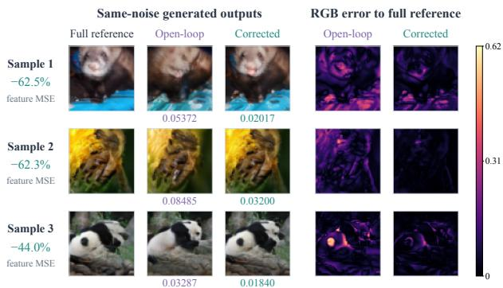
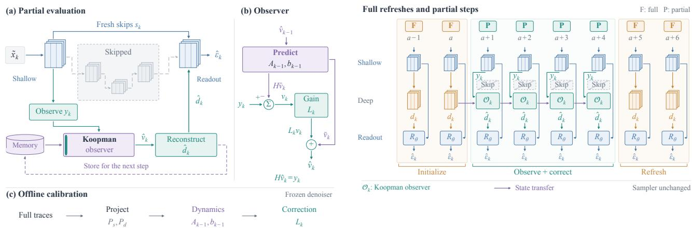
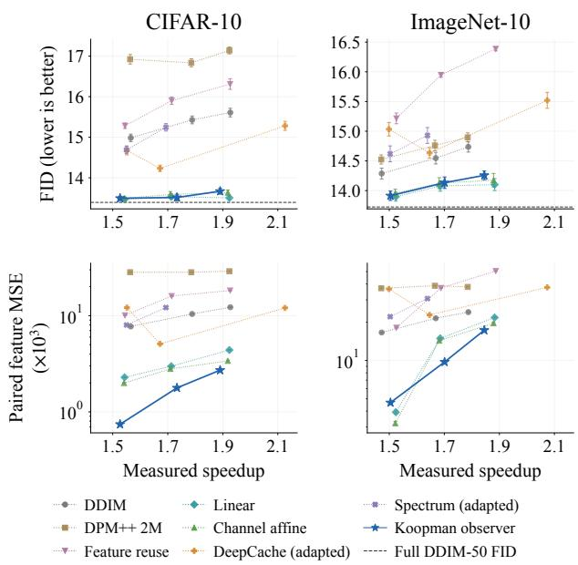
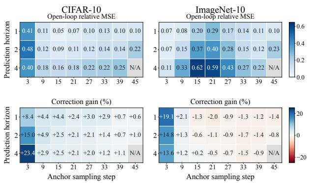

# Koopman Observers for Difusion Acceleration: Correcting Feature Forecasts with Shallow Measurements

Hanru Bai ETH Zurich Max Planck Institute for Intelligent Systems

Yuanchao Xu Kyoto University

Fengyi Li MIT

## Abstract

Feature caching accelerates difusion sampling by replacing expensive network evaluations with predictions from previously computed activations. However, forecasts based only on past features cannot directly incorporate changes in the current denoising state. We investigate whether inexpensive, freshly computed features can serve as observations for correcting these predictions. We introduce an observation-corrected Koopman framework for accelerating frozen difusion models. Using calibration trajectories, we identify finite-dimensional, time-dependent Koopman approximations that jointly describe the increments of shallow and deep network features. During accelerated sampling, these operators predict the evolution of expensive deep features, while innovations in the observed shallow features correct the predicted state. Periodic full evaluations refresh the observer, and all generative-model parameters remain unchanged. This formulation enables controlled comparisons of temporal prediction and observation correction. Across three 10,000-image runs per dataset, our method reduces paired Inception-feature MSE by 19.9% on CIFAR-10 and 11.9% on a ten-class ImageNet subset relative to channelwise afine prediction under the same four-partial-step schedule. Matched ablations attribute additional reductions of 4.54% and 4.67% to observation correction. The observer achieves 1.89× and 1.85× measured speedups over DDIM-50, supporting improved reference-sampler fidelity without retraining the denoiser.

## 1 INTRODUCTION

Difusion models generate samples through repeated denoising network evaluations, making inference computationally expensive (Ho et al., 2020). Feature caching reduces this cost by reusing intermediate activations, while forecasting methods predict their evolution between full evaluations (Ma et al., 2024). Approaches such as TaylorSeer (Liu et al., 2025b) and FastCache (Liu et al., 2025a) demonstrate the potential of temporal extrapolation and learned linear prediction. However, improving the forecaster alone leaves an important question: how can predictions incorporate information about the current denoising state?

A forecast constructed exclusively from past activations cannot directly incorporate changes in the current denoising state. This matters because approximation errors alter subsequent network inputs, potentially making historical trajectories less informative. Nevertheless, a partial forward pass can provide inexpensive, fresh shallow features even when deeper computation is skipped. DeepCache (Ma et al., 2024) already exploits this computational structure; our question is whether these features can additionally serve as measurements for correcting deep-feature forecasts. This difers from controlling forecast reliability: RACER uses disagreement between forecasts to adjust trust and refresh decisions (Li et al., 2026). We instead investigate an explicit measurement innovation, formed from the discrepancy between predicted and observed shallow features, to update the unobserved deep state. Figure 1 illustrates selected cases in which observation correction improves agreement with fullmodel generation.

We introduce an observation-corrected Koopman framework for accelerating frozen difusion models. Koopman methods describe nonlinear dynamics through the evolution of observable functions, with finite-dimensional approximations identified from data (Williams et al., 2015; Brunton et al., 2022).

  
Figure 1: Observation correction on selected ImageNet examples. Each row compares full-model generation, open-loop prediction, and observationcorrected prediction using the same initial noise and class label. The accelerated variants share the fullevaluation schedule. Examples are selected for large pixel-MSE reductions among samples that also improve in Inception-feature MSE, with one example per class. They illustrate improvement cases, not average performance. Images are generated at 64×64 on a tenclass ImageNet subset. Full-model outputs are generated references, not ground-truth images. Heatmaps show per-pixel RGB RMSE on [0, 1]-scaled images using a shared color scale. Numerical values and percentage reductions report Inception-feature MSE relative to the full-model reference.

Building on this perspective, we construct joint observables from shallow- and deep-feature increments and their recent history. The frozen network supplies nonlinear feature representations, while time-dependent afine operators capture their temporal evolution and cross-feature coupling. These are calibrated approximations: we do not assume that the chosen observables form an exact Koopman-invariant subspace.

Following the prediction–correction principle of state observers (Luenberger, 1966), each accelerated step first forecasts the joint feature increment. A partial network evaluation then supplies the current shallow observation. A calibrated gain maps its innovation into a correction of the deep-feature estimate, which is passed to the original decoder. Periodic full evaluations refresh the observer. This closes the prediction loop through measurements of the current sampling state, without accessing the skipped deep features. All denoiser parameters remain frozen; only feature bases, transition operators, and correction gains are fitted offline. Our contributions are threefold:

• Joint Koopman modeling of difusion features. We formulate feature acceleration through time-dependent, finite-dimensional operators on joint shallow–deep increment observables. This representation makes temporal prediction and cross-feature coupling explicit, providing a com mon framework for distinguishing channelwise forecasting from coupled feature dynamics.

• Measurement-driven correction without denoiser retraining. We develop a causal sampling procedure that combines operator prediction, fresh shallow-feature innovations, and periodic full-evaluation refreshes. Its distinguishing mechanism is a calibrated update of unobserved deep features from observed prediction residuals.

• Controlled evidence for the value of observation correction. We separate the efects of temporal prediction and feedback using channelwise, open-loop, and observation-corrected predictors under the same full-evaluation schedule. Across three sampling runs with 10,000 images per dataset per run, our observer reduces finalimage Inception-feature mean squared error by 19.9% on CIFAR-10 and 11.9% on a ten-class ImageNet subset relative to the channelwise afine baseline at the four-partial-step budget. Matched correction ablations show additional reductions of 4.54% and 4.67% over disabled correction. The evaluated observer implementations achieve 1.89× and 1.85× measured speedups over full 50- step DDIM sampling. Stage-wise diagnostics and information-matched controls further reveal when correction helps and characterize the limitations of the observer parameterization.

## 2 RELATED WORK

Difusion acceleration and feature forecasting. Difusion models require repeated denoising evaluations (Ho et al., 2020). DDIM and DPM-Solver reduce the number of sampling evaluations (Song et al., 2021; Lu et al., 2022), whereas feature caching reduces computation within each step. DeepCache updates inexpensive shallow features while reusing deep representations (Ma et al., 2024). TaylorSeer, Spectrum, and L2P forecast features using temporal extrapolation, spectral expansions, and learned historical coeficients, respectively (Liu et al., 2025b; Han et al., 2026; Shen et al., 2026). FastCache further incorporates learnable linear approximations (Liu et al., 2025a). Our work investigates how freshly computed shallow observations can correct deep-feature predictions.

Adaptive caching and feedback. HarmoniCa addresses trajectory dependencies and training–inference mismatch in feature caching (Huang et al., 2025). RACER uses forecast disagreement to adjust trust and reallocate full evaluations (Li et al., 2026). WorldDyn-Cache combines a lifted latent surrogate with riskcontrolled exact transitions for difusion world mod els (Chen et al., 2026). These methods establish adaptive control and dynamics-inspired approximation as existing directions. Our method computes a measurement innovation from the discrepancy between predicted and observed shallow features. This innovation directly updates the estimated deep state, providing a distinct mechanism for incorporating feedback.

Koopman modeling and state estimation. Koopman methods describe nonlinear dynamics through observable functions, with finite-dimensional approximations identified from data (Williams et al., 2015; Brunton et al., 2022; Bai and Ding; Bai et al., 2026). State observers combine predictions and measurements to estimate unobserved variables (Luenberger, 1966). We apply these principles to joint shallow–deep feature increments using time-dependent afine operators and calibrated correction gains. Unlike WorldDynCache’s local-memory surrogate, we explicitly identify feature-transition matrices. We assume neither an exact invariant observable subspace nor guaranteed observer convergence. Since an unconstrained afine observer can also be expressed as direct regression on the same inputs, its practical value must be assessed against same-information regression controls.

## 3 PRELIMINARIES AND PROBLEM FORMULATION

## 3.1 Difusion Sampling

Let $\epsilon _ { \theta }$ denote a frozen denoising network and $\{ t _ { k } \} _ { k = 0 } ^ { N - 1 }$ a decreasing difusion-time grid. The index k follows the order of sampling. For deterministic sampling, including DDIM with $\eta \ : = \ : 0$ (Song et al., 2021), the update is

$$
\boldsymbol { x } _ { k + 1 } = \boldsymbol { \Phi } _ { k } \big ( \boldsymbol { x } _ { k } , \boldsymbol { \epsilon } _ { \theta } ( \boldsymbol { x } _ { k } , t _ { k } , c ) \big ) ,\tag{1}
$$

where c denotes conditioning and $\Phi _ { k }$ is the prescribed sampler update. Starting from Gaussian noise $x _ { 0 } .$ , full sampling evaluates the entire denoiser at every step. Our objective is to reduce network computation while keeping the sampling grid and denoiser parameters fixed. For notational simplicity, guidance is omitted. When used, feature estimation is applied separately to the conditional and unconditional branches.

## 3.2 Partial Evaluation and Feature Estimation

We partition the denoiser into a shallow computation, an expensive deep computation, and a final readout. At the current accelerated sampling state $\tilde { x } _ { k }$ , define

$$
\begin{array} { l } { { s _ { k } = S _ { \theta } ( \tilde { x } _ { k } , t _ { k } , c ) , } } \\ { { d _ { k } = D _ { \theta } ( \tilde { x } _ { k } , t _ { k } , c ) . } } \end{array}\tag{2}
$$

Here $s _ { k }$ contains the shallow features required by the retained skip connections, and $d _ { k }$ is the deep representation entering the final decoder. A full evaluation produces $R _ { \theta } ( d _ { k } , s _ { k } , t _ { k } , c )$ . The functions $S _ { \theta } , D _ { \theta }$ , and $R _ { \theta }$ are components of the original frozen network.

Let $\mathcal { F }$ denote the full-evaluation indices. Shallow features are computed at every step, while deep features are evaluated only when $k \in \mathcal { F }$ . Otherwise, a causal estimator supplies

$$
\hat { d } _ { k } = \left\{ \begin{array} { l l } { d _ { k } , } & { k \in \mathcal { F } , } \\ { G _ { k } ( \mathcal { H } _ { k - 1 } , s _ { k } ) , } & { k \notin \mathcal { F } , } \end{array} \right.\tag{3}
$$

where $\mathcal { H } _ { k - 1 }$ contains previously computed observations, cached features, and estimated states. The estimator cannot access the current deep feature at a skipped evaluation. The accelerated update becomes

$$
\tilde { x } _ { k + 1 } = \Phi _ { k } \bigl ( \tilde { x } _ { k } , R _ { \theta } ( \hat { d } _ { k } , s _ { k } , t _ { k } , c ) \bigr ) .\tag{4}
$$

Importantly, $d _ { k }$ is defined at $\tilde { x } _ { k }$ . It can difer from the deep feature along the full-sampling reference trajectory because earlier approximations change subsequent inputs.

## 3.3 Finite-Dimensional Koopman Approximation

For dynamics $q _ { k + 1 } \ = \ F _ { k } ( q _ { k } )$ , the time-dependent Koopman operator acts on an observable function g as

$$
( \mathcal { K } _ { k } g ) ( q ) = g ( F _ { k } ( q ) ) .\tag{5}
$$

This operator is linear in g, even when $F _ { k }$ is nonlinear (Brunton et al., 2022; Xu et al., 2025). The state $q _ { k }$ may include the sample, conditioning, time, and history required to define the observables.

Given a finite observable dictionary $v _ { k } = \psi ( q _ { k } )$ , datadriven identification yields an afine approximation

$$
v _ { k + 1 } = A _ { k } v _ { k } + b _ { k } + r _ { k } ,\tag{6}
$$

where $r _ { k }$ captures finite-dictionary closure and identification errors (Williams et al., 2015). We do not assume that this residual vanishes.

In the next section, we construct $v _ { k }$ from joint shallow– deep feature increments and use current shallow observations to correct its predicted evolution. The observable bases, transition matrices, and correction gains are calibrated ofline without updating θ. We evaluate approximation fidelity and sampling cost separately from distributional generation quality.

## 4 METHOD

We construct a feature observer with three operations: joint increment prediction, shallow-observation correction, and periodic full refreshes. Figure 2 (left) summarizes the partial evaluation path, the observer update, and ofline calibration. All denoiser parameters remain frozen.

## 4.1 Joint Increment Observables

We describe the channel vectors at one spatial location and suppress the conditioning branch. Features are spatially aligned, and the same operators are applied at every location. Let $P _ { d } \in \mathbb { R } ^ { C _ { d } \times r }$ and $P _ { s } \in \bar { \mathbb { R } } ^ { C _ { s } }$ ×r be orthonormal channel bases obtained from the second moments of calibration feature increments. With positive calibration scales $\sigma _ { d }$ and $\sigma _ { s } ,$ define

$$
u _ { k } = { \frac { P _ { d } ^ { \top } ( d _ { k } - d _ { k - 1 } ) } { \sigma _ { d } } } , y _ { k } = { \frac { P _ { s } ^ { \top } ( s _ { k } - s _ { k - 1 } ) } { \sigma _ { s } } } , v _ { k } = \left[ { u _ { k } } \right]\tag{7}
$$

The scales are the root mean square values of the projected increments. Let $\begin{array} { r l } { J = \left[ I _ { r } \right. } & { { } 0 } \end{array}$ and $H = [ 0 I _ { r } ]$ select the deep and shallow components. The shallow increment $y _ { k }$ remains observable at partial evaluations. Measuring the deep increment $u _ { k }$ requires consecutive full evaluations. These increments are nonlinear observables of the sample and its preceding state because the underlying features come from the frozen network.

## 4.2 Ofline Operator and Gain Identification

Following Figure 2 (left, panel c), we collect fullsampling trajectories and split complete trajectories into calibration, validation, and held-out diagnostic sets. Patches and conditioning branches from one trajectory remain in the same split. For each transition, afine EDMD-style regression (Williams et al., 2015) gives

$$
\begin{array} { r l } { ( A _ { k - 1 } , b _ { k - 1 } ) = \arg \operatorname* { m i n } _ { A , b } } & { \frac { 1 } { M _ { k } } \displaystyle \sum _ { j = 1 } ^ { M _ { k } } \left\| v _ { k } ^ { ( j ) } - A v _ { k - 1 } ^ { ( j ) } - b \right\| _ { 2 } ^ { 2 } } \\ & { + \lambda _ { k } \left( \| A - I _ { 2 r } \| _ { F } ^ { 2 } + \| b \| _ { 2 } ^ { 2 } \right) , } \end{array}\tag{8}
$$

where $j$ indexes calibration feature vectors. The identity prior favors persistence of feature increments. The

indexing follows the transition $v _ { k - 1 } \mapsto v _ { k }$ defined in the preliminaries.

Let $\rho _ { k } ^ { ( j ) } = v _ { k } ^ { ( j ) } - A _ { k - 1 } v _ { k - 1 } ^ { ( j ) } - b _ { k - 1 }$ be the fitted residual. We learn a shallow-to-deep residual gain through

$$
\begin{array} { l } { { \displaystyle { \cal L } _ { k } ^ { d } = \arg \operatorname* { m i n } _ { L } \ \frac { 1 } { M _ { k } } \sum _ { j = 1 } ^ { M _ { k } } \left\| J \rho _ { k } ^ { ( j ) } - L H \rho _ { k } ^ { ( j ) } \right\| _ { 2 } ^ { 2 } + \gamma _ { k } \| L \| _ { F } ^ { 2 } } , }  \\ { { \displaystyle { \cal L } _ { k } = \left[ { \cal L } _ { k } ^ { d } \right] . } } \end{array}\tag{9}
$$

The efective ridge penalties include input secondmoment scaling. Bases, scales, operators, and gains use calibration data only. Rank and regularization are selected on validation trajectories before evaluation on independent sampling cohorts.

## 4.3 Observation-Corrected Prediction

As illustrated in Figure 2 (left, panels a and b), at a partial evaluation, we first propagate the estimated increment state and compute its shallow innovation

$$
\bar { v } _ { k } = A _ { k - 1 } \hat { v } _ { k - 1 } + b _ { k - 1 } , \qquad \nu _ { k } = y _ { k } - H \bar { v } _ { k } .\tag{10}
$$

The prediction–correction update follows the stateobserver principle (Luenberger, 1966)

$$
\hat { v } _ { k } = \bar { v } _ { k } + L _ { k } \nu _ { k } , \qquad \hat { d } _ { k } = \hat { d } _ { k - 1 } + \sigma _ { d } P _ { d } J \hat { v } _ { k } .\tag{11}
$$

Since $H L _ { k } \ = \ I _ { r }$ , the corrected shallow component satisfies $H \hat { v } _ { k } = y _ { k }$ . Its deep component is updated through the calibrated cross-feature residual relation. The original decoder receives $\hat { d } _ { k }$ and the current shallow skips $s _ { k }$ , followed by the unchanged sampler update. No current deep feature is computed during this operation. When $r ~ < ~ C _ { d }$ , only the retained deepincrement subspace is updated between refreshes.

## 4.4 Refreshes and Computational Cost

Figure $2 \ \mathrm { ( r i g h t ) }$ illustrates the alternation between full evaluations and observation-corrected partial steps. Each prediction episode begins with two consecutive full evaluations at indices a − 1 and a. These initialize $\hat { d } _ { a } = d _ { a }$ and $\hat { v } _ { a } = v _ { a }$ from measured feature diferences. Subsequent partial steps recursively apply Eqs. (10)–(11). The next full-evaluation pair resets the feature and increment estimates at the current accelerated states. It does not reset the sample to the full-sampling reference trajectory.

For m full evaluations among N sampling steps, the approximate online cost is

$$
T _ { \mathrm { o n l i n e } } \approx m T _ { \mathrm { f u l l } } + ( N - m ) T _ { \mathrm { p a r t i a l } } ,\tag{12}
$$

  
Figure 2: Koopman observers for difusion acceleration. Left: Fresh shallow observations correct the predicted joint increment state. The reconstructed deep feature and current shallow skips feed the retained readout, while expensive deep blocks are skipped. Projection bases, scales, time-dependent operators, and correction gains are identified from ofline calibration trajectories. Right: Two full evaluations (F) initialize the observer state. Partial evaluations (P) use the Koopman observer ${ \mathcal { O } } _ { k }$ to predict, correct, and reconstruct deep features. Subsequent full evaluations refresh the estimates at the current accelerated samples. The schedule shows an illustrative interior segment. All denoiser weights remain frozen and the sampler is unchanged.

where $T _ { \mathrm { p a r t i a l } }$ includes shallow computation, projections, prediction, correction, and the retained decoder and sampler operations. Actual latency is measured end to end, with ofline calibration reported separately. Matching full-evaluation counts alone does not match runtime.

## 4.5 Error Propagation

Let $e _ { k } = v _ { k } - \hat { v } _ { k }$ be the estimation error and $\rho _ { k } =$ $v _ { k } - A _ { k - 1 } v _ { k - 1 } - b _ { k - 1 }$ the residual of the identified dynamics along the accelerated trajectory. Subtracting Eqs. (10)–(11) from Eq. (6) and using $y _ { k } = H v _ { k }$ gives

$$
e _ { k } = \left( I _ { 2 r } - L _ { k } H \right) \left( A _ { k - 1 } e _ { k - 1 } + \rho _ { k } \right) .\tag{13}
$$

Because $H L _ { k } = I _ { r }$ , the shallow component of $e _ { k }$ vanishes, $e _ { k } = ( e _ { k } ^ { u } , 0 )$ . Writing $A _ { k - 1 }$ in blocks according to the deep and the shallow components, $A _ { k - 1 } =$ $\left[ \begin{array} { l } { \breve { A } _ { k - 1 } ^ { u u } } \\ { A _ { k - 1 } ^ { y u } } \\ { A _ { k - 1 } ^ { y y } } \end{array} \right]$ , the deep error therefore obeys

$$
e _ { k } ^ { u } = \big ( A _ { k - 1 } ^ { u u } - L _ { k } ^ { d } A _ { k - 1 } ^ { y u } \big ) e _ { k - 1 } ^ { u } + \big ( \rho _ { k } ^ { u } - L _ { k } ^ { d } \rho _ { k } ^ { y } \big ) .\tag{14}
$$

This is the error recursion of a Luenberger observer with transition matrix $A _ { k - 1 } ^ { u u }$ , output matrix $A _ { k - 1 } ^ { y u }$ and gain $L _ { k } ^ { d . }$ the measured shallow increment carries information about the propagated deep error only through the coupling block $A _ { k - 1 } ^ { y u }$ . For block-diagonal dynamics, and in particular for channelwise models, $A _ { k - 1 } ^ { y u } = 0$ and the correction acts on the residual alone. We make no claim of contraction; the closed-loop factor $A _ { k - 1 } ^ { u u } - L _ { k } ^ { d } A _ { k - 1 } ^ { y u }$ is available ofline and can be compared with $A _ { k - 1 } ^ { u u }$

The gain (9) is the ridge regression of the deep residual on the shallow residual. Its efect on a single step is described by the following statement, whose proof is a direct computation (Appendix A).

Proposition 1. Let $\epsilon = ( \epsilon ^ { u } , \epsilon ^ { y } )$ be a random vector with finite second moments $\Sigma _ { u u } = \mathbb { E } [ \epsilon ^ { u } \epsilon ^ { u \top } ] , \Sigma _ { u y } =$ $\mathbb { E } [ \epsilon ^ { u } \dot { \epsilon ^ { y } } ^ { \top } ] = \Sigma _ { y u } ^ { \top }$ and $\Sigma _ { y y } = \mathbb { E } [ \epsilon ^ { y } \epsilon ^ { y \top } ]$ , let $\gamma \geq 0$ be such that $\Sigma _ { y y } + \gamma \bar { I }$ is invertible, and let $L = \Sigma _ { u y } M$ with $M = ( \bar { \Sigma _ { y y } } + \gamma I ) ^ { - 1 }$ . Then

$$
\begin{array} { r l r } & { \mathbb { E } \| \epsilon ^ { u } \| ^ { 2 } - \mathbb { E } \| \epsilon ^ { u } - L \epsilon ^ { y } \| ^ { 2 } } & \\ & { } & { = \mathrm { t r } \big [ \Sigma _ { u y } M ( \Sigma _ { y y } + 2 \gamma I ) M \Sigma _ { y u } \big ] ~ \geq ~ 0 . } \end{array}
$$

$F o r \gamma = 0$ , L minimizes $\mathbb { E } \Vert \epsilon ^ { u } - L ^ { \prime } \epsilon ^ { y } \Vert ^ { 2 }$ over all matrices $L ^ { \prime } ,$ , and the second moment $o f \epsilon ^ { u } - L \epsilon ^ { y }$ is the Schur complement $\begin{array} { r } { \sum _ { u u } - \sum _ { u y } \sum _ { y y } ^ { - 1 } \sum _ { y u } . } \end{array}$

Applied with ϵ distributed as the calibration residuals, the proposition states that the correction with the gain (9) does not increase the mean squared deep error at the step that follows a reinitialization, where $e _ { a } = 0$ and the prior error equals $\rho _ { a + 1 }$ . At the subsequent steps the prior error is $A _ { k - 1 } e _ { k - 1 } + \rho _ { k }$ , and the statement holds to the extent that its second moments agree with those of the calibration residuals. The ratio $\mathrm { t r } ( \Sigma _ { u y } \Sigma _ { y y } ^ { - 1 } \Sigma _ { y u } ) / \mathrm { t r } \Sigma _ { u u }$ is the fraction of the deep residual that is linearly predictable from the shallow residual at step k; it measures how observable the deep increment is through the shallow one.

Finally, the error of the deep feature passed to the decoder follows from Eq. (11). Since $P _ { d } ^ { \top } P _ { d } = I _ { r }$ and $\sigma _ { d } P _ { d } J v _ { k } = P _ { d } P _ { d } ^ { \top } ( d _ { k } - d _ { k - 1 } )$ , and since $\hat { d } _ { a } = d _ { a }$ , one

Table 1: Generation quality and full-sampler fidelity at the middle latency budget. Each result uses 10,000 images per sampling run and three runs. FID reports mean and sample SD. $E _ { \phi }$ is mean paired Inception-feature MSE relative to full DDIM-50. All seven baseline families are within 3.81% of the observer latency. † denotes an adaptation to the native U-Net.
<table><tr><td></td><td colspan="3">CIFAR-10</td><td colspan="3">ImageNet-10</td></tr><tr><td>Method</td><td>FID↓</td><td> $1 0 ^ { 3 } E _ { \phi } \downarrow$ </td><td>Speedup↑</td><td>FID↓</td><td> $1 0 ^ { 3 } E _ { \phi }$ </td><td>↓ Speedup↑</td></tr><tr><td>Full DDIM-50</td><td> $1 3 . 3 9 \pm 0 . 0 5$ </td><td>0.000</td><td>1.00×</td><td> $1 3 . 7 2 \pm 0 . 0 8$ </td><td>0.000</td><td>1.00×</td></tr><tr><td>Reduced-step DDIM</td><td> $1 5 . 4 3 \pm 0 . 1 0$ </td><td>10.419</td><td>1.79×</td><td> $1 4 . 5 5 \pm 0 . 1 0$ </td><td>21.492</td><td>1.67×</td></tr><tr><td>DPM-Solver++ 2M</td><td> $1 6 . 8 4 \pm 0 . 1 0$ </td><td>28.282</td><td>1.79×</td><td> $1 4 . 7 6 \pm 0 . 0 9$ </td><td>38.720</td><td>1.67×</td></tr><tr><td>Feature reuse</td><td> $1 5 . 9 0 \pm 0 . 0 9$ </td><td>15.985</td><td>1.71×</td><td> $1 5 . 9 5 \pm 0 . 0 4$ </td><td>37.214</td><td>1.69×</td></tr><tr><td>Linear extrapolation</td><td> $1 3 . 5 3 \pm 0 . 0 7$ </td><td>2.982</td><td>1.71×</td><td> $1 4 . 0 8 \pm 0 . 0 9$ </td><td>14.924</td><td>1.69×</td></tr><tr><td>Channelwise affine</td><td> $1 3 . 5 9 \pm 0 . 0 7$ </td><td>2.795</td><td>1.71×</td><td> $1 4 . 1 3 \pm 0 . 0 9$ </td><td>14.330</td><td>1.68×</td></tr><tr><td> $\mathrm { D e e p C a c h e ^ { \dagger } }$ </td><td> $1 4 . 2 3 \pm 0 . 0 8$ </td><td>5.085</td><td>1.67×</td><td> $1 4 . 6 3 \pm 0 . 0 9$ </td><td>22.843</td><td>1.65×</td></tr><tr><td>Spectrum†</td><td> $1 5 . 2 4 \pm 0 . 0 9$ </td><td>12.146</td><td>1.69×</td><td> $1 4 . 9 3 \pm 0 . 1 3$ </td><td>30.712</td><td>1.64×</td></tr><tr><td>Observer  $( s = 3 )$ </td><td> $1 3 . 5 1 \pm 0 . 0 8$ </td><td>1.776</td><td>1.73×</td><td> $1 4 . 1 3 \pm 0 . 1 0$ </td><td>9.741</td><td>1.70×</td></tr></table>

obtains for $k > a$

$$
d _ { k } - \hat { d } _ { k } = \sigma _ { d } P _ { d } \sum _ { i = a + 1 } ^ { k } e _ { i } ^ { u } + ( I - P _ { d } P _ { d } ^ { \top } ) ( d _ { k } - d _ { a } ) .\tag{15}
$$

The first term accumulates the increment errors of the episode; the second is the drift of the deep feature outside the retained subspace since the last reinitial ization, and it vanishes for $r = C _ { d }$ . The number of accumulated terms grows with the length of the episode, which is why reinitializations are kept frequent and why the prediction error is examined as a function of the horizon (Appendix B.5).

Eqs. (10)–(11) also show that $\begin{array} { r l r } { \hat { v } _ { k } } & { { } = } & { \left( I _ { 2 r } - \frac { } { } \right. } \end{array}$ $L _ { k } H ) ( A _ { k - 1 } \hat { v } _ { k - 1 } + b _ { k - 1 } ) + L _ { k } y _ { k }$ is an afine map of $\left( \hat { v } _ { k - 1 } , y _ { k } \right)$ whose coeficients are constrained by the factorization through $A _ { k - 1 }$ and $L _ { k }$ and by the identity prior; an unconstrained regression of the deep increment on the same inputs is one of the controls in the experiments.

## 5 EXPERIMENTS

We evaluate whether Koopman observers accelerate frozen difusion sampling while preserving the outputs of the full sampler. We distinguish fidelity to this sampler from distributional generation quality, then test whether current observations contribute beyond temporal prediction alone.

## 5.1 Experimental Setup

Models and evaluation. We use two frozen classconditional U-Net checkpoints with raw weights, on CIFAR-10 at $3 2 \times 3 2$ and a ten-class ImageNet subset at 64×64. The reference is deterministic DDIM-50 with classifier-free guidance scale 2.0. Our observer retains the same 50-step grid and uses ofline calibration to identify projection bases, dynamics, and correction gains. The main predictor uses rank 256 for both shallow and deep increments. No denoiser parameters are updated. All implementations were run on NVIDIA A100 GPUs.

Each configuration generates 10,000 images for each of three sampling runs, with 1,000 images per class per run. Methods share initial noise and class labels within each run. We report FID and KID against real images, and paired Inception-feature MSE $E _ { \phi }$ against the corresponding full-sampler outputs. Smaller $E _ { \phi }$ indicates closer agreement with the full sampler, not necessarily better generation quality. Summary statistics are means and sample standard deviations across sampling runs, not independently trained models. Real-data references, pixel errors, and calibration splits are detailed in Appendix B.

Timing and baselines. We measure FP32 sampling using batch sizes of 50 for CIFAR-10 and 20 for ImageNet-10. Latencies are medians of three synchronized repetitions after warmup, with randomized configuration order. Timing includes both guidance branches, feature prediction, correction, and sampler updates, but excludes noise creation, I/O, and metric computation.

Baselines include reduced-step DDIM (Song et al., 2021), DPM-Solver++ (Lu et al., 2025), Deep-Cache (Ma et al., 2024), and Spectrum (Han et al., 2026), together with feature reuse, linear extrapolation, and channelwise afine prediction. DeepCache and Spectrum are adaptations to our native U-Net and feature locations. For each observer budget, baseline configurations are selected solely by independently measured latency from a fixed candidate set. We call a comparison approximately latency matched only when the absolute latency gap is at most 5%.

## 5.2 Eficiency, Fidelity, and Generation Quality

We evaluate maximum partial-step runs of $s \in$ {2, 3, 4}, corresponding to 28, 23, and 20 full steps on the 50-step grid. Each full or partial step includes both guidance branches. Table 1 presents the middle budget, where all seven baseline families meet the latency tolerance on both datasets. Figure 3 shows all three budgets.

At the middle budget, the observer achieves 1.73× acceleration on CIFAR-10 and 1.70× on ImageNet-10. Its FID is $1 3 . 5 1 5 \pm 0 . 0 7 9$ and $1 4 . 1 3 3 \pm 0 . 0 9 7 $ , compared with $1 3 . 3 9 3 \pm 0 . 0 4 9$ and $1 3 . 7 2 4 \pm 0 . 0 8 3$ for full DDIM-50. The corresponding increases in FID are 0.122 and 0.409. At approximately matched latency, the observer reduces $E _ { \phi }$ by 40.5% and 34.7% relative to linear extrapolation, and by 36.5% and 32.0% relative to channelwise afine prediction. Its mean FID is also lower than those of reduced-step DDIM, DPM-Solver++, feature reuse, and the adapted DeepCache and Spectrum configurations at this budget.

## 5.3 Do Current Observations Improve Prediction?

To isolate measurement correction, we fix the rank-256 predictor, projection bases, dynamics, gains, and $s \ = \ 4$ refresh positions. We compare current shallow increments, increments delayed by one sampling step, and correction disabled. All three variants use the same unfused implementation and recompute the current shallow skip features supplied to the decoder. Only the correction input or its application changes.

Current observations reduce $E _ { \phi }$ by 4.54% on CIFAR-10 and 4.67% on ImageNet-10 relative to disabled correction. Relative to delayed observations, the reductions are 12.78% and 17.44%. For both contrasts, the per-run 95% paired-bootstrap intervals for the error ratio lie below one in all three runs on both datasets (Appendix B.6). Current observations also reduce class-conditional mean error relative to disabled cor rection in all ten classes of each dataset after averaging the three runs.

The measured latency overhead over disabled correction is 0.63% on CIFAR-10 and 0.66% on ImageNet-10 in the matched unfused implementation. Thus, the benefit of fresh measurements is a reproducible reduction in full-sampler approximation error. The delayedobservation intervention tests this fixed observer’s dependence on timely inputs. It does not establish that a predictor fitted specifically for delayed measurements would perform equally poorly.

  
Figure 3: Distributional quality and reference fidelity are diferent objectives. FID (top) and paired Inception-feature MSE (bottom) against measured speedup on CIFAR-10 (left) and ImageNet-10 (right). Points show means over three sampling runs, with error bars indicating sample SD. The bottom row uses a logarithmic vertical axis. Baselines are the configurations selected by timing for the three observer budgets, with repeated selections shown once. Every point is plotted at its actual measured speedup, including configurations outside the 5% matching tolerance. Lines connect evaluated configurations as visual guides. Dashed horizontal lines show full DDIM-50 FID.

## 5.4 Dependence on Sampling Stage and Prediction Horizon

We reuse the reference-trajectory diagnostics to examine where observation correction is efective. Figure 4 evaluates eight anchor steps and prediction horizons of one, two, and four steps. Only positions that are partial evaluations under the s = 4 schedule are included.

Correction reduces local deep-feature error at all 23 evaluated positions on CIFAR-10, but at only 7 of 23 positions on ImageNet-10. At the earliest ImageNet-10 anchor, the reductions range from 13.6% to 19.1%, while most middle and late positions show small increases in error. These results reveal stage-dependent benefits of correction. They describe prediction on reference trajectories and do not include feedback through the evolving accelerated image state.

Table 2: Efect of current observations with a fixed fitted predictor and the same $s = 4$ schedule. All three variants use the unfused implementation and fresh shallow decoder skips. $E _ { x }$ is pixel MSE on floating-point images in [−1, 1]. Errors and FID report mean and sample SD across three sampling runs. Latency is the median of three synchronized repetitions.
<table><tr><td>Dataset</td><td>Correction input</td><td>FID↓</td><td> $1 0 ^ { 3 } E _ { \phi } \downarrow$ </td><td> $1 0 ^ { 3 } E _ { x } \downarrow$   $\mathrm { s / b a t c h }$ </td></tr><tr><td>CIFAR-10</td><td>Disabled</td><td> $1 3 . 6 3 8 \pm 0 . 0 7 0$ </td><td> $2 . 8 4 2 \pm 0 . 0 5 0$ </td><td> $0 . 2 4 4 \pm 0 . 0 0 3$  3.757</td></tr><tr><td>CIFAR-10</td><td>One-step delayed</td><td> $1 3 . 8 0 7 \pm 0 . 0 6 7$ </td><td> $3 . 1 1 0 \pm 0 . 0 2 7$   $0 . 3 0 8 \pm 0 . 0 0 3$ </td><td>3.787</td></tr><tr><td>CIFAR-10</td><td>Current</td><td> $1 3 . 6 6 9 \pm 0 . 0 7 1$ </td><td> $2 . 7 1 3 \pm 0 . 0 4 7$   $0 . 2 2 4 \pm 0 . 0 0 5$ </td><td>3.781</td></tr><tr><td>ImageNet-10</td><td>Disabled</td><td> $1 4 . 2 6 6 \pm 0 . 1 0 7$ </td><td> $1 8 . 1 7 2 \pm 0 . 2 3 0$   $4 . 2 7 7 \pm 0 . 0 5 2$ </td><td>5.310</td></tr><tr><td></td><td>ImageNet-10 One-step delayed</td><td> $1 4 . 3 3 5 \pm 0 . 0 2 1$ </td><td> $2 0 . 9 8 4 \pm 0 . 1 2 4$   $5 . 0 8 6 \pm 0 . 0 0 9$ </td><td>5.357</td></tr><tr><td>ImageNet-10 Current</td><td></td><td> $1 4 . 2 5 7 \pm 0 . 0 7 3$ </td><td> $1 7 . 3 2 3 \pm 0 . 2 3 5$   $3 . 9 0 0 \pm 0 . 0 4 5$ </td><td>5.344</td></tr></table>

  
Figure 4: Stage-dependent prediction and correction. Columns show CIFAR-10 and ImageNet-10. Top: open-loop deep-feature squared error normalized by feature-reuse error at the same position. Bottom: correction gain, $1 0 0 ( 1 - E _ { \mathrm { o b s } } / E _ { \mathrm { o p e n } } )$ Positive values indicate improvement. Each cell aggregates 60 CIFAR-10 or 40 ImageNet-10 development trajectories. Anchor steps are zero based and follow sampling order from high to low noise. Gray cells target full evaluations and are excluded.

## 5.5 The Role of Temporal Dynamics

Additional controls distinguish temporal modeling from static shallow-to-deep regression and assess the efects of state dimension and cross-channel coupling (Table 5). On the same s = 4 schedule, static regression gives $E _ { \phi } ~ = ~ 0 . 0 1 2 2 7 5$ on CIFAR-10 and 0.034979 on ImageNet-10, compared with 0.002713 and 0.017323 for the rank-256 observer.

Increasing the observer rank from 64 to 256 reduces paired feature error by 10.7% and 11.0%. At rank 64, dense dynamics improve on diagonal dynamics by 12.6% on CIFAR-10 but only 0.5% on ImageNet-10. These configuration comparisons support temporal state modeling in the evaluated predictor family, while showing that the benefit of cross-channel coupling is dataset dependent.

The earlier full-trajectory diagnostics show the same aggregate ordering of linear extrapolation, fitted openloop dynamics, and observation-corrected dynamics (Appendix B.5). The final-image evaluations additionally account for changes to subsequent sampling states caused by earlier approximations. Batch-size timing and the limits of the available calibration-cost records are reported in Appendix B.7.

## 6 CONCLUSION

We have formulated the acceleration of a frozen dif fusion model as a state estimation problem: the deep features skipped at a partial evaluation are an unobserved state, the shallow features computed in any case are measurements, and a time-dependent afine Koopman approximation of the increments supplies the dynamics. The resulting observer corrects its prediction by the innovation of the shallow measurement, and its error obeys the recursion of a Luenberger observer in which the identified coupling block plays the role of the output matrix. In the experiments the correction reduces the error relative to the full sampler beyond what coupled open-loop prediction achieves, at speedups of about 1.5–1.6× on two class-conditional U-Nets.

The scope of these results is limited in three respects. The guarantee of Proposition 1 concerns one step and the calibration distribution; no contraction of the closed loop is established, and the growth of the error over an episode is governed by Eqs. (14) and (15). The fitted predictor is tied to the checkpoint, the sampling grid and the conditioning, and its transfer to another setting requires a check of the prediction accuracy and possibly a recalibration. Finally, the evaluation covers two U-Net checkpoints at low resolution; difusion transformers, and text-to-image and video models remain to be examined. A natural refinement is to fit the gains on the residuals of the closed loop rather than on the calibration residuals, so that Proposition 1 applies at every step of an episode.

## Acknowledgement

Y.X. acknowledge support from JST CREST Grant No. JPMJCR24Q1, including the AIP Challenge Program.

## References

Hanru Bai and Weiyang Ding. Konode: Koopmandriven neural ordinary diferential equations with evolving parameters for time series analysis.

Hanru Bai, Weiyang Ding, and Difan Zou. Hierarchical koopman difusion: Fast generation with interpretable difusion trajectory. Advances in Neural Information Processing Systems, 38:87345–87379, 2026.

Steven L. Brunton, Marko Budiˇsi´c, Eurika Kaiser, and J. Nathan Kutz. Modern Koopman theory for dynamical systems. SIAM Review, 64(2):229–340, 2022.

Leyang Chen, Junyi Wu, Shaoqiu Zhang, and Yulun Zhang. WorldDynCache: Risk-controlled latent dynamics approximation for difusion world model. arXiv preprint arXiv:2608.01845, 2026.

Jiaqi Han, Juntong Shi, Puheng Li, Haotian Ye, Qiushan Guo, and Stefano Ermon. Adaptive spectral feature forecasting for difusion sampling acceleration. arXiv preprint arXiv:2603.01623, 2026.

Jonathan Ho, Ajay Jain, and Pieter Abbeel. Denoising difusion probabilistic models. In Advances in Neural Information Processing Systems, volume 33, pages 6840–6851, 2020.

Yushi Huang, Zining Wang, Ruihao Gong, Jing Liu, Xinjie Zhang, Jinyang Guo, Xianglong Liu, and Jun Zhang. HarmoniCa: Harmonizing training and inference for better feature caching in difusion transformer acceleration. In Proceedings of the 42nd International Conference on Machine Learning, volume 267 of Proceedings of Machine Learning Research, pages 25835–25858. PMLR, 2025.

Yanchao Li, Jiaqing Xie, Ben Gao, Wanhao Liu, Yanbo Wang, TY Tsui, Jinfei Liu, Yuqiang Li, and Tianfan Fu. Disagree to accelerate: Closing the loop on difusion feature forecasts. arXiv preprint arXiv:2608.01740, 2026.

Dong Liu, Yanxuan Yu, Jiayi Zhang, Yifan Li, Ben Lengerich, and Ying Nian Wu. FastCache: Fast caching for difusion transformer through learnable linear approximation. arXiv preprint arXiv:2505.20353, 2025a.

Jiacheng Liu, Chang Zou, Yuanhuiyi Lyu, Junjie Chen, and Linfeng Zhang. From reusing to forecasting: Accelerating difusion models with TaylorSeers.

In Proceedings ofthe IEEE/CVF International Conference on Computer Vision (ICCV), pages 15853– 15863, 2025b.

Cheng Lu, Yuhao Zhou, Fan Bao, Jianfei Chen, Chongxuan Li, and Jun Zhu. DPM-Solver: A fast ODE solver for difusion probabilistic model sampling in around 10 steps. In Advances in Neural Information Processing Systems, volume 35, pages 5775–5787, 2022.

Cheng Lu, Yuhao Zhou, Fan Bao, Jianfei Chen, Chongxuan Li, and Jun Zhu. DPM-Solver++: Fast solver for guided sampling of difusion probabilistic models. Machine Intelligence Research, 22(4):730– 751, 2025. doi: 10.1007/s11633-025-1562-4.

David G. Luenberger. Observers for multivariable sys tems. IEEE Transactions on Automatic Control, 11 (2):190–197, 1966.

Xinyin Ma, Gongfan Fang, and Xinchao Wang. Deep-Cache: Accelerating difusion models for free. In Proceedings of the IEEE/CVF Conference on Computer Vision and Pattern Recognition (CVPR), pages 15762–15772, 2024.

Zhirong Shen, Rui Huang, Jiacheng Liu, Chang Zou, Peiliang Cai, Shikang Zheng, Zhengyi Shi, Liang Feng, and Linfeng Zhang. Beyond fixed formulas: Data-driven linear predictor for eficient difusion models. arXiv preprint arXiv:2604.26365, 2026.

Jiaming Song, Chenlin Meng, and Stefano Ermon. Denoising difusion implicit models. In International Conference on Learning Representations, 2021.

Matthew O. Williams, Ioannis G. Kevrekidis, and Clarence W. Rowley. A data–driven approximation of the Koopman operator: Extending dynamic mode decomposition. Journal of Nonlinear Science, 25(6): 1307–1346, 2015.

Yuanchao Xu, Kaidi Shao, Isao Ishikawa, Yuka Hashimoto, Nikos Logothetis, and Zhongwei Shen. A data-driven framework for koopman semigroup estimation in stochastic dynamical systems. Chaos: An Interdisciplinary Journal of Nonlinear Science, 35(10):103123, 10 2025. ISSN 1054-1500. doi: 10. 1063/5.0283640. URL https://doi.org/10.1063/ 5.0283640.

Table 3: Complete-trajectory splits for ofline identification. The diagnostic split is separate from the formal generation evaluation. Rank is the dimension of each projected increment.
<table><tr><td>Dataset</td><td>Calibration</td><td>Validation</td><td>Diagnostic</td><td>Rank r</td></tr><tr><td>CIFAR-10</td><td>120</td><td>60</td><td>60</td><td>256</td></tr><tr><td>ImageNet-10</td><td>80</td><td>40</td><td>40</td><td>256</td></tr></table>

## A PROOF OF PROPOSITION 1

Proof. For a matrix L′ let $\begin{array} { r } { F ( L ^ { \prime } ) = \mathbb { E } \| \epsilon ^ { u } - L ^ { \prime } \epsilon ^ { y } \| ^ { 2 } = \operatorname { t r } \Sigma _ { u u } - 2 \operatorname { t r } ( L ^ { \prime } \Sigma _ { y u } ) + \operatorname { t r } ( L ^ { \prime } \Sigma _ { y y } L ^ { \prime \top } ) } \end{array}$ . With $L = \Sigma _ { u y } M$ and $M = ( \Sigma _ { y y } + \gamma I ) ^ { - 1 }$

$$
F ( 0 ) - F ( L ) = \mathrm { t r } \big [ \Sigma _ { u y } ( 2 M - M \Sigma _ { y y } M ) \Sigma _ { y u } \big ] ,
$$

$$
2 M - M \Sigma _ { y y } M = M ( \Sigma _ { y y } + 2 \gamma I ) M ,
$$

which gives the stated expression. Since M is symmetric and $\Sigma _ { y y } + 2 \gamma I$ is positive semidefinite, $F ( 0 ) - F ( L ) =$ tr $\begin{array} { r } { \left[ ( M \bar { \Sigma } _ { y u } ) ^ { \top } ( \Sigma _ { y y } + 2 \gamma I ) ( \bar { M } \Sigma _ { y u } ) \right] \geq 0 } \end{array}$ . For $\gamma = 0 , F$ is a convex quadratic function of L′ with gradient −2Σuy + $2 \bar { L ^ { \prime } } \Sigma _ { y y } ,$ which vanishes exactly at $L = \Sigma _ { u y } \Sigma _ { y y } ^ { - 1 }$ ; the second moment of $\epsilon ^ { u } - L \epsilon ^ { y } \mathrm { i s } \Sigma _ { u u } - L \Sigma _ { y u } - \Sigma _ { u y } L ^ { \top } + L \Sigma _ { y y } L ^ { \top } =$ $\Sigma _ { u u } - \Sigma _ { u y } \Sigma _ { y y } ^ { - 1 } \Sigma _ { y u } .$ □

Eq. (13) follows from $v _ { k } - \bar { v } _ { k } = A _ { k - 1 } e _ { k - 1 } + \rho _ { k }$ and $\hat { v } _ { k } - \bar { v } _ { k } = L _ { k } H \big ( { v } _ { k } - \bar { v } _ { k } \big )$ ; Eq. (14) is its first block row, with $e _ { k - 1 } = ( e _ { k - 1 } ^ { u } , 0 ) ;$ ; and Eq. (15) follows by summing $( d _ { i } - \hat { d } _ { i } ) - ( d _ { i - 1 } - \hat { d } _ { i - 1 } ) = \sigma _ { d } P _ { d } e _ { i } ^ { u } + ( I - P _ { d } P _ { d } ^ { \top } ) ( d _ { i } - d _ { i - 1 } )$ over $i = a + 1 , \ldots , k .$

## B ADDITIONAL EXPERIMENTAL DETAILS

## B.1 Datasets and Reference Distributions

The CIFAR-10 real-image reference contains the 50,000 training images. The ImageNet-10 reference contains 13,000 ImageNet training images, with 1,300 images in each checkpoint class: airliner, bee, black swan, cup, dingo, Egyptian cat, electric locomotive, ferret, goldfish, and panda. Images are converted to RGB, resized to a shorter side of 74 pixels with bilinear interpolation, and center-cropped to $6 4 \times 6 4$ . This is a ten-class subset, not ImageNet-1k evaluation.

Generated floating-point images in [−1, 1] are quantized using

$$
Q ( x ) = \mathrm { u i n t } 8 \left( \mathrm { c l i p } \left( 1 2 7 . 5 ( x + 1 ) + 0 . 5 , 0 , 2 5 5 \right) \right) .\tag{16}
$$

FID, KID, and paired feature errors use the same 2048-dimensional Inception-v3-compatible features from $\scriptstyle \mathtt { t o r c h - f i d e l i t y = } = 0 . 4 . 0$ . For each configuration and sampling run, FID is computed after merging all 10,000 generated feature vectors. FID scores from separate shards are never averaged. The reported mean and sample SD are then computed across the three complete sampling runs.

## B.2 Ofline Identification and Data Splits

Calibration uses previously collected full-sampling feature trajectories from the frozen checkpoints (Table 3). Splits are defined by complete initial-noise trajectory. All sampled spatial locations and both guidance branches of a trajectory remain in the same split. The collector retains 16 fixed spatial locations per trajectory.

Projection bases, normalization scales, dynamics, and gains are estimated from the calibration split. Predictor hyperparameters are selected using the validation split. The separate diagnostic split supports development analyses. The new 10,000-image sampling runs are separate from these calibration trajectories.

The main observer has rank 256 for both deep and shallow increments, giving a joint state dimension of 512.   
The selected dynamics ridge parameter is 1.0 in the implementation’s normalized coordinates on both datasets.   
The static rank-256 regression uses ridge 0.03. All identified parameters remain fixed during evaluation.

Table 4: Observer results across the three refresh budgets. FID and KID report mean and sample SD across three sampling runs. Each run generates 10,000 images. Speedup is relative to full DDIM-50 at the main batch size. $E _ { \phi }$ reports mean paired feature error.
<table><tr><td>Dataset</td><td>S</td><td>FID↓</td><td> $1 0 ^ { 3 } \mathrm { K I D \downarrow }$ </td><td> $1 0 ^ { 3 } E _ { \phi } \downarrow$ </td><td>Speedup↑</td></tr><tr><td>CIFAR-10</td><td>2</td><td> $1 3 . 4 9 5 \pm 0 . 0 5 0$ </td><td> $6 . 3 1 9 \pm 0 . 1 3 3$ </td><td>0.743</td><td>1.527×</td></tr><tr><td>CIFAR-10</td><td>3</td><td> $1 3 . 5 1 5 \pm 0 . 0 7 9$ </td><td> $6 . 2 2 4 \pm 0 . 0 9 8$ </td><td>1.776</td><td>1.733×</td></tr><tr><td>CIFAR-10</td><td>4</td><td> $1 3 . 6 6 9 \pm 0 . 0 7 1$ </td><td> $6 . 3 9 3 \pm 0 . 1 1 5$ </td><td>2.713</td><td>1.890×</td></tr><tr><td>ImageNet-10</td><td>2</td><td> $1 3 . 9 1 4 \pm 0 . 0 7 9$ </td><td> $2 . 6 6 5 \pm 0 . 0 2 4$ </td><td>4.662</td><td>1.504×</td></tr><tr><td>ImageNet-10 3</td><td></td><td> $1 4 . 1 3 3 \pm 0 . 0 9 7$ </td><td> $2 . 7 6 0 \pm 0 . 0 3 2$ </td><td>9.741</td><td>1.701×</td></tr><tr><td>ImageNet-10 4</td><td></td><td> $1 4 . 2 5 7 \pm 0 . 0 7 4$ </td><td> $2 . 8 0 2 \pm 0 . 0 2 9$ </td><td>17.323</td><td>1.845×</td></tr></table>

The calibrated operator models network-feature increments. It is not identified with the checkpoint’s native bottleneck operator. No exact finite-dimensional Koopman-invariance claim is required. Ofline predictor fitting is distinct from training the denoiser.

## B.3 Refresh Schedules and Baseline Implementations

The deterministic sampling grid is

$$
t _ { k } = \left\lfloor 9 9 9 \left( 1 - { \frac { k } { 4 9 } } \right) \right\rfloor , \qquad k = 0 , \ldots , 4 9 ,\tag{17}
$$

as implemented by integer conversion of a 50-point linear grid.

With maximum partial run length s, a step k is fully evaluated when $k < 4 , k \geq 4 8 .$ or (k − 2) mod $( s + 2 ) < 2 \quad$ The resulting full/partial counts are 28/22, 23/27, and 20/30 for $s = 2 , 3 , 4$ . Each step includes a conditional and an unconditional evaluation. These counts are guidance pairs, not single-branch network-call counts.

Consecutive full evaluations reinitialize feature increments on the current accelerated trajectory. They do not reset the image state to a separately generated reference.

Reduced-step DDIM and DPM-Solver++ use candidate step counts 20, 24, 26, 28, 30, 32, 34, 36, 38, and 40. DPM-Solver++ uses DPMSolverMultistepScheduler from diffusers==0.38.0, the checkpoint’s beta schedule, epsilon prediction, solver order 2, and linear timestep spacing. Thresholding with maximum sample value 1.0 gives fixed clipping of the predicted clean image to [−1, 1]. Karras sigma spacing is not used. These settings define the tested solver configuration and do not constitute an exhaustive solver search.

Feature reuse, linear extrapolation, and channelwise afine prediction use the outer decoder feature location. Their timing candidates include the s = 4 schedule and schedules with 2, 4, 6, 8, 10, 12, or 16 additional full steps. Additional refreshes prioritize consecutive pairs to recover exact feature increments. Equal full-step counts do not imply identical refresh positions.

DeepCache is adapted to two stage boundaries of the native U-Net, with uniform refresh intervals of 2, 3, 4, or 6. It reuses high-level features and recomputes current shallow decoder skips. Spectrum uses the saved oficial predictor code with previously validation-selected parameters and our feature location and $s \in \{ 2 , 3 , 4 \}$ schedules. These entries evaluate adaptations on the present checkpoints, not reproductions of the original papers’ benchmarks.

Latency matching. For each dataset and observer budget, we select the closest-latency configuration within each baseline family using timing alone. The middle budget selects DDIM-28 and DPM-Solver++-28 on CIFAR-10, and DDIM-30 and DPM-Solver++-30 on ImageNet-10. All seven baseline families are within 3.81% of the observer latency at this budget.

At s = 4, the closest DeepCache candidate is 11.10% faster on CIFAR-10 and 11.03% faster on ImageNet-10. The closest Spectrum candidate is 11.63% and 12.60% slower, respectively. These four comparisons fall outside the 5% tolerance and are not described as latency matched. Their results remain plotted at their actual measured latencies.

Table 5: Predictor controls on the same $s = 4$ refresh schedule. Feature errors report mean and sample SD across three sampling runs. The rank-256 observer uses fused inference. Other configurations can difer in rank, fitting, or implementation. The strict correction intervention is reported in Table 2.
<table><tr><td rowspan="2">Predictor</td><td colspan="2">CIFAR-10</td><td colspan="2">ImageNet-10</td></tr><tr><td> $1 0 ^ { 3 } E _ { \phi } \downarrow$ </td><td>Speedup</td><td> $1 0 ^ { 3 } E _ { \phi } \downarrow$ </td><td>Speedup</td></tr><tr><td>Feature reuse</td><td> $1 8 . 2 7 0 \pm 0 . 1 4 4$ </td><td>1.93×</td><td> $5 0 . 5 4 3 \pm 0 . 1 6 9$ </td><td>1.89×</td></tr><tr><td>Linear extrapolation</td><td> $4 . 3 9 5 \pm 0 . 0 5 8$ </td><td>1.92×</td><td> $2 1 . 7 9 4 \pm 0 . 2 7 7$ </td><td>1.88×</td></tr><tr><td>Channelwise affine</td><td> $3 . 3 8 8 \pm 0 . 0 6 7$ </td><td>1.92×</td><td> $1 9 . 6 5 3 \pm 0 . 3 3 9$ </td><td>1.88×</td></tr><tr><td>Static regression,  $r = 2 5 6$ </td><td> $1 2 . 2 7 5 \pm 0 . 0 2 9$ </td><td>1.89×</td><td> $3 4 . 9 7 9 \pm 0 . 3 6 1$ </td><td>1.85×</td></tr><tr><td>Diagonal observer, r = 64</td><td> $3 . 4 7 8 \pm 0 . 0 5 6$ </td><td>1.90×</td><td> $1 9 . 5 6 0 \pm 0 . 2 3 9$ </td><td>1.85×</td></tr><tr><td>Dense observer,  $r = 6 4$ </td><td> $3 . 0 3 8 \pm 0 . 0 5 7$ </td><td>1.90×</td><td> $1 9 . 4 6 0 \pm 0 . 1 9 8$ </td><td>1.85×</td></tr><tr><td>Open-loop,  $r = 2 5 6$ </td><td> $2 . 8 4 2 \pm 0 . 0 5 0$ </td><td>1.87×</td><td> $1 8 . 1 7 2 \pm 0 . 2 3 0$ </td><td>1.83×</td></tr><tr><td>Dense observer,  $r = 2 5 6$ </td><td> $2 . 7 1 3 \pm 0 . 0 4 8$ </td><td>1.89×</td><td> $1 7 . 3 2 3 \pm 0 . 2 3 5$ </td><td>1.85×</td></tr></table>

## B.4 Observation Interventions and Predictor Controls

The current, delayed, and disabled correction variants load the same rank-256 base artifact. They share projection bases, normalization, operators, gains, and full refresh positions. All use the unfused implementation.

The delayed variant replaces the correction’s current shallow increment with the preceding sampling step’s measured increment. Fresh shallow activations are still used by the decoder, and actual shallow measurements continue to be recorded. Disabling correction suppresses the joint-state innovation update, including both its deep and shallow components. It does not change only the deep gain while retaining shallow-state assimilation.

The main rank-256 observer uses an algebraically fused implementation. Its full-cohort feature MSE is 0.002712826 on CIFAR-10 and 0.017322962 on ImageNet-10. The corresponding unfused current-input variant gives 0.002712838 and 0.017323433. These numerical diferences are retained. Fused and unfused timings are not interchanged in the strict ablation.

Artifact inspection confirms that the stored open-loop and base observer files have identical projection bases, operators, and gains on both datasets. Their correction flags difer. The open-loop control therefore reproduces the disabled-correction outputs in this evaluation. It is not an independently fitted source of evidence for the value of correction.

Static regression, rank-64 observation-corrected dynamics, and rank-64 diagonal dynamics are additional calibrated configurations. Their comparisons characterize complete predictors and may change fitted parameters or numerical implementation. In particular, the rank comparison also compares rank-256 fused inference with rank-64 unfused inference.

We therefore use the same-fit observation interventions for the most direct test of correction. These controls do not establish that the observer is more expressive than every direct afine predictor with the same input information.

## B.5 Feature Prediction on Reference Trajectories

The earlier local diagnostic uses 60 CIFAR-10 and 40 ImageNet-10 development trajectories from full sampling. Two consecutive full evaluations initialize the predictor. Predictions are assessed at horizons of one, two, and four steps from anchor indices 3, 9, 15, 21, 27, 33, 39, and 45.

Squared deep-feature errors are aggregated and normalized by feature reuse at the same anchors and horizons.   
The feature-reuse reference is consequently one.

Observation correction reduces aggregate diagnostic error from 0.3829 to 0.3664 on CIFAR-10 and from 0.3907 to 0.3763 on ImageNet-10. These measurements use shallow observations on full reference trajectories. The formal generation results evaluate this accumulated efect separately.

Table 6: Local deep-feature prediction on earlier development diagnostic trajectories. Errors are normalized by feature reuse and aggregated over horizons of one, two, and four steps.
<table><tr><td>Predictor</td><td>CIFAR-10</td><td>ImageNet-10</td></tr><tr><td>Feature reuse</td><td>1.0000</td><td>1.0000</td></tr><tr><td>Linear extrapolation</td><td>0.6022</td><td>0.6886</td></tr><tr><td>Static shallow-to-deep</td><td>0.5964</td><td>0.5643</td></tr><tr><td>Open-loop dynamics</td><td>0.3829</td><td>0.3907</td></tr><tr><td>Observation-corrected dynamics</td><td>0.3664</td><td>0.3763</td></tr></table>

Table 7: Paired feature-error ratios for the strict observation interventions at s = 4. Brackets give per-run 95% paired-bootstrap intervals from 1,000 resamples. Ratios below one favor current observations. Intervals are not pooled across runs.
<table><tr><td>Dataset</td><td>Comparison</td><td>Run 1</td><td>Run 2</td><td>Run 3</td></tr><tr><td>CIFAR-10</td><td>Current / disabled</td><td>0.9529 [0.9463,0.9594]</td><td>0.9591 [0.9521,0.9667]</td><td>0.9518 [0.9414,0.9616]</td></tr><tr><td>CIFAR-10</td><td>Current / delayed</td><td>0.8622 [0.8500, 0.8743]</td><td>0.8774 [0.8657, 0.8887]</td><td>0.8770 [0.8646, 0.8902]</td></tr><tr><td>ImageNet-10</td><td>Current / disabled</td><td>0.9541 [0.9481,0.9602]</td><td>0.9541 [0.9478,0.9605]</td><td>0.9516 [0.9456, 0.9578]</td></tr><tr><td></td><td>ImageNet-10 Current / delayed</td><td>0.8260</td><td>0.8332 [0.8132, 0.8384] [0.8203, 0.8466][</td><td>0.8174 [0.8058, 0.8289]</td></tr></table>

## B.6 Paired Errors and Uncertainty

For accelerated output $\hat { x } _ { i }$ and full DDIM-50 output $x _ { i } ^ { \mathrm { f u l l } }$ with the same initial noise and class label, we define

$$
E _ { \phi } = \frac { 1 } { N D } \sum _ { i = 1 } ^ { N } \left\| \phi ( Q ( \hat { x } _ { i } ) ) - \phi \big ( Q ( x _ { i } ^ { \mathrm { f u l l } } ) \big ) \right\| _ { 2 } ^ { 2 } , D = 2 0 4 8 .\tag{18}
$$

Pixel MSE $E _ { x }$ is computed directly between floating-point outputs in [−1, 1] and averaged over pixels, channels, and images. It is not computed after uint8 quantization. Full-sampler outputs are generated references, not ground-truth images.

For each predefined comparison, we jointly resample paired image indices 1,000 times within each run. Each bootstrap statistic is the ratio of the two resampled mean feature errors. We report the 2.5th and 97.5th percentiles separately for each run.

These intervals describe variation across images conditional on the checkpoint and fitted predictor. They are not FID uncertainty, model-training uncertainty, or pooled three-run confidence intervals.

KID is the average of 20 random subset estimates, each using 500 real and 500 generated feature vectors. We distinguish the standard deviation across these subsets from the sample SD of the three run-level KID means. Only the latter is reported alongside mean KID in the result tables.

Classwise analysis. After averaging the three runs, current observations improve on disabled correction in every class of both datasets. Relative improvements range from 0.37% to 9.07% on CIFAR-10 and from 0.77% to 6.51% on ImageNet-10.

Relative to delayed correction, current observations improve nine of ten ImageNet classes. The airliner class is an exception, with a 5.20% increase in error. Classwise averages are descriptive and do not imply improvement for every image or every run within a class.

## B.7 Batch-Size Sensitivity and Ofline Cost

We independently repeat timing at batch sizes 10, 20, 50, and 100 on CIFAR-10, and 5, 10, 20, and 40 on ImageNet-10. Each configuration is warmed up, and three synchronized repetitions are measured in randomized

Table 8: Separate batch-size timing measurements for s = 4. Latencies are seconds per batch, measured as the median of three synchronized repetitions after warmup. Each speedup uses the full sampler timed again at the corresponding batch size.
<table><tr><td>Dataset</td><td>Batch</td><td>Full</td><td>Reuse</td><td>Channel</td><td>Observer</td><td>Speedup</td></tr><tr><td>CIFAR-10</td><td>10</td><td>3.399</td><td>1.586</td><td>1.589</td><td>1.603</td><td>2.121×</td></tr><tr><td>CIFAR-10</td><td>20</td><td>4.166</td><td>2.119</td><td>2.124</td><td>2.149</td><td>1.939×</td></tr><tr><td>CIFAR-10</td><td>50</td><td>7.043</td><td>3.657</td><td>3.671</td><td>3.728</td><td>1.889×</td></tr><tr><td>CIFAR-10</td><td>100</td><td>12.507</td><td>6.565</td><td>6.594</td><td>6.706</td><td>1.865×</td></tr><tr><td>ImageNet-10</td><td>5</td><td>4.093</td><td>2.098</td><td>2.102</td><td>2.130</td><td>1.922×</td></tr><tr><td>ImageNet-10</td><td>10</td><td>5.959</td><td>3.069</td><td>3.082</td><td>3.131</td><td>1.903×</td></tr><tr><td>ImageNet-10</td><td>20</td><td>9.717</td><td>5.150</td><td>5.173</td><td>5.265</td><td>1.846×</td></tr><tr><td>ImageNet-10</td><td>40</td><td>17.315</td><td>9.413</td><td>9.459</td><td>9.637</td><td>1.797×</td></tr></table>

order at each batch size. The full sampler is timed again to define each speedup.

For s = 4, observer speedups range from 1.87× to 2.12× on CIFAR-10 and from 1.80× to 1.92× on ImageNet-10. These are throughput-dependent timing results. The formal quality evaluation uses only the main batch sizes 50 and 20.

The completed GPU suite reuses previously calibrated predictors and does not measure end-to-end ofline identification cost. Earlier collector logs record trajectory collection but do not provide a complete, hardware-matched measurement including basis construction, operator fitting, and gain fitting.

The serialized base observer occupies approximately 73.37 MiB per dataset. The fused deployment artifact occupies approximately 36.05 MiB, excluding the denoiser. Serialized file size is not peak accelerator memory usage.

## B.8 Evaluation Records and Reproducibility

The timing pool contains 66 configurations per dataset, including the proposed method and ablations. The expanded control set and timing-selected baselines yield 34 distinct evaluated configurations per dataset.

Across two datasets, three sampling runs, and 10,000 images per run, the evaluation completes 2,040,000 configuration-level generations. Initial noise is shared across methods, so this count does not represent 2,040,000 independent initial conditions.

All configurations are retained in the evaluation records, including those that do not improve FID or paired fidelity. The records contain per-run FID and KID, per-image paired errors, classwise summaries, timing repetitions, configuration hashes, and completion markers. All 204 configuration-level runs contain 10,000 samples.

Recorded correctness checks compare the split full-forward path with native DDIM and compare each DeepCache full-forward branch with native execution. Maximum output diferences in these checks are zero on both datasets. The current-observation intervention also matches the existing unfused base observer exactly on the check inputs. These checks validate the tested execution paths.

## B.9 Qualitative Evaluation and Scope

For the formal evaluation, preview grids retain the first 40 image indices of each run, corresponding to four images per class. The same indices are used across methods. These previews are not selected according to improvement.

The selected ImageNet teaser examples in the introduction come from an earlier development cohort and illustrate individual improvement cases. They are separate from the fixed-index formal-evaluation previews and should not be interpreted as representative random samples.