# LAYERWISE ERROR ATTRIBUTION FOR FAST AND RO-BUST MIXED-PRECISION POST-TRAINING QUANTIZA-TION

Samy Houache   
Univ. Bordeaux, IMB   
Thales AVS, France   
samy.houache@u-bordeaux.fr   
Yann Traonmilin   
Univ. Bordeaux, Bordeaux INP,   
CNRS, IMB, F-33400, Talence, France   
yann.traonmilin@math.u-bordeaux.fr   
Jean-François Aujol   
Univ. Bordeaux, Bordeaux INP,   
CNRS, IMB, F-33400, Talence, France   
jean-francois.aujol@math.u-bordeaux.fr

## ABSTRACT

Mixed-precision post-training quantization is a network compression method that assigns bits layer by layer, under a global memory budget using a small calibration set. The main difficulties are to overcome the combinatorial nature of the allocation problem and to manage the sensitivity to small, potentially corrupted databases. Hence, an efficient allocation method should be fast to compute and preserve model quality when calibration data are corrupted. To design such a method, we derive a layerwise probabilistic analysis of the quantization error that separates propagated error from the local perturbation introduced at a given layer. We use this local term to build a separable score for a simple allocation algorithm, that requires no external solver. The probabilistic nature of our approach brings robustness to corrupted data. On denoising tasks with DRUNet, with an average budget of 4 bits per weight, our method matches or improves state-ofthe-art mixed-precision baselines under clean calibration, and is more robust to corrupted calibration, with PSNR gains of up to 7.5 dB under the tested corruptions. Experiments show bit-allocation speed-ups from 28× to 2,570× over the studied baselines. For quantized diffusion models, our experiments show that a direct application of our framework also improves the state-of-the-art.

## 1 INTRODUCTION

Large neural networks can exceed the memory and energy budgets of embedded hardware (Choukroun et al., 2019). This is a major bottleneck for embedded vision systems, including autonomous vehicles and avionics, where models must run with limited onboard resources. On the one hand, reducing model size and numerical precision lowers storage and memory traffic. On compatible hardware, it can also reduce computation and energy use (Wang et al., 2019). But on the other hand, such a compression step deteriorates the quality of the networks. This is the reason why, for such applications, there is a need to find an optimal trade-off between the accuracy of a network and its memory/energy budget. The goal of this paper is to propose a complete post-training quantization (PTQ) framework that tackles this problem.

Post-training quantization compresses a trained network by lowering the precision of its weights, using a small calibration set. Most PTQ pipelines use the same bit-width for every layer. This can be suboptimal because layers have different sensitivities to quantization leading to different effects on the network output. Mixed-precision PTQ addresses this by assigning a varying bit-width to each layer under a memory budget. In consequence an algorithm for mixed-precision PTQ must decide which layers need more precision. This flexibility can improve the quality–memory trade-off at a fixed budget (Dong et al., 2020; Ma et al., 2023). However, choosing these layerwise bit-width configurations jointly is difficult. For example, consider a network with 36 quantized layers and six candidate bit-widths per layer, from 3 to 8 bits. There are then $6 ^ { 3 6 } \approx 1 0 ^ { 2 8 }$ possible assignments before applying the memory constraint. Exhaustive evaluation is therefore impractical.

A practical alternative to exhaustive search must also meet two requirements. First, the quantized model should retain its quality when calibration inputs are degraded. This matters when calibration samples are acquired from sensors affected by noise, missing measurements, or acquisition faults. Second, selection should be fast enough to repeat when the model, calibration set, candidate precisions, or memory budget changes. This cost matters during design exploration, where many settings may need to be tested. To avoid evaluating every configuration, mixed-precision methods estimate layer sensitivity on calibration data. Existing scores use Hessian information (Dong et al., 2019; 2020; Yao et al., 2021), block reconstruction and second-order loss information (Li et al., 2021), network orthogonality (Ma et al., 2023), pairwise cross-layer loss terms (Deng et al., 2025), or a learned predictor (Mills et al., 2025). The bit-width assignment is then obtained by learned search (Wang et al., 2019), Pareto search (Pandey et al., 2023), linear programming (Ma et al., 2023), or integer programming (Yao et al., 2021; Deng et al., 2025). The main drawback of these methods is that they can require repeated network evaluations, pairwise interactions, or an external solver, which make the allocation stage slow and computationally expensive. Their scores are also estimated from a small calibration set, whose quality and composition affect the final quantized model (Yuan et al., 2023; Williams & Aletras, 2024).

Theoretical analyses of quantization error can also guide the choice of sensitivity measure. Gonon et al. (2023) derive a global deterministic error bound for PTQ controlled by a worst-case norm quantity. Houache et al. (2026) provide a finer analysis by using layer dependent operator norms, yielding tighter bounds that better follow the behavior of PTQ observed in practice. This suggests that keeping the layer error information is useful for mixed-precision decisions. Note that while they offer important qualitative insight on how error is propagated, such deterministic results are pessimistic in nature, as worst-case scenarios are not likely to occur in practical settings.

Contributions. We propose a probabilistic layerwise analysis of quantization error for a simple, yet fast and robust, mixed-precision post-training quantization algorithm. Our contributions are:

• A probabilistic layerwise analysis. We give probabilistic upper bounds of mixedprecision quantization error. We separate the error propagated from earlier layers from the perturbation introduced at the current layer (Section 4.2). This keeps the source of each quantization error visible and generalize previous worst-case deterministic analysis. We also derive a global bound for modern architectures, including self-attention (Appendix A.3).

• A separable, solver-free allocation algorithm. Using the theoretical insight from Section 4.2, we propose a fast and robust mixed-precision PTQ algorithm. It computes separable local scores from one full-precision pass per calibration image, then assigns bit-widths with a simple greedy rule and no external solver.

• Fast and robust bit-width allocation. On image denoising tasks with a DRUNet, our method combines competitive quality under clean calibration with stable PSNR under both tested calibration corruptions, at target budgets (Section 6.3). Bit-width allocation is 28× to 2,570× faster than the studied baselines in matched timing comparisons (Section 6.4). The same score and greedy rule also transfer to latent diffusion, where our method gives competitive FID and the highest mean PSNR to FP32 in the paired comparison (Section 6.5).

## 2 RELATED WORK

Error analysis for quantized networks. Gonon et al. (2023) derive a deterministic output bound for the quantization error, controlled by a global worst-case operator norm for the network. Houache et al. (2026) instead retain layer-dependent operator norms, giving a finer account of how the error propagates through a quantized network. These deterministic bounds reveal useful structure but can be pessimistic on data. Probabilistic rounding-error analyses use moments instead of worst-case accumulation (Higham & Mary, 2019). We follow this direction while keeping separate roles for our two results: the global bound evaluates a fixed bit-width configuration, and the layerwise bound exposes the local error term used for allocation. Quantization Error Propagation (QEP) corrects layer weights before quantization to reduce the effect of errors introduced by earlier layers (Arai & Ichikawa, 2025). Our method uses local error scores to choose the bit-width assigned to each block, with the quantizer kept fixed.

Sensitivity-driven mixed precision. Existing methods differ in two parts: how they measure sensitivity to quantization of layers and how they meet the budget. Sensitivity can come from Hessian statistics in HAWQ and HAWQ-V2 (Dong et al., 2019; 2020), block reconstruction in BRECQ (Li et al., 2021), network orthogonality in OMPQ (Ma et al., 2023), quantizer-group perturbations in AIMET AMP (Pandey et al., 2023), pairwise interactions in CLADO (Deng et al., 2025), or topological entropy in GMPQ-TE (Li et al., 2025). The budget is then handled by a learned policy in HAQ (Wang et al., 2019), Pareto search in AIMET AMP, or linear and integer optimization in HAWQ-V3, OMPQ, CLADO, and GMPQ-TE (Yao et al., 2021; Ma et al., 2023; Deng et al., 2025; Li et al., 2025). Our method changes both parts: its score comes from the local term of our layerwise quantization error analysis, and all sensitivity scores are computed once before performing a solverfree greedy allocation. Earlier greedy PTQ work updates layer sensitivity after each decision (Tsuji et al., 2021); our scores remain fixed and can be reused across budgets. Matched measurements in Section 6.4 show bit-width allocation speed-ups from 28× to 2,570× over the studied baselines.

Calibration and quantization backends. PTQ relies on a small calibration set, whose size and composition can affect the quantized model (Yuan et al., 2023; Williams & Aletras, 2024). QDrop addresses overfitting during reconstruction (Wei et al., 2022). AdaRound learns weight-rounding decisions (Nagel et al., 2020), BRECQ reconstructs quantized blocks (Li et al., 2021), and PTQ4SR adapts scale calibration to image restoration (Tu et al., 2023). These methods change how the quantized weights or scales are obtained. Our DRUNet comparisons share a round-to-nearest (RTN) or TF-Enhanced backend, without AdaRound; AdaRound is used in the diffusion experiment. We then corrupt only the calibration inputs when testing allocation stability.

Quantization of diffusion models. Diffusion PTQ must account for the changing distributions across denoising steps. Q-Diffusion and PTQ4DM adapt calibration and reconstruction to this setting (Li et al., 2023; Shang et al., 2023). PTQD models quantization noise during denoising (He et al., 2023), TFMQ-DM preserves temporal features during reconstruction (Huang et al., 2024), and Qua<sup>2</sup>SeDiMo learns sensitivity estimates for mixed-precision choices (Mills et al., 2025). Our contribution is different: we reuse the Q-Diffusion/AdaRound backend but apply to a pretrained latent diffusion model the same local score and greedy rule used for DRUNet (Rombach et al., 2022).

## 3 SETUP AND NOTATION

Network and quantization. We first introduce the notation for a sequential network to keep the section simple. Appendix A.3 gives the corresponding rules for the full architectures used in our experiments. The network has depth $L \geq 1$ and linear layers without biases. Layer ℓ has weights $\dot { W _ { \ell } } \in \mathbb { R } ^ { N _ { \ell } \times N _ { \ell - 1 } }$ . At bit-width $b _ { \ell } \geq 2$ , its quantized weights are $W _ { \ell } ^ { \prime } : = \bar { \mathcal { Q } } _ { b _ { \ell } } \bar { ( W _ { \ell } ) }$ , where $\mathcal { Q } _ { b }$ is the chosen quantization method, e.g. round-to-nearest. The input x follows a distribution p on R $N _ { 0 }$ . The full-precision and quantized forward passes are $S _ { \ell } : = W _ { \ell } S _ { \ell - 1 }$ and $S _ { \ell } ^ { \prime } : = W _ { \ell } ^ { \prime } S _ { \ell - 1 } ^ { \prime }$ , with $S _ { 0 } = S _ { 0 } ^ { \prime } = x$ . Their difference, i.e. the quantization error, at depth ℓ is $\Delta _ { \ell } : = S _ { \ell } - S _ { \ell } ^ { \prime } .$ . It satisfies the exact decomposition used in deterministic analyses (Gonon et al., 2023; Houache et al., 2026):

$$
\Delta _ { \ell } = W _ { \ell } \Delta _ { \ell - 1 } + \left( W _ { \ell } - W _ { \ell } ^ { \prime } \right) S _ { \ell - 1 } ^ { \prime } .\tag{1}
$$

The first term in Equation (1) propagates the error from previous layers. The second is the local quantization error introduced at layer ℓ. These two terms drive the analysis below.

Definition 1 (Random amplification ratios). For each layer $\ell \geq 1$ , define the random variables

$$
X _ { \ell } : = \frac { \| W _ { \ell } \Delta _ { \ell - 1 } \| _ { 2 } } { \| \Delta _ { \ell - 1 } \| _ { 2 } } , \qquad Y _ { \ell } : = \frac { \| ( W _ { \ell } - W _ { \ell } ^ { \prime } ) S _ { \ell - 1 } ^ { \prime } \| _ { 2 } } { \| S _ { \ell - 1 } ^ { \prime } \| _ { 2 } } .\tag{2}
$$

We set $X _ { \ell } = 0$ when $\| \Delta _ { \ell - 1 } \| _ { 2 } = 0$ and $Y _ { \ell } = 0$ when $\| S _ { \ell - 1 } ^ { \prime } \| _ { 2 } = 0 .$

These ratios measure how much the propagated and local terms are amplified on the current input. They satisfy

$$
0 \le X _ { \ell } \le \| W _ { \ell } \| _ { \mathrm { o p } } , \qquad 0 \le Y _ { \ell } \le \| W _ { \ell } - W _ { \ell } ^ { \prime } \| _ { \mathrm { o p } } .
$$

The operator norms cover the worst case error while these ratios track the error actually reached by the data, making them suitable for a probabilistic approach. Our analysis below uses their moments. Definition 2 (δ-probabilistic upper bound). Let $Z$ be a nonnegative random variable and let $\delta \in$ [0, 1). A deterministic constant A is a δ-probabilistic upper bound for Z if $\operatorname { \mathbb { P } } ( Z \leq A ) \geq 1 - \delta$

For each layer $\ell ,$ the recursion in Section 4.2 uses a $\tilde { \delta } _ { \ell }$ -probabilistic upper bound $B _ { \ell }$ for $\| S _ { \ell } ^ { \prime } \| _ { 2 }$ . At the input, we assume a bounded domain and choose $B _ { 0 }$ such that $\mathbb { P } \big ( \| x \| _ { 2 } \leq B _ { 0 } \big ) = 1 , \tilde { \delta } _ { 0 } = 0$

Mixed-precision allocation problem Each layer $\ell \in \{ 1 , \ldots , L \}$ uses a bit-width $b _ { \ell }$ from a finite candidate set $B _ { \ell } ,$ and $n _ { \ell }$ is its number of weights. A mixed-precision bit-width configuration $b =$ $( b _ { \ell } ) _ { \ell = 1 } ^ { L }$ has cost $\begin{array} { r } { \mathrm { C o s t } ( \pmb { b } ) = \sum _ { \ell = 1 } ^ { L } b _ { \ell } n _ { \ell } , } \end{array}$ and the admissible set under a memory budget Bud is ${ \mathcal { F } } : = \ \{ b : \operatorname { C o s t } ( b ) \ \leq \ \operatorname { B u d } , \ b _ { \ell } ^ { - } \in \ B _ { \ell } \}$ . For comparison, we express the memory budget as Bud $= B \textstyle \sum _ { \ell = 1 } ^ { L } n _ { \ell } .$ , where $B$ is the target average number of bits per weight. For example, $B = 4$ gives the same weight-memory budget as uniform 4-bit PTQ. Under configuration $^ { b , }$ the output error is $\| \Delta _ { L } ( x ; b ) \| _ { 2 }$ . The objective of robust mixed-precision PTQ is to solve the following minimization problem:

$$
\operatorname* { m i n } _ { b \in \mathcal { F } } Q _ { \tau } ( b ) , \quad \mathrm { w h e r e } \quad Q _ { \tau } ( b ) : = \operatorname* { i n f } \{ t : \mathbb { P } ( \| \Delta _ { L } ( x , b ) \| _ { 2 } \le t ) \ge \tau \} .\tag{3}
$$

Here $\tau$ is close to one and $\delta = 1 - \tau$ is the corresponding tail level. Using a quantile instead of worst-case errors permits increased robustness to outliers in available datasets. In practice, we only have access to a calibration set $\mathcal { D } _ { \mathrm { c a l } } = \{ x _ { 1 } , . . . , x _ { n } \}$ This ideal solution depends on the complete bit-width configuration. Testing one configuration requires a full-network evaluation, and the number of configurations grows exponentially with the number of layers. We begin by providing a probabilistic PTQ error analysis. Section 4.1 first, bounds the output error of a fixed configuration. Section 4.2 then keeps track of where the error is introduced. Then, Section 5 turns the local term of the layerwise analysis into a practical allocation score.

## 4 PROBABILISTIC ERROR BOUNDS FOR MIXED-PRECISION PTQ

We give two bounds. We present first a simple global result as a warm-up; answering the natural question: how large is the final output error? It also shows why that view alone cannot help with layerwise bit-width allocation. The following layerwise result is the main link to the allocation algorithm. Our layerwise bound keeps the information needed for mixed precision: where each error is introduced and how it is carried forward.

## 4.1 A GLOBAL BOUND FOR A FIXED CONFIGURATION

For a fixed configuration, define the sequential model

$$
G _ { 0 } : = 0 , \qquad G _ { \ell } : = X _ { \ell } G _ { \ell - 1 } + \| ( W _ { \ell } - W _ { \ell } ^ { \prime } ) S _ { \ell - 1 } ^ { \prime } \| _ { 2 } .\tag{4}
$$

Equation (1) and induction give $\| \Delta _ { \ell } \| _ { 2 } \leq G _ { \ell }$ for every input. Since $x \sim p , G _ { L }$ varies with the input, and one concentration step at the output gives the following result.

Lemma 1 (Global bound). Assume $G _ { L }$ has finite second moment under $p ,$ and let $\mu _ { G } : = \mathbb { E } [ G _ { L } ]$ $\sigma _ { G } ^ { 2 } : = \mathrm { V a r } ( G _ { L } )$ . For any $\delta \in ( 0 , 1 )$ ,

$$
\begin{array} { r } { \mathbb { P } \Big ( \| \Delta _ { L } \| _ { 2 } > \mu _ { G } + \sigma _ { G } \sqrt { \frac { 1 - \delta } { \delta } } \Big ) \leq \delta . } \end{array}\tag{5}
$$

Once the pointwise recursion has been established, the probabilistic step is a direct application of the one-sided Chebyshev inequality (Cantelli, 1928) (Appendix A.2). We write the recursion for a sequential model only to keep this warm-up simple. Appendix A.3 proves propagation rules for modern computation graphs, so the same global bound applies to architectures built from these operations, including U-Nets and vision transformers. For a chosen configuration $^ { b , }$ the moments of $G _ { L }$ can be estimated on the calibration set. The theorem uses the true mean and variance. Estimating them from calibration data does not provide the same guarantee automatically. The global bound controls a complete configuration, but it does not say which layer should use a higher bit-width. The next Section gives such information through probabilistic layerwise bounds.

## 4.2 A LAYERWISE BOUND FOR MIXED-PRECISION QUANTIZATION

First remark that Equation (1) and sub-multiplicativity give the deterministic one-step bound

$$
\| \Delta _ { \ell } \| _ { 2 } \leq \| W _ { \ell } \| _ { \mathrm { o p } } \| \Delta _ { \ell - 1 } \| _ { 2 } + \| W _ { \ell } - W _ { \ell } ^ { \prime } \| _ { \mathrm { o p } } \| S _ { \ell - 1 } ^ { \prime } \| _ { 2 } .\tag{6}
$$

This is the layer-dependent structure used by Houache et al. (2026). The random ratios $X _ { \ell }$ and $Y _ { \ell }$ introduced earlier are the realized counterparts of the two operator norms in Equation (6). We use their moments to derive a probabilistic layerwise bound that keeps the source of each error visible. To do this, we apply a concentration inequality at each layer and combine them through a union bound. Thanks to this approach, we preserve the two terms of Equation (1). This is the information needed by a mixed-precision allocation algorithm. The recursion uses two bounds at each layer. The bound $B _ { \ell }$ is a $\tilde { \delta } _ { \ell } .$ -probabilistic upper bound of output $S _ { \ell } ^ { \prime } \mathrm { : }$

$$
\begin{array} { r } { \mathbb { P } \big ( \| S _ { \ell } ^ { \prime } \| _ { 2 } \leq B _ { \ell } \big ) \geq 1 - \tilde { \delta } _ { \ell } . } \end{array}\tag{7}
$$

The error bound $A _ { \ell }$ is constructed recursively as follows. At layer ℓ, define the event

$$
E _ { \ell } : = \{ \| \Delta _ { \ell } \| _ { 2 } \leq A _ { \ell } \} \cap \{ \| S _ { \ell } ^ { \prime } \| _ { 2 } \leq B _ { \ell } \} .\tag{8}
$$

We start from $A _ { 0 } : = 0$ and $E _ { 0 } : = \{ \| x \| _ { 2 } \leq B _ { 0 } \}$ . Conditionally on $E _ { \ell - 1 }$ , define the moments

$$
\mu _ { X , \ell } : = \mathbb { E } [ X _ { \ell } \mid E _ { \ell - 1 } ] , \qquad \mu _ { Y , \ell } : = \mathbb { E } [ Y _ { \ell } \mid E _ { \ell - 1 } ] , \qquad \operatorname { C o v } _ { \ell } : = \operatorname { C o v } ( X _ { \ell } , Y _ { \ell } \mid E _ { \ell - 1 } ) ,
$$

$$
\sigma _ { X , \ell } ^ { 2 } : = \operatorname { V a r } ( X _ { \ell } \mid E _ { \ell - 1 } ) , \quad \sigma _ { Y , \ell } ^ { 2 } : = \operatorname { V a r } ( Y _ { \ell } \mid E _ { \ell - 1 } ) .\tag{9}
$$

We assume these moments are finite. On $E _ { \ell - 1 }$ , the decomposition in Equation (1) gives

$$
\| \Delta _ { \ell } \| _ { 2 } \le X _ { \ell } A _ { \ell - 1 } + Y _ { \ell } B _ { \ell - 1 } .\tag{10}
$$

The quantities $m _ { \ell }$ and $v _ { \ell }$ in the theorem below are the conditional mean and variance of the right side of Equation (10).

Theorem 1 (Layerwise bound). Fix a bit-width configuration, levels $\delta _ { 1 } , \ldots , \delta _ { L } \ \in \ ( 0 , 1 )$ , and $\tilde { \delta } _ { 1 } , \dotsc , \tilde { \delta } _ { L - 1 } \in [ 0 , 1 )$ , with

$$
\varepsilon : = \delta _ { L } + \sum _ { \ell = 1 } ^ { L - 1 } ( \delta _ { \ell } + \tilde { \delta } _ { \ell } ) < 1\tag{11}
$$

and define recursively

$$
m _ { \ell } : = \mu _ { X , \ell } A _ { \ell - 1 } + \mu _ { Y , \ell } B _ { \ell - 1 } , \qquad A _ { \ell } : = m _ { \ell } + \sqrt { v _ { \ell } \frac { 1 - \delta _ { \ell } } { \delta _ { \ell } } } ,\tag{12}
$$

$$
v _ { \ell } : = A _ { \ell - 1 } ^ { 2 } \sigma _ { X , \ell } ^ { 2 } + B _ { \ell - 1 } ^ { 2 } \sigma _ { Y , \ell } ^ { 2 } + 2 A _ { \ell - 1 } B _ { \ell - 1 } \mathrm { C o v } _ { \ell } .
$$

Then

$$
\mathbb { P } \big ( \| \Delta _ { L } \| _ { 2 } > A _ { L } \big ) \leq \varepsilon .\tag{13}
$$

In other words, the quantity $A _ { L }$ is an ε-probabilistic upper bound of $\lvert \Delta _ { L } \rvert \rvert _ { 2 }$

The proof in Appendix A.1 applies a conditional one-sided Chebyshev inequality (Cantelli’s inequality) at each layer to $X _ { \ell } A _ { \ell - 1 } + Y _ { \ell } B _ { \ell - 1 }$ . The bounds $B _ { \ell }$ replace the norms of $\bar { S } _ { \ell } ^ { \prime }$ by fixed values on the considered events. The conditional mean keeps the propagated and local terms separate, while the variance also contains their covariance. This is the structure needed by the algorithm: each layer adds a local perturbation, and later layers carry earlier error forward. However, computing the exact propagated contribution for every joint bit-width configuration would remain expensive. Section 5 therefore keeps the local quantity that identifies the source layer and evaluates it on full-precision activations. This result is also of mathematical interest because it generalizes the deterministic layerwise analysis of Houache et al. (2026) to a probabilistic setting.

Algorithm 1: Local score construction and mixed-precision allocation   
Input: Full-precision network; calibration set $\mathcal { D } _ { \mathrm { c a l } } ;$ blocks and sizes $( g , n _ { g } ) ;$ candidate sets   
$( B _ { g } ) _ { g \in \mathcal { G } } ;$ feasible budget Bud; $\delta _ { \mathrm { s c o r e } } .$   
Output: Bit-width configuration $( b _ { g } ) _ { g \in \mathcal { G } } .$   
Initialize running statistics for every pair $( g , b ) ;$   
foreach $x _ { i } \in \mathcal { D } _ { \mathrm { c a l } }$ do   
Run one full-precision forward pass and capture the required layer inputs;   
foreach $g \in { \dot { \mathcal { G } } }$ and $b \in B _ { g }$ do   
Compute $P _ { g , b } ( x _ { i } )$ from Equation (15) and update its running statistics;   
Release the captured activations;   
foreach $g \in { \mathcal { G } }$ and $b \in B _ { g }$ do Compute $s _ { g } ^ { \mathrm { l o c } } ( b ) = \hat { \mu } _ { g , b } + \hat { \sigma } _ { g , b } / \sqrt { \delta _ { \mathrm { s c o r e } } } ;$   
Set $b _ { g } \gets$ max $B _ { g }$ for every block;   
while Cos $\mathbf { \partial } _ { : ( b ) } > \mathbf { \partial } _ { }$ Bud do   
foreach $g \in { \mathcal { G } }$ with $b _ { g } >$ min $B _ { g }$ do   
Set $b _ { g } ^ { - }$ to the next lower candidate and compute $\Delta _ { g } ( b _ { g } ^ { - } )$ (Equation (17)) ;   
Select a block $g ^ { \star }$ minimizing $\Delta _ { g } ( b _ { g } ^ { - } )$ , breaking ties deterministically ;   
Update $b _ { g ^ { \star } }  b _ { g ^ { \star } } ^ { - }$   
return $( b _ { g } ) _ { g \in \mathcal { G } } ;$

## 5 AN ALGORITHM FOR FAST AND ROBUST MIXED-PRECISION PTQ

To design our algorithm, we want to estimate the local influence of each layer and candidate bitwidth on quantization error. Computing the exact influence of a layer requires a full pass in the quantized network for a given configuration b. We therefore retain the local quantization error identified by Theorem 1 and evaluate it before choosing a complete configuration. By definition, the local perturbation $Y _ { \ell }$ introduced at layer ℓ satisfies

$$
Y _ { \ell } \| S _ { \ell - 1 } ^ { \prime } \| _ { 2 } = \| ( W _ { \ell } - W _ { \ell } ^ { \prime } ) S _ { \ell - 1 } ^ { \prime } \| _ { 2 } .\tag{14}
$$

The moments of $Y _ { \ell }$ are then used to build the layerwise probabilistic error bounds. The main idea of our algorithm is to consider this local perturbation to design a sensitivity score. The analysis above is layerwise. For efficiency, our practical algorithm groups layers into allocation blocks $g \in { \mathcal { G } }$ , as in other grouped mixed-precision methods (Pandey et al., 2023; Sun et al., 2022). This reduces the number of decisions and matches the block partitions used in our comparisons. All layers $\ell \in g$ in a given block share one bit-width $b _ { g } \in B _ { g }$ . Let $\begin{array} { r } { n _ { g } : = \sum _ { \ell \in g } n _ { \ell } } \end{array}$ be the number of weights in block g; the practical cost is $\begin{array} { r } { \mathrm { C o s t } ( \pmb { b } ) = \sum _ { g \in \mathcal { G } } b _ { g } n _ { g } } \end{array}$ . For a block g quantized at bit-width $b ,$ we define the approximated local quantization error

$$
P _ { g , b } ( x ) : = \sum _ { \ell \in g } \bigr \Vert \big ( W _ { \ell } - \mathcal { Q } _ { b } ( W _ { \ell } ) \big ) S _ { \ell - 1 } ( x ) \bigr \Vert _ { 2 } .\tag{15}
$$

The sum gives one value for each image in the calibration set and each block $g .$ In practice, we evaluate the local perturbation on the full-precision layer input $S _ { \ell - 1 } ( x )$ instead of $S _ { \ell - 1 } ^ { \prime } ( x )$ as in (14). This is justified in our case because our algorithm navigates configurations yielding low quantization errors, i.e $S _ { \ell - 1 } ( x ) \approx S _ { \ell - 1 } ^ { \prime } ( x )$ on the whole optimization path of Algorithm 1. The algorithm starts from the highest candidate bit-widths, where quantization errors are expected to be small. Using the same full-precision inputs makes the values $P _ { g , b }$ independent of the bit-widths assigned to other blocks. We summarize the values of $P _ { g , b }$ into one score on the calibration set by their mean and standard deviation:

$$
s _ { g } ^ { \mathrm { l o c } } ( b ) : = \hat { \mu } _ { g , b } + \frac { \hat { \sigma } _ { g , b } } { \sqrt { \delta _ { \mathrm { s c o r e } } } } ,\tag{16}
$$

where $\hat { \mu } _ { g , b }$ and $\hat { \sigma } _ { g , b }$ are the sample mean and sample standard deviation of $P _ { g , b } ( x _ { i } )$ on $\mathcal { D } _ { \mathrm { c a l } }$ . The mean captures the average perturbation, while the standard deviation penalizes variation across calibration images. The value of $\delta _ { \mathrm { s c o r e } }$ only sets the fixed weight of the dispersion term; it is not a confidence level for the selected allocation. To calculate $s _ { g } ^ { \mathrm { l o c } } ( b )$ , each image in the calibration dataset is passed once through the full-precision network in order to update the scores for all candidate bit-widths. Computing $s _ { g } ^ { \mathrm { l o c } } ( b )$ for every block and candidate bit-width gives the scores used by our algorithm described below. Each score depends only on one pair (g, b) and can be reused for any configuration b.

Bit-width allocation with a greedy algorithm Our algorithm is initialized with every block at its largest candidate bit-width. The idea is to greedily decrease the bit-width block by block, based on the sensitivity score $s _ { g } ^ { \mathrm { l o c } }$ . Given a current value $b _ { g }$ , let $b _ { g } ^ { - } < b _ { g }$ be the next lower candidate bit-width. At each step, the algorithm selects the block with the smallest score increase per weight bit saved,

$$
\Delta _ { g } ( b _ { g } ^ { - } ) : = \frac { \left[ s _ { g } ^ { \mathrm { l o c } } ( b _ { g } ^ { - } ) - s _ { g } ^ { \mathrm { l o c } } ( b _ { g } ) \right] _ { + } } { \left( b _ { g } - b _ { g } ^ { - } \right) n _ { g } } ,\tag{17}
$$

and sets $b _ { g }  b _ { g } ^ { - }$ . The denominator is the number of weight bits saved by this change, and $[ . ] _ { + } =$ max(., 0) sets a negative score difference to zero. The process stops when the budget is met. All decisions use the precomputed scores, so this stage requires no new network evaluation and no external solver. Algorithm 1 precisely describes our method.

## 6 EXPERIMENTS

We evaluate two applications: image denoising with DRUNet and image generation with a latent diffusion U-Net. We first test whether our algorithm gives competitive allocations under clean calibration. We then keep the test set fixed and corrupt only the calibration inputs. At moderate budgets, our method matches the strongest references under clean calibration and performs better under corrupted calibration dataset. Finally, we measure the time needed to compute the scores and assign bit-widths, and transfer the method to a latent diffusion U-Net. Some PTQ methods also optimize rounding decisions or quantization ranges. Our contribution is a local score and a simple greedy allocation rule; each DRUNet comparison uses a shared quantizer.

## 6.1 EXPERIMENTAL SETUP

DRUNet denoising. We use the pretrained color DRUNet from (Zhang et al., 2022) on $2 5 6 \times 2 5 6$ CelebA images (Liu et al., 2015). The input noise has standard deviation $\sigma _ { \mathrm { i n } } ~ = ~ 0 . 1$ DRUNet has 32.64 million weights in 64 convolutions, grouped into 36 allocation blocks. We use three calibration sets of 256 images and the same 100 clean test images. Quantization is weight-only; intermediate layer outputs remain in FP32. PSNR is averaged over images and calibration runs.

Matched comparisons. The reference methods use different quantizers and candidate bit-widths, so we match our algorithm to each reference separately when possible. Within each matched baseline comparison, both methods use the same quantization backend and allocation blocks. OMPQ ORM scores blocks by network orthogonality and uses an algorithm for mixed-integer linear programming. CLADO models pairwise interactions between layer choices and uses integer quadratic programming. AIMET measures quantizer-group sensitivity and searches a Pareto set. Table 5 in the appendix summarizes these settings and an additional output signal to quantization noise ratio (SQNR) score control. We compare the bit-width configurations produced by the methods and the resulting model quality. These are allocation comparisons, not reproductions of each paper’s com plete PTQ pipeline. For OMPQ-ORM, both algorithms use symmetric per-channel round-to-nearest quantization (RTN) with candidates from 3 to 8 bits. Each output channel has its own scale, and each weight is rounded to the nearest representable value. CLADO uses the same RTN backend with candidates {3, 4, 8}, while our main configuration uses {3, 4, 5, 6, 7, 8}. For AIMET, both al gorithms use TF-Enhanced with candidates {4, 6, 8}. This scheme selects quantization ranges to reduce quantization error. The adapted output-SQNR control quantizes one block at a time and measures the SQNR at the final DRUNet output, then uses our greedy rule. AIMET AMP is evaluated separately. Realized precision is the average bit-width weighted by the number of weights. It measures weight storage, not inference time.

Corrupted calibration datasets. Only the inputs used to build the allocation are corrupted. We use $\widetilde { x } \overset { - } { = } M \odot x + \epsilon$ , where M is a binary corruption pattern and ϵ is the same denoising noise as in the clean protocol. Each entry of M is kept with probability 1 −p and set to zero with probability p. We test one spatial pattern shared across RGB channels at $p = 0 . 5 ,$ , and independent per-channel patterns at $p = 0 . 9$ . Calibration images and noise are paired across algorithms, and the test set is unchanged. These are distinct stress conditions. We report 95% confidence intervals for mean PSNR differences, comparing the methods on the same test images (Appendix B.1). Our score uses $\delta _ { \mathrm { s c o r e } } = 0 . 0 5$ in Equation (16). Visual examples are in Appendix B.6. In the top row of Figure 7, CLADO leaves more visible residual grain than our method under shared-channel calibration corruption.

Table 1: Clean DRUNet results with the RTN backend at target budget $B = 4 ,$ , equivalent to uniform 4-bit quantization. Data-dependent values are averaged over three calibration sets and the same 100 test images.
<table><tr><td>Method</td><td>Candidate bit-widths</td><td>Mean bit-width</td><td>PSNR (dB)</td></tr><tr><td>FP32</td><td>32</td><td>32.000</td><td>34.664</td></tr><tr><td> $\mathrm { U n i f o r m } , B = 3$ </td><td>3</td><td>3.000</td><td>24.497</td></tr><tr><td> $\mathrm { U n i f o r m } , B = 4$ </td><td>4</td><td>4.000</td><td>28.978</td></tr><tr><td> $\mathrm { O M P Q - O R M } , B = 4$ </td><td>3-8</td><td>3.988</td><td>32.587</td></tr><tr><td> $\mathrm { C L A D O } , B = 4$ </td><td>3,4,8</td><td>3.988</td><td>34.409</td></tr><tr><td> $\mathrm { O u r m e t h o d } , B = 4$ </td><td>3-8</td><td>3.987</td><td>34.401</td></tr></table>

Table 2: Clean DRUNet comparison with the common AIMET TF-Enhanced backend.
<table><tr><td>B</td><td>Our mean bit-width</td><td>AIMET mean bit-width</td><td>Our PSNR</td><td>AIMET PSNR</td><td>Difference</td></tr><tr><td>5</td><td>4.932</td><td>4.961</td><td>34.639</td><td>34.629</td><td>+0.010</td></tr><tr><td>6</td><td>5.984</td><td>5.716</td><td>34.653</td><td>34.636</td><td>+0.017</td></tr><tr><td>7</td><td>6.811</td><td>6.835</td><td>34.655</td><td>34.656</td><td>-0.0003</td></tr></table>

## 6.2 EXPERIMENTS WITH CLEAN CALIBRATION DATASET

Table 1 compares the different methods at a target average bit-width of 4. Uniform quantization $B = 4$ loses 5.687 dB relative to FP32, showing that the importance of mixed-precision PTQ. Our method improves OMPQ-ORM by 1.814 dB and matches the performance of CLADO (only 0.008 dB below). For our method minus CLADO, the 95% confidence interval for the mean dif ference is $[ - 0 . 0 1 5 , - 0 . 0 0 1 ]$ dB. The complete experiments with different budgets give a complete picture (Appendix B.2). Our method outperforms OMPQ-ORM and the adapted output-SQNR score at every reported budget. CLADO is slightly better at the smallest target budget, $B = 3 . 5 .$ , while their absolute PSNR gap remains below 0.01 dB from $B = 4$ to $B = 5$ in their main candidate spaces. Restricting our method to the same W3/W4/W8 candidates leads to the same conclusion (Appendix B.3). The speed of our method allows us to explore a larger allocation space, with one bit-width decision per layer instead of per block. At $B = 3 . 5 ,$ this matches CLADO on CelebA and slightly exceeds it on BSDS500 under clean calibration (Appendix B.9). However, the next sections show that our algorithm shows large improvements in both computational efficiency and robustness.

Table 2 tests a separate TF-Enhanced backend. At $B = 5 ,$ , our method matches AIMET (0.010 dB higher) while using a slightly lower average bit-width; the 95% confidence interval for the mean difference is [0.007, 0.013] dB. At $B = 7$ the difference is negligible (−0.0003 dB, with interval [−0.0011, 0.0005] dB). At $B = 6 ,$ , our PSNR is higher, but the realized precisions differ. Overall, the proposed score reaches the quality of the stronger references for quantization down to an average 4 bits per weight, without using pairwise optimization or Pareto search. Bit-width allocation times are reported in Section 6.4.

## 6.3 STABILITY UNDER CALIBRATION CORRUPTION

Table 3 compares the methods at one representative budget while keeping the clean test set unchanged. With the main W3–W8 candidates, our PSNR remains within 0.03 dB of values obtained with a clean calibration dataset from $B = 4$ to $B = 5$ . OMPQ-ORM is also stable but reaches lower absolute quality, and AIMET remains close to our method at $B = 5$ . In contrast, CLADO matches our clean result at B = 4 but loses more than 5 dB under either corruptions. These results are specific to the protocols in Table 5. The same pattern holds across the complete CLADO experiments with different budgets, our largest observed gain is 7.509 dB at B = 5 under the shared corruption (Figure 1). The allocation diagnostics support this result. At B = 4, the Spearman correlations between clean and corrupted bit-width configurations are 0.961 and 0.987 for our method, compared with 0.060 and 0.313 for CLADO, under shared and per-channel corruption, respectively (Figure 2). Our method therefore better preserves the relative ordering of blocks by assigned bit-width. The W3/W4/W8 candidate-matched control leads to the same conclusion: our method remains more than 5 dB ahead under both corruptions. This gain is therefore not only due to the additional intermediate bit-widths, but from our specific algorithm relying on local probabilistic sensitivity scores. Full curves and allocation diagnostics are in Appendix B.5 and random qualitative figures are in Appendix B.6. On BSDS500, our main W3–W8 method also gives comparable clean quality to CLADO and higher PSNR under both corruptions (Appendix B.8).

Table 3: DRUNet results when only the calibration inputs used for allocation are corrupted. Each pair of rows uses the same quantization backend. PSNR is in dB. CLADO uses W3/W4/W8 and our main method uses W3–W8; realized average bit-widths are therefore shown explicitly.
<table><tr><td rowspan="2">Comparison</td><td rowspan="2">Method</td><td colspan="2">clean</td><td colspan="2">p = 0.5 shared</td><td colspan="2">p = 0.9 per-channel</td></tr><tr><td>Mean bit-width</td><td>PSNR</td><td>Mean bit-width</td><td>PSNR</td><td>Mean bit-width</td><td>PSNR</td></tr><tr><td rowspan="2">AIMET (B = 5)</td><td>Our method</td><td>4.932</td><td>34.639</td><td>4.940</td><td>34.640</td><td>4.980</td><td>34.637</td></tr><tr><td>AIMET</td><td>4.961</td><td>34.629</td><td>4.970</td><td>34.529</td><td>4.792</td><td>34.512</td></tr><tr><td rowspan="2">OMPQ-ORM (B = 4)</td><td>Our method</td><td>3.987</td><td>34.401</td><td>3.991</td><td>34.429</td><td>3.925</td><td></td></tr><tr><td>OMPQ-ORM</td><td>3.988</td><td>32.587</td><td>3.988</td><td>32.587</td><td>3.988</td><td>34.429 32.576</td></tr><tr><td rowspan="2">CLADO (B = 4)</td><td>Our method</td><td>3.987</td><td>34.401</td><td>3.991</td><td>34.429</td><td>3.925</td><td></td></tr><tr><td>CLADO</td><td>3.988</td><td>34.409</td><td>3.939</td><td>27.824</td><td>3.987</td><td>34.429 28.928</td></tr></table>

## 6.4 MEASURED COST

On DRUNet with 256 clean calibration images, our method selects the bit-widths 28× faster than AIMET AMP and 30× faster than OMPQ-ORM with a fixed β. When OMPQ must also search for β, our method is 52× faster. With the same W3/W4/W8 candidates, our method is 2,570× faster than CLADO. Times cover score computation and allocation, with medians over three runs. CLADO uses two A100 GPUs, whereas our method uses one in this comparison (Appendix B.4). The same scores can be reused when only the memory budget changes. The estimated layerwise selection time is 24.32 seconds on one A100. For comparison, CLADO took about 900× longer in the separate benchmark reported in Table 9.

## 6.5 LATENT-DIFFUSION TRANSFER

We apply the same local score and greedy rule to DRUNet denoising and latent-diffusion generation, without adding a diffusion-specific allocation score or solver. Q-Diffusion and TFMQ-DM use a uniform 4-bit weight allocation in the PSNR comparison. Q-Diffusion uses the same Q-Diffusion/AdaRound backend (Li et al., 2023). TFMQ-DM is a separate diffusion-specific pipeline with temporal feature-aware reconstruction (Huang et al., 2024). Using 50,000 generated images per method, our mixed-precision model obtains a FID of 20.853, compared with 22.626 for Q-Diffusion. Our quantized model is competitive for generation. Across 50,000 outputs paired by generation seed, our method has the highest mean PSNR to FP32: 34.644 dB, compared with 24.545 dB for the uniform-W4 TFMQ-DM configuration. Appendix B.7 gives full results, PSNR distributions, and visual comparisons showing fewer artifacts with our quantized model.

## 7 DISCUSSION AND CONCLUSION

Mixed-precision PTQ needs sensitive information at each layer in order to evaluate different bitwidth configurations. Our layerwise analysis keeps track of the origin of the quantization error by separating what is carried from previous layers from what is introduced locally. Our practical algorithm turns the local perturbation into a reusable table of scores for each block and bit-width, and then meets the budget with a simple greedy algorithm and no external solver. This addresses the two practical requirements set out in the introduction: fast allocation and robustness to corrupted calibration data. On DRUNet, our method combines competitive quality under clean calibration with gains of up to 7.5 dB under the tested corruptions and bit-width allocation speed-ups from 28× to 2,570×. On CelebA-HQ, our mixed-precision model combines competitive FID with the highest mean PSNR to FP32 in the paired comparison. For future work, a major issue is to implement our quantized models on embedded platforms, facing the limitations of current software to manage mixed-precision models. From a theoretical perspective, the question of improving our layerwise probabilistic bounds remains an open question.

## AI USE STATEMENT

We used generative AI tools to improve the English and to find related papers and public code for mixed-precision comparisons. All AI-assisted suggestions are subject to review by the authors, who take responsibility for the final version. The mathematical framework and the proofs were developed by the authors. AI assistance with code was limited to general-purpose utilities, such as retrieving layer names, counting parameters, etc. It was not used to implement the allocation algorithm or the core experimental pipeline.

## ETHICS STATEMENT

This work studies a general-purpose method for model compression. Its ethical implications depend on the underlying models, datasets, and applications. Appropriate safeguards are needed for each application.

## REPRODUCIBILITY STATEMENT

Proofs are provided in Appendix A. Algorithm 1 describes the allocation procedure. Appendix B reports the datasets, calibration and evaluation protocols, quantization settings, and runtime measurements.

## REFERENCES

Yamato Arai and Yuma Ichikawa. Quantization Error Propagation: Revisiting layer-wise posttraining quantization. In Advances in Neural Information Processing Systems, volume 38, 2025.

Pablo Arbeláez, Michael Maire, Charless Fowlkes, and Jitendra Malik. Contour detection and hierarchical image segmentation. IEEE Transactions on Pattern Analysis and Machine Intelligence, 33(5):898–916, 2011. doi: 10.1109/TPAMI.2010.161.

Francesco Paolo Cantelli. Sui confini della probabilità. In Atti del Congresso Internazionale dei Matematici, Bologna, volume 6, pp. 47–59. Nicola Zanichelli Editore, 1928.

Yoni Choukroun, Eli Kravchik, Fan Yang, and Pavel Kisilev. Low-bit quantization of neural networks for efficient inference. In Proceedings of the IEEE/CVF International Conference on Computer Vision Workshops (ICCVW), 2019.

Zihao Deng, Sayeh Sharify, Xin Wang, and Michael Orshansky. Mixed-precision quantization for deep vision models with integer quadratic programming. In 2025 62nd ACM/IEEE Design Automation Conference (DAC), pp. 1–7, 2025. doi: 10.1109/DAC63849.2025.11132777.

Zhen Dong, Zhewei Yao, Amir Gholami, Michael W. Mahoney, and Kurt Keutzer. HAWQ: Hessian aware quantization of neural networks with mixed-precision. In Proceedings of the IEEE/CVF International Conference on Computer Vision (ICCV), 2019.

Zhen Dong, Zhewei Yao, Daiyaan Arfeen, Amir Gholami, Michael W. Mahoney, and Kurt Keutzer. HAWQ-V2: Hessian aware trace-weighted quantization of neural networks. In Advances in Neu ral Information Processing Systems (NeurIPS), 2020.

Antoine Gonon, Nicolas Brisebarre, Rémi Gribonval, and Elisa Riccietti. Approximation speed of quantized versus unquantized ReLU neural networks and beyond. IEEE Transactions on Information Theory, 69(6):3960–3977, 2023. doi: 10.1109/TIT.2023.3240360.

Yefei He, Luping Liu, Jing Liu, Weijia Wu, Hong Zhou, and Bohan Zhuang. PTQD: Accurate post-training quantization for diffusion models. In Advances in Neural Information Processing Systems (NeurIPS), 2023.

Martin Heusel, Hubert Ramsauer, Thomas Unterthiner, Bernhard Nessler, and Sepp Hochreiter. GANs trained by a two time-scale update rule converge to a local nash equilibrium. In Advances in Neural Information Processing Systems, volume 30, 2017.

Nicholas J. Higham and Theo Mary. A new approach to probabilistic rounding error analysis. SIAM Journal on Scientific Computing, 41(5):A2815–A2835, 2019.

Samy Houache, Jean-François Aujol, and Yann Traonmilin. On the impact of the parametrization of deep convolutional neural networks on post-training quantization. Transactions on Machine Learning Research, 2026. ISSN 2835-8856. URL https://openreview.net/forum? id=GPs0RA7jxD.

Yushi Huang, Ruihao Gong, Jing Liu, Tianlong Chen, and Xianglong Liu. TFMQ-DM: Temporal feature maintenance quantization for diffusion models. In Proceedings ofthe IEEE/CVF Conference on Computer Vision and Pattern Recognition (CVPR), pp. 7362–7371, 2024.

Tero Karras, Timo Aila, Samuli Laine, and Jaakko Lehtinen. Progressive growing of GANs for improved quality, stability, and variation. In International Conference on Learning Representations, 2018.

Hyunjik Kim, George Papamakarios, and Andriy Mnih. The lipschitz constant of self-attention. In Proceedings ofthe International Conference on Machine Learning (ICML), 2021.

Nan Li, Yonghui Su, and Lianbo Ma. Efficient and generalizable mixed-precision quantization via Topological Entropy. In Advances in Neural Information Processing Systems, volume 38, pp. 132178–132209, 2025.

Xiuyu Li, Yijiang Liu, Long Lian, Huanrui Yang, Zhen Dong, Daniel Kang, Shanghang Zhang, and Kurt Keutzer. Q-Diffusion: Quantizing diffusion models. In Proceedings of the IEEE/CVF International Conference on Computer Vision (ICCV), pp. 17535–17545, 2023.

Yuhang Li, Ruihao Gong, Xu Tan, Yang Yang, Peng Hu, Qi Zhang, Fengwei Yu, Wei Wang, and Shi Gu. BRECQ: Pushing the limit of post-training quantization by block reconstruction. In International Conference on Learning Representations (ICLR), 2021.

Ziwei Liu, Ping Luo, Xiaogang Wang, and Xiaoou Tang. Deep learning face attributes in the wild. In Proceedings ofthe IEEE International Conference on Computer Vision, pp. 3730–3738, 2015.

Yuexiao Ma, Taisong Jin, Xiawu Zheng, Yan Wang, Huixia Li, Yongjian Wu, Guannan Jiang, Wei Zhang, and Rongrong Ji. OMPQ: Orthogonal mixed precision quantization. In Proceedings of the AAAI Conference on Artificial Intelligence, volume 37, pp. 9029–9037, 2023.

Keith G. Mills, Mohammad Salameh, Ruichen Chen, Negar Hassanpour, Wei Lu, and Di Niu. Qua<sup>2</sup>SeDiMo: Quantifiable quantization sensitivity of diffusion models. In Proceedings of the AAAI Conference on Artificial Intelligence, pp. 6153–6163, 2025.

Markus Nagel, Rana Ali Amjad, Mart van Baalen, Christos Louizos, and Tijmen Blankevoort. Up or down? adaptive rounding for post-training quantization. In Proceedings of the International Conference on Machine Learning (ICML), 2020.

Nilesh Prasad Pandey, Markus Nagel, Mart van Baalen, Yin Huang, Chirag Patel, and Tijmen Blankevoort. A practical mixed precision algorithm for post-training quantization. In BMVC Workshop on Computational Aspects of Deep Learning, 2023.

Robin Rombach, Andreas Blattmann, Dominik Lorenz, Patrick Esser, and Björn Ommer. Highresolution image synthesis with latent diffusion models. In Proceedings of the IEEE/CVF Conference on Computer Vision and Pattern Recognition, pp. 10684–10695, 2022.

Yuzhang Shang, Zhihang Yuan, Bin Xie, Bingzhe Wu, and Yan Yan. Post-training quantization on diffusion models. In Proceedings of the IEEE/CVF Conference on Computer Vision and Pattern Recognition (CVPR), 2023.

Jiaming Song, Chenlin Meng, and Stefano Ermon. Denoising diffusion implicit models. In International Conference on Learning Representations, 2021.

Zhenhong Sun, Ce Ge, Junyan Wang, Ming Lin, Hesen Chen, Hao Li, and Xiuyu Sun. Entropydriven mixed-precision quantization for deep network design. In Advances in Neural Information Processing Systems, volume 35, 2022.

Satoki Tsuji, Hiroshi Kawaguchi, Atsuki Inoue, Yasufumi Sakai, and Fuyuka Yamada. Greedy search algorithm for mixed precision in post-training quantization of convolutional neural network inspired by submodular optimization. In Proceedings of the 13th Asian Conference on Machine Learning, volume 157 of Proceedings ofMachine Learning Research, pp. 886–901. PMLR, 2021. URL https://proceedings.mlr.press/v157/satoki21a.html.

Zhijun Tu, Jie Hu, Hanting Chen, and Yunhe Wang. Toward accurate post-training quantization for image super resolution. In Proceedings of the IEEE/CVF Conference on Computer Vision and Pattern Recognition (CVPR), pp. 5856–5865, 2023.

Ashish Vaswani, Noam Shazeer, Niki Parmar, Jakob Uszkoreit, Llion Jones, Aidan N. Gomez, Łukasz Kaiser, and Illia Polosukhin. Attention is all you need. In Advances in Neural Information Processing Systems, volume 30, 2017. URL https://proceedings.neurips.cc/ paper/2017/hash/3f5ee243547dee91fbd053c1c4a845aa-Abstract.html.

Kuan Wang, Zhijian Liu, Yujun Lin, Ji Lin, and Song Han. HAQ: Hardware-aware automated quantization with mixed precision. In Proceedings of the IEEE/CVF Conference on Computer Vision and Pattern Recognition (CVPR), 2019.

Xiuying Wei, Ruihao Gong, Yuhang Li, Xianglong Liu, and Fengwei Yu. QDrop: Randomly dropping quantization for extremely low-bit post-training quantization. In International Conference on Learning Representations, 2022.

Miles Williams and Nikolaos Aletras. On the impact of calibration data in post-training quantization and pruning. In Proceedings of the 62nd Annual Meeting of the Association for Computational Linguistics (ACL), pp. 10100–10118, 2024.

Zhewei Yao, Zhen Dong, Zhangcheng Zheng, Amir Gholami, Jiali Yu, Eric Tan, Leyuan Wang, Qijing Huang, Yida Wang, Michael W. Mahoney, and Kurt Keutzer. HAWQ-V3: Dyadic neural network quantization. In Proceedings of the International Conference on Machine Learning (ICML), pp. 11875–11886, 2021.

Zhihang Yuan, Jiawei Liu, Jiaxiang Wu, Dawei Yang, Qiang Wu, Guangyu Sun, Wenyu Liu, Xinggang Wang, and Bingzhe Wu. Benchmarking the reliability of post-training quantization: a particular focus on worst-case performance. arXiv preprint arXiv:2303.13003, 2023.

Kai Zhang, Yawei Li, Wangmeng Zuo, Lei Zhang, Luc Van Gool, and Radu Timofte. Plug-and-play image restoration with deep denoiser prior. IEEE Transactions on Pattern Analysis and Machine Intelligence, 44(10):6360–6376, 2022. doi: 10.1109/TPAMI.2021.3088914.

## A PROOFS

With, $x \sim p ,$ the ratios $X _ { \ell } , Y _ { \ell }$ are defined in (2) with their zero conventions, and all conditional moments of Theorem 1 assumed finite. Recall the bounded domain assumption of Section 3: $B _ { 0 }$ is deterministic with $\mathbb { P } ( \| x \| _ { 2 } \leq B _ { 0 } ) = 1$

## A.1 PROOF OF THEOREM 1 (LAYERWISE BOUND)

For $\ell \geq 1$ , define the comparison variable

$$
\tilde { Z } _ { \ell } : = X _ { \ell } A _ { \ell - 1 } + Y _ { \ell } B _ { \ell - 1 } .\tag{18}
$$

This replaces the two random norms by the deterministic bounds $A _ { \ell - 1 }$ and $B _ { \ell - 1 }$

Step 1: domination on the conditioning event. Taking norms in the exact decomposition (1) and using the triangle inequality gives

$$
\begin{array} { r l } & { \| \Delta _ { \ell } \| _ { 2 } \leq \| W _ { \ell } \Delta _ { \ell - 1 } \| _ { 2 } + \| ( W _ { \ell } - W _ { \ell } ^ { \prime } ) S _ { \ell - 1 } ^ { \prime } \| _ { 2 } } \\ & { \qquad = X _ { \ell } \| \Delta _ { \ell - 1 } \| _ { 2 } + Y _ { \ell } \| S _ { \ell - 1 } ^ { \prime } \| _ { 2 } . } \end{array}\tag{19}
$$

The equality remains valid when either denominator in the definitions of $X _ { \ell }$ and $Y _ { \ell }$ is zero, by the corresponding zero convention. Therefore, on

$$
\begin{array} { r } { E _ { \ell - 1 } = \{ \| \Delta _ { \ell - 1 } \| _ { 2 } \leq A _ { \ell - 1 } \} \cap \{ \| S _ { \ell - 1 } ^ { \prime } \| _ { 2 } \leq B _ { \ell - 1 } \} , } \end{array}\tag{20}
$$

we have

$$
\| \Delta _ { \ell } \| _ { 2 } \leq X _ { \ell } A _ { \ell - 1 } + Y _ { \ell } B _ { \ell - 1 } = \tilde { Z } _ { \ell } .\tag{21}
$$

Step 2: exact conditional moments and conditional one-sided Chebyshev. Suppose that $\mathbb P ( E _ { \ell - 1 } ) > 0$ . Since $A _ { \ell - 1 }$ and $B _ { \ell - 1 }$ are deterministic constants, the first two conditional moments of $\ddot { Z } _ { \ell }$ are

$$
\mathbb { E } \left[ \tilde { Z } _ { \ell } \mid E _ { \ell - 1 } \right] = m _ { \ell } , \qquad \mathrm { V a r } ( \tilde { Z } _ { \ell } \mid E _ { \ell - 1 } ) = v _ { \ell }\tag{22}
$$

where $m _ { \ell }$ and $v _ { \ell }$ are defined in (12). If $v _ { \ell } > 0$ , set

$$
t _ { \ell } : = \sqrt { v _ { \ell } \frac { 1 - \delta _ { \ell } } { \delta _ { \ell } } } > 0 .\tag{23}
$$

Since $\begin{array} { r } { A _ { \ell } = m _ { \ell } + t _ { \ell } } \end{array}$ , the one-sided Chebyshev inequality (Cantelli’s inequality) gives

$$
\begin{array} { r l } & { \mathbb { P } ( \tilde { Z } _ { \ell } > A _ { \ell } \mid E _ { \ell - 1 } ) \le \mathbb { P } ( \tilde { Z } _ { \ell } - m _ { \ell } \ge t _ { \ell } \mid E _ { \ell - 1 } ) } \\ & { \qquad \le \frac { v _ { \ell } } { v _ { \ell } + t _ { \ell } ^ { 2 } } = \delta _ { \ell } } \end{array}\tag{24}
$$

If $v _ { \ell } = 0 ,$ , then ${ \tilde { Z } } _ { \ell } = m _ { \ell } = A _ { \ell }$ almost surely conditionally on $E _ { \ell - 1 }$ . The probability of the strict event in (24) is therefore zero. Thus (24) holds in both cases.

## Step 3: the first layer. Let

$$
F _ { 1 } : = \{ \| \Delta _ { 1 } \| _ { 2 } > A _ { 1 } \} .\tag{25}
$$

The event $E _ { 0 }$ holds almost surely. Hence the conditional probability in (24) is well defined at $\ell = 1$ Moreover, (21) gives

$$
{ \cal F } _ { 1 } \subseteq \left( \{ \tilde { Z } _ { 1 } > A _ { 1 } \} \cap { \cal E } _ { 0 } \right) \cup { \cal E } _ { 0 } ^ { c } .\tag{26}
$$

It follows that

$$
\begin{array} { r l } & { \mathbb { P } ( F _ { 1 } ) \le \mathbb { P } ( \tilde { Z } _ { 1 } > A _ { 1 } \mid E _ { 0 } ) \mathbb { P } ( E _ { 0 } ) + \mathbb { P } ( E _ { 0 } ^ { c } ) } \\ & { \qquad \le \delta _ { 1 } . } \end{array}\tag{27}
$$

If $L = 1$ , then $\varepsilon = \delta _ { 1 }$ , and this already proves the theorem. We now assume $L \geq 2$

Step 4: induction up to layer $L - 1$ . For $1 \leq \ell \leq L - 1$ , we prove

$$
\mathbb { P } ( E _ { \ell } ^ { c } ) \le \sum _ { k = 1 } ^ { \ell } ( \delta _ { k } + \tilde { \delta } _ { k } ) .\tag{28}
$$

Base case $\ell = 1$ . Since

$$
E _ { 1 } ^ { c } = F _ { 1 } \cup \{ \| S _ { 1 } ^ { \prime } \| _ { 2 } > B _ { 1 } \} ,\tag{29}
$$

Equation (7) and the preceding estimate give

$$
\mathbb { P } ( E _ { 1 } ^ { c } ) \leq \delta _ { 1 } + \tilde { \delta } _ { 1 } .\tag{30}
$$

This proves (28) at $\ell = 1$

Inductive step. Let $2 \leq \ell \leq L - 1$ and assume (28) at $\ell - 1$ . Then

$$
\mathbb { P } ( E _ { \ell - 1 } ) \ge 1 - \sum _ { k = 1 } ^ { \ell - 1 } ( \delta _ { k } + \tilde { \delta } _ { k } ) \ge 1 - \varepsilon > 0\tag{31}
$$

Thus the conditional bound (24) is well defined at layer ℓ.

Let

$$
F _ { \ell } : = \{ \| \Delta _ { \ell } \| _ { 2 } > A _ { \ell } \} .\tag{32}
$$

By (21),

$$
F _ { \ell } \subseteq \left( \{ \tilde { Z } _ { \ell } > A _ { \ell } \} \cap E _ { \ell - 1 } \right) \cup E _ { \ell - 1 } ^ { c } .\tag{33}
$$

Therefore, using (24) and the induction hypothesis,

$$
\begin{array} { r l r } {  { \mathbb { P } ( F _ { \ell } ) \le \mathbb { P } ( \tilde { Z } _ { \ell } > A _ { \ell } \ | \ E _ { \ell - 1 } ) \mathbb { P } ( E _ { \ell - 1 } ) + \mathbb { P } ( E _ { \ell - 1 } ^ { c } ) } } \\ & { } & { \quad \le \delta _ { \ell } + \displaystyle \sum _ { k = 1 } ^ { \ell - 1 } ( \delta _ { k } + \tilde { \delta } _ { k } ) . } \end{array}\tag{34}
$$

Finally,

$$
E _ { \ell } ^ { c } = F _ { \ell } \cup \{ \| S _ { \ell } ^ { \prime } \| _ { 2 } > B _ { \ell } \} .\tag{35}
$$

Using Equation (7) once more,

$$
\mathbb { P } ( E _ { \ell } ^ { c } ) \le \sum _ { k = 1 } ^ { \ell } ( \delta _ { k } + \tilde { \delta } _ { k } ) .\tag{36}
$$

This proves the induction claim.

Conclusion. By (28),

$$
\mathbb { P } ( E _ { L - 1 } ) \ge 1 - \sum _ { k = 1 } ^ { L - 1 } ( \delta _ { k } + \tilde { \delta } _ { k } ) = 1 - \varepsilon + \delta _ { L } > 0\tag{37}
$$

Hence (24) applies at the final layer. Let

$$
F _ { L } : = \{ \| \Delta _ { L } \| _ { 2 } > A _ { L } \} .\tag{38}
$$

The same event decomposition gives

$$
\begin{array} { r l r } {  { \mathbb { P } ( F _ { L } ) \le \mathbb { P } ( \tilde { Z } _ { L } > A _ { L } \ \vert \ E _ { L - 1 } ) \mathbb { P } ( E _ { L - 1 } ) + \mathbb { P } ( E _ { L - 1 } ^ { c } ) } } \\ & { } & { \quad \le \delta _ { L } + \displaystyle \sum _ { k = 1 } ^ { L - 1 } ( \delta _ { k } + \tilde { \delta } _ { k } ) } \\ & { } & { \quad = \varepsilon } \end{array}\tag{39}
$$

□

## A.2 PROOF OF LEMMA 1 (GLOBAL BOUND)

The recursion (4) is the sequential construction used in this proof.

Step 1: almost-sure domination. We show $\| \Delta _ { \ell } \| _ { 2 } \leq G _ { \ell }$ for every ℓ by induction. At $\ell = 0$ $\| \dot { \Delta _ { 0 } } \| _ { 2 } = 0 = G _ { 0 }$ . For the step, by (19), the nonnegativity of $X _ { \ell } .$ , and the induction hypothesis,

$$
\begin{array} { r } { \| \Delta _ { \ell } \| _ { 2 } \ \leq \ { X } _ { \ell } \| \Delta _ { \ell - 1 } \| _ { 2 } + { Y } _ { \ell } \| S _ { \ell - 1 } ^ { \prime } \| _ { 2 } \ \leq \ { X } _ { \ell } G _ { \ell - 1 } + { Y } _ { \ell } \| S _ { \ell - 1 } ^ { \prime } \| _ { 2 } \ = \ G _ { \ell } . } \end{array}\tag{40}
$$

This step is deterministic.

Step 2: one-sided Chebyshev. $G _ { L }$ has finite mean $\mu _ { G }$ and variance $\sigma _ { G } ^ { 2 }$ by assumption,set $t ^ { \star } : =$ $\sigma _ { G } \sqrt { ( 1 - \delta ) / \delta }$ . If $\sigma _ { G } > 0$ , then $t ^ { \star } > 0$ and the one-sided Chebyshev inequality (Cantelli, 1928) gives

$$
\mathbb { P } ( G _ { L } > \mu _ { G } + t ^ { \star } ) \le \mathbb { P } ( G _ { L } - \mu _ { G } \ge t ^ { \star } ) \le \frac { \sigma _ { G } ^ { 2 } } { \sigma _ { G } ^ { 2 } + t ^ { \star 2 } } = \delta\tag{41}
$$

If $\sigma _ { G } = 0$ , then $G _ { L } = \mu _ { G }$ almost surely and $t ^ { \star } = 0 .$ , so $\mathbb { P } ( G _ { L } > \mu _ { G } + t ^ { \star } ) = \mathbb { P } ( G _ { L } > \mu _ { G } ) = 0 \le \delta ;$ the non-strict event would fail in this degenerate case, which is why Lemma 1 is stated with a strict inequality. In both cases, by Step 1, $\{ \| \bar { \Delta _ { L } } \| _ { 2 } > \mu _ { G } + t ^ { \star } \} \subseteq \{ G _ { L } \stackrel { \cdot } { > } \mu _ { G } + t ^ { \star } \}$ , and (5) follows. □

## A.3 PROOF OF THE PROPAGATION RULES OF TABLE 4

For the global bound, we represent a neural network, including self-attention operations, by a directed acyclic graph with node set V and edge set E. A node stores the output of an operation, and an edge $e : u $ v means that the operation at v uses the output of u. The input and output nodes are $v _ { \mathrm { i n } }$ and $v _ { \mathrm { o u t } }$ . Nodes are evaluated after their parents.

At each node, the full-precision and quantized passes produce $S _ { v }$ and $S _ { v } ^ { \prime }$ , with $\Delta _ { v } : = S _ { v } - S _ { v } ^ { \prime }$ . We take Euclidean norms of the outputs viewed as vectors. For a single-parent operation, e : u → v indexes the parameters of the operation at $v ,$ such as $W _ { e }$ for a linear layer. Addition and concatenation have two parents, denoted by $u _ { 1 }$ and $u _ { 2 }$

For a quantized linear or convolutional edge, define

$$
X _ { e } : = \frac { \| W _ { e } \Delta _ { u } \| _ { 2 } } { \| \Delta _ { u } \| _ { 2 } } , \qquad Y _ { e } : = \frac { \| ( W _ { e } - W _ { e } ^ { \prime } ) S _ { u } ^ { \prime } \| _ { 2 } } { \| S _ { u } ^ { \prime } \| _ { 2 } } ,
$$

with the same zero conventions as in Definition 1.

Self-attention combines token features using weights computed from the tokens themselves (Vaswani et al., 2017). For example, one dot-product attention head computes

$$
\begin{array} { r l } { Q = S W _ { Q } , \qquad K = S W _ { K } , \qquad V = S W _ { V } , } & { { } } \\ { \mathrm { A t t } ( S ) = \mathrm { s o f t m a x } \biggl ( \displaystyle \frac { Q K ^ { \top } } { \sqrt { d _ { k } } } \biggr ) V . } & { { } } \end{array}\tag{42}
$$

Each row of $S$ is a token, $d _ { k }$ is the key dimension, and softmax is applied row by row. Multiple heads are computed in parallel, then concatenated and projected to the output space.

We write $F _ { W }$ for the complete attention block, with W collecting its quantizable parameters. The map $F _ { W ^ { \prime } }$ is the same block with quantized parameters. All other operations are unchanged. Define

$$
\begin{array} { r l } & { X ^ { \mathrm { a t t } } : = \displaystyle \frac { \| F _ { W } ( S ) - F _ { W } ( S ^ { \prime } ) \| _ { 2 } } { \| S - S ^ { \prime } \| _ { 2 } } , \quad L ^ { \mathrm { a t t } } : = \| F _ { W } ( S ^ { \prime } ) - F _ { W ^ { \prime } } ( S ^ { \prime } ) \| _ { 2 } , } \\ & { G _ { \mathrm { o u t } } : = X ^ { \mathrm { a t t } } G _ { \mathrm { i n } } + L ^ { \mathrm { a t t } } , } \end{array}\tag{43}
$$

with $X ^ { \mathrm { a t t } } = 0$ when $S = S ^ { \prime }$ . For self-attention, use the edge-indexed form of Equation (43):

$$
X _ { e } ^ { \mathrm { a t t } } : = \frac { \| F _ { W _ { e } } ( S _ { u } ) - F _ { W _ { e } } ( S _ { u } ^ { \prime } ) \| _ { 2 } } { \| \Delta _ { u } \| _ { 2 } } , \qquad L _ { e } ^ { \mathrm { a t t } } : = \| F _ { W _ { e } } ( S _ { u } ^ { \prime } ) - F _ { W _ { e } ^ { \prime } } ( S _ { u } ^ { \prime } ) \| _ { 2 } ,
$$

with $X _ { e } ^ { \mathrm { a t t } } = 0$ when $\| \Delta _ { u } \| _ { 2 } = 0$ . The realized normalization ratios below are also set to zero when $\| \Delta _ { u } \| _ { 2 } = 0 .$

Table 4: Propagation rules for the global bound $G$ on a computation DAG. If the bounds hold at the parent nodes, each update ensures $\begin{array} { r } { \| \Delta _ { v } \| _ { 2 } \leq G _ { v } . } \end{array}$  
```latex
Operation Update of the bound G Justification
Quantizable linear $S _ { v } \ = \ G _ { v } = X _ { e } G _ { u } + Y _ { e } \| S _ { u } ^ { \prime } \| _ { 2 }$ decomposition (1)
$W _ { e } S _ { u }$
Frozen affine norm. $\begin{array} { r } { S _ { v } = G _ { v } = X _ { e } ^ { \mathrm { B N } } G _ { u } , \ X _ { e } ^ { \mathrm { B N } } : = \frac { \| \Gamma _ { e } \Delta _ { u } \| _ { 2 } } { \| \Delta _ { u } \| _ { 2 } } } \end{array}$ affine, frozen statistics
$\Gamma _ { e } S _ { u } + \beta _ { e }$
Data-dependent norm. $\begin{array} { r } { G _ { v } = X _ { e } ^ { \mathrm { N } } G _ { u } , \ X _ { e } ^ { \mathrm { N } } : = \frac { \| N ( S _ { u } ) - N ( S _ { u } ^ { \prime } ) \| _ { 2 } } { \| \Delta _ { u } \| _ { 2 } } } \end{array}$ realized ratio (Group-
$S _ { v } = \dot { N ( S _ { u } ) }$ Norm, LayerNorm)
$L _ { \sigma } \mathrm { - L i p s c h i t z }$ pointwise $G _ { v } = L _ { \sigma } G _ { u }$ Lipschitz property
$\sigma ( \cdot )$
Residual addition $S _ { v } \ = G _ { v } = G _ { u _ { 1 } } + G _ { u _ { 2 } }$ triangle inequality
$S _ { u _ { 1 } } + S _ { u _ { 2 } }$
Channel concatenation $G _ { v } = \left( G _ { u _ { 1 } } ^ { 2 } + G _ { u _ { 2 } } ^ { 2 } \right) ^ { 1 / 2 }$ Pythagorean identity
NN-upsampling, factor s, $G _ { v } = s ^ { d / 2 } \bar { G } _ { u }$ replication identity
d spatial dims
Additive embedding $G _ { v } = G _ { u } + \| \left( W _ { e } - W _ { e } ^ { \prime } \right) e \| _ { 2 }$ e shared across the two
$S _ { v } = S _ { u } + W _ { e } e$ passes (per sample)
Self-attention $G _ { v } = X _ { e } ^ { \mathrm { a t t } } G _ { u } + L _ { e } ^ { \mathrm { a t t } }$ realized ratio and local
$S _ { v } = F _ { W _ { e } } ( S _ { u } )$ term, Eq. (43)
```

We prove that, on a computation directed acyclic graph (DAG) whose nodes are the operations of Table $^ { 4 , }$ the bound $G$ defined by the table rules satisfies $\| \Delta _ { v } \| _ { 2 } \le G _ { v }$ almost surely at every node v. The proof is a deterministic induction in topological order; the base case is the input node, where $\Delta _ { v _ { \mathrm { i n } } } = \mathsf { 0 } = G _ { v _ { \mathrm { i n } } }$ . For the inductive step, assume $\| \Delta _ { u } \| _ { 2 } \le G _ { u }$ at every parent u of v; we treat each rule. Throughout, $S _ { v }$ and $S _ { v } ^ { \prime }$ denote the exact and quantized outputs at $v ,$ and $\Delta _ { v } = S _ { v } - S _ { v } ^ { \prime }$

(1) Quantizable linear. Identical to (19)–(21) with $G _ { u }$ in place of $A _ { u } \colon \| \Delta _ { v } \| _ { 2 } \leq X _ { e } \| \Delta _ { u } \| _ { 2 } +$ $Y _ { e } \| \bar { S } _ { u } ^ { \prime } \| _ { 2 } \leq X _ { e } G _ { u } + Y _ { e } \| S _ { u } ^ { \prime } \| _ { 2 } = G _ { v } ,$ , using $X _ { e } \geq 0$ and the induction hypothesis.

(2) Frozen affine normalization. The notation BN refers to batch normalization with fixed statistics; the same rule applies to any fixed affine normalization. With frozen affine parameters $( \Gamma _ { e } , \beta _ { e } )$ , the shift cancels in the difference: $\Delta _ { v } = \Gamma _ { e } \Delta _ { u } , \mathrm { s o } \ \| \Delta _ { v } \| _ { 2 } = X _ { e } ^ { \mathrm { B N } } \| \Delta _ { u } \| _ { 2 } \leq \dot { X } _ { e } ^ { \mathrm { B N } } G _ { u }$ by the definition of $X _ { e } ^ { \mathrm { B N } }$ and its zero convention.

(2b) Data-dependent normalization (GroupNorm, LayerNorm). Here $S _ { v } = N ( S _ { u } )$ with statistics computed from the current activation, so $\dot { \Delta _ { v } } = N ( S _ { u } ) - N ( S _ { u } ^ { \prime } )$ is not an affine image of $\Delta _ { u } .$ By the definition of the realized ratio $X _ { e } ^ { \mathrm { N } } = \| N ( S _ { u } ) - \hat { N } ( S _ { u } ^ { ' } ) \| _ { 2 } / \| \tilde { \Delta _ { u } } \| _ { 2 } , \| \Delta _ { v } \| _ { 2 } = X _ { e } ^ { \mathrm { N } } \| \bar { \Delta } _ { u } \| _ { 2 } \leq X _ { e } ^ { \mathrm { N } } G _ { u } .$ The zero convention is safe on both sides: $\Delta _ { u } = 0$ implies $S _ { u } = S _ { u } ^ { \prime }$ , hence $\Delta _ { v } = 0$ , since the normalization carries no quantized parameters in our setting.

(3) $L _ { \sigma }$ -Lipschitz pointwise nonlinearity. $\| \sigma ( S _ { u } ) - \sigma ( S _ { u } ^ { \prime } ) \| _ { 2 } \le L _ { \sigma } \| \Delta _ { u } \| _ { 2 } \le L _ { \sigma } G _ { u } .$

(4) Residual addition. Here, $u _ { 1 }$ and u are the two parent nodes of $v ,$ whose outputs are added. $\Delta _ { v } \ = \ \Delta _ { u _ { 1 } } + \Delta _ { u _ { 2 } } ,$ so by the triangle inequality and the induction hypothesis at both parents, $\| \Delta _ { v } \| _ { 2 } \leq \| \dot { \Delta } _ { u _ { 1 } } \| _ { 2 } + \| \Delta _ { u _ { 2 } } \| _ { 2 } \leq G _ { u _ { 1 } } + G _ { u _ { 2 } }$

(5) Channel concatenation. Here, $u _ { 1 }$ and $u _ { 2 }$ are the two parent nodes of v, whose outputs are concatenated along the channel dimension. $\begin{array} { r } { \bar { \| } \Delta _ { v } \| _ { 2 } ^ { 2 } = \| \Delta _ { u _ { 1 } } ^ { \bullet } \| _ { 2 } ^ { 2 } + \| \Delta _ { u _ { 2 } } \| _ { 2 } ^ { 2 } \le G _ { u _ { 1 } } ^ { 2 } + G _ { u _ { 2 } } ^ { 2 ^ { \bullet } } } \end{array}$ , using $0 \le \| \Delta _ { u _ { i } } \| _ { 2 } \le G _ { u _ { i } } ^ { - }$ ; taking square roots gives the rule.

(6) Nearest-neighbor upsampling. Upsampling by factor s in d spatial dimensions replicates each entry of its input exactly $s ^ { d }$ times, and acts entrywise, so it commutes with the difference: $\Delta _ { v } =$ $\mathrm { U p } _ { s } ( \Delta _ { u } )$ and

$$
\| \mathrm { U p } _ { s } ( \Delta _ { u } ) \| _ { 2 } ^ { 2 } = s ^ { d } \| \Delta _ { u } \| _ { 2 } ^ { 2 } ,\tag{44}
$$

so $\| \Delta _ { v } \| _ { 2 } = s ^ { d / 2 } \| \Delta _ { u } \| _ { 2 } \leq s ^ { d / 2 } G _ { u }$ . In two spatial dimensions the factor is $s ,$ i.e. 2 for the standard $2 \times 2$ upsampling.

## (7) Additive embedding.

An additive embedding supplies extra information to the network. A vector e, for example an encoding of the diffusion timestep, is projected by $W _ { e }$ and added to the current output:

$$
S _ { v } = S _ { u } + W _ { e } e , \qquad S _ { v } ^ { \prime } = S _ { u } ^ { \prime } + W _ { e } ^ { \prime } e .\tag{45}
$$

The embedding input e is identical on both forward passes for each sample; for timestep embeddings, e varies across samples but is shared between the exact and quantized passes, which is all the rule needs. Hence $\Delta _ { v } = \bar { \Delta } _ { u } + ( W _ { e } - W _ { e } ^ { \prime } )$ e and $\| \Delta _ { v } \| _ { 2 } \leq \| \Delta _ { u } \| _ { 2 } + \| ( W _ { e } - W _ { e } ^ { \prime } ) e \| _ { 2 } \leq G _ { u } + \| ( W _ { e } -$ $W _ { e } ^ { \prime } ) e \| _ { 2 } ;$ the local term is used in absolute form, so no normalization convention is needed.

(8) Self-attention (or any deterministic map with quantizable parameters, evaluated on the same inputs in both passes). Write $F _ { W _ { e } }$ for the block with exact parameters and $F _ { W _ { e } ^ { \prime } }$ with quantized parameters. The error decomposes exactly as

$$
\Delta _ { v } = \underbrace { F _ { W _ { e } } ( S _ { u } ) - F _ { W _ { e } } ( S _ { u } ^ { \prime } ) } _ { \mathrm { p r o p a g a t e d } } + \underbrace { F _ { W _ { e } } ( S _ { u } ^ { \prime } ) - F _ { W _ { e } ^ { \prime } } ( S _ { u } ^ { \prime } ) } _ { \mathrm { l o c a l } } .\tag{46}
$$

By the triangle inequality and the definitions (43) (the zero convention on $X _ { e } ^ { \mathrm { a t t } }$ is safe, since $\Delta _ { u } = 0$ makes the propagated term vanish identically; the local term $L _ { e } ^ { \mathrm { a t t } }$ is absolute and needs no convention),

$$
\begin{array} { r } { \| \Delta _ { v } \| _ { 2 } \leq X _ { e } ^ { \mathrm { a t t } } \| \Delta _ { u } \| _ { 2 } + L _ { e } ^ { \mathrm { a t t } } \leq X _ { e } ^ { \mathrm { a t t } } G _ { u } + L _ { e } ^ { \mathrm { a t t } } = G _ { v } . } \end{array}\tag{47}
$$

No Lipschitz property of $F _ { W _ { e } }$ is used: $X _ { e } ^ { \mathrm { a t t } }$ is the realized ratio on each input, so the domination follows directly from the exact decomposition in (46). Dot-product attention has no finite global Lipschitz constant on its unbounded input space (Kim et al., 2021), so $X _ { e } ^ { \mathrm { a t t } }$ need not admit a useful almost-sure bound; the only additional assumption is the finite second moment of $G _ { v _ { \mathrm { o u t } } }$ required by Lemma 1. When the block is kept in full precision $( W _ { e } ^ { \prime } = W _ { e } )$ , the local term of (46) vanishes and the rule reduces to $G _ { v } = X _ { e } ^ { \mathrm { a t t } } \dot { G _ { u } }$ □

## A.4 A LAYERWISE BOUND ON DAGS

For completeness, we extend Theorem 1 to the DAG defined above. At each node v, the output bound $B _ { v }$ is a deterministic constant satisfying

$$
\begin{array} { r } { \mathbb { P } ( \| S _ { v } ^ { \prime } \| _ { 2 } \leq B _ { v } ) \geq 1 - \tilde { \delta } _ { v } . } \end{array}\tag{48}
$$

These bounds are assumed to be available. The recursion below constructs the error bounds $A _ { v } .$

Start with $A _ { v _ { \mathrm { i n } } } = 0$ and $B _ { v _ { \mathrm { i n } } } = B _ { 0 }$ , and process nodes after their parents. For a parent $u ,$ define

$$
E _ { u } : = \{ \| \Delta _ { u } \| _ { 2 } \leq A _ { u } \} \cap \{ \| S _ { u } ^ { \prime } \| _ { 2 } \leq B _ { u } \} .\tag{49}
$$

Let $\mathcal { V } _ { \mathrm { p r o b } }$ contain the nodes where we apply conditional Cantelli: quantizable linear layers and frozen affine or data-dependent normalization layers. For such a node v with parent u and edge $e : u  v$ , define

$$
\tilde { Z } _ { v } = \left\{ \begin{array} { l l } { X _ { e } A _ { u } + Y _ { e } B _ { u } , } & { \mathrm { q u a n t i z a b l e ~ l i n e a r ~ l a y e r } , } \\ { X _ { e } ^ { \mathrm { B N } } A _ { u } , } & { \mathrm { f r o z e n ~ a f f i n e ~ n o r m a l i z a t i o n } , } \\ { X _ { e } ^ { \mathrm { N } } A _ { u } , } & { \mathrm { d a t a - d e p e n d e n t ~ n o r m a l i z a t i o n } . } \end{array} \right.\tag{50}
$$

We then set

$$
A _ { v } = \mathbb { E } [ \tilde { Z } _ { v } \mid E _ { u } ] + \sqrt { \frac { 1 - \delta _ { v } } { \delta _ { v } } \mathrm { V a r } ( \tilde { Z } _ { v } \mid E _ { u } ) } .\tag{51}
$$

This is the construction in Equation (12), applied to a node rather than a layer. The proof below establishes that each conditioning event has positive probability.

The other nodes use deterministic updates:

$$
A _ { v } = \left\{ \begin{array} { l l } { L _ { \sigma } A _ { u } , } & { \mathrm { p o i n t w i s e ~ n o n l i n e a r i t y } , } \\ { A _ { u _ { 1 } } + A _ { u _ { 2 } } , } & { \mathrm { a d d i t i o n } , } \\ { ( A _ { u _ { 1 } } ^ { 2 } + A _ { u _ { 2 } } ^ { 2 } ) ^ { 1 / 2 } , } & { \mathrm { c o n c a t e n a t i o n } , } \\ { s ^ { d / 2 } A _ { u } , } & { \mathrm { n e a r e s t - n e i g h b o r ~ u p s a m p l i n g } , } \\ { A _ { u } + L _ { e } , } & { \mathrm { a d d i t i v e ~ e m b e d d i n g } , } \end{array} \right. \quad L _ { e } : = \| ( W _ { e } - W _ { e } ^ { \prime } ) e \| _ { 2 } .\tag{52}
$$

For the additive-embedding update, we assume that e is fixed across samples, so $L _ { e }$ is a deterministic constant. The global rule only requires the two passes to share e for each sample; it allows e to vary between samples.

Lemma 2 (Layerwise bound on DAGs). Assume

• the DAG is built from operations from Table 4 excluding self-attention (see the closing remark);

• for each node v, the levels $\delta _ { v } \in ( 0 , 1 )$ and $\tilde { \delta } _ { v } \in [ 0 , 1 )$ are fixed, and $B _ { v }$ is a deterministic bound satisfying $\begin{array} { r } { \mathbb { P } ( \| S _ { v } ^ { \prime } \| _ { 2 } \leq B _ { v } ) \geq 1 - \tilde { \delta } _ { v } , } \end{array}$ with $\tilde { \delta } _ { v _ { \mathrm { i n } } } = 0$ under the bounded-support convention;

• for each $v \in \mathcal { V } _ { \mathrm { p r o b } }$ with parent $u , \tilde { Z } _ { v }$ has finite conditional mean and variance given $E _ { u } ,$ ;

$\begin{array} { r } { \sum _ { v \in \mathcal { V } _ { \mathrm { p r o b } } } \delta _ { v } + \sum _ { v \in \mathcal { V } } \tilde { \delta } _ { v } < 1 } \end{array}$ , which by the invariant (55) keeps every conditioning event of positive probability.

Then, defining events $E _ { v } : = \{ \| \Delta _ { v } \| _ { 2 } \leq A _ { v } \} \cap \{ \| S _ { v } ^ { \prime } \| _ { 2 } \leq B _ { v } \}$ for all nodes v, we have

$$
\mathbb { P } \big ( \| \Delta _ { v _ { \mathrm { o u t } } } \| _ { 2 } > A _ { v _ { \mathrm { o u t } } } \big ) \ \leq \ \sum _ { v \in \mathcal { V } _ { \mathrm { p r o b } } } \delta _ { v } \ + \ \sum _ { v \in \mathcal { V } } \tilde { \delta } _ { v } .\tag{53}
$$

Proof. For each node v where conditional Cantelli is applied with parent u, define the local failure event

$$
\begin{array} { r } { F _ { v } : = \{ \tilde { Z } _ { v } > A _ { v } \} \cap E _ { u } , } \end{array}\tag{54}
$$

Here $\tilde { Z } _ { v }$ is the comparison variable defined above. Its local failure probability is bounded during the induction below. For each node $v ,$ define the output failure event $H _ { v } : = \mathbf { \dot { \{ \| } } \mathbf { } \mathbf { } \mathbf { } S _ { v } ^ { \prime } \| _ { 2 } > B _ { v } \mathbf { \} }$ , with $\mathbb { P } ( H _ { v } ) \leq \tilde { \delta } _ { v }$ by the assumed bound on $B _ { v }$

We prove, by induction in topological order, the set inclusion

$$
E _ { v } ^ { c } \ \subseteq \ \bigcup _ { w \in \mathcal { V } _ { \mathrm { p r o b } } , w \preceq v } F _ { w } \cup \bigcup _ { w \preceq v } H _ { w } ,\tag{55}
$$

where $w \preceq v$ ranges over the ancestors of v (including v). Because the right-hand side is a union of sets, an ancestor shared by several branches contributes a single set, and no double counting can occur at merge nodes; the union bound is paid exactly once, at the output.

Base case. At the input node, $\Delta _ { v _ { \mathrm { i n } } } = 0 = A _ { v _ { \mathrm { i r } } }$ deterministically, so $E _ { v _ { \mathrm { i n } } } ^ { c } = H _ { v _ { \mathrm { i } } }$ and (55) holds.

Inductive step.

Assume that the invariant and the local failure bounds hold at all previously processed nodes. For each parent u,

$$
\mathbb { P } ( E _ { u } ) \geq 1 - \sum _ { w \in \mathcal { V } _ { \mathrm { p r o b } } \atop w \preceq u } \delta _ { w } - \sum _ { w \preceq u } \tilde { \delta } _ { w } > 0 .\tag{56}
$$

The last inequality follows from the total probability budget in the lemma. Thus the conditional moments used at v are well defined.

A single-parent node using conditional Cantelli. On $E _ { u }$ , we have $\lVert \Delta _ { v } \rVert _ { 2 } \leq \tilde { Z } _ { v }$ . Hence

$$
\begin{array} { r } { \{ \| \Delta _ { v } \| _ { 2 } > A _ { v } \} \cap E _ { u } \subseteq \{ \tilde { Z } _ { v } > A _ { v } \} \cap E _ { u } = F _ { v } . } \end{array}\tag{57}
$$

Conditional Cantelli gives

$$
\begin{array} { r } { \mathbb { P } ( F _ { v } ) = \mathbb { P } ( \tilde { Z } _ { v } > A _ { v } \mid E _ { u } ) \mathbb { P } ( E _ { u } ) \le \delta _ { v } , } \end{array}\tag{58}
$$

including the zero-variance case as in (24). Since $E _ { v } ^ { c } = \{ \| \Delta _ { v } \| _ { 2 } > A _ { v } \} \cup H _ { v }$

$$
E _ { v } ^ { c } \subseteq F _ { v } \cup E _ { u } ^ { c } \cup H _ { v } .\tag{59}
$$

The induction hypothesis at u proves the invariant at v.

(66)

A single-parent node using a deterministic update. Write the update as ${ \cal A } _ { v } = c { \cal A } _ { u } + a$ . For a pointwise nonlinearity, upsampling, and additive embedding, respectively,

$$
( c , a ) = ( L _ { \sigma } , 0 ) , \qquad ( c , a ) = ( s ^ { d / 2 } , 0 ) , \qquad ( c , a ) = ( 1 , L _ { e } ) .\tag{60}
$$

The embedding case uses the deterministic e assumed above. On $E _ { u }$

$$
\| \Delta _ { v } \| _ { 2 } \leq c \| \Delta _ { u } \| _ { 2 } + a \leq c A _ { u } + a = A _ { v } .\tag{61}
$$

Therefore,

$$
E _ { v } ^ { c } \subseteq E _ { u } ^ { c } \cup H _ { v } .\tag{62}
$$

The induction hypothesis proves the invariant at v. There is no local event $F _ { v }$ in this case.

An addition or concatenation node. On $E _ { u _ { 1 } } \cap E _ { u _ { 2 } }$ , addition gives

$$
\| \Delta _ { v } \| _ { 2 } \leq \| \Delta _ { u _ { 1 } } \| _ { 2 } + \| \Delta _ { u _ { 2 } } \| _ { 2 } \leq A _ { u _ { 1 } } + A _ { u _ { 2 } } = A _ { v } .\tag{63}
$$

For concatenation,

$$
\| \Delta _ { v } \| _ { 2 } ^ { 2 } = \| \Delta _ { u _ { 1 } } \| _ { 2 } ^ { 2 } + \| \Delta _ { u _ { 2 } } \| _ { 2 } ^ { 2 } \le A _ { u _ { 1 } } ^ { 2 } + A _ { u _ { 2 } } ^ { 2 } = A _ { v } ^ { 2 } .\tag{64}
$$

Thus, in both cases,

$$
E _ { v } ^ { c } \subseteq E _ { u _ { 1 } } ^ { c } \cup E _ { u _ { 2 } } ^ { c } \cup H _ { v } .\tag{65}
$$

Every ancestor of either parent is an ancestor of v. Applying the induction hypothesis at both parents and adding $H _ { v }$ proves the invariant. Shared ancestors appear only once in the union.

Conclusion. Applying (55) at the output node, the inclusion $\{ \| \Delta _ { v _ { \mathrm { o u t } } } \| _ { 2 } > A _ { v _ { \mathrm { o u t } } } \} \subseteq E _ { v _ { \mathrm { o u t } } } ^ { c }$ , and the union bound once,

$$
\mathbb { P } \big ( \| \Delta _ { v _ { \mathrm { o u t } } } \| _ { 2 } > A _ { v _ { \mathrm { o u t } } } \big ) \ \le \ \sum _ { w \in \mathcal { V } _ { \mathrm { p r o b } } } \mathbb { P } ( F _ { w } ) + \sum _ { w \in \mathcal { V } } \mathbb { P } ( H _ { w } ) \ \le \ \sum _ { w \in \mathcal { V } _ { \mathrm { p r o b } } } \delta _ { w } + \sum _ { w \in \mathcal { V } } \tilde { \delta } _ { w } .\tag{口}
$$

Remark 1 (Scope). Lemma 2 covers the operations in Table 4 except self-attention. At a selfattention node, the comparison variable $X _ { e } ^ { \mathrm { { a t t } } } A _ { u } + L _ { e } ^ { \mathrm { { a t t } } }$ dominates $\phantom { } \hat { \| } \Delta _ { v } \| _ { 2 }$ on $E _ { u }$ by the same argument, so the lemma extends at the cost of finite conditional moments of $( X _ { e } ^ { \mathrm { a t t } } , \dot { L } _ { e } ^ { \mathrm { a t t } } )$ given $E _ { u } ^ { - }$ , including their conditional covariance, the comparison variable being the linear combination $X _ { e } ^ { \mathrm { a t t } } A _ { u } + L _ { e } ^ { \mathrm { a t t } }$ ; we do not use this extension in our experiments, where attention graphs are handled by the global bound of Lemma 1.

## A.5 SENSITIVITY OF THE EMPIRICAL FUNCTIONALS

Let $n \geq 2$ and let $P _ { 1 } , \dots , P _ { n } \in [ 0 , M ]$ be the calibration values of $P _ { g , b }$ and replace one sample $P _ { j }$ by an arbitrary $P _ { j } ^ { \prime } \in [ 0 , M ]$ . The empirical mean moves by $| \hat { \mu } ^ { \prime } - \acute { \mu } | = | P _ { i } ^ { \prime } - P _ { j } | / n \leq \grave { M } / n ,$ a bound attained when one sample jumps across the full range. For the standard deviation with divisor $\begin{array} { r } { n - 1 , \hat { \sigma } ^ { 2 } = \frac { n } { n - 1 } ( \frac { 1 } { n } \sum _ { i } P _ { i } ^ { 2 } - \bar { \mu } ^ { 2 } ) } \end{array}$ gives $\lvert \hat { \sigma } ^ { \prime 2 } - \hat { \sigma } ^ { 2 } \rvert \leq 3 M ^ { 2 } / ( n - 1 )$ , and $| { \sqrt { a } } - { \sqrt { b } } | \leq { \sqrt { | a - b | } }$ yields $| \hat { \sigma } ^ { \prime } - \hat { \sigma } | \leq M \sqrt { 3 / ( n - 1 ) }$ . The empirical maximum admits no such bound: with $P _ { 1 } = M$ and $P _ { 2 } = \cdots = P _ { n } = { \overset { \cdot } { 0 } } ,$ , replacing $P _ { 1 }$ by 0 moves the maximum by M for every n.

At the level of the score (16) the two rates combine: the worst-case displacement of $s _ { g } ^ { \mathrm { l o c } } ( b )$ is at most $M / n + ( M / \sqrt { \delta _ { \mathrm { s c o r e } } } ) \sqrt { 3 / ( n - 1 ) }$ , dominated by the standard-deviation term scaled by $1 / \sqrt { \delta _ { \mathrm { s c o r e } } }$ At the operating point of our experiments $( n = 2 5 6 , \delta _ { \mathrm { s c o r e } } = 0 . 0 5 )$ this evaluates to about 0.49 M, against M for the maximum; the asymptotic separation in n is therefore partly consumed by the $1 \bar { / } \sqrt { \delta _ { \mathrm { s c o r e } } }$ factor at practical sample sizes. This replacement calculation concerns one changed value; it is not a stability guarantee for the selected allocation.

## B EXPERIMENTAL DETAILS AND COMPLETE CONTROLS

## B.1 DRUNET IMPLEMENTATION DETAILS

The 36 allocation blocks contain 64 convolutions: a one-convolution head; three downsampling stages with four residual blocks and one downsampling convolution each; four residual blocks in the body; three upsampling stages with one upsampling convolution and four residual blocks each; and a one-convolution tail. Activations stay in FP32. Weight quantization is symmetric and per output channel within the RTN comparisons. The AIMET comparison uses the common TF-Enhanced backend described in Section 6.1. It runs both official AMP selection phases, adapted to our blocks and weight-memory budget. The selection uses calibration SQNR, not the test set.

For every data-dependent method, calibration seeds 0, 1, and 2 select 256 images each. The fixed test set contains 100 images selected with seed 42. The input denoising noise has standard deviation 0.1. The clean target, test input, and evaluation code are shared within every comparison. The reported average bit-widths are weighted by the number of weights in each block.

Confidence intervals. For each test image, we compute the PSNR difference between the two methods for each of the three calibration runs. We then average the three differences. This gives 100 values, one per test image. The 95% confidence interval for their mean is $\bar { d } \pm c s _ { d } / \sqrt { 1 0 0 }$ , where $s _ { d }$ is their sample standard deviation. CLADO uses the normal critical value $c = 1 . 9 6 0$ . The reported AIMET intervals are reproduced with the Student critical value $c = 1 . 9 8 4$ (99 degrees of freedom). These intervals do not account for new calibration sets.

Table 5: DRUNet comparison settings. The block partition and parameter-weighted budget are shared within every baseline comparison.
<table><tr><td>Reference</td><td>Quantizer</td><td>Candidate bit-widths</td><td>Allocation rule</td></tr><tr><td>OMPQ-ORM (Ma et al., per-channel RTN 2023)</td><td></td><td>3-8</td><td>adapted ORM + MILP</td></tr><tr><td>CLADO (Deng et al., 2025)</td><td>per-channel RTN</td><td>3,4,8</td><td>pairwise IQP</td></tr><tr><td>AIMET AMP (Pandey et al., TF-Enhanced 2023)</td><td></td><td>4,6,8</td><td>sensitivity + Pareto</td></tr><tr><td>Adapted (Pandey et al., 2023)</td><td>output-SQNR per-channel RTN</td><td>3-8</td><td>output SQNR + greedy</td></tr></table>

## B.2 CLEAN OUTPUT-SQNR CONTROL FOR DIFFERENT BUDGETS

This clean control adapts the output-SQNR sensitivity used by Pandey et al. (2023) to the common DRUNet blocks and weight-only RTN backend. One block is quantized at a time, the final DRUNet output is compared with the FP32 output, and the resulting negative SQNR is passed to the same greedy allocation rule. It is a score control, not the complete AIMET AMP pipeline. Writing $f _ { W ^ { g \to b } }$ for the network in which only block g is quantized to b bits, the implemented score is

$$
\mathrm { S Q N R } _ { g , b } = 1 0 \log _ { 1 0 } \frac { \sum _ { i } \Vert f _ { W } ( x _ { i } ) \Vert _ { F } ^ { 2 } } { \operatorname* { m a x } \{ \sum _ { i } \Vert f _ { W } ( x _ { i } ) - f _ { W ^ { g  b } } ( x _ { i } ) \Vert _ { F } ^ { 2 } , \epsilon _ { 6 4 } \} } , \qquad s _ { g , b } ^ { \mathrm { S Q N R } } = - \mathrm { S Q N R } _ { g , b } ,
$$

where the sums cover all calibration images and output elements, and $\epsilon _ { 6 4 }$ is the smallest positive float64 value.

## B.3 CLADO CONTROL WITH IDENTICAL CANDIDATE BIT-WIDTHS

The main CLADO comparison uses each algorithm in its intended candidate space: W3/W4/W8 for CLADO and W3–W8 for our method. The corrected control in Table 7 also restricts our algorithm to W3/W4/W8. Each move is ranked by score increase per weight bit saved, using the same denominator $( b _ { g } - b _ { g } ^ { - } ) n _ { g }$ as in Section 5. Thus only the candidate set changes. Both methods share a target ceiling, but their realized precision can still differ.

Table 6: PTQ with different budgets. Entries are PSNR in dB, with realized average bitwidths in parentheses. Our method, output-SQNR, and OMPQ-ORM use W3–W8; CLADO uses W3/W4/W8.
<table><tr><td>B</td><td>Ours</td><td>Output-SQNR</td><td>OMPQ-ORM</td><td>CLADO</td></tr><tr><td>3.5</td><td>33.300 (3.483)</td><td>31.957 (3.494)</td><td>31.970 (3.494)</td><td>34.101 (3.494)</td></tr><tr><td>4.0</td><td>34.401 (3.987)</td><td>34.247 (3.988)</td><td>32.587 (3.988)</td><td>34.409 (3.988)</td></tr><tr><td>4.5</td><td>34.512 (4.439)</td><td>34.446 (4.494)</td><td>33.023 (4.494)</td><td>34.503 (4.458)</td></tr><tr><td>5.0</td><td>34.574 (4.895)</td><td>34.460 (4.964)</td><td>34.453 (4.964)</td><td>34.578 (4.992)</td></tr></table>

Table 7: Clean CLADO control with the same W3/W4/W8 candidates for both methods.
<table><tr><td rowspan="2">B</td><td rowspan="2">Our mean bit-width</td><td colspan="3">CLADO mean</td></tr><tr><td>Our PSNR</td><td>bit-width</td><td>CLADO PSNR</td></tr><tr><td>3.5</td><td>3.4704</td><td>32.9967</td><td>3.4935</td><td>34.1012</td></tr><tr><td>4.0</td><td>3.9684</td><td>34.4081</td><td>3.9884</td><td>34.4089</td></tr><tr><td>4.5</td><td>4.4021</td><td>34.4629</td><td>4.4583</td><td>34.5028</td></tr><tr><td>5.0</td><td>4.9803</td><td>34.5139</td><td>4.9923</td><td>34.5776</td></tr></table>

Table 8 uses the same candidates at B = 4 under the two corruptions. The clean values are almost identical. Under corrupted calibration, our allocation keeps the same PSNR while CLADO loses more than 5 dB. This control shows that the corruption result is not created by giving our method intermediate bit-widths.

Table 8: CLADO control at target B = 4 with W3/W4/W8 candidates for both methods. Positive differences favor our method.
<table><tr><td>Calibration</td><td>Our mean bit-width</td><td>Our PSNR</td><td>CLADO mean bit-width</td><td>CLADO PSNR</td><td>Our gain</td></tr><tr><td>clean</td><td>3.9684</td><td>34.4081</td><td>3.9884</td><td>34.4089</td><td>-0.0008</td></tr><tr><td>p = 0.5 shared</td><td>3.9684</td><td>34.4081</td><td>3.9392</td><td>27.8235</td><td>+6.5845</td></tr><tr><td>p = 0.9 per-channel</td><td>3.9684</td><td>34.4081</td><td>3.9870</td><td>28.9281</td><td>+5.4800</td></tr></table>

## B.4 MEASURED SELECTION TIME

We measure the complete mixed-precision selection stage on DRUNet with 256 clean calibration images. Table 9 reports median times over three runs after warm-up. Each comparison uses the backend and candidate bit-widths of the reference method. Model loading, data preparation, quantization application, and PSNR evaluation are excluded.

All methods use one NVIDIA A100-PCIE-40GB, except CLADO, which uses two. The reported CLADO speed-up compares the time required to complete the selection.

Layerwise allocation. We add the recorded times for collecting local perturbations, computing scores and assigning bit-widths. We count the full collection shared with the blockwise variant and exclude PSNR evaluation. The median over three calibration seeds is 24.32 seconds on one A100. These measurements are separate from the benchmark in Table 9.

## B.5 COMPLETE DRUNET CURVES AND ALLOCATION STABILITY

Figure 1 reports the CLADO comparison, including a control with the same candidate bit-widths.

Figures 2, 3, 4, 5, and 6 give the corresponding allocation diagnostics and the complete OMPQ and AIMET comparisons. In the recorded $\sigma _ { \mathrm { i n } } = 0 . 2 0$ AIMET condition, the input-noise standard deviation changes from 0.10 to 0.20; the block partition, calibration size, candidate bit-widths, and evaluation procedure are unchanged.

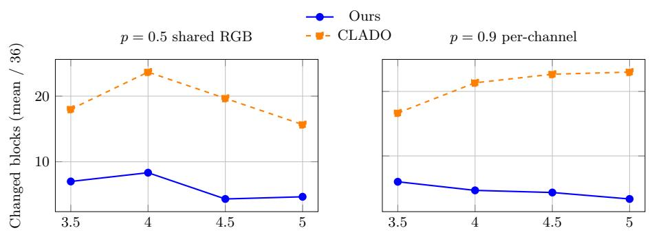

Table 9: Median DRUNet mixed-precision selection times over three runs. Speed-up is the reference time divided by our matched time.
<table><tr><td>Matched comparison</td><td>Our time</td><td>Reference time</td><td>Speed-up</td></tr><tr><td>AIMET backend</td><td>1 min 29 s</td><td>AIMET AMP: 42 min 04 s</td><td>28.4×</td></tr><tr><td>OMPQ, fixed β</td><td>15.7 s</td><td>OMPQ-ORM: 8 min 01 s</td><td>30.6×</td></tr><tr><td>OMPQ, including β search</td><td>15.7 s</td><td>OMPQ-ORM: 13 min 51 s</td><td>52.9×</td></tr><tr><td>CLADO W3/W4/W8</td><td>8.66 s</td><td>CLADO: 6 h 11 min</td><td>2,570×</td></tr></table>

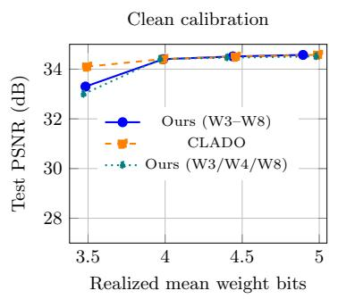

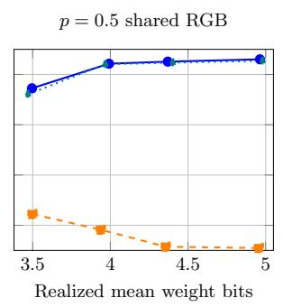

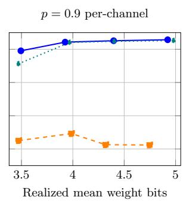  
Figure 1: DRUNet PSNR versus average bit-width for the adapted CLADO comparison. Higher PSNR is better. The dotted curve uses W3/W4/W8 for both methods. Under both calibration corruptions, our method achieves much higher PSNR than CLADO, even with the same candidate bit-widths.

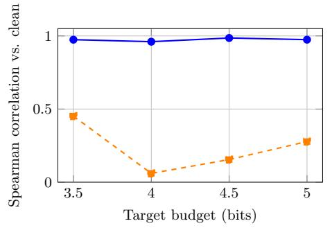

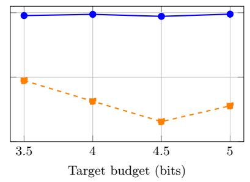  
Figure 2: Allocation stability under corrupted calibration for our method and CLADO. Top: changed blocks (lower is better). Bottom: Spearman correlation with the configuration b calculated with a clean dataset (higher is better). Values are averaged over three calibration seeds. Our method changes fewer block bit-widths than CLADO and better preserves their ordering under both calibra tion corruptions.

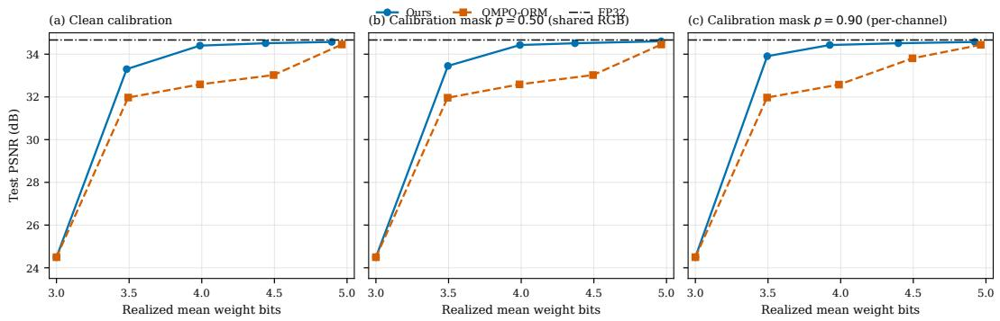  
Figure 3: DRUNet PSNR versus average bit-width for the adapted OMPQ-ORM comparison under clean and corrupted calibration. Higher PSNR is better. Our method achieves higher PSNR at intermediate budgets under both clean and corrupted calibration.

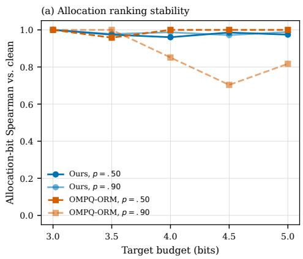

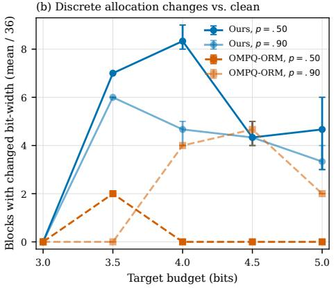  
Figure 4: Allocation stability for the adapted OMPQ-ORM comparison under corrupted calibration. Left: Spearman correlation (higher is better). Right: changed blocks (lower is better). OMPQ-ORM often changes fewer block bit-widths, but its bit-width ordering is less stable under per-channel corruption at higher budgets.

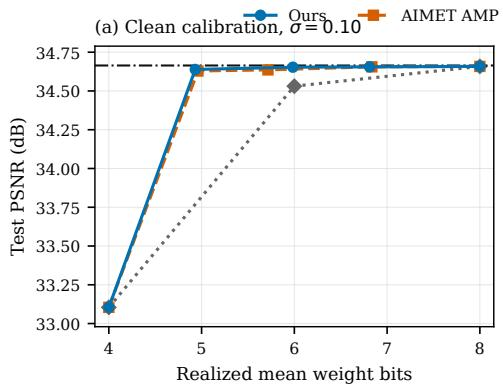

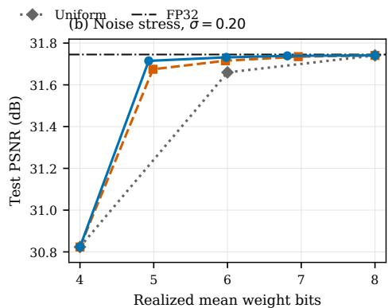

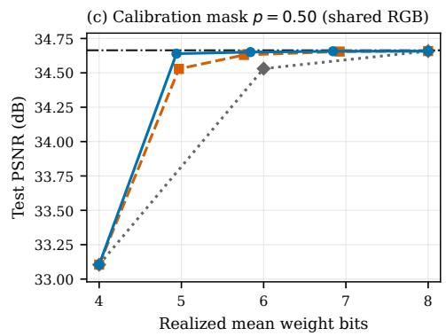

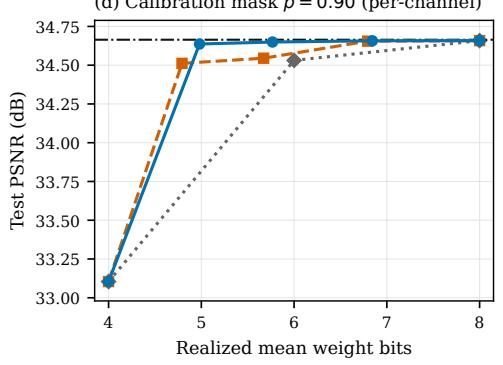  
Figure 5: DRUNet PSNR versus average bit-width for AIMET under clean and corrupted calibration and at $\sigma _ { \mathrm { i n } } = 0 . 2 0$ . Higher PSNR is better. Our method has an advantage at intermediate budgets under corrupted calibration, while both methods approach FP32 PSNR at higher budgets.

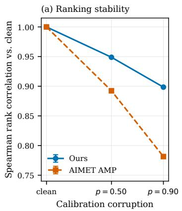

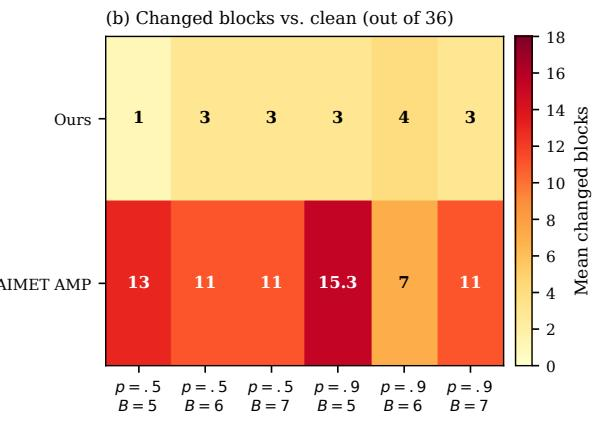  
Figure 6: AIMET allocation stability under the conditions in Figure 5. Left: Spearman correlation (higher is better). Right: changed blocks (lower is better). Our method changes fewer block bitwidths than AIMET and better preserves their ordering under both calibration corruptions.

Allocation calibration p=0.5 shared RGB, target ceiling B=4.5 fixed random sample (seed 20260814; representative selection) Realized bits: Ours 4.3699, CLADO 4.4923

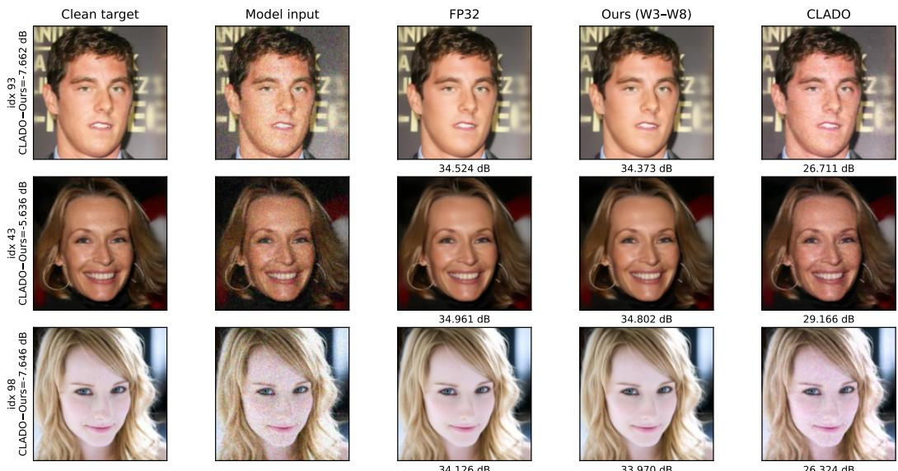  
The 100-image test input is unchanged (nominal =0.10). Calibration masking affects only the selected allocation. Labels are sealed A100 PSNR; display is clipped to [0,1].

Figure 7: Fixed-random DRUNet examples for the adapted CLADO comparison at B = 4.5 under the $p = 0 . 5$ shared calibration corruption. Test inputs are unchanged, and the displayed allocation uses calibration seed 0. In these examples, our outputs remain close to FP32, while CLADO leaves visibly more residual noise.

## B.6 FIXED-RANDOM QUALITATIVE EXAMPLES

The following panels use indices selected with fixed random seeds before inspecting method dif ferences. They are illustrations only; all numerical conclusions use the same 100 test images and three calibration sets as the quantitative tables. Images are clipped to [0, 1] for display, while PSNR is computed from the unclipped model outputs. The average bit-width labels in the panels describe the displayed calibration run, whereas the quantitative tables average three runs. Figures 7, 8, and 9 show the three comparisons.

Clean calibration, target ceiling B = 4 — Fixed random sample (seed 20260812; representative selection) Realized bits: Ours 3.9905, OMPQ-ORM 3.9884

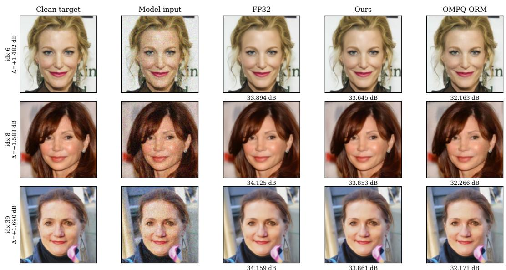  
All panels use the same nominal σ = 0.10 test input. Display is clipped to [0,1]; PSNR uses unclipped outputs.  
Figure 8: Fixed-random DRUNet examples for the adapted OMPQ-ORM comparison at $B = 4$ under clean calibration. Our outputs remain close to FP32 and have higher PSNR than OMPQ-ORM in these examples.

p050\_shared, target budget 5 Fixed random sample (seed 20260811; representative selection)

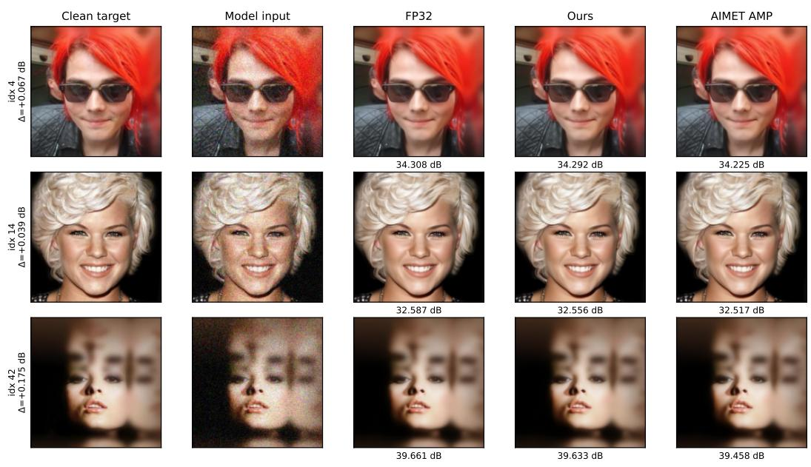  
Display clipped to [0,1]; PSNR is computed on unclipped outputs, exactly as in the sealed protocol.

Figure 9: Fixed-random DRUNet examples for AIMET at $B = 5$ under the $p = 0 . 5$ shared calibration corruption. Both methods remain visually close to FP32, with slightly higher PSNR for our method in these examples.

## B.7 LATENT-DIFFUSION PROTOCOL AND METRIC SCOPE

We use the pretrained CompVis CelebA-HQ 256 × 256 latent diffusion model (Karras et al., 2018; Rombach et al., 2022). Weight reconstruction for our method and Q-Diffusion uses the Q-Diffusion/AdaRound backend (Li et al., 2023). The local score and greedy allocation rule are unchanged from the DRUNet experiment.

Our method and Q-Diffusion use the same 5,120 calibration timestep–latent pairs: 256 pairs at each of 20 timesteps, generated with seed 1234. The U-Net has 123 quantized weight tensors grouped into 48 allocation blocks. Our allocation uses candidates W3–W8 and reaches a parameter-weighted average of 3.9932 bits, with full-precision activations.

All methods generate 50,000 images with DDIM-200 (Song et al., 2021) and η = 0. They use seeds 40 and 41, the same historical 25,000-image reference, and torch-fidelity 0.3.0.

Table 10: CelebA-HQ results on 50,000 images. Paired PSNR is the mean of the per-image PSNR values relative to FP32.
<table><tr><td>Method</td><td>Weights / activations</td><td>FID↓</td><td>Paired PSNR ↑</td></tr><tr><td>FP32</td><td>FP32 / FP32</td><td>20.807</td><td></td></tr><tr><td>Our method</td><td>Mixed (3.9932) / A32</td><td>20.853</td><td>34.644</td></tr><tr><td>Q-Diffusion</td><td>W4 /A32</td><td>22.626</td><td>24.060</td></tr><tr><td>TFMQ-DM</td><td>W4 /A32</td><td>20.928</td><td>24.545</td></tr></table>

Q-Diffusion is the closest allocation-focused control. It shares the calibration pairs and reconstruction backend with our method. Its W4 weights and our mixed-precision weights are reconstructed separately, so this is not a score-only comparison.

TFMQ-DM is a separate end-to-end pipeline designed for diffusion models (Huang et al., 2024). It uses a Temporal Information Block and temporal-feature-aware weight reconstruction. It uses a uniform 4-bit weight allocation in the PSNR comparison, on the same 123 weight tensors as our method.

The four PSNR runs use aligned image indices, seeds, DDIM settings, and output counts. Pairing with historical FP32 and Q-Diffusion outputs is reconstructed from the recorded protocol, with a direct check on 1,000 identical FP32 images. Exact equality of all historical initial noise tensors cannot be verified.

FID (Heusel et al., 2017) compares the generated distribution with the CelebA-HQ reference. Paired PSNR compares each quantized output with the corresponding FP32 output. Figure 10 shows the PSNR distributions, and Figure 11 shows paired generated images.

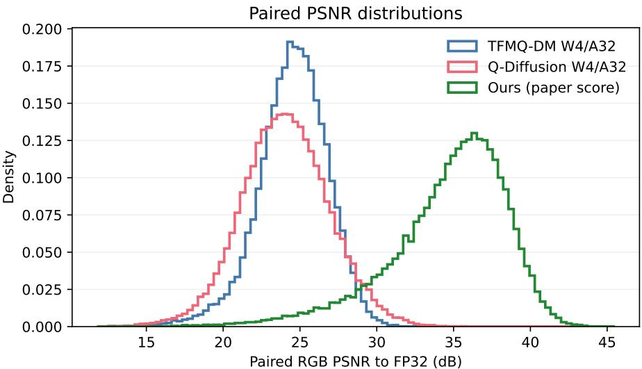  
N = 50,000 finite / 50,000 indices; historical FP32 pairing reconstructed  
Figure 10: Paired PSNR distributions over 50,000 images. This metric measures fidelity to the corresponding FP32 output, not image realism or FID. Higher PSNR is better (further right). Our distribution is shifted towards higher PSNR values, showing closer visual similarity with the paired FP32 outputs.

Deterministic random samples  
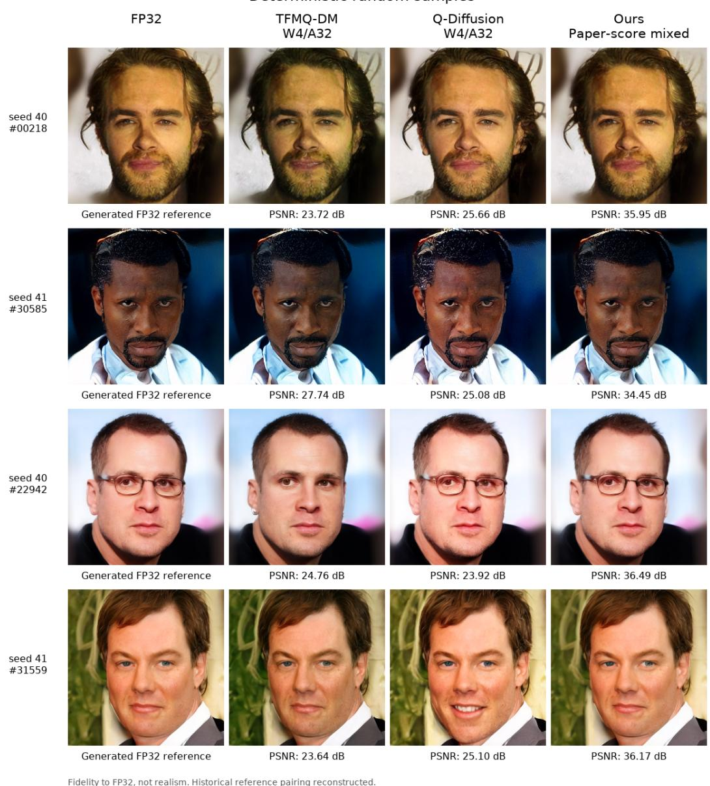  
Figure 11: Paired CelebA-HQ samples. The four indices were selected by a fixed random rule before the metrics and images were inspected. FP32 is the reference output, not the ground truth. These examples show that our method better preserves the facial features and expressions of the FP32 outputs.

## B.8 ADDITIONAL NATURAL-IMAGE RESULTS

We repeat the DRUNet allocation experiments on natural images from BSDS500 (Arbeláez et al., 2011). For each of three seeds, we draw 256 calibration images from the 400 images in the official training and test splits. We evaluate on the 100 validation images, using central 256×256 RGB crops and Gaussian noise with $\sigma _ { \mathrm { i n } } = 0 . 1$ . Calibration and evaluation images are disjoint. The evaluation images and noise are fixed across methods and seeds. We also report results on the CBSD68 subset of these 100 images; this is not an independent test set or the native-resolution CBSD68 protocol.

All methods use the same 36 allocation blocks, symmetric per-output-channel RTN and FP32 intermediate outputs. We compare our method with OMPQ-ORM using W3–W8, and with CLADO using W3/W4/W8. Only calibration inputs receive the corruptions defined in Section 6.1. OMPQ-ORM’s β is selected on clean calibration data and then fixed across conditions. The tables report means over the three calibration seeds. Budgets are upper limits, so mean bit-widths are shown explicitly.

Table 11 shows that our main W3–W8 configuration remains close to CLADO under clean calibration and outperforms OMPQ-ORM. With the common W3/W4/W8 candidates, our method matches CLADO at $B = 4$ . CLADO has higher clean PSNR at $B = 3 . 5$ . Under both corruptions, our method performs better than CLADO with either candidate set. Table 12 shows the same pattern on the CBSD68 subset.

Table 11: BSDS500 results on 100 images. Each entry gives PSNR in dB (higher is better), followed by mean bit-width in parentheses. FP32 obtains 31.062 dB and uniform W4 obtains 28.160 dB.
<table><tr><td>Method</td><td>Candidate bit-widths</td><td>Clean</td><td>p = 0.5 shared p = 0.9 per-channel</td><td></td></tr><tr><td colspan="5"> $B = 3 . 5$ </td></tr><tr><td>Our method</td><td>3-8</td><td>30.415 (3.479) 30.229 (3.495)</td><td></td><td>30.471 (3.494)</td></tr><tr><td>OMPQ-ORM</td><td>3-8</td><td>29.038 (3.494) 29.038 (3.494)</td><td></td><td>29.043 (3.494)</td></tr><tr><td>Our method</td><td>3,4,8</td><td>29.919 (3.470) 30.007 (3.470)</td><td></td><td>30.125 (3.470)</td></tr><tr><td>CLADO</td><td>3,4,8</td><td>30.580 (3.496)25.782 (3.492)</td><td></td><td>27.568 (3.500)</td></tr><tr><td colspan="5"> $B = 4$ </td></tr><tr><td>Our method</td><td>3-8</td><td>30.901 (3.970) 30.899 (3.985)</td><td></td><td>30.898 (3.916)</td></tr><tr><td>OMPQ-ORM</td><td>3-8</td><td>29.551 (3.988) 29.679 (3.988)</td><td></td><td>29.878 (3.988)</td></tr><tr><td>Our method</td><td>3,4,8</td><td>30.863 (3.968) 30.863 (3.968)</td><td></td><td>30.863 (3.968)</td></tr><tr><td>CLADO</td><td>3,4,8</td><td>30.876 (3.988)26.704 (3.994)</td><td></td><td>27.719 (3.969)</td></tr></table>

Table 12: PSNR on the CBSD68 subset, using the same allocations and mean bit-widths as Table 11. FP32 obtains 31.240 dB and uniform W4 obtains 28.187 dB. Higher is better.
<table><tr><td>Method</td><td>Candidate bit-widths</td><td>Clean</td><td> $p = 0 . 5$  shared</td><td> $p = 0 . 9$  per-channel</td></tr><tr><td colspan="5"></td></tr><tr><td rowspan="4">Our method OMPQ-ORM Our method CLADO</td><td>3-8</td><td> $B = 3 . 5$  30.570</td><td>30.374</td><td>30.626</td></tr><tr><td>3-8</td><td>29.186</td><td>29.185</td><td>29.191</td></tr><tr><td>3,4,8</td><td>30.060</td><td>30.150</td><td>30.270</td></tr><tr><td>3,4,8</td><td>30.745</td><td>25.829</td><td>27.604</td></tr><tr><td colspan="5"> $B = 4$ </td></tr><tr><td>Our method</td><td>3-8</td><td>31.073</td><td>31.071</td><td>31.071</td></tr><tr><td>OMPQ-ORM</td><td>3-8</td><td>29.704</td><td>29.814</td><td>30.022</td></tr><tr><td>Our method</td><td>3,4,8</td><td>31.035</td><td>31.035</td><td>31.035</td></tr><tr><td>CLADO</td><td>3,4,8</td><td>31.047</td><td>26.711</td><td>27.778</td></tr></table>

Figures 12 and 13 show the quality of our W3–W8 allocations and their response to calibration corruption. Figure 14 gives fixed-random examples at $B = 4 ,$ with central zooms in Figure 15.

DRUNet on natural images: PSNR vs. realized weight precision RGB center crops 256 x 256 | Gaussian noise sigma=0.1 | FP32 activations  
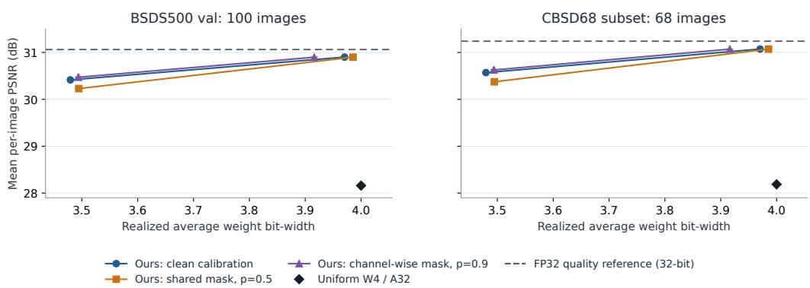  
Mean +/- sample SD over 3 calibration seeds. Lines connect the two measured budgets; no intermediate runs.

Figure 12: DRUNet PSNR on BSDS500 and its CBSD68 subset. Our mixed-precision allocations remain close to FP32 at $B = 4$ under all three calibration conditions. Higher PSNR is better. Error bars show the standard deviation over three calibration seeds. Lines connect the two tested budgets.

Effect of calibration corruption Corrupted-calibration PSNR minus clean-calibration PSNR; evaluation inputs remain fixed  
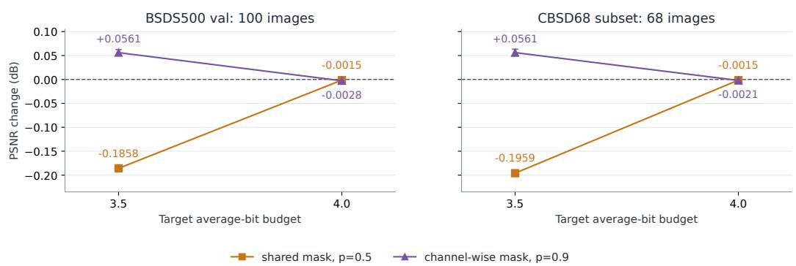  
Same budget ceiling, not identical realized bits. Error bars: sample SD of 3 paired calibration-seed differences.

Figure 13: PSNR change when calibration inputs are corrupted, with the test set fixed. Values near zero indicate little change in quality. The effect is negligible at B = 4 and larger at $B = 3 . 5$ . Error bars show the standard deviation of the three paired calibration-seed differences.

The three images are selected independently of image quality and PSNR, and are shared across all displayed methods and conditions.

DRUNet / Berkeley | target B <= 4 bits | Full 256 x 256 crops Same test inputs across methods | calibration seed 0 | deterministic image selection, independent of scores  
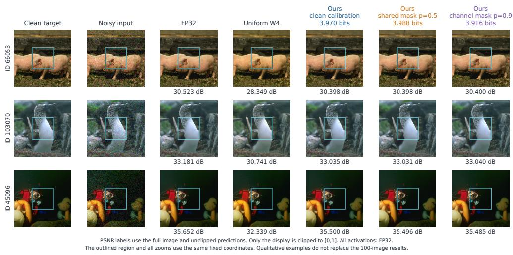  
Figure 14: Fixed-random BSDS500 examples at $B \ = \ 4 ,$ using calibration seed 0. The mixedprecision outputs are similar across calibration conditions. PSNR is computed on the full crop before display clipping.

DRUNet / Berkeley | target B <= 4 bits | Fixed central zoom (96 x 96) Same test inputs across methods | calibration seed 0 | deterministic image selection, independent of scores  
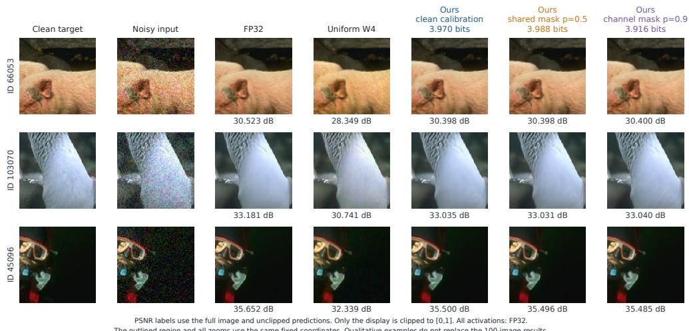  
Figure 15: Central zooms of Figure 14. The same $9 6 \times 9 6$ region is shown for every method. PSNR labels refer to the full crops, not the zooms. Our outputs remain similar under the two calibration corruptions.

## B.9 EFFECT OF ALLOCATION GRANULARITY

The low cost of our allocation method allows us to explore finer choices of bit-width. We replace the 36 blocks by 64 independent convolutional layers, keeping W3–W8, the local score and the greedy rule unchanged. Both variants reuse the same FP32 calibration passes. Each experiment uses three calibration sets of 256 images and a fixed test set of 100 images.

On CelebA, the layerwise allocation improves PSNR by 0.78 dB at $B = 3 . 5$ and reaches the quality of CLADO (Table 13). The CLADO values are those reported in the main comparison; its 36 groups and W3/W4/W8 candidates differ from our layerwise configuration. The block–layer comparison uses its own paired block control.

Table 13: Allocation granularity on CelebA with clean calibration. Values are means over three calibration seeds. CLADO is included as a quality reference with its original groups and candidates.
<table><tr><td>Method</td><td>Decisions</td><td>Candidate bit-widths</td><td>Mean bit-width</td><td>PSNR (dB)</td></tr><tr><td colspan="3"> $B = 3 . 5$ </td><td></td><td></td></tr><tr><td>Our method</td><td>36 blocks</td><td>3-8</td><td>3.482</td><td>33.298</td></tr><tr><td>Our method</td><td>64 layers</td><td>3-8</td><td>3.494</td><td>34.078</td></tr><tr><td>CLADO</td><td>36 blocks</td><td>3,4,8</td><td>3.494</td><td>34.101</td></tr><tr><td colspan="3"> $B = 4$ </td><td></td><td></td></tr><tr><td>Our method</td><td>36 blocks</td><td>3-8</td><td>3.987</td><td>34.401</td></tr><tr><td>Our method</td><td>64 layers</td><td>3-8</td><td>3.990</td><td>34.451</td></tr><tr><td>CLADO</td><td>36 blocks</td><td>3,4,8</td><td>3.988</td><td>34.409</td></tr></table>

On BSDS500, finer allocation improves PSNR at $B = 3 . 5$ in all three calibration conditions, while both granularities give nearly identical quality at B = 4 (Table 14). These results show the benefit of allowing more allocation choices at tight budgets. They compare two grouping choices: grouping also determines which local perturbations are summed before their mean and dispersion are computed.

Table 14: Allocation granularity on BSDS500, with W3–W8 for both variants. Each entry gives mean PSNR in dB, followed by mean bit-width in parentheses.
<table><tr><td>Decisions</td><td>Clean</td><td> $p = 0 . 5 \mathrm { s h a r e d }$ </td><td> $p = 0 . 9$  per-channel</td></tr><tr><td>36 blocks</td><td>30.415 (3.479)</td><td> $B = 3 . 5$  30.229 (3.495)</td><td>30.471 (3.494)</td></tr><tr><td>64 layers</td><td>30.656 (3.498)</td><td>30.581 (3.494)</td><td>30.658 (3.498)</td></tr><tr><td></td><td></td><td> $B = 4$ </td><td></td></tr><tr><td>36 blocks</td><td>30.901 (3.970)</td><td>30.899 (3.985)</td><td>30.898 (3.916)</td></tr><tr><td>64 layers</td><td>30.904 (3.975)</td><td>30.903 (3.993)</td><td>30.899 (3.997)</td></tr></table>