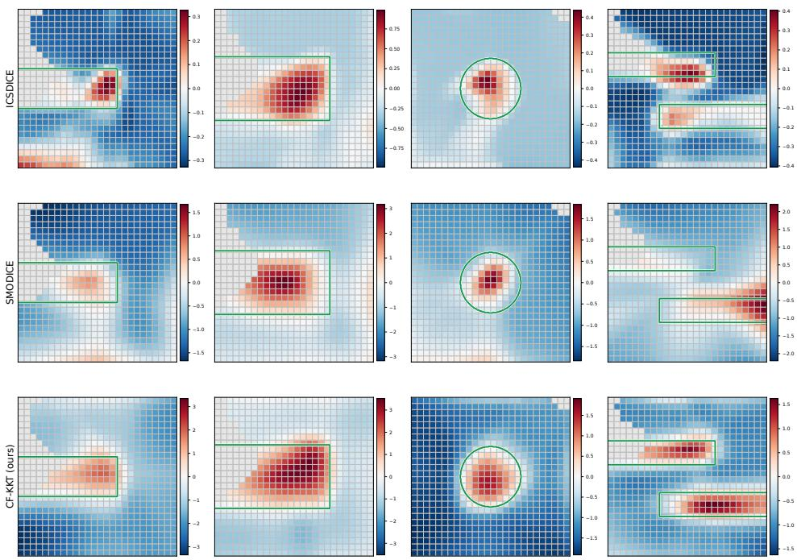
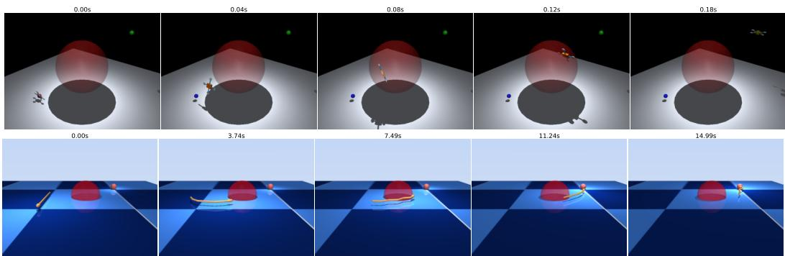
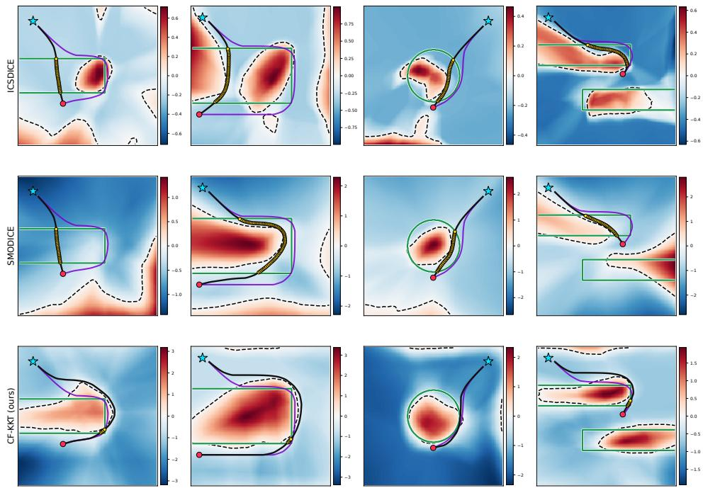
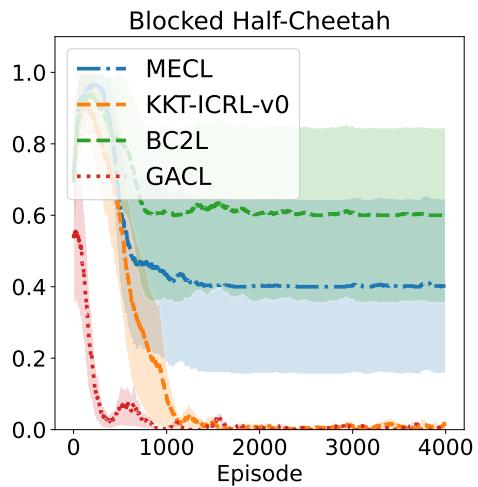
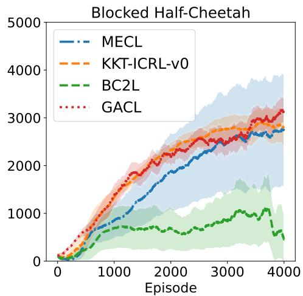

# LEARNING UNKNOWN CONSTRAINTS WITHOUT UN-SAFE DATA VIA OPTIMALITY AND COUNTERFACTUAL REGULARIZATION

Zhouyu Zhang   
School of Electrical and Computer Engineering   
Georgia Institute of Technology   
Atlanta, GA 30309   
zzhang3097@gatech.edu   
Glen Chou   
School of Cybersecurity and Privacy   
School of Aerospace Engineering   
Georgia Institute of Technology   
chou@gatech.edu   
Chih-Yuan Chiu   
School of Electrical and Computer Engineering   
Georgia Institute of Technology   
Atlanta, GA 30309   
cyc@gatech.edu

## ABSTRACT

Learning from demonstrations (LfD) provides a framework for inferring unknown constraints from locally optimal, constraint-satisfying expert behavior. Existing approaches largely fall into two paradigms, constrained inverse optimal control (CIOC) and inverse constrained reinforcement learning (ICRL). CIOC exploits optimality conditions such as the Karush–Kuhn–Tucker (KKT) conditions but typically assumes known dynamics and structured constraint representations. Meanwhile, ICRL accommodates complex unknown constraints and unknown transition dynamics but often requires extensive online exploration, during which unsafe constraint violations may occur. In this work, we introduce Counterfactual KKT (CF-KKT), a constraint learning framework that leverages learned dynamics and locally optimal demonstrations to recover unknown constraints without requiring known dynamics or additional risky exploration, thereby combining the data efficiency and safety advantages of CIOC with the flexibility of ICRL. First, we use a locally learned differentiable dynamics model to impose KKT-inspired optimality conditions directly on the demonstrations. Second, we use the learned dynamics to generate reward-improving counterfactual behaviors near the demonstrations, revealing behaviors that would be preferable in the absence of the unknown constraint and thus providing synthetic infeasible data. When the constraint parameterization is known, the same learned-dynamics framework enables direct CIOC-based parameter recovery, and we characterize its sensitivity to dynamics misspecification. Across high-dimensional robotic control tasks, our approach learns neural constraint representations with improved safety and data efficiency relative to state-of-the-art offline ICRL baselines.

## 1 INTRODUCTION

Autonomous systems deployed in safety-critical applications, such as autonomous driving and warehouse operations, must adhere to constraints that encode safety and task specifications (Altman, 1999; Achiam et al., 2017; Borkar, 2005; Mayne et al., 2000; Berberich et al., 2021; Magni & Scattolini, 2004). Given the difficulty of manually engineering such constraints and the advent of data-driven methods, learning from demonstration (LfD) has attracted increasing attention as a promising framework for recovering constraints from locally optimal and constraint-abiding expert trajectories (Chou et al., 2020b; 2022; Quan et al., 2024; Liu et al., 2023). LfD-based constraint learning paradigms are often either based on inverse optimal control (IOC) (Englert et al., 2017; Keshavarz et al., 2011; Johnson et al., 2013; Rickenbach et al., 2024; Wulfmeier et al., 2017; Chou et al., 2020b;a; 2018) or inverse constrained reinforcement learning (ICRL) (Scobee & Sastry, 2019; McPherson et al., 2021; Malik et al., 2021; Papadimitriou et al., 2022; Liu & Zhu, 2022; 2024; Park et al., 2020; Jang et al., 2023). IOC-based methods recover constraints by enforcing consistency with the Karush–Kuhn–Tucker (KKT) conditions that characterize the local optimality of a given set of demonstrations (Rickenbach et al., 2024; Menner et al., 2019; Nguyen et al., 2026; Zhang et al., 2026; Chiu et al., 2026) under the dynamics models (Rickenbach et al., 2024; Menner et al., 2019) and control methodology (Nguyen et al., 2026; Zhang et al., 2026; Chiu et al., 2026) from which the demonstrations were obtained. However, such methods assume access to known, smooth system dynamics, which precludes their applicability to high-dimensional, black-box systems. In contrast, ICRL-based constraint recovery (Scobee & Sastry, 2019; McPherson et al., 2021; Malik et al., 2021; Papadimitriou et al., 2022; Liu & Zhu, 2022; 2024; Park et al., 2020; Jang et al., 2023) accommodates unknown dynamics and flexible neural constraint representations. However, such methods usually require computation- (McPherson et al., 2021; Liu et al., 2023) and data-heavy (Scobee & Sastry, 2019; Liu & Zhu, 2022; Quan et al., 2024) online exploration, may induce unsafe constraint violations during training (Malik et al., 2021; Liu et al., 2023; Quan et al., 2024), and have few theoretical guarantees of constraint recovery accuracy (Malik et al., 2021; Park et al., 2020; Quan et al., 2024). While recent offline variants (Quan et al., 2024) avoid online exploration during training, they still rely on offline data generated by potentially constraint-violating policies to identify unsafe regions, which can be difficult or unsafe to collect in real-world systems.

In this work, we bridge CIOC and ICRL to enable constraint learning under unknown dynamics and constraint representations without requiring constraint-violating data. Our approach, Counterfactual KKT (CF-KKT), learns local dynamics from constraint-satisfying expert demonstrations and uses them to combine KKT-inspired optimality conditions with synthetic reward-improving counterfactual trajectories. These counterfactuals provide information about constraint-violating states without requiring constraint-violating trajectories to be executed in the environment. We further show that locally learned dynamics can support CIOC-based parameter recovery when the constraint parameterization is known. Concretely, our contributions are:

1. For settings with closed-form a priori known constraint parameterizations, we present a twostage framework which first learns system dynamics without additional demonstration data, then leverages the learned system dynamics to infer the unknown constraint via CIOC;

2. For settings with neural network (NN)-represented constraints, we introduce Counterfactual KKT (CF-KKT), which combines KKT-inspired optimality conditions with model-generated counterfactual trajectories to learn unknown constraints without observed constraint-violating data;

3. We present a theoretical analysis of the sensitivity of the recovered constraints to system dynamics misspecification;

4. We evaluate CF-KKT in simulation across low- and high-dimensional systems with black-box dynamics, demonstrating improved constraint recovery and downstream safety over existing offline ICRL methods while structurally using less data, all of which are safe.

Notation Given non-negative integers $n _ { 1 }$ and $n _ { 2 }$ with $n _ { 1 } < n _ { 2 }$ , we define $[ n _ { 2 } ] : = \{ 1 , \cdots , n _ { 2 } \}$ and $\left[ n _ { 1 } , n _ { 2 } \right] : = \left\{ n _ { 1 } , \cdots , n _ { 2 } \right\}$ . We use $C ^ { k }$ to denote k-times continuous differentiability. Given a differentiable function $f : \mathbb { R } ^ { n }  \mathbb { R } ^ { m }$ , we define the Jacobian matrix $\nabla _ { \mathbf { x } } f \in \mathbb { R } ^ { m \times n }$ such that $\begin{array} { r } { [ \nabla _ { \mathbf { x } } f ] _ { i j } : = \frac { \partial f _ { i } } { \partial x _ { i } } } \end{array}$ for each $i \in [ m ] , j \in [ n ]$

## 2 RELATED WORK

Our work relates most closely to constrained inverse optimal control (CIOC), which infers constraints from expert demonstrations using Karush–Kuhn–Tucker (KKT) optimality conditions (Englert et al., 2017; Keshavarz et al., 2011; Johnson et al., 2013; Rickenbach et al., 2024; Chou et al., 2020b; 2018; Menner et al., 2019; Nguyen et al., 2026; Zhang et al., 2026; Chou et al., 2019; Pérez-D’Arpino & Shah, 2017; Chiu et al., 2026). Existing CIOC-based constraint learning methods are typically highly data-efficient because they exploit the local optimality of demonstrations directly (Chou et al., 2020b). However, many such approaches assume known differentiable dynamics and structured constraint parameterizations (Chou et al., 2020b;a), which hampers their applicability to high-dimensional and neural network-represented systems. While GP-based approaches relax parameterization assumptions (Chou et al., 2022), they scale poorly with dataset size and still require known dynamics. In contrast, our work considers high-dimensional unknown dynamics and unknown constraint representations while preserving data efficiency, and enables further data-efficiency gains when the constraint parameterization is provided.

Partly in parallel with CIOC, ICRL-based methods (Liu et al., 2025; 2023) were developed for inferring constraints from expert trajectories generated via constrained MDPs (CMDPs) (Malik et al., 2021). ICRL usually assumes access to a simulator rather than closed-form dynamics (in contrast to CIOC), and can be adapted to settings with unknown system dynamics or rewards (Liu & Zhu, 2022; 2024; Park et al., 2020; Jang et al., 2023). However, ICRL-based constraint recovery typically relies on iterative online environment exploration and constrained RL subroutines, leading to high computational cost, high sample complexity, and potentially unsafe exploration during training, which are unacceptable in time-sensitive and safety-critical settings. Uncertainty-aware ICRL methods aim to reduce constraint violation risk (Xu & Liu, 2024; Subramanian et al., 2024) but nonetheless stil require online data. Offline ICRL (Liu et al., 2025) avoids online exploration. The primary prior offline method, ICSDICE (Quan et al., 2024), constructs higher-reward constraint-violating distributions to identify unsafe regions (echoing earlier CIOC work by Chou et al. (2018)); however, doing so still requires a fixed dataset containing behaviors that are not guaranteed to satisfy the unknown constraint.

In contrast to the literature surveyed above, our work combines the safety and data efficiency advantage of CIOC with the representational flexibility of ICRL. Our approach leverages learned local dynamics to enable KKT-inspired inference under unknown dynamics, while synthetic reward improving counterfactual data provide off-demonstration evidence of infeasibility without requiring observed constraint violations. In contrast, Chou et al. (2019) uses hit-and-run sampling to generate counterfactuals but still relies heavily on known parametric constraints and explicit dynamics.

## 3 PRELIMINARIES AND PROBLEM FORMULATION

We first review ICRL methods, with an emphasis on ICSDICE (Quan et al., 2024), which serves as our primary offline ICRL baseline (Sec. 3.1). We then introduce the constrained inverse optimal control formulation and its associated KKT conditions (Sec. 3.2), before formally stating the constraint-recovery problem considered in this work (Sec. 3.3).

## 3.1 INVERSE CONSTRAINED REINFORCEMENT LEARNING (ICRL)

Consider a discrete-time, continuous-space constrained Markov decision process (CMDP) $( S , { \mathcal { A } } , f , r , c , { \bar { \rho } } , \gamma )$ specified by a state space $S \subseteq \mathbb { R } ^ { n }$ , control (action) space ${ \mathcal { A } } \subseteq \mathbb { R } ^ { m }$ , system (transition) dynamics map $f : S \times \mathcal { \bar { A } }  S$ , reward map $r : S \times \mathcal { A }  \mathbb { R }$ , constraint map $c : S \times \mathcal { A }  \mathbb { R }$ initial state distribution ${ \bar { \rho } } ,$ and discount factor $\gamma \in [ 0 , 1 )$ , with $f ( \cdot , \cdot ) , r ( \cdot , \cdot )$ , and $c ( \cdot , \cdot )$ all in $C ^ { 1 }$ Given a CMDP with known constraint function $c ( \cdot , \cdot )$ , we consider the following horizon $- T .$ forward constrained reinforcement learning $( F C R L ) p r o b l e m .$ , which computes the optimal policy $\pi : { \mathcal { S } }  A$ that maximizes, in expectation, the discounted cumulative reward $\scriptstyle \sum _ { t = 0 } ^ { T } \gamma ^ { t } r ( x _ { t } , u _ { t } )$ subject to the hard constraint $c ( x _ { t } , u _ { t } ) \leq 0$ over all times $t \in [ 0 , T ]$

$$
\pi ^ { \star } = \arg \operatorname* { m a x } _ { \pi : S  A } \quad \mathbb { E } _ { \bar { \rho } , \pi } [ \sum _ { t = 0 } ^ { T } \gamma ^ { t } r ( x _ { t } , u _ { t } ) ]\tag{1a}
$$

$$
\mathrm { s . t . } \quad \mathbb { P } _ { \bar { \rho } , \pi } \big ( c ( x _ { t } , u _ { t } ) \leq 0 \big ) = 1 , \quad \forall t \in [ 0 , T ] .\tag{1b}
$$

Above, the notations $\mathbb { E } _ { \bar { \rho } , \pi }$ in (1a) and $\mathbb { P } _ { \bar { \rho } , \pi }$ in (1b) respectively denote expectations and probabilities taken over $x _ { 0 } \sim \bar { \rho }$ and $u _ { t } \sim \pi$ for each $t \in [ 0 , T ]$ , and, given $\mathbf { u } : = ( u _ { 0 } , \cdot \cdot \cdot , u _ { T } )$ drawn componentwise from $\pi ,$ the states $\mathbf { x } : = ( x _ { 0 } , \cdot \cdot \cdot , x _ { T } )$ are defined to satisfy $x _ { t + 1 } = f ( x _ { t } , u _ { t } )$ for each $t \in$ $[ 0 , T - 1 ]$

In contrast, the ICRL problem aims to recover a priori unknown constraints $c ( \cdot )$ from demonstrations of reward-maximizing and constraint-satisfying state-control trajectories. Although current ICRL methods often assume that the demonstrations available for constraint learning are generated online via continuous environment exploration (“interaction”), such exploratory actions are often costly or unsafe in safety-critical settings (Malik et al., 2021; Liu et al., 2023; Kim et al., 2023; Hugessen et al., 2024). Offline ICRL methods include ICSDICE (Quan et al., 2024), which leverages two fixed demonstration datasets $\mathcal { D } _ { E }$ and $\mathcal { D } _ { \pi }$ for constraint inference, but does not allow environmental exploration during training. Concretely, the expert dataset $\mathcal { D } _ { E } : = \{ ( x _ { t } ^ { ( d ) } , u _ { t } ^ { ( d ) } , x _ { t + 1 } ^ { ( d ) } , r _ { t } ^ { ( d ) } ) : t \in [ 0 , T - 1 ] , d \in [ D _ { E } ] \}$ contains $D _ { E }$ state-control trajectories generated using a constraint-satisfying optimal expert policy $\pi _ { E }$ , and a dataset $\mathcal { D } _ { \pi } : = \{ ( x _ { t } ^ { ( d ) } , u _ { t } ^ { ( d ) } , x _ { t + 1 } ^ { ( d ) } , r _ { t } ^ { ( d ) } ) : t \in [ 0 , T - 1 ] , d \in [ D _ { \pi } ] \}$ contains $D _ { \pi }$ statecontrol trajectories generated using possibly constraint-violating policies.

Although ICSDICE avoids online exploration during training, constructing $\mathcal { D } _ { \pi }$ still requires behavior from policies that are not guaranteed to satisfy the unknown constraint.

## 3.2 CONSTRAINED INVERSE OPTIMAL CONTROL (CIOC)

Let $S \subseteq \mathbb { R } ^ { n } , \ A \subseteq \mathbb { R } ^ { m } , \ f : S \times \mathcal { A } \to \mathcal { S } , r : \mathcal { S } \times \mathcal { A } \to \mathbb { R }$ , and $c : \mathcal { S } \times \mathcal { A }  \mathbb { R }$ denote a state space, control (action) space, system dynamics map, reward map, and constraint map, respectively. The horizon-T constrained forward optimal control (CFOC) problem, presented below, aims to compute optimal state-control trajectories $( \mathbf { x } , \mathbf { u } ) : = \ ( x _ { 0 } , \cdot \cdot \cdot , x _ { T } , u _ { 0 } , \cdot \cdot \cdot , u _ { T } ) \in \ \mathbb { R } ^ { ( n + m ) ( T + 1 ) }$ which minimize the cumulative cost $\textstyle \sum _ { t = 0 } ^ { T } - r ( x _ { t } , u _ { t } )$ while satisfying the system dynamics $x _ { t + 1 } =$ $f ( x _ { t } , u _ { t } )$ and constraints $c ( x _ { t } , u _ { t } ) \leq 0$ throughout $[ 0 , T - 1 ]$

$$
\begin{array} { r l } { \underset { \mathbf { x } , \mathbf { u } } { \mathrm { m i n } } } & { { } \sum _ { t = 0 } ^ { T } - r ( x _ { t } , u _ { t } ) } \end{array}\tag{2a}
$$

$$
\mathrm { s . t . } \quad x _ { t + 1 } = f ( x _ { t } , u _ { t } ) , \forall t \in [ 0 , T - 1 ] , \quad c ( x _ { t } , u _ { t } ) \leq 0 , \forall t \in [ 0 , T ] .\tag{2b}
$$

Meanwhile, in the constrained inverse optimal control (CIOC) problem, a constraint learner aims to recover a priori unknown constraints $c ( \cdot , \cdot )$ from a set of expert trajectories $\mathcal { D } _ { E } : = \{ ( x _ { t } ^ { ( d ) } , u _ { t } ^ { ( d ) } ) : t \in$ $[ 0 , T ] , d \in [ D ] \}$ which optimize (2), assuming the reward map $r ( \cdot , \cdot )$ is known. (The dynamics map $f ( \cdot , \cdot )$ may either be a priori known or unknown to the constraint learner.) The standard approach in CIOC for recovering the unknown constraint map $c ( \cdot , \cdot )$ entails formulating the KKT equations corresponding to (2), as presented below in (4). Let $\lambda : = ( \lambda _ { 0 } , \cdot \cdot \cdot , \lambda _ { T } )$ and $\pmb { \nu } : = ( \nu _ { 0 } , \cdots , \nu _ { T - 1 } )$ denote dual variables corresponding to the constraint and dynamics constraints in (2b), respectively, across times $t ,$ and define the Lagrangian $L : \mathcal { S } ^ { T + 1 } \times \mathcal { A } ^ { T + \mathbf { i } } \times \mathbb { R } ^ { T + 1 } \times \mathbb { R } ^ { n T }  \mathbb { R }$ by:

$$
\begin{array} { r } { L ( { \mathbf x } , { \mathbf u } , \lambda , \nu ) : = \sum _ { t = 0 } ^ { T } - r ( x _ { t } , u _ { t } ) + \sum _ { t = 0 } ^ { T - 1 } \nu _ { t } ^ { \top } ( x _ { t + 1 } - f ( x _ { t } , u _ { t } ) ) + \sum _ { t = 0 } ^ { T } \lambda _ { t } c ( x _ { t } , u _ { t } ) . } \end{array}\tag{3}
$$

The KKT equations for the CFOC problem (2) are thus:

$$
c ( x _ { t } , u _ { t } ) \leq 0 \quad \perp \quad \lambda _ { t } \geq 0 , \quad \quad \forall t \in [ 0 , T ] ,\tag{4a}
$$

$$
\nabla _ { ( \mathbf { x } , \mathbf { u } ) } L ( \mathbf { x } , \mathbf { u } , \lambda , \nu ) = 0 .\tag{4b}
$$

Above, ⊥ indicates complementarity of the left- and right-hand-side conditions. In $( 4 \mathrm { a } ) , c ( x _ { t } , u _ { t } ) < 0$ implies $\lambda _ { t } = 0$ , while $\lambda _ { t } > 0$ implies $c ( x _ { t } , u _ { t } ) = 0 ;$ equivalently, $\lambda _ { t } c ( x _ { t } , u _ { t } ) = 0$ . In settings in which the constraint map $c ( \cdot , \cdot )$ is a priori known to be parameterized in a certain form, the CIOC problem reduces to the recovery of parameter values for which the resulting constraint map $c ( \cdot , \cdot )$ satisfies the KKT system (4), when evaluated at expert state-control trajectories (x, u) in $\mathring { \mathcal { D } } ^ { E }$ (see Sec. 4.1). Such parameter recovery problems can often be recast as mixed-integer programs (MIP) that, for certain constraint maps characterized by low-dimensional parameters, are efficient to solve exactly (Chou et al., 2020b).

Comparing CIOC and ICRL Methods for Constraint Recovery CIOC exploits demonstration optimality directly, but typically requires known closed-form dynamics and structured constraint parameterizations. ICRL, in contrast, accommodates unknown dynamics and flexible constraint representations, but obtains off-expert coverage from additional behavior data beyond the expert demonstrations. This trade-off motivates the hybrid setting considered in this work.

## 3.3 PROBLEM STATEMENT

We are given an expert dataset $\mathcal { D } _ { E }$ of constraint-abiding optimal trajectories generated by solving a CFOC problem of the form (2). Moreover, suppose the reward map $r : \mathcal { S } \times \mathcal { A } $ R is known (we consider an unknown reward case in Appendix B.2) but the dynamics map $f : \mathcal { S } \times \mathcal { A }  \mathcal { S }$ and constraint map $c : \mathcal { S } \times \mathcal { A } $ R are unknown. We aim to recover a neural network (NN) representation $\hat { c } ( \cdot , \cdot ; \theta ) : \mathcal { S } \times \mathcal { A } $ R for an a priori unknown constraint map $c : S \times \mathcal { A }  \mathbb { R }$ , where $\boldsymbol { \theta } \in \mathbb { R } ^ { M _ { \theta } }$ describes NN weights to be trained using the dataset $\mathcal { D } _ { E }$

## 4 KKT-INFORMED CONSTRAINT LEARNING

We consider two constraint-recovery settings that share a learned local dynamics model. We first treat known parametric constraints with a CIOC-based mixed-integer program (MIP) in Sec. 4.1, then remove the known parameterization and introduce Counterfactual KKT (CF-KKT) for neural constraints in Sec. 4.2.

Learned local dynamics. Using expert transitions $( x _ { t } , u _ { t } , x _ { t + 1 } ) \in \mathcal { D } _ { E }$ , we fit $\hat { f } ( \cdot , \cdot ; \psi ) : \mathcal { S } \times \mathcal { A } $ S by $\mathcal { L } _ { \mathrm { d y n } } ( \psi ) = \mathbb { E } _ { \mathcal { D } _ { E } } [ \| \hat { f } ( x _ { t } , u _ { t } ; \psi ) - x _ { t + 1 } \| _ { 2 } ^ { 2 } ]$ , and use ${ \hat { f } } ( \cdot , \cdot ; \psi )$ for both inference procedures below.

## 4.1 LEARNING PARAMETRIC CONSTRAINTS VIA MIP

When the unknown constraint has a known closed-form parameterization $\hat { c } ( \cdot , \cdot ; \theta )$ , we recover the unknown parameter θ by applying CIOC to the learned dynamics model. We define the full Lagrangian and its stationarity residual by:

$$
\begin{array} { r } { \hat { L } ( \mathbf { x } , \mathbf { u } , \boldsymbol { \lambda } , \boldsymbol { \nu } ; \boldsymbol { \theta } , \boldsymbol { \psi } ) : = \sum _ { t = 0 } ^ { T } - r ( x _ { t } , u _ { t } ) + \sum _ { t = 0 } ^ { T } \lambda _ { t } \hat { c } ( x _ { t } , u _ { t } ; \boldsymbol { \theta } ) + \sum _ { t = 0 } ^ { T - 1 } \nu _ { t } ^ { \top } \big ( x _ { t + 1 } - \hat { f } ( x _ { t } , u _ { t } ; \boldsymbol { \psi } ) \big ) , } \end{array}\tag{5}
$$

$$
\hat { \mathbf { s } } ( \mathbf { x } , \mathbf { u } , \lambda , \nu ; \theta , \psi ) : = \nabla _ { ( \mathbf { x } , \mathbf { u } ) } \hat { L } ( \mathbf { x } , \mathbf { u } , \lambda , \nu ; \theta , \psi ) .\tag{6}
$$

We seek constraint parameter values θ which are consistent with the KKT-optimality of the statecontrol trajectories $\{ ( \mathbf { x } ^ { ( d ) } , \mathbf { u } ^ { ( d ) } ) : d \in [ D _ { E } ] \}$ in the expert demonstration dataset $\mathcal { D } ^ { E }$ . To this end, in $( 7 ) ,$ we pose a relaxed inverse KKT problem analogous to (Chou et al., 2020b, Prob. 2). Concretely, we aim to recover parameters θ and dual variables $\lambda _ { 1 : D } : = ( \lambda ^ { ( d ) } : d \in [ D _ { E } ] )$ and $\pmb { \nu } _ { 1 : D } : = ( \pmb { \nu } ^ { ( d ) } : d \in [ D _ { E } ] )$ that minimize the sum, over all $d \in \lbrack D _ { E } ]$ , of the magnitudes of stationarity residuals $\hat { \mathbf { s } } \big ( \bar { \mathbf { x } ^ { ( d ) } } , \bar { \mathbf { u } ^ { ( d ) } } , \lambda ^ { ( d ) } , \nu ^ { ( d ) } ; \theta , \psi \big )$ , while adhering to the primal/dual feasibility and complementary slackness constraints in (4a):

$$
\begin{array} { r l } { \underset { \theta , \boldsymbol { \lambda _ { 1 : D _ { E } } } , \boldsymbol { \nu _ { 1 : D _ { E } } } } { \operatorname* { m i n } } } & { { } \sum _ { d = 1 } ^ { D _ { E } } \left\| \hat { \mathbf { s } } ( \mathbf { x } ^ { ( d ) } , \mathbf { u } ^ { ( d ) } , \boldsymbol { \lambda } ^ { ( d ) } , \boldsymbol { \nu } ^ { ( d ) } ; \theta , \psi ) \right\| _ { 2 } ^ { 2 } } \end{array}\tag{7a}
$$

$$
\begin{array} { r } { \mathrm { s . t . } \qquad \hat { c } ( x _ { t } ^ { ( d ) } , u _ { t } ^ { ( d ) } ; \theta ) \leq 0 \quad \perp \quad \lambda _ { t } ^ { ( d ) } \geq 0 , \qquad \forall t \in [ 0 , T ] , d \in [ D _ { E } ] . } \end{array}\tag{7b}
$$

In the CIOC-based constraint recovery literature (Chou et al., 2020b; Zhang et al., 2026), (7) is often solved using off-the-shelf solvers such as Gurobi Optimization, LLC (2024), with the constraints (7b) encoded via big-M reformulations (Bertsimas & Tsitsiklis, 1998). We provide an analysis of MIP sensitivity to dynamics misspecification in App. E.

## 4.2 COUNTERFACTUAL KKT (CF-KKT) CONSTRAINT LEARNING

When the constraint form is unknown, we represent it by a neural network $\hat { c } ( \cdot , \cdot ; \theta )$ and combine expert-side KKT supervision with synthetic counterfactual supervision.

Transition-wise auxiliary multipliers. The exact KKT stationarity condition in Sec. 3.2 is defined over an entire trajectory and couples neighboring time steps through the dynamics multipliers $\pmb { \nu } = \left( \nu _ { 0 } , \dots , \nu _ { T - 1 } \right)$ . Directly imposing this trajectory-level system is inconvenient for stochastic mini-batch training, where transition tuples $( x _ { t } ^ { ( \bar { d } ) } , u _ { t } ^ { ( \bar { d } ) } , x _ { t + 1 } ^ { ( d ) } , \bar { r _ { t } ^ { ( d ) } } )$ ) are sampled across time indices and demonstrations. We therefore construct a transition-wise KKT-informed objective using bounded auxiliary multipliers for the local inequality and dynamics terms, as defined below:

$$
\tilde { \lambda } _ { t } ( x _ { t } , u _ { t } ; \theta ) = \lambda _ { \operatorname* { m a x } } \sigma \big ( \hat { c } ( x _ { t } , u _ { t } ; \theta ) \big ) , \qquad \tilde { \nu } _ { t } = \nu _ { \operatorname* { m a x } } \operatorname { t a n h } ( \eta _ { t } ) ,\tag{8}
$$

where $\lambda _ { \operatorname* { m a x } } , \nu _ { \operatorname* { m a x } } > 0$ are fixed bounds, $\eta _ { t } \in \mathbb { R } ^ { n }$ is per-timestep, and tanh(·) is applied elementwise. Above, (8) ensures $\tilde { \lambda } _ { t } \geq 0$ , consistent with dual feasibility, and calibrates $\| \tilde { \lambda } _ { t } \| _ { 2 }$ such that $\tilde { \lambda } _ { t }$ becomes small for states predicted well inside the feasible region and larger as $\hat { c } ( x _ { t } , u _ { t } ; \theta )$ approaches or exceeds zero. The equality multiplier $\tilde { \nu } _ { t } \in [ - \nu _ { \operatorname* { m a x } } , \nu _ { \operatorname* { m a x } } ] ^ { n }$ can take either sign within a bounded range. Bounding both multipliers improves numerical stability during training.

KKT-informed loss. For a single transition, define the local Lagrangian:

$$
\hat { L } _ { t } ( x _ { t } , u _ { t } , x _ { t + 1 } , \lambda , \nu ; \theta , \psi ) : = - r ( x _ { t } , u _ { t } ) + \lambda _ { t } \hat { c } ( x _ { t } , u _ { t } ; \theta ) + \nu _ { t } ^ { \top } \big [ \hat { f } ( x _ { t } , u _ { t } ; \psi ) - x _ { t + 1 } \big ] .\tag{9}
$$

Given weights $w _ { p } , w _ { c } , w _ { a } > 0$ , we define

$$
\begin{array} { r l } & { \mathcal { L } _ { \mathrm { K K T } } ( \theta ) = \mathbb { E } _ { \mathcal { D } _ { E } } \left[ \left| \left| \nabla _ { x _ { t } , u _ { t } } \hat { L } _ { t } ( x _ { t } , u _ { t } , x _ { t + 1 } , \lambda , \nu ; \theta , \psi ) \right| _ { \lambda = \tilde { \lambda } _ { t } , \nu = \tilde { \nu } _ { t } } \right| \right| _ { 2 } ^ { 2 } } \\ & { \quad \quad \quad \quad \quad \quad \quad + w _ { p } \operatorname* { m a x } \big \{ \hat { c } ( x _ { t } , u _ { t } ; \theta ) , 0 \big \} ^ { 2 } + w _ { c } \big ( \tilde { \lambda } _ { t } \hat { c } ( x _ { t } , u _ { t } ; \theta ) \big ) ^ { 2 } + w _ { a } \big | \hat { c } ( x _ { t } , u _ { t } ; \theta ) \big | \big ] . } \end{array}\tag{10}
$$

The first three terms respectively penalize a transition-wise stationarity residual, primal constraint violation, and violation of complementary slackness. The final activity regularizer discourages the learned constraint from assigning large negative values to all expert transitions.

Remark 1. Transition tuples of the form $( x _ { t } ^ { ( d ) } , u _ { t } ^ { ( d ) } , x _ { t + 1 } ^ { ( d ) } )$ can be shuffled across time indices and trajectories to support stochastic mini-batch training. The full trajectory KKT conditions, however, include cross-time coupling through the dynamics multipliers $\nu _ { t } .$ . In our implementation, training with the full trajectory KKT residual produces Inf/NaN losses on BlockedAnt and HalfCheetah, while collapsing the cumulative reward on the other environments, which we attribute to the numerical instability of cross-time multiplier $\nu _ { t }$ recursion. Motivated by this observation and the computational convenience of transition-wise training, we instead incorporate the per-time Lagrangian (9) into $\mathcal { L } _ { K K T } ( \theta )$

Synthetic Counterfactual Trajectories The KKT-informed loss in (10) is evaluated only on expert demonstrations, which are constraint-satisfying by construction. Consequently, it provides limited direct supervision information about infeasible behaviors away from the expert trajectories. To address this issue without collecting unsafe data, CF-KKT uses the learned dynamics model to generate synthetic counterfactual trajectories near the demonstrations.

We sample multiple windows of H consecutive expert transitions from demonstrations. We denote the window from trajectory $d ,$ starting at time index i as $\{ ( x _ { i + h } ^ { ( d ) } , u _ { i + h } ^ { ( d ) } ) \} _ { h = 0 } ^ { H - 1 }$ . For each window, we generate $K$ perturbed control sequences, indexed by $k \in [ K ] ,$ , by independently perturbing the corresponding expert control at each rollout step, while holding d fixed:

$$
u _ { h } ^ { ( k ) } = \mathrm { c l i p } \big ( u _ { i + h } ^ { ( d ) } + \sigma \epsilon _ { h } ^ { ( d , k ) } , - 1 , 1 \big ) , \qquad \epsilon _ { h } ^ { ( d , k ) } \sim \mathcal { N } ( 0 , I _ { m } ) .\tag{11}
$$

The perturbed and baseline rollouts start from the same demonstrated state, $x _ { 0 } ^ { ( k ) } = \tilde { x } _ { 0 } = x _ { i } ^ { ( d ) }$ and use the same learned dynamics. The counterfactual rollout follows $x _ { h + 1 } ^ { ( k ) } = \tilde { f } ( x _ { h } ^ { ( k ) } , u _ { h } ^ { ( k ) } ; \psi )$ for $h \in [ 0 , H - 1 ]$ , while the baseline follows the corresponding expert action sequence, with states rolled out through the learned dynamics: $\tilde { u } _ { h } = u _ { i + h } ^ { ( d ) }$ and $\tilde { x } _ { h + 1 } = \hat { f } ( \tilde { x } _ { h } , \tilde { u } _ { h } ; \psi )$

A truncated H-step reward alone does not account for the cost-to-go of the terminal state $x _ { H }$ , since a perturbation may obtain larger short-horizon reward while steering the system towards a state with poor future cumulative reward. We therefore augment the rollout reward with a value function estimate $\hat { V } ( \cdot )$ , whose estimation from expert return-to-go is described in App. B:

$$
\begin{array} { r } { \hat { J } _ { V } ^ { ( k ) } = \sum _ { h = 0 } ^ { H - 1 } \gamma ^ { h } r \big ( \boldsymbol x _ { h } ^ { ( k ) } , \boldsymbol u _ { h } ^ { ( k ) } \big ) + \gamma ^ { H } \hat { V } \big ( \boldsymbol x _ { H } ^ { ( k ) } \big ) , } \end{array}\tag{12}
$$

$$
\begin{array} { r } { \hat { J } _ { V , \mathrm { b a s e } } = \sum _ { h = 0 } ^ { H - 1 } \gamma ^ { h } r \left( \tilde { x } _ { h } , \tilde { u } _ { h } \right) + \gamma ^ { H } \hat { V } \left( \tilde { x } _ { H } \right) . } \end{array}\tag{13}
$$

We then define the value-augmented counterfactual advantage as $\hat { A } _ { V } ^ { ( k ) } : = \hat { J } _ { V } ^ { ( k ) } - \hat { J } _ { V , \mathrm { b a s e } }$ . The terminal-value term $\hat { V } ( \cdot )$ accounts for consequences that extend beyond the finite $H { \mathrm { - s t e p } }$ rollout. Comparing the perturbed rollout against the expert-action trajectory from the same initial state then isolates the effect of the action perturbation, rather than differences due to the starting state.

We retain counterfactuals whose value-augmented return exceeds that of the expert-action baseline, i.e., $w _ { k } = \mathbf { 1 } \lceil \hat { A } _ { V } ^ { ( k ) } > 0 \rceil$ . Because both $\hat { f }$ and $\hat { V }$ are learned, $w _ { k }$ is a practical approximation to an ideal selection rule. To state the approximate rule, let $V _ { i + H } ^ { \star } ( x )$ denote the optimal feasible discounted cost-to-go from state x over the remainder of the expert horizon under the true dynamics, with $V _ { i + H } ^ { \star } ( x ) = - \infty$ if no feasible continuation exists. Let $\mathop { \mathcal { J } _ { V ^ { \star } } ^ { ( k ) } }$ and $J _ { V ^ { \star } , \mathrm { b a s e } }$ denote the two rewards in (12) using true-dynamics rollouts and replacing $\hat { V }$ by $V _ { i + H } ^ { \star }$

Lemma 1 (Positive Counterfactual Advantage Implies Infeasibility). Let $( x _ { 0 : T } ^ { E } , u _ { 0 : T } ^ { E } )$ be a globally optimal feasible expert trajectory, and consider an H-step window beginning at expert time i. Denote the corresponding expert controls by $u _ { i : i + H - 1 } ^ { E } : = ( u _ { i } ^ { E } , \ldots , u _ { i + H - 1 } ^ { E } )$ . For any alternative control sequence u0: ${ \bf \Phi } _ { H - 1 } : = \left( u _ { 0 } , \ldots , u _ { H - 1 } \right)$ initialized at $x _ { 0 } = x _ { i } ^ { E }$ , define

$$
\begin{array} { r } { J _ { i , H } ^ { V } ( u _ { 0 : H - 1 } ) = \sum _ { h = 0 } ^ { H - 1 } \gamma ^ { h } r ( x _ { h } , u _ { h } ) + \gamma ^ { H } V _ { i + H } ^ { \star } ( x _ { H } ) , } \end{array}\tag{14}
$$

where $x _ { h + 1 } = f ( x _ { h } , u _ { h } )$ follows the true dynamics and $V _ { i + H } ^ { \star } ( x _ { H } )$ is the optimal constrained value achievablefrom $x _ { H }$ over the remaining time steps $i + H , \dots , T .$ . If no feasible trajectory exists from xH over these remaining steps, we define $V _ { i + H } ^ { \star } ( x _ { H } ) = - \infty$ . Then

$$
J _ { i , H } ^ { V } ( u _ { 0 : H - 1 } ) > J _ { i , H } ^ { V } ( u _ { i : i + H - 1 } ^ { E } ) \quad \Longrightarrow \quad \exists h \in \{ 0 , \dots , H - 1 \} : c ( x _ { h } , u _ { h } ) > 0 .\tag{15}
$$

Proof. Let $J _ { E , i }$ i denote the expert return from time i to $T .$ . Because the expert trajectory is globally optimal, the expert controls from time i onward are optimal when initialized at $x _ { i } ^ { E }$ . Hence,

$$
J _ { i , H } ^ { V } ( u _ { i : i + H - 1 } ^ { E } ) = J _ { E , i } .
$$

Now suppose that $c ( x _ { h } , u _ { h } ) \leq 0$ for every $h \in \{ 0 , \ldots , H - 1 \}$ . If no feasible trajectory exists from xH over the remaining time steps, then $\dot { J } _ { i , H } ^ { V } ( \dot { u _ { 0 : H - 1 } } ) = - \infty$ , so the strict inequality cannot hold.

Otherwise, following $u _ { 0 : H - 1 }$ for H steps and then taking the optimal feasible controls from $x _ { H }$ defines a feasible trajectory starting from $x _ { i } ^ { E } .$ . By global optimality of the expert,

$$
J _ { i , H } ^ { V } ( \Breve { u } _ { 0 : H - 1 } ) \stackrel { \cdot } { \leq } J _ { E , i } ^ { - } = J _ { i , H } ^ { V } ( u _ { i : i + H - 1 } ^ { E } ) ,
$$

which contradicts the assumed strict inequality.

The assumptions of Lemma 1 are sufficient conditions rather than requirements we expect to hold exactly in practice. Accordingly, CF-KKT uses positive value-augmented advantage as a soft selection criterion, whose empirical validity is supported by the results in Appendix C.

Counterfactual Constraint Loss Let $B ^ { ( k ) } = \{ ( x _ { h } ^ { ( k ) } , u _ { h } ^ { ( k ) } ) \} _ { h = 0 } ^ { H - 1 }$ denote the k-th counterfactual set. For the selected sets, we train the average learned constraint value along the rollout to exceed a positive margin m:

$$
\mathcal { L } _ { \mathrm { C F } } ( \boldsymbol { \theta } ) = \frac { \sum _ { k = 1 } ^ { K } w _ { k } \cdot \operatorname* { m a x } \left\{ m - \frac { 1 } { H } \sum _ { h = 0 } ^ { H - 1 } \hat { c } \big ( { x } _ { h } ^ { ( k ) } , { u } _ { h } ^ { ( k ) } ; \boldsymbol { \theta } \big ) , 0 \right\} ^ { 2 } } { \sum _ { k = 1 } ^ { K } w _ { k } } .\tag{16}
$$

The counterfactual trajectories are treated as fixed synthetic samples during the constraint update, so gradients of (16) propagate only through $\hat { c } ( \cdot , \cdot ; \theta )$ . By Lemma 1, a counterfactual trajectory which generates a higher reward than a constrained optimal trajectory must violate constraint feasibility at one or more timesteps. We nevertheless use the mean constraint value along the rollout to provide denser information. This is motivated by the empirical observation that the rollout may violate feasibility at multiple timesteps. In particular, App. C shows high state-level precision among selected counterfactuals, indicating that a substantial fraction of states along a positive-advantage rollout are indeed infeasible. Averaging therefore provides a denser and smoother loss gradient than a max-based or single-step objective that uses fewer steps to train. Finally, CF-KKT combines the original KKT-informed loss with the synthetic counterfactual loss:

$$
{ \mathcal { L } } _ { \mathrm { C F - K K T } } ( \theta ) = \alpha _ { \mathrm { K K T } } { \mathcal { L } } _ { \mathrm { K K T } } ( \theta ) + \alpha _ { \mathrm { C F } } { \mathcal { L } } _ { \mathrm { C F } } ( \theta ) .\tag{17}
$$

## 5 EXPERIMENTS

We evaluate three increasingly unstructured settings: known parametric constraints under unknown dynamics, neural constraint recovery in continuous mazes, and high-dimensional MuJoCo tasks with unknown dynamics and constraint geometry. Our methods infer constraints from expert demonstrations, using learned dynamics to provide synthetic off-demonstration supervision when needed.

Baselines. We compare against ICSDICE (Quan et al., 2024), SMODICE (Ma et al., 2022), and IQ-Learn (Garg et al., 2021). ICSDICE is our primary offline ICRL baseline and explicitly learns a constraint from expert and suboptimal offline data. SMODICE is an offline imitation method based on distribution matching and does not natively recover a constraint mask $\mathbf { 1 } [ c ( x ) \leq 0 ] ;$ for constraint-recovery and downstream-planning comparisons, we modify SMODICE to convert its learned state score into a feasibility mask. IQ-Learn likewise does not recover an explicit constraint; we therefore keep its standard imitation-learning formulation and evaluate the learned policy directly. In the known-parametric setting, we additionally compare against a parametric variant of ICSDICE using the same constraint family as the MIP method.

## 5.1 KNOWN PARAMETRIC CONSTRAINTS UNDER UNKNOWN DYNAMICS

We first consider the structured setting in which the constraint family is known up to a scalar parameter θ but the dynamics are unknown. We evaluate HalfCheetah, BlockedAnt, Swimmer, and Quadcopter, using one expert trajectory to fit $\hat { f }$ and recover θ via the MIP in Sec. 4.1. Environment, constraint, and demonstration details are given in App. A.1.

Comparison against Parametric ICSDICE. For HalfCheetah and BlockedAnt, we also train ICSDICE with the same scalar constraint family $c _ { \theta } ( x ) = \theta - x _ { \mathrm { p o s } }$ , with pos being position on the x-axis. MIP method uses the expert trajectory, whereas ICSDICE additionally uses suboptimal trajectories from (Liu et al., 2023).

Table 1 shows that the MIP closely recovers the true value of θ on Swimmer, Quadcopter, and HalfCheetah. The larger BlockedAnt error (−2.05 versus −3.0) is consistent with larger KKT residuals in its demonstrations. Parametric ICSDICE yields −1.23 on HalfCheetah and −3.99 on BlockedAnt, showing that the same parametric family can produce substantially different estimates under an occupancy-based objective.

## 5.2 UNKNOWN CONSTRAINT GEOMETRY IN CONTINUOUS MAZES

  
Figure 1: Ground-truth and learned constraint maps for 4 maze environments across ICSDICE (top), SMODICE (middle), and CF-KKT (bottom). Red, blue, and green denote predicted unsafe states, predicted safe states, and the ground-truth constraint boundary.

We next remove the assumption of known constraint parameterization while keeping the state dimension small enough to limit constraint complexity. These continuous maze environments let us test whether CF-KKT can recover qualitatively different constraint geometries, rather tatively different constraint geometries, rather

<table><tr><td>Env.</td><td>θ*</td><td>MIP</td><td>ICSDICE Ô MIP error</td><td></td></tr><tr><td>Swimmer</td><td>0.04</td><td>0.0484</td><td></td><td>+0.0084</td></tr><tr><td>Quadcopter</td><td>64</td><td>64</td><td></td><td>0</td></tr><tr><td>HalfCheetah</td><td>-3.0</td><td>-2.98</td><td>-1.23</td><td>+0.02</td></tr><tr><td>BlockedAnt</td><td>-3.0</td><td>-2.05</td><td>-3.99</td><td>+0.95</td></tr></table>

Table 1: Parametric recovery performance than only a scalar parameter within a known family.

Environment and Demonstrations. We use four 2D navigation tasks (Obstacle, Wide, Disk, Zigzag) with double-integrator dynamics and unknown obstacle geometries. CF-KKT receives feasible expert demonstrations; baselines additionally receive a suboptimal dataset that may contain violations. For more dynamics, reward, geometry, and dataset-generation details, see App. A.2.

Constraint IoU. Let $\mathcal { U } ^ { \star }$ be the ground-truth unsafe region and $\hat { \mathcal { U } } = \{ x : \hat { c } ( x ; \theta ) > \tau \}$ the predicted unsafe set. We report $\mathrm { I o U } = | \hat { \mathcal { U } } \cap \mathcal { U } ^ { \star } | / | \hat { \mathcal { U } } \cup \mathcal { U } ^ { \star } |$ on a uniform 161 × 161 position grid with zero velocity. To account for method-dependent score scales, we use the common percentile threshold $\tau = Q _ { 0 . 8 5 } ( \{ \hat { c } ( x ; \theta ) : x \in \mathrm { g r i d } \} )$ . Table 2 and Fig. 1 show that CF-KKT recovers the constraint geometry more accurately on every environment. Its mean IoU is 0.707, compared with 0.425 for ICSDICE and 0.379 for SMODICE. The largest gains over ICSDICE occur on Disk (0.815 versus 0.428) and Obstacle (0.590 versus 0.276).

Downstream Planning. We convert each learned constraint to a 61 × 61 occupancy grid, plan to the goal with Dijkstra over predicted feasible cells, and track the waypoints with the expert PD controller. Across 20 feasible starts per seed, we report goal reaching, return (cumulative reward), and ground-truth violation rate Violation =

<table><tr><td>Env.</td><td>SMODICE</td><td>ICSDICE</td><td>CF-KKT</td><td>∆</td></tr><tr><td>Obstacle</td><td>0.275±0.405</td><td>0.276±0.193</td><td>0.590±0.153</td><td>+0.314</td></tr><tr><td>Wide</td><td>0.547±0.113</td><td>0.600±0.140</td><td>0.724±0.083</td><td>+0.124</td></tr><tr><td>Disk</td><td>0.363±0.133</td><td>0.428±0.218</td><td>0.815±0.057 +0.387</td><td></td></tr><tr><td>Zigzag</td><td>0.330±0.054</td><td>0.394±0.172</td><td>0.698±0.079 +0.304</td><td></td></tr><tr><td>Mean</td><td>0.379</td><td>0.425</td><td>0.707</td><td>+0.282</td></tr></table>

Table 2: Maze constraint IoU (mean ± std over seeds); $\Delta$ is relative to ICSDICE.

$T ^ { - 1 } \sum _ { t = 0 } ^ { T - 1 } \mathbf { 1 } [ c ( x _ { t } , u _ { t } ) > 0 ]$ . IQ-Learn does not recover a mask, so we evaluate its imitation policy directly. Representative planning examples are shown in App. B.1.

Table 3 shows the return-violation table. IQ-Learn achieves a violation rate of 0.001 on Wide but reaches the goal from only $5 / 2 0$ starts. The oracle planner itself has nonzero violation on the rectangular environments because PD tracking can clip corners, which provides a planner-dependent

<table><tr><td>Env.</td><td>Metric</td><td>Oracle</td><td>IQ-Learn</td><td>SMODICE</td><td>ICSDICE</td><td>CF-KKT</td></tr><tr><td rowspan="3">Obstacle</td><td>Goal</td><td> $2 0 . 0 / 2 0$ </td><td> $1 0 . 0 / 2 0$ </td><td> $1 8 . 3 / 2 0 $ </td><td> $1 8 . 7 / 2 0 $ </td><td> $2 0 . 0 / 2 0 $ </td></tr><tr><td>Viol.</td><td>0.018</td><td> $0 . 1 2 4 \pm 0 . 2 0 3$ </td><td> $0 . 1 7 5 \pm 0 . 0 5 3$ </td><td> $0 . 1 7 4 \pm 0 . 0 3 8$ </td><td> $\mathbf { 0 . 0 4 2 \mathop { \pm } { 0 . 0 6 8 } }$ </td></tr><tr><td>Return</td><td>-58.2</td><td> $- 8 9 . 7 \pm 5 . 8$ </td><td> $- 4 7 . 1 \pm 7 . 4$ </td><td> $- 4 5 . 8 \pm 1 . 6$ </td><td> $- 5 5 . 6 \pm 6 . 8$ </td></tr><tr><td rowspan="3">Wide</td><td>Goal</td><td>19.0/20</td><td> $5 . 0 / 2 0$ </td><td> $1 7 . 7 / 2 0$ </td><td> $1 8 . 3 / 2 0 $ </td><td> $1 7 . 7 / 2 0$ </td></tr><tr><td>Viol.</td><td>0.032</td><td> $0 . 0 0 1 \dot { \pm } 0 . 0 0 2$ </td><td> $0 . 2 2 6 \pm 0 . 1 1 1$ </td><td> $0 . 2 0 0 \pm 0 . 0 2 8$ </td><td> $\mathbf { 0 . 0 8 5 \ : \pm ^ { \prime } 0 . 1 2 1 }$ </td></tr><tr><td>Return</td><td> $- 7 0 . 2$ </td><td> $- 1 0 6 . 5 \pm 1 1 . 3$ </td><td> $- 5 8 . 2 \pm 7 . 3$ </td><td> $- 6 3 . 4 \pm 7 . 0$ </td><td> $- 6 8 . 5 \pm 1 1 . 4$ </td></tr><tr><td rowspan="3">Disk</td><td>Goal</td><td>20.0/20</td><td> $1 4 . 3 / 2 0$ </td><td> $1 9 . 3 / 2 0 $ </td><td> $1 9 . 3 / 2 0 $ </td><td> $2 0 . 0 / 2 0 $ </td></tr><tr><td>Viol.</td><td>0.000</td><td> $0 . 0 4 1 \pm 0 . 0 3 9$ </td><td> $0 . 1 8 1 \pm 0 . 0 1 6$ </td><td> $0 . 1 4 0 \pm 0 . 0 6 0$ </td><td> $\mathbf { 0 . 0 8 0 \mathop { \pm } 0 . 0 1 9 }$ </td></tr><tr><td>Return</td><td>-48.5</td><td> $- 8 4 . 0 \pm 2 . 4$ </td><td> $- 4 6 . 4 \pm 0 . 6$ </td><td> $- 4 7 . 1 \pm 0 . 8$ </td><td> $- 4 8 . 3 \pm 0 . 5$ </td></tr><tr><td rowspan="3">Zigzag</td><td>Goal</td><td>20.0/20</td><td> $7 . 0 / 2 0$ </td><td> $1 8 . 3 / 2 0 $ </td><td> $1 7 . 3 / 2 0$ </td><td> $1 8 . 7 / 2 0 $ </td></tr><tr><td>Viol.</td><td>0.060</td><td> $0 . 0 8 6 \pm 0 . 0 8 4$ </td><td> $0 . 2 3 0 \pm 0 . 0 3 3$ </td><td> $0 . 2 0 9 \pm 0 . 0 5 2$ </td><td> $\mathbf { 0 . 0 9 3 \pm 0 . 0 4 4 }$ </td></tr><tr><td>Return</td><td>-68.3</td><td> $- 9 2 . 3 \pm 5 . 8$ </td><td> $- 4 5 . 6 \pm 5 . 4$ </td><td> $- 5 6 . 4 \pm 7 . 2$ </td><td> $- 6 2 . 4 \pm 1 . 6$ </td></tr></table>

Table 3: Maze downstream planning over 20 starts. $\mathbf { \hat { \mu } _ { \mathrm { ( i o l . } } ^ { 6 6 } } ,$ is the true violating-timestep fraction.
<table><tr><td></td><td colspan="2">ICSDICE</td><td colspan="2">IQ-Learn</td><td colspan="2">SMODICE</td><td colspan="2">CF-KKT</td></tr><tr><td>Env.</td><td>Ret.</td><td>Viol.</td><td>Ret.</td><td>Viol.</td><td>Ret.</td><td>Viol.</td><td>Ret.</td><td>Viol.</td></tr><tr><td>Ant_ls</td><td> $1 2 5 7 \pm 1 2 3$ </td><td> $8 7 . 5 \pm 1 1 7 . 0$ </td><td> $6 5 \pm 1 5 5 ^ { \dagger }$ </td><td> $6 . 3 \pm 1 . 8$ </td><td> $9 7 0 \pm 1 8 6$ </td><td> $8 6 . 8 \pm 1 1 3 . 5$ </td><td> $1 1 3 0 \pm 9 1$ </td><td> ${ \bf 2 . 8 \pm 0 . 9 }$ </td></tr><tr><td>BlockedAnt</td><td> $2 2 6 5 \pm 4 0 0$ </td><td> $8 2 . 3 \pm 5 6 . 1$ </td><td> $2 5 8 \pm 3 1 6 ^ { \dag }$ </td><td> $1 4 5 . 3 \pm 1 3 5 . 2$ </td><td> $1 3 2 3 \pm 5 3 7 ^ { \dagger }$ </td><td> $1 2 4 . 2 \pm 8 4 . 7$ </td><td> $2 4 4 9 \pm 2 3 7$ </td><td> ${ \bf 1 5 . 3 \pm 4 . 2 }$ </td></tr><tr><td>BlockedHopper</td><td> $4 2 0 \pm 1 1 2$ </td><td> $1 1 0 . 6 \pm 2 6 . 6$ </td><td> $2 6 9 \pm 2 7 4 ^ { \dag }$ </td><td> $1 3 4 . 1 \pm 2 6 0 . 6$ </td><td> $3 2 5 \pm 2 7 5$ </td><td> $8 2 . 9 \pm 6 3 . 4$ </td><td> $4 5 4 \pm 2 5 2$ </td><td> ${ \bf 1 7 . 6 \pm 2 1 . 2 }$ </td></tr><tr><td>HalfCheetah</td><td> $2 6 5 7 \pm 3 1 8$ </td><td> $8 3 . 0 \pm 5 8 . 9$ </td><td> $- 2 7 0 \pm 4 4 7 ^ { \dagger }$ </td><td> $0 . 0 \pm 0 . 0$ </td><td> $1 9 1 5 \pm 9 7 7$ </td><td> $3 1 3 . 1 \pm 3 4 9 . 0$ </td><td> $2 3 3 8 \pm 7 8 8$ </td><td> ${ \bf 5 4 . 3 \pm 4 8 . 9 }$ </td></tr><tr><td> $\mathrm { { W a l k e r \_ l s } }$ </td><td> $6 8 2 \pm 3 9 2$ </td><td> $1 7 0 . 1 \pm 1 0 6 . 9$ </td><td> $3 6 1 \pm 2 3 3$ </td><td> $3 9 . 0 \pm 1 6 . 8$ </td><td> $1 4 0 \pm 2 2 4$ </td><td> ${ \bf 3 7 . 6 \pm 5 6 . 5 }$ </td><td> $4 1 0 \pm 2 8 3$ </td><td> $7 4 . 3 \pm 5 6 . 3$ </td></tr></table>

Table 4: MuJoCo downstream return and violations (N = 10). Bold marks the lowest mean violation among explicit-mask methods; † denotes severe return collapse.  
floor. Relative to ICSDICE, CF-KKT lowers violation on all four environments while retaining comparable goal-reaching performance: 0.174 → 0.042 on Obstacle, 0.200 → 0.085 on Wide, 0.140→0.080 on Disk, and 0.209→0.093 on Zigzag.

## 5.3 HIGH-DIMENSIONAL NEURAL CONSTRAINT LEARNING

Finally, we evaluate our method over the fully unstructured high-dimensional setting, where the transition dynamics are unknown and the constraint is represented by a neural network rather than a known parametric family.

Datasets. We use the five continuous-control environments and offline datasets from ICSDICE (Quan et al., 2024): Ant\_ls, BlockedAnt, BlockedHopper, HalfCheetahWithObstacle, and Walker\_ls. Each environment has a hidden ground-truth constraint used only for evaluation. The benchmark contains 50,000 expert transitions in $\mathcal { D } _ { E }$ and 200,000 suboptimal transitions in $\mathcal { D } _ { \pi }$ . Under the data protocol above, the CF-KKT constraint learner receives $\mathcal { D } _ { E } .$ , while SMODICE, IQ-Learn, and ICSDICE use more data, i.e., $\mathcal { D } _ { E } \cup \mathcal { D } _ { \pi }$

Downstream Offline Policy Learning. Following the offline policy extraction procedure of Quan et al. (2024), we train the downstream value function and advantage-weighted policy, while filtering transitions according to the learned constraint. For the state-only constraints in these environments, we use the feasibility mask $M ( x _ { t + 1 } ) = \mathbf { 1 } [ \widehat { c } ( x _ { t + 1 } ; \theta ) \leq 0 ]$ . Transitions predicted to be unsafe are excluded from the value and advantage-weighted policy updates.

Evaluation Metrics. For downstream control, we report constraint violations, defined as the number of violating timesteps in a 1000-step evaluation episode, and return, the cumulative task reward. Results are averaged over 10 random seeds.

Downstream Safety and Return. Table 4 shows that CF-KKT reduces mean violations relative to ICSDICE on all five tasks, by 34.6%–96.8%. On BlockedAnt and BlockedHopper, it also improves mean return. The remaining tasks exhibit a safety–return trade-off; on Walker\_ls, SMODICE obtains fewer violations but substantially lower return. Thus, the learned CF-KKT mask consistently improves safety relative to ICSDICE while preserving useful task performance.

## 6 CONCLUSION

We present a framework for learning unknown constraints from expert demonstrations under unknown dynamics. For known parametric constraints, we combine learned local dynamics with CIOCbased recovery and analyze sensitivity to model error. For neural constraints, CF-KKT combines KKT-inspired expert supervision with synthetic reward-improving counterfactuals to provide offdemonstration constraint information without violations. Experiments on robotic control tasks show improved constraint recovery and downstream safety over offline ICRL baselines. Limitations include environment-dependent loss weights, the assumption of a known differentiable reward, omission of cross-time coupling in the transition-wise KKT objective, and dependence of counterfactual quality on learned dynamics away from the demonstrations. Automating loss weighting and incorporating reward and dynamics uncertainty are promising directions for future work.

## GENERATIVE AI USE DISCLOSURE

Generative AI tools were used in the preparation of this work to assist with refining mathematical statements and annotations, providing feedback on human-designed experimental methodology and ablation, and improving the organization, clarity, and presentation of the manuscript. They were also used for language editing, restructuring sections, and formatting equations and tables.

All AI-assisted mathematical arguments were reviewed and revised by the authors, and all reported experimental results were produced and verified by the authors. Generative AI was not treated as a source of scientific evidence or authority; technical claims, derivations, and conclusions were checked against the underlying analysis and experimental results. The authors take full responsibility for the final content of the paper, including all text, claims, and artifacts produced with the assistance of generative AI.

## REFERENCES

Joshua Achiam, David Held, Aviv Tamar, and Pieter Abbeel. Constrained Policy Optimization. In Proceedings of the 34th International Conference on Machine Learning, volume 70 of Proceedings of Machine Learning Research, pp. 22–31, 06–11 Aug 2017.

E. Altman. Constrained Markov Decision Processes. Chapman and Hall, 1999.

Julian Berberich, Johannes Köhler, Matthias A. Müller, and Frank Allgöwer. Data-Driven Model Predictive Control With Stability and Robustness Guarantees. IEEE Transactions on Automatic Control (TAC), 66(4):1702–1717, 2021.

Dimitris Bertsimas and John Tsitsiklis. Introduction to Linear Optimization. Athena Scientific, 1998.

V.S. Borkar. An Actor-critic Algorithm for Constrained Markov Decision Processes. Systems & Control Letters, 54(3):207–213, 2005.

Chih-Yuan Chiu, Zhouyu Zhang, and Glen Chou. Learning Constraints From Stochastic Partially-Observed Closed-Loop Demonstrations. IEEE Control Systems Letters, 10:43–48, 2026.

Glen Chou, Dmitry Berenson, and Necmiye Ozay. Learning Constraints from Demonstrations. Workshop on the Algorithmic Foundations ofRobotics (WAFR), 2018.

Glen Chou, Necmiye Ozay, and Dmitry Berenson. Learning Parametric Constraints in High Dimensions from Demonstrations. In CoRL, 2019.

Glen Chou, Necmiye Ozay, and Dmitry Berenson. Uncertainty-Aware Constraint Learning for Adaptive Safe Motion Planning from Demonstrations. In CoRL 2020, Cambridge, MA, USA, 2020a.

Glen Chou, Necmiye Ozay, and Dmitry Berenson. Learning Constraints From Locally-Optimal Demonstrations Under Cost Function Uncertainty. IEEE Robotics and Automation Letters (RA-L), 5(2):3682–3690, 2020b.

Glen Chou, Hao Wang, and Dmitry Berenson. Gaussian Process Constraint Learning for Scalable Chance-Constrained Motion Planning From Demonstrations. IEEE Robotics and Automation Letters, 7(2):3827–3834, 2022. doi: 10.1109/LRA.2022.3148436.

Peter Englert, Ngo Anh Vien, and Marc Toussaint. Inverse KKT: Learning Cost Functions of Manipulation Tasks from Demonstrations. The International Journal ofRobotics Research (IJRR), 36(13-14):1474–1488, 2017.

Divyansh Garg, Shuvam Chakraborty, Chris Cundy, Jiaming Song, and Stefano Ermon. Iq-learn: Inverse soft-q learning for imitation. Advances in Neural Information Processing Systems, 34: 4028–4039, 2021.

Gurobi Optimization, LLC. Gurobi Optimizer Reference Manual, 2024. URL https://www. gurobi.com.

Taylor Howell, Nimrod Gileadi, Saran Tunyasuvunakool, Kevin Zakka, Tom Erez, and Yuval Tassa. Predictive Sampling: Real-time Behaviour Synthesis with MuJoCo. arXiv preprint arXiv:2212.00541, 2022.

Adriana Hugessen, Harley Wiltzer, and Glen Berseth. Simplifying constraint inference with inverse reinforcement learning. In A. Globerson, L. Mackey, D. Belgrave, A. Fan, U. Paquet, J. Tomczak, and C. Zhang (eds.), Advances in Neural Information Processing Systems, volume 37, pp. 44501–44525. Curran Associates, Inc., 2024. doi: 10.52202/ 079017-1413. URL https://proceedings.neurips.cc/paper\_files/paper/ 2024/file/4eb5cc598a6271528ed9b84bb9879e9b-Paper-Conference.pdf.

Jaehwi Jang, Minjae Song, and Daehyung Park. Inverse Constraint Learning and Generalization by Transferable Reward Decomposition. IEEE Robotics and Automation Letters, 9(1):279–286, 2023.

Miles Johnson, Navid Aghasadeghi, and Timothy Bretl. Inverse Optimal Control for Deterministic Continuous-time Nonlinear Systems. In CDC, 2013.

Arezou Keshavarz, Yang Wang, and Stephen P. Boyd. Imputing a Convex Objective Function. In ISIC, pp. 613–619. IEEE, 2011.

Konwoo Kim, Gokul Swamy, Zuxin Liu, Ding Zhao, Sanjiban Choudhury, and Steven Z Wu. Learning Shared Safety Constraints from Multi-task Demonstrations. Advances in Neural Information Processing Systems, 36:5808–5826, 2023.

Guiliang Liu, Yudong Luo, Ashish Gaurav, Kasra Rezaee, and Pascal Poupart. Benchmarking Constraint Inference in Inverse Reinforcement Learning. In The Eleventh International Conference on Learning Representations, 2023.

Guiliang Liu, Sheng Xu, Shicheng Liu, Ashish Gaurav, Sriram Ganapathi Subramanian, and Pascal Poupart. A Comprehensive Survey on Inverse Constrained Reinforcement Learning: Definitions, Progress and Challenges. Transactions on Machine Learning Research (TMLR), 2025. ISSN 2835-8856. Survey Certification.

Shicheng Liu and Minghui Zhu. Distributed Inverse Constrained Reinforcement Learning for Multiagent Systems. Advances in Neural Information Processing Systems, 35:33444–33456, 2022.

Shicheng Liu and Minghui Zhu. Meta inverse constrained reinforcement learning: Convergence guarantee and generalization analysis. In International Conference on Learning Representations, volume 2024, pp. 12314–12351, 2024.

Yecheng Ma, Andrew Shen, Dinesh Jayaraman, and Osbert Bastani. Versatile offline imitation from observations and examples via regularized state-occupancy matching. In International Conference on Machine Learning, pp. 14639–14663. PMLR, 2022.

L. Magni and R. Scattolini. Model Predictive Control of Continuous-time Nonlinear Systems with Piecewise Constant Control. IEEE Transactions on Automatic Control, 49(6):900–906, 2004.

Shehryar Malik, Usman Anwar, Alireza Aghasi, and Ali Ahmed. Inverse Constrained Reinforcement Learning. In International conference on machine learning, pp. 7390–7399. PMLR, 2021.

D.Q. Mayne, J.B. Rawlings, C.V. Rao, and P.O.M. Scokaert. Constrained Model Predictive Control: Stability and Optimality. Automatica, 36(6):789–814, 2000.

David L McPherson, Kaylene C Stocking, and S Shankar Sastry. Maximum Likelihood Constraint Inference from Stochastic Demonstrations. In 2021 IEEE conference on control technology and applications (CCTA), pp. 1208–1213. IEEE, 2021.

Marcel Menner, Peter Worsnop, and Melanie N. Zeilinger. Constrained Inverse Optimal Control with Application to a Human Manipulation Task. IEEE TCST, 2019.

Minh Nguyen, Jingqi Li, Gechen Qu, and Claire J. Tomlin. Inverse safety filtering: Inferring constraints from safety filters for decentralized coordination, 2026. URL https://arxiv. org/abs/2604.02687.

Dimitris Papadimitriou, Usman Anwar, and Daniel S Brown. Bayesian Methods for Constraint Inference in Reinforcement Learning. Transactions on Machine Learning Research (TMLR), 2022.

Daehyung Park, Michael Noseworthy, Rohan Paul, Subhro Roy, and Nicholas Roy. Inferring Task Goals and Constraints using Bayesian Nonparametric Inverse Reinforcement Learning. In Conference on robot learning, pp. 1005–1014. PMLR, 2020.

Claudia Pérez-D’Arpino and Julie A. Shah. C-LEARN: Learning Geometric Constraints from Demonstrations for Multi-Step Manipulation in Shared Autonomy. In ICRA, 2017.

Guorui Quan, Guiliang Liu, et al. Learning constraints from offline demonstrations via superior distribution correction estimation. In Forty-first International Conference on Machine Learning, 2024.

Rahel Rickenbach, Anna Scampicchio, and Melanie N. Zeilinger. Inverse Optimal Control as an Errors-in-Variables Problem. In Alessandro Abate, Mark Cannon, Kostas Margellos, and Antonis Papachristodoulou (eds.), Proceedings of the 6th Annual Learning for Dynamics and Control Conference, volume 242 of Proceedings of Machine Learning Research, pp. 375–386. PMLR, 15–17 Jul 2024.

Walter Rudin. Principles ofMathematical Analysis, 3rd Edition. McGraw-Hill, Inc., 1976.

Dexter RR Scobee and S Shankar Sastry. Maximum Likelihood Constraint inference for Inverse Reinforcement Learning. arXiv preprint arXiv:1909.05477, 2019.

Sriram Ganapathi Subramanian, Guiliang Liu, Mohammed Elmahgiubi, Kasra Rezaee, and Pascal Poupart. Confidence Aware Inverse Constrained Reinforcement Learning. arXiv preprint arXiv:2406.16782, 2024.

Markus Wulfmeier, Dushyant Rao, Dominic Zeng Wang, Peter Ondruska, and Ingmar Posner. Largescale Cost Function Learning for Path Planning using Deep Inverse Reinforcement Learning. The International Journal ofRobotics Research (IJRR), 36:1073–1087, 2017.

Sheng Xu and Guiliang Liu. Uncertainty-aware constraint inference in inverse constrained reinforcement learning. In International Conference on Learning Representations, volume 2024, pp. 17792–17816, 2024.

Zhouyu Zhang, Chih-Yuan Chiu, and Glen Chou. Constraint Learning in Multi-Agent Dynamic Games From Demonstrations of Local Nash Interactions. IEEE Robotics and Automation Letters, 11(6):6696–6703, 2026.

  
Figure 2: Quadcopter (top) and Swimmer (bottom) goal-reaching trajectories with the learned collision-avoidance constraint; red denotes the unsafe set.

## A BENCHMARK ENVIRONMENTS AND DATASETS

This appendix collects environment and dataset details omitted from the main experimental section.

## A.1 KNOWN-PARAMETRIC EXPERIMENTS

For HalfCheetah and BlockedAnt, the unknown constraint is the position lower bound $c ( x ; \theta ) = \theta - x _ { \mathrm { p o s } } \leq 0 \quad$ , with true threshold $\theta ^ { * } = - 3 . 0$ . Their trajectory data comes from the ICRL benchmark of Liu et al. (2023). For Swimmer and Quadcopter, the constraint encodes spherical obstacle avoidance, $c ( x ; \theta ) = \theta - \| p ( x ) - p _ { \mathrm { o b s } } \| _ { 2 } ^ { 2 } \leq 0$ , where $p ( x )$ is the position of the designated body (the swimmer nose or quadcopter center of mass) and $p _ { \mathrm { o b s } }$ is the known obstacle center. The true squared radii are $\theta ^ { * } = 0 . 0 4$ and 64, respectively. Their expert trajectories are generated offline with MuJoCo-MPC (Howell et al., 2022). The parametric experiment uses one expert trajectory per environment to fit the local dynamics and recover θ.

## A.2 CONTINUOUS-MAZE EXPERIMENTS

We use a double-integrator system on $\boldsymbol { \mathcal { S } } = [ - 1 , 1 ] ^ { 2 } \times \mathbb { R } ^ { 2 }$ , with $x _ { t } = ( p _ { t } , v _ { t } ) \in \mathbb { R } ^ { 4 }$ and $u _ { t } \in [ - 1 , 1 ] ^ { 2 }$

$$
v _ { t + 1 } = ( 1 - \kappa ) v _ { t } + \Delta t \alpha u _ { t } , \qquad \| v _ { t + 1 } \| _ { 2 } \leq v _ { \operatorname* { m a x } } ,\tag{18}
$$

$$
p _ { t + 1 } = \Pi _ { \mathcal { X } } ( p _ { t } + \Delta t v _ { t + 1 } ) ,\tag{19}
$$

with $\Delta t = 0 . 1 , \alpha = 1 , \kappa = 0 . 1 5$ , and $v _ { \mathrm { m a x } } = 2$ . The reward is $r ( x _ { t } , u _ { t } ) = - \| p _ { t } - g \| _ { 2 } - 0 . 0 2 \| u _ { t } \| _ { 2 } ^ { 2 }$ with $\gamma = 0 . 9 9$ . We consider four unknown state-only unsafe regions—Obstacle, Wide, Disk, and Zigzag—covering wall-attached, compact, and non-convex geometries. Although the groundtruth constraint depends only on position, the learner is not given this structural knowledge.

Each environment and seed contains approximately 30,000 feasible expert transitions. Expert paths are generated by Dijkstra on a $6 1 \times 6 1$ occupancy grid and tracked by a PD controller. IQ-Learn, SMODICE, and ICSDICE additionally receive a 7000-transition suboptimal dataset that may contain constraint violations.

## A.3 MUJOCO NEURAL-CONSTRAINT EXPERIMENTS

Task specifications. We evaluate CF-KKT on five continuous-control tasks built from MuJoCo locomotion environments in Gymnasium (-v4), following the benchmark used by ICSDICE (Quan et al., 2024). Each task augments the nominal locomotion objective with a state constraint that is not explicitly penalized by the task reward.

Relationship between reward and constraint. The five tasks differ in how directly rewardimproving behavior drives the constrained physical quantity. This distinction helps explain the counterfactual diagnostics in Appendix C and the supervision ablation in Appendix D.

<table><tr><td>Task</td><td>Base environment</td><td>dim(S)</td><td>dim(A)</td><td>Constraint: infeasible when</td></tr><tr><td>Ant_ls</td><td>Ant-v4</td><td>27</td><td>8</td><td> $v _ { x } > 0 . 5$ </td></tr><tr><td>BlockedAnt</td><td>Ant-v4</td><td>27</td><td>8</td><td> $\begin{array} { r } { \sum _ { j \in \mathcal { I } } | \omega _ { j } | > 1 } \end{array}$ </td></tr><tr><td>BlockedHopper</td><td>Hopper-v4</td><td>11</td><td>3</td><td> $| \phi _ { \mathrm { f o o t } } | > 0 . 3$ </td></tr><tr><td>HalfCheetah</td><td>HalfCheetah-v4</td><td>18</td><td>6</td><td> $x _ { \mathrm { p o s } } < - 3$ </td></tr><tr><td>Walker_1s</td><td>Walker2d-v4</td><td>17</td><td>6</td><td> $v _ { x } > 1$ </td></tr></table>

Table 5: MuJoCo benchmark specifications. Here $v _ { x }$ denotes forward velocity, $\omega _ { j }$ the angular velocity of joint j with J denoting the four constrained joints, $\phi _ { \mathrm { f o o t } }$ the foot-joint angle, and $x _ { \mathrm { p o s } }$ the absolute horizontal torso position.
<table><tr><td>Task</td><td>Reward</td><td>Constrained quantity</td></tr><tr><td>Ant_ls</td><td> $v _ { x } + 1 - 0 . 5 \| u \| ^ { 2 }$ </td><td>forward velocity (rewarded)</td></tr><tr><td>BlockedAnt</td><td> $v _ { x } + 1 - 0 . 5 \| u \| ^ { 2 }$ </td><td>joint angular velocities</td></tr><tr><td>BlockedHopper</td><td> $v _ { x } + 1 - 1 0 ^ { - 3 } \| u \| ^ { 2 }$ </td><td>foot-joint angle</td></tr><tr><td>HalfCheetah</td><td> $| v _ { x } | - 0 . 1 \| u \| ^ { 2 }$ </td><td>horizontal position</td></tr><tr><td> $\mathrm { { W a l k e r \_ l s } }$ </td><td> $\dot { v } _ { x } + 1 - \ddot { 1 0 } ^ { - 3 } \lVert u \rVert ^ { 2 }$ </td><td>forward velocity (rewarded)</td></tr></table>

Table 6: Task rewards and constrained physical quantities. The constant +1 is the survival bonus in the corresponding locomotion task. HalfCheetah rewards $| v _ { x } |$ , so motion in either horizontal direction contributes positively to the task reward.

Direct coupling. In Ant\_ls and Walker\_ls, the constraint directly bounds forward velocity, which also appears positively in the task reward. Reward improvement therefore tends to move the system toward the constraint boundary, making positive-value-advantage counterfactuals informative for constraint inference.

Indirect coupling. BlockedAnt constrains joint angular velocities while rewarding forward body velocity. These quantities are correlated through the locomotion dynamics, but the constrained quantity does not appear directly in the reward.

Delayed angular coupling. BlockedHopper constrains a joint angle, which evolves over multiple dynamics steps rather than changing instantaneously with the control. As a result, violations can emerge progressively rather than at the first counterfactual step.

Delayed positional coupling. HalfCheetah constrains absolute horizontal position, whereas action perturbations affect position indirectly through the evolution of velocity. Multi-step rollouts are therefore important for allowing perturbations to propagate to the constrained quantity. Appendix C quantifies these coupling effects using counterfactual violation diagnostics.

Datasets. Each task provides approximately $5 \times 1 0 ^ { 4 }$ expert transitions in $\mathcal { D } _ { E } .$ , organized into 50 trajectories, together with $2 \times 1 0 ^ { 5 }$ transitions in the benchmark suboptimal dataset $\mathcal { D } _ { \pi }$ . Hopper and Walker2d can terminate early when the agent falls, so their expert trajectories need not have equal length (e.g., BlockedHopper contains 49,945 transitions across 50 episodes); the remaining tasks use fixed 1000-step episodes. Ground-truth constraint labels are reserved for evaluation and oracle diagnostics.

## B EXPERIMENT DETAILS

Experiment Setup. All networks are two-layer MLPs with 256 hidden units and ReLU activations, implemented in JAX/Flax. The constraint network $c _ { \theta }$ , dynamics model $f _ { \psi } ,$ , continuation-value model $\hat { V } .$ , and downstream policy $\pi _ { \phi }$ use this architecture. All networks are trained with Adam at a learning rate of $3 \times 1 0 ^ { - 4 }$ . We use a mini-batch size of 256 and discount factor $\gamma = 0 . 9 9$ . For the KKT terms, the default weights are $w _ { p } = 1 0 . 0$ $w _ { c } = 0 . 0 1$ , and $w _ { a } = 0 . 1$ , with outer scale $\alpha _ { \mathrm { K K T } } = 1 _ {  }$ ; proxy dual bounds are $\lambda _ { \operatorname* { m a x } } = \dot { \nu } _ { \operatorname* { m a x } } = 1 0 0$

The continuation-value model is trained from the expert trajectories by regressing to the discounted return-to-go. For an expert state $x _ { i } ^ { ( d ) }$ , we use the target

$$
G _ { i } ^ { ( d ) } = \sum _ { j = i } ^ { T } \gamma ^ { j - i } r \Big ( x _ { j } ^ { ( d ) } , u _ { j } ^ { ( d ) } \Big ) ,\tag{20}
$$

and minimize

$$
\mathcal { L } _ { V } = \mathbb { E } _ { \mathcal { D } _ { E } } \left[ \left( \hat { V } ( x _ { i } ^ { ( d ) } ) - G _ { i } ^ { ( d ) } \right) ^ { 2 } \right] .\tag{21}
$$

The resulting $\hat { V }$ is used only to score the terminal states of counterfactual and expert-action rollouts in the value-augmented advantage.

All results are averaged over the same set of $N = 1 0$ random seeds. Experiments are conducted on a cloud-based Linux compute node with 32 CPU cores (Intel Xeon Gold 6426Y, 2.5 GHz), 64 GB system memory, and one NVIDIA L40S GPU with 46 GB VRAM. One seed with 20,000 total training steps takes approximately 5–10 minutes. Counterfactual generation uses $B = 2 5 6$ sampled expert windows, $K =$ 64 perturbed action sequences, perturbation scale $\sigma = 2$ (for MuJoCo), $\sigma = 0 . 8$ (for 2D maze), and rollout horizon $H = 2 4$ . The counterfactual margin is $m = 2$ in the 2D maze experiments and $m = 1$ in the MuJoCo experiments, with $\alpha _ { \mathrm { C F } } = 1$

In MuJoCo environments, the downstream policy extraction involves using suboptimal data for Advantage Weighted Regression. We hereby retain this evaluation protocol consistent with ICSDICE and SMODICE because they explicitly require a suboptimal dataset to function as a constraint learner. We clarify that the additional suboptimal data never enters the constraint learning phase for CF-KKT, and is used solely for evaluation.

## B.1 MAZE PLANNING VISUALIZATIONS

Figure 3 shows representative downstream plans produced from the learned constraint masks.

## B.2 ROBUSTNESS TO LEARNED REWARD MODELS

Our main method assumes access to the analytical task reward, as is standard in inverse optimal control, because KKT stationarity depends explicitly on $\nabla _ { x , u } r ( x , u )$ . We evaluate how sensitive CF-KKT is to relaxing this assumption by replacing r with a neural approximation ${ \hat { r } } ( \cdot , \cdot ; \omega )$

A reward model trained only to match scalar reward values need not recover the correct local reward geometry: small prediction error in rˆ does not imply that $\nabla _ { x , u } \hat { r }$ matches $\nabla _ { x , u } r _ { : }$ , even though the latter directly enters the KKT stationarity residual. We therefore compare two reward models. MLP minimizes only reward-value prediction error, while MLP + reg. uses the same architecture and additionally penalizes reward-gradient mismatch:

$$
\mathcal { L } _ { r } ( \omega ) = \mathbb { E } \Big [ \big ( \hat { r } ( x _ { t } , u _ { t } ; \omega ) - r ( x _ { t } , u _ { t } ) \big ) ^ { 2 } + w _ { \nabla r } \left. \nabla _ { x _ { t } , u _ { t } } \hat { r } ( x _ { t } , u _ { t } ; \omega ) - \nabla _ { x _ { t } , u _ { t } } r ( x _ { t } , u _ { t } ) \right. _ { 2 } ^ { 2 } \Big ] .\tag{22}
$$

Here $w _ { \nabla r } = 0$ recovers the plain MLP, whereas $w _ { \nabla r } > 0$ explicitly regularizes the learned reward gradient toward the analytical one. In this ablation, rˆ replaces r in the KKT stationarity term and in the counterfactual return calculation.

Table 7 shows that gradient regularization reduces constraint violations on all five environments, with especially large reductions on HalfCheetahWithObstacle (133.5 → 51.1) and

  
Figure 3: Representative maze plans. The dashed contour is the predicted unsafe boundary, green the true unsafe region, purple the oracle route, and yellow the executed timesteps inside the true unsafe region. The goal is indicated by blue star.

Table 7: Learned-reward robustness (mean ± std, $N = 1 0 )$ ; MLP + reg. also matches analytical reward gradients.
<table><tr><td rowspan="3">Environment</td><td colspan="2">Violations ↓</td><td colspan="2">Return ↑</td></tr><tr><td>MLP</td><td> $\mathrm { M L P } + \mathrm { r e g . }$ </td><td>MLP</td><td> $\mathrm { M L P } + \mathrm { r e g . }$ </td></tr><tr><td>Ant_ls</td><td> $7 . 1 \pm 1 3 . 8$ </td><td> $2 . 3 \pm 0 . 5$ </td><td> $1 1 7 7 \pm 9 8$ </td><td> $1 1 7 7 \pm 6 8$ </td></tr><tr><td>BlockedAnt</td><td> $8 9 . 4 \pm 4 0 . 2$ </td><td> $6 7 . 0 \pm 1 9 . 4$ </td><td> $2 1 4 2 \pm 6 2 1$ </td><td> $2 1 6 5 \pm 5 5 2$ </td></tr><tr><td>BlockedHopper</td><td> $6 5 . 1 \pm 2 6 . 9$ </td><td> $3 7 . 3 \pm 3 0 . 3$ </td><td> $3 4 2 \pm 2 3 9$ </td><td> $2 7 7 \pm 1 0 2$ </td></tr><tr><td>HalfCheetah (obst.)</td><td> $1 3 3 . 5 \pm 3 2 . 7$ </td><td> $5 1 . 1 \pm 3 3 . 9$ </td><td> $3 1 2 6 \pm 4 0 7$ </td><td> $2 9 3 8 \pm 4 0 8$ </td></tr><tr><td> $\mathrm { { W a l k e r \_ l s } }$ </td><td> $1 3 8 . 0 \pm 7 6 . 4$ </td><td> $1 0 0 . 2 \pm 7 6 . 5$ </td><td> $6 7 6 \pm 4 2 0$ </td><td> $4 4 7 \pm 3 0 9$ </td></tr></table>

BlockedHopper (65.1 → 37.3). These results indicate that CF-KKT can remain effective when the analytical reward is replaced by a learned approximation, provided that the local reward-gradient structure used by the KKT conditions is also preserved.

## B.3 ADDITIONAL BENCHMARKING AGAINST ONLINE ICRL METHODS.

Our main experiments focus on offline constraint inference. As an auxiliary comparison, we also evaluate the KKT-informed component of our framework within the online ICRL benchmark of Liu et al. (2023). This experiment does not use the counterfactual component of CF-KKT and should therefore be interpreted as a diagnostic of the KKT-based constraint signal rather than an evaluation of the full method.

We compare this KKT-only constraint learner with BC2L, MECL, and GACL in the BlockedHalfCheetah environment. The online baselines receive additional interaction data from the environment, whereas the KKT-only constraint learner relies on the initial expert demonstrations. Figure 4 reports downstream policy performance when each method is used as the upstream constraint-learning component. The KKT-only variant achieves lower constraint violation and higher feasible reward than BC2L and MECL, while remaining comparable to GACL, and exhibits lower variance than BC2L and MECL.

  
Figure 4: Constraint violation rate (left) and feasible cumulative reward (right) for the auxiliary online ICRL comparison.

<table><tr><td></td><td colspan="2"> $H = 1 2$ </td><td colspan="2"> $H = 4 8$ </td><td colspan="2"> $\mathrm { C F - K K T } \left( H = 2 4 \right)$ </td></tr><tr><td>Env.</td><td> $\mathrm { V i o l . ~ } \downarrow$ </td><td> $\mathrm { R e t . ~ } \uparrow$ </td><td> $\mathrm { V i o l . ~ } \downarrow$ </td><td> $\mathrm { R e t . ~ } \uparrow$ </td><td> $\mathrm { V i o l . ~ } \downarrow$ </td><td>Ret. ↑</td></tr><tr><td>Ant_ls</td><td> $3 . 4 \pm 1 . 5$ </td><td> $1 1 5 7 \pm 5 7$ </td><td> $3 . 3 \pm 1 . 6$ </td><td> ${ \bf 1 1 6 7 \pm 8 4 }$ </td><td> $\mathbf { 2 . 8 \pm 0 . 9 }$ </td><td> $1 1 3 0 { \pm } 9 1$ </td></tr><tr><td>BlockedAnt</td><td> $1 6 . 5 \pm 3 . 3$ </td><td> $2 1 3 6 \pm 6 3 5$ </td><td> $1 8 . 5 \pm 4 . 9$ </td><td> $1 9 6 8 \pm 7 3 3$ </td><td> ${ \bf 1 5 . 3 \pm 4 . 2 }$ </td><td> $\mathbf { 2 4 4 9 \pm 2 3 7 }$ </td></tr><tr><td>BlockedHopper</td><td> $6 4 . 9 \pm 8 3 . 5$ </td><td> $3 1 7 \pm 1 3 9$ </td><td> $2 8 . 6 \pm 3 2 . 7$ </td><td> $\mathbf { 5 1 0 \pm 4 3 3 }$ </td><td> $\mathbf { 1 7 . 6 \pm 2 1 . 2 }$ </td><td> $4 5 4 \pm 2 5 2$ </td></tr><tr><td>HalfCheetah</td><td> $9 3 . 9 \pm 6 7 . 5$ </td><td> $2 1 9 6 \pm 5 8 3$ </td><td> $8 0 . 2 \pm 7 8 . 7$ </td><td> $\mathbf { 2 6 0 5 \pm 6 2 1 }$ </td><td> ${ \bf 5 4 . 3 \pm 4 8 . 9 }$ </td><td> $2 3 3 8 \pm 7 8 8$ </td></tr><tr><td>Walker_ls</td><td> $8 5 . 4 \pm 4 3 . 1$ </td><td> ${ \bf 4 1 3 \pm 2 1 3 }$ </td><td> $8 9 . 6 \pm 6 5 . 6$ </td><td> $4 0 6 \pm 2 7 9$ </td><td> ${ \pm \mathbf { 7 4 . 3 \pm 5 6 . 3 } }$ </td><td> $4 1 0 \pm 2 8 3$ </td></tr></table>

Table 8: Effect of counterfactual rollout horizon with the positive-advantage gate fixed. CF-KKT uses the default $H = 2 4$

## B.4 METHOD SWEEP ON COUNTERFACTUAL GENERATION

We separately study the two design choices used in counterfactual generation: the rollout horizon H and the counterfactual acceptance rule. First, we vary $H \in \{ 1 2 , 2 \bar { 4 } , 4 8 \}$ while keeping the positiveadvantage gate $w _ { k } = \mathbf { 1 } [ \hat { A } _ { V } ^ { ( k ) } > 0 ]$ fixed, where $H = 2 4$ corresponds to the default CF-KKT setting. Second, fixing $H = 2 4$ , we compare this gate against a quantile-based rule that retains the top $2 5 \%$ of counterfactuals ranked by $\hat { A } _ { V } ^ { ( \bar { k } ) }$

The horizon sweep in Table 8 shows that CF-KKT is not highly sensitive to the precise rollout length: $H = 1 2 , 2 4$ , and 48 all yield comparable downstream performance, while the default $H = 2 4$ achieves the lowest mean violation count on all five environments. The acceptance-rule comparison in Table 9 shows CF-KKT’s positive-advantage-based gating achieves lower violation than the quantile-based rule.

## C EMPIRICAL VALIDATION OF THE COUNTERFACTUAL PREMISE

CF-KKT retains a generated counterfactual when its learned-model value-augmented advantage is positive, i.e., $\hat { A } _ { V } ^ { ( k ) } > 0$ . Lemma 1 establishes that, under global expert optimality, exact dynamics, and the exact constrained continuation value, a positive value-augmented advantage implies that the counterfactual cannot remain feasible throughout the rollout. In practice, CF-KKT evaluates this criterion using the learned dynamics $\hat { f }$ and continuation-value estimate $\hat { V } .$ Here we empirically assess how reliably the resulting practical selection rule identifies true constraint violations. Ground-truth constraint labels are used exclusively for this diagnostic and are never used to train CF-KKT.

<table><tr><td></td><td colspan="2"> $q = 0 . 2 5$ </td><td colspan="2">CF-KKT</td></tr><tr><td>Env.</td><td>Viol. ↓</td><td>Ret. ↑</td><td>Viol. ↓</td><td>Ret. ↑</td></tr><tr><td>Ant_ls</td><td> $3 . 3 { \pm } 1 . 7$ </td><td> $1 1 1 7 \pm 1 0 2$ </td><td> ${ \bf 2 . 8 \pm 0 . 9 }$ </td><td> $\mathbf { 1 1 3 0 \pm 9 1 }$ </td></tr><tr><td>BlockedAnt</td><td> $2 1 . 8 \pm 1 4 . 4$ </td><td> $2 0 9 6 \pm 6 0 4$ </td><td> ${ \bf 1 5 . 3 \pm 4 . 2 }$ </td><td> $\mathbf { 2 4 4 9 \pm 2 3 7 }$ </td></tr><tr><td>BlockedHopper</td><td> $2 7 . 3 { \pm } 3 2 . 3$ </td><td> ${ \bf 6 2 4 \pm 2 6 1 }$ </td><td> $\mathbf { 1 7 . 6 \pm 2 1 . 2 }$ </td><td> $4 5 4 \pm 2 5 2$ </td></tr><tr><td>HalfCheetah</td><td> $8 4 . { \overset { - } { 6 } } { \overset { - } { \pm } } 5 8 . { \overset { - } { 2 } }$ </td><td> $\mathbf { 2 7 3 5 } \pm \mathbf { 4 9 4 }$ </td><td> ${ \bf 5 4 . 3 \pm 4 8 . 9 }$ </td><td> $2 3 3 8 \pm 7 8 8$ </td></tr><tr><td>Walker_ls</td><td> $9 7 . 3 { \pm } 9 2 . 3 $ </td><td> $\mathbf { 4 2 2 \pm 3 9 3 }$ </td><td> ${ \bf 7 4 . 3 \pm 5 6 . 3 }$ </td><td> $4 1 0 \pm 2 8 3$ </td></tr></table>

Table 9: Effect of the counterfactual acceptance rule at $H = 2 4 .$ . The quantile rule retains the top 25% of candidates by ${ \hat { A } } _ { V } ^ { ( k ) }$ , whereas CF-KKT retains all candidates with $\hat { A } _ { V } ^ { ( k ) } > 0$

Metrics. For each selected counterfactual rollout $\{ x _ { h } ^ { ( k ) } \} _ { h = 1 } ^ { H }$ , we evaluate the benchmark groundtruth state constraint $c ^ { \star }$ and report:

• Bag precision: $\operatorname* { P r } [ \exists h \ : \ c ^ { \star } ( x _ { h } ^ { ( k ) } ) > 0 \ | \ \hat { A } _ { V } ^ { ( k ) } > 0 ]$ , the fraction of selected rollouts containing at least one truly infeasible state. This is the metric most directly aligned with the trajectory-level implication in Lemma 1.

• State precision: $\operatorname* { P r } [ c ^ { \star } ( x _ { h } ^ { ( k ) } ) > 0 \ | \ \hat { A } _ { V } ^ { ( k ) } > 0 ]$ , evaluated over all states in selected rollouts. Unlike bag precision, this metric measures the density of infeasible states within a selected rollout; the lemma does not require every state to be infeasible.

• Enrichment: the state-level violation rate among selected counterfactual rollouts divided by the violation rate in the benchmark suboptimal dataset $\mathcal { D } _ { \pi }$ . This metric measures whether the generator preferentially samples infeasible behavior relative to the benchmark background distribution. Here $\mathcal { D } _ { \pi }$ serves only as the reference distribution for this metric.

• Per-step violation rate: the violation frequency at the first and final rollout states, $h = 1$ and $h \stackrel { - } { = } H$ , indicating how infeasibility develops over the counterfactual horizon.

<table><tr><td>Environment</td><td>Bag prec.</td><td>State prec.</td><td>Enrich.</td><td> $h { = } 1$ </td><td> $h { = } H$ </td></tr><tr><td>Ant_ls</td><td>1.000</td><td>0.848</td><td>3.75</td><td>0.87</td><td>0.81</td></tr><tr><td>BlockedAnt</td><td>1.000</td><td>1.000</td><td>2.72</td><td>1.00</td><td>1.00</td></tr><tr><td>BlockedHopper</td><td>0.922</td><td>0.749</td><td>1.37</td><td>0.08</td><td>0.72</td></tr><tr><td>Walker_1s</td><td>1.000</td><td>0.969</td><td>1.31</td><td>1.00</td><td>0.95</td></tr><tr><td>HalfCheetah</td><td>0.953</td><td>0.867</td><td>1.78</td><td>0.00</td><td>0.83</td></tr></table>

Table 10: Ground-truth diagnostics of selected CF-KKT counterfactuals over $N = 1 0$ seeds. Metrics are defined in the text.

Positive value-augmented advantage consistently identifies infeasible rollouts. Bag precision is at least 0.922 and enrichment exceeds 1 on all five environments. Thus, the practical learned-model selection rule reliably identifies trajectory-level infeasibility and concentrates selected rollouts in regions with more violations than the benchmark suboptimal distribution.

Constraint violations may emerge only after several model steps. This effect is most apparent on BlockedHopper and HalfCheetah. In BlockedHopper, the constraint bounds a joint angle, so action perturbations influence the constrained quantity progressively through the dynamics; the violation rate increases from 0.08 at $h = 1 \mathrm { t o } 0 . 7 2$ at $h = { \dot { H } }$ . In HalfCheetah, the constraint depends on absolute horizontal position, which responds indirectly through the evolution of velocity. Consequently, no selected counterfactual violates the constraint at $h = 1$ , whereas the violation rate reaches 0.83 by $h = H$ . These results support the use of multi-step rollouts for constraints whose effects are dynamically delayed.

State-level density supports the mean-based surrogate. State precision ranges from 0.749 to 1.000 across the five tasks, showing that violations are typically not isolated to a single state within a selected rollout. This empirical density supports the mean constraint value in the counterfactual loss as a dense, smooth surrogate, even though the theoretical guarantee requires only the existence of a violation somewhere along the trajectory.

## D ABLATION OF SUPERVISION SIGNALS

## D.1 EXPERIMENTAL SETTING

CF-KKT combines expert-side KKT supervision with synthetic counterfactual supervision. Because these MuJoCo benchmarks use state-only constraints, we write ${ \hat { c } } _ { \theta } ( x )$ for brevity. To isolate the contribution of each term, we decompose the expert-side objective into

$$
\mathcal { L } _ { \mathrm { s t a t } } = \mathbb { E } _ { \mathcal { D } _ { E } } \left[ \left\| \nabla _ { \xi } \hat { L } ( \xi ) \right\| _ { 2 } ^ { 2 } \right] ,\tag{23}
$$

$$
\mathcal { L } _ { \mathrm { p r i m } } = \mathbb { E } _ { \mathcal { D } _ { E } } \left[ \operatorname* { m a x } \{ \hat { c } _ { \theta } , 0 \} ^ { 2 } \right] ,\tag{24}
$$

$$
\mathcal { L } _ { \mathrm { c o m p } } = \mathbb { E } _ { \mathcal { D } _ { E } } \left[ ( \lambda \hat { c } _ { \theta } ) ^ { 2 } \right] ,\tag{25}
$$

$$
\mathcal { L } _ { \mathrm { a c t } } = \mathbb { E } _ { \mathcal { D } _ { E } } [ | \hat { c } _ { \theta } | ] .\tag{26}
$$

The complete KKT-informed loss is

$$
{ \mathcal { L } } _ { \mathrm { K K T } } = { \mathcal { L } } _ { \mathrm { s t a t } } + w _ { p } { \mathcal { L } } _ { \mathrm { p r i m } } + w _ { c } { \mathcal { L } } _ { \mathrm { c o m p } } + w _ { a } { \mathcal { L } } _ { \mathrm { a c t } } ,\tag{27}
$$

with $w _ { p } = 1 0 , w _ { c } = 0 . 0 1$ , and $w _ { a } = 0 . 1$ . We further define a generic classifier that does not use KKT optimality:

$$
\mathcal { L } _ { \mathrm { s a f e } } = \mathbb { E } _ { \mathcal { D } _ { E } } \left[ w _ { p } \operatorname* { m a x } \{ \hat { c } _ { \theta } , 0 \} ^ { 2 } + w _ { a } | \hat { c } _ { \theta } | \right] ,\tag{28}
$$

and denote the counterfactual loss by

$$
\mathcal { L } _ { \mathrm { C F } } = \mathbb { E } _ { b } \left[ \operatorname* { m a x } \left\{ m - \frac { 1 } { H } \sum _ { h } \hat { c } _ { \theta } ( x _ { b , h } ) , 0 \right\} ^ { 2 } \right] , \qquad m = 1 .\tag{29}
$$

We compare the following seven controlled conditions:

• A: $\mathcal { L } _ { \mathrm { s a f e } } + \mathcal { L } _ { \mathrm { C F } }$ . This retains expert-side feasibility/activity supervision and counterfactual supervision, but removes the optimality residual from Lagrangians.

$B \colon A + w _ { c } \mathcal { L } _ { \mathrm { c o m p } }$ . This isolates the additional contribution of complementary slackness.

$A ^ { - \mathrm { a c t } } \colon A$ with $w _ { a } = 0$ . This isolates the effect of the activity term.

$A ^ { \mathrm { - c f } } \colon \mathcal { L } _ { \mathrm { s a f e } }$ only. This removes counterfactual supervision.

$\mathbf { C F - o n l y : } \mathcal { L } _ { \mathrm { C F } }$ only. This removes all supervision acting directly on expert demonstrations.

• KKT-only: LKKT only, obtained by setting $\alpha _ { \mathrm { C F } } = 0$ . This condition therefore isolates what the optimality conditions alone identify, and serves as the counterpart of CF-only.

• CF-KKT: the complete objective α $\mathcal { L } _ { \mathrm { K K T } } + \alpha _ { \mathrm { C F } } \mathcal { L } _ { \mathrm { C F } }$

All experimental settings other than the indicated objective terms are held fixed across conditions.

## D.2 METRICS

We evaluate the learned constraint directly using two complementary metrics. First, the mask admission rate

$$
\rho _ { \theta } = \mathbb { E } _ { \mathcal { D } _ { \pi } } [ \mathbf { 1 } [ \hat { c } _ { \theta } ( x ^ { \prime } ) \leq 0 ] ]\tag{30}
$$

is the fraction of transitions in the benchmark suboptimal dataset admitted by the learned feasibility mask. We compare this quantity with $\rho ^ { \star }$ , the fraction admitted by the ground-truth constraint. Values substantially below $\rho ^ { \star }$ indicate an overly restrictive mask, while values substantially above $\rho ^ { \star }$ indicate an overly permissive one.

Second, we report ROC AUC of $\scriptstyle { \hat { c } } _ { \theta }$ against ground-truth constraint labels on held-out suboptimal transitions. AUC is threshold-free and therefore measures whether the learned score ranks feasible and infeasible states correctly independently of the operating threshold. Ground-truth labels are used only for evaluation.

<table><tr><td>Environment</td><td> $\rho ^ { \star }$ </td><td>A</td><td>B</td><td> $A ^ { \mathrm { - a c t } }$ </td><td> $A ^ { \mathrm { - c f } }$ </td><td> $\mathbf { C F - o n l y }$ </td><td>KKT-only</td><td>CF-KKT</td></tr><tr><td>Ant_ls</td><td>0.774</td><td>0.023</td><td>0.014</td><td>0.095</td><td>0.426</td><td>0.000</td><td>0.992</td><td>0.681</td></tr><tr><td>BlockedAnt</td><td>0.632</td><td>0.151</td><td>0.149</td><td>0.281</td><td>0.480</td><td>0.000</td><td>0.890</td><td>0.528</td></tr><tr><td>BlockedHopper</td><td>0.453</td><td>0.088</td><td>0.080</td><td>0.445</td><td>0.471</td><td>0.000</td><td>0.586</td><td>0.241</td></tr><tr><td>HalfCheetah</td><td>0.512</td><td>0.009</td><td>0.003</td><td>0.064</td><td>0.431</td><td>0.000</td><td>0.394</td><td>0.360</td></tr><tr><td>Walker_1s</td><td>0.259</td><td>0.043</td><td>0.051</td><td>0.208</td><td>0.460</td><td>0.000</td><td>0.692</td><td>0.203</td></tr></table>

Table 11: Mask admission rates across the seven ablation conditions.
<table><tr><td>Environment</td><td>A</td><td>B</td><td> $A ^ { - \mathrm { a c t } }$ </td><td> $A ^ { \mathrm { - c f } }$ </td><td>CF-only</td><td>KKT-only</td><td>CF-KKT</td></tr><tr><td>Ant_ls</td><td>0.768</td><td>0.746</td><td>0.804</td><td>0.570</td><td>0.907</td><td>0.458</td><td>0.831</td></tr><tr><td>BlockedAnt</td><td>0.444</td><td>0.438</td><td>0.446</td><td>0.449</td><td>0.904</td><td>0.522</td><td>0.616</td></tr><tr><td>BlockedHopper</td><td>0.614</td><td>0.617</td><td>0.574</td><td>0.510</td><td>0.802</td><td>0.481</td><td>0.602</td></tr><tr><td>HalfCheetah</td><td>0.635</td><td>0.619</td><td>0.636</td><td>0.494</td><td>0.655</td><td>0.976</td><td>0.993</td></tr><tr><td>Walker_ls</td><td>0.779</td><td>0.787</td><td>0.783</td><td>0.524</td><td>0.624</td><td>0.382</td><td>0.705</td></tr></table>

Table 12: ROC AUC of the learned constraint score on held-out transitions.

## D.3 RESULTS

## D.4 ANALYSIS

Across the five environments, CF-only and full CF-KKT attain the two highest mean AUC values, 0.778 and 0.749, respectively, whereas KKT-only attains 0.564. We therefore compare CF-only and CF-KKT downstream in Table 13, while using the KKT-only condition to isolate what can be identified from expert-side optimality supervision alone.

Counterfactual supervision provides off-demonstration discrimination, but does not calibrate the feasibility threshold by itself. CF-only achieves the highest mean AUC, indicating that counterfactuals provide a strong signal for ranking feasible against infeasible states. However, $\rho _ { \theta } = 0$ on all five environments, so the fixed feasibility threshold rejects every transition. The comparison between A and $A ^ { \mathrm { - c f } }$ shows the same effect: adding counterfactual supervision improves AUC on four of five tasks, but also makes the learned mask substantially more restrictive, $\rho _ { \theta }$ of A is close to 0 on 4/5 envs, meaning that it rejects almost every transition not from the expert. Thus, counterfactual supervision provides useful off-demonstration separation, but by itself does not determine where the feasibility boundary should lie.

KKT supervision provides complementary expert-side information, but alone does not reliably identify the unsafe region. KKT-only exhibits nearly the opposite failure mode from CF-only. Its admission rate exceeds $\rho ^ { \star }$ on four of five environments, indicating that expert-side optimality supervision alone generally produces an overly permissive mask. Its AUC is also near chance on Ant\_ls, BlockedAnt, BlockedHopper, and Walker\_ls, showing that supervision evaluated only on expert transitions provides limited information about how unseen states should be ranked. HalfCheetah is a notable exception, where KKT-only already achieves AUC 0.976, suggesting that the local optimality structure is particularly informative in that environment.

The two supervision sources correct complementary failure modes. Combining KKT and coun terfactual supervision substantially improves calibration: the mean absolute deviation $\begin{array} { r } { \frac { 1 } { 5 } \sum _ { e } | \rho _ { \theta , e } - \rho _ { e } ^ { \star } | } \end{array}$ is 0.526 for CF-only and 0.232 for KKT-only, but decreases to 0.123 for full CF-KKT. The finer expert-side ablations support the same interpretation. Removing the activity term, $A ^ { \mathrm { - a c t } }$ , increases $\rho _ { \theta }$ in every environment while changing AUC only modestly, indicating that this term primarily affects threshold placement. Conditions A and B are nearly identical, suggesting that complementary slackness contributes little in the absence of the stationarity residual. Full CF-KKT combines the off-demonstration discrimination supplied by counterfactuals with the expert-side structure supplied by the KKT-informed objective, yielding both strong ranking performance and a substantially better-calibrated feasibility mask.

<table><tr><td rowspan="2">Environment</td><td colspan="2">CF-only</td><td colspan="2">CF-KKT</td></tr><tr><td>Viol. ↓</td><td>Return ↑</td><td> $\mathbf { V i o l . } \downarrow$ </td><td>Return ↑</td></tr><tr><td>Ant_ls</td><td> $1 6 . 6 \pm 1 0 . 4$ </td><td> $2 4 6 \pm 1 7 6 ^ { \dagger }$ </td><td> ${ \bf 2 . 8 \pm 0 . 9 }$ </td><td> $\mathbf { 1 1 3 0 \pm 9 1 }$ </td></tr><tr><td>BlockedAnt</td><td> $1 6 3 . 4 \pm 1 3 7 . 9$ </td><td> $2 7 6 \pm 1 8 2 ^ { \dag }$ </td><td> ${ \bf 1 5 . 3 \pm 4 . 2 }$ </td><td> $\mathbf { 2 4 4 9 \pm 2 3 7 }$ </td></tr><tr><td>BlockedHopper</td><td> $2 . 1 \pm 6 . 1 ^ { \dagger }$ </td><td> $1 1 2 \pm 2 9 8 ^ { \dagger }$ </td><td> $1 7 . 6 \pm 2 1 . 2$ </td><td> ${ \bf 4 5 4 } \pm { \bf 2 5 2 }$ </td></tr><tr><td>HalfCheetah</td><td> $0 . 0 \pm 0 . 0 ^ { \dagger }$ </td><td> $- 3 \pm 3 ^ { \dagger }$ </td><td> $5 4 . 3 \pm 4 8 . 9$ </td><td> ${ \bf 2 3 3 8 \pm 7 8 8 }$ </td></tr><tr><td>Walker_ls</td><td> $0 . 0 \pm 0 . 0 ^ { \dagger }$ </td><td> $- 6 \pm 9 ^ { \dagger }$ </td><td> $7 4 . 3 \pm 5 6 . 3$ </td><td> ${ \bf 4 1 0 \pm 2 8 3 }$ </td></tr></table>

Table 13: Downstream comparison of CF-only and CF-KKT. Mean ± standard deviation over $N = 1 0$ seeds; † denotes severe return collapse.

Downstream control requires both discrimination and a useful operating threshold. Table 13 illustrates why AUC alone is insufficient. Despite its high mean AUC, CF-only suffers severe return collapse on every task; its low violation counts on BlockedHopper, HalfCheetah, and Walker\_ls therefore arise largely because the learned mask prevents meaningful task progress. CF-KKT instead attains substantially higher return on all five environments and improves both return and violation count on Ant\_ls and BlockedAnt. Together, these results support the intended division of roles: counterfactual supervision identifies off-demonstration infeasibility, while KKT-informed expert supervision helps place that discrimination at a practically useful feasibility threshold.

## E PROOFS

## E.1 SENSITIVITY ANALYSIS FOR MIP-BASED INFERENCE OF CONSTRAINT PARAMETERS

Here, we analyze the sensitivity of the MIP-based constraint inference method in Sec. 4.1 against dynamics misspecification under a set of mild regularity conditions. Let $\eta _ { 1 : D } : = ( \eta _ { t } ^ { ( d ) } : t \in$ $[ 0 , T ] , d \ \in \ [ D _ { E } ] ) \ \in \ \mathbb { R } ^ { T D _ { E } } , \rho _ { 1 : D } \ : = \ ( \rho _ { t } ^ { ( d ) } \ : t \ \in \ [ 0 , T ] , d \ \in \ [ D _ { E } ] ) \ \in \ \mathbb { R } ^ { T D _ { E } }$ , and $\kappa _ { 1 : D _ { E } } : =$ $( \kappa _ { t } ^ { ( d ) } : t \in [ 0 , T ] , d \in [ D _ { E } ] ) \in \mathbb { R } ^ { T D _ { E } }$ denote dual variables for (7) that respectively correspond to the constraints $\hat { c } ( x _ { t } ^ { ( d ) } , u _ { t } ^ { ( d ) } ; \theta ) \le 0 , \lambda _ { t } ^ { ( d ) } \ge 0 ,$ and $\lambda _ { t } ^ { ( d ) } \hat { c } ( x _ { t } ^ { ( d ) } , u _ { t } ^ { ( d ) } ; \theta ) = 0$ , across $d \in [ D _ { E } ]$ and t ∈ [0, T]. Then (7) admits a Lagrangian map given by:

$$
\begin{array} { r l } & { \quad L _ { \mathrm { i n v , r e l } } ( \theta , \lambda _ { 1 : D _ { E } } , \pmb { \nu } _ { 1 : D _ { E } } , \pmb { \eta } _ { 1 : D _ { E } } , \pmb { \rho } _ { 1 : D _ { E } } , \pmb { \kappa } _ { 1 : D _ { E } } ) } \\ & { : = \sum _ { d = 1 } ^ { D _ { E } } \left[ \left\| \hat { \mathbf { s } } ( \mathbf { x } ^ { ( d ) } , \mathbf { u } ^ { ( d ) } , \pmb { \lambda } ^ { ( d ) } , \pmb { \nu } ^ { ( d ) } ; \theta , \psi ) \right\| _ { 2 } ^ { 2 } + \sum _ { t = 0 } ^ { T } \eta _ { t } ^ { ( d ) } \hat { c } ( x _ { t } ^ { ( d ) } , u _ { t } ^ { ( d ) } ; \theta ) \right. } \\ & { \qquad \left. - \sum _ { t = 0 } ^ { T } \rho _ { t } ^ { ( d ) } \lambda _ { t } ^ { ( d ) } + \sum _ { t = 0 } ^ { T } \kappa _ { t } ^ { ( d ) } \lambda _ { t } ^ { ( d ) } \hat { c } ( x _ { t } ^ { ( d ) } , u _ { t } ^ { ( d ) } ; \theta ) \right] , } \end{array}\tag{31}
$$

and KKT conditions given by:

$$
\begin{array} { r } { \hat { c } ( x _ { t } ^ { ( d ) } , u _ { t } ^ { ( d ) } ; \theta ) \leq 0 \quad \perp \quad \lambda _ { t } ^ { ( d ) } \geq 0 , \quad \forall t \in [ T ] , \forall d \in [ D _ { E } ] , } \end{array}\tag{32a}
$$

$$
\begin{array} { r } { \hat { c } ( x _ { t } ^ { ( d ) } , u _ { t } ^ { ( d ) } ; \theta ) \leq 0 \quad \perp \quad \eta _ { t } ^ { ( d ) } \geq 0 , \quad \forall t \in [ T ] , \forall d \in [ D _ { E } ] , } \end{array}\tag{32b}
$$

$$
- \lambda _ { t } ^ { ( d ) } \leq 0 \quad \perp \quad \rho _ { t } ^ { ( d ) } \geq 0 , \quad \forall t \in [ T ] , \forall d \in [ D _ { E } ] ,\tag{32c}
$$

$$
\nabla _ { ( \theta , \lambda _ { 1 : D } , \nu _ { 1 : D } ) } L _ { \mathrm { i n v , r e l } } ( \theta , \lambda _ { 1 : D } , \nu _ { 1 : D } , \eta _ { 1 : D } , \rho _ { 1 : D } , \kappa _ { 1 : D } ) = \mathbf { 0 } .\tag{32d}
$$

We say (32a) holds with strict complementarity if for each $t \in [ 0 , T ]$ , one of the two inequalities $c ( x _ { t } , u _ { t } ; \theta ) \leq 0$ and $\lambda _ { t } \geq 0$ holds with strict inequality while the other holds with equality, and likewise for (32b)-(32c). The following proposition uses the KKT system (32) and the Implicit Function Theorem to analyze the local sensitivity of the recovered constraint parameter θ to the neural network weights ψ which characterize the learned dynamics map ${ \hat { f } } ( \cdot , \cdot ; \psi )$ . For any weights $\psi ,$ we will use $\boldsymbol { z } ( \boldsymbol { \psi } ) : = ( \theta , \lambda _ { 1 : D } , \nu _ { 1 : D } , \eta _ { 1 : D } , \rho _ { 1 : D } , \kappa _ { 1 : D } ) ( \boldsymbol { \psi } )$ to denote the concatenation of feasible primal and dual variables for (7) at ψ.

Proposition 1. Suppose ${ \hat { f } } ( \cdot , \cdot ; \psi )$ is $C ^ { 4 }$ for each $\psi \in \mathbb { R } ^ { M _ { \psi } }$ . Suppose also that, for a given NN weight $\hat { \psi } \in \mathbb { R } ^ { M _ { \psi } }$ , the relaxed inverse problem (7) admits a primal-dual solution satisfying strict complementarity. Define the map $F ( \cdot )$ such that the equality $F ( z , \psi ) = 0 ,$ , at $\psi = \dot { \psi } ,$ , represents the KKT system (32) when all active inequalities in $( 3 2 \mathrm { a } ) – ( 3 2 \mathrm { c } )$ are treated as equalities, and all inactive inequalities are ignored. Suppose $F ( \cdot )$ is $C ^ { 2 }$ in a neighborhood $o f { \hat { \psi } } ,$ , and $\nabla _ { z } F ( z ^ { \star } ( \hat { \psi } ) , \hat { \psi } )$ is non-singular. Then, there exists an open neighborhood U ofψˆ and an open neighborhood $V \ o f$ $z ^ { \star } ( \hat { \psi } )$ such that, for each $\psi \in U$ , there exists a unique $z ^ { \star } ( \psi ) \in V$ satisfying $F ( z ^ { \star } ( \psi ) , \psi ) = 0$ Moreover,for each $\psi \in U .$

$$
\begin{array} { r } { \| z ^ { \star } ( \psi ) - z ^ { \star } ( \hat { \psi } ) \| _ { 2 } \leq \| \nabla _ { z } F ( z ^ { \star } ( \hat { \psi } ) , \hat { \psi } ) ^ { - 1 } \nabla _ { \psi } F ( z ^ { \star } ( \hat { \psi } ) , \hat { \psi } ) \| _ { 2 } \cdot \| \psi - \hat { \psi } \| _ { 2 } + \mathcal { O } ( \| \psi - \hat { \psi } \| _ { 2 } ^ { 2 } ) . } \end{array}\tag{33}
$$

Proof. By the Implicit Function Theorem (Rudin, 1976, Thm. 9.28), there exist neighborhoods U of $\hat { \psi }$ and V of $z ^ { \star } ( \hat { \psi } )$ such that, for each $\psi \in U , z = z ^ { \star } ( \psi )$ is the unique solution in $V$ to $F ( z , \psi ) = 0$ and $z ^ { \star } ( \cdot )$ is $C ^ { 2 }$ over $U .$ , with $\nabla _ { \psi } z ^ { \star } ( \psi ) = - \nabla _ { z } F ( z ^ { \star } ( \psi ) , \psi ) ^ { - 1 } \hat { \nabla } _ { \psi } F ( z ^ { \star } ( \psi ) , \psi )$ for each $\psi \in U$ By continuity and strict complementarity, U and $V$ can be chosen sufficiently small such that the strict inequalities at $( z ^ { \star } ( \hat { \psi } ) , \hat { \psi } )$ remain strict, so $F ( z ^ { \star } ( \psi ) , \psi ) = 0$ continues to represent the KKT system (32) for each $\psi \in U$ . The bound (33) then follows by applying the Lagrange remainder theorem, followed by the triangle and Cauchy-Schwarz inequalities. □

Remark 2. Strict complementarity does not require all inequality constraints to be active, but merely excludes the degenerate case in which the primal and dual inequalities evaluated at an optimal primal-dual pair are simultaneously tight. The role ofstrict complementarity in Prop. 1 is to identify an unambiguous smooth equality representation of each complementarity condition at the nominal solution $\hat { \psi } .$ Under strict complementarity, by continuity, the strict inequalities in the KKT system remain strict under sufficiently small perturbations of $\psi ,$ so the same equality representation remains valid, and the classical Implicit Function Theorem applies. Thus, Prop. 1 does not require the active set to remain fixed a priori or under arbitrary dynamics perturbations. More general sensitivity results that admit active-set transitions can be obtained by representing the KKT conditions as a generalized equation $( e . g .$ , formulated via an inclusion operator) under appropriate regularity conditions, although the resulting solution map need not be differentiable at such transitions.

Under the conditions in Prop. 1, given any weights $\psi \in U$ for the learned dynamics map ${ \hat { f } } ( \cdot , \cdot ; \psi )$ the optimal constraint parameter recovered by solving (7) is given by the first $M _ { \theta }$ components of $z ^ { \star } ( \dot { \psi } )$ . Thus, the bound (33) quantifies the robustness of the recovered constraint parameter against fluctuations in the learned, dynamics-encoding weights $\psi .$