# LIGHTWEIGHT AND VERSATILE LEARNED OPTIMIZA-TION BY RECOMBINATION OF GRADIENT HISTORY

Minyoung Choi Dalta Imam Maulana Wanyeong Jung

KAIST

Daejeon, Republic of Korea

{myconejo, daltamaulana, wanyeong}@kaist.ac.kr

## ABSTRACT

This paper presents a lightweight and versatile learned optimizer that dynamically recombines gradient history, represented as averages over disjoint time spans. The optimizer reduces the prediction space to one scalar coefficient per gradient average, shared by multiple parameters. Progressively averaging older gradients minimizes memory cost of long history, while keeping their contributions independently accessible. A 37k-parameter network trained in 0.87 GPU-hours generalizes zero-shot to unseen tasks, lowering validation loss by 9.1% and 0.4% on BERT-Tiny and GPT-Tiny, and improving test accuracy over Adam by 3.5 %p on a Vision Transformer and by 2.7 %p on average across nine graph models, with FLOPs overhead as low as 0.3%.

## 1 INTRODUCTION

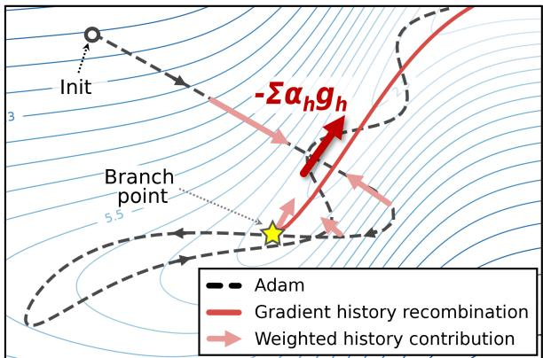  
Figure 1: Recombination of gradient history as a learned update. Recombination of history contributions $- \sum _ { h } \alpha _ { h } g _ { h }$ with predicted coefficients $\alpha _ { h }$ can redirect the Adam trajectory away from ascent.

While learned optimizers can adapt to loss landscapes, designing lightweight and versatile architectures remains challenging. Coordinate-wise prediction methods (Andrychowicz et al., 2016; Wichrowska et al., 2017; Metz et al., 2022) are expensive as they process gradient-derived features for individual parameters. For example, training VeLO requires approximately 4,000 TPU-months (Metz et al., 2022), more than twice the compute to train large language models (Chowdhery et al., 2023).

Gradient history can serve directly as a useful directional basis for optimizers, as demonstrated by momentum and Adam (Polyak, 1964; Kingma & Ba, 2014). This motivates an adaptive optimizer that learns to dynamically recombine gradients from the past optimization trajectory.

Building on this principle, this paper presents a learned optimizer that dynamically recombines gradient history, represented by averages over disjoint time spans. To remain lightweight, the optimizer operates on compact statistics at coarse, configurable parameter granularity. This also allows the optimizer to jointly compare different history components and adjust their relative contributions, while the disjoint representation keeps older time spans independently accessible. Figure 1 visualizes this concept, showing how past gradients are weighted and recombined into each update.

Two techniques make the optimizer versatile and practical. First, fixed-dimensional representation of group statistics supports arbitrary granularity as well as versatility across target networks. Second, progressive averaging of older gradients limits memory growth logarithmically with history length.

The core contributions are:

• The presented learned optimizer justifies the use of gradient-history directions, jointly weighting and dynamically recombining them to construct each update.

• A single trained policy generalizes zero-shot to unseen language, vision, and graph benchmarks, improving validation loss and test accuracy over Adam.

• A compact 37k-parameter policy is trained in under one GPU-hour on an NVIDIA B200.

## 2 LEARNED OPTIMIZATION BY DYNAMIC RECOMBINATION OF GRADIENT HISTORY

## 2.1 DYNAMIC RECOMBINATION OF GRADIENT HISTORY

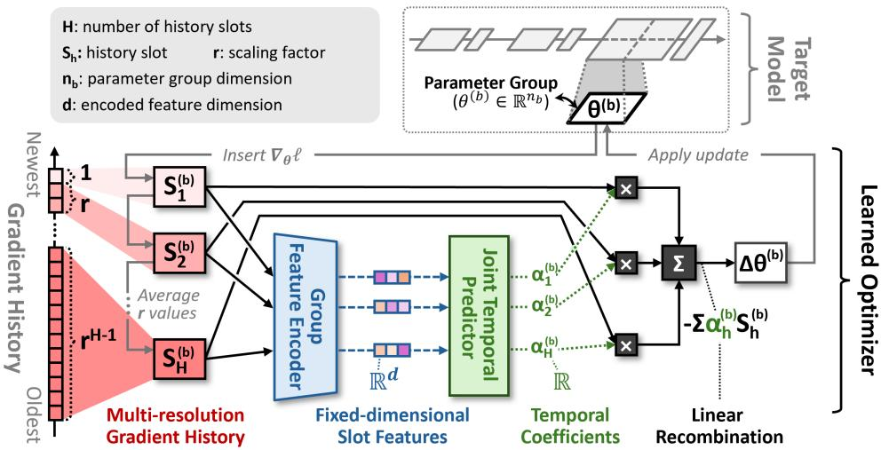  
Figure 2: Dynamic recombination of multi-resolution gradient history. For each parameter group, the current gradient enters a multi-resolution history. A group feature encoder converts each stored average into a fixed-dimensional slot feature, and a joint temporal predictor assigns the coefficients used to recombine the history into the group update. Step index t is omitted in the figure as it represents a single optimization step.

The learned optimizer recombines averages of gradient histories from the target model to construct each parameter update, predicting a coefficient for each. Target-model parameters are partitioned into disjoint groups, where coordinates within each group share the same temporal coefficient vector.

Figure 2 illustrates this dataflow from gradient-history storage to parameter update. At optimization step t, parameter group b in the target model denoted as $\theta _ { t } ^ { ( b ) }$ contains $n _ { b }$ parameters , and the targetmodel loss $\ell _ { t }$ yields the gradient $g _ { t } ^ { ( b ) } = \nabla _ { \theta _ { \star } ^ { ( b ) } } \ell _ { t }$ . Each group maintains H history slots for disjoint time spans. $\hat { S _ { t , h } ^ { ( b ) } }$ denotes the gradient average stored in slot $h ,$ and $\alpha _ { t , h } ^ { ( b ) }$ its scalar coefficient. Let $\boldsymbol { A } _ { t } ^ { ( b ) }$ denote the set of populated slots. The group update is

$$
\Delta \theta _ { t } ^ { ( b ) } = - \sum _ { h \in \mathcal { A } _ { t } ^ { ( b ) } } \alpha _ { t , h } ^ { ( b ) } S _ { t , h } ^ { ( b ) } , \qquad \theta _ { t + 1 } ^ { ( b ) } = \theta _ { t } ^ { ( b ) } + \Delta \theta _ { t } ^ { ( b ) } .\tag{1}
$$

## 2.2 MULTI-RESOLUTION GRADIENT HISTORY

Multi-resolution gradient history expands the temporal span covered by a small number of slots. Each history slot is assigned a tier $\mathsf { \Gamma } ( { \bar { c } } \in \{ 1 , \dots , \bar { C } \} )$ and can average up to $r ^ { c - 1 }$ gradients, where $r \geq 2$ is the scaling factor. As the stored average ages, it is carried forward and averaged into subsequent tiers.

Figure 3 shows an example with $r \ = 2$ and one slot per tier $( c = h )$ . At each step, the current group gradient enters slot 1, and its displaced value is carried to slot 2. In subsequent slots, the carried value either fills an empty slot, averages into a partially filled slot, or replaces a full slot while forwarding its previous average. A carry beyond slot H is evicted. Appendix A.1.2 gives the complete update procedure.

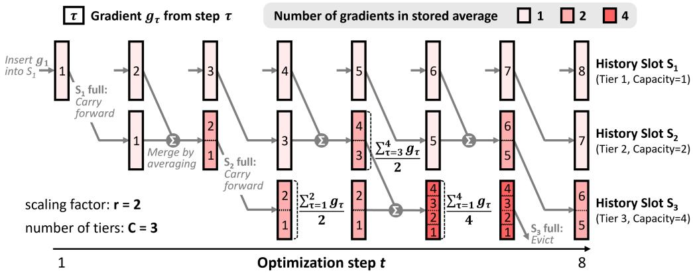  
Figure 3: Multi-resolution history with exclusive temporal ranges, tier capacities 1, 2, 4, and scaling factor $r = 2$ . At step 8, carry propagates through full slots $S _ { 2 }$ and $S _ { 3 }$ , evicting the previous average over $g _ { 1 } , \ldots , g _ { 4 }$ beyond the final tier.

## 2.3 TEMPORAL COEFFICIENT PREDICTION

The temporal coefficients are jointly predicted from its current optimization state and stored gradient history. Figure 4 depicts the architecture.

Group feature encoder For each parameter group, the group feature encoder summarizes each history slot and the current parameters into a fixed-dimensional slot feature, using their histograms and other statistics such as group dimension, scale, concentration, and alignment. Separate MLPs project both types of information into $\mathbb { R } ^ { d }$ , where d is independent of $n _ { b } ,$ , and a learned two-way Softmax gate fuses them into one slot feature. Appendix A.1.1 provides its architecture and numerical safeguards.

Joint temporal predictor The joint temporal predictor generates the coefficients by processing all slot features via self-attention. Positional encoding provides tier context, including the center and length of each slot’s history span. Following self-attention, a coefficient head and Softmax yield nonnegative allocations $a _ { t , h } ^ { ( b ) }$ that sum to one over $\boldsymbol { A } _ { t } ^ { ( b ) }$ . A separate scale token predicts a group-level gain $s _ { t } ^ { ( b ) }$ , which scales these allocations into the final temporal coefficients $\alpha _ { t , h } ^ { ( b ) }$ used in Equation 1. Appendix A specifies the evaluated attention configuration.

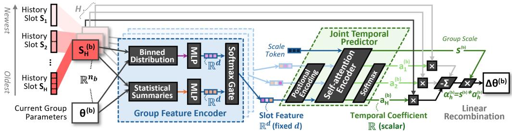  
Figure 4: Temporal coefficient prediction. For each history slot, the stored gradient average and current group parameters are converted into histogram features and scalar summaries, then fused into a fixed-dimensional slot feature. Positional encoding identifies the represented range, and self attention processes the slot features jointly. Softmax produces normalized temporal allocations $a _ { t , h } ^ { ( b ) } .$ while a group scale converts them into the final coefficients $\alpha _ { t , h } ^ { ( b ) }$ used in Equation 1. Step index t is omitted in the figure as it represents a single optimization step.

## 2.4 EXTENSION ACROSS PARAMETER PARTITIONS

The optimizer architecture can extend to support overlapping parameter groups via an additional spatial recombination process. After temporal recombination, a separate network sharing identical architecture processes the intermediate output of each partition. It then applies spatial coefficients to fuse these outputs into the final parameter step. While the evaluation focuses on a single partition, Appendix C defines and evaluates the extension.

## 2.5 TRAJECTORY-LEVEL OPTIMIZER TRAINING

The optimizer is trained to minimize the cumulative change in held-out loss over an unrolled trajectory of K updates, rewarding persistent improvements. Loss scales are normalized for each meta-task to contribute equally. Let $L _ { t } ^ { \mathrm { h e l d } }$ be the held-out loss before the unroll and $L _ { t + k } ^ { \mathrm { h e l d } }$ the loss after update k. The meta-loss is:

$$
\mathcal { L } _ { \mathrm { m e t a } } = \sum _ { k = 1 } ^ { K } \frac { L _ { t + k } ^ { \mathrm { h e l d } } - L _ { t } ^ { \mathrm { h e l d } } } { L _ { t } ^ { \mathrm { h e l d } } } .\tag{2}
$$

Appendix A.2.1 specifies the numerical safeguards and exact implementation.

## 3 EVALUATION

## 3.1 EXPERIMENTAL SETUP

Optimizer training and deployment. The 37,389-parameter learned optimizer is meta-trained on four small networks (under 10,000 parameters). Six history slots (63-step span) were used during optimizer training, where each meta-epoch consists 160 model-training steps. The trained policy is evaluated zero-shot on BERT, GPT, Vision Transformer, and GNN architectures unseen during metatraining. At deployment, the learned optimizer uses history slots with scaling factor $r = 2$ to cover the entire target trajectory, referred to asfull-span unless otherwise stated. Target network tensors are partitioned into groups of at most 256 coordinates, prioritizing partitions along the output-channel dimension.

Baselines and pairing. Adam, stochastic gradient descent (SGD), and SGD with momentum (SGDM) use default hyperparameters to all tasks. This setup intends to evaluate the off-the-shelf deployment performance of the learned optimizer. Paired comparisons share the same initialization, data ordering, stochastic streams, training budget, and parameter grouping. Appendix A specifies the group construction, optimizer-training configuration, target protocols, baseline hyperparameters, and metrics.

## 3.2 ZERO-SHOT GENERALIZATION TO UNSEEN TASKS

Table 1: Overall comparison on tasks unseen during optimizer training. Language models report terminal validation loss. Vision reports test accuracy both at the state with the lowest validation loss and at the terminal state. Graph models report test accuracy from the state with the lowest validation loss within 100 updates on Cora and CiteSeer and 500 updates on PubMed. Bold and underlined values denote the best and second-best result per row. Graph results are mean ± standard deviation over three seeds.
<table><tr><td>Data</td><td>Model</td><td>Learned</td><td>Adam</td><td>SGD</td><td>SGDM</td></tr><tr><td></td><td>Language modeling Terminal validation loss ↓</td><td></td><td></td><td></td><td></td></tr><tr><td></td><td>Wikipedia-BookCorpus BERT-Tiny (masked-token)</td><td> ${ \bf 3 . 4 6 3 ^ { * } }$ </td><td>3.810</td><td>6.703</td><td>6.222</td></tr><tr><td>WikiText-103</td><td>GPT-Tiny (next-token)</td><td>4.250*</td><td>4.268</td><td>5.921</td><td>4.686</td></tr><tr><td colspan="6">Vision Test accuracy (%) ↑</td></tr><tr><td>CIFAR-100</td><td>ViT (lowest val. loss)</td><td>31.13</td><td>27.61</td><td>17.29</td><td>32.54</td></tr><tr><td></td><td>ViT (terminal)</td><td>31.74</td><td>27.95</td><td>27.25</td><td>31.22</td></tr><tr><td colspan="6">Graph node classification Validation-selected test accuracy (%) ↑</td></tr><tr><td>Cora</td><td>GCN</td><td> ${ \bf 8 1 . 7 \pm . 2 }$ </td><td> $\underline { { 7 9 . 3 \pm . 8 } }$ </td><td> $3 1 . 8 \pm 1 0 . 0$ </td><td> $7 4 . 9 \pm . 9$ </td></tr><tr><td></td><td>GraphSAGE</td><td> ${ \bf 7 9 . 6 \pm . 4 }$ </td><td> $\underline { { 7 8 . 7 \pm . 3 } }$ </td><td> $2 4 . 1 \pm 3 . 6$ </td><td> $7 6 . 6 \pm . 2$ </td></tr><tr><td></td><td>GAT</td><td> ${ \bf 8 2 . 0 \pm . 6 }$ </td><td> $7 8 . 3 \pm 1 . 3$ </td><td> $4 7 . 2 \pm 8 . 0$ </td><td> $\underline { { 7 9 . 0 \pm 1 . 2 } }$ </td></tr><tr><td>CiteSeer</td><td>GCN</td><td> ${ \bf 7 1 . 0 \pm . 8 }$ </td><td> $6 6 . 2 \pm { 1 . 6 }$ </td><td> $3 3 . 0 \pm 6 . 2$ </td><td> $\underline { { 7 0 . 6 \pm . 7 } }$ </td></tr><tr><td></td><td>GraphSAGE</td><td> $\underline { { 6 9 . 9 \pm . 9 } }$ </td><td> $6 5 . 6 \pm 1 . 4$ </td><td> $3 4 . 7 \pm 9 . 4$ </td><td> ${ \bf 7 0 . 2 \pm . 4 }$ </td></tr><tr><td></td><td>GAT</td><td> $\underline { { 6 9 . 1 \pm . 3 } }$ </td><td> $6 6 . 2 \pm . 8$ </td><td> $5 2 . 9 \pm 1 . 4$ </td><td> ${ \bf 7 0 . 4 \pm . 8 }$ </td></tr><tr><td>PubMed</td><td>GCN</td><td> ${ \bf 7 9 . 1 \pm . 2 }$ </td><td> ${ 7 7 . 5 \pm . 4 }$ </td><td> $5 1 . 8 \pm 1 . 2$ </td><td> $6 7 . 7 \pm 6 . 1$ </td></tr><tr><td></td><td>GraphSAGE</td><td> $7 7 . 2 \pm . 1$ </td><td> $7 5 . 2 \pm . 4$ </td><td> $5 0 . 2 \pm 1 3 . 7$ </td><td> $7 4 . 7 \pm . 4$ </td></tr><tr><td></td><td>GAT</td><td> $7 8 . 8 \pm . 2$ </td><td> ${ 7 7 . 1 \pm 1 . 4 }$ </td><td> $5 9 . 2 \pm 6 . 0$ </td><td> $7 3 . 3 \pm . 2$ </td></tr><tr><td colspan="2">GNN arithmetic mean across 9 cells</td><td> $7 6 . 4 7 \pm . 2 4$ </td><td>73.78 ± .26</td><td> $4 2 . 7 6 \pm 2 . 3 6$ </td><td> $7 3 . 0 4 \pm . 7 5$ </td></tr></table>

∗ Embedding and output-head tensors are trained with Adam.

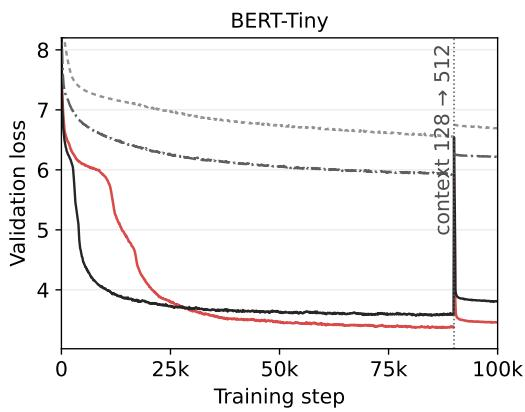

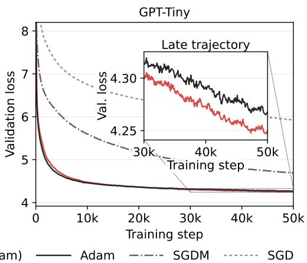  
Figure 5: The learned optimizer updates all tensors except the embedding and output-head tensors. Adam trains those tensors using the same hyperparameters as the all-Adam baseline. BERT-Tiny follows a 100,000-update protocol with a context transition at update 90,000, while GPT-Tiny is evaluated at 50,000 updates. The GPT magnifies the later trajectory.

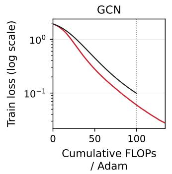

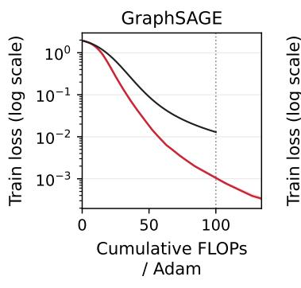

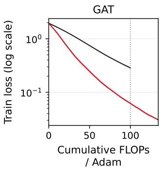

Figure 6: FLOP-matched Cora training loss under full span. The horizontal axis expresses cumulative FLOPs in units of one Adam step, with a budget equal to 100 Adam updates. Lines show three-seed means, and bands show seed-wise ranges.  
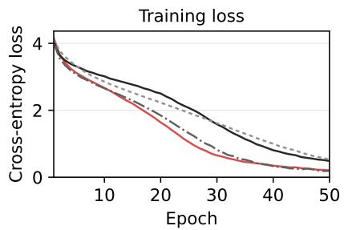

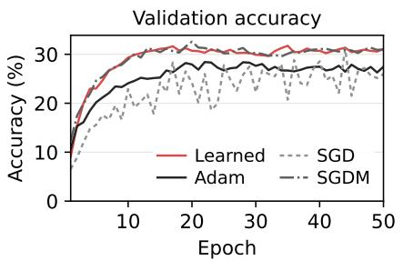  
Figure 7: ViT/CIFAR-100 epoch-mean training loss and validation accuracy over 50 epochs under matched initialization, split, and minibatch order. Table 1 reports validation-selected and terminal test accuracy.

Language models. On language models, the learned optimizer successfully generalizes to heldout language tasks 100,000-step horizon despite only being meta-trained seeing 160-steps with six history slots. It reaches the lowest terminal validation loss among all baselines. (Table 1, Figure 5). This section reports the setting which embedding and output-head tensors are delegated to Adam. Applying the learned optimizer to all parameters or exclusively to the embedding and output head also maintain convergence and can even outperform the baselines (Appendix B.1.1).

Graph models. The learned optimizer further generalizes to unseen graph modalities and nodeclassication tasks. The learned optimizer is evaluated on Cora, CiteSeer, and PubMed using GCN, GraphSAGE, and GAT Kipf & Welling (2016); Hamilton et al. (2017); Velickoviˇ c et al. (2018); Sen´ et al. (2008). It achieves the highest validation-selected test accuracy in seven of nine comparisons and the highest nine-cell arithmetic mean (Table 1). Accounting for inference overhead, it yields lower training loss than Adam at equal cumulative FLOPs on Cora (Figure 6). Appendix B.1.2 reports all FLOP-matched trajectories.

Vision transformer. Training a six-block ViT on CIFAR-100 tests generalization to a larger model scale with unseen image dataset. The learned optimizer outperforms Adam in both validationselected and terminal test accuracy, achieving the highest accuracy overall (Table 1). Figure 7 reports the training loss and validation accuracy trajectories.

## 3.3 ABLATIONS AND BEHAVIORAL ANALYSIS

History span ablations. Reducing history span to 63-step demonstrates that full-span coverage is not required to maintain convergence across all tasks (Table 2). For language models, while fullspan achieves lower validation loss compared to 63-step span, both cases are better or comparably to Adam (Appendix B.2.2). Vision task shows consistent pattern, with both spans achieving higher test accuracy than Adam. Graph tasks show near-identical arithmetic mean test accuracies across two spans. Appendix B.2.2 reports the all 9 GNN comparisons.

Temporal dynamics. Figure 8 shows that the learned policy is dynamic and behaves differently from Adam. Following a shared initial trajectory, transitioning to Adam branches to a different solution with higher terminal training loss (Figure 8a). At this branch, weights assigned to the history slots by the learned optimizer differs from norm-matched Adam update (Figure 8b,d). The predicted temporal scores and signed contributions vary over the optimization steps, confirming the policy is not static (Figure 8c,e). Appendix B.2.3 shows the behavioral analysis of other parameter groups.

Table 2: Effect of history span. Language models report terminal validation loss. ViT reports validation-selected and terminal test accuracy, and GNNs report validation-selected test accuracy. The GNN row is the unweighted arithmetic mean across nine model–dataset comparisons, reported as mean ± sample standard deviation across three target seeds. Bold and underlined values mark the best and second-best result in each row.
<table><tr><td>Target</td><td>Metric</td><td>Full span</td><td>63-step span</td><td>Adam</td></tr><tr><td>BERT-Tiny</td><td>Val. loss ↓</td><td>3.463*</td><td>3.824*</td><td>3.810</td></tr><tr><td>GPT-Tiny</td><td>Val. loss ↓</td><td>4.250*</td><td>4.261*</td><td>4.268</td></tr><tr><td rowspan="2">ViT/CIFAR-100</td><td>Test acc. (best val.) (%) ↑</td><td>31.13</td><td>30.81</td><td>27.61</td></tr><tr><td>Test acc. (terminal) (%) ↑</td><td>31.74</td><td>30.86</td><td>27.95</td></tr><tr><td>GNN arithmetic mean across 9 cells</td><td>Test acc. (%) ↑</td><td> $7 6 . 4 4 \pm 0 . 2 8$ </td><td> ${ \bf 7 6 . 4 7 \pm 0 . 2 4 }$ </td><td> $7 3 . 7 8 \pm 0 . 2 6$ </td></tr></table>

Embedding and output-head tensors are trained with Adam.

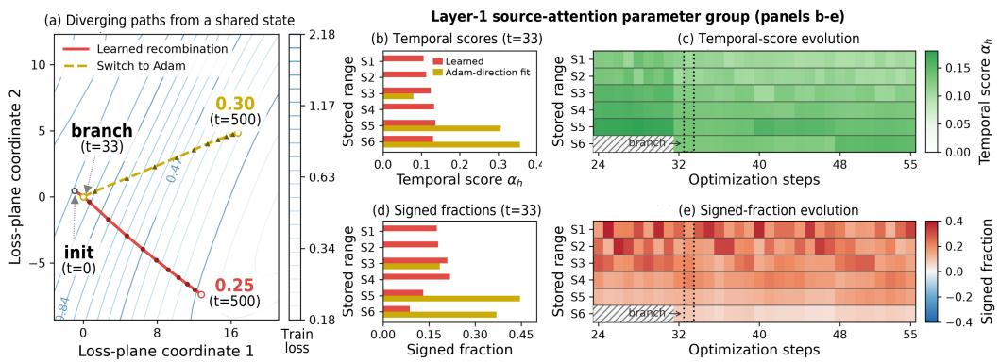  
Figure 8: Temporal dynamics on GAT/PubMed. (a) Both paths share the trajectory through $t =$ 32, with Adam states reconstructed from the learned path. At step $t = 3 3 .$ , Adam branches and reaches terminal training loss of $0 . 3 0 \ ( t = 5 0 0 )$ , and 0.25 for learned recombination. (b,d) Red bars show the scale-normalized temporal scores and signed contribution fractions for the layer-1 source-attention group at branch $\left( t = 3 3 \right)$ . Signed fractions indicate each slot’s directional contribution to the constructed update. $S _ { 1 }$ corresponds to the slot with newest gradient, and $S _ { 6 }$ with the oldest. Gold bars show the closest nonnegative coefficient allocation fitted to the norm-matched Adam direction. $^ { ( \mathrm { c } , \mathrm { e } ) }$ The learned scores and signed contributions vary over updates 24–55. Dotted boxes mark $t = 3 3$ , and hatching marks unpopulated slots.

## 3.4 COMPUTATIONAL COST AND DEPLOYMENT SCALING

Optimizer training and deployment costs. Training the learned policy requires 64 meta-updates and consumes 0.87 NVIDIA B200 GPU-hours. During deployment, routing all parameters through the learned optimizer requires 1.035× and 1.166× the Adam FLOPs per step on BERT and $\mathrm { G P T } ,$ respectively. The corresponding end-to-end step times are 1.135× and 2.336× the matched Adam baselines (Figure 9).

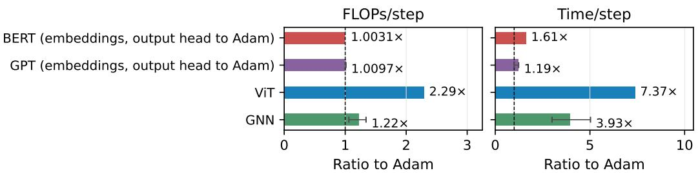  
Figure 9: Deployment cost relative to Adam in isolated NVIDIA B200 profiles using bfloat16 arithmetic. A value of 1.0 denotes the matched Adam baseline. FLOPs/step include forward, backward, the learned update, and any update routed to Adam. Time/step measures the same end-to-end boundary. BERT values weight its 128- and 512-token contexts by 0.9/0.1. GNN values are geometric means over the nine model–dataset tasks, with min–max error bars. Appendix A.4 reports all profiles for the learned optimizer.

History slot scaling. In the language profiles, persistent optimizer state covers up to 131,071 past gradients, occupying 301 MB for BERT and 466 MB for GPT. Adam occupies 35 MB and 55 MB in the matched profiles, respectively. Appendix A.4 specifies the profiling boundaries and state accounting.

## 4 CONCLUSION

This paper demonstrates that a compact temporal recombination policy, meta-trained only on small classification tasks, can generalize to unseen tasks. These results establish recombination of gradient history as a practical design principle for learned optimization.

## REFERENCES

Marcin Andrychowicz, Misha Denil, Sergio Gomez, Matthew W Hoffman, David Pfau, Tom Schaul, Brendan Shillingford, and Nando De Freitas. Learning to learn by gradient descent by gradient descent. Advances in neural information processing systems, 29, 2016.

Aakanksha Chowdhery, Sharan Narang, Jacob Devlin, Maarten Bosma, Gaurav Mishra, Adam Roberts, Paul Barham, Hyung Won Chung, Charles Sutton, Sebastian Gehrmann, et al. Palm: Scaling language modeling with pathways. Journal of machine learning research, 24(240):1– 113, 2023.

Will Hamilton, Zhitao Ying, and Jure Leskovec. Inductive representation learning on large graphs. Advances in neural information processing systems, 30, 2017.

Diederik P. Kingma and Jimmy Ba. Adam: A method for stochastic optimization. arXiv preprint arXiv:1412.6980, 2014.

Thomas N. Kipf and Max Welling. Semi-supervised classification with graph convolutional networks. arXiv preprint arXiv:1609.02907, 2016.

Luke Metz, James Harrison, C. Daniel Freeman, Amil Merchant, Lucas Beyer, James Bradbury, Naman Agrawal, Ben Poole, Igor Mordatch, Adam Roberts, et al. Velo: Training versatile learned optimizers by scaling up. arXiv preprint arXiv:2211.09760, 2022.

Boris T. Polyak. Some methods of speeding up the convergence of iteration methods. USSR Computational Mathematics and Mathematical Physics, 4(5):1–17, 1964. doi: 10.1016/0041-5553(64) 90137-5.

Alec Radford, Jeffrey Wu, Rewon Child, David Luan, Dario Amodei, Ilya Sutskever, et al. Language models are unsupervised multitask learners. OpenAI blog, 1(8):9, 2019.

Prithviraj Sen, Galileo Namata, Mustafa Bilgic, Lise Getoor, Brian Gallagher, and Tina Eliassi-Rad. Collective classification in network data. AI Mag., 29(3):93–106, September 2008. ISSN 0738-4602. doi: 10.1609/aimag.v29i3.2157. URL https://doi.org/10.1609/aimag. v29i3.2157.

Iulia Turc, Ming-Wei Chang, Kenton Lee, and Kristina Toutanova. Well-read students learn better: On the importance of pre-training compact models. arXiv preprint arXiv:1908.08962, 2019.

Petar Velickoviˇ c, Guillem Cucurull, Arantxa Casanova, Adriana Romero, Pietro Li´ o, and Yoshua\` Bengio. Graph attention networks. In International Conference on Learning Representations, 2018.

Olga Wichrowska, Niru Maheswaranathan, Matthew W. Hoffman, Sergio Gomez Colmenarejo, Misha Denil, Nando de Freitas, and Jascha Sohl-Dickstein. Learned optimizers that scale and generalize. In Proceedings of the 34th International Conference on Machine Learning, pp. 3751– 3760. PMLR, 2017.

## A IMPLEMENTATION AND EVALUATION DETAILS

This appendix specifies the evaluated optimizer, optimizer-training procedure, target protocols, and resource measurements

## A.1 LEARNED-OPTIMIZER CONFIGURATION

Each parameter tensor is partitioned into fixed groups of at most 256 active coordinates. For tensors with at least two dimensions, trailing dimensions are flattened within each leading-dimension slice. Adjacent complete slices are packed up to the limit, and oversized slices are split into contiguous segments. One-dimensional tensors are segmented directly. Final incomplete segments are padded for batched policy inference, with padded coordinates masked from features and updates.

The evaluated optimizer uses six history slots with capacities 1, 2, 4, 8, 16, 32 and $r = 2$ . Manuscript indices run newest to oldest. Attention receives the reverse order. Each populated slot is paired with its temporal center and stored-gradient count.

## A.1.1 HISTORY-SLOT FEATURE DEFINITIONS

For a group of $n _ { b }$ parameters, let $S = S _ { t , h } ^ { ( b ) }$ denote a populated stored average and $\theta = \theta _ { t } ^ { ( b ) }$ its current parameter vector. Table 3 defines the six statistics computed per slot. The stabilized norms are $\mathrm { R M S } _ { \epsilon } ( v ) = \sqrt { \| v \| _ { 2 } ^ { 2 } / n _ { b } + \epsilon } \mathrm { ~ a n d } \| v \| _ { 2 , \epsilon } = \sqrt { \| v \| _ { 2 } ^ { 2 } + \epsilon }$

Table 3: Statistics computed for the stored gradient average in each populated history slot.  
Feature Definition   
Group size $\overline { { \log _ { 1 0 } n _ { b } } }$   
Stored-average scale $\log _ { 1 0 } \mathrm { R M S } _ { \epsilon } ( S )$   
Current-parameter scale $\log _ { 1 0 } ^ { - \infty } \mathrm { R M S } _ { \epsilon } ( \theta )$   
Coordinate uniformity $\lVert \bar { S } \rVert _ { 1 } / ( \sqrt { n _ { b } } \lVert \bar { S } \rVert _ { 2 , \epsilon } + \epsilon )$   
Gradient–parameter alignment $\langle S , \mathcal { \bar { \theta } } \rangle / ( \| S \| _ { 2 , \epsilon } \| \theta \| _ { 2 , \epsilon } + \epsilon )$   
Gradient-to-parameter scale $\operatorname { l o g } _ { 1 0 } \operatorname { \bar { R M S } } _ { \epsilon } ( S ) \mathbin { \stackrel { . . } { - } } \log _ { 1 0 } \operatorname { \bar { R M S } } _ { \epsilon } ( \theta )$

The histogram path normalizes each populated slot by its gradient RMS. For normalized coordinate $\widetilde { S } _ { i }$ and current parameter $\theta _ { i } .$ , the seven tuple entries are $\mathrm { s i g n } ( \widetilde { S } _ { i } ) \log _ { 1 0 } ( 1 + | \widetilde { S } _ { i } | ) , \log _ { 1 0 } ( | \widetilde { S } _ { i } | + \epsilon )$ $\log _ { 1 0 } ( | \theta _ { i } | + \epsilon ) , \log _ { 1 0 } ( ( | \widetilde { S } _ { i } | + \epsilon ) / ( | \theta _ { i } | + \epsilon ) )$ , a signed logarithm of $\bar { S } _ { i }$ relative to the slot RMS, sign $( \widetilde { S } _ { i } ) \mathrm { s i g n } ( \theta _ { i } )$ , and the normalized group index in the extraction batch. Tuple channels are standardized within each slot and clipped to [−5, 5]. Sixteen bins are indexed by $\log _ { 1 0 } ( | \widetilde { S } _ { i } | + \epsilon )$ and store their assigned mean tuples. Empty bins are zero. Padded coordinates are excluded, and feature extraction is detached during optimizer training.

Two-layer MLPs with intermediate LayerNorm and GELU project the six statistics and 112- dimensional histogram to separate 32-dimensional vectors. LayerNorm precedes their learned twoway gated fusion. A fixed sinusoidal encoding adds temporal center and stored-gradient count. Unpopulated slots are excluded from attention and coefficient normalization.

The temporal predictor uses two width-32 Transformer encoder layers, four attention heads, and feed-forward width 128. Softmax normalizes coefficients over populated slots. The evaluated realization also applies an auxiliary group scale after Equation 1. Its learned scale vector attends to every populated slot, while an asymmetric mask prevents slot tokens from attending to it. For its contextualized representation $h _ { t , \mathrm { s c a l e } } ^ { ( b ) } \in \mathbb { R } ^ { d }$ and scalar projection $q : \mathbb { R } ^ { d }  \mathbb { R }$ , the scale is

$$
s _ { t } ^ { ( b ) } = 2 \sigma \Big ( z _ { 0 } + \epsilon \operatorname { t a n h } \Big ( q ( h _ { t , \mathrm { s c a l e } } ^ { ( b ) } ) \Big ) \Big ) \in ( 0 , 2 ) ,
$$

where $z _ { \mathrm { 0 } }$ is learned and $\epsilon \ : = \ : 0 . 5$ . The scale is initialized at one and multiplies the completed recombination.

Algorithm 1 One-slot-per-tier multi-resolution history update at optimization step t. Processing   
stops when no value is carried to the next slot.   
Require: $g _ { t }$ current parameter-group gradient   
$S _ { t - 1 , 1 : H }$ history slots from step $t - 1$   
$c _ { t - 1 , 2 : H }$ slot accumulation counters from step $t - 1$   
$H , r$ history depth and accumulation factor   
Ensure: $S _ { t , 1 : H } , c _ { t , 2 : H }$   
1: $( S _ { t , 1 : H } , c _ { t , 2 : H } ) \gets ( S _ { t - 1 , 1 : H } , c _ { t - 1 , 2 : H } )$   
2: carry $ S _ { t - 1 , 1 } ; S _ { t , 1 }  g _ { t }$ {insert the current gradient}   
3: $h  2$   
4: while $h \leq H$ and carry $\neq$ empty do   
5: if $c _ { t - 1 , h } = 0$ then   
6: next $ \mathrm { e m p t y } ; S _ { t , h }  \mathrm { c a r r y } ; c _ { t , h }  1$ {fill an empty slot}   
7: else if $c _ { t - 1 , h } = r$ then   
8: next $ S _ { t - 1 , h } ; S _ { t , h }  \mathrm { c a r r y } ; c _ { t , h }  1$ {replace the full slot and carry its value}   
9: else   
10: next ← empty   
11: $S _ { t , h } \gets \bigl ( c _ { t - 1 , h } ^ { \mathsf { \bar { \alpha } } } S _ { t - 1 , h } + \mathrm { c a r r y } \bigr ) / ( c _ { t - 1 , h } + 1 )$   
12: $c _ { t , h } \gets c _ { t - 1 , h } + 1$ {merge by averaging}   
13: end if   
14: carry ← next; $h \gets h + 1$   
15: end while   
16: return $S _ { t , 1 : H } , c _ { t , 2 : H }$

## A.1.2 MULTI-RESOLUTION HISTORY UPDATE

Algorithm 1 gives the update for one group, omitting group indices. $\boldsymbol { c } _ { t , h }$ counts values accumulated at tier h. Slots and counters start empty or zero, and a carry beyond tier H is discarded.

## A.2 OPTIMIZER-TRAINING TASKS AND PROTOCOL

Table 4: Optimizer-training tasks. Parameter counts include all trainable parameters.
<table><tr><td>Model</td><td>Dataset</td><td>Architecture</td><td>Params.</td></tr><tr><td>MLP</td><td>Synthetic binary</td><td>64 inputs; two 64-unit ReLU layers; 2-class head</td><td>8,450</td></tr><tr><td>ConvNet</td><td>CIFAR-10</td><td>5 × 5 convolutions with 2, 4 channels; ReLU and 2 × 2 pooling; 16-unit ReLU; 10-class head</td><td>2,142</td></tr><tr><td>MicroResNet</td><td>Fashion-MNIST</td><td>8-channel 3 × 3 BN stem; residual blocks of width 8, 16; adaptive pooling; 10-class head</td><td>5,122</td></tr><tr><td>MicroViT</td><td>CIFAR-10</td><td>8 × 8 patches; width 16; 2 heads; one pre-normalized block; FF width 64; 10-class head</td><td>6,810</td></tr></table>

CIFAR-10 and Fashion-MNIST inputs are normalized channelwise with mean and standard deviation 0.5, without augmentation. MicroViT additionally uses a learned class token, learned positional embeddings, and zero dropout. The synthetic dataset contains 20,000 standardized 64-dimensional examples with 32 informative and 10 redundant features and class separation 0.8. Each training set is split stratified 80/20 into model-training and held-out meta-objective partitions.

## A.2.1 NORMALIZED CUMULATIVE HELD-OUT-LOSS OBJECTIVE

The complete 20% held-out partition is evaluated after every simulated update in microbatches of 512. The starting loss is detached and the denominator in Equation 2 is lower-bounded by 0.1. Feature statistics are also detached. Gradients pass through every other optimizer path, simulated update, and subsequent held-out loss. Table 5 summarizes the remaining optimizer-training configuration.

Table 5: Optimizer-training configuration.
<table><tr><td>Item</td><td>Value</td></tr><tr><td>Tasks per meta-window</td><td>All four tasks in Table 4</td></tr><tr><td>Model-training batch</td><td>128</td></tr><tr><td>Reset trajectories / steps per trajec-</td><td>4/160</td></tr><tr><td>tory Successful meta-update cap</td><td>64</td></tr><tr><td>TBPTT horizon / meta-update ca- dence</td><td>20 / 10 model-training updates</td></tr><tr><td>Meta-objective</td><td>Normalized cumulative held-out-loss change in Equation 2</td></tr><tr><td>Meta-gradient</td><td>full differentiation through exposed paths</td></tr><tr><td>Meta-optimizer</td><td>Adam, learning rate  $1 0 ^ { - 3 } , \mathring { \beta _ { 1 } } ^ { \cdot } = 0 . \mathring { 9 , } \beta _ { 2 } = 0 . 9 9 9 , \epsilon = 1 0 ^ { - 8 }$  , global</td></tr><tr><td>Held-out evaluation microbatch</td><td>gradient-norm clipping at 10 512</td></tr><tr><td>Objective schedule</td><td>Model-training task loss only</td></tr></table>

## A.3 TARGET-MODEL TRAINING AND EVALUATION

## A.3.1 SHARED BASELINE HYPERPARAMETERS

Across all evaluation domains, the baseline optimizers use fixed hyperparameters and zero weight decay. Adam uses a learning rate of $1 0 ^ { - 3 } , \mathsf { \bar { ( } { \beta _ { 1 } , \beta _ { 2 } ) } = ( 0 . 9 , 0 . 9 9 9 ) }$ , and $\epsilon = 1 0 ^ { - 8 }$ . SGD and SGDM use a learning rate of 0.01, with momentum 0 and 0.9, respectively. No domain-specific hyperparameter sweeps are applied, as this evaluation specifically tests deployment performance where exhaustive hyperparameter tuning is computationally prohibitive.

## A.3.2 LANGUAGE MODELS

Both language targets use two layers, width 128, and two heads. BERT-Tiny follows Turc et al. (2019). The causal target uses a GPT-2 decoder (Radford et al., 2019). Table 6 summarizes their training configurations.

Table 6: Language-model configurations used for optimizer evaluation.
<table><tr><td>Model</td><td>Layers / width / heads</td><td>Context</td><td>Global / mi- cro</td><td>Data and objective</td></tr><tr><td>BERT-Tiny</td><td>2/128/2</td><td>128 for 90k, then 512 for 10k</td><td>256/8</td><td>Wikipedia-BookCorpus- compatible masked-token prediction</td></tr><tr><td>GPT-style</td><td>2/128/2</td><td>128 fixed</td><td>64/16</td><td>WikiText-103 next-token predic- tion</td></tr></table>

Embeddings and the output head use Adam. Learned recombination updates all other languagemodel parameters. Paired runs share initialization, data, stochastic streams, and a 20-microbatch validation panel. Validation restores model mode and random-number state, and loss is aggregated over predicted targets.

## A.3.3 VISION-TRANSFORMER PROTOCOL

The CIFAR-100 model uses six Transformer blocks, width 256, eight heads, $8 \times 8$ patches, and dropout 0.1. The learned optimizer updates all parameters. A fixed stratified split supplies 45,000 training and 5,000 validation examples, with batch size 64 and 704 updates per epoch. Validation is measured after each of 50 epochs, and the terminal state is evaluated once on the test set.

## A.3.4 GRAPH MODELS

The graph evaluation crosses GCN, GraphSAGE, and GAT with Cora, CiteSeer, and PubMed. Cora and CiteSeer run for 100 updates with seven slots. PubMed runs for 500 updates with nine slots.

The public Planetoid split and stored node features are used without input-feature normalization. Each split has 20 labeled training nodes per class, 500 validation nodes, and 1,000 test nodes, giving

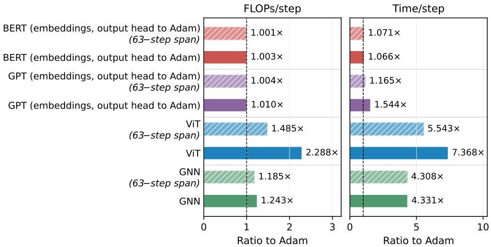  
Figure 10: FLOPs and time per training step, reported as ratios to Adam, by history span.

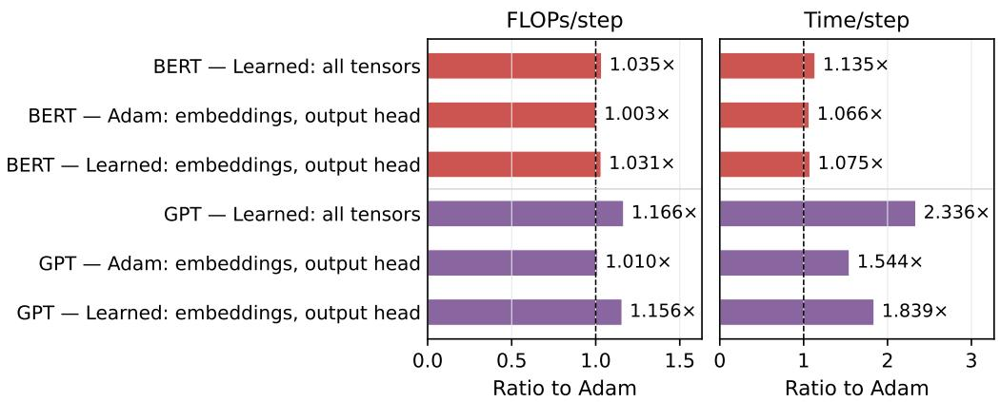  
Figure 11: FLOPs and time per training step, reported as ratios to Adam, by language-model parameter assignment.

140, 120, and 60 training nodes for Cora, CiteSeer, and PubMed. Training loss uses the training mask. Full-graph passes retain all nodes and edges. Validation is recorded after every update, and the terminal state is evaluated once on the test mask without model selection.

## A.4 RESOURCE MEASUREMENTS

Figures 10 and 11 report deployment cost by history span and language-model parameter assignment, respectively.

The reported 37,389 parameters include trainable policy tensors and exclude fixed positional encodings. Deployment profiles fix model, hardware, precision, batch, parameter assignment, and software configuration. Each repeat uses at least five warm-up and 50 measured updates; the synchronized BERT repeats use 20 warm-up updates. CUDA events measure both the optimizer update and complete training step. The reported ratio is

$$
\rho _ { \mathrm { F L O P } } = \frac { F _ { \mathrm { f b } } ^ { \mathrm { l e a r n e d } } + U _ { \mathrm { l e a r n e d } } + U _ { \mathrm { A d a m , a u x } } } { F _ { \mathrm { f b } } ^ { \mathrm { A d a m } } + U _ { \mathrm { A d a m , a l l } } } ,\tag{3}
$$

In Equation $3 , F _ { \mathrm { f b } }$ counts the target forward/backward pass and U counts update arithmetic. Fused Adam kernels omit elementwise arithmetic from the profiler. Both Adam terms use 18 declared scalar operations per updated coordinate. The learned-update term is profiled with Adam disabled before this estimate is added once.

Learned (embeddings/output head; others to Adam) Adam  
Table 7: Terminal validation loss by language-model parameter assignment. Each row reports the paired Adam baseline. The same trained policy is routed to the listed tensors without separate optimizer training for each assignment. Bold marks the lowest learned-optimizer loss within each model.
<table><tr><td>Model</td><td>Learned optimizer updates</td><td>Adam updates</td><td>Learned</td><td>Adam</td></tr><tr><td rowspan="3">BERT-Tiny</td><td>All parameters</td><td></td><td>3.889</td><td>3.815</td></tr><tr><td>All except embeddings/output head</td><td>Embeddings/output head</td><td>3.463</td><td>3.810</td></tr><tr><td>Embeddings/output head</td><td>All other parameters</td><td>3.484</td><td>3.811</td></tr><tr><td rowspan="3">GPT-Tiny</td><td>All parameters</td><td></td><td>4.299</td><td>4.268</td></tr><tr><td>All except embeddings/output head</td><td>Embeddings/output head</td><td>4.250</td><td>4.268</td></tr><tr><td>Embeddings/output head</td><td>All other parameters</td><td>4.309</td><td>4.268</td></tr></table>

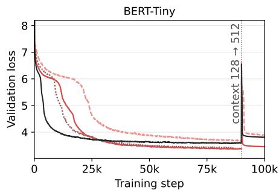

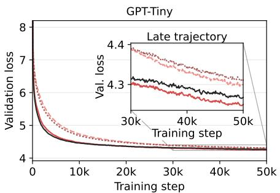  
Figure 12: Validation loss when the learned optimizer updates all tensors or either complementary parameter partition. Adam updates the tensors not routed to learned recombination using the same hyperparameters as the all-Adam baseline. BERT changes context at update 90,000, and the GPT inset magnifies updates 30,000–50,000.

FLOPs and timing are collected separately. Inputs, gradients, and mature history state are resident on-device before measurement. Data loading, validation, logging, and checkpointing are excluded. For language models, Time/step holds each paired Adam forward/backward interval fixed and replaces only its Adam update interval with the measured learned-optimizer interval; this removes between-process target-compute drift from the reported optimizer overhead. Persistent state is measured after history prefill and includes learned-optimizer state, auxiliary Adam state, and policy parameters.

## B ADDITIONAL EVALUATION RESULTS AND ABLATIONS

## B.1 ADDITIONAL TARGET-MODEL RESULTS

## B.1.1 LANGUAGE-MODEL PARAMETER ASSIGNMENTS

Table 7 and Figure 12 compare learned recombination on all tensors with the two complementary hybrid assignments. Arms share initialization, minibatches, stochastic streams, and validation panels. The study does not independently train every parameter assignment.

## B.1.2 GRAPH TRAINING TRAJECTORIES

The graph trajectories separate checkpoint selection from compute-normalized optimization. Figure 13 compares the full-span learned optimizer with Adam at equal cumulative FLOPs, while Figure 14 shows the complete validation signal used to select checkpoints without reference to test accuracy.

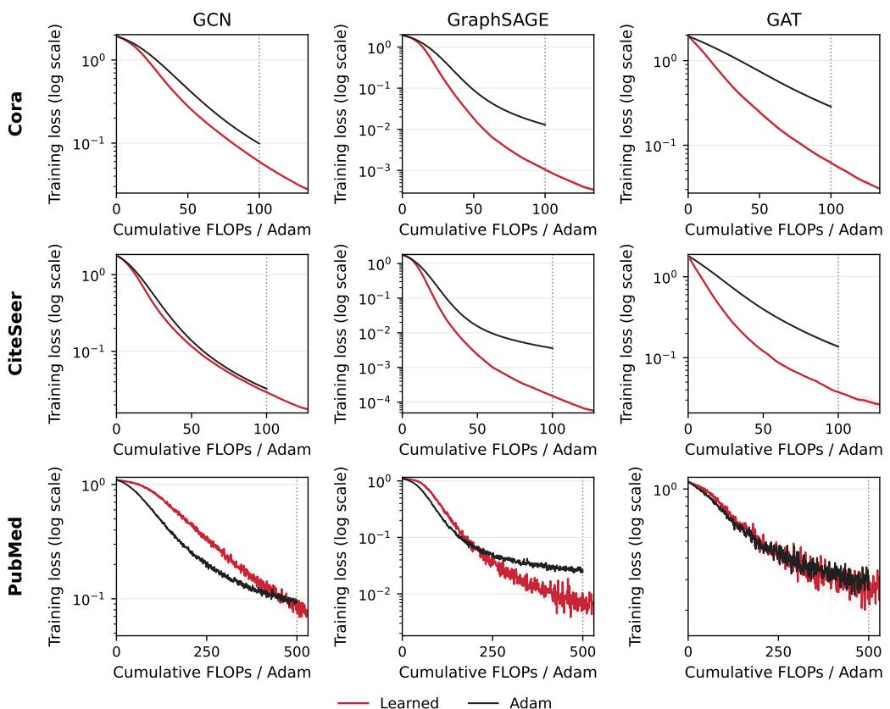  
Figure 13: FLOP-aligned GNN training loss for the full-span learned optimizer and Adam. Rows identify datasets, and columns identify model architectures. The horizontal axis measures cumulative profiler-visible FLOPs in units of one Adam step. Lines show three-seed means, and bands show seedwise ranges. Cora and CiteSeer use budgets of 100 Adam steps, while PubMed uses 500 Adam steps. PubMed learned curves continue beyond the dotted 500-step boundary to show the complete 500-update trajectory.

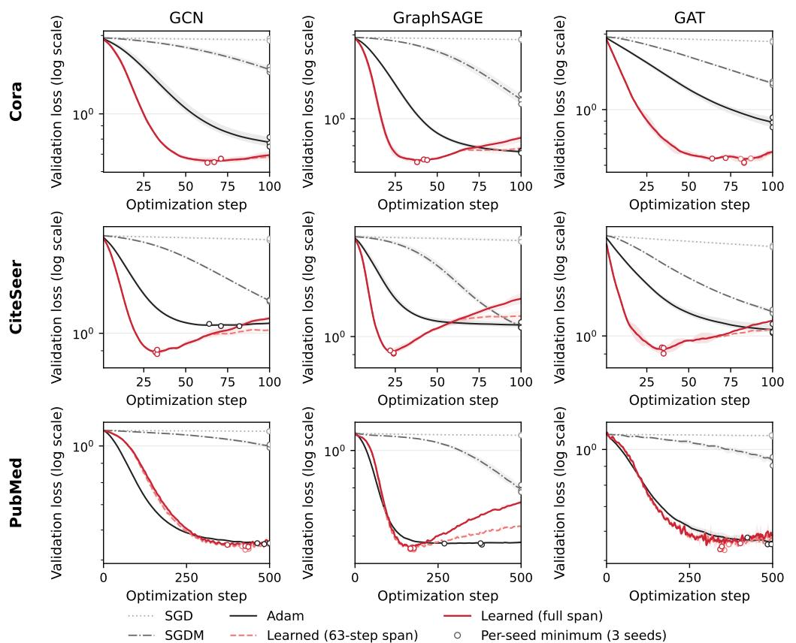  
Figure 14: Step-aligned GNN validation loss. Rows identify datasets, and columns identify model architectures. Curves show three-seed means, bands show seedwise ranges, and circles mark the minimum of each seedwise validation trajectory. Checkpoints are selected independently within the fixed 100-update Cora and CiteSeer budgets and 500-update PubMed budget. Test accuracy does not enter checkpoint selection. Figure 13 separately compares training progress at equal cumulative FLOPs.

## B.2 MECHANISM EVIDENCE AND ABLATIONS

## B.2.1 PARAMETER GROUPING

Table 8 tests deployment regrouping from the output-slice-trained policy and matched training under alternative groupings. Every trajectory remains finite, but effects vary by task and metric. Matched policies use one optimizer-training seed, and the results do not identify a preferred grouping.

Table 8: Parameter-grouping ablation. Entries are mean ± sample standard deviation over three paired target seeds. The group count is measured at deployment. Output and input slices prioritize complete leading- and second-dimension slices, respectively. Tensor-wide and network-wide conditions form one group per parameter tensor and optimizee. Bold marks the best mean within each task and metric. Adam uses the same target initializations and data streams.
<table><tr><td>Policy</td><td>Deployment</td><td>Deployment</td><td>Train-loss</td><td></td></tr><tr><td>training</td><td>grouping</td><td>groups</td><td>AUC↓</td><td>Terminal</td></tr><tr><td>MicroLeNet/CIFAR-10 (terminal test loss ↓)</td><td>Output slice</td><td>15</td><td> ${ \bf 1 . 8 2 0 \pm 0 . 0 1 2 }$ </td><td> $1 . 7 4 3 \pm 0 . 0 5 5$ </td></tr><tr><td>Output slice</td><td></td><td>14</td><td> $1 . 8 2 3 \pm 0 . 0 1 6$ </td><td> $1 . 7 0 5 \pm 0 . 0 5 4$ </td></tr><tr><td>Output slice</td><td>Input slice Tensor-wide</td><td>8</td><td></td><td></td></tr><tr><td>Output slice Output slice</td><td>Network-wide</td><td>1</td><td> $1 . 8 2 2 \pm 0 . 0 1 4$   $1 . 8 3 1 \pm 0 . 0 1 7$ </td><td> $1 . 6 8 1 \pm 0 . 0 2 8$ </td></tr><tr><td>Input slice</td><td>Input slice</td><td>14</td><td> $1 . 8 7 3 \pm 0 . 0 4 3$ </td><td> $1 . 6 6 6 \pm 0 . 0 1 8$ </td></tr><tr><td>Tensor-wide</td><td>Tensor-wide</td><td>8</td><td>1.827 ± 0.024</td><td> $1 . 7 4 8 \pm 0 . 0 3 4$ </td></tr><tr><td>Network-wide</td><td>Network-wide</td><td></td><td></td><td> $\mathbf { 1 . 6 6 5 \pm 0 . 0 3 4 }$ </td></tr><tr><td>Adam</td><td></td><td>1</td><td> $1 . 8 4 4 \pm 0 . 0 0 9$ </td><td> $1 . 6 9 3 \pm 0 . 0 1 7$ </td></tr><tr><td>GAT/Cora (terminal test accuracy ↑)</td><td></td><td>一</td><td> $1 . 9 7 2 \pm 0 . 0 2 4$ </td><td> $1 . 8 0 4 \pm 0 . 0 0 8$ </td></tr><tr><td>Output slice</td><td>Output slice</td><td>367</td><td></td><td></td></tr><tr><td>Output slice</td><td>Input slice</td><td>367</td><td> $0 . 1 9 5 \pm 0 . 0 0 7$ </td><td> $8 0 . 9 3 \pm 0 . 1 5$ </td></tr><tr><td></td><td>Tensor-wide</td><td>8</td><td> $0 . 1 9 5 \pm 0 . 0 0 7$ </td><td> ${ \bf 8 1 . 1 3 \pm 0 . 3 1 }$ </td></tr><tr><td>Output slice Output slice</td><td>Network-wide</td><td>1</td><td> $0 . 1 9 4 \pm 0 . 0 0 7$ </td><td> $8 1 . 0 0 \pm 0 . 2 6$ </td></tr><tr><td>Input slice</td><td>Input slice</td><td>367</td><td> $0 . 1 9 4 \pm 0 . 0 0 7$ </td><td> $8 1 . 0 0 \pm 0 . 1 0$ </td></tr><tr><td>Tensor-wide</td><td>Tensor-wide</td><td>8</td><td> $\mathbf { 0 . 1 8 2 \pm 0 . 0 0 7 }$   $0 . 1 9 3 \pm 0 . 0 0 7$ </td><td> $\overline { { 8 0 . 9 0 \pm 0 . 1 0 } }$ </td></tr><tr><td>Network-wide</td><td>Network-wide</td><td>1</td><td> $0 . 1 8 6 \pm 0 . 0 0 7$ </td><td> $8 1 . 0 0 \pm 0 . 3 0$ </td></tr><tr><td>Adam</td><td></td><td></td><td></td><td> $8 1 . 0 0 \pm 0 . 3 6$ </td></tr><tr><td></td><td></td><td></td><td> $0 . 5 1 5 \pm 0 . 0 1 3$ </td><td> $8 0 . 3 7 \pm 1 . 0 3$ </td></tr></table>

## B.2.2 HISTORY-DEPTH CONTROLS

Table 9 compares the 63-step span with the full span over three paired target seeds. Aggregate accuracy is similar, while the preferred span varies across cells. History depth is fixed before validation and test evaluation.

Table 9: GNN history-depth ablation. Entries are test accuracy (%) from the lowest-validation-loss state, reported as mean ± sample standard deviation over three paired target seeds. The final row is the unweighted arithmetic mean of the nine model–dataset means. Bold marks the best mean, and underlining marks the second-best; tied means are both bold.
<table><tr><td>Data</td><td>Model</td><td>63-step span (%) Full span (%)</td></tr><tr><td rowspan="2">Cora</td><td>GCN</td><td> $\overline { { 8 0 . 7 7 \pm 0 . 6 7 } }$   $\overline { { { \bf 8 0 . 8 3 \pm 0 . 4 5 } } }$ </td></tr><tr><td>GraphSAGE</td><td> ${ \bf 7 9 . 5 3 \pm 0 . 3 5 }$   $7 9 . 2 7 \pm 0 . 5 0$ </td></tr><tr><td rowspan="3">CiteSeer</td><td>GAT</td><td> $8 0 . 7 7 \pm 0 . 7 1$   ${ \bf 8 0 . 8 3 \pm 0 . 5 1 }$ </td></tr><tr><td>GCN</td><td> $\mathbf { \overline { { 7 0 . 0 7 \pm 0 . 3 5 } } }$   $\mathbf { \overline { { 7 0 . 0 7 \pm 0 . 2 3 } } }$ </td></tr><tr><td>GraphSAGE</td><td> ${ \bf 7 0 . 1 3 \pm 0 . 3 1 }$   $6 9 . 5 0 \pm 0 . 4 6$ </td></tr><tr><td rowspan="3">PubMed</td><td>GAT</td><td> ${ \bf 6 8 . 0 7 \pm 1 . 5 6 }$   $6 7 . 6 0 \pm 1 . 7 3$ </td></tr><tr><td>GCN</td><td> $\mathbf { \overline { { 7 6 . 4 3 \pm 0 . 4 5 } } }$   $\overline { { 7 5 . 7 7 \pm 0 . 5 5 } }$ </td></tr><tr><td>GraphSAGE</td><td> $7 7 . 7 7 \pm { \bf 0 . 8 1 }$   $7 7 . 1 3 \pm 0 . 8 4$ </td></tr><tr><td rowspan="2">Arithmetic mean</td><td>GAT</td><td> ${ \bf 7 5 . 8 0 \pm 0 . 5 3 }$   $7 5 . 0 0 \pm 0 . 8 7$ </td></tr><tr><td></td><td> $\overline { { 7 5 . 4 8 \pm 0 . 2 1 } }$   $\overline { { 7 5 . 1 1 \pm 0 . 2 3 } }$ </td></tr></table>

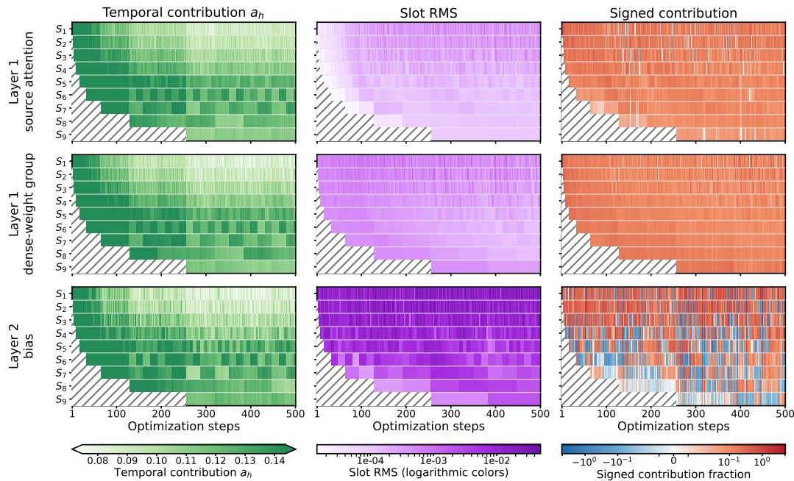  
Figure 15: Full-trajectory groupwise temporal dynamics on GAT/PubMed. Rows show a 64- coordinate layer-1 source-attention group, a 256-coordinate layer-1 dense-weight group, and the 3-coordinate layer-2 bias. Columns show temporal contributions $a _ { h } .$ , raw slot RMS, and signed contribution fractions; the final coefficient is $\alpha _ { h } \ : = \ : s a _ { h }$ . RMS colors are logarithmically spaced while their labels retain linear values; signed-fraction colors use a symmetric logarithmic scale. Hatching marks temporal ranges not yet populated.

## B.2.3 TEMPORAL COEFFICIENTS AND STORED-HISTORY CONTENT

Figure 15 compares the complete GAT/PubMed trajectories of a source-attention group, a denseweight group, and the 3-coordinate output bias. Their temporal contributions, slot magnitudes, and signed contributions exhibit distinct patterns along the same model trajectory.

## C SPATIO-TEMPORAL EXTENSION

This section extends temporal recombination across spatial tiers: multiple partitions of a targetmodel tensor independently construct candidate updates from gradient history, and a second predictor combines those candidates into the final parameter update.

## C.1 PYRAMID GROUPING

Pyramid grouping tests whether the temporal policy can operate over more than one fixed partition of a parameter tensor. Each tensor of rank at least two is represented by its first axis and the flattened product of its remaining axes.

Figure 16 illustrates the generalized spatial hierarchy. The evaluated realization retains the wholetensor configuration and the two single-axis configurations.

The temporal policy produces one full-tensor candidate $\Delta \theta _ { t } ^ { ( p ) }$ from each retained partition $p .$ A separate predictor assigns Softmax weights $\beta _ { t } ^ { \left( p \right) }$ to these candidates and constructs

$$
\Delta \theta _ { t } = \sum _ { p } \beta _ { t } ^ { ( p ) } \Delta \theta _ { t } ^ { ( p ) } .\tag{4}
$$

The temporal path applies the same temporal predictor, with shared weights, to every retained partition. The spatial path uses a separate network, also shared across partitions, whose feature encoder, self-attention encoder, and coefficient head follow the temporal architecture but have independently

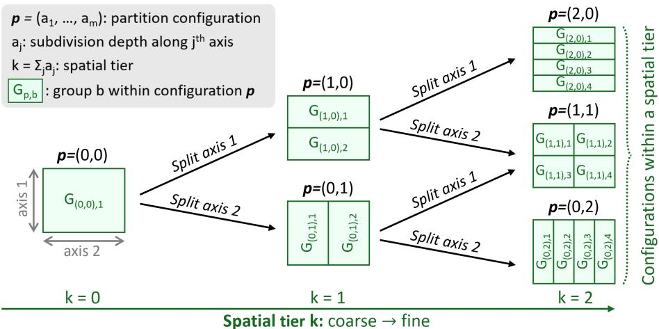  
Figure 16: Spatio-temporal extension through pyramid grouping. A partition configuration $p =$ $( a _ { 1 } , \ldots , a _ { m } )$ assigns subdivision depth $a _ { j }$ to tensor axis $j ,$ and spatial tier $k = \textstyle \sum _ { j } a _ { j }$ contains configurations with the same total subdivision depth. Each cell $G _ { p , b }$ denotes parameter group b within configuration $p .$ The illustration uses two tensor axes and split factor $s = 2$ through tier $k = 2 ;$ the evaluated realization retains the whole-tensor and two single-axis configurations with 16 splits per active axis. Within each group, the temporal policy recombines the stored gradient history.

Table 10: Full-trajectory test accuracy (%) for row and pyramid grouping on unseen graph tasks. Cora and CiteSeer use 100 updates and PubMed uses 500. Entries are mean ± sample standard deviation over three target seeds. Bold and underlined values mark the best and second-best mean in each row.
<table><tr><td>Data</td><td>Model</td><td>Row</td><td>Pyramid</td><td>Adam</td><td>SGD</td><td>SGDM</td></tr><tr><td rowspan="3">Cora</td><td>GCN</td><td> $\mathbf { 8 1 . 7 0 \pm 0 . 2 0 }$ </td><td> $\overline { { 8 1 . 5 7 \pm 0 . 1 2 } }$ </td><td> $\overline { { 7 9 . 2 7 \pm 0 . 8 3 } }$ </td><td> $\overline { { 3 1 . 8 0 \pm 1 0 . 0 1 } }$ </td><td> $\overline { { 7 4 . 9 3 \pm 0 . 9 2 } }$ </td></tr><tr><td>GraphSAGE</td><td> $7 9 . 6 0 \pm 0 . 4 4$ </td><td> ${ \bf 8 0 . 0 0 \pm 0 . 6 9 }$ </td><td> $7 8 . 7 3 \pm 0 . 3 2$ </td><td> $2 4 . 1 0 \pm 3 . 5 8$ </td><td> $7 6 . 6 3 \pm 0 . 1 5$ </td></tr><tr><td>GAT</td><td> $8 1 . 9 7 \pm 0 . 3 1 $ </td><td> ${ \bf 8 2 . 0 3 \pm 0 . 5 0 }$ </td><td> $7 8 . 2 7 \pm 1 . 2 6$ </td><td> $4 7 . 2 3 \pm 8 . 0 0$ </td><td> $7 8 . 9 7 \pm 1 . 1 9$ </td></tr><tr><td rowspan="3">CiteSeer</td><td>GCN</td><td> ${ \bf 7 1 . 0 3 \pm 0 . 8 1 }$ </td><td> $7 0 . 9 7 \pm 0 . 6 7$ </td><td> $6 6 . 2 0 \pm 1 . 6 1$ </td><td> $3 3 . 0 0 \pm 6 . 2 2$ </td><td> $\overline { { 7 0 . 5 7 \pm 0 . 7 1 } }$ </td></tr><tr><td>GraphSAGE</td><td> $6 9 . 8 7 \pm 0 . 8 7$ </td><td> $\underline { { 7 0 . 1 3 \pm 0 . 2 9 } }$ </td><td> $6 5 . 5 7 \pm 1 . 3 6$ </td><td> $3 4 . 6 7 \pm 9 . 3 8$ </td><td> ${ \bf 7 0 . 2 3 \pm 0 . 3 8 }$ </td></tr><tr><td>GAT</td><td> $6 9 . 0 0 \pm 0 . 2 6$ </td><td> $6 9 . 1 7 \pm 0 . 3 2 $ </td><td> $6 6 . 2 0 \pm 0 . 8 2$ </td><td> $5 2 . 8 7 \pm 1 . 4 2$ </td><td> ${ \bf 7 0 . 3 7 \pm 0 . 7 8 }$ </td></tr><tr><td rowspan="3">PubMed</td><td>GCN</td><td> $\mathbf { 7 8 . 6 7 \pm 0 . 2 1 }$ </td><td> $7 8 . 5 3 \pm 0 . 6 0$ </td><td> $7 7 . 5 0 \pm 0 . 3 6$ </td><td> $5 1 . 7 7 \pm 1 . 1 5$ </td><td> $6 7 . 6 7 \pm 6 . 1 1$ </td></tr><tr><td>GraphSAGE</td><td> ${ \bf 7 7 . 3 7 \pm 0 . 4 9 }$ </td><td> ${ 7 7 . 2 3 \pm 0 . 2 9 }$ </td><td> $7 5 . 1 7 \pm 0 . 3 5$ </td><td> $5 0 . 2 0 \pm 1 3 . 6 7$ </td><td> $7 4 . 7 0 \pm 0 . 3 6$ </td></tr><tr><td>GAT</td><td> $7 8 . 7 3 \pm 0 . 3 1$ </td><td> ${ \bf 7 8 . 9 7 \pm 0 . 1 2 }$ </td><td> $7 7 . 1 0 \pm 1 . 4 2$ </td><td> $5 9 . 2 3 \pm 5 . 9 5$ </td><td> $7 3 . 3 0 \pm 0 . 1 7$ </td></tr><tr><td colspan="2">Arithmetic mean across 9 cells</td><td> $7 6 . 4 4 \pm 0 . 2 8$ </td><td> ${ \bf 7 6 . 5 1 \pm 0 . 1 6 }$ </td><td> $7 3 . 7 8 \pm 0 . 2 6$ </td><td> $4 2 . 7 6 \pm 2 . 3 6$ </td><td> $\overline { { 7 3 . 0 4 \pm 0 . 7 5 } }$ </td></tr></table>

learned parameters. The spatial network omits the scale token and group-scale output; its Softmax weights $\beta _ { t } ^ { \left( p \right) }$ directly combine the partition candidates.

The evaluated construction forms three partitions: the whole tensor, 16 contiguous groups along the first axis, and 16 contiguous groups along the flattened trailing axis. Groups smaller than 64 coordinates are omitted. The pyramid policy matches the representative row-grouped policy across nine unseen graph tasks. Table 10 reports test accuracy from the minimum-validation-loss state. Its arithmetic mean is 76.51%, compared with 76.44% for row grouping and 73.78% for Adam. The two learned policies were trained independently, so the comparison establishes that both grouping constructions function under the evaluated protocol rather than isolating the effect of grouping alone.