# MARRYING PRICING AND ADVERTISING WITH LLMS

Alessandro Barro Politecnico di Milano alessandro1.barro@mail.polimi.it

Francesco Emanuele Stradi Politecnico di Milano francescoemanuele.stradi@polimi.it

Francesco Bacchiocchi Politecnico di Milano francesco.bacchiocchi@polimi.it

Alberto Marchesi Politecnico di Milano alberto.marchesi@polimi.it

## ABSTRACT

We study a sequential pricing problem in which a seller jointly posts a price and an advertisement generated by a large language model (LLM). The seller aims to maximize revenue under an unknown product demand that depends on both decisions, while observing only whether each offer leads to a purchase. We propose an online actor-critic algorithm that combines low-rank adaptation (LoRA) of a pretrained LLM with a demand model fitted to available data. At each round, the actor generates an advertisement, and the critic estimates purchase probabilities to guide price selection. Then, the resulting feedback is used to update both the actor and the critic, with the critic’s revenue estimates providing a baseline for policy gradient updates of the actor. To evaluate our approach, we develop an evaluation framework with three synthetic demand models and a demand simulator built from real-world marketplace data. Finally, we compare our algorithm with benchmarks that do not jointly optimize price selection and advertisement generation, achieving expected revenue gains over the reference policy of 5.69%, 5.18% and 55.96% under the three synthetic demand models and 5.81% under the marketplace simulator.

## 1 Introduction

Online marketplaces have deeply changed how sellers set prices. Indeed, a seller can revise the price of a product at negligible cost and observe how buyers respond to the new price shortly after. Moreover, a single seller may offer a large catalog of products, so that prices must be set by automated rules rather than by hand (Misra et al., 2019). However, the demand for each product is typically unknown in advance. Thus, the seller must learn which prices are profitable while collecting revenue from the same interactions used for learning. This trade-off is captured by the framework of sequential posted pricing, in which a seller repeatedly offers a product to arriving buyers and uses the resulting purchase feedback to guide subsequent price selection (Kleinberg and Leighton, 2003). Building on this framework, a large body of work studied how to learn an unknown demand from purchase outcomes (see, e.g., Besbes and Zeevi, 2009, and the survey of den Boer, 2015).

Notice that the price is not the only decision that shapes demand. Indeed, the seller also decides how to present the product, and the advertisement shown to buyers may change their willingness to purchase. In a large-scale experiment, Bertrand et al. (2010) studied loan offers mailed by a lender to more than 50,000 former clients, randomizing independently the interest rate and several features of the letter’s content. Some content features affected loan demand as much as large price changes. For example, showing a single example loan instead of four had the same effect as lowering the monthly interest rate by 2 percentage points. Hence, pricing and advertising cannot be optimized separately. Indeed, an advertisement that increases demand also shifts the revenue-maximizing price, and conversely the value of an advertisement depends on the price at which the product is offered.

At the same time, the way sellers produce advertisements is changing. Indeed, product descriptions in online marketplaces are increasingly generated by large language models (LLMs) rather than written entirely by hand. For instance, Amazon released LLM-based tools that generate product titles and descriptions from a short input provided by the seller.1 Moreover, recent works fine-tuned LLMs on performance feedback to produce more effective advertisements. Jiang et al. (2025) trained an LLM through reinforcement learning, using historical advertisement performance as a reward. In a ten-week experiment involving nearly 35,000 advertisers, the trained model increased click-through rates by 6.7% with respect to a supervised imitation model. Similarly, Chen et al. (2025) and Wang et al. (2026) aligned advertisement generation with click-through and conversion rates observed online. However, these works only optimized the advertisement, and did not consider the price of the advertised product.

When advertisements take the form of natural language, a joint pricing and advertising policy must also decide how content is generated and adapted in response to feedback. LLMs offer a natural way to parametrize this decision, generating advertisements conditioned on information about the product and its environment. In this paper, we study a sequential setting where a seller presents each arriving buyer with a price and an LLM-generated advertisement, and observes only whether a purchase occurs. This binary feedback reflects the combined effect of both decisions and reveals nothing about how the buyer would have responded to alternatives. Since the space of advertisements is too large to explore exhaustively, the seller must generalize from previous interactions, both when generating text and when selecting prices. In addition, optimizing solely for revenue may lead the policy to deviate substantially from the reference model, potentially compromising the fluency and coherence of the generated content. Controlling this deviation helps preserve the language capabilities of the pretrained model while allowing the seller to adapt its advertisements. In this work, we address these challenges through an online actor-critic approach that combines adaptation of a pretrained LLM with demand estimation, using purchase outcomes to update both components and guide their joint optimization.

## 1.1 Original contribution

We propose an online actor-critic algorithm for joint price and advertisement optimization, operating in batches of equal size indexed by τ . The actor is a pretrained LLM fine-tuned through low-rank adaptation (LoRA) to generate advertisements, while the critic is a demand model fitted to available data that estimates purchase probabilities given price, advertisement and product-level context. For each advertisement generated in batch τ, the seller selects a price through an exploration rule guided by the critic. With probability ε , the price is sampled from a given exploration distribution ν on [0, 1]. Otherwise, the seller selects a price maximizing the critic’s estimate of expected revenue. The observed purchase outcomes are used to update the critic’s demand estimates and the actor’s generative policy for the advertisement. The actor updates its LoRA parameters through policy gradient steps to maximize an objective that balances expected revenue with a KL penalty for deviations from the fixed pretrained reference model. These updates use a leave-one-out baseline that averages the critic’s predicted revenues instead of observed rewards, reducing the noise introduced by individual purchase outcomes.

Section 4 evaluates expected revenue under explicit synthetic demand and studies transfer to marketplace products unseen during actor training. We consider logit, probit, and price disclosure demand, together with a simulator fitted to marketplace listings. The synthetic models examine how advertisement content affects purchase propensity and price sensitivity. We compare the Trained and Reference policies using the same final critic, isolating advertisement adaptation under shared learned pricing. In the three synthetic environments, expected revenue increases by 5.69%, 5.18%, and 55.96%, respectively. The largest gain is fully explained by the increased frequency of the rewarded content feature under the declared demand mechanism. Under the marketplace simulator obtained from real data, average normalized expected revenue increases by 5.81%, with improvements on 91 of 100 products across five categories. We also compare revenue during learning with UCB under equal online interaction budgets. Appendices B.4 and B.5 examine performance with progressively less offline data and the mean squared error of the critic-based baseline, respectively.

## 1.2 Related Work

Sequential pricing with unknown demand has been extensively studied in online learning and revenue management. Kleinberg and Leighton (2003) studied auctions with posted prices in which a seller learns from purchase decisions and characterized the revenue loss associated with not knowing the demand curve. Besbes and Zeevi (2009) developed pricing policies that learn demand while collecting revenue, considering both parametric and nonparametric demand models. Misra et al. (2019) subsequently proposed a dynamic pricing approach based on multiarmed bandit experiments, incorporating restrictions from economic choice theory to guide price exploration. We refer to den Boer (2015) for a survey of dynamic pricing and learning. The interaction between pricing and advertising also has a long history in economics: Dorfman and Steiner (1954) analyzed the joint choice of price, advertising expenditure and product quality. Focusing on the content of advertisements, Bertrand et al. (2010) conducted a field experiment that independently randomized loan prices and advertising features, showing that content can have substantial effects on demand relative to price. More recently, Agrawal et al. (2023) studied joint pricing and advertising in a sequential setting with unknown demand. In their formulation, the seller learns from past purchase responses to select both a price and a signaling scheme that discloses information about product quality.

A growing body of work adapts LLMs for advertisement generation using performance feedback. For instance, Jiang et al. (2025) trained an advertisement generator with reinforcement learning guided by a reward model fitted to historical advertisement performance and evaluated the resulting model in a large advertising experiment. Focusing on feedback collected online, Chen et al. (2025) generated diverse candidate advertisements from effective exemplars, tested them online and optimized the generator using preferences derived from observed click rates. More recently, Wang et al. (2026) optimized advertisement generation with reinforcement learning, using an objective that combines predicted conversion rates with quality and diversity criteria. These methods improve advertising effectiveness without jointly optimizing the selling price. Alongside these applications, our approach draws on a broader methodological literature on the adaptation of language models. Ziegler et al. (2019) studied learning from human preferences with a KL penalty to control deviations from a reference policy, while Hu et al. (2022) introduced LoRA, which learns updates of low rank while keeping pretrained weights fixed. For policy optimization, REINFORCE provides a gradient estimator based on sampled outputs and their rewards (Williams, 1992). Building on this estimator, Kool et al. (2019) studied how multiple samples for the same input can be used to construct baselines that reduce its variance. When it comes to LLMs, Ahmadian et al. (2024) further showed that REINFORCE variants with leave-one-out baselines can effectively support learning from human feedback.

## 2 Problem formulation

In the standard formulation of sequential posted pricing (Kleinberg and Leighton, 2003), at each round a seller posts a price $p \in [ 0 , 1 ]$ for an item, and an arriving buyer purchases it if their private valuation exceeds $p .$ When buyers’ valuations are independently drawn from a fixed distribution, this interaction can be equivalently described by a demand curve $d : [ 0 , 1 ]  [ 0 , 1 ]$ , where $d ( p )$ denotes the probability of purchase at price $p .$ In the real world, however, the seller must specify not only a price $\dot { p } \in [ 0 , 1 ]$ , but also an advertisement $x \in \mathcal { X }$ , where X denotes the space of possible advertisements shown to buyers. Each offer is associated with a context vector $z \in { \mathcal { Z } }$ representing characteristics of the product and the environment, which the seller observes before choosing the advertisement and price. Since both the advertisement and the context may affect engagement and the likelihood of purchase, we employ a demand function $d : [ 0 , 1 ] \times \mathcal { X } \times \mathcal { Z } \to [ 0 , 1 ]$ to model buyer response, where $d ( p , x , z )$ is the probability of purchase at price $p ,$ given advertisement x and context z.

We focus on textual advertisements $x \in \mathcal { X }$ generated by a large language model $\pi _ { \theta }$ with parametrization $\theta \in \Theta$ For an observed context z, we generate $x \sim \pi _ { \theta } ( \cdot \mid c ( z ) )$ , where $c ( z )$ is a context-dependent prompt.2 The seller also selects a price through a pricing rule $q : \mathcal { X } \times \mathcal { Z }  [ 0 , 1 ]$ , and $q ( x , z )$ denotes the price for advertisement x and context z, before observing purchase feedback. In this paper, we restrict Θ to the parametrizations obtained through low-rank adaptation (LoRA) (Hu et al., 2022) of a fixed pretrained reference model. We group its parameters as $\theta _ { \mathrm { r e f } } = ( ( W _ { \ell , \mathrm { r e f } } ) _ { \ell = 1 } ^ { L } , \theta _ { \mathrm { r e f , r e s t } } )$ , where $W _ { \ell , \mathrm { r e f } } \in \mathbb { R } ^ { d _ { \ell } \times k _ { \ell } }$ are the weight matrices selected for adaptation and $\theta _ { \mathrm { r e f } }$ ,rest contains the remaining parameters. For each selected matrix, we fix a rank $r _ { \ell } \ll \operatorname* { m i n } ( d _ { \ell } , k _ { \ell } )$ and introduce trainable adapter matrices $A _ { \ell } \in \mathbb { R } ^ { r _ { \ell } \times k _ { \ell } }$ and $B _ { \ell } \in \mathbb { R } ^ { d _ { \ell } \times r _ { \ell } }$ . We collect these matrices in $\psi = ( ( A _ { \ell } , B _ { \ell } ) ) _ { \ell = 1 } ^ { L } \in \Psi$ , where Ψ denotes the space of adapter parameters. Thereby, we introduce the low-rank adaptation map $\Delta \theta ,$ , which assembles the scaled matrix products $B _ { \ell } A _ { \ell }$ into a parameter update, with zero entries for all unadapted parameters. Formally,

$$
\Delta \theta : \psi \longrightarrow \left( \left( \frac { \alpha _ { \ell } } { r _ { \ell } } B _ { \ell } A _ { \ell } \right) _ { \ell = 1 } ^ { L } , 0 \right) ,\tag{1}
$$

where $\alpha _ { \ell } \ > \ 0$ are fixed scaling coefficients. Thus, each selected weight matrix receives an additive update of rank at most $r _ { \ell } .$ while the zero block leaves all remaining parameters unchanged. Accordingly, we define $\Theta : =$ $\{ \theta _ { \mathrm { r e f } } + \Delta \theta ( \psi ) \mid \psi \in \Psi \}$ . Working within Θ therefore amounts to updating only the adapter parameters $\psi ,$ while keeping $\theta _ { \mathrm { r e f } }$ fixed.

Finally, we let $\mu$ denote the probability distribution of product and environmental contexts on $\mathcal { Z }$ across offers and consider a repeated interaction over $T$ rounds between the seller and a sequence of buyers.3 For each round $t \in [ T ]$ the interaction with the current buyer is summarized as follows:

1. The seller observes the context $z _ { t } \sim \mu$ of an offer to an arriving buyer.

2. The seller selects a model parametrization $\theta _ { t } \in \Theta$ and a pricing rule $q _ { t }$ . The seller generates an advertisement $x _ { t } \sim \pi _ { \theta _ { t } } ( \cdot \mid c ( z _ { t } ) )$ , sets the price $p _ { t } = q _ { t } ( x _ { t } , z _ { t } )$ , and displays the advertisement-price pair $( x _ { t } , p _ { t } ) .$ 4

3. The seller observes the binary purchase outcome $y _ { t } \in \{ 0 , 1 \}$ , where $y _ { t } = 1$ if the buyer purchases the item and $y _ { t } = 0$ otherwise, with $y _ { t } \mid p _ { t } , x _ { t } , z _ { t } \sim \operatorname { B e r } \big ( d ( p _ { t } , x _ { t } , z _ { t } ) \big )$

4. The seller receives revenue $r _ { t } : = p _ { t } y _ { t } . ^ { 5 }$

This model implies that the conditional expected selling probability and revenue satisfy, respectively,

$$
\mathbb { E } [ y _ { t } \ \vert \ p _ { t } , x _ { t } , z _ { t } ] = d ( p _ { t } , x _ { t } , z _ { t } ) , \qquad \mathbb { E } [ r _ { t } \ \vert \ p _ { t } , x _ { t } , z _ { t } ] = p _ { t } d ( p _ { t } , x _ { t } , z _ { t } ) ,
$$

For a pricing rule $q : \mathcal { X } \times \mathcal { Z }  [ 0 , 1 ]$ , model parametrization $\theta \in \Theta$ and fixed $z ,$ expected revenue is:

$$
u ( q , \theta \mid z ) : = \mathbb { E } _ { x \sim \pi _ { \theta } ( \cdot \mid c ( z ) ) } \left[ q ( x , z ) d ( q ( x , z ) , x , z ) \right] .
$$

If the seller’s sole goal were to maximize expected revenue, the objective would be to learn a pair $( q , \theta )$ maximizing $u ( q , \theta \mid z )$ for every context $z \in { \mathcal { Z } }$ . In practice, however, optimizing only for revenue may drive the distribution of generated advertisements too far from the reference language policy. To mitigate this drift, we consider a KL-regularized objective with respect to a fixed reference model $\pi _ { \theta _ { \mathrm { r e f } } }$ . This approach is analogous to KL-regularized reinforcement learning from human feedback (RLHF), where a policy is optimized for reward while being penalized for deviating from a reference model (Ziegler et al., 2019). Thus, for any pricing rule q and parametrization $\theta \in \Theta$ , we define:

$$
u _ { \beta } ( q , \theta \mid z ) : = u ( q , \theta \mid z ) - \beta D _ { \mathrm { K L } } ( \pi _ { \theta } ( \cdot \mid c ( z ) ) \mid \mid \pi _ { \theta _ { \mathrm { r e f } } } ( \cdot \mid c ( z ) ) ) ,\tag{2}
$$

where $\beta > 0$ controls the trade-off between expected revenue and proximity to the reference model.6 This discourages overoptimization of the objective by penalizing deviations from the original policy.

## 3 Online actor-critic algorithm

In this section, we introduce Algorithm 1, which uses an actor-critic approach to jointly learn price selection and advertisement generation. In our approach, the actor is a pretrained LLM adapted through low-rank adaptation (LoRA) to generate advertisements, while the critic estimates purchase probabilities given a price, an advertisement, and the context. We describe our algorithm for a fixed context z. We first divide the time horizon $T$ into $N = T / B$ batches of size $B ,$ assuming, for ease of presentation, that $T$ is a multiple of $B$ and that $B \geq 2$ . Before the first batch, we initialize the LoRA adapter so that the actor coincides with the pretrained reference model, whose parameters $\theta _ { \mathrm { r e f } }$ remain fixed throughout the algorithm. Then, at the beginning of each batch $\tau \in [ N ]$ , we set $\theta _ { \tau } = \theta _ { \mathrm { r e f } } + \Delta \theta ( \psi _ { \tau } )$ using the current adapter parameters $\psi _ { \tau }$ , as specified at Line 3. During each batch, the actor generates advertisements, while the critic, parametrized by $\phi _ { \tau } ,$ estimates purchase probabilities given a price, an advertisement, and the context. We keep the actor and critic parameters fixed throughout each batch.

Given a batch $\tau ,$ we collect B seller-buyer interactions indexed by $b = 1 , \dots , B$ . In each interaction $b \in [ B ]$ , the seller first generates an advertisement $x _ { \tau , b } \sim \dot { \pi } _ { \boldsymbol { \theta } _ { \tau } } ( \cdot \mid c ( z ) ) . ^ { 7 }$ Then, the seller selects a price according to an $\varepsilon _ { \tau }$ -greedy pricing rule, as specified at Line 6. In particular, with probability $1 - \varepsilon _ { \tau }$ , the seller selects a price maximizing the expected revenue estimated using the critic, namely,

$$
p _ { \tau , b } \in \arg \operatorname* { m a x } _ { p \in [ 0 , 1 ] } p \widehat { d } _ { \phi _ { \tau } } ( p , x _ { \tau , b } , z ) .
$$

With probability $\varepsilon _ { \tau }$ , the seller instead samples $p _ { \tau , b } \sim \nu _ { \tau }$ . We choose $\nu _ { \tau }$ before collecting batch $\tau$ and hold it fixed within that batch. Appendix B.4 instantiates this choice under progressively missing offline data. After displaying the advertisement-price pair $( x _ { \tau , b } , p _ { \tau , b } )$ , the seller observes the purchase outcome $y _ { \tau , b }$ and computes the realized revenue $r _ { \tau , b } = p _ { \tau , b } y _ { \tau , b }$ at Line 7. By repeating these steps for all $b \in [ B ]$ , we collect a batch of advertisement-price pairs and their corresponding purchase outcomes. These observations provide the feedback for the subsequent model updates. Once the $B$ seller-buyer interactions in batch τ are complete, we update the actor if the condition at Line 9 is satisfied, $i . e . ,$ , once every K batches. The update is based on REINFORCE (Williams, 1992). In its basic form, REINFORCE takes an optimization step on the loss:

Algorithm 1 Pricing & Advertising via Low-Rank Adaptation and REINFORCE Leave-One-Out   
Require: Fixed context $z ,$ actor reference model $\theta _ { \mathrm { r e f } } .$ , low-rank adapter $\psi _ { 1 } .$ , critic reference model $\phi _ { 1 } ,$ actor and critic   
batch sizes $B , S \geq 2 ,$ , integer critic:actor update ratio $K \geq 1$ , time horizon $T ,$ KL coefficient $\beta ,$ critic regularization   
coefficient $\rho ,$ exploration distributions $\nu _ { \tau }$ on $[ 0 , 1 ] ,$ , exploration probabilities $\varepsilon _ { \tau } .$ , actor learning rate $\eta _ { \tau } ,$ , critic learning   
rate $\gamma _ { \tau } .$ , for every $\tau \in [ T / B ]$   
1: Set $\dot { N } = T / B$ and initialize the buffer $B = \varnothing$   
2: for $\tau = 1 , \ldots , N$ do   
3: Set $ { \theta _ { \tau } } =  { \theta _ { \mathrm { r e f } } } + \Delta \theta (  { \psi _ { \tau } } )$   
4: for $b = 1 , \dots , B$ do   
5: Sample an advertisement $x _ { \tau , b } \sim \pi _ { \theta _ { \tau } } ( \cdot \mid c ( z ) )$   
6: With probability $\varepsilon _ { \tau } ,$ sample a price $p _ { \tau , b } \sim \nu _ { \tau } ;$ otherwise select it according to   
$p _ { \tau , b } \in \mathrm { a r g }$ max $p \hat { d } _ { \phi _ { \tau } } ( p , x _ { \tau , b } , z )$   
p∈[0,1]   
7: Observe the feedback $y _ { \tau , b } \sim \mathrm { B e r } ( d ( p _ { \tau , b } , x _ { \tau , b } , z ) )$ and the reward ${ r _ { \tau , b } } = { p _ { \tau , b } } { y _ { \tau , b } }$   
8: end for   
9: if τ mod $K = 0$ then   
10: For every $j , b \in [ B ]$ , compute the revenue advantage estimates   
$\widehat { u } _ { \phi _ { \tau } , j } : = p _ { \tau , j } \widehat { d } _ { \phi _ { \tau } } ( p _ { \tau , j } , x _ { \tau , j } , z ) , \qquad A _ { \tau , b } : = r _ { \tau , b } - \frac { 1 } { B - 1 } \quad \sum \quad \widehat { u } _ { \phi _ { \tau } , j }$   
j∈[B]: j̸=b   
11: Define the actor surrogate loss   
${ \mathcal { L } } _ { \mathrm { a c t o r } } ( \psi ) = - { \frac { 1 } { B } } \sum _ { b = 1 } ^ { B } \left( A _ { \tau , b } - \beta \log { \frac { \pi _ { \theta _ { \tau } } ( x _ { \tau , b } \mid c ( z ) ) } { \pi _ { \theta _ { \tau \mathrm { e f } } } ( x _ { \tau , b } \mid c ( z ) ) } } \right) \log \pi _ { \theta _ { \tau \mathrm { e f } } + \Delta \theta ( \psi ) } ( x _ { \tau , b } \mid c ( z ) )$   
12: Update $\psi _ { \tau } \mathrm { ~ t o ~ } \psi _ { \tau + 1 }$ with one optimization step on $\mathcal { L } _ { \mathrm { a c t o r } }$ using learning rate $\eta _ { \tau }$   
13: else   
14: Set $\psi _ { \tau + 1 } = \psi _ { \tau }$   
15: end if   
16: For every $b \in [ B ]$ , let $e _ { \tau , b } = ( x _ { \tau , b } , p _ { \tau , b } , y _ { \tau , b } )$ and update the buffer $\boldsymbol { B } = \boldsymbol { B } \cup ( e _ { \tau , b } ) _ { b = 1 } ^ { B }$   
17: Sample $( e _ { s } ) _ { s = 1 } ^ { S }$ uniformly from the buffer B and define the critic loss   
$\mathcal { L } _ { \mathrm { c r i t i c } } ( \phi ) = - \frac { 1 } { S } \sum _ { s = 1 } ^ { S } \left[ y _ { s } \log \hat { d } _ { \phi } ( p _ { s } , x _ { s } , z ) + ( 1 - y _ { s } ) \log \left( 1 - \hat { d } _ { \phi } ( p _ { s } , x _ { s } , z ) \right) \right] + \rho \left\| \phi - \phi _ { 1 } \right\| _ { 2 } ^ { 2 }$   
18: Update $\phi _ { \tau } \mathrm { ~ t o ~ } \phi _ { \tau + 1 }$ with one optimization step on $\mathcal { L } _ { \mathrm { c r i t i c } }$ using learning rate $\gamma _ { \tau }$   
19: end for   
20: return $\psi _ { N + 1 } , \phi _ { N + 1 }$

$$
{ \mathcal L } _ { \mathrm { R F } } ( \psi ) = - \frac { 1 } { B } \sum _ { b = 1 } ^ { B } r _ { \tau , b } \log \pi _ { \theta _ { \mathrm { r e f } } + \Delta \theta ( \psi ) } ( x _ { \tau , b } \mid c ( z ) ) .\tag{3}
$$

Thus, advertisements that produce higher observed revenues receive greater weight in the update. Building on this, we introduce a leave-one-out baseline and a $\mathrm { K L }$ penalty. Specifically, we replace the observed revenue $r _ { \tau , b }$ in Equation (3) with a revenue advantage estimate $A _ { \tau , b }$ minus a KL regularization term and obtain the actor loss defined at Line 11. To estimate the advantage, we subtract from $r _ { \tau , b }$ a leave-one-out baseline that averages the critic’s expected revenue estimates for $j \neq b ;$

$$
A _ { \tau , b } : = r _ { \tau , b } - \frac { 1 } { B - 1 } \sum _ { \substack { j \in [ B ] : j \neq b } } \widehat { u } _ { \phi _ { \tau } , j } , \qquad \widehat { u } _ { \phi _ { \tau } , j } : = p _ { \tau , j } \widehat { d } _ { \phi _ { \tau } } ( p _ { \tau , j } , x _ { \tau , j } , z ) .\tag{4}
$$

Unlike a reward-based REINFORCE leave-one-out baseline, we average the critic’s expected revenue estimates $\widehat { u } _ { \phi _ { \tau } , j }$ rather than the observed revenues $\boldsymbol { r } _ { \tau , j }$ for $j \neq b$ . This choice aims to reduce purchase-outcome noise in the baseline. Appendix B.5 compares this noise with the critic estimation error that replaces it. In addition, the KL term in the actor loss at Line 11 plays the role of preventing large deviations from the reference model. As shown in Appendix $\mathbf { A } ,$ conditional on the history before batch $\tau ,$ the negative gradient of this loss evaluated at $\psi _ { \tau }$ is an unbiased estimator of the gradient with respect to the LoRA parameters of the KL-regularized objective $u _ { \beta }$ defined in Equation (2), averaged over the ε -greedy pricing strategy used in that batch. The pricing strategy is held fixed when taking this gradient. Finally, we store the observations collected during the batch in B at Line 16 and sample S observations to update the critic.

Then, at Line 18, we take one gradient step on the critic loss, which combines binary cross-entropy on the observed purchase outcomes $y _ { s }$ with a penalty for deviations from $\phi _ { 1 }$ . In this way, the critic is updated after every batch, while the actor is updated every K batches using only the seller-buyer interactions in the current batch.

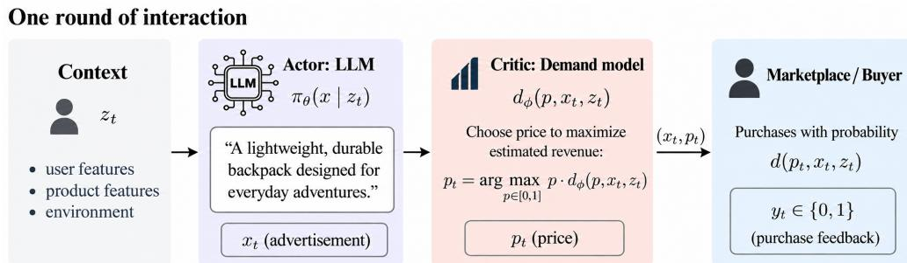  
Figure 1: One round of seller-buyer interaction. The actor generates an advertisement, the seller uses the critic to select a price, and the buyer provides purchase feedback.

## 4 Experimental Results

We evaluate Algorithm 1 under three synthetic demand models and a simulator fitted to real-world marketplace data. In the following, we denote by Trained the algorithm that uses the actor and the critic obtained from Algorithm 1, while we denote by Reference the algorithm that selects prices according to the critic model returned by Algorithm 1 and generates advertisements according to the reference model, i.e., the model that is not adapted during the seller-buyer interactions. This comparison isolates the effect of adapting the advertisement-generation policy while using the same pricing rule for both approaches. We report both absolute and relative changes in expected revenue, defined as follows:

$$
\Delta u : = u _ { \mathrm { T r a i n } } - u _ { \mathrm { R e f } } , \qquad \Delta u ( \% ) : = 1 0 0 \frac { \Delta u } { u _ { \mathrm { R e f } } } ,
$$

where $u _ { \mathtt { T r a i n } }$ and $u _ { \mathrm { R e f } }$ denote estimates of the expected revenues of the two policies.

We also evaluate revenue achieved throughout the learning process. To do so, we compare Trained with UCB. The latter algorithm generates advertisements using the fixed pretrained reference model and selects prices using UCB1 (Auer et al., 2002), independently of the generated advertisement. Both approaches use the same price grid and interact with buyers over the same number of rounds. At each round t, UCB updates its pricing strategy based solely on the observed reward ${ \boldsymbol { r } } _ { t } = { \boldsymbol { p } } _ { t } { \boldsymbol { y } } _ { t }$ , without relying on a pretrained critic. We present this comparison through training-revenue curves, which show how expected revenue evolves throughout the interactions. In both the synthetic and real-world experiments, we adapt Qwen2.5-1.5B-Instruct with rank-eight LoRA over $N = 5 0 0$ batches of $B = 3 2$ offers per run $( T = 1 6 { , } 0 0 0$ purchase outcomes). Appendix B gives further implementation details, as well as additional ablations.

## 4.1 Synthetic Demand Models

We first examine our performances under logit and probit demand, two models used to study consumer responses to credit offers (Farrell et al., 2021; Bertrand et al., 2010). For a fixed context z and a content feature $h ( x ) , e . g .$ , an indicator of whether the advertisement mentions a word of choice, these models are given by:

$$
d _ { \mathrm { l o g i t } } ( p , x ) = \sigma ( a - \kappa p + w ^ { \top } h ( x ) ) , \qquad d _ { \mathrm { p r o b i t } } ( p , x ) = \Phi ( a - \kappa p + w ^ { \top } h ( x ) ) .\tag{5}
$$

Here, $\kappa > 0$ ensures that demand decreases with price, while σ and Φ denote the logistic function and standard normal CDF, respectively. For the steel-bottle experiments (see the Appendix for additional details), $h ( x )$ equals one if advertisement x contains the word durable and zero otherwise. We set illustrative logit coefficients $( a , \kappa , w ) = ( 1 , 4 , 0 . 8 )$ and calibrate probit to match the resulting logit purchase probabilities at three fixed price-feature combinations.

The third model, price disclosure, uses $h ( x )$ to indicate whether the advertisement reveals the offered price, allowing disclosure to affect both the probability of purchase at a given price and how demand responds to price changes. We construct separate demand curves from the purchase rates reported by Dubé et al. (2026) at \$0.99, \$2.99 and \$5.99 for advertisements that omit the price and those that disclose it. For each condition, we linearly interpolate between the three observed rates to define purchase probabilities at intermediate prices. This yields two demand curves, with h(x) selecting which curve applies to a generated advertisement. We restrict prices to the observed range and divide them by 5.99, obtaining the normalized interval $p \in [ 0 . 9 9 / 5 . 9 9 , 1 ]$ without changing the associated purchase probabilities.

Across all three models, we pretrain the critic on 8,192 offline offers with Reference-generated advertisements and Bernoulli purchase outcomes sampled from the corresponding demand model. The critic observes the price and the specified feature $h ( x )$ without access to the demand parameters; Appendix B.2 provides calibration and sampling details.

Table 1: Synthetic expected revenue from 10,000 fresh advertisements per policy and environment. The 95% intervals use 2,000 bootstrap resamples, drawn independently for the compared policies.
<table><tr><td>Policy / metric</td><td>Logit</td><td>Probit</td><td>Price disclosure</td></tr><tr><td>Trained</td><td>0.217117</td><td>0.205616</td><td>0.027162</td></tr><tr><td>Reference</td><td>0.205418</td><td>0.195496</td><td>0.017416</td></tr><tr><td> $\mathbf { \Delta } \pmb { \Delta } \pmb { u }$ </td><td>+0.011698</td><td>+0.010120</td><td>+0.009746</td></tr><tr><td> $\pmb { \Delta } \pmb { u } ( \% )$ </td><td>+5.69%</td><td>+5.18%</td><td>+55.96%</td></tr><tr><td>95% interval for ∆u</td><td>[0.0111, 0.0123]</td><td>[0.0095, 0.0107]</td><td>[0.0096, 0.0099]</td></tr></table>

Table 1 reports expected revenue gains of 5.69%, 5.18%, and 55.96% over Reference under logit, probit, and price disclosure, respectively. These gains accompany an increase in the frequency of the rewarded content features: the fraction of advertisements containing durable rises from 82.14% to 97.11% in logit and 96.73% in probit, while the fraction disclosing the price rises from 35.17% to 98.23%. Under the shared critic, the increased disclosure frequency fully accounts for the revenue gain in the price disclosure model (see Appendix B.2 for further details). The upper panels of Figure 2 complement these averages with held-out scatter plots, with all block means lying above the equality line across the three demand models. The lower panels display the corresponding training-revenue curves, i.e. how expected revenue evolves during the optimization process. As described in the evaluation protocol, we compare Trained and UCB in this online regime. Since the latter continues to balance price exploration and exploitation as feedback accumulates, it makes sense to assess its performance on the fly, rather than evaluating a final price recommendation offline.

## 4.2 Experiments Based on Real Data

The first evaluation protocol assesses the effectiveness of LoRA through a held-out comparison of Trained and Reference. We evaluate expected revenue using a frozen demand simulator fitted to Avito marketplace listings (Avito, 2018), with text and price as inputs and deal probabilities as targets. Furthermore, we pretrain the initial critic on a disjoint split of the same size. The listings cover five product categories: Audio/Video, Home Appliances, Laptops, Mobile Phones and Tablets/E-readers. Within each category, we run Algorithm 1 on a single product to obtain the Trained policy, which we then compare with Reference on 20 other products. Both use the samefinal critic for price selection. We thus generate 100 advertisements and prices per policy and test product, yielding 10,000 evaluations each. During both training and evaluation, five fixed marketplace examples guide the format and phrasing of generated advertisements to limit shifts from the text distribution encoded by the demand. Finally, the context z contains product facts such as name, category and condition.

We normalize prices separately for each product to use a common action space [0, 1] across different monetary price scales. For a product described by context z, action $p \in [ 0 , 1 ]$ corresponds to the monetary price $\lambda ( z ) p ,$ where $\bar { \lambda ( z ) }$ is the product’s maximum retained listing price, determined without using demand targets. Both the marketplace simulator and the critic receive this monetary price, matching the kind used while fitting. During evaluation, we divide expected monetary revenue $\lambda ( z ) p d ( p , x , z ) \bar { \bf b } \bf y \lambda \lambda ( \bar { \it z } )$ and report $p d ( p , x , z )$ . This measures revenue relative to each product’s price scale, avoiding greater weight for products simply because their monetary prices are higher. Notably, since $\lambda ( z )$ is fixed and positive for each product, this normalization preserves the price that maximizes unregularized revenue within the admissible range. Table 2 reports an increase in average normalized expected revenue from 0.1991 for Reference to 0.2107 for Trained, corresponding to a gain of 5.81%. All five categories improve on average, with gains ranging from 1.98% for Mobile Phones to 14.26% for Laptops.

The second evaluation protocol examines expected revenue during online learning by comparing Trained with UCB on the five training products. Both methods use the same price grid and online interaction budget, while UCB pairs the reference generator with price exploration guided by observed rewards, without a pretrained critic. Figure 3 tracks their expected revenue throughout training: Trained achieves higher mean expected revenue over the final 100 batches in every category. This comparison illustrates the benefits of joint price and advertisement optimization supported by offline critic supervision. Appendix B.4 further examines performance and the role of price exploration as offline data are progressively reduced, while Appendix B.5 studies the estimation error of the leave-one-out baseline constructed from the critic’s revenue estimates (Equation (4)).

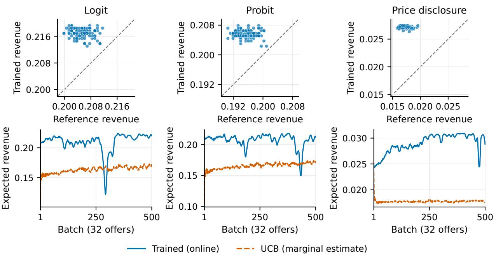  
Figure 2: Synthetic evaluation. Top: held-out mean revenues (Reference, horizontal; Trained, vertical), with a dashed equality line. Each point averages 100 independently generated advertisements per policy; independent blocks are aligned for display only. Bottom: trailing ten-batch revenue means for Trained (blue) and UCB (orange). Trained revenue uses recorded offer probabilities; UCB revenue is estimated from logged prices and feature frequencies (Appendix B.2).

## 5 Conclusion and Future Work

We study a sequential pricing problem in which a seller jointly selects a price and an LLM-generated advertisement, observing only whether the buyer purchases. We propose an online actor-critic algorithm that adapts the advertisement policy through LoRA, while a demand model guides price selection and provides a leave-one-out baseline for the KL-regularized actor updates. Finally, we validate our algorithm on both synthetic and real-world marketplace data. A natural extension is to allow demand to change over time. This setting is challenging because shifting buyer preferences may alter both price sensitivity and the effect of advertisement content, so the critic must track a moving target from binary feedback while the actor keeps adapting to its estimates.

Table 2: Marketplace expected revenue from 100 fresh advertisements per policy and product. The 95% intervals use 5,000 bootstrap resamples, drawn over products and paired across the policies.
<table><tr><td>Policy / metric</td><td>Audio / Video</td><td>Home Appliances</td><td>Laptops</td><td>Mobile Phones</td><td>Tablets / E-readers</td><td>Overall</td></tr><tr><td>Trained</td><td>0.2363</td><td>0.2446</td><td>0.1802</td><td>0.1936</td><td>0.1987</td><td>0.2107</td></tr><tr><td>Reference</td><td>0.2303</td><td>0.2329</td><td>0.1577</td><td>0.1898</td><td>0.1848</td><td>0.1991</td></tr><tr><td>∆u</td><td>+0.0060</td><td>+0.0117</td><td>+0.0225</td><td>+0.0038</td><td>+0.0139</td><td>+0.0116</td></tr><tr><td>∆u(%)</td><td>+2.59%</td><td>+5.01%</td><td>+14.26%</td><td>+1.98%</td><td>+7.55%</td><td>+5.81%</td></tr><tr><td>95% interval</td><td>[0.0036,</td><td>[0.0091,</td><td>[0.0172,</td><td>[0.0019,</td><td>[0.0115,</td><td>[0.0097,</td></tr><tr><td>for ∆u</td><td>0.0083]</td><td>0.0143]</td><td>0.0285]</td><td>0.0057]</td><td>0.0163]</td><td>0.0136]</td></tr></table>

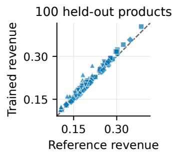

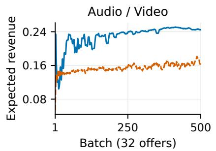

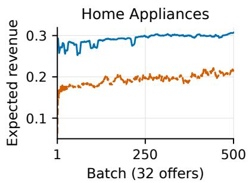

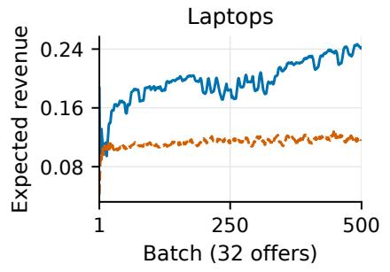

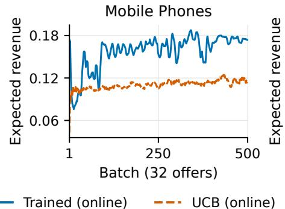

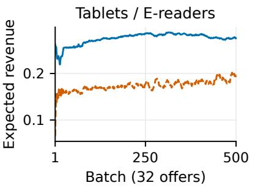  
Figure 3: Marketplace evaluation. Upper left: each point shows mean expected revenue for one test product (Reference, horizontal; Trained, vertical), with a dashed diagonal line indicating equal revenue. Markers follow the category order in Table 2: circle, square, upward triangle, diamond, downward triangle. Other panels: training-revenue curves, which use the same colors as in Figure 2.

## AI use statement

Generative AI tools were used during the drafting of this paper to improve the readability and refine the English exposition. We also used Codex to assist with code development. The authors bear full responsibility for the scientific content and the final manuscript.

## References

Shipra Agrawal, Yiding Feng, and Wei Tang. Dynamic pricing and learning with Bayesian persuasion. In Advances in Neural Information Processing Systems, volume 36, 2023.

Arash Ahmadian, Chris Cremer, Matthias Gallé, Marzieh Fadaee, Julia Kreutzer, Olivier Pietquin, Ahmet Üstün, and Sara Hooker. Back to basics: Revisiting REINFORCE-style optimization for learning from human feedback in LLMs. In Proceedings of the 62nd Annual Meeting of the Association for Computational Linguistics (Volume 1: Long Papers), pages 12248–12267. Association for Computational Linguistics, 2024. doi: 10.18653/v1/2024.acl-long.662.

Peter Auer, Nicolò Cesa-Bianchi, and Paul Fischer. Finite-time analysis of the multiarmed bandit problem. Machine Learning, 47:235–256, 2002. doi: 10.1023/A:1013689704352.

Avito. Avito Demand Prediction Challenge. Kaggle, 2018. URL https://www.kaggle.com/competitions/ avito-demand-prediction.

Marianne Bertrand, Dean Karlan, Sendhil Mullainathan, Eldar Shafir, and Jonathan Zinman. What’s advertising content worth? evidence from a consumer credit marketing field experiment. The Quarterly Journal ofEconomics, 125(1): 263–306, 2010. doi: 10.1162/qjec.2010.125.1.263.

Omar Besbes and Assaf Zeevi. Dynamic pricing without knowing the demand function: Risk bounds and near-optimal algorithms. Operations Research, 57(6):1407–1420, 2009.

Yanda Chen, Zihui Ren, Qixiang Gao, Jiale Chen, Si Chen, Xubin Li, Tiezheng Ge, and Bo Zheng. CTR-driven ad text generation via online feedback preference optimization. arXiv preprint arXiv:2507.20227, 2025.

Arnoud V. den Boer. Dynamic pricing and learning: Historical origins, current research, and new directions. Surveys in Operations Research and Management Science, 20(1):1–18, 2015.

Robert Dorfman and Peter O. Steiner. Optimal advertising and optimal quality. The American Economic Review, 44(5): 826–836, 1954.

Jean-Pierre Dubé, Ilya Morozov, Franklin She, and Anna Tuchman. The effects of ads on beliefs and implications for consumer search. NBER Working Paper 35596, National Bureau of Economic Research, 2026.

Max H. Farrell, Tengyuan Liang, and Sanjog Misra. Deep learning for individual heterogeneity: An automatic inference framework. arXiv preprint arXiv:2010.14694v2, 2021. URL https://arxiv.org/abs/2010.14694v2.

Edward J. Hu, Yelong Shen, Phillip Wallis, Zeyuan Allen-Zhu, Yuanzhi Li, Shean Wang, Lu Wang, and Weizhu Chen. LoRA: Low-rank adaptation of large language models. In International Conference on Learning Representations, 2022.

Daniel R. Jiang, Alex Nikulkov, Yu-Chia Chen, Yang Bai, and Zheqing Zhu. Improving generative ad text on Facebook using reinforcement learning. arXiv preprint arXiv:2507.21983, 2025.

Robert D. Kleinberg and F. Thomson Leighton. The value of knowing a demand curve: Bounds on regret for online posted-price auctions. In Proceedings of the 44th Annual IEEE Symposium on Foundations of Computer Science, pages 594–605. IEEE, 2003. doi: 10.1109/SFCS.2003.1238232.

Wouter Kool, Herke van Hoof, and Max Welling. Buy 4 REINFORCE samples, get a baseline for free! In ICLR 2019 Workshop on Deep Reinforcement Learning Meets Structured Prediction, 2019.

Kanishka Misra, Eric M. Schwartz, and Jacob Abernethy. Dynamic online pricing with incomplete information using multiarmed bandit experiments. Marketing Science, 38(2):226–252, 2019. doi: 10.1287/mksc.2018.1129.

Jinfang Wang et al. RELATE: A reinforcement learning-enhanced LLM framework for advertising text generation. arXiv preprint arXiv:2602.11780, 2026.

Ronald J. Williams. Simple statistical gradient-following algorithms for connectionist reinforcement learning. Machine Learning, 8:229–256, 1992. doi: 10.1007/BF00992696.

Daniel M. Ziegler, Nisan Stiennon, Jeffrey Wu, Tom B. Brown, Alec Radford, Dario Amodei, Paul Christiano, and Geoffrey Irving. Fine-tuning language models from human preferences. arXiv preprint arXiv:1909.08593, 2019.

## Contents

1 Introduction   
1.1 Original contribution 2   
1.2 Related Work . 2   
2 Problem formulation 3   
3 Online actor-critic algorithm 4   
4 Experimental Results 6   
4.1 Synthetic Demand Models 6   
4.2 Experiments Based on Real Data 7   
5 Conclusion and Future Work 8   
A Unbiasedness of the Actor Gradient Estimator 11   
B Experimental Protocols and Additional Results 13   
B.1 Shared Implementation and Evaluation . 13   
B.2 Synthetic Models, Calibration, and Reconstruction 14   
B.3 Marketplace Data and Evaluation Protocol . 16   
B.4 Progressive Scarcity of Offline Data 18   
B.5 Critic Predictions in the Leave-One-Out Baseline 19

## A Unbiasedness of the Actor Gradient Estimator

Fix a context z and a batch τ in which the actor is updated. Write $\theta ( \psi ) : = \theta _ { \mathrm { r e f } } + \Delta \theta ( \psi )$ . Let $\mathcal { F } _ { \tau - 1 }$ denote the history before collecting batch $\tau ,$ and abbreviate conditional expectation given this history by $\mathbb { E } _ { \tau } .$ . Conditional on $\mathcal { F } _ { \tau - 1 }$ , the parameters $\psi _ { \tau } , \phi _ { \tau }$ , the exploration probability $\varepsilon _ { \tau }$ , and the exploration distribution $\nu _ { \tau }$ are fixed.

Let $q _ { \tau } ^ { \mathrm { g } }$ denote the greedy pricing function, defined by

$$
q _ { \tau } ^ { \mathrm { g } } ( x , z ) \in \arg \operatorname* { m a x } _ { p \in [ 0 , 1 ] } p \widehat { d } _ { \phi _ { \tau } } ( p , x , z ) ,
$$

using a fixed tie-breaking rule. For each $p \in [ 0 , 1 ]$ , let $q _ { p }$ denote the constant pricing function $q _ { p } ( x , z ) = p$ . At each interaction b, the seller chooses

$$
\begin{array} { r } { q _ { \tau , b } = \left\{ \begin{array} { l l } { q _ { \tau } ^ { \mathrm { g } } , } & { \mathrm { w i t h ~ p r o b a b i l i t y ~ } 1 - \varepsilon _ { \tau } , } \\ { q _ { P _ { \tau , b } } , } & { P _ { \tau , b } \sim \nu _ { \tau } , } \end{array} \right. \mathrm { w i t h ~ p r o b a b i l i t y ~ } \varepsilon _ { \tau } , } \end{array}
$$

and sets $p _ { \tau , b } = q _ { \tau , b } ( x _ { \tau , b } , z )$ . Conditional on $\mathcal { F } _ { \tau - 1 }$ , advertisements are sampled independently from $\pi _ { \theta _ { \tau } } ( \cdot \ | \ c ( z ) )$ . The exploration decisions and the prices sampled from $\nu _ { \tau }$ use fresh randomness, independent across interactions and independent of advertisement generation. Purchase feedback satisfies

$$
\mathbb { E } _ { \tau } [ y _ { \tau , b } \mid x _ { \tau , b } , p _ { \tau , b } ] = d ( p _ { \tau , b } , x _ { \tau , b } , z ) .
$$

For a fixed advertisement $x ,$ the expected revenue under this randomized choice of pricing function is

$$
\begin{array} { l } { { R _ { \tau } ( x , z ) : = \mathbb { E } _ { \tau } [ q _ { \tau , b } ( x , z ) d ( q _ { \tau , b } ( x , z ) , x , z ) ] } } \\ { { \displaystyle \qquad = ( 1 - \varepsilon _ { \tau } ) q _ { \tau } ^ { \mathrm { g } } ( x , z ) d ( q _ { \tau } ^ { \mathrm { g } } ( x , z ) , x , z ) + \varepsilon _ { \tau } \int _ { [ 0 , 1 ] } p d ( p , x , z ) \nu _ { \tau } ( d p ) . } } \end{array}\tag{6}
$$

Accordingly, the KL-regularized objective in Equation (2), averaged over the batch’s pricing randomization, is

$$
\begin{array} { r l } & { J _ { \tau } ( \psi \mid z ) : = \mathbb { E } _ { \tau } \big [ u _ { \beta } \big ( q _ { \tau , b } , \theta ( \psi ) \mid z \big ) \big ] } \\ & { \quad \quad \quad = \mathbb { E } _ { x \sim \pi _ { \theta ( \psi ) } ( \cdot \mid c ( z ) ) } \big [ R _ { \tau } ( x , z ) \big ] - \beta D _ { \mathrm { K L } } \big ( \pi _ { \theta ( \psi ) } ( \cdot \mid c ( z ) ) \big \| \pi _ { \theta _ { \mathrm { r e f } } } ( \cdot \mid c ( z ) ) \big ) . } \end{array}\tag{7}
$$

The pricing strategy, namely $q _ { \tau } ^ { \mathrm { g } } , \varepsilon _ { \tau } .$ , and $\nu _ { \tau }$ , is held fixed when differentiating with respect to $\psi .$

For the generation procedure of this paper, the policy $\pi _ { \theta ( \psi ) } ( \cdot | c ( z ) )$ is differentiable in $\psi$ and has parameter-independent support equal to that of the reference policy. Indeed, the low-rank adaptation map $\Delta \theta$ is polynomial in $\psi ,$ and the actor’s logits and softmax probabilities are differentiable in their respective inputs. Thus, the probability of each fixed token sequence is differentiable in $\psi .$ Moreover, generation uses the full vocabulary at the fixed temperature 0.7, so every token has strictly positive probability for finite logits. Since the actor and the reference policy use the same vocabulary and stopping rules, both policies assign positive probability to exactly the same admissible sequences. Finally, the vocabulary is finite and generation stops after at most 64 tokens. Hence, for each fixed context $z ,$ the expectations over generated sequences and the KL divergence reduce to finite sums of differentiable terms, with finite log ratios. Therefore, differentiation and expectation can be interchanged in the calculations below.

Proposition A.1. For $B \geq 2 ,$ , the actor surrogate loss in Algorithm 1 satisfies

$$
\mathbb { E } _ { \tau } \Big [ - \nabla _ { \psi } \mathcal { L } _ { \mathrm { a c t o r } } ( \psi ) | _ { \psi = \psi _ { \tau } } \Big ] = \nabla _ { \psi } J _ { \tau } ( \psi \mid z ) | _ { \psi = \psi _ { \tau } } .\tag{8}
$$

Here, the advantage estimates and log-ratio coefficients in the surrogate loss are held fixed during differentiation.

Proof. Define the score and log-ratio functions

$$
s _ { \tau } ( x ) : = \nabla _ { \psi } \log \pi _ { \theta ( \psi ) } ( x \mid c ( z ) ) \big \rvert _ { \psi = \psi _ { \tau } } , \qquad \ell _ { \tau } ( x ) : = \log \frac { \pi _ { \theta _ { \tau } } ( x \mid c ( z ) ) } { \pi _ { \theta _ { \mathrm { r e f } } } ( x \mid c ( z ) ) } .
$$

The negative gradient of the surrogate loss is

$$
\widehat { g } _ { \tau } = \frac { 1 } { B } \sum _ { b = 1 } ^ { B } \left( A _ { \tau , b } - \beta \ell _ { \tau } ( x _ { \tau , b } ) \right) s _ { \tau } ( x _ { \tau , b } ) .\tag{9}
$$

Since policy probabilities sum to one, the score identity gives

$$
\mathbb { E } _ { \tau } [ s _ { \tau } ( \boldsymbol { x } _ { \tau , b } ) ] = \nabla _ { \boldsymbol { \psi } } \sum _ { \boldsymbol { x } \in \mathcal { X } } \pi _ { \boldsymbol { \theta } ( \boldsymbol { \psi } ) } ( \boldsymbol { x } \mid \boldsymbol { c } ( \boldsymbol { z } ) ) \Bigg | _ { \boldsymbol { \psi } = \boldsymbol { \psi } _ { \tau } } = 0 .
$$

For $j \neq b ,$ the critic revenue estimate

$$
\widehat { u } _ { \phi _ { \tau } , j } = p _ { \tau , j } \widehat { d } _ { \phi _ { \tau } } ( p _ { \tau , j } , x _ { \tau , j } , z )
$$

is conditionally independent of $x _ { \tau , b } ,$ because the critic is fixed before collecting the batch and advertisement draws and pricing randomizations are independent across interactions. Therefore,

$$
\mathbb { E } _ { \tau } [ \widehat { u } _ { \phi _ { \tau } , j } s _ { \tau } ( x _ { \tau , b } ) ] = \mathbb { E } _ { \tau } [ \widehat { u } _ { \phi _ { \tau } , j } ] \mathbb { E } _ { \tau } [ s _ { \tau } ( x _ { \tau , b } ) ] = 0 .
$$

Using

$$
A _ { \tau , b } = r _ { \tau , b } - \frac { 1 } { B - 1 } \sum _ { j \neq b } \widehat { u } _ { \phi _ { \tau } , j } ,
$$

we conclude that the leave-one-out baseline contributes zero to the conditional expected gradient. Formally,

$$
\begin{array} { l } { \displaystyle \mathbb { E } _ { \tau } [ A _ { \tau , b } s _ { \tau } ( \boldsymbol { x } _ { \tau , b } ) ] = \mathbb { E } _ { \tau } [ r _ { \tau , b } s _ { \tau } ( \boldsymbol { x } _ { \tau , b } ) ] - \frac { 1 } { B - 1 } \sum _ { j \neq b } \underbrace { \mathbb { E } _ { \tau } [ \widehat { u } _ { \phi _ { \tau } , j } s _ { \tau } ( \boldsymbol { x } _ { \tau , b } ) ] } _ { = 0 } } \\ { = \mathbb { E } _ { \tau } [ r _ { \tau , b } s _ { \tau } ( \boldsymbol { x } _ { \tau , b } ) ] . } \end{array}
$$

Moreover, the demand model and the pricing strategy imply $\mathbb { E } _ { \tau } [ r _ { \tau , b } \ | \ x _ { \tau , b } ] = R _ { \tau } ( x _ { \tau , b } , z )$ . Consequently, the likelihood ratio identity yields

$$
\begin{array} { r l } & { \mathbb { E } _ { \tau } [ A _ { \tau , b } s _ { \tau } ( x _ { \tau , b } ) ] = \mathbb { E } _ { \tau } [ r _ { \tau , b } s _ { \tau } ( x _ { \tau , b } ) ] } \\ & { \quad \quad \quad \quad = \mathbb { E } _ { \tau } [ R _ { \tau } ( x _ { \tau , b } , z ) s _ { \tau } ( x _ { \tau , b } ) ] } \\ & { \quad \quad \quad = \nabla _ { \psi } \mathbb { E } _ { x \sim \pi _ { \theta ( \psi ) } ( \cdot | c ( z ) ) } [ R _ { \tau } ( x , z ) ] \Big | _ { \psi = \psi _ { \tau } } . } \end{array}\tag{10}
$$

Finally, applying the product rule and using that the reference policy is fixed gives

$$
\begin{array} { r l } & { \nabla _ { \psi } D _ { \mathrm { K L } } \big ( \pi _ { \theta ( \psi ) } ( \cdot \vert \ c ( z ) ) \big ) \big \vert \pi _ { \theta _ { \mathrm { r e f } } } ( \cdot \vert \ c ( z ) ) \big ) \big \vert _ { \psi = \psi _ { \tau } } } \\ & { \quad = \displaystyle \sum _ { x } ( \ell _ { \tau } ( x ) + 1 ) \ \nabla _ { \psi } \pi _ { \theta ( \psi ) } ( x \ \vert \ c ( z ) ) \big \vert _ { \psi = \psi _ { \tau } } } \\ & { \quad = \mathbb { E } _ { \tau } \big [ \ell _ { \tau } ( x _ { \tau , b } ) _ { \tau } ( x _ { \tau , b } ) \big ] + \underbrace { \mathbb { E } _ { \tau } \big [ s _ { \tau } ( x _ { \tau , b } ) \big ] } _ { = 0 } } \\ & { \quad = \mathbb { E } _ { \tau } \big [ \ell _ { \tau } ( x _ { \tau , b } ) _ { \tau } ( x _ { \tau , b } ) \big ] . } \end{array}\tag{11}
$$

The sum is over the policy support, and the last equality uses the zero-mean score identity. Taking conditional expectations in Equation (9) and applying Equations (10) and (11) proves Equation (8), concluding the proof.

The result requires neither an accurate nor an unbiased critic. Indeed, the leave-one-out baseline has zero expected contribution for any critic fixed before collecting the batch. Critic quality can nevertheless affect the selected prices and the estimator’s variance. Unbiasedness holds at the sampling parameters $\psi _ { \tau }$ , with the batch’s pricing strategy held fixed.

## B Experimental Protocols and Additional Results

We provide implementation and evaluation details for Section 4, followed by additional test summaries and the offline data and baseline ablations. We retain the notation of Algorithm 1: T counts individual offers, $N = T / B$ counts batches, p is the normalized price, and q denotes a pricing rule.

## B.1 Shared Implementation and Evaluation

We adapt Qwen2.5-1.5B-Instruct through rank-eight LoRA on the attention query and value projections, keeping the pretrained weights fixed. Disabling the adapters recovers Reference. Generation and sequence scoring use the same full-vocabulary distribution at temperature 0.7, with log probabilities summed over generated tokens. In the actor surrogate, the revenue advantage and sampled KL log ratio are held fixed when differentiating the sequence log probability. Each actor update uses the current batch of $\bar { B } = 3 2$ offers and occurs every $K = 5$ batches; each critic update uses $S = 6 4$ offers sampled uniformly from the accumulated replay buffer, with replacement only while fewer than 64 offers are available. Both updates use Adam, giving 100 actor updates and 500 critic updates over $N = 5 0 0$ batches. Table 3 summarizes the shared settings. The main experiments use $\varepsilon _ { \tau } = 0 ;$ Appendix B.4 varies this schedule as offline data are removed.

For each context z, we evaluate unregularized expected revenue by averaging price times purchase probability over m independently generated advertisements:

$$
u ( q , \theta \mid z ) \approx { \frac { 1 } { m } } \sum _ { i = 1 } ^ { m } q ( x _ { i } , z ) d ( q ( x _ { i } , z ) , x _ { i } , z ) , \qquad x _ { i } \sim \pi _ { \theta } ( \cdot \mid c ( z ) ) .\tag{12}
$$

Here, d is the exact synthetic demand or the frozen marketplace simulator. This evaluation integrates out Bernoulli purchase noise while retaining variation in generated advertisements, and excludes the KL penalty used during optimization. Both Trained and Reference use the same final critic to construct $q ,$ so their comparison isolates text adaptation under shared learned pricing. We report $\Delta u$ and $\Delta u ( \% )$ as defined in Section 4, together with mean prices and purchase probabilities where relevant. Expected revenue averages the products $p d ( p , x , z )$ , rather than multiplying these two marginal means.

Synthetic tests use 10,000 advertisements per policy and environment, with 95% percentile intervals for $\Delta u$ obtained from 2,000 independent bootstrap resamples of the two policies. Marketplace tests use 100 advertisements per policy and product, averaged first within products and then equally across products. Their 95% intervals use 5,000 bootstrap resamples of paired product-level revenue differences, over 20 products per category or 100 products overall. These intervals condition on the trained policies and fixed demand model; they exclude variation across training seeds and simulator fits. The synthetic scatters group each policy’s test advertisements into 100 nonoverlapping blocks of 100, aligned by sample index for display. This alignment does not define paired observations or independent training repetitions.

We implement UCB with one UCB1 arm per admissible grid price (Auer et al., 2002). Let $N _ { j }$ and $\overline { { r } } _ { j }$ denote the number of observations and mean observed reward for price $p _ { j }$ , and let $n = \textstyle \sum _ { j } N _ { j }$ count completed offers. After selecting each of the 101 arms once in ascending price order, the next arm is

Table 3: Shared implementation settings across synthetic and marketplace experiments. Appendix B.4 specifies changes to initial critic support, exploration, and anchoring in the offline-data ablation.
<table><tr><td>Quantity</td><td>Value</td></tr><tr><td>Actor</td><td>Qwen2.5-1.5B-Instruct</td></tr><tr><td>Adapted matrices</td><td>Query and value projections;  $L = 5 6$  across 28 layers</td></tr><tr><td> $\mathrm { L o R A }$  rank / scaling coefficient</td><td> $r _ { \ell } = 8 / \alpha _ { \ell } = 1 6 { \mathrm { f o r } } { \mathrm { e v e r y } } \ell$ </td></tr><tr><td>Effective weight update</td><td> $( \alpha _ { \ell } / r _ { \ell } ) B _ { \ell } A _ { \ell } = 2 B _ { \ell } A _ { \ell }$ </td></tr><tr><td>Query adapter dimensions</td><td> $\dot { \boldsymbol { A } } _ { \ell } \in \mathbb { R } ^ { 8 \times 1 5 3 6 } , \boldsymbol { B } _ { \ell } \in \mathbb { R } ^ { 1 5 3 6 \times 8 }$ </td></tr><tr><td>Value adapter dimensions</td><td> $A _ { \ell } \in \mathbb { R } ^ { 8 \times 1 5 3 6 } , B _ { \ell } \in \mathbb { R } ^ { 2 5 6 \times 8 }$ </td></tr><tr><td>Adapter initialization</td><td> $A _ { \ell } { : }$  Kaiming uniform;  $B _ { \ell } = 0$ </td></tr><tr><td>LoRA dropout / reference weights</td><td> $0 / \theta _ { \mathrm { r e f } }$  frozen</td></tr><tr><td>Generation temperature / maximum new tokens</td><td>0.7 / 64</td></tr><tr><td>Maximum prompt length</td><td>512 tokens</td></tr><tr><td>Online horizon</td><td> $N = 5 0 0 , B = 3 2 , T = 1 6 , 0 0 0$ </td></tr><tr><td>Critic replay minibatch / actor update period</td><td> $S = 6 4 / K = 5$  batches</td></tr><tr><td>Actor / online critic learning rate</td><td> $1 0 ^ { - 4 } / 3 \times 1 0 ^ { - 3 }$ </td></tr><tr><td>Actor KL / critic anchoring coefficient</td><td> $\beta = 1 0 ^ { - 3 } / \rho = 1 0 ^ { - 4 }$ </td></tr><tr><td>Price grid</td><td>101 equally spaced admissible prices</td></tr><tr><td>Demand networks</td><td>Two hidden layers of 128 ReLU units, sigmoid output</td></tr><tr><td>Offline optimizer / learning rate / minibatch</td><td>Adam  $/ 1 0 ^ { - 3 } / 6 4$ </td></tr><tr><td>Offline stopping rule</td><td>5 epochs without improvement in validation BCE</td></tr><tr><td>Checkpoint schedule</td><td>Every 100 batches, final evaluation after batch 500</td></tr></table>

$$
j _ { n + 1 } \in \arg \operatorname* { m a x } _ { j } \left\{ \overline { { r } } _ { j } + \sqrt { \frac { 2 \log n } { N _ { j } } } \right\} .\tag{13}
$$

Ties select the lowest arm index. The reference generator produces advertisements in batches, while arm statistics update after every offer using only the observed reward $r = p y$ . Price selection ignores the current advertisement, so each arm has a stationary reward distribution in [0, 1] under a fixed context and generator. Expected revenues are used only for evaluation and never enter arm selection. Both Trained and UCB receive 16,000 online outcomes.

## B.2 Synthetic Models, Calibration, and Reconstruction

The logit and probit models in Equation 5 use a fixed product context and a binary feature $h ( x )$ , equal to one when advertisement x contains the standalone word durable, irrespective of case. Both steel-bottle contexts explicitly permit this claim. The coefficient a controls baseline purchase propensity, $\kappa > 0$ controls price sensitivity, and w weights the content feature. These response families are motivated by credit-offer applications (Farrell et al., 2021; Bertrand et al., 2010); their numerical coefficients and the text feature are illustrative choices for the present experiments. Setting $( a _ { L } , \kappa _ { L } , w _ { L } ) = ( 1 , 4 , 0 . 8 )$ makes logit demand decrease from $\sigma ( 1 )$ to $\sigma ( - 3 )$ over $p \in [ \bar { 0 } , 1 ]$ when $h = 0 ;$ , while the durability feature increases the index by 0.8. This gives a positive, nonsaturating content effect and an interior revenue maximizing price. We calibrate probit to match the resulting logit probabilities at $( p , h ) = ( 0 , 0 ) , ( 1 , 0 ) , ( 1 / 2 , 1 )$

$$
\begin{array} { r l } & { a _ { P } = \Phi ^ { - 1 } ( \sigma ( 1 ) ) , } \\ & { w _ { P } = \Phi ^ { - 1 } ( \sigma ( - 0 . 2 ) ) - a _ { P } + \kappa _ { P } / 2 . } \end{array}
$$

$$
\kappa _ { P } = a _ { P } - \Phi ^ { - 1 } ( \sigma ( - 3 ) ) ,\tag{14}
$$

The resulting coefficients are $a _ { P } = 0 . 6 1 6 0 1 7 6 9 2 7$ $\kappa _ { P } = 2 . 2 8 6 3 5 9 5 4 8 8 .$ , and $w _ { P } = 0 . 4 0 1 9 2 0 1 2 9 2$ . Calibration is deterministic and uses neither policy outcomes nor parameter estimates from the cited credit studies. The exact probit specification can be found in the repository.

For price disclosure, the context describes the fictional paperback novel Stateline. The prompt permits the token [DISCLOSE\_PRICE], which is replaced with the selected dollar price after pricing. The binary feature records token presence, irrespective of case; the oracle does not validate other numerical or semantic claims in the advertisement. We construct demand as

$$
\begin{array} { r } { d _ { \mathrm { d i s c l o s u r e } } ( p , x ) = ( 1 - h ( x ) ) \ell _ { 0 } ( 5 . 9 9 p ) + h ( x ) \ell _ { 1 } ( 5 . 9 9 p ) , \qquad p \in [ 0 . 9 9 / 5 . 9 9 , 1 ] , } \end{array}\tag{15}
$$

where $\ell _ { 0 }$ and $\ell _ { 1 }$ map dollar prices to purchase probabilities for Plain $\mathbf { A d } \left( h = 0 \right)$ and Price Ad $( h = 1 )$ , respectively. Each curve linearly interpolates between the three observations in Table $4 ;$ the factor 5.99 converts normalized actions back to dollar prices. The difference between the two curves varies with price, allowing disclosure to affect both purchase propensity and price sensitivity. Interpolation preserves probabilities in [0, 1] within the observed range and is a modeling assumption applied to the published experimental cells. The construction does not reproduce the structural consumer-search model of Dubé et al. (2026). We use 101 equally spaced prices on [0.99/5.99, 1] for price disclosure and on [0, 1] for logit and probit; rewards remain $p y$ in normalized units. The published cell means are treated as fixed, so the reported intervals do not propagate their sampling uncertainty.

Table 4: Price disclosure purchase probabilities from Table A5, Panel A of Dubé et al. (2026). Plain Ad and Price Ad demand are interpolated separately over the three observed dollar prices.
<table><tr><td>Condition</td><td>$0.99</td><td>$2.99</td><td>$5.99</td></tr><tr><td>Plain Ad, h = 0</td><td>0.106</td><td>0.024</td><td>0.011</td></tr><tr><td>Price Ad, h = 1</td><td>0.147</td><td>0.039</td><td>0.012</td></tr></table>

For critic pretraining, we sample 1,024 unique training advertisements and 256 unique validation advertisements from Reference under the context used online, keeping the two text sets disjoint. Each advertisement receives one uniformly sampled price within each of eight equal-width strata of the admissible interval, followed by independent Bernoulli outcomes from the corresponding demand model. This produces 8,192 training offers and 2,048 validation offers. The critic receives the normalized price and declared feature $h ( x )$ , without access to the demand coefficients or exact probabilities. The synthetic prompt supplies two style examples and requests a factual title followed by one sentence; no marketplace observations or fitted marketplace networks enter these runs.

Table 5: Synthetic test means over 10,000 advertisements per policy and environment. Prices are normalized; the feature indicates durable in logit/probit and the disclosure token in price disclosure.
<table><tr><td>Demand</td><td>Policy</td><td>Revenue</td><td>Price</td><td>Purchase prob.</td><td>Feature rate</td></tr><tr><td>Logit</td><td>Trained</td><td>0.217117</td><td>0.555954</td><td>0.390138</td><td>0.971100</td></tr><tr><td>Logit</td><td>Reference</td><td>0.205418</td><td>0.534996</td><td>0.381832</td><td>0.821400</td></tr><tr><td>Probit</td><td>Trained</td><td>0.205616</td><td>0.647711</td><td>0.317174</td><td>0.967300</td></tr><tr><td>Probit</td><td>Reference</td><td>0.195496</td><td>0.637498</td><td>0.305357</td><td>0.821400</td></tr><tr><td>Price disclosure</td><td>Trained</td><td>0.027162</td><td>0.417170</td><td>0.065257</td><td>0.982300</td></tr><tr><td>Price disclosure</td><td>Reference</td><td>0.017416</td><td>0.469808</td><td>0.038771</td><td>0.351700</td></tr></table>

Table 5 shows how the revenue gains in Table 1 combine price and content changes. Under logit and probit, both the mean selected price and purchase probability increase; under price disclosure, mean price decreases while purchase probability and disclosure frequency increase. In the latter model, the shared critic selects the same price for both policies conditional on h: approximately \$2.99 when $h = 0$ and \$2.49 when $h = 1$ , yielding normalized revenues $u _ { 0 } = 0 . 0 1 1 9 7 9 9 7$ and $u _ { 1 } = 0 . 0 2 7 4 3 5 7 3$ , respectively. If $f _ { \mathrm { T r a i n e d } }$ and $f _ { \mathrm { R e f e r e n c e } }$ denote the respective test disclosure frequencies, then

$$
\Delta u = \left( f _ { \mathrm { T r a i n e d } } - f _ { \mathrm { R e f e r e n c e } } \right) ( u _ { 1 } - u _ { 0 } ) = ( 0 . 9 8 2 3 - 0 . 3 5 1 7 ) ( u _ { 1 } - u _ { 0 } ) \simeq 0 . 0 0 9 7 4 6 4 0 .\tag{16}
$$

Thus, the 55.96% revenue gain is fully explained by the change in feature frequency under shared learned pricing. This identifies adaptation to the declared demand mechanism, without measuring general advertisement quality.

The synthetic UCB logs retain selected arms, prices, and observed rewards, but omit generated advertisements and their purchase probabilities. We therefore estimate marginal training revenue using the logged prices and the offline reference feature frequency. Let αb be the fraction of the 1,024 offline training advertisements with $h ( x ) = 1$ . For a recorded price $p _ { n } .$ , the reconstructed expected revenue is

$$
\widetilde { u } _ { n } = p _ { n } \big [ ( 1 - \widehat { \alpha } ) d ( p _ { n } , h = 0 ) + \widehat { \alpha } d ( p _ { n } , h = 1 ) \big ] ,\tag{17}
$$

where $d ( p , h )$ denotes the corresponding synthetic demand at feature value h. The offline feature frequencies are $0 . 8 2 5 1 9 5 3 1 2 5$ for logit and probit and 0.3525390625 for price disclosure. Marginalizing over content is appropriate because UCB selects prices independently of the current advertisement. The offline corpus is deduplicated, so its feature frequency is an approximation to that of unrestricted online generations. We average successive groups of 32 offers and apply the same trailing ten-batch window used for Trained. No test revenues or test feature frequencies enter this reconstruction; the Trained curves use recorded offer probabilities directly.

## B.3 Marketplace Data and Evaluation Protocol

We use Avito marketplace listings (Avito, 2018) containing a title, description, posted price, and supplied dealprobability target. Preprocessing retains the five categories in Section 4.2 and removes missing required fields, nonfinite or nonpositive prices, targets outside [0, 1], duplicate listing identifiers, and source advertisements outside 8-60 words. Reviewed annotations, fixed before the experiments, group listings by specific commercial product identity using title, category, and product parameters, without access to price or demand targets. Ambiguous identities are omitted; conditions and minor variants may share a product group. We trim prices outside the first and ninety-ninth percentiles of the selected listings and retain at most one listing per seller and product. Complete titles and descriptions are translated into English with OPUS-MT Russian-to-English; the build stops if Cyrillic characters remain. The resulting dataset contains 20,826 listings and 393 products. Images, timestamps, locations, and seller attributes are excluded from model inputs.

Each context z contains a canonical product name, category, and a label describing its physical condition, annotated from the retained listing with the smallest identifier. The condition describes this representative context rather than every listing in the product group. The current product context contains no source price, probability target or source advertisement. Five fixed marketplace examples, one per category, guide generation format and phrasing; their entire product groups are excluded before supervised and actor splits. We denote this set by S, with $| { \cal S } | = 5$ , and include it in the prompt c(z, S) shown in Figure 4. The prompt requires product facts to come exclusively from z and requests a title followed by a one-sentence description. Parsed outputs are canonicalized as title followed by description before embedding, matching the offline advertisements. The examples provide a common generation format and vocabulary.

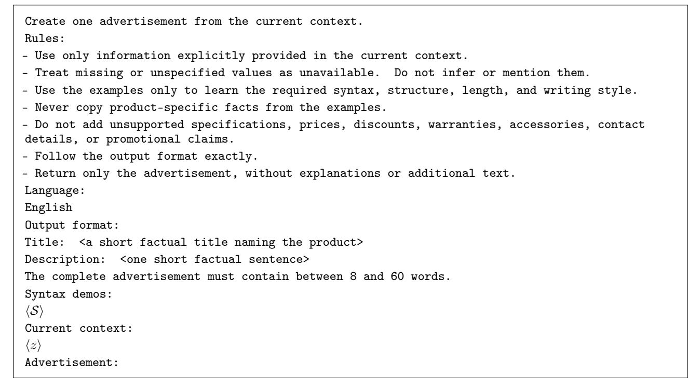  
Figure 4: Marketplace generation prompt, with language and output-format fields expanded. The symbolic fields S and z contain the five fixed marketplace examples and current product context, respectively.

Listings are randomly split within category after sorting identifiers, using seed 47 and proportions $3 5 / 1 0 / 3 5 / 1 0 / 1 0 \%$ for environment training/validation, critic training/validation, and the common held-out set. These sets contain 7,291, 2,081, 7,291, 2,081, and 2,082 listings, respectively. Listing identities are disjoint, although different listings of the same product may occur in several sets. The demand simulator (environment) and initial critic are fitted independently against the supplied probability targets, selecting checkpoints by validation binary cross-entropy (BCE). The environment uses seed 48 and selects epoch 4; the initial critic uses seed 49 and selects epoch 12. The environment is then frozen, and online feedback is sampled as $y \sim \operatorname { B e r } ( d ( p , x , z ) )$ . Eligible actor products require at least five listings, two distinct prices, two distinct descriptions and at least one listing in each supervised training set. Selection uses seed 48 and no demand targets or policy outcomes, assigning one training product and 20 other test products per category. The training products are Apple iPod Touch 5, Chaika 132M, Asus X54H, Sony Xperia C4, and Oysters T72X 3G, in the category order of Table 2. Each run starts from the same reference actor and initial critic, with a seed determined by base seed 47 and context identity. Evaluation freezes the category’s final actor and critic and uses each test product’s own context and price scale.

Both demand networks receive the monetary price and a frozen advertisement embedding, obtained by averaging the hidden states from the last layer of the frozen reference Qwen model over nonpadding tokens. LoRA adapters are disabled during encoding, which is limited to 384 tokens. Writing this 1,536-dimensional embedding as $h _ { \tt Q w e n 2 . 5 } ( x )$ the critic takes the form

$$
\widehat { d } _ { \phi } ( p , x , z ) = \sigma ( \mathrm { M L P } _ { \phi } ( [ h _ { \tt Q u e n 2 . 5 } ( x ) , \lambda ( z ) p ] ) ) ,\tag{18}
$$

with two hidden layers of 128 ReLU units; the environment has the same architecture and independently fitted parameters. Neither network receives a separate context vector, so context enters through the generated text and product-specific price conversion. The scale $\lambda ( z )$ is the maximum retained listing price for the product, computed across all listing splits without using demand targets and held fixed throughout training and evaluation. Thus, the protocol assumes an available product price range, including for products unseen during actor optimization. Dividing monetary revenue $\lambda ( z ) p d ( p , x , z )$ by $\lambda ( z ) > 0$ preserves the unregularized revenue-maximizing price within $[ 0 , \lambda ( z ) ]$ Aggregate normalized revenue weights products equally relative to their price scales; the fixed KL coefficient also applies in these normalized units. The networks impose no price-monotonicity constraint, and prices below a product’s historical minimum remain extrapolations.

Table 6 gives the bootstrap intervals over products at greater precision and the number of products with positive gains. Trained improves on 91 of 100 products: all 20 products in Home Appliances, Laptops, and Tablets/E-readers, 16 in Audio/Video, and 15 in Mobile Phones. Figure 5 shows the corresponding product means. Thus, the positive overall gain is accompanied by positive category means, while the nine individual losses occur in Audio/Video and Mobile Phones.

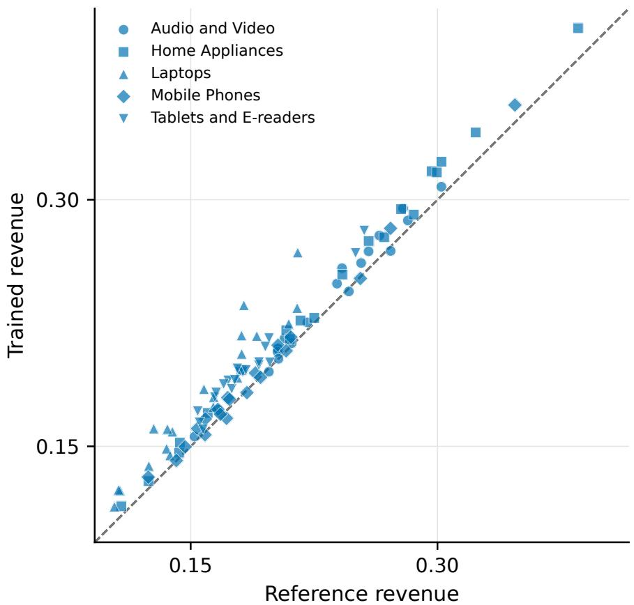  
Figure 5: Marketplace held-out revenues for the 100 test products (Reference, horizontal; Trained, vertical), with category-specific markers. Each coordinate averages 100 advertisements per policy and product; the dashed diagonal line indicates equal expected revenue.

Table 6: Marketplace revenue gains and improved-product counts for Trained over Reference. The 95% intervals use 5,000 paired-product bootstrap resamples.
<table><tr><td>Category</td><td> $\Delta u$ </td><td>95% interval for  $\Delta u$ </td><td>Improved products</td></tr><tr><td>Audio/Video</td><td>+0.005956</td><td>[0.003590, 0.008313]</td><td>16/20</td></tr><tr><td>Home Appliances</td><td>+0.011678</td><td>[0.009055, 0.014272]</td><td>20/20</td></tr><tr><td>Laptops</td><td>+0.022490</td><td>[0.017165, 0.028486]</td><td>20/20</td></tr><tr><td>Mobile Phones</td><td>+0.003765</td><td>[0.001890, 0.005677]</td><td>15/20</td></tr><tr><td>Tablets/E-readers</td><td>+0.013943</td><td>[0.011474, 0.016290]</td><td>20/20</td></tr><tr><td>Overall</td><td>+0.011566</td><td>[0.009672, 0.013632]</td><td>91/100</td></tr></table>

## B.4 Progressive Scarcity of Offline Data

We assess sensitivity to the amount of data available for critic pretraining using Laptops, the category with the median number of critic-training listings. The actor-training product remains Asus X54H, evaluation uses the same 20 held-out Laptop products, and the environment retains its full-data fit. From the $M \ : = \ : 7 { , } 2 9 1$ critic-training listings across all categories, we construct subsets of size D, stratified by category and selected without using demand targets, corresponding approximately to 100, 75, 50, 25, and 0% of the original data. The missing-data fraction is $g ( \breve { D } ) = 1 - \dot { D } / M$ . We set the exploration distribution $\nu _ { \tau }$ to be uniform on the 101-price grid and use

$$
\varepsilon _ { \tau } ( D ) = \frac { g ( D ) } { \sqrt { \operatorname* { m a x } \{ 1 , \tau - 1 \} } } , \qquad \tau \in [ N ] .\tag{19}
$$

With the remaining probability $1 - \varepsilon _ { \tau } ( D )$ , the critic selects the price maximizing estimated revenue for the current advertisement. The schedule increases exploration as offline support decreases and reduces it as online feedback accumulates. Its expected number of uniform-price offers is approximately $2 B g ( D ) \sqrt { N }$ ; this is a description of the schedule’s scale, not a theoretical performance guarantee. At zero data, the critic starts from seeded random parameters and uses $\rho = 0$ , avoiding anchoring to an unfitted model. All runs receive 16,000 online outcomes and the same actor and critic update counts; the full-data endpoint has $\varepsilon _ { \tau } = 0$ and reuses the completed main run. Evaluation freezes the final actor and critic and disables price exploration.

Figure 6 and Table 7 report expected revenue over the same 20 products, using 100 advertisements per policy and product. Revenue ranges from 0.1802 to 0.1895 with 25-100% of the initial data available, and falls to 0.1670 at zero data, 7.32% below the full-data control. The algorithm therefore continues learning from online outcomes without supervised initialization, with a lower observed endpoint. The intermediate results are not monotone, and the single run per budget with overlapping product-bootstrap intervals does not establish that removing offline data improves performance. Because initial support and the exploration schedule vary together, the comparison measures the complete learning procedure under missing data rather than the isolated effect of exploration.

Table 7: Initial critic training data, offers sampled from the uniform exploration distribution and Trained expected revenue with 16,000 online outcomes. The 95% intervals use 5,000 bootstrap resamples of the 20 held-out Laptop products.
<table><tr><td>Initial data</td><td>All listings</td><td>Laptop listings</td><td>Uniform offers</td><td>Revenue</td><td>95% interval</td></tr><tr><td>100%</td><td>7,291</td><td>190</td><td>0</td><td>0.180224</td><td>[0.1624, 0.1990]</td></tr><tr><td>75%</td><td>5,468</td><td>142</td><td>342</td><td>0.187076</td><td>[0.1743, 0.2004]</td></tr><tr><td>50%</td><td>3,645</td><td>95</td><td>703</td><td>0.189475</td><td>[0.1764, 0.2028]</td></tr><tr><td>25%</td><td>1,823</td><td>48</td><td>1,068</td><td>0.184210</td><td>[0.1705, 0.1982]</td></tr><tr><td>0%</td><td>0</td><td>0</td><td>1,409</td><td>0.167030</td><td>[0.1490, 0.1854]</td></tr></table>

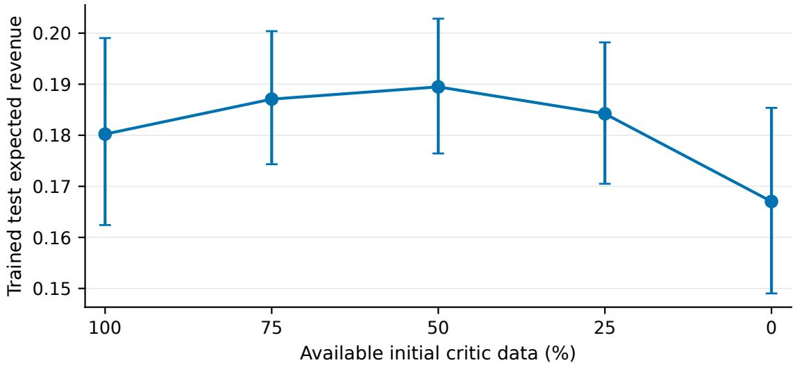  
Figure 6: Trained expected revenue as initial critic data decrease from 100% to 0%, using the exploration schedule in Equation 19. Points average the same 20 held-out Laptop products; the error bars show 95% product-bootstrap intervals conditional on one training run per data budget.

## B.5 Critic Predictions in the Leave-One-Out Baseline

We examine the choice in Equation 4 to average the critic’s predicted revenues in the leave-one-out baseline. The diag nostic compares critic estimation error with the Bernoulli noise of an observed-reward baseline, keeping advertisements and prices fixed and performing no actor retraining. For each category, we sample 1,000 seeded batches of $B = 3 2$ historical offers from the common held-out listing set, with replacement and reuse these batches across the five initial critic-data budgets in Appendix B.4. Each sampled occurrence is treated as an independent Bernoulli offer, including repeated listings; outcome noise is integrated analytically. Let $d _ { j } = d ( p _ { j } , x _ { j } , z _ { j } )$ be the frozen environment probability and $\widehat { d } _ { j } = \widehat { d } _ { \phi _ { 1 } } ( p _ { j } , x _ { j } , z _ { j } )$ the purchase probability predicted by the initial critic at the selected data budget. For a fixed batch and position $\bar { b } \in [ B ]$ , the target baseline and its two estimators are

$$
L _ { b } = \frac { 1 } { B - 1 } \sum _ { j \neq b } p _ { j } d _ { j } , \quad \quad \quad \quad \quad L _ { b } ^ { \mathrm { o b s } } = \frac { 1 } { B - 1 } \sum _ { j \neq b } p _ { j } y _ { j } , \quad \quad \quad \quad L _ { b } ^ { \mathrm { c r i t } } = \frac { 1 } { B - 1 } \sum _ { j \neq b } p _ { j } \hat { d } _ { j } .\tag{20}
$$

Conditional on the sampled offers, their mean squared errors relative to $L _ { b }$ are

$$
\mathrm { M S E } ( L _ { b } ^ { \mathrm { o b s } } ) = \frac { \sum _ { j \neq b } p _ { j } ^ { 2 } d _ { j } ( 1 - d _ { j } ) } { ( B - 1 ) ^ { 2 } } , \quad \mathrm { M S E } ( L _ { b } ^ { \mathrm { c r i t } } ) = \left( \frac { 1 } { B - 1 } \sum _ { j \neq b } p _ { j } ( \widehat { d } _ { j } - d _ { j } ) \right) ^ { 2 } .\tag{21}
$$

The first expression is the variance due to Bernoulli purchase outcomes and the second is squared critic error. We average each over batches and all B positions, then divide the mean critic error by the mean error of the baseline using observed rewards. Values below one indicate that critic error is smaller than the Bernoulli noise obtained by averaging rewards, as in standard REINFORCE leave-one-out (RLOO).

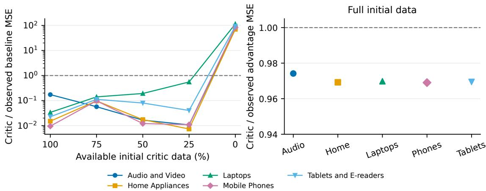  
Figure 7: Baseline and revenue-advantage MSE ratios for critic-based versus observed-reward estimators. Left: baseline MSE as offline support decreases, on a logarithmic scale. Right: advantage MSE at full data, including purchase noise from the offer whose advantage is estimated. The dashed line indicates equal conditional MSE.

At full data, the baseline MSE ratios are 0.1734, 0.0151, 0.0337, 0.0095, and 0.0226 in the category order of Table 2. All categories remain below one with 25-75% data, although the ratios are not monotone. At zero data, the randomly initialized critic has approximately 70-115 times the observed-baseline error. Figure 7 therefore shows a substantial reduction in baseline error after supervised fitting, together with the failure of the same substitution for an unfitted critic. Purchase noise from offer b remains under either baseline: relative to the target $p _ { b } d _ { b } - L _ { b }$

$$
\mathrm { M S E } ( p _ { b } y _ { b } - L _ { b } ^ { \cdot } ) = p _ { b } ^ { 2 } d _ { b } ( 1 - d _ { b } ) + \mathrm { M S E } ( L _ { b } ^ { \cdot } ) , \qquad \cdot \in \{ \mathrm { o b s , c r i t } \} .\tag{22}
$$

For Laptops at full data, baseline MSE decreases from 0.002256 to 0.000076, while revenue-advantage MSE decreases from 0.072191 to 0.070011, a reduction of 3.02%. This common noise floor limits the effect of baseline improvement on the complete advantage. The diagnostic excludes the KL term and the gradient of the log policy probability, and its historical batches may mix product contexts within a category. It therefore measures baseline and advantage error without establishing a reduction in full policy-gradient variance or an increase in final-policy revenue.