# MORA: Modeling Observed Changes for Drift-Robust Time-Series Anomaly Detection

Xudong Mou1, Tiejun Wang1, Rui Wang1, Hui Wang2, Pin Liu3, Tianyu Wo1,

Xudong Liu1, Renyu Yang1∗

1Beihang University, Beijing, China

2Beihang Hangzhou Innovation Institute, Hangzhou, China

3China University of Geosciences (Beijing), Beijing, China

mxd@buaa.edu.cn, wtj@buaa.edu.cn, ruiking@buaa.edu.cn, whui@buaa.edu.cn, liupin@cugb.edu.cn, woty@buaa.edu.cn, liuxd@buaa.edu.cn, renyuyang@buaa.edu.cn

## Abstract

Time-series anomaly detection (TSAD) identifies deviations from patterns learned from historical data. In non-stationary settings, distribution drift and true anomalies can cause similar local changes, making it dificult to tell whether a deviation reflects abnormality or evolving context. Existing methods typically adapt to detected shifts or learn drift-insensitive representations, but do not resolve this ambiguity. We define this problem as temporal change disambiguation: determining whether a local deviation is explained by broader temporal evolution. We introduce MORA, a drift-robust TSAD framework that reconstructs the same local target from paired shortand long-term views. The reconstruction gap measures contextual support for a local deviation, and a data-dependent correction mechanism conservatively adjusts the primary local anomaly score. Context can only reduce the score when it improves reconstruction of the same target. MORA needs neither drift annotations nor online adaptation. Experiments on four TSAD benchmarks show strong robustness to nonstationarity while preserving sensitivity to genuine anomalies.

## 1. Introduction

Time-series anomaly detection (TSAD) identifies observations that significantly deviate from normal temporal behavior (Grubbs 1969) and is critical in industrial monitoring, AIOps, cyber-physical systems, and other safety-critical domains. Because anomalies are rare and costly to label, TSAD is usually treated as an unsupervised problem (Pang et al. 2021): models learn normal patterns from unlabeled or normal-only data and flag violations as anomalies. Normality is typically modeled via reconstruction (Li et al. 2026; Malhotra et al. 2016), one-class representation learning (Chen et al. 2025; Xu et al. 2024; Ruf et al. 2018), or contrastive objectives (Yang et al. 2023; Sohn et al. 2021). Accordingly, anomalies are typically characterized by large reconstruction/prediction errors, low likelihood, or deviations from compact normal representations. Despite their diferences, these methods rely on a shared premise: normal patterns learned from the past remain valid at test time.

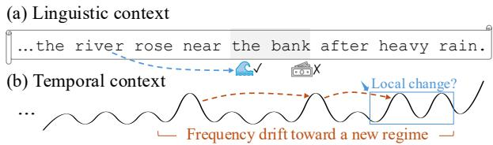  
Figure 1: Motivation for temporal change disambiguation. (a) Linguistic context resolves the meaning of an ambiguous word. (b) Similarly, a local temporal change may appear anomalous in isolation, while its broader context reveals a coherent transition toward a new operating regime.

This premise is frequently violated in real-world time series, where normal conditions drift due to seasonality, workload fluctuations, sensor aging, maintenance, or upgrades. Such evolution changes both observation marginals and temporal dependencies, so data from a drifting normal process can difer from historical normality and receive high anomaly scores. Thus drift and anomalies first appear to a detector in the same way: as changes relative to learned normality. A detector that reacts to all such changes may raise many false alarms under gradual drift or treat an abrupt regime shift as an anomaly. The challenge is therefore not just detecting change, but interpreting what it means.

Existing studies mainly take two approaches. The first uses a detect-and-adapt paradigm (Han et al. 2023), where distribution shifts are detected and then handled via model updating, continual learning, knowledge distillation, or test-time adaptation. These methods can be efective but depend on accurate shift detection; incorrect updates may absorb anomalies into normality and add deployment cost. The second seeks drift-robust representations (Wei et al. 2026; Huang et al. 2025) through temporal decomposition, multi-scale modeling, invariance, or uncertainty-aware training (Lian et al. 2025), aiming to reduce sensitivity to non-stationary changes in a single representation or score. However, it is inherently dificult to suppress drift-induced variation while preserving evidence of visually similar anomalies. As a result, many methods adapt to or suppress distributional changes without explicitly interpreting what a change represents, leaving drift–anomaly ambiguity to be resolved implicitly by the learned representation or score.

These limitations motivate us to reconsider what a detector observes under non-stationarity. As shown in Fig. 1, the word “bank” is ambiguous in isolation but becomes clear from contextual cues like “river” and “rain.” Similarly, a local temporal change alone does not indicate whether it arises from an abnormal event or an evolving normal process; its meaning depends on the broader trajectory. We therefore treat a local change as ambiguous evidence rather than an anomaly by default, and refer to its contextual interpretation temporal change disambiguation.

Guided by this perspective, we propose MORA, a driftrobust TSAD framework that resolves locally ambiguous changes using broader temporal context. It reconstructs the same local target from paired short- and long-term views and contrasts their reconstruction errors to measure how the interpretation of a local deviation changes with additional history. It further extracts heterogeneous relations among the two views and uses them to adaptively control the strength of score correction. A conservative one-sided rule allows contextual information to reduce the primary local score only when it provides a lower reconstruction error. In this way, MORA suppresses context-supported changes while retaining deviations that remain unexplained under broader temporal context. We summarize the main contributions as follows:

• We cast drift-robust TSAD as a problem of temporal change disambiguation, ofering a new perspective in which local deviations are interpreted against broader temporal evolution: local observations provide the primary anomaly evidence, while temporal context supplies corrective evidence.

• We propose context-contrasted reconstruction that reconstructs the same local target with and without extended history, using the reconstruction error reduction as contextual support to adjust the local anomaly score.

• We design a heterogeneous cross-view router with a one-sided correction rule that suppresses only contextexplainable deviations while preserving local anomaly evidence otherwise.

## 2. Related Work

## 2.1. Time Series Anomaly Detection

Time series anomaly detection (TSAD) seeks to identify rare departures from normal temporal behavior. Most unsupervised TSAD methods follow a normality assumption, learning normal patterns and detecting violations via reconstruction/forecasting errors (Malhotra et al. 2016; Li et al. 2026), one-class or calibrated normality scoring (Ruf et al. 2018; Chen et al. 2025; Xu et al. 2024), and stronger temporal modeling for long-range and cross-variable dependencies (Eldele et al. 2021; Yang et al. 2023; Xie, Zhang, and Babar 2025). Beyond a single normal model, multi-assumption methods combine multiple normality hypotheses (e.g., AOC (Mou et al. 2023), TCC (Sohn et al. 2021)) or explicit normal– anomalous modeling (e.g., CutAddPaste (Wang et al. 2024), RedLamp (Obata, Matsubara, and Sakurai 2025)); multiscale designs such as CrossAD (Li et al. 2026) particularly inspire us to examine drift from multiple angles. Unlike CrossAD, which reconstructs fine-grained series from downsampled coarse scales to model cross-scale associations, MORA retains the original temporal resolution and reconstructs an identical local target under nested temporal contexts. The resulting error reduction is used as corrective evidence for the primary local anomaly score.

## 2.2. Drift-Robust Anomaly Detection

Non-stationarity is a central challenge in streaming TSAD: gradual drift, seasonality, and regime shifts can inflate reconstruction/forecasting errors on normal data. Existing studies mainly tackle this issue in two ways. One line follows a detect-and-adapt paradigm, identifying distribution shifts and then updating the detector via online learning, distillation, test-time adaptation, or conservative adaptation strategies (Han et al. 2023; Guha et al. 2016). The other line aims for drift-robust scoring/representations via, e.g., invariance or uncertainty-aware training (Wei et al. 2026; Huang et al. 2025; Lian et al. 2025), calibrating scores with reference windows or robust statistics (Sun et al. 2023), or explicitly suppressing drift by decomposing unstable series into components (Wang et al. 2023). However, many methods focus on adapting to or suppressing distributional changes without explicitly disambiguating drift-like changes from true anomalies. Our work addresses this ambiguity by judging how much of a local deviation is explainable under broader temporal context.

## 3. Methodology

## 3.1. Problem Definition

Given a multivariate time series ${ \cal S } = \{ { \bf x } _ { t } \} _ { t = 1 } ^ { T }$ with $\mathbf { x } _ { t } \in \mathbb { R } ^ { d }$ let $\ b X _ { t } \in \mathbb { R } ^ { w \times d }$ denote the local observation window at time $t ,$ and let $\mathcal { C } _ { t }$ denote its broader temporal context. Timeseries anomaly detection assigns an anomaly score $s _ { t }$ to $X _ { t }$ , where a larger value indicates stronger abnormality. Most TSAD methods implicitly assume that normal patterns are stationary, such that observations can be evaluated against a time-invariant normal distribution $P _ { \mathrm { r e f } } ( X )$ In non-stationary streams, however, the normal distribution may evolve over time. Consequently, a normal but drifting observation can appear unlikely under $P _ { \mathrm { r e f } } ( X )$ ) and receive a high anomaly score. This creates a fundamental ambiguity: both distribution drift and genuine anomalies may be manifested as deviations from previously learned normality.

The distinction lies in their temporal consistency. A drifting observation, although inconsistent with the reference distribution, may remain plausible given its broader temporal context $\mathcal { C } _ { t } ;$ a genuine anomaly remains implausible even when such context is considered. The objective is therefore to learn a drift-robust anomaly score that suppresses contextually explainable distributional changes while preserving high responses to contextually unexplained deviations.

## 3.2. MORA’s Approach

3.2.1 Overview. The key insight behind MORA is that, under non-stationarity, local abnormality is ambiguous: a locally unusual observation may indicate either a genuine irregularity or a coherent transition ofthe normal process. We resolve this ambiguity through contextual explainability— a deviation that appears abnormal in a short window can be plausible when a longer temporal context is available. Accordingly, we assign asymmetric roles to the two views: the local view provides primary anomaly evidence, while the contextual view provides explanatory evidence to decide how much of that local change should be discounted.

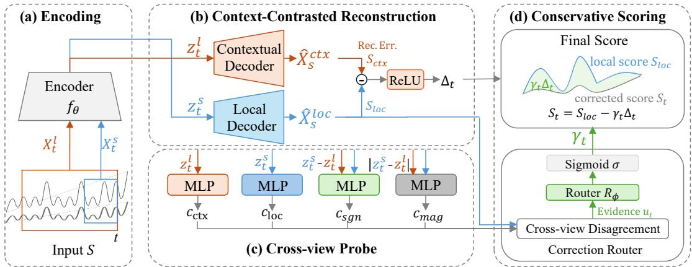  
Figure 2: Overview of MORA: (a) a shared encoder for local/context windows; (b) dual reconstruction experts yield an explainable gap $\Delta _ { t } ; \mathbf { \rho } ( \mathbf { c } )$ heterogeneous cross-view cues characterize the relation between the two views; (d) a correction router adaptively applies one-sided score correction.

Rather than performing independent multi-scale detection and fusing outputs, MORA evaluates the same local target under two nested information conditions and tracks how its interpretation changes with added history. As shown in Fig. 2, it proceeds in four stages: (i) a shared encoder maps paired short/long windows to a common latent space; (ii) two reconstruction experts score the same local target to produce local and context-conditioned abnormality evidence; (iii) a multi-view probe estimates the correction strength; and (iv) the resulting weight controls a conservative correction that removes only the explainable portion of local anomaly.

3.2.2 Encoding. Following the standard sliding-window setting in TSAD, at each scoring step t we take the local window ending at t as the sample, and additionally provide a larger history window as contextual evidence:

$$
\begin{array} { r l } & { \mathbf { x } _ { t } ^ { s } = [ \mathbf { x } _ { t - L _ { s } + 1 } , \ldots , \mathbf { x } _ { t } ] \in \mathbb { R } ^ { L _ { s } \times d } , } \\ & { \mathbf { x } _ { t } ^ { l } = [ \mathbf { x } _ { t - L _ { l } + 1 } , \ldots , \mathbf { x } _ { t } ] \in \mathbb { R } ^ { L _ { l } \times d } . } \end{array}\tag{1}
$$

Here $L _ { l } > L _ { s }$ , and $\mathbf { x } _ { t } ^ { s }$ is the most recent segment of $\mathbf { x } _ { t } ^ { l } .$ Both windows slide together with the same endpoint $t ;$ we do not run two separate detectors, but evaluate the same local target under a short-view and a context-augmented view.

A shared temporal encoder $f _ { \theta }$ maps both windows into a common latent space:

$$
\begin{array} { r } { \mathbf { z } _ { t } ^ { s } = f _ { \theta } ( \mathbf { x } _ { t } ^ { s } ) , \quad \quad \mathbf { z } _ { t } ^ { l } = f _ { \theta } ( \mathbf { x } _ { t } ^ { l } ) . } \end{array}\tag{2}
$$

The encoder uses temporal convolutions followed by $\mathrm { a g } -$ gregation, producing fixed-dimensional representations for variable-length inputs. Parameter sharing ensures that diferences between $\mathbf { z } _ { t } ^ { s }$ and $\mathbf { z } _ { t } ^ { l }$ reflect information content rather than separate encoder parameterizations. The two representations play complementary roles: $\mathbf { z } _ { t } ^ { s }$ highlights immediate behavior, making it sensitive to localized deviations, while $\mathbf { z } _ { t } ^ { l }$ provides longer-term context to judge whether the same deviation is temporally explainable.

3.2.3 Context-Contrasted Reconstruction. MORA scores the same short-term target using the two latent representations. Specifically, a local decoder and a contextual decoder reconstruct the short window as

$$
\begin{array} { r } { \widehat { \mathbf { x } } _ { t } ^ { s , \mathrm { l o c } } = \mathcal { D } _ { \mathrm { l o c } } \big ( \mathbf { z } _ { t } ^ { s } \big ) , \qquad \widehat { \mathbf { x } } _ { t } ^ { s , \mathrm { c t x } } = \mathcal { D } _ { \mathrm { c t x } } \big ( \mathbf { z } _ { t } ^ { l } \big ) . } \end{array}\tag{3}
$$

We then calculate the reconstruction errors for the target $X _ { t } ^ { s }$

$$
S _ { t } ^ { \mathrm { l o c } } = \frac { 1 } { L _ { s } d } \left\| { \bf x } _ { t } ^ { s } - \widehat { { \bf x } } _ { t } ^ { s , \mathrm { l o c } } \right\| _ { F } ^ { 2 } , \quad S _ { t } ^ { \mathrm { c t x } } = \frac { 1 } { L _ { s } d } \left\| { \bf x } _ { t } ^ { s } - \widehat { { \bf x } } _ { t } ^ { s , \mathrm { c t x } } \right\| _ { F } ^ { 2 } .\tag{4}
$$

Because both decoders reconstruct the same short window $\mathbf { x } _ { t } ^ { s } , S _ { t } ^ { \mathrm { l o c } }$ and $S _ { t } ^ { \mathrm { c t x } }$ are directly comparable: $S _ { t } ^ { \mathrm { l o c } }$ measures short-view reconstruction error, while $S _ { t } ^ { \mathrm { c t x } }$ measures the remaining error when longer-term context is available. When the change at time t is part of a contextually coherent transition, the local view may yield a large reconstruction error, while the contextual view can explain the deviation, resulting in $S _ { t } ^ { \mathrm { c t x } } < S _ { t } ^ { \mathrm { l o c } }$ . Conversely, if the observation is inconsistent with both the learned normality and its temporal evolution, it is dificult to reconstruct under either view and both errors remain high. Therefore, the gap between the two errors serves as a practical indicator of contextual explainability, rather than a direct estimate of drift probability.

3.2.4 Cross-View Probe. A lower contextual reconstruction error does not necessarily imply a reliable explanation. The long-term window may contain irrelevant history, mixed operating regimes, or abrupt shifts that are only weakly related to the current observation. Over-trusting the contextual branch can therefore mask genuine anomaly evidence. To address this, MORA compares the long- and short-term latents from multiple complementary views. Specifically, we define

$$
\begin{array} { r l r } & { \mathbf { v } _ { t } ^ { \mathrm { c t x } } = \mathbf { z } _ { t } ^ { l } , } & { \mathbf { v } _ { t } ^ { \mathrm { l o c } } = \mathbf { z } _ { t } ^ { s } , } \\ & { \mathbf { v } _ { t } ^ { \mathrm { s g n } } = \mathbf { z } _ { t } ^ { s } - \mathbf { z } _ { t } ^ { l } , } & { \mathbf { v } _ { t } ^ { \mathrm { m a g } } = | \mathbf { z } _ { t } ^ { s } - \mathbf { z } _ { t } ^ { l } | , } \end{array}\tag{5}
$$

<table><tr><td>Metric</td><td>SMD</td><td>Exathlon</td><td>ESA</td><td>ASD</td></tr><tr><td>Domain</td><td>Server</td><td>Spark</td><td>Satellite</td><td>Application</td></tr><tr><td>Entities</td><td>12</td><td>8</td><td>1</td><td>12</td></tr><tr><td>Train</td><td>304168</td><td>88230</td><td>12273601</td><td>102331</td></tr><tr><td>Test</td><td>286421</td><td>46054</td><td>12162077</td><td>49448</td></tr><tr><td>Dim.</td><td>38</td><td>19</td><td>6</td><td>19</td></tr><tr><td>Anomaly (%)</td><td>5.62</td><td>12.75</td><td>0.91</td><td>4.54</td></tr><tr><td>PSI Mean</td><td>0.503</td><td>3.385</td><td>0.402</td><td>0.167</td></tr><tr><td>JSD Mean</td><td>0.042</td><td>0.212</td><td>0.046</td><td>0.016</td></tr><tr><td>PSI Level</td><td>large</td><td>large</td><td>large</td><td>moderate</td></tr></table>

Table 1: Statistics of the four benchmark datasets.

where the views capture contextual evidence, local evidence, the signed change between them, and its magnitude. Each view is then mapped by a dedicated MLP probe to a scalar cue $c _ { \mathrm { c t x } } , c _ { \mathrm { l o c } } , c _ { \mathrm { s g n } } , c _ { \mathrm { m a g } } .$ All heads are trained to predict the local reconstruction dificulty $S _ { t } ^ { l o c }$ . Because they operate on representations with diferent semantic content, their residual discrepancies describe how diferently local reconstruction dificulty is expressed across temporal views.

Let ${ \bf c } _ { t } = [ c _ { \mathrm { c t x } } , c _ { \mathrm { l o c } } , c _ { \mathrm { s g n } } , c _ { \mathrm { m a g } } ]$ . We summarize their dispersion through

$$
\psi _ { t } = [ \mathrm { S t d } ( \mathbf { c } _ { t } ) , | c _ { \mathrm { l o c } } - c _ { \mathrm { c t x } } | , | c _ { \mathrm { s g n } } - c _ { \mathrm { l o c } } | , | c _ { \mathrm { m a g } } - c _ { \mathrm { l o c } } | ] .\tag{6}
$$

The first term captures overall cross-view dispersion, while the remaining terms describe diferences associated with context, signed change, and change magnitude. We concatenate these statistics with the primary local score, $\mathbf { u } _ { t } =$ $[ \psi _ { t } , S _ { t } ^ { \mathrm { l o c } } ]$ and feed $\mathbf { u } _ { t }$ to a learnable correction router

$$
\gamma _ { t } = \sigma ( \mathcal { R } _ { \phi } ( \mathbf { u } _ { t } ) ) , \qquad \gamma _ { t } \in [ 0 , 1 ] ,\tag{7}
$$

where $\gamma _ { t }$ is a data-dependent correction weight that controls how much of the positive reconstruction gap is subtracted from the local score.

3.2.5 Conservative Scoring. We quantify the reconstruction advantage provided by the contextual view as

$$
\Delta _ { t } = \big [ S _ { t } ^ { \mathrm { l o c } } - S _ { t } ^ { \mathrm { c t x } } \big ] _ { + } , \qquad [ a ] _ { + } = \operatorname * { m a x } ( a , 0 ) .\tag{8}
$$

We interpret $\Delta _ { t }$ as the potentially explainable part of the local discrepancy. The positive-part operator enforces an asymmetric rule: contextual evidence is regarded as explanatory only when it reduces the reconstruction error for the same target. The final anomaly score is then defined as

$$
S _ { t } = S _ { t } ^ { \mathrm { l o c } } - \gamma _ { t } \Delta _ { t } ,\tag{9}
$$

which grants the contextual branch permission only to $^ { 6 6 } \mathrm { r e } -$ move” anomaly evidence, but never to add it. Concretely, if $S _ { t } ^ { \mathrm { c t x } } \geq S _ { t } ^ { \mathrm { l o c } }$ , then $\Delta _ { t } = 0$ and the local score is kept unchanged. If $S _ { t } ^ { \mathrm { c t x } } < S _ { t } ^ { \mathrm { l o c } }$ , only an adaptively weighted fraction of the explainable discrepancy is subtracted. The resulting score is bounded by min $\mathbf { \bar { \phi } } \left( S _ { t } ^ { \mathrm { l o c } } , S _ { t } ^ { \mathrm { c t x } } \right) \leq S _ { t } \leq S _ { t } ^ { \mathrm { l o c } }$

3.2.6 Learning Objective. MORA is optimized without point-wise anomaly or drift supervision. The objective combines three components: optimizing the final drift-robust score on reference data, preserving the reconstruction behavior of both experts, and supervising the heterogeneous probes so that their disagreement becomes informative for the correction routing. The complete objective is

$$
\mathcal { L } = \frac { 1 } { N } \sum _ { t = 1 } ^ { N } S _ { t } + \frac { 1 } { N } \sum _ { t = 1 } ^ { N } \left( S _ { t } ^ { \mathrm { l o c } } + \lambda S _ { t } ^ { \mathrm { c t x } } \right) + \eta \mathcal { L } _ { \mathrm { p r o b e } } ,\tag{10}
$$

where the first term learns low final scores on reference data, the second regularizes the reconstruction discrepancies of the local and contextual experts, and the third trains the probe heads. Hyperparameters λ and η control the contributions of the contextual reconstruction and probe losses, respectively.

The probe loss is defined as

$$
\mathcal { L } _ { \mathrm { p r o b e } } = \frac { 1 } { 4 N } \sum _ { t = 1 } ^ { N } \sum _ { k = 1 } ^ { 4 } \left( c _ { t } ^ { ( k ) } - \mathrm { s g } ( S _ { t } ^ { \mathrm { l o c } } ) \right) ^ { 2 } ,\tag{11}
$$

where $\operatorname { s g } ( \cdot )$ denotes stop-gradient. The four heads receive diferent latent views but predict the same local reconstruction dificulty. This shared target aligns their output scales, while the remaining cross-view diferences provide heterogeneous descriptors for the correction router. The router is optimized jointly with the reconstruction model through the final corrected score.

We additionally consider an optional balance regularizer,

$$
\mathcal { L } _ { \mathrm { b a l } } = \rho \left( \frac { 1 } { | \boldsymbol { B } | } \sum _ { t \in \mathcal { B } } \gamma _ { t } - \tau \right) ^ { 2 } ,\tag{12}
$$

where $\tau$ is the target batch-average correction weight and $\rho$ controls the regularization strength, B represents the mini batch. It stabilizes the average routing level during training. Since $\rho$ is zero or small in the final configurations, we omit $\mathcal { L } _ { \mathrm { b a l } }$ from the main objective for clarity.

During inference, the continuous score $S _ { t }$ is used for anomaly ranking or threshold-based detection. Pseudocode is provided in Appendix A.

## 4. Experiments

## 4.1. Experimental Setup

Datasets.We evaluate anomaly detection on multivariate benchmarks, including SMD (Su et al. 2019; Li et al. 2021), Exathlon (Jacob et al. 2020), ESA (Kotowski et al. 2024), and ASD (Li et al. 2021). Dataset statistics are summarized in Table 1 (Su et al. 2019; Jacob et al. 2020; Kotowski et al. 2024; Li et al. 2021). We use Population Stability Index (PSI) and Jensen–Shannon Divergence (JSD) to summarize the train–test distribution discrepancy, and treat $\mathrm { P S I } > 0 . 2 5$ as large following the commonly used rule of thumb.

Baselines. We compare MORA with representative baselines in Table 2, spanning traditional detectors, deep normality methods, and multi-assumption approaches.

(1) Traditional baselines. We include Isolation Forest (IF) (Liu, Ting, and Zhou 2012) and DAMP (Lu et al. 2022). Following (Kim et al. 2022), we also report Randomized Anomaly Score (RAS), which samples a score uniformly from [0, 1]. For ESA, these baselines are adapted to handle long sequences. (2) Deep normality baselines. We evaluate representative deep detectors under common modeling assumptions, including reconstruction/prediction models (LSTM-ED (Malhotra et al. 2016), TranAD (Tuli, Casale, and Jennings 2022), Anomaly Transformer (AOT) (Xu et al. 2021), MixMamba (Alkilane, He, and Lee 2024), MTSCAD (Si et al. 2023), SHUE (Feng et al. 2024), OMNI (Su et al. 2019), COUTA (Xu et al. 2024), MtsCID (Xie, Zhang, and Babar 2025), CATCH (Wu et al. 2025), MOC (Wang et al. 2026), CrossAD (Li et al. 2026), and GDN (Deng and Hooi 2021)), MindTS (Hu et al. 2026) as well as one-class classification via Deep SVDD (Ruf et al. 2018). We additionally include drift-aware scoring with D3R (Wang et al. 2023) and DCDetector (Yang et al. 2023). (3) Multi-assumption baselines. We include AOC (Mou et al. 2023) and TCC (Sohn et al. 2021; Eldele et al. 2021) as fused/multi-assumption methods, and CutAddPaste (Wang et al. 2024) as an anomaly-assumption based baseline.

<table><tr><td></td><td colspan="3">SMD</td><td colspan="3">Exathlon</td><td colspan="3">ESA</td><td colspan="3">ASD</td><td></td></tr><tr><td>Method</td><td>RPA-F1</td><td>V-R</td><td>V-P</td><td>RPA-F1</td><td>V-R</td><td>V-P</td><td>RPA-F1</td><td>V-R</td><td>V-P</td><td>RPA-F1</td><td>V-R</td><td>V-P</td><td>Avg. Rank↓</td></tr><tr><td>IF (2012)</td><td>6.02</td><td>88.11</td><td>42.00</td><td>44.54</td><td>92.19</td><td>72.41</td><td>0.09</td><td>99.40</td><td>64.73</td><td>16.92</td><td>84.02</td><td>33.87</td><td>17.125</td></tr><tr><td>DAMP (2022)</td><td>4.29</td><td>50.72</td><td>8.08</td><td>16.51</td><td>53.26</td><td>23.36</td><td>0.09</td><td>50.34</td><td>0.92</td><td>1.82</td><td>52.04</td><td>6.58</td><td>22.375</td></tr><tr><td>RAS (2022)</td><td>8.66</td><td>73.92</td><td>18.12</td><td>22.80</td><td>81.45</td><td>52.20</td><td>1.74</td><td>87.66</td><td>7.85</td><td>14.42</td><td>83.17</td><td>32.48</td><td>17.500</td></tr><tr><td>LSTM-ED (2016)</td><td>30.87</td><td>85.60</td><td>47.96</td><td>51.64</td><td>85.28</td><td>65.33</td><td>47.59</td><td>94.92</td><td>65.67</td><td>24.55</td><td>69.35</td><td>20.07</td><td>9.250</td></tr><tr><td>Deep SVDD (2018)</td><td>48.20</td><td>94.72</td><td>62.59</td><td>55.79</td><td>94.14</td><td>76.62</td><td>4.05</td><td>96.26</td><td>41.39</td><td>33.01</td><td>87.82</td><td>47.25</td><td>8.750</td></tr><tr><td>AOT (2021)</td><td>17.41</td><td>92.71</td><td>68.39</td><td>14.39</td><td>97.82</td><td>97.01</td><td>1.13</td><td>49.26</td><td>1.02</td><td>6.65</td><td>96.64</td><td>93.57</td><td>18.500</td></tr><tr><td>MixMamba (2024)</td><td>27.84</td><td>68.06</td><td>17.62</td><td>44.51</td><td>76.95</td><td>49.89</td><td>25.56</td><td>91.22</td><td>10.66</td><td>31.84</td><td>73.71</td><td>32.12</td><td>9.750</td></tr><tr><td>MTSCAD (2023)</td><td>51.89</td><td>74.31</td><td>19.30</td><td>63.31</td><td>79.70</td><td>52.09</td><td>51.64</td><td>91.45</td><td>10.78</td><td>27.17</td><td>73.44</td><td>28.46</td><td>5.750</td></tr><tr><td>SHUE (2024)</td><td>20.76</td><td>88.05</td><td>47.43</td><td>52.03</td><td>92.46</td><td>74.77</td><td>15.48</td><td>99.47</td><td>74.35</td><td>12.20</td><td>85.73</td><td>37.86</td><td>12.250</td></tr><tr><td>MOC (2026)</td><td>38.56</td><td>86.45</td><td>48.35</td><td>39.09</td><td>90.37</td><td>75.32</td><td>2.99</td><td>79.72</td><td>15.20</td><td>38.09</td><td>89.71</td><td>56.64</td><td>10.500</td></tr><tr><td>CATCH (2025)</td><td>5.31</td><td>88.96</td><td>45.10</td><td>11.85</td><td>96.05</td><td>88.69</td><td>0.36</td><td>82.34</td><td>5.19</td><td>10.44</td><td>96.31</td><td>83.33</td><td>21.250</td></tr><tr><td>MtsCID (2025)</td><td>9.86</td><td>77.74</td><td>65.39</td><td>28.46</td><td>97.06</td><td>96.76</td><td>2.44</td><td>54.75</td><td>10.32</td><td>21.60</td><td>94.30</td><td>92.21</td><td>15.500</td></tr><tr><td>COUTA (2024)</td><td>4.33</td><td>78.35</td><td>39.83</td><td>28.51</td><td>93.76</td><td>84.04</td><td>0.64</td><td>82.75</td><td>4.87</td><td>13.98</td><td>89.15</td><td>66.46</td><td>18.500</td></tr><tr><td>OMNI (2019)</td><td>3.50</td><td>52.48</td><td>23.30</td><td>12.38</td><td>79.23</td><td>66.75</td><td>0.18</td><td>47.20</td><td>1.60</td><td>12.16</td><td>75.50</td><td>46.62</td><td>21.750</td></tr><tr><td>GDN3 (2021)</td><td>15.44</td><td>73.97</td><td>35.16</td><td>21.55</td><td>82.95</td><td>51.54</td><td>3.67</td><td>25.18</td><td>5.45</td><td>1.52</td><td>58.05</td><td>8.55</td><td>18.000</td></tr><tr><td>MindTS (2026)</td><td>51.32</td><td>81.41</td><td>35.19</td><td>50.22</td><td>77.63</td><td>42.75</td><td>22.44</td><td>56.58</td><td>8.63</td><td>24.65</td><td>82.48</td><td>22.91</td><td>9.000</td></tr><tr><td>TranAD (2022)</td><td>55.31</td><td>90.86</td><td>51.71</td><td>66.03</td><td>94.29</td><td>76.52</td><td>60.00</td><td>99.91</td><td>92.94</td><td>36.82</td><td>86.31</td><td>34.43</td><td>3.250</td></tr><tr><td>D3R (2023)</td><td>49.95</td><td>80.06</td><td>46.47</td><td>61.37</td><td>50.80</td><td>27.22</td><td>88.88</td><td>74.21</td><td>25.68</td><td>3.93</td><td>65.86</td><td>13.86</td><td>9.000</td></tr><tr><td>DCDetector (2023)</td><td>9.75</td><td>77.36</td><td>66.34</td><td>30.12</td><td>97.31</td><td>97.12</td><td>0.06</td><td>50.31</td><td>2.16</td><td>22.10</td><td>94.34</td><td>92.51</td><td>17.000</td></tr><tr><td>CrossAD (2026)</td><td>54.13</td><td>92.58</td><td>59.15</td><td>42.00</td><td>94.15</td><td>74.12</td><td>42.55</td><td>97.53</td><td>64.87</td><td>27.91</td><td>86.27</td><td>31.03</td><td>8.250</td></tr><tr><td>AOC (2023)</td><td>60.74</td><td>96.48</td><td>75.03</td><td>61.64</td><td>96.66</td><td>83.80</td><td>55.07</td><td>97.23</td><td>66.42</td><td>35.49</td><td>91.85</td><td>55.67</td><td>4.000</td></tr><tr><td>TCC (2021)</td><td>9.25</td><td>77.35</td><td>29.33</td><td>61.05</td><td>89.35</td><td>76.65</td><td>12.28</td><td>81.23</td><td>26.82</td><td>13.20</td><td>85.27</td><td>36.80</td><td>13.000</td></tr><tr><td>CutAddPaste (2024)</td><td>8.94</td><td>83.97</td><td>44.44</td><td>70.24</td><td>95.80</td><td>86.67</td><td>5.91</td><td>90.05</td><td>58.99</td><td>50.52</td><td>94.22</td><td>67.85</td><td>8.250</td></tr><tr><td>MORA</td><td>69.97</td><td>98.81</td><td>89.65</td><td>74.84</td><td>98.93</td><td>94.25</td><td>84.62</td><td>99.38</td><td>78.79</td><td>42.52</td><td>98.27</td><td>85.91</td><td>1.500</td></tr></table>

Table 2: Mean Best RPA-F1 (RPA-F1), VUS-ROC (V-R), and VUS-PR (V-P) results (%) over five runs with diferent random seeds. The average rank based on Best RPA-F1 is reported in the last column, where a lower value is better.

Metrics. We report Best RPA-F1 (Hundman et al. 2018) as an upper-bound estimate for all methods or baselines, and use VUS-ROC/VUS-PR (Paparrizos et al. 2022) for thresholdagnostic evaluation.

Implementation. The models are implemented using Py-Torch 2.6 and Merlion 2.0.0 (Bhatnagar et al. 2021), and evaluated with five independent random seeds on an NVIDIA Tesla V100 GPU. We report mean results in the main paper and provide full mean±std details in the Appendix.

## 4.2. Main Results

Table 2 reports Best RPA-F1, VUS-ROC, and VUS-PR on four benchmarks. The last column reports the average Best RPA-F1 rank across the four datasets, following the comparison protocol of (Ismail Fawaz et al. 2019). Overall, MORA achieves the best average rank, placing first or second on RPA-F1 across all datasets and ranking in the top two on 9/12 dataset–metric combinations. MORA performs best overall on SMD, leading all three metrics with clear margins, suggesting that the proposed cross-view correction efectively suppresses explainable fluctuations while preserving true abnormal events in noisy industrial telemetry. On Exathlon, it ranks first on RPA-F1 and VUS-ROC while remaining competitive on VUS-PR, implying a favorable trade-of between event localization and threshold robustness under diverse and frequently changing workloads. On ESA and ASD, where several baselines exhibit strong dataset-specific peaks, MORA stays near the top on both RPA-F1 and VUS metrics, indicating balanced gains in event-level accuracy and ranking quality even for long-horizon and heterogeneous temporal patterns. These results support the efectiveness of contextual explainability and adaptive one-sided correction under diverse temporal dynamics.

## 4.3. Ablation Study

Table 3 reports an ablation study of MORA. The complete model yields the best averaged performance and stays consistently strong across datasets, indicating that the proposed components are complementary rather than redundant.

<table><tr><td></td><td colspan="3">SMD</td><td colspan="3">Exathlon</td><td colspan="3">ESA</td><td colspan="3">ASD</td><td colspan="3">Avg.</td></tr><tr><td></td><td>F1</td><td>V-R</td><td>V-P</td><td>F1</td><td>V-R</td><td>V-P</td><td>F1</td><td>V-R</td><td>V-P</td><td>F1</td><td>V-R</td><td>V-P</td><td>F1</td><td>V-R</td><td>V-P</td></tr><tr><td>w/o context</td><td>67.16</td><td>98.55</td><td>87.14</td><td>74.81</td><td>97.88</td><td>89.35</td><td>80.68</td><td>99.07</td><td>77.92</td><td>42.34</td><td>98.27</td><td>85.83</td><td>66.25</td><td>98.44</td><td>85.06</td></tr><tr><td>w/o local</td><td>51.14</td><td>98.37</td><td>89.50</td><td>74.77</td><td>97.98</td><td>89.54</td><td>88.89</td><td>99.47</td><td>77.53</td><td>22.24</td><td>97.59</td><td>84.77</td><td>59.26</td><td>98.35</td><td>85.33</td></tr><tr><td>Naive fusion</td><td>68.45</td><td>98.54</td><td>87.78</td><td>74.77</td><td>97.95</td><td>89.51</td><td>84.62</td><td>99.40</td><td>78.89</td><td>37.44</td><td>97.83</td><td>84.64</td><td>66.32</td><td>98.43</td><td>85.21</td></tr><tr><td>Single head</td><td>66.19</td><td>98.53</td><td>88.17</td><td>74.77</td><td>97.91</td><td>89.47</td><td>84.62</td><td>99.39</td><td>78.64</td><td>40.38</td><td>98.03</td><td>85.25</td><td>66.49</td><td>98.46</td><td>85.39</td></tr><tr><td>Homo head</td><td>64.80</td><td>98.49</td><td>88.28</td><td>74.74</td><td>97.90</td><td>89.49</td><td>84.62</td><td>99.38</td><td>78.66</td><td>40.28</td><td>98.19</td><td>85.66</td><td>66.11</td><td>98.49</td><td>85.52</td></tr><tr><td>Full MORA</td><td>69.97</td><td>98.81</td><td>89.65</td><td>74.84</td><td>98.93</td><td>94.25</td><td>84.62</td><td>99.38</td><td>78.79</td><td>42.52</td><td>98.27</td><td>85.91</td><td>67.99</td><td>98.85</td><td>87.15</td></tr></table>

Table 3: Ablation results of mean Best RPA-F1(%), VUS-ROC(V-R)(%), and VUS-PR(V-P)(%) of 5 runs with diferent seeds.

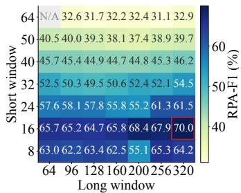  
(a) SMD

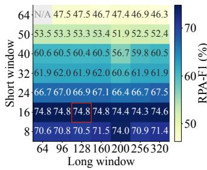  
(b) Exathlon

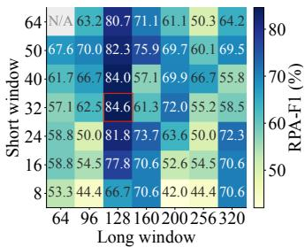  
(c) ESA

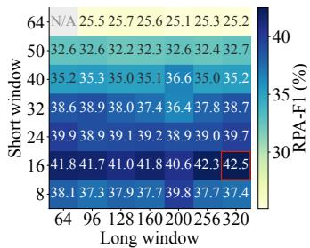  
(d) ASD  
Figure 3: Window-pair sensitivity of RPA-F1 under diferent short- and long-window sizes.

Local vs. contextual views. Removing the local branch causes the largest degradation: the average F1 drops from 67.99% to 59.26%, with pronounced declines on SMD and ASD. This suggests that fine-grained local evidence is crucial for capturing short-lived deviations. Notably, the contextonly variant performs best on ESA, implying that long-range dependencies are more important for this ultra-long benchmark; however, its weaker results on the other datasets show that context alone is insuficient. Conversely, removing the contextual branch leads to a smaller but consistent drop, confirming that contextual cues help disambiguate locally suspicious patterns.

Conservative correction. Replacing the proposed one-sided correction with naive weighted fusion reduces the averaged RPA-F1 from 67.99% to 66.32% and VUS-PR from 87.15% to 85.21%. The gap is most evident on Exathlon. These results highlight the benefit of assigning asymmetric roles to the two views: contextual evidence should only suppress the explainable portion of local abnormality, rather than being fused indiscriminately with the primary anomaly evidence.

Heterogeneous probing. Replacing the heterogeneous probe with a single head reduces the average RPA-F1 from 67.99% to 66.49% and VUS-PR from 87.15% to 85.39%. Using homogeneous heads produces a similar degradation, yielding 66.11% RPA-F1 and 85.52% VUS-PR. In contrast, the complete heterogeneous design achieves the best averaged result on every metric. This verifies that examining complementary local, contextual, and cross-view relations provides more informative cross-view correction cues than either a single probe or multiple homogeneous probes.

## 4.4. Sensitivity Analysis

Window size. We analyze MORA’s sensitivity to temporal window sizes (Fig. 3). Performance varies notably across short–long pairs, confirming that temporal scale is critical for disambiguating temporal changes. On SMD, the best setting is $( L _ { s } , L _ { l } ) = ( 1 6 , 3 2 0 )$ , while overly large $L _ { s }$ consistently hurts, suggesting that local anomaly evidence should be captured at fine granularity and that a longer context is useful for explaining gradual changes. Exathlon shows a similar pattern, with $L _ { s } \approx 1 6$ performing strongly across a wide range of $L _ { l } .$ ESA depends more strongly on the window pair, and performs best with a moderately large short window and suficient context, e.g., (32, 128), indicating that the appropriate scale depends on event duration. ASD is less variable but still benefits from a proper local–context combination. Overall, the local–context separation is essential for robust anomaly scoring, rather than a minor hyperparameter choice.

Training params. Figure 4 studies three training params: contextual reconstruction weight λ, probe supervision weight $\eta ,$ and the optional router-balance coeficient $\rho .$ We report SMD and ASD as representative datasets with diferent degrees of temporal shift. On SMD, RPA-F1 is sensitive to all three coeficients: increasing λ helps after a moderate value, consistent with contextual reconstruction being more valuable under pronounced temporal changes; $\eta$ also matters, supporting that heterogeneous probe supervision improves the router’s assessment. SMD further benefits from a nonzero $\rho ,$ suggesting that a weak balance term can mitigate degenerate routing under strong non-stationarity. In contrast, ASD is much less sensitive, and the $\rho$ curve is nearly flat, implying that balance regularization is not a key gain source on relatively stable data. This contrast supports that the auxiliary terms mainly matter when temporal changes are prominent, while the model remains robust under milder shifts.

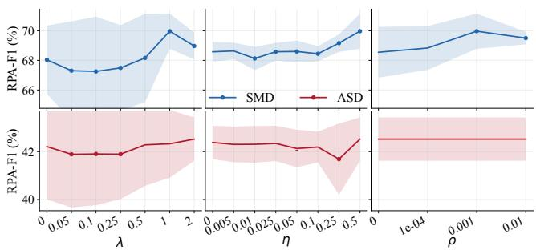  
Figure 4: Sensitivity results of λ, η, and ρ on SMD and ASD.

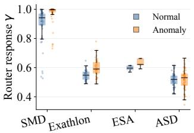

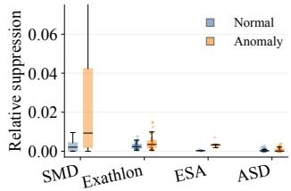  
(a) Router response.  
(b) Score suppression.  
Figure 5: Correction on normal vs. anomalous windows. (a) Router response $\gamma _ { t }$ . (b) Relative score suppression from $\gamma _ { t }$ and the positive reconstruction gap $\Delta _ { t }$

## 4.5. Correction Behavior Analysis

We inspect how MORA applies correction to normal and anomalous windows and how its performance varies with train–test shift intensity. Figure 5 illustrates the two factors that govern score correction. The router response alone does not determine the attenuation strength. Instead, the realized correction is jointly determined by $\gamma _ { t }$ and the positive reconstruction gap $\Delta _ { t }$ . For instance, although SMD yields high router responses, the resulting score suppression is modest and highly sample-dependent. Corrections are applied to both normal and anomalous windows because the router is not trained as a class predictor. Nevertheless, the one-sided rule constrains the corrected score to lie between the contextual and local reconstruction errors, preventing unconstrained score changes. Figure 6 presents a shift-stratified evaluation rather than a causal estimate of correction gains. On both SMD and Exathlon, detection performance remains stable or improves in higher-PSI groups, indicating that MORA does not sufer systematic degradation as the train–test distribution discrepancy increases.

## 4.6. Visualization and Case Study

Figure 7 provides a case study of MORA on SMD. Following the two labeled anomaly events near t ≈ 70 and $t \approx 1 6 0$ the raw signal gradually recovers toward its preceding state. However, the local anomaly score remains elevated during parts of this recovery instead of decreasing promptly. MORA markedly attenuates these persistent post-event responses. Within the labeled intervals, the corrections remain small relative to the substantially larger local scores, particularly around $t \approx 1 6 0$ , leaving the dominant anomaly peaks intact. This illustrates how broader temporal context reduces spurious responses without obscuring genuine anomaly evidence.

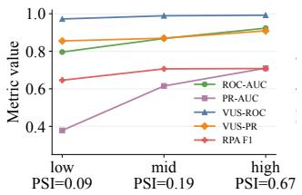  
(a) SMD.

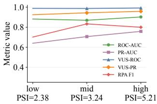  
(b) Exathlon.  
Figure 6: Detection performance of MORA across entity groups with diferent PSI levels.

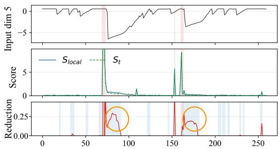  
Figure 7: Visualization on SMD. From top to bottom: raw input, local and corrected scores, and score reduction $S _ { t } ^ { l o c } - S _ { t }$ Red regions denote ground-truth anomalies, blue regions indicate non-anomalous intervals where correction is activated.

## Conclusion

This work revisits drift-robust time-series anomaly detection as a problem of temporal change disambiguation: a local deviation should bejudged not only against historical normality, but also in relation to its broader temporal evolution. MORA operationalizes this idea by reconstructing the same local target under paired short- and long-term views and translating the contextual reconstruction advantage into a one-sided correction of the primary local anomaly score. Heterogeneous cross-view cues further adapt the correction strength across samples, while the asymmetric scoring rule retains the local evidence whenever broader context provides no reconstruction improvement. Experiments on four TSAD benchmarks demonstrate strong and consistent performance, suggesting that temporal context is more efective when used as constrained corrective evidence than as an additional anomaly score to be fused. This perspective also motivates several extensions, including adaptive longer-range context selection, more ambiguity-aware correction routing, explicit modeling of shifts in cross-variable dependencies, and the integration of context-guided correction with broader TSAD backbones.

## References

Alkilane, K.; He, Y.; and Lee, D.-H. 2024. MixMamba: Time series modeling with adaptive expertise. Information Fusion, 112: 102589.

Bhatnagar, A.; Kassianik, P.; Liu, C.; Lan, T.; Yang, W.; Cassius, R.; Sahoo, D.; Arpit, D.; Subramanian, S.; Woo, G.; et al. 2021. Merlion: A machine learning library for time series. arXiv preprint arXiv:2109.09265.

Chen, L.; Tang, J.; Zou, Y.; Liu, X.; Xie, X.; and Deng, G. 2025. Lightweight and Fast Time-Series Anomaly Detection via Point-Level and Sequence-Level Reconstruction Discrepancy. IEEE Transactions on Neural Networks and Learning Systems.

Deng, A.; and Hooi, B. 2021. Graph neural network-based anomaly detection in multivariate time series. In Proceedings of the AAAI conference on artificial intelligence, volume 35, 4027–4035.

Eldele, E.; Ragab, M.; Chen, Z.; Wu, M.; Kwoh, C. K.; Li, X.; and Guan, C. 2021. Time-series representation learning via temporal and contextual contrasting. IJCAI.

Feng, Y.; Zhang, W.; Fu, Y.; Jiang, W.; Zhu, J.; and Ren, W. 2024. Sensitivehue: Multivariate time series anomaly detection by enhancing the sensitivity to normal patterns. In Proceedings of the 30th ACM SIGKDD Conference on Knowledge Discovery and Data Mining, 782–793.

Grubbs, F. E. 1969. Procedures for detecting outlying observations in samples. Technometrics, 11(1): 1–21.

Guha, S.; Mishra, N.; Roy, G.; and Schrijvers, O. 2016. Robust random cut forest based anomaly detection on streams. In ICML, 2712–2721. PMLR.

Han, D.; Wang, Z.; Chen, W.; Wang, K.; Yu, R.; Wang, S.; Zhang, H.; Wang, Z.; Jin, M.; Yang, J.; et al. 2023. Anomaly Detection in the Open World: Normality Shift Detection, Explanation, and Adaptation. In NDSS.

Hu, S.; Jin, J.; Shu, Y.; Chen, P.; Yang, B.; and Guo, C. 2026. Towards Multimodal Time Series Anomaly Detection with Semantic Alignment and Condensed Interaction.

Huang, X.; Chen, W.; Hu, B.; and Mao, Z. 2025. Graph mixture of experts and memory-augmented routers for multivariate time series anomaly detection. In Proceedings of the AAAI conference on artificial intelligence, volume 39, 17476–17484.

Hundman, K.; Constantinou, V.; Laporte, C.; Colwell, I.; and Soderstrom, T. 2018. Detecting spacecraft anomalies using lstms and nonparametric dynamic thresholding. In Proceedings of the 24th ACM SIGKDD international conference on knowledge discovery & data mining, 387–395.

Ismail Fawaz, H.; Forestier, G.; Weber, J.; Idoumghar, L.; and Muller, P.-A. 2019. Deep learning for time series classification: a review. Data Mining and Knowledge Discovery, 33(4): 917–963.

Jacob, V.; Song, F.; Stiegler, A.; Rad, B.; Diao, Y.; and Tatbul, N. 2020. Exathlon: A benchmark for explainable anomaly detection over time series. arXiv preprint arXiv:2010.05073.

Kim, S.; Choi, K.; Choi, H.-S.; Lee, B.; and Yoon, S. 2022. Towards a rigorous evaluation of time-series anomaly detection. In Proceedings of the AAAI Conference on Artificial Intelligence, volume 36, 7194–7201.

Kotowski, K.; Haskamp, C.; Andrzejewski, J.; Ruszczak, B.; Nalepa, J.; Lakey, D.; Collins, P.; Kolmas, A.; Bartesaghi, M.; Martinez-Heras, J.; et al. 2024. European space agency benchmark for anomaly detection in satellite telemetry. arXiv preprint arXiv:2406.17826.

Li, B.; Shentu, Q.; Shu, Y.; Zhang, H.; Li, M.; Jin, N.; Yang, B.; and Guo, C. 2026. CrossAD: Time series anomaly detection with cross-scale associations and cross-window modeling. Advances in Neural Information Processing Systems, 38: 137959–137985.

Li, Z.; Zhao, Y.; Han, J.; Su, Y.; Jiao, R.; Wen, X.; and Pei, D. 2021. Multivariate time series anomaly detection and interpretation using hierarchical inter-metric and temporal embedding. In Proceedings of the 27th ACM SIGKDD conference on knowledge discovery & data mining, 3220–3230.

Lian, X.; Cao, C.; Liu, Y.; Xu, X.; Zheng, Y.; and Zhou, F. 2025. Facing Anomalies Head-On: Network trafic anomaly detection via uncertainty-inspired inter-sample diferences. In Proceedings ofthe ACM on Web Conference 2025, 3908– 3917.

Liu, F. T.; Ting, K. M.; and Zhou, Z.-H. 2012. Isolationbased anomaly detection. ACM Transactions on Knowledge Discoveryfrom Data (TKDD), 6(1): 1–39.

Lu, Y.; Wu, R.; Mueen, A.; Zuluaga, M. A.; and Keogh, E. 2022. Matrix profile XXIV: scaling time series anomaly detection to trillions of datapoints and ultra-fast arriving data streams. In Proceedings of the 28th ACM SIGKDD Conference on Knowledge Discovery and Data Mining, 1173–1182.

Malhotra, P.; Ramakrishnan, A.; Anand, G.; Vig, L.; Agarwal, P.; and Shrof, G. 2016. LSTM-based encoderdecoder for multi-sensor anomaly detection. arXiv preprint arXiv:1607.00148.

Mou, X.; Wang, R.; Wang, T.; Sun, J.; Li, B.; Wo, T.; and Liu, X. 2023. Deep Autoencoding One-Class time Series Anomaly Detection. In ICASSP 2023-2023 IEEE International Conference on Acoustics, Speech and Signal Processing (ICASSP), 1–5. IEEE.

Obata, K.; Matsubara, Y.; and Sakurai, Y. 2025. Robust and Explainable Detector of Time Series Anomaly via Augmenting Multiclass Pseudo-Anomalies.

Pang, G.; Shen, C.; Cao, L.; and Hengel, A. V. D. 2021. Deep learning for anomaly detection: A review. ACM Computing Surveys (CSUR), 54(2): 1–38.

Paparrizos, J.; Boniol, P.; Palpanas, T.; Tsay, R. S.; Elmore, A.; and Franklin, M. J. 2022. Volume Under the Surface: A New Accuracy Evaluation Measure for Time-Series Anomaly Detection. Proceedings of the VLDB Endowment, 15(11): 2774–2787.

Ruf, L.; Vandermeulen, R.; Goernitz, N.; Deecke, L.; Siddiqui, S. A.; Binder, A.; Müller, E.; and Kloft, M. 2018. Deep one-class classification. In International conference on machine learning, 4393–4402. PMLR.

Si, H.; Pei, C.; Li, Z.; Zhao, Y.; Li, J.; Zhang, H.; Diao, Z.; Li, J.; Xie, G.; and Pei, D. 2023. Beyond sharing: Conflict-aware multivariate time series anomaly detection. In Proceedings of the 31st ACM Joint European Software Engineering Conference and Symposium on the Foundations ofSoftware Engineering, 1635–1645.

Sohn, K.; Li, C.-L.; Yoon, J.; Jin, M.; and Pfister, T. 2021. Learning and evaluating representations for deep one-class classification. ICLR.

Su, Y.; Zhao, Y.; Niu, C.; Liu, R.; Sun, W.; and Pei, D. 2019. Robust anomaly detection for multivariate time series through stochastic recurrent neural network. In Proceedings of the 25th ACM SIGKDD international conference on knowledge discovery & data mining, 2828–2837.

Sun, Y.; Cheng, D.; Yang, T.; Ji, Y.; Zhang, S.; Zhu, M.; Xiong, X.; Fan, Q.; Liang, M.; Pei, D.; et al. 2023. Eficient and robust KPI outlier detection for large-scale datacenters. IEEE Transactions on Computers, 72(10): 2858–2871.

Tuli, S.; Casale, G.; and Jennings, N. R. 2022. TranAD: deep transformer networks for anomaly detection in multivariate time series data. Proceedings of the VLDB Endowment, 15(6): 1201–1214.

Wang, C.; Zhuang, Z.; Qi, Q.; Wang, J.; Wang, X.; Sun, H.; and Liao, J. 2023. Drift doesn’t matter: Dynamic decomposition with difusion reconstruction for unstable multivariate time series anomaly detection. Advances in neural information processing systems, 36: 10758–10774.

Wang, R.; Mou, X.; Yang, R.; Gao, K.; Liu, P.; Liu, C.; Wo, T.; and Liu, X. 2024. CutAddPaste: Time Series Anomaly Detection by Exploiting Abnormal Knowledge. In Proceedings of the 30th ACM SIGKDD Conference on Knowledge Discovery and Data Mining, 3176–3187.

Wang, T.; Wang, R.; Mou, X.; Li, X.; Wo, T.; Chen, S.; Liu, X.; and Yang, R. 2026. MOC: Mamba-Based Multi-Scale One-Class Time-Series Anomaly Detection. In ICASSP 2026-2026 IEEE International Conference on Acoustics, Speech and Signal Processing (ICASSP), 1106–1110. IEEE.

Wei, Q.; Miao, H.; Zhao, Y.; Zheng, K.; Yang, B.; Markl, V.; and Jensen, C. S. 2026. Evolving proxy kills drift: Dataeficient streaming time series anomaly detection. In Proceedings ofthe ACM Web Conference 2026, 7295–7306.

Wu, X.; Qiu, X.; Li, Z.; Wang, Y.; Hu, J.; Guo, C.; Xiong, H.; and Yang, B. 2025. CATCH: Channel-Aware multivariate Time Series Anomaly Detection via Frequency Patching. In ICLR.

Xie, Y.; Zhang, H.; and Babar, M. A. 2025. Multivariate Time Series Anomaly Detection by Capturing Coarse-Grained Intra-and Inter-Variate Dependencies. arXiv preprint arXiv:2501.16364.

Xu, H.; Wang, Y.; Jian, S.; Liao, Q.; Wang, Y.; and Pang, G. 2024. Calibrated one-class classification for unsupervised time series anomaly detection. IEEE Transactions on Knowledge and Data Engineering.

Xu, J.; Wu, H.; Wang, J.; and Long, M. 2021. Anomaly Transformer: Time Series Anomaly Detection with Association Discrepancy. In International Conference on Learning Representations.

Yang, Y.; Zhang, C.; Zhou, T.; Wen, Q.; and Sun, L. 2023. Dcdetector: Dual attention contrastive representation learning for time series anomaly detection. In Proceedings of the 29th ACM SIGKDD conference on knowledge discovery and data mining, 3033–3045.