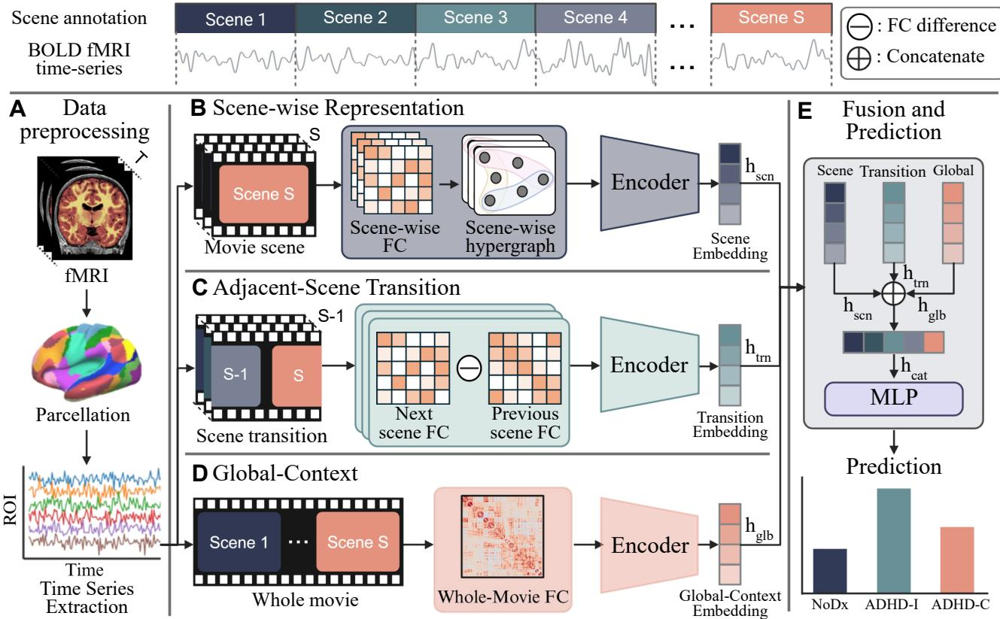
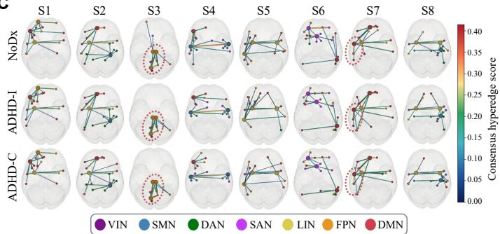
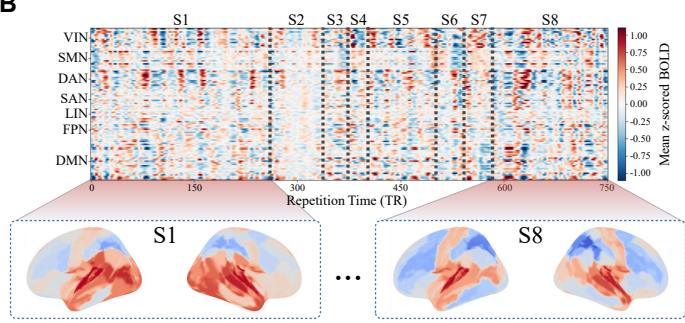
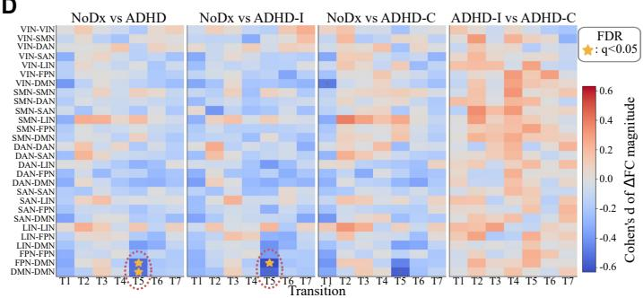

# MovieSTAGE: Scene, Transition, and Global Encoding for Movie-fMRI ADHD Classification

Boseong Kim1, Haejun Chung1, and Ikbeom Jang2

1Hanyang University, Seoul, Republic of Korea

2Hankuk University of Foreign Studies, Yongin, Republic of Korea

Correspondence: ijang@hufs.ac.kr; haejun@hanyang.ac.kr

Abstract—Naturalistic movie-fMRI provides a shared, temporally structured probe of brain dynamics, yet predictive models commonly rely on whole-run functional connectivity (FC) or temporally generic representations that are not aligned with narrative events. We introduce MovieSTAGE (Scene, Transition, and Global Encoding), a multiscale framework that combines hypergraph-structured FC-profile organization within scenes, unsigned FC-profile differences across adjacent scenes, and whole-movie FC. We evaluated 260 participants from the CMI-HBN Despicable Me cohort on case–control, ADHD-subtype, and three-class classification using 10 repetitions of stratified fivefold cross-validation, complete out-of-fold (OOF) predictions, and paired subject-cluster bootstrap and permutation tests. MovieSTAGE achieved AUROCs of 0.69, 0.73, and 0.75 and balanced accuracies of 67.6%, 69.8%, and 58.3%, respectively, yielding the highest mean point estimates among the evaluated methods. On the three-class task, the full model outperformed all two-branch variants, the HGNN scene encoder outperformed MLP, GAT, and BNT alternatives under matched settings, and the human-annotated partition outperformed duration-matched random and fixed-count GSBS controls. These controlled results support incremental predictive value from event-aligned scene and transition representations when combined with whole-movie FC in this cohort. Post-hoc model-derived analyses generated network-level hypotheses involving frontoparietal and defaultmode systems.

Index Terms—movie-fMRI, hypergraph neural network, attention-deficit/hyperactivity disorder, functional connectivity

## I. INTRODUCTION

Attention-deficit/hyperactivity disorder (ADHD) is clinically and neurobiologically heterogeneous, and neuroimaging studies have implicated altered interactions among the frontoparietal control network (FPN), default-mode network (DMN), and other large-scale systems [1]–[6]. Predictive functional magnetic resonance imaging (fMRI) studies commonly summarize these alterations using resting-state or whole-run functional connectivity (FC), which provides a subject-level representation but collapses within-run temporal organization [7]. Naturalistic movie-fMRI presents participants with a shared, temporally structured stimulus engaging perceptual, social, affective, and narrative processes, enabling ADHDrelated differences to be examined during continuous experience rather than isolated trials [8].

Recent fMRI–AI approaches extend connectome-based prediction beyond vectorized FC to graph, hypergraph, and spatiotemporal representations [9]. Hypergraph formulations encode higher-order relations among brain regions [10]–[12], whereas dynamic graph and attention-based models learn from sliding-window FC, region-of-interest (ROI) time series, or whole-connectome topology [13]–[16]. However, they operate on whole runs, fixed windows, or latent snapshots rather than narrative events, leaving it unclear whether predictive gains reflect temporal variation or event alignment.

During continuous narratives, cortical activity patterns remain relatively stable within events and shift at event boundaries [17], [18]. Dynamic-FC studies likewise indicate that time-varying network configurations carry information beyond a run-averaged connectome [19], [20]. Event-aligned modeling nevertheless faces two challenges: limited temporal support for scene-wise FC and potential loss of global context. We therefore hypothesize that three representations provide complementary information: set-wise within-scene organization, adjacent-scene reconfiguration, and whole-movie FC. ROI FCprofile similarity supports scene-specific hypergraphs without relying on isolated short-window edges; absolute differences between adjacent scene-wise FC profiles quantify reconfiguration without assuming a common signed direction across participants; and whole-movie FC preserves global context.

We introduce MovieSTAGE (Scene, Transition, and Global Encoding) for movie-fMRI ADHD prediction. For each scene, MovieSTAGE constructs a subject-specific ROI hypergraph from FC-profile similarity and aggregates scene embeddings across the movie. A second branch encodes adjacent-scene FC-profile changes, while a third represents whole-movie FC.

Our contributions are threefold:

(i) We introduce MovieSTAGE, a scene–transition– global framework combining scene-wise hypergraphs, adjacent-scene connectivity-profile reconfiguration, and whole-movie FC for movie-fMRI prediction.

(ii) We evaluate MovieSTAGE across three CMI-HBN ADHD tasks. MovieSTAGE yields the highest mean AUROC and BACC point estimates among the evaluated baselines, while ablations and matched segmentation controls indicate partially complementary representations and a benefit of narrative alignment.

(iii) We provide multiscale model-derived analyses highlighting higher-order scene organization across ADHD-relevant large-scale systems and DMN-centered adjacent-scene reconfiguration patterns.

  
Fig. 1. Overview of MovieSTAGE, a scene–transition–global fusion network. Preprocessed movie-fMRI time series are parcellated into SC-100 ROI signals and segmented by movie scene boundaries. The scene branch encodes scene-wise FC-profile hypergraphs, the transition branch encodes adjacent-scene unsigned $\Delta \mathrm { F C } ,$ and the global branch summarizes whole-movie FC. The three embeddings are concatenated for subject-level prediction.

## II. METHODS

Let $\mathbf { X } _ { i } \in \mathbb { R } ^ { R \times T }$ denote the parcellated movie-fMRI time series of subject $i ,$ with R ROIs and T time points. The movie is divided into $S$ scenes using predefined event boundaries; ${ \bf X } _ { i , s }$ denotes scene $s ,$ and boundary $q$ is the transition from scene q to $q + 1$ . MovieSTAGE contains three branches: scene-wise hypergraph (scn), adjacent-scene transition (trn), and global FC (glb). Unless otherwise specified, FC denotes a Fisher-z-transformed correlation matrix derived from a Ledoit–Wolf shrinkage covariance estimate [21]. The estimator was applied independently to each subject and temporal block, including each narrative scene and the complete movie. The shrinkage covariance matrix was converted to a correlation matrix by variance normalization, and diagonal entries were set to zero after applying the Fisher transformation to the offdiagonal entries. The MovieSTAGE architecture is shown in Fig. 1.

## A. Scene-wise Hypergraph Representation

For each subject and scene, we compute shrinkageregularized FC and use each ROI row as a scene-specific FCprofile descriptor:

$$
\mathbf { F C } _ { i , s } ^ { \mathrm { { s c n } } } = \mathcal { Z } ( \operatorname { C o r r } _ { \mathrm { L W } } ( \mathbf { X } _ { i , s } ) ) , \quad \mathbf { x } _ { i , s , r } ^ { \mathrm { { s c n } } } = \mathbf { F C } _ { i , s } ^ { \mathrm { { s c n } } } [ r , : ] .\tag{1}
$$

Here, CorrLW(·) denotes the correlation matrix obtained by variance-normalizing a Ledoit–Wolf shrinkage covariance estimate, and Z(·) applies the Fisher r-to-z transformation to off-diagonal entries. Because scene-wise FC is estimated from limited temporal samples, Ledoit–Wolf shrinkage was used to regularize covariance estimation before constructing similarity-based FC-profile hyperedges.

A scene-specific hypergraph is constructed from the cosinesimilarity matrix $\mathbf { S } _ { i , s } ,$ where $\mathbf { S } _ { i , s } [ r , r ^ { \prime } ]$ is the cosine similarity between $\mathbf { x } _ { i , s , r } ^ { \mathrm { s c n } }$ and $\mathbf { x } _ { i , s , r ^ { \prime } } ^ { \mathrm { s c n } } .$ . For anchor ROI $r ,$ one hyperedge connects r with its top-K most similar ROIs:

$$
e _ { i , s , r } = \{ r \} \cup \mathrm { T o p K } _ { r ^ { \prime } \neq r } \left( \mathbf { S } _ { i , s } [ r , r ^ { \prime } ] \right) .\tag{2}
$$

This yields $E ~ = ~ R$ hyperedges per scene. The incidence matrix $\mathbf { H } _ { i , s } ^ { \mathrm { s c n } } ~ \in ~ \{ 0 , 1 \} ^ { \bar { R } \times E }$ is defined by $H _ { i , s } ^ { \mathrm { s c n } } [ r ^ { \prime } , r ] ~ = ~ 1$ when ROI $r ^ { \prime }$ belongs to the hyperedge anchored at ROI $^ { r } \cdot$ The hyperedge attribute matrix $\bar { \mathbf { A } } _ { i , s } ^ { \mathrm { s c n } } \in \mathbb { R } ^ { E \times 1 }$ stores, for each anchor, the mean cosine similarity to its K selected members. Hypergraphs are constructed only from subject-specific scenewise FC profiles and do not use diagnostic labels. The initial node-feature matrix is ${ \bf Z } _ { i , s } ^ { ( 0 ) } = { \bf F C } _ { i , s } ^ { \mathrm { s c n } }$

The scene branch applies a shared hypergraph encoder with learnable hyperedge weights. Omitting subject and scene indices, the layer update is

$$
\mathbf { Z } ^ { ( l + 1 ) } = \sigma \Big ( ( \mathbf { D } _ { v } ^ { ( l ) } ) ^ { - \frac { 1 } { 2 } } \mathbf { H } \mathbf { W } _ { e } ^ { ( l ) } \mathbf { D } _ { e } ^ { - 1 } \mathbf { H } ^ { \top } ( \mathbf { D } _ { v } ^ { ( l ) } ) ^ { - \frac { 1 } { 2 } } \mathbf { Z } ^ { ( l ) } \mathbf { W } ^ { ( l ) } \Big ) ,\tag{3}
$$

where $\mathbf { Z } ^ { ( l ) }$ is the node embedding matrix, $\mathbf { W } ^ { ( l ) }$ is a nodeprojection matrix, $\begin{array} { r } { \mathbf { W } _ { e } ^ { ( l ) } \ = \ \mathrm { d i a g } ( \mathbf { \bar { w } } ^ { ( l ) } ) , \ D _ { e , e } \ = \ \sum _ { v } H _ { v , e } , } \end{array}$

$\begin{array} { r } { D _ { v , v } ^ { ( l ) } = \sum _ { e } H _ { v , e } w _ { e } ^ { ( l ) } } \end{array}$ , and $\sigma$ denotes the rectified linear unit (ReLU) activation. The hyperedge weight is

$$
w _ { e } ^ { ( l ) } = \mathrm { S o f t p l u s } \biggl ( f _ { \mathrm { e d g e } } \left( \left[ \bar { \mathbf { z } } _ { e } ^ { ( l ) } , a _ { e } \right] \right) \biggr ) + \epsilon ,\tag{4}
$$

with $\bar { \mathbf { z } } _ { e } ^ { ( l ) }$ denoting the mean embedding of nodes incident to hyperedge $e ,$ and $a _ { e }$ the corresponding scalar hyperedge attribute. Here, $f _ { \mathrm { e d g e } }$ is a multilayer perceptron (MLP) applied to each hyperedge, and $\epsilon > 0$ sets a positive lower bound on the learned weight. This incidence-matrix aggregation captures multi-ROI scene-level organization [10], [11]. Final ROI embeddings are summarized by mean, maximum, and standard-deviation pooling, projected to scene embeddings, and aggregated across scenes with attention pooling to produce $\mathbf { h } _ { i } ^ { \mathrm { s c n } }$

## B. Adjacent-Scene Transition Representation

Event boundaries in naturalistic fMRI are associated with transitions between relatively stable activity patterns and cortical pattern shifts [17], [18]. Consistent with dynamic-FC analyses of time-varying network configuration, we encode adjacent-scene reconfiguration magnitude without assuming a consistent signed direction across subjects or ROI pairs [20], [22]. For boundary $q ,$

$$
\Delta \mathbf { F } \mathbf { C } _ { i , q } ^ { \mathrm { t r n } } = \left| \mathbf { F } \mathbf { C } _ { i , q + 1 } ^ { \mathrm { s c n } } - \mathbf { F } \mathbf { C } _ { i , q } ^ { \mathrm { s c n } } \right| ,\tag{5}
$$

where |·| denotes elementwise absolute value. Here, q indexes the ordered narrative transition $S _ { q } ~  ~ S _ { q + 1 }$ , with each FC matrix summarizing its corresponding scene interval. The resulting tensor has shape $( S - 1 ) \times R \times R$ . Each ROI-level FC-delta row is encoded by a shared two-layer MLP, pooled across ROIs using mean, maximum, and standard deviation, and then aggregated across transitions with attention pooling to yield $\mathbf { h } _ { i } ^ { \mathrm { t r n } }$

## C. Global Context and Fusion

The global branch provides a whole-movie FC summary, a standard subject-level representation in connectome-based predictive modeling [7]. For subject i, the same Ledoit–Wolfbased connectivity estimator is applied to the complete movie:

$$
\mathbf { F C } _ { i } ^ { \mathrm { g l b } } = \mathcal { Z } ( \operatorname { C o r r } _ { \mathrm { L W } } ( \mathbf { X } _ { i } ) ) , \quad \mathbf { x } _ { i } ^ { \mathrm { g l b } } = \mathrm { v e c } _ { \triangle } \left( \mathbf { F C } _ { i } ^ { \mathrm { g l b } } \right) ,\tag{6}
$$

where $\operatorname { v e c } _ { \triangle }$ extracts off-diagonal upper-triangular entries, giving $\mathbf { x } _ { i } ^ { \mathrm { g l b } } \in \mathbb { R } ^ { R ( R - 1 ) / 2 }$ . A linear projection with dropout produces $\mathbf { h } _ { i } ^ { \mathrm { g l b } }$ . The final subject representation is the concatenation

$$
\begin{array} { r } { \mathbf { h } _ { i } ^ { \mathrm { c a t } } = \left[ \mathbf { h } _ { i } ^ { \mathrm { s c n } } , \mathbf { h } _ { i } ^ { \mathrm { t r n } } , \mathbf { h } _ { i } ^ { \mathrm { g l b } } \right] , \quad \mathbf { o } _ { i } = f _ { \mathrm { c l s } } \left( \mathbf { h } _ { i } ^ { \mathrm { c a t } } \right) , } \end{array}\tag{7}
$$

where $f _ { \mathrm { c l s } }$ is an MLP classifier and $\mathbf { o } _ { i }$ denotes the class logits. The model is trained with class-weighted cross-entropy,

$$
\mathcal { L } = \mathrm { C E } _ { w } \left( \mathbf { o } _ { i } , y _ { i } \right) ,\tag{8}
$$

where $y _ { i }$ is the ground-truth label and class weights are computed from the training data within each cross-validation fold.

TABLE I  
DEMOGRAPHICS OF THE CMI-HBN COHORT.
<table><tr><td>Group</td><td>Subjects (N) Sex (M/F) Age (Mean±SD)</td><td></td></tr><tr><td>NoDx</td><td>71</td><td>40 / 31  $8 . 9 9 \pm 1 . 8 2 $ </td></tr><tr><td>ADHD-I</td><td>86</td><td>50 / 36  $9 . 2 7 \pm 1 . 4 5$ </td></tr><tr><td>ADHD-C</td><td>103</td><td>54 /  49  $8 . 9 8 \pm 1 . 7 6$ </td></tr></table>

## III. EXPERIMENTS AND RESULTS

## A. Dataset and Experiment Settings

Dataset. We used the publicly available Child Mind Institute Healthy Brain Network (CMI-HBN) Despicable Me movie-fMRI dataset [23]. Participants aged 6–11 years whose structural MRI and blood-oxygen-level-dependent (BOLD) fMRI met the complete-pass quality control (QC) criteria were included, yielding 260 participants in the NoDx, ADHD-I, and ADHD-C groups (Table I). Reproducible Brain Charts derivatives were generated with Configurable Pipeline for the Analysis of Connectomes (C-PAC) using standardized nuisance regression and temporal filtering [24], [25]. QC required median framewise displacement (FD) o $\ : \ : \le \ : \ : 0 . 2$ mm and template-registration normalized cross-correlation of $\ge ~ 0 . 8 .$ The 10-min run contained 750 volumes (repetition time (TR)/echo time (TE) = 800/30 ms, flip angle = 31◦, and 2.4-mm isotropic resolution); BOLD signals were parcellated into 100 Schaefer regions (SC-100) [26]. Published adultrater boundaries defined eight scenes [27]; each boundary was shifted by 4 s (five TRs) to approximate hemodynamic delay and mapped to the nearest TR [28]. No statistically significant differences in median FD were detected across groups (Kruskal–Wallis, p = 0.092) or between ADHD-I and ADHD-C (Mann–Whitney $U , p = 0 . 0 7 8 )$

Evaluation and Implementation. All methods shared the SC-100 parcellation, subject-level outer folds, and evaluation protocol. We performed 10 repetitions of stratified five-fold cross-validation. Standardization and class weights were fit within each outer-training fold; a class-stratified 20% validation split supported a 12-configuration search, early stopping with patience 10 based on validation loss, and checkpoint selection by validation AUROC (one-vs-rest macro-AUROC for three classes), while outer test folds were reserved for final evaluation. For each repetition, test-fold predictions were concatenated into one complete out-of-fold (OOF) set, from which metrics were computed and summarized as mean ± standard deviation across repetitions. AUROC and balanced accuracy (BACC) were primary, whereas sensitivity and specificity were descriptive. Paired differences were evaluated using class-stratified subject-cluster bootstrap 95% confidence intervals and two-sided paired subject-cluster permutation tests (10,000 iterations each), with the mean repetition-wise metric difference as the statistic. Each subject’s repeated predictions formed one bootstrap cluster and one joint permutation unit across repetitions. The same procedure was applied to the controlled three-class analyses, with Holm correction performed separately for baseline comparisons within each task and for the drop-one-branch, scene-only encoder, full-fusion encoder,

TABLE II  
PERFORMANCE COMPARISON ON CMI-HBN MOVIE-FMRI ADHD CLASSIFICATION. BEST AND SECOND-BEST IN BOLD AND UNDERLINE.
<table><tr><td rowspan="2">Model</td><td rowspan="2">Venue</td><td colspan="4">NoDx vs. ADHD</td><td colspan="4">ADHD-I vs. ADHD-C</td><td colspan="5">NoDx vs. ADHD-I vs. ADHD-C</td></tr><tr><td>AUROC ↑</td><td>BACC (%) ↑</td><td>SEN (%) ↑</td><td>SPE (%) ↑</td><td>AUROC ↑</td><td>BACC (%) ↑</td><td>SENI (%) ↑</td><td> $\mathbf { S E N } _ { C }$  (%) ↑</td><td>AUROC ↑</td><td>BACC (%) ↑</td><td>SENN (%) ↑</td><td>SENI (%) ↑</td><td>SENC (%) ↑</td></tr><tr><td>SVM [29]</td><td></td><td> $0 . 5 3 { \pm } 0 . 0 3$ </td><td> $5 1 . 7 { \pm } 1 . 9$ </td><td> $6 3 . 0 { \pm } 1 0 . 7 \ $ </td><td> $4 0 . 4 \pm 1 8 . 0$ </td><td> $0 . 6 1 \pm 0 . 0 3$ </td><td> $5 9 . 3 { \pm } 0 . 5 $ </td><td> $4 8 . 1 \pm 2 . 4$ </td><td> $7 0 . 6 \pm 2 . 4$ </td><td> $0 . 6 7 { \scriptstyle \pm 0 . 0 3 }$ </td><td> $5 1 . 7 { \pm 2 . 5 }$ </td><td> $4 1 . 3 { \pm } 1 7 . 6 $ </td><td>63.2±8.2</td><td> $5 0 . 5 { \pm } 1 7 . 2 $ </td></tr><tr><td>ED-HNN [12]</td><td>ICLR&#x27;23</td><td> $0 . 6 2 \pm 0 . 0 4$ </td><td> $5 9 . 5 { \pm 4 . 0 }$ </td><td> $6 8 . 3 { \pm } 9 . 2 $ </td><td> $5 0 . 7 { \pm } 1 1 . 0 $ </td><td> $0 . 6 7 \pm 0 . 0 4$ </td><td> $6 3 . 1 \pm 2 . 2$ </td><td> $5 2 . 3 { \pm } 3 . 5 $ </td><td> $7 3 . 8 { \pm } 1 . 0 $ </td><td> $0 . 6 8 { \pm } 0 . 0 3$ </td><td> $5 0 . 4 \pm 6 . 8$ </td><td> $4 4 . 7 \pm 5 . 0$ </td><td> $5 8 . 0 { \pm } 3 . 5 $ </td><td> $4 8 . 5 \pm 1 4 . 6$ </td></tr><tr><td>BioBGT [13]</td><td>ICLR’25</td><td> $0 . 5 3 { \pm } 0 . 0 3$ </td><td> $5 6 . 2 \pm 2 . 1$ </td><td> $4 6 . 7 \pm 1 2 . 4$ </td><td> ${ \bf 6 5 . 7 \pm 1 0 . 6 }$ </td><td> $0 . 6 1 \pm 0 . 0 3$ </td><td> $5 9 . 5 { \pm 2 . 6 }$ </td><td> $5 1 . 9 { \pm } 5 . 7 $ </td><td> $6 7 . 0 { \pm } 4 . 2$ </td><td> $0 . 7 1 \pm 0 . 0 1$ </td><td> $5 5 . 1 \pm 3 . 3$ </td><td> $4 6 . 5 { \pm } 2 . 4 $ </td><td> $5 5 . 4 \pm 2 . 9$ </td><td> ${ \bf 6 3 . 4 \pm 2 . 0 }$ </td></tr><tr><td>DSAM [14]</td><td> $\mathbf { M e d I A } ^ { \prime } 2 5$ </td><td> $0 . 5 8 { \pm } 0 . 0 2$ </td><td> $6 0 . 4 \pm 0 . 5$ </td><td> $6 1 . 2 { \pm } 7 . 0$ </td><td> $5 9 . 6 { \pm } 7 . 8 $ </td><td> $\underline { { 0 . 7 0 \pm 0 . 0 3 } }$ </td><td> $6 5 . 8 { \pm } 2 . 3 $ </td><td> $6 2 . 8 \pm 7 . 7$ </td><td> $6 8 . 9 \pm 6 . 2$ </td><td> $0 . 7 0 { \scriptstyle \pm 0 . 0 1 }$ </td><td> $5 3 . 3 { \pm } 2 . 6 $ </td><td> $4 6 . 5 { \pm } 2 . 4 $ </td><td> $5 5 . 8 { \pm } 3 . 1 $ </td><td> $5 7 . 6 \pm 3 . 7$ </td></tr><tr><td>STNAGNN [15] MIDL&#x27;25</td><td></td><td> $0 . 6 3 { \pm } 0 . 0 2$ </td><td> $5 8 . 7 \pm 1 . 8$ </td><td> $6 5 . 8 { \pm } 9 . 7 $ </td><td> $5 1 . 6 { \pm } 1 3 . 3 $ </td><td> $0 . 6 4 \pm 0 . 0 8$ </td><td> $5 9 . 3 { \pm } 5 . 5 $ </td><td> $4 8 . 8 \pm 1 1 . 6$ </td><td> $6 9 . 9 \pm 4 . 4$ </td><td> $\underline { { 0 . 7 2 \pm 0 . 0 1 } }$ </td><td> $5 5 . 5 { \pm } 1 . 3 $ </td><td> $5 1 . 2 { \pm } 1 . 6 $ </td><td> $5 5 . 8 { \pm } 2 . 3 $ </td><td> $5 9 . 6 \pm 5 . 0$ </td></tr><tr><td>BrainHGT [16]</td><td> $\mathbf { A A A I ^ { * } } 2 6$ </td><td> $\underline { { 0 . 6 6 \pm 0 . 0 2 } }$ </td><td> $5 9 . 9 { \pm } 4 . 7 $ </td><td> ${ \bf 7 8 . 0 \pm 6 . 2 }$ </td><td> $4 1 . 8 { \pm } 1 0 . 8 $ </td><td> $0 . 6 9 { \scriptstyle \pm 0 . 0 1 }$ </td><td> $6 4 . 3 { \pm } 0 . 5 $ </td><td> $5 3 . 5 { \pm } 3 . 5 $ </td><td> ${ \underline { { 7 5 . 1 \pm 2 . 4 } } }$ </td><td> $0 . 7 1 \pm 0 . 0 1$ </td><td> $5 5 . 9 { \pm } 2 . 8 $ </td><td> $5 0 . 2 { \pm } 9 . 6 $ </td><td> $5 6 . 2 \pm 1 2 . 1$ </td><td> $6 1 . 2 \pm 1 . 9$ </td></tr><tr><td>MovieSTAGE</td><td></td><td colspan="9">0.69±0.04 67.6±3.9  $\underline { { 6 9 . 8 \pm 3 . 2 } }$ </td><td></td><td>0.73±0.04 69.8±2.2 64.0±5.1 75.7±1.0 0.75±0.03 58.3±3.1 59.1±9.7 53.5±3.2</td><td> $\underline { { 6 2 . 3 \pm 8 . 6 } }$ </td></tr></table>

## C. Branch Ablation

We compared MovieSTAGE with a linear support vector machine (SVM) and five recent brain-network models. The SVM used the vectorized off-diagonal upper-triangular entries of whole-movie FC as input and served as a non-neural baseline [29]. STNAGNN modeled temporally ordered ROI graph snapshots using data-driven spatiotemporal attention [15]. ED-HNN was adapted to subject-level ROI hypergraphs constructed from FC-profile similarity [12]. BioBGT and BrainHGT operated on whole-movie FC graphs [13], [16], whereas DSAM directly processed the full ROI time series and learned connectivity through self-attention [14]. All baselines used the same SC-100 parcellation, subject-wise crossvalidation splits, and evaluation metrics as MovieSTAGE.

As shown in Table III, Global was the strongest single branch, whereas the full model achieved a macro-AUROC of and segmentation families across all AUROC and BACC contrasts $( p _ { \mathrm { H } } )$ . MovieSTAGE was implemented in PyTorch and trained on an NVIDIA RTX A6000 GPU. Scene-wise hypergraphs used $K = 6 ,$ , and the Scene encoder comprised two hypergraph layers with a dropout rate of 0.1. The model was optimized for up to 80 epochs using AdamW (learning rate $1 . 5 \times 1 0 ^ { - 4 }$ , weight decay $2 \times 1 0 ^ { - 5 }$ , and batch size 16).

As shown in Table II, MovieSTAGE achieved the highest mean AUROC and BACC point estimates across all three tasks. Paired comparisons of complete-OOF predictions further quantified the differences from the strongest competing baseline for each metric. For NoDx versus ADHD, MovieSTAGE exceeded BrainHGT by 0.03 in AUROC (95% CI [0.006, 0.054], $p _ { \mathrm { H } } = 0 . 0 2 8 )$ and DSAM by 7.2 percentage points in BACC (95% CI [2.6, 11.8], $p _ { \mathrm { H } } ~ = ~ 0 . 0 0 8 )$ . For ADHD-I versus ADHD-C, MovieSTAGE exceeded DSAM by 0.03 in AUROC (95% CI [0.005, 0.055], $p _ { \mathrm { H } } ~ = ~ 0 . 0 3 6 )$ and 4.0 percentage points in BACC (95% CI [1.1, 6.9], $p _ { \mathrm { H } } = 0 . 0 1 9 )$ . On the three-class task, MovieSTAGE exceeded STNAGNN by 0.03 in macro-AUROC (95% CI [0.008, 0.052], $p _ { \mathrm { H } } = 0 . 0 2 1 )$ and BrainHGT by 2.4 percentage points in BACC (95% CI [0.2, 4.6], $p _ { \mathrm { H } } = 0 . 0 4 7 )$ . Although MovieSTAGE did not achieve the highest sensitivity for every individual class, it provided the strongest overall discrimination and classbalanced performance across the three tasks.

## B. Comparison with Baseline Methods

TABLE III  
BRANCH ABLATION ON THREE-CLASS ADHD CLASSIFICATION.
<table><tr><td colspan="2">Branch configuration</td><td colspan="5">Performance</td></tr><tr><td>Scene Transition Global</td><td></td><td>AUROC ↑</td><td>BACC (%) ↑</td><td> $\mathbf { S E N } _ { N }$  (%) ↑</td><td> $\mathbf { S E N } _ { I }$  (%) ↑</td><td> $\mathbf { S E N } _ { C }$  (%) ↑</td></tr><tr><td>√</td><td>x</td><td> $0 . 6 5 { \pm } 0 . 0 1$ </td><td> $4 6 . 7 \pm 2 . 7$ </td><td> $4 8 . 2 \pm 7 . 9$ </td><td> $4 9 . 8 { \pm } 8 . 1 $ </td><td> $4 2 . 0 { \pm } 8 . 8 $ </td></tr><tr><td>x x</td><td>√</td><td> $0 . 6 5 { \pm } 0 . 0 1$ </td><td> $4 7 . 2 \pm 1 . 8$ </td><td> $4 6 . 0 { \pm } 6 . 2 $ </td><td> $4 6 . 1 \pm 4 . 8$ </td><td> $4 9 . 6 \pm 5 . 2$ </td></tr><tr><td></td><td>x</td><td> $0 . 6 8 { \pm } 0 . 0 3$ </td><td> $4 9 . 4 \pm 3 . 3$ </td><td> $4 6 . 4 \pm 1 2 . 4$ </td><td> $5 5 . 4 \pm 2 . 9$ </td><td> $4 6 . 5 { \pm } 7 . 6 $ </td></tr><tr><td>√</td><td>√</td><td>x</td><td> $0 . 6 8 { \pm } 0 . 0 3$   $5 0 . 6 \pm 2 . 7$ </td><td> $4 8 . 7 { \pm } 7 . 1 $ </td><td> $5 1 . 4 { \pm } 3 . 2 $ </td><td> $5 1 . 8 { \pm } 7 . 3$ </td></tr><tr><td>√</td><td>x</td><td>√  $0 . 7 1 \pm 0 . 0 3$ </td><td> $5 2 . 9 \pm 4 . 9$ </td><td> $5 2 . 7 { \pm } 7 . 0 $ </td><td> ${ \bf 5 5 . 8 \pm 2 . 9 }$ </td><td> $5 0 . 1 \pm 7 . 2$ </td></tr><tr><td> $\pmb { \chi }$ </td><td>√</td><td>√</td><td> $\underline { { 0 . 7 1 \pm 0 . 0 3 } }$   $5 3 . 3 { \pm } 4 . 4 $ </td><td> $\overline { { 5 1 . 6 \pm 7 . 4 } }$ </td><td> $5 5 . 6 { \pm } 2 . 5 $ </td><td> $5 2 . 6 { \pm } 7 . 1$ </td></tr><tr><td> $\checkmark$ </td><td></td><td>√</td><td>0.75±0.03 58.3±3.1 59.1±9.7</td><td></td><td> $5 3 . 5 { \pm 3 . 2 }$ </td><td>62.3±8.6</td></tr></table>

TABLE IV

THREE-CLASS ADHD CLASSIFICATION ACROSS SCENE ENCODERS.
<table><tr><td rowspan="2">Scene encoder</td><td colspan="2">Scene only</td><td colspan="2">Full fusion</td></tr><tr><td></td><td>AUROC ↑ BACC (%) ↑</td><td> $\mathbf { A U R O C } \uparrow$ </td><td>BACC (%) ↑</td></tr><tr><td>MLP</td><td> $0 . 6 0 { \scriptstyle \pm 0 . 0 1 }$ </td><td> $4 3 . 1 \pm 2 . 9$ </td><td> $0 . 6 9 { \scriptstyle \pm 0 . 0 2 }$ </td><td> $5 2 . 1 \pm 2 . 8$ </td></tr><tr><td>GAT</td><td> $\underline { { 0 . 6 3 \pm 0 . 0 1 } }$ </td><td> $4 5 . 0 { \pm } 3 . 2 $ </td><td> $0 . 7 1 { \scriptstyle \pm 0 . 0 2 }$ </td><td> $5 3 . 2 \pm 4 . 4$ </td></tr><tr><td>BNT</td><td> $\overline { { 0 . 6 1 \pm 0 . 0 1 } }$ </td><td> $\underline { { 4 5 . 2 \pm 1 . 7 } }$ </td><td> $\overline { { 0 . 7 0 \pm 0 . 0 2 } }$ </td><td> $\overline { { 5 2 . 1 \pm 3 . 0 } }$ </td></tr><tr><td colspan="2">HGNN (MovieSTAGE)  $\mathbf { 0 . 6 5 \pm 0 . 0 1 }$ </td><td> $\mathbf { 4 6 . 7 \pm 2 . 7 }$ </td><td> $\mathbf { 0 . 7 5 \pm 0 . 0 3 }$ </td><td> ${ \bf 5 8 . 3 \pm 3 . 1 }$  1</td></tr></table>

$0 . 7 5 \pm 0 . 0 3$ and a BACC of $5 8 . 3 \pm 3 . 1 \%$ . In Holm-corrected drop-one-branch comparisons, the full model outperformed all three two-branch variants for both primary metrics (all $p _ { \mathrm { H } } \leq 0 . 0 4 1 )$ . Relative to Transition+Global, the strongest twobranch configuration, the gains were 0.04 in macro-AUROC (95% CI [0.009, 0.071], $p _ { \mathrm { H } } ~ = ~ 0 . 0 3 1 )$ and 5.0 percentage points in BACC (95% CI [1.1, 8.9], $p _ { \mathrm { H } } = 0 . 0 2 6 )$ . Overall, the ablation supports conditional and partially complementary contributions from within-scene organization, adjacent-scene reconfiguration, and global FC context, rather than uniformly strong independent contributions from each branch.

## D. Controlled Comparison of Scene Encoders

On the three-class task, we assessed the contribution of explicit hypergraph-structured aggregation to within-scene FCprofile modeling by replacing MovieSTAGE’s hypergraph neural network (HGNN) scene encoder with an ROI-wise multilayer perceptron (MLP), a graph attention network (GAT) [31], and a Brain Network Transformer (BNT) [32]. All variants used identical human-annotated segmentation and scene-wise FC-profile node features and shared the same ROIlevel readout, scene-embedding dimensionality, cross-scene attention pooling, subject-level cross-validation splits, training and evaluation protocol, internal-validation procedure, and hyperparameter-search budget; only the within-scene encoder was replaced. In the full-fusion setting, the Transition and Global branches and the fusion classifier were unchanged and jointly optimized with each scene encoder. Each encoder was evaluated in both the scene-only and full-fusion settings to assess its performance as a standalone scene representation and as a component of the complete multibranch model.

A
<table><tr><td>Scene</td><td>TR</td><td>Narrative description</td></tr><tr><td>S1</td><td>0-249</td><td>Bedtime story and interaction between Gru and the children.</td></tr><tr><td>S2</td><td>250-325</td><td>Launch/heist rescheduling conflict.</td></tr><tr><td>S3</td><td>326-370</td><td>Minions play near the copy machine with an abrupt loud cue.</td></tr><tr><td>S4</td><td>371-410</td><td>Gru plays with the children during a tea-party interaction</td></tr><tr><td>S5</td><td>411-509</td><td>The children are taken away from Gru.</td></tr><tr><td>S6</td><td>510-549</td><td>Gru misses the children after they leave.</td></tr><tr><td>S7</td><td>550-590</td><td>Gru prepares for the launch with childhood-memory cues.</td></tr><tr><td>S8</td><td></td><td>591-749 Rocket launch sequence.</td></tr></table>

C  
  
D

B  

  
Fig. 2. Post-hoc interpretability analyses based on the Yeo 7-network parcellation [30]: Visual (VIN), Somatomotor (SMN), Dorsal Attention (DAN) Salience/Ventral Attention (SAN), Limbic (LIN), Frontoparietal (FPN), and Default Mode (DMN). (A) TR intervals and narrative descriptions of the eight predefined movie scenes (S1–S8). (B) Group-averaged, within-ROI z-scored SC-100 BOLD response profiles segmented into S1–S8 movie scenes. (C) Grouplevel scene-wise consensus hypergraphs for NoDx, ADHD-I, and ADHD-C; tubes denote model-derived anchor-to-member hyperedge projections, not direct pairwise physiological connectivity. (D) Network-pair Cohen’s d heatmaps of adjacent-scene ∆FC reconfiguration for T1–T7. Markers indicate permutationbased BH-FDR results (star, $q < 0 . 0 5 )$ . Cohen’s d signs indicate group differences in reconfiguration magnitude, not signed FC changes.  
TABLE V

As shown in Table IV, the HGNN yielded the highest mean macro-AUROC and BACC in both settings. In Holm-corrected comparisons, it outperformed all three alternative encoders for both metrics in the scene-only and full-fusion settings (scene only: all $p _ { \mathrm { H } } ~ \leq ~ 0 . 0 4 7 ;$ full fusion: all $p _ { \mathrm { H } } ~ \leq ~ 0 . 0 2 7 )$ . In the scene-only setting, the gains over the strongest alternative for each metric were 0.02 in macro-AUROC relative to GAT (95% CI [0.004, 0.036], $p _ { \mathrm { H } } ~ = ~ 0 . 0 4 1 )$ and 1.5 percentage points in BACC relative to BNT (95% CI [0.1, 2.9], $p _ { \mathrm { H } } = 0 . 0 4 7 )$ . Under full fusion, the HGNN exceeded GAT by 0.04 in macro-AUROC (95% $\mathrm { C I } \left[ 0 . 0 1 0 , 0 . 0 7 0 \right] , p _ { \mathrm { H } } = 0 . 0 2 7 $ and 5.1 percentage points in BACC (95% CI [1.2, 9.0], $p _ { \mathrm { H } } = 0 . 0 2 1 )$ . Overall, under matched scene inputs, readout operations, embedding dimensionality, tuning budget, and downstream components, these results were consistent with a benefit of the explicit hypergraph inductive bias for modeling within-scene FCprofile organization among the evaluated encoders.

## E. Controlled Comparison of Fixed-Count Scene Partitions

On the three-class task, we compared three eight-segment partitions under an otherwise matched downstream protocol to assess the effect of boundary placement: human-annotated narrative scenes, random partitions matched in segment count and duration distribution, and GSBS-derived neural-state segments constrained to eight states [33]. Matching the segment count fixed the number of scene and transition representations; thus, the GSBS condition serves as a fixed-count boundaryplacement control rather than a benchmark of unconstrained GSBS. One independent random partition was generated per cross-validation repetition, whereas GSBS boundaries were reestimated within each outer fold using only the corresponding outer-training subjects. The model architecture, hyperparameter search space and budget, subject splits, training procedure, and complete-OOF evaluation protocol were otherwise identical. As shown in Table V, human-annotated segmentation yielded the highest mean macro-AUROC $( 0 . 7 5 \pm 0 . 0 3 )$ and BACC (58.3 ± 3.1%) and outperformed both controls for both primary metrics after Holm correction (all $p _ { \mathrm { H } } \leq 0 . 0 4 7 )$ Relative to Random, it improved macro-AUROC by 0.05 (95% CI [0.014, 0.086], $p _ { \mathrm { H } } ~ = ~ 0 . 0 1 5 )$ and BACC by 5.1 percentage points (95% CI [1.3, 8.9], $p _ { \mathrm { H } } = 0 . 0 1 8 ) \mathrm { ; }$ relative to GSBS, the corresponding gains were 0.04 (95% CI [0.006, 0.074], $p _ { \mathrm { H } } ~ = ~ 0 . 0 3 9 )$ and 2.5 percentage points (95% CI [0.2, 4.8], $p _ { \mathrm { H } } ~ = ~ 0 . 0 4 7 )$ . The Human–Random comparison was therefore consistent with a benefit of alignment to the annotated narrative-event structure beyond segment count and duration matching. Although GSBS yielded higher ADHD-I sensitivity, human-annotated segmentation provided higher overall discrimination and class-balanced performance at the level of mean point estimates.

CONTROLLED COMPARISON OF EIGHT-SEGMENT SCENE PARTITIONS.
<table><tr><td>Method</td><td>AUROC ↑</td><td>BACC (%) ↑</td><td> $\mathbf { S E N } _ { N }$  (%) ↑</td><td> $\mathbf { S E N } _ { I }$  (%) ↑</td><td> $\mathbf { S E N } _ { C }$  (%) ↑</td></tr><tr><td>Random</td><td> $0 . 7 0 { \scriptstyle \pm 0 . 0 3 }$ </td><td> $5 3 . 2 \pm 2 . 3$ </td><td> $5 0 . 7 { \pm } 1 3 . 5 $ </td><td> $5 3 . 4 \pm 2 . 6$ </td><td> $5 5 . 4 \pm 9 . 6$ </td></tr><tr><td>GSBS</td><td> $0 . 7 1 \pm 0 . 0 6$ </td><td> $5 5 . 8 \pm 1 . 8$ </td><td> $5 6 . 2 \pm 1 3 . 2$ </td><td> ${ \bf 6 1 . 6 \pm 2 . 9 }$ </td><td> $\overline { { 4 9 . 6 \pm 6 . 8 } }$ </td></tr><tr><td>Human</td><td> $\mathbf { 0 . 7 5 \pm 0 . 0 3 }$ </td><td> ${ \bf 5 8 . 3 \pm 3 . 1 }$  </td><td> ${ \bf 5 9 . 1 \pm 9 . 7 }$ </td><td> $5 3 . 5 { \pm } 3 . 2 $ </td><td> ${ \bf 6 2 . 3 \pm 8 . 6 }$ </td></tr></table>

## F. Post-hoc Interpretability Analyses

Fig. 2 summarizes the post-hoc interpretability analyses. Fig. 2A lists the TR intervals and narrative content of the eight predefined movie scenes, providing the temporal reference for the scene-wise and transition-level analysis. Scenes are denoted S1–S8, and adjacent boundaries are denoted T1–T7, where $T _ { q }$ is the transition from $S _ { q }$ to $S _ { q + 1 }$ . Fig. 2B shows group-averaged, within-ROI z-scored SC-100 BOLD response profiles across the eight movie scenes. The profiles varied across scenes, indicating that the movie elicited temporally heterogeneous cortical response contexts rather than a homogeneous whole-run pattern. For example, S3 and the S5– S6 transition showed visible changes in network-level BOLD modulation, providing descriptive context for the scene-wise and transition-level analyses.

Scene-wise consensus hypergraphs (Fig. 2C) were obtained by averaging learned hyperedge weights across subjects within each group, with high-weight anchors defined by the highest averaged hyperedge weights. Across scenes, selected anchors were distributed across FPN, DMN, LIN, SMN, and SAN, indicating that the learned scene representation emphasized multiple large-scale systems implicated in ADHD. S3, a salient audiovisual copy-machine scene, exhibited an FPNcentered topology, whereas S7, involving launch preparation and childhood-memory cues, exhibited a DMN/LIN-centered topology. These examples characterize model-derived topology descriptively; formal diagnostic-group inference is reported only for the transition-level analysis, and the hyperedge projections do not represent direct physiological connectivity [1], [2], [8].

Transition-level analysis (Fig. 2D) showed the strongest effects for T5, the transition from the children leaving Gru to Gru missing them. For this adjacent-scene contrast, the pooled ADHD group showed greater reconfiguration magnitude than NoDx for FPN–DMN and DMN–DMN network pairs after permutation-based Benjamini–Hochberg false-discovery-rate (BH-FDR) correction; ADHD-I also showed greater FPN– DMN reconfiguration than NoDx. Because ∆FC is an absolute adjacent-scene difference, these effects indicate group differences in reconfiguration magnitude rather than signed connectivity increases or decreases. The concentration of DMN-centered and FPN–DMN effects aligns with ADHD literature on reduced task-positive/task-negative segregation, increased DMN integration with task-relevant networks, and altered dynamic connectivity states [3]–[5].

## IV. DISCUSSION

We examined whether narrative-aligned representations retain predictive information beyond whole-movie FC during naturalistic viewing. Across the case–control, subtype, and three-class CMI-HBN tasks, the full MovieSTAGE model yielded the highest mean AUROC and BACC point estimates among the evaluated methods. Although whole-movie FC was the strongest individual representation, combining it with within-scene organization and adjacent-scene reconfiguration produced the highest overall performance. The HGNN also yielded the highest point estimates among the evaluated scene encoders, while human-annotated scenes yielded higher point estimates than duration-matched random and fixed-count GSBS partitions. Together, these controlled analyses suggest that whole-movie FC provides broad subject-level context, whereas the Scene and Transition branches retain eventspecific information not fully captured by global summaries or temporal partitioning alone. This interpretation is consistent with prior connectome-based prediction and with evidence that continuous narratives comprise relatively stable cortical event patterns separated by transition-related shifts [7], [17], [18], [27], [34].

The post-hoc analyses placed these findings in a network level context. Scene-wise hypergraphs emphasized FPN, DMN, LIN, SMN, and SAN systems, whereas the strongest corrected transition-level differences involved FPN–DMN and DMN–DMN reconfiguration at the S5–S6 transition. These patterns align with prior ADHD findings involving default-mode organization, task-positive/task-negative segregation, salience processing, and dynamic network states [1]– [5]. They should nevertheless be interpreted as model-derived associations: hyperedge projections do not represent direct physiological connectivity, and absolute ∆FC reflects reconfiguration magnitude rather than signed connectivity change. The main limitations are evaluation within a single pediatric cohort and unequal temporal support across predefined scenes. External validation on independent movie-fMRI cohorts and robustness analyses across longer stimuli and alternative event definitions are needed. Within these bounds, the results support event-aligned multiscale modeling as a useful framework for ADHD prediction and for generating network-level hypotheses about scene- and transition-related functional organization.

## V. CONCLUSION

We introduced MovieSTAGE, an event-aligned scene– transition–global framework combining scene-specific hypergraph modeling, adjacent-scene FC-profile reconfiguration, and whole-movie FC. Across three CMI-HBN tasks, MovieSTAGE achieved the highest mean AUROC and BACC among the evaluated methods. Three-class branch ablations indicated conditional and partially complementary contributions. Post-hoc scene-wise hypergraph and transition analyses generated network-level hypotheses about scene-dependent functional organization and adjacent-scene reconfiguration. These results support event-aligned multiscale representation learning for naturalistic fMRI, while independent external validation remains necessary.

[1] J. Tegelbeckers, N. Bunzeck, E. Duzel, B. Bonath, H.-H. Flechtner, and K. Krauel, “Altered salience processing in attention deficit hyperactivity disorder,” Human Brain Mapping, vol. 36, no. 6, pp. 2049–2060, 2015.

[2] D. A. Fair, J. Posner, B. J. Nagel, D. Bathula, T. G. C. Dias, K. L. Mills, M. S. Blythe, A. Giwa, C. F. Schmitt, and J. T. Nigg, “Atypical default network connectivity in youth with attention-deficit/hyperactivity disorder,” Biological Psychiatry, vol. 68, no. 12, pp. 1084–1091, 2010.

[3] B. D. Mills, O. Miranda-Dominguez, K. L. Mills, E. Earl, M. Cordova, J. Painter, S. L. Karalunas, J. T. Nigg, and D. A. Fair, “ADHD and attentional control: Impaired segregation of task positive and task negative brain networks,” Network Neuroscience, vol. 2, no. 02, pp. 200– 217, 2018.

[4] K. A. Duffy, K. S. Rosch, M. B. Nebel, K. E. Seymour, M. A. Lindquist, J. J. Pekar, S. H. Mostofsky, and J. R. Cohen, “Increased integration between default mode and task-relevant networks in children with ADHD is associated with impaired response control,” Developmental Cognitive Neuroscience, vol. 50, p. 100980, 2021.

[5] H. M. Shappell, K. A. Duffy, K. S. Rosch, J. J. Pekar, S. H. Mostofsky, M. A. Lindquist, and J. R. Cohen, “Children with attentiondeficit/hyperactivity disorder spend more time in hyperconnected network states and less time in segregated network states as revealed by dynamic connectivity analysis,” NeuroImage, vol. 229, p. 117753, 2021.

[6] Z. Yao, B. Hu, Y. Xie, W. Wang, R. Liu, C. Liang, and Y. Su, “Functional network disruption in attention deficit hyperactivity disorder,” in 2014 IEEE International Conference on Bioinformatics and Biomedicine (BIBM). IEEE, 2014, pp. 84–90.

[7] X. Shen, E. S. Finn, D. Scheinost, M. D. Rosenberg, M. M. Chun, X. Papademetris, and R. T. Constable, “Using connectome-based predictive modeling to predict individual behavior from brain connectivity,” Nature Protocols, vol. 12, no. 3, pp. 506–518, 2017.

[8] J. Salmi, M. Metwaly, J. Tohka, K. Alho, S. Leppämäki, P. Tani, A. Koski, T. Vanderwal, and M. Laine, “ADHD desynchronizes brain activity during watching a distracted multi-talker conversation,” NeuroImage, vol. 216, p. 116352, 2020.

[9] P. Cao, G. Wen, L. Li, X. Liu, J. Yang, and O. Zaiane, “Temporal graph representation learning for autism spectrum disorder brain networks,” in 2021 IEEE International Conference on Bioinformatics and Biomedicine (BIBM). IEEE, 2021, pp. 1270–1275.

[10] L. Xiao, J. Wang, P. H. Kassani, Y. Zhang, Y. Bai, J. M. Stephen, T. W. Wilson, V. D. Calhoun, and Y.-P. Wang, “Multi-hypergraph learning-based brain functional connectivity analysis in fMRI data,” IEEE Transactions on Medical Imaging, vol. 39, no. 5, pp. 1746–1758, 2019.

[11] Y. Feng, H. You, Z. Zhang, R. Ji, and Y. Gao, “Hypergraph neural networks,” in Proceedings of the AAAI conference on artificial intelligence, vol. 33, no. 01, 2019, pp. 3558–3565.

[12] P. Wang, S. Yang, Y. Liu, Z. Wang, and P. Li, “Equivariant hypergraph diffusion neural operators,” in International Conference on Learning Representations (ICLR), 2023.

[13] C. Peng, Y. Huang, Q. Dong, S. Yu, F. Xia, C. Zhang, and Y. Jin, “Biologically plausible brain graph transformer,” in International Conference on Learning Representations, Y. Yue, A. Garg, N. Peng, F. Sha, and R. Yu, Eds., vol. 2025, 2025, pp. 52 283–52 309. [Online]. Available: https://proceedings.iclr.cc/paper\_files/paper/2025/ file/81f19c0e9f3e06c831630ab6662fd8ea-Paper-Conference.pdf

[14] B. Thapaliya, R. Miller, J. Chen, Y. P. Wang, E. Akbas, R. Sapkota, B. Ray, P. Suresh, S. Ghimire, V. D. Calhoun et al., “DSAM: A deep learning framework for analyzing temporal and spatial dynamics in brain networks,” Medical Image Analysis, vol. 101, p. 103462, 2025.

[15] J. Wang, N. C. Dvornek, P. Duan, L. H. Staib, P. Ventola, and J. S. Duncan, “STNAGNN: Data-driven spatio-temporal brain connectivity beyond FC,” in Medical Imaging with Deep Learning, 2025. [Online]. Available: https://openreview.net/forum?id=nKLCB8d3Ko

[16] J. Ma, Y. Zhang, C. Zhang, Z. Lv, and S. Pei, “BrainHGT: A hierarchical graph transformer for interpretable brain network analysis,” in Proceedings of the AAAI Conference on Artificial Intelligence, vol. 40, no. 21, 2026, pp. 17 617–17 625.

[17] C. Baldassano, J. Chen, A. Zadbood, J. W. Pillow, U. Hasson, and K. A. Norman, “Discovering event structure in continuous narrative perception and memory,” Neuron, vol. 95, no. 3, pp. 709–721, 2017.

[18] Y. Lee and J. Chen, “The relationship between event boundary strength and pattern shifts across the cortical hierarchy during naturalistic movieviewing,” Journal of Cognitive Neuroscience, vol. 36, no. 11, pp. 2317– 2342, 2024.

[19] A. D. Savva, G. D. Mitsis, and G. K. Matsopoulos, “Assessment of dynamic functional connectivity in resting-state fMRI using the sliding window technique,” Brain and Behavior, vol. 9, no. 4, p. e01255, 2019.

[20] M. G. Preti, T. A. Bolton, and D. Van De Ville, “The dynamic functional connectome: State-of-the-art and perspectives,” NeuroImage, vol. 160, pp. 41–54, 2017.

[21] O. Ledoit and M. Wolf, “A well-conditioned estimator for largedimensional covariance matrices,” Journal of Multivariate Analysis, vol. 88, no. 2, pp. 365–411, 2004.

[22] Z. Yang, H. Guo, S. Ji, S. Li, Y. Fu, M. Guo, and Z. Yao, “Reduced dynamics in multivariate regression-based dynamic connectivity of depressive disorder,” in 2020 IEEE International Conference on Bioinformatics and Biomedicine (BIBM). IEEE, 2020, pp. 1197–1201.

[23] L. M. Alexander, J. Escalera, L. Ai, C. Andreotti, K. Febre, A. Mangone, N. Vega-Potler, N. Langer, A. Alexander, M. Kovacs et al., “An open resource for transdiagnostic research in pediatric mental health and learning disorders,” Scientific Data, vol. 4, no. 1, p. 170181, 2017.

[24] G. Shafiei, N. B. Esper, M. S. Hoffmann, L. Ai, A. A. Chen, J. Cluce, S. Covitz, S. Giavasis, C. Lane, K. Mehta et al., “Reproducible brain charts: An open data resource for mapping brain development and its associations with mental health,” Neuron, vol. 113, no. 22, pp. 3758– 3779, 2025.

[25] C. Craddock, S. Sikka, B. Cheung, R. Khanuja, S. S. Ghosh, C. Yan, Q. Li, D. Lurie, J. Vogelstein, R. Burns, S. Colcombe, M. Mennes, C. Kelly, A. Di Martino, F. X. Castellanos, and M. Milham, “Towards automated analysis of connectomes: The configurable pipeline for the analysis of connectomes (C-PAC),” Frontiers in Neuroinformatics, no. 42, 2013.

[26] A. Schaefer, R. Kong, E. M. Gordon, T. O. Laumann, X.-N. Zuo, A. J. Holmes, S. B. Eickhoff, and B. T. Yeo, “Local-global parcellation of the human cerebral cortex from intrinsic functional connectivity MRI,” Cerebral Cortex, vol. 28, no. 9, pp. 3095–3114, 2018.

[27] S. S. Cohen, N. Tottenham, and C. Baldassano, “Developmental changes in story-evoked responses in the neocortex and hippocampus,” eLife, vol. 11, p. e69430, 2022.

[28] M. A. Lindquist, J. M. Loh, L. Y. Atlas, and T. D. Wager, “Modeling the hemodynamic response function in fMRI: efficiency, bias and mismodeling,” NeuroImage, vol. 45, no. 1, pp. S187–S198, 2009.

[29] C. Cortes and V. Vapnik, “Support-vector networks,” Machine Learning, vol. 20, no. 3, pp. 273–297, 1995.

[30] B. Thomas Yeo, F. M. Krienen, J. Sepulcre, M. R. Sabuncu, D. Lashkari, M. Hollinshead, J. L. Roffman, J. W. Smoller, L. Zöllei, J. R. Polimeni et al., “The organization of the human cerebral cortex estimated by intrinsic functional connectivity,” Journal of neurophysiology, vol. 106, no. 3, pp. 1125–1165, 2011.

[31] P. Velickoviˇ c, G. Cucurull, A. Casanova, A. Romero, P. Liò, and´ Y. Bengio, “Graph attention networks,” in International Conference on Learning Representations, 2018. [Online]. Available: https: //openreview.net/forum?id=rJXMpikCZ

[32] X. Kan, W. Dai, H. Cui, Z. Zhang, Y. Guo, and C. Yang, “Brain network transformer,” Advances in Neural Information Processing Systems, vol. 35, pp. 25 586–25 599, 2022.

[33] L. Geerligs, M. van Gerven, and U. Güçlü, “Detecting neural state transitions underlying event segmentation,” NeuroImage, vol. 236, p. 118085, 2021.

[34] E. S. Finn and P. A. Bandettini, “Movie-watching outperforms rest for functional connectivity-based prediction of behavior,” NeuroImage, vol. 235, p. 117963, 2021.