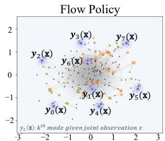
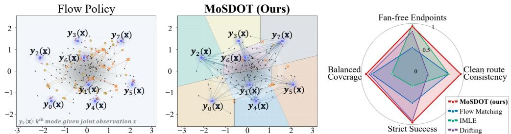
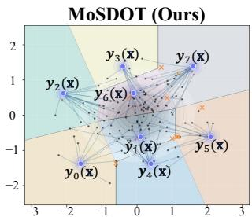
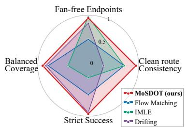
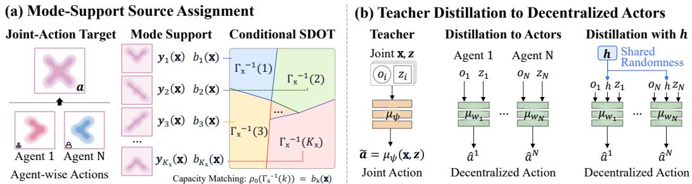
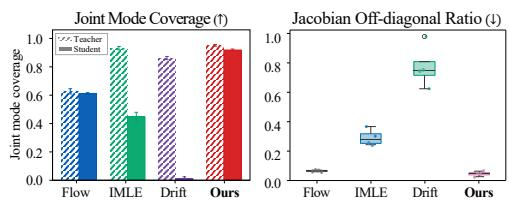
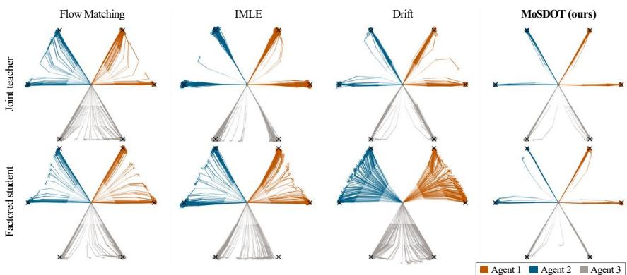
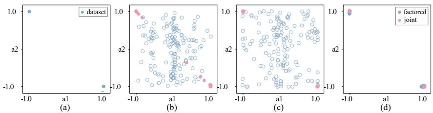
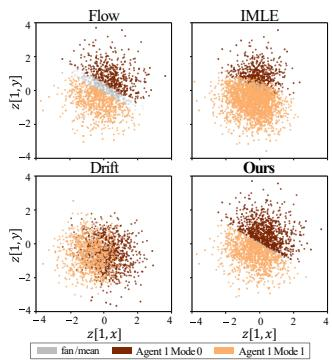
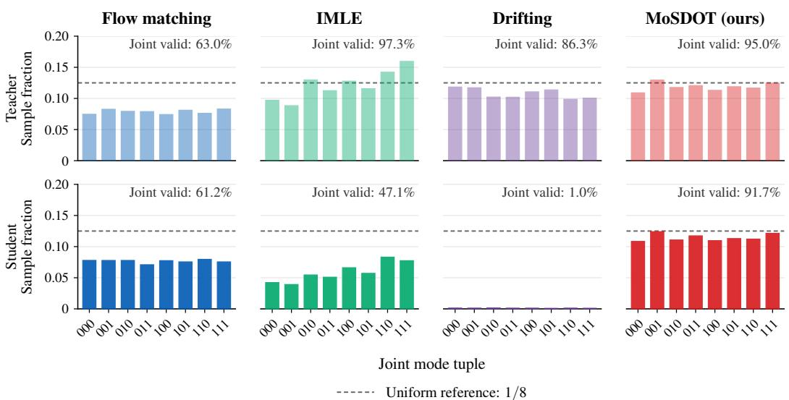

# Multi-Agent Coordination via Support-Preserving Distillation

Sangmin Lee Youngju Na Chanmi Lee Sung-eui Yoon† School of Computing, KAIST {alex6095,yjna2907,chanmi99,sungeui}@kaist.ac.kr †Corresponding author

## Abstract

Offline MARL increasingly relies on generative policies to model multimodal joint behavior, typically by distilling a centralized teacher into decentralized one-step actors under the CTDE. We identify a failure mode at the teacher training stage: standard flow-based teachers pair noise with replay targets independently, so nearby noise samples can be routed toward conflicting coordination modes. The teacher then produces samples between valid modes, and because the distillation loss regresses each local actor onto the conditional mean of the teacher’s output given local input, this error is not absorbed but propagated to the student. To remove this teacher-side artifact, we propose Mode-Support Semi-Discrete Optimal Transport (MoSDOT), which summarizes multimodal replay into a finite mode support with prescribed capacities and uses conditional semi-discrete optimal transport to assign each noise sample to a single mode before teacher training. We additionally study a shared-randomness variant that uses a shared noise component at execution to expose the residual gap intrinsic to strict-product execution. On controlled diagnostics and offline MARL benchmarks, MoSDOT improves endpoint quality and routing consistency, particularly on datasets exhibiting multimodal joint behavior.

## 1 Introduction

Offline multi-agent reinforcement learning (MARL) aims to learn coordinated policies from a fixed dataset, without further environment interaction. The core difficulty is that coordination is defined over the joint action distribution of all agents: individually plausible per-agent actions may combine into unseen joint actions that violate safety or yield low value. This is especially problematic when the data contains multiple valid coordination modes, defined as distinct joint behavior patterns, where a unimodal policy averages alternatives into an invalid in-between action. Expressive generative policies based on diffusion and flow matching address this multimodality by modeling joint action as a multi-mode distribution [1, 2, 3], but their multi-step sampling can be costly at decision time and complicate value-guided actor extraction through critic gradients [4]. A recent line of work therefore trains a centralized generative teacher over joint actions and distills it into decentralized one-step students, which act locally and admit more direct value-guided extraction [2].

Distillation, however, exposes a gap between joint modeling and decentralized execution. The teacher conditions on the full joint context and a shared noise sample, whereas each local actor sees only its own context and independent noise. If the teacher’s choice between coordination modes depends on information hidden from a local actor, the $\ell _ { 2 }$ distillation loss regresses to the conditional mean and collapses distinct modes into an invalid in-between action. Mode-preserving distillation therefore requires not only that the teacher cover the target modes, but also that those modes be compatible with the information available to local actors. This makes coherent teacher training critical: standard flow-based training pairs noise samples with replay targets independently, leaving an unstructured mapping between noise and joint behaviors. With multimodal targets, adjacent noise points are forced to learn conflicting modes simultaneously, producing trajectories that pass through low-density regions or form spurious bridges between modes (Fig. 1, left). Because independent local policies capture only the conditional mean, even minor mode-mixing in the teacher can lead the student to collapse onto invalid joint actions. A clean teacher alone, however, is not sufficient. Independent agents cannot in general represent correlated joint support such as the anti-correlated XOR target, a residual mismatch we call the product-projection gap.

  
Figure 1: Overview of source-to-mode routing. (Left) Standard Flow Policy: independent noise– target pairing can entangle nearby source samples with incompatible coordination modes, producing off-support fan mass. (Middle) MoSDOT: semi-discrete optimal transport partitions noise space into capacity-matched cells assigned to coordinated behavior modes. (Right) Route quality is measured by off-support avoidance (fan-free endpoints), consistency of source-to-mode routing (clean route consistency), endpoint accuracy to valid modes (strict success), and balanced mass across modes (balanced coverage). Full metric definitions are provided in Appendix E.6.

Our Mode-Support Semi-Discrete Optimal Transport (MoSDOT) addresses the teacher-side problem by summarizing multimodal replay into a finite set of representative joint behavior modes — the mode support — with prescribed capacities, and partitioning the noise space via semi-discrete optimal transport into cells assigned to those modes before teacher training (Fig. 1, middle). MoSDOT thus reduces teacher-side routing artifacts and preserves the mode support that local actors can recover, while leaving the product-projection gap explicit. To investigate this residual gap, we additionally consider a shared-randomness variant in which a portion of the noise input acts as an execution-time shared signal: all agents read the same coordination mode from this signal but still compute actions from their own observations and local noise, allowing correlated joint behavior without exchanging observations or actions.

In controlled diagnostics, MoSDOT mitigates teacher-side routing artifacts and improves sourceto-mode assignment consistency. Fig. 1 (right) summarizes these gains across endpoint quality, route consistency, strict success, and coverage balance. On offline MARL benchmarks, MoSDOT performs competitively with existing generative baselines, particularly on datasets containing diverse joint behaviors. Overall, MoSDOT separates teacher-side source-routing artifacts from the residual product-projection gap, and provides a measurable interface between the centralized training and decentralized execution (CTDE) [5].

## 2 Related Work

## 2.1 Generative Policies and Distillation in Offline MARL

Offline reinforcement learning (RL) aims to learn policies from fixed datasets by constraining policy improvement close to actions represented in the data to avoid value overestimation [6, 7, 8, 9]. In multi-agent settings, the support is defined over coordinated joint actions, so small per-agent deviations can combine into joint behaviors absent from replay. Offline MARL methods address this through implicit constraints [10], actor rectification [11], and global-to-local value regularization under the CTDE. Standard actor or value-factorized parameterizations rarely model multimodal joint action support explicitly, so distinct coordination modes can be averaged into incoherent in-between actions.

Expressive generative policies address this multimodality. Diffusion and flow-based models have been used for trajectory-level planning [12, 13], action generation [14], and one-step offline policy learning [4]. In offline MARL, MADiff [15] models coordinated multi-agent trajectories with diffusion, and DoF [1] factorizes diffusion generation and formulates Individual-Global-identically-Distributed (IGD) generation as a distributional analogue of value factorization. These approaches improve expressiveness and execution efficiency, but the quality of the centralized generative distribution remains an important prerequisite.

Policy distillation transforms multimodal teachers into efficient one-step students. Since pointwise regression tends to average modes, recent work has introduced set-level objectives based on Implicit Maximum Likelihood Estimation (IMLE) and Chamfer matching [16], as well as drifting objectives that shape support through attraction toward data and repulsion among generated samples [17]. In offline RL, FQL [4] distills a behavioral flow into a Q-regularized one-step policy, and MAC-Flow [2] distills a centralized multi-agent flow teacher into decentralized one-step actors. These methods primarily focus on the distillation process itself, while our work instead studies the upstream construction of the teacher distribution before distillation begins.

## 2.2 Mode Alignment in Flow Policies and Factorized Execution

Flow-based generative models are often sensitive to how source noise is coupled to data during training. Flow matching trains continuous normalizing flows by regressing vector fields along conditional probability paths [18]. With independent noise–target pairings, multimodal targets can produce samples that fall between valid modes. Optimal transport (OT) flow matching [19] mitigates this effect by coupling noise and data through transport plans, and AlignFlow [20] uses semi-discrete optimal transport (SDOT) to partition source space into Laguerre cells assigned to empirical data samples for image generation.

A related issue arises in MARL, where centralized training must be compatible with decentralized execution. Value factorization methods such as VDN [21], QMIX [22], and QTRAN [23] impose structure on centralized value functions so that decentralized action selection remains aligned with a global objective. Generative offline MARL raises a distributional analogue of this question. A centralized teacher may represent multimodal joint behavior, but the distilled local actors see only local information and are often trained with pointwise regression losses.

Our work focuses on the corresponding upstream failure mode. Before student training, independent teacher pairings can create off-support or entangled source routes between coordinated joint modes. During distillation, mode variation that is not locally observable is further averaged by the student objective. MoSDOT reduces this teacher-side routing artifact by aligning source-noise regions with the mode support via conditional SDOT, providing cleaner teacher targets for support-preserving decentralized distillation.

## 3 Method

## 3.1 Problem Setup

We consider cooperative offline MARL under a decentralized partially observable Markov decision process (Dec-POMDP) [24], defined as $\mathcal { M } = \langle \mathcal { N } , \mathcal { S } , \mathcal { O } , \mathcal { A } , \bar { P _ { \cdot } } Z , R , \overset { \cdot } { \gamma } \rangle$ . Let $\mathcal { N } = \{ 1 , . . . , N \}$ be the set of N agents, with $\mathcal { S } , \mathcal { O } = \{ \mathcal { O } _ { i } \} _ { i = 1 } ^ { N }$ , and $\mathbf { \mathcal { A } } = \{ \mathcal { A } _ { i } \} _ { i = 1 } ^ { N }$ denoting the joint global state, observation, and action spaces, respectively. We denote $\mathbf { x } = \left( o _ { 1 } , \ldots , o _ { N } \right) \in \bar { \mathcal { O } }$ as the joint observation context and $\mathbf { a } = ( a _ { 1 } , \ldots , a _ { N } ) \in \mathcal { A }$ as the joint action. $\dot { P } ( s ^ { \prime } | s , \mathbf { a } ) : \dot { S } \times \mathcal { A }  \dot { \Delta ( S ) }$ is the state transition function and $Z ^ { i } ( o _ { i } | s ) : S \to \Delta ( \mathcal { O } _ { i } )$ is the i-th agent’s observation function, where $s \in S$ and $\Delta ( \cdot )$ denotes the set of probability measures over the given space. The team reward is generated based on the reward function $R ( s , \mathbf { a } , \acute { s } ^ { \prime } ) : S \times A \times S  \mathbb { R }$ , and γ is a discount factor.

At each timestep, all decentralized agents choose their actions a conditioned on their local observations x provided by the environment in state s. The environment then transitions to $s ^ { \prime } \sim P ( s ^ { \prime } | s , \mathbf { a } )$ and the team reward is given by $R ( s , \mathbf { a } , s ^ { \prime } )$ . In the offline setting, learning uses a fixed dataset D of joint transitions collected by an unknown behavior policy, without further environment interaction.

Our goal is to learn each agent’s policy as a decentralized actor through centralized training. During training, we first use a centralized generative teacher that has access to the joint context x. The teacher is represented by a deterministic sampler conditioned on source noise distribution:

$$
\tilde { \mathbf { a } } = \mu _ { \psi } ( \mathbf { x } , \mathbf { z } ) , \qquad \mathbf { z } = ( z _ { 1 } , \dots , z _ { N } ) \sim \rho _ { 0 } ,\tag{1}
$$

where $\rho _ { 0 }$ is a simple source noise distribution, such as a standard Gaussian. Since z is random, this sampler induces a conditional distribution over joint actions given x. In the teacher stage, both the

  
Figure 2: MoSDOT-based framework for multi-agent distillation. (a) Replay joint actions are summarized into a mode support $\{ \mathbf { y } _ { k } ( \mathbf { x } ) \}$ with capacities $\{ b _ { k } ( { \bf x } ) \}$ , and conditional SDOT partitions the noise space into Laguerre cells $\Gamma _ { \mathbf { x } } ^ { - 1 } ( k )$ assigned to each mode. (b) The centralized teacher $\mu _ { \psi }$ is distilled into decentralized one-step actors $\{ \mu _ { w _ { i } } \}$ , each using only its local observation and noise. An optional shared signal h correlates local noise to mitigate the strict-product gap.

full joint observation context x and the full joint noise z may be used. At execution time, however, each agent must act using only its local information. We therefore deploy a strict-product policy:

$$
\pi _ { \mathbf { w } } ^ { \mathrm { p r o d } } ( \mathbf { a } \mid \mathbf { x } ) = \prod _ { i = 1 } ^ { N } \pi _ { w _ { i } } ( a _ { i } \mid o _ { i } ) ,\tag{2}
$$

where $\mathbf { w } = ( w _ { 1 } , \hdots , w _ { N } )$ denotes the set of decentralized actor parameters across $N$ agents. In the one-step reparameterized implementation used throughout this work, the deployed action is $\hat { \mathbf { a } } = ( \mu _ { w _ { 1 } } ( o _ { 1 } , z _ { 1 } ) , \hdots , \mu _ { w _ { N } } ( o _ { N } , z _ { N } ) )$ , with each actor receiving only its local observation $o _ { i }$ and local noise block z , unless specified otherwise. Thus, the centralized teacher can model coordinated joint behavior using x and z, while the student must reproduce such behavior under this decentralized information constraint.

For value-guided actor extraction, we use a centralized critic $Q _ { \mathrm { t o t } } ( \mathbf { x } , \mathbf { a } )$ that satisfies the Individual-Global-Max (IGM) principle [21, 22, 23]:

$$
\arg \operatorname* { m a x } _ { \mathbf { a } } { Q } _ { \mathrm { t o t } } ( \mathbf { x } , \mathbf { a } ) \ = \ \Big ( \arg \operatorname* { m a x } _ { a _ { 1 } } { Q } _ { 1 } ( o _ { 1 } , a _ { 1 } ) , \ \ldots , \arg \operatorname* { m a x } _ { a _ { N } } { Q } _ { N } ( o _ { N } , a _ { N } ) \Big ) .\tag{3}
$$

Here, $Q _ { \mathrm { t o t } } ( \mathbf { x } , \mathbf { a } )$ denotes the global Q-function over the joint context and joint action, while $Q _ { i } ( o _ { i } , a _ { i } )$ denotes the individual utility for agent i. The IGM principle ensures that greedy selection over each local $Q _ { i }$ remains consistent with the global optimum of $Q _ { \mathrm { t o t } }$

The remainder of Sec. 3 describes how we train the teacher so that its source noise is assigned to coordinated joint-action modes, and how we distill the resulting teacher into decentralized actors.

## 3.2 Mode Support and Capacities

Learning the teacher sampler $\mu _ { \psi } ( \mathbf { x } , \mathbf { z } )$ requires pairing source noise z with target joint actions so that the induced conditional distribution matches the target behavior at x. A naive approach pairs z and the replay target without considering their relationship, mapping them arbitrarily. When the targets at a given x contain multiple distinct coordinated joint behaviors, such as two valid joint actions in a coordination game, random pairing entangles these behaviors in source-noise space. This often causes nearby noise vectors to map to unrelated joint actions, and the noise mass allocated to each behavior is determined by random sampling rather than designed intentionally.

We instead organize the targets at each x into a finite mode support, a discrete set of representative joint actions, and assign a capacity (a target source-noise mass) to each element of this support before training. The sampler then learns a structured assignment in which contiguous regions of z-space correspond to single modes, with region sizes set by the capacities.

Mode support. For each conditioning context x, we collect a finite set of $M _ { \mathbf { x } }$ target joint actions:

$$
\mathcal { T } _ { \mathbf { x } } = \{ \mathbf { a } ^ { ( m ) } ( \mathbf { x } ) \} _ { m = 1 } ^ { M _ { \mathbf { x } } } , \qquad \mathbf { a } ^ { ( m ) } ( \mathbf { x } ) \in \mathcal { A } _ { 1 } \times \cdots \times \mathcal { A } _ { N } .\tag{4}
$$

In the default construction, these targets are replay actions from datasets. A support aggregation rule

$$
q _ { \mathbf { x } } : \{ 1 , \ldots , M _ { \mathbf { x } } \}  \{ 1 , \ldots , K _ { \mathbf { x } } \}\tag{5}
$$

groups the targets into $K _ { \mathbf { x } }$ clusters. Each cluster k collects the target indices $C _ { k } ( { \mathbf { x } } ) = \{ m : q _ { \mathbf { x } } ( m ) =$ $k \}$ and is summarized by a representative joint action $\mathbf { y } _ { k } ( \mathbf { x } ) \in \mathcal { A } _ { 1 } \times \cdot \cdot \cdot \times \mathcal { A } _ { N }$ , which we call a mode. The mode support at context x is the discrete set of these representatives:

$$
\mathcal { V } _ { \mathbf { x } } = \{ \mathbf { y } _ { 1 } ( \mathbf { x } ) , \dots , \mathbf { y } _ { K _ { \mathbf { x } } } ( \mathbf { x } ) \} .\tag{6}
$$

The support size $K _ { \mathbf { x } }$ is determined by the observed targets and the aggregation rule, not by enumerating the full combinatorial joint action space. The aggregation rule $q _ { \mathbf { x } }$ determines the granularity of ${ \mathcal { V } } _ { \mathbf { x } } .$ We use identity support for discrete-action benchmarks and a simple joint-action quantization for continuous-action benchmarks.

Capacities. Each mode ${ \bf y } _ { k } ( { \bf x } )$ is assigned a capacity $b _ { k } ( { \bf x } ) \geq 0$ satisfying $\begin{array} { r } { \sum _ { k = 1 } ^ { K _ { \mathbf { x } } } b _ { k } ( \mathbf { x } ) = 1 } \end{array}$ specifying its target source-noise mass. We use $b _ { k } ( { \bf \bar { x } } ) = | C _ { k } ( { \bf x } ) | / M _ { \bf x }$ so that the target source-noise mass matches the empirical replay frequency of each mode. Although each mode decomposes as $\mathbf { y } _ { k } ( \mathbf { x } ) = \left( y _ { k , 1 } ( \mathbf { x } ) , \ldots , y _ { k , N } ( \mathbf { x } ) \right)$ , source assignment is performed on ${ \bf y } _ { k } ( { \bf x } )$ as a whole, so sourcenoise regions are assigned to coordinated joint behaviors rather than to a product of per-agent action modes. This is what allows the sampler to represent correlated joint behaviors that a per-agent factorization cannot.

## 3.3 Source Assignment via Semi-Discrete Optimal Transport

Sec. 3.2 defines the target mass $b _ { k } ( { \mathbf x } )$ for each mode, but leaves open which source-noise samples should be paired with which mode. We resolve this by partitioning source-noise space so that each cell carries the prescribed mass and is assigned to a single mode. We adopt the SDOT-based source–target alignment introduced for image generation by Kong et al. [20], and apply it to the capacity-weighted mode support ${ \mathcal { V } } _ { \mathbf { x } }$

Let $\rho _ { 0 }$ denote the source law over joint noise ${ \bf z } = ( z _ { 1 } , \dots , z _ { N } )$ . We define the discrete target measure at context x as follows:

$$
\nu _ { { \bf x } } = \sum _ { k = 1 } ^ { K _ { \bf x } } b _ { k } ( { \bf x } ) \delta _ { { \bf y } _ { k } ( { \bf x } ) } ,\tag{7}
$$

where $\delta _ { \mathbf { y } _ { k } ( \mathbf { x } ) }$ denotes a Dirac measure at mode ${ \bf y } _ { k } ( { \bf x } )$ , so $\nu _ { \mathbf { X } }$ places mass $b _ { k } ( { \mathbf x } )$ on each mode in ${ \mathcal { V } } _ { \mathbf { x } }$ For a cost $c _ { \mathbf { x } } ( \mathbf { z } , k )$ between source noise z and mode ${ \bf y } _ { k } ( { \bf x } )$ , the SDOT primal is defined as follows:

$$
\operatorname* { m i n } _ { \Gamma _ { \mathrm { v } } } \mathbb { E } _ { \mathbf { z } \sim \rho _ { 0 } } \left[ c _ { \mathbf { x } } \big ( \mathbf { z } , \Gamma _ { \mathbf { x } } ( \mathbf { z } ) \big ) \right] \quad \mathrm { s . t . } \quad \rho _ { 0 } \big ( \Gamma _ { \mathbf { x } } ^ { - 1 } ( k ) \big ) = b _ { k } ( \mathbf { x } ) , \quad k = 1 , \ldots , K _ { \mathbf { x } } .\tag{8}
$$

Here, $\Gamma _ { \mathbf { x } } : \mathbf { z } \mapsto k$ is the source-to-mode assignment, mapping each source sample to a mode index. We take $c _ { \mathbf { X } }$ to be the squared Euclidean distance in the representation that defines ${ \mathcal { V } } _ { \mathbf { x } }$ . The SDOT dual is a finite-dimensional concave problem and admits stochastic optimization on samples from $\rho _ { 0 }$ [25]. We write its objective as:

$$
\Phi _ { \mathbf { x } } ( g ) = \sum _ { k = 1 } ^ { K _ { \mathbf { x } } } b _ { k } ( \mathbf { x } ) g _ { k } + \mathbb { E } _ { \mathbf { z } \sim \rho _ { 0 } } \bigg [ \operatorname* { m i n } _ { j \in \{ 1 , . . . , K _ { \mathbf { x } } \} } \big ( c _ { \mathbf { x } } ( \mathbf { z } , j ) - g _ { j } \big ) \bigg ] .\tag{9}
$$

The optimal dual weights are obtained as $g _ { \mathbf { x } } ^ { \star } \in \arg \operatorname* { m a x } _ { g \in \mathbb { R } ^ { K _ { \mathbf { x } } } } \Phi _ { \mathbf { x } } ( g )$ . The resulting Laguerre cells define the source-to-mode assignment:

$$
\Gamma _ { \mathbf { x } } ( \mathbf { z } ) = \underset { k } { \arg \operatorname* { m i n } } \big [ c _ { \mathbf { x } } ( \mathbf { z } , k ) - g _ { x , k } ^ { \star } \big ] .\tag{10}
$$

We solve Eq. 9 stochastically with Monte-Carlo sampling from $\rho _ { 0 }$ . For each pair $\mathbf { \rho } ( \mathbf { x } , \mathbf { z } )$ , the assignment $\Gamma _ { \mathbf { x } }$ selects the mode index, and we write the corresponding mode as ${ \bf y } _ { \Gamma } ( { \bf x } , { \bf z } ) = { \bf y } _ { \Gamma _ { \bf x } ( { \bf z } ) } ( { \bf x } )$ . We then form the linear interpolation path $\bar { \mathbf { a } } _ { t } = ( 1 - t ) \mathbf { z } + t \mathbf { y } _ { \Gamma } ( \mathbf { x } , \mathbf { z } )$ with displacement ${ \bf v } _ { \Gamma } ( { \bf x } , { \bf z } ) =$ ${ \bf y } _ { \Gamma } ( { \bf x } , { \bf z } ) - { \bf z }$ , where $t \stackrel { \sim } { \sim } \mathrm { U n i f } ( [ 0 , 1 ] )$ ). Following [18], the teacher learns a velocity field $u _ { \psi }$ by regressing onto the assigned displacement:

$$
\begin{array} { r } { \mathcal { L } _ { \mathrm { t e a c h e r } } ( \psi ) = \mathbb { E } _ { \mathbf { x } \sim \mathcal { D } , \mathbf { z } \sim \rho _ { 0 } , t \sim \mathrm { U n i f } ( [ 0 , 1 ] ) } \left[ \left| \left| u _ { \psi } \big ( \bar { \mathbf { a } } _ { t } , t , \mathbf { x } \big ) - \mathbf { v } _ { \Gamma } \big ( \mathbf { x } , \mathbf { z } \big ) \right| \right| _ { 2 } ^ { 2 } \right] . } \end{array}\tag{11}
$$

At inference, starting from z and integrating the learned field $u _ { \psi }$ from $t = 0$ to $t = 1$ defines the teacher sampler $\mu _ { \psi } ( \mathbf { x } , \mathbf { z } )$ used in Sec. 3.1. Unlike independent pairing, this couples source regions to modes with capacity-controlled mass.

## 3.4 Joint Policy Distillation

The teacher trained in Sec. 3.3 produces coordinated joint-action samples using the full context and joint noise. We distill these rollouts into the strict-product student family in Eq. (2). For a replay context $\mathbf { x } = \left( o _ { 1 } , \ldots , o _ { N } \right)$ and source noise $\mathbf { z } = ( z _ { 1 } , \dots , z _ { N } ) \sim \rho _ { 0 }$ , the teacher and student actions are defined as:

$$
\tilde { \mathbf { a } } = \mu _ { \psi } ( \mathbf { x } , \mathbf { z } ) , \qquad \hat { \mathbf { a } } = \bigl ( \mu _ { w _ { 1 } } ( o _ { 1 } , z _ { 1 } ) , \ldots , \mu _ { w _ { N } } ( o _ { N } , z _ { N } ) \bigr ) .\tag{12}
$$

The distillation loss matches each local actor to the corresponding component of the centralized teacher rollout:

$$
\mathcal { L } _ { \mathrm { d i s t i l l } } ( \mathbf { w } ) = \mathbb { E } _ { \mathbf { x } \sim \mathcal { D } , \mathbf { z } \sim \rho _ { 0 } } \left[ \sum _ { i = 1 } ^ { N } \| \mu _ { w _ { i } } ( o _ { i } , z _ { i } ) - [ \mu _ { \psi } ( \mathbf { x } , \mathbf { z } ) ] _ { i } \| _ { 2 } ^ { 2 } \right] ,\tag{13}
$$

where $[ \cdot ] _ { i }$ extracts the action component for agent i. For value-guided actor extraction, we optimize:

$$
\mathcal { L } _ { \pi } ( \mathbf { w } ) = \mathbb { E } _ { \mathbf { x } \sim \mathcal { D } , \mathbf { z } \sim \rho _ { 0 } } \left[ - Q _ { \mathrm { t o t } } ( \mathbf { x } , \hat { \mathbf { a } } ) + \alpha \sum _ { i = 1 } ^ { N } \| \mu _ { w _ { i } } ( o _ { i } , z _ { i } ) - [ \mu _ { \psi } ( \mathbf { x } , \mathbf { z } ) ] _ { i } \| _ { 2 } ^ { 2 } \right] ,\tag{14}
$$

where aˆ is as defined in Eq. (12), $Q _ { \mathrm { t o t } }$ is the IGM-compatible centralized critic of Eq. (3), and α controls the strength of teacher regularization. The assignment $\Gamma _ { \mathbf { x } }$ is used only to train the teacher and is not given to the decentralized actors at execution time.

Strict-product gap. MoSDOT improves the centralized teacher, but it does not remove the execution-time factorization constraint. A strict-product actor cannot represent every correlated joint distribution. For example, even when MoSDOT places clean teacher mass on $( \dot { + } 1 , - 1 )$ and (−1, +1), a strict-product student with the same local marginals also assigns mass to unsupported tuples $( + 1 , + 1 )$ and $( - 1 , - 1 )$ : each agent independently samples its own noise, so the two cannot agree on which mode to execute. We call this residual mismatch the strict-product gap.

The MoSDOT construction itself suggests a way to probe this gap. Recall that the assignment $\Gamma _ { \mathbf { x } }$ partitions the noise space into Laguerre cells, each mapped to a single mode ${ \bf y } _ { k } ( { \bf x } )$ . If all agents observe the same cell index, they automatically agree on the same mode and avoid unsupported product tuples. This motivates a shared-randomness variant. Let $h \sim \rho _ { h }$ be a random signal shared across agents at execution, playing the role of a shared cell index, and let $\epsilon _ { i } \sim \rho _ { i }$ be agent-local noise for within-mode variability. The resulting policy can be modified as:

$$
\pi _ { \mathbf { w } } ^ { \mathrm { s r } } ( \mathbf { a } \mid \mathbf { x } ) = \mathbb { E } _ { h \sim \rho _ { h } } \left[ \prod _ { i = 1 } ^ { N } \pi _ { w _ { i } } ^ { \mathrm { s r } } ( a _ { i } \mid o _ { i } , h ) \right] ,\tag{15}
$$

with one-step implementation $\hat { \mathbf { a } } ^ { \mathrm { s r } } = \bigl ( \mu _ { w _ { 1 } } ^ { \mathrm { s r } } \bigl ( o _ { 1 } , h , \epsilon _ { 1 } \bigr ) , \ldots , \mu _ { w _ { N } } ^ { \mathrm { s r } } \bigl ( o _ { N } , h , \epsilon _ { N } \bigr ) \bigr )$ . Without $h ,$ , this reduces to strict-product execution as in Eq. 2. With $h ,$ agents act locally and exchange no observations, actions, or messages, but their mode choice is correlated through the shared signal. This isolates the residual error due to independent local sampling and complements the teacher-side coupling provided by MoSDOT. Further theoretical and algorithmic details are provided in Appendices A.5 and B.2.

## 4 Experiments

Our experiments separate three sources of error in CTDE generative distillation: (i) teacher-side off-support mass, (ii) incompatibility between the teacher’s source assignment and decentralized actors, and (iii) the residual strict-product gap. MoSDOT is designed to address first two by replacing independent source–target pairing with a capacity-matched SDOT assignment. We then compare strict-product and shared-randomness decentralized actors to isolate what can be preserved under decentralized execution.

## 4.1 Experimental Setup

Diagnostics and benchmarks. We use two controlled tasks to visualize the failure modes studied in this work. The landmark diagnostic in Fig. 3 evaluates teacher-side source assignment with multiple coordinated modes across three agents. The XOR task in Fig. 5, adapted from MAC-Flow [2], isolates the strict-product gap using the anti-correlated support {(−1, +1), (+1, −1)}. For benchmark evaluation, we use SMACv1 [26], SMACv2 [27], and MPE [28].

  
Figure 3: Landmark policy trajectories. Black × marks denote the six anchor mode endpoints, and colors indicate the three anchor pairs. The top row shows centralized joint teacher rollouts, and the bottom row shows one-step factorized students distilled under independent local noise. Baseline students show fan mass between modes, while MoSDOT reduces fan mass and retains the structure.

<table><tr><td rowspan=1 colspan=4>Method      Fan-free ↑ Route cons. ↑ Success ↑  Balance ↑</td></tr><tr><td rowspan=2 colspan=1>Flow matching</td><td rowspan=2 colspan=1>0.857 ±0.010</td><td></td><td></td></tr><tr><td rowspan=1 colspan=1>0.856 ±0.010</td><td rowspan=1 colspan=1>0.915 ±0.029 0.917 ±0.043</td></tr><tr><td rowspan=1 colspan=1>IMLE</td><td rowspan=1 colspan=1>0.991 ±0.007</td><td rowspan=1 colspan=1>0.857 ±0.023</td><td rowspan=1 colspan=1>0.848 ±0.0640.761 ±0.029</td></tr><tr><td rowspan=1 colspan=1>Drifting</td><td rowspan=1 colspan=1>0.952 ±0.005</td><td rowspan=1 colspan=1>0.653 ±0.023</td><td rowspan=1 colspan=1>0.985 ±0.002 0.936±0.029</td></tr><tr><td rowspan=1 colspan=1>MoSDOT</td><td rowspan=1 colspan=1>0.983 ±0.002</td><td rowspan=1 colspan=1>0.972±0.001 0</td><td rowspan=1 colspan=1>.991 ±0.002 0.961 ±0.011</td></tr></table>

Table 1: Joint-teacher landmark diagnostics. Mean ± one standard deviation over 4 seeds.  
Figure 4: Landmark route-locality diagnostics.

Baselines and protocol. For controlled tasks, we compare against independent flow matching [18], IMLE policy [29], and Drifting model [17]. For benchmark evaluation, we follow the protocol and baseline suite of MAC-Flow [2], which includes representative Gaussian, diffusion, and flow-policy baselines such as MADiff, DoF, and MAC-Flow [15, 1, 2]. Unless stated otherwise, benchmark results use 6 seeds and report two standard deviations after ±. More details on baselines and implementations are provided in Appendix E.

Diagnostic metrics. For the landmark diagnostic, we evaluate teacher quality along two axes. (i) Endpoint support: does the teacher place samples on the modes in $\mathrm { y } _ { \mathbf { x } } \mathrm { 2 }$ Fan-free counts actions inside accepted directional cones. Success measures landmark reach rate, and Balance measures balance between valid local modes. (ii) Source routing: how does the teacher use source noise to choose among modes? Route consistency combines fan-free mass with the stability of mode labels among nearby samples in an agent’s noise slice. Jacobian off-diagonal ratio measures how strongly the teacher’s output for agent i depends on other agents’ noise $z _ { j \neq i }$ relative to its own noise $z _ { i } ,$ with values near zero indicating weak local cross-noise sensitivity. Endpoint metrics test whether the teacher reaches ${ \mathcal { D } } _ { \mathbf { x } } ,$ and routing metrics test whether mode choices depend only on locally observable information. Full definitions are given in Appendix E.6.

## 4.2 Endpoint Accuracy Does Not Imply Distillable Assignments

We first test whether reaching the correct modes is sufficient for factorized distillation. Tab. 1 measures endpoint-level support quality, while Fig. 4 asks a complementary question about whether the teacher’s mode choice for an agent depends on the agent’s own noise or the noise of other agents.

A teacher can reach valid modes while choosing among them in a way unavailable to the corresponding local actor. Flow matching has reasonable route consistency and balance, but its lower fan-free score reveals samples between modes. IMLE achieves the best fan-free score with sharp endpoints, but sacrifices success and balance, appearing as uneven mass across modes in Fig. 4. Drifting shows this mismatch most strongly. It reaches valid modes often, but has the lowest route consistency in Tab. 1 and the largest Jacobian off-diagonal ratio in Fig. 4, indicating its per-agent output is strongly shaped by other agents’ noise—information unavailable to the local actor. Endpoint support is therefore insufficient: when mode choice depends on off-agent noise, distillation can average or mix modes even with accurate endpoints. We evaluate teacher quality along both axes—whether it reaches $\mathcal { D } _ { \mathbf { x } } .$ and whether mode choices are reproducible from locally available information.

  
Figure 5: XOR strict-product visualization. (a) Target support placing equal mass on $( - 1 , + 1 )$ and (+1, −1). (b) MAC-Flow: bridge mass spreads across all quadrants under strict-product execution. (c) Ours w/o shared signal: clean teacher, residual strict-product gap. (d) Ours with shared signal: gap closed. Blue: factored student; pink: joint teacher.

## 4.3 MoSDOT Preserves Support Without Entangling Assignments

The previous section showed that no baseline is strong on both axes simultaneously. We now evaluate whether MoSDOT closes this gap. On the same landmark replay, MoSDOT replaces independent source–target pairing with the capacity-matched SDOT assignment of Eq. (11), using replay frequencies as mode capacities.

MoSDOT improves support sharpness without sacrificing assignment locality. On the endpoint axis (Tab. 1), it is competitive with the best endpoint-focused baselines on fan-free support and success, and achieves the best balance. The teacher’s joint mode coverage in Fig. 4 (left, hatched) is also the highest across methods. On the routing axis, its route consistency is the highest among all methods, and its Jacobian off-diagonal ratio in Fig. 4 (right) is comparable to flow matching, well below IMLE and Drifting. Fig. 6 visualizes both axes jointly in Agent 1’s noise plane: Flow leaves a fan between modes, IMLE assigns unbalanced area, and Drift mixes the two modes throughout, while MoSDOT yields balanced, fan-less, disentangled regions.

  
Figure 6: Source-space partitions in Agent 1’s noise plane.

## 4.4 Cleaner Source Assignments Survive Decentralized Distillation

Teacher-side improvement is useful only if it persists after decentralized distillation. To examine the teacher-to-student transfer, we distill strict-product students from Flow Matching, IMLE, Drifting, and MoSDOT teachers under the same student architecture, seed list, aggregation rule, and training budget. MoSDOT uses the capacity-matched teacher from Sec. 4.3.

The student appears to track the teacher’s geometry. Fig. 3 (bottom row) shows that the MoSDOT student largely follows the teacher’s ray structure, while baselines show fan mass between modes. Quantitatively, the MoSDOT-distilled student retains higher fan-free, success, and balance scores than baselines, while IMLE and Drifting students lose substantial endpoint quality through distillation (Appendix F.1). These results suggest that improving the centralized source assignment can improve the support preserved by decentralized actors.

## 4.5 Shared Randomness Isolates the Strict-Product Gap

Even with a clean teacher, the strict-product student of Eq. (2) cannot in general represent correlated joint support. The XOR target $\{ ( - 1 , \bar { , } + 1 ) , ( + 1 , - 1 ) \}$ illustrates this: independent local sampling that matches the marginals also produces the unsupported tuples (+1, +1) and (−1, −1). We use the shared-randomness variant of Eq. (15) to separate this product-projection error from teacher-side assignment error. Fig. 5 shows the separation across three stages. The unrouted flow teacher places bridge mass between the two valid tuples, which a strict-product student spreads across all four quadrants (b). MoSDOT concentrates the teacher mass on the two valid tuples, yet independent local sampling still mixes the two modes after distillation (c). Shared randomness, with the same MoSDOT teacher, lets the actors agree on a mode-selection signal while still acting locally, and the student concentrates on the valid tuples (d). The transition from (c) to (d)—where only the execution-time signal changes—isolates the strict-product gap from teacher-side assignment failure.

Table 2: Performance on discrete-action offline MARL benchmarks (SMACv1 and SMACv2). Mean over 6 seeds, ±2σ. Best and second-best in sage and powder blue
<table><tr><td rowspan="2">Benchmark Scenario</td><td rowspan="2"></td><td rowspan="2">Dataset</td><td colspan="3">Offline / BC baselines</td><td colspan="3">Diffusion policies</td><td colspan="3">Flow / OT policies</td></tr><tr><td>BC</td><td>MABCQ</td><td>MACQL</td><td>Diffusion BC</td><td>MADiff</td><td>DoF</td><td>Flow BC</td><td>MAC-Flow</td><td>MoSDOT</td></tr><tr><td rowspan="10">SMMCVI</td><td>3m</td><td>Good</td><td>16.0 ± 1.0</td><td>3.7 ± 1.1 4.0 ± 1.0</td><td>19.1 ± 0.1 13.7 ± 0.3</td><td>19.5 ± 0.5</td><td>19.3 ± 0.5 16.4 ± 2.6</td><td>19.8 ± 0.2 18.6 ± 1.2</td><td>20.0 ± 0.0</td><td>19.8 ± 0.2</td><td>20.0 ± 0.0 18.8±1.5</td></tr><tr><td></td><td>Medium</td><td>8.2 ± 0.8</td><td></td><td></td><td>13.3 ± 0.7</td><td></td><td></td><td>14.7 ± 1.5 4.5 ± 0.1</td><td>18.0 ± 3.2 10.6 ± 2.2</td><td></td></tr><tr><td></td><td>Poor</td><td>4.4 ± 0.1</td><td>3.4 ± 1.0</td><td>4.2 ± 0.1</td><td>4.2 ± 0.2</td><td>10.3 ± 6.1</td><td>10.9 ± 1.1</td><td></td><td></td><td>16.4±4.9</td></tr><tr><td></td><td>Good</td><td>16.7 ± 0.4</td><td>4.8 ± 0.6</td><td>18.9 ± 0.9</td><td>19.4 ± 0.5</td><td>18.9 ± 1.1</td><td>19.6 ± 0.3</td><td>19.5 ± 0.2</td><td>19.7 ± 0.3</td><td>20.0 ± 0.0</td></tr><tr><td>8m</td><td>Medium</td><td>10.7 ± 0.5</td><td>5.6 ± 0.6 3.6 ± 0.8</td><td>15.5 ± 1.5</td><td>18.6 ± 0.6</td><td>16.8 ± 1.6</td><td>18.6 ± 0.8</td><td>18.2 ± 0.8 4.9 ± 0.1</td><td>19.4 ± 0.6</td><td>20.0 ± 0.0 10.8 ± 0.8</td></tr><tr><td></td><td>Poor</td><td>5.3 ± 0.1</td><td></td><td>7.5 ± 1.0</td><td>4.8 ± 0.2</td><td>9.8 ± 0.9</td><td>12.0±1.2</td><td></td><td>11.5 ± 0.8</td><td></td></tr><tr><td>2s3z</td><td>Good</td><td>18.2 ± 0.4</td><td>7.7 ± 0.9</td><td>17.4 ± 0.3</td><td>18.0 ± 1.0</td><td>15.9 ± 1.2</td><td>18.5 ± 0.8</td><td>19.5 ± 0.1</td><td>19.5 ± 0.5</td><td>20.1 ± 0.1</td></tr><tr><td></td><td>Medium Poor</td><td>12.3 ± 0.7 6.7 ± 0.3</td><td>7.6 ± 0.7 6.6 ± 0.2</td><td>15.6 ± 0.4</td><td>13.4 ± 1.4</td><td>15.6 ± 0.3</td><td>18.1 ± 0.9</td><td>15.1 ± 2.0</td><td>17.6 ± 0.6</td><td>18.2±1.0</td></tr><tr><td></td><td></td><td></td><td></td><td>8.4 ± 0.8</td><td>6.2 ± 1.2</td><td>8.5 ± 1.3</td><td>10.0 ± 1.1</td><td>6.9 ± 0.8</td><td>8.5 ± 0.6</td><td>9.4 ± 0.8</td></tr><tr><td>5m_vs_6m</td><td>Good Medium</td><td>15.8 ± 3.6 12.4 ± 0.9</td><td>2.4 ± 0.4 3.8 ± 0.5</td><td>16.2 ± 1.6</td><td>16.8 ± 2.3</td><td>16.5 ± 2.8</td><td>17.7 ± 1.1</td><td>14.7 ± 2.1 12.8 ± 0.8</td><td>18.6±3.5</td><td>18.5±1.9 17.9 ±1.2</td></tr><tr><td rowspan="4"></td><td>Poor</td><td>7.5 ± 0.2</td><td>3.3 ± 0.5</td><td>15.1 ± 2.9 10.5 ± 3.1</td><td>12.5 ± 2.1 8.0 ± 1.0</td><td>15.2 ± 2.6 8.9 ± 1.3</td><td>16.2 ± 0.9 10.8 ± 0.3</td><td>7.7 ± 0.8</td><td>15.6 ± 1.3</td><td></td><td>12.3±0.9</td></tr><tr><td></td><td></td><td></td><td></td><td></td><td></td><td></td><td></td><td></td><td>9.8 ± 2.1</td><td></td></tr><tr><td>Good</td><td></td><td>17.5 ± 0.4</td><td>10.1 ± 0.2 12.9 ± 0.2</td><td>17.8 ± 1.3</td><td></td><td>14.7 ± 2.2</td><td>16.1 ± 0.8</td><td>18.0 ± 1.3</td><td>19.1 ± 0.8</td><td>20.2± 0.6</td></tr><tr><td>2c_vs_64zg</td><td>Medium</td><td>12.5 ± 0.3</td><td>9.9 ± 0.2</td><td>11.6 ± 0.1</td><td>10.5 ± 1.1 10.2 ± 2.3</td><td>12.8 ± 1.2 10.8 ± 1.1</td><td>13.9 ± 0.9</td><td>11.8 ± 2.6 10.0 ± 0.3</td><td>14.9 ± 4.1</td><td>16.4±1.0</td></tr><tr><td></td><td>Poor</td><td>9.7 ± 0.2</td><td>9.0 ± 0.2</td><td>10.2 ± 0.1</td><td></td><td></td><td></td><td>11.5±1.1</td><td></td><td>11.4 ± 0.4</td><td>11.4 ±1.4</td></tr><tr><td rowspan="4">SMACV</td><td rowspan="2">Average rewards terran_5_vs_5</td><td></td><td>12.2</td><td>5.5</td><td>13.1</td><td>13.0</td><td>13.8</td><td>15.6</td><td>13.4</td><td>15.6</td><td>16.7</td></tr><tr><td>replay</td><td>7.3 ± 1.0</td><td></td><td>13.8 ± 4.4 11.8 ± 0.9</td><td>9.3 ± 0.9</td><td>13.3 ± 1.8</td><td>15.4 ± 1.3</td><td>8.3 ± 1.9</td><td></td><td>16.6±4.3 16.6±4.3</td></tr><tr><td>zerg_5_vs_5</td><td>replay</td><td>6.8 ± 0.6</td><td>10.3 ± 1.2</td><td>10.3 ± 3.4</td><td>8.1 ± 1.7</td><td>10.2 ± 1.1</td><td>12.0±1.1</td><td>4.6 ± 0.5</td><td>9.8 ± 1.5</td><td>9.7 ± 2.8</td></tr><tr><td>terran_10_vs_10 replay</td><td></td><td>7.4 ± 0.5 7.2</td><td>12.7 ± 2.0 12.3</td><td>11.8 ± 2.0 11.3</td><td>5.5 ± 1.5 7.6</td><td>13.8 ± 1.3 12.4</td><td>14.6 ±1.1 14.0</td><td>5.8 ± 1.7 6.2</td><td>13.0 ± 4.7 13.1</td><td>9.4 ± 2.6 11.9</td></tr></table>

Table 3: Performance on continuous-action offline MARL benchmarks (MPE Simple Spread). M-R denotes Medium-Replay.
<table><tr><td rowspan="2">Scenario Dataset</td><td rowspan="2"></td><td colspan="5">Offline MARL</td><td colspan="3">Generative policies</td></tr><tr><td>MATD3BC</td><td>MACQL</td><td>ICQ</td><td>OMAR</td><td>OMIGA</td><td>MADiff</td><td>MAC-FloW</td><td>MoSDOT</td></tr><tr><td rowspan="4">Spread</td><td>Expert</td><td>108.3± 3.3</td><td>98.2 ± 5.2</td><td>114.9±2.6</td><td>104.0 ± 3.4</td><td>80.8 ±13.8</td><td>95.0 ± 5.3</td><td>101.7 ± 10.9</td><td>104.40 ± 19.66</td></tr><tr><td>Medium</td><td>29.3 ± 4.8</td><td>34.1 ± 7.2</td><td>47.9 ± 18.9</td><td>29.3 ± 5.5</td><td>30.1 ± 16.9</td><td>64.9 ± 7.7</td><td>80.1 ± 20.6</td><td>95.97±12.69</td></tr><tr><td>M-R</td><td>15.4 ± 5.6</td><td>20.0 ± 8.4</td><td>37.9 ± 12.3</td><td>13.6 ± 5.7</td><td>5.4 ± 11.0</td><td>30.3 ± 2.5</td><td>50.4 ± 33.2</td><td>54.12±15.29</td></tr><tr><td>Random</td><td>9.8 ± 4.9</td><td>24.0 ± 9.8</td><td>34.4 ± 5.3</td><td>6.3 ± 3.5</td><td>−3.8 ± 12.3</td><td>6.9 ± 3.1</td><td>31.1 ± 6.8</td><td>75.92±23.81</td></tr><tr><td colspan="2">Average rewards</td><td>40.7</td><td>44.1</td><td>58.8</td><td>38.3</td><td>28.1</td><td>49.2</td><td>65.8</td><td>82.6</td></tr></table>

## 4.6 Offline MARL Benchmark Results

We evaluate MoSDOT on three offline MARL benchmarks. Tab. 2 reports discrete-action results on SMACv1/v2, and Tab. 3 reports continuous-action results on MPE Simple Spread. On SMAC, generative policies—particularly flow- and diffusion-based methods—tend to perform better than Gaussian and behavior cloning (BC) baselines, consistent with the view that a centralized generative teacher is a useful starting point. On MPE, MoSDOT shows clearer gains on Medium and Random, where replay contains a wider range of joint actions per observation, and remains comparable to existing generative baselines on Expert, where replay is concentrated on a single coordinated mode.

These observations are consistent with the view that capacity-matched source assignment is most useful when replay admits a discernible finite mode support. The effect is naturally smaller when the data concentrates on a single coordinated mode (Expert), or when the joint-action space grows faster than per-context replay coverage so that the identity-style aggregation rule used here approaches sample-level coupling (e.g., terran\_10\_vs\_10). Designing q to recover meaningful mode structure in such regimes is a natural direction for future work.

## 5 Conclusion

We studied multi-agent generative distillation through how source noise is assigned to coordinated joint behaviors during teacher training. Our analysis shows that endpoint coverage of the teacher is not sufficient for factorized distillation: routing artifacts at the teacher stage propagate to decentralized actors through the distillation loss. MoSDOT addresses this by aligning source noise with a capacityweighted mode support via conditional SDOT, separating teacher-side routing artifacts from the residual product-projection gap that strict-product execution introduces. A central limitation is the strict-product constraint itself: independent local sampling cannot represent arbitrary correlated joint support, and our shared-randomness variant exposes this gap rather than removing it. Quantifying this residual gap, extending mode-support routing to longer-horizon and value-reweighted settings, and studying when shared execution signals are admissible are natural next steps.

## Acknowledgments and Disclosure of Funding

This work was supported by the Institute of Information & Communications Technology Planning & Evaluation (IITP) grant funded by the Korea government (MND) (RS-2026-25553650), the National Research Foundation of Korea (NRF) grant funded by the Korea government (MSIT) (No. RS-2023- 00208506), and the InnoCORE program of the Ministry of Science and ICT (N10260099). Prof. Sung-eui Yoon is the corresponding author.

Competing Interests. The authors declare no competing interests.

## References

[1] Chao Li, Ziwei Deng, Chenxing Lin, Wenqi Chen, Yongquan Fu, Weiquan Liu, Chenglu Wen, Cheng Wang, and Siqi Shen. DoF: A diffusion factorization framework for offline multi-agent reinforcement learning. In International Conference on Learning Representations, pages 34830–34868, 2025.

[2] Dongsu Lee, Daehee Lee, and Amy Zhang. Multi-agent coordination via flow matching. In International Conference on Learning Representations, pages 99912–99943, 2026.

[3] Teng Pang, Zhiqiang Dong, Yan Zhang, Rongjian Xu, Guoqiang Wu, and Yilong Yin. Value-guidance MeanFlow for offline multi-agent reinforcement learning. arXiv preprint arXiv:2604.08174, 2026.

[4] Seohong Park, Qiyang Li, and Sergey Levine. Flow Q-learning. In Proceedings of the 42nd International Conference on Machine Learning, volume 267, pages 48104–48127. PMLR, 2025.

[5] Xiangsen Wang, Haoran Xu, Yinan Zheng, and Xianyuan Zhan. Offline multi-agent reinforcement learning with implicit global-to-local value regularization. In Advances in Neural Information Processing Systems, volume 36, pages 52413–52429, 2023. doi: 10.52202/075280-2282.

[6] Scott Fujimoto, David Meger, and Doina Precup. Off-policy deep reinforcement learning without exploration. In Proceedings of the 36th International Conference on Machine Learning, volume 97, pages 2052–2062. PMLR, 2019.

[7] Aviral Kumar, Aurick Zhou, George Tucker, and Sergey Levine. Conservative Q-learning for offline reinforcement learning. In Advances in Neural Information Processing Systems, volume 33, pages 1179– 1191, 2020.

[8] Scott Fujimoto and Shixiang Shane Gu. A minimalist approach to offline reinforcement learning. In Advances in Neural Information Processing Systems, volume 34, pages 20132–20145, 2021.

[9] Ilya Kostrikov, Ashvin Nair, and Sergey Levine. Offline reinforcement learning with implicit Q-learning. In International Conference on Learning Representations, 2022. URL https://openreview.net/forum? id=68n2s9ZJWF8.

[10] Yiqin Yang, Xiaoteng Ma, Chenghao Li, Zewu Zheng, Qiyuan Zhang, Gao Huang, Jun Yang, and Qianchuan Zhao. Believe what you see: Implicit constraint approach for offline multi-agent reinforcement learning. In Advances in Neural Information Processing Systems, volume 34, pages 10299–10312, 2021.

[11] Ling Pan, Longbo Huang, Tengyu Ma, and Huazhe Xu. Plan better amid conservatism: Offline multi-agent reinforcement learning with actor rectification. In Proceedings ofthe 39th International Conference on Machine Learning, volume 162, pages 17221–17237. PMLR, 2022.

[12] Michael Janner, Yilun Du, Joshua B. Tenenbaum, and Sergey Levine. Planning with diffusion for flexible behavior synthesis. In Proceedings of the 39th International Conference on Machine Learning, volume 162, pages 9902–9915. PMLR, 2022.

[13] Anurag Ajay, Yilun Du, Abhi Gupta, Joshua Tenenbaum, Tommi Jaakkola, and Pulkit Agrawal. Is conditional generative modeling all you need for decision-making? In International Conference on Learning Representations, 2023. URL https://openreview.net/forum?id=sP1fo2K9DFG.

[14] Zhendong Wang, Jonathan J. Hunt, and Mingyuan Zhou. Diffusion policies as an expressive policy class for offline reinforcement learning. In International Conference on Learning Representations, 2023. URL https://openreview.net/forum?id=AHvFDPi-FA.

[15] Zhengbang Zhu, Minghuan Liu, Liyuan Mao, Bingyi Kang, Minkai Xu, Yong Yu, Stefano Ermon, and Weinan Zhang. MADiff: Offline multi-agent learning with diffusion models. In Advances in Neural Information Processing Systems, volume 37, pages 4177–4206, 2024. doi: 10.52202/079017-0136.

[16] Ju Dong, Liding Zhang, Lei Zhang, Yu Fu, Kaixin Bai, Zoltán-Csaba Márton, Zhenshan Bing, Zhaopeng Chen, Alois Christian Knoll, and Jianwei Zhang. From flow to one step: Real-time multi-modal trajectory policies via implicit maximum likelihood estimation-based distribution distillation. arXiv preprint arXiv:2603.09415, 2026.

[17] Mingyang Deng, He Li, Tianhong Li, Yilun Du, and Kaiming He. Generative modeling via drifting. arXiv preprint arXiv:2602.04770, 2026.

[18] Yaron Lipman, Ricky T. Q. Chen, Heli Ben-Hamu, Maximilian Nickel, and Matt Le. Flow matching for generative modeling. In International Conference on Learning Representations, 2023. URL https: //openreview.net/forum?id=PqvMRDCJT9t.

[19] Alexander Tong, Kilian Fatras, Nikolay Malkin, Guillaume Huguet, Yanlei Zhang, Jarrid Rector-Brooks, Guy Wolf, and Yoshua Bengio. Improving and generalizing flow-based generative models with minibatch optimal transport. Transactions on Machine Learning Research, 2024. URL https://openreview.net/ forum?id=CD9Snc73AW.

[20] Lingkai Kong, Molei Tao, Yang Liu, Bryan Wang, Jinmiao Fu, Chien-Chih Wang, and Huidong Liu. AlignFlow: Improving flow-based generative models with semi-discrete optimal transport. In International Conference on Learning Representations, pages 132826–132844, 2026.

[21] Peter Sunehag, Guy Lever, Audrunas Gruslys, Wojciech Marian Czarnecki, Vinicius Zambaldi, Max Jader berg, Marc Lanctot, Nicolas Sonnerat, Joel Z. Leibo, Karl Tuyls, and Thore Graepel. Value-decomposition networks for cooperative multi-agent learning. arXiv preprint arXiv:1706.05296, 2017.

[22] Tabish Rashid, Mikayel Samvelyan, Christian Schroeder de Witt, Gregory Farquhar, Jakob Foerster, and Shimon Whiteson. Monotonic value function factorisation for deep multi-agent reinforcement learning. Journal ofMachine Learning Research, 21(178):1–51, 2020.

[23] Kyunghwan Son, Daewoo Kim, Wan Ju Kang, David Earl Hostallero, and Yung Yi. QTRAN: Learning to factorize with transformation for cooperative multi-agent reinforcement learning. In Proceedings of the 36th International Conference on Machine Learning, volume 97, pages 5887–5896. PMLR, 2019.

[24] Daniel S. Bernstein, Robert Givan, Neil Immerman, and Shlomo Zilberstein. The complexity of decentral ized control of Markov decision processes. Mathematics ofOperations Research, 27(4):819–840, 2002. doi: 10.1287/moor.27.4.819.297.

[25] Jun Kitagawa, Quentin Mérigot, and Boris Thibert. Convergence of a Newton algorithm for semidiscrete optimal transport. Journal ofthe European Mathematical Society, 21(9):2603–2651, 2019. doi: 10.4171/JEMS/889.

[26] Mikayel Samvelyan, Tabish Rashid, Christian Schroeder de Witt, Gregory Farquhar, Nantas Nardelli, Tim G. J. Rudner, Chia-Man Hung, Philip H. S. Torr, Jakob Foerster, and Shimon Whiteson. The StarCraft multi-agent challenge. arXiv preprint arXiv:1902.04043, 2019.

[27] Benjamin Ellis, Jonathan Cook, Skander Moalla, Mikayel Samvelyan, Mingfei Sun, Anuj Mahajan, Jakob N. Foerster, and Shimon Whiteson. SMACv2: An improved benchmark for cooperative multiagent reinforcement learning. In Advances in Neural Information Processing Systems, volume 36, pages 37567–37593, 2023. doi: 10.52202/075280-1634.

[28] Ryan Lowe, Yi Wu, Aviv Tamar, Jean Harb, Pieter Abbeel, and Igor Mordatch. Multi-agent actor-critic for mixed cooperative-competitive environments. In Advances in Neural Information Processing Systems, volume 30, pages 6379–6390, 2017.

[29] Krishan Rana, Robert Lee, David Pershouse, and Niko Sünderhauf. IMLE policy: Fast and sample efficient visuomotor policy learning via implicit maximum likelihood estimation. In Proceedings of Robotics: Science and Systems, 2025. doi: 10.15607/RSS.2025.XXI.158.

[30] Claude Formanek, Asad Jeewa, Jonathan Shock, and Arnu Pretorius. Off-the-grid MARL: Datasets with baselines for offline multi-agent reinforcement learning. arXiv preprint arXiv:2302.00521, 2023.

[31] Jiechuan Jiang and Zongqing Lu. Offline decentralized multi-agent reinforcement learning. In ECAI 2023: 26th European Conference on Artificial Intelligence, volume 372 of Frontiers in Artificial Intelligence and Applications, pages 1148–1155. IOS Press, 2023. doi: 10.3233/FAIA230390.

[32] Xue Bin Peng, Aviral Kumar, Grace Zhang, and Sergey Levine. Advantage-weighted regression: Simple and scalable off-policy reinforcement learning. arXiv preprint arXiv:1910.00177, 2019.

## Appendix Contents

## A Proofs and Mathematical Derivations

• A.1 Projection Induced by Local Distillation

• A.2 Block-Locality of Ordinary Conditional Flow Matching

• A.3 Support Error and Reward Ceiling

• A.4 Strict-Product Gap: A Minimal XOR Example

• A.5 Shared Randomness Closes the Strict-Product Gap

## B Algorithms

• B.1 MoSDOT (Strict-Product Variant)

• B.2 MoSDOT-SR (Shared-Randomness Variant)

• B.3 Reduction Between the Two Variants

## C Limitations and Discussion

## D Implementation Details

• D.1 Support Aggregation Rule

• D.2 SDOT Solver and Finite-Cache Rebalancing

• D.3 Teacher Bootstrap for Critic Learning

• D.4 Network Architecture and Flow Schedule

## E Experimental Details

• E.1 Benchmark Environments and Datasets

• E.2 Baselines

• E.3 Training and Optimization Protocol

• E.4 Reporting and Statistical Protocol

• E.5 Compute Resources

• E.6 Evaluation Metric Definitions

## F Additional Experiments

• F.1 Student-Side Landmark Diagnostics

• F.2 Full Route-Locality Diagnostics

• F.3 Metric Sensitivity Analysis

## A Proofs and Mathematical Derivations

This section collects the formal results that justify the design choices of MoSDOT. Appendix A.1 explains why information that is hidden from a local actor is averaged out by $\ell _ { 2 }$ distillation. Appendix A.2 characterizes when conditional flow matching is block-local at the population optimum, and pinpoints the assumptions that MoSDOT deliberately breaks. Appendix A.3 converts off-support fan mass into a value ceiling that even a perfect student cannot escape. Appendix A.4 shows, on the canonical XOR example, that a clean teacher alone cannot remove the strict-product gap, motivating the shared-randomness variant of Section 3. Appendix A.5 then proves the positive direction: shared randomness produces a mixture of product distributions that exactly represents the XOR target, and characterizes the representational range of this family.

## A.1 Projection Induced by Local Distillation

This section formalizes the claim that the $\ell _ { 2 }$ distillation loss regresses each local actor onto the conditional mean of the teacher’s output given local input. Concretely, we show that the populationoptimal local predictor satisfies:

$$
f _ { i } ^ { \star } \big ( o _ { i } , z _ { i } \big ) = \mathbb { E } \big [ \mathbb { \ } [ \mu _ { \psi } ( \mathbf { x } , z ) ] _ { i } \big \vert o _ { i } , z _ { i } \big ] ,\tag{16}
$$

so that any component of the teacher’s branch decision that remains random after conditioning on $\left( o _ { i } , z _ { i } \right)$ is averaged out by the decentralized actor. For any measurable local predictor $f ,$ the squared distillation risk decomposes as:

$$
\begin{array} { r } { \mathbb { E } \big [ \| Y - f ( S ) \| _ { 2 } ^ { 2 } \big ] = \mathbb { E } \Big [ \| Y - \mathbb { E } [ Y \mid S ] \| _ { 2 } ^ { 2 } \Big ] + \mathbb { E } \Big [ \| \mathbb { E } [ Y \mid S ] - f ( S ) \| _ { 2 } ^ { 2 } \Big ] . } \end{array}\tag{17}
$$

The first term is independent of $f ,$ and the second term is uniquely minimized in $L ^ { 2 }$ by:

$$
f ^ { \star } ( S ) = \mathbb { E } [ Y \mid S ] .
$$

Substituting $Y = g _ { i } ( O , z _ { 1 : N } )$ and $S = \left( o _ { i } , z _ { i } \right)$ gives:

$$
f _ { i } ^ { \star } ( o _ { i } , z _ { i } ) = \mathbb { E } \big [ g _ { i } \big ( O , z _ { 1 : N } \big ) \mid o _ { i } , z _ { i } \big ] .
$$

Therefore, any component of the teacher branch decision that remains random after conditioning on the local input is averaged by the decentralized actor. This is the precise sense in which source assignment affects distillation compatibility: a teacher branch whose mode label depends on $z _ { - i }$ cannot be recovered by a strict-product local actor that observes only $z _ { i }$

## A.2 Block-Locality of Ordinary Conditional Flow Matching

This section clarifies when an ordinary conditional flow-matching teacher is block-local at the population optimum. Let

$$
X _ { i } = ( 1 - T _ { i } ) Z _ { i } + T _ { i } A _ { i } , \quad \quad V _ { i } = A _ { i } - Z _ { i } .
$$

Assume that, conditioned on the joint context $O ,$ , the training law factorizes across agents:

$$
p ( \boldsymbol { z } _ { 1 : N } , a _ { 1 : N } , t _ { 1 : N } \mid O ) = \prod _ { i = 1 } ^ { N } p ( \boldsymbol { z } _ { i } , a _ { i } , t _ { i } \mid O ) .
$$

The squared-loss optimal joint flow field is

$$
u _ { i } ^ { \star } ( O , X _ { 1 : N } , T _ { 1 : N } ) = \mathbb { E } [ V _ { i } \mid O , X _ { 1 : N } , T _ { 1 : N } ] .
$$

Under the conditional factorization above, $( V _ { i } , X _ { i } , T _ { i } )$ is conditionally independent of the off-agent tuples $( X _ { - i } , T _ { - i } )$ given O, so

$$
u _ { i } ^ { \star } ( O , X _ { 1 : N } , T _ { 1 : N } ) = \mathbb { E } [ V _ { i } \mid O , X _ { i } , T _ { i } ] .
$$

Although a joint network may have access to off-agent chunks, the population MSE optimum derives no benefit from using them under the factorized training law. This condition fails precisely when the teacher objective introduces coupled endpoint assignments, set-level matching, or other gradients that explicitly depend on full joint branches—which is exactly the regime MoSDOT operates in.

## A.3 Support Error and Reward Ceiling

This section formalizes the support-preservation claim used in the main text. For a fixed context $x ,$ let the target mode-support measure be

$$
\mu _ { { \mathbf { x } } } ^ { \star } = \sum _ { k = 1 } ^ { K } b _ { k } ( { \mathbf { x } } ) \delta _ { y _ { k } ( { \mathbf { x } } ) } .
$$

Let $T _ { \mathbf { x } } ( z ) = y _ { \Gamma _ { \mathbf { x } } ( z ) } ( \mathbf { x } )$ be the action-valued map induced by the source-to-mode assignment. An exact assignment satisfies

$$
T _ { \mathbf { x } \# } \rho _ { 0 } = \sum _ { k = 1 } ^ { K } \rho _ { 0 } ( \Gamma _ { \mathbf { x } } ^ { - 1 } ( k ) ) \delta _ { y _ { k } ( \mathbf { x } ) } = \mu _ { \mathbf { x } } ^ { \star } .
$$

In the ideal assignment limit the source pushforward has zero mass outside the prescribed support and matches the target capacities exactly.

Now let $\nu$ be a generated teacher distribution. Let $B _ { k }$ be pairwise disjoint evaluation regions containing the corresponding support elements $y _ { k } ( \mathbf { x } )$ , and let $F = \textstyle A \setminus \bigcup _ { k = 1 } ^ { K } B _ { k }$ denote the remaining off-support fan or bridge region. Define

$$
m _ { k } = \nu ( B _ { k } ) , \qquad m _ { F } = \nu ( F ) .
$$

The support error on the quotient partition is

$$
D _ { \mathrm { s u p p } } ( \nu , \mu _ { \mathrm { x } } ^ { \star } ) = \frac { 1 } { 2 } \left( \sum _ { k = 1 } ^ { K } | m _ { k } - b _ { k } ( { \bf x } ) | + m _ { F } \right) ,
$$

which separates capacity error from off-support mass. If a teacher has small mode-mass error and small fan mass, it is close to the target support distribution under this quotient evaluation.

Assume a bounded reward or value proxy R such that supported modes are optimal and the fan region has a reward gap $\Delta > 0 \colon$

$$
R ( y _ { k } ( \mathbf { x } ) ) = R ^ { \star } , \qquad R ( a ) \leq R ^ { \star } - \Delta \quad \forall a \in F .
$$

Then any teacher distribution ν with fan mass $m _ { F }$ satisfies

$$
J _ { R } ( \nu ) = \mathbb { E } _ { \nu } [ R ( a ) ] \leq R ^ { \star } - \Delta m _ { F } .
$$

If a student $\pi _ { S }$ is within total variation distance ϵ of $\nu ,$ then $\pi _ { S } ( F ) \geq ( m _ { F } - \epsilon ) _ { + }$ , and therefore

$$
J _ { R } ( \pi _ { S } ) \leq R ^ { \star } - \Delta ( m _ { F } - \epsilon ) _ { + } .
$$

Hence observed off-support mass imposes a value ceiling on faithful distillation whenever that mass lies in a lower-value region.

## A.4 Strict-Product Gap: A Minimal XOR Example

This section illustrates why a clean teacher does not imply exact preservation by a strict-product student. Consider two agents and the target anti-correlated support

$$
\begin{array} { r } { \mathcal { M } = \{ ( - 1 , + 1 ) , ( + 1 , - 1 ) \} , \qquad \mu ^ { \star } = \frac { 1 } { 2 } \delta _ { ( - 1 , + 1 ) } + \frac { 1 } { 2 } \delta _ { ( + 1 , - 1 ) } . } \end{array}
$$

Let the support reward be $R ( x , y ) = \mathbf { 1 } [ ( x , y ) \in \mathcal { M } ]$ . A strict-product student matching the marginals of $\mu ^ { \star }$ has

$$
\begin{array} { r } { q _ { \mathrm { c l e a n } } ( x , y ) = q _ { x } ( x ) q _ { y } ( y ) , \quad q _ { x } ( \pm 1 ) = q _ { y } ( \pm 1 ) = \frac { 1 } { 2 } , } \end{array}
$$

so

$$
\begin{array} { r } { J _ { R } ( q _ { \mathrm { c l e a n } } ) = q _ { \mathrm { c l e a n } } ( - 1 , + 1 ) + q _ { \mathrm { c l e a n } } ( + 1 , - 1 ) = \frac { 1 } { 2 } . } \end{array}
$$

Even a clean non-product teacher cannot be exactly represented by independent local sampling.

Now consider a fan-contaminated teacher

$$
\begin{array} { r } { \nu _ { m } = \frac { 1 - m } { 2 } \delta _ { ( - 1 , + 1 ) } + \frac { 1 - m } { 2 } \delta _ { ( + 1 , - 1 ) } + m \delta _ { ( 0 , 0 ) } . } \end{array}
$$

A strict-product student matching the teacher’s marginals independently has $q _ { x } ( \pm 1 ) = q _ { y } ( \pm 1 ) =$ $( 1 - m ) { \bar { / 2 } }$ and $q _ { x } ( 0 ) = q _ { y } ( 0 ) = m$ , with support reward

$$
\begin{array} { r } { J _ { R } ( q _ { m } ) = \left( \frac { 1 - m } { 2 } \right) ^ { 2 } + \left( \frac { 1 - m } { 2 } \right) ^ { 2 } = \frac { ( 1 - m ) ^ { 2 } } { 2 } . } \end{array}
$$

Therefore

$$
\begin{array} { r } { J _ { R } ( q _ { \mathrm { c l e a n } } ) - J _ { R } ( q _ { m } ) = \frac { 1 } { 2 } - \frac { ( 1 - m ) ^ { 2 } } { 2 } = m - \frac { m ^ { 2 } } { 2 } > 0 \quad \mathrm { f o r } 0 < m \leq 1 . } \end{array}
$$

Removing fan mass does not eliminate the intrinsic product gap, but it strictly improves the marginally distilled product student when fan mass contaminates the local marginals. This is the analytic counterpart of the empirical XOR diagnostic in Fig. 5; the complementary positive result—that the shared-randomness extension (Algorithm 2) does close this gap—is given in Appendix A.5.

## A.5 Shared Randomness Closes the Strict-Product Gap

Appendix A.4 shows that a strict-product student of the form Eq. (2) cannot represent the anticorrelated XOR target $\mu ^ { \star } = { \textstyle { \frac { 1 } { 2 } } } \delta _ { ( - 1 , + 1 ) } + { \textstyle { \frac { 1 } { 2 } } } \delta _ { ( + 1 , - 1 ) }$ . This section proves the complementary positive direction for the shared-randomness policy of Eq. (15): a public shared signal h turns the policy into a mixture ofproduct distributions, and this mixture exactly represents anti-correlated supports such as XOR. We first derive the mixture form from the one-step implementation, then verify exact XOR reproduction, and finally state the representational range of the resulting policy family.

From one-step implementation to mixture-of-products. Recall the one-step shared-randomness sampler $\hat { a } _ { i } = \mu _ { w _ { i } } ^ { \mathrm { s r } } ( o _ { i } , h , \epsilon _ { i } )$ with $h \sim \rho _ { h }$ shared across all agents and $\epsilon _ { i } \sim \rho _ { i }$ drawn independently per agent. We derive Eq. (15) from this implementation in three steps.

(i) Joint conditional law given all noise. Since the sampler is deterministic given $\left( h , \epsilon _ { 1 : N } \right)$

$$
p ( \mathbf { a } \mid \mathbf { x } , h , \epsilon _ { 1 : N } ) = \prod _ { i = 1 } ^ { N } \delta \big ( a _ { i } - \mu _ { w _ { i } } ^ { \mathrm { s r } } \big ( o _ { i } , h , \epsilon _ { i } \big ) \big ) .
$$

(ii) Conditional independence given h. The local noises $\left\{ \epsilon _ { i } \right\}$ are mutually independent, so integrating each $\epsilon _ { i }$ against its marginal $\rho _ { i }$ while holding h fixed gives

$$
p ( \mathbf { a } \mid x , h ) = \prod _ { i = 1 } ^ { N } \underbrace { \int \delta \big ( a _ { i } - \mu _ { w _ { i } } ^ { \mathrm { s r } } ( o _ { i } , h , \epsilon _ { i } ) \big ) \rho _ { i } ( d \epsilon _ { i } ) } _ { = : \pi _ { w _ { i } } ^ { \mathrm { s r } } ( a _ { i } | o _ { i } , h ) } = \prod _ { i = 1 } ^ { N } \pi _ { w _ { i } } ^ { \mathrm { s r } } ( a _ { i } \mid o _ { i } , h ) .
$$

Conditioning on the shared signal restores per-agent independence: the local noises were independent to begin with, and h is the only cross-agent random variable.

(iii) Marginalization over h. Integrating the shared signal yields

$$
\pi _ { w } ^ { \mathrm { s r } } ( \mathbf { a } \mid \mathbf { x } ) = \int p ( \mathbf { a } \mid \mathbf { x } , h ) \rho _ { h } ( d h ) = \int \prod _ { i = 1 } ^ { N } \pi _ { w _ { i } } ^ { \mathrm { s r } } ( a _ { i } \mid o _ { i } , h ) \rho _ { h } ( d h ) ,
$$

which is exactly Eq. (15). The integrand is a product over agents, but the integral over h produces a mixture of such products. Conditional independence given h does not imply marginal independence, so the joint law generally satisfies $a _ { i } \neq a _ { j }$ even though $a _ { i } \perp a _ { j } \mid h$

Exact XOR reproduction. For the target $\mu ^ { \star } = { \textstyle { \frac { 1 } { 2 } } } \delta _ { ( - 1 , + 1 ) } + { \textstyle { \frac { 1 } { 2 } } } \delta _ { ( + 1 , - 1 ) }$ of Appendix A.4, take a binary shared signal $h \in \{ 0 , 1 \}$ with $\rho _ { h } ( 0 ) = \rho _ { h } ( 1 ) = \frac { 1 } { 2 }$ and degenerate local noises $( d _ { \epsilon _ { i } } = 0 )$ . Define the per-agent maps

$$
\mu _ { w _ { 1 } } ^ { \mathrm { s r } } ( \cdot , h , \cdot ) = \left\{ \begin{array} { l l } { - 1 } & { h = 0 , } \\ { + 1 } & { h = 1 , } \end{array} \right. \quad \mu _ { w _ { 2 } } ^ { \mathrm { s r } } ( \cdot , h , \cdot ) = \left\{ \begin{array} { l l } { + 1 } & { h = 0 , } \\ { - 1 } & { h = 1 . } \end{array} \right.
$$

Substituting into Eq. (15) gives

$$
\begin{array} { r } { \pi _ { w } ^ { \mathrm { s r } } = \frac { 1 } { 2 } \delta _ { - 1 } \otimes \delta _ { + 1 } + \frac { 1 } { 2 } \delta _ { + 1 } \otimes \delta _ { - 1 } = \mu ^ { \star } . } \end{array}
$$

Each agent acts deterministically from its own input alone, yet the joint law is exactly the anticorrelated target. The only cross-agent channel is the public draw of $h ;$ no observations, actions, or messages are exchanged.

Representational range. The construction generalizes to any target that factorizes through a discrete latent K,

$$
\mu ^ { \star } ( \mathbf { a } \mid \mathbf { x } ) = \sum _ { k = 1 } ^ { K } \pi _ { k } ( \mathbf { x } ) \prod _ { i = 1 } ^ { N } \mu _ { i , k } ^ { \star } ( a _ { i } \mid o _ { i } , \mathbf { x } ) ,
$$

by taking $\rho _ { h }$ supported on $\{ 1 , \ldots , K \}$ with $\rho _ { h } ( k ) = \pi _ { k } ( { \bf x } )$ and $\pi _ { w _ { i } } ^ { \mathrm { s r } } ( \cdot \mid o _ { i } , k ) = \mu _ { i , k } ^ { \star } ( \cdot \mid o _ { i } , \mathbf { x } )$ . A shared dimension of $\lceil \log _ { 2 } K \rceil$ bits suffices for any K-component mixture-of-products target, and richer $\rho _ { h }$ (e.g. $\rho _ { h } = \rho _ { 0 }$ on $\mathbb { R } ^ { d } )$ yields a universal class of correlated decentralized policies under independent local computation and a single public coordination channel.

Connection to the MoSDOT-SR algorithm. Algorithm 2 uses the shared signal h as the public latent in this mixture-of-products view. In the Brenier-polar diagnostic instantiation, h is chosen so that the cached SDOT assignment $\Gamma _ { \mathbf { x } } ( h )$ selects a replay-derived support element, with mixture weights induced by the capacities $b _ { k } ( { \bf x } )$ . The generic algorithm does not require exposing the entire teacher source or committing to a particular cell-lookup parameterization; it only requires that all agents receive the same public signal h while retaining local computation.

## B Algorithms

This section gives compact pseudocode for the two MoSDOT variants. The mode support, capacities, and SDOT source assignment are already defined in Sec. 3.2–3.3; the algorithms therefore call these steps as subroutines rather than expanding the SDOT dual solver or finite-cache implementation. Aggregation choices, cache rebalancing, and teacher-bootstrap details are deferred to Appendix D.

## B.1 MoSDOT (Strict-Product Variant)

Algorithm 1 MoSDOT: SDOT-aligned teacher training and strict-product distillation.   
Require: offline replay dataset $\mathcal { D } ;$ source law $\rho _ { 0 }$ over ${ \bf z } = ( z _ { 1 } , \dots , z _ { N } )$ ; support aggregation rule $q _ { \bf x } ;$ cost $c _ { \mathbf { x } } ;$   
teacher field $u _ { \psi } ;$ decentralized actors $\{ \mu _ { w _ { i } } \} _ { i = 1 } ^ { N } ;$ centralized critic $Q _ { \mathrm { t o t } }$ and target $\bar { Q } _ { \mathrm { t o t } }$   
Ensure: decentralized actors $\{ \mu _ { w _ { i } } \} _ { i = 1 } ^ { N }$   
# BUILD ROUTED MODE SUPPORT   
1: for each cached conditioning context x do   
2: $( \mathcal { V } _ { \mathbf { x } } , b ( \mathbf { x } ) ) \gets \mathrm { A G G R E G A T E S U P P O R T } ( \mathcal { D } , \mathbf { x } ; q _ { \mathbf { x } } )$ ▷ Eqs. (4)–(6)   
3: $\begin{array} { r } { \dot { \Gamma } _ { \mathbf { x } } \gets \mathrm { S o L v e S D O T } ( \rho _ { 0 } , \mathcal { V } _ { \mathbf { x } } , b ( \mathbf { x } ) ; c _ { \mathbf { x } } ) } \end{array}$ ▷ Eqs. (8)–(10)   
4: end for   
5: while not converged do   
6: Sample replay batch $\boldsymbol { \mathcal { B } } = \{ ( \mathbf { x } _ { b } , \mathbf { o } _ { b } , \mathbf { a } _ { b } , r _ { b } , \mathbf { x } _ { b } ^ { \prime } , \mathbf { o } _ { b } ^ { \prime } , d _ { b } ) \} _ { b = 1 } ^ { B } \sim \mathcal { D } .$   
# TRAIN SDOT-ALIGNED TEACHER   
7: Sample ${ \bf z } _ { b } \sim \rho _ { 0 }$ and $t _ { b } \sim \mathrm { U n i f } ( [ 0 , 1 ] )$   
8: Set routed target $\mathbf y _ { b } \gets \mathbf y _ { \Gamma } ( \mathbf x _ { b } , \mathbf z _ { b } ) .$   
interpolation $\bar { \mathbf { a } } _ { b , t }  ( 1 - t _ { b } ) \mathbf { z } _ { b } + t _ { b } \mathbf { y } _ { b }$ , and   
displacement $\mathbf { v } _ { b }  \mathbf { y } _ { b } - \mathbf { z } _ { b } .$   
9: Update $u _ { \psi }$ using the teacher loss in Eq. (11).   
10: Define the teacher sampler $\mu _ { \psi } ( \mathbf { x } , \mathbf { z } )  \mathrm { F l o w } _ { u _ { \psi } } ( \mathbf { x } , \mathbf { z } )$   
# TRAIN CENTRALIZED CRITIC   
11: Sample ${ \bf z } _ { b } ^ { \prime } \sim \rho _ { 0 }$ and bootstrap $\mathbf { a } _ { b } ^ { \prime } \gets \mu _ { \psi } ( \mathbf { x } _ { b } ^ { \prime } , \mathbf { z } _ { b } ^ { \prime } ) .$   
12: Update $Q _ { \mathrm { t o t } }$ with the teacher-bootstrap Bellman loss (Appendix D.3) and soft-update $\bar { Q } _ { \mathrm { t o t } }$   
# DISTILL STRICT-PRODUCT ACTORS   
13: Sample fresh joint source $\dot { \zeta } _ { b } = ( \zeta _ { b , 1 } , \dots , \zeta _ { b , N } ) \sim \rho _ { 0 } .$   
14: Compute $\tilde { \mathbf { a } } _ { b } \gets \mu _ { \psi } \big ( \mathbf { x } _ { b } , \boldsymbol { \zeta } _ { b } \big )$ and $\hat { \mathbf { a } } _ { b } \gets ( \mu _ { w _ { i } } ( o _ { b , i } , \zeta _ { b , i } ) ) _ { i = 1 } ^ { N }$   
15: Update $\{ w _ { i } \} _ { i = 1 } ^ { N }$ using the value-guided distillation objective in Eq. (14).   
16: end while   
17: return $\{ \mu _ { w _ { i } } \} _ { i = 1 } ^ { N } .$

## B.2 MoSDOT-SR (Shared-Randomness Variant)

Algorithm 2 keeps the same mode-support, SDOT, teacher, and critic stages as Algorithm 1. It only changes the actor signature by splitting the teacher source into a public component h and private local noises $\epsilon _ { i } ,$ matching the shared-randomness policy in Eq. (15).

Algorithm 2 MoSDOT-SR: shared-randomness distillation and execution.   
Require: trained MoSDOT teacher $\mu _ { \psi }$ and critic $Q _ { \mathrm { t o t } } ;$ source factorization $\rho _ { 0 } = \rho _ { h } \otimes \bigotimes _ { i = 1 } ^ { N } \rho _ { i } ;$ decentralized   
actors $\{ \mu _ { w _ { i } } ^ { \mathrm { s r } } ( o _ { i } , h , \epsilon _ { i } ) \} _ { i = 1 } ^ { N } ;$ public seed generator G.   
Ensure: decentralized actors $\{ \mu _ { w _ { i } } ^ { \mathrm { s r } } \} _ { i = 1 } ^ { N } .$   
# DISTILL SHARED-RANDOMNESS ACTORS   
1: while not converged do   
2: Sample replay batch $\begin{array} { r } { B \sim \mathcal { D } , } \end{array}$ shared signals $h _ { b } \sim \rho _ { h } ,$ , and local noises $\epsilon _ { b , i } \sim \rho _ { i } .$   
3: Set $\bar { \mathbf z } _ { b } = \bar { ( } h _ { b } , \epsilon _ { b , 1 : N } )$ and compute $\tilde { \mathbf { a } } _ { b } \gets \mu _ { \psi } ( \mathbf { x } _ { b } , \mathbf { z } _ { b } )$   
4: Compute student action $\hat { \mathbf { a } } _ { b } \gets ( \mu _ { w _ { i } } ^ { \mathrm { s r } } ( o _ { b , i } , h _ { b } , \epsilon _ { b , i } ) ) _ { i = 1 } ^ { N } .$   
5: Update $\{ w _ { i } \} _ { i = } ^ { N }$ using the same value-guided distillation objective as Algorithm 1.   
6: end while   
# DECENTRALIZED EXECUTION   
7: for execution step n do   
8: All agents publicly reconstruct $h _ { n } = G ( s _ { n } ) \sim \rho _ { h } ;$ each agent i privately draws $\epsilon _ { i , n } \sim \rho _ { i }$   
9: Agent i outputs $a _ { i , n } = \mu _ { w _ { i } } ^ { \mathrm { s r } } ( o _ { i , n } , h _ { n } , \epsilon _ { i , n } )$   
10: end for   
11: return $\{ \mu _ { w _ { i } } ^ { \mathrm { s r } } \} _ { i = 1 } ^ { N }$

## B.3 Reduction Between the Two Variants

Algorithm 1 is recovered from Algorithm 2 when no public randomness is used. Equivalently, either the shared component is degenerate $( d _ { h } \ = \ 0 )$ so that $\rho _ { 0 } = \otimes _ { i } \rho _ { i }$ , or the actor ignores h, i.e., $\mu _ { w _ { i } } ^ { \mathrm { s r } } ( o _ { i } , h , \epsilon _ { i } ) = \mu _ { w _ { i } } ( o _ { i } , \epsilon _ { i } )$ . Then Eq. (15) reduces to the strict-product policy in Eq. (2). At the other endpoint, exposing a non-degenerate public signal makes the deployed law a mixture of product policies, which is the mechanism analyzed in Appendix A.5.

## C Limitations and Discussion

We close by collecting the main limitations of MoSDOT and noting partial remedies where they exist.

Strict-product execution is fundamentally limited. Independent local sampling cannot represent arbitrary correlated joint support: even with a perfect teacher, the strict-product student of Eq. (2) fails on anti-correlated targets such as XOR (Appendix A.4). MoSDOT improves the centralized teacher but does not remove this execution-time constraint. The shared-randomness variant (Appendix A.5) closes the gap on supports representable as mixtures of products, but requires a public coordination channel, which is not always admissible in deployment. Quantifying when such a channel is available—and how much shared dimension is actually needed—remains open.

Empirical scope. We evaluate on three offline MARL benchmarks (SMACv1, SMACv2, MPE Simple Spread) with at most 10 agents and either small discrete or low-dimensional continuous action spaces. Scaling to larger agent populations, richer action spaces, or online fine-tuning is left for future work, as is direct comparison with communication-augmented baselines that use richer cross-agent channels than the public seed considered here.

## D Implementation Details

This section documents implementation choices that are specific to MoSDOT itself, as opposed to general experimental settings that apply to all methods (those are deferred to Appendix E).

## D.1 Support Aggregation Rule

The aggregation rule q specifies the granularity of the replay-derived target support and is not treated $q _ { \mathbf { x } }$ as an oracle mode label. The identity rule $q _ { \mathbf { x } } ( m ) = m$ is always admissible and recovers the raw sample support. When repeated, quantized, or high-confidence clustered joint targets are present, $q _ { \mathbf { x } }$ may merge those targets into a smaller support. We use conservative aggregation: ambiguous targets remain separate rather than being forced into a shared support element. The representation used by $q _ { \mathbf { x } }$ can be a joint action, an action chunk, a short-horizon endpoint, or a learned target embedding. In all cases the support index refers to a full joint target rather than independently chosen per-agent modes. This convention prevents the assignment problem from degenerating into a product of local mode assignments. For discrete-action benchmarks we use the identity rule; for continuous-action benchmarks we use a simple joint-action quantization at fixed bin width.

## D.2 SDOT Solver and Finite-Cache Rebalancing

The Laguerre assignment $\Gamma _ { x }$ defined in Sec. 3 is specified for the population source law $\rho _ { 0 }$ . In implementation we approximate $\rho _ { 0 }$ by a finite Monte-Carlo cache: for each context/support group c we draw $\mathcal { Z } _ { c } = \{ z ^ { \ell } \} _ { \ell = 1 } ^ { L } \overset { \mathrm { i . i . d . } } { \sim } \rho _ { 0 }$ of size L (65,536 in the landmark diagnostic) and define the empirical cell masses

$$
\begin{array} { r } { \hat { m } _ { c , k } ^ { ( L ) } = \frac { 1 } { L } \left| \{ \ell : \Gamma _ { c } ( z ^ { \ell } ) = k \} \right| . } \end{array}
$$

The cost $c _ { c }$ is the squared Euclidean distance in the joint-action representation that defines $\mathcal { \partial } _ { c }$

Dual solver. The SDOT dual is a $K _ { c }$ -dimensional concave program. We estimate the dual weights using stochastic gradient updates with a fixed iteration budget, then evaluate the resulting assignment on a separately sampled finite Gaussian cache.

Finite-cache rebalancing. With finite $L ,$ residual deviations between $\hat { m } _ { c , k } ^ { ( L ) }$ and $b _ { c , k }$ may persist after dual optimization. Following the rebalancing principle of Kong et al. [20], we preserve as many original source–target assignments as possible while adjusting target counts to match the prescribed frequencies up to integer rounding. For uniform target weights, the rebalanced counts differ by at most one. This step acts only on the finite cache and does not modify the population SDOT problem; in our landmark caches it reassigns 0.6% to 1.6% of cached entries.

## D.3 Teacher Bootstrap for Critic Learning

In our value-guided implementation, the assignment-trained teacher provides bootstrap actions for critic learning. For a replay transition $\left( o _ { i } , a _ { i } , r _ { i } , o _ { i } ^ { \prime } \right)$ we sample a joint next action from the teacher,

$$
\begin{array} { r } { \mathbf { a } ^ { \prime } = \mu _ { \psi } ( o ^ { \prime } , z ^ { \prime } ) , \qquad z ^ { \prime } \sim \rho _ { 0 } , } \end{array}
$$

and train an individual critic with

$$
\begin{array} { r } { \mathcal { L } _ { Q } ( \theta _ { i } ) = \mathbb { E } \bigg [ \Big ( Q _ { \theta _ { i } } \big ( o _ { i } , a _ { i } \big ) - \big ( r _ { i } + \gamma ( 1 - d ) \bar { Q } _ { \bar { \theta } _ { i } } ( o _ { i } ^ { \prime } , a _ { i } ^ { \prime } ) \big ) \Big ) ^ { 2 } \bigg ] . } \end{array}
$$

The decentralized actors are then updated with the value-guided distillation objective in Eq. (14). This teacher-bootstrap variant is an implementation choice; the core MoSDOT construction is the source assignment used to train the centralized teacher.

## D.4 Network Architecture and Flow Schedule

All networks are [512, 512, 512, 512] MLPs with layer normalization. The teacher conditions on the joint observation and joint noise; the decentralized students take only their local observation and local noise slice. The MoSDOT-SR variant additionally uses a trainable noise map $r _ { \eta _ { i } } ( o _ { i } , h , \epsilon _ { i } )$ that combines the public shared signal h with the local noise $\epsilon _ { i } .$ The teacher uses a linear-interpolation flow with 10 Euler steps for both training-time bootstrap actions and inference.

## E Experimental Details

## E.1 Benchmark Environments and Datasets

We evaluate on three offline MARL benchmarks. The choice of maps, quality regimes, and dataset sources follows the conventions of Lee et al. [2] and Formanek et al. [30] so that comparator scores remain directly comparable.

SMACv1. SMACv1 [26] simulates decentralized StarCraft II combat between a built-in AI and learned policies. Agents observe partial local information within a sight range, and the discrete action space includes movement, target attack, stop, and no-op. We evaluate on five maps spanning homogeneous and heterogeneous unit compositions: 3m, 8m, 2s3z, 5m\_vs\_6m, and 2c\_vs\_64zg. For each map we use the Good, Medium, and Poor quality datasets from the off-the-grid benchmark [30], giving 15 dataset–scenario pairs.

SMACv2. SMACv2 [27] extends SMACv1 with randomized start positions, randomized unit types, and rebalanced sight and attack ranges, increasing the diversity of episodes. We evaluate on three maps under the Replay regime: terran\_5\_vs\_5, zerg\_5\_vs\_5, and terran\_10\_vs\_10. Datasets are again drawn from the off-the-grid benchmark.

MPE Simple Spread. MPE [28] is a continuous-action particle environment for cooperative coordination. In Simple Spread, agents must cover landmarks while avoiding collisions. We use the four quality regimes (Expert, Medium, Medium-Replay, Random) collected by Pan et al. [11]. Following Lee et al. [2], returns are normalized as

$$
1 0 0 \times \frac { S - S _ { \mathrm { r a n d o m } } } { S _ { \mathrm { e x p e r t } } - S _ { \mathrm { r a n d o m } } } ,
$$

with $S _ { \mathrm { r a n d o m } } = 1 5 9 . 8$ and $S _ { \mathrm { e x p e r t } } = 5 1 6 . 8$

## E.2 Baselines

Diagnostic baselines. On the landmark and XOR diagnostics, we compare against three teacher parameterizations. Independentflow matching [18] pairs source noise and replay targets independently within each context. IMLE policy [29] uses a set-level objective based on implicit maximum likelihood estimation to improve endpoint coverage and reduce mode collapse. Drifting [17] trains generated samples through attraction toward the target support and repulsion among generated samples.

Benchmark baselines. For benchmark evaluation we additionally compare against three categories of offline MARL baselines reported in Lee et al. [2], all reproduced under the same dataset splits and seed protocol.

Gaussian-policy baselines. BC is a behavioral cloning policy parameterized as a Gaussian (continuous) or categorical (discrete) head. MABCQ [31] extends BCQ [6] to multi-agent settings with a Q-mixer. MACQL extends CQL [7] with a conservative penalty. MATD3BC extends TD3+BC [8] with α = 2.5. ICQ [10] uses an implicit constraint approach for joint policy regularization. OMAR [11] combines CQL-style critic regularization with a CEM-based policy improvement head. OMIGA [5] uses a state-dependent value mixer with advantage-weighted regression [32].

Diffusion-policy baselines. Diffusion BC is a behavioral cloning policy with a 200-step Gaussian DDPM scheduler. MADiff [15] models coordinated multi-agent trajectories with a centralized-thendecentralized diffusion policy. DoF [1] factorizes the diffusion process across agents under the IGM-compatible W-concat factorization with 200 denoising steps.

Flow-policy baselines. Flow BC trains an independent flow policy per agent with the same 10-step linear-interpolation schedule as MAC-Flow but without the joint teacher and IGM critic. MAC-Flow [2] is the immediate predecessor of MoSDOT and shares the centralized-teacher to decentralized one-step actor pipeline. MoSDOT replaces the independent source–target pairing of MAC-Flow’s teacher with the SDOT-aligned coupling.

All baselines use the same [512, 512, 512, 512] MLP architecture as MoSDOT and follow the official implementations cited above. Public repositories used for reimplementation are listed in the supplementary code release.

## E.3 Training and Optimization Protocol

Optimization. We use Adam with learning rate $3 \times 1 0 ^ { - 4 }$ for both actor and critic, batch size 64, weight decay 0, optimizer epsilon $1 0 ^ { - 5 }$ , Polyak averaging coefficient $\tau = 0 . 0 0 5$ , and discount factor $\gamma = 0 . 9 9 5$ . The BC distillation coefficient is $\alpha = 3 . 0$ by default.

Training schedule. We train for $1 0 ^ { 6 }$ gradient steps on SMACv1 and SMACv2, and $5 \times 1 0 ^ { 5 }$ steps on MPE, matching the budget of Lee et al. [2]. We evaluate every 50k steps with 10 evaluation episodes.

## E.4 Reporting and Statistical Protocol

For benchmark scores we run 6 random seeds and report mean ± two standard deviations following Lee et al. [2]. Unless otherwise specified, diagnostic ± values denote one standard deviation across 4 seeds. Tables 7 and 8 use seed–agent aggregation for the metrics identified in their captions. Best and second-best values are highlighted according to their numerical ranking, where indicated.

In Fig. 4 (left), bars show mean joint mode coverage and error bars indicate one standard deviation across four seeds; hatched and solid bars denote teachers and students, respectively. The right panel shows teacher Jacobian ratios, with one agent-averaged value per seed. Boxes span the interquartile range, central lines mark medians, and whiskers extend to the most extreme observations within 1.5 interquartile ranges of the box; points show the individual seed values.

## E.5 Compute Resources

All experiments run on a single NVIDIA RTX 4090 GPU with CUDA 12.2 and JAX 0.4.30. SDOT assignments are precomputed before teacher training and reused throughout optimization.

Preprocessing and training time. Table 4 compares standard flow matching and MoSDOT on the landmark diagnostic under matched data, architecture, minibatch size, and training budget. Both methods require dataset preparation; MoSDOT additionally performs dual optimization, Laguerre assignment, finite-cache rebalancing, and cache storage. The additional preprocessing is paid once, and the deployed actor remains the same one-step network.

<table><tr><td>Method</td><td>Preprocessing (s)</td><td>Training (min)</td><td>Total (min)</td></tr><tr><td>Standard flow matching</td><td>70</td><td> $3 7 . 7 5 \pm 0 . 0 1$ </td><td>38.9</td></tr><tr><td>MoSDOT</td><td>279</td><td> $3 8 . 8 8 \pm 0 . 2 9$ </td><td>43.5</td></tr></table>

Table 4: Landmark wall-clock comparison. Training uses 40,000 steps; training times are mean ± one standard deviation over four seeds. Total time includes one preprocessing pass and the mean training time.

Occupied support and cache construction. Table 5 reports retained replay rows M, occupied support elements K, and one-time cache-construction times for the measured benchmark configurations. Support size is bounded by the retained replay data $( K \leq M )$ , rather than the full Cartesian joint-action space. It need not increase monotonically with the number of agents: replay diversity and aggregation granularity also affect K.

<table><tr><td>Agents Dataset</td><td></td><td>Retained rows M</td><td>Occupied support K</td><td> $K / M$ </td><td>Cache time (s)</td></tr><tr><td>3</td><td>SMACv1 3m / Poor</td><td>200,000</td><td>6,625</td><td>3.3%</td><td>10.5</td></tr><tr><td>3</td><td>MPE Spread / Medium</td><td>5,000,000</td><td>72,509</td><td>1.5%</td><td>122.4</td></tr><tr><td>5</td><td>SMACv1 5m_vs_6m / Good</td><td>200,000</td><td>20,454</td><td>10.2%</td><td>10.6</td></tr><tr><td>5</td><td>SMACv2 zerg_5_vs_5 / Replay</td><td>200,000</td><td>2,380</td><td>1.2%</td><td>38.6</td></tr><tr><td>8</td><td>SMACv1 8m / Poor</td><td>200,000</td><td>32,653</td><td>16.3%</td><td>67.1</td></tr><tr><td>10</td><td>SMACv2 terran_10_vs_10 / Replay</td><td>200,000</td><td>88,729</td><td>44.4%</td><td>147.7</td></tr></table>

Table 5: Occupied replay support and one-time cache cost. M and K are totals over the retained dataset, not counts of all possible joint actions. Times measure cache construction before training.

Assignment cost versus the complete dual solve. For an SDOT problem with K occupied support elements in a d-dimensional joint-action representation, assigning L source samples by exhaustive cost comparison takes $O ( L K d )$ operations. With T stochastic dual updates using B source samples per update, dual optimization requires O(TBKd) distance-evaluation work; assigning the final cache adds $\mathsf { \bar { O } } ( L K d )$ . Thus the dominant distance-evaluation cost is

$$
{ \cal O } ( ( T B + L ) K d ) .
$$

For multiple conditioning groups, these costs add across groups. The measured cache times also include preprocessing, rebalancing, and storage. With fixed per-agent action dimension, d grows linearly with the number of agents, while K depends on the occupied replay support. Neither the dual solve nor cache construction is repeated during decentralized execution.

## E.6 Evaluation Metric Definitions

This subsection defines the diagnostic metrics used in Section 4 and Appendix F. Teacher-side metrics (Appendix E.6.1) test whether the teacher reaches the mode support, and route-locality metrics (Appendix E.6.2) test whether mode choices depend only on locally observable information.

## E.6.1 Teacher-Side Support Metrics

Fan-free. For the landmark diagnostic, an agent’s initial action is valid if its direction lies within 10◦ of either of its two landmark directions; actions with norm below $1 0 ^ { - 6 }$ are invalid. Valid actions receive the nearest-direction branch label. Fan-free is the valid-action fraction, averaged over agents. Higher is better.

Balance. Let $n _ { i , 0 }$ and $n _ { i , 1 }$ count valid actions assigned to agent i’s two local modes. Balance reports the minimum across agents of

$$
{ \frac { 2 \operatorname* { m i n } ( n _ { i , 0 } , n _ { i , 1 } ) } { n _ { i , 0 } + n _ { i , 1 } } } ,
$$

with value 0 if no action is valid. Higher is better.

Success. Success is the fraction of agent trajectories that come within distance 0.05 of either of that agent’s landmarks at any time during the five-step rollout, averaged over agents and rollouts.

Route consistency. Route consistency is the product of the fan-free fraction and one minus the agent-averaged KNN flip rate at $k = 2 0$ , defined below. Thus it rewards both valid actions and stable local branch labels.

Joint mode coverage. Let V denote the event that all agents’ actions are valid, and let $\mathbf { m } =$ $( m _ { 1 } , \ldots , m _ { N } )$ be their joint branch-label tuple. Joint mode coverage is $\operatorname* { P r } ( V ) H ( \mathbf { m } \mid V ) / \log _ { 2 } ( 2 ^ { N } )$ with entropy measured in bits and value 0 when no joint sample is valid.

## E.6.2 Route-Locality Metrics

Route locality is reported through two complementary families. The sample-level family operates on replayed teacher samples. The model-level family operates on the restored teacher MLP and provides causal evidence for cross-noise dependence.

Own-cell entropy. For each agent $i ,$ samples with valid branch labels $m _ { i } \in \{ 0 , 1 \}$ are retained, and their $z _ { i }$ values are partitioned into a $b \times b$ quantile grid with default $b = 1 0$ . We report the cell-mass-weighted average of empirical branch entropy in bits, normalized over retained cells. Cells require at least 20 samples in Table 7 and 4 in the sensitivity analysis of Table 8. The own-cell mix rate uses the same cells and weights, replacing entropy by min $( p , 1 - p )$ , where p is the fraction of branch-1 labels within a cell.

KNN flip rate. Among samples with valid branch labels, we find each sample’s k nearest neighbors in $z _ { i } ,$ , excluding itself, with default $k = 2 0$ . We report the mean fraction of neighbors with a different branch label $m _ { i }$ . Sensitivity at $k \in \{ 1 0 , 2 0 , 5 0 \}$ is reported in Appendix F.3.

Off-diagonal AUC excess. For each $j \neq i ,$ , we fit a Fisher linear discriminant to predict valid branch labels $m _ { i }$ from $z _ { j }$ and evaluate its AUC on those samples. We report ma $\mathrm { x } _ { j \neq i } \operatorname* { m a x } ( \mathrm { A U C } _ { i j } , 1 -$ $\mathrm { A U C } _ { i j } ) - 0 . 5 . \mathrm { A }$ value near zero indicates little linearly decodable cross-noise dependence.

Jacobian off-diagonal ratio. On the restored teacher, we differentiate the full endpoint sampler with respect to source noise via forward-mode autodiff. Writing $J _ { i j } ^ { ( s ) } = \partial a _ { i } ^ { ( s ) } / \partial z _ { j } ^ { ( s ) }$ for sample s, the reported ratio is

$$
\frac { \mathbb { E } _ { s , i , j \neq i } \lVert J _ { i j } ^ { ( s ) } \rVert _ { F } } { \mathbb { E } _ { s , i } \lVert J _ { i i } ^ { ( s ) } \rVert _ { F } } ,
$$

where each expectation is a uniform empirical average, with a numerical floor on the denominator. The ratio uses the unclipped endpoint helper so that action saturation does not mask cross-noise sensitivity. The student ratio is exactly 0 by architecture and serves as a structural reference.

Counterfactual flip rate. We fix $z _ { i } ,$ , resample $z _ { - i }$ from $\rho _ { 0 }$ 32 times per sample, and pass each through the restored teacher sampler. Among pairs with valid branch labels for both the original and resampled output, the flip rate is the fraction that change agent $i \ ' s$ branch label. This is the causal counterpart of the KNN flip diagnostic. It tests whether the model itself uses $z _ { - i }$ to select agent i’s branch, rather than whether the population of trained samples happens to mix.

## F Additional Experiments

This section collects supplementary numerical results referenced from the main text. Appendices F.1– F.3 report extended diagnostic results on the controlled tasks: student-side endpoint quality, full sample- and model-level route-locality (entanglement) diagnostics, and a sensitivity study showing that the route-locality ranking is invariant to bin and neighborhood choices.

## F.1 Student-Side Landmark Diagnostics

Tab. 6 reports endpoint-quality metrics for one-step factorized students distilled from each teacher under the same student architecture, seed list, and training budget. Comparing this table with the corresponding teacher-side numbers in Tab. 1 quantifies the teacher-to-student transfer described in Section 4: the MoSDOT student largely retains the teacher’s fan-free, success, and balance scores, whereas IMLE and Drifting students lose substantial endpoint quality through distillation. This is consistent with the projection result of Appendix A.1—only teachers whose mode choice is locally identifiable can be reproduced by a strict-product student. Figure 7 shows the corresponding joint mode-tuple distributions.

  
Figure 7: Joint mode-tuple support, teacher vs. student. Bars show the fraction of 32,768 samples (fan included in the denominator) falling into each of the 8 joint mode tuples on the 3-agent landmark task; the dashed line marks the zero-fan uniform ideal $1 / { \bar { 8 } } .$ Top row: centralized teacher (joint flow ODE). Bottom row: one-step factorized student distilled from each teacher under matched architecture and budget. MoSDOT preserves both validity and balance through distillation (95.0% → 91.7% valid), while IMLE loses half its valid mass $( 9 7 . 3 \dot { \% }  4 7 . 1 \% )$ and Drift collapses entirely to the fan region $( 8 6 . 3 \%  1 . 0 \% )$ . This is the per-mode visualization of the aggregate scores in Tab. 6 and the empirical counterpart of the projection result in Appendix A.1.

<table><tr><td>Method</td><td>Fan-free ↑</td><td>Success ↑</td><td>Balance ↑</td></tr><tr><td>Flow matching</td><td> $\underline { { 0 . 8 4 9 } } \pm 0 . 0 0 4$ </td><td> $\underline { { 0 . 8 4 6 } } \pm 0 . 0 3 8$ </td><td> $\underline { { 0 . 9 4 9 } } \pm 0 . 0 2 4$ </td></tr><tr><td>IMLE</td><td> $0 . 7 8 4 \pm 0 . 0 1 1$ </td><td> $0 . 5 5 8 \pm 0 . 0 7 2$ </td><td> $0 . 6 2 1 \pm 0 . 1 0 4$ </td></tr><tr><td>Drifting</td><td> $0 . 3 6 4 \pm 0 . 0 7 8$ </td><td> $0 . 6 8 5 \pm 0 . 0 7 1$ </td><td> $0 . 3 2 8 \pm 0 . 4 1 7$ </td></tr><tr><td>MoSDOT (ours)</td><td> $\mathbf { 0 . 9 7 1 \pm 0 . 0 0 3 }$ </td><td> $\mathbf { 0 . 9 7 1 } \pm 0 . 0 0 4$ </td><td> $\mathbf { 0 . 9 6 3 \pm 0 . 0 1 9 }$ </td></tr></table>

Table 6: One-step student landmark diagnostics. Mean ± one standard deviation over 4 seeds; same 8192 noises × 3 agents per seed as the teacher table. Best and second-best in sage and powder blue. Higher is better for all metrics.

## F.2 Full Route-Locality Diagnostics

Table 7 reports the full route-locality diagnostics, combining sample-level and MLP-level measurements. The sample-level columns (own-cell entropy, mix rate, KNN flip, off-diagonal AUC excess) are computed on replayed teacher samples and capture whether nearby source points within an agent’s noise slice receive consistent mode labels. The MLP-level columns (endpoint Jacobian ratio, counterfactual flip rate) are computed by re-evaluating the restored teacher MLP under controlled noise perturbations, providing causal evidence that the model itself uses $z _ { - i }$ to choose agent i’s branch rather than this dependence being an artifact of training-sample correlations.

Across both families, MoSDOT is closest to the lowest-entanglement reference (independent flow matching) and substantially below IMLE and Drifting, while simultaneously producing the cleanest endpoints (Table 1). This is the empirical counterpart of Appendix A.2. When the teacher objective explicitly couples joint endpoints (IMLE, Drifting), block-locality is broken and cross-noise dependence appears. When the coupling is performed upstream by SDOT, endpoint quality improves without reintroducing cross-noise dependence.
<table><tr><td rowspan="2">Method</td><td colspan="4">Sample-level</td><td colspan="2">MLP-level</td></tr><tr><td> $H ( m _ { i } \mid z _ { i } \mathrm { c e l l } )$ </td><td>Mix rate (lower is better)</td><td>KNN flip</td><td>AUC excess</td><td>Jac. ratio (lower is better)</td><td>CF flip</td></tr><tr><td>Flow</td><td> $0 . 0 1 9 \pm 0 . 0 2 4$ </td><td> $0 . 0 0 6 \pm 0 . 0 1 0$ </td><td> $0 . 0 0 1 \pm 0 . 0 0 0$ </td><td> $0 . 0 2 0 { \scriptstyle \pm 0 . 0 0 8 }$ </td><td> $0 . 0 6 6 \pm 0 . 0 0 5$ </td><td> $0 . 0 0 0 { \scriptstyle \pm 0 . 0 0 0 }$ </td></tr><tr><td>IMLE</td><td> $0 . 3 1 9 \pm 0 . 1 0 9$ </td><td> $0 . 0 9 8 \pm 0 . 0 3 6$ </td><td> $0 . 1 3 5 \pm 0 . 0 5 1$ </td><td> $0 . 1 0 5 \pm 0 . 0 4 2$ </td><td> $0 . 2 9 2 \pm 0 . 0 5 5$ </td><td> $0 . 1 2 9 \pm 0 . 0 5 0$ </td></tr><tr><td>Drift</td><td> $0 . 6 6 6 \pm 0 . 2 5 2$ </td><td> $0 . 2 4 4 \pm 0 . 1 1 7$ </td><td> $0 . 3 1 5 \pm 0 . 1 3 4$ </td><td> $0 . 2 9 0 \pm 0 . 1 2 3$ </td><td> $0 . 7 7 2 \pm 0 . 1 4 8$ </td><td> $0 . 3 0 7 \pm 0 . 1 2 8$ </td></tr><tr><td>Ours</td><td> $0 . 0 6 4 \pm 0 . 0 2 4$ </td><td> $0 . 0 2 0 { \scriptstyle \pm 0 . 0 1 0 }$ </td><td> $0 . 0 1 1 \pm 0 . 0 0 3$ </td><td> $0 . 0 1 2 \pm 0 . 0 0 3$ </td><td> $0 . 0 4 6 \pm 0 . 0 1 5$ </td><td> $0 . 0 0 2 \pm 0 . 0 0 2$ </td></tr></table>

Table 7: Full route-locality diagnostics. Sample-level metrics use 12 points per method (4 seeds $\times 3$ agents). H denotes own-noise cell entropy with 10 bins, Mix denotes own-cell mix rate, KNN flip uses k=20, and AUC excess reports the maximum off-diagonal LDA AUC minus 0.5. MLP-level metrics report 4 points for the Jacobian ratio (4 seeds, agent-averaged) and 12 points for CF flip (4 seeds × 3 agents). All values are mean ± std.

## F.3 Metric Sensitivity Analysis

Table 8 reports own-cell entropy and KNN flip across bin counts $b ~ \in ~ \{ 5 , 1 0 , 2 0 \}$ and neighborhood sizes $k ~ \in ~ \{ 1 0 , 2 0 , 5 0 \}$ for the four diagnostic comparators. The relative ordering Flow $\leq$ Ours $\ll \mathrm { I M L E } <$ Drift is preserved across all hyperparameter settings, ruling out the hypothesis that the route-locality result depends on a single grid choice.
<table><tr><td>Method</td><td> $H , \ b { = } 5$ </td><td> $H , b { = } 1 0$ </td><td> $H , b { = } 2 0$ </td><td> ${ \mathrm { K N N } } k { = } 1 0$ </td><td> $\mathrm { K N N } \ k { = } 2 0$ </td><td> $\mathrm { K N N } \ k { = } 5 0$ </td></tr><tr><td>Flow</td><td> $0 . 1 0 9 \pm 0 . 0 6 1$ </td><td> $0 . 0 2 1 \pm 0 . 0 2 4$ </td><td> $0 . 0 0 5 \pm 0 . 0 0 6$ </td><td> $0 . 0 0 0 { \scriptstyle \pm 0 . 0 0 0 }$ </td><td> $0 . 0 0 1 \pm 0 . 0 0 0$ </td><td> $0 . 0 0 1 \pm 0 . 0 0 1$ </td></tr><tr><td>IMLE</td><td> $0 . 3 6 0 \pm 0 . 1 0 1$ </td><td> $0 . 3 1 9 \pm 0 . 1 0 9$ </td><td> $0 . 2 9 1 \pm 0 . 1 0 6$ </td><td> $0 . 1 3 4 \pm 0 . 0 5 1$ </td><td> $0 . 1 3 5 \pm 0 . 0 5 1$ </td><td> $0 . 1 3 7 \pm 0 . 0 5 1$ </td></tr><tr><td>Drift</td><td> $0 . 6 9 0 \pm 0 . 2 4 0$ </td><td> $0 . 6 6 6 \pm 0 . 2 5 2$ </td><td> $0 . 6 3 4 \pm 0 . 2 5 2$ </td><td> $0 . 3 1 4 \pm 0 . 1 3 4$ </td><td> $0 . 3 1 5 \pm 0 . 1 3 4$ </td><td> $0 . 3 1 6 \pm 0 . 1 3 3$ </td></tr><tr><td>Ours</td><td> $0 . 1 8 1 \pm 0 . 0 1 5$ </td><td> $0 . 0 6 4 \pm 0 . 0 2 4$ </td><td> $0 . 0 3 2 \pm 0 . 0 1 0$ </td><td> $0 . 0 0 8 \pm 0 . 0 0 3$ </td><td> $0 . 0 1 1 \pm 0 . 0 0 3$ </td><td> $0 . 0 1 9 \pm 0 . 0 0 3$ </td></tr></table>

Table 8: Route-locality sensitivity. Each entry reports 12 points per method (4 seeds $\times 3$ agents), mean ± std. The relative ranking is preserved across all bin counts and neighborhood sizes.