# Multimodal LLMs Can Learn to Read Brain Signals: A Vision–Language Model for Unified Multi-Task EEG Decoding

Parastoo Azizeddin†1 Omid Sharafi†1 Maryam M. Shanechi∗1–4 University of Southern California, Los Angeles, CA {azizeddi,osharafi,shanechi}@usc.edu

## Abstract

Learning EEG representations that generalize across cognitive tasks, subjects, and recording conditions remains a key challenge in electroencephalography (EEG) decoding. Recent advances in foundation models have improved EEG decoding performance, yet a fundamental open question remains: how to effectively interface neural signals with these models to enable multi-task learning across datasets. To investigate this question, we introduce BraVista, a visual–language framework that encodes multichannel EEG signals as structured images and enables multi-task learning through instruction-conditioned vision–language models (VLMs). Our approach relies on continued post-training of a general-domain VLM, leveraging its visual and linguistic priors to adapt to neural signals without a separate large-scale EEG-specific pretraining stage. We evaluate BraVista on four datasets spanning sleep staging, emotion recognition, cognitive workload classification, and abnormal EEG detection, showing strong performance across these tasks. Further analyses show that the choice of EEG-to-image representation is critical to performance. Moreover, through controlled perturbations of the EEG signal, we observe a gradual performance degradation under increasing noise, suggesting that the model relies on EEG-relevant information rather than superficial visual patterns. Together, these findings establish structured visual representations as an effective and scalable interface between neural signals and general-domain foundation models for unified multi-task EEG decoding.

## 1 Introduction

Electroencephalography (EEG) supports diverse cognitive and clinical applications, including epilepsy diagnosis [1], sleep staging [2], affective computing [3], cognitive-state decoding, and abnormality detection. However, EEG signals are highly variable across subjects, recording protocols, and acquisition systems [4]. This heterogeneity makes it difficult to learn representations that can be shared across datasets and decoding tasks. Conventional deep learning approaches, including convolutional and recurrent networks [5–10], CNN–LSTM models [11, 12], and CNN–Transformer architectures [13, 14], are typically trained for a single dataset or task. Recent EEG foundation models address this challenge by pretraining on large EEG corpora to learn transferable representations [15– 21], with related advances in representation learning for other neural recording modalities [22–25].

However, they require a large-scale EEG-specific pretraining stage followed by separate adaptation for each downstream task, leaving unified multi-task decoding within a single model underexplored.

Recent advances in large language models (LLMs) enable unified multi-task prediction by allowing a single model to adapt to diverse tasks through instruction conditioning [26, 27]. Existing EEGlanguage models couple EEG features or learned neural tokenizers with language models, enabling EEG tasks to be formulated as instruction-conditioned prediction problems [28–32]. However, they rely on EEG-specific pretraining to align neural signals with language, making performance dependent on the scale and diversity of the EEG pretraining corpus [33]. We ask whether a general-domain vision–language model (VLM) [34] can instead be interfaced with EEG through a representation it already knows how to process: an image. This is motivated by image-based time-series modeling [35– 39], but its effectiveness for unified EEG decoding remains unclear.

We introduce BraVista, which arranges channel-wise short-time Fourier transform (STFT) spectrograms into one structured image and pairs it with a natural-language task instruction. Via continued post-training, we adapt a Qwen3-VL-2B model to EEG datasets. Our study emphasizes three findings: (1) a single BraVista model achieves strong decoding across four distinct BCI tasks; (2) STFT images provide a substantially better VLM interface than raw-signal plots or topographies; and (3) controlled corruption produces gradual performance loss, indicating reliance on EEG signal structure rather than superficial visual cues.

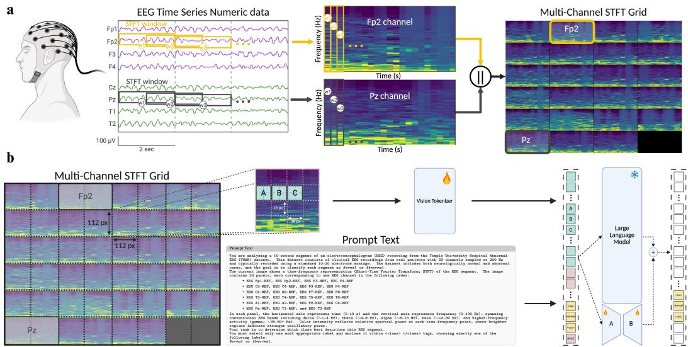  
Figure 1: BraVista framework. (a) Per-channel STFT spectrograms are arranged into a structured EEG image. (b) A fine-tuned vision encoder processes the image, while a task instruction specifies the dataset, decoding objective, and valid labels. Visual and textual tokens jointly condition a language decoder adapted with LoRA.

## 2 Method

The key idea of BraVista is to use visual representations as an interface that aligns EEG signals with the inductive biases of pretrained vision–language models. Given a multichannel EEG signal, we first transform it into a structured visual representation using a time–frequency mapping. This representation is paired with a task-specific textual instruction, and both modalities are processed jointly by a pretrained VLM.

EEG Time–Frequency Representation. We begin by formalizing the input EEG signals as $\mathbf { X } \in \mathbb { R } ^ { C \times T }$ , where C denotes the number of electrodes and T the number of time samples. The signal is partitioned into segments of length $L ,$ and then each segment is transformed into a time–frequency representation using the STFT, producing a spectrogram for each channel (see Appendix A for STFT parameters). Then, to form a unified visual input, we arrange channel-wise spectrograms into a structured grid (Fig. 1a). This results in an image-like representation that preserves discriminative time–frequency structure and provides a two-dimensional representation that allows vision-based models to capture temporal–spectral correlations [40, 41]. This representation is well suited for EEG analysis [5, 42, 43], as EEG signals exhibit non-stationary temporal–spectral dynamics, with task-relevant neural patterns encoded jointly across time and frequency [44].

EEG Instruction Construction. For each EEG sample, we construct structured instruction–response pairs that describe the decoding task in natural language. Our instructions provide contextual information about the EEG signal, conclude with an explicit task specification, and the response is defined by the corresponding ground-truth label. This design enables casting EEG decoding as an instruction-following problem and aligns with the training paradigm of VLMs, allowing the model to leverage its pretrained language understanding to perform instruction-conditioned prediction over EEG representations (see Appendix D for task-specific instruction details).

Training Framework of BraVista. To adapt a general-purpose VLM to EEG data, we perform continued post-training on the Qwen3-VL-2B model [45], whose pretrained visual understanding provides the foundation for EEG domain adaptation. We keep the original model architecture, which consists of three components: a SigLIP-2 vision encoder [46], a vision–language merger [34], and a language model decoder. We fully fine-tune the vision encoder to capture task-relevant temporal–spectral patterns in EEG data. This allows the model to align its visual representations with the structure of EEG signals while leveraging pretrained visual priors. To adapt the language model while preserving its pretrained linguistic and generative capabilities, we employ Low-Rank Adaptation (LoRA) [47], targeting the attention and MLP layers of the decoder. This formulation constrains task-specific updates to a low-dimensional subspace, enabling parameter-efficient adaptation while limiting drift from the pretrained language model.

Optimization for Multi-task EEG Decoding. We formulate multi-task EEG decoding as a conditional generation problem over multimodal inputs. Each input consists of an EEG image $\boldsymbol { \mathcal { T } } _ { \mathrm { E E G } }$ and a textual instruction $\mathbf { q } = \{ q _ { 1 } , \dots , q _ { M } \}$ . Given these multimodal inputs, we define BraVista as πθ parameterized by θ as an autoregressive conditional distribution over the output sequence $\mathbf { y } = \{ y _ { 1 } , \dots , y _ { K } \} ;$

$$
\pi _ { \boldsymbol { \theta } } ( \mathbf { y } \mid \mathcal { T } _ { \mathrm { E E G } } , \mathbf { q } ) = \prod _ { k = 1 } ^ { K } \pi _ { \boldsymbol { \theta } } ( y _ { k } \mid y _ { < k } , \mathcal { T } _ { \mathrm { E E G } } , \mathbf { q } ) ,\tag{1}
$$

where K is the length of the generated output sequence. This formulation allows the model to condition its predictions jointly on EEG visual features, task-level textual context, and prior outputs. To learn the conditional distribution in Eq. (1), we use the supervised fine-tuning (SFT) objective:

$$
\mathcal { L } = - \sum _ { k = 1 } ^ { K } \log p _ { \theta } ( y _ { k } \mid y _ { < k } , \mathcal { T } _ { \mathrm { E E G } } , \mathbf { q } ) .\tag{2}
$$

This objective trains the model to generate task-specific outputs conditioned jointly on the EEG visual input and the textual prompt, consistent with instruction-following training in LLMs [27, 48]. During training, gradients are propagated through the vision encoder and the LoRA parameters of the language model, enabling coordinated adaptation of visual and linguistic representations for multi-task EEG decoding. Implementation details are provided in Appendix C.2.

## 3 Experiments and Results

## 3.1 Evaluation Datasets and Baselines

We evaluate one jointly trained model on HMC sleep staging [49], SEED emotion recognition [50], EEGMAT cognitive-workload classification [51], and TUAB abnormality detection [52]. Dataset statistics are summarized in Table 2. We follow prior preprocessing and splits [18, 29, 53]. Furthermore, for the SEED dataset, we explicitly exclude foundation models whose pretraining data includes SEED to prevent data leakage. We report balanced accuracy as the primary evaluation metric and additionally report weighted F1 scores for ablation studies. All results are presented as mean ± standard deviation over three runs with different random seeds.

Our comparisons include: (1) supervised baselines trained separately for each dataset; (2) EEG foundation models, in which a single pretrained encoder is fine-tuned per downstream task; and (3) the EEG-language model NeuroLM, which is the closest unified baseline because it combines a learned EEG tokenizer with an instruction-tuned language model. The unadapted Qwen3-VL backbone provides a zero-shot control for whether generic VLMs alone can decode EEG.

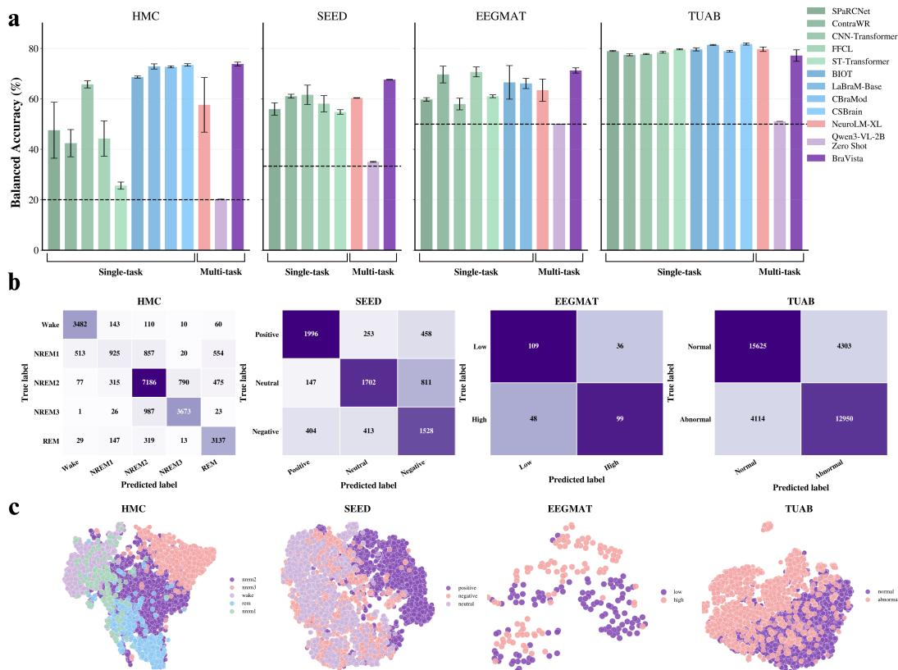  
Figure 2: Unified decoding across four EEG tasks. (a) Balanced accuracy of BraVista against supervised models, EEG foundation models, NeuroLM, and the zero-shot VLM backbone. (b) Confusion matrices. (c) t-SNE projections of learned embeddings, colored by class.

## 3.2 BraVista Enables Multi-Task EEG Decoding Across Diverse BCI Tasks

We compare BraVista with task-specific supervised and foundation models, the multi-task NeuroLM baseline [29], and the zero-shot VLM. As shown in Fig. 2a, BraVista consistently achieves strong performance while operating as a single unified model on all datasets. Importantly, BraVista substantially surpasses the zero-shot Qwen3-VL-2B across all datasets, highlighting that our post-training effectively aligns visual-linguistic priors with neural signal characteristics.

We further analyze the class-level behavior of BraVista using confusion matrices (Fig. 2b). The observed confusion patterns are consistent with known task-specific challenges. For example, in HMC, the model shows the largest confusion between NREM1 and NREM2, whose distinguishing transient graphoelements (such as sleep spindles and K-complexes) may be absent from a single 30-second epoch [54]. Similarly, for the SEED dataset, the confusion between Neutral and Negative classes reflects their overlapping neural patterns in the beta and gamma bands [50]. This suggests that many errors reflect intrinsic task difficulty rather than model failure, and that BraVista captures meaningful physiological structure in EEG signals. Finally, to evaluate the quality of the learned representations, we visualize the embeddings of BraVista using t-SNE (Fig. 2c). The embeddings show clustering patterns corresponding to class labels across datasets.

## 3.3 Time–Frequency Images Are the Effective Interface

We study how the choice of visual representation affects the ability of VLMs to interpret EEG signals. We replace the STFT grid with raw time-series plots or scalp topographies while holding the model and training procedure fixed. STFT obtains the highest balanced accuracy and weighted F1 across all four datasets (Fig. 3). This result highlights the importance of preserving time–frequency structure when adapting vision–language models to EEG data. Time-series plots retain temporal information and topographic maps capture spatial distributions, but neither provides a joint representation of temporal and spectral dynamics. In contrast, STFT representations provide a dense, structured visualization of neural activity that is more compatible with the visual processing capabilities of pretrained vision encoders.

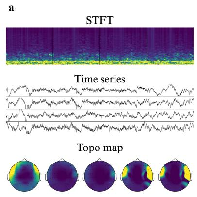

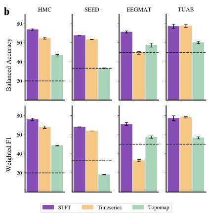  
Figure 3: The visual interface matters. (a) STFT, raw time-series, and scalp-topography inputs. (b) Balanced accuracy (top) and weighted F1 (bottom) across four datasets.

## 3.4 BraVista Relies on EEG Signal Structure Under Noise Corruption

To assess whether BraVista relies on EEG information encoded in the visual representation, we evaluate its behavior under controlled noise corruption by progressively adding noise to the input signals at different signal-to-noise ratios (20 dB, 10 dB, 5 dB, and 0 dB). As noise increases, performance degrades consistently and gradually rather than abruptly across all datasets for both balanced accuracy and weighted F1, and the performance remains above chance even under severe noise conditions (Fig. 4b). This gradual performance decay suggests that predictions depend on the quality of the underlying EEG signal rather than on superficial visual patterns.

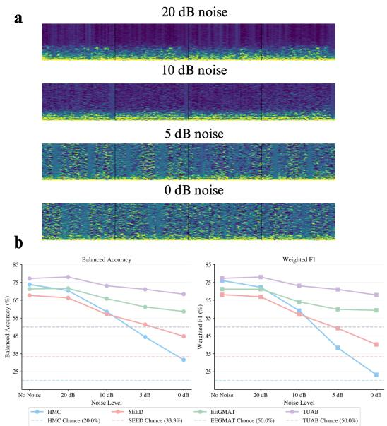

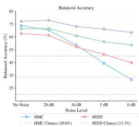

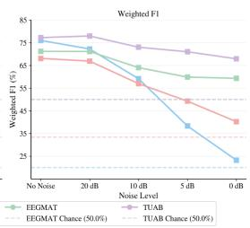  
Figure 4: Robustness of BraVista to EEG noise. (a) Examples of STFT under increasing noise levels (20 dB to 0 dB). (b) Balanced accuracy and weighted F1. Dashed lines indicate chance performance.

## 4 Discussion

In this work, we present BraVista, a framework that reformulates EEG decoding by interfacing neural signals with general-domain vision–language models. By transforming multichannel EEG recordings into time–frequency images and pairing them with task-specific instructions, we enable unified multitask decoding within a single model, without task-specific architectures or a separate large-scale EEGspecific pretraining stage. This framework shifts the focus from designing specialized EEG models to designing effective interfaces between neural signals and general-domain foundation models. Visual representations offer one such interface, enabling the reuse of powerful vision–language models for neural signal decoding.

Our results provide two main insights. First, the choice of EEG-to-image representation strongly affects decoding performance, with STFT spectrograms providing the most effective interface among the representations evaluated. Second, the gradual degradation under noise corruption, physiologically plausible class-level errors, and structure of the learned embeddings provide convergent evidence that BraVista uses EEG-relevant information rather than relying only on superficial visual patterns.

Despite these promising results, several limitations point to important directions for future work. While our framework enables instruction-conditioned multi-task decoding, it currently focuses on producing class labels without explicitly leveraging the reasoning capabilities of VLMs. Integrating reinforcement learning (RL) strategies, such as fine-tuning with process- or outcome-based reward models, presents a promising direction to explicitly guide model reasoning across temporal EEG segments, minimize false positives, and optimize step-by-step diagnostic hypotheses. Additionally, enabling models to reason or integrate contextual information (e.g., subject-specific metadata or clinical history) may improve performance on more complex and clinically relevant tasks [55]. Exploring such capabilities would move beyond classification toward more interpretable and interactive EEG analysis, better aligning neural decoding with the broader strengths of large multimodal models. Beyond decoding, a unified neural decoder could serve as the readout component of closed-loop neurotechnologies that pair neural recording with electrical stimulation [56–58]. Moreover, because BraVista operates on standard image inputs, it may integrate naturally with connected healthcare and medical imaging infrastructure [59]. Overall, this work suggests that representation design, combined with general-domain foundation models, provides a promising path toward scalable and unified EEG decoding.

## Acknowledgments and Disclosure of Funding

This work was supported by National Institutes of Health (NIH) grants R61MH135407, R01MH123770, and RF1DA056402, the One Mind Rising Star Award, and the Foundation for OCD Research (FFOR).

## References

[1] Ijaz Ahmad, Xin Wang, Danish Javeed, Prabhat Kumar, Oluwarotimi Williams Samuel, and Shixiong Chen. A hybrid deep learning approach for epileptic seizure detection in EEG signals. IEEE Journal ofBiomedical and Health Informatics, 2023.

[2] Chaoqi Yang, Danica Xiao, M Brandon Westover, and Jimeng Sun. Self-supervised EEG representation learning for automatic sleep staging. arXiv preprint arXiv:2110.15278, 2021.

[3] Robert Jenke, Angelika Peer, and Martin Buss. Feature extraction and selection for emotion recognition from EEG. IEEE Transactions on Affective computing, 5(3):327–339, 2014.

[4] Fabien Lotte, Laurent Bougrain, Andrzej Cichocki, Maureen Clerc, Marco Congedo, Alain Rakotomamonjy, and Florian Yger. A review of classification algorithms for EEG-based brain–computer interfaces: a 10 year update. Journal of neural engineering, 15(3):031005, 2018.

[5] Robin Tibor Schirrmeister, Jost Tobias Springenberg, Lukas Dominique Josef Fiederer, Martin Glasstetter, Katharina Eggensperger, Michael Tangermann, Frank Hutter, Wolfram Burgard, and Tonio Ball. Deep learning with convolutional neural networks for EEG decoding and visualization. Human brain mapping, 38(11):5391–5420, 2017.

[6] Vernon J Lawhern, Amelia J Solon, Nicholas R Waytowich, Stephen M Gordon, Chou P Hung, and Brent J Lance. EEGNet: a compact convolutional neural network for EEG-based brain–computer interfaces. Journal ofneural engineering, 15(5):056013, 2018.

[7] Ping Wang, Aimin Jiang, Xiaofeng Liu, Jing Shang, and Li Zhang. LSTM-based EEG classification in motor imagery tasks. IEEE transactions on neural systems and rehabilitation engineering, 26(11):2086–2095, 2018.

[8] Yannick Roy, Hubert Banville, Isabela Albuquerque, Alexandre Gramfort, Tiago H Falk, and Jocelyn Faubert. Deep learning-based electroencephalography analysis: a systematic review. Journal ofNeural Engineering, 16(5):051001, 2019.

[9] Huy Phan, Fernando Andreotti, Navin Cooray, Oliver Y Chén, and Maarten De Vos. SeqSleep-Net: end-to-end hierarchical recurrent neural network for sequence-to-sequence automatic sleep staging. IEEE Transactions on Neural Systems and Rehabilitation Engineering, 27(3):400–410, 2019.

[10] Yi Ding, Neethu Robinson, Su Zhang, Qiuhao Zeng, and Cuntai Guan. TSception: Capturing temporal dynamics and spatial asymmetry from EEG for emotion recognition. IEEE Transactions on Affective Computing, 14(3):2238–2250, 2023.

[11] Ruilong Zhang, Qun Zong, Liqian Dou, and Xinyi Zhao. A novel hybrid deep learning scheme for four-class motor imagery classification. Journal of neural engineering, 16(6):066004, 2019.

[12] Jialing Wang, Shiwei Cheng, Jieming Tian, and Yuefan Gao. A 2D CNN-LSTM hybrid algorithm using time series segments of EEG data for motor imagery classification. Biomedical Signal Processing and Control, 83:104627, 2023.

[13] Yonghao Song, Qingqing Zheng, Bingchuan Liu, and Xiaorong Gao. EEG Conformer: Convolutional transformer for EEG decoding and visualization. IEEE Transactions on Neural Systems and Rehabilitation Engineering, 31:710–719, 2022.

[14] Huy Phan, Kaare Mikkelsen, Oliver Y Chén, Philipp Koch, Alfred Mertins, and Maarten De Vos. Sleeptransformer: Automatic sleep staging with interpretability and uncertainty quantification. IEEE Transactions on Biomedical Engineering, 69(8):2456–2467, 2022.

[15] Demetres Kostas, Stephane Aroca-Ouellette, and Frank Rudzicz. BENDR: Using transformers and a contrastive self-supervised learning task to learn from massive amounts of EEG data. Frontiers in Human Neuroscience, 15:653659, 2021.

[16] Ke Yi, Yansen Wang, Kan Ren, and Dongsheng Li. Learning topology-agnostic EEG representations with geometry-aware modeling. Advances in Neural Information Processing Systems, 36:53875–53891, 2023.

[17] Chaoqi Yang, M. Brandon Westover, and Jimeng Sun. BIOT: Biosignal transformer for crossdata learning in the wild. In Advances in Neural Information Processing Systems, volume 36, pages 78240–78260, 2023.

[18] Wei-Bang Jiang, Li-Ming Zhao, and Bao-Liang Lu. Large brain model for learning generic representations with tremendous EEG data in BCI. In International Conference on Learning Representations, 2024.

[19] Jiquan Wang, Sha Zhao, Zhiling Luo, Yangxuan Zhou, Haiteng Jiang, Shijian Li, Tao Li, and Gang Pan. CBraMod: A criss-cross brain foundation model for EEG decoding. In International Conference on Learning Representations, 2025.

[20] Guangyu Wang, Wenchao Liu, Yuhong He, Cong Xu, Lin Ma, and Haifeng Li. Eegpt: Pretrained transformer for universal and reliable representation of eeg signals. Advances in Neural Information Processing Systems, 37:39249–39280, 2024.

[21] Yassine El Ouahidi, Jonathan Lys, Philipp Thölke, Nicolas Farrugia, Bastien Pasdeloup, Vincent Gripon, Karim Jerbi, and Giulia Lioi. REVE: A foundation model for EEG – adapting to any setup with large-scale pretraining on 25,000 subjects. arXiv preprint arXiv:2510.21585, 2025.

[22] Lucine L Oganesian, Saba Hashemi, and Maryam M. Shanechi. BaRISTA: Brain scale informed spatiotemporal representation of human intracranial neural activity. In The Thirty-ninth Annual Conference on Neural Information Processing Systems, 2025.

[23] Eray Erturk, Saba Hashemi, and Maryam M. Shanechi. Cross-modal representational knowledge distillation for enhanced spike-informed LFP modeling. In The Thirty-ninth Annual Conference on Neural Information Processing Systems, 2025.

[24] Sina Javadzadeh, Rahil Soroushmojdehi, S. Alireza Seyyed Mousavi, Mehrnaz Asadi, Sumiko Abe, and Terence D. Sanger. Functional embeddings enable aggregation of multi-area SEEG recordings over subjects and sessions. arXiv preprint arXiv:2510.27090, 2025.

[25] Mohammad Hosseini, Eray Erturk, Saba Hashemi, and Maryam M. Shanechi. Cross-subject modeling for widefield calcium imaging via atlas-aligned spatiotemporal tokenization. In Forty-third International Conference on Machine Learning, 2026.

[26] Tom Brown, Benjamin Mann, Nick Ryder, Melanie Subbiah, Jared D Kaplan, Prafulla Dhariwal, Arvind Neelakantan, Pranav Shyam, Girish Sastry, Amanda Askell, Sandhini Agarwal, Ariel Herbert-Voss, Gretchen Krueger, Tom Henighan, Rewon Child, Aditya Ramesh, Daniel Ziegler, Jeffrey Wu, Clemens Winter, Chris Hesse, Mark Chen, Eric Sigler, Mateusz Litwin, Scott Gray, Benjamin Chess, Jack Clark, Christopher Berner, Sam McCandlish, Alec Radford, Ilya Sutskever, and Dario Amodei. Language models are few-shot learners. In Advances in Neural Information Processing Systems, volume 33, pages 1877–1901, 2020.

[27] Hugo Touvron, Thibaut Lavril, Gautier Izacard, Xavier Martinet, Marie-Anne Lachaux, Timothée Lacroix, Baptiste Rozière, Naman Goyal, Eric Hambro, Faisal Azhar, Aurelien Rodriguez, Armand Joulin, Edouard Grave, and Guillaume Lample. LLaMA: Open and efficient foundation language models. arXiv preprint arXiv:2302.13971, 2023.

[28] Jonathan W Kim, Ahmed Alaa, and Danilo Bernardo. EEG-GPT: exploring capabilities of large language models for EEG classification and interpretation. arXiv preprint arXiv:2401.18006, 2024.

[29] Wei-Bang Jiang, Yansen Wang, Bao-Liang Lu, and Dongsheng Li. NeuroLM: A universal multi-task foundation model for bridging the gap between language and EEG signals. In International Conference on Learning Representations, 2025.

[30] Tidiane Camaret Ndir, Robin T Schirrmeister, and Tonio Ball. EEG-CLIP: Learning EEG representations from natural language descriptions. Frontiers in Robotics and AI, 12:1625731, 2025.

[31] Weiheng Lu, Chunfeng Song, Jiamin Wu, Pengyu Zhu, Yuchen Zhou, Weijian Mai, Qihao Zheng, and Wanli Ouyang. UniMind: Unleashing the power of LLMs for unified multi-task brain decoding. arXiv preprint arXiv:2506.18962, 2025.

[32] Ziyi Zeng, Zhenyang Cai, Yixi Cai, Xidong Wang, Junying Chen, Rongsheng Wang, Yipeng Liu, Siqi Cai, Benyou Wang, Zhiguo Zhang, and Haizhou Li. WaveMind: Towards a conversational EEG foundation model aligned to textual and visual modalities. arXiv preprint arXiv:2510.00032, 2025.

[33] Linxing Preston Jiang, Shirui Chen, Emmanuel Tanumihardja, Xiaochuang Han, Weijia Shi, Eric Shea-Brown, and Rajesh PN Rao. Data heterogeneity limits the scaling effect of pretraining neural data transformers. bioRxiv, 2025.

[34] Haotian Liu, Chunyuan Li, Qingyang Wu, and Yong Jae Lee. Visual instruction tuning. Advances in neural information processing systems, 36:34892–34916, 2023.

[35] Ming Jin, Shiyu Wang, Lintao Ma, Zhixuan Chu, James Y. Zhang, Xiaoming Shi, Pin-Yu Chen, Yuxuan Liang, Yuan-Fang Li, Shirui Pan, and Qingsong Wen. Time-LLM: Time series forecasting by reprogramming large language models. In International Conference on Learning Representations, 2024.

[36] Siru Zhong, Weilin Ruan, Ming Jin, Huan Li, Qingsong Wen, and Yuxuan Liang. Time-VLM: Exploring multimodal vision-language models for augmented time series forecasting. In International Conference on Machine Learning, 2025.

[37] Junru Zhang, Lang Feng, Xu Guo, Yuhan Wu, Yabo Dong, and Duanqing Xu. TimeMaster: Training time-series multimodal LLMs to reason via reinforcement learning. arXiv preprint arXiv:2506.13705, 2025.

[38] Tina Khezresmaeilzadeh, Parsa Razmara, Seyedarmin Azizi, Mohammad Erfan Sadeghi, and Erfan Baghaei Potraghloo. Vista: Vision-language inference for training-free stock time-series analysis. arXiv preprint arXiv:2505.18570, 2025.

[39] Zelin He, Sarah Alnegheimish, and Matthew Reimherr. Harnessing vision-language models for time series anomaly detection. In Proceedings ofthe AAAI Conference on Artificial Intelligence, volume 40, pages 21690–21698, 2026.

[40] Jinpeng Li, Zhaoxiang Zhang, and Huiguang He. Hierarchical convolutional neural networks for EEG-based emotion recognition. Cognitive Computation, 10(2):368–380, 2018.

[41] Chengfan Li, Yueyu Qi, Xuehai Ding, Junjuan Zhao, Tian Sang, and Matthew Lee. A deep learning method approach for sleep stage classification with EEG spectrogram. International journal of environmental research and public health, 19(10):6322, 2022.

[42] Alexander Craik, Yongtian He, and Jose L Contreras-Vidal. Deep learning for electroencephalogram (EEG) classification tasks: a review. Journal of neural engineering, 16(3):031001, 2019.

[43] Christopher Wang, Vighnesh Subramaniam, Adam Uri Yaari, Gabriel Kreiman, Boris Katz, Ignacio Cases, and Andrei Barbu. BrainBERT: Self-supervised representation learning for intracranial recordings. In International Conference on Learning Representations, 2023.

[44] Scott Makeig, Marissa Westerfield, T-P Jung, Sonia Enghoff, Jeanne Townsend, Eric Courchesne, and Terrence J Sejnowski. Dynamic brain sources of visual evoked responses. Science, 295(5555):690–694, 2002.

[45] Shuai Bai, Yuxuan Cai, Ruizhe Chen, Keqin Chen, Xionghui Chen, Zesen Cheng, Lianghao Deng, Wei Ding, Chang Gao, Chunjiang Ge, et al. Qwen3-VL technical report. arXiv preprint arXiv:2511.21631, 2025.

[46] Michael Tschannen, Alexey Gritsenko, Xiao Wang, Muhammad Ferjad Naeem, Ibrahim Alabdulmohsin, Nikhil Parthasarathy, Talfan Evans, Lucas Beyer, Ye Xia, Basil Mustafa, Olivier Hénaff, Jeremiah Harmsen, Andreas Steiner, and Xiaohua Zhai. SigLIP 2: Multilingual vision language encoders with improved semantic understanding, localization, and dense features. arXiv preprint arXiv:2502.14786, 2025.

[47] Edward J Hu, Yelong Shen, Phillip Wallis, Zeyuan Allen-Zhu, Yuanzhi Li, Shean Wang, Lu Wang, and Weizhu Chen. LoRA: Low-rank adaptation of large language models. In International Conference on Learning Representations, 2022.

[48] Long Ouyang, Jeffrey Wu, Xu Jiang, Diogo Almeida, Carroll Wainwright, Pamela Mishkin, Chong Zhang, Sandhini Agarwal, Katarina Slama, Alex Ray, John Schulman, Jacob Hilton, Fraser Kelton, Luke Miller, Maddie Simens, Amanda Askell, Peter Welinder, Paul F Christiano, Jan Leike, and Ryan Lowe. Training language models to follow instructions with human feedback. In Advances in Neural Information Processing Systems, volume 35, pages 27730– 27744, 2022.

[49] Diego Alvarez-Estevez and Roselyne M Rijsman. Inter-database validation of a deep learning approach for automatic sleep scoring. PloS one, 16(8):e0256111, 2021.

[50] Wei-Long Zheng and Bao-Liang Lu. Investigating critical frequency bands and channels for EEG-based emotion recognition with deep neural networks. IEEE Transactions on Autonomous Mental Development, 7(3):162–175, 2015.

[51] Igor Zyma, Sergii Tukaev, Ivan Seleznov, Ken Kiyono, Anton Popov, Mariia Chernykh, and Oleksii Shpenkov. Electroencephalograms during mental arithmetic task performance. Data, 4(1):14, 2019.

[52] Iyad Obeid and Joseph Picone. The Temple University Hospital EEG data corpus. Frontiers in neuroscience, 10:196, 2016.

[53] Yuchen Zhou, Jiamin Wu, Zichen Ren, Zhouheng Yao, Weiheng Lu, Kunyu Peng, Qihao Zheng, Chunfeng Song, Wanli Ouyang, and Chao Gou. CSBrain: A cross-scale spatiotemporal brain foundation model for EEG decoding. In Advances in Neural Information Processing Systems, 2025.

[54] Raman K Malhotra. AASM scoring manual 3: a step forward for advancing sleep care for patients with obstructive sleep apnea. Journal of Clinical Sleep Medicine, 20(5):835–836, 2024.

[55] Yasaman Torabi, Parsa Razmara, Hamed Ajorlou, and Bardia Baraeinejad. NeuroMambaLLM: Dynamic graph learning of fMRI functional connectivity in autistic brains using Mamba and language model reasoning. arXiv preprint arXiv:2602.13770, 2026.

[56] Omid Sharafi, Timothy Silliman, Hadi Mokhtari Dowlatabad, Gengle Niu, Steven T Walston, Jean-Marie C Bouteiller, Kimberly K Gokoffski, and Gianluca Lazzi. Population-scale analysis of frequency-dependent calcium dynamics in retinal ganglion cells under electric field stimulation. Scientific Reports, 2026.

[57] Nicholas Householder, Omid Sharafi, Anahit Simonyan, Steven T Walston, Gianluca Lazzi, Michael Bienkowski, and Kimberly K Gokoffski. Extraocular electrical stimulation activates retinal ganglion cells in vivo. bioRxiv, pages 2026–09, 2026.

[58] Omid Sharafi, Jingyi Yang, Bin Lin, Winston Luk Wahei, NICHOLAS HOUSEHOLDER, Gianluca Lazzi, Kimberly Gokoffski, et al. High frequency electric field stimulation reversibly silences retinal activity and downstream cortical responses. Investigative Ophthalmology & Visual Science, 67(7):3132–3132, 2026.

[59] MohammadReza Einollahi Asgarabad, Shaghayegh Mohammadi Khaveh, Fatemeh Ashtiani, Pooneh Shabani Arpachaei, and Ali Jamali Nazari. Internet of things advances in medical imaging: approaches, applications, and feasibility for improving healthcare. Applications, and Feasibility for Improving Healthcare (January 01, 2023), 2023.

[60] Jin Jing, Wendong Ge, Shenda Hong, Marta Bento Fernandes, Zhen Lin, Chaoqi Yang, Sungtae An, Aaron F Struck, Aline Herlopian, Ioannis Karakis, et al. Development of expert-level classification of seizures and rhythmic and periodic patterns during EEG interpretation. Neurology, 100(17):e1750–e1762, 2023.

[61] Wei Yan Peh, Yuanyuan Yao, and Justin Dauwels. Transformer convolutional neural networks for automated artifact detection in scalp EEG. In 2022 44th Annual International Conference of the IEEE Engineering in Medicine & Biology Society (EMBC), pages 3599–3602. IEEE, 2022.

[62] Hongli Li, Man Ding, Ronghua Zhang, and Chunbo Xiu. Motor imagery EEG classification algorithm based on CNN-LSTM feature fusion network. Biomedical signal processing and control, 72:103342, 2022.

[63] Yonghao Song, Xueyu Jia, Lie Yang, and Longhan Xie. Transformer-based spatial-temporal feature learning for EEG decoding. arXiv preprint arXiv:2106.11170, 2021.

## Appendix

## A Time–Frequency Representation Parameters

For each channel $c \in C$ , the STFT is computed as

$$
X _ { c } ( \tau , \omega ) = \sum _ { t } x _ { c } ( t ) w ( t - \tau ) e ^ { - j \omega t } ,\tag{3}
$$

where $w ( \cdot )$ denotes a window function and τ indexes the window center. We use a window size of 400 samples (2 seconds) with an overlap of 300 samples (1.5 seconds). We retain the magnitude spectrogram

$$
S _ { c } ( \tau , f ) = \left| X _ { c } ( \tau , 2 \pi f ) \right| ,\tag{4}
$$

which captures localized spectral energy over time. The frequency axis is also truncated to a fixed upper bound of 100 Hz to focus on physiologically relevant EEG bands and to suppress high-frequency noise.

## B Baselines

Here, we categorize the baseline methods used for our comparisons:

## Task-specific supervised models:

• SPaRCNet [60] is a deep neural network based on one-dimensional CNNs with dense residual connections for EEG decoding.

• ContraWR [2] is a CNN-based model that first transforms EEG signals into multi-channel spectrogram representations and then applies a ResNet-style two-dimensional CNN to extract discriminative features from the spectrograms.

• CNN-Transformer [61] utilizes CNNs to extract local features and transformer layers to model global dependencies in EEG signals.

• FFCL [62] employs parallel CNN and LSTM layers, where the CNN captures spatial features and the LSTM models temporal dynamics; features from both layers are then fused for classification.

• ST-Transformer [63] is a transformer-based architecture that uses attention mechanisms to learn spatial and temporal representations from EEG signals.

## Foundation models:

• BIOT [17] is a transformer-based model for learning general-purpose biosignal representations using a mix of supervised and unsupervised pretraining. The pretrained model supports up to 18 EEG channels as input. For recordings with more than 18 channels, a 1 × 1 convolution is used to reduce the input to 18 channels.

• LaBraM [18] is a large-scale EEG foundation model pretrained in an unsupervised manner on over 2,500 hours of diverse EEG data. It learns universal EEG representations by segmenting raw signals into channel-wise patches and employing vector-quantized neural spectrum prediction as a tokenizer, with a Transformer backbone capturing both temporal and spatial features for downstream applicability.

• CBraMod [19] is an EEG foundation model that learns generic representations via patchbased masked EEG reconstruction. It employs a criss-cross transformer to jointly model spatial and temporal dependencies across EEG patches in parallel, along with an asymmetric convolutional positional encoding to capture diverse spatial–temporal signal formats.

• CSBrain [53] is a cross-subject brain foundation model that captures shared neural patterns across individuals through large-scale pretraining, aiming to enhance robustness and adaptability to downstream EEG analysis tasks.

## Multi-task LLMs:

• NeuroLM [29] is a multi-task EEG foundation model that learns a neural tokenizer that converts EEG signals into discrete tokens, which are passed to a large language model. It is pretrained on a large-scale EEG corpus to learn generic representations and is fine-tuned using instruction tuning.

## C Experimental Settings

## C.1 Implementation Details

We train BraVista for 1 epoch with an effective batch size of 128, using a local batch size of 8 and gradient accumulation steps of 4. Training is performed on 4 NVIDIA RTX A6000 GPUs for 12 hours. We apply a linear warm-up over the first 3% of total training steps, followed by a cosine learning rate decay schedule. The language model decoder is optimized using the AdamW optimizer with a peak learning rate of $1 \times 1 0 ^ { - 4 }$ , while the vision encoder is trained with a learning rate of $2 \times 1 0 ^ { - 6 }$

## C.2 Hyperparameter Settings

Table 1: Post-training hyperparameters.
<table><tr><td>Hyperparameters</td><td>Value</td></tr><tr><td>Base Model</td><td>Qwen3-VL-2B-Instruct</td></tr><tr><td>Training mode</td><td>LLM LoRA + vision encoder</td></tr><tr><td>Batch size per device</td><td>8</td></tr><tr><td>Number of devices</td><td>4</td></tr><tr><td>Global batch size</td><td>128</td></tr><tr><td>Gradient accumulation steps</td><td>4</td></tr><tr><td>Epochs</td><td>1</td></tr><tr><td>Learning rate (LLM/LoRA parameters)</td><td> $1 \times 1 0 ^ { - 4 }$ </td></tr><tr><td>Learning rate (Vision)</td><td> $2 \times 1 0 ^ { - 6 }$ </td></tr><tr><td>Weight decay</td><td>0.1</td></tr><tr><td>Warmup ratio</td><td>0.03</td></tr><tr><td>LR scheduler</td><td>Cosine</td></tr><tr><td>Freeze vision tower</td><td>False</td></tr><tr><td>Freeze LLM</td><td>True</td></tr><tr><td>Tune merger</td><td>False</td></tr><tr><td>LoRA rank (r)</td><td>32</td></tr><tr><td>LoRA scaling factor (α)</td><td>64</td></tr><tr><td>LoRA dropout</td><td>0.05</td></tr></table>

The hyperparameter settings in Table 1 correspond to the jointly trained BraVista model.

## C.3 Metrics

In this section, we describe the evaluation metrics used throughout the paper. We report evaluation metrics that account for class imbalance and task heterogeneity, which are common characteristics of EEG datasets. In many EEG classification settings, label distributions are imbalanced across classes, making standard accuracy insufficient to fully capture model performance. Following prior work in EEG foundation models [18], we adopt metrics that provide a more balanced and informative evaluation.

• Balanced Accuracy is computed as the average recall across all classes. It accounts for imbalanced label distributions by giving equal weight to each class and is used for both binary and multi-class classification tasks. This metric is particularly suitable for

EEG classification tasks with imbalanced label distributions, as it prevents performance on majority classes from dominating the overall score.

• Weighted F1 is the average of per-class F1 scores, weighted by the number of samples in each class. It captures both precision and recall while reflecting the overall data distribution, providing a complementary view of performance that emphasizes effectiveness on more prevalent classes.

## D Dataset Details

This section describes the datasets, preprocessing procedures, data splitting protocols, and the generated image and instruction for each dataset.

Table 2: Evaluation datasets span heterogeneous acquisition settings and tasks.
<table><tr><td>Dataset</td><td>Task</td><td>Channels</td><td>Sampling</td><td>Segment</td><td>Samples</td></tr><tr><td>HMC</td><td>Sleep stage (5-class)</td><td>4</td><td>256 Hz</td><td>30 s</td><td>137,243</td></tr><tr><td>SEED</td><td>Emotion (3-class)</td><td>62</td><td>1000 Hz</td><td>4 s</td><td>38,475</td></tr><tr><td>EEGMAT</td><td>Workload (binary)</td><td>19</td><td>500 Hz</td><td>4 s</td><td>2,088</td></tr><tr><td>TUAB</td><td>Abnormality (binary)</td><td>23</td><td>256 Hz</td><td>10 s</td><td>409,455</td></tr></table>

## D.1 Sleep Stage Classification

The Haaglanden Medisch Centrum (HMC) [49] sleep staging dataset is a large EEG corpus collected for automated sleep stage classification. It contains overnight EEG recordings from 151 subjects with segments labeled according to five standard sleep stages: Wake, NREM1, NREM2, NREM3, and REM. EEG signals were recorded from four channels (F4–M1, C4–M1, O2–M1, and C3–M2) using a clinical 10–20 montage and sampled at 256Hz. Following the NeuroLM [29] preprocessing settings, the raw signals are bandpass filtered between 0.1Hz and 75Hz, notch filtered at 50Hz to mitigate power-line interference, resampled to 200Hz, and normalized by dividing signal amplitudes by 100. For data division, the first 100 subjects are used for training, the next 25 subjects for validation, and the final 26 subjects for testing.

Each preprocessed EEG segment is converted into an STFT image and paired with a dataset-specific natural language prompt for sleep stage classification. An example STFT image for the sleep staging dataset is shown in Figure 5. The STFT representations of the EEG channels are arranged in a grid according to the channel ordering provided by the dataset. In particular, the 4 channels are placed into a 1 × 4 grid, where each channel has a resolution of 224 × 448 resulting in a final image resolution of 224 × 1792.

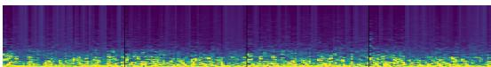  
Figure 5: Sample HMC STFT image.

EEG Sleep Stage Classification Prompt   
<image> You are analyzing a 30-second segment from a full-night electroencephalogram (EEG) recording from   
the Haaglanden Medisch Centrum (HMC) sleep staging dataset.   
This dataset contains EEG recordings from 151 subjects, with segments corresponding to one of the following   
5 sleep stages:   
Wake (Conscious awareness), NREM1 (Sleep onset), NREM2 (Light stable sleep), NREM3 (Deep restorative sleep),   
and REM (Dream associated sleep).   
Recordings include EEG sampled at 200 Hz recorded from 4 channels: EEG F4-M1, EEG C4-M1, EEG O2-M1, and   
EEG C3-M2.   
The current image shows a time-frequency representation (Short-Time Fourier Transform; STFT) of the EEG   
segment.   
The image contains four panels (left to right): EEG F4-M1, EEG C4-M1, EEG O2-M1, and EEG C3-M2.   
In each panel, the horizontal axis represents time (0-30 s) and the vertical axis represents frequency   
(0-100Hz), spanning conventional EEG bands including delta (∼1-4 Hz), theta (∼4-8 Hz), alpha (∼8-13 Hz),   
beta (∼13-30 Hz), and higher-frequency activity (gamma; ∼30-80+ Hz).

Color intensity reflects relative spectral power at each time–frequency point, where brighter regions   
indicate stronger oscillatory power.   
Your task is to determine the sleep stage associated with this 30-second EEG segment.   
You MUST only select ONE most appropriate label and enclose it within <class> </class> tags, choosing   
exactly one of the following labels:   
"Wake", "NREM1", "NREM2", "NREM3", or "REM".

## D.2 Emotion Recognition

SEED (SJTU Emotion EEG Dataset) [50] comprises EEG recordings from 15 subjects watching emotion-eliciting Chinese film clips corresponding to three affective states: positive, neutral, and negative. EEG signals were recorded using 62 channels at a sampling rate of 1000 Hz across three experimental sessions per subject, with each session containing 15 trials evenly distributed across the three emotion categories. Following the NeuroLM [29] preprocessing settings, the EEG signals are bandpass filtered between 0.1 Hz and 75 Hz, notch filtered at 50 Hz to remove power-line interference, resampled to 200 Hz, and normalized by dividing signal amplitudes by 100. For data splitting, we follow a chronological trial-based protocol: the 15 trials are split into training, validation, and test sets using a 9:3:3 ratio, respectively, and all sessions are merged to form the final splits.

Each preprocessed EEG segment is converted into an STFT image and paired with a dataset-specific natural language prompt for emotion classification. An example STFT image for the SEED dataset is shown in Figure 6. The STFT representations of the EEG channels are arranged in a grid according to the channel ordering provided by the dataset. In particular, the 62 channels are placed into an 8 × 8 grid, where each channel has a resolution of 112 × 112 resulting in a final image resolution of 896 × 896.

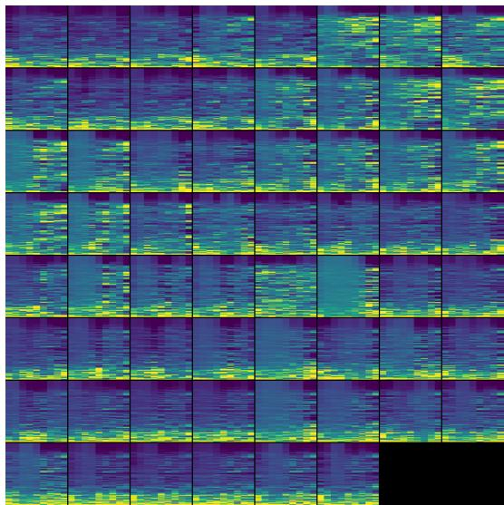  
Figure 6: Sample SEED STFT image.

EEG Emotion Recognition Prompt   
<image> You are analyzing a 4-second segment from an electroencephalogram (EEG) recording from the SJTU   
Emotion EEG Dataset (SEED).   
This dataset contains EEG recordings collected from multiple subjects while they watched emotionally   
evocative video clips.   
Each EEG segment corresponds to one of the following emotional states:   
Positive (pleasant or high-valence emotion), Neutral (emotionally calm or baseline), or Negative   
(unpleasant or low-valence emotion).   
Recordings include EEG signals sampled at 200 Hz and recorded from 62 channels.   
The current image shows a time–frequency representation (Short-Time Fourier Transform; STFT) of the EEG   
segment.   
The image contains 62 panels corresponding to each of the EEG channels.   
In each panel, the horizontal axis represents time (seconds) and the vertical axis represents frequency   
(0-100 Hz), spanning standard EEG bands including delta (∼1-4 Hz), theta (∼4-8 Hz), alpha (∼8-13 Hz),   
beta (∼13-30 Hz), and higher-frequency activity (gamma; ∼30-80+ Hz).   
Color intensity reflects relative spectral power at each time–frequency point, where brighter regions   
indicate stronger oscillatory power.

Your task is to determine the emotional state associated with this EEG segment.   
You MUST only select ONE most appropriate label and enclose it within <class> </class> tags, choosing exactly one of the following labels:   
"Positive", "Neutral", or "Negative".

## D.3 Mental Arithmetic Task

The EEG During Mental Arithmetic Tasks dataset (EEGMAT) [51] comprises EEG recordings from 36 subjects performing mental arithmetic tasks and resting-state conditions. EEG signals were recorded using 19 channels arranged according to the international 10–20 system and sampled at 500 Hz. During the task condition, subjects performed a serial subtraction task, inducing a high cognitive workload, while the resting condition corresponds to a low workload state. Each recording consists of continuous EEG data, which we segment into non-overlapping 4-second windows for classification. The EEG signals are bandpass filtered between 0.1 Hz and 75 Hz, notch filtered at 50 Hz to remove power-line interference, resampled to 200 Hz, and normalized by dividing signal amplitudes by 100. We adopt a subject-independent split, using subjects 0–25 for training, 26–30 for validation, and 31–35 for testing.

Each preprocessed EEG segment is converted into an STFT image and paired with a dataset-specific natural language prompt for mental arithmetic detection. An example STFT image for the mental arithmetic dataset is shown in Figure 7. The STFT representations of the EEG channels are arranged in a grid according to the channel ordering provided by the dataset. In particular, the 19 channels are placed into a 5 × 4 grid, where each channel has a resolution of 112 × 224 resulting in a final image resolution of 560 × 896.

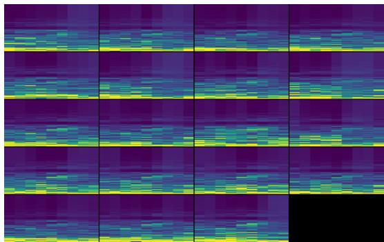  
Figure 7: Sample EEGMAT STFT image.

EEG Mental Arithmetic Detection Prompt   
<image> You are analyzing a 4-second segment of an electroencephalogram (EEG) recording from the EEG During   
Mental Arithmetic Tasks (Zyma et al., 2019) dataset.   
This dataset contains EEG recordings from 36 subjects from 19 channels sampled at 200 Hz and typically   
recorded using a standard 10-20 electrode montage.   
Each EEG segments corresponds either to serial subtraction tasks (high cognitive workload) or to   
resting-state EEG (low cognitive workload).   
The current image shows a time-frequency representation (Short-Time Fourier Transform; STFT) of the EEG   
segment.   
The image contains 19 panels each corresponding to one EEG channel in the following order:   
EEG Fp1, EEG Fp2, EEG F3, EEG F4,   
EEG F7, EEG F8, EEG T3, EEG T4,   
EEG C3, EEG C4, EEG T5, EEG T6,   
EEG P3, EEG P4, EEG O1, EEG O2,   
EEG Fz, EEG Cz, EEG Pz.   
In each panel, the horizontal axis represents time (0-4 s) and the vertical axis represents frequency   
(0-100Hz), spanning conventional EEG bands including delta (∼1-4 Hz), theta (∼4-8 Hz), alpha (∼8-13 Hz),   
beta (∼13-30 Hz), and higher-frequency activity (gamma; ∼30-80+ Hz).   
Color intensity reflects relative spectral power at each time–frequency point, where brighter regions   
indicate stronger oscillatory power.   
Your task is to determine the cognitive workload level associated with this EEG segment.   
You MUST only select ONE most appropriate label and enclose it within <class> </class> tags, choosing   
exactly one of the following labels: "Low" or "High".

## D.4 Abnormality Detection

The Temple University Hospital Abnormal EEG (TUAB) dataset [52] is a large-scale clinical EEG corpus designed for abnormality detection in EEG recordings. It contains EEG data collected from patients in a clinical setting, where each recording is labeled as either normal or abnormal based on expert neurological assessment. EEG signals are recorded using 23 channels following the standard 10–20 electrode montage and sampled at 256 Hz. For this task, continuous EEG recordings are segmented into non-overlapping 10-second clips, each inheriting the label of the corresponding recording. The EEG signals are bandpass filtered between 0.1 Hz and 75 Hz, notch filtered at 50 Hz to remove power-line interference, resampled to 200 Hz, and normalized by dividing signal amplitudes by 100. The dataset provides an official patient-level split into training and test sets; we further divide the training set into training and validation subsets using an 80%:20% ratio.

Each preprocessed EEG segment is converted into an STFT image and paired with a dataset-specific natural language prompt for abnormality detection. An example STFT image for the TUAB dataset is shown in Figure 8. The STFT representations of the EEG channels are arranged in a grid according to the channel ordering provided by the dataset. In particular, the 23 channels are placed into a 6 × 4 grid, where each channel has a resolution of 112 × 224 resulting in a final image resolution of 672 × 896.

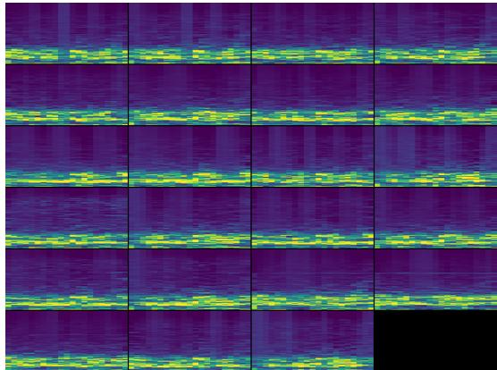  
Figure 8: Sample TUAB STFT image.

EEG Abnormal Detection Prompt   
<image> You are analyzing a 10-second segment of an electroencephalogram (EEG) recording from the Temple   
University Hospital Abnormal EEG (TUAB) dataset.   
This dataset consists of clinical EEG recordings from real patients from 23 channels sampled at 200 Hz and   
typically recorded using a standard 10-20 electrode montage.   
The dataset includes both neurologically normal and abnormal cases, and the goal is to classify each   
segment as "Normal" or "Abnormal".   
The current image shows a time–frequency representation (Short-Time Fourier Transform; STFT) of the EEG   
segment.   
The image contains 23 panels each corresponding to one EEG channel in the following order:   
EEG Fp1-REF, EEG Fp2-REF, EEG F3-REF, EEG F4-REF,   
EEG C3-REF, EEG C4-REF, EEG P3-REF, EEG P4-REF,   
EEG O1-REF, EEG O2-REF, EEG F7-REF, EEG F8-REF,   
EEG T3-REF, EEG T4-REF, EEG T5-REF, EEG T6-REF,   
EEG A1-REF, EEG A2-REF, EEG Fz-REF, EEG Cz-REF,   
EEG Pz-REF, EEG T1-REF, and EEG T2-REF.   
In each panel, the horizontal axis represents time (0-10 s) and the vertical axis represents frequency   
(0-100Hz), spanning conventional EEG bands including delta (∼1-4 Hz), theta (∼4-8 Hz), alpha (∼8-13 Hz),   
beta (∼13-30 Hz), and higher-frequency activity (gamma; ∼30-80+ Hz).   
Color intensity reflects relative spectral power at each time–frequency point, where brighter regions   
indicate stronger oscillatory power.   
Your task is to determine which class best describes this EEG segment.   
You MUST only select ONE most appropriate label and enclose it within <class> </class> tags, choosing   
exactly one of the following labels:   
"Normal" or "Abnormal".