# NAViLoss: An Underwater Navigation-Aware Dual-Residual Objective for Physics-Consistent Learning

Arup Kumar Sahooa,∗, Itzik Kleina

aThe Hatter Department of Marine Technologies, Leon H. Charney School of Marine Sciences, University of Haifa, Haifa, 3498838, Israel

## A R T I C L E I N F O

Keywords:   
DeepONet   
Sensor fusion   
Loss function   
Inertial sensors   
Doppler velocity log   
Underwater navigation   
Physics-informed learning   
Autonomous underwater vehi  
cles

## A BS T RA C T

Autonomous underwater vehicles (AUVs) commonly rely on inertial navigation systems (INS) aided by Doppler velocity logs (DVLs) for reliable underwater navigation. Accurate DVL velocity estimation is therefore essential for successful operation. Recent learning-based methods have demonstrated improved DVL velocity estimation, particularly under degraded measurement conditions. However, their training objectives typically rely on conventional regression losses that are highly sensitive to large residuals and corrupted observations. Additionally, they do not explicitly account for the physical consistency and measurement uncertainty associated with the underlying sensing process. To address these limitations, this paper introduces navigation-aware loss (NAViLoss), a robust and uncertaintyaware objective function for learning-based AUV velocity estimation. NAViLoss jointly penalizes the velocity-estimation residual in the navigation-state domain and the beam-consistency residual in the DVL measurement domain. Its bounded formulation limits the influence of large residuals, while an adaptive mechanism regulates the uncertainty in beam geometry. Furthermore, NAViLoss is integrated with a DeepONet architecture to form a novel NAVi-DeepONet model for seamless estimation of an underwater vehicle’s velocity. Lastly, our model is evaluated using approximately 10,000m of semi-synthetic AUV experimental data collected during multiple real-world sea trials. Experimental results demonstrate a 44% improvement in velocity-estimation accuracy compared with conventional and learningbased baselines. These results demonstrate the efectiveness of navigation-aware and uncertainty-adaptive loss design for robust learning-based underwater velocity estimation.

## 1. Introduction

Autonomous underwater vehicles (AUVs) have been increasingly deployed for maritime research, seafloor mapping, ofshore resource exploration, environmental monitoring, and subsea infrastructure inspection [1, 2, 3, 4]. Reliable estimation of their position, velocity, and orientation is fundamental to the successful execution of these operations. AUVs predominantly operate in underwater environments and have no access to global navigation satellite system (GNSS) signals and external aids. Therefore, they typically rely on inertial navigation systems and Doppler velocity logs (DVL) [5, 6, 7] for accurate navigation. An INS continuously propagates the navigation solution from accelerometer and gyroscope measurements, but measurement noise and sensor biases lead to accumulated errors and increase drift over time [8, 9, 10]. DVLs are therefore commonly employed to constrain this drift by providing independent velocity information. In bottom-lock mode, four acoustic beams are directed toward the seabed, and their Doppler frequency shifts are used to determine the vehicle velocity [11, 12]. The resulting beam measurements are related to the vehicle velocity through a known DVL observation geometry.

Despite the importance of DVL measurements in underwater navigation, they are susceptible to degradation. Acoustic interference, environmental conditions, vehicle motion, limited bottom visibility, and partial beam availability can introduce corrupted measurements or result in the loss of one or more DVL beams. Such degradation directly afects the quality of the velocity information available for navigation. In particular, missing beams alter the measurement geometry and reduce the information available for estimating the three-dimensional vehicle velocity. Over the years, various model-based approaches have been investigated to improve DVL-based velocity estimation, including least-squares (LS) estimation, loosely and tightly coupled integration, factor-graph optimization, and information-aided estimation methods [13, 14, 15]. Nevertheless, robust velocity estimation under noisy and incomplete DVL measurements remains an important challenge for reliable AUV navigation.

Recent advances in deep learning, computational power, and open-source libraries have substantially improved the adoption of learning-based (LR-based) technologies to address these limitations. LR-based methods have been increasingly investigated for underwater velocity estimation, sensor fusion, DVL beam reconstruction, and navigation under degraded measurement conditions [16, 17, 18, 19]. In a pioneer research, DCNet [20] employed convolutional neural networks (CNN) to improve DVL calibration, whereas UDON [21] applied a data-driven framework for DVL-based underwater odometry. In recent research, a physics-guided PiDR [22] model was introduced for AUV navigation using inertial measurements. Building on the same concept, A-LUKF [23], a physicsguided filtering model, was proposed for AUV navigation in degraded underwater environments. In the domain of multi-sensor fusion, DMIAN [24] ofered a LR-based inertial/DVL fusion through navigation error-state estimation. ResAlignNet [12] further addressed inertial/DVL sensor alignment by estimating the transformation matrix between the two sensing modalities. These approaches can learn complex relationships between inertial/DVL measurements and have demonstrated improved estimation capability compared with conventional model-based approaches under nominal operating conditions.

While considerable attention has been devoted to developing advanced LR-based architectures, comparatively less attention has been given to the objective functions used to train them. The choice of the loss function influences the optimization behavior, robustness, and generalization capability of the learned model. Existing LR-based approaches are typically optimized using conventional regression objectives such as mean squared error (MSE), mean absolute error (MAE), Huber loss, or weighted variants. Among these, the MSE remains particularly popular owing to its minimal complexity and computational eficiency. However, its quadratic penalization makes it highly sensitive to large residuals and corrupted observations. The MAE reduces the influence of large errors through linear penalization, whereas Huber loss, Smooth- $L _ { 1 } ,$ log-cosh, and Charbonnier losses provide intermediate behavior between quadratic and linear penalties [25, 26]. More robust objectives, including the Cauchy, Welsch [27], Geman–McClure [28], Tukey biweight [29], Barron’s adaptive robust loss [30], and RoBoSS loss [31], further reduce the influence of large residuals through bounded or slowly increasing penalties. Despite their robustness characteristics, these objectives primarily operate in the prediction space. They do not explicitly exploit the physical observation model that relates the predicted state to the measured state.

Physics-informed learning provides a natural means of bridging this gap by incorporating prior physical knowledge into neural-network optimization [32, 33, 34]. For DVL-based navigation, the known geometric relationship between the three-dimensional vehicle velocity and the measured beam velocities provides an additional source of physical information during learning. A physics-informed learning objective can therefore consider not only the error between the predicted and reference velocities but also the consistency of the prediction with the observed DVL beams. However, simply combining these residuals using conventional quadratic penalties [17] does not account for changes in measurement uncertainty. Additionally, these objectives generally assume complete observations or well-defined physical constraints. This limitation becomes particularly important under partial beam availability, where the information provided by the DVL measurements depends on the available beam measurement geometry. Hence, a navigation-oriented learning objective should simultaneously account for prediction accuracy, measurement consistency, robustness to large residuals, and variations in measurement uncertainty.

To address these limitations, this paper introduces NAViLoss, a navigation-aware robust loss function for LR-based AUV velocity estimation. NAViLoss jointly penalizes residuals in the navigationstate space and the DVL beam-measurement space. Its bounded formulation limits the influence of large residuals, while an uncertainty-aware mechanism adapts the contribution of the beam-domain information according to the available DVL measurement geometry. The proposed objective therefore integrates prediction accuracy, DVL measurement consistency, robustness, and uncertainty awareness within a unified optimization framework. In addition to the proposed formulation, we establish the fundamental analytical properties of NAViLoss and characterize its behavior under both small and large residual regimes. The proposed loss is further integrated with a DeepONet backbone to form NAVi–DeepONet, enabling robust AUV velocity estimation.

The main contributions of this work are summarized as follows:

1. A novel navigation-aware objective function, the NAViLoss has been introduced.

2. The theoretical aspects of NAViLoss are proven to hold crucial properties such as: vanishing influence for large residuals, quadratic behaviour for small residuals, uncertainty-aware attenuation, and dual-domain consistency.

3. Fusion of NAViLoss into the uniquely designed DeepONet algorithms to introduce a novel physics-guided NAVi-DeepONet model with two variants.

4. To support the reproduction of results and encourage future research and benchmarking, our codebase has been made publicly available on https://github.com/ansfl/NAViLoss.

The proposed NAVi-DeepONet framework is evaluated on semi-synthetic AUV data derived from real-world sea trials conducted in the Mediterranean Sea, Israel, covering approximately 10,000m of traveled distance. Comprehensive experiments are performed under noisy sensing, DVL beam outages, and reduced measurement availability. The experimental results demonstrate that the proposed framework maintains accurate and robust velocity estimation across these challenging operating conditions, achieving an average improvement of 44% over the considered baseline methods.

The remainder of this paper is organized as follows. Section 2 presents the problem formulation. Section 3 introduces the proposed NAViLoss function and NAVi–DeepONet framework. Section 4 discusses the experimental evaluation. Finally, Section 5 summarizes the main findings, discusses the limitations of the proposed approach, and concludes the paper.

## 2. Problem Formulation

A DVL consists of four acoustic transducers typically arranged in a Janus (X) configuration. As illustrated in Figure 1, each transducer directs an acoustic beam toward the seafloor and determines the corresponding Doppler frequency shift from the reflected signal [35]. Under nominal operating conditions, all four beams provide valid bottom-lock measurements. However, underwater obstacles may obstruct one or more acoustic beams, resulting in partial DVL beam availability, as illustrated in Figure 1. Consequently, model-based algorithms may fail or degrade the navigation solutions [17, 36]. These challenges motivate the development of robust LR-based approaches to estimate the AUV velocity under diferent conditions.

Let �̂, $\textbf { v } \in \ \mathbb { R } ^ { 3 }$ denote the predicted and reference vehicle velocity vectors, respectively. The velocity residual is defined as

$$
\mathbf { r } _ { v } = \hat { \mathbf { v } } - \mathbf { v } .\tag{1}
$$

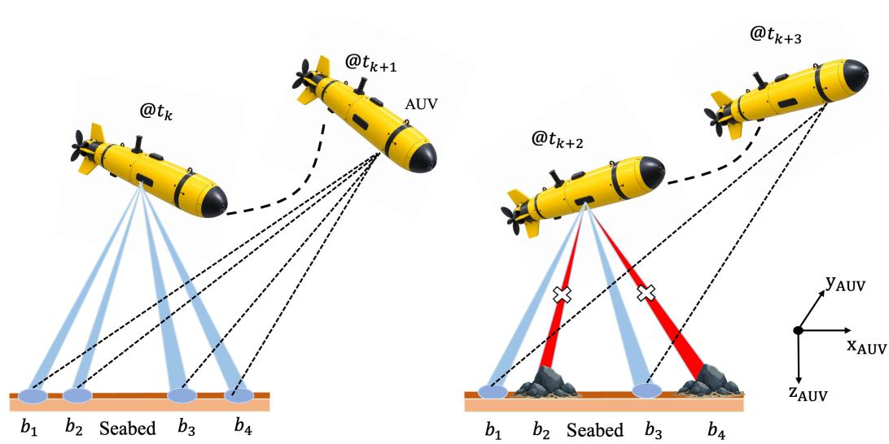  
Figure 1: Illustration of an AUV maneuvering with a DVL under full and partial beam availability. The red beams indicate DVL measurements obstructed by underwater obstacles, while the remaining beams represent valid bottom-lock measurements during vehicle motion.

Conventional supervised regression primarily minimizes the velocity residual, typically through an MSE objective such as

$$
\mathcal { L } _ { \mathrm { M S E } } = \frac { 1 } { N } \sum _ { i = 1 } ^ { N } \left. \mathbf { r } _ { v , i } \right. _ { 2 } ^ { 2 } ,\tag{2}
$$

where � denotes the total number of samples. Although (2) directly measures velocity-estimation accuracy, it does not explicitly account for physical consistency between the predicted velocity and the underlying DVL measurements. Moreover, its quadratic structure causes large residuals arising from corrupted measurements or sensor outliers to dominate the optimization process.

Let $\hat { \mathbf { b } } , \mathbf { b } \in \mathbb { R } ^ { m }$ denote the predicted and measured DVL beam velocities, respectively, where $m \leq 4$ is the number of available DVL beams. The beam-space residual is defined as:

$$
\mathbf { r } _ { b } = \hat { \mathbf { b } } - \mathbf { b } .\tag{3}
$$

The predicted beam velocity is obtained from the DVL observation model

$$
\begin{array} { r } { \hat { \bf b } = H \hat { \bf v } , } \end{array}\tag{4}
$$

where $H \in \mathbb { R } ^ { m \times 3 }$ denotes the DVL beam geometry matrix. Thus, the DVL observation model provides an additional physical relationship between the predicted vehicle velocity and the available beam measurements. Accordingly, the conventional physics-learning approach can be written as:

$$
\begin{array} { r } { \mathcal { L } = \lambda _ { v } \left. \mathbf { r } _ { v } \right. _ { 2 } ^ { 2 } + \lambda _ { b } \left. \mathbf { r } _ { b } \right. _ { 2 } ^ { 2 } , } \end{array}\tag{5}
$$

where $\lambda _ { v }$ and $\lambda _ { b }$ are weight coeficients of velocity and beam residuals, respectively.

Although (5) introduces measurement-space consistency, it also remains sensitive to large residuals and assigns a fixed relative importance to the beam-space. However, the physics of the DVL measurements depends on the available beam geometry. In particular, under corrupted or partially available DVL measurements, the confidence associated with the beam-space information may vary considerably from the full-beam configuration. Consequently, simply combining the two residuals as in (5) does not provide a robust mechanism for balancing prediction accuracy, measurement consistency, and uncertainty.

## 3. Proposed Approach

This section presents NAViLoss, the proposed navigation-aware objective function, and NAVi– DeepONet, the corresponding physics-guided learning framework. The following subsections introduce the NAViLoss formulation and establish its analytical properties, followed by the NAVi– DeepONet architecture, DVL operating configurations, and training procedure.

## 3.1. Motivation and Overview

Conventional regression objectives such as (2) primarily minimize prediction errors without explicitly incorporating the underlying system physics. Although the physics-guided objective in (5) introduces DVL measurement consistency, it does not explicitly account for the uncertainty associated with the available navigation measurements. This limitation becomes particularly important under noisy or missing DVL beam conditions, where the information provided by the available DVL geometry can vary considerably. Accordingly, a navigation-aware objective should (1) minimize the velocity-estimation residual, (2) preserve physical consistency with the available DVL measurements, (3) account for variations in measurement uncertainty, (4) limit the influence of large residuals, and (5) remain smooth and continuously diferentiable for optimization.

To address these requirements, we propose NAViLoss, a robust and navigation-aware objective that jointly incorporates the velocity and DVL beam-domain residuals. The proposed loss employs a bounded penalty to limit the influence of large residuals and an adaptive mechanism to deal with uncertainty of the beam-domain information according to the available DVL geometry. Furthermore, NAViLoss is integrated with a DeepONet backbone to form NAVi-DeepONet for AUV velocity estimation.

## 3.2. NAViLoss Function

Based on the velocity and beam residuals defined in (1) and (3), respectively, the navigation residual space is defined as:

$$
\mathcal { R } = \mathcal { R } _ { v } \times \mathcal { R } _ { b } ,\tag{6}
$$

where $\mathcal { R } _ { v } = \mathbb { R } ^ { 3 }$ and $\mathcal { R } _ { b } = \mathbb { R } ^ { m }$ denote the velocity and beam-residual spaces, respectively.

Let $\sigma _ { v } \ > \ 0$ and $\sigma _ { b } > 0$ denote the uncertainty measures associated with the velocity residual $\mathbf { r } _ { v }$ and the DVL beam residual $\mathbf { r } _ { b } ,$ respectively. The corresponding navigation uncertainty vector is defined as

$$
\pmb { \sigma } = ( \sigma _ { v } , \sigma _ { b } ) ,\tag{7}
$$

with

$$
\sigma \in \mathcal { V } , \qquad \mathcal { V } = \mathbb { R } _ { > 0 } \times \mathbb { R } _ { > 0 } ,\tag{8}
$$

and $\boldsymbol { \nu }$ is the uncertainty space. A smaller uncertainty value indicates higher confidence in the corresponding navigation information, whereas a larger value of �, represents lower confidence and consequently reduces the contribution of the associated residual during optimization.

Together, the navigation residual space  and the uncertainty space $\boldsymbol { \nu }$ define the input domain of the proposed NAViLoss, expressed as the mapping

$$
\mathcal { L } _ { \mathrm { N A V i } } : \mathcal { R } \times \mathcal { V } \to \mathbb { R } _ { \ge 0 } .\tag{9}
$$

Specifically, NAViLoss is defined as:

$$
\mathcal { L } _ { \mathrm { N A V i } } = \mathcal { L } _ { v } + \lambda _ { b } \mathcal { L } _ { b } ,\tag{10}
$$

where

$$
\mathcal { L } _ { v } = \frac { 1 } { \lambda } \left( 1 - \frac { 1 } { 1 + \lambda \frac { \Vert \mathbf { r } _ { v } \Vert ^ { 2 } } { \sigma _ { v } ^ { 2 } + \varepsilon } } \right) ,\tag{11}
$$

and

$$
\mathcal { L } _ { b } = \frac { 1 } { \lambda } \left( 1 - \frac { 1 } { 1 + \lambda \frac { \Vert \mathbf { r } _ { b } \Vert ^ { 2 } } { \sigma _ { b } ^ { 2 } + \varepsilon } } \right) .\tag{12}
$$

Here, $\mathcal { L } _ { v }$ is the velocity loss, $\mathcal { L } _ { b }$ is the uncertainty-aware beam-consistency physics loss, $\mathbf { r } _ { v } \in \mathcal { R } _ { v }$ is the velocity residual, $\mathbf { r } _ { b } \ \in \ \mathcal { R } _ { b }$ is the beam-consistency residual, $\sigma _ { v } \in \mathcal { V } _ { v }$ is the velocity uncertainty, $\sigma _ { b } \in \mathcal { V } _ { b }$ is the beam uncertainty, $\lambda > 0$ is the robustness parameter, and $\lambda _ { b } > 0$ is the beam-loss weighting coeficient. Thus, NAViLoss jointly minimizes the state-estimation error and the measurement-consistency error while accounting for their respective uncertainty levels within a unified navigation-aware optimization framework. The next section proves the theoretical properties of NAViLoss.

## 3.3. Theoretical Properties of NAViLoss

This section analyzes the fundamental mathematical properties of NAViLoss to characterize its behavior with respect to the navigation residuals and their associated uncertainties.

Proposition 1 (Elementary Properties). Let ${ \mathcal { L } } _ { \mathrm { N A V i } }$ be defined as in (10)–(12), with $\lambda > 0 , \lambda _ { b } > 0 ,$ $\varepsilon > 0 , \sigma _ { v } > 0$ , and $\sigma _ { b } > 0$ . Then ${ \mathcal { L } } _ { \mathrm { N A V i } }$ is non-negative, bounded, and smooth (continuous and infinitely diferentiable) with respect to the residuals $\mathbf { r } _ { v }$ and $\mathbf { r } _ { b } .$ In particular,

$$
\mathcal { L } _ { \mathrm { N A V i } } \in C ^ { \infty }\tag{13}
$$

with respect to $( \mathbf { r } _ { v } , \mathbf { r } _ { b } )$ . Moreover,

$$
0 \leq \mathcal { L } _ { \mathrm { N A V i } } < \frac { 1 + \lambda _ { b } } { \lambda } ,\tag{14}
$$

and

$$
\operatorname* { l i m } _ { \| \mathbf { r } _ { v } \| \to \infty } \mathcal { L } _ { \mathrm { N A V i } } = \frac { 1 + \lambda _ { b } } { \lambda } .\tag{15}
$$

Lemma 1 (Bounded Influence of Large Residuals). Let

$$
\rho ( r ) = \frac { 1 } { \lambda } \left( 1 - \frac { 1 } { 1 + \lambda \frac { r ^ { 2 } } { \sigma ^ { 2 } + \varepsilon } } \right) ,\tag{16}
$$

where $\lambda > 0 , \varepsilon > 0 ,$ , and $\sigma > 0$ . Then,

$$
\operatorname * { l i m } _ { | r |  \infty } \rho ( r ) = \frac { 1 } { \lambda } , \qquad \operatorname * { l i m } _ { | r |  \infty } \rho ^ { \prime } ( r ) = 0 .\tag{17}
$$

Hence, the penalty remains bounded while the influence ofincreasingly large residuals vanishes. This redescending behavior limits the contribution of large residuals to the optimization process, providing robustness against outliers and corrupted measurements. Consequently, large residuals arisingfrom corrupted DVL measurements or sensor outliers cannot dominate the training objective.

Lemma 2 (Quadratic Behavior for Small Residuals). Let

$$
\rho ( r ) = \frac { 1 } { \lambda } \left( 1 - \frac { 1 } { 1 + \lambda \frac { r ^ { 2 } } { \sigma ^ { 2 } + \varepsilon } } \right) ,\tag{18}
$$

where $\lambda > 0 , \sigma > 0 ,$ , and $\varepsilon > 0 .$ . Then,

$$
\rho ( r ) = \frac { r ^ { 2 } } { \sigma ^ { 2 } + \varepsilon } + O ( r ^ { 4 } ) , \qquad r \to 0 .\tag{19}
$$

Hence, the NAViLoss exhibits locally quadratic behavior for small residuals.

Lemma 3 (Uncertainty-Aware Attenuation). For anyfixed nonzero residual � and $\sigma > 0 ,$ , the penalty $\rho ( r ; \sigma )$ is strictly decreasing with respect to �, i.e.,

$$
\frac { \partial \rho ( r ; \sigma ) } { \partial \sigma } < 0 .\tag{20}
$$

Hence, residuals associated with larger uncertainty receive a smaller penalty contribution.

Proposition 2 (Zero-Loss Dual-Domain Consistency). Let ${ \mathcal { L } } _ { \mathrm { N A V i } }$ be defined as in (10)–(12), with $\lambda _ { b } > 0 . \ : I f$

$$
\mathcal { L } _ { \mathrm { N A V i } } = 0 ,\tag{21}
$$

then

$$
\widehat { \mathbf { v } } = \mathbf { v } , \qquad H \widehat { \mathbf { v } } = \mathbf { b } .\tag{22}
$$

Hence, whenever a zero-loss solution exists, it is simultaneously consistent in the navigation-state and DVL measurement domains.

Readers may referred to Appendix A for the proofs of the propositions and lemmas presented above.

The analytical properties established above are further illustrated in Figures 2 and 3. Figure 2 compares NAViLoss with representative regression loss functions in terms of their penalty and influence functions. As established in Lemma 1, the NAViLoss penalty remains bounded for large residuals during optimization, while its corresponding influence approaches zero. Figure 3 illustrates the uncertainty-aware attenuation property established in Lemma 3. Increasing � attenuates both the penalty and the influence associated with a given residual, thereby reducing the contribution of uncertain information during optimization.

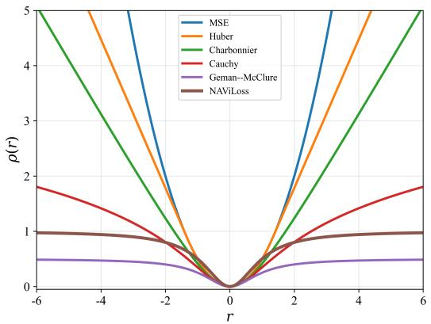

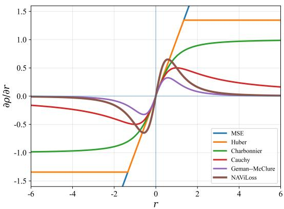  
Figure 2: Comparison of NAViLoss with representative regression and robust loss functions. Left: penalty functions $\rho ( r )$ for residual �. Right: corresponding influence functions.

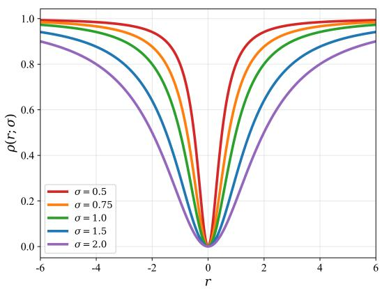

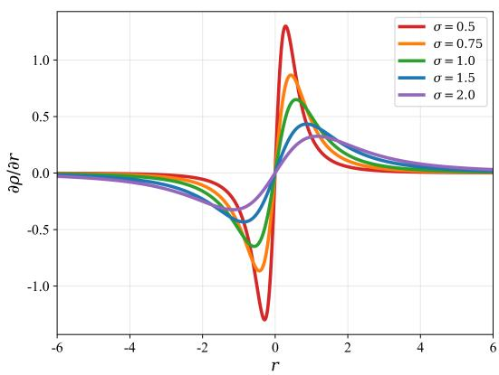  
Figure 3: Efect of the uncertainty parameter � on NAViLoss for fixed $\lambda = 1$ . Left: penalty function $\rho ( r ; \sigma )$ for diferent uncertainty levels. Right: corresponding influence function.

## 3.4. NAVi–DeepONet Architecture

We integrate NAViLoss (10) with the DeepONet framework [17] and introduce NAVi–DeepONet, a physics-guided learning model for robust AUV velocity estimation. Figure 4 illustrates the proposed architecture, which consists of branch and trunk subnetworks. Since the DVL and IMU operate at diferent sampling rates, the higher-rate IMU measurements are first temporally aligned with the corresponding DVL epochs. The synchronized four DVL beam measurements and six IMU channels are then arranged over a temporal window of length � to construct the branch input $\mathbf { X } _ { k } \in \mathbb { R } ^ { W \times 1 0 }$ The branch network extracts features from this temporal input, while the trunk network encodes the corresponding temporal coordinate. Their latent representations are subsequently fused to estimate the three-dimensional AUV velocity. Further details of the synchronization and input construction are provided in Section 3.5.1.

Let the temporal sequence of synchronized inertial/DVL measurements is defined as

$$
\mathbf { X } _ { k } = \left[ \mathbf { x } _ { k - W + 1 } , \ldots , \mathbf { x } _ { k } \right] ,\tag{23}
$$

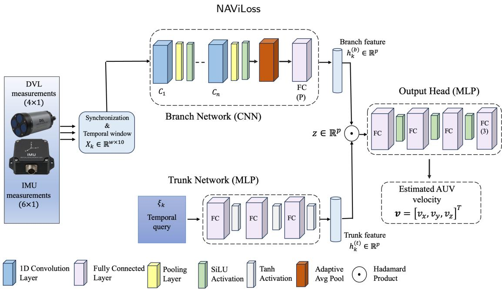  
Figure 4: Architecture of the proposed NAVi-DeepONet framework.

where � denotes the temporal window length. The branch network maps $\mathbf { X } _ { k }$ into a latent representation

$$
\mathbf h _ { k } ^ { ( b ) } = B _ { \theta _ { b } } ( \mathbf X _ { k } ) \in \mathbb { R } ^ { p } ,\tag{24}
$$

where $B _ { \theta _ { b } }$ denotes the branch network with trainable parameters $\theta _ { b } ,$ , and $p$ denotes the latent dimension.

The trunk input is defined by the normalized temporal coordinate

$$
\xi _ { k } = \frac { t _ { k } - \mu _ { t } } { \sigma _ { t } } ,\tag{25}
$$

where $\mu _ { t }$ and $\sigma _ { t }$ denote the mean and standard deviation (STD) of the training timestamps, respectively. The trunk network maps $\xi _ { k }$ into the latent representation

$$
\mathbf { h } _ { k } ^ { ( t ) } = \mathcal { T } _ { \theta _ { t } } ( \xi _ { k } ) \in \mathbb { R } ^ { p } ,\tag{26}
$$

where $\tau _ { \theta _ { t } }$ denotes the trunk network with trainable parameters $\theta _ { t }$

Then the branch and trunk representations are combined through the Hadamard product,

$$
\mathbf { q } _ { k } = \mathbf { h } _ { k } ^ { \left( b \right) } \odot \mathbf { h } _ { k } ^ { \left( t \right) } ,\tag{27}
$$

and the resulting latent feature is passed through the prediction head MLP

$$
\hat { \mathbf { v } } _ { k } = { \mathcal { P } } _ { \theta _ { p } } ( \mathbf { q } _ { k } ) ,\tag{28}
$$

where ${ \mathcal P _ { \theta _ { p } } }$ denotes the prediction network. Using the branch and trunk representations and their fusion defined in (24)–(28), the complete NAVi–DeepONet approximation is expressed as

$$
\hat { \mathbf { v } } _ { k } = { \mathcal { F } } _ { \boldsymbol { \Theta } } ( \mathbf { X } _ { k } , \boldsymbol { \xi } _ { k } ) = { \mathcal { P } } _ { \boldsymbol { \theta } _ { p } } \left[ { \mathcal { B } } _ { \boldsymbol { \theta } _ { b } } ( \mathbf { X } _ { k } ) \odot { \mathcal { T } } _ { \boldsymbol { \theta } _ { t } } ( \boldsymbol { \xi } _ { k } ) \right] ,\tag{29}
$$

where $\mathcal { F } _ { \Theta }$ denotes the overall NAVi–DeepONet operator, $\boldsymbol { \Theta } ~ = ~ \{ \boldsymbol { \theta } _ { b } , \boldsymbol { \theta } _ { t } , \boldsymbol { \theta } _ { p } \}$ collects all trainable parameters. During training, NAViLoss jointly incorporates the velocity-estimation and DVL beamconsistency residuals to optimize the network parameters.

## 3.5. DVL Operation mode

Here two sensing configurations are considered (1) noise-aware velocity estimation using complete DVL beam and IMU measurements and (2) DVL measurement recovery using partial DVL beam and complete IMU measurements.

## 3.5.1. Noise-Aware Velocity Estimation

We first consider the nominal sensing condition in which all four DVL beam measurements and the complete IMU measurements are available. Let

$$
\mathbf { b } _ { k } = [ b _ { 1 , k } , b _ { 2 , k } , b _ { 3 , k } , b _ { 4 , k } ] ^ { \top } \in \mathbb { R } ^ { 4 }\tag{30}
$$

denote the four-beam DVL measurement vector at epoch �. The IMU measurement vector is

$$
\mathbf { u } _ { j } = [ f _ { x , j } , f _ { y , j } , f _ { z , j } , \omega _ { x , j } , \omega _ { y , j } , \omega _ { z , j } ] ^ { \intercal } \in \mathbb { R } ^ { 6 }\tag{31}
$$

where $f _ { x , j } , f _ { y , j }$ , and $f _ { z , j }$ are raw specific-force components, and $\omega _ { x , i } , \omega _ { y , i }$ , and $\omega _ { z , i }$ are raw angularrate components associated with the �-th DVL interval. A DVL window of length $W _ { d }$ is constructed as

$$
\mathbf { D } _ { k } = [ \mathbf { b } _ { k - W _ { d } + 1 } , \dots , \mathbf { b } _ { k } ] \in \mathbb { R } ^ { W _ { d } \times 4 } ,\tag{32}
$$

whereas a high-rate IMU window of length $W _ { i }$ is defined as

$$
\mathbf { I } _ { k } = [ \mathbf { u } _ { j _ { k } - W _ { i } + 1 } , \dots , \mathbf { u } _ { j _ { k } } ] \in \mathbb { R } ^ { W _ { i } \times 6 } .\tag{33}
$$

The DVL and IMU histories are encoded independently as

$$
\mathbf { h } _ { d , k } = \mathcal { E } _ { d } ( \mathbf { D } _ { k } ) ,\tag{34}
$$

and

$$
\begin{array} { r } { \mathbf { h } _ { i , k } = \mathcal { E } _ { i } ( \mathbf { I } _ { k } ) , } \end{array}\tag{35}
$$

where $\mathcal { E } _ { d } ( \cdot )$ and $\mathcal { E } _ { i } ( \cdot )$ denote the DVL and IMU temporal encoders, respectively. The resulting sensor features, (34)–(35), are concatenated and projected into the branch latent space,

$$
\mathbf { h } _ { k } ^ { \left( b \right) } = C \left( [ \mathbf { h } _ { d , k } | | \mathbf { h } _ { i , k } ] \right) ,\tag{36}
$$

where ‖ denotes feature concatenation and (⋅) denotes the fusion projection. It is then combined with the trunk representation as in (27) and finally, the resulting latent feature is passed through the prediction head MLP (28) to estimate the AUV velocity.

Using (23), (25), (29), (32) and (33), the proposed NAVi–DeepONetV1 operator is written in compact form as

$$
\mathcal { F } _ { \boldsymbol { \Theta } } ^ { \mathrm { f u l l } } : ( \mathbf { D } _ { k } , \mathbf { I } _ { k } , \boldsymbol { \xi } _ { k } ) \mapsto \hat { \mathbf { v } } _ { k } .\tag{37}
$$

## 3.5.2. DVL Measurement Recovery

We next consider degraded DVL operation in which one or more DVL beam measurements are unavailable while the full IMU measurements remain available. As DVL beams become unavailable, the remaining beam geometry provides progressively less information about the three-dimensional vehicle velocity. This setting is therefore well suited for evaluating the adaptive structure of NAViLoss.

Let

$$
\begin{array} { r } { { \bf { m } } _ { k } = [ { m } _ { 1 , k } , { m } _ { 2 , k } , { m } _ { 3 , k } , { m } _ { 4 , k } ] ^ { \top } , \qquad { m } _ { i , k } \in \{ 0 , 1 \} , } \end{array}\tag{38}
$$

denote the DVL beam-availability vector. The corresponding masking matrix is defined as

$$
\begin{array} { r } { { \bf M } _ { k } = \mathrm { d i a g } ( { \bf m } _ { k } ) . } \end{array}\tag{39}
$$

The partially available DVL measurement vector is then expressed as

$$
\mathbf { b } _ { k } ^ { m } = \mathbf { M } _ { k } \mathbf { b } _ { k } .\tag{40}
$$

Using a temporal window of length $W _ { d }$ , the partial DVL history is constructed as

$$
\mathbf { D } _ { k } ^ { m } = [ \mathbf { b } _ { k - W _ { d } + 1 } ^ { m } , \ldots , \mathbf { b } _ { k } ^ { m } ] .\tag{41}
$$

The full high-rate IMU history $\mathbf { I } _ { k }$ defined in (33) remains available in this configuration. Accordingly, the partial DVL and full IMU histories are encoded as

$$
\mathbf { h } _ { d , k } ^ { m } = \mathcal { E } _ { d } ^ { m } \left( \mathbf { D } _ { k } ^ { m } \right) ,\tag{42}
$$

and

$$
\mathbf { h } _ { i , k } ^ { m } = \mathcal { E } _ { i } ^ { m } \left( \mathbf { I } _ { k } \right) .\tag{43}
$$

The two feature representations are fused as

$$
\begin{array} { r } { \mathbf { h } _ { k , m } ^ { ( b ) } = C _ { m } \left( [ \mathbf { h } _ { d , k } ^ { m } | \vert \mathbf { h } _ { i , k } ^ { m } ] \right) , } \end{array}\tag{44}
$$

and subsequently combined with the trunk representation,

$$
\mathbf { q } _ { k } ^ { m } = \mathbf { h } _ { k , m } ^ { ( b ) } \odot \mathbf { h } _ { k } ^ { ( t ) } .\tag{45}
$$

Finally, the resulting latent feature is passed through the prediction head MLP (28) to estimate the AUV velocity

$$
\hat { \mathbf { v } } _ { k } = \mathcal { P } _ { \theta _ { p } } ( \mathbf { q } _ { k } ^ { m } ) .\tag{46}
$$

Using (23), (25), (29), (32) and (41) the NAVi–DeepONetV2 operator can be compactly written as

$$
\mathcal { F } _ { \boldsymbol { \Theta } } ^ { \mathrm { m i s s } } : ( \mathbf { D } _ { k } ^ { m } , \mathbf { I } _ { k } , \boldsymbol { \xi } _ { k } ) \mapsto \hat { \mathbf { v } } _ { k } .\tag{47}
$$

## 3.6. Training

For each training sample, let $A _ { k } \subseteq \{ 1 , 2 , 3 , 4 \}$ denote the set of available DVL beams, and let $H _ { \mathcal { A } _ { k } }$ denote the corresponding active-beam geometry submatrix. The uncertainty associated with the beam-space is determined from the information provided by the active measurement geometry.

The minimum eigenvalue of the active-beam Gram matrix satisfies

$$
\lambda _ { \operatorname* { m i n } } \left( H _ { \mathcal { A } _ { k } } ^ { \top } H _ { \mathcal { A } _ { k } } \right) = \operatorname* { m i n } _ { \left\| \mathbf { q } \right\| _ { 2 } = 1 } \left\| H _ { \mathcal { A } _ { k } } \mathbf { q } \right\| _ { 2 } ^ { 2 } ,\tag{48}
$$

and therefore measures the weakest-observed direction in the three-dimensional velocity space. Accordingly, for at least three available beams, the beam uncertainty is defined as

$$
\widetilde { \sigma } _ { b , k } = \frac { 1 } { \operatorname* { m a x } \left( \lambda _ { \operatorname* { m i n } } \left( H _ { A _ { k } } ^ { \top } H _ { A _ { k } } \right) , \varepsilon \right) } , \qquad | A _ { k } | \geq 3 ,\tag{49}
$$

where $\varepsilon > 0$ prevents numerical instability. Thus, a smaller minimum eigenvalue produces a larger uncertainty, reducing the influence of poorly observed beam configurations during training.

When fewer than three beams are available, the corresponding DVL geometry does not provide suficient independent information to constrain the three-dimensional velocity. Accordingly, a predefined large uncertainty value is assigned

$$
\widetilde { \sigma } _ { b , k } = \sigma _ { \mathrm { m a x } } , \qquad | A _ { k } | < 3 ,\tag{50}
$$

where $\sigma _ { \mathrm { m a x } }$ represents high-uncertainty level.

To maintain the uncertainty scale during optimization, the beam uncertainties are normalized within each mini-batch as

$$
\sigma _ { b , k } = \frac { \widetilde { \sigma } _ { b , k } } { \frac { 1 } { B } \sum _ { j = 1 } ^ { B } \widetilde { \sigma } _ { b , j } + \varepsilon } + \varepsilon ,\tag{51}
$$

where � denotes the mini-batch size. Consequently, full beam configurations receive relatively smaller uncertainty values, whereas degraded geometries receive larger values and therefore contribute less to the beam-space loss.

In this experiment, the velocity uncertainty is fixed as $\sigma _ { v , k } ~ = ~ 1$ . However, it can be adapted when uncertainty information for the reference velocity is available. Such uncertainty is not explicitly modeled in the present experiments. In contrast, the DVL measurement uncertainty varies with the available beam geometry and is therefore adaptively represented through $\sigma _ { b , k }$ . The velocity and beam residuals are then evaluated as

$$
\begin{array} { r } { \mathbf { r } _ { v , k } = \widehat { \mathbf { v } } _ { k } - \mathbf { v } _ { k } , } \end{array}\tag{52}
$$

and

$$
\mathbf { r } _ { b , k } = H _ { \mathcal { A } _ { k } } \widehat { \mathbf { v } } _ { k } - \mathbf { b } _ { \mathcal { A } _ { k } , k } .\tag{53}
$$

The resulting uncertainty-aware residuals are used to compute $\mathcal { L } _ { v }$ and $\mathcal { L } _ { b }$ using (11) and (12), respectively. Thereby, the network parameters are updated by minimizing

$$
\Theta ^ { \star } = \arg \operatorname* { m i n } _ { \Theta } \frac { 1 } { N } \sum _ { k = 1 } ^ { N } \mathcal { L } _ { \mathrm { N A V i } } \left( \mathbf { r } _ { v , k } , \mathbf { r } _ { b , k } , \pmb { \sigma } _ { k } \right) ,\tag{54}
$$

where $\pmb { \sigma } _ { k } = ( \sigma _ { v , k } , \sigma _ { b , k } )$ contains the uncertainty measures associated with the velocity and beam residuals. Algorithm 1 summarizes the complete training workflow. The proposed DVL-DeepONet framework was trained using the hyperparameters detailed in Table 1.

## 4. Analysis and Results

This section discusses the dataset, evaluation metrics, and results obtained by the proposed model.

## 4.1. AUV Dataset

The experimental data were collected during a series of sea trials in the Mediterranean Sea in Israel, using the University of Haifa’s Snapir AUV [37]. Snapir is a modified ECA Robotics A18D mid-size AUV [38], designed for deep-water autonomus missions at depths of up to 3000m with an operational endurance of approximately 21 hours. The vehicle is equipped with an iXblue Phins Subsea INS [39] and a Teledyne RDI WorkHorse Navigator DVL [40]. The DVL has a nominal velocity STD of 0.02m/s. The INS measurements are recorded at high-rate of 100Hz, while the DVL operates at 1Hz. During the mission, the vehicle’s fail-safe mechanism continuously monitors the DVL quality and bottom-lock status. If prolonged DVL failure or loss of bottom lock occurs, it aborts the mission and surfaces to ensure safe recovery.

Algorithm 1: Proposed training algorithm for NAVi-DeepONet model.   
Construct inertial/DVL inputs $\mathbf { X } _ { k } ;$   
Construct trunk input $\xi _ { k } ;$   
Initialize network parameters $\Theta ;$   
for each epoch do   
for each mini-batch do   
Generate the active DVL beam set $\boldsymbol { A } _ { k } \boldsymbol { ; }$   
Retain full IMU measurements;   
Compute branch representation $\mathbf { h } _ { k } ^ { ( b ) } ;$   
Compute trunk representation $\mathbf { h } _ { k } ^ { ( t ) } ;$   
Compute $\mathbf { q } _ { k }$ using (27);   
Predict $\hat { \mathbf { v } } _ { k } ;$   
Compute velocity residual using (52);   
Set $\sigma _ { v , k } = 1 ;$   
Construct active DVL geometry $H _ { \mathcal { A } _ { k } }$   
if $| \mathcal { A } _ { k } | \ge 3$ then   
Compute adaptive beam uncertainty using (49)   
else   
Set $\tilde { \sigma } _ { b , k } = \sigma _ { \mathrm { { m a x } } } = 1 0 ;$   
Obtain $\sigma _ { b , k }$ using (51);   
Compute beam residual using (53);   
Compute $\mathcal { L } _ { v }$ using (11);   
Compute $\mathcal { L } _ { b }$ using (12);   
Compute total loss using (10);   
Update Θ;   
if $\mathcal { L } _ { \mathrm { N A V i } } < \varepsilon$ then   
return Θ   
return Θ

A commonly adopted technique in DVL-learning studies [16, 20], is to use the recorded DVL measurements as ground truth (GT) and generate unit under test (UUT) measurements by introducing controlled perturbations. Following this approach, semi-synthetic UUT measurements are generated through the error-injection model

$$
\tilde { \mathbf { y } } _ { k } = ( 1 + s _ { D } ) \mathbf { H } \mathbf { v } _ { b , k } ^ { d } + \mathbf { b } _ { D } + \sigma _ { D } \epsilon _ { k } ,\tag{55}
$$

where $\textbf { H } \in \ \mathbb { R } ^ { 4 \times 3 }$ is the DVL beam geometry matrix and $\mathbf { v } _ { b , k } ^ { d }$ denotes the DVL velocity vector expressed in the body frame, $s _ { D }$ represents the scale-factor error, ${ \bf b } _ { D }$ denotes the constant beam bias, $\sigma _ { D }$ is the STD of the additive noise, and $\epsilon _ { k } \sim \mathcal { N } ( \mathbf { 0 } , \mathbf { I } _ { 4 } )$ . In particular, $s _ { D } = 0 . 7 \% , b _ { D } = 0 . 0 0 1 \mathrm { m / s }$ and $\sigma _ { D } ~ = ~ 0 . 0 4 2 \mathrm { { m } / \mathrm { { s } } }$ are introduced, consistent with the experimental configuration reported in literature [16, 17]. It reproduce real-world underwater DVL measurement. Following noise injection in the beam domain, the measurements are transformed into the DVL coordinate frame using

$$
\hat { \mathbf { v } } _ { b } ^ { d } = ( \mathbf { H } ^ { T } \mathbf { H } ) ^ { - 1 } \mathbf { H } ^ { T } \tilde { \mathbf { y } } .\tag{56}
$$

Table 1  
Model architecture and hyperparameters employed for the training of NAVi-DeepONet.
<table><tr><td>Parameter</td><td>Noise-Aware Velocity Estimation</td><td>DVL Measurement Recovery</td></tr><tr><td></td><td></td><td></td></tr><tr><td>Window length (W)</td><td>2</td><td>2</td></tr><tr><td>Input features (DVL + IMU)</td><td>10</td><td>10</td></tr><tr><td>Number of branch networks</td><td>1</td><td>15</td></tr><tr><td>Branch kernel size</td><td>3</td><td>3</td></tr><tr><td>Branch CNN channels</td><td>10-32-64-64-32</td><td>10-32-64-64-128</td></tr><tr><td>Trunk MLP Prediction head</td><td>1-64-128-32</td><td>1-64-128-128</td></tr><tr><td>Branch activation</td><td>32-128-64-3</td><td>128-128-64-3</td></tr><tr><td>Trunk activation</td><td>SiLU</td><td>SiLU</td></tr><tr><td>Head activation</td><td>Tanh</td><td>Tanh</td></tr><tr><td></td><td>SiLU</td><td>SiLU</td></tr><tr><td>Dropout Optimizer</td><td>0.1 AdamW</td><td>0.1</td></tr><tr><td>Initial learning rate</td><td></td><td>AdamW</td></tr><tr><td>Weight decay</td><td> $5 \times 1 0 ^ { - 4 }$ </td><td> $1 0 ^ { - 3 }$ </td></tr><tr><td>Batch size</td><td> $1 0 ^ { - 5 }$ </td><td> $1 0 ^ { - 5 }$ </td></tr><tr><td></td><td>128</td><td>128</td></tr><tr><td>Maximum epochs</td><td>100</td><td>100</td></tr><tr><td>Patience</td><td>60</td><td>40</td></tr><tr><td>Velocity-loss weight  $\left( \lambda _ { v } \right)$ </td><td>1.0</td><td>1.0</td></tr><tr><td>Beam-loss weight  $\left( \lambda _ { b } \right)$ </td><td>1.1</td><td>0.1</td></tr><tr><td>NAViLoss parameter (λ)</td><td>0.1</td><td>0.1</td></tr></table>

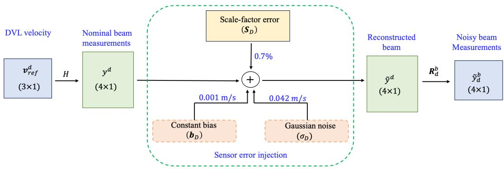  
Figure 5: Pipeline for simulating noisy DVL beam measurements from the GT velocity.

and subsequently into the body frame using the rotation matrix $R _ { d } ^ { b }$ . The pipeline for simulating noisy DVL beam measurements from the GT velocity is outlined in Figure 5.

The dataset contains thirteen trajectories, denoted T1–T13, totalling 10,000m. Each trajectory spans approximately 400s, with variations in trajectory geometry, travelled distance, operating depth, and vehicle speed. These variations provide a diverse set of operating conditions for evaluating the proposed framework. For cross-validation, trajectories are organized into three distinct data folds as shown in Table 2. Unless otherwise specified, the experimental results presented in this work correspond to Fold 1. Figure 6 illustrates the GT paths of the test trajectories across the three folds.

Table 2  
Three-fold cross-validation scheme used for NAVi-DeepONet evaluation.
<table><tr><td>Fold</td><td>Train. Traj.</td><td>Val. Traj. Test Traj. Train Dist. [m] Val. Dist. [m] Test Dist. [m]</td><td></td><td></td><td></td><td></td></tr><tr><td>F1</td><td>4,5,6,7,8,9,10,11,12</td><td>1,13</td><td>2,3</td><td>7259.75</td><td>1496.86</td><td>1346.59</td></tr><tr><td>F2</td><td>1,6,7,8,9,10,11,12,13</td><td>2,3</td><td>4,5</td><td>7094.26</td><td>1346.59</td><td>1566.93</td></tr><tr><td>F3</td><td>1,2,3,4,9,10,11,12,13</td><td>5,6</td><td>7,8</td><td>6683.41</td><td>1637.56</td><td>1686.80</td></tr></table>

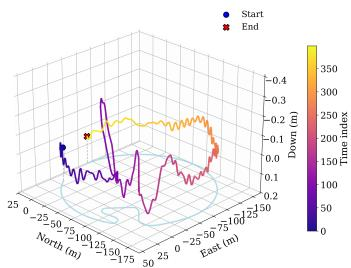  
(a) Trajectory 2

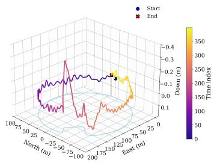  
(b) Trajectory 3

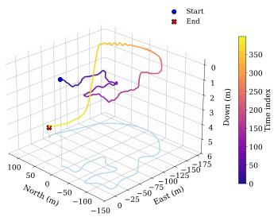  
(c) Trajectory 4

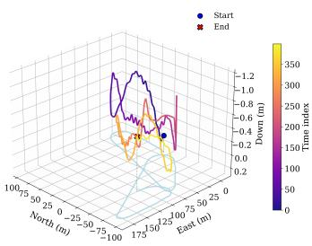  
(d) Trajectory 5

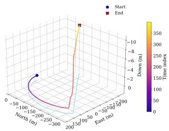  
(e) Trajectory 7

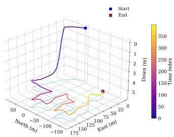  
(f) Trajectory 8  
Figure 6: Three-dimensional GT paths of the test missions, with their corresponding North–East projections shown on the horizontal plane.

## 4.2. Performance Metrics

Here, five quantitative metrics have been employed to access the proposed model. Let the predicted and GT velocity vectors at time $t _ { i }$ be denoted by $\hat { \mathbf { v } } ( t _ { i } )$ and $\mathbf { v } ( t _ { i } )$ , respectively.

1. Velocity absolute error (VAE) [m/s]:

$$
\mathrm { V A E } _ { i } = \left\| \hat { \mathbf { v } } ( t _ { i } ) - \mathbf { v } ( t _ { i } ) \right\| _ { 2 } .\tag{57}
$$

2. Velocity mean absolute error (VMAE) [m/s]:

$$
\mathrm { { V M A E } } = \frac { 1 } { N } \sum _ { i = 1 } ^ { N } \mathrm { { V A E } } _ { i } ,\tag{58}
$$

where � denotes the total number of samples.

3. Velocity root mean square error (VRMSE) [m/s]:

$$
\mathrm { V R M S E } = \sqrt { \frac { 1 } { N } \sum _ { i = 1 } ^ { N } ( \mathrm { V A E } _ { i } ) ^ { 2 } } .\tag{59}
$$

Table 3  
Performance comparison for noise-aware velocity estimation.
<table><tr><td>Model</td><td>VRMSE [m/s]↓</td><td>VMAE [m/s]↓</td><td>Mean R2↑</td><td>VAF [%]↑</td><td>VRMSE Gain [%]↑</td></tr><tr><td>LS</td><td>0.178</td><td>0.161</td><td>0.507</td><td>61.37</td><td>54</td></tr><tr><td>BeamsNet</td><td>0.116</td><td>0.104</td><td>0.706</td><td>70.64</td><td>29</td></tr><tr><td>DVL-DeepONet</td><td>0.092</td><td>0.074</td><td>0.869</td><td>87.21</td><td>11</td></tr><tr><td>NAVi-DeepONetV1 (ours)</td><td>0.082</td><td>0.071</td><td>0.878</td><td>88.53</td><td>一</td></tr></table>

4. Coeficient of determination $( R ^ { 2 } ) { \mathrm { : } }$

$$
R ^ { 2 } ( \dot { x } _ { j } , \hat { \dot { x } } _ { j } ) = 1 - \frac { \sum _ { i = 1 } ^ { N } \left( \dot { x } _ { j , i } - \hat { \dot { x } } _ { j , i } \right) ^ { 2 } } { \sum _ { i = 1 } ^ { N } \left( \dot { x } _ { j , i } - \bar { \dot { x } } _ { j } \right) ^ { 2 } } ,\tag{60}
$$

where $\dot { x } _ { j , i }$ and $\hat { \dot { x } } _ { j , i }$ denote the GT and predicted values of the �-th velocity component, respectively, and $\bar { \dot { x } } _ { j }$ is the mean of the corresponding GT component.

5. Variance accounted for (VAF) [%]:

$$
\mathrm { V A F } ( \dot { x } _ { j } , \hat { { x } } _ { j } ) = \left[ 1 - \frac { \mathrm { v a r } \left( \dot { x } _ { j } - \hat { { x } } _ { j } \right) } { \mathrm { v a r } \left( \dot { x } _ { j } \right) } \right] \times 1 0 0 .\tag{61}
$$

## 4.3. Noise-Aware Velocity Estimation

We first evaluate the efectiveness of proposed NAVi-DeepONetV1 under noisy inertial/DVL measurements. The results are then compared with the model-based LS estimator, BeamsNet [16], and DVL-DeepONet [17] baselines. Table 3 summarizes the quantitative values of proposed model.

As expected, the model-based LS estimator is considerably afected by the measurement perturbations, yielding a VRMSE of 0.178m/s and a VMAE of 0.161m/s. LR-based models, such as BeamsNet and DVL-DeepONet, substantially improve the estimation accuracy, reducing the VRMSE to 0.116m/s and 0.092m/s, respectively. However, the best overall performance is obtained by the proposed NAVi-DeepONetV1. It achieves the lowest VRMSE and VMAE of 0.082m/s and 0.071m/s, respectively, while attaining the highest mean $R ^ { 2 }$ and VAF. Our model outperformed the LS, BeamsNet, and DVL-DeepONet baselines by 54%, 29%, and 11% respectively.

These results indicate that the improvement introduced by NAVi-DeepONet is not limited to a single error metric. The simultaneous reduction in VRMSE and VMAE, together with the improvements in $R ^ { 2 }$ and VAF, demonstrates better agreement with the underlying velocity dynamics.

## 4.4. DVL Measurement Recovery

We next investigate the performance of the proposed model under DVL beam-outage conditions. Table 4 summarizes the performance under the loss of two DVL beam measurements. The modelbased ELC approach [36] exhibits the largest degradation, with a VRMSE of 1.991m/s and a VMAE of 1.696m/s. Its negative mean $R ^ { \stackrel { \triangledown } { 2 } }$ and VAF further indicate poor agreement with the reference velocity under severe measurement loss. MissBeamNet [11] notably improves the estimation performance, reducing the VRMSE to 0.329m/s. However, its negative mean $R ^ { 2 }$ and VAF indicate limited agreement with the reference velocity dynamics. DVL-DeepONet [17] provides a further improvement, attaining a VRMSE of 0.254m/s and a VMAE of 0.224m/s.

Furthermore, the proposed NAVi-DeepONetV2 achieves the best overall performance, reducing VRMSE and VMAE to 0.175m/s and 0.142m/s, respectively. This corresponds to reductions of approximately 31% in VRMSE and 37% in VMAE relative to the next-best baseline, DVL-DeepONet. Moreover, the mean $R ^ { 2 }$ increases from 0.312 to 0.694, while the VAF improves from 48% to 72%.

These results demonstrate that the proposed framework remains efective under reduced DVL measurement availability.

Table 4  
Performance comparison under DVL measurement recovery.
<table><tr><td>Model</td><td>VRMSE [m/s]↓</td><td>VMAE [m/s]↓</td><td>Mean R2↑</td><td>VAF [%]↑</td><td>VRMSE Gain [%]↑</td></tr><tr><td>ELC</td><td>1.991</td><td>1.696</td><td>-134.008</td><td>-1816.87</td><td>91</td></tr><tr><td>MissBeamNet</td><td>0.329</td><td>0.288</td><td>-0.403</td><td>-3.36</td><td>47</td></tr><tr><td>DVL-DeepONet</td><td>0.254</td><td>0.224</td><td>0.312</td><td>48.45</td><td>31</td></tr><tr><td>NAVi-DeepONetV2 (ours)</td><td>0.175</td><td>0.142</td><td>0.694</td><td>72.19</td><td>一</td></tr></table>

Table 5

Efect of temporal window length on NAVI-DeepONetV2.

<table><tr><td>Window Length</td><td>VRMSE [m/s]↓</td></tr><tr><td>2</td><td>0.175</td></tr><tr><td>3</td><td>0.182</td></tr><tr><td>4</td><td>0.221</td></tr><tr><td>5</td><td>0.197</td></tr><tr><td>10</td><td>0.188</td></tr><tr><td>15</td><td>0.207</td></tr><tr><td>20</td><td>0.190</td></tr></table>

Table 6  
Efect of inertial information for noise-aware velocity estimation.
<table><tr><td>Model</td><td>VRMSE [m/s]↓</td><td>VMAE [m/s]↓</td><td>Mean R²↑</td><td>VAF [%]↑</td><td>VRMSE Gain [%]↑</td></tr><tr><td>NAVi-DeepONet (DVL only)</td><td>0.090</td><td>0.080</td><td>0.814</td><td>81.95</td><td>9</td></tr><tr><td>NAVi-DeepONetV1 (ours)</td><td>0.082</td><td>0.071</td><td>0.878</td><td>88.53</td><td></td></tr></table>

## 4.5. Ablation Study

To assess the influence of diferent parameters and hyperparameters choices within the proposed framework, an ablation study was performed considering three aspects: (1) temporal window length, (2) efect of inertial measurements and (3) three-fold cross-validation.

## 4.5.1. Efect of Temporal Window Length

We first investigate the influence of the temporal window length � on the performance of NAVI-DeepONetV2. The window length determines the amount of historical DVL and inertial information supplied to the network at each prediction step. A longer window potentially provides richer temporal context; however, it is not practical to apply in a real-world mission.

Table 5 reports the VRMSE obtained for diferent window lengths. The best performance is achieved with � = 2, resulting in a VRMSE of 0.175m/s. For larger temporal windows, the performance fluctuates between 0.188 and 0.207m/s, but none of these configurations outperforms the two-step window. Accordingly, � = 2 is selected for the remaining experiments. This corresponds to a two-second window fitting to our dataset.

## 4.5.2. Efect ofInertial Data

The efect of inertial measurement is evaluated in both noise-aware velocity estimation and DVL measurement-recovery scenarios. We evaluate the performance of our model by removing the inertial data and corresponding parameters from both the training and testing datasets. As shown in Table 6 for noise-aware velocity estimation, the proposed model achieves a 9% improvement compared to DVL-only learning. However, the benefit becomes more pronounced when partial DVL beams are available. As reported in Table 7, our model yields a 38% improvement. These results indicate that inertial information is particularly beneficial when the DVL measurement geometry is degraded.

Table 7  
Efect of inertial information for DVL measurement recovery.
<table><tr><td>Model</td><td>VRMSE [m/s]↓</td><td>VMAE [m/s]↓</td><td>Mean  $\overline { { R ^ { 2 } \dag } }$ </td><td>VAF [%]↑</td><td>VRMSE Gain [%]↑</td></tr><tr><td>NAVi-DeepONet (DVL only)</td><td>0.282</td><td>0.243</td><td>0.188</td><td>41.95</td><td>38</td></tr><tr><td>NAVi-DeepONetV2 (ours)</td><td>0.175</td><td>0.142</td><td>0.694</td><td>72.19</td><td></td></tr></table>

Table 8  
Robustness analysis for DVL measurement recovery over three runs using two random seeds.
<table><tr><td>Method</td><td>VRMSE [m/s]↓</td><td>MAE [m/s]↓</td><td>Median Error [m/s]↓</td><td>Maximum Error [m/s]↓</td><td>R2↑</td><td>VAF [%]↑</td></tr><tr><td>ELC</td><td> $\overline { { 1 . 9 5 1 \pm 0 . 1 3 0 } }$ </td><td> $\overline { { 1 . 6 4 6 \pm 0 . 1 2 1 } }$ </td><td> $\overline { { 0 . 9 2 1 \pm 0 . 0 1 5 } }$ </td><td>3.858</td><td>-65.527</td><td>-1099.31</td></tr><tr><td>MissBeamNet</td><td> $0 . 3 2 9 \pm 0 . 0 1 2$ </td><td> $0 . 2 7 9 \pm 0 . 0 1 5$ </td><td> $0 . 2 4 4 \pm 0 . 0 2 3$ </td><td>1.414</td><td>0.110</td><td>27.18</td></tr><tr><td>DVL-DeepONet</td><td> $0 . 2 5 6 \pm 0 . 0 2 8$ </td><td> $0 . 2 1 8 \pm 0 . 0 2 5$ </td><td> $0 . 1 9 0 \pm 0 . 0 2 7$ </td><td>1.064</td><td>0.521</td><td>59.79</td></tr><tr><td>NAVi-DeepONet (DVL only)</td><td> $0 . 2 9 3 \pm 0 . 0 2 5$ </td><td> $0 . 2 3 9 \pm 0 . 0 1 2$ </td><td> $0 . 1 9 3 \pm 0 . 0 1 0$ </td><td>1.361</td><td>0.416</td><td>49.33</td></tr><tr><td>NAVi-DeepONetV2 (ours)</td><td> $\mathbf { 0 . 2 3 5 \pm 0 . 0 3 3 }$ </td><td> $\mathbf { 0 . 1 9 3 \pm 0 . 0 2 0 }$ </td><td> $\mathbf { 0 . 1 6 5 \pm 0 . 0 1 5 }$ </td><td>1.163</td><td>0.679</td><td>68.85</td></tr></table>

Table 9  
Computational complexity of the proposed NAVi-DeepONet configurations.
<table><tr><td>Configuration</td><td>Trainable Parameters</td><td>Model Size [MB]</td><td>MACs [M]</td><td>FLOPs [M]</td><td>Mean [ms]</td><td>P95 [ms]</td><td>Throughput [samples/s]</td><td>Real-Time Feasible</td></tr><tr><td>NAVi-DeepONetV1</td><td>161,955</td><td>0.64</td><td>2.97</td><td>5.93</td><td>0.390</td><td>0.413</td><td>2564</td><td>Yes</td></tr><tr><td>NAVi-DeepONetV2</td><td>675,619</td><td>2.72</td><td>2.98</td><td>5.96</td><td>0.687</td><td>0.722</td><td>14545</td><td>Yes</td></tr></table>

## 4.5.3. Three-Fold Cross Validation

To evaluate the generalization of the proposed framework, a three-fold cross-validation experiment was conducted using two independent random seeds (42 and 1234) for each fold, resulting in six evaluations per method. Table 8 reports the resulting performance in terms of mean ± STD.

The proposed NAVi-DeepONetV2 consistently outperforms the baselines across the repeated evaluations. Compared with MissBeamNet, it reduces the VRMSE by approximately 29% and the VMAE by 31%. Relative to DVL-DeepONet, reductions of 9% and 11% are obtained in VRMSE and VMAE, respectively. Moreover, compared with its DVL-only counterpart, incorporating inertial information reduces the VRMSE by approximately 20% and the VMAE by 19%. The proposed method also achieves the highest mean $R ^ { 2 }$ and VAF, indicating improved agreement with the reference velocity dynamics across repeated experiments. Additionally, the robustness of the proposed model was also evaluated under increasing DVL beam loss, considering one, two, and three missing beams. As shown in Figure 7, NAVi-DeepONet consistently achieves a lower mean VRMSE than the baseline across all three beam-outage conditions. It shows that the performance advantage becomes more pronounced as the number of missing beams increases.

Overall, the cross-validation results demonstrate that the performance gains of NAVi-DeepONetV2 are maintained across diferent folds and random initializations rather than being restricted to a particular run.

## 4.6. Model Complexity

The computational complexity and inference performance of the proposed NAVi-DeepONet configurations are summarized in Table 9. NAVi-DeepONetV2 requires approximately 75% more parameters than NAVi-DeepONetV1 to accommodate diferent missing-beam scenarios. The additional parameters in NAVi-DeepONetV2 arise from the multiple branches designed to represent diferent beam-availability patterns. During inference, however, only the branch corresponding to the observed beam pattern is activated. So, the computational cost (MACs and FLOPs) of NAVi-DeepONetV2 is comparable to that of the NAVi-DeepONetV1 configuration. These results demonstrate the real-time computational feasibility of the proposed framework.

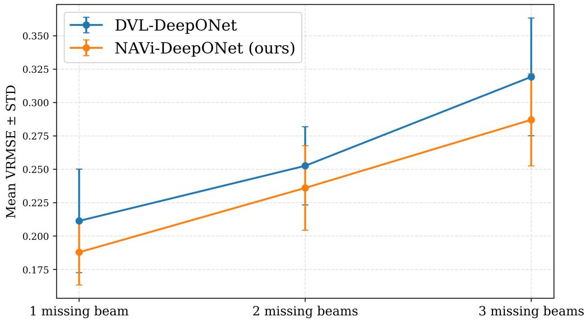  
Figure 7: Velocity estimation performance under increasing DVL beam outages.  
Table 10

Summary of the proposed model with the best VRMSE gain.

<table><tr><td>Variant</td><td>VRMSE [m/s] ↓</td><td>Best Gain [%] ↑</td></tr><tr><td>NAVi-DeepONetV1</td><td>0.082</td><td>54</td></tr><tr><td>NAVi-DeepONetV2</td><td>0.175</td><td>91</td></tr></table>

## 4.7. Summary

NAViLoss is incorporated into the DeepONet architecture to construct the proposed NAVi-DeepONet framework. The experimental results collectively demonstrate the efectiveness of proposed model under diferent scenarios, as shown in Table 10.

For noise-aware velocity estimation, NAVi-DeepONetV1 achieves the best overall performance among the evaluated methods. It reduces the VRMSE by at least 11% and VMAE by at least 4%. The contribution of inertial information is comparatively moderate in this setting, with a 9% VRMSE and 11% VMAE improvement over the DVL-only training. This suggests that when the complete DVL geometry is available, the beam measurements already provide strong information for threedimensional velocity estimation.

The advantage of the proposed framework becomes more pronounced for DVL measurement recovery scenarios, as NAVi-DeepONetV2 achieves at least 31% and 37% improvements in VRMSE and VMAE, respectively, relative to baselines. Furthermore, the inclusion of inertial information reduces the VRMSE by approximately 38% and the VMAE by approximately 42% compared with the DVL-only training with NAVi-DeepONet configuration. The repeated cross-validation experiments support this trend, with the proposed configuration achieves approximately 30% improvement against the counterpart across diferent folds and random initializations. The temporal-window ablation further shows that a short observation window is suficient, with � = 2 providing the best performance under the evaluated missing-beam conditions.

Overall, the results indicate that the benefit of the proposed framework depends on the information available from the DVL measurement geometry. Under full-beam operation, NAViLoss efectively exploits the complete beam information, whereas under reduced beam availability, its uncertainty-aware formulation adapts the contribution of the beam-domain information. These findings demonstrate that NAVi-DeepONet provides a robust learning framework for accurate velocity estimation across both complete and degraded DVL measurement conditions.

## 5. Conclusion

Reliable velocity estimation is essential for underwater navigation, where DVL measurements play a key role in constraining inertial navigation errors. For the LR-based models, regression losses primarily minimize the discrepancy between the estimated and GT velocities without explicitly considering the physics of the underlying DVL measurement geometry. This limitation becomes particularly important in the presence of noisy or missing DVL beams, where the uncertainty and amount of available measurement information can vary significantly. To address these limitations, we introduced NAViLoss, a navigation-aware objective function specifically designed for AUV velocity estimation under both nominal and degraded DVL measurement conditions. Its bounded formulation limits the influence of large residuals, while its uncertainty-aware weighted property adapts the contribution of DVL measurement information according to the available beam geometry. The fundamental properties of NAViLoss were further established through rigorous mathematical analysis and proofs.

Later, NAViLoss is integrated with a DeepONet architecture to construct the proposed NAVi-DeepONet framework. NAVi-DeepONet is evaluated using approximately 10,000m of semi-synthetic AUV experimental data collected during multiple real-world sea trials. Under full-beam measurements, NAVi-DeepONetV1 achieves a VRMSE of 0.082m/s and improves the accuracy by an average of 31% over the baselines. The advantage becomes more pronounced under missing-beam conditions, where NAVi-DeepONetV2 achieves a VRMSE of 0.175m/s. This corresponds to an average improvement of 56% over baselines. Overall, the proposed NAVi-DeepONet model achieves an average improvement of approximately 44%.

Nonetheless, several limitations warrant consideration. First, the uncertainty formulation employed in this study is derived from the available DVL beam geometry and therefore primarily reflects geometric measurement informativeness rather than a complete probabilistic characterization of all sensor uncertainties. Second, the robustness and weighting parameters of NAViLoss are selected empirically for the dataset considered in this study and may require adjustment for diferent DVL configurations, sensor characteristics, or operating environments. Furthermore, although the proposed framework is evaluated across multiple data partitions and random initializations, its generalizability across diferent AUV platforms, DVL geometries, seabed conditions, and acoustic environments remains to be investigated. Future work will therefore consider richer uncertainty models incorporating sensor statistics, and broader cross-platform and cross-environment validation.

To conclude, NAViLoss provides a navigation-aware learning objective that combines (1) robust velocity estimation, (2) DVL measurement consistency, (3) adaptive uncertainty handling, and (4) limit the influence of large residuals within a unified formulation. When integrated with NAVi-DeepONet, it enables accurate and resilient velocity estimation across both nominal and degraded DVL measurement conditions. Our model is useful for LR-based underwater navigation.

## Conflict of Interest Statement

The authors confirm that they have no conflicts of interest related to this paper.

□

## NAViLoss

## Funding Declaration

The authors confirm that they did not receive any funding to carry out this work.

## Data Availability

The dataset used in this study is publicly available at: https://github.com/ansfl/A-KIT/tre e/main.

## Code Availability

The source code associated with this study is publicly available at: https://github.com/ansfl/N AViLoss.

## Appendix A.

## A. Proof of Proposition 1

Proof. Since $\| \mathbf { r } _ { v } \| ^ { 2 } , \| \mathbf { r } _ { b } \| ^ { 2 } \geq 0$ and the corresponding uncertainty denominators are strictly positive, it follows directly from (11) and (12) that

$$
0 \leq \mathcal { L } _ { v } < \frac { 1 } { \lambda } , \qquad 0 \leq \mathcal { L } _ { b } < \frac { 1 } { \lambda } .\tag{62}
$$

Therefore,

$$
0 \leq \mathcal { L } _ { \mathrm { N A V i } } < \frac { 1 + \lambda _ { b } } { \lambda } .\tag{63}
$$

Furthermore, since $\sigma _ { v } ^ { 2 } + \varepsilon > 0$ and $\sigma _ { b } ^ { 2 } + \varepsilon > 0$ , all denominators remain strictly positive for every finite $\mathbf { r } _ { v }$ and $\mathbf { r } _ { b } .$ . Hence, $\mathcal { L } _ { v }$ and $\mathcal { L } _ { b }$ have no singularities and are infinitely diferentiable with respect to their corresponding residuals. Consequently, their weighted sum ${ \mathcal { L } } _ { \mathrm { N A V i } }$ is also smooth with respect to $( \mathbf { r } _ { v } , \mathbf { r } _ { b } )$ , i.e.,

$$
{ \mathcal { L } } _ { \mathrm { N A V i } } \in C ^ { \infty } .\tag{64}
$$

Finally, as $\| \mathbf { r } _ { v } \| \to \infty$ and $\| \mathbf { r } _ { b } \|  \infty$ ,

$$
\mathcal { L } _ { v } \to \frac { 1 } { \lambda } , \qquad \mathcal { L } _ { b } \to \frac { 1 } { \lambda } .\tag{65}
$$

Thus,

$$
\operatorname* { l i m } _ { \| \mathbf { r } _ { v } \| \to \infty } \mathcal { L } _ { \mathrm { N A V i } } = \frac { 1 + \lambda _ { b } } { \lambda } ,\tag{66}
$$

which completes the proof.

## A.1. Proof of Lemma 1

Proof. Let

$$
\rho ( r ) = \frac { 1 } { \lambda } \left( 1 - \frac { 1 } { 1 + \lambda \frac { r ^ { 2 } } { \sigma ^ { 2 } + \varepsilon } } \right) ,\tag{67}
$$

where $\lambda > 0 , \sigma > 0$ , and $\varepsilon > 0$

As |�| → ∞,

$$
\lambda \frac { r ^ { 2 } } { \sigma ^ { 2 } + \varepsilon }  \infty ,\tag{68}
$$

and therefore

$$
\operatorname* { l i m } _ { | r | \to \infty } { \frac { 1 } { 1 + \lambda { \frac { r ^ { 2 } } { \sigma ^ { 2 } + \varepsilon } } } } = 0 .\tag{69}
$$

Hence,

$$
\operatorname* { l i m } _ { | r | \to \infty } \rho ( r ) = { \frac { 1 } { \lambda } } .\tag{70}
$$

Diferentiating $\rho ( r )$ with respect to � gives

$$
\rho ^ { \prime } ( r ) = \frac { 2 r } { \sigma ^ { 2 } + \varepsilon } \left( 1 + \lambda \frac { r ^ { 2 } } { \sigma ^ { 2 } + \varepsilon } \right) ^ { - 2 } .\tag{71}
$$

For large $| r | ,$ , the denominator grows as $r ^ { 4 }$ , whereas the numerator grows linearly with �. Consequently,

$$
\operatorname* { l i m } _ { | r | \to \infty } \rho ^ { \prime } ( r ) = 0 .\tag{72}
$$

Thus, the penalty approaches the finite upper bound $1 / \lambda ,$ , while the gradient contribution of the residual to the optimization vanishes for increasingly large residuals. This establishes the bounded and redescending behavior stated in Lemma 1.

## A.2. Proof of Lemma 2

Proof. Let

$$
x = \lambda \frac { r ^ { 2 } } { \sigma ^ { 2 } + \varepsilon } .\tag{73}
$$

As $r  0 .$ , we have $x \to 0$ . Using the expansion

$$
{ \frac { 1 } { 1 + x } } = 1 - x + x ^ { 2 } + O ( x ^ { 3 } ) , \qquad x  0 ,\tag{74}
$$

the penalty can be written as

$$
\begin{array} { l } { { \displaystyle \rho ( r ) = \frac { 1 } { \lambda } \left[ 1 - \left( 1 - x + x ^ { 2 } + { \cal O } ( x ^ { 3 } ) \right) \right] } } \\ { { \displaystyle \qquad = \frac { 1 } { \lambda } \left[ x - x ^ { 2 } + { \cal O } ( x ^ { 3 } ) \right] . } } \end{array}\tag{75}
$$

(76)

Substituting $x = \lambda r ^ { 2 } / ( \sigma ^ { 2 } + \varepsilon )$ yields

$$
\rho ( r ) = \frac { r ^ { 2 } } { \sigma ^ { 2 } + \varepsilon } - \lambda \frac { r ^ { 4 } } { ( \sigma ^ { 2 } + \varepsilon ) ^ { 2 } } + O ( r ^ { 6 } ) .\tag{77}
$$

Therefore,

$$
\rho ( r ) = \frac { r ^ { 2 } } { \sigma ^ { 2 } + \varepsilon } + O ( r ^ { 4 } ) , \qquad r \to 0 ,\tag{78}
$$

which establishes the locally quadratic behavior stated in Lemma 2.

## A.3. Proof of Lemma 3

Proof. For a fixed $r \neq 0$ , the penalty is given by

$$
\rho ( r ; \sigma ) = \frac { 1 } { \lambda } \left( 1 - \frac { 1 } { 1 + \lambda \frac { r ^ { 2 } } { \sigma ^ { 2 } + \varepsilon } } \right) .\tag{79}
$$

Diferentiating with respect to � yields

$$
\frac { \partial \rho ( r ; \sigma ) } { \partial \sigma } = - \frac { 2 \sigma r ^ { 2 } } { ( \sigma ^ { 2 } + \varepsilon ) ^ { 2 } \left( 1 + \lambda \frac { r ^ { 2 } } { \sigma ^ { 2 } + \varepsilon } \right) ^ { 2 } } .\tag{80}
$$

Since $\sigma > 0 , r \neq 0$ , and $\varepsilon > 0$ , all terms in the denominator of (80) are strictly positive, and $2 \sigma r ^ { 2 } > 0$ Therefore,

$$
\frac { \partial \rho ( r ; \sigma ) } { \partial \sigma } < 0 .\tag{81}
$$

Hence, $\rho ( r ; \sigma )$ is strictly decreasing with respect to � for any fixed $r \neq 0$ . Equivalently, for any $0 < \sigma _ { 1 } < \sigma _ { 2 }$

$$
\rho ( r ; \sigma _ { 2 } ) < \rho ( r ; \sigma _ { 1 } ) .\tag{82}
$$

Thus, increasing the uncertainty parameter attenuates the penalty assigned to a fixed nonzero residual, which proves the result. □

## A.4. Proof of Proposition 2

Proof. From the definition of NAViLoss,

$$
\mathcal { L } _ { \mathrm { N A V i } } = \mathcal { L } _ { v } + \lambda _ { b } \mathcal { L } _ { b } ,\tag{83}
$$

where $\mathcal { L } _ { v } \ge 0 , \mathcal { L } _ { b } \ge 0$ , and $\lambda _ { b } > 0$ . Therefore, the condition

$$
{ \mathcal { L } } _ { \mathrm { N A V i } } = 0\tag{84}
$$

can hold only if

$$
\begin{array} { r } { \mathcal { L } _ { v } = 0 , \qquad \mathcal { L } _ { b } = 0 . } \end{array}\tag{85}
$$

From (11) and (12), each component loss vanishes if and only if its corresponding residual is zero. Hence,

$$
\mathbf { r } _ { v } = \mathbf { 0 } , \qquad \mathbf { r } _ { b } = \mathbf { 0 } .\tag{86}
$$

Using (1), (3), (4) and (86) we get

$$
\widehat { \mathbf { v } } - \mathbf { v } = \mathbf { 0 } , \qquad H \widehat { \mathbf { v } } - \mathbf { b } = \mathbf { 0 } ,\tag{87}
$$

which yields

$$
\widehat { \mathbf { v } } = \mathbf { v } , \qquad H \widehat { \mathbf { v } } = \mathbf { b } .\tag{88}
$$

This proves the result.

## References

[1] P. Ridao, M. Carreras, D. Ribas, R. Garcia, Visual inspection of hydroelectric dams using an autonomous underwater vehicle, Journal of Field Robotics 27 (6) (2010) 759–778.

[2] Y. Zhang, H. Zhang, J. Liu, S. Zhang, Z. Liu, E. Lyu, W. Chen, Submarine pipeline tracking technology based on AUVs with forward looking sonar, Applied Ocean Research 122 (2022) 103128.

[3] B. K. Tiwari, N. Ahuja, et al., A multi-sensor fusion and deep learning framework for autonomous underwater mine detection, in: 2025 International Conference on Electronics and Computing, Communication Networking Automation Technologies (ICEC2NT), IEEE, 2025, pp. 1–5.

[4] D. Tziourtzioumis, G. Minos, T. Anagnostaki, E. Kenanidis, T. Kosmanis, Design and development of a sensor-enhanced remotely operated underwater vehicle (ROUV) platform for environmental monitoring, Sensors 26 (3) (2026) 905.

[5] S. Wadoo, Autonomous underwater vehicles: modeling, control design and simulation, CRC press, 2017.

[6] B. Zhang, D. Ji, S. Liu, X. Zhu, W. Xu, Autonomous underwater vehicle navigation: A review, Ocean Engineering 273 (2023) 113861.

[7] N. Cohen, I. Klein, Adaptive Kalman-informed transformer, Engineering Applications of Artificial Intelligence 146 (2025) 110221.

[8] P. Groves, Principles of GNSS, Inertial and Multi-Sensor Integrated Navigation Systems, Artech House, UK, 2013.

[9] D. Titterton, J. L. Weston, Strapdown inertial navigation technology, Vol. 17, IET, 2004.

[10] J. L. Farrell, GNSS aided navigation & tracking: inertially augmented or autonomous, American Literary Press Baltimore, Maryland, 2007.

[11] M. Yona, I. Klein, MissBeamNet: Learning missing Doppler velocity log beam measurements, Neural Computing and Applications 36 (9) (2024) 4947–4958.

[12] G. Damari, I. Klein, ResAlignNet: A data-driven approach for INS/DVL alignment, Ocean Engineering 356 (2026) 125277.

[13] D. Wang, X. Xu, Y. Yao, T. Zhang, Y. Zhu, A novel SINS/DVL tightly integrated navigation method for complex environment, IEEE Transactions on Instrumentation and Measurement 69 (7) (2019) 5183–5196.

[14] D. Engelsman, I. Klein, Information-aided inertial navigation: A review, IEEE Transactions on Instrumentation and Measurement 72 (2023) 1–18.

[15] S. Cheng, Y. Wang, Q. Zhao, H. Zhu, X. Qu, A robust INS/USBL/DVL integrated navigation method based on adaptive correlation entropy factor graph optimization, Ocean Engineering 356 (2026) 125234.

[16] N. Cohen, I. Klein, BeamsNet: A data-driven approach enhancing Doppler velocity log measurements for autonomous underwater vehicle navigation, Engineering Applications of Artificial Intelligence 114 (2022) 105216.

[17] A. K. Sahoo, I. Klein, DVL-DeepONet: A physics-guided operator learning for resilient underwater navigation, Ocean Engineering 366 (2026) 127766.

[18] L. Kang, K. He, J. Zhao, X. Wang, P. Tan, A hybrid-kernel-based adaptive robust Kalman filter for INS/DVL integrated underwater navigation, Ocean Engineering 350 (2026) 124269.

[19] H. Mo, H. Yang, Y. Zhang, D. Pan, G. Yang, W. Li, A hybrid physics–data-driven navigation method for AUVs fusing hydrographic information with INS/DVL integration, IEEE Sensors Journal (2026).

[20] Z. Yampolsky, I. Klein, DCNet: A data-driven framework for DVL calibration, Applied Ocean Research 158 (2025) 104525.

[21] F. Zhang, S. Zhao, L. Li, C. Cao, Underwater DVL optimization network (UDON): A learningbased DVL velocity optimizing method for underwater navigation, Drones 9 (1) (2025) 56.

[22] A. K. Sahoo, I. Klein, PiDR: Physics-informed inertial dead reckoning for autonomous platforms, arXiv preprint arXiv:2601.03040 (2026).

[23] Y. Miao, X. Liu, Y. Sun, X. Liu, C. Shen, C. Wang, J. Tang, J. Liu, Physics-guided adaptive UKF for robust AUV integrated navigation under degraded underwater observations, Ocean Engineering 362 (2026) 126542.

[24] M. Batoš, Ð. Nađ, DMIAN: deep learning-based multi-IMU fusion for enhanced marine aided navigation, Control engineering practice 173 (2026) 106991.

[25] Q. Wang, Y. Ma, K. Zhao, Y. Tian, A comprehensive survey of loss functions in machine learning, Annals of Data Science 9 (2) (2022) 187–212.

[26] J. Terven, D.-M. Cordova-Esparza, J.-A. Romero-González, A. Ramírez-Pedraza, E. A. Chavez-Urbiola, A comprehensive survey of loss functions and metrics in deep learning, Artificial Intelligence Review 58 (7) (2025) 195.

[27] P. W. Holland, R. E. Welsch, Robust regression using iteratively reweighted least-squares, Communications in Statistics-theory and Methods 6 (9) (1977) 813–827.

[28] B.-S. Chen, Y.-K. Lin, J.-Y. Chen, C.-W. Huang, J.-L. Chern, C.-C. Sun, Fracgm: A fast fractional programming technique for Geman-McCLure robust estimator, IEEE Robotics and Automation Letters 9 (12) (2024) 11666–11673.

[29] F. Mosteller, J. W. Tukey, Data analysis and regression: A second course in statistics, Addison-Wesley series in behavioral science: quantitative methods (1977).

[30] J. T. Barron, A general and adaptive robust loss function, in: 2019 IEEE/CVF Conference on Computer Vision and Pattern Recognition (CVPR), IEEE, 2019, pp. 4326–4334.

[31] M. Akhtar, M. Tanveer, M. Arshad, RoBoSS: A robust, bounded, sparse, and smooth loss function for supervised learning, IEEE Transactions on Pattern Analysis and Machine Intelligence 47 (1) (2024) 149–160.

[32] M. Raissi, P. Perdikaris, G. E. Karniadakis, Physics-informed neural networks: A deep learning framework for solving forward and inverse problems involving nonlinear partial diferential equations, Journal of Computational Physics 378 (2019) 686–707.

[33] S. Chakraverty, A. K. Sahoo, D. Mohapatra, Artficial Neural Networks and Type-2 Fuzzy Set: Elements of Soft Computing and Its Applications, Elsevier, 2025.

[34] S. Saini, R. K. Vats, A. K. Sahoo, A-PINN: Auxiliary physics-informed neural networks for structural vibration analysis in continuous euler-bernoulli beam, Applied Soft Computing (2026) 115852.

[35] N. A. Broklof, Matrix algorithm for Doppler sonar navigation, in: Proceedings of OCEANS’94, Vol. 3, IEEE, 1994, pp. III–378.

[36] N. Cohen, I. Klein, Seamless underwater navigation with limited Doppler velocity log measurements, IEEE Transactions on Intelligent Vehicles (2024).

[37] A. Shurin, A. Saraev, M. Yona, Y. Gutnik, S. Faber, A. Etzion, I. Klein, The autonomous platforms inertial dataset, IEEE Access 10 (2022) 10191–10201.

[38] ECA Group, A18-D AUV: Autonomous Underwater Vehicle, https://www.ecagroup.com /en/solutions/a18-d-auv-autonomous-underwater-vehicle, accessed: Dec. 2025 (2023).

[39] iXblue, PHINS Subsea, https://www.ixblue.com/store/phins-subsea/, accessed: Dec. 2025 (2023).

[40] Teledyne Marine, Doppler Velocity Logs, https://www.teledynemarine.com/products/ product-line/navigation-positioning/{Doppler}-velocity-logs, accessed: Dec. 2025 (2023).