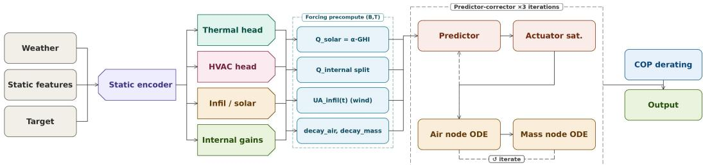
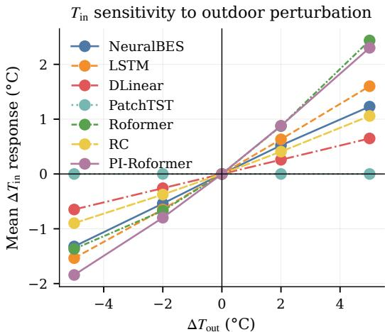
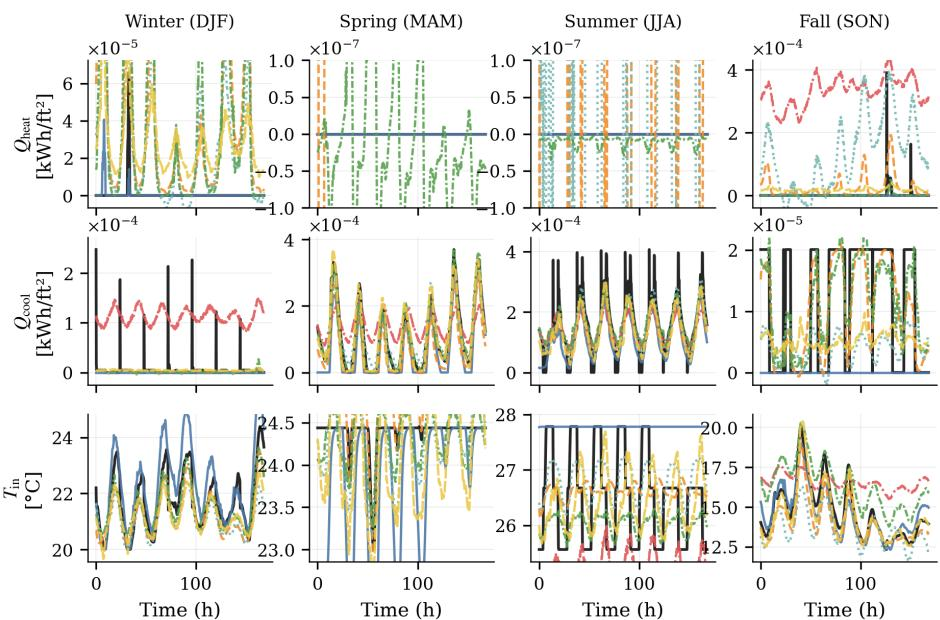
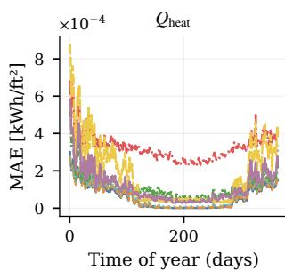
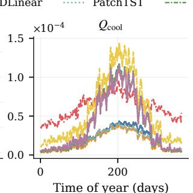
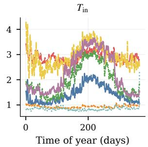
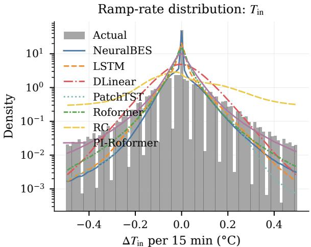
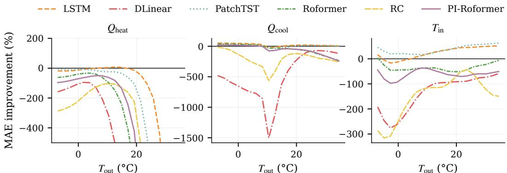
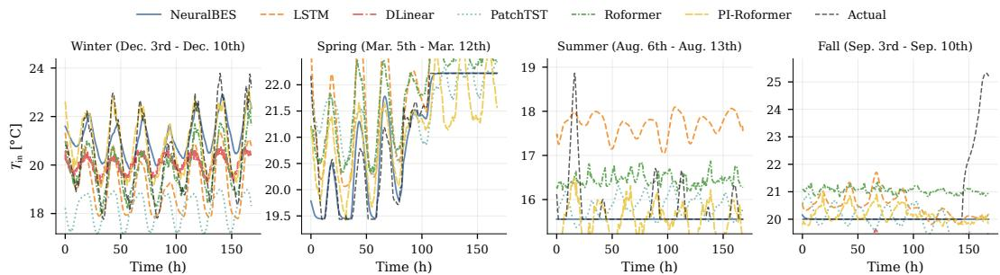

# NeuralBES: A Differentiable, Control-Aware Emulator for Scalable Building Energy Modeling

Ting-Yu Dai Fujitsu Research of America tdai@fujitsu.com

Takuya Kurihana Fujitsu Research of America

Wing Yee Au Fujitsu Research of America

HON YUNG WONG Fujitsu Research of America

## Abstract

Demand-side flexibility i.e. forecasting, shifting, and curtailing residential energy loads, depends on thermal models trusted across millions of heterogeneous buildings. Existing tools force a hard tradeoff: high-fidelity physics simulators such as EnergyPlus are accurate but sequential and require per-building calibration, while purely data-driven sequence models scale but abandon the physical structure that makes their predictions trustworthy.

We introduce NeuralBES (Building Energy Simulation), a differentiable emulator that resolves this tradeoff by parameterizing a resistance–capacitance (RC) based thermal model with a shared neural encoder: static building metadata such as floor area, vintage, and HVAC type is mapped to physically bounded capacitances, conductances, and equipment coefficients, which become the coefficients of a scalar linear recurrence solved via a log-space parallel scan, and a predictor– corrector loop closes the thermostat–temperature nonlinearity while preserving fullhorizon gradient flow. Trained on the ResStock dataset across three climate zones, NeuralBES handles heterogeneous building archetypes, vintages, and climate zones within a single trained encoder, while black-box baselines produce statistically plausible but physically inconsistent trajectories. On the annual full-year rollout, NeuralBES is the only data-conditioned model that is simultaneously physics-valid and accurate to within 4 MAPE points of the strongest raw-error baseline, while operating at roughly an order of magnitude fewer parameters than the transformer and recurrent baselines; among physics-valid baselines at parameter parity it more than halves the MAPE of the grey-box RC alternative.

## 1 Introduction

Buildings account for roughly 40% of global energy consumption [9], and residential heating, ventilation, and air conditioning (HVAC), appliances, electric vehicles, and PV charging dominate this footprint; the surging demand of AI infrastructure is now adding a comparably fast-growing second load on the same grids [29]. Accurate, scalable models of demand-side behavior are therefore a prerequisite for grid decarbonization, and Building Energy Modeling (BEM) is the standard tool for producing them, combining building descriptors (geometry, construction, HVAC), operational signals (schedules, occupancy, setpoints), and outdoor weather to compute zone-level thermal loads for design, retrofit, and stock-level planning workflows [3, 27].

Classical BEM requires per-building calibration of dozens of parameters (wall layers, window properties, HVAC performance curves, infiltration coefficients), which is what gives it accuracy and what prevents it from scaling. Purely data-driven emulators scale but abandon the physical structure that makes the outputs trustworthy under distribution shift (new climates, new control policies, new tariffs), which is precisely the regime where demand-flexibility studies need them most.

NeuralBES targets the middle. We address grid planners, utility analysts, MPC researchers, and policy modelers who need to simulate populations of buildings under counterfactual weather, tariffs, or control strategies. The user supplies only the metadata already available in tax-assessor records and utility rolls (floor area, vintage, HVAC type, ZIP code), and a shared encoder infers the RC parameters that would otherwise require a per-building calibration campaign. The result is a differentiable, physics-valid surrogate that scales to stocks of millions, trains once, and transfers across heterogeneous buildings and climates without sacrificing the physical interpretability that makes predictions actionable.

Contributions. NeuralBES occupies a specific point in the BEM / ML design space, and we state it by contrasting with three adjacent families.

• Compared to classical BEM (EnergyPlus [8], DOE-2 [37]): we trade detailed envelope-level fidelity for two orders of magnitude fewer required inputs. The user supplies metadata already available in utility records rather than a full envelope specification, while we retain conservation-law structure and bounded, physically meaningful coefficients.

• Compared to identified RC models [2, 4]: we replace per-building least-squares identification with a single shared encoder that shares calibration across a population, enabling zero-shot prediction for buildings never seen during training.

• Compared to generic state-space sequence models (S4 [17], Mamba [16], LRU [23]): we constrain the state-space recurrence coefficients $\bar { A } = \exp ( - P / C \cdot \Delta t )$ to be physically bounded functions of encoder-predicted capacitances and conductances rather than free learned parameters. We further wrap the resulting linear scan in a fixed-point loop that closes the thermostat–temperature nonlinearity, a mechanism outside the scope of linear SSMs.

• Compared to black-box sequence models (LSTM [19], PatchTST [22], Roformer [31]): attention-based sequence models incur $O ( T ^ { 2 } )$ compute and memory in the rollout horizon, while our linear recurrence runs in $O ( T )$ work and O(log T) depth via a parallel scan, which translates directly into parameter efficiency at long horizons. The resulting model is roughly an order of magnitude smaller than transformer and recurrent baselines because of its physical inductive bias, not because of architectural tricks, and it remains physically valid (exclusive heating/cooling modes, bounded indoor temperature, correct sign of HVAC response) where purely data-driven baselines collapse to statistically plausible but physically inconsistent trajectories.

## 2 Related Work

Identified RC thermal models. NeuralBES is most closely related to gray-box RC models, which represent building heat transfer with a small number of physically interpretable states and parameters. Foundational and follow-on studies showed that low-order thermal networks can capture building heat dynamics while remaining identifiable from data, and developed systematic procedures for selecting model order and fitting parameters for multi-zone and higher-fidelity networks [1, 2, 14, 4, 25, 24, 39]. These methods are the source of the two-node abstraction we adopt, but are identified one building at a time: each calibration produces a parameter set valid only for that building, which is precisely the scaling bottleneck NeuralBES addresses by sharing identification across a population through a single encoder.

Physics-aware neural approaches. A growing body of work marries this physical backbone to modern machine learning. Neural ordinary differential equations parameterize continuous-time dynamics with neural networks and enable gradient-based calibration through an adjoint solver [6, 28], and have been applied directly to building thermodynamics for temperature and load forecasting [32]. A parallel line encodes thermodynamic structure into the architecture itself: physics-informed networks with RC-based losses [15, 7], physics-constrained models that guarantee dissipativity of the learned dynamics [12], and physically consistent neural networks that enforce monotonic HVAC response and energy conservation by construction [10, 11]. NeuralBES differs from these along three axes, summarized in Table 1: (i) we fix the two-node RC topology and learn only its coefficients, rather than learning the dynamics from scratch; (ii) the recurrence is solved analytically and in parallel rather than with a black-box ODE integrator or a soft physics penalty; and (iii) we wrap the linear solver in a predictor–corrector fixed-point loop that closes the thermostat–temperature saturation nonlinearity, a mechanism outside the scope of the linear and monotone architectures above. We do not attempt a head-to-head empirical comparison with these methods because each targets a different input schema, supervision signal, and loss landscape, and porting any of them to the ResStock residential regime would require a substantial re-engineering effort orthogonal to the question this paper asks.

<table><tr><td>Property</td><td>PINN [7]</td><td>Dissipative [12]</td><td>PCNN [10]</td><td>NeuralBES (ours)</td></tr><tr><td>Physics enforcement</td><td>soft penalty</td><td>stability regularizer</td><td>arch. constraints</td><td>analytical ODE</td></tr><tr><td>Parameters per building</td><td>shared</td><td>shared</td><td>shared</td><td>shared</td></tr><tr><td>Cross-building eval</td><td>reported</td><td>reported</td><td>reported</td><td>reported</td></tr><tr><td>Full-horizon gradients</td><td>via penalty</td><td>via BPTT</td><td>via BPTT</td><td>via parallel scan</td></tr><tr><td>Nonlinear controller</td><td>X</td><td>X</td><td>X</td><td>predictor-corrector</td></tr><tr><td>Exposes C, UA at each t</td><td>X</td><td>X</td><td>partial</td><td>√</td></tr></table>

Table 1: Conceptual positioning of NeuralBES relative to the closest physics-aware ML families. Rows name properties along the physics-enforcement, parameter-sharing, and gradient-flow axes; they are not accuracy numbers.

Parallel scans for linear recurrences. The computational machinery of NeuralBES is closest to recent work on parallel associative scans. Prefix-scan algorithms provide the general primitive for parallelizing cumulative associative operations in logarithmic depth [5]; Martin and Cundy first applied this primitive to linear recurrent neural networks [20], and structured state-space layers demonstrated that long linear dynamics can be trained efficiently with scan-based recurrences [16]. We adopt the log-space scan of Heinsen [18] because it stabilizes the long products of decay factors that arise when unrolling discretized RC dynamics; a sequential unroll would either require truncated backpropagation through time, which is known to bias long-horizon gradients [34], or store the entire 35,040-step trajectory for reverse mode, which is prohibitive at stock scale. Unlike generic state-space models, however, our recurrence coefficients are not free latent variables but buildingspecific capacitances, conductances, and infiltration terms produced by the encoder; NeuralBES uses the parallel-scan machinery developed for sequence modeling to solve a physically constrained, building-specific thermal ODE, joining two research threads that have evolved largely independently.

Training setting and population-scale surrogates. The training signal for NeuralBES is inherited from building simulation engines. DOE-2 and EnergyPlus established the modern zone/HVAC simulation workflow, including the coupling between thermal states and equipment operation that motivates our predictor–corrector update [37, 8]. At stock scale, ResStock provides the heterogeneous residential simulation corpus needed to learn shared structure across climates, vintages, and envelope characteristics [26, 35], and the End-Use Load Profiles project calibrated these simulations against millions of metered accounts, producing the benchmark dataset for population-scale residential energy modeling [36]. A parallel line of work builds pure-surrogate emulators over building populations without explicit physical structure [13, 33, 21]; NeuralBES shares the population-scale training objective with this surrogate literature but retains the conservation-law backbone, keeping the model identifiable, physically bounded, and usable downstream as a simulator or controller rather than as a fitted input–output mapping.

## 3 NeuralBES

## 3.1 Problem Formulation

We consider a batch of residential buildings $B = \{ 1 , \ldots , B \}$ simulated over a sequence of 15- minute timesteps $\mathcal { T } = \{ 1 , \ldots , T \}$ . Each building b is described by two kinds of inputs. The first is a static descriptor, which captures attributes that do not change over the simulation horizon: numerical covariates $\mathbf { s } _ { b } ^ { \mathrm { n u m } } \in \mathbb { R } ^ { N }$ (such as floor area, wall conductance, or window-to-wall ratio) and categorical covariates ${ \mathbf s } _ { b } ^ { \mathrm { c a t } } \in \mathbb { Z } ^ { C }$ (such as construction type or HVAC system category). The second is a time-varying exogenous signal $\mathbf { w } _ { b , t } \in \mathbb { R } ^ { D }$ , formed by concatenating weather variables, fractional occupancy and appliance schedules, and sinusoidal encodings of the time of day and year. At every timestep, the model produces three quantities, $\hat { { \bf y } } _ { b , t } = \left[ q _ { b , t } ^ { \mathrm { h e a t } } , \ \breve { q } _ { b , t } ^ { \mathrm { c o o l } } , \ T _ { b , t } ^ { \mathrm { a i r } } \right] \in \mathbb { R } ^ { 3 }$ : the heating and cooling energy densities $q$ (in $\mathrm { k W h / f t ^ { 2 } }$ per 15-minute interval, normalized by floor area) and the zone air temperature $T ^ { \mathrm { a i r } }$ (in ◦C). Predicting temperature jointly with the two energy channels is essential because in real buildings the HVAC load at any moment is determined by how far the indoor temperature has drifted from its setpoint; treating them as independent targets would discard this coupling.

  
Figure 1: Architecture of NeuralBES. Static building features are encoded into a shared latent representation that conditions four parameter heads: the thermal head produces the RC capacitances $C ^ { \mathrm { a i r } } , C ^ { \mathrm { m a s s } }$ and coefficients $h ^ { \mathrm { a m } } , U \bar { A } ^ { \mathrm { e n v } }$ ; the HVAC head produces heating and cooling capacities and COPs; the infiltration/solar head produces wind-dependent infiltration and solar gain coefficients; and the internal gains head maps occupancy schedules to ${ \dot { Q } } ^ { \mathrm { i n t } }$ . Together with precomputed weather-driven forcings, setpoint schedules, and initial conditions, these parameters drive a predictor-corrector loop that solves the two-node RC thermal ODE via a parallel linear recurrence, iterated three times to resolve the nonlinear thermostat feedback. Electrical consumption is recovered by applying outdoortemperature COP derating to the final HVAC thermal loads. Colors of equation variables throughout the paper correspond to the head that produces them.

The overall design of NeuralBES reflects this physical structure and is summarized in Figure 1. A neural encoder reads the static descriptor and produces both a latent building embedding $\mathbf { z } _ { b }$ and a set of building-specific thermal parameters that populate a RC model. The time-varying signal ${ \bf w } _ { b , t }$ then acts as the external forcing on this model. Given these ingredients, inference proceeds in three stages: we (i) instantiate a two-node RC thermal model whose coefficients come from the encoder, (ii) solve the resulting linear recurrence in parallel across time using a log-space associative scan, and (iii) close the loop between indoor temperature and HVAC operation through a short predictor–corrector fixed-point iteration that enforces thermostat setpoints and equipment capacity limits. Appendix A glosses BEM and controls vocabulary (setpoint, thermal mass, conductance, COP, schedule) for readers unfamiliar with building simulation.

## 3.2 Neural Parameterization of the Two-Node RC Thermal Model

Each building is represented by a discretized two-node resistance–capacitance network, assumed single-zone throughout. One node represents the zone air, whose temperature is what occupants and thermostats sense, while the other represents an aggregate building mass (walls, floors, furnishings) that stores and slowly releases heat. This two-node abstraction, standard in grey-box modeling, captures dominant short-term thermal behavior without a detailed envelope geometry. The network is formally identical to a two-capacitor electrical circuit: the thermal capacitances $\dot { C } ^ { \mathrm { a i r } } , C ^ { \mathrm { m a s s } }$ play the role of capacitors, the conductances $h ^ { \mathrm { a m } } , U A ^ { \mathrm { e n v } } , U A ^ { \mathrm { i n f i l } }$ play the role of inverse resistors, and the heat fluxes play the role of currents; readers familiar with linear circuit analysis will recognize the balances below as Kirchhoff’s current law at each node. The continuous-time heat balance equates thermal capacitance times the rate of temperature change to the sum of incoming heat fluxes:

$$
C _ { b } ^ { \mathrm { a i r } } \frac { d T _ { b } ^ { \mathrm { a i r } } } { d t } = \dot { Q } _ { b } ^ { \mathrm { s y s } } ( t ) + \dot { Q } _ { b } ^ { \mathrm { i n t . c o n v } } ( t ) + U A _ { b } ^ { \mathrm { i n f l } } ( t ) \big ( T _ { b } ^ { \mathrm { o u t } } ( t ) - T _ { b } ^ { \mathrm { a i r } } \big ) + h _ { b } ^ { \mathrm { a m } } \big ( T _ { b } ^ { \mathrm { m a s s } } - T _ { b } ^ { \mathrm { a i r } } \big )\tag{1}
$$

$$
C _ { b } ^ { \mathrm { m a s s } } \frac { d T _ { b } ^ { \mathrm { m a s s } } } { d t } = \dot { Q } _ { b } ^ { \mathrm { s o l } } ( t ) + \dot { Q } _ { b } ^ { \mathrm { i n t , r a d } } ( t ) + h _ { b } ^ { \mathrm { a m } } \big ( T _ { b } ^ { \mathrm { a i r } } - T _ { b } ^ { \mathrm { m a s s } } \big ) + U A _ { b } ^ { \mathrm { e n v } } \big ( T _ { b } ^ { \mathrm { o u t } } ( t ) - T _ { b } ^ { \mathrm { m a s s } } \big )\tag{2}
$$

Each right-hand side term corresponds to a distinct heat-transfer mechanism: HVAC delivery, infiltration with outdoor air, internal gains from occupancy and appliances, and solar gain on the mass. The shared air–mass coupling $\bar { h } ^ { \mathrm { a m } }$ is what allows the mass to buffer the air temperature and produce the characteristic thermal inertia of real buildings.

Parameter heads. Each head (color-coded in Figure 1) is a two-layer SiLU MLP conditioned on the static embedding $\mathbf { z } _ { b } .$ , with a zero-initialized final layer and a bounded activation (softplus or sigmoid with head-specific scale) so that capacitances, conductances, capacities, and COPs remain strictly positive and in physically plausible ranges. The internal-gains head additionally consumes the per-timestep schedule vector. Full widths and activation scales are in Appendix C.

Exact discrete-time update. Over a simulation step of length $\Delta t = 9 0 0 \mathrm { s }$ we hold all forcing terms (HVAC load, internal gains, outdoor temperature, infiltration and solar inputs, and the other node’s temperature) constant within the step. Under this assumption, the air-node balance in Eq. (1) reduces to a scalar linear ODE of the form

$$
\frac { d T _ { b } ^ { \mathrm { a i r } } } { d t } = - \frac { P _ { b , t } ^ { \mathrm { a i r } } } { C _ { b } ^ { \mathrm { a i r } } } \left( T _ { b } ^ { \mathrm { a i r } } - T _ { b , t } ^ { \mathrm { a i r , e q } } \right) , \qquad P _ { b , t } ^ { \mathrm { a i r } } = U A _ { b } ^ { \mathrm { i n f l } } ( t ) + h _ { b } ^ { \mathrm { a m } } ,\tag{3}
$$

where $T _ { b , t } ^ { \mathrm { a i r , e q } }$ is the conductance-weighted sum of all forcing terms (Eq. (5) below). This ODE admits an exact closed-form solution over $[ t , t + \Delta t ]$ , a geometric decay toward the instantaneous equilibrium:

$$
T _ { b , t } ^ { \mathrm { a i r } } = \alpha _ { b , t } ^ { \mathrm { a i r } } T _ { b , t - 1 } ^ { \mathrm { a i r } } + \left( 1 - \alpha _ { b , t } ^ { \mathrm { a i r } } \right) T _ { b , t } ^ { \mathrm { a i r , e q } } , \qquad \alpha _ { b , t } ^ { \mathrm { a i r } } = \exp \left( - \frac { P _ { b , t } ^ { \mathrm { a i r } } } { C _ { b } ^ { \mathrm { a i r } } } \Delta t \right) .\tag{4}
$$

Here $\alpha ^ { \mathrm { a i r } } \in ( 0 , 1 )$ is the closed-form solution of the scalar ODE with constant coefficients over one timestep, and $P ^ { \mathrm { a i r } }$ is the effective conductance sum that sets the thermal time constant. No numerical integrator (Euler, RK4) is needed.1 The equilibrium temperature, toward which the air would relax if forcings were frozen, is the conductance-weighted average of all thermal inputs:

$$
T _ { b , t } ^ { \mathrm { a i r , e q } } = \frac { \dot { Q } _ { b } ^ { \mathrm { s y s } } ( t ) + \dot { Q } _ { b } ^ { \mathrm { i n t , c o n v } } ( t ) + U A _ { b } ^ { \mathrm { i n f l } } ( t ) T _ { b , t } ^ { \mathrm { o u t } } + h _ { b } ^ { \mathrm { a m } } T _ { b , t } ^ { \mathrm { m a s s } } } { P _ { b , t } ^ { \mathrm { a i r } } } .\tag{5}
$$

Introducing the affine term $\mathbf { b } _ { b , t } ^ { \mathrm { a i r } } = \left( 1 - \alpha _ { b , t } ^ { \mathrm { a i r } } \right) T _ { b , t } ^ { \mathrm { a i r , e q } }$ puts the update in the familiar state-space form $T _ { b , t } ^ { \mathrm { a i r } } = \alpha _ { b , t } ^ { \mathrm { a i r } } T _ { b , t - 1 } ^ { \mathrm { a i r } } + \mathbf { b } _ { b , t } ^ { \mathrm { a i r } }$ . The mass node admits an identical derivation with its own $P _ { b , t } ^ { \mathrm { m a s s } } =$ $h _ { b } ^ { \mathrm { a m } } + U A _ { b } ^ { \mathrm { e n v } }$ , capacitance $C _ { b } ^ { \mathrm { m a s s } }$ , decay factor $\alpha _ { b , t } ^ { \mathrm { m a s s } } = \exp ( - P _ { b , t } ^ { \mathrm { m a s s } } \Delta t / C _ { b } ^ { \mathrm { m a s s } } )$ , and equilibrium term. Both decay factors are strictly positive, bounded, and depend only on physical conductances and capacitances predicted by the encoder, making each recurrence a well-conditioned scalar linear system $x _ { t } = \alpha _ { t } x _ { t - 1 } + b _ { t }$ . These two properties, physically exact (within the piecewise-constant-forcing assumption) and linear in the state, jointly enable the parallel scan of Section 3.3.

## 3.3 Parallel Linear Recurrence via Log-Space Scan

Once the RC coefficients are fixed, advancing the temperature trajectory amounts to evaluating a scalar linear recurrence of the form $x _ { t } = \alpha _ { t } x _ { t - 1 } + b _ { t }$ at each node. A naive implementation would roll this update out sequentially over $T$ timesteps, preventing effective GPU parallelization and creating a severe bottleneck at long horizons. Since the recurrence is associative, we instead evaluate all timesteps in parallel via an associative-scan formulation, as is standard in structured state-space sequence models [5, 16]. Following Heinsen [18], the recurrence has the closed-form unrolling

$$
T _ { b , t } = \left( \prod _ { s = 1 } ^ { t } \alpha _ { b , s } \right) T _ { b , 0 } + \sum _ { s = 1 } ^ { t } \left( \prod _ { r = s + 1 } ^ { t } \alpha _ { b , r } \right) \mathbf { b } _ { b , s } ,\tag{6}
$$

which expresses the state at time t as the attenuated initial condition plus a weighted sum of past forcings. Evaluating this directly is numerically fragile because cumulative products $\Pi _ { s } \alpha _ { s }$ can underflow to machine zero at long horizons. The Heinsen log-space reformulation avoids this by working with cumulative log-decays:

$$
\Lambda _ { b , t } = \exp \left( \sum _ { s = 1 } ^ { t } \ln \alpha _ { b , s } \right) , \qquad T _ { b , t } = \Lambda _ { b , t } \left( T _ { b , 0 } + \sum _ { s = 1 } ^ { t } \frac {  { \mathbf { b } } _ { b , s } } { \Lambda _ { b , s } } \right) .\tag{7}
$$

Both the cumulative decay and the accumulated forcing are associative prefix operations and are computed with a standard ${ \dot { O } } ( \log T )$ )-depth parallel scan. To prevent the rescaled forcings $e ^ { - L _ { b , t } }$ t from overflowing float32 when the cumulative decay becomes strongly negative over many timesteps, we execute the scan in adaptively-sized chunks and chain only the scalar boundary state between chunks; the chunk-size rule and its safety margin are in Appendix C.

## 3.4 Predictor–Corrector Thermostat Algorithm

The construction so far treats the HVAC heat delivery $\dot { Q } ^ { \mathrm { s y s } }$ as a known forcing, but in real operation this quantity is itself determined by the zone temperature: the thermostat activates heating when the air temperature would fall below the heating setpoint and cooling when it would rise above the cooling setpoint, and the delivered load is further limited by installed equipment capacity. This coupling between state and actuator is what makes classical simulators such as DOE-2 and EnergyPlus [37, 8] nonlinear in time, and it cannot be captured by a single linear scan. We therefore wrap the scan in a short fixed-point loop that alternates between (i) estimating the load the thermostat would demand at the current trajectory, (ii) clipping that demand by equipment capacity, and (iii) re-integrating the temperature trajectory under the clipped load. We use the names predictor and corrector for steps (i) and (iii) by analogy with the load–response logic inside EnergyPlus’s zone predictor, not in the numerical-ODE sense; the ODE itself is already solved in closed form by $\operatorname { E q . } \left( 4 \right)$ , so what we iterate is the state–actuator coupling rather than an integrator. Three iterations are sufficient in practice $( N _ { \mathrm { i t e r } } = 3 )$

Initial conditions. $\mathbf { A } \mathbf { t } \ t = 0$ we teacher-force from ground truth during training and use a small MLP offset from the setpoint midpoint at inference; to suppress transients from a poorly chosen seed, the scan is run over $W \stackrel { - } { = } 1 6$ prepended warm-up steps (four hours at $\Delta t = 9 0 0 \mathrm { s } )$ that replicate the first-step forcing, mirroring the steady-state relaxation performed implicitly by sequential simulators. Details are in Appendix C.

Fixed-point iteration. Each iteration consists of three steps that together close the state–actuator loop.

Step 1 (predictor). We ask a counterfactual: how much HVAC heat would be needed to keep the air exactly at setpoint, i.e. to set $d T ^ { \mathrm { a i r } } / d t \equiv 0 ?$ Setting the derivative to zero in the air balance and solving for the system load decomposes the answer into a passive disturbance term and a setpoint-dependent demand. The disturbance bundles all non-HVAC heat flows into the air node,

$$
\dot { Q } _ { b , t } ^ { \mathrm { d i s t } } = \dot { Q } _ { b , t } ^ { \mathrm { i n t , c o n v } } + U A _ { b , t } ^ { \mathrm { i n f l } } T _ { b , t } ^ { \mathrm { o u t } } + h _ { b } ^ { \mathrm { a m } } \hat { T } _ { b , t } ^ { \mathrm { m a s s } } ,
$$

and the required heating and cooling loads are the additional heat needed to hold the air at the heating and cooling setpoints respectively:

$$
\dot { Q } _ { b , t } ^ { \mathrm { r e q , h e a t } } = P _ { b , t } ^ { \mathrm { a i r } } T _ { b , t } ^ { \mathrm { h e a t , s p } } - \dot { Q } _ { b , t } ^ { \mathrm { d i s t } } , \qquad \dot { Q } _ { b , t } ^ { \mathrm { r e q , c o o l } } = P _ { b , t } ^ { \mathrm { a i r } } T _ { b , t } ^ { \mathrm { c o o l , s p } } - \dot { Q } _ { b , t } ^ { \mathrm { d i s t } } .
$$

Step 2 (actuator saturation). The predicted demand is passed through a piecewise model of real thermostat and equipment behavior: if heating is required (positive demand) it is clipped to heating capacity; if cooling is required (negative demand) and no heating is requested it is clipped to cooling capacity; otherwise the HVAC idles:

$$
\begin{array} { r } { \dot { Q } _ { b , t } ^ { \mathrm { s y s } } = \left\{ \begin{array} { l l } { \operatorname* { m i n } \Bigl ( \dot { Q } _ { b , t } ^ { \mathrm { r e q , h e a t } } , ~ \dot { Q } _ { b } ^ { \mathrm { h e a t , c a p } } \Bigr ) } & { \mathrm { i f ~ } \dot { Q } _ { b , t } ^ { \mathrm { r e q , h e a t } } > 0 , } \\ { \operatorname* { m a x } \Bigl ( \dot { Q } _ { b , t } ^ { \mathrm { r e q , c o o l } } , ~ - \dot { Q } _ { b } ^ { \mathrm { c o o l , c a p } } \Bigr ) } & { \mathrm { i f ~ } \dot { Q } _ { b , t } ^ { \mathrm { r e q , c o o l } } < 0 ~ \land ~ \dot { Q } _ { b , t } ^ { \mathrm { r e q , h e a t } } \le 0 , } \\ { 0 } & { \mathrm { o t h e r w i s e } . } \end{array} \right. } \end{array}
$$

This branch is the sole source of nonlinearity in the forward pass and produces realistic behaviors such as setpoint undershoot on very cold days when installed heating capacity is insufficient.

Step 3 (corrector). With $\dot { Q } ^ { \mathrm { s y s } }$ now fixed at its saturated value, the affine coefficients $\mathbf { b } ^ { \mathrm { a i r } } , \mathbf { b } ^ { \mathrm { m a s s } }$ are deterministic and both states are re-integrated with the parallel scan of Section 3.3:

$$
\begin{array} { r } { \hat { T } _ { b , \cdot } ^ { \mathrm { a i r } } = \mathrm { P a r S c a n } \left( \alpha _ { b , \cdot } ^ { \mathrm { a i r } } , \ \mathbf { b } _ { b , \cdot } ^ { \mathrm { a i r } } \left[ \dot { Q } ^ { \mathrm { s y s } } \right] , \ T _ { b , 0 } ^ { \mathrm { a i r } } \right) , \qquad \hat { T } _ { b , \cdot } ^ { \mathrm { m a s s } } = \mathrm { P a r S c a n } \left( \alpha _ { b , \cdot } ^ { \mathrm { m a s s } } , \ \mathbf { b } _ { b , \cdot } ^ { \mathrm { m a s s } } \left[ \hat { T } ^ { \mathrm { a i r } } \right] , \ T _ { b , 0 } ^ { \mathrm { m a s s } } \right) . } \end{array}
$$

The updated trajectories feed back into Step 1 of the next iteration. Because the predictor and corrector operate on consistent thermal dynamics and only the saturation branch is nonlinear, the iteration contracts rapidly; three passes drive the residual below the noise floor of the underlying simulator.

<table><tr><td>Metric</td><td>DLinear</td><td>LSTM</td><td></td><td>PatchTST</td><td>Roformer PI-Roformer</td><td></td><td>RC</td><td>NeuralBES</td></tr><tr><td># Params (M)</td><td></td><td>1.3</td><td>36.6</td><td>3.0</td><td>20.5</td><td>11.0</td><td>0.96</td><td>1.0</td></tr><tr><td>MAPE (%)</td><td> $Q _ { \mathrm { h e a t } }$   $Q _ { \mathrm { c o o l } }$ </td><td> $1 6 1 . 3 { \scriptstyle \pm 3 9 . 8 }$   $1 2 1 . 3 { \scriptstyle \pm 2 2 . 9 }$ </td><td> $\mathbf { 3 8 . 5 { \scriptstyle \pm 0 . 1 } }$   $\mathbf { 3 7 . 6 { \scriptstyle \pm 1 . 7 } }$ </td><td> $5 2 . 4 { \scriptstyle \pm 9 . 2 }$   $4 6 . 2 { \scriptstyle \pm 8 . 5 }$ </td><td> $6 7 . 8 { \scriptstyle \pm 6 . 8 }$   $8 5 . 3 { \scriptstyle \pm 3 . 0 }$ </td><td> $6 5 . 9 { \scriptstyle \pm 5 . 4 }$   $8 0 . 6 { \scriptstyle \pm 3 . 5 }$ </td><td> $8 6 . 5 { \scriptstyle \pm 3 0 . 5 }$   $9 2 . 5 { \scriptstyle \pm 3 2 . 4 }$ </td><td> $4 1 . 5 { \scriptstyle \pm 4 . 3 }$   $4 1 . 3 { \scriptstyle \pm 0 . 4 }$ </td></tr><tr><td>RMSE (°C)</td><td> $T _ { \mathrm { i n } }$ </td><td> $3 . 4 3 _ { \pm 0 . 8 3 }$ </td><td> $\mathbf { 1 . 4 8 _ { \pm 0 . 0 1 } }$ </td><td> $1 . 6 8 _ { \pm 0 . 1 3 }$ </td><td> $3 . 2 6 _ { \pm 0 . 0 8 }$ </td><td> $2 . 9 2 _ { \pm 0 . 4 1 }$ </td><td> $4 . 0 5 _ { \pm 0 . 5 2 }$ </td><td> $2 . 7 9 _ { \pm 0 . 0 3 }$ </td></tr><tr><td>Mode excl. [%]</td><td></td><td> $2 6 . 1 _ { \pm 2 7 . 2 }$ </td><td> $3 6 . 9 { \scriptstyle \pm 1 8 . 0 }$ </td><td> $4 5 . 5 { \scriptstyle \pm 2 2 . 2 }$ </td><td> $2 4 . 4 { \scriptstyle \pm 8 . 5 }$ </td><td> $3 1 . 0 { \scriptstyle \pm 2 8 . 1 }$ </td><td> $\mathbf { 1 0 0 . 0 { \scriptstyle \pm 0 . 0 } }$ </td><td> $\mathbf { 1 0 0 . 0 { \scriptstyle \pm 0 . 0 } }$ </td></tr><tr><td>Bounds [%]</td><td></td><td> $7 3 . 8 { \scriptstyle \pm 2 7 . 2 }$ </td><td> $6 3 . 1 { \pm } 1 8 . 0 $ </td><td> $5 4 . 3 { \scriptstyle \pm 2 2 . 2 }$ </td><td> $7 5 . 6 { \scriptstyle \pm 8 . 5 }$ </td><td> $6 8 . 8 { \scriptstyle \pm 2 7 . 9 }$ </td><td> $9 8 . 6 { \scriptstyle \pm 1 . 4 }$ </td><td> $\mathbf { 9 9 . 7 { \scriptstyle \pm 0 . 1 } }$ </td></tr></table>

Table 2: Annual full-year (35,040-step) rollout on the multi-region ResStock test set. Among data-conditioned models, NeuralBES is the only one with structural physics validity (100% mode exclusivity, 99.7% bounds adherence). LSTM has marginally lower raw error on the HVAC channels but operates at 36× the parameter count and produces those numbers from physically inadmissible trajectories (mode exclusivity 36.9%, bounds adherence 63.1%). Among physics-valid models (NeuralBES vs. RC) at parameter parity, NeuralBES more than halves RC’s MAPE. Weekly-rollout numbers and per-region breakdowns: Appendix E.

## 4 Evaluation

## 4.1 Data and baselines

We train and evaluate on synthetic building-energy simulation data from ResStock [26], an NLR stock-level corpus that samples real U.S. housing characteristics and simulates each sampled dwelling with EnergyPlus. We distill subsets for California (CA), Texas (TX), and New York (NY) by stratified splitting over setpoint validity, plug-load usage, vintage, and building type, ensuring that every category appears in the training set to avoid cold-start embedding failures on held-out buildings. Each sample comes with static metadata, an hourly weather file, a 15-min schedule time series for equipment and occupant behavior, and a 15-min energy-usage ground-truth series over a full calendar year (sequence length $T = 4 \cdot 2 4 \cdot 3 6 5 = 3 5 { , } 0 4 0 )$ . Training/validation/testing splits are 0.7/0.15/0.15 (2000/428/428 buildings per state), with a multi-state joint regime combining all three. All evaluations are on held-out buildings.

Evaluation protocol. We assess each model under two rollout horizons. All baselines, including NeuralBES, are trained on 672-step windows, matching the weekly protocol exactly; the annual protocol is therefore an out-of-distribution-horizon evaluation roughly 52× longer than the training context, while the weekly protocol is matched-horizon. The annual protocol (35,040 steps, one window per held-out building) is the primary evaluation, aligned with traditional simulation tools and with downstream applications such as annual energy-use intensity and retrofit ROI. The weekly protocol (672-step non-overlapping windows) is reported as a robustness check that exercises short-term thermal switching with frequent context resets. Per-region weekly numbers appear in Appendix E.

Baselines. We compare against five baselines spanning the inductive-bias spectrum (Table 4). All share the same input interface i.e. weather, schedules, time encodings, and static features via the shared static encoder and predict the same three output channels. Baselines are sized to the capacity regime typical of each family rather than to a single parameter budget; exact widths and layer counts are in Appendix F.1. Our RC Grey-Box uses the same shared encoder to predict eight canonical 2R2C parameters $( C ^ { \mathrm { a i r } } , C ^ { \mathrm { m a s s } } , h ^ { \mathrm { a m } } , U A ^ { \mathrm { e n v } } , \dot { Q } ^ { \mathrm { h e a t , c a p } } , \dot { Q } ^ { \mathrm { c o o l , c a p } }$ , solar aperture, base ACH) that drive a fixedstructure rollout with standard constants. This isolates what NeuralBES adds on top: learned internal gains, wind-driven infiltration, COP derating, the predictor–corrector thermostat, schedule-aware setpoints, and the parallel log-space scan.

## 4.2 Results and Analysis

Overall accuracy. Table 2 maps the Pareto frontier in (accuracy, physics-validity) space, and NeuralBES is the only data-conditioned model on it. LSTM is 3 to 4 pp lower on HVAC MAPE and $1 . 3 1 ^ { \circ } \mathrm { C }$ lower on $T _ { \mathrm { i n } }$ RMSE, but reaches those numbers at 36.6 M parameters (36× NeuralBES), and 63% of its timesteps emit simultaneous heating and cooling while 37% of its $T _ { \mathrm { i n } }$ trajectory exits the physical envelope: the error is computed against a state no real building could realize. Roformer (20.5 M) is worse than NeuralBES on every dimension. At parameter parity, NeuralBES more than halves the MAPE of the grey-box RC and cuts $T _ { \mathrm { i n } }$ RMSE by $1 . 3 ^ { \circ } \mathrm { C }$ . We view the 3 to 4 pp gap to a

36× larger black-box recurrent baseline as consistent with the cost of physics-encoded inductive bias in the smooth ResStock regime, where data-driven capacity translates relatively directly into MAPE reduction. We flag the absence of a ∼ 1 M-parameter LSTM/Roformer row as a limitation: such a row would directly test whether the 3 to 4 pp HVAC-MAPE gap is attributable to capacity rather than to the inductive bias itself.

Physics validity. The bottom block of Table 2 reports two thermodynamic diagnostics: mode exclusivity (fraction of timesteps with no simultaneous heating and cooling, declared simultaneous when both $\hat { Q } _ { \mathrm { h e a t } }$ and $\hat { Q } _ { \mathrm { c o o l } }$ exceed $\epsilon = 1 0 ^ { - 3 }$ in normalized load units) and bounds adherence (fraction of $T _ { \mathrm { i n } }$ within the physically plausible envelope). NeuralBES achieves 100% mode exclusivity and 99.7 ± 0.1% bounds adherence; RC matches it at 100% / 98.6% but pays 86.5/92.5% MAPE for the rigidity of fixed COPs, a fixed setpoint band, and no scheduleaware dynamics. The data-driven baselines sit at 24.4–45.5% mode exclusivity, meaning the majority of their predicted timesteps are physically impossible, and their seed-to-seed spread on both diagnostics is large (LSTM ±18%, PatchTST ±22%, PI-Roformer ±28%). The qualitative content of these numbers, that datadriven trajectories are smooth, low-error, and unusable for any downstream task that needs the timing or shape of the load, is what Figure 3 makes visible.

Sensitivity analysis. Figure 2 stress-tests envelope behavior by uniformly perturbing $T _ { \mathrm { o u t } }$ by ±2 and $\pm 5 ^ { \circ } \mathrm { C }$ and measuring the mean shift in predicted $T _ { \mathrm { i n } }$ . NeuralBES and RC give the physically expected monotone response; Roformer

  
Figure 2: $T _ { \mathrm { i n } }$ sensitivity to a uniform $T _ { \mathrm { o u t } }$ perturbation of $\{ - 5 , - 2 , 0 , + 2 , + 5 \} ^ { \circ } \mathbf { C }$ . NeuralBES and RC give the physically expected monotone slope; Roformer and PI-Roformer over-react (indoor temperature shifts by more than $2 ^ { \circ } \mathbf { C }$ for a $5 ^ { \circ } \mathrm { C }$ outdoor perturbation, implying an implausibly leaky envelope); DLinear’s slope is shallow but in the right direction; PatchTST returns a flat zero response at every perturbation, i.e. its $T _ { \mathrm { i n } }$ prediction is formally independent of $T _ { \mathrm { o u t } }$

and PI-Roformer over-react with implausibly leaky envelopes; PatchTST returns a flat zero response, i.e. its $T _ { \mathrm { i n } }$ prediction is formally independent of outdoor temperature. A leakier-than-physical envelope is bounded over a week but accumulates a multi-degree drift over a year (Appendix E). We hypothesize that the downstream tasks motivating this work (MPC, tariff design under demand response, heatwave resilience, and stock-level retrofit ROI) weight physics validity above 3 to 5 percentage points of MAPE, because mode-violating loads pollute annual cost integrals and small leakiness errors compound across the year. Quantifying this directly, for instance via annual electricity-cost MAE under a time-of-use tariff applied to predicted load shapes, is left to future work.

Qualitative trajectory comparison. Figure 3 makes the qualitative content of the physics-validity numbers visible. NeuralBES emits identically zero on load channels in seasons with no heating or cooling and produces discrete spikes at thermostat events; baselines emit either constant non-zero offsets (DLinear, RC) or low-amplitude noise (Roformer winter $Q _ { \mathrm { h e a t } } ;$ PatchTST and Roformer summer $Q _ { \mathrm { h e a t } } )$ . On $T _ { \mathrm { i n } }$ , NeuralBES tracks envelope-driven excursions in summer and fall while LSTM and PatchTST flatten toward the setpoint mean. These predictions are statistically defensible but physically nonsensical, exactly what the mode-exclusivity and bounds-adherence diagnostics measure. The case study in Appendix E shows the most extreme instance: Roformer flatlines at $\sim 2 1 ^ { \circ } \mathrm { C }$ while the ground truth swings $\mathrm { t o } \sim 2 6 ^ { \circ } \mathrm { C }$ in fall.

Hybrid comparison. The Roformer / PI-Roformer pair isolates the effect of attaching a physics head to a data-driven trunk. PI-Roformer narrows the HVAC MAPE gap only marginally and gives a small $T _ { \mathrm { i n } }$ RMSE improvement, while mode exclusivity and bounds adherence remain within seed-toseed spread of Roformer and far below NeuralBES. Notably, PI-Roformer’s mode-exclusivity ranking inverts between horizons: it scores 31.0% on the annual rollout (better than Roformer’s 24.4%) but only 2.75% on the weekly Multi rollout (far below Roformer’s 43.38%, Appendix E), consistent with a physics head that reduces residual energy-conservation error over long integration windows but provides no benefit, and possibly hurts, on short-window switching. A shallow physics head on a black-box trunk does not recover the switching dynamics: its sequential rollout truncates BPTT and the trunk never learns switching structure end-to-end, whereas the parallel log-space scan in NeuralBES carries gradients across the full annual horizon and the predictor–corrector closes the thermostat-to-temperature loop on a dissipative state.

  
Figure 3: Multi-channel weekly rollouts on a representative multi-region test building. NeuralBES (blue) produces sparse, on/off load trajectories aligned with thermostat events. Baselines emit visibly noisy or near-constant predictions that violate the actual loads’ seasonal sparsity: DLinear (red) holds a persistent winter $Q _ { \mathrm { c o o l } } ;$ Roformer (green) shows high-frequency winter $Q _ { \mathrm { h e a t } }$ oscillations orders of magnitude below the real events (note the $1 0 ^ { - 7 }$ vs. $1 0 ^ { - 4 }$ axis scales); PatchTST emits non-zero summer $Q _ { \mathrm { h e a t } }$ . On $T _ { \mathrm { i n } } .$ , NeuralBES tracks envelope-driven excursions while LSTM and PatchTST flatten near the setpoint mean.

## 5 Conclusion

We introduce NeuralBES, a differentiable building-energy emulator that parameterizes a two-node RC thermal model with a shared encoder and solves the resulting linear recurrence in parallel via a logspace associative scan, wrapped in a predictor–corrector loop that closes the thermostat–temperature nonlinearity. On the multi-region ResStock annual-rollout benchmark, NeuralBES is the only dataconditioned model on the Pareto frontier of accuracy and physics validity (100% mode exclusivity, 99.7% bounds adherence across seeds), at roughly an order of magnitude fewer parameters than transformer and recurrent baselines, while substantially outperforming the comparably structured grey-box RC at parameter parity (∼ 41% vs. ∼ 89% MAPE on the HVAC channels). First-principles thermodynamics and scalable neural sequence modeling share the same forward pass.

Limitations and future work. Two limitations frame the next steps. First, NeuralBES resolves only the sensible thermal dynamics of the zone air and building mass and does not explicitly model the domestic hot-water system, which is absent from the heat-balance equation that drives the analytical solver and must currently be absorbed through the generic residual channel; a dedicated water-side sub-model inside the same differentiable integrator is a natural extension. Second, scalability along the physics axis is bounded by the equations we commit to: adding phenomena such as multi-zone coupling, refrigerant cycles, or stratified storage requires editing the governing ODE rather than widening the network. The more interesting research target going forward is how to extend the data-driven component so that it can absorb phenomena hard to express analytically while keeping the interpretability and generalization properties that the physical backbone provides.

## References

[1] Klaus Kaae Andersen, Henrik Madsen, and Lars Henrik Hansen. Modelling the heat dynamics of a building using stochastic differential equations. Energy and Buildings, 31(1):13–24, 2000. doi: 10.1016/S0378-7788(98)00069-3.

[2] Peder Bacher and Henrik Madsen. Identifying suitable models for the heat dynamics of buildings. Energy and Buildings, 43(7):1511–1522, 2011. doi: 10.1016/j.enbuild.2011.02.005.

[3] Brett Bass, Joshua New, and William Copeland. Potential energy, demand, emissions, and cost savings distributions for buildings in a utility’s service area. Energies, 14(1):132, 2020.

[4] Thomas Berthou, Pascal Stabat, Raphaël Salvazet, and Dominique Marchio. Development and validation of a gray box model to predict thermal behavior of occupied office buildings. Energy and Buildings, 74:91–100, 2014. doi: 10.1016/j.enbuild.2014.01.038.

[5] Guy E Blelloch. Prefix sums and their applications. 1990.

[6] Ricky TQ Chen, Yulia Rubanova, Jesse Bettencourt, and David K Duvenaud. Neural ordinary differential equations. Advances in neural information processing systems, 31, 2018.

[7] Yongbao Chen, Qiguo Yang, Zhe Chen, Chengchu Yan, Shu Zeng, and Mingkun Dai. Physicsinformed neural networks for building thermal modeling and demand response control. Building and Environment, 234:110149, 2023.

[8] Drury B Crawley, Linda K Lawrie, Frederick C Winkelmann, Walter F Buhl, Y Joe Huang, Curtis O Pedersen, Richard K Strand, Richard J Liesen, Daniel E Fisher, Michael J Witte, et al. EnergyPlus: creating a new-generation building energy simulation program. Energy and buildings, 33(4):319–331, 2001.

[9] Pierre Dechamps. The IEA World Energy Outlook 2022–a brief analysis and implications. European Energy & Climate Journal, 11(3):100–103, 2023.

[10] Loris Di Natale, Bratislav Svetozarevic, Philipp Heer, and Colin N Jones. Physically consistent neural networks for building thermal modeling: Theory and analysis. Applied Energy, 325: 119806, 2022. doi: 10.1016/j.apenergy.2022.119806.

[11] Loris Di Natale, Bratislav Svetozarevic, Philipp Heer, and Colin Neil Jones. Towards scalable physically consistent neural networks: An application to data-driven multi-zone thermal building models. Applied Energy, 340:121071, 2023.

[12] Ján Drgona, Aaron R Tuor, Vikas Chandan, and Draguna L Vrabie. Physics-constrained deepˇ learning of multi-zone building thermal dynamics. Energy and Buildings, 243:110992, 2021.

[13] Richard E Edwards, Joshua New, Lynne E Parker, Borui Cui, and Jin Dong. Constructing large scale surrogate models from big data and artificial intelligence. Applied energy, 202:685–699, 2017.

[14] G Fraisse, C Viardot, O Lafabrie, and G Achard. Development of a simplified and accurate building model based on electrical analogy. Energy and Buildings, 34(10):1017–1031, 2002. doi: 10.1016/S0378-7788(02)00019-1.

[15] Gargya Gokhale, Bert Claessens, and Chris Develder. Physics informed neural networks for control oriented thermal modeling of buildings. Applied Energy, 314:118852, 2022.

[16] Albert Gu and Tri Dao. Mamba: Linear-time sequence modeling with selective state spaces. arXiv preprint arXiv:2312.00752, 2023.

[17] Albert Gu, Karan Goel, and Christopher Ré. Efficiently modeling long sequences with structured state spaces. In International Conference on Learning Representations (ICLR), 2022.

[18] Franz A Heinsen. Efficient parallelization of a ubiquitous sequential computation. arXiv preprint arXiv:2311.06281, 2023.

[19] Sepp Hochreiter and Jürgen Schmidhuber. Long short-term memory. Neural computation, 9(8): 1735–1780, 1997.

[20] Eric Martin and Chris Cundy. Parallelizing linear recurrent neural nets over sequence length. In International Conference on Learning Representations (ICLR), 2018.

[21] Clayton Miller. More buildings make more generalizable models—benchmarking prediction methods on open electrical meter data. Machine Learning and Knowledge Extraction, 1(3): 974–993, 2019.

[22] Yuqi Nie, Nam H Nguyen, Phanwadee Sinthong, and Jayant Kalagnanam. A time series is worth 64 words: Long-term forecasting with transformers. arXiv preprint arXiv:2211.14730, 2022.

[23] Antonio Orvieto, Samuel L Smith, Albert Gu, Anushan Fernando, Caglar Gulcehre, Razvan Pascanu, and Soham De. Resurrecting recurrent neural networks for long sequences. In International conference on machine learning, pages 26670–26698. PMLR, 2023.

[24] Loïc Raillon and Christian Ghiaus. Study of error propagation in the transformations of dynamic thermal models of buildings. Journal ofControl Science and Engineering, 2017:5636145, 2017. doi: 10.1155/2017/5636145.

[25] Alfonso P Ramallo-González, Matthew E Eames, and David A Coley. Lumped parameter models for building thermal modelling: An analytic approach to simplifying complex multi-layered constructions. Energy and Buildings, 60:174–184, 2013. doi: 10.1016/j.enbuild.2013.01.014.

[26] Janet Reyna, Anthony Fontanini, Elaina Present, Lixi Liu, Rajendra Adhikari, Carlo Bianchi, Jes Brossman, Rohit Chintala, Kenya Clark, Chioke Harris, et al. Resstock technical reference documentation (v. 3.3. 0). Technical report, National Renewable Energy Laboratory (NREL), Golden, CO (United States), 2025.

[27] Amir Roth. Building energy modeling 101: Stock-level analysis use case. U.S. Department of Energy, Office of Energy Efficiency and Renewable Energy, Building Technologies Office, April 2017. URL https://www.energy.gov/eere/buildings/articles/ building-energy-modeling-101-stock-level-analysis-use-case.

[28] Yulia Rubanova, Ricky TQ Chen, and David K Duvenaud. Latent ordinary differential equations for irregularly-sampled time series. Advances in neural information processing systems, 32, 2019.

[29] Arman Shehabi, Alex Newkirk, Sarah J Smith, Alex Hubbard, Nuoa Lei, Md Abu Bakar Siddik, Billie Holecek, Jonathan Koomey, Eric Masanet, and Dale Sartor. 2024 United States Data Center Energy Usage Report. 2024.

[30] Jimmy TH Smith, Andrew Warrington, and Scott W Linderman. Simplified state space layers for sequence modeling. arXiv preprint arXiv:2208.04933, 2022.

[31] Jianlin Su, Murtadha Ahmed, Yu Lu, Shengfeng Pan, Wen Bo, and Yunfeng Liu. Roformer: Enhanced transformer with rotary position embedding. Neurocomputing, 568:127063, 2024.

[32] Vincent Taboga, Clement Gehring, Mathieu Le Cam, Hanane Dagdougui, and Pierre-Luc Bacon. Neural differential equations for temperature control in buildings under demand response programs. Applied Energy, 368:123433, 2024.

[33] Paul Westermann, Matthias Welzel, and Ralph Evins. Using a deep temporal convolutional network as a building energy surrogate model that spans multiple climate zones. Applied Energy, 278:115563, 2020.

[34] Ronald J Williams and Jing Peng. An efficient gradient-based algorithm for on-line training of recurrent network trajectories. Neural Computation, 2(4):490–501, 1990. doi: 10.1162/neco. 1990.2.4.490.

[35] Eric Wilson, Craig Christensen, Scott Horowitz, Joseph Robertson, and Jeff Maguire. Energy efficiency potential in the U.S. single-family housing stock. Technical Report NREL/TP-5500-68670, National Renewable Energy Laboratory (NREL), Golden, CO (United States), 2017.

[36] Eric JH Wilson, Andrew Parker, Anthony Fontanini, Elaina Present, Janet L Reyna, Rajendra Adhikari, Carlo Bianchi, Christopher CaraDonna, Matthew Dahlhausen, Janghyun Kim, et al. End-use load profiles for the U.S. building stock: Methodology and results of model calibration, validation, and uncertainty quantification. Technical Report NREL/TP-5500-80889, National Renewable Energy Laboratory (NREL), Golden, CO (United States), 2022.

[37] FC Winkelmann, BE Birdsall, WF Buhl, KL Ellington, AE Erdem, JJ Hirsch, and Stephen Gates. Doe-2 supplement: version 2.1 e. Technical report, Lawrence Berkeley Lab., CA (United States); Hirsch (James J.) and Associates . . . , 1993.

[38] Ailing Zeng, Muxi Chen, Lei Zhang, and Qiang Xu. Are transformers effective for time series forecasting? In Proceedings of the AAAI conference on artificial intelligence, volume 37, pages 11121–11128, 2023.

[39] Zhe Zhang, Adrian Chong, Yuzhen Pan, Chi Zhang, and Khee Poh Lam. Grey-box modeling and application for building energy simulations—a critical review. Renewable and Sustainable Energy Reviews, 146:111174, 2021. doi: 10.1016/j.rser.2021.111174.

## A BEM Primer for ML Readers

This appendix is written for readers who know ML but have never opened EnergyPlus. Its purpose is to make the rest of the paper legible by making the operational vocabulary of building energy modeling concrete.

What a zone is. A thermal zone is a single conditioned-air volume that a building simulator tracks as one state. A whole detached house is typically one zone; a commercial floor with multiple thermostats may be many. In this paper every dwelling is a single zone, following the default ResStock configuration for residential single-family homes. A zone has exactly one air temperature, one thermostat, and one setpoint schedule at any instant, and receives heat from four categorical sources: the envelope (walls / windows / roof), infiltration (air leakage), internal gains (people, lights, plug loads), and the HVAC system.

What the envelope does. The envelope is the set of opaque and glazed surfaces separating the zone from outdoors. Its thermal behavior is characterized by conductance (how much heat flows per degree of temperature difference) and thermal mass (how much heat it can store before its own surface temperature responds). In a high-fidelity simulator, the envelope is resolved layer by layer (gypsum, insulation, framing, sheathing, cladding), and each wall’s conduction transfer function is computed from manufacturer-level material properties. A two-node RC network lumps all of this into a single Cmass and a single UAenv, which is both the source of its tractability and the source of its error relative to a high-fidelity simulator.

What a schedule is. Because residential energy use is dominated by occupant behavior, a simulator needs a proxy for that behavior. A schedule is a 15-minute or hourly fractional time series (between 0 and 1) that represents occupancy, appliance use, lighting, or HVAC-mode selection. ResStock draws schedules from a stochastic model calibrated to time-use surveys and appliance metering studies, so each building in the dataset has its own schedules but they are statistically representative of U.S. residences. NeuralBES treats schedules as exogenous covariates, exactly as EnergyPlus does: they drive internal gains and setpoint trajectories but are not model outputs.

Setpoint and setback. A residential thermostat tracks two scheduled temperatures: a heating setpoint Theat,sp (typically 20–22 ◦C) and a cooling setpoint Tcool,sp (typically 24–26 ◦C). Heating activates when indoor temperature would drop below Theat,sp, cooling activates when it would rise above Tcool,sp, and between the two the HVAC system idles and the indoor temperature floats. A setback or setup is a scheduled relaxation of the setpoint (e.g. heating setpoint dropped to 18 ◦C at night), and is what programmable thermostats implement. Most residential equipment runs singlestage (on/off at full capacity); the actuator-saturation step of Section 3.4 imposes the analogous capacity limit on the predicted load.

COP, sensible load, and latent load. HVAC equipment delivers heat to or removes heat from the zone air; the amount of electrical energy required to do so is the load divided by the coefficient of performance (COP). For a heat pump, COP is roughly 2–4 and degrades sharply at extreme outdoor temperatures (“derating”); for a resistive heater it is exactly 1. We model only the sensible component of HVAC heat transfer, the part that changes air temperature. The latent component (dehumidification) is present in real systems but not in our two-node abstraction, which is why our predictions of cooling energy are expected to under-state total cooling electricity in humid climates; this is a limitation shared with the entire 2R2C literature.

What ResStock does and does not simulate. ResStock is a stock-level sampler that runs EnergyPlus on 550k representative U.S. single-family homes with stochastic occupant schedules, actual TMY weather, and realistic distributions over construction vintage, HVAC type, and equipment age. It simulates: sensible and latent zone loads, HVAC runtime and electricity at 15-minute resolution, water-heater cycles, and plug-load timeseries. It does not simulate: real occupant decisions (overrides of programmable schedules), real equipment faults, ductwork commissioning, or short-cycling below 15-minute resolution. The End-Use Load Profiles project then calibrates aggregate ResStock outputs against metered consumption at the utility level, which is what makes the dataset usable as ground truth for population-scale emulators. NeuralBES emulates ResStock, not metered reality; the scope of the claim in this paper is correspondingly the scope of the ResStock simulator.

Why 15-minute resolution matters. Residential thermostats cycle on timescales of 5–30 minutes. At hourly resolution, the cycling is invisible (averaged away), and load forecasts look smooth but miss the peaks that matter for grid congestion and capacity planning. At 1-minute resolution, one captures individual compressor starts but the additional fidelity is not recoverable from hourly weather files. 15 minutes is the granularity at which grid operators, demand-response programs, and ASHRAE schedules are typically defined, and is the native resolution of ResStock timeseries outputs.

## B Heat Balance and SSM Correspondence

This appendix grounds NeuralBES in two complementary formalisms. Section B.1 derives the two-node balance from the full EnergyPlus zone-air heat balance, and Section B.2 maps the resulting recurrence onto the standard structured state-space model (SSM) notation used by S4, S5, and Mamba.

## B.1 Heat Balance Derivation

The two-node balance of Section 3.2 is a reduction of the zone air heat balance equation as solved by EnergyPlus. The full equation is:

$$
C _ { z } \frac { d T _ { z } } { d t } = \sum _ { i = 1 } ^ { N _ { z l } } { \dot { Q } } _ { i } + \sum _ { i = 1 } ^ { N _ { s u r f a c e s } } h _ { i } A _ { i } ( T _ { s i } - T _ { z } ) + \sum _ { i = 1 } ^ { N _ { z o n e s } } { \dot { m } } _ { i } C _ { p } ( T _ { z i } - T _ { z } ) + { \dot { m } } _ { i n f } C _ { p } ( T _ { \infty } - T _ { z } ) + { \dot { Q } } _ { s y s }\tag{8}
$$

where

$\textstyle \sum _ { i = 1 } ^ { N _ { s l } } \dot { Q } _ { i } = \operatorname { s u m }$ of the convective internal loads.

$\begin{array} { r } { \sum _ { i = 1 } ^ { N _ { s u r f a c e s } } h _ { i } A _ { i } ( T _ { s i } - T _ { z } ) } \end{array}$ = convective heat transfer from the zone surfaces.

$\dot { m } _ { i n f } C _ { p } ( T _ { \infty } - T _ { z } ) =$ heat transfer due to infiltration of outside air.

$\begin{array} { r } { \sum _ { i = 1 } ^ { N _ { z o n e s } } \dot { m } _ { i } C _ { p } ( T _ { z i } - T _ { z } ) } \end{array}$ = heat transfer due to interzone air mixing.

$\dot { Q } _ { s y s } =$ air systems output.

$\begin{array} { r } { C _ { z } \frac { d T _ { z } } { d t } = \mathrm { e n e r g y } } \end{array}$ stored in zone air.

$C _ { z } = \rho _ { a i r } C _ { p } C _ { T }$ , with $\rho _ { a i r }$ zone air density, $C _ { p }$ specific heat, $C _ { T }$ sensible-heat capacity multiplier.

In a single-zone residence, the interzone-mixing term vanishes. The surface-convection sum is condensed into the air-mass coupling $h ^ { \mathrm { a m } } ( T ^ { \mathrm { m a s s } } - \mathsf { T } ^ { \mathrm { a i r } } )$ once all interior surfaces are lumped into one aggregate node with temperature $\tilde { T ^ { \mathrm { m a s s } } }$ . What remains (infiltration, internal gains, HVAC delivery, and the mass coupling) is precisely the air-node balance of Eq. (1). The mass-node balance of $\operatorname { E q . }$ . (2) then plays the role of the surface heat balance that EnergyPlus solves layer-by-layer with conduction transfer functions, lumped here into a single capacitance.

## B.2 Mapping Between SSM and RC Notation

For readers familiar with structured state-space models (S4 [17], S5 [30], Mamba [16]), this appendix makes explicit the correspondence between the diagonal-scalar SSM recurrence and the NeuralBES two-node thermal recurrence.

A continuous-time linear SSM is

$$
\frac { d x ( t ) } { d t } = A x ( t ) + B u ( t ) , \qquad y ( t ) = C x ( t ) + D u ( t ) ,
$$

and its zero-order-hold discretization with step $\Delta t$ is

$$
\begin{array} { r } { x _ { t } = \bar { A } x _ { t - 1 } + \bar { B } u _ { t } , \qquad \bar { A } = \exp ( A \Delta t ) , \qquad \bar { B } = ( A ^ { - 1 } ) ( \bar { A } - I ) B . } \end{array}
$$

In the diagonal case (A scalar per state dimension), this collapses to

$$
x _ { t } = \bar { a } x _ { t - 1 } + \bar { b } u _ { t } , \qquad \bar { a } = e ^ { a \Delta t } .
$$

The NeuralBES air-node update Eq. (4) has exactly this form with

$$
a = - \frac { P ^ { \mathrm { a i r } } } { C ^ { \mathrm { a i r } } } , \qquad \bar { a } = \alpha ^ { \mathrm { a i r } } = \exp ( - P ^ { \mathrm { a i r } } \Delta t / C ^ { \mathrm { a i r } } ) , \qquad \bar { b } u _ { t } = ( 1 - \alpha ^ { \mathrm { a i r } } ) T ^ { \mathrm { a i r , e q } } .
$$

The full per-building state is two-dimensional $( T ^ { \mathrm { a i r } } , T ^ { \mathrm { m a s s } } )$ , and the coupling $h ^ { \mathrm { a m } }$ appears in the off-diagonal of $A ;$ after ZOH discretization we apply one scalar scan per node and use the other node’s current estimate as input, which is exactly the decoupled-scalar $^ { \mathrm { { S 5 } } }$ parallelization strategy.

The key divergence from the SSM literature is that $\alpha ^ { \mathrm { a i r } }$ is not a free learned parameter. In S4/S5/Mamba, $\bar { A }$ is learned directly (possibly via a HiPPO initialization or a selection mechanism). In NeuralBES, A¯ is afunction ofencoder outputs via $\alpha = \exp ( - P / C \cdot \Delta t )$ , where $P$ and $C$ are positive-constrained MLP outputs conditioned on the static building descriptor. The parallel-scan machinery is identical; the parameterization of the state transition is not. This is what lets NeuralBES inherit the ${ \cal O } ( \log T )$ training complexity of structured SSMs while keeping its A¯ interpretable as physical conductances over capacitances.

Forcing term. The affine forcing ${ \bar { b } } u _ { t }$ in SSM notation carries the exogenous inputs $( u _ { t } )$ through an input projection. In NeuralBES, the affine term $\mathbf { b } _ { b , t } ^ { \mathrm { a i r } } = \left( 1 - \alpha \right) T ^ { \mathrm { a i r , e q } }$ is the conductance-weighted sum of physical forcings (HVAC load, internal gains, outdoor temperature, and mass temperature) scaled by the non-survival fraction of one timestep. It is built from encoder-predicted coefficients $( U A ^ { \mathrm { i n f i l } } , h ^ { \mathrm { a m } }$ , etc.) multiplied by the time-varying exogenous signal $\mathbf { w } _ { b , t }$ , rather than a free linear layer.

Output projection. NeuralBES does not have a separate C, D output matrix: the state itself $( T ^ { \mathrm { a i r } } )$ is directly observed as one of the three target channels, and the other two $( Q ^ { \mathrm { h e a t } } , Q ^ { \mathrm { c o o l } } )$ are recovered from the saturated $\dot { Q } ^ { \mathrm { s y s } }$ that was computed during the predictor step. In SSM language, $C = I$ for the temperature channel and the energy channels are read off the actuator-saturation branch rather than from a learned linear readout.

## C Architecture and Implementation Details

This appendix consolidates implementation choices omitted from Section 3 for space: parameter-head widths and output scales, the chunked log-space scan, and state initialization.

Parameter heads. Each parameter head is a two-layer MLP of the form $\begin{array} { r l } { \mathbf { z } _ { b } } & { { } \mapsto \mapsto } \end{array}$ Linear(SiLU(Linear $\left( { \bf z } _ { b } \right) ) )$ ). Hidden widths are $d / 2$ for the thermal and HVAC heads and $d / 4$ for the lighter-weight infiltration, solar, and initial-condition heads, where d=512 is the shared embedding dimension. The final linear layer of every head is zero-initialized so that training begins from a neutral physical prior. Each raw output is passed through a bounded activation with a head-specific scale to guarantee physically plausible ranges: capacitances Cair, Cmass via softplus(·) $\cdot \{ 5 { \times } 1 0 ^ { 5 } , 5 { \times } 1 0 ^ { 6 } \}$ J/K respectively, conductances $h ^ { \mathrm { a m } } , { \bar { U } } { \bar { A } } ^ { \mathrm { e n v } }$ via softplus(·) · {200, 100} W/K, heating and cooling capacities via softplus(·) · 5,000 W, rated COPs via softplus(·) + 1 (guaranteeing $\mathrm { C O P { > } 1 ) }$ , base ACH via softplus(·) · 0.5, and wind coefficient via softplus(·) · 0.05. The internal-gains head is time-aware: it takes the concatenation of $\mathbf { z } _ { b }$ with the per-timestep schedule vector and outputs convective/radiative gain shares via a learned per-schedule scale (softplus, units W per unit schedule fraction) plus a learned base load.

Chunked log-space scan. The Heinsen log-space formulation of Section 3.3 proceeds as follows: (i) compute element-wise log-decays $\ell _ { b , t } = \ln \alpha _ { b , t } ;$ (ii) form cumulative sum $\mathit { L } _ { b , t }$ and $\Lambda _ { b , t } = e ^ { L _ { b , t } } ;$ (iii) rescale forcings as $\tilde { \mathbf { b } } _ { b , t } = \mathbf { b } _ { b , t } e ^ { - L _ { b , t } }$ , expressing each in the common reference frame of the initial condition; (iv) form cumulative sum $S _ { b , t } ; \left( \mathbf { v } \right)$ recover $T _ { b , t } = \Lambda _ { b , t } ( T _ { b , 0 } + S _ { b , t } )$ . To bound the growth of the rescaled forcings $e ^ { - L _ { b , t } }$ over many timesteps, we apply the scan in chunks of length $M \colon$ within each chunk the Heinsen scan is fully parallel, and only the scalar boundary state is carried sequentially between chunks. The chunk size is adaptive,

$$
M = \mathrm { m a x } \bigg ( 4 , \mathrm { ~ m i n } \bigg ( 6 4 , \mathrm { ~ } \bigg \lfloor \frac { 8 0 } { \mathrm { m a x } _ { b , t } ( - \ln { \alpha _ { b , t } } ) } \bigg \rfloor \bigg ) \bigg ) ,\tag{9}
$$

which keeps $e ^ { - L _ { b , M } }$ well below the float32 maximum of roughly $3 . 4 \times 1 0 ^ { 3 8 }$ inside every chunk while keeping chunks long enough for the parallel scan to remain efficient.

Initial conditions. The inference-time offset of Section 3.4 is

$$
\begin{array} { r } { T _ { b , 0 } ^ { \mathrm { a i r } } = T _ { b , 0 } ^ { \mathrm { s p , m i d } } + \Delta _ { b } ^ { ( 0 ) } , \qquad T _ { b , 0 } ^ { \mathrm { s p , m i d } } = \frac { 1 } { 2 } ( T _ { b , 0 } ^ { \mathrm { h e a t , s p } } + T _ { b , 0 } ^ { \mathrm { c o o l , s p } } ) , } \end{array}\tag{10}
$$

where ${ \Delta } _ { b } ^ { ( 0 ) }$ is produced by a small two-layer MLP conditioned on $\mathbf { z } _ { b }$ and the first-step forcing ${ \bf w } _ { b , 0 }$ and the mass temperature $T _ { b , 0 } ^ { \mathrm { m a s s } }$ is initialized identically. Because ${ \Delta } _ { b } ^ { ( 0 ) }$ would otherwise receive no gradient under teacher-forcing, we add a small auxiliary MSE loss matching the inference-style initialization to the ground-truth first-step temperature.

Warm-up to steady state. Because a parallel scan must commit to the initial state before advancing any timestep, a poorly chosen $T _ { b , 0 }$ can inject a transient that contaminates the first several hours of the rollout. To remove this dependence, we prepend $W = 1 6$ warm-up timesteps (four hours at $\Delta t = 9 0 0 \mathrm { s } )$ that replicate the first-step forcing $\mathbf { w } _ { b , 0 }$ and setpoints; the scan is executed over the concatenated horizon of length $T + W$ , and only the trailing $\mathbf { \dot { \rho } } _ { T }$ outputs are retained as predictions. Under constant inputs the two-node LDS is contractive, so the state trajectory relaxes exponentially toward the quasi-steady equilibrium defined by those forcings before the real driver sequence begins. This mirrors the implicit warm-up performed by sequential simulators such as EnergyPlus and removes an otherwise significant source of bias on the first day of the horizon, at negligible cost because the extra $W$ steps are absorbed into the same parallel scan.

## D Dynamic Diagnostics

This appendix collects three dynamic diagnostics referenced in Section 4.2: the per-day error trajectory over the weekly rollouts (Figure 4), the ramp-rate distribution of $\Delta T _ { \mathrm { i n } }$ per 15 min (Figure 5), and the outdoor-temperature-stratified MAE improvement of NeuralBES over each baseline (Figure 6). These figures support the narrative of Section 4.2 but are not themselves the headline claims, so they are moved here for space.

Ramp-rate fidelity. A thermal emulator that predicts the setpoint midpoint will score well on pointerror metrics but badly on temporal-derivative metrics, which are what matter for grid-interactive HVAC and demand response. Figure 5 shows the distribution of $\Delta T _ { \mathrm { i n } }$ per 15 min against ground truth. The actual distribution has a sharp central spike at zero and heavy tails spanning roughly four decades. NeuralBES tracks this shape most closely across the full $\pm 0 . 5 ^ { \circ } \mathrm { C }$ range; LSTM, Roformer, and PI-Roformer recover the central spike but with tails that are slightly broader than the truth. The two extreme failure modes are instructive. RC produces a conspicuously over-wide distribution (its tails sit almost an order of magnitude above the actual density at $\pm 0 . 4 ^ { \circ } \mathrm { C } )$ because the fixed-structure 2R2C rollout without COP derating or learned thermostat latency responds too abruptly to forcing changes. DLinear produces a flat distribution with a muted central peak, over-predicting ramp events by more than an order of magnitude in the tails while under-predicting the density of near-zero hold periods. This explains the paradox that DLinear’s $T _ { \mathrm { i n } }$ RMSE is only modestly worse than NeuralBES despite being unusable for control.

  
Figure 4: Per-day MAE on the three-state (multi-region) weekly rollouts, aggregated across 672-step windows and stratified by target channel. $Q _ { \mathrm { h e a t } }$ (left) errors concentrate in winter (low $T _ { \mathrm { o u t } } )$ $Q _ { \mathrm { c o o l } }$ (middle) errors bulge in summer (days 150–240); $T _ { \mathrm { i n } }$ (right) errors follow the seasonal envelope in which the envelope–infiltration dynamics are most stressed. NeuralBES stays in the bottom tier of curves for both HVAC channels: flat and low on $Q _ { \mathrm { h e a t } }$ , and matching PatchTST and LSTM near the summer $Q _ { \mathrm { c o o l } }$ peak. DLinear’s $Q _ { \mathrm { h e a t } }$ error is elevated across seasons and $\mathbf { R C } \mathbf { \bar { s } } Q _ { \mathrm { c o o l } }$ peaks sharply during the summer maximum, consistent with the seasonal rollout trajectories in Figure 3 (main text).

  
Figure 5: Ramp-rate distribution of $\Delta T _ { \mathrm { i n } }$ per 15 min (log density) on the multi-region weekly rollouts. NeuralBES matches the central spike and the heavy tails of ResStock ground truth; RC and DLinear produce over-wide distributions that over-predict large ramps; LSTM, Roformer, and PI-Roformer recover the central spike with slightly broader tails.

Extreme-weather regime. Figure 6 stratifies the MAE improvement of NeuralBES by outdoor temperature, and the per-channel picture is sharply different. DLinear’s $Q _ { \mathrm { h e a t } }$ error explodes when $T _ { \mathrm { o u t } } ^ { \bullet } > 2 5 ^ { \circ } \mathrm { C }$ because a linear time-mixer cannot output zero in a regime where heating is structurally off. On $Q _ { \mathrm { c o o l } }$ , the largest gap is in the shoulder regime $( T _ { \mathrm { o u t } } ~ \mathrm { \approx ~ 1 0 - 1 5 ~ ^ { \circ } C ) }$ where cooling is spooling up but training density is low, rather than in the hot tail where NeuralBES, LSTM, and PatchTST converge. On $T _ { \mathrm { i n } } .$ , DLinear and RC are weakest at low $T _ { \mathrm { o u t } }$ , consistent with their ramp-rate miscalibration above; PatchTST is flat across the entire $T _ { \mathrm { o u t } }$ range because its indoor-temperature prediction is insensitive to outdoor temperature at all, as Fig. 2 confirms. RC under-predicts extreme loads because its fixed COP over-estimates equipment effectiveness at extreme outdoor temperatures.

  
Figure 6: MAE improvement of NeuralBES over each baseline (in percent of baseline MAE), stratified by outdoor temperature $T _ { \mathrm { o u t } } ,$ on the multi-region test set. Negative values indicate NeuralBES is better; the magnitude is the relative error reduction. Note the different vertical scales: $Q _ { \mathrm { h e a t } }$ is in units of $10 \%$ because DLinear’s error blows up when $T _ { \mathrm { o u t } } > 2 5 ^ { \circ } \mathbf { C } , Q _ { \mathrm { c o o l } }$ peaks around −1500% for DLinear near $T _ { \mathrm { o u t } } = 1 0 ^ { \circ } \mathrm { C } .$ , and $T _ { \mathrm { i n } }$ degradation is largest for DLinear and RC in cold regimes $( T _ { \mathrm { o u t } } < 0 ^ { \circ } \mathrm { C } )$

<table><tr><td>Region</td><td colspan="2">Metric</td><td>DLinear</td><td>LSTM</td><td>PatchTST</td><td>Roformer</td><td>PI-Roformer</td><td>RC</td><td>NeuralBES</td></tr><tr><td rowspan="3">CA</td><td>MAPE (%)</td><td> $Q _ { \mathrm { h e a t } }$ </td><td>192.65</td><td>88.50</td><td>130.74</td><td>67.80</td><td>63.91</td><td>91.20</td><td>66.75</td></tr><tr><td></td><td> $Q _ { \mathrm { c o o l } }$ </td><td>258.79</td><td>58.43</td><td>94.41</td><td>49.25</td><td>45.62</td><td>72.44</td><td>50.45</td></tr><tr><td>RMSE (°C)</td><td> $T _ { \mathrm { i n } }$ </td><td>2.94</td><td>2.01</td><td>2.09</td><td>1.70</td><td>1.62</td><td>2.66</td><td>2.63</td></tr><tr><td rowspan="3">NY</td><td>MAPE (%)</td><td> $Q _ { \mathrm { h e a t } }$ </td><td>76.46</td><td>34.38</td><td>34.01</td><td>30.67</td><td>35.19</td><td>97.82</td><td>30.68</td></tr><tr><td>RMSE (°C)</td><td> $Q _ { \mathrm { c o o l } }$ </td><td>119.41</td><td>46.45</td><td>50.00</td><td>40.20</td><td>41.18</td><td>107.96</td><td>42.54</td></tr><tr><td></td><td> $T _ { \mathrm { i n } }$ </td><td>2.62</td><td>1.76</td><td>1.43</td><td>1.36</td><td>1.61</td><td>2.81</td><td>1.98</td></tr><tr><td rowspan="3">TX</td><td>MAPE (%)</td><td> $Q _ { \mathrm { h e a t } }$ </td><td>226.07</td><td>54.58</td><td>79.06</td><td>42.50</td><td>42.82</td><td>114.25</td><td>41.17</td></tr><tr><td>RMSE (°C)</td><td> $Q _ { \mathrm { c o o l } }$ </td><td>94.54</td><td>34.07</td><td>38.25</td><td>32.26</td><td>30.94</td><td>95.62</td><td>29.58</td></tr><tr><td></td><td> $T _ { \mathrm { i n } }$ </td><td>2.23</td><td>1.66</td><td>1.56</td><td>1.29</td><td>1.31</td><td>3.08</td><td>1.93</td></tr><tr><td rowspan="3">Multi</td><td>MAPE (%)</td><td> $Q _ { \mathrm { h e a t } }$ </td><td>195.23</td><td>38.45</td><td>43.57</td><td>35.37</td><td>41.68</td><td>107.51</td><td>37.05</td></tr><tr><td>RMSE (°C)</td><td> $Q _ { \mathrm { c o o l } }$ </td><td>132.96</td><td>35.56</td><td>40.12</td><td>32.51</td><td>39.54</td><td>120.55</td><td>37.53</td></tr><tr><td></td><td> $T _ { \mathrm { i n } }$ </td><td>3.72</td><td>1.46</td><td>1.59</td><td>1.38</td><td>1.63</td><td>4.38</td><td>2.15</td></tr><tr><td rowspan="2">Physics (Multi)</td><td>Mode excl. [%]</td><td></td><td>8.44</td><td>17.72</td><td>36.20</td><td>43.38</td><td>2.75</td><td>100.00</td><td>100.00</td></tr><tr><td>Bounds [%]</td><td></td><td>91.31</td><td>82.23</td><td>63.57</td><td>56.53</td><td>96.10</td><td>98.69</td><td>98.50</td></tr></table>

Table 3: Weekly-rollout (672-step) comparison on the ResStock test buildings. The top block reports per-target errors stratified by region: $Q _ { \mathrm { h e a t } }$ and $Q _ { \mathrm { c o o l } }$ as MAPE (%), $T _ { \mathrm { i n } }$ as RMSE $( ^ { \circ } \bar { \mathbf { C } } )$ . The bottom block reports mode exclusivity and bounds adherence (defined in Section 4.2) on the Multi rollout.

## E Regional Weekly-Rollout Evaluation

This appendix reports the per-region weekly-rollout numbers behind the multi-region aggregate in Table 2. Each region (CA, NY, TX, Multi) is evaluated on the 672-step (seven-day) weekly protocol described in Section 4.1.

Horizon-degradation analysis. Reading Table 3 against the annual Table 2 separates architectures that compound error across 35,040 steps from those that do not. Roformer collapses $( Q _ { \mathrm { h e a t } }$ MAPE 34.9 → 67.8%, Qcool 33.4 → 85.3%, $\bar { T } _ { \mathrm { i n } }$ RMSE 1.35 → 3.26 ◦C); NeuralBES degrades by ×1.10– 1.30 on the same three metrics while LSTM is essentially flat. NeuralBES’s stability is structural: $\alpha = \exp ( - P \Delta t / C ) \in ( 0 , 1 )$ (Section 3.3) makes the discrete-time update a contraction, so transient errors decay rather than compound.

## F Experimental Setup

This appendix consolidates the configuration of every baseline and the compute environment under which the experiments of Table 2 and Table 3 were run. Section F.1 summarizes the architectural fam

  
Figure 7: Specific failure-mode case study: two-week $T _ { \mathrm { i n } }$ rollouts for a single multi-region test building across four seasons. In the fall panel, the ground truth (black dashed) swings between $\sim 2 2$ and $\sim 2 6 ^ { \circ } \mathrm { C }$ following a setpoint excursion, while Roformer (green) and PI-Roformer (yellow) sit flat at $\sim 2 1 ^ { \circ } \mathrm { C }$ and fail to track the thermal interaction at all. In summer, Roformer drops $\mathrm { t o } \sim 1 6 ^ { \circ } \mathrm { C }$ and stays flat while the ground truth oscillates between ∼ 16 and ∼ $1 8 ^ { \circ } \mathrm { C } ;$ only NeuralBES (blue) reproduces the diurnal swing. Winter and spring panels show all models behave reasonably: the failure is regime-specific to seasons in which envelope-driven dynamics dominate.

ily and static-injection mechanism of each baseline and reports the corresponding hyperparameters;   
Section F.2 describes the hardware and wall-clock budget.

## F.1 Baseline Architectures and Hyperparameters

<table><tr><td>Model</td><td>Family</td><td>Static injection</td><td>Key architectural choice</td></tr><tr><td>DLinear [38] linear</td><td></td><td>additive bias</td><td>trend/seasonal decomposition</td></tr><tr><td>LSTM</td><td>recurrent</td><td>FiLM (id-init)</td><td>hidden 512, 6 layers</td></tr><tr><td></td><td>PatchTST [22]transformer</td><td>FiLM (id-init)</td><td>patching 48/24, RevIN, channel-indep.</td></tr><tr><td></td><td>Roformer [31]transformer</td><td>FiLM (id-init)</td><td>encoder-decoder, RoPE</td></tr><tr><td>PI-Roformer hybrid</td><td></td><td>FiLM (id-init)</td><td>Roformer + 2R2C head w/ flux correction</td></tr><tr><td>RC Grey-Box physics</td><td></td><td>encoder-predicted params</td><td>2R2C w/ fixed COPs, fixed setpoint band</td></tr><tr><td colspan="4">NeuralBES physics-encoded SSMencoder-predicted paramsparallel log-space scan + pred.-corr.</td></tr></table>

Table 4: Baselines compared in this paper. PI-Roformer tests whether a shallow trunk-plus-physicshead hybrid suffices or whether the full NeuralBES integration is needed.

Table 4 provide the five baselins spanning the inductive-bias spectrum while Table 5 reports the architectural and optimization hyperparameters used for every baseline in Table 2. All baselines share the same input interface (weather, schedules, time encodings, and static features through the shared static encoder), the same train/val/test split (0.7/0.15/0.15 over 2000/428/428 buildings per state), the same 672-step sequence length, the same 200-epoch budget with patience 10, and the same Smooth L1 loss with $\dot { \boldsymbol { \beta } } = \dot { 5 } { \times } 1 0 ^ { - 3 }$ . Differences across rows reflect the capacity regime typical of each family rather than tuning.
<table><tr><td>Model</td><td>Hidden d</td><td>Layers</td><td>Heads</td><td>Dropout</td><td>Batch</td><td>LR</td></tr><tr><td>DLinear</td><td>512</td><td>1</td><td>一</td><td>0.0</td><td>512</td><td> $1 . 0 \times 1 0 ^ { - 4 }$ </td></tr><tr><td>LSTM</td><td>512</td><td>6</td><td></td><td>0.2</td><td>256</td><td> $1 . 0 \times 1 0 ^ { - 4 }$ </td></tr><tr><td>PatchTST</td><td>128</td><td>3</td><td>4</td><td>0.1</td><td>128</td><td> $1 . 0 \times 1 0 ^ { - 4 }$ </td></tr><tr><td>Roformer</td><td>512</td><td>6</td><td>8</td><td>0.2</td><td>128</td><td> $1 . 0 \times 1 0 ^ { - 4 }$ </td></tr><tr><td>PI-Roformer</td><td>512</td><td>3</td><td>8</td><td>0.0</td><td>256</td><td> $1 . 0 \times 1 0 ^ { - 4 }$ </td></tr><tr><td>RC Grey-Box</td><td>128</td><td>1</td><td>一</td><td>0.0</td><td>512</td><td> $1 . 0 \times 1 0 ^ { - 4 }$ </td></tr><tr><td>NeuralBES</td><td>512</td><td>一</td><td>一</td><td>0.0</td><td>512</td><td> $\mathbf { 1 . 0 \times 1 0 ^ { - 4 } }$ </td></tr></table>

Table 5: Baseline hyperparameters for the multi-region runs. PatchTST uses patch length 48 (12 h) and stride 24 (6 h) on the 15-minute series. NeuralBES has no transformer/recurrent depth in the conventional sense: d=512 is the shared embedding dimension produced by the static encoder and consumed by the parameter heads of Appendix C. All runs use AdamW with weight decay $1 0 ^ { - 2 }$ gradient clipping at norm 1.0, and a 2000-step linear LR warmup.

## F.2 Compute Resources

All training and evaluation jobs ran on a single-node Slurm cluster with one NVIDIA L40S GPU (48 GB VRAM) and 16 CPU cores per job. Each baseline is trained for up to 200 epochs with early stopping (patience 10) under a fixed wall-clock budget; in practice runs converge within roughly 15 minutes of wall-clock training time for the 2000-buildings-per-state multi-region setup at 15-minute resolution and 672-step weekly windows. Memory footprint stays under 24 GB of GPU memory for every baseline at the batch sizes in Table 5, including the 36.6 M-parameter LSTM. The total compute reported in the main text aggregates seven model families across three regions plus a multi-region split, with three seeds for the entries reporting variance in Table 2; preliminary and ablation runs not reported here multiply this by approximately a factor of three.

## NeurIPS Paper Checklist

## 1. Claims

Question: Do the main claims made in the abstract and introduction accurately reflect the paper’s contributions and scope?

Answer: [Yes]

Justification: The four contributions stated in the abstract and Section 1 (neural parameteriza tion of the two-node RC model, log-space parallel scan, predictor–corrector thermostat loop, and population-scale generalization with a single shared encoder) are exactly the claims supported in Section 3 and the empirical results of Section 4.2 (Table 2, Figures 2 and 3).

Guidelines:

• The answer [N/A] means that the abstract and introduction do not include the claims made in the paper.

• The abstract and/or introduction should clearly state the claims made, including the contributions made in the paper and important assumptions and limitations. A [No] or [N/A] answer to this question will not be perceived well by the reviewers.

• The claims made should match theoretical and experimental results, and reflect how much the results can be expected to generalize to other settings.

• It is fine to include aspirational goals as motivation as long as it is clear that these goals are not attained by the paper.

## 2. Limitations

Question: Does the paper discuss the limitations of the work performed by the authors?

Answer: [Yes]

Justification: Section 5 discusses two limitations explicitly which are the absence of a domestic hot-water sub-model and the rigidity of the governing ODE when extending to multi-zone, refrigerant, or stratified-storage phenomena. Appendix A additionally notes that we model only sensible (not latent) HVAC loads, which under-states cooling electricity in humid climates, a limitation shared with the 2R2C literature.

Guidelines:

• The answer [N/A] means that the paper has no limitation while the answer [No] means that the paper has limitations, but those are not discussed in the paper.

• The authors are encouraged to create a separate “Limitations” section in their paper.

• The paper should point out any strong assumptions and how robust the results are to violations of these assumptions (e.g., independence assumptions, noiseless settings, model well-specification, asymptotic approximations only holding locally). The authors should reflect on how these assumptions might be violated in practice and what the implications would be.

• The authors should reflect on the scope of the claims made, e.g., if the approach was only tested on a few datasets or with a few runs. In general, empirical results often depend on implicit assumptions, which should be articulated.

• The authors should reflect on the factors that influence the performance of the approach. For example, a facial recognition algorithm may perform poorly when image resolution is low or images are taken in low lighting. Or a speech-to-text system might not be used reliably to provide closed captions for online lectures because it fails to handle technical jargon.

• The authors should discuss the computational efficiency of the proposed algorithms and how they scale with dataset size.

• If applicable, the authors should discuss possible limitations of their approach to address problems of privacy and fairness.

• While the authors might fear that complete honesty about limitations might be used by reviewers as grounds for rejection, a worse outcome might be that reviewers discover limitations that aren’t acknowledged in the paper. The authors should use their best judgment and recognize that individual actions in favor of transparency play an important role in developing norms that preserve the integrity of the community. Reviewers will be specifically instructed to not penalize honesty concerning limitations.

## 3. Theory assumptions and proofs

Question: For each theoretical result, does the paper provide the full set of assumptions and a complete (and correct) proof?

Answer: [Yes]

Justification: The paper does not state numbered theorems, but the closed-form solution of the per-step linear ODE (Eq. (4)) is derived under an explicitly stated piecewise-constantforcing assumption in Section 3, and the SSM/RC correspondence and ZOH discretization are derived in full in Appendix B.2. The reduction from the full EnergyPlus zone-air heat balance to the two-node form of Eqs. (1)–(2) is given in Appendix B.1.

Guidelines:

• The answer [N/A] means that the paper does not include theoretical results.

• All the theorems, formulas, and proofs in the paper should be numbered and crossreferenced.

• All assumptions should be clearly stated or referenced in the statement of any theorems.

• The proofs can either appear in the main paper or the supplemental material, but if they appear in the supplemental material, the authors are encouraged to provide a short proof sketch to provide intuition.

• Inversely, any informal proof provided in the core of the paper should be complemented by formal proofs provided in appendix or supplemental material.

• Theorems and Lemmas that the proof relies upon should be properly referenced.

## 4. Experimental result reproducibility

Question: Does the paper fully disclose all the information needed to reproduce the main experimental results of the paper to the extent that it affects the main claims and/or conclusions of the paper (regardless of whether the code and data are provided or not)?

Answer: [Yes]

Justification: Section 3 fully specifies the architecture (two-node RC parameterization, parallel log-space scan, three-iteration predictor–corrector loop), and Appendix C gives the per-head MLP widths, bounded-activation scales, chunked-scan rule, warm-up window, and initial-condition heads. The data splits, sequence length, baseline configurations, and evaluation protocols are specified in Section 4.1.

Guidelines:

• The answer [N/A] means that the paper does not include experiments.

• If the paper includes experiments, a [No] answer to this question will not be perceived well by the reviewers: Making the paper reproducible is important, regardless of whether the code and data are provided or not.

• If the contribution is a dataset and/or model, the authors should describe the steps taken to make their results reproducible or verifiable.

• Depending on the contribution, reproducibility can be accomplished in various ways. For example, if the contribution is a novel architecture, describing the architecture fully might suffice, or if the contribution is a specific model and empirical evaluation, it may be necessary to either make it possible for others to replicate the model with the same dataset, or provide access to the model. In general. releasing code and data is often one good way to accomplish this, but reproducibility can also be provided via detailed instructions for how to replicate the results, access to a hosted model (e.g., in the case of a large language model), releasing of a model checkpoint, or other means that are appropriate to the research performed.

• While NeurIPS does not require releasing code, the conference does require all submissions to provide some reasonable avenue for reproducibility, which may depend on the nature of the contribution. For example

(a) If the contribution is primarily a new algorithm, the paper should make it clear how to reproduce that algorithm.

(b) If the contribution is primarily a new model architecture, the paper should describe the architecture clearly and fully.

(c) If the contribution is a new model (e.g., a large language model), then there should either be a way to access this model for reproducing the results or a way to reproduce the model (e.g., with an open-source dataset or instructions for how to construct the dataset).

(d) We recognize that reproducibility may be tricky in some cases, in which case authors are welcome to describe the particular way they provide for reproducibility. In the case of closed-source models, it may be that access to the model is limited in some way (e.g., to registered users), but it should be possible for other researchers to have some path to reproducing or verifying the results.

## 5. Open access to data and code

Question: Does the paper provide open access to the data and code, with sufficient instructions to faithfully reproduce the main experimental results, as described in supplemental material?

Answer: [Yes]

Justification: The code, including the script to gather the public dataset, is attached in the supplement materials to reproduce the result. However, the final codebase will be accessed upon requests.

Guidelines:

• The answer [N/A] means that paper does not include experiments requiring code.

• Please see the NeurIPS code and data submission guidelines (https://neurips.cc/ public/guides/CodeSubmissionPolicy) for more details.

• While we encourage the release of code and data, we understand that this might not be possible, so [No] is an acceptable answer. Papers cannot be rejected simply for not including code, unless this is central to the contribution (e.g., for a new open-source benchmark).

• The instructions should contain the exact command and environment needed to run to reproduce the results. See the NeurIPS code and data submission guidelines (https: //neurips.cc/public/guides/CodeSubmissionPolicy) for more details.

• The authors should provide instructions on data access and preparation, including how to access the raw data, preprocessed data, intermediate data, and generated data, etc.

• The authors should provide scripts to reproduce all experimental results for the new proposed method and baselines. If only a subset of experiments are reproducible, they should state which ones are omitted from the script and why.

• At submission time, to preserve anonymity, the authors should release anonymized versions (if applicable).

• Providing as much information as possible in supplemental material (appended to the paper) is recommended, but including URLs to data and code is permitted.

## 6. Experimental setting/details

Question: Does the paper specify all the training and test details (e.g., data splits, hyperparameters, how they were chosen, type of optimizer) necessary to understand the results?

Answer: [Yes]

Justification: Section 4.1 specifies the train/val/test split (0.7/0.15/0.15, 2000/428/428 buildings per state) and the 672-step weekly evaluation protocol, and gives the baseline configurations (Table 4); Appendix C specifies the architectural hyperparameters (hidden width d=128, head widths, activation scales, chunked-scan size M, warm-up steps W=16, Niter=3 predictor–corrector passes).

Guidelines:

• The answer [N/A] means that the paper does not include experiments.

• The experimental setting should be presented in the core of the paper to a level of detail that is necessary to appreciate the results and make sense of them.

• The full details can be provided either with the code, in appendix, or as supplemental material.

## 7. Experiment statistical significance

Question: Does the paper report error bars suitably and correctly defined or other appropriate information about the statistical significance of the experiments?

Answer: [Yes]

Justification: Table 2 reports mean ± standard deviation over three seeds for every model and every metric (MAPE on $Q _ { \mathrm { h e a t } }$ and $Q _ { \mathrm { c o o l } }$ , RMSE on $T _ { \mathrm { i n } } ,$ mode exclusivity, and bounds adherence), each seed varying initialization and data-shuffle order under the train/val/test split of Section 4.1.

## Guidelines:

• The answer [N/A] means that the paper does not include experiments.

• The authors should answer [Yes] if the results are accompanied by error bars, confidence intervals, or statistical significance tests, at least for the experiments that support the main claims of the paper.

• The factors of variability that the error bars are capturing should be clearly stated (for example, train/test split, initialization, random drawing of some parameter, or overall run with given experimental conditions).

• The method for calculating the error bars should be explained (closed form formula, call to a library function, bootstrap, etc.)

• The assumptions made should be given (e.g., Normally distributed errors).

• It should be clear whether the error bar is the standard deviation or the standard error of the mean.

• It is OK to report 1-sigma error bars, but one should state it. The authors should preferably report a 2-sigma error bar than state that they have a 96% CI, if the hypothesis of Normality of errors is not verified.

• For asymmetric distributions, the authors should be careful not to show in tables or figures symmetric error bars that would yield results that are out of range (e.g., negative error rates).

• If error bars are reported in tables or plots, the authors should explain in the text how they were calculated and reference the corresponding figures or tables in the text.

## 8. Experiments compute resources

Question: For each experiment, does the paper provide sufficient information on the computer resources (type of compute workers, memory, time of execution) needed to reproduce the experiments?

Answer: [Yes]

Justification: Appendix F.2 reports the compute setup: a single-node Slurm cluster with one NVIDIA L40S GPU (48 GB VRAM) and 16 CPU cores per job, with each run completing in roughly 15 minutes of wall-clock training time and staying under 24 GB of GPU memory at the batch sizes in Table 5. The architectural budget — d=128 shared embedding, parameter counts of all models in Table 2 (NeuralBES at 1.0 M, roughly an order of magnitude smaller than transformer/recurrent baselines), and the O(log T)-depth parallel scan over T=35,040 steps described in Section 3 — bounds the compute requirement.

## Guidelines:

• The answer [N/A] means that the paper does not include experiments.

• The paper should indicate the type of compute workers CPU or GPU, internal cluster, or cloud provider, including relevant memory and storage.

• The paper should provide the amount of compute required for each of the individual experimental runs as well as estimate the total compute.

• The paper should disclose whether the full research project required more compute than the experiments reported in the paper (e.g., preliminary or failed experiments that didn’t make it into the paper).

## 9. Code of ethics

Question: Does the research conducted in the paper conform, in every respect, with the NeurIPS Code of Ethics https://neurips.cc/public/EthicsGuidelines?

Answer: [Yes]

Justification: The work uses only synthetic, simulator-generated building energy traces from the publicly released ResStock corpus (Section 4.1) and involves no human subjects, personally identifiable information, or scraped content; the methodology in Section 3 and the evaluation in Section 4.2 conform with the NeurIPS Code of Ethics.

## Guidelines:

• The answer [N/A] means that the authors have not reviewed the NeurIPS Code of Ethics.

• If the authors answer [No], they should explain the special circumstances that require a deviation from the Code of Ethics.

• The authors should make sure to preserve anonymity (e.g., if there is a special consideration due to laws or regulations in their jurisdiction).

## 10. Broader impacts

Question: Does the paper discuss both potential positive societal impacts and negative societal impacts of the work performed?

Answer: [Yes]

Justification: Section 1 motivates the work by its positive impact on grid decarbonization and demand-side flexibility for residential building stocks, where scalable physics-valid emulators support utility-scale planning and policy modeling. Negative impacts are limited because the model emulates synthetic ResStock outputs (not metered reality, as scoped in Appendix A) and contains no personally identifiable building information; misuse risks are correspondingly low.

Guidelines:

• The answer [N/A] means that there is no societal impact of the work performed.

• If the authors answer [N/A] or [No], they should explain why their work has no societal impact or why the paper does not address societal impact.

• Examples of negative societal impacts include potential malicious or unintended uses (e.g., disinformation, generating fake profiles, surveillance), fairness considerations (e.g., deployment of technologies that could make decisions that unfairly impact specific groups), privacy considerations, and security considerations.

• The conference expects that many papers will be foundational research and not tied to particular applications, let alone deployments. However, if there is a direct path to any negative applications, the authors should point it out. For example, it is legitimate to point out that an improvement in the quality of generative models could be used to generate Deepfakes for disinformation. On the other hand, it is not needed to point out that a generic algorithm for optimizing neural networks could enable people to train models that generate Deepfakes faster.

• The authors should consider possible harms that could arise when the technology is being used as intended and functioning correctly, harms that could arise when the technology is being used as intended but gives incorrect results, and harms following from (intentional or unintentional) misuse of the technology.

• If there are negative societal impacts, the authors could also discuss possible mitigation strategies (e.g., gated release of models, providing defenses in addition to attacks, mechanisms for monitoring misuse, mechanisms to monitor how a system learns from feedback over time, improving the efficiency and accessibility of ML).

## 11. Safeguards

Question: Does the paper describe safeguards that have been put in place for responsible release of data or models that have a high risk for misuse (e.g., pre-trained language models, image generators, or scraped datasets)?

## Answer: [N/A]

Justification: NeuralBES is a regression emulator for residential thermal dynamics trained on synthetic ResStock simulations (Section 4.1) and does not produce content (text, images, code) of the kind that the safeguards guideline targets; it carries no high-risk dual-use surface.

## Guidelines:

• The answer [N/A] means that the paper poses no such risks.

• Released models that have a high risk for misuse or dual-use should be released with necessary safeguards to allow for controlled use of the model, for example by requiring that users adhere to usage guidelines or restrictions to access the model or implementing safety filters.

• Datasets that have been scraped from the Internet could pose safety risks. The authors should describe how they avoided releasing unsafe images.

• We recognize that providing effective safeguards is challenging, and many papers do not require this, but we encourage authors to take this into account and make a best faith effort.

## 12. Licenses for existing assets

Question: Are the creators or original owners of assets (e.g., code, data, models), used in the paper, properly credited and are the license and terms of use explicitly mentioned and properly respected?

Answer: [Yes]

Justification: The ResStock dataset [26] and the EnergyPlus simulator [8] that generated it are cited in Section 4.1 and Section 1; baseline architectures (DLinear, PatchTST, Roformer, S4, Mamba, LRU, LSTM) are cited at point of use in Section 1 and Section 4.1 (Table 4). All cited assets are publicly released under their respective open licenses and are used consistently with their terms.

## Guidelines:

• The answer [N/A] means that the paper does not use existing assets.

• The authors should cite the original paper that produced the code package or dataset.

• The authors should state which version of the asset is used and, if possible, include a URL.

• The name of the license (e.g., CC-BY 4.0) should be included for each asset.

• For scraped data from a particular source (e.g., website), the copyright and terms of service of that source should be provided.

• If assets are released, the license, copyright information, and terms of use in the package should be provided. For popular datasets, paperswithcode.com/datasets has curated licenses for some datasets. Their licensing guide can help determine the license of a dataset.

• For existing datasets that are re-packaged, both the original license and the license of the derived asset (if it has changed) should be provided.

• If this information is not available online, the authors are encouraged to reach out to the asset’s creators.

## 13. New assets

Question: Are new assets introduced in the paper well documented and is the documentation provided alongside the assets?

Answer: [N/A]

Justification: The paper does not release new datasets or pre-trained model checkpoints.

• The answer [N/A] means that the paper does not release new assets.

• Researchers should communicate the details of the dataset/code/model as part of their submissions via structured templates. This includes details about training, license, limitations, etc.

• The paper should discuss whether and how consent was obtained from people whose asset is used.

• At submission time, remember to anonymize your assets (if applicable). You can either create an anonymized URL or include an anonymized zip file.

## 14. Crowdsourcing and research with human subjects

Question: For crowdsourcing experiments and research with human subjects, does the paper include the full text of instructions given to participants and screenshots, if applicable, as well as details about compensation (if any)?

## Answer: [N/A]

Justification: The work involves no crowdsourcing or human-subjects research; all training and evaluation data are synthetic ResStock simulations as documented in Section 4.1.

Guidelines:

• The answer [N/A] means that the paper does not involve crowdsourcing nor research with human subjects.

• Including this information in the supplemental material is fine, but if the main contribution of the paper involves human subjects, then as much detail as possible should be included in the main paper.

• According to the NeurIPS Code of Ethics, workers involved in data collection, curation, or other labor should be paid at least the minimum wage in the country of the data collector.

## 15. Institutional review board (IRB) approvals or equivalent for research with human subjects

Question: Does the paper describe potential risks incurred by study participants, whether such risks were disclosed to the subjects, and whether Institutional Review Board (IRB) approvals (or an equivalent approval/review based on the requirements of your country or institution) were obtained?

Answer: [N/A]

Justification: The work involves no human subjects, as scoped in Section 4.1.

Guidelines:

• The answer [N/A] means that the paper does not involve crowdsourcing nor research with human subjects.

• Depending on the country in which research is conducted, IRB approval (or equivalent) may be required for any human subjects research. If you obtained IRB approval, you should clearly state this in the paper.

• We recognize that the procedures for this may vary significantly between institutions and locations, and we expect authors to adhere to the NeurIPS Code of Ethics and the guidelines for their institution.

• For initial submissions, do not include any information that would break anonymity (if applicable), such as the institution conducting the review.

## 16. Declaration of LLM usage

Question: Does the paper describe the usage of LLMs if it is an important, original, or non-standard component of the core methods in this research? Note that if the LLM is used only for writing, editing, or formatting purposes and does not impact the core methodology, scientific rigor, or originality of the research, declaration is not required.

Answer: [N/A]

Justification: The presented research does not involve LLMs as an important component Guidelines:

• The answer [N/A] means that the core method development in this research does not involve LLMs as any important, original, or non-standard components.

• Please refer to our LLM policy in the NeurIPS handbook for what should or should not be described.