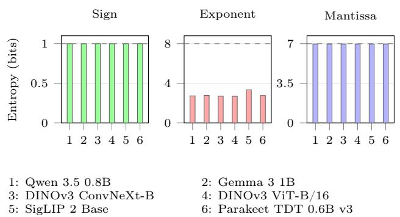
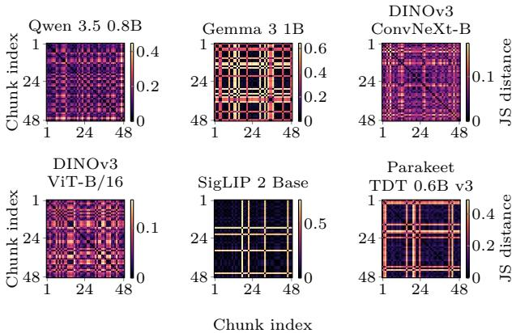
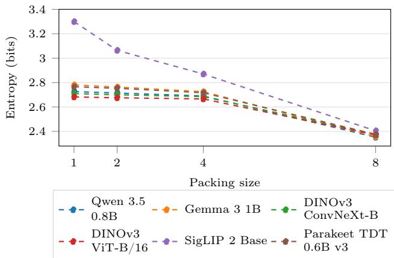
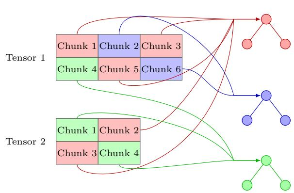
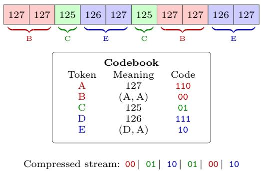
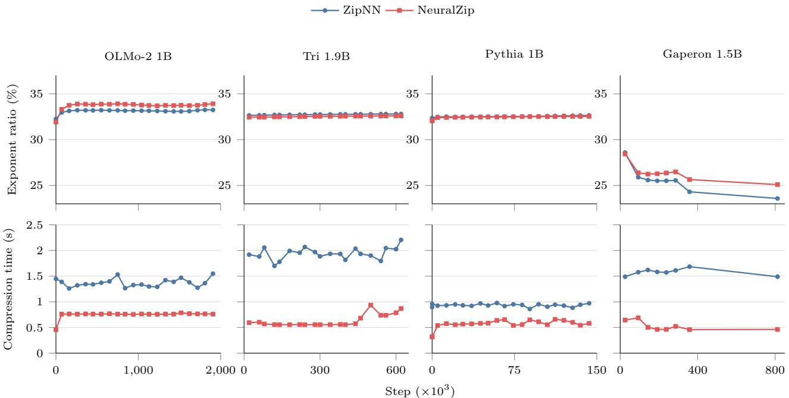
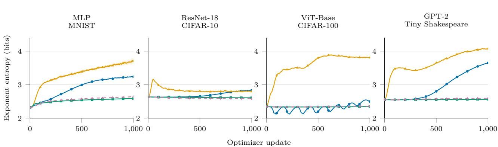
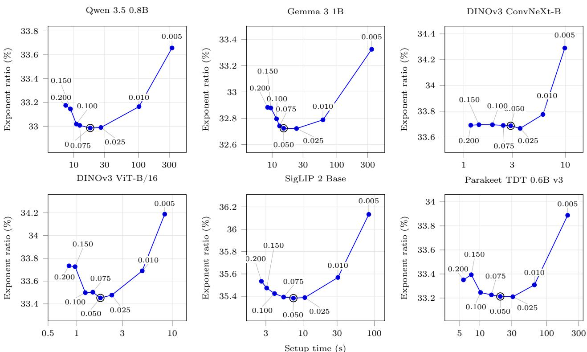

# NeuralZip: Reusable Setup for Fast Lossless Compression

Martín Bravo1,2,3,\*

Samuel Horváth1

Gonzalo Navarro2

Andrés Abeliuk2,3

1Mohamed bin Zayed University of Artificial Intelligence, Abu Dhabi, UAE

2Department of Computer Science, University of Chile, Santiago, Chile

3National Center for Artificial Intelligence (CENIA), Santiago, Chile

## Abstract

Lossless compression can reduce the storage and movement of model weights without changing their floating-point values, but repeated statistical analysis and code construction add computational overhead. We study whether the statistical structure of exponents can be prepared once and reused. For this, we introduce NeuralZip, which groups chunks with similar exponent distributions, shares Hufman codes, and selectively represents recurring exponent tuples using packed exponents, thereby achieving additional moderate compression ratios. A setup chooses these representations before subsequent encodings, while every encoding still processes the current tensor values. In floating-point model checkpoints, post-setup compression is 1.81–21.33× faster than the baselines and achieves exact bit-to-bit reconstruction. We show that this setup can be precomputed and transferred from another compatible architecture, preserving similar compression ratios and avoiding the need to amortize setup costs. Therefore, compression adaptation is transferable and reusable. Training checkpoints demonstrate continued reuse as the weights evolve. Finally, GPU experiments reduce active memory usage by up to 27.5% while reproducing the logits exactly.

## 1 INTRODUCTION

Modern society increasingly relies on intelligent systems, which have motivated the training of models at a very large scale. These models solve problems in areas such as medicine (Singhal et al., 2023), education (Kasneci et al., 2023), and software development (Chen et al., 2021). Foundation models, in particular, have undergone a rapid transformation in recent years, with substantial improvements in performance, precision, and practical usefulness (Bommasani et al., 2021, OpenAI, 2023).

The exponential growth in the size of foundation models has introduced significant challenges in storage and energy consumption (Hershcovitch et al., 2025, Patterson et al., 2021). Given this, compression has become a natural partial solution to this problem. For example, deployment is dificult on devices with limited resources, such as mobile phones, embedded systems, local agents, and edge environments. Compression can allow resource-constrained edge devices to load models that would otherwise be too large. Similarly, model hubs distribute checkpoints to inference machines at increasing scale. Nearly three million public model repositories and approximately two billion downloads across the Qwen family were recorded during the first seven months of 2026 (Yakefu et al., 2026). Therefore, it is important to find techniques that allow compression to be fast and eficient.

To address this, several compression techniques have been developed, such as quantization (Gholami et al., 2021, Gray, 1984), which reduces numerical precision to decrease the model size and accelerate inference. Pruning (LeCun et al., 1989, Zhu and Gupta, 2017) removes low-relevance connections or parameters. Knowledge distillation (Gou et al., 2021) trains a smaller model to imitate a larger one. Low-rank factorization (Saha et al., 2024, Sundrani et al., 2025) and parameter sharing reduce redundancy in model parameters, and sparse or selectively activated models (Ma et al., 2022) use only a fraction of their parameters during inference.

These techniques introduce important limitations. First, they do not preserve the original model: after compression, the exact original weights cannot be recovered unless a copy is stored. Second, the reduction is lossy, so it can degrade accuracy or generation quality. Third, they may require additional training, which adds computational cost. These limitations motivate studying compression methods that reduce storage while keeping the original parameters exactly recoverable and enabling fast compression of models already available in model hubs and on end devices.

  
Figure 1: Empirical entropy by floating-point field in BF16.

A notable example of a lossless compressor is ZipNN (Hershcovitch et al., 2025), which exploits the skewed distribution of floating-point exponents and compresses them using Hufman coding. ZipNN reports strong compression results across vision and language models while preserving the original parameters exactly. Another relevant approach is DFloat11 (Zhang et al., 2025), which introduces a dynamic-length floating-point representation for eficient GPU inference while preserving the model parameters exactly. These methods show that lossless compression is both feasible and useful, but their compression procedures can incur substantial computational overhead. For example, recomputing similar codebooks as if they were diferent distributions leaves an open question: Can we exploit all the statistical regularity available in floating-point weights?

To address this, we identify and empirically characterize two useful properties. First, exponent distributions vary among parameter blocks while forming similar groups, a property we study here as the heterogeneity of the exponents. Sharing precomputed codebooks across these groups can accelerate compression, but may increase the exponent storage ratio. To ofset this cost, we show that grouping adjacent exponent values into new symbols can reveal local regularities, a property we call local exponent redundancy.

Using this, we propose NeuralZip to take advantage of the two phenomena observed in the evaluated architectures. We combine both ideas in one algorithm: Jensen–Shannon clustering enables Hufman-code sharing while activating packed exponents. On top of that, we show that this setup is sharable across diferent model architectures. In summary, our contributions1

are:

1. We show evidence of diferent exponent distribution groups and local redundancy in floating-point model weights.

2. We propose a lossless compressor that combines shared codebooks with exponent packing to reduce repeated computation while retaining moderate compression ratios.

3. We propose a setup-transfer mechanism that enables compression of compatible target models without target-side codebook construction.

## 2 RELATED WORK

Model compression. Pruning (Zhu and Gupta, 2017), quantization (Gholami et al., 2021), and distillation (Gou et al., 2021) reduce model cost by changing parameters or architecture. Lossless compression instead preserves the chosen weight representation bit for bit. Whereas general-purpose compressors such as zlib and zstd (Deutsch and Gailly, 1996, Collet and Kucherawy, 2018) combine dictionary matching with entropy coding, weight-aware methods expose floatingpoint structure explicitly. ZipNN (Hershcovitch et al., 2025) reorders bits and bytes before local Hufman coding. LMC (Waddington and Constantinescu, 2025) combines byte grouping with block-adaptive parallel Hufman coding for snapshots and checkpoint deltas. Both adapt codes to input blocks, motivating the question of when code construction can be shared rather than repeated.

Codebook sharing. Shannonic (Ibrahim et al., 2026) also prepares reusable coding tables, using rangepartitioned tANS for communication of eight-bit quantized tensors in federated learning. Its evaluated representation difers from our bit-exact floating-point weights. Thus, precomputed tables are an established idea. The distinction here is how sharing groups are discovered. Sharing marginal distributions does not itself exploit dependencies between adjacent exponents. MM-RePair (Ferragina et al., 2022) exploits repeated patterns through grammars and supports matrix–vector multiplication over the compressed representation. Rather than constructing a recursive grammar, NeuralZip adds frequent packed exponent symbols to a shared Hufman alphabet alongside singletons. This combines distribution sharing with local redundancy while retaining exact reconstruction.

Compressed Inference. Compressed execution poses a complementary problem: reconstructing weights quickly enough to make memory savings useful. NeuZip (Hao et al., 2024) uses ANS-coded

BF16 exponents for lossless training, with a separate lossy mantissa variant. DFloat11 (Zhang et al., 2025) makes BF16 Hufman reconstruction practical on GPUs through lookup and restart structures. ECF8 (Yang et al., 2026) couples exponent coding with tensor management for weights already in FP8. Huf-LLM (Yubeaton et al., 2025) integrates Hufman decompressors into custom accelerators. These works establish exponent compression and on-demand reconstruction, on which our GPU inference builds.

<table><tr><td>Compressor</td><td>Coding mechanism</td><td>Primary objective</td></tr><tr><td>ZIPNN (Hershcovitch et al., 2025)</td><td>Local Huffman codes with raw fallback</td><td>Model storage and transfer</td></tr><tr><td>LMĆ (Waddington and Constantinescu, 2025)</td><td>Parallel Huffman coding</td><td>High-throughput checkpointing</td></tr><tr><td>SHANNONIC (Ibrahim et al., 2026)</td><td>Range-partitioned tANS for eight-bit tensors</td><td>Federated and edge-cloud communication</td></tr><tr><td>NEuZIP (Hao et al., 2024)</td><td>ANS-coded BF16 exponents</td><td>Memory-efficient training and inference</td></tr><tr><td>DFLOAT11 (Zhang et al., 2025)</td><td>BF16 exponent Huffman coding with GPU lookup</td><td>GPU inference</td></tr><tr><td>ECF8 (Yang et al., 2026)</td><td>structures Entropy-coded exponents of FP8</td><td>Lossless FP8 inference</td></tr><tr><td>HUFF-LLM (Yubeaton et al., 2025)</td><td>weights Huffman decompressors</td><td>Accelerator inference</td></tr><tr><td>MM-REPAIR</td><td>placed near compute units</td><td></td></tr><tr><td>(Ferragina et al.,</td><td>RePair grammar</td><td>Matrix-vector</td></tr><tr><td>2022)</td><td>over a matrix representation</td><td>multiplication over compressed matrices</td></tr></table>

Table 1: Lossless Model Compression comparison.

## 3 PRELIMINARIES

We now show the property that allows lossless compressors such as ZipNN and DFloat11 to work, and we introduce the idea of exponent skewing. For a distribution p on a finite alphabet A, let us define the entropy $\begin{array} { r } { H ( p ) = - \sum _ { a \in \mathcal { A } } p ( a ) \log p ( a ) } \end{array}$ , where logarithms are base 2. Entropy measures the expected amount of information needed to describe the state of a variable (Navarro, 2016).

Skewed Exponent field. We measure the entropy of the sign, exponent, and mantissa fields of the weights of BF16 models shown in Figure 1. The exponent entropy is 2.691-3.345 bits, while the sign and mantissa entropies remain near 1 and 6.97 bits. For BF16, we use 1 bit for the sign field, 8 bits for the exponent, and 7 bits for the mantissa. Therefore, the sign and the mantissa fully utilize the bits, but the exponent, on average, uses only 2.7-3.4 out of 8 bits. Thus, entropybased compressors, such as Hufman codes, can take advantage of this property.

Exponent concentration is an empirical observation in the models studied here, our hypothesis is that it is a property caused by the optimizer. In Appendix B.1, we measure how exponent entropy changes during early training under several optimizer configurations.

One could take a linear projection of all the exponents of the model weights and compress them using a single Hufman code, but that might not be the most eficient solution. For any non-empty finite-alphabet sequence $S ,$ define ${ \widehat { p } } _ { S } ( a ) = | \{ i : S _ { i } = a \} | / | S |$ and the normalized entropy $H _ { 0 } ( S ) = H ( \widehat { p } _ { S } )$ . The exponent alphabet is $\Sigma _ { E } = \{ 0 , \dots , 2 ^ { E } - 1 \}$ , where $E \geq 1$ is an integer. For a partition P into non-empty ordered subsequences, the ideal zero-order coding cost in bits is:

$$
C _ { 0 } ( \mathcal { P } ) = \sum _ { S \in \mathcal { P } } | S | H _ { 0 } ( S ) .
$$

Lemma 1 (Cost monotonicity under refinement). If $\mathcal { P } _ { \mathcal { C } }$ refines P by splitting its sequence into chunks, preserving their order, and omitting empty chunks, then $C _ { 0 } ( \mathcal { P } c ) \le C _ { 0 } ( \mathcal { P } )$

Proof. For each sequence S split into $S _ { 1 } , \ldots , S _ { k }$ , let $\lambda _ { i } = | S _ { i } | / | S |$ . Symbol counts give $\begin{array} { r } { \widehat { p } _ { S } = \sum _ { i } \lambda _ { i } \widehat { p } _ { S _ { i } } } \end{array}$ , so the concavity of entropy (Cover and Thomas, 2006) yields $\begin{array} { r } { | S | H _ { 0 } ( S ) \geq \sum _ { i } | S _ { i } | { \cal H } _ { 0 } ( S _ { i } ) } \end{array}$ . Summing over $S \in$ $\mathcal { P }$ proves the claim. □

Methods such as ZipNN exploit this property by dividing tensors into small chunks of exponents and compressing each chunk using Hufman coding. This allows the codebooks to reflect local exponent distributions rather than relying on a single global codebook. In Appendix B.2, we explore how much we save if we vary the refinement of these partitions. The problem with this approach is that it must create a codebook for each chunk, ignoring statistical structures that may arise in tensors and could save the recomputation of equivalent codebooks. Next, we introduce these additional properties.

Heterogeneity of the exponents. For the fraction u with exponent values of $N _ { u }$ , let $\begin{array} { r } { p _ { u } ( a ) = \frac { 1 } { N _ { u } } \sum _ { i } 1 ( e _ { i } = } \end{array}$ a) be its normalized histogram, where $1 ( \hat { x } )$ is the indicator function, which equals 1 if the condition x is true and 0 otherwise. We measure histogram dissimilarity using the square root of Jensen–Shannon divergence (Lin, 1991):

$$
\begin{array} { r l } & { D _ { \mathrm { J S } } ( p , q ) = \sqrt { \frac { 1 } { 2 } D _ { \mathrm { K L } } ( p \| m ) + \frac { 1 } { 2 } D _ { \mathrm { K L } } ( q \| m ) } , } \\ & { \quad \quad \quad \mathrm { w h e r e ~ } m = \frac { 1 } { 2 } ( p + q ) , } \end{array}\tag{1}
$$

From the 12 largest tensors in each model, we randomly choose 48 chunks of size 256 KiB among six diferent architectures (see Figure 2). 14.3–49.5% of the comparisons fall below a distance threshold of 0.05. We observe both near-identical and widely separated histograms. Lemma 1 shows that splitting tensors into chunks does not increase entropy.

  
Figure 2: Jensen–Shannon distances between exponent histograms of 48 sampled chunks per model.

To measure actual gains, we employ greedy clustering with a threshold τ on the Jensen–Shannon distance between a chunk’s exponent histogram and compatible cluster centroids, assigning the chunk to the nearest centroid if $D _ { J S } \leq \tau$ . Sharing codebooks can increase the exponent storage ratio but enables faster compression with precomputed tables (see Table 2). Therefore, we examine another property that will help reduce storage while retaining precomputed shared codebooks.

Local exponent redundancy. For the longest prefix whose length is divisible by n, we can represent nonoverlapping tuples of n consecutive exponent symbols as compound symbols. By packing two and four values, we lower the empirical entropy by 0.007 – 0.235 and 0.016 – 0.429 bits per exponent, respectively (Figure 3).

Fix an integer $n \ \geq \ 1$ and assume that every sequence length is divisible by n. For $\boldsymbol { S } = ( x _ { 1 } , \dots , x _ { t } )$ let $G _ { n } ( S )$ contain the $t / n$ non-overlapping tuples $( x _ { ( j - 1 ) n + 1 } , \ldots , x _ { j n } ) , 1 \leq j \leq t / n$ . A bijective integer representation of these tuples leaves their entropy unchanged. Define $H _ { 0 } ^ { ( n ) } ( S ) = H _ { 0 } ( G _ { n } ( S ) )$ and write the packed coding cost as:

$$
C _ { 0 } ^ { ( n ) } ( \mathcal { P } ) = \sum _ { S \in \mathcal { P } } \frac { | S | } { n } H _ { 0 } ^ { ( n ) } ( S ) .
$$

Lemma 2 (Cost monotonicity under packing). For every integer $n \geq 1$ that divides the length of each $S \in \mathcal { P } , C _ { 0 } ^ { ( n ) } ( \mathcal { P } ) \leq C _ { 0 } ( \mathcal { P } )$

Proof. Draw a tuple uniformly from $G _ { n } ( S )$ , and let $X _ { b }$ be its b-th component with marginal distribution $p _ { b }$

  
Figure 3: Local exponent redundancy entropy.

The joint law is the empirical tuple distribution, while $\begin{array} { r } { \widehat { p } _ { S } = n ^ { - 1 } \sum _ { b = 1 } ^ { n } p _ { b } } \end{array}$ . By joint-entropy subadditivity and concavity, the cost of each sequence satisfies

$$
\begin{array} { c } { { \displaystyle { \frac { | S | } { n } } H _ { 0 } ^ { ( n ) } ( S ) \leq \frac { | S | } { n } \sum _ { b = 1 } ^ { n } H ( p _ { b } ) } } \\ { { \leq | S | H _ { 0 } ( S ) . } } \end{array}
$$

We sum over $S \in { \mathcal { P } }$ to obtain the stated bound.

For the non-overlapping construction above, we keep any remaining symbols as a raw tail. The next theorem combines both lemmas into a single ideal bound for refined tensors and packed exponents.

Theorem 1 (Ideal bound). Let $\mathcal { P } _ { C }$ refine P by splitting sequences into chunks. If every refined sequence has a length divisible by an integer $n \geq 1$ , then $C _ { 0 } ^ { ( n ) } ( \mathcal { P } c ) \leq$ $C _ { 0 } ( \mathcal { P } )$ .

Proof. By the assumption of divisibility, Lemmas 2 and 1 yield $C _ { 0 } ^ { ( n ) } ( { \mathcal { P } } _ { { \mathcal { C } } } ) \leq C _ { 0 } ( { \mathcal { P } } _ { { \mathcal { C } } } ) \leq C _ { 0 } ( { \mathcal { P } } )$ □

The bound excludes raw tails, escapes, integer code lengths, headers and metadata, local-Hufman and raw fallbacks, and clustering costs. We must therefore measure the practical advantages of size and time.

## 4 OUR METHOD: NEURALZIP

## 4.1 A reusable setup

The setup builds and freezes codebooks before compression. It clusters chunks and packs adjacent exponents. For transfer, it also builds a bank of source-only codebooks to handle changes in exponent distributions. Appendix B.5 reports the setup costs and computational complexity analysis.

  
Figure 4: Sharing codebook example.

Codebook sharing. We divide the tensors into chunks of at most b = 256 KiB of the source weights. We assign each chunk to the nearest compatible centroid using its normalized exponent histogram when $D _ { \mathrm { J S } } \leq \tau = 0 . 0 5$ . Otherwise, we start a cluster (we show this threshold selection in Appendix B.4). We weight centroids by the number of values. Compatibility requires the same data type and exponent layout. Therefore, diferent chunks within a tensor can use different codebooks, while chunks from diferent tensors can share one codebook (See Figure 4).

Packed Exponents. For each cluster vocabulary V, we select up to 254 frequent packed symbols, each formed from two adjacent exponents, counting all positions without crossing chunk boundaries. We augment the singleton alphabet $\Sigma _ { E }$ with packed symbols. We remove a packed symbol when its code is longer than the two singleton codes, and recompute token counts and the table until no further packed symbols need removal. For a chunk $S = ( e _ { 1 } , \ldots , e _ { t } )$ , we start parsing at i = 1. $\operatorname { I f } i < t$ and $( e _ { i } , e _ { i + 1 } ) \in V$ , we emit the corresponding packed symbol and advance by two. Otherwise, we emit the singleton $e _ { i }$ and advance by one. Packed alignment can change after a singleton. We also compress any final unmatched exponent individually (See Figure 5).

Codebook preparation. We sample up to M = 8 MiB of exponents per cluster, keeping chunk boundaries. The adaptive scan counts tokens, with pseudocount one for each singleton and selected packed symbol. Up to four chunks spread across the source cluster estimate payload and fragment-record bytes, including raw fallback. We scale this estimate to the cluster and add codebook and vocabulary bytes. We keep the pruned mixed table only if its estimated archive is smaller than the singleton alternative. Otherwise, we use singleton coding or raw storage if no usable table exists. Sample timings do not afect this choice. We then freeze the

  
Figure 5: Packed exponents example.

tables and vocabulary.

For transfer, we build a codebook bank from up to eight of the largest source JS clusters. Source mantissas let us estimate the exponent changes caused by scaling by $2 ^ { f } .$ , where $f \in \{ 0 , 1 / 8 , \ldots , 7 / 8 \}$ . We combine these with integer exponent shifts from −8 to 8. The bank stores distinct packed tables and their singleton fallbacks. Before building mixed tables, we add 1% of the calibrated singleton counts to the token counts. We use only source data and do not change the source weights.

## 4.2 Compression and exact decompression

During compression, we read current weights, reversibly extract their exponents, and preserve sign and mantissa bits verbatim. The adaptive scan encodes both packed and singleton symbols using the chunk’s assigned shared Hufman table.

We can compress chunks in parallel using immutable tables. We store unmapped chunks raw. We also store a mapped chunk raw if its compressed exponent payload plus fragment record is not below $\rho = 0 . 9 5$ times the raw exponent size, without building a local table. We record raw flags, lengths, codebook IDs, and tensor layouts in the archive, including each used codebook and packed vocabulary once.

During decompression, we read raw chunks or their prefix-free Hufman streams. We restore one exponent from each singleton and two from each packed symbol. Stored exponent counts and frame lengths delimit chunks. We recombine exponents with the preserved bits to restore the original floating-point bit patterns.

## 4.3 GPU Inference

For the GPU path, we keep coded exponents, verbatim sign/mantissa bits, and lookup/restart metadata on the GPU. Before each transformer block, we launch a batched PyTorch CUDA decompressor through a hook. We use prefix lookups to recover exponents and code lengths, and restart ofsets to support parallel decompression. We reconstruct the exact weights in a reused workspace across blocks and pass them to standard matrix multiplications. We leave unselected parameters uncompressed and pay the decompression cost on each forward pass.

## 4.4 Setup transfer

We reuse the source’s tensor and global codebooks, but not its chunk assignments. Before each CPU compression call, we test these default tables on 16 short windows spread across the model’s parameters. Each window contains up to 256 exponents, parsed with the same greedy rule used for compression. If the average estimated cost exceeds $\gamma = 3$ bits per exponent, we choose codebooks from the bank for each chunk. We sample about 1024 exponents per chunk to rank the tables, then compare up to four packed candidates with a singleton fallback. We choose the one with the lowest estimated cost. The measured compression time includes both this test and codebook selection. Target samples only choose among frozen codebooks. They do not build new tables or vocabularies. Raw fallback remains available. Compression can worsen as exponent distributions change, but reconstruction remains bit-wise exact.

## 5 EXPERIMENTS

We evaluate four research questions:

1. Can we accelerate exact compression with a reusable setup while preserving the compression rate?

2. When can we reduce the representation size through exponent packing?

3. Can we reuse a setup across related models or evolving weights?

4. Can we obtain a favorable memory–latency tradeof with compressed GPU inference?

We provide complete measurements, including unfavorable outcomes, in the appendices.

## 5.1 Experimental setup

We pass models in memory to each compressor, use the same pinned CPU cores, and exclude loading, disk I/O, and bit-wise verification from timing. The model compression experiment was evaluated on a cluster with two 16-core EPYC 7343 CPUs (32 physical cores, 64 threads, and two NUMA nodes) and 1 TiB of RAM.

We use 12 CPU threads for compression unless otherwise specified. GPU benchmarks were evaluated on four ASUS Ascent GX10 desktop supercomputers configured with a 20-core Arm processor (comprising 10 Cortex-X925 and 10 Cortex-A725 cores) and an integrated NVIDIA Blackwell GPU, using 128 GB of coherent unified LPDDR5x system memory at 273 $\mathrm { G B / s }$ bandwidth. We report medians after warm-up runs: 20 CPU measurements for Table 2 and ablations, 9 for Table 3, and 5 GPU trials. Setup is measured separately once.

We also report the exponent ratio

$$
R _ { E } = 1 0 0 \frac { B _ { \mathrm { s y m b o l s } } + B _ { \mathrm { r a w } } + B _ { \mathrm { m e t a d a t a } } } { B _ { \mathrm { o r i g i n a l \ e x p o n e n t s } } } ,\tag{2}
$$

where smaller is better. We include raw fallback and decompression metadata and exclude verbatim sign and mantissa bits. We compute the speedup as the reference time divided by NeuralZip time.

## 5.2 Model compression

The results in Tables 2 and 3 are consistent. Compression is 1.81–21.33× faster than the fastest baseline when the setup is already available, while reductions in the exponent storage ratio range from -0.22 to 1.49 percentage points. We see higher speedups in convolutional models, at 12.24–21.33×, followed by MoE models. These results indicate that the benefits of reusing codebooks vary across architectures, there is no universal pattern that allows for obtaining the same speedups every time. Instead, the results will depend on the extent of exponent heterogeneity and local exponent redundancy in the networks.

## 5.3 Reusing setups

Compression speedups require a precomputed setup, whose cost increases as models scale. In a model-storage setting, setups can be built once and shared with compatible targets. Using a precomputed setup from a similar model provides compression-time gains of between 1.77 and 16.65× for a 0.01–4.90 percentage-point increase in the exponent storage ratio. When a compatible frozen setup is already available, the target avoids setup construction. The source construction cost has still been incurred, and target codebook selection is included in compression time. Table 3 also shows cases where setup transfer worsens compression eficiency: the exponent ratio increases by up to 4.90 percentage points. Choosing a compatible source setup therefore remains important for a model hub.

Table 2: Model compression and setup reuse.
<table><tr><td>Model</td><td></td><td colspan="2">Setup Compression</td><td colspan="2">Exponent Total ratio memory</td><td colspan="2">GPU memory Inference</td></tr><tr><td></td><td>Compressor</td><td>(s) ↓</td><td>(s) ↓</td><td>(%) ↓</td><td>(GB) ↓</td><td>(GiB) ↓</td><td>(ms) ↓</td></tr><tr><td rowspan="7">Qwen 3.5 0.8B (Qwen Team, 2026)</td><td>BF16</td><td></td><td></td><td>100.000</td><td>1.747</td><td>1.625</td><td>110.58</td></tr><tr><td>ZIPNN</td><td></td><td>1.889</td><td>33.256</td><td>1.164</td><td></td><td></td></tr><tr><td>SHARING ONLY</td><td>15.732</td><td>0.399</td><td>34.494</td><td>1.175</td><td>1.295</td><td>115.53</td></tr><tr><td>PACKING ONLY</td><td>42.415</td><td>0.457</td><td>33.700</td><td>1.168</td><td>1.383</td><td>118.74</td></tr><tr><td>NEURALZIP (own)</td><td>17.976</td><td>0.440</td><td>32.985</td><td>1.162</td><td>1.297</td><td>120.82</td></tr><tr><td>NEURALZIP (from Qwen 3.5 2B)</td><td></td><td>0.292</td><td>33.498</td><td>1.166</td><td>1.302</td><td>118.80</td></tr><tr><td>DFLOAT11</td><td></td><td>276.628</td><td>35.997</td><td>1.188</td><td>1.327</td><td>118.21</td></tr><tr><td rowspan="7">Gemma 3 1B (Gemma Team, 2025)</td><td>BF16</td><td></td><td></td><td>100.000</td><td>2.000</td><td>1.920</td><td>106.92</td></tr><tr><td>ZIPNN</td><td></td><td>1.500</td><td>32.972</td><td>1.330</td><td></td><td></td></tr><tr><td>SHARING ONLY</td><td>14.141</td><td>0.282</td><td>34.565</td><td>1.346</td><td>1.517</td><td>104.22</td></tr><tr><td>PACKING ONLY</td><td>46.717</td><td>0.351</td><td>33.441</td><td>1.334</td><td>1.620</td><td>108.01</td></tr><tr><td>NEURALZIP (own)</td><td>15.067</td><td>0.330</td><td>32.724</td><td>1.327</td><td>1.518</td><td>105.59</td></tr><tr><td>NEURALZIP (from Gemma 3 4B)</td><td></td><td>0.335</td><td>35.504</td><td>1.355</td><td>1.537</td><td>104.97</td></tr><tr><td>DFLOAT11</td><td></td><td>313.147</td><td>35.531</td><td>1.355</td><td>1.532</td><td>117.61</td></tr><tr><td rowspan="7">DINOv3 ConvNeXt-B (Siméoni et al., 2025)</td><td>BF16</td><td></td><td></td><td>100.000</td><td>0.175</td><td>0.172</td><td>23.28</td></tr><tr><td>ZIPNN</td><td></td><td>0.408</td><td>33.943</td><td>0.117</td><td></td><td></td></tr><tr><td>SHARING ONLY</td><td>2.432</td><td>0.029</td><td>35.505</td><td>0.119</td><td>0.138</td><td>15.97</td></tr><tr><td>PACKING ONLY</td><td>4.215</td><td>0.035</td><td>34.294</td><td>0.118</td><td>0.151</td><td>17.78</td></tr><tr><td>NEURALZIP (own)</td><td>2.898</td><td>0.033</td><td>33.687</td><td>0.117</td><td>0.139</td><td>16.80</td></tr><tr><td>NEURALZIP (from DINOv3 ConvNeXt-L)</td><td></td><td>0.035</td><td>33.844</td><td>0.117</td><td>0.140</td><td>16.67</td></tr><tr><td>DFLOAT11</td><td></td><td>29.020</td><td>36.909</td><td>0.120</td><td>0.137</td><td>16.36</td></tr><tr><td rowspan="7">DINOv3 ViT-B/16 (Siméoni et al., 2025)</td><td>BF16 ZIPNN</td><td></td><td></td><td>100.000</td><td>0.171</td><td>0.176</td><td>20.32</td></tr><tr><td>SHARING ONLY</td><td></td><td>0.305</td><td>33.704</td><td>0.115</td><td>0.134</td><td></td></tr><tr><td></td><td>1.315</td><td>0.026</td><td>35.415</td><td>0.116</td><td></td><td>18.87</td></tr><tr><td>PACKING ONLY</td><td>4.050</td><td>0.034</td><td>34.196</td><td>0.115</td><td>0.146</td><td>19.72</td></tr><tr><td>NEURALZIP (own)</td><td>1.768</td><td>0.031</td><td>33.452</td><td>0.114</td><td>0.134</td><td>17.80</td></tr><tr><td>NEURALZIP (from DINOv3 ViT-L/16)</td><td></td><td>0.033</td><td>34.158</td><td>0.115</td><td>0.135</td><td>19.46</td></tr><tr><td>DFLOAT11</td><td></td><td>27.755</td><td>36.559</td><td>0.117</td><td>0.132</td><td>18.30</td></tr><tr><td rowspan="7">SigLIP 2 Base (Tschannen et al., 2025)</td><td>BF16 ZIPNN</td><td></td><td></td><td>100.000</td><td>0.750</td><td>0.723</td><td>41.48</td></tr><tr><td></td><td>5.782</td><td>0.779</td><td>36.870</td><td>0.514</td><td></td><td></td></tr><tr><td>SHARING ONLY</td><td></td><td>0.091</td><td>38.032</td><td>0.518</td><td>0.619</td><td>31.16</td></tr><tr><td>PACKING ONLY</td><td>17.697</td><td>0.122</td><td>36.139</td><td>0.511</td><td>0.646</td><td>32.65</td></tr><tr><td>NEURALZIP (own)</td><td>7.307</td><td>0.111</td><td>35.383</td><td>0.508</td><td>0.621</td><td>32.69</td></tr><tr><td>NEURALZIP (from SigLIP 2 Large)</td><td></td><td>0.114</td><td>35.866</td><td>0.510</td><td>0.623</td><td>33.71</td></tr><tr><td>DFLOAT11</td><td></td><td>134.630</td><td>40.135</td><td>0.526</td><td>0.617</td><td>32.95</td></tr><tr><td rowspan="7">Parakeet TDT 0.6B v3 BF16 (Sekoyan et al., 2025)</td><td></td><td></td><td></td><td>100.000</td><td>1.254</td><td>1.177</td><td>96.83</td></tr><tr><td>ZIPNN</td><td></td><td>1.796</td><td>33.477</td><td>0.837</td><td></td><td></td></tr><tr><td>SHARING ONLY</td><td>18.539</td><td>0.149</td><td>34.826</td><td>0.846</td><td>0.907</td><td>103.24</td></tr><tr><td>PACKING ONLY</td><td>29.336</td><td>0.197</td><td>33.902</td><td>0.840</td><td>0.986</td><td>104.46</td></tr><tr><td>NEURALZIP (own)</td><td>20.224</td><td>0.183</td><td>33.213</td><td>0.835</td><td>0.909</td><td>102.31</td></tr><tr><td>NEURALZIP (from Parakeet TDT 0.6B v2)</td><td></td><td>0.188</td><td>33.873</td><td>0.840</td><td>0.916</td><td>104.41</td></tr><tr><td>DFLOAT11</td><td></td><td>226.298</td><td>36.215</td><td>0.854</td><td>0.938</td><td>104.92</td></tr></table>

## 5.4 Sharing and packing contribution

We also evaluate the two mechanisms of NeuralZip in isolation. Sharing Only uses clustering and precomputed codebooks without packing, while Packing Only precomputes packed codebooks for every chunk. Sharing Only usually compresses faster than NeuralZip, but has a higher exponent storage ratio. Packing Only improves on Sharing Only’s ratio but requires more setup and compression time. Among the evaluated variants, combining both mechanisms in NeuralZip gives the lowest exponent storage ratio, but does not always minimize running time. Appendix B.3 shows that Packing Only has substantial metadata costs, which sharing codebooks reduces. The mechanisms therefore complement one another: packing reduces payload size, while sharing reduces codebook overhead.

## 5.5 Compressed GPU inference

Tables 2 and 3 report GPU runs: five-trial medians of fifty synchronized forwards after twenty warm-ups. We verify weights and outputs bit-by-bit against BF16. The runs reduce live memory up to 27.5% with their own setups. Own inference ranges from 11.8% faster to 8.3% slower than DFloat11. Therefore, fast decompression allows NeuralZip to achieve competitive inference latency while maintaining fast compression.

  
Figure 6: Compression across training checkpoints. We keep each family’s earliest setup frozen.

## 5.6 Training checkpoints storage

Setup transfer ofers another possible use case: storing training checkpoints. Successive checkpoints may retain suficiently similar exponent statistics for a setup to remain reusable. We compress public intermediate training checkpoints from OLMo-2 1B (Team OLMo et al., 2024), Tri 1.9B (Trillion Labs, 2025), Pythia 1B (Biderman et al., 2023), and Gaperon 1.5B (Godey et al., 2025) (See Figure 6). We construct the setup of NeuralZip from each family’s earliest available checkpoint and keep it frozen for subsequent checkpoints. NeuralZip compresses 1.33–3.74× faster than ZipNN while maintaining similar exponent storage ratios. At later checkpoints, ratios can worsen as exponent distributions drift. Periodically refreshing the setup may help in long training runs, but these experiments do not establish a refresh schedule.

## 6 DISCUSSION AND CONCLUSION

We show that reusable statistical preparation can accelerate exact compression at a similar representation size. The heterogeneity of exponents motivates sharing codebooks, while local exponent redundancy ofers size improvements. These observations may motivate further work on reusable statistical structures for lossless compression. Deployment must account for setup construction and assess whether a precomputed setup is statistically compatible with the target weights during training and transfer.

Although our work focuses on faster compression, exponent skew has already been extensively exploited in prior work. Future work could examine source setup selection and refresh criteria while preserving bit-wise exact reconstruction.

## AI use statement

In this work, we used generative AI tools for method implementation. We have not used generative AI tools for synthetic-data generation, and qualitative analysis of human-subject data is not applicable to this work. Additionally, we used generative AI tools for drafting and editing text, preparing figures and tables, and organizing reproducibility materials. We have reviewed all AI-assisted work. AI-assisted code was checked using lossless round-trip tests, bit-wise weight and output comparisons, input and setup integrity checks, and validation of recorded measurements. We take responsibility for the final content of this work, including text, claims, or artifacts produced with the aid of generative AI.

## Acknowledgements

This work was supported by the National Center for Artificial Intelligence, CENIA FB210017, Basal ANID.

## References

Abdin, M., Aneja, J., Behl, H., et al. (2024). Phi-4 technical report. arXiv preprint arXiv:2412.08905.

Biderman, S., Schoelkopf, H., Anthony, Q. G., et al. (2023). Pythia: A suite for analyzing large language models across training and scaling. In Proceedings of the 40th International Conference on Machine Learning, volume 202, pages 2397–2430.

Bommasani, R., Hudson, D. A., Adeli, E., Altman, R., Arora, S., von Arx, S., Bernstein, M. S., Bohg, J., Bosselut, A., Brunskill, E., et al. (2021). On the opportunities and risks of foundation models. arXiv preprint arXiv:2108.07258.

Bottou, L. (2010). Large-scale machine learning with stochastic gradient descent. In Proceedings of COMP-STAT 2010, pages 177–187. Springer.

Chen, M., Tworek, J., Jun, H., Yuan, Q., Pinto, H. P. d. O., Kaplan, J., Edwards, H., Burda, Y., Joseph, N., Brockman, G., et al. (2021). Evaluating large language models trained on code. arXiv preprint arXiv:2107.03374.

Collet, Y. and Kucherawy, M. S. (2018). Zstandard compression and the application/zstd media type. RFC 8478, RFC Editor. Obsoleted by RFC 8878.

Cover, T. M. and Thomas, J. A. (2006). Elements of Information Theory. Wiley, 2 edition.

Dai, D., Deng, C., Zhao, C., et al. (2024). DeepSeek-MoE: Towards ultimate expert specialization in mixture-of-experts language models. arXiv preprint arXiv:2401.06066.

Deutsch, P. and Gailly, J.-L. (1996). ZLIB compressed data format specification version 3.3. RFC 1950, RFC Editor.

Devlin, J., Chang, M.-W., Lee, K., and Toutanova, K. (2019). Bert: Pre-training of deep bidirectional transformers for language understanding. In Proceedings of the 2019 conference of the North American chapter of the association for computational linguistics: human language technologies, volume 1 (long and short papers), pages 4171–4186.

Dosovitskiy, A., Beyer, L., Kolesnikov, A., Weissenborn, D., Zhai, X., Unterthiner, T., Dehghani, M., Minderer, M., Heigold, G., Gelly, S., et al. (2021). An image is worth 16x16 words: Transformers for image recognition at scale. In International Conference on Learning Representations.

Ferragina, P., Manzini, G., Gagie, T., Köppl, D., Navarro, G., Striani, M., and Tosoni, F. (2022). Improving matrix-vector multiplication via lossless grammar-compressed matrices. Proceedings of the VLDB Endowment, 15(10):2175–2187.

Gemma Team (2025). Gemma 3. https://goo.gle/ Gemma3Report.

Gholami, A., Kim, S., Dong, Z., Yao, Z., Mahoney, M. W., and Keutzer, K. (2021). A survey of quantization methods for eficient neural network inference. arXiv preprint arXiv:2103.13630.

Godey, N., Antoun, W., Touchent, R., Bawden, R., de la Clergerie, É., Sagot, B., and Seddah, D. (2025). Gaperon: A peppered english-french generative language model suite. arXiv preprint arXiv:2510.25771.

Gou, J., Yu, B., Maybank, S. J., and Tao, D. (2021). Knowledge distillation: A survey. International Journal of Computer Vision, 129(6):1789–1819.

Gray, R. M. (1984). Vector quantization. IEEE ASSP Magazine, 1(2):4–29.

Guo, D., Yang, D., Zhang, H., et al. (2025). DeepSeek-R1: Incentivizing reasoning capability in LLMs via reinforcement learning. arXiv preprint arXiv:2501.12948.

Hao, Y., Cao, Y., and Mou, L. (2024). NeuZip: Memory-eficient training and inference with dynamic compression of neural networks. arXiv preprint arXiv:2410.20650.

He, K., Zhang, X., Ren, S., and Sun, J. (2016). Deep residual learning for image recognition. In Proceedings of the IEEE conference on computer vision and pattern recognition, pages 770–778.

Hershcovitch, M., Wood, A., Choshen, L., Girmonsky, G., Leibovitz, R., Ozeri, O., Ennmouri, I., Malka, M., Chin, P., Sundararaman, S., et al. (2025). Zipnn: Lossless compression for ai models. In 2025 IEEE 18th International Conference on Cloud Computing (CLOUD), pages 186–198. IEEE.

Ibrahim, K., Maheronnaghsh, M., and Moshovos, A. (2026). Shannonic: Eficient entropy-optimal compression for ML workloads. In Proceedings of Machine Learning and Systems, volume 8.

Jordan, K. (2024). Muon: An optimizer for hidden layers in neural networks. https://kellerjordan. github.io/posts/muon/.

Karpathy, A. (2015). Tiny Shakespeare dataset. https://github.com/karpathy/char-rnn/tree/ master/data/tinyshakespeare.

Kasneci, E., Sessler, K., Küchemann, S., Bannert, M., Dementieva, D., Fischer, F., Gasser, U., Groh, G., Günnemann, S., Hüllermeier, E., et al. (2023). Chat-GPT for good? on opportunities and challenges of large language models for education. Learning and Individual Diferences, 103:102274.

Kingma, D. P. and Ba, J. (2015). Adam: A method for stochastic optimization. In International Conference on Learning Representations.

Krizhevsky, A. (2009). Learning multiple layers of features from tiny images. Technical report, University of Toronto.

LeCun, Y., Bottou, L., Bengio, Y., and Hafner, P. (1998). Gradient-based learning applied to document recognition. Proceedings of the IEEE, 86(11):2278– 2324.

LeCun, Y., Denker, J. S., and Solla, S. A. (1989). Optimal brain damage. In Advances in Neural Information Processing Systems, pages 598–605.

Lin, J. (1991). Divergence measures based on the shannon entropy. IEEE Transactions on Information Theory, 37(1):145–151.

Liu, Z., Mao, H., Wu, C.-Y., Feichtenhofer, C., Darrell, T., and Xie, S. (2022). A convnet for the 2020s. In Proceedings of the IEEE/CVF Conference on Computer Vision and Pattern Recognition, pages 11976– 11986.

Loshchilov, I. and Hutter, F. (2019). Decoupled weight decay regularization. In International Conference on Learning Representations.

Ma, X., Qin, M., Sun, F., Hou, Z., Yuan, K., Xu, Y., Wang, Y., Chen, Y.-K., Jin, R., and Xie, Y. (2022). Efective model sparsification by scheduled growand-prune methods. In International Conference on Learning Representations.

Meta (2024). Llama 3.2 model card. https:// huggingface.co/meta-llama/Llama-3.2-3B.

Navarro, G. (2016). Compact data structures: A practical approach. Cambridge University Press.

NVIDIA (2025). Llama-3.1-Nemotron-Nano-8B-v1 model card. https://huggingface.co/nvidia/ Llama-3.1-Nemotron-Nano-8B-v1.

OpenAI (2023). GPT-4 technical report. arXiv preprint arXiv:2303.08774.

Patterson, D., Gonzalez, J., Le, Q., Liang, C., Munguia, L.-M., Rothchild, D., So, D., Texier, M., and Dean, J. (2021). Carbon emissions and large neural network training.

Podell, D., English, Z., Lacey, K., Blattmann, A., Dockhorn, T., Müller, J., Penna, J., and Rombach, R. (2023). SDXL: Improving latent difusion models for high-resolution image synthesis. arXiv preprint arXiv:2307.01952.

Qwen Team (2026). Qwen3.5: Towards native multimodal agents. https://qwen.ai/blog?id=qwen3. 5.

Radford, A., Kim, J. W., Xu, T., Brockman, G., McLeavey, C., and Sutskever, I. (2023). Robust speech recognition via large-scale weak supervision. In Proceedings of the 40th International Conference

on Machine Learning, volume 202, pages 28492– 28518.

Radford, A., Wu, J., Child, R., Luan, D., Amodei, D., and Sutskever, I. (2019). Language models are unsupervised multitask learners. Technical report, OpenAI.

Rombach, R., Blattmann, A., Lorenz, D., Esser, P., and Ommer, B. (2022). High-resolution image synthesis with latent difusion models. In Proceedings of the IEEE/CVF Conference on Computer Vision and Pattern Recognition, pages 10684–10695.

RZ412 (2025). Qwen2.5-7B-Instruct-S1K-DeepSeek-Distilled model card. https://huggingface.co/RZ412/Qwen2. 5-7B-Instruct-S1K-DeepSeek-Distilled.

Saha, R., Sagan, N., Srivastava, V., Goldsmith, A., and Pilanci, M. (2024). Compressing large language models using low rank and low precision decomposition. arXiv preprint arXiv:2405.18886.

Sekoyan, M., Koluguri, N. R., Tadevosyan, N., Zelasko, P., Bartley, T., Karpov, N., Balam, J., and Ginsburg, B. (2025). Canary-1B-v2 & Parakeet-TDT-0.6B-v3: Eficient and high-performance models for multilingual ASR and AST. arXiv preprint arXiv:2509.14128.

Siméoni, O., Vo, H. V., Seitzer, M., et al. (2025). DI-NOv3. arXiv preprint arXiv:2508.10104.

Singhal, K., Azizi, S., Tu, T., Mahdavi, S. S., Wei, J., Chung, H. W., Scales, N., Tanwani, A., Cole-Lewis, H., Pfohl, S., et al. (2023). Large language models encode clinical knowledge. Nature, 620:172–180.

Sundrani, S., Tudisco, F., and Minervini, P. (2025). Low-rank compression of language models via diferentiable rank selection. arXiv preprint arXiv:2512.13733.

Tan, M. and Le, Q. (2019). EficientNet: Rethinking model scaling for convolutional neural networks. In Proceedings of the 36th International Conference on Machine Learning, volume 97 of Proceedings of Machine Learning Research, pages 6105–6114. PMLR.

Team OLMo, Walsh, P., Soldaini, L., Groeneveld, D., Lo, K., Arora, S., Bhagia, A., Gu, Y., Huang, S., Jordan, M., Lambert, N., Schwenk, D., Tafjord, O., Anderson, T., Atkinson, D., Brahman, F., Clark, C., Dasigi, P., Dziri, N., Ettinger, A., Guerquin, M., Heineman, D., Ivison, H., Koh, P. W., Liu, J., Malik, S., Merrill, W., Miranda, L. J. V., Morrison, J., Murray, T., Nam, C., Poznanski, J., Pyatkin, V., Rangapur, A., Schmitz, M., Skjonsberg, S., Wadden, D., Wilhelm, C., Wilson, M., Zettlemoyer, L., Farhadi, A., Smith, N. A., and Hajishirzi, H. (2024). 2 OLMo 2 furious. arXiv preprint arXiv:2501.00656.

Trillion Labs (2025). Tri 1.9B intermediate training checkpoints. https://huggingface.co/ trillionlabs/1.9B-Intermediate-Checkpoints.

Tschannen, M. et al. (2025). SigLIP 2: Multilingual vision-language encoders with improved semantic understanding, localization, and dense features. arXiv preprint arXiv:2502.14786.

Waddington, D. G. and Constantinescu, C. (2025). Lossless compression for llm tensor incremental snapshots. arXiv preprint arXiv:2505.09810.

Yakefu, A., Apolinário, and Solaiman, I. (2026). State of open models: Summer 2026 observations. Hugging Face Blog.

Yang, A., Li, A., Yang, B., et al. (2025). Qwen3 technical report. arXiv preprint arXiv:2505.09388.

Yang, A., Yang, B., Zhang, B., Hui, B., Zheng, B., Yu, B., Li, C., Liu, D., Huang, F., Wei, H., Lin, H., Yang, J., Tu, J., Zhang, J., Yang, J., Yang, J., Zhou, J., Lin, J., Dang, K., Lu, K., Bao, K., Yang, K., Yu, L., Li, M., Xue, M., Zhang, P., Zhu, Q., Men, R., Lin, R., Li, T., Tang, T., Xia, T., Ren, X., Ren, X., Fan, Y., Su, Y., Zhang, Y., Wan, Y., Liu, Y., Cui, Z., Zhang, Z., and Qiu, Z. (2024). Qwen2.5 technical report. arXiv preprint arXiv:2412.15115.

Yang, Z., Zhang, T., Xie, J., Li, C., Xu, Z., and Shrivastava, A. (2026). To compress or not? pushing the frontier of lossless GenAI model weights compression with exponent concentration. In International Conference on Learning Representations.

Yubeaton, P., Mahmoud, T., Naga, S., Taheri, P., Xia, T., George, A., Khalil, Y., Zhang, S. Q., Joshi, S., Hegde, C., et al. (2025). Huf-llm: End-to-end lossless compression for eficient llm inference. arXiv preprint arXiv:2502.00922.

Zhang, T., Hariri, M., Zhong, S. H., Chaudhary, V., Sui, Y., Hu, X., and Shrivastava, A. (2025). 70% size, 100% accuracy: Lossless llm compression for eficient gpu inference via dynamic-length float (dfloat11). In Advances in Neural Information Processing Systems.

Zhu, M. H. and Gupta, S. (2017). To prune, or not to prune: Exploring the eficacy of pruning for model compression. arXiv preprint arXiv:1710.01878.

## NeuralZip: Reusable Setup for Fast Lossless Compression Supplementary Materials

## A ADDITIONAL EXPERIMENTS

We extend the comparison to 18 models covering vision, language, audio, difusion, and mixture-of-experts architectures. With the setup already available, NeuralZip compresses faster than its baselines across the reported models, generally with similar or lower exponent storage. Setup transfer avoids rebuilding codebooks on the target, but its compression ratio depends on the source model. We report each transfer source explicitly and retain cases where transfer increases storage.

Table 3: Model compression and setup reuse.
<table><tr><td>Model</td><td>Compressor</td><td>Setup Compression (s) ↓ (s) ↓</td><td>ratio (%) ↓</td><td></td><td>memory memory (GB)↓ (GiB)</td><td></td><td>Inference (ms) ↓</td></tr><tr><td>ResNet-101</td><td>BF16</td><td></td><td></td><td>100.000</td><td>0.089</td><td>0.093</td><td>14.73</td></tr><tr><td>(He et al., 2016)</td><td>ZIPNN NEURALZIP</td><td>3.449</td><td>0.445 0.026</td><td>34.193 33.776</td><td>0.060 0.060</td><td>0.071</td><td>16.47</td></tr><tr><td></td><td>(own) NEURALZIP</td><td></td><td>0.027</td><td>34.129</td><td>0.060</td><td>0.073</td><td>16.37</td></tr><tr><td></td><td>(from ResNet-152) DFLOAT11</td><td></td><td>19.216</td><td>37.809</td><td>0.062</td><td>0.070</td><td>15.78</td></tr><tr><td>ConvNeXt-Base</td><td></td><td></td><td></td><td></td><td></td><td></td><td></td></tr><tr><td>(Liu et al., 2022)</td><td>BF16 ZIPNN</td><td></td><td>0.554</td><td>100.000 33.045</td><td>0.177</td><td>0.174</td><td>23.43</td></tr><tr><td></td><td>NEURALZIP</td><td></td><td>0.039</td><td></td><td>0.118 0.118</td><td>0.132</td><td>16.08</td></tr><tr><td></td><td>(own) NEURALZIP</td><td>2.880</td><td>0.038</td><td>32.821 32.965</td><td>0.118</td><td>0.134</td><td>16.22</td></tr><tr><td></td><td>(from ConvNeXt-Large) DFLOAT11</td><td></td><td>31.030</td><td>35.919</td><td>0.120</td><td>0.130</td><td>15.51</td></tr><tr><td></td><td></td><td></td><td></td><td></td><td></td><td></td><td></td></tr><tr><td>EfficientNet-B3</td><td>BF16</td><td></td><td></td><td>100.000</td><td>0.025</td><td>0.031</td><td>4.74</td></tr><tr><td>(Tan and Le, 2019)</td><td>ZIPNN</td><td></td><td>0.308</td><td>33.321</td><td>0.016</td><td></td><td></td></tr><tr><td></td><td>NEURALZIP (Own)</td><td>2.212</td><td>0.014</td><td>33.543</td><td>0.017</td><td>0.028</td><td>6.47</td></tr><tr><td></td><td>NEURALZIP (from EfficientNet-B7)</td><td></td><td>0.084</td><td>34.723</td><td>0.017</td><td>0.029</td><td>6.60</td></tr><tr><td></td><td>DFLOAT11</td><td></td><td>4.632</td><td>39.305</td><td>0.017</td><td>0.027</td><td>5.98</td></tr><tr><td>GPT-2</td><td>BF16</td><td></td><td></td><td>100.000</td><td>0.249</td><td>0.247</td><td>10.72</td></tr><tr><td>(Radford et al., 2019)</td><td>ZIPNN</td><td></td><td>0.294</td><td>33.174</td><td>0.166</td><td></td><td></td></tr><tr><td></td><td>NEURALZIP (own)</td><td>2.281</td><td>0.044</td><td>32.891</td><td>0.165</td><td>0.206</td><td>9.94</td></tr><tr><td></td><td>NEURALZIP (from GPT-2 Medium)</td><td></td><td>0.050</td><td>34.311</td><td>0.167</td><td>0.207</td><td>9.97</td></tr><tr><td></td><td>DFLOAT11</td><td></td><td>39.547</td><td>35.869</td><td>0.169</td><td>0.205</td><td>9.71</td></tr><tr><td>BERT Base (Devlin et al., 2019)</td><td>BF16</td><td></td><td></td><td>100.000</td><td>0.220</td><td>0.221</td><td>20.77</td></tr><tr><td></td><td>ZIPNN</td><td></td><td>0.349</td><td>32.598</td><td>0.146</td><td></td><td></td></tr><tr><td></td><td>NEURALZIP (own)</td><td>1.883</td><td>0.040</td><td>32.353</td><td>0.146 0.146</td><td>0.178 0.179</td><td>16.89</td></tr><tr><td></td><td>NEURALZIP (from BERT Large) DFLOAT11</td><td></td><td>0.042 36.998</td><td>32.937 35.336</td><td>0.149</td><td>0.176</td><td>15.04 16.97</td></tr><tr><td></td><td></td><td></td><td></td><td></td><td></td><td></td><td></td></tr><tr><td>Qwen 2.5 7B</td><td>BF16</td><td></td><td></td><td>100.000</td><td>15.231</td><td>14.236</td><td>423.24</td></tr><tr><td>(Yang et al., 2024)</td><td>ZIPNN</td><td></td><td>4.686</td><td>33.347</td><td>10.153</td><td></td><td></td></tr><tr><td></td><td>NEURALZIP (own)</td><td>267.972</td><td>2.568</td><td>32.965</td><td>10.127 10.278</td><td>11.130</td><td>579.56</td></tr><tr><td></td><td>NEURALZIP (from Qwen 2.5 14B)</td><td></td><td>2.592 2405.024</td><td>34.946 36.069</td><td>10.362</td><td>11.252 11.012</td><td>544.17</td></tr><tr><td></td><td>DFLOAT11</td><td></td><td></td><td></td><td></td><td></td><td>537.46</td></tr><tr><td>Qwen 3.5 2B</td><td>BF16</td><td></td><td></td><td>100.000</td><td>4.548</td><td>4.130</td><td>168.51</td></tr><tr><td>(Qwen Team, 2026)</td><td>ZIPNN</td><td></td><td>2.712</td><td>33.160</td><td>3.028</td><td></td><td></td></tr><tr><td></td><td>NEURALZIP (own)</td><td>38.970</td><td>0.698</td><td>32.906</td><td>3.023</td><td>3.259</td><td>195.74</td></tr><tr><td></td><td>NEURALZIP (from Qwen 3.5 27B)</td><td></td><td>0.711</td><td>33.369</td><td>3.033</td><td>3.272</td><td>192.51</td></tr><tr><td></td><td>DFLOAT11</td><td></td><td>720.987</td><td>35.777</td><td>3.088</td><td>3.303</td><td>189.06</td></tr><tr><td>OLMo-2-7B</td><td>BF16</td><td></td><td></td><td>100.000</td><td>14.597</td><td>13.603</td><td>395.83</td></tr><tr><td>(Team OLMo et al., 2024)</td><td>ZIPNN</td><td></td><td>5.925</td><td>33.619</td><td>9.753</td><td></td><td></td></tr><tr><td></td><td>NEURALZIP (own)</td><td>1151.162</td><td>2.409</td><td>33.021</td><td>9.710</td><td>10.455</td><td>531.33</td></tr><tr><td></td><td>NEURALZIP (from OLMo-2 13B)</td><td></td><td>2.393</td><td>35.156</td><td>9.866</td><td>10.684</td><td>515.14</td></tr><tr><td></td><td>DFLOAT11</td><td></td><td>2304.563</td><td>37.201</td><td>10.014</td><td>10.462</td><td>519.05</td></tr><tr><td>Llama 3.2 3B</td><td>BF16</td><td></td><td></td><td>100.000</td><td>6.425</td><td>5.993</td><td>214.55</td></tr><tr><td>(Meta, 2024)</td><td>ZIPNN</td><td></td><td>3.139</td><td>32.907</td><td>4.270</td><td></td><td></td></tr><tr><td></td><td>NEURALZIP (own)</td><td>46.482</td><td>1.046</td><td>32.645</td><td>4.262</td><td>4.543</td><td>265.93</td></tr><tr><td></td><td>NEURALZIP (from Llama 3.2 1B)</td><td></td><td>1.509</td><td>33.243</td><td>4.281</td><td>4.540</td><td>262.73</td></tr><tr><td></td><td>DFLOAT11</td><td></td><td>1005.953</td><td>35.499</td><td>4.353</td><td>4.500</td><td>256.91</td></tr><tr><td>Model</td><td>Compressor</td><td>Setup Compression (s) ↓ (s) ↓</td><td></td><td>Exponent ratio (%) ↓</td><td>Total memory memory (GB)↓(GiB)↓</td><td>GPU</td><td>Inference (ms) ↓</td></tr><tr><td>Phi-4 14B</td><td>BF16</td><td></td><td></td><td>100.000</td><td>29.319</td><td>27.392</td><td>659.60</td></tr><tr><td>(Abdin et al., 2024)</td><td>ZIPNN</td><td></td><td>8.792</td><td>32.618</td><td>19.442</td><td></td><td></td></tr><tr><td></td><td>NEURALZIP (own) NEURALZIP</td><td>207.349</td><td>4.868</td><td>32.348</td><td>19.403</td><td>20.013</td><td>945.63</td></tr><tr><td></td><td>(from Qwen 2.5 7B)</td><td></td><td>4.393 4997.372</td><td>34.236 35.217</td><td>19.680</td><td>20.086</td><td>867.96</td></tr><tr><td></td><td>DFLOAT11</td><td></td><td></td><td></td><td>19.822</td><td>19.785</td><td>888.47</td></tr><tr><td>Gemma 3 4B</td><td>BF16</td><td></td><td></td><td>100.000</td><td>8.600</td><td>8.029</td><td>259.32</td></tr><tr><td>(Gemma Team, 2025)</td><td>ZIPNN</td><td></td><td>5.966</td><td>32.953</td><td>5.717</td><td></td><td></td></tr><tr><td></td><td>NEURALZIP (own)</td><td>128.738</td><td>1.875</td><td>32.687</td><td>5.706</td><td>6.096</td><td>314.46</td></tr><tr><td></td><td>NEURALZIP (from Gemma 3 12B)</td><td></td><td>2.230</td><td>33.742</td><td>5.752</td><td>6.140</td><td>311.54</td></tr><tr><td></td><td>DFLOAT11</td><td></td><td>1373.542</td><td>35.545</td><td>5.829</td><td>6.149</td><td>309.45</td></tr><tr><td>Stable Diffusion v1.5 UNet</td><td></td><td></td><td></td><td></td><td></td><td></td><td></td></tr><tr><td>(Rombach et al., 2022)</td><td>BF16 ZIPNN</td><td></td><td>1.542</td><td>100.000 33.292</td><td>1.719 1.146</td><td>1.623</td><td>177.13</td></tr><tr><td></td><td>NEURALZIP (own)</td><td>25.691</td><td>0.288</td><td>32.969</td><td>1.143</td><td>1.207</td><td>195.88</td></tr><tr><td>(Podell et al., 2023)</td><td>NEURALZIP (from SDXL Base UNet)</td><td></td><td>0.270</td><td>37.865</td><td>1.185</td><td>1.249</td><td>194.34</td></tr><tr><td></td><td>DFLOAT11</td><td></td><td>276.392</td><td>35.932</td><td>1.168</td><td>1.209</td><td>191.49</td></tr><tr><td></td><td></td><td></td><td></td><td></td><td></td><td></td><td></td></tr><tr><td>Qwen3-30B-A3B (Yang et al., 2025)</td><td>BF16</td><td></td><td></td><td>100.000</td><td>61.064</td><td>56.879</td><td>2047.27</td></tr><tr><td></td><td>ZIPNN</td><td>948.117</td><td>73.374</td><td>32.685</td><td>40.514</td><td></td><td></td></tr><tr><td></td><td>NEURALZIP (own) NEURALZIP</td><td></td><td>11.621 15.836</td><td>32.399 32.410</td><td>40.430 40.434</td><td>56.758 56.761</td><td>2065.53 2062.21</td></tr><tr><td></td><td>(from Qwen3-30B-A3B Base) DFLOAT11</td><td></td><td>9672.456</td><td>35.225</td><td>41.287</td><td>56.734</td><td>2081.14</td></tr><tr><td>DeepSeekMoE-16B</td><td></td><td></td><td></td><td></td><td></td><td></td><td></td></tr><tr><td>(Dai et al., 2024)</td><td>BF16</td><td></td><td></td><td>100.000</td><td>32.751</td><td>30.591</td><td>1799.15</td></tr><tr><td></td><td>ZIPNN</td><td></td><td>30.102</td><td>32.609</td><td>21.717</td><td></td><td></td></tr><tr><td></td><td>NEURALZIP (own)</td><td>182.730</td><td>5.569</td><td>32.319</td><td>21.671</td><td>22.171</td><td>2118.82</td></tr><tr><td></td><td>NEURALZIP (from DeepSeekMoE-16B Chat)</td><td></td><td>8.624 5103.629</td><td>32.351 35.169</td><td>21.676</td><td>22.272</td><td>2113.50</td></tr><tr><td></td><td>DFLOAT11</td><td></td><td></td><td></td><td>22.135</td><td>21.893</td><td>2067.32</td></tr><tr><td colspan="2">DeepSeek-R1-Distill-Llama 8B BF16</td><td></td><td></td><td>100.000</td><td>16.061</td><td>14.965</td><td>451.71</td></tr><tr><td>(Guo et al., 2025)</td><td>ZIPNN</td><td></td><td>6.647</td><td>32.724</td><td>10.659</td><td></td><td></td></tr><tr><td></td><td>NEURALZIP (own)</td><td>142.823</td><td>2.690</td><td>32.452</td><td>10.637</td><td>11.572</td><td>602.54</td></tr><tr><td>(NVIDIA, 2025)</td><td>NEURALZIP (from Llama 3.1 Nemotron Nano 8B)</td><td></td><td>3.747</td><td>32.633</td><td>10.652</td><td>11.587</td><td>576.20</td></tr><tr><td></td><td>DFLOAT11</td><td></td><td>2558.282</td><td>35.297</td><td>10.865</td><td>11.448</td><td>569.47</td></tr><tr><td colspan="2">Qwen 2.5 7B Instruct Distilled BF16</td><td></td><td></td><td>100.000</td><td>15.231</td><td>14.236</td><td>408.47</td></tr><tr><td>(RZ412, 2025)</td><td>ZIPNN</td><td></td><td>12.079</td><td>33.344</td><td>10.153</td><td></td><td></td></tr><tr><td>(Yang et al., 2024)</td><td>NEURALZIP (own)</td><td>299.476</td><td>3.627</td><td>32.958</td><td>10.127</td><td>11.129</td><td>537.95</td></tr><tr><td></td><td>NEURALZIP (from Qwen 2.5 7B)</td><td></td><td>2.591</td><td>33.078</td><td>10.136</td><td>11.133</td><td>527.77</td></tr><tr><td></td><td>DFLOAT11</td><td></td><td>2411.115</td><td>36.067</td><td>10.362</td><td>11.012</td><td>530.82</td></tr><tr><td>SigLIP 2 So400m</td><td>BF16</td><td></td><td></td><td>100.000</td><td>2.272</td><td>2.148</td><td>162.92</td></tr><tr><td>(Tschannen et al., 2025)</td><td>ZIPNN</td><td></td><td>2.207</td><td>34.983</td><td>1.534</td><td></td><td></td></tr><tr><td></td><td>NEURALZIP (own) NEURALZIP</td><td>40.917</td><td>0.370</td><td>34.078</td><td>1.523</td><td>1.672</td><td>155.37</td></tr><tr><td></td><td>(from SigLIP 2 Giant) DFLOAT11</td><td></td><td>0.579</td><td>34.456</td><td>1.528</td><td>1.679</td><td>153.67</td></tr><tr><td></td><td></td><td></td><td>375.631</td><td>37.946</td><td>1.567</td><td>1.690</td><td>176.16</td></tr><tr><td>Whisper v3 Turbo</td><td>BF16</td><td></td><td></td><td>100.000</td><td>1.618</td><td>1.517</td><td>327.48</td></tr><tr><td>(Radford et al., 2023)</td><td>ZIPNN</td><td></td><td>1.649</td><td>33.861</td><td>1.083</td><td></td><td></td></tr><tr><td></td><td>NEURALZIP (own)</td><td>45.678</td><td>0.265</td><td>33.525</td><td>1.080</td><td>1.154</td><td>333.65</td></tr><tr><td></td><td>NEURALZIP (from Whisper large-v3)</td><td></td><td>0.255</td><td>34.514</td><td>1.088</td><td>1.159</td><td>333.78</td></tr><tr><td></td><td>DFLOAT11</td><td></td><td>261.572</td><td>36.665</td><td>1.105</td><td>1.153</td><td>337.13</td></tr></table>

## B ABLATION STUDY

## B.1 Optimizers entropy.

We track exponent entropy on BF16 copies of all unique trainable parameters over 1,000 updates of an MLP, ResNet-18 (He et al., 2016), ViT-Base (Dosovitskiy et al., 2021), and GPT-2 (Radford et al., 2019), using SGD (Bottou, 2010), Adam (Kingma and Ba, 2015), AdamW (Loshchilov and Hutter, 2019), and Muon (Jordan, 2024). Curves show three-seed means. Adam increases entropy more in the MLP and transformer experiments, while AdamW and Muon remain relatively stable.

  
Figure 7: BF16 exponent entropy during early training. Lines and shaded bands show the mean ±1 sample standard deviation across three seeds. Models are trained from scratch on MNIST (LeCun et al., 1998), CIFAR-10 (Krizhevsky, 2009), CIFAR-100 (Krizhevsky, 2009), and Tiny Shakespeare (Karpathy, 2015), respectively, with matched initialization and minibatches across optimizers. Training uses random initialization and matched minibatch order (seeds 17, 29, 43). Efective batches are 128 (images) and 32 (GPT-2, 128 tokens), with ViT/GPT-2 microbatches 8/4. SGD rates are 0.05 (images)/0.1 (GPT-2), Adam/AdamW/Muon rates are 10−3 (MLP/ResNet-18) $/ 3 \times 1 0 ^ { - 4 }$ (ViT/GPT-2). We use a 50-update linear warm-up, norm-1 clipping, and a weight decay of 0.01 for matrix/convolution weights, zero otherwise. Images use oficial train/test splits, fixed channel standardization, no augmentation, and 224 × 224 bilinear ViT resizing, Tiny Shakespeare uses GPT-2 BPE and a contiguous 90%/10% train/held-out split. Full optimizer parameters, preprocessing constants, architecture adjustments, and evaluation settings are specified in the anonymized repository.

## B.2 Level selection.

We compare global, per-tensor, per-chunk, and JS-based grouping. Global grouping has a low setup cost but provides the highest exponent ratio in these experiments. Per-chunk grouping prepares many tables and requires substantially more setup time, without achieving the smallest archive. JS-based grouping reaches ratios close to, or slightly better than, per-tensor grouping while preparing fewer tables. This supports grouping chunks by their exponent distributions instead of assigning a separate codebook to every tensor or chunk.

Table 4: Grouping-level selection.
<table><tr><td></td><td></td><td>Exponent ratio (%) ↓</td><td>Compression (s) ↓</td><td>Setup (s) ↓</td><td>Stored codebooks↓</td></tr><tr><td>Qwen 3.5 0.8B</td><td>Grouping Global</td><td>35.810</td><td>0.283</td><td>4.482</td><td>1</td></tr><tr><td></td><td>Per tensor</td><td>33.111</td><td>0.280</td><td>10.356</td><td>428</td></tr><tr><td></td><td>Per chunk</td><td>33.700</td><td>0.457</td><td>42.415</td><td>6908</td></tr><tr><td></td><td>JS (τ = 0.05)</td><td>32.985</td><td>0.440</td><td>17.976</td><td>242</td></tr><tr><td>Gemma 3 1B</td><td>Global</td><td>36.197</td><td>0.281</td><td>4.975</td><td>1</td></tr><tr><td></td><td>Per tensor</td><td>32.734</td><td>0.276</td><td>10.074</td><td>340</td></tr><tr><td></td><td>Per chunk</td><td>33.441</td><td>0.351</td><td>46.717</td><td>7843</td></tr><tr><td></td><td>JS (τ = 0.05)</td><td>32.724</td><td>0.330</td><td>15.067</td><td>205</td></tr><tr><td colspan="6">Table 4 (continued)</td></tr><tr><td colspan="6">Exponent</td></tr><tr><td>Model</td><td>Grouping</td><td>ratio (%) ↓</td><td>Compression (s) ↓</td><td>Setup (s) ↓</td><td>Stored codebooks↓</td></tr><tr><td rowspan="4">DINOv3 ConvNeXt-B</td><td>Global</td><td>34.088</td><td>0.032</td><td>0.407</td><td>1</td></tr><tr><td>Per tensor</td><td>33.666</td><td>0.033</td><td>2.060</td><td>337</td></tr><tr><td>Per chunk</td><td>34.294</td><td>0.035</td><td>4.215</td><td>930</td></tr><tr><td>JS (τ = 0.05)</td><td>33.687</td><td>0.033</td><td>2.898</td><td>256</td></tr><tr><td rowspan="4">DINOv3 ViT-B/16</td><td>Global</td><td>34.589</td><td>0.029</td><td>0.415</td><td>1</td></tr><tr><td>Per tensor</td><td>33.520</td><td>0.031</td><td>1.944</td><td>187</td></tr><tr><td>Per chunk</td><td>34.196</td><td>0.034</td><td>4.050</td><td>815</td></tr><tr><td>JS (τ = 0.05)</td><td>33.452</td><td>0.031</td><td>1.768</td><td>138</td></tr><tr><td rowspan="4">SigLIP 2 Base</td><td>Global</td><td>42.574</td><td>0.114</td><td>1.740</td><td>1</td></tr><tr><td>Per tensor</td><td>35.644</td><td>0.113</td><td>4.958</td><td>400</td></tr><tr><td>Per chunk</td><td>36.139</td><td>0.122</td><td>17.697</td><td>3165</td></tr><tr><td>JS (τ = 0.05)</td><td>35.383</td><td>0.111</td><td>7.307</td><td>281</td></tr><tr><td rowspan="4">Parakeet TDT 0.6B v3</td><td>Global</td><td>35.965</td><td>0.183</td><td>2.820</td><td>1</td></tr><tr><td>Per tensor</td><td>33.282</td><td>0.185</td><td>9.976</td><td>665</td></tr><tr><td>Per chunk</td><td>33.902</td><td>0.197</td><td>29.336</td><td>5209</td></tr><tr><td>JS (τ = 0.05)</td><td>33.213</td><td>0.183</td><td>20.224</td><td>417</td></tr></table>

## B.3 Sharing Only vs Packing Only trade-of.

We isolate codebook sharing and exponent packing to measure their contributions. Sharing Only gives the shortest compression time, but its exponent ratio is higher. Packing Only improves the ratio relative to Sharing Only, at the cost of more setup work and larger codebook metadata. Combining both mechanisms gives the lowest exponent ratio across all six models. For Qwen 3.5 0.8B, sharing reduces the stored codebook size from approximately 6,283 KiB in Packing Only to 82 KiB in NeuralZip. Sharing therefore reduces the metadata cost of using packed codebooks.

Table 5: Sharing and packing trade-of.
<table><tr><td>Model</td><td>Variant</td><td>Exponent ratio (%) ↓</td><td>Compression (s) ↓</td><td>Setup (s) ↓</td><td>Stored codebooks↓</td><td>Codebook storage (KiB) ↓</td></tr><tr><td rowspan="3">Qwen 3.5 0.8B</td><td>SHARING ONLY</td><td>34.494</td><td>0.399</td><td>15.732</td><td>228</td><td>20.078</td></tr><tr><td>PACKING ONLY</td><td>33.700</td><td>0.457</td><td>42.415</td><td>6908</td><td>6282.674</td></tr><tr><td>NEURALZIP</td><td>32.985</td><td>0.440</td><td>17.976</td><td>242</td><td>81.729</td></tr><tr><td rowspan="3">Gemma 3 1B</td><td>SHARING ONLY</td><td>34.565</td><td>0.282</td><td>14.141</td><td>196</td><td>17.190</td></tr><tr><td>PACKING ONLY</td><td>33.441</td><td>0.351</td><td>46.717</td><td>7843</td><td>7174.744</td></tr><tr><td>NEURALZIP</td><td>32.724</td><td>0.330</td><td>15.067</td><td>205</td><td>63.169</td></tr><tr><td rowspan="3">DINOv3 ConvNeXt-B</td><td>SHARING ONLY</td><td>35.505</td><td>0.029</td><td>2.432</td><td>256</td><td>23.710</td></tr><tr><td>PACKING ONLY</td><td>34.294</td><td>0.035</td><td>4.215</td><td>930</td><td>679.353</td></tr><tr><td>NEURALZIP</td><td>33.687</td><td>0.033</td><td>2.898</td><td>256</td><td>41.435</td></tr><tr><td rowspan="3">DINOv3 ViT-B/16</td><td>SHARING ONLY</td><td>35.415</td><td>0.026</td><td>1.315</td><td>137</td><td>12.020</td></tr><tr><td>PACKING ONLY</td><td>34.196</td><td>0.034</td><td>4.050</td><td>815</td><td>656.237</td></tr><tr><td>NEURALZIP</td><td>33.452</td><td>0.031</td><td>1.768</td><td>138</td><td>37.351</td></tr><tr><td rowspan="3">SigLIP 2 Base</td><td>SHARING ONLY</td><td>38.032</td><td>0.091</td><td>5.782</td><td>276</td><td>24.145</td></tr><tr><td>PACKING ONLY</td><td>36.139</td><td>0.122</td><td>17.697</td><td>3165</td><td>2876.626</td></tr><tr><td>NEURALZIP</td><td>35.383</td><td>0.111</td><td>7.307</td><td>281</td><td>80.115</td></tr><tr><td rowspan="3">Parakeet TDT 0.6B v3</td><td>SHARING ONLY</td><td>34.826</td><td>0.149</td><td>18.539</td><td>412</td><td>38.993</td></tr><tr><td>PACKING ONLY</td><td>33.902</td><td>0.197</td><td>29.336</td><td>5209</td><td>4553.405</td></tr><tr><td>NEURALZIP</td><td>33.213</td><td>0.183</td><td>20.224</td><td>417</td><td>97.723</td></tr></table>

## B.4 Threshold sweep.

We vary the JS threshold τ from 0.005 to 0.200 to examine the trade-of between setup time and exponent storage. We did not see changes in compression time, so we do not report it. Very small thresholds require much more setup time and do not necessarily improve the final ratio. Larger thresholds shorten setup, although compression can worsen as less similar chunks share codebooks. The default threshold of 0.05 is close to the best observed ratio for every tested model while avoiding the high setup cost of stricter thresholds.

  
Figure 8: Own-setup JS-threshold sweep. Circles mark the default $\tau = 0 . 0 5$

## B.5 Setup costs.

We separate setup time into exponent extraction, histogram computation, grouping, packed-vocabulary preparation, and codebook construction. JS search and group creation are the largest components for all six models, accounting for approximately 49–77% of setup time. Hufman construction and refitting take a much smaller fraction. The main setup cost is therefore finding compatible groups rather than constructing the final codebooks. Reusing a frozen setup avoids repeating this work for subsequent compression calls.

Table 6: Setup costs.
<table><tr><td>Phase</td><td>Qwen 3.5 0.8B (s)</td><td>Gemma 3 1B (s)</td><td>DINOv3 ConvNeXt-B (s)</td><td>DINOv3 ViT-B/16 (s)</td><td>SigLIP 2 Base (s)</td><td>Parakeet TDT 0.6B v3 (s)</td></tr><tr><td>Exponent extraction</td><td>3.998</td><td>2.070</td><td>0.107</td><td>0.119</td><td>0.966</td><td>1.036</td></tr><tr><td>Chunk histograms</td><td>3.352</td><td>2.984</td><td>0.244</td><td>0.282</td><td>1.130</td><td>1.827</td></tr><tr><td>JS search and group creation</td><td>8.782</td><td>8.564</td><td>2.053</td><td>0.869</td><td>3.773</td><td>15.555</td></tr><tr><td>Centroids and source sampling</td><td>0.101</td><td>0.089</td><td>0.017</td><td>0.017</td><td>0.056</td><td>0.077</td></tr><tr><td>Packed vocabulary and pruning</td><td>0.405</td><td>0.330</td><td>0.115</td><td>0.098</td><td>0.276</td><td>0.358</td></tr><tr><td>Token counting</td><td>0.325</td><td>0.260</td><td>0.061</td><td>0.067</td><td>0.207</td><td>0.259</td></tr><tr><td>Huffman construction/refit</td><td>0.133</td><td>0.098</td><td>0.114</td><td>0.065</td><td>0.136</td><td>0.203</td></tr><tr><td>Other setup work</td><td>0.880</td><td>0.672</td><td>0.187</td><td>0.251</td><td>0.763</td><td>0.909</td></tr><tr><td>Total</td><td>17.976</td><td>15.067</td><td>2.898</td><td>1.768</td><td>7.307</td><td>20.224</td></tr></table>

Let N denote the number of weights, C the number of chunks, and K the number of resulting clusters. Exponent extraction and histogram computation take O(N) time. Greedy codebook sharing compares each chunk with existing centroids, costing O(CK) for a fixed exponent alphabet. This can become $O ( C ^ { 2 } )$ when every chunk forms a separate cluster. For each cluster, counting packed exponents takes $O ( m )$ time on a sample of $m \leq M$ exponents, while constructing a Hufman table costs $O ( S \log S )$ for S symbols. Vocabulary pruning repeats the sample scan and table construction, giving $O ( I ( m + S \log S ) )$ per cluster, where both the vocabulary size and the number of pruning rounds I are bounded. Source-bank preparation adds a fixed number of source scans and bounded-sample table constructions.