# Noise, Denoise, Correct: MCMC Posterior Sampling with Diffusion Priors in Three Steps

So Takao Gregory David Bellchambers Luke Ye Sanmitra Ghosh∗ Michalis Michaelides∗

PhysicsX   
London, UK   
so.takao@physicsx.ai   
∗Joint senior author

## Abstract

Pretrained diffusion models are powerful priors for inverse problems, but posterior sampling under nonlinear, non-differentiable forward models remain hard. We introduce diffusion waltz, an MCMC method using SDEdit-style noising–denoising as a proposal, corrected via Metropolis–Hastings for exact posterior sampling without prior evaluation. We further propose injecting observations into the proposal while preserving exactness, using a gradient-free ensemble Kalman update. On a non-differentiable Navier–Stokes initial condition recovery task, diffusion waltz outperforms existing baselines across different noise and nonlinearity regimes.

## 1 Introduction

Solving inverse problems is a central challenge across science and engineering, where the goal is to recover an unknown state $x _ { 0 }$ from noisy, incomplete observations $y = \mathcal { A } ( x _ { 0 } ) + \epsilon ;$ here, A is a known forward operator and $\epsilon \sim \mathcal { N } ( 0 , \sigma _ { u } ^ { 2 } I )$ for some $\sigma _ { y } > 0 $ . Such observations typically do not carry enough information to recover x0 exactly, rendering the problem ill-posed. The Bayesian formulation resolves this by placing a prior $p _ { 0 } ( x _ { 0 } )$ over the state and targeting the posterior [Stuart, 2010]:

$$
p ( x _ { 0 } \mid y ) \propto p ( y \mid x _ { 0 } ) p _ { 0 } ( x _ { 0 } ) .\tag{1}
$$

A growing body of work seeks to use pretrained generative models as priors [Daras et al., 2024], but posterior sampling remains elusive when the prior is accessible only through simulation, with no tractable density. Methods such as classifier and classifier-free guidance [Dhariwal and Nichol, 2021, Ho and Salimans, 2022] can sample from (1) approximately. However, they require additional training and cannot adapt to new forward models. Inference-time guidance methods [Chung et al., 2023, Song et al., 2023, Rozet et al., 2024, Kim et al., 2025, Zhang et al., 2025] adapt to new problems without retraining, but rely on approximations to the likelihood score, leading to biased posterior approximations; unlike in computer vision, where many of these methods were originally devised, scientific applications often demand accurate posterior estimation. Furthermore, many of these methods rely on taking gradients through the likelihood, requiring A to be differentiable – an assumption that fails in many realistic applications.

To address this, we propose diffusion waltz, a three-step cycle to sample from (1) via Markov Chain Monte Carlo (MCMC), which targets the posterior exactly, assuming a perfect denoiser. Our proposal kernel $q ( x _ { 0 } ^ { \prime } \mid x _ { 0 } )$ , inspired by SDEdit [Meng et al., 2022], is constructed by (i) noising x0 to an appropriate level t, then (ii) denoising back to level 0 to yield a new sample $x _ { 0 } ^ { \prime } .$ . This is followed by (iii) a Metropolis-Hastings (MH) accept/reject step, where the acceptance probability crucially does not depend on the prior density $p _ { 0 } ( x _ { 0 } )$ . To accelerate convergence, we further propose a way to inject information about y into the proposal without requiring differentiability of A, such that the modified proposal still yields an exact MH correction that does not involve the prior density.

## 2 Method

## 2.1 Diffusion waltz for posterior sampling

We first describe the basic variant of diffusion waltz, which we refer to as random walk Metropolis-Hastings (RWMH) waltz. Let $p _ { 0 } , p _ { 1 }$ be two probability distributions, representing the data and reference distributions, respectively. We consider a stochastic interpolant $x _ { t } = \alpha _ { t } x _ { 0 } + \beta _ { t } x _ { 1 }$ for $t \in [ 0 , 1 ]$ , where $x _ { 0 } \sim p _ { 0 } , x _ { 1 } \sim p _ { 1 }$ , and $\alpha _ { t } , \beta _ { t }$ are $C ^ { 2 }$ -smooth, monotonic functions satisfying $\alpha _ { 0 } = \beta _ { 1 } = 1$ and $\alpha _ { 1 } = \beta _ { 0 } = 0 , \boldsymbol { \mathrm { e . g . } } , \alpha _ { t } = 1 - t$ and $\beta _ { t } = t .$ . A generative SDE/ODE can then be trained to sample from $p _ { \theta } ( x _ { 0 } ) \approx p _ { 0 } ( x _ { 0 } )$ via score/flow matching [Song et al., 2021, Lipman et al., 2023, Albergo et al., 2025] (see Appendix A).

For a fixed $t \in ( 0 , 1 )$ and an initial sample $x _ { 0 } \sim p _ { \theta }$ , RWMH waltz cycles through three steps:

1. Add noise to $x _ { 0 }$ via the interpolant $x _ { t } = \alpha _ { t } x _ { 0 } + \beta _ { t } x _ { 1 }$ , where $x _ { 1 } \sim p _ { 1 }$

2. Denoise $x _ { t }$ by proposing $x _ { 0 } ^ { \prime } \sim p _ { \theta } ( x _ { 0 } \mid x _ { t } ) \propto p ( x _ { t } \mid x _ { 0 } ) p _ { \theta } ( x _ { 0 } )$

3. Accept $ { \boldsymbol { x } } _ { 0 } ^ { \prime }$ with probability $\begin{array} { r } { \alpha = \operatorname* { m i n } \left\{ 1 , \frac { p ( y | x _ { 0 } ^ { \prime } ) } { p ( y | x _ { 0 } ) } \right\} } \end{array}$ and set $x _ { 0 } \gets x _ { 0 } ^ { \prime }$ to repeat the cycle.

The first two steps – perturbing $x _ { 0 }$ via noising/denoising to produce a new sample $ { \boldsymbol { x } } _ { 0 } ^ { \prime }$ that remains close to it on the data manifold – is common in image editing, as exemplified by SDEdit [Meng et al., 2022]. Here we repurpose this idea to define a proposal kernel $q ( x _ { 0 } ^ { \prime } \mid { \bar { x } } _ { 0 } )$ for MCMC, allowing random walk-like exploration of the data manifold. The third step is a Metropolis–Hastings (MH) correction, which guarantees that the resulting chain converges to the posterior as the number of iterations grows. Crucially, the acceptance probability in this step depends only on the likelihood; thus, we never have to evaluate the prior density $p _ { \theta }$ . This follows from the reversibility of the proposal kernel with respect to the generative prior, $\mathrm { i . e . , } q ( x _ { 0 } ^ { \prime } \mid x _ { 0 } ) p _ { \theta } ( x _ { 0 } ) = q ( x _ { 0 } \mid x _ { 0 } ^ { \prime } ) p _ { \theta } ( x _ { 0 } ^ { \prime } )$ , which cancels the prior terms in the acceptance ratio (see Appendix B.1).

In principle, RWMH waltz samples exactly from the posterior. In practice, however, the denoising step requires approximation; e.g., by solving a denoising SDE via Euler-Maruyama (see Appendix A.2), or by directly targeting the denoising kernel $p ( x _ { 0 } \mid x _ { t } )$ using recent advances in stochastic flow maps [Potaptchik et al., 2026, Holderrieth et al., 2026, McCallum et al., 2026, Pan et al., 2026]. The SDE discretization error in the former approach can, in principle, be corrected by combining predictor–corrector-style sampling with further MH corrections [Lam et al., 2026]; in practice, though, this is usually unnecessary to obtain satisfactory results.

## 2.2 Conditional noising

We now propose an extension that takes into account observation information into the proposal. Since the RWMH waltz proposal explores the data manifold randomly around the current point $x _ { 0 }$ in the data manifold, it typically suffers from low acceptance rates and slow mixing, much like standard RWMH. Typically, this issue is alleviated by introducing observation information directly into the proposal; e.g., MALA [Roberts and Tweedie, 1996] and HMC [Duane et al., 1987]. We seek an analogous approach within the diffusion waltz framework.

To this end, we consider adding information about y into the noising step of RWMH waltz. In its most general form, the noising step is replaced by $\boldsymbol { x } _ { t } \sim q ( \boldsymbol { x } _ { t } \mid \boldsymbol { x } _ { 0 } , y )$ for an arbitrary noising kernel $q$ that depends on $y .$ . Remarkably, the resulting MH acceptance probability still does not require evaluating the prior density $p _ { \theta }$ , making the method fully tractable provided $q$ can be evaluated (see line 3 in Algorithm 2 and Appendix B.2 for the derivation of this acceptance probability).

## 2.3 The ensemble Kalman conditional noising (EKCN) kernel

As an example of such a conditional noising kernel $q ( x _ { t } \mid x _ { 0 } , y )$ , consider

$$
x _ { t } = \alpha _ { t } \bigl ( x _ { 0 } + g ( x _ { 0 } , y ; h ) \bigr ) + \beta _ { t } x _ { 1 } , \quad x _ { 1 } \sim p _ { 1 } ,\tag{2}
$$

where $g ( x _ { 0 } , y ; h )$ nudges $\scriptstyle A ( x _ { 0 } )$ towards y with learning rate $h > 0$ . In the ensemble Kalman conditional noising (EKCN) kernel, we take $g$ to be an ensemble Kalman Levenberg-Marquardt update rule [Sanz-Alonso et al., 2023, Algorithm 13.15]

$$
g ( x _ { 0 } , y ; h ) = K ( h ) \big ( y - \mathcal { A } ( x _ { 0 } ) \big ) ,\tag{3}
$$

Algorithm 1 Diffusion waltz (random walk) Algorithm 2 Diffusion waltz (conditional noising)   
1: Add noise $x _ { t } \sim p ( x _ { t } \mid x _ { 0 } )$ via interpolant 1: Propose $x _ { t } \sim q ( x _ { t } \mid x _ { 0 } , y )$ for a chosen kernel q   
2: Denoise $x _ { 0 } ^ { \prime } \sim p _ { \theta } ( x _ { 0 } \mid x _ { t } )$ 2: Denoise $x _ { 0 } ^ { \prime } \sim p _ { \theta } ( x _ { 0 } \mid x _ { t } )$   
3: Accept $x _ { 0 } ^ { \prime }$ with probability 3: Accept $( x _ { t } , x _ { 0 } ^ { \prime } )$ with probability   
α = min $\left\{ 1 , { \frac { \dot { p ( y \mid x _ { 0 } ^ { \prime } ) } } { p ( y \mid x _ { 0 } ) } } \right\}$ α = min $\int _ { 1 } \ d y \frac { \ d y } { \ d y } ( y \mid \hat { x _ { 0 } ^ { ' } } ) q ( x _ { t } \mid \dot { x _ { 0 } ^ { \prime } } , y ) p ( x _ { t } \mid x _ { 0 } ) \big \downarrow$   
$\left\{ { \begin{array} { l } { ^ { \bot , } { \frac { } { p ( y \mid x _ { 0 } ) q ( x _ { t } \mid x _ { 0 } , y ) p ( x _ { t } \mid x _ { 0 } ^ { \prime } ) } } } \end{array} } \right\}$   
(Set $x _ { 0 }  x _ { 0 } ^ { \prime }$ if accepted, else keep $x _ { 0 } )$ $( \mathrm { S e t } \ x _ { 0 } \gets \mathrm { \bar { } } x _ { 0 } ^ { \prime }$ if accepted, else keep x0)  
where the Kalman gain $K ( h )$ can be estimated from an ensemble of particles without requiring gradients of A (see Appendix C.1). In practice, we run an ensemble of J MCMC chains in parallel to compute $K ( h )$ and re-use it to compute the MH acceptance probability (see Appendix C.2). Adaptive tuning of t, h via Robbins-Monro is also applied, allowing smaller steps as chains converge (see Appendix D). EKCN waltz can thus be understood as cycling over (i) a Kalman update to minimise data misfit, (ii) SDEdit to project onto the data manifold, and (iii) MH correction.

## 3 Related works

The RWMH waltz proposal (Algorithm 1) has been considered in concurrent work [Kang et al., 2026, Phunyaphibarn and Sung, 2026], but mechanisms to inject likelihood information into the proposal have not yet been explored. The idea of avoiding prior density computation by designing reversible proposals underlies preconditioned Crank–Nicolson (pCN) and pCN-Langevin [Cotter et al., 2013]. In addition to conditional noising, another way to inject information about y into the waltz proposal is to add it during the denoising step; similar ideas have been explored by DAPS [Zhang et al., 2025] and RePS [Ahmed and Makin, 2025], which cycles through noising and conditional de-noising, although these require gradients of A. Other MCMC-based posterior samplers with pretrained diffusion priors include sequential Monte Carlo [Wu et al., 2023, Cardoso et al., 2024, Singhal et al., 2025], split-Gibbs [Coeurdoux et al., 2024, Wu et al., 2024, Zheng et al., 2025c], and elliptical slice sampling [Kalaivanan et al., 2025], several of which we compare against in the next section.

## 4 Experiments

We consider the Navier-Stokes initial condition recovery problem to validate the performance of diffusion waltz against various baselines. An initial vorticity field $\omega _ { 0 }$ is evolved forward in time by a Navier-Stokes pseudo-spectral solver to obtain $\omega _ { T }$ . This is then downsampled and corrupted by Gaussian noise to generate noisy observations y. The goal of the experiment is to reconstruct the initial vorticity $\omega _ { 0 }$ given y, i.e., infer $p _ { \theta } ( \omega _ { 0 } \mid y ) \propto p ( y \mid \omega _ { 0 } ) p _ { \theta } ( \omega _ { 0 } )$ , where the diffusion prior $p _ { \theta } ( \omega _ { 0 } )$ is trained on long time trajectories of ω . We explore different regimes in terms of the level of nonlinearity (controlled by T) and noise intensity (controlled by $\sigma _ { y } )$ . Details in Appendix E.

Baseline comparisons. Since we use a non-differentiable numerical solver to simulate the Navier-Stokes system, we restrict ourselves to derivative-free methods. We compare both RWMH waltz (DW-RWMH) and EKCN waltz (DW-EKCN) against a mix of standard and state-of-the-art derivative free methods, including EKI [Kovachki and Stuart, 2019], EnKG [Zheng et al., 2025a], FK Steering [Singhal et al., 2025], ESS-Flow [Kalaivanan et al., 2025], Blade [Zheng et al., 2025c] and MFM-GF [Potaptchik et al., 2026]. Details of the baselines are provided in Appendix E.6.

We display results in Table 1, where we compare the relative $\ell _ { 2 }$ score (Rel $\ell _ { 2 } )$ , continuous ranked probability score (CRPS), and spread-skill ratio (SSR), providing a mix of reconstruction and probabilistic metrics (see Appendix E.4). Visualizations in the high nonlinearity / high noise regime are shown in Figure 1 (for other regimes, see Figures 3–5 in the appendix). Overall, DW-EKCN performs strongly on all scores across all regimes, consistently ranking first or second. We note the significant improvement over EKI, highlighting the importance of the SDEdit+MH step in DW for keeping ensemble members on-manifold. EnKG, another ensemble Kalman-based method, performs reasonably in low-noise regimes but suffers from low spread as seen by the low SSR; in the high noise regime, it performs poorly. Blade, an improvement over EnKG that combines EKI-like statistical linearisation with split-Gibbs sampling, performs competitively, especially at low nonlinearity; however, it suffers from slow inference speed due to the need for multiple forward model passes during Langevin sampling. ESS-Flow, despite strong performance, also suffers from slow inference speed due to the large number of forward passes required during shrinking. Finally, FK Steering and MFM-GF, which rely on importance sampling, both exhibit weight collapse, leading to poor performance even in the low nonlinearity / low noise regime.

Table 1: Mean $\mathrm { R e l } { - \ell _ { 2 } } .$ , CRPS and SSR across five unseen test examples (for an expanded version with standard deviations and gradient-based baselines, see Tables 5–6). Best results in bold, second best underlined.
<table><tr><td></td><td colspan="6">Low nonlinearity (T = 1)</td><td colspan="6">High nonlinearity (T = 5)</td></tr><tr><td></td><td colspan="3">Low noise</td><td colspan="3">High noise</td><td colspan="3">Low noise</td><td colspan="3">High noise</td></tr><tr><td>Methods</td><td> $\operatorname { R e l } \ell _ { 2 } \downarrow$ </td><td>CRPS↓</td><td>SSR→1</td><td> $\operatorname { R e l } \ell _ { 2 } \downarrow$ </td><td>CRPS↓</td><td> $\mathrm { S S R } \to 1$ </td><td>Rel l2 ↓</td><td>CRPS↓</td><td>SSR→ 1</td><td>Rel l2 ↓</td><td>CRPS↓</td><td>SSR→ 1</td></tr><tr><td>EKI</td><td>0.517</td><td>0.370</td><td>0.024</td><td>0.832</td><td>0.560</td><td>0.126</td><td>1.059</td><td>0.754</td><td>0.031</td><td>0.865</td><td>0.522</td><td>0.267</td></tr><tr><td>EnKG</td><td>0.129</td><td>0.086</td><td>0.076</td><td>0.617</td><td>0.414</td><td>0.071</td><td>0.418</td><td>0.279</td><td>0.098</td><td>0.812</td><td>0.523</td><td>0.084</td></tr><tr><td>FK Steering</td><td>0.787</td><td>0.538</td><td>0.012</td><td>0.782</td><td>0.500</td><td>0.101</td><td>1.383</td><td>1.000</td><td>0.016</td><td>0.992</td><td>0.511</td><td>1.084</td></tr><tr><td>ESS-Flow</td><td>0.178</td><td>0.080</td><td>1.405</td><td>0.248</td><td>0.118</td><td>1.179</td><td>0.506</td><td>0.242</td><td>0.987</td><td>0.491</td><td>0.233</td><td>0.987</td></tr><tr><td>Blade</td><td>0.069</td><td>0.037</td><td>1.797</td><td>0.296</td><td>0.139</td><td>0.982</td><td>0.421</td><td>0.239</td><td>2.312</td><td>0.442</td><td>0.231</td><td>1.326</td></tr><tr><td>MFM-GF</td><td>0.406</td><td>0.191</td><td>1.395</td><td>0.425</td><td>0.202</td><td>1.406</td><td>0.549</td><td>0.262</td><td>1.245</td><td>0.547</td><td>0.261</td><td>1.253</td></tr><tr><td>DW-RWMH</td><td>0.451</td><td>0.177</td><td>1.703</td><td>0.550</td><td>0.229</td><td>1.476</td><td>0.810</td><td>0.398</td><td>1.163</td><td>0.815</td><td>0.396</td><td>1.155</td></tr><tr><td>DW-EKCN</td><td>0.086</td><td>0.045</td><td>1.396</td><td>0.220</td><td>0.101</td><td>1.081</td><td>0.247</td><td>0.152</td><td>1.054</td><td>0.435</td><td>0.207</td><td>0.945</td></tr></table>

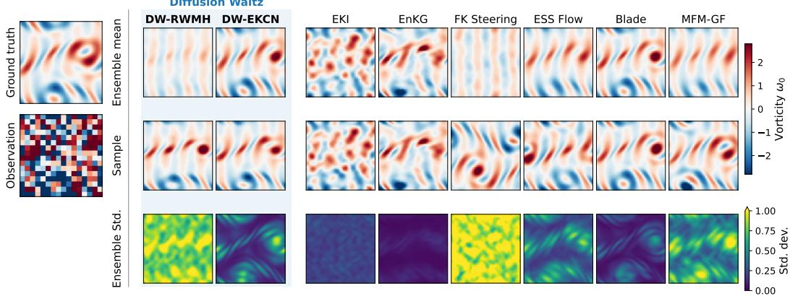  
Figure 1: Results on the Navier-Stokes (NS) initial condition recovery problem in the high nonlinearity / high noise regime. Despite the heavily corrupted observation, diffusion waltz with ensemble Kalman conditional noising (DW-EKCN) recovers the ground truth accurately with well-calibrated uncertainties.

For comparisons against standard gradient-based guidance methods (e.g. DPS) using a differentiable neural surrogate for the NS system, see Appendix E.7; we see that DW-EKCN and other MCMCbased approaches (ESS-Flow, Blade) mostly outperform these methods.

Effect of conditional noising. Comparing the two DW variants, we see that conditional noising is instrumental in accelerating convergence to the stationary distribution. We display trace plots of the potential $U ( x _ { 0 } ) = - \log { \bar { p } } ( y \mid x _ { 0 } )$ in Figure 6, showing that the slow convergence of RWMH waltz is due to many chains getting stuck early on, especially in the highly nonlinear setting $( T = 5 )$ EKCN guides each ensemble member towards high-likelihood regions, leading to rapid convergence within the first ∼ 50 MCMC steps. This also leads to high acceptance rates early in the iteration (Figure 7), although the rate decays rapidly once the chains converge; e.g., in the high-noise setting, it settles to between $1 0 \sim 2 0 \%$ , and in the low-noise regime, less than 5%. Investigating methods to maintain high acceptance rates is a promising direction for future work.

## 5 Conclusion

Diffusion waltz provides a simple plug-and-play framework for posterior sampling via MCMC that is asymptotically exact (assuming a perfect denoiser) and handles non-differentiable forward models. Its conditional noising extension injects observation information into the proposal while preserving this exactness, substantially improving mixing. On Navier–Stokes initial condition recovery, diffusion waltz matches or outperforms strong derivative-free baselines in both accuracy and calibration.

## Acknowledgments and Disclosure of Funding

We would like to thank Martin Accou, Andrew Boardman, Thomas Gessey-Jones, Ayush Jain, James-Michael Leahy and Daniel Owen-Lloyd for the insightful discussions and careful review of the manuscript.

CRediT author statement: So Takao: Conceptualization, Methodology, Software, Investigation, Writing - Original Draft, Visualization. Gregory David Bellchambers: Software, Investigation. Luke Ye: Software, Investigation. Sanmitra Ghosh: Conceptualization, Resources, Writing - Original Draft, Supervision, Project administration. Michalis Michaelides: Conceptualization, Resources, Writing - Original Draft, Supervision, Project administration.

## References

Bilal Ahmed and Joseph G Makin. Solving diffusion inverse problems with restart posterior sampling. arXiv preprint arXiv:2511.20705, 2025.

Michael Albergo, Nicholas M Boffi, and Eric Vanden-Eijnden. Stochastic interpolants: A unifying framework for flows and diffusions. Journal ofMachine Learning Research, 26(209):1–80, 2025.

Christophe Andrieu and Johannes Thoms. A tutorial on adaptive MCMC. Statistics and computing, 18(4):343–373, 2008.

Gregory Bellchambers. Exploiting the exact denoising posterior score in training-free guidance of diffusion models. arXiv preprint arXiv:2506.13614, 2025.

Gabriel Cardoso, Sylvain Le Corff, Eric Moulines, et al. Monte carlo guided denoising diffusion models for Bayesian linear inverse problems. In International Conference on Learning Representations, volume 2024, pages 44001–44037, 2024.

Hyungjin Chung, Jeongsol Kim, Michael T Mccann, Marc L Klasky, and Jong Chul Ye. Diffusion posterior sampling for general noisy inverse problems. In International Conference on Learning Representations, 2023.

Florentin Coeurdoux, Nicolas Dobigeon, and Pierre Chainais. Plug-and-play split Gibbs sampler: embedding deep generative priors in Bayesian inference. IEEE Transactions on Image Processing, 33:3496–3507, 2024.

Simon L Cotter, Gareth O Roberts, Andrew M Stuart, and David White. MCMC methods for functions: modifying old algorithms to make them faster. Statistical Science, pages 424–446, 2013.

Giannis Daras, Hyungjin Chung, Chieh-Hsin Lai, Yuki Mitsufuji, Jong Chul Ye, Peyman Milanfar, Alexandros G Dimakis, and Mauricio Delbracio. A survey on diffusion models for inverse problems. arXiv preprint arXiv:2410.00083, 2024.

Prafulla Dhariwal and Alexander Nichol. Diffusion models beat GANs on image synthesis. Advances in neural information processing systems, 34:8780–8794, 2021.

Simon Duane, Anthony D Kennedy, Brian J Pendleton, and Duncan Roweth. Hybrid Monte Carlo. Physics letters B, 195(2):216–222, 1987.

Geir Evensen. The ensemble Kalman filter: Theoretical formulation and practical implementation. Ocean dynamics, 53(4):343–367, 2003.

Jonathan Goodman and Jonathan Weare. Ensemble samplers with affine invariance. Communications in applied mathematics and computational science, 5(1):65–80, 2010.

Jonathan Ho and Tim Salimans. Classifier-free diffusion guidance. arXiv preprint arXiv:2207.12598, 2022.

Peter Holderrieth, Douglas Chen, Luca Eyring, Ishin Shah, Giri Anantharaman, Yutong He, Zeynep Akata, Tommi Jaakkola, Nicholas Matthew Boffi, and Max Simchowitz. Diamond maps: Efficient reward alignment via stochastic flow maps. arXiv preprint arXiv:2602.05993, 2026.

Marco A Iglesias, Kody JH Law, and Andrew M Stuart. Ensemble Kalman methods for inverse problems. Inverse Problems, 29(4):045001, 2013.

Adhithyan Kalaivanan, Zheng Zhao, Jens Sjölund, and Fredrik Lindsten. ESS-Flow: Training-free guidance of flow-based models as inference in source space. arXiv preprint arXiv:2510.05849, 2025.

Hyunmo Kang, Noam Itzhak Levi, Corinna Elena Wegner, Daniel J Korchinski, and Matthieu Wyart. Sampling data with chains of forward-backward diffusion steps. arXiv preprint arXiv:2605.27006, 2026.

Gavin Kerrigan, Giosue Migliorini, and Padhraic Smyth. Functional flow matching. arXiv preprint arXiv:2305.17209, 2023.

Jeongsol Kim, Bryan Sangwoo Kim, and Jong Chul Ye. FlowDPS: Flow-driven posterior sampling for inverse problems. In 2025 IEEE/CVF International Conference on Computer Vision (ICCV), pages 12328–12337. IEEE, 2025.

Nikola B Kovachki and Andrew M Stuart. Ensemble Kalman inversion: a derivative-free technique for machine learning tasks. Inverse Problems, 35(9):095005, 2019.

Kevin H Lam, Tyler Farghly, Christopher Williams, Jun Yang, Yee Whye Teh, and Arnaud Doucet. Metropolis-adjusted diffusion models. arXiv preprint arXiv:2605.09654, 2026.

Zongyi Li, Nikola Kovachki, Kamyar Azizzadenesheli, Burigede Liu, Kaushik Bhattacharya, Andrew Stuart, and Anima Anandkumar. Fourier neural operator for parametric partial differential equations. In International Conference on Learning Representations, 2021.

Zongyi Li, Miguel Liu-Schiaffini, Nikola Kovachki, Kamyar Azizzadenesheli, Burigede Liu, Kaushik Bhattacharya, Andrew Stuart, and Anima Anandkumar. Learning chaotic dynamics in dissipative systems. Advances in Neural Information Processing Systems, 35:16768–16781, 2022.

Yaron Lipman, Ricky TQ Chen, Heli Ben-Hamu, Maximilian Nickel, and Matt Le. Flow matching for generative modeling. In International Conference on Learning Representations, 2023.

Sam McCallum, Zander W Blasingame, Timothy Herschell, Niklas Rindtorff, Alexander Tong, and James Foster. Strong stochastic flow maps. arXiv preprint arXiv:2606.01086, 2026.

Chenlin Meng, Yutong He, Yang Song, Jiaming Song, Jiajun Wu, Jun-Yan Zhu, and Stefano Ermon. SDEdit: Guided image synthesis and editing with stochastic differential equations. In International Conference on Learning Representations, 2022.

Iain Murray, Ryan Adams, and David MacKay. Elliptical slice sampling. In Proceedings of the thirteenth international conference on artificial intelligence and statistics, pages 541–548. JMLR Workshop and Conference Proceedings, 2010.

Zhengkai Pan, Peter Potaptchik, Wenxi Yao, Michael S Albergo, and Jakiw Pidstrigach. Itô maps for any-step SDEs. arXiv preprint arXiv:2606.11156, 2026.

Prin Phunyaphibarn and Minhyuk Sung. Reward-guided discrete diffusion via clean-sample Markov chain for molecule and biological sequence design. arXiv preprint arXiv:2602.09424, 2026.

Peter Potaptchik, Adhi Saravanan, Abbas Mammadov, Alvaro Prat, Michael S Albergo, and Yee Whye Teh. Meta flow maps enable scalable reward alignment. arXiv preprint arXiv:2601.14430, 2026.

Gareth O Roberts and Richard L Tweedie. Exponential convergence of Langevin distributions and their discrete approximations. Bernoulli, 1996.

François Rozet, Gérôme Andry, François Lanusse, and Gilles Louppe. Learning diffusion priors from observations by expectation maximization. Advances in Neural Information Processing Systems, 37:87647–87682, 2024.

Daniel Sanz-Alonso, Andrew Stuart, and Armeen Taeb. Inverse problems and data assimilation, volume 107. Cambridge University Press, 2023.

Claudia Schillings and Andrew M Stuart. Analysis of the ensemble Kalman filter for inverse problems. SIAM Journal on Numerical Analysis, 55(3):1264–1290, 2017.

Raghav Singhal, Zachary Horvitz, Ryan Teehan, Mengye Ren, Zhou Yu, Kathleen McKeown, and Rajesh Ranganath. A general framework for inference-time scaling and steering of diffusion models. arXiv preprint arXiv:2501.06848, 2025.

Jiaming Song, Arash Vahdat, Morteza Mardani, and Jan Kautz. Pseudoinverse-guided diffusion models for inverse problems. In International conference on learning representations, 2023.

Yang Song, Jascha Sohl-Dickstein, Diederik P Kingma, Abhishek Kumar, Stefano Ermon, and Ben Poole. Score-based generative modeling through stochastic differential equations. In International Conference on Learning Representations, 2021.

Andrew M Stuart. Inverse problems: a Bayesian perspective. Acta numerica, 19:451–559, 2010.

Luhuan Wu, Brian Trippe, Christian Naesseth, David Blei, and John P Cunningham. Practical and asymptotically exact conditional sampling in diffusion models. Advances in Neural Information Processing Systems, 36:31372–31403, 2023.

Zihui Wu, Yu Sun, Yifan Chen, Bingliang Zhang, Yisong Yue, and Katherine L Bouman. Principled probabilistic imaging using diffusion models as plug-and-play priors. Advances in Neural Information Processing Systems, 37:118389–118427, 2024.

Jiachen Yao, Abbas Mammadov, Julius Berner, Gavin Kerrigan, Jong Chul Ye, Kamyar Azizzadenesheli, and Animashree Anandkumar. Guided diffusion sampling on function spaces with applications to PDEs. Advances in Neural Information Processing Systems, 38:127057–127094, 2026.

Bingliang Zhang, Wenda Chu, Julius Berner, Chenlin Meng, Anima Anandkumar, and Yang Song. Improving diffusion inverse problem solving with decoupled noise annealing. In 2025 IEEE/CVF Conference on Computer Vision and Pattern Recognition (CVPR), pages 20895–20905. IEEE, 2025.

Hongkai Zheng, Wenda Chu, Austin Wang, Nikola Kovachki, Ricardo Baptista, and Yisong Yue. Ensemble Kalman diffusion guidance: A derivative-free method for inverse problems. Transactions on Machine Learning Research, 2025a.

Hongkai Zheng, Wenda Chu, Bingliang Zhang, Zihui Wu, Austin Wang, Berthy Feng, Caifeng Zou, Yu Sun, Nikola Kovachki, Zachary Ross, et al. InverseBench: Benchmarking plug-and-play diffusion priors for inverse problems in physical sciences. In International Conference on Learning Representations, volume 2025, pages 90912–90940, 2025b.

Hongkai Zheng, Austin Wang, Zihui Wu, Zhengyu Huang, Ricardo Baptista, and Yisong Yue. Blade: A derivative-free Bayesian inversion method using diffusion priors. arXiv preprint arXiv:2510.10968, 2025c.

## A Stochastic interpolants

Given measures $p _ { 0 }$ and $p _ { 1 }$ , a stochastic interpolant is defined by the stochastic process

$$
\begin{array} { r } { x _ { t } = \alpha _ { t } x _ { 0 } + \beta _ { t } x _ { 1 } , } \end{array}\tag{4}
$$

where $x _ { 0 } \sim p _ { 0 } , x _ { 1 } \sim p _ { 1 }$ , and $\alpha _ { t } , \beta _ { t }$ for $t \in [ 0 ,$ 1] are arbitrary monotonic $C ^ { 2 }$ functions satisfying the endpoint conditions $\alpha _ { 0 } = \beta _ { 1 } = 1$ and $\alpha _ { 1 } = \beta _ { 0 } = 0$ . By a slight extension of [Albergo et al., 2025, Corollary 18], for any positive definite $\{ C _ { t } \} _ { t \in [ 0 , 1 ] }$ , we have that the SDE

$$
\mathrm { d } x _ { t } = \bigg ( b ( t , x _ { t } ) - \frac { 1 } { 2 } C _ { t } s ( t , x _ { t } ) \bigg ) \mathrm { d } t + \sqrt { C _ { t } } \mathrm { d } W _ { t } ,\tag{5}
$$

solved backwards in time from $x _ { 1 } \sim p _ { 1 }$ shares the same marginal law $p ( x _ { t } )$ as the forward interpolant (4). Here, $b ( t , x _ { t } ) : = \mathbb { E } [ \dot { x } _ { t } | x _ { t } ]$ is the marginal velocity (as used in flow matching) and $s ( t , x _ { t } ) : =$

$\nabla _ { x _ { t } } \log { p ( x _ { t } ) }$ is the score function. While both $b ( t , x _ { t } )$ and $s ( t , x _ { t } )$ are intractable, these can be approximated by neural networks $b _ { \theta } ( t , x _ { t } ) , s _ { \theta } ( t , x _ { t } )$ , respectively, by minimizing the losses

$$
\mathcal { L } _ { b } ( \theta ) = \mathbb { E } _ { x _ { 0 } \sim p _ { 0 } , x _ { 1 } \sim p _ { 1 } , t \sim \mathcal { U } ( [ 0 , 1 ] ) } \Big [ \| b _ { \theta } ( t , x _ { t } ) - ( \dot { \alpha } _ { t } x _ { 0 } + \dot { \beta } _ { t } x _ { 1 } ) \| ^ { 2 } \Big ] ,\tag{6}
$$

$$
\begin{array} { r } { \mathcal { L } _ { s } ( \theta ) = \mathbb { E } _ { x _ { 0 } \sim p _ { 0 } , x _ { 1 } \sim p _ { 1 } , t \sim \mathcal { U } ( [ 0 , 1 ] ) } \Big [ \| s _ { \theta } ( t , x _ { t } ) - \nabla _ { x _ { t } } \log p ( x _ { t } \mid x _ { 0 } ) \| ^ { 2 } \Big ] . } \end{array}\tag{7}
$$

## A.1 Three-sides of the same coin

In the special case when the reference is given by a Gaussian $p _ { 1 } = { \mathcal { N } } ( 0 , C ) ^ { 1 }$ , we can show that the drift $b ( t , x _ { t } )$ , the score $s ( t , x _ { t } )$ and the clean sample estimate $\mathbb { E } [ x _ { 0 } \mid x _ { t } ]$ are all related linearly. First, we can easily check the relation between $s ( t , x _ { t } )$ and $\mathbb { E } [ x _ { 0 } \mid { \dot { x } } _ { t } ]$ , noting that $p ( x _ { t } \mid x _ { 0 } ) = \mathbf { \dot { \mathcal { N } } } ( x _ { t } \mid$ $\alpha _ { t } x _ { 0 } , \beta _ { t } ^ { 2 } C )$

$$
s ( t , x _ { t } ) : = \nabla _ { x _ { t } } \log p ( x _ { t } )\tag{8}
$$

$$
= \int \nabla _ { x _ { t } } \log p ( x _ { t } \mid x _ { 0 } ) p ( x _ { 0 } \mid x _ { t } ) \mathrm { d } x _ { 0 }\tag{9}
$$

$$
= - \beta _ { t } ^ { - 2 } C ^ { - 1 } \big ( x _ { t } - \alpha _ { t } \mathbb { E } [ x _ { 0 } \mid x _ { t } ] \big ) .\tag{10}
$$

Re-arranging this expression gives us Tweedie’s formula:

$$
\mathbb { E } [ x _ { 0 } \mid x _ { t } ] = { \frac { x _ { t } + \beta _ { t } ^ { 2 } C s ( t , x _ { t } ) } { \alpha _ { t } } }\tag{11}
$$

On the other hand, using the fact that $x _ { t } = \alpha _ { t } x _ { 0 } + \beta _ { t } x _ { 1 }$ implies $x _ { t } = \alpha _ { t } \mathbb { E } [ x _ { 0 } \mid x _ { t } ] + \beta _ { t } \mathbb { E } [ x _ { 1 } \mid x _ { t } ]$ and $b ( t , x _ { t } ) : = \mathbb { E } [ \dot { x } _ { t } \ | \ x _ { t } ] = \dot { \alpha } _ { t } \mathbb { E } [ x _ { 0 } \ | \ x _ { t } ] + \dot { \beta } _ { t } \mathbb { E } [ x _ { 1 } \ | \ x _ { t } ] ,$ , a simple algebra yields the relation between the drift $b ( t , x _ { t } )$ and the Tweedie estimate $\dot { \mathbb { E } } [ x _ { 0 } \mid x _ { t } ]$

$$
\mathbb { E } [ x _ { 0 } \mid x _ { t } ] = \frac { \beta _ { t } b ( t , x _ { t } ) - \dot { \beta } _ { t } x _ { t } } { \dot { \alpha } _ { t } \beta _ { t } - \alpha _ { t } \dot { \beta } _ { t } } .\tag{12}
$$

Finally, combining (11) and (12) gives us the relation between the drift $b ( t , x )$ and the score $s ( t , x _ { t } )$

$$
C s ( t , x _ { t } ) = \frac { \alpha _ { t } b ( t , x _ { t } ) - { \dot { \alpha } _ { t } } x _ { t } } { \beta _ { t } ( { \dot { \alpha } _ { t } } \beta _ { t } - \alpha _ { t } { \dot { \beta } _ { t } } ) } .\tag{13}
$$

## A.2 Choice of SDE to sample from $p ( x _ { 0 } \mid x _ { t } )$

Given particular choices of $C _ { t } .$ , we can show that the SDE (5) not only samples the interpolant marginals $p ( x _ { t } )$ but also the conditional $p ( x _ { 0 } \mid x _ { t } )$ , which is what we need in the denoising step of diffusion waltz. This follows from the following result.

Proposition 1. Let $p _ { 1 } = { \mathcal { N } } ( 0 , C )$ for some positive definite C. Then, setting $C _ { t } : = \sigma _ { t } ^ { 2 } C$ in (5) with $\{ \sigma _ { t } \} _ { t \in ( 0 , 1 ) }$ satisfying

$$
\frac { \sigma _ { t } ^ { 2 } } { 2 } = \frac { \beta _ { t } ( \alpha _ { t } \dot { \beta } _ { t } - \dot { \alpha } _ { t } \beta _ { t } ) } { \alpha _ { t } } , \quad t \in ( 0 , 1 ) ,\tag{14}
$$

the terminal law of the reverse-time $S D E \left( ( 5 ) \right)$ integrated backwards from time t to 0 from initial condition $x _ { t } ,$ is equivalent to the conditional law $p ( x _ { 0 } \mid x _ { t } )$ of the interpolant.

Proof. The proof is a slight adaptation of [Potaptchik et al., 2026, Proposition C.1].

Using this result, we can further simplify the expression for our denoising SDE (5). First, by the relation (13), the drift of (5) reads

$$
b ( t , x _ { t } ) - \frac { \sigma _ { t } ^ { 2 } } { 2 } C s ( t , x _ { t } ) = b ( t , x _ { t } ) - \frac { \sigma _ { t } ^ { 2 } } { 2 } \frac { \alpha _ { t } b ( t , x _ { t } ) - \dot { \alpha } _ { t } x _ { t } } { \beta _ { t } ( \dot { \alpha } _ { t } \beta _ { t } - \alpha _ { t } \dot { \beta } _ { t } ) }\tag{15}
$$

$$
\stackrel { ( 1 4 ) } { = } b ( t , x _ { t } ) + \left( b ( t , x _ { t } ) - \frac { { \dot { \alpha } } _ { t } } { \alpha _ { t } } x _ { t } \right)\tag{16}
$$

$$
= 2 b ( t , x _ { t } ) - \frac { \dot { \alpha } _ { t } } { \alpha _ { t } } x _ { t }\tag{17}
$$

or equivalently,

$$
b ( t , x _ { t } ) - \frac { \sigma _ { t } ^ { 2 } } { 2 } C s ( t , x _ { t } ) = \frac { \dot { \alpha } _ { t } } { \alpha _ { t } } x _ { t } - \sigma _ { t } ^ { 2 } C s ( t , x _ { t } ) .\tag{18}
$$

Thus, the denoising SDE (5) simplifies to

$$
\mathrm { d } x _ { t } = \left( 2 b ( t , x _ { t } ) - \frac { \dot { \alpha } _ { t } } { \alpha _ { t } } x _ { t } \right) \mathrm { d } t + \sigma _ { t } \mathrm { d } W _ { t } ^ { C } ,\tag{19}
$$

or equivalently, using the score instead, we have

$$
\mathrm { d } x _ { t } = \left( \frac { \dot { \alpha } _ { t } } { \alpha _ { t } } x _ { t } - \sigma _ { t } ^ { 2 } C s ( t , x _ { t } ) \right) \mathrm { d } t + \sigma _ { t } \mathrm { d } W _ { t } ^ { C } ,\tag{20}
$$

where $W _ { t } ^ { C } : = \sqrt { C } W _ { t }$ is the C-Brownian motion.

## B Acceptance probability computations

Given a proposal kernel $q ( x _ { 0 } ^ { \prime } \mid x _ { 0 } )$ , the Metropolis-Hastings accept/reject probability to sample from the posterior $p ( x _ { 0 } ^ { \prime } \mid y )$ is given by

$$
\alpha = \operatorname* { m i n } \left\{ 1 , { \frac { p ( x _ { 0 } ^ { \prime } \mid y ) q ( x _ { 0 } \mid x _ { 0 } ^ { \prime } ) } { p ( x _ { 0 } \mid y ) q ( x _ { 0 } ^ { \prime } \mid x _ { 0 } ) } } \right\} .\tag{21}
$$

In this appendix, we derive the Metropolis/Hastings acceptance probabilities for diffusion waltz as it appears in Algorithms 1 and 2.

## B.1 RWMH diffusion waltz

We first show that for RWMH diffusion waltz, as described in Algorithm 1, this acceptance probability reduces to a simple likelihood ratio, avoiding the need to evaluate prior densities. To show this, we use the following result.

Lemma 1. The RWMH diffusion waltz proposal kernel $q _ { \theta } ( x _ { 0 } ^ { \prime } \mid x _ { 0 } )$ is reversible with respect to the diffusion prior $p _ { \theta } ( x _ { 0 } )$ , i.e.,

$$
q _ { \theta } ( x _ { 0 } ^ { \prime } | x _ { 0 } ) p _ { \theta } ( x _ { 0 } ) = q _ { \theta } ( x _ { 0 } | x _ { 0 } ^ { \prime } ) p _ { \theta } ( x _ { 0 } ^ { \prime } )\tag{22}
$$

Proof. The RWMH diffusion waltz proposal kernel (steps 1&2 of Algorithm 1) can be expressed as

$$
q _ { \theta } ( x _ { 0 } ^ { \prime } \mid x _ { 0 } ) : = \int p _ { \theta } ( x _ { 0 } ^ { \prime } \mid x _ { t } ) p ( x _ { t } \mid x _ { 0 } ) \mathrm { d } x _ { t } .\tag{23}
$$

Thus, we have

$$
q _ { \theta } ( x _ { 0 } ^ { \prime } | x _ { 0 } ) p _ { \theta } ( x _ { 0 } ) = \int p _ { \theta } ( x _ { 0 } ^ { \prime } \mid x _ { t } ) p ( x _ { t } \mid x _ { 0 } ) p _ { \theta } ( x _ { 0 } ) \mathrm { d } x _ { t }\tag{24}
$$

$$
= \int { \frac { p ( x _ { t } \mid x _ { 0 } ^ { \prime } ) p _ { \theta } ( x _ { 0 } ^ { \prime } ) } { p _ { \theta } ( x _ { t } ) } } p ( x _ { t } \mid x _ { 0 } ) p _ { \theta } ( x _ { 0 } ) \mathrm { d } x _ { t }\tag{25}
$$

$$
= \int p ( x _ { t } \mid x _ { 0 } ^ { \prime } ) p _ { \theta } ( x _ { 0 } ^ { \prime } ) { \frac { p ( x _ { t } \mid x _ { 0 } ) p _ { \theta } ( x _ { 0 } ) } { p _ { \theta } ( x _ { t } ) } } \mathrm { d } x _ { t }\tag{26}
$$

$$
= \int p _ { \theta } ( x _ { 0 } \mid x _ { t } ) p ( x _ { t } \mid x _ { 0 } ^ { \prime } ) p _ { \theta } ( x _ { 0 } ^ { \prime } ) \mathrm { d } x _ { t }\tag{27}
$$

$$
= q _ { \theta } ( x _ { 0 } \mid x _ { 0 } ^ { \prime } ) p _ { \theta } ( x _ { 0 } ^ { \prime } ) ,\tag{28}
$$

which establishes the reversibility of the diffusion waltz proposal kernel with respect to $p _ { \theta }$

From this, we can simplify the ratio in (21) as

$$
\frac { p _ { \theta } ( x _ { 0 } ^ { \prime } \mid y ) q _ { \theta } ( x _ { 0 } \mid x _ { 0 } ^ { \prime } ) } { p _ { \theta } ( x _ { 0 } \mid y ) q _ { \theta } ( x _ { 0 } ^ { \prime } \mid x _ { 0 } ) } = \frac { p ( y \mid x _ { 0 } ^ { \prime } ) p _ { \theta } ( x _ { 0 } ^ { \prime } ) q _ { \theta } ( x _ { 0 } \mid x _ { 0 } ^ { \prime } ) } { p ( y \mid x _ { 0 } ) p _ { \theta } ( x _ { 0 } ) q _ { \theta } ( x _ { 0 } ^ { \prime } \mid x _ { 0 } ) } = \frac { p ( y \mid x _ { 0 } ^ { \prime } ) } { p ( y \mid x _ { 0 } ) } ,\tag{29}
$$

proving our claim, where the first equality follows from Bayes’ rule and the second follows from the reversibility property (22).

## B.2 Conditional noising waltz

The conditional waltz kernel is given in full by:

$$
K _ { \theta } ( x _ { 0 }  x _ { 0 } ^ { \prime } ) = P _ { \mathrm { a c c e p t } } ( x _ { 0 }  x _ { 0 } ^ { \prime } ) + P _ { \mathrm { r e j e c t } } ( x _ { 0 }  x _ { 0 } ^ { \prime } ) \delta ( x _ { 0 } - x _ { 0 } ^ { \prime } ) .\tag{30}
$$

where

$$
P _ { \mathrm { a c e p t } } ( x _ { 0 } \to x _ { 0 } ^ { \prime } ) : = \int p \ d _ { \theta } ( x _ { 0 } ^ { \prime } \mid x _ { t } ) q ( x _ { t } \mid x _ { 0 } , y ) \operatorname* { m i n } \left\{ 1 , \frac { p \ d _ { \theta } \mid x _ { 0 } ^ { \prime } \mid q ( x _ { t } \mid x _ { 0 } ^ { \prime } , y ) p ( x _ { t } \mid x _ { 0 } ) } { p ( y \mid x _ { 0 } ) q ( x _ { t } \mid x _ { 0 } , y ) p ( x _ { t } \mid x _ { 0 } ^ { \prime } ) } \right\} \mathrm { d } x _ { t } ,\tag{31}
$$

$$
P _ { \mathrm { r e j e c t } } ( x _ { 0 }  x _ { 0 } ^ { \prime } ) : = 1 - P _ { \mathrm { a c c e p t } } ( x _ { 0 }  x _ { 0 } ^ { \prime } ) .\tag{32}
$$

We show that this kernel is reversible with respect to the posterior $p _ { \theta } ( x _ { 0 } \mid y )$ , that is,

$$
K _ { \theta } ( x _ { 0 } \to x _ { 0 } ^ { \prime } ) p _ { \theta } ( x _ { 0 } \mid y ) = K _ { \theta } ( x _ { 0 } ^ { \prime } \to x _ { 0 } ) p _ { \theta } ( x _ { 0 } ^ { \prime } \mid y ) .\tag{33}
$$

To show this, we use the following lemma

Lemma 2. The following identity holds for any $( x _ { 0 } , x _ { 0 } ^ { \prime } , x _ { t } )$

$$
\begin{array} { l } { { \displaystyle \biggl ( p _ { \theta } ( x _ { 0 } ^ { \prime } \mid x _ { t } ) q ( x _ { t } \mid x _ { 0 } , y ) \operatorname* { m i n } \left\{ 1 , \frac { p ( y \mid x _ { 0 } ^ { \prime } ) q ( x _ { t } \mid x _ { 0 } ^ { \prime } , y ) p ( x _ { t } \mid x _ { 0 } ) } { p ( y \mid x _ { 0 } ) q ( x _ { t } \mid x _ { 0 } , y ) p ( x _ { t } \mid x _ { 0 } ^ { \prime } ) } \right\} \biggr ) p _ { \theta } ( x _ { 0 } \mid y ) } } \\ { { = \biggl ( p _ { \theta } ( x _ { 0 } \mid x _ { t } ) q ( x _ { t } \mid x _ { 0 } ^ { \prime } , y ) \operatorname* { m i n } \left\{ 1 , \frac { p ( y \mid x _ { 0 } ) q ( x _ { t } \mid x _ { 0 } , y ) p ( x _ { t } \mid x _ { 0 } ^ { \prime } ) } { p ( y \mid x _ { 0 } ^ { \prime } ) q ( x _ { t } \mid x _ { 0 } ^ { \prime } , y ) p ( x _ { t } \mid x _ { 0 } ) } \right\} \biggr ) p _ { \theta } ( x _ { 0 } ^ { \prime } \mid y ) . } } \end{array}\tag{34}
$$

Proof. For simplicity, let

$$
r : = \frac { p ( y \mid x _ { 0 } ^ { \prime } ) q ( x _ { t } \mid x _ { 0 } ^ { \prime } , y ) p ( x _ { t } \mid x _ { 0 } ) } { p ( y \mid x _ { 0 } ) q ( x _ { t } \mid x _ { 0 } , y ) p ( x _ { t } \mid x _ { 0 } ^ { \prime } ) } .\tag{35}
$$

When $r < 1$ , the left hand side and right hand side of (34) reads, respectively,

$$
\mathrm { L H S } = p _ { \boldsymbol { \theta } } ( x _ { 0 } ^ { \prime } \mid x _ { t } ) q ( x _ { t } \mid x _ { 0 } , y ) p _ { \boldsymbol { \theta } } ( x _ { 0 } \mid y ) r\tag{36}
$$

$$
\mathrm { R H S } = p _ { \boldsymbol { \theta } } ( x _ { 0 } \mid x _ { t } ) q ( x _ { t } \mid x _ { 0 } ^ { \prime } , y ) p _ { \boldsymbol { \theta } } ( x _ { 0 } ^ { \prime } \mid y ) .\tag{37}
$$

Thus, for equality (34) to hold, we need

$$
r = \frac { p _ { \theta } ( x _ { 0 } \mid x _ { t } ) q ( x _ { t } \mid x _ { 0 } ^ { \prime } , y ) p _ { \theta } ( x _ { 0 } ^ { \prime } \mid y ) } { p _ { \theta } ( x _ { 0 } ^ { \prime } \mid x _ { t } ) q ( x _ { t } \mid x _ { 0 } , y ) p _ { \theta } ( x _ { 0 } \mid y ) } .\tag{38}
$$

Now, we have

$$
p _ { \theta } ( x _ { 0 } \mid x _ { t } ) = { \frac { p ( x _ { t } \mid x _ { 0 } ) p _ { \theta } ( x _ { 0 } ) } { p _ { \theta } ( x _ { t } ) } } , \qquad p _ { \theta } ( x _ { 0 } ^ { \prime } \mid y ) = { \frac { p ( y \mid x _ { 0 } ) p _ { \theta } ( x _ { 0 } ) } { p _ { \theta } ( y ) } } ,\tag{39}
$$

by Bayes’ rule and substituting this into (38), we get

$$
( 3 8 ) = \frac { p ( x _ { t } \mid x _ { 0 } ) p _ { \theta } ( x _ { 0 } ) p _ { \theta } ( x _ { t } ) } { p ( x _ { t } \mid x _ { 0 } ^ { \prime } ) p _ { \theta } ( x _ { 0 } ^ { \prime } ) p _ { \theta } ( x _ { t } ) } \times \frac { q ( x _ { t } \mid x _ { 0 } ^ { \prime } , y ) } { q ( x _ { t } \mid x _ { 0 } , y ) } \times \frac { p ( y \mid x _ { 0 } ^ { \prime } ) p _ { \theta } ( x _ { 0 } ^ { \prime } ) p _ { \theta } ( y ) } { p ( y \mid x _ { 0 } ) p _ { \theta } ( x _ { 0 } ) p _ { \theta } ( y ) }\tag{40}
$$

$$
= \frac { p ( x _ { t } \mid x _ { 0 } ) q ( x _ { t } \mid x _ { 0 } ^ { \prime } , y ) p ( y \mid x _ { 0 } ^ { \prime } ) p _ { \theta } ( x _ { \theta } ) p _ { \theta } ( x _ { 0 } ^ { \prime } ) } { p ( x _ { t } \mid x _ { 0 } ^ { \prime } ) q ( x _ { t } \mid x _ { 0 } , y ) p ( y \mid x _ { 0 } ) p _ { \theta } ( x _ { 0 } ^ { \prime } ) p _ { \theta } ( x _ { 0 } ) } ,\tag{41}
$$

which agrees with the expression in (35), and therefore the equality (34) holds. By symmetry, (34) also holds in the case $r \geq 1$ □

By Lemma 2, since identity (34) holds pointwise in $x _ { t }$ , it also holds when we integrate this out, which gives us

$$
P _ { \mathrm { a c c e p t } } ( x _ { 0 } \to x _ { 0 } ^ { \prime } ) p _ { \theta } ( x _ { 0 } \mid y ) = P _ { \mathrm { a c c e p t } } ( x _ { 0 } ^ { \prime } \to x _ { 0 } ) p _ { \theta } ( x _ { 0 } ^ { \prime } \mid y ) .\tag{42}
$$

Trivially, we also have

$$
P _ { \mathrm { r e j e c t } } ( x _ { 0 } \to x _ { 0 } ^ { \prime } ) \delta ( x _ { 0 } - x _ { 0 } ^ { \prime } ) p _ { \theta } ( x _ { 0 } \mid y ) = P _ { \mathrm { r e j e c t } } ( x _ { 0 } ^ { \prime } \to x _ { 0 } ) \delta ( x _ { 0 } ^ { \prime } - x _ { 0 } ) p _ { \theta } ( x _ { 0 } ^ { \prime } \mid y ) ,\tag{43}
$$

thus combining this, we have that the conditional waltz kernel $K _ { \theta }$ is reversible with respect to p (x | y), i.e., (33) holds.

Remark 1. As a sanity check, the RWMH waltz acceptance probability (29) follows from the conditional noising waltz acceptance probability (35), by setting $q ( x _ { t } \mid x _ { 0 } , y ) = p ( x _ { t } \mid x _ { 0 } )$ ).

## C Statistical linearisation and ensemble Kalman update rules

Here, we provide details on the statistical linearisation procedure to derive the ensemble Kalman conditional noising (EKCN) kernel. The essence of statistical linearisation is to seek a linear approximation to a nonlinear function $\mathcal { A } ( x ) \approx A x + b$ that is a best fit in terms of least squares [Zheng et al., 2025a], i.e., given an ensemble $\{ x ^ { ( j ) } \} _ { j = : } ^ { J }$ 1

$$
( A , b ) = \underset { A , b } { \arg \operatorname* { m i n } } \left\{ \frac { 1 } { J } \sum _ { j = 1 } ^ { J } \left\| A ( x ^ { ( j ) } ) - \left( A x ^ { ( j ) } + b \right) \right\| ^ { 2 } \right\}\tag{44}
$$

This gives us

$$
A : = ( C ^ { x y } ) ^ { \top } ( C ^ { x x } ) ^ { - 1 } , \qquad b : = { \overline { { A ( x ) } } } - A { \bar { x } } ,\tag{45}
$$

where

$$
\bar { x } : = \frac { 1 } { J } \sum _ { j = 1 } ^ { J } x ^ { ( j ) } , \qquad \overline { { \mathcal { A } ( x ) } } : = \frac { 1 } { J } \sum _ { j = 1 } ^ { J } A ( x ^ { ( j ) } )\tag{46}
$$

$$
C ^ { x x } : = \frac { 1 } { J } \sum _ { i , j = 1 } ^ { J } \left( x ^ { ( i ) } - \bar { x } \right) \left( x ^ { ( j ) } - \bar { x } \right) ^ { \top } \qquad C ^ { x y } : = \frac { 1 } { J } \sum _ { i , j = 1 } ^ { J } \left( x ^ { ( i ) } - \bar { x } \right) \left( A ( x ^ { ( j ) } ) - \overline { { A ( x ) } } \right) ^ { \top } .\tag{47}
$$

A consequence of this is that we can approximate the Jacobian of A as $D \mathcal { A } ( x ) \approx ( C ^ { x y } ) ^ { \top } ( C ^ { x x } ) ^ { - 1 }$ which can be computed without explicitly taking derivatives. Thus, we can use this to solve optimisation problems in a derivative-free manner. For example, if we consider the objective

$$
U ( x ) = \frac { 1 } { 2 } \| y - \mathcal { A } ( x ) \| _ { \Gamma } ^ { 2 } ,\tag{48}
$$

where $\| x \| _ { A } : = x ^ { \top } A ^ { - 1 } x$ , its gradient can be approximated as

$$
\nabla _ { \boldsymbol { x } } U ( \boldsymbol { x } ) = D ^ { \top } \boldsymbol { A } ( \boldsymbol { x } ) \Gamma ^ { - 1 } \big ( \boldsymbol { A } ( \boldsymbol { x } ) - \boldsymbol { y } \big ) \approx ( C ^ { x x } ) ^ { - 1 } C ^ { x y } \Gamma ^ { - 1 } \big ( \boldsymbol { A } ( \boldsymbol { x } ) - \boldsymbol { y } \big ) ,\tag{49}
$$

and we can consider gradient descent with this approximation. We can also derive analogues of more sophisticated solvers such as Levenberg-Marquardt, as we show next.

## C.1 Ensemble Kalman update rule and the Levenberg-Marquardt solver

We closely follow the presentation in [Sanz-Alonso et al., 2023, Chapter 13] for the derivations of the ensemble Kalman variant of the Levenberg-Marquardt (LM) solver. The derivation largely follow from the following simple lemma:

Lemma 3 (Sanz-Alonso et al. [2023], Lemma 13.3). Thefollowing identity holds

$$
\frac { 1 } { 2 } \| y - A x \| _ { \Gamma } ^ { 2 } + \frac { 1 } { 2 } \| x - m \| _ { C } ^ { 2 } = \frac { 1 } { 2 } \| x - \mu \| _ { \Sigma } ^ { 2 } + \beta ,\tag{50}
$$

where $\beta$ is a constant independent ofx, and

$$
\mu : = m + K ( y - A m ) ,\tag{51}
$$

$$
\Sigma : = ( I - K A ) C ,\tag{52}
$$

where K is the Kalman gain matrix, given by

$$
K = C A ^ { \top } ( A C A ^ { \top } + \Gamma ) ^ { - 1 } .\tag{53}
$$

Equations (51)–(52) define the Kalman update rule, which give us closed form expressions for the solution to the regularised least squares problem, given by the LHS of (50), and the associated curvature at that minima.

The Levenberg-Marquardt algorithm seeks to minimise the data misfit loss

$$
\mathcal { I } ( { \boldsymbol { x } } ) = \frac { 1 } { 2 } \| \boldsymbol { y } - \mathcal { A } ( { \boldsymbol { x } } ) \| _ { \Gamma } ^ { 2 } ,\tag{54}
$$

and for a learning rate $h > 0$ , proceeds by iterating

$$
x _ { n + 1 } = x _ { n } + g _ { n } ( h ) ,\tag{55}
$$

where $g _ { n } ( h )$ is a minima of the least squares problem

$$
g _ { n } ( h ) = \arg \operatorname* { m i n } _ { v } \left\{ \frac { 1 } { 2 } \big \| y - \boldsymbol { A } ( \boldsymbol { x } _ { n } ) - \boldsymbol { D } \boldsymbol { A } ( \boldsymbol { x } _ { n } ) v \big \| _ { \Gamma } ^ { 2 } + \frac { 1 } { 2 h } \big \| v \big \| _ { C } ^ { 2 } \right\} ,\tag{56}
$$

for some PSD matrix C. This may be interpreted as minimising $\begin{array} { r } { \frac 1 2 \big | y - \mathcal { A } ( x _ { n } ) - D \mathcal { A } ( x _ { n } ) v \big | _ { \Gamma } ^ { 2 } } \end{array}$ , while restricting the search space of v to a ball $\{ v : \| v \| _ { C } \leq \delta \}$ for some δ associated to h, i.e., minimise within a trust region.

Invoking Lemma 3, we get

$$
g _ { n } ( h ) = K ( h ) ( y - \mathcal { A } ( x _ { n } ) ) ,\tag{57}
$$

where the Kalman gain is given by

$$
K ( h ) : = h C D ^ { \top } A ( x _ { n } ) \left( h D A ( x _ { n } ) C D ^ { \top } A ( x _ { n } ) + \Gamma \right) ^ { - 1 } .\tag{58}
$$

Now recall that by statistical linearisation, given a cloud of particles $\{ \boldsymbol { x } ^ { ( j ) } \} _ { j = 1 } ^ { J }$ , we have that

$$
\begin{array} { r } { \pmb { \mathcal { A } } ( \pmb { x } ) \approx ( C ^ { x y } ) ^ { \top } ( C ^ { x x } ) ^ { - 1 } ( x - \bar { x } ) + \overline { { \pmb { \mathcal { A } } ( x ) } } , } \end{array}\tag{59}
$$

$$
D \mathcal { A } ( x ) \approx ( C ^ { x y } ) ^ { \top } ( C ^ { x x } ) ^ { - 1 } .\tag{60}
$$

Since C in (56) is arbitrary, we set $C = C ^ { x x }$ . This implies

$$
C ^ { x y } \overset { ( 4 7 ) } { = } C D ^ { \top } \mathcal { A } ( x ) ,\tag{61}
$$

and

$$
C ^ { y y } : = \frac { 1 } { J } \sum _ { i , j = 1 } ^ { J } \left( \boldsymbol { A } ( \boldsymbol { x } ^ { ( i ) } ) - \overline { { \boldsymbol { A } ( \boldsymbol { x } ) } } \right) \left( \boldsymbol { A } ( \boldsymbol { x } ^ { ( j ) } ) - \overline { { \boldsymbol { A } ( \boldsymbol { x } ) } } \right) ^ { \intercal }\tag{62}
$$

$$
\stackrel { ( 5 9 ) } { = } \frac { 1 } { J } \sum _ { i , j = 1 } ^ { J } ( C ^ { x y } ) ^ { \top } ( C ^ { x x } ) ^ { - 1 } ( x ^ { ( i ) } - \bar { x } ) ( x ^ { ( j ) } - \bar { x } ) ^ { \top } ( C ^ { x x } ) ^ { - 1 } C ^ { x y }\tag{63}
$$

$$
\stackrel { ( 4 7 ) } { = } ( C ^ { x y } ) ^ { \top } ( C ^ { x x } ) ^ { - 1 } C _ { x x } ( C ^ { x x } ) ^ { - 1 } C ^ { x y }\tag{64}
$$

$$
\stackrel { ( 6 0 ) } { \approx } D \mathcal { A } ( x ) C D ^ { \top } \mathcal { A } ( x ) .\tag{65}
$$

Thus, we can approximate the Kalman gain (58) in a gradient-free manner using ensembles as

$$
K ( h ) \approx h C ^ { x y } \left( h C ^ { y y } + \Gamma \right) ^ { - 1 } .\tag{66}
$$

In practice, one iterates (55) for an ensemble of particles $\{ x _ { n } ^ { ( j ) } \} _ { j = 1 } ^ { J }$ in parallel and at each time step n, the Kalman gain (66) is computed using the ensemble $\{ x _ { n } ^ { ( j ) } \} _ { j = 1 } ^ { J }$

## C.2 Details on the EKCN kernel

We use the ensemble Kalman variant of the LM update rule to define our ensemble Kalman conditional noising (EKCN) kernel $q ( x _ { t } \mid x _ { 0 } , y )$ . We split this into two steps:

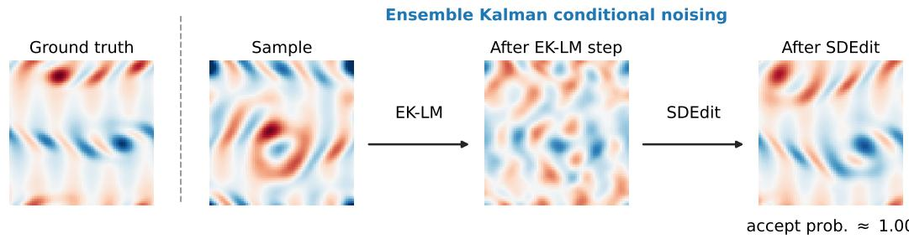  
Figure 2: Illustration of the ensemble Kalman conditional noising diffusion waltz (DW-EKCN). This applies a single step of ensemble Kalman Levenberg-Marquardt (EK-LM) update to minimise data misfit, followed by applying SDEdit to project it back onto the data manifold. Earlier in the iterations, acceptance rate is high and convergence is fast as most proposed samples have lower data misfit.

1. For fixed $h > 0$ , apply a single ensemble Kalman LM update to x0:

$$
\tilde { x } _ { 0 } = x _ { 0 } + K ( h ) ( y - \mathcal { A } ( x _ { 0 } ) ) ,\tag{67}
$$

where $K ( h )$ is computed using (66).

2. Add noise via the interpolant

$$
x _ { t } = \alpha _ { t } \tilde { x } _ { 0 } + \beta _ { t } x _ { 1 } , \quad x _ { 1 } \sim p _ { 1 } .\tag{68}
$$

Combining this with the denoising step in diffusion waltz

3. Denoise $x _ { 0 } ^ { \prime } \sim p _ { \theta } ( x _ { 0 } \mid x _ { t } )$

the full conditional noising waltz proposal kernel $q ( x _ { 0 } ^ { \prime } \mid x _ { 0 } )$ may be understood as first applying an ensemble Kalman update to minimise the data misfit (54) (step 1); however, since without prior regularisation, this is likely to push the particle off-manifold, this is corrected by applying SDEdit Meng et al. [2022] (steps 2-3), which keeps it on-manifold (see Figure 2 for an illustration).

In practice, we run J MCMC chains in parallel and the Kalman gain $K ( h )$ at each step is computed using the ensemble. However, when the observation dimension is high, the matrix inverse in (66) is expensive to compute. Following a standard trick used in ensemble Kalman filters Evensen [2003], we use the pushthrough identity identity $V ( V ^ { T } V + \lambda I ) ^ { - 1 } = ( V V ^ { T } + \lambda I ) ^ { - 1 } V$ to reduce this complexity. Letting $\dot { \Gamma } = \sigma _ { y } ^ { 2 } I , \dot { C ^ { x y } } = \dot { U ^ { \top } } V$ and $C ^ { y y } = V ^ { \top } V$ , where

$$
U _ { j } = \frac { 1 } { \sqrt { J } } ( x _ { 0 } ^ { ( j ) } - \bar { x } _ { 0 } ) , \qquad V _ { j } = \frac { 1 } { \sqrt { J } } ( A ( x _ { 0 } ^ { ( j ) } ) - \overline { { A ( x _ { 0 } ) } } ) ,\tag{69}
$$

we have

$$
K ( h ) \overset { ( 6 6 ) } { \approx } h U ^ { \top } V \left( h V ^ { \top } V + \sigma _ { y } ^ { 2 } I \right) ^ { - 1 }\tag{70}
$$

$$
= U ^ { \top } V \left( V ^ { \top } V + ( \sigma _ { y } ^ { 2 } / h ) I \right) ^ { - 1 }\tag{71}
$$

$$
= U ^ { \top } \left( V V ^ { \top } + ( \sigma _ { y } ^ { 2 } / h ) I \right) ^ { - 1 } V .\tag{72}
$$

Noting that the matrix inverse in (72) now has size $J \times J ,$ and since the ensemble size J is a hyperparameter that one can choose freely, the computation of (72) can be made tractable.

We now make an important remark that in the computation of the acceptance probability

$$
\alpha = \operatorname* { m i n } \left\{ 1 , { \frac { p ( y \mid x _ { 0 } ^ { \prime } ) q ( x _ { t } \mid x _ { 0 } ^ { \prime } , y ) p ( x _ { t } \mid x _ { 0 } ) } { p ( y \mid x _ { 0 } ) q ( x _ { t } \mid x _ { 0 } , y ) p ( x _ { t } \mid x _ { 0 } ^ { \prime } ) } } \right\} ,\tag{73}
$$

we use the same Kalman gain $K ( h )$ in the computation $o f q ( x _ { t } \mid x _ { 0 } ^ { \prime } , y )$ and $q ( x _ { t } \mid x _ { 0 } , y$ )to ensure that the same kernel q is used in both the numerator and denominator. More precisely, given an ensemble $\{ x _ { 0 } ^ { ( j ) } \} _ { j = 1 } ^ { J }$ , we first compute $K ( h )$ using this ensemble and compute

$$
q ( x _ { t } ^ { ( j ) } \mid x _ { 0 } ^ { ( j ) } , y ) = \mathcal { N } \Big ( x _ { t } ^ { ( j ) } \mid \alpha _ { t } \big ( x _ { 0 } ^ { ( j ) } + K ( h ) \big ( y - \mathcal { A } ( x _ { 0 } ^ { ( j ) } ) \big ) \big ) , \beta _ { t } ^ { 2 } C \Big )\tag{74}
$$

$$
q ( x _ { t } ^ { ( j ) } \mid x _ { 0 } ^ { ' ( j ) } , y ) = \mathcal { N } \Big ( x _ { t } ^ { ( j ) } \mid \alpha _ { t } \big ( x _ { 0 } ^ { ' ( j ) } + K ( h ) \big ( y - \mathcal { A } ( x _ { 0 } ^ { ' ( j ) } ) \big ) \big ) , \beta _ { t } ^ { 2 } C \Big ) ,\tag{75}
$$

for the same $K ( h )$ , i.e., we do not recompute it in (75) using the updated samples $\{ x _ { 0 } ^ { ' ( j ) } \} _ { j = 1 } ^ { J }$

Remark 2. The interacting particle-style update in equations $( 7 4 ) { - } ( 7 5 )$ subtly breaks exactness of the method due to the dependence of the proposal on the law of the particles. Methods exist to overcome this, e.g., splitting particles into groups and updating one group using information from the other Goodman and Weare [2010]; however, in practice, wefound that simply using all the ensemble members yieldfaster convergence and better empirical performance.

## D Adaptive MCMC tuning

We consider Robbins-Monro method to adaptively tune the hyperparameters $t \in ( 0 , 1 )$ ) (the noising time used in waltz) and $h \in ( 0 , 1 )$ (the ensemble Kalman step size) [Andrieu and Thoms, 2008]. This reads

$$
\begin{array} { r } { \mathrm { l o g i t } ( t _ { n + 1 } ) = \mathsf { c l i p } \big ( \mathrm { l o g i t } ( t _ { n } ) + \eta _ { t } \big ( \alpha _ { n } - \alpha ^ { * } \big ) \big ) , } \end{array}\tag{76}
$$

$$
\begin{array} { r } { \mathrm { l o g i t } ( h _ { n + 1 } ) = \mathsf { c l i p } \big ( \mathrm { l o g i t } ( h _ { n } ) + \eta _ { h } ( \alpha _ { n } - \alpha ^ { * } ) \big ) , } \end{array}\tag{77}
$$

where $\alpha ^ { * }$ is a target acceptance rate, $\alpha _ { n }$ is the instantaneous acceptance rate $( \mathrm { i . e . }$ , how many samples out of J were accepted at step n), and $\eta _ { t } , \eta _ { h } > 0$ are step-sizes, all specified by the users. Clipping is applied e.g. to prevent t from going down to 0, which is important as we discuss later. In our experiments, we use the adaptive tuning hyperparameters as shown in Table 2.

Table 2: Choice of adaptive MCMC hyperparameters
<table><tr><td> $\alpha ^ { * }$ </td><td> $\eta _ { t }$ </td><td> $\eta _ { h }$ </td><td> $t _ { \mathrm { m i n } }$ </td><td> $t _ { \mathrm { m a x } }$ </td><td> $h _ { \mathrm { m i n } }$ </td><td> $h _ { \mathrm { m a x } }$ </td><td>solver</td></tr><tr><td>0.3</td><td>0.3</td><td>0.3</td><td>0.3</td><td>0.7</td><td>0.01</td><td>1.0</td><td>LM</td></tr></table>

In general, we find that adaptively tuning the hyperparameters starting from high t, h improves the performance. Intuitively, this is because the ensemble Kalman LM update (67) makes larger jumps early in the iteration, requiring a larger noising time t to project the proposal $\tilde { x } _ { 0 }$ back onto the data manifold. However, as the chains converge, the ensemble Kalman updates become smaller with proposals $\tilde { x } _ { 0 }$ being more on-manifold, requiring smaller t. Robbins-Monro automatically drives t down to smaller values as MCMC progresses, as acceptance rate decreases when the chains have converged to high likelihood regions and smaller “edits" become necessary for higher acceptance. However, decreasing t creates another problem, where the acceptance rate tends to become vanishingly small. To see this, we split the log acceptance probability into a likelihood log-ratio and the remaining term that emerges due to the conditional noising

$$
\log \alpha = \log \left( \frac { p ( y \mid x _ { 0 } ^ { \prime } ) q ( x _ { t } \mid x _ { 0 } ^ { \prime } , y ) p ( x _ { t } \mid x _ { 0 } ) } { p ( y \mid x _ { 0 } ) q ( x _ { t } \mid x _ { 0 } , y ) p ( x _ { t } \mid x _ { 0 } ^ { \prime } ) } \right)\tag{78}
$$

$$
= \log \left( \frac { p ( y \mid x _ { 0 } ^ { \prime } ) } { p ( y \mid x _ { 0 } ) } \right) + \log \left( \frac { q ( x _ { t } \mid x _ { 0 } ^ { \prime } , y ) p ( x _ { t } \mid x _ { 0 } ) } { q ( x _ { t } \mid x _ { 0 } , y ) p ( x _ { t } \mid x _ { 0 } ^ { \prime } ) } \right) .\tag{79}
$$

The remaining term can be expanded as

$$
\begin{array} { l } { { \displaystyle \log \left( \frac { q ( x _ { t } \mid x _ { 0 } ^ { \prime } , y ) p ( x _ { t } \mid x _ { 0 } ) } { q ( x _ { t } \mid x _ { 0 } , y ) p ( x _ { t } \mid x _ { 0 } ^ { \prime } ) } \right) } \ ~ } \\ { { = - \frac { 1 } { 2 \beta _ { t } ^ { 2 } } \| x _ { t } - \alpha _ { t } ( x _ { 0 } ^ { \prime } + K ( h ) ( y - A ( x _ { 0 } ^ { \prime } ) ) ) \| _ { C } ^ { 2 } - \frac { 1 } { 2 \beta _ { t } ^ { 2 } } \| x _ { t } - \alpha _ { t } x _ { 0 } \| _ { C } ^ { 2 } } } \\ { { + \frac { 1 } { 2 \beta _ { t } ^ { 2 } } \| x _ { t } - \alpha _ { t } ( x _ { 0 } + K ( h ) ( y - A ( x _ { 0 } ) ) ) \| _ { C } ^ { 2 } + \frac { 1 } { 2 \beta _ { t } ^ { 2 } } \| x _ { t } - \alpha _ { t } x _ { 0 } ^ { \prime } \| _ { C } ^ { 2 } } } \\ { { = - \frac { \alpha _ { t } ^ { 2 } } { 2 \beta _ { t } ^ { 2 } } \big \| K ( h ) ( y - A ( x _ { 0 } ^ { \prime } ) ) \big \| _ { C } ^ { 2 } + \frac { \alpha _ { t } ^ { 2 } } { 2 \beta _ { t } ^ { 2 } } \big \| K ( h ) ( y - A ( x _ { 0 } ) ) \big \| _ { C } ^ { 2 } } } \\ { { + \frac { \alpha _ { t } } { \beta _ { t } ^ { 2 } } \big \langle x _ { t } - \alpha _ { t } x _ { 0 } ^ { \prime } , K ( h ) ( y - A ( x _ { 0 } ^ { \prime } ) ) \big \rangle _ { C } - \frac { \alpha _ { t } } { \beta _ { t } ^ { 2 } } \big \langle x _ { t } - \alpha _ { t } x _ { 0 } , K ( h ) ( y - A ( x _ { 0 } ) ) \big \rangle _ { C } . } } \end{array}\tag{80}
$$

(81)

(82)

Using the fact that $x _ { t } = \alpha _ { t } \big ( x _ { 0 } + K ( h ) ( y - \mathcal { A } ( x _ { 0 } ) ) \big ) + \beta _ { t } x _ { 1 }$ , for some $x _ { 1 } \sim \mathcal { N } ( 0 , C )$ , we get (key terms that change are highlighted)

$$
\begin{array} { l } { \displaystyle ( 8 2 ) = - \frac { \alpha _ { t } ^ { 2 } } { 2 \beta _ { t } ^ { 2 } } \big \| K ( h ) ( y - A ( x _ { 0 } ^ { \prime } ) ) \big \| _ { C } ^ { 2 } + \frac { \alpha _ { t } ^ { 2 } } { 2 \beta _ { t } ^ { 2 } } \big \| K ( h ) ( y - A ( x _ { 0 } ) ) \big \| _ { C } ^ { 2 } } \\ { \displaystyle \qquad + \frac { \alpha _ { t } } { \beta _ { t } ^ { 2 } } \big \langle x _ { t } - \alpha _ { t } x _ { 0 } ^ { \prime } , K ( h ) ( y - A ( x _ { 0 } ^ { \prime } ) ) \big \rangle _ { C } } \\ { \displaystyle \qquad - \frac { \alpha _ { t } } { \beta _ { t } ^ { 2 } } \big \langle \alpha _ { t } K ( h ) ( y - A ( x _ { 0 } ) ) + \beta _ { t } x _ { 1 } , K ( h ) ( y - A ( x _ { 0 } ) ) \big \rangle _ { C } } \\ { \displaystyle \qquad = - \frac { \alpha _ { t } ^ { 2 } } { 2 \beta _ { t } ^ { 2 } } \big \| K ( h ) ( y - A ( x _ { 0 } ^ { \prime } ) ) \big \| _ { C } ^ { 2 } - \frac { \alpha _ { t } ^ { 2 } } { 2 \beta _ { t } ^ { 2 } } \big \| K ( h ) ( y - A ( x _ { 0 } ) ) \big \| _ { C } ^ { 2 } } \\ { \displaystyle \qquad - \frac { \alpha _ { t } } { \beta _ { t } ^ { 2 } } \big \langle x _ { t } - \alpha _ { t } x _ { 0 } ^ { \prime } , K ( h ) ( y - A ( x _ { 0 } ^ { \prime } ) ) \big \rangle _ { C } + \frac { \alpha _ { t } } { \beta _ { t } } \big \langle x _ { 1 } , K ( h ) ( y - A ( x _ { 0 } ) ) \big \rangle _ { C } . } \end{array}\tag{83}
$$

(84)

Note that as $t \to 0$ , we have that $\alpha _ { t } / \beta _ { t } \to \infty$ by our assumptions on $\alpha _ { t } , \beta _ { t }$ , which drives the first two terms $\mathrm { t o } - \infty$ (the last two terms are indefinite; in fact, the last term is zero in expectation, conditioned on $x _ { 0 } )$ . For small t, this term therefore dominates and drives the acceptance probability close to zero, regardless of how diffuse the likelihood is.

To prevent this collapse, we (i) set a lower bound on t so that it doesn’t reach to 0, and (ii) tune the LM learning rate h jointly with $t ;$ since $K ( h ) \to 0$ as $h  0 ,$ it helps to counterbalance the growth of $\alpha _ { t } / \beta _ { t }$ as $t  0$ . We note that when $h = 0 ,$ , we simply get back RWMH waltz. Thus, as EKCN waltz progresses and the chains converge, it starts to behave more like RWMH waltz.

## E Experimental details

## E.1 Problem statement

We consider the Navier-Stokes (NS) equation on a 2D torus (vorticity form)

$$
\begin{array} { r l } { \partial _ { t } \omega ( x , t ) + u ( x , t ) \cdot \nabla \omega ( x , t ) = \nu \Delta \omega ( x , t ) + f ( x ) , } & { x \in ( 0 , 2 \pi ) ^ { 2 } , t \in ( 0 , T ] } \\ { \nabla \cdot u ( x , t ) = 0 , } & { x \in ( 0 , 2 \pi ) ^ { 2 } , t \in [ 0 , T ] } \\ { \omega ( x , 0 ) = \omega _ { 0 } ( x ) , } & { x \in ( 0 , 2 \pi ) ^ { 2 } . } \end{array}\tag{85}
$$

Here, ${ \pmb u } ( { \pmb x } , t ) : = ( u ( { \pmb x } , t ) , v ( { \pmb x } , t ) )$ is the velocity field, $\begin{array} { r } { \omega ( \pmb { x } , t ) : = \frac { \partial v } { \partial \pmb { x } } ( \pmb { x } , t ) - \frac { \partial u } { \partial \pmb { y } } ( \pmb { x } , t ) } \end{array}$ is the vorticity field, ν is the Reynolds’ number and $f ( { \pmb x } )$ is an external forcing forcing.

The observations for our inverse problem are obtained as follows: First, we solve the NS system for T time units using an in-house pseudo-spectral NS solver with finite-difference time-stepping to obtain $\mathcal { F } _ { T } : \omega _ { 0 } \mapsto \omega _ { T }$ . Then, we take a spatially strided downsampling $\mathcal { P } _ { k }$ (×k downsampling), with additive isotropic Gaussian noise scaled relative to the dataset standard deviation $\sigma _ { 0 } .$ . Thus the observation model reads

$$
y = \mathcal { P } _ { k } \circ \mathcal { F } _ { T } ( \omega _ { 0 } ) + \sigma _ { y } \varepsilon , \qquad \varepsilon \sim \mathcal { N } ( 0 , I ) .\tag{86}
$$

In our experiments, we fix $k = 4$ and consider various choices of $T$ and $\sigma _ { y }$ controlling the degree of nonlinearity and intensity of noise (see Table 3)

Table 3: Experimental regimes
<table><tr><td></td><td>Low</td><td>High</td></tr><tr><td>Nonlinearity</td><td> $T = 1$ </td><td> $T = 5$ </td></tr><tr><td>Noise</td><td> $\sigma _ { y } / \sigma _ { 0 } = 0 . 1$ </td><td> $\sigma _ { y } / \sigma _ { 0 } = 1 . 0$ </td></tr></table>

## E.2 Data

Our data comes from Navier-Stokes vorticity trajectories (200 trajectories of 501 timesteps at 64 × 64 resolution with Kolmogorov forcing $f ( x , y ) { \overset { } { = } } - 4 \cos ( 4 y )$ and Reynolds’ number $\nu = 4 0 )$ as used in [Li et al., 2022]. To avoid highly correlated samples, we thin the trajectories by subsampling every 5 timesteps, giving us ∼ 20, 000 snapshots, split by trajectory into 180 train / 20 validation trajectories.

## E.3 Model architecture

For our generative prior, we use functional flow matching Kerrigan et al. [2023], where we parameterise the flow matching marginal velocity $b _ { \theta } ( t , \omega _ { t } )$ by a Fourier Neural Operator (FNO) [Li et al., 2021]. The input field $\omega _ { t }$ is concatenated with an explicit 2D positional grid x and a constant channel broadcasting the flow-matching time t, then lifted to a hidden width of 64 channels via a pointwise MLP. This is followed by 4 Fourier layers, each retaining the lowest 32 Fourier modes per spatial axis, with GELU activations. The final hidden representation is projected back to the physical output channel via a second pointwise MLP.

We use a linear interpolant $\alpha _ { t } = 1 - t , \beta _ { t } = t$ and a Matérn Gaussian process (GP) reference measure $p _ { 1 }$ . In practice, we sample from the GP using the Karhunen-Loève expansion

$$
\omega _ { 1 } ( \pmb { x } ) = \sum _ { k \in \mathbb { Z } ^ { 2 } } \sqrt { \lambda _ { k } } \xi _ { k } e _ { k } ( \pmb { x } ) , \qquad \xi _ { k } \sim \mathcal { N } ( 0 , 1 ) \mathrm { i . i . d . } ,\tag{87}
$$

where $e _ { k }$ are the 2D Fourier modes on the two-torus (i.e., sin(2πkx), cos(2πkx)) and $\lambda _ { k }$ is the spectral density of the kernel:

$$
\lambda _ { k } = \sigma ^ { 2 } \frac { 2 \pi ( 2 \nu ) ^ { \nu + 1 } } { \ell ^ { 2 \nu } } \left( \frac { 2 \nu } { \ell ^ { 2 } } + | k | ^ { 2 } \right) ^ { - ( \nu + 1 ) } , \qquad k \in \mathbb { Z } ^ { 2 } .\tag{88}
$$

We use the denoising SDE (19), which in the linear interpolant setting, reads

$$
\mathrm { d } \omega _ { t } ( \boldsymbol { x } ) = \left( \frac { \omega _ { t } ( \boldsymbol { x } ) } { 1 - t } + 2 b _ { \theta } ( t , \omega _ { t } ( \boldsymbol { x } ) ) \right) \mathrm { d } t + \sqrt { \frac { 2 t } { 1 - t } } \mathrm { d } W _ { t } ^ { C } ,\tag{89}
$$

solved backwards in time, where C is the Matérn covariance operator and $\{ W _ { t } ^ { C } \} _ { t \in [ 0 , 1 ] }$ is the $C -$ Brownian motion. By Proposition 1, this samples from $p _ { \theta } ( \omega _ { 0 } \mid \omega _ { t } )$ . In practice, we discretise the field $\omega _ { t }$ on a grid of size $N \times N$ , whose discretisation we denote by $\omega _ { t }$ . We solve (89) using Euler-Maruyama:

$$
\omega _ { n + 1 } = \omega _ { n } - \left( \frac { \omega _ { n } } { 1 - t _ { n } } + 2 b _ { \theta } ( t , \omega _ { n } ) \right) \Delta t + \sqrt { \frac { 2 t _ { n } \Delta t } { 1 - t _ { n } } } \xi _ { n } ^ { C } ,\tag{90}
$$

where $\pmb { \xi } _ { n } ^ { C }$ are i.i.d. draws from the GP using (87). The setting we use in our experiments is shown in Table 4.

Table 4: Choice of Matérn GP reference hyperparameters
<table><tr><td>Grid size N</td><td>Smoothness ν</td><td>Lengthscale l</td><td>Variance  $\sigma ^ { 2 }$ </td></tr><tr><td>64</td><td>0.5</td><td>0.1</td><td>1.0</td></tr></table>

## E.4 Metrics

To evaluate the performance of the posterior sampling methods, we draw J samples $\{ { x } _ { 0 , j } \} _ { j = 1 } ^ { J }$ from the approximate posterior $p ( x _ { 0 } \mid y )$ produced by each method and compare them against the ground truth $x _ { 0 } ^ { \dag } .$ . We report the following metrics, each of which captures a different aspect of sample quality: accuracy of the point estimate, distributional $\mathrm { \ f t { , } }$ and calibration of the uncertainty.

Relative $\ell _ { 2 } ( { \bf R e l - } \ell _ { 2 } )$ . The $\mathrm { R e l } { - \ell _ { 2 } }$ error measures how close the ensemble mean $\bar { x } _ { 0 }$ is to the ground truth, normalized by the norm of the ground truth itself. It is a standard measure of reconstruction accuracy and is agnostic to the spread of the posterior samples.

$$
\mathsf { R e l L 2 } = \frac { \| \bar { x } _ { 0 } - x _ { 0 } ^ { \dag } \| _ { L ^ { 2 } } } { \| x _ { 0 } ^ { \dag } \| _ { L ^ { 2 } } } , \quad \mathrm { w h e r e } \quad \bar { x } _ { 0 } = \frac { 1 } { J } \sum _ { j = 1 } ^ { J } x _ { 0 , j }\tag{91}
$$

Lower values indicate that the posterior mean is closer to the true signal.

Continuous ranked probability score (CRPS). Unlike $\mathrm { R e l } { - \ell _ { 2 } } .$ , CRPS is a proper scoring rule that evaluates the full ensemble rather than just its mean. It rewards both accuracy (samples close to $x _ { 0 } ^ { \dag } )$ and sharpness (low spread among samples), while penalizing ensembles that are either biased or overly diffuse.

$$
\mathsf { C R P S } = \frac { 1 } { J } \sum _ { j = 1 } ^ { J } \| x _ { 0 } ^ { ( j ) } - x _ { 0 } ^ { \dagger } \| _ { L ^ { 1 } } - \frac { 1 } { 2 J ( J - 1 ) } \sum _ { i , j = 1 } ^ { J } \| x _ { 0 } ^ { ( i ) } - x _ { 0 } ^ { ( j ) } \| _ { L ^ { 1 } } .\tag{92}
$$

Lower CRPS values indicate a better-calibrated and more accurate ensemble.

Spread skill ratio (SSR). The SSR assesses whether the spread of the posterior ensemble is consistent with its actual error, i.e., whether the uncertainty estimates are well calibrated. The numerator captures the average ensemble variance (spread), while the denominator captures the squared error of the ensemble mean (skill).

$$
\mathrm { S S R } = \sqrt { \left( \frac { J + 1 } { J } \right) \frac { \frac { 1 } { J } \sum _ { j = 1 } ^ { J } \| x _ { 0 } ^ { ( j ) } - \bar { x } _ { 0 } \| _ { L ^ { 2 } } ^ { 2 } } { \| \frac { 1 } { J } \sum _ { j = 1 } ^ { J } x _ { 0 } ^ { ( j ) } - x _ { 0 } ^ { \dagger } \| _ { L ^ { 2 } } ^ { 2 } } } ,\tag{93}
$$

An SSR close to 1 indicates that the ensemble spread matches the actual estimation error $( \mathrm { i . e . }$ , the posterior is well calibrated). Values of SSR < 1 indicate an overconfident (underdispersed) posterior, while SSR > 1 indicates an overdispersed posterior.

## E.5 Diffusion waltz details

We tune both the RWMH and EKCN waltz using Robbins–Monro stochastic approximation (Appendix D), with the step-size parameters t and h initialized to 0.7 and 1.0, respectively. The ensemble is initialized from diffusion prior samples, and we use $J = 1 0 0$ ensemble members throughout. For the EKCN waltz, we use all 100 members for the computation of the Kalman gain (Appendix C.1).

We run 100 MCMC chains in parallel for 250 steps with a burn-in of 249 steps; that is, we compute all metrics using only the final ensemble members. The underlying denoising SDE (89) is discretised using the Euler–Maruyama scheme, and we do not apply MADM correction [Lam et al., 2026] for exact sampling.

## E.6 Baseline details

We briefly explain each baselines we use below. The hyperparameters are tuned to minimise the CRPS across five validation samples. As with diffusion waltz, all baselines use $J = 1 0 0$ ensembles. Metrics are computed using the final converged ensemble members.

Ensemble Kalman Inversion (EKI) [Iglesias et al., 2013, Schillings and Stuart, 2017]. This uses a derivative-free optimisation method using ensembles, as shown in C.1 to minimise the data-fit loss $\begin{array} { r } { \frac 1 2 \| y - \mathcal { A } ( x ) \| _ { \Gamma } ^ { 2 } } \end{array}$ . EKI does not take into account the prior information of x, thus the optimised $x ^ { * }$ may lie outside of the data manifold. In addition, being essentially an optimisation method, the particles are prone to collapsing to the same states at convergence. We use a maximum of 50 iterations with early stopping applied if the loss improvement is less than 1e-3. The solver we use is Levenberg-Marquardt with $h = 1$ . We consider stochastic perturbations of the observations, as is standard in EnKF/EKI [Schillings and Stuart, 2017].

Ensemble Kalman guidance (EnKG) [Zheng et al., 2025a]. This frames guidance as predictorcorrector sampling in diffusion models with information about y injected during the corrector step using ensemble Kalman update rules (Appendix C.1). Since the Kalman updates are used only to guide the denoising trajectory of a diffusion model, in contrast to EKI, the obtained samples will be on-manifold. However, it shares the same issue of particles collapsing to the same point at convergence. We use 60 denoising steps with guidance strength set to $\zeta = 0 . 1$

Feynman-Kac (FK) Steering [Singhal et al., 2025]. This uses sequential Monte Carlo (SMC) to condition on observations. We use the gradient-free variant, which runs a bootstrap particle filter over the reverse diffusion process, where particles are resampled according to how much their Tweedie-estimate’s fit to the observation has improved. This method is asymptotically exact, yielding the posterior $p ( x _ { 0 } \mid y )$ exactly as the number of particles J are increased. We use 50 denoising steps, DIFFERENCE potential and tempering parameter $\zeta = 0 . 0 3$

ESS-Flow [Kalaivanan et al., 2025]. This considers the flow matching ODE as a deterministic transport map from the Gaussian reference $p _ { 1 }$ to the data distribution $p _ { 0 }$ and applies elliptic slice sampling (ESS) Murray et al. [2010] using the Gaussian reference prior, with likelihood $p ( y \mid T _ { \theta } ( x _ { 1 } ) )$ , where $T _ { \theta }$ is the flow matching ODE flow from $t = 1  0$ . This is also an exact method, up to ODE discretisation error. By default, this uses delayed acceptance, where step sizes are shrunk until a particle is accepted; this leads to many forward model evaluations, making it expensive. We use 25 denoising ODE steps and 200 MCMC steps; no multifidelity ODE sampling is considered.

Blade [Zheng et al., 2025c]. This is based on the split Gibbs approach PnP-DM Wu et al. [2024], which introduces auxiliary variables z, which are noised versions of the clean data $x _ { 0 }$ and performs Gibbs sampling to iteratively sample $p ( z \mid y ) \propto p ( y \mid z ) p ( z \mid x _ { 0 } )$ (likelihood step) and $p ( x _ { 0 } \mid z )$ (prior step). The prior step is solved using an exact denoiser Bellchambers [2025] and the likelihood step is performed using unadjusted Langevin algorithm (ULA). In Blade, the gradients in this Langevin step is approximated by statistical linearisation, similar to EKI or EnKG. We use 50 annealing steps, 50 Langevin steps and 25 denoising SDE steps.

MFM-GF [Potaptchik et al., 2026, Holderrieth et al., 2026]. Meta flow maps (MFM) / diamond maps learn a one-step distilled model to sample from $p ( x _ { 0 } \mid x _ { t } )$ . Using this, one can rapidly sample from the exact likelihood $p ( y \mid x _ { t } ) = \mathbb { E } _ { x _ { 0 } \mid x _ { t } } \left[ p ( y \mid x _ { 0 } ) \right]$ using Monte-Carlo and compute the likelihood score $\nabla _ { x _ { t } }$ log $\mathbb { E } _ { x _ { 0 } \mid x _ { t } } \left[ p ( y \mid x _ { 0 } ) \right]$ by taking the gradients through the Monte-Carlo estimation. In MFM-GF, this gradient can be computed without taking gradients through the likelihood $p ( y \mid x _ { 0 } )$ using importance sampling. We use 100 denoising steps and for each ensemble member, use 10 MC samples to approximate the likelihood.

## E.7 Comparison with gradient-based guidance methods

We also make comparisons to several common gradient-based guidance methods, namely, DPS [Chung et al., 2023], MMPS [Rozet et al., 2024] and DAPS [Zhang et al., 2025]2. Since our forward operator $\mathcal { A } = \mathcal { P } _ { k } \circ \mathcal { F } _ { T }$ is non-differentiable, we cannot use these methods directly. Thus, we train FNO surrogates for the Navier-Stokes solver $\mathcal { F } _ { T }$ and use this as low-cost differentiable replacements for the finite difference solver. We display results in Tables 5–6 in gray.

We see that DPS and MMPS achieve competitive performance and perform the best in the low nonlinearity / low noise setting. However, in the other settings (especially high nonlinearity) they are mostly outperformed by the MCMC based methods: DW-EKCN, ESS-flow and Blade (except on $T = 5 )$ . Note that both DPS and MMPS only yield biased approximations to the posterior, which become more significant as the forward operator becomes more nonlinear, explaining why it struggles in the high nonlinearity setting. DAPS does not perform well on this problem – it is known to struggle when the forward model is given by a PDE operator [Zheng et al., 2025b].

Table 5: Results in the low nonlinearity regime (T = 1). Best results in bold, second best underlined. Gradient based methods are displayed in gray.
<table><tr><td rowspan="2">Observation noise Methods</td><td colspan="3">Low noise</td><td colspan="3">High noise</td></tr><tr><td> $\operatorname { R e l } \ell _ { 2 } \downarrow$ </td><td>CRPS↓</td><td>SSR→ 1</td><td> $\mathrm { R e l } \ \ell _ { 2 } \ \downarrow$ </td><td>CRPS↓</td><td>SSR→ 1</td></tr><tr><td>DPS</td><td>0.075 (0.011)</td><td>0.039 (0.008)</td><td>1.393 (0.084)</td><td>0.275 (0.078)</td><td>0.127 (0.023)</td><td>0.855 (0.162)</td></tr><tr><td>MMPS</td><td>0.064 (0.009)</td><td>0.032 (0.006)</td><td>0.983 (0.095)</td><td>0.254 (0.063)</td><td>0.116 (0.020)</td><td>0.927 (0.189)</td></tr><tr><td>DAPS</td><td>0.401 (0.013)</td><td>0.182 (0.037)</td><td>1.188 (0.105)</td><td>0.710 (0.062)</td><td>0.338 (0.028)</td><td>1.342 (0.068)</td></tr><tr><td>EKI</td><td>0.517 (0.077)</td><td>0.370 (0.086)</td><td>0.024 (0.006)</td><td>0.832 (0.064)</td><td>0.560 (0.042)</td><td>0.126 (0.009)</td></tr><tr><td>EnKG</td><td>0.129 (0.014)</td><td>0.086 (0.009)</td><td>0.076 (0.019)</td><td>0.617 (0.120)</td><td>0.414 (0.049)</td><td>0.071 (0.009)</td></tr><tr><td>FK Steering</td><td>0.786 (0.109)</td><td>0.538 (0.150)</td><td>0.012 (0.024)</td><td>0.782 (0.109)</td><td>0.500 (0.145)</td><td>0.101 (0.024)</td></tr><tr><td>ESS-Flow</td><td>0.178 (0.054)</td><td>0.080 (0.033)</td><td>1.405 (0.198)</td><td>0.248 (0.030)</td><td>0.118 (0.030)</td><td>1.179 (0.154)</td></tr><tr><td>Blade</td><td>0.069 (0.012)</td><td>0.037 (0.007)</td><td>1.797 (0.139)</td><td>0.296 (0.071)</td><td>0.139 (0.033)</td><td>0.982 (0.203)</td></tr><tr><td>MFM-GF</td><td>0.406 (0.101)</td><td>0.191 (0.084)</td><td>1.395 (0.442)</td><td>0.425 (0.089)</td><td>0.202 (0.077)</td><td>1.406 (0.416)</td></tr><tr><td>DW-RWMH</td><td>0.451 (0.101)</td><td>0.177 (0.068)</td><td>1.703 (0.404)</td><td>0.550 (0.053)</td><td>0.229 (0.055)</td><td>1.476 (0.216)</td></tr><tr><td>DW-EKCN</td><td>0.086 (0.013)</td><td>0.045 (0.010)</td><td>1.396 (0.199)</td><td>0.220 (0.049)</td><td>0.101 (0.021)</td><td>1.081 (0.293)</td></tr></table>

Table 6: Results in the high nonlinearity regime $( T = 5 )$ . Best results in bold, second best underlined. Gradient based methods are displayed in gray.
<table><tr><td rowspan="2">Observation noise Methods</td><td colspan="3">Low noise</td><td colspan="3">High noise</td></tr><tr><td>Rel  $\ell _ { 2 } \downarrow$ </td><td>CRPS↓</td><td>SSR→ 1</td><td> $\mathrm { R e l } \ \ell _ { 2 } \ \downarrow$ </td><td>CRPS↓</td><td>SSR→ 1</td></tr><tr><td>DPS</td><td>0.472 (0.084)</td><td>0.201 (0.069)</td><td>1.834 (0.285)</td><td>0.506 (0.084)</td><td>0.233 (0.079)</td><td>1.244 (0.250)</td></tr><tr><td>MMPS</td><td>0.560 (0.090)</td><td>0.276 (0.077)</td><td>1.572 (0.382)</td><td>0.523 (0.070)</td><td>0.241 (0.069)</td><td>1.461 (0.292)</td></tr><tr><td>DAPS</td><td>0.639 (0.071)</td><td>0.327 (0.071)</td><td>1.510 (0.281)</td><td>0.697 (0.057)</td><td>0.351 (0.075)</td><td>1.358 (0.258)</td></tr><tr><td>EKI</td><td>1.059 (0.069)</td><td>0.754 (0.104)</td><td>0.031 (0.006)</td><td>0.865 (0.086)</td><td>0.522 (0.069)</td><td>0.267 (0.041)</td></tr><tr><td>EnKG</td><td>0.418 (0.153)</td><td>0.279 (0.140)</td><td>0.098 (0.035)</td><td>0.812 (0.157)</td><td>0.523 (0.070)</td><td>0.084 (0.006)</td></tr><tr><td>FK Steering</td><td>1.383 (0.164)</td><td>1.000 (0.068)</td><td>0.016 (0.020)</td><td>0.991 (0.053)</td><td>0.511 (0.060)</td><td>1.084 (0.127)</td></tr><tr><td>ESS-Flow</td><td>0.506 (0.123)</td><td>0.242 (0.104)</td><td>0.987 (0.242)</td><td>0.491 (0.105)</td><td>0.233 (0.096)</td><td>0.987 (0.230)</td></tr><tr><td>Blade</td><td>0.421 (0.309)</td><td>0.239 (0.180)</td><td>2.312 (0.899)</td><td>0.442 (0.180)</td><td>0.231 (0.142)</td><td>1.326 (0.637)</td></tr><tr><td>MFM-GF</td><td>0.549 (0.087)</td><td>0.262 (0.084)</td><td>1.245 (0.325)</td><td>0.547 (0.079)</td><td>0.261 (0.080)</td><td>1.253 (0.317)</td></tr><tr><td>DW-RWMH</td><td>0.810 (0.045)</td><td>0.398 (0.071)</td><td>1.163 (0.156)</td><td>0.815 (0.040)</td><td>0.396 (0.066)</td><td>1.155 (0.145)</td></tr><tr><td>DW-EKCN</td><td>0.247 (0.239)</td><td>0.152 (0.190)</td><td>1.054 (0.473)</td><td>0.435 (0.119)</td><td>0.207 (0.098)</td><td>0.945 (0.279)</td></tr></table>

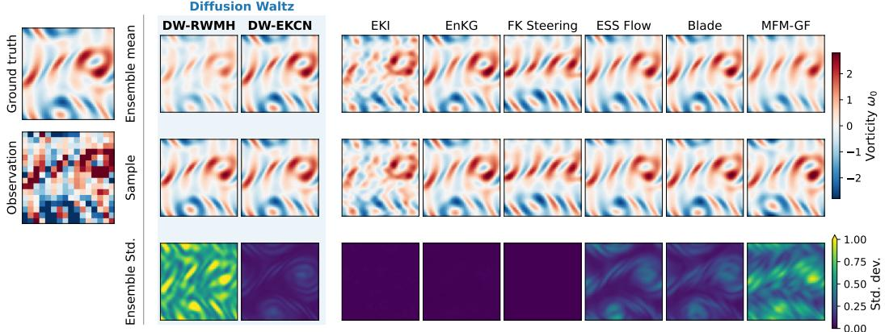  
Figure 3: Comparison of diffusion waltz and baseline methods on the Navier-Stokes (NS) initial condition recovery problem in the low nonlinearity $( T = 1 )$ / low noise $( \sigma _ { y } / \sigma _ { 0 } = 0 . 1 )$ regime.

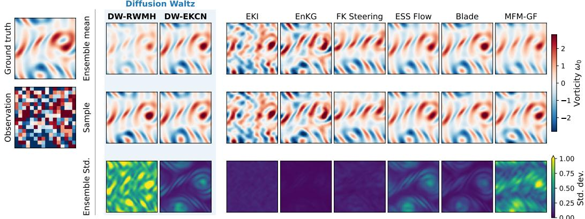  
Figure 4: Comparison of diffusion waltz and baseline methods on the Navier-Stokes (NS) initial condition recovery problem in the low nonlinearity (T = 1) / high noise $( \sigma _ { y } / \sigma _ { 0 } = 1 . 0 )$ regime.

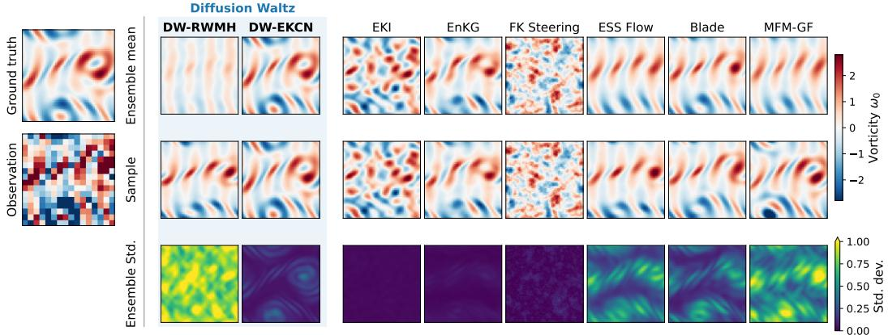  
Figure 5: Comparison of diffusion waltz and baseline methods on the Navier-Stokes (NS) initial condition recovery problem in the high nonlinearity (T = 5) / low noise $( \sigma _ { y } / \sigma _ { 0 } = 0 . 1 )$ regime.

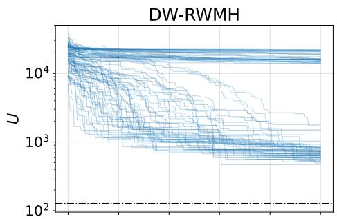

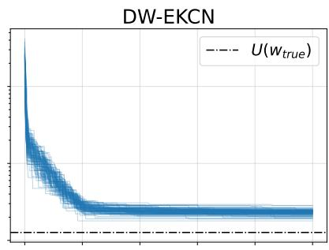  
(b) T = 1, $\sigma _ { y } / \sigma _ { 0 } = 0 . 1$

(a) T = 1, $\sigma _ { y } / \sigma _ { 0 } = 0 . 1$  
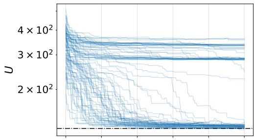

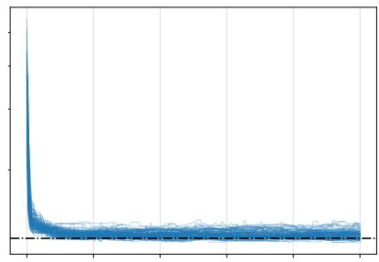

(c) T = 1, $\sigma _ { y } / \sigma _ { 0 } = 1 . 0$  
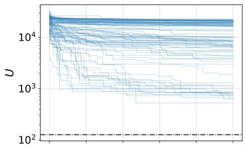

(d) T = 1, $\sigma _ { y } / \sigma _ { 0 } = 1 . 0$  
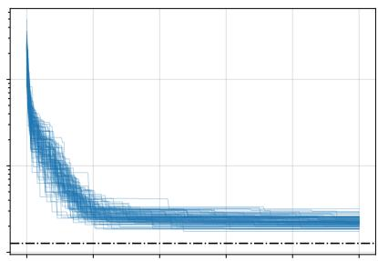

(e) $T = 5 ,$ $\sigma _ { y } / \sigma _ { 0 } = 0 . 1$  
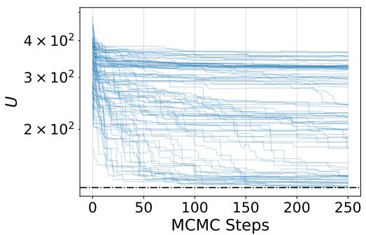  
(g) $T = 5 ,$ $\sigma _ { y } / \sigma _ { 0 } = 1 . 0$

(f) $T = 5 ,$ $\sigma _ { y } / \sigma _ { 0 } = 0 . 1$  
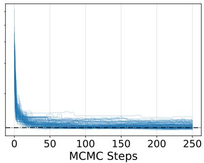  
(h) T = 5, $\sigma _ { y } / \sigma _ { 0 } = 1 . 0$

Figure 6: MCMC traces for the potential $U ( x _ { 0 } ) : = - \log p ( y \mid x _ { 0 } )$ . We compare DW-RWMH (left) and DW-EKCN (right), across all four regimes. Many chains in DW-RWMH get stuck, unable to find a path to high likelihood/low potential regions, leading to slow convergence. Conditional noising in DW-EKCN alleviates this problem, leading to rapid convergence within the first 50 steps.

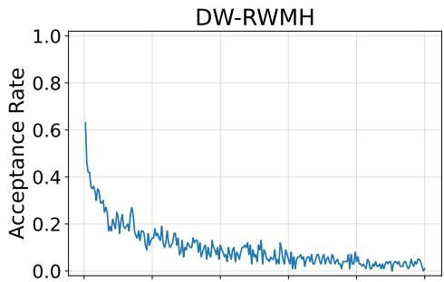

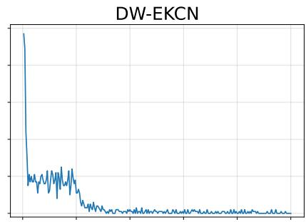  
(b) T = 1, $\sigma _ { y } / \sigma _ { 0 } = 0 . 1$

(a) T = 1, $\sigma _ { y } / \sigma _ { 0 } = 0 . 1$  
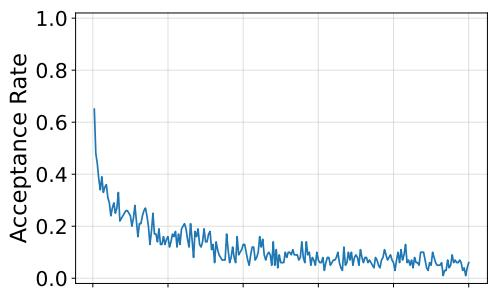

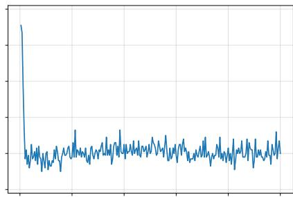

(c) T = 1, $\sigma _ { y } / \sigma _ { 0 } = 1 . 0$  
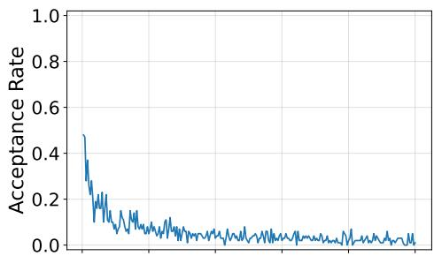

(d) T = 1, $\sigma _ { y } / \sigma _ { 0 } = 1 . 0$  
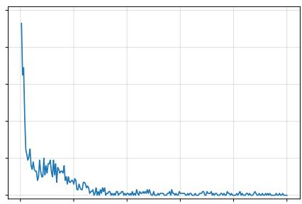

(e) T = 5, $\sigma _ { y } / \sigma _ { 0 } = 0 . 1$  
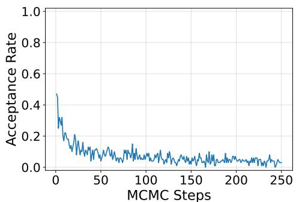  
(g) T = 5, $\sigma _ { y } / \sigma _ { 0 } = 1 . 0$

(f) T = 5, $\sigma _ { y } / \sigma _ { 0 } = 0 . 1$  
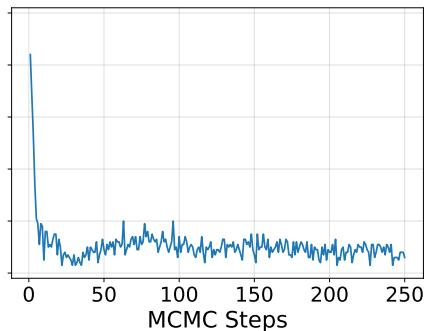  
(h) T = 5, $\sigma _ { y } / \sigma _ { 0 } = 1 . 0$

Figure 7: Instantaneous acceptance rates for DW-RWMH (left) and DW-EKCN (right), across all four regimes. DW-RWMH shows steady decay with MCMC steps. In the low noise regime, DW-EKCN has high acceptance rates initially, fluctuates around 20% while the chains converge, then hits ≈ 0%. In the high noise regime, acceptance rate is high initially, then immediately relaxes to $1 0 \sim 2 0 \%$