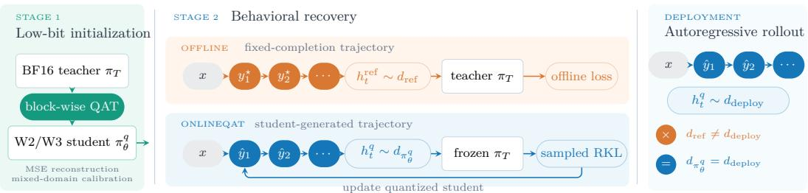

# ONLINEQAT: ON-POLICY DISTILLATION FOR ULTRA-LOW-BIT LARGE LANGUAGE MODELS

Wenjun Wang1,∗ Heng Li2,∗ Yanggan Gu1,∗ Hongxia Yang1,3

1The Hong Kong Polytechnic University 2Sun Yat-sen University

3PolyU-Daya Bay Technology and Innovation Research Institute ∗Equal contribution.

## ABSTRACT

Quantization-aware training (QAT) can recover much of the accuracy lost when large language models are compressed below four bits. Existing recovery stages, however, are commonly optimized on fixed completions or teacher-generated answers, whereas the deployed quantized model conditions on prefixes generated by itself. Quantization errors can therefore move the model into states that are absent from offline recovery data. We introduce ONLINEQAT, a two-stage framework that first obtains a usable low-bit initialization through block-wise QAT and then performs on-policy distillation (OPD) on student-generated responses. At each visited prefix, a frozen full-precision teacher provides a sampled reverse-KL training signal. On Qwen3-1.7B, ONLINEQAT obtains the best average among the compared quantized methods: 57.28 at W3A16 and 32.52 at W2A16, improving over ReasoningQAT by 2.90 and 0.44 points, respectively. The results suggest that student-visited states provide a useful recovery signal beyond fixedcompletion training, particularly at three bits.

## 1 INTRODUCTION

Weight-only quantization reduces the memory footprint and bandwidth cost of large language models (LLMs), but two- and three-bit weights still incur a substantial accuracy loss. For reasoning models, a small perturbation to an early token can also change the states encountered throughout the remaining generation. Recovering useful behavior at such low precision therefore remains an open problem.

BitDistiller, EfficientQAT, and ReasoningQAT recover low-bit models through QAT and distillation (Du et al., 2024; Chen et al., 2025; Okoshi et al., 2026). We use ReasoningQAT as our strongest offline baseline. Its recovery stage evaluates the student and teacher on gold completions and therefore visits reference prefixes. At inference time, however, the quantized model conditions on its own previous tokens. Once quantization changes an early decision, later prefixes can leave the distribution covered by the fixed-completion objective. Figure 1 illustrates this distinction: offline recovery and deployment use different prefix distributions, whereas OPD trains on the prefixes visited by the deployed student.

  
Figure 1: Stage 1 produces a W2/W3 student. In Stage 2, offline recovery queries the teacher on fixedcompletion prefixes, while deployment follows student-generated prefixes. OnlineQAT queries the frozen teacher on the student trajectory and applies sampled reverse KL, aligning the training and deployment states.

To address this mismatch, we propose ONLINEQAT, a two-stage recovery framework. Stage 1 performs block-wise QAT on mixed-domain calibration data, producing a student that can generate meaningful trajectories. Stage 2 samples responses from this student and uses a frozen fullprecision teacher to provide a sampled reverse-KL signal at the visited prefixes. On Qwen3-1.7B, ONLINEQAT improves the six-task average over ReasoningQAT by 2.90 points at W3A16 and 0.44 points at W2A16, giving the best average among the compared methods in both settings. The W3A16 gain is broad, whereas the smaller W2A16 gain remains task-dependent.

## 2 RELATED WORK

Ultra-low-bit QAT. QAT adapts model or quantization parameters while simulating low-precision weights. BitDistiller combines asymmetric quantization with confidence-aware self-distillation for sub-4-bit LLMs (Du et al., 2024). EfficientQAT introduces block-wise all-parameter training and a lightweight end-to-end quantization-parameter stage (Chen et al., 2025). ReasoningQAT targets reasoning models with mixed-domain block-wise calibration followed by teacher-guided reward rectification and forward-KL distillation (Okoshi et al., 2026). These methods establish effective low-bit initialization and recovery recipes. When recovery is evaluated on fixed calibration sequences or reference completions, however, the objective does not cover prefixes induced by the deployed quantized policy. ONLINEQAT retains block-wise QAT but moves end-to-end recovery to those student-visited prefixes.

On-policy distillation. On-policy distillation trains a student on its own sampled sequences while querying a teacher at the visited states. GKD formalizes this idea for language-model distillation and shows that student-generated outputs can reduce the mismatch between training and generation (Agarwal et al., 2024). Recent analysis studies when OPD succeeds and attributes its progress to alignment on high-probability tokens at student-visited states (Li et al., 2026); large-scale systems such as Nemotron 3 Ultra further use multi-teacher OPD during post-training (NVIDIA, 2026). Our setting is different: teacher and student share the same architecture, and their gap is created by ultra-low-bit weight quantization. We study whether OPD can recover this precision-induced gap.

## 3 METHOD

ONLINEQAT separates low-bit recovery into local initialization and end-to-end behavioral recovery. Let $\pi _ { T }$ be the frozen full-precision model and $\pi _ { \theta } ^ { q }$ its quantized counterpart. Stage 1 reconstructs one transformer block at a time. Stage 2 samples yˆ from $\pi _ { \theta } ^ { q }$ and evaluates both models at studentgenerated prefixes $h _ { t } = \left( x , \hat { y } _ { < t } \right)$ , rather than the fixed prefixes $( x , y _ { < t } )$ used by offline distillation.

## 3.1 STAGE 1: BLOCK-WISE LOW-BIT INITIALIZATION

Following EfficientQAT and ReasoningQAT (Chen et al., 2025; Okoshi et al., 2026), Stage 1 uses sequential block-wise QAT on calibration data drawn from pre-training and reasoning corpora. Let $B _ { l }$ and $B _ { l } ^ { q }$ denote the full-precision and fake-quantized versions of block $l ,$ and let $H _ { l }$ and $H _ { l } ^ { q }$ be their respective input streams after the preceding blocks. For a sequence of $T$ tokens and hidden width $C ,$ , we optimize

$$
\mathcal { L } _ { \mathrm { b l o c k } } ^ { ( l ) } = \frac { 1 } { T C } \left. B _ { l } ^ { q } ( H _ { l } ^ { q } ) - B _ { l } ( H _ { l } ) \right. _ { F } ^ { 2 } .\tag{1}
$$

The fake quantizer uses asymmetric affine weight quantization with group size 128. We update the block’s master weights, per-group scales and zero-points, and RMSNorm weights through the straight-through estimator, then propagate both streams to the next block. All end-to-end methods start from the resulting checkpoint.

## 3.2 STAGE 2: ON-POLICY REVERSE-KL RECOVERY

For each prompt $x \sim \mathcal { X } .$ , the quantized student samples a response $\hat { y } \sim \pi _ { \theta , \tau } ^ { q } ( \cdot \mid x )$ at temperature τ. At prefix $h _ { t } \ = \ ( x , \hat { y } _ { < t } )$ , let $p _ { \theta , . } ^ { \tau }$ t and $p _ { T , t } ^ { \tau }$ denote the temperature-scaled student and teacher

distributions. The target objective is the reverse KL averaged over response tokens:

$$
\mathcal { L } _ { \mathrm { o n l i n e } } ( \theta ) = \mathbb { E } _ { x \sim \mathcal { X } , \hat { y } \sim \pi _ { \theta , \tau } ^ { q } } \left[ \frac { 1 } { \vert \hat { y } \vert } \sum _ { t = 1 } ^ { \vert \hat { y } \vert } D _ { \mathrm { K L } } \left( p _ { \theta , t } ^ { \tau } \Vert p _ { T , t } ^ { \tau } \right) \right] .\tag{2}
$$

For the sampled token $a _ { t } = { \hat { y } } _ { t }$ , a one-sample policy-gradient estimator uses the stop-gradient logratio

$$
\begin{array} { r } { A _ { t } ^ { \mathrm { R K L } } = \operatorname { s g } \left[ \log p _ { \theta , t } ^ { \tau } ( a _ { t } ) - \log p _ { T , t } ^ { \tau } ( a _ { t } ) \right] , } \end{array}\tag{3}
$$

where $\mathrm { s g }$ stops gradients through the log-ratio. The training loss is

$$
\mathcal { L } _ { \mathrm { O P D } } ( \theta ) = \frac { 1 } { N } \sum _ { t \in \mathrm { r e s p o n s e } } A _ { t } ^ { \mathrm { R K L } } \log p _ { \theta , t } ^ { \tau } ( a _ { t } ) ,\tag{4}
$$

with N response tokens in the batch. The constant +1 term in the reverse-KL policy gradient is omitted because its expectation is zero. Minimizing Eq. 4 raises the probability of a sampled token when the teacher assigns it higher probability than the student, and lowers it in the opposite case. We use $\tau = 0 . 6$ and no cross-entropy term.

## 4 EXPERIMENTS

## 4.1 SETUP

Benchmarks. We report GSM8K, MATH-500, MMLU-Redux (MMLU-R), IFEval, Live-CodeBench (LCB), and GPQA-Diamond (GPQA-D), covering mathematical reasoning, knowledge, instruction following, and code generation. AVG is their unweighted mean.

Model and quantization. We evaluate Qwen3-1.7B in thinking mode under W3A16 and W2A16. Transformer linear weights use asymmetric affine quantization along the input dimension with group size 128 and integer ranges [0, 7] and [0, 3]. Activations, embeddings, and the LM head remain floating point; the teacher and zero-points are frozen during Stage 2.

Stage 1 calibration. We use 4,096 sequences of 2,048 tokens from 80% OpenThoughts and 20% FineWeb. Each block is trained for two epochs with batch size 2 and AdamW. Quantization parameters use learning rate $1 0 ^ { - 4 }$ ; W3A16 and W2A16 master weights use $1 0 ^ { - 5 }$ and $2 \times 1 0 ^ { - 5 }$ . All recovery methods start from the same Stage 1 checkpoint within each bit width.

Baselines and Stage 2. Stg1 has no end-to-end recovery. KD is a fixed-prefix distillation baseline with $0 . 2 \mathcal { L } _ { \mathrm { C E } } + \mathcal { L } _ { \mathrm { J S D } }$ . ReasoningQAT follows Okoshi et al. (Okoshi et al., 2026), using 0.2LRSFT+ $\mathcal { L } _ { \mathrm { F K L } }$ on gold completions, where the forward KL retains the teacher’s top-20 logits. It trains for 512 W3A16 or 1,536 W2A16 steps. OnlineQAT samples from 32,757 OpenThoughts prompts at temperature 0.6 and uses no supervised term. Sequences contain at most 8,192 total tokens and stop at EOS; only response tokens incur loss. All Stage 2 runs use AdamW on eight GPUs with effective batch 64. OnlineQAT trains W3A16 for 40 steps at $5 \times 1 0 ^ { - 6 }$ . W2A16 warms up for 30 steps from $2 \times 1 0 ^ { - 7 }$ to $2 \times 1 0 ^ { - 6 }$ , followed by 120 steps at $2 \times 1 0 ^ { - 6 }$

## 4.2 MAIN RESULTS

W3A16 recovery. ONLINEQAT averages 57.28, exceeding ReasoningQAT by 2.90 points and KD by 3.62 points. Relative to ReasoningQAT, it improves GSM8K, MMLU-R, MATH-500, Live-CodeBench, and GPQA-Diamond; the largest changes are +3.0 on LiveCodeBench and +11.1 on GPQA-Diamond. IFEval decreases by 0.8 points.

W2A16 recovery. At W2A16, ONLINEQAT improves the ReasoningQAT average from 32.08 to 32.52. It gains on GSM8K, MMLU-R, and GPQA-Diamond but trails on MATH-500, IFEval, and LiveCodeBench; the improvement is therefore modest and task-dependent.

Table 1: Qwen3-1.7B results. ReasoningQAT denotes the method of Okoshi et al. (2026). All entries are percentages; AVG is the unweighted mean. Bold marks the best quantized result within each bit width.
<table><tr><td>Method</td><td>GSM8K</td><td>MMLU-R</td><td>MATH</td><td>IFEval</td><td>LCB</td><td>GPQA-D</td><td>AVG</td></tr><tr><td>BF16 (Think)</td><td>89.9</td><td>73.9</td><td>93.4</td><td>72.5</td><td>33.2</td><td>40.1</td><td>67.17</td></tr><tr><td>W3-Stg1</td><td>84.2</td><td>65.3</td><td>64.8</td><td>57.3</td><td>22.3</td><td>18.2</td><td>52.02</td></tr><tr><td>W3-KD</td><td>85.4</td><td>66.0</td><td>67.4</td><td>58.3</td><td>26.7</td><td>18.2</td><td>53.67</td></tr><tr><td>W3-ReasoningQAT</td><td>86.0</td><td>65.8</td><td>71.6</td><td>60.3</td><td>24.4</td><td>18.2</td><td>54.38</td></tr><tr><td>W3-OnlineQAT</td><td>86.3</td><td>68.0</td><td>73.2</td><td>59.5</td><td>27.4</td><td>29.3</td><td>57.28</td></tr><tr><td>W2-Stg1</td><td>24.40</td><td>17.20</td><td>21.80</td><td>33.20</td><td>0.50</td><td>11.60</td><td>18.12</td></tr><tr><td>W2-KD</td><td>55.00</td><td>38.40</td><td>31.40</td><td>41.30</td><td>4.10</td><td>14.10</td><td>30.72</td></tr><tr><td>W2-ReasoningQAT</td><td>56.60</td><td>43.80</td><td>37.80</td><td>33.80</td><td>5.30</td><td>15.20</td><td>32.08</td></tr><tr><td>W2-OnlineQAT</td><td>59.82</td><td>46.33</td><td>36.00</td><td>32.49</td><td>4.83</td><td>15.66</td><td>32.52</td></tr></table>

Scope. Relative to ReasoningQAT, OnlineQAT changes both the prefix distribution and KL direction, so the comparison does not isolate either factor. The study covers one model without multiple training seeds or an offline reverse-KL control, and OPD incurs rollout generation. Table 1 therefore supports an empirical comparison, not a causal or compute-efficiency claim.

## 5 CONCLUSION

ONLINEQAT retains the mixed-domain block-wise initialization of reasoning-oriented QAT and replaces fixed-sequence recovery with sampled-token OPD. On Qwen3-1.7B, this second stage improves the six-task average over ReasoningQAT by 2.90 points at W3A16 and 0.44 points at W2A16. These initial results motivate a broader evaluation of on-policy recovery for ultra-low-bit language models.

## REFERENCES

Rishabh Agarwal, Nino Vieillard, Yongchao Zhou, Piotr Stanczyk, Sabela Ramos, Matthieu Geist, and Olivier Bachem. On-policy distillation of language models: Learning from self-generated mistakes. In International Conference on Learning Representations, 2024.

Mengzhao Chen, Wenqi Shao, Peng Xu, Jiahao Wang, Peng Gao, Kaipeng Zhang, and Ping Luo. Efficientqat: Efficient quantization-aware training for large language models. In Annual Meeting of the Association for Computational Linguistics, 2025.

Dayou Du, Yijia Zhang, Shijie Cao, Jiaqi Guo, Ting Cao, Xiaowen Chu, and Ningyi Xu. Bitdistiller: Unleashing the potential of sub-4-bi LLMs via self-distillation. In Annual Meeting ofthe Associationfor Computational Linguistics, 2024.

Yaxuan Li, Yuxin Zuo, Bingxiang He, Jinqian Zhang, Chaojun Xiao, Cheng Qian, Tianyu Yu, Huan ang Gao, Wenkai Yang, Zhiyuan Liu, and Ning Ding. Rethinking on-policy distillation of large language models: Phenomenology, mechanism, and recipe, 2026.

Yasuyuki Okoshi, Hikari Otsuka, Daichi Fujiki, and Masato Motomura. Towards quantization-aware training for ultra-low-bit reasoning LLMs In The Fourteenth International Conference on Learning Representations, 2026.

NVIDIA. Nemotron 3 ultra: Open, efficient mixture-of-experts hybrid mamba-transformer model for agentic reasoning, 2026.