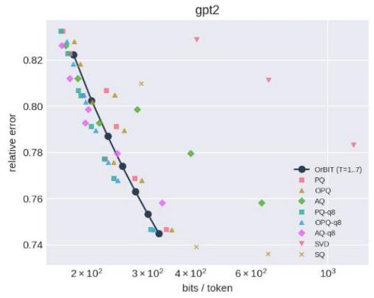
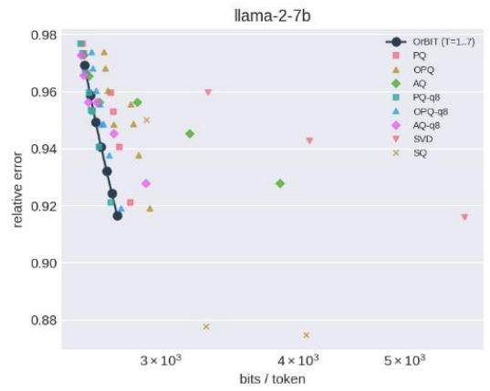
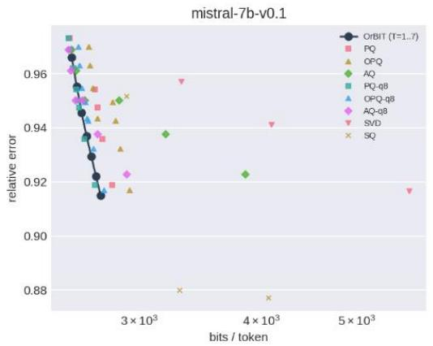
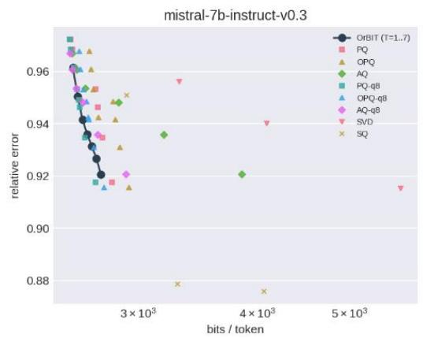

# ORBIT: STRUCTURE-GUIDED EMBEDDING COM-PRESSION

Yunied Puig puigdedios@gmail.com

Amit Kumar Jaiswal   
Jay Chaudhry Software Innovation Centre   
Indian Institute of Technology (BHU)   
Varanasi, India amit.chr@iitbhu.ac.in

## ABSTRACT

Embedding tables are among the largest components of modern language models. Most compression methods fix a coding geometry such as coordinate blocks, low-rank subspaces, or unrestricted codebooks, and optimize within it. We instead ask whether the coding geometry can itself be discovered. We introduce OrBIT, a structure-guided embedding compression framework that learns reusable local geometry from orbit dynamics and uses it to constrain a small set of shared codewords. The global reconstruction residual then decides where the fixed coding budget is spent, while redundant overlapping charts let local errors compensate one another after gluing. Our theory shows how tight-chart geometry controls distortion, how the global residual directs sequential allocation, and how datageometry-guided refinement improves the codec. The resulting orbit machinery is compiled away, leaving a compact decoder in which the learned structure governs what is stored, where capacity is allocated, and how local information is assembled globally. Across four LLM embedding tables, OrBIT achieves 37.9× compression on GPT-2 and over 23× on each 7B table relative to 16-bit storage, while delivering competitive rate-distortion performance against established quantization and low-rank baselines.

## 1 INTRODUCTION

Embedding tables are a major memory cost in modern language models, but most compression methods begin by imposing a coding geometry coordinate blocks, low-dimensional subspaces, or unrestricted codebooks, and then optimize within it. We ask whether the compression geometry itself can instead be discovered from dynamics. We bring orbit ideas from linear dynamics into embedding compression: from a small anchor set, learned orbit scaffolds expose reusable local structure that constrains what can be shared, while overlapping charts coordinate these local representations globally. This leads to a local-to-global compression principle in which orbit geometry discovers structure, residual information orders the fixed stage budget and determines each stage target, and redundant synthesis assembles the result through cross-chart error repair.

Let $\mathcal { H } = \mathbb { R } ^ { d }$ be the embedding Hilbert space and let $\mathcal { V } = \{ 1 , \ldots , D \}$ be a finite vocabulary. An embedding table is $E = ( e _ { 1 } , \in \{ \cdot , \cdot , e _ { D } ) \in \mathcal { H } ^ { D }$ , with $e _ { n } \in \mathcal { H }$ We equip $\mathcal { H } ^ { D }$ with the weighted empirical table norm $\begin{array} { r } { \| E \| _ { \mu } ^ { 2 } : = \sum _ { n = 1 } ^ { D } \mu _ { n } \| e _ { n } \| _ { \mathcal H } ^ { 2 } } \end{array}$ , where $\mu _ { n } > 0$ and $\textstyle \sum _ { n = 1 } ^ { D } \mu _ { n } = 1$ . The weights may be uniform, yielding a pure embedding-table distortion, or frequency-weighted, yielding a taskweighted distortion. Let $\mathcal { Z } _ { 1 } , \ldots , \mathcal { Z } _ { L }$ be local chart spaces and let $R _ { \ell } : \mathcal H \to \mathcal Z _ { \ell }$ be bounded analysis maps. We write $\mathcal { Z } : = \mathcal { Z } _ { 1 } \oplus \cdots \oplus \mathcal { Z } _ { L } , R h : = ( R _ { 1 } \dot { h _ { } } , \ldots , R _ { L } h )$ , and

$$
\begin{array} { r } { Z ^ { ( \ell ) } : = R _ { \ell } E = ( R _ { \ell } e _ { 1 } , \ldots , R _ { \ell } e _ { D } ) \in \mathcal { Z } _ { \ell } ^ { D } . } \end{array}
$$

Compression in chart ℓ is an identity-realization problem: for $z ~ = ~ R _ { \ell } e _ { n }$ , the target is z itself. We therefore retain the orbit-realization mechanism of Puig (2026). A small anchor subset of $Z ^ { ( \ell ) }$ generates a wrapped weighted backward shift $W _ { \ell }$ , blockwise exact interpolants $J _ { \ell , k } = Y _ { \ell , k } Z _ { \ell , k } ^ { \dagger }$ , an orbit dictionary $\mathcal { D } _ { \ell } .$ , and the associated scaffold $S _ { \ell } = \operatorname { s p a n } D _ { \ell }$ . OrBIT, however, is not tokenwise CCDS coding. It uses this scaffold to constrain a small collection of shared additive codewords, which are compiled into a finite decoder and amortized over the vocabulary. The orbit machinery is therefore not itself what directly saves bits. Its role is to constrain and construct the shared continuous objects that make this amortization effective.

Our central contribution: OrBIT couples anchor-generated orbit dictionaries with shared additive coding on overlapping tight charts. Its analysis separates the local error that survives synthesis, derives exact chart targets for residual-directed construction and refinement, and accounts for every object retained by the finite decoder. The experiments evaluate the resulting codec and distinguish data alignment, refinement, redundancy, and compilation effects.

## 2 RELATED WORK

Product quantization (PQ) uses disjoint coordinate subspaces, while optimized product quantization (OPQ) learns a rotation before applying the product decomposition (Jegou et al., 2010; Ge et al., 2013). Additive quantization (AQ) uses unrestricted shared additive codewords; residual and stacked quantizers construct codebooks sequentially and refine them against reconstruction error (Babenko & Lempitsky, 2014; Martinez et al., 2014). QINCo and QINCo2 further condition codebooks on the partial reconstruction (Huijben et al., 2024; Vallaeys et al., 2025). OrBIT combines overlapping tight charts, anchor-generated orbit dictionaries, residual-directed chart scheduling, and refinement evaluated on the compiled global decoder. Shared additive coding, residual initialization, and codebook refinement are established ingredients of this construction.

Compositional embedding codes, hashing, subspace methods, and tensor factorizations likewise amortize shared parameters across tokens (Chen et al., 2018; Tito Svenstrup et al., 2017; Jaiswal & Liu, 2023; Hrinchuk et al., 2020). Sparse coding and dictionary learning provide another route to reusable data-dependent atoms (Olshausen & Field, 1997; Aharon et al., 2006). OrBIT inherits wrapped shifts, exact block interpolation, and CCDS realization from Puig (2026), and applies them to shared compression codewords. Exact interpolation fixes the full scaffold to the anchor-target span; orbit dynamics organize the dictionary and realization within that span. The construction state is discarded after compilation.

Redundant frame representations and multiple-description coding already exploit redundancy in quantization and reconstruction (Goyal et al., 1998; Goyal, 2001; Cvetkovic, 2003). OrBIT uses´ canonical tight-frame synthesis to couple local shared-codebook representations. Theorem 3.3 identifies the local error component removed by synthesis; Propositions 3.5 and 3.7 express the corresponding sequential and refinement objectives. Construction state is discarded, while charts, shared codewords, and $L T$ token indices remain. Equation (15) accounts for the transmitted chart description, codewords, and token indices.

## 3 ORBIT-STRUCTURED ADDITIVE COMPRESSION AND FRAME GLUING

We first state the finite decoder and its storage law, then explain how the orbit framework constructs its shared codewords. We finally derive the global error decomposition, nested codebook allocation, and post-gluing refinement. Proofs are deferred to Appendix D.

Decoder and compression mechanism. A gluing map is a bounded linear operator $\Gamma : \mathcal { Z } \to \mathcal { H }$ It induces the pointwise table-level map $\Gamma ^ { D } : \mathcal { Z } _ { 1 } ^ { \breve { D } } \oplus \dot { \cdot } \cdot \cdot \oplus \mathcal { Z } _ { L } ^ { D } \to \mathcal { H } ^ { D }$ , and we set $R _ { D } E : =$ $( Z ^ { ( 1 ) } , \dots , Z ^ { ( L ) } )$ . Its exact gluing defect is $\varepsilon _ { \mathrm { g l u e } } ( E ) : = \| E - \Gamma ^ { D } R _ { D } E \| _ { \mu }$

Fix T additive stages. For chart ℓ and stage t, let $\mathcal { C } _ { \ell , t } = \left\{ c _ { \ell , t , r } \in \mathcal { Z } _ { \ell } : 1 \leq r \leq Q _ { \ell , t } \right\}$ be a shared codebook. Token n stores one index $i _ { \ell , n , t } \in \{ 1 , . . . , Q _ { \ell , t } \}$ for each chart-stage pair and has decoded local representation

$$
\widehat { z } _ { \ell , n } : = \sum _ { t = 1 } ^ { T } c _ { \ell , t , i _ { \ell , n , t } } , \qquad \widehat { Z } ^ { ( \ell ) } : = ( \widehat { z } _ { \ell , 1 } , \dots , \widehat { z } _ { \ell , D } ) .\tag{1}
$$

Under the canonical gluing map defined below, the final reconstructed embedding table is

$$
\widehat { E } : = \Gamma ^ { D } \big ( \widehat { Z } ^ { ( 1 ) } , \dots , \widehat { Z } ^ { ( L ) } \big ) .\tag{2}
$$

That is the entire decoder: the $\textstyle \sum _ { \ell , t } Q _ { \ell , i }$ t continuous codewords are shared, while each token stores only the $L T$ discrete indices. The remaining question is how orbit geometry constructs and constrains these shared codewords.

Orbit scaffold and shared-codeword realization. For each $1 \ \leq \ \ell \ \leq \ L$ , let $\mathcal { Z } _ { \ell } : = \mathbb { R } ^ { M _ { \ell } }$ , let $\left\{ u _ { \ell , 0 } , \ldots , u _ { \ell , M _ { \ell } - 1 } \right\}$ denote its canonical basis, and let $w _ { \ell } ~ = ~ \left( w _ { \ell , 0 } , \ldots , w _ { \ell , M _ { \ell } - 1 } \right)$ be nonzero weights. The wrapped construction of Puig (2026) takes indices modulo the ambient dimension, so coordinates circulate rather than disappear.

Definition 3.1 (The wrapped weighted backward shift, (Puig, 2026)). A wrapped weighted backward shift $W _ { \ell } : \mathcal { Z } _ { \ell } \to \mathcal { Z } _ { \ell }$ is defined by $W _ { \ell } u _ { \ell , j } = w _ { \ell , j } u _ { \ell , j - 1 ( \mathrm { m o d } \ M _ { \ell } ) } , f o r \ j = 0 , \ldots , M _ { \ell } - 1$ where $w _ { \ell , j } \neq 0 .$

Compression in chart ℓ is the identity-realization problem $x _ { j } ^ { ( \ell ) } = y _ { j } ^ { ( \ell ) } = R \ell e _ { j }$ . Choose a small anchor subset $I _ { \ell } \subseteq \{ 1 , \dots , D \}$ , an initial partition ${ \cal I } _ { \ell } = \bar { { \cal I } _ { \ell , 1 } } \cup \cdots \cup { \cal I } _ { \ell , K _ { \ell } }$ , and learn $W _ { \ell } .$ . The partition is refined as necessary until, in every block, depths $L _ { \ell , j } \in \{ 0 , \dots , M _ { \ell } - 1 \}$ can be chosen so that the orbit representatives $z _ { j } ^ { ( \ell ) } : = W _ { \ell } ^ { L _ { \ell , j } } R e _ { j } , j \in I _ { \ell , k }$ , are linearly independent. Writing these representatives and their targets as the columns of $Z _ { \ell , k }$ and $Y _ { \ell , k }$ , respectively, set $J _ { \ell , k } : = Y _ { \ell , k } Z _ { \ell , k } ^ { \dag } .$ Then $J _ { \ell , k } W _ { \ell } ^ { L \ell , j } R _ { \ell } e _ { j } = R e e _ { j }$ for every $j \in I _ { \ell , k }$

The resulting local orbit dictionary is

$$
\mathcal { D } _ { \ell } : = \left\{ J _ { \ell , k } W _ { \ell } ^ { m } R _ { \ell } e _ { j } : j \in I _ { \ell , k } , 1 \le k \le K _ { \ell } , 0 \le m \le M _ { \ell } - 1 \right\} ,\tag{3}
$$

and its scaffold is S := span $\mathcal { D } _ { \ell } \subseteq \mathcal { Z } _ { \ell }$ , with orthogonal projector $\Pi _ { S _ { \ell } }$ . The candidate scaffold is retained only if it captures the full local table:

$$
\varepsilon _ { \mathrm { p r o j } , \ell } : = \| ( I - \Pi _ { S _ { \ell } } ) Z ^ { ( \ell ) } \| _ { \mu } \leq \tau _ { \mathrm { p r o j } } .\tag{4}
$$

The anchors therefore generate the orbit geometry, whereas acceptance on $Z ^ { ( \ell ) }$ ensures that this geometry controls the full-table projection bottleneck.

For a target $p \in \mathcal { Z } _ { \ell }$ , write $\mathrm { C C D S } _ { \mathcal { D } _ { \ell } } ( p ) \in S _ { \ell }$ for the output of the constructive control-deviation solver of Puig (2026). It is a sparse linear combination of atoms of $\mathcal { D } _ { \ell }$ constructed to approximate $\Pi _ { S _ { \ell } p , }$ i.e. the component of $p$ captured by $S _ { \ell }$ . CCDS is our default realizer because it supplies the deviation-controlled sparse realization developed in (Puig, 2026); other sparse realizers, such as Orthogonal Matching Pursuit (OMP), can be substituted without changing the local-to-global compression architecture. Further details of the finite-dimensional orbit construction and its implementation in the present compression encoder are provided in Appendix B for completeness and reproducibility. Given a prototype $v _ { \ell , t , r } \in \mathcal { Z } _ { \ell }$ , its orbit realization is

$$
\begin{array} { r } { \widetilde { c } _ { \ell , t , r } : = \mathrm { C C D S } _ { \mathcal { D } _ { \ell } } ( v _ { \ell , t , r } ) . } \end{array}
$$

Each orbit realization $\widetilde { c } _ { \ell , t , r } \in S _ { \ell } \subseteq \mathbb { R } ^ { M _ { \ell } }$ is transmitted directly in chart coordinates. If $Q _ { b _ { \gamma } }$ is the finite-bit coordinate quantizer, the orbit realization is compiled as

$$
\widetilde { c } _ { \ell , t , r } \longmapsto c _ { \ell , t , r } : = Q _ { b _ { \gamma } } ( \widetilde { c } _ { \ell , t , r } ) .\tag{5}
$$

Every codeword created during sequential allocation or refinement (processes addressed below) passes through this same map.

Redundant frame gluing. To quantify how redundant chart errors propagate under gluing, we introduce the frame-compatible structure governing the global analysis map.

Definition 3.2 (Frame-compatible chart system). We say that the analysis maps $\{ R _ { \ell } \} _ { \ell = 1 } ^ { L }$ form a frame-compatible chart system with bounds $0 < A \leq B < \infty i f$

$$
A \| h \| _ { \mathcal { H } } ^ { 2 } \leq \sum _ { \ell = 1 } ^ { L } \| R _ { \ell } h \| _ { \mathcal { Z } _ { \ell } } ^ { 2 } \leq B \| h \| _ { \mathcal { H } } ^ { 2 } , \forall h \in \mathcal { H } .
$$

$H A = B $ , we call the system A-tight.

In the A-tight case, $R ^ { * } R = A { \mathrm { I d } } _ { \mathcal { H } }$ and $\| R \| = { \sqrt { A } }$ . The canonical gluing map is $\Gamma _ { A } : = A ^ { - 1 } R ^ { * }$ so $\Gamma _ { A } R = \mathrm { I d } _ { \mathcal { H } } , \varepsilon _ { \mathrm { g l u e } } ( E ) = 0$ , and $\lVert \dot { \Gamma _ { A } } \rVert = A ^ { - 1 / 2 }$ . We refer to Christensen (2008) for frame theory and to Appendix A for the unit-gain normalization under which A measures genuine chart redundancy.

Local-to-global error decomposition. Let $\widetilde { Z } ^ { \left( \ell \right) }$ denote the analogous local additive table formed from the uncompiled orbit realizations $\widetilde { c } _ { \ell , t , r }$ , and set $\widetilde { Z } : = ( \widetilde { Z } ^ { ( 1 ) } , \ldots , \widetilde { Z } ^ { ( L ) } )$ . Define $\varepsilon _ { \mathrm { p r o j } } ^ { 2 } ( E ) : =$ $\begin{array} { r } { \sum _ { \ell = 1 } ^ { L } \| Z ^ { ( \ell ) } - \Pi _ { S _ { \ell } } Z ^ { ( \ell ) } \| _ { \mu } ^ { 2 } , \varepsilon _ { \mathrm { O A } } ^ { 2 } ( E ) : = \sum _ { \ell = 1 } ^ { L } \| \Pi _ { S _ { \ell } } Z ^ { ( \ell ) } - \widetilde { Z } ^ { ( \ell ) } \| _ { \mu } ^ { 2 } , \varepsilon _ { \mathrm { c o m p } } ^ { 2 } ( E ) : = \sum _ { \ell = 1 } ^ { L } \widetilde { \| Z ^ { ( \ell ) } - \mu ^ { 2 } \| ^ { 2 } } . } \end{array}$ $\widehat Z ^ { ( \ell ) } \| _ { \mu } ^ { 2 }$ , and $\begin{array} { r } { \varepsilon _ { \mathrm { l o c } } ^ { 2 } ( E ) : = \sum _ { \ell = 1 } ^ { L } \| Z ^ { ( \ell ) } - \widehat { Z } ^ { ( \ell ) } \| _ { \mu } ^ { 2 } } \end{array}$ . Since $\widetilde Z ^ { ( \ell ) } \in S _ { \ell } ^ { \dot { D } }$ , orthogonality gives $\| R _ { D } E -$ $\widetilde { Z } \| _ { \mu } ^ { 2 } = \varepsilon _ { \mathrm { p r o j } } ^ { 2 } ( E ) + \varepsilon _ { \mathrm { O A } } ^ { 2 } ( E )$ , and hence $\varepsilon _ { \mathrm { l o c } } ( E ) \leq ( \varepsilon _ { \mathrm { p r o j } } ^ { 2 } ( E ) + \varepsilon _ { \mathrm { O A } } ^ { 2 } ( E ) ) ^ { 1 / 2 } + \varepsilon _ { \mathrm { c o m p } } ( E )$

Theorem 3.3 (Redundant orbit-additive compression decomposition). Let $E \in \mathcal { H } ^ { D }$ , let $R : \mathcal H \to$ $\mathcal { Z } _ { 1 } \oplus \cdots \oplus \mathcal { Z } _ { L }$ be a bounded analysis map, and let $\Gamma : \mathcal { Z } _ { 1 } \bar { \oplus } \cdots \oplus \mathcal { Z } _ { L } \to \mathcal { H }$ be a bounded gluing map. Set $\widehat { Z } = ( \widehat { Z } ^ { ( 1 ) } , \ldots , \widehat { Z } ^ { ( L ) } ) a n d \widehat { E } = \dot { \Gamma } _ { D } \widehat { Z } . I f \varepsilon _ { \mathrm { k e r } } ( E ) : = \| \Pi _ { \mathrm { k e r } \Gamma _ { D } } ( R _ { D } E - \widehat { Z } ) \| _ { \mu }$ , then

$$
\| E - \widehat { E } \| _ { \mu } \leq \varepsilon _ { \mathrm { g l u e } } ( E ) + \| \Gamma \| \big ( \varepsilon _ { \mathrm { l o c } } ^ { 2 } ( E ) - \varepsilon _ { \mathrm { k e r } } ^ { 2 } ( E ) \big ) ^ { 1 / 2 } .\tag{6}
$$

$I f \{ R _ { \ell } \} _ { \ell = 1 } ^ { L }$ is A-tight and $\Gamma = \Gamma _ { A } = A ^ { - 1 } R ^ { * }$ , then $\varepsilon _ { \mathrm { g l u e } } ( E ) = 0$ and

$$
\| E - \widehat { E } \| _ { \mu } = \frac { 1 } { \sqrt { A } } \big ( \varepsilon _ { \mathrm { l o c } } ^ { 2 } ( E ) - \varepsilon _ { \mathrm { i n c } } ^ { 2 } ( E ) \big ) ^ { 1 / 2 } ,\tag{7}
$$

where $\varepsilon _ { \mathrm { i n c } } ( E ) : = \mathrm { d i s t } _ { \mu } ( \widehat { Z } , \operatorname { R a n } R _ { D } )$

The theorem separates local approximation from global frame geometry: the orbit construction controls $\varepsilon _ { \mathrm { p r o j } }$ and $\varepsilon _ { \mathrm { O A } } .$ compilation contributes $\varepsilon _ { \mathrm { c o m p } } .$ while canonical synthesis removes the inconsistency component $\varepsilon _ { \mathrm { i n c } }$ . Consequently, the relevant construction objective is the error that survives global gluing, motivating the residual-driven codebook construction below.

Remark 3.4 (Relation to product-code geometry). The nonredundant orthogonal geometry underlying product codes is recovered as a special case. $\mathit { I f } \mathcal { H } = \mathcal { H } _ { 1 } \oplus \cdot \cdot \cdot \oplus \mathcal { H } _ { F }$ and $P _ { f } : \mathcal { H } \to \mathcal { H } _ { f }$ are the coordinate projections, then the analysis map $R _ { \oplus } h = ( P _ { 1 } h , \ldots , P _ { F } h )$ is an isometry and the corresponding gluing map is simple concatenation. Hence $A = 1$ and there is no nontrivial inconsistency component to remove, so Theorem 3.3 reduces to

$$
\| E - { \widehat { E } } _ { \mathrm { p r o d } } \| _ { \mu } = \varepsilon _ { \mathrm { l o c , p r o d } } ( E ) .
$$

For redundant A-tight charts, instead, (7) holds. Thus the distinction is not merely thefactor $A ^ { - 1 / 2 }$ overlapping charts introduce a consistency geometry absent from product codes, and canonical gluing removes the component ofthe local reconstruction error lying outside Ran $R _ { D }$

Global-residual chart scheduling and initialization. Residual initialization and codebook refinement are standard in additive quantization (see Related Work). Here initialization is coupled to redundant synthesis: the compiled global residual selects the next chart and determines its target $U ^ { ( s ) } = A \bar { R _ { \ell _ { s } } } G ^ { ( s - 1 ) }$ , which is realized through the orbit dictionary.

Set $G ^ { ( 0 ) } : = E$ . At step s, let ${ \widehat E } ^ { ( s - 1 ) }$ denote the global reconstruction produced by the first $s - 1$ allocated stages, so that the current global residual is $G ^ { ( s - 1 ) } = E - \widehat { E } ^ { ( s - 1 ) }$ . Let $N _ { \ell } ^ { \bar { ( s - 1 ) } }$ denote the number of stages already allocated to chart ℓ after $s { - } 1$ global construction steps. For $s = 1 , \ldots , L T$ define the eligible set $\mathcal { E } _ { s } : = \{ \ell : N _ { \ell } ^ { ( s - 1 ) } < T \}$ and choose

$$
\ell _ { s } \in \arg \operatorname* { m a x } _ { \ell \in \mathcal { E } _ { s } } \| R _ { \ell } G ^ { ( s - 1 ) } \| _ { \mu } , \qquad t _ { s } : = N _ { \ell _ { s } } ^ { ( s - 1 ) } + 1 .\tag{8}
$$

The rule adapts construction order; the final budget remains T stages per chart. Thus the next shared stage is assigned to the chart that currently sees the largest component of the unreconstructed global table. Its local target is

$$
U ^ { ( s ) } = ( u _ { 1 } ^ { ( s ) } , \ldots , u _ { D } ^ { ( s ) } ) : = A R _ { \ell _ { s } } G ^ { ( s - 1 ) } \in \mathcal { Z } _ { \ell _ { s } } ^ { D } .\tag{9}
$$

Thus $U ^ { ( s ) }$ is not merely a local residual target: it is the component of the current globally glued reconstruction error visible to chart $\ell _ { s }$ . Using residual prototypes from $U ^ { ( s ) }$ , we construct the stage

codebook $\mathcal { C } _ { \ell _ { s } , t _ { s } }$ through the same orbit-realization and compilation map of (5). Once $C _ { \ell _ { s } , t _ { s } }$ has been constructed, every token must choose one of its $Q$ codewords that best approximates its row of the current target $U ^ { ( s ) }$ , namely

$$
i _ { \ell _ { s } , n , t _ { s } } \in \arg \operatorname* { m i n } _ { 1 \leq r \leq Q } \left\| u _ { n } ^ { ( s ) } - c _ { \ell _ { s } , t _ { s } , r } \right\| _ { 2 } .\tag{10}
$$

Because the orbit realization and coordinate quantization may have moved the original prototypes $v _ { r } ^ { ( s ) }$ , this assignment is made against the actual resulting codewords $c \ell _ { s } , t _ { s } , r$ , not merely against the initial prototypes. After these $\bar { D }$ assignments have been made, we obtain

$$
V ^ { ( s ) } : = \left( c _ { \ell _ { s } , t _ { s } , i _ { \ell _ { s } , 1 , t _ { s } } } , \dots , c _ { \ell _ { s } , t _ { s } , i _ { \ell _ { s } , D , t _ { s } } } \right) \in \mathcal { Z } _ { \ell _ { s } } ^ { D }\tag{11}
$$

which denotes the actual compiled stage table selected by the token assignments. Its global contribution after gluing is $\textstyle { \frac { 1 } { A } } R _ { \ell _ { s } } ^ { * } V ^ { ( s ) }$ . Therefore the global residual evolves as

$$
G ^ { ( s ) } : = G ^ { ( s - 1 ) } - \frac { 1 } { A } R _ { \ell _ { s } } ^ { * } V ^ { ( s ) } .\tag{12}
$$

Hence the next stage is fitted after accounting for the actual compiled contribution of every previously allocated stage, including stages belonging to other charts. $\mathrm { S o } .$ , after s construction steps, the provisional global reconstruction is $\begin{array} { r } { \widehat { E } ^ { ( s ) } = \frac { 1 } { A } \bar { \sum _ { j = 1 } ^ { s } } R _ { \ell _ { j } } ^ { * } V ^ { ( j ) } } \end{array}$ , and $G ^ { ( s ) } = E - \widehat { E } ^ { ( s ) }$ . After all $L T$ stages, iterating (12) from $G ^ { ( 0 ) } = E$ gives

$$
\widehat { E } = E - G ^ { ( L T ) } = \frac { 1 } { A } \sum _ { s = 1 } ^ { L T } R _ { \ell _ { s } } ^ { * } V ^ { ( s ) } = \frac { 1 } { A } \sum _ { \ell = 1 } ^ { L } R _ { \ell } ^ { * } \left( \sum _ { t = 1 } ^ { T } V _ { \ell , t } \right) .
$$

where the last equality regroups the $L T$ steps by chart and stage, with each $( \ell , t )$ appearing exactly once. For token $\begin{array} { r } { n , \sum _ { t = 1 } ^ { T } V _ { \ell , t , n } = \sum _ { t = 1 } ^ { T } c _ { \ell , t , i _ { \ell , n , t } } = \widehat { z } _ { \ell , n } . } \end{array}$ . Regrouping the sum by chart gives

$$
\widehat { E } = \frac { 1 } { A } \sum _ { \ell = 1 } ^ { L } R _ { \ell } ^ { * } \widehat { Z } ^ { ( \ell ) } = \Gamma _ { A } ^ { D } \big ( \widehat { Z } ^ { ( 1 ) } , \dots , \widehat { Z } ^ { ( L ) } \big ) .\tag{13}
$$

So the recursive construction and the final decoder (2) are exactly the same object viewed at two different levels: at construction level we have $V ^ { ( 1 ) } , \ldots , V ^ { ( L T ) }$ while at decoder level we have $C _ { \ell , t , i _ { \ell , n , t } }$ . We now show why $U ^ { ( s ) }$ is precisely the local target that a newly allocated stage should approximate in order to reduce the current global reconstruction residual.

Proposition 3.5 (Nested sequential shared-codebook residual identity). Assume the unit-gain normalization $R _ { \ell } R _ { \ell } ^ { * } = I _ { \mathcal { Z } _ { \ell } }$ and canonical A-tight gluing. Then at every sequential step $s ,$

$$
\| G ^ { ( s ) } \| _ { \mu } ^ { 2 } = \| G ^ { ( s - 1 ) } \| _ { \mu } ^ { 2 } - \frac { 1 } { A ^ { 2 } } \| U ^ { ( s ) } \| _ { \mu } ^ { 2 } + \frac { 1 } { A ^ { 2 } } \| U ^ { ( s ) } - V ^ { ( s ) } \| _ { \mu } ^ { 2 } .\tag{14}
$$

Remark 3.6. Proposition 3.5 turns the global objective of Theorem 3.3 into a sequential construction rule: once a chart has been selected, the role ofthe new stage is to make its realized contribution $V ^ { ( s ) }$ as close as possible to $U ^ { ( s ) } .$ : the better this approximation, the more of the currently visible global residual is removed. This justifies the realization criterion (10), while (8) prioritizes the eligible chart with the largest visible residual energy, thereby maximizing thefavorable term $\| U ^ { ( s ) } \| _ { \mu } ^ { 2 } / \breve { A } ^ { 2 }$ subtracted in (14).

Compiled decoder and storage. At this point the storage mechanism is completely visible. The encoder uses $W _ { \ell } , Y _ { \ell , k } , Z _ { \ell , k } , J _ { \ell , k } , \mathcal { D } _ { \ell }$ , and CCDS to construct the shared codewords. These are encoder-side objects: after compilation, the decoder stores only the shared representation map, the chart system, the quantized coordinates of the shared codewords, the scales, the codec metadata, and the token indices.

Let $C _ { \mathrm { r e p } }$ denote the storage of the shared representation map, $C _ { \mathrm { c h a r t } }$ the chart system, and $C _ { \mathrm { m e t a } }$ the remaining fixed codec metadata. If codeword coordinates use $b _ { \gamma }$ bits, each shared codeword carries $b _ { s }$ scale bits, and stage t in chart ℓ contains $Q _ { \ell , \ell }$ codewords, then

$$
C _ { \mathrm { O r B I T } } = C _ { \mathrm { r e p } } + C _ { \mathrm { c h a r t } } + C _ { \mathrm { m e t a } } + \sum _ { \ell = 1 } ^ { L } \sum _ { t = 1 } ^ { T } Q _ { \ell , t } ( M _ { \ell } b _ { \gamma } + b _ { s } ) + D \sum _ { \ell = 1 } ^ { L } \sum _ { t = 1 } ^ { T } \lceil \log _ { 2 } Q _ { \ell , t } \rceil .\tag{15}
$$

The final term is the entire token-specific cost. The shared codeword cost is $\begin{array} { r } { \sum _ { \ell , t } Q _ { \ell , t } ( M _ { \ell } b _ { \gamma } + b _ { s } ) } \end{array}$ while the only term scaling with D consists of the $L T$ small discrete indices per token. Thus compression arises from amortizing a small collection of orbit-structured continuous codewords over the vocabulary, not from storing a continuous sparse realization for every token.

Scaffold-aligned post-gluing refinement. After initialization, we revisit codewords while holding the remaining decoder state and assignments fixed, as in additive-codebook refinement, but with a different target: OrBIT refines each codeword against the residual of the current globally glued reconstruction while constraining every correction to the learned orbit geometry. Thus the completed reconstruction determines the exact chart target, while the learned orbit geometry controls how accurately that target can be realized by the finite decoder. Proposition 3.7 formalizes this structureguided refinement step.

For the remainder of this section: we assume the unit-gain normalization $R _ { \ell } R _ { \ell } ^ { * } = I _ { Z _ { \ell } }$ , canonical A-tight gluing. Additionally, we fix a chart $\ell ,$ stage t, and let $c _ { \mathrm { o l d } } : = c _ { \ell , t , r _ { 0 } } \in \mathcal { Z } _ { \ell }$ be one of the currently stored compiled codewords in $C _ { \ell , t } \subset \bar { Z } _ { \ell }$ . Define $I = \{ n : i _ { \ell , n , t } = r _ { 0 } \}$ and assume $\begin{array} { r } { m _ { I } : = \sum _ { n \in I } \mu _ { n } > 0 } \end{array}$ . Let $\widehat { E } _ { \mathrm { o l d } }$ denote the current compiled global reconstruction, and $c ^ { \star } \in \mathcal { Z } _ { \ell }$ be the unique unconstrained codeword minimizing the conditional post-gluing distortion when all remaining decoder objects and assignments are held fixed. With $\begin{array} { r } { \bar { r } _ { I } = \frac { \bar { 1 } } { m _ { I } } \sum _ { n \in I } ^ { } \mu _ { n } ( e _ { n } - \widehat { e } _ { \mathrm { o l d , n } } ) } \end{array}$ the target is simply $c ^ { * } = c _ { \mathrm { o l d } } + A R _ { \ell } \bar { r } _ { I }$ . See Equation (35) below for a proof of this.

Let $\widetilde { c } : = \mathrm { C C D S } _ { D _ { \ell } } ( c ^ { \star } )$ be its orbit realization and let $c _ { \mathrm { n e w } } : = Q _ { b _ { \gamma } } ( \widetilde { c } )$ be the corresponding compiled codeword. Define

$$
\delta _ { \mathrm { s c a f } } : = \| ( I - \Pi _ { S _ { \ell } } ) c ^ { \star } \| , \qquad \delta _ { \mathrm { o r b } } : = \| \Pi _ { S _ { \ell } } c ^ { \star } - \widetilde c \| , \qquad \delta _ { \mathrm { c o m p } } : = \| \widetilde c - c _ { \mathrm { n e w } } \| ,
$$

and set $\Delta : = \sqrt { \delta _ { \mathrm { s c a f } } ^ { 2 } + \delta _ { \mathrm { o r b } } ^ { 2 } } + \delta _ { \mathrm { c o m p } } .$ . The next result shows that the decoder geometry gives an exact descent law, while the orbit scaffold gives a sufficient structural certificate for satisfying it.

Proposition 3.7. (Scaffold-aligned post-gluing refinement). Let $\widehat { E } _ { \mathrm { n e w } }$ denote the resulting reconstruction. Then

(i) (Exactfinite-decoder statement)

$$
\left\| E - \widehat { E } _ { \mathrm { n e w } } \right\| _ { \mu } ^ { 2 } - \left\| E - \widehat { E } _ { \mathrm { o l d } } \right\| _ { \mu } ^ { 2 } = \frac { m _ { I } } { A ^ { 2 } } \left( \left\| c _ { \mathrm { n e w } } - c ^ { \star } \right\| ^ { 2 } - \left\| c _ { \mathrm { o l d } } - c ^ { \star } \right\| ^ { 2 } \right) .
$$

(ii) (OrBIT-specific structural certificate) $I f \Delta < \| c _ { \mathrm { o l d } } - c ^ { \star } \|$ , then replacing $c _ { \mathrm { o l d } }$ by $c _ { \mathrm { n e w } }$ , with the remaining decoder state and assignmentsfixed, strictly decreases the global reconstruction error.

$$
\| E - \widehat { E } _ { \mathrm { n e w } } \| _ { \mu } ^ { 2 } \leq \| E - \widehat { E } _ { \mathrm { o l d } } \| _ { \mu } ^ { 2 } - \frac { m _ { I } } { A ^ { 2 } } \left( \| c _ { \mathrm { o l d } } - c ^ { \star } \| ^ { 2 } - \Delta ^ { 2 } \right) .
$$

Remark 3.8. Proposition 3.7 concludes that a post-gluing correction is guaranteed to improve the codec whenever the correction demanded by the original table is captured sufficiently well by the learned scaffold, orbit realization, andfinite-bit compilation.

The next result links refinement directly to the learned orbit geometry: the refinement scaffold error is exactly the portion of the current compiled state and chart-visible global residual that lies outside the scaffold $S _ { \ell }$ . When $c _ { \mathrm { o l d } } \in S _ { \ell }$ , only the residual contribution remains.

Lemma 3.9 (Refinement scaffold error as unexplained global residual).

$$
\delta _ { \mathrm { s c a f } } = \left\| ( I - \Pi _ { S _ { \ell } } ) c _ { \mathrm { o l d } } + \frac { A } { m _ { I } } \sum _ { n \in I } \mu _ { n } ( I - \Pi _ { S _ { \ell } } ) R _ { \ell } \big ( e _ { n } - \widehat { e } _ { \mathrm { o l d , n } } \big ) \right\| .
$$

In particular, $i f c _ { \mathrm { o l d } } \in S _ { \ell } ,$ , then

$$
\delta _ { \mathrm { s c a f } } = \frac { A } { m _ { I } } \left\| \left( I - \Pi _ { S _ { \ell } } \right) \sum _ { n \in I } \mu _ { n } R _ { \ell } \left( e _ { n } - \widehat { e } _ { \mathrm { o l d } , n } \right) \right\| ,
$$

where $\widehat { E } _ { \mathrm { o l d } } = ( \widehat { e } _ { \mathrm { o l d } , n } ) _ { n = 1 } ^ { D }$ is the current compiled global reconstruction.

Under cross-chart scaffold compatibility, the aggregate stagewise refinement scaffold error is controlled by the original table’s scaffold projection error $\varepsilon _ { \mathrm { p r o j } , \ell }$ from (4).

Corollary 3.10 (Collapse under cross-chart scaffold compatibility). Under the standing unit-gain and canonical A-tight synthesis assumptions, fix a stage (ℓ, t) and let ${ { I _ { r } } \atop { } : = \atop { } \left\{ n \right. : { { i _ { \ell , n , t } } \atop { } } = \left. \left\{ { n } \atop { } \right. : { { i _ { \ell , n , t } } } \right. = \left. \left\{ { \begin{array} { r l r l } \end{array} } \right. \right. }$ $r \}$ , with $\begin{array} { r } { m _ { I _ { r } } : = \sum _ { n \in I _ { r } } \mu _ { n } > 0 } \end{array}$ denote its nonempty assignment cells. Assume $c _ { \ell , t , r } \in$ $S _ { \ell }$ for every r with $m _ { I _ { r } } \cdot > 0 , R _ { \ell } R _ { j } ^ { * } S _ { j } \subseteq S _ { \ell }$ for every $1 \le j \le L$ , and ${ \widehat { z } } _ { j , n } \in S _ { j }$ for every $1 \leq$ $j \le L , 1 \le n \le D$ . Then $\begin{array} { r } { \sum _ { r : m _ { I _ { r } } > 0 } \frac { m _ { I _ { r } } } { A ^ { 2 } } \delta _ { \mathrm { s c a f } , r } ^ { 2 } \leq \varepsilon _ { \mathrm { p r o j } , \ell } ^ { 2 } . } \end{array}$

## 4 EXPERIMENTS

We design the experiments around five questions that correspond to the main components of OrBIT: (i) whether the complete compiled codec gives a competitive rate–distortion tradeoff, and in particular whether imposing learned orbit structure remains advantageous relative to unconstrained additive coding; (ii) whether the learned orbit scaffold itself captures the embedding geometry better than an unstructured subspace of identical rank; (iii) whether post-gluing refinement improves the actual global reconstruction at fixed rate; (iv) whether redundancy produces the error-cancellation mechanism predicted by the theory; and (v) whether the orbit construction can genuinely be discarded after compilation. Experiments 1–5 address these questions below.

Experimental protocol. We evaluate GPT-2, Llama-2-7B, Mistral-7B-v0.1, and Mistral-7B-Instruct-v0.3. For each model we extract 12,000 token embeddings and compress a fixed $D =$ 10,000-token table. GPT-2 has original dimension 768 and is mapped to $d = 6 4 ;$ the three 7B models have original dimension 4096 and are mapped to $d = 1 9 2$ . The corresponding PCA explainedvariance fractions are 0.2624, 0.2200, 0.2133, and 0.2143. These fractions are computed relative to the centered table. Importantly, the PCA map is not free: its complete storage cost is included in every reported rate. The uncompressed reference uses 16 bits per coordinate, giving 12,288 bits/token for GPT-2 and 65,536 bits/token for the 7B tables.

Our primary distortion measure is the relative reconstruction error $\frac { \| E - \widehat { E } \| _ { \mu } } { \| E \| _ { \mu } }$ in the original embedding space, with uniform $\mu .$ Thus the reported end-to-end error includes both the fixed representation truncation and the subsequent OrBIT coding error. We additionally monitor cosine similarity and nearest-neighbor recall, but use relative error for all rate–distortion comparisons.

OrBIT configuration and storage. The standard experiments use $L = 4$ unit-gain $A = 2$ tight charts, with $M _ { \ell } = 3 2$ for GPT-2 and $M _ { \ell } = 9 6$ for the 7B tables. The orbit scaffolds are constructed from 0.75% of the GPT-2 table and 1.2% of the 7B tables; scaffold acceptance is always evaluated on the complete local table with $\tau _ { \mathrm { p r o j } } = 1 0 ^ { - 3 }$ . Unless stated otherwise, we use $T = 7$ additive stages and $Q _ { \ell , t } = 3 2$ shared codewords per chart-stage pair. Shared codeword coordinates are quantized to 8 bits with one 16-bit scale per codeword, so every token-specific chart-stage assignment costs only 5 bits. All rates include $C _ { \mathrm { r e p } } ,$ the chart-system description, every shared quantized codeword and scale, codec metadata, and all token indices. Full implementation details are given in Appendix B.

We compare with PQ, OPQ, AQ, scalar quantization (SQ), and truncated SVD. In addition to their standard storage conventions, we re-price $\mathrm { P Q , O P Q }$ , and AQ using the same 8-bit-coordinate plus 16-bit-scale convention as OrBIT; we denote these controls by $\mathrm { P Q - q 8 , O P Q - q 8 }$ , and $_ \mathrm { A Q - q 8 }$ . This prevents an apparent gain from being explained merely by cheaper storage of OrBIT’s shared codewords.

Rate–distortion across four embedding tables. Varying $T = 1 , \dots , 7$ gives a monotone Or-BIT rate–distortion curve on all four tables. At $T = 7$ , OrBIT compresses GPT-2 by $3 7 . 9 \times$ and each 7B embedding table by 23.9×. Table 1 compares this endpoint with representative high-rate q8 baselines; the complete curves, including the standard-precision baselines, are reported in the accompanying rate–distortion Figure 1 in Appendix C.

AQ is the closest comparator in decoder form, whereas PQ and OPQ test product-code representations; their structural differences are discussed in Related Work. All methods share the input representation and storage accounting, with matched shared-codeword precision in the $\mathtt { q 8 }$ controls. At the displayed operating points, Table 1 shows that OrBIT improves both rate and distortion over $_ \mathrm { A Q - q 8 }$ on GPT-2, Llama-2-7B, and Mistral-7B, and approximately matches its distortion at lower rate on Mistral-7B-Instruct. This suggests the orbit constraint therefore does not merely reduce the freedom of the additive codebooks: across these tables it yields a more rate-efficient structured additive representation than the unrestricted AQ comparator. On the other side, OrBIT has lower distortion than the displayed PQ-q8 and OPQ-q8 points on the first three tables; both product quantizers attain lower distortion on Mistral-7B-Instruct. This second comparison is particularly demanding because product quantization builds strong compression efficiency directly into the factorization itself, so it asks whether the learned overlapping orbit geometry can compete with an efficient but prescribed nonoverlapping product geometry. The empirical claim is therefore not universal dominance, but that shared codewords constrained by learned orbit geometry can outperform unconstrained additive coding and remain competitive with mature product-quantization baselines while providing an explicitly analyzable local-to-global compression mechanism. The SVD baseline is substantially less rate-efficient in this regime, while SQ reaches lower distortion only at markedly larger rates. These are complete-codec comparisons at nearby rates, not component ablations. Full rate–distortion curves are in Appendix C.2.

Table 1: Representative end-to-end rate–distortion results. Each entry is bits/token / relative error in the original embedding space. The PQ-q8 and OPQ-q8 entries use $m = 1 6 , b = 8 ;$ AQ-q8 uses $m = 8 , b = 8$ . All shared objects, including the PCA representation map, are charged to representative operating points with matched precision. Lower error and lower rate are better.
<table><tr><td>Embedding table</td><td>OrBIT, T = 7</td><td>PQ-q8</td><td> $\overline { { \mathrm { O P Q - q 8 } } }$ </td><td>AQ-q8</td></tr><tr><td>GPT-2</td><td>324.15/0.7449</td><td>307.40/0.7467</td><td>313.96/0.7465</td><td>331.88/0.7582</td></tr><tr><td>Llama-2-7B</td><td>2739.97/0.9163</td><td>2703.56/0.9211</td><td>2762.55/0.9192</td><td>2911.54/0.9278</td></tr><tr><td>Mistral-7B</td><td>2739.97/0.9151</td><td>2703.56/0.9189</td><td>2762.55/0.9170</td><td>2911.54/0.9228</td></tr><tr><td>Mistral-7B-Instruct</td><td>2739.97/0.9205</td><td>2703.56/0.9176</td><td>2762.55/0.9157</td><td>2911.54/0.9205</td></tr></table>

Does the learned orbit geometry itself matter? The previous comparison cannot by itself establish that the learned orbit geometry is useful. We therefore isolate scaffold discovery directly, before additive quantization or sparse realization can confound the comparison. In every chart we construct an orbit scaffold of rank $r = 0 . 7 5 M _ { \ell }$ from a small anchor set and compare it with 20 independently drawn, data-independent Gaussian subspaces of exactly the same rank. Both arms are evaluated on the complete local table $Z ^ { ( \ell ) }$ through the relative projection error $\begin{array} { r } { \rho _ { \ell } ( S ) : = \frac { \| ( I - \Pi _ { S } ) Z ^ { ( \ell ) } \| _ { \mu } } { \| Z ^ { ( \ell ) } \| _ { \mu } } } \end{array}$ . Rank, ambient dimension, and evaluation data are therefore identical; the only advantage available to the orbit arm is that its geometry has been discovered from the data.

The separation is strikingly stable across all four embedding tables. Averaged over the four charts, the orbit versus Gaussian residuals are 0.4775 versus 0.5011 on GPT-2, 0.4762 versus 0.4994 on Llama-2-7B, 0.4741 versus 0.4993 on Mistral-7B, and 0.4731 versus 0.4993 on Mistral-7B-Instruct. These are reductions of 4.7%, 4.6%, 5.1%, and 5.3% in relative projection error, or approximately 9.2%, 9.1%, 9.9%, and 10.2% in squared unexplained projection energy. More strongly, in every one of the 16 model–chart comparisons, the orbit scaffold outperforms every one of the 20 corresponding Gaussian draws. Since the rank is held fixed, this ablation shows that the gain is not explained by subspace dimension alone: the orbit construction discovers directions systematically better aligned with the full embedding table than an unstructured subspace of identical capacity.

## Mechanism ablations.

Post-gluing refinement improves the actual codec at fixed rate. We first disable and enable the gluing-aware refinement while keeping the complete decoder architecture, number of codewords, precision, and token indices budget fixed. Table 2 reports the weighted reconstruction error in the PCA space immediately before and after refinement. The error decreases on every model, by 2.8– 4.1%, without adding a single decoder bit. Of 280 proposed chart-stage updates, 265 are accepted for GPT-2 (15 rejected) and 280 for each 7B run (0 rejected). This is the empirical counterpart of the post-gluing refinement analysis: the completed global reconstruction provides a useful target for revisiting codewords that were originally fitted sequentially.

Table 2: Gluing-aware refinement. Rate is unchanged; lower absolute weighted PCA-space error is better.
<table><tr><td>Model</td><td>Before</td><td>After</td><td>Reduction</td></tr><tr><td>GPT-2</td><td>0.4750</td><td>0.4555</td><td>4.11%</td></tr><tr><td>Llama-2-7B</td><td>0.3050</td><td>0.2966</td><td>2.76%</td></tr><tr><td>Mistral-7B</td><td>0.04777</td><td>0.04643</td><td>2.82%</td></tr><tr><td>Mistral-Inst.</td><td>0.04968</td><td>0.04830</td><td>2.77%</td></tr></table>

Table 3: Matched redundancy ablation. The total chart-stage budget $L T = 4 8$ is fixed. “Cancelled” denotes $\varepsilon _ { \mathrm { i n c } } ^ { 2 } / \varepsilon _ { \mathrm { l o c } } ^ { 2 }$ . GPT-2 uses 441.56 bits/token in every arm; the 7B models use 2890.14 bits/token.
<table><tr><td colspan="4">Post-gluing error</td><td colspan="2">Cancelled local error</td></tr><tr><td>Model</td><td>A = 1</td><td>A = 2</td><td> $A = 3$ </td><td>A = 2</td><td>A = 3</td></tr><tr><td>GPT-2</td><td>0.18893</td><td>0.18903</td><td>0.18897</td><td>98.85%</td><td>99.43%</td></tr><tr><td>Llama-2-7B</td><td>0.22596</td><td>0.22378</td><td>0.22057</td><td>81.27%</td><td>89.85%</td></tr><tr><td>Mistral-7B</td><td>0.03577</td><td>0.03492</td><td>0.03430</td><td>82.41%</td><td>90.66%</td></tr><tr><td>Mistral-Inst.</td><td>0.03968</td><td>0.03813</td><td>0.03814</td><td>77.48%</td><td>87.04%</td></tr></table>

What does redundancy actually do? To isolate the mechanism in Theorem 3.3 from the particular standard chart construction, this ablation alone uses a richer independent-view family. We compare the nonredundant product boundary A = 1 with $A \ : = \ : 2$ and $A \ : = \ : 3$ , generated from one, two, and three independent orthogonal decompositions. We match total chart-stage capacity by fixing $L T = 4 8 \mathrm { : }$

$$
( A , L , T ) = ( 1 , 2 , 2 4 ) , \qquad ( 2 , 4 , 1 2 ) , \qquad ( 3 , 6 , 8 ) .
$$

Consequently, all three arms have exactly the same model-specific rate. Table 3 reports the postgluing PCA-space error and the fraction $\dot { \varepsilon } _ { \mathrm { i n c } } ^ { 2 } / \varepsilon _ { \mathrm { l o c } } ^ { 2 }$ of local squared error removed by canonical gluing.

The nonredundant A = 1 control has essentially no inconsistency component, as predicted. Once redundant views are introduced, canonical gluing removes a large component of the accumulated local error. This translates into a 2.39% reduction in global PCA-space error on Llama-2-7B, a 4.09% reduction on Mistral-7B, and a 3.91% reduction on Mistral-Instruct at the best redundant setting. GPT-2 is informative in the opposite direction: despite cancellation above 98%, its final error is essentially unchanged because the local error itself grows under the matched-capacity constraint. This is precisely the tradeoff exposed by Theorem 3.3: redundancy does not guarantee improvement merely through the factor $A ^ { - 1 7 2 }$ ; its benefit depends jointly on the local approximation error and the inconsistency component removed by gluing. Numerically, the theoretical identity matches the measured global error to approximately $\mathrm { i 0 ^ { - 9 } }$ or better in every redundancy run.

Compilation removes construction state without changing reconstruction. Finally, we test whether the storage law in Section 3 corresponds to a genuine deployable decoder. We reconstruct each table using only the objects charged in $C _ { \mathrm { O r B I T } } \mathrm { : }$ : the representation map, chart-system information, shared quantized codewords and scales, metadata, and token indices. The decoder is given no $W _ { \ell } .$ , interpolants $J _ { \ell , k }$ , orbit dictionaries $\mathcal { D } _ { \ell }$ , anchors, scaffolds, or CCDS state. Across all four models, the decoder-only chart-space, PCA-space, and original-space reconstruction gaps are all 0 at the reported numerical precision. Thus compilation is reconstruction-preserving in these runs.

The storage effect is also nontrivial. On GPT-2, retaining the explicit orbit-construction state would require 355.55 bits/token, whereas the compiled decoder requires 324.15 bits/token, an 8.83% reduction. On each 7B table the corresponding rates are 2889.13 and 2739.97 bits/token, a 5.16% reduction. The orbit machinery therefore determines how the shared continuous objects are constructed, but it is not hidden state required to decode them.

Taken together, these experiments separate the contributions of the framework rather than relying only on the final rate–distortion curve: OrBIT improves over the closest unconstrained additive comparator AQ at the codec level, while the rank-matched scaffold diagnostic shows directly that the learned orbit geometry captures more of the full embedding table than unstructured geometry of identical dimension; post-gluing refinement reduces the true reconstruction objective without increasing rate; redundant synthesis exhibits the cancellation term predicted by the theory, with a data-dependent net benefit; and compilation eliminates the orbit-construction state while reproducing exactly the transmitted decoder output. The resulting evidence supports the intended role of OrBIT as a structure-guided codec: the same globally glued reconstruction error determines the refinement targets, while the scaffold identifies the correctable directions and bounds the loss from geometric restriction. Complete experimental configurations, full mechanism ablations, anchor-budget diagnostics, and three-seed robustness statistics are provided in Appendix C.

## REPRODUCIBILITY STATEMENT

Complete proofs of the theoretical results are provided in the appendix. The construction of the chart system, orbit scaffolds, shared codebooks, nested allocation, refinement procedure, compilation scheme, and experimental protocol are described in the main text and appendix. Hyperparameters and storage accounting are reported explicitly.

## ETHICS STATEMENT

This work develops theoretical and computational methods for neural embedding compression and does not involve human subjects or the collection of personal or sensitive data. The experiments use existing pretrained language models and are intended to study compression mechanisms rather than downstream deployment or decision-making. We are not aware of specific ethical risks introduced by the proposed methodology beyond those already associated with the underlying models on which it may be applied.

## AI USE STATEMENT

Generative AI tools were used to assist with manuscript editing and presentation, including improving clarity and organization.

## REFERENCES

Michal Aharon, Michael Elad, and Alfred Bruckstein. K-svd: An algorithm for designing overcomplete dictionaries for sparse representation. IEEE Transactions on signal processing, 54(11): 4311–4322, 2006.

Artem Babenko and Victor Lempitsky. Additive quantization for extreme vector compression. In Proceedings ofthe IEEE Conference on Computer Vision and Pattern Recognition, pp. 931–938, 2014.

Ting Chen, Martin Renqiang Min, and Yizhou Sun. Learning k-way d-dimensional discrete codes for compact embedding representations. In International Conference on Machine Learning, pp. 854–863. PMLR, 2018.

Ole Christensen. Frames and bases: An introductory course. Springer Science & Business Media, 2008.

Zoran Cvetkovic. Resilience properties of redundant expansions under additive noise and quantiza- ´ tion. IEEE Transactions on Information Theory, 49(3):644–656, 2003.

Tiezheng Ge, Kaiming He, Qifa Ke, and Jian Sun. Optimized product quantization for approximate nearest neighbor search. In Proceedings of the IEEE conference on computer vision and pattern recognition, pp. 2946–2953, 2013.

Vivek K. Goyal. Multiple description coding: Compression meets the network. IEEE Signal Processing Magazine, 18(5):74–93, 2001.

Vivek K. Goyal, Martin Vetterli, and Nguyen T. Thao. Quantized overcomplete expansions in Rn: Analysis, synthesis, and algorithms. IEEE Transactions on Information Theory, 44(1):16–31, 1998.

Oleksii Hrinchuk, Valentin Khrulkov, Leyla Mirvakhabova, Elena Orlova, and Ivan Oseledets. Tensorized embedding layers. In Findings of the association for computational linguistics: EMNLP 2020, pp. 4847–4860, 2020.

Iris A. M. Huijben, Matthijs Douze, Matthew J. Muckley, Ruud J. G. van Sloun, and Jakob Verbeek. Residual quantization with implicit neural codebooks. In Proceedings of the 41st International Conference on Machine Learning (ICML), volume 235 of Proceedings ofMachine Learning Research, pp. 20682–20699, 2024.

Amit Kumar Jaiswal and Haiming Liu. Lightweight adaptation of neural language models via subspace embedding. In Proceedings of the 32nd ACM International Conference on Information and Knowledge Management, pp. 3968–3972, 2023.

Herve Jegou, Matthijs Douze, and Cordelia Schmid. Product quantization for nearest neighbor search. IEEE transactions on pattern analysis and machine intelligence, 33(1):117–128, 2010.

Julieta Martinez, Holger H Hoos, and James J Little. Stacked quantizers for compositional vector compression. arXiv preprint arXiv:1411.2173, 2014.

Bruno A Olshausen and David J Field. Sparse coding with an overcomplete basis set: A strategy employed by v1? Vision research, 37(23):3311–3325, 1997.

Yunied Puig. A constructive orbit-based theory of learnability, 2026. URL https:// puigdedios.github.io/papers/Constructive\_Orbit\_Based\_Framework. pdf. Preprint.

Dan Tito Svenstrup, Jonas Hansen, and Ole Winther. Hash embeddings for efficient word representations. Advances in neural information processing systems, 30, 2017.

Theophane Vallaeys, Matthew J Muckley, Jakob Verbeek, and Matthijs Douze. Qinco2: Vector´ compression and search with improved implicit neural codebooks. In International Conference on Learning Representations, pp. 85467–85484, 2025.

## A NORMALIZATION AND INTERPRETATION OF THE TIGHT-FRAME CONSTANT

The general local-to-global theory does not require normalized chart maps. However, the tight-frame constant A measures genuine redundancy only after fixing their scale, since replacing every $R _ { \ell }$ $c R _ { \ell }$ changes A to $c ^ { 2 } { \bar { A } }$ . We therefore use the unit-gain normalization $R _ { \ell } R _ { \ell } ^ { * } = I _ { \mathcal { Z } _ { \ell } }$ . Then $R _ { \ell } ^ { * } R _ { \ell }$ is the orthogonal projector onto the subspace observed by chart $\ell ,$ and for an A-tight system,

$$
\sum _ { \ell = 1 } ^ { L } R _ { \ell } ^ { * } R _ { \ell } = A I _ { H } , \qquad A = \frac { \sum _ { \ell = 1 } ^ { L } \dim \mathcal { Z } _ { \ell } } { \dim \mathcal { H } } .\tag{16}
$$

Thus $A > 1$ reflects genuine overlap of the normalized charts, and the canonical gluing map has norm $\| \Gamma _ { A } \| = A ^ { - 1 / \bar { 2 } } < 1$ . By contrast, an orthogonal product decomposition is nonredundant and its exact concatenation map has norm one. This normalization is therefore unnecessary for Theorem 3.3 itself, but is essential when interpreting A as redundancy and $A ^ { - 1 / 2 }$ as contractive synthesis.

## B FINITE-DIMENSIONAL ENCODER AND IMPLEMENTATION DETAILS

This appendix gives the orbit ingredients required to implement OrBIT without consulting the general learning framework. Compression uses only finite-table identity realization: local embeddings serve as both inputs and targets, and orbit dictionaries realize shared codeword prototypes. No predictor for unseen inputs is learned. The wrapped shift, block interpolation, and CCDS mechanism are inherited from Puig (2026); shared codebooks, redundant synthesis, residual-directed scheduling, and finite-decoder refinement define their use here.

In a chart, write the anchor vectors as $x _ { j }$ . Choose orbit depths for which the columns of $Z _ { k } ~ =$ $[ W ^ { L _ { j } } x _ { j } ]$ are independent, and let $Y _ { k } = [ x _ { j } ]$ . Then $J _ { k } = Y _ { k } Z _ { k } ^ { \dagger }$ satisfies $J _ { k } W ^ { L _ { j } } x _ { j } = x _ { j }$ . The atoms $J _ { k } W ^ { m } x _ { i } , 0 \le m < M$ , form a finite dictionary D. Since $\begin{array} { r } { \ddot { W } ^ { M } = ( \prod _ { i } w _ { i } ) I } \end{array}$ , deeper iterates add no new directions. Its full span equals the anchor span; changing the shift changes the dictionary representation inside that span.

For a prototype $v ,$ realization first targets $p = \Pi _ { S } v$ and then constructs ${ \widetilde { c } } \in S$ using dictionary atoms. Orthogonality separates the two errors:

$$
\| v - \widetilde { c } \| ^ { 2 } = \| ( I - \Pi _ { S } ) v \| ^ { 2 } + \| \Pi _ { S } v - \widetilde { c } \| ^ { 2 } .
$$

The first is a coverage limitation; the second depends on the realization rule and budget. The final codeword is $c = Q _ { b _ { \gamma } } ( \widetilde { c } )$ , and all assignments and acceptance tests use this compiled vector.

CCDS mechanism. Let $\widehat { p } _ { 0 } = 0 , r _ { 0 } = p ,$ , and $V _ { 0 } = \{ 0 \}$ . At realization step $k .$ , select a dictionary atom outside $V _ { k - 1 }$ , orthogonalize it to obtain a unit innovation $u _ { k }$ , and put $\dot { V _ { k } } = V _ { k - 1 } \oplus \operatorname { s p a n } \{ u _ { k } \}$ Set

$$
a _ { k } = ( I - \Pi _ { V _ { k - 1 } } ) r _ { k - 1 } , \quad \alpha _ { k } = \langle a _ { k } , u _ { k } \rangle , \quad d _ { k , \mathrm { m i n } } ^ { 2 } = \| a _ { k } \| ^ { 2 } - \alpha _ { k } ^ { 2 } .
$$

For a feasible deviation $d _ { k } \geq d _ { k , \operatorname* { m i n } }$ , choose

$$
\lambda _ { k } = \alpha _ { k } \pm \sqrt { d _ { k } ^ { 2 } - d _ { k , \operatorname * { m i n } } ^ { 2 } } , \qquad \widehat { p } _ { k } = \widehat { p } _ { k - 1 } + \lambda _ { k } u _ { k } .
$$

With $r _ { k } = p - \widehat { p } _ { k }$ , this enforces dist $( r _ { k } , V _ { k - 1 } ) = d _ { k }$ . When every step uses $d _ { k } = d _ { k , \operatorname* { m i n } } ,$ it recovers orthogonal projection along the selected independent atoms; interior choices control a different realization path.

In the reported encoder we use boundary full CCDS: $d _ { k } = d _ { k , \operatorname* { m i n } } .$ , hence $\lambda _ { k } = \alpha _ { k }$ . Dictionary atoms are unit-normalized; zero atoms are discarded, and a candidate must contribute an innovation of norm greater than $1 0 ^ { - 7 }$ . At each step the unselected admissible atom maximizing $\langle r _ { k - 1 } , q _ { j } \rangle | / \| ( I -$ $\Pi _ { V _ { k - 1 } } ) q _ { j } \rvert |$ is selected and reorthogonalized. The solver stops at $\| r _ { k } \| \leq 1 0 ^ { - 2 } \| p \|$ , at support 32 (GPT-2) or 96 (7B), or when no further independent innovation is available; the resulting selectedsupport least-squares realization is then used.

Shared representation and standard chart system. The embedding table is first centered and mapped by the shared PCA representation used throughout the experiments. We use $d = 6 4$ for GPT-2 and $d = 1 9 2$ for the 4096-dimensional Llama and Mistral embedding tables. The corresponding chart dimensions are $M _ { \ell } = M = 3 2$ and $M _ { \ell } = M = 9 6$ , respectively. The PCA mean and loading matrix are part of $C _ { \mathrm { r e p } }$ and are included in all reported rates. From a seeded 12,000-row vocabulary sample, a seeded permutation selects the first $\bar { D } = 1 0 { , } 0 0 0$ rows as the table compressed in the reported experiments; the remaining 2,000 rows are unused. PCA is fitted only on these 10,000 rows after subtracting their empirical mean, and decoding to the original space uses the stored loading matrix followed by addition of that mean.

Except in the redundancy ablation described below, the experiments use $L = 4$ charts and $A = 2$ A single stored seed generates a Gaussian matrix whose orthogonal factor is denoted by $Q \in \mathbb { R } ^ { d \times d }$ Concretely, the run seed initializes a CPU generator, a $d \times d$ standard Gaussian matrix is drawn in float64, its QR Q-factor is cast to float32, and the chart windows are then fixed deterministically by their cyclic offsets. For each chart $\ell ,$ a coordinate selector $P _ { \ell }$ extracts a cyclic window of $M = { \dot { d } } / { \dot { 2 } }$ rows, with the windows placed so that every ambient coordinate is covered twice, and

$$
R _ { \ell } : = P _ { \ell } Q : \mathcal { H }  \mathcal { Z } _ { \ell } .
$$

The resulting system is verified numerically to satisfy

$$
R _ { \ell } R _ { \ell } ^ { * } = I _ { \mathcal { Z } _ { \ell } } , \qquad \sum _ { \ell = 1 } ^ { L } R _ { \ell } ^ { * } R _ { \ell } = 2 I _ { \mathcal { H } } .
$$

Thus the standard experimental configuration uses canonical gluing $\Gamma _ { A } = A ^ { - 1 } R ^ { * }$ with $A = 2$

Anchor candidates and block construction. For each chart ℓ, a candidate anchor set $I _ { \ell }$ contains a prescribed fraction $p$ of the D table rows. The encoder evaluates up to five generated candidate anchor sets, until the first accepted one reproducibly. Starting from a seeded initial token, anchors are added by farthest-point sampling in $\mathcal { Z } _ { \ell } \colon$ each new anchor maximizes its minimum Euclidean distance from the anchors already selected. Candidate sets are kept disjoint whenever enough unused rows remain.

Each candidate $I _ { \ell }$ is partitioned into blocks $I _ { \ell } = I _ { \ell , 1 } \cup \cdot \cdot \cdot \cup I _ { \ell , K _ { \ell } }$ . Starting from a seeded ordering, the encoder searches over depths $L _ { \ell , j } \in \{ 0 , \ldots , M _ { \ell } - 1 \}$ and admits an anchor to the current block only when its orbit representative is numerically independent of the representatives already present. If v is the candidate representative and $P$ is the orthogonal projector onto the current span, the numerical independence test is

$$
{ \frac { \| ( I - P ) v \| } { \| v \| } } > 0 . 1 .
$$

The partition is refined until every block contains at most $\lceil M _ { \ell } / 3 \rceil$ anchors. This refinement is purely an encoder-side numerical procedure; the resulting partition is used only to construct the local orbit scaffold.

Learning the wrapped shift and fixing the interpolants. For a candidate partition, the wrappedshift weights are parameterized as

$$
w _ { \ell , j } = \exp \left( s _ { \ell , j } - \overline { { { s } } } _ { \ell } + \frac { 1 } { M _ { \ell } } \log \lambda \right) , \qquad \overline { { { s } } } _ { \ell } = \frac { 1 } { M _ { \ell } } \sum _ { j = 0 } ^ { M _ { \ell } - 1 } s _ { \ell , j } , \qquad \lambda = 0 . 5 .
$$

Hence $\begin{array} { r } { \prod _ { j = 0 } ^ { M _ { \ell } - 1 } w _ { \ell , j } \ : = \ : \lambda } \end{array}$ throughout optimization. During shift learning the orbit atoms are rownormalized. Writing $G = A ^ { \top } A .$ , the differentiable ridge surrogate is $P _ { \mathrm { r i d } } = ( G + \lambda _ { \mathrm { r i d } } I ) ^ { - 1 } G .$ with $\begin{array} { r l r } { \lambda _ { \mathrm { r i d } } } & { { } = } & { 1 0 ^ { - \mp } \operatorname* { m a x } _ { i } G _ { i i } } \end{array}$ , and the encoder minimizes the weighted mean $\begin{array} { r } { \sum _ { n } \mu _ { n } \lVert z _ { n } \rVert = - } \end{array}$ $z _ { n } P _ { \mathrm { r i d } } \Vert ^ { 2 } / \sum _ { n } \mu _ { n } .$ . Adam is run for 120 steps at learning rate $0 . 0 5 ;$ when the local table exceed 2048 rows, a seeded 2048-row subsample is used. The final $J _ { \ell , k }$ are subsequently recomputed as $Y _ { \ell , k } Z _ { \ell , k } ^ { \dag }$ . Because exact interpolation fixes $S _ { \ell } = \operatorname { s p a n } D _ { \ell }$ to the anchor-target span, this optimization does not change the exact scaffold subspace; it changes the orbit dictionary geometry and conditioning, and hence finite-budget realization within that span.

After $W _ { \ell }$ has been learned, the depths $L _ { \ell , j }$ are recomputed greedily so that the representatives

$$
z _ { j } ^ { ( \ell ) } = W _ { \ell } ^ { L _ { \ell , j } } R _ { \ell } e _ { j } , \qquad j \in I _ { \ell , k } ,
$$

remain numerically independent inside every block. Writing these representatives and their targets as the columns of $Z _ { \ell , k }$ and $Y _ { \ell , k }$ , respectively, the implementation forms $J _ { \ell , k } = Y _ { \ell , k } Z _ { \ell , k } ^ { \dagger }$ and then constructs $\mathcal { D } _ { \ell }$ and $S _ { \ell } = \mathop { \mathrm { s p a n } } \mathcal { D } _ { \ell }$ exactly as defined in Section 2. The block interpolation residuals are checked numerically, with tolerance $1 0 ^ { - 6 }$

Crucially, scaffold acceptance is not performed on the anchor set. For every candidate, the encoder evaluates the projection error on the complete local table as indicated in (4). The default threshold is $\tau _ { \mathrm { p r o j } } = 1 0 ^ { - 3 }$ . Candidates are evaluated in seeded order and the first scaffold satisfying the full-table criterion is retained. If none satisfies the threshold, the run is rejected rather than relaxing $\tau _ { \mathrm { p r o j } }$

Orbit realization and finite-bit compilation. Once $\mathcal { D } _ { \ell }$ and $S _ { \ell }$ have been fixed, every shared prototype $p \in \mathcal { Z } _ { \ell }$ is realized through the same encoder-side map. The target component represented by the scaffold is passed to CCDS over $\mathcal { D } _ { \ell }$ , producing

$$
\widetilde c = \mathrm { C C D S } _ { \mathscr D _ { \ell } } ( p ) \in S _ { \ell } .
$$

The support cap is 32 for the $M = 3 2$ charts and 96 for the $M = 9 6$ charts. Compilation uses a symmetric per-codeword quantizer. For ${ \widetilde { c } } ,$ let s be $\| \widetilde { c } \| _ { \infty }$ clamped to the smallest positive fp16 normal value and stored in fp16, and let $L = 2 ^ { b _ { \gamma } - 1 } - \ddot { 1 }$ . The compiled vector is

$$
c = \frac { s } { L } \mathrm { c l i p } \bigg ( \mathrm { r o u n d } \bigg ( \frac { L \widetilde { c } } { s } \bigg ) , - L , L \bigg ) .
$$

We use $b _ { \gamma } = 8 ,$ , so $L = 1 2 7$ , and store one 16-bit scale per codeword. A zero codeword remains identically zero. All subsequent assignments and distortion calculations use this compiled vector.

All subsequent assignments, residual updates, refinement steps, and distortion measurements use the resulting compiled codeword $c ,$ not the unquantized orbit realization ${ \widetilde { c } } .$ Thus the reported distortion always corresponds to the finite decoder state that is actually charged in the storage ledger.

The nested shared-codebook construction in the main experiments uses

$$
T = 7 , \qquad Q _ { \ell , t } = Q = 3 2 , \qquad \lceil \log _ { 2 } Q \rceil = 5 .
$$

Each newly allocated stage is initialized by 20 seeded k-means iterations on its current global residual target, followed by within-stage centroid, realization, compilation, and reassignment sweeps, and is then committed to the decoder. Post-gluing refinement performs 10 sweeps over chart-stage pairs: for each stage its codewords are recomputed from the current assignments, realized and compiled, the assignments are recomputed against the compiled codewords, and the whole stage update is retained only when the current global reconstruction error does not increase (tolerance $1 0 ^ { - 1 2 }$ ); otherwise the previous stage state is kept.

Fixed numerical settings. Unless a specific ablation changes one of them explicitly, the reported experiments use the same numerical settings:

$$
\lambda = 0 . 5 , \qquad \tau _ { \mathrm { p r o j } } = 1 0 ^ { - 3 } , \qquad Q = 3 2 , \qquad b _ { \gamma } = 8 , \qquad b _ { s } = 1 6 , \qquad T = 7 , \qquad 
$$

with 120 Adam steps at learning rate 0.05 for wrapped-shift learning, at most 2048 local rows in that optimization, 20 seeded k-means iterations for residual-prototype initialization, 10 complete postgluing refinement sweeps, and seed 13 for the single-seed runs. All rate computations include the shared representation map, chart-system information, every quantized shared codeword and scale, fixed codec metadata, and all token indices.

The complete encoder proceeds by first learning the shared representation and constructing the chart system, then discovering the orbit scaffolds and using them to build the nested shared codebooks. The resulting codebooks are subsequently refined with respect to the globally glued reconstruction and finally compiled into the finite decoder. Only this final compiled state is retained at decoding time.

## C ADDITIONAL EXPERIMENTAL DETAILS AND RESULTS

This appendix complements the main experimental section with the complete protocol and the diagnostics used to isolate the individual components of OrBIT. The purpose is not to repeat the main rate–distortion discussion, but to make explicit what is held fixed in each comparison and to report the measurements underlying the mechanism claims. Experiments 1–5 use the final codec configurations reported in the main text. Experiment 6 studies the amount of data required to construct an accepted scaffold, and Experiment $\dot { 7 }$ tests the stability of the final headline configuration across independent seeds.

## C.1 COMMON PROTOCOL AND IMPLEMENTATION CHECKS

For every embedding model we extract 12,000 token embeddings and compress a table of

$$
D = 1 0 { , } 0 0 0
$$

embeddings under uniform table weights. GPT-2 embeddings have original dimension 768 and are reduced to $d = 6 4 ;$ the three 7B embedding tables have original dimension 4096 and are reduced to $d = 1 9 2$ . The representation map is fitted on the table being compressed and its storage is included in every reported rate. The corresponding shared representation-map costs are 1,597,440 bits for GPT-2 and 25,296,896 bits for each 4096-dimensional table.

The standard OrBIT configuration uses an exact $A = 2$ tight chart system with $L = 4$ charts, with $M _ { \ell } = 3 2$ for GPT-2 and $M _ { \ell } = 9 6$ for the 7B models. For each chart, up to five reproducibly generated anchor sets are considered, and candidate scaffolds are evaluated in seeded order; the first satisfying the full-table acceptance criterion

$$
\varepsilon _ { \mathrm { p r o j } } \leq \tau _ { \mathrm { p r o j } } , \qquad \tau _ { \mathrm { p r o j } } = 1 0 ^ { - 3 } ,
$$

Table 4: Standard OrBIT configuration. The anchor fraction is measured relative to the $D = 1 0 { , } 0 0 0 { \cdot }$ token table. The reported rate is the complete compiled rate, including the shared representation map.
<table><tr><td>Model</td><td>Original dim.</td><td>d</td><td>L</td><td>Me</td><td>Anchor frac.</td><td>Max support</td><td>T</td><td>Bits/token</td></tr><tr><td>GPT-2</td><td>768</td><td>64</td><td>4</td><td>32</td><td>0.75%</td><td>32</td><td>7</td><td>324.1472</td></tr><tr><td>Llama-2-7B</td><td>4096</td><td>192</td><td>4</td><td>96</td><td>1.2%</td><td>96</td><td>7</td><td>2739.968</td></tr><tr><td>Mistral-7B</td><td>4096</td><td>192</td><td>4</td><td>96</td><td>1.2%</td><td>96</td><td>7</td><td>2739.968</td></tr><tr><td>Mistral-7B-Instruct</td><td>4096</td><td>192</td><td>4</td><td>96</td><td>1.2%</td><td>96</td><td>7</td><td>2739.968</td></tr></table>

is retained. The standard anchor budget is 0.75% for GPT-2 and 1.2% for the 7B tables. At these budgets the accepted scaffolds attain full chart rank, so the projection bottleneck becomes negligible while the remaining orbit construction and realization mechanisms remain active. Experiment 6 characterizes the transition to this full-coverage regime and verifies that the standard budgets are conservative.

Unless otherwise stated, the compiled codec uses $T = 7$ additive stages, $Q _ { \ell , t } = 3 2$ codewords per chart-stage pair, 5 bits per token index, 8-bit shared codeword coordinates, and a maximum CCDS support of 32 for GPT-2 and 96 for the 7B tables. The common representation map, chart-system description, quantized shared codewords and scales, metadata, and all token indices are included in the reported rate.

Table 4 summarizes the standard operating point used throughout Experiments 1–3 and 5 and as the headline configuration in Experiment 7.

All chart systems are numerically certified before compression. In the standard $A = 2$ runs, the maximum observed deviations from unit gain and tightness are on the order of $1 0 ^ { - 8 }$ , and the value of A recovered from the frame trace agrees with 2 to numerical precision. The same certification is performed separately for the A = 1, 2, 3 systems in the redundancy ablation.

Baseline accounting. Experiment 1 compares OrBIT with PQ, OPQ, AQ, scalar quantization, and truncated SVD. For PQ, OPQ, and AQ we sweep the codebook configuration and index precision. Their shared codebooks, transforms, the common representation map, and token indices are included in the rate. We additionally report PQ-q8, OPQ-q8, and $_ { \mathrm { A Q - q 8 , } }$ , in which the shared continuous codewords use the same 8-bit-coordinate and 16-bit-scale convention as OrBIT and reconstruction is recomputed after quantization. Hence the matched-precision comparison does not grant OrBIT an advantage from cheaper shared-codeword storage. The complete rate–distortion curves shown in the main text use the actual measured decoder output at every operating point.

## C.2 EXPERIMENT 1: ADDITIONAL RATE–DISTORTION DETAILS

The OrBIT rate–distortion curve is obtained by retaining the same learned chart geometry and progressively decoding the first

$$
T = 1 , \dots , 7
$$

additive stages. Each point is therefore an actual truncated compiled decoder rather than an interpolation between measured operating points. The resulting prefix curve is empirically monotone on all four tables; monotonicity is observed rather than guaranteed by the refinement procedure. Figure 1 shows the complete rate–distortion curves.

At $T = 7 ,$ the complete compiled rates correspond to compression ratios of 37.91× for GPT-2 and 23.92× for each 7B embedding table relative to 16-bit storage of the original embeddings. The representation map is included in these ratios; in particular, the large 4096 → 192 PCA map is not treated as free shared side information.

The baselines separate two conceptually different comparisons. PQ and OPQ impose a prescribed product geometry, while AQ is the closest baseline to OrBIT at the level of the coding mechanism: both represent a vector through a sum of entries selected from shared additive codebooks. The crucial difference is what codewords are admissible. AQ optimizes shared codewords without an orbitscaffold restriction. OrBIT instead discovers a local scaffold $S _ { \ell }$ from a small anchor set through the wrapped-shift and interpolation construction, uses that geometry to constrain the shared codewords, distributes the fixed stage budget through the residual of the globally glued reconstruction, and combines the resulting local codes through redundant synthesis. Thus the OrBIT–AQ comparison asks whether adding discovered geometric structure to an additive-codebook architecture is beneficial end-to-end; it is not intended as a one-component ablation, since OrBIT also contains the chart, allocation, and gluing mechanisms isolated separately elsewhere.

  
Figure 1: Rate–distortion curves across the four embedding tables. Rate is measured in bits per token and distortion by relative reconstruction error in the original embedding space. Lower values are better on both axes.

This comparison is particularly favorable to the structured construction. Under the matched q8 ac counting, OrBIT and AQ-q8 give respectively 324.15/0.7449 versus 331.88/0.7582 bits/token / relative error on GPT-2, 2739.97/0.9163 versus 2911.54/0.9278 on Llama-2-7B, and 2739.97/0.9151 versus 2911.54/0.9228 on Mistral-7B. Hence OrBIT is strictly better in both rate and distortion on all three tables. On Mistral-7B-Instruct the distortions are essentially tied at 0.9205, but OrBIT uses 2739.97 rather than 2911.54 bits/token, a rate reduction of approximately 5.9%. This is notable precisely because AQ does not impose the orbit admissibility constraint on its shared codewords: the structured geometry is not purchased by sacrificing the rate–distortion behavior of the additive representation.

PQ and OPQ then provide a distinct and empirically harder test. They exploit a strong Cartesian product structure rather than unrestricted additive codewords. At the representative q8 operating points, OrBIT gives lower distortion than both PQ-q8 and OPQ-q8 on GPT-2, Llama-2-7B, and Mistral-7B at nearby rates. On Mistral-7B-Instruct, PQ-q8 and OPQ-q8 instead achieve lower dis tortion. This counterexample is useful: the experiments do not support a claim of universal dom inance, but they show that a codec whose shared continuous objects are restricted by discovered orbit geometry can compete directly with mature product-quantization methods while substantially improving over the closest unconstrained additive comparator.

The matched q8 baselines also separate coding geometry from storage precision. Standard PQ, OPQ, and AQ measure performance under their usual storage representations, whereas PQ-q8, OPQ-q8, and AQ-q8 quantize their shared continuous codewords with the same 8-bit-coordinate and 16-bitscale convention used by OrBIT and recompute the reconstruction after quantization. Consequently, the favorable OrBIT comparisons cannot be attributed simply to charging its shared continuous objects at a cheaper precision.

## C.3 EXPERIMENT 2: LEARNED ORBIT GEOMETRY VERSUS A RANK-MATCHED GAUSSIAN CONTROL

Experiment 2 isolates the geometric contribution of the orbit construction itself. Unlike the complete codec experiments, this diagnostic is performed directly at the scaffold level: no additive quantizer, shared-codebook optimization, or sparse realization solver is used in either arm. For each chart ℓ, we construct a data-aligned orbit scaffold $S _ { \ell } ^ { \mathrm { o r b } }$ of rank $r = 0 . 7 5 M _ { \ell }$ and compare it with 20 independent rank-r Gaussian subspaces $S _ { \ell , j } ^ { \mathrm { g a u s s } }$ . The Gaussian matrices are orthonormalized before evaluation, so the controls are unstructured random subspaces independent of the embedding table. The orbit and Gaussian arms therefore have identical rank and ambient chart dimension; what differs is whether their geometry has been discovered from the data through the orbit construction.

The orbit scaffold is deliberately constructed from a small anchor budget and then evaluated on the complete chart table. GPT-2 uses 24 anchors per chart, corresponding to 0.24% of the 10,000-token table and rank 24 in $M _ { \ell } = 3 2$ ; the three 7B tables use 72 anchors, corresponding to 0.72% of the table and rank 72 in $M _ { \ell } = 9 6$ . For a candidate rank-r scaffold S, we report

$$
\rho _ { \ell } ( S ) : = \frac { \| ( I - \Pi _ { S } ) Z ^ { ( \ell ) } \| _ { \mu } } { \| Z ^ { ( \ell ) } \| _ { \mu } } .
$$

Lower values mean that the rank-constrained geometry captures more of the full local embedding table.

The Gaussian control also provides a useful calibration. For a data-independent random rank-r orthogonal projector P in dimension Mℓ,

$$
\mathbb { E } \frac { \| ( I - P ) Z ^ { ( \ell ) } \| _ { \mu } ^ { 2 } } { \| Z ^ { ( \ell ) } \| _ { \mu } ^ { 2 } } = 1 - \frac { r } { M _ { \ell } } .
$$

Since $r / M _ { \ell } = 0 . 7 5$ , the expected squared unexplained energy is 0.25, corresponding to a rootresidual scale of 0.5. The Gaussian controls in Table 5 concentrate almost exactly at this value, confirming that they behave as the intended rank-matched unstructured null.

The result is stronger than a comparison of averages. In all 16 model–chart pairs, the learned orbit scaffold has lower projection error than the best of the 20 independently drawn Gaussian controls. Hence every orbit scaffold beats every corresponding random draw, for 320 rank-matched Gaussian controls in total. At the model level, averaging across charts gives

<table><tr><td>Model</td><td>Orbit</td><td>Gaussian</td><td>Relative reduction</td></tr><tr><td>GPT-2</td><td>0.47754</td><td>0.50107</td><td>4.70%</td></tr><tr><td>Llama-2-7B</td><td>0.47622</td><td>0.49937</td><td>4.64%</td></tr><tr><td>Mistral-7B</td><td>0.47409</td><td>0.49932</td><td>5.05%</td></tr><tr><td>Mistral-7B-Instruct</td><td>0.47307</td><td>0.49932</td><td>5.26%</td></tr></table>

and, because $\rho _ { \ell } ^ { 2 }$ is the fraction of local squared energy left unexplained, these improvements correspond to reductions of approximately 9.17%, 9.06%, 9.85%, and 10.24%, respectively, in squared unexplained projection energy.

This experiment therefore isolates the role assigned to orbit geometry in OrBIT. A rank- $- 0 . 7 5 M _ { \ell }$ subspace already has substantial approximation power purely by dimension, which is why the random controls lie near 0.5. The nontrivial observation is that the orbit construction uses only a small anchor set yet consistently places those same r dimensions in directions that explain more of thefull chart table. The advantage is reproduced across architectures, across all charts, and against every sampled rank-matched random control. Thus the scaffold is not functioning merely as a generic lowdimensional container: its data-aligned orbit structure measurably reduces the geometric projection bottleneck that subsequently constrains the shared OrBIT codewords.

Table 5: Experiment 2: data-aligned orbit scaffold versus a rank-matched Gaussian control. Each Gaussian entry is the mean ± standard deviation over 20 independent random subspaces; “Best Gaussian” is the smallest residual among those 20 draws. All methods have rank $r = 0 . 7 5 M _ { \ell }$ , and evaluation uses the complete local table. Lower relative projection error is better.
<table><tr><td>Model</td><td>Chart</td><td>Orbit scaffold</td><td>Gaussian control</td><td>Best Gaussian</td></tr><tr><td rowspan="4">GPT-2</td><td>1</td><td>0.47290</td><td> $\overline { { 0 . 4 9 9 3 0 \pm 0 . 0 0 6 4 1 } }$ </td><td>0.48787</td></tr><tr><td>2</td><td>0.47890</td><td> $0 . 5 0 2 3 6 \pm 0 . 0 0 6 8 8$ </td><td>0.48572</td></tr><tr><td>3</td><td>0.48054</td><td> $0 . 5 0 0 2 8 \pm 0 . 0 0 5 2 5$ </td><td>0.49094</td></tr><tr><td>4</td><td>0.47782</td><td> $0 . 5 0 2 3 3 \pm 0 . 0 0 6 2 3$ </td><td>0.49177</td></tr><tr><td rowspan="4">Llama-2-7B</td><td>1</td><td>0.47805</td><td> $\overline { { 0 . 4 9 8 8 5 \pm 0 . 0 0 2 0 2 } }$ </td><td>0.49489</td></tr><tr><td>2</td><td>0.47321</td><td> $0 . 4 9 9 0 5 \pm 0 . 0 0 2 9 5$ </td><td>0.49120</td></tr><tr><td>3</td><td>0.47674</td><td> $0 . 4 9 9 4 1 \pm 0 . 0 0 3 1 7$ </td><td>0.49518</td></tr><tr><td>4</td><td>0.47689</td><td> $0 . 5 0 0 1 7 \pm 0 . 0 0 2 3 5$ </td><td>0.49676</td></tr><tr><td rowspan="4">Mistral-7B</td><td>1</td><td>0.47625</td><td> $\overline { { 0 . 4 9 8 7 2 \pm 0 . 0 0 2 3 4 } }$ </td><td>0.49409</td></tr><tr><td>2</td><td>0.47079</td><td> $0 . 4 9 8 9 3 \pm 0 . 0 0 3 3 5$ </td><td>0.49007</td></tr><tr><td>3</td><td>0.47601</td><td> $0 . 4 9 9 4 4 \pm 0 . 0 0 3 6 0$ </td><td>0.49485</td></tr><tr><td>4</td><td>0.47332</td><td> $0 . 5 0 0 1 8 \pm 0 . 0 0 2 6 7$ </td><td>0.49660</td></tr><tr><td rowspan="4">Mistral-7B-Instruct</td><td>1</td><td>0.47290</td><td> $\overline { { 0 . 4 9 8 7 2 \pm 0 . 0 0 2 3 6 } }$ </td><td>0.49405</td></tr><tr><td>2</td><td>0.47227</td><td> $0 . 4 9 8 9 4 \pm 0 . 0 0 3 3 8$ </td><td>0.49004</td></tr><tr><td>3</td><td>0.47340</td><td> $0 . 4 9 9 4 2 \pm 0 . 0 0 3 6 1$ </td><td>0.49475</td></tr><tr><td>4</td><td>0.47372</td><td> $0 . 5 0 0 1 8 \pm 0 . 0 0 2 7 1$ </td><td>0.49660</td></tr></table>

Table 6: Experiment 3: post-gluing refinement. The bitrate is identical before and after refinement. The PCA-space columns report the absolute weighted reconstruction error optimized by refinement; the end-to-end column is measured after lifting to the original embedding space.
<table><tr><td>Model</td><td>PCA before</td><td>PCA after</td><td>Reduction</td><td>End-to-end before/after</td><td>Accepted updates/280</td></tr><tr><td>GPT-2</td><td>0.47502</td><td>0.45549</td><td>4.11%</td><td>0.74570/0.74493</td><td>265</td></tr><tr><td>Llama-2-7B</td><td>0.30500</td><td>0.29659</td><td>2.76%</td><td>0.91865/0.91631</td><td>280</td></tr><tr><td>Mistral-7B</td><td>0.04777</td><td>0.04643</td><td>2.82%</td><td>0.91737/0.91518</td><td>280</td></tr><tr><td>Mistral-7B-Instruct</td><td>0.04968</td><td>0.04830</td><td>2.77%</td><td>0.92299/0.92048</td><td>280</td></tr></table>

Experiment 2 therefore isolates what Experiment 1 cannot. At rank 0.75Mℓ, an arbitrary subspace already captures approximately 75% of the squared energy simply by dimensionality; the relevant question is whether the same rank can be placed more intelligently. The orbit construction does so using less than 1% of the table as anchor targets: it consistently selects directions that leave about 9%–10% less unexplained energy than the rank-matched random geometry. Combined with Experiment 1, the evidence has two levels: the scaffold diagnostic shows that orbit dynamics discover a better-aligned admissible geometry, while the end-to-end AQ comparison shows that imposing this geometry remains beneficial after the full representation is quantized, indexed, stored, and decoded.

## C.4 EXPERIMENT 3: GLUING-AWARE REFINEMENT

The refinement ablation compares the complete reconstruction immediately before and after post gluing codebook refinement. The number of codewords, quantization precision, chart system, token indices, and total storage are identical in both arms. A proposed chart-stage update, including reassignment to the newly compiled codewords, is retained only when it decreases the current global reconstruction objective, so the ablation directly tests whether revisiting locally constructed code words through the global residual is useful.

Table 6 reports both the reduced-space objective used by the refinement and the final error after lifting back to the original embedding space. Every model improves at exactly the same bitrate.

The reduced-space improvement is substantially larger than the corresponding end-to-end movement because the latter also contains the fixed representation-truncation error. The relevant mechanism result is nevertheless unambiguous: once all local codebooks exist, the global residual exposes additional correctable error, and exploiting it improves the actual deployed reconstruction without spending additional bits.

Table 7: Experiment 4: matched-capacity redundancy audit. “Cancelled” is $\varepsilon _ { \mathrm { i n c } } ^ { 2 } / \varepsilon _ { \mathrm { l o c } } ^ { 2 } .$ . The global residual is the weighted reduced-space norm entering the tight-frame identity. All three values of A have identical bitrate within each model.
<table><tr><td>Model</td><td>A</td><td> $\varepsilon _ { \mathrm { l o c } }$ </td><td> $\varepsilon _ { \mathrm { i n c } }$ </td><td>Cancelled</td><td>Global residual</td><td>End-to-end rel. error</td></tr><tr><td rowspan="3">GPT-2</td><td>1</td><td>0.18893</td><td> $\overline { { 3 . 3 8 \times 1 0 ^ { - 7 } } }$ </td><td>0.00%</td><td>0.18893</td><td>0.73763</td></tr><tr><td>2</td><td>2.48802</td><td>2.47362</td><td>98.85%</td><td>0.18903</td><td>0.73764</td></tr><tr><td>3</td><td>4.32155</td><td>4.30914</td><td>99.43%</td><td>0.18897</td><td>0.73763</td></tr><tr><td rowspan="3">Llama-2-7B</td><td>1</td><td>0.22596</td><td>1.51 × 10</td><td>0.00%</td><td>0.22596</td><td>0.89909</td></tr><tr><td>2</td><td>0.73135</td><td>0.65933</td><td>81.27%</td><td>0.22378</td><td>0.89863</td></tr><tr><td>3</td><td>1.19937</td><td>1.13690</td><td>89.85%</td><td>0.22057</td><td>0.89796</td></tr><tr><td rowspan="3">Mistral-7B</td><td>1</td><td>0.03577</td><td>2.45 × 10</td><td>0.00%</td><td>0.03577</td><td>0.89990</td></tr><tr><td>2</td><td>0.11775</td><td>0.10689</td><td>82.41%</td><td>0.03492</td><td>0.89885</td></tr><tr><td>3</td><td>0.19439</td><td>0.18509</td><td>90.66%</td><td>0.03430</td><td>0.89810</td></tr><tr><td rowspan="3">Mistral-7B-Instruct</td><td>1</td><td>0.03968</td><td> $\overline { { 2 . 2 8 \times 1 0 ^ { - 8 } } }$ </td><td>0.00%</td><td>0.03968</td><td>0.90623</td></tr><tr><td>2</td><td>0.11363</td><td>0.10002</td><td>77.48%</td><td>0.03813</td><td>0.90394</td></tr><tr><td>3</td><td>0.18355</td><td>0.17124</td><td>87.04%</td><td>0.03814</td><td>0.90397</td></tr></table>

## C.5 EXPERIMENT 4: MATCHED-CAPACITY REDUNDANCY AUDIT

The standard experiments use the A = 2 chart family of Table 4. Experiment 4 is deliberately different: it is a mechanism audit designed to make the redundancy term observable as cleanly as possible. Only for this ablation, we use independent orthogonal decompositions to construct increasingly redundant analysis systems and compare

$$
( A , L , T ) = ( 1 , 2 , 2 4 ) , \qquad ( 2 , 4 , 1 2 ) , \qquad ( 3 , 6 , 8 ) .
$$

Thus

$$
L T = 4 8
$$

is fixed in all three arms. The nonredundant A = 1 product boundary, the A = 2 system, and the $A = 3$ system therefore have exactly the same number of chart-stage codebooks and exactly the same bitrate: 441.5552 bits/token for GPT-2 and 2890.144 bits/token for each 7B table.

For this audit we record

$$
\varepsilon _ { \mathrm { l o c } } , \qquad \varepsilon _ { \mathrm { i n c } } , \qquad \frac { \varepsilon _ { \mathrm { i n c } } ^ { 2 } } { \varepsilon _ { \mathrm { l o c } } ^ { 2 } } ,
$$

together with the measured global residual after canonical gluing. The third quantity is the fraction of accumulated local squared error removed by the inconsistency-cancellation term.

The control behaves exactly as intended. At $A = 1$ , the inconsistency component is numerically zero. Once redundant views are introduced, a large part of the local error becomes mutually inconsistent and is removed by canonical synthesis: between 77.48% and 98.85% at A = 2, and between 87.04% and 99.43% at A = 3.

The ablation also exposes the second half of the theoretical mechanism rather than hiding it. Redundancy can increase the aggregate local error $\varepsilon _ { \mathrm { l o c } } ,$ so cancellation does not by itself guarantee a lower final residual. GPT-2 is the clearest example: despite cancellation above 98%, its final residual is essentially unchanged. On the larger embedding tables, the cancellation is sufficiently strong to reduce the global error: relative to A = 1, the best redundant configuration lowers the measured reduced-space global residual by approximately 2.4% on Llama-2-7B, 4.1% on Mistral-7B, and 3.9% on Mistral-7B-Instruct.

Finally, the measured identity underlying the redundancy decomposition is numerically exact. Across all twelve runs, the absolute discrepancy between the directly measured global residual and the value reconstructed from the local-error/cancellation decomposition is below $4 \times 1 0 ^ { - 9 }$ . The experiment therefore verifies both the presence of the cancellation mechanism and its precise quantitative accounting.

Table 8: Experiment 5: compilation audit. “Explicit” retains the orbit/scaffold construction state in addition to the compiled payload. “Compiled” retains only the objects required by the deployed decoder. Reconstruction is identical in the two cases.
<table><tr><td>Model</td><td colspan="5">Explicit bits/token Compiled bits/token Saved bits/token Storage reduction Reconstruction gap</td></tr><tr><td>GPT-2</td><td>355.5468</td><td>324.1472</td><td>31.3996</td><td>8.83%</td><td>0</td></tr><tr><td>Llama-2-7B</td><td>2889.1328</td><td>2739.9680</td><td>149.1648</td><td>5.16%</td><td>0</td></tr><tr><td>Mistral-7B</td><td>2889.1328</td><td>2739.9680</td><td>149.1648</td><td>5.16%</td><td>0</td></tr><tr><td>Mistral-7B-Instruct</td><td>2889.1328</td><td>2739.9680</td><td>149.1648</td><td>5.16%</td><td>0</td></tr></table>

## C.6 EXPERIMENT 5: COMPILATION AND DECODER-ONLY AUDIT

The orbit construction contains objects that are useful to the encoder but need not survive in the deployed decoder. Experiment 5 tests this distinction directly. After all shared codewords have been constructed and quantized, we reconstruct the complete table from the compiled payload alone. In particular, this decoder is not given the wrapped shifts $W _ { \ell } .$ , interpolation maps $J _ { \ell , k }$ , orbit dictionaries $\mathcal { D } _ { \ell }$ , anchors, or CCDS construction state.

For every model, the decoder-only reconstruction agrees exactly with the reconstruction obtained before discarding the construction state. The maximum chart-space gap, maximum decoder output gap, relative decoder gap, and original-space relative gap are all 0 at the reported numerical precision.

This audit is important for the interpretation of the storage law. The orbit machinery determines how the shared codewords are discovered and realized, but it is not unreported decoder state. Once compilation has taken place, the orbit construction can be discarded without changing a single reconstructed coordinate. The reported OrBIT rate therefore corresponds to a genuine finite transmitted representation rather than to a decoder that implicitly retains its training geometry.

## C.7 EXPERIMENT 6: ANCHOR-BUDGET AND SCAFFOLD-RANK DIAGNOSTIC

The main experiments intentionally use very small anchor subsets. Experiment 6 tests how much of the table is actually required before the orbit construction produces an accepted scaffold on the full local table.

This diagnostic is run independently from the standard encoder wrapper so that no automatic lower bound on the anchor budget is imposed. For every requested budget, the orbit geometry is reconstructed from scratch and we report the resulting scaffold rank and canonical full-table projection error. Acceptance always uses the same threshold

$$
\tau _ { \mathrm { p r o j } } = 1 0 ^ { - 3 } .
$$

The dimensional structure makes this test especially informative. In the finite-dimensional construction,

$$
\operatorname { r a n } ( J _ { \ell , k } ) \subseteq \operatorname { s p a n } ( Y _ { \ell , k } ) ,
$$

so an anchor-generated scaffold cannot have rank larger than the number of available anchor targets. Hence a 96-dimensional chart cannot be full rank with only 50, 64, or 75 anchors. The experiment asks whether the construction actually reaches full chart rank once doing so becomes dimensionally feasible.

The transition is exceptionally sharp. For every 96-dimensional model, the scaffold rank tracks the anchor count exactly at the subcritical budgets,

$$
5 0 , \quad 6 4 , \quad 7 5 ,
$$

and all such scaffolds fail the full-table acceptance test. At the first tested budget above the chart dimension, 100 anchors, every chart in every model attains rank 96 and the projection error collapses to the $1 0 ^ { - 7 } – 1 0 ^ { - 8 }$ scale. Increasing the budget to 120 anchors preserves this regime.

GPT-2 provides the complementary case. Its charts have dimension only 32, so the smallest tested budget, 50 anchors or 0.5% of the table, is already above the dimensional threshold. Every tested GPT-2 scaffold is therefore full rank and accepted, with projection error remaining at the $1 0 ^ { \div { 7 } }$ scale throughout the entire sweep.

Table 9: Experiment 6: anchor-budget diagnostic. The rank column is the scaffold rank in a chart of dimension Mℓ. The projection error is averaged over the four charts and is always evaluated on the complete local table.
<table><tr><td>Model</td><td>Anchor frac.</td><td>Anchors</td><td>Rank / Me</td><td> $\overline { { { \bf M e a n } \varepsilon _ { \mathrm { p r o j } } } }$ </td><td>All charts accepted</td></tr><tr><td rowspan="5">GPT-2</td><td>0.50%</td><td>50</td><td> $\overline { { 3 2 / 3 2 } }$ </td><td> $\overline { { 6 . 3 1 \times 1 0 ^ { - 7 } } }$ </td><td>Yes</td></tr><tr><td>0.64%</td><td>64</td><td>32/32</td><td> $6 . 1 9 \times { { 1 0 } ^ { - 7 } }$ </td><td>Yes</td></tr><tr><td>0.75%</td><td>75</td><td>32/32</td><td> $6 . 7 4 \times { { 1 0 } ^ { - 7 } }$ </td><td>Yes</td></tr><tr><td>1.00%</td><td>100</td><td>32/32</td><td> $5 . 8 8 \times 1 0 ^ { - 7 }$ </td><td>Yes</td></tr><tr><td>0.50%</td><td>50</td><td>50/96</td><td> $\overline { { 2 . 3 7 9 4 \times 1 0 ^ { - 1 } } }$ </td><td>No</td></tr><tr><td rowspan="5"></td><td>0.64%</td><td>64</td><td>64/96</td><td> $1 . 9 6 6 9 \times { { 1 0 } ^ { - 1 } }$ </td><td>No</td></tr><tr><td>0.75%</td><td>75</td><td>75/96</td><td> $1 . 5 8 6 0 \times { { 1 0 } ^ { - 1 } }$ </td><td>No</td></tr><tr><td>1.00%</td><td>100</td><td>96/96</td><td> $5 . 4 0 \times 1 0 ^ { - 7 }$ </td><td>Yes</td></tr><tr><td>1.20%</td><td>120</td><td>96/96</td><td> $4 . 5 7 \times 1 0 ^ { - 7 }$ </td><td>Yes</td></tr><tr><td>0.50%</td><td>50</td><td>50/96</td><td> $\overline { { 3 . 8 1 4 1 \times 1 0 ^ { - 2 } } }$ </td><td>No</td></tr><tr><td rowspan="5">Mistral-7B</td><td>0.64%</td><td>64</td><td>64/96</td><td> $\phantom { + } 3 . 1 5 7 3 \times 1 0 ^ { - 2 }$ </td><td></td></tr><tr><td>0.75%</td><td>75</td><td>75/96</td><td> $2 . 5 4 4 4 \times 1 0 ^ { - 2 }$ </td><td>No No</td></tr><tr><td>1.00%</td><td>100</td><td>96/96</td><td> $8 . 4 0 \times 1 0 ^ { - 8 }$ </td><td>Yes</td></tr><tr><td>1.20%</td><td>120</td><td>96/96</td><td> $7 . 2 5 \times 1 0 ^ { - 8 }$ </td><td></td></tr><tr><td>0.50%</td><td>50</td><td>50/96</td><td> $\overline { { 3 . 6 4 8 9 \times 1 0 ^ { - 2 } } }$ </td><td>Yes</td></tr><tr><td rowspan="5">Mistral-7B-Instruct</td><td>0.64%</td><td>64</td><td></td><td></td><td>No</td></tr><tr><td>0.75%</td><td>75</td><td> $6 4 / 9 6$ </td><td> $\phantom { + } 3 . 0 2 7 9 \times 1 0 ^ { - 2 }$ </td><td>No</td></tr><tr><td>1.00%</td><td>100</td><td> $7 5 / 9 6$  96/96</td><td> $2 . 4 3 6 0 \times 1 0 ^ { - 2 }$   $8 . 3 6 \times 1 0 ^ { - 8 }$ </td><td>No</td></tr><tr><td>1.20%</td><td></td><td></td><td></td><td>Yes</td></tr><tr><td></td><td>120</td><td>96/96</td><td> $7 . 0 2 \times 1 0 ^ { - 8 }$ </td><td> $\mathrm { Y e s }$ </td></tr></table>

Table 10: Experiment 7: robustness of the final $T \ = \ 7$ headline operating point over seeds {13, 29, 47}. Values are mean ± standard deviation.
<table><tr><td>Model</td><td></td><td>PCA-space rel. error End-to-end rel. error</td><td>Mean cosine</td><td>Recall@10</td><td>Bits/token</td></tr><tr><td>GPT-2</td><td> $\overline { { 0 . 2 6 1 1 3 \pm 0 . 0 0 0 6 3 } }$ </td><td> $\overline { { 0 . 7 4 5 0 6 \pm 0 . 0 0 0 3 1 } }$ </td><td> $\overline { { 0 . 6 6 7 3 0 \pm 0 . 0 0 0 8 4 } }$ </td><td> $\overline { { 0 . 2 9 7 2 7 \pm 0 . 0 1 4 1 2 } }$ </td><td> $\overline { { 3 2 4 . 1 4 7 2 \pm 0 } }$ </td></tr><tr><td>Llama-2-7B</td><td> $0 . 6 0 2 2 6 \pm 0 . 0 1 1 8 6$ </td><td> $0 . 9 1 8 2 0 \pm 0 . 0 0 1 5 8$ </td><td> $0 . 3 9 2 0 0 \pm 0 . 0 0 3 2 3$ </td><td> $0 . 3 3 1 0 3 \pm 0 . 0 0 4 6 6$ </td><td> $2 7 3 9 . 9 6 8 \pm 0$ </td></tr><tr><td>Mistral-7B</td><td> $0 . 5 7 8 6 4 \pm 0 . 0 0 9 6 6$ </td><td> $0 . 9 1 5 9 8 \pm 0 . 0 0 1 2 0$ </td><td> $0 . 3 9 7 9 6 \pm 0 . 0 0 3 0 3$ </td><td> $0 . 3 6 7 1 5 \pm 0 . 0 0 7 1 0$ </td><td> $2 7 3 9 . 9 6 8 \pm 0$ </td></tr><tr><td>Mistral-7B-Instruct</td><td> $0 . 6 2 1 3 6 \pm 0 . 0 0 6 3 8$ </td><td> $0 . 9 2 0 9 9 \pm 0 . 0 0 1 0 5$ </td><td> $0 . 3 7 6 0 0 \pm 0 . 0 0 2 2 8$ </td><td> $0 . 3 2 0 9 1 \pm 0 . 0 0 4 5 4$ </td><td> $2 7 3 9 . 9 6 8 \pm 0$ </td></tr></table>

Two conclusions follow directly from this diagnostic. First, the amount of data required to recover an accepted scaffold is governed primarily by the local chart dimension, rather than by the size of the embedding table. Second, the production budgets used in the headline experiments are conservative: GPT-2 already succeeds at 0.5% although the main experiments use 0.75%, and all three 96-dimensional models already succeed at 1.0% although the main experiments use 1.2%. Thus the reported compression results do not rely on tuning the anchor fraction to a fragile minimum-success point.

## C.8 EXPERIMENT 7: THREE-SEED ROBUSTNESS OF THE HEADLINE CONFIGURATION

The complete rate–distortion curves are expensive because every point requires constructing and evaluating the shared codec. We therefore use a fixed seed for the full curves and separately test the final headline operating point under three independent seeds,

$$
1 3 , \qquad 2 9 , \qquad 4 7 .
$$

For each seed the full headline pipeline is rerun, including embedding-table sampling, representation fitting, chart construction, scaffold discovery, and shared-codeword construction. The codec dimensions and transmitted rate are held fixed.

Table 10 reports mean and standard deviation over the three runs. The final end-to-end relative error is highly stable: the standard deviation is approximately $3 . 1 \times 1 0 ^ { - 4 }$ for GPT-2 and between $1 . 0 \times 1 0 ^ { - 3 }$ and $1 . 6 \times 1 0 ^ { - 3 }$ for the 7B tables. Relative to the corresponding means, all four end-to-end standard deviations are below 0.2%.

The rate is invariant across seeds, as expected from the fixed codec dimensions. More importantly, the small end-to-end variance shows that the headline distortion values are not favorable stochastic outliers. The reduced-space error varies somewhat more strongly, particularly on Llama-2-7B and Mistral-7B, but this variability remains small after evaluation in the original embedding space. Mean cosine similarity is similarly stable. Nearest-neighbor recall@10 has the largest relative variation, which is consistent with its discrete ranking nature, but it does not induce corresponding instability in either reconstruction error or cosine fidelity.

Taken together with the mechanism ablations, the seed study strengthens the interpretation of the main results. The observed behavior is reproduced across independently reconstructed orbit geometries: the data-aligned scaffold consistently reduces projection error relative to the rank-matched Gaussian control; gluing-aware refinement reduces the global objective at fixed rate; redundant synthesis produces the predicted cancellation mechanism; the orbit construction can be compiled away exactly; accepted scaffolds are recovered from approximately one percent of the table once the local dimensional threshold is reached; and the final compressed operating point remains stable across independent runs.

## D PROOFS OF THE MAIN RESULTS

Proof of Theorem 3.3 (Redundant orbit chart error decomposition). We use throughout the pointwise table-level extensions of the operators. If $T : \mathcal { H } \to K$ is bounded and $T _ { D } : \mathcal { H } ^ { D } \overset { \smile } { \to } K ^ { D }$ is defined by $T _ { D } ( e _ { 1 } , \dots , e _ { D } ) = ( T e _ { 1 } , \dots , T e _ { D } )$ , then, with respect to the weighted empirical norm,

$$
\| T _ { D } E \| _ { \mu } ^ { 2 } = \sum _ { n = 1 } ^ { D } \mu _ { n } \| T e _ { n } \| ^ { 2 } \leq \| T \| ^ { 2 } \sum _ { n = 1 } ^ { D } \mu _ { n } \| e _ { n } \| ^ { 2 } = \| T \| ^ { 2 } \| E \| _ { \mu } ^ { 2 } .
$$

Thus $\| T _ { D } \| \leq \| T \|$ , and equality follows by testing on tables with a single nonzero entry. Hence $\lVert \boldsymbol { T } _ { D } \rVert \stackrel { \cdots } { = } \lVert \boldsymbol { T } \rVert$ . In particular, $\lVert \dot { \Gamma ^ { D } } \rVert = \lVert \Gamma \rVert$ . If $R ^ { * } \bar { R } = A \operatorname { I d } _ { \mathcal { H } }$ , then also $R _ { D } ^ { * } R _ { D } = A \operatorname { I d } _ { \mathcal { H } ^ { D } }$ , so $\| R _ { D } \| = { \sqrt { A } }$ and $\| \Gamma _ { A } ^ { D } \| = \| \Gamma _ { A } \| = 1 / \sqrt { A }$

Let $\eta : = R _ { D } E - \widehat { Z } \in \mathcal { Z } ^ { D }$ , where $\widehat { Z } = ( \widehat { Z } ^ { ( 1 ) } , \ldots , \widehat { Z } ^ { ( L ) } )$ . By definition we have $\widehat { \boldsymbol { E } } = \boldsymbol { \Gamma } ^ { D } \widehat { \boldsymbol { Z } }$ Therefore

$$
E - \widehat { E } = E - \Gamma ^ { D } \widehat { Z } = \left( E - \Gamma ^ { D } R _ { D } E \right) + \Gamma ^ { D } \eta .\tag{17}
$$

Taking the weighted empirical norm and applying the triangle inequality yields

$$
\| E - \widehat { E } \| _ { \mu } \leq \| E - \Gamma ^ { D } R _ { D } E \| _ { \mu } + \| \Gamma ^ { D } \eta \| _ { \mu } = \varepsilon _ { \mathrm { g l u e } } ( E ) + \| \Gamma ^ { D } \eta \| _ { \mu } .
$$

Since ker $\Gamma ^ { D }$ is a closed subspace of $\mathcal { Z } ^ { D }$ , we have the orthogonal decomposition

$$
\eta = \Pi _ { \mathrm { k e r } \Gamma ^ { D } } \eta + \bigl ( I - \Pi _ { \mathrm { k e r } \Gamma ^ { D } } \bigr ) \eta .
$$

Applying $\Gamma ^ { D }$ and using that $\Gamma ^ { D }$ annihilates ker $\Gamma ^ { D }$ gives $\Gamma ^ { D } \eta = \Gamma ^ { D } \big ( I - \Pi _ { \mathrm { k e r } \Gamma ^ { D } } \big ) \eta$ . Consequently

$$
\begin{array} { r } { \| \Gamma ^ { D } \eta \| _ { \mu } \leq \| \Gamma \| \cdot \left. \left( I - \Pi _ { \mathrm { k e r } \Gamma ^ { D } } \right) \eta \right. _ { \mu } , } \end{array}
$$

where we used the operator-norm bound $\| \Gamma ^ { D } \| \leq \| \Gamma \|$ . Substituting back produces

$$
\begin{array} { r } { \| E - \widehat { E } \| _ { \mu } \leq \varepsilon _ { \mathrm { g l u e } } ( E ) + \| \Gamma \| \cdot \big \| \big ( I - \Pi _ { \mathrm { k e r } \Gamma ^ { D } } \big ) \eta \big \| _ { \mu } . } \end{array}
$$

Orthogonality of the decomposition of η immediately implies

$$
\left. \left( I - \Pi _ { \mathrm { k e r } \Gamma ^ { D } } \right) \eta \right. _ { \mu } ^ { 2 } = \Vert \eta \Vert _ { \mu } ^ { 2 } - \Vert \Pi _ { \mathrm { k e r } \Gamma ^ { D } } \eta \Vert _ { \mu } ^ { 2 } ,
$$

and therefore

$$
\begin{array} { r } { \| E - \widehat { E } \| _ { \mu } \leq \varepsilon _ { \mathrm { g l u e } } ( E ) + \| \Gamma \| \left( \| \eta \| _ { \mu } ^ { 2 } - \| \Pi _ { \mathrm { k e r } \Gamma ^ { D } } \eta \| _ { \mu } ^ { 2 } \right) ^ { 1 / 2 } . } \end{array}
$$

By definition we have $\varepsilon _ { \mathrm { k e r } } ( E ) : = \| \Pi _ { \mathrm { k e r } \Gamma ^ { D } } \eta \|$ , which is exactly the claimed general bound.

Now assume that $\{ R _ { \ell } \} _ { \ell = 1 } ^ { L }$ is A-tight and $\Gamma = \Gamma _ { A } = A ^ { - 1 } R ^ { * }$ . Then $\Gamma _ { A } R = \operatorname { I d } _ { \mathcal { H } }$ , hence $\varepsilon _ { \mathrm { g l u e } } ( E ) =$ 0, and ker $\Gamma _ { A } ^ { D } = ( \mathrm { \tilde { R a n } } \tilde { R _ { D } } ) ^ { \perp }$ . Therefore by (17)

$$
E - \widehat { E } = \Gamma _ { A } ^ { D } \eta = \Gamma _ { A } ^ { D } \Pi _ { \mathrm { R a n } R _ { D } } \eta .\tag{18}
$$

For $y \in$ Ran $R _ { D }$ , write $y = R _ { D } F$ . Since $R _ { D } ^ { * } R _ { D } = A { \mathrm { I d } } _ { \mathcal { H } ^ { D } }$ , we have $\| y \| _ { \mu } ^ { 2 } = A \| F \| _ { \mu } ^ { 2 }$ and $\Gamma _ { A } ^ { D } y = F$ . Hence

$$
\| \Gamma _ { A } ^ { D } y \| _ { \mu } = \frac { 1 } { \sqrt { A } } \| y \| _ { \mu } , \qquad y \in \mathrm { R a n } R _ { D } .\tag{19}
$$

Applying this identity to $\Pi _ { \mathrm { R a n } R _ { D } } \eta$ gives

$$
\Vert E - \widehat { E } \Vert _ { \mu } = \frac { 1 } { \sqrt { A } } \Vert \Pi _ { \mathrm { R a n } R _ { D } } \eta \Vert _ { \mu } .\tag{20}
$$

Since $R _ { D } E \in$ Ran $R _ { D }$

$$
( I - \Pi _ { \mathrm { R a n } R _ { D } } ) \eta = - ( I - \Pi _ { \mathrm { R a n } R _ { D } } ) \widehat { Z } .\tag{21}
$$

Therefore

$$
\big \| \Pi _ { \mathrm { R a n } { R _ { D } } } \eta \big \| _ { \mu } ^ { 2 } = \| \eta \| _ { \mu } ^ { 2 } - \operatorname { d i s t } \big ( \widehat { Z } , \mathrm { R a n } { R _ { D } } \big ) ^ { 2 } = \varepsilon _ { \mathrm { l o c } } ^ { 2 } ( E ) - \varepsilon _ { \mathrm { i n c } } ^ { 2 } ( E ) .\tag{22}
$$

Substitution yields

$$
\| E - \widehat { E } \| _ { \mu } = \frac { 1 } { \sqrt { A } } \big ( \varepsilon _ { \mathrm { l o c } } ^ { 2 } ( E ) - \varepsilon _ { \mathrm { i n c } } ^ { 2 } ( E ) \big ) ^ { 1 / 2 } ,\tag{23}
$$

which proves the canonical A-tight statement.

Proof of Proposition 3.5 (Nested sequential shared-codebook residual identity). Fix a sequential step s and write $\ell : = \ell _ { s } , G : = G ^ { ( s - 1 ) } , U : = U ^ { ( s ) }$ , and $V : = V ^ { ( s ) }$ . Since $R _ { \ell } R _ { \ell } ^ { * } = I _ { \mathcal { Z } _ { \ell } }$ , the operator $P _ { \ell } : = R _ { \ell } ^ { * } R _ { \ell }$ is the orthogonal projector onto Ran $R _ { \ell } ^ { * }$ . Moreover, $R _ { \ell } ^ { * }$ is an isometry from $\mathcal { Z } _ { \ell }$ into $\mathcal { H } .$ Using (12),

$$
G ^ { ( s ) } = ( I - P _ { \ell } ) G + { \cal R } _ { \ell } ^ { * } \left( { \cal R } _ { \ell } G - \frac { 1 } { A } V \right) .\tag{24}
$$

The two terms on the right are orthogonal. Applying this identity tokenwise and summing with the weights $\mu _ { n }$ gives

$$
\| G ^ { ( s ) } \| _ { \mu } ^ { 2 } = \| ( I - P _ { \ell } ) G \| _ { \mu } ^ { 2 } + \left\| R _ { \ell } G - { \frac { 1 } { A } } V \right\| _ { \mu } ^ { 2 } .\tag{25}
$$

Similarly,

$$
\| G \| _ { \mu } ^ { 2 } = \| ( I - P _ { \ell } ) G \| _ { \mu } ^ { 2 } + \| R _ { \ell } G \| _ { \mu } ^ { 2 } .\tag{26}
$$

Subtracting the last two identities and using $U = A R _ { \ell } G$ yields

$$
\| G ^ { ( s ) } \| _ { \mu } ^ { 2 } = \| G \| _ { \mu } ^ { 2 } - \frac 1 { A ^ { 2 } } \| U \| _ { \mu } ^ { 2 } + \frac 1 { A ^ { 2 } } \| U - V \| _ { \mu } ^ { 2 } ,\tag{27}
$$

which is (14). The stated nonincrease condition follows immediately.

Proof of Proposition 3.7 (Scaffold-aligned post-gluing refinement). The argument is the postgluing analogue of the residual decomposition used in Proposition 2.5 for the sequential initialization. There, a new stage is fitted to the residual left by the stages already constructed. Here, all $L T$ stages are already present, so we first remove the particular stage containing $c _ { \mathrm { o l d } }$ and ask what that stage should represent in the completed global reconstruction.

Let

$$
V _ { \ell , t } ^ { \mathrm { o l d } } : = \left( c _ { \ell , t , i _ { \ell , 1 , t } } , \dots , c _ { \ell , t , i _ { \ell , D , t } } \right) \in \mathcal { Z } _ { \ell } ^ { D }
$$

denote the current compiled table contributed by stage $( \ell , t )$ . Since canonical A-tight gluing gives

$$
\widehat { E } _ { \mathrm { o l d } } = \frac { 1 } { A } \sum _ { j = 1 } ^ { L } R _ { j } ^ { * } \widehat { Z } ^ { ( j ) } ,
$$

the contribution of this particular stage to the global reconstruction is

$$
\frac { 1 } { A } R _ { \ell } ^ { * } V _ { \ell , t } ^ { \mathrm { o l d } } .
$$

Remove it and define

$$
\widehat { E } _ { - \ell , t } : = \widehat { E } _ { \mathrm { o l d } } - \frac { 1 } { A } R _ { \ell } ^ { * } V _ { \ell , t } ^ { \mathrm { o l d } } , \qquad H _ { \ell , t } : = E - \widehat { E } _ { - \ell , t } .
$$

Thus $H _ { \ell , t }$ is the global residual that remains after every decoder contribution except stage $( \ell , t )$ has been taken into account.

Exactly as in the sequential construction, the chart-visible target associated with this residual is

$$
U _ { \ell , t } ^ { \star } : = A R _ { \ell } H _ { \ell , t } \in \mathcal { Z } _ { \ell } ^ { D } .
$$

This is the post-gluing counterpart of the sequential target $U ^ { ( s ) } = A R _ { \ell _ { * } } G ^ { ( s - 1 ) }$ from Proposition 3.5. The difference is that $U ^ { ( s ) }$ is formed before a new stage is inserted, whereas $U _ { \ell , t } ^ { \star }$ is formed after removing an already existing stage from the completed reconstruction.

We first show that $U _ { \ell , i } ^ { \star }$ plays exactly the same role in refinement that $U ^ { ( s ) }$ plays during initialization. Set ${ P _ { \ell } : = R _ { \ell } ^ { * } R _ { \ell } } .$ . Since $R _ { \ell } R _ { \ell } ^ { * } = I _ { \mathcal { Z } _ { \ell } }$ , the operator $P _ { \ell }$ is the orthogonal projector onto Ran $R _ { \ell } ^ { * }$ , and $R _ { \ell } ^ { * } : \mathcal { Z } _ { \ell } \to \mathcal { H }$ is an isometry. For any candidate replacement stage table $V \in \mathcal { Z } _ { \ell } ^ { D }$ , the corresponding global reconstruction is

$$
\widehat { E } ( V ) : = \widehat { E } _ { - \ell , t } + \frac { 1 } { A } R _ { \ell } ^ { * } V .
$$

Hence

$$
E - \widehat { E } ( V ) = H _ { \ell , t } - \frac { 1 } { A } R _ { \ell } ^ { * } V .
$$

Using

we obtain

$$
U _ { \ell , t } ^ { \star } = A R _ { \ell } H _ { \ell , t } ,
$$

$$
\begin{array} { r l } & { H _ { \ell , t } - \displaystyle \frac { 1 } { A } R _ { \ell } ^ { * } V = ( I - P _ { \ell } ) H _ { \ell , t } + P _ { \ell } H _ { \ell , t } - \displaystyle \frac { 1 } { A } R _ { \ell } ^ { * } V } \\ & { \qquad = ( I - P _ { \ell } ) H _ { \ell , t } + R _ { \ell } ^ { * } \left( R _ { \ell } H _ { \ell , t } - \displaystyle \frac { 1 } { A } V \right) } \\ & { \qquad = ( I - P _ { \ell } ) H _ { \ell , t } + \displaystyle \frac { 1 } { A } R _ { \ell } ^ { * } \left( U _ { \ell , t } ^ { \star } - V \right) . } \end{array}
$$

The two terms on the right are orthogonal: the first belongs to

$$
\ker R e = \left( \operatorname { R a n } R _ { \ell } ^ { \ast } \right) ^ { \perp } ,
$$

whereas the second belongs to Ran $R _ { \ell } ^ { * }$ . Applying the identity tokenwise, summing with the weights $\mu _ { n } .$ , and using that $R _ { \ell } ^ { * }$ is an isometry gives

$$
\left\| E - \widehat { E } ( V ) \right\| _ { \mu } ^ { 2 } = \left\| ( I - P _ { \ell } ) H _ { \ell , t } \right\| _ { \mu } ^ { 2 } + \frac { 1 } { A ^ { 2 } } \left\| U _ { \ell , t } ^ { \star } - V \right\| _ { \mu } ^ { 2 } .\tag{28}
$$

This is the refinement analogue of the identity in Proposition 3.5. The first term is invisible to chart ℓ and is independent of the replacement stage. Therefore every possible improvement produced by stage $( \ell , t )$ is completely determined by how well its realized table approximates $U _ { \ell , t } ^ { \star }$

We now specialize this identity to the single codeword $c _ { \mathrm { o l d } }$ . Recall that $c _ { \mathrm { o l d } } : = c _ { \ell , t , r _ { 0 } } \in \mathcal { Z } _ { \ell }$ and

$$
I = \{ n : i _ { \ell , n , t } = r _ { 0 } \} \mathrm { w i t h } m _ { I } : = \sum _ { n \in I } \mu _ { n } > 0 .
$$

The assignments are held fixed, as required in the statement of the proposition. For any candidate codeword $c \in \mathcal { Z } _ { \ell }$ , define the corresponding stage table $V ( c ) \in \mathcal { Z } _ { \ell } ^ { D }$ by

$$
V ( c ) _ { n } : = { \left\{ \begin{array} { l l } { c , } & { n \in I , } \\ { ( V _ { \ell , t } ^ { \mathrm { o l d } } ) _ { n } , } & { n \notin I . } \end{array} \right. }
$$

Then

$$
V ( c _ { \mathrm { o l d } } ) = V _ { \ell , t } ^ { \mathrm { o l d } } .
$$

Write

$$
U _ { \ell , t } ^ { \star } = \big ( u _ { \ell , t , 1 } ^ { \star } , \ldots , u _ { \ell , t , D } ^ { \star } \big ) .
$$

Since only the rows indexed by I depend on $c ,$

$$
\left. U _ { \ell , t } ^ { \star } - V ( c ) \right. _ { \mu } ^ { 2 } = \sum _ { n \notin I } \mu _ { n } \left. u _ { \ell , t , n } ^ { \star } - ( V _ { \ell , t } ^ { \mathrm { o l d } } ) _ { n } \right. ^ { 2 } + \sum _ { n \in I } \mu _ { n } \left. u _ { \ell , t , n } ^ { \star } - c \right. ^ { 2 } .\tag{29}
$$

The first term is independent of $c .$ Hence the unique unconstrained minimizer $c ^ { \star }$ from the statement is precisely the minimizer of

$$
c \longmapsto _ { n \in I } \mu _ { n } \left\| u _ { \ell , t , n } ^ { \star } - c \right\| ^ { 2 } .
$$

Because $m _ { I } > 0$ , this function is strictly convex, and its unique minimizer is the weighted centroid

$$
c ^ { \star } = \frac { 1 } { m _ { I } } \sum _ { n \in I } \mu _ { n } u _ { \ell , t , n } ^ { \star } .\tag{30}
$$

Since

$$
\begin{array} { r } { \boldsymbol { u } _ { \ell , t , n } ^ { \star } = A R _ { \ell } \big ( \boldsymbol { e } _ { n } - \widehat { \boldsymbol { e } } _ { - \ell , t , n } \big ) , } \end{array}
$$

where $\widehat { e } _ { - \ell , t , n }$ denotes the n-th row of ${ \widehat E } _ { - \ell , t }$ , we obtain the explicit formula

$$
c ^ { \star } = \frac { A } { m _ { I } } \sum _ { n \in I } \mu _ { n } R _ { \ell } \big ( e _ { n } - \widehat { e } _ { - \ell , t , n } \big ) .\tag{31}
$$

Thus $c ^ { \star }$ is not an abstract auxiliary point: it is the weighted centroid of the exact post-gluing chart target seen by the tokens currently assigned to $c _ { \mathrm { o l d } }$

The weighted centroid identity now gives, for every $c \in Z _ { \ell }$

$$
\sum _ { n \in I } \mu _ { n } \left\| u _ { \ell , t , n } ^ { \star } - c \right\| ^ { 2 } = \sum _ { n \in I } \mu _ { n } \left\| u _ { \ell , t , n } ^ { \star } - c ^ { \star } \right\| ^ { 2 } + m _ { I } \left\| c - c ^ { \star } \right\| ^ { 2 } .\tag{32}
$$

Indeed,

$$
\begin{array} { r } { \boldsymbol { u } _ { \ell , t , n } ^ { \star } - \boldsymbol { c } = \big ( \boldsymbol { u } _ { \ell , t , n } ^ { \star } - \boldsymbol { c } ^ { \star } \big ) + \big ( \boldsymbol { c } ^ { \star } - \boldsymbol { c } \big ) , } \end{array}
$$

and the cross term vanishes because, by (30), $\begin{array} { r } { \sum _ { n \in I } \mu _ { n } \left( u _ { \ell , t , n } ^ { \star } - c ^ { \star } \right) = 0 } \end{array}$

Combining (28), (29), and (32), all terms independent of c can be collected into a constant C, yielding

$$
\left\| E - { \widehat { E } } ( V ( c ) ) \right\| _ { \mu } ^ { 2 } = C + { \frac { m _ { I } } { A ^ { 2 } } } \left\| c - c ^ { \star } \right\| ^ { 2 } .\tag{33}
$$

Therefore the effect of replacing $c _ { \mathrm { o l d } }$ by any candidate c is measured exactly by its distance from the post-gluing optimum $c ^ { \star }$ . In particular, since

$$
\widehat { E } _ { \mathrm { o l d } } = \widehat { E } ( V ( c _ { \mathrm { o l d } } ) )
$$

and

$$
\widehat { E } _ { \mathrm { n e w } } = \widehat { E } ( V ( c _ { \mathrm { n e w } } ) ) ,
$$

subtracting the two instances of (33) gives the exact relation

$$
\left\| E - \widehat { E } _ { \mathrm { n e w } } \right\| _ { \mu } ^ { 2 } - \left\| E - \widehat { E } _ { \mathrm { o l d } } \right\| _ { \mu } ^ { 2 } = \frac { m _ { I } } { A ^ { 2 } } \left( \left\| c _ { \mathrm { n e w } } - c ^ { \star } \right\| ^ { 2 } - \left\| c _ { \mathrm { o l d } } - c ^ { \star } \right\| ^ { 2 } \right) .\tag{34}
$$

It remains to control how far the actual OrBIT update can lie from the unconstrained target $c ^ { \star }$ . The method does not insert $c ^ { \star }$ directly into the decoder. Instead, the target is restricted to the learned scaffold, realized through the orbit dictionary, and compiled through the finite-bit decoder. Recall the definitions in the statement,

$$
\delta _ { \mathrm { s c a f } } = \| c ^ { \star } - \Pi _ { S _ { \ell } } c ^ { \star } \| , \qquad \delta _ { \mathrm { o r b } } = \| \Pi _ { S _ { \ell } } c ^ { \star } - \widetilde c \| , \qquad \delta _ { \mathrm { c o m p } } = \| \widetilde c - c _ { \mathrm { n e w } } \| .
$$

Now write

$$
c ^ { \star } - \widetilde { c } = \underbrace { c ^ { \star } - \Pi _ { S _ { \ell } } c ^ { \star } } _ { \in S _ { \ell } ^ { \bot } } + \underbrace { \Pi _ { S _ { \ell } } c ^ { \star } - \widetilde { c } } _ { \in S _ { \ell } } ,
$$

where $\widetilde { c } = \mathrm { C C D S } _ { D _ { \ell } } ( c ^ { \star } ) \in S _ { \ell }$ . Those two terms are exactly orthogonal. Hence

$$
\| c ^ { \star } - \widetilde { c } \| ^ { 2 } = \delta _ { \mathrm { s c a f } } ^ { 2 } + \delta _ { \mathrm { o r b } } ^ { 2 } .
$$

Since $c _ { \mathrm { n e w } } - c ^ { \star } = \left( c _ { \mathrm { n e w } } - \widetilde { c } \right) + \left( \widetilde { c } - c ^ { \star } \right)$ . By triangle inequality

$$
\begin{array} { r } { \| c _ { \mathrm { n e w } } - c ^ { \star } \| \leq \Delta : = \sqrt { \delta _ { \mathrm { s c a f } } ^ { 2 } + \delta _ { \mathrm { o r b } } ^ { 2 } } + \delta _ { \mathrm { c o m p } } . } \end{array}
$$

Substituting this estimate into (34) yields

$$
\left\| E - \widehat { E } _ { \mathrm { n e w } } \right\| _ { \mu } ^ { 2 } - \left\| E - \widehat { E } _ { \mathrm { o l d } } \right\| _ { \mu } ^ { 2 } \leq \frac { m _ { I } } { A ^ { 2 } } \left( \Delta ^ { 2 } - \left\| c _ { \mathrm { o l d } } - c ^ { \star } \right\| ^ { 2 } \right) .
$$

Equivalently,

$$
\left\| E - \widehat { E } _ { \mathrm { n e w } } \right\| _ { \mu } ^ { 2 } \leq \left\| E - \widehat { E } _ { \mathrm { o l d } } \right\| _ { \mu } ^ { 2 } - \frac { m _ { I } } { A ^ { 2 } } \left( \left\| c _ { \mathrm { o l d } } - c ^ { \star } \right\| ^ { 2 } - \Delta ^ { 2 } \right) ,
$$

which is the claimed quantitative bound.

Finally, if

$$
\begin{array} { r } { \Delta < \lVert c _ { \mathrm { o l d } } - c ^ { \star } \rVert , } \end{array}
$$

then

$$
\left\| c _ { \mathrm { o l d } } - c ^ { \star } \right\| ^ { 2 } - \Delta ^ { 2 } > 0 .
$$

Since $m _ { I } > 0$ and $A > 0$ , the amount subtracted above is strictly positive. Therefore

$$
\left\| E - { \widehat { E } } _ { \mathrm { n e w } } \right\| _ { \mu } ^ { 2 } < \left\| E - { \widehat { E } } _ { \mathrm { o l d } } \right\| _ { \mu } ^ { 2 } .
$$

Proof of Lemma 3.9 (Refinement scaffold error as unexplained global residual). Recall we assumed the unit-gain normalization $R _ { \ell } R _ { \ell } ^ { * } = I _ { \mathcal { Z } _ { \ell } }$ , canonical A-tight gluing, and we fixed a chart $\ell ,$ stage t, and codeword $c _ { \mathrm { o l d } } : = c _ { \ell , t , r _ { 0 } } \in \mathcal { Z } _ { \ell }$ such that

$$
I = \{ n : i _ { \ell , n , t } = r _ { 0 } \} \mathrm { w i t h } m _ { I } : = \sum _ { n \in I } \mu _ { n } > 0 .
$$

For $n \in I .$ , let $\widehat { e } _ { - \ell , t , n }$ denote the current global reconstruction with the contribution of $c _ { \mathrm { o l d } }$ removed. Under canonical A-tight gluing,

$$
\widehat { e } _ { \mathrm { o l d } , n } = \widehat { e } _ { - \ell , t , n } + \frac { 1 } { A } R _ { \ell } ^ { * } c _ { \mathrm { o l d } } .
$$

Therefore

$$
e _ { n } - \widehat { e } _ { - \ell , t , n } = e _ { n } - \widehat { e } _ { \mathrm { o l d } , n } + \frac { 1 } { A } R _ { \ell } ^ { * } c _ { \mathrm { o l d } } .
$$

Recall $c ^ { \star } \in \mathcal { Z } _ { \ell }$ denote the unique unconstrained minimizer of the conditional post-gluing distortion obtained by varying only $c _ { \mathrm { o l d } }$ , with all remaining codewords and assignments fixed. By Equation (31

$$
c ^ { \star } = \frac { A } { m _ { I } } \sum _ { n \in I } \mu _ { n } R _ { \ell } \big ( e _ { n } - \widehat { e } _ { - \ell , t , n } \big ) .
$$

Substituting the identity for $\boldsymbol { e } _ { n } - \boldsymbol { \widehat { e } } _ { - \ell , t , n }$ yields

$$
\begin{array} { l } { { \displaystyle c ^ { \star } = \frac { A } { m _ { I } } \sum _ { n \in I } \mu _ { n } R _ { \ell } \left( e _ { n } - \widehat { e } _ { \mathrm { o l d } , n } + \frac { 1 } { A } R _ { \ell } ^ { \ast } c _ { \mathrm { o l d } } \right) } } \\ { ~ = \frac { A } { m _ { I } } \sum _ { n \in I } \mu _ { n } R _ { \ell } \big ( e _ { n } - \widehat { e } _ { \mathrm { o l d } , n } \big ) + \frac { 1 } { m _ { I } } \sum _ { n \in I } \mu _ { n } R _ { \ell } R _ { \ell } ^ { \ast } c _ { \mathrm { o l d } } }  \\ { ~ = \frac { A } { m _ { I } } \sum _ { n \in I } \mu _ { n } R _ { \ell } \big ( e _ { n } - \widehat { e } _ { \mathrm { o l d } , n } \big ) + c _ { \mathrm { o l d } } . } \end{array}
$$

Hence

$$
c ^ { \star } = c _ { \mathrm { o l d } } + \frac { A } { m _ { I } } \sum _ { n \in I } \mu _ { n } R _ { \ell } \big ( e _ { n } - \widehat { e } _ { \mathrm { o l d } , n } \big ) .\tag{35}
$$

Applying $I - \Pi _ { S _ { \ell } }$ to (35) and taking norms gives the first claim.

Assume now that $c _ { \mathrm { o l d } } \in S _ { \ell } ,$ , then $( I - \Pi _ { S _ { \ell } } ) c _ { \mathrm { o l d } } = 0$ . Applying $I - \Pi _ { S _ { \ell } }$ to (35) and taking norms gives the second claim. □

Proof of Corollary 3.10 (Collapse under cross-chart scaffold compatibility). Canonical A-tight gluing gives

$$
\widehat { e } _ { \mathrm { o l d } , n } = \frac { 1 } { A } \sum _ { j = 1 } ^ { L } R _ { j } ^ { * } \widehat { z } _ { j , n } .
$$

Applying Rℓ yields

$$
R _ { \ell } \widehat { e } _ { \mathrm { o l d } , n } = \frac { 1 } { A } \sum _ { j = 1 } ^ { L } R _ { \ell } R _ { j } ^ { * } \widehat { z } _ { j , n } .
$$

Since ${ \widehat { z } } _ { j , n } \in S _ { j }$ , by the compatibility assumption,

$$
R _ { \ell } R _ { j } ^ { * } { \widehat { z } } _ { j , n } \in R _ { \ell } R _ { j } ^ { * } S _ { j } \subseteq S _ { \ell }
$$

for every $j .$ Since $S _ { \ell }$ is a linear subspace, $R \ell \widehat { e } _ { \mathrm { o l d } , n } \in S _ { \ell } .$ . Therefore

$$
( I - \Pi _ { S _ { \ell } } ) R _ { \ell } \widehat { e } _ { \mathrm { o l d } , n } = 0 .
$$

Using Lemma 3.9,

$$
\begin{array} { l } { { \displaystyle \delta _ { \mathrm { s c a f } } = \frac { A } { m _ { I } } \left\| \big ( I - \Pi _ { S _ { \ell } } \big ) \sum _ { n \in I } \mu _ { n } R _ { \ell } \big ( e _ { n } - \widehat { e } _ { \mathrm { o l d } , n } \big ) \right\| } } \\ { { \displaystyle \qquad = \frac { A } { m _ { I } } \left\| \sum _ { n \in I } \mu _ { n } \big ( I - \Pi _ { S _ { \ell } } \big ) R _ { \ell } e _ { n } \right\| . } } \end{array}
$$

Set

$$
a _ { n } : = ( I - \Pi _ { S _ { \ell } } ) R _ { \ell } e _ { n } , \qquad { \overline { { a } } } _ { I } : = \frac { 1 } { m _ { I } } \sum _ { n \in I } \mu _ { n } a _ { n } .
$$

Hence

$$
\delta _ { \mathrm { s c a f } } = A \| { \overline { { a } } } _ { I } \| .\tag{36}
$$

By weighted Cauchy–Schwarz,

$$
\left\| \sum _ { n \in I } \mu _ { n } a _ { n } \right\| ^ { 2 } \leq \left( \sum _ { n \in I } \mu _ { n } \right) \left( \sum _ { n \in I } \mu _ { n } \| a _ { n } \| ^ { 2 } \right) = m _ { I } \sum _ { n \in I } \mu _ { n } \| a _ { n } \| ^ { 2 } .
$$

Since $\begin{array} { r } { \overline { { a } } _ { I } = \frac { 1 } { m _ { I } } \sum _ { n \in I } \mu _ { n } a _ { n } } \end{array}$ , it follows that

$$
m _ { I } \| \overline { { { a } } } _ { I } \| ^ { 2 } \leq \sum _ { n \in I } \mu _ { n } \| a _ { n } \| ^ { 2 } .
$$

Now fix a stage (ℓ, t). For every nonempty assignment cell

$$
I _ { r } : = \{ n : i _ { \ell , n , t } = r \} , \qquad m _ { I _ { r } } : = \sum _ { n \in I _ { r } } \mu _ { n } > 0 ,
$$

assume the same compatibility and scaffold-membership assumptions hold for every cell, hence by (36)

$$
{ \frac { m _ { I _ { r } } } { A ^ { 2 } } } \delta _ { \mathrm { s c a f } , r } ^ { 2 } = m _ { I _ { r } } \| \overline { { { a } } } _ { I _ { r } } \| ^ { 2 } \leq \sum _ { n \in I _ { r } } \mu _ { n } \| a _ { n } \| ^ { 2 } .
$$

The nonempty cells $I _ { r }$ form a partition of $\{ 1 , \ldots , D \}$ , so summing over r and taking into account the definition of the chart projection error (4) yields

$$
\sum _ { r : m _ { I _ { r } } > 0 } \frac { m _ { I _ { r } } } { A ^ { 2 } } \delta _ { \mathrm { s c a f } , r } ^ { 2 } \leq \sum _ { n = 1 } ^ { D } \mu _ { n } \Vert ( I - \Pi _ { S _ { \ell } } ) R _ { \ell } e _ { n } \Vert ^ { 2 } = \varepsilon _ { \mathrm { p r o j } , \ell } ^ { 2 } .
$$