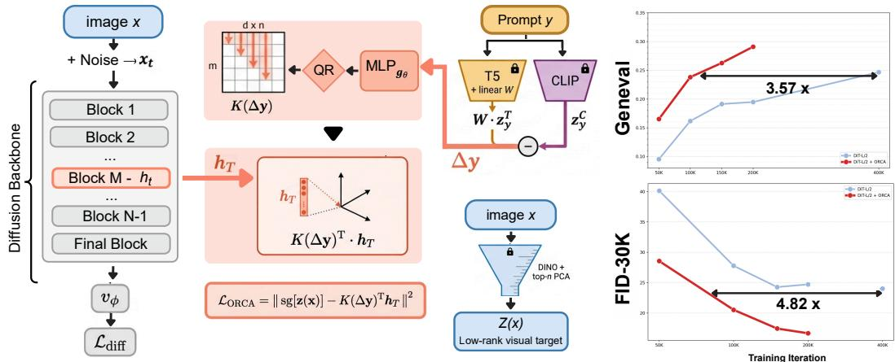
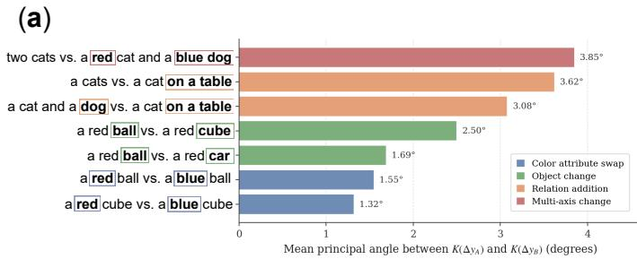
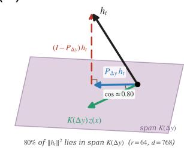
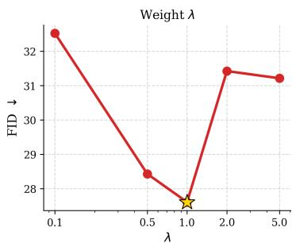
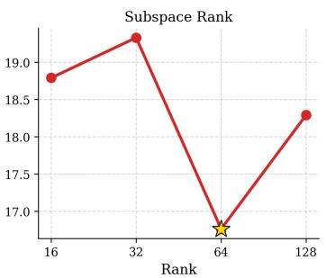
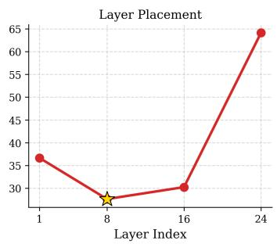
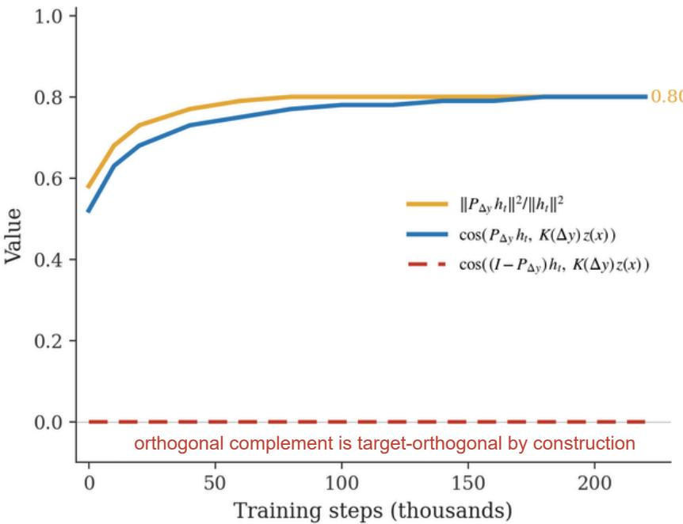

# ORCA: Hunting Compositional Failures in Text-to-Image Diffusion

Arshia Hemmat1,2,3,∗ Amirhossein Vahidi1,3,∗ Amitis Shidani5,6 Mohammad Vali Sanian1,7,8 Hesam Asadollahzadeh1,9 Aryan Yazdan Parast9 Mo Lotfollahi1,2,3,4

1Wellcome Sanger Institute 2Cambridge Stem Cell Institute, University of Cambridge 3Cambridge Centre for AI in Medicine, University of Cambridge   
4Department of Medicine, University of Cambridge 5University of Oxford 6Apple 7Department of Computer Science, University of Helsinki 8Institute for Molecular Medicine Finland (FIMM), University of Helsinki 9School of Computing and Information Systems, University of Melbourne ∗Equal contribution Correspondence: ml19@sanger.ac.uk

## Abstract

Text-to-image diffusion models fail predictably on compositional prompts: attributes bind to the wrong objects, spatial relations invert, and multi-object scenes lose count. Recent architectures already augment CLIP with a T5 encoder precisely because CLIP’s contrastive embedding loses compositional structure, yet these failures persist. We argue the binding problem is therefore not one of missing information but of misaligned information: a text encoder preserves compositional structure, but in a representation space shaped by language modelling rather than vision, and the denoising objective does not directly reward aligning the two. We show this correspondence can be supplied as an explicit training signal, that the relevant cross-modal information is concentrated in a low-rank subspace of selfsupervised visual features, and that supplying it can be folded into diffusion training as a single auxiliary loss. Our method, ORCA (Orthogonal Residual Compositional Alignment), aligns the latent of a diffusion transformer with a low-rank target derived from a frozen visual encoder, through a predictor whose orthogonal basis is parameterised by a learned residual between T5 and CLIP embeddings, which provides a prompt-dependent signal for selecting the visual readout subspace. We prove that the cross-modal information recoverable at a given rank is bounded by the spectral mass of the visual encoder’s covariance in the top components. Across three diffusion-transformer backbones (DiT-B/2, DiT-L/2, U-ViT-L), ORCA improves FID and GenEval over both vanilla and REPA baselines at zero inferencetime cost; on DiT-L/2 it reaches FID 16.65 and GenEval 0.291 at 200K steps, exceeding the strongest 400K baseline at half the training cost, with the largest gains concentrated on attribute binding, spatial relations, and multi-object prompts.

## 1 Introduction

Text-to-image diffusion models generate photorealistic images at scale, yet they fail predictably on prompts that require compositional reasoning. The fox is green when it should be red; the cat is on the mat instead of beside it; one of three apples is missing. These are not rendering failures, since the individual objects are crisp and well-formed, but conditioning failures, and they persist across model generations, architectures, and training scales [1, 2, 3].

  
Figure 1: ORCA aligns the diffusion latent with a low-rank visual target via a text-conditioned projector K(∆y) built from the T5−CLIP residual. On DiT-L/2, ORCA reaches the vanilla 400K FID and GenEval in 4.8× and 3.6× fewer steps, with zero inference overhead.

A growing body of work has localised the source in the text encoder. CLIP’s text encoder [4], the dominant conditioning signal in modern text-to-image models, behaves cross-modally as a bag-ofwords: it captures which concepts appear in a caption but loses how those concepts are bound to one another [5]. Recent analyses trace this not to CLIP’s training data but to the contrastive objective itself, which rewards alignment of shared content between modalities and provides no pressure to encode the syntactic structure that compositional generation requires [6, 7]. State-of-the-art models including Stable Diffusion 3 [8] and FLUX [9] respond by augmenting CLIP with a T5 encoder [10], precisely because T5’s language-modeling objective preserves the compositional structure CLIP discards.

A separate line of work suggests where such grounding could come from. Diffusion transformers improve substantially when their internal representations are aligned with self-supervised visual encoders. REPA [11] regularises diffusion hidden states toward DINOv2 [12] features and reports more than 17× faster convergence on class-conditional ImageNet; REG [13] extends this to high-level class tokens; subsequent analysis identifies the spatial structure of self-supervised features as the source of the gain [14]. These methods supply the visual grounding signal the diffusion objective lacks, but they have been developed for class-conditional generation, where the conditioning i a single label and the binding problem does not arise. Whether the same mechanism addresses text-image binding, where the conditioning is a structured sequence whose compositional conten must be respected, remains open.

We propose ORCA, which closes this gap through three coupled observations. (1) The textual signal that should drive the alignment is not T5 itself but the residual between T5 and CLIP, the component of T5 not linearly expressible in CLIP’s embedding space, which concentrates the compositional structure the contrastive encoder discards. (2) The visual signal the diffusion model should ground against is concentrated in a low-rank subspace of self-supervised feature spaces. (3) The alignment should be supplied at an intermediate diffusion state and used purely as a training signal, so the inference pipeline is unchanged.

The mechanism is a small predictor whose orthogonal basis is parameterized by the residual textual signal and which projects the diffusion latent into a low-rank subspace of self-supervised visual features for supervision. We prove that the cross-modal information recoverable through this mecha nism at a given rank is bounded by the spectral mass of the visual encoder’s covariance in the top components, and observe empirically that downstream performance saturates at the spectral elbow, a falsifiable prediction the theory makes and the experiments confirm.

Contributions. We make the following contributions.

• We formalize the diagnosis of compositional failure as a problem of misalignment rather than missing information: modern T2I systems already condition on T5, but the diffusion objective does not provide a training signal that grounds T5’s compositional structure in visual composition.

• We propose ORCA, a training-time auxiliary loss that supplies this grounding signal by aligning the diffusion model’s intermediate latent with a low-rank target derived from self-supervised visual features, with the readout subspace parameterized by the T5–CLIP residual.

• We prove a spectral upper bound on the cross-modal information ORCA can recover at a given rank, and show this bound is tight in expectation under the power-law spectra that self-supervised visual features empirically exhibit.

• We evaluate ORCA against MMDiT, REPA, and REG baselines primarily on FID and GenEval [1], and report PickScore [15], and CLIPScore [16] in auxiliary analyses with the largest gains on attribute binding, spatial relations, and multi-object prompts.

## 2 Preliminaries

We present a brief overview of flow and diffusion based generative models through the unified perspective of stochastic interpolants [17, 18]; see Appendix A for additional details. We then specialize to the rectified-flow setting used by MMDiT [8].

We consider a continuous time-dependent process between a data sample $x ^ { * } \sim p _ { \mathrm { d a t a } } ( x )$ and Gaussian noise $\epsilon \sim \mathcal { N } ( 0 , I )$ on $t \in [ 0 , T ]$

$$
x _ { t } = \alpha _ { t } x ^ { * } + \sigma _ { t } \epsilon , \quad \quad \alpha _ { 0 } = \sigma _ { T } = 1 , \alpha _ { T } = \sigma _ { 0 } = 0 ,\tag{1}
$$

where $\alpha _ { t }$ and $\sigma _ { t }$ are decreasing and increasing functions of $t ,$ respectively. Associated with (1) is a probability-flow ordinary differential equation $\dot { x } _ { t } = v ( x _ { t } , t )$ whose marginal at time t matches $p _ { t } ( x )$ so that data can be sampled by integrating this ODE from $\dot { \epsilon } \sim \mathcal { N } ( 0 , I )$ at $t = T$ down to $t = 0$ . The velocity field admits the closed form

$$
v ( x , t ) \ = \ \mathbb { E } [ { \dot { x } } _ { t } \ | \ x _ { t } = x ] \ = \ { \dot { \alpha } } _ { t } \mathbb { E } [ x ^ { * } \ | \ x _ { t } = x ] \ + \ { \dot { \sigma } } _ { t } \mathbb { E } [ \epsilon \ | \ x _ { t } = x ] ,\tag{2}
$$

and is approximated by a neural network $v _ { \theta } ( x _ { t } , t , c )$ conditioned on text $c ,$ trained with the velocitymatching objective

$$
\begin{array} { r } { \textstyle \mathcal { L } _ { \mathrm { d i f f } } ( \theta ) : = \mathbb { E } _ { x ^ { * } , \epsilon , t } | | v _ { \theta } ( x _ { t } , t , c ) ~ - ~ \dot { \alpha } _ { t } x ^ { * } ~ - ~ \dot { \sigma } _ { t } \epsilon \big \| ^ { 2 } . } \end{array}\tag{3}
$$

To reduce computational cost we operate in the latent space of a pretrained autoencoder [19], treating $x ^ { * } = \mathcal { E } ( \mathrm { i m a g e } )$ as the data variable above; the autoencoder is frozen.

Following $[ 1 8 , 8 ]$ , we adopt the linear interpolant with $T = 1 , \alpha _ { t } = 1 - t , \sigma _ { t } = t$ , which reduces (1) to $x _ { t } = \left( 1 - t \right) x ^ { \ast } + t$ ϵ and the target velocity to $\dot { \alpha } _ { t } x ^ { * } + \dot { \sigma } _ { t } \epsilon = \epsilon - x ^ { * }$ . The framework we develop applies to any other choice of $\alpha _ { t } , \sigma _ { t }$ for which (3) is well defined (e.g. DDPM [20]).

Text conditioning in MMDiT. The conditioning signal c in MMDiT is provided by frozen pretrained text encoders. Let $z _ { y } ^ { C } \in \mathbb { R } ^ { d _ { C } }$ denote a CLIP [4] text embedding and $\boldsymbol { z _ { y } ^ { T } } \in \mathbb { R } ^ { d _ { T } }$ a T5 [10] text embedding of a prompt y, and write $c = ( z _ { y } ^ { C } , z _ { y } ^ { T } )$ ). MMDiT processes text and image tokens with two separate sets of weights joined by full sequence-level attention, producing hidden states $h _ { t } ^ { ( \ell ) }$ at each block index ℓ. We denote by $h _ { T } \in \mathbb { R } ^ { d }$ the hidden state at a diffusion block, which our method (Section 3) supervises against an external visual target.

## 3 Method

We now describe ORCA, a training-time auxiliary objective that supplies the diffusion model with a grounding signal for compositional structure. Given an MMDiT diffusion model conditioned on CLIP and T5 text embeddings as in Section 2, ORCA introduces three components that together construct an auxiliary loss applied to the diffusion model’s latent $h _ { T }$ . The components are: a residual textual signal (§3.1) that isolates the part of T5 not expressible in CLIP, a low-rank visual target (§3.2) derived from a self-supervised visual encoder, and a QR map (§3.3) that produces an input-dependent orthonormal projection from $h _ { T }$ to the visual target space. The auxiliary loss and full training objective are given in §3.5; the theoretical analysis follows in §3.7. Inference is unchanged from the MMDiT baseline (§3.6). Throughout, we denote the diffusion model’s parameters by θ and ORCA’s auxiliary parameters (the textual projection and the QR map) by ϕ.

## 3.1 Residual textual signal

The first component isolates the textual information that compositional generation requires but contrastive alignment does not preserve. Given the CLIP text embedding $z _ { y } ^ { C } \in \mathbb { R } ^ { d _ { C } }$ and the T5 text embedding $z _ { y } ^ { T } \in \mathbb { R } ^ { d _ { T } }$ , we introduce a single learnable linear projection $\breve { W } \in \mathbb { R } ^ { d _ { C } \times d _ { T } }$ from T5 to CLIP’s embedding space, and define the residual textual signal as

$$
\Delta _ { y } = W z _ { y } ^ { T } - z _ { y } ^ { C } \in \mathbb { R } ^ { d _ { C } } .\tag{4}
$$

The projection $W$ is trained jointly with the rest of ORCA through the auxiliary objective; we apply no explicit regulariser to it. A trivial solution in which W is chosen so that $W \overset { \mathbf { \check { \sigma } } } { z _ { y } ^ { T } } \overset { \mathbf { \check { \mathbf { \sigma } } } } { \approx } z _ { y } ^ { C }$ (driving $\Delta _ { y }$ towards zero on the training distribution) leaves the predictor downstream with no input signal and is therefore not an attractor of the loss; we observe this empirically in Section 4. We use $\Delta _ { y }$ as a learned difference signal in CLIP’s coordinate frame, not as an orthogonal complement of CLIP. This signal serves as the input that determines the geometry of ORCA’s predictor and empirically induces prompt-dependent readout subspaces that vary systematically with semantic changes in the prompt.

## 3.2 Low-rank visual target

The second component supplies the diffusion model with a target representation of the clean image, structured to match the spectral concentration of self-supervised visual features. Let $E _ { D }$ be a frozen pretrained self-supervised visual encoder (DINOv2 [12] in our experiments), producing features $\dot { v } = E _ { D } ( x ) \in \mathbb { R } ^ { d _ { D } ^ { * } }$ for a clean image x. Before training, we compute the empirical mean v¯ and the top-n principal components of $\{ v _ { i } \} _ { i = 1 } ^ { N }$ on the training corpus, and assemble the principal-component matrix $P _ { n } \in \mathbb { R } ^ { n \times d _ { L } }$ . The visual target is the projection

$$
z ( x ) \ = \ P _ { n } \big ( E _ { D } ( x ) - \bar { v } \big ) \ \in \ \mathbb { R } ^ { n } .\tag{5}
$$

Both $P _ { n }$ and v¯ are frozen for the duration of training and receive no gradient. The bottleneck rank n is small in practice $( n \ll d _ { D } ) ;$ ; the spectral analysis of §3.7 characterises how performance depends on this choice and predicts saturation at the spectral elbow of the visual encoder’s covariance.

The construction has three properties relevant to what follows. First, the target is decorrelated and variance-ordered by spectral theorem: $\operatorname { C o v } ( z ( x ) ) = \operatorname { d i a g } ( \lambda _ { 1 } , . . . , \lambda _ { n } )$ where $\lambda _ { 1 } \geq \cdots \geq \lambda _ { n }$ are the top-n eigenvalues of the empirical covariance of DINO features. Second, the target has no learnable parameters, which removes representational collapse on the target side as a stationary point of optimisation without recourse to variance regularisers [21] or asymmetric stop-gradient schemes [22]. Third, the variance of each target dimension is non-zero by construction, providing a stable supervision signal across the full bottleneck.

## 3.3 QR map

The third component projects the diffusion model’s latent $h _ { T } \in \mathbb { R } ^ { d }$ into the n-dimensional target space, with the projection’s geometry determined by the residual textual signal $\Delta _ { y }$ . We parameterise this projection as the orthonormalised output of a small MLP applied to $\Delta _ { y }$ . Concretely, an MLP $g _ { \phi } : \mathbb { R } ^ { d _ { C } }  \mathbb { R } ^ { d \times n }$ produces a candidate matrix from the residual signal, and we orthonormalise its columns to obtain

$$
K ( \Delta _ { y } ) \ = \ \mathrm { Q R } \big ( g _ { \phi } ( \Delta _ { y } ) \big ) \ \in \ \mathbb { R } ^ { d \times n } , \qquad K ( \Delta _ { y } ) ^ { \top } K ( \Delta _ { y } ) = I _ { n } .\tag{6}
$$

We refer to this construction as the QR map. The orthonormality constraint $K ( \Delta _ { y } ) ^ { \top } K ( \Delta _ { y } ) = I _ { n }$ guarantees that the predicted target is a Euclidean projection of $h _ { T }$ onto an n-dimensional subspace of $\mathbb { R } ^ { d }$ rather than an arbitrary linear combination, which keeps the auxiliary loss interpretable as a subspace alignment and stabilises the training dynamics. In practice we use Householder QR (torch.linalg.qr) with column normalisation and a small additive noise applied to the candidate matrix before the decomposition; implementation details, mixed-precision handling, and empirical orthonormality measurements are given in Appendix C.1.

The predicted target is the projection of $h _ { T }$ onto $K ( \Delta _ { y } )$

$$
\hat { z } ( h _ { T } , \Delta _ { y } ) \ : = \ : K ( \Delta _ { y } ) ^ { \top } h _ { T } \ : \in \ : \mathbb { R } ^ { n } .\tag{7}
$$

The factorisation $\hat { z } = K ( \Delta _ { y } ) ^ { \top } h _ { T }$ separates the role of the text from the role of the image: the text determines which subspace $o f \mathbb { R } ^ { d }$ to read out, and the image fills in coordinates within that subspace. In the following section, we compare this factorised predictor against an unfactorised part.

(b)  
  
Figure 2: (a) Mean principal angle (in degrees) between the subspaces induced by paired prompts that differ along a controlled axis. Pairs are grouped by perturbation type: color attribute swap, object change, relation addition, and multi-axis change. The angles increase systematically with the semantic distance between prompts, with multi-axis changes producing the largest deviations and color swaps the smallest. The QR map is therefore input-dependent in a structured way: linguistically related prompts induce nearby readout subspaces, while linguistically distant prompts induce more separated ones. (b) Geometric illustration of the orthogonal decomposition of Equation (9) with rank $r = 6 4$ and $d = 7 6 8$

## 3.4 The factorisation as an orthogonal decomposition of $h _ { T }$

The factorised form of the predictor in Equation (7) induces a natural decomposition of the diffusion model’s intermediate latent that clarifies what ORCA’s auxiliary loss does and does not constrain. Define the rank-n orthogonal projector

$$
P _ { \Delta _ { y } } : = K ( \Delta _ { y } ) K ( \Delta _ { y } ) ^ { \top } \ \in \ \mathbb { R } ^ { d \times d } ,\tag{8}
$$

which by construction satisfies $P _ { \Delta _ { y } } ^ { 2 } = P _ { \Delta _ { y } } , P _ { \Delta _ { y } } ^ { \top } = P _ { \Delta _ { y } }$ , and rank $( P _ { \Delta _ { y } } ) = n$ . The latent $h _ { T }$ admits the orthogonal decomposition

$$
\begin{array} { r } { h _ { T } = \underbrace { P _ { \Delta _ { y } } h _ { T } } _ { h _ { T } ^ { \parallel } } + \underbrace { \left( I - P _ { \Delta _ { y } } \right) h _ { T } } _ { h _ { T } ^ { \perp } } , } \end{array}\tag{9}
$$

where $h _ { T } ^ { \parallel }$ lies in the n-dimensional subspace selected by the QR map for the prompt y, and $h _ { T } ^ { \perp }$ lies in its orthogonal complement.

ORCA constrains only $h _ { T } ^ { \parallel }$ . A direct calculation shows

$$
\begin{array} { r } { K ( \Delta _ { y } ) ^ { \top } h _ { T } \ = \ K ( \Delta _ { y } ) ^ { \top } P _ { \Delta _ { y } } h _ { T } \ = \ K ( \Delta _ { y } ) ^ { \top } h _ { T } ^ { \parallel } , } \end{array}\tag{10}
$$

because $K ^ { \top } ( I - P _ { \Delta _ { u } } ) = 0$ by orthonormality of K. The auxiliary loss in Equation (12) is therefore a function of $h _ { T } ^ { \parallel }$ alone:

$$
\begin{array} { r } { \mathcal { L } _ { \mathrm { O R C A } } = \mathbb { E } \big \| \mathrm { s g } [ z ( x ) ] - K ( \Delta _ { y } ) ^ { \top } h _ { T } ^ { \| } \big \| ^ { 2 } . } \end{array}\tag{11}
$$

Equivalently, $\mathcal { L } _ { \mathrm { O R C A } }$ is invariant to any change in $h _ { T } ^ { \perp }$ as shown in Figure 2. The decomposition in Equation (9) is the unique (up to the choice of subspace, which is fixed by $K ( \Delta _ { y } ) )$ decomposition of $h _ { T }$ that separates the component the auxiliary loss can shape from the component it cannot.

## 3.5 Auxiliary loss and training objective

The auxiliary loss is the squared error between the predicted target and the frozen visual target, with the target detached from the computation graph:

$$
{ \mathcal { L } } _ { \mathrm { O R C A } } ( \theta , \phi ) = \mathbb { E } _ { ( x , y ) \sim p _ { \mathrm { d a t a } } , t \sim p _ { t } } \Big [ \big \| \operatorname { s g } [ z ( x ) ] - K _ { \phi } ( \Delta _ { y } ) ^ { \top } h _ { T } ( x , y ; \theta ) \big \| ^ { 2 } \Big ] ,\tag{12}
$$

where $h _ { T } ( x , y ; \theta )$ is MMDiT’s latent for noisy input at time $t ,$ the stop-gradient $\mathrm { s g } [ \cdot ]$ blocks gradients into the visual encoder, and $K _ { \phi }$ makes the dependence on $\phi$ explicit. The total objective combines the diffusion loss of Equation (3) with the auxiliary loss:

$$
\begin{array} { r } { \mathcal { L } ( \theta , \phi ) = \mathcal { L } _ { \mathrm { d i f f } } ( \theta ) + \lambda \mathcal { L } _ { \mathrm { O R C A } } ( \theta , \phi ) , } \end{array}\tag{13}
$$

where $\lambda > 0$ is a single scalar hyperparameter. We find performance to be robust over approximately one order of magnitude of $\lambda ;$ see Section 4 and Appendix D.4.

## 3.6 Inference

At inference the auxiliary parameters ϕ and the visual target $z ( x )$ are not used. The diffusion model is sampled exactly as in the MMDiT baseline, integrating the velocity field $v _ { \theta } ( x _ { t } , t , c )$ from $t = 1$ to $t = 0$ with classifier-free guidance as in Appendix A.3. ORCA therefore adds zero parameters, zero memory, and zero FLOPs to the inference pipeline.

## 3.7 Theoretical analysis

We now formalise what ORCA recovers and why a small rank n is sufficient in practice. The argument has three steps. First, we establish a precise upper bound on the cross-modal information recoverable through the auxiliary loss at a given rank, in terms of the visual encoder’s covariance spectrum (Theorem 1). Second, we observe that self-supervised visual features on natural images have power-law spectra. Third, combining the two yields Proposition 2: ORCA at modest rank recovers a constant fraction of all available cross-modal information, with the residual decaying polynomially in n. Together they predict that downstream performance saturates near the rank where DINO’s cumulative spectral mass saturates, a prediction we verify empirically in Section 4. Full proofs are in Appendix B.

Setup. Let $V = E _ { D } ( X ) \in \mathbb { R } ^ { d _ { D } }$ denote the DINO feature of a random image X, with mean v¯ and covariance $\begin{array} { r } { \Sigma _ { V } = \sum _ { i = 1 } ^ { d _ { D } } \lambda _ { i } u _ { i } u _ { i } ^ { \top } } \end{array}$ ordered by $\lambda _ { 1 } \geq \cdots \geq 0$ . Let $Z = P _ { n } ( V - \bar { v } ) \in \mathbb { R } ^ { n }$ be the visual target and $H \in \mathbb { R } ^ { d }$ the diffusion model’s latent. Let $\hat { Z } ( H )$ be any predictor of Z from H.

Theorem 1 (Spectral bound on recoverable information). The maximum reduction in expected reconstruction error of V achievable by any predictor $\hat { Z } ( H )$ in ORCA’s auxiliary objective is bounded above by the top-n spectral mass ofΣV:

$$
\mathbb { E } \| V - \bar { v } \| ^ { 2 } \ - \ \operatorname* { m i n } _ { \hat { Z } } \mathbb { E } \big \| V - \bar { v } - P _ { n } ^ { \top } \hat { Z } ( H ) \big \| ^ { 2 } \ \leq \ \sum _ { i = 1 } ^ { n } \lambda _ { i } ,\tag{14}
$$

with equality when $\mathbb { E } [ Z \mid H ] = Z$ almost surely.

Proposition 2 (Power-law concentration). Suppose $\lambda _ { i } \le C i ^ { - \alpha }$ for some $\alpha > 1$ and $C > 0$ . Then the missing spectral mass beyond rank n decays polynomially:

$$
\sum _ { i = n + 1 } ^ { \infty } \lambda _ { i } \ \leq \ \frac { C } { ( \alpha - 1 ) n ^ { \alpha - 1 } } .\tag{15}
$$

Consequently the gap between recoverable information at rank n and the total recoverable information is ${ \overset { \bullet } { O } } { \left( n ^ { - ( \alpha - 1 ) } \right) }$

Self-supervised visual features on natural images empirically follow power laws of the form $\lambda _ { i }$ ≈ $C i ^ { - \alpha }$ with $\alpha > 1 [ 2 3 , 2 4 , 2 5 , 2 6 ]$ , and we verify in Section 4 that DINOv2 features on our training corpus exhibit this behaviour. Together, Theorem 1 and Proposition 2 predict that downstream performance saturates near the rank where the cumulative spectral mass saturates, the spectral elbow of the eigenvalue curve. This characterises ORCA’s capacity-rank trade-off and explains why a method that operates in the principal subspace of the visual encoder is matched to the geometry of natural-image data.

## 4 Experiments

We evaluate ORCA against vanilla, REPA, and REG baselines, organising the experiments around three questions. Q1: does ORCA improve generation quality and compositional fidelity, and does it accelerate training (§4.2)? Q2: does the factorisation story of §3.4 hold empirically (App. §D.7)? Q3: which design choices drive the gains (§5)? Implementation details, hyperparameters, and the runtime breakdown are deferred to Appendix C; extended ablations to Appendix D.

## 4.1 Setup

Dataset. We train on MS-COCO [27] at 256×256 following the standard text-to-image protocol used in prior representation-alignment work [11]. All images are encoded into the latent space of the

Table 1: Main results on MS-COCO 256×256. Results are grouped by diffusion backbone. For each backbone, we report the training checkpoint, FID-30K, and GenEval. †ORCA adds zero parameters and FLOPs at inference. Best per backbone in bold. REPA REG ORCA (ours)
<table><tr><td></td><td colspan="3">DiT-B/2 (130M)</td><td colspan="3">DiT-L/2 (458M)</td><td colspan="3">U-ViT-L (287M)</td></tr><tr><td>Setting</td><td>Iter.</td><td>FID↓</td><td>GenEval↑</td><td>Iter.</td><td>FID↓</td><td>GenEval↑</td><td>Iter.</td><td>FID↓</td><td>GenEval↑</td></tr><tr><td colspan="10">Vanilla diffusion training</td></tr><tr><td>Vanilla</td><td>100K</td><td>35.49</td><td>0.123</td><td>100K</td><td>27.77</td><td>0.162</td><td>100K</td><td>38.72</td><td>0.130</td></tr><tr><td>Vanilla</td><td>150K</td><td>33.55</td><td>0.145</td><td>150K</td><td>24.26</td><td>0.191</td><td>150K</td><td>32.48</td><td>0.148</td></tr><tr><td>Vanilla</td><td>200K</td><td>29.95</td><td>0.167</td><td>200K</td><td>24.71</td><td>0.195</td><td>200K</td><td>30.95</td><td>0.161</td></tr><tr><td>Vanilla</td><td>400K</td><td>29.15</td><td>0.174</td><td>400K</td><td>24.01</td><td>0.247</td><td>400K</td><td>29.91</td><td>0.189</td></tr><tr><td colspan="10">Representation-alignment baselines</td></tr><tr><td>+ REPA</td><td>250K</td><td>23.85</td><td>0.214</td><td>400K</td><td>20.05</td><td>0.275</td><td>400K</td><td>23.31</td><td>0.221</td></tr><tr><td>+REG</td><td>200K</td><td>21.92</td><td>0.217</td><td>200K</td><td>18.57</td><td>0.258</td><td>200K</td><td>20.21</td><td>0.219</td></tr><tr><td colspan="10">ORCA</td></tr><tr><td>+ ORCA (ours)†</td><td>100K</td><td>28.31</td><td>0.180</td><td>100K</td><td>20.51</td><td>0.238</td><td>100K</td><td>25.47</td><td>0.218</td></tr><tr><td>+ ORCA (ours)†</td><td>150K</td><td>26.58</td><td>0.206</td><td>150K</td><td>16.76</td><td>0.272</td><td>150K</td><td>21.10</td><td>0.260</td></tr><tr><td>+ ORCA (ours)†</td><td>250K</td><td>21.06</td><td>0.265</td><td>200K</td><td>16.65</td><td>0.291</td><td>200K</td><td>19.62</td><td>0.271</td></tr></table>

SD-1.5 VAE before training, and captions are tokenised separately for CLIP and T5. The PCA basis used for the visual target is estimated once on a fixed subset of 5,000 training images (∼ 1.28M patch embeddings, sub-sampled to 100K for SVD efficiency) and frozen for the remainder of training; rank r=64 captures 37.3% of the cumulative spectral mass.

Architectures. We instantiate ORCA on three diffusion-transformer backbones at two parameter scales to test that the gains do not depend on a specific design or model size: DiT-B/2 [28] (∼ 130M), DiT-L/2 [28] (∼458M), and U-ViT-L [29] (∼287M), the latter differs in skip-connection topology. All backbones use identical conditioning, optimiser, and schedule settings; the only difference between methods is the auxiliary loss. Architectural details and the full hyperparameter table are in Appendix C.3.

Baselines. We compare ORCA against (i) the vanilla backbone trained with the diffusion objective alone, (ii) REPA [11], and (iii) REG [13], the strongest representation-alignment method we are aware of. All baselines use the same backbone, optimiser, and schedule as ORCA; the only difference is the auxiliary loss. For REPA and REG we use the authors’ released configuration. Baseline hyperparameters are reproduced verbatim in Appendix C.3.

Metrics. We report FID-30K [30] for generation quality, GenEval [1] for fine-grained compositional alignment, CLIPScore [16] (ViT-L/14) for text–image alignment, and PickScore [15] as a humanpreference proxy. All metrics use a fixed seed, 50 DDIM sampling steps, and CFG scale s=1.5 unless noted otherwise.

Training-step protocol. We report each method at the checkpoints shown in Table 1. Vanilla baselines are reported up to 400K steps; REPA and REG use the released/default configurations at the listed checkpoints. For ORCA, we report multiple checkpoints to characterise convergence speed. The rank ablation runs are trained to 150K steps; the layer-placement and λ ablations are trained to 50K steps.

## 4.2 Main results: backbones and benchmarks

Table 1 reports the main DiT-L/2 comparison on our two primary metrics, FID and GenEval. The pattern is consistent across baselines: standard diffusion training improves slowly with scale, while representation alignment substantially accelerates convergence. Vanilla DiT-L/2 reaches FID 24.01 and GenEval 0.247 after 400K steps; REPA [11] improves both metrics at the same training budget, reaching FID 20.05 and GenEval 0.275; and REG [13] provides a strong recent representationalignment baseline, reaching FID 18.57 and GenEval 0.258 at 200K steps. ORCA shifts this trade-off further. At the same 200K budget as REG, ORCA reaches FID 16.65 and GenEval 0.291, improving FID by 10.3% and GenEval by 12.8% relative to REG. Compared with the longer 400K Vanilla and REPA runs, ORCA reduces FID by 31.0% and 17.0%, respectively, while improving GenEval by 17.8% and 5.8%. Thus, ORCA is not merely faster to optimise: it improves the quality–composition trade-off, reaching better compositional fidelity than the strongest 400K baseline while using half the training budget.

Table 2: GenEval per-task breakdown on DiT-L/2 at 150K steps for all methods (matched to the rank-ablation budget). Gains concentrate on tasks that require compositional reasoning (Two objects, Counting, Position, Color attribution); single-object accuracy is comparatively saturated and improves only modestly. We additionally report ORCA at multiple ranks r to show the gain is not idiosyncratic to one rank choice. Best per column in bold.
<table><tr><td>Method</td><td>Single</td><td>Two</td><td>Count</td><td>Colors</td><td>Position</td><td>Color attr.</td><td>Overall</td></tr><tr><td>Vanilla</td><td>0.516</td><td>0.038</td><td>0.116</td><td>0.431</td><td>0.025</td><td>0.023</td><td>0.191</td></tr><tr><td>REPA</td><td>0.638</td><td>0.040</td><td>0.116</td><td>0.620</td><td>0.050</td><td>0.030</td><td>0.249</td></tr><tr><td>ORCA (r=16)</td><td>0.622</td><td>0.043</td><td>0.119</td><td>0.588</td><td>0.043</td><td>0.038</td><td>0.242</td></tr><tr><td>ORCA (r=32)</td><td>0.613</td><td>0.083</td><td>0.181</td><td>0.582</td><td>0.050</td><td>0.068</td><td>0.263</td></tr><tr><td>ORCA (r=64)</td><td>0.634</td><td>0.061</td><td>0.159</td><td>0.638</td><td>0.073</td><td>0.068</td><td>0.272</td></tr><tr><td>ORCA (r=128)</td><td>0.669</td><td>0.068</td><td>0.194</td><td>0.641</td><td>0.058</td><td>0.048</td><td>0.279</td></tr></table>

We report CLIPScore and PickScore only as auxiliary metrics (see Appendix D). Their changes are small across methods, consistent with prior observations that global preference and text–image similarity scores are less sensitive to the binding errors measured by GenEval; accordingly, we treat FID and GenEval as the primary metrics for the main comparison.

Table 2 drills into the per-category structure of the GenEval gain at the matched-iteration setting (150K for all methods). The improvements concentrate on the categories that require compositional reasoning rather than single-object photorealism: Position (2.9× over Vanilla), Color attribution (3.0×), Two objects (1.6×), and Counting (1.4×). Single-object accuracy is already comparatively saturated for all methods and improves only modestly (1.2×). This distribution of gains is the empirical signature predicted by our diagnosis: the bottleneck is not photorealism, it is binding, and ORCA acts on the latter. The same ordering holds beyond the early checkpoints: at 200K steps, ORCA reaches GenEval 0.291, outperforming Vanilla at 400K (0.247), REPA at 400K (0.275), and REG at 200K (0.258).

## 5 Ablations

We probe the design choices most central to the method, with the goal of separating what is doing the work from what is incidental. Figure 3 summarises the FID sensitivity across the three primary axes, subspace rank, alignment-block placement, and auxiliary-loss weight λ, under DiT-L/2 at 50K (layer, λ) and 150K (rank) steps. Per-metric tables (GenEval, CLIP, PickScore), and the loss/target ablations are deferred to Appendix D.

Subspace rank. FID is minimised at r=64 (16.76), with both smaller and larger ranks performing worse. GenEval improves monotonically with r and is highest at r=128 (0.279), but the accompanying FID degradation at r=128 (18.29) makes r=64 a Pareto-efficient default: it pays a 2.5% relative GenEval cost for an 8.4% relative FID gain over r=128. CLIP-L/14 and PickScore are roughly flat across the sweep (0.1042–0.1076 and 17.11–17.16 respectively), indicating that the rank choice does not interact strongly with surface-level image quality. We adopt r = 64 as the default because it gives the best FID while remaining competitive on GenEval. Per-metric numbers are in Appendix D.2, Table 6.

Alignment-block placement. At 50K steps, performance is U-shaped in the depth at which the auxiliary loss is applied: intermediate depth (block 8 of 24) outperforms both very early (block 1) and very late (block 24) placement, with block 24 collapsing entirely (FID 64.16, GenEval 0.054).

  
Figure 3: ORCA design-choice sensitivity (FID-30K). Each panel sweeps a single hyperparameter while the other two are held at their default; stars mark the default configuration adopted in the main results. Left: the auxiliary-loss weight λ exhibits a clean optimum at λ=1.0, with both smaller and larger values degrading FID. Centre: the bottleneck rank r is non-monotonic, with r=64 as a sharp minimum. Right: applying the alignment loss at intermediate depth (block 8 of 24) is strongly preferred; alignment at the final block collapses the model entirely (FID 64.16). Full per-metric tables are in Appendix D.

The collapse at the last block indicates that the representation immediately before the output head is too task-specific to benefit from the auxiliary signal, consistent with REPA’s observation that selfsupervised structure is most useful where the diffusion model’s representations are still abstract [11]. Full numbers are in Appendix D.3, Table 7.

Loss coefficient. Performance is robust over approximately one order of magnitude of λ around the chosen default λ=1.0 (Figure 3, left panel); the curve is U-shaped, with both very small and very large λ degrading FID. Full numbers are in Appendix D.4, Table 8.

## 6 Conclusion

We presented ORCA, a training-time auxiliary objective for text-to-image diffusion models that supplies an explicit grounding signal for compositional structure. ORCA aligns the diffusion latent at an intermediate block with a low-rank principal subspace of self-supervised visual features, through a text-conditioned QR map parameterised by the residual between T5 and CLIP. The auxiliary loss is active only during training and adds zero parameters and FLOPs at inference. Across three diffusion-transformer backbones (DiT-B/2, DiT-L/2, U-ViT-L), ORCA improves over vanilla training and strong representation-alignment baselines, including REPA and REG, on FID and GenEval; on DiT-L/2, it reaches FID 16.65 and GenEval 0.291 at 200K steps, exceeding the strongest 400K baseline at half the training cost. The factorisation analysis shows that ORCA’s auxiliary loss acts only on the prompt-selected subspace of the diffusion latent and is invariant to perturbations in its orthogonal complement. Empirically, the aligned component increasingly matches the lifted DINOv2 PCA target during training, while the residual-target cosine remains zero by construction and serves only as an implementation sanity check, not as evidence that the orthogonal complement contains no visual information. The per-category GenEval breakdown shows that ORCA’s gains concentrate on attribute binding, spatial reasoning, and multi-object prompts, matching the failure modes targeted by our diagnosis.

The framework that emerges from this analysis is more general than the specific instantiation we evaluate. The factorisation isolates the textual structure that contrastive alignment loses and supervises a generative model against a structured low-rank projection of self-supervised features, a recipe that applies wherever a model is conditioned on a contrastively-aligned encoder and grounded against a self-supervised target with a concentrated principal spectrum. The spectral analysis transfers without modification: the relevant rank is set by the spectral elbow of the target encoder. We trained on MS-COCO at 256×256 rather than web-scale corpora such as LAION-5B because of GPU constraints; characterising ORCA at scale, extending the alignment to multiple intermediate blocks, and applying the same factorisation to text-to-video and text-to-3D generation are natural next directions.

## References

[1] Dhruba Ghosh, Hannaneh Hajishirzi, and Ludwig Schmidt. Geneval: An object-focused framework for evaluating text-to-image alignment. Advances in Neural Information Processing Systems, 36:52132–52152, 2023.

[2] Yixin Wan and Kai-Wei Chang. Compalign: Improving compositional text-to-image generation with a complex benchmark and fine-grained feedback. arXiv preprint arXiv:2505.11178, 2025.

[3] Hossein Shahabadi, Niki Sepasian, Arash Marioriyad, Ali Sharifi-Zarchi, and Mahdieh Soleymani Baghshah. Infinity and beyond: Compositional alignment in var and diffusion t2i models. arXiv preprint arXiv:2512.11542, 2025.

[4] Alec Radford, Jong Wook Kim, Chris Hallacy, Aditya Ramesh, Gabriel Goh, Sandhini Agarwal, Girish Sastry, Amanda Askell, Pamela Mishkin, Jack Clark, et al. Learning transferable visual models from natural language supervision. In International conference on machine learning, pages 8748–8763. PmLR, 2021.

[5] Martha Lewis, Nihal Nayak, Peilin Yu, Jack Merullo, Qinan Yu, Stephen Bach, and Ellie Pavlick. Does clip bind concepts? probing compositionality in large image models. In Findings ofthe Association for Computational Linguistics: EACL 2024, pages 1487–1500, 2024.

[6] Arman Zarei, Keivan Rezaei, Samyadeep Basu, Mehrdad Saberi, Mazda Moayeri, Priyatham Kattakinda, and Soheil Feizi. Improving compositional attribute binding in text-to-image generative models via enhanced text embeddings. arXiv preprint arXiv:2406.07844, 2024.

[7] Chenyi Zhuang, Ying Hu, and Pan Gao. Magnet: We never know how text-to-image diffusion models work, until we learn how vision-language models function. Advances in Neural Information Processing Systems, 37:57115–57149, 2024.

[8] Patrick Esser, Sumith Kulal, Andreas Blattmann, Rahim Entezari, Jonas Müller, Harry Saini, Yam Levi, Dominik Lorenz, Axel Sauer, Frederic Boesel, et al. Scaling rectified flow transformers for high-resolution image synthesis. In Forty-first international conference on machine learning, 2024.

[9] Black Forest Labs. FLUX.1. https://blackforestlabs.ai/, 2024. Accessed: 2026-04-30.

[10] Colin Raffel, Noam Shazeer, Adam Roberts, Katherine Lee, Sharan Narang, Michael Matena, Yanqi Zhou, Wei Li, and Peter J Liu. Exploring the limits of transfer learning with a unified text-to-text transformer. Journal of machine learning research, 21(140):1–67, 2020.

[11] Sihyun Yu, Sangkyung Kwak, Huiwon Jang, Jongheon Jeong, Jonathan Huang, Jinwoo Shin, and Saining Xie. Representation alignment for generation: Training diffusion transformers is easier than you think. In International Conference on Learning Representations, 2025. Oral Presentation.

[12] Maxime Oquab, Timothée Darcet, Théo Moutakanni, Huy Vo, Marc Szafraniec, Vasil Khalidov, Pierre Fernandez, Daniel Haziza, Francisco Massa, Alaaeldin El-Nouby, et al. Dinov2: Learning robust visual features without supervision. arXiv preprint arXiv:2304.07193, 2023.

[13] Ge Wu, Shen Zhang, Ruijing Shi, Shanghua Gao, Zhenyuan Chen, Lei Wang, Zhaowei Chen, Hongcheng Gao, Yao Tang, Jian Yang, Ming-Ming Cheng, and Xiang Li. Representation entanglement for generation: Training diffusion transformers is much easier than you think. In Advances in Neural Information Processing Systems, 2025. Oral Presentation.

[14] Jaskirat Singh, Xingjian Leng, Zongze Wu, Liang Zheng, Richard Zhang, Eli Shechtman, and Saining Xie. What matters for representation alignment: Global information or spatial structure? In International Conference on Learning Representations, 2026.

[15] Yuval Kirstain, Adam Polyak, Uriel Singer, Shahbuland Matiana, Joe Penna, and Omer Levy. Pick-a-pic: An open dataset of user preferences for text-to-image generation. Advances in neural information processing systems, 36:36652–36663, 2023.

[16] Jack Hessel, Ari Holtzman, Maxwell Forbes, Ronan Le Bras, and Yejin Choi. Clipscore: A reference-free evaluation metric for image captioning. In Proceedings of the 2021 conference on empirical methods in natural language processing, pages 7514–7528, 2021.

[17] Michael Albergo, Nicholas M Boffi, and Eric Vanden-Eijnden. Stochastic interpolants: A unifying framework for flows and diffusions. Journal ofMachine Learning Research, 26(209):1– 80, 2025.

[18] Nanye Ma, Mark Goldstein, Michael S Albergo, Nicholas M Boffi, Eric Vanden-Eijnden, and Saining Xie. Sit: Exploring flow and diffusion-based generative models with scalable interpolant transformers. In European Conference on Computer Vision, pages 23–40. Springer, 2024.

[19] Robin Rombach, Andreas Blattmann, Dominik Lorenz, Patrick Esser, and Björn Ommer. Highresolution image synthesis with latent diffusion models. In Proceedings of the IEEE/CVF conference on computer vision and pattern recognition, pages 10684–10695, 2022.

[20] Jonathan Ho, Ajay Jain, and Pieter Abbeel. Denoising diffusion probabilistic models. Advances in neural information processing systems, 33:6840–6851, 2020.

[21] Adrien Bardes, Jean Ponce, and Yann LeCun. VICReg: Variance-invariance-covariance regularization for self-supervised learning. In International Conference on Learning Representations, 2022.

[22] Jean-Bastien Grill, Florian Strub, Florent Altché, Corentin Tallec, Pierre H. Richemond, Elena Buchatskaya, Carl Doersch, Bernardo Avila Pires, Zhaohan Daniel Guo, Mohammad Gheshlaghi Azar, Bilal Piot, Koray Kavukcuoglu, Rémi Munos, and Michal Valko. Bootstrap your own latent: A new approach to self-supervised learning. In Advances in Neural Information Processing Systems, 2020.

[23] Daniel L. Ruderman. The statistics of natural images. Network: Computation in Neural Systems, 5(4):517–548, 1994.

[24] Yasaman Bahri, Ethan Dyer, Jared Kaplan, Jaehoon Lee, and Utkarsh Sharma. Explaining neural scaling laws. Proceedings ofthe National Academy ofSciences, 121(27):e2311878121, 2024.

[25] Jared Kaplan, Sam McCandlish, Tom Henighan, et al. Scaling laws for neural language models. arXiv e-prints, 2020.

[26] Alexander Maloney, Daniel A. Roberts, and James Sully. A solvable model of neural scaling laws. arXiv e-prints, 2022.

[27] Tsung-Yi Lin, Michael Maire, Serge Belongie, James Hays, Pietro Perona, Deva Ramanan, Piotr Dollár, and C Lawrence Zitnick. Microsoft coco: Common objects in context. In European conference on computer vision, pages 740–755. Springer, 2014.

[28] William Peebles and Saining Xie. Scalable diffusion models with transformers. In Proceedings ofthe IEEE/CVF international conference on computer vision, pages 4195–4205, 2023.

[29] Fan Bao, Shen Nie, Kaiwen Xue, Yue Cao, Chongxuan Li, Hang Su, and Jun Zhu. All are worth words: A vit backbone for diffusion models. In Proceedings ofthe IEEE/CVF conference on computer vision and pattern recognition, pages 22669–22679, 2023.

[30] Martin Heusel, Hubert Ramsauer, Thomas Unterthiner, Bernhard Nessler, and Sepp Hochreiter. Gans trained by a two time-scale update rule converge to a local nash equilibrium. Advances in neural information processing systems, 30, 2017.

[31] Yaron Lipman, Ricky TQ Chen, Heli Ben-Hamu, Maximilian Nickel, and Matt Le. Flow matching for generative modeling. arXiv preprint arXiv:2210.02747, 2022.

[32] Jonathan Ho and Tim Salimans. Classifier-free diffusion guidance. Transactions on Machine Learning Research, 2022.

## A Additional Preliminaries

This appendix provides additional detail on the stochastic-interpolant framework summarised in Section 2.

## A.1 Probability flow ODE and reverse SDE

For the interpolant $x _ { t } = \alpha _ { t } x ^ { * } + \sigma _ { t } \epsilon$ defined in Equation (1), the marginal $p _ { t }$ at time t is the law of $x _ { t }$ under $x ^ { * } \sim p _ { \mathrm { d a t a } }$ and $\epsilon \sim \mathcal { N } ( 0 , I )$ . There exists a probability-flow ordinary differential equation

$$
{ \dot { x } } _ { t } ~ = ~ v ( x _ { t } , t ) ,\tag{16}
$$

whose marginal at time t matches $p _ { t }$ [17, 18]. The velocity field is the conditional expectation

$$
v ( x , t ) \ = \ \mathbb { E } [ \dot { x } _ { t } \mid x _ { t } = x ] \ = \ \dot { \alpha } _ { t } \mathbb { E } [ x ^ { * } \mid x _ { t } = x ] + \dot { \sigma } _ { t } \mathbb { E } [ \epsilon \mid x _ { t } = x ] ,\tag{17}
$$

which is the regression target of the velocity-matching loss in Equation (3). There also exists a reverse stochastic differential equation

$$
\begin{array} { r } { d x _ { t } \ = \ v ( x _ { t } , t ) d t \ - \ \frac { 1 } { 2 } w _ { t } \ s ( x _ { t } , t ) d t \ + \ \sqrt { w _ { t } } d \bar { w } _ { t } , } \end{array}\tag{18}
$$

with diffusion coefficient $w _ { t } \geq 0$ and score function $s ( x , t ) = \nabla _ { x } \log p _ { t } ( x )$ . The score and velocity are related by

$$
s ( x , t ) = \frac { \alpha _ { t } v ( x , t ) - \dot { \alpha } _ { t } x } { \sigma _ { t } \left( \dot { \alpha } _ { t } \sigma _ { t } - \alpha _ { t } \dot { \sigma } _ { t } \right) } ,\tag{19}
$$

so a learned velocity model induces a score model and vice versa, and either ODE solvers (acting on Equation (16)) or SDE solvers can be used at inference [18].

## A.2 Specialisation to rectified flow and DDPM

Setting $\alpha _ { t } = 1 - t , \sigma _ { t } = t$ on $[ 0 , 1 ]$ gives the linear interpolant of rectified flow [31, 8], with target velocity $\dot { \alpha } _ { t } x ^ { * } + \dot { \sigma } _ { t } \epsilon = \epsilon - x ^ { * }$ . Setting $\alpha _ { t } = \sqrt { \bar { \alpha } _ { t } } , \sigma _ { t } = \sqrt { 1 - \bar { \alpha } _ { t } }$ for a discretised cosine or linear schedule $\bar { \alpha } _ { t }$ recovers the DDPM setting [20]. ORCA’s auxiliary loss (Equation (12)) does not depend on the choice of $\alpha _ { t } , \sigma _ { t }$ and therefore applies in either case.

## A.3 Classifier-free guidance

At inference, MMDiT applies classifier-free guidance [32] by training the velocity model to predict both the conditional and an unconditional velocity (the unconditional case is obtained by replacing the text embeddings with a learned null token at a fixed dropout rate during training). At sampling time, the guided velocity is

$$
\hat { v } ( x _ { t } , t , c ) \ = \ v _ { \theta } ( x _ { t } , t , \emptyset ) + s \big ( v _ { \theta } ( x _ { t } , t , c ) - v _ { \theta } ( x _ { t } , t , \emptyset ) \big ) ,\tag{20}
$$

where $s \geq 1$ is the guidance scale. ORCA does not modify the guidance procedure: the auxiliary loss is applied to $h _ { T }$ obtained from the conditional pass and is not used during the unconditional pass.

## B Proofs

## B.1 Proof of Theorem 1

We restate the theorem and provide a self-contained proof.

Theorem 3 (Restated). Let $V \in \mathbb { R } ^ { d _ { D } }$ be a random visual feature with mean v¯ and covariance $\begin{array} { r } { \Sigma _ { V } = \sum _ { i = 1 } ^ { d _ { D } } \lambda _ { i } u _ { i } u _ { i } ^ { \top } } \end{array}$ with $\lambda _ { 1 } \geq \lambda _ { 2 } \geq \dots \geq 0$ . Let $P _ { n }$ be the matrix whose rows are $u _ { 1 } , \ldots , u _ { n }$ , and define $Z = P _ { n } ( V - \bar { v } ) \in \mathbb { R } ^ { n }$ . For any predictor $\hat { Z } ( H )$ from a context $H _ { i }$

$$
\mathbb { E } \| V - \bar { v } \| ^ { 2 } \ - \ \operatorname* { m i n } _ { \hat { Z } } \mathbb { E } \big \| V - \bar { v } - P _ { n } ^ { \top } \hat { Z } ( H ) \big \| ^ { 2 } \ \leq \ \sum _ { i = 1 } ^ { n } \lambda _ { i } ,
$$

with equality $i f f \mathbb { E } [ Z \mid H ] = Z$ almost surely.

Proof. For any $\boldsymbol { v } \in \mathbb { R } ^ { d _ { D } }$ and any $\hat { z } \in \mathbb { R } ^ { n }$ , the orthogonal decomposition $\begin{array} { r } { v \mathrm { ~ - ~ } \bar { v } = P _ { n } ^ { \top } P _ { n } ( v \mathrm { ~ - ~ } } \end{array}$ $\bar { v } ) + ( I - P _ { n } ^ { \top } P _ { n } ) ( v - \bar { v } )$ satisfies, by Pythagoras (since $P _ { n } ^ { \top } P _ { n }$ is the orthogonal projector onto $\operatorname { s p a n } ( u _ { 1 } , \ldots , u _ { n } ) )$

$$
\| v - { \bar { v } } - P _ { n } ^ { \top } { \hat { z } } \| ^ { 2 } = \| P _ { n } ( v - { \bar { v } } ) - { \hat { z } } \| ^ { 2 } + \| ( I - P _ { n } ^ { \top } P _ { n } ) ( v - { \bar { v } } ) \| ^ { 2 } .\tag{21}
$$

The second term is independent of zˆ. Taking expectations and using $\Sigma _ { V } = \mathbb { E } [ ( V - \bar { v } ) ( V - \bar { v } ) ^ { \top } ]$

$$
\mathbb { E } { \big \| } { \big ( } I - P _ { n } ^ { \top } P _ { n } { \big ) } { \big ( } V - { \bar { v } } { \big ) } { \big \| } ^ { 2 } = \operatorname { t r } { \big [ } { \big ( } I - P _ { n } ^ { \top } P _ { n } { \big ) } \Sigma _ { V } { \big ] } = \sum _ { i = n + 1 } ^ { d _ { D } } \lambda _ { i } ,
$$

the standard Eckart–Young identity. With $Z = P _ { n } ( V - \bar { v } )$ , taking expectations of Equation (21) gives

$$
\mathbb { E } \| V - \bar { v } - P _ { n } ^ { \top } \hat { Z } ( H ) \| ^ { 2 } = \mathbb { E } \| Z - \hat { Z } ( H ) \| ^ { 2 } + \sum _ { i = n + 1 } ^ { d _ { D } } \lambda _ { i } .
$$

Subtracting both sides from $\begin{array} { r } { \mathbb E \| V - \bar { v } \| ^ { 2 } = \sum _ { i = 1 } ^ { d _ { D } } \lambda _ { i } } \end{array}$

$$
\mathbb { E } \Vert V - \bar { v } \Vert ^ { 2 } - \mathbb { E } \Vert V - \bar { v } - P _ { n } ^ { \top } \hat { Z } ( H ) \Vert ^ { 2 } = \sum _ { i = 1 } ^ { n } \lambda _ { i } - \mathbb { E } \Vert Z - \hat { Z } ( H ) \Vert ^ { 2 } .
$$

The right-hand side is maximised over $\hat { Z }$ when $\mathbb { E } \Vert Z - \hat { Z } ( H ) \Vert ^ { 2 }$ is minimised. By the law of total variance, this minimum is attained by the minimum-mean-squared-error predictor $\hat { Z } ^ { \star } ( H ) = \mathbb { E } [ Z \mid$ $H ]$ , with non-negative residual error and zero residual error iff $\mathbb { E } [ Z \mid H ] { \stackrel { . } { = } } Z$ almost surely.

## B.2 Proof of Proposition 2

Proposition 4 (Restated). Suppose $\lambda _ { i } \leq C i ^ { - \alpha }$ for some $\alpha > 1$ and $C > 0$ . Then

$$
\sum _ { i = n + 1 } ^ { \infty } \lambda _ { i } \ \leq \ \frac { C } { ( \alpha - 1 ) n ^ { \alpha - 1 } } .
$$

Proof. Since $i \mapsto i ^ { - \alpha }$ is decreasing for $i \geq 1$ , the integral test gives

$$
\sum _ { i = n + 1 } ^ { \infty } i ^ { - \alpha } \leq \int _ { n } ^ { \infty } x ^ { - \alpha } d x = { \frac { n ^ { - ( \alpha - 1 ) } } { \alpha - 1 } } .
$$

Multiplying by C and using $\lambda _ { i } \leq C i ^ { - \alpha }$ yields the claim.

## B.3 Tightness of the bound under linear-Gaussian assumptions

If $( V , H )$ is jointly Gaussian and V depends on H through a linear map plus independent noise, the conditional expectation $\mathbb { E } [ Z \mid H ]$ is itself a linear function of H. Under this assumption the optimal predictor in Theorem 1 is realised within the predictor class used by ORCA (a linear projection of $h _ { T }$ onto a subspace determined by $\Delta _ { y } )$ , and the bound becomes tight whenever H contains all the linear information about $Z .$ . This justifies treating the bound as a target rather than as a loose ceiling in the regime of practical interest.

## C Architecture and Hyperparameters

## C.1 QR map: numerical details

The QR map of Equation (6) produces an orthonormal basis $K ( \Delta _ { y } ) \in \mathbb { R } ^ { d \times n }$ from the output of the basis ${ \mathrm { { M L P ~ } } } g _ { \phi }$ . We use the standard Householder QR decomposition as implemented by torch.linalg.qr, with three implementation choices that ensure stability under mixed-precision training and at the start of training when $g _ { \phi }$ is small.

Stability at the start of training. The output linear layer of $g _ { \phi }$ is initialised with Xavier initialisation at gain 0.01 for the weights and zero for the bias, so $g _ { \phi } ( \Delta _ { y } )$ has small Frobenius norm at training step zero but is not exactly the zero matrix. To ensure that the QR decomposition is well-defined throughout training, we apply two preprocessing steps to the candidate matrix before invoking torch.linalg.qr: (i) we normalise each of its n columns to unit Euclidean norm, and (ii) we add isotropic Gaussian noise of magnitude $\sigma = 1 0 ^ { - 6 }$ per entry. The first step prevents column scales from drifting and provides a uniform conditioning target; the second step pushes the matrix away from rank-deficient configurations and prevents divisions through near-zero diagonal entries of R in the QR backward.

Mixed-precision handling. The remainder of the diffusion model is trained in fp16 mixed precision, but the QR computation is held in an fp32 island: we cast the input to fp32, disable autocast for the basis MLP and the QR step, and cast the resulting orthonormal basis $\bar { K } ( \Delta _ { y } )$ back to the original (fp16) dtype before it is multiplied by the diffusion hidden state. This avoids the well-known instability of QR under fp16 arithmetic without paying its cost on the rest of the network, since the QR step is small relative to the diffusion forward pass.

Empirical stability. We did not observe the large gradient norms or loss spikes sometimes reported when backpropagating through QR at near rank-deficient inputs. Throughout training, we monitor the orthonormality error $| K ( \bar { \Delta _ { y } } ) ^ { \top } K ( \Delta _ { y } ) - I _ { n } \| _ { \operatorname* { m a x } }$ (the element-wise maximum absolute deviation from the identity) and observe values below $5 \times 1 0 ^ { - 5 }$ from step zero onwards. The combination of column normalisation, additive noise, and fp32 QR is sufficient to keep the orthonormality error small and the gradients well-behaved across the entire 400K-step training run.

Backward pass. The backward pass through torch.linalg.qr is implemented analytically in PyTorch and involves the inverse of the upper-triangular factor R. In our setting R remains wellconditioned because the column-normalisation step bounds the column scales of the input, and the additive noise prevents exact rank deficiency; the lower bound on the diagonal entries of R is in turn bounded away from zero in expectation. Gradient flow into $g _ { \phi }$ is stable in practice.

## C.2 ORCA module architecture

We summarise the ORCA module in Table 3. The module adds three trainable components on top of the diffusion backbone: the textual projection W, the basis ${ \mathrm { M L P } } g _ { \phi }$ , and a QR orthonormalisation step. All are removed at inference and contribute zero parameters and FLOPs to the deployed model.

Table 3: ORCA module architecture. The textual projection W is a single linear layer mapping the T5 caption embedding into the d -dimensional CLIP space. The basis $\mathrm { M L P } g _ { \phi }$ is a 2-layer MLP with LayerNorm and GELU; its output layer is initialised with Xavier gain $0 . 0 1$ and zero bias, producing a small pre-QR candidate matrix at initialisation. The QR step and the PCA projection contribute no learnable parameters.
<table><tr><td>Component</td><td>Specification</td><td>Parameters</td></tr><tr><td>Textual projection W</td><td> $\mathrm { L i n e a r } ( d _ { T }  d _ { C } )$ </td><td> $d _ { T } \cdot d _ { C } + d _ { C }$ </td></tr><tr><td>Basis MLP  $g _ { \phi } ,$  hidden</td><td> $\operatorname { L i n e a r } ( d _ { C } \to h _ { g } ) + \operatorname { L a y e r N o r m } + \operatorname { G E L U }$   $\mathrm { L i n e a r } ( h _ { g } \to d \cdot n ) .$  Xavier init (gain 0.01)</td><td> $d _ { C } h _ { g } + h _ { g } + 2 h _ { g }$ </td></tr><tr><td>Basis MLP  $g _ { \phi } ,$  output</td><td></td><td> $h _ { g } \cdot d \cdot n + d \cdot n$ </td></tr><tr><td>Orthonormalisation</td><td>QR (torch.linalg. qr) on d × n matrix</td><td> $0 ( \mathrm { d e t e r m i n i s t i c } )$ </td></tr><tr><td>PCA projection  $P _ { n } , \bar { v }$ </td><td>Precomputed from frozen DINOv2</td><td>0 (no gradient)</td></tr></table>

In our default configuration, $h _ { g } = d _ { C }$ (the basis MLP hidden width equals the CLIP dimension), so the parameter count of $g _ { \phi }$ is dominated by the output layer $( h _ { g } \cdot d \cdot n )$

## C.3 Hyperparameters

We list the hyperparameters used for our main experiments in Table 4. Values are reported for the DiT-L/2 backbone at MS-COCO 256 × 256 resolution; values for other configurations are in Section D.

Table 4: Hyperparameters for ORCA training. The auxiliary-loss weight λ and rank n are the two hyperparameters specific to ORCA; all others are inherited from the diffusion backbone.
<table><tr><td>Hyperparameter</td><td>Value</td><td>Notes</td></tr><tr><td colspan="3">Diffusion training (inherited)</td></tr><tr><td>Optimiser</td><td>AdamW</td><td> $\beta _ { 1 } = 0 . 9 , \beta _ { 2 } = 0 . 9 9 9$ </td></tr><tr><td>Learning rate</td><td> $1 \times 1 0 ^ { - 4 }$ </td><td>cosine schedule with linear warmup</td></tr><tr><td>Warmup steps</td><td>5,000</td><td></td></tr><tr><td>Batch size (global)</td><td>256</td><td>for the baselines result</td></tr><tr><td>Total training iterations</td><td>400,000</td><td>for our method&#x27;s result</td></tr><tr><td>Method training iterations</td><td>200,000</td><td></td></tr><tr><td>Weight decay</td><td>0.01</td><td></td></tr><tr><td>EMA decay</td><td>0.9999</td><td></td></tr><tr><td>Precision</td><td>bf16/fp16 mixed (fp32 island for QR)</td><td></td></tr><tr><td colspan="3">ORCA-specific</td></tr><tr><td>Auxiliary-loss weight λ</td><td>1.0</td><td>ablated in Section 4</td></tr><tr><td>Bottleneck rank n</td><td>64</td><td>ablated over {16, 32, 64, 128}</td></tr><tr><td>Alignment block M</td><td>8</td><td>out of 24 blocks; ablated in App. D.3</td></tr><tr><td>Visual encoder</td><td>DINOv2-L/14</td><td> $d _ { D } = 1 0 2 4$ </td></tr><tr><td>PCA corpus size</td><td>~5,000 images, ~100,000 patch vectors</td><td>sampled from training set</td></tr><tr><td>Basis MLP hidden dim</td><td>1024</td><td></td></tr><tr><td>gφ output init</td><td>Xavier gain 0.01, zero bias</td><td>small pre-QR candidate matrix at initialisation column normalisation plus pre-QR noise</td></tr><tr><td>Orthonormalisation</td><td>QR (torch.linalg.qr)</td><td></td></tr><tr><td>Noise σ</td><td> $1 0 ^ { - 6 }$ </td><td>Additive Gaussian in App. C.1</td></tr><tr><td colspan="3">Encoders (frozen)</td></tr><tr><td>CLIP text encoder</td><td>CLIP ViT-L/14</td><td> $d c = 7 6 8$ </td></tr><tr><td>T5 text encoder</td><td>T5-XL</td><td> $d _ { T } = 2 0 4 8$ </td></tr></table>

## C.4 Compute and runtime

Each experiment was run on 4× A100 GPUs. Training the MMDiT-L baseline for 400K iterations takes approximately 1 to 2 days; adding ORCA increases per-step wall-clock time by less than 7%.

## D Additional Results

This appendix reports ablations and analyses that did not fit in the main paper. All experiments use DiT-L/2, DiT-B/2, and U-ViT-L on MS-COCO 256×256 unless otherwise noted; the default ORCA configuration is rank r=64, alignment block $M { = } 8 .$ , auxiliary-loss weight λ=1.0, frozen DINOv2 PCA target with MSE loss.

## D.1 Full per-task GenEval breakdown

Table 5 reports the per-category GenEval breakdown for the main configurations in Table 1. Across all three backbones, the same qualitative pattern emerges: ORCA’s gains over the vanilla baseline concentrate on the categories that require compositional reasoning rather than single-object photorealism.

Comparing the strongest ORCA configuration to the 400K vanilla baseline on each backbone, the largest multiplicative gains are on Color attribution (3.4× on DiT-B/2, 1.8× on DiT-L/2, 3.9× on U-ViT-L), Two objects (2.4×, 2.1×, 2.1× respectively), and Position (2.8×, 1.6×, 1.3×). Single object accuracy, the only category that does not require binding two semantic attributes, improves more modestly (1.18–1.27×). This distribution of gains is consistent across backbone families and matches the prediction of our diagnosis: representation alignment via ORCA shifts the bottleneck away from binding errors rather than from photorealism.

Table 5: Per-task GenEval breakdown for the main configurations in Table 1. “Single” = single object, “Two” = two objects, “Count” = counting, “Colors” = single-object color, “Position”, “Color attr.” = color attribution.
<table><tr><td>Model</td><td>Iter.</td><td>Single</td><td>Two</td><td>Count</td><td>Colors</td><td>Position</td><td>Color attr.</td><td>Overall</td></tr><tr><td>DiT-B/2</td></tr><tr><td>DiT-B/2 100K</td><td>0.381</td><td>0.023</td><td>0.072</td><td>0.250</td><td>0.008</td><td>0.005</td><td>0.123</td></tr><tr><td>DiT-B/2</td><td>150K</td><td>0.397</td><td>0.033</td><td>0.097</td><td>0.301</td><td>0.020</td><td>0.020</td><td>0.145</td></tr><tr><td>DiT-B/2</td><td>200K</td><td>0.475</td><td>0.030</td><td>0.100</td><td>0.356</td><td>0.020</td><td>0.020</td><td>0.167</td></tr><tr><td>DiT-B/2</td><td>400K</td><td>0.491</td><td>0.020</td><td>0.106</td><td>0.378</td><td>0.028</td><td>0.020</td><td>0.174</td></tr><tr><td>+ REPA</td><td>250K</td><td>0.559</td><td>0.058</td><td>0.097</td><td>0.497</td><td>0.038</td><td>0.038</td><td>0.214</td></tr><tr><td>+ REG</td><td>200K</td><td>0.561</td><td>0.061</td><td>0.099</td><td>0.501</td><td>0.039</td><td>0.041</td><td>0.217</td></tr><tr><td>+ ORCA</td><td>100K</td><td>0.447</td><td>0.038</td><td>0.100</td><td>0.436</td><td>0.025</td><td>0.035</td><td>0.180</td></tr><tr><td>+ ORCA</td><td>150K</td><td>0.497</td><td>0.043</td><td>0.138</td><td>0.476</td><td>0.040</td><td>0.040</td><td>0.206</td></tr><tr><td>+ ORCA</td><td>250K</td><td>0.625</td><td>0.048</td><td>0.153</td><td>0.620</td><td>0.078</td><td>0.068</td><td>0.265</td></tr><tr><td colspan="9">DiT-L/2</td></tr><tr><td>DiT-L/2</td><td>100K</td><td>0.456</td><td>0.028</td><td>0.084</td><td>0.362</td><td>0.020</td><td>0.020</td><td>0.162</td></tr><tr><td>DiT-L/2</td><td>150K</td><td>0.516</td><td>0.038</td><td>0.116</td><td>0.431</td><td>0.025</td><td>0.023</td><td>0.191</td></tr><tr><td>DiT-L/2</td><td>200K</td><td>0.500</td><td>0.035</td><td>0.106</td><td>0.481</td><td>0.033</td><td>0.013</td><td>0.195</td></tr><tr><td>DiT-L/2</td><td>400K</td><td>0.603</td><td>0.040</td><td>0.219</td><td>0.540</td><td>0.043</td><td>0.035</td><td>0.247</td></tr><tr><td>+ REPA</td><td>400K</td><td>0.703</td><td>0.058</td><td>0.108</td><td>0.673</td><td>0.050</td><td>0.058</td><td>0.275</td></tr><tr><td>+ REG</td><td>200K</td><td>0.653</td><td>0.035</td><td>0.150</td><td>0.644</td><td>0.033</td><td>0.035</td><td>0.258</td></tr><tr><td>+ ORCA</td><td>100K</td><td>0.606</td><td>0.038</td><td>0.141</td><td>0.561</td><td>0.035</td><td>0.048</td><td>0.238</td></tr><tr><td>+ ORCA</td><td>150K</td><td>0.634</td><td>0.061</td><td>0.159</td><td>0.638</td><td>0.073</td><td>0.068</td><td>0.272</td></tr><tr><td>+ ORCA</td><td>200K</td><td>0.656</td><td>0.073</td><td>0.194</td><td>0.657</td><td>0.075</td><td>0.090</td><td>0.291</td></tr><tr><td colspan="9">U-ViT-L</td></tr><tr><td>U-ViT-L</td><td>100K</td><td>0.381</td><td>0.013</td><td>0.066</td><td>0.295</td><td>0.013</td><td>0.015</td><td>0.130</td></tr><tr><td>U-ViT-L</td><td>150K</td><td>0.400</td><td>0.018</td><td>0.100</td><td>0.340</td><td>0.013</td><td>0.015</td><td>0.148</td></tr><tr><td>U-ViT-L</td><td>200K</td><td>0.466</td><td>0.028</td><td>0.088</td><td>0.348</td><td>0.018</td><td>0.018</td><td>0.161</td></tr><tr><td>U-ViT-L</td><td>400K</td><td>0.534</td><td>0.038</td><td>0.109</td><td>0.399</td><td>0.038</td><td>0.015</td><td>0.189</td></tr><tr><td>+ REPA</td><td>400K</td><td>0.553</td><td>0.035</td><td>0.126</td><td>0.544</td><td>0.033</td><td>0.035</td><td>0.221</td></tr><tr><td>+ REG</td><td>200K</td><td>0.553</td><td>0.028</td><td>0.116</td><td>0.582</td><td>0.020</td><td>0.018</td><td>0.219</td></tr><tr><td>+ ORCA</td><td>100K</td><td>0.566</td><td>0.040</td><td>0.100</td><td>0.505</td><td>0.030</td><td>0.068</td><td>0.218</td></tr><tr><td>+ ORCA</td><td>150K</td><td>0.616</td><td>0.073</td><td>0.159</td><td>0.585</td><td>0.053</td><td>0.073</td><td>0.260</td></tr><tr><td>+ ORCA</td><td>200K</td><td>0.666</td><td>0.081</td><td>0.188</td><td>0.585</td><td>0.048</td><td>0.058</td><td>0.271</td></tr><tr><td></td><td></td><td></td><td></td><td></td><td></td><td></td><td></td><td></td></tr></table>

## D.2 Subspace rank

Table 6 reports the effect of the bottleneck rank r on DiT-L/2 at 150K steps. FID and GenEval both improve as r grows from 16 to 64, plateau around $r { \in } \{ 6 4 , 1 2 8 \}$ , and FID begins to degrade above this range.

Table 6: Effect of subspace rank r on DiT-L/2 at 150K steps. FID is best at r = 64, while GenEval is highest at $r = 1 2 8 .$ . Best per column in bold.
<table><tr><td>Rank r</td><td>FID↓</td><td>GenEval ↑</td><td>CLIP-L/14 ↑</td><td>PickScore ↑</td></tr><tr><td>16</td><td>18.79</td><td>0.242</td><td>0.1076</td><td>17.16</td></tr><tr><td>32</td><td>19.33</td><td>0.263</td><td>0.1063</td><td>17.12</td></tr><tr><td>64</td><td>16.76</td><td>0.272</td><td>0.1042</td><td>17.11</td></tr><tr><td>128</td><td>18.29</td><td>0.279</td><td>0.1045</td><td>17.14</td></tr></table>

## D.3 Alignment block placement

Table 7 reports performance as a function of the diffusion block at which the auxiliary loss is applied, with all other settings held fixed at r=64, λ=1.0. Performance is U-shaped in depth: aligning at intermediate depth (block 8 of 24) is best on FID and GenEval, while alignment at the very last block collapses (FID=64.16, GenEval=0.054). This indicates that the diffusion model’s representation immediately before the output head is too task-specific to benefit from the auxiliary signal, consistent with REPA’s observation that self-supervised structure is most useful where the model’s representations are still abstract [11]. We use block 8 throughout.

Table 7: Layer placement of the auxiliary loss on DiT-L/2 at 50K training steps. Best per column in bold.
<table><tr><td>Layer</td><td>FID↓</td><td>GenEval ↑</td><td>CLIP-B/32 ↑</td><td>PickScore ↑</td></tr><tr><td>1 (very early)</td><td>36.63</td><td>0.130</td><td>0.2159</td><td>17.33</td></tr><tr><td>8 (default)</td><td>27.61</td><td>0.165</td><td>0.2172</td><td>17.25</td></tr><tr><td>16 (middle)</td><td>30.23</td><td>0.162</td><td>0.2165</td><td>17.23</td></tr><tr><td>24 (last)</td><td>64.16</td><td>0.054</td><td>0.2156</td><td>17.40</td></tr></table>

## D.4 Auxiliary-loss weight λ

Table 8 reports a sweep of the auxiliary-loss weight λ at 50K training steps. Performance is robust over roughly one order of magnitude around λ=1.0; very small (λ=0.1) and very large (λ=5.0) values both degrade FID. The PickScore column is essentially flat across the sweep, consistent with the observation in the main paper that PickScore is dominated by surface aesthetics rather than compositional fidelity.

Table 8: Effect of the auxiliary-loss weight λ on DiT-L/2 at 50K steps. The λ = 1.0 configuration is the default used for the ORCA runs reported in Table 1. Best per column in bold.
<table><tr><td>λ</td><td>FID↓</td><td>GenEval ↑</td><td>CLIP↑</td><td>PickScore ↑</td></tr><tr><td>0.1</td><td>32.52</td><td>0.135</td><td>0.2163</td><td>17.29</td></tr><tr><td>0.5</td><td>28.43</td><td>0.182</td><td>0.2164</td><td>17.26</td></tr><tr><td>1.0</td><td>27.61</td><td>0.165</td><td>0.2172</td><td>17.25</td></tr><tr><td>2.0</td><td>31.42</td><td>0.172</td><td>0.2151</td><td>17.22</td></tr><tr><td>5.0</td><td>31.21</td><td>0.157</td><td>0.2159</td><td>17.25</td></tr></table>

## D.5 Loss function and target construction

Table 9 compares the design choices for the visual target and alignment loss. A learnable linear projection trained end-to-end with MSE collapses to a trivial solution (the target shrinks to a small subspace and predictor accuracy becomes meaningless). Adding VICReg regularisation [21] prevents the collapse but recovers only partially. Replacing the target with the frozen top-r DINOv2 PCA, the choice used in ORCA, decisively outperforms both. A Gaussian negative-log-likelihood (NLL) loss on the same frozen target underperforms MSE.

The frozen target is the key design choice: it removes target-side collapse as a stationary point of optimisation, eliminating the need for VICReg or other anti-collapse regularisers entirely.

Table 9: Loss function and target construction on DiT-L/2. Frozen PCA with MSE is the strongest configuration. Best per column in bold.
<table><tr><td>Target</td><td>Loss</td><td>FID↓</td><td>GenEval ↑</td></tr><tr><td>Learnable linear (no reg.)</td><td>MSE</td><td>collapsed</td><td>collapsed</td></tr><tr><td>Learnable linear + VICReg</td><td>MSE</td><td>29.49</td><td>0.145</td></tr><tr><td>Frozen PCA (ours)</td><td>MSE</td><td>16.76</td><td>0.272</td></tr><tr><td>Frozen PCA</td><td>Gaussian NLL</td><td>23.31</td><td>0.257</td></tr></table>

## D.6 Encoder choice

We include an additional encoder configuration in Table 10 as a preliminary sanity check. A systematic encoder-swap study is left for future work.

Table 10: Preliminary sensitivity check under an additional pretrained-encoder configuration on DiT-L/2.
<table><tr><td>CLIP</td><td>T5</td><td>DINOv2</td><td>FID↓</td><td>GenEval ↑</td></tr><tr><td>ViT-B/32</td><td>T5-XL</td><td>ViT-B/14</td><td>16.76</td><td>0.272</td></tr></table>

## D.7 Projection metrics over training

Figure 4 reports three quantities measured on validation samples over the course of training:

1. the energy ratio $\| P _ { \Delta y } h _ { t } \| ^ { 2 } / \| h _ { t } \| ^ { 2 }$ , which measures what fraction of the diffusion hidden state lies in span $K ( \bar { \Delta } _ { y } )$ ;

2. the cosine similarity between the aligned component $P _ { \Delta y } h _ { t }$ and the lifted DINOv2 PCA target $K ( \Delta _ { y } ) z ( x ) ;$ ;

3. the cosine similarity between the orthogonal-complement residual $( I - P _ { \Delta y } ) h _ { t }$ and the same target.

The energy ratio rises from ∼0.58 at initialisation to ∼0.80 within ∼80K steps and remains stable thereafter. The aligned-component cosine rises from ∼0.52 to ∼0.80 on a similar timescale. The residual cosine remains at zero throughout: this is forced by construction $( P _ { \Delta y } ( I - P _ { \Delta y } ) = 0 )$ , and we report it as a sanity check on the implementation rather than a learned property.

  
Figure 4: Projection metrics over training. Energy ratio (orange), aligned-component cosine (blue), and residual-target cosine (red, dashed). The aligned component captures 80% of $\| h _ { t } \| ^ { 2 }$ in a rank-64 subspace and reaches cosine 0.80 with the DINOv2 PCA target. The residual-target cosine is zero by construction and is included only as an implementation sanity check; it should not be interpreted as evidence that the orthogonal complement contains no visual information.

## E Bootstrap error bars on main metrics

Compute constraints did not permit retraining each model configuration with multiple seeds (each 400K-step run takes 1 to 2 days on 4× A100 GPUs). To still characterise the statistical reliability of the headline FID and GenEval numbers in Table 1, we estimate sampling-level uncertainty post-hoc via bootstrap resampling of the cached evaluation artefacts.

FID bootstrap. For each configuration we resample with replacement from the cached pool of 30K generated Inception-V3 features and recompute FID against the fixed real-feature reference distribution (30K MS-COCO validation features, identical across all methods). The real distribution is held fixed; only the generated features are resampled, since the source of metric uncertainty under this protocol is which 30K samples were drawn from the generator. We report the unbiased (ddof=1) standard deviation across 100 bootstrap replicates with seed 0.

GenEval bootstrap. For each configuration we resample with replacement from the per-image binary correctness scores (553 prompts × 4 images per prompt = 2,212 trials) and report the unbiased standard deviation of the resulting GenEval averages across 1,000 bootstrap replicates with seed 0.

Reproducibility. The bootstrap script, fixed RNG seeds, cached real features, and per-config cached generated features are released with the code so that the standard deviations in Table 11 can be exactly reproduced.

Table 11: Bootstrap error bars on FID and GenEval for the DiT-L/2 configurations of Table 1. FID standard deviations come from 100 bootstrap resamples of the 30K generated feature pool; GenEval standard deviations come from 1,000 bootstrap resamples of the per-image correctness scores. All standard deviations are 1-σ, unbiased (ddof=1). DiT-B/2 and U-ViT-L bootstrap evaluations are pending and will be added if the runs complete in time.
<table><tr><td>Model</td><td>Iter.</td><td>FID↓</td><td>GenEval ↑</td></tr><tr><td>DiT-L/2</td><td></td><td></td><td></td></tr><tr><td>DiT-L/2</td><td>100K</td><td> $2 7 . 7 7 \pm 0 . 1 6$ </td><td> $0 . 1 6 2 \pm 0 . 0 0 8$ </td></tr><tr><td>DiT-L/2</td><td>150K</td><td> $2 4 . 2 6 \pm 0 . 1 7$ </td><td> $0 . 1 9 1 \pm 0 . 0 0 8$ </td></tr><tr><td>DiT-L/2</td><td>200K</td><td> $2 4 . 7 1 \pm 0 . 1 6$ </td><td> $0 . 1 9 5 \pm 0 . 0 0 9$ </td></tr><tr><td>DiT-L/2</td><td>400K</td><td> $2 4 . 0 1 \pm 0 . 1 6$ </td><td> $0 . 2 4 7 \pm 0 . 0 0 9$ </td></tr><tr><td>+ REPA</td><td>400K</td><td> $2 0 . 0 5 \pm 0 . 1 2$ </td><td> $0 . 2 7 5 \pm 0 . 0 0 9$ </td></tr><tr><td>+ ORCA (ours)</td><td>100K</td><td> $2 0 . 5 1 \pm 0 . 1 3$ </td><td> $0 . 2 3 8 \pm 0 . 0 0 9$ </td></tr><tr><td>+ ORCA (ours)</td><td>150K</td><td> $1 6 . 7 6 \pm 0 . 1 0$ </td><td> $0 . 2 7 2 \pm 0 . 0 0 9$ </td></tr><tr><td>+ ORCA (ours)</td><td>200K</td><td> ${ \bf 1 6 . 6 5 \pm 0 . 1 1 }$ </td><td> $\mathbf { 0 . 2 9 1 \pm 0 . 0 1 0 }$ </td></tr></table>

## NeurIPS Paper Checklist

## 1. Claims

Question: Do the main claims made in the abstract and introduction accurately reflect the paper’s contributions and scope?

Answer: [Yes]

Justification: All the claims are discussed in the section 3 and section 4

Guidelines:

• The answer [N/A] means that the abstract and introduction do not include the claims made in the paper.

• The abstract and/or introduction should clearly state the claims made, including the contributions made in the paper and important assumptions and limitations. A [No] or [N/A] answer to this question will not be perceived well by the reviewers.

• The claims made should match theoretical and experimental results, and reflect how much the results can be expected to generalize to other settings.

• It is fine to include aspirational goals as motivation as long as it is clear that these goals are not attained by the paper.

## 2. Limitations

Question: Does the paper discuss the limitations of the work performed by the authors?

Answer: [Yes]

Justification: all the details of experiments and their setup are already being discussed in section 6.

Guidelines:

• The answer [N/A] means that the paper has no limitation while the answer [No] means that the paper has limitations, but those are not discussed in the paper.

• The authors are encouraged to create a separate “Limitations” section in their paper.

• The paper should point out any strong assumptions and how robust the results are to violations of these assumptions (e.g., independence assumptions, noiseless settings, model well-specification, asymptotic approximations only holding locally). The authors should reflect on how these assumptions might be violated in practice and what the implications would be.

• The authors should reflect on the scope of the claims made, e.g., if the approach was only tested on a few datasets or with a few runs. In general, empirical results often depend on implicit assumptions, which should be articulated.

• The authors should reflect on the factors that influence the performance of the approach. For example, a facial recognition algorithm may perform poorly when image resolution is low or images are taken in low lighting. Or a speech-to-text system might not be used reliably to provide closed captions for online lectures because it fails to handle technical jargon.

• The authors should discuss the computational efficiency of the proposed algorithms and how they scale with dataset size.

• If applicable, the authors should discuss possible limitations of their approach to address problems of privacy and fairness.

• While the authors might fear that complete honesty about limitations might be used by reviewers as grounds for rejection, a worse outcome might be that reviewers discover limitations that aren’t acknowledged in the paper. The authors should use their best judgment and recognize that individual actions in favor of transparency play an important role in developing norms that preserve the integrity of the community. Reviewers will be specifically instructed to not penalize honesty concerning limitations.

## 3. Theory assumptions and proofs

Question: For each theoretical result, does the paper provide the full set of assumptions and a complete (and correct) proof?

Answer: [Yes]

Justification: Yes, you can find them in section 3 and section 3.7.

## Guidelines:

• The answer [N/A] means that the paper does not include theoretical results.

• All the theorems, formulas, and proofs in the paper should be numbered and crossreferenced.

• All assumptions should be clearly stated or referenced in the statement of any theorems.

• The proofs can either appear in the main paper or the supplemental material, but if they appear in the supplemental material, the authors are encouraged to provide a short proof sketch to provide intuition.

• Inversely, any informal proof provided in the core of the paper should be complemented by formal proofs provided in appendix or supplemental material.

• Theorems and Lemmas that the proof relies upon should be properly referenced.

## 4. Experimental result reproducibility

Question: Does the paper fully disclose all the information needed to reproduce the main experimental results of the paper to the extent that it affects the main claims and/or conclusions of the paper (regardless of whether the code and data are provided or not)?

Answer: [Yes]

Justification: all the details of experiments and their setup are already being discussed in section 4.1, C.4, and section C.3 for hyperparameters.

## Guidelines:

• The answer [N/A] means that the paper does not include experiments.

• If the paper includes experiments, a [No] answer to this question will not be perceived well by the reviewers: Making the paper reproducible is important, regardless of whether the code and data are provided or not.

• If the contribution is a dataset and/or model, the authors should describe the steps taken to make their results reproducible or verifiable.

• Depending on the contribution, reproducibility can be accomplished in various ways. For example, if the contribution is a novel architecture, describing the architecture fully might suffice, or if the contribution is a specific model and empirical evaluation, it may be necessary to either make it possible for others to replicate the model with the same dataset, or provide access to the model. In general. releasing code and data is often one good way to accomplish this, but reproducibility can also be provided via detailed instructions for how to replicate the results, access to a hosted model (e.g., in the case of a large language model), releasing of a model checkpoint, or other means that are appropriate to the research performed.

• While NeurIPS does not require releasing code, the conference does require all submissions to provide some reasonable avenue for reproducibility, which may depend on the nature of the contribution. For example

(a) If the contribution is primarily a new algorithm, the paper should make it clear how to reproduce that algorithm.

(b) If the contribution is primarily a new model architecture, the paper should describe the architecture clearly and fully.

(c) If the contribution is a new model (e.g., a large language model), then there should either be a way to access this model for reproducing the results or a way to reproduce the model (e.g., with an open-source dataset or instructions for how to construct the dataset).

(d) We recognize that reproducibility may be tricky in some cases, in which case authors are welcome to describe the particular way they provide for reproducibility. In the case of closed-source models, it may be that access to the model is limited in some way (e.g., to registered users), but it should be possible for other researchers to have some path to reproducing or verifying the results.

## 5. Open access to data and code

Question: Does the paper provide open access to the data and code, with sufficient instructions to faithfully reproduce the main experimental results, as described in supplemental material?

## Answer: [Yes]

Justification: We used public data, and the code will be released with the submission.

## Guidelines:

• The answer [N/A] means that paper does not include experiments requiring code.

• Please see the NeurIPS code and data submission guidelines (https://neurips.cc/ public/guides/CodeSubmissionPolicy) for more details.

• While we encourage the release of code and data, we understand that this might not be possible, so [No] is an acceptable answer. Papers cannot be rejected simply for not including code, unless this is central to the contribution (e.g., for a new open-source benchmark).

• The instructions should contain the exact command and environment needed to run to reproduce the results. See the NeurIPS code and data submission guidelines (https: //neurips.cc/public/guides/CodeSubmissionPolicy) for more details.

• The authors should provide instructions on data access and preparation, including how to access the raw data, preprocessed data, intermediate data, and generated data, etc.

• The authors should provide scripts to reproduce all experimental results for the new proposed method and baselines. If only a subset of experiments are reproducible, they should state which ones are omitted from the script and why.

• At submission time, to preserve anonymity, the authors should release anonymized versions (if applicable).

• Providing as much information as possible in supplemental material (appended to the paper) is recommended, but including URLs to data and code is permitted.

## 6. Experimental setting/details

Question: Does the paper specify all the training and test details (e.g., data splits, hyperparameters, how they were chosen, type of optimizer) necessary to understand the results?

Answer: [Yes]

Justification: all the details of experiments and their setup are already being discussed in section 4.1, C.4, and section C.3 for hyperparameters.

Guidelines:

• The answer [N/A] means that the paper does not include experiments.

• The experimental setting should be presented in the core of the paper to a level of detail that is necessary to appreciate the results and make sense of them.

• The full details can be provided either with the code, in appendix, or as supplemental material.

## 7. Experiment statistical significance

Question: Does the paper report error bars suitably and correctly defined or other appropriate information about the statistical significance of the experiments?

Answer: [Yes]

Justification:FID error bars are estimated by resampling with replacement from the 30K generated Inception-V3 feature pool (100 bootstrap replicates, seed 0); GenEval error bars come from resampling with replacement over the per-image correctness scores (553 prompts × 4 images = 2,212 trials, 1,000 bootstrap replicates, seed 0). The full methodology and sanity checks are in Appendix E.

Guidelines:

• The answer [N/A] means that the paper does not include experiments.

• The authors should answer [Yes] if the results are accompanied by error bars, confidence intervals, or statistical significance tests, at least for the experiments that support the main claims of the paper.

• The factors of variability that the error bars are capturing should be clearly stated (for example, train/test split, initialization, random drawing of some parameter, or overall run with given experimental conditions).

• The method for calculating the error bars should be explained (closed form formula, call to a library function, bootstrap, etc.)

• The assumptions made should be given (e.g., Normally distributed errors).

• It should be clear whether the error bar is the standard deviation or the standard error of the mean.

• It is OK to report 1-sigma error bars, but one should state it. The authors should preferably report a 2-sigma error bar than state that they have a 96% CI, if the hypothesis of Normality of errors is not verified.

• For asymmetric distributions, the authors should be careful not to show in tables or figures symmetric error bars that would yield results that are out of range (e.g., negative error rates).

• If error bars are reported in tables or plots, the authors should explain in the text how they were calculated and reference the corresponding figures or tables in the text.

## 8. Experiments compute resources

Question: For each experiment, does the paper provide sufficient information on the computer resources (type of compute workers, memory, time of execution) needed to reproduce the experiments?

Answer: [Yes]

Justification: You can find the details in section C.4

Guidelines:

• The answer [N/A] means that the paper does not include experiments.

• The paper should indicate the type of compute workers CPU or GPU, internal cluster, or cloud provider, including relevant memory and storage.

• The paper should provide the amount of compute required for each of the individual experimental runs as well as estimate the total compute.

• The paper should disclose whether the full research project required more compute than the experiments reported in the paper (e.g., preliminary or failed experiments that didn’t make it into the paper).

## 9. Code of ethics

Question: Does the research conducted in the paper conform, in every respect, with the NeurIPS Code of Ethics https://neurips.cc/public/EthicsGuidelines?

Answer: [Yes]

Justification: This paper conforms in every respect, with the NeurIPS Code of Ethics.

Guidelines:

• The answer [N/A] means that the authors have not reviewed the NeurIPS Code of Ethics.

• If the authors answer [No], they should explain the special circumstances that require a deviation from the Code of Ethics.

• The authors should make sure to preserve anonymity (e.g., if there is a special consideration due to laws or regulations in their jurisdiction).

## 10. Broader impacts

Question: Does the paper discuss both potential positive societal impacts and negative societal impacts of the work performed?

Answer: [Yes]

Justification: ORCA is a training-time method for improving text-to-image generation quality and compositional fidelity. Positive impacts include more faithful controllable generation and reduced prompt ambiguity. Potential negative impacts include improved generation of misleading or synthetic visual content. We do not release pretrained imagegeneration checkpoints, and the method is evaluated on established public research datasets and backbones.

Guidelines:

• The answer [N/A] means that there is no societal impact of the work performed.

• If the authors answer [N/A] or [No], they should explain why their work has no societal impact or why the paper does not address societal impact.

• Examples of negative societal impacts include potential malicious or unintended uses (e.g., disinformation, generating fake profiles, surveillance), fairness considerations (e.g., deployment of technologies that could make decisions that unfairly impact specific groups), privacy considerations, and security considerations.

• The conference expects that many papers will be foundational research and not tied to particular applications, let alone deployments. However, if there is a direct path to any negative applications, the authors should point it out. For example, it is legitimate to point out that an improvement in the quality of generative models could be used to generate Deepfakes for disinformation. On the other hand, it is not needed to point out that a generic algorithm for optimizing neural networks could enable people to train models that generate Deepfakes faster.

• The authors should consider possible harms that could arise when the technology is being used as intended and functioning correctly, harms that could arise when the technology is being used as intended but gives incorrect results, and harms following from (intentional or unintentional) misuse of the technology.

• If there are negative societal impacts, the authors could also discuss possible mitigation strategies (e.g., gated release of models, providing defenses in addition to attacks, mechanisms for monitoring misuse, mechanisms to monitor how a system learns from feedback over time, improving the efficiency and accessibility of ML).

## 11. Safeguards

Question: Does the paper describe safeguards that have been put in place for responsible release of data or models that have a high risk for misuse (e.g., pre-trained language models, image generators, or scraped datasets)?

Answer: [N/A]

Justification: ORCA is a training-time auxiliary loss; we release no pretrained generative models, scraped datasets, or other artefacts of dual-use concern. The diffusion backbones and benchmarks used are established public ones (DiT, U-ViT, MS-COCO).

Guidelines:

• The answer [N/A] means that the paper poses no such risks.

• Released models that have a high risk for misuse or dual-use should be released with necessary safeguards to allow for controlled use of the model, for example by requiring that users adhere to usage guidelines or restrictions to access the model or implementing safety filters.

• Datasets that have been scraped from the Internet could pose safety risks. The authors should describe how they avoided releasing unsafe images.

• We recognize that providing effective safeguards is challenging, and many papers do not require this, but we encourage authors to take this into account and make a best faith effort.

## 12. Licenses for existing assets

Question: Are the creators or original owners of assets (e.g., code, data, models), used in the paper, properly credited and are the license and terms of use explicitly mentioned and properly respected?

Answer: [Yes]

Justification: All third-party assets used in this paper are established public research artefacts and are cited at first use. We use MS-COCO [27] (CC BY 4.0 for annotations) for training data; CLIP ViT-L/14 [4] (MIT license) and T5-v1.1 [10] (Apache 2.0) as frozen text encoders; DINOv2 [12] (Apache 2.0) as the visual target encoder; and the DiT [28] and U-ViT [29] backbones (MIT licenses). Our REPA baseline reuses the authors’ released configuration [11] (MIT license).

Guidelines:

• The answer [N/A] means that the paper does not use existing assets.

• The authors should cite the original paper that produced the code package or dataset.

• The authors should state which version of the asset is used and, if possible, include a URL.

• The name of the license (e.g., CC-BY 4.0) should be included for each asset.

• For scraped data from a particular source (e.g., website), the copyright and terms of service of that source should be provided.

• If assets are released, the license, copyright information, and terms of use in the package should be provided. For popular datasets, paperswithcode.com/datasets has curated licenses for some datasets. Their licensing guide can help determine the license of a dataset.

• For existing datasets that are re-packaged, both the original license and the license of the derived asset (if it has changed) should be provided.

• If this information is not available online, the authors are encouraged to reach out to the asset’s creators.

## 13. New assets

Question: Are new assets introduced in the paper well documented and is the documentation provided alongside the assets?

Answer: [Yes]

Justification: We release the anonymised ORCA training code with the submission, including the basis MLP and QR map implementation, training scripts for the three backbones, and the configurations needed to reproduce the main results in Table 1. The code is released under the MIT license alongside a README documenting installation, dependencies, and training commands.

## 14. Crowdsourcing and research with human subjects

Question: For crowdsourcing experiments and research with human subjects, does the paper include the full text of instructions given to participants and screenshots, if applicable, as well as details about compensation (if any)?

Answer: [N/A]

Justification: The paper does not involve crowdsourcing or research with human subjects. Guidelines:

• The answer [N/A] means that the paper does not involve crowdsourcing nor research with human subjects.

• Including this information in the supplemental material is fine, but if the main contribution of the paper involves human subjects, then as much detail as possible should be included in the main paper.

• According to the NeurIPS Code of Ethics, workers involved in data collection, curation, or other labor should be paid at least the minimum wage in the country of the data collector.

## 15. Institutional review board (IRB) approvals or equivalent for research with human subjects

Question: Does the paper describe potential risks incurred by study participants, whether such risks were disclosed to the subjects, and whether Institutional Review Board (IRB) approvals (or an equivalent approval/review based on the requirements of your country or institution) were obtained?

Answer: [N/A]

Justification: The paper does not involve crowdsourcing or research with human subjects.

Guidelines:

• The answer [N/A] means that the paper does not involve crowdsourcing nor research with human subjects.

• Depending on the country in which research is conducted, IRB approval (or equivalent) may be required for any human subjects research. If you obtained IRB approval, you should clearly state this in the paper.

• We recognize that the procedures for this may vary significantly between institutions and locations, and we expect authors to adhere to the NeurIPS Code of Ethics and the guidelines for their institution.

• For initial submissions, do not include any information that would break anonymity (if applicable), such as the institution conducting the review.

## 16. Declaration of LLM usage

Question: Does the paper describe the usage of LLMs if it is an important, original, or non-standard component of the core methods in this research? Note that if the LLM is used only for writing, editing, or formatting purposes and does not impact the core methodology, scientific rigor, or originality of the research, declaration is not required.

Answer: [N/A]

Justification: LLMs were used only for writing assistance (editing and formatting). They were not used as a component of the core methodology and do not impact the scientific rigour or originality of the research.

## Guidelines:

• The answer [N/A] means that the core method development in this research does not involve LLMs as any important, original, or non-standard components.

• Please refer to our LLM policy in the NeurIPS handbook for what should or should not be described.