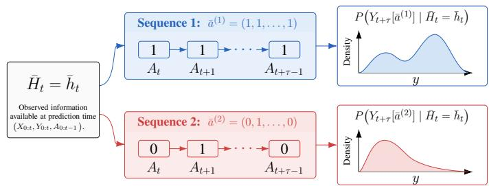
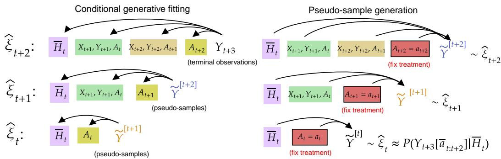

# ORTHOGEN: A GENERATIVE ORTHOGONAL LEARNER FOR TIME-VARYING TREATMENTS

Tomas Garriga\` <sup>1,2,3∗</sup>, Valentyn Melnychuk<sup>4,5</sup>, Konstantin Hess<sup>4,5</sup>,

Eduard Serrahima de Cambra<sup>1</sup>, Axel Brando<sup>2</sup>, Gerard Sanz<sup>1</sup>, Stefan Feuerriegel<sup>4,5</sup>

<sup>1</sup>Novartis

<sup>2</sup>Barcelona Supercomputing Center

<sup>3</sup>Universitat Politecnica de Catalunya\`

<sup>4</sup>LMU Munich

<sup>5</sup>Munich Center for Machine Learning

<sup>∗</sup>Corresponding author: tomas.garriga dicuzzo@novartis.com

## ABSTRACT

Estimating conditional distributional potential outcomes (CDPOs) over time is important in medicine (e.g., to estimate patient-specific risks under different treatment sequences). However, this task is challenging because of time-varying confounding, yet existing adjustment strategies for this task are limited. In this paper, we aim to learn CDPOs under time-varying treatments using flexible generative models. Our contributions are two-fold. (1) We introduce a tailored adjustment strategy for our setting, namely, generative recursive g-computation. Our adjustment strategy recursively propagates full conditional outcome distributions rather than conditional means, modeling the variables of interest directly rather than full trajectories. Building on our adjustment strategy, we formulate simple generative learners for CDPO estimation. However, these learners can be sensitive to nuisance estimation errors, which motivates an orthogonal learner. (2) We thus introduce ORTHOGEN, a Neyman-orthogonal and doubly robust generative learner. Importantly, we show that ORTHOGEN further achieves rate double robustness and quasi-oracle efficiency under suitable conditions. Our learners are flexible and can be instantiated with different generative backbones (e.g., normalizing flows and diffusion models). Across experiments with synthetic, semi-synthetic and real-world datasets, we find that ORTHOGEN is highly effective. To the best of our knowledge, we are the first to propose a generative orthogonal learner for estimating CDPOs under time-varying treatments.

## 1 INTRODUCTION

Estimating the causal effects of time-varying treatments is important in medicine (Feuerriegel et al., 2024). For example, in cancer care, chemotherapy regimens are updated across several treatment cycles (Press et al., 2016), while, in diabetes care, insulin doses are repeatedly adjusted in response to a patient’s health condition (Meneghini et al., 2007). Clinicians therefore need to understand how different treatment sequences affect the patient-level probability of future outcomes, such as tumor size, hypoglycemia, or toxicity. Here, we aim to learn conditional distributional potential outcomes (CDPOs) in time-varying settings, which characterize the distribution of potential outcomes under a given treatment sequence, conditional on the observed patient history (see Fig. 1).

A key challenge in this setting is time-varying confounding (Robins et al., 2000; Frauen et al., 2025; Hess et al., 2026a). Patient characteristics may change over time in response to earlier treatments and, in turn, affect both subsequent treatment decisions and future outcomes. As a result, adjusting only for the patient history observed at the prediction origin is generally insufficient; rather, adjustment strategies over time are needed that account for the future treatment sequence. So far, the existing adjustment strategy for direct learning of CDPOs under time-varying treatments is inverse probability of treatment weighting (IPTW) (Mu et al., 2025). However, IPTW can suffer from unstable weights under limited overlap, especially at large horizons. Thus, the available adjustment strategies for direct generative CDPO estimation in time-varying settings remain limited, and we therefore develop alternative adjustment strategies. Our strategies avoid full simulation of covariate trajectories and model instead the outcomes of interest directly.

Existing methods have important gaps along three dimensions. (1) Static vs. time-varying treatments. Several generative methods learn CDPOs (Yoon et al., 2018; Vanderschueren et al., 2023; Ma et al., 2024; Melnychuk & Feuerriegel, 2026; Luedtke & Fukumizu, 2025). However, these are restricted to static treatment and therefore do not address time-varying treatment sequences. (2) Mean outcome vs. CDPO. Many methods for time-varying treatments learn conditional mean outcomes (e.g., Bica et al., 2020; Melnychuk et al., 2022; Frauen et al., 2025; Hess et al., 2024; 2026a), but not the full outcome distribution. (3) Choice of adjustment strategy. To the best of our knowledge, there is only one generative method for CDPOs under time-varying treatments: Mu et al. (2025) combine IPTW with an expert-guided diffusion model. However, IPTW can suffer from unstable weights and high variance (Frauen et al., 2025). Thus, learners for CDPOs over time based on potentially more stable alternative adjustment strategies, such as g-computation, as well as learners offering favorable properties such as double robustness, are missing.

Here, we aim to learn CDPOs under time-varying treatments using flexible generative models. To address this task, our contributions are two-fold.

1 We introduce a tailored adjustment strategy for our setting, which we call generative recursive g-computation. Our approach extends standard iterative g-computation (Robins, 1986) from conditional mean outcomes to full conditional outcome distributions. The difference is that, instead of recursively propagating conditional expectations (Hess et al., 2026a), we recursively propagate full conditional outcome distributions through a sequence of generative models. Importantly, the recursive construction allows us to directly recover the target outcome distribution at the prediction origin, without simulating complete future covariate trajectories at inference time, which is particularly efficient for longitudinal settings. Building on our adjustment strategy, we develop simple generative learners for CDPO estimation, namely, plug-in and regression-adjusted learners. While straightforward, these learners can be sensitive to nuisance estimation errors, and we thus primarily use these learners to motivate an orthogonal learner ( see 2 ).

2 We then develop ORTHOGEN, a Neyman-orthogonal and doubly robust generative learner for CDPO estimation over time. For this, we combine our generative recursive g-computation with an additional propensity-based adjustment, which makes ORTHOGEN first-order insensitive to nuisance estimation errors ( Theorem 1). ORTHOGEN is flexible and can be instantiated with different generative backbones (e.g., normalizing flows and diffusion models). We further derive two favorable theoretical properties for ORTHOGEN: (i) quasi-oracle efficiency, meaning that the target model can achieve the oracle learning rate even when the nuisance functions are estimated from observational data; and (ii) rate double robustness, meaning a slower convergence rate of one nuisance component can be compensated for by a faster convergence rate of the other, thus being robust to misspecification of either nuisance function ( Theorem 2).

In summary, in this work:<sup>1</sup>(1) We introduce generative recursive g-computation as a tailored adjustment strategy for CDPOs over time. (2) We propose ORTHOGEN, a doubly robust and Neyman-orthogonal generative learner for this task. We show theoretically that ORTHOGEN achieves quasioracle efficiency and rate double robustness. (3) We demonstrate

  
Figure 1: Task: Estimating the CDPOs under different treatment sequences.

the effectiveness of ORTHOGEN using different generative backbones (i.e., normalizing flows and diffusion models) across various experiments. In particular, our experiments demonstrate the benefits of ORTHOGEN over the IPTW-based learner.

## 2 RELATED WORK<sup>2</sup>

(1) Learning CDPOs in static vs. time-varying settings. Several generative methods learn CD-POs in settings with a single static treatment, using different adjustment strategies and generative backbones (Yoon et al., 2018; Vanderschueren et al., 2023; Ma et al., 2024; Luedtke & Fukumizu, 2025). This stream has recently culminated in a general class of learners for static settings called GDR-learners (Melnychuk & Feuerriegel, 2026). Our setting is different in that we consider a sequence of treatment decisions rather than a single treatment decision, which gives rise to timevarying confounding (Robins et al., 2000; Frauen et al., 2025) and therefore requires tailored adjustment strategies over time.

(2) Time-varying treatments with mean outcome vs. CDPO. A broad literature stream develops methods for causal estimation under time-varying treatments with different adjustment strategies but primarily targets the so-called conditional average potential outcomes (CAPOs), i.e., the conditional mean of the potential outcome under

Table 1: Comparison of related approaches for direct learning of distributional potential outcomes over time.
<table><tr><td>Method</td><td>Adjustment</td><td>Backbone</td><td>Modeling target</td><td>Neyman- orthogonality</td></tr><tr><td>Wu et al. (2024)</td><td>IPTW</td><td>CVAE / DM</td><td>X Marginal DPO</td><td>x</td></tr><tr><td>Mu et al. (2025)</td><td>IPTW</td><td>DM</td><td>√CDPO</td><td>x</td></tr><tr><td>PI (ours)</td><td>G.R. g-comp.</td><td>Model agnostic</td><td>√CDPO</td><td>x</td></tr><tr><td>RA (ours)</td><td>G.R. g-comp.</td><td>Model agnostic</td><td>√CDPO</td><td>x</td></tr><tr><td>ORTHOGEN (ours)</td><td>DR</td><td>Model agnostic</td><td>√CDPO</td><td>√</td></tr></table>

Notes: G.R. g-comp. = generative recursive g-computation; CVAE = conditional variational autoencoder; DM = diffusion model; DPO = distributional potential outcome; PI = plug-in; RA = regression-adjusted; DR = doubly robust.

a given treatment sequence (e.g., Lim, 2018; Bica et al., 2020; Melnychuk et al., 2022; Frauen et al., 2025). For CAPOs, there are some efforts to break the curse of dimensionality that is inherent to full simulation g-computation by identifying recursive procedures (Hess et al., 2026a), but these efforts are limited to CAPOs and are not applicable to generative approaches. The aforementioned methods target a different estimand: the conditional mean outcomes or treatment effects, rather than thefull conditional distribution ofpotential outcomes as in our work.

A different stream models the full longitudinal data-generating process (DGP) to enable interventional sampling by simulating complete trajectories (e.g., Li et al., 2021; Xiong et al., 2024; Deng et al., 2025; Yeom et al., 2026; Wu et al., 2026b). However, these works have a different modeling target: they aim to model and simulate the full DGP rather than directly learning the CDPO of the target outcome.

(3) Choice of adjustment strategies for CDPOs over time. Only a few methods directly learn CDPOs under time-varying treatments with explicit confounding adjustment. Wu et al. (2024) use IPTW to learn the marginal potential outcome distribution, which is a related but different estimand. Closest to our work is Mu et al. (2025), who combine IPTW with an expert-guided diffusion model to directly target CDPOs. However, IPTW can suffer from high variance and, most importantly, it is sensitive to nuisance misspecification. The only existing method relies on IPTW adjustment. In contrast, alternative and potentially more favorable adjustment strategies (e.g., g-computation) are missing for our task. As a result, generative learners with favorable learning properties (e.g., Neyman-orthogonality and double robustness) are also missing.

Research gap. There are important gaps in the literature for estimating CDPOs through generative learners under time-varying treatments (see Table 1). To the best of our knowledge, ORTHOGEN is the first learner for this task that is Neyman-orthogonal and doubly robust.

## 3 PROBLEM SETTING

Notation. Capital letters denote random variables and lowercase letters their realizations. We use $P ( Z )$ to denote the distribution of a random variable $Z ,$ whereas $P ( Z = z )$ denotes its density or probability mass function evaluated at z. Expectations are denoted by $\mathbb { E } [ \cdot ]$ . For n observations, we write $\begin{array} { r } { \mathbb { P } _ { n } \mathbf { \bar { [ } } f ] = n ^ { - 1 } \sum _ { i = 1 } ^ { n } f _ { i } } \end{array}$ for the empirical average of a function $f .$ When needed, $\mathbb { P } _ { 0 }$ and $\mathbb { E } _ { 0 }$ denote probability and expectation under the true observed-data distribution, and $\| f \| _ { L ^ { p } ( \mathbb { P } _ { 0 } ) } =$ $\left( \mathbb { E } _ { 0 } \left[ \left| f \right| ^ { p } \right] \right) ^ { 1 / p }$ denotes the corresponding L<sup>p</sup> norm. Estimated quantities are indicated by a hat, as in ${ \widehat { f } } .$ For time series, we write $\bar { U } _ { t } = U _ { 0 : t } = ( U _ { 0 } , \dots , U _ { t } )$

Setup. We follow the standard setup for causal effect estimation with time-varying treatments $( \mathrm { e . g . }$ Bica et al., 2020; Melnychuk et al., 2022; Frauen et al., 2025). We observe n i.i.d. longitudinal trajectories. For patient i, the observed trajectory contains outcomes $Y _ { t } ^ { ( i ) } \in \mathbb { R } ^ { d _ { y } }$ , time-varying covariates $X _ { t } ^ { ( i ) } \in \mathbb { R } ^ { d _ { x } }$ , and treatments $A _ { t } ^ { ( i ) } \in \mathcal { A }$ over time steps $t \in \{ 0 , \ldots , T \}$ . At time $t ,$ we write the observed pre-treatment history as $\bar { H } _ { t } \overline { { = \left( \bar { Y } _ { t } , \bar { X } _ { t } , \bar { A } _ { t - 1 } \right) } }$

Estimand. We fix a prediction origin t and a prediction horizon $\tau \geq 1$ . Within the intervention window, $\delta = 0 , \ldots , \tau - 1$ denotes the relative time offset, and the corresponding absolute treatment time is $t + \delta$ . We aim to learn the CDPO for τ time steps ahead given the interventional treatment sequence $\bar { a } _ { t : t + \tau - 1 } = ( a _ { t } , \dots , a _ { t + \tau - 1 } )$ . We make use of the potential outcomes framework for timevarying settings (Robins et al., 2000; Hernan & Robins, 2025). Specifically,´ $Y _ { t + \tau } [ a _ { t + \delta : t + \tau - 1 } ]$ is the potential outcome at future time step $t + \tau$ under the remaining treatment sequence from relative offset δ. Our aim is to learn the CDPO given by

$$
P \left( Y _ { t + \tau } [ \bar { a } _ { t : t + \tau - 1 } ] \ | \ \bar { H } _ { t } = \bar { h } _ { t } \right) .\tag{1}
$$

Identifiability. In order to ensure identifiability, we follow the standard assumptions for timevarying treatments (Robins, 1986; Hernan & Robins, 2025; Frauen et al., 2025; Hess et al., 2026a):´ (i) Recursive consistency/composition: for every $\delta = 0 , \ldots , \tau - 1$ and every treatment sequence $a _ { t + \delta : t + \tau - 1 }$ under consideration, if $A _ { t + \delta } = a _ { t + \delta }$ , then $Y _ { t + \tau } [ a _ { t + \delta : t + \tau - 1 } ] = Y _ { t + \tau } [ a _ { t + \delta + 1 : t + \tau - 1 } ]$ In particular, if $A _ { t : t + \tau - 1 } = a _ { t : t + \tau - 1 }$ , then $Y _ { t + \underline { { { \tau } } } } [ \bar { a } _ { t : t + \tau - \underline { { { 1 } } } } ] = Y _ { t + \tau \cdot } ~ ( \mathrm { i i } ) ~ P o s i t i \nu i t y \mathrm { : }$ for every $h _ { t + \delta }$ in the support of $\bar { H } _ { t + \delta } , P ( A _ { t + \delta } = a _ { t + \delta } | \bar { H } _ { t + \delta } = \bar { h } _ { t + \delta } ) > 0 , \delta = 0 , \ldots , \tau - 1 . ( \mathrm { i i i }$ ) Sequential exchangeability: for every $\delta = 0 , \ldots , \tau - 1$ and every treatment sequence $a _ { t + \delta : t + \tau - 1 }$ ， ${ \bar { A } } _ { t + \delta } \perp { Y } _ { t + \tau } [ a _ { t + \delta : t + \tau - 1 } ] \mid { \bar { H } } _ { t + \delta } $

The challenge of time-varying confounding. For a treatment sequence $( \tau > 1 )$ , potential outcomes estimation is challenging because confounders may arise after the prediction origin t. A variable observed before a later treatment $A _ { t + \delta } .$ , with $\delta > 0 ,$ may be affected by earlier treatments $A _ { t }$ , while also influencing both the assignment of $A _ { t + \delta }$ and the terminal outcome $Y _ { t + \tau }$ (Robins et al., 2000; Frauen et al., 2025; Hess et al., 2026b). Then, adjusting only for the history $\bar { H } _ { t }$ available at the prediction origin leaves later treatment decisions confounded. Sequential adjustment must instead account for the updated history $\bar { H } _ { t + \delta }$ at each relative treatment step, even though these intermediate histories have not yet occurred when the counterfactual distribution is requested at time t.

Importantly, naıve history adjustment is biased: conditioning on $\bar { H } _ { t }$ and selecting patients for which the observed future treatment sequence equals a¯ generally does not recover the interventional distribution:

$$
\begin{array} { r } { P \left( Y _ { t + \tau \left[ \bar { a } _ { t : t + \tau - 1 } \right] } \mid \bar { H } _ { t } = \bar { h } _ { t } \right) \neq P \left( Y _ { t + \tau } \mid \bar { H } _ { t } = \bar { h } _ { t } , A _ { t : t + \tau - 1 } = a _ { t : t + \tau - 1 } \right) . } \end{array}\tag{2}
$$

The left-hand side is our target, which does not coincide with the na¨ıve history adjustment on the right-hand side, which is thus biased.

## Target generative risk

To estimate the CDPO under a treatment sequence a¯ using a generative model, we seek the best projection of the true counterfactual distribution $P ( Y _ { t + \tau } [ \bar { a } _ { t : t + \tau - 1 } ] \mid \bar { H } _ { t } = \bar { h } _ { t } )$ in a predefined class of generative models $\mathcal { G } .$ . We denote a candidate model by $g _ { \bar { a } } \in \mathcal { G }$ and define the score for an outcome y conditional on the pre-interventional history $\bar { h } _ { t }$ as

$$
\ell _ { g _ { \bar { a } } } ( y , \bar { h } _ { t } ) = \operatorname { \mathbb { E } } _ { Z \sim \varepsilon _ { z } ( \cdot \vert y , \bar { h } _ { t } ) } \left[ \log g _ { \bar { a } } ( y , Z \mid \bar { h } _ { t } ) \right] .\tag{3}
$$

This generic notation allows us to accommodate different generative backbones, such as likelihood-based normalizing flows and diffusion models, through their respective training objectives.<sup>3</sup>

Accordingly, the optimal model within $\mathcal { G }$ is the one that maximizes this oracle target risk

$$
\begin{array} { r } { \mathcal { L } _ { \bar { a } } ( g _ { \bar { a } } ) = \mathbb { E } \left[ \ell _ { g _ { \bar { a } } } \left( Y _ { t + \tau } [ \bar { a } _ { t : t + \tau - 1 } ] , \bar { H } _ { t } \right) \right] . } \end{array}\tag{4}
$$

That is, the model in $\mathcal { G }$ that best approximates the true CDPO according to the chosen generative objective.

This oracle risk provides a target that we use for all learners below. The challenge is that it depends on the unobserved counterfactual outcome $Y _ { t + \tau } [ \bar { a } _ { t : t + \tau - 1 } ]$ and therefore cannot be evaluated directly from observational data.

Outline. 1 Below, we first introduce generative recursive g-computation, which is a tailored adjustment strategy for learning CDPOs under time-varying treatments (Sec. 4). 2 Building on this adjustment strategy, we then introduce a plug-in (PI) learner and a regression-adjusted (RA) learner for CDPO estimation (Sec. 5). 3 Finally, we develop ORTHOGEN and show that it is doubly robust and Neyman-orthogonal (Sec. 6).

## 4 GENERATIVE RECURSIVE G-COMPUTATION

We first introduce generative recursive g-computation, a tailored adjustment strategy for learning CDPOs over time. It builds on g-computation (Robins, 1986), which identifies interventional outcomes by integrating over the longitudinal data-generating process under a specified treatment sequence. We extend this principle from conditional mean outcomes to the full conditional outcome distribution and derive a recursive generative formulation that propagates the required distributional information backward across treatment times. Rather than simulating complete future covariate trajectories, this recursion directly targets the distribution relevant for the final outcome.

Overview. We develop generative recursive g-computation in two steps. First, we define a backward recursion over conditional outcome distributions and show that it identifies the target CDPO at the prediction origin. Second, we show how this recursion can be fitted using generative models through backward pseudo-sample fitting.

Recursive identification of the CDPO. Our goal is to express the target CDPO at the prediction origin through a sequence of quantities that can be identified from the observed data distribution. We proceed backward from the final treatment decision: there, the distribution of the terminal outcome is directly observed conditional on the current history and treatment. We then recursively propagate this distribution backward across earlier treatment decisions by averaging over the subsequent histories that arise under the respective treatment (see Fig. 2).

To formalize this recursion, we define $\{ \xi _ { t + \delta } ^ { \bar { a } } \} _ { \delta = 0 } ^ { \tau - 1 }$ , which we refer to as continuation densities. Intuitively, $\xi _ { t + \delta } ^ { \bar { a } }$ represents the distribution of the terminal outcome that remains to be propagated backward from relative treatment step δ, incorporating the remaining treatment sequence $a _ { t + \delta : t + \tau - 1 }$

Recursion at thefinal treatment stage. Let

$$
\xi _ { t + \tau - 1 } ^ { \bar { a } } ( y \mid \bar { h } _ { t + \tau - 1 } ) = P \Big ( Y _ { t + \tau } = y \Big | \bar { H } _ { t + \tau - 1 } = \bar { h } _ { t + \tau - 1 } , A _ { t + \tau - 1 } = a _ { t + \tau - 1 } \Big ) .\tag{5}
$$

The terminal density can be estimated from the observed outcomes $Y _ { t + \tau }$ of patients receiving $\scriptstyle a _ { t + \tau - 1 }$ at time $t + \tau - 1$

Recursive step from $t + \delta + 1  t + \delta$ . Starting from the final treatment time, we move backward recursively. For $\delta = 0 , \dots , \tau - 2$ , we define

$$
\xi _ { t + \delta } ^ { \bar { a } } ( y \mid \bar { h } _ { t + \delta } ) = \mathbb { E } \left[ \xi _ { t + \delta + 1 } ^ { \bar { a } } ( y \mid \bar { H } _ { t + \delta + 1 } ) \Big \vert \ \bar { H } _ { t + \delta } = \bar { h } _ { t + \delta } , A _ { t + \delta } = a _ { t + \delta } \right] .\tag{6}
$$

At each relative treatment step $\delta ,$ the successor density $\xi _ { t + \delta + 1 } ^ { \bar { a } }$ already incorporates the future treatment values $a _ { t + \delta + 1 } , \dots , a _ { t + \tau - 1 }$ . Hence, the recursion only requires conditioning on the current treatment $A _ { t + \delta } = a _ { t + \delta }$ and averages the successor distribution over the next history $\bar { H } _ { t + \delta + 1 }$

The above construction extends the recursive identification principle of longitudinal g-computation from conditional means (Hess et al., 2026a) to full conditional outcome distributions. The following result shows that each continuation density identifies the distribution of the terminal potential outcome under the remaining treatment sequence and that $\xi _ { t } ^ { \bar { a } }$ identifies the target CDPO in Eq. 1.

Proposition 1. Under the causal assumptions from Sec. 3, for every $\delta = 0 , \ldots , \tau - 1$ , history $\bar { h } _ { t + \delta } ,$ and outcome y, $\xi _ { t + \delta } ^ { \bar { a } } ( y \mid \bar { h } _ { t + \delta } ) = { \overset { \cdot } { P } } \left( \bar { Y } _ { t + \tau } [ a _ { t + \delta : t + \tau - 1 } ] = y \mid \bar { H } _ { t + \delta } = \bar { h } _ { t + \delta } \right)$ . In particular, $\xi _ { t } ^ { \bar { a } } ( y \mid \bar { h } _ { t } ) = P \left( Y _ { t + \tau } [ \bar { a } _ { t : t + \tau - 1 } ] = y \mid \bar { H } _ { t } = \bar { h } _ { t } \right)$

  
Figure 2: Illustration of generative recursive g-computation for τ = 3. Left: Continuation densities are fitted through backward recursion. The terminal density is fitted from observed outcomes among patients receiving the target treatment. At each earlier treatment step $\delta ,$ pseudo-outcomes are sampled from the fitted successor density and used to fit the preceding density. Right: Generating the pseudo-samples that will be used to fit the continuation nuisances at earlier steps.

## Proof. See Appendix D.2.

Fitting the continuation densities. The recursion in Eq. 6 defines the continuation densities, but does not yet provide a way to estimate them with generative models. At the final treatment time, this is straightforward because the corresponding outcomes $Y _ { t + \tau }$ are observed. At earlier treatment times, however, outcomes following the remaining treatment sequence are not observed and therefore cannot be used directly as training targets. We address this challenge recursively: after fitting $\widehat { \xi _ { t + \delta + 1 } ^ { a } }$ , we draw pseudo-outcomes $\widetilde { Y } _ { t + \delta + 1 } \sim \widehat { \xi } _ { t + \delta + 1 } ^ { \bar { a } } ( \cdot  { | \bar { H } _ { t + \delta + 1 } } )$ and fit $\widehat { \xi _ { t + \delta } ^ { a } } ( \cdot \mid \bar { H } _ { t + \delta } )$ to b ethese pseudo-outcomes among observations with $A _ { t + \delta } \stackrel { \cdot } { = } \dot { a _ { t + \delta } }$ , for $\delta = \tau { - } 2 , \ldots , 0 \mathrm { . }$ . This procedure yields the sequence of estimated continuation densities and, in particular, $\widehat { \xi _ { t } ^ { a } }$ as an estimate of the target CDPO. We provide pseudocode in Appendix D.1.

## 5 NA¨IVE GENERATIVE LEARNERS BASED ON RECURSIVE G-COMPUTATION

We build directly on generative recursive g-computation and introduce two generative learners that use its estimated continuation densities in different ways: The plug-in (PI) learner directly uses the fitted continuation density at the prediction origin as an estimate of the CDPO, while the regressionadjusted (RA) learner projects this estimate onto a separate target generative model through the corresponding generative risk.

Plug-in (PI) learner. Proposition 1 shows that the population continuation density at time t equals the target CDPO in Eq. 1. Therefore, the fitted continuation density obtained through generative recursive g-computation at the prediction origin can be used as an estimate of the CDPO. The plugin (PI) learner is

$$
\widehat { P } _ { \mathrm { P I } } ^ { \bar { a } } ( y \mid \bar { h } _ { t } ) = \widehat { \xi } _ { t } ^ { \bar { a } } ( y \mid \bar { h } _ { t } ) .\tag{7}
$$

Regression-adjusted (RA) learner. The regression-adjusted (RA) learner uses the estimated continuation density to construct a generative learning objective over the model class . It follows a two-stage procedure: in Stage 1, generative recursive g-computation is used to estimate the continuation densities; in Stage 2, these estimates define a generative learning objective for fitting a model in . This allows the second-stage model to incorporate, for example, additional regularization, architectural constraints, or interpretability requirements.

To construct this objective, for any candidate model $g _ { \bar { a } } \in \mathcal { G }$ and relative treatment step $\delta ,$ we define the continuation score

$$
m _ { t + \delta } ^ { g _ { \bar { a } } , \bar { a } } ( \bar { H } _ { t + \delta } ) = \int _ { \mathcal { V } } \ell _ { g _ { \bar { a } } } ( y , \bar { H } _ { t } ) \xi _ { t + \delta } ^ { \bar { a } } ( y \mid \bar { H } _ { t + \delta } ) \mathrm { d } y , \qquad \delta = 0 , \ldots , \tau - 1 ,\tag{8}
$$

which is the expected generative score of $g _ { \bar { a } }$ under the continuation density $\xi _ { t + \delta } ^ { \bar { a } }$ . Further, let $\widehat { m } _ { t + \delta } ^ { g _ { \bar { a } } , \bar { a } }$ denote the corresponding quantity obtained by replacing $\xi _ { t + \delta } ^ { \bar { a } }$ with $\widehat { \xi _ { t + \delta } ^ { a } } .$

At the prediction origin, Proposition 1 implies that $\xi _ { t } ^ { \bar { a } }$ equals the target CDPO. Hence, the oracle target risk in Eq. 4 can equivalently be written as $\mathcal { L } _ { \bar { a } } ( g _ { \bar { a } } ) = \mathbb { E } \left[ m _ { t } ^ { g _ { \bar { a } } , \bar { a } } ( \bar { H } _ { t } ) \right]$ . The previous identity suggests replacing the unknown continuation density with the corresponding estimate obtained via generative recursive g-computation. The RA learner is defined by the risk

$$
\begin{array} { r } { \widetilde { \mathcal L } _ { \mathrm { R A } } ^ { \bar { a } } ( g _ { \bar { a } } ) = \mathbb P _ { n } \left[ \widehat { m } _ { t } ^ { g _ { \bar { a } } , \bar { a } } ( \bar { H } _ { t } ) \right] . } \end{array}\tag{9}
$$

Intuitively, the RA learner optimizes the estimated risk over $g _ { \bar { a } } \in \mathcal { G }$ . Thus, the key difference is that the PI learner directly returns $\widehat { \xi _ { t } ^ { a } }$ , whereas the RA learner uses $\widehat { \xi _ { t } ^ { a } }$ to define the learning objective for ba second-stage generative model in $\mathcal { G }$

Thus, our PI and RA learners provide an alternative to the IPTW-based learner, which has been proposed for CDPO estimation over time (Mu et al., 2025) and which we use as another baseline (see Appendix C.1).

An important limitation of the two learners above and IPTW is that they rely on a single nuisance component, which makes the target risk sensitive to nuisance-estimation error at first order (Vansteelandt & Morzywołek, 2025). To eliminate the first-order bias, we develop a Neyman-orthogonal method called ORTHOGEN in the following section.

## 6 ORTHOGEN

We introduce ORTHOGEN for CDPO estimation under time-varying treatments, which, as we show later, enjoys several favorable theoretical properties (e.g., Neyman-orthogonality, double robustness, quasi-oracle efficiency). First, we define the propensity score $\pi _ { t + \delta } ( a _ { t + \delta } | \bar { H } _ { t + \delta } ) =$ = $P ( A _ { t + \delta } = a _ { t + \delta } \mid \bar { H } _ { t + \delta } )$ , for $\bar { \delta } = 0 , \ldots , \tau - 1$ . We then define the one-step inverse-propensity ratio as $r _ { t + \delta } ^ { \bar { a } } = \mathbf { 1 } \{ A _ { t + \delta } = a _ { t + \delta } \} / \pi _ { t + \delta } ( a _ { t + \delta } \ | \ \bar { H } _ { t + \delta } )$ and the corresponding cumulative ratio as $\begin{array} { r } { R _ { t : t + \delta } ^ { \bar { a } } = \prod _ { \delta ^ { \prime } = 0 } ^ { \delta } r _ { t + \delta ^ { \prime } } ^ { \bar { a } } } \end{array}$ , with the empty-product convention $R _ { t : t - 1 } ^ { \bar { a } } = 1$

ORTHOGEN is defined by the risk:

$$
\widehat { \mathcal { L } } _ { \mathrm { O r t h o G e n } } ^ { \bar { a } } ( g _ { \bar { a } } ) = \mathbb { P } _ { n } \left[ \widehat { R } _ { t : t + \tau - 1 } ^ { \bar { a } } \ell _ { g _ { \bar { a } } } ( Y _ { t + \tau } , \bar { H } _ { t } ) + \sum _ { \delta = 0 } ^ { \tau - 1 } \widehat { R } _ { t : t + \delta - 1 } ^ { \bar { a } } \left( 1 - \widehat { r } _ { t + \delta } ^ { \bar { a } } \right) \widehat { m } _ { t + \delta } ^ { g _ { \bar { a } } , \bar { a } } ( \bar { H } _ { t + \delta } ) \right] .\tag{10}
$$

Estimation. ORTHOGEN proceeds in two stages: First, we estimate the nuisance functions $\hat { \eta } =$ $\left( \{ \hat { \pi } _ { t + \delta } \} _ { \delta = 0 } ^ { \tau - 1 } , \{ \hat { \xi } _ { t + \delta } ^ { \bar { a } } \} _ { \delta = 0 } ^ { \tau - 1 } \right)$ . Second, we fit the target generative model using the objective in Eq. 10. The estimated propensity scores yield the one-step and cumulative inverse propensity ratios $\widehat { r _ { t + \delta } ^ { a } }$ and $\widehat { R } _ { t : t + \delta } ^ { \bar { a } }$ bdefined above, while the estimated continuation densities determine the continuation bscores $\widehat { m } _ { t + \delta } ^ { g _ { \bar { a } } , \bar { a } }$ through Eq. 8. ORTHOGEN is model agnostic and we instantiate it with two generative models: normalizing flows and diffusion models.

## 6.1 THEORETICAL PROPERTIES

ORTHOGEN has several favorable asymptotic properties. First, it is Neyman-orthogonal, that is, first-order insensitive to the errors in the nuisance functions. The following theorem derives this property for ORTHOGEN:

Theorem 1 (Neyman-orthogonality). Under the causal assumptions in Sec. 3, the objective is Neyman-orthogonal at $( g _ { \bar { a } } ^ { \star } , \bar { \eta } )$ , namely

$$
D _ { \eta } D _ { g _ { \bar { a } } } \mathcal { L } _ { \mathrm { O r t h o G e n } } ^ { \bar { a } } ( g _ { \bar { a } } ^ { \star } ; \eta ) \big [ g _ { \bar { a } } - g _ { \bar { a } } ^ { \star } , \tilde { \eta } - \eta \big ] = 0 ,\tag{11}
$$

for every $g _ { \bar { a } } \in \mathcal { G }$ and every admissible nuisance perturbation $\tilde { \eta } ,$ where $D \mathcal { L } ( \cdot ) [ \cdot ]$ denotes the pathwise derivative (see Appendix E.1 for definitions).

Proof. See Appendix E.1.

Second, ORTHOGEN is quasi-oracle efficient and doubly robust. To formalize these properties, we define the fitted second-stage target generator as $\widehat { g } _ { \bar { a } } \in \mathcal { G }$ and its conditional population targetlearning error as $\begin{array} { r } { \mathrm { O p t } _ { \mathscr G } ^ { \bar { a } } : = \mathrm { s u p } _ { g _ { \bar { a } } \in \mathscr G } \bar { \mathscr L } _ { \mathrm { O r t h o G e n } } ^ { \bar { a } } ( g _ { \bar { a } } ; \widehat { \eta } ) - \mathscr L _ { \mathrm { O r t h o G e n } } ^ { \bar { a } } ( \widehat { g _ { \bar { a } } } ; \widehat { \eta } ) } \end{array}$ . Thus, $\mathrm { { \dot { O } p t } } _ { \mathcal { G } } ^ { \bar { a } }$ measures how well the second-stage target generator is learned while holding the estimated nuisance functions fixed.

Theorem 2 (Quasi-oracle efficiency and double robustness). Under mild regularity conditions for the target model, the squared distance between thefitted target generator $\widehat { g } _ { \bar { a } }$ and the oracle population maximizer $g _ { \bar { a } } ^ { \star }$ can be upper-bounded in the following way:

$$
| | \widehat { g } _ { \bar { a } } - g _ { \bar { a } } ^ { \star } | | _ { \mathcal { G } } ^ { 2 } \lesssim \underbrace { \mathrm { O p t } _ { \mathcal { G } } ^ { \bar { a } } } _ { \mathrm { ( I ) ~ t a r g e t - m o d e l ~ l e a r n i n g ~ e r r o r } } + \underbrace { \left[ \sum _ { \delta = 0 } ^ { \tau - 1 } \big | | \widehat { \pi } _ { t + \delta } - \pi _ { t + \delta } | \big | _ { L ^ { 4 } ( \mathbb { P } _ { 0 } ) } | | \widehat { \xi } _ { t + \delta } ^ { \widehat { a } } - \xi _ { t + \delta } ^ { \bar { a } } \big | \big | _ { 4 , 2 } \right] ^ { 2 } } _ { \mathrm { ( I I ) ~ h i g h e r - o r d e r ~ n u i s a r e ~ e r r o r } } ,\tag{12}
$$

where $\| \cdot \| _ { \mathcal { G } }$ denotes a model-specific norm, (I) is a standard target-model learning error term, and (II) is a higher-order nuisance error term. This bound implies that ORTHOGEN is (a) doubly robust and (b) quasi-oracle efficient.

Proof. See Appendix E.2.

Theorem 2 decomposes the target-model error into a second-stage learning error and a higher-order contribution from nuisance estimation. Crucially, the latter depends on products of the stagewise propensity and continuation density errors rather than on either nuisance error alone. This product structure yields the following rate-robustness property.

Remark 1 (Rate double robustness). Let $\rho _ { n }$ be the learning rate ofthe target model, and let $\varepsilon _ { \pi , t + \delta , r }$ and $\varepsilon _ { \xi , t + \delta , n }$ be the convergence rates of the propensity and continuation density nuisances at relative treatment step δ, respectively. Because nuisance estimation enters through $\varepsilon _ { \pi , t + \delta , n } \varepsilon _ { \xi , t + \delta , }$ <sub>n</sub>, faster convergence of one nuisance component can offset slower convergence of the other. In particular, $\begin{array} { r } { i f \sum _ { \delta = 0 } ^ { \tau - 1 } \varepsilon _ { \pi , t + \delta , n } \varepsilon _ { \xi , t + \delta , n } = o ( \rho _ { n } ) } \end{array}$ , then nuisance estimation is asymptotically negligible and ORTHOGEN attains the samefirst-order rate as an oracle learner with known nuisances. More generally, if the product term is $O ( \rho _ { n } )$ , nuisance estimation does not worsen the learning rate for the target model;for example, two $n ^ { - 1 / 4 }$ nuisance rates yield an $n ^ { - 1 / 2 }$ product term.

## 7 EVALUATION

In this section, we evaluate our learners through several numerical experiments across synthetic, semi-synthetic, and real-world datasets to assess their effectiveness.

Table 2: Synthetic data.
<table><tr><td></td><td>Method</td><td>τ = 1</td><td>τ = 2</td><td>τ = 3</td><td>τ = 4</td><td></td><td>τ = 5</td></tr><tr><td></td><td>PI</td><td>0.308 ± 0.004</td><td> $0 . 2 3 5 \pm 0 . 0 0 7$ </td><td></td><td>0.350 ± 0.015</td><td> $0 . 2 4 9 \pm 0 . 0 1 0$ </td><td> $\mathbf { 0 . 3 4 4 \pm 0 . 0 1 5 }$ </td></tr><tr><td>NFs</td><td>RA</td><td>0.320 ± 0.008</td><td>0.232 ± 0.008</td><td> $\begin{array} { r } { 0 . 3 4 7 \pm 0 . 0 1 5 } \\ { 0 . 3 7 3 + 0 . 0 1 5 } \end{array}$ </td><td></td><td>0.247 ± 0.008</td><td> $\phantom { + } 0 . 3 4 8 \pm 0 . 0 1 8$ </td></tr><tr><td></td><td>IPTW</td><td>0.325 ± 0.009</td><td> $0 . 2 4 0 \overset { \cdot } { \pm } 0 . 0 0 2$ </td><td> $0 . 3 7 3 \pm 0 . 0 1 5$ </td><td></td><td> $0 . 3 0 5 \pm 0 . 0 1 9$ </td><td> $0 . 5 1 8 \pm 0 . 0 6 2$ </td></tr><tr><td></td><td>ORTHOGEN</td><td> $0 . 3 1 2 \stackrel { } { \pm } 0 . 0 0 5$ </td><td> $\mathbf { 0 . 2 2 9 \overset { - } { \pm } 0 . 0 0 9 }$ </td><td></td><td>0.342 ± 0.011</td><td> $0 . 2 6 7 \pm 0 . 0 1 5$ </td><td> $0 . 4 0 1 \pm 0 . 0 5 1$ </td></tr><tr><td></td><td>PI</td><td>0.306 ± 0.013</td><td> $0 . 3 1 2 \pm 0 . 0 2 5$ </td><td></td><td>0.506 ± 0.038</td><td>0.482 ± 0.015</td><td>0.612 ± 0.014</td></tr><tr><td></td><td>RA</td><td>0.411 ± 0.030</td><td> $\smash { 0 . 4 0 4 \pm 0 . 0 1 8 }$ </td><td></td><td>0.610 ± 0.032</td><td> $0 . 5 3 7 \pm 0 . 0 2 5$ </td><td> $0 . 6 5 1 \pm 0 . 0 1 9$ </td></tr><tr><td>DMs</td><td>IPTW</td><td>0.341 ± 0.026</td><td> $0 . 2 8 4 \overset { \sim } { \pm } 0 . 0 2 0$ </td><td></td><td> $0 . 4 4 7 \pm 0 . 0 5 3$ </td><td> $0 . 3 8 6 \pm 0 . 0 4 8$ </td><td>0.522 ± 0.055</td></tr><tr><td></td><td>ORTHOGEN</td><td> $0 . 3 2 9 \pm 0 . 0 1 \dot { 4 }$ </td><td></td><td></td><td>0.244 ± 0.012 0.378 ± 0.017 0.293 ± 0.026 0.383 ± 0.024</td><td></td><td></td></tr></table>

Instantiations. We instantiate the sequence encoder using a transformer (Vaswani et al., 2017), which processes the observed pre-interventional history to produce a low-dimensional context representation fed to the nuisance and target models. For the generative models, we em-

Reported: squared 2-Wasserstein costs across treatment horizons τ. Values are mean standard deviation over 5 replicates; lower is better

ploy two complementary state-of-the-art approaches: (i) normalizing flows (NFs) (Rezende & Mohamed, 2015) and (ii) diffusion models (DMs) (Ho et al., 2020). See Appendix B for more details. In both cases, we use the same generative backbone for both the continuation density nuisances and the target generative model. Our transformer implementation follows an encoder-only design similar to Frauen et al. (2025) and Hess & Feuerriegel (2025). Both generative model families receive the learned context representation and generate samples conditionally on the learned history representation. Details are in Appendix G.

Datasets. Following common practice in causal inference (Bica et al., 2020; Melnychuk et al., 2022), we use synthetic and semi-synthetic datasets for evaluation as they provide ground truths for counterfactuals, while we use a real-world dataset to assess the applicability of our learners and discuss potential insights. We thus evaluate on three datasets; see Appendix F for full details. 1 A fully synthetic benchmark generated from a longitudinal data-generating process with treatment– confounder feedback, a scalar time-varying covariate, and a three-dimensional continuous target outcome, where the components are mixture distributions based on Gaussian and asymmetric-Laplace components and are correlated with each other. 2 A semi-synthetic benchmark built from real patient trajectories extracted from MIMIC-III (Johnson et al., 2016). 3 The real-world MIMIC-III benchmark (Johnson et al., 2016) based on previous cohort construction and covariates, but where we retain the factual treatments and a one-dimensional observed outcome from the ICU records. All three datasets use 3,000 training, 1,000 validation, and 1,000 test trajectories.

Training. Our implementation follows a two-stage procedure. First, the propensity scores are estimated using a binary classifier predicting treatment assignment at each decision point from the transformer representation, while the continuation densities are learned through generative recursive g-computation. Hence, the terminal model is fitted to observed factual outcomes, and earlier continuation models are subsequently trained on pseudo-outcomes sampled from frozen successor models using Monte Carlo sampling to estimate expectations. Then, the target generator of ORTHOGEN is fitted using the objective in Eq. 10. See further details on architectures and hyperparameter selection in Appendix G.1 and G.2 and in the code. We provide runtime information in Appendix H.

Table 3: Semi-synthetic data.
<table><tr><td></td><td>Method</td><td> ${ \boldsymbol { \tau } } = \mathbf { 1 }$ </td><td> $\tau = 2$ </td><td> $\tau = 3$ </td><td> $\tau = 4$ </td><td></td><td> ${ \boldsymbol { \tau } } = 5$ </td></tr><tr><td rowspan="4">NFs</td><td>PI</td><td> $1 . 1 3 \pm 0 . 3 9$ </td><td> $1 . 4 6 \pm 0 . 7 0$ </td><td></td><td> $1 . 5 9 \pm 0 . 2 1$ </td><td>1.78 ± 0.67</td><td> $2 . 5 5 \pm 0 . 5 8$ </td></tr><tr><td>RA</td><td> $1 . 2 2 \pm 0 . 3 3$ </td><td> $1 . 2 2 \pm 0 . 5 5$ </td><td></td><td> $1 . 4 7 \pm 0 . 2 3$ </td><td> $1 . 5 9 \pm 0 . 4 4$ </td><td> $2 . 2 2 \pm 0 . 5 2$ </td></tr><tr><td>IPTW</td><td> $0 . 7 8 \overset { - } { \pm } 0 . \overset { - } { 1 } \overset { - } { 1 }$ </td><td> $0 . 6 7 \pm 0 . 2 0$ </td><td></td><td> $1 . 4 5 \pm 0 . 5 7$ </td><td> $0 . 9 2 \pm 0 . 2 2$ </td><td> $2 . 0 6 \pm 0 . 8 7$ </td></tr><tr><td>ORTHOGEN</td><td> $\mathbf { 0 . 4 9 \overset { - } { \pm } 0 . 0 9 }$ </td><td></td><td></td><td>0.47 ± 0.13 0.91 ± 0.13</td><td> $\mathbf { 0 . 7 3 \overset { - } { \pm } 0 . 2 2 }$ </td><td> ${ \bf 1 . 2 3 \pm 0 . 4 5 }$ </td></tr><tr><td rowspan="4">DMs</td><td>PI</td><td> $0 . 5 6 \pm 0 . 0 6$ </td><td> $0 . 5 9 \pm 0 . 1 3$ </td><td></td><td> $0 . 8 1 \pm 0 . 3 2$ </td><td> $0 . 9 3 \pm 0 . 3 6$ </td><td> $0 . 9 3 \pm 0 . 3 6$ </td></tr><tr><td>RA</td><td> $0 . 6 3 \pm 0 . 0 8$ </td><td> $0 . 7 4 \pm 0 . 2 0$ </td><td></td><td> $0 . 9 9 \pm 0 . 3 8$ </td><td> $1 . 0 9 \pm 0 . 3 9$ </td><td> $1 . 0 9 \pm 0 . 4 1$ </td></tr><tr><td>IPTW</td><td> $0 . 4 7 \pm 0 . 1 0$ </td><td> $0 . 6 2 \pm 0 . 2 7$ </td><td></td><td> $1 . 4 3 \pm 0 . 6 8$ </td><td> $1 . 7 7 \pm 0 . 7 9$ </td><td> $2 . 4 9 \pm 0 . 5 0$ </td></tr><tr><td>ORTHOGEN</td><td> $\mathbf { 0 . 4 5 \pm 0 . 0 5 }$ </td><td></td><td></td><td></td><td>0.50 ± 0.10 0.74 ± 0.21 0.88 ± 0.30</td><td> ${ \bf 0 . 7 7 \pm 0 . 1 8 }$ </td></tr></table>

Reported: squared $\mathrm { ? . W a s s e r s t e i n c o s t s \times 1 0 ^ { - 2 } }$ across treatment horizons τ. Values are mean standard deviation over 5 replicates; lower is better.

Sec. 5. As a result, we can isolate the benefit of the doubly robust and Neyman-orthogonal adjustment approach in ORTHOGEN. Importantly, all baselines are instantiated with the same transformer architecture and generative backbones to ensure afair comparison.

Baselines. To the best of our knowledge, the IPTW from Mu et al. (2025) is the only applicable baseline for direct learning of CDPOs. Other methods solve different estimands (e.g., CAPOs but not CDPOs, so that the full distributional information is lost). We thus additionally benchmark ORTHOGEN against two na¨ıve learners: PI and RA from

Metrics. For the 1 fully synthetic and 2 semi-synthetic datasets, we can obtain ground-truth interventional outcome samples from the simulation: for each test sample, we generate samples from the fitted model and matched oracle samples under the target regime. We compare the resulting predictive distributions using the squared 2-Wasserstein cost, which measures discrepancy between empirical outcome distributions. 3 For the real-world MIMIC-III dataset, no oracle counterfactual distribution is available. We thus assess factual predictive accuracy using the continuous ranked probability score (CRPS), which is a proper scoring rule for one-dimensional predictive distributions that requires only the observed factual outcome. Predictions are made under the target treatment sequence, and CRPS is computed only for held-out patients whose observed treatment sequence exactly matches the target. See Appendix F for details.

Results. Overall, our results demonstrate the theoretical benefits of ORTHOGEN across different datasets and generative backbones. 1 On the fully synthetic benchmark (Table 2), ORTHOGEN performs particularly strongly with DMs and remains highly competitive with NFs. Importantly, for $\tau > 1$ , ORTHOGEN consistently outperforms the PI learner, with its advantage becoming increasingly pronounced at longer treatment horizons. This pattern is consistent with the robust-

Table 4: Real-world data.
<table><tr><td></td><td>Method</td><td>τ = 1</td><td> $\tau = 3$ </td><td> $\tau = 5$ </td></tr><tr><td rowspan="4">NFs</td><td>PI</td><td> $0 . 3 3 8 \pm 0 . 0 0 5$ </td><td> $0 . 4 1 7 \pm 0 . 0 0 6$ </td><td> $0 . 4 5 9 \pm 0 . 0 1 4$ </td></tr><tr><td>RA</td><td> $0 . 3 2 9 \pm 0 . 0 0 4$ </td><td> $0 . 4 0 5 \pm 0 . 0 0 7$ </td><td>0.453 ± 0.015</td></tr><tr><td>IPTW</td><td> $0 . 3 1 9 \pm 0 . 0 0 6$ </td><td> $0 . 4 1 0 \pm 0 . 0 0 4$ </td><td> $0 . 4 5 7 \pm 0 . 0 1 2$ </td></tr><tr><td>ORTHOGEN</td><td> $\mathbf { 0 . 3 0 7 \pm 0 . 0 0 7 }$ </td><td> $\mathbf { 0 . 3 8 7 \pm 0 . 0 0 7 }$ </td><td> $\mathbf { 0 . 4 4 2 \pm 0 . 0 1 3 }$ </td></tr><tr><td rowspan="4">DMs</td><td>PI</td><td> $\mathbf { 0 . 3 1 4 \pm 0 . 0 0 8 }$ </td><td> $0 . 4 2 8 \pm 0 . 0 0 5$ </td><td> $0 . 5 0 0 \pm 0 . 0 0 7$ </td></tr><tr><td>RA</td><td> $0 . 3 3 0 \pm 0 . 0 0 7$ </td><td> $0 . 4 4 6 \pm 0 . 0 0 5$ </td><td> $0 . 5 0 6 \pm 0 . 0 0 5$ </td></tr><tr><td>IPTW</td><td> $0 . 3 4 7 \pm 0 . 0 2 0$ </td><td> $\mathbf { 0 . 4 2 6 \pm 0 . 0 1 9 }$ </td><td> $\mathbf { 0 . 4 7 2 \pm 0 . 0 1 1 }$ </td></tr><tr><td>ORTHOGEN</td><td> $0 . 3 3 0 \pm 0 . 0 1 7$ </td><td> $0 . 4 3 2 \pm 0 . 0 1 8$ </td><td> $0 . 4 7 5 \pm 0 . 0 2 0$ </td></tr></table>

Reported are factual matching CRPS values across treatment horizons τ. Values are mean standard deviation over 5 replicates; lower is better.

ness benefits predicted by our theoretical analysis: as the treatment horizon grows and nuisance estimation becomes more challenging, the doubly robust and Neyman-orthogonal adjustment of OR-THOGEN yields increasingly substantial gains over the alternative learners. 2 On the semi-synthetic benchmark (Table 3), ORTHOGEN consistently achieves the lowest Wasserstein cost across all treatment horizons and for both NFs and DMs, and the gains again become larger for longer horizons, which confirms the theoretical properties of ORTHOGEN due to Neyman-orthogonality. 3 Finally, on the real-world benchmark (Table 4), ORTHOGEN achieves the lowest factual CRPS across all horizons with NFs. Again, ORTHOGEN is effective across different backbones. Taken together, these results demonstrate the benefits of the doubly robust and Neyman-orthogonal construction of ORTHOGEN, which yields substantial improvements over the alternative learners, particularly at longer treatment horizons.

Conclusion. We introduced ORTHOGEN, the first doubly robust and Neyman-orthogonal generative learner for CDPO estimation under time-varying treatments, built on our generative recursive gcomputation strategy. We showed that ORTHOGEN achieves rate double robustness and quasi-oracle efficiency, and performs effectively across synthetic, semi-synthetic, and real-world benchmarks with different generative backbones.

## ACKNOWLEDGMENTS

We gratefully acknowledge Novartis for sponsoring Tomas Garriga’s industrial PhD. We also\` thank the Government of Catalonia’s Industrial PhDs Plan for funding part of this research. We acknowledge Horizon Europe Programme under the AI4DEBUNK Project (https://www. ai4debunk.eu), grant agreement num. 101135757. This work has also been supported by the German Federal Ministry of Education and Research (Grant: 01IS24082).

## REFERENCES

Ioana Bica, Ahmed M Alaa, James Jordon, and Mihaela van der Schaar. Estimating counterfactual treatment outcomes over time through adversarially balanced representations. In International Conference on Learning Representations, 2020.

Leon Deng, Hong Xiong, Feng Wu, Sanyam Kapoor, Soumya Gosh, Zach Shahn, and Li-wei Lehman. Uncertainty quantification for conditional treatment effect estimation under dynamic treatment regimes. In Stefan Hegselmann, Helen Zhou, Elizabeth Healey, Trenton Chang, Caleb Ellington, Vishwali Mhasawade, Sana Tonekaboni, Peniel Argaw, and Haoran Zhang (eds.), Proceedings of the 4th Machine Learning for Health Symposium, volume 259 of Proceedings of Machine Learning Research, pp. 248–266. PMLR, 15–16 Dec 2025.

Stefan Feuerriegel, Dennis Frauen, Valentyn Melnychuk, Jonas Schweisthal, Konstantin Hess, Alicia Curth, Stefan Bauer, Niki Kilbertus, Isaac S Kohane, and Mihaela van der Schaar. Causal machine learning for predicting treatment outcomes. Nature Medicine, 30(4):958–968, 2024.

Dennis Frauen, Konstantin Hess, and Stefan Feuerriegel. Model-agnostic meta-learners for estimating heterogeneous treatment effects over time. In The Thirteenth International Conference on Learning Representations, 2025.

Tomas Garriga, Gerard Sanz, Eduard Serrahima de Cambra, and Axel Brando. CEPAE: Conditional entropy-penalized autoencoders for time series counterfactuals. Transactions on Machine Learning Research, 2026. ISSN 2835-8856. URL https://openreview.net/forum? id=X6lrzqOtQo.

Miguel A. Hernan and James M. Robins.´ Causal Inference: What If. Chapman & Hall/CRC, Boca Raton, 2025.

Konstantin Hess and Stefan Feuerriegel. Stabilized neural prediction of potential outcomes in continuous time. In The Thirteenth International Conference on Learning Representations, 2025.

Konstantin Hess, Valentyn Melnychuk, Dennis Frauen, and Stefan Feuerriegel. Bayesian neural controlled differential equations for treatment effect estimation. In The Twelfth International Conference on Learning Representations, 2024.

Konstantin Hess, Dennis Frauen, Valentyn Melnychuk, and Stefan Feuerriegel. IGC-net for conditional average potential outcome estimation over time. In The Fourteenth International Conference on Learning Representations, 2026a.

Konstantin Hess, Dennis Frauen, Mihaela van der Schaar, and Stefan Feuerriegel. Overlap-weighted orthogonal meta-learner for treatment effect estimation over time. In The Fourteenth International Conference on Learning Representations, 2026b. URL https://openreview.net/ forum?id=0Xi3WDwd5w.

Jonathan Ho, Ajay Jain, and Pieter Abbeel. Denoising diffusion probabilistic models. Advances in neural information processing systems, 33:6840–6851, 2020.

Alistair EW Johnson, Tom J Pollard, Lu Shen, Li-wei H Lehman, Mengling Feng, Mohammad Ghassemi, Benjamin Moody, Peter Szolovits, Leo Anthony Celi, and Roger G Mark. Mimic-iii, a freely accessible critical care database. Scientific data, 3(1):160035, 2016.

Edward H Kennedy, Sivaraman Balakrishnan, and LA Wasserman. Semiparametric counterfactual density estimation. Biometrika, 110(4):875–896, 2023.

Soren R K¨ unzel, Jasjeet S Sekhon, Peter J Bickel, and Bin Yu. Metalearners for estimating heteroge-¨ neous treatment effects using machine learning. Proceedings of the national academy of sciences, 116(10):4156–4165, 2019.

Rui Li, Stephanie Hu, Mingyu Lu, Yuria Utsumi, Prithwish Chakraborty, Daby M Sow, Piyush Madan, Jun Li, Mohamed Ghalwash, Zach Shahn, et al. G-net: a recurrent network approach to g-computation for counterfactual prediction under a dynamic treatment regime. In Machine Learning for Health, pp. 282–299. PMLR, 2021.

Bryan Lim. Forecasting treatment responses over time using recurrent marginal structural networks. Advances in neural information processing systems, 31, 2018.

Christos Louizos, Uri Shalit, Joris Mooij, David Sontag, Richard Zemel, and Max Welling. Causal effect inference with deep latent-variable models. In I. Guyon, U. Von Luxburg, S. Bengio, H. Wallach, R. Fergus, S. Vishwanathan, and R. Garnett (eds.), Advances in Neural Information Processing Systems, volume 30. Curran Associates, Inc., 2017.

Alex Luedtke and Kenji Fukumizu. Doublegen: Debiased generative modeling of counterfactuals. arXiv preprint arXiv:2509.16842, 2025.

Yuchen Ma, Valentyn Melnychuk, Jonas Schweisthal, and Stefan Feuerriegel. Diffpo: A causal diffusion model for learning distributions of potential outcomes. Advances in Neural Information Processing Systems, 37:43663–43692, 2024.

Valentyn Melnychuk and Stefan Feuerriegel. Gdr-learners: Orthogonal learning of generative models for potential outcomes. In International Conference on Learning Representations, 2026.

Valentyn Melnychuk, Dennis Frauen, and Stefan Feuerriegel. Causal transformer for estimating counterfactual outcomes. In International conference on machine learning, pp. 15293–15329. PMLR, 2022.

Valentyn Melnychuk, Dennis Frauen, and Stefan Feuerriegel. Normalizing flows for interventional density estimation. In International Conference on Machine Learning, pp. 24361–24397. PMLR, 2023.

Luigi Meneghini, Claudia Koenen, Wen Weng, and Jean-Louis Selam. The usage of a simplified self-titration dosing guideline (303 algorithm) for insulin detemir in patients with type 2 diabetes: results of the randomized, controlled predictive 303 study. Diabetes, Obesity and Metabolism, 9 (6):902–913, 2007. doi: 10.1111/j.1463-1326.2007.00804.x.

Wenhao Mu, Zhi Cao, Mehmed Uludag, and Alexander Rodr´ıguez. Counterfactual probabilistic diffusion with expert models. arXiv preprint arXiv:2508.13355, 2025.

George Papamakarios, Eric Nalisnick, Danilo Jimenez Rezende, Shakir Mohamed, and Balaji Lakshminarayanan. Normalizing flows for probabilistic modeling and inference. Journal of Machine Learning Research, 22(57):1–64, 2021.

Alvaro Parafita and Jordi Vitria. Estimand-agnostic causal query estimation with deep causal graphs. IEEE Access, 10:71370–71386, 2022.

Nick Pawlowski, Daniel Coelho de Castro, and Ben Glocker. Deep structural causal models for tractable counterfactual inference. In H. Larochelle, M. Ranzato, R. Hadsell, M.F. Balcan, and H. Lin (eds.), Advances in Neural Information Processing Systems, volume 33, pp. 857–869. Curran Associates, Inc., 2020.

Oliver W. Press, Hongli Li, Heiko Schoder, David J. Straus, Craig H. Moskowitz, et al. Us inter-¨ group trial of response-adapted therapy for stage iii to iv hodgkin lymphoma using early interim fluorodeoxyglucose-positron emission tomography imaging: Southwest oncology group s0816. Journal ofClinical Oncology, 34(17):2020–2027, 2016. doi: 10.1200/JCO.2015.63.1119.

Danilo Rezende and Shakir Mohamed. Variational inference with normalizing flows. In International conference on machine learning, pp. 1530–1538. PMLR, 2015.

James M. Robins. A new approach to causal inference in mortality studies with a sustained exposure period—application to control of the healthy worker survivor effect. Mathematical Modelling, 7 (9-12):1393–1512, 1986.

James M Robins, Miguel Angel Hernan, and Babette Brumback. Marginal structural models and causal inference in epidemiology. Epidemiology, 11(5):550–560, 2000.

Pedro Sanchez and Sotirios A. Tsaftaris. Diffusion causal models for counterfactual estimation. In First Conference on Causal Learning and Reasoning, 2022. URL https://openreview. net/forum?id=LAAZLZIMN-o.

Uri Shalit, Fredrik D Johansson, and David Sontag. Estimating individual treatment effect: generalization bounds and algorithms. In International conference on machine learning, pp. 3076–3085. PMLR, 2017.

Sarah L Taubman, James M Robins, Murray A Mittleman, and Miguel A Hernan. Intervening on´ risk factors for coronary heart disease: an application of the parametric g-formula. International journal of epidemiology, 38(6):1599–1611, 2009.

Toon Vanderschueren, Jeroen Berrevoets, and Wouter Verbeke. NOFLITE: Learning to predict individual treatment effect distributions. Transactions on Machine Learning Research, 2023. ISSN 2835-8856.

Stijn Vansteelandt and Paweł Morzywołek. Orthogonal prediction of counterfactual outcomes. Journal of Causal Inference, 13(1):20240051, 2025.

Ashish Vaswani, Noam Shazeer, Niki Parmar, Jakob Uszkoreit, Llion Jones, Aidan N Gomez, Łukasz Kaiser, and Illia Polosukhin. Attention is all you need. Advances in neural information processing systems, 30, 2017.

Shirly Wang, Matthew BA McDermott, Geeticka Chauhan, Marzyeh Ghassemi, Michael C Hughes, and Tristan Naumann. Mimic-extract: A data extraction, preprocessing, and representation pipeline for mimic-iii. In Proceedings of the ACM conference on health, inference, and learning, pp. 222–235, 2020.

Dongze Wu, David I. Inouye, and Yao Xie. Flow-based generative modeling of potential outcomes and counterfactuals, 2026a. URL https://arxiv.org/abs/2505.16051.

Dongze Wu, Feng Qiu, and Yao Xie. Doflow: Flow-based generative models for interventional and counterfactual forecasting on time series. In The Fourteenth International Conference on Learning Representations, 2026b.

Shenghao Wu, Wenbin Zhou, Minshuo Chen, and Shixiang Zhu. Counterfactual generative models for time-varying treatments. In Proceedings of the 30th ACM SIGKDD Conference on Knowledge Discovery and Data Mining, pp. 3402–3413, 2024.

Hong Xiong, Feng Wu, Leon Deng, Megan Su, and Li-wei H. Lehman. G-transformer: Counterfactual outcome prediction under dynamic and time-varying treatment regimes. In Kaivalya Deshpande, Madalina Fiterau, Shalmali Joshi, Zachary Lipton, Rajesh Ranganath, and Inigo Urteaga˜ (eds.), Proceedings ofthe 9th Machine Learningfor Healthcare Conference, volume 252 of Proceedings ofMachine Learning Research. PMLR, 16–17 Aug 2024.

Ling Yang, Zhilong Zhang, Yang Song, Shenda Hong, Runsheng Xu, Yue Zhao, Wentao Zhang, Bin Cui, and Ming-Hsuan Yang. Diffusion models: A comprehensive survey of methods and applications. ACM computing surveys, 56(4):1–39, 2023.

Yoonseok Yeom, Jonghwan Kim, Taehui Yun, Juhyun Lyu, Jung-Hee Kim, Sangmin Lee, Jinseok Yang, Hyemin Jung, Woohyung Lim, and Sanghack Lee. Estimating interventional outcomes over time with causal normalizing flow. In Forty-Second Annual Conference on Uncertainty in Artificial Intelligence, 2026.

Jinsung Yoon, James Jordon, and Mihaela Van Der Schaar. Ganite: Estimation of individualized treatment effects using generative adversarial nets. In International conference on learning representations, 2018.

## APPENDIX CONTENTS

A Extended Related Work 15   
B Generative Model Instantiations 15   
B.1 Conditional normalizing flows 15   
B.2 Conditional diffusion models 16   
C Additional Learner Details and Risk Representations 17   
C.1 IPTW learner 17   
C.2 Oracle-risk representation of the RA learner 17   
C.3 Oracle-risk representation of the IPTW learner 18   
D Generative Recursive G-Computation 19   
D.1 Pseudocode for generative recursive g-computation 19   
D.2 Proof of Proposition 1 . 20   
E Theoretical Properties of ORTHOGEN 21   
E.1 Neyman-orthogonality . 21   
E.2 Double robustness and quasi-oracle efficiency 24   
F Dataset Details 28   
F.1 Fully synthetic dataset 28   
F.2 Semi-synthetic MIMIC-III dataset 29   
F.3 Real-world MIMIC-III dataset 30   
G Implementation Details 31   
G.1 Transformer history encoder 31   
G.2 Generative models 31   
H Computational runtime 34

## A EXTENDED RELATED WORK

Learning CDPOs in static settings. Most causal machine-learning methods for static treatments have traditionally targeted conditional average potential outcomes (CAPOs), or contrasts such as conditional average treatment effects (CATEs), using methods such as S-, T-, and X-learners (Kunzel¨ et al., 2019) or representation-learning approaches (Shalit et al., 2017). More recent work moves beyond these mean-based targets to learn potential-outcome distributions and thereby characterize treatment effects beyond the mean. This literature considers both marginal potential-outcome distributions and covariate-conditional potential-outcome distributions (CDPOs). At the marginal level, Kennedy et al. (2023) develop semiparametric one-step, doubly robust estimators for projections of counterfactual densities. Building on this framework, Melnychuk et al. (2023) introduce Interventional Normalizing Flows, which instantiate the corresponding bias correction using normaliz ing flows. For CDPOs, GANITE uses generative adversarial networks with regression adjustment (Yoon et al., 2018), while NOFLITE (Vanderschueren et al., 2023) and PO-Flow (Wu et al., 2026a) are flow-based plug-in learners. DiffPO instead combines conditional diffusion models with inverse probability of treatment weighting (IPTW) and is Neyman-orthogonal only under a realizability condition (Ma et al., 2024). A neighboring line uses plug-in learning to model the entire causal data-generating process with different generative models (Louizos et al., 2017; Pawlowski et al., 2020; Parafita & Vitria, 2022; Sanchez & Tsaftaris, 2022). Relatedly, Garriga et al. (2026) develop an autoencoder-based approach that uses structural causal models for counterfactual inference in time series under interventions on observed events. Most recently, Melnychuk & Feuerriegel (2026) and Luedtke & Fukumizu (2025) introduced Neyman-orthogonal and doubly robust learners for CDPOs in the static setting.

Learning CAPOs in time-varying settings. Classical approaches for CAPO estimation under timevarying treatments include marginal structural models estimated through IPTW (Robins et al., 2000) and the parametric g-formula, or g-computation (Taubman et al., 2009). More recent methods adapt these strategies to complex longitudinal data with deep learning. Lim (2018) combines recurrent models with propensity weighting. Li et al. (2021) implement simulation-based g-computation with recurrent networks, while G-Transformer (Xiong et al., 2024) uses Transformer-based sequence models. IGC-Net instead performs iterative regression-based g-computation with a Transformer architecture (Hess et al., 2026a). Counterfactual Recurrent Networks (Bica et al., 2020) and Causal Transformer (Melnychuk et al., 2022) learn balanced representations of patient histories. Moving beyond architecture-specific estimators, Frauen et al. (2025) introduce model-agnostic meta-learner based on history adjustment, regression adjustment, propensity weighting, doubly robust correction, and inverse-variance weighting, while Hess et al. (2026b) extend the previous work by introducing an orthogonal overlap-weighted estimator that addresses the diminishing overlap associated with long treatment sequences.

## B GENERATIVE MODEL INSTANTIATIONS

We consider two conditional generative-model families as instantiations of the framework: normalizing flows and diffusion models. Following the score-based formulation of Melnychuk & Feuerriegel (2026), we describe both the probabilistic model and the population distributional criterion induced by its score. Throughout this section, C denotes the conditioning variables: $C = \bar { H } _ { t + \delta }$ for a continuation model at relative step δ, and $C \ = \ \bar { H } _ { t }$ for the target generator. We write $P _ { \bar { a } } ( \cdot  { | } \bar { h } _ { t } ) : = P ( Y _ { t + \tau } [ \bar { a } _ { t : t + \tau - 1 } ] \in \cdot  { | } \bar { H } _ { t } \stackrel { \cdot } { = } \bar { h } _ { t } )$ for the target CDPO.

## B.1 CONDITIONAL NORMALIZING FLOWS

Probabilistic model. A conditional normalizing flow maps a base variable $U \sim p _ { 0 }$ through an invertible differentiable transformation $f _ { \theta } ( \cdot ; c )$ (Papamakarios et al., 2021). For $Y = f _ { \theta } ( U ; c )$ , the change-of-variables formula yields

$$
p _ { \theta } ( y \mid c ) = p _ { 0 } \left( f _ { \theta } ^ { - 1 } ( y ; c ) \right) \left| \operatorname* { d e t } \left( { \frac { \partial f _ { \theta } ^ { - 1 } ( y ; c ) } { \partial y } } \right) \right| .\tag{13}
$$

Thus, both sampling and density evaluation are available without integrating over U. In the notation of Eq. 3, the auxiliary space is degenerate, $g _ { \bar { a } } ( y , z \mid c ) = p _ { \theta } ( y \mid c )$ , and $\mathcal { \bar { \ell } } _ { g _ { \bar { a } } } \bar { ( } y , c ) = \log p _ { \theta } ( y \mid c )$

Distributional interpretation. Let $\mathcal { P } _ { \mathrm { N F } }$ be the chosen class of conditional flow densities. If the target CDPO has density $p _ { \bar { a } }$ and finite conditional entropy $\mathbb { H } ( P _ { \bar { a } } ) = - \mathbb { E } [ \log p _ { \bar { a } } ( Y _ { t + \tau } [ \bar { a } _ { t : t + \tau - 1 } ] \ \mid$ $\bar { H } _ { t } \mathbf { \bar { \Gamma } }$ ], then the population flow criterion satisfies

$$
\begin{array} { r l } & { \mathcal { L } _ { \bar { a } } ^ { \mathrm { N F } } ( p _ { \theta } ) : = \mathbb { E } \left[ \log p _ { \theta } ( Y _ { t + \tau } [ \bar { a } _ { t : t + \tau - 1 } ] \mid \bar { H } _ { t } ) \right] } \\ & { \quad \quad \quad = - \mathbb { H } ( P _ { \bar { a } } ) - \mathbb { E } _ { \bar { H } _ { t } } \left[ \mathrm { K L } \big ( P _ { \bar { a } } ( \cdot \mid \bar { H } _ { t } ) \| p _ { \theta } ( \cdot \mid \bar { H } _ { t } ) \big ) \right] . } \end{array}\tag{14}
$$

The entropy term does not depend on $p _ { \theta }$ . Consequently,

$$
\arg \operatorname* { m a x } _ { p _ { \theta } \in \mathcal { P } _ { \mathrm { N F } } } \mathcal { L } _ { \bar { a } } ^ { \mathrm { N F } } ( p _ { \theta } ) = \arg \operatorname* { m i n } _ { p _ { \theta } \in \mathcal { P } _ { \mathrm { N F } } } \mathbb { E } _ { \bar { H } _ { t } } \big [ \mathrm { K L } \big ( P _ { \bar { a } } ( \cdot \mid \bar { H } _ { t } ) \| p _ { \theta } ( \cdot \mid \bar { H } _ { t } ) \big ) \big ] .\tag{15}
$$

Conditional maximum likelihood therefore returns the forward-KL projection of the CDPO onto the flow class.

## B.2 CONDITIONAL DIFFUSION MODELS

Probabilistic model. Diffusion models specify a fixed forward noising process and learn its conditional reversal (Yang et al., 2023). Let $\boldsymbol { \bar { j } } = 1 , \dots , \boldsymbol { S }$ index diffusion steps, separately from longitudinal time, and set $Z _ { 0 } = Y$ . For a schedule $\alpha _ { j } \in ( 0 , 1 )$ and $\begin{array} { r } { \bar { \alpha } _ { j } = \prod _ { r = 1 } ^ { j } \alpha _ { r } } \end{array}$ , the forward chain is

$$
\begin{array} { l } { \displaystyle q ( \boldsymbol { z } _ { 1 : S } \mid \boldsymbol { y } ) = \prod _ { j = 1 } ^ { S } q _ { j } ( \boldsymbol { z } _ { j } \mid \boldsymbol { z } _ { j - 1 } ) , } \\ { \displaystyle q _ { j } ( \boldsymbol { z } _ { j } \mid \boldsymbol { z } _ { j - 1 } ) = \mathcal { N } \big ( \boldsymbol { z } _ { j } ; \sqrt { \alpha _ { j } } \boldsymbol { z } _ { j - 1 } , ( 1 - \alpha _ { j } ) I \big ) . } \end{array}\tag{16}
$$

Its $j \mathrm { t h }$ marginal can be sampled directly as

$$
Z _ { j } = \sqrt { \bar { \alpha } _ { j } } Y + \sqrt { 1 - \bar { \alpha } _ { j } } \varepsilon , \qquad \varepsilon \sim \mathcal { N } ( 0 , I ) .\tag{17}
$$

For a schedule ending close to pure noise, $Z _ { S }$ is approximately standard Gaussian. The learned reverse model has joint density

$$
p _ { \theta } ( y , z _ { 1 : S } \mid c ) = p _ { S } ( z _ { S } ) \prod _ { j = 1 } ^ { S } p _ { \theta } ( z _ { j - 1 } \mid z _ { j } , c ) , \qquad z _ { 0 } = y ,\tag{18}
$$

where $p _ { S }$ is usually standard Gaussian. Samples are generated from $p _ { S }$ and passed through the reverse transitions from $S$ down to 1.

Variational score and distributional interpretation. The marginal likelihood of Y requires integration over the noising path. To obtain a tractable score, set

$$
g _ { \bar { a } , \theta } ( y , z _ { 1 : S } \mid c ) = \frac { p _ { \theta } ( y , z _ { 1 : S } \mid c ) } { q ( z _ { 1 : S } \mid y ) } , \qquad \varepsilon _ { z } ( \mathrm { d } z _ { 1 : S } \mid y , c ) = q ( z _ { 1 : S } \mid y ) \mathrm { d } z _ { 1 : S } .\tag{19}
$$

Equation 3 then becomes the conditional evidence lower bound (ELBO):

$$
\begin{array} { r l } & { \ell _ { g _ { \bar { a } } , \theta } ( y , c ) = \mathbb { E } _ { Z _ { 1 : S } \sim q ( \cdot | y ) } \left[ \log \frac { p _ { \theta } ( y , Z _ { 1 : S } \mid c ) } { q ( Z _ { 1 : S } \mid y ) } \right] } \\ & { \phantom { = = } = \log p _ { \theta } ( y \mid c ) - \mathrm { K L } ( q ( Z _ { 1 : S } \mid y ) \parallel p _ { \theta } ( Z _ { 1 : S } \mid y , c ) ) \leq \log p _ { \theta } ( y \mid c ) . } \end{array}\tag{20}
$$

Define the average posterior (or inference gap) by

$$
\operatorname { I G } _ { \bar { a } } ( \theta ) : = \mathbb { E } _ { \bar { H } _ { t } } \mathbb { E } _ { { Y \sim P } _ { \bar { a } } ( \cdot \vert \bar { H } _ { t } ) } \big [ \mathrm { K L } \big ( q ( Z _ { 1 : S } ~ \vert ~ Y ) ~ \lVert ~ p _ { \theta } ( Z _ { 1 : S } ~ \vert ~ Y , \bar { H } _ { t } ) \big ) \big ] .\tag{21}
$$

Averaging Eq. 20 under the target CDPO gives

$$
\begin{array} { r l } & { \mathcal { L } _ { \bar { a } } ^ { \mathrm { D M } } ( \theta ) : = \mathbb { E } \left[ \ell _ { g _ { \bar { a } , \theta } } ( Y _ { t + \tau } [ \bar { a } _ { t : t + \tau - 1 } ] , \bar { H } _ { t } ) \right] } \\ & { \quad \quad \quad = - \mathbb { H } ( P _ { \bar { a } } ) - \mathbb { E } _ { \bar { H } _ { t } } \left[ { \mathrm { K L } } \big ( P _ { \bar { a } } ( \cdot \mid \bar { H } _ { t } ) \| p _ { \theta } ( \cdot \mid \bar { H } _ { t } ) \big ) \right] - \mathrm { I G } _ { \bar { a } } ( \theta ) . } \end{array}\tag{22}
$$

Hence the population diffusion target obeys

$$
\arg \operatorname* { m a x } _ { \theta \in \Theta _ { \mathrm { D M } } } \mathcal { L } _ { \bar { a } } ^ { \mathrm { D M } } ( \theta ) = \arg \operatorname* { m i n } _ { \theta \in \Theta _ { \mathrm { D M } } } \left\{ \mathbb { E } _ { \bar { H } _ { t } } \big [ \mathrm { K L } \big ( P _ { \bar { a } } ( \cdot \ | \ \bar { H } _ { t } ) \| p _ { \theta } ( \cdot \ | \ \bar { H } _ { t } ) \big ) \big ] + \mathrm { I G } _ { \bar { a } } ( \theta ) \right\} .\tag{23}
$$

Unlike the flow criterion, the diffusion ELBO contains the additional posterior gap. It vanishes when the fixed forward law agrees with the model posterior; more generally, it records the price of using q as a variational approximation.

For Gaussian reverse transitions with fixed variances, the terms involving their means can be written as weighted noise-prediction errors. A common practical objective samples J uniformly from $\{ 1 , \ldots , S \}$ and uses

$$
\begin{array} { r } { \mathcal { I } _ { \mathrm { D M } } ( \theta ) = \mathbb { E } _ { Y , C , J , \varepsilon } \left[ \left\| \varepsilon - \varepsilon _ { \theta } \left( \sqrt { \bar { \alpha } _ { J } } Y + \sqrt { 1 - \bar { \alpha } _ { J } } \varepsilon , J , C \right) \right\| _ { 2 } ^ { 2 } \right] . } \end{array}\tag{24}
$$

The exactly weighted objective, together with its endpoint terms, is the negative ELBO in Eq. 20; the uniform-weight version in Eq. 24 is the usual simplified surrogate. In either case, the per-observation negative denoising loss can be used as the model-specific score in Eq. 3, with the sampled diffusion step and Gaussian noise serving as the auxiliary variables.

For generative recursive g-computation, these model-specific criteria are applied at each relative step δ with $C = \bar { H } _ { t + \delta }$ and with either the observed terminal outcome or the generated pseudo-outcome as the response. For the target generator, $C = \bar { H } _ { t } ;$ ; the RA, IPTW, and ORTHOGEN risks replace the inaccessible expectation under $P _ { \bar { a } }$ by the observational representations developed in the main text.

## C ADDITIONAL LEARNER DETAILS AND RISK REPRESENTATIONS

## C.1 IPTW LEARNER

IPTW learner. An alternative representation of the oracle risk is obtained through inverse probability of treatment weighting (IPTW). We define the time-specific propensity score $\pi _ { t + \delta } ( a _ { t + \delta }$ $\begin{array} { r } { \bar { H } _ { t + \delta } \dot { \delta } = P ( A _ { t + \delta } = a _ { t + \delta } \mid \tilde { \bar { H } } _ { t + \delta } ) } \end{array}$ , for $\delta = 0 , \dots , \tau - 1$ , and the one-step and cumulative inversepropensity ratios, respectively, as:

$$
\boldsymbol { r } _ { t + \delta } ^ { \bar { a } } = \frac { \mathbf { 1 } \{ A _ { t + \delta } = \boldsymbol { a } _ { t + \delta } \} } { \pi _ { t + \delta } ( \boldsymbol { a } _ { t + \delta } \mid \bar { H } _ { t + \delta } ) } , \qquad \boldsymbol { R } _ { t : t + \delta } ^ { \bar { a } } = \prod _ { \delta ^ { \prime } = 0 } ^ { \delta } \boldsymbol { r } _ { t + \delta ^ { \prime } } ^ { \bar { a } } , \qquad \delta = 0 , \dots , \tau - 1 , \qquad \boldsymbol { R } _ { t : t - 1 } ^ { \bar { a } } = 1 .\tag{25}
$$

Under the identification assumptions of Sec. 3, the oracle target risk in Eq. 4 can be written as $\mathcal { L } _ { \bar { a } } ( g _ { \bar { a } } ) = \mathbb { E } \left[ R _ { t : t + \tau - 1 } ^ { \bar { a } } \ell _ { g _ { \bar { a } } } ( Y _ { t + \tau } , \bar { H } _ { t } ) \right]$ . Let ${ \widehat { \pi } } , { \widehat { r } } ,$ , and $\widehat { R }$ denote the corresponding estimated quantities. The empirical IPTW risk is

$$
\begin{array} { r } { \widehat { \mathcal { L } } _ { \mathrm { I P T W } } ^ { \bar { a } } ( g _ { \bar { a } } ) = \mathbb { P } _ { n } \left[ \widehat { R } _ { t : t + \tau - 1 } ^ { \bar { a } } \ell _ { g _ { \bar { a } } } ( Y _ { t + \tau } , \bar { H } _ { t } ) \right] . } \end{array}\tag{26}
$$

Unlike the RA learner, the IPTW learner does not rely on the continuation nuisances and instead requires consistent estimation of the treatment mechanism.

## C.2 ORACLE-RISK REPRESENTATION OF THE RA LEARNER

Lemma 1 (Population equivalence of the RA risk). Suppose that the standard causal assumptions stated in Sec. 3 hold and that the relevant quantities are integrable. Let the continuation densities $\{ \xi _ { t + \delta } ^ { \bar { a } } \} _ { \delta = 0 } ^ { \tau - 1 }$ be defined as in Sec. 4, and let $\stackrel { \cdot } { m } _ { t + \delta } ^ { g _ { \bar { a } } , \bar { a } }$ be the corresponding population score responses defined in Eq. 8. Then, for every $g _ { \bar { a } } \in \mathcal { G }$

$$
\mathcal { L } _ { \bar { a } } ( g _ { \bar { a } } ) = \mathbb { E } \left[ m _ { t } ^ { g _ { \bar { a } } , \bar { a } } ( \bar { H } _ { t } ) \right] .\tag{27}
$$

Hence, the population risk underlying the RA learner is identical to the oracle target generative risk in Eq. 4.

Proof. Starting from Eq. 4,

$$
\mathcal { L } _ { \bar { a } } ( g _ { \bar { a } } ) = \mathbb { E } \big [ \ell _ { g _ { \bar { a } } } ( Y _ { t + \tau } [ \bar { a } _ { t : t + \tau - 1 } ] , \bar { H } _ { t } ) \big ]
$$

$$
= \mathbb { E } \big [ \mathbb { E } \big [ \ell _ { g _ { \bar { a } } } ( Y _ { t + \tau } [ \bar { a } _ { t : t + \tau - 1 } ] , \bar { H } _ { t } ) \mid \bar { H } _ { t } \big ] \big ]\tag{28}
$$

(29)

$$
= \mathbb { E } \left[ \int _ { \mathcal { V } } \ell _ { g _ { \bar { a } } } ( y , \bar { H } _ { t } ) P ( Y _ { t + \tau } [ \bar { a } _ { t : t + \tau - 1 } ] = y \mid \bar { H } _ { t } ) d y \right]\tag{30}
$$

$$
= \mathbb { E } \left[ \int _ { \mathcal { V } } \ell _ { g _ { \bar { a } } } ( y , \bar { H } _ { t } ) \xi _ { t } ^ { \bar { a } } ( y \mid \bar { H } _ { t } ) d y \right]\tag{31}
$$

$$
= \mathbb { E } \left[ m _ { t } ^ { g _ { \bar { a } } , \bar { a } } ( \bar { H } _ { t } ) \right] .\tag{32}
$$

The second equality is the tower property, the third expresses the conditional expectation through the conditional law of $Y _ { t + \tau } [ \bar { a } _ { t : t + \tau - 1 } ]$ , the fourth invokes Proposition 1, and the last is Eq. 8. □

## C.3 ORACLE-RISK REPRESENTATION OF THE IPTW LEARNER

Lemma 2 (Population equivalence of the IPTW risk). Suppose that the standard causal assumptions stated in Sec. 3 hold and that the relevant quantities are integrable. Let the cumulative inversepropensity ratios $R _ { t : t + \delta } ^ { \bar { a } }$ be defined as in Sec. 6. Then, for every $g _ { \bar { a } } \in \mathcal { G }$

$$
\begin{array} { r } { \mathcal L _ { \bar { a } } ( g _ { \bar { a } } ) = \mathbb E \left[ R _ { t : t + \tau - 1 } ^ { \bar { a } } \ell _ { g _ { \bar { a } } } ( Y _ { t + \tau } , \bar { H } _ { t } ) \right] . } \end{array}\tag{33}
$$

Hence, the population risk underlying the IPTW learner is identical to the oracle target generative risk in Eq. 4.

Proof. The stated integrability condition ensures that all conditional expectations below are well defined. For every relevant integrable random variable Z, positivity and the definition of the propensity score give, almost surely,

$$
\mathbb { E } \big [ r _ { t + \delta } ^ { \bar { a } } Z \bigm | \bar { H } _ { t + \delta } \big ] = \frac { 1 } { \pi _ { t + \delta } \big ( a _ { t + \delta } \bigm | \bar { H } _ { t + \delta } \big ) } \mathbb { E } \big [ \mathbf { 1 } \{ A _ { t + \delta } = a _ { t + \delta } \} Z \bigm | \bar { H } _ { t + \delta } \big ]\tag{34}
$$

$$
= \frac { P ( A _ { t + \delta } = a _ { t + \delta } \mid \bar { H } _ { t + \delta } ) } { \pi _ { t + \delta } ( a _ { t + \delta } \mid \bar { H } _ { t + \delta } ) } \mathbb { E } \big [ Z \mid \bar { H } _ { t + \delta } , A _ { t + \delta } = a _ { t + \delta } \big ]\tag{35}
$$

$$
= \mathbb { E } \big [ Z \mid \bar { H } _ { t + \delta } , A _ { t + \delta } = a _ { t + \delta } \big ] .\tag{36}
$$

Thus Eq. 36 is an inverse-propensity weighting identity; positivity justifies every division by $\pi _ { t + \delta } ( \stackrel { - } { a _ { t + \delta } } \mid \bar { H } _ { t + \delta } )$

Define

$$
Q _ { t + \tau } ( \bar { H } _ { t + \tau } ) : = \ell _ { g _ { \bar { a } } } ( Y _ { t + \tau } , \bar { H } _ { t } ) ,\tag{37}
$$

$$
\begin{array} { r } { Q _ { t + \delta } \big ( \bar { H } _ { t + \delta } \big ) : = \mathbb { E } \big [ Q _ { t + \delta + 1 } \big ( \bar { H } _ { t + \delta + 1 } \big ) \big \mid \bar { H } _ { t + \delta } , A _ { t + \delta } = a _ { t + \delta } \big ] , \qquad \delta = \tau - 1 , \ldots , 0 . } \end{array}\tag{38}
$$

Because $\bar { H } _ { t + \delta }$ is the pre-interventional history, it contains all treatments through time $t + \delta - 1 ;$ hence $R _ { t : t + \delta - 1 } ^ { \bar { a } }$ is $\bar { H } _ { t + \delta }$ <sub>δ</sub>-measurable. Consequently, for each $\delta = 0 , \ldots , \tau - 1$

$$
\mathbb { E } \left[ R _ { t : t + \delta } ^ { \bar { a } } Q _ { t + \delta + 1 } ( \bar { H } _ { t + \delta + 1 } ) \right]\tag{39}
$$

$$
= \mathbb { E } \big [ R _ { t : t + \delta - 1 } ^ { \bar { a } } \mathbb { E } \big [ r _ { t + \delta } ^ { \bar { a } } Q _ { t + \delta + 1 } ( \bar { H } _ { t + \delta + 1 } ) \mid \bar { H } _ { t + \delta } \big ] \big ]\tag{40}
$$

$$
= \mathbb { E } \big [ R _ { t : t + \delta - 1 } ^ { \bar { a } } \mathbb { E } \big [ Q _ { t + \delta + 1 } ( \bar { H } _ { t + \delta + 1 } ) \mid \bar { H } _ { t + \delta } , A _ { t + \delta } = a _ { t + \delta } \big ] \big ]\tag{41}
$$

$$
= \mathbb { E } \big [ R _ { t : t + \delta - 1 } ^ { \bar { a } } Q _ { t + \delta } ( \bar { H } _ { t + \delta } ) \big ] .\tag{42}
$$

The first equality uses the tower property and the measurability of the previous-stage cumulative weight, the second uses Eq. 36, and the third uses the definition of $Q _ { t + \delta } .$ . Peeling Eq. 42 backward from $\delta = \tau - 1$ through $\delta = 0$ , and using the empty-product convention $R _ { t : t - 1 } ^ { \bar { a } } = 1$ , yields

$$
\mathbb { E } \big [ R _ { t : t + \tau - 1 } ^ { \bar { a } } \ell _ { g _ { \bar { a } } } ( Y _ { t + \tau } , \bar { H } _ { t } ) \big ] = \mathbb { E } \big [ Q _ { t } ( \bar { H } _ { t } ) \big ] .\tag{43}
$$

It remains to give the causal interpretation of $Q _ { t }$ . We show by backward induction that, for $\delta =$ $0 , \ldots , \tau - 1$ -

$$
\begin{array} { r } { Q _ { t + \delta } \big ( \bar { H } _ { t + \delta } \big ) = \mathbb { E } \big [ \ell _ { g _ { \bar { a } } } \big ( Y _ { t + \tau } [ a _ { t + \delta : t + \tau - 1 } ] , \bar { H } _ { t } \big ) \mid \bar { H } _ { t + \delta } \big ] . } \end{array}\tag{44}
$$

At $\delta = \tau - 1$ , the recursion in Eq. 38 gives

$$
Q _ { t + \tau - 1 } ( \bar { H } _ { t + \tau - 1 } ) = \mathbb { E } \big [ \ell _ { g _ { \bar { a } } } ( Y _ { t + \tau } , \bar { H } _ { t } ) \mid \bar { H } _ { t + \tau - 1 } , A _ { t + \tau - 1 } = a _ { t + \tau - 1 } \big ]\tag{45}
$$

$$
= \mathbb { E } \big [ \ell _ { g _ { \bar { a } } } ( Y _ { t + \tau - 1 } ] , \bar { H } _ { t } ) \mid \bar { H } _ { t + \tau - 1 } , A _ { t + \tau - 1 } = a _ { t + \tau - 1 } \big ]\tag{46}
$$

$$
= \mathbb { E } \big [ \ell _ { g _ { \bar { a } } } ( Y _ { t + \tau } [ a _ { t + \tau - 1 } ] , \bar { H } _ { t } ) \mid \bar { H } _ { t + \tau - 1 } \big ] .\tag{47}
$$

The second equality is terminal recursive consistency on $A _ { t + \tau - 1 } = a _ { t + \tau - 1 }$ , and the third is sequential exchangeability at time $t + \tau - 1$

Now suppose Eq. 44 holds at $t + \delta + 1$ , for some $\delta < \tau - 1$ . Then

$$
Q _ { t + \delta } ( \bar { H } _ { t + \delta } ) = \mathbb { E } \big [ Q _ { t + \delta + 1 } ( \bar { H } _ { t + \delta + 1 } ) \mid \bar { H } _ { t + \delta } , A _ { t + \delta } = a _ { t + \delta } \big ]\tag{48}
$$

$$
= \mathbb { E } \Big [ \mathbb { E } \big [ \ell _ { g _ { \bar { a } } } \big ( Y _ { t + \tau } [ a _ { t + \delta + 1 : t + \tau - 1 } ] , \bar { H } _ { t } \big ) \mid \bar { H } _ { t + \delta + 1 } \big ] \Big | \bar { H } _ { t + \delta } , A _ { t + \delta } = a _ { t + \delta } \Big ]\tag{49}
$$

$$
= \mathbb { E } \Big [ \mathbb { E } \big [ \ell _ { g _ { \bar { a } } } \big ( Y _ { t + \tau } [ a _ { t + \delta : t + \tau - 1 } ] , \bar { H } _ { t } \big ) \mid \bar { H } _ { t + \delta + 1 } \big ] \ \Big | \ \bar { H } _ { t + \delta } , A _ { t + \delta } = a _ { t + \delta } \Big ]\tag{50}
$$

$$
= \mathbb { E } \big [ \ell _ { g _ { \bar { a } } } \big ( Y _ { t + \tau } [ a _ { t + \delta : t + \tau - 1 } ] , \bar { H } _ { t } \big ) \mid \bar { H } _ { t + \delta } , A _ { t + \delta } = a _ { t + \delta } \big ]\tag{51}
$$

$$
= \mathbb { E } \big [ \ell _ { g _ { \bar { a } } } \big ( Y _ { t + \tau } [ a _ { t + \delta : t + \tau - 1 } ] , \bar { H } _ { t } \big ) \mid \bar { H } _ { t + \delta } \big ] .\tag{52}
$$

The first equality is the definition of $Q _ { t + \delta } ,$ and the second is the induction hypothesis. For the third equality, recursive consistency/composition gives $Y _ { t + \tau } [ a _ { t + \Delta : t + \tau - 1 } ] = Y _ { t + \tau } [ a _ { t + \delta + 1 : t + \tau - 1 } ]$ on $A _ { t + \delta } = a _ { t + \delta }$ . The fourth equality is the tower property, since $\bar { H } _ { t + \delta + 1 }$ contains $( \bar { H } _ { t + \delta } , A _ { t + \delta } )$ , and the fifth is sequential exchangeability at time $t + \delta$ . In particular, ${ \bar { H } } _ { t }$ is contained in every $\bar { H } _ { t + \delta }$ so it is measurable in all these conditioning steps and sequential exchangeability for the potential outcome also applies to the displayed score transformation.

Taking $\delta = 0$ in $\operatorname { E q . }$ . 44 and using the tower property therefore gives

$$
\mathbb { E } \big [ Q _ { t } ( \bar { H } _ { t } ) \big ] = \mathbb { E } \big [ \ell _ { g _ { \bar { a } } } \big ( Y _ { t + \tau } [ a _ { t : t + \tau - 1 } ] , \bar { H } _ { t } \big ) \big ]\tag{53}
$$

$$
= \mathbb { E } \big [ \ell _ { g _ { \bar { a } } } ( Y _ { t + \tau } [ \bar { a } _ { t : t + \tau - 1 } ] , \bar { H } _ { t } ) \big ] = \mathcal { L } _ { \bar { a } } ( g _ { \bar { a } } ) ,\tag{54}
$$

where $a _ { t : t + \tau - 1 } = \bar { a } _ { t : t + \tau - 1 }$ . Combining this equality with Eq. 43 proves the claim.

## D GENERATIVE RECURSIVE G-COMPUTATION

## D.1 PSEUDOCODE FOR GENERATIVE RECURSIVE G-COMPUTATION

Algorithm 1 presents the pseudocode for generative recursive g-computation.

```latex
Algorithm 1 Generative recursive g-computation
Require: Longitudinal training sample , prediction origin t, horizon $\tau ,$ fixed intervention
$\begin{array} { r } { \bar { a } _ { t : t + \tau - 1 } , } \end{array}$ , parameter spaces $\stackrel { \cdot } { \{ \Phi _ { t + \delta } \} } _ { \delta = 0 } ^ { \tau - 1 }$ for the nuisance generators $\xi _ { \phi , t + \delta } ^ { \bar { a } } ,$ model-specific gen
erative score $\ell ,$ and Monte Carlo size M.
Ensure: Fitted continuation laws $\{ { \widehat { \xi _ { t + \delta } ^ { a } } } \} _ { \delta = 0 } ^ { \tau - 1 } .$
1: $\mathcal { T } _ { t + \tau - 1 } \gets \{ i : A _ { t + \tau - 1 } ^ { ( i ) } = a _ { t + \tau - 1 } \}$
2: Fit the final-stage nuisance generator:
$\widehat { \phi } _ { t + \tau - 1 } \in \arg \operatorname* { m a x } _ { \phi \in \Phi _ { t + \tau - 1 } } \frac { 1 } { | \mathcal { T } _ { t + \tau - 1 } | } \sum _ { \substack { i \in \mathcal { T } _ { \neq \cdot \cdot \cdot \cdot } } } \ell _ { \xi _ { \phi , t + \tau - 1 } ^ { \bar { \alpha } } } \left( Y _ { t + \tau } ^ { ( i ) } , \bar { H } _ { t + \tau - 1 } ^ { ( i ) } \right)$
3: $\widehat { \xi _ { t + \tau - 1 } ^ { a } } \gets \xi _ { \widehat { \phi } _ { + } } ^ { \bar { a } }$
ϕb<sub>t+τ−1</sub>,t+τ−1
b4: for $\delta = \tau - 2 , \tau - 3 , \dots , 0$ do
5: $\mathcal { T } _ { t + \delta }  \{ i : A _ { t + \delta } ^ { ( i ) } = a _ { t + \delta } \}$
6: Hold $\widehat { \xi _ { t + \delta + 1 } ^ { a } }$ fixed as the teacher distribution.
7: for $i \in \dot { \mathcal { T } } _ { t + \delta }$ do
8: for $m { \overset { \cdot } { = } } 1 , \dots , M$ do
9: Draw $\tilde { \widetilde { Y } } _ { i , t + \delta + 1 } ^ { ( m ) } \sim \widehat { \xi } _ { t + \delta + 1 } ^ { \bar { a } } ( \cdot  { | \bar { H } _ { t + \delta + 1 } ^ { ( i ) } } )$
10: end for
11: end for
12: Fit the time- $\cdot t + \delta$ nuisance generator to the pseudo-outcomes:
$\widehat { \phi } _ { t + \delta } \in \arg \operatorname* { m a x } _ { \phi \in \Phi _ { t + \delta } } \frac { 1 } { | \mathcal { T } _ { t + \delta } | M } \sum _ { i \in \mathcal { T } _ { \neq \cdot \ s } } \sum _ { m = 1 } ^ { M } \ell _ { \xi _ { \phi , t + \delta } ^ { \bar { \alpha } } } \left( \widetilde { Y } _ { i , t + \delta + 1 } ^ { ( m ) } , \bar { H } _ { t + \delta } ^ { ( i ) } \right)$
13: $\widehat { \xi _ { t + \delta } ^ { \bar { a } } } \gets \xi _ { \hat { \phi } _ { t + \delta } , t + \delta } ^ { \bar { a } }$
b14: end for
15: return $\{ { \widehat { \xi _ { t + \delta } ^ { a } } } \} _ { \delta = 0 } ^ { \tau - 1 }$
```

## D.2 PROOF OF PROPOSITION 1

Proof. We first verify the desired representation at the terminal stage $t + \tau - 1$ and then use the recursion in Eq. 6 to move successively from stage $t + \delta + 1$ to stage $t + \delta ,$ for $\delta = \tau - 2 , \dots , 0 .$ Specifically, we establish that

$$
\xi _ { t + \delta } ^ { \bar { a } } ( y \mid \bar { h } _ { t + \delta } ) = P \big ( Y _ { t + \tau } [ a _ { t + \delta : t + \tau - 1 } ] = y \mid \bar { H } _ { t + \delta } = \bar { h } _ { t + \delta } \big )\tag{55}
$$

for every $\delta = 0 , \ldots , \tau - 1$ and every relevant $\bar { h } _ { t + \delta }$ . Throughout, positivity guarantees that the conditional distributions given $A _ { t + \delta } = a _ { t + \delta }$ appearing below are identified on the relevant support. At the terminal stage, Eq. 5, recursive consistency, and sequential exchangeability give

$$
\xi _ { t + \tau - 1 } ^ { \bar { a } } ( y \mid \bar { h } _ { t + \tau - 1 } ) = P \big ( Y _ { t + \tau } = y \mid \bar { H } _ { t + \tau - 1 } = \bar { h } _ { t + \tau - 1 } , A _ { t + \tau - 1 } = a _ { t + \tau - 1 } \big )\tag{56}
$$

$$
= P \left( Y _ { t + \tau } [ a _ { t + \tau - 1 } ] = y \ \vert \ \bar { H } _ { t + \tau - 1 } = \bar { h } _ { t + \tau - 1 } , A _ { t + \tau - 1 } = a _ { t + \tau - 1 } \right)\tag{57}
$$

$$
= P \left( Y _ { t + \tau } [ a _ { t + \tau - 1 } ] = y ~ | ~ \bar { H } _ { t + \tau - 1 } = \bar { h } _ { t + \tau - 1 } \right) .\tag{58}
$$

The first equality is the terminal condition. The next equality uses the terminal case of recursive consistency: on the event $A _ { t + \tau - 1 } = a _ { t + \tau - 1 } , Y _ { t + \tau } [ a _ { t + \tau - 1 } ] = Y _ { t + \tau }$ . The final equality removes $A _ { t + \tau - 1 } = a _ { t + \tau - 1 }$ by sequential exchangeability.

Now consider any $\delta < \tau - 1$ for which Eq. 55 has already been established at stage $t + \delta + 1$ . For a relevant history $\bar { h } _ { t + \delta } .$ , the recursive definition and the representation at stage $t + \delta + 1$ give

$$
\xi _ { t + \delta } ^ { \bar { \alpha } } ( y \mid \bar { h } _ { t + \delta } ) = \mathbb { E } \Bigl [ \xi _ { t + \delta + 1 } ^ { \bar { \alpha } } ( y \mid \bar { H } _ { t + \delta + 1 } ) \Big \vert \ \bar { H } _ { t + \delta } = \bar { h } _ { t + \delta } , A _ { t + \delta } = a _ { t + \delta } \Bigr ]\tag{59}
$$

$$
= \mathbb { E } \Big [ P \big ( Y _ { t + \tau } [ a _ { t + \delta + 1 : t + \tau - 1 } ] = y \mid \bar { H } _ { t + \delta + 1 } \big ) \Big | \bar { H } _ { t + \delta } = \bar { h } _ { t + \delta } , A _ { t + \delta } = a _ { t + \delta } \Big ]\tag{60}
$$

$$
= \mathbb { E } \Big [ P \big ( Y _ { t + \tau } [ a _ { t + \delta : t + \tau - 1 } ] = y \ | \ \bar { H } _ { t + \delta + 1 } \big ) \ \Big | \ \bar { H } _ { t + \delta } = \bar { h } _ { t + \delta } , A _ { t + \delta } = a _ { t + \delta } \Big ]\tag{61}
$$

$$
= P \big ( Y _ { t + \tau } [ a _ { t + \delta : t + \tau - 1 } ] = y \mid \bar { H } _ { t + \delta } = \bar { h } _ { t + \delta } , A _ { t + \delta } = a _ { t + \delta } \big )\tag{62}
$$

$$
= P \left( Y _ { t + \tau } [ a _ { t + \delta : t + \tau - 1 } ] = y ~ \vert ~ \bar { H } _ { t + \delta } = \bar { h } _ { t + \delta } \right) .\tag{63}
$$

The first equality is the recursion in Eq. 6, and the second uses the representation already obtained at stage $t + \delta + 1$ . Under the conditioning event $A _ { t + \delta } = a _ { t + \delta }$ , recursive consistency gives $Y _ { t + \tau } [ a _ { t + \delta : t + \tau - 1 } ] = Y _ { t + \tau } [ a _ { t + \delta + 1 : t + \tau - 1 } ]$ , which yields the third equality. Because $\bar { H } _ { t + \delta + 1 }$ contains both $H _ { t + \delta }$ and $A _ { t + \delta }$ , the next equality follows from the law of iterated expectations, applied to the conditional density at $y .$ . The final equality again follows from sequential exchangeability. Starting from the terminal-stage equality and applying this recursive step for $\delta = \tau - 2 , \dots , 0$ establishes Eq. 55 at every stage. At $\delta = 0$ , the remaining sequence is the full treatment sequence $a _ { t : t + \tau - 1 } = \bar { a } _ { t : t + \tau - 1 }$ , and therefore

$$
\xi _ { t } ^ { \bar { a } } ( y \mid \bar { h } _ { t } ) = P \big ( Y _ { t + \tau } [ a _ { t : t + \tau - 1 } ] = y \mid \bar { H } _ { t } = \bar { h } _ { t } \big )\tag{64}
$$

$$
= P \left( Y _ { t + \tau } [ \bar { a } _ { t : t + \tau - 1 } ] = y \mid \bar { H } _ { t } = \bar { h } _ { t } \right) ,\tag{65}
$$

which is the CDPO in Eq. 1.

## E THEORETICAL PROPERTIES OF ORTHOGEN

## E.1 NEYMAN-ORTHOGONALITY

Let $\eta = \left( \pi , \xi \right)$ collect the true propensity-score and continuation-density nuisances. Let $\widetilde { \eta } = ( \widetilde { \pi } , \widetilde { \xi } )$ ebe any candidate pair of conditional treatment laws and continuation densities for which the path below is admissible.

For every $g _ { \bar { a } } \in \mathcal { G }$ , let $s \mapsto g _ { \bar { a } , s } \in \mathcal { G }$ be an admissible differentiable target-model path with $g _ { \bar { a } , 0 } = g _ { \bar { a } } ^ { \star }$ and tangent direction $g _ { \bar { a } } - g _ { \bar { a } } ^ { \star }$ at $s = 0$

For any fixed $0 < \epsilon < 1$ , consider the nuisance path $\eta _ { u } = ( \pi _ { u } , \xi _ { u } ) , u \in [ 0 , \epsilon )$ , where, for every $\delta = 0 , \dots , \tau - 1$

$$
\pi _ { t + \delta , u } ( \cdot  { | } \bar { h } _ { t + \delta } ) : = ( 1 - u ) \pi _ { t + \delta } ( \cdot  { | } \bar { h } _ { t + \delta } ) + u \widetilde { \pi } _ { t + \delta } ( \cdot  { | } \bar { h } _ { t + \delta } ) ,
$$

$$
\xi _ { t + \delta , u } ^ { \bar { a } } ( y \mid \bar { h } _ { t + \delta } ) : = ( 1 - u ) \xi _ { t + \delta } ^ { \bar { a } } ( y \mid \bar { h } _ { t + \delta } ) + u \widetilde { \xi } _ { t + \delta } ^ { \bar { a } } ( y \mid \bar { h } _ { t + \delta } ) .\tag{66}
$$

Positivity gives

$$
\pi _ { t + \delta , u } ( a _ { t + \delta } \mid \bar { H } _ { t + \delta } ) \geq ( 1 - u ) \pi _ { t + \delta } ( a _ { t + \delta } \mid \bar { H } _ { t + \delta } ) > 0 , \qquad 0 \leq u < \epsilon ,\tag{67}
$$

so the path is locally positive at $u = 0$ . Define

$$
\tau _ { u , t + \delta } ^ { \bar { \alpha } } : = \frac { \mathbf { 1 } \big \{ A _ { t + \delta } = a _ { t + \delta } \big \} } { \pi _ { t + \delta , u } \big ( a _ { t + \delta } \mid \bar { H } _ { t + \delta } \big ) } , \qquad R _ { u , t ; t + \delta } ^ { \bar { \alpha } } : = \prod _ { \delta ^ { \prime } = 0 } ^ { \delta } r _ { u , t + \delta ^ { \prime } } ^ { \bar { \alpha } } , \qquad \delta = 0 , \dots , \tau - 1 , \qquad R _ { u , t ; t - 1 } ^ { \bar { \alpha } } : = 1 .\tag{68}
$$

For $g _ { \bar { a } } \in \mathcal { G }$ , define

$$
m _ { t + \delta , u } ^ { g _ { \bar { a } } , \bar { a } } ( \bar { h } _ { t + \delta } ) : = \int _ { \mathcal { V } } \ell _ { g _ { \bar { a } } } ( y , \bar { h } _ { t } ) \xi _ { t + \delta , u } ^ { \bar { a } } ( y \mid \bar { h } _ { t + \delta } ) \mathrm { d } y , \qquad \delta = 0 , \dots , \tau - 1 ,\tag{69}
$$

and

$$
m _ { t + \tau , u } ^ { g _ { \bar { a } } , \bar { a } } ( \bar { H } _ { t + \tau } ) : = \ell _ { g _ { \bar { a } } } ( Y _ { t + \tau } , \bar { H } _ { t } ) .\tag{70}
$$

Write $m _ { t + \delta } ^ { g _ { \bar { a } } , \bar { a } } : = m _ { t + \delta , 0 } ^ { g _ { \bar { a } } , \bar { a } }$ at the true nuisance.

Along this path, the population ORTHOGEN objective is

$$
\mathcal { L } _ { \mathrm { O r t h o G e n } } ^ { \bar { a } } ( g _ { \bar { a } } ; \eta _ { u } ) : = \mathbb { E } _ { 0 } \left[ R _ { u , t ; t + \tau - 1 } ^ { \bar { a } } \ell _ { g _ { a } } ( Y _ { t + \tau } , \bar { H } _ { t } ) + \sum _ { \delta = 0 } ^ { \tau - 1 } R _ { u , t ; t + \delta - 1 } ^ { \bar { a } } \left( 1 - r _ { u , t + \delta } ^ { \bar { a } } \right) m _ { t + \delta , u } ^ { g _ { \bar { a } } , \bar { a } } ( \bar { H } _ { t + \delta } ) \right] .\tag{71}
$$

Assume that the paths are locally admissible and that the score path has a measurable right derivative and an integrable local envelope sufficient for Fubini’s theorem, conditional dominated convergence, and the differentiations below. Endpoint derivatives are right directional derivatives, or Gateauxˆ derivatives for paths extending to a two-sided neighborhood.

Define the pathwise score derivative in the direction $g _ { \bar { a } } - g _ { \bar { a } } ^ { \star }$ by

$$
\dot { \ell } _ { g _ { \bar { a } } } ( y , \bar { h } _ { t } ) : = D _ { g _ { \bar { a } } } \ell _ { g _ { \bar { a } } ^ { \star } } ( y , \bar { h } _ { t } ) \left[ g _ { \bar { a } } - g _ { \bar { a } } ^ { \star } \right] : = \left. \frac { d } { d s } \ell _ { g _ { \bar { a } , s } } ( y , \bar { h } _ { t } ) \right| _ { s = 0 } .\tag{72}
$$

For $\delta = 0 , \dots , \tau - 1$ , let

$$
\begin{array} { r l } & { \dot { m } _ { t + \delta , u } ^ { g _ { \bar { a } } , \bar { a } } ( \bar { h } _ { t + \delta } ) : = \left. \frac { d } { d s } m _ { t + \delta , u } ^ { g _ { \bar { a } , s } , \bar { a } } ( \bar { h } _ { t + \delta } ) \right. _ { s = 0 } } \\ & { \qquad = \displaystyle \int _ { \mathcal { V } } \dot { \ell } _ { g _ { \bar { a } } } ( y , \bar { h } _ { t } ) \xi _ { t + \delta , u } ^ { \bar { a } } ( y \mid \bar { h } _ { t + \delta } ) \mathrm { d } y , } \end{array}\tag{73}
$$

and define

$$
\begin{array} { r } { \dot { m } _ { t + \tau , u } ^ { g _ { \bar { a } } , \bar { a } } ( \bar { H } _ { t + \tau } ) : = \dot { \ell } _ { g _ { \bar { a } } } ( Y _ { t + \tau } , \bar { H } _ { t } ) . } \end{array}\tag{74}
$$

At the true nuisance, write

$$
\dot { m } _ { t + \delta } ^ { g _ { \bar { a } } , \bar { a } } : = \left. \dot { m } _ { t + \delta , u } ^ { g _ { \bar { a } } , \bar { a } } \right| _ { u = 0 } , \qquad \delta = 0 , \ldots , \tau .\tag{75}
$$

At the true continuation nuisance, Eqs. 5 and 6 imply, for every s,

$$
m _ { t + \delta , 0 } ^ { g _ { \tilde { a } , s } , \tilde { a } } ( \bar { H } _ { t + \delta } ) = \mathbb { E } _ { 0 } \left[ m _ { t + \delta + 1 , 0 } ^ { g _ { \tilde { a } , s } , \tilde { a } } ( \bar { H } _ { t + \delta + 1 } ) \mid \bar { H } _ { t + \delta } , A _ { t + \delta } = a _ { t + \delta } \right] , \qquad \delta = 0 , \dots , \tau - 1 .\tag{76}
$$

Differentiating at $s = 0$ gives

$$
\dot { m } _ { t + \delta } ^ { g _ { \alpha } , \bar { \alpha } } ( \bar { H } _ { t + \delta } ) = \mathbb { E } _ { 0 } \left[ \dot { m } _ { t + \delta + 1 } ^ { g _ { \alpha } , \bar { \alpha } } ( \bar { H } _ { t + \delta + 1 } ) \mid \bar { H } _ { t + \delta } , A _ { t + \delta } = a _ { t + \delta } \right] , \qquad \delta = 0 , \dots , \tau - 1 .\tag{77}
$$

Define the mixed derivative by

$$
D _ { \eta } D _ { g _ { \overline { { a } } } } \mathcal { L } _ { \mathrm { O r t h o G e n } } ^ { \overline { { a } } } ( g _ { \overline { { a } } } ^ { \star } ; \eta ) [ g _ { \overline { { a } } } - g _ { \overline { { a } } } ^ { \star } , \widetilde { \eta } - \eta ] : =  \frac { d } { d u } \{ \frac { d } { d s } \mathcal { L } _ { \mathrm { O r t h o G e n } } ^ { \overline { { a } } } ( g _ { \overline { { a } } , s } ; \eta _ { u } ) | _ { s = 0 } \} | _ { u = 0 } .\tag{78}
$$

Theorem 1 (Neyman-orthogonality). Under the causal assumptions in Sec. 3, the objective is Neyman-orthogonal at $( g _ { \bar { a } } ^ { \star } , \eta )$ , namely

$$
D _ { \eta } D _ { g _ { \bar { a } } } \mathcal { L } _ { \mathrm { O r t h o G e n } } ^ { \bar { a } } ( g _ { \bar { a } } ^ { \star } ; \eta ) \big [ g _ { \bar { a } } - g _ { \bar { a } } ^ { \star } , \tilde { \eta } - \eta \big ] = 0 ,\tag{11}
$$

for every $g _ { \bar { a } } \in \mathcal { G }$ and every admissible nuisance perturbation $\tilde { \eta } ,$ where $D \mathcal { L } ( \cdot ) [ \cdot ]$ denotes the pathwise derivative (see Appendix E.1 for definitions).

Proof. Differentiating Eq. 71 with respect to the target-model path gives

$$
D _ { g _ { 0 } } \mathcal { L } _ { \mathrm { O r t h o C e n } } ^ { \tilde { a } } ( g _ { a } ^ { \star } ; \eta _ { u } ) \left[ g _ { \tilde { a } } - g _ { \tilde { a } } ^ { \star } \right] = \mathbb { E } _ { 0 } \left[ R _ { u , t : t + \tau - 1 } ^ { \tilde { a } } \dot { \ell } _ { g _ { a } } ( Y _ { t + \tau } , \tilde { H } _ { t } ) + \sum _ { \delta = 0 } ^ { \tau - 1 } R _ { u , t : t + \delta - 1 } ^ { \tilde { a } } \left( 1 - r _ { u , t + \delta } ^ { \tilde { a } } \right) \dot { m } _ { t + \delta , u } ^ { g _ { \tilde { a } } , \tilde { a } } ( \tilde { H } _ { t + \delta } ) \right] .\tag{79}
$$

Since

$$
R _ { u , t : t + \delta - 1 } ^ { \bar { a } } - R _ { u , t : t + \delta } ^ { \bar { a } } = R _ { u , t : t + \delta - 1 } ^ { \bar { a } } \left( 1 - r _ { u , t + \delta } ^ { \bar { a } } \right) ,\tag{80}
$$

Eq. 79 becomes

$$
\begin{array} { r l } & { D _ { g _ { \bar { a } } } \mathcal L _ { \mathrm { O r t h o G e n } } ^ { \bar { a } } \left( g _ { \bar { a } } ^ { \star } ; \eta _ { u } \right) \left[ g _ { \bar { a } } - g _ { \bar { a } } ^ { \star } \right] } \\ & { \ = \mathbb E _ { 0 } \left[ \dot { m } _ { t , u } ^ { g _ { \bar { a } } , \bar { a } } ( \bar { H } _ { t } ) + \displaystyle \sum _ { \delta = 0 } ^ { \tau - 1 } R _ { u , t : t + \delta } ^ { \bar { a } } \left\{ \dot { m } _ { t + \delta + 1 , u } ^ { g _ { \bar { a } } , \bar { a } } \left( \bar { H } _ { t + \delta + 1 } \right) - \dot { m } _ { t + \delta , u } ^ { g _ { \bar { a } } , \bar { a } } \left( \bar { H } _ { t + \delta } \right) \right\} \right] . } \end{array}\tag{81}
$$

Set

$$
\begin{array} { r } { \dot { \Delta } _ { t + \delta } ^ { g _ { \bar { a } } } : = \dot { m } _ { t + \delta + 1 } ^ { g _ { \bar { a } } , \bar { a } } ( \bar { H } _ { t + \delta + 1 } ) - \dot { m } _ { t + \delta } ^ { g _ { \bar { a } } , \bar { a } } ( \bar { H } _ { t + \delta } ) . } \end{array}\tag{82}
$$

By Eq. 77,

$$
\mathbb { E } _ { 0 } \Big [ \dot { \Delta } _ { t + \delta } ^ { g _ { \bar { a } } } ~ \big | ~ \bar { H } _ { t + \delta } , A _ { t + \delta } = a _ { t + \delta } \Big ] = 0 , \qquad \delta = 0 , \ldots , \tau - 1 .\tag{83}
$$

Continuation-density derivative. Define

$$
\dot { m } _ { \xi , t + \delta } ^ { g _ { \alpha } , \bar { \alpha } } ( \bar { H } _ { t + \delta } ) : = \left. \frac { d } { d u } \dot { m } _ { t + \delta , u } ^ { g _ { \alpha } , \bar { \alpha } } ( \bar { H } _ { t + \delta } ) \right| _ { u = 0 } = \int _ { \mathcal { V } } \dot { \ell } _ { g _ { \alpha } } ( y , \bar { H } _ { t } ) \left\{ \widehat { \xi } _ { t + \delta } ^ { \bar { \alpha } } ( y \mid \bar { H } _ { t + \delta } ) - \xi _ { t + \delta } ^ { \bar { \alpha } } ( y \mid \bar { H } _ { t + \delta } ) \right\} \mathrm { d } y ,\tag{84}
$$

Holding π fixed in Eq. 79 gives

$$
D _ { \xi } D _ { g _ { a } } \mathcal { L } _ { \mathrm { O r t h o G e n } } ^ { \bar { a } } ( g _ { \bar { a } } ^ { \star } ; \eta ) \left[ g _ { \bar { a } } - g _ { \bar { a } } ^ { \star } , \widetilde { \xi } - \xi \right] = \sum _ { \delta = 0 } ^ { \tau - 1 } \mathbb { E } _ { 0 } \left[ R _ { t : t + \delta - 1 } ^ { \bar { a } } \left( 1 - r _ { t + \delta } ^ { \bar { a } } \right) \dot { m } _ { \xi , t + \delta } ^ { g _ { \bar { a } } , \bar { a } } ( \bar { H } _ { t + \delta } ) \right] .\tag{85}
$$

Equation 36, with $Z = 1$ , gives $\mathbb { E } _ { 0 } [ r _ { t + \delta } ^ { \bar { a } } ~ | ~ \bar { H } _ { t + \delta } ] = 1$ . Because $R _ { t : t + \delta - 1 } ^ { \bar { a } } \dot { m } _ { \xi , t + \delta } ^ { g _ { \bar { a } } , \bar { a } } ( \bar { H } _ { t + \delta } )$ is $\bar { H } _ { t + \delta ^ { - } }$ measurable, every summand in Eq. 85 is zero. Therefore,

$$
D _ { \xi } D _ { g _ { \bar { a } } } \mathcal { L } _ { \mathrm { O r t h o G e n } } ^ { \bar { a } } ( g _ { \bar { a } } ^ { \star } ; \eta ) \left[ g _ { \bar { a } } - g _ { \bar { a } } ^ { \star } , \widetilde { \xi } - \xi \right] = 0 .\tag{86}
$$

Propensity derivative. For every $\delta ^ { \prime } = 0 , \ldots , \tau - 1$

$$
\left. \frac { d } { d u } r _ { u , t + \delta ^ { \prime } } ^ { \bar { a } } \right| _ { u = 0 } = - r _ { t + \delta ^ { \prime } } ^ { \bar { a } } \frac { \widetilde { \pi } _ { t + \delta ^ { \prime } } ( a _ { t + \delta ^ { \prime } } \mid \bar { H } _ { t + \delta ^ { \prime } } ) - \pi _ { t + \delta ^ { \prime } } ( a _ { t + \delta ^ { \prime } } \mid \bar { H } _ { t + \delta ^ { \prime } } ) } { \pi _ { t + \delta ^ { \prime } } ( a _ { t + \delta ^ { \prime } } \mid \bar { H } _ { t + \delta ^ { \prime } } ) } .\tag{87}
$$

The product rule gives

$$
\left. \frac { d } { d u } R _ { u , t : t + \delta } ^ { \bar { a } } \right. _ { u = 0 } = - R _ { t : t + \delta } ^ { \bar { a } } \sum _ { \delta ^ { \prime } = 0 } ^ { \delta } \frac { \widetilde { \pi } _ { t + \delta ^ { \prime } } ( a _ { t + \delta ^ { \prime } } \vert \bar { H } _ { t + \delta ^ { \prime } } ) - \pi _ { t + \delta ^ { \prime } } ( a _ { t + \delta ^ { \prime } } \vert \bar { H } _ { t + \delta ^ { \prime } } ) } { \pi _ { t + \delta ^ { \prime } } ( a _ { t + \delta ^ { \prime } } \vert \bar { H } _ { t + \delta ^ { \prime } } ) } .\tag{88}
$$

Holding ξ fixed in Eq. 81 gives

$$
D _ { \pi } D _ { \beta \alpha } \int _ { \mathrm { o r t h o f e r e } } ^ { \overline { { \alpha } } } ( g _ { \alpha } ^ { \star } , \eta ) \left[ g _ { \alpha } - g _ { \alpha } ^ { \star } , \widetilde { \pi } - \pi \right] = - \sum _ { \delta = 0 } ^ { \tau - 1 } \sum _ { \delta = 0 } ^ { \delta } \mathbb { E } _ { 0 } \left[ R _ { t : t + \delta } ^ { \overline { { \pi } } } \frac { \widetilde { \pi } _ { t + \delta ^ { \prime } } \left( a _ { t + \delta ^ { \prime } } \ | \ \overline { { H } } _ { t + \delta ^ { \prime } } \right) - \pi _ { t + \delta ^ { \prime } } \left( a _ { t + \delta ^ { \prime } } \ | \ \overline { { H } } _ { t + \delta ^ { \prime } } \right) } { \pi _ { t + \delta ^ { \prime } } \left( a _ { t + \delta ^ { \prime } } \ | \ \overline { { H } } _ { t + \delta ^ { \prime } } \right) } \dot { \Delta } _ { t + \delta } ^ { g _ { \alpha } } \right] .\tag{89}
$$

For $\delta ^ { \prime } \leq \delta$ , the prefactor

$$
R _ { t : t + \delta - 1 } ^ { \bar { a } } \frac { \widetilde { \pi } _ { t + \delta ^ { \prime } } ( a _ { t + \delta ^ { \prime } } \mid \bar { H } _ { t + \delta ^ { \prime } } ) - \pi _ { t + \delta ^ { \prime } } ( a _ { t + \delta ^ { \prime } } \mid \bar { H } _ { t + \delta ^ { \prime } } ) } { \pi _ { t + \delta ^ { \prime } } ( a _ { t + \delta ^ { \prime } } \mid \bar { H } _ { t + \delta ^ { \prime } } ) }\tag{90}
$$

is $\bar { H } _ { t + \delta }$ -measurable. The IPW identity in Eq. 36 and Eq. 83 give

$$
\mathbb { E } _ { 0 } \Big [ r _ { t + \delta } ^ { \bar { a } } \dot { \Delta } _ { t + \delta } ^ { g _ { \bar { a } } } ~ | ~ \bar { H } _ { t + \delta } \Big ] = \mathbb { E } _ { 0 } \Big [ \dot { \Delta } _ { t + \delta } ^ { g _ { \bar { a } } } ~ | ~ \bar { H } _ { t + \delta } , A _ { t + \delta } = a _ { t + \delta } \Big ] = 0 .\tag{91}
$$

Conditioning on $\bar { H } _ { t + \delta }$ therefore makes every summand in Eq. 89 zero, and

$$
D _ { \pi } D _ { g _ { \bar { a } } } \mathcal { L } _ { \mathrm { O r t h o G e n } } ^ { \bar { a } } ( g _ { \bar { a } } ^ { \star } ; \eta ) \left[ g _ { \bar { a } } - g _ { \bar { a } } ^ { \star } , \widetilde { \pi } - \pi \right] = 0 .\tag{92}
$$

Linearity in the nuisance direction and Eqs. 86–92 yield

$$
D _ { \eta } D _ { g _ { \bar { a } } } \mathcal { L } _ { \mathrm { O r t h o G e n } } ^ { \bar { a } } ( g _ { \bar { a } } ^ { \star } ; \eta ) \left[ g _ { \bar { a } } - g _ { \bar { a } } ^ { \star } , \widetilde { \eta } - \eta \right] = 0 .\tag{93}
$$

## E.2 DOUBLE ROBUSTNESS AND QUASI-ORACLE EFFICIENCY

Let $\widehat { \eta } = ( \widehat { \pi } , \widehat { \xi } )$ be fitted on an auxiliary sample or complementary cross-fitting folds. We condib b btion on the nuisance-training sample throughout. The corresponding weights $\widehat { r _ { t + \delta } ^ { a } }$ and $\widehat { R } _ { t : t + \delta } ^ { \bar { a } }$ are obtained by replacing π with π in Eq. 68.

For fixed $g _ { \bar { a } } \in \mathcal { G }$ , let $m _ { t + \delta } ^ { g _ { \bar { a } } , \bar { a } }$ band $\widehat { m } _ { t + \delta } ^ { g _ { \bar { a } } , \bar { a } }$ denote the score responses in Eq. 8 evaluated at $\xi _ { t + \delta } ^ { \bar { a } }$ and $\widehat { \xi _ { t + \delta } ^ { a } } ,$ , respectively, and set $m _ { t + \tau } ^ { g _ { \bar { a } } , \bar { a } } ( \bar { H } _ { t + \tau } ) : = \ell _ { g _ { \bar { a } } } ( Y _ { t + \tau } , \bar { H } _ { t } )$ as in Eq. 70. The continuation recursion bimplies

$$
\begin{array} { r l } & { \qquad \mathcal { L } _ { \boldsymbol { \bar { a } } } ( g _ { \boldsymbol { \bar { a } } } ) = \mathbb { E } _ { 0 } [ m _ { t } ^ { g _ { \boldsymbol { \bar { a } } } , \boldsymbol { \bar { a } } } ( \bar { H } _ { t } ) ] , } \\ & { m _ { t + \boldsymbol { \delta } } ^ { g _ { \boldsymbol { \bar { a } } } , \boldsymbol { \bar { a } } } ( \bar { H } _ { t + \boldsymbol { \delta } } ) = \mathbb { E } _ { 0 } \left[ m _ { t + \boldsymbol { \delta } + 1 } ^ { g _ { \boldsymbol { \bar { a } } } , \boldsymbol { \bar { a } } } ( \bar { H } _ { t + \boldsymbol { \delta } + 1 } ) \left| \ \bar { H } _ { t + \boldsymbol { \delta } } , A _ { t + \boldsymbol { \delta } } = a _ { t + \boldsymbol { \delta } } \right. \right] , \qquad \boldsymbol { \delta } = \boldsymbol { 0 } , \ldots , \tau - 1 . } \end{array}\tag{94}
$$

Let $\mathcal { L } _ { \mathrm { O r t h o G e n } } ^ { \bar { a } } ( g _ { \bar { a } } ; \widehat { \eta } )$ denote the population objective in Eq. 71 evaluated at $\widehat { \eta } .$

b bLemma 3 (Exact longitudinal doubly robust remainder). Suppose the causal assumptions in Sec. 3 hold, $\widehat { \pi } _ { t + \delta } \left( a _ { t + \delta } \ | \ \bar { H } _ { t + \delta } \right) > 0$ almost surely for $\delta = 0 , \dots , \tau - 1$ , and the displayed quantities are bintegrable. Then, for every fixed $g _ { \bar { a } } \in \mathcal { G } _ $

$$
\begin{array} { l } { { \mathcal { L } _ { \mathrm { O r t h o G e n } } ^ { \bar { a } } ( g _ { \bar { a } } ; \widehat { \eta } ) - \mathcal { L } _ { \bar { a } } ( g _ { \bar { a } } ) } } \\ { { \displaystyle \quad = \sum _ { \delta = 0 } ^ { \tau - 1 } \mathbb { E } _ { 0 } \left[ \widehat { R } _ { t + t + \delta - 1 } ^ { \bar { a } } \frac { \widehat { \pi } _ { t + \delta } \left( a _ { t + \delta } ~ \vert ~ \bar { H } _ { t + \delta } \right) - \pi _ { t + \delta } \left( a _ { t + \delta } ~ \vert ~ \bar { H } _ { t + \delta } \right) } { \widehat { \pi } _ { t + \delta } \left( a _ { t + \delta } ~ \vert ~ \bar { H } _ { t + \delta } \right) } \left\{ \widehat { m } _ { t + \delta } ^ { g _ { \mathfrak { a } } , \bar { a } } \left( \bar { H } _ { t + \delta } \right) - m _ { t + \delta } ^ { g _ { \mathfrak { a } } , \bar { a } } \left( \bar { H } _ { t + \delta } \right) \right\} \right] . } } \end{array}\tag{95}
$$

Proof. For any $\{ m _ { t + \delta } \} _ { \delta = 0 } ^ { \tau } .$

$$
\widehat { \cal R } _ { t : t + \tau - 1 } ^ { \bar { a } } m _ { t + \tau } + \sum _ { \delta = 0 } ^ { \tau - 1 } \widehat { \cal R } _ { t : t + \delta - 1 } ^ { \bar { a } } \big ( 1 - \widehat { r } _ { t + \delta } ^ { \bar { a } } \big ) m _ { t + \delta } = m _ { t } + \sum _ { \delta = 0 } ^ { \tau - 1 } \widehat { \cal R } _ { t : t + \delta } ^ { \bar { a } } \big ( m _ { t + \delta + 1 } - m _ { t + \delta } \big ) .\tag{96}
$$

Applying this identity to the sequence $\{ m _ { t + \delta } ^ { g _ { \bar { a } } , \bar { a } } \} _ { \delta = 0 } ^ { \tau }$ , the recursion in Eq. 94 and the conditional inverse-probability identity give

$$
\begin{array} { r l } & { \mathbb { E } _ { 0 } [ \widehat { r } _ { t + \delta } ^ { \bar { a } } \{ m _ { t + \delta + 1 } ^ { g { \bar { a } } , \bar { \alpha } } ( \bar { H } _ { t + \delta + 1 } ) - m _ { t + \delta } ^ { g { \bar { a } } , \bar { \alpha } } ( \bar { H } _ { t + \delta } ) \} \bigm | \bar { H } _ { t + \delta } \big ] } \\ & { \quad = \frac { \pi _ { t + \delta } ( a _ { t + \delta } \mid \bar { H } _ { t + \delta } ) } { \widehat { \pi } _ { t + \delta } ( a _ { t + \delta } \mid \bar { H } _ { t + \delta } ) } \mathbb { E } _ { 0 } [ m _ { t + \delta + 1 } ^ { g { \bar { a } } , \bar { \alpha } } ( \bar { H } _ { t + \delta + 1 } ) - m _ { t + \delta } ^ { g { \bar { a } } , \bar { \alpha } } ( \bar { H } _ { t + \delta } ) \bigm | \bar { H } _ { t + \delta } , A _ { t + \delta } = a _ { t + \delta } ] = 0 . } \end{array}\tag{97}
$$

(98)

Since $\widehat { R } _ { t : t + \delta - 1 } ^ { \bar { a } }$ is $\bar { H } _ { t + \delta } .$ -measurable,

$$
\mathcal { L } _ { \mathrm { O r t h o G e n } } ^ { \bar { a } } ( g _ { \bar { a } } ; ( \widehat { \pi } , \xi ) ) = \mathbb { E } _ { 0 } \left[ m _ { t } ^ { g _ { \bar { a } } , \bar { a } } ( \bar { H } _ { t } ) \right] = \mathcal { L } _ { \bar { a } } ( g _ { \bar { a } } ) .\tag{99}
$$

Subtracting the two objectives gives

$$
\mathcal { L } _ { \mathrm { O r t h o C e n } } ^ { \bar { \alpha } } ( g _ { \bar { \alpha } } ; \widehat { \eta } ) - \mathcal { L } _ { \mathrm { O r t h o C e n } } ^ { \bar { \alpha } } ( g _ { \bar { \alpha } } ; ( \widehat { \pi } , \xi ) ) = \sum _ { \delta = 0 } ^ { \tau - 1 } \mathbb { E } _ { 0 } \Big [ \widehat { R } _ { t : t + \delta - 1 } ^ { \bar { \alpha } } ( 1 - \widehat { r } _ { t + \delta } ^ { \bar { \alpha } } ) \left\{ \widehat { m } _ { t + \delta } ^ { g _ { \bar { \alpha } } , \bar { \alpha } } ( \bar { H } _ { t + \delta } ) - m _ { t + \delta } ^ { g _ { \bar { \alpha } } , \bar { \alpha } } ( \bar { H } _ { t + \delta } ) \right\} \Big ] .\tag{100}
$$

The factor multiplying $1 - \widehat { r } _ { t + \delta } ^ { \bar { a } }$ is $\bar { H } _ { t + \delta }$ -measurable, and

$$
\mathbb { E } _ { 0 } \left[ 1 - \widehat { r } _ { t + \delta } ^ { \bar { a } } \bigm | \bar { H } _ { t + \delta } \right] = 1 - \frac { \pi _ { t + \delta } \big ( a _ { t + \delta } \bigm | \bar { H } _ { t + \delta } \bigm ) } { \widehat { \pi } _ { t + \delta } \big ( a _ { t + \delta } \bigm | \bar { H } _ { t + \delta } \bigm ) } = \frac { \widehat { \pi } _ { t + \delta } \big ( a _ { t + \delta } \bigm | \bar { H } _ { t + \delta } \bigm ) - \pi _ { t + \delta } \big ( a _ { t + \delta } \bigm | \bar { H } _ { t + \delta } \bigm ) } { \widehat { \pi } _ { t + \delta } \big ( a _ { t + \delta } \bigm | \bar { H } _ { t + \delta } \bigm ) } .\tag{101}
$$

Conditioning each summand on $\bar { H } _ { t + \delta }$ proves Eq. 95. No property of the score beyond integrability is used. □

Corollary 1 (Exact stagewise double robustness). For every fixed $g _ { \bar { a } } \in \mathcal { G } , \mathcal { L } _ { \mathrm { O r t h o G e n } } ^ { \bar { a } } ( g _ { \bar { a } } ; \widehat { \eta } ) =$ $\mathcal { L } _ { \bar { a } } ( g _ { \bar { a } } ) \ i \bar { f } ,$ at every $\delta = \bar { 0 } , \ldots , \tau - 1$ , either

$$
\widehat { \pi } _ { t + \delta } ( a _ { t + \delta } \mid \bar { H } _ { t + \delta } ) = \pi _ { t + \delta } ( a _ { t + \delta } \mid \bar { H } _ { t + \delta } ) \quad o r \quad \widehat { \xi } _ { t + \delta } ^ { \bar { a } } ( \cdot \mid \bar { H } _ { t + \delta } ) = \xi _ { t + \delta } ^ { \bar { a } } ( \cdot \mid \bar { H } _ { t + \delta } ) \qquad \mathbb { P } _ { 0 } \cdot a l m o s t s u r e l y .\tag{102}
$$

The choice may vary across stages. More generally, for a fixed $g _ { \bar { a } } ,$ , equality of the corresponding score responses $\widehat { m } _ { t + \delta } ^ { g _ { \bar { a } } , \bar { a } } = m _ { t + \delta } ^ { g _ { \bar { a } } , \bar { a } }$ is sufficient even when thefull continuation densities differ.

Proof. Immediate from Eq. 95; equality of the continuation densities implies equality of their score integrals. □

Thus, Corollary 1 is an exact, rather than only rate, double-robustness statement for the population objective.

Let $g _ { \bar { a } } ^ { \star }$ retain its definition as an oracle projection, let $\widehat { g } _ { \bar { a } } \in \mathcal { G }$ denote the fitted second-stage target generator obtained using the estimated nuisances, and write $\| \widehat { g } _ { \bar { a } } - g _ { \bar { a } } ^ { \star } \| _ { \mathcal { G } }$ for the relevant modeldependent discrepancy. For measurable $f ( y , \bar { H } _ { t + \delta } )$ at a relative treatment step $\delta ,$ define

$$
\| f \| _ { 4 , 2 } : = \left[ \mathbb { E } _ { 0 } \left\{ \left( \int _ { \mathcal { V } } f ( y , \bar { H } _ { t + \delta } ) ^ { 2 } \mathrm { d } y \right) ^ { 2 } \right\} \right] ^ { 1 / 4 } .\tag{103}
$$

Assumption 1 (Target-model regularity). For the selected pair $( g _ { \bar { a } } ^ { \star } , \widehat { g } _ { \bar { a } } )$ , the following conditions hold.

(i) There is an admissible path $s \mapsto g _ { \bar { a } , s } , s \in [ 0 , 1 ]$ , with $g _ { \bar { a } , 0 } = g _ { \bar { a } } ^ { \star }$ and $g _ { \bar { a } , 1 } = \widehat { g } _ { \bar { a } }$ . The map $s \mapsto \mathcal { L } _ { \mathrm { O r t h o G e n } } ^ { \bar { a } } ( g _ { \bar { a } , s } ; \widehat { \eta } )$ is twice continuously differentiable, while $s \mapsto { \mathcal { L } } _ { { \bar { a } } } ( g _ { { \bar { a } } , s } )$ is right bdifferentiable at zero; differentiation may be interchanged with expectation and integration. First- and second-order derivative notation with bracketed direction $\widehat { g } _ { \bar { a } } - g _ { \bar { a } } ^ { \star }$ is induced by this path.

(ii) Moving from the oracle projection toward the fitted target cannot increase the population objective to first order:

$$
D _ { g } \mathcal { L } _ { \bar { a } } ( g _ { \bar { a } } ^ { \star } ) [ \widehat { g } _ { \bar { a } } - g _ { \bar { a } } ^ { \star } ] \leq 0 .\tag{104}
$$

(iii) There is a constant $\alpha _ { \mathscr G } > 0$ such that, at the intermediate model $\bar { g } _ { \bar { a } } = g _ { \bar { a } , \bar { s } }$ furnished by the Taylor expansion,

$$
\begin{array} { r } { - D _ { g } ^ { 2 } \mathcal { L } _ { \mathrm { O r t h o G e n } } ^ { \bar { a } } ( \bar { g } _ { \bar { a } } ; \widehat { \eta } ) [ \widehat { g } _ { \bar { a } } - g _ { \bar { a } } ^ { \star } , \widehat { g } _ { \bar { a } } - g _ { \bar { a } } ^ { \star } ] \geq \alpha _ { \mathcal { G } } \| \widehat { g } _ { \bar { a } } - g _ { \bar { a } } ^ { \star } \| _ { \mathcal { G } } ^ { 2 } . } \end{array}\tag{105}
$$

(iv) There is afinite constant $B _ { \mathcal { G } }$ such that

$$
\left\| \left[ \int _ { \mathcal { D } } \left| D _ { g } \ell _ { g _ { \bar { a } } ^ { \star } } ( y , \bar { H } _ { t } ) [ \widehat { g _ { \bar { a } } } - g _ { \bar { a } } ^ { \star } ] \right| ^ { 2 } \mathrm { d } y \right] ^ { 1 / 2 } \right\| _ { L ^ { 4 } ( \mathbb { P } _ { 0 } ) } \leq B _ { \mathcal { G } } \| \widehat { g _ { \bar { a } } } - g _ { \bar { a } } ^ { \star } \| _ { \mathcal { G } } .\tag{106}
$$

Interpretation of Assumption 1. In our work, we slightly generalize the target model regularity assumptions, initially suggested by Melnychuk & Feuerriegel (2026) for the cross-sectional setting. Still, our conditions (i)–(iv) are mild and can be realistically satisfied by a broad class of probabilistic models (including normalizing flows and diffusion models).

• First, our condition (i) requires smoothness only along the selected path connecting $g _ { \bar { a } } ^ { \star }$ and $\widehat { g } _ { \bar { a } }$ ; band such pathwise differentiability and interchange of differentiation with integration are standard for smoothly parameterized generative objectives.

• Further, condition (ii) is automatic whenever the path remains locally in ${ \mathcal { G } } ,$ by the optimality of the oracle projection.

• Then, in condition (iii), curvature is required only in the realized direction $\widehat { g } _ { \bar { a } } - g _ { \bar { a } } ^ { \star }$ and only at bthe intermediate model arising in the one-dimensional Taylor expansion.<sup>4</sup> This requirement is also compatible with standard generative models:

– For normalizing flows, Eq. 14 shows that population maximum likelihood is equivalent, up to an additive constant, to minimizing a forward Kullback–Leibler criterion (Papamakarios et al., 2021), making local quadratic curvature natural under regularity and local identification.

– For diffusion models, the ELBO terms reduce to weighted noise-prediction errors, while Eq. 24 gives the usual simplified squared-error objective (Ho et al., 2020); the criterion is therefore directly quadratic in the predicted-noise function.

Thus, condition (iii) concerns curvature in the induced function-space discrepancy and does not require global convexity of the neural-network parameterization.

• Finally, condition (iv) is a standard local continuity and moment condition: It requires directional changes in the generative score to be controlled by the chosen model discrepancy and to possess a suitable fourth-moment envelope.

To obtain the propensity-error form in Theorem 2, we also require estimated positivity: for some fixed $\varepsilon \in ( 0 , 1 \bar { ] }$ and every $\delta = 0 , \dots , \tau - 1$

$$
\widehat { \pi } _ { t + \delta } ( a _ { t + \delta } \mid \bar { H } _ { t + \delta } ) \geq \varepsilon \qquad \mathbb { P } _ { 0 } \cdot \mathbf { a l m o s t s u r e l y } .\tag{107}
$$

The estimated-positivity condition in Eq. 107 is the usual stability requirement for inversepropensity weighting and can be enforced in practice by clipping estimated propensities away from zero.

In the following, whenever constants depending on the horizon are absorbed into $\lesssim , \tau$ is treated as fixed.

Theorem 2 (Quasi-oracle efficiency and double robustness). Under mild regularity conditions for the target model, the squared distance between the fitted target generator $\widehat { g } _ { \bar { a } }$ and the oracle population maximizer $g _ { \bar { a } } ^ { \star }$ can be upper-bounded in thefollowing way:

$$
| | \widehat { g } _ { \bar { a } } - g _ { \bar { a } } ^ { \star } | | _ { \mathcal { G } } ^ { 2 } \lesssim \underbrace { \mathrm { O p t } _ { \mathcal { G } } ^ { \bar { a } } } _ { \mathrm { ( I ) ~ t a r g e t - m o d e l ~ l e a r n i n g ~ e r r o r } } + \underbrace { \left[ \sum _ { \delta = 0 } ^ { \tau - 1 } \big | | \widehat { \pi } _ { t + \delta } - \pi _ { t + \delta } | \big | _ { L ^ { 4 } ( \mathbb { P } _ { 0 } ) } | | \widehat { \xi } _ { t + \delta } ^ { \widehat { a } } - \xi _ { t + \delta } ^ { \bar { a } } \big | \big | _ { 4 , 2 } \right] ^ { 2 } } _ { \mathrm { ( I I ) ~ h i g h e r - o r d e r ~ n u i s a r e ~ e r r o r } } ,\tag{12}
$$

where $\| \cdot \| _ { \mathcal { G } }$ denotes a model-specific norm, (I) is a standard target-model learning error term, and (II) is a higher-order nuisance error term. This bound implies that ORTHOGEN is (a) doubly robust and (b) quasi-oracle efficient.

ProofofTheorem 2. Recall the conditional-population optimization error from the main text, written in the notation of Eq. 71 as

$$
\mathrm { O p t } _ { \mathcal { G } } ^ { \overline { { a } } } : = \operatorname* { s u p } _ { g _ { \overline { { a } } } \in \mathcal { G } } \mathcal { L } _ { \mathrm { O r t h o G e n } } ^ { \overline { { a } } } ( g _ { \overline { { a } } } ; \widehat { \eta } ) - \mathcal { L } _ { \mathrm { O r t h o G e n } } ^ { \overline { { a } } } ( \widehat { g } _ { \overline { { a } } } ; \widehat { \eta } ) .\tag{108}
$$

Write

$$
W _ { t + \delta } ^ { \bar { a } } : = \widehat { R } _ { t : t + \delta - 1 } ^ { \bar { a } } \frac { \widehat { \pi } _ { t + \delta } ( a _ { t + \delta } \mid \bar { H } _ { t + \delta } ) - \pi _ { t + \delta } ( a _ { t + \delta } \mid \bar { H } _ { t + \delta } ) } { \widehat { \pi } _ { t + \delta } ( a _ { t + \delta } \mid \bar { H } _ { t + \delta } ) } .\tag{109}
$$

bA second-order Taylor expansion along the selected path gives, for some intermediate $\bar { g } _ { \bar { a } }$

$$
\begin{array} { r l } & { \mathcal { L } _ { \mathrm { O r t h o G e n } } ^ { \bar { a } } ( \widehat { g } _ { \bar { a } } ; \widehat { \eta } ) = \mathcal { L } _ { \mathrm { O r t h o G e n } } ^ { \bar { a } } ( g _ { \bar { a } } ^ { \star } ; \widehat { \eta } ) + D _ { g } \mathcal { L } _ { \mathrm { O r t h o G e n } } ^ { \bar { a } } ( g _ { \bar { a } } ^ { \star } ; \widehat { \eta } ) [ \widehat { g } _ { \bar { a } } - g _ { \bar { a } } ^ { \star } ] } \\ & { \quad \quad \quad + \frac { 1 } { 2 } D _ { g } ^ { 2 } \mathcal { L } _ { \mathrm { O r t h o G e n } } ^ { \bar { a } } ( \bar { g } _ { \bar { a } } ; \widehat { \eta } ) [ \widehat { g } _ { \bar { a } } - g _ { \bar { a } } ^ { \star } , \widehat { g } _ { \bar { a } } - g _ { \bar { a } } ^ { \star } ] . } \end{array}\tag{110}
$$

Condition (iii) and $g _ { \bar { a } } ^ { \star } \in \mathcal { G }$ imply

$$
\frac { \alpha _ { \mathcal { G } } } { 2 } \| \widehat { g } _ { \bar { a } } - g _ { \bar { a } } ^ { \star } \| _ { \mathcal { G } } ^ { 2 } \leq \mathrm { O p t } _ { \mathcal { G } } ^ { \bar { a } } + D _ { g } \mathcal { L } _ { \mathrm { O r t h o G e n } } ^ { \bar { a } } \big ( g _ { \bar { a } } ^ { \star } ; \widehat { \eta } \big ) [ \widehat { g } _ { \bar { a } } - g _ { \bar { a } } ^ { \star } ] .\tag{111}
$$

Here the first term is bounded by $\mathrm { O p t } _ { \mathcal { G } } ^ { \bar { a } }$ because $g _ { \bar { a } } ^ { \star } \in \mathcal { G }$ . To isolate the nuisance perturbation, add and subtract the true-nuisance population objective:

$$
\mathcal { L } _ { \mathrm { O r t h o G e n } } ^ { \bar { a } } ( g _ { \bar { a } } ; \widehat { \eta } ) = \mathcal { L } _ { \mathrm { O r t h o G e n } } ^ { \bar { a } } ( g _ { \bar { a } } ; \eta ) + \left\{ \mathcal { L } _ { \mathrm { O r t h o G e n } } ^ { \bar { a } } ( g _ { \bar { a } } ; \widehat { \eta } ) - \mathcal { L } _ { \mathrm { O r t h o G e n } } ^ { \bar { a } } ( g _ { \bar { a } } ; \eta ) \right\} .\tag{112}
$$

Lemma 3 gives $\mathcal { L } _ { \mathrm { O r t h o G e n } } ^ { \bar { a } } ( g _ { \bar { a } } ; \eta ) = \mathcal { L } _ { \bar { a } } ( g _ { \bar { a } } )$ b. Hence, condition (ii) yields

$$
\begin{array} { r } { D _ { g } \mathcal { L } _ { \mathrm { O r t h o G e n } } ^ { \bar { a } } ( g _ { \bar { a } } ^ { \star } ; \widehat { \eta } ) [ \widehat { g } _ { \bar { a } } - g _ { \bar { a } } ^ { \star } ] \leq \left| D _ { g } \mathcal { L } _ { \mathrm { O r t h o G e n } } ^ { \bar { a } } ( g _ { \bar { a } } ^ { \star } ; \widehat { \eta } ) [ \widehat { g } _ { \bar { a } } - g _ { \bar { a } } ^ { \star } ] - D _ { g } \mathcal { L } _ { \mathrm { O r t h o G e n } } ^ { \bar { a } } ( g _ { \bar { a } } ^ { \star } ; \eta ) [ \widehat { g } _ { \bar { a } } - g _ { \bar { a } } ^ { \star } ] \right| . } \end{array}\tag{113}
$$

Differentiating Eq. 95 in the same direction yields

$$
\begin{array} { r l } & { D _ { g } \mathcal { L } _ { \mathrm { O r t h o G e n } } ^ { \bar { a } } ( g _ { \bar { a } } ^ { \star } ; \widehat { \eta } ) [ \widehat { g } _ { \bar { a } } - g _ { \bar { a } } ^ { \star } ] - D _ { g } \mathcal { L } _ { \mathrm { O r t h o G e n } } ^ { \bar { a } } ( g _ { \bar { a } } ^ { \star } ; \eta ) [ \widehat { g } _ { \bar { a } } - g _ { \bar { a } } ^ { \star } ] } \\ & { \quad = \displaystyle \sum _ { \delta = 0 } ^ { \tau - 1 } \mathbb { E } _ { 0 } \left[ W _ { t + \delta } ^ { \bar { a } } \int _ { y } D _ { g } \ell _ { g _ { \bar { a } } ^ { \star } } ( y , \bar { H } _ { t } ) [ \widehat { g } _ { \bar { a } } - g _ { \bar { a } } ^ { \star } ] \left\{ \widehat { \xi } _ { t + \delta } ^ { \bar { a } } ( y \mid \bar { H } _ { t + \delta } ) - \xi _ { t + \delta } ^ { \bar { a } } ( y \mid \bar { H } _ { t + \delta } ) \right\} \mathrm { d } y \right] . } \end{array}\tag{114}
$$

By Cauchy–Schwarz in y, Holder’s inequality with exponents ¨ (2, 4, 4), and condition (iv),

$$
\left| \mathbb { E } _ { 0 } \left[ W _ { t + \delta } ^ { \bar { a } } \int _ { \mathcal { Y } } D _ { g } \ell _ { g _ { \bar { a } } ^ { \star } } ( y , \bar { H } _ { t } ) [ \widehat { g } _ { \bar { a } } - g _ { \bar { a } } ^ { \star } ] \left\{ \widehat { \xi } _ { t + \delta } ^ { \bar { a } } ( y \mid \bar { H } _ { t + \delta } ) - \xi _ { t + \delta } ^ { \bar { a } } ( y \mid \bar { H } _ { t + \delta } ) \right\} \mathrm { d } y \right] \right|\tag{115}
$$

$$
\leq \| W _ { t + \delta } ^ { \bar { \alpha } } \| _ { L ^ { 2 } ( \mathbb { P } _ { 0 } ) } \left\| \left[ \int _ { \mathcal { Y } } | D _ { g } \ell _ { g _ { \alpha } ^ { * } } ( y , \bar { H } _ { t } ) [ \widehat { g } _ { \bar { \alpha } } - g _ { \bar { \alpha } } ^ { \star } ] | ^ { 2 } \mathrm { d } y \right] ^ { 1 / 2 } \right\| _ { L ^ { 4 } ( \mathbb { P } _ { 0 } ) } \left\| \widehat { \xi } _ { t + \delta } ^ { \bar { \alpha } } ( \cdot \big | \ \bar { H } _ { t + \delta } ) - \xi _ { t + \delta } ^ { \bar { \alpha } } ( \cdot \big | \ \bar { H } _ { t + \delta } ) \right\| _ { 4 , 2 }\tag{116}
$$

$$
\leq B _ { \mathcal { G } } \Vert \widehat { g } _ { \bar { a } } - g _ { \bar { a } } ^ { \star } \Vert _ { \mathcal { G } } \Vert W _ { t + \delta } ^ { \bar { a } } \Vert _ { L ^ { 2 } ( \mathbb { P } _ { 0 } ) } \left. \widehat { \xi } _ { t + \delta } ^ { \bar { a } } ( \cdot \vert \bar { H } _ { t + \delta } ) - \xi _ { t + \delta } ^ { \bar { a } } ( \cdot \vert \bar { H } _ { t + \delta } ) \right. _ { 4 , 2 } .\tag{117}
$$

Combining this bound with Eqs. 111 and 113 gives

$$
\frac { \alpha _ { \mathcal { G } } } { 2 } \lVert \widehat { g } _ { \bar { a } } - g _ { \bar { a } } ^ { \star } \rVert _ { \mathcal { G } } ^ { 2 } \leq \mathrm { O p t } _ { \mathcal { G } } ^ { \bar { a } }
$$

$$
+  B _ { \mathcal { G } } \lVert \widehat { g } _ { \bar { a } } - g _ { \bar { a } } ^ { \star } \rVert _ { \mathcal { G } } [ \sum _ { \delta = 0 } ^ { \tau - 1 } \lVert W _ { t + \delta } ^ { \bar { a } } \rVert _ { L ^ { 2 } ( \mathbb { P } _ { 0 } ) }  \widehat { \xi } _ { t + \delta } ^ { \bar { a } } ( \cdot \cdot \cdot \bar { H } _ { t + \delta } ) - \xi _ { t + \delta } ^ { \bar { a } } ( \cdot \cdot \cdot \bar { H } _ { t + \delta } )  _ { 4 , 2 } ] .\tag{118}
$$

Young’s inequality yields

$$
B _ { \mathcal { G } } \Vert \widehat { g _ { \bar { a } } } - g _ { \bar { a } } ^ { \star } \Vert _ { \mathcal { G } } \left[ \sum _ { \delta = 0 } ^ { \tau - 1 } \Vert W _ { t + \delta } ^ { \bar { a } } \Vert _ { L ^ { 2 } ( \mathbb { P } _ { 0 } ) } \left. \widehat { \xi _ { t + \delta } ^ { \bar { a } } } ( \cdot \vert \bar { H } _ { t + \delta } ) - \xi _ { t + \delta } ^ { \bar { a } } ( \cdot \vert \bar { H } _ { t + \delta } ) \right. _ { 4 , 2 } \right]\tag{119}
$$

$$
\leq \frac { \alpha _ { \mathcal { G } } } { 4 } \| \widehat { g } _ { \bar { a } } - g _ { \bar { a } } ^ { \star } \| _ { \mathcal { G } } ^ { 2 } + \frac { B _ { \mathcal { G } } ^ { 2 } } { \alpha _ { \mathcal { G } } } \left[ \sum _ { \delta = 0 } ^ { \tau - 1 } \| W _ { t + \delta } ^ { \bar { a } } \| _ { L ^ { 2 } ( \mathbb { P } _ { 0 } ) } \left\| \widehat { \xi } _ { t + \delta } ^ { \bar { a } } ( \cdot \big \vert \ \bar { H } _ { t + \delta } ) - \xi _ { t + \delta } ^ { \bar { a } } ( \cdot \big \vert \ \bar { H } _ { t + \delta } ) \right\| _ { 4 , 2 } \right] ^ { 2 } .\tag{120}
$$

Rearranging yields the explicit intermediate bound

$$
\| \widehat { g } _ { \bar { \alpha } } - g _ { \bar { \alpha } } ^ { \star } \| _ { \mathcal { G } } ^ { 2 } \leq \frac { 4 } { \alpha _ { \mathcal { G } } } \mathrm { O p t } _ { \mathcal { G } } ^ { \bar { \alpha } } + \frac { 4 B _ { \mathcal { G } } ^ { 2 } } { \alpha _ { \mathcal { G } } ^ { 2 } } \left[ \sum _ { \delta = 0 } ^ { \tau - 1 } \| W _ { t + \delta } ^ { \bar { \alpha } } \| _ { L ^ { 2 } ( \mathbb { P } _ { 0 } ) } \left\| \widehat { \xi } _ { t + \delta } ^ { \bar { \alpha } } ( \cdot \mid \bar { H } _ { t + \delta } ) - \xi _ { t + \delta } ^ { \bar { \alpha } } ( \cdot \mid \bar { H } _ { t + \delta } ) \right\| _ { 4 , 2 } \right] ^ { 2 } .\tag{121}
$$

It remains to control the stagewise weight error. Under Eq. 107, each estimated one-step weight is at most $\varepsilon ^ { - 1 }$ , and therefore

$$
0 \leq \widehat { R } _ { t : t + \delta - 1 } ^ { \bar { a } } \leq \varepsilon ^ { - \delta } , \qquad \| \widehat { R } _ { t : t + \delta - 1 } ^ { \bar { a } } \| _ { L ^ { 4 } ( \mathbb { P } _ { 0 } ) } \leq \varepsilon ^ { - \delta } .\tag{122}
$$

Thus, Holder’s inequality gives¨

$$
\| W _ { t + \delta } ^ { \bar { \alpha } } \| _ { L ^ { 2 } ( \mathbb { P } _ { 0 } ) } \leq \varepsilon ^ { - 1 } \| \widehat { R } _ { t : t + \delta - 1 } ^ { \bar { \alpha } } \| _ { L ^ { 4 } ( \mathbb { P } _ { 0 } ) } \| \widehat { \pi } _ { t + \delta } ( a _ { t + \delta } \ | \ \bar { H } _ { t + \delta } ) - \pi _ { t + \delta } ( a _ { t + \delta } \ | \ \bar { H } _ { t + \delta } ) \| _ { L ^ { 4 } ( \mathbb { P } _ { 0 } ) }\tag{123}
$$

$$
\leq \varepsilon ^ { - ( \delta + 1 ) } \| \widehat { \pi } _ { t + \delta } ( a _ { t + \delta } \mid \bar { H } _ { t + \delta } ) - \pi _ { t + \delta } ( a _ { t + \delta } \mid \bar { H } _ { t + \delta } ) \| _ { L ^ { 4 } ( \mathbb { P } _ { 0 } ) } .\tag{124}
$$

In particular,

$$
\| \ b { W _ { t + \delta } ^ { \bar { a } } } \| _ { L ^ { 2 } ( \mathbb { P } _ { 0 } ) } \leq C _ { \delta } \| \widehat { \pi } _ { t + \delta } - \pi _ { t + \delta } \| _ { L ^ { 4 } ( \mathbb { P } _ { 0 } ) } , \qquad C _ { \delta } : = \varepsilon ^ { - ( \delta + 1 ) } ,\tag{125}
$$

bwhere the propensity functions in the norm are evaluated at $( a _ { t + \delta } , \bar { H } _ { t + \delta } )$ . Substitution into Eq. 121 gives

$$
\| \widehat { g } _ { \bar { a } } - g _ { \bar { a } } ^ { \star } \| _ { \mathcal { G } } ^ { 2 } \leq \frac { 4 } { \alpha _ { \mathcal { G } } } \mathrm { O p t } _ { \mathcal { G } } ^ { \bar { a } } + \frac { 4 B _ { \mathcal { G } } ^ { 2 } } { \alpha _ { \mathcal { G } } ^ { 2 } } \left[ \sum _ { \delta = 0 } ^ { \tau - 1 } C _ { \delta } \| \widehat { \pi } _ { t + \delta } - \pi _ { t + \delta } \| _ { L ^ { 4 } ( \mathbb { P } _ { 0 } ) } \| \widehat { \xi } _ { t + \delta } ^ { \bar { a } } - \xi _ { t + \delta } ^ { \bar { a } } \| _ { 4 , 2 } \right] ^ { 2 } .\tag{126}
$$

The additional cumulative-weight condition used in the previous formulation is therefore implied by estimated positivity and is not needed separately.

Finally, fixed τ gives max $\begin{array} { r } { ) \le \delta \le \tau - 1 } C _ { \delta } \le \varepsilon ^ { - \tau }  \end{array}$ . Absorbing $\alpha _ { \mathcal { G } } ^ { - 1 } , B _ { \mathcal { G } } , \varepsilon ^ { - 1 }$ , and fixed-horizon factors into $\lesssim$ yields

$$
\| \widehat { g } _ { \bar { a } } - g _ { \bar { a } } ^ { \star } \| _ { \mathcal { G } } ^ { 2 } \lesssim \mathrm { O p t } _ { \mathcal { G } } ^ { \bar { a } } + \left[ \sum _ { \delta = 0 } ^ { \tau - 1 } \| \widehat { \pi } _ { t + \delta } - \pi _ { t + \delta } \| _ { L ^ { 4 } ( \mathbb { P } _ { 0 } ) } \| \widehat { \xi } _ { t + \delta } ^ { \bar { a } } - \xi _ { t + \delta } ^ { \bar { a } } \| _ { 4 , 2 } \right] ^ { 2 } ,\tag{127}
$$

which is Eq. 12. True propensity positivity remains part of the causal identification assumptions, but only estimated positivity is used in the stagewise weight bound above. □

Rate interpretation. Suppose the preceding conditions hold with probability tending to one, with $\alpha _ { \mathscr G }$ bounded away from zero, $B _ { \mathcal { G } }$ bounded above, fixed $\varepsilon > 0 .$ , and fixed τ. For every $\delta = 0 , \ldots , \tau -$ 1, let

$$
\lVert \widehat { \pi } _ { t + \delta } - \pi _ { t + \delta } \rVert _ { L ^ { 4 } ( \mathbb { P } _ { 0 } ) } = O _ { \mathbb { P } } \big ( \varepsilon _ { \pi , t + \delta , n } \big ) \mathrm { , ~ }\tag{128}
$$

$$
\lVert \widehat { \xi _ { t + \delta } ^ { a } } - \xi _ { t + \delta } ^ { \bar { a } } \rVert _ { 4 , 2 } = O _ { \mathbb { P } } ( \varepsilon _ { \xi , t + \delta , n } ) .\tag{129}
$$

Matching the main-text convention, $\rho _ { n }$ is a rate for the target-generator norm, so the corresponding squared-scale condition is $\mathrm { O p t } _ { \mathcal { G } } ^ { \bar { a } } = \dot { O } _ { \mathbb { P } } ^ { } ( \rho _ { n } ^ { 2 } )$ . Theorem 2 then gives

$$
\| \widehat { g } _ { \bar { a } } - g _ { \bar { a } } ^ { \star } \| _ { \mathcal { G } } ^ { 2 } = O _ { \mathbb { P } } \left( \rho _ { n } ^ { 2 } + \left[ \sum _ { \delta = 0 } ^ { \tau - 1 } \varepsilon _ { \pi , t + \delta , n } \varepsilon _ { \xi , t + \delta , n } \right] ^ { 2 } \right) .\tag{130}
$$

Equivalently, the target-generator norm is $\begin{array} { r } { O _ { \mathbb { P } } ( \rho _ { n } + \sum _ { \delta = 0 } ^ { \tau - 1 } \varepsilon _ { \pi , t + \delta , n } \varepsilon _ { \xi , t + \delta , n } ) } \end{array}$

Exact double robustness is supplied by Lemma 3 and Corollary 1: at each stage, correctness of either nuisance component makes the corresponding product remainder vanish. Rate double robustness follows because nuisance effects enter through products, so a slower rate for one nuisance can be offset by a faster rate for the other. Finally, if

$$
\sum _ { \delta = 0 } ^ { \tau - 1 } \varepsilon _ { \pi , t + \delta , n } \varepsilon _ { \xi , t + \delta , n } = o ( \rho _ { n } ) ,\tag{131}
$$

then nuisance estimation is asymptotically negligible at the target-learning scale: the norm and squared norm are respectively $O _ { \mathbb { P } } ( \rho _ { n } )$ and $O _ { \mathbb { P } } ( \bar { \rho _ { n } ^ { 2 } } )$ . This is the stated quasi-oracle efficiency, since the learner attains the rate of the corresponding oracle learner with known nuisances.

## F DATASET DETAILS

## F.1 FULLY SYNTHETIC DATASET

Overview. We use a fully synthetic benchmark to evaluate joint distributional learning when the outcome is multivariate and the covariate process itself responds to treatment. Each trajectory contains a scalar time-varying state $X _ { t } ,$ , a binary treatment $A _ { t } ,$ and a three-dimensional continuous outcome $\boldsymbol { Y _ { t } } = ( Y _ { t 1 } , Y _ { t 2 } , \hat { Y _ { t 3 } } ) ^ { \top }$ . The data are generated directly in the timing convention of Sec. 3, ${ \bar { H } } _ { t } \to A _ { t } \to ( X _ { t + 1 } , Y _ { t + 1 } )$ . We simulate trajectories of length 20 and use disjoint outer partitions of 3,000 training, 1,000 validation, and 1,000 test patients. As in the semi-synthetic experiment, the training partition is divided evenly between nuisance and target-model fitting. Each outcome coordinate is standardized using its mean and standard deviation in the outer training partition, and this transformation is kept fixed for validation, test, and oracle samples. The equations below describe the raw DGP scale; the coordinate-wise outcome transformation is applied only after complete trajectories have been generated.

On the raw DGP scale, the baseline variables are initialized independently as

$$
X _ { 0 } \sim { \mathcal { N } } ( 0 , 0 . 8 ^ { 2 } ) , \qquad Y _ { 0 } \sim { \mathcal { N } } _ { 3 } ( 0 , D _ { 0 } R _ { 0 } D _ { 0 } ) , \qquad X _ { 0 } \perp Y _ { 0 } ,\tag{132}
$$

where $D _ { 0 } = \mathrm { d i a g } ( 0 . 6 0 , 0 . 6 6 , 0 . 5 7 )$ and

$$
R _ { 0 } = { \binom { 1 } { 0 . 3 2 } } \quad { \begin{array} { l l l } { 0 . 3 2 } & { 0 . 2 0 } \\ { 1 } & { 0 . 2 8 } \\ { 0 . 2 0 } & { 0 . 2 8 } & { 1 } \end{array} } .\tag{133}
$$

This Gaussian law for $Y _ { 0 }$ initializes the recursion only; the conditional Gaussian/asymmetric-Laplace mixture in $\operatorname { E q } .$ . 136 governs each post-baseline outcome $Y _ { t + 1 }$ for $t = 0 , \ldots , 1 8$ The complete numerical configuration—including all coefficients, scales, clipping constants, and correlation matrices—is provided in the code. We describe the structure of the data-generating process below.

State and treatment processes. The next state follows

$$
X _ { t + 1 } = \alpha _ { X } X _ { t } + \beta _ { Y } s ^ { \top } Y _ { t } + \beta _ { A } ( A _ { t } - 0 . 5 ) + \epsilon _ { t + 1 } ^ { X } , \qquad \epsilon _ { t + 1 } ^ { X } \sim \mathcal { N } ( 0 , \sigma _ { X } ^ { 2 } ) ,\tag{134}
$$

where $s$ is a fixed weighted summary of the three outcomes. For treatment assignment, $g _ { X }$ and $g _ { Y }$ denote clipped and scaled versions of the current state and outcomes. The observational propensity is

$$
P ( A _ { t } = 1 \mid \bar { H } _ { t } ) = \mathrm { s i g m o i d } \big \{ \gamma _ { 0 } + \gamma _ { X } g _ { X } ( X _ { t } ) + \gamma _ { Y } r ^ { \top } g _ { Y } ( Y _ { t } ) + \gamma _ { A } ( A _ { t - 1 } - 0 . 5 ) \big \} ,\tag{135}
$$

where r combines all three outcome coordinates and $A _ { - 1 } = 0 . 5$ is used at the first decision. Clipping bounds the treatment logits and avoids exact-zero or exact-one propensities. Since the current state and outcomes affect treatment, while treatment subsequently affects both the next state and next outcome, the process has explicit treatment–confounder feedback.

Joint outcome law. Conditional on the current history and treatment, each outcome coordinate has a Gaussian/asymmetric-Laplace mixture marginal,

$$
Y _ { t + 1 , j } \ \vert \ \bar { H } _ { t } , A _ { t } \sim w _ { t , j } \mathcal { N } ( \mu _ { t , j } ^ { G } , \sigma _ { G , t , j } ^ { 2 } ) + ( 1 - w _ { t , j } ) \mathrm { A L D } ( \mu _ { t , j } ^ { L } , b _ { t , j } , q _ { t , j } ) ,\tag{136}
$$

where $\mu _ { t , j } ^ { L }$ is the $q _ { t , j }$ quantile of the asymmetric-Laplace component. The Gaussian location contains a stable, near-diagonal vector autoregression together with coordinate-specific sinusoidal state terms and centered treatment terms. The asymmetric-Laplace location equals the Gaussian location plus a coordinate-specific hyperbolic-tangent shift in the state. Both component scales, the mixture probability $w _ { t , j }$ , and the asymmetry parameter $q _ { t , j }$ vary with the clipped state, the corresponding current outcome coordinate, and the current treatment. The three coordinates are not conditionally independent. Cross-coordinate dependence uses the same configured correlation matrix for the multivariate Gaussian innovation and for Gaussian-copula latent variables underlying each of the two exponential vectors that form the asymmetric-Laplace draw and the mixture indicators. This preserves the specified marginal mixtures while inducing contemporaneous dependence across outcomes. All numerical parameters are given in the code.

Interventional ground truth. For a requested regime $\bar { a } _ { t : t + \tau - 1 }$ , the oracle fixes the factual history through t and then recursively simulates both future states and future outcomes. We impose the alternating sequence specified in the main evaluation section; for example, $\bar { a } _ { t : t + \tau - 1 } = ( 1 )$ when $\tau = 1 , \bar { a } _ { t : t + \tau - 1 } = ( 1 , 0 )$ when $\tau = 2 .$ , and $\bar { a } _ { t : t + \tau - 1 } = ( 1 , 0 , 1 , 0 , 1 )$ when $\tau = 5$ . For each horizon we set $t = 1 9 - \tau$ , so all methods target the outcome at the final state time. Evaluation uses 300 draws from the fitted model and 300 oracle draws for each test trajectory. We compare the resulting threedimensional empirical distributions using the squared 2-Wasserstein transport cost $W _ { 2 } ^ { 2 }$ , averaged across test trajectories; the optimal transport is computed on complete outcome vectors.

## F.2 SEMI-SYNTHETIC MIMIC-III DATASET

Cohort and covariates. Our semi-synthetic benchmark follows the construction of Hess et al. (2026b): it combines real covariate trajectories from MIMIC-III (Johnson et al., 2016), represented as hourly records from the MIMIC-Extract pipeline (Wang et al., 2020), with simulated treatments and outcomes. We draw a training cohort of 1,500 patients for each stage of our sample-split procedure. Specifically, from patients with at least 20 hourly records, we sample 5,000 without replacement and retain the first 20 hours of each trajectory. The resulting patient-level partitions contain 3,000 training (1500 for each stage), 1,000 validation, and 1,000 test trajectories.

The time-varying covariates are heart rate, red blood cell count, sodium, mean blood pressure, systemic vascular resistance, glucose, urine chloride, Glasgow Coma Scale total, hematocrit, set positive end-expiratory pressure, and respiratory rate. Age and gender are included as static covariates. To match the released data pipeline, the selected hourly vital and laboratory channels are forward-filled and then backward-filled before patients are sampled. We standardize the selected continuous channels, standardize age, and one-hot encode gender. Static features are repeated over time and concatenated with the eleven dynamic measurements when evaluating the data-generating mechanism. After simulation, covariates and generated outcomes are standardized using means and standard deviations from the outer training partition; the same transformation is then applied to validation and test patients. The whole-frame filling and selected-cohort preprocessing are kept to reproduce the reference benchmark; all model fitting takes place only after this construction step.

Treatment and outcome mechanism. Let $\smash { \widetilde { X } _ { t } ~ \in \mathbb { R } ^ { d } }$ contain the eleven measurements and the erepeated encoded static covariates at hour t. We define

$$
q _ { t } = \frac { 1 } { d } \sum _ { j = 1 } ^ { d } \sin ( \widetilde { X } _ { t j } ) , \qquad c _ { t } = \frac { 1 } { d } \sum _ { j = 1 } ^ { d } \cos ( \widetilde { X } _ { t j } ) .\tag{137}
$$

The initial binary treatment $B _ { 0 }$ and scalar outcome $\widetilde { Y } _ { 0 }$ are drawn as

$$
B _ { 0 } \sim \mathrm { B e r n o u l l i } \{ \mathrm { s i g m o i d } ( q _ { 0 } ) \} , \qquad \widetilde { Y } _ { 0 } = 2 ( B _ { 0 } - 1 / 2 ) + \epsilon _ { 0 } , \qquad \epsilon _ { 0 } \sim \mathcal { N } ( 0 , 0 . 1 ^ { 2 } ) .\tag{138}
$$

For $t = 1 , \ldots , 1 9$ , factual treatments are sampled according to

$$
\begin{array} { c } { { \eta _ { t } = \sin ( \widetilde { Y } _ { t - 1 } ) + q _ { t - 1 } - B _ { t - 1 } + \nu _ { t } , } } \\ { { B _ { t } \sim \mathrm { B e r n o u l l i } \{ \mathrm { s i g m o i d } ( \eta _ { t } ) \} . } } \end{array}\tag{139}
$$

Writing $D _ { t } = 2 ( B _ { t } - 1 / 2 ) \in \{ - 1 , 1 \}$ , the outcome then evolves as

$$
\widetilde { Y } _ { t } = \widetilde { Y } _ { t - 1 } + D _ { t } \exp \biggl \{ \frac { D _ { t } c _ { t } } { t } \sin ( \widetilde { Y } _ { t - 1 } ) \biggr \} + \epsilon _ { t } , \qquad \epsilon _ { t } \sim \mathcal { N } ( 0 , 0 . 1 ^ { 2 } ) .\tag{140}
$$

The innovations are drawn independently. Thus, previous outcomes affect later treatment assignment, while treatment, current covariates, and the previous outcome jointly determine the next outcome.

Timing, splitting, and ground truth. The reference generator assigns $B _ { t }$ and $\widetilde { Y } _ { t }$ at the same raw hour. We align it with our pre-interventional history convention by setting $A _ { t } = B _ { t + 1 }$ and retaining $B _ { 0 }$ in the baseline history. For a horizon τ, we set $t = 1 9 - \tau$ and intervene with the all-treated sequence $a _ { t + \delta } = 1$ for $\delta = 0 , \ldots , \tau - 1$ . Hence, the regimes for $\tau = 1 , \dots , 5$ are (1), (1, 1), $( 1 , 1 , 1 ) , ( 1 , 1 , 1 , 1 )$ , and $( 1 , 1 , 1 , 1 , 1 )$ , respectively, and the terminal outcome is always $\widetilde { Y } _ { 1 9 }$

The 3,000 training patients are split once, by patient, into 1,500 patients for nuisance estimation and 1,500 for fitting the target generator; validation and test patients remain separate. For evaluation, the oracle starts from each test patient’s realized outcome at the prediction origin, keeps that patient’s covariate path fixed, imposes the all-treated treatment sequence, and resamples the subsequent outcome innovations. The reported squared 2-Wasserstein costs compare 100 samples from each fitted model with 100 such oracle draws per test patient.

## F.3 REAL-WORLD MIMIC-III DATASET

Cohort and covariates. Our real-world benchmark uses the same MIMIC-III cohort construction and preprocessing pipeline as the semi-synthetic experiment, but keeps the factual treatments and factual outcomes observed in the data. Concretely, we use hourly records from MIMIC-III (Johnson et al., 2016) extracted with the MIMIC-Extract pipeline (Wang et al., 2020), retain patients with at least 20 hourly records, and keep the first 20 hours of each selected trajectory. The dataset is split at the patient level into 3,000 training, 1,000 validation, and 1,000 test trajectories, with the training partition further divided into 1,500 patients for nuisance estimation and 1,500 for fitting the final target generator.

The covariates are exactly those used in the semi-synthetic benchmark: eleven time-varying clinical measurements together with static age and gender. Specifically, the dynamic channels are heart rate, red blood cell count, sodium, mean blood pressure, systemic vascular resistance, glucose, urine chloride, Glasgow Coma Scale total, hematocrit, set positive end-expiratory pressure, and respiratory rate. As above, selected hourly channels are forward-filled and backward-filled before patient sampling; continuous covariates and outcomes are standardized using statistics from the outer train ing partition, and gender is one-hot encoded.

Treatment, outcome, and evaluation setup. Unlike the semi-synthetic benchmark, no simulated treatment or outcome model is introduced here: the observed treatment path and observed outcome trajectory are taken as the real-world data source. Specifically, the observed treatment $A _ { t }$ is the binary mechanical-ventilation indicator (vent) at raw hourly index $t + 1$ , whereas the observed outcome $Y _ { t }$ is diastolic blood pressure at raw hourly index $t ;$ this one-step reindexing aligns the data with our convention that $A _ { t }$ is applied after the history through time t. For evaluation horizons $\tau \in \{ 1 , 3 , 5 \}$ , we set $t = 9 - \tau$ and predict the distribution of the factual terminal outcome under the all-treated sequence $a _ { t + \delta } = 1$ for $\delta = 0 , \dots , \tau - 1$ . This choice keeps the terminal evaluation time fixed at $Y _ { t + \tau } = Y _ { 9 }$ (hour 9) across horizons. Thus, the intervention sequences are (1) for $\tau = 1$ $( 1 , 1 , 1 )$ for $\tau = 3 .$ , and $( 1 , 1 , 1 , 1 , 1 )$ for $\tau = 5$ . Because counterfactual ground truth is unavailable in the real-world setting, the squared Wasserstein cost used for the synthetic experiments is not available here: it requires paired empirical samples from a known oracle distribution over complete trajectories, which we do not have. Instead, we evaluate factual prediction quality directly against the observed outcome with the continuous ranked probability score (CRPS), which is a proper scoring rule for one-dimensional predictive distributions and only requires the observed factual outcome. For this evaluation, predictions are made under each target treatment sequence, and CRPS is computed against the observed factual outcome only for held-out patients whose observed factual treatment sequence exactly matches that target sequence. The CRPS results are reported in Table 4.

## G IMPLEMENTATION DETAILS

## G.1 TRANSFORMER HISTORY ENCODER

Architecture. All propensity, continuation, and second-stage target models use the same Transformer specification to encode the observed pre-interventional history. We follow the compact encoder-only design of Frauen et al. (2025), which was also adopted by the overlap-weighted learner of Hess et al. (2026b). At decision time t, each history token concatenates the contemporaneous covariates and outcome with the preceding treatment as $[ X , V , Y , A _ { \mathrm { p r e v } } ]$ , where the static covariates V are repeated along the time axis and $A _ { - 1 }$ is represented by a zero sentinel. A linear input map projects each token to the Transformer dimension, after which we add a fixed sinusoidal positional encoding. A causal attention mask prevents look-ahead, while a separate padding mask accommodates histories of different lengths. The output at the last valid time point is passed through a linear layer and a ReLU activation to obtain the context vector supplied to the propensity head or conditional generator. The encoder is trained jointly with the head to which it belongs; there is no separate representation-pretraining step. The propensity nuisance is one time-shared model evaluated at each decision point, whereas the stage-specific continuation models and the final target learners have separate fitted parameters but use the same encoder specification.

Hyperparameters. We fixed the complete Transformer profile in Table 5 before running the experiments. All encoder-specific values were inherited from the longitudinal Transformer configurations of Frauen et al. (2025) and Hess et al. (2026b). We kept them fixed across datasets, treatment horizons, generative learners, and the normalizing-flow and diffusion backends; none was tuned for the experiments in this paper. This choice deliberately separates the comparison of causal objectives from a search over history-encoder architectures.

## G.2 GENERATIVE MODELS

We implement the framework with conditional normalizing flows and diffusion models. Their mathematical definitions and population objectives are given separately in Appendix B; this subsection records only the architectures, optimization choices, and hyperparameter selection used in the experiments. Every generator receives the 20-dimensional context produced by the history encoder above. A continuation model at relative step δ is conditioned on $\bar { H } _ { t + \delta }$ , whereas a target generator is conditioned on $\bar { H } _ { t }$ . The intervention is fixed for each fitted model and is therefore not included again in the conditioning input. All outcome coordinates are represented on the standardized scale described in Appendix F; any additional affine normalization internal to a generator is inverted before returning samples on that evaluation scale.

Table 5: Fixed hyperparameters of the Transformer history encoder. None of these values was tuned specifically for our experiments.
<table><tr><td>Hyperparameter</td><td>Value</td><td>Role</td></tr><tr><td>Transformer blocks</td><td>1</td><td>Causal encoder block</td></tr><tr><td>Model dimension  $d _ { \mathrm { m o d e l } }$ </td><td>30</td><td>Token and attention representation width</td></tr><tr><td>Attention heads</td><td>3</td><td>Head width  $d _ { \mathrm { m o d e l } } / 3 = 1 0$ </td></tr><tr><td>Feed-forward dimension</td><td>20</td><td>Hidden width inside the encoder block</td></tr><tr><td>Dropout probability</td><td>0.1</td><td>Applied to the input embedding and encoder block</td></tr><tr><td>Readout dimension</td><td>20</td><td>Dimension of the context passed to the downstream head</td></tr><tr><td>Activation</td><td>ReLU</td><td>Encoder feed-forward and readout nonlinearity</td></tr><tr><td>Normalization</td><td>Post-norm</td><td>Layer normalization after residual updates</td></tr><tr><td>Positional encoding</td><td>Fixed sinusoidal</td><td>Defined up to the padded history length</td></tr></table>

## G.2.1 NORMALIZING-FLOW ARCHITECTURE

Our implementation uses a standard Gaussian base, followed by a trainable coordinate-wise affine map and one conditional monotone quadratic-spline transform. For the scalar MIMIC-III outcome, a one-hidden-layer ELU network maps the history context to the spline parameters. For the threedimensional synthetic outcome, the base is multivariate Gaussian and the final transform is a conditional autoregressive spline whose one-hidden-layer autoregressive network produces the parameters for all three coordinates. The latter is a joint flow and hence models contemporaneous dependence between outcome coordinates. The spline acts on the standardized outcome scale. Its symmetric bound was fixed at 3, whereas the number of bins was tuned as described below. Optional Gaussian perturbations of the context and outcome are used only as training regularizers; validation NLLs and generated samples always use the unperturbed model.

## G.2.2 DIFFUSION-MODEL ARCHITECTURE

We use a linear $\beta$ schedule. The diffusion step is represented by a fixed sinusoidal embedding and concatenated with the noisy outcome. The denoiser is a two-layer, per-observation MLP: a one hidden-layer ELU hypernetwork maps the history context to all weights and biases of this MLP, whose hidden width is reported below and whose output has the same dimension as the outcome. Thus, the complete denoising map adapts to the patient history. Training samples a diffusion step uniformly, adds Gaussian noise, and minimizes Eq. 24, averaged over outcome coordinates. After fitting, samples are obtained from standard Gaussian noise by ordinary ancestral DDPM sampling through all S reverse transitions. Because this model does not provide a tractable exact conditiona density, we use its denoising objective for validation.

## G.2.3 TRAINING WITHIN THE LONGITUDINAL LEARNERS

The history encoder and its generative head are optimized jointly with Adam; there is no separate encoder pretraining. Training pools all eligible rolling origins, with continuation models indexed by relative regime stage and each input restricted to the corresponding absolute-time history. At the terminal step of generative recursive g-computation, the model is fitted to the observed terminal outcome among factual rows whose last treatment agrees with the regime. Earlier continuation models are then fitted backward to detached pseudo-outcomes drawn from the already fitted, frozen successor model; these pseudo-outcomes are redrawn once per epoch. We use 16 Monte Carlo draws for NFs and 64 for DMs. The IPTW, RA, and ORTHOGEN target generators are subsequently trained with their respective objectives on the target-model split. For numerical stability, the cumulative inverse-propensity ratios used by IPTW and ORTHOGEN are clipped. Their validation objective is checked after a 10-epoch warm-up, with patience 20 and minimum improvement $1 0 ^ { - 3 } \ i$ ; the parameters with the best validation objective are restored. For RA and ORTHOGEN, an exponential moving average with decay 0.995 is updated after each optimizer step and used for validation and final sampling.

Table 6: Consolidated hyperparameter search space for the terminal nuisance. Only parameters that were varied are shown. $\sigma _ { C }$ and $\sigma _ { Y }$ denote training-only Gaussian noise applied to the history context and standardized outcome, respectively.
<table><tr><td>Family</td><td>Hyperparameter</td><td>Values considered</td></tr><tr><td>NF</td><td>Conditioner width Spline bins</td><td> $\{ 2 0 , 3 2 , 6 4 \}$   $\{ 5 , 1 0 , 1 5 , \dot { 2 } 0 \}$ </td></tr><tr><td></td><td>Learning rate</td><td> $\{ 3 \times 1 0 ^ { - 4 } , 1 0 ^ { - 3 } \}$ </td></tr><tr><td></td><td>Batch size</td><td> $\{ 3 2 , 6 4 \}$ </td></tr><tr><td></td><td>Weight decay</td><td> $\{ 0 , 1 0 ^ { - 4 } \}$ </td></tr><tr><td></td><td>Context noise σC</td><td> $\{ 0 , 0 . 0 1 , 0 . 0 5 \}$ </td></tr><tr><td></td><td>Outcome noise σY</td><td>{0, 0.01, 0.05}</td></tr><tr><td></td><td>Maximum epochs</td><td>{30, 50, 100}</td></tr><tr><td></td><td></td><td></td></tr><tr><td>DM</td><td>Diffusion steps S Denoiser hidden width</td><td>{50, 100, 150} {10, 20}</td></tr><tr><td></td><td> $\sigma _ { C }$ </td><td> $\check { \{ 0 , 0 . 0 1 \} }$ </td></tr><tr><td></td><td>Context noise</td><td></td></tr><tr><td></td><td>Learning rate</td><td> $\{ 3 \times 1 0 ^ { - 4 } , 1 0 ^ { - 3 } , 5 \times 1 0 ^ { - 3 } \}$ </td></tr><tr><td></td><td>Weight decay</td><td> $\dot { \{ 0 , 1 0 ^ { - 4 } \} }$ </td></tr></table>

Table 7: Selected generative-model hyperparameters for each dataset.
<table><tr><td>Dataset</td><td>Family</td><td>Selected architecture</td><td>Selected optimization and regularization</td></tr><tr><td>Semi-synthetic MIMIC-III</td><td>NF</td><td>Width 20; 10 bins</td><td>Learning rate  $1 0 ^ { - 3 } ;$  batch 64; weight decay  $1 0 ^ { - 4 } ; \bar { 1 } 0 0 \mathrm { e p o c h s } ; ( \sigma _ { C } , \sigma _ { Y } ) = ( 0 . \bar { 0 } 1 , 0 )$ </td></tr><tr><td></td><td>DM</td><td>S = 100; denoiser width 20</td><td>Learning rate  $3 \times { 1 0 } ^ { - 4 } ;$  weight decay  $1 0 ^ { - 4 } ;$   $\sigma _ { C } = 0 . 0 1$ </td></tr><tr><td>Real-world MIMIC-III</td><td>NF</td><td>Width 20; 10 bins</td><td>Learning rate  $1 0 ^ { - 3 } ;$  batch  $^ { 6 4 ; }$  weight decay  $1 0 ^ { - 4 } ;$  100 epochs;  $( \sigma _ { C } , \sigma _ { Y } ) = ( 0 . 0 1 , 0 )$ </td></tr><tr><td></td><td>DM</td><td>S = 100; denoiser width 20</td><td> $\mathrm { L e a r n i n g ~ r a t e ~ 3 \times 1 0 ^ { - 4 } } ;$  weight decay  $1 0 ^ { - 4 } ;$   $\sigma _ { C } = 0 . 0 1$ </td></tr><tr><td>Fully synthetic</td><td>NF</td><td>Width 20; 10 bins</td><td>Learning rate  $1 0 ^ { - 3 } \colon$  batch 64; weight decay  $1 0 ^ { - 4 } ; \bar { 3 } 0 \mathrm { e p o c h s } ; ( \sigma _ { C } , \sigma _ { Y } ) = ( 0 , 0 \bar { ) }$ </td></tr><tr><td></td><td>DM</td><td> $S = 1 5 0 ;$  denoiser width 20</td><td>Learning rate  $3 \times 1 0 ^ { - 4 } ;$  weight decay  $1 0 ^ { - 4 } ;$   $\sigma _ { C } = 0$ </td></tr></table>

## G.2.4 HYPERPARAMETER SELECTION

We tuned each generative family separately on each dataset by isolating the terminal nuisance. Specifically, each candidate fits only the conditional law of $Y _ { t + \tau }$ given $\bar { H } _ { t + \tau - 1 }$ on factual rows with $A _ { t + \tau - 1 } = a _ { t + \tau - 1 }$ . This is direct generative fitting of the outcome conditional on the history available at the last treatment step: it does not require backward pseudo-outcomes and does not fit a propensity model or a second-stage target learner. Within the nuisance-estimation split, patients were divided into 80% tuning-training and 20% validation subsets. The same five replicate datasets and patient splits were reused for every candidate, and candidates were ranked by their mean validation generative loss. For NFs, this criterion was the clean conditional NLL (the joint NLL for the three-dimensional outcome). For DMs, it was the fixed-seed denoising loss in Eq. 24. Neither test outcomes nor counterfactual oracle samples entered model selection.

Table 6 gives one consolidated search space. When the dataset-specific grids differed, we report the broader set containing all candidate values considered across the datasets. Only parameters that were actually varied are included. The NF spline bound was fixed at 3. For DMs, we fixed the sinusoidal step-embedding width at 16, used a linear schedule with $( \beta _ { 1 } , \beta _ { S } ) = ( 1 0 ^ { - 4 } , 0 . 0 2 )$ , a batch size of 64, and a maximum of 100 epochs. Selection was nevertheless performed independently for the semi-synthetic MIMIC-III, real-world MIMIC-III, and fully synthetic datasets.

The selected configurations are summarized in Table 7. The selected generator architecture was used for all continuation and target models of the corresponding backend and dataset. The listed optimization values are those of the terminal nuisance.

Table 8: Average end-to-end wall-clock runtime per replicate for a representative treatment horizon $\tau = 3$ . Each replicate includes nuisance estimation, fitting of PI, IPTW, RA, and ORTHOGEN, and evaluation.
<table><tr><td>Dataset</td><td>NFs</td><td>DMs</td></tr><tr><td>Fully synthetic</td><td>56 min</td><td>122 min</td></tr><tr><td>Semi-synthetic MIMIC-III</td><td>110 min</td><td>176 min</td></tr><tr><td>Real-world MIMIC-III</td><td>27 min</td><td>63 min</td></tr></table>

## H COMPUTATIONAL RUNTIME

We report wall-clock runtimes to provide a representative measure of the computational cost of our experiments. Table 8 reports the average end-to-end runtime of one replicate for the intermediate treatment horizon $\tau = 3$ , using the same configurations as in the main experiments. Each replicate includes data preprocessing, nuisance estimation, fitting of all four learners (PI, IPTW, RA, and ORTHOGEN), and evaluation. The reported values are averages over five replicates and are rounded to the nearest minute. All experiments use $n _ { \mathrm { t r a i n } } = 3 0 0 0$ and were run on an Amazon SageMaker ml.g4dn.xlarge instance equipped with one NVIDIA T4 GPU (16 GB GPU memory), 4 vC-PUs, and 16 GiB of system memory.

The computational requirements of the individual learners differ according to their adjustment strategy. PI requires fitting the sequence of τ continuation models, whereas IPTW requires one timeshared propensity model and one target generator. RA adds a target generator on top of the continuation sequence, while ORTHOGEN combines the time-shared propensity model and continuation sequence with a second-stage target generator. In our implementation, nuisance estimates are shared across the corresponding learners; hence, we report the end-to-end runtime of the complete experiment. As expected, the DM instantiations are computationally more demanding than the NF instantiations due to their iterative denoising procedure.