# PEACE: Covariant learning of nonadiabatic manifolds with parity-resolved Hamiltonians

Rongzhi Gao1,2,\*, Shuguang Chen2,3, Yang Zhou1, GuanHua Chen1,2,\*, Ziyang Hu1,2,\* and ChiYung Yam2,4,\*

1Department of Chemistry, The University of Hong Kong, Pok Fu Lam, Hong Kong SAR, China 2Hong Kong Quantum AI Lab, Pak Shek Kok, Hong Kong SAR, China

3MattVerse Limited, Pak Shek Kok, Hong Kong SAR, China

4Shenzhen Institute for Advanced Study, University of Electronic Science and Technology of China, Shenzhen, China

Corresponding authors: rzgao@yangtze.hku.hk; ghc@everest.hku.hk; hzy@yangtze.hku.hk; yamcy@uestc.edu.cn

## Abstract

Nonadiabatic molecular dynamics provides mechanistic insight into light-driven processes and informs the design of molecules and materials for solar energy conversion, photocatalysis and photo switching. Accurately describing these processes requires a representation that respects electronic symmetry and consistently relates energies to interstate couplings. Here we introduce PEACE, which combines a parity-equivariant latent Hamiltonian with a learned electronic connection. Controlled ablations reveal the complementary roles of symmetry-allowed state mixing and electronic-frame variation in reproducing crossing structures and relaxation dynamics. PEACE closely reproduces excited-state population dynamics from first-principle simulations, while its extension to spin–orbit coupling enables simulations of intersystem crossing. These results demonstrate that a more complete incorporation of the underlying physics into learned electronic representations leads to more accurate predictions of nonadiabatic dynamics.

## Introduction

Nonadiabatic molecular dynamics describes the coupled evolution of electrons and nuclei, providing an atomistic account of photochemical reactions 1–5. Its computational cost arises from repeatedly evaluating multiple electronic energies, forces and interstate couplings along trajectory ensembles. The success of equivariant machine learning potentials in ground-state simulations 6–11 has motivated their extension to excited states12–18. Methods such as SPaiNN19, SchNarc20, exciting DeepMD21 and the diabatic artificial neural network (DANN)22 have enabled eficient simulations of molecular photo dynamics.

Learning nonadiabatic couplings, however, presents challenges beyond predicting energy surfaces. These couplings depend on electronic-state phases, can diverge as energy gaps close and may exhibit double-valued behaviour associated with geometric phases. Energy-gap weighting removes the explicit inverse-gap factor, but the resulting coupling field is generally non-conservative. SchNarc addresses phase ambiguity through phase-invariant training 20, yet its scalargradient coupling formulation imposes a conservative-field approximation and can suppress symmetry-allowed out-ofplane components at planar geometries. SPaiNN supports direct vectorial coupling prediction through equivariant readouts 19,23,24, while Exciting DeePMD learns phase-invariant coupling dyads 21. These more flexible representations nevertheless predict energies and couplings through separate readouts, without explicitly connecting them through a shared electronic Hamiltonian.

Learning an electronic Hamiltonian provides such a connection, as demonstrated by DANN and symmetry-adapted quasi-diabatic models 22. Two physical considerations remain central to this representation. First, Hamiltonian matrix elements must respect electronic-state symmetry: unlike energies, of-diagonal interactions need not be invariant under reflection25. Second, derivative couplings contain contributions from both Hamiltonian eigenvector rotation and changes in the underlying electronic basis 26,27. Since a strictly diabatic basis is not generally available for a finite electronic subspace of polyatomic molecules, these residual couplings can influence dynamics. These considerations motivate treating symmetry-dependent state mixing and electronic-frame variation as complementary parts of the learned representation.

Here we introduce Parity-Equivariant And Covariant Excited-states learning (PEACE) framework, an equivariant framework that combines a latent Hamiltonian with a learned electronic connection. Explicit parity constraints determine how Hamiltonian blocks transform under reflection and permit symmetry-allowed mixing between latent states of opposite parity. The connection models changes in the latent electronic frame as the nuclei move. Hamiltonian eigenvalues provide adiabatic energies, while a common covariant derivative yields conservative forces and energy-gap-weighted nonadiabatic couplings. We examine the complementary roles of these components through controlled ablations, benchmark the resulting alkene photo dynamics and extend the framework to dynamics involving spin–orbit coupling. Across the tested systems, PEACE achieves accurate predictions of energies, forces and interstate couplings and captures the key features of excited-state population dynamics. Together with the controlled ablations, these results demonstrate the importance of incorporating physical structure into the learned electronic representation, including electronic symmetry and changes in the electronic frame, for reliable nonadiabatic dynamics.

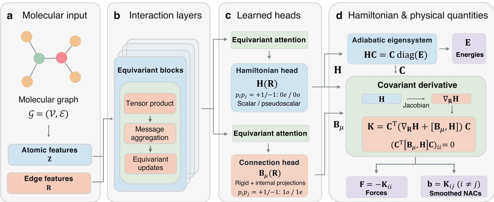  
Fig. 1. The overall architecture of PEACE framework. a, The atomic species Z and Cartesian coordinates R define a molecular graph $\mathcal { G } \ = \ ( \mathcal { V } , \mathcal { E } )$ . Nodes V are represented by one-hot encodings of atomic species, while edges E are described by radial basis functions of interatomic distances and spherical harmonics of interatomic directions. b, A shared O(3)-equivariant tensor-product encoder combines message aggregation and equivariant updates. c, Two independently parameterized equivariant self-attention branches feed the Hamiltonian and connection heads. In the selected electronic basis, $p _ { i } \in \{ + 1 , \ - 1 \}$ are latent-basis parity labels, not labels fixed to energy-sorted adiabatic states. Same-parity diabatic Hamiltonian (H) entries use even scalar 0e features, and opposite-parity entries use odd pseudoscalar 0o features. Pseudoscalars construct Hamiltonian entries and their coordinate derivatives enter the physical readout. Connection same or opposite-parity pairs use polar 1o or axial 1e channels, respectively. $\mathbf { B } _ { \mu }$ is antisymmetric in electronic indices and combines directly learned rigid and internal motion components using the implemented regularized projections. d, The adiabatic energies E are eigenvalues of H, while the forces F and smoothed non-adiabatic couplings (NACs) b are calculated through covariant derivatives.

## Results

The architecture of PEACE. We developed PEACE to learn a consistent electronic representation that connects adiabatic energy surfaces with the couplings governing nonadiabatic transitions (Fig. 1). Starting from atomic species and nuclear coordinates, a shared O(3)-equivariant tensor-product network6,28 constructs molecular features with defined transformation properties under rotations and reflections. Independently parameterized equivariant attention branches10 use these features to predict a real symmetric latent Hamiltonian H, and a real antisymmetric electronic connection $\mathbf { B } _ { \mu }$ . These quantities jointly describe electronic-state interactions and the contribution of the changing latent frame to derivative couplings.

Reflection symmetry is incorporated by assigning fixed parity labels to the latent basis states. Hamiltonian matrix elements connecting states of equal parity are constructed from even-scalar features, whereas those connecting oppositeparity states use odd-pseudoscalar features. The latter change sign between mirror-related geometries and vanish at geometries invariant under reflection. Their derivatives along symmetry-breaking coordinates can nevertheless be nonzero, allowing the model to represent the onset of electronicstate mixing as the molecule moves away from a symmetric configuration. This structure provides a symmetry-adapted description of local gap opening near electronic crossings while retaining nonlinear geometric dependence29. The adiabatic states emerge as geometry-dependent combinations of the latent basis states.

The learned connection accounts for an additional source of geometric dependence: changes in the latent electronic frame as the nuclei move. Adiabatic derivative couplings therefore contain contributions from both the coordinate dependence of the Hamiltonian eigenvectors and the learned connection. To respect reflection symmetry, connection blocks between equal-parity and opposite-parity latent states are constructed from polar-vector and axial-vector features, respectively. The connection also combines learned rigid-motion and internalmotion vector fields through regularized projections, allowing both types of nuclear motion to contribute to the coupling representation.

Adiabatic energies are obtained by diagonalizing H. Forces and smoothed nonadiabatic couplings (SNACs) follow from the covariant derivative transformed into the adiabatic basis,

$$
\mathbf { K } = \mathbf { C } ^ { T } \bigl ( \nabla _ { \mathbf { R } } \mathbf { H } + [ \mathbf { B } _ { \mu } , \mathbf { H } ] \bigr ) \mathbf { C } .\tag{1}
$$

where the columns of C are the Hamiltonian eigenvectors. The negative diagonal elements of K give the force components, while its of-diagonal elements give the energygap-weighted couplings. Because the connection commutator has zero diagonal in the adiabatic basis, the forces retain the conservative relation $F _ { i \mu } = - \partial _ { \mu } E _ { i }$ The connection thus expands the coupling representation while preserving consistency between energies and forces. PEACE is trained jointly on energies, forces and SNACs, linking the supervision of these observables through the shared electronic representation. Numerical transformation tests yielded relative deviations of order $1 0 ^ { - 1 5 }$ under rotations, reflections and translations, consistent with the imposed symmetry equivariant constraints (Supplementary Fig. 15).

Ablation of odd-parity and electronic connection. We examined the contributions of the learned connection and opposite-parity Hamiltonian blocks through controlled ablations on the methaniminium cation molecule $\mathrm { ( C H _ { 2 } N H _ { 2 } ^ { + } ) ^ { 1 2 , 2 0 } }$

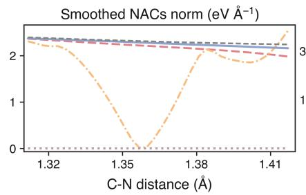

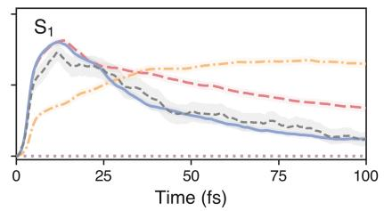

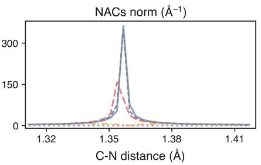

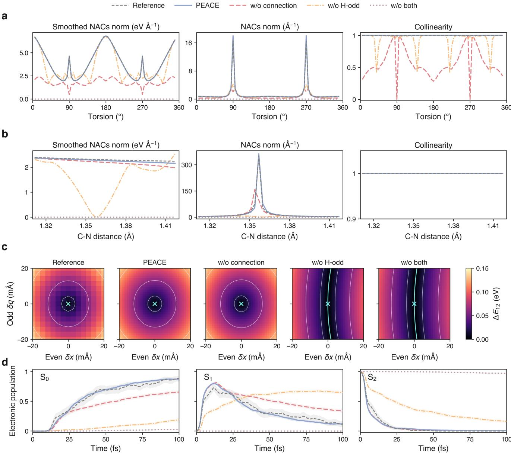

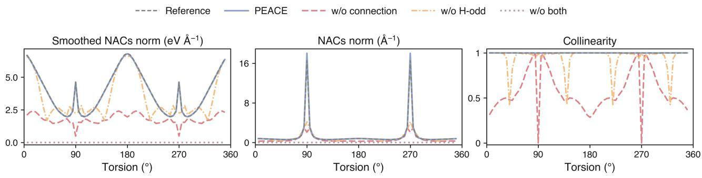

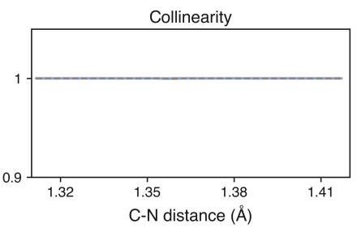

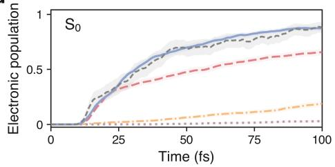

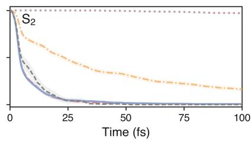  
Fig. 2. Couplings, crossing topology and dynamics of $\mathbf { C H } _ { 2 } \mathbf { N H } _ { 2 } ^ { + }$ . Curves compare PEACE with models lacking the connection, the opposite-parity Hamiltonian block or both. a, b, smoothed nonadiabatic coupling (NAC) and raw NAC norms, and phase-insensitive absolute collinearity of the predicted and reference coupling vectors, along an ${ \mathrm { S } } _ { 0 } / { \mathrm { S } } _ { 1 }$ torsional scan and an $\mathrm { S } _ { 1 } / \mathrm { S } _ { 2 } \mathrm { C } { - } \mathrm { N }$ stretching scan. Undefined directions for vanishing predicted couplings are omitted. $\mathbf { c } , \mathbf { S } _ { 1 } / \mathbf { S } _ { 2 }$ energy-gap maps in common even and odd rigid-motion-free displacement directions; the reference and each model are centred on their own mirror-plane crossing. The MR-CISD map uses a $1 5 \times 1 5$ grid, while model maps use 41 × 41 grids. White contours mark gaps of 0.02, 0.06 and 0.12 eV. d, Mean electronic populations from trajectories initialized in $\mathbf { S } _ { 2 }$ . Shading shows pointwise 95% intervals from trajectory-bootstrap resamples. The reference and four model ensembles contain 145, 919, 926, 901 and 960 independently retained trajectories in legend order with maximum energy drift less than 0.25 eV.

Full PEACE was compared with three variants excluding the connection, the opposite-parity Hamiltonian blocks, or both. All models shared the data split and initialization, and their checkpoints were selected using the validation loss (Supplementary Fig. 1). We assessed both prediction errors on 1,250 test geometries and the resulting crossing structures and relaxation dynamics.

Removing the connection restricts derivative couplings to the contribution arising from the coordinate dependence of the Hamiltonian eigenvectors. This ablation increased the SNAC mean absolute error (MAE) from 0.117 to 0.410 eV $\mathring { \mathbf { A } } ^ { - 1 }$ (Supplementary Fig. 2). Coupling directions deteriorated along the torsional scan, although the localized gap minimum remained in the two-dimensional map around the $\mathrm { S } _ { 1 } / \mathrm { S } _ { 2 }$ crossing (Fig. 2 a and c). Surface-hopping simulations also showed slower depletion of $\mathbf { S } _ { 1 }$ (Fig. 2d). These results indicate that the explicit connection improves the representation of derivative couplings beyond the information supplied by Hamiltonian eigenvector variations in the tested model.

Retaining the connection while removing the oppositeparity Hamiltonian blocks led to a diferent failure. This model reached a low training loss, yet its test-set SNAC MAE increased to 0.257 eV $\mathring { \mathbf { A } } ^ { - 1 }$ , and the localized gap minimum was replaced by an extended low-gap valley (Supplementary Figs. 1 and 2 and Fig. 2c). Distorted coupling profiles and persistent excited-state populations accompanied this change. Thus, a good fit to the sampled training observables did not ensure recovery of the reference crossing structure. The distinction follows from the roles of the two components:

the connection contributes to derivative couplings, while the energy-gap landscape is determined by the Hamiltonian. For a fixed Hamiltonian, learning the connection cannot directly restore the missing interactions between oppositeparity sectors. The H-odd blocks provide these symmetryallowed interactions and enable state mixing along symmetrybreaking coordinates.

Removing both components increased the SNAC MAE $\mathrm { t o } 0 . 6 8 7 \mathrm { e V } \mathbf { \bar { A } } ^ { - 1 }$ and strongly suppressed relaxation from $\mathbf { S } _ { 2 }$ despite retaining an energy MAE of 0.033 eV. Full PEACE instead captured the initial $\mathbf { S } _ { 2 }$ depopulation, transient $\mathrm { S } _ { 1 }$ accumulation and subsequent $\mathbf { S } _ { 0 }$ growth. Together, these ablations show that low training loss and small energy errors provide an incomplete assessment of nonadiabatic models. When compared with other models19–21, PEACE also achieve the state-of-the-art (SOTA) performance in both static and dynamics process (Supplementary Figs. 3-5). Agreement with the reference crossing structure and population dynamics benefits from combining symmetry-allowed Hamiltonian mixing with an explicit representation of the latent-frame contribution to derivative couplings.

Benchmarking alkene photo dynamics. We next evaluated PEACE on ${ \mathrm { C } } _ { 2 } { \mathrm { H } } _ { 4 } , \ { \mathrm { C } } _ { 3 } { \mathrm { H } } _ { 6 } .$ , and $\mathrm { C _ { 4 } H _ { 8 } }$ using $\mathrm { S A } ( 3 ) \cdot$ CASSCF(2,2)/cc-pVDZ reference calculations, with SchNet23- and PaiNN24-based SPaiNN19 models included as comparative benchmarks. To improve coverage of the $\mathrm { S } _ { 1 } / \mathrm { S } _ { 0 }$ transition regions, we expanded the original datasets19 and retrained the SPaiNN models using the same batch size and number of training epochs as PEACE.

Among the models evaluated, PEACE achieved the SOTA overall performance across the three alkene benchmarks with energy mean absolute errors (MAEs) of 0.008–0.022 eV and force MAEs of 0.036–0.054 eV $\mathring { \mathbf { A } } ^ { - 1 }$ (Supplementary Table 1). The corresponding SNAC MAEs were 0.066, 0.041 and 0.069 eV $\mathring { \mathbf { A } } ^ { - 1 }$ for $\mathrm { C } _ { 2 } \mathrm { H } _ { 4 } , \mathrm { C } _ { 3 } \mathrm { H } _ { 6 } ,$ , and $\mathrm { C _ { 4 } H _ { 8 } }$ , respectively, supporting accurate prediction of both the energy surfaces and interstate couplings (Supplementary Figs. 6, 8 and 10).

This agreement extended to the excited-state population dynamics (Fig. 3 a-c). Efective $\mathbf { S } _ { 1 }$ decay time constants obtained from a common one-step fit over 0–100 fs was 68.5, 51.4 and 67.8 fs for PEACE, closely matching the reference values of 68.8, 53.3 and 66.9 fs, respectively (Supplementary Figs. 7, 9 and 11). PEACE maintained close agreement with the reference population evolution across all three alkenes, with fitted decay times difering by at most 1.9 fs.

PEACE also substantially reduced the per-geometry evaluation time under the tested hardware configurations (Supplementary Fig. 14). FP64 PEACE inference required 7.66–12.44 ms on a single NVIDIA H100 GPU, compared with 6.77–13.39 s for the CASSCF workflow using six CPU workers on an Intel Xeon Platinum 8480C system. These hardware-specific wall-clock ratios of \~1,000 demonstrate the practical computational advantage of PEACE for ensemble nonadiabatic dynamics.

Spin–orbit couplings and intersystem crossing. We extended PEACE to describe spin–orbit couplings (SOCs)30,31 by retaining separate Hamiltonian and connection representations for the singlet and triplet manifolds and adding an equivariant SOC readout. This readout predicts Cartesian coupling vectors with the required rotation and reflection symmetries, which are combined with fixed spin-angular coeficients to construct a complex Hermitian SOC matrix (Methods). We evaluated the resulting model on CH2S. On the test set, the energy, force and SNAC MAEs were 1.113 meV, 4.941 meV $\mathring { \mathrm { A } } ^ { - 1 }$ and 0.933 meV $\mathring { \mathrm { A } } ^ { - 1 }$ , respectively. Complex SOC matrix elements were predicted with an MAE of 0.265 cm-1 and an RMSE of $0 . 3 9 7 \mathrm { c m } ^ { - 1 }$ (Supplementary Fig. 12). Along the C–S bond-length scan, PEACE also reproduced the reference energy profiles, selected SOC components and the decrease in the singlet and triplet SNAC norms with increasing bond length (Supplementary Fig. 13). Including both nonadiabatic and spin–orbit couplings enabled surface-hopping propagation over 3 ps from $\mathrm { S } _ { 1 }$ -initialized Wigner conditions (Fig. 3d). At 3 ps, the retained ensemble had an $\mathrm { S } _ { 1 }$ population of 95.4% and a $\mathrm { T } _ { 1 }$ population of 2.8%, indicating weak population transfer to the triplet manifold over this interval. The predominantly $\mathbf { S } _ { 1 }$ population and small triplet contribution are consistent with the published CASSCF reference20. This dynamical comparison concerns population trends, complementing the direct static evaluation of the predicted couplings.

## Discussion

Our PEACE framework demonstrates the value of incorporating electronic symmetry and frame variation into a common representation of excited-state properties. The controlled ablations reveal complementary contributions from the opposite-parity Hamiltonian blocks and the electronic connection to crossing structure and coupling predictions. Their efects on population dynamics show that low training loss alone is insuficient to establish physical fidelity, motivating the assessment of local crossing behaviour and ensemble relaxation alongside static prediction errors.

A promising direction is to extend PEACE to condensed environments32, including solvated molecules and molecular assemblies. Incorporating suitable descriptions of environmental and intermolecular interactions could enable studies of how solvation and aggregation influence excited-state relaxation, broadening the framework’s relevance to photochemistry in solution and molecular materials. Active learning33 could support these extensions by selecting informative configurations while controlling the cost of reference calculations. Additional electronic-structure information, such as state overlaps34, could also be explored as optional training supervision, with potential gains in accuracy or data eficiency weighed against the added cost of data generation and training. These developments would aim to preserve eficient inference while extending the range of photochemical and photophysical processes accessible to PEACE.

## Methods

Parity-resolved and covariant representations. For nuclear $N _ { \mathrm { a t o m } }$ atoms’ coordinates $\mathbf { R } \in \mathbb { R } ^ { 3 \bar { N } _ { \mathrm { a t o m } } }$ , PEACE predicts a real symmetric latent Hamiltonian $\mathbf { H } ( \mathbf { R } )$ and a real antisymmetric connection $\mathbf { B } _ { \mu } \left( \mathbf { R } \right)$ , where $\mu = \left( A , \alpha \right)$ denotes Cartesian component � of atom �. In an orthonormal latent frame 26 $\{ \vert \chi _ { a } \rangle \}$ $B _ { \mu , a b }$ formally represents $\left. \chi _ { a } | \partial _ { \mu } \chi _ { b } \right.$ . We define the covariant Hamiltonian derivative as,

$$
\mathbf { G } _ { \mu } = \partial _ { \mu } \mathbf { H } + \left[ \mathbf { B } _ { \mu } , \mathbf { H } \right]\tag{2}
$$

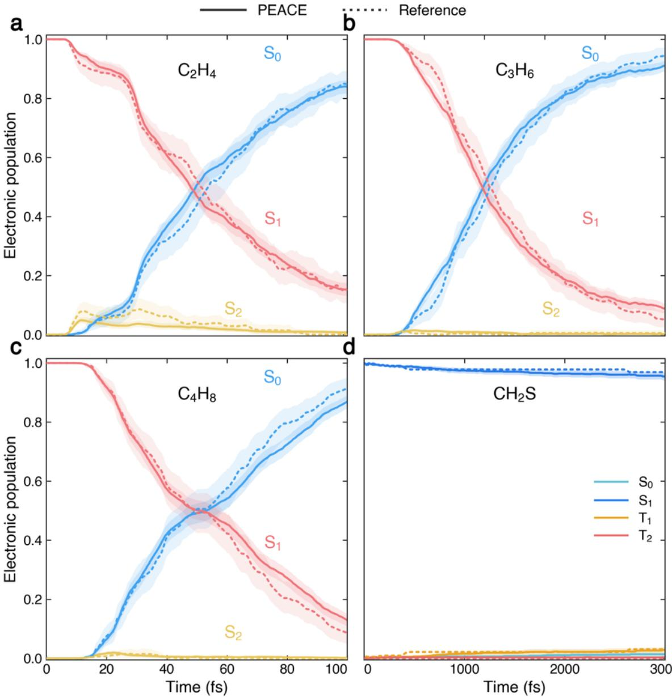  
Fig. 3. Ensemble electronic populations in four molecules. Solid curves show PEACE and dotted curves show the reference. The maximum energy drift of all trajectories is less than 0.25 eV. a-c $\mathrm { C } _ { 2 } \mathrm { H } _ { 4 } , \mathrm { C } _ { 3 } \mathrm { H } _ { 6 } ,$ and $\mathrm { C _ { 4 } H _ { 8 } }$ over 100 fs. The reference ensemble contains 200 trajectories for each system; PEACE ensembles contain 919, 906 and 920, respectively. Shading is the archived pointwise bootstrap interval. $\mathbf { d } , \mathrm { C H } _ { 2 } \mathbf { S }$ over 3 ps, with 954 PEACE trajectories and a pointwise interval standard errors. The reference curves were extracted from the reference 20.

$$
\left[ \mathbf { B } _ { \mu } , \mathbf { H } \right] = \mathbf { B } _ { \mu } \mathbf { H } - \mathbf { H } \mathbf { B } _ { \mu } .\tag{3}
$$

Diagonalization yields $\mathbf { H } \mathbf { C } = \mathbf { C } \mathbf { E } , \mathbf { C } ^ { T } \mathbf { C } = \mathbf { I }$ , where the columns of C are latent-Hamiltonian eigenvectors and E contains their adiabatic energies. Away from exact degeneracies, the adiabatic derivative coupling and covariant derivative satisfy,

$$
\mathbf { d } _ { \mu } = \mathbf { C } ^ { T } \partial _ { \mu } \mathbf { C } + \mathbf { C } ^ { T } \mathbf { B } _ { \mu } \mathbf { C }\tag{4}
$$

$$
{ \bf K } _ { \mu } = { \bf C } ^ { T } { \bf G } _ { \mu } { \bf C } = \partial _ { \mu } { \bf E } + [ { \bf d } _ { \mu } , { \bf E } ] .\tag{5}
$$

Consequently, the force on state � and the smoothed nonadiabatic coupling between states � and � are obtained from the same derivative,

$$
F _ { i \mu } = - ( \mathbf { K } _ { \mu } ) _ { i i } ,\tag{6}
$$

$$
\begin{array} { r l } & { b _ { i j , \mu } = ( \mathbf { K } _ { \mu } ) _ { i j } } \\ & { \qquad = ( E _ { j } - E _ { i } ) d _ { i j , \mu } \quad ( i \neq j ) . } \end{array}\tag{7}
$$

Here $d _ { i j , \mu } = \left. \psi _ { i } | \partial _ { \mu } \psi _ { j } \right.$ is the nonadiabatic coupling, with $\begin{array} { r } { | \psi _ { i } \rangle = \sum _ { a } | \chi _ { a } \rangle \dot { C } _ { a i } . } \end{array}$

The connection combines learned the unprojected, atomresolved Cartesian rigid-body $\mathbf { X } _ { a b } ^ { r i g }$ and internal $\mathbf { X } _ { a b } ^ { i n t }$ vector fields,

$$
\begin{array} { r l } { \mathbf { B } _ { a b } = \alpha _ { \mathrm { r i g } } \mathbf { \Pi } \Pi _ { \mathrm { r i g } } ^ { ( \epsilon ) } \mathbf { X } _ { a b } ^ { \mathrm { r i g } } } & { } \\ { + \alpha _ { \mathrm { i n t } } \mathbf { \Pi } \Pi _ { \mathrm { i n t } } ^ { ( \epsilon ) } \mathbf { X } _ { a b } ^ { \mathrm { i n t } } , } \end{array}\tag{8}
$$

where $\mathbf { B } _ { a b }$ collects all $3 N _ { a t o m }$ coordinate components, $\mathbf { \Pi } _ { r i g } ^ { ( \epsilon ) }$ is a regularized rigid-motion projection, $\boldsymbol { \Pi } _ { i n t } ^ { ( \epsilon ) } = \mathbf { I } -$ $\Pi _ { r i g } ^ { ( \epsilon ) }$ , and $\alpha _ { r i g }$ and $\alpha _ { i n t }$ are fixed scale factors.

Each latent basis state has a fixed parity $p _ { a } \in \{ + 1 , - 1 \}$ , collected in $\mathbf { P } = d i a g \left( p _ { 1 } , \ldots , p _ { N _ { l a t e n t } } \right)$ . For an orthogonal spatial transformation $\mathbf { Q } ,$ , the latent representation is $\rho \left( \mathbf { Q } \right) =$ I when det $\mathbf { Q } = + 1$ and $\rho \left( \mathbf { Q } \right) = \mathbf { P }$ when det $\mathbf { Q } = - 1$ . The predictions obey,

$$
\mathbf { H } ( \mathbf { Q } \mathbf { R } ) = \rho ( \mathbf { Q } ) \mathbf { H } ( \mathbf { R } ) \rho ( \mathbf { Q } ) ^ { T } ,\tag{9}
$$

$$
\begin{array} { l } { { \displaystyle { \bf B } _ { A \alpha } ( { \bf Q } { \bf R } ) = \sum _ { \beta } Q _ { \alpha \beta } \rho ( { \bf Q } ) } } \\ { ~ \times { \bf B } _ { A \beta } ( { \bf R } ) \rho ( { \bf Q } ) ^ { T } . } \end{array}\tag{10}
$$

Equal-parity pairs therefore use even-scalar (0�) Hamiltonian channels and polar-vector (1�) connection channels; opposite-parity pairs use odd-scalar (0�) and axial-vector (1�) channels. The $_ { 0 o }$ features arise from geometric pseudoscalars and equivariant convolutions. This construction applies at both symmetric and asymmetric geometries. If a reflection $^ { g , }$ together with any required permutation of identical atoms, leaves ${ \bf R } _ { s }$ unchanged, then

$$
H _ { a b } ( { \bf R } _ { s } ) = p _ { a } p _ { b } H _ { a b } ( { \bf R } _ { s } ) .\tag{11}
$$

Thus ${ \cal H } _ { a b } \left( { \bf R } _ { s } \right) = 0$ for opposite-parity latent states. For a symmetry-odd distortion $q \mathbf { u } .$ , such that $g \left( \mathbf { R } _ { s } + q \mathbf { u } \right) \ =$ $\mathbf { R } _ { s } - q \mathbf { u }$ , the corresponding matrix element obeys,

$$
\begin{array} { c } { { H _ { a b } ( \mathbf { R } _ { s } + q \mathbf { u } ) = - H _ { a b } ( \mathbf { R } _ { s } - q \mathbf { u } ) } } \\ { { { } } } \\ { { { } = q A _ { a b } + O ( q ^ { 3 } ) , } } \\ { { p _ { a } p _ { b } = - 1 . } } \end{array}\tag{12}
$$

The first-order term describes the local onset of coupling; PEACE retains nonlinear geometric dependence away from the symmetric point. At a general asymmetric geometry, opposite-parity latent sectors can therefore mix.

Spin-orbit couplings. Let $n _ { S }$ and $n _ { T }$ be the numbers of singlet and triplet spin-free roots. Expanding each triplet over $M _ { S } = - 1 , 0 , + 1$ gives $D = n _ { S }$ + 3�� spin components. The complex Hermitian Hamiltonian is assembled as,

$$
\begin{array} { r l } { \quad } & { \mathbf { H } _ { \mathrm { f u l l } } = \mathrm { d i a g } ( \mathbf { H } _ { S } , \mathbf { H } _ { T } , \mathbf { H } _ { T } , \mathbf { H } _ { T } ) } \\ & { + \mathbf { V } _ { \mathrm { S O } } , } \end{array}\tag{13}
$$

$$
\mathbf { V } _ { \mathrm { S O } } ^ { \dagger } = \mathbf { V } _ { \mathrm { S O } } ,\tag{14}
$$

where $\mathbf { H } _ { S }$ and ${ \bf { H } } _ { T }$ are real symmetric PEACE Hamiltonians. For each singlet–triplet or distinct-root triplet–triplet pair, an equivariant readout predicts a real Cartesian spin-orbit coupling (SOC) vector with units of energy. Equal-parity pairs use axial-vector (1�) features and opposite-parity pairs use polar-vector (1�) features. Fixed spin-angular coeficients assemble these vectors into complex SOC blocks; reverse blocks are their Hermitian conjugates. Singlet–singlet and same-root triplet SOC blocks are zero in this representation.

We diagonalize $\mathbf { H } _ { S }$ and ${ \bf { H } } _ { T }$ separately, obtaining orthogonal eigenvector matrices $\mathbf { C } _ { S }$ and $\mathbf { C } _ { T }$ . With $\mathbf { C } _ { s f } \mathbf { \sigma } = \mathbf { \sigma }$ $d i a g \left( { \bf C } _ { S } , { \bf C } _ { T } , { \bf C } _ { T } , { \bf C } _ { T } \right)$ , the SOC matrix in the spin-free adiabatic, or molecular Coulomb Hamiltonian $( \mathrm { { M C H } } ) ^ { 3 5 }$ , basis is,

$$
\mathbf { V } ^ { \mathrm { M C H } } = \mathbf { C } _ { \mathrm { s f } } ^ { \dagger } \mathbf { V } _ { \mathrm { S O } } \mathbf { C } _ { \mathrm { s f } } ,\tag{15}
$$

$$
\mathbf { H } ^ { \mathrm { M C H } } = \mathbf { E } _ { \mathrm { s f } } + \mathbf { V } ^ { \mathrm { M C H } } .\tag{16}
$$

Here ${ \bf E } _ { s f }$ contains the separately diagonalized singlet energies and each triplet energy repeated three times. The predicted SOCs are the entries of $\mathbf { V } ^ { M C H }$ ; the spin-free reference energies and forces are not replaced by eigenvalues or forces of the SOC-mixed Hamiltonian.

Reference data and training. To improve sampling of configurations relevant to $\mathrm { \bf S } _ { 1 } - \mathrm { \bf S } _ { 0 }$ transitions, the static reference datasets were expanded to 7,500, 7,500 and 15,000 geometries for $\mathrm { C } _ { 2 } \mathrm { H } _ { 4 } , \mathrm { C } _ { 3 } \mathrm { H } _ { 6 } ,$ and ${ \mathrm { C } } _ { 4 } { \mathrm { H } } _ { 8 }$ , using the SA(3)-CASSCF(2,2)/cc-pVDZ level calculations35,36. The CH2NH2+ ablation archive contains 4,000 MR-CISD/augcc-pVDZ geometries37,38. Four models were trained separately: full PEACE and variants without the connection, the opposite-parity Hamiltonian block, or both. All four models shared the data split, random seed and initial latent energy–parity ordering as described in Supplementary Table 2. The alkene and $\mathrm { C H } _ { 2 } \mathrm { N H } _ { 2 } ^ { + }$ models used 64 channels for each parity-resolved irreducible representation up to angular momentum $l _ { \mathrm { m a x } } ~ = ~ 2$ , four equivariant messagepassing layers, and two equivariant attention layers in each of the Hamiltonian and connection branches. Models were optimized with AdamW39 for 1,000 epochs using a batch size of 64. The learning rate followed a cosine schedule from $1 0 ^ { - 3 } ~ \mathrm { t o } ~ 1 0 ^ { - 4 }$ . For each model, the checkpoint minimizing the validation loss for the physical observables was selected. Energies, forces and smoothed nonadiabatic couplings (SNACs) were fitted using mean-squared-error losses,

$$
\mathcal { L } _ { E } = \left. \frac { 1 } { S } \sum _ { i } ( \widehat { E } _ { i } - E _ { i } ) ^ { 2 } \right. ,\tag{17}
$$

$$
\mathcal { L } _ { F } = \left. \frac { 1 } { 3 N S } \sum _ { i } \left\| \widehat { \mathbf { F } } _ { i } - \mathbf { F } _ { i } \right\| _ { 2 } ^ { 2 } \right. ,\tag{18}
$$

$$
\begin{array} { r l } { \mathcal { L } _ { \mathrm { S N A C } } = \Bigg \langle \underset { s _ { i } \in \{ - 1 , + 1 \} } { \operatorname* { m i n } } \frac { 1 } { 3 N n _ { p } } } & { } \\ { \quad } & { \qquad \times \sum _ { i < j } \left\| \widehat { \mathbf { b } } _ { i j } - s _ { i } s _ { j } \mathbf { b } _ { i j } \right\| _ { 2 } ^ { 2 } \Bigg \rangle , } \end{array}\tag{19}
$$

where � is the number of electronic states, $N$ is the number of atoms, $n _ { p } = S ( S - 1 ) / 2$ , and angular brackets denote averaging over geometries. Hats indicate predictions. The SNAC loss minimizes over a single consistent set ofelectronicstate signs for all state pairs within each geometry20. An additional energy-gap loss was included,

$$
\begin{array} { c } { \displaystyle \mathcal { L } _ { \Delta } = \Bigg \langle \frac { 1 } { n _ { p } } \sum _ { i < j } \Big [ ( \widehat { E } _ { j } - \widehat { E } _ { i } ) } \\ { - ( E _ { j } - E _ { i } ) \Big ] ^ { 2 } \Bigg \rangle . } \end{array}\tag{20}
$$

The total objective was

$$
\begin{array} { r } { \mathcal { L } = \lambda _ { E } \mathcal { L } _ { E } + \lambda _ { F } \mathcal { L } _ { F } + \lambda _ { \mathrm { S N A C } } \mathcal { L } _ { \mathrm { S N A C } } } \\ { + \lambda _ { \Delta } \mathcal { L } _ { \Delta } + \mathcal { L } _ { \mathrm { p a r i t y } } , \qquad } \end{array}\tag{21}
$$

with all four observable weights set numerically to 1 using energies in $\operatorname { e V }$ and forces and SNACs in eV $\mathbf { \bar { A } } ^ { - 1 }$ . For reflection-symmetric training configurations, including reflections combined with permutations of identical atoms, relative electronic-state parities were inferred from the symmetry selection rules of the reference SNACs. Configurations with confidently assigned labels received auxiliary supervision of the parity-sector spectra and signed energy gaps between opposite-parity states. The corresponding losses per geometry were,

$$
\ell _ { \mathrm { s e c } } ^ { ( q ) } = \left. ( \widehat { E } _ { a } ^ { ( q ) } - E _ { a } ^ { ( q ) } ) ^ { 2 } \right. _ { a } ,\tag{22}
$$

$$
\ell _ { \mathrm { r e l } } ^ { ( q ) } = \left. \frac { ( \widehat { \Delta } _ { a b } ^ { ( q ) } - \Delta _ { a b } ^ { ( q ) } ) ^ { 2 } } { ( \Delta _ { a b } ^ { ( q ) } ) ^ { 2 } + \epsilon ^ { 2 } } \right. _ { a + , b - } .\tag{23}
$$

Here, $\widehat { E } _ { a } ^ { ( q ) }$ denotes a sorted eigenvalue of a parity block matched to a labelled reference level under assignment $q ,$ and $\Delta _ { a b } ^ { ( q ) } = E _ { b } ^ { ( q ) } - E _ { a } ^ { ( q ) }$ . Only labelled levels and labelled opposite-parity pairs contribute. Because the labels determine relative parity, the auxiliary objective was minimized over the two globally reversed assignments,

$$
\begin{array} { r l } & { \mathcal { L } _ { \mathrm { p a r i t y } } = \left. \underset { q \in \{ + , - \} } { \operatorname* { m i n } } \left[ \lambda _ { \mathrm { s e c } } \ell _ { \mathrm { s e c } } ^ { ( q ) } \right. \right. } \\ & { \qquad \left. \left. + \lambda _ { \mathrm { r e l } } \ell _ { \mathrm { r e l } } ^ { ( q ) } + \lambda _ { \mathrm { o r d } } \ell _ { \mathrm { o r d } } ^ { ( q ) } \right] \right. _ { \mathrm { l a b e l l e d } } . } \end{array}\tag{24}
$$

The ordering term averages squared positive violations of the reference ordering between opposite-sector levels. Unlabelled latent levels are assigned ranks above the observed window.

Nonadiabatic molecular dynamics. Surface-hopping simulations40 were performed using the SHARC 4 framework41,42. For $\mathrm { C H } _ { 2 } \mathrm { N H } _ { 2 } ^ { + }$ , the reference ensemble comprised 145 MR-CISD/aug-cc-pVDZ trajectories37,38 with a maximum absolute total-energy drift below 0.25 eV. The PEACE, noconnection, no-odd and double-ablation models were evaluated using the same 1,000 Wigner-sampled initial conditions, with trajectories initiated in $\mathbf { S } _ { 2 }$ and propagated for 100 fs. Only complete trajectories with a maximum absolute totalenergy drift below 0.25 eV were retained. For alkenes, the reference ensembles each comprised 200 trajectories with a maximum absolute total-energy drift below 0.25 eV calculated at the SA (3)-CASSCF (2,2)/cc-pVDZ level35,36. For each alkene, 1,000 PEACE trajectories were initiated in $\mathrm { S } _ { 1 }$ from Wigner-sampled initial conditions and propagated for 100 fs using the same propagation settings and trajectoryselection criteria. For CH2S, 1,000 PEACE trajectories were initiated in $\mathbf { S } _ { 1 }$ from Wigner-sampled initial conditions and propagated for 3 ps, with both nonadiabatic and spin–orbit couplings included. All calculations use a nuclear time step of 0.5 fs and 25 electronic substeps per nuclear step. The state populations were calculated from the retained ensembles, with pointwise 95% confidence intervals estimated by trajectory-level bootstrap resampling. Trajectory selection was performed independently for the reference and model ensembles.

## Code availability

The implementation of PEACE code and trained models are available via GitHub at https://github.com/solvendus/peace.

## Acknowledgement

We gratefully acknowledge the financial support from Hong Kong Quantum AI Lab Limited, Air @ InnoHK of Hong Kong Government, GuangDong Basic and Applied Basic Research Foundation (Grant No. 2024A1515013283), and the National Natural Science Foundation of China (Grant No. 22473022).

## References

1. Nelson, T. R., Fernandez-Alberti, S. & Tretiak, S. Nat. Comput. Sci. 2, 689–692 (2022).

2. Müller, C. et al. Chem. Sci. 16, 17542–17567 (2025).

3. Westermayr, J. & Marquetand, P. Chem. Rev. 121, 9873–9926 (2021).

4. Barbatti, M. Wiley Interdiscip. Rev.: Comput. Mol. Sci 1, 620–633 (2011).

5. Curth, R., Röhrkasten, T. E., Müller, C. & Westermayr, J. Sci. Data 12, 1300 (2025).

6. Batzner, S. et al. Nat. Commun. 13, 2453 (2022).

7. Merchant, A. et al. Nature 624, 80-85 (2023).

8. Chen, C. & Ong, S. P. Nat. Comput. Sci. 2, 718–728 (2022).

9. Gao, R. et al. Nat. Commun. 16, 10484 (2025).

10. Liao, Y.-L. & Smidt, T. in International Conference on Learning Representations https://openreview.net/forum?id=KwmPfARg OTD (2023).

11. Batatia, I. et al. Nat. Mach. Intell. 7, 56–67 (2025).

12. Westermayr, J. et al. Chem. Sci. 10, 8100–8107 (2019).

13. Zhang, C. et al. Nat. Commun. 16, 2033 (2025).

14. Zhang, C. et al. Phys. Rev. Lett. 137, 076905 (2026).

15. Martyka, M. et al. npj Comput. Mater. 11, 132 (2025).

16. Martyka, M., Tong, X.-Y., Jankowska, J. & Dral, P. O. Nat. Commun. 17, 4949 (2026).

17. Pfau, D., Axelrod, S., Sutterud, H., von Glehn, I. & Spencer, J. S. Science 385, eadn0137 (2024).

18. Wang, Z., Dong, J., Qiu, J. & Wang, L. ACS Appl. Mater. Interfaces 14, 22929–22940 (2022).

19. Mausenberger, S. et al. Chem. Sci. 15, 15880–15890 (2024).

20. Westermayr, J., Gastegger, M. & Marquetand, P. J. Phys. Chem. Lett. 11, 3828–3834 (2020).

21. Dupuy, L. & Maitra, N. T. J. Chem. Phys. 161, 134103 (2024).

22. Axelrod, S., Shakhnovich, E. & Gómez-Bombarelli, R. Nat. Commun. 13, 3440 (2022).

23. Schütt, K. T., Arbabzadah, F., Chmiela, S., Müller, K. R. & Tkatchenko, A. Nat. Commun. 8, 13890 (2017).

24. Schütt, K., Unke, O. & Gastegger, M. in Proceedings of the 38th International Conference on Machine Learning Vol. 139 9377–9388 (2021).

25. Guan, Y., Guo, H. & Yarkony, D. R. J. Chem. Phys. 150, 214101 (2019).

26. Mead, C. A. & Truhlar, D. G. J. Chem. Phys. 77, 6090–6098 (1982).

27. Choi, S. & Vaníček, J. J. Chem. Phys. 154, 124119 (2021).

28. Geiger, M. & Smidt, T. arXiv, https://arxiv.org/abs/2207.09453 (2022).

29. Williams, D. M. G. & Eisfeld, W. J. Phys. Chem. A 124, 7608–7621 (2020).

30. Marian, C. M. Wiley Interdiscip. Rev.: Comput. Mol. Sci 2, 187–203 (2012).

31. Penfold, T. J., Gindensperger, E., Daniel, C. & Marian, C. M. Chem. Rev. 118, 6975–7025 (2018).

32. Liu, D., Wang, B., Wu, Y., Vasenko, A. S. & Prezhdo, O. V. Proc. Natl. Acad. Sci. U.S.A. 121, e2403497121 (2024).

33. San Vicente Veliz, J. C., DelloStritto, M. & Matsika, S. Phys. Chem. Chem. Phys. 28, 9897–9909 (2026).

34. Plasser, F. et al. J. Chem. Theory Comput. 12, 1207–1219 (2016).

35. Richter, M., Marquetand, P., González-Vázquez, J. s., Sola, I. & González, L. J. Chem. Theory Comput. 8, 374–374 (2012).

36. Dunning, T. H., Jr. J. Chem. Phys. 90, 1007–1023 (1989).

37. Lischka, H. et al. Phys. Chem. Chem. Phys. 3, 664–673 (2001).

38. Kendall, R. A., Dunning, T. H., Jr. & Harrison, R. J. J. Chem. Phys. 96, 6796–6806 (1992).

39. Loshchilov, I. & Hutter, F. in International Conference on Learning Representations https://openreview.net/forum?id=Bk g6RiCqY7 (2018).

40. Tully, J. C. J. Chem. Phys. 93, 1061–1071 (1990).

41. Mai, S., Marquetand, P. & González, L. Wiley Interdiscip. Rev.: Comput. Mol. Sci 8, e1370 (2018).

42. Mai, S. et al. Zenodo, https://doi.org/10.5281/zenodo.15496427 (2025).

# Supplementary Information PEACE: Covariant learning of nonadiabatic manifolds with parity-resolved Hamiltonians

## Reference data and comparison models

The alkene reference calculations follow the electronicstructure level used in the SPaiNN benchmark,1 with three singlet states at SA(3)-CASSCF(2,2)/cc-pVDZ.2,3 Final expanded datasets contain 7,500, 7,500 and 15,000 geometries for ${ \mathrm { C } } _ { 2 } { \mathrm { H } } _ { 4 } , { \mathrm { C } } _ { 3 } { \mathrm { H } } _ { 6 } .$ , and ${ \mathrm { C } } _ { 4 } { \mathrm { H } } _ { 8 } ,$ , respectively. The $\mathrm { C H } _ { 2 } \mathrm { N H } _ { 2 } ^ { + }$ ablation dataset contains 4,000 MR-CISD geometries, with energies, gradients and derivative couplings evaluated using the aug-cc-pVDZ basis.4–6 Training, validation and test counts are given in Supplementary Table 2.

The external set of $7 7 0 ~ \mathrm { C H } _ { 2 } \mathrm { N H } _ { 2 } ^ { + }$ geometries in Supplementary Fig. 5 originates from the SchNarc benchmark.7 All compared checkpoints were evaluated on the same geometries. For $\mathrm { C H } _ { 2 } \mathbf { S } .$ , the reference labels were recomputed with OpenMolcas8 at the CASSCF(6,5)/def2-SVP level2,9. Spin–orbit couplings were obtained with atomic mean-field spin–orbit integrals10,11. The 4,000/200/503 split follows the counts used in the SchNarc benchmark7 with independently reconstructed membership.

The SPaiNN comparisons use SchNet and PaiNN architectures 1,12,13. Alkene and $\mathrm { C H } _ { 2 } \mathrm { N H } _ { 2 } ^ { + }$ comparison models were retrained on the datasets with the same batch size, splits and number of epochs as PEACE. Exciting DeePMD uses the public checkpoint with coupling-dyad representation14.

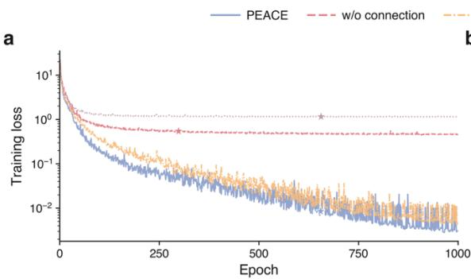  
b

## Timing and numerical symmetry tests

The timing benchmark uses 4,000 configurations from 20 complete reference trajectories per alkene. PEACE evaluations were repeated three times at batch size one after model loading and JIT warm-up. Timings include energy, force and nonadiabatic coupling evaluation, device synchronization, transfer to the host and the native SHARC interface work. Archived CASSCF timings retain their native electronicstructure and interface workloads. The reported ratios therefore apply to the specified CPU/GPU configurations. Timing intervals use 10,000 paired bootstrap resamples of whole trajectory blocks 16. FP64 denotes inference precision; the checkpoints were trained in FP32 and promoted to FP64 for this benchmark. Supplementary Fig. 15 tests numerical transformation consistency under the specified symmetry operations; predictive accuracy is assessed separately by the reference comparisons.

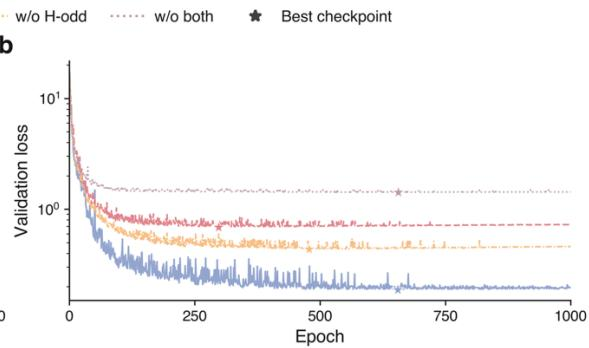

c  
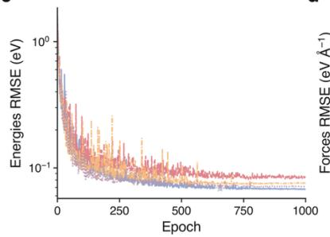  
d

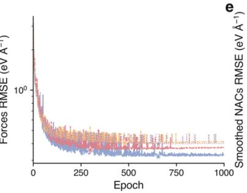

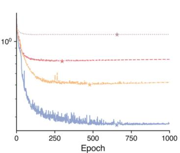  
Supplementary Fig. 1. Learning curves for PEACE and the ablation models. a, Training loss. b, Validation loss used for checkpoint selection. c–e, Validation root-mean-square errors (RMSEs) for energies, Cartesian force components and smoothed nonadiabatic coupling (SNAC) components, respectively. PEACE is compared with models excluding the connection contribution (w/o connection), opposite-parity Hamiltonian blocks (w/o H-odd), or both (w/o both). Each model was trained for 1,000 epochs using 2,500 training and 250 validation geometries. Stars mark the validation-selected checkpoints.

b w/o connection  
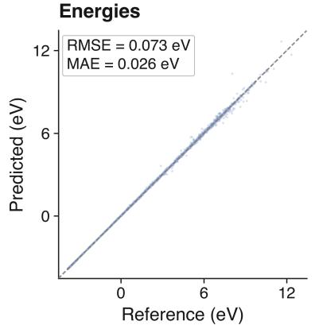

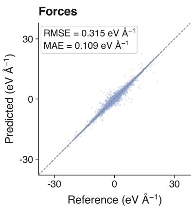

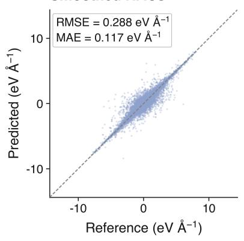

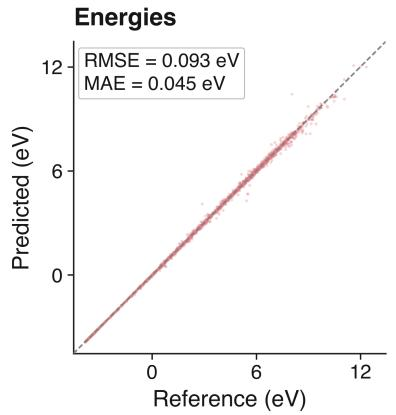

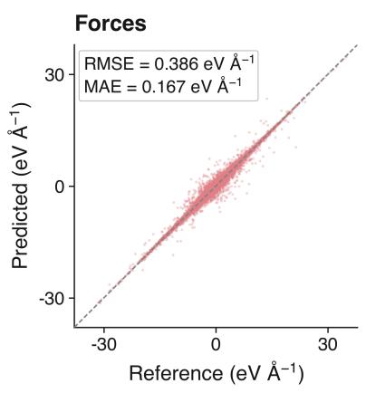

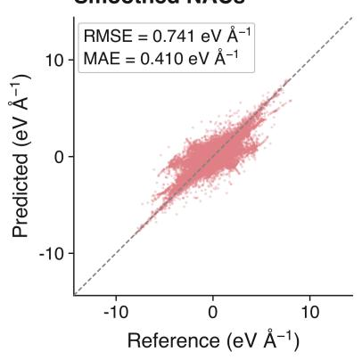

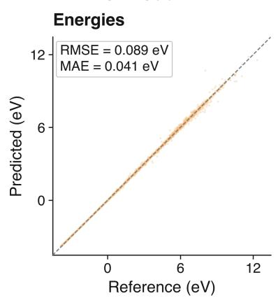

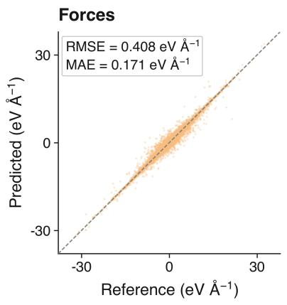

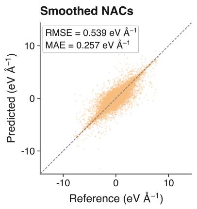

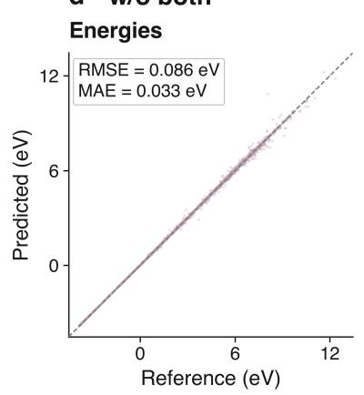

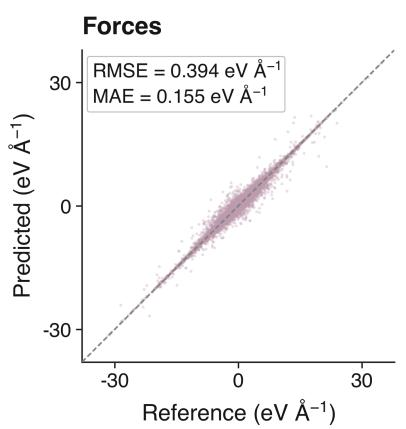

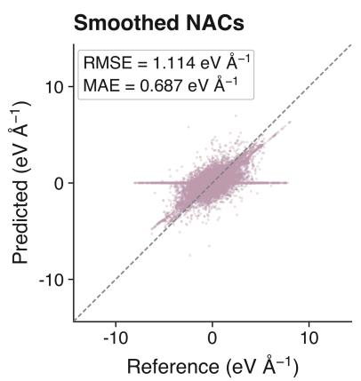  
Supplementary Fig. 2. Static test predictions for the CH NH + ablations. Rows a–d correspond to PEACE, w/o connection, w/o H-odd and w/o both, respectively. Columns show predicted versus MR-CISD/aug-cc-pVDZ reference energies, Cartesian force components and SNAC components 4–6. All four models use validation-selected checkpoints and the same 1,250 held-out test geometries. Insets report mean absolute errors (MAE) and root mean squared errors (RMSE).

a SPaiNN (SchNet)  
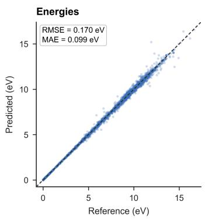  
b SPaiNN (PaiNN)

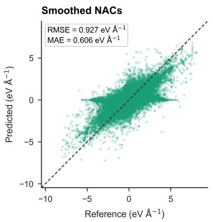

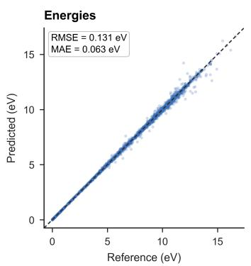

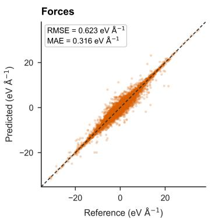

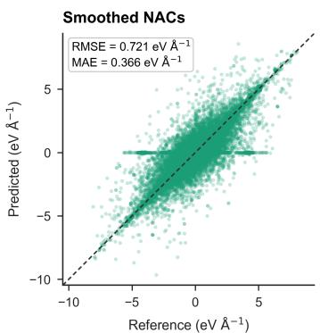  
Supplementary Fig. 3. Static test predictions of SPaiNN models for $\mathbf { C H } _ { 2 } \mathbf { N H } _ { 2 } { ^ { + } }$ $\mathrm { S P a i N N ^ { 1 } }$ models use a $\mathrm { _ { 1 , ~ } } \mathrm { S c h N e t ^ { 1 2 } }$ and b, PaiNN13 architectures. Columns show predicted versus MR-CISD/aug-cc-pVDZ reference energies, Cartesian force components and SNAC components. Both models use validation-selected checkpoints and the same 1,250 held-out test geometries as Supplementary Fig. 2. Insets report MAE and RMSE.

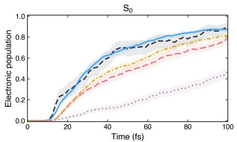

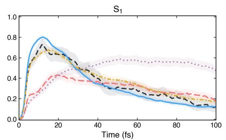

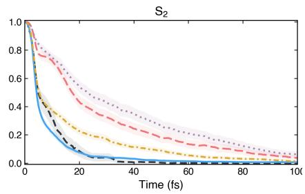  
Supplementary Fig. 4. $\mathbf { C H } _ { 2 } \mathbf { N H } _ { 2 } ^ { + }$ population dynamics. Reference $\mathrm { S } _ { 0 } , \mathrm { S } _ { 1 }$ and $\mathbf { S } _ { 2 }$ populations are compared with PEACE, SPaiNN–SchNet, $\mathrm { S P a i N N - P a i N N } ^ { 1 }$ and Exciting DeePMD $\mathrm { D y a d } ^ { 1 4 }$ over 100 fs. The four machine-learning methods use the same 1,000 initial geometries and velocities, with trajectories initiated in $\mathbf { S } _ { 1 }$ . Independent selection for complete trajectories with a maximum absolute total-energy drift below 0.25 eV retains 947, 418, 758 and 453 model trajectories, respectively. Shading indicates pointwise 95% confidence intervals from trajectory-level bootstrap resampling 16.

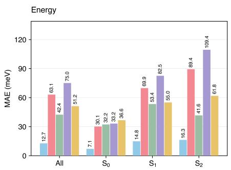

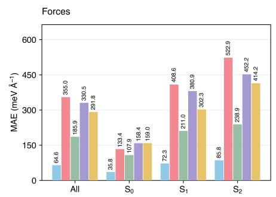

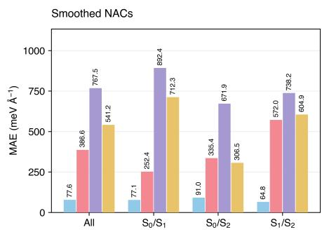  
Supplementary Fig. 5. Unseen 770-geometry $\mathbf { C H } _ { 2 } \mathbf { N H } _ { 2 } ^ { + }$ benchmark. Energy, force and SNAC MAE are evaluated on the same 770 geometries from the SchNarc benchmark7. Comparisons include PEACE, Exciting DeePMD 14, SchNarc 7 and SchNet- and PaiNN-based SPaiNN models1. Force and SNAC errors are averaged over Cartesian components. Each predicted SNAC vector was sign-aligned independently for each geometry and state pair by choosing the sign that minimized its error relative to the reference vector. The public SchNarc 7 checkpoint has no NAC prediction head, so no SNAC error is reported.

b SPaiNN (SchNet)  

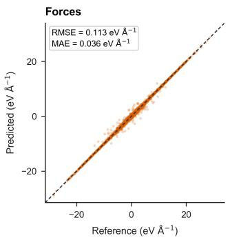

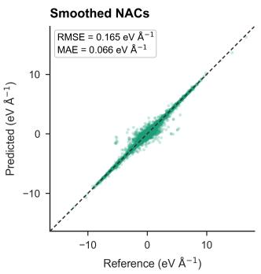

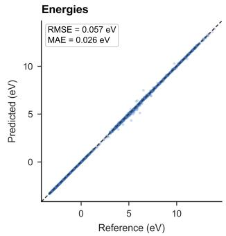

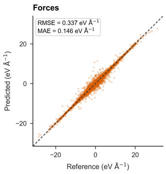

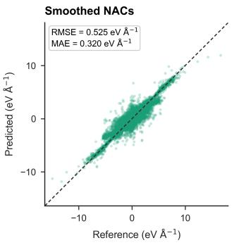

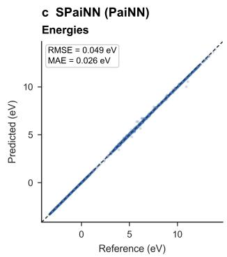

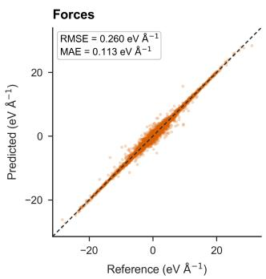

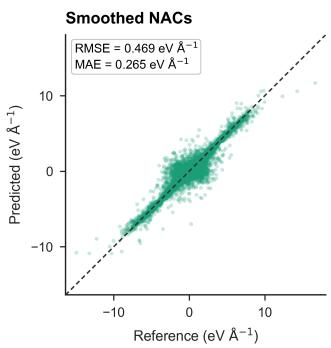  
Supplementary Fig. 6. Static predictions for $\mathbf { C } _ { 2 } \mathbf { H } _ { 4 } .$ Predicted versus SA(3)-CASSCF(2,2)/cc-pVDZ reference energies, Cartesian force components and SNAC components for a, PEACE; b, SPaiNN–SchNet; and c, SPaiNN–PaiNN.1 Dashed lines indicate equality. Insets report MAE and RMSE for the test set.

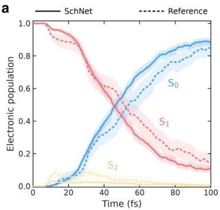

b  
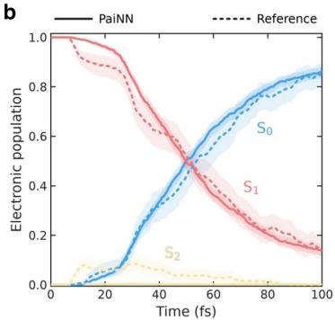

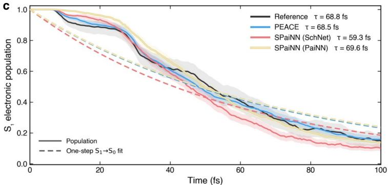  
Supplementary Fig. 7. Electronic-state populations and $\mathbf { S _ { 1 } }$ relaxation dynamics of $\mathbf { C } _ { 2 } \mathbf { H } _ { 4 } .$ a, b, SPaiNN populations using SchNet (a) and PaiNN (b)1. Solid lines show model predictions and dotted lines the $\operatorname { S A } ( 3 )$ CASSCF(2,2)/cc-pVDZ reference. $\mathbf { c } , \mathbf { S } _ { 1 }$ populations from the reference (black), PEACE (blue), SPaiNN–SchNet (red) and SPaiNN–PaiNN (yellow). Solid lines show ensemble means; dashed lines show fits to the efective one-step $S _ { 1 }  S _ { 0 }$ model, $P _ { S _ { 1 } } ( t ) = \exp ( - t / \tau )$ , over 0– 100 fs. Fitted decay times are 68.8, 68.5, 59.3 and 69.6 fs, respectively. Shading indicates pointwise 95% confidence intervals from trajectory-level bootstrap resampling 16. Trajectories start in $\mathrm { S } _ { \mathrm { 1 } } ;$ only complete trajectories with a maximum absolute total-energy drift below 0.25 eV are retained.

b SPaiNN (SchNet)  
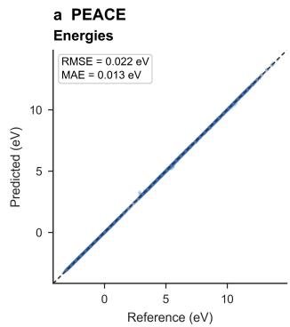

  
Supplementary Fig. 8. Static predictions for $\mathbf { C } _ { 3 } \mathbf { H } _ { 6 } .$ Predicted versus SA(3)-CASSCF(2,2)/cc-pVDZ reference energies, Cartesian force components and SNAC components for a, PEACE; b, SPaiNN–SchNet; and c, $\mathrm { S P a i N N - P a i N N } .$ 1 Dashed lines indicate equality. Insets report MAE and RMSE for the test set.

a  

Supplementary Fig. 9. Electronic-state populations and $\mathbf { S _ { 1 } }$ relaxation dynamics of $\mathbf { C } _ { 3 } \mathbf { H } _ { 6 } .$ . a, b, SPaiNN populations using SchNet (a) and PaiNN $( \mathbf { b } ) ^ { 1 }$ . Solid lines show model predictions and dotted lines the SA(3)- CASSCF(2,2)/cc-pVDZ reference. $\mathbf { c } , \mathbf { S } _ { 1 }$ populations from the reference (black), PEACE (blue), SPaiNN–SchNet (red) and SPaiNN–PaiNN (yellow). Solid lines show ensemble means; dashed lines show fits to the efective one-step $S _ { 1 }  S _ { 0 }$ model, $P _ { S _ { 1 } } ( t ) = \exp ( - t / \tau )$ , over 0– 100 fs. Fitted decay times are 53.3, 51.4, 41.2 and 107.5 fs, respectively. Shading indicates pointwise 95% confidence intervals from trajectory-level bootstrap resampling 16. Trajectories start in $\mathrm { S } _ { \mathrm { 1 } } ;$ only complete trajectories with a maximum absolute total-energy drift below 0.25 eV are retained.

  
b SPaiNN (SchNet)

  
Supplementary Fig. 10. Static predictions for $\mathbf { C _ { 4 } H _ { 8 } } .$ Predicted versus SA(3)-CASSCF(2,2)/cc-pVDZ reference energies, Cartesian force components and SNAC components for a, PEACE; b, SPaiNN–SchNet; and $\mathbf { c } , \mathbf { S P a i N N - P a i N N } ^ { 1 }$ . Dashed lines indicate equality. Inset report MAE and RMSE for the test set.

a  
C  

Supplementary Fig. 11. Electronic-state populations and $\mathbf { S _ { 1 } }$ relaxation dynamics of $\mathbf { C _ { 4 } H _ { 8 } } .$ . a, b, SPaiNN populations using SchNet (a) and PaiNN (b)1. Solid lines show model predictions and dotted lines the SA(3)- $\mathrm { C A S S C F } ( 2 , 2 ) / \mathrm { c c } . \mathrm { p V D Z }$ reference. $\mathbf { c } , \mathbf { S } _ { 1 }$ populations from the reference (black), PEACE (blue), SPaiNN–SchNet (red) and SPaiNN–PaiNN (yellow). Solid lines show ensemble means; dashed lines show fits to the efective one-step $S _ { 1 }  S _ { 0 }$ model, $P _ { S _ { 1 } } ( t ) = \exp ( - t / \tau )$ , over 0– 100 fs. Fitted decay times are 66.9, 67.8, 99.6 and 129.6 fs, respectively. Shading indicates pointwise 95% confidence intervals from trajectory-level bootstrap resampling 16. Trajectories start in $\mathrm { S } _ { \mathrm { 1 } } ;$ only complete trajectories with a maximum absolute total-energy drift below 0.25 eV are retained.

b Forces  

C SOCs  

d Smoothed NACs  
  
Supplementary Fig. 12. Static predictions for $\mathbf { C H } _ { 2 } \mathbf { S }$ including spin–orbit coupling. Predicted versus independently recomputed OpenMolcas reference values8 for a, energies; b, Cartesian force components; c, complex spin–orbit couplings (SOCs); and d, SNAC components on the test set. In c, real and imaginary parts are plotted separately, whereas the inset errors use the modulus of the complex diference.

  
Supplementary Fig. 13. CH S properties along a C–S bond-length scan. PEACE predictions and independent CASSCF(6,5)/def2-SVP OpenMolcas reference calculations8 are compared for a, electronic energies; b, selected signed SOC components; and c, SNAC norms. Panel b shows Re(SOC) + Im(SOC) for the $M _ { \mathrm { s } } = + 1$ triplet component. Panel c shows Euclidean norms over all 12 Cartesian components. The 34 plotted geometries span C–S distances of 1.52–2.18 Å.

  
Supplementary Fig. 14. Per-geometry electronic-evaluation times for PEACE and CASSCF. FP64 PEACE inference at batch size one on a single NVIDIA H100 GPU is compared with SA(3)- CASSCF(2,2)/cc-pVDZ calculations using six CPU workers on an Intel Xeon Platinum 8480C system. Each alkene uses 4,000 common configurations from 20 complete trajectories, with three PEACE repeats after warm-up. Error bars and shading indicate 95% confidence intervals from paired trajectory-block bootstrap resampling16. Ratios are computed from the mean wall times and are specific to these hardware and workflow settings.  
Supplementary Fig. 15. Numerical tests of symmetry consistency. Relative errors in energies, forces, and smoothed nonadiabatic couplings (NACs) were evaluated in FP64 across 32 molecular geometries subjected to rotations, reflections, and translations. Boxes span the interquartile range, with horizontal lines indicating medians. Whiskers extend to the most extreme observations within 1.5 times the interquartile range; points denote outliers.

Supplementary Table 1. Static mean absolute errors across four molecules. Errors compare PEACE with SchNet- and PaiNN-based SPaiNN models 1. NAC rows report raw derivative-coupling errors in atomic units.
<table><tr><td>Dataset</td><td>Quantity</td><td>SPaiNN (SchNet)</td><td>SPaiNN (PaiNN)</td><td>PEACE</td></tr><tr><td rowspan="3"> $\mathrm { C _ { 2 } H _ { 4 } }$ </td><td>Energies  $\mathrm { ( e V ) }$ </td><td>0.026</td><td>0.026</td><td>0.008</td></tr><tr><td>Forces  $( \mathrm { e V / \mathring A } )$ </td><td>0.146</td><td>0.113</td><td>0.036</td></tr><tr><td> $\mathrm { N A C s ~ ( B o h r ^ { - 1 } ) }$ </td><td>0.096</td><td>0.099</td><td>0.028</td></tr><tr><td rowspan="3"> $\mathrm { C } _ { 3 } \mathrm { H } _ { 6 }$ </td><td>Energies  $\mathrm { ( e V ) }$ </td><td>0.031</td><td>0.016</td><td>0.013</td></tr><tr><td>Forces  $( \mathrm { e V / \mathring A } )$ </td><td>0.149</td><td>0.091</td><td>0.042</td></tr><tr><td> $\mathrm { N A C s ~ ( B o h r ^ { - 1 } ) }$ </td><td>0.081</td><td>0.044</td><td>0.016</td></tr><tr><td rowspan="3"> $\mathrm { C _ { 4 } H _ { 8 } }$ </td><td>Energies  $\mathrm { ( e V ) }$ </td><td>0.064</td><td>0.039</td><td>0.022</td></tr><tr><td>Forces  $( \mathrm { e V / \mathring A } )$ </td><td>0.172</td><td>0.105</td><td>0.054</td></tr><tr><td>NACs  $( \mathrm { B o h r } ^ { - 1 } )$ </td><td>0.059</td><td>0.029</td><td>0.018</td></tr><tr><td rowspan="3"> $\mathrm { C H } _ { 2 } \mathrm { N H } _ { 2 } ^ { + }$ </td><td>Energies  $\mathrm { ( e V ) }$ </td><td>0.099</td><td>0.063</td><td>0.026</td></tr><tr><td>Forces  $( \mathrm { e V / \mathring A } )$ </td><td>0.419</td><td>0.316</td><td>0.109</td></tr><tr><td> $\mathrm { N A C s ~ ( B o h r ^ { - 1 } ) }$ </td><td>0.180</td><td>0.140</td><td>0.053</td></tr></table>

Supplementary Table 2. Dataset partitions for training and evaluation.
<table><tr><td>Dataset</td><td>Training</td><td>Validation</td><td>Test</td></tr><tr><td> $\mathrm { C _ { 2 } H _ { 4 } }$ </td><td>6000</td><td>500</td><td>1000</td></tr><tr><td> $\mathrm { C } _ { 3 } \mathrm { H } _ { 6 }$ </td><td>6000</td><td>500</td><td>1000</td></tr><tr><td> $\mathrm { C _ { 4 } H _ { 8 } }$ </td><td>12000</td><td>2000</td><td>1000</td></tr><tr><td> $\mathrm { C H } _ { 2 } \mathrm { N H } _ { 2 } ^ { + }$ </td><td>2500</td><td>250</td><td>1250</td></tr><tr><td> $\mathrm { C H } _ { 2 } S$ </td><td>4000</td><td>200</td><td>503</td></tr></table>

## Supplementary References

1. Mausenberger, S. et al. SPaiNN: equivariant message passing for excited-state nonadiabatic molecular dynamics. Chem. Sci. 15, 15880–15890 (2024). doi:10.1039/d4sc04164j

2. Roos, B. O., Taylor, P. R. & Siegbahn, P. E. M. A complete active space SCF method (CASSCF) using a density matrix formulated super-CI approach. Chem. Phys. 48, 157–173 (1980). doi:10.1016/0301-0104(80)80045-0

3. Dunning, T. H. Jr. Gaussian basis sets for use in correlated molecular calculations. I. The atoms boron through neon and hydrogen. J. Chem. Phys. 90, 1007–1023 (1989). doi:10.1063/1.456153

4. Lischka, H. et al. High-level multireference methods in the quantum-chemistry program system COLUMBUS: Analytic MR-CISD and MR-AQCC gradients and MR-AQCC-LRT for excited states, GUGA spin–orbit CI and parallel CI density. Phys. Chem. Chem. Phys. 3, 664–673 (2001). doi:10.1039/b008063m

5. Lischka, H., Dallos, M., Szalay, P. G., Yarkony, D. R. & Shepard, R. Analytic evaluation of nonadiabatic coupling terms at the MR-CI level. I. Formalism. J. Chem. Phys. 120, 7322–7329 (2004). doi:10.1063/1.1668615

6. Kendall, R. A., Dunning, T. H. Jr. & Harrison, R. J. Electron afinities of the first-row atoms revisited. Systematic basis sets and wave functions. J. Chem. Phys. 96, 6796–6806 (1992). doi:10.1063/1.462569

7. Westermayr, J., Gastegger, M. & Marquetand, P. Combining SchNet and SHARC: The SchNarc Machine Learning Approach for Excited-State Dynamics. J. Phys. Chem. Lett. 11, 3828–3834 (2020). doi:10.1021/acs.jpclett.0c00527

8. Fdez. Galván, I. et al. OpenMolcas: From Source Code to Insight. J. Chem. Theory Comput. 15, 5925–5964 (2019). doi:10.1021/acs.jctc.9b00532

9. Weigend, F. & Ahlrichs, R. Balanced basis sets of split valence, triple zeta valence and quadruple zeta valence quality for H to Rn: Design and assessment of accuracy. Phys. Chem. Chem. Phys. 7, 3297–3305 (2005). doi:10.1039/b508541a

10. Malmqvist, P.-Å., Roos, B. O. & Schimmelpfennig, B. The restricted active space (RAS) state interaction approach with spin–orbit coupling. Chem. Phys. Lett. 357, 230–240 (2002). doi:10.1016/S0009-2614(02)00498-0

11. Heß, B. A., Marian, C. M., Wahlgren, U. & Gropen, O. A meanfield spin-orbit method applicable to correlated wavefunctions. Chem. Phys. Lett. 251, 365–371 (1996). doi:10.1016/0009- 2614(96)00119-4

12. Schütt, K. T., Sauceda, H. E., Kindermans, P.-J., Tkatchenko, A. & Müller, K.-R. SchNet – A deep learning architecture for molecules and materials. J. Chem. Phys. 148, 241722 (2018). doi:10.1063/1.5019779

13. Schütt, K., Unke, O. & Gastegger, M. Equivariant message passing for the prediction of tensorial properties and molecular spectra. In Proceedings of the 38th International Conference on Machine Learning (PMLR) 139, 9377–9388 (2021). https://proceedings.mlr.press/v139/schutt21a.html

14. Dupuy, L. & Maitra, N. T. Exciting DeePMD: Learning excitedstate energies, forces, and non-adiabatic couplings. J. Chem. Phys. 161, 134103 (2024). doi:10.1063/5.0227523

15. Richter, M., Marquetand, P., González-Vázquez, J., Sola, I. & González, L. SHARC: ab Initio Molecular Dynamics with Surface Hopping in the Adiabatic Representation Including Arbitrary Couplings. J. Chem. Theory Comput. 7, 1253–1258 (2011). doi:10.1021/ct1007394

16. Efron, B. Bootstrap Methods: Another Look at the Jackknife. Ann. Stat. 7, 1–26 (1979). doi:10.1214/aos/1176344552