# POREML: A DATA-DRIVEN FRAMEWORK FORLEARNING MULTIPHASE FLOW IN POROUS MEDIA

Chunyang Wang1, Mingrui Zhang1, Yuyan Zhang1, Linqi Zhu¹, Xin Ju2,3, Edo Sicco Boek4, Martin J. Blunt1, Gege Wen1,3

1Imperial College London 2Stanford University 3EarthFlow AI, Inc.

4Queen Mary University of London

## ABSTRACT

Multiphase flow in porous microstructures is central to CO2 storage, fuel-cell operation, and flip-chip packaging. Predicting these flows remains challenging because wettability and complex pore geometry govern the nonlinear evolution of fluid interfaces. Machine learning holds substantial promise for advancing the field, but progress is constrained by scarce time-resolved 3D datasets and a lack of unified workflow for training and evaluating models. To fill this critical gap, we introduce PoreML, an open-source framework unifying data generation, model training, and evaluation grounded in pore-scale physics. The framework comprises three core components. (a) A modern GPU-native lattice Boltzmann solver¹, validated against analytical solutions and published experiments, enables reproducible data generation. (b) A 3.3 TB dataset2 contains 560 simulation runs and 158,546 stored time steps across four application-driven scenarios. These trajectories span synthetic structures and geometries derived from micro-CT scans of real materials, covering diverse wetting conditions and viscosity ratios. (c) A unified learning framework³ evaluates one-step prediction and autoregressive rollouts. Its domain-specific evaluation protocols assess predictive accuracy and physical consistency. We evaluate five models of diverse architecture under these protocols. Two complementary challenges assess transfer to larger domains and from synthetic to micro-CT-derived structures. PoreML provides a shared foundation for machine-learning research on multiphase flow in porous media, with the aim of empowering the community to develop reliable predictive models and advance the field.

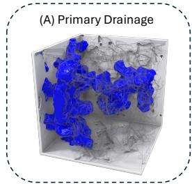

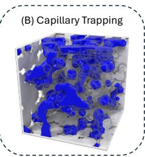

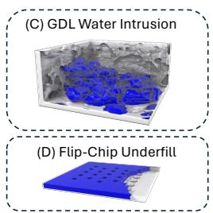  
Figure 1: PoreML simulation campaigns. (A) Primary drainage and (B) capillary trapping for CO2 sequestration and geological energy storage, (C) GDL water intrusion for fuel-cell design, and (D) flip-chip underfill for chip packaging. Only the fluid phase of interest is shown for clarity; translucent gray meshes depict the solid.

## 1 INTRODUCTION

Some of the fundamental technologies of the twenty-first century, from geological $\mathrm { C O _ { 2 } }$ sequestration to efficient fuel cells, rely on porous materials (Farber et al., 2025). Their performance is decided inside pores only micrometers wide, where a small shift of a fluid interface can reroute the entire flow. At low flow speeds, capillarity and wettability dominate. An interface pins at a narrow throat, then abruptly floods the adjacent pores, an event known as a Haines jump (Figure 3C; Berg et al., 2013; Tekseth et al., 2024). The same forces break and remake fluid connections: in snap-off, a wetting film swells in a throat until it pinches off the non-wetting thread and strands an isolated ganglion (Figure 3B; Roof, 1970; Singh et al., 2017); in coalescence, separated ganglia meet and merge, reopening a pathway (Figure 3A; Rücker et al., 2015; Reynolds et al., 2017). These porescale events shape behavior at far larger scales: how much fluid is trapped, how easily each phase flows, and why displacement is hysteretic (Armstrong et al., 2016; Schlüter et al., 2016; Bultreys et al., 2024). Yet they can occur at fixed saturation, hidden from bulk descriptors (Armstrong et al., 2016), and how they add up to continuum-scale flow is still not fully understood (Singh et al., 2019; Berg et al., 2026). Predicting them is nonetheless essential. For example, in geological $\mathrm { C O _ { 2 } }$ storage, returning brine fragments connected $\mathrm { C O _ { 2 } }$ into trapped ganglia, helping prevent buoyant escape (Krevor et al., 2015; Andrew et al., 2014; Krevor et al., 2023). In polymer-electrolyte fuel cells, product water must leave through the fibrous gas-diffusion layer (GDL) before it blocks the pathways that supply reactant gas (Weber et al., 2014; Wang et al., 2023; Sarkezi-Selsky et al., 2022). In flip-chip packaging, capillary forces draw encapsulant through solder-bump arrays (Ng et al., 2022; Wang et al., 2016; Lee et al., 2024; Wang et al., 2026), and the cured underfill protects the chip by shielding its solder joints from thermal stress (Zhang & Wong, 2004).

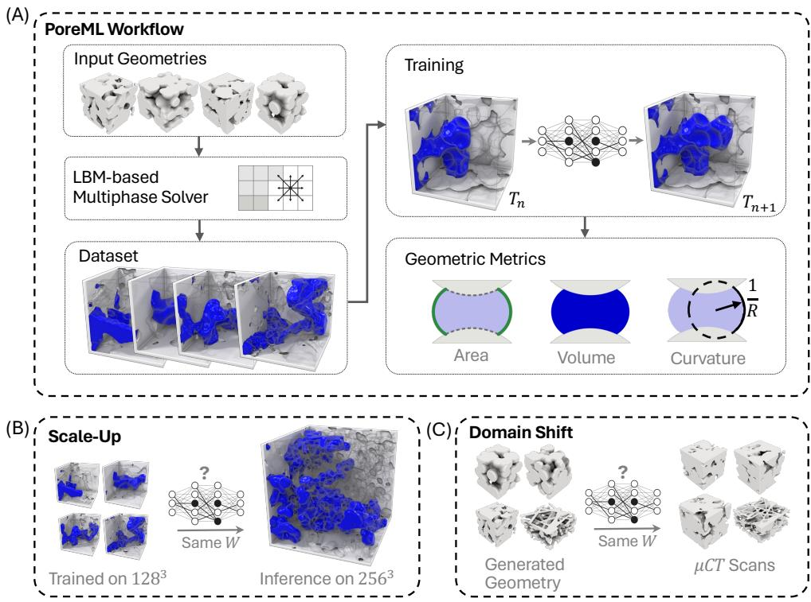  
Figure 2: PoreML framework. (A) A 3D LBM solver turns generated and $\mu \mathrm { C T }$ geometries under controlled flow conditions into time-resolved phase, pressure, and velocity fields; models predict the next frame and are scored with field errors and geometry-aware metrics. (B) Scale-Up: train on small domains, test on larger ones at the same resolution. (C) Geo-Shift: train on generated geometries, test on $\mu \mathrm { C T }$ scans.

Machine learning offers new avenues for understanding and modeling these dynamics (Kochkov et al., 2021; Santos et al., 2020; Shodiev et al., 2021), but progress is constrained by the scarcity of time-resolved, three-dimensional experimental and simulation data (Emeliana et al., 2026). Experiments demand carefully prepared samples, specialized facilities, and expert operators; core-analysis campaigns can take weeks to months (McPhee et al., 2015; Speight, 2020), while capturing rapid pore-scale events in 3D can require synchrotron imaging (Berg et al., 2013). Direct simulation on $\mu \mathrm { C T }$ scans provides a controlled alternative, but it inherits the quality of its input mesh: the pore space must be imaged finely and segmented with care, since both change the computed flow (Saxena et al., 2018; Garfi et al., 2020; Carrillo et al., 2022). It is also bound by resolution: the narrowest throats must span several voxels before the simulated interface behaves physically (Li et al., 2020), and at that resolution the cost climbs steeply as three-dimensional domains grow (Armstrong et al., 2026). Statistically meaningful results need a representative elementary volume (REV), the smallest sample whose averages no longer depend on its size (Bear, 1972), which for multiphase flow far exceeds that for porosity (Georgiadis et al., 2013; Jackson et al., 2020); simulations at that scale have relied on leadership-class supercomputers (Wang et al., 2023), beyond the reach of most groups. Consequently, dense ground truth is most accessible on small synthetic samples, whereas practical predictions are needed on representative domains and real materials (Blunt et al., 2013; Berg et al., 2026). This mismatch poses two distinct challenges. Scale: at fixed resolution, a domain n voxels wide costs $\mathcal { O } ( n ^ { 3 } )$ per time step, so large-domain ground truth stays scarce while larger samples bring more pores and longer connectivity paths. Geometry: moving from synthetic structures to scanned materials means generalizing to a different distribution of pore geometries. The central challenge is to turn data we can afford to generate into reliable predictions at the scales and in the materials where they matter, and to judge them with metrics grounded in the physics rather than in voxel error alone.

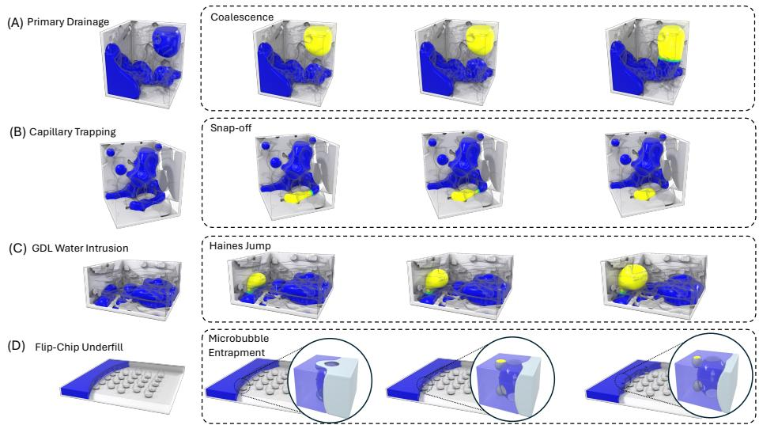  
Figure 3: Representative pore-scale dynamics. Localized events are highlighted in yellow; these mechanisms are not exclusive to the displayed campaign, and events such as snap-off can also occur during drainage. (A) Primary drainage: ganglion coalescence, where interfacial tension retracts menisci and connects neighboring non-wetting bodies. (B) Capillary trapping: snap-off, where wetting films invade a constricted throat and pinch a non-wetting thread into an isolated ganglion. (C) GDL intrusion: Haines jump, an abrupt meniscus depinning and pore-filling event in a fibrous throat network. (D) Underfill: microbubble or void entrapment, where advancing encapsulant fronts around solder balls leave trapped air pockets.

We introduce PoreML, a simulation-to-learning framework for 3D multiphase flow in porous media (Figure 2). We first develop a GPU-native, JAX-based color-gradient lattice Boltzmann method (LBM) solver with geometric wetting (Leclaire et al., 2017; Akai et al., 2018), validated against analytical solutions and published pore-scale experiments. Using this engine, we invest over 3,000 GPU-hours to generate 560 time-resolved 3D simulations with 158,546 time snapshots across four applications: rock drainage, capillary trapping, GDL water intrusion, and flip-chip underfill. The dataset pairs generated structures with real geometries obtained from micro-computed tomography $( \mu \mathrm { C T } )$ scans, and spans multiple domain sizes, wettabilities, and viscosity contrasts. Two challenges test application-relevant generalization: Geo-Shift transfers models from generated structures to real rock and carbon-paper geometries from $\mu \mathrm { C T }$ scans, while Scale-Up transfers them to domains with doubled spatial dimensions at fixed resolution.

Our contributions are: (1) An open-source solver, validated on an eight-case suite of analytical solutions and published experiments (Appendix E) and sharded across GPUs for large domains, with which the community can generate data for new geometries, physical conditions, and applications. (2) An open dataset, to our knowledge the first, and the largest, to provide time-resolved, full 3D fluid distributions for multiphase flow in porous media, spanning generated and μCT-scanned geometries, four applications, two domain sizes, and a grid of wettabilities and viscosity ratios. (3) An integrated learning benchmark: standardized one-step training and rollout evaluation of five architectures, with metrics assessing field accuracy, geometry, and topology. It also includes, to our knowledge, the first joint evaluation of geometry transfer and domain-size extrapolation for learned 3D multiphase porous-media dynamics. By making all three publicly available through an extensible, unified framework, we aim to help the community develop and compare reliable machine-learning models for multiphase flow in porous media and advance the field..

## 2 RELATED WORK

Learning-based models and data for pore-scale flow. Existing models and public datasets offer limited coverage of three-dimensional multiphase dynamics at the pore scale. Learned 3D pore-scale models predict steady single-phase flow (Santos et al., 2020), while evolving rock-fluid surrogates remain two-dimensional (Pinheiro et al., 2026). Public 3D resources provide single-phase transport (Santos et al., 2022), static wettability states (Gorenkov, 2026), or scalar time-series summaries rather than full fluid configurations (Armstrong et al., 2026). General PDE collections contain no multiphase flow through porous microstructure (Takamoto et al., 2022; Ohana et al., 2024), while BubbleML contains multiphase dynamics without a confining porous solid (Hassan et al., 2023). This leaves a need for time-resolved 3D multiphase data spanning diverse microgeometries, wettabilities, and viscosity ratios for training and evaluating machine-learning models.

Lattice Boltzmann solvers for porous media. LBM is widely used for direct simulation of multiphase flow in porous media, combining efficient computation with the ability to handle complex pore geometries directly from segmented μCT voxel data (Pan et al., 2004; Ahrenholz et al., 2008), and the same strengths have made it a common choice for capillary underfill flow in flip-chip packaging (Wang et al., 2016; Lee et al., 2024; Wang et al., 2026). Among its multiphase formulations, the color-gradient lineage (Gunstensen et al., 1991) is especially well suited to narrow throats: unlike diffusive pseudopotential interfaces under viscosity contrast, it sustains thin interfaces (Yang & Boek, 2013), although accuracy still deteriorates when a throat spans only a few voxels (Li et al., 2020). Wetting models likewise progressed from indirect wall coloring (Latva-Kokko & Rothman, 2005b) to geometric contact-angle conditions (Leclaire et al., 2017; Akai et al., 2018); a recent comparison separates their strengths, favoring Akai for static angles and Leclaire for dynamic Washburn flow (Sedahmed & Coelho, 2024). Palabos and LBPM brought this physics to production simulation (Leclaire et al., 2017; McClure et al., 2021), and JAX-LaB recently brought a pseudopotential model to JAX (Pradhan et al., 2026). Our data engine brings the color-gradient model with geometric wetting into the learning loop through an accelerator-native implementation (Section 3.1).

## 3 POREML: LEARNING MULTIPHASE FLOW IN POROUS MEDIA

## 3.1 A JAX-NATIVE COLOR-GRADIENT LBM SOLVER

We implement a modern, GPU-native lattice Boltzmann solver for immiscible two-phase flow in 3D porous media and use it to generate every PoreML trajectory. Its distinctive contribution is to unite thin color-gradient interfaces under viscosity contrast (Yang & Boek, 2013), direct contact-angle control on complex solids (Akai et al., 2018), and multi-GPU JAX execution in a well-validated, open, extensible engine for generating 3D pore-scale training data. It supports common boundary conditions, including Zou-He pressure boundaries (Zou & He, 1997) and velocity and piston inlets, and is validated against analytical solutions and published experiments (Appendix E); Appendices C and D detail the model and its implementation. We hope this open-source solver will help the community generate far more diverse data and foster reproducible, collaborative research.

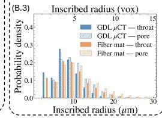  
B. Geometries for GDL Water Intrusion C. Geometry for Flip-Chip Underfill

A. Geometries for Drainage and Capillary Trapping  
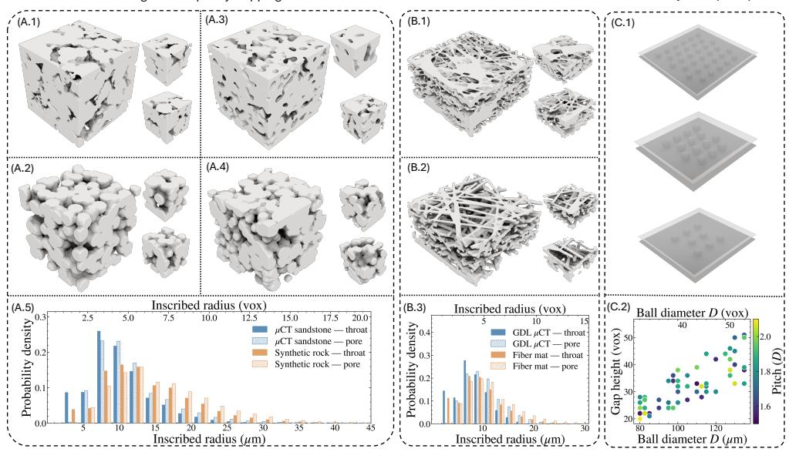  
Figure 4: Geometry families used by PoreML. (A) Rock-like media, each shown as one large sample $( 2 5 6 ^ { 3 }$ voxels) beside two small ones $( 1 2 8 ^ { 3 } ) \colon$ (A.1) sandstone from a $\mu \mathrm { C T }$ scan and generated (A.2) sphere packs, (A.3) blob media, and (A.4) polydisperse spheres, with (A.5) pore and throat radii (maximal inscribed spheres). (B) Gas-diffusion layers at 256×256×128 and 128×128×64 voxels: (B.1) µCT scan, (B.2) generated fiber mat, and (B.3) pore and throat radii. (C) Underfill: flip-chip gaps set by solder-ball diameter, gap height, and pitch. More samples: Appendix G.

## 3.2 DATASET OVERVIEW

Geometries. PoreML pairs real microstructures with generated ones, and provides both at two domain sizes (Figure 4). The real samples are crops of segmented $\mu \mathrm { C T }$ scans: Bentheimer, Castle-Gate, and Buff Berea sandstones (Neumann et al., 2021), and carbon-paper gas-diffusion layers (GDLs) coated with 5%, 20%, and 40% PTFE (Shojaei et al., 2022). The generated families overlap them in local pore size but have controlled statistics: sphere packs (well sorted, wide throats), Gaussian-random-field blobs (irregular, tight), polydisperse overlapping grains (poorly sorted sandstone analogs), and in-plane fiber mats. Underfill uses parametric flip-chip gaps, the thin space between a chip and its substrate that an array of solder balls bridges; three numbers describe one: ball diameter, pitch (center-to-center ball spacing), and gap height (the chip-to-substrate standoff). The two sizes of the rock and GDL families share one resolution, so a larger domain holds more pores, not finer ones.

Simulations. We build the dataset by simulating four practical flow scenarios in these geometries (Table 1). In drainage, a non-wetting phase invades a rock saturated with the wetting phase, as in hydrocarbon recovery (Blunt, 2017) and the underground $\mathrm { C O _ { 2 } }$ and hydrogen storage behind netzero pathways (Krevor et al., 2023); in trapping, the wetting phase returns and pinches the nonwetting phase into disconnected ganglia that can no longer move, keeping injected $\mathrm { C O _ { 2 } }$ in place (Krevor et al., 2015). GDL intrusion pushes liquid water through a hydrophobic fiber layer, the path product water takes out of a hydrogen fuel cell before it blocks the gas supply and cuts clean power (Weber et al., 2014; Wang et al., 2023). Underfill has no pump: capillary suction draws encapsulant under a chip to shield its solder joints from thermal stress (Zhang & Wong, 2004), and fronts that pass the solder balls at different speeds close around air pockets, the voids that threaten package reliability $( \mathrm { N g }$ et al., 2022). Each campaign varies the contact angle θ, which says which fluid the solid prefers (Aljaberi et al., 2026), and the viscosity ratio $M ;$ together they decide whether a meniscus pins, jumps, or is bypassed. The three porous-media campaigns run at capillary number $\mathrm { { C a } } = 1 0 ^ { \dot { - } 5 }$ (the dimensionless ratio of viscous to capillary forces; Lenormand et al., 1988), where capillarity dominates. Appendix F gives the domains, boundary conditions, parameters, and termination conditions. Every stored time step records the 3D phase distribution velocity components, and pressure, and each run keeps its control and simulation parameters as metadata.

Table 1: PoreML dataset summary and key parameter description. $M = \mu _ { \mathrm { n w } } / \mu _ { \mathrm { w } }$ for drainage, trapping, and GDL; underfill instead follows the application convention M = μencapsulant/µμair. Contact angle θ is measured through the non-wetting phase for the porous-media campaigns and through the wetting encapsulant for underfill.
<table><tr><td>Dataset name</td><td>Cases</td><td>Domain size (voxels)</td><td>Contact angle θ(°)</td><td>Viscosity ratio M</td><td>Domain geometry</td><td>Simulation protocol</td></tr><tr><td>drainage_12880µCT</td><td>80 generated;</td><td> $1 2 8 ^ { 3 }$ </td><td>∫120,130, 140,150</td><td rowspan="2"> $\left\{ { \begin{array} {} { c } { 0 . 0 5 , 0 . 1 , } \\ { 0 . 2 , 1 } \end{array} } \right\}$ </td><td rowspan="2">Generated blobs, polydisperse spheres, and sphere packs; μCT</td><td rowspan="2">Piston-driven non-wetting injection at  $\mathrm { C a } = 1 0 ^ { - 5 } ;$  water-wet porous outlet</td></tr><tr><td></td><td>8 generated; drainage_256 8µCT</td><td>256³</td><td>{120, 150}</td></tr><tr><td></td><td>80 generated; trapping_12880 µCT</td><td>1283</td><td>120,130,</td><td rowspan="2"> $\left\{ { \begin{array} {} { c } { 0 . 0 5 , 0 . 1 , } \\ { 0 . 2 , 1 } \end{array} } \right\}$ </td><td rowspan="2">Generated and μCT</td><td rowspan="2">Piston-off equilibration, then wetting-water flood at</td></tr><tr><td></td><td>8 generated;</td><td></td><td>140,150</td></tr><tr><td></td><td>trapping_2568µCT 80 generated;</td><td>2563</td><td>{120, 150} 120,130,</td><td rowspan="2">1,5,</td><td rowspan="2">Generated fiber mats;</td><td rowspan="2">Piston-driven through-plane</td></tr><tr><td></td><td>80 µCT 8 generated;</td><td>128×128×64</td><td>140,150 10,20}</td></tr><tr><td>gdl_256</td><td> $8 \mu \mathrm { C T }$ </td><td>256×256×128 (22-48)×482</td><td>{120, 150}</td><td></td><td>PTFE loading</td><td>no plate</td></tr><tr><td>underfill</td><td>32 flip-chip</td><td>×(432–476)</td><td>{30, 40, 50}</td><td>∫5,10, {20,30}</td><td>Patterned solder-ball gaps</td><td>Spontaneous imbibition between equal-pressure inlet and outlet</td></tr></table>

## 3.3 MACHINE LEARNING FRAMEWORK

Notation and task. Let $\Omega \subset \mathbb { R } ^ { 3 }$ denote a physical sample and $\Omega _ { h }$ its uniform voxelization. The static field $g : \Omega _ { h }  \{ 0 , 1 \}$ is both the solid mask and the geometry input: $g ( \mathbf { r } ) = 1$ marks solid and $g ( \mathbf { r } ) = 0$ the pore space. The geometry families of Section 3.2 define two distributions, generated structures $g \sim P _ { \mathrm { g e n } }$ and segmented $\mu \mathrm { C T }$ scans $g \sim P _ { \mu \mathrm { { C T } } }$ . At saved time t the state is

$$
\mathbf { x } _ { t } ( \mathbf { r } ) = \big ( \phi _ { t } ( \mathbf { r } ) , \mathbf { u } _ { t } ( \mathbf { r } ) , p _ { t } ( \mathbf { r } ) \big ) \in \mathbb { R } ^ { 5 } , \qquad \mathbf { r } \in \Omega _ { h } ,\tag{1}
$$

where $\phi$ identifies the two phases, u is velocity, and p is pressure. A run is further specified by its physical conditions $\pmb { \lambda } = ( \hat { \mathrm { C a } } , \theta , M )$ and by the boundary protocol B of its campaign on $\partial \Omega _ { h }$ . The simulator advances the state through a discrete evolution operator,

$$
\mathcal G _ { \Delta t } : ( \mathbf x _ { t - h + 1 : t } , g , \lambda , B ) \mapsto \mathbf x _ { t + \Delta t } ,\tag{2}
$$

where h is the history length and $\Delta t$ the interval between saved frames. The learning task is to approximate this transition with a network ${ \widehat { \mathcal { G } } } _ { W }$ that is conditioned explicitly on geometry, physical parameters, and boundary protocol; X denotes its prediction.

Geometry-aware metrics. We adopt metrics grounded in pore-scale physics, the four Minkowski functionals (Armstrong et al., 2019), which carry richer diagnostic information than MAE or other field errors: they report not how many voxels are wrong, but what is wrong with the fluid configuration. In capillary-dominated flow the shape of the interface is part of the physical state. At local equilibrium the Young-Laplace equation, $p _ { c } = p _ { \mathrm { n w } } - p _ { \mathrm { w } } = 2 \sigma H$ , ties the capillary pressure $p _ { c }$ to the interfacial tension σ and the mean curvature $H = ( \kappa _ { 1 } + \kappa _ { 2 } ) / 2$ , where $\kappa _ { 1 }$ and $\kappa _ { 2 }$ are the principal curvatures of the interface. $\mathbf { A }$ prediction with a small φ error can therefore still carry the wrong curvature, and hence the wrong local capillary pressure, misplace interfacial area, or miss a snap-off that disconnects a ganglion while changing only a few voxels. For a phase body $X _ { t }$ with smooth boundary $\partial X _ { t }$ , the functionals are:

$$
M _ { 0 } ( X _ { t } ) = \int _ { X _ { t } } d V ,\tag{3}
$$

$$
M _ { 1 } ( X _ { t } ) = \int _ { \partial { X _ { t } } } d S ,\tag{4}
$$

$$
M _ { 2 } ( X _ { t } ) = \int _ { \partial { X _ { t } ^ { \prime } } } H d S ,\tag{5}
$$

$$
M _ { 3 } ( X _ { t } ) = \int _ { \partial X _ { t } } \kappa _ { 1 } \kappa _ { 2 } d S = 4 \pi \chi ( X _ { t } ) .\tag{6}
$$

Here $\chi = N - L + O$ is the Euler characteristic, which counts connected components $N .$ , loops $L ,$ and cavities $O , M _ { 0 }$ is the phase volume (saturation once divided by pore volume); $M _ { 1 }$ the boundary area; M2 the mean curvature integrated over the fluid–fluid interface $\partial X _ { t } ^ { \prime } .$ whose local value sets the capillary pressure through the Young-Laplace equation; and $M _ { 3 }$ the topology, which snap-off and ganglion coalescence change while barely moving voxel errors (Armstrong et al., 2016). We report the MAE of p and φ over pore voxels, the relative error $| M _ { k } ( \widehat { X } _ { t } ) - M _ { k } ( X _ { t } ) | / | M _ { k } ( X _ { t } ) |$ of $\dot { M _ { 0 } } \mathrm { - } M _ { 2 }$ , and for $M _ { 3 }$ the MAE of the Euler characteristic $\chi$ per unit volume of the injected phase, which keeps it comparable across domain sizes (Appendix B.2).

## 4 EXPERIMENTS AND RESULTS

The evaluation framework asks two questions: whether a 64-step rollout keeps the interface geometry and topology that govern capillary dynamics (Section 4.2), and whether that fidelity survives the two transfers applications demand, to scanned geometries and to larger domains, on the three campaigns with paired geometry sources and domain sizes (Section 4.3). Five architectures serve as references on held-out geometries; their scores show where current models stand and which limitations they share.

## 4.1 EXPERIMENTAL SETUP

Evaluation setup. All models predict the next saved $( \phi , { \bf u } , p )$ frame, 5,000 LBM steps ahead (1,000 for underfill), from the current frame, the solid mask, M, and θ. Only pore voxels are scored, excluding reservoirs and boundary devices. We evaluate the voxel models UNet3D (Çiçek et al., 2016), FNO3D (Li et al., 2021), and P3D (Holzschuh et al., 2026), and the point models Transolver++ (Luo et al., 2025) and AB-UPT (Alkin et al., 2025). Each is trained frame to frame with its own recipe, then fine-tuned with the pushforward trick (Brandstetter et al., 2022; Hassan et al., 2023), which grades the model on a step taken from its own prediction; Appendix H gives the architectures and training details.

Datasets and splits. Drainage, GDL, and trapping (Table 1) each use 128 small-domain training runs and 32 validation runs, half generated and half μCT; underfill uses 25 and 7. Scale-Up tests on 16 large-domain runs per campaign, eight per geometry source, with each dimension doubled at fixed resolution $( 1 2 8 ^ { 3 }  2 5 6 ^ { 3 }$ ; 128×128×64 → 256×256×128 for GDL). Geo-Shift trains on the 64 generated runs, validates on the 16 generated ones, and tests on $8 0 \mu \mathrm { C T }$ runs per campaign at the training size.

## 4.2 SINGLE-STEP AND ROLLOUT PERFORMANCE

A model is useful only if it stays accurate over multiple steps. In an autoregressive rollout, $\widehat { \mathbf { x } } _ { t + k \Delta t } =$ $\widehat { \mathcal { G } } _ { W } ( \widehat { \mathbf { x } } _ { t + ( k - 1 ) \Delta t } , g , \lambda , B )$ for $k = 1 , \ldots , 6 4$ , each prediction becomes the next input, so errors can compound. We therefore score two regimes on the held-out runs: the one-step prediction from a true frame, and step 64 of rollouts started from successive windows along each trajectory. Each is measured with field errors and Minkowski functionals, averaging within a run before averaging runs; Appendix A.1 gives further metrics.

Results. Over one step every model achieves low error (φ MAE 0.002–0.012), and the voxel models UNet3D and P3D lead 16 of the 24 columns (Table 2). Over 64 steps the strengths spread out: AB-UPT has the lowest φ MAE in all four campaigns (Figure 5a), P3D the best interface geometry $( M _ { 0 } – M _ { 2 } )$ in drainage, and FNO3D and UNet3D the best topology in three campaigns. Single-step accuracy thus does not by itself imply good rollout performance. The Minkowski columns capture what the field error does not: topology is the least well predicted quantity. The median $M _ { 3 }$ error over the 20 model–campaign pairs is 3.6 miscounts per $1 0 ^ { \bar { 5 } }$ voxels, as large as the reference χ density itself $_ { ( 1 - 9 ) }$ , against a median $M _ { 0 }$ error of 11%, and the model with the lowest $\phi$ MAE also has the lowest $M _ { 3 }$ error in only one campaign. A low field error does not guarantee the right connectivity.

Table 2: Field and geometric fidelity. In-distribution rows report validation; Scale-Up and Geo-Shift rows report transfer tests. $p ,$ φ: normalized MAE; $M _ { 0 } { - } M _ { 2 } { : }$ relative errors as fractions; $M _ { 3 } { \mathrm { : } }$ MAE of the Euler characteristic per $\mathrm { 1 0 ^ { 5 } }$ voxels of the injected-phase volume V. Underfill descriptors score the wetting phase, others the non-wetting phase. Means of per-run means; lower is better; bold: lowest per column within a block.
<table><tr><td rowspan=1 colspan=13>One-step prediction                     Autoregressive rollout, step 64Campaign    Model       p      $\phi$      $M _ { 0 }$      $M _ { 1 }$      $M _ { 2 }$      $M _ { 3 }$    p     $\phi$     $M _ { 0 }$    $M _ { 1 }$    $M _ { 2 }$    $M _ { 3 }$ MAE          Relative error     MAE/V   MAE      Relative error  MAE/V</td></tr><tr><td rowspan=4 colspan=13>UNet3D    0.00571 0.002720.005840.004590.03420.09100.1900.2150.05790.1460.554 4.74FNO3D    0.00816 0.005240.0231 0.0231 0.0296 0.140 0.1920.2560.08600.1530.447 1.84DrainageP3D       0.00568 0.003370.006830.005060.0308 0.109 0.1680.1740.026110.0346 0.245 2.63(In-distribution)                                                  0.392 0.2170.2970.114 1.253.87  109Transolver++ 0.00647 0.005220.0146 0.01140.0548AB-UPT   0.00665 0.003910.0358 0.0203 0.158 0.455 0.1980.1260.0305 0.0598 0.368 2.23</td></tr><tr><td rowspan=1 colspan=4>0.0860 0.153 0.447 1.84</td></tr><tr><td rowspan=1 colspan=4>0.0261 0.0346 0.245 2.63</td></tr><tr><td rowspan=1 colspan=4>0.1141.25 3.87109</td></tr><tr><td rowspan=1 colspan=7>UNet3D   0.00890 0.003170.0832 0.0427 0.207 0.415</td><td rowspan=1 colspan=1>0.205</td><td rowspan=1 colspan=1>0.220</td><td rowspan=1 colspan=4>0.2960.4290.4332.00</td></tr><tr><td rowspan=4 colspan=8>FNO3D    0.00809 0.00588 0.112  0.111 0.102 0.516Drainage                                                              0.191P3D      0.00730 0.00401 0.113 0.0633 0.267 0.382(Scale-Up)Transolver++ 0.00803 0.006580.0747 0.0563 0.231  1.36 0.203AB-UPT   0.00691 0.004340.0872 0.0224 0.583 0.405 0.235</td><td rowspan=1 colspan=1>0.171</td><td rowspan=1 colspan=1>0.212</td><td rowspan=1 colspan=1>0.139</td><td rowspan=1 colspan=1>0.161</td><td rowspan=1 colspan=1>1.39 1.14</td></tr><tr><td rowspan=1 colspan=1>0.191</td><td rowspan=1 colspan=1>0.209</td><td rowspan=1 colspan=1>0.243</td><td rowspan=1 colspan=1>0.316</td><td rowspan=1 colspan=2>0.306 1.24</td></tr><tr><td rowspan=1 colspan=1>0.203</td><td rowspan=1 colspan=1>0.304</td><td rowspan=1 colspan=1>0.355</td><td rowspan=1 colspan=1>2.07</td><td rowspan=1 colspan=2>5.22 130</td></tr><tr><td rowspan=1 colspan=1>0.155</td><td rowspan=1 colspan=1>0.135</td><td rowspan=1 colspan=1>0.254</td><td rowspan=1 colspan=2>1.88 3.39</td></tr><tr><td rowspan=1 colspan=8>UNet3D    0.00896 0.004300.0914 0.0469 0.280  1.15 0.182</td><td rowspan=1 colspan=1>0.176</td><td rowspan=1 colspan=1>0.0302</td><td rowspan=1 colspan=1>0.0637</td><td rowspan=1 colspan=2>0.294 1.59</td></tr><tr><td rowspan=4 colspan=4>FNO3D    0.0117 0.00931DrainageP3D      0.00823 0.00487(Geo-Shift)Transolver++ 0.00870 0.00785AB-UPT   0.00744 0.00380</td><td rowspan=1 colspan=1>0.215  0.216</td><td rowspan=1 colspan=2>0.0490  1.95</td><td rowspan=1 colspan=1>0.208</td><td rowspan=1 colspan=1>0.265</td><td rowspan=1 colspan=1>0.252</td><td rowspan=1 colspan=1>0.355</td><td rowspan=1 colspan=2>0.459 7.40</td></tr><tr><td rowspan=1 colspan=1>0.0789 0.0510</td><td rowspan=1 colspan=2>0.465  1.12</td><td rowspan=1 colspan=1>0.211</td><td rowspan=1 colspan=1>0.199</td><td rowspan=1 colspan=1>0.0490</td><td rowspan=1 colspan=1>0.0540</td><td rowspan=1 colspan=2>2.89</td></tr><tr><td rowspan=1 colspan=1>0.0794 0.0675</td><td rowspan=1 colspan=2>1.17  3.18</td><td rowspan=1 colspan=1>0.271</td><td rowspan=1 colspan=1>0.326</td><td rowspan=1 colspan=1>0.124</td><td rowspan=1 colspan=1>1.88</td><td rowspan=1 colspan=2>3.92  149</td></tr><tr><td rowspan=1 colspan=1>0.00380</td><td rowspan=1 colspan=1>0.104 0.0651</td><td rowspan=1 colspan=2>0.802  1.21</td><td rowspan=1 colspan=1>0.164</td><td rowspan=1 colspan=1>0.123</td><td rowspan=1 colspan=1>0.0342</td><td rowspan=1 colspan=1>0.0605</td><td rowspan=1 colspan=2>0.502 2.49</td></tr><tr><td rowspan=1 colspan=3>UNet3D    0.00549</td><td rowspan=1 colspan=1>0.00515</td><td rowspan=1 colspan=1>0.0141 0.0120</td><td rowspan=1 colspan=2>0.0974 0.735</td><td rowspan=1 colspan=1>0.131</td><td rowspan=1 colspan=1>0.197</td><td rowspan=1 colspan=1>0.0835</td><td rowspan=1 colspan=1>0.109</td><td rowspan=1 colspan=2>0.447 6.02</td></tr><tr><td rowspan=4 colspan=3>FNO3D    0.00672GDLP3D      0.00620(In-distribution)Transolver++ 0.00624AB-UPT   0.00945</td><td rowspan=1 colspan=1>0.00942</td><td rowspan=1 colspan=1>0.0354 0.0355</td><td rowspan=1 colspan=2>0.0371 0.836</td><td rowspan=1 colspan=1>0.184</td><td rowspan=1 colspan=1>0.289</td><td rowspan=1 colspan=1>0.467</td><td rowspan=1 colspan=1>0.515</td><td rowspan=1 colspan=2>9.75</td></tr><tr><td rowspan=1 colspan=1>0.00623</td><td rowspan=1 colspan=3>0.007600.007110.0969 0.556</td><td rowspan=1 colspan=1>0.170</td><td rowspan=1 colspan=1>0.229</td><td rowspan=1 colspan=1>0.1720</td><td rowspan=1 colspan=1>.0933</td><td rowspan=1 colspan=2>0.654 29.8</td></tr><tr><td rowspan=1 colspan=1>0.00618</td><td rowspan=1 colspan=3>0.0376 0.03670.0460 0.790</td><td rowspan=1 colspan=1>0.160</td><td rowspan=1 colspan=1>0.229</td><td rowspan=1 colspan=1>0.150</td><td rowspan=1 colspan=1>0.452</td><td rowspan=1 colspan=1>2.59</td><td rowspan=1 colspan=1>73.9</td></tr><tr><td rowspan=1 colspan=1>0.0119</td><td rowspan=1 colspan=1>0.0417 0.0349</td><td rowspan=1 colspan=2>1.22  2.96</td><td rowspan=1 colspan=1>0.116</td><td rowspan=1 colspan=1>0.179</td><td rowspan=1 colspan=1>0.0808</td><td rowspan=1 colspan=1>0.268</td><td rowspan=1 colspan=1>1.41</td><td rowspan=1 colspan=1>29.4</td></tr><tr><td rowspan=1 colspan=3>UNet3D   0.00740</td><td rowspan=1 colspan=1>0.00764</td><td rowspan=1 colspan=1>0.171 0.0970</td><td rowspan=1 colspan=2>1.35  0.914</td><td rowspan=1 colspan=1>0.139</td><td rowspan=1 colspan=1>0.216</td><td rowspan=1 colspan=1>0.533</td><td rowspan=1 colspan=1>0.483</td><td rowspan=1 colspan=1>0.585</td><td rowspan=1 colspan=1>14.7</td></tr><tr><td rowspan=3 colspan=3>FNO3D    0.00609GDLP3D      0.00699(Scale-Up)Transolver++ 0.00626</td><td rowspan=1 colspan=1>0.00860</td><td rowspan=1 colspan=1>0.143  0.143</td><td rowspan=1 colspan=2>0.0224 1.35</td><td rowspan=1 colspan=1>0.162</td><td rowspan=1 colspan=1>0.221</td><td rowspan=1 colspan=1>0.466</td><td rowspan=1 colspan=1>0.561</td><td rowspan=1 colspan=1>0.387</td><td rowspan=1 colspan=1>12.2</td></tr><tr><td rowspan=1 colspan=1>0.00852</td><td rowspan=1 colspan=1>0.183 0.0921</td><td rowspan=1 colspan=2>1.50  0.819</td><td rowspan=1 colspan=1>0.151</td><td rowspan=1 colspan=1>0.208</td><td rowspan=1 colspan=1>0.284</td><td rowspan=1 colspan=1>0.334</td><td rowspan=1 colspan=1>0.625</td><td rowspan=1 colspan=1>37.4</td></tr><tr><td rowspan=1 colspan=1>0.00825</td><td rowspan=1 colspan=1>0.143  0.143</td><td rowspan=1 colspan=2>0.0670 1.32</td><td rowspan=1 colspan=1>0.146</td><td rowspan=1 colspan=1>0.197</td><td rowspan=1 colspan=1>0.320</td><td rowspan=1 colspan=1>0.913</td><td rowspan=1 colspan=1>4.03</td><td rowspan=1 colspan=1>96.0</td></tr><tr><td rowspan=1 colspan=3>AB-UPT   0.00567</td><td rowspan=1 colspan=1>0.00834</td><td rowspan=1 colspan=4>0.0562 0.0315 3.44  0.933 0.112</td><td rowspan=1 colspan=1>0.187</td><td rowspan=1 colspan=1>0.203</td><td rowspan=1 colspan=1>0.618</td><td rowspan=1 colspan=1>2.25</td><td rowspan=1 colspan=1>27.8</td></tr><tr><td rowspan=1 colspan=3>UNet3D    0.0145</td><td rowspan=1 colspan=1>0.0104</td><td rowspan=1 colspan=1>0.0764 0.0523</td><td rowspan=1 colspan=2>0.906  17.2</td><td rowspan=1 colspan=1>0.184</td><td rowspan=1 colspan=1>0.313</td><td rowspan=1 colspan=1>0.405</td><td rowspan=1 colspan=1>0.442</td><td rowspan=1 colspan=1>0.466</td><td rowspan=1 colspan=1>12.5</td></tr><tr><td rowspan=3 colspan=3>FNO3D    0.0135GDLP3D       0.0115(Geo-Shift)Transolver++0.0137</td><td rowspan=1 colspan=1>0.0122</td><td rowspan=1 colspan=1>0.290  0.254</td><td rowspan=1 colspan=2>0.341  13.1</td><td rowspan=1 colspan=1>0.141</td><td rowspan=1 colspan=1>0.259</td><td rowspan=1 colspan=1>0.301</td><td rowspan=1 colspan=1>0.365</td><td rowspan=1 colspan=1>0.525</td><td rowspan=1 colspan=1>12.1</td></tr><tr><td rowspan=1 colspan=1>0.0128</td><td rowspan=1 colspan=1>0.0887 0.0832</td><td rowspan=1 colspan=2>0.436  16.6</td><td rowspan=1 colspan=1>0.175</td><td rowspan=1 colspan=1>0.221</td><td rowspan=1 colspan=1>0.119</td><td rowspan=1 colspan=1>0.120</td><td rowspan=1 colspan=1>1.19</td><td rowspan=1 colspan=1>33.0</td></tr><tr><td rowspan=1 colspan=1>0.0200</td><td rowspan=1 colspan=1>0.337  0.336</td><td rowspan=1 colspan=2>0.0437 25.9</td><td rowspan=1 colspan=1>0.245</td><td rowspan=1 colspan=1>0.362</td><td rowspan=1 colspan=1>0.307</td><td rowspan=1 colspan=1>0.421</td><td rowspan=1 colspan=2>12.2 46.1</td></tr><tr><td rowspan=1 colspan=3>AB-UPT   0.0113</td><td rowspan=1 colspan=1>0.0117</td><td rowspan=1 colspan=1>0.150  0.127</td><td rowspan=1 colspan=2>0.799  17.1</td><td rowspan=1 colspan=1>0.118</td><td rowspan=1 colspan=1>0.184</td><td rowspan=1 colspan=1>0.0876</td><td rowspan=1 colspan=1>0.212</td><td rowspan=1 colspan=2>1.59 34.8</td></tr><tr><td rowspan=5 colspan=4>UNet3D    0.00855 0.00463FNO3D    0.00857 0.00654TrappingP3D      0.00892 0.00568(In-distribution)Transolver++ 0.00880 0.00622AB-UPT   0.00833 0.00472 0.000624</td><td rowspan=1 colspan=1>0.00463</td><td rowspan=1 colspan=2>0.001260.00127</td><td rowspan=1 colspan=1>0.00851</td><td rowspan=1 colspan=1>0.0195</td><td rowspan=1 colspan=1>0.197</td><td rowspan=1 colspan=1>0.392</td><td rowspan=1 colspan=1>0.136</td><td rowspan=1 colspan=1>0.0920</td></tr><tr><td rowspan=1 colspan=1>0.00654</td><td rowspan=1 colspan=1>0.002480.00229</td><td rowspan=1 colspan=1>0.0114</td><td rowspan=1 colspan=1>0.000566</td><td rowspan=1 colspan=1>0.154</td><td rowspan=1 colspan=1>0.287</td><td rowspan=1 colspan=1>0.132</td><td rowspan=1 colspan=1>0.106</td><td rowspan=1 colspan=1>0.260</td><td rowspan=1 colspan=1>1.27</td></tr><tr><td rowspan=1 colspan=1>0.001230.00129</td><td rowspan=1 colspan=1>0.00861</td><td rowspan=1 colspan=1>0.0347</td><td rowspan=1 colspan=1>0.195</td><td rowspan=1 colspan=1>0.359</td><td rowspan=1 colspan=1>0.136</td><td rowspan=1 colspan=1>0.125</td><td rowspan=1 colspan=1>0.212</td><td rowspan=1 colspan=1>2.14</td></tr><tr><td rowspan=1 colspan=1>0.001740.00167</td><td rowspan=1 colspan=1>0.00888</td><td rowspan=1 colspan=1>0.00056</td><td rowspan=1 colspan=1>0.1546</td><td rowspan=1 colspan=1>0.285</td><td rowspan=1 colspan=1>0.165</td><td rowspan=1 colspan=1>0.2560</td><td rowspan=1 colspan=1>.648</td><td rowspan=1 colspan=1>8.34</td></tr><tr><td rowspan=1 colspan=1>0.00472</td><td rowspan=1 colspan=1>0.00102</td><td rowspan=1 colspan=2>0.008960.0139</td><td rowspan=1 colspan=1>0.181</td><td rowspan=1 colspan=1>0.284</td><td rowspan=1 colspan=1>0.0988</td><td rowspan=1 colspan=1>0.117</td><td rowspan=1 colspan=1>0.577</td><td rowspan=1 colspan=1>4.47</td></tr><tr><td rowspan=1 colspan=3>UNet3D    0.0117</td><td rowspan=1 colspan=1>0.00470 0</td><td rowspan=1 colspan=1>.000776 0.000623</td><td rowspan=1 colspan=2>0.007540.0111</td><td rowspan=1 colspan=1>0.199</td><td rowspan=1 colspan=1>0.3100</td><td rowspan=1 colspan=1>.0686 0</td><td rowspan=1 colspan=1>.0515</td><td rowspan=1 colspan=1>0.276</td><td rowspan=1 colspan=1>7.12</td></tr><tr><td rowspan=4 colspan=5>FNO3D    0.0134TrappingP3D       0.01160.00587 0.000501 0.000459 0.00664(Scale-Up)   Transolver++0.01220.006950.0006570.000661AB-UPT   0.01160.00736 0.000715 0.000859</td><td rowspan=1 colspan=1>0.0103</td><td rowspan=1 colspan=2>0.00171 0.00176</td><td rowspan=1 colspan=2>0.008800.00913</td><td rowspan=1 colspan=1>0.171</td><td rowspan=1 colspan=1>0.316</td><td rowspan=1 colspan=1>0.1740</td></tr><tr><td rowspan=1 colspan=1>0.00587</td><td rowspan=1 colspan=1>0.000501 0.000459</td><td rowspan=1 colspan=2>0.0565</td><td rowspan=1 colspan=1>0.222</td><td rowspan=1 colspan=1>0.308</td><td rowspan=1 colspan=1>0.0740</td><td rowspan=1 colspan=1>0.0915</td><td rowspan=1 colspan=1>0.188</td><td rowspan=1 colspan=1>1.65</td></tr><tr><td rowspan=1 colspan=2>0.008140.00662</td><td rowspan=1 colspan=1>0.141</td><td rowspan=1 colspan=1>0.204</td><td rowspan=1 colspan=1>0.0589</td><td rowspan=1 colspan=1>0.147</td><td rowspan=1 colspan=1>0.409</td><td rowspan=1 colspan=1>4.50</td></tr><tr><td rowspan=1 colspan=3>0.0116 0.00736 0.000715 0.000859</td><td rowspan=1 colspan=2>0.0139 0.0289</td><td rowspan=1 colspan=1>0.279</td><td rowspan=1 colspan=1>0.308</td><td rowspan=1 colspan=1>0.107</td><td rowspan=1 colspan=1>0.0625</td><td rowspan=1 colspan=1>0.445</td><td rowspan=1 colspan=1>3.17</td></tr><tr><td rowspan=5 colspan=5>UNet3DFNO3D    0.01550.008650.001960.00219TrappingP3D                     0.001440.00180(Geo-Shift)Transolver++0.01430.008260.001480.00179AB-UPT   0.01190.00719 0.0009990.00123</td><td rowspan=1 colspan=5>0.0150 0.00743 0.00173 0.00202</td><td rowspan=1 colspan=2>0.01100.0412</td><td rowspan=1 colspan=1>0.204</td></tr><tr><td rowspan=1 colspan=4>0.0155 0.00865 0.00196 0.00219</td><td rowspan=1 colspan=1>0.0150 0.00911</td><td rowspan=1 colspan=2>0.00945 0.00</td><td rowspan=1 colspan=1>0.160</td><td rowspan=1 colspan=1>0.348</td><td rowspan=1 colspan=1>0.148</td><td rowspan=1 colspan=1>0.142</td><td rowspan=1 colspan=1>0.283</td><td rowspan=1 colspan=1>1.89</td></tr><tr><td rowspan=1 colspan=1>0.00144 0.00180</td><td rowspan=1 colspan=2>0.0111 0.0611</td><td rowspan=1 colspan=1>0.231</td><td rowspan=1 colspan=1>0.429</td><td rowspan=1 colspan=1>0.164</td><td rowspan=1 colspan=1>0.148</td><td rowspan=1 colspan=1>0.276</td><td rowspan=1 colspan=1>6.25</td></tr><tr><td rowspan=1 colspan=1>0.00148 0.00179</td><td rowspan=1 colspan=1>0.0132</td><td rowspan=1 colspan=2>0.00 0.203</td><td rowspan=1 colspan=1>0.338</td><td rowspan=1 colspan=1>0.216</td><td rowspan=1 colspan=1>0.485</td><td rowspan=1 colspan=1>1.00</td><td rowspan=1 colspan=1>15.1</td></tr><tr><td rowspan=1 colspan=1>0.0135</td><td rowspan=1 colspan=2>0.01540.279</td><td rowspan=1 colspan=1>0.323</td><td rowspan=1 colspan=1>0.121</td><td rowspan=1 colspan=1>0.329</td><td rowspan=1 colspan=1>0.797</td><td rowspan=1 colspan=1>11.1</td></tr><tr><td rowspan=1 colspan=6>UNet3D   0.00452 0.00204 0.000410 0.0007450.0312</td><td rowspan=1 colspan=2>0.01940.0541</td><td rowspan=1 colspan=1>0.108</td><td rowspan=1 colspan=1>0.0971</td><td rowspan=1 colspan=1>0.105</td><td rowspan=1 colspan=2>1.16 1.62</td></tr><tr><td rowspan=4 colspan=9>FNO3D    0.01420.01140.0004350.001450.0410UnderfillP3D      0.004200.002230.0002720.0004600.0230 0.01590.04380.114(In-distribution)Transolver++0.004180.004360.0009140.003640.0760 0.143 0.1140.174AB-UPT   0.006760.002760.0003120.0005870.0573 0.01430.0171 0.0322</td><td rowspan=1 colspan=2>0.0364 0.0810</td><td rowspan=1 colspan=1>0.244</td><td rowspan=1 colspan=1>0.3020.438</td></tr><tr><td rowspan=1 colspan=1>0.114</td><td rowspan=1 colspan=2>0.0609 0.0722</td><td rowspan=1 colspan=2>0.4260.803</td></tr><tr><td rowspan=1 colspan=1>0.174</td><td rowspan=1 colspan=2>0.1160.455</td><td rowspan=1 colspan=2>2.26 2.60</td></tr><tr><td rowspan=1 colspan=2>2 0.0171 0.0247</td><td rowspan=1 colspan=2>0.5750.761</td></tr></table>

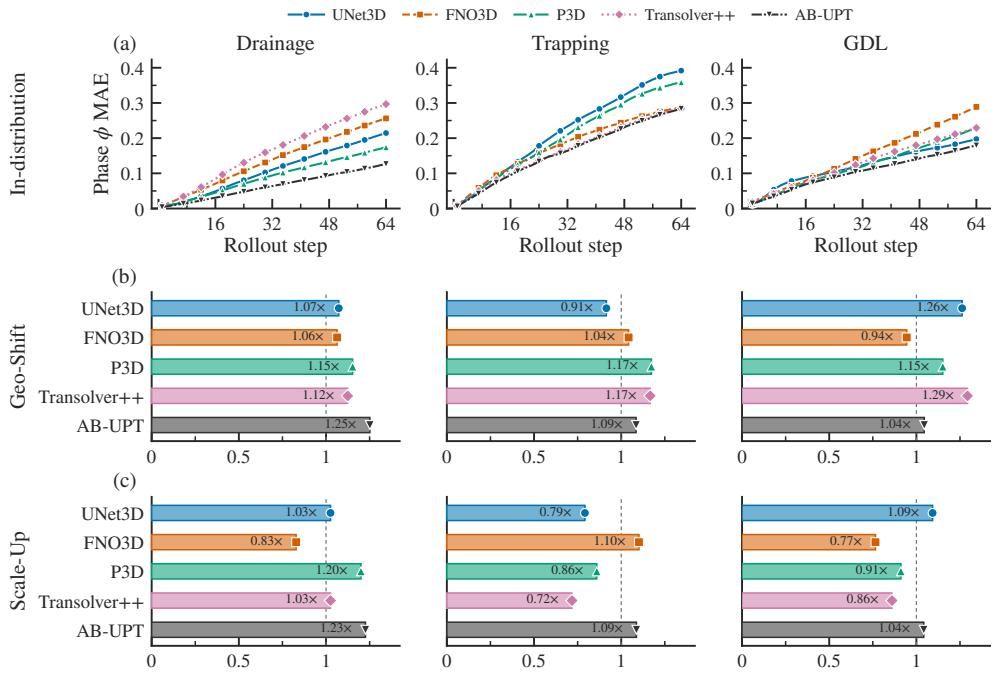  
Figure 5: In-distribution rollout curve and transfer capability. (a) In-distribution Phase MAE along the 64-step in-distribution rollout. (b) Geo-Shift and (c) Scale-Up: step-64 phase MAE relative to the same model's in-distribution MAE (generated-only for Geo-Shift). A ratio of 1.5 indicates 50% higher error; the dashed line at 1 indicates no change.

## 4.3 DISTRIBUTION SHIFT: GEO-SHIFT AND SCALE-UP

A model is useful when trained on affordable ground-truth data and applied to cases where such data are more costly to generate: in scanned materials and on larger domains (Figure 2). Geo-Shift trains on generated geometries, $g \sim P _ { \mathrm { g e n } }$ , and tests on $g \sim P _ { \mu \mathrm { C T } }$ , whose pore sizes overlap but whose morphology and connectivity differ. Scale-Up applies weights trained on the small domain to the large one at the same resolution: domain-size extrapolation, not super-resolution, with more pores, longer connectivity paths, and more frequent interactions between local events and the global flow. Both reuse the trained weights without retraining under the rollout protocol of Section 4.2, and each result is read against the same model's in-distribution error, which separates the cost of the shift from the difficulty of the rollout.

Results. $\phi$ rollout errors remain bounded across both shifts, but $M _ { 3 }$ (Euler characteristic) is consistently the least well predicted metric. AB-UPT achieves the lowest $\phi$ MAE in five of six blocks (Table 2). Bulk geometry is more sensitive: under Scale-Up, phase-volume and interfacial-area errors increase more than field error. Topological fidelity warrants closer attention during rollout, particularly for GDL, where a prediction that engulfs a fiber or bridges two regions with a voxel-thin strand closes a loop and lowers the Euler characteristic by one, with little effect on the field error (Appendix I). Transfer to scanned materials and larger domains is encouraging, but low field and bulk geometric errors do not necessarily imply faithful local geometry or phase topology. These results motivate future research that focuses on preserving physically meaningful phase topology over long rollouts.

## 5 CONCLUSION

PoreML aims to address the scarcity of time-resolved 3D data and unified learning benchmarks for multiphase flow in porous media. It unifies a validated open-source solver, datasets across four applications, and reproducible training and evaluation tools. Its 64-step rollouts and transfer tests assess field accuracy alongside interface geometry and topology, measured through phase volume, interfacial area, integrated mean curvature, and the Euler characteristic. These metrics connect model evaluation to dynamics that matter for energy storage, fuel cells, and chip packaging. The baselines provide initial performance references, while explicit tests of mass and momentum conservation remain future work. Limitations and future directions are discussed in Appendix J. By enabling new data generation, consistent model comparison, and extension to new conditions, PoreML provides a shared foundation for advancing machine learning in porous media.

## AI USE STATEMENT

We used generative AI tools to revise and polish manuscript text for readability, assist with LaTeX formatting, and support literature retrieval and discovery, including identifying related work. We also used these tools to support research execution through software development and scripting. We did not use generative AI tools to interpret results, formulate claims or develop proofs, or design experiments or research methods. We have reviewed all AI-assisted work and take responsibility for the final content of this work, including text, claims, software, and other artifacts produced with the aid of generative AI.

## REPRODUCIBILITY STATEMENT

Every resource needed to reproduce this work is public and documented in Appendix K: the solver, with its test suite, the validation cases of Appendix E, and the campaign drivers that generated every run; the dataset and the input geometries, every run carrying its solver configuration, geometry hash, and run conditions; and the machine learning framework, with the configuration file of every benchmark run, the frozen splits of the Geo-Shift and Scale-Up challenges, the trained checkpoints behind every reported number, and a demo notebook that runs the full workflow on a small subset of the data. Simulation settings and parameter sampling are given in Appendix F, and the baseline architectures and training recipes in Appendix H.

## REFERENCES

B. Ahrenholz, J. Tölke, P. Lehmann, A. Peters, A. Kaestner, M. Krafczyk, and W. Durner. Prediction of capillary hysteresis in a porous material using lattice-Boltzmann methods and comparison to experimental data and a morphological pore network model. Advances in Water Resources, 31 (9):1151–1173, 2008. doi: 10.1016/j.advwatres.2008.03.009.

Takashi Akai, Branko Bijeljic, and Martin J. Blunt. Wetting boundary condition for the colorgradient lattice Boltzmann method: Validation with analytical and experimental data. Advances in Water Resources, 116:56–66, 2018. doi: 10.1016/j.advwatres.2018.03.014.

Faisal Aljaberi, Hadi Belhaj, Sajjad Foroughi, Martin J. Blunt, and Mohammed Al Kobaisi. Spatially distributed wettability characterization in porous media. Scientific Reports, 16:12643, 2026. doi: 10.1038/s41598-026-43688-1.

Benedikt Alkin, Maurits Bleeker, Richard Kurle, Tobias Kronlachner, Reinhard Sonnleitner, Matthias Dorfer, and Johannes Brandstetter. AB-UPT: Scaling neural CFD surrogates for highfidelity automotive aerodynamics simulations via anchored-branched universal physics transformers. Transactions on Machine Learning Research, 2025. URL https : / /openreview . net/ forum?id=nwQ8nitlTz.

Matthew Andrew, Branko Bijeljic, and Martin J. Blunt. Pore-scale imaging of trapped supercritical carbon dioxide in sandstones and carbonates. International Journal of Greenhouse Gas Control 22:1–14, 2014. doi: 10.1016/j.ijggc.2013.12.018.

Ryan T. Armstrong, James E. McClure, Mark A. Berrill, Maja Rücker, Steffen Schlüter, and Steffen Berg. Beyond Darcy's law: The role of phase topology and ganglion dynamics for two-fluid flow. Physical Review E, 94(4):043113, 2016. doi: 10.1103/PhysRevE.94.043113.

Ryan T. Armstrong, James E. McClure, Vanessa Robins, Zhishang Liu, Christoph H. Arns, Steffen Schlüter, and Steffen Berg. Porous media characterization using Minkowski functionals: Theories, applications and future directions. Transport in Porous Media, 130:305–335, 2019. doi: 10.1007/s11242-018-1201-4.

Ryan T. Armstrong, Omid Tavakkoli, Ying Da Wang, Zhe Li, Peyman Mostaghimi, Steffen Berg, Thomas Ramstad, Maja Rücker, and James McClure. Lattice-Boltzmann for porous media: 100M+ GPU hours. Scientific Data, 13:697, 2026. doi: 10.1038/s41597-026-06823-1.

Jacob Bear. Dynamics of Fluids in Porous Media. American Elsevier, 1972. ISBN 0-444-00114-X.

Steffen Berg, Holger Ott, Stephan A. Klapp, Alex Schwing, Rob Neiteler, Niels Brussee, Axel Makurat, Leon Leu, Frieder Enzmann, Jens-Oliver Schwarz, Michael Kersten, Sarah Irvine, and Marco Stampanoni. Real-time 3D imaging of Haines jumps in porous media flow. Proceedings of the National Academy of Sciences, 110(10):3755–3759, 2013. doi: 10.1073/pnas.1221373110.

Steffen Berg, Ryan T. Armstrong, Maja Rücker, Alex Hansen, Signe Kjelstrup, and Dick Bedeaux. From interface dynamics to Darcy scale description of multiphase flow in porous media. Advances in Colloid and Interface Science, 351:103791, 2026. doi: 10.1016/j.cis.2026.103791.

Tom Beucler, Michael Pritchard, Stephan Rasp, Jordan Ott, Pierre Baldi, and Pierre Gentine. Enforcing analytic constraints in neural networks emulating physical systems. Physical Review Letters, 126(9):098302, 2021. doi: 10.1103/PhysRevLett.126.098302.

Martin J. Blunt. Multiphase Flow in Permeable Media: A Pore-Scale Perspective. Cambridge University Press, 2017. doi: 10.1017/9781316145098.

Martin J. Blunt, Branko Bijeljic, Hu Dong, Oussama Gharbi, Stefan Iglauer, Peyman Mostaghimi, Adriana Paluszny, and Christopher Pentland. Pore-scale imaging and modelling. Advances in Water Resources, 51:197–216, 2013. doi: 10.1016/j.advwatres.2012.03.003.

J. U. Brackbill, D. B. Kothe, and C. Zemach. A continuum method for modeling surface tension. Journal of Computational Physics, 100(2):335–354, 1992. doi: 10.1016/0021-9991(92)90240-Y.

James Bradbury, Roy Frostig, Peter Hawkins, Matthew James Johnson, Yash Katariya, Chris Leary, Dougal Maclaurin, George Necula, Adam Paszke, Jake VanderPlas, Skye Wanderman-Milne, and Qiao Zhang. JAX: Composable transformations of Python+NumPy programs, 2018. URL https://github.com/jax-ml/jax.

Johannes Brandstetter, Daniel Worrall, and Max Welling. Message passing neural PDE solvers. In International Conference on Learning Representations, 2022. URL https : / /openreview. net/forum?id=vSix3HPYKSU.

Tom Bultreys, Sharon Ellman, Christian M. Schlepütz, Matthieu N. Boone, Gülce Kalyoncu Pakkaner, Shan Wang, Mostafa Borji, Stefanie Van Offenwert, Niloofar Moazami Goudarzi, Wannes Goethals, Chandra Widyananda Winardhi, and Veerle Cnudde. 4D microvelocimetry reveals multiphase flow field perturbations in porous media. Proceedings of the National Academy of Sciences, 121(12):e2316723121, 2024. doi: 10.1073/pnas.2316723121.

Francisco J. Carrillo, Cyprien Soulaine, and Ian C. Bourg. The impact of sub-resolution porosity on numerical simulations of multiphase flow. Advances in Water Resources, 161:104094, 2022. doi: 10.1016/j.advwatres.2021.104094.

Yu Chen, Albert J. Valocchi, Qinjun Kang, and Hari S. Viswanathan. Inertial effects during the process of supercritical CO2 displacing brine in a sandstone: Lattice Boltzmann simulations based on the continuum-surface-force and geometrical wetting models. Water Resources Research, 55: 11144–11165, 2019. doi: 10.1029/2019WR025746.

Özgün Çiçek, Ahmed Abdulkadir, Soeren S. Lienkamp, Thomas Brox, and Olaf Ronneberger. 3D U-Net: Learning dense volumetric segmentation from sparse annotation. In Medical Image Computing and Computer-Assisted Intervention – MICCAI 2016, volume 9901 of Lecture Notes in Computer Science, pp. 424–432, 2016. doi: 10.1007/978-3-319-46723-8\_49.

Dominique d'Humières, Irina Ginzburg, Manfred Krafczyk, Pierre Lallemand, and Li-Shi Luo. Multiple-relaxation-time lattice Boltzmann models in three dimensions. Philosophical Transactions of the Royal Society of London A, 360(1792):437–451, 2002. doi: 10.1098/rsta.2001.0955.

H. Ding and P. D. M. Spelt. Wetting condition in diffuse interface simulations of contact line motion. Physical Review E, 75(4):046708, 2007. doi: 10.1103/PhysRevE.75.046708.

Yoevita Emeliana, Benedicta Loveni Melkisedek, and Irwan Ary Dharmawan. Integrating lattice Boltzmann and neural networks for modeling transport parameters in porous rocks: A systematic review. Results in Engineering, 29:108688, 2026. doi: 10.1016/j.rineng.2025.108688.

Eliyahu M. Farber, Nicola M. Seraphim, Kesha Tamakuwala, Andreas Stein, Maja Rücker, and David Eisenberg. Porous materials: The next frontier in energy technologies. Science, 390(6772): eadn9391, 2025. doi: 10.1126/science.adn9391.

Olga Fuks and Hamdi A. Tchelepi. Limitations of physics informed machine learning for nonlinear two-phase transport in porous media. Journal of Machine Learning for Modeling and Computing, 1(1):19–37, 2020. doi: 10.1615/JMachLearnModelComput.2020033905.

Gaetano Garfi, Cédric M. John, Steffen Berg, and Samuel Krevor. The sensitivity of estimates of multiphase fluid and solid properties of porous rocks to image processing. Transport in Porous Media, 131(3):985–1005, 2020. doi: 10.1007/s11242-019-01374-z.

A. Georgiadis, S. Berg, A. Makurat, G. Maitland, and H. Ott. Pore-scale micro-computedtomography imaging: Nonwetting-phase cluster-size distribution during drainage and imbibition. Physical Review E, 88(3):033002, 2013. doi: 10.1103/physreve.88.033002.

Ivan Gorenkov. Pore-scale wettability LBM benchmark dataset. Zenodo, 2026. Dataset; published 2026-07-13.

Andrew K. Gunstensen, Daniel H. Rothman, Stéphane Zaleski, and Gianluigi Zanetti. Lattice Boltzmann model of immiscible fluids. Physical Review A, 43(8):4320–4327, 1991. doi: 10.1103/PhysRevA.43.4320.

Zhaoli Guo, Chuguang Zheng, and Baochang Shi. Discrete lattice effects on the forcing term in the lattice Boltzmann method. Physical Review E, 65(4):046308, 2002. doi: 10.1103/PhysRevE.65. 046308.

I. Halliday, A. P. Hollis, and C. M. Care. Lattice Boltzmann algorithm for continuum multicomponent flow. Physical Review E, 76(2):026708, 2007. doi: 10.1103/PhysRevE.76.026708.

Sheikh Md Shakeel Hassan, Arthur Feeney, Akash Dhruv, Jihoon Kim, Youngjoon Suh, Jaiyoung Ryu, Yoonjin Won, and Aparna Chandramowlishwaran. BubbleML: A multiphase multiphysics dataset and benchmarks for machine learning. In Advances in Neural Information Processing Systems, volume 36, pp. 418–449, 2023. doi: 10.52202/075280-0021. Datasets and Benchmarks Track.

Benjamin Holzschuh, Georg Kohl, Florian Redinger, and Nils Thuerey. P3D: Highly scalable 3D neural surrogates for physics simulations with global context. In International Conference on Learning Representations, 2026. URL https://openreview.net/forum?id= 8UdCE5nhFl.

S. J. Jackson, Q. Lin, and S. Krevor. Representative elementary volumes, hysteresis, and heterogeneity in multiphase flow from the pore to continuum scale. Water Resources Research, 56(6): e2019WR026396, 2020. doi: 10.1029/2019wr026396.

George Em Karniadakis, Ioannis G. Kevrekidis, Lu Lu, Paris Perdikaris, Sifan Wang, and Liu Yang. Physics-informed machine learning. Nature Reviews Physics, 3(6):422–440, 2021. doi: 10.1038/ s42254-021-00314-5.

Dmitrii Kochkov, Jamie A. Smith, Ayya Alieva, Qing Wang, Michael P. Brenner, and Stephan Hoyer. Machine learning-accelerated computational fluid dynamics. Proceedings of the National Academy of Sciences, 118(21):e2101784118, 2021. doi: 10.1073/pnas.2101784118.

Nikola Kovachki, Zongyi Li, Burigede Liu, Kamyar Azizzadenesheli, Kaushik Bhattacharya, Andrew Stuart, and Anima Anandkumar. Neural operator: Learning maps between function spaces with applications to PDEs. Journal of Machine Learning Research, 24(89):1–97, 2023. URL https://www.jmlr.org/papers/v24/21-1524.html.

Samuel Krevor, Martin J. Blunt, Sally M. Benson, Christopher H. Pentland, Catriona Reynolds, Ali Al-Menhali, and Ben Niu. Capillary trapping for geologic carbon dioxide storage – from pore scale physics to field scale implications. International Journal of Greenhouse Gas Control, 40: 221–237, 2015. doi: 10.1016/j.ijggc.2015.04.006.

Samuel Krevor, Heleen de Coninck, Sarah E. Gasda, Navraj Singh Ghaleigh, Vincent de Gooyert, Hadi Hajibeygi, Ruben Juanes, Jerome Neufeld, Jennifer J. Roberts, and Floris Swennenhuis. Subsurface carbon dioxide and hydrogen storage for a sustainable energy future. Nature Reviews Earth & Environment, 4(2):102–118, 2023. doi: 10.1038/s43017-022-00376-8.

M. Latva-Kokko and Daniel H. Rothman. Diffusion properties of gradient-based lattice Boltzmann models of immiscible fluids. Physical Review E, 71(5):056702, 2005a. doi: 10.1103/PhysRevE. 71.056702.

M. Latva-Kokko and Daniel H. Rothman. Static contact angle in lattice Boltzmann models of immiscible fluids. Physical Review E, 72(4):046701, 2005b. doi: 10.1103/PhysRevE.72.046701.

Sébastien Leclaire, Andrea Parmigiani, Orestis Malaspinas, Bastien Chopard, and Jonas Latt. Generalized three-dimensional lattice Boltzmann color-gradient method for immiscible two-phase pore-scale imbibition and drainage in porous media. Physical Review E, 95(3):033306, 2017. doi: 10.1103/PhysRevE.95.033306.

Jung Shin Lee, Sujie Kang, and Daniel Min Woo Rhee. Numerical analysis of narrow-gap underfill flow in the flip-chip process using the lattice Boltzmann method. IMAPSource Proceedings, 2023 (Symposium), 2024. doi: 10.4071/001c.94481.

Roland Lenormand, Eric Touboul, and César Zarcone. Numerical models and experiments on immiscible displacements in porous media. Journal of Fluid Mechanics, 189:165–187, 1988. doi: 10.1017/S0022112088000953.

Zhe Li, James E. McClure, Jill Middleton, Trond Varslot, and Adrian P. Sheppard. Discretization limits of lattice-Boltzmann methods for studying immiscible two-phase flow in porous media. International Journal for Numerical Methods in Fluids, 92(9):1162–1197, 2020. doi: 10.1002/ fld.4822.

Zongyi Li, Nikola Kovachki, Kamyar Azizzadenesheli, Burigede Liu, Kaushik Bhattacharya, Andrew Stuart, and Anima Anandkumar. Fourier neural operator for parametric partial differential equations. In International Conference on Learning Representations, 2021. URL https: //openreview.net/forum?id=c8P9NQVtmnO.

Haihu Liu, Qinjun Kang, Christopher R. Leonardi, Sebastian Schmieschek, Ariel Narváez, Bruce D. Jones, John R. Williams, Albert J. Valocchi, and Jens Harting. Multiphase lattice Boltzmann simulations for porous media applications: A review. Computational Geosciences, 20(4):777– 805, 2016. doi: 10.1007/s10596-015-9542-3.

Huakun Luo, Haixu Wu, Hang Zhou, Lanxiang Xing, Yichen Di, Jianmin Wang, and Mingsheng Long. Transolver++: An accurate neural solver for PDEs on million-scale geometries. In Proceedings of the 42nd International Conference on Machine Learning, volume 267 of Proceedings of Machine Learning Research, pp. 41432–41449, 2025. URL https: //proceedings. mlr.press/v267/luo25o.html.

Geoffrey Mason and Norman R. Morrow. Capillary behavior of a perfectly wetting liquid in irregular triangular tubes. Journal of Colloid and Interface Science, 141(1):262–274, 1991. doi: 10.1016/ 0021-9797(91)90321-X.

James E. McClure, Ryan T. Armstrong, Mark A. Berrill, Steffen Schlüter, Steffen Berg, William G. Gray, and Cass T. Miller. Geometric state function for two-fluid flow in porous media. Physical Review Fluids, 3(8):084306, 2018. doi: 10.1103/PhysRevFluids.3.084306

James E. McClure, Zhe Li, Mark Berrill, and Thomas Ramstad. The LBPM software package for simulating multiphase flow on digital images of porous rocks. Computational Geosciences, 25 (3):871–895, 2021. doi:10.1007/s10596-020-10028-9.

Colin McPhee, Jules Reed, and Izaskun Zubizarreta. Core Analysis: A Best Practice Guide, volume 64 of Developments in Petroleum Science. Elsevier, 2015. ISBN 978-0-444-63533-4. doi: 10.1016/C2014-0-00418-2.

Rodrigo Neumann, Mariane Andreeta, and Everton Lucas-Oliveira. 11 sandstones: raw, filtered and segmented data. Digital Rocks Portal, project 317, 2020.

Rodrigo F. Neumann, Mariane Barsi-Andreeta, Everton Lucas-Oliveira, Hugo Barbalho, Willian A. Trevizan, Tito J. Bonagamba, and Mathias B. Steiner. High accuracy capillary network representation in digital rock reveals permeability scaling functions. Scientific Reports, 11(1):11370, 2021. doi: 10.1038/s41598-021-90090-0.

Fei Chong Ng, Aizat Abas, Muhammad Naqib Nashrudin, and M. Yusuf Tura Ali. Analytical and numerical analyses of filling progression and void formation in flip-chip underfill encapsulation process. Soldering & Surface Mount Technology, 34(4):193-202, 2022. doi: 10.1108/SSMT-08-2021-0055.

Ruben Ohana, Michael McCabe, Lucas Meyer, Rudy Morel, Fruzsina J. Agocs, Miguel Beneitez, Marsha Berger, Blakesley Burkhart, Stuart B. Dalziel, Drummond B. Fielding, Daniel Fortunato, Jared A. Goldberg, Keiya Hirashima, Yan-Fei Jiang, Rich R. Kerswell, Suryanarayana Maddu, Jonah Miller, Payel Mukhopadhyay, Stefan S. Nixon, Jeff Shen, Romain Watteaux, Bruno Régaldo-Saint Blancard, François Rozet, Liam H. Parker, Miles Cranmer, and Shirley Ho. The Well: A large-scale collection of diverse physics simulations for machine learning. In Advances in Neural Information Processing Systems, volume 37, pp. 44989–45037, 2024. doi: 10.52202/079017-1430. Datasets and Benchmarks Track.

C. Pan, M. Hilpert, and C. T. Miller. Lattice-Boltzmann simulation of two-phase flow in porous media. Water Resources Research, 40(1):W01501, 2004. doi: 10.1029/2003WR002120.

Nathalie C. Pinheiro, Donghu Guo, Hannah P. Menke, Aniket C. Joshi, Claire E. Heaney, Ahmed H. Elsheikh, and Christopher C. Pain. Surrogate models for rock-fluid interaction: a grid-size-invariant approach. Engineering with Computers, 42(4):131, 2026. doi: 10.1007/ s00366-026-02353-x.

Piyush Pradhan, Pierre Gentine, and Shaina Kelly. JAX-LaB: A high-performance, differentiable lattice Boltzmann library for modeling multiphase fluid dynamics in geosciences and engineering. Journal of Advances in Modeling Earth Systems, 18(2):e2025MS005313, 2026. doi: 10.1029/ 2025MS005313.

Y. H. Qian, D. d’Humières, and P. Lallemand. Lattice BGK models for Navier-Stokes equation. Europhysics Letters, 17(6):479–484, 1992. doi: 10.1209/0295-5075/17/6/001.

Maziar Raissi, Paris Perdikaris, and George E. Karniadakis. Physics-informed neural networks: A deep learning framework for solving forward and inverse problems involving nonlinear partial differential equations. Journal of Computational Physics, 378:686–707, 2019. doi: 10.1016/j. jcp.2018.10.045.

T. Reis and T. N. Phillips. Lattice Boltzmann model for simulating immiscible two-phase flows. Journal of Physics A: Mathematical and Theoretical, 40(14):4033–4053, 2007. doi: 10.1088/ 1751-8113/40/14/018.

Catriona A. Reynolds, Hannah Menke, Matthew Andrew, Martin J. Blunt, and Samuel Krevor. Dynamic fluid connectivity during steady-state multiphase flow in a sandstone. Proceedings of the National Academy of Sciences, 114(31):8187–8192, 2017. doi: 10.1073/pnas.1702834114.

Jack Richter-Powell, Yaron Lipman, and Ricky T. Q. Chen. Neural conservation laws: A divergencefree perspective. In Advances in Neural Information Processing Systems, volume 35, pp. 38075– 38088, 2022. doi: 10.52202/068431-2759.

J. G. Roof. Snap-off of oil droplets in water-wet pores. Society of Petroleum Engineers Journal, 10 (1):85–90, 1970. doi: 10.2118/2504-pa.

M. Rücker, S. Berg, R. T. Armstrong, A. Georgiadis, H. Ott, A. Schwing, R. Neiteler, N. Brussee, A. Makurat, L. Leu, M. Wolf, F. Khan, F. Enzmann, and M. Kersten. From connected pathway flow to ganglion dynamics. Geophysical Research Letters, 42(10):3888–3894, 2015. doi: 10. 1002/2015g1064007.

Javier E. Santos, Duo Xu, Honggeun Jo, Christopher J. Landry, Maša Prodanović, and Michael J. Pyrcz. PoreFlow-Net: A 3D convolutional neural network to predict fluid flow through porous media. Advances in Water Resources, 138:103539, 2020. doi: 10.1016/j.advwatres.2020.103539.

Javier E. Santos, Bernard Chang, Alex Gigliotti, Ying Yin, Wenhui Song, Maša Prodanović, Qinjun Kang, Nicholas Lubbers, and Hari Viswanathan. A dataset of 3D structural and simulated transport properties of complex porous media. Scientific Data, 9:579, 2022. doi: 10.1038/s41597-022-01664-0.

Patrick Sarkezi-Selsky, Henrike Schmies, Alexander Kube, Arnulf Latz, and Thomas Jahnke. Lattice Boltzmann simulation of liquid water transport in gas diffusion layers of proton exchange membrane fuel cells: Parametric studies on capillary hysteresis. Journal of Power Sources, 535: 231381, 2022. doi: 10.1016/j.jpowsour.2022.231381.

Nishank Saxena, Amie Hows, Ronny Hofmann, Faruk O. Alpak, Justin Freeman, Sander Hunter, and Matthias Appel. Imaging and computational considerations for image computed permeability: Operating envelope of digital rock physics. Advances in Water Resources, 116:127–144, 2018. doi: 10.1016/j.advwatres.2018.04.001.

S. Schlüter, S. Berg, M. Rücker, R. T. Armstrong, H.-J. Vogel, R. Hilfer, and D. Wildenschild. Porescale displacement mechanisms as a source of hysteresis for two-phase flow in porous media. Water Resources Research, 52(3):2194–2205, 2016. doi: 10.1002/2015wr018254.

M. Sedahmed and R. C. V. Coelho. Wetting and pressure gradient performance in a lattice Boltzmann color gradient model. Physics of Fluids, 36(9):092117, 2024. doi: 10.1063/5.0228835.

Abbos Shodiev, Marc Duquesnoy, Oier Arcelus, Mehdi Chouchane, Jianlin Li, and Alejandro A. Franco. Machine learning 3D-resolved prediction of electrolyte infiltration in battery porous electrodes. Journal of Power Sources, 511:230384, 2021. doi: 10.1016/j.jpowsour.2021.230384.

Mohammad Javad Shojaei, Branko Bijeljic, Yihuai Zhang, and Martin J. Blunt. Minimal surfaces in porous materials: X-ray image-based measurement of the contact angle and curvature in gas diffusion layers to design optimal performance of fuel cells. ACS Applied Energy Materials, 5(4): 4613–4621, 2022. doi: 10.1021/acsaem.2c00023.

Mohammad Javad Shojaei, Martin J. Blunt, Branko Bijeljic, Sajjad Foroughi, and Min Li. X-ray tomography dataset of gas diffusion layers with different coating percentages along with their corresponding segmented images. Digital Rocks Portal, project 462, 2023.

Kamaljit Singh, Hannah Menke, Matthew Andrew, Qingyang Lin, Christoph Rau, Martin J. Blunt, and Branko Bijeljic. Dynamics of snap-off and pore-filling events during two-phase fluid flow in permeable media. Scientific Reports, 7:5192, 2017. doi: 10.1038/s41598-017-05204-4.

Kamaljit Singh, Michael Jung, Martin Brinkmann, and Ralf Seemann. Capillary-dominated fluid displacement in porous media. Annual Review of Fluid Mechanics, 51(1):429–449, 2019. doi: 10.1146/annurev-fluid-010518-040342.

James G. Speight. Reservoirs and reservoir fluids. In Shale Oil and Gas Production Processes. Gulf Professional Publishing, 2020. doi: 10.1016/B978-0-12-813315-6.00003-8.

Makoto Takamoto, Timothy Praditia, Raphael Leiteritz, Daniel MacKinlay, Francesco Alesiani, Dirk Pflüger, and Mathias Niepert. PDEBench: An extensive benchmark for scientific machine learning. In Advances in Neural Information Processing Systems, volume 35, pp. 1596–1611, 2022. doi: 10.52202/068431-0117. Datasets and Benchmarks Track.

Omid Tavakkoli, Ying Da Wang, Peyman Mostaghimi, and Ryan T. Armstrong. A pore morphologybased initializer to accelerate lattice Boltzmann simulations of capillary-dominated flow with variable wettability. Physics of Fluids, 37(9):092125, 2025. doi: 10.1063/5.0285656.

Kim Robert Tekseth, Fazel Mirzaei, Bratislav Lukic, Basab Chattopadhyay, and Dag Werner Breiby. Multiscale drainage dynamics with Haines jumps monitored by stroboscopic 4D X-ray microscopy. Proceedings of the National Academy of Sciences, 121(1):e2305890120, 2024. doi: 10.1073/pnas.2305890120.

Hui Wang, Xufei Hao, Huamin Zhou, Yun Zhang, and Dequn Li. Underfill flow simulation based on lattice Boltzmann method. Microelectronic Engineering, 149:66–72, 2016. doi: 10.1016/j.mee. 2015.09.010.

Yang Wang, Keliang Dong, Jiayi Liu, Haihu Liu, and Haizhuan Yuan. LBM simulation of capillarydriven underfill flow in flip-chip packaging. Computers & Fluids, 315:107139, 2026. doi: 10. 1016/j.compfluid.2026.107139.

Ying Da Wang, Quentin Meyer, Kunning Tang, James E. McClure, Robin T. White, Stephen T. Kelly, Matthew M. Crawford, Francesco Iacoviello, Dan J. L. Brett, Paul R. Shearing, Peyman Mostaghimi, Chuan Zhao, and Ryan T. Armstrong. Large-scale physically accurate modelling of real proton exchange membrane fuel cell with deep learning. Nature Communications, 14(1):745, 2023. doi: 10.1038/s41467-023-35973-8.

Edward W. Washburn. The dynamics of capillary flow. Physical Review, 17(3):273–283, 1921. doi: 10.1103/PhysRev.17.273.

Adam Z. Weber, Rodney L. Borup, Robert M. Darling, Prodip K. Das, Thomas J. Dursch, Wenbin Gu, David Harvey, Ahmet Kusoglu, Shawn Litster, Matthew M. Mench, Rangachary Mukundan, Jon P. Owejan, Jon G. Pharoah, Marc Secanell, and Iryna V. Zenyuk. A critical review of modeling transport phenomena in polymer-electrolyte fuel cells. Journal of The Electrochemical Society, 161(12):F1254–F1299, 2014. doi: 10.1149/2.0751412jes.

Haixu Wu, Huakun Luo, Haowen Wang, Jianmin Wang, and Mingsheng Long. Transolver: A fast transformer solver for PDEs on general geometries. In Proceedings of the 41st International Conference on Machine Learning, volume 235 of Proceedings of Machine Learning Research, pp. 53681-53705,2024.URL https://proceedings.mlr.press/v235/wu24r.html.

Zhiyuan Xu, Haihu Liu, and Albert J. Valocchi. Lattice Boltzmann simulation of immiscible twophase flow with capillary valve effect in porous media. Water Resources Research, 53(5):3770– 3790, 2017. doi: 10.1002/2017WR020373.

Jianhui Yang and Edo S. Boek. A comparison study of multi-component lattice Boltzmann models for flow in porous media applications. Computers & Mathematics with Applications, 65(6):882– 890, 2013. doi: 10.1016/j.camwa.2012.11.022.

Ioannis Zacharoudiou, Emily M. Chapman, Edo S. Boek, and John P. Crawshaw. Pore-filling events in single junction micro-models with corresponding lattice Boltzmann simulations. Journal of Fluid Mechanics, 824:550–573, 2017. doi: 10.1017/jfm.2017.363.

Z. Zhang and C. P. Wong. Recent advances in flip-chip underfill: Materials, process, and reliability. IEEE Transactions on Advanced Packaging, 27(3):515–524, 2004. doi: 10.1109/TADVP.2004. 831870.

Qisu Zou and Xiaoyi He. On pressure and velocity boundary conditions for the lattice Boltzmann BGK model. Physics of Fluids, 9(6):1591–1598, 1997. doi: 10.1063/1.869307.

## A OTHER EXPERIMENT RESULTS

This appendix collects results that complement the main text.

## A.1 SUPPLEMENTARY METRICS

Table 3 reports five further metrics for the same campaign, study, and model rows as Table 2; blocks, averaging, and contributing runs follow that table. Each answers a question that the main table leaves open.

Relative phase error (φ, Rel. MAE). The summed absolute phase error divided by the summed magnitude of the reference field, $\sum | \widehat { \phi } - \phi | / \sum$ |φ] over the scored pore voxels. Because |φ| is close to one away from the interface, it expresses the phase MAE as a fraction of the field, which makes campaigns and domain sizes directly comparable.

Phase overlap (IoU). Both fields are thresholded into the non-wetting body, and the volume the two bodies share is divided by the volume either occupies. IoU asks whether the fluid is in the right place, not merely present in the right amount: a rollout with the correct saturation but a ganglion in the wrong pore scores low, and one means agreement voxel for voxel. It is the score printed on the panels of Appendix L.

Velocity error (u). The mean magnitude of the velocity error vector, $\lVert \widehat { \mathbf { u } } - \mathbf { u } \rVert _ { 2 }$ averaged over the scored pore voxels, in normalized units.

Saturation error (S). The absolute difference between predicted and reference saturation, the fraction of the pore volume that the scored phase occupies. Saturation is the bulk variable in which continuum descriptions of multiphase flow are written, and an error of 0.01 means that the predicted phase volume is off by one percent of the pore volume. It is the absolute counterpart of the relative $M _ { 0 }$ error of Table 2.

Curvature distribution $( H , W _ { 1 } / \sigma )$ . Every meniscus has its own mean curvature, set by the pore it sits in, so an interface carries a distribution of H rather than one value; $M _ { 2 }$ keeps only its integral. We histogram H over the fluid-fluid interface and report the Wasserstein-1 distance between the predicted and reference histograms, divided by the standard deviation of the reference. $W _ { 1 }$ is the average amount by which curvature values must be shifted to turn one distribution into the other, so a score of one means the predicted curvatures are off by one reference standard deviation on average, and through the Young-Laplace equation (Appendix B.1) so are the local capillary pressures.

## B GEOMETRIC METRICS

## B.1 CURVATURE AND CAPILLARY PRESSURE

In full, the Young-Laplace equation of Section 3.3 reads

$$
p _ { c } = p _ { \mathrm { n w } } - p _ { \mathrm { w } } = 2 \sigma H = \sigma ( \kappa _ { 1 } + \kappa _ { 2 } ) ,\tag{7}
$$

where $p _ { c }$ is the capillary pressure, $p _ { \mathrm { n w } }$ and $p _ { \mathrm { w } }$ are the local non-wetting- and wetting-phase pressures, $\sigma$ is the fluid-fluid interfacial tension, and $H = ( \kappa _ { 1 } + \kappa _ { 2 } ) / 2$ is the mean curvature. The principal curvatures $\kappa _ { 1 } = 1 / r _ { 1 }$ and $\kappa _ { 2 } = 1 / r _ { 2 }$ are defined by the signed principal radii $r _ { 1 }$ and $r _ { 2 } .$ with positive curvature for a convex non-wetting body. At fixed interfacial tension, a curvature error therefore translates directly into an error in the inferred capillary pressure, even when predicted phase volume is correct. To measure this geometry, the curvature pipeline extracts a marchingcubes surface, applies non-shrinking Taubin smoothing, fits local principal curvatures, and excludes a neighborhood of the three-phase contact line (Aljaberi et al., 2026). The integral of $\mathrm { E q . } 5$ runs over this fluid–fluid interface, outside the excluded neighborhood, so $M _ { 2 }$ is the total mean curvature of the menisci; a complete spherical interface of radius r gives 4πr.

## B.2 ERROR MEASURES

A metric composes an error measure e with a descriptor d as $e ( d ( \widehat { \mathbf { x } } ) , d ( \mathbf { x } ) )$ , where $\widehat { \mathbf { x } }$ and x are the predicted and reference fields. Field errors are the mean absolute error of $p$ and $\phi$ over the pore voxels of the sample, in the normalized units of the stored frames: an interface that arrives one voxel early is physically benign yet costly under a squared error, whereas MAE keeps the units of the field and grows linearly with misplaced phase volume. For $M _ { 0 } , M _ { 1 }$ , and $M _ { 2 }$ we report the relative error $| M _ { k } ( \widehat { X } _ { t } ) - M _ { k } ( X _ { t } ) | / | M _ { k } ( X _ { t } ) |$ , which makes them comparable across campaigns and domain sizes. For $M _ { 3 }$ we report the MAE of the Euler characteristic $\chi = M _ { 3 } / 4 \pi$ per unit volume of the injected phase: for each run, the sum over its scored frames of $| \chi ( \widehat { X } _ { t } ) - \chi ( X _ { t } ) |$ divided by the summed reference phase volume of those frames, then the mean over runs, in miscounts per $1 0 ^ { 5 }$ voxels. $\chi$ is a signed integer that passes through zero as ganglia form and loops close, so a relative error is undefined there, whereas the miscount is defined on every frame and reads as the number of components, loops, and cavities a prediction gets wrong.

Table 3: Supplementary metrics. Rows and blocks as in Table 2. φ: MAE relative to the mean absolute value of the reference field; IoU: overlap of non-wetting-phase voxels; u: mean magnitude of the velocity error vector in normalized units; S: absolute saturation error; H: Wasserstein-1 distance between predicted and reference mean-curvature distributions, in units of the reference spread. Underfill descriptors (S, H) score the wetting phase; others the non-wetting phase. Means of per-run means; lower is better except IoU. Bold as in Table 2.
<table><tr><td rowspan=1 colspan=9>One-step prediction              Autoregressive rollout, step 64Campaign    Model        φ    φ   u     S    H     φ    φ   u    S    HRel. MAEIoU MAEAbs. err.W₁/σ Rel. MAEIoUMAEAbs. err.W1/σ</td></tr><tr><td rowspan=1 colspan=9>UNet3D    0.002780.987 0.009880.0002050.0541  0.219 0.7380.1160.0127 1.24</td></tr><tr><td rowspan=1 colspan=9>FNO3D     0.005350.9710.01190.0006350.0658 0.262 0.6850.1400.0246 1.40DrainageP3D       0.003440.9880.01010.0002060.0487 0.178 0.8200.1290.007760.677(In-distribution)Transolver++0.005320.9760.01050.0003730.120  0.303 0.641 0.08280.0292 2.72AB-UPT    0.003980.934 0.0092770.0004170.136  0.129 0.830 0.0804 0.007300.946</td></tr><tr><td rowspan=1 colspan=9>UNet3D    0.003210.932 0.00752 0.0006400.0987 0.223 0.698 0.1030.05140.929</td></tr><tr><td rowspan=3 colspan=5>FNO3D    0.005950.883DrainageP3D       0.004050.936(Scale-Up)                        0.904Transolver++0.00665</td><td rowspan=1 colspan=1>0.01180</td><td rowspan=1 colspan=3>.0008050.136 0.215 0.7290.1530.0329 1.08</td></tr><tr><td rowspan=1 colspan=1>0.00797</td><td rowspan=1 colspan=3>0.0007630.0893 0.212 0.7400.1220.0471 0.680</td></tr><tr><td rowspan=1 colspan=1>0.00808</td><td rowspan=1 colspan=3>0.0005960.423 0.309 0.604 0.07270.0694 2.16</td></tr><tr><td rowspan=1 colspan=5>AB-UPT    0.004390.916 0</td><td rowspan=1 colspan=4>.00869 0.0003910.395 0.157 0.766 0.07800.0252 2.28</td></tr><tr><td rowspan=1 colspan=5>UNet3D    0.004360.900</td><td rowspan=1 colspan=4>0.01060.0005490.223 0.180 0.780 0.1150.008010.858</td></tr><tr><td rowspan=3 colspan=3>FNO3DDrainageP3D(Geo-Shift)Transolver++</td><td rowspan=1 colspan=2>0.009470.780</td><td rowspan=1 colspan=3>0.01420.002120.120 0.271 0.687</td><td rowspan=1 colspan=1>0.1430.0728 1.66</td></tr><tr><td rowspan=1 colspan=2>0.004940.897</td><td rowspan=1 colspan=1>0.0110</td><td rowspan=1 colspan=2>0.0005650.397  0.203 0.770</td><td rowspan=1 colspan=1>0.1430.01140.868</td></tr><tr><td rowspan=1 colspan=2>0.007960.864</td><td rowspan=1 colspan=1>40.0113</td><td rowspan=1 colspan=2>0.0006840.861  0.333 0.592</td><td rowspan=1 colspan=1>0.1010.0325 2.95</td></tr><tr><td rowspan=1 colspan=5>AB-UPT    0.003860.896</td><td rowspan=1 colspan=1>0.01010</td><td rowspan=1 colspan=2>.0005780.369  0.126 0.826</td><td rowspan=1 colspan=1>0.08790.00923 1.29</td></tr><tr><td rowspan=1 colspan=5>UNet3D    0.005260.973</td><td rowspan=1 colspan=1>0.0993</td><td rowspan=1 colspan=2>0.0006650.0922 0.202 0.703</td><td rowspan=1 colspan=1>0.2840.0145 1.18</td></tr><tr><td rowspan=3 colspan=3>FNO3DGDLP3D(In-distribution)Transolver++</td><td rowspan=1 colspan=2>0.009630.9560</td><td rowspan=1 colspan=1>.0994</td><td rowspan=1 colspan=2>0.0009000.0705 0.296 0.575</td><td rowspan=1 colspan=1>0.2330.0919 1.52</td></tr><tr><td rowspan=1 colspan=2>0.006370.978</td><td rowspan=1 colspan=1>0.103</td><td rowspan=1 colspan=2>0.0004040.125 0.234 0.685</td><td rowspan=1 colspan=1>0.3020.0397 1.82</td></tr><tr><td rowspan=1 colspan=2>0.006310.956</td><td rowspan=1 colspan=1>0.105</td><td rowspan=1 colspan=1>0.001220</td><td rowspan=1 colspan=1>.0953 0.235 0.614</td><td rowspan=1 colspan=1>0.3930.0285 2.37</td></tr><tr><td rowspan=1 colspan=3>AB-UPT</td><td rowspan=1 colspan=2>0.01210.863</td><td rowspan=1 colspan=1>30.09830</td><td rowspan=1 colspan=1>.000895</td><td rowspan=1 colspan=1>0.475 0.183 0.68</td><td rowspan=1 colspan=1>0.19510.0136 2.27</td></tr><tr><td rowspan=1 colspan=5>UNet3D    0.007730.899</td><td rowspan=1 colspan=1>90.0326</td><td rowspan=1 colspan=1>0.00107</td><td rowspan=1 colspan=1>0.295 0.219 0.624</td><td rowspan=1 colspan=1>0.2180.0575 1.22</td></tr><tr><td rowspan=3 colspan=4>FNO3D     0.00871GDLP3D       0.00861(Scale-Up)Transolver++0.00833</td><td rowspan=1 colspan=1>0.851</td><td rowspan=1 colspan=1>0.02960</td><td rowspan=1 colspan=1>.0009760</td><td rowspan=1 colspan=1>.0463 0.224 0.613</td><td rowspan=1 colspan=1>0.1680.0728 1.85</td></tr><tr><td rowspan=1 colspan=1>0.910</td><td rowspan=1 colspan=1>0.0361</td><td rowspan=1 colspan=1>0.00136</td><td rowspan=1 colspan=1>0.444 0.212 0.681</td><td rowspan=1 colspan=1>0.2390.0304 1.91</td></tr><tr><td rowspan=1 colspan=1>0.851</td><td rowspan=1 colspan=1>0.03580</td><td rowspan=1 colspan=1>.000984</td><td rowspan=1 colspan=2>0.118 0.200 0.6360.3420.0308 2.48</td></tr><tr><td rowspan=1 colspan=5>AB-UPT    0.008420.881</td><td rowspan=1 colspan=1>0.0355</td><td rowspan=1 colspan=1>0.000353</td><td rowspan=1 colspan=2>1.01  0.190 0.6350.1350.0248 2.44</td></tr><tr><td rowspan=1 colspan=5>UNet3D     0.01050.818</td><td rowspan=1 colspan=2>0.06840.00139</td><td rowspan=1 colspan=1>0.736 0.321 0.571</td><td rowspan=1 colspan=1>0.261</td></tr><tr><td rowspan=3 colspan=4>FNO3D     0.0124GDL(Geo-Shift)   P3D       0.0130Transolver++0.0203</td><td rowspan=1 colspan=1>0.687</td><td rowspan=1 colspan=2>0.06830.00411</td><td rowspan=1 colspan=1>0.461 0.266 0.614</td><td rowspan=1 colspan=1>0.196</td></tr><tr><td rowspan=1 colspan=1>0.839</td><td rowspan=1 colspan=2>0.08030.00145</td><td rowspan=1 colspan=1>0.449 0.227 0.695</td><td rowspan=1 colspan=1>0.0269 1.69</td></tr><tr><td rowspan=1 colspan=1>0.660</td><td rowspan=1 colspan=2>0.06860.00527</td><td rowspan=1 colspan=1>0.0899 0.371 0.439</td><td rowspan=1 colspan=1>0.0656 1.89</td></tr><tr><td rowspan=1 colspan=5>AB-UPT    0.01190.782</td><td rowspan=1 colspan=2>0.06700.00229</td><td rowspan=1 colspan=1>0.468 0.188 0.6910.178</td><td rowspan=1 colspan=1>0.0174 1.62</td></tr><tr><td rowspan=5 colspan=5>UNet3D    0.004800.9960FNO3D    0.006770.993TrappingP3D       0.00588(In-distribution)Transolver++0.006440.9940AB-UPT   0.004890.995</td><td rowspan=1 colspan=1>.01250</td><td rowspan=1 colspan=1>.0004780</td><td rowspan=1 colspan=1>.0246 0.406 0.6340.114</td><td rowspan=1 colspan=1>0.05640.948</td></tr><tr><td rowspan=2 colspan=1>0.9939</td><td rowspan=1 colspan=1>0.0135</td><td rowspan=1 colspan=1>0.000934</td><td rowspan=1 colspan=1>0.0514 0.297 0.74</td><td rowspan=1 colspan=1>0.0537 1.01</td></tr><tr><td rowspan=1 colspan=1>0.0129</td><td rowspan=1 colspan=1>0.0004800</td><td rowspan=1 colspan=1>.0235 0.371 0.681</td><td rowspan=1 colspan=1>0.05270.889</td></tr><tr><td rowspan=1 colspan=2>.01290.0006880</td><td rowspan=1 colspan=1>.0238 0.295 0.762 0.0968</td><td rowspan=1 colspan=1>0.0619 1.46</td></tr><tr><td rowspan=1 colspan=2>0.01240.0002650</td><td rowspan=1 colspan=1>.0268 0.294 0.727</td><td rowspan=1 colspan=1>0.09600.0366 1.11</td></tr><tr><td rowspan=1 colspan=5>UNet3D    0.004870.996</td><td rowspan=1 colspan=1>0.00935</td><td rowspan=1 colspan=1>0.000376</td><td rowspan=1 colspan=1>0.321 0.722</td><td rowspan=1 colspan=1>0.1080.03090.808</td></tr><tr><td rowspan=4 colspan=5>FNO3D     0.01070.995TrappingP3D       0.006080.9960(Scale-Up)   Transolver++0.007200.996AB-UPT    0.007620.996 0</td><td rowspan=1 colspan=1>0.0109</td><td rowspan=1 colspan=1>0.000874</td><td rowspan=1 colspan=1>0.0207 0.327 0.717</td><td rowspan=1 colspan=1>0.1150.07950.996</td></tr><tr><td rowspan=1 colspan=1>.00992 0</td><td rowspan=1 colspan=1>.0002460</td><td rowspan=1 colspan=1>.0150 0.319 0.752</td><td rowspan=1 colspan=1>0.1490.03280.902</td></tr><tr><td rowspan=1 colspan=1>0.00980</td><td rowspan=1 colspan=3>0.0003220.0172 0.211 0.837 0.08960.0263 1.25</td></tr><tr><td rowspan=1 colspan=4>.00956 0.0003410.0328 0.319 0.7200.1030.0473 1.35</td></tr><tr><td rowspan=1 colspan=8>UNet3D    0.007750.9940.01420.0008290.0316 0.344 0.678</td><td rowspan=1 colspan=1>0.1370.04270.731</td></tr><tr><td rowspan=4 colspan=6>Trapping     FNO3D    0.009010.9930.0143P3D       0.009500.9930.0147(Geo-Shift)   Transolver++0.008610.9930.0144AB-UPT    0.007490.9940.0143</td><td rowspan=1 colspan=2>0.0009100.0270 0.360 0.67</td><td rowspan=1 colspan=1>0.15470.0555 1.14</td></tr><tr><td rowspan=1 colspan=2></td><td rowspan=1 colspan=3>0.00950 0.993</td><td rowspan=1 colspan=1>0.0147</td><td rowspan=1 colspan=3>0.0006720.0295 0.445 0.6110.1720.0561 0.940</td></tr><tr><td rowspan=1 colspan=3>+ 0.00861 0.993</td><td rowspan=1 colspan=1>0.0144</td><td rowspan=1 colspan=1>0.0006690</td><td rowspan=1 colspan=2>.0319 0.350 0.714 0.1080.0781 1.77</td></tr><tr><td rowspan=1 colspan=2>0.0004460</td><td rowspan=1 colspan=2>.0326 0.335 0.7020.1390.0432 1.29</td></tr><tr><td rowspan=1 colspan=9>UNet3D    0.002050.9980.03300.0001300.0924 0.108 0.950 0.1240.02570.881</td></tr><tr><td rowspan=1 colspan=9>FNO3D     0.01140.9980.06930.0002010.0916 0.245 0.813 0.1630.0964 2.24UnderfillP3D       0.002240.9990.03290.0001010.0675 0.115 0.954 0.1250.02000.954(In-distribution)Transolver++0.004380.9950.04320.0004700.182 0.175 0.891 0.09000.0456 2.04AB-UPT    0.002770.9960.02300.0001580.174 0.0323 0.983 0.0661 0.005610.779</td></tr></table>

## C THE COLOR-GRADIENT LATTICE BOLTZMANN MODEL

## C.1 COLOR-GRADIENT LATTICE BOLTZMANN METHOD

At the continuum scale, pore-scale immiscible flow is governed by the Navier-Stokes equations coupled to interfacial forces and wetting boundary conditions. The color-gradient lattice Boltzmann method (CG-LBM) represents this physics through component distribution functions whose hydrodynamic limit recovers the Navier-Stokes equations, thereby advancing fluid motion and interface evolution on a common lattice. Introduced by Gunstensen et al. (1991), the method has been successively developed in its recoloring, forcing, and wetting formulations (Latva-Kokko & Rothman 2005a; Reis & Phillips, 2007; Halliday et al., 2007; Leclaire et al., 2017; Akai et al., 2018).

LBM is particularly well suited to pore-scale simulation: complex solid boundaries are represented by local lattice rules, allowing voxelized micro-CT images to serve directly as computational domains without an explicit meshing stage, while the local update structure maps efficiently to parallel hardware (Liu et al., 2016).

We consider two immiscible fluids, labeled red (the non-wetting phase) and blue (the wetting phase), with particle distribution functions $f _ { i } ^ { k } ( { \pmb x } , t ) , k \in \{ r , b \}$ , defined on the D3Q19 lattice (Figure 6) with discrete velocities

$$
e _ { i } = \left\{ \begin{array} { l l } { ( 0 , 0 , 0 ) , } & { i = 0 , } \\ { ( \pm 1 , 0 , 0 ) , ~ ( 0 , \pm 1 , 0 ) , ~ ( 0 , 0 , \pm 1 ) , } & { i = 1 , \ldots , 6 , } \\ { ( \pm 1 , \pm 1 , 0 ) , ~ ( \pm 1 , 0 , \pm 1 ) , ~ ( 0 , \pm 1 , \pm 1 ) , } & { i = 7 , \ldots , 1 8 , } \end{array} \right.\tag{8}
$$

where lattice spacing and time step are set to unity. The color densities and the total fluid density and momentum are moments of the distributions,

$$
\rho _ { k } = \sum _ { i } f _ { i } ^ { k } , \qquad \rho = \rho _ { r } + \rho _ { b } , \qquad \rho \pmb { u } = \sum _ { i } f _ { i } e _ { i } + \frac 1 2 \pmb { F } ,\tag{9}
$$

where $f _ { i } = f _ { i } ^ { r } + f _ { i } ^ { b }$ is the total distribution, F is the total body force, and the ${ \frac { 1 } { 2 } } F$ term is the standard half-force correction of Guo et al. (2002). One time step applies, in order: collision with forcing, recoloring, and streaming.

Collision. The total distribution relaxes toward local equilibrium,

$$
f _ { i } ^ { * } ( { \pmb x } , t ) = f _ { i } ( { \pmb x } , t ) + \Omega _ { i } ( { \pmb x } , t ) + \Phi _ { i } ( { \pmb x } , t ) ,\tag{10}
$$

where $f _ { i } ^ { * }$ is the post-collision distribution, $\Omega _ { i }$ the collision operator, and Φi the forcing source term. In the single-relaxation-time form (Qian et al., 1992), $\begin{array} { r } { \Omega _ { i } = - \frac { 1 } { \tau } ( f _ { i } - f _ { i } ^ { \mathrm { e q } } ) } \end{array}$ , with the second-order equilibrium

$$
f _ { i } ^ { \mathrm { e q } } = \rho w _ { i } \left[ 1 + \frac { e _ { i } \cdot u } { c _ { s } ^ { 2 } } + \frac { ( e _ { i } \cdot u ) ^ { 2 } } { 2 c _ { s } ^ { 4 } } - \frac { u \cdot u } { 2 c _ { s } ^ { 2 } } \right] , \qquad w _ { i } = \left\{ \begin{array} { l l } { 1 / 3 , } & { i = 0 , } \\ { 1 / 1 8 , } & { i = 1 , \ldots , 6 , } \\ { 1 / 3 6 , } & { i = 7 , \ldots , 1 8 , } \end{array} \right.\tag{11}
$$

where $c _ { s } ^ { 2 } = 1 / 3$ is the lattice sound speed. Chapman-Enskog analysis recovers the Navier-Stokes equations with kinematic viscosity $\nu \doteq c _ { s } ^ { 2 } ( \tau - 1 \mathbf { \hat { / } } 2 )$ . In production we replace the single-relaxationtime operator by its multiple-relaxation-time generalization (d'Humières et al., 2002), detailed in

Section D.2. A viscosity contrast between the phases is realized by assigning each fluid its own relaxation time and blending the inverse viscosities harmonically across the interface, which keeps the shear stress continuous.

Spatially varying body forces (the interfacial force of Section C.2 and any external drive) enter through the source term of Guo et al. (2002)

$$
\Phi _ { i } = w _ { i } \left( 1 - \frac { 1 } { 2 \tau } \right) \left[ \frac { e _ { i } - { \pmb u } } { c _ { s } ^ { 2 } } + \frac { ( { \pmb e } _ { i } \cdot { \pmb u } ) } { c _ { s } ^ { 4 } } { \pmb e } _ { i } \right] \cdot { \pmb F } ,\tag{12}
$$

evaluated with the force-corrected velocity of Eq. 9.

Phase field and recoloring. The phase composition is tracked by the color function

$$
\rho ^ { N } = \frac { \rho _ { r } - \rho _ { b } } { \rho _ { r } + \rho _ { b } } \in [ - 1 , 1 ] ,\tag{13}
$$

whose gradient locates the interface; the interface unit normal is $\pmb { n } = - \nabla \rho ^ { N } / | \nabla \rho ^ { N } |$ . All spatial derivatives of the phase field are evaluated with the fourth-order isotropic scheme

$$
\frac { \partial \psi ( \pmb { x } ) } { \partial x _ { \alpha } } = \frac { 1 } { c _ { s } ^ { 2 } } \sum _ { i } w _ { i } \psi ( \pmb { x } + \pmb { e } _ { i } ) e _ { i \alpha } ,\tag{14}
$$

for any field ψ. Collision does not by itself keep the fluids separated; immiscibility is enforced by the recoloring step of Latva-Kokko & Rothman (2005a), which splits the post-collision distribution between the colors such that red and blue counter-diffuse along the color gradient while total mass and momentum are conserved:

$$
f _ { i } ^ { r } = \frac { \rho _ { r } } { \rho } f _ { i } ^ { * } + \beta \frac { \rho _ { r } \rho _ { b } } { \rho } w _ { i } \cos \varphi _ { i } | e _ { i } | , \qquad f _ { i } ^ { b } = \frac { \rho _ { b } } { \rho } f _ { i } ^ { * } - \beta \frac { \rho _ { r } \rho _ { b } } { \rho } w _ { i } \cos \varphi _ { i } | e _ { i } | ,\tag{15}
$$

where cos $\varphi _ { i } = e _ { i } \cdot \nabla \rho ^ { N } / ( | e _ { i } | | \nabla \rho ^ { N } | )$ is the angle between the lattice vector and the color gradient, and the segregation parameter $\dot { \boldsymbol { \beta } } \in ( \mathrm { 0 } , 1 ]$ controls the interface width (we use $\beta = 0 . 9 9 )$ . Eq. 15 includes the |ei| factor as in Akai et al. (2018) and Sedahmed & Coelho (2024); the variant without it (Leclaire et al., 2017) conserves the same invariants, and the difference is confined to the diagonal links. After recoloring, each color streams to its neighbors, $f _ { i } ^ { k } ( { \pmb x } + { \pmb e } _ { i } , t + 1 ) = f _ { i } ^ { k } ( { \pmb x } , t )$

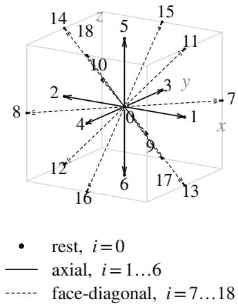  
Figure 6: The D3Q19 lattice stencil of Eq. 8: a rest velocity, six axial neighbors (solid), and twelve face-diagonal neighbors (dashed). Arrows are numbered in the solver's direction ordering, with opposite directions in adjacent pairs.

## C.2 INTERFACIAL TENSION

Two established formulations generate interfacial tension in the CG-LBM. The perturbation operator of Reis & Phillips (2007), in its three-dimensional form (Leclaire et al., 2017), adds an

anisotropic stress contribution along the color gradient $\boldsymbol { C } = \nabla \rho ^ { N }$ during collision,

$$
\Delta f _ { i } = \frac { 9 } { 4 } \omega \sigma | C | \left[ w _ { i } \frac { ( e _ { i } \cdot C ) ^ { 2 } } { | C | ^ { 2 } } - B _ { i } \right] ,\tag{16}
$$

where $\sigma$ sets the surface tension, $\omega = 1 / \tau ,$ and the $B _ { i }$ are lattice constants chosen so that mass and momentum are conserved. Alternatively, the continuum surface force (CSF) of Brackbill et al. (1992), introduced into the CG-LBM by Halliday et al. (2007), applies the interfacial force as a body force through Eq. 12,

$$
\begin{array} { r } { { \cal F } _ { s } = \frac { 1 } { 2 } \sigma \kappa \nabla \rho ^ { N } , \qquad \kappa = - \nabla _ { s } \cdot n , } \end{array}\tag{17}
$$

where κ is the interface curvature and $\nabla _ { s } ~ = ~ ( { \pmb I } - { \pmb n } { \pmb n } ^ { \top } ) \nabla$ the surface gradient, all derivatives evaluated with Eq. 14. Both formulations recover the Young-Laplace law with closely similar interface physics. We pair each wetting boundary condition with the surface-tension formulation of its source publication (Section C.3), so that every configuration we run matches a published, validated combination.

## C.3 WETTING BOUNDARY CONDITION

At the pore scale, wettability controls capillary entry, imbibition, and trapping. We define the contact angle θ through the non-wetting red phase, and require the boundary condition to impose it accurately on voxelized surfaces.

The fictitious-density condition of Latva-Kokko & Rothman (2005b) assigns a color value to solid nodes and influences wetting indirectly through the near-wall color gradient. Its realized angle can require calibration and its accuracy deteriorates away from neutral wetting (Leclaire et al., 2017; Akai et al., 2018). Geometric conditions instead reorient the interface normal to satisfy the prescribed wall angle directly. Building on the diffuse-interface construction of Ding & Spelt (2007) and its two-dimensional CG-LBM adaptation by Xu et al. (2017), Leclaire et al. (2017) extended the approach to arbitrary three-dimensional surfaces, while Akai et al. (2018) derived the closed-form rotation used here. At boundary fluid nodes, the predicted interface normal $\boldsymbol { n } ^ { * }$ is replaced by $n ^ { \theta }$ such that $\pmb { n } ^ { \theta } \cdot \pmb { n } _ { s } = \cos \theta ;$ Leclaire obtains this direction iteratively, whereas Akai selects between two closed-form candidates. Wall normals $\mathbf { \eta } _ { n _ { s } }$ are precomputed from the solid mask.

We implement both geometric conditions; a systematic comparison by Sedahmed & Coelho (2024) found the Akai scheme more accurate for static contact angles and the Leclaire scheme more accurate for dynamic capillary-tube flow, so retaining both is of practical value. Following the pairing principle of Section C.2, the Leclaire condition runs with the Reis-Phillips perturbation operator (Eq. 16) and the Akai condition with the CSF force (Eq. 17) together with the solid-node extrapolation of the color function and interface normal of Sedahmed & Coelho (2024); the Akai-CSF combination is the solver default.

## D SOLVER IMPLEMENTATION

## D.1 OVERVIEW

Established porous-media implementations include the GPU-enabled LBPM package (McClure et al., 2021) and the Fortran/MPI MF-LBM solver (Chen et al., 2019). Our solver provides a complementary, modern implementation written end-to-end in JAX (Bradbury et al., 2018), retaining highperformance accelerator execution while integrating directly with Python-based machine-learning workflows.

The complete time step — collision, perturbation or CSF forcing, recoloring, wetting reorientation, streaming, and boundary conditions — is a pure function on arrays, JIT-compiled and composable with s can; it supports CPU, single-GPU, and multi-GPU execution through halo exchange. The implementation combines geometric wetting with a configuration-driven validation suite evaluated below against published analytical solutions and pore-scale experiments.

## D.2 NUMERICS

Collision. We use a multiple-relaxation-time (MRT) collision operator (d'Humières et al., 2002): populations are mapped to moment space, each moment relaxes at its own rate, and the result maps back. The shear-stress moments relax at the rate ω set by the fluid viscosity. For the remaining bulk and non-hydrodynamic (ghost) moments the solver offers two spectra. The first uses fixed rates (Table 4); the second ties every non-shear moment to the local shear rate as $\chi \omega$ with $0 < \chi \le 1$ which improves stability and reduces to single-relaxation-time collision at $\chi = 1 ;$ we use $\chi = 0 . 8$ as in Leclaire et al. (2017). Drainage, trapping, and GDL intrusion use the second, underfill the first. Either choice suppresses the staggered-mode instabilities that single-relaxation-time (BGK) collision develops at low viscosity and near walls. Body forces enter through the scheme of Guo et al. (2002), applied per moment with the standard $( 1 - { \cal { S } } / 2 )$ correction.

Viscosity contrast. The two fluids may have different viscosities (relaxation rates $\omega _ { r } , \omega _ { b } ) ;$ in interface cells the local rate is the harmonic blend of the two inverse viscosities weighted by the color field, which keeps the stress continuous across the interface.

Walls. Solid nodes are handled by half-way (link) bounce-back: each color's populations reflect at the wall link midpoint, solids store no fluid state, and no color leaks through the wall. Wall normals for the wetting condition are precomputed once per geometry from the solid mask.

## D.3 BOUNDARY CONDITIONS

The solver provides the following boundary conditions; the first three drive the dataset protocols (Appendix F):

• Piston (velocity) inlet — the non-wetting phase is injected at an exact volumetric rate $u _ { \mathrm { i n } } A$ per step behind a moving piston front, with the inlet pressure left floating. This drives the displacement experiments, where the capillary number is set directly by $u _ { \mathrm { i n } }$

• Pressure inlet/outlet — per-color Zou-He pressure boundaries (Zou & He, 1997) fix the densities of reservoir planes. Holding $\Delta P = 0$ yields purely capillary-driven (spontaneous) imbibition; raising the inlet-outlet density difference in steps yields pressure-controlled drainage and capillary-pressure curves.

• Outflow — a density-rescaled copy of the penultimate plane lets the wetting phase leave the domain freely

• Velocity inlet — the inlet plane is reset to the full equilibrium at the prescribed velocity with the density taken by zero gradient from its neighbor, which keeps every moment consistent and is stable under MRT collision.

• Reservoir inlet — a slab of pure non-wetting fluid held at equilibrium, the Dirichlet counterpart of the piston.

• Periodic faces and solid walls — streaming is periodic by default; any face can be sealed with half-way bounce-back.

## D.4 PARAMETERS

Table 4 collects the lattice constants and default numerical parameters; Table 5 gives the mapping from lattice parameters to the physical control variables used throughout the paper. The full D3Q19 moment matrix is the standard set of d’Humières et al. (2002).

Table 4: Lattice constants and default numerical parameters.
<table><tr><td>Quantity</td><td>Value</td></tr><tr><td>Lattice</td><td>D3Q19  $( \mathrm { r e s t } + 6 \mathrm { a x i a l } + 1 2$  diagonal)</td></tr><tr><td>Weights  $w _ { i }$ </td><td> $1 / 3 , 1 / 1 8 , 1 / 3 6$  (rest / axial / diagonal)</td></tr><tr><td>Sound speed</td><td> $c _ { s } ^ { 2 } = 1 / 3$ </td></tr><tr><td>Recoloring strength</td><td> $\beta = 0 . 9 9 ( \mathrm { E q . } 1 5 )$   $0 . 8 \omega$ </td></tr><tr><td>MRT non-shear rates</td><td>(drainage, trapping, GDL); fixed 1.19, 1.2, 1.98, 1.4 (underfill)</td></tr><tr><td>Wall BC</td><td>half-way bounce-back</td></tr><tr><td>Wetting BC</td><td>Akai (geometric); Leclaire available</td></tr><tr><td>Surface tension</td><td>CSF (Eq. 17); perturbation available</td></tr></table>

Table 5: Mapping from lattice parameters to physical control variables.
<table><tr><td>Control variable</td><td>Definition</td></tr><tr><td>Capillary number  $\mathrm { C a }$ </td><td> $\nu _ { 0 } u _ { \mathrm { i n } } / \sigma$ </td></tr><tr><td>Viscosity ratio  $M$ </td><td> $\nu _ { \mathrm { n w } } / \nu _ { \mathrm { w } }$ </td></tr><tr><td>Contact angle θ</td><td>angle of the non-wetting red phase at the wall</td></tr><tr><td>Surface tension σ</td><td>Laplace coefficient,  $\Delta \bar { p } = 2 \bar { \sigma } / R$ </td></tr></table>

## E SOLVER VALIDATION

We validate the solver against three-dimensional analytical benchmarks and published pore-scale experiments. A summary is provided in Table 6.

Table 6: Validation suite at a glance. All cases are 3D (D3Q19).
<table><tr><td>Case</td><td>Reference</td></tr><tr><td>Laplace law (§E.1)</td><td> $\Delta p = 2 \sigma / R$ </td></tr><tr><td>Layered Poiseuille (§E.2)</td><td>two-layer analytic profile</td></tr><tr><td>Contact angle, flat (§E.3)</td><td>imposed θ and Akai et al. (2018)</td></tr><tr><td>Contact angle, curved (§E.4)</td><td>sphere-on-sphere geometry</td></tr><tr><td>Washburn imbibition (§E.5)</td><td>two-fluid Washburn law</td></tr><tr><td>Capillary pressure (§E.6)</td><td>curvature-correct entry pressures</td></tr><tr><td>Micromodel drainage and imbibition (§E.7)</td><td>single-junction experiments (Zacharoudiou et al., 2017)</td></tr><tr><td>Displacement regimes (§E.8)</td><td>Lenormand phase diagram</td></tr></table>

## E.1 LAPLACE LAW

Purpose. Surface tension drives every capillary phenomenon in the dataset. This test determines whether the simulated pressure jump follows the Young-Laplace relation over the surface-tension range used in the porous cases. Setup. Spherical droplets of the red fluid, over a range of radii R, equilibrate in a periodic box of blue fluid; the input surface tension is swept over $\sigma = 0 . 0 1 -$ 0.05, the range the porous cases use. A companion run starts from a deliberately non-spherical slab, which the interfacial force alone must relax to a sphere. Reference. The Young-Laplace law: the pressure jump across the interface is $\Delta p = 2 \sigma _ { \mathrm { e f f } } / \bar { R }$ . Result. The slab rounds to a sphere (sphericity $2 . 5 0 4  1 . 0 0 0 )$ , and at every σ the measured $\Delta p$ is linear in $1 / R$ across the radius range (Figure 7; $R ^ { 2 } \approx 0 . 9 9 9 { \mathrm { p e r f i t } } )$

(A)  
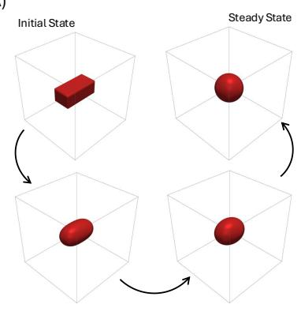

(B)  
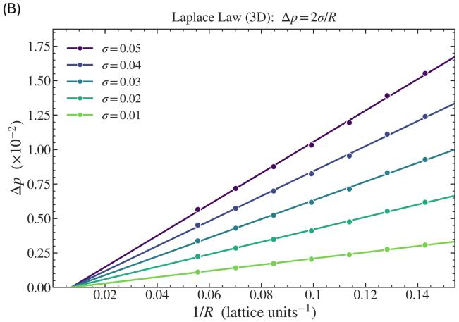  
Figure 7: Laplace-law validation. (A) A deliberately non-spherical initial slab relaxes to a sphere under the interfacial force alone (sphericity $2 . 5 0 4  1 . 0 0 0 )$ . (B) Measured pressure jump $\Delta p$ across equilibrated 3D droplets versus inverse radius $1 / R _ { : }$ , swept over input surface tension $\sigma = 0 . 0 1 – 0 . 0 5 \colon$ one fitted line per σ, each linear with $R ^ { 2 } \approx 0 . 9 9 9$

## E.2 LAYERED POISEUILLE FLOW

Purpose. The viscosity ratio M is one of the dataset's two control knobs, and its physical meaning rests on correct viscous momentum exchange across the fluid-fluid interface — the mechanism that decides whether a displacement front is stabilized or fingers. This case verifies that exchange in the simplest configuration with an exact solution, isolated from any capillary effect. Setup. A $6 4 \times 8 \times 1 2 8$ channel with bounce-back walls on the spanwise faces, filled with a symmetric threeband layering: the more viscous fluid $( \nu _ { b } = 0 . 3 )$ against both walls and a thinner fluid in the central band, with the viscosity ratio $M = \nu _ { b } / \nu _ { r }$ swept over 5–30. The flow is driven by the per-color Zou-He pressure boundaries of Section D.3 rather than a body force, so the case also exercises the pressure drive used in the dataset protocols. Reference. The layered Poiseuille solution of $\mathrm { d } / \mathrm { d } z \left( \nu \mathrm { d } u _ { x } / \mathrm { d } z \right) = - G .$ , evaluated on the realized diffuse interface profile and the realized pressure gradient — a piecewise parabola, nearly flat in the viscous wall bands with a tall central peak that grows with M. Result. At steady state the simulated profiles sit on the analytic curves for all five ratios (Figure 8), with maximum relative error 0.95–2.58%, largest at $M \stackrel { . } { = } 3 0$ where the center fluid reaches $\nu _ { r } = 0 . 0 1$

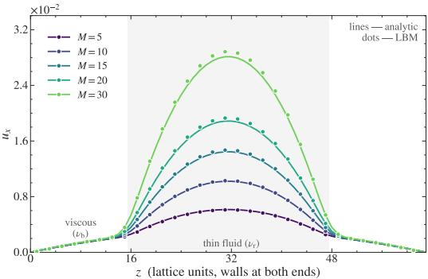  
Figure 8: Layered Poiseuille validation in 3D: steady velocity profiles $u _ { x } ( z )$ for viscosity ratios $M = 5 { - } 3 0$ (LBM dots) against the two-fluid analytic solution (lines). The shaded band marks the central low-viscosity layer; maximum relative error is 2.58% at $M = 3 0$

## E.3 CONTACT ANGLE ON A FLAT WALL

Purpose. Wettability is a controlled parameter of the dataset: every trajectory is labeled by its imposed contact angle, and those labels are only trustworthy if the solver realizes the angle it is asked for. The static accuracy established here underlies everything wettability controls downstream — entry pressures, imbibition rates, and residual trapping. Setup. Sessile red droplets on a flat wall relax to equilibrium under imposed contact angles spanning $3 0 { - } 1 5 0 ^ { \circ }$ ; the realized angle is measured by fitting a spherical cap to the converged interface. Reference. The imposed angle itself — the geometric condition makes θ a direct input, so the realized angle is a pure accuracy check. Result. The measured angles follow a near-linear parity relation with the imposed angles across the $3 0 { - } 1 5 0 ^ { \circ }$ sweep (Figure 9), consistent with the analytical validation reported by Akai et al. (2018).

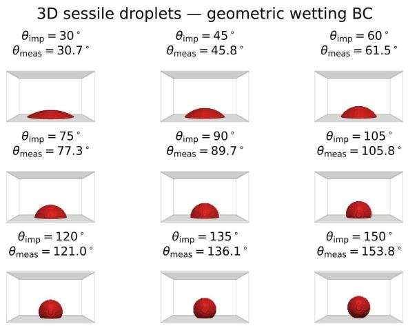

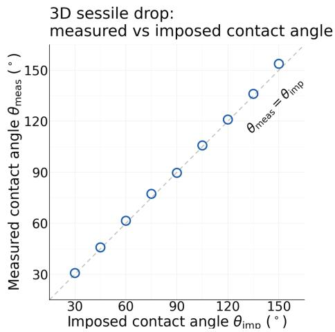  
Figure 9: Contact-angle validation on a flat wall. Left: equilibrated sessile droplets for imposed angles $3 0 ^ { \circ } - 1 5 0 ^ { \circ }$ , with the measured angle annotated per panel. Right: measured versus imposed angle across the sweep. The realized angle is within $2 . 3 ^ { \circ }$ of the imposed value everywhere except the 150° extreme (3.8°).

## E.4 CONTACT ANGLE ON A CURVED WALL

Purpose. The dataset's geometries have no flat walls inside a sphere pack or rock crop: most contact line lives on a curved, voxelized surface, where the wall normals are computed from the solid mask rather than known analytically. This case ensures the wetting fidelity of Section E.3 carries over to the surfaces the dataset actually uses. Setup. Following Akai et al. (2018), a red droplet relaxes on a spherical solid grain, initialized as a volume-matched half-shell collar coating the upper hemisphere. Reference. The analytic sphere-on-sphere configuration: for droplet curvature radius $R _ { 1 } .$ grain radius $R _ { 2 } .$ , and contact angle θ, the center-to-center distance satisfies $R _ { 3 } = \sqrt { R _ { 1 } ^ { 2 } + R _ { 2 } ^ { 2 } - 2 R _ { 1 } R _ { 2 } \cos \theta } .$ Result. At $\theta = 6 0 ^ { \circ }$ the fitted drop gives $\theta _ { \mathrm { m e a s } } = 6 0 . 2 ^ { \circ }$ with $R _ { 1 } = 2 \dot { 2 } . 0$ against a target of 22.5; at $\theta = 1 2 0 ^ { \circ } , \theta _ { \mathrm { m e a s } } = 1 2 4 . 4 ^ { \circ }$ with $\bar { R _ { 1 } { = } 2 1 . 9 ( \mathrm { F i g u r e } 1 0 ) }$

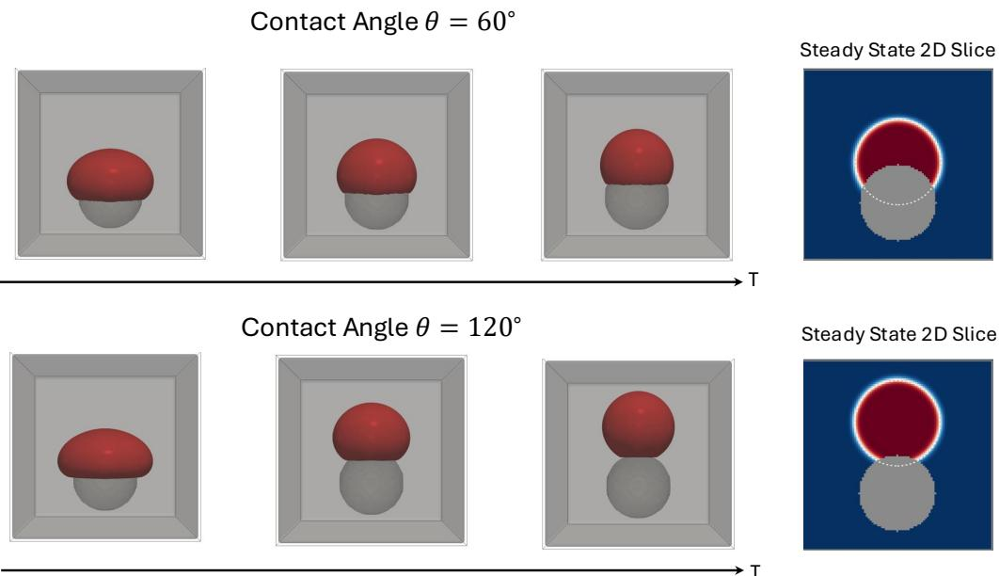  
Figure 10: Contact-angle validation on a curved wall for imposed $\theta = 6 0 ^ { \circ }$ (A, top row) and $\theta =$ 120° (B, bottom row). The first three panels of each row are snapshots of the droplet (red) relaxing on the spherical grain (gray) between the volume-matched half-shell collar and the equilibrium cap; the rightmost panel is the final midplane slice, with the dotted circle marking the analytical sphereon-sphere solution.

## E.5 WASHBURN IMBIBITION

Purpose. The benchmark's trajectories are time-resolved, so the dynamics must be right, not only the equilibria. Spontaneous imbibition is the test of the moving contact line: the capillary force at the wall is the only driver, and any error in dynamic wetting, in the pressure boundaries, or in two-phase viscous friction shows up directly in the penetration rate. Passing it gives confidence that the time axis of every imbibition trajectory in the dataset is physical. Setup. A wetting fluid spontaneously imbibes a cylindrical capillary tube (radius $r = 5 )$ from a frictionless reservoir, displacing the nonwetting fluid under zero applied pressure difference $( \Delta P = 0$ per-color pressure boundaries at both ends), for a sweep of contact angles. Reference. The two-fluid Washburn law (Washburn, 1921): the penetration length obeys $L ^ { 2 } \propto \overline { { t } }$ when the displaced viscosity is negligible, with the finite-viscosity two-fluid generalization used for the fit. Result. The penetration curves follow the two-fluid analytic solution across the full angle sweep (Figure 11): the rectified curves are linear in $t \left( R ^ { 2 } = 1 . 0 0 \dot { 0 } \right.$ to three decimals for every angle), and the measured imbibition-rate coefficient is within $1 { - } 6 \%$ of the analytic value $( A / A _ { \mathrm { a n } } \overset { \cdot } { = } 1 . \overset { \cdot } { 0 } 1$ to 0.94, decreasing monotonically from $\theta = 2 0 ^ { \circ } { \mathrm { ~ t o ~ } } 7 0 ^ { \circ } )$

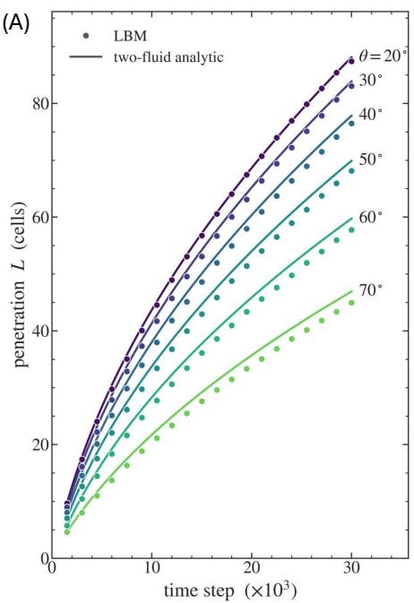

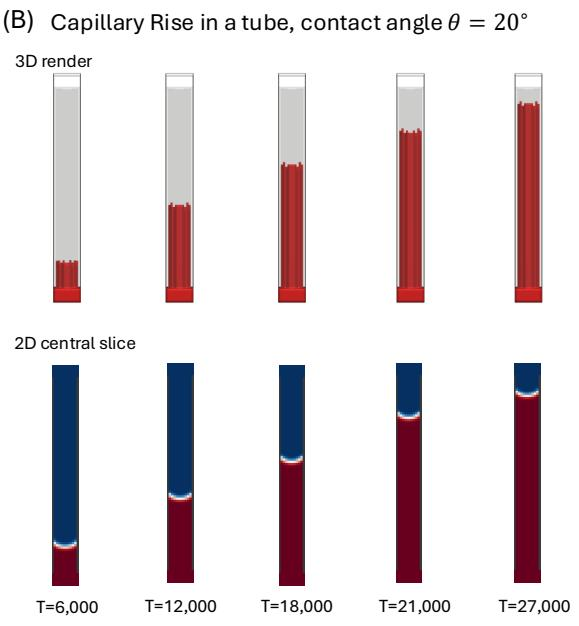  
Figure 11: Washburn imbibition validation. (A) Penetration length $L ( t )$ from the simulation (dots) against the two-fluid Washburn solution (lines) for contact angles $\dot { \theta } = \dot { 2 } 0 { - } 7 0 ^ { \circ }$ . (B) The $\theta = 2 0 ^ { \circ }$ tube at five successive times, rendered upright (wetting phase red, rising bottom to top under capillary suction alone, $\Delta P = 0 )$ : 3D view above, midplane slice below.

## E.6 DRAINAGE AND CAPILLARY PRESSURE

Purpose. Drainage through a pore network proceeds as a sequence of threshold events: the nonwetting phase enters a throat only once the applied pressure exceeds that throat's entry pressure, and each crossing is released as a sudden, intermittent pore-filling event — a Haines jump. The invasion pathway, the macroscopic $P _ { c } – S _ { w }$ curve, and where the wetting phase ends up trapped are all consequences of these thresholds. Verifying entry pressures against curvature-correct analytic values in elementary throat geometries therefore secures the mechanism by which every drainage trajectory in the dataset unfolds. Setup. Pressure-controlled primary drainage in two throat geometries $- \mathrm { \bf ~ a }$ voxelized circular tube (radius $r = 6$ in a $3 2 \times 3 2$ cross-section) and an elongated rectangular tube $( 2 4 \times 1 2 )$ — each swept over non-wetting contact angles $\theta = 1 2 0 { - } 1 6 5 ^ { \circ }$ (wetting angles $\theta _ { w } = 1 5 \substack { - 6 0 ^ { \circ } } )$ . The non-wetting inlet density is fixed and the outlet density lowered in a refined ladder of capillary pressures; the equilibrium saturation of the duct pore is recorded at each step. Reference. Curvature-correct analytic entry pressures: the Mason & Morrow (1991) shape-factor form $P _ { c } R / \gamma = ( 1 + 2 \sqrt { \pi G } ) \cos \theta _ { w }$ for the circular tube, with the inscribed radius R and shape factor G measured from the voxelized cross-section the solver actually sees (the form reduces to the Laplace value 2 cos $\theta _ { w }$ for a perfect circle); and the two-curvature Laplace value $( 1 + L _ { 2 } / L _ { 1 } ) \cos \theta _ { w }$ for the rectangle, whose meniscus spans the short gap and curves more weakly along the long side. Result. In both tubes the drainage curve is a sharp step: the non-wetting phase waits at the throat until the applied pressure crosses the entry value, then sweeps the uniform cross-section pistonlike, so saturation drops along a flat plateau at the entry pressure. The realized plateaus track each angle's analytic entry closely and are correctly ordered and spaced across the four contact angles (Figure 12).

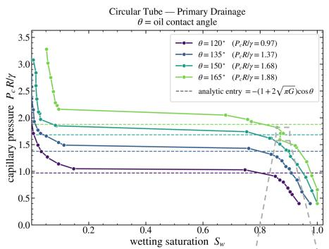

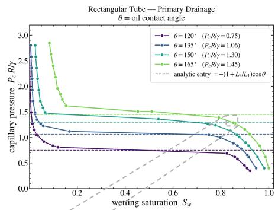

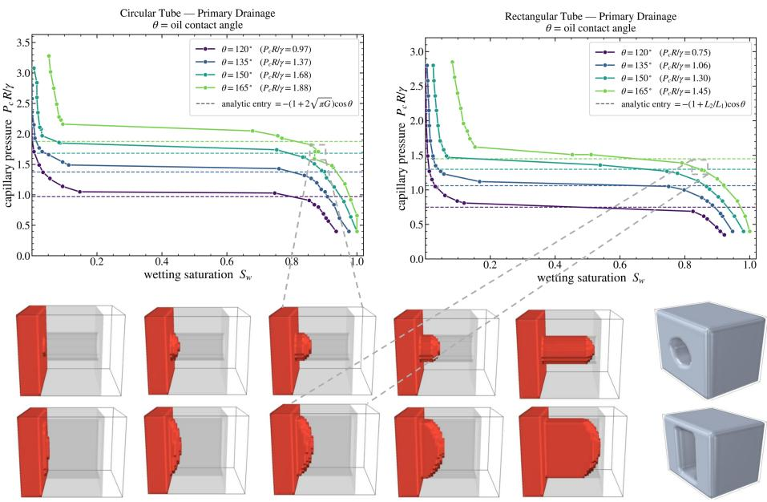  
Figure 12: Primary-drainage capillary-pressure curves $( P _ { c } R / \gamma$ versus wetting saturation $S _ { w } )$ for the circular tube (top left) and the rectangular tube (top right), swept over contact angle. Dashed lines mark each angle's curvature-correct analytic entry pressure (circle: Mason-Morrow shape-factor form on the voxelized cross-section; rectangle: two-curvature Laplace). Both tubes drain along a flat plateau that tracks the analytic entry per angle. Bottom: the non-wetting phase (red) crossing the throat and filling the duct piston-like (upper sequence: circular tube; lower sequence: rectangular tube; geometry at right).

## E.7 DRAINAGE AND IMBIBITION COMPARED TO EXPERIMENT IN A MICROMODEL

Purpose. At a pore junction, the evolving meniscus determines which downstream throat is invaded and how the displaced phase escapes. These local decisions govern the displacement pathways represented in the dataset. Micromodel experiments resolve individual filling events in a controlled pore geometry, providing a direct test of the interface dynamics beyond the single-capillary validations above. Setup. We simulate drainage and spontaneous imbibition in idealized three-dimensional representations of two four-throat micromodel junctions, discretized at 3 μm per voxel. For drainage, a prescribed inlet flux drives the non-wetting phase through a square pore at $\mathrm { C a } \approx 1 0 ^ { - 4 }$ and an imposed wetting-phase contact angle $\theta _ { w } = 2 6 ^ { \circ }$ . For imbibition, the wetting phase enters a patterned pore at an imposed $\theta _ { w } = 1 6 ^ { \circ }$ with equal pressure at all four ports. Throat widths quoted below identify the experimental throats: the drainage outlet $T _ { 4 }$ is represented by $1 0 8 \mu \mathrm { m } .$ , and the imbibition throats $T _ { 1 } , T _ { 2 } , T _ { 3 }$ , and $T _ { 4 }$ by 27, 48, 57, and 105 µm, respectively. The simulated channel depths are 45 µm for drainage and 54 µm for imbibition. Reference. The single-junction experiments of Zacharoudiou et al. (2017) resolve both displacement sequences: air displacing n-decane during dynamic drainage, and n-decane displacing air during spontaneous imbibition. Drainage selects the widest downstream throat, consistent with capillary entry-pressure ordering. Spontaneous imbibition instead fills an adjacent throat before the narrowest one, demonstrating the role of pore-body geometry in a filling sequence that departs from quasi-static predictions. Result. The solver reproduces the observed throat-filling order in both cases. During drainage, the non-wetting phase fills the pore body and exits through the widest throat, $T _ { 4 } ~ ( 1 0 7 \mu \mathrm { m } )$ , while the two side throats remain predominantly wetting-filled (Figure 13). During imbibition, the wetting phase fills the adjacent throat $T _ { 2 } ( 4 7 \mu \mathrm { m } )$ before $T _ { 1 } ( 2 7 \mu \mathrm { m } )$ , and the remaining non-wetting phase retreats through $T _ { 4 } ( \mathrm { F i g \cdot }$ ure 14). Together, these cases support the solver's ability to capture pore-scale pathway selection under both forced and spontaneous displacement.

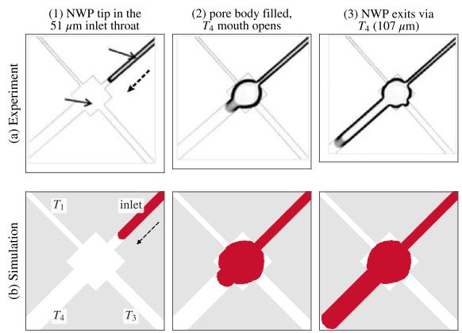  
Figure 13: Dynamic primary drainage in a four-throat micromodel. (a) Experimental images adapted from Figure 4(a) of Zacharoudiou et al. (2017). (b) Midplane slices of our three-dimensional colorgradient LBM simulation at corresponding meniscus positions $\mathrm { ( C a \approx 1 0 ^ { - 4 } }$ , imposed $\theta _ { w } = 2 6 ^ { \circ } )$ From left to right, the non-wetting phase advances through the inlet, fills the pore body, and invades the widest outlet throat, $T _ { 4 } ( 1 0 7 \mu \mathrm { m }$ in the experiment, $1 0 8 \mu \mathrm { m }$ in the simulation); $T _ { 1 }$ and $T _ { 3 }$ remain predominantly wetting-filled. In the simulation, red denotes the non-wetting phase, white the wetting phase, and gray the solid. The dashed arrow indicates the inlet flow direction.

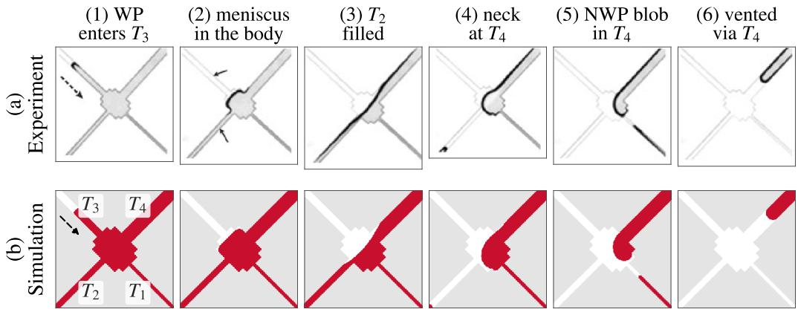  
Figure 14: Spontaneous imbibition in a four-throat micromodel. (a) Experimental images adapted from Figure 8(a) of Zacharoudiou et al. (2017). (b) Midplane slices of our three-dimensional colorgradient LBM simulation at corresponding meniscus positions (imposed $\theta _ { w } ~ = ~ 1 6 ^ { \circ } , ~ \Delta P ~ = ~ 0 )$ From left to right, the wetting phase enters through $T _ { 3 } ,$ advances into the pore body, and invades the adjacent throat $T _ { 2 }$ in stage (3), filling it by stage (4), before the narrowest throat $T _ { 1 }$ . The stage-(3) heading describes the experiment; the simulation at that stage shows partial invasion of $T _ { 2 }$ Their experimental widths are 47 and $2 7 \mu \mathrm { m }$ , represented by 48 and $2 7 \mu \mathrm { m }$ in the simulation. The remaining non-wetting phase then withdraws through the widest throat, $T _ { 4 }$ . In the simulation, red denotes the non-wetting phase, white the wetting phase, and gray the solid. The dashed arrow indicates the inlet flow direction.

## E.8 DISPLACEMENT REGIMES IN 3D PORE GEOMETRY

Purpose. This test evaluates whether the validated numerical components jointly reproduce the established dependence of displacement morphology on $( \mathrm { C a } , M )$ in a real pore geometry. Setup. Immiscible displacement through a $2 5 6 ^ { 3 }$ voxelized sphere pack, moving only the two control knobs of Table $5 \colon ( \mathrm { C a } , M ) = ( 1 0 ^ { - 3 } , 3 0 ) , ( 1 0 ^ { - 3 } , 0 . 0 1 )$ , and $( 1 0 ^ { - 5 } , 3 0 )$ . Reference. The classical phase diagram of Lenormand et al. (1988): these three corners must produce, respectively, stable displacement (compact, near-flat front), viscous fingering (thin branched fingers), and capillary fingering (isotropic invasion-percolation clusters). Result. Varying only (Ca, M) produces stable displacement, viscous fingering, and capillary fingering, with the distinct front morphologies expected from the Lenormand phase diagram (Figure 15).

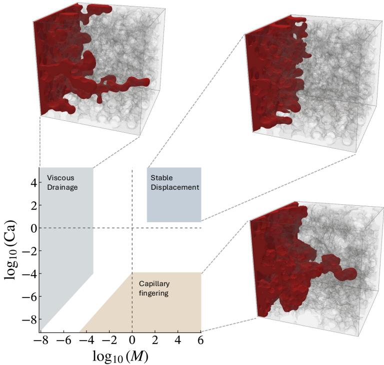  
Figure 15: Displacement regimes on the $2 5 6 ^ { 3 }$ sphere pack, varying only $( \mathrm { C a } , M )$ ; the non-wetting phase is red, solid translucent, flow left to right. The central map sketches the Lenormand et al. (1988) phase diagram in $( \log _ { 1 0 } M , \log _ { 1 0 } \mathrm { { C a } ) }$ , and each regime region is linked to a snapshot of the corresponding run: stable displacement at $( 1 0 ^ { - 3 } , 3 0 ) - \mathfrak { a }$ compact front sweeping the pore space; viscous fingering at $( 1 0 ^ { - 3 } , 0 . 0 1 )$ — thin branched fingers that screen the surrounding pore space; capillary fingering at $( 1 0 ^ { - 5 } , 3 0 )$ — a rough, capillarity-controlled front.

## F SIMULATION SETUP

This appendix specifies how the trajectories summarized in Table 1 were produced: the solver configuration shared by all runs, the geometry pipeline, and the domain, boundary conditions, and termination condition of each campaign. Table 7 lists the resulting run lengths.

## F.1 COMMON CONFIGURATION

All runs use the production stack of Appendix D: D3Q19, MRT collision with Guo forcing, CSF interfacial tension with $\sigma = 0 . 0 5$ , recoloring with $\beta = 0 . 9 9$ , the Akai wetting condition, and halfway bounce-back walls. In the three porous-media campaigns every non-shear moment relaxes at $0 . 8 \omega$ , the choice of Leclaire et al. (2017), which improves stability; underfill uses the fixed rates of Table 4 (Appendix D.2). Both fluids have unit density and no body force acts, so buoyancy plays no role and the flow is set by capillarity, viscosity, and the boundary drive. All quantities are in lattice units.

Viscosity ratio. In the three porous-media campaigns the viscosity ratio $M = \nu _ { \mathrm { n w } } / \nu _ { \mathrm { w } }$ is imposed by splitting a fixed reference viscosity $\nu _ { 0 } = 0 . 0 4$ geometrically, $\nu _ { \mathrm { n w } } = \nu _ { 0 } \sqrt { M }$ and $\nu _ { \mathrm { w } } = \nu _ { 0 } / \sqrt { M }$ so changing M moves both fluids while their geometric mean stays put; at $M = 0 . 0 5$ this gives $\nu _ { \mathrm { n w } } = 0 . 0 0 8 9$ and ${ \nu _ { \mathrm { w } } = 0 . 1 7 9 }$ . Underfill instead fixes the displaced air at $\nu = 0 . 0 2 5$ and sets the encapsulant to 0.025 M.

Capillary number. The injection velocity follows from $\mathrm { C a } = \nu _ { 0 } u _ { \mathrm { i n } } / \sigma = 1 0 ^ { - 5 }$ (Table 5), i.e. $\overset { \_ } { u _ { \mathrm { i n } } } = 1 . \overset { \_ } { 2 5 } \times 1 0 ^ { - 5 }$ lattice units per step in every displacement, independent of M. Because Ca is referenced to ν0, the capillary number of the invading fluid alone is $1 0 ^ { - 5 } \sqrt { M }$ in drainage and GDL intrusion and $1 0 ^ { - 5 } / \sqrt { M }$ in the trapping flood.

Domain conventions. Arrays are stored as $( z , y , x )$ with x the flow axis, inlet at $x = 0$ The four lateral faces are sealed no-slip walls that carry the sample's contact angle. Along x the sample is extended by an inlet reservoir and an outlet buffer (and, for drainage, a porous plate); the benchmark scores the sample span only (Section 4.1). The constant-rate drive is the moving-piston inlet of Appendix D.3: the $x = 0$ plane is sealed and the first fluid slab receives exactly the volume $u _ { \mathrm { i n } } A$ per step, with the inlet pressure left floating.

Stored data. A frame holds the phase field φ, density, pressure, velocity magnitude, and the velocity vector on the full domain, in single precision, with φ undefined inside the solid; the solid mask, the geometry record, and the run metadata (parameters, regions, termination reason) are stored beside the trajectory. Frames are written every 5,000 steps, every 1,000 for underfill, including the initial state.

## F.2 GEOMETRIES

Scanned. Rock samples are random-origin cubic crops, with random axis permutations and flips, of segmented $1 0 0 0 ^ { 3 } \mu \dot { \mathrm { C T } }$ volumes of Bentheimer, CastleGate, and Buff Berea sandstone at 2.25 μm per voxel (Neumann et al., 2021; 2020). GDL samples are random-origin crops of carbon-paper scans at 5%, 20%, and 40% PTFE loading and 2.05 µm per voxel (Shojaei et al., 2022; 2023), oriented so that the through-plane direction is the flow axis.

Generated. Sphere media are overlapping monodisperse spheres (radius 14–28 voxels, target porosity 0.20–0.35); blob media threshold a Gaussian random field (target porosity 0.22–0.32); polydisperse media overlap spheres with log-normally distributed radii (median 8–14 voxels at $1 2 8 ^ { 3 }$ , porosity 0.25–0.32); fiber mats are in-plane cylinders of radius 3–5 voxels with an out-of-plane tilt of at most 20° (target porosity 0.65–0.80). After post-processing, the samples used span porosities of 0.17–0.42 for the scanned sandstones, 0.19–0.38 for the generated rock families, 0.43–0.68 for the scanned GDLs, and 0.53–0.77 for the fiber mats.

Post-processing and screening. Every rock and fiber sample is opened morphologically with a 3-voxel ball, which removes throats too narrow for the solver to resolve (Li et al., 2020), and pore pockets disconnected from the faces are filled. A sample enters a campaign only if its pore space percolates along the flow axis with the lateral faces sealed. Drainage and trapping additionally require a critical throat radius above five voxels and at least 1.3 times the smallest radius the drainage pressure limit can invade at the run's contact angle, so that the termination condition below cannot fire before the sample is entered.

Flip-chip gaps. An underfill geometry is analytic: two solid plates (substrate and chip) separated by the gap height, joined by a staggered array of truncated-sphere solder balls, with a ball-free margin of one diameter at the entry and the vent. Across the 32 geometries the ball diameter is 32–54 voxels, the gap height 20–46, the pitch 1.55–2.09 diameters, and the array holds 8–46 balls, for a gap porosity of 0.82–0.93. The domain is $( h + 2 ) \times 4 8 2 \times ( 4 3 2 – 4 7 6 )$ voxels for gap height h. One voxel corresponds to 2.5 µμm if a 32-voxel ball is read as an 80 µm bump.

## F.3 PRIMARY DRAINAGE

Domain. Along the flow axis: a 7-slab inlet reservoir, the rock (128 or 256 voxels), a 20-voxel porous plate, and a 6-slab outlet buffer, i.e. $1 2 8 \times 1 2 8 \times 1 6 1$ and $2 5 6 \times 2 5 6 \times 2 8 9$ voxels in total. The plate is a solid slab pierced by square $5 \times 5 – \mathrm { v o x e l }$ pores on an 8-voxel pitch and is strongly wetting $( \theta _ { \mathrm { p l a t e } } ~ = ~ 1 5 0 ^ { \circ } )$ . It plays the role of the porous plate of a laboratory drainage experiment: the wetting phase leaves through it freely, while the non-wetting phase cannot enter until the pressure drop reaches its entry pressure.

Protocol. The reservoir starts filled with non-wetting fluid and the rest of the domain with wetting fluid. The piston injects non-wetting fluid at $\mathrm { { C a } } = 1 0 ^ { - 5 }$ ; the outlet is a Zou-He pressure boundary at unit density that admits wetting fluid only. A run ends when the pressure drop across the domain reaches half the plate entry pressure or when 0.75 rock pore volumes have been injected, whichever comes first. Breakthrough is recorded but does not end a run, so trajectories continue into the late, capillary-controlled filling of smaller pores.

## F.4 CAPILLARY TRAPPING

Domain. A 10-slab inlet reservoir, the rock, and a 6-slab outlet buffer, with no plate: 128× 128× 144 and $2 5 6 \times 2 5 6 \times 2 7 2$ voxels.

Initial state. No drainage is simulated first. The non-wetting phase is placed with the poremorphology-based initializer of Tavakkoli et al. (2025), which mimics the end state of a drainage: the non-wetting phase fills the wide pore bodies and the wetting phase stays in corners and narrow throats. Every run starts at a non-wetting saturation of about 60% (median 0.60); the exact value follows from the pore geometry of the sample, so it serves as a randomized starting point. The buffers are filled with wetting fluid.

Stage 1: equilibration. To make the initial state physically accurate as well, the run first relaxes toward capillary equilibrium with the piston effectively off $\mathrm { ( C a ~ = ~ 1 0 ^ { - 1 2 } ) }$ and an open outflow outlet. The pressure field adjusts to the Young-Laplace jump and the sample imbibes spontaneously until the wetting saturation changes by less than $5 \times \mathrm { 1 0 ^ { - 6 } }$ per 1,000 steps for three consecutive blocks, or for at most 200,000 steps.

Stage 2: flood. The piston then injects wetting fluid at $\mathrm { { C a } } = 1 0 ^ { - 5 }$ through the same boundaries; non-wetting fluid reaching the outlet buffer is removed and counted as produced. Saturation is a poor termination signal, since ganglia can move at constant saturation. The run therefore ends when the non-wetting body itself stops moving: fewer than 0.3% of its voxels change over a 20,000-step window, in three consecutive windows, with a cap of 1.2 rock pore volumes injected. Equilibration lowers the median non-wetting saturation from 0.60 to 0.51, and the flood leaves a median residual of 0.39.

## F.5 GDL WATER INTRUSION

The layout is that of drainage without the plate: a 7-slab reservoir, the layer (64 or 128 voxels through-plane), and a 6-slab buffer, i.e. 128×128×77 and $2 5 6 \times 2 5 6 \times 1 4 1$ voxels. Liquid water, the non-wetting phase on the hydrophobic fibers, is injected through-plane by the piston at $\mathrm { { C a } } = 1 0 ^ { - 5 }$ against the same wetting-only Zou-He pressure outlet. Because a thin layer breaks through early, the run continues to 1.2 times the breakthrough step or to 0.5 pore volumes injected, whichever comes first, which keeps the post-breakthrough redistribution in the trajectory.

## F.6 FLIP-CHIP UNDERFILL

The gap is open at both ends of the flow axis and sealed laterally; the encapsulant is the wetting phase and enters from a 22-slab strip at the inlet. Inlet and outlet are Zou-He pressure boundaries held at the same density, so no pressure difference is applied and the front advances by capillary suction alone, as in capillary underfill dispensing. A single contact angle applies to the plates and the balls. A run ends ten blocks after the fluid fills 99% of the ball array. The viscosity ratios $M = 5 { - } 3 0$ are far below that of a real encapsulant-air pair $( \sim 1 0 ^ { 3 } – 1 0 ^ { 4 } )$ ; they preserve a more viscous invading fluid while remaining within the solver's stable range, and should be read as a qualitative regime rather than a material match.

## F.7 PARAMETER SAMPLING

Each small-domain campaign crosses four viscosity ratios with four contact angles (Table 1). The 80 generated runs and the 80 scanned runs each cover this 4 × 4 grid five times, with the geometry families balanced within each group (28/26/26 runs). The large-domain campaigns cross the four viscosity ratios with $\theta \in \{ 1 2 0 ^ { \circ } , 1 5 0 ^ { \circ } \}$ once per geometry source (8 + 8 runs) and run on four GPUs with the domain sharded along z. Underfill assigns the 12 (M, θ) pairs of Table 1 to 32 distinct geometries, two or three per pair and eight per viscosity ratio.

Table 7: Run lengths per campaign and domain size. Domains include the reservoir, plate, and buffer slabs; frames include the initial state. Frames per run are medians.
<table><tr><td>Campaign</td><td>Domain (voxels)</td><td>Runs</td><td>Frames per run</td><td>Frame interval</td><td>Frames</td></tr><tr><td rowspan="2">Drainage</td><td>128×128×161</td><td>160</td><td>376</td><td>5,000</td><td>58,830</td></tr><tr><td>256×256×289</td><td>16</td><td>694</td><td>5,000</td><td>10,643</td></tr><tr><td rowspan="2">Trapping</td><td>128×128×144</td><td>160</td><td>105</td><td>5,000</td><td>19,424</td></tr><tr><td>256×256×272</td><td>16</td><td>239</td><td>5,000</td><td>3,616</td></tr><tr><td rowspan="2">GDL</td><td>128×128×77</td><td>160</td><td>292</td><td>5,000</td><td>45,437</td></tr><tr><td>256×256×141</td><td>16</td><td>486</td><td>5,000</td><td>8,217</td></tr><tr><td>Underfill</td><td>(22-48)×482×(432-476)</td><td>32</td><td>342</td><td>1,000</td><td>12,379</td></tr><tr><td colspan="2">Total</td><td>560</td><td></td><td></td><td>158,546</td></tr></table>

## G INPUT GEOMETRY EXAMPLES

Figure 4 shows one large sample of each geometry family beside two small ones. Figure 16 adds further large-domain samples of the scanned sandstones, the generated rock-like families, and the scanned GDLs; Appendix F.2 describes how each family is produced and screened. The full geometry collection, every family at both domain sizes together with the flip-chip gaps, is available at https://huggingface.co/datasets/PoreML/PoreML\_geo.

(a) Bentheimer

(b) Buff Berea

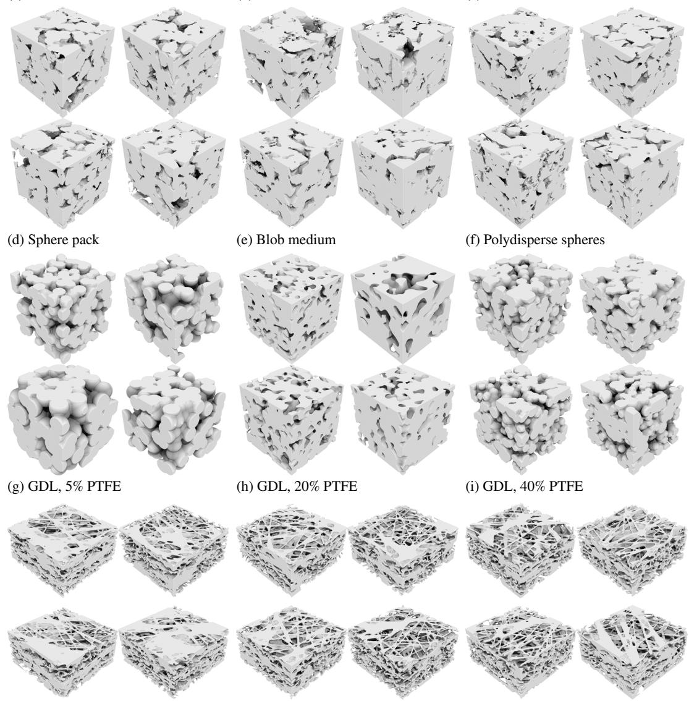  
Figure 16: Input geometry examples at the large domain size. Each panel renders the solid phase of four samples of one family. (a)-(c) Sandstones from $\mu \mathrm { C T }$ scans, $2 5 \mathrm { { \dot { 6 } } ^ { 3 } }$ voxels: Bentheimer, Buff Berea, and CastleGate. (d)-(f) Generated rock-like media, $2 5 6 ^ { 3 }$ voxels: sphere packs, blob media, and polydisperse overlapping spheres. $\mathbf { \rho } ( \mathbf { g } ) \mathbf { - } ( \mathbf { i } )$ Carbon-paper GDLs from $\mu \bar { \mathrm { C T } }$ scans at 5%, 20%, and 40% PTFE loading, 256× 256× 128 voxels, with the through-plane flow direction vertical. Samples of one family share a morphology but differ in porosity and connectivity.

## H BASELINE MODELS

All baselines share the prediction contract of Section 4.1. A run provides a solid mask s, the viscosity ratio $M ,$ the contact angle θ, and saved frames $\mathbf { q } _ { t } = ( \phi _ { t } , \mathbf { u } _ { t } , p _ { t } )$ with five scalar channels per voxel, normalized by fixed per-field offsets and scales and set to a constant fill inside the solid. A network $g _ { \psi }$ with parameters ψ maps the input $\mathbf { x } _ { t } = ( s , \log _ { 1 0 } M , \theta / 1 8 0 ^ { \circ } , \mathbf { q } _ { t } )$ to the next frame in residual form,

$$
\hat { \mathbf { q } } _ { t + 1 } = \mathbf { q } _ { t } + g _ { \psi } ( \mathbf { x } _ { t } ) ,\tag{18}
$$

with a zero-initialized output layer. The two run conditions enter as constant input channels for every model. Voxel models consume the dense grid $\mathbf { x } _ { t } \in \mathbb { R } ^ { C \times D \times H \times W }$ . Point models consume the set of pore voxels $\{ ( \pmb { \xi } _ { i } , \mathbf { x } _ { i } ) \} _ { i = 1 } ^ { N }$ with positions $\bar { \xi } _ { i } \in ( 0 , 1 ) ^ { 3 }$ and, in place of the mask, a binary wall flag and the local solid fraction in cubic neighborhoods of radius r voxels, so that the wall is seen rather than implied by the point set; their predictions are scattered back to the grid before scoring, so all models are evaluated on the same voxels with the same metrics. Capacities are matched near $1 0 ^ { 7 }$ parameters (UNet3D 11.2M, FNO3D 9.7M, P3D 10.7M, AB-UPT 10.5M); Transolver++ keeps its published 1.7M setting because its cost grows faster than its parameter count. The four published architectures are ports of the authors’ public code, verified against the original implementations by copying weights and comparing outputs. Every model trains for the same number of run passes on the porous-media campaigns (ten epochs over the 128-run split, twenty over the 64-run generated split) and for twenty epochs on underfill, with the masked mean-squared error over pore voxels unless stated otherwise. Table 8 summarizes the configurations. Every model is then fine-tuned with the pushforward trick (Brandstetter et al., 2022), following the training loop of Hassan et al. (2023). A pushed batch first advances its input one step on the model's own prediction without gradients and is then scored against the true frame two steps ahead; the probability of pushing a batch rises linearly from 0.5 to 1.0 over the run, and the other batches receive Gaussian noise of standard deviation 0.01 on the pore voxels of their flow channels, with the solid mask and run conditions left exact.

Table 8: Baseline configurations, shared by all campaigns. Parameter counts are those recorded for the drainage models; the underfill variants of UNet3D and FNO3D are given in the text. B: batch  
size.   
Model Input Params Architecture Optimizer and schedule Loss   
UNet3D voxels 11.2M c0 = 20, L = 4, 4 norm groups AdamW 3× 10−4, constant, B = 1 MSE   
FNO3D voxels 9.7M kmax = 24, width 18, T = 4, pad 1/16 AdamW 3× 10−4, wd 10−4, halved every fifth of the run, $B = 1$ rel. H1   
P3D voxels 10.7M preset S: width 64, 4 heads, w = 4, depth (2, 2, 2, 2, 2) AdamW 2× 10−4, one halving, clip $1 , \dot { B { = } } 1$ MSE   
Transolver++ points 1.7M width 256, 4 blocks, 8 heads, G = 32, dropout 0.1 AdamW 10−3 one-cycle, clip 1, B = 1 MSE   
AB-UPT points 10.5M width 192, 3 heads, S = A = 16,384, 8 + 8 anchor blocks AdamW 3× 10−4 one-cycle, wd 0.05, clip 1, B = 1, bf16 MSE

## H.1 UNET3D

The 3D U-Net (Ciçek et al., 2016) is the dense-grid convolutional baseline: an encoder-decoder whose encoder halves the resolution while doubling the channel width at every level, and whose decoder restores the resolution while concatenating the encoder features of the same level through skip connections, so that fine local structure and coarse context meet at every scale. With widths $c _ { \ell } = c _ { 0 } 2 ^ { \ell }$ at levels $\ell = 0 , \ldots , L$ , each level applies two $3 ^ { 3 }$ convolutions, each followed by group normalization and a SiLU activation; levels are joined by stride-2 convolutions on the way down and stride-2 transposed convolutions on the way up, and $\dot { \mathrm { ~ a ~ } } 1 ^ { 3 }$ convolution maps the full-resolution features to the five output channels. Every operation is local, a bias that mirrors the streamingcollision update of the solver, while the bottleneck sees the whole domain. In our configuration, $c _ { 0 } = 2 0$ and $L = 4$ , so a $1 2 8 ^ { 3 }$ domain is compressed to $8 ^ { 3 }$ at the bottleneck with widths from 20 to 320, and group normalization uses four groups. The underfill gap is only a few tens of voxels thick, so its model uses $c _ { 0 } = 1 6$ and $L = 1$ , with axes that do not divide replicate-padded and cropped after. The model trains with AdamW at a constant learning rate of $3 \times \bar { 1 0 } ^ { - 4 }$ and batch size 1.

## H.2 FNO3D

The Fourier neural operator (Li et al., 2021; Kovachki et al., 2023) learns a map between function spaces by parameterizing the kernel of an integral operator in Fourier space. After a pointwise lifting $v _ { 0 } = P ( \mathbf { x } _ { t } )$ , each of T layers updates the latent field as

$$
v _ { \ell + 1 } ( \mathbf { r } ) = \sigma \big ( W _ { \ell } v _ { \ell } ( \mathbf { r } ) + \mathcal { F } ^ { - 1 } \big ( R _ { \ell } \cdot \mathcal { F } v _ { \ell } \big ) ( \mathbf { r } ) \big ) ,\tag{19}
$$

where $\mathcal { F }$ is the three-dimensional Fourier transform over the spatial axes, $R _ { \ell }$ is a complex weight tensor acting on the $k _ { \mathrm { m a x } }$ lowest frequencies of each axis and discarding the rest, and $W _ { \ell }$ is a pointwise linear map; a projection $Q$ returns to the output channels. The weights index frequencies rather than voxels, so the same weights apply unchanged to a grid of a different size. We follow the reference library rather than the 2021 paper: each layer adds a channel-wise MLP with a gated skip and GELU activations, $P$ and $Q$ are two-layer, and three coordinate channels are appended to the input. Because the rock is periodic on no axis, each axis is zero-padded by one sixteenth on both sides before the transforms and cropped afterwards. The three transform axes are spatial; time stepping is left to the autoregressive contract rather than to the space-time variant of the original paper. In our configuration, $\bar { k } _ { \operatorname* { m a x } } = 2 4$ modes per axis, $T = \bar { 4 }$ layers and a latent width of 18 channels, which meets the parameter budget of the other voxel models after wider variants overfit the correlated training windows. The underfill model keeps 11 modes along the gap axis and 16 in-plane with a width of 16. The model trains with AdamW at $3 \times 1 0 ^ { - 4 }$ , weight decay $1 0 ^ { - 4 }$ , the learning rate halved at every fifth of the run, and the relative $H ^ { 1 }$ loss of the reference library, which penalizes errors in the finite-difference gradients of the fields alongside their values.

## H.3 P3D

P3D (Holzschuh et al., 2026) is a hybrid convolutional and transformer surrogate designed for highresolution three-dimensional fields. A convolutional stem compresses the volume by a factor of four in each direction, a U-shaped transformer backbone operates on the compressed volume, and a convolutional decoder with additive skips restores full resolution. Convolutions carry local structure and attention carries long-range interaction, but attention is only ever evaluated inside non-overlapping windows of $w ^ { 3 }$ cells,

$$
\mathrm { A t t n } ( Q , K , V ) = \mathrm { s o f t m a x } \left( \lambda \hat { Q } \hat { K } ^ { \top } + B \right) V ,\tag{20}
$$

with $\ell _ { 2 }$ -normalized queries and keys $\hat { Q } , \hat { K }$ , a learned logit scale λ and a relative-position bias B produced by a small network on log-spaced offsets, which keeps the cost linear in the number of cells. Each block is modulated, in the manner of diffusion transformers, by shift, scale and gate vectors derived from a conditioning embedding. The original work also provides a probabilistic flow-matching variant and a patch-fusion scheme that assembles $5 1 2 ^ { 3 }$ solutions from sub-volumes; we use neither, because the benchmark asks for deterministic one-step surrogates and a $1 2 8 ^ { 3 }$ domain fits in one region. The conditioning embedding is held constant, since $M$ and θ already enter as input channels. In our configuration, we use the published S preset: latent width 64 with four heads, stem widths (32, 32, 64), two blocks per stage over two encoder stages, one latent stage and two decoder stages, and $w = 4$ without window shifting, as in the released presets. A $1 \mathrm { { 2 8 ^ { 3 } } }$ domain is thus attended at $3 2 ^ { 3 }$ and reduced to $8 ^ { 3 }$ in the latent stage; the underfill domain is replicate-padded to a multiple of 16 and cropped back. The model trains with AdamW at $2 \times 1 0 ^ { - 4 }$ without weight decay, gradient clipping at 1, and one halving of the learning rate at two thirds of the run.

## H.4 TRANSOLVER++

Transolver++ (Luo et al., 2025) extends the physics-attention of Transolver (Wu et al., 2024): instead of attending among mesh points, each layer assigns the $N$ points to a small number G of latent physical states, attends among those states, and broadcasts the result back, so that the cost is linear in N and the model applies to arbitrary point sets. For a head with point tokens $\mathbf { h } _ { i } \in \mathbb { R } ^ { d }$ , the assignment weights are a softmax over learned logits with a learned per-point temperature $\tau _ { i } .$ , perturbed by Gumbel noise $\gamma$ during training,

$$
w _ { i g } = \frac { \exp \left( ( \mathbf { h } _ { i } ^ { \top } \mathbf { a } _ { g } + \gamma _ { i g } ) / \tau _ { i } \right) } { \sum _ { g ^ { \prime } } \exp \left( ( \mathbf { h } _ { i } ^ { \top } \mathbf { a } _ { g ^ { \prime } } + \gamma _ { i g ^ { \prime } } ) / \tau _ { i } \right) } , \qquad \mathbf { s } _ { g } = \frac { \sum _ { i } w _ { i g } \mathbf { h } _ { i } } { \sum _ { i } w _ { i g } } ,\tag{21}
$$

which the authors call eidetic states: the temperature lets a point commit to one state where the physics is sharp and spread over several where it is smooth. Standard attention runs among the $G$ state tokens, ${ \bf s } ^ { \prime } = \mathrm { A t t n } ( { \bf s } W _ { Q } , { \bf s } W _ { K } , { \bf s } W _ { V } )$ , and every point recovers $\begin{array} { r } { \mathbf { h } _ { i } ^ { \prime } = \sum _ { q } w _ { i g } \mathbf { s } _ { g } ^ { \prime } . } \end{array}$ Blocks alternate this attention with a feed-forward network under pre-layer normalization. In our configuration, every pore voxel of a sample is a point, with the coordinates concatenated to its features, and the local solid fraction is supplied at radii $r \in \{ 1 , 2 , 4 , 8 \}$ . The reference-grid position encoding and the global condition embedding of the original are not used, because the points already lie on a regular grid and M and θ enter as per-point features. Evaluation uses the noise-free assignment so that predictions are deterministic. We keep the published aircraft setting of width 256, four blocks, eight heads, $G = 3 2$ states per head, feed-forward ratio 2 and dropout 0.1, and train with AdamW without weight decay at a one-cycle peak learning rate of $1 0 ^ { - 3 }$ , batch size 1 and gradient clipping at 1.

## H.5 AB-UPT

The anchored-branched universal physics transformer (Alkin et al., 2025) scales transformer neural operators to point clouds of millions of points by separating three roles. A geometry branch pools the boundary points into S supernodes by radius-graph message passing and encodes them with transformer blocks; a surface branch and a volume branch hold the points at which fields are predicted; and within each branch a random subset of A anchor points carries full self-attention while every remaining point, a query, only cross-attends to the anchors, so that the quadratic cost is confined to $A ^ { 2 }$ and the rest is linear in $N .$ Position enters through a sinusoidal embedding of the coordinates and rotary position embeddings inside every attention. A shared trunk applies perceiver cross-attention from the tokens to the geometry and then alternates attention within a branch with attention across the two branches; branch-specific anchor-attention blocks and linear decoders produce the outputs. In our configuration, the surface branch holds the wall-adjacent pore voxels and the volume branch the remaining pore voxels, both predicting the same five fields; the wall points also form the geometry, pooled into $S = 1 6 { , } 3 8 4$ supernodes within a radius of three voxels and encoded by one block, and the local solid fraction is supplied at radii $r \in \{ 1 , 2 , 4 \}$ Because the original is a steady-state model driven by positions alone, we add a linear embedding of the per-point features to the position embedding of every token, which is how the current frame and the conditions enter. We use the published width of 192 with three heads, the published trunk pattern, eight anchor blocks per branch and $A = 1 6$ ,384 anchors per branch. Training follows the authors' anchor-centric recipe: each window is a random subset of 32,768 pore voxels, so that nearly every training point is an anchor, with AdamW at a one-cycle peak of $3 \times 1 0 ^ { - 4 }$ , weight decay 0.05, batch size 1, gradient clipping at 1 and bf16 autocast. Evaluation and rollout use every pore voxel, with anchors drawn from a fixed seed so that results are reproducible.

## I FAILURE MODE ANALYSIS

Section 4.3 shows that a rollout can retain a low field error while losing the topology of the fluid, most severely in the GDL campaign. We attribute this to two mechanisms, specks and tunnels, which we define, quantify over every GDL validation window, and illustrate on one representative window.

Mechanisms. A speck is a small island of the invading phase within the other fluid, or a small bubble of the other fluid within the invading phase, produced where the predicted phase field oscillates about the threshold; it is discretization noise rather than transported fluid. A tunnel is a handle of the invading phase: a loop it closes around a solid fiber or a pocket of the other fluid, as a torus encloses its hole. GDL geometries favor tunnels. Their fibers are thin, and the reference retains only a thin wetting film between a fiber and the invading water, so a prediction that fills the film encircles the fiber, and one whose phase fragments into thin strands encloses pockets of the other fluid.

Topological accounting. Both mechanisms enter the Euler characteristic through its Betti-number decomposition $\chi = \beta _ { 0 } - \beta _ { 1 } + \beta _ { 2 } .$ where $\beta _ { 0 }$ is the number of connected pieces of the phase, $\beta _ { 1 }$ the number of tunnels through it, and $\beta _ { 2 }$ the number of bubbles of the other fluid it encloses; a solid ball has $\chi = 1$ , a torus 0, and a ball with an internal cavity 2. Each speck, island or bubble, therefore adds +1 to $\chi ,$ and each tunnel subtracts 1 (Figures 17a and 18a).

Contribution to the error. Over all GDL validation windows at the end of the rollout, with islands and bubbles under 30 voxels counted as specks, specks account for roughly a third to two thirds of the Euler discrepancy, depending on the model, and for P3D, Transolver++, and AB-UPT they reverse the sign of the error in most windows, so that the raw X reports too few tunnels where there are too many. The rest is tunnels: every model predicts more tunnels than the reference in 82–98% of the windows. For P3D, Transolver++, and AB-UPT the excess consists mostly of voxel-thin bridges, which a one-voxel morphological opening removes; for FNO3D and UNet3D it consists mostly of engulfed fibers, which survive it. The picture is the same under Geo-Shift, except that Transolver++'s error there is mostly specks. Neither mechanism displaces many voxels, so the field error is nearly insensitive to both: in Table 2, AB-UPT attains the lowest step-64 φ MAE in GDL with an $M _ { 3 }$ error almost five times UNet3D's. Since that $M _ { 3 }$ counts $\chi$ without filtering, both mechanisms enter it.

Case study. Figures 17 and 18 illustrate both mechanisms on one GDL validation window at the last rollout step, a generated fiber geometry scored with the frames behind Table 2, whose reference has ten pieces, sixteen tunnels, and $\chi = - 6$ . In the $4 0 \times 4 0 \cdot$ -voxel crop with the most speck voxels, P3D leaves bubbles of wetting fluid within the water and Transolver++ islands of water within the wetting fluid; over the whole frame, P3D's 84 pieces and 95 bubbles are almost all specks and its $\chi = + 7 2$ has the wrong sign, while Transolver++'s 484 islands conceal 587 tunnels behind $\chi = - 9 5$ . In a plane along the flow, which cuts the fibers transversely, FNO3D encircles three fiber cross-sections that the reference separates from the water by wetting fluid, each an engulfed fiber; in a plane across the flow, Transolver++'s strands enclose twelve pockets of wetting fluid. Over the whole frame, FNO3D and Transolver++ have 48 and 428 tunnels against the reference's 16.

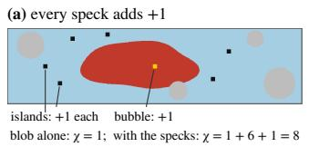

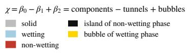

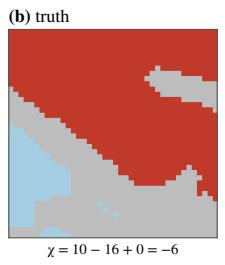

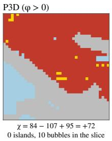

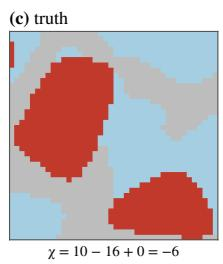

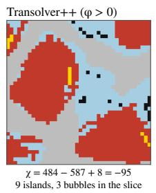  
Figure 17: Specks corrupt the Euler number. (a) $\chi = \beta _ { 0 } - \beta _ { 1 } + \beta _ { 2 }$ counts pieces, tunnels, and enclosed bubbles of the non-wetting phase, so every island of non-wetting phase and every bubble of wetting phase adds $+ 1$ , however small: the blob alone has $\chi = 1$ , with the specks $\chi = 8 .$ (b, c) One 40 × 40-voxel crop of a slice across the flow, fiber GDL, rollout step 64: the reference and the thresholded prediction $( \phi > 0 )$ of P3D and of Transolver++, with speck islands (black) and speck bubbles (yellow) marked. Under each panel, X of the whole 3D frame with its three terms. The predictions’84 and 484 pieces and 95 and 8 bubbles are almost all specks: $\mathrm { P 3 D ^ { 3 } s } ~ \chi = + 7 2$ has the wrong sign against the reference $\displaystyle \mathbf { \dot { s } } - 6 ,$ and Transolver+ $+ \mathrm { \Delta s - 9 5 }$ hides 587 tunnels behind 484 islands.

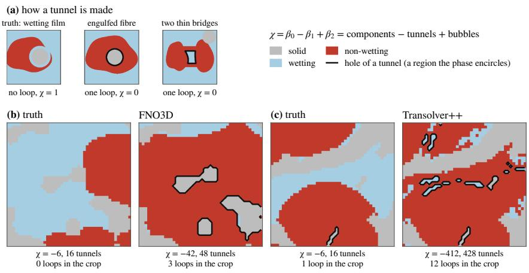  
Figure 18: Tunnels corrupt the Euler number and cannot be filtered. (a) A loop of the nonwetting phase is a tunnel through it and lowers $\chi$ by one; being part of the phase, no size filter removes it. Where the reference keeps a wetting film between a fiber and the phase there is no loop $( \chi = 1 ) ;$ a prediction that engulfs the fiber, or joins two regions by two voxel-thin bridges, closes one $( \chi = 0 )$ . (b) Reference and FNO3D in a plane along the flow, where the fibers are cut across (44× 44 voxels): FNO3D encircles three fiber cross-sections that in the reference touch wetting fluid. (c) Reference and Transolver++ in a plane across the flow: twelve pockets of wetting fluid enclosed by thin strands of phase. A region the phase encircles in the plane, a fiber cross-section or a pocket of wetting fluid, is the hole of a tunnel and is outlined in black. Under each panel, X and the tunnel count of the whole frame, and the loop count of the crop.

## J LIMITATION AND FUTURE WORK

Physics consistency beyond geometry. PoreML checks physical consistency through the geometry and topology of the fluid configuration: the Minkowski functionals, whose role as state variables of two-fluid flow in porous media is established (Armstrong et al., 2016; McClure et al., 2018; Armstrong et al., 2019), and the mean curvature that the Young-Laplace equation ties to capillary pressure (Blunt, 2017). The conservation laws themselves, mass and momentum balance, are not scored here. Enforcing or measuring them in learned surrogates is a broad field of its own, from residual losses (Raissi et al., 2019; Karniadakis et al., 2021) to architectures that satisfy a constraint by construction (Beucler et al., 2021; Richter-Powell et al., 2022), and the limits of residual losses for nonlinear two-phase transport in porous media are documented (Fuks & Tchelepi, 2020). Whether a surrogate that keeps the topology of Appendix I also conserves mass along a rollout, and which constraint helps it do so, is a natural next study on this dataset.

Methodology improvements. PoreML is a framework and benchmark, so its effort goes into the data, the protocol, and the metrics rather than into new methodology: the baselines are published architectures with their published recipes, each trained once from a single seed (Appendix H). Tuning, seed variation, and training strategies for long rollouts should all raise their scores. The failure mode of Appendix I, in which voxel-level errors close loops and fill films that a field loss barely penalizes, points to where new architectures and objectives can act: representations and losses that see the connectivity of the phase, not only its voxels. The framework makes such work directly comparable, since a new model plugs into the same splits, protocol, and metrics.

## K ACCESSIBILITY AND MAINTENANCE

## K.1 RESOURCES AND LINKS

PoreML is released as five public resources that together cover the path from a pore geometry to a scored model.

Solver. The lattice Boltzmann solver is available at https://github.com/PoreML/bob. The repository contains the test suite, the validation cases of Appendix E, and the campaign drivers that generated every run of the dataset, so each trajectory can be regenerated from its geometry and recorded parameters.

Dataset. All 560 trajectories are hosted on Hugging Face at https: //huggingface.co/ datasets/PoreML/PoreML\_data. The repository is organized by scenario, geometry family, and domain size, so a single run, a family, or a whole scenario can be downloaded without fetching the full 3.3 TB. Future versions of the dataset will be published at the same address.

Input geometries. The solid masks used as simulation input, together with further samples of every family at both domain sizes, are hosted at https://huggingface.co/datasets/ PoreML/PoreML\_geo (Appendix G). Each sample is accompanied by its generation parameters and pore-network statistics, and the collection can be used on its own to set up new simulations.

Machine learning framework. Code for training, inference, and evaluation of all benchmark models is available at https://github.com/PoreML/poreml. The repository holds the configuration file of every benchmark run and the frozen data splits, including those of the Geo-Shift and Scale-Up challenges, and a download utility that fetches exactly the runs a given split names. The trained weights are provided as well, at https://huggingface.co/PoreML/PoreML checkpoint: for each of the five models and every training split, the checkpoint trained frame to frame and its pushforward fine-tuned counterpart, which is the one behind the reported results, each with its configuration and training log.

Documentation and tutorial. The dataset cards on Hugging Face describe the directory layout, the stored fields, the metadata attached to every run, and common pitfalls when reading the files. A demo notebook, https://github.com/PoreML/poreml/blob/main/demo/demo. ipynb, walks through the minimal workflow on a small subset of the data: it downloads two drainage trajectories, trains a small UNet for next-step prediction, fine-tunes it with the pushforward strategy, and evaluates and visualizes a 64-step autoregressive rollout on a geometry unseen during training.

## K.2 MAINTENANCE AND LONG-TERM PRESERVATION

The authors are committed to maintaining PoreML as the solver, dataset, and framework are used in future research. Maintenance includes tracking and resolving issues raised by the community after release; feedback is monitored through the GitHub issue trackers of the two code repositories and the community pages of the three Hugging Face repositories. All Hugging Face repositories are version-controlled, so revisions to the data remain traceable and earlier states remain retrievable.

The release follows the FAIR principles. Findable: the dataset and the geometry collection each reside at a single public Hugging Face address and carry descriptive metadata and searchable tags; all present and future versions will share these addresses. Accessible: all data and metadata can be downloaded without registration, through the Hugging Face command-line and Python clients or through the download utility of the framework, which selects runs by scenario, geometry family, domain size, or split. Interoperable: trajectories are stored as standard HDF5 files with Zstandard compression, readable with common libraries such as h 5py, and each is paired with an XDMF index for direct visualization in ParaView. Geometries are stored as NumPy arrays. Every run carries its solver configuration, geometry provenance, and run conditions as JSON, and its scalar diagnostics as CSV. Reusable: the solver, the framework, and the dataset are released under the MIT License, and the geometry collection under the Creative Commons Attribution 4.0 International License. Every run records the solver settings, the software environment, and a hash of its input geometry, so a trajectory can be traced to the exact inputs that produced it

## L MODEL COMPARISON VISUALIZATION

The tables above summarize accuracy over whole campaigns. This appendix shows what those averages look like inside a single trajectory. For each campaign and each evaluation setting we take one test run and render the same 64-step autoregressive rollout for the reference simulation and for all five baselines. The two figures of a pair share one run: the first shows the threedimensional phase field, the second a mid-plane slice through the same volume, both at rollout steps h ∈ {7, 18, 30, 41, 53, 64}. In the three campaigns shown, frames are stored every 5,000 LBM steps, and the counter above each column is the absolute step of the underlying simulation. Every predicted panel carries its phase overlap (IoU) against the reference at that step, so that visual drift and metric can be read together.

## L.1 IN-DISTRIBUTION TEST RESULTS

Geometry family, domain size and parameter ranges all match training here, so the only extrapolation is in time. In each of the three runs below the displacement advances a long way inside the window — a ganglion inflates, a third of the trapped phase is swept out of the pore space, the water content of a fiber mat doubles — and how far it advances is what separates the baselines: the step-64 overlaps fall from 0.77–0.93 in the drainage run to 0.51–0.67 in the trapping run and 0.45–0.71 in the GDL run.

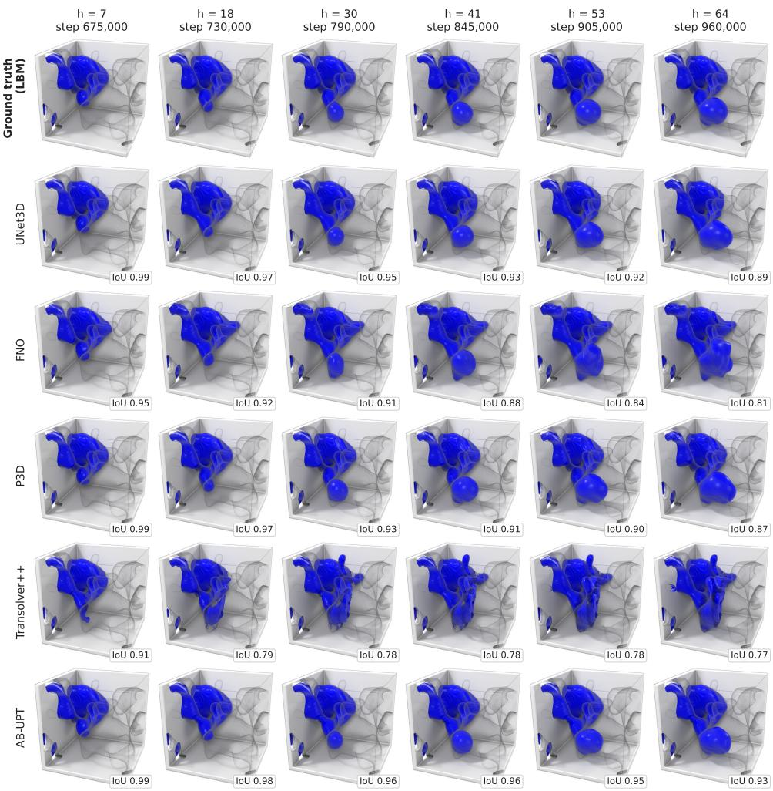  
Blue: invading non-wetting phase (φ > 0); light-grey slabs and grey ghost: the solid, cut open toward the camera. Inlet on the left, flow left → right.

Figure 19: Drainage, in-distribution: three-dimensional rollout. A generated blob medium at 1283 voxels with porosity 0.24, $M = 0 . 2$ and $\theta = 1 5 0 ^ { \circ }$ ; the rollout starts at stored frame 128. Rows are the reference simulation and the five baselines, columns the six rollout steps, and each predicted panel is labeled with its IoU. Over the window the reference inflates a single ganglion in the center of the domain, from a bud at step 7 to a rounded body at step 64, and the non-wetting saturation rises by half, from 0.26 to 0.39. AB-UPT reproduces that growth at IoU 0.93 and ends on the reference saturation; UNet3D (0.89) and P3D (0.87) follow it slightly full; FNO3D (0.81) over-invades to 0.49, and Transolver++ (0.77) fragments the interface as the rollout proceeds.

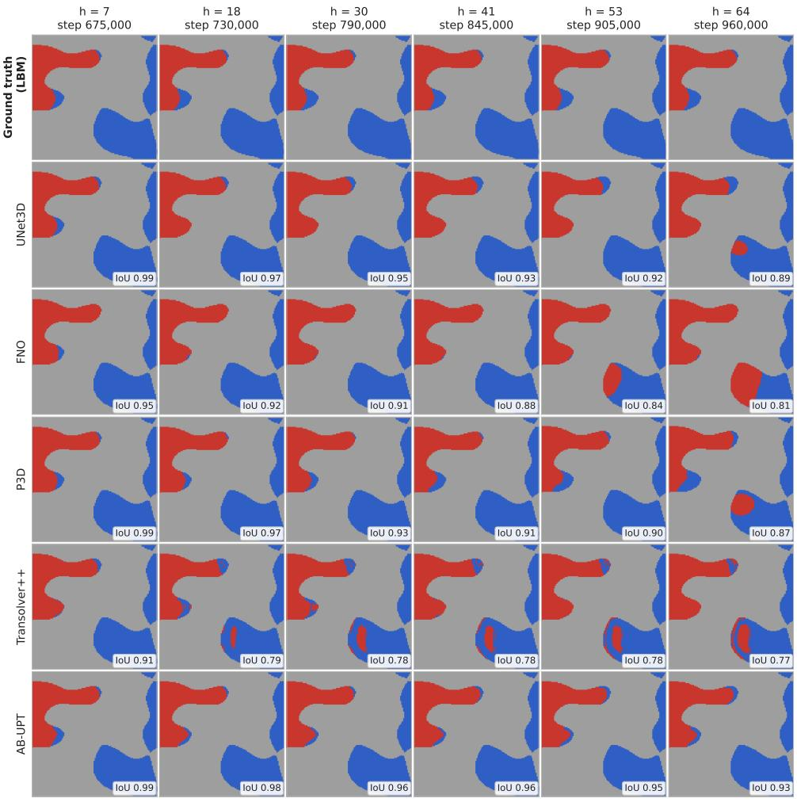  
Mid-plane slice (i = D/2), flow left → right. Grey: solid; red: invading non-wetting phase (φ > 0); blue: displaced wetting phase (φ < 0).

Figure 20: Drainage, in-distribution: mid-plane slice. The same run and steps as Figure 19, sliced through the middle of the domain. The inflating ganglion lies off this plane, so the reference slice holds its shape for the whole window — which makes the figure a test of what a rollout invents where nothing happens. Every model eventually opens a spurious non-wetting patch inside the wettingfilled pore below the main body: Transolver++ carries one from step 18 to the end, FNO3D grows a large one from step 53, and UNet3D and P3D each open one at step 64.

h = 7 step 355,000

h = 18 step 410,000

h = 30 step 470,000

h = 41 step 525,000

h = 53 step 585,000

h = 64 step 640,000

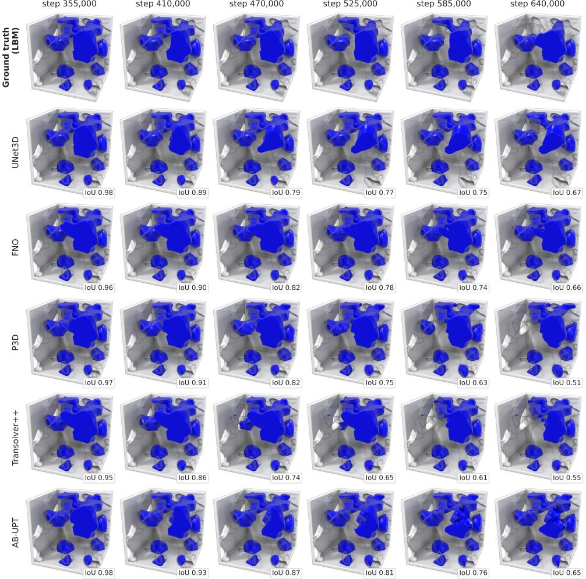  
Blue: non-wetting phase being displaced and trapped (φ > 0) by the invading wetting phase (not drawn); light-grey slabs and grey ghost: the solid, cut open toward the camera. Inlet on the left, flow left → right.

Figure 21: Capillary trapping, in-distribution: three-dimensional rollout. A generated blob medium at $\mathrm { 1 2 8 ^ { \bar { 3 } } }$ voxels with porosity 0.23, M = 0.2 and $\theta = 1 2 0 ^ { \circ }$ ; the rollout starts at stored frame 64. The wetting flood removes nearly a third of the trapped phase, from 0.52 to 0.35 saturation, and breaks the connected body in the middle of the domain into separate ganglia. Every baseline under-mobilizes: the endpoint saturations run from 0.38 (UNet3D) to 0.44 (FNO3D) against the reference 0.35, and the step-64 overlaps spread from 0.67 (UNet3D), 0.66 (FNO3D) and 0.65 (AB-UPT) down to 0.55 (Transolver++) and 0.51 (P3D), which keeps the central body nearly intact.

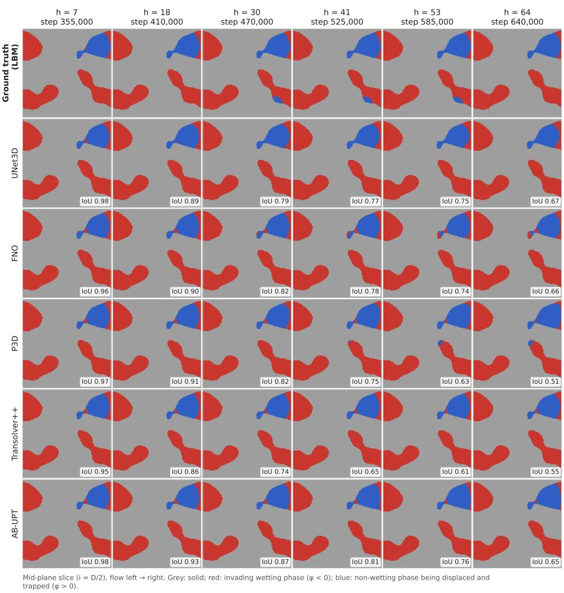  
Figure 22: Capillary trapping, in-distribution: mid-plane slice. The same run and steps as Figure 21; here red is the invading wetting phase and blue the non-wetting phase being displaced. The reference thins the trapped blob at the top of the slice from the side facing the invading phase and narrows the neck that connects it to the throat on its left. All five models keep the blob fuller than the reference; P3D keeps it widest and its overlap decays furthest, from 0.97 at step 7 to 0.51 at step 64.

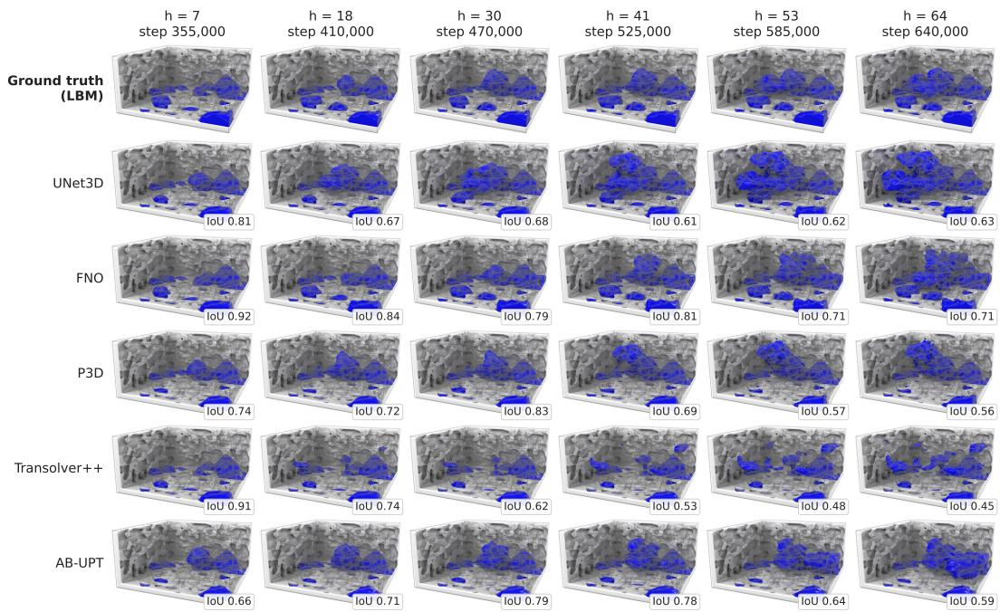  
Blue: invading non-wetting phase (φ > 0); light-grey slabs and grey ghost: the solid, cut open toward the camera. Inlet at the bottom, flow upward.

Figure 23: GDL intrusion, in-distribution: three-dimensional rollout. A generated fiber mat at 128 × 128 × 64 voxels with porosity 0.55, $M = 5$ and $\theta = 1 4 0 ^ { \circ } ;$ ; the rollout starts at stored frame 64. Water climbs through the mat from the inlet at the bottom and the saturation doubles, from 0.11 to 0.21 — the largest relative change of any run in this appendix. The baselines bracket that growth from both sides: UNet3D ends half again too wet at 0.31, FNO3D at 0.25, AB-UPT closest at 0.22, while P3D stops at 0.19 and Transolver++ at 0.12, barely above the saturation it started from. The step-64 overlaps follow the same order: FNO3D 0.71, UNet3D 0.63, AB-UPT 0.59, P3D 0.56, Transolver++ 0.45.

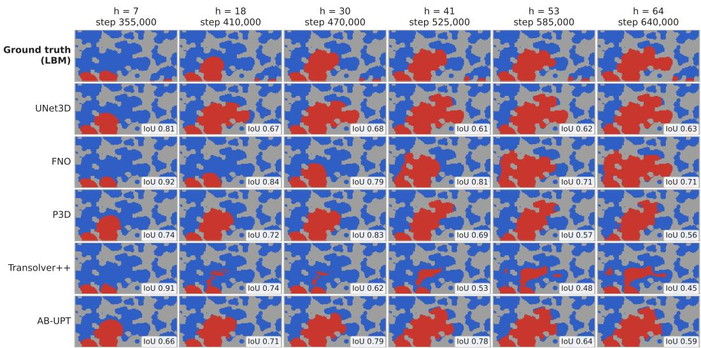  
Mid-plane slice (i = D/2), inlet at the bottom, flow bottom → top. Grey: solid; red: invading non-wetting phase (φ > 0); blue: displaced wetting phase (φ < 0).

Figure 24: GDL intrusion, in-distribution: mid-plane slice. The same run and steps as Figure 23. In the slice the invading phase goes from two small patches at the bottom to a single body spanning the middle of the mat. The errors are errors of timing: UNet3D, P3D and AB-UPT merge the two patches into one cluster already at step 7, ahead of the reference, while Transolver++ starts correctly and then stops growing, leaving a thin ragged filament that never fills the pore space — the slicelevel counterpart of its 0.12 endpoint saturation.

## L.2 GEO-SHIFT

These runs apply weights trained on generated geometries to µCT rock and carbon-paper scans at the training domain size. The displacement remains qualitatively right, but the spread between models widens, and in the trapping and GDL runs below the five baselines bracket the reference saturation from both sides rather than erring together in one direction.

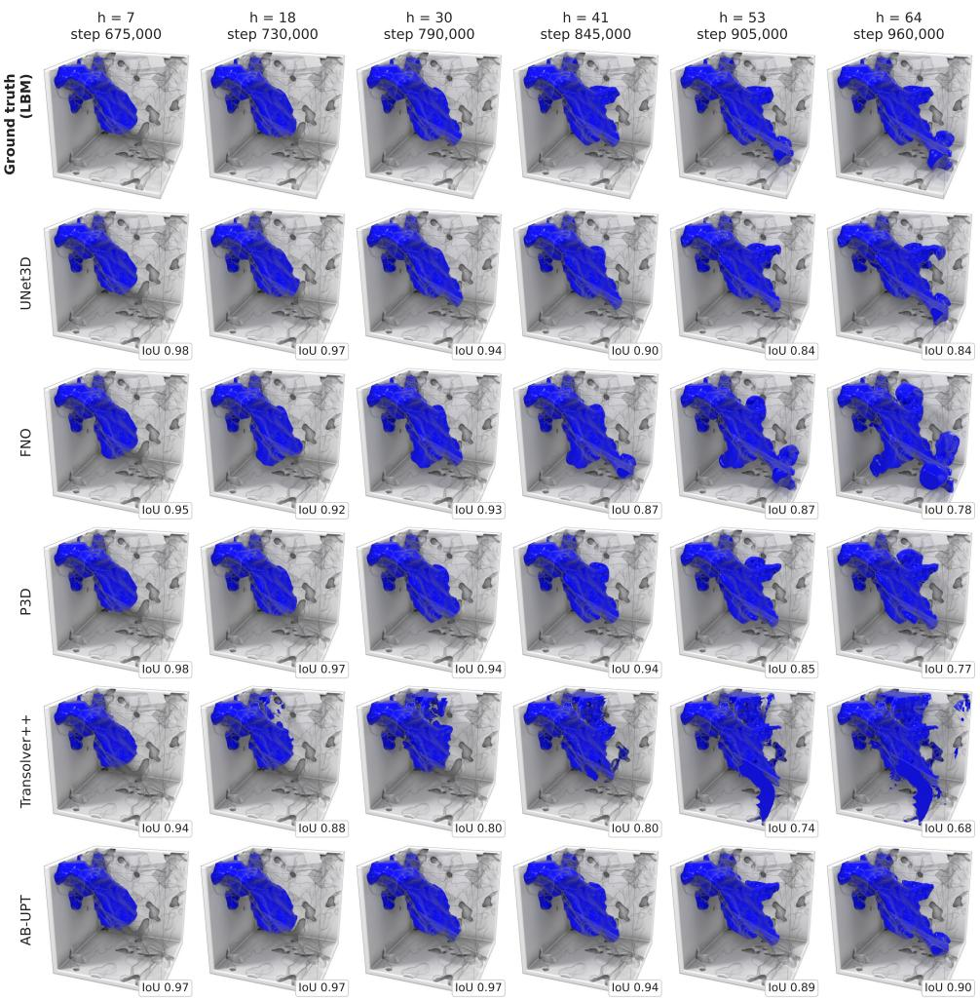  
Blue: invading non-wetting phase (φ > 0); light-grey slabs and grey ghost: the solid, cut open toward the camera. Inlet on the left, flow left → right.

Figure 25: Drainage, Geo-Shift: three-dimensional rollout. A CastleGate sandstone sample at 1283 voxels with porosity 0.20, M = 0.2 and $\theta \ : = \ : 1 2 0 ^ { \circ }$ ; the rollout starts at stored frame 128. The reference gains almost half its non-wetting volume, from 0.30 to 0.44 saturation, extending the cluster along the pore and opening a new branch late in the window. How much of that branch a model produces separates the rollouts: AB-UPT reaches IoU 0.90 and is the only baseline to end below the reference saturation, at 0.41; UNet3D 0.84 and P3D 0.77 end just above it; Transolver++ 0.68 roughens the interface, and FNO3D 0.78 over-invades to 0.54.

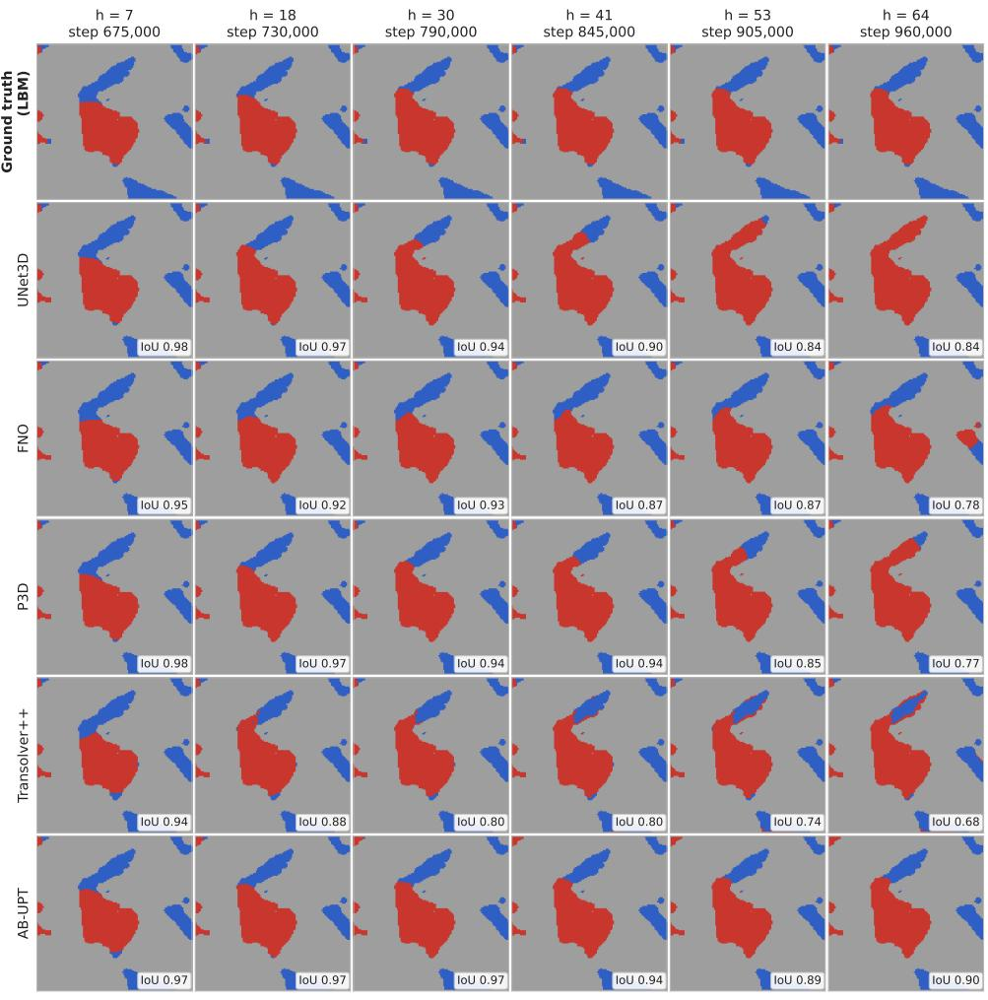  
Mid-plane slice (i = D/2), flow left → right. Grey: solid; red: invading non-wetting phase (φ > 0); blue: displaced wetting phase (φ < 0).

Figure 26: Drainage, Geo-Shift: mid-plane slice. The same run and steps as Figure 25. The slice isolates the new branch: the arm at the top of the slice is wetting-filled at step 7 and half non-wetting by step 64. UNet3D, P3D and AB-UPT advance that front at about the right rate, Transolver++ carries it higher up the arm than the reference, and FNO3D additionally opens a pore on the right that the reference leaves filled with the wetting phase — which is where its saturation excess accumulates.

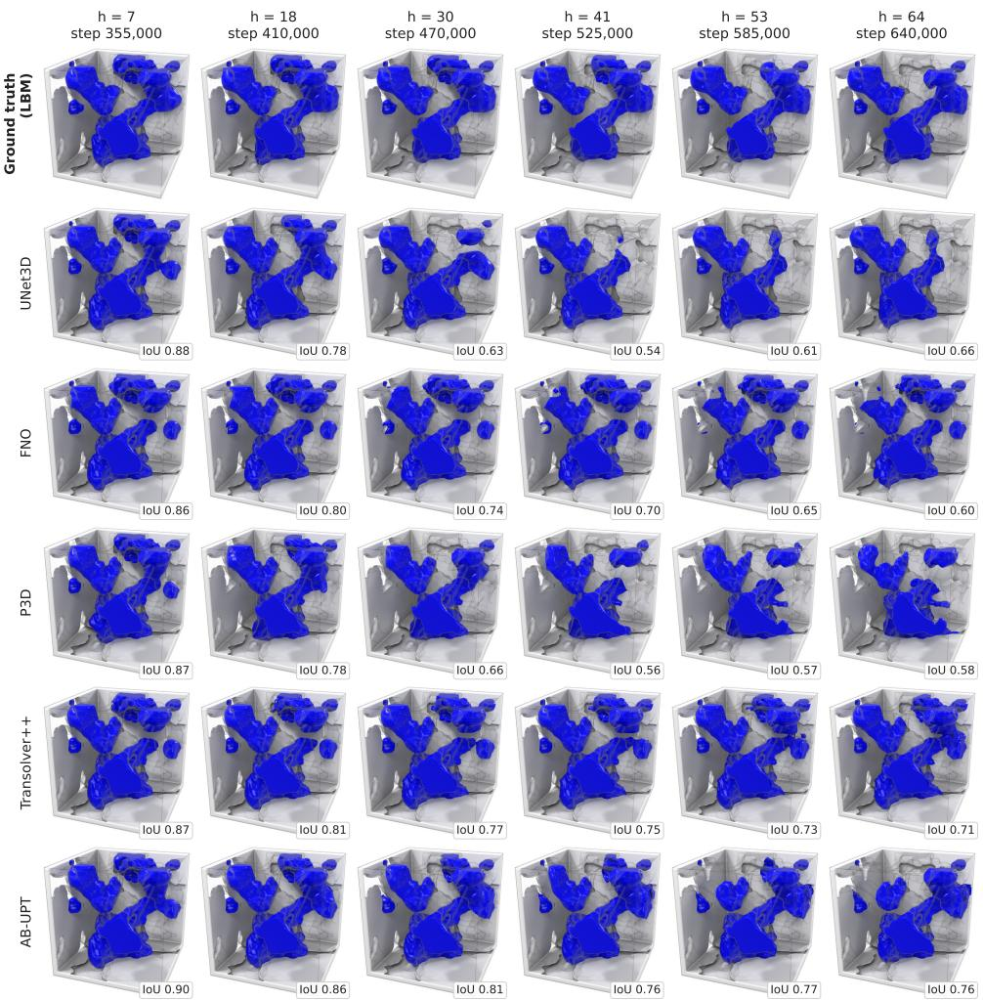  
Blue: non-wetting phase being displaced and trapped (φ > 0) by the invading wetting phase (not drawn); light-grey slabs and grey ghost: the solid, cut open toward the camera. Inlet on the left, flow left → right.

Figure 27: Capillary trapping, Geo-Shift: three-dimensional rollout. A Bentheimer sandstone sample at $\mathrm { 1 2 8 ^ { 3 } }$ voxels with porosity 0.21, $M = 0 . 0 5$ and $\theta \ : = \ : 1 3 0 ^ { \circ }$ ; the rollout starts at stored frame 64. The wetting flood strips about a fifth of the trapped non-wetting phase, from 0.55 to 0.44 saturation, and the models bracket that endpoint: P3D and UNet3D remove too much and end at 0.38, FNO3D and Transolver++ too little at 0.48 and 0.52, and AB-UPT lands closest at 0.45 with the highest overlap, 0.76.

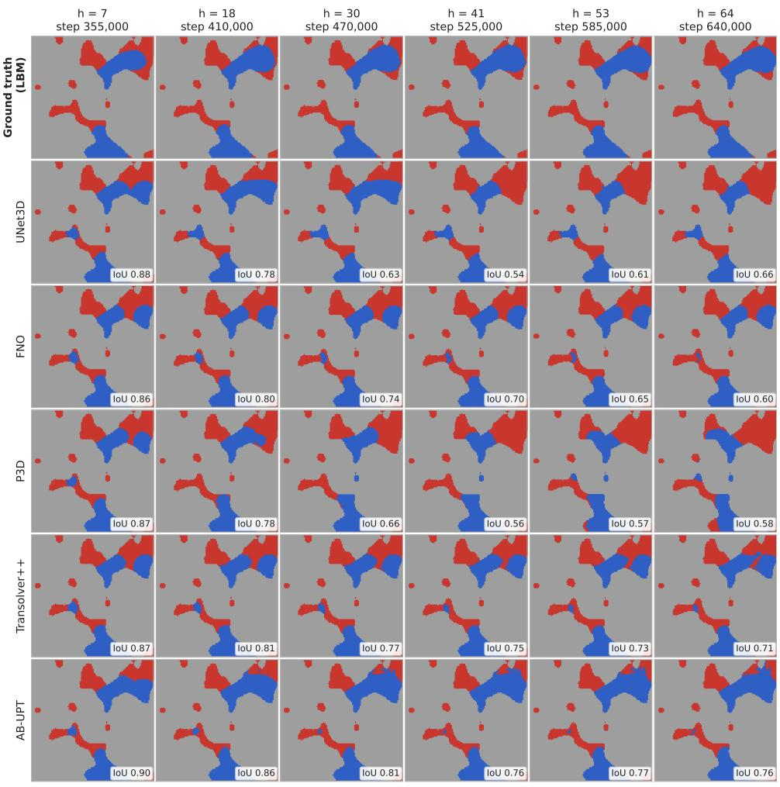  
Mid-plane slice (i = D/2), flow left → right. Grey: solid; red: invading wetting phase (φ < 0); blue: non-wetting phase being displaced and trapped (φ > 0).

Figure 28: Capillary trapping, Geo-Shift: mid-plane slice. The same run and steps as Figure 27; red is the invading wetting phase and blue the non-wetting phase being displaced. The wetting phase eats into the upper body from the right, and where a model stops that erosion sets its endpoint. The overlap need not decay monotonically: UNet3D dips to 0.54 at step 41, when it has cleared too much of the body, and recovers to 0.66 by step 64 as the reference catches up with it.

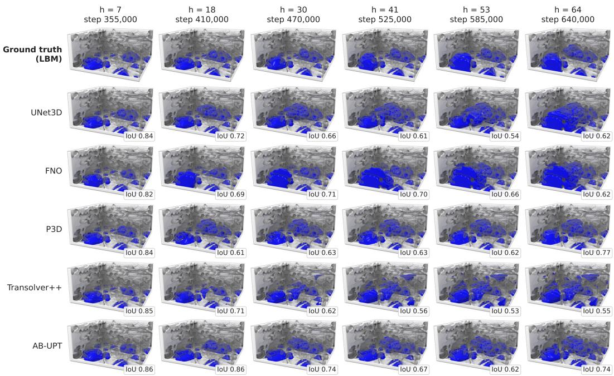  
Blue: invading non-wetting phase (φ > 0); light-grey slabs and grey ghost: the solid, cut open toward the camera. Inlet at the bottom, flow upward.

Figure 29: GDL intrusion, Geo-Shift: three-dimensional rollout. A µCT carbon-paper GDL with 40% PTFE coating at 128 × 128 × 64 voxels, porosity 0.60, M = 5 and $\theta = 1 3 0 ^ { \circ }$ ; the rollout starts at stored frame 64. Water invasion doubles over the window, from 0.10 to 0.19 saturation, and the baselines bracket that endpoint widely: UNet3D and FNO3D end half again too wet, at 0.29 and 0.27, P3D lands on the reference volume at 0.19, and Transolver++ stops short at 0.16. The step-64 overlaps are P3D 0.77, AB-UPT 0.74, UNet3D and FNO3D 0.62, Transolver++ 0.55.

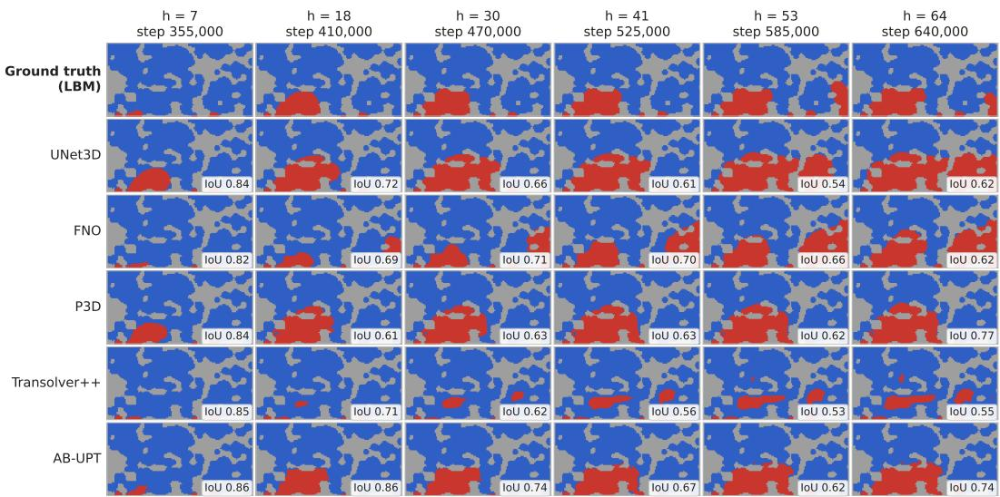  
Mid-plane slice (i = D/2), inlet at the bottom, flow bottom → top. Grey: solid; red: invading non-wetting phase (φ > 0); blue: displaced wetting phase (φ < 0).

Figure 30: GDL intrusion, Geo-Shift: mid-plane slice. The same run and steps as Figure 29. In the scanned layer the water advances as a broad body between the fibers rather than as a front, and the models disagree about where it starts: UNet3D and P3D nucleate a large cluster at the lower left already at step 7, FNO3D builds one at the right edge that the reference reaches only at step 53, and Transolver++ leaves isolated specks that never merge, its overlap decaying to 0.55 while its saturation stalls at 0.16.

## L.3 SCALE-UP

These runs apply the small-domain weights to the paired large domain at fixed resolution, so local discretization is unchanged and only the extent of the pore network grows.

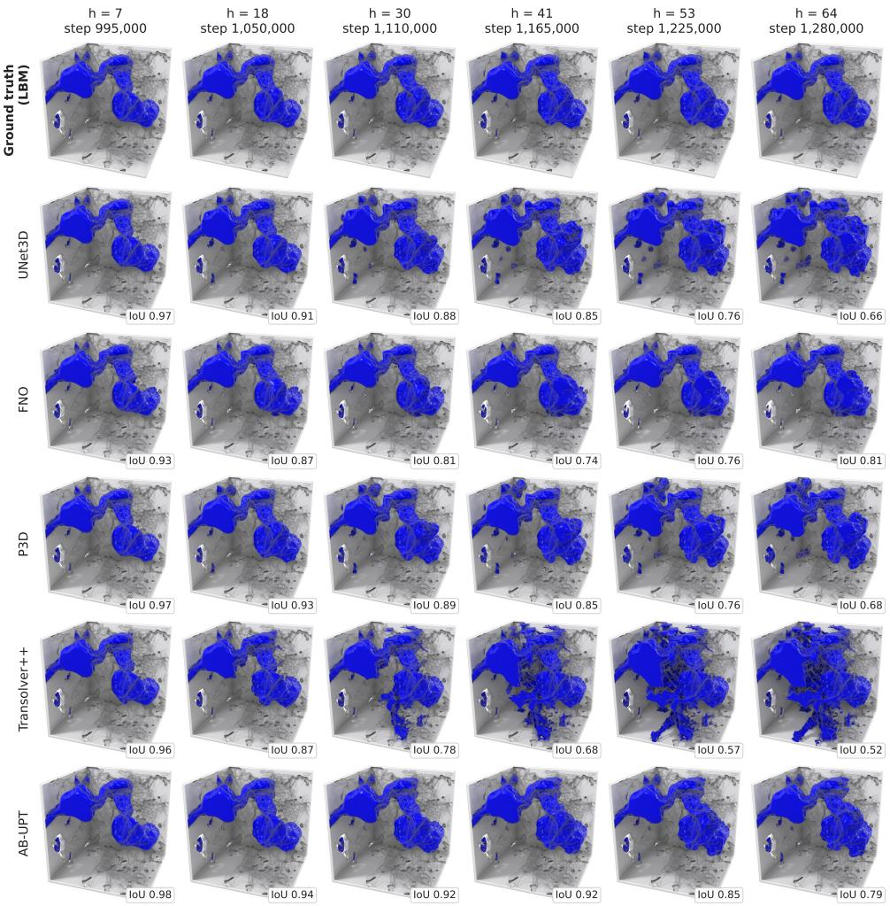  
Blue: invading non-wetting phase (φ > 0); light-grey slabs and grey ghost: the solid, cut open toward the camera. Inlet on the left, flow left → right.

Figure 31: Drainage, Scale-Up: three-dimensional rollout. A Buff Berea sandstone sample at 2563 voxels with porosity 0.20, M = 0.2 and $\theta = 1 5 0 ^ { \circ } ;$ ; the rollout starts at stored frame 192. In eight times the training volume the reference extends its cluster through the pore network and moves from 0.22 to 0.29 saturation. FNO3D holds the pattern best here at IoU 0.81, just ahead of AB-UPT 0.79, which also ends closest in volume; P3D 0.68 and UNet3D 0.66 keep the shape but end too wet, at 0.34 and 0.36; Transolver++ 0.52 shreds the body into disconnected fragments and ends at 0.44 saturation, half again the reference.

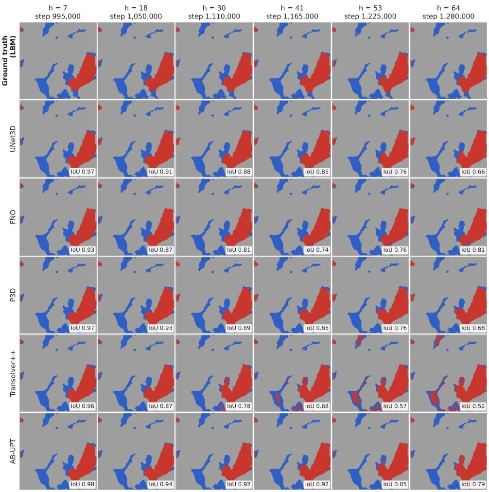  
Mid-plane slice (i = D/2), flow left → right. Grey: solid; red: invading non-wetting phase (φ > 0); blue: displaced wetting phase (φ < 0).

Figure 32: Drainage, Scale-Up: mid-plane slice. The same run and steps as Figure 31. The slice shows where the excess volume accumulates: UNet3D and P3D thicken the cluster where it meets the wetting phase at the top, and Transolver++ breaks into the wetting-filled channel at the lower left from step 30 onward and holds that intrusion to the end of the window, while the reference keeps the channel filled.

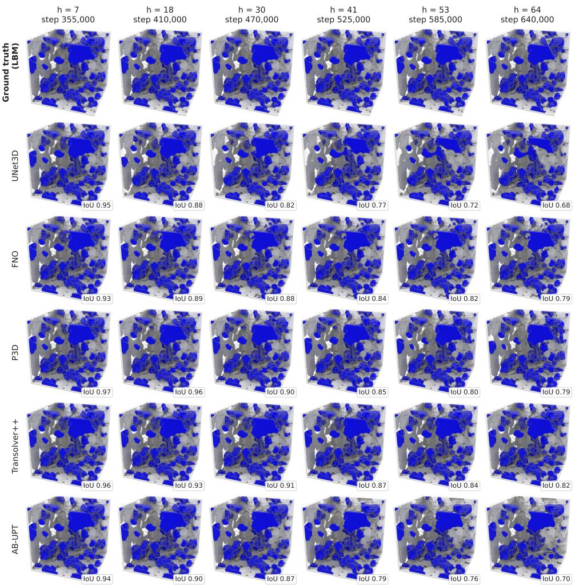  
Blue: non-wetting phase being displaced and trapped (φ > 0) by the invading wetting phase (not drawn); light-grey slabs and grey ghost: the solid, cut open toward the camera. Inlet on the left, flow left → right.

Figure 33: Capillary trapping, Scale-Up: three-dimensional rollout. A generated sphere pack at $2 5 \mathrm { \bar { 6 } ^ { 3 } }$ voxels with porosity 0.18, $M = 0 .$ 1 and $\theta = 1 2 0 ^ { \circ }$ ; the rollout starts at stored frame 64. The flood removes a sixth of the trapped phase, from 0.45 to 0.37 saturation, while the many isolated ganglia stay where they are: at this size the window covers a slow, distributed erosion rather than a single event. Overlap and volume disagree here. Transolver++ holds the highest overlap, 0.82, while ending furthest above the reference saturation at 0.40, and UNet3D ends within 0.01 of the reference volume at the lowest overlap, 0.68; AB-UPT alone strips too much and ends at 0.30.

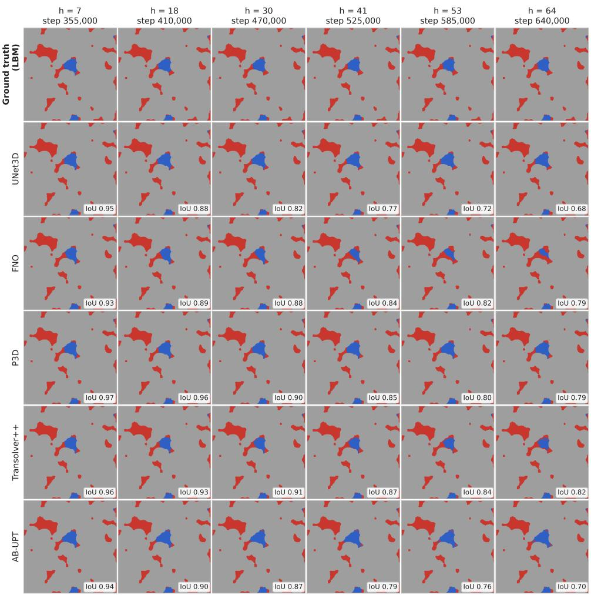  
Mid-plane slice (i = D/2), flow left → right. Grey: solid; red: invading wetting phase (φ < 0); blue: non-wetting phase being displaced and trapped (φ > 0).

Figure 34: Capillary trapping, Scale-Up: mid-plane slice. The same run and steps as Figure 33; red is the invading wetting phase and blue the non-wetting phase being displaced. The slice makes the slowness explicit: the ganglion at the center keeps its outline for the whole window and loses volume only along its rim, and the models differ by a few voxels around that rim — AB-UPT erodes it furthest, Transolver++ least.

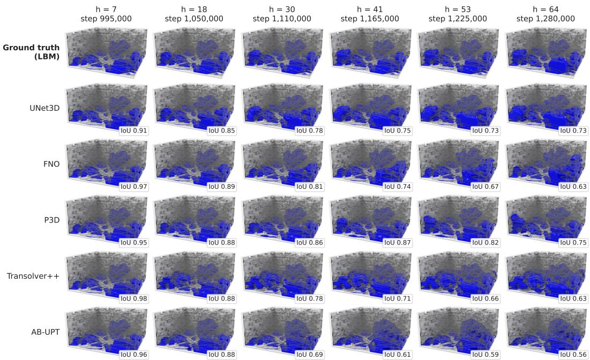  
Blue: invading non-wetting phase (φ > 0); light-grey slabs and grey ghost: the solid, cut open toward the camera. Inlet at the bottom, flow upward.  
Figure 35: GDL intrusion, Scale-Up: three-dimensional rollout. A generated fiber mat at $2 5 6 \times$ $2 5 6 \times 1 2 8$ voxels with porosity 0.65, $M = 1$ and $\theta = 1 2 0 ^ { \circ }$ ; the rollout starts at stored frame 192. The reference invades a third more of the layer, from 0.14 to 0.19 saturation, across four times the in-plane area of the training domain. P3D (0.75) and UNet3D (0.73) hold the intrusion pattern best; FNO3D and Transolver++ (both 0.63) carry too much water and end at 0.23 against the reference 0.19; AB-UPT ends on the right volume, 0.19, at the lowest overlap of the five, 0.56.

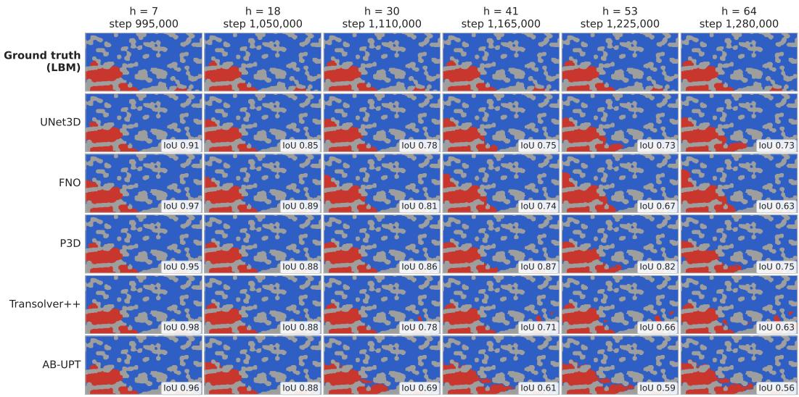  
Mid-plane slice (i = D/2), inlet at the bottom, flow bottom → top. Grey: solid; red: invading non-wetting phase (φ > 0); blue: displaced wetting phase (φ < 0).

Figure 36: GDL intrusion, Scale-Up: mid-plane slice. The same run and steps as Figure 35. In the slice the water holds a flat band across the bottom of the layer and thickens it instead of fingering upward, and the models differ along the right edge of that band: AB-UPT extends it across the foot of the slice from step 30 onward, UNet3D and FNO3D follow later, and P3D keeps the band closest to the reference width.