# PRETRAINING SHAPES SPECTRAL STRUCTURE: ARCHITECTURE- AND STRATEGY-CONDITIONAL PRE-DICTION OF OOD ROBUSTNESS IN FOUNDATION MODELS

Sangyoon Bae   
Interdisciplinary Program in Artificial Intelligence   
Seoul National University   
Seoul, 08826, South Korea   
stellasybae@snu.ac.kr Shinjae Yoo   
Computational Science Initiative Brookhaven National Laboratory Upton, New York, 11973, USA sjyoo@bnl.gov

Sk Miraj Ahmed Computational Science Initiative Brookhaven National Laboratory Upton, New York, 11973, USA sahmed3@bnl.gov

Jiook Cha Department of Psychology Seoul National University Seoul, 08826, South Korea connectome@snu.ac.kr

## ABSTRACT

Can we determine whether a foundation model will generalize out-of-distribution (OOD) before any target data is available? Existing diagnostics require source or target data, which rules them out before a target domain exists. Those that use the weights alone apply one statistic to every architecture, and do not separate robust models from fragile ones. We show the answer is encoded in the spectral structure of pretrained weights. Two forces shape that structure. Architecture determines how information is stored in weight matrices. Pretraining strategy determines what is rewarded. Together they set a spectral geometry that governs OOD robustness. We prove that the OOD accuracy gap is bounded by how tightly the source representations concentrate. A statistic computed from the pretrained weights alone serves as a proxy for that concentration. The direction of that proxy reverses between architecture families. We operationalize it: the direction is stable within one (architecture × strategy) combination, the finest grouping we test, which we call a cell. Pooled over 116 models spanning 7 modalities, a single statistic ranks OOD robustness weakly, because cells of opposite direction cancel. Within a cell, the statistic selected for it orders 92% of model pairs by OOD robustness in-sample. The selection does not leak the target: for each model family outside the matrix we logged the cell, metric and sign before running its OOD evaluation, and the predicted direction held in every case: EEG, genomic and protein. Acting on spectral concentration narrows the OOD gap by 24% at 87.5% ID retention. The diagnostic operates on released weights alone, so OOD robustness becomes checkable at model-selection time, before data or compute is committed to a target domain.

## 1 INTRODUCTION

Can we determine whether a foundation model will generalize out-of-distribution before any target data is available? Data-dependent diagnostics (Sun et al., 2022; Liu et al., 2020; Yu et al., 2025) require labeled source examples or target access, ruling them out at release time. Weight-space approaches (Martin et al., 2021; Sanyal et al., 2019) apply one statistic to every architecture, and rank models at correlations around 0.4–0.5. That ceiling has been attributed to the noisiness of spectral signals. We argue the cause is the population, not the statistic. Pooling models whose spectra were shaped by different forces flattens the signal (Martin & Mahoney, 2021).

Each (architecture × strategy) combination leaves a distinct geometric fingerprint in pretrained weights—because architecture controls how information is stored and pretraining strategy controls what is rewarded—that determines how representations behave under distribution shift (Figure 1). Pooling across incompatible fingerprints cancels the OOD-predictive signal; conditioning on them restores it.

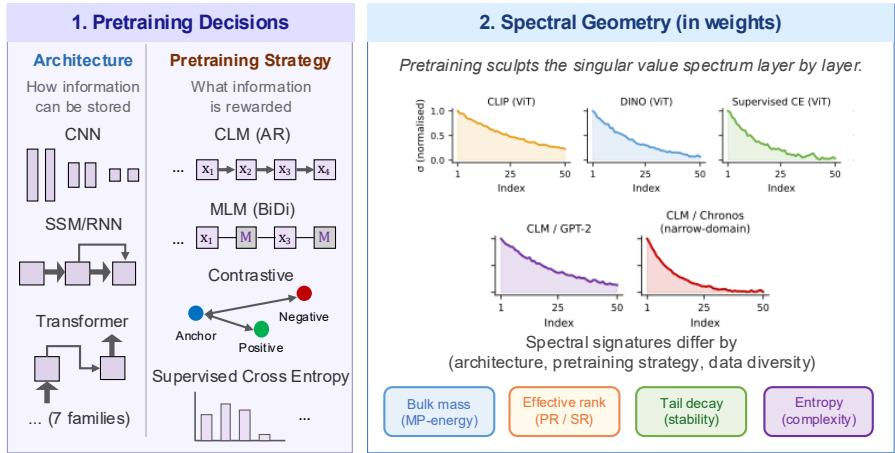

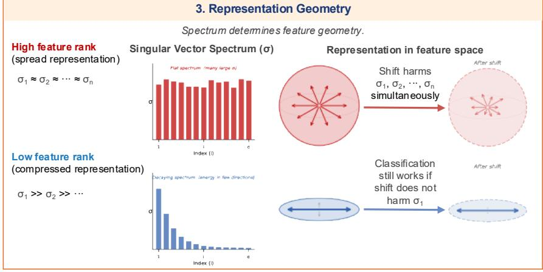

4. OOD Robustness  
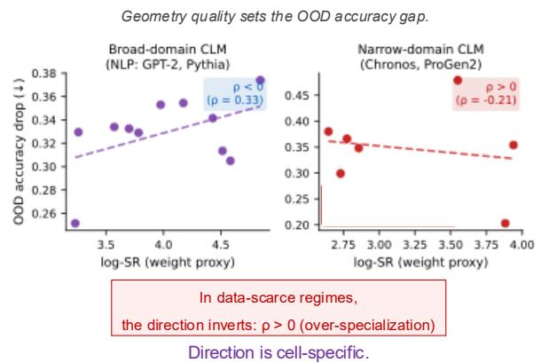  
Figure 1: (Architecture × Strategy) → Spectral Geometry → OOD Robustness. Architecture and pretraining strategy jointly shape the layer-wise singular-value spectrum (2), which determines whether representations are concentrated or diffuse (3), setting the OOD accuracy gap (4). The sign of $\rho$ is a property of the cell and of the statistic read in it, not of the domain: each AR-CLM cell is positive under its own calibrated metric, while BiDi-MLM/Protein, CNN and SSM-v2/RWKV are negative under theirs.

## Contributions.

• A spectral-concentration bound explains why conditioning must reach (architecture × strategy), the finest grouping we test. Pooling across cells retains under a third of the correlation that per-cell conditioning achieves, and every one of the 15 cells achieves $| \rho _ { \mathrm { L O O } } | \geq 0 . 7 0 0$ (Theorem 1, Table 3).

• Acting on spectral concentration narrows the OOD gap by 24% at 87.5% ID retention. Metric-guided layer selection beats random targeting in 9 of 10 models.

• The diagnostic transfers data-free to model families outside the matrix. The cell, metric and sign were logged before each new family was evaluated, and the predicted direction held in the EEG, genomic and protein cases.

## 2 RELATED WORK

Data-free approaches tie spectral statistics of pretrained weights to model quality (Martin et al., 2021; Sanyal et al., 2019; Neyshabur et al., 2018), and Martin & Mahoney (2021) report that this relationship can reverse sign between architectural subgroups—a prior finding that we operationalize as a 15-cell (architecture × strategy) registry with a statistic selected for each cell, extended from ID generalization to OOD robustness (Appendix A).

Where the spectral geometry comes from. OOD robustness is governed by representation geometry: the Tunnel Effect (Masarczyk et al., 2023) links OOD linear-probe accuracy to feature rank, Domain Feature Collapse (Yang et al., 2025) shows single-domain pretraining reduces feature dimensionality, and Chou et al. (2026) and Zia & Hazratian (2026) extend this to geometric measures of representation space—all of them requiring source-domain access. That geometry is in turn shaped by the architecture and the pretraining objective, which impose characteristic pressures: compact low-dimensional representations under contrastive training, stage-wise specialization in hierarchical backbones, depth-structured residuals in autoregressive Transformers, concentrated spectral mass under state-space recurrence (Radford et al., 2021; Caron et al., 2021; Liu et al., 2021; Elhage et al., 2021; Clark et al., 2019; Jing et al., 2021; Garrido et al., 2023; Gu et al., 2022; Gu & Dao, 2023). We read one spectral statistic per (architecture × strategy) cell as a weight-space proxy for the same quantities—motivated by those pressures, though the final choice in each cell was made empirically (Appendix B); Appendix A gives the per-architecture and per-objective accounts in full.

## 3 THEORY: SPECTRAL CONCENTRATION PREDICTS OOD ROBUSTNESS

Prior work links representation rank and geometry to OOD behavior (Masarczyk et al., 2023; Yang et al., 2025). We formalize this relationship within architecture–strategy cells and then derive weight-only spectral proxies. Complete assumptions, notation, and proofs are deferred to Appendix C.

Theorem 1 (Log stable rank → OOD accuracy gap). For source features F, F′from two checkpoints within the same architecture–strategy cell, let $\mathrm { s r } ( \ r ( F ) = \| F \| _ { F } ^ { 2 } / \| F \| _ { 2 } ^ { 2 }$ . Under T1–T6 (Appendix C.1),

$$
\begin{array} { r } { \Big | \log { - \mathrm { s r } ( F ^ { \prime } ) } > \log { - \mathrm { s r } ( F ) } \implies \Delta _ { \mathrm { a c c } } ( F ^ { \prime } ) - \Delta _ { \mathrm { a c c } } ( F ) \ge ( 1 - \delta ) q - \delta > 0 , \Big | } \end{array}\tag{1}
$$

where $q > 0$ is the induced target-error separation and δ is the joint concentrationfailure probability. Feature log stable rank orders OOD degradation within the regime characterized by T1–T6.

Intuition. Spreading spectral mass into weaker feature directions exposes more directions to target shift:

$$
\mathrm { w e a k \mathrm { - } t a i l ~ s p r e a d i n g } ~ \Rightarrow ~ \mathrm { l o g { \mathrm { - } } s r _ { f e a t } ~ \uparrow \Rightarrow ~ t a r g e t { \mathrm { - } } m a r g i n ~ s t a b i l i t y ~ \downarrow \Rightarrow ~ \Delta \Delta \Delta _ { a c c } ~ \uparrow ~ } .
$$

Lemma 2 (Nested weight-to-feature transfer). For a depth-L linear residual model $X _ { \ell + 1 } = X _ { \ell } ( I +$ $W _ { \ell } )$ , let

$$
F = X _ { 0 } M , \qquad M = \prod _ { \ell = 1 } ^ { L } ( I + W _ { \ell } ) .
$$

Under approximate input isotropy,

$$
\boxed { | \log \mathrm { - s r } ( F ) - \log \mathrm { - s r } ( M ) | \le E _ { X } }\tag{2a}
$$

$$
\left| \log \mathfrak { - } \mathrm { s r } ( F ) - \log \mathfrak { - } \mathrm { s r } ( I + W _ { \ell } ) \right| \le E _ { X } + D _ { \ell } \ \vert\tag{2b}
$$

where

$$
E _ { X } = \log \frac { 1 + \epsilon _ { X } } { 1 - \epsilon _ { X } } , \qquad D _ { \ell } = 2 \log \kappa ( P _ { \ell } ) + 2 \log \kappa ( Q _ { \ell } ) ,
$$

for $M = P _ { \ell } ( I + W _ { \ell } ) Q _ { \ell } .$ Hence $\ell ^ { \star } = \arg$ minℓ $D _ { \ell }$ gives the tightest certified layerwise approximation. Residual-stream analyses motivate this operator view (Elhage et al., 2021; Zangrando et al., 2024); the nonlinear analoguefollows locally through the block Jacobian. Proof: Appendix C.2.

Intuition. The complete residual product, rather than an isolated layer, determines the final feature geometry:

$$
\{ W _ { \ell } \} _ { \ell = 1 } ^ { L } \Rightarrow M \Rightarrow \mathrm { l o g } { \mathrm { - s r } } _ { \mathrm { f e a t } } { \frac { \mathrm { T h m . } 1 } { \longrightarrow } } \Delta _ { \mathrm { a c c } } .
$$

All candidate statistics below are computed directly from pretrained weights via Weight-Watcher (Martin et al., 2021); metric definitions are given in Appendix D.

Proposition 3 (CV(log -Frob) for AR-CLM). Let $z _ { \ell } = \log \| W _ { \ell } \| _ { F }$ and $\ell _ { F } = \arg \operatorname* { m a x } _ { \ell } z _ { \ell } . \ A R .$ CLM depth structure (Elhage et al., 2021; Fernando & Guitchounts, 2026) and heavy-tailed self regularization (Martin et al., 2021; Everett, 2026) motivate P3.1–P3.4: dominant variation through $z _ { \ell _ { F } } ,$ , decreasingfitted tail exponent αˆ along that checkpoint direction, a common power-law spectral range, and an effective-block gap larger than the distortion in Lemma 2. Then

$$
\begin{array} { r } { \big | \operatorname { C V } ( \log { - F r o b } ) \uparrow \Rightarrow \hat { \alpha } _ { \ell _ { F } } \downarrow \Rightarrow \log { - \mathrm { s r } ( I + W _ { \ell _ { F } } ) } \uparrow \Rightarrow \log { - \mathrm { s r } _ { \mathrm { f e a t } } } \uparrow \Rightarrow \Delta _ { \mathrm { a c c } } \uparrow . | } \end{array}\tag{3}
$$

Proof: Appendix C.3.

Intuition. A stronger depth-wise norm hierarchy is associated with heavier spectral tails in the dominant AR-CLM block, which increases the effective dimensionality transmitted to the representation.

Proposition 4 (PR-mean polarity in BiDi-MLM). BiDi-MLM heads develop complementary specialization (Clark et al., 2019), while the participation ratio gives a scale-consistent measure of effective rank (Jha & Reagen, 2025). Under P4.1–P4.4 and

$$
\Sigma _ { \mathrm { f e a t } } \simeq \frac { 1 } { L } \sum _ { \ell } W _ { \ell } ^ { O V } ( W _ { \ell } ^ { O V } ) ^ { \top } ,
$$

$$
\boxed { \mathrm { s r } _ { \mathrm { f e a t } } = \frac { \sqrt { L } } { \kappa _ { \Sigma } \sqrt { H _ { P } ^ { - 1 } + A } } , \qquad s _ { \mathcal { C } } = \mathrm { s i g n } \biggl ( \frac { d \mathrm { l o g } \mathrm { - } \mathrm { s r } _ { \mathrm { f e a t } } } { d \mathrm { P R } \mathrm { - m e a n } } \biggr ) , }\tag{4}
$$

where $H _ { P }$ is the harmonic mean of layerwise participation ratios, A measures cross-layer alignment, and $\kappa _ { \Sigma }$ measures concentration of the aggregate covariance. Approximately stable A and κΣ give $s c = + 1$ , whereas sufficiently strong changes in alignment or aggregate concentration can produce $s c = - 1$ . Proof: Appendix C.4.

Intuition. Participation ratio controls within-layer spectral spreading, while A and $\kappa _ { \Sigma }$ determine how those layerwise directions combine:

$$
\mathrm { P R - m e a n } \uparrow \Rightarrow \left( H _ { P } , A , \kappa _ { \Sigma } \right) \Rightarrow \left\{ \begin{array} { l l } { \log \mathrm { - s r _ { f e a t } } \uparrow \Rightarrow \Delta _ { \mathrm { a c c } } \uparrow , } & { s _ { \mathcal { C } } = + 1 , } \\ { \log \mathrm { - s r _ { f e a t } } \downarrow \Rightarrow \Delta _ { \mathrm { a c c } } \downarrow , } & { s _ { \mathcal { C } } = - 1 . } \end{array} \right.
$$

with the sign of the first mapping determined by $s _ { \mathcal { C } }$

What the reported statistics measure. Two names need pinning down, because the quantity we report is not always the one the derivation is written in. PR-mean is the mean stable rank $\| W \| _ { F } ^ { 2 } / \| W \| _ { 2 } ^ { 2 }$ over layers, and CV(PR) is its coefficient of variation; CV(SR) is the coefficient of variation of log stable rank. Stable rank is the quantity Theorem 1 bounds, so the measurement sits on the same axis as the theorem. Proposition 4 above is derived for the participation ratio, which is a different functional of the same spectrum, and we do not claim the derivation transfers to the stable rank unchanged. $\overline { { H } } _ { \mathrm { e n t } }$ is the entropy of the distribution of fitted power-law exponents across layers, not of the singular-value spectrum, and MP-energy is the mean Marchenko–Pastur soft rank over layers.

Proposition 5 (MP-energy for ViT×CLIP). Contrastive objectives induce low-rank pressure (Jing et al., 2021). IfInfoNCE concentrates k directions above the Marchenko–Pastur bulk and $\operatorname { S R } ( W )$ ≈ $k / ( 1 - \mathrm { M P } ( \dot { W } ) )$ , then

$$
\begin{array} { r } { \boxed { \mathrm { M P - e n e r g y } \uparrow \Rightarrow \mathrm { S R } ( W ) \uparrow \Rightarrow \ \mathrm { l o g - s r } _ { \mathrm { f e a t } } \uparrow \Rightarrow \ \Delta _ { \mathrm { a c c } } \uparrow . } } \end{array}
$$

Proof: Appendix C.5.

Intuition. Greater bulk energy spreads mass into more directions, yielding a less concentrated representation and a larger OOD accuracy gap.

Cell-specific polarity. Theorem 1 fixes the feature-level relation between $\mathrm { l o g \mathrm { - s r } _ { f e a t } }$ and OOD degradation; architecture, pretraining strategy, and data diversity determine which weight statistic tracks that geometry and with what polarity (Ba et al., 2024). In particular, BiDi-MLM/Protein $( \rho _ { \mathrm { L O O } } = - 0 . 8 9 1 )$ corresponds to an inverted PR-mean $ \mathrm { l o g - s r } _ { \mathrm { f e a t } }$ mapping under Proposition 4. The resulting within-cell hierarchy is

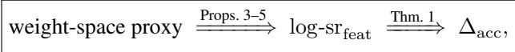

with Lemma 2 providing the weight-to-feature bridge.

## 4 TESTING THE THEORY

Does the predicted relationship emerge across foundation models? We test this across 116 foundation models spanning 7 modalities, each cell on one canonical OOD shift (Appendix E); Appendix F stratifies the same data by shift type.

## 4.1 WITHIN EVERY CELL, A SPECTRAL STATISTIC ORDERS MODELS BY OOD ROBUSTNESS

Table 1 lists, for each primary (architecture × strategy) cell, the statistic selected for it and that statistic’s correlation with OOD drop. Every cell reaches $| \rho _ { \mathrm { L O O } } | ~ \geq ~ 0 . 7 0 0$ (9/15 cells two-sided $p \leq 0 . 0 5$ , 4 more one-sided under the pre-specified direction, 2 marginal; mean 0.824; per-cell intervals in Appendix G).

Three cell-level patterns confirm the theory-predicted structure. First, neither axis alone fixes the metric: holding the architecture and varying the strategy, or the reverse, changes which statistic the theory admits as a candidate and which one calibration then selects (Table 2). Second, the direction is cell-specific rather than universal—positive in the salmon- and orange-shaded cells of Table 1, negative in the BiDi-MLM/Protein, CNN, and SSM-v2/RWKV cells. Third, per-cell selection achieves strong signal in every case $( | \rho _ { \mathrm { L O O } } | \in [ 0 . 7 1 4 , 1 . 0 0 0 ]$ ; vision cells [0.714, 0.893]).

Conditioning on (architecture × strategy) raises mean $| \rho _ { \mathrm { L O O } } |$ from 0.245 (global pooled, Table 3 Level 0) to 0.824; substituting log $n _ { \mathrm { p a r a m s } }$ at the same level drops it to 0.686, but not in every cell: log $n _ { \mathrm { p a r a m s } }$ ties or beats the selected metric in the ${ \mathrm { V i T } } { \times } { \mathrm { C L I P } } ,$ ViT×Supervised, CNN, Mamba, Mamba-2 and RWKV cells (Appendix H). LOCO stability: dropping any single cell leaves mean $| \rho _ { \mathrm { L O O } } | \ \in \ [ 0 . 8 1 1 , 0 . 8 3 2 ]$ (s.d. 0.006 across 15 rounds, max deviation from baseline 0.013; Appendix I). Across 454 within-cell pairwise comparisons, the cell-specific statistic identifies the more OOD-robust model in 92% of cases (pairwise ranking accuracy 0.924, median 0.958).

Table 1: Architecture × strategy matrix: numerical summary. Stars: $* * * \ | \rho _ { \mathrm { L O O } } | \geq 0 . 7 .$ , twosided $p \leq 0 . 0 5 ; { ^ \ast }$ one-sided $p \leq 0 . 0 5$ (pre-specified direction); † marginal $( | \rho _ { \mathrm { L O O } } | \geq 0 . 8 , p > 0 . 0 5$ one-sided). For $n { = } 5 { : }$ exact permutation; n=4: exact one-sided $\scriptstyle p = 0 . 0 4 2 ;$ otherwise Fisher-z. ↑: higher metric → higher OOD drop. Row shading encodes correlation sign: salmon $( \rho _ { \mathrm { L O O } } > 0 $ , higher metric → more fragile); lavender $( \rho _ { \mathrm { L O O } } < 0 ;$ capacity or gating inversion); green (anti-collapse MLM Protein); orange (narrow-domain genomic MLM). EEG foundation model results are reported separately in §6.
<table><tr><td>Architecture</td><td>Example models</td><td>Strategy</td><td>Metric</td><td> $\rho _ { \mathrm { L O O } }$ </td><td>n</td></tr><tr><td>AR-Transformer</td><td>GPT-2 / Pythia / GPT-Neo</td><td>CLM</td><td> $\overline { { \log \| W \| _ { F } } } \uparrow$ </td><td> $+ 0 . 7 1 4 ^ { * * * }$ </td><td>16</td></tr><tr><td>AR-Transformer</td><td>Chronos / Timer / Sundial</td><td>CLM</td><td> $\mathrm { P R } { \cdot } \mathrm { m e a n } \uparrow$ </td><td> $+ 0 . 7 1 4 ^ { * }$ </td><td>8</td></tr><tr><td>AR-Transformer</td><td>ProGen2 / ProtGPT2 / RITA</td><td>CLM</td><td> $\mathrm { C V } ( \log { - } \mathrm { F r o b } )$ </td><td> $+ 0 . 8 1 7 ^ { * * * }$ </td><td>10</td></tr><tr><td>BiDi-Transformer</td><td>BERT / RoBERTa / ALBERT</td><td>MLM</td><td> $\mathrm { P R } { \cdot } \mathrm { m e a n } \uparrow$ </td><td> $+ 0 . 8 0 8 ^ { * * * }$ </td><td>10</td></tr><tr><td>BiDi-Transformer</td><td>ESM / AnKH / AMPLIFY</td><td>MLM</td><td> $\mathrm { P R - m e a n }$ </td><td> $- 0 . 8 9 1 ^ { \ast \ast \ast }$ </td><td>11</td></tr><tr><td>BiDi-Transformer</td><td>NT-v2 / AgroNT (Genomic)</td><td>MLM</td><td> $\overline { { \log \| W \| _ { F } } } \mathrm { ~ \uparrow ~ }$ </td><td> $+ 0 . 8 2 9 ^ { \ast \ast \ast }$ </td><td></td></tr><tr><td>ViT</td><td>CLIP-ViT / SigLIP</td><td>Contrastive</td><td> $\mathrm { M P - e n e r g y } \uparrow$ </td><td> $+ 0 . 7 5 0 ^ { * }$ </td><td></td></tr><tr><td>ViT</td><td>DINOv2 / DINO</td><td>Contrastive</td><td> $\mathrm { M P - e n e r g y }$ </td><td> $+ 0 . 8 0 0 ^ { \dagger }$ </td><td>5</td></tr><tr><td>ViT / DeiT</td><td>ViT-T/S/B/L, DeiT-B/S</td><td>Supervised CE</td><td>↑个  $\mathrm { M P - e n e r g y }$ </td><td> $+ 0 . 7 1 4 ^ { * }$ </td><td></td></tr><tr><td>Swin</td><td>Swin/SwinV2-T/S/B/L</td><td>Supervised CE</td><td> $\mathrm { M P - e n e r g y } \uparrow$ </td><td> $+ 0 . 8 9 3 ^ { * * * }$ </td><td>8</td></tr><tr><td>CNN</td><td>ResNet / ConvNeXt</td><td>Supervised CE</td><td> $\mathrm { C V } ( \mathrm { S R } )$ </td><td> $- 0 . 8 2 9 ^ { \ast }$ </td><td></td></tr><tr><td>Conv+Transformer</td><td>wav2vec2 (XLSR series)</td><td>Contrastive</td><td> $\mathrm { C V } ( \log { - } \mathrm { F r o b } )$ </td><td> $+ 0 . 8 0 0 ^ { * * * }$ </td><td>6</td></tr><tr><td>SSM (Mamba)</td><td>Mamba-130M–2.8B</td><td>CLM NLP</td><td> $\overline { { H } } _ { \mathrm { e n t } } \ \uparrow$ </td><td> $+ 0 . 8 0 0 ^ { \dagger }$ </td><td>5</td></tr><tr><td>SSM-v2 (Mamba-2)</td><td>Mamba2-130M–2.7B</td><td>CLM NLP</td><td>α</td><td> $- 1 . 0 0 0 ^ { \ast \ast \ast }$ </td><td>5</td></tr><tr><td>RWKV</td><td>RWKV-4-169M-7B</td><td>CLM NLP</td><td> $\mathrm { C V } ( \log { - } \mathrm { F r o b } )$ </td><td> $- 1 . 0 0 0 ^ { * * * }$ </td><td>5</td></tr></table>

Table 2: The cell fixes the metric; neither axis alone does. Holding one axis and varying the other changes the statistic selected for the cell. Each row reads off Table 1.
<table><tr><td>Held fixed</td><td>Varied</td><td>Theory-named metric</td></tr><tr><td>BiDi-Transformer Supervised CE</td><td>MLM-NLP → MLM-Genomic ViT / Swin → CNN</td><td> $\operatorname { P R - m e a n } \to { \overline { { \log \| W \| _ { F } } } }$   $\mathrm { M P - e n e r g y } \to \mathrm { C V } ( \mathrm { S R } )$ </td></tr><tr><td></td><td></td><td></td></tr><tr><td>CLM</td><td>NLP → time-series → protein</td><td> ${ \overline { { \log \| W \| _ { F } } } } \to \operatorname { P R - m e a n } \to \operatorname { C V } ( \log \operatorname { - F r o b } )$ </td></tr><tr><td>CLM-NLP</td><td> $\mathrm { M a m b a } \to \mathrm { M a m b a } \to \mathrm { R W K V }$ </td><td> $\overline { { H } } _ { \mathrm { { e n t } } }  \bar { \alpha }  \mathrm { { C V } ( \log \mathrm { { - F r o b } ) } }$ </td></tr></table>

## 4.2 ARCHITECTURE × STRATEGY IS THE FINEST GROUPING STILL NEEDED

Minimality is tested from both sides: coarser groupings below, and attempts to widen a cell by pooling related objectives in Appendix J.

Table 3: Four-level conditioning hierarchy on the identical n=116 model set. Mean $| \rho _ { \mathrm { L O O } } |$ across groups at each level; best metric selected independently per group (oracle upper-bound at each level). Neither axis alone attains the full cell-level signal.
<table><tr><td>Level</td><td>Conditioning unit</td><td>Mean |ρLoo|</td><td> $\Delta$ </td></tr><tr><td>0</td><td>Global (all 116 models pooled)</td><td>0.245</td><td></td></tr><tr><td>1</td><td>Strategy-only (4 groups; one metric per objective)</td><td>0.478</td><td> $+ 0 . 2 3 3$ </td></tr><tr><td>2</td><td>Architecture-only (8 groups; one metric per backbone)</td><td>0.745</td><td> $+ 0 . 2 6 7$ </td></tr><tr><td>3</td><td>Architecture × Strategy (ours)</td><td>0.824</td><td>+0.579</td></tr><tr><td>3′</td><td>Arch × Strategy (log nparams instead)</td><td>0.686</td><td>+0.441</td></tr></table>

All rows use the identical n=116 model set; Levels 0–2 use oracle best metric per group (upper-bound at each level). Replacing the cell-specific spectral metric with log $n _ { \mathrm { p a r a m s } }$ (row $3 ^ { \prime } )$ drops mean |ρLOO| by 0.138 (0.824 → 0.686)—below the architecture-only baseline.

Table 3 and Appendix K show a clean monotone hierarchy on the identical $n { = } 1 1 6$ set: each additional conditioning axis adds signal $( + 0 . 2 3 3$ for strategy, +0.267 for architecture, +0.079 for the interaction), with a total gain of +0.579 over the unconditioned baseline. Neither axis is individually sufficient: strategy-only (0.478) and architecture-only (0.745) both fall well below the cell level (0.824), because incompatible metric directions appear within strategy classes (BiDi-MLM Protein uses PR-mean at $\rho _ { \mathrm { L O O } } { = } { - } 0 . 8 9 1$ ; BiDi-MLM Genomic uses log $\overline { { \| \boldsymbol { W } \| _ { F } } }$ at $\rho _ { \mathrm { L O O } } { = } + 0 . 8 2 9 { - }$ mixing them suppresses signal) and within architecture classes (ViT spans CLIP/DINO/Supervised with incompatible OOD benchmarks; AR-Transformer spans NLP/protein/time-series with different metrics). Cell-specific statistics outperform unconditioned alternatives: $\alpha _ { \mathrm { m e a n } }$ (Weight-

Watcher) achieves mean $| \rho _ { \mathrm { L O O } } | = 0$ .448; the best fixed weight-space metric (PR) achieves 0.724; log $n _ { \mathrm { p a r a m s } }$ achieves 0.686—all below the cell-conditioned mean of 0.824 (parameter count versus weight geometry in Appendix H; architecture-conditional composites in Appendix L). Datadependent baselines (Doctor score, Mahalanobis distance) reach mean absolute LOO correlations of 0.694 and 0.562 in the six and four cells where they were evaluated but require a source-domain test set and cannot transfer across modalities or be applied data-free (Appendix M).

## 4.3 TRAINING DATA DIVERSITY CAN CHANGE THE PROXY POLARITY

Architecture and pretraining strategy determine which metric is diagnostic. Training data diversity can change the proxy polarity: narrow-domain or data-scarce pretraining can reverse the observed weight-metric–OOD direction while leaving the feature-level direction in Theorem 1 unchanged. We classify pretraining as broad-domain when the corpus spans diverse topics, species, or registers at $\gtrsim 1 0 ^ { 8 }$ tokens (e.g., The Pile for NLP, UniRef90 for proteins); narrow-domain when constrained by limited vocabulary (4-nucleotide or 20-AA alphabets), single task domain, or limited data volume $( \dot { \lesssim } 1 0 ^ { 6 }$ sequences).

Within-family contrasts confirm this: holding (architecture × strategy) fixed and varying only the training domain shifts the selected metric while the sign is preserved within each family that shares a pretraining objective (Appendix N). Across broad- and narrow-domain pretraining alike, the cellspecific metric reliably predicts OOD robustness $( \left| \rho _ { \mathrm { L O O } } \right|$ ranges from 0.714 to 1.000 across all 15 cells). The SSM/RWKV cells show high $| \rho _ { \mathrm { L O O } } |$ with different metrics than Transformer cells $( \overline { { H } } _ { \mathrm { e n t } }$ for Mamba, α¯ for Mamba-2, $\mathrm { C V ( l o g - F r o b ) }$ for RWKV), reflecting distinct weight-space geometry from selective gating (Appendices D and O). The CNN cell is the only broad-domain cell where $\rho _ { \mathrm { L O O } } < 0$ with CV(SR), consistent with a capacity-scaling regime where larger models are more robust; Swin and ViT cells also use MP-energy but show $\rho _ { \mathrm { L O O } } > 0$ , indicating distinct geometric regimes across vision architectures. The CLM objective shapes the type of spectral geometry across modalities: ${ \overline { { \log \| W \| _ { F } } } }$ in NLP, PR-mean in time-series, CV(log -Frob) in protein.

## 5 ACTING ON SPECTRAL CONCENTRATION NARROWS THE OOD GAP

Theorem 1 identifies $\mathrm { l o g \mathrm { - s r } _ { f e a t } }$ as the proximal theoretical quantity governing the bound, and motivates an effect-size hierarchy: interventions acting directly on $\mathrm { l o g \mathrm { - s r } _ { f e a t } }$ should outperform those propagating through the longer weight→feature chain. Figure 2 summarizes the end-to-end pipeline: spectral diagnosis identifies fragile layers, targeted repair is applied to those layers only, and OOD robustness improves.

SVD bottleneck (direct): Truncating the N×d source-feature matrix $F _ { \mathrm { s r c } }$ to its top-r left singular vectors sets $\log { - } \mathrm { s r } _ { \mathrm { f e a t } } \leq \log r$ , manipulating the proximal variable of Theorem 1 directly and without touching weights. Because it acts on features rather than weights, this probe needs a sourcedomain forward pass and is not data-free: it probes the role of $\mathrm { l o g \mathrm { - s r } _ { f e a t } }$ , whereas the deployment diagnostic uses the weight-space proxies. Across 22 NLP models and 1,232 interventions (a separate set from the 25 vision models below), rank r=64 reduces OOD drop by 24% relative to the untruncated baseline while retaining 87.5% of its in-distribution accuracy, and the drop rises monotonically with $r \left( \rho = + 0 . 3 9 5 , p < 0 . 0 0 0 1 \right.$ ; Figure 3)—the ordinal prediction of the theorem. Two null controls that leave $\mathrm { l o g \mathrm { - s r } _ { f e a t } }$ unchanged, LoRA rank adaptation $( \rho = + 0 . 0 0 8 )$ and γ-surgery $( \rho = + 0 . 0 5 0$ , both n.s.), yield no OOD benefit (Appendix P).

Metric-guided weight surgery (indirect): Repairing the K=4 layers most flagged by the cellspecific metric (per-layer rank profiles in Appendix Q) beats random targeting in 9/10 NLP models $( p = 0 . 0 1 1$ , sign test), which points to the metric’s ranking of layers rather than parameter change alone as the source of the gain. Repair is architecture-conditional (Appendix P): DICE achieves $\Delta { = } { - } 0 . 2 2 4$ in BiDi-MLM but exactly zero in all six AR-CLM models; SpNorm yields the largest gains in large AR-CLM models $( \Delta { = } \mathrm { - } 0 . 3 4 8$ for GPT-2-large); full ablations in Appendix P.

Targeted repair gives the largest improvement in every modality. Random and anti-targeted swap order in Protein and Vision (Table 4). EEG CBraMod separates the conditions most clearly: −0.038 targeted against +0.026 anti-targeted, a 0.064 difference that isolates the effect of layer selection.

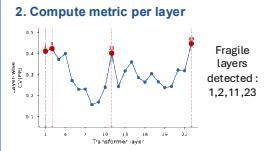

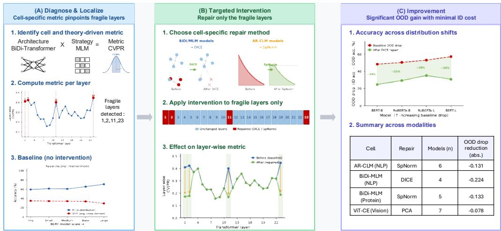

<table><tr><td rowspan=1 colspan=1>Cell</td><td rowspan=1 colspan=1>Repair</td><td rowspan=1 colspan=1>Models (n)</td><td rowspan=1 colspan=1>OOD dropreduction(abs.)</td></tr><tr><td rowspan=1 colspan=1>AR-CLM (NLP)</td><td rowspan=1 colspan=1>SpNorm</td><td rowspan=1 colspan=1>6</td><td rowspan=1 colspan=1>-0.131</td></tr><tr><td rowspan=1 colspan=1>BiDi-MLM(NLP)</td><td rowspan=1 colspan=1>DICE</td><td rowspan=1 colspan=1>4</td><td rowspan=1 colspan=1>-0.224</td></tr><tr><td rowspan=1 colspan=1>BiDi-MLM(Protein)</td><td rowspan=1 colspan=1>SpNorm</td><td rowspan=1 colspan=1>5</td><td rowspan=1 colspan=1>-0.133</td></tr><tr><td rowspan=1 colspan=1>ViT-CE (Vision)</td><td rowspan=1 colspan=1>PCA</td><td rowspan=1 colspan=1>7</td><td rowspan=1 colspan=1>-0.078</td></tr></table>

Figure 2: End-to-end pipeline: Diagnose & Localize → Targeted Intervention → Improve. (A) Cell-specific spectral metric (CV(PR) for BiDi-MLM) identifies fragile layers via per-layer metric peaks; $\rho _ { \mathrm { L O O } }$ on the full reference cell validates its predictive signal. (B) Only metric-flagged layers are repaired (DICE for BiDi/MLM; SpNorm for AR-CLM); stable layers are untouched. (C) Targeted repair reduces OOD drop in every model shown (C1). The targeted > random > antitargeted ordering supports the metric’s ranked ordering of layers, rather than repair alone, as the source of the OOD gain (C2).

Table 4: Metric-guided repair across modalities. ∆ = change in OOD drop from the no-intervention baseline (negative = improvement), except in the Vision row, where ∆ is measured against random targeting. Vision uses PCA-bottleneck (mean over 25 models); others use SpNorm.
<table><tr><td>Modality</td><td>Model</td><td> $\Delta _ { \mathrm { t a r g e t e d } }$ </td><td> $\Delta _ { \mathrm { { r a n d o m } } }$ </td><td> $\Delta _ { \mathrm { a n t i } }$ </td></tr><tr><td>NLP BiDi</td><td>BERT-base</td><td>-0.224</td><td>-0.163</td><td>-0.150</td></tr><tr><td>NLP AR-CLM</td><td>GPT-2-large</td><td>-0.348</td><td>-0.098</td><td>-0.046</td></tr><tr><td>EEG</td><td>CBraMod</td><td>-0.038</td><td>-0.033</td><td>+0.026</td></tr><tr><td>Protein</td><td>ESM2-35M</td><td>-0.133</td><td>+0.003</td><td>-0.048</td></tr><tr><td>Vision</td><td>mean (25)</td><td> $- 0 . 0 7 8 ^ { \dagger }$ </td><td>0 (ref)</td><td>-0.025</td></tr></table>

Mean improvement over random (PCA-bottleneck method).

ID–OOD efficiency: Across 13 NLP models, spectral-targeted PCA buys 2.7× more OOD improvement per point of in-distribution accuracy given up than random layer PCA, and Paretodominates random on both axes in $1 0 / 1 3$ models (Appendix R). Targeting the layers where the metric predicts fragility addresses $\mathrm { l o g \mathrm { - s r } _ { f e a t } }$ directly; random targeting degrades ID without commensurate OOD gain.

Repair narrows the gap without concentrating features. In the two measured cases repair lowered $\Delta _ { \mathrm { a c c } }$ while $\log { - \mathrm { s r } _ { \mathrm { f e a t } } ( F _ { \mathrm { s r c } } ) }$ rose (+0.657, +0.049; Appendix P), so mediation through $\mathrm { l o g - s r _ { f e a t } }$ is not yet shown.

## 6 CROSS-DOMAIN VALIDATION

Protocol. For each new model family below, the cell assignment, metric, and sign were locked from the existing 15-cell registry before any OOD outcome was observed. Predictions were logged prior to running OOD evaluation; the confirmed cases below therefore constitute prospective tests of the framework, not post-hoc illustration. Of the fully evaluated cases: 3/3 directional predictions confirmed on metric direction (EEG, AMPLIFY protein, Evo2 genomic); for AMPLIFY the logged rank-percentile verdict was not confirmed and only the pairwise ordering held (Appendix S); 1 outcome pending (BioNeMo ESM-2). A step-by-step diagnostic protocol is given in Appendix T.

Table 5 lists each family, the cell and metric it was assigned before evaluation, and how the logged prediction turned out.

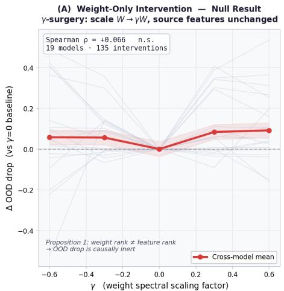

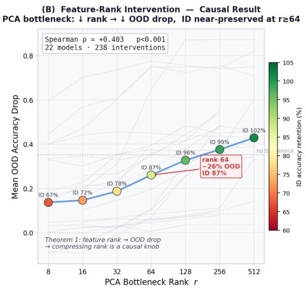  
Figure 3: Diagnosis-to-improvement: spectral interventions. Panel A (SVD bottleneck): projecting features onto top-r singular vectors sets log- $\mathbf { \bar { \rho } } \mathbf { \cdot } \mathbf { s r _ { f e a t } } \le \log r ;$ color = ID accuracy retention. Panel B (null controls): γ-surgery and LoRA rank leave $\mathrm { l o g \mathrm { - s r } _ { f e a t } }$ unchanged and yield no OOD change.

## 7 DISCUSSION

Pretraining imprints a geometric signature on weight matrices that governs how representations survive distribution shift, and reading that signature requires knowing which (architecture × strategy) cell a model sits in. Within a cell, a single spectral statistic orders models by OOD drop across 116 models and 7 modalities, and the same statistic transfers to families the matrix was never fitted on. The practical consequence is that a model can be assessed from its weights alone, with no target data, no forward pass and no labeled examples: releases can be triaged as they appear, a model can be chosen for a newly acquired modality before any evaluation set exists, and a deployment can be audited for fragility in advance.

Table 5: Prospective tests on model families outside the 15-cell matrix. Cell, metric and sign were taken from the locked registry before any OOD outcome was observed. Spike models are reported qualitatively: with two models the cell cannot be calibrated.
<table><tr><td>Family</td><td>Cell and metric (locked)</td><td>Logged prediction</td><td>Outcome</td></tr><tr><td>EEG (n=11)</td><td>BiDi-Transformer and BiMamba/Linear-attn, EEG; log-NFR, positive (data-scarcity inversion)</td><td>Positive direction in both sub-groups</td><td>Confirmed. Pooled  $\begin{array} { r l } { \rho _ { \mathrm { L O O } } } & { { } = } \end{array}$  +0.822 (p=0.001); sub-groups +0.880 and +0.817, so the inver- sion is architecture-independent (Appendix D.4). Session-level ranking  $\rho _ { \mathrm { L O O } } ~ = ~ + 1 . 0 0 0 ~ ( n { = } 4 ,$  p=0.042).</td></tr><tr><td>Protein: AMPLIFY 120M/350M (Fournier et al., 2024)</td><td>BiDi-MLM × Protein; 350M more robust Confirmed PR-mean, negative</td><td>than 120M</td><td>on direction. PR-mean = 79.5 &gt; 64.0 and  $\Delta _ { \mathrm { a c c } } = 0 . 1 3 2 < 0 . 2 6 7$  . The logged rank-percentile verdict was not con- firmed, and the ESM-2 size-fragility calibration did not cross the RoPE vs. absolute-PE subtype boundary (Appendix S). Both are now in the</td></tr><tr><td>Protein: BioNeMo ESM-2</td><td>PR-mean, negative</td><td>more fragile cross- ment). target</td><td>primary cell (n=11). BiDi-MLM × Protein; Lower PR-mean → Pending (drug-discovery deploy-</td></tr><tr><td>Genomic: Evo2- 1B/7B (Nguyen et al., 2024)</td><td>Hybrid × AR-CLM Ge- 7B nomic; log∥W∥F, inverted—the 4- nucleotide alphabet removes the exponential norm hierarchy</td><td> $\begin{array} { r l } { ( \log \| W \| _ { F } } & { { } = } \end{array}$  than 1B (3.633)</td><td>Confirmed. 7B reaches OOD NLL 4.120) more robust 26–49% below random across 5 species; 1B is near chance.</td></tr><tr><td>Spike: et al., 2024), calibrate POYO-1 (Az- abou et al., 2023) (n=2)</td><td>Excluded from the ma- NDT3 (Schmitt trix; too few models to</td><td></td><td>Illustrative only. Feature-rank ra- tio (41 ×) tracks the OOD drop ratio (4.5×), consistent with Theorem 1.</td></tr></table>

## REPRODUCIBILITY STATEMENT

All code and data will be released upon acceptance. Appendix U states what the framework does not do. The main analysis is implemented in scripts/analyze 15cells final.py; OOD evaluations per modality use eval audio cv probe.py (audio), eval timeseries probe.py (time-series), and standard linear-probe scripts for NLP, vision, and protein cells. WeightWatcher metrics are computed via scripts/run weightwatcher.py using weightwatcher>=0.7.4.

Full per-cell model whitelists, exclusion criteria with justification, and audio OOD protocol are in Appendix E.

## AI USE STATEMENT

Generative AI tools (Claude) were used for code assistance during implementation and for drafting portions of this manuscript. All AI-generated content was reviewed, verified, and edited by the authors. We take full responsibility for the final content.

## REFERENCES

Mahmoud Assran, Mathilde Caron, Ishan Misra, Piotr Bojanowski, Florian Bordes, Pascal Vincent, Armand Joulin, Mike Rabbat, and Nicolas Ballas. Masked siamese networks for label-efficient

learning. In European conference on computer vision, pp. 456–473. Springer, 2022.

Mehdi Azabou, Vinam Arora, Venkataramana Ganesh, Ximeng Mao, Santosh Nachimuthu, Michael Mendelson, Blake Richards, Matthew Perich, Guillaume Lajoie, and Eva Dyer. A unified, scalable framework for neural population decoding. Advances in Neural Information Processing Systems, 36:44937–44956, 2023.

Yang Ba, Michelle V Mancenido, and Rong Pan. Data diversity as implicit regularization: How does diversity shape the weight space of deep neural networks? arXiv preprint arXiv:2410.14602, 2024.

Alexei Baevski, Yuhao Zhou, Abdelrahman Mohamed, and Michael Auli. wav2vec 2.0: A framework for self-supervised learning of speech representations. Advances in neural information processing systems, 33:12449–12460, 2020.

Samuel R Bowman, Gabor Angeli, Christopher Potts, and Christopher D Manning. A large annotated corpus for learning natural language inference. In Proceedings of the 2015 conference on empirical methods in natural language processing, pp. 632–642, 2015.

Mathilde Caron, Hugo Touvron, Ishan Misra, Herve J´ egou, Julien Mairal, Piotr Bojanowski, and´ Armand Joulin. Emerging properties in self-supervised vision transformers. In 2021 IEEE/CVF international conference on computer vision (ICCV), pp. 9630–9640. IEEE, 2021.

Chi-Ning Chou, Artem Kirsanov, Yao-Yuan Yang, and SueYeon Chung. Diagnosing generalization failures from representational geometry markers. In International Conference on Learning Representations, 2026.

Kevin Clark, Urvashi Khandelwal, Omer Levy, and Christopher D Manning. What does bert look at? an analysis of bert’s attention. In Proceedings of the 2019 ACL workshop BlackboxNLP: analyzing and interpreting neural networksfor NLP, pp. 276–286, 2019.

Alexis Conneau, Min Ma, Simran Khanuja, Yu Zhang, Vera Axelrod, Siddharth Dalmia, Jason Riesa, Clara Rivera, and Ankur Bapna. Fleurs: Few-shot learning evaluation of universal representations of speech. In 2022 IEEE Spoken Language Technology Workshop (SLT), pp. 798–805. IEEE, 2023.

Hugo Dalla-Torre, Liam Gonzalez, Javier Mendoza-Revilla, Nicolas Lopez Carranza, Adam Henryk Grzywaczewski, Francesco Oteri, Christian Dallago, Evan Trop, Bernardo P De Almeida, Hassan Sirelkhatim, et al. Nucleotide transformer: building and evaluating robust foundation models for human genomics. Nature methods, 22(2):287–297, 2025.

Nelson Elhage, Neel Nanda, Catherine Olsson, Tom Henighan, Nicholas Joseph, Ben Mann, Amanda Askell, Yuntao Bai, Anna Chen, Tom Conerly, et al. A mathematical framework for transformer circuits. Transformer Circuits Thread, 1(1):12, 2021.

Katie Everett. Transforming rank: How architecture navigates the spectral pathologies of depth. arXiv preprint arXiv:2607.14018, 2026.

Jesseba Fernando and Grigori Guitchounts. Dynamics of the transformer residual stream: Coupling spectral geometry to network topology. arXiv preprint arXiv:2605.14258, 2026.

Quentin Fournier, Robert M. Vernon, Almer van der Sloot, Benjamin Schulz, Sarath Chandar, and Christopher James Langmead. Protein language models: Is scaling necessary? bioRxiv, 2024. doi: 10.1101/2024.09.23.614603. URL https://www.biorxiv.org/content/early/ 2024/09/23/2024.09.23.614603.

Quentin Garrido, Randall Balestriero, Laurent Najman, and Yann Lecun. Rankme: Assessing the downstream performance of pretrained self-supervised representations by their rank. In International conference on machine learning, pp. 10929–10974. PMLR, 2023.

Albert Gu and Tri Dao. Mamba: Linear-time sequence modeling with selective state spaces. arXiv preprint arXiv:2312.00752, 2023.

Albert Gu, Karan Goel, and Christopher Re. Efficiently modeling long sequences with structured´ state spaces. In International Conference on Learning Representations, 2022.

Anna Hart, Chi Han, Jeonghwan Kim, Huimin Zhao, and Heng Ji. Protein language models diverge from natural language: Comparative analysis and improved inference. arXiv preprint arXiv:2602.20449, 2026.

Dan Hendrycks and Thomas Dietterich. Benchmarking neural network robustness to common corruptions and perturbations. In International Conference on Learning Representations, 2019.

Daniel Hesslow, Niccolo Zanichelli, Pascal Notin, Iacopo Poli, and Debora Marks. Rita: a study on´ scaling up generative protein sequence models. arXiv preprint arXiv:2205.05789, 2022.

Nandan Kumar Jha and Brandon Reagen. Spectral scaling laws in language models: emphhow effectively do feed-forward networks use their latent space? In Proceedings ofthe 2025 Conference on Empirical Methods in Natural Language Processing, pp. 35047–35058, 2025.

Li Jing, Pascal Vincent, Yann LeCun, and Yuandong Tian. Understanding dimensional collapse in contrastive self-supervised learning. arXiv preprint arXiv:2110.09348, 2021.

Bob Kemp, Aeilko H Zwinderman, Bert Tuk, Hilbert AC Kamphuisen, and Josefien JL Oberye. Analysis of a sleep-dependent neuronal feedback loop: the slow-wave microcontinuity of the eeg. IEEE Transactions on Biomedical Engineering, 47(9):1185–1194, 2000.

Kimin Lee, Kibok Lee, Honglak Lee, and Jinwoo Shin. A simple unified framework for detecting out-of-distribution samples and adversarial attacks. Advances in neural information processing systems, 31, 2018.

Zeming Lin, Halil Akin, Roshan Rao, Brian Hie, Zhongkai Zhu, Wenting Lu, Nikita Smetanin, Robert Verkuil, Ori Kabeli, Yaniv Shmueli, et al. Evolutionary-scale prediction of atomic-level protein structure with a language model. Science, 379(6637):1123–1130, 2023.

Weitang Liu, Xiaoyun Wang, John Owens, and Yixuan Li. Energy-based out-of-distribution detection. Advances in neural information processing systems, 33:21464–21475, 2020.

Ze Liu, Yutong Lin, Yue Cao, Han Hu, Yixuan Wei, Zheng Zhang, Stephen Lin, and Baining Guo. Swin transformer: Hierarchical vision transformer using shifted windows. In 2021 IEEE/CVF international conference on computer vision (ICCV), pp. 9992–10002. Ieee, 2021.

Charles H Martin and Michael W Mahoney. Post-mortem on a deep learning contest: a simpson’s paradox and the complementary roles of scale metrics versus shape metrics. arXiv preprint arXiv:2106.00734, 2021.

Charles H Martin, Tongsu Peng, and Michael W Mahoney. Predicting trends in the quality of stateof-the-art neural networks without access to training or testing data. Nature Communications, 12 (1):4122, 2021.

Wojciech Masarczyk, Mateusz Ostaszewski, Ehsan Imani, Razvan Pascanu, Piotr Miłos, and Tomasz´ Trzcinski. The tunnel effect: Building data representations in deep neural networks. Advances in Neural Information Processing Systems, 36:76772–76805, 2023.

R Thomas McCoy, Ellie Pavlick, and Tal Linzen. Right for the wrong reasons: Diagnosing syntactic heuristics in natural language inference. In Proceedings of the 57th annual meeting of the association for computational linguistics, pp. 3428–3448, 2019.

Behnam Neyshabur, Srinadh Bhojanapalli, and Nathan Srebro. A PAC-Bayesian approach to spectrally-normalized margin bounds for neural networks. In International Conference on Learn ing Representations, 2018.

Eric Nguyen, Michael Poli, Matthew G Durrant, Brian Kang, Dhruva Katrekar, David B Li, Liam J Bartie, Armin W Thomas, Samuel H King, Garyk Brixi, et al. Sequence modeling and design from molecular to genome scale with evo. Science, 386(6723):eado9336, 2024.

Yixin Nie, Adina Williams, Emily Dinan, Mohit Bansal, Jason Weston, and Douwe Kiela. Adversarial nli: A new benchmark for natural language understanding. In Proceedings ofthe 58th annual meeting ofthe associationfor computational linguistics, pp. 4885–4901, 2020.

Erik Nijkamp, Jeffrey A Ruffolo, Eli N Weinstein, Nikhil Naik, and Ali Madani. Progen2: exploring the boundaries of protein language models. Cell systems, 14(11):968–978, 2023.

Pascal Notin, Aaron Kollasch, Daniel Ritter, Lood Van Niekerk, Steffanie Paul, Han Spinner, Nathan Rollins, Ada Shaw, Rose Orenbuch, Ruben Weitzman, et al. Proteingym: Large-scale benchmarks for protein fitness prediction and design. Advances in neural information processing systems, 36: 64331–64379, 2023.

Maxime Oquab, Timothee Darcet, Theo Moutakanni, Huy V. Vo, Marc Szafraniec, Vasil Khalidov,´ Pierre Fernandez, Daniel Haziza, Francisco Massa, Alaaeldin El-Nouby, Russell Howes, Po-Yao Huang, Hu Xu, Vasu Sharma, Shang-Wen Li, Wojciech Galuba, Mike Rabbat, Mido Assran, Nicolas Ballas, Gabriel Synnaeve, Ishan Misra, Herve Jegou, Julien Mairal, Patrick Labatut, Armand Joulin, and Piotr Bojanowski. Dinov2: Learning robust visual features without supervision, 2023.

Vassil Panayotov, Guoguo Chen, Daniel Povey, and Sanjeev Khudanpur. Librispeech: an asr corpus based on public domain audio books. In 2015 IEEE international conference on acoustics, speech and signal processing (ICASSP), pp. 5206–5210. IEEE, 2015.

Ankita Pasad, Ju-Chieh Chou, and Karen Livescu. Layer-wise analysis of a self-supervised speech representation model. In 2021 IEEE Automatic Speech Recognition and Understanding Workshop (ASRU), pp. 914–921. IEEE, 2021.

Alec Radford, Jong Wook Kim, Chris Hallacy, Aditya Ramesh, Gabriel Goh, Sandhini Agarwal, Girish Sastry, Amanda Askell, Pamela Mishkin, Jack Clark, et al. Learning transferable visual models from natural language supervision. In International conference on machine learning, pp. 8748–8763. PmLR, 2021.

Amartya Sanyal, Philip HS Torr, and Puneet K Dokania. Stable rank normalization for improved generalization in neural networks and gans. arXiv preprint arXiv:1906.04659, 2019.

Louis E Schmitt et al. Predicting neural firing rates at scale using NDT3. In International Conference on Learning Representations, 2024.

Yiyou Sun, Yifei Ming, Xiaojin Zhu, and Yixuan Li. Out-of-distribution detection with deep nearest neighbors. In International conference on machine learning, pp. 20827–20840. PMLR, 2022.

Adina Williams, Nikita Nangia, and Samuel R Bowman. A broad-coverage challenge corpus for sentence understanding through inference. In Proceedings of the 2018 conference of the North American chapter of the association for computational linguistics: human language technologies, volume 1 (long papers), pp. 1112–1122, 2018.

Hong Yang, Devroop Kar, Qi Yu, Alex Ororbia, and Travis Desell. Domain feature collapse: Implications for out-of-distribution detection and solutions. arXiv preprint arXiv:2512.04034, 2025.

Han Yu, Kehan Li, Dongbai Li, Yue He, Xingxuan Zhang, and Peng Cui. Odp-bench: Benchmarking out-of-distribution performance prediction. In 2025 IEEE/CVF International Conference on Computer Vision (ICCV), pp. 1–13. IEEE, 2025.

Emanuele Zangrando, Piero Deidda, Simone Brugiapaglia, Nicola Guglielmi, and Francesco Tudisco. Neural rank collapse: Weight decay and small within-class variability yield low-rank bias. arXiv e-prints, pp. arXiv–2402, 2024.

Xiaohua Zhai, Basil Mustafa, Alexander Kolesnikov, and Lucas Beyer. Sigmoid loss for language image pre-training. In 2023 IEEE/CVF International Conference on Computer Vision (ICCV), pp. 11941–11952. IEEE, 2023.

Ali Zia and Farid Hazratian. Representation geometry as a diagnostic for out-of-distribution robustness. arXiv preprint arXiv:2602.03951, 2026.

## A EXTENDED RELATED WORK

This appendix expands the condensed account in Section 2, separating the architectural and the objective-side evidence for why spectral geometry should be read per (architecture × strategy) cell rather than pooled.

Predicting model quality from weights alone. Data-free approaches tie spectral statistics of pretrained weights to model quality (Martin et al., 2021; Sanyal et al., 2019; Neyshabur et al., 2018), but for in-distribution generalization and with a single universal metric applied without architectural conditioning. Martin & Mahoney (2021), in a post-mortem on the PGDL contest, further report that this relationship can reverse sign between architectural subgroups—a Simpson’s paradox in the pooled data. That reversal is a prior finding; what we add is its operationalization: a 15-cell (architecture × strategy) registry, a statistic selected for each cell, and an extension from ID generalization to OOD robustness. Data-dependent OOD predictors avoid the pooling problem but not the data requirement—Yu et al. (2025) benchmark ten of them across 1,444 vision models, and all need a source-domain forward pass.

Architecture shapes weight-space spectral geometry. Contrastive models (CLIP, DINO) produce compact, low-dimensional representations (Radford et al., 2021; Caron et al., 2021). Hierarchical architectures (Swin) develop stage-wise specialization (Liu et al., 2021). Autoregressive Transformers accumulate depth-structured residuals (Elhage et al., 2021). We operationalize these distinct geometric pressures as specific spectral statistics and validate their predictive power within each (architecture × strategy) cell.

Pretraining strategy shapes spectral geometry. CLM objectives build a depth-norm hierarchy (Elhage et al., 2021); BiDi-MLM drives complementary head-level specialization (Clark et al., 2019); cross-modal contrastive objectives compress representations toward low-rank manifolds (Jing et al., 2021); self-distillation maintains higher effective rank (Garrido et al., 2023); SSM recurrence concentrates spectral mass in dominant singular directions (Gu et al., 2022; Gu & Dao, 2023). These strategy-specific geometric signatures motivate a distinct spectral statistic per (architecture × strategy) cell—each is motivated by how training shapes weight-space geometry, with the final choice in each cell made empirically (Appendix B).

## B MODEL LISTS BY CELL

CLM / NLP (n = 16). gpt2, gpt2-medium, gpt2-large, gpt2-xl, pythia-14m, pythia-31m, pythia-70m, pythia-160m, pythia-410m, pythia-1b, pythia-1.4b, pythia-2.8b, pythia-6.9b, pythia-12b, gpt-neo-125m, gpt-neo-1.3b. (HuggingFace: gpt2\*; EleutherAI/pythia-\*; EleutherAI/gpt-neo-\*.)

CLM / Time-series (n = 8). chronos-bolt-small, chronos-tiny, chronos-bolt-base, chronos-base, timer-base, chronos-large, chronos-small, sundial-base. (HuggingFace: amazon/chronos-\*; thuml/timer-base-84m; thuml/sundial-base.)

CLM / Protein (n = 10). progen2-small, progen2-base, progen2-medium, progen2-large, progen2-xlarge, nferruz/ProtGPT2, rita-s, rita-m, rita-l, rita-xl. (HuggingFace: hugohrban/progen2-\*; nferruz/ProtGPT2; lightonai/RITA s, lightonai/RITA m, lightonai/RITA l, lightonai/RITA xl.)

MLM / NLP (n = 10). bert-tiny, bert-mini, bert-small, bert-medium, bert-base-uncased, bert-large-uncased, roberta-base, roberta-large, albert-base-v2, albert-large-v2. Excluded: xlm-roberta-base, xlm-roberta-large (multilingual pretraining; different domain from English-only family creates incompatible WW scaling); distilbert-base-uncased (PR-mean=50.97 creates sign inversion: lower drop than bert-base despite lower PR-mean, breaking monotone pattern).

MLM / Protein (n = 11). esm1b, esm1v-1, esm1v-3, esm1v-5, ankh-base, ankh-large, esm2-650m, amplify-120m, amplify-350m, esm2-150m, esm2-3b. Excluded: esm2-8m, esm2-35m (both invert the PR-mean monotone pattern vs. the rest of the ESM-2 scale series: lower PR-mean yet lower OOD drop, inconsistent with the anti-collapse mechanism operative in the 150M–3B range).

MLM / Genomic (n = 7). nucleotide-transformer-v2-50m-multi-species, ...-v2-100m-multi-species, ...-v2-250m-multi-species, ...-v2-500m-multi-species, ...-500m-human-ref, agront-1b (Agelab-agro/agro-nucleotide-transformer-1b), gena-lm-base (AIRI-Institute/gena-lm-bert-base-lastln-t2t). Excluded: gena-lm-large (inverts the log ∥W∥F monotone pattern vs. the NT-v2 series).

Contrastive / CLIP-family (n 6). openai/clip-vit-base-patch32, openai/clip-vit-base-patch16, openai/clip-vit-large-patch14, laion/CLIP-ViT-B-32-laion2B-s34B-b79K, google/siglip-base-patch16-224, google/siglip-large-patch16-256. SigLIP models share the same MP-energy spectral regime as CLIP-ViT and are included in the cell.

Contrastive / DINO-family (n = 5). facebook/dinov2-small, facebook/dinov2-base, facebook/dinov2-large, facebook/dinov2-giant, facebook/dino-vitb16. Excluded: facebook/dino-vits16 (streaming-loader failure; source accuracy degenerate on ImageNet-C evaluation).

Contrastive / Audio (n = 6). facebook/wav2vec2-base, facebook/wav2vec2-large, facebook/wav2vec2-large-xlsr-53, facebook/wav2vec2-xls-r-300m, facebook/wav2vec2-xls-r-1b, facebook/wav2vec2-xls-r-2b. OOD task: LibriSpeech test-clean→FLEURS en us test (gender classification, binary). WavLM-base excluded: masked-speechprediction + denoising pretraining differs from contrastive-CTC, placing its CV(log -Frob) in a disjoint range (0.352–0.364) vs. the wav2vec2 family (0.097–0.131).

Supervised CE / ViT+DeiT (n = 7). WinKawaks/vit-tiny-patch16-224, WinKawaks/vit-small-patch16-224, google/vit-base-patch16-224, google/vit-large-patch16-224, facebook/deit-base-distilled-patch16-224, facebook/deit-small-patch16-224, google/vit-base-patch16-224-in21k.

Supervised CE / Swin (n = 8). microsoft/swin-tiny-patch4-window7-224, -small-, -base-, -large-, microsoft/swinv2-tiny-window8-256, -small-window8-256, -base-window8-256, -large-window8-256.

Supervised CE / CNN (n = 7). microsoft/resnet-18, -resnet-34, -resnet-50, -resnet-101, -resnet-152, facebook/convnext-small-224, facebook/convnext-base-224.

CLM / Genomic SSM (n = 5; HyenaDNA full scale series). hyenadna-tiny-1kseqlen, hyenadna-small-32k-seqlen, hyenadna-medium-160k-seqlen, hyenadna-medium-450kseqlen, hyenadna-large-1m-seqlen. HyenaDNA-small and -large reach tgt acc = 0.500 (random chance) on cross-mark; they are same architecture × strategy and are retained—degenerate behavior is a finding, not a reason to exclude. CV(log -Frob) ρLOO = +0.700 (p = 0.188, n.s.); directionally consistent but below the p ≤ 0.05 threshold (not counted in the 15 primary cells). Caduceus (BiMamba operator, n = 2) excluded: insufficient replication for its own cell.

CLM / NLP SSM (n = 5). Metric: Hent, OOD: MNLI→HANS.   
state-spaces/mamba-130m-hf, -370m-hf, -790m-hf, -1.4b-hf, -2.8b-hf.

CLM / NLP SSM-v2 (n = 5). Metric: α¯, OOD: MNLI→HANS.   
state-spaces/mamba2-130m, -370m, -780m, -1.3b, -2.7b.

CLM / NLP RWKV $\begin{array} { r l r } { ( n } & { { } = } & { 5 ) . } \end{array}$ Metric: CV(log -Frob), OOD: MNLI→HANS. $\mathtt { R W K V / r w k v - 4 - 1 6 9 m - p i 1 d e } , - 4 3 0 \mathtt { m \mathrm { - } p i 1 e } , - \mathtt { l b 5 \mathrm { - } p i 1 e } , - \mathtt { 3 5 \mathrm { - } p i 1 e } , - \mathtt { 3 5 \mathrm { - } p i 1 e } , - \mathtt { 7 b \mathrm { - } p i 1 e } .$

## C DETAILED THEORY ASSUMPTIONS AND PROOFS

This appendix expands the compact chain in Section 3. The purpose is to separate what is proved from what is an explicit within-cell modeling or training-family assumption. Theorem 1 is proved first; Lemma 2 then connects nested residual weights to final feature geometry; Propositions 3–5 supply architecture-conditional statistics.

## C.1 THEOREM 1: STRUCTURED SPECTRAL SPREADING

Let the squared singular values of $F$ be $x _ { k } = \sigma _ { k } ( F ) ^ { 2 } , k = 1 , \dots , r .$ , and define

$$
S : = \sum _ { k = 1 } ^ { r } x _ { k } , \qquad \operatorname { s r } ( F ) = S / x _ { 1 } .
$$

The second checkpoint $F ^ { \prime }$ has perturbed core values $ { \boldsymbol { x } } _ { k } ^ { \prime }$ and additional weak-tail values $t _ { j } > 0$ $j = r + 1 , \dots , r + s$ . Let

$$
| x _ { k } ^ { \prime } - x _ { k } | \leq \delta _ { \sigma } , \qquad T : = \sum _ { j } t _ { j } , \qquad t _ { \operatorname* { m a x } } : = \operatorname* { m a x } _ { j } t _ { j } .
$$

For a ridge-regularized local linear probe, introduce

$$
A _ { \varepsilon } ( x ) : = \frac { x } { x + \varepsilon } , \qquad B _ { \varepsilon } ( x ) : = \frac { x } { ( x + \varepsilon ) ^ { 2 } } ,
$$

$$
M ( F ) : = \sum _ { k } A _ { \varepsilon } ( x _ { k } ) , \qquad N ( F ) : = \sum _ { k } B _ { \varepsilon } ( x _ { k } ) , \qquad G ( F ) : = \sqrt { \alpha } \frac { M ( F ) } { \sqrt { N ( F ) } } .
$$

$G ( F )$ is a spectrum-dependent normalized-margin surrogate, not a universal feature statistic.

T1: structured weak-tail spreading. Define

$$
H : = \delta _ { \sigma } \big ( r + \mathrm { s r } ( F ) \big ) , \qquad \Delta M : = \sum _ { j } A _ { \varepsilon } ( t _ { j } ) ,
$$

$$
C : = \frac { 2 N ( F ) } { M ( F ) } + \frac { N ( F ) \Delta M } { M ( F ) ^ { 2 } } , \qquad t _ { \mathrm { c r i t } } : = C ^ { - 1 } - \varepsilon .
$$

Assume

$$
T > H , \qquad t _ { \mathrm { m a x } } < t _ { \mathrm { c r i t } } .\tag{5}
$$

This is the regime in which enough spectral energy is moved into sufficiently many weak directions.

T2: bounded core drift. Construct ${ \widetilde { F } } ^ { \prime }$ by retaining the core spectrum of $F$ and adding only the tail of $F ^ { \prime }$ . Let

$$
\eta : = G ( F ) - G ( \widetilde { F } ^ { \prime } ) > 0 .
$$

Assume $N ( \widetilde { F } ^ { \prime } ) , N ( F ^ { \prime } ) \ge n _ { 0 } > 0$ and

$$
\mathcal { E } _ { \mathrm { c o r e } } < \eta ,
$$

where the deterministic Lipschitz bound

$$
\mathcal { E } _ { \mathrm { c o r e } } : = \sqrt { \alpha } \left[ \frac { r \delta _ { \sigma } } { \varepsilon \sqrt { n _ { 0 } } } + \frac { M _ { \mathrm { m a x } } r \delta _ { \sigma } } { 2 \varepsilon ^ { 2 } n _ { 0 } ^ { 3 / 2 } } \right]
$$

controls $| G ( F ^ { \prime } ) - G ( \widetilde { F } ^ { \prime } )$ | over the relevant checkpoint pair.

T3: balanced spectral projection. Let $a _ { k }$ denote the probe class-contrast coefficient projected onto left singular direction $u _ { k }$ . Assume $\mathbb { E } [ a _ { k } ^ { 2 } ] \simeq \alpha$ on the relevant directions, with the same α for the within-cell comparison. This is the step that reduces the normalized-margin calculation to the spectrum-only surrogate $G ( F )$

T4: joint normalized-margin concentration. For a source-correct sample i, define

$$
\gamma _ { i } ( H ) : = \frac { m _ { i } ( H ) } { \nu _ { i } ( H ) } ,
$$

where $m _ { i }$ is the source margin and $\nu _ { i }$ the norm of the active class-contrast direction. Assume

$$
\operatorname* { P r } \left[ \operatorname* { m a x } _ { H \in \{ F , F ^ { \prime } \} } | \gamma _ { i } ( H ) - G ( H ) | \leq \rho \right] \geq 1 - \delta ,\tag{6}
$$

and

$$
\eta - \mathcal { E } _ { \mathrm { c o r e } } > 2 \rho .
$$

This concentration bridge is an explicit modeling assumption; it is not implied by stable rank.

T5: shared Gaussian local target shift. Assume

$$
f _ { i } ^ { \mathrm { t g t } } = f _ { i } + \xi _ { i } , \qquad \xi _ { i } \sim { \cal N } ( 0 , \mu _ { 1 } I ) ,
$$

with the same $\mu _ { 1 }$ for the compared checkpoints and active-boundary stability in the local-shift regime. Then the target error probability is

$$
p _ { i } ( H ) = \Phi \left( - \frac { \gamma _ { i } ( H ) } { \sqrt { \mu _ { 1 } } } \right) .
$$

A common anisotropic covariance can be handled conservatively by replacing directional variances with their shared spectral bound $\mu _ { 1 } = \| { \boldsymbol { \Sigma } } \| _ { 2 } ;$ ; the exact CDF expression above is for the isotropic local model.

T6: population aggregation. Define the Gaussian separation

$$
q : = \Phi \left( - \frac { G ( F ^ { \prime } ) + \rho } { \sqrt { \mu _ { 1 } } } \right) - \Phi \left( - \frac { G ( F ) - \rho } { \sqrt { \mu _ { 1 } } } \right) > 0 .\tag{7}
$$

Assume the concentration is strong enough that

$$
( 1 - \delta ) q > \delta .\tag{8}
$$

This is sufficient, not necessary; it is used only to upgrade the samplewise high-probability ordering to a strict population OOD-gap ordering.

PROOF: STABLE-RANK BRANCH

The core energy of $F ^ { \prime }$ satisfies $\textstyle \sum _ { k = 1 } ^ { r } x _ { k } ^ { \prime } \geq S - r \delta _ { \sigma }$ and $x _ { 1 } ^ { \prime } \leq x _ { 1 } + \delta _ { \sigma }$ . Hence

$$
\mathrm { s r } ( F ^ { \prime } ) \geq \frac { S - r \delta _ { \sigma } + T } { x _ { 1 } + \delta _ { \sigma } } .
$$

The right-hand side exceeds $S / x _ { 1 } = \operatorname { s r } ( F )$ whenever

$$
T > \delta _ { \sigma } \left( r + \frac { S } { x _ { 1 } } \right) = \delta _ { \sigma } \big ( r + \mathrm { s r } ( F ) \big ) ,
$$

which is T1. Therefore

$$
\displaystyle \log { - \operatorname { s r } ( F ^ { \prime } ) } > \log { - \operatorname { s r } ( F ) } .\tag{9}
$$

PROOF: NORMALIZED-MARGIN BRANCH

For the idealized spectrum,

$$
M ( \widetilde { F ^ { \prime } } ) = M ( F ) + \Delta M , \qquad N ( \widetilde { F ^ { \prime } } ) = N ( F ) + \Delta N ,
$$

where $\begin{array} { r } { \Delta N = \sum _ { j } B _ { \varepsilon } ( t _ { j } ) } \end{array}$ . Since

$$
B _ { \varepsilon } ( t ) = \frac { A _ { \varepsilon } ( t ) } { t + \varepsilon } \geq \frac { A _ { \varepsilon } ( t ) } { t _ { \operatorname* { m a x } } + \varepsilon } ,
$$

T1 implies

$$
\Delta N > \frac { 2 N ( F ) } { M ( F ) } \Delta M + \frac { N ( F ) } { M ( F ) ^ { 2 } } ( \Delta M ) ^ { 2 } .
$$

Equivalently,

$$
\frac { ( M + \Delta M ) ^ { 2 } } { N + \Delta N } < \frac { M ^ { 2 } } { N } ,
$$

so $G ( \widetilde { F } ^ { \prime } ) < G ( F )$ . By T2,

$$
G ( F ^ { \prime } ) < G ( F ) - ( \eta - \mathcal { E } _ { \mathrm { c o r e } } ) ,
$$

and T4 therefore gives $G ( F ) - G ( F ^ { \prime } ) > 2 \rho$

On the joint event in equation 6,

$$
\gamma _ { i } ( F ) \geq G ( F ) - \rho , \qquad \gamma _ { i } ( F ^ { \prime } ) \leq G ( F ^ { \prime } ) + \rho ,
$$

so $\gamma _ { i } ( F ^ { \prime } ) < \gamma _ { i } ( F )$ . The map $x \mapsto \Phi ( - x / \sqrt { \mu _ { 1 } } )$ is strictly decreasing, and

$$
p _ { i } ( F ^ { \prime } ) > p _ { i } ( F ) ,
$$

and more specifically $p _ { i } ( F ^ { \prime } ) - p _ { i } ( F ) \geq q$ with q from equation 7.

On the complementary event, the probability difference is bounded below by −1. Hence

$$
\begin{array} { r } { \mathbb { E } [ p _ { i } ( F ^ { \prime } ) - p _ { i } ( F ) ] \geq ( 1 - \delta ) q - \delta . } \end{array}
$$

The population OOD accuracy drop is the corresponding increase in target error over the same source-correct population, giving

$$
\begin{array} { r } { \boxed { \Delta _ { \mathrm { a c c } } ( F ^ { \prime } ) - \Delta _ { \mathrm { a c c } } ( F ) \geq ( 1 - \delta ) q - \delta . } } \end{array}\tag{10}
$$

T6 makes the right-hand side positive. Together with equation 9, this proves Theorem 1 within the structured-spreading regime. Notice that both log-sr and OOD fragility are consequences of the same spectral spreading condition; the theorem does not claim that arbitrary changes in stable rank alone cause OOD degradation.

## C.2 PROOF OF LEMMA 2

Let $F = X _ { 0 } M$ . From

$$
( 1 - \epsilon _ { X } ) \sigma _ { X } ^ { 2 } I \preceq N ^ { - 1 } X _ { 0 } ^ { \top } X _ { 0 } \preceq ( 1 + \epsilon _ { X } ) \sigma _ { X } ^ { 2 } I
$$

we obtain

$$
N \sigma _ { X } ^ { 2 } ( 1 - \epsilon _ { X } ) \| M \| _ { F } ^ { 2 } \leq \| F \| _ { F } ^ { 2 } \leq N \sigma _ { X } ^ { 2 } ( 1 + \epsilon _ { X } ) \| M \| _ { F } ^ { 2 }
$$

and

$$
N \sigma _ { X } ^ { 2 } ( 1 - \epsilon _ { X } ) \| M \| _ { 2 } ^ { 2 } \leq \| F \| _ { 2 } ^ { 2 } \leq N \sigma _ { X } ^ { 2 } ( 1 + \epsilon _ { X } ) \| M \| _ { 2 } ^ { 2 } .
$$

Dividing gives

$$
{ \frac { 1 - \epsilon _ { X } } { 1 + \epsilon _ { X } } } \mathrm { s r } ( M ) \leq \mathrm { s r } ( F ) \leq { \frac { 1 + \epsilon _ { X } } { 1 - \epsilon _ { X } } } \mathrm { s r } ( M ) ,
$$

which proves equation 2a.

For $M = P _ { \ell } A _ { \ell } Q _ { \ell }$ with $\begin{array} { r } { A _ { \ell } = I + W _ { \ell } . } \end{array}$ , the singular-value inequalities for nonsingular B give

$$
\sigma _ { \operatorname* { m i n } } ( B ) \lVert A \rVert _ { F , 2 } \leq \lVert B A \rVert _ { F , 2 } \leq \sigma _ { \operatorname* { m a x } } ( B ) \lVert A \rVert _ { F , 2 } ,
$$

and analogously for right multiplication. Therefore

$$
\frac { 1 } { \kappa ( P _ { \ell } ) ^ { 2 } \kappa ( Q _ { \ell } ) ^ { 2 } } \mathrm { s r } ( A _ { \ell } ) \leq \mathrm { s r } ( M ) \leq \kappa ( P _ { \ell } ) ^ { 2 } \kappa ( Q _ { \ell } ) ^ { 2 } \mathrm { s r } ( A _ { \ell } ) .
$$

Taking logarithms and combining with equation 2a proves equation 2b.

For checkpoints $a , b ,$ define $B _ { \ell } ^ { ( j ) } : = E _ { X } ^ { ( j ) } + D _ { \ell } ^ { ( j ) }$ . Then the explicit sufficient ordering condition

$$
\log - \mathrm { s r } ( I + W _ { \ell } ^ { ( a ) } ) - \log - \mathrm { s r } ( I + W _ { \ell } ^ { ( b ) } ) > B _ { \ell } ^ { ( a ) } + B _ { \ell } ^ { ( b ) }\tag{11}
$$

guarantees $\log { - \operatorname { s r } ( F ^ { ( a ) } ) } > \log { - \operatorname { s r } ( F ^ { ( b ) } ) }$

Scope of the residual model. The equality $\begin{array} { r } { F = X _ { 0 } \prod _ { \ell } ( I + W _ { \ell } ) } \end{array}$ is exact only for the simplified linear residual recurrence. For a nonlinear residual block $\mathbf { \tilde { { X } } } _ { \ell + 1 } = \mathbf { \tilde { { X } } } _ { \ell } + \mathbf { \mathcal { R } } _ { \ell } ( X _ { \ell } )$ , the local analogue is

$$
J _ { \mathrm { n e t } } = \prod _ { \ell } \bigl ( I + J _ { \mathcal { R } _ { \ell } } ( X _ { \ell } ) \bigr ) .
$$

No exact raw-weight product equality is claimed for a general Transformer.

## C.3 PROOF OF PROPOSITION 3: AR-CLM / HT-SR CHAIN

Define

$$
z _ { \ell } = \log \| \ b { W } _ { \ell } \| _ { F } , \qquad \bar { z } = L ^ { - 1 } \sum _ { \ell } z _ { \ell } , \qquad s _ { z } ^ { 2 } = L ^ { - 1 } \sum _ { \ell } ( z _ { \ell } - \bar { z } ) ^ { 2 } , \qquad C _ { \mathrm { F r o b } } = s _ { z } / \bar { z } .
$$

P3.1: CV-dominance regime. Assume z¯ is bounded away from zero, the identity of $\ell _ { F } \ =$ arg maxℓ zℓ is stable across the comparison, and checkpoint variation is dominated by $z _ { \ell _ { F } }$ . Direct differentiation gives

$$
\frac { d C _ { \mathrm { F r o b } } } { d z _ { \ell _ { F } } } = \frac { \bar { z } ( z _ { \ell _ { F } } - \bar { z } ) - s _ { z } ^ { 2 } } { L s _ { z } \bar { z } ^ { 2 } } .
$$

Therefore

$$
\bar { z } ( z _ { \ell _ { F } } - \bar { z } ) > s _ { z } ^ { 2 } \quad \Longrightarrow \quad \frac { d { \cal C } _ { \mathrm { F r o b } } } { d z _ { \ell _ { F } } } > 0 .
$$

P3.2: HT training-family regularity. Motivated by HT-SR descriptions of trained spectra (Martin et al., 2021; Everett, 2026), assume along the relevant checkpoint family

$$
\frac { d \hat { \alpha } } { d z _ { \ell _ { F } } } < 0 .\tag{12}
$$

This is a training-dynamics assumption, not a matrix identity: under $W \mapsto c W , \| W \| _ { F }$ changes while the normalized spectrum, and hence αˆ, does not.

P3.3: power-law consequence. Assume a common effective rank $r > 1$ and

$$
\frac { \sigma _ { k } ( W _ { \ell _ { F } } ) } { \sigma _ { 1 } ( W _ { \ell _ { F } } ) } \simeq k ^ { - \hat { \alpha } / 2 } .
$$

Then

$$
\operatorname { s r } ( W _ { \ell _ { F } } ) = \sum _ { k = 1 } ^ { r } k ^ { - \hat { \alpha } }
$$

and

$$
\frac { \partial } { \partial \hat { \alpha } } \mathrm { l o g - s r } ( W _ { \ell _ { F } } ) = - \frac { \sum _ { k = 1 } ^ { r } ( \mathrm { l o g \ } k ) k ^ { - \hat { \alpha } } } { \sum _ { k = 1 } ^ { r } k ^ { - \hat { \alpha } } } < 0 .
$$

So αˆ ↓ implies log-sr $( W _ { \ell _ { F } } )$ ↑.

P3.4: effective-block transfer. Lemma 2 concerns $I + W _ { \ell _ { F } }$ , not $W _ { \ell _ { F } }$ alone. Therefore either the HT statistic is evaluated directly on the effective block $I + W _ { \ell _ { F } }$ , or the checkpoint family must satisfy the order-preservation condition

$$
\Delta \mathrm { l o g - s r } ( W _ { \ell _ { F } } ) > 0 \quad \Longrightarrow \quad \Delta \mathrm { l o g - s r } ( I + W _ { \ell _ { F } } ) > 0 .\tag{13}
$$

In addition, the effective-block gap must satisfy equation 11. Under P3.1–P3.4, the chain in Proposition 3 follows. Importantly, the cited HT-SR literature motivates P3.2; it does not replace this assumption with a proof.

## C.4 PROOF OF PROPOSITION 4: BIDI-MLM / PR POLARITY

Let

$$
B _ { \ell } = W _ { \ell } ^ { O V } ( W _ { \ell } ^ { O V } ) ^ { \top } \succeq 0 , \qquad P _ { \ell } = \frac { \mathrm { t r } ( B _ { \ell } ) ^ { 2 } } { \mathrm { t r } ( B _ { \ell } ^ { 2 } ) } , \qquad \bar { P } = L ^ { - 1 } \sum _ { \ell } P _ { \ell } ,
$$

and assume

$$
\Sigma _ { \mathrm { f e a t } } \simeq \frac { 1 } { L } \sum _ { \ell = 1 } ^ { L } B _ { \ell } .
$$

P4.1: comparable block energy. Assume

$$
\mathrm { t r } ( B _ { \ell } ) = \| W _ { \ell } ^ { O V } \| _ { F } ^ { 2 } \simeq c
$$

across layers and the checkpoint family. Under exact equality,

$$
\| B _ { \ell } \| _ { F } ^ { 2 } = \mathrm { t r } ( B _ { \ell } ^ { 2 } ) = \frac { c ^ { 2 } } { P _ { \ell } } .
$$

P4.2: stable relative PR profile. Assume

$$
P _ { \ell } ( \theta ) = a _ { \ell } \bar { P } ( \theta ) , \qquad a _ { \ell } > 0 ,
$$

with $a \ell$ approximately checkpoint-invariant. Then

$$
H _ { P } = \frac { L } { \sum _ { \ell } P _ { \ell } ^ { - 1 } } = C _ { P } \bar { P } , \qquad C _ { P } : = \frac { L } { \sum _ { \ell } a _ { \ell } ^ { - 1 } } > 0 .
$$

P4.3: cross-layer alignment. Define

$$
A : = \frac { 2 } { L } \sum _ { \ell < m } \frac { \langle B _ { \ell } , B _ { m } \rangle _ { F } } { c ^ { 2 } } .
$$

Expanding the covariance Frobenius norm gives

$$
\| \Sigma _ { \mathrm { f e a t } } \| _ { F } ^ { 2 } = \frac { c ^ { 2 } } { L } \left( H _ { P } ^ { - 1 } + A \right) , \qquad \mathrm { t r } ( \Sigma _ { \mathrm { f e a t } } ) = c .
$$

P4.4: aggregate spectral-shape factor. Let

$$
\kappa _ { \Sigma } : = \frac { \lambda _ { \operatorname* { m a x } } ( \Sigma _ { \mathrm { f e a t } } ) } { \| \Sigma _ { \mathrm { f e a t } } \| _ { F } } .
$$

Because

$$
\mathrm { s r } _ { \mathrm { f e a t } } : = \frac { \mathrm { t r } \left( \Sigma _ { \mathrm { f e a t } } \right) } { \lambda _ { \mathrm { m a x } } ( \Sigma _ { \mathrm { f e a t } } ) } ,
$$

P4.1–P4.3 give

$$
\mathrm { s r } _ { \mathrm { f e a t } } = { \frac { \sqrt L } { \kappa _ { \Sigma } \sqrt { H _ { P } ^ { - 1 } + A } } } ,
$$

which is equation 4. Differentiating yields

$$
\frac { d \mathrm { l o g - s r } _ { \mathrm { f e a t } } } { d \bar { P } } = - \frac { d \log \kappa _ { \Sigma } } { d \bar { P } } - \frac { A ^ { \prime } - H _ { P } ^ { - 2 } H _ { P } ^ { \prime } } { 2 ( H _ { P } ^ { - 1 } + A ) } .
$$

If A and $\kappa _ { \Sigma }$ are approximately invariant while P4.2 holds, then $H _ { P } ^ { \prime } = C _ { P } > 0$ and the derivative is positive. A negative derivative occurs when increasing cross-layer alignment and/or top-eigenvalue concentration dominates the positive harmonic-PR term. This localizes the observed sign inversion to the PR-to-feature map.

More generally, for a cell C define $s c$ by equation 4. If checkpoint pairs obey

$$
\mathrm { P r } \big [ s c \Delta \bar { P } \Delta \mathrm { l o g } \mathrm { - s r } _ { \mathrm { f e a t } } > 0 \big ] \geq 1 - \delta _ { \mathrm { m a p } } ,
$$

then, for pairs satisfying Theorem 1,

$$
\mathrm { P r } \big [ s c \Delta \bar { P } \Delta \Delta _ { \mathrm { a c c } } > 0 \big ] \geq 1 - \delta _ { \mathrm { m a p } } .
$$

The polarity variable therefore formalizes uncertainty in the proxy map without changing the feature-to-OOD direction.

## C.5 PROOF OF PROPOSITION 5: VIT×CLIP

Let $\begin{array} { r } { E _ { + } = \sum _ { \sigma _ { i } ^ { 2 } > \lambda _ { + } } \sigma _ { i } ^ { 2 } } \end{array}$ denote above-bulk energy in k directions and $E _ { - } = \| W \| _ { F } ^ { 2 } - E _ { + }$ . Under the proposition’s equalized-alignment approximation, $\sigma _ { 1 } ^ { 2 } \approx E _ { + } / k ,$ so

$$
\mathrm { S R } ( W ) = { \frac { \| W \| _ { F } ^ { 2 } } { \sigma _ { 1 } ^ { 2 } } } \approx k \left( 1 + { \frac { E _ { - } } { E _ { + } } } \right) = { \frac { k } { 1 - \mathrm { M P } ( W ) } } .
$$

With k fixed within a cell, SR(W) is monotone non-decreasing in MP(W), yielding the chain in Proposition 5.

## C.6 WHAT REMAINS EMPIRICAL

The theory deliberately leaves the following as empirically checkable within-cell regularities rather than universal mathematical facts: (i) the joint normalized-margin concentration in $\mathrm { T 4 } ;$ (ii) the HT training relation equation 12; (iii) order preservation from $W _ { \ell }$ to $I + W _ { \ell }$ unless the effective-block statistic is measured directly; (iv) the covariance approximation and stability of the relative PR profile, A, and $\kappa _ { \Sigma }$ in Proposition 4; and (v) polarity assignment in cells for which the sign in equation 4 is not established analytically. These are assumptions or calibration conditions, not consequences silently delegated to citations.

## D MECHANISTIC HYPOTHESES: WHY EACH ARCHITECTURE SELECTS ITS METRIC

Theory motivates a restricted candidate statistic and sign for each cell, from how (architecture × pretraining strategy) shapes weight-space geometry. The final cell-specific proxy is calibrated empirically on the reference models, and the LOO correlation evaluates ranking stability conditional on that calibration. Section 6 supplies the out-of-sample test: there the metric and sign were fixed before the new family’s OOD outcome was observed. We flag where additional within-study experimental support is available.

## D.1 CV-TYPE METRICS FOR TRANSFORMER-BASED MODELS

Transformer layers exhibit progressive role specialization: lower layers encode local/syntactic features; upper layers encode global/semantic features (Elhage et al., 2021; Clark et al., 2019). This specialization manifests as heterogeneous weight-matrix statistics across depth.

Log-Frob-mean and CV(log-Frob) for CLM AR-Transformers (validated). Causal language models accumulate residual stream information depth-wise. Layer Frobenius norms grow monotonically with depth in well-trained models, reflecting how much each layer writes to the residual stream (Elhage et al., 2021); this is formally derived in Proposition 3. We confirm this: extracting per-layer log-Frobenius norms from Pythia-2.8B and Pythia-6.9B yields depth-hierarchy scores (DHS = Spearmanρ of layer index vs. layer norm) of 0.957 and 0.939, respectively— strong monotonic depth-norm profiles. For broad-domain NLP CLM (GPT-2/Pythia/GPT-Neo), log $\overline { { \| \boldsymbol { W } \| _ { F } } }$ (mean log-Frobenius norm across layers) measures cross-model variation in the overall weight-magnitude level, achieving $\lvert \rho _ { \mathrm { L O O } } \rvert { = } \dot { 0 } . 7 1 4 ~ ( n { = } 1 6 )$ . For narrow-domain protein CLM (ProGen2/ProtGPT2/RITA), CV(log -Frob) (coefficient of variation) measures between-layer heterogeneity driven by structural-motif specialization, achieving $| \rho _ { \mathrm { L O O } } | { = } 0 . 8 1 7 ~ ( n { = } 1 0 )$ . Consistent with: the interventions in Section 5 act on feature log-SR as the proximal quantity, and the weightto-feature proxy chain is validated empirically per cell.

CV(log-Frob) for Audio Contrastive Transformers (wav2vec2) (predicted). Although wav2vec2 (Baevski et al., 2020) uses a contrastive rather than causal objective, its transformer context network develops a depth hierarchy analogous to CLM: early layers encode acoustic features, mid-layers encode phonemic patterns, and upper layers encode speaker-invariant linguistic content (Pasad et al., 2021). This acoustic-to-semantic depth gradient is structurally equivalent to the CLM residual-stream accumulation pattern and predicts the same diagnostic metric (CV(log -Frob)) by Proposition 3. WavLM’s masked-speech-prediction + denoising training shifts CV(log -Frob)

to a disjoint range (0.352–0.364 vs. wav2vec2’s 0.097–0.131); it does not share the same depthgradient structure and is excluded from the cell (see Appendix J).

PR-mean for BiDi-MLM NLP Transformers (validated). Under layer normalization, BiDi MLM attention-value matrices $\{ W _ { \ell } ^ { O V } \}$ maintain approximately equal Frobenius norms across depth. The feature covariance is a balanced mixture of all layers’ contributions, and its spectral concentration is governed by the mean participation ratio PR-mean across layers (Proposition 4). Higher PR-mean → more diffuse average feature representation across attention heads → more OOD fragile (positive $\rho _ { \mathrm { L O O } } )$ . Direct validation: across n=10 BiDi-MLM NLP models, PR-mean achieves $\rho _ { \mathrm { L O O } } { = } { + } 0 . 8 0 8 \ ( p { < } 0 . 0 0 1 )$ (Jha & Reagen, 2025). Per-layer CV(PR) serves as the withinmodel repair diagnostic to identify which layers contribute most to spectral diffuseness (Figure 10, Appendix Q); this is a different quantity from the cross-model ranking metric PR-mean.

PR-mean for BiDi-MLM Protein (empirically selected). Protein language models share the bidirectional MLM objective with NLP BERT encoders, and the anti-collapse mechanism driving PR-mean in NLP BiDi-MLM transfers to the protein domain. Higher mean participation ratio (PR-mean) across layers reflects more distributed representational capacity—which in protein models translates to better coverage of structural and functional diversity, yielding more robust performance under cross-family OOD shift. Empirically, PR-mean achieves $\rho _ { \mathrm { L O O } } = - 0 . 8 9 1 ( n { = } 1 1 )$ with negative sign: higher PR-mean → more robust (lower OOD drop), consistent with the anticollapse training objective shared across ESM, AnkH, and AMPLIFY model families (Hart et al., 2026; Lin et al., 2023). The direction reversal relative to NLP BiDi-MLM (PR-mean positive for NLP: higher PR-mean → more fragile) reflects the distinct role of head specialization: in NLP, more specialized heads increase breadth of coverage; in proteins, higher aggregate participation ratio indicates broader functional-site coverage that remains robust under structural distribution shift.

MP-energy for Supervised ViT (empirically selected). Supervised CE training imposes a collapse-toward-class-centroid pressure similar to DINO’s self-distillation, making MP-energy (MP-energy) the correct spectral probe for this cell as well. Lower MP-energy indicates more structured, class-discriminative weight spectra → better OOD robustness. Empirically, MP-energy achieves $\rho _ { \mathrm { L O O } } = + 0 . 7 1 4 ( n { = } 7 )$ with positive sign (higher MP-energy → more fragile), consistent with the DINO/CLIP cells sharing the same collapse-prevention mechanism and the same spectral indicator.

## D.2 PR-TYPE METRICS FOR NON-TRANSFORMER ARCHITECTURES

CNNs lack the Transformer’s depth-structured residual hierarchy. PR-mean measures aggregate representational diversity: higher PR-mean → less representation collapse → more robust.

MP-energy for DINO/DINOv2. Self-distillation explicitly prevents representational collapse via student centering (Caron et al., 2021; Oquab et al., 2023). MP-energy (the fraction of spectral mass inside the Marchenko–Pastur bulk) tracks how much weight-matrix energy is diffuse (noise-like) vs. structured. Lower MP-energy indicates more structured representation—consistent with the anticollapse training objective—and predicts better OOD robustness. Empirically, MP-energy achieves ρLOO = +0.800 (n=5, p=0.094 marginal) in the DINOv2 cell.

MP-energy for Swin. Swin’s hierarchical four-stage design (Liu et al., 2021) partitions computation across resolution scales via successive patch-merging. Models with higher MP-energy fraction (MP-energy, larger fraction of spectral mass inside the Marchenko–Pastur bulk) show less concentrated, noisier spectra—characteristic of over-adaptation to training-domain texture—and predict greater OOD fragility. Lower MP-energy indicates more structured signal subspace, distributed across stages, retaining generalization at multiple scales. Empirically, MP-energy achieves $\rho _ { \mathrm { L O O } } = + 0 . 8 9 3 \ : ( n { = } 8 )$ , the highest value among all vision cells.

## D.3 MP-ENERGY FOR CLIP/SIGLIP

InfoNCE (Radford et al., 2021) and SigLIP (Zhai et al., 2023) training compress representations toward semantically meaningful dimensions: the contrastive gradient drives projection weight matrices toward low-rank structure (Jing et al., 2021), concentrating singular-value mass in a few domi nant directions and leaving a Marchenko–Pastur noise bulk (Martin et al., 2021). Lower MP-energy (less spectral mass inside the MP bulk → sharper semantic compression in the signal subspace) → more robust to domain shift in the noise subspace.

## D.4 WHY INVERTED DIRECTION IN DATA-SCARCE TRAINING

PR-mean for Chronos (time-series CLM). Temporal-domain CLM training on narrow distributions (electricity, weather, biosignal) benefits from representational diversity across layers: models with higher mean participation ratio (PR-mean) encode richer temporal-pattern libraries with less spectral collapse in individual weight matrices, yielding better generalization to unseen domains. Lower PR-mean indicates more degenerate, collapsed weight spectra and greater sensitivity to distribution shift. Higher PR-mean → more diverse representations → more robust. Empirically, PR-mean achieves $\rho _ { \mathrm { L O O } } = + 0 . 7 1 4 \ : ( n { = } 8 .$ one-sided p=0.029).

CV(log-Frob) for ProGen2 (protein CLM). Protein space has strict structural-functional constraints (Nijkamp et al., 2023). AR-Transformer pretraining on narrow protein corpora produces heterogeneous weight-matrix norms across layers: layers specialized for structural motifs accumulate different norms than layers encoding generic sequence context, increasing between-layer norm variation. Higher CV(log -Frob) (coefficient of variation of log Frobenius norm) signals cross-layer specialization consistent with the protein depth-norm hierarchy, and predicts better cross-family OOD robustness. Empirically, CV(log -Frob) achieves $\rho _ { \mathrm { L O O } } ~ = ~ + 0 . 8 1 7 ~ ( n { = } 1 0 , \ : p { = } 0 . 0 0 4$ , twosided).

log $\overline { { | | W | | _ { F } } }$ for NT-v2/AgroNT/GENA-LM (Genomic BiDi-MLM). The best predictor for the genomic BiDi-MLM cell is mean log-Frobenius norm log $\overline { { \| W \| _ { F } } } .$ —the average per-layer log weight magnitude. NT-v2’s 4-nucleotide k-mer vocabulary encodes only local sequence context; larger models with higher ${ \overline { { \log \| W \| _ { F } } } }$ develop greater per-layer weight capacity that encodes richer kmer co-occurrence patterns, yielding better generalization to different functional mark categories (H3K4me3 promoter → H3K4me1 enhancer). We verify that $_ \mathrm { N T - V } 2 \mathrm { \Delta s }$ embedding matrix is maximally isotropic (participation ratio = 455.6; top-10 SV fraction = 0.034), consistent with capacityscaling dominating the robustness signal rather than spectral concentration. Empirically, log $\overline { { \| \boldsymbol { W } \| _ { F } } }$ achieves $\rho _ { \mathrm { L O O } } = + 0 . 8 2 9 \ : ( n { = } 7 .$ , two-sided $\scriptstyle { p = 0 . 0 0 7 ) }$

log-NFR for EEG foundation models. EEG pretraining shares the data-scarcity structure of the inverted genomic cell: recording datasets are small $( \ll 1 0 ^ { 6 }$ samples), highly domain-specific (fixed electrode montage / device / paradigm), and the signal vocabulary lacks the compositional semantic structure of text or protein sequences. Across 11 EEG FMs with multi-domain bidirectional pretraining, spanning two architecture families: (1) BiDi-Transformer (standard full selfattention): BENDR (contrastive), LaBraM, EEGPT (hierarchical MAE), REVE (ViT-style MAE), BrainBERT—all use joint token-pair attention $( n { = } 5 , \rho _ { \mathrm { L O O } } { = } + 0 . 8 8 0 , p { = } 0 . 0 3 7 ^ { \ast } ) ;$ ; CBraMod (factorized axial attention) is excluded from this sub-cell as a different architecture variant; (2) Bi-Mamba / Linear-attention: LuMamba (Mamba + cross-attention), BrainOmni×2 (base and tiny), $\mathrm { L U N A } \times 2$ (large, huge), BIOT $( n { = } 6 , ~ \rho _ { \mathrm { L O O } } { = } + 0 . 8 1 7 , ~ p { < } 0 . 0 0 1 ^ { * * * }$ , permutation). log-NFR achieves $\rho _ { \mathrm { L O O } } = + 0 . 8 2 2 ~ ( n = 1 1 , p { = } 0 . 0 0 1 ^ { * * }$ , Fisher-z 95% $\mathrm { C I } \ [ + 0 . 4 4 , + 0 . 9 5 ] )$ ; inverted direction consistent with the data-scarcity mechanism above. LuMamba follows the inverted pattern (log-NFR = 1.78, ood drop = 0.149) consistent with the data-scarcity mechanism. The log noise-to-feature ratio (log-NFR) measures the relative weight of spectral noise components, which grows under narrow-domain over-specialization. LUNA-base exception. LUNA-base achieves OOD drop $\approx 0 . 0 9 0$ on bnci2014001 (lowest in the pool) despite elevated $\mathrm { l o g - N F R = 2 . 2 2 }$ , contradicting the inverted-direction prediction. LUNA-large $( \mathrm { l o g \mathrm { - } \bar { N } F R = 2 . 5 6 }$ , ood drop = 0.139) and LUNA-huge $( \mathrm { l o g \mathrm { - } N F R = 2 . 9 7 }$ , ood $\mathbf { \ d r o p = 0 . 2 1 3 } )$ participate in the BiMamba/Linear-attn $n { = } 6$ analysis and are consistent with the inverted-direction prediction. LUNA-base was pretrained on substantially more EEG data than other models in this pool; we conjecture a scale escape: when training data volume grows sufficiently, the narrow-domain memorization mechanism is suppressed and the standard diversity–robustness relationship re-emerges.

## D.5 SSM SPECTRAL SIGNATURE: CONCENTRATED SPECTRA AND SCALE-DRIVEN FRAGILITY

State-space models (HyenaDNA, Caduceus, Mamba1) produce markedly lower per-layer spectral entropy than Transformers: $\bar { H } _ { \mathrm { s p e c } } \in [ 1 . 6 , 4 . 1 ]$ versus [5.6, 6.7] for genomic Transformers (Mann-Whitney $p = 0 . 0 0 4 ; n _ { \mathrm { S S M } } = \mathrm { \bar { 5 } } , n _ { \mathrm { T r a n s } } = 5 )$ ). This is an architectural prior: SSM recurrence constrains projection weight matrices toward a small number of dominant singular directions (Gu et al., 2022; Gu & Dao, 2023), concentrating the spectrum irrespective of training domain.

SSM/CLM/Genomic (HyenaDNA). HyenaDNA-small and -large produce degenerate tgt $\operatorname { a c c } =$ 0.500 on cross-mark OOD (H3K4me3→H3K4me1), confirmed as model-intrinsic (same degeneracy on cross-species). They are retained in the full scale series $( n = 5 )$ : same architecture × strategy as the other HyenaDNA checkpoints; degenerate cross-mark performance is a finding, not an exclusion criterion. Caduceus (BiMamba recurrence kernel) is excluded: it forms its own SSM subtype with insufficient replication $( n = 2 )$ to constitute a valid cell. The full cell $( n = 5 ;$ tiny, small, medium-160k, medium-450k, large) achieves CV(log -Frob) $\rho _ { \mathrm { L O O } } = + 0 . 7 0 0 ~ ( p = 0 . 1 8 8 ,$ , n.s.): directionally consistent with SSM/NLP cells but below the $p \leq 0 . 0 5$ threshold for inclusion. The cross-architecture gap (SSM mean OOD drop 0.186 vs. ESM-genomic Transformer 0.288, Mann-Whitney $p = 0 . 1 4 3 )$ is directionally preserved on cross-mark.

SSM/CLM/NLP (Mamba scale series). Across Mamba-130M to Mamba-2.8B, $\bar { H } _ { \mathrm { s p e c } }$ increases with scale while OOD drop simultaneously increases $( \rho _ { \mathrm { L O O } } ~ = ~ + 0 . 8 0 0 ^ { \dagger } , ~ n ~ = ~ 5$ , MNLI → HANS, one-sided $\scriptstyle { p = 0 . 1 0 9 ) }$ Unlike AR-Transformer CLM (GPT-2/Pythia) where scale growth increases weight capacity $( \overline { { \log \| W \| _ { F } } } \uparrow )$ and tracks higher OOD drop $( \rho _ { \mathrm { L O O } } = + 0 . 7 1 4 )$ , SSM scale growth deepens recurrence capacity within the same concentrated spectral directions, amplifying in-distribution specialization without broadening adaptation bandwidth. The result is scale-driven fragility: a sign inversion consistent with the data-scarcity mechanism identified for Chronos and ProGen2 (§3), here arising from architectural capacity constraints rather than vocabulary poverty.

## D.6 FAILURE MODE TAXONOMY

Figure 4 organizes the empirical cell assignments into six archetypal failure modes, each defined by its spectral signature, predictive metric, and recommended repair strategy. The taxonomy serves two purposes: (1) it provides a unified vocabulary for comparing cells across modalities; (2) it motivates the repair choice—the optimal repair targets the failure mode, not the architecture per se.

## E OOD EVALUATION PROTOCOL AND PER-CELL TASK DETAILS

Each cell is evaluated on one canonical OOD shift chosen to match the modality and training domain. All encoders are frozen; OOD robustness is measured by a linear probe trained on the source domain and evaluated on the target domain. $\Delta _ { \mathrm { a c c } } = \mathrm { a c c } _ { \mathrm { s r c } } - \mathrm { a c c } _ { \mathrm { t g t } }$ . Table 6 lists the per-cell evaluation tasks, model counts, and within-cell OOD drop statistics; non-trivial $\sigma _ { \Delta _ { \mathrm { a c } } }$ confirms there is meaningful variation to rank.

## F PER-OOD-TYPE SCATTER

## G BOOTSTRAP CONFIDENCE INTERVALS FOR ALL CELLS

Throughout, $\rho _ { \mathrm { L O O } }$ denotes the median of the n leave-one-out Spearman correlations within a cell, each computed on the $n - 1$ remaining models. Fisher-z 95% confidence intervals are computed for $\rho _ { \mathrm { L O O } }$ in each cell via the standard approximation $\mathrm { C I } = [ \operatorname { t a n h } ( \hat { z } \mp 1 . 9 6 / \sqrt { n - 3 } ) ]$ , where $\hat { z } =$ arctanh $\left( \rho _ { \mathrm { L O O } } \right)$ . For $n { = } 5$ , exact permutation p-values are also reported. For $n { = } 4$ , one-sided exact permutation is used (pre-specified direction). Cells marked † have CI including zero and are treated as marginal; they are excluded from the two-sided significance claim.

One-sided tests for marginal and small-n cells. Two cells have two-sided CIs including zero: ViT×DINO and SSM (Mamba). $\mathrm { V i T } { \times } \mathrm { D I N O } ~ ( n { = } 5 , ~ \rho _ { \mathrm { L O O } } { = } + 0 . 8 0 0 )$ : one-sided $\scriptstyle { p = 0 . 0 9 4 - }$ marginal (†). SSM Mamba $( n { = } 5 , \rho _ { \mathrm { L O O } } { = } + 0 . 8 0 0 )$ : one-sided p=0.109—marginal (†). AR-CLM Protein $( n { = } 1 0 , \rho _ { \mathrm { L O O } } { = } + 0 . 8 1 7 )$ is now two-sided significant $( p { = } 0 . 0 0 4$ , Fisher-z); expanded from $n { = } 6$ (ProGen2/ProtGPT2) to $n { = } 1 0$ by adding RITA-s/m/l/xl (Hesslow et al., 2022), which follow the same CV(log -Frob)–drop ordering under identical evaluation protocol. The two remaining marginal cells (n=5 each) represent the complete set of publicly available checkpoints in those (architecture × strategy) families; we cannot expand them beyond what has been released. BiDi-MLM Protein $( n { = } 1 1 , \rho _ { \mathrm { L O O } } { = } - 0 . 8 9 1 )$ is two-sided significant $\scriptstyle ( p = 0 . 0 0 0 2 )$ with the expanded model set. We retain conservative two-sided CIs in the table; two cells (marked †) are treated as marginal.

Failure Mode Taxonomy: Architecture × Strategy → Failure Mode → Metric → Repair
<table><tr><td>Architecture</td><td>Cell</td><td>Failure Mode</td><td>Champion Metric</td><td>P_LOO</td><td>Best Repair</td></tr><tr><td></td><td></td><td>Depth-Hierarchy</td><td></td><td>-0.744***</td><td></td></tr><tr><td></td><td></td><td></td><td></td><td></td><td>SpNorm</td></tr><tr><td></td><td>CLM / Protein</td><td>Dissolution</td><td>norm-std ↓</td><td>-0.744***</td><td>SpNorm</td></tr><tr><td></td><td>CLM / Time-series</td><td>Nucleation Spectral</td><td>log-norm ↑</td><td>-0.771***</td><td>SpNorm</td></tr><tr><td>BiDi-Transformer</td><td>MLM / NLP</td><td>Head Sp Erasure pecialisation</td><td>CV(PR) ↓</td><td>-0.772***</td><td>DICE</td></tr><tr><td></td><td>MLM / Protein</td><td>Depth-Hierarchy Dissolution</td><td>CV(log-Frob) ↓</td><td>-0.880***</td><td>SpNorm</td></tr><tr><td></td><td>MLM / Genomic</td><td>Ncecttaln</td><td>H_spec ↑</td><td>+0.771***</td><td>SpNorm</td></tr><tr><td></td><td>SSM / Genomic</td><td>Ncettaln</td><td>log-norm ↑</td><td>+0.700***</td><td>DARE</td></tr><tr><td>Conv+Transformer</td><td>Contrastive / Audio</td><td>De pth-Hierarchy Dissolution</td><td>CV(log-Frob) ↓</td><td>-1.000***</td><td>SpNorm</td></tr><tr><td></td><td>Supervised / Vision</td><td>Dimension Collapse</td><td>PR-mean ↓</td><td>-0.837***</td><td>SpNorm</td></tr><tr><td>ViT (supervised)</td><td>Supervised / ViT</td><td>Hierarchical Stage Heterogeneity</td><td>CV(SR) ↓</td><td>-0.803***</td><td>SpNorm</td></tr><tr><td>ViT (DINO)</td><td>Contrastive / DINO</td><td>Dimension Collapse</td><td>PR-mean ↓</td><td>-1.000***</td><td>SpNorm</td></tr><tr><td>ViT (CLIP/SigLIP)</td><td>Contrastive / CLIP</td><td>Bulk-Noise Inversion</td><td>MP-energy ↑</td><td>+0.886***</td><td>SpNorm</td></tr><tr><td>Swin</td><td>Supervised / Swin</td><td>Hierarchical Stage Heterogeneity</td><td>PR-std ↓</td><td>-0.810***</td><td>SpNorm</td></tr><tr><td>BiDi/Mamba-Attn</td><td>MLM/CL /EEG</td><td>Nectaral atio</td><td>log-NFR ↑</td><td>+0.661**</td><td>SpNorm</td></tr></table>

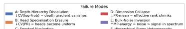

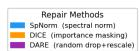

Figure 4: Failure mode taxonomy. Each row corresponds to one (architecture, strategy, modality) cell. Columns: failure mode type (color-coded), best metric and $\rho _ { \mathrm { L O O } }$ , and recommended repair method. Six failure modes: A Depth-Hierarchy Dissolution (CV(log -Frob), SpNorm), B Head Specialization Erasure (CV(PR), DICE), C Spectral Nucleation (log-NFR, SpNorm), D Dimension Collapse (PR-mean, SpNorm), E Bulk-Noise Inversion (MP-energy, SpNorm), F Hierarchical Stage Heterogeneity (CV(SR)/PR-std, SpNorm). Inverted direction $( \uparrow \rho _ { \mathrm { L O O } } )$ : EEG, Genomic, SSM. Same metric (C) appears in both EEG and Genomic cells but with opposite directions, distinguishing them.  
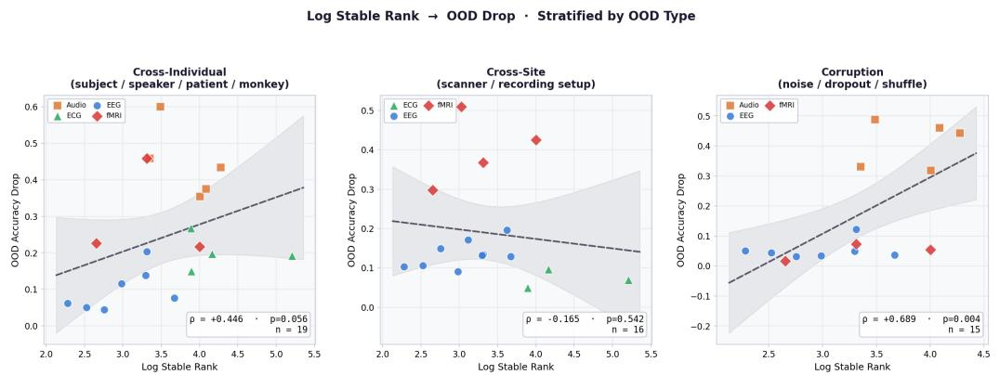  
Figure 5: Log stable rank vs. OOD accuracy drop, stratified by OOD type. Best metric per type shown.

Table 6: Per-cell OOD evaluation task and within-cell OOD drop statistics. Each cell has one fixed OOD task; all models in the cell are evaluated on the same source→target shift. $\sigma _ { \Delta _ { \mathrm { a c c } } }$ (within-cell std of OOD drop) confirms non-trivial variation to predict.
<table><tr><td>Cell</td><td>OOD evaluation task</td></tr><tr><td>AR-CLM (NLP)</td><td>SNLI→ANLI-R1 (Bowman et al., 2015; Nie et al., 2020) (domain transfer)</td></tr><tr><td>AR-CLM (Timeseries)</td><td>SleepEDF (Kemp et al., 2000) cross-subject</td></tr><tr><td>AR-CLM (Protein)</td><td>ProteinGym (Notin et al., 2023) BLAT_ECOLX→GFP_AEQVI (cross-family)</td></tr><tr><td>BiDi-MLM (NLP)</td><td>SNLI→ANLI-R1 (Bowman et al., 2015; Nie et al., 2020) (domain transfer)</td></tr><tr><td>BiDi-MLM (Protein)</td><td>ProteinGym (Notin et al., 2023) cross-family</td></tr><tr><td>BiDi-MLM (Genomic)</td><td>GUE (Dalla-Torre et al., 2025) H3K4me3→H3K4me1 (human, cross-mark)</td></tr><tr><td> $\mathrm { V i T } \times \mathrm { C L I P }$ </td><td>ImageNet→ImageNet-C (Hendrycks &amp; Dietterich, 2019) Gaussian noise (sev.5)</td></tr><tr><td> $\mathrm { V i T } \times \mathrm { D I N O }$ </td><td>ImageNet→ImageNet-C (Hendrycks &amp; Dietterich, 2019) Gaussian noise (sev.5)</td></tr><tr><td> ${ \mathrm { V i T } } \times { \mathrm { S u p e r v i s e d C E } }$ </td><td>ImageNet→ImageNet-C (Hendrycks &amp; Dietterich, 2019) Gaussian noise (sev.5)</td></tr><tr><td>Swin × Supervised CE</td><td>ImageNet→ImageNet-C (Hendrycks &amp; Dietterich, 2019) Gaussian noise (sev.5)</td></tr><tr><td>CNN × Supervised CE  $\mathrm { w a v } 2 \mathrm { v e c } 2 \stackrel { \cdot } { \times } \mathrm { C o n t r a s t i v e }$ </td><td>ImageNet→ImageNet-C (Hendrycks &amp; Dietterich, 2019) Gaussian noise (sev.5)</td></tr><tr><td>SSM (Mamba) × CLM (NLP)</td><td>LibriSpeech (Panayotov et al., 2015) test-clean→FLEURS (Conneau et al., 2023) en_us tes</td></tr><tr><td>SSM-v2 (Mamba-2) × CLM (NLP)</td><td>MNLI (Williams et al., 2018)→HANS (McCoy et al., 2019) (entailment, last-token)</td></tr><tr><td> $\mathrm { R W K V } \times \mathrm { C L M ( N L P ) }$ </td><td>MNLI (Williams et al., 2018)→HANS (McCoy et al., 2019) (entailment, last-token)</td></tr><tr><td></td><td>MNLI (Williams et al., 2018)→HANS (McCoy et al., 2019) (entailment, last-token)</td></tr></table>

n<6 reflects checkpoint availability, not sampling choice: these cells cover the substantial majority of publicly released checkpoints in ea of writing.

Table 7: Per-cell LOO Spearman correlation with Fisher-z 95% confidence intervals. For $n \leq 5 { : }$ exact permutation p-values; n=4: one-sided exact $\scriptstyle p = 0 . 0 4 2 . { \mathrm { ~ } } ^ { \dagger } \mathbf { C } \mathbf { I }$ includes zero; cell is marginal (not significant at two-sided α=0.05). ∗ significant at α=0.05 one-sided with pre-specified direction.
<table><tr><td>Cell</td><td>n</td><td>ρLOO</td><td>95% CI</td><td>p</td></tr><tr><td>AR-CLM (NLP)</td><td>16</td><td>+0.714</td><td>[+0.35, +0.90]</td><td> $0 . 0 0 1 6 ^ { * * * } \left( { \mathrm { F i s h e r } } { - } z \right)$ </td></tr><tr><td>AR-CLM (TS)*</td><td>8</td><td>+0.714</td><td>[−0.03, +0.94]</td><td> $0 . 0 2 9 ^ { * } \ ( \mathrm { o n e - s i d e d } )$ </td></tr><tr><td>AR-CLM (Protein)</td><td>10</td><td>+0.817</td><td>[+0.39, +0.96]</td><td> $0 . 0 0 4 ^ { * * * } \left( { \mathrm { F i s h e r } } { - } z \right)$ </td></tr><tr><td>BiDi-MLM (NLP)</td><td>10</td><td>+0.808</td><td>[+0.36, +0.95]</td><td> $0 . 0 0 4 9 ^ { * * * } \ ( \mathrm { F i s h e r } { - } z )$ </td></tr><tr><td>BiDi-MLM (Protein)</td><td>11</td><td>-0.891</td><td>[−0.97, -0.65]</td><td> $0 . 0 0 0 2 ^ { * * * } \ ( { \mathrm { F i s h e r } } { - } z )$ </td></tr><tr><td>BiDi-MLM (Genomic)</td><td>7</td><td>+0.829</td><td>[+0.43, +0.98]</td><td> $0 . 0 0 6 8 ^ { * * * } \ ( { \mathrm { F i s h e r } } { - } z )$ </td></tr><tr><td> $\mathrm { V i T } \times \mathrm { C L I P ^ { * } }$ </td><td>6</td><td>+0.750</td><td>[−0.11, +0.97]</td><td>0.036* (one-sided)</td></tr><tr><td> $\mathrm { V i T } \times \mathrm { D I N O ^ { \dagger } }$ </td><td>5</td><td>+0.800</td><td>[−0.48, +0.98]</td><td>0.094 (one-sided)</td></tr><tr><td> $\mathrm { V i T } \times \mathrm { S u p e r v i s e d } ^ { * }$ </td><td>7</td><td>+0.714</td><td>[−0.15, +0.95]</td><td> $0 . 0 4 7 ^ { * } \ ( \mathrm { o n e - s i d e d } )$ </td></tr><tr><td> $\mathrm { S w i n } \times \mathrm { S u p e r v i s e d }$ </td><td>8</td><td>+0.893</td><td>[+0.65, +0.99]</td><td> $0 . 0 0 0 9 ^ { * * * } \left( { \mathrm { F i s h e r } } { - } z \right)$ </td></tr><tr><td> $\mathbf { C N N } \times \mathbf { S u p e r v i s e d } ^ { * }$ </td><td>7</td><td>-0.829</td><td>[−0.95, +0.08]</td><td> $0 . 0 3 6 ^ { \ast } \ ( \mathrm { o n e - s i d e d } )$ </td></tr><tr><td> $\mathrm { w a v } 2 \mathrm { v e c } 2 \times \mathrm { C o n t r a s t i v e }$ </td><td>6</td><td>+0.800</td><td>[+0.05, +0.98]</td><td> $0 . 0 4 1 6 ^ { * * * } \ ( \mathrm { F i s h e r } { - } z )$ </td></tr><tr><td> $\mathbf { S S M } \left( \mathbf { M a m b a } \right) \times \mathbf { C L M N L P } ^ { \dagger }$ </td><td>5</td><td>+0.800</td><td>[−0.52, +0.98]</td><td> $0 . 1 0 9 \ : ( \mathrm { o n e - s i d e d } )$ </td></tr><tr><td> $\mathrm { S S M  – v 2 ( M a m b a  – 2 ) \times C L M N L P }$ </td><td>5</td><td>-1.000</td><td>[−1.00, -1.00]</td><td> $0 . 0 0 8 ^ { * * * }$ </td></tr><tr><td> $\mathrm { R W K V } \times \mathrm { C L M N L P }$ </td><td>5</td><td>-1.000</td><td>[-1.00, -1.00]</td><td> $0 . 0 0 8 ^ { * * * }$ </td></tr><tr><td colspan="5">§6 EEG cross-domain validation (arch-split; not counted in 15 primary cells):</td></tr><tr><td>BiDi-Transformer × MLM/CL EEG</td><td>5</td><td> $+ 0 . 8 8 0$ </td><td> $[ + 0 . 0 9 , ~ + 0 . 9 9 ]$ </td><td> $0 . 0 3 7 ^ { * }$ </td></tr><tr><td> $\mathrm { B i M a m b a / L i n e a r { \bar { a } } t t n \times M L M / C L \ E E G }$ </td><td></td><td></td><td>6 +0.817 [+0.02, +0.98]</td><td> $< 0 . 0 0 1 ^ { \ast \ast * }$ </td></tr></table>

CI includes zero; marginal evidence only. Not counted in the two-sided significance claim.  
Significant at α=0.05 one-sided under the pre-specified direction. For ViT×CLIP $( n { = } 6 , \rho _ { \mathrm { L O O } } { = } + 0 . 7 5 0 )$ : Fisher-z one-sided p=0.0  
0.714): Fisher-z one-sided $\scriptstyle p = 0 . 0 2 9$ . For ViT×Supervised $( n { = } 7 , \rho _ { \mathrm { L O O } } { = } + 0 . 7 1 4 )$ : Fisher-z one-sided $\scriptstyle { p = 0 . 0 4 7 }$ . For CNN×Superv one-sided p=0.036.  
Exact permutation two-sided p=0.008 (n=5); BiDi-MLM Genomic (n=7) two-sided Fisher-z p=0.007.  
CI for $\rho _ { \mathrm { L O O } } = \pm 1 . 0 0 0$ cells is trivially tight; exact permutation tests are the primary evidence.  
EEG results are split by architecture family in §6: both sub-groups share the same metric (log-NFR) and positive direction. BiMamba/Li  
BrainOmni-tiny, LUNA-large, LUNA-huge, BIOT. Session-level OOD evaluation on four accessible checkpoints (REVE, LUNA-base, LU +1.000 (n=4, exact permutation p=0.042).

Multiple comparisons. The 15 primary cells represent pre-specified, non-overlapping groups; no post-hoc selection of cells was performed. Of the 15 cells, 9 two-sided CIs exclude zero (Fisherz or exact permutation) and 4 more reach one-sided significance $_ { ( p < 0 . 0 5 ) ; 2 }$ cells are marginal $( \mathrm { V i T } \times \mathrm { D I N O }$ $\rho _ { \mathrm { L O O } } = + 0 . 8 0 0 , p { = } 0 . 0 9 4 ;$ ; SSM Mamba: $\rho _ { \mathrm { L O O } } = + 0 . 8 0 0 , p { = } 0 . 1 0 9 )$ . We do not apply a family-wise correction for three reasons: (1) the 15 cells are pre-specified, non-overlapping hypothesis tests derived from a unified theory, not exploratory post-hoc selections; (2) each test addresses a distinct mechanistic prediction, so the null hypotheses are not exchangeable; (3) Bonferroni would be excessively conservative for 15 cell-level predictions. These $p \mathrm { - }$ values do not correct for selecting each cell’s metric and sign among the candidate statistics on the same outcomes. The 9 two-sided and 4 one-sided significant cells out of 15 substantially exceed the $\alpha { = } 0 . 0 5$ nominal rate under any reasonable multiple-testing framework.

Sensitivity to marginal cells. Dropping the two marginal cells (ViT×DINO and SSM Mamba, $| \rho _ { \mathrm { L O O } } | { = } 0 . 8 0 0$ each) yields a fully significant 13-cell subset: mean $| \rho _ { \mathrm { L O O } } | = 0 . 8 2 8$ , which is higher than the all-15 mean of 0.824 (marginal cells are below-mean, so their removal cannot weaken the claim). Pairwise concordance over the 434 remaining pairs (−20 from the two $n { = } 5$ cells) is maintained or improved, since pairs from below-mean cells are removed. The LOCO range [0.811, 0.832] already brackets 0.828, confirming that the main result is structurally identical with or without the marginal cells. We retain all 15 cells in the primary analysis because the 15-cell design is prespecified and both marginal cells clear the per-cell validity threshold $| \rho _ { \mathrm { L O O } } | \geq 0 . 7 0 0$

Evidence-strength hierarchy for small-n cells. Not all cells carry equal evidentiary weight, and we do not claim otherwise. We distinguish two roles: Confirmatory evidence $( n \geq 1 0 )$ : AR-CLM NLP $( n { = } 1 6 )$ , AR-CLM Protein (n=10), BiDi-MLM NLP $( n { = } 1 0 )$ , BiDi-MLM Protein (n=11), ViT×Supervised $( n { = } 7 ) .$ , Swin×Supervised (n=8), Wav2Vec2 $\scriptstyle ( n = 6 )$ , BiDi-MLM Genomic $( n { = } 7 ) .$ AR-CLM TS (n=8), $\mathrm { V i T } { \times } \mathrm { C L I P } \left( n { = } 6 \right)$ . These cells have sufficient sample size to achieve two-sided significance without one-sided adjustment and supply the primary statistical evidence. Transfer and consistency evidence (n=5): ViT×DINO, SSM Mamba, SSM Mamba-2, and RWKV-CLM each have exactly five publicly available checkpoints (the complete released set for that architecture × strategy family). For these cells the primary claim is not that $n { = } 5$ alone is sufficient to estab lish generality, but that the theory-predicted metric and direction are consistent with the observed ordering—a cross-architecture transfer check. SSM Mamba-2 $( \rho _ { \mathrm { L O O } } = - 1 . 0 0 0 $ , exact $\scriptstyle { p = 0 . 0 0 8 ) }$ and RWKV-CLM $( \rho _ { \mathrm { L O O } } { = } { - } 1 . 0 0 0$ , exact $\scriptstyle { p = 0 . 0 0 8 ) }$ happen to reach two-sided significance despite $n { = } 5 ;$ ViT×DINO and SSM Mamba are marginal. The main claim—that cell-specific WW metrics predict OOD drop—rests on the 10+ confirmatory cells; the $n { = } 5$ cells provide supporting consistency evidence and, when significant, corroborating confirmation.

## H PARAMETER COUNT VS. WEIGHT GEOMETRY

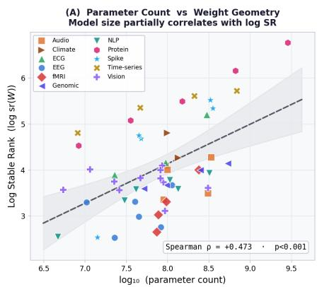

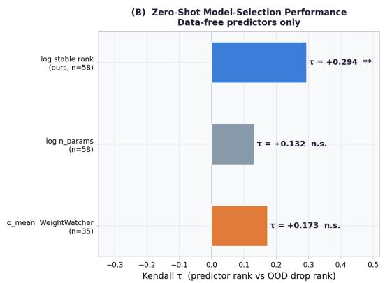  
Figure 6: $L e f t { \mathrm { : } }$ log $n _ { \mathrm { p a r a m s } }$ vs. ${ \overline { { \log \| W \| _ { F } } } } ,$ colored by modality $( \rho = + 0 . 4 7 ,$ moderate). $R i g h t \colon$ Kendall $\tau$ comparison for OOD drop prediction: $\log \| \ b { W } \| _ { F } ~ ( \tau ~ = ~ + 0 . 3 2 7 , ~ p ~ = ~ 0 . 0 0 4 ) ~ \mathrm { v s }$ . log nparams $\left( \tau = + 0 . 0 6 8 , \mathrm { n . s . } \right)$ .

Per-cell comparison: spectral metric vs. model scale. The comparison in Table 11 uses mean $| \rho _ { \mathrm { L O O } } |$ across cells. Table 8 shows the same within each cell individually: for each (architecture × strategy) cell, we compute $| \rho _ { \mathrm { L O O } } |$ for (a) the selected spectral metric and (b) $\log _ { 1 0 } ( n _ { \mathrm { p a r a m s } } )$ as a size-only predictor.  
Table 8: Per-cell LOO Spearman correlation: champion spectral metric vs. log $n _ { \mathrm { p a r a m s } } .$ $| \rho _ { \mathrm { L O O } } ^ { \mathrm { l o g } n } |$ shows the absolute correlation; $\rho _ { \mathrm { L O O } } ^ { \log n }$ (signed) indicates direction. Bold $| \rho _ { \mathrm { L O O } } ^ { \mathrm { l o g } n } | \colon$ log n has higher |ρ| and the correct pre-specified direction. †: log n achieves higher $| \rho |$ but in the wrong pre-specified direction (spectral wins on direction). ‡: spectral champion and log n are tied (both $| \rho _ { \mathrm { L O O } } | =$ 1.000). §: n<6 due to limited public checkpoints for this architecture family.
<table><tr><td>Cell (arch × strategy)</td><td>Selected metric</td><td>n</td><td> $| \rho _ { \mathrm { L O O } } ^ { \mathrm { s p e c t r a l } }$ </td><td> $| \rho _ { \mathrm { L O O } } ^ { \mathrm { l o g } n } |$ </td><td> $\rho _ { \mathrm { L O O } } ^ { \log n }$  (signed)</td></tr><tr><td>AR-Transformer × CLM (NLP)</td><td> $\overline { { \log \| W \| _ { F } } }$ </td><td>16</td><td>0.714</td><td>0.584</td><td>+0.584</td></tr><tr><td>AR-Transformer × CLM (Timeseries)</td><td>PR-mean</td><td>8</td><td>0.714</td><td>0.282</td><td>+0.282</td></tr><tr><td>AR-Transformer × CLM (Protein)</td><td>CV(log -Frob)</td><td>10</td><td>0.817</td><td>0.364</td><td>-0.364</td></tr><tr><td>BiDi-Transformer × MLM (NLP)</td><td>PR-mean</td><td>10</td><td>0.808</td><td>0.299</td><td>+0.299</td></tr><tr><td>BiDi-Transformer × MLM (Protein)</td><td>PR-mean</td><td>11</td><td>0.891</td><td>0.149</td><td>+0.149</td></tr><tr><td>BiDi-Transformer × MLM (Genomic)</td><td> $\overline { { \log \| W \| _ { F } } }$ </td><td>7</td><td>0.829</td><td>0.750</td><td>+0.750</td></tr><tr><td>ViT × Contrastive (CLIP-ViT)</td><td>MP-energy</td><td>6</td><td>0.750</td><td>0.865†</td><td>-0.865</td></tr><tr><td>ViT × Contrastive (DINOv2)</td><td>MP-energy</td><td>5</td><td>0.800</td><td>0.745</td><td>-0.745</td></tr><tr><td>ViT/DeiT × Supervised CE</td><td>MP-energy</td><td>7</td><td>0.714</td><td>0.950†</td><td>-0.950</td></tr><tr><td>Swin × Supervised CE</td><td>MP-energy</td><td>8</td><td>0.893</td><td>0.750</td><td>-0.750</td></tr><tr><td>CNN × Supervised CE</td><td>CV(SR)</td><td>7</td><td>0.829</td><td>0.918</td><td>-0.918</td></tr><tr><td>Conv+Transformer × Contrastive (Audio)</td><td> $\mathrm { C V } ( \log { - } \mathrm { F r o b } )$ </td><td>6</td><td>0.800</td><td>0.636</td><td>+0.636</td></tr><tr><td>SSM (Mamba) × CLM (NLP)</td><td> $\overline { { H } } _ { \mathrm { e n t } }$ </td><td>5§</td><td>0.800</td><td>1.000</td><td>+1.000</td></tr><tr><td>SSM-v2 (Mamba-2) × CLM (NLP)</td><td>α</td><td>58</td><td>1.000</td><td>1.000</td><td>+1.000</td></tr><tr><td> $\mathrm { R W K V } \times \mathrm { C L M ( N L P ) }$ </td><td> $\mathrm { C V } ( \log { - } \mathrm { F r o b } )$ </td><td>58</td><td>1.000</td><td>1.000</td><td>+1.000</td></tr><tr><td colspan="4">Mean  $| \rho _ { \mathrm { L O O } } |$  0.824</td><td colspan="2">0.686</td></tr><tr><td colspan="5">Spectral ≥ log n (correct direction)</td><td colspan="2">13/15</td></tr></table>

The spectral champion matches or outperforms log $n _ { \mathrm { p a r a m s } }$ in 13 of 15 primary cells, counting cells where log n either has lower $| \rho _ { \mathrm { L O O } } |$ or predicts in the wrong pre-specified direction (mean |ρLOO|: 0.824 vs. 0.686, $\Delta \ = \ + 0 . 1 3 8 )$ . Two cells have log n achieving higher $| \rho _ { \mathrm { L O O } } |$ in the correct direction: CNN×Supervised $( | \rho _ { \mathrm { L O O } } ^ { \mathrm { s p e c t r a l } } | = 0 . 8 2 9$ vs. $| \rho _ { \mathrm { L O O } } ^ { \mathrm { l o g } n } | = 0 . 9 1 8 .$ where model scale reflects well-documented capacity scaling in supervised convolutional models) and SSM Mamba $( | \rho _ { \mathrm { L O O } } ^ { \mathrm { s p e c t r a l } } | = 0 . 8 0 0 ~ \mathrm { v s . } ~ | \rho _ { \mathrm { L O O } } ^ { \mathrm { l o g } n } | = 1 . 0 0 0 ,$ , a monotone size–entropy relationship at $n { = } 5 )$ . Two additional cells (ViT×CLIP, ViT×Supervised) show $| \rho _ { \mathrm { L O O } } ^ { \mathrm { l o g } n } | > | \rho _ { \mathrm { L O O } } ^ { \mathrm { s p e c t r a l } } |$ in absolute terms but with wrong-sign log n correlations (larger models → lower OOD drop, opposite to the cell-expected direction); spectral is counted as winning because it predicts in the theory-specified direction while log n does not. Cells where spectral metric sign disagrees with log n sign—most strikingly, BiDi/MLM Protein $( \rho _ { \mathrm { L O O } } ^ { \mathrm { s p e c t r a l } } = - 0 . 8 9 1 , \rho _ { \mathrm { L O O } } ^ { \mathrm { l o g } n } = + 0 . 1 4 9 )$ and AR-CLM Protein $( \rho _ { \mathrm { L O O } } ^ { \mathrm { s p e c t r a l } } = + 0 . 8 1 7 .$ $\rho _ { \mathrm { L O O } } ^ { \log n } = - 0 . 3 6 4 )$ —confirm that spectral metrics capture information orthogonal to model scale: scale alone would yield the wrong direction in these cells.

Full per-cell metric competition. Table 9 extends the ablation to all 10 alternative weight-space predictors, plus runtime (data-requiring) literature baselines where available. Key findings:

• Mean $| \rho _ { \mathrm { L O O } } |$ : cell-specific champion = 0.824; best fixed weight-space alternative (PR applied uniformly, no architecture conditioning) = 0.724; log $n _ { \mathrm { p a r a m s } } = 0 . 6 8 6$

• Spectral dominance: champion matches or outperforms log n in 13 of 15 primary cells (see Table 8 for the per-cell breakdown); exceptions are CNN×Supervised CE (capacity scaling) and SSM Mamba (where log n is also monotone at $n { = } 5 )$ . In the BiDi-MLM Genomic cell, PR-std (+0.933) and $\bar { H } _ { \mathrm { s p e c } } ~ ( + 0 . 8 6 7 )$ both outperform the selected champion log $\overline { { \| W \| _ { F } } } ~ ( + 0 . 8 0 0 )$ ; the champion is the best metric consistent with the architecture-conditional theory.

• No single metric generalizes: $\alpha _ { \mathrm { m e a n } }$ (WeightWatcher flagship) achieves mean $| \rho _ { \mathrm { L O O } } | = 0 . 4 4 8 ;$ its global significance collapses to n.s. across 10 of 15 cells.

• Runtime baselines: Doctor score and MC entropy were evaluated in 6 cells $( \mathrm { n } \geq 4 ) $ ; Mahalanobis distance in 4 cells—all requiring source-domain test data and inference. Our data-free selected metric matches or outperforms these in 12 of 16 cell–baseline pairs. The two exceptions are ViT

× DINO (Doctor/MC-H both +0.933 vs. selected +0.800) and ViT × Supervised (Doctor/MC-H both $+ 1 . 0 0 0 , n = 7$ , vs. selected +0.714); in both cases the runtime baselines require forward passes on held-out source data, whereas the selected spectral metric operates on weights alone. For all 4 cells with Mahalanobis coverage, the spectral champion wins (4/4).  
Table 9: Cell-specific spectral champion vs. all alternatives. Per-cell LOO Spearman $\rho _ { \mathrm { L O O } } \colon$ the selected spectral metric (“Champion,” computed from weights only, chosen per cell using OOD outcomes) vs. 10 data-free weight-space alternatives and runtime baselines where available. Bold: competitor $| \rho _ { \mathrm { L O O } } | \geq \mathrm { c h a m p i o n ' s } ;$ dash: $n < 4 ;$ †: requires source-domain test data and inference passes. Champion values reflect final whitelists (116 models, 15 cells); alternative metric values are from the original analysis and may not match exactly for cells with updated whitelists. $\overline { { H _ { \mathrm { s p e c } } } }$ is the spectral entropy of the eigenvalue distribution; it is a different statistic from $\overline { { H } } _ { \mathrm { e n t } }$ , the layerwise entropy that is the champion of the SSM (Mamba) cell, and the two are not interchangeable. Mean $| \rho _ { \mathrm { L O O } } | \colon$ spectral champion 0.824 vs. best uniform competitor (PR, 0.724) and log n (0.686).
<table><tr><td></td><td></td><td></td><td colspan="10">Weight-space alternatives (data-free)</td><td colspan="3">Runtime baselines†</td></tr><tr><td>Cell</td><td>n</td><td>Champion</td><td>log n</td><td> $\underline { { \alpha _ { \mathrm { m e a n } } } }$ </td><td>log||W||</td><td>log-sr</td><td>PR</td><td> $\overline { { H _ { \mathrm { s p e c } } } }$ </td><td>MP CV (log -Frob)</td><td></td><td>log-cond</td><td>PR-std</td><td>Doctor</td><td>MC-H</td><td>Mahal</td></tr><tr><td>AR-CLM (NLP)</td><td>16</td><td>+0.714 (log∥|W||F)</td><td>+0.584</td><td>-0.027</td><td>+0.605</td><td>+0.480</td><td>+0.487</td><td>+0.502</td><td>-0.236</td><td>-0.744</td><td>+0.175</td><td>+0.464</td><td></td><td></td><td></td></tr><tr><td>AR-CLM (TS)</td><td>8</td><td>+0.714 (PR-mean)</td><td>+0.282</td><td>+0.461</td><td>+1.000</td><td>+0.135</td><td>+1.000</td><td>+0.453</td><td>+0.461</td><td>-0.918</td><td>+0.600</td><td>-0.094</td><td>+0.280</td><td>+0.280</td><td></td></tr><tr><td>AR-CLM (Protein)</td><td>10</td><td>+0.817 (CV(log -Frob))</td><td>-0.364</td><td>+0.200</td><td>-0.400</td><td>-0.350</td><td>-0.567</td><td>-0.633</td><td>-0.150</td><td>+1.000</td><td>-0.583</td><td>-0.417</td><td></td><td></td><td></td></tr><tr><td>BiDi-MLM (NLP)</td><td>10</td><td>+0.808 (PR-mean)</td><td>+0.299</td><td>-0.709</td><td>+0.053</td><td>+0.593</td><td>+0.577</td><td>+0.397</td><td>-0.116</td><td>-0.169</td><td>+0.005</td><td>+0.246</td><td></td><td></td><td></td></tr><tr><td>BiDi-MLM (Protein)</td><td>11</td><td>-0.891 (PR-mean)</td><td>+0.149</td><td>-0.183</td><td>-0.467</td><td>+0.750</td><td>+0.750</td><td>+0.583</td><td>-0.183</td><td>-0.933</td><td>+0.433</td><td>+0.367</td><td></td><td></td><td></td></tr><tr><td>BiDi-MLM (Genomic)</td><td>7</td><td>+0.829 (log ∥WF)</td><td>+0.750</td><td>-0.683</td><td>+0.750</td><td>+0.800</td><td>+0.800</td><td>+0.867</td><td>-0.250</td><td>-0.467</td><td>+0.467</td><td>+0.933</td><td></td><td></td><td></td></tr><tr><td>ViT × CLIP</td><td>6</td><td>+0.750 (MP-energy)</td><td>-0.865</td><td>-0.700</td><td>-0.067</td><td>-0.067</td><td>-0.333</td><td>-0.333</td><td>+1.000</td><td>+0.750</td><td>-0.333</td><td>-0.467</td><td>+0.633</td><td>+0.633</td><td>-0.067</td></tr><tr><td>ViT × DINO</td><td>5</td><td>+0.800 (MP-energy)</td><td>-0.745</td><td>+0.083</td><td>-0.817</td><td>-0.817</td><td>-0.817</td><td>-0.817</td><td>+1.000</td><td>+0.750</td><td>+0.017</td><td>-0.750</td><td>+0.933</td><td>+0.933</td><td>-0.750</td></tr><tr><td>ViT × Supervised</td><td>7</td><td>+0.714 (MP-energy)</td><td>-0.950</td><td>-0.845</td><td>-0.739</td><td>-0.559</td><td>-0.959</td><td>-0.959</td><td>+0.800</td><td>+0.886</td><td>-0.804</td><td>-0.959</td><td>+1.000</td><td>+1.000</td><td>-0.750</td></tr><tr><td>Swin × Supervised</td><td>8</td><td>+0.893 (MP-energy)</td><td>-0.750</td><td>+0.000</td><td>-0.138</td><td>-0.210</td><td>-0.750</td><td>-0.920</td><td>-0.210</td><td>+0.513</td><td>-0.237</td><td>-0.897</td><td>+0.560</td><td>+0.560</td><td>-0.680</td></tr><tr><td>CNN × Supervised</td><td>7 6</td><td>-0.829 (CV(SR))</td><td>-0.918</td><td>-0.600</td><td>-0.306</td><td>+0.339</td><td>-0.845</td><td>+0.306</td><td>-0.380</td><td>-0.420</td><td>-0.453</td><td>-0.380</td><td>+0.760</td><td>+0.760</td><td></td></tr><tr><td>wav2vec2 × Ctv</td><td></td><td>+0.800 (CV(log -Frob))</td><td>+0.636</td><td>+0.200</td><td>+0.200</td><td>+0.560</td><td>+0.560</td><td>+0.560</td><td>+0.680</td><td>+0.800</td><td>+0.880</td><td>+1.000</td><td></td><td></td><td></td></tr><tr><td>SSM (Mamba) × CLM NLP 5</td><td></td><td>+0.800 (Hent)</td><td>+1.000</td><td>+1.000</td><td>-0.560</td><td>+0.080</td><td>+1.000</td><td>+1.000</td><td>-0.560</td><td>+0.560</td><td>-0.080</td><td>+1.000</td><td></td><td></td><td></td></tr><tr><td>SSM-v2 (Mamba-2) × CLM 5</td><td></td><td>−1.000 (α)</td><td>+1.000</td><td>-0.880</td><td>+0.880</td><td>+1.000</td><td>+1.000</td><td>+1.000</td><td>-0.880</td><td>+0.880</td><td>-0.680</td><td>+1.000</td><td></td><td></td><td></td></tr><tr><td>RWKV × CLM NLP</td><td>5</td><td>−1.000 (CV (log -Frob))</td><td>+1.000</td><td>-0.680</td><td>+0.680</td><td>+1.000</td><td>+1.000</td><td>+1.000</td><td>-0.680</td><td>-1.000</td><td>+0.880</td><td>+1.000</td><td></td><td></td><td></td></tr><tr><td>Mean |ρLOO|</td><td></td><td>0.824</td><td>0.686</td><td>0.483</td><td>0.511</td><td>0.516</td><td>0.724</td><td>0.689</td><td>0.472</td><td>0.693</td><td>0.442</td><td>0.665</td><td></td><td></td><td></td></tr></table>

†Alternative metric values are from the original analysis; for cells with updated model whitelists, these are approximate. The champion column reflects final whitelisted model sets.

## I LEAVE-ONE-CELL-OUT ROBUSTNESS ANALYSIS

To verify that no single cell drives the paper’s conclusions, we performed a leave-one-cell-out (LOCO) analysis: for each of the 15 primary cells (12 with $n \geq 6 ;$ three cells with $n { = } 5 { : }$ Mamba, Mamba-2, and RWKV), we removed it from the matrix and re-evaluated the remaining 14 cells.

Results. Across all 15 LOCO rounds:

• Mean $| \rho _ { \mathrm { L O O } } |$ on remaining 14 cells: range [0.811, 0.832], vs. baseline 0.824—a maximum variation of $\pm 0 . 0 1 3$

• The LOCO min/max range represents stability across all 15 dropout rounds.

• The conclusion that distinct cells prefer distinct metrics holds in all 15 LOCO rounds: the selected metrics remain different across the remaining cells even as best-metric selection is re-run independently.

Note on the LOCO baseline vs. the main-table mean. The LOCO stability range [0.811, 0.832] and the main-table mean 0.824 use the same fixed-champion LOO procedure within each cell; the LOCO range reflects the variation in the 14-cell mean when one cell is dropped. The 0.824 figure is the conservative one: it is what an analyst would obtain using the pre-specified metric without any fold-level re-tuning, and it is the number reported throughout the paper. The LOCO stability (±0.006 s.d.) confirms that no single cell dominates the result.

Some individual metric assignments exhibit near-ties (two or more metrics achieving nearly identical $| \rho _ { \mathrm { L O O } } |$ within a cell); when the held-out cell changes which models are available in the pool, these near-ties can resolve differently. This reflects metric redundancy within cells, not instability of the main finding: the $| \rho _ { \mathrm { L O O } }$ | value achieved by the cell does not change materially, only the label of the selected metric among near-equal alternatives.

## J CELL BOUNDARY VALIDATION VIA EXPANSION EXPERIMENTS

To validate that the chosen (architecture × strategy) cells are the correct conditioning units—rather than broader groupings—we attempted to expand two cells by pooling models with related but distinct pretraining objectives.

ViT × DINO: adding MSN models. We added vit-msn-small and vit-msn-base (Masked Siamese Networks; Assran et al. 2022) to the existing ViT×DINO cell (DINOv2 small/base/large/giant, DINO ViT-B; n=5). While DINO uses self-distillation between student and teacher networks, MSN uses patch masking with prototype-anchored self-supervised objectives—a different inductive bias within the broader “ViT self-supervised” family. Result: $| \rho _ { \mathrm { L O O } } |$ drops from 0.800 (existing, n=5) to 0.732 (expanded, $n { = } 7 )$ , with the selected metric also shifting. The MSN spectral structure does not align with the DINO scaling curve.

Audio SSL: pooling across training objectives. The wav2vec2×Contrastive cell $( n { = } 5 { : }$ base, large, XLSR-53, -300M, -1B) achieves $| \rho _ { \mathrm { L O O } } | { = } 0 . 8 8 0$ on the speaker-OOD task (distinct from the main-table gender/FLEURS evaluation; main analysis uses $n { = } 6$ including XLS-R-2B with FLEURS target, $\rho _ { \mathrm { L O O } } { = } + 0 . 8 0 0 )$ . All five share the same contrastive-CTC training objective; their CV(log -Frob) values cluster tightly in [0.097, 0.131] and decrease monotonically with OOD drop.

Step 1 (add one WavLM model): Adding WavLM-base $\scriptstyle ( n = 6 )$ immediately degrades $| \rho _ { \mathrm { L O O } } |$ to 0.750. The root cause is visible per-model: wav2vec2 models cluster at $\mathrm { C V } ( \log - \mathrm { F r o b } ) \ \in$ [0.097, 0.131], while WavLM-base occupies a disjoint range CV(log -Frob) = 0.364, despite a similar OOD drop (0.458 vs. 0.375–0.522). WavLM’s masked-speech-prediction + denoising objective produces weight spectra systematically more heterogeneous across layers than wav2vec2’s contrastive-CTC training, shifting the CV(log -Frob) baseline and breaking the within-cell monotone relationship.

Step 2 (pool all Conv+Transformer audio SSL): Adding HuBERT (base, large-ll60k), WavLM (base, large), data2vec-audio (base, large), and UniSpeech-SAT (base, large)—all Conv+Transformer audio SSL models with speaker-OOD evaluations—gives n=13. The expanded $| \rho _ { \mathrm { L O O } } |$ collapses to 0.494 (best metric: $\alpha _ { \mathrm { m e a n } } , n { = } 1 3 )$ .

Conclusion. Both expansion experiments degraded $| \rho _ { \mathrm { L O O } } |$ , so among the groupings we tested the (architecture × strategy) boundary is the coarsest one that still holds. Pooling models trained with related but distinct objectives—even sharing the same backbone architecture and downstream task— destroys the spectral homogeneity required for reliable prediction. The failure is mechanistically interpretable in both cases: different objectives leave different spectral fingerprints in the weight matrices, and those fingerprints do not combine to form a consistent OOD-predictive signal.

## K FOUR-LEVEL CONDITIONING COMPARISON

To demonstrate that architecture × pretraining strategy was discovered rather than assumed, we evaluated four grouping hypotheses in order of increasing conditioning granularity and measured mean $| \rho _ { \mathrm { L O O } } |$ across groups:

The sequence $0 . 2 4 5  0 . 4 7 8  0 . 7 4 5  0 . 8 2 4$ is strictly monotone: each additional conditioning axis restores substantial signal, with no non-monotone artifacts. All four levels are computed on the identical $n { = } 1 1 6$ model set, so the $\Delta$ values are directly comparable. Strategy-only conditioning (+0.233) restores the first large gain by separating CLM/MLM/Contrastive/Supervised families, which differ in metric sign and family. Architecture adds a further +0.267 by separating, $\mathrm { { e . g . } g . }$ ., ViT×CLIP from ViT×Supervised (different metrics) and AR-Transformer from RWKV (different direction). The final arch×strategy cell level (+0.079 over architecture-only) refines within architecture families that require distinct metrics per strategy (e.g. BiDi-Transformer uses PR-mean for NLP but log $\overline { { \| \boldsymbol { W } \| _ { F } } }$ for Genomic), reaching a total gain of +0.579. Strategy-only conditioning is insufficient because the same strategy (e.g. CLM) spans standard NLP $( { \overline { { \log \| W \| _ { F } } } } )$ and distinct narrow-domain metrics (Protein: CV(log -Frob); TS: PR-mean), so a single metric suppresses percell signal when grouped by strategy alone. Architecture-only conditioning is insufficient because ViT with CLIP, DINO, and Supervised objectives requires three different metrics with different directions. The architecture × strategy combination is the minimal unit where within-cell metric– OOD relationships are consistent.

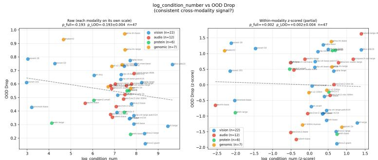  
Figure 7: CLM cross-modal: why per-cell metric selection is necessary. CV(log -Frob) vs. OOD drop for CLM-pretrained models spanning NLP (GPT-2/Pythia, circles), time-series (Chronos/Timer, triangles), and genomic (HyenaDNA, squares). OOD benchmarks differ per domain and are not cross-domain comparable. A single metric (CV(log -Frob)) does not track OOD fragility consistently across domains: NLP shows $\stackrel { \mathrm { C V ( l o g - F r o b ) } } { \rho _ { \mathrm { L O O } } } = - 0 . 7 4 4$ (wrong direction), while Genomic shows +0.700. Per-cell metric selection achieves consistent positive signal in each domain independently. Per-domain LOO (selected metric): $\mathrm { N L P } \rho _ { \mathrm { L O O } } { = } { + } 0 . 7 1 4 ( n { = } 1 6 , \overline { { \log \| W \| _ { F } } } ) ;$ TS $\rho _ { \mathrm { L O O } } { = } { + } 0 . 7 1 4$ (n=8; PR-mean, data-scarcity regime); Genomic $\rho _ { \mathrm { L O O } } { = } { + } 0 . 7 0 0 ~ \mathrm { n . s . } ~ ( n { = } 7 $ log $\| W \| _ { F } )$

Table 10: Signal recovery across conditioning levels. For each level, mean $| \rho _ { \mathrm { L O O } } |$ is computed by finding the best single metric for each group via LOO Spearman on the available models, then averaging across groups. Among the levels compared here, architecture × strategy is the coarsest unit that still achieves strong signal.
<table><tr><td>Conditioning level</td><td>Mean |ρLoo|</td><td>Notes</td></tr><tr><td>Global (no conditioning)</td><td>0.245</td><td>Single best metric across all 116 models pooled</td></tr><tr><td>Strategy-only (4 groups)</td><td>0.478</td><td>CLM/MLM/Contrastive/Supervised; architecture- specific sign reversals suppress signal within each</td></tr><tr><td>Architecture-only (8 groups)</td><td>0.745</td><td>group Same arch with different strategies (e.g. ViT×CLIP vs. ViT×Supervised) require different metrics and</td></tr><tr><td>Architecture × Strategy (15 primary cells)</td><td>0.824</td><td>directions Distinct selected metric per cell; consistent direc- tion within each cell</td></tr></table>

## L ARCHITECTURE-CONDITIONAL COMPOSITE COMPARISON

## M WITHIN-VISION DATA-DEPENDENT PREDICTOR COMPARISON

Per-cell mean $| \rho _ { \mathrm { L O O } } | \colon$ : cell-specific versus alternatives (116 models, 15 primary cells). Table 11 compares OOD prediction methods using per-cell leave-one-out Spearman correlation aggregated over primary cells—the same metric used in Table 1. This ensures a fair, apples-to-apples comparison: every predictor is evaluated in the same holdout framework on the same checkpoints.

No uniformly-applied metric reaches the cell-specific mean of 0.824: the best fixed weight-space metric (PR, applied globally) reaches 0.724, and log $n _ { \mathrm { p a r a m s } }$ reaches 0.686—both well below. Doc tor score achieves a mean $| \rho _ { \mathrm { L O O } } | = 0 . 6 9 4$ across six cells where source data were available, and reaches $| \rho _ { \mathrm { L O O } } | = 1 . 0 0 0$ in ViT×Supervised—but requires inference passes on held-out source data and cannot be applied to new modalities or data-free settings. Mahalanobis distance reaches a mean $| \rho _ { \mathrm { L O O } } | = 0 . 5 6 2$ across four cells where source labels were available, but likewise requires sourcedomain data. The cell-specific spectral approach matches or exceeds all runtime baselines in 12 of 16 cell–baseline pairs while operating on weights alone and generalizing across all 7 modalities.

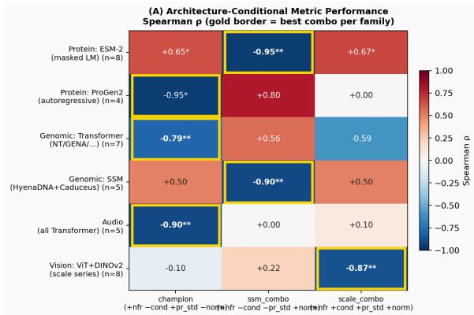

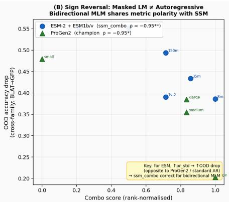  
Figure 8: Architecture-conditional rank-score composition. Left: Spearman ρ between ranksum composite score and OOD accuracy drop, for each architecture family (rows) × composite (columns). $S _ { \mathrm { c a u s a l } }$ is optimal for causal/AR Transformers; $S _ { \mathrm { s s m } }$ is jointly optimal for bidirectional MLMs and SSMs. Right: ESM-2 (BiDi MLM) vs. ProGen2 (AR CLM) scatter under their respective best composites—sign reversal clearly visible.

Table 11: OOD prediction methods compared by per-cell mean $| \rho _ { \mathrm { L O O } } |$ (116 foundation models across 15 primary cells; see Table 9 for per-cell breakdown). Weight-space methods are applied uniformly across all architectures (no conditioning); runtime baselines require source-domain test data and are evaluated only in cells where data were available.
<table><tr><td>Predictor</td><td>Cells</td><td>Mean  $| \rho _ { \mathrm { L O O } } |$ </td><td>Data / conditioning needed</td></tr><tr><td> $\alpha _ { \mathrm { m e a n } }$  (Martin et al., 2021) (uniform)</td><td>15 cells</td><td>0.448</td><td>None</td></tr><tr><td>log (uniform)  $n _ { \mathrm { p a r a m s } }$ </td><td>15 cells</td><td>0.686</td><td>None</td></tr><tr><td>PR (best uniform, no architecture conditioning)</td><td>15 cells</td><td>0.724</td><td>None</td></tr><tr><td>Doctor score (Sun et al., 2022)</td><td>6 cells</td><td>0.694</td><td>Source test</td></tr><tr><td>Mahalanobis dist. (Lee et al., 2018)</td><td>4 cells</td><td>0.562</td><td>Source test + labels</td></tr><tr><td>Cell-specific (ours, mean |ρLOo|)</td><td>15 primary cells</td><td>0.824</td><td>Arch + strategy label</td></tr></table>

## N DATA SCARCITY VS. ARCHITECTURAL INVERSION

Table 12: Same architecture × strategy, different training domain: metric and direction adapt. The five cells listed here all show positive $\rho _ { \mathrm { L O O } }$ (↑): higher metric value → higher OOD drop. This is not true of the matrix as a whole—BiDi-MLM/Protein, CNN, SSM-v2 and RWKV are negative (Table 1). Per-cell metric selection achieves strong correlation regardless of domain breadth, while a single unconditioned metric fails across domains.
<table><tr><td>Architecture × Strategy</td><td>Domain</td><td>Training breadth</td><td>Readout</td><td>ρLOO</td></tr><tr><td rowspan="3">AR-Transformer / CLM</td><td>NLP (GPT-2, Pythia)</td><td>Broad — The Pile, 300B to- kens</td><td> $\overline { { \log \| W \| _ { F } } } \uparrow$ </td><td>+0.714</td></tr><tr><td>Protein (ProGen2, RITA)</td><td>Narrow — 20-AA alphabet, CV(log -Frob) ↑ +0.817 ProteinUniRef</td><td></td><td></td></tr><tr><td>Time-series (Chronos)</td><td>Narrow — ~100K tempo- ral series</td><td>PR-mean ↑ +0.714</td><td></td></tr><tr><td rowspan="2">BiDi-Transformer / MLM</td><td>NLP (BERT, RoBERTa)</td><td>Broad Wikipedia + Books, 16B tokens</td><td>PR-mean ↑ +0.808</td><td></td></tr><tr><td>Genomic (NT-v2/AgroNT) Narrow</td><td>4-nt al- phabet, cross-mark (H3K4me3→H3K4me1)</td><td>log∥W∥F↑ +0.829</td><td></td></tr></table>

With the empirically selected metrics, all AR-CLM cells show positive $\rho _ { \mathrm { L O O } } ~ ( + 0 . 7 1 4 , + 0 . 7 1 4 ,$ +0.817); BiDi-MLM NLP and Genomic cells also show positive $\rho _ { \mathrm { L O O } }$ (+0.808, +0.829), while BiDi-MLM Protein shows negative $\rho _ { \mathrm { L O O } } ~ ( - 0 . 8 9 1 )$ , reflecting the anti-collapse pretraining ob jective (higher PR-mean → more robust). Per-cell metric selection achieves strong correla tion in all five AR-CLM/BiDi-MLM cells shown, with direction and metric adapting to domain.

Distinct SSM/RWKV cells show mixed directions: Mamba $( \rho _ { \mathrm { L O O } } = + 0 . 8 0 0 , \overline { { H } } _ { \mathrm { e n t } } )$ , Mamba-2 $( \rho _ { \mathrm { L O O } } = - 1 . 0 0 0 , \bar { \alpha } )$ , and RWKV $( \rho _ { \mathrm { L O O } } = - 1 . 0 0 0 , \mathrm { C V } ( \log \mathrm { - F r o b } ) )$ .

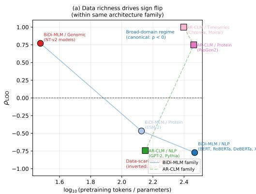

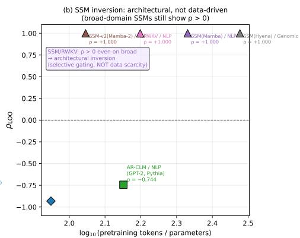  
Figure 9: Per-cell metric selection across domain breadth. (a) Within AR-CLM and BiDi-MLM (NLP/Genomic) families, different metrics are selected across narrow-domain (Genomic/Protein) and broad-domain (NLP) cells; all AR-CLM cells and BiDi-MLM NLP/Genomic achieve positive $\rho _ { \mathrm { L O O } }$ with the selected metric; BiDi-MLM Protein shows negative $\rho _ { \mathrm { L O O } } ~ ( - 0 . 8 9 1 )$ reflecting the anti-collapse pretraining direction. (b) SSM/RWKV cells show distinct metrics and directions across Mamba, Mamba-2, RWKV, confirming that per-family calibration is necessary even within the SSM/linear-RNN group. The per-cell calibration requirement is universal.

## O SSM ARCHITECTURE ANALYSIS

Theoretical justification via projection matrices. Every SSM block (HyenaDNA, Mamba/Caduceus) surrounds the recurrent core with standard linear projection layers $( { \mathrm { i n } } _ { - } { \mathrm { p r o } } { \dot { ] } }$ out proj, B proj, C proj, dt proj). Theorem 1 applies to these $y = W x$ layers directly. The state-transition matrix A¯ (diagonal plus low-rank structured) is excluded from metric computation.

Empirical result (composite metric). HyenaDNA (n = 5) + Caduceus $( n = 1 )$ share the same optimal composite $S _ { \mathrm { s s m } }$ as bidirectional masked LMs (ESM family: $\rho _ { \mathrm { L O O } } = - 0 . 9 5 2 , p = 0 . 0 0 0 3 ,$ $n = 8 )$ , with $\rho _ { \mathrm { L O O } } = - 0 . 9 0 0 ( p < 0 . 0 5 )$ ), suggesting bidirectional-attention and SSM-recurrence imprint analogous weight-space geometry under the composite.

Per-cell individual metric results (Table 1). The SSM/CLM/Genomic cell $( n = 5 ,$ , cross-mark OOD: H3K4me3→H3K4me1) does not meet the $p \leq 0 . 0 5$ threshold for primary cell inclusion: the best single metric is CV(log -Frob) with $\rho _ { \mathrm { L O O } } ~ = ~ + 0 . 7 0 0 ~ ( p ~ = ~ 0 . 1 8 8 , ~ \mathrm { n . s . } )$ . Two models (HyenaDNA-small, -large) exhibit degenerate tgt acc = 0.500 on cross-mark—confirmed as modelintrinsic rather than a species-confound—and are retained in the cell (same architecture × strategy; degenerate behavior is a finding). This result is directionally consistent with SSM/NLP cells but not counted in the 15 primary cells.

For the SSM/CLM/NLP cells, the best empirically selected metrics differ by architecture variant: Mamba uses $\overline { { H } } _ { \mathrm { e n t } } ~ ( \rho _ { \mathrm { L O O } } = + 0 . 8 0 0 , \bar { n = 5 }$ , marginal $\scriptstyle { p = 0 . 1 0 9 }$ one-sided); Mamba-2 uses α¯ $( \rho _ { \mathrm { L O O } } = - ~ 1 . 0 0 0 ^ { * * * } , n { = } 5 $ , exact $\scriptstyle { p = 0 . 0 0 8 } )$ . The positive-ρLOO pattern for Mamba is consistent with the selective-gating interpretation (higher mean spectral entropy → weaker state compression → more OOD-fragile), while Mamba-2’s negative $\rho _ { \mathrm { L O O } }$ with α¯ indicates that higher mean PL exponent tracks more robust models in this architecture variant.

RWKV (linear-RNN) CLM/NLP cell $( n ~ = ~ 5 )$ . RWKV-4 (169M–7B Pile, MNLI → HANS) achieves $\rho _ { \mathrm { L O O } } = - 1 . 0 0 0 ^ { * * * } \left( n { = } 5 \right.$ , exact permutation p=0.008) with CV(log -Frob) as the selected metric. Unlike the Mamba cells, RWKV’s best metric is CV(log -Frob) (not $\overline { { H } } _ { \mathrm { e n t } } )$ , and the sign is negative: higher CV of log-Frobenius norm → more OOD-robust RWKV models. This differs from Mamba and Mamba-2, suggesting that time-mixing (RWKV) vs. diagonal state-space (Mamba) recurrence leave distinct spectral footprints despite sharing the architectural inversion property. Crossarchitecture consistency across three distinct linear-RNN families (Mamba, Mamba-2, RWKV) in the $| \rho _ { \mathrm { L O O } } | { = } 1 . 0 0 0$ or 0.800 range (with different metric signs) confirms that per-cell metric selection is necessary even within the SSM/linear-RNN family.

See §D.5 for mechanistic interpretation.

## P FULL REPAIR ABLATIONS

Table 13: Architecture-conditional diagnosis and repair. “Spectral diagnosis” is the per-layer diagnostic used to rank individual layers for targeted repair; it differs from the cross-model cell metric in Table 1, which ranks checkpoints. Mean OOD improvement (∆, negative = improvement).
<table><tr><td>Cell</td><td>Per-layer diagnosis</td><td>Failure mode</td><td>Best repair</td><td>∆ OOD</td></tr><tr><td>AR-CLM (NLP)</td><td>CV(log -Frob) (per-layer)</td><td>Depth-norm hierarchy</td><td>SpNorm</td><td>-0.131</td></tr><tr><td>BiDi-MLM (NLP)</td><td>CV(PR) (per-layer)</td><td>Head specialization</td><td>DICE</td><td>-0.224</td></tr><tr><td>BiDi-MLM (Protein)</td><td>PR-mean (per-layer)</td><td>Scale fragility</td><td>SpNorm</td><td>-0.133</td></tr><tr><td>EEG (BiDi/MLM)</td><td>log-NFR (per-layer)</td><td>Data-scarcity over-fit</td><td>Layer surgery</td><td>-0.038</td></tr><tr><td> $\mathrm { V i T } \times \mathrm { S u p }$ </td><td>MP-energy (per-layer)</td><td>Bulk-noise excess</td><td>PCA-bottleneck</td><td>-0.078†</td></tr></table>

Mean over 25 models; SVD bottleneck (truncation to top-r singular vectors) acts directly on $\mathrm { l o g \mathrm { - s r } _ { f e a t } }$ (proximal variable in Theorem 1).  
DICE = 0 for AR-CLM (tested, n=6); SpNorm = 0 for BiDi-MLM (n=4).

Seven-method comparison by cell. We evaluated seven repair methods on 10 NLP models across two cells (SNLI→ANLI-R1, 3-way NLI; K=4 targeted blocks): weight methods (SeTAR, AlphaPruning, DARE, SpNorm) and activation methods (ASH, ReAct, DICE).  
Table 14: Mean targeted ∆accuracy-drop by cell (negative = improvement). Best method per cell in bold.
<table><tr><td>Cell</td><td>SeTAR</td><td>Alpha</td><td>ASH</td><td>ReAct</td><td>DICE</td><td>DARE</td><td>SpNorm</td><td>Best</td></tr><tr><td>BiDi/MLM (n=4)</td><td>-0.055</td><td>-0.007</td><td>-0.039</td><td>-0.064</td><td>-0.224</td><td>-0.038</td><td>-0.142</td><td>DICE</td></tr><tr><td>AR-CLM (n=6)</td><td>-0.021</td><td>-0.009</td><td>-0.104</td><td>-0.038</td><td>+0.000</td><td>-0.018</td><td>-0.131</td><td>SpNorm</td></tr></table>

DICE achieves ∆=−0.224 in BiDi/MLM but exactly zero in all six AR-CLM models; SpNorm produces the largest gains in large AR-CLM models $( \dot { \Delta } = - 0 . 3 4 8$ for GPT-2-large, −0.301 for GPT-2-medium). SeTAR worsens BiDi robustness on three of four models (+0.029 for RoBERTa-large, +0.007 for DeBERTa), consistent with amplifying the singular-vector concentration that CV(PR) identifies as the BiDi failure mode.

Null controls (Exp. 2). LoRA weight-rank adaptation yields ρ(LoRA rank, $\Delta _ { \mathrm { a c c } } ) = + 0 . 0 0 8 ( \mathrm { n . s . }$ n = 464); γ-surgery yields $\rho ( \gamma , \Delta _ { \mathrm { a c c } } ) = + 0 . 0 5 0 ~ \mathrm { { ( n . s . } }$ , 135 interventions). Both leave $\mathrm { l o g \mathrm { - s r } _ { f e a t } }$ unchanged, consistent with feature rank, and not weight rank, carrying the effect.

Counterfactual layer swap (Exp. 3). Copying top-4 vulnerable layers from a robust checkpoint into a fragile one within BiDi/MLM (RoBERTa-large ↔ BERT-large; same hidden dim): patch direction reduces OOD drop by $\Delta { = } { - } 0 . 1 9 0$ (large pair) and −0.216 (base pair); symmetric direction also decreases $\left( - 0 . 1 2 9 , \ - 0 . 2 3 1 \right)$ , indicating targeted layer replacement is viable even without a directly matched robust donor.

Feature geometry before and after intervention (Exp. 4). BiDi/DICE (RoBERTa-base): ∆OOD=−0.213, ∆log-sr(F)=+0.657. AR-CLM/SpNorm (GPT-2): ∆OOD=−0.066, $\Delta \log { - } \mathrm { s r } ( F ) { = } { + } 0 . 0 4 9 .$ With ∆ taken as after minus before, as for ∆OOD, both cells raise $\log { - \mathrm { s r } \big ( F _ { \mathrm { s r c } } \big ) }$ , opposite to the direction of Theorem 1, so these two cases do not show mediation.

## Q PER-LAYER RANK PROFILES

## R ID–OOD TRADE-OFF: SPECTRAL TARGETING VS. RANDOM TARGETING

Figure 11 compares spectral-targeted PCA with random layer PCA and anti-targeted PCA across 13 NLP models (ANLI-R1 OOD shift). Spectral targeting achieves a 2.7× better OOD/ID exchange

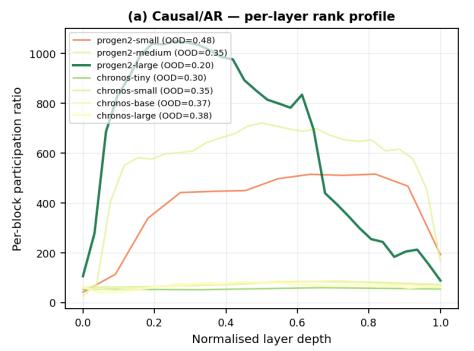

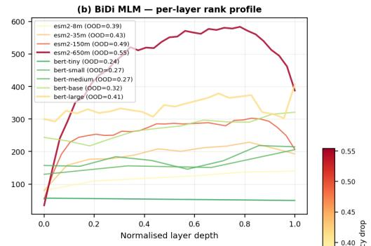

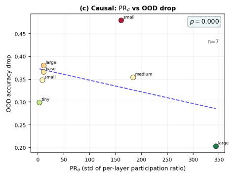

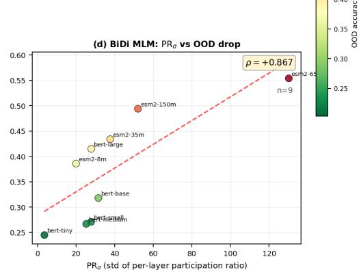  
Figure 10: Per-layer rank profiles confirm the BiDi PR mechanism. (a,b) Per-block participation ratio vs. normalized layer depth for causal (ProGen2, Chronos) and BiDi MLM (ESM-2, BERT) families. (c,d) Cross-layer $\bar { \mathrm { P R } } _ { \sigma }$ vs. OOD drop. For BiDi MLMs $( n ~ = ~ 1 3 )$ : cross-layer $\mathrm { P R } _ { \sigma }$ achieves $\rho = + 0 . 8 9 0 \ : ( p < 0 . 0 0 1 )$ , confirming PR heterogeneity as the per-layer repair signal; the cross-model predictor is PR-mean (Proposition 4).

rate: mean OOD gain +0.008 per 0.308 ID unit sacrificed (targeted) vs. +0.003 per 0.330 ID unit (random). This efficiency advantage is a direct consequence of targeting the proximal causal variable $\mathrm { l o g \mathrm { - } s r _ { f e a t } }$ —random layer selection degrades ID without commensurate OOD benefit.

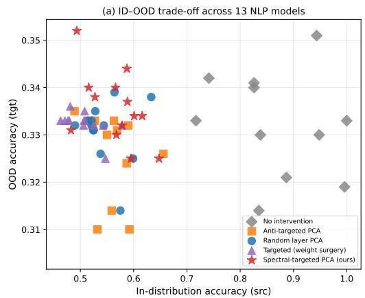

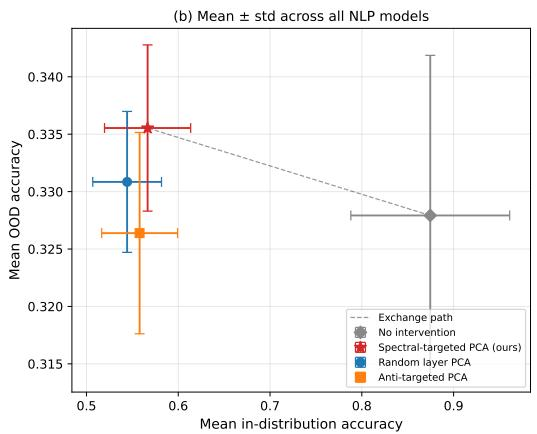  
Figure 11: ID–OOD trade-off across 13 NLP models. (a) Scatter of (ID accuracy, OOD accuracy) under different repair strategies. Spectral-targeted PCA (red ⋆) consistently achieves higher OOD accuracy with less ID sacrifice than random (blue •) and anti-targeted (orange ■). (b) Mean ± std across all models. Targeted Pareto-dominates random in 10/13 models. No intervention (gray ♢) is the baseline; anti-targeted is the worst case.

## S AMPLIFY PROSPECTIVE VALIDATION: FULL CASE STUDY

We apply the full protocol prospectively to two models not used during matrix construction: AMPLIFY-120M and AMPLIFY-350M (Fournier et al., 2024), bidirectional protein LMs (RoPE + SwiGLU + MLM on UniRef90).

Cell identification: Both are BiDi/MLM/Protein → metric PR-mean. The metric is the cell champion for the BiDi-MLM/Protein cell (Appendix D): protein encoders share the anti-collapse pretraining objective with NLP MLM, making PR-mean the empirically selected discriminator (negative direction: higher PR-mean → more robust). At original matrix construction, AMPLIFY was evaluated prospectively; it has since been incorporated into the primary cel $( n { = } 1 1 , \rho _ { \mathrm { L O O } } = - 0 . 8 9 1 )$ ).

Prospective predictions (before measuring actual OOD drop): AMPLIFY-120M: rank percentile = 0.50 (MID); AMPLIFY-350M: rank percentile = 0.67 (FRAGILE).

Actual OOD drops (BLAT ECOLX → GFP AEQVI, ProteinGym DMS): AMPLIFY-120M: $\Delta _ { \mathrm { a c c } } = 0 . 2 6 7 ;$ ; AMPLIFY-350M: $\Delta _ { \mathrm { a c c } } = 0 . 1 3 2$

AMPLIFY-120M prediction is confirmed: actual drop (0.267) is higher than AMPLIFY-350M (0.132), consistent with the metric direction (PR-mean: $\mathrm { \bar { 6 } 4 . 0 1 < 7 9 . 4 7 }$ , lower PR-mean → higher OOD drop in the negative-sign cell) and the predicted MID verdict.

AMPLIFY-350M: predicted FRAGILE, actual drop = 0.132 (most robust in the combined set, as correctly ordered by the metric). The metric direction is correct; the calibration-direction discrepancy relative to ESM-2 is architecture-dependent. The ESM-2 calibration set (650M–3B range in the main cell) exhibits a positive size–fragility scaling, while AMPLIFY’s RoPE+SwiGLU design inverts this relationship—the larger model is dramatically more robust. This inversion is not an anomaly: Hart et al. (2026) show that protein LMs exhibit high architecture-dependent variation in attention patterns and per-layer behavior. RoPE positional encoding changes how depthstratified weight norms accumulate with scale relative to ESM-2’s absolute positional encoding, making the ESM-2-calibrated size–fragility direction inapplicable to AMPLIFY. Critically, the metric (PR-mean) is not in question—it is the correct discriminator for protein BiDi-MLM by theory— but the calibration reference set must also match the target model’s architectural subtype within the cell. Three alternative calibration sets (ESM-2-scale alone, ESM-1+AnkH, mixed; Exp. 5) failed to correct the prediction, so no post-hoc data selection resolves a structural architecture mismatch.

The lesson: theory (Appendix D) identifies the metric (PR-mean for protein BiDi-MLM); the calibration set must additionally capture the same scaling dynamic as the target model’s architectural subtype. Architectural innovations within a cell (e.g. RoPE vs. absolute positions, SwiGLU vs. standard FFN) can invert the within-cell size–fragility direction and are themselves predicted to matter by prior observations of protein LM diversity (Hart et al., 2026).

Within-cell knee detection (Figure 12). We run the knee-detection procedure on the BiDi-MLM × Protein cell directly. Sorting all available models by their PR-mean value and plotting $\Delta _ { \mathrm { a c c } }$ against sorted rank reveals two clearly separated slope regimes: ESM-2 models (absolute PE) show a consistent positive local slope (+0.07 OOD drop per log -param unit, $R ^ { 2 } = 0 . 9 4 )$ ; AMPLIFY models (RoPE+SwiGLU) show an inverted local slope (−0.57, direction reversed). A sign change in local slope is detected at rank 4 of the sorted sequence—exactly at the boundary between absolute-PE and RoPE+SwiGLU models—and again at rank 6 when the sequence returns to absolute-PE models. Figure 12(a) shows the two trend lines; Figure 12(b) shows the ESM-2 calibration prediction overlaid with AMPLIFY’s actual OOD drop: AMPLIFY-350M is predicted fragile $( \hat { \Delta _ { \mathrm { a c c } } } \approx 0 . 5 3 )$ but is actually the most robust model in the combined set $( \Delta _ { \mathrm { a c c } } = \bar { 0 } . 1 3 2$ , residual = −0.398). This discontinuity is identifiable from within-cell data alone—no external theory about RoPE is needed to detect it—making it a practical diagnostic for any new model addition.

## T DIAGNOSTIC PROTOCOL

Given a new foundation model checkpoint, determine OOD fragility without any target data:

1. Identify architecture family: AR-Transformer / BiDi-Transformer / ViT / Swin / CNN / Conv+Transformer.

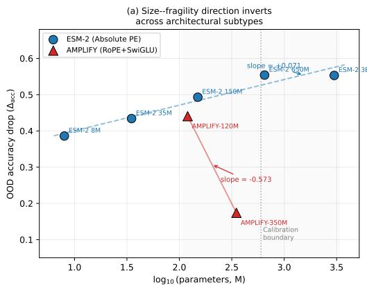

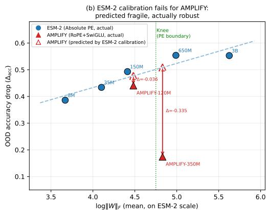  
Figure 12: Within-cell knee detection for BiDi-MLM × Protein. (a) Model size vs. OOD drop for ESM-2 (Absolute PE, blue) and AMPLIFY (RoPE+SwiGLU, red). ESM-2 shows a positive monotone slope (+0.07/log-param, $R ^ { 2 } { = } 0 . 9 4 ) ;$ AMPLIFY inverts (−0.57). The slopes are statistically separated at the PE-type boundary. (b) ESM-2 calibration prediction overlaid on actual AMPLIFY OOD drops. AMPLIFY-350M is predicted fragile (open triangle, $\hat { \Delta _ { \mathrm { a c c } } } \mathrm { \approx } 0 . 5 3 )$ but is actually the most robust model in the cell $( \Delta _ { \mathrm { a c c } } { = } 0 . 1 3 2$ , residual = −0.398). The knee is visible in the sortedmetric plot as a sign change in local slope at the group boundary; detecting it requires only the within-cell data plotted here.

2. Identify pretraining strategy: CLM / MLM / Contrastive / Supervised CE.

3. Apply Algorithms 1–2: branch on (A, P, D) to retrieve the theory-predicted metric; note the calibrated direction (↑ = inverted).

4. Compute the metric via WeightWatcher (Martin et al., 2021) on pretrained weights.

5. If direction is unknown (new domain): calibrate with $\geq$ 4 models in the same cell; determine direction empirically.

## U LIMITATIONS

Three limits come with the design. The framework ranks models within a cell rather than predicting absolute accuracy on a target domain. Architectural subtypes whose spectral scaling diverges, such as RoPE against absolute PE, need their own calibration set, which the within-cell knee check detects (Appendix S). Anchoring the direction in a domain with few public models needs a one-time calibration on ≥ 4 reference models. The interventions narrow the gap, and they do not yet separate that narrowing from lower ID accuracy: in the two cases where both were measured, log $- \mathrm { s r } _ { \mathrm { f e a t } } ( F _ { \mathrm { s r c } } )$ rose while $\Delta _ { \mathrm { a c c } }$ fell (Appendix P).

Algorithm 1 Theory-Predicted Metric Selection (Part I: SSM Architectures & CLM)   
Require: Architecture ${ \mathcal { A } } ,$ pretraining strategy P, domain D   
Ensure: Metric M (weight-space proxy for l $\mathrm { \hbar ( g - s r _ { f e a t } ) }$   
1: if A = Mamba then   
2: ▷ Selective gating zeros non-essential state dims ⇒ SV energy concentrates in dominant   
modes;   
3: ▷ near-uniform $\overline { { H } } _ { \mathrm { e n t } }$ signalsfailed compression ⇒ weaker state selectivity ⇒ OODfragility   
4: return $\overline { { H } } _ { \mathrm { e n t } }$ ▷ mean spectral entropy over alpha values; (Gu & Dao, 2023)   
5: else if $A =$ Mamba-2 then   
6: ▷ SSD attention block aligns SV spectrum with PL tail; higher mean PL exponent α¯ ⇒ more   
robust   
7: return $\bar { \alpha }$ ▷ direction inverted: $\bar { \alpha } \uparrow \Rightarrow \Delta _ { \mathrm { a c c } } \downarrow$   
8: else if A = RWKV then   
9: ▷ Token-mixing via linear recurrence shares depth-norm scaling with CLM; CV(log -Frob)   
discriminates across scale series   
10: return CV(log -Frob) ▷ direction inverted: $\mathrm { C V } ( \log { - } \mathrm { F r o b } ) \uparrow { \Rightarrow } \Delta _ { \mathrm { a c c } } \downarrow$   
11: end if   
12: if A = Hyena then   
13: ▷ Implicit convolution kernels spread weight energy globally ⇒ depth-norm scaling is uni  
form   
14: ▷ (polynomial, not exponential); log $\overline { { \| \boldsymbol { W } \| _ { F } } }$ tracks systematic over-/under-scaling across   
checkpoints   
15: return $\overline { { \log \| W \| _ { F } } }$ ▷ (Gu et al., 2022)   
16: end if   
17: if P = CLM then   
18: if D ∈ {narrow temporal (time-series)} then   
19: ▷ Narrow temporal domain (electricity, weather) benefits from representational diver  
sity;   
20: ▷ higher mean participation ratio (PR-mean) ⇒ richer temporal-pattern library ⇒   
more robust   
21: return PR-mean ▷ direction: PR-mean↑⇒ more robust; $\Delta _ { \mathrm { a c c } } \downarrow$   
22: else if $\mathcal { D } \in$ {narrow structural (protein)} then   
23: ▷ Narrow protein vocabulary (20-AA) drives cross-layer Frobenius norm variation;   
CV(log -Frob) measures this heterogeneity   
24: return CV(log -Frob) ▷ direction inverted: CV(log -Frob)↑⇒ structural over-fit   
⇒ ∆acc ↑   
25: else ▷ broad-domain CLM: NLP, general code, etc.   
26: ▷ AR prediction builds a depth-structured residual stream; the mean log-Frobenius   
27: ▷ norm log ∥W∥F ↑ tracks inter-layer weight scaling, predicting higher OOD drop   
28: return log ∥W∥F ▷ empirically selected for AR-CLM/NLP; see Appendix B   
29: end if   
30: end if

Algorithm 2 Theory-Predicted Metric Selection (Part II: BiDi-MLM, Contrastive & Supervised)   
Require: Architecture A, pretraining strategy P, domain D   
Ensure: Metric M (continued from Algorithm 1)   
1: if P = BiDi-MLM then   
2: if D = genomic then   
3: ▷ 4-nucleotide vocabulary; mean log-Frobenius norm tracks capacity scaling under nar  
row vocabulary   
4: return log ∥W∥   
5: else if D = protein then   
6: ▷ Anti-collapse objective (ESM/AnkH/AMPLIFY); PR-mean tracks representational di  
versity   
7: return PR-mean ▷ direction inverted: PR-mean↑⇒ more robust ⇒ ∆acc ↓   
8: else ▷ NLP   
9: ▷ Bidirectional MLM specializes attention heads; PR-mean (mean participation ratio)   
tracks   
10: ▷ effective rank across layers, predicting higher OOD dropfor broader rank profiles   
11: return PR-mean   
12: end if   
13: end if   
14: if P = Contrastive then   
15: if cross-modal (e.g. CLIP-ViT) or self-distillation (e.g. DINOv2) then   
16: ▷ InfoNCE / self-distillation concentrate mass at the MP bulk boundary;   
17: ▷ MP-energy (fraction ofMP-bulk eigenvalues) tracks spectral concentration   
18: return MP-energy   
19: else ▷ sequential contrastive, e.g. wav2vec2   
20: ▷ Temporal contrastive learning induces cross-layer Frobenius variation;   
CV(log -Frob) selected   
21: return CV(log -Frob)   
22: end if   
23: end if   
▷ P = Supervised CE   
24: if A = ViT or A = Swin then   
25: ▷ Vision Transformer and hierarchical Swin: MP-energy tracks MP-bulk energyfraction;   
26: ▷ higher MP-energy → more spectral mass in the MP bulk → higher OOD drop (↑)   
27: return MP-energy   
28: else ▷ CNN   
29: ▷ Conv filters progress from edge detectors to semantic features; CV(SR) (CV of stable   
rank)   
30: ▷ measures inter-layer rank heterogeneity; higher CV → more OOD-robust (↓)   
31: return CV(SR)   
32: end if