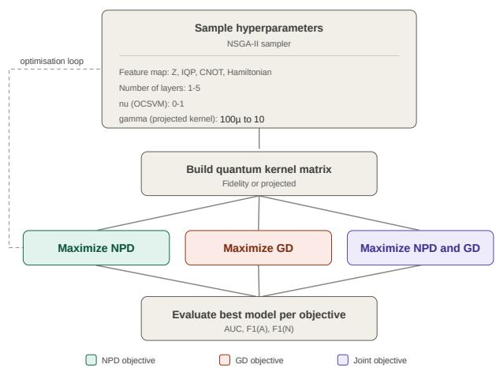
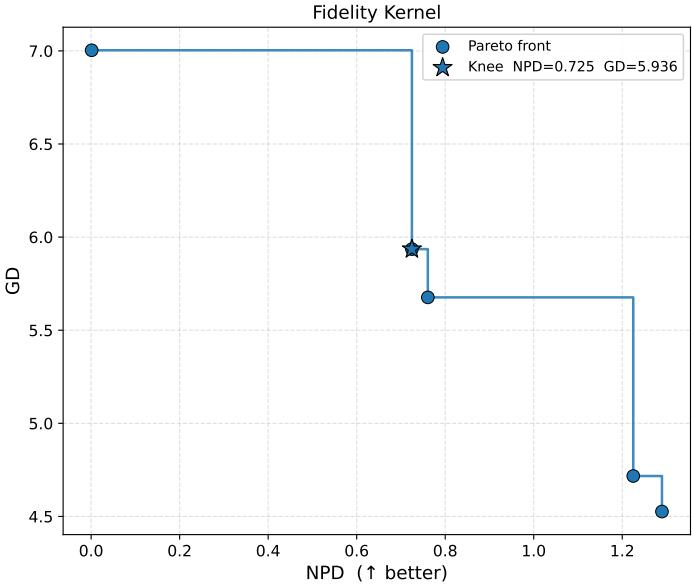
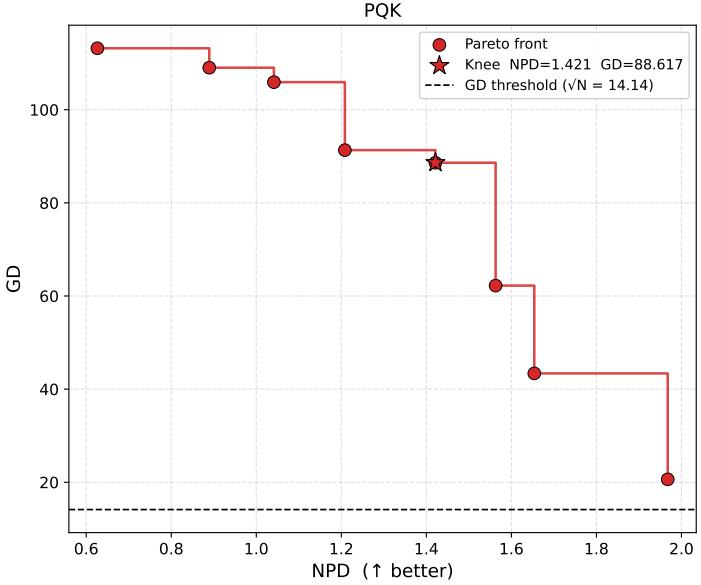
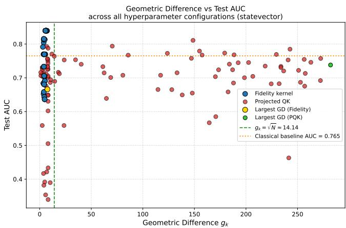
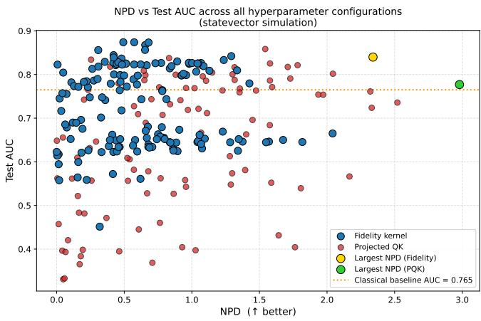
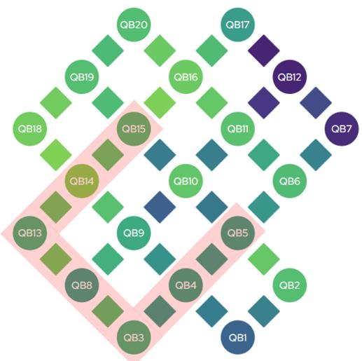

# Pareto-optimal quantum kernel selection for unsupervised anomaly detection on real malware beaconing data

Boaz Micah,1 Nadia Milazzo,2, ∗ Maissa Beji,3 Borja Aizpurua,1, 4 Lloren¸c Espinosa-Portal´es,1, † Esteban Payares,2 Ghada Ben Slama,2 Luc Andrea,3 Michel Kurek,3 Thomas Cope,5 and Olivier Salomon6, ‡

1Multiverse Computing, Parque Cient´ıfico y Tecnol´ogico de Gipuzkoa, Paseo de Miram´on 170, Planta 2, 20014 Donostia / San Sebasti´an, Spain 2IQM Quantum Computers, 4 rue Royale, 75008 Paris, France 3Multiverse Computing, 7 rue de la Croix Martre, 91120 Palaiseau, Paris, France 4Department of Basic Sciences, Tecnun – University of Navarra, San Sebasti´an, Spain 5IQM Quantum Computers, Georg-Brauchle-Ring 23-25, 80992 Munich, Germany 6Allianz Quantum Hub, Paris, France

Quantum kernel methods are leading candidates for a practical quantum advantage in machine learning, but assessing that potential requires two quantities usually reported separately: how well a kernel performs on the task, and how far its geometry departs from the classical kernels available for the same problem. We introduce a fully unsupervised, multi-objective protocol that optimises simultaneously the normalised pseudo discrepancy (NPD), a label-free proxy for anomaly detection quality, and the geometric diference (GD) to a tuned classical reference kernel, selecting models from the resulting Pareto front. We apply it to malware beaconing detection in real network trafic, using a one-class support vector machine with fidelity and projected quantum kernels over four data encodings, on simulators and on IQM’s 20-qubit Garnet processor. NPD-guided selection alone finds a fidelity kernel that beats the tuned classical baseline, but with a geometric diference too small to certify the gain as quantum. Projected kernels reach far larger geometric diferences; the Paretoselected one only marginally exceeds the baseline (AUC 0.782 versus 0.765, g → ≈ 89 > N relative to that reference kernel), still below the NPD-selected fidelity kernel (0.840).

## I. INTRODUCTION

Quantum machine learning (QML) is one of the most active research areas in quantum computing, and a key space for the search of quantum advantage in the noisy intermediate-scale quantum (NISQ) era [1–3]. Models based on variational quantum circuits have been proposed, such as quantum neural networks, but their applicability remains limited due to the barren plateau problem, an issue sufered generally by variational quantum algorithms [4]. In contrast, quantum kernel methods offer an alternative approach in which a quantum circuit estimates a kernel matrix and the resulting kernel is used by a classically trained support vector machine [5]. Here, we use such a quantum kernel within a classical one-class SVM, rather than a fully quantum SVM algorithm [6]. Quantum kernels use quantum circuits to define datadependent similarity measures whose induced geometry may difer from that of the classical kernel families considered for a given task, potentially providing a useful task-dependent inductive bias.

Despite their promise, quantum kernels have yet to demonstrate a practical advantage. Furthermore, they present a fundamental trade-of in expressivity. A highly expressive kernel exploring a large Hilbert space can easily lead to an exponential concentration of fidelity kernel values, which vanish for most data points as the number of qubits increases [7, 8]; the very feature hypothesized to provide advantage thus leads, when scaled up, to an essentially useless model.

This can be mitigated by optimizing the kernel bandwidth, as shown in [9], or by using projected quantum kernels (PQK), introduced in [10], where the embedding quantum state is projected back to an approximate classical representation before computing the kernel. At the opposite extreme, however, a quantum kernel with low expressivity may not be distinguishable at all from a classical kernel. The data-dependent notion of geometric diference (GD) was introduced in [10] to quantify the separation between classical and quantum kernels, and gives a recipe to construct artificial learning problems that best separate the corresponding models. We distinguish this structural separation from predictive quantum advantage: a large GD indicates that a quantum kernel is not well approximated, in the relevant geometric sense, by the chosen classical reference kernel, but it does not guarantee superior task performance. Prior works have tuned quantum kernels for predictive performance [11] or characterized their potential advantage over classical kernels through their spectral properties [12], while label-free hyperparameter selection, in which an internal quality proxy computed from the data replaces a la beled validation set, has been developed only for classical detectors: Dai and Fan introduced the normalized pseudo discrepancy (NPD) as such a proxy for unsupervised anomaly detection [13]. To our knowledge, no prior work has jointly optimized predictive performance and separation from classical kernels under a fully unsupervised protocol.

We address this gap with a multi-objective optimization framework that simultaneously maximizes the normalized pseudo discrepancy (NPD) [13], a label-free anomaly detection quality proxy, and the GD to the reference classical kernel. This provides a systematic framework for balancing predictive performance and geometric separation. To showcase the application of the method in a realistic scenario, we test it on the unsupervised anomaly detection problem on real malware beaconing data – the periodic communication between an infected host and a command-and-control server used to receive commands or exfiltrate data. We explore diferent fidelity kernels and PQKs, computed on noisy simulators and IQM’s quantum hardware. Our results show that some projected quantum kernels achieve a large geometric diference (formalized in Section III B), indicating that a learning problem with potential quantum prediction advantage can be constructed from the data. However, this geometric separation brings at most a marginal performance gain on the malware detection task considered here.

The choice of malware beaconing as a proof of concept is deliberate, as the application of unsupervised quantum kernels to real cybersecurity data remains underexplored. The scarcity of malware data makes unsupervised models a requirement, while data fragmentation across the industry due to privacy and security concerns motivates the search for models that can identify complex patterns in limited data, a regime in which quantum kernels are more likely to generalize from few samples and separate from classical kernels [10, 14].

Our contributions can be summarized as follows:

(i) A multi-objective (NPD + GD) Pareto framework for systematically searching for empirical, but not provable, quantum advantage in kernel methods, applicable beyond this use case.

(ii) NPD as a fully label-free criterion for quantum kernel hyperparameter tuning.

(iii) The first unsupervised quantum kernel benchmark on real malware beaconing data.

(iv) Empirical characterization of the performance– separability trade-of: fidelity kernels achieve the strongest detection performance while remaining below the geometric-diference scale beyond which classical kernels are no longer guaranteed to match quantum performance, whereas projected kernels exceed this scale without a corresponding gain in detection.

(v) Hardware deployment on the 20-qubit IQM Garnet processor with simulator-vs-QPU comparison, showing that, at current noise levels, neither kernel family yet reaches the classical baseline.

The rest of the paper is organized as follows. Section II discusses related work and background relevant to the results presented here. Section III describes all the methods, particularly the multi-objective kernel selection based on Pareto optimality and the feature engineering procedure. Section IV describes our results, including classical baselines, quantum kernels run on noisy simulators, and quantum kernels run on quantum hardware. We finish with a discussion of the results and our conclusions in Section V.

## II. RELATED WORK

The question of whether quantum kernels ofer a genuine advantage over classical ones predates our work and remains unsettled. On the positive side, rigorous constructions show that quantum kernels can yield a provable speedup for carefully designed learning problems [15, 16], and the geometric diference of Huang et al. [10] provides the theoretical lens through which such separations are usually argued. On the negative side, the picture on realistic data is far less encouraging. Fidelity kernels are prone to exponential concentration as expressivity grows [7], and systematic numerical comparisons repeatedly find that classical kernels match or exceed their quantum counterparts on standard benchmarks [17], while analyses of their generalization in the NISQ era further temper expectations [18]. Even where a large geometric diference is present, it is necessary but not suficient for advantage: the induced feature space must also carry an inductive bias aligned with the task at hand [12]. This literature motivates our stance of treating geometric separation and predictive quality as two distinct criteria that must be assessed together, rather than assuming that one implies the other.

A second body of work concerns unsupervised anomaly detection and, in particular, the dificulty of model se lection when labels are unavailable. One-class support vector machines [19], isolation forests [20], and reconstruction-based autoencoders [21] are long-standing baselines that are normally used as classical references. In all of them, performance is highly sensitive to hyperparameters, including the threshold used to flag anomalies, yet the usual practice of tuning against a labeled validation set is precisely what an unsupervised setting forbids. Label-free surrogates have therefore been proposed to guide model selection; among these, the normalized pseudo discrepancy (NPD) of Dai and Fan [13] measures the separation between anomaly scores on held-out normal data and on synthetic out-of-distribution samples, and correlates with detection quality without any access to labels. Such surrogates, however, have so far guided only classical model selection.

Applications of quantum machine learning to cybersecurity, finally, remain comparatively sparse, and the existing eforts fall into categories that do not overlap with the regime we study. A first line addresses supervised classification of malware and network attacks, comparing quantum and classical models where labels are abundant [22–25], or relaxes the requirement only to the semisupervised case [26]. A second line does operate without labels, building on quantum autoencoders for network trafic anomaly detection [27]; such reconstruction-based pipelines are not organized around a quantum kernel, and so do not expose the kernel matrix that the geometric difference requires. A third line applies the combination of quantum kernels and unsupervised anomaly detection to non-cybersecurity (financial and physics) data [28], and evaluates detection across a controlled range of anomaly ratios, treating the contamination level as a known quantity rather than unknown, as required in an operational deployment. None of the above works combines all three ingredients at once: an unsupervised protocol, a quantum kernel amenable to geometric analysis, and real cybersecurity data. This intersection is where malware beaconing detection sits, and where labeled data is genuinely scarce and quickly rendered obsolete by concept drift [29, 30], so that a fully unsupervised treatment is not a convenience but a requirement. Our work is, to our knowledge, the first to occupy it.

## III. METHODS

## A. Kernel methods

Kernel methods are widely used in machine learning to solve, e.g., classification and regression problems. The key idea of these techniques is to map data, by means of a non-linear feature map, from an input space to a (usually higher dimensional) feature space, where the learning task becomes easier to analyze, i.e. linear. The data can then be processed in the feature space by accessing solely the kernel values, which represent a similarity measure between data, without explicitly computing the feature map. This is usually referred to as the kernel trick.

We now define the notation for the quantum kernels used in the following sections [31]. A kernel $k : \mathcal { X } \times \mathcal { X } $ R is a positive definite function in two data points $x , x ^ { \prime }$ Let $\phi : x  \rho ( x )$ be a data-encoding feature map over the input space $\mathcal { X }$ , where $\rho$ is a density matrix. A quantum kernel can then be defined as the inner product of the feature vectors:

$$
k ( x , x ^ { \prime } ) = \mathrm { T r } \left( \rho ( x ^ { \prime } ) \rho ( x ) \right) = \left| \langle \phi ( x ^ { \prime } ) \mid \phi ( x ) \rangle \right| ^ { 2 } .\tag{1}
$$

where the second equality holds if the data-encoding quantum state is pure. We will refer to the kernel in Eq. (1) as the fidelity kernel. The second kernel considered in this work is the projected quantum kernel introduced in [10]:

$$
k ( x , x ^ { \prime } ) = \exp \left( - \gamma \sum _ { k } \lVert \rho _ { k } ( x ) - \rho _ { k } ( x ^ { \prime } ) \rVert _ { F } ^ { 2 } \right)\tag{2}
$$

where $\gamma > 0$ is a hyperparameter, $\left\| \cdot \right\| _ { F }$ is the Frobenius norm and $\rho _ { k } ( x ) \ { = } \ \operatorname { T r } _ { j \neq k } ( \rho ( x ) )$ is the single-qubit reduced density matrix. The hyperparameter $\gamma$ acts as an inverse lengthscale in the space of reduced density matrices, setting the distance over which two encoded states count as similar; it plays the role of the bandwidth of a classical RBF kernel, whose tuning is known to mitigate exponential kernel concentration [9].

Given the kernel function, for a finite set of data points we can define the kernel matrix as the square matrix whose entries are given by the inner product between all possible pairs. This matrix is then fed to a classical anomaly detection algorithm. In our case, we use a One-Class Support Vector Machine (OCSVM) which learns a decision boundary that encloses normal data given a kernel matrix [32]. In the quantum case, the data-encoding feature map is a unitary $U ( x )$ implemented by a quantum circuit. Previous works have studied how to design clas sically dificult feature maps to get a provable advantage over classical kernels [15] or have identified a promising class of learning problems for quantum kernels [33]. As the focus of this work is to present a fully unsupervised pipeline for anomaly detection with quantum kernels, we do not engineer a new feature map, but use encodings already present in the literature. The choice of the optimal encoding becomes part of the multi-objective optimisation presented in Sec. III B below. We consider four diferent data-encoding circuits, whose definition and details can be found in Appendix A.

## B. Multi-objective quantum kernel selection

The main methodological contribution of this work is the development of a fully unsupervised quantum kernel selection that simultaneously optimizes quantum kernel performance via the NPD score and separation with respect to classical kernels via the GD.

Starting with the quantum kernel performance, the absence of labels in unsupervised settings poses a challenge for hyperparameter tuning of ML models. To address this issue, we use the normalized pseudo-discrepancy (NPD) score, first introduced in Ref. [13], which measures the discrepancy between the anomaly scores of a validation set drawn from the training data and a validation set drawn from an axis-aligned Gaussian fitted to the training data.

More precisely, given an unsupervised anomaly detection model M with hyperparameters Θ, the training dataset X is randomly split into a training subset $X _ { \mathrm { t r n } }$ and a validation subset $X _ { \mathrm { v a l } }$ , where $| X _ { \mathrm { v a l } } | = m$ The model is trained only on $X _ { \mathrm { t r n } }$ . Let $\mu _ { \mathrm { t r n } } \in \mathbb { R } ^ { d }$ and $\pmb { \sigma } _ { \mathrm { t r n } } ^ { 2 } \in \mathbb { R } ^ { d }$ denote the empirical mean and variance vectors of $X _ { \mathrm { t r n } }$ , respectively. A generated dataset $X _ { \mathrm { g e n } }$ of size m is then sampled from an axis-aligned Gaussian distribution with diagonal covariance

$$
X _ { \mathrm { g e n } } \sim \mathcal { N } \big ( \pmb { \mu } _ { \mathrm { t r n } } , \mathrm { d i a g } ( \pmb { \sigma } _ { \mathrm { t r n } } ^ { 2 } ) \big ) ,
$$

whose per-dimension variances match those of $X _ { \mathrm { t r n } }$

Let $s _ { \mathrm { v a l } } ~ = ~ f _ { M } ( X _ { \mathrm { v a l } } ~ | ~ \Theta )$ and $s _ { \mathrm { g e n } } = f _ { M } ( X _ { \mathrm { g e n } } \mid \Theta )$ denote the anomaly score vectors produced by the model for the validation and generated samples, respectively. The NPD metric is then defined as

$$
V _ { \mathrm { N P D } } ( M , X ) = \frac { \left( \mathrm { M e a n } ( s _ { \mathrm { g e n } } ) - \mathrm { M e a n } ( s _ { \mathrm { v a l } } ) \right) ^ { 2 } } { 2 \left( \mathrm { V a r } ( s _ { \mathrm { g e n } } ) + \mathrm { V a r } ( s _ { \mathrm { v a l } } ) \right) + \varepsilon } ,
$$

where $\varepsilon > 0$ is a small constant to ensure numerical stability.

Intuitively, NPD measures how well the model separates the validation samples, assumed to be predominantly normal, from synthetically generated samples that are more diverse and likely to lie outside the normal data manifold. A larger NPD indicates a clearer separation in anomaly scores, which empirically correlates with better detection performance on unseen test data. Importantly, NPD is hyperparameter-free, translation- and scale-invariant with respect to the scoring function, and mitigates overfitting by relying on data $( X _ { \mathrm { v a l } }$ and $X _ { \mathrm { g e n } } )$ that are independent of model training.

On the other hand, the potential advantage ofered by a quantum model over a classical model can be evaluated by means of the geometric diference, as introduced in Ref. [10] and defined as

$$
g _ { C \to Q } = { \sqrt { \left\| { \sqrt { K _ { Q } } } K _ { C } ^ { - 1 } { \sqrt { K _ { Q } } } \right\| _ { \infty } } } ,\tag{3}
$$

where $K _ { C }$ and $K _ { Q }$ denote the classical and quantum kernel matrices, respectively, with $K _ { C }$ taken as the kernel of the tuned classical OCSVM baseline, both normalised such that $\mathrm { T r } ( K _ { Q } ) = \mathrm { T r } ( K _ { C } ) = N$ . The notation $\| \cdot \| _ { \infty }$ represents the matrix spectral norm. Intuitively, if $K _ { C } ( x _ { i } , x _ { j } )$ is small (large) whenever $K _ { Q } ( x _ { i } , x _ { j } )$ is small (large), then the geometric diference takes a small value. A small geometric diference indicates that the classical model is guaranteed to achieve performance similar to, or better than, the quantum model. Conversely, the geometric diference increases as the two kernels deviate from one another.

Furthermore, it is shown in [10] that the classical model is expected to provide similar or better performance when

$$
g _ { C  Q } \ll \sqrt { N } ,\tag{4}
$$

where N is the number of samples in the training dataset.

With both objectives defined, we search over feature maps and OCSVM hyperparameters for the Pareto front, i.e. the set of non-dominated solutions: a solution is nondominated when no other candidate is at least as good in both objectives and strictly better in one, so neither NPD nor GD can be improved without degrading the other. We apply this approach to both the fidelity and the projected quantum kernels. Table I gives the list of hyperparameters that were optimised. To obtain the Pareto front, we used the open-source package Optuna [34] in addition to the NSGA-II sampler [35]. NSGA-II is a genetic multi-objective optimisation algorithm. It begins from an initial population of candidate solutions sampled from the search space and evolves it over successive generations, evaluating each candidate on both objectives and carrying the best ones forward. Here, a candidate solution is a choice of hyperparameters from the search space in Table I. From the Pareto frontier of the final population, we select as the best solution the knee point, i.e. the best-compromise configuration: both objectives are rescaled to [0, 1] across the front, and we retain the solution with the smallest Euclidean distance to the utopia point (1, 1) at which both NPD and GD would be simultaneously maximal. This avoids the extremes of the front, where one objective is optimised at the expense of the other.

  
FIG. 1. The unsupervised optimisation pipeline: a hyperparameter search over quantum kernels selected under three objectives (NPD, GD, and their joint Pareto knee) and evaluated on the test set.

In addition to the joint multi-objective optimisation of the NPD and GD scores, we also optimised each objective independently. For these single-objective runs, Optuna defaults to the Tree-structured Parzen Estimator (TPE) [36], a Bayesian sampler that models the promising and unpromising regions of the search space sepa rately and proposes new configurations by maximising their density ratio. This yields three sets of optimised hyperparameters per kernel—one maximising NPD alone, one maximising GD alone, and one balancing both. Figure 1 shows a summary of the three optimisations.

## C. Dataset

To test our systematic approach of finding the optimal quantum kernel model, we decided to test it on a real-world malware beaconing dataset. Malware beaconing represents periodic communication between an infected host and an external C&C (command-and-control) server. These signals are dificult to detect as they can easily blend in with benign network trafic. As such, a high-quality dataset is essential for network trafic analysis. The Stratosphere Research Laboratory is dedicated to capturing real malware trafic and providing openaccess network trafic datasets to support the development of robust machine learning models for malware detection [37]. We first obtain normal network trafic datasets from their platform to define what it is normal for a typical user.

<table><tr><td>Model</td><td>Hyperparameter</td><td>Search Space</td></tr><tr><td>Projected Quantum Kernel (RBF)</td><td>Feature map Number of layers K-RDM</td><td>Z, IQP, CNOT, Hamiltonian {1, 2, 3, 4, 5} {1} [100µ, 10]</td></tr><tr><td>Fidelity Kernel</td><td>Gamma (γ) ν Feature map Number of layers ν</td><td>[0, 1] Z, IQP, CNOT, Hamiltonian {1, 2, 3, 4, 5} (0, 1]</td></tr></table>

TABLE I. Hyperparameter search space for quantum kernel methods. The description of the considered feature maps is given in Appendix A. The number of layers ranged from 1 to 5. We only considered the single-qubit reduced density matrix for the projected quantum kernels, and $\gamma$ is the hyperparameter of the projected quantum kernel. ν is a hyperparameter of the OCSVM model, which represents an upper bound on the fraction of training errors and a lower bound of the fraction of support vectors. Curly brackets {} denote discrete values, while square brackets [] denote continuous ranges.

The laboratory also provides the CTU-13 dataset, which is a beacon network trafic dataset consisting of large-scale captures of real botnet activity mixed with normal and background trafic. The dataset comprises thirteen scenarios, each corresponding to a diferent botnet sample. In each scenario, a specific malware instance was executed, using multiple protocols and performing diverse actions. For each capture, the laboratory provides a list of external control IP addresses, which enabled us to filter out normal and background trafic from the botnet-related trafic.

Since we are focused on unsupervised learning, the training dataset only contains normal network trafic. The beacon trafic is all kept in the test dataset.

Network trafic was aggregated into unique flows (source IP address, destination IP address, protocol and external port number), each described by a set of statistical features. From this initial set, we retained a nonredundant subset of 6 features, given in Table II; the full feature list and the selection procedure, which is unsupervised and uses no label information, are detailed in Appendix B. The training set contains 200 randomly sampled normal flows, while the testing set contains 1,000 flows, of which 457 are anomalous flows and 543 are normal flows. All malicious flows are included exclusively in the testing set. For the simulator results, detection scores are aggregated per unique source–destination pair, keeping the lowest score of each pair, which gives 777 evaluation samples (255 anomalous and 522 normal); the hardware results are evaluated on the 1,000 flows.

TABLE II. Feature set obtained from the feature engineering procedure
<table><tr><td>Feature Name</td></tr><tr><td>Forward packets per second Backward packets per second Standard deviation of the FFT of forward traffic Standard deviation of forward inter-arrival time Standard deviation of packet lengths Mean forward packet length</td></tr></table>

## IV. RESULTS

To evaluate the performance of the models, we use two metrics: the area under the ROC curve (AUC) and the F1 score. The AUC measures the model’s ability to rank anomalies above normal instances across all decision thresholds, while the F1 score is the harmonic mean of precision and recall at a fixed threshold. Because the F1 score depends on which class is designated positive, we report it twice, treating anomalies (A) and normal instances (N) as the positive class in turn. In our view, reporting both provides a balanced and transparent view of model performance.

## A. Classical baselines

Here, we present the performance of the classical OCSVM on the malware dataset. Tuning the model to maximise the NPD score selects an RBF kernel with $\gamma = 8 . 9 9$ and $\nu = 0 . 4 7 2$

TABLE III. Performance of the classical OCSVM on the malware dataset.
<table><tr><td></td><td>AUC F1 (A) F1 (N)</td></tr><tr><td>0.765 0.599</td><td>0.561</td></tr></table>

The performance of this configuration on the test set is summarised in Table III. The classical OCSVM attains an AUC of 0.765, indicating a moderate ability to rank anomalous flows above normal ones. The F1 scores are more modest: 0.599 with anomalies as the positive class and 0.561 with normal flows as the positive class. Taken together, these results establish a non-trivial baseline against which we assess the quantum kernels.

TABLE IV. Best fidelity quantum kernel configuration found for the three objectives on the dataset using the statevector simulator. The GD objective depends only on the kernel matrix, so ν is not defined for that column (–).
<table><tr><td></td><td>NPD</td><td>GD</td><td>Pareto</td></tr><tr><td>Feature map</td><td>Hamiltonian Hamiltonian Hamiltonian 2</td><td>1</td><td>5</td></tr><tr><td>Layers ν</td><td>0.322</td><td></td><td>0.266</td></tr><tr><td>gc→Q</td><td>4.297</td><td>7.14</td><td>5.94</td></tr><tr><td>NPD</td><td>2.34</td><td>0.592</td><td>0.72</td></tr></table>

TABLE V. Best projected quantum kernel configurations found for the three objectives on the six features dataset using the statevector simulator. The GD objective depends only on the kernel matrix, so ν is not defined for that column (–).
<table><tr><td></td><td>NPD</td><td>GD</td><td>Pareto</td></tr><tr><td>Feature map</td><td>Z</td><td>Hamiltonian</td><td> $\mathrm { I Q P { \cdot } s t y l e }$ </td></tr><tr><td>Layers</td><td>5</td><td>1</td><td>5</td></tr><tr><td>ν</td><td>0.385</td><td></td><td>0.104</td></tr><tr><td>γ</td><td>2.37</td><td>9.99</td><td>0.000395</td></tr><tr><td> $g _ { C  Q }$ </td><td>32.0</td><td>272</td><td>88.6</td></tr><tr><td>NPD</td><td>2.94</td><td>0.603</td><td>1.42</td></tr></table>

## B. Fidelity and projected quantum kernels: NPD, GD, and Pareto optimization

For the quantum kernel models, we performed a hyperparameter search to identify the optimal quantum kernel. We are interested in three objectives: (1) the NPD score, (2) GD between the quantum kernel and the reference classical kernel, and (3) a Pareto frontier that jointly maximises both the NPD and GD.

Table I gives the hyperparameter search space for both the fidelity and projected quantum kernels. For each optimisation objective, we conducted 100 trials of hyperparameter search (150 for the fidelity kernel). The best quantum model for each objective was then evaluated on the test dataset. Using the statevector simulator, Tables IV and V present the best configurations chosen for the three objectives for the fidelity and projected quantum kernels, respectively.

From Table IV, the Hamiltonian feature map is selected across all three objectives for the fidelity quantum kernel. Maximising the geometric diference (GD) yields a maximum GD of 7.14. This demonstrates that the fidelity quantum kernel achieves only small geometric diferences (GD) on this dataset. Hence, even when the fidelity quantum kernel models perform well, a classical model can match its performance due to these consistently small GD values across all three objectives.

We observe a diferent behaviour, however, for the projected quantum kernel, as shown in Table V. Maximising the GD yields a value of 272, which is greater than $\checkmark N = 1 4 . 1 \check { 4 }$ , demonstrating that, at least for this dataset, the projected quantum kernel can lead to new kernels that are distinct from the reference classical kernel (the NPD-tuned RBF).

At first sight it may seem counter-intuitive that the projected kernels, which discard all but the single-qubit marginals of the encoded state, are the ones reaching large GD values; the same efect was reported in Ref. [10], where the GD was introduced. The reason is that GD measures how well the classical kernel matrix can reproduce the geometry of the quantum one, not how much quantum information the kernel retains. The fidelity kernel has no hyperparameter beyond the encoding circuit itself: its entries are state overlaps $\mathrm { T r } ( \rho ( \boldsymbol { x } ^ { \prime } ) \rho ( \boldsymbol { x } ) )$ , and for the shallow circuits considered here the resulting simi larity structure remains close to that of a smooth classical kernel on the same six features, which bounds the attainable GD. The projected kernel instead composes the encoding with an RBF kernel of tunable bandwidth γ acting on the reduced density matrices, so the opti miser can reshape the spectrum of $K _ { Q }$ directly. Large γ drives $K _ { Q }$ towards the identity: the diagonal is always one, while the of-diagonal entries vanish, so no pair of distinct points is regarded as similar. This is the regime in which the reference kernel $K _ { C }$ , whose bandwidth was tuned for NPD and which retains non-trivial of-diagonal structure, lies furthest from $K _ { Q } \colon$ for $K _ { Q } = I _ { N }$ one has $g _ { C  Q } ^ { 2 } ~ = ~ \| K _ { C } ^ { - 1 } \| _ { \infty }$ , which is set by the smallest eigenvalue of $K _ { C }$ . The GD-maximising configuration indeed sits at the top of the γ range $( \gamma = 9 . 9 9 , g _ { C  Q } = 2 7 2 )$ A large GD is therefore a property of the pair $( K _ { Q } , K _ { C } )$ and not evidence of quantum structure: a classical RBF kernel with a larger bandwidth parameter would repro duce the same identity-like geometry. The same narrowbandwidth limit is the memorising regime in which generalisation deteriorates [9].

Figure 2 shows the Pareto fronts obtained when the NPD and GD are maximised jointly, for both the fidelity and projected quantum kernels on the statevector simu lator. For the fidelity kernel, the GD stays low throughout $ { \left( \mathrm { G D } \lesssim 7 \right) }$ decreasing as the NPD increases, with the knee at $\mathrm { N P D } = 0 . 7 2 5 , \mathrm { G D } = 5 . 9 3 6$ . This indicates that, at least for this dataset, the fidelity kernel never leaves the regime $\mathrm { G D } \ll \sqrt { N }$ in which a classical kernel is guaranteed to match its performance. The projected quantum kernel behaves very diferently. Its front is a broad, monotonic trade-of: the GD reaches ≈ 110 at low NPD and falls as the NPD improves, passing through the knee at $\mathrm { N P D } = 1 . 4 2 1 , \mathrm { G D } = 8 8 . 6$ , down to $\mathrm { G D \approx 2 0 }$ at $\mathrm { N P D } \approx 2$ . Even the front with the lowest GD remains above the threshold, so every configuration along the projected front lies in the regime where the reference classical kernel is not guaranteed to reproduce its geometry.

Table VI reports the test performance of the configurations selected under each objective. Selecting for geometric diference neither helps nor substantially hurts detection: the GD-maximising projected kernel, which attains the largest GD in our study $( g _ { C  Q } ~ = ~ 2 7 2 )$ reaches an AUC of 0.738, close to the classical baseline (0.765) and to the NPD-selected projected kernel (0.777, $g _ { C  Q } = 3 2 )$ , despite an almost tenfold larger GD. The best model overall is instead the NPD-selected fidelity kernel, which outperforms the classical baseline with an AUC of 0.840 at a GD of just 4.297. This shows that, at least for this dataset, a large GD does not translate into better performance. Figures 3 and 4 examine this relation across all explored configurations.

Figure 3 plots the test AUC of every configuration explored during the GD-maximisation run against its geometric diference $g _ { k } .$ . The fidelity kernels (blue) stay confined to small $g _ { k }$ , below the $g _ { k } = \sqrt { N } \approx 1 4 . 1 4$ threshold (green dashed), and reach the highest AUC in the run (≈ 0.84), with multiple configurations also above the classical baseline (orange dotted). The projected kernels (red) extend to $g _ { k } \sim 2 7 0$ , far beyond the threshold, but their AUC shows no systematic trend with $g _ { k } { : }$ beyond the threshold they scatter between ≈ 0.46 and 0.81, and the poorest models in the run $\mathrm { ( A U C < 0 . 5 ) }$ mostly sit at small $g _ { k }$ . A handful of projected configurations do occupy the upper-right region, combining $g _ { k } \gg \sqrt { N }$ with an AUC above the baseline, yet none of them reaches the best fidelity kernels. The extreme configurations make the point sharply: the GD-maximising projected kernel (green) lands close to the baseline, no better than configurations with $g _ { k }$ ten times smaller, while the GDmaximising fidelity kernel (yellow) is among the weakest fidelity models at AUC ≈ 0.67. Within the projected family, configurations with small GD generally perform poorly, but increasing the GD does not reliably improve detection. The best model overall is a fidelity kernel, with a GD below 7. This confirms that, on this dataset, a large GD is not required for good detection performance.

Figure 4 shows the test AUC against the NPD for all configurations of the NPD-maximisation run. The two families are stratified: the fidelity kernels (blue) concentrate between AUC ≈ 0.6 and 0.88, with many configurations above the classical baseline (orange dotted), while the projected kernels (red) are spread more widely, from $\mathrm { A U C } \approx 0 . 3 3$ to 0.86, and mostly lie below it, so the attainable performance here depends strongly on the kernel type. Within each family the relation is weak: neither family shows a systematic trend in AUC over $0 \lesssim \mathrm { N P D } \lesssim 2$ . The extremes nonetheless behave broadly as the criterion intends. The largest-NPD fidelity configuration (yellow, AUC 0.840) and the largest-NPD projected configuration (green, AUC 0.777) are both above the classical baseline, although neither is the single best configuration of its family, with a few models reaching

AUC ≈ 0.87 and ≈ 0.86, respectively. The NPD is therefore best understood as a criterion that identifies a good region of the hyperparameter space rather than as a finegrained ranking of configurations. This behaviour is consistent with the original study of NPD [13]: across 38 benchmark datasets, NPD-guided Bayesian optimisation of a classical OCSVM came close to the best attainable AUC (84.0 versus 85.8, against 78.7 with default hyperparameters) and outperformed the other label-free criteria tested, while the authors note that the highest NPD did not always correspond to the best model. Our results extend this picture to quantum kernels. The distinction between identifying a good region and ranking configurations within it is worth stating explicitly, since in a fully unsupervised setting the NPD is the only selection signal available; establishing how far label-free proxies track detection performance is an open question that our results suggest deserves dedicated study.

Returning to the joint optimisation, the fronts in Fig. 2 should be read as the non-dominated set reached after a finite budget of 100 NSGA-II trials, not as converged approximations of the true Pareto frontier. More tellingly, the single-objective TPE runs find configurations outside the joint fronts. The NPD-maximising projected kernel $( \mathrm { N P D } ~ = ~ 2 . 9 4 $ $g _ { C  Q } ~ = ~ 3 2 . 0$ Table V) dominates the high-NPD end of the projected front, where $\mathrm { \Delta N P D ~ \approx ~ 2 ~ }$ and $g _ { C  Q } \ \approx \ 2 0$ , and the GD-maximising run reaches $g _ { C  Q } = 2 7 2$ , above the front’s maximum of about 120. Likewise, the GD-maximising fidelity configuration (NPD = 0.592, $g _ { C  Q } = 7 . 1 4$ , Table IV) dominates the low-NPD end of the fidelity front. The joint search has therefore not fully explored either extreme. However, the separation between the two kernel families relative to $\sqrt { N }$ holds across all three optimisation runs and does not depend on the front being converged.

We also train the selected models with the IQM noisy simulator, which contains information about the IQM systems, like the number of qubits and their connectivity, and several noise parameters (relaxation and dephasing times, gate infidelities and readout errors). Comparing the IQM noisy simulator results with the noiseless statevector ones reveals that the impact of noise depends less on the kernel family than on the circuit behind each configuration. The fidelity kernel degrades moderately under NPD selection, with its AUC falling from 0.840 to 0.790, and only slightly for the Pareto configuration, from 0.812 to 0.798, while the shallow GD configuration in fact improves, from 0.666 to 0.752. The projected kernel is entirely unafected under NPD and GD selection, with AUCs of 0.777 and 0.738 in both settings, but drops sharply for the Pareto configuration, from 0.782 to 0.647. As a result, the clear advantage the fidelity kernel holds on the statevector simulator under NPD selection (AUC 0.840 versus 0.777) narrows to a small margin under noise (0.790 versus 0.777). Under noise, the best model is the Pareto-selected fidelity kernel (0.798), closely followed by the NPD-selected one, and both remain above the classical baseline of 0.765. The robustness of the NPDand GD-selected projected kernels is consistent with their shallow circuits—a separable Z feature map and a singlelayer Hamiltonian encoding—and their reliance on local observables, whereas the Pareto-selected projected kernel uses a five-layer entangling IQP-style encoding, whose depth makes it far more sensitive to noise.

  
FIG. 2. Pareto fronts of the fidelity (blue) and projected (red) quantum kernels under joint maximisation of the NPD and GD, evaluated on the statevector simulator. Circles mark the non-dominated configurations of each front; stars mark the selected knee points. The fidelity kernel maintains a low GD across the front, whereas the projected kernel trades a high GD at low NPD for improved NPD, exposing the tension between the two objectives. Each front contains only the configurations that remained non-dominated during the optimisation, which is why the two kernels contribute diferent numbers of points.

TABLE VI. Performance of the optimised quantum kernels obtained from the optimisation of the three objectives: NPD, GD and Pareto frontier using the statevector simulator. We re-run the optimal hyperparameters selected by each optimisation using the IQM noisy simulator; the OCSVM parameter ν was additionally re-tuned on the noisy simulator by maximising the NPD. The classical OCSVM baseline achieves $\mathrm { A U C } = 0 . 7 6 5 .$ . The best value of each metric is shown in bold.
<table><tr><td rowspan="2">Method</td><td colspan="3">NPD</td><td colspan="3">GD</td><td colspan="3">Pareto (NPD &amp; GD)</td></tr><tr><td>AUC</td><td>F1(A)</td><td>F1(N)</td><td>AUC</td><td>F1(A)</td><td>F1(N)</td><td>AUC</td><td>F1(A)</td><td>F1(N)</td></tr><tr><td colspan="10">Statevector Simulator</td></tr><tr><td rowspan="2">Fidelity Projected</td><td>0.840</td><td>0.657</td><td>0.715</td><td>0.666</td><td>0.494</td><td>0.800</td><td>0.812</td><td>0.671</td><td>0.773</td></tr><tr><td>0.777</td><td>0.599</td><td>0.563</td><td>0.738</td><td>0.542</td><td>0.340</td><td>0.782</td><td>0.638</td><td>0.736</td></tr><tr><td colspan="10"></td></tr><tr><td>Fidelity</td><td>0.790</td><td>0.600</td><td>0.582</td><td>IQM Noisy 0.752</td><td>Simulator 0.582</td><td>0.630</td><td>0.798</td><td>0.600</td><td>0.576</td></tr><tr><td>Projected</td><td>0.777</td><td>0.609</td><td>0.554</td><td>0.738</td><td>0.541</td><td>0.334</td><td>0.647</td><td>0.525</td><td>0.620</td></tr></table>

Overall, these results show that the best-performing model in our study is a fidelity quantum kernel, the NPD-selected Hamiltonian encoding (AUC 0.840), but its geometric diference $( g _ { k } \ \lesssim \ 7 )$ remains well below $\sqrt { N } \approx 1 4 . 1 4$ , so a classical kernel cannot be ruled out from matching its performance. Conversely, several projected quantum kernels combine a large geometric diference with an AUC above the classical baseline as seen in Fig. 3. None of them, however, reaches the bestperforming fidelity kernel, whose performance a classical kernel may in principle recover. Performance and geometric separation are therefore never achieved together at the top of the ranking: the kernels that are clearly distinct from the classical reference are not the best detectors, and the best detector is not clearly distinct. At least for this dataset, we thus find no quantum kernel in our search space that both certifiably departs from the classical reference and outperforms every model a classical kernel could plausibly reach.

## C. Hardware results

We complete our study with a benchmark of the best quantum models on IQM’s QPUs to investigate the effect of noise on quantum kernel calculations and corresponding performance. We used IQM Garnet, a 20-qubit QPU based on superconducting transmon qubits. The qubits are arranged in a square lattice (see Fig. 5) and connected by tunable couplers (more details about the coupling scheme can be found in [38]). We performed two diferent experiments, using both fidelity and projected kernels and the optimal hyperparameters given by the optimization of the NPD score. In fact, this choice allowed us to have the best balance between quality of the results and practical implementation of the circuits on current hardware (i.e., shallower circuits). The results for the three performance metrics considered in this work are presented in Table VII. The hardware results are computed on the 1,000 test flows without per-pair aggregation, and are therefore not directly comparable to Table VI. For the projected kernel, ν was chosen as the value maximising the test scores, so its figures should be read as optimistic.

  
FIG. 3. Test AUC versus geometric diference $g _ { k }$ for all hyperparameter configurations evaluated during the GDmaximisation run (statevector simulation). Blue: fidelity kernels; red: projected quantum kernels. The green dashed line marks $g _ { k } = \sqrt { N }$ ≈ 14.14, below which a classical kernel is guaranteed to match the quantum model; the orange dotted line is the tuned classical OCSVM baseline $( \mathrm { A U C } = 0 . 7 6 5 )$ Fidelity kernels stay below the threshold yet reach the highest AUC in the run (≈ 0.84), whereas projected kernels extend to $g _ { k } \sim 2 7 0$ with an AUC that shows no systematic trend with gk. A few projected configurations combine $g _ { k } \gg \sqrt { N }$ with an AUC above the baseline, but none reaches the best fidelity kernels, and the two largest-GD models (yellow, green) perform at or below the baseline.

  
FIG. 4. Test AUC versus NPD for all hyperparameter configurations evaluated during the NPD-maximisation run (statevector simulation). Blue: fidelity kernels; red: projected quantum kernels. The orange dotted line marks the tuned classical OCSVM baseline $( \mathrm { A U C } = 0 . 7 6 5 )$ . Fidelity kernels concentrate at higher AUC, with a substantial fraction above the baseline, while projected kernels spread widely between AUC ≈ 0.33 and 0.86 and mostly lie below it. Within each family the NPD–AUC relation is weak. The largest-NPD configuration of each family (yellow: fidelity; green: projected) lies above the baseline, at $\mathrm { A U C } = 0 . 8 4 0$ and 0.777 respectively.

For fidelity kernels we implemented the Hamiltonian feature map with 2 layers (i.e. 2 Trotter steps - see App. A for more details) as reported in Table IV. The optimal way to choose the qubits on IQM Garnet QPU is highlighted in Fig. 5: the nearest-neighbour interactions of the Hamiltonian suggest the use of physically connected qubits in a 1D chain to optimize the depth of the transpiled circuits. Kernel entries in Eq. 1 can be calculated with the adjoint method (see e.g. [11] and references therein), which doubles the depth of the circuit, but does not need auxiliary qubits. The number of circuits to run on the QPU to construct the training kernel matrix scales as $\mathcal { O } ( N ^ { 2 } )$ , where $N = 2 0 0$ in our case; the number of shots per circuit was fixed to 1000. To take into account measurement errors, we applied readout error mitigation to the probability distribution of bitstrings obtained with the QPU [39, 40]. Finally, following [11], we further applied regularization techniques to ensure positivity of the kernel matrix and applied mitigation techniques tailored to depolarizing noise. Both the AUC score and the F1(N) decrease considerably when running the fidelity kernel on real hardware, while the $\operatorname { F 1 } ( \mathrm { A } )$ only difers slightly from the result in Table VI. In this case, more advanced error mitigation and suppression techniques should be applied to improve the results, but this goes beyond the scope of the current work.

In the case of projected kernels, the data-encoding circuit is the Z separable map with 5 layers (see Table V). To calculate the single-qubit reduced density matrices in Eq. 2 on the QPU, we used the classical shadows protocol introduced in [41]. In this case, the number of circuits to evaluate scales linearly in the number of data. Neverthe less, we limited the size of the shadow to 100, as the theoretical bounds in [41] are not practically implementable on hardware (and are also expected to be much smaller in practice). The results reported in Table VII show that the AUC metric is lower than the simulated value, while the F1 scores are higher. We believe that this behavior is due to the small size of the shadow rather than noise on the QPU, as the Z feature map only includes single-qubit gates and the circuits have low depth. To get higher precision for these results, one could use a bigger shadow size or apply a more recent protocol, multi-shots classical shadows, which has proven advantageous for Pauli measurements [42] over the original method.

  
FIG. 5. Layout of the IQM Garnet QPU. The color map indicates single and two-qubit gate errors (darker=higher error, lighter=lower error). We highlight the optimal way to choose a qubit patch to implement a Hamiltonian evolution feature map with nearest-neighbour interactions. The specific patch needs to be adjusted depending on re-calibration of the QPU.

The results presented in this section leave room for future improvements, not only on the hardware run optimization side, but also on the search for optimal hyperparameters under more hardware-realistic noise models.

TABLE VII. Performance of the quantum kernels obtained from the IQM Garnet QPU using the optimal configurations for the hyperparameters as given by the NPD score; for the projected kernel, ν was selected to maximise the test scores.
<table><tr><td>Method</td><td>Feature Map</td><td>AUC</td><td>F1(A) F1(N)</td></tr><tr><td>Fidelity</td><td>Hamiltonian</td><td>0.532</td><td>0.640 0.151</td></tr><tr><td>Projected</td><td>Z</td><td>0.612</td><td>0.630 0.656</td></tr></table>

## V. DISCUSSION

The picture that emerges from our experiments is con sistent but not the one a search for quantum advantage would hope for. The two objectives of our protocol are, on this dataset, in direct tension. Fidelity kernels sit at one end: NPD-guided selection finds a Hamiltonianevolution feature map that improves on the tuned classical OCSVM baseline (AUC 0.840 versus 0.765), yet its geometric diference never exceeds $g _ { C  Q } \simeq 7$ , below ${ \sqrt { N } } = 1 4 . 1 4 .$ By the criterion of Ref. [10], this separation is too small to certify the improvement as quantum: the bound allows the reference classical kernel to close the gap with more training data (up to a factor $g ^ { 2 } \approx 4 9$ in the worst case), so the improvement carries no evidence of quantum origin.

Projected kernels sit at the other end, reaching $g _ { C  Q }$ up to 272. Unlike in a purely negative picture, several of them also detect better than the classical baseline. However, none of them beats the best fidelity kernel. The best-performing knee point of the Pareto optimisations is the fidelity kernel (AUC 0.812), which recovers most of the NPD-selected performance (0.840) but stays in the low-GD regime. The projected knee point reaches a lower AUC (0.782), though still the highest of the three projected selections, at a GD well above ${ \sqrt { N } } ;$ it remains below the best fidelity kernel and is the projected configuration most sensitive to noise (AUC 0.647 on the IQM noisy simulator).

This is the behaviour that the theoretical literature anticipates. A large geometric diference is necessary but not suficient for a prediction advantage [10, 12]: it certifies that the quantum feature space is not well approximated by the chosen classical reference, but says nothing about whether the inductive bias it encodes is the one this task rewards. Our results are a concrete instance of that gap on real data, and they suggest that the missing ingredient is alignment between the feature map and the structure of network flows, not more expressivity. Trainable and data-dependent embeddings [11, 33, 43] ofer a route to such alignment; in a fully unsupervised setting, the NPD could play the role that label-based kernel-target alignment plays in those works. The largest GD values in our study are also the least informative: they are reached by the projected kernel at the top of its bandwidth range, where $K _ { Q }$ approaches the identity (Sec. IV B), so a large geometric diference can be produced by a single classical hyperparameter [9] and, on its own, is weak evidence of useful quantum structure.

Two aspects of the protocol itself are worth separating from these negative findings. First, NPD behaves as a usable label-free selection criterion for quantum kernels: the NPD-optimised configuration gave the bestperforming model in two of the four settings (statevector fidelity and IQM projected) and came within 0.01 AUC of the best in the other two (Table VI), which is the property one needs when labelled validation data is unavail able by construction. This should not be read as a mono tonic relation between NPD and detection quality, within a family the two are only weakly related (Fig. 4), but as evidence that maximising NPD lands in a good region of the search space. Second, making GD a co-objective rather than a post-hoc diagnostic is what exposes the trade-of at all. A study reporting only NPD would have announced a quantum kernel beating the classical baseline; one reporting only GD would have announced a kernel outside the reach of the reference classical kernel. Both statements are true here, and neither on its own is informative.

The scope of these conclusions is limited in ways that matter. They rest on a single dataset with N = 200 training flows and six engineered features, a regime dictated by the $\mathcal { O } ( N ^ { 2 } )$ circuit cost of fidelity kernels on hardware; the $\sqrt { N }$ threshold is itself a function of this sample size, and a larger training set would raise the $\sqrt { N }$ threshold that the projected kernels currently exceed, although the geometric diference itself also depends on N. The Pareto fronts also reflect a finite budget of 100 trials per objective (150 for the fidelity kernel). The classical reference in the GD is the best kernel we found within a bounded family, so the separation is relative to that family and not to classical methods in general. Finally, the feature maps were taken from the literature rather than designed for network trafic, which is precisely the design freedom that our results identify as the binding constraint. In simulation the fidelity kernel outperforms the projected kernel (AUC 0.840 versus 0.777), but on IQM Garnet the situation is reversed (AUC 0.532 versus 0.612, on a diferent evaluation set, Sec. IV C): projected kernels degrade much less under hardware noise, consistent with shallower circuits and their reliance on local observables, although neither yet reaches the classical baseline (0.765).

We therefore read this work less as a negative result about quantum kernels on cybersecurity data than as a blueprint with an honest first application. The natural continuations are to construct feature maps informed by the periodicity and burstiness that characterise beaconing, rather than sampling generic encodings; to push

[1] J. Biamonte, P. Wittek, N. Pancotti, P. Rebentrost, N. Wiebe, and S. Lloyd, Nature 549, 195 (2017).

[2] M. Cerezo, G. Verdon, H.-Y. Huang, L. Cincio, and P. J. Coles, Nature computational science 2, 567 (2022).

[3] Y. Wang and J. Liu, Reports on Progress in Physics 87, 116402 (2024).

[4] M. Larocca, S. Thanasilp, S. Wang, K. Sharma, J. Biamonte, P. J. Coles, L. Cincio, J. R. McClean, Z. Holmes, and M. Cerezo, Nature Reviews Physics 7, 174 (2025).

[5] V. Havl´ıˇcek, A. D. C´orcoles, K. Temme, A. W. Harrow, A. Kandala, J. M. Chow, and J. M. Gambetta, Nature 567, 209 (2019).

[6] P. Rebentrost, M. Mohseni, and S. Lloyd, Physical review letters 113, 130503 (2014).

[7] S. Thanasilp, S. Wang, M. Cerezo, and Z. Holmes, Nature Communications 15, 5200 (2024).

[8] P. Kairon, J. J¨ager, and R. V. Krems, arXiv preprint arXiv:2501.07433 (2025).

[9] R. Shaydulin and S. M. Wild, Physical Review A 106, 042407 (2022).

[10] H.-Y. Huang, M. Broughton, M. Mohseni, R. Babbush, S. Boixo, H. Neven, and J. R. McClean, Nature Communications 12, 2631 (2021).

[11] T. Hubregtsen, D. Wierichs, E. Gil-Fuster, P.-J. H. Derks, P. K. Faehrmann, and J. J. Meyer, Physical Review A 106, 042431 (2022).

[12] J. K¨ubler, S. Buchholz, and B. Sch¨olkopf, Advances in Neural Information Processing Systems 34, 12661 (2021).

[13] W. Dai and J. Fan, in The Thirteenth International Conference on Learning Representations (ICLR) (2025).

N upward using tensor-network or shadow-based kernel approximations [41] so that the $\sqrt { N }$ criterion becomes harder to satisfy trivially; and to apply the NPD–GD front to other unsupervised problems where labels are structurally unavailable. Whether any quantum kernel eventually occupies the upper-right corner of that front remains open; our contribution is a protocol that will make it visible when one does.

## ACKNOWLEDGMENTS

This work was supported by the R´egion ˆIle-de-France under the Pack Quantique programme (Grant No. 23002667). The authors gratefully acknowledge this financial support.

The authors thank the Allianz SE Cybersecurity and NextGen IT Think Tank, which led this collaboration, for domain expertise and critical review of the findings relevance to industry security practice. The research was carried out by Multiverse Computing and IQM Quantum Computers using only publicly available data; no Allianz data, networks or production environments were examined. This exploratory work implies no control assessment, deployment, procurement or endorsement decision, and the views expressed are those of the authors and do not necessarily represent Allianz or its afiliates.

[14] M. C. Caro, H.-Y. Huang, M. Cerezo, K. Sharma, A. Sornborger, L. Cincio, and P. J. Coles, Nature com munications 13, 4919 (2022).

[15] Y. Liu, S. Arunachalam, and K. Temme, Nature Physics 17, 1013 (2021).

[16] T. Muser, E. Zapusek, V. Belis, and F. Reiter, Physical Review A 110, 032434 (2024).

[17] L. Slattery, R. Shaydulin, S. Chakrabarti, M. Pistoia, S. Khairy, and S. M. Wild, Physical Review A 107, 062417 (2023).

[18] X. Wang, Y. Du, Y. Luo, and D. Tao, Quantum 5, 531 (2021).

[19] B. Sch¨olkopf, J. C. Platt, J. Shawe-Taylor, A. J. Smola, and R. C. Williamson, Neural Computation 13, 1443 (2001).

[20] F. T. Liu, K. M. Ting, and Z.-H. Zhou, in 2008 Eighth IEEE International Conference on Data Mining (IEEE, 2008) pp. 413–422.

[21] G. E. Hinton and R. R. Salakhutdinov, Science 313, 504 (2006).

[22] G. Barru´e and T. Quertier, in Joint European Conference on Machine Learning and Knowledge Discovery in Databases (ECML PKDD) (Springer, 2023) pp. 245–260, arXiv:2305.09674 [cs.CR].

[23] E. Payares and J. C. Mart´ınez-Santos, in Quantum Computing, Communication, and Simulation (SPIE), Vol. 11699 (SPIE, 2021) pp. 35–43.

[24] R. Kumar and M. Swarnkar, Journal of Network and Computer Applications 234, 104072 (2025).

[25] T. Cultice, M. S. H. Onim, A. Giani, and H. Thap-

liyal, in 2024 IEEE Computer Society Annual Symposium on VLSI (ISVLSI) (IEEE, 2024) pp. 619–624, arXiv:2409.04935 [quant-ph].

[26] K. Tscharke, S. Issel, and P. Debus, in 2023 IEEE International Conference on Quantum Computing and Engineering (QCE), Vol. 1 (IEEE, 2023) pp. 611–620, arXiv:2308.00583 [quant-ph].

[27] M. Hdaib, S. Rajasegarar, and L. Pan, Quantum Machine Intelligence 6, 10.1007/s42484-024-00163-2 (2024).

[28] D. Pranji´c, F. Kn¨able, P. Kunst, D. Kutzias, D. Klau, C. Tutschku, L. Simon, M. Kraus, and A. Abedi, arXiv preprint arXiv:2411.16970 (2024), arXiv:2411.16970 [quant-ph].

[29] J. Gama, I. Zliobait˙e, A. Bifet, M. Pechenizkiy, andˇ A. Bouchachia, ACM Computing Surveys 46, 44 (2014).

[30] A. Shalaginov, K. Franke, and X. Huang, in 18th International Conference on Computational Intelligence in Security Information Systems. WASET (2016).

[31] M. Schuld, arXiv preprint arXiv:2101.11020 (2021), arXiv:2101.11020 [quant-ph].

[32] A. Bounsiar and M. G. Madden, in 2014 international conference on information science & applications (ICISA) (IEEE, 2014) pp. 1–4.

[33] J. R. Glick, T. P. Gujarati, A. D. Corcoles, Y. Kim, A. Kandala, J. M. Gambetta, and K. Temme, arXiv preprint arXiv:2105.03406 (2021).

[34] T. Akiba, S. Sano, T. Yanase, T. Ohta, and M. Koyama, in Proceedings of the 25th ACM SIGKDD international conference on knowledge discovery & data mining (2019) pp. 2623–2631.

[35] K. Deb, A. Pratap, S. Agarwal, and T. Meyarivan, IEEE Transactions on Evolutionary Computation 6, 182 (2002).

[36] S. Watanabe, arXiv preprint arXiv:2304.11127 (2023).

[37] Stratosphere Lab, Stratosphere normal trafic datasets (2025).

[38] F. Marxer, A. Veps¨al¨ainen, S. W. Jolin, J. Tuorila, A. Landra, C. Ockeloen-Korppi, W. Liu, O. Ahonen, A. Auer, L. Belzane, et al., PRX Quantum 4, 010314 (2023).

[39] F. B. Maciejewski, Z. Zimbor´as, and M. Oszmaniec, Quantum 4, 257 (2020).

[40] S. Bravyi, S. Sheldon, A. Kandala, D. C. Mckay, and J. M. Gambetta, Physical Review A 103, 042605 (2021).

[41] H.-Y. Huang, R. Kueng, and J. Preskill, Nature Physics 16, 1050 (2020).

[42] Y. Zhou and Q. Liu, Quantum 7, 1044 (2023).

[43] S. Altares-L´opez, A. Ribeiro, and J. J. Garc´ıa-Ripoll, Quantum Science & Technology 6, 045015 (2021).

[44] D. Shepherd and M. J. Bremner, Proceedings: Mathematical, Physical and Engineering Sciences , 1413 (2009).

[45] M. J. Bremner, R. Jozsa, and D. J. Shepherd, Proceedings: Mathematical, Physical and Engineering Sciences , 459 (2011).

[46] F. Nielsen, in Introduction to HPC with MPI for Data Science (Springer, 2016) pp. 195–211.

[47] P. J. Rousseeuw, Journal of computational and applied mathematics 20, 53 (1987).

## Appendix A: Data-encoding feature maps

We considered four diferent feature maps for encoding classical data into quantum states; in the following, the input data x is a n-dimensional vector and $x _ { j }$ is the j-th entry of x; L denotes the number of layers.

Z feature map This feature map applies a wall of Hadamard gates and then parametrized Z-rotations to each qubit individually. It contains no entangling gates, thus the state at the end of the circuit is fully separable when applied to $| 0 ^ { n } \rangle$ state for n qubits:

$$
| \phi ( x ) \rangle = \left[ \left( \bigotimes _ { j = 1 } ^ { n } e ^ { - i Z _ { j } \frac { x _ { j } } { 2 } } \right) H ^ { \otimes n } \right] ^ { L } | 0 ^ { n } \rangle ,\tag{A1}
$$

IQP-style feature map This embedding was proposed in [5], where the authors conjecture that the inner product resulting from this encoding is hard to compute classically, suggesting the possibility for a quantum advantage. The data-dependent state is defined as:

$$
\left. \phi ( x ) \right. = \left[ U _ { Z } ( x ) H ^ { \otimes n } \right] ^ { L } \left. 0 ^ { n } \right. ,\tag{A2}
$$

where $H ^ { \otimes n }$ applies Hadamard gates to all qubits in parallel, and

$$
U _ { Z } ( { x } ) = \exp \left[ - \frac { i } { 2 } \left( \sum _ { j = 1 } ^ { n } x _ { j } Z _ { j } + \sum _ { j < j ^ { \prime } } x _ { j } x _ { j ^ { \prime } } Z _ { j } Z _ { j ^ { \prime } } \right) \right] ,\tag{A3}
$$

with $Z _ { j }$ denoting the Pauli-Z operator acting on the j-th qubit. The name IQP refers to instantaneous quantum polynomial-time circuits [44, 45]: since $U _ { Z } ( x )$ is generated exclusively by Pauli-Z terms, it is diagonal in the computational basis and all of its gates mutually commute. They can therefore be applied in any order, or formally as a single simultaneous (hence “instantaneous”) interaction, so the data-dependent part of the circuit carries no temporal structure. The only non-commuting el ements are the two data-independent Hadamard walls, which are what prevent the whole circuit from being classically simulable by sampling the diagonal generator directly.

Hamiltonian evolution feature map This feature map is inspired by quantum many-body dynamics and is implemented using a trotterization of the time evolution. It requires $n + 1$ qubits to embed n features and is defined as follows (see [10] for more details and references therein):

$$
\begin{array} { c } { { | \phi ( x ) \rangle = \displaystyle [ \prod _ { j = 1 } ^ { n } \exp \Biggl ( - i \frac { t } { T } x _ { j } \bigl ( X _ { j } X _ { j + 1 } + Y _ { j } Y _ { j + 1 } + Z _ { j } Z _ { j + 1 } \bigr ) ) } } \\ { { \mathrm { } } } \\ { { \displaystyle \qquad \quad ] ^ { T } \bigotimes _ { j = 1 } ^ { n + 1 } | \psi _ { j } \rangle . } } \end{array}
$$

where $X _ { j } , ~ Y _ { j }$ , and $Z _ { j }$ are the paulis acting on the $j -$ th qubit, and $| \psi _ { j } \rangle$ are fixed Haar-random single-qubit quantum states. t and $T$ are hyperparameters representing the total evolution time and the number of Trotter steps, respectively.

CNOT feature map We also consider a hardwareinspired feature map based on single-qubit rotations and nearest-neighbour entanglement using controlled-X (CNOT) gates. For a classical input vector $x ,$ , the corresponding quantum state is prepared as

$$
| \phi ( x ) \rangle = \left[ \prod _ { \ell = 1 } ^ { L } \left( \prod _ { j = 1 } ^ { n } \mathrm { C N O T } _ { j , j + 1 } \right) ~ \left( \prod _ { j = 1 } ^ { n } R _ { Z } ( x _ { j } ) \right) ~ H ^ { \otimes n } \right.
$$

where L denotes the number of layers, H is the Hadamard gate, $R _ { Z } ( x _ { j } )$ is a rotation around the Z axis applied to the j-th qubit, and $\mathrm { C N O T } _ { j , j + 1 }$ denotes a controlled-X gate acting on neighboring qubits in a ladder-like topology.

## Appendix B: Feature engineering and feature selection

Network trafic was aggregated into unique flows defined by the tuple consisting of the source IP address, destination $I P$ address, external destination port number, and protocol. For each unique flow, statistical features were then extracted. The objective here is to construct an efective set of features capable of capturing the complex patterns that separate benign network flows from malicious ones. The features generated for each flow are summarised below.

Flow duration. Total flow duration (seconds).

Packet counts. Total, forward, backward packets.

Packet length statistics. Mean, std. dev., min, max, median, skewness, MAD (overall/fwd/bwd).

Flow rates. Packets/s, bytes/s.

Inter-arrival time (IAT). Min, max, mean, std. dev., total, coef. of variation (overall/fwd/bwd).

Time-delta robustness. Median, MAD, skewness.

Frequency-domain (FFT). Mean, std. dev., max (overall/fwd/bwd).

Directional durations. Forward and backward flow duration.

Directional rates. Fwd/bwd packets/s and bytes/s.

Directional ratios. Downstream/upstream (bwd-to-fwd) packet ratio.

Next, we need to select an optimal set of features from this list. This was achieved using hierarchical clustering [46]. The process can be described in two steps: 1) divide the large set of features into smaller groups of similar ones and 2) reduce the number of redundant features by selecting the most representative feature from each group.

We stress that this criterion is unsupervised: no label information enters the feature selection. We selected the optimal number of clusters for the hierarchical clustering using the silhouette score, which provides a quantitative measure of cluster quality by balancing intra-cluster co hesion and inter-cluster separation [47]. Specifically, we evaluated candidate numbers of clusters k by cutting the hierarchical dendrogram into k clusters and computing the silhouette score for each partition. The value of k that maximised the silhouette score was chosen as the optimal number of clusters, as it corresponds to the partition with the best overall separation structure. The motivation for this approach is that hierarchical clustering does not inherently determine the optimal cut level, and the silhouette score ofers an objective, data-driven criterion to guide this choice.

From each cluster we then keep the medoid, i.e. the feature with the smallest average correlation distance to the other features in its cluster. This reduces the feature set to the 6 features listed in Table II.